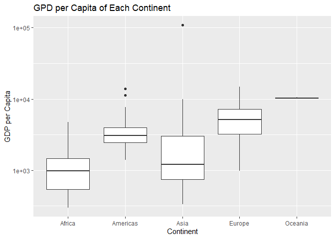
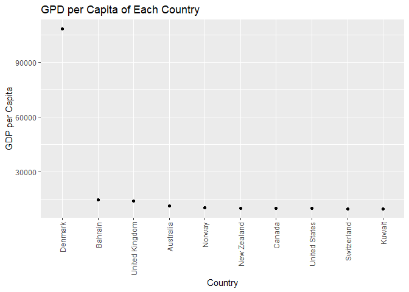
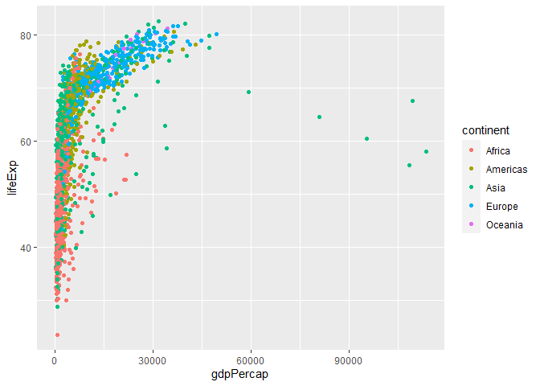

Gapminder
================
(Your name here)
2020-

- <a href="#grading-rubric" id="toc-grading-rubric">Grading Rubric</a>
  - <a href="#individual" id="toc-individual">Individual</a>
  - <a href="#due-date" id="toc-due-date">Due Date</a>
- <a href="#guided-eda" id="toc-guided-eda">Guided EDA</a>
  - <a
    href="#q0-perform-your-first-checks-on-the-dataset-what-variables-are-in-this"
    id="toc-q0-perform-your-first-checks-on-the-dataset-what-variables-are-in-this"><strong>q0</strong>
    Perform your “first checks” on the dataset. What variables are in
    this</a>
  - <a
    href="#q1-determine-the-most-and-least-recent-years-in-the-gapminder-dataset"
    id="toc-q1-determine-the-most-and-least-recent-years-in-the-gapminder-dataset"><strong>q1</strong>
    Determine the most and least recent years in the <code>gapminder</code>
    dataset.</a>
  - <a
    href="#q2-filter-on-years-matching-year_min-and-make-a-plot-of-the-gdp-per-capita-against-continent-choose-an-appropriate-geom_-to-visualize-the-data-what-observations-can-you-make"
    id="toc-q2-filter-on-years-matching-year_min-and-make-a-plot-of-the-gdp-per-capita-against-continent-choose-an-appropriate-geom_-to-visualize-the-data-what-observations-can-you-make"><strong>q2</strong>
    Filter on years matching <code>year_min</code>, and make a plot of the
    GDP per capita against continent. Choose an appropriate
    <code>geom_</code> to visualize the data. What observations can you
    make?</a>
  - <a
    href="#q3-you-should-have-found-at-least-three-outliers-in-q2-but-possibly-many-more-identify-those-outliers-figure-out-which-countries-they-are"
    id="toc-q3-you-should-have-found-at-least-three-outliers-in-q2-but-possibly-many-more-identify-those-outliers-figure-out-which-countries-they-are"><strong>q3</strong>
    You should have found <em>at least</em> three outliers in q2 (but
    possibly many more!). Identify those outliers (figure out which
    countries they are).</a>
  - <a
    href="#q4-create-a-plot-similar-to-yours-from-q2-studying-both-year_min-and-year_max-find-a-way-to-highlight-the-outliers-from-q3-on-your-plot-in-a-way-that-lets-you-identify-which-country-is-which-compare-the-patterns-between-year_min-and-year_max"
    id="toc-q4-create-a-plot-similar-to-yours-from-q2-studying-both-year_min-and-year_max-find-a-way-to-highlight-the-outliers-from-q3-on-your-plot-in-a-way-that-lets-you-identify-which-country-is-which-compare-the-patterns-between-year_min-and-year_max"><strong>q4</strong>
    Create a plot similar to yours from q2 studying both
    <code>year_min</code> and <code>year_max</code>. Find a way to highlight
    the outliers from q3 on your plot <em>in a way that lets you identify
    which country is which</em>. Compare the patterns between
    <code>year_min</code> and <code>year_max</code>.</a>
- <a href="#your-own-eda" id="toc-your-own-eda">Your Own EDA</a>
  - <a
    href="#q5-create-at-least-three-new-figures-below-with-each-figure-try-to-pose-new-questions-about-the-data"
    id="toc-q5-create-at-least-three-new-figures-below-with-each-figure-try-to-pose-new-questions-about-the-data"><strong>q5</strong>
    Create <em>at least</em> three new figures below. With each figure, try
    to pose new questions about the data.</a>

*Purpose*: Learning to do EDA well takes practice! In this challenge
you’ll further practice EDA by first completing a guided exploration,
then by conducting your own investigation. This challenge will also give
you a chance to use the wide variety of visual tools we’ve been
learning.

<!-- include-rubric -->

# Grading Rubric

<!-- -------------------------------------------------- -->

Unlike exercises, **challenges will be graded**. The following rubrics
define how you will be graded, both on an individual and team basis.

## Individual

<!-- ------------------------- -->

| Category    | Needs Improvement                                                                                                | Satisfactory                                                                                                               |
|-------------|------------------------------------------------------------------------------------------------------------------|----------------------------------------------------------------------------------------------------------------------------|
| Effort      | Some task **q**’s left unattempted                                                                               | All task **q**’s attempted                                                                                                 |
| Observed    | Did not document observations, or observations incorrect                                                         | Documented correct observations based on analysis                                                                          |
| Supported   | Some observations not clearly supported by analysis                                                              | All observations clearly supported by analysis (table, graph, etc.)                                                        |
| Assessed    | Observations include claims not supported by the data, or reflect a level of certainty not warranted by the data | Observations are appropriately qualified by the quality & relevance of the data and (in)conclusiveness of the support      |
| Specified   | Uses the phrase “more data are necessary” without clarification                                                  | Any statement that “more data are necessary” specifies which *specific* data are needed to answer what *specific* question |
| Code Styled | Violations of the [style guide](https://style.tidyverse.org/) hinder readability                                 | Code sufficiently close to the [style guide](https://style.tidyverse.org/)                                                 |

## Due Date

<!-- ------------------------- -->

All the deliverables stated in the rubrics above are due **at midnight**
before the day of the class discussion of the challenge. See the
[Syllabus](https://docs.google.com/document/d/1qeP6DUS8Djq_A0HMllMqsSqX3a9dbcx1/edit?usp=sharing&ouid=110386251748498665069&rtpof=true&sd=true)
for more information.

``` r
library(tidyverse)
```

    ## ── Attaching packages ─────────────────────────────────────── tidyverse 1.3.2 ──
    ## ✔ ggplot2 3.3.6     ✔ purrr   0.3.4
    ## ✔ tibble  3.1.8     ✔ dplyr   1.0.9
    ## ✔ tidyr   1.2.0     ✔ stringr 1.4.0
    ## ✔ readr   2.1.2     ✔ forcats 0.5.1
    ## ── Conflicts ────────────────────────────────────────── tidyverse_conflicts() ──
    ## ✖ dplyr::filter() masks stats::filter()
    ## ✖ dplyr::lag()    masks stats::lag()

``` r
library(gapminder)
```

*Background*: [Gapminder](https://www.gapminder.org/about-gapminder/) is
an independent organization that seeks to educate people about the state
of the world. They seek to counteract the worldview constructed by a
hype-driven media cycle, and promote a “fact-based worldview” by
focusing on data. The dataset we’ll study in this challenge is from
Gapminder.

# Guided EDA

<!-- -------------------------------------------------- -->

First, we’ll go through a round of *guided EDA*. Try to pay attention to
the high-level process we’re going through—after this guided round
you’ll be responsible for doing another cycle of EDA on your own!

### **q0** Perform your “first checks” on the dataset. What variables are in this

dataset?

``` r
## TASK: Do your "first checks" here!
glimpse(gapminder)
```

    ## Rows: 1,704
    ## Columns: 6
    ## $ country   <fct> "Afghanistan", "Afghanistan", "Afghanistan", "Afghanistan", …
    ## $ continent <fct> Asia, Asia, Asia, Asia, Asia, Asia, Asia, Asia, Asia, Asia, …
    ## $ year      <int> 1952, 1957, 1962, 1967, 1972, 1977, 1982, 1987, 1992, 1997, …
    ## $ lifeExp   <dbl> 28.801, 30.332, 31.997, 34.020, 36.088, 38.438, 39.854, 40.8…
    ## $ pop       <int> 8425333, 9240934, 10267083, 11537966, 13079460, 14880372, 12…
    ## $ gdpPercap <dbl> 779.4453, 820.8530, 853.1007, 836.1971, 739.9811, 786.1134, …

**Observations**:

- country, continent, year, lifeExp, pop, gdpPercap

### **q1** Determine the most and least recent years in the `gapminder` dataset.

*Hint*: Use the `pull()` function to get a vector out of a tibble.
(Rather than the `$` notation of base R.)

``` r
## TASK: Find the largest and smallest values of `year` in `gapminder`
year_max <- gapminder %>% 
  pull(year) %>%
  max()
  
year_min <- gapminder %>% 
  pull(year) %>%
  min()
```

Use the following test to check your work.

``` r
## NOTE: No need to change this
assertthat::assert_that(year_max %% 7 == 5)
```

    ## [1] TRUE

``` r
assertthat::assert_that(year_max %% 3 == 0)
```

    ## [1] TRUE

``` r
assertthat::assert_that(year_min %% 7 == 6)
```

    ## [1] TRUE

``` r
assertthat::assert_that(year_min %% 3 == 2)
```

    ## [1] TRUE

``` r
if (is_tibble(year_max)) {
  print("year_max is a tibble; try using `pull()` to get a vector")
  assertthat::assert_that(False)
}

print("Nice!")
```

    ## [1] "Nice!"

``` r
gapminder %>%
  filter(year == "1952", country == "Kuwait") %>%
  pull(pop) 
```

    ## [1] 160000

### **q2** Filter on years matching `year_min`, and make a plot of the GDP per capita against continent. Choose an appropriate `geom_` to visualize the data. What observations can you make?

You may encounter difficulties in visualizing these data; if so document
your challenges and attempt to produce the most informative visual you
can.

``` r
## TASK: Create a visual of gdpPercap vs continent
gapminder %>%
  filter(year == year_min) %>%
  ggplot() + 
  geom_boxplot(mapping = aes(x = continent, y = gdpPercap)) +
  ylab("GDP per Capita") +
  xlab("Continent") +
  ggtitle("GPD per Capita of Each Continent")
```

<!-- -->

**Observations**:

- In 1952, Asia has a GDP per capita that is significantly (a couple
  times) higher than other continents.

**Difficulties & Approaches**:

- Write your challenges and your approach to solving them

### **q3** You should have found *at least* three outliers in q2 (but possibly many more!). Identify those outliers (figure out which countries they are).

``` r
## TASK: Identify the outliers from q2
df_q3 <- gapminder %>%
  filter(year == year_min) %>%
  arrange(desc(gdpPercap))

ggplot(df_q3[1:10, ]) + 
  geom_point(mapping = aes(x = rev(reorder(country, gdpPercap)), y = gdpPercap)) +
  ylab("GDP per Capita") +
  xlab("Country") +
  guides(x =  guide_axis(angle = 90)) +
  ggtitle("GPD per Capita of Each Country")
```

<!-- -->

**Observations**:

- Identify the outlier countries from q2
  - Denmark, Bahrain, United Kingdom and Australia.

*Hint*: For the next task, it’s helpful to know a ggplot trick we’ll
learn in an upcoming exercise: You can use the `data` argument inside
any `geom_*` to modify the data that will be plotted *by that geom
only*. For instance, you can use this trick to filter a set of points to
label:

``` r
## NOTE: No need to edit, use ideas from this in q4 below
gapminder %>%
  filter(year == max(year)) %>%

  ggplot(aes(continent, lifeExp)) +
  geom_boxplot() +
  geom_point(
    data = . %>% filter(country %in% c("United Kingdom", "Japan", "Zambia")),
    mapping = aes(color = country),
    size = 2
  )
```

<!-- -->

### **q4** Create a plot similar to yours from q2 studying both `year_min` and `year_max`. Find a way to highlight the outliers from q3 on your plot *in a way that lets you identify which country is which*. Compare the patterns between `year_min` and `year_max`.

*Hint*: We’ve learned a lot of different ways to show multiple
variables; think about using different aesthetics or facets.

``` r
## TASK: Create a visual of gdpPercap vs continent
gapminder %>%
  filter(year == min(year)) %>%
  ggplot(aes(continent, gdpPercap)) +
  geom_boxplot() +
  geom_point(
    data = . %>% filter(country %in% c("Kuwait", "United States", "Nepal")),
    mapping = aes(color = country),
    size = 2
  )
```

<!-- -->

``` r
gapminder %>%
  filter(year == max(year)) %>%
  ggplot(aes(continent, gdpPercap)) +
  geom_boxplot() +
  geom_point(
    data = . %>% filter(country %in% c("Kuwait", "United States", "Nepal")),
    mapping = aes(color = country),
    size = 2
  )
```

<!-- -->

**Observations**:

- In 1952, Kuwait had an extremely high GDP per capita value compared to
  all the other countries in the world. The United States has the
  highest GDP per capita among other countries in Americas. Nepal was
  one of the countries that had the lowest GDP per capita among other
  countries in Asia.
- The range of GDP per capita is much larger compared to what we see in
  the plots of 1952, which potentially stands for a widened gap between
  relatively rich and poor countries over time. In Kuwait, the GPD per
  capita reduced by almost half, while the other two outliers that we
  identified in the 1952 graphs both shifted further away from the mean
  value of their continents.

# Your Own EDA

<!-- -------------------------------------------------- -->

Now it’s your turn! We just went through guided EDA considering the GDP
per capita at two time points. You can continue looking at outliers,
consider different years, repeat the exercise with `lifeExp`, consider
the relationship between variables, or something else entirely.

### **q5** Create *at least* three new figures below. With each figure, try to pose new questions about the data.

``` r
## TASK: Your first graph
gapminder %>%
  ggplot() + 
    geom_point(aes(x = gdpPercap, y = lifeExp, color = continent))
```

<!-- -->

- The relationship between life expectancy and GDP per capita seems to
  be exponential.
- Among all the continents, Asia has very obvious outliers with very
  high GDP per capita values and fairly low life expectancies.

``` r
library(patchwork) 
## TASK: Your second graph
Kuwait <- gapminder %>%
  filter(country == "Kuwait")
Kuwait
```

    ## # A tibble: 12 × 6
    ##    country continent  year lifeExp     pop gdpPercap
    ##    <fct>   <fct>     <int>   <dbl>   <int>     <dbl>
    ##  1 Kuwait  Asia       1952    55.6  160000   108382.
    ##  2 Kuwait  Asia       1957    58.0  212846   113523.
    ##  3 Kuwait  Asia       1962    60.5  358266    95458.
    ##  4 Kuwait  Asia       1967    64.6  575003    80895.
    ##  5 Kuwait  Asia       1972    67.7  841934   109348.
    ##  6 Kuwait  Asia       1977    69.3 1140357    59265.
    ##  7 Kuwait  Asia       1982    71.3 1497494    31354.
    ##  8 Kuwait  Asia       1987    74.2 1891487    28118.
    ##  9 Kuwait  Asia       1992    75.2 1418095    34933.
    ## 10 Kuwait  Asia       1997    76.2 1765345    40301.
    ## 11 Kuwait  Asia       2002    76.9 2111561    35110.
    ## 12 Kuwait  Asia       2007    77.6 2505559    47307.

``` r
Asia_means <- gapminder %>% 
  filter(continent == "Asia") %>% 
  group_by(year) %>%
  summarize(
    mean_gdp = mean(gdpPercap), 
    sum_pop = sum(pop)/1395357351,
    mean_exp = mean(lifeExp)
    ) 
Asia_means
```

    ## # A tibble: 12 × 4
    ##     year mean_gdp sum_pop mean_exp
    ##    <int>    <dbl>   <dbl>    <dbl>
    ##  1  1952    5195.    1        46.3
    ##  2  1957    5788.    1.12     49.3
    ##  3  1962    5729.    1.22     51.6
    ##  4  1967    5971.    1.37     54.7
    ##  5  1972    8187.    1.54     57.3
    ##  6  1977    7791.    1.71     59.6
    ##  7  1982    7434.    1.87     62.6
    ##  8  1987    7608.    2.06     64.9
    ##  9  1992    8640.    2.25     66.5
    ## 10  1997    9834.    2.42     68.0
    ## 11  2002   10174.    2.58     69.2
    ## 12  2007   12473.    2.73     70.7

``` r
world_means <- gapminder %>% 
  group_by(year) %>%
  summarize(
    mean_gdp = mean(gdpPercap), 
    sum_pop = sum(pop)/2406957150,
    mean_exp = mean(lifeExp)
    )
world_means
```

    ## # A tibble: 12 × 4
    ##     year mean_gdp sum_pop mean_exp
    ##    <int>    <dbl>   <dbl>    <dbl>
    ##  1  1952    3725.    1        49.1
    ##  2  1957    4299.    1.11     51.5
    ##  3  1962    4726.    1.20     53.6
    ##  4  1967    5484.    1.34     55.7
    ##  5  1972    6770.    1.49     57.6
    ##  6  1977    7313.    1.63     59.6
    ##  7  1982    7519.    1.78     61.5
    ##  8  1987    7901.    1.95     63.2
    ##  9  1992    8159.    2.12     64.2
    ## 10  1997    9090.    2.29     65.0
    ## 11  2002    9918.    2.45     65.7
    ## 12  2007   11680.    2.60     67.0

``` r
legend_colors <- c("Kuwait" = "blue", "Asia mean" = "red", "World mean" = "orange")

# creating point plots of means
p1 <- ggplot() + 
  geom_line(data = Kuwait, aes(x = year, y = lifeExp, color = "Kuwait")) +
  geom_line(data = Asia_means, aes(x = year, y = mean_exp, color = "Asia mean")) +
  geom_line(data = world_means, aes(x = year, y = mean_exp, color = "World mean")) +
  ylab("Life Expectancy") +
  labs(color = "Region") + 
  scale_color_manual(values = legend_colors) + 
  guides(x =  guide_axis(angle = 90)) +
  theme_bw()

p2 <- ggplot() +
  geom_line(data = Kuwait, aes(x = year, y = pop/160000), color = "blue") +
  geom_line(data = Asia_means, aes(x = year, y = sum_pop), color = "red") +
  geom_line(data = world_means, aes(x = year, y = sum_pop), color = "orange") +
  ylab("Sum of Population (Compared to 1952)") +
  guides(x =  guide_axis(angle = 90)) +
  theme_bw()

p3 <- ggplot() +
  geom_line(data = Kuwait, aes(x = year, y = gdpPercap), color = "blue") +
  geom_line(data = Asia_means, aes(x = year, y = mean_gdp), color = "red") +
  geom_line(data = world_means, aes(x = year, y = mean_gdp), color = "orange") +
  guides(x =  guide_axis(angle = 90)) +
  ylab("GDP per Capita")


p2 + p3 + p1
```

<!-- -->

- In the first graph of population over time, we can see that Kuwait’s
  population growth trend generally lines up with that in Asia and over
  the world.
- In the second graph of GDP per capita over time, Kuwait’s data is
  pretty inconsistent compared to Asia and all over the world. It
  started at a very high value which is approximately 10 times greater
  than the average of Asia and the world, while it experienced abrupt
  decreases from 1957 to 1967 and from 1972 to 1982. The average GDP per
  capita of Asia and the world share a similar trend that increases
  gradually over time.
- The average life expectancy of Asia exceeded that of the world in
  1977, while Kuwait has a much higher value than both from the
  beginning to the end.

``` r
## TASK: Your third graph
# country, continent, year, lifeExp, pop, gdpPercap

coef <- 20
legend_colors <- c("Kuwait" = "red", "Asian" = "blue", "World" = "orange")

gapminder %>%
  filter(country == "Kuwait") %>%
  
  ggplot() + 
    geom_line(aes(x = year, y = gdpPercap), color = "blue") +
    geom_line(aes(x = year, y = pop/coef), color = "red") +
    
    # Custom the Y scales:
    scale_y_continuous(
      
      # Features of the first axis
      name = "GDP Per Capita",
      
      # Add a second axis and specify its features
      sec.axis = sec_axis( trans = ~.*coef, name = "Population")
    ) +
  theme(
    axis.title.y = element_text(color = "blue", size=13),
    axis.title.y.right = element_text(color = "red", size=13)
  ) 
```

<!-- -->

- GDP per capita is calculated from the GDP of the country divided by
  its population. This graph shows that the population of Kuwait by
  almost 10 times from 1952 to 2007, while its GDP per capita dropped by
  more than half over the same time length. This somehow makes sense and
  proves the point that GDP per capita is inversely proportional to the
  population of the same country.
