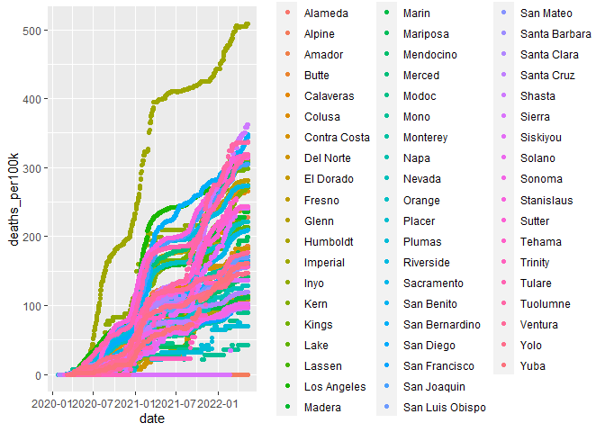
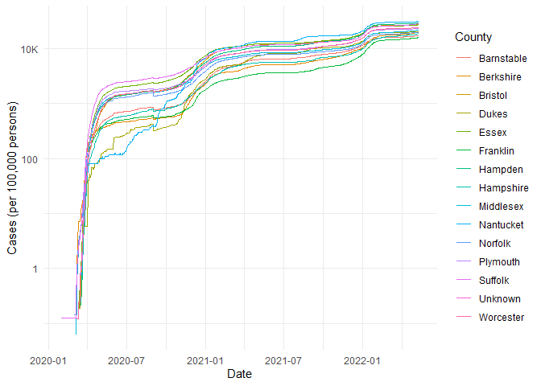

COVID-19
================
(Your name here)
2020-

- <a href="#grading-rubric" id="toc-grading-rubric">Grading Rubric</a>
  - <a href="#individual" id="toc-individual">Individual</a>
  - <a href="#due-date" id="toc-due-date">Due Date</a>
- <a href="#the-big-picture" id="toc-the-big-picture">The Big Picture</a>
- <a href="#get-the-data" id="toc-get-the-data">Get the Data</a>
  - <a href="#navigating-the-census-bureau"
    id="toc-navigating-the-census-bureau">Navigating the Census Bureau</a>
    - <a
      href="#q1-load-table-b01003-into-the-following-tibble-make-sure-the-column-names-are-id-geographic-area-name-estimatetotal-margin-of-errortotal"
      id="toc-q1-load-table-b01003-into-the-following-tibble-make-sure-the-column-names-are-id-geographic-area-name-estimatetotal-margin-of-errortotal"><strong>q1</strong>
      Load Table <code>B01003</code> into the following tibble. Make sure the
      column names are
      <code>id, Geographic Area Name, Estimate!!Total, Margin of Error!!Total</code>.</a>
  - <a href="#automated-download-of-nyt-data"
    id="toc-automated-download-of-nyt-data">Automated Download of NYT
    Data</a>
    - <a
      href="#q2-visit-the-nyt-github-repo-and-find-the-url-for-the-raw-us-county-level-data-assign-that-url-as-a-string-to-the-variable-below"
      id="toc-q2-visit-the-nyt-github-repo-and-find-the-url-for-the-raw-us-county-level-data-assign-that-url-as-a-string-to-the-variable-below"><strong>q2</strong>
      Visit the NYT GitHub repo and find the URL for the <strong>raw</strong>
      US County-level data. Assign that URL as a string to the variable
      below.</a>
- <a href="#join-the-data" id="toc-join-the-data">Join the Data</a>
  - <a href="#q3-process-the-id-column-of-df_pop-to-create-a-fips-column"
    id="toc-q3-process-the-id-column-of-df_pop-to-create-a-fips-column"><strong>q3</strong>
    Process the <code>id</code> column of <code>df_pop</code> to create a
    <code>fips</code> column.</a>
  - <a
    href="#q4-join-df_covid-with-df_q3-by-the-fips-column-use-the-proper-type-of-join-to-preserve-only-the-rows-in-df_covid"
    id="toc-q4-join-df_covid-with-df_q3-by-the-fips-column-use-the-proper-type-of-join-to-preserve-only-the-rows-in-df_covid"><strong>q4</strong>
    Join <code>df_covid</code> with <code>df_q3</code> by the
    <code>fips</code> column. Use the proper type of join to preserve
    <em>only</em> the rows in <code>df_covid</code>.</a>
- <a href="#analyze" id="toc-analyze">Analyze</a>
  - <a href="#normalize" id="toc-normalize">Normalize</a>
    - <a
      href="#q5-use-the-population-estimates-in-df_data-to-normalize-cases-and-deaths-to-produce-per-100000-counts-3-store-these-values-in-the-columns-cases_per100k-and-deaths_per100k"
      id="toc-q5-use-the-population-estimates-in-df_data-to-normalize-cases-and-deaths-to-produce-per-100000-counts-3-store-these-values-in-the-columns-cases_per100k-and-deaths_per100k"><strong>q5</strong>
      Use the <code>population</code> estimates in <code>df_data</code> to
      normalize <code>cases</code> and <code>deaths</code> to produce per
      100,000 counts [3]. Store these values in the columns
      <code>cases_per100k</code> and <code>deaths_per100k</code>.</a>
  - <a href="#guided-eda" id="toc-guided-eda">Guided EDA</a>
    - <a
      href="#q6-compute-the-mean-and-standard-deviation-for-cases_per100k-and-deaths_per100k"
      id="toc-q6-compute-the-mean-and-standard-deviation-for-cases_per100k-and-deaths_per100k"><strong>q6</strong>
      Compute the mean and standard deviation for <code>cases_per100k</code>
      and <code>deaths_per100k</code>.</a>
    - <a
      href="#q7-find-the-top-10-counties-in-terms-of-cases_per100k-and-the-top-10-in-terms-of-deaths_per100k-report-the-population-of-each-county-along-with-the-per-100000-counts-compare-the-counts-against-the-mean-values-you-found-in-q6-note-any-observations"
      id="toc-q7-find-the-top-10-counties-in-terms-of-cases_per100k-and-the-top-10-in-terms-of-deaths_per100k-report-the-population-of-each-county-along-with-the-per-100000-counts-compare-the-counts-against-the-mean-values-you-found-in-q6-note-any-observations"><strong>q7</strong>
      Find the top 10 counties in terms of <code>cases_per100k</code>, and the
      top 10 in terms of <code>deaths_per100k</code>. Report the population of
      each county along with the per-100,000 counts. Compare the counts
      against the mean values you found in q6. Note any observations.</a>
  - <a href="#self-directed-eda" id="toc-self-directed-eda">Self-directed
    EDA</a>
    - <a
      href="#q8-drive-your-own-ship-youve-just-put-together-a-very-rich-dataset-you-now-get-to-explore-pick-your-own-direction-and-generate-at-least-one-punchline-figure-to-document-an-interesting-finding-i-give-a-couple-tips--ideas-below"
      id="toc-q8-drive-your-own-ship-youve-just-put-together-a-very-rich-dataset-you-now-get-to-explore-pick-your-own-direction-and-generate-at-least-one-punchline-figure-to-document-an-interesting-finding-i-give-a-couple-tips--ideas-below"><strong>q8</strong>
      Drive your own ship: You’ve just put together a very rich dataset; you
      now get to explore! Pick your own direction and generate at least one
      punchline figure to document an interesting finding. I give a couple
      tips &amp; ideas below:</a>
    - <a href="#ideas" id="toc-ideas">Ideas</a>
    - <a href="#aside-some-visualization-tricks"
      id="toc-aside-some-visualization-tricks">Aside: Some visualization
      tricks</a>
    - <a href="#geographic-exceptions"
      id="toc-geographic-exceptions">Geographic exceptions</a>
- <a href="#notes" id="toc-notes">Notes</a>

*Purpose*: In this challenge, you’ll learn how to navigate the U.S.
Census Bureau website, programmatically download data from the internet,
and perform a county-level population-weighted analysis of current
COVID-19 trends. This will give you the base for a very deep
investigation of COVID-19, which we’ll build upon for Project 1.

<!-- include-rubric -->

# Grading Rubric

<!-- -------------------------------------------------- -->

Unlike exercises, **challenges will be graded**. The following rubrics
define how you will be graded, both on an individual and team basis.

## Individual

<!-- ------------------------- -->

| Category    | Needs Improvement                                                                                                | Satisfactory                                                                                                               |
|-------------|------------------------------------------------------------------------------------------------------------------|----------------------------------------------------------------------------------------------------------------------------|
| Effort      | Some task **q**’s left unattempted                                                                               | All task **q**’s attempted                                                                                                 |
| Observed    | Did not document observations, or observations incorrect                                                         | Documented correct observations based on analysis                                                                          |
| Supported   | Some observations not clearly supported by analysis                                                              | All observations clearly supported by analysis (table, graph, etc.)                                                        |
| Assessed    | Observations include claims not supported by the data, or reflect a level of certainty not warranted by the data | Observations are appropriately qualified by the quality & relevance of the data and (in)conclusiveness of the support      |
| Specified   | Uses the phrase “more data are necessary” without clarification                                                  | Any statement that “more data are necessary” specifies which *specific* data are needed to answer what *specific* question |
| Code Styled | Violations of the [style guide](https://style.tidyverse.org/) hinder readability                                 | Code sufficiently close to the [style guide](https://style.tidyverse.org/)                                                 |

## Due Date

<!-- ------------------------- -->

All the deliverables stated in the rubrics above are due **at midnight**
before the day of the class discussion of the challenge. See the
[Syllabus](https://docs.google.com/document/d/1qeP6DUS8Djq_A0HMllMqsSqX3a9dbcx1/edit?usp=sharing&ouid=110386251748498665069&rtpof=true&sd=true)
for more information.

``` r
library(tidyverse)
```

    ## ── Attaching packages ─────────────────────────────────────── tidyverse 1.3.2 ──
    ## ✔ ggplot2 3.3.6     ✔ purrr   0.3.4
    ## ✔ tibble  3.1.8     ✔ dplyr   1.0.9
    ## ✔ tidyr   1.2.0     ✔ stringr 1.4.0
    ## ✔ readr   2.1.2     ✔ forcats 0.5.1
    ## ── Conflicts ────────────────────────────────────────── tidyverse_conflicts() ──
    ## ✖ dplyr::filter() masks stats::filter()
    ## ✖ dplyr::lag()    masks stats::lag()

*Background*:
[COVID-19](https://en.wikipedia.org/wiki/Coronavirus_disease_2019) is
the disease caused by the virus SARS-CoV-2. In 2020 it became a global
pandemic, leading to huge loss of life and tremendous disruption to
society. The New York Times (as of writing) publishes up-to-date data on
the progression of the pandemic across the United States—we will study
these data in this challenge.

*Optional Readings*: I’ve found this [ProPublica
piece](https://www.propublica.org/article/how-to-understand-covid-19-numbers)
on “How to understand COVID-19 numbers” to be very informative!

# The Big Picture

<!-- -------------------------------------------------- -->

We’re about to go through *a lot* of weird steps, so let’s first fix the
big picture firmly in mind:

We want to study COVID-19 in terms of data: both case counts (number of
infections) and deaths. We’re going to do a county-level analysis in
order to get a high-resolution view of the pandemic. Since US counties
can vary widely in terms of their population, we’ll need population
estimates in order to compute infection rates (think back to the
`Titanic` challenge).

That’s the high-level view; now let’s dig into the details.

# Get the Data

<!-- -------------------------------------------------- -->

1.  County-level population estimates (Census Bureau)
2.  County-level COVID-19 counts (New York Times)

## Navigating the Census Bureau

<!-- ------------------------- -->

**Steps**: Our objective is to find the 2018 American Community
Survey\[1\] (ACS) Total Population estimates, disaggregated by counties.
To check your results, this is Table `B01003`.

1.  Go to [data.census.gov](data.census.gov).
2.  Scroll down and click `View Tables`.
3.  Apply filters to find the ACS **Total Population** estimates,
    disaggregated by counties. I used the filters:

- `Topics > Populations and People > Counts, Estimates, and Projections > Population Total`
- `Geography > County > All counties in United States`

5.  Select the **Total Population** table and click the `Download`
    button to download the data; make sure to select the 2018 5-year
    estimates.
6.  Unzip and move the data to your `challenges/data` folder.

- Note that the data will have a crazy-long filename like
  `ACSDT5Y2018.B01003_data_with_overlays_2020-07-26T094857.csv`. That’s
  because metadata is stored in the filename, such as the year of the
  estimate (`Y2018`) and my access date (`2020-07-26`). **Your filename
  will vary based on when you download the data**, so make sure to copy
  the filename that corresponds to what you downloaded!

### **q1** Load Table `B01003` into the following tibble. Make sure the column names are `id, Geographic Area Name, Estimate!!Total, Margin of Error!!Total`.

*Hint*: You will need to use the `skip` keyword when loading these data!

``` r
## TASK: Load the census bureau data with the following tibble name.
file_loc = "C:/Users/zxiong/Desktop/Olin/C-Data Science/data-science-curriculum-build/challenges/data/b01003.csv"
df_pop <- read_csv(file_loc, skip = 1)
```

    ## Rows: 3220 Columns: 6
    ## ── Column specification ────────────────────────────────────────────────────────
    ## Delimiter: ","
    ## chr (5): Geography, Geographic Area Name, Annotation of Estimate!!Total, Mar...
    ## dbl (1): Estimate!!Total
    ## 
    ## ℹ Use `spec()` to retrieve the full column specification for this data.
    ## ℹ Specify the column types or set `show_col_types = FALSE` to quiet this message.

``` r
df_pop
```

    ## # A tibble: 3,220 × 6
    ##    Geography      `Geographic Area Name`   Estimate!!T…¹ Annot…² Margi…³ Annot…⁴
    ##    <chr>          <chr>                            <dbl> <chr>   <chr>   <chr>  
    ##  1 0500000US01001 Autauga County, Alabama          55200 null    *****   *****  
    ##  2 0500000US01003 Baldwin County, Alabama         208107 null    *****   *****  
    ##  3 0500000US01005 Barbour County, Alabama          25782 null    *****   *****  
    ##  4 0500000US01007 Bibb County, Alabama             22527 null    *****   *****  
    ##  5 0500000US01009 Blount County, Alabama           57645 null    *****   *****  
    ##  6 0500000US01011 Bullock County, Alabama          10352 null    *****   *****  
    ##  7 0500000US01013 Butler County, Alabama           20025 null    *****   *****  
    ##  8 0500000US01015 Calhoun County, Alabama         115098 null    *****   *****  
    ##  9 0500000US01017 Chambers County, Alabama         33826 null    *****   *****  
    ## 10 0500000US01019 Cherokee County, Alabama         25853 null    *****   *****  
    ## # … with 3,210 more rows, and abbreviated variable names ¹​`Estimate!!Total`,
    ## #   ²​`Annotation of Estimate!!Total`, ³​`Margin of Error!!Total`,
    ## #   ⁴​`Annotation of Margin of Error!!Total`
    ## # ℹ Use `print(n = ...)` to see more rows

*Note*: You can find information on 1-year, 3-year, and 5-year estimates
[here](https://www.census.gov/programs-surveys/acs/guidance/estimates.html).
The punchline is that 5-year estimates are more reliable but less
current.

## Automated Download of NYT Data

<!-- ------------------------- -->

ACS 5-year estimates don’t change all that often, but the COVID-19 data
are changing rapidly. To that end, it would be nice to be able to
*programmatically* download the most recent data for analysis; that way
we can update our analysis whenever we want simply by re-running our
notebook. This next problem will have you set up such a pipeline.

The New York Times is publishing up-to-date data on COVID-19 on
[GitHub](https://github.com/nytimes/covid-19-data).

### **q2** Visit the NYT [GitHub](https://github.com/nytimes/covid-19-data) repo and find the URL for the **raw** US County-level data. Assign that URL as a string to the variable below.

``` r
## TASK: Find the URL for the NYT covid-19 county-level data
url_counties <- "https://raw.githubusercontent.com/nytimes/covid-19-data/master/us-counties.csv"
df_covid <- read_csv("./data/nyt_counties.csv")
```

    ## Rows: 2502832 Columns: 6
    ## ── Column specification ────────────────────────────────────────────────────────
    ## Delimiter: ","
    ## chr  (3): county, state, fips
    ## dbl  (2): cases, deaths
    ## date (1): date
    ## 
    ## ℹ Use `spec()` to retrieve the full column specification for this data.
    ## ℹ Specify the column types or set `show_col_types = FALSE` to quiet this message.

``` r
df_covid
```

    ## # A tibble: 2,502,832 × 6
    ##    date       county      state      fips  cases deaths
    ##    <date>     <chr>       <chr>      <chr> <dbl>  <dbl>
    ##  1 2020-01-21 Snohomish   Washington 53061     1      0
    ##  2 2020-01-22 Snohomish   Washington 53061     1      0
    ##  3 2020-01-23 Snohomish   Washington 53061     1      0
    ##  4 2020-01-24 Cook        Illinois   17031     1      0
    ##  5 2020-01-24 Snohomish   Washington 53061     1      0
    ##  6 2020-01-25 Orange      California 06059     1      0
    ##  7 2020-01-25 Cook        Illinois   17031     1      0
    ##  8 2020-01-25 Snohomish   Washington 53061     1      0
    ##  9 2020-01-26 Maricopa    Arizona    04013     1      0
    ## 10 2020-01-26 Los Angeles California 06037     1      0
    ## # … with 2,502,822 more rows
    ## # ℹ Use `print(n = ...)` to see more rows

Once you have the url, the following code will download a local copy of
the data, then load the data into R.

``` r
## NOTE: No need to change this; just execute
## Set the filename of the data to download
filename_nyt <- "./data/nyt_counties.csv"

## Download the data locally
curl::curl_download(
        url_counties,
        destfile = filename_nyt
      )

## Loads the downloaded csv
df_covid <- read_csv(filename_nyt)
```

    ## Rows: 2502832 Columns: 6
    ## ── Column specification ────────────────────────────────────────────────────────
    ## Delimiter: ","
    ## chr  (3): county, state, fips
    ## dbl  (2): cases, deaths
    ## date (1): date
    ## 
    ## ℹ Use `spec()` to retrieve the full column specification for this data.
    ## ℹ Specify the column types or set `show_col_types = FALSE` to quiet this message.

``` r
# I ended up manually downloading the file because the function didn't quite work for me
```

You can now re-run the chunk above (or the entire notebook) to pull the
most recent version of the data. Thus you can periodically re-run this
notebook to check in on the pandemic as it evolves.

*Note*: You should feel free to copy-paste the code above for your own
future projects!

# Join the Data

<!-- -------------------------------------------------- -->

To get a sense of our task, let’s take a glimpse at our two data
sources.

``` r
## NOTE: No need to change this; just execute
df_pop %>% glimpse
```

    ## Rows: 3,220
    ## Columns: 6
    ## $ Geography                              <chr> "0500000US01001", "0500000US010…
    ## $ `Geographic Area Name`                 <chr> "Autauga County, Alabama", "Bal…
    ## $ `Estimate!!Total`                      <dbl> 55200, 208107, 25782, 22527, 57…
    ## $ `Annotation of Estimate!!Total`        <chr> "null", "null", "null", "null",…
    ## $ `Margin of Error!!Total`               <chr> "*****", "*****", "*****", "***…
    ## $ `Annotation of Margin of Error!!Total` <chr> "*****", "*****", "*****", "***…

``` r
df_covid %>% glimpse
```

    ## Rows: 2,502,832
    ## Columns: 6
    ## $ date   <date> 2020-01-21, 2020-01-22, 2020-01-23, 2020-01-24, 2020-01-24, 20…
    ## $ county <chr> "Snohomish", "Snohomish", "Snohomish", "Cook", "Snohomish", "Or…
    ## $ state  <chr> "Washington", "Washington", "Washington", "Illinois", "Washingt…
    ## $ fips   <chr> "53061", "53061", "53061", "17031", "53061", "06059", "17031", …
    ## $ cases  <dbl> 1, 1, 1, 1, 1, 1, 1, 1, 1, 1, 1, 1, 1, 1, 1, 1, 1, 1, 1, 1, 1, …
    ## $ deaths <dbl> 0, 0, 0, 0, 0, 0, 0, 0, 0, 0, 0, 0, 0, 0, 0, 0, 0, 0, 0, 0, 0, …

To join these datasets, we’ll need to use [FIPS county
codes](https://en.wikipedia.org/wiki/FIPS_county_code).\[2\] The last
`5` digits of the `id` column in `df_pop` is the FIPS county code, while
the NYT data `df_covid` already contains the `fips`.

### **q3** Process the `id` column of `df_pop` to create a `fips` column.

``` r
## TASK: Create a `fips` column by extracting the county code
df_q3 <- df_pop %>% 
  group_by(Geography) %>%
  mutate(
    fips = substr(Geography, 10, 14)
    )
df_q3 
```

    ## # A tibble: 3,220 × 7
    ## # Groups:   Geography [3,220]
    ##    Geography      `Geographic Area Name`   Estim…¹ Annot…² Margi…³ Annot…⁴ fips 
    ##    <chr>          <chr>                      <dbl> <chr>   <chr>   <chr>   <chr>
    ##  1 0500000US01001 Autauga County, Alabama    55200 null    *****   *****   01001
    ##  2 0500000US01003 Baldwin County, Alabama   208107 null    *****   *****   01003
    ##  3 0500000US01005 Barbour County, Alabama    25782 null    *****   *****   01005
    ##  4 0500000US01007 Bibb County, Alabama       22527 null    *****   *****   01007
    ##  5 0500000US01009 Blount County, Alabama     57645 null    *****   *****   01009
    ##  6 0500000US01011 Bullock County, Alabama    10352 null    *****   *****   01011
    ##  7 0500000US01013 Butler County, Alabama     20025 null    *****   *****   01013
    ##  8 0500000US01015 Calhoun County, Alabama   115098 null    *****   *****   01015
    ##  9 0500000US01017 Chambers County, Alabama   33826 null    *****   *****   01017
    ## 10 0500000US01019 Cherokee County, Alabama   25853 null    *****   *****   01019
    ## # … with 3,210 more rows, and abbreviated variable names ¹​`Estimate!!Total`,
    ## #   ²​`Annotation of Estimate!!Total`, ³​`Margin of Error!!Total`,
    ## #   ⁴​`Annotation of Margin of Error!!Total`
    ## # ℹ Use `print(n = ...)` to see more rows

Use the following test to check your answer.

``` r
## NOTE: No need to change this
## Check known county
assertthat::assert_that(
              (df_q3 %>%
              filter(str_detect(`Geographic Area Name`, "Autauga County")) %>%
              pull(fips)) == "01001"
            )
```

    ## [1] TRUE

``` r
print("Very good!")
```

    ## [1] "Very good!"

### **q4** Join `df_covid` with `df_q3` by the `fips` column. Use the proper type of join to preserve *only* the rows in `df_covid`.

``` r
## TASK: Join df_covid and df_q3 by fips.
df_q4 <- merge(
  df_covid, 
  df_q3[c("Estimate!!Total", "fips")], 
  by = "fips"
  ) %>%
  mutate(fips = fct_reorder(fips, date))
df_q4
```

    ##        fips       date   county   state cases deaths Estimate!!Total
    ## 1     01001 2021-06-17  Autauga Alabama  7230    113           55200
    ## 2     01001 2021-10-26  Autauga Alabama 10061    148           55200
    ## 3     01001 2021-08-02  Autauga Alabama  7585    114           55200
    ## 4     01001 2020-09-14  Autauga Alabama  1585     24           55200
    ## 5     01001 2021-01-08  Autauga Alabama  4770     50           55200
    ## 6     01001 2020-12-25  Autauga Alabama  3990     46           55200
    ## 7     01001 2021-01-15  Autauga Alabama  5103     55           55200
    ## 8     01001 2021-12-25  Autauga Alabama 10785    160           55200
    ## 9     01001 2022-01-19  Autauga Alabama 12833    163           55200
    ## 10    01001 2022-04-11  Autauga Alabama 15747    213           55200
    ## 11    01001 2020-08-01  Autauga Alabama  1030     21           55200
    ## 12    01001 2021-09-25  Autauga Alabama  9652    137           55200
    ## 13    01001 2021-02-26  Autauga Alabama  6228     90           55200
    ## 14    01001 2020-08-09  Autauga Alabama  1217     22           55200
    ## 15    01001 2022-02-02  Autauga Alabama 14826    168           55200
    ## 16    01001 2020-12-14  Autauga Alabama  3329     41           55200
    ## 17    01001 2021-07-15  Autauga Alabama  7329    113           55200
    ## 18    01001 2021-01-14  Autauga Alabama  5075     55           55200
    ## 19    01001 2020-09-17  Autauga Alabama  1624     24           55200
    ## 20    01001 2020-10-05  Autauga Alabama  1831     27           55200
    ## 21    01001 2020-10-02  Autauga Alabama  1805     27           55200
    ## 22    01001 2022-02-27  Autauga Alabama 15509    194           55200
    ## 23    01001 2020-04-05  Autauga Alabama    12      0           55200
    ## 24    01001 2022-04-22  Autauga Alabama 15762    215           55200
    ## 25    01001 2021-09-09  Autauga Alabama  9145    119           55200
    ## 26    01001 2021-11-18  Autauga Alabama 10439    156           55200
    ## 27    01001 2020-05-17  Autauga Alabama   110      4           55200
    ## 28    01001 2021-06-14  Autauga Alabama  7229    113           55200
    ## 29    01001 2020-06-12  Autauga Alabama   327      6           55200
    ## 30    01001 2020-06-24  Autauga Alabama   469     11           55200
    ## 31    01001 2020-11-24  Autauga Alabama  2661     39           55200
    ## 32    01001 2021-10-22  Autauga Alabama  9967    148           55200
    ## 33    01001 2021-03-31  Autauga Alabama  6589     99           55200
    ## 34    01001 2021-01-01  Autauga Alabama  4239     50           55200
    ## 35    01001 2021-01-25  Autauga Alabama  5407     62           55200
    ## 36    01001 2020-09-01  Autauga Alabama  1453     24           55200
    ## 37    01001 2020-10-31  Autauga Alabama  2159     31           55200
    ## 38    01001 2021-11-07  Autauga Alabama 10331    151           55200
    ## 39    01001 2022-02-01  Autauga Alabama 14782    167           55200
    ## 40    01001 2020-12-15  Autauga Alabama  3426     43           55200
    ## 41    01001 2020-03-26  Autauga Alabama     6      0           55200
    ## 42    01001 2020-09-06  Autauga Alabama  1498     24           55200
    ## 43    01001 2020-09-26  Autauga Alabama  1764     25           55200
    ## 44    01001 2021-04-22  Autauga Alabama  6819    107           55200
    ## 45    01001 2020-04-11  Autauga Alabama    19      1           55200
    ## 46    01001 2020-11-25  Autauga Alabama  2686     41           55200
    ## 47    01001 2021-12-24  Autauga Alabama 10758    160           55200
    ## 48    01001 2021-08-18  Autauga Alabama  8132    115           55200
    ## 49    01001 2021-12-20  Autauga Alabama 10679    159           55200
    ## 50    01001 2020-08-11  Autauga Alabama  1215     23           55200
    ## 51    01001 2020-10-21  Autauga Alabama  2021     30           55200
    ## 52    01001 2020-05-13  Autauga Alabama    93      4           55200
    ## 53    01001 2021-08-30  Autauga Alabama  8719    118           55200
    ## 54    01001 2021-02-01  Autauga Alabama  5683     69           55200
    ## 55    01001 2021-05-17  Autauga Alabama  7010    108           55200
    ## 56    01001 2020-04-14  Autauga Alabama    23      1           55200
    ## 57    01001 2020-04-23  Autauga Alabama    33      2           55200
    ## 58    01001 2021-10-03  Autauga Alabama  9780    142           55200
    ## 59    01001 2020-10-15  Autauga Alabama  1949     28           55200
    ## 60    01001 2021-05-23  Autauga Alabama  7118    110           55200
    ## 61    01001 2020-08-24  Autauga Alabama  1351     23           55200
    ## 62    01001 2021-02-04  Autauga Alabama  5811     74           55200
    ## 63    01001 2020-04-20  Autauga Alabama    28      1           55200
    ## 64    01001 2021-11-26  Autauga Alabama 10512    157           55200
    ## 65    01001 2022-01-27  Autauga Alabama 13251    163           55200
    ## 66    01001 2020-12-11  Autauga Alabama  3233     42           55200
    ## 67    01001 2022-04-19  Autauga Alabama 15755    215           55200
    ## 68    01001 2020-05-23  Autauga Alabama   155      3           55200
    ## 69    01001 2021-08-06  Autauga Alabama  7694    114           55200
    ## 70    01001 2021-08-08  Autauga Alabama  7745    114           55200
    ## 71    01001 2020-12-06  Autauga Alabama  3005     42           55200
    ## 72    01001 2021-09-11  Autauga Alabama  9246    119           55200
    ## 73    01001 2020-12-26  Autauga Alabama  3999     46           55200
    ## 74    01001 2021-02-08  Autauga Alabama  5881     77           55200
    ## 75    01001 2020-03-31  Autauga Alabama     7      0           55200
    ## 76    01001 2021-09-10  Autauga Alabama  9207    119           55200
    ## 77    01001 2022-02-26  Autauga Alabama 15503    194           55200
    ## 78    01001 2020-04-10  Autauga Alabama    17      1           55200
    ## 79    01001 2022-03-29  Autauga Alabama 15619    211           55200
    ## 80    01001 2021-05-16  Autauga Alabama  7005    108           55200
    ## 81    01001 2021-08-22  Autauga Alabama  8311    115           55200
    ## 82    01001 2021-08-14  Autauga Alabama  7931    114           55200
    ## 83    01001 2021-11-20  Autauga Alabama 10468    156           55200
    ## 84    01001 2021-06-24  Autauga Alabama  7244    113           55200
    ## 85    01001 2021-03-19  Autauga Alabama  6498     98           55200
    ## 86    01001 2021-07-05  Autauga Alabama  7262    113           55200
    ## 87    01001 2021-07-29  Autauga Alabama  7493    114           55200
    ## 88    01001 2021-06-10  Autauga Alabama  7211    113           55200
    ## 89    01001 2020-09-12  Autauga Alabama  1565     24           55200
    ## 90    01001 2021-11-08  Autauga Alabama 10335    151           55200
    ## 91    01001 2022-02-18  Autauga Alabama 15409    183           55200
    ## 92    01001 2022-01-14  Autauga Alabama 12180    162           55200
    ## 93    01001 2022-05-12  Autauga Alabama 15860    216           55200
    ## 94    01001 2020-03-25  Autauga Alabama     4      0           55200
    ## 95    01001 2020-09-20  Autauga Alabama  1690     24           55200
    ## 96    01001 2021-01-26  Autauga Alabama  5440     65           55200
    ## 97    01001 2021-05-02  Autauga Alabama  6909    107           55200
    ## 98    01001 2020-09-09  Autauga Alabama  1522     24           55200
    ## 99    01001 2021-04-10  Autauga Alabama  6715    103           55200
    ## 100   01001 2021-05-13  Autauga Alabama  6938    108           55200
    ## 101   01001 2020-05-24  Autauga Alabama   159      3           55200
    ## 102   01001 2020-05-12  Autauga Alabama    91      4           55200
    ## 103   01001 2021-01-18  Autauga Alabama  5198     55           55200
    ## 104   01001 2022-02-22  Autauga Alabama 15442    184           55200
    ## 105   01001 2020-07-06  Autauga Alabama   618     13           55200
    ## 106   01001 2021-04-20  Autauga Alabama  6773    106           55200
    ## 107   01001 2020-06-08  Autauga Alabama   273      5           55200
    ## 108   01001 2021-11-29  Autauga Alabama 10517    157           55200
    ## 109   01001 2020-09-30  Autauga Alabama  1791     27           55200
    ## 110   01001 2021-05-09  Autauga Alabama  6920    108           55200
    ## 111   01001 2020-05-08  Autauga Alabama    67      4           55200
    ## 112   01001 2021-12-13  Autauga Alabama 10605    158           55200
    ## 113   01001 2020-08-05  Autauga Alabama  1073     22           55200
    ## 114   01001 2021-11-30  Autauga Alabama 10526    157           55200
    ## 115   01001 2021-08-29  Autauga Alabama  8657    118           55200
    ## 116   01001 2022-02-14  Autauga Alabama 15325    176           55200
    ## 117   01001 2020-04-16  Autauga Alabama    25      2           55200
    ## 118   01001 2021-09-02  Autauga Alabama  8873    119           55200
    ## 119   01001 2021-02-18  Autauga Alabama  6071     84           55200
    ## 120   01001 2021-12-17  Autauga Alabama 10661    159           55200
    ## 121   01001 2021-03-30  Autauga Alabama  6580     99           55200
    ## 122   01001 2021-04-25  Autauga Alabama  6879    107           55200
    ## 123   01001 2022-05-07  Autauga Alabama 15840    216           55200
    ## 124   01001 2021-09-22  Autauga Alabama  9568    133           55200
    ## 125   01001 2021-05-24  Autauga Alabama  7118    110           55200
    ## 126   01001 2021-11-19  Autauga Alabama 10457    156           55200
    ## 127   01001 2020-04-03  Autauga Alabama    12      0           55200
    ## 128   01001 2021-06-03  Autauga Alabama  7172    111           55200
    ## 129   01001 2020-07-21  Autauga Alabama   865     21           55200
    ## 130   01001 2020-12-30  Autauga Alabama  4164     48           55200
    ## 131   01001 2020-10-14  Autauga Alabama  1928     28           55200
    ## 132   01001 2020-09-16  Autauga Alabama  1619     24           55200
    ## 133   01001 2021-02-14  Autauga Alabama  6023     84           55200
    ## 134   01001 2021-05-27  Autauga Alabama  7141    110           55200
    ## 135   01001 2020-08-20  Autauga Alabama  1298     23           55200
    ## 136   01001 2021-03-11  Autauga Alabama  6409     95           55200
    ## 137   01001 2020-09-27  Autauga Alabama  1773     25           55200
    ## 138   01001 2020-06-03  Autauga Alabama   240      5           55200
    ## 139   01001 2020-11-14  Autauga Alabama  2435     36           55200
    ## 140   01001 2021-07-26  Autauga Alabama  7435    113           55200
    ## 141   01001 2021-12-03  Autauga Alabama 10545    157           55200
    ## 142   01001 2022-01-13  Autauga Alabama 12180    162           55200
    ## 143   01001 2020-04-02  Autauga Alabama    10      0           55200
    ## 144   01001 2020-07-17  Autauga Alabama   789     21           55200
    ## 145   01001 2021-12-12  Autauga Alabama 10599    158           55200
    ## 146   01001 2021-07-25  Autauga Alabama  7419    113           55200
    ## 147   01001 2020-03-30  Autauga Alabama     7      0           55200
    ## 148   01001 2021-08-07  Autauga Alabama  7745    114           55200
    ## 149   01001 2020-04-09  Autauga Alabama    17      1           55200
    ## 150   01001 2022-03-22  Autauga Alabama 15593    210           55200
    ## 151   01001 2022-03-11  Autauga Alabama 15563    208           55200
    ## 152   01001 2021-12-05  Autauga Alabama 10561    157           55200
    ## 153   01001 2021-04-21  Autauga Alabama  6793    107           55200
    ## 154   01001 2020-05-27  Autauga Alabama   192      3           55200
    ## 155   01001 2020-07-08  Autauga Alabama   651     13           55200
    ## 156   01001 2021-11-14  Autauga Alabama 10403    154           55200
    ## 157   01001 2021-10-01  Autauga Alabama  9761    142           55200
    ## 158   01001 2020-11-08  Autauga Alabama  2283     30           55200
    ## 159   01001 2021-09-17  Autauga Alabama  9439    124           55200
    ## 160   01001 2021-03-26  Autauga Alabama  6543     99           55200
    ## 161   01001 2021-07-22  Autauga Alabama  7388    113           55200
    ## 162   01001 2021-03-12  Autauga Alabama  6409     95           55200
    ## 163   01001 2022-05-13  Autauga Alabama 15863    216           55200
    ## 164   01001 2020-07-25  Autauga Alabama   932     21           55200
    ## 165   01001 2021-09-21  Autauga Alabama  9546    131           55200
    ## 166   01001 2021-10-02  Autauga Alabama  9777    142           55200
    ## 167   01001 2020-05-25  Autauga Alabama   168      3           55200
    ## 168   01001 2020-05-14  Autauga Alabama   104      4           55200
    ## 169   01001 2021-11-06  Autauga Alabama 10327    151           55200
    ## 170   01001 2022-04-07  Autauga Alabama 15742    213           55200
    ## 171   01001 2022-04-27  Autauga Alabama 15821    216           55200
    ## 172   01001 2022-01-31  Autauga Alabama 14742    166           55200
    ## 173   01001 2022-01-17  Autauga Alabama 12682    163           55200
    ## 174   01001 2020-11-13  Autauga Alabama  2417     36           55200
    ## 175   01001 2021-11-17  Autauga Alabama 10423    155           55200
    ## 176   01001 2020-10-26  Autauga Alabama  2074     31           55200
    ## 177   01001 2022-01-06  Autauga Alabama 11638    161           55200
    ## 178   01001 2020-10-25  Autauga Alabama  2059     31           55200
    ## 179   01001 2020-12-04  Autauga Alabama  2945     42           55200
    ## 180   01001 2020-03-29  Autauga Alabama     6      0           55200
    ## 181   01001 2020-09-08  Autauga Alabama  1508     24           55200
    ## 182   01001 2021-12-15  Autauga Alabama 10641    158           55200
    ## 183   01001 2022-02-13  Autauga Alabama 15307    176           55200
    ## 184   01001 2021-10-14  Autauga Alabama  9874    146           55200
    ## 185   01001 2022-01-02  Autauga Alabama 11184    160           55200
    ## 186   01001 2020-05-06  Autauga Alabama    58      3           55200
    ## 187   01001 2020-07-02  Autauga Alabama   561     13           55200
    ## 188   01001 2020-06-17  Autauga Alabama   375      7           55200
    ## 189   01001 2020-12-18  Autauga Alabama  3647     44           55200
    ## 190   01001 2021-04-24  Autauga Alabama  6876    107           55200
    ## 191   01001 2021-05-07  Autauga Alabama  6918    108           55200
    ## 192   01001 2021-01-30  Autauga Alabama  5596     69           55200
    ## 193   01001 2020-06-29  Autauga Alabama   527     12           55200
    ## 194   01001 2021-12-06  Autauga Alabama 10562    157           55200
    ## 195   01001 2021-02-21  Autauga Alabama  6117     85           55200
    ## 196   01001 2021-11-24  Autauga Alabama 10508    156           55200
    ## 197   01001 2020-06-25  Autauga Alabama   479     11           55200
    ## 198   01001 2020-08-07  Autauga Alabama  1113     22           55200
    ## 199   01001 2020-12-22  Autauga Alabama  3841     44           55200
    ## 200   01001 2021-10-06  Autauga Alabama  9810    143           55200
    ## 201   01001 2022-03-07  Autauga Alabama 15539    203           55200
    ## 202   01001 2020-04-25  Autauga Alabama    37      2           55200
    ## 203   01001 2020-10-19  Autauga Alabama  1999     28           55200
    ## 204   01001 2021-02-09  Autauga Alabama  5910     77           55200
    ## 205   01001 2021-03-08  Autauga Alabama  6364     92           55200
    ## 206   01001 2022-03-17  Autauga Alabama 15578    209           55200
    ## 207   01001 2020-04-28  Autauga Alabama    40      4           55200
    ## 208   01001 2020-08-16  Autauga Alabama  1273     23           55200
    ## 209   01001 2022-03-16  Autauga Alabama 15575    209           55200
    ## 210   01001 2020-10-28  Autauga Alabama  2103     31           55200
    ## 211   01001 2021-12-29  Autauga Alabama 10886    160           55200
    ## 212   01001 2021-06-23  Autauga Alabama  7244    113           55200
    ## 213   01001 2020-10-04  Autauga Alabama  1828     27           55200
    ## 214   01001 2022-05-11  Autauga Alabama 15853    216           55200
    ## 215   01001 2020-05-31  Autauga Alabama   221      4           55200
    ## 216   01001 2020-08-19  Autauga Alabama  1298     23           55200
    ## 217   01001 2022-03-12  Autauga Alabama 15563    208           55200
    ## 218   01001 2021-07-18  Autauga Alabama  7347    113           55200
    ## 219   01001 2021-09-08  Autauga Alabama  9108    119           55200
    ## 220   01001 2020-07-15  Autauga Alabama   756     19           55200
    ## 221   01001 2021-03-29  Autauga Alabama  6577     99           55200
    ## 222   01001 2021-02-28  Autauga Alabama  6264     91           55200
    ## 223   01001 2020-04-27  Autauga Alabama    39      3           55200
    ## 224   01001 2020-08-25  Autauga Alabama  1355     23           55200
    ## 225   01001 2021-02-05  Autauga Alabama  5824     76           55200
    ## 226   01001 2021-11-02  Autauga Alabama 10271    148           55200
    ## 227   01001 2021-07-19  Autauga Alabama  7350    113           55200
    ## 228   01001 2021-02-19  Autauga Alabama  6079     85           55200
    ## 229   01001 2021-11-11  Autauga Alabama 10373    152           55200
    ## 230   01001 2021-06-28  Autauga Alabama  7247    113           55200
    ## 231   01001 2022-02-05  Autauga Alabama 14999    170           55200
    ## 232   01001 2020-06-20  Autauga Alabama   431      9           55200
    ## 233   01001 2020-06-01  Autauga Alabama   234      5           55200
    ## 234   01001 2020-05-01  Autauga Alabama    42      3           55200
    ## 235   01001 2021-04-04  Autauga Alabama  6619    102           55200
    ## 236   01001 2021-06-13  Autauga Alabama  7215    113           55200
    ## 237   01001 2022-01-10  Autauga Alabama 12029    162           55200
    ## 238   01001 2020-10-18  Autauga Alabama  1989     28           55200
    ## 239   01001 2020-06-10  Autauga Alabama   296      6           55200
    ## 240   01001 2022-03-08  Autauga Alabama 15547    204           55200
    ## 241   01001 2022-04-12  Autauga Alabama 15749    214           55200
    ## 242   01001 2020-06-23  Autauga Alabama   453      9           55200
    ## 243   01001 2020-12-08  Autauga Alabama  3087     42           55200
    ## 244   01001 2020-11-18  Autauga Alabama  2529     37           55200
    ## 245   01001 2021-10-27  Autauga Alabama 10083    148           55200
    ## 246   01001 2021-08-21  Autauga Alabama  8286    115           55200
    ## 247   01001 2021-11-27  Autauga Alabama 10517    157           55200
    ## 248   01001 2021-04-13  Autauga Alabama  6734    103           55200
    ## 249   01001 2021-02-02  Autauga Alabama  5723     70           55200
    ## 250   01001 2021-08-11  Autauga Alabama  7854    114           55200
    ## 251   01001 2020-07-03  Autauga Alabama   568     13           55200
    ## 252   01001 2020-04-21  Autauga Alabama    30      1           55200
    ## 253   01001 2021-06-07  Autauga Alabama  7206    113           55200
    ## 254   01001 2020-10-24  Autauga Alabama  2048     31           55200
    ## 255   01001 2021-01-24  Autauga Alabama  5376     62           55200
    ## 256   01001 2021-05-01  Autauga Alabama  6907    107           55200
    ## 257   01001 2022-01-04  Autauga Alabama 11347    161           55200
    ## 258   01001 2020-09-25  Autauga Alabama  1757     25           55200
    ## 259   01001 2020-08-29  Autauga Alabama  1400     23           55200
    ## 260   01001 2020-12-28  Autauga Alabama  4065     47           55200
    ## 261   01001 2021-11-21  Autauga Alabama 10471    156           55200
    ## 262   01001 2020-05-21  Autauga Alabama   147      3           55200
    ## 263   01001 2020-08-26  Autauga Alabama  1366     23           55200
    ## 264   01001 2020-05-07  Autauga Alabama    61      3           55200
    ## 265   01001 2022-03-25  Autauga Alabama 15611    209           55200
    ## 266   01001 2020-04-06  Autauga Alabama    12      1           55200
    ## 267   01001 2021-01-05  Autauga Alabama  4546     50           55200
    ## 268   01001 2020-12-19  Autauga Alabama  3698     44           55200
    ## 269   01001 2021-01-17  Autauga Alabama  5184     55           55200
    ## 270   01001 2021-09-23  Autauga Alabama  9611    135           55200
    ## 271   01001 2021-10-09  Autauga Alabama  9843    144           55200
    ## 272   01001 2021-03-18  Autauga Alabama  6495     98           55200
    ## 273   01001 2021-09-26  Autauga Alabama  9667    137           55200
    ## 274   01001 2021-03-13  Autauga Alabama  6416     95           55200
    ## 275   01001 2020-07-20  Autauga Alabama   857     21           55200
    ## 276   01001 2022-01-11  Autauga Alabama 12102    162           55200
    ## 277   01001 2020-11-29  Autauga Alabama  2751     42           55200
    ## 278   01001 2021-06-27  Autauga Alabama  7244    113           55200
    ## 279   01001 2021-08-26  Autauga Alabama  8486    115           55200
    ## 280   01001 2021-01-22  Autauga Alabama  5327     61           55200
    ## 281   01001 2020-09-23  Autauga Alabama  1715     25           55200
    ## 282   01001 2020-11-21  Autauga Alabama  2597     39           55200
    ## 283   01001 2020-05-16  Autauga Alabama   110      4           55200
    ## 284   01001 2020-11-06  Autauga Alabama  2242     30           55200
    ## 285   01001 2021-04-23  Autauga Alabama  6835    107           55200
    ## 286   01001 2021-04-14  Autauga Alabama  6740    103           55200
    ## 287   01001 2021-08-10  Autauga Alabama  7818    114           55200
    ## 288   01001 2021-02-23  Autauga Alabama  6143     84           55200
    ## 289   01001 2020-07-04  Autauga Alabama   591     13           55200
    ## 290   01001 2021-05-10  Autauga Alabama  6920    108           55200
    ## 291   01001 2022-05-03  Autauga Alabama 15835    216           55200
    ## 292   01001 2021-03-23  Autauga Alabama  6525     99           55200
    ## 293   01001 2020-07-13  Autauga Alabama   728     16           55200
    ## 294   01001 2020-09-04  Autauga Alabama  1475     24           55200
    ## 295   01001 2020-09-28  Autauga Alabama  1785     25           55200
    ## 296   01001 2021-10-13  Autauga Alabama  9865    145           55200
    ## 297   01001 2022-03-15  Autauga Alabama 15571    209           55200
    ## 298   01001 2021-07-07  Autauga Alabama  7277    113           55200
    ## 299   01001 2021-09-13  Autauga Alabama  9317    119           55200
    ## 300   01001 2020-06-22  Autauga Alabama   442      9           55200
    ## 301   01001 2021-12-04  Autauga Alabama 10560    157           55200
    ## 302   01001 2022-04-26  Autauga Alabama 15818    215           55200
    ## 303   01001 2020-06-04  Autauga Alabama   242      5           55200
    ## 304   01001 2021-03-01  Autauga Alabama  6270     91           55200
    ## 305   01001 2022-04-13  Autauga Alabama 15751    214           55200
    ## 306   01001 2022-04-08  Autauga Alabama 15744    213           55200
    ## 307   01001 2021-05-28  Autauga Alabama  7142    110           55200
    ## 308   01001 2021-01-19  Autauga Alabama  5227     55           55200
    ## 309   01001 2022-03-04  Autauga Alabama 15530    199           55200
    ## 310   01001 2021-10-31  Autauga Alabama 10252    148           55200
    ## 311   01001 2020-04-13  Autauga Alabama    19      1           55200
    ## 312   01001 2021-04-27  Autauga Alabama  6889    107           55200
    ## 313   01001 2021-09-20  Autauga Alabama  9527    127           55200
    ## 314   01001 2020-06-16  Autauga Alabama   373      7           55200
    ## 315   01001 2020-05-05  Autauga Alabama    53      3           55200
    ## 316   01001 2021-02-15  Autauga Alabama  6024     84           55200
    ## 317   01001 2020-08-27  Autauga Alabama  1377     23           55200
    ## 318   01001 2020-08-30  Autauga Alabama  1438     23           55200
    ## 319   01001 2020-12-27  Autauga Alabama  4029     47           55200
    ## 320   01001 2021-09-29  Autauga Alabama  9715    140           55200
    ## 321   01001 2021-09-06  Autauga Alabama  9048    119           55200
    ## 322   01001 2021-03-15  Autauga Alabama  6471     95           55200
    ## 323   01001 2021-11-10  Autauga Alabama 10355    152           55200
    ## 324   01001 2020-06-30  Autauga Alabama   537     12           55200
    ## 325   01001 2020-05-15  Autauga Alabama   103      4           55200
    ## 326   01001 2020-07-05  Autauga Alabama   615     13           55200
    ## 327   01001 2020-11-01  Autauga Alabama  2173     31           55200
    ## 328   01001 2020-11-07  Autauga Alabama  2267     30           55200
    ## 329   01001 2021-05-19  Autauga Alabama  7017    108           55200
    ## 330   01001 2022-03-24  Autauga Alabama 15607    209           55200
    ## 331   01001 2020-06-05  Autauga Alabama   249      5           55200
    ## 332   01001 2020-10-12  Autauga Alabama  1911     28           55200
    ## 333   01001 2021-04-09  Autauga Alabama  6710    103           55200
    ## 334   01001 2021-11-05  Autauga Alabama 10314    151           55200
    ## 335   01001 2021-11-23  Autauga Alabama 10495    156           55200
    ## 336   01001 2021-08-09  Autauga Alabama  7788    114           55200
    ## 337   01001 2022-04-06  Autauga Alabama 15724    213           55200
    ## 338   01001 2020-03-24  Autauga Alabama     1      0           55200
    ## 339   01001 2021-08-05  Autauga Alabama  7670    114           55200
    ## 340   01001 2022-03-10  Autauga Alabama 15559    208           55200
    ## 341   01001 2020-12-07  Autauga Alabama  3043     42           55200
    ## 342   01001 2020-11-20  Autauga Alabama  2580     39           55200
    ## 343   01001 2021-07-14  Autauga Alabama  7320    113           55200
    ## 344   01001 2021-05-30  Autauga Alabama  7142    110           55200
    ## 345   01001 2021-11-22  Autauga Alabama 10477    156           55200
    ## 346   01001 2022-02-28  Autauga Alabama 15510    194           55200
    ## 347   01001 2021-02-07  Autauga Alabama  5869     77           55200
    ## 348   01001 2021-11-13  Autauga Alabama 10401    154           55200
    ## 349   01001 2021-06-30  Autauga Alabama  7257    113           55200
    ## 350   01001 2021-05-15  Autauga Alabama  7001    108           55200
    ## 351   01001 2021-08-20  Autauga Alabama  8199    115           55200
    ## 352   01001 2022-01-24  Autauga Alabama 13251    163           55200
    ## 353   01001 2022-04-15  Autauga Alabama 15752    214           55200
    ## 354   01001 2020-12-09  Autauga Alabama  3117     42           55200
    ## 355   01001 2020-06-19  Autauga Alabama   411      8           55200
    ## 356   01001 2021-10-04  Autauga Alabama  9790    142           55200
    ## 357   01001 2022-03-03  Autauga Alabama 15526    199           55200
    ## 358   01001 2020-05-30  Autauga Alabama   216      4           55200
    ## 359   01001 2021-06-22  Autauga Alabama  7242    113           55200
    ## 360   01001 2021-05-04  Autauga Alabama  6910    107           55200
    ## 361   01001 2021-02-22  Autauga Alabama  6121     85           55200
    ## 362   01001 2021-04-03  Autauga Alabama  6617    102           55200
    ## 363   01001 2022-04-17  Autauga Alabama 15752    214           55200
    ## 364   01001 2021-12-16  Autauga Alabama 10646    158           55200
    ## 365   01001 2021-03-04  Autauga Alabama  6324     92           55200
    ## 366   01001 2022-01-20  Autauga Alabama 12928    163           55200
    ## 367   01001 2022-02-19  Autauga Alabama 15420    184           55200
    ## 368   01001 2022-03-21  Autauga Alabama 15586    210           55200
    ## 369   01001 2020-10-03  Autauga Alabama  1818     27           55200
    ## 370   01001 2020-07-12  Autauga Alabama   706     16           55200
    ## 371   01001 2020-04-26  Autauga Alabama    37      2           55200
    ## 372   01001 2020-04-18  Autauga Alabama    25      2           55200
    ## 373   01001 2020-05-29  Autauga Alabama   212      3           55200
    ## 374   01001 2020-11-28  Autauga Alabama  2735     42           55200
    ## 375   01001 2020-04-07  Autauga Alabama    12      1           55200
    ## 376   01001 2022-05-05  Autauga Alabama 15840    216           55200
    ## 377   01001 2020-08-13  Autauga Alabama  1250     23           55200
    ## 378   01001 2021-05-20  Autauga Alabama  7049    109           55200
    ## 379   01001 2020-11-11  Autauga Alabama  2351     32           55200
    ## 380   01001 2021-06-06  Autauga Alabama  7186    112           55200
    ## 381   01001 2022-01-05  Autauga Alabama 11478    161           55200
    ## 382   01001 2022-01-15  Autauga Alabama 12180    162           55200
    ## 383   01001 2021-10-17  Autauga Alabama  9901    146           55200
    ## 384   01001 2020-05-03  Autauga Alabama    48      3           55200
    ## 385   01001 2021-01-21  Autauga Alabama  5270     61           55200
    ## 386   01001 2020-12-05  Autauga Alabama  2979     42           55200
    ## 387   01001 2021-09-05  Autauga Alabama  9012    119           55200
    ## 388   01001 2020-04-22  Autauga Alabama    32      2           55200
    ## 389   01001 2020-04-01  Autauga Alabama    10      0           55200
    ## 390   01001 2021-10-07  Autauga Alabama  9826    144           55200
    ## 391   01001 2021-01-09  Autauga Alabama  4847     53           55200
    ## 392   01001 2021-03-25  Autauga Alabama  6540     99           55200
    ## 393   01001 2020-06-02  Autauga Alabama   240      5           55200
    ## 394   01001 2021-07-04  Autauga Alabama  7262    113           55200
    ## 395   01001 2022-03-31  Autauga Alabama 15655    211           55200
    ## 396   01001 2022-01-23  Autauga Alabama 13191    163           55200
    ## 397   01001 2022-01-18  Autauga Alabama 12738    163           55200
    ## 398   01001 2020-10-22  Autauga Alabama  2023     30           55200
    ## 399   01001 2021-11-28  Autauga Alabama 10517    157           55200
    ## 400   01001 2020-08-18  Autauga Alabama  1291     23           55200
    ## 401   01001 2020-08-17  Autauga Alabama  1274     23           55200
    ## 402   01001 2021-02-25  Autauga Alabama  6203     89           55200
    ## 403   01001 2020-07-01  Autauga Alabama   553     12           55200
    ## 404   01001 2020-11-17  Autauga Alabama  2506     37           55200
    ## 405   01001 2021-07-08  Autauga Alabama  7277    113           55200
    ## 406   01001 2021-02-10  Autauga Alabama  5930     79           55200
    ## 407   01001 2021-07-16  Autauga Alabama  7341    113           55200
    ## 408   01001 2022-02-15  Autauga Alabama 15350    177           55200
    ## 409   01001 2021-11-15  Autauga Alabama 10407    154           55200
    ## 410   01001 2021-10-30  Autauga Alabama 10239    148           55200
    ## 411   01001 2020-05-02  Autauga Alabama    45      3           55200
    ## 412   01001 2021-09-24  Autauga Alabama  9642    137           55200
    ## 413   01001 2021-07-30  Autauga Alabama  7493    114           55200
    ## 414   01001 2020-10-09  Autauga Alabama  1882     28           55200
    ## 415   01001 2021-03-22  Autauga Alabama  6517     98           55200
    ## 416   01001 2021-10-18  Autauga Alabama  9904    146           55200
    ## 417   01001 2022-04-04  Autauga Alabama 15689    213           55200
    ## 418   01001 2020-07-30  Autauga Alabama  1002     21           55200
    ## 419   01001 2021-04-02  Autauga Alabama  6606     99           55200
    ## 420   01001 2021-07-23  Autauga Alabama  7394    113           55200
    ## 421   01001 2022-02-24  Autauga Alabama 15468    192           55200
    ## 422   01001 2021-05-05  Autauga Alabama  6914    108           55200
    ## 423   01001 2020-10-08  Autauga Alabama  1863     28           55200
    ## 424   01001 2020-09-11  Autauga Alabama  1551     24           55200
    ## 425   01001 2021-04-19  Autauga Alabama  6763    106           55200
    ## 426   01001 2020-04-24  Autauga Alabama    36      2           55200
    ## 427   01001 2020-11-03  Autauga Alabama  2197     31           55200
    ## 428   01001 2020-07-24  Autauga Alabama   921     21           55200
    ## 429   01001 2021-12-18  Autauga Alabama 10663    159           55200
    ## 430   01001 2020-05-11  Autauga Alabama    84      4           55200
    ## 431   01001 2022-04-16  Autauga Alabama 15752    214           55200
    ## 432   01001 2021-04-15  Autauga Alabama  6748    103           55200
    ## 433   01001 2022-03-06  Autauga Alabama 15530    199           55200
    ## 434   01001 2021-07-13  Autauga Alabama  7306    113           55200
    ## 435   01001 2022-05-06  Autauga Alabama 15840    216           55200
    ## 436   01001 2021-03-17  Autauga Alabama  6483     96           55200
    ## 437   01001 2021-08-03  Autauga Alabama  7615    114           55200
    ## 438   01001 2020-09-07  Autauga Alabama  1504     24           55200
    ## 439   01001 2022-03-28  Autauga Alabama 15616    210           55200
    ## 440   01001 2022-01-26  Autauga Alabama 13251    163           55200
    ## 441   01001 2021-05-12  Autauga Alabama  6928    108           55200
    ## 442   01001 2022-04-21  Autauga Alabama 15759    215           55200
    ## 443   01001 2021-05-21  Autauga Alabama  7106    109           55200
    ## 444   01001 2021-12-09  Autauga Alabama 10584    157           55200
    ## 445   01001 2022-02-23  Autauga Alabama 15451    184           55200
    ## 446   01001 2020-11-04  Autauga Alabama  2212     31           55200
    ## 447   01001 2020-05-19  Autauga Alabama   127      4           55200
    ## 448   01001 2020-07-31  Autauga Alabama  1015     21           55200
    ## 449   01001 2021-03-02  Autauga Alabama  6303     91           55200
    ## 450   01001 2020-08-06  Autauga Alabama  1096     22           55200
    ## 451   01001 2021-01-12  Autauga Alabama  4970     55           55200
    ## 452   01001 2020-07-19  Autauga Alabama   842     21           55200
    ## 453   01001 2022-02-11  Autauga Alabama 15216    173           55200
    ## 454   01001 2022-02-17  Autauga Alabama 15387    181           55200
    ## 455   01001 2022-03-30  Autauga Alabama 15621    211           55200
    ## 456   01001 2021-08-28  Autauga Alabama  8637    118           55200
    ## 457   01001 2020-09-03  Autauga Alabama  1466     24           55200
    ## 458   01001 2020-09-29  Autauga Alabama  1787     27           55200
    ## 459   01001 2021-04-18  Autauga Alabama  6763    106           55200
    ## 460   01001 2021-03-07  Autauga Alabama  6347     92           55200
    ## 461   01001 2020-05-26  Autauga Alabama   189      3           55200
    ## 462   01001 2021-10-25  Autauga Alabama 10048    148           55200
    ## 463   01001 2022-01-28  Autauga Alabama 13251    163           55200
    ## 464   01001 2020-12-13  Autauga Alabama  3300     41           55200
    ## 465   01001 2021-04-29  Autauga Alabama  6897    107           55200
    ## 466   01001 2021-06-16  Autauga Alabama  7230    113           55200
    ## 467   01001 2021-06-04  Autauga Alabama  7186    112           55200
    ## 468   01001 2020-05-04  Autauga Alabama    53      3           55200
    ## 469   01001 2021-01-07  Autauga Alabama  4705     50           55200
    ## 470   01001 2021-12-02  Autauga Alabama 10531    157           55200
    ## 471   01001 2022-02-20  Autauga Alabama 15431    184           55200
    ## 472   01001 2020-08-02  Autauga Alabama  1052     21           55200
    ## 473   01001 2021-06-18  Autauga Alabama  7241    113           55200
    ## 474   01001 2021-03-28  Autauga Alabama  6570     99           55200
    ## 475   01001 2021-12-11  Autauga Alabama 10596    158           55200
    ## 476   01001 2021-12-21  Autauga Alabama 10692    160           55200
    ## 477   01001 2021-07-27  Autauga Alabama  7456    114           55200
    ## 478   01001 2020-12-21  Autauga Alabama  3780     44           55200
    ## 479   01001 2022-03-14  Autauga Alabama 15569    209           55200
    ## 480   01001 2020-09-22  Autauga Alabama  1714     25           55200
    ## 481   01001 2021-06-08  Autauga Alabama  7206    113           55200
    ## 482   01001 2020-04-29  Autauga Alabama    43      4           55200
    ## 483   01001 2021-01-29  Autauga Alabama  5596     69           55200
    ## 484   01001 2020-06-27  Autauga Alabama   498     12           55200
    ## 485   01001 2021-05-31  Autauga Alabama  7142    110           55200
    ## 486   01001 2021-02-12  Autauga Alabama  5984     84           55200
    ## 487   01001 2020-08-21  Autauga Alabama  1313     23           55200
    ## 488   01001 2020-10-10  Autauga Alabama  1898     28           55200
    ## 489   01001 2021-06-25  Autauga Alabama  7244    113           55200
    ## 490   01001 2021-08-17  Autauga Alabama  8091    115           55200
    ## 491   01001 2021-07-01  Autauga Alabama  7257    113           55200
    ## 492   01001 2021-01-16  Autauga Alabama  5154     55           55200
    ## 493   01001 2021-12-01  Autauga Alabama 10527    157           55200
    ## 494   01001 2022-01-07  Autauga Alabama 11789    162           55200
    ## 495   01001 2020-11-27  Autauga Alabama  2716     42           55200
    ## 496   01001 2021-09-12  Autauga Alabama  9287    119           55200
    ## 497   01001 2020-08-10  Autauga Alabama  1222     22           55200
    ## 498   01001 2021-01-04  Autauga Alabama  4336     50           55200
    ## 499   01001 2020-03-28  Autauga Alabama     6      0           55200
    ## 500   01001 2020-06-28  Autauga Alabama   503     12           55200
    ## 501   01001 2021-07-11  Autauga Alabama  7299    113           55200
    ## 502   01001 2021-10-29  Autauga Alabama 10228    148           55200
    ## 503   01001 2021-10-12  Autauga Alabama  9858    144           55200
    ## 504   01001 2021-08-15  Autauga Alabama  8025    114           55200
    ## 505   01001 2020-04-17  Autauga Alabama    26      2           55200
    ## 506   01001 2022-05-02  Autauga Alabama 15833    216           55200
    ## 507   01001 2022-01-09  Autauga Alabama 11975    162           55200
    ## 508   01001 2021-12-22  Autauga Alabama 10711    160           55200
    ## 509   01001 2021-05-03  Autauga Alabama  6910    107           55200
    ## 510   01001 2020-10-11  Autauga Alabama  1905     28           55200
    ## 511   01001 2021-12-30  Autauga Alabama 10953    160           55200
    ## 512   01001 2020-05-18  Autauga Alabama   120      4           55200
    ## 513   01001 2021-09-03  Autauga Alabama  8909    119           55200
    ## 514   01001 2021-08-27  Autauga Alabama  8550    117           55200
    ## 515   01001 2021-07-24  Autauga Alabama  7402    113           55200
    ## 516   01001 2020-05-28  Autauga Alabama   205      3           55200
    ## 517   01001 2022-02-10  Autauga Alabama 15155    173           55200
    ## 518   01001 2020-10-13  Autauga Alabama  1924     28           55200
    ## 519   01001 2022-04-25  Autauga Alabama 15814    215           55200
    ## 520   01001 2020-07-16  Autauga Alabama   780     20           55200
    ## 521   01001 2021-01-28  Autauga Alabama  5554     69           55200
    ## 522   01001 2020-11-15  Autauga Alabama  2456     36           55200
    ## 523   01001 2020-10-29  Autauga Alabama  2126     31           55200
    ## 524   01001 2021-09-14  Autauga Alabama  9351    119           55200
    ## 525   01001 2021-06-21  Autauga Alabama  7242    113           55200
    ## 526   01001 2021-05-06  Autauga Alabama  6914    108           55200
    ## 527   01001 2022-04-03  Autauga Alabama 15659    211           55200
    ## 528   01001 2020-11-09  Autauga Alabama  2304     30           55200
    ## 529   01001 2020-08-22  Autauga Alabama  1322     23           55200
    ## 530   01001 2021-07-12  Autauga Alabama  7306    113           55200
    ## 531   01001 2022-05-08  Autauga Alabama 15840    216           55200
    ## 532   01001 2021-03-20  Autauga Alabama  6510     98           55200
    ## 533   01001 2020-04-12  Autauga Alabama    19      1           55200
    ## 534   01001 2020-12-02  Autauga Alabama  2873     42           55200
    ## 535   01001 2021-09-07  Autauga Alabama  9063    119           55200
    ## 536   01001 2020-11-05  Autauga Alabama  2230     31           55200
    ## 537   01001 2022-05-09  Autauga Alabama 15846    216           55200
    ## 538   01001 2020-12-29  Autauga Alabama  4105     47           55200
    ## 539   01001 2021-08-04  Autauga Alabama  7635    114           55200
    ## 540   01001 2022-04-09  Autauga Alabama 15744    213           55200
    ## 541   01001 2021-04-06  Autauga Alabama  6644    102           55200
    ## 542   01001 2022-01-30  Autauga Alabama 14498    166           55200
    ## 543   01001 2021-11-01  Autauga Alabama 10258    148           55200
    ## 544   01001 2022-02-09  Autauga Alabama 15121    173           55200
    ## 545   01001 2021-01-13  Autauga Alabama  4998     55           55200
    ## 546   01001 2021-08-16  Autauga Alabama  8061    114           55200
    ## 547   01001 2022-05-10  Autauga Alabama 15852    216           55200
    ## 548   01001 2020-07-22  Autauga Alabama   886     21           55200
    ## 549   01001 2021-10-20  Autauga Alabama  9910    146           55200
    ## 550   01001 2022-03-20  Autauga Alabama 15582    210           55200
    ## 551   01001 2021-07-06  Autauga Alabama  7262    113           55200
    ## 552   01001 2021-04-17  Autauga Alabama  6760    106           55200
    ## 553   01001 2020-07-23  Autauga Alabama   905     21           55200
    ## 554   01001 2021-11-04  Autauga Alabama 10304    151           55200
    ## 555   01001 2020-08-15  Autauga Alabama  1262     23           55200
    ## 556   01001 2021-10-05  Autauga Alabama  9799    142           55200
    ## 557   01001 2022-02-25  Autauga Alabama 15479    194           55200
    ## 558   01001 2020-07-26  Autauga Alabama   942     21           55200
    ## 559   01001 2021-11-09  Autauga Alabama 10350    152           55200
    ## 560   01001 2021-04-07  Autauga Alabama  6675    102           55200
    ## 561   01001 2021-01-23  Autauga Alabama  5358     62           55200
    ## 562   01001 2020-07-29  Autauga Alabama   987     21           55200
    ## 563   01001 2021-07-09  Autauga Alabama  7294    113           55200
    ## 564   01001 2021-12-28  Autauga Alabama 10828    160           55200
    ## 565   01001 2022-05-04  Autauga Alabama 15839    216           55200
    ## 566   01001 2020-06-21  Autauga Alabama   434      9           55200
    ## 567   01001 2020-05-22  Autauga Alabama   149      3           55200
    ## 568   01001 2020-07-07  Autauga Alabama   644     13           55200
    ## 569   01001 2022-03-09  Autauga Alabama 15555    205           55200
    ## 570   01001 2021-04-12  Autauga Alabama  6727    103           55200
    ## 571   01001 2020-06-26  Autauga Alabama   488     11           55200
    ## 572   01001 2021-12-27  Autauga Alabama 10800    160           55200
    ## 573   01001 2020-11-16  Autauga Alabama  2481     36           55200
    ## 574   01001 2021-11-03  Autauga Alabama 10284    150           55200
    ## 575   01001 2021-09-01  Autauga Alabama  8798    118           55200
    ## 576   01001 2021-02-16  Autauga Alabama  6038     84           55200
    ## 577   01001 2022-02-07  Autauga Alabama 15046    171           55200
    ## 578   01001 2021-12-10  Autauga Alabama 10589    158           55200
    ## 579   01001 2020-05-10  Autauga Alabama    74      4           55200
    ## 580   01001 2021-03-06  Autauga Alabama  6344     92           55200
    ## 581   01001 2022-01-16  Autauga Alabama 12624    163           55200
    ## 582   01001 2020-06-18  Autauga Alabama   400      8           55200
    ## 583   01001 2020-08-23  Autauga Alabama  1324     23           55200
    ## 584   01001 2021-06-20  Autauga Alabama  7241    113           55200
    ## 585   01001 2022-04-01  Autauga Alabama 15659    211           55200
    ## 586   01001 2021-06-19  Autauga Alabama  7241    113           55200
    ## 587   01001 2022-04-24  Autauga Alabama 15762    215           55200
    ## 588   01001 2021-03-09  Autauga Alabama  6371     92           55200
    ## 589   01001 2021-10-19  Autauga Alabama  9909    146           55200
    ## 590   01001 2020-08-03  Autauga Alabama  1066     21           55200
    ## 591   01001 2021-02-06  Autauga Alabama  5856     77           55200
    ## 592   01001 2022-02-03  Autauga Alabama 14826    168           55200
    ## 593   01001 2022-02-06  Autauga Alabama 14999    170           55200
    ## 594   01001 2022-01-01  Autauga Alabama 11018    160           55200
    ## 595   01001 2021-10-10  Autauga Alabama  9850    144           55200
    ## 596   01001 2020-12-01  Autauga Alabama  2818     42           55200
    ## 597   01001 2021-06-05  Autauga Alabama  7186    112           55200
    ## 598   01001 2020-10-17  Autauga Alabama  1983     28           55200
    ## 599   01001 2020-06-13  Autauga Alabama   335      6           55200
    ## 600   01001 2020-12-24  Autauga Alabama  3942     46           55200
    ## 601   01001 2021-05-26  Autauga Alabama  7135    110           55200
    ## 602   01001 2021-06-11  Autauga Alabama  7215    113           55200
    ## 603   01001 2020-08-14  Autauga Alabama  1252     23           55200
    ## 604   01001 2021-10-23  Autauga Alabama 10043    148           55200
    ## 605   01001 2020-06-06  Autauga Alabama   260      5           55200
    ## 606   01001 2021-12-23  Autauga Alabama 10746    160           55200
    ## 607   01001 2020-08-04  Autauga Alabama  1073     21           55200
    ## 608   01001 2021-09-28  Autauga Alabama  9703    139           55200
    ## 609   01001 2021-02-24  Autauga Alabama  6172     85           55200
    ## 610   01001 2020-11-19  Autauga Alabama  2554     39           55200
    ## 611   01001 2020-08-31  Autauga Alabama  1442     23           55200
    ## 612   01001 2020-08-12  Autauga Alabama  1241     23           55200
    ## 613   01001 2020-04-04  Autauga Alabama    12      0           55200
    ## 614   01001 2020-09-18  Autauga Alabama  1664     24           55200
    ## 615   01001 2022-02-12  Autauga Alabama 15288    176           55200
    ## 616   01001 2021-03-27  Autauga Alabama  6562     99           55200
    ## 617   01001 2021-07-20  Autauga Alabama  7365    113           55200
    ## 618   01001 2021-03-16  Autauga Alabama  6474     95           55200
    ## 619   01001 2021-02-11  Autauga Alabama  5970     81           55200
    ## 620   01001 2021-01-11  Autauga Alabama  4902     55           55200
    ## 621   01001 2020-11-12  Autauga Alabama  2385     32           55200
    ## 622   01001 2020-11-10  Autauga Alabama  2328     30           55200
    ## 623   01001 2021-03-05  Autauga Alabama  6333     92           55200
    ## 624   01001 2021-12-31  Autauga Alabama 11018    160           55200
    ## 625   01001 2021-03-21  Autauga Alabama  6513     98           55200
    ## 626   01001 2020-12-17  Autauga Alabama  3570     43           55200
    ## 627   01001 2021-09-19  Autauga Alabama  9511    127           55200
    ## 628   01001 2021-12-14  Autauga Alabama 10637    158           55200
    ## 629   01001 2020-07-27  Autauga Alabama   965     21           55200
    ## 630   01001 2022-01-03  Autauga Alabama 11256    160           55200
    ## 631   01001 2020-11-22  Autauga Alabama  2617     39           55200
    ## 632   01001 2020-09-10  Autauga Alabama  1544     24           55200
    ## 633   01001 2021-04-30  Autauga Alabama  6904    107           55200
    ## 634   01001 2021-08-25  Autauga Alabama  8332    115           55200
    ## 635   01001 2021-08-31  Autauga Alabama  8758    118           55200
    ## 636   01001 2020-12-31  Autauga Alabama  4190     48           55200
    ## 637   01001 2020-06-11  Autauga Alabama   316      6           55200
    ## 638   01001 2022-02-04  Autauga Alabama 14970    170           55200
    ## 639   01001 2021-08-01  Autauga Alabama  7563    114           55200
    ## 640   01001 2021-05-11  Autauga Alabama  6926    108           55200
    ## 641   01001 2022-03-02  Autauga Alabama 15528    198           55200
    ## 642   01001 2022-04-18  Autauga Alabama 15752    214           55200
    ## 643   01001 2020-06-14  Autauga Alabama   361      6           55200
    ## 644   01001 2022-04-28  Autauga Alabama 15826    216           55200
    ## 645   01001 2022-05-01  Autauga Alabama 15827    216           55200
    ## 646   01001 2021-08-12  Autauga Alabama  7890    114           55200
    ## 647   01001 2021-04-28  Autauga Alabama  6890    107           55200
    ## 648   01001 2021-12-08  Autauga Alabama 10575    157           55200
    ## 649   01001 2021-04-01  Autauga Alabama  6595     99           55200
    ## 650   01001 2020-04-08  Autauga Alabama    12      1           55200
    ## 651   01001 2022-02-08  Autauga Alabama 15089    171           55200
    ## 652   01001 2020-10-27  Autauga Alabama  2082     31           55200
    ## 653   01001 2022-04-10  Autauga Alabama 15744    213           55200
    ## 654   01001 2021-03-14  Autauga Alabama  6426     95           55200
    ## 655   01001 2020-11-02  Autauga Alabama  2186     31           55200
    ## 656   01001 2022-02-16  Autauga Alabama 15366    181           55200
    ## 657   01001 2020-12-03  Autauga Alabama  2893     42           55200
    ## 658   01001 2022-04-20  Autauga Alabama 15757    215           55200
    ## 659   01001 2021-11-16  Autauga Alabama 10419    154           55200
    ## 660   01001 2021-02-20  Autauga Alabama  6092     85           55200
    ## 661   01001 2021-06-15  Autauga Alabama  7230    113           55200
    ## 662   01001 2020-09-21  Autauga Alabama  1691     24           55200
    ## 663   01001 2021-05-14  Autauga Alabama  6971    108           55200
    ## 664   01001 2021-02-27  Autauga Alabama  6248     91           55200
    ## 665   01001 2021-11-12  Autauga Alabama 10383    152           55200
    ## 666   01001 2020-03-27  Autauga Alabama     6      0           55200
    ## 667   01001 2020-05-20  Autauga Alabama   136      3           55200
    ## 668   01001 2020-10-07  Autauga Alabama  1852     27           55200
    ## 669   01001 2021-02-17  Autauga Alabama  6050     84           55200
    ## 670   01001 2020-07-11  Autauga Alabama   684     15           55200
    ## 671   01001 2021-09-18  Autauga Alabama  9493    127           55200
    ## 672   01001 2022-04-02  Autauga Alabama 15659    211           55200
    ## 673   01001 2020-09-15  Autauga Alabama  1601     24           55200
    ## 674   01001 2021-07-02  Autauga Alabama  7262    113           55200
    ## 675   01001 2020-12-12  Autauga Alabama  3258     41           55200
    ## 676   01001 2021-07-10  Autauga Alabama  7299    113           55200
    ## 677   01001 2021-04-26  Autauga Alabama  6882    107           55200
    ## 678   01001 2020-11-26  Autauga Alabama  2704     42           55200
    ## 679   01001 2021-01-27  Autauga Alabama  5499     67           55200
    ## 680   01001 2022-04-30  Autauga Alabama 15827    216           55200
    ## 681   01001 2020-06-09  Autauga Alabama   283      5           55200
    ## 682   01001 2021-01-03  Autauga Alabama  4305     50           55200
    ## 683   01001 2022-01-21  Autauga Alabama 13019    163           55200
    ## 684   01001 2020-04-30  Autauga Alabama    42      4           55200
    ## 685   01001 2020-10-23  Autauga Alabama  2030     30           55200
    ## 686   01001 2020-09-02  Autauga Alabama  1452     24           55200
    ## 687   01001 2021-08-19  Autauga Alabama  8162    115           55200
    ## 688   01001 2022-03-18  Autauga Alabama 15582    210           55200
    ## 689   01001 2022-04-05  Autauga Alabama 15692    213           55200
    ## 690   01001 2020-09-24  Autauga Alabama  1738     25           55200
    ## 691   01001 2021-06-29  Autauga Alabama  7247    113           55200
    ## 692   01001 2021-07-31  Autauga Alabama  7537    114           55200
    ## 693   01001 2021-09-15  Autauga Alabama  9371    119           55200
    ## 694   01001 2022-02-21  Autauga Alabama 15436    184           55200
    ## 695   01001 2022-03-23  Autauga Alabama 15596    210           55200
    ## 696   01001 2021-07-03  Autauga Alabama  7262    113           55200
    ## 697   01001 2021-11-25  Autauga Alabama 10512    157           55200
    ## 698   01001 2021-10-11  Autauga Alabama  9851    144           55200
    ## 699   01001 2021-10-28  Autauga Alabama 10219    148           55200
    ## 700   01001 2021-04-11  Autauga Alabama  6723    103           55200
    ## 701   01001 2021-06-01  Autauga Alabama  7150    111           55200
    ## 702   01001 2020-07-10  Autauga Alabama   670     15           55200
    ## 703   01001 2020-12-20  Autauga Alabama  3741     44           55200
    ## 704   01001 2021-10-16  Autauga Alabama  9893    146           55200
    ## 705   01001 2020-09-05  Autauga Alabama  1492     24           55200
    ## 706   01001 2020-07-09  Autauga Alabama   661     14           55200
    ## 707   01001 2021-07-17  Autauga Alabama  7346    113           55200
    ## 708   01001 2021-08-13  Autauga Alabama  7931    114           55200
    ## 709   01001 2021-04-16  Autauga Alabama  6750    103           55200
    ## 710   01001 2021-02-03  Autauga Alabama  5753     71           55200
    ## 711   01001 2022-04-14  Autauga Alabama 15751    214           55200
    ## 712   01001 2022-04-23  Autauga Alabama 15762    215           55200
    ## 713   01001 2021-10-21  Autauga Alabama  9954    146           55200
    ## 714   01001 2020-12-23  Autauga Alabama  3889     46           55200
    ## 715   01001 2020-08-28  Autauga Alabama  1389     23           55200
    ## 716   01001 2022-01-08  Autauga Alabama 11856    162           55200
    ## 717   01001 2022-01-29  Autauga Alabama 14291    166           55200
    ## 718   01001 2021-03-10  Autauga Alabama  6400     93           55200
    ## 719   01001 2021-01-06  Autauga Alabama  4645     50           55200
    ## 720   01001 2020-10-01  Autauga Alabama  1798     28           55200
    ## 721   01001 2022-03-05  Autauga Alabama 15530    199           55200
    ## 722   01001 2021-08-24  Autauga Alabama  8332    115           55200
    ## 723   01001 2021-07-21  Autauga Alabama  7375    113           55200
    ## 724   01001 2021-06-26  Autauga Alabama  7244    113           55200
    ## 725   01001 2020-10-30  Autauga Alabama  2141     31           55200
    ## 726   01001 2022-01-12  Autauga Alabama 12180    162           55200
    ## 727   01001 2021-09-30  Autauga Alabama  9744    140           55200
    ## 728   01001 2021-01-02  Autauga Alabama  4268     50           55200
    ## 729   01001 2022-03-26  Autauga Alabama 15611    209           55200
    ## 730   01001 2020-05-09  Autauga Alabama    68      4           55200
    ## 731   01001 2020-10-06  Autauga Alabama  1839     27           55200
    ## 732   01001 2022-03-13  Autauga Alabama 15563    208           55200
    ## 733   01001 2020-08-08  Autauga Alabama  1134     22           55200
    ## 734   01001 2021-10-08  Autauga Alabama  9839    144           55200
    ## 735   01001 2021-12-19  Autauga Alabama 10669    159           55200
    ## 736   01001 2020-11-23  Autauga Alabama  2634     39           55200
    ## 737   01001 2022-03-27  Autauga Alabama 15611    209           55200
    ## 738   01001 2020-07-14  Autauga Alabama   746     18           55200
    ## 739   01001 2021-01-10  Autauga Alabama  4879     54           55200
    ## 740   01001 2020-12-16  Autauga Alabama  3510     43           55200
    ## 741   01001 2021-04-08  Autauga Alabama  6702    103           55200
    ## 742   01001 2021-02-13  Autauga Alabama  6002     84           55200
    ## 743   01001 2021-03-24  Autauga Alabama  6533     99           55200
    ## 744   01001 2021-01-31  Autauga Alabama  5669     69           55200
    ## 745   01001 2020-06-15  Autauga Alabama   368      6           55200
    ## 746   01001 2022-01-25  Autauga Alabama 13251    163           55200
    ## 747   01001 2021-01-20  Autauga Alabama  5257     55           55200
    ## 748   01001 2021-08-23  Autauga Alabama  8332    115           55200
    ## 749   01001 2022-03-19  Autauga Alabama 15582    210           55200
    ## 750   01001 2020-04-19  Autauga Alabama    27      2           55200
    ## 751   01001 2020-11-30  Autauga Alabama  2780     42           55200
    ## 752   01001 2021-05-22  Autauga Alabama  7113    110           55200
    ## 753   01001 2020-07-18  Autauga Alabama   827     21           55200
    ## 754   01001 2021-12-26  Autauga Alabama 10789    160           55200
    ## 755   01001 2021-10-15  Autauga Alabama  9883    146           55200
    ## 756   01001 2021-09-27  Autauga Alabama  9691    137           55200
    ## 757   01001 2020-12-10  Autauga Alabama  3186     42           55200
    ## 758   01001 2020-04-15  Autauga Alabama    25      1           55200
    ## 759   01001 2021-03-03  Autauga Alabama  6313     91           55200
    ## 760   01001 2021-04-05  Autauga Alabama  6620    102           55200
    ## 761   01001 2022-04-29  Autauga Alabama 15827    216           55200
    ## 762   01001 2021-09-04  Autauga Alabama  8959    119           55200
    ## 763   01001 2022-03-01  Autauga Alabama 15520    195           55200
    ## 764   01001 2021-06-12  Autauga Alabama  7215    113           55200
    ## 765   01001 2021-06-02  Autauga Alabama  7161    111           55200
    ## 766   01001 2020-06-07  Autauga Alabama   266      5           55200
    ## 767   01001 2021-12-07  Autauga Alabama 10566    157           55200
    ## 768   01001 2020-09-19  Autauga Alabama  1673     24           55200
    ## 769   01001 2020-10-16  Autauga Alabama  1966     28           55200
    ## 770   01001 2022-01-22  Autauga Alabama 13133    163           55200
    ## 771   01001 2021-05-18  Autauga Alabama  7015    108           55200
    ## 772   01001 2020-10-20  Autauga Alabama  2010     29           55200
    ## 773   01001 2020-09-13  Autauga Alabama  1576     24           55200
    ## 774   01001 2021-07-28  Autauga Alabama  7479    114           55200
    ## 775   01001 2021-05-29  Autauga Alabama  7142    110           55200
    ## 776   01001 2021-10-24  Autauga Alabama 10047    148           55200
    ## 777   01001 2021-05-25  Autauga Alabama  7126    110           55200
    ## 778   01001 2021-09-16  Autauga Alabama  9416    120           55200
    ## 779   01001 2020-07-28  Autauga Alabama   974     21           55200
    ## 780   01001 2021-06-09  Autauga Alabama  7209    113           55200
    ## 781   01001 2021-05-08  Autauga Alabama  6918    108           55200
    ## 782   01003 2021-09-23  Baldwin Alabama 36054    485          208107
    ## 783   01003 2021-09-01  Baldwin Alabama 33270    385          208107
    ## 784   01003 2022-03-27  Baldwin Alabama 55373    674          208107
    ## 785   01003 2021-11-05  Baldwin Alabama 37529    574          208107
    ## 786   01003 2021-10-13  Baldwin Alabama 36965    535          208107
    ## 787   01003 2022-03-20  Baldwin Alabama 55327    669          208107
    ## 788   01003 2022-03-18  Baldwin Alabama 55327    669          208107
    ## 789   01003 2021-05-18  Baldwin Alabama 21444    310          208107
    ## 790   01003 2021-02-01  Baldwin Alabama 18211    224          208107
    ## 791   01003 2022-02-08  Baldwin Alabama 53992    624          208107
    ## 792   01003 2022-04-02  Baldwin Alabama 55420    675          208107
    ## 793   01003 2021-07-10  Baldwin Alabama 22267    318          208107
    ## 794   01003 2021-05-09  Baldwin Alabama 21131    308          208107
    ## 795   01003 2020-10-30  Baldwin Alabama  6888     71          208107
    ## 796   01003 2022-04-25  Baldwin Alabama 55607    680          208107
    ## 797   01003 2022-02-26  Baldwin Alabama 54957    640          208107
    ## 798   01003 2021-12-03  Baldwin Alabama 38171    589          208107
    ## 799   01003 2021-02-10  Baldwin Alabama 18888    239          208107
    ## 800   01003 2020-06-09  Baldwin Alabama   340      9          208107
    ## 801   01003 2020-08-12  Baldwin Alabama  3776     32          208107
    ## 802   01003 2021-08-31  Baldwin Alabama 33090    385          208107
    ## 803   01003 2021-10-20  Baldwin Alabama 37167    547          208107
    ## 804   01003 2021-12-27  Baldwin Alabama 38942    593          208107
    ## 805   01003 2021-12-18  Baldwin Alabama 38484    592          208107
    ## 806   01003 2020-10-07  Baldwin Alabama  6134     56          208107
    ## 807   01003 2021-04-23  Baldwin Alabama 20833    303          208107
    ## 808   01003 2020-05-03  Baldwin Alabama   187      4          208107
    ## 809   01003 2021-04-16  Baldwin Alabama 20701    302          208107
    ## 810   01003 2021-12-02  Baldwin Alabama 38140    589          208107
    ## 811   01003 2021-07-21  Baldwin Alabama 23184    324          208107
    ## 812   01003 2021-09-12  Baldwin Alabama 34950    412          208107
    ## 813   01003 2020-10-06  Baldwin Alabama  6116     55          208107
    ## 814   01003 2021-08-19  Baldwin Alabama 30106    355          208107
    ## 815   01003 2020-11-19  Baldwin Alabama  7933     84          208107
    ## 816   01003 2021-01-10  Baldwin Alabama 15327    173          208107
    ## 817   01003 2022-02-04  Baldwin Alabama 53559    623          208107
    ## 818   01003 2022-03-28  Baldwin Alabama 55385    675          208107
    ## 819   01003 2021-01-03  Baldwin Alabama 14064    169          208107
    ## 820   01003 2020-11-09  Baldwin Alabama  7263     83          208107
    ## 821   01003 2021-01-27  Baldwin Alabama 17629    217          208107
    ## 822   01003 2021-01-14  Baldwin Alabama 15841    177          208107
    ## 823   01003 2020-09-11  Baldwin Alabama  4886     47          208107
    ## 824   01003 2021-03-10  Baldwin Alabama 20012    293          208107
    ## 825   01003 2020-09-13  Baldwin Alabama  4959     47          208107
    ## 826   01003 2022-05-09  Baldwin Alabama 55761    680          208107
    ## 827   01003 2022-02-21  Baldwin Alabama 54784    635          208107
    ## 828   01003 2020-07-26  Baldwin Alabama  2708     18          208107
    ## 829   01003 2021-04-12  Baldwin Alabama 20638    300          208107
    ## 830   01003 2021-02-03  Baldwin Alabama 18418    228          208107
    ## 831   01003 2021-04-11  Baldwin Alabama 20631    300          208107
    ## 832   01003 2021-04-01  Baldwin Alabama 20523    301          208107
    ## 833   01003 2020-03-21  Baldwin Alabama     2      0          208107
    ## 834   01003 2021-02-06  Baldwin Alabama 18668    227          208107
    ## 835   01003 2021-06-23  Baldwin Alabama 21921    314          208107
    ## 836   01003 2021-07-17  Baldwin Alabama 22734    323          208107
    ## 837   01003 2021-07-07  Baldwin Alabama 22154    316          208107
    ## 838   01003 2021-06-24  Baldwin Alabama 21921    314          208107
    ## 839   01003 2020-07-06  Baldwin Alabama   911     10          208107
    ## 840   01003 2020-05-20  Baldwin Alabama   270      8          208107
    ## 841   01003 2021-02-28  Baldwin Alabama 19732    283          208107
    ## 842   01003 2020-10-19  Baldwin Alabama  6375     67          208107
    ## 843   01003 2021-06-03  Baldwin Alabama 21684    312          208107
    ## 844   01003 2021-04-09  Baldwin Alabama 20600    300          208107
    ## 845   01003 2022-04-07  Baldwin Alabama 55468    676          208107
    ## 846   01003 2021-06-04  Baldwin Alabama 21698    312          208107
    ## 847   01003 2020-11-13  Baldwin Alabama  7523     84          208107
    ## 848   01003 2021-08-24  Baldwin Alabama 31313    364          208107
    ## 849   01003 2021-03-11  Baldwin Alabama 20044    294          208107
    ## 850   01003 2022-04-06  Baldwin Alabama 55456    676          208107
    ## 851   01003 2020-03-26  Baldwin Alabama     5      0          208107
    ## 852   01003 2020-08-11  Baldwin Alabama  3736     32          208107
    ## 853   01003 2022-02-19  Baldwin Alabama 54734    635          208107
    ## 854   01003 2020-10-27  Baldwin Alabama  6712     69          208107
    ## 855   01003 2021-09-22  Baldwin Alabama 35946    479          208107
    ## 856   01003 2021-01-07  Baldwin Alabama 14845    171          208107
    ## 857   01003 2022-03-23  Baldwin Alabama 55358    673          208107
    ## 858   01003 2020-09-12  Baldwin Alabama  4922     47          208107
    ## 859   01003 2020-08-18  Baldwin Alabama  3977     33          208107
    ## 860   01003 2022-04-01  Baldwin Alabama 55420    675          208107
    ## 861   01003 2021-09-24  Baldwin Alabama 36108    489          208107
    ## 862   01003 2021-12-07  Baldwin Alabama 38236    590          208107
    ## 863   01003 2022-02-16  Baldwin Alabama 54614    630          208107
    ## 864   01003 2020-12-07  Baldwin Alabama  9821    138          208107
    ## 865   01003 2021-07-08  Baldwin Alabama 22154    316          208107
    ## 866   01003 2022-01-08  Baldwin Alabama 42738    603          208107
    ## 867   01003 2020-05-08  Baldwin Alabama   208      5          208107
    ## 868   01003 2020-09-03  Baldwin Alabama  4628     44          208107
    ## 869   01003 2020-05-13  Baldwin Alabama   231      7          208107
    ## 870   01003 2021-01-09  Baldwin Alabama 15202    173          208107
    ## 871   01003 2021-07-09  Baldwin Alabama 22220    317          208107
    ## 872   01003 2020-03-27  Baldwin Alabama     5      0          208107
    ## 873   01003 2022-02-15  Baldwin Alabama 54545    629          208107
    ## 874   01003 2021-08-30  Baldwin Alabama 32783    381          208107
    ## 875   01003 2020-05-23  Baldwin Alabama   273      9          208107
    ## 876   01003 2020-06-27  Baldwin Alabama   555     10          208107
    ## 877   01003 2021-08-10  Baldwin Alabama 27736    332          208107
    ## 878   01003 2021-12-08  Baldwin Alabama 38247    590          208107
    ## 879   01003 2020-06-11  Baldwin Alabama   358      9          208107
    ## 880   01003 2020-07-16  Baldwin Alabama  1599     14          208107
    ## 881   01003 2021-05-15  Baldwin Alabama 21392    310          208107
    ## 882   01003 2020-12-21  Baldwin Alabama 11952    147          208107
    ## 883   01003 2021-04-24  Baldwin Alabama 20838    305          208107
    ## 884   01003 2022-04-21  Baldwin Alabama 55576    680          208107
    ## 885   01003 2021-11-30  Baldwin Alabama 38104    589          208107
    ## 886   01003 2020-06-26  Baldwin Alabama   515      9          208107
    ## 887   01003 2022-02-17  Baldwin Alabama 54663    631          208107
    ## 888   01003 2021-01-26  Baldwin Alabama 17496    216          208107
    ## 889   01003 2020-05-26  Baldwin Alabama   277      9          208107
    ## 890   01003 2020-05-19  Baldwin Alabama   262      8          208107
    ## 891   01003 2020-10-14  Baldwin Alabama  6270     66          208107
    ## 892   01003 2022-02-27  Baldwin Alabama 54972    640          208107
    ## 893   01003 2021-02-25  Baldwin Alabama 19670    274          208107
    ## 894   01003 2021-05-27  Baldwin Alabama 21606    310          208107
    ## 895   01003 2020-09-25  Baldwin Alabama  5456     50          208107
    ## 896   01003 2020-12-27  Baldwin Alabama 12825    152          208107
    ## 897   01003 2020-10-26  Baldwin Alabama  6694     69          208107
    ## 898   01003 2021-08-16  Baldwin Alabama 29234    347          208107
    ## 899   01003 2021-10-24  Baldwin Alabama 37258    552          208107
    ## 900   01003 2022-05-10  Baldwin Alabama 55792    680          208107
    ## 901   01003 2021-02-07  Baldwin Alabama 18723    227          208107
    ## 902   01003 2020-10-21  Baldwin Alabama  6443     69          208107
    ## 903   01003 2021-11-26  Baldwin Alabama 38061    589          208107
    ## 904   01003 2020-08-19  Baldwin Alabama  4002     33          208107
    ## 905   01003 2021-01-28  Baldwin Alabama 17779    225          208107
    ## 906   01003 2020-09-10  Baldwin Alabama  4833     46          208107
    ## 907   01003 2021-05-01  Baldwin Alabama 20966    306          208107
    ## 908   01003 2021-03-09  Baldwin Alabama 19962    290          208107
    ## 909   01003 2021-09-28  Baldwin Alabama 36352    501          208107
    ## 910   01003 2020-11-20  Baldwin Alabama  8038     84          208107
    ## 911   01003 2022-04-16  Baldwin Alabama 55547    679          208107
    ## 912   01003 2022-02-07  Baldwin Alabama 53768    624          208107
    ## 913   01003 2020-12-26  Baldwin Alabama 12708    151          208107
    ## 914   01003 2021-06-25  Baldwin Alabama 21945    314          208107
    ## 915   01003 2021-10-01  Baldwin Alabama 36491    514          208107
    ## 916   01003 2021-01-19  Baldwin Alabama 16513    183          208107
    ## 917   01003 2021-08-29  Baldwin Alabama 32671    381          208107
    ## 918   01003 2021-05-31  Baldwin Alabama 21620    311          208107
    ## 919   01003 2020-08-22  Baldwin Alabama  4115     35          208107
    ## 920   01003 2020-06-03  Baldwin Alabama   308      9          208107
    ## 921   01003 2020-04-29  Baldwin Alabama   173      2          208107
    ## 922   01003 2022-02-05  Baldwin Alabama 53637    623          208107
    ## 923   01003 2021-12-24  Baldwin Alabama 38771    593          208107
    ## 924   01003 2020-05-24  Baldwin Alabama   274      9          208107
    ## 925   01003 2021-03-29  Baldwin Alabama 20487    301          208107
    ## 926   01003 2022-01-09  Baldwin Alabama 43285    603          208107
    ## 927   01003 2021-07-25  Baldwin Alabama 23810    325          208107
    ## 928   01003 2020-08-01  Baldwin Alabama  3142     22          208107
    ## 929   01003 2020-06-06  Baldwin Alabama   320      9          208107
    ## 930   01003 2020-10-10  Baldwin Alabama  6190     65          208107
    ## 931   01003 2022-04-11  Baldwin Alabama 55499    677          208107
    ## 932   01003 2021-07-15  Baldwin Alabama 22556    323          208107
    ## 933   01003 2020-04-13  Baldwin Alabama    78      1          208107
    ## 934   01003 2021-12-16  Baldwin Alabama 38441    592          208107
    ## 935   01003 2020-06-14  Baldwin Alabama   379      9          208107
    ## 936   01003 2022-03-26  Baldwin Alabama 55373    674          208107
    ## 937   01003 2020-08-27  Baldwin Alabama  4311     37          208107
    ## 938   01003 2021-11-11  Baldwin Alabama 37785    580          208107
    ## 939   01003 2022-05-08  Baldwin Alabama 55730    680          208107
    ## 940   01003 2021-01-24  Baldwin Alabama 17256    189          208107
    ## 941   01003 2021-08-28  Baldwin Alabama 32511    381          208107
    ## 942   01003 2021-10-15  Baldwin Alabama 37044    538          208107
    ## 943   01003 2021-06-27  Baldwin Alabama 21945    314          208107
    ## 944   01003 2021-05-14  Baldwin Alabama 21290    309          208107
    ## 945   01003 2022-02-06  Baldwin Alabama 53637    623          208107
    ## 946   01003 2020-07-20  Baldwin Alabama  2013     15          208107
    ## 947   01003 2022-05-07  Baldwin Alabama 55730    680          208107
    ## 948   01003 2021-11-03  Baldwin Alabama 37461    563          208107
    ## 949   01003 2021-01-29  Baldwin Alabama 17922    224          208107
    ## 950   01003 2021-02-11  Baldwin Alabama 18960    240          208107
    ## 951   01003 2022-02-22  Baldwin Alabama 54805    635          208107
    ## 952   01003 2021-10-19  Baldwin Alabama 37127    543          208107
    ## 953   01003 2020-08-14  Baldwin Alabama  3860     32          208107
    ## 954   01003 2020-09-30  Baldwin Alabama  5640     52          208107
    ## 955   01003 2021-06-08  Baldwin Alabama 21744    312          208107
    ## 956   01003 2022-02-28  Baldwin Alabama 54978    640          208107
    ## 957   01003 2021-08-06  Baldwin Alabama 26822    330          208107
    ## 958   01003 2021-06-20  Baldwin Alabama 21868    314          208107
    ## 959   01003 2020-06-07  Baldwin Alabama   329      9          208107
    ## 960   01003 2022-03-01  Baldwin Alabama 54987    641          208107
    ## 961   01003 2022-03-15  Baldwin Alabama 55196    668          208107
    ## 962   01003 2021-05-12  Baldwin Alabama 21170    309          208107
    ## 963   01003 2020-05-06  Baldwin Alabama   196      5          208107
    ## 964   01003 2021-02-04  Baldwin Alabama 18494    233          208107
    ## 965   01003 2021-05-05  Baldwin Alabama 21035    307          208107
    ## 966   01003 2021-09-13  Baldwin Alabama 35039    412          208107
    ## 967   01003 2021-06-16  Baldwin Alabama 21839    313          208107
    ## 968   01003 2022-04-26  Baldwin Alabama 55617    680          208107
    ## 969   01003 2020-10-28  Baldwin Alabama  6743     69          208107
    ## 970   01003 2020-03-22  Baldwin Alabama     2      0          208107
    ## 971   01003 2021-09-04  Baldwin Alabama 33968    392          208107
    ## 972   01003 2022-03-30  Baldwin Alabama 55408    675          208107
    ## 973   01003 2020-05-02  Baldwin Alabama   181      4          208107
    ## 974   01003 2021-03-20  Baldwin Alabama 20329    296          208107
    ## 975   01003 2021-02-08  Baldwin Alabama 18763    227          208107
    ## 976   01003 2020-10-25  Baldwin Alabama  6658     69          208107
    ## 977   01003 2022-03-14  Baldwin Alabama 55189    666          208107
    ## 978   01003 2020-08-05  Baldwin Alabama  3380     24          208107
    ## 979   01003 2021-10-14  Baldwin Alabama 37018    538          208107
    ## 980   01003 2021-07-16  Baldwin Alabama 22642    323          208107
    ## 981   01003 2022-01-07  Baldwin Alabama 42391    601          208107
    ## 982   01003 2021-10-28  Baldwin Alabama 37350    552          208107
    ## 983   01003 2021-03-01  Baldwin Alabama 19758    283          208107
    ## 984   01003 2021-03-18  Baldwin Alabama 20287    296          208107
    ## 985   01003 2020-12-04  Baldwin Alabama  9501    138          208107
    ## 986   01003 2021-09-02  Baldwin Alabama 33480    388          208107
    ## 987   01003 2020-05-30  Baldwin Alabama   283      9          208107
    ## 988   01003 2021-02-23  Baldwin Alabama 19554    263          208107
    ## 989   01003 2020-07-27  Baldwin Alabama  2770     18          208107
    ## 990   01003 2020-08-30  Baldwin Alabama  4525     40          208107
    ## 991   01003 2021-12-05  Baldwin Alabama 38207    589          208107
    ## 992   01003 2020-03-14  Baldwin Alabama     1      0          208107
    ## 993   01003 2021-12-30  Baldwin Alabama 39583    593          208107
    ## 994   01003 2021-12-06  Baldwin Alabama 38215    589          208107
    ## 995   01003 2020-06-02  Baldwin Alabama   308      9          208107
    ## 996   01003 2020-04-27  Baldwin Alabama   168      3          208107
    ## 997   01003 2020-07-31  Baldwin Alabama  3101     22          208107
    ## 998   01003 2020-11-18  Baldwin Alabama  7849     84          208107
    ## 999   01003 2021-07-03  Baldwin Alabama 22043    315          208107
    ## 1000  01003 2020-12-30  Baldwin Alabama 13392    160          208107
    ## 1001  01003 2020-04-08  Baldwin Alabama    49      1          208107
    ## 1002  01003 2020-12-14  Baldwin Alabama 10898    141          208107
    ## 1003  01003 2020-08-24  Baldwin Alabama  4167     35          208107
    ## 1004  01003 2021-11-22  Baldwin Alabama 38000    588          208107
    ## 1005  01003 2021-07-18  Baldwin Alabama 22802    323          208107
    ## 1006  01003 2021-04-02  Baldwin Alabama 20519    301          208107
    ## 1007  01003 2022-02-18  Baldwin Alabama 54700    634          208107
    ## 1008  01003 2020-09-14  Baldwin Alabama  4978     47          208107
    ## 1009  01003 2020-03-18  Baldwin Alabama     1      0          208107
    ## 1010  01003 2021-04-13  Baldwin Alabama 20652    300          208107
    ## 1011  01003 2021-02-18  Baldwin Alabama 19324    254          208107
    ## 1012  01003 2021-11-08  Baldwin Alabama 37659    575          208107
    ## 1013  01003 2021-07-22  Baldwin Alabama 23319    324          208107
    ## 1014  01003 2020-12-25  Baldwin Alabama 12666    151          208107
    ## 1015  01003 2021-06-15  Baldwin Alabama 21833    313          208107
    ## 1016  01003 2020-03-16  Baldwin Alabama     1      0          208107
    ## 1017  01003 2020-06-05  Baldwin Alabama   312      9          208107
    ## 1018  01003 2021-10-16  Baldwin Alabama 37069    540          208107
    ## 1019  01003 2020-07-15  Baldwin Alabama  1518     13          208107
    ## 1020  01003 2021-06-17  Baldwin Alabama 21839    313          208107
    ## 1021  01003 2022-01-17  Baldwin Alabama 46893    605          208107
    ## 1022  01003 2022-02-02  Baldwin Alabama 53083    616          208107
    ## 1023  01003 2020-04-11  Baldwin Alabama    66      1          208107
    ## 1024  01003 2022-01-22  Baldwin Alabama 49682    608          208107
    ## 1025  01003 2021-07-26  Baldwin Alabama 23922    325          208107
    ## 1026  01003 2021-12-31  Baldwin Alabama 39911    593          208107
    ## 1027  01003 2020-06-13  Baldwin Alabama   376      9          208107
    ## 1028  01003 2020-06-18  Baldwin Alabama   401      9          208107
    ## 1029  01003 2020-07-03  Baldwin Alabama   845     10          208107
    ## 1030  01003 2020-12-05  Baldwin Alabama  9626    138          208107
    ## 1031  01003 2020-04-28  Baldwin Alabama   171      3          208107
    ## 1032  01003 2021-08-02  Baldwin Alabama 25567    329          208107
    ## 1033  01003 2022-01-20  Baldwin Alabama 48338    607          208107
    ## 1034  01003 2020-11-29  Baldwin Alabama  8820     98          208107
    ## 1035  01003 2021-01-30  Baldwin Alabama 17922    224          208107
    ## 1036  01003 2020-12-09  Baldwin Alabama 10087    141          208107
    ## 1037  01003 2021-11-28  Baldwin Alabama 38074    589          208107
    ## 1038  01003 2020-07-09  Baldwin Alabama  1131     11          208107
    ## 1039  01003 2020-06-20  Baldwin Alabama   420      9          208107
    ## 1040  01003 2021-06-29  Baldwin Alabama 21985    314          208107
    ## 1041  01003 2020-04-01  Baldwin Alabama    23      1          208107
    ## 1042  01003 2021-07-27  Baldwin Alabama 24213    326          208107
    ## 1043  01003 2020-04-10  Baldwin Alabama    59      1          208107
    ## 1044  01003 2020-05-31  Baldwin Alabama   290      9          208107
    ## 1045  01003 2022-05-11  Baldwin Alabama 55807    680          208107
    ## 1046  01003 2020-06-29  Baldwin Alabama   643     10          208107
    ## 1047  01003 2021-12-28  Baldwin Alabama 39084    593          208107
    ## 1048  01003 2021-06-06  Baldwin Alabama 21698    312          208107
    ## 1049  01003 2020-06-19  Baldwin Alabama   413      9          208107
    ## 1050  01003 2022-03-29  Baldwin Alabama 55392    675          208107
    ## 1051  01003 2020-10-05  Baldwin Alabama  6085     53          208107
    ## 1052  01003 2020-03-31  Baldwin Alabama    19      0          208107
    ## 1053  01003 2022-02-01  Baldwin Alabama 52881    614          208107
    ## 1054  01003 2020-12-18  Baldwin Alabama 11556    146          208107
    ## 1055  01003 2021-11-18  Baldwin Alabama 37940    586          208107
    ## 1056  01003 2020-08-20  Baldwin Alabama  4035     34          208107
    ## 1057  01003 2021-04-21  Baldwin Alabama 20787    302          208107
    ## 1058  01003 2020-11-25  Baldwin Alabama  8473     98          208107
    ## 1059  01003 2021-03-26  Baldwin Alabama 20423    301          208107
    ## 1060  01003 2021-04-20  Baldwin Alabama 20764    302          208107
    ## 1061  01003 2022-04-13  Baldwin Alabama 55522    679          208107
    ## 1062  01003 2021-05-26  Baldwin Alabama 21593    310          208107
    ## 1063  01003 2020-06-22  Baldwin Alabama   437      9          208107
    ## 1064  01003 2020-11-16  Baldwin Alabama  7696     84          208107
    ## 1065  01003 2021-07-28  Baldwin Alabama 24499    328          208107
    ## 1066  01003 2021-03-02  Baldwin Alabama 19790    284          208107
    ## 1067  01003 2021-06-28  Baldwin Alabama 21985    314          208107
    ## 1068  01003 2022-03-16  Baldwin Alabama 55218    668          208107
    ## 1069  01003 2020-10-12  Baldwin Alabama  6220     65          208107
    ## 1070  01003 2021-06-05  Baldwin Alabama 21698    312          208107
    ## 1071  01003 2021-06-21  Baldwin Alabama 21901    314          208107
    ## 1072  01003 2020-07-05  Baldwin Alabama   881     10          208107
    ## 1073  01003 2021-09-26  Baldwin Alabama 36242    495          208107
    ## 1074  01003 2020-05-18  Baldwin Alabama   260      8          208107
    ## 1075  01003 2022-02-12  Baldwin Alabama 54391    626          208107
    ## 1076  01003 2020-09-18  Baldwin Alabama  5033     48          208107
    ## 1077  01003 2021-02-20  Baldwin Alabama 19392    262          208107
    ## 1078  01003 2021-04-04  Baldwin Alabama 20541    301          208107
    ## 1079  01003 2021-09-15  Baldwin Alabama 35347    420          208107
    ## 1080  01003 2020-09-05  Baldwin Alabama  4686     46          208107
    ## 1081  01003 2021-01-20  Baldwin Alabama 16653    184          208107
    ## 1082  01003 2020-08-21  Baldwin Alabama  4075     35          208107
    ## 1083  01003 2021-10-25  Baldwin Alabama 37266    552          208107
    ## 1084  01003 2022-03-24  Baldwin Alabama 55365    673          208107
    ## 1085  01003 2020-11-27  Baldwin Alabama  8603     98          208107
    ## 1086  01003 2020-08-13  Baldwin Alabama  3813     32          208107
    ## 1087  01003 2020-04-21  Baldwin Alabama   123      3          208107
    ## 1088  01003 2021-10-29  Baldwin Alabama 37372    555          208107
    ## 1089  01003 2022-02-14  Baldwin Alabama 54481    626          208107
    ## 1090  01003 2020-11-07  Baldwin Alabama  7188     83          208107
    ## 1091  01003 2020-10-08  Baldwin Alabama  6141     64          208107
    ## 1092  01003 2020-07-07  Baldwin Alabama   997     10          208107
    ## 1093  01003 2020-09-20  Baldwin Alabama  5061     49          208107
    ## 1094  01003 2021-09-27  Baldwin Alabama 36278    495          208107
    ## 1095  01003 2020-05-15  Baldwin Alabama   244      8          208107
    ## 1096  01003 2020-09-17  Baldwin Alabama  5021     48          208107
    ## 1097  01003 2020-12-06  Baldwin Alabama  9728    138          208107
    ## 1098  01003 2022-04-12  Baldwin Alabama 55512    678          208107
    ## 1099  01003 2021-05-04  Baldwin Alabama 20993    306          208107
    ## 1100  01003 2022-03-03  Baldwin Alabama 55061    645          208107
    ## 1101  01003 2021-04-14  Baldwin Alabama 20670    300          208107
    ## 1102  01003 2021-07-05  Baldwin Alabama 22043    315          208107
    ## 1103  01003 2020-10-17  Baldwin Alabama  6350     67          208107
    ## 1104  01003 2020-09-19  Baldwin Alabama  5047     49          208107
    ## 1105  01003 2021-10-05  Baldwin Alabama 36697    520          208107
    ## 1106  01003 2022-03-13  Baldwin Alabama 55171    662          208107
    ## 1107  01003 2020-03-17  Baldwin Alabama     1      0          208107
    ## 1108  01003 2021-01-06  Baldwin Alabama 14656    171          208107
    ## 1109  01003 2022-01-15  Baldwin Alabama 44353    603          208107
    ## 1110  01003 2020-04-22  Baldwin Alabama   132      3          208107
    ## 1111  01003 2020-05-07  Baldwin Alabama   205      5          208107
    ## 1112  01003 2021-12-22  Baldwin Alabama 38628    593          208107
    ## 1113  01003 2021-05-30  Baldwin Alabama 21620    311          208107
    ## 1114  01003 2021-02-09  Baldwin Alabama 18824    228          208107
    ## 1115  01003 2022-02-03  Baldwin Alabama 53083    616          208107
    ## 1116  01003 2020-04-16  Baldwin Alabama   102      2          208107
    ## 1117  01003 2022-04-29  Baldwin Alabama 55643    680          208107
    ## 1118  01003 2022-01-25  Baldwin Alabama 50313    608          208107
    ## 1119  01003 2021-07-31  Baldwin Alabama 25207    329          208107
    ## 1120  01003 2022-04-09  Baldwin Alabama 55489    677          208107
    ## 1121  01003 2022-03-31  Baldwin Alabama 55414    675          208107
    ## 1122  01003 2020-12-20  Baldwin Alabama 11827    147          208107
    ## 1123  01003 2020-04-06  Baldwin Alabama    38      1          208107
    ## 1124  01003 2021-05-23  Baldwin Alabama 21546    310          208107
    ## 1125  01003 2020-12-28  Baldwin Alabama 12962    152          208107
    ## 1126  01003 2021-12-04  Baldwin Alabama 38195    589          208107
    ## 1127  01003 2021-03-22  Baldwin Alabama 20361    296          208107
    ## 1128  01003 2021-01-25  Baldwin Alabama 17333    189          208107
    ## 1129  01003 2021-03-15  Baldwin Alabama 20210    294          208107
    ## 1130  01003 2020-12-11  Baldwin Alabama 10489    141          208107
    ## 1131  01003 2020-09-01  Baldwin Alabama  4568     42          208107
    ## 1132  01003 2022-02-10  Baldwin Alabama 54203    626          208107
    ## 1133  01003 2021-10-07  Baldwin Alabama 36780    528          208107
    ## 1134  01003 2020-07-08  Baldwin Alabama  1056     10          208107
    ## 1135  01003 2021-08-21  Baldwin Alabama 30939    364          208107
    ## 1136  01003 2022-02-13  Baldwin Alabama 54444    626          208107
    ## 1137  01003 2021-10-10  Baldwin Alabama 36889    532          208107
    ## 1138  01003 2021-01-17  Baldwin Alabama 16251    182          208107
    ## 1139  01003 2020-11-24  Baldwin Alabama  8376     84          208107
    ## 1140  01003 2021-05-11  Baldwin Alabama 21154    308          208107
    ## 1141  01003 2021-08-09  Baldwin Alabama 27477    330          208107
    ## 1142  01003 2021-11-09  Baldwin Alabama 37737    577          208107
    ## 1143  01003 2020-11-06  Baldwin Alabama  7134     83          208107
    ## 1144  01003 2020-07-17  Baldwin Alabama  1689     14          208107
    ## 1145  01003 2020-09-21  Baldwin Alabama  5087     49          208107
    ## 1146  01003 2020-03-25  Baldwin Alabama     4      0          208107
    ## 1147  01003 2020-07-12  Baldwin Alabama  1294     12          208107
    ## 1148  01003 2021-09-03  Baldwin Alabama 33789    392          208107
    ## 1149  01003 2021-03-23  Baldwin Alabama 20354    297          208107
    ## 1150  01003 2021-08-11  Baldwin Alabama 28020    338          208107
    ## 1151  01003 2020-03-29  Baldwin Alabama    15      0          208107
    ## 1152  01003 2021-08-12  Baldwin Alabama 28358    342          208107
    ## 1153  01003 2022-04-23  Baldwin Alabama 55591    680          208107
    ## 1154  01003 2022-01-27  Baldwin Alabama 50313    608          208107
    ## 1155  01003 2022-02-20  Baldwin Alabama 54763    635          208107
    ## 1156  01003 2021-09-07  Baldwin Alabama 34246    392          208107
    ## 1157  01003 2021-05-07  Baldwin Alabama 21107    307          208107
    ## 1158  01003 2021-04-22  Baldwin Alabama 20815    303          208107
    ## 1159  01003 2022-04-14  Baldwin Alabama 55536    679          208107
    ## 1160  01003 2021-05-03  Baldwin Alabama 20993    306          208107
    ## 1161  01003 2021-04-26  Baldwin Alabama 20863    305          208107
    ## 1162  01003 2020-06-25  Baldwin Alabama   477      9          208107
    ## 1163  01003 2021-07-13  Baldwin Alabama 22337    318          208107
    ## 1164  01003 2021-10-17  Baldwin Alabama 37087    540          208107
    ## 1165  01003 2021-01-04  Baldwin Alabama 14187    169          208107
    ## 1166  01003 2020-03-30  Baldwin Alabama    18      0          208107
    ## 1167  01003 2022-01-06  Baldwin Alabama 41855    598          208107
    ## 1168  01003 2021-04-06  Baldwin Alabama 20551    301          208107
    ## 1169  01003 2021-03-08  Baldwin Alabama 19942    289          208107
    ## 1170  01003 2022-01-14  Baldwin Alabama 44353    603          208107
    ## 1171  01003 2022-01-10  Baldwin Alabama 43583    603          208107
    ## 1172  01003 2021-04-17  Baldwin Alabama 20714    302          208107
    ## 1173  01003 2021-01-18  Baldwin Alabama 16346    182          208107
    ## 1174  01003 2020-12-03  Baldwin Alabama  9341    137          208107
    ## 1175  01003 2020-08-17  Baldwin Alabama  3960     32          208107
    ## 1176  01003 2021-12-17  Baldwin Alabama 38457    592          208107
    ## 1177  01003 2021-08-17  Baldwin Alabama 29465    350          208107
    ## 1178  01003 2020-11-17  Baldwin Alabama  7772     84          208107
    ## 1179  01003 2021-03-07  Baldwin Alabama 19935    289          208107
    ## 1180  01003 2021-12-21  Baldwin Alabama 38569    592          208107
    ## 1181  01003 2021-10-30  Baldwin Alabama 37398    555          208107
    ## 1182  01003 2020-04-24  Baldwin Alabama   147      3          208107
    ## 1183  01003 2021-07-19  Baldwin Alabama 22876    323          208107
    ## 1184  01003 2021-05-25  Baldwin Alabama 21578    310          208107
    ## 1185  01003 2021-12-14  Baldwin Alabama 38398    591          208107
    ## 1186  01003 2020-11-02  Baldwin Alabama  6985     71          208107
    ## 1187  01003 2020-12-16  Baldwin Alabama 11212    145          208107
    ## 1188  01003 2021-03-06  Baldwin Alabama 19915    289          208107
    ## 1189  01003 2020-07-29  Baldwin Alabama  2908     21          208107
    ## 1190  01003 2021-01-12  Baldwin Alabama 15572    175          208107
    ## 1191  01003 2021-06-14  Baldwin Alabama 21805    313          208107
    ## 1192  01003 2021-04-18  Baldwin Alabama 20723    302          208107
    ## 1193  01003 2022-04-28  Baldwin Alabama 55633    680          208107
    ## 1194  01003 2022-01-11  Baldwin Alabama 43896    603          208107
    ## 1195  01003 2022-03-17  Baldwin Alabama 55218    668          208107
    ## 1196  01003 2021-07-02  Baldwin Alabama 22043    315          208107
    ## 1197  01003 2021-11-02  Baldwin Alabama 37445    558          208107
    ## 1198  01003 2020-04-20  Baldwin Alabama   117      3          208107
    ## 1199  01003 2021-06-10  Baldwin Alabama 21765    313          208107
    ## 1200  01003 2020-11-10  Baldwin Alabama  7348     84          208107
    ## 1201  01003 2020-10-04  Baldwin Alabama  6073     53          208107
    ## 1202  01003 2020-08-28  Baldwin Alabama  4347     39          208107
    ## 1203  01003 2021-04-15  Baldwin Alabama 20674    302          208107
    ## 1204  01003 2020-10-20  Baldwin Alabama  6405     69          208107
    ## 1205  01003 2020-07-30  Baldwin Alabama  3028     21          208107
    ## 1206  01003 2022-01-05  Baldwin Alabama 41312    594          208107
    ## 1207  01003 2021-02-15  Baldwin Alabama 19136    252          208107
    ## 1208  01003 2022-05-06  Baldwin Alabama 55730    680          208107
    ## 1209  01003 2020-08-03  Baldwin Alabama  3265     24          208107
    ## 1210  01003 2021-08-20  Baldwin Alabama 30484    358          208107
    ## 1211  01003 2021-08-22  Baldwin Alabama 31176    364          208107
    ## 1212  01003 2020-06-15  Baldwin Alabama   383      9          208107
    ## 1213  01003 2021-10-04  Baldwin Alabama 36602    518          208107
    ## 1214  01003 2021-02-27  Baldwin Alabama 19714    283          208107
    ## 1215  01003 2020-06-16  Baldwin Alabama   389      9          208107
    ## 1216  01003 2020-04-26  Baldwin Alabama   161      3          208107
    ## 1217  01003 2021-08-14  Baldwin Alabama 28629    344          208107
    ## 1218  01003 2020-09-08  Baldwin Alabama  4757     46          208107
    ## 1219  01003 2022-03-07  Baldwin Alabama 55132    653          208107
    ## 1220  01003 2020-05-12  Baldwin Alabama   227      7          208107
    ## 1221  01003 2021-02-14  Baldwin Alabama 19105    252          208107
    ## 1222  01003 2022-04-10  Baldwin Alabama 55489    677          208107
    ## 1223  01003 2021-11-24  Baldwin Alabama 38042    589          208107
    ## 1224  01003 2022-04-19  Baldwin Alabama 55564    679          208107
    ## 1225  01003 2021-06-19  Baldwin Alabama 21868    314          208107
    ## 1226  01003 2020-11-05  Baldwin Alabama  7097     77          208107
    ## 1227  01003 2021-07-14  Baldwin Alabama 22464    321          208107
    ## 1228  01003 2020-04-18  Baldwin Alabama   109      2          208107
    ## 1229  01003 2022-02-24  Baldwin Alabama 54874    640          208107
    ## 1230  01003 2021-11-23  Baldwin Alabama 38014    588          208107
    ## 1231  01003 2021-08-26  Baldwin Alabama 31878    369          208107
    ## 1232  01003 2021-02-16  Baldwin Alabama 19176    253          208107
    ## 1233  01003 2021-09-08  Baldwin Alabama 34393    400          208107
    ## 1234  01003 2020-11-21  Baldwin Alabama  8131     84          208107
    ## 1235  01003 2021-01-11  Baldwin Alabama 15417    173          208107
    ## 1236  01003 2020-03-24  Baldwin Alabama     4      0          208107
    ## 1237  01003 2020-04-17  Baldwin Alabama   103      2          208107
    ## 1238  01003 2020-11-08  Baldwin Alabama  7226     83          208107
    ## 1239  01003 2020-11-15  Baldwin Alabama  7646     84          208107
    ## 1240  01003 2021-07-06  Baldwin Alabama 22043    315          208107
    ## 1241  01003 2020-10-24  Baldwin Alabama  6637     69          208107
    ## 1242  01003 2020-11-30  Baldwin Alabama  8890     98          208107
    ## 1243  01003 2021-03-13  Baldwin Alabama 20091    294          208107
    ## 1244  01003 2021-08-23  Baldwin Alabama 31313    364          208107
    ## 1245  01003 2021-01-16  Baldwin Alabama 16176    182          208107
    ## 1246  01003 2021-09-20  Baldwin Alabama 35814    452          208107
    ## 1247  01003 2022-01-18  Baldwin Alabama 47143    605          208107
    ## 1248  01003 2021-09-09  Baldwin Alabama 34536    402          208107
    ## 1249  01003 2022-05-13  Baldwin Alabama 55862    681          208107
    ## 1250  01003 2021-11-10  Baldwin Alabama 37745    580          208107
    ## 1251  01003 2021-10-27  Baldwin Alabama 37325    552          208107
    ## 1252  01003 2021-11-29  Baldwin Alabama 38085    589          208107
    ## 1253  01003 2020-05-04  Baldwin Alabama   188      4          208107
    ## 1254  01003 2022-01-01  Baldwin Alabama 39911    593          208107
    ## 1255  01003 2022-01-29  Baldwin Alabama 52255    612          208107
    ## 1256  01003 2021-05-16  Baldwin Alabama 21411    310          208107
    ## 1257  01003 2020-05-27  Baldwin Alabama   282      9          208107
    ## 1258  01003 2021-11-14  Baldwin Alabama 37865    581          208107
    ## 1259  01003 2020-12-17  Baldwin Alabama 11364    145          208107
    ## 1260  01003 2020-03-23  Baldwin Alabama     3      0          208107
    ## 1261  01003 2020-08-07  Baldwin Alabama  3504     25          208107
    ## 1262  01003 2020-09-06  Baldwin Alabama  4713     46          208107
    ## 1263  01003 2020-05-11  Baldwin Alabama   224      6          208107
    ## 1264  01003 2020-04-02  Baldwin Alabama    25      1          208107
    ## 1265  01003 2020-10-09  Baldwin Alabama  6172     64          208107
    ## 1266  01003 2021-06-18  Baldwin Alabama 21868    314          208107
    ## 1267  01003 2020-07-28  Baldwin Alabama  2835     18          208107
    ## 1268  01003 2020-06-04  Baldwin Alabama   309      9          208107
    ## 1269  01003 2022-01-31  Baldwin Alabama 52649    612          208107
    ## 1270  01003 2020-07-22  Baldwin Alabama  2196     16          208107
    ## 1271  01003 2020-10-29  Baldwin Alabama  6768     69          208107
    ## 1272  01003 2021-11-19  Baldwin Alabama 37959    586          208107
    ## 1273  01003 2021-06-11  Baldwin Alabama 21774    313          208107
    ## 1274  01003 2020-11-26  Baldwin Alabama  8576     98          208107
    ## 1275  01003 2020-10-11  Baldwin Alabama  6203     65          208107
    ## 1276  01003 2021-01-08  Baldwin Alabama 15052    171          208107
    ## 1277  01003 2020-06-28  Baldwin Alabama   575     10          208107
    ## 1278  01003 2022-05-05  Baldwin Alabama 55713    680          208107
    ## 1279  01003 2022-01-04  Baldwin Alabama 40838    594          208107
    ## 1280  01003 2020-09-02  Baldwin Alabama  4583     42          208107
    ## 1281  01003 2020-08-06  Baldwin Alabama  3438     25          208107
    ## 1282  01003 2021-06-26  Baldwin Alabama 21945    314          208107
    ## 1283  01003 2021-11-12  Baldwin Alabama 37819    580          208107
    ## 1284  01003 2021-03-24  Baldwin Alabama 20395    300          208107
    ## 1285  01003 2022-01-12  Baldwin Alabama 44353    603          208107
    ## 1286  01003 2021-07-04  Baldwin Alabama 22043    315          208107
    ## 1287  01003 2022-03-11  Baldwin Alabama 55171    662          208107
    ## 1288  01003 2020-05-16  Baldwin Alabama   254      8          208107
    ## 1289  01003 2021-10-06  Baldwin Alabama 36734    525          208107
    ## 1290  01003 2021-03-31  Baldwin Alabama 20505    301          208107
    ## 1291  01003 2021-03-12  Baldwin Alabama 20072    294          208107
    ## 1292  01003 2020-07-23  Baldwin Alabama  2461     17          208107
    ## 1293  01003 2020-11-03  Baldwin Alabama  6995     74          208107
    ## 1294  01003 2020-04-04  Baldwin Alabama    29      1          208107
    ## 1295  01003 2020-08-23  Baldwin Alabama  4147     35          208107
    ## 1296  01003 2022-03-19  Baldwin Alabama 55327    669          208107
    ## 1297  01003 2020-04-05  Baldwin Alabama    34      1          208107
    ## 1298  01003 2020-06-01  Baldwin Alabama   306      9          208107
    ## 1299  01003 2021-04-28  Baldwin Alabama 20897    305          208107
    ## 1300  01003 2020-12-01  Baldwin Alabama  9051    137          208107
    ## 1301  01003 2021-02-05  Baldwin Alabama 18568    234          208107
    ## 1302  01003 2021-01-05  Baldwin Alabama 14440    169          208107
    ## 1303  01003 2020-12-08  Baldwin Alabama  9974    141          208107
    ## 1304  01003 2021-12-01  Baldwin Alabama 38123    589          208107
    ## 1305  01003 2021-03-14  Baldwin Alabama 20103    294          208107
    ## 1306  01003 2020-09-27  Baldwin Alabama  5526     50          208107
    ## 1307  01003 2022-03-22  Baldwin Alabama 55355    673          208107
    ## 1308  01003 2021-12-20  Baldwin Alabama 38521    592          208107
    ## 1309  01003 2020-10-16  Baldwin Alabama  6333     67          208107
    ## 1310  01003 2020-05-29  Baldwin Alabama   282      9          208107
    ## 1311  01003 2021-09-14  Baldwin Alabama 35221    417          208107
    ## 1312  01003 2020-12-12  Baldwin Alabama 10665    141          208107
    ## 1313  01003 2021-01-23  Baldwin Alabama 17128    189          208107
    ## 1314  01003 2021-06-13  Baldwin Alabama 21774    313          208107
    ## 1315  01003 2020-05-01  Baldwin Alabama   175      4          208107
    ## 1316  01003 2022-04-18  Baldwin Alabama 55547    679          208107
    ## 1317  01003 2020-03-19  Baldwin Alabama     1      0          208107
    ## 1318  01003 2021-09-25  Baldwin Alabama 36201    495          208107
    ## 1319  01003 2020-09-16  Baldwin Alabama  5003     47          208107
    ## 1320  01003 2021-06-12  Baldwin Alabama 21774    313          208107
    ## 1321  01003 2021-08-08  Baldwin Alabama 27098    330          208107
    ## 1322  01003 2021-01-01  Baldwin Alabama 13823    169          208107
    ## 1323  01003 2020-07-21  Baldwin Alabama  2102     16          208107
    ## 1324  01003 2022-03-10  Baldwin Alabama 55159    657          208107
    ## 1325  01003 2022-01-26  Baldwin Alabama 50313    608          208107
    ## 1326  01003 2021-12-12  Baldwin Alabama 38314    591          208107
    ## 1327  01003 2021-02-17  Baldwin Alabama 19267    253          208107
    ## 1328  01003 2022-01-23  Baldwin Alabama 50003    608          208107
    ## 1329  01003 2021-10-02  Baldwin Alabama 36542    518          208107
    ## 1330  01003 2022-05-12  Baldwin Alabama 55831    680          208107
    ## 1331  01003 2020-03-20  Baldwin Alabama     2      0          208107
    ## 1332  01003 2021-08-25  Baldwin Alabama 31313    364          208107
    ## 1333  01003 2021-07-11  Baldwin Alabama 22267    318          208107
    ## 1334  01003 2021-01-31  Baldwin Alabama 18126    224          208107
    ## 1335  01003 2021-05-22  Baldwin Alabama 21535    310          208107
    ## 1336  01003 2022-04-05  Baldwin Alabama 55449    675          208107
    ## 1337  01003 2020-08-26  Baldwin Alabama  4265     36          208107
    ## 1338  01003 2020-06-23  Baldwin Alabama   450      9          208107
    ## 1339  01003 2021-06-30  Baldwin Alabama 22027    315          208107
    ## 1340  01003 2021-03-16  Baldwin Alabama 20227    294          208107
    ## 1341  01003 2022-01-03  Baldwin Alabama 40549    593          208107
    ## 1342  01003 2020-04-25  Baldwin Alabama   154      3          208107
    ## 1343  01003 2020-05-28  Baldwin Alabama   281      9          208107
    ## 1344  01003 2020-12-10  Baldwin Alabama 10288    141          208107
    ## 1345  01003 2021-11-01  Baldwin Alabama 37425    555          208107
    ## 1346  01003 2022-03-06  Baldwin Alabama 55079    650          208107
    ## 1347  01003 2021-11-04  Baldwin Alabama 37495    567          208107
    ## 1348  01003 2021-09-06  Baldwin Alabama 34142    392          208107
    ## 1349  01003 2021-09-16  Baldwin Alabama 35517    431          208107
    ## 1350  01003 2021-02-13  Baldwin Alabama 19051    252          208107
    ## 1351  01003 2022-03-04  Baldwin Alabama 55079    650          208107
    ## 1352  01003 2021-10-11  Baldwin Alabama 36905    532          208107
    ## 1353  01003 2020-06-24  Baldwin Alabama   464      9          208107
    ## 1354  01003 2021-11-06  Baldwin Alabama 37633    575          208107
    ## 1355  01003 2022-04-04  Baldwin Alabama 55431    675          208107
    ## 1356  01003 2021-05-17  Baldwin Alabama 21422    310          208107
    ## 1357  01003 2020-04-03  Baldwin Alabama    28      1          208107
    ## 1358  01003 2020-07-01  Baldwin Alabama   703     10          208107
    ## 1359  01003 2021-03-27  Baldwin Alabama 20453    301          208107
    ## 1360  01003 2021-06-09  Baldwin Alabama 21755    313          208107
    ## 1361  01003 2021-08-27  Baldwin Alabama 32054    377          208107
    ## 1362  01003 2021-11-20  Baldwin Alabama 37981    588          208107
    ## 1363  01003 2020-09-28  Baldwin Alabama  5588     50          208107
    ## 1364  01003 2020-12-23  Baldwin Alabama 12321    151          208107
    ## 1365  01003 2021-07-20  Baldwin Alabama 23032    324          208107
    ## 1366  01003 2021-02-22  Baldwin Alabama 19461    262          208107
    ## 1367  01003 2020-08-09  Baldwin Alabama  3606     27          208107
    ## 1368  01003 2020-10-03  Baldwin Alabama  6048     53          208107
    ## 1369  01003 2020-10-18  Baldwin Alabama  6369     67          208107
    ## 1370  01003 2021-07-23  Baldwin Alabama 23487    324          208107
    ## 1371  01003 2020-11-11  Baldwin Alabama  7409     84          208107
    ## 1372  01003 2021-11-25  Baldwin Alabama 38061    589          208107
    ## 1373  01003 2021-12-10  Baldwin Alabama 38278    590          208107
    ## 1374  01003 2022-05-01  Baldwin Alabama 55643    680          208107
    ## 1375  01003 2021-01-15  Baldwin Alabama 16002    179          208107
    ## 1376  01003 2020-11-12  Baldwin Alabama  7454     84          208107
    ## 1377  01003 2021-10-09  Baldwin Alabama 36870    532          208107
    ## 1378  01003 2022-04-30  Baldwin Alabama 55643    680          208107
    ## 1379  01003 2020-12-19  Baldwin Alabama 11722    147          208107
    ## 1380  01003 2021-05-21  Baldwin Alabama 21511    310          208107
    ## 1381  01003 2020-12-31  Baldwin Alabama 13601    161          208107
    ## 1382  01003 2020-09-15  Baldwin Alabama  4992     47          208107
    ## 1383  01003 2022-01-13  Baldwin Alabama 44353    603          208107
    ## 1384  01003 2020-12-24  Baldwin Alabama 12521    151          208107
    ## 1385  01003 2022-01-19  Baldwin Alabama 47662    605          208107
    ## 1386  01003 2020-05-21  Baldwin Alabama   270      8          208107
    ## 1387  01003 2022-05-04  Baldwin Alabama 55695    680          208107
    ## 1388  01003 2020-08-04  Baldwin Alabama  3320     24          208107
    ## 1389  01003 2021-10-26  Baldwin Alabama 37285    552          208107
    ## 1390  01003 2020-08-02  Baldwin Alabama  3223     23          208107
    ## 1391  01003 2020-07-19  Baldwin Alabama  1937     15          208107
    ## 1392  01003 2020-08-15  Baldwin Alabama  3909     32          208107
    ## 1393  01003 2022-03-05  Baldwin Alabama 55079    650          208107
    ## 1394  01003 2020-04-09  Baldwin Alabama    59      1          208107
    ## 1395  01003 2020-10-01  Baldwin Alabama  5997     53          208107
    ## 1396  01003 2020-10-22  Baldwin Alabama  6475     69          208107
    ## 1397  01003 2020-06-30  Baldwin Alabama   680     10          208107
    ## 1398  01003 2021-10-23  Baldwin Alabama 37245    552          208107
    ## 1399  01003 2021-04-29  Baldwin Alabama 20921    305          208107
    ## 1400  01003 2021-02-21  Baldwin Alabama 19433    262          208107
    ## 1401  01003 2021-01-21  Baldwin Alabama 16798    188          208107
    ## 1402  01003 2021-04-25  Baldwin Alabama 20847    305          208107
    ## 1403  01003 2020-09-22  Baldwin Alabama  5124     49          208107
    ## 1404  01003 2021-11-13  Baldwin Alabama 37855    581          208107
    ## 1405  01003 2021-04-05  Baldwin Alabama 20542    301          208107
    ## 1406  01003 2021-03-21  Baldwin Alabama 20347    296          208107
    ## 1407  01003 2022-03-02  Baldwin Alabama 55040    644          208107
    ## 1408  01003 2022-03-25  Baldwin Alabama 55373    674          208107
    ## 1409  01003 2020-12-02  Baldwin Alabama  9163    137          208107
    ## 1410  01003 2020-08-16  Baldwin Alabama  3948     32          208107
    ## 1411  01003 2021-05-08  Baldwin Alabama 21123    308          208107
    ## 1412  01003 2021-04-27  Baldwin Alabama 20875    305          208107
    ## 1413  01003 2021-09-11  Baldwin Alabama 34872    412          208107
    ## 1414  01003 2021-12-29  Baldwin Alabama 39298    593          208107
    ## 1415  01003 2020-10-31  Baldwin Alabama  6940     71          208107
    ## 1416  01003 2020-06-21  Baldwin Alabama   430      9          208107
    ## 1417  01003 2021-12-11  Baldwin Alabama 38307    591          208107
    ## 1418  01003 2020-08-31  Baldwin Alabama  4545     42          208107
    ## 1419  01003 2020-05-05  Baldwin Alabama   189      5          208107
    ## 1420  01003 2022-02-09  Baldwin Alabama 54095    626          208107
    ## 1421  01003 2021-11-15  Baldwin Alabama 37875    581          208107
    ## 1422  01003 2020-08-08  Baldwin Alabama  3564     26          208107
    ## 1423  01003 2020-07-18  Baldwin Alabama  1819     15          208107
    ## 1424  01003 2021-08-03  Baldwin Alabama 25860    329          208107
    ## 1425  01003 2021-07-12  Baldwin Alabama 22337    318          208107
    ## 1426  01003 2021-11-21  Baldwin Alabama 37986    588          208107
    ## 1427  01003 2021-08-01  Baldwin Alabama 25399    329          208107
    ## 1428  01003 2020-10-13  Baldwin Alabama  6248     65          208107
    ## 1429  01003 2021-05-13  Baldwin Alabama 21191    309          208107
    ## 1430  01003 2021-05-02  Baldwin Alabama 20983    306          208107
    ## 1431  01003 2021-01-22  Baldwin Alabama 16981    188          208107
    ## 1432  01003 2021-12-26  Baldwin Alabama 38878    593          208107
    ## 1433  01003 2020-04-07  Baldwin Alabama    42      1          208107
    ## 1434  01003 2021-10-31  Baldwin Alabama 37414    555          208107
    ## 1435  01003 2021-09-21  Baldwin Alabama 35886    468          208107
    ## 1436  01003 2020-06-08  Baldwin Alabama   335      9          208107
    ## 1437  01003 2022-05-03  Baldwin Alabama 55685    680          208107
    ## 1438  01003 2021-02-02  Baldwin Alabama 18344    228          208107
    ## 1439  01003 2021-04-07  Baldwin Alabama 20573    301          208107
    ## 1440  01003 2020-05-14  Baldwin Alabama   243      8          208107
    ## 1441  01003 2022-04-17  Baldwin Alabama 55547    679          208107
    ## 1442  01003 2021-07-24  Baldwin Alabama 23668    325          208107
    ## 1443  01003 2021-07-30  Baldwin Alabama 24747    329          208107
    ## 1444  01003 2021-01-13  Baldwin Alabama 15701    175          208107
    ## 1445  01003 2020-07-14  Baldwin Alabama  1414     12          208107
    ## 1446  01003 2020-11-04  Baldwin Alabama  7061     77          208107
    ## 1447  01003 2020-03-15  Baldwin Alabama     1      0          208107
    ## 1448  01003 2021-03-03  Baldwin Alabama 19856    285          208107
    ## 1449  01003 2021-05-10  Baldwin Alabama 21135    308          208107
    ## 1450  01003 2022-04-15  Baldwin Alabama 55547    679          208107
    ## 1451  01003 2020-11-23  Baldwin Alabama  8269     84          208107
    ## 1452  01003 2022-01-21  Baldwin Alabama 49168    608          208107
    ## 1453  01003 2021-12-15  Baldwin Alabama 38413    591          208107
    ## 1454  01003 2021-09-30  Baldwin Alabama 36447    509          208107
    ## 1455  01003 2021-06-07  Baldwin Alabama 21724    312          208107
    ## 1456  01003 2021-03-04  Baldwin Alabama 19873    289          208107
    ## 1457  01003 2020-07-25  Baldwin Alabama  2662     18          208107
    ## 1458  01003 2021-09-19  Baldwin Alabama 35750    452          208107
    ## 1459  01003 2020-11-28  Baldwin Alabama  8733     98          208107
    ## 1460  01003 2020-09-24  Baldwin Alabama  5165     50          208107
    ## 1461  01003 2020-09-23  Baldwin Alabama  5141     49          208107
    ## 1462  01003 2021-11-17  Baldwin Alabama 37914    586          208107
    ## 1463  01003 2021-09-29  Baldwin Alabama 36409    505          208107
    ## 1464  01003 2021-02-12  Baldwin Alabama 18994    251          208107
    ## 1465  01003 2020-06-10  Baldwin Alabama   346      9          208107
    ## 1466  01003 2021-03-25  Baldwin Alabama 20417    300          208107
    ## 1467  01003 2021-07-29  Baldwin Alabama 24747    329          208107
    ## 1468  01003 2020-04-12  Baldwin Alabama    71      1          208107
    ## 1469  01003 2022-03-08  Baldwin Alabama 55135    656          208107
    ## 1470  01003 2021-12-23  Baldwin Alabama 38690    593          208107
    ## 1471  01003 2020-08-29  Baldwin Alabama  4424     40          208107
    ## 1472  01003 2020-10-02  Baldwin Alabama  6024     53          208107
    ## 1473  01003 2020-04-15  Baldwin Alabama    98      2          208107
    ## 1474  01003 2020-07-11  Baldwin Alabama  1224     12          208107
    ## 1475  01003 2021-12-13  Baldwin Alabama 38321    591          208107
    ## 1476  01003 2022-01-24  Baldwin Alabama 50313    608          208107
    ## 1477  01003 2021-08-15  Baldwin Alabama 29094    347          208107
    ## 1478  01003 2020-09-07  Baldwin Alabama  4730     46          208107
    ## 1479  01003 2020-04-19  Baldwin Alabama   114      3          208107
    ## 1480  01003 2021-09-18  Baldwin Alabama 35707    452          208107
    ## 1481  01003 2020-03-28  Baldwin Alabama    10      0          208107
    ## 1482  01003 2021-10-03  Baldwin Alabama 36579    518          208107
    ## 1483  01003 2022-04-22  Baldwin Alabama 55591    680          208107
    ## 1484  01003 2020-12-29  Baldwin Alabama 13172    156          208107
    ## 1485  01003 2020-12-13  Baldwin Alabama 10806    141          208107
    ## 1486  01003 2021-03-17  Baldwin Alabama 20263    295          208107
    ## 1487  01003 2022-03-12  Baldwin Alabama 55171    662          208107
    ## 1488  01003 2021-04-08  Baldwin Alabama 20588    300          208107
    ## 1489  01003 2021-12-19  Baldwin Alabama 38506    592          208107
    ## 1490  01003 2021-10-21  Baldwin Alabama 37192    547          208107
    ## 1491  01003 2020-07-10  Baldwin Alabama  1187     12          208107
    ## 1492  01003 2021-01-02  Baldwin Alabama 13955    169          208107
    ## 1493  01003 2020-05-22  Baldwin Alabama   271      9          208107
    ## 1494  01003 2022-02-11  Baldwin Alabama 54301    626          208107
    ## 1495  01003 2022-03-09  Baldwin Alabama 55142    657          208107
    ## 1496  01003 2022-04-24  Baldwin Alabama 55591    680          208107
    ## 1497  01003 2021-02-19  Baldwin Alabama 19361    262          208107
    ## 1498  01003 2020-05-10  Baldwin Alabama   222      5          208107
    ## 1499  01003 2020-12-22  Baldwin Alabama 12155    149          208107
    ## 1500  01003 2020-11-14  Baldwin Alabama  7596     84          208107
    ## 1501  01003 2021-08-18  Baldwin Alabama 29836    352          208107
    ## 1502  01003 2022-04-08  Baldwin Alabama 55489    677          208107
    ## 1503  01003 2022-01-28  Baldwin Alabama 50313    608          208107
    ## 1504  01003 2020-12-15  Baldwin Alabama 11061    141          208107
    ## 1505  01003 2021-05-06  Baldwin Alabama 21093    307          208107
    ## 1506  01003 2021-08-05  Baldwin Alabama 26472    330          208107
    ## 1507  01003 2021-06-02  Baldwin Alabama 21674    311          208107
    ## 1508  01003 2021-10-22  Baldwin Alabama 37224    549          208107
    ## 1509  01003 2020-09-04  Baldwin Alabama  4654     46          208107
    ## 1510  01003 2021-11-07  Baldwin Alabama 37648    575          208107
    ## 1511  01003 2021-04-19  Baldwin Alabama 20730    302          208107
    ## 1512  01003 2021-06-22  Baldwin Alabama 21901    314          208107
    ## 1513  01003 2021-09-10  Baldwin Alabama 34726    411          208107
    ## 1514  01003 2020-09-29  Baldwin Alabama  5606     50          208107
    ## 1515  01003 2021-10-12  Baldwin Alabama 36933    532          208107
    ## 1516  01003 2021-10-08  Baldwin Alabama 36814    530          208107
    ## 1517  01003 2022-03-21  Baldwin Alabama 55353    672          208107
    ## 1518  01003 2021-11-27  Baldwin Alabama 38068    589          208107
    ## 1519  01003 2021-09-05  Baldwin Alabama 34063    392          208107
    ## 1520  01003 2021-03-30  Baldwin Alabama 20492    301          208107
    ## 1521  01003 2021-05-19  Baldwin Alabama 21467    310          208107
    ## 1522  01003 2020-05-25  Baldwin Alabama   274      9          208107
    ## 1523  01003 2021-03-19  Baldwin Alabama 20317    296          208107
    ## 1524  01003 2021-08-07  Baldwin Alabama 27098    330          208107
    ## 1525  01003 2020-07-13  Baldwin Alabama  1359     12          208107
    ## 1526  01003 2020-06-17  Baldwin Alabama   392      9          208107
    ## 1527  01003 2020-09-09  Baldwin Alabama  4787     46          208107
    ## 1528  01003 2021-07-01  Baldwin Alabama 22027    315          208107
    ## 1529  01003 2021-05-20  Baldwin Alabama 21489    310          208107
    ## 1530  01003 2022-01-30  Baldwin Alabama 52459    612          208107
    ## 1531  01003 2021-04-03  Baldwin Alabama 20526    301          208107
    ## 1532  01003 2021-05-28  Baldwin Alabama 21620    311          208107
    ## 1533  01003 2021-10-18  Baldwin Alabama 37098    540          208107
    ## 1534  01003 2020-08-25  Baldwin Alabama  4190     35          208107
    ## 1535  01003 2021-08-13  Baldwin Alabama 28629    344          208107
    ## 1536  01003 2021-04-30  Baldwin Alabama 20941    305          208107
    ## 1537  01003 2020-04-23  Baldwin Alabama   143      3          208107
    ## 1538  01003 2021-11-16  Baldwin Alabama 37891    583          208107
    ## 1539  01003 2020-10-15  Baldwin Alabama  6285     66          208107
    ## 1540  01003 2020-05-09  Baldwin Alabama   216      5          208107
    ## 1541  01003 2021-02-24  Baldwin Alabama 19635    272          208107
    ## 1542  01003 2021-06-01  Baldwin Alabama 21661    311          208107
    ## 1543  01003 2022-01-02  Baldwin Alabama 40396    593          208107
    ## 1544  01003 2020-04-30  Baldwin Alabama   174      3          208107
    ## 1545  01003 2020-11-22  Baldwin Alabama  8199     84          208107
    ## 1546  01003 2021-12-25  Baldwin Alabama 38864    593          208107
    ## 1547  01003 2020-07-24  Baldwin Alabama  2513     18          208107
    ## 1548  01003 2022-04-20  Baldwin Alabama 55571    679          208107
    ## 1549  01003 2020-06-12  Baldwin Alabama   368      9          208107
    ## 1550  01003 2020-07-02  Baldwin Alabama   751     10          208107
    ## 1551  01003 2020-09-26  Baldwin Alabama  5477     50          208107
    ## 1552  01003 2020-10-23  Baldwin Alabama  6615     69          208107
    ## 1553  01003 2021-12-09  Baldwin Alabama 38265    590          208107
    ## 1554  01003 2021-03-05  Baldwin Alabama 19890    289          208107
    ## 1555  01003 2022-04-27  Baldwin Alabama 55623    680          208107
    ## 1556  01003 2020-08-10  Baldwin Alabama  3714     28          208107
    ## 1557  01003 2020-07-04  Baldwin Alabama   863     10          208107
    ## 1558  01003 2021-03-28  Baldwin Alabama 20473    301          208107
    ## 1559  01003 2021-08-04  Baldwin Alabama 26175    329          208107
    ## 1560  01003 2021-09-17  Baldwin Alabama 35619    445          208107
    ## 1561  01003 2021-05-24  Baldwin Alabama 21554    310          208107
    ## 1562  01003 2021-04-10  Baldwin Alabama 20617    300          208107
    ## 1563  01003 2022-01-16  Baldwin Alabama 46528    605          208107
    ## 1564  01003 2022-02-25  Baldwin Alabama 54904    640          208107
    ## 1565  01003 2020-04-14  Baldwin Alabama    87      2          208107
    ## 1566  01003 2022-04-03  Baldwin Alabama 55420    675          208107
    ## 1567  01003 2021-05-29  Baldwin Alabama 21620    311          208107
    ## 1568  01003 2021-02-26  Baldwin Alabama 19698    277          208107
    ## 1569  01003 2020-05-17  Baldwin Alabama   254      8          208107
    ## 1570  01003 2022-05-02  Baldwin Alabama 55664    680          208107
    ## 1571  01003 2020-11-01  Baldwin Alabama  6966     71          208107
    ## 1572  01003 2022-02-23  Baldwin Alabama 54837    636          208107
    ## 1573  01005 2021-04-22  Barbour Alabama  2289     56           25782
    ## 1574  01005 2022-05-03  Barbour Alabama  5671     98           25782
    ## 1575  01005 2021-05-10  Barbour Alabama  2308     57           25782
    ## 1576  01005 2021-03-31  Barbour Alabama  2227     55           25782
    ## 1577  01005 2020-05-14  Barbour Alabama    74      1           25782
    ## 1578  01005 2021-06-04  Barbour Alabama  2342     59           25782
    ## 1579  01005 2022-01-20  Barbour Alabama  4843     83           25782
    ## 1580  01005 2020-08-12  Barbour Alabama   646      6           25782
    ## 1581  01005 2021-03-10  Barbour Alabama  2161     51           25782
    ## 1582  01005 2020-12-16  Barbour Alabama  1296     30           25782
    ## 1583  01005 2021-01-06  Barbour Alabama  1597     35           25782
    ## 1584  01005 2021-01-23  Barbour Alabama  1805     38           25782
    ## 1585  01005 2020-12-27  Barbour Alabama  1406     32           25782
    ## 1586  01005 2020-06-20  Barbour Alabama   272      1           25782
    ## 1587  01005 2020-11-25  Barbour Alabama  1170     10           25782
    ## 1588  01005 2022-03-26  Barbour Alabama  5478     97           25782
    ## 1589  01005 2022-02-16  Barbour Alabama  5413     91           25782
    ## 1590  01005 2020-12-26  Barbour Alabama  1398     32           25782
    ## 1591  01005 2020-06-07  Barbour Alabama   194      1           25782
    ## 1592  01005 2021-05-25  Barbour Alabama  2331     58           25782
    ## 1593  01005 2020-11-15  Barbour Alabama  1128      9           25782
    ## 1594  01005 2021-05-14  Barbour Alabama  2319     56           25782
    ## 1595  01005 2021-06-25  Barbour Alabama  2344     60           25782
    ## 1596  01005 2021-06-11  Barbour Alabama  2345     59           25782
    ## 1597  01005 2021-12-18  Barbour Alabama  3722     81           25782
    ## 1598  01005 2021-04-26  Barbour Alabama  2296     56           25782
    ## 1599  01005 2020-11-05  Barbour Alabama  1080      9           25782
    ## 1600  01005 2021-08-19  Barbour Alabama  2821     65           25782
    ## 1601  01005 2022-01-08  Barbour Alabama  4180     83           25782
    ## 1602  01005 2020-09-02  Barbour Alabama   768      7           25782
    ## 1603  01005 2020-05-17  Barbour Alabama    81      1           25782
    ## 1604  01005 2020-12-23  Barbour Alabama  1383     32           25782
    ## 1605  01005 2022-04-25  Barbour Alabama  5661     98           25782
    ## 1606  01005 2022-03-01  Barbour Alabama  5445     93           25782
    ## 1607  01005 2022-04-09  Barbour Alabama  5658     98           25782
    ## 1608  01005 2021-07-01  Barbour Alabama  2346     60           25782
    ## 1609  01005 2022-04-24  Barbour Alabama  5660     98           25782
    ## 1610  01005 2020-11-22  Barbour Alabama  1160     10           25782
    ## 1611  01005 2022-03-13  Barbour Alabama  5461     94           25782
    ## 1612  01005 2020-04-09  Barbour Alabama     7      0           25782
    ## 1613  01005 2020-06-05  Barbour Alabama   184      1           25782
    ## 1614  01005 2021-08-31  Barbour Alabama  3060     65           25782
    ## 1615  01005 2022-04-23  Barbour Alabama  5660     98           25782
    ## 1616  01005 2021-06-18  Barbour Alabama  2345     59           25782
    ## 1617  01005 2021-01-17  Barbour Alabama  1729     36           25782
    ## 1618  01005 2021-09-11  Barbour Alabama  3282     67           25782
    ## 1619  01005 2021-04-23  Barbour Alabama  2292     56           25782
    ## 1620  01005 2020-05-29  Barbour Alabama   147      1           25782
    ## 1621  01005 2020-10-13  Barbour Alabama   951      9           25782
    ## 1622  01005 2020-05-05  Barbour Alabama    47      1           25782
    ## 1623  01005 2022-03-04  Barbour Alabama  5447     94           25782
    ## 1624  01005 2022-02-28  Barbour Alabama  5445     93           25782
    ## 1625  01005 2020-05-30  Barbour Alabama   150      1           25782
    ## 1626  01005 2021-06-29  Barbour Alabama  2345     60           25782
    ## 1627  01005 2022-02-03  Barbour Alabama  5297     85           25782
    ## 1628  01005 2020-09-10  Barbour Alabama   785      7           25782
    ## 1629  01005 2021-12-27  Barbour Alabama  3742     81           25782
    ## 1630  01005 2020-09-27  Barbour Alabama   885      7           25782
    ## 1631  01005 2022-05-09  Barbour Alabama  5675     98           25782
    ## 1632  01005 2021-05-21  Barbour Alabama  2327     58           25782
    ## 1633  01005 2021-07-06  Barbour Alabama  2347     60           25782
    ## 1634  01005 2022-01-22  Barbour Alabama  4993     83           25782
    ## 1635  01005 2021-08-23  Barbour Alabama  2878     65           25782
    ## 1636  01005 2022-04-17  Barbour Alabama  5658     98           25782
    ## 1637  01005 2021-07-17  Barbour Alabama  2389     60           25782
    ## 1638  01005 2020-07-28  Barbour Alabama   575      4           25782
    ## 1639  01005 2021-03-23  Barbour Alabama  2213     54           25782
    ## 1640  01005 2021-04-11  Barbour Alabama  2247     55           25782
    ## 1641  01005 2020-07-12  Barbour Alabama   403      2           25782
    ## 1642  01005 2020-12-02  Barbour Alabama  1206     29           25782
    ## 1643  01005 2021-04-01  Barbour Alabama  2227     55           25782
    ## 1644  01005 2021-02-13  Barbour Alabama  2040     48           25782
    ## 1645  01005 2020-08-06  Barbour Alabama   619      5           25782
    ## 1646  01005 2021-01-27  Barbour Alabama  1898     40           25782
    ## 1647  01005 2020-04-18  Barbour Alabama    18      0           25782
    ## 1648  01005 2020-12-30  Barbour Alabama  1492     32           25782
    ## 1649  01005 2022-01-24  Barbour Alabama  5054     83           25782
    ## 1650  01005 2021-10-07  Barbour Alabama  3536     72           25782
    ## 1651  01005 2020-10-02  Barbour Alabama   902      7           25782
    ## 1652  01005 2020-07-19  Barbour Alabama   495      3           25782
    ## 1653  01005 2020-09-07  Barbour Alabama   778      7           25782
    ## 1654  01005 2021-09-03  Barbour Alabama  3142     65           25782
    ## 1655  01005 2020-06-02  Barbour Alabama   176      1           25782
    ## 1656  01005 2021-06-01  Barbour Alabama  2337     59           25782
    ## 1657  01005 2020-07-31  Barbour Alabama   598      5           25782
    ## 1658  01005 2021-07-02  Barbour Alabama  2347     60           25782
    ## 1659  01005 2021-03-20  Barbour Alabama  2212     54           25782
    ## 1660  01005 2020-06-13  Barbour Alabama   227      1           25782
    ## 1661  01005 2022-05-04  Barbour Alabama  5671     98           25782
    ## 1662  01005 2021-10-10  Barbour Alabama  3546     74           25782
    ## 1663  01005 2021-08-08  Barbour Alabama  2610     63           25782
    ## 1664  01005 2021-10-19  Barbour Alabama  3563     76           25782
    ## 1665  01005 2020-06-16  Barbour Alabama   245      1           25782
    ## 1666  01005 2020-06-23  Barbour Alabama   280      1           25782
    ## 1667  01005 2021-04-19  Barbour Alabama  2271     55           25782
    ## 1668  01005 2022-03-27  Barbour Alabama  5478     97           25782
    ## 1669  01005 2021-03-13  Barbour Alabama  2181     53           25782
    ## 1670  01005 2020-11-02  Barbour Alabama  1065      9           25782
    ## 1671  01005 2021-10-11  Barbour Alabama  3546     74           25782
    ## 1672  01005 2021-05-03  Barbour Alabama  2302     56           25782
    ## 1673  01005 2021-11-11  Barbour Alabama  3631     79           25782
    ## 1674  01005 2021-06-15  Barbour Alabama  2346     59           25782
    ## 1675  01005 2022-02-11  Barbour Alabama  5402     87           25782
    ## 1676  01005 2021-05-28  Barbour Alabama  2334     59           25782
    ## 1677  01005 2020-09-15  Barbour Alabama   806      7           25782
    ## 1678  01005 2021-11-28  Barbour Alabama  3694     80           25782
    ## 1679  01005 2020-05-10  Barbour Alabama    59      1           25782
    ## 1680  01005 2020-10-06  Barbour Alabama   923      7           25782
    ## 1681  01005 2022-03-17  Barbour Alabama  5465     94           25782
    ## 1682  01005 2020-11-18  Barbour Alabama  1137     10           25782
    ## 1683  01005 2020-09-18  Barbour Alabama   824      7           25782
    ## 1684  01005 2021-07-13  Barbour Alabama  2367     60           25782
    ## 1685  01005 2020-07-29  Barbour Alabama   584      4           25782
    ## 1686  01005 2021-10-04  Barbour Alabama  3521     71           25782
    ## 1687  01005 2020-12-06  Barbour Alabama  1223     29           25782
    ## 1688  01005 2020-05-02  Barbour Alabama    43      1           25782
    ## 1689  01005 2020-10-09  Barbour Alabama   939      9           25782
    ## 1690  01005 2022-01-03  Barbour Alabama  3961     81           25782
    ## 1691  01005 2020-04-15  Barbour Alabama    13      0           25782
    ## 1692  01005 2021-10-22  Barbour Alabama  3575     76           25782
    ## 1693  01005 2021-04-08  Barbour Alabama  2244     55           25782
    ## 1694  01005 2020-06-12  Barbour Alabama   222      1           25782
    ## 1695  01005 2022-01-21  Barbour Alabama  4902     83           25782
    ## 1696  01005 2021-01-09  Barbour Alabama  1648     35           25782
    ## 1697  01005 2021-10-15  Barbour Alabama  3553     74           25782
    ## 1698  01005 2020-05-07  Barbour Alabama    51      1           25782
    ## 1699  01005 2021-04-04  Barbour Alabama  2232     55           25782
    ## 1700  01005 2021-08-28  Barbour Alabama  2988     65           25782
    ## 1701  01005 2021-12-02  Barbour Alabama  3700     80           25782
    ## 1702  01005 2020-11-21  Barbour Alabama  1157     10           25782
    ## 1703  01005 2020-05-11  Barbour Alabama    61      1           25782
    ## 1704  01005 2021-05-17  Barbour Alabama  2320     56           25782
    ## 1705  01005 2021-10-17  Barbour Alabama  3556     75           25782
    ## 1706  01005 2022-02-09  Barbour Alabama  5380     85           25782
    ## 1707  01005 2020-11-20  Barbour Alabama  1151     10           25782
    ## 1708  01005 2022-01-01  Barbour Alabama  3860     81           25782
    ## 1709  01005 2020-12-22  Barbour Alabama  1363     32           25782
    ## 1710  01005 2020-09-04  Barbour Alabama   776      7           25782
    ## 1711  01005 2021-01-07  Barbour Alabama  1614     35           25782
    ## 1712  01005 2021-08-12  Barbour Alabama  2699     64           25782
    ## 1713  01005 2021-02-06  Barbour Alabama  2002     45           25782
    ## 1714  01005 2021-11-20  Barbour Alabama  3683     80           25782
    ## 1715  01005 2021-05-09  Barbour Alabama  2308     57           25782
    ## 1716  01005 2022-04-28  Barbour Alabama  5665     98           25782
    ## 1717  01005 2021-02-19  Barbour Alabama  2061     49           25782
    ## 1718  01005 2020-07-22  Barbour Alabama   518      4           25782
    ## 1719  01005 2021-10-23  Barbour Alabama  3577     76           25782
    ## 1720  01005 2021-12-26  Barbour Alabama  3742     81           25782
    ## 1721  01005 2021-01-16  Barbour Alabama  1723     36           25782
    ## 1722  01005 2021-03-04  Barbour Alabama  2136     51           25782
    ## 1723  01005 2021-06-05  Barbour Alabama  2342     59           25782
    ## 1724  01005 2020-07-01  Barbour Alabama   326      1           25782
    ## 1725  01005 2021-02-09  Barbour Alabama  2019     45           25782
    ## 1726  01005 2020-10-26  Barbour Alabama  1033      9           25782
    ## 1727  01005 2021-10-27  Barbour Alabama  3595     76           25782
    ## 1728  01005 2021-02-27  Barbour Alabama  2113     51           25782
    ## 1729  01005 2021-10-09  Barbour Alabama  3545     74           25782
    ## 1730  01005 2020-04-17  Barbour Alabama    15      0           25782
    ## 1731  01005 2022-04-16  Barbour Alabama  5658     98           25782
    ## 1732  01005 2021-03-14  Barbour Alabama  2184     53           25782
    ## 1733  01005 2022-05-05  Barbour Alabama  5671     98           25782
    ## 1734  01005 2020-05-22  Barbour Alabama   104      1           25782
    ## 1735  01005 2021-12-10  Barbour Alabama  3714     81           25782
    ## 1736  01005 2021-07-11  Barbour Alabama  2365     60           25782
    ## 1737  01005 2022-01-13  Barbour Alabama  4437     83           25782
    ## 1738  01005 2020-07-21  Barbour Alabama   514      4           25782
    ## 1739  01005 2021-11-24  Barbour Alabama  3691     80           25782
    ## 1740  01005 2020-09-30  Barbour Alabama   896      7           25782
    ## 1741  01005 2020-10-16  Barbour Alabama   968      9           25782
    ## 1742  01005 2020-09-21  Barbour Alabama   838      7           25782
    ## 1743  01005 2022-04-27  Barbour Alabama  5664     98           25782
    ## 1744  01005 2022-01-28  Barbour Alabama  5054     83           25782
    ## 1745  01005 2020-06-08  Barbour Alabama   198      1           25782
    ## 1746  01005 2021-04-30  Barbour Alabama  2300     56           25782
    ## 1747  01005 2020-04-16  Barbour Alabama    14      0           25782
    ## 1748  01005 2022-02-17  Barbour Alabama  5422     91           25782
    ## 1749  01005 2021-01-02  Barbour Alabama  1528     33           25782
    ## 1750  01005 2021-08-26  Barbour Alabama  2929     65           25782
    ## 1751  01005 2022-03-19  Barbour Alabama  5467     94           25782
    ## 1752  01005 2021-02-22  Barbour Alabama  2074     50           25782
    ## 1753  01005 2020-10-03  Barbour Alabama   921      7           25782
    ## 1754  01005 2021-09-15  Barbour Alabama  3346     67           25782
    ## 1755  01005 2021-02-07  Barbour Alabama  2008     45           25782
    ## 1756  01005 2022-03-20  Barbour Alabama  5467     94           25782
    ## 1757  01005 2020-10-19  Barbour Alabama   981      9           25782
    ## 1758  01005 2021-09-05  Barbour Alabama  3184     65           25782
    ## 1759  01005 2022-05-10  Barbour Alabama  5677     98           25782
    ## 1760  01005 2020-08-19  Barbour Alabama   683      7           25782
    ## 1761  01005 2020-04-12  Barbour Alabama    10      0           25782
    ## 1762  01005 2020-12-07  Barbour Alabama  1224     29           25782
    ## 1763  01005 2020-11-27  Barbour Alabama  1171     10           25782
    ## 1764  01005 2020-08-04  Barbour Alabama   614      5           25782
    ## 1765  01005 2020-12-09  Barbour Alabama  1245     30           25782
    ## 1766  01005 2020-10-30  Barbour Alabama  1056      9           25782
    ## 1767  01005 2021-06-30  Barbour Alabama  2346     60           25782
    ## 1768  01005 2020-09-19  Barbour Alabama   830      7           25782
    ## 1769  01005 2020-08-23  Barbour Alabama   702      7           25782
    ## 1770  01005 2021-07-09  Barbour Alabama  2361     60           25782
    ## 1771  01005 2020-05-18  Barbour Alabama    85      1           25782
    ## 1772  01005 2021-04-03  Barbour Alabama  2231     55           25782
    ## 1773  01005 2021-06-28  Barbour Alabama  2345     60           25782
    ## 1774  01005 2021-06-16  Barbour Alabama  2346     59           25782
    ## 1775  01005 2020-11-12  Barbour Alabama  1113      9           25782
    ## 1776  01005 2022-04-19  Barbour Alabama  5658     98           25782
    ## 1777  01005 2021-10-21  Barbour Alabama  3566     76           25782
    ## 1778  01005 2020-10-22  Barbour Alabama   997      9           25782
    ## 1779  01005 2021-01-19  Barbour Alabama  1738     36           25782
    ## 1780  01005 2021-09-18  Barbour Alabama  3389     68           25782
    ## 1781  01005 2020-09-20  Barbour Alabama   835      7           25782
    ## 1782  01005 2022-01-25  Barbour Alabama  5054     83           25782
    ## 1783  01005 2022-01-26  Barbour Alabama  5054     83           25782
    ## 1784  01005 2021-04-25  Barbour Alabama  2296     56           25782
    ## 1785  01005 2021-09-16  Barbour Alabama  3355     67           25782
    ## 1786  01005 2021-12-03  Barbour Alabama  3701     80           25782
    ## 1787  01005 2020-04-07  Barbour Alabama     3      0           25782
    ## 1788  01005 2022-04-04  Barbour Alabama  5656     97           25782
    ## 1789  01005 2020-10-07  Barbour Alabama   927      7           25782
    ## 1790  01005 2021-09-30  Barbour Alabama  3490     71           25782
    ## 1791  01005 2021-12-20  Barbour Alabama  3725     81           25782
    ## 1792  01005 2020-12-25  Barbour Alabama  1396     32           25782
    ## 1793  01005 2021-02-20  Barbour Alabama  2067     50           25782
    ## 1794  01005 2021-09-23  Barbour Alabama  3429     69           25782
    ## 1795  01005 2021-10-31  Barbour Alabama  3601     76           25782
    ## 1796  01005 2020-12-11  Barbour Alabama  1264     30           25782
    ## 1797  01005 2021-09-17  Barbour Alabama  3370     67           25782
    ## 1798  01005 2021-09-14  Barbour Alabama  3329     67           25782
    ## 1799  01005 2021-12-06  Barbour Alabama  3708     80           25782
    ## 1800  01005 2020-10-15  Barbour Alabama   965      9           25782
    ## 1801  01005 2022-02-07  Barbour Alabama  5356     85           25782
    ## 1802  01005 2022-01-04  Barbour Alabama  3999     81           25782
    ## 1803  01005 2022-01-23  Barbour Alabama  5025     83           25782
    ## 1804  01005 2022-03-22  Barbour Alabama  5475     97           25782
    ## 1805  01005 2020-11-30  Barbour Alabama  1178     11           25782
    ## 1806  01005 2021-09-26  Barbour Alabama  3472     70           25782
    ## 1807  01005 2020-11-08  Barbour Alabama  1095      9           25782
    ## 1808  01005 2021-02-17  Barbour Alabama  2053     49           25782
    ## 1809  01005 2020-06-22  Barbour Alabama   277      1           25782
    ## 1810  01005 2020-06-04  Barbour Alabama   178      1           25782
    ## 1811  01005 2021-03-27  Barbour Alabama  2224     54           25782
    ## 1812  01005 2021-06-09  Barbour Alabama  2346     59           25782
    ## 1813  01005 2022-03-31  Barbour Alabama  5656     97           25782
    ## 1814  01005 2021-05-01  Barbour Alabama  2302     56           25782
    ## 1815  01005 2021-07-16  Barbour Alabama  2386     60           25782
    ## 1816  01005 2021-05-06  Barbour Alabama  2307     57           25782
    ## 1817  01005 2020-07-13  Barbour Alabama   413      2           25782
    ## 1818  01005 2022-02-04  Barbour Alabama  5338     85           25782
    ## 1819  01005 2020-05-09  Barbour Alabama    58      1           25782
    ## 1820  01005 2021-05-31  Barbour Alabama  2334     59           25782
    ## 1821  01005 2021-09-13  Barbour Alabama  3315     67           25782
    ## 1822  01005 2021-06-02  Barbour Alabama  2340     59           25782
    ## 1823  01005 2020-07-27  Barbour Alabama   569      4           25782
    ## 1824  01005 2021-07-22  Barbour Alabama  2418     60           25782
    ## 1825  01005 2021-04-18  Barbour Alabama  2271     55           25782
    ## 1826  01005 2022-04-21  Barbour Alabama  5659     98           25782
    ## 1827  01005 2022-04-13  Barbour Alabama  5658     98           25782
    ## 1828  01005 2021-03-17  Barbour Alabama  2199     54           25782
    ## 1829  01005 2020-06-26  Barbour Alabama   312      1           25782
    ## 1830  01005 2021-11-16  Barbour Alabama  3653     79           25782
    ## 1831  01005 2020-10-28  Barbour Alabama  1045      9           25782
    ## 1832  01005 2020-07-14  Barbour Alabama   428      3           25782
    ## 1833  01005 2021-01-21  Barbour Alabama  1778     36           25782
    ## 1834  01005 2020-07-18  Barbour Alabama   483      3           25782
    ## 1835  01005 2022-03-28  Barbour Alabama  5655     97           25782
    ## 1836  01005 2021-08-03  Barbour Alabama  2537     61           25782
    ## 1837  01005 2020-04-27  Barbour Alabama    35      0           25782
    ## 1838  01005 2021-07-12  Barbour Alabama  2367     60           25782
    ## 1839  01005 2021-07-23  Barbour Alabama  2422     60           25782
    ## 1840  01005 2021-05-20  Barbour Alabama  2326     58           25782
    ## 1841  01005 2022-03-18  Barbour Alabama  5467     94           25782
    ## 1842  01005 2020-06-25  Barbour Alabama   305      1           25782
    ## 1843  01005 2022-05-01  Barbour Alabama  5668     98           25782
    ## 1844  01005 2021-08-04  Barbour Alabama  2543     61           25782
    ## 1845  01005 2020-08-05  Barbour Alabama   615      5           25782
    ## 1846  01005 2021-01-13  Barbour Alabama  1685     35           25782
    ## 1847  01005 2021-07-30  Barbour Alabama  2482     61           25782
    ## 1848  01005 2021-10-20  Barbour Alabama  3565     76           25782
    ## 1849  01005 2022-02-20  Barbour Alabama  5429     92           25782
    ## 1850  01005 2021-11-19  Barbour Alabama  3660     79           25782
    ## 1851  01005 2021-01-12  Barbour Alabama  1679     35           25782
    ## 1852  01005 2021-12-05  Barbour Alabama  3708     80           25782
    ## 1853  01005 2020-12-12  Barbour Alabama  1269     30           25782
    ## 1854  01005 2022-02-23  Barbour Alabama  5433     92           25782
    ## 1855  01005 2021-12-22  Barbour Alabama  3726     81           25782
    ## 1856  01005 2020-04-13  Barbour Alabama    10      0           25782
    ## 1857  01005 2020-08-25  Barbour Alabama   724      7           25782
    ## 1858  01005 2020-09-11  Barbour Alabama   786      7           25782
    ## 1859  01005 2021-06-27  Barbour Alabama  2344     60           25782
    ## 1860  01005 2020-11-26  Barbour Alabama  1170     10           25782
    ## 1861  01005 2022-01-14  Barbour Alabama  4437     83           25782
    ## 1862  01005 2020-11-16  Barbour Alabama  1130      9           25782
    ## 1863  01005 2021-08-13  Barbour Alabama  2732     65           25782
    ## 1864  01005 2020-05-20  Barbour Alabama    96      1           25782
    ## 1865  01005 2020-07-16  Barbour Alabama   459      3           25782
    ## 1866  01005 2021-11-25  Barbour Alabama  3691     80           25782
    ## 1867  01005 2021-09-25  Barbour Alabama  3465     70           25782
    ## 1868  01005 2020-06-09  Barbour Alabama   200      1           25782
    ## 1869  01005 2021-02-23  Barbour Alabama  2084     50           25782
    ## 1870  01005 2021-07-20  Barbour Alabama  2411     60           25782
    ## 1871  01005 2021-10-12  Barbour Alabama  3548     74           25782
    ## 1872  01005 2022-01-16  Barbour Alabama  4684     83           25782
    ## 1873  01005 2021-04-02  Barbour Alabama  2228     55           25782
    ## 1874  01005 2020-05-26  Barbour Alabama   122      1           25782
    ## 1875  01005 2020-10-29  Barbour Alabama  1055      9           25782
    ## 1876  01005 2020-06-18  Barbour Alabama   263      1           25782
    ## 1877  01005 2020-08-16  Barbour Alabama   671      6           25782
    ## 1878  01005 2021-07-07  Barbour Alabama  2354     60           25782
    ## 1879  01005 2020-06-01  Barbour Alabama   173      1           25782
    ## 1880  01005 2020-07-09  Barbour Alabama   371      2           25782
    ## 1881  01005 2021-02-05  Barbour Alabama  1994     44           25782
    ## 1882  01005 2020-08-02  Barbour Alabama   610      5           25782
    ## 1883  01005 2022-03-08  Barbour Alabama  5454     94           25782
    ## 1884  01005 2021-06-20  Barbour Alabama  2345     59           25782
    ## 1885  01005 2022-02-05  Barbour Alabama  5346     85           25782
    ## 1886  01005 2020-10-23  Barbour Alabama  1012      9           25782
    ## 1887  01005 2021-11-22  Barbour Alabama  3688     80           25782
    ## 1888  01005 2022-02-08  Barbour Alabama  5372     85           25782
    ## 1889  01005 2022-02-10  Barbour Alabama  5391     87           25782
    ## 1890  01005 2020-12-29  Barbour Alabama  1462     32           25782
    ## 1891  01005 2020-09-03  Barbour Alabama   771      7           25782
    ## 1892  01005 2021-03-16  Barbour Alabama  2198     53           25782
    ## 1893  01005 2020-04-11  Barbour Alabama    10      0           25782
    ## 1894  01005 2021-03-02  Barbour Alabama  2124     51           25782
    ## 1895  01005 2022-01-31  Barbour Alabama  5263     84           25782
    ## 1896  01005 2022-02-25  Barbour Alabama  5438     93           25782
    ## 1897  01005 2021-03-06  Barbour Alabama  2138     51           25782
    ## 1898  01005 2020-08-10  Barbour Alabama   631      5           25782
    ## 1899  01005 2020-08-15  Barbour Alabama   663      6           25782
    ## 1900  01005 2021-08-27  Barbour Alabama  2948     65           25782
    ## 1901  01005 2022-03-15  Barbour Alabama  5463     94           25782
    ## 1902  01005 2021-07-31  Barbour Alabama  2506     61           25782
    ## 1903  01005 2021-12-31  Barbour Alabama  3860     81           25782
    ## 1904  01005 2022-01-07  Barbour Alabama  4150     83           25782
    ## 1905  01005 2021-08-09  Barbour Alabama  2629     63           25782
    ## 1906  01005 2021-03-11  Barbour Alabama  2171     52           25782
    ## 1907  01005 2021-02-18  Barbour Alabama  2057     49           25782
    ## 1908  01005 2020-04-19  Barbour Alabama    20      0           25782
    ## 1909  01005 2021-02-14  Barbour Alabama  2042     48           25782
    ## 1910  01005 2020-04-05  Barbour Alabama     2      0           25782
    ## 1911  01005 2021-06-21  Barbour Alabama  2345     59           25782
    ## 1912  01005 2021-07-24  Barbour Alabama  2431     61           25782
    ## 1913  01005 2021-12-16  Barbour Alabama  3720     81           25782
    ## 1914  01005 2021-11-08  Barbour Alabama  3614     79           25782
    ## 1915  01005 2022-03-12  Barbour Alabama  5461     94           25782
    ## 1916  01005 2021-01-18  Barbour Alabama  1730     36           25782
    ## 1917  01005 2021-12-21  Barbour Alabama  3725     81           25782
    ## 1918  01005 2021-03-29  Barbour Alabama  2226     54           25782
    ## 1919  01005 2021-03-03  Barbour Alabama  2129     51           25782
    ## 1920  01005 2020-05-21  Barbour Alabama   100      1           25782
    ## 1921  01005 2020-10-04  Barbour Alabama   921      7           25782
    ## 1922  01005 2020-08-30  Barbour Alabama   757      7           25782
    ## 1923  01005 2021-06-22  Barbour Alabama  2345     59           25782
    ## 1924  01005 2021-07-14  Barbour Alabama  2373     60           25782
    ## 1925  01005 2022-03-21  Barbour Alabama  5471     94           25782
    ## 1926  01005 2022-03-09  Barbour Alabama  5456     94           25782
    ## 1927  01005 2021-05-05  Barbour Alabama  2307     56           25782
    ## 1928  01005 2021-02-24  Barbour Alabama  2095     50           25782
    ## 1929  01005 2020-05-03  Barbour Alabama    45      1           25782
    ## 1930  01005 2020-08-21  Barbour Alabama   695      7           25782
    ## 1931  01005 2022-01-02  Barbour Alabama  3932     81           25782
    ## 1932  01005 2020-06-15  Barbour Alabama   238      1           25782
    ## 1933  01005 2020-05-23  Barbour Alabama   105      1           25782
    ## 1934  01005 2021-11-23  Barbour Alabama  3690     80           25782
    ## 1935  01005 2021-09-12  Barbour Alabama  3295     67           25782
    ## 1936  01005 2021-08-05  Barbour Alabama  2562     61           25782
    ## 1937  01005 2021-09-07  Barbour Alabama  3207     65           25782
    ## 1938  01005 2022-04-05  Barbour Alabama  5656     97           25782
    ## 1939  01005 2022-04-26  Barbour Alabama  5664     98           25782
    ## 1940  01005 2020-07-24  Barbour Alabama   539      4           25782
    ## 1941  01005 2020-04-06  Barbour Alabama     3      0           25782
    ## 1942  01005 2021-12-29  Barbour Alabama  3777     81           25782
    ## 1943  01005 2021-08-14  Barbour Alabama  2732     65           25782
    ## 1944  01005 2021-09-06  Barbour Alabama  3197     65           25782
    ## 1945  01005 2021-03-15  Barbour Alabama  2195     53           25782
    ## 1946  01005 2021-07-10  Barbour Alabama  2365     60           25782
    ## 1947  01005 2021-03-07  Barbour Alabama  2139     51           25782
    ## 1948  01005 2020-09-09  Barbour Alabama   778      7           25782
    ## 1949  01005 2021-05-04  Barbour Alabama  2302     56           25782
    ## 1950  01005 2020-12-19  Barbour Alabama  1330     32           25782
    ## 1951  01005 2020-09-22  Barbour Alabama   848      7           25782
    ## 1952  01005 2021-11-04  Barbour Alabama  3609     77           25782
    ## 1953  01005 2021-07-18  Barbour Alabama  2394     60           25782
    ## 1954  01005 2021-12-23  Barbour Alabama  3730     81           25782
    ## 1955  01005 2020-11-23  Barbour Alabama  1161     10           25782
    ## 1956  01005 2021-07-04  Barbour Alabama  2347     60           25782
    ## 1957  01005 2020-05-31  Barbour Alabama   167      1           25782
    ## 1958  01005 2021-09-08  Barbour Alabama  3225     65           25782
    ## 1959  01005 2021-12-15  Barbour Alabama  3719     81           25782
    ## 1960  01005 2020-06-24  Barbour Alabama   288      1           25782
    ## 1961  01005 2022-03-30  Barbour Alabama  5656     97           25782
    ## 1962  01005 2021-04-09  Barbour Alabama  2245     55           25782
    ## 1963  01005 2021-04-24  Barbour Alabama  2296     56           25782
    ## 1964  01005 2022-01-29  Barbour Alabama  5224     84           25782
    ## 1965  01005 2022-01-09  Barbour Alabama  4263     83           25782
    ## 1966  01005 2020-04-30  Barbour Alabama    39      1           25782
    ## 1967  01005 2020-06-10  Barbour Alabama   209      1           25782
    ## 1968  01005 2021-09-29  Barbour Alabama  3483     70           25782
    ## 1969  01005 2021-08-15  Barbour Alabama  2750     65           25782
    ## 1970  01005 2021-01-24  Barbour Alabama  1827     38           25782
    ## 1971  01005 2021-11-03  Barbour Alabama  3607     76           25782
    ## 1972  01005 2022-02-24  Barbour Alabama  5436     92           25782
    ## 1973  01005 2020-11-28  Barbour Alabama  1173     10           25782
    ## 1974  01005 2021-12-28  Barbour Alabama  3750     81           25782
    ## 1975  01005 2021-02-28  Barbour Alabama  2115     51           25782
    ## 1976  01005 2020-12-10  Barbour Alabama  1258     30           25782
    ## 1977  01005 2020-10-01  Barbour Alabama   898      7           25782
    ## 1978  01005 2021-05-22  Barbour Alabama  2328     58           25782
    ## 1979  01005 2020-08-13  Barbour Alabama   651      6           25782
    ## 1980  01005 2021-03-05  Barbour Alabama  2139     51           25782
    ## 1981  01005 2021-09-28  Barbour Alabama  3481     70           25782
    ## 1982  01005 2021-02-16  Barbour Alabama  2055     48           25782
    ## 1983  01005 2020-12-28  Barbour Alabama  1417     32           25782
    ## 1984  01005 2021-02-02  Barbour Alabama  1966     40           25782
    ## 1985  01005 2022-04-20  Barbour Alabama  5658     98           25782
    ## 1986  01005 2021-03-24  Barbour Alabama  2216     54           25782
    ## 1987  01005 2021-05-11  Barbour Alabama  2310     57           25782
    ## 1988  01005 2021-07-03  Barbour Alabama  2347     60           25782
    ## 1989  01005 2020-12-17  Barbour Alabama  1309     30           25782
    ## 1990  01005 2021-08-17  Barbour Alabama  2785     65           25782
    ## 1991  01005 2020-08-29  Barbour Alabama   753      7           25782
    ## 1992  01005 2020-07-11  Barbour Alabama   398      2           25782
    ## 1993  01005 2021-12-11  Barbour Alabama  3716     81           25782
    ## 1994  01005 2021-09-19  Barbour Alabama  3398     68           25782
    ## 1995  01005 2021-06-06  Barbour Alabama  2342     59           25782
    ## 1996  01005 2021-08-30  Barbour Alabama  3036     65           25782
    ## 1997  01005 2021-03-28  Barbour Alabama  2226     54           25782
    ## 1998  01005 2022-04-08  Barbour Alabama  5658     98           25782
    ## 1999  01005 2021-03-09  Barbour Alabama  2147     51           25782
    ## 2000  01005 2020-10-08  Barbour Alabama   927      9           25782
    ## 2001  01005 2020-10-27  Barbour Alabama  1042      9           25782
    ## 2002  01005 2021-09-22  Barbour Alabama  3419     68           25782
    ## 2003  01005 2022-03-02  Barbour Alabama  5446     93           25782
    ## 2004  01005 2021-06-23  Barbour Alabama  2344     60           25782
    ## 2005  01005 2021-08-07  Barbour Alabama  2610     63           25782
    ## 2006  01005 2020-06-27  Barbour Alabama   317      1           25782
    ## 2007  01005 2022-04-03  Barbour Alabama  5656     97           25782
    ## 2008  01005 2020-08-31  Barbour Alabama   757      7           25782
    ## 2009  01005 2020-07-02  Barbour Alabama   335      1           25782
    ## 2010  01005 2021-11-07  Barbour Alabama  3614     79           25782
    ## 2011  01005 2020-04-21  Barbour Alabama    28      0           25782
    ## 2012  01005 2020-05-06  Barbour Alabama    47      1           25782
    ## 2013  01005 2022-02-01  Barbour Alabama  5276     84           25782
    ## 2014  01005 2021-10-03  Barbour Alabama  3519     71           25782
    ## 2015  01005 2022-04-11  Barbour Alabama  5658     98           25782
    ## 2016  01005 2021-05-13  Barbour Alabama  2317     56           25782
    ## 2017  01005 2021-09-04  Barbour Alabama  3166     65           25782
    ## 2018  01005 2020-09-08  Barbour Alabama   778      7           25782
    ## 2019  01005 2020-09-24  Barbour Alabama   857      7           25782
    ## 2020  01005 2020-11-06  Barbour Alabama  1090      9           25782
    ## 2021  01005 2021-12-09  Barbour Alabama  3714     80           25782
    ## 2022  01005 2021-05-24  Barbour Alabama  2328     58           25782
    ## 2023  01005 2021-11-15  Barbour Alabama  3648     79           25782
    ## 2024  01005 2021-11-27  Barbour Alabama  3694     80           25782
    ## 2025  01005 2021-12-14  Barbour Alabama  3718     81           25782
    ## 2026  01005 2021-04-16  Barbour Alabama  2264     55           25782
    ## 2027  01005 2021-07-19  Barbour Alabama  2396     60           25782
    ## 2028  01005 2021-10-01  Barbour Alabama  3495     71           25782
    ## 2029  01005 2020-09-28  Barbour Alabama   886      7           25782
    ## 2030  01005 2020-11-19  Barbour Alabama  1145     10           25782
    ## 2031  01005 2021-09-09  Barbour Alabama  3243     65           25782
    ## 2032  01005 2020-08-22  Barbour Alabama   699      7           25782
    ## 2033  01005 2020-11-11  Barbour Alabama  1112      9           25782
    ## 2034  01005 2021-01-28  Barbour Alabama  1920     40           25782
    ## 2035  01005 2021-09-21  Barbour Alabama  3416     68           25782
    ## 2036  01005 2020-12-15  Barbour Alabama  1292     30           25782
    ## 2037  01005 2020-12-18  Barbour Alabama  1318     30           25782
    ## 2038  01005 2020-10-12  Barbour Alabama   944      9           25782
    ## 2039  01005 2022-01-15  Barbour Alabama  4437     83           25782
    ## 2040  01005 2021-01-26  Barbour Alabama  1882     40           25782
    ## 2041  01005 2020-09-12  Barbour Alabama   792      7           25782
    ## 2042  01005 2020-12-24  Barbour Alabama  1390     32           25782
    ## 2043  01005 2021-10-05  Barbour Alabama  3524     71           25782
    ## 2044  01005 2020-05-25  Barbour Alabama   113      1           25782
    ## 2045  01005 2022-04-18  Barbour Alabama  5658     98           25782
    ## 2046  01005 2022-01-30  Barbour Alabama  5241     84           25782
    ## 2047  01005 2021-11-02  Barbour Alabama  3605     76           25782
    ## 2048  01005 2021-01-15  Barbour Alabama  1712     36           25782
    ## 2049  01005 2020-09-14  Barbour Alabama   801      7           25782
    ## 2050  01005 2022-01-19  Barbour Alabama  4800     83           25782
    ## 2051  01005 2021-04-07  Barbour Alabama  2239     55           25782
    ## 2052  01005 2021-02-12  Barbour Alabama  2036     48           25782
    ## 2053  01005 2022-05-11  Barbour Alabama  5677     98           25782
    ## 2054  01005 2021-11-29  Barbour Alabama  3695     80           25782
    ## 2055  01005 2020-09-26  Barbour Alabama   882      7           25782
    ## 2056  01005 2020-08-24  Barbour Alabama   720      7           25782
    ## 2057  01005 2020-10-24  Barbour Alabama  1031      9           25782
    ## 2058  01005 2020-08-08  Barbour Alabama   628      5           25782
    ## 2059  01005 2022-02-22  Barbour Alabama  5430     92           25782
    ## 2060  01005 2020-12-13  Barbour Alabama  1272     30           25782
    ## 2061  01005 2021-04-29  Barbour Alabama  2299     56           25782
    ## 2062  01005 2021-03-19  Barbour Alabama  2206     54           25782
    ## 2063  01005 2021-01-11  Barbour Alabama  1663     35           25782
    ## 2064  01005 2020-09-23  Barbour Alabama   851      7           25782
    ## 2065  01005 2021-03-22  Barbour Alabama  2213     54           25782
    ## 2066  01005 2020-06-03  Barbour Alabama   178      1           25782
    ## 2067  01005 2020-04-22  Barbour Alabama    29      0           25782
    ## 2068  01005 2021-07-05  Barbour Alabama  2347     60           25782
    ## 2069  01005 2020-11-24  Barbour Alabama  1167     10           25782
    ## 2070  01005 2020-07-26  Barbour Alabama   562      4           25782
    ## 2071  01005 2021-04-05  Barbour Alabama  2232     55           25782
    ## 2072  01005 2020-04-26  Barbour Alabama    33      0           25782
    ## 2073  01005 2021-02-25  Barbour Alabama  2099     51           25782
    ## 2074  01005 2020-07-04  Barbour Alabama   350      2           25782
    ## 2075  01005 2020-08-03  Barbour Alabama   612      5           25782
    ## 2076  01005 2021-05-07  Barbour Alabama  2307     57           25782
    ## 2077  01005 2020-09-13  Barbour Alabama   794      7           25782
    ## 2078  01005 2020-04-14  Barbour Alabama    11      0           25782
    ## 2079  01005 2022-05-02  Barbour Alabama  5670     98           25782
    ## 2080  01005 2020-12-05  Barbour Alabama  1219     29           25782
    ## 2081  01005 2021-08-11  Barbour Alabama  2681     64           25782
    ## 2082  01005 2020-05-27  Barbour Alabama   130      1           25782
    ## 2083  01005 2021-04-27  Barbour Alabama  2297     56           25782
    ## 2084  01005 2020-10-17  Barbour Alabama   977      9           25782
    ## 2085  01005 2022-03-05  Barbour Alabama  5447     94           25782
    ## 2086  01005 2022-02-15  Barbour Alabama  5413     90           25782
    ## 2087  01005 2020-08-17  Barbour Alabama   672      6           25782
    ## 2088  01005 2020-05-08  Barbour Alabama    53      1           25782
    ## 2089  01005 2020-10-11  Barbour Alabama   942      9           25782
    ## 2090  01005 2020-11-01  Barbour Alabama  1061      9           25782
    ## 2091  01005 2021-12-04  Barbour Alabama  3706     80           25782
    ## 2092  01005 2021-01-05  Barbour Alabama  1575     33           25782
    ## 2093  01005 2021-03-01  Barbour Alabama  2116     51           25782
    ## 2094  01005 2021-11-06  Barbour Alabama  3612     79           25782
    ## 2095  01005 2021-10-18  Barbour Alabama  3560     75           25782
    ## 2096  01005 2022-03-14  Barbour Alabama  5461     94           25782
    ## 2097  01005 2021-08-01  Barbour Alabama  2509     61           25782
    ## 2098  01005 2021-11-05  Barbour Alabama  3611     79           25782
    ## 2099  01005 2020-11-03  Barbour Alabama  1074      9           25782
    ## 2100  01005 2021-07-28  Barbour Alabama  2462     61           25782
    ## 2101  01005 2021-04-17  Barbour Alabama  2271     55           25782
    ## 2102  01005 2020-11-14  Barbour Alabama  1123      9           25782
    ## 2103  01005 2021-06-14  Barbour Alabama  2345     59           25782
    ## 2104  01005 2020-04-03  Barbour Alabama     1      0           25782
    ## 2105  01005 2021-04-13  Barbour Alabama  2252     55           25782
    ## 2106  01005 2020-05-12  Barbour Alabama    67      1           25782
    ## 2107  01005 2021-08-21  Barbour Alabama  2851     65           25782
    ## 2108  01005 2021-06-19  Barbour Alabama  2345     59           25782
    ## 2109  01005 2022-05-08  Barbour Alabama  5672     98           25782
    ## 2110  01005 2021-11-21  Barbour Alabama  3687     80           25782
    ## 2111  01005 2021-11-13  Barbour Alabama  3648     79           25782
    ## 2112  01005 2021-07-29  Barbour Alabama  2482     61           25782
    ## 2113  01005 2021-01-10  Barbour Alabama  1658     35           25782
    ## 2114  01005 2021-08-22  Barbour Alabama  2872     65           25782
    ## 2115  01005 2021-05-30  Barbour Alabama  2334     59           25782
    ## 2116  01005 2021-08-25  Barbour Alabama  2878     65           25782
    ## 2117  01005 2020-10-21  Barbour Alabama   996      9           25782
    ## 2118  01005 2020-10-10  Barbour Alabama   942      9           25782
    ## 2119  01005 2022-02-18  Barbour Alabama  5424     92           25782
    ## 2120  01005 2020-11-09  Barbour Alabama  1098      9           25782
    ## 2121  01005 2021-05-18  Barbour Alabama  2322     56           25782
    ## 2122  01005 2022-03-07  Barbour Alabama  5451     94           25782
    ## 2123  01005 2021-08-18  Barbour Alabama  2805     65           25782
    ## 2124  01005 2020-09-25  Barbour Alabama   873      7           25782
    ## 2125  01005 2021-08-24  Barbour Alabama  2878     65           25782
    ## 2126  01005 2021-05-26  Barbour Alabama  2331     58           25782
    ## 2127  01005 2022-05-13  Barbour Alabama  5681     98           25782
    ## 2128  01005 2021-07-27  Barbour Alabama  2451     61           25782
    ## 2129  01005 2020-09-05  Barbour Alabama   776      7           25782
    ## 2130  01005 2020-11-29  Barbour Alabama  1175     11           25782
    ## 2131  01005 2020-11-10  Barbour Alabama  1107      9           25782
    ## 2132  01005 2021-10-28  Barbour Alabama  3596     76           25782
    ## 2133  01005 2021-09-24  Barbour Alabama  3432     70           25782
    ## 2134  01005 2021-10-29  Barbour Alabama  3596     76           25782
    ## 2135  01005 2021-10-25  Barbour Alabama  3578     76           25782
    ## 2136  01005 2021-10-14  Barbour Alabama  3552     74           25782
    ## 2137  01005 2021-05-08  Barbour Alabama  2307     57           25782
    ## 2138  01005 2021-07-21  Barbour Alabama  2415     60           25782
    ## 2139  01005 2022-03-10  Barbour Alabama  5458     94           25782
    ## 2140  01005 2020-06-11  Barbour Alabama   215      1           25782
    ## 2141  01005 2022-02-13  Barbour Alabama  5409     89           25782
    ## 2142  01005 2021-12-24  Barbour Alabama  3735     81           25782
    ## 2143  01005 2020-07-23  Barbour Alabama   534      4           25782
    ## 2144  01005 2022-02-21  Barbour Alabama  5429     92           25782
    ## 2145  01005 2021-05-19  Barbour Alabama  2324     56           25782
    ## 2146  01005 2020-08-18  Barbour Alabama   674      6           25782
    ## 2147  01005 2021-12-01  Barbour Alabama  3700     80           25782
    ## 2148  01005 2021-01-30  Barbour Alabama  1931     40           25782
    ## 2149  01005 2021-05-29  Barbour Alabama  2334     59           25782
    ## 2150  01005 2020-11-13  Barbour Alabama  1117      9           25782
    ## 2151  01005 2021-02-10  Barbour Alabama  2024     46           25782
    ## 2152  01005 2021-10-16  Barbour Alabama  3554     75           25782
    ## 2153  01005 2020-07-07  Barbour Alabama   360      2           25782
    ## 2154  01005 2021-11-09  Barbour Alabama  3620     79           25782
    ## 2155  01005 2020-05-19  Barbour Alabama    90      1           25782
    ## 2156  01005 2020-05-28  Barbour Alabama   132      1           25782
    ## 2157  01005 2021-05-15  Barbour Alabama  2320     56           25782
    ## 2158  01005 2022-04-29  Barbour Alabama  5668     98           25782
    ## 2159  01005 2022-02-06  Barbour Alabama  5346     85           25782
    ## 2160  01005 2020-04-10  Barbour Alabama     9      0           25782
    ## 2161  01005 2022-03-23  Barbour Alabama  5475     97           25782
    ## 2162  01005 2021-10-24  Barbour Alabama  3578     76           25782
    ## 2163  01005 2020-12-03  Barbour Alabama  1214     29           25782
    ## 2164  01005 2022-04-22  Barbour Alabama  5660     98           25782
    ## 2165  01005 2021-08-02  Barbour Alabama  2520     61           25782
    ## 2166  01005 2021-06-26  Barbour Alabama  2344     60           25782
    ## 2167  01005 2021-05-23  Barbour Alabama  2328     58           25782
    ## 2168  01005 2020-10-31  Barbour Alabama  1060      9           25782
    ## 2169  01005 2022-01-05  Barbour Alabama  4036     81           25782
    ## 2170  01005 2021-06-08  Barbour Alabama  2345     59           25782
    ## 2171  01005 2021-10-13  Barbour Alabama  3550     74           25782
    ## 2172  01005 2021-01-20  Barbour Alabama  1760     36           25782
    ## 2173  01005 2021-11-12  Barbour Alabama  3632     79           25782
    ## 2174  01005 2021-06-07  Barbour Alabama  2343     59           25782
    ## 2175  01005 2020-10-20  Barbour Alabama   988      9           25782
    ## 2176  01005 2020-12-04  Barbour Alabama  1217     29           25782
    ## 2177  01005 2020-09-16  Barbour Alabama   809      7           25782
    ## 2178  01005 2021-06-03  Barbour Alabama  2343     59           25782
    ## 2179  01005 2020-07-10  Barbour Alabama   381      2           25782
    ## 2180  01005 2021-03-21  Barbour Alabama  2212     54           25782
    ## 2181  01005 2022-04-10  Barbour Alabama  5658     98           25782
    ## 2182  01005 2020-08-26  Barbour Alabama   732      7           25782
    ## 2183  01005 2020-05-15  Barbour Alabama    79      1           25782
    ## 2184  01005 2021-12-19  Barbour Alabama  3723     81           25782
    ## 2185  01005 2020-04-29  Barbour Alabama    37      1           25782
    ## 2186  01005 2022-02-19  Barbour Alabama  5426     92           25782
    ## 2187  01005 2020-04-08  Barbour Alabama     3      0           25782
    ## 2188  01005 2020-08-14  Barbour Alabama   656      6           25782
    ## 2189  01005 2021-08-29  Barbour Alabama  3020     65           25782
    ## 2190  01005 2020-04-25  Barbour Alabama    33      0           25782
    ## 2191  01005 2022-04-06  Barbour Alabama  5657     98           25782
    ## 2192  01005 2021-03-30  Barbour Alabama  2227     54           25782
    ## 2193  01005 2020-08-09  Barbour Alabama   630      5           25782
    ## 2194  01005 2022-01-17  Barbour Alabama  4713     83           25782
    ## 2195  01005 2021-03-26  Barbour Alabama  2221     54           25782
    ## 2196  01005 2021-09-01  Barbour Alabama  3086     65           25782
    ## 2197  01005 2021-12-08  Barbour Alabama  3712     80           25782
    ## 2198  01005 2021-12-12  Barbour Alabama  3716     81           25782
    ## 2199  01005 2022-03-11  Barbour Alabama  5461     94           25782
    ## 2200  01005 2021-12-30  Barbour Alabama  3819     81           25782
    ## 2201  01005 2022-02-12  Barbour Alabama  5408     89           25782
    ## 2202  01005 2021-04-15  Barbour Alabama  2262     55           25782
    ## 2203  01005 2021-08-16  Barbour Alabama  2761     65           25782
    ## 2204  01005 2021-09-27  Barbour Alabama  3474     70           25782
    ## 2205  01005 2020-07-15  Barbour Alabama   441      3           25782
    ## 2206  01005 2021-02-01  Barbour Alabama  1956     40           25782
    ## 2207  01005 2020-07-06  Barbour Alabama   356      2           25782
    ## 2208  01005 2021-12-25  Barbour Alabama  3740     81           25782
    ## 2209  01005 2021-11-01  Barbour Alabama  3601     76           25782
    ## 2210  01005 2020-06-17  Barbour Alabama   251      1           25782
    ## 2211  01005 2020-12-31  Barbour Alabama  1514     32           25782
    ## 2212  01005 2021-11-17  Barbour Alabama  3655     79           25782
    ## 2213  01005 2022-01-12  Barbour Alabama  4437     83           25782
    ## 2214  01005 2020-04-28  Barbour Alabama    37      0           25782
    ## 2215  01005 2021-02-04  Barbour Alabama  1989     43           25782
    ## 2216  01005 2020-07-20  Barbour Alabama   503      4           25782
    ## 2217  01005 2020-06-29  Barbour Alabama   322      1           25782
    ## 2218  01005 2020-12-20  Barbour Alabama  1336     32           25782
    ## 2219  01005 2021-08-10  Barbour Alabama  2649     63           25782
    ## 2220  01005 2020-06-21  Barbour Alabama   272      1           25782
    ## 2221  01005 2021-04-28  Barbour Alabama  2298     56           25782
    ## 2222  01005 2021-09-10  Barbour Alabama  3260     67           25782
    ## 2223  01005 2021-10-30  Barbour Alabama  3599     76           25782
    ## 2224  01005 2020-04-04  Barbour Alabama     2      0           25782
    ## 2225  01005 2020-08-28  Barbour Alabama   745      7           25782
    ## 2226  01005 2022-01-11  Barbour Alabama  4375     83           25782
    ## 2227  01005 2021-02-03  Barbour Alabama  1981     42           25782
    ## 2228  01005 2021-02-11  Barbour Alabama  2030     46           25782
    ## 2229  01005 2021-11-26  Barbour Alabama  3691     80           25782
    ## 2230  01005 2021-06-12  Barbour Alabama  2345     59           25782
    ## 2231  01005 2021-11-14  Barbour Alabama  3648     79           25782
    ## 2232  01005 2022-04-15  Barbour Alabama  5658     98           25782
    ## 2233  01005 2021-01-22  Barbour Alabama  1793     37           25782
    ## 2234  01005 2021-01-08  Barbour Alabama  1634     35           25782
    ## 2235  01005 2022-03-06  Barbour Alabama  5447     94           25782
    ## 2236  01005 2020-12-08  Barbour Alabama  1240     30           25782
    ## 2237  01005 2022-01-27  Barbour Alabama  5054     83           25782
    ## 2238  01005 2020-06-14  Barbour Alabama   235      1           25782
    ## 2239  01005 2021-04-12  Barbour Alabama  2249     55           25782
    ## 2240  01005 2022-04-02  Barbour Alabama  5656     97           25782
    ## 2241  01005 2021-04-21  Barbour Alabama  2284     55           25782
    ## 2242  01005 2021-01-31  Barbour Alabama  1951     40           25782
    ## 2243  01005 2020-12-01  Barbour Alabama  1189     11           25782
    ## 2244  01005 2021-06-10  Barbour Alabama  2345     59           25782
    ## 2245  01005 2020-09-06  Barbour Alabama   777      7           25782
    ## 2246  01005 2022-04-30  Barbour Alabama  5668     98           25782
    ## 2247  01005 2020-05-04  Barbour Alabama    45      1           25782
    ## 2248  01005 2021-03-25  Barbour Alabama  2218     54           25782
    ## 2249  01005 2020-08-01  Barbour Alabama   602      5           25782
    ## 2250  01005 2020-08-27  Barbour Alabama   739      7           25782
    ## 2251  01005 2022-05-12  Barbour Alabama  5678     98           25782
    ## 2252  01005 2021-07-08  Barbour Alabama  2354     60           25782
    ## 2253  01005 2021-05-12  Barbour Alabama  2314     56           25782
    ## 2254  01005 2022-04-01  Barbour Alabama  5656     97           25782
    ## 2255  01005 2021-12-07  Barbour Alabama  3708     80           25782
    ## 2256  01005 2020-06-19  Barbour Alabama   266      1           25782
    ## 2257  01005 2022-05-06  Barbour Alabama  5672     98           25782
    ## 2258  01005 2020-05-24  Barbour Alabama   110      1           25782
    ## 2259  01005 2021-01-01  Barbour Alabama  1517     33           25782
    ## 2260  01005 2022-02-14  Barbour Alabama  5411     89           25782
    ## 2261  01005 2020-11-07  Barbour Alabama  1092      9           25782
    ## 2262  01005 2022-01-06  Barbour Alabama  4101     83           25782
    ## 2263  01005 2022-03-16  Barbour Alabama  5464     94           25782
    ## 2264  01005 2021-10-06  Barbour Alabama  3527     72           25782
    ## 2265  01005 2020-09-29  Barbour Alabama   886      7           25782
    ## 2266  01005 2020-12-21  Barbour Alabama  1336     32           25782
    ## 2267  01005 2022-04-14  Barbour Alabama  5658     98           25782
    ## 2268  01005 2021-10-08  Barbour Alabama  3541     73           25782
    ## 2269  01005 2020-08-07  Barbour Alabama   624      5           25782
    ## 2270  01005 2021-01-03  Barbour Alabama  1530     33           25782
    ## 2271  01005 2021-09-20  Barbour Alabama  3403     68           25782
    ## 2272  01005 2022-03-24  Barbour Alabama  5478     97           25782
    ## 2273  01005 2021-11-18  Barbour Alabama  3659     79           25782
    ## 2274  01005 2022-01-18  Barbour Alabama  4741     83           25782
    ## 2275  01005 2022-03-29  Barbour Alabama  5656     97           25782
    ## 2276  01005 2020-07-17  Barbour Alabama   463      3           25782
    ## 2277  01005 2021-04-14  Barbour Alabama  2257     55           25782
    ## 2278  01005 2021-05-16  Barbour Alabama  2320     56           25782
    ## 2279  01005 2020-04-23  Barbour Alabama    30      0           25782
    ## 2280  01005 2020-04-24  Barbour Alabama    32      0           25782
    ## 2281  01005 2020-06-28  Barbour Alabama   317      1           25782
    ## 2282  01005 2020-05-16  Barbour Alabama    79      1           25782
    ## 2283  01005 2021-08-20  Barbour Alabama  2833     65           25782
    ## 2284  01005 2021-02-26  Barbour Alabama  2106     51           25782
    ## 2285  01005 2020-04-20  Barbour Alabama    22      0           25782
    ## 2286  01005 2020-05-01  Barbour Alabama    42      1           25782
    ## 2287  01005 2021-07-26  Barbour Alabama  2437     61           25782
    ## 2288  01005 2021-06-13  Barbour Alabama  2345     59           25782
    ## 2289  01005 2021-02-15  Barbour Alabama  2044     48           25782
    ## 2290  01005 2021-06-17  Barbour Alabama  2346     59           25782
    ## 2291  01005 2021-02-08  Barbour Alabama  2008     45           25782
    ## 2292  01005 2021-05-27  Barbour Alabama  2333     58           25782
    ## 2293  01005 2021-12-17  Barbour Alabama  3722     81           25782
    ## 2294  01005 2021-02-21  Barbour Alabama  2070     50           25782
    ## 2295  01005 2021-12-13  Barbour Alabama  3716     81           25782
    ## 2296  01005 2020-06-30  Barbour Alabama   325      1           25782
    ## 2297  01005 2020-07-25  Barbour Alabama   552      4           25782
    ## 2298  01005 2022-02-26  Barbour Alabama  5440     93           25782
    ## 2299  01005 2021-01-04  Barbour Alabama  1533     33           25782
    ## 2300  01005 2021-07-25  Barbour Alabama  2434     61           25782
    ## 2301  01005 2020-10-14  Barbour Alabama   950      9           25782
    ## 2302  01005 2021-04-06  Barbour Alabama  2238     55           25782
    ## 2303  01005 2021-10-02  Barbour Alabama  3512     71           25782
    ## 2304  01005 2022-01-10  Barbour Alabama  4305     83           25782
    ## 2305  01005 2021-01-29  Barbour Alabama  1931     40           25782
    ## 2306  01005 2020-07-05  Barbour Alabama   352      2           25782
    ## 2307  01005 2021-03-12  Barbour Alabama  2175     52           25782
    ## 2308  01005 2020-10-25  Barbour Alabama  1033      9           25782
    ## 2309  01005 2020-11-17  Barbour Alabama  1134      9           25782
    ## 2310  01005 2021-11-10  Barbour Alabama  3622     79           25782
    ## 2311  01005 2020-07-30  Barbour Alabama   585      5           25782
    ## 2312  01005 2020-07-08  Barbour Alabama   366      2           25782
    ## 2313  01005 2021-01-14  Barbour Alabama  1696     36           25782
    ## 2314  01005 2020-08-20  Barbour Alabama   692      7           25782
    ## 2315  01005 2020-07-03  Barbour Alabama   348      2           25782
    ## 2316  01005 2021-03-08  Barbour Alabama  2143     51           25782
    ## 2317  01005 2021-06-24  Barbour Alabama  2344     60           25782
    ## 2318  01005 2020-08-11  Barbour Alabama   643      6           25782
    ## 2319  01005 2022-02-27  Barbour Alabama  5445     93           25782
    ## 2320  01005 2022-02-02  Barbour Alabama  5297     85           25782
    ## 2321  01005 2022-03-25  Barbour Alabama  5478     97           25782
    ## 2322  01005 2021-11-30  Barbour Alabama  3699     80           25782
    ## 2323  01005 2021-03-18  Barbour Alabama  2202     54           25782
    ## 2324  01005 2020-12-14  Barbour Alabama  1275     30           25782
    ## 2325  01005 2021-04-20  Barbour Alabama  2275     55           25782
    ## 2326  01005 2020-09-01  Barbour Alabama   764      7           25782
    ## 2327  01005 2021-01-25  Barbour Alabama  1834     38           25782
    ## 2328  01005 2020-11-04  Barbour Alabama  1079      9           25782
    ## 2329  01005 2020-10-05  Barbour Alabama   921      7           25782
    ## 2330  01005 2022-05-07  Barbour Alabama  5672     98           25782
    ## 2331  01005 2021-10-26  Barbour Alabama  3583     76           25782
    ## 2332  01005 2020-09-17  Barbour Alabama   809      7           25782
    ## 2333  01005 2022-04-07  Barbour Alabama  5658     98           25782
    ## 2334  01005 2020-10-18  Barbour Alabama   981      9           25782
    ## 2335  01005 2021-07-15  Barbour Alabama  2377     60           25782
    ## 2336  01005 2022-03-03  Barbour Alabama  5447     94           25782
    ## 2337  01005 2022-04-12  Barbour Alabama  5658     98           25782
    ## 2338  01005 2021-08-06  Barbour Alabama  2585     63           25782
    ## 2339  01005 2021-04-10  Barbour Alabama  2247     55           25782
    ## 2340  01005 2021-09-02  Barbour Alabama  3100     65           25782
    ## 2341  01005 2020-05-13  Barbour Alabama    69      1           25782
    ## 2342  01005 2020-06-06  Barbour Alabama   191      1           25782
    ## 2343  01005 2021-05-02  Barbour Alabama  2302     56           25782
    ## 2344  01007 2020-08-08     Bibb Alabama   434      5           22527
    ## 2345  01007 2020-04-26     Bibb Alabama    38      0           22527
    ## 2346  01007 2020-12-31     Bibb Alabama  1834     46           22527
    ## 2347  01007 2020-04-04     Bibb Alabama     4      0           22527
    ## 2348  01007 2021-05-04     Bibb Alabama  2597     63           22527
    ## 2349  01007 2021-05-08     Bibb Alabama  2605     64           22527
    ## 2350  01007 2021-11-25     Bibb Alabama  4340     94           22527
    ## 2351  01007 2021-03-20     Bibb Alabama  2528     58           22527
    ## 2352  01007 2020-12-20     Bibb Alabama  1613     42           22527
    ## 2353  01007 2021-02-10     Bibb Alabama  2368     54           22527
    ## 2354  01007 2022-03-05     Bibb Alabama  6381     99           22527
    ## 2355  01007 2022-01-04     Bibb Alabama  4616     95           22527
    ## 2356  01007 2020-07-26     Bibb Alabama   324      2           22527
    ## 2357  01007 2022-03-18     Bibb Alabama  6411    100           22527
    ## 2358  01007 2020-11-15     Bibb Alabama   986     17           22527
    ## 2359  01007 2021-07-10     Bibb Alabama  2702     65           22527
    ## 2360  01007 2021-01-20     Bibb Alabama  2188     47           22527
    ## 2361  01007 2020-10-30     Bibb Alabama   866     15           22527
    ## 2362  01007 2022-01-12     Bibb Alabama  5046     95           22527
    ## 2363  01007 2022-02-21     Bibb Alabama  6355     99           22527
    ## 2364  01007 2021-10-20     Bibb Alabama  4236     86           22527
    ## 2365  01007 2021-03-03     Bibb Alabama  2459     60           22527
    ## 2366  01007 2022-02-16     Bibb Alabama  6336     98           22527
    ## 2367  01007 2020-11-05     Bibb Alabama   907     15           22527
    ## 2368  01007 2021-04-12     Bibb Alabama  2564     58           22527
    ## 2369  01007 2021-08-16     Bibb Alabama  3129     67           22527
    ## 2370  01007 2022-02-08     Bibb Alabama  6244     96           22527
    ## 2371  01007 2020-09-13     Bibb Alabama   607      9           22527
    ## 2372  01007 2020-11-09     Bibb Alabama   932     16           22527
    ## 2373  01007 2021-09-04     Bibb Alabama  3618     74           22527
    ## 2374  01007 2021-10-27     Bibb Alabama  4262     86           22527
    ## 2375  01007 2021-04-05     Bibb Alabama  2546     58           22527
    ## 2376  01007 2020-07-18     Bibb Alabama   264      2           22527
    ## 2377  01007 2020-12-26     Bibb Alabama  1739     42           22527
    ## 2378  01007 2021-11-24     Bibb Alabama  4339     94           22527
    ## 2379  01007 2021-04-11     Bibb Alabama  2562     58           22527
    ## 2380  01007 2021-04-16     Bibb Alabama  2560     59           22527
    ## 2381  01007 2021-12-31     Bibb Alabama  4533     95           22527
    ## 2382  01007 2020-08-28     Bibb Alabama   535      6           22527
    ## 2383  01007 2021-01-06     Bibb Alabama  1944     48           22527
    ## 2384  01007 2020-07-10     Bibb Alabama   218      1           22527
    ## 2385  01007 2020-06-04     Bibb Alabama    79      1           22527
    ## 2386  01007 2021-09-07     Bibb Alabama  3661     74           22527
    ## 2387  01007 2021-04-30     Bibb Alabama  2594     63           22527
    ## 2388  01007 2022-01-21     Bibb Alabama  5663     95           22527
    ## 2389  01007 2021-01-10     Bibb Alabama  2051     48           22527
    ## 2390  01007 2021-06-19     Bibb Alabama  2685     64           22527
    ## 2391  01007 2021-09-12     Bibb Alabama  3795     75           22527
    ## 2392  01007 2020-04-18     Bibb Alabama    26      0           22527
    ## 2393  01007 2021-05-18     Bibb Alabama  2651     64           22527
    ## 2394  01007 2020-05-19     Bibb Alabama    51      1           22527
    ## 2395  01007 2020-10-27     Bibb Alabama   850     15           22527
    ## 2396  01007 2020-07-09     Bibb Alabama   211      1           22527
    ## 2397  01007 2021-03-24     Bibb Alabama  2535     58           22527
    ## 2398  01007 2020-06-09     Bibb Alabama    88      1           22527
    ## 2399  01007 2021-09-15     Bibb Alabama  3889     75           22527
    ## 2400  01007 2020-04-08     Bibb Alabama     9      0           22527
    ## 2401  01007 2020-07-31     Bibb Alabama   363      2           22527
    ## 2402  01007 2020-11-22     Bibb Alabama  1136     17           22527
    ## 2403  01007 2020-06-16     Bibb Alabama   116      1           22527
    ## 2404  01007 2020-05-26     Bibb Alabama    66      1           22527
    ## 2405  01007 2022-04-15     Bibb Alabama  6428    103           22527
    ## 2406  01007 2021-04-04     Bibb Alabama  2546     58           22527
    ## 2407  01007 2022-04-29     Bibb Alabama  6442    104           22527
    ## 2408  01007 2021-02-20     Bibb Alabama  2414     58           22527
    ## 2409  01007 2020-12-19     Bibb Alabama  1601     42           22527
    ## 2410  01007 2020-06-11     Bibb Alabama    96      1           22527
    ## 2411  01007 2022-03-14     Bibb Alabama  6401    100           22527
    ## 2412  01007 2022-01-30     Bibb Alabama  6088     96           22527
    ## 2413  01007 2021-01-23     Bibb Alabama  2223     48           22527
    ## 2414  01007 2021-10-04     Bibb Alabama  4163     83           22527
    ## 2415  01007 2021-06-29     Bibb Alabama  2687     64           22527
    ## 2416  01007 2020-06-18     Bibb Alabama   121      1           22527
    ## 2417  01007 2021-05-29     Bibb Alabama  2664     64           22527
    ## 2418  01007 2020-10-01     Bibb Alabama   672     10           22527
    ## 2419  01007 2020-06-25     Bibb Alabama   149      1           22527
    ## 2420  01007 2021-08-17     Bibb Alabama  3152     68           22527
    ## 2421  01007 2020-09-07     Bibb Alabama   583      9           22527
    ## 2422  01007 2021-11-09     Bibb Alabama  4301     92           22527
    ## 2423  01007 2021-08-18     Bibb Alabama  3170     68           22527
    ## 2424  01007 2021-12-26     Bibb Alabama  4420     95           22527
    ## 2425  01007 2021-01-03     Bibb Alabama  1882     46           22527
    ## 2426  01007 2020-09-08     Bibb Alabama   589      9           22527
    ## 2427  01007 2020-06-05     Bibb Alabama    79      1           22527
    ## 2428  01007 2021-11-13     Bibb Alabama  4317     92           22527
    ## 2429  01007 2020-05-03     Bibb Alabama    43      0           22527
    ## 2430  01007 2021-02-21     Bibb Alabama  2416     58           22527
    ## 2431  01007 2021-06-08     Bibb Alabama  2669     64           22527
    ## 2432  01007 2022-04-30     Bibb Alabama  6442    104           22527
    ## 2433  01007 2020-09-05     Bibb Alabama   576      9           22527
    ## 2434  01007 2021-05-14     Bibb Alabama  2630     64           22527
    ## 2435  01007 2021-10-13     Bibb Alabama  4208     86           22527
    ## 2436  01007 2020-05-12     Bibb Alabama    46      1           22527
    ## 2437  01007 2021-06-14     Bibb Alabama  2676     64           22527
    ## 2438  01007 2020-04-03     Bibb Alabama     4      0           22527
    ## 2439  01007 2022-04-14     Bibb Alabama  6428    103           22527
    ## 2440  01007 2020-11-29     Bibb Alabama  1188     17           22527
    ## 2441  01007 2021-02-03     Bibb Alabama  2321     52           22527
    ## 2442  01007 2020-06-22     Bibb Alabama   129      1           22527
    ## 2443  01007 2020-10-20     Bibb Alabama   791     14           22527
    ## 2444  01007 2021-11-12     Bibb Alabama  4313     92           22527
    ## 2445  01007 2021-07-19     Bibb Alabama  2733     65           22527
    ## 2446  01007 2021-03-25     Bibb Alabama  2534     58           22527
    ## 2447  01007 2021-10-08     Bibb Alabama  4184     86           22527
    ## 2448  01007 2021-08-11     Bibb Alabama  3056     67           22527
    ## 2449  01007 2020-09-09     Bibb Alabama   591      9           22527
    ## 2450  01007 2021-08-05     Bibb Alabama  2960     66           22527
    ## 2451  01007 2020-06-07     Bibb Alabama    80      1           22527
    ## 2452  01007 2022-03-31     Bibb Alabama  6418    101           22527
    ## 2453  01007 2020-08-14     Bibb Alabama   477      6           22527
    ## 2454  01007 2021-11-11     Bibb Alabama  4310     92           22527
    ## 2455  01007 2022-03-26     Bibb Alabama  6415    101           22527
    ## 2456  01007 2020-04-16     Bibb Alabama    24      0           22527
    ## 2457  01007 2020-10-16     Bibb Alabama   771     13           22527
    ## 2458  01007 2020-05-29     Bibb Alabama    71      1           22527
    ## 2459  01007 2020-10-09     Bibb Alabama   719     12           22527
    ## 2460  01007 2020-04-19     Bibb Alabama    28      0           22527
    ## 2461  01007 2022-03-20     Bibb Alabama  6411    100           22527
    ## 2462  01007 2021-07-17     Bibb Alabama  2721     65           22527
    ## 2463  01007 2020-07-05     Bibb Alabama   193      1           22527
    ## 2464  01007 2021-08-09     Bibb Alabama  3016     66           22527
    ## 2465  01007 2020-09-19     Bibb Alabama   628     10           22527
    ## 2466  01007 2021-05-17     Bibb Alabama  2648     64           22527
    ## 2467  01007 2021-11-21     Bibb Alabama  4337     93           22527
    ## 2468  01007 2021-07-24     Bibb Alabama  2795     65           22527
    ## 2469  01007 2021-06-27     Bibb Alabama  2686     64           22527
    ## 2470  01007 2021-06-05     Bibb Alabama  2666     64           22527
    ## 2471  01007 2020-04-09     Bibb Alabama    11      0           22527
    ## 2472  01007 2021-07-03     Bibb Alabama  2693     64           22527
    ## 2473  01007 2021-08-01     Bibb Alabama  2904     65           22527
    ## 2474  01007 2021-01-31     Bibb Alabama  2307     52           22527
    ## 2475  01007 2022-04-19     Bibb Alabama  6428    103           22527
    ## 2476  01007 2021-06-01     Bibb Alabama  2665     64           22527
    ## 2477  01007 2021-03-09     Bibb Alabama  2466     58           22527
    ## 2478  01007 2022-01-07     Bibb Alabama  4815     95           22527
    ## 2479  01007 2021-03-23     Bibb Alabama  2530     58           22527
    ## 2480  01007 2021-06-28     Bibb Alabama  2687     64           22527
    ## 2481  01007 2022-04-23     Bibb Alabama  6430    104           22527
    ## 2482  01007 2021-01-24     Bibb Alabama  2223     48           22527
    ## 2483  01007 2020-11-23     Bibb Alabama  1142     17           22527
    ## 2484  01007 2021-12-19     Bibb Alabama  4397     95           22527
    ## 2485  01007 2020-11-08     Bibb Alabama   926     16           22527
    ## 2486  01007 2020-04-13     Bibb Alabama    17      0           22527
    ## 2487  01007 2020-10-29     Bibb Alabama   861     15           22527
    ## 2488  01007 2020-08-02     Bibb Alabama   372      3           22527
    ## 2489  01007 2020-11-03     Bibb Alabama   890     15           22527
    ## 2490  01007 2020-07-27     Bibb Alabama   334      2           22527
    ## 2491  01007 2021-02-17     Bibb Alabama  2399     57           22527
    ## 2492  01007 2020-10-19     Bibb Alabama   789     13           22527
    ## 2493  01007 2022-04-09     Bibb Alabama  6422    101           22527
    ## 2494  01007 2022-03-19     Bibb Alabama  6411    100           22527
    ## 2495  01007 2021-03-22     Bibb Alabama  2529     58           22527
    ## 2496  01007 2021-03-17     Bibb Alabama  2512     58           22527
    ## 2497  01007 2022-03-17     Bibb Alabama  6408    100           22527
    ## 2498  01007 2020-10-04     Bibb Alabama   686     10           22527
    ## 2499  01007 2022-01-14     Bibb Alabama  5046     95           22527
    ## 2500  01007 2020-12-01     Bibb Alabama  1204     18           22527
    ## 2501  01007 2021-07-11     Bibb Alabama  2702     65           22527
    ## 2502  01007 2021-04-28     Bibb Alabama  2591     63           22527
    ## 2503  01007 2022-04-25     Bibb Alabama  6435    104           22527
    ## 2504  01007 2021-12-02     Bibb Alabama  4352     94           22527
    ## 2505  01007 2021-03-07     Bibb Alabama  2465     58           22527
    ## 2506  01007 2020-12-03     Bibb Alabama  1252     38           22527
    ## 2507  01007 2021-06-04     Bibb Alabama  2666     64           22527
    ## 2508  01007 2021-07-14     Bibb Alabama  2708     65           22527
    ## 2509  01007 2020-10-06     Bibb Alabama   691     10           22527
    ## 2510  01007 2020-12-21     Bibb Alabama  1628     42           22527
    ## 2511  01007 2021-05-25     Bibb Alabama  2660     64           22527
    ## 2512  01007 2020-08-06     Bibb Alabama   421      4           22527
    ## 2513  01007 2021-04-22     Bibb Alabama  2573     62           22527
    ## 2514  01007 2022-03-06     Bibb Alabama  6381     99           22527
    ## 2515  01007 2020-09-25     Bibb Alabama   652     10           22527
    ## 2516  01007 2020-06-29     Bibb Alabama   165      1           22527
    ## 2517  01007 2021-08-28     Bibb Alabama  3415     71           22527
    ## 2518  01007 2021-12-24     Bibb Alabama  4410     95           22527
    ## 2519  01007 2020-07-16     Bibb Alabama   247      2           22527
    ## 2520  01007 2021-07-28     Bibb Alabama  2845     65           22527
    ## 2521  01007 2020-12-27     Bibb Alabama  1746     42           22527
    ## 2522  01007 2022-04-13     Bibb Alabama  6425    101           22527
    ## 2523  01007 2020-12-23     Bibb Alabama  1683     42           22527
    ## 2524  01007 2021-10-31     Bibb Alabama  4279     87           22527
    ## 2525  01007 2021-08-23     Bibb Alabama  3306     69           22527
    ## 2526  01007 2020-06-20     Bibb Alabama   126      1           22527
    ## 2527  01007 2021-03-13     Bibb Alabama  2479     58           22527
    ## 2528  01007 2021-12-18     Bibb Alabama  4396     95           22527
    ## 2529  01007 2021-10-19     Bibb Alabama  4232     86           22527
    ## 2530  01007 2021-05-07     Bibb Alabama  2604     64           22527
    ## 2531  01007 2021-08-12     Bibb Alabama  3069     67           22527
    ## 2532  01007 2020-11-02     Bibb Alabama   883     15           22527
    ## 2533  01007 2020-10-23     Bibb Alabama   825     14           22527
    ## 2534  01007 2020-10-03     Bibb Alabama   678     10           22527
    ## 2535  01007 2021-04-19     Bibb Alabama  2567     61           22527
    ## 2536  01007 2020-11-30     Bibb Alabama  1196     17           22527
    ## 2537  01007 2021-01-21     Bibb Alabama  2198     48           22527
    ## 2538  01007 2020-05-22     Bibb Alabama    55      1           22527
    ## 2539  01007 2020-07-28     Bibb Alabama   338      2           22527
    ## 2540  01007 2021-06-30     Bibb Alabama  2693     64           22527
    ## 2541  01007 2021-01-26     Bibb Alabama  2247     51           22527
    ## 2542  01007 2021-10-21     Bibb Alabama  4240     86           22527
    ## 2543  01007 2020-07-20     Bibb Alabama   279      2           22527
    ## 2544  01007 2022-04-22     Bibb Alabama  6430    104           22527
    ## 2545  01007 2020-11-26     Bibb Alabama  1170     17           22527
    ## 2546  01007 2020-12-06     Bibb Alabama  1293     38           22527
    ## 2547  01007 2020-05-20     Bibb Alabama    52      1           22527
    ## 2548  01007 2022-04-24     Bibb Alabama  6430    104           22527
    ## 2549  01007 2020-12-24     Bibb Alabama  1711     42           22527
    ## 2550  01007 2021-07-21     Bibb Alabama  2753     65           22527
    ## 2551  01007 2020-09-16     Bibb Alabama   612      9           22527
    ## 2552  01007 2020-11-19     Bibb Alabama  1011     18           22527
    ## 2553  01007 2020-09-02     Bibb Alabama   562      8           22527
    ## 2554  01007 2021-06-23     Bibb Alabama  2686     64           22527
    ## 2555  01007 2021-05-03     Bibb Alabama  2597     63           22527
    ## 2556  01007 2020-09-10     Bibb Alabama   594      9           22527
    ## 2557  01007 2021-09-21     Bibb Alabama  3997     79           22527
    ## 2558  01007 2021-02-05     Bibb Alabama  2331     52           22527
    ## 2559  01007 2020-12-05     Bibb Alabama  1283     38           22527
    ## 2560  01007 2021-08-30     Bibb Alabama  3436     71           22527
    ## 2561  01007 2022-01-25     Bibb Alabama  5795     95           22527
    ## 2562  01007 2020-12-30     Bibb Alabama  1817     46           22527
    ## 2563  01007 2021-09-14     Bibb Alabama  3859     75           22527
    ## 2564  01007 2021-06-07     Bibb Alabama  2667     64           22527
    ## 2565  01007 2022-02-07     Bibb Alabama  6224     96           22527
    ## 2566  01007 2020-09-12     Bibb Alabama   604      9           22527
    ## 2567  01007 2020-11-18     Bibb Alabama  1008     18           22527
    ## 2568  01007 2021-02-09     Bibb Alabama  2362     53           22527
    ## 2569  01007 2021-04-26     Bibb Alabama  2584     62           22527
    ## 2570  01007 2021-07-31     Bibb Alabama  2897     65           22527
    ## 2571  01007 2021-09-03     Bibb Alabama  3580     74           22527
    ## 2572  01007 2022-02-20     Bibb Alabama  6354     99           22527
    ## 2573  01007 2021-07-13     Bibb Alabama  2704     65           22527
    ## 2574  01007 2020-05-18     Bibb Alabama    50      1           22527
    ## 2575  01007 2020-10-13     Bibb Alabama   744     12           22527
    ## 2576  01007 2020-04-12     Bibb Alabama    16      0           22527
    ## 2577  01007 2021-06-22     Bibb Alabama  2685     64           22527
    ## 2578  01007 2020-05-25     Bibb Alabama    59      1           22527
    ## 2579  01007 2020-08-15     Bibb Alabama   483      6           22527
    ## 2580  01007 2021-10-09     Bibb Alabama  4192     86           22527
    ## 2581  01007 2021-09-16     Bibb Alabama  3929     76           22527
    ## 2582  01007 2021-06-03     Bibb Alabama  2665     64           22527
    ## 2583  01007 2022-05-01     Bibb Alabama  6442    104           22527
    ## 2584  01007 2021-08-29     Bibb Alabama  3426     71           22527
    ## 2585  01007 2021-07-01     Bibb Alabama  2693     64           22527
    ## 2586  01007 2021-02-18     Bibb Alabama  2405     57           22527
    ## 2587  01007 2022-04-07     Bibb Alabama  6421    101           22527
    ## 2588  01007 2021-09-19     Bibb Alabama  3969     77           22527
    ## 2589  01007 2020-11-25     Bibb Alabama  1162     17           22527
    ## 2590  01007 2022-02-03     Bibb Alabama  6158     96           22527
    ## 2591  01007 2020-09-27     Bibb Alabama   656     10           22527
    ## 2592  01007 2020-07-12     Bibb Alabama   228      1           22527
    ## 2593  01007 2020-12-10     Bibb Alabama  1359     40           22527
    ## 2594  01007 2021-01-16     Bibb Alabama  2144     47           22527
    ## 2595  01007 2020-12-08     Bibb Alabama  1317     39           22527
    ## 2596  01007 2021-05-23     Bibb Alabama  2658     64           22527
    ## 2597  01007 2021-02-25     Bibb Alabama  2442     60           22527
    ## 2598  01007 2021-03-18     Bibb Alabama  2519     58           22527
    ## 2599  01007 2021-05-13     Bibb Alabama  2615     64           22527
    ## 2600  01007 2020-08-25     Bibb Alabama   527      6           22527
    ## 2601  01007 2022-02-15     Bibb Alabama  6331     98           22527
    ## 2602  01007 2021-10-01     Bibb Alabama  4146     83           22527
    ## 2603  01007 2021-04-25     Bibb Alabama  2584     62           22527
    ## 2604  01007 2021-07-30     Bibb Alabama  2873     65           22527
    ## 2605  01007 2021-07-20     Bibb Alabama  2747     65           22527
    ## 2606  01007 2020-11-28     Bibb Alabama  1179     17           22527
    ## 2607  01007 2020-09-30     Bibb Alabama   664     11           22527
    ## 2608  01007 2020-04-07     Bibb Alabama     8      0           22527
    ## 2609  01007 2021-05-28     Bibb Alabama  2664     64           22527
    ## 2610  01007 2022-05-04     Bibb Alabama  6443    104           22527
    ## 2611  01007 2020-05-05     Bibb Alabama    43      0           22527
    ## 2612  01007 2021-01-09     Bibb Alabama  2038     48           22527
    ## 2613  01007 2021-10-07     Bibb Alabama  4176     85           22527
    ## 2614  01007 2021-04-24     Bibb Alabama  2582     62           22527
    ## 2615  01007 2021-09-23     Bibb Alabama  4056     80           22527
    ## 2616  01007 2022-01-22     Bibb Alabama  5747     95           22527
    ## 2617  01007 2020-12-18     Bibb Alabama  1577     42           22527
    ## 2618  01007 2021-08-13     Bibb Alabama  3095     67           22527
    ## 2619  01007 2022-01-26     Bibb Alabama  5795     95           22527
    ## 2620  01007 2021-04-27     Bibb Alabama  2588     62           22527
    ## 2621  01007 2021-07-22     Bibb Alabama  2761     65           22527
    ## 2622  01007 2022-02-09     Bibb Alabama  6267     96           22527
    ## 2623  01007 2020-10-15     Bibb Alabama   761     13           22527
    ## 2624  01007 2020-08-09     Bibb Alabama   446      5           22527
    ## 2625  01007 2021-05-11     Bibb Alabama  2609     64           22527
    ## 2626  01007 2022-02-10     Bibb Alabama  6283     97           22527
    ## 2627  01007 2022-03-23     Bibb Alabama  6413    101           22527
    ## 2628  01007 2022-03-13     Bibb Alabama  6401    100           22527
    ## 2629  01007 2021-06-02     Bibb Alabama  2665     64           22527
    ## 2630  01007 2020-05-15     Bibb Alabama    49      1           22527
    ## 2631  01007 2021-12-07     Bibb Alabama  4367     95           22527
    ## 2632  01007 2020-10-26     Bibb Alabama   843     14           22527
    ## 2633  01007 2022-05-09     Bibb Alabama  6447    104           22527
    ## 2634  01007 2022-01-08     Bibb Alabama  4857     95           22527
    ## 2635  01007 2022-01-10     Bibb Alabama  4939     95           22527
    ## 2636  01007 2021-04-14     Bibb Alabama  2559     59           22527
    ## 2637  01007 2021-12-12     Bibb Alabama  4379     95           22527
    ## 2638  01007 2020-04-06     Bibb Alabama     7      0           22527
    ## 2639  01007 2021-04-20     Bibb Alabama  2569     61           22527
    ## 2640  01007 2021-07-16     Bibb Alabama  2719     65           22527
    ## 2641  01007 2022-04-08     Bibb Alabama  6422    101           22527
    ## 2642  01007 2020-09-21     Bibb Alabama   636     10           22527
    ## 2643  01007 2020-08-18     Bibb Alabama   490      6           22527
    ## 2644  01007 2020-08-21     Bibb Alabama   514      6           22527
    ## 2645  01007 2021-01-25     Bibb Alabama  2229     48           22527
    ## 2646  01007 2021-04-15     Bibb Alabama  2560     59           22527
    ## 2647  01007 2020-12-09     Bibb Alabama  1322     39           22527
    ## 2648  01007 2021-09-26     Bibb Alabama  4093     81           22527
    ## 2649  01007 2021-06-18     Bibb Alabama  2685     64           22527
    ## 2650  01007 2022-04-28     Bibb Alabama  6439    104           22527
    ## 2651  01007 2022-03-04     Bibb Alabama  6381     99           22527
    ## 2652  01007 2020-04-28     Bibb Alabama    42      0           22527
    ## 2653  01007 2022-01-24     Bibb Alabama  5795     95           22527
    ## 2654  01007 2021-10-23     Bibb Alabama  4251     86           22527
    ## 2655  01007 2020-11-12     Bibb Alabama   966     17           22527
    ## 2656  01007 2021-11-04     Bibb Alabama  4290     92           22527
    ## 2657  01007 2020-08-04     Bibb Alabama   389      3           22527
    ## 2658  01007 2021-10-12     Bibb Alabama  4202     86           22527
    ## 2659  01007 2021-12-20     Bibb Alabama  4400     95           22527
    ## 2660  01007 2022-05-11     Bibb Alabama  6453    104           22527
    ## 2661  01007 2022-01-01     Bibb Alabama  4533     95           22527
    ## 2662  01007 2021-09-06     Bibb Alabama  3641     74           22527
    ## 2663  01007 2020-07-14     Bibb Alabama   236      2           22527
    ## 2664  01007 2021-03-11     Bibb Alabama  2474     58           22527
    ## 2665  01007 2021-02-15     Bibb Alabama  2397     57           22527
    ## 2666  01007 2020-09-03     Bibb Alabama   564      8           22527
    ## 2667  01007 2022-04-17     Bibb Alabama  6428    103           22527
    ## 2668  01007 2021-10-24     Bibb Alabama  4252     86           22527
    ## 2669  01007 2021-02-06     Bibb Alabama  2334     53           22527
    ## 2670  01007 2021-03-31     Bibb Alabama  2542     58           22527
    ## 2671  01007 2021-09-11     Bibb Alabama  3778     75           22527
    ## 2672  01007 2021-12-27     Bibb Alabama  4426     95           22527
    ## 2673  01007 2021-10-15     Bibb Alabama  4216     86           22527
    ## 2674  01007 2021-06-15     Bibb Alabama  2682     64           22527
    ## 2675  01007 2021-04-01     Bibb Alabama  2543     58           22527
    ## 2676  01007 2022-05-12     Bibb Alabama  6455    105           22527
    ## 2677  01007 2021-06-17     Bibb Alabama  2684     64           22527
    ## 2678  01007 2021-03-12     Bibb Alabama  2475     58           22527
    ## 2679  01007 2021-02-16     Bibb Alabama  2400     57           22527
    ## 2680  01007 2022-01-31     Bibb Alabama  6107     96           22527
    ## 2681  01007 2021-11-07     Bibb Alabama  4295     92           22527
    ## 2682  01007 2022-05-08     Bibb Alabama  6444    104           22527
    ## 2683  01007 2022-02-04     Bibb Alabama  6204     96           22527
    ## 2684  01007 2020-05-02     Bibb Alabama    42      0           22527
    ## 2685  01007 2022-03-22     Bibb Alabama  6411    101           22527
    ## 2686  01007 2021-02-19     Bibb Alabama  2411     58           22527
    ## 2687  01007 2020-06-02     Bibb Alabama    79      1           22527
    ## 2688  01007 2020-04-01     Bibb Alabama     3      0           22527
    ## 2689  01007 2020-05-11     Bibb Alabama    46      1           22527
    ## 2690  01007 2022-01-11     Bibb Alabama  5007     95           22527
    ## 2691  01007 2020-07-22     Bibb Alabama   287      2           22527
    ## 2692  01007 2020-10-21     Bibb Alabama   801     14           22527
    ## 2693  01007 2021-12-30     Bibb Alabama  4514     95           22527
    ## 2694  01007 2021-12-03     Bibb Alabama  4354     95           22527
    ## 2695  01007 2021-05-15     Bibb Alabama  2645     64           22527
    ## 2696  01007 2020-05-31     Bibb Alabama    75      1           22527
    ## 2697  01007 2022-02-17     Bibb Alabama  6345     98           22527
    ## 2698  01007 2021-06-09     Bibb Alabama  2670     64           22527
    ## 2699  01007 2020-06-14     Bibb Alabama   107      1           22527
    ## 2700  01007 2021-03-15     Bibb Alabama  2499     58           22527
    ## 2701  01007 2020-04-15     Bibb Alabama    19      0           22527
    ## 2702  01007 2020-09-06     Bibb Alabama   581      9           22527
    ## 2703  01007 2020-12-15     Bibb Alabama  1504     39           22527
    ## 2704  01007 2020-07-02     Bibb Alabama   179      1           22527
    ## 2705  01007 2021-08-14     Bibb Alabama  3095     67           22527
    ## 2706  01007 2021-02-22     Bibb Alabama  2417     58           22527
    ## 2707  01007 2022-04-11     Bibb Alabama  6425    101           22527
    ## 2708  01007 2021-12-25     Bibb Alabama  4414     95           22527
    ## 2709  01007 2021-06-12     Bibb Alabama  2673     64           22527
    ## 2710  01007 2020-09-28     Bibb Alabama   657     10           22527
    ## 2711  01007 2022-04-01     Bibb Alabama  6417    101           22527
    ## 2712  01007 2022-02-19     Bibb Alabama  6351     99           22527
    ## 2713  01007 2020-04-02     Bibb Alabama     4      0           22527
    ## 2714  01007 2020-06-13     Bibb Alabama   103      1           22527
    ## 2715  01007 2020-03-31     Bibb Alabama     3      0           22527
    ## 2716  01007 2021-10-16     Bibb Alabama  4216     86           22527
    ## 2717  01007 2021-08-22     Bibb Alabama  3289     69           22527
    ## 2718  01007 2020-07-17     Bibb Alabama   255      2           22527
    ## 2719  01007 2021-09-09     Bibb Alabama  3727     74           22527
    ## 2720  01007 2021-12-14     Bibb Alabama  4385     95           22527
    ## 2721  01007 2020-06-15     Bibb Alabama   111      1           22527
    ## 2722  01007 2021-05-10     Bibb Alabama  2607     64           22527
    ## 2723  01007 2020-12-16     Bibb Alabama  1520     42           22527
    ## 2724  01007 2021-06-25     Bibb Alabama  2686     64           22527
    ## 2725  01007 2022-02-13     Bibb Alabama  6314     97           22527
    ## 2726  01007 2021-08-06     Bibb Alabama  2973     66           22527
    ## 2727  01007 2020-09-23     Bibb Alabama   638     10           22527
    ## 2728  01007 2020-07-04     Bibb Alabama   190      1           22527
    ## 2729  01007 2021-07-09     Bibb Alabama  2699     65           22527
    ## 2730  01007 2021-03-02     Bibb Alabama  2454     60           22527
    ## 2731  01007 2021-01-30     Bibb Alabama  2284     51           22527
    ## 2732  01007 2021-12-11     Bibb Alabama  4379     95           22527
    ## 2733  01007 2021-04-03     Bibb Alabama  2545     58           22527
    ## 2734  01007 2021-01-19     Bibb Alabama  2170     47           22527
    ## 2735  01007 2021-09-30     Bibb Alabama  4131     83           22527
    ## 2736  01007 2022-02-25     Bibb Alabama  6369     99           22527
    ## 2737  01007 2021-08-04     Bibb Alabama  2937     66           22527
    ## 2738  01007 2020-08-23     Bibb Alabama   523      6           22527
    ## 2739  01007 2022-02-18     Bibb Alabama  6349     98           22527
    ## 2740  01007 2021-03-14     Bibb Alabama  2481     58           22527
    ## 2741  01007 2022-01-02     Bibb Alabama  4576     95           22527
    ## 2742  01007 2020-06-08     Bibb Alabama    82      1           22527
    ## 2743  01007 2020-06-27     Bibb Alabama   161      1           22527
    ## 2744  01007 2021-12-04     Bibb Alabama  4357     95           22527
    ## 2745  01007 2021-05-09     Bibb Alabama  2607     64           22527
    ## 2746  01007 2021-05-31     Bibb Alabama  2664     64           22527
    ## 2747  01007 2020-05-30     Bibb Alabama    72      1           22527
    ## 2748  01007 2020-10-17     Bibb Alabama   775     13           22527
    ## 2749  01007 2021-03-10     Bibb Alabama  2469     58           22527
    ## 2750  01007 2021-11-20     Bibb Alabama  4337     93           22527
    ## 2751  01007 2021-02-27     Bibb Alabama  2449     60           22527
    ## 2752  01007 2020-06-26     Bibb Alabama   153      1           22527
    ## 2753  01007 2020-05-07     Bibb Alabama    44      0           22527
    ## 2754  01007 2020-09-29     Bibb Alabama   658     10           22527
    ## 2755  01007 2021-01-27     Bibb Alabama  2261     51           22527
    ## 2756  01007 2020-11-07     Bibb Alabama   924     16           22527
    ## 2757  01007 2022-02-01     Bibb Alabama  6130     96           22527
    ## 2758  01007 2021-07-08     Bibb Alabama  2699     65           22527
    ## 2759  01007 2021-09-25     Bibb Alabama  4085     81           22527
    ## 2760  01007 2021-03-26     Bibb Alabama  2535     58           22527
    ## 2761  01007 2021-07-25     Bibb Alabama  2801     65           22527
    ## 2762  01007 2021-01-02     Bibb Alabama  1863     46           22527
    ## 2763  01007 2022-02-11     Bibb Alabama  6294     97           22527
    ## 2764  01007 2021-02-14     Bibb Alabama  2395     57           22527
    ## 2765  01007 2022-01-20     Bibb Alabama  5565     95           22527
    ## 2766  01007 2020-10-14     Bibb Alabama   744     13           22527
    ## 2767  01007 2020-09-24     Bibb Alabama   642     10           22527
    ## 2768  01007 2020-09-04     Bibb Alabama   570      9           22527
    ## 2769  01007 2021-11-15     Bibb Alabama  4317     92           22527
    ## 2770  01007 2021-07-12     Bibb Alabama  2704     65           22527
    ## 2771  01007 2021-12-06     Bibb Alabama  4364     95           22527
    ## 2772  01007 2022-04-18     Bibb Alabama  6428    103           22527
    ## 2773  01007 2020-10-10     Bibb Alabama   726     12           22527
    ## 2774  01007 2021-08-25     Bibb Alabama  3306     69           22527
    ## 2775  01007 2022-02-06     Bibb Alabama  6208     96           22527
    ## 2776  01007 2020-12-07     Bibb Alabama  1299     39           22527
    ## 2777  01007 2020-10-07     Bibb Alabama   703     10           22527
    ## 2778  01007 2021-03-01     Bibb Alabama  2450     60           22527
    ## 2779  01007 2021-07-18     Bibb Alabama  2727     65           22527
    ## 2780  01007 2020-12-11     Bibb Alabama  1398     40           22527
    ## 2781  01007 2020-08-29     Bibb Alabama   540      7           22527
    ## 2782  01007 2022-04-26     Bibb Alabama  6437    104           22527
    ## 2783  01007 2020-06-10     Bibb Alabama    92      1           22527
    ## 2784  01007 2021-11-23     Bibb Alabama  4338     94           22527
    ## 2785  01007 2021-01-07     Bibb Alabama  1981     48           22527
    ## 2786  01007 2021-04-06     Bibb Alabama  2549     58           22527
    ## 2787  01007 2021-10-28     Bibb Alabama  4275     86           22527
    ## 2788  01007 2020-06-23     Bibb Alabama   135      1           22527
    ## 2789  01007 2021-10-05     Bibb Alabama  4167     83           22527
    ## 2790  01007 2021-03-29     Bibb Alabama  2536     58           22527
    ## 2791  01007 2022-05-05     Bibb Alabama  6444    104           22527
    ## 2792  01007 2021-08-08     Bibb Alabama  2990     66           22527
    ## 2793  01007 2021-10-30     Bibb Alabama  4278     87           22527
    ## 2794  01007 2021-07-06     Bibb Alabama  2693     64           22527
    ## 2795  01007 2020-09-20     Bibb Alabama   632     10           22527
    ## 2796  01007 2021-08-26     Bibb Alabama  3359     69           22527
    ## 2797  01007 2020-05-16     Bibb Alabama    50      1           22527
    ## 2798  01007 2021-08-10     Bibb Alabama  3034     66           22527
    ## 2799  01007 2021-01-29     Bibb Alabama  2284     51           22527
    ## 2800  01007 2020-05-17     Bibb Alabama    50      1           22527
    ## 2801  01007 2021-12-01     Bibb Alabama  4348     94           22527
    ## 2802  01007 2020-04-05     Bibb Alabama     7      0           22527
    ## 2803  01007 2022-05-03     Bibb Alabama  6442    104           22527
    ## 2804  01007 2021-02-28     Bibb Alabama  2450     60           22527
    ## 2805  01007 2022-02-26     Bibb Alabama  6374     99           22527
    ## 2806  01007 2022-02-28     Bibb Alabama  6375     99           22527
    ## 2807  01007 2021-11-28     Bibb Alabama  4340     94           22527
    ## 2808  01007 2022-04-20     Bibb Alabama  6428    103           22527
    ## 2809  01007 2021-02-01     Bibb Alabama  2309     52           22527
    ## 2810  01007 2020-11-11     Bibb Alabama   961     17           22527
    ## 2811  01007 2021-11-27     Bibb Alabama  4340     94           22527
    ## 2812  01007 2021-02-11     Bibb Alabama  2377     54           22527
    ## 2813  01007 2021-05-19     Bibb Alabama  2652     64           22527
    ## 2814  01007 2020-05-28     Bibb Alabama    71      1           22527
    ## 2815  01007 2020-08-03     Bibb Alabama   382      3           22527
    ## 2816  01007 2022-04-05     Bibb Alabama  6419    101           22527
    ## 2817  01007 2021-08-27     Bibb Alabama  3385     71           22527
    ## 2818  01007 2020-08-10     Bibb Alabama   450      5           22527
    ## 2819  01007 2021-12-23     Bibb Alabama  4410     95           22527
    ## 2820  01007 2021-11-01     Bibb Alabama  4281     87           22527
    ## 2821  01007 2021-10-02     Bibb Alabama  4153     83           22527
    ## 2822  01007 2021-07-29     Bibb Alabama  2873     65           22527
    ## 2823  01007 2021-03-04     Bibb Alabama  2461     60           22527
    ## 2824  01007 2022-05-10     Bibb Alabama  6450    104           22527
    ## 2825  01007 2022-03-30     Bibb Alabama  6418    101           22527
    ## 2826  01007 2022-02-27     Bibb Alabama  6375     99           22527
    ## 2827  01007 2020-12-28     Bibb Alabama  1762     42           22527
    ## 2828  01007 2022-02-12     Bibb Alabama  6307     97           22527
    ## 2829  01007 2021-12-21     Bibb Alabama  4406     95           22527
    ## 2830  01007 2021-08-19     Bibb Alabama  3189     69           22527
    ## 2831  01007 2021-09-22     Bibb Alabama  4016     80           22527
    ## 2832  01007 2022-01-28     Bibb Alabama  5795     95           22527
    ## 2833  01007 2020-05-21     Bibb Alabama    52      1           22527
    ## 2834  01007 2020-12-25     Bibb Alabama  1725     42           22527
    ## 2835  01007 2022-02-23     Bibb Alabama  6364     99           22527
    ## 2836  01007 2021-09-08     Bibb Alabama  3694     74           22527
    ## 2837  01007 2020-05-09     Bibb Alabama    45      1           22527
    ## 2838  01007 2022-03-10     Bibb Alabama  6400    100           22527
    ## 2839  01007 2022-04-12     Bibb Alabama  6425    101           22527
    ## 2840  01007 2021-01-14     Bibb Alabama  2113     47           22527
    ## 2841  01007 2021-09-02     Bibb Alabama  3545     74           22527
    ## 2842  01007 2021-10-03     Bibb Alabama  4157     83           22527
    ## 2843  01007 2021-02-04     Bibb Alabama  2327     52           22527
    ## 2844  01007 2020-09-18     Bibb Alabama   619     10           22527
    ## 2845  01007 2021-07-27     Bibb Alabama  2829     65           22527
    ## 2846  01007 2022-04-21     Bibb Alabama  6428    103           22527
    ## 2847  01007 2022-03-11     Bibb Alabama  6401    100           22527
    ## 2848  01007 2021-08-20     Bibb Alabama  3234     69           22527
    ## 2849  01007 2020-09-11     Bibb Alabama   602      9           22527
    ## 2850  01007 2021-01-22     Bibb Alabama  2212     48           22527
    ## 2851  01007 2021-06-10     Bibb Alabama  2671     64           22527
    ## 2852  01007 2020-06-21     Bibb Alabama   127      1           22527
    ## 2853  01007 2020-12-13     Bibb Alabama  1441     40           22527
    ## 2854  01007 2022-01-15     Bibb Alabama  5046     95           22527
    ## 2855  01007 2021-05-22     Bibb Alabama  2656     64           22527
    ## 2856  01007 2021-04-07     Bibb Alabama  2557     58           22527
    ## 2857  01007 2022-01-18     Bibb Alabama  5385     95           22527
    ## 2858  01007 2022-03-28     Bibb Alabama  6416    101           22527
    ## 2859  01007 2021-10-29     Bibb Alabama  4276     87           22527
    ## 2860  01007 2022-01-13     Bibb Alabama  5046     95           22527
    ## 2861  01007 2021-08-24     Bibb Alabama  3306     69           22527
    ## 2862  01007 2020-03-30     Bibb Alabama     2      0           22527
    ## 2863  01007 2020-12-12     Bibb Alabama  1417     40           22527
    ## 2864  01007 2020-08-30     Bibb Alabama   550      7           22527
    ## 2865  01007 2022-01-09     Bibb Alabama  4914     95           22527
    ## 2866  01007 2021-04-02     Bibb Alabama  2544     58           22527
    ## 2867  01007 2020-06-17     Bibb Alabama   118      1           22527
    ## 2868  01007 2020-10-22     Bibb Alabama   811     14           22527
    ## 2869  01007 2022-04-10     Bibb Alabama  6422    101           22527
    ## 2870  01007 2022-03-21     Bibb Alabama  6411    100           22527
    ## 2871  01007 2021-03-30     Bibb Alabama  2537     58           22527
    ## 2872  01007 2021-11-29     Bibb Alabama  4340     94           22527
    ## 2873  01007 2020-08-12     Bibb Alabama   464      6           22527
    ## 2874  01007 2020-09-01     Bibb Alabama   558      8           22527
    ## 2875  01007 2021-10-26     Bibb Alabama  4256     86           22527
    ## 2876  01007 2020-10-05     Bibb Alabama   687     10           22527
    ## 2877  01007 2022-04-16     Bibb Alabama  6428    103           22527
    ## 2878  01007 2022-04-04     Bibb Alabama  6419    101           22527
    ## 2879  01007 2020-11-17     Bibb Alabama  1004     17           22527
    ## 2880  01007 2021-10-18     Bibb Alabama  4217     86           22527
    ## 2881  01007 2020-08-24     Bibb Alabama   526      6           22527
    ## 2882  01007 2021-05-01     Bibb Alabama  2596     63           22527
    ## 2883  01007 2022-01-03     Bibb Alabama  4594     95           22527
    ## 2884  01007 2022-01-29     Bibb Alabama  6049     96           22527
    ## 2885  01007 2020-05-24     Bibb Alabama    59      1           22527
    ## 2886  01007 2020-12-02     Bibb Alabama  1239     38           22527
    ## 2887  01007 2021-04-23     Bibb Alabama  2578     62           22527
    ## 2888  01007 2020-06-12     Bibb Alabama   100      1           22527
    ## 2889  01007 2020-06-06     Bibb Alabama    80      1           22527
    ## 2890  01007 2021-04-13     Bibb Alabama  2564     59           22527
    ## 2891  01007 2022-03-15     Bibb Alabama  6402    100           22527
    ## 2892  01007 2021-02-23     Bibb Alabama  2432     59           22527
    ## 2893  01007 2022-04-03     Bibb Alabama  6417    101           22527
    ## 2894  01007 2020-08-22     Bibb Alabama   516      6           22527
    ## 2895  01007 2020-11-01     Bibb Alabama   878     15           22527
    ## 2896  01007 2020-07-07     Bibb Alabama   199      1           22527
    ## 2897  01007 2020-04-29     Bibb Alabama    42      0           22527
    ## 2898  01007 2021-02-13     Bibb Alabama  2393     57           22527
    ## 2899  01007 2021-04-08     Bibb Alabama  2560     58           22527
    ## 2900  01007 2022-03-03     Bibb Alabama  6378     99           22527
    ## 2901  01007 2021-09-18     Bibb Alabama  3961     77           22527
    ## 2902  01007 2021-05-30     Bibb Alabama  2664     64           22527
    ## 2903  01007 2020-11-20     Bibb Alabama  1024     18           22527
    ## 2904  01007 2022-01-17     Bibb Alabama  5302     95           22527
    ## 2905  01007 2021-12-13     Bibb Alabama  4379     95           22527
    ## 2906  01007 2022-03-12     Bibb Alabama  6401    100           22527
    ## 2907  01007 2021-07-07     Bibb Alabama  2699     65           22527
    ## 2908  01007 2021-12-29     Bibb Alabama  4472     95           22527
    ## 2909  01007 2022-05-02     Bibb Alabama  6442    104           22527
    ## 2910  01007 2020-07-15     Bibb Alabama   242      2           22527
    ## 2911  01007 2020-11-16     Bibb Alabama   993     17           22527
    ## 2912  01007 2021-03-05     Bibb Alabama  2457     58           22527
    ## 2913  01007 2020-12-14     Bibb Alabama  1455     40           22527
    ## 2914  01007 2022-02-14     Bibb Alabama  6317     97           22527
    ## 2915  01007 2020-12-17     Bibb Alabama  1548     42           22527
    ## 2916  01007 2021-01-04     Bibb Alabama  1885     46           22527
    ## 2917  01007 2021-01-05     Bibb Alabama  1923     46           22527
    ## 2918  01007 2020-07-24     Bibb Alabama   303      2           22527
    ## 2919  01007 2020-05-04     Bibb Alabama    42      0           22527
    ## 2920  01007 2020-08-20     Bibb Alabama   507      6           22527
    ## 2921  01007 2020-04-10     Bibb Alabama    11      0           22527
    ## 2922  01007 2021-10-11     Bibb Alabama  4194     86           22527
    ## 2923  01007 2020-07-08     Bibb Alabama   201      1           22527
    ## 2924  01007 2022-03-24     Bibb Alabama  6415    101           22527
    ## 2925  01007 2021-11-05     Bibb Alabama  4295     92           22527
    ## 2926  01007 2021-09-27     Bibb Alabama  4102     81           22527
    ## 2927  01007 2021-05-26     Bibb Alabama  2662     64           22527
    ## 2928  01007 2020-11-13     Bibb Alabama   973     17           22527
    ## 2929  01007 2020-04-25     Bibb Alabama    35      0           22527
    ## 2930  01007 2020-05-23     Bibb Alabama    58      1           22527
    ## 2931  01007 2021-11-14     Bibb Alabama  4317     92           22527
    ## 2932  01007 2021-04-09     Bibb Alabama  2561     58           22527
    ## 2933  01007 2020-11-10     Bibb Alabama   948     17           22527
    ## 2934  01007 2021-03-28     Bibb Alabama  2536     58           22527
    ## 2935  01007 2022-02-22     Bibb Alabama  6360     99           22527
    ## 2936  01007 2022-01-16     Bibb Alabama  5274     95           22527
    ## 2937  01007 2021-01-13     Bibb Alabama  2109     48           22527
    ## 2938  01007 2021-11-03     Bibb Alabama  4286     91           22527
    ## 2939  01007 2020-06-01     Bibb Alabama    79      1           22527
    ## 2940  01007 2020-10-24     Bibb Alabama   828     14           22527
    ## 2941  01007 2022-03-07     Bibb Alabama  6395     99           22527
    ## 2942  01007 2020-05-14     Bibb Alabama    46      1           22527
    ## 2943  01007 2022-03-25     Bibb Alabama  6415    101           22527
    ## 2944  01007 2020-09-15     Bibb Alabama   611      9           22527
    ## 2945  01007 2020-08-19     Bibb Alabama   503      6           22527
    ## 2946  01007 2021-05-05     Bibb Alabama  2604     63           22527
    ## 2947  01007 2022-01-19     Bibb Alabama  5486     95           22527
    ## 2948  01007 2021-06-06     Bibb Alabama  2666     64           22527
    ## 2949  01007 2022-03-02     Bibb Alabama  6375     99           22527
    ## 2950  01007 2020-11-21     Bibb Alabama  1036     17           22527
    ## 2951  01007 2020-12-22     Bibb Alabama  1660     42           22527
    ## 2952  01007 2020-07-29     Bibb Alabama   344      2           22527
    ## 2953  01007 2021-11-16     Bibb Alabama  4323     92           22527
    ## 2954  01007 2020-04-27     Bibb Alabama    42      0           22527
    ## 2955  01007 2021-01-17     Bibb Alabama  2151     47           22527
    ## 2956  01007 2021-06-11     Bibb Alabama  2673     64           22527
    ## 2957  01007 2021-09-05     Bibb Alabama  3628     74           22527
    ## 2958  01007 2021-04-29     Bibb Alabama  2593     63           22527
    ## 2959  01007 2021-03-27     Bibb Alabama  2535     58           22527
    ## 2960  01007 2020-04-24     Bibb Alabama    34      0           22527
    ## 2961  01007 2021-01-08     Bibb Alabama  2015     48           22527
    ## 2962  01007 2021-10-06     Bibb Alabama  4168     83           22527
    ## 2963  01007 2021-05-27     Bibb Alabama  2666     64           22527
    ## 2964  01007 2021-03-06     Bibb Alabama  2460     58           22527
    ## 2965  01007 2021-06-20     Bibb Alabama  2685     64           22527
    ## 2966  01007 2021-08-03     Bibb Alabama  2928     65           22527
    ## 2967  01007 2022-05-07     Bibb Alabama  6444    104           22527
    ## 2968  01007 2021-09-01     Bibb Alabama  3510     73           22527
    ## 2969  01007 2021-05-21     Bibb Alabama  2657     64           22527
    ## 2970  01007 2020-05-13     Bibb Alabama    46      1           22527
    ## 2971  01007 2021-02-07     Bibb Alabama  2339     53           22527
    ## 2972  01007 2021-08-07     Bibb Alabama  2990     66           22527
    ## 2973  01007 2021-08-31     Bibb Alabama  3479     73           22527
    ## 2974  01007 2021-05-20     Bibb Alabama  2656     64           22527
    ## 2975  01007 2021-11-08     Bibb Alabama  4295     92           22527
    ## 2976  01007 2020-10-12     Bibb Alabama   738     12           22527
    ## 2977  01007 2021-06-21     Bibb Alabama  2685     64           22527
    ## 2978  01007 2020-07-21     Bibb Alabama   283      2           22527
    ## 2979  01007 2022-01-27     Bibb Alabama  5795     95           22527
    ## 2980  01007 2021-09-29     Bibb Alabama  4126     83           22527
    ## 2981  01007 2020-07-03     Bibb Alabama   189      1           22527
    ## 2982  01007 2021-10-14     Bibb Alabama  4211     86           22527
    ## 2983  01007 2020-05-10     Bibb Alabama    46      1           22527
    ## 2984  01007 2022-01-05     Bibb Alabama  4680     95           22527
    ## 2985  01007 2021-11-17     Bibb Alabama  4325     92           22527
    ## 2986  01007 2021-07-23     Bibb Alabama  2782     65           22527
    ## 2987  01007 2022-02-05     Bibb Alabama  6208     96           22527
    ## 2988  01007 2021-09-10     Bibb Alabama  3752     74           22527
    ## 2989  01007 2020-10-02     Bibb Alabama   675     10           22527
    ## 2990  01007 2020-05-27     Bibb Alabama    71      1           22527
    ## 2991  01007 2021-10-10     Bibb Alabama  4193     86           22527
    ## 2992  01007 2020-07-11     Bibb Alabama   224      1           22527
    ## 2993  01007 2021-03-21     Bibb Alabama  2529     58           22527
    ## 2994  01007 2020-07-23     Bibb Alabama   289      2           22527
    ## 2995  01007 2021-08-15     Bibb Alabama  3120     67           22527
    ## 2996  01007 2020-08-11     Bibb Alabama   455      6           22527
    ## 2997  01007 2020-10-25     Bibb Alabama   840     14           22527
    ## 2998  01007 2020-11-14     Bibb Alabama   978     17           22527
    ## 2999  01007 2021-05-16     Bibb Alabama  2647     64           22527
    ## 3000  01007 2021-11-10     Bibb Alabama  4302     92           22527
    ## 3001  01007 2020-06-30     Bibb Alabama   170      1           22527
    ## 3002  01007 2022-01-23     Bibb Alabama  5779     95           22527
    ## 3003  01007 2020-08-01     Bibb Alabama   368      2           22527
    ## 3004  01007 2021-09-13     Bibb Alabama  3821     75           22527
    ## 3005  01007 2021-10-22     Bibb Alabama  4246     86           22527
    ## 3006  01007 2021-07-02     Bibb Alabama  2693     64           22527
    ## 3007  01007 2022-03-16     Bibb Alabama  6407    100           22527
    ## 3008  01007 2021-12-15     Bibb Alabama  4388     95           22527
    ## 3009  01007 2020-10-11     Bibb Alabama   736     12           22527
    ## 3010  01007 2020-07-30     Bibb Alabama   352      2           22527
    ## 3011  01007 2021-05-12     Bibb Alabama  2612     64           22527
    ## 3012  01007 2021-06-16     Bibb Alabama  2684     64           22527
    ## 3013  01007 2021-04-18     Bibb Alabama  2563     61           22527
    ## 3014  01007 2022-04-02     Bibb Alabama  6417    101           22527
    ## 3015  01007 2022-02-24     Bibb Alabama  6367     99           22527
    ## 3016  01007 2020-06-28     Bibb Alabama   162      1           22527
    ## 3017  01007 2021-09-17     Bibb Alabama  3947     76           22527
    ## 3018  01007 2020-10-18     Bibb Alabama   785     13           22527
    ## 3019  01007 2021-12-10     Bibb Alabama  4378     95           22527
    ## 3020  01007 2020-09-14     Bibb Alabama   610      9           22527
    ## 3021  01007 2022-03-01     Bibb Alabama  6375     99           22527
    ## 3022  01007 2021-11-18     Bibb Alabama  4328     93           22527
    ## 3023  01007 2021-04-10     Bibb Alabama  2562     58           22527
    ## 3024  01007 2020-09-22     Bibb Alabama   635     10           22527
    ## 3025  01007 2021-03-16     Bibb Alabama  2508     58           22527
    ## 3026  01007 2021-01-28     Bibb Alabama  2271     51           22527
    ## 3027  01007 2020-05-08     Bibb Alabama    44      1           22527
    ## 3028  01007 2021-11-06     Bibb Alabama  4294     92           22527
    ## 3029  01007 2021-09-24     Bibb Alabama  4073     80           22527
    ## 3030  01007 2020-08-07     Bibb Alabama   424      4           22527
    ## 3031  01007 2020-04-30     Bibb Alabama    42      0           22527
    ## 3032  01007 2021-06-26     Bibb Alabama  2686     64           22527
    ## 3033  01007 2020-07-01     Bibb Alabama   174      1           22527
    ## 3034  01007 2021-03-19     Bibb Alabama  2521     58           22527
    ## 3035  01007 2021-01-11     Bibb Alabama  2060     48           22527
    ## 3036  01007 2022-04-06     Bibb Alabama  6420    101           22527
    ## 3037  01007 2020-04-20     Bibb Alabama    32      0           22527
    ## 3038  01007 2020-10-28     Bibb Alabama   856     15           22527
    ## 3039  01007 2020-04-22     Bibb Alabama    34      0           22527
    ## 3040  01007 2021-01-18     Bibb Alabama  2162     47           22527
    ## 3041  01007 2021-02-24     Bibb Alabama  2437     59           22527
    ## 3042  01007 2021-12-17     Bibb Alabama  4393     95           22527
    ## 3043  01007 2020-08-31     Bibb Alabama   554      8           22527
    ## 3044  01007 2021-10-17     Bibb Alabama  4217     86           22527
    ## 3045  01007 2021-12-22     Bibb Alabama  4409     95           22527
    ## 3046  01007 2020-12-04     Bibb Alabama  1270     38           22527
    ## 3047  01007 2020-06-19     Bibb Alabama   126      1           22527
    ## 3048  01007 2020-07-19     Bibb Alabama   269      2           22527
    ## 3049  01007 2022-03-09     Bibb Alabama  6398     99           22527
    ## 3050  01007 2021-12-08     Bibb Alabama  4371     95           22527
    ## 3051  01007 2022-01-06     Bibb Alabama  4730     95           22527
    ## 3052  01007 2021-11-19     Bibb Alabama  4333     93           22527
    ## 3053  01007 2021-11-22     Bibb Alabama  4337     93           22527
    ## 3054  01007 2021-01-15     Bibb Alabama  2130     47           22527
    ## 3055  01007 2021-04-17     Bibb Alabama  2563     61           22527
    ## 3056  01007 2020-04-17     Bibb Alabama    23      0           22527
    ## 3057  01007 2021-09-20     Bibb Alabama  3979     77           22527
    ## 3058  01007 2021-12-28     Bibb Alabama  4452     95           22527
    ## 3059  01007 2020-11-04     Bibb Alabama   897     15           22527
    ## 3060  01007 2020-06-03     Bibb Alabama    79      1           22527
    ## 3061  01007 2021-07-26     Bibb Alabama  2814     65           22527
    ## 3062  01007 2022-03-27     Bibb Alabama  6415    101           22527
    ## 3063  01007 2021-12-16     Bibb Alabama  4391     95           22527
    ## 3064  01007 2021-07-15     Bibb Alabama  2713     65           22527
    ## 3065  01007 2020-08-17     Bibb Alabama   488      6           22527
    ## 3066  01007 2020-11-24     Bibb Alabama  1157     17           22527
    ## 3067  01007 2021-02-12     Bibb Alabama  2385     57           22527
    ## 3068  01007 2020-11-27     Bibb Alabama  1173     17           22527
    ## 3069  01007 2021-02-08     Bibb Alabama  2346     53           22527
    ## 3070  01007 2020-04-14     Bibb Alabama    17      0           22527
    ## 3071  01007 2021-11-30     Bibb Alabama  4345     94           22527
    ## 3072  01007 2020-07-13     Bibb Alabama   231      1           22527
    ## 3073  01007 2021-01-12     Bibb Alabama  2090     48           22527
    ## 3074  01007 2021-06-13     Bibb Alabama  2673     64           22527
    ## 3075  01007 2020-06-24     Bibb Alabama   141      1           22527
    ## 3076  01007 2021-01-01     Bibb Alabama  1854     46           22527
    ## 3077  01007 2021-02-02     Bibb Alabama  2319     52           22527
    ## 3078  01007 2020-09-26     Bibb Alabama   654     10           22527
    ## 3079  01007 2022-03-29     Bibb Alabama  6417    101           22527
    ## 3080  01007 2020-11-06     Bibb Alabama   917     15           22527
    ## 3081  01007 2021-12-09     Bibb Alabama  4375     95           22527
    ## 3082  01007 2021-03-08     Bibb Alabama  2464     58           22527
    ## 3083  01007 2020-08-27     Bibb Alabama   533      6           22527
    ## 3084  01007 2020-05-06     Bibb Alabama    43      0           22527
    ## 3085  01007 2022-05-13     Bibb Alabama  6457    105           22527
    ## 3086  01007 2021-05-24     Bibb Alabama  2659     64           22527
    ## 3087  01007 2020-08-05     Bibb Alabama   392      4           22527
    ## 3088  01007 2021-06-24     Bibb Alabama  2686     64           22527
    ## 3089  01007 2020-07-25     Bibb Alabama   318      2           22527
    ## 3090  01007 2021-12-05     Bibb Alabama  4362     95           22527
    ## 3091  01007 2020-05-01     Bibb Alabama    42      0           22527
    ## 3092  01007 2022-02-02     Bibb Alabama  6158     96           22527
    ## 3093  01007 2020-07-06     Bibb Alabama   197      1           22527
    ## 3094  01007 2020-10-31     Bibb Alabama   873     15           22527
    ## 3095  01007 2021-07-05     Bibb Alabama  2693     64           22527
    ## 3096  01007 2021-04-21     Bibb Alabama  2569     61           22527
    ## 3097  01007 2021-07-04     Bibb Alabama  2693     64           22527
    ## 3098  01007 2020-04-11     Bibb Alabama    13      0           22527
    ## 3099  01007 2020-10-08     Bibb Alabama   708     12           22527
    ## 3100  01007 2022-04-27     Bibb Alabama  6438    104           22527
    ## 3101  01007 2020-04-21     Bibb Alabama    32      0           22527
    ## 3102  01007 2020-09-17     Bibb Alabama   617      9           22527
    ## 3103  01007 2021-09-28     Bibb Alabama  4112     83           22527
    ## 3104  01007 2022-03-08     Bibb Alabama  6395     99           22527
    ## 3105  01007 2021-11-02     Bibb Alabama  4283     89           22527
    ## 3106  01007 2020-08-13     Bibb Alabama   469      6           22527
    ## 3107  01007 2021-08-02     Bibb Alabama  2909     65           22527
    ## 3108  01007 2021-08-21     Bibb Alabama  3271     69           22527
    ## 3109  01007 2021-05-02     Bibb Alabama  2596     63           22527
    ## 3110  01007 2022-05-06     Bibb Alabama  6444    104           22527
    ## 3111  01007 2021-05-06     Bibb Alabama  2604     63           22527
    ## 3112  01007 2021-02-26     Bibb Alabama  2445     60           22527
    ## 3113  01007 2020-12-29     Bibb Alabama  1792     42           22527
    ## 3114  01007 2021-10-25     Bibb Alabama  4253     86           22527
    ## 3115  01007 2020-04-23     Bibb Alabama    33      0           22527
    ## 3116  01007 2020-08-16     Bibb Alabama   483      6           22527
    ## 3117  01007 2020-08-26     Bibb Alabama   530      6           22527
    ## 3118  01007 2021-11-26     Bibb Alabama  4340     94           22527
    ## 3119  01009 2020-12-25   Blount Alabama  4441     58           57645
    ## 3120  01009 2021-02-15   Blount Alabama  5973    121           57645
    ## 3121  01009 2021-02-26   Blount Alabama  6084    125           57645
    ## 3122  01009 2021-04-21   Blount Alabama  6556    133           57645
    ## 3123  01009 2020-03-30   Blount Alabama     5      0           57645
    ## 3124  01009 2021-03-08   Blount Alabama  6256    128           57645
    ## 3125  01009 2021-01-25   Blount Alabama  5485     86           57645
    ## 3126  01009 2021-09-21   Blount Alabama  9522    150           57645
    ## 3127  01009 2022-03-11   Blount Alabama 14869    227           57645
    ## 3128  01009 2020-03-31   Blount Alabama     5      0           57645
    ## 3129  01009 2022-04-22   Blount Alabama 14967    243           57645
    ## 3130  01009 2020-12-04   Blount Alabama  3231     46           57645
    ## 3131  01009 2021-05-23   Blount Alabama  6832    139           57645
    ## 3132  01009 2021-11-18   Blount Alabama 10598    190           57645
    ## 3133  01009 2020-08-11   Blount Alabama   958      5           57645
    ## 3134  01009 2020-07-20   Blount Alabama   507      1           57645
    ## 3135  01009 2021-08-06   Blount Alabama  7542    140           57645
    ## 3136  01009 2020-04-21   Blount Alabama    26      0           57645
    ## 3137  01009 2020-06-12   Blount Alabama    97      1           57645
    ## 3138  01009 2021-05-02   Blount Alabama  6619    135           57645
    ## 3139  01009 2021-08-10   Blount Alabama  7631    140           57645
    ## 3140  01009 2022-01-18   Blount Alabama 12648    203           57645
    ## 3141  01009 2020-08-20   Blount Alabama  1077      5           57645
    ## 3142  01009 2020-04-25   Blount Alabama    31      0           57645
    ## 3143  01009 2020-04-24   Blount Alabama    31      0           57645
    ## 3144  01009 2021-07-19   Blount Alabama  7103    139           57645
    ## 3145  01009 2020-07-13   Blount Alabama   350      1           57645
    ## 3146  01009 2020-05-13   Blount Alabama    45      0           57645
    ## 3147  01009 2020-12-01   Blount Alabama  3061     40           57645
    ## 3148  01009 2020-10-18   Blount Alabama  1827     23           57645
    ## 3149  01009 2021-01-12   Blount Alabama  5134     79           57645
    ## 3150  01009 2022-04-03   Blount Alabama 14901    237           57645
    ## 3151  01009 2021-05-21   Blount Alabama  6826    139           57645
    ## 3152  01009 2021-12-25   Blount Alabama 11053    197           57645
    ## 3153  01009 2020-03-26   Blount Alabama     3      0           57645
    ## 3154  01009 2020-11-17   Blount Alabama  2594     34           57645
    ## 3155  01009 2021-06-03   Blount Alabama  6894    139           57645
    ## 3156  01009 2022-05-07   Blount Alabama 14985    243           57645
    ## 3157  01009 2021-09-28   Blount Alabama  9774    160           57645
    ## 3158  01009 2021-11-30   Blount Alabama 10729    192           57645
    ## 3159  01009 2020-11-24   Blount Alabama  2822     36           57645
    ## 3160  01009 2021-06-13   Blount Alabama  6925    139           57645
    ## 3161  01009 2020-06-19   Blount Alabama   139      1           57645
    ## 3162  01009 2020-06-08   Blount Alabama    75      1           57645
    ## 3163  01009 2021-08-14   Blount Alabama  7758    140           57645
    ## 3164  01009 2021-03-04   Blount Alabama  6236    127           57645
    ## 3165  01009 2020-10-28   Blount Alabama  1988     25           57645
    ## 3166  01009 2022-02-01   Blount Alabama 14096    207           57645
    ## 3167  01009 2021-12-17   Blount Alabama 10941    194           57645
    ## 3168  01009 2022-01-15   Blount Alabama 12068    202           57645
    ## 3169  01009 2021-08-29   Blount Alabama  8512    144           57645
    ## 3170  01009 2021-10-14   Blount Alabama 10071    174           57645
    ## 3171  01009 2021-10-30   Blount Alabama 10395    178           57645
    ## 3172  01009 2022-02-19   Blount Alabama 14663    216           57645
    ## 3173  01009 2020-05-04   Blount Alabama    40      0           57645
    ## 3174  01009 2020-09-01   Blount Alabama  1303     11           57645
    ## 3175  01009 2020-10-31   Blount Alabama  2074     25           57645
    ## 3176  01009 2020-06-30   Blount Alabama   208      1           57645
    ## 3177  01009 2022-03-29   Blount Alabama 14899    236           57645
    ## 3178  01009 2022-04-04   Blount Alabama 14902    237           57645
    ## 3179  01009 2021-09-16   Blount Alabama  9329    149           57645
    ## 3180  01009 2020-05-15   Blount Alabama    45      0           57645
    ## 3181  01009 2021-10-21   Blount Alabama 10162    175           57645
    ## 3182  01009 2020-06-29   Blount Alabama   199      1           57645
    ## 3183  01009 2021-08-22   Blount Alabama  8145    142           57645
    ## 3184  01009 2022-04-07   Blount Alabama 14926    239           57645
    ## 3185  01009 2021-07-04   Blount Alabama  6988    139           57645
    ## 3186  01009 2022-05-06   Blount Alabama 14985    243           57645
    ## 3187  01009 2020-05-24   Blount Alabama    49      1           57645
    ## 3188  01009 2021-05-09   Blount Alabama  6660    137           57645
    ## 3189  01009 2021-07-22   Blount Alabama  7147    139           57645
    ## 3190  01009 2021-08-03   Blount Alabama  7417    139           57645
    ## 3191  01009 2021-06-21   Blount Alabama  6950    139           57645
    ## 3192  01009 2021-04-24   Blount Alabama  6570    134           57645
    ## 3193  01009 2020-12-10   Blount Alabama  3600     47           57645
    ## 3194  01009 2022-03-08   Blount Alabama 14853    227           57645
    ## 3195  01009 2022-05-01   Blount Alabama 14980    243           57645
    ## 3196  01009 2021-12-18   Blount Alabama 10954    195           57645
    ## 3197  01009 2020-04-15   Blount Alabama    17      0           57645
    ## 3198  01009 2021-11-26   Blount Alabama 10700    192           57645
    ## 3199  01009 2020-10-25   Blount Alabama  1932     25           57645
    ## 3200  01009 2021-03-18   Blount Alabama  6376    130           57645
    ## 3201  01009 2020-04-23   Blount Alabama    31      0           57645
    ## 3202  01009 2022-03-16   Blount Alabama 14881    227           57645
    ## 3203  01009 2021-10-02   Blount Alabama  9860    162           57645
    ## 3204  01009 2020-10-05   Blount Alabama  1662     15           57645
    ## 3205  01009 2021-06-19   Blount Alabama  6945    139           57645
    ## 3206  01009 2022-02-11   Blount Alabama 14516    212           57645
    ## 3207  01009 2020-08-15   Blount Alabama   996      5           57645
    ## 3208  01009 2021-05-28   Blount Alabama  6864    139           57645
    ## 3209  01009 2020-12-09   Blount Alabama  3496     47           57645
    ## 3210  01009 2022-02-12   Blount Alabama 14545    213           57645
    ## 3211  01009 2021-11-06   Blount Alabama 10527    186           57645
    ## 3212  01009 2021-12-10   Blount Alabama 10840    193           57645
    ## 3213  01009 2022-01-30   Blount Alabama 13981    207           57645
    ## 3214  01009 2021-03-31   Blount Alabama  6444    131           57645
    ## 3215  01009 2022-03-07   Blount Alabama 14848    223           57645
    ## 3216  01009 2020-12-29   Blount Alabama  4535     58           57645
    ## 3217  01009 2021-06-02   Blount Alabama  6889    139           57645
    ## 3218  01009 2020-09-23   Blount Alabama  1580     15           57645
    ## 3219  01009 2020-07-27   Blount Alabama   669      1           57645
    ## 3220  01009 2021-06-18   Blount Alabama  6945    139           57645
    ## 3221  01009 2020-05-22   Blount Alabama    49      1           57645
    ## 3222  01009 2022-02-09   Blount Alabama 14447    212           57645
    ## 3223  01009 2021-07-29   Blount Alabama  7298    139           57645
    ## 3224  01009 2021-07-31   Blount Alabama  7352    139           57645
    ## 3225  01009 2022-02-23   Blount Alabama 14706    216           57645
    ## 3226  01009 2020-05-03   Blount Alabama    40      0           57645
    ## 3227  01009 2020-04-01   Blount Alabama     5      0           57645
    ## 3228  01009 2020-06-05   Blount Alabama    66      1           57645
    ## 3229  01009 2022-04-12   Blount Alabama 14934    241           57645
    ## 3230  01009 2021-10-06   Blount Alabama  9941    166           57645
    ## 3231  01009 2021-11-10   Blount Alabama 10547    187           57645
    ## 3232  01009 2022-01-01   Blount Alabama 11256    198           57645
    ## 3233  01009 2022-04-01   Blount Alabama 14901    237           57645
    ## 3234  01009 2020-10-19   Blount Alabama  1838     23           57645
    ## 3235  01009 2022-03-21   Blount Alabama 14891    230           57645
    ## 3236  01009 2021-04-26   Blount Alabama  6574    134           57645
    ## 3237  01009 2021-03-01   Blount Alabama  6102    127           57645
    ## 3238  01009 2021-09-29   Blount Alabama  9797    160           57645
    ## 3239  01009 2021-07-23   Blount Alabama  7161    139           57645
    ## 3240  01009 2020-08-09   Blount Alabama   934      4           57645
    ## 3241  01009 2021-02-25   Blount Alabama  6086    125           57645
    ## 3242  01009 2021-09-20   Blount Alabama  9481    149           57645
    ## 3243  01009 2021-06-14   Blount Alabama  6937    139           57645
    ## 3244  01009 2020-04-13   Blount Alabama    15      0           57645
    ## 3245  01009 2020-07-14   Blount Alabama   366      1           57645
    ## 3246  01009 2021-11-27   Blount Alabama 10714    192           57645
    ## 3247  01009 2021-03-14   Blount Alabama  6291    129           57645
    ## 3248  01009 2022-04-16   Blount Alabama 14959    242           57645
    ## 3249  01009 2020-12-23   Blount Alabama  4367     57           57645
    ## 3250  01009 2022-01-04   Blount Alabama 11430    198           57645
    ## 3251  01009 2022-01-28   Blount Alabama 13427    204           57645
    ## 3252  01009 2020-06-22   Blount Alabama   153      1           57645
    ## 3253  01009 2021-07-15   Blount Alabama  7059    139           57645
    ## 3254  01009 2021-02-08   Blount Alabama  5920    112           57645
    ## 3255  01009 2021-01-08   Blount Alabama  5018     75           57645
    ## 3256  01009 2021-03-15   Blount Alabama  6353    129           57645
    ## 3257  01009 2022-03-19   Blount Alabama 14889    230           57645
    ## 3258  01009 2022-01-20   Blount Alabama 13005    204           57645
    ## 3259  01009 2020-12-12   Blount Alabama  3744     47           57645
    ## 3260  01009 2020-07-04   Blount Alabama   234      1           57645
    ## 3261  01009 2022-02-20   Blount Alabama 14672    216           57645
    ## 3262  01009 2020-06-20   Blount Alabama   143      1           57645
    ## 3263  01009 2022-03-06   Blount Alabama 14803    221           57645
    ## 3264  01009 2020-07-29   Blount Alabama   694      3           57645
    ## 3265  01009 2021-06-11   Blount Alabama  6925    139           57645
    ## 3266  01009 2021-05-24   Blount Alabama  6832    139           57645
    ## 3267  01009 2021-01-27   Blount Alabama  5568     95           57645
    ## 3268  01009 2021-08-04   Blount Alabama  7463    140           57645
    ## 3269  01009 2021-06-28   Blount Alabama  6975    139           57645
    ## 3270  01009 2020-12-16   Blount Alabama  3950     50           57645
    ## 3271  01009 2021-02-22   Blount Alabama  6043    125           57645
    ## 3272  01009 2021-02-02   Blount Alabama  5745    101           57645
    ## 3273  01009 2021-03-13   Blount Alabama  6288    129           57645
    ## 3274  01009 2020-10-12   Blount Alabama  1722     16           57645
    ## 3275  01009 2021-07-01   Blount Alabama  6987    139           57645
    ## 3276  01009 2020-09-14   Blount Alabama  1464     13           57645
    ## 3277  01009 2021-10-07   Blount Alabama  9957    167           57645
    ## 3278  01009 2021-06-06   Blount Alabama  6906    139           57645
    ## 3279  01009 2022-02-15   Blount Alabama 14575    213           57645
    ## 3280  01009 2021-10-29   Blount Alabama 10371    178           57645
    ## 3281  01009 2021-07-08   Blount Alabama  7013    139           57645
    ## 3282  01009 2022-01-06   Blount Alabama 11587    198           57645
    ## 3283  01009 2020-04-26   Blount Alabama    34      0           57645
    ## 3284  01009 2021-08-19   Blount Alabama  7977    142           57645
    ## 3285  01009 2022-04-17   Blount Alabama 14959    242           57645
    ## 3286  01009 2020-12-02   Blount Alabama  3100     43           57645
    ## 3287  01009 2021-03-26   Blount Alabama  6415    131           57645
    ## 3288  01009 2021-03-06   Blount Alabama  6252    128           57645
    ## 3289  01009 2020-09-15   Blount Alabama  1475     13           57645
    ## 3290  01009 2022-01-29   Blount Alabama 13930    207           57645
    ## 3291  01009 2020-04-16   Blount Alabama    18      0           57645
    ## 3292  01009 2020-04-29   Blount Alabama    36      0           57645
    ## 3293  01009 2020-09-03   Blount Alabama  1336     11           57645
    ## 3294  01009 2020-11-26   Blount Alabama  2879     40           57645
    ## 3295  01009 2022-05-13   Blount Alabama 15005    243           57645
    ## 3296  01009 2020-10-15   Blount Alabama  1768     23           57645
    ## 3297  01009 2020-06-03   Blount Alabama    65      1           57645
    ## 3298  01009 2020-05-02   Blount Alabama    40      0           57645
    ## 3299  01009 2020-07-28   Blount Alabama   675      1           57645
    ## 3300  01009 2021-06-04   Blount Alabama  6906    139           57645
    ## 3301  01009 2020-08-29   Blount Alabama  1248      9           57645
    ## 3302  01009 2022-04-19   Blount Alabama 14961    243           57645
    ## 3303  01009 2020-08-13   Blount Alabama   977      5           57645
    ## 3304  01009 2020-04-14   Blount Alabama    16      0           57645
    ## 3305  01009 2020-08-12   Blount Alabama   967      5           57645
    ## 3306  01009 2021-04-22   Blount Alabama  6563    133           57645
    ## 3307  01009 2021-06-07   Blount Alabama  6916    139           57645
    ## 3308  01009 2021-06-05   Blount Alabama  6906    139           57645
    ## 3309  01009 2021-09-09   Blount Alabama  9048    147           57645
    ## 3310  01009 2020-11-23   Blount Alabama  2763     36           57645
    ## 3311  01009 2021-07-11   Blount Alabama  7023    139           57645
    ## 3312  01009 2021-12-14   Blount Alabama 10878    193           57645
    ## 3313  01009 2020-04-22   Blount Alabama    29      0           57645
    ## 3314  01009 2020-06-24   Blount Alabama   168      1           57645
    ## 3315  01009 2020-10-21   Blount Alabama  1873     25           57645
    ## 3316  01009 2020-11-02   Blount Alabama  2108     25           57645
    ## 3317  01009 2022-03-22   Blount Alabama 14892    230           57645
    ## 3318  01009 2021-09-07   Blount Alabama  8951    146           57645
    ## 3319  01009 2022-03-15   Blount Alabama 14879    228           57645
    ## 3320  01009 2020-12-27   Blount Alabama  4465     58           57645
    ## 3321  01009 2022-01-27   Blount Alabama 13427    204           57645
    ## 3322  01009 2021-07-06   Blount Alabama  6988    139           57645
    ## 3323  01009 2020-04-20   Blount Alabama    22      0           57645
    ## 3324  01009 2022-04-18   Blount Alabama 14959    242           57645
    ## 3325  01009 2021-09-27   Blount Alabama  9735    157           57645
    ## 3326  01009 2020-05-14   Blount Alabama    45      0           57645
    ## 3327  01009 2021-08-13   Blount Alabama  7758    140           57645
    ## 3328  01009 2021-10-23   Blount Alabama 10192    176           57645
    ## 3329  01009 2020-07-11   Blount Alabama   307      1           57645
    ## 3330  01009 2021-01-22   Blount Alabama  5439     86           57645
    ## 3331  01009 2020-12-28   Blount Alabama  4483     58           57645
    ## 3332  01009 2021-01-23   Blount Alabama  5462     86           57645
    ## 3333  01009 2020-08-23   Blount Alabama  1099      6           57645
    ## 3334  01009 2022-03-20   Blount Alabama 14889    230           57645
    ## 3335  01009 2022-04-20   Blount Alabama 14963    243           57645
    ## 3336  01009 2020-03-29   Blount Alabama     5      0           57645
    ## 3337  01009 2021-07-14   Blount Alabama  7055    139           57645
    ## 3338  01009 2021-01-04   Blount Alabama  4771     63           57645
    ## 3339  01009 2022-01-11   Blount Alabama 11965    202           57645
    ## 3340  01009 2021-02-23   Blount Alabama  6058    125           57645
    ## 3341  01009 2021-07-24   Blount Alabama  7182    139           57645
    ## 3342  01009 2020-06-15   Blount Alabama   116      1           57645
    ## 3343  01009 2020-12-26   Blount Alabama  4446     58           57645
    ## 3344  01009 2020-11-22   Blount Alabama  2754     36           57645
    ## 3345  01009 2020-11-11   Blount Alabama  2400     34           57645
    ## 3346  01009 2021-08-26   Blount Alabama  8340    142           57645
    ## 3347  01009 2021-06-17   Blount Alabama  6944    139           57645
    ## 3348  01009 2021-01-29   Blount Alabama  5655     98           57645
    ## 3349  01009 2021-05-10   Blount Alabama  6661    137           57645
    ## 3350  01009 2021-04-30   Blount Alabama  6613    135           57645
    ## 3351  01009 2020-04-03   Blount Alabama     9      0           57645
    ## 3352  01009 2020-04-11   Blount Alabama    12      0           57645
    ## 3353  01009 2021-02-12   Blount Alabama  5953    121           57645
    ## 3354  01009 2021-08-18   Blount Alabama  7930    142           57645
    ## 3355  01009 2022-02-27   Blount Alabama 14757    218           57645
    ## 3356  01009 2021-09-05   Blount Alabama  8862    146           57645
    ## 3357  01009 2021-05-05   Blount Alabama  6635    136           57645
    ## 3358  01009 2020-07-02   Blount Alabama   222      1           57645
    ## 3359  01009 2022-04-24   Blount Alabama 14967    243           57645
    ## 3360  01009 2020-09-07   Blount Alabama  1384     12           57645
    ## 3361  01009 2022-04-25   Blount Alabama 14967    243           57645
    ## 3362  01009 2021-03-28   Blount Alabama  6424    131           57645
    ## 3363  01009 2020-08-27   Blount Alabama  1213      7           57645
    ## 3364  01009 2021-02-24   Blount Alabama  6072    125           57645
    ## 3365  01009 2020-07-18   Blount Alabama   458      1           57645
    ## 3366  01009 2021-04-20   Blount Alabama  6548    133           57645
    ## 3367  01009 2021-09-03   Blount Alabama  8763    146           57645
    ## 3368  01009 2021-02-16   Blount Alabama  5987    121           57645
    ## 3369  01009 2020-05-17   Blount Alabama    46      1           57645
    ## 3370  01009 2021-03-20   Blount Alabama  6382    130           57645
    ## 3371  01009 2020-10-22   Blount Alabama  1893     25           57645
    ## 3372  01009 2021-06-27   Blount Alabama  6967    139           57645
    ## 3373  01009 2020-04-02   Blount Alabama     6      0           57645
    ## 3374  01009 2021-11-20   Blount Alabama 10626    190           57645
    ## 3375  01009 2021-05-20   Blount Alabama  6816    139           57645
    ## 3376  01009 2021-10-12   Blount Alabama 10037    172           57645
    ## 3377  01009 2020-07-01   Blount Alabama   218      1           57645
    ## 3378  01009 2022-01-17   Blount Alabama 12579    203           57645
    ## 3379  01009 2020-11-18   Blount Alabama  2648     35           57645
    ## 3380  01009 2021-06-25   Blount Alabama  6967    139           57645
    ## 3381  01009 2022-01-19   Blount Alabama 12825    203           57645
    ## 3382  01009 2021-11-13   Blount Alabama 10530    188           57645
    ## 3383  01009 2021-06-22   Blount Alabama  6950    139           57645
    ## 3384  01009 2020-05-18   Blount Alabama    47      1           57645
    ## 3385  01009 2021-01-26   Blount Alabama  5517     94           57645
    ## 3386  01009 2020-11-25   Blount Alabama  2855     39           57645
    ## 3387  01009 2020-11-07   Blount Alabama  2286     26           57645
    ## 3388  01009 2021-02-13   Blount Alabama  5957    121           57645
    ## 3389  01009 2020-08-24   Blount Alabama  1135      6           57645
    ## 3390  01009 2020-12-24   Blount Alabama  4405     58           57645
    ## 3391  01009 2022-04-15   Blount Alabama 14959    242           57645
    ## 3392  01009 2021-01-05   Blount Alabama  4849     63           57645
    ## 3393  01009 2021-10-09   Blount Alabama  9998    172           57645
    ## 3394  01009 2020-06-07   Blount Alabama    74      1           57645
    ## 3395  01009 2020-09-09   Blount Alabama  1401     12           57645
    ## 3396  01009 2022-04-08   Blount Alabama 14929    239           57645
    ## 3397  01009 2021-12-13   Blount Alabama 10864    193           57645
    ## 3398  01009 2022-02-17   Blount Alabama 14632    215           57645
    ## 3399  01009 2020-12-22   Blount Alabama  4313     54           57645
    ## 3400  01009 2022-01-03   Blount Alabama 11368    198           57645
    ## 3401  01009 2021-10-15   Blount Alabama 10081    174           57645
    ## 3402  01009 2020-09-02   Blount Alabama  1308     11           57645
    ## 3403  01009 2020-08-07   Blount Alabama   909      3           57645
    ## 3404  01009 2021-11-17   Blount Alabama 10568    188           57645
    ## 3405  01009 2021-05-27   Blount Alabama  6862    139           57645
    ## 3406  01009 2021-10-26   Blount Alabama 10227    176           57645
    ## 3407  01009 2021-10-31   Blount Alabama 10406    178           57645
    ## 3408  01009 2020-11-28   Blount Alabama  2922     40           57645
    ## 3409  01009 2020-06-02   Blount Alabama    65      1           57645
    ## 3410  01009 2020-10-26   Blount Alabama  1942     25           57645
    ## 3411  01009 2020-09-18   Blount Alabama  1527     14           57645
    ## 3412  01009 2021-09-22   Blount Alabama  9555    152           57645
    ## 3413  01009 2022-05-10   Blount Alabama 14994    243           57645
    ## 3414  01009 2020-06-11   Blount Alabama    89      1           57645
    ## 3415  01009 2021-10-16   Blount Alabama 10094    174           57645
    ## 3416  01009 2020-10-23   Blount Alabama  1911     25           57645
    ## 3417  01009 2022-03-25   Blount Alabama 14896    233           57645
    ## 3418  01009 2021-12-26   Blount Alabama 11064    197           57645
    ## 3419  01009 2021-02-04   Blount Alabama  5842    109           57645
    ## 3420  01009 2020-05-25   Blount Alabama    49      1           57645
    ## 3421  01009 2021-01-19   Blount Alabama  5320     83           57645
    ## 3422  01009 2020-11-20   Blount Alabama  2704     35           57645
    ## 3423  01009 2021-12-09   Blount Alabama 10828    193           57645
    ## 3424  01009 2021-09-24   Blount Alabama  9649    156           57645
    ## 3425  01009 2021-09-12   Blount Alabama  9176    146           57645
    ## 3426  01009 2022-02-02   Blount Alabama 14158    208           57645
    ## 3427  01009 2021-05-25   Blount Alabama  6847    139           57645
    ## 3428  01009 2020-04-18   Blount Alabama    20      0           57645
    ## 3429  01009 2021-07-13   Blount Alabama  7025    139           57645
    ## 3430  01009 2021-02-27   Blount Alabama  6095    127           57645
    ## 3431  01009 2021-03-29   Blount Alabama  6426    131           57645
    ## 3432  01009 2020-03-28   Blount Alabama     5      0           57645
    ## 3433  01009 2021-08-05   Blount Alabama  7497    140           57645
    ## 3434  01009 2021-06-01   Blount Alabama  6887    139           57645
    ## 3435  01009 2021-10-13   Blount Alabama 10047    174           57645
    ## 3436  01009 2020-12-06   Blount Alabama  3299     46           57645
    ## 3437  01009 2021-07-30   Blount Alabama  7298    139           57645
    ## 3438  01009 2022-04-23   Blount Alabama 14967    243           57645
    ## 3439  01009 2021-04-02   Blount Alabama  6455    132           57645
    ## 3440  01009 2021-09-30   Blount Alabama  9818    160           57645
    ## 3441  01009 2021-05-31   Blount Alabama  6864    139           57645
    ## 3442  01009 2020-10-03   Blount Alabama  1655     15           57645
    ## 3443  01009 2021-06-10   Blount Alabama  6921    139           57645
    ## 3444  01009 2020-05-29   Blount Alabama    60      1           57645
    ## 3445  01009 2021-11-16   Blount Alabama 10548    188           57645
    ## 3446  01009 2022-03-04   Blount Alabama 14803    221           57645
    ## 3447  01009 2020-07-05   Blount Alabama   239      1           57645
    ## 3448  01009 2020-11-21   Blount Alabama  2735     36           57645
    ## 3449  01009 2021-11-03   Blount Alabama 10441    181           57645
    ## 3450  01009 2020-09-11   Blount Alabama  1441     12           57645
    ## 3451  01009 2020-07-24   Blount Alabama   615      1           57645
    ## 3452  01009 2021-07-27   Blount Alabama  7233    139           57645
    ## 3453  01009 2020-06-17   Blount Alabama   123      1           57645
    ## 3454  01009 2021-03-09   Blount Alabama  6255    128           57645
    ## 3455  01009 2021-08-31   Blount Alabama  8595    145           57645
    ## 3456  01009 2021-09-18   Blount Alabama  9418    149           57645
    ## 3457  01009 2021-03-30   Blount Alabama  6443    131           57645
    ## 3458  01009 2022-05-02   Blount Alabama 14979    243           57645
    ## 3459  01009 2020-11-05   Blount Alabama  2222     25           57645
    ## 3460  01009 2022-02-03   Blount Alabama 14158    208           57645
    ## 3461  01009 2020-09-27   Blount Alabama  1617     15           57645
    ## 3462  01009 2020-07-26   Blount Alabama   646      1           57645
    ## 3463  01009 2021-01-21   Blount Alabama  5411     86           57645
    ## 3464  01009 2022-05-09   Blount Alabama 14988    243           57645
    ## 3465  01009 2020-11-14   Blount Alabama  2518     34           57645
    ## 3466  01009 2020-12-15   Blount Alabama  3881     49           57645
    ## 3467  01009 2020-06-10   Blount Alabama    81      1           57645
    ## 3468  01009 2021-10-11   Blount Alabama 10020    172           57645
    ## 3469  01009 2022-02-24   Blount Alabama 14710    216           57645
    ## 3470  01009 2020-10-16   Blount Alabama  1783     23           57645
    ## 3471  01009 2021-04-29   Blount Alabama  6607    135           57645
    ## 3472  01009 2021-12-07   Blount Alabama 10803    193           57645
    ## 3473  01009 2020-10-29   Blount Alabama  2009     25           57645
    ## 3474  01009 2021-12-20   Blount Alabama 10969    195           57645
    ## 3475  01009 2021-01-14   Blount Alabama  5219     80           57645
    ## 3476  01009 2022-01-05   Blount Alabama 11497    198           57645
    ## 3477  01009 2021-11-04   Blount Alabama 10490    182           57645
    ## 3478  01009 2020-07-16   Blount Alabama   424      1           57645
    ## 3479  01009 2021-08-30   Blount Alabama  8530    144           57645
    ## 3480  01009 2022-03-13   Blount Alabama 14869    227           57645
    ## 3481  01009 2020-04-06   Blount Alabama    10      0           57645
    ## 3482  01009 2021-03-27   Blount Alabama  6420    131           57645
    ## 3483  01009 2020-12-05   Blount Alabama  3281     46           57645
    ## 3484  01009 2022-02-26   Blount Alabama 14753    218           57645
    ## 3485  01009 2020-10-06   Blount Alabama  1665     15           57645
    ## 3486  01009 2021-03-10   Blount Alabama  6260    129           57645
    ## 3487  01009 2021-05-26   Blount Alabama  6856    139           57645
    ## 3488  01009 2021-05-30   Blount Alabama  6864    139           57645
    ## 3489  01009 2020-07-17   Blount Alabama   440      1           57645
    ## 3490  01009 2020-07-30   Blount Alabama   731      3           57645
    ## 3491  01009 2020-12-08   Blount Alabama  3426     46           57645
    ## 3492  01009 2020-12-07   Blount Alabama  3324     46           57645
    ## 3493  01009 2022-02-05   Blount Alabama 14329    210           57645
    ## 3494  01009 2021-08-07   Blount Alabama  7567    140           57645
    ## 3495  01009 2021-11-08   Blount Alabama 10534    186           57645
    ## 3496  01009 2021-10-03   Blount Alabama  9870    162           57645
    ## 3497  01009 2021-12-22   Blount Alabama 11002    197           57645
    ## 3498  01009 2022-01-14   Blount Alabama 12068    202           57645
    ## 3499  01009 2021-06-24   Blount Alabama  6957    139           57645
    ## 3500  01009 2021-03-12   Blount Alabama  6282    129           57645
    ## 3501  01009 2021-01-02   Blount Alabama  4729     63           57645
    ## 3502  01009 2021-11-05   Blount Alabama 10510    183           57645
    ## 3503  01009 2020-08-04   Blount Alabama   836      3           57645
    ## 3504  01009 2021-09-06   Blount Alabama  8899    146           57645
    ## 3505  01009 2022-04-13   Blount Alabama 14935    241           57645
    ## 3506  01009 2020-08-19   Blount Alabama  1049      5           57645
    ## 3507  01009 2021-04-13   Blount Alabama  6497    135           57645
    ## 3508  01009 2021-07-05   Blount Alabama  6988    139           57645
    ## 3509  01009 2022-05-08   Blount Alabama 14985    243           57645
    ## 3510  01009 2021-12-01   Blount Alabama 10739    193           57645
    ## 3511  01009 2021-07-16   Blount Alabama  7073    139           57645
    ## 3512  01009 2021-05-13   Blount Alabama  6694    137           57645
    ## 3513  01009 2021-07-02   Blount Alabama  6988    139           57645
    ## 3514  01009 2021-05-07   Blount Alabama  6651    137           57645
    ## 3515  01009 2020-04-08   Blount Alabama    10      0           57645
    ## 3516  01009 2022-04-21   Blount Alabama 14967    243           57645
    ## 3517  01009 2021-05-01   Blount Alabama  6616    135           57645
    ## 3518  01009 2021-01-28   Blount Alabama  5612     98           57645
    ## 3519  01009 2021-11-21   Blount Alabama 10636    190           57645
    ## 3520  01009 2020-07-12   Blount Alabama   331      1           57645
    ## 3521  01009 2020-06-21   Blount Alabama   149      1           57645
    ## 3522  01009 2020-09-12   Blount Alabama  1446     13           57645
    ## 3523  01009 2020-10-27   Blount Alabama  1972     25           57645
    ## 3524  01009 2020-05-20   Blount Alabama    47      1           57645
    ## 3525  01009 2020-07-25   Blount Alabama   637      1           57645
    ## 3526  01009 2021-03-05   Blount Alabama  6246    128           57645
    ## 3527  01009 2021-10-27   Blount Alabama 10338    176           57645
    ## 3528  01009 2020-05-07   Blount Alabama    44      0           57645
    ## 3529  01009 2021-12-16   Blount Alabama 10919    194           57645
    ## 3530  01009 2020-11-04   Blount Alabama  2188     25           57645
    ## 3531  01009 2020-11-13   Blount Alabama  2488     34           57645
    ## 3532  01009 2020-07-22   Blount Alabama   547      1           57645
    ## 3533  01009 2021-09-08   Blount Alabama  8998    147           57645
    ## 3534  01009 2021-07-09   Blount Alabama  7018    139           57645
    ## 3535  01009 2021-08-11   Blount Alabama  7658    140           57645
    ## 3536  01009 2021-09-10   Blount Alabama  9095    146           57645
    ## 3537  01009 2020-09-26   Blount Alabama  1611     15           57645
    ## 3538  01009 2022-01-07   Blount Alabama 11690    199           57645
    ## 3539  01009 2022-04-10   Blount Alabama 14929    239           57645
    ## 3540  01009 2022-01-13   Blount Alabama 12068    202           57645
    ## 3541  01009 2021-05-17   Blount Alabama  6776    139           57645
    ## 3542  01009 2021-08-08   Blount Alabama  7567    140           57645
    ## 3543  01009 2020-12-14   Blount Alabama  3803     47           57645
    ## 3544  01009 2020-09-22   Blount Alabama  1573     14           57645
    ## 3545  01009 2020-09-24   Blount Alabama  1594     15           57645
    ## 3546  01009 2020-08-25   Blount Alabama  1160      6           57645
    ## 3547  01009 2021-11-15   Blount Alabama 10536    188           57645
    ## 3548  01009 2022-01-09   Blount Alabama 11828    202           57645
    ## 3549  01009 2020-08-01   Blount Alabama   792      3           57645
    ## 3550  01009 2021-12-27   Blount Alabama 11072    197           57645
    ## 3551  01009 2020-04-05   Blount Alabama    10      0           57645
    ## 3552  01009 2020-09-17   Blount Alabama  1504     13           57645
    ## 3553  01009 2021-07-17   Blount Alabama  7090    139           57645
    ## 3554  01009 2021-12-28   Blount Alabama 11096    197           57645
    ## 3555  01009 2022-02-14   Blount Alabama 14564    213           57645
    ## 3556  01009 2022-05-04   Blount Alabama 14983    243           57645
    ## 3557  01009 2020-11-01   Blount Alabama  2095     25           57645
    ## 3558  01009 2021-08-17   Blount Alabama  7884    142           57645
    ## 3559  01009 2022-05-12   Blount Alabama 15004    243           57645
    ## 3560  01009 2021-02-18   Blount Alabama  6008    121           57645
    ## 3561  01009 2020-04-12   Blount Alabama    13      0           57645
    ## 3562  01009 2021-06-12   Blount Alabama  6925    139           57645
    ## 3563  01009 2021-05-03   Blount Alabama  6621    135           57645
    ## 3564  01009 2022-02-06   Blount Alabama 14329    210           57645
    ## 3565  01009 2022-03-12   Blount Alabama 14869    227           57645
    ## 3566  01009 2021-11-29   Blount Alabama 10717    192           57645
    ## 3567  01009 2020-08-02   Blount Alabama   813      3           57645
    ## 3568  01009 2022-03-26   Blount Alabama 14896    233           57645
    ## 3569  01009 2021-11-28   Blount Alabama 10715    192           57645
    ## 3570  01009 2021-07-07   Blount Alabama  7013    139           57645
    ## 3571  01009 2021-04-01   Blount Alabama  6446    131           57645
    ## 3572  01009 2020-06-13   Blount Alabama   104      1           57645
    ## 3573  01009 2020-12-21   Blount Alabama  4234     54           57645
    ## 3574  01009 2022-02-25   Blount Alabama 14734    217           57645
    ## 3575  01009 2022-02-04   Blount Alabama 14299    210           57645
    ## 3576  01009 2021-03-17   Blount Alabama  6371    129           57645
    ## 3577  01009 2020-05-12   Blount Alabama    45      0           57645
    ## 3578  01009 2021-08-02   Blount Alabama  7382    139           57645
    ## 3579  01009 2021-10-28   Blount Alabama 10364    177           57645
    ## 3580  01009 2021-04-11   Blount Alabama  6483    135           57645
    ## 3581  01009 2022-01-26   Blount Alabama 13427    204           57645
    ## 3582  01009 2021-03-11   Blount Alabama  6274    129           57645
    ## 3583  01009 2022-02-22   Blount Alabama 14688    216           57645
    ## 3584  01009 2021-10-25   Blount Alabama 10207    176           57645
    ## 3585  01009 2021-09-25   Blount Alabama  9693    157           57645
    ## 3586  01009 2020-06-27   Blount Alabama   188      1           57645
    ## 3587  01009 2021-05-12   Blount Alabama  6680    137           57645
    ## 3588  01009 2021-02-06   Blount Alabama  5908    112           57645
    ## 3589  01009 2020-12-19   Blount Alabama  4191     54           57645
    ## 3590  01009 2020-07-08   Blount Alabama   262      1           57645
    ## 3591  01009 2022-01-08   Blount Alabama 11749    202           57645
    ## 3592  01009 2021-12-12   Blount Alabama 10860    193           57645
    ## 3593  01009 2021-07-26   Blount Alabama  7195    139           57645
    ## 3594  01009 2020-07-31   Blount Alabama   767      3           57645
    ## 3595  01009 2021-06-26   Blount Alabama  6967    139           57645
    ## 3596  01009 2020-05-16   Blount Alabama    45      0           57645
    ## 3597  01009 2020-12-13   Blount Alabama  3776     47           57645
    ## 3598  01009 2022-03-24   Blount Alabama 14894    230           57645
    ## 3599  01009 2021-07-25   Blount Alabama  7184    139           57645
    ## 3600  01009 2021-08-27   Blount Alabama  8413    143           57645
    ## 3601  01009 2021-12-05   Blount Alabama 10782    193           57645
    ## 3602  01009 2021-03-16   Blount Alabama  6361    129           57645
    ## 3603  01009 2021-09-14   Blount Alabama  9246    146           57645
    ## 3604  01009 2020-10-14   Blount Alabama  1750     23           57645
    ## 3605  01009 2021-01-03   Blount Alabama  4746     63           57645
    ## 3606  01009 2020-08-06   Blount Alabama   874      3           57645
    ## 3607  01009 2021-04-10   Blount Alabama  6480    135           57645
    ## 3608  01009 2020-11-08   Blount Alabama  2297     26           57645
    ## 3609  01009 2020-08-18   Blount Alabama  1034      5           57645
    ## 3610  01009 2021-01-06   Blount Alabama  4898     67           57645
    ## 3611  01009 2020-08-30   Blount Alabama  1277     10           57645
    ## 3612  01009 2020-06-16   Blount Alabama   121      1           57645
    ## 3613  01009 2021-06-20   Blount Alabama  6945    139           57645
    ## 3614  01009 2021-06-23   Blount Alabama  6957    139           57645
    ## 3615  01009 2021-04-09   Blount Alabama  6475    134           57645
    ## 3616  01009 2021-05-14   Blount Alabama  6750    139           57645
    ## 3617  01009 2021-04-23   Blount Alabama  6570    134           57645
    ## 3618  01009 2021-04-07   Blount Alabama  6469    133           57645
    ## 3619  01009 2021-04-14   Blount Alabama  6507    135           57645
    ## 3620  01009 2022-03-27   Blount Alabama 14896    233           57645
    ## 3621  01009 2021-10-05   Blount Alabama  9923    164           57645
    ## 3622  01009 2020-05-11   Blount Alabama    45      0           57645
    ## 3623  01009 2021-02-21   Blount Alabama  6042    125           57645
    ## 3624  01009 2020-10-24   Blount Alabama  1925     25           57645
    ## 3625  01009 2020-06-28   Blount Alabama   189      1           57645
    ## 3626  01009 2021-12-23   Blount Alabama 11031    197           57645
    ## 3627  01009 2021-12-21   Blount Alabama 10990    197           57645
    ## 3628  01009 2021-07-18   Blount Alabama  7099    139           57645
    ## 3629  01009 2021-06-16   Blount Alabama  6944    139           57645
    ## 3630  01009 2022-02-13   Blount Alabama 14556    213           57645
    ## 3631  01009 2021-12-02   Blount Alabama 10756    193           57645
    ## 3632  01009 2020-04-28   Blount Alabama    34      0           57645
    ## 3633  01009 2021-03-25   Blount Alabama  6408    131           57645
    ## 3634  01009 2021-11-22   Blount Alabama 10640    190           57645
    ## 3635  01009 2021-01-16   Blount Alabama  5292     83           57645
    ## 3636  01009 2021-11-09   Blount Alabama 10548    187           57645
    ## 3637  01009 2021-01-15   Blount Alabama  5264     83           57645
    ## 3638  01009 2020-04-10   Blount Alabama    12      0           57645
    ## 3639  01009 2021-09-11   Blount Alabama  9161    146           57645
    ## 3640  01009 2022-03-02   Blount Alabama 14786    220           57645
    ## 3641  01009 2020-09-06   Blount Alabama  1379     12           57645
    ## 3642  01009 2020-08-22   Blount Alabama  1096      6           57645
    ## 3643  01009 2020-08-10   Blount Alabama   947      4           57645
    ## 3644  01009 2020-10-02   Blount Alabama  1642     15           57645
    ## 3645  01009 2021-08-28   Blount Alabama  8482    144           57645
    ## 3646  01009 2021-12-15   Blount Alabama 10904    193           57645
    ## 3647  01009 2020-03-25   Blount Alabama     1      0           57645
    ## 3648  01009 2022-01-02   Blount Alabama 11338    198           57645
    ## 3649  01009 2021-09-02   Blount Alabama  8699    145           57645
    ## 3650  01009 2022-02-16   Blount Alabama 14594    214           57645
    ## 3651  01009 2022-04-11   Blount Alabama 14934    239           57645
    ## 3652  01009 2020-10-13   Blount Alabama  1742     16           57645
    ## 3653  01009 2020-07-06   Blount Alabama   247      1           57645
    ## 3654  01009 2020-07-23   Blount Alabama   585      1           57645
    ## 3655  01009 2021-05-22   Blount Alabama  6829    139           57645
    ## 3656  01009 2021-04-25   Blount Alabama  6571    134           57645
    ## 3657  01009 2020-04-30   Blount Alabama    37      0           57645
    ## 3658  01009 2021-01-24   Blount Alabama  5473     86           57645
    ## 3659  01009 2020-09-08   Blount Alabama  1390     12           57645
    ## 3660  01009 2020-05-05   Blount Alabama    40      0           57645
    ## 3661  01009 2020-11-30   Blount Alabama  2997     40           57645
    ## 3662  01009 2020-07-09   Blount Alabama   282      1           57645
    ## 3663  01009 2020-09-30   Blount Alabama  1629     15           57645
    ## 3664  01009 2021-11-14   Blount Alabama 10534    188           57645
    ## 3665  01009 2022-01-21   Blount Alabama 13131    204           57645
    ## 3666  01009 2022-03-23   Blount Alabama 14890    230           57645
    ## 3667  01009 2022-01-22   Blount Alabama 13259    204           57645
    ## 3668  01009 2021-12-24   Blount Alabama 11041    197           57645
    ## 3669  01009 2021-01-18   Blount Alabama  5308     83           57645
    ## 3670  01009 2021-03-07   Blount Alabama  6256    128           57645
    ## 3671  01009 2021-11-07   Blount Alabama 10533    186           57645
    ## 3672  01009 2022-04-30   Blount Alabama 14980    243           57645
    ## 3673  01009 2021-02-05   Blount Alabama  5871    111           57645
    ## 3674  01009 2021-03-02   Blount Alabama  6106    127           57645
    ## 3675  01009 2021-02-14   Blount Alabama  5961    121           57645
    ## 3676  01009 2022-05-03   Blount Alabama 14981    243           57645
    ## 3677  01009 2020-10-04   Blount Alabama  1656     15           57645
    ## 3678  01009 2022-05-11   Blount Alabama 14999    243           57645
    ## 3679  01009 2022-01-10   Blount Alabama 11893    202           57645
    ## 3680  01009 2020-09-28   Blount Alabama  1618     15           57645
    ## 3681  01009 2022-04-05   Blount Alabama 14903    237           57645
    ## 3682  01009 2022-02-10   Blount Alabama 14493    212           57645
    ## 3683  01009 2021-07-12   Blount Alabama  7025    139           57645
    ## 3684  01009 2021-05-19   Blount Alabama  6808    139           57645
    ## 3685  01009 2020-06-14   Blount Alabama   112      1           57645
    ## 3686  01009 2021-03-19   Blount Alabama  6380    130           57645
    ## 3687  01009 2022-04-09   Blount Alabama 14929    239           57645
    ## 3688  01009 2020-04-07   Blount Alabama    10      0           57645
    ## 3689  01009 2021-10-01   Blount Alabama  9842    161           57645
    ## 3690  01009 2021-11-11   Blount Alabama 10494    187           57645
    ## 3691  01009 2020-11-15   Blount Alabama  2549     34           57645
    ## 3692  01009 2021-02-17   Blount Alabama  5997    121           57645
    ## 3693  01009 2020-10-17   Blount Alabama  1807     23           57645
    ## 3694  01009 2020-05-27   Blount Alabama    53      1           57645
    ## 3695  01009 2020-05-30   Blount Alabama    61      1           57645
    ## 3696  01009 2020-05-01   Blount Alabama    39      0           57645
    ## 3697  01009 2020-05-23   Blount Alabama    49      1           57645
    ## 3698  01009 2022-05-05   Blount Alabama 14985    243           57645
    ## 3699  01009 2021-06-15   Blount Alabama  6938    139           57645
    ## 3700  01009 2021-09-17   Blount Alabama  9357    149           57645
    ## 3701  01009 2020-11-06   Blount Alabama  2253     26           57645
    ## 3702  01009 2021-12-03   Blount Alabama 10765    193           57645
    ## 3703  01009 2020-08-26   Blount Alabama  1195      7           57645
    ## 3704  01009 2022-04-06   Blount Alabama 14905    237           57645
    ## 3705  01009 2020-12-30   Blount Alabama  4584     63           57645
    ## 3706  01009 2021-01-07   Blount Alabama  4957     72           57645
    ## 3707  01009 2020-05-09   Blount Alabama    44      0           57645
    ## 3708  01009 2020-10-30   Blount Alabama  2039     25           57645
    ## 3709  01009 2020-10-08   Blount Alabama  1681     16           57645
    ## 3710  01009 2020-08-03   Blount Alabama   830      3           57645
    ## 3711  01009 2021-05-04   Blount Alabama  6621    135           57645
    ## 3712  01009 2020-12-03   Blount Alabama  3158     45           57645
    ## 3713  01009 2021-06-30   Blount Alabama  6987    139           57645
    ## 3714  01009 2022-03-10   Blount Alabama 14861    227           57645
    ## 3715  01009 2020-04-09   Blount Alabama    11      0           57645
    ## 3716  01009 2021-09-13   Blount Alabama  9199    146           57645
    ## 3717  01009 2020-05-31   Blount Alabama    62      1           57645
    ## 3718  01009 2021-03-21   Blount Alabama  6383    130           57645
    ## 3719  01009 2021-08-20   Blount Alabama  8018    142           57645
    ## 3720  01009 2021-05-08   Blount Alabama  6656    137           57645
    ## 3721  01009 2022-03-03   Blount Alabama 14799    221           57645
    ## 3722  01009 2021-03-22   Blount Alabama  6387    130           57645
    ## 3723  01009 2022-03-09   Blount Alabama 14856    227           57645
    ## 3724  01009 2021-08-25   Blount Alabama  8173    142           57645
    ## 3725  01009 2020-05-21   Blount Alabama    48      1           57645
    ## 3726  01009 2020-09-10   Blount Alabama  1430     12           57645
    ## 3727  01009 2021-10-22   Blount Alabama 10179    176           57645
    ## 3728  01009 2022-01-31   Blount Alabama 14056    207           57645
    ## 3729  01009 2020-09-25   Blount Alabama  1608     15           57645
    ## 3730  01009 2021-02-01   Blount Alabama  5720    100           57645
    ## 3731  01009 2021-02-09   Blount Alabama  5929    113           57645
    ## 3732  01009 2020-11-03   Blount Alabama  2162     25           57645
    ## 3733  01009 2020-07-15   Blount Alabama   389      1           57645
    ## 3734  01009 2021-01-17   Blount Alabama  5304     83           57645
    ## 3735  01009 2021-05-16   Blount Alabama  6773    139           57645
    ## 3736  01009 2020-12-18   Blount Alabama  4118     52           57645
    ## 3737  01009 2020-11-12   Blount Alabama  2429     34           57645
    ## 3738  01009 2021-08-15   Blount Alabama  7803    140           57645
    ## 3739  01009 2021-12-08   Blount Alabama 10817    193           57645
    ## 3740  01009 2020-05-08   Blount Alabama    44      0           57645
    ## 3741  01009 2022-03-17   Blount Alabama 14883    228           57645
    ## 3742  01009 2020-09-16   Blount Alabama  1487     13           57645
    ## 3743  01009 2022-04-26   Blount Alabama 14968    243           57645
    ## 3744  01009 2020-11-27   Blount Alabama  2888     40           57645
    ## 3745  01009 2020-04-27   Blount Alabama    34      0           57645
    ## 3746  01009 2021-01-09   Blount Alabama  5047     77           57645
    ## 3747  01009 2021-08-09   Blount Alabama  7603    140           57645
    ## 3748  01009 2020-12-17   Blount Alabama  4036     52           57645
    ## 3749  01009 2021-04-08   Blount Alabama  6472    134           57645
    ## 3750  01009 2020-07-07   Blount Alabama   255      1           57645
    ## 3751  01009 2020-08-16   Blount Alabama  1005      5           57645
    ## 3752  01009 2021-04-06   Blount Alabama  6462    132           57645
    ## 3753  01009 2020-11-10   Blount Alabama  2378     26           57645
    ## 3754  01009 2020-08-17   Blount Alabama  1008      5           57645
    ## 3755  01009 2020-05-10   Blount Alabama    44      0           57645
    ## 3756  01009 2020-10-11   Blount Alabama  1713     16           57645
    ## 3757  01009 2021-04-18   Blount Alabama  6532    133           57645
    ## 3758  01009 2020-10-07   Blount Alabama  1673     16           57645
    ## 3759  01009 2021-09-01   Blount Alabama  8631    145           57645
    ## 3760  01009 2022-01-23   Blount Alabama 13362    204           57645
    ## 3761  01009 2022-03-28   Blount Alabama 14898    235           57645
    ## 3762  01009 2021-04-19   Blount Alabama  6532    133           57645
    ## 3763  01009 2022-04-27   Blount Alabama 14976    243           57645
    ## 3764  01009 2021-10-10   Blount Alabama 10013    172           57645
    ## 3765  01009 2021-02-11   Blount Alabama  5955    116           57645
    ## 3766  01009 2021-01-01   Blount Alabama  4693     63           57645
    ## 3767  01009 2021-04-17   Blount Alabama  6529    133           57645
    ## 3768  01009 2021-11-02   Blount Alabama 10423    179           57645
    ## 3769  01009 2020-05-28   Blount Alabama    58      1           57645
    ## 3770  01009 2021-12-30   Blount Alabama 11193    198           57645
    ## 3771  01009 2020-06-06   Blount Alabama    72      1           57645
    ## 3772  01009 2021-12-29   Blount Alabama 11128    198           57645
    ## 3773  01009 2020-05-06   Blount Alabama    42      0           57645
    ## 3774  01009 2020-06-25   Blount Alabama   176      1           57645
    ## 3775  01009 2021-04-28   Blount Alabama  6595    134           57645
    ## 3776  01009 2020-07-21   Blount Alabama   524      1           57645
    ## 3777  01009 2021-08-16   Blount Alabama  7833    141           57645
    ## 3778  01009 2021-01-13   Blount Alabama  5170     80           57645
    ## 3779  01009 2020-08-05   Blount Alabama   839      3           57645
    ## 3780  01009 2022-04-02   Blount Alabama 14901    237           57645
    ## 3781  01009 2020-12-11   Blount Alabama  3663     47           57645
    ## 3782  01009 2020-06-26   Blount Alabama   184      1           57645
    ## 3783  01009 2020-08-14   Blount Alabama   989      5           57645
    ## 3784  01009 2022-04-28   Blount Alabama 14977    243           57645
    ## 3785  01009 2021-11-19   Blount Alabama 10621    190           57645
    ## 3786  01009 2022-04-14   Blount Alabama 14953    241           57645
    ## 3787  01009 2022-01-24   Blount Alabama 13427    204           57645
    ## 3788  01009 2021-02-07   Blount Alabama  5915    112           57645
    ## 3789  01009 2020-09-20   Blount Alabama  1551     14           57645
    ## 3790  01009 2020-08-31   Blount Alabama  1287     11           57645
    ## 3791  01009 2021-02-03   Blount Alabama  5768    105           57645
    ## 3792  01009 2021-04-12   Blount Alabama  6488    135           57645
    ## 3793  01009 2021-01-11   Blount Alabama  5080     77           57645
    ## 3794  01009 2021-10-24   Blount Alabama 10197    176           57645
    ## 3795  01009 2020-06-01   Blount Alabama    65      1           57645
    ## 3796  01009 2020-08-21   Blount Alabama  1095      6           57645
    ## 3797  01009 2022-02-07   Blount Alabama 14366    211           57645
    ## 3798  01009 2020-08-28   Blount Alabama  1219      9           57645
    ## 3799  01009 2021-04-05   Blount Alabama  6460    132           57645
    ## 3800  01009 2020-07-03   Blount Alabama   230      1           57645
    ## 3801  01009 2021-08-23   Blount Alabama  8173    142           57645
    ## 3802  01009 2020-06-23   Blount Alabama   159      1           57645
    ## 3803  01009 2020-09-19   Blount Alabama  1542     14           57645
    ## 3804  01009 2021-04-03   Blount Alabama  6458    132           57645
    ## 3805  01009 2022-01-16   Blount Alabama 12520    203           57645
    ## 3806  01009 2020-07-19   Blount Alabama   482      1           57645
    ## 3807  01009 2021-05-06   Blount Alabama  6645    136           57645
    ## 3808  01009 2021-10-04   Blount Alabama  9878    162           57645
    ## 3809  01009 2020-04-04   Blount Alabama    10      0           57645
    ## 3810  01009 2020-04-17   Blount Alabama    20      0           57645
    ## 3811  01009 2021-09-15   Blount Alabama  9272    146           57645
    ## 3812  01009 2021-09-04   Blount Alabama  8830    146           57645
    ## 3813  01009 2021-04-27   Blount Alabama  6581    134           57645
    ## 3814  01009 2020-06-18   Blount Alabama   130      1           57645
    ## 3815  01009 2021-10-17   Blount Alabama 10102    174           57645
    ## 3816  01009 2021-04-15   Blount Alabama  6511    134           57645
    ## 3817  01009 2021-05-15   Blount Alabama  6771    139           57645
    ## 3818  01009 2021-06-08   Blount Alabama  6918    139           57645
    ## 3819  01009 2020-06-09   Blount Alabama    77      1           57645
    ## 3820  01009 2021-07-28   Blount Alabama  7266    139           57645
    ## 3821  01009 2021-07-03   Blount Alabama  6988    139           57645
    ## 3822  01009 2021-03-23   Blount Alabama  6388    130           57645
    ## 3823  01009 2021-06-09   Blount Alabama  6921    139           57645
    ## 3824  01009 2020-03-27   Blount Alabama     5      0           57645
    ## 3825  01009 2022-03-31   Blount Alabama 14900    236           57645
    ## 3826  01009 2020-12-31   Blount Alabama  4641     63           57645
    ## 3827  01009 2022-01-25   Blount Alabama 13427    204           57645
    ## 3828  01009 2021-09-23   Blount Alabama  9595    154           57645
    ## 3829  01009 2021-12-04   Blount Alabama 10779    193           57645
    ## 3830  01009 2021-02-19   Blount Alabama  6021    125           57645
    ## 3831  01009 2021-11-23   Blount Alabama 10659    191           57645
    ## 3832  01009 2021-10-18   Blount Alabama 10104    174           57645
    ## 3833  01009 2021-11-24   Blount Alabama 10696    192           57645
    ## 3834  01009 2020-09-04   Blount Alabama  1361     12           57645
    ## 3835  01009 2020-11-09   Blount Alabama  2335     26           57645
    ## 3836  01009 2021-10-19   Blount Alabama 10113    175           57645
    ## 3837  01009 2020-09-13   Blount Alabama  1453     13           57645
    ## 3838  01009 2022-02-21   Blount Alabama 14682    216           57645
    ## 3839  01009 2020-04-19   Blount Alabama    21      0           57645
    ## 3840  01009 2022-01-12   Blount Alabama 12068    202           57645
    ## 3841  01009 2021-10-20   Blount Alabama 10132    175           57645
    ## 3842  01009 2021-01-30   Blount Alabama  5655     98           57645
    ## 3843  01009 2021-04-04   Blount Alabama  6459    132           57645
    ## 3844  01009 2020-10-09   Blount Alabama  1689     16           57645
    ## 3845  01009 2022-03-30   Blount Alabama 14899    236           57645
    ## 3846  01009 2020-11-29   Blount Alabama  2946     40           57645
    ## 3847  01009 2022-02-28   Blount Alabama 14760    218           57645
    ## 3848  01009 2021-07-20   Blount Alabama  7108    139           57645
    ## 3849  01009 2021-02-10   Blount Alabama  5937    116           57645
    ## 3850  01009 2021-01-10   Blount Alabama  5066     77           57645
    ## 3851  01009 2021-05-18   Blount Alabama  6794    139           57645
    ## 3852  01009 2021-11-01   Blount Alabama 10408    178           57645
    ## 3853  01009 2020-05-19   Blount Alabama    47      1           57645
    ## 3854  01009 2021-07-10   Blount Alabama  7023    139           57645
    ## 3855  01009 2021-12-31   Blount Alabama 11256    198           57645
    ## 3856  01009 2022-02-18   Blount Alabama 14643    215           57645
    ## 3857  01009 2021-04-16   Blount Alabama  6519    134           57645
    ## 3858  01009 2021-09-26   Blount Alabama  9720    157           57645
    ## 3859  01009 2020-09-29   Blount Alabama  1621     15           57645
    ## 3860  01009 2021-11-25   Blount Alabama 10700    192           57645
    ## 3861  01009 2021-08-12   Blount Alabama  7696    140           57645
    ## 3862  01009 2020-10-10   Blount Alabama  1704     16           57645
    ## 3863  01009 2021-07-21   Blount Alabama  7133    139           57645
    ## 3864  01009 2021-05-29   Blount Alabama  6864    139           57645
    ## 3865  01009 2022-02-08   Blount Alabama 14417    211           57645
    ## 3866  01009 2020-05-26   Blount Alabama    51      1           57645
    ## 3867  01009 2021-11-12   Blount Alabama 10513    187           57645
    ## 3868  01009 2020-10-01   Blount Alabama  1634     15           57645
    ## 3869  01009 2020-10-20   Blount Alabama  1848     24           57645
    ## 3870  01009 2020-12-20   Blount Alabama  4218     54           57645
    ## 3871  01009 2021-08-21   Blount Alabama  8084    142           57645
    ## 3872  01009 2021-03-24   Blount Alabama  6402    131           57645
    ## 3873  01009 2020-07-10   Blount Alabama   292      1           57645
    ## 3874  01009 2022-03-18   Blount Alabama 14889    230           57645
    ## 3875  01009 2022-03-14   Blount Alabama 14874    227           57645
    ## 3876  01009 2021-09-19   Blount Alabama  9452    149           57645
    ## 3877  01009 2021-08-24   Blount Alabama  8173    142           57645
    ## 3878  01009 2020-08-08   Blount Alabama   923      4           57645
    ## 3879  01009 2021-10-08   Blount Alabama  9970    168           57645
    ## 3880  01009 2022-03-01   Blount Alabama 14772    219           57645
    ## 3881  01009 2021-12-06   Blount Alabama 10791    193           57645
    ## 3882  01009 2020-06-04   Blount Alabama    65      1           57645
    ## 3883  01009 2022-04-29   Blount Alabama 14980    243           57645
    ## 3884  01009 2020-11-19   Blount Alabama  2683     35           57645
    ## 3885  01009 2021-08-01   Blount Alabama  7362    139           57645
    ## 3886  01009 2021-06-29   Blount Alabama  6975    139           57645
    ## 3887  01009 2021-02-20   Blount Alabama  6040    125           57645
    ## 3888  01009 2021-01-31   Blount Alabama  5713    100           57645
    ## 3889  01009 2021-02-28   Blount Alabama  6097    127           57645
    ## 3890  01009 2021-12-19   Blount Alabama 10959    195           57645
    ## 3891  01009 2021-12-11   Blount Alabama 10857    193           57645
    ## 3892  01009 2021-05-11   Blount Alabama  6678    137           57645
    ## 3893  01009 2021-01-20   Blount Alabama  5376     83           57645
    ## 3894  01009 2022-03-05   Blount Alabama 14803    221           57645
    ## 3895  01009 2020-09-05   Blount Alabama  1376     12           57645
    ## 3896  01009 2021-03-03   Blount Alabama  6229    127           57645
    ## 3897  01009 2020-09-21   Blount Alabama  1560     14           57645
    ## 3898  01009 2020-11-16   Blount Alabama  2574     34           57645
    ## 3899  01011 2021-08-17  Bullock Alabama  1314     41           10352
    ## 3900  01011 2021-05-01  Bullock Alabama  1230     41           10352
    ## 3901  01011 2020-10-24  Bullock Alabama   648     17           10352
    ## 3902  01011 2021-05-12  Bullock Alabama  1228     41           10352
    ## 3903  01011 2021-10-25  Bullock Alabama  1517     44           10352
    ## 3904  01011 2020-11-13  Bullock Alabama   673     19           10352
    ## 3905  01011 2020-07-08  Bullock Alabama   374     11           10352
    ## 3906  01011 2021-05-20  Bullock Alabama  1233     42           10352
    ## 3907  01011 2021-12-01  Bullock Alabama  1525     45           10352
    ## 3908  01011 2021-12-25  Bullock Alabama  1556     46           10352
    ## 3909  01011 2021-04-09  Bullock Alabama  1213     40           10352
    ## 3910  01011 2020-09-26  Bullock Alabama   604     14           10352
    ## 3911  01011 2020-11-24  Bullock Alabama   690     19           10352
    ## 3912  01011 2021-09-10  Bullock Alabama  1435     42           10352
    ## 3913  01011 2020-06-29  Bullock Alabama   365     10           10352
    ## 3914  01011 2021-11-14  Bullock Alabama  1523     44           10352
    ## 3915  01011 2022-04-22  Bullock Alabama  2315     54           10352
    ## 3916  01011 2021-12-08  Bullock Alabama  1532     45           10352
    ## 3917  01011 2020-11-04  Bullock Alabama   659     17           10352
    ## 3918  01011 2021-11-11  Bullock Alabama  1519     44           10352
    ## 3919  01011 2020-03-31  Bullock Alabama     3      0           10352
    ## 3920  01011 2022-04-06  Bullock Alabama  2303     53           10352
    ## 3921  01011 2021-11-18  Bullock Alabama  1524     45           10352
    ## 3922  01011 2020-08-11  Bullock Alabama   489     12           10352
    ## 3923  01011 2022-04-18  Bullock Alabama  2304     54           10352
    ## 3924  01011 2020-07-07  Bullock Alabama   373     11           10352
    ## 3925  01011 2020-09-01  Bullock Alabama   559     14           10352
    ## 3926  01011 2021-03-08  Bullock Alabama  1177     36           10352
    ## 3927  01011 2022-04-12  Bullock Alabama  2303     53           10352
    ## 3928  01011 2021-07-05  Bullock Alabama  1250     42           10352
    ## 3929  01011 2021-08-23  Bullock Alabama  1346     41           10352
    ## 3930  01011 2020-08-24  Bullock Alabama   536     14           10352
    ## 3931  01011 2021-12-12  Bullock Alabama  1537     46           10352
    ## 3932  01011 2021-06-20  Bullock Alabama  1243     42           10352
    ## 3933  01011 2021-10-22  Bullock Alabama  1516     44           10352
    ## 3934  01011 2021-12-24  Bullock Alabama  1555     46           10352
    ## 3935  01011 2020-09-14  Bullock Alabama   580     14           10352
    ## 3936  01011 2020-12-25  Bullock Alabama   777     20           10352
    ## 3937  01011 2021-04-14  Bullock Alabama  1214     40           10352
    ## 3938  01011 2020-09-12  Bullock Alabama   574     14           10352
    ## 3939  01011 2020-07-30  Bullock Alabama   435     12           10352
    ## 3940  01011 2021-09-20  Bullock Alabama  1473     42           10352
    ## 3941  01011 2021-10-02  Bullock Alabama  1507     44           10352
    ## 3942  01011 2022-02-02  Bullock Alabama  2245     48           10352
    ## 3943  01011 2021-01-11  Bullock Alabama   957     28           10352
    ## 3944  01011 2021-08-05  Bullock Alabama  1267     42           10352
    ## 3945  01011 2021-02-25  Bullock Alabama  1163     36           10352
    ## 3946  01011 2020-09-23  Bullock Alabama   597     14           10352
    ## 3947  01011 2021-05-27  Bullock Alabama  1233     42           10352
    ## 3948  01011 2021-12-23  Bullock Alabama  1553     46           10352
    ## 3949  01011 2021-11-15  Bullock Alabama  1523     44           10352
    ## 3950  01011 2020-09-16  Bullock Alabama   583     14           10352
    ## 3951  01011 2021-03-18  Bullock Alabama  1194     39           10352
    ## 3952  01011 2021-07-26  Bullock Alabama  1256     42           10352
    ## 3953  01011 2022-02-14  Bullock Alabama  2266     49           10352
    ## 3954  01011 2020-04-23  Bullock Alabama    12      0           10352
    ## 3955  01011 2022-03-25  Bullock Alabama  2283     52           10352
    ## 3956  01011 2021-11-17  Bullock Alabama  1525     45           10352
    ## 3957  01011 2020-07-01  Bullock Alabama   367     10           10352
    ## 3958  01011 2021-08-03  Bullock Alabama  1265     42           10352
    ## 3959  01011 2022-03-11  Bullock Alabama  2282     52           10352
    ## 3960  01011 2021-01-08  Bullock Alabama   949     28           10352
    ## 3961  01011 2022-03-24  Bullock Alabama  2283     52           10352
    ## 3962  01011 2021-08-29  Bullock Alabama  1376     41           10352
    ## 3963  01011 2020-11-03  Bullock Alabama   657     17           10352
    ## 3964  01011 2021-05-23  Bullock Alabama  1233     42           10352
    ## 3965  01011 2020-04-20  Bullock Alabama    11      0           10352
    ## 3966  01011 2021-11-30  Bullock Alabama  1525     45           10352
    ## 3967  01011 2020-04-05  Bullock Alabama     2      0           10352
    ## 3968  01011 2020-05-17  Bullock Alabama    35      1           10352
    ## 3969  01011 2020-08-31  Bullock Alabama   551     14           10352
    ## 3970  01011 2021-12-27  Bullock Alabama  1564     46           10352
    ## 3971  01011 2020-05-16  Bullock Alabama    35      1           10352
    ## 3972  01011 2022-04-24  Bullock Alabama  2315     54           10352
    ## 3973  01011 2020-12-14  Bullock Alabama   728     20           10352
    ## 3974  01011 2020-07-27  Bullock Alabama   416     12           10352
    ## 3975  01011 2020-05-24  Bullock Alabama   111      1           10352
    ## 3976  01011 2020-05-01  Bullock Alabama    14      0           10352
    ## 3977  01011 2021-11-06  Bullock Alabama  1524     44           10352
    ## 3978  01011 2020-12-11  Bullock Alabama   723     20           10352
    ## 3979  01011 2021-09-28  Bullock Alabama  1498     43           10352
    ## 3980  01011 2021-04-28  Bullock Alabama  1227     40           10352
    ## 3981  01011 2021-03-30  Bullock Alabama  1206     39           10352
    ## 3982  01011 2021-10-06  Bullock Alabama  1510     44           10352
    ## 3983  01011 2021-09-11  Bullock Alabama  1440     42           10352
    ## 3984  01011 2021-09-17  Bullock Alabama  1468     42           10352
    ## 3985  01011 2022-03-08  Bullock Alabama  2283     49           10352
    ## 3986  01011 2021-01-04  Bullock Alabama   910     22           10352
    ## 3987  01011 2021-04-21  Bullock Alabama  1221     40           10352
    ## 3988  01011 2022-04-07  Bullock Alabama  2304     53           10352
    ## 3989  01011 2021-02-15  Bullock Alabama  1142     32           10352
    ## 3990  01011 2020-07-22  Bullock Alabama   407     12           10352
    ## 3991  01011 2020-05-21  Bullock Alabama    71      1           10352
    ## 3992  01011 2022-01-18  Bullock Alabama  2019     46           10352
    ## 3993  01011 2020-10-14  Bullock Alabama   628     16           10352
    ## 3994  01011 2021-04-25  Bullock Alabama  1224     40           10352
    ## 3995  01011 2021-10-14  Bullock Alabama  1517     44           10352
    ## 3996  01011 2021-02-19  Bullock Alabama  1147     33           10352
    ## 3997  01011 2022-04-23  Bullock Alabama  2315     54           10352
    ## 3998  01011 2022-01-28  Bullock Alabama  2149     46           10352
    ## 3999  01011 2021-07-12  Bullock Alabama  1250     42           10352
    ## 4000  01011 2021-05-06  Bullock Alabama  1230     41           10352
    ## 4001  01011 2020-07-19  Bullock Alabama   398     11           10352
    ## 4002  01011 2020-08-09  Bullock Alabama   472     12           10352
    ## 4003  01011 2020-06-28  Bullock Alabama   358     11           10352
    ## 4004  01011 2021-06-07  Bullock Alabama  1240     42           10352
    ## 4005  01011 2021-05-10  Bullock Alabama  1230     41           10352
    ## 4006  01011 2020-08-05  Bullock Alabama   452     12           10352
    ## 4007  01011 2021-09-06  Bullock Alabama  1412     42           10352
    ## 4008  01011 2022-04-21  Bullock Alabama  2312     54           10352
    ## 4009  01011 2021-11-16  Bullock Alabama  1524     44           10352
    ## 4010  01011 2020-10-23  Bullock Alabama   639     17           10352
    ## 4011  01011 2022-03-03  Bullock Alabama  2280     49           10352
    ## 4012  01011 2021-03-05  Bullock Alabama  1174     36           10352
    ## 4013  01011 2021-02-14  Bullock Alabama  1142     32           10352
    ## 4014  01011 2021-08-06  Bullock Alabama  1267     42           10352
    ## 4015  01011 2021-06-13  Bullock Alabama  1242     42           10352
    ## 4016  01011 2020-09-08  Bullock Alabama   568     14           10352
    ## 4017  01011 2022-02-22  Bullock Alabama  2276     49           10352
    ## 4018  01011 2021-11-02  Bullock Alabama  1526     44           10352
    ## 4019  01011 2021-07-04  Bullock Alabama  1250     42           10352
    ## 4020  01011 2021-06-03  Bullock Alabama  1236     42           10352
    ## 4021  01011 2020-05-13  Bullock Alabama    28      1           10352
    ## 4022  01011 2021-09-09  Bullock Alabama  1434     42           10352
    ## 4023  01011 2020-06-24  Bullock Alabama   336     11           10352
    ## 4024  01011 2020-08-12  Bullock Alabama   500     12           10352
    ## 4025  01011 2021-10-13  Bullock Alabama  1517     44           10352
    ## 4026  01011 2021-03-19  Bullock Alabama  1194     39           10352
    ## 4027  01011 2021-01-14  Bullock Alabama   971     28           10352
    ## 4028  01011 2020-08-27  Bullock Alabama   538     14           10352
    ## 4029  01011 2022-05-07  Bullock Alabama  2318     54           10352
    ## 4030  01011 2022-01-27  Bullock Alabama  2149     46           10352
    ## 4031  01011 2021-03-26  Bullock Alabama  1201     39           10352
    ## 4032  01011 2020-10-29  Bullock Alabama   651     17           10352
    ## 4033  01011 2020-04-15  Bullock Alabama     8      0           10352
    ## 4034  01011 2022-03-17  Bullock Alabama  2282     52           10352
    ## 4035  01011 2022-02-01  Bullock Alabama  2242     47           10352
    ## 4036  01011 2021-09-02  Bullock Alabama  1397     41           10352
    ## 4037  01011 2020-10-09  Bullock Alabama   622     16           10352
    ## 4038  01011 2021-08-10  Bullock Alabama  1281     41           10352
    ## 4039  01011 2020-07-20  Bullock Alabama   400     11           10352
    ## 4040  01011 2021-01-18  Bullock Alabama   991     28           10352
    ## 4041  01011 2021-01-15  Bullock Alabama   981     28           10352
    ## 4042  01011 2021-03-29  Bullock Alabama  1204     39           10352
    ## 4043  01011 2020-05-18  Bullock Alabama    40      1           10352
    ## 4044  01011 2021-07-13  Bullock Alabama  1250     42           10352
    ## 4045  01011 2020-04-16  Bullock Alabama     8      0           10352
    ## 4046  01011 2021-01-02  Bullock Alabama   892     22           10352
    ## 4047  01011 2021-08-28  Bullock Alabama  1374     41           10352
    ## 4048  01011 2021-06-23  Bullock Alabama  1246     42           10352
    ## 4049  01011 2022-04-13  Bullock Alabama  2304     54           10352
    ## 4050  01011 2022-01-02  Bullock Alabama  1700     46           10352
    ## 4051  01011 2020-06-17  Bullock Alabama   313      9           10352
    ## 4052  01011 2022-03-10  Bullock Alabama  2282     51           10352
    ## 4053  01011 2020-10-31  Bullock Alabama   653     17           10352
    ## 4054  01011 2021-11-29  Bullock Alabama  1526     45           10352
    ## 4055  01011 2020-08-03  Bullock Alabama   446     12           10352
    ## 4056  01011 2020-04-21  Bullock Alabama    11      0           10352
    ## 4057  01011 2020-10-05  Bullock Alabama   613     15           10352
    ## 4058  01011 2020-09-17  Bullock Alabama   585     14           10352
    ## 4059  01011 2021-05-02  Bullock Alabama  1229     41           10352
    ## 4060  01011 2022-01-10  Bullock Alabama  1857     46           10352
    ## 4061  01011 2020-12-08  Bullock Alabama   719     20           10352
    ## 4062  01011 2020-06-12  Bullock Alabama   260      9           10352
    ## 4063  01011 2020-08-17  Bullock Alabama   504     14           10352
    ## 4064  01011 2020-10-18  Bullock Alabama   634     17           10352
    ## 4065  01011 2021-12-14  Bullock Alabama  1538     46           10352
    ## 4066  01011 2020-11-02  Bullock Alabama   655     17           10352
    ## 4067  01011 2022-01-06  Bullock Alabama  1783     46           10352
    ## 4068  01011 2021-10-10  Bullock Alabama  1512     44           10352
    ## 4069  01011 2020-04-02  Bullock Alabama     2      0           10352
    ## 4070  01011 2020-09-25  Bullock Alabama   599     14           10352
    ## 4071  01011 2020-06-16  Bullock Alabama   310      9           10352
    ## 4072  01011 2021-03-14  Bullock Alabama  1185     39           10352
    ## 4073  01011 2021-03-07  Bullock Alabama  1177     36           10352
    ## 4074  01011 2021-07-11  Bullock Alabama  1250     42           10352
    ## 4075  01011 2022-02-26  Bullock Alabama  2278     49           10352
    ## 4076  01011 2022-01-17  Bullock Alabama  2010     46           10352
    ## 4077  01011 2022-03-07  Bullock Alabama  2282     49           10352
    ## 4078  01011 2020-08-07  Bullock Alabama   462     12           10352
    ## 4079  01011 2020-06-19  Bullock Alabama   320     10           10352
    ## 4080  01011 2021-07-01  Bullock Alabama  1249     42           10352
    ## 4081  01011 2020-11-01  Bullock Alabama   655     17           10352
    ## 4082  01011 2022-03-22  Bullock Alabama  2283     52           10352
    ## 4083  01011 2020-08-06  Bullock Alabama   458     12           10352
    ## 4084  01011 2021-04-19  Bullock Alabama  1220     40           10352
    ## 4085  01011 2022-02-16  Bullock Alabama  2270     49           10352
    ## 4086  01011 2021-09-07  Bullock Alabama  1422     42           10352
    ## 4087  01011 2021-10-23  Bullock Alabama  1516     44           10352
    ## 4088  01011 2021-09-14  Bullock Alabama  1451     42           10352
    ## 4089  01011 2022-01-05  Bullock Alabama  1752     46           10352
    ## 4090  01011 2020-12-01  Bullock Alabama   701     19           10352
    ## 4091  01011 2021-02-02  Bullock Alabama  1087     29           10352
    ## 4092  01011 2021-04-07  Bullock Alabama  1211     40           10352
    ## 4093  01011 2021-11-27  Bullock Alabama  1526     45           10352
    ## 4094  01011 2020-06-30  Bullock Alabama   365     10           10352
    ## 4095  01011 2021-10-30  Bullock Alabama  1526     44           10352
    ## 4096  01011 2020-04-24  Bullock Alabama    12      0           10352
    ## 4097  01011 2020-10-28  Bullock Alabama   650     17           10352
    ## 4098  01011 2021-10-26  Bullock Alabama  1518     44           10352
    ## 4099  01011 2021-09-25  Bullock Alabama  1492     43           10352
    ## 4100  01011 2021-02-08  Bullock Alabama  1132     29           10352
    ## 4101  01011 2020-08-20  Bullock Alabama   536     14           10352
    ## 4102  01011 2021-06-10  Bullock Alabama  1243     42           10352
    ## 4103  01011 2022-02-27  Bullock Alabama  2279     49           10352
    ## 4104  01011 2020-11-17  Bullock Alabama   678     19           10352
    ## 4105  01011 2020-04-12  Bullock Alabama     4      0           10352
    ## 4106  01011 2020-04-30  Bullock Alabama    13      0           10352
    ## 4107  01011 2021-03-25  Bullock Alabama  1200     39           10352
    ## 4108  01011 2022-03-20  Bullock Alabama  2282     52           10352
    ## 4109  01011 2021-06-30  Bullock Alabama  1249     42           10352
    ## 4110  01011 2020-06-23  Bullock Alabama   329     10           10352
    ## 4111  01011 2021-01-22  Bullock Alabama  1022     28           10352
    ## 4112  01011 2021-05-31  Bullock Alabama  1233     42           10352
    ## 4113  01011 2020-10-11  Bullock Alabama   624     16           10352
    ## 4114  01011 2021-12-07  Bullock Alabama  1528     45           10352
    ## 4115  01011 2020-04-28  Bullock Alabama    12      0           10352
    ## 4116  01011 2020-07-25  Bullock Alabama   414     12           10352
    ## 4117  01011 2021-07-25  Bullock Alabama  1256     42           10352
    ## 4118  01011 2020-10-22  Bullock Alabama   637     17           10352
    ## 4119  01011 2020-12-18  Bullock Alabama   747     20           10352
    ## 4120  01011 2022-01-29  Bullock Alabama  2220     47           10352
    ## 4121  01011 2020-05-29  Bullock Alabama   201      4           10352
    ## 4122  01011 2021-06-01  Bullock Alabama  1233     42           10352
    ## 4123  01011 2020-11-05  Bullock Alabama   661     17           10352
    ## 4124  01011 2020-12-02  Bullock Alabama   709     19           10352
    ## 4125  01011 2021-01-06  Bullock Alabama   925     22           10352
    ## 4126  01011 2021-05-25  Bullock Alabama  1233     42           10352
    ## 4127  01011 2021-11-28  Bullock Alabama  1526     45           10352
    ## 4128  01011 2020-10-16  Bullock Alabama   631     17           10352
    ## 4129  01011 2020-04-11  Bullock Alabama     4      0           10352
    ## 4130  01011 2021-02-12  Bullock Alabama  1137     32           10352
    ## 4131  01011 2021-06-24  Bullock Alabama  1246     42           10352
    ## 4132  01011 2020-12-16  Bullock Alabama   737     20           10352
    ## 4133  01011 2021-04-04  Bullock Alabama  1209     40           10352
    ## 4134  01011 2021-12-17  Bullock Alabama  1540     46           10352
    ## 4135  01011 2021-07-19  Bullock Alabama  1252     42           10352
    ## 4136  01011 2021-03-15  Bullock Alabama  1193     39           10352
    ## 4137  01011 2020-03-26  Bullock Alabama     2      0           10352
    ## 4138  01011 2020-10-25  Bullock Alabama   649     17           10352
    ## 4139  01011 2021-01-25  Bullock Alabama  1046     28           10352
    ## 4140  01011 2020-07-04  Bullock Alabama   373     11           10352
    ## 4141  01011 2020-09-20  Bullock Alabama   587     14           10352
    ## 4142  01011 2021-08-08  Bullock Alabama  1270     41           10352
    ## 4143  01011 2020-03-30  Bullock Alabama     3      0           10352
    ## 4144  01011 2021-02-26  Bullock Alabama  1163     36           10352
    ## 4145  01011 2020-12-04  Bullock Alabama   711     20           10352
    ## 4146  01011 2022-03-12  Bullock Alabama  2282     52           10352
    ## 4147  01011 2022-03-30  Bullock Alabama  2295     52           10352
    ## 4148  01011 2021-12-05  Bullock Alabama  1528     45           10352
    ## 4149  01011 2020-08-30  Bullock Alabama   550     14           10352
    ## 4150  01011 2022-01-26  Bullock Alabama  2149     46           10352
    ## 4151  01011 2020-08-19  Bullock Alabama   530     14           10352
    ## 4152  01011 2020-05-31  Bullock Alabama   209      5           10352
    ## 4153  01011 2021-12-29  Bullock Alabama  1614     46           10352
    ## 4154  01011 2021-09-16  Bullock Alabama  1462     42           10352
    ## 4155  01011 2020-03-29  Bullock Alabama     3      0           10352
    ## 4156  01011 2021-02-04  Bullock Alabama  1107     29           10352
    ## 4157  01011 2021-05-24  Bullock Alabama  1233     42           10352
    ## 4158  01011 2022-01-20  Bullock Alabama  2073     46           10352
    ## 4159  01011 2021-03-20  Bullock Alabama  1194     39           10352
    ## 4160  01011 2021-07-23  Bullock Alabama  1255     42           10352
    ## 4161  01011 2022-04-19  Bullock Alabama  2309     54           10352
    ## 4162  01011 2021-10-11  Bullock Alabama  1514     44           10352
    ## 4163  01011 2020-07-12  Bullock Alabama   383     11           10352
    ## 4164  01011 2020-08-18  Bullock Alabama   512     14           10352
    ## 4165  01011 2021-06-19  Bullock Alabama  1243     42           10352
    ## 4166  01011 2020-11-22  Bullock Alabama   689     19           10352
    ## 4167  01011 2021-04-12  Bullock Alabama  1213     40           10352
    ## 4168  01011 2021-02-20  Bullock Alabama  1149     33           10352
    ## 4169  01011 2020-11-28  Bullock Alabama   696     19           10352
    ## 4170  01011 2022-04-02  Bullock Alabama  2303     52           10352
    ## 4171  01011 2021-09-15  Bullock Alabama  1456     42           10352
    ## 4172  01011 2021-05-18  Bullock Alabama  1233     42           10352
    ## 4173  01011 2020-06-25  Bullock Alabama   351     11           10352
    ## 4174  01011 2022-05-06  Bullock Alabama  2318     54           10352
    ## 4175  01011 2022-02-19  Bullock Alabama  2272     49           10352
    ## 4176  01011 2021-06-17  Bullock Alabama  1242     42           10352
    ## 4177  01011 2021-11-10  Bullock Alabama  1519     44           10352
    ## 4178  01011 2022-01-23  Bullock Alabama  2145     46           10352
    ## 4179  01011 2020-05-04  Bullock Alabama    16      0           10352
    ## 4180  01011 2020-10-02  Bullock Alabama   612     15           10352
    ## 4181  01011 2021-02-27  Bullock Alabama  1167     36           10352
    ## 4182  01011 2021-07-22  Bullock Alabama  1253     42           10352
    ## 4183  01011 2021-05-09  Bullock Alabama  1230     41           10352
    ## 4184  01011 2021-11-19  Bullock Alabama  1524     45           10352
    ## 4185  01011 2020-04-01  Bullock Alabama     3      0           10352
    ## 4186  01011 2020-05-15  Bullock Alabama    32      1           10352
    ## 4187  01011 2020-12-21  Bullock Alabama   754     20           10352
    ## 4188  01011 2021-02-01  Bullock Alabama  1089     29           10352
    ## 4189  01011 2021-04-02  Bullock Alabama  1207     40           10352
    ## 4190  01011 2021-05-17  Bullock Alabama  1233     42           10352
    ## 4191  01011 2020-12-28  Bullock Alabama   830     20           10352
    ## 4192  01011 2020-12-10  Bullock Alabama   722     20           10352
    ## 4193  01011 2020-05-06  Bullock Alabama    18      1           10352
    ## 4194  01011 2021-03-01  Bullock Alabama  1169     36           10352
    ## 4195  01011 2021-07-21  Bullock Alabama  1253     42           10352
    ## 4196  01011 2021-06-04  Bullock Alabama  1237     42           10352
    ## 4197  01011 2020-04-13  Bullock Alabama     6      0           10352
    ## 4198  01011 2020-12-19  Bullock Alabama   752     20           10352
    ## 4199  01011 2021-03-23  Bullock Alabama  1195     39           10352
    ## 4200  01011 2022-03-21  Bullock Alabama  2283     52           10352
    ## 4201  01011 2020-07-31  Bullock Alabama   437     12           10352
    ## 4202  01011 2022-01-03  Bullock Alabama  1707     46           10352
    ## 4203  01011 2021-03-06  Bullock Alabama  1177     36           10352
    ## 4204  01011 2021-10-27  Bullock Alabama  1526     43           10352
    ## 4205  01011 2021-06-11  Bullock Alabama  1242     42           10352
    ## 4206  01011 2020-07-26  Bullock Alabama   415     12           10352
    ## 4207  01011 2020-12-05  Bullock Alabama   713     20           10352
    ## 4208  01011 2020-09-27  Bullock Alabama   606     14           10352
    ## 4209  01011 2020-10-12  Bullock Alabama   625     16           10352
    ## 4210  01011 2021-02-17  Bullock Alabama  1143     33           10352
    ## 4211  01011 2020-05-08  Bullock Alabama    21      1           10352
    ## 4212  01011 2020-12-30  Bullock Alabama   846     20           10352
    ## 4213  01011 2022-03-31  Bullock Alabama  2303     52           10352
    ## 4214  01011 2020-05-28  Bullock Alabama   183      3           10352
    ## 4215  01011 2021-01-05  Bullock Alabama   920     22           10352
    ## 4216  01011 2020-11-08  Bullock Alabama   664     17           10352
    ## 4217  01011 2021-08-14  Bullock Alabama  1299     41           10352
    ## 4218  01011 2021-08-22  Bullock Alabama  1342     41           10352
    ## 4219  01011 2022-05-02  Bullock Alabama  2318     54           10352
    ## 4220  01011 2020-07-24  Bullock Alabama   411     12           10352
    ## 4221  01011 2020-07-05  Bullock Alabama   374     11           10352
    ## 4222  01011 2022-01-14  Bullock Alabama  1922     46           10352
    ## 4223  01011 2020-09-09  Bullock Alabama   570     14           10352
    ## 4224  01011 2021-03-12  Bullock Alabama  1183     39           10352
    ## 4225  01011 2020-06-03  Bullock Alabama   216      6           10352
    ## 4226  01011 2022-05-12  Bullock Alabama  2318     54           10352
    ## 4227  01011 2020-07-06  Bullock Alabama   374     11           10352
    ## 4228  01011 2021-10-03  Bullock Alabama  1507     44           10352
    ## 4229  01011 2021-01-26  Bullock Alabama  1058     29           10352
    ## 4230  01011 2021-01-07  Bullock Alabama   927     22           10352
    ## 4231  01011 2020-06-27  Bullock Alabama   359     11           10352
    ## 4232  01011 2022-02-05  Bullock Alabama  2255     49           10352
    ## 4233  01011 2020-04-17  Bullock Alabama     8      0           10352
    ## 4234  01011 2021-11-26  Bullock Alabama  1525     45           10352
    ## 4235  01011 2020-07-28  Bullock Alabama   429     12           10352
    ## 4236  01011 2020-07-18  Bullock Alabama   397     11           10352
    ## 4237  01011 2020-10-04  Bullock Alabama   613     15           10352
    ## 4238  01011 2022-02-07  Bullock Alabama  2258     49           10352
    ## 4239  01011 2021-01-19  Bullock Alabama   997     28           10352
    ## 4240  01011 2021-11-07  Bullock Alabama  1525     44           10352
    ## 4241  01011 2021-08-15  Bullock Alabama  1302     41           10352
    ## 4242  01011 2020-12-23  Bullock Alabama   765     20           10352
    ## 4243  01011 2020-11-15  Bullock Alabama   677     19           10352
    ## 4244  01011 2021-01-24  Bullock Alabama  1035     28           10352
    ## 4245  01011 2020-12-31  Bullock Alabama   859     22           10352
    ## 4246  01011 2020-09-02  Bullock Alabama   561     14           10352
    ## 4247  01011 2021-07-03  Bullock Alabama  1250     42           10352
    ## 4248  01011 2020-09-13  Bullock Alabama   580     14           10352
    ## 4249  01011 2021-08-19  Bullock Alabama  1329     41           10352
    ## 4250  01011 2021-05-04  Bullock Alabama  1229     41           10352
    ## 4251  01011 2020-06-04  Bullock Alabama   218      6           10352
    ## 4252  01011 2021-02-09  Bullock Alabama  1132     29           10352
    ## 4253  01011 2021-12-13  Bullock Alabama  1537     46           10352
    ## 4254  01011 2020-08-21  Bullock Alabama   537     14           10352
    ## 4255  01011 2020-06-14  Bullock Alabama   304      9           10352
    ## 4256  01011 2021-03-24  Bullock Alabama  1197     39           10352
    ## 4257  01011 2020-09-21  Bullock Alabama   591     14           10352
    ## 4258  01011 2020-06-08  Bullock Alabama   240      9           10352
    ## 4259  01011 2021-04-10  Bullock Alabama  1213     40           10352
    ## 4260  01011 2022-04-05  Bullock Alabama  2303     53           10352
    ## 4261  01011 2021-07-15  Bullock Alabama  1251     42           10352
    ## 4262  01011 2021-09-21  Bullock Alabama  1475     42           10352
    ## 4263  01011 2021-11-23  Bullock Alabama  1527     45           10352
    ## 4264  01011 2020-12-20  Bullock Alabama   753     20           10352
    ## 4265  01011 2020-05-07  Bullock Alabama    18      1           10352
    ## 4266  01011 2021-06-22  Bullock Alabama  1245     42           10352
    ## 4267  01011 2020-03-28  Bullock Alabama     3      0           10352
    ## 4268  01011 2021-05-05  Bullock Alabama  1229     41           10352
    ## 4269  01011 2021-04-13  Bullock Alabama  1213     40           10352
    ## 4270  01011 2021-10-29  Bullock Alabama  1527     44           10352
    ## 4271  01011 2021-02-11  Bullock Alabama  1136     32           10352
    ## 4272  01011 2021-08-02  Bullock Alabama  1265     42           10352
    ## 4273  01011 2022-01-09  Bullock Alabama  1851     46           10352
    ## 4274  01011 2020-12-07  Bullock Alabama   714     20           10352
    ## 4275  01011 2021-10-18  Bullock Alabama  1517     44           10352
    ## 4276  01011 2022-03-28  Bullock Alabama  2286     52           10352
    ## 4277  01011 2020-04-27  Bullock Alabama    12      0           10352
    ## 4278  01011 2020-07-14  Bullock Alabama   385     11           10352
    ## 4279  01011 2020-06-26  Bullock Alabama   351     11           10352
    ## 4280  01011 2020-06-15  Bullock Alabama   307      9           10352
    ## 4281  01011 2020-08-16  Bullock Alabama   504     12           10352
    ## 4282  01011 2022-02-03  Bullock Alabama  2245     48           10352
    ## 4283  01011 2021-02-28  Bullock Alabama  1169     36           10352
    ## 4284  01011 2021-02-16  Bullock Alabama  1145     32           10352
    ## 4285  01011 2020-07-16  Bullock Alabama   389     11           10352
    ## 4286  01011 2021-11-05  Bullock Alabama  1525     44           10352
    ## 4287  01011 2020-05-14  Bullock Alabama    28      1           10352
    ## 4288  01011 2021-03-09  Bullock Alabama  1177     38           10352
    ## 4289  01011 2021-12-28  Bullock Alabama  1582     46           10352
    ## 4290  01011 2021-09-12  Bullock Alabama  1441     42           10352
    ## 4291  01011 2020-10-20  Bullock Alabama   635     17           10352
    ## 4292  01011 2020-12-22  Bullock Alabama   760     20           10352
    ## 4293  01011 2021-12-21  Bullock Alabama  1545     46           10352
    ## 4294  01011 2020-03-27  Bullock Alabama     2      0           10352
    ## 4295  01011 2022-04-29  Bullock Alabama  2318     54           10352
    ## 4296  01011 2021-06-29  Bullock Alabama  1249     42           10352
    ## 4297  01011 2021-07-17  Bullock Alabama  1252     42           10352
    ## 4298  01011 2021-02-06  Bullock Alabama  1121     29           10352
    ## 4299  01011 2021-08-18  Bullock Alabama  1319     41           10352
    ## 4300  01011 2020-08-10  Bullock Alabama   474     12           10352
    ## 4301  01011 2021-08-27  Bullock Alabama  1368     41           10352
    ## 4302  01011 2020-08-28  Bullock Alabama   541     14           10352
    ## 4303  01011 2020-09-10  Bullock Alabama   572     14           10352
    ## 4304  01011 2021-01-29  Bullock Alabama  1075     29           10352
    ## 4305  01011 2020-12-15  Bullock Alabama   733     20           10352
    ## 4306  01011 2021-12-09  Bullock Alabama  1534     45           10352
    ## 4307  01011 2021-08-31  Bullock Alabama  1384     41           10352
    ## 4308  01011 2022-01-19  Bullock Alabama  2039     46           10352
    ## 4309  01011 2022-04-17  Bullock Alabama  2304     54           10352
    ## 4310  01011 2021-02-22  Bullock Alabama  1153     33           10352
    ## 4311  01011 2022-05-13  Bullock Alabama  2319     54           10352
    ## 4312  01011 2021-04-06  Bullock Alabama  1209     40           10352
    ## 4313  01011 2021-06-16  Bullock Alabama  1242     42           10352
    ## 4314  01011 2020-10-07  Bullock Alabama   618     16           10352
    ## 4315  01011 2021-01-01  Bullock Alabama   888     22           10352
    ## 4316  01011 2020-09-11  Bullock Alabama   573     14           10352
    ## 4317  01011 2021-06-09  Bullock Alabama  1240     42           10352
    ## 4318  01011 2021-08-13  Bullock Alabama  1299     41           10352
    ## 4319  01011 2022-03-06  Bullock Alabama  2281     49           10352
    ## 4320  01011 2021-06-28  Bullock Alabama  1249     42           10352
    ## 4321  01011 2022-04-08  Bullock Alabama  2304     53           10352
    ## 4322  01011 2020-09-18  Bullock Alabama   585     14           10352
    ## 4323  01011 2021-06-25  Bullock Alabama  1247     42           10352
    ## 4324  01011 2021-01-03  Bullock Alabama   900     22           10352
    ## 4325  01011 2020-11-16  Bullock Alabama   677     19           10352
    ## 4326  01011 2022-02-24  Bullock Alabama  2280     49           10352
    ## 4327  01011 2020-05-03  Bullock Alabama    14      0           10352
    ## 4328  01011 2021-08-04  Bullock Alabama  1265     42           10352
    ## 4329  01011 2020-04-18  Bullock Alabama     9      0           10352
    ## 4330  01011 2021-09-18  Bullock Alabama  1471     42           10352
    ## 4331  01011 2021-08-09  Bullock Alabama  1273     41           10352
    ## 4332  01011 2021-11-08  Bullock Alabama  1525     44           10352
    ## 4333  01011 2022-04-27  Bullock Alabama  2318     54           10352
    ## 4334  01011 2021-06-08  Bullock Alabama  1240     42           10352
    ## 4335  01011 2022-01-25  Bullock Alabama  2149     46           10352
    ## 4336  01011 2021-12-06  Bullock Alabama  1528     45           10352
    ## 4337  01011 2022-05-09  Bullock Alabama  2318     54           10352
    ## 4338  01011 2021-05-22  Bullock Alabama  1233     42           10352
    ## 4339  01011 2020-10-13  Bullock Alabama   626     16           10352
    ## 4340  01011 2022-01-08  Bullock Alabama  1831     46           10352
    ## 4341  01011 2020-09-24  Bullock Alabama   598     14           10352
    ## 4342  01011 2020-06-13  Bullock Alabama   278      9           10352
    ## 4343  01011 2020-07-03  Bullock Alabama   372     10           10352
    ## 4344  01011 2022-04-14  Bullock Alabama  2304     54           10352
    ## 4345  01011 2021-11-22  Bullock Alabama  1527     45           10352
    ## 4346  01011 2020-08-29  Bullock Alabama   546     14           10352
    ## 4347  01011 2020-07-17  Bullock Alabama   393     11           10352
    ## 4348  01011 2021-11-13  Bullock Alabama  1521     44           10352
    ## 4349  01011 2022-02-17  Bullock Alabama  2271     49           10352
    ## 4350  01011 2021-09-05  Bullock Alabama  1409     42           10352
    ## 4351  01011 2021-08-25  Bullock Alabama  1346     41           10352
    ## 4352  01011 2020-05-10  Bullock Alabama    23      1           10352
    ## 4353  01011 2022-01-31  Bullock Alabama  2234     47           10352
    ## 4354  01011 2020-11-07  Bullock Alabama   663     17           10352
    ## 4355  01011 2022-05-10  Bullock Alabama  2318     54           10352
    ## 4356  01011 2021-09-24  Bullock Alabama  1488     42           10352
    ## 4357  01011 2020-05-26  Bullock Alabama   167      3           10352
    ## 4358  01011 2022-03-18  Bullock Alabama  2282     52           10352
    ## 4359  01011 2021-10-17  Bullock Alabama  1517     44           10352
    ## 4360  01011 2022-04-28  Bullock Alabama  2318     54           10352
    ## 4361  01011 2021-04-22  Bullock Alabama  1223     40           10352
    ## 4362  01011 2021-04-05  Bullock Alabama  1209     40           10352
    ## 4363  01011 2020-05-19  Bullock Alabama    52      1           10352
    ## 4364  01011 2021-07-30  Bullock Alabama  1261     42           10352
    ## 4365  01011 2022-01-07  Bullock Alabama  1806     46           10352
    ## 4366  01011 2021-01-17  Bullock Alabama   990     28           10352
    ## 4367  01011 2020-06-05  Bullock Alabama   220      7           10352
    ## 4368  01011 2021-10-01  Bullock Alabama  1507     44           10352
    ## 4369  01011 2020-09-28  Bullock Alabama   607     14           10352
    ## 4370  01011 2020-08-04  Bullock Alabama   449     12           10352
    ## 4371  01011 2020-09-29  Bullock Alabama   607     14           10352
    ## 4372  01011 2021-05-29  Bullock Alabama  1233     42           10352
    ## 4373  01011 2020-12-29  Bullock Alabama   834     20           10352
    ## 4374  01011 2020-10-15  Bullock Alabama   628     17           10352
    ## 4375  01011 2020-11-29  Bullock Alabama   700     19           10352
    ## 4376  01011 2020-10-10  Bullock Alabama   623     16           10352
    ## 4377  01011 2021-07-24  Bullock Alabama  1256     42           10352
    ## 4378  01011 2021-10-20  Bullock Alabama  1516     44           10352
    ## 4379  01011 2021-05-16  Bullock Alabama  1232     42           10352
    ## 4380  01011 2020-12-06  Bullock Alabama   713     20           10352
    ## 4381  01011 2020-11-12  Bullock Alabama   669     19           10352
    ## 4382  01011 2021-07-08  Bullock Alabama  1250     42           10352
    ## 4383  01011 2020-10-08  Bullock Alabama   619     16           10352
    ## 4384  01011 2022-05-03  Bullock Alabama  2318     54           10352
    ## 4385  01011 2021-12-02  Bullock Alabama  1525     45           10352
    ## 4386  01011 2020-06-21  Bullock Alabama   327     10           10352
    ## 4387  01011 2021-08-21  Bullock Alabama  1341     41           10352
    ## 4388  01011 2020-07-23  Bullock Alabama   408     12           10352
    ## 4389  01011 2020-06-10  Bullock Alabama   250      9           10352
    ## 4390  01011 2022-03-16  Bullock Alabama  2282     52           10352
    ## 4391  01011 2020-04-29  Bullock Alabama    12      0           10352
    ## 4392  01011 2020-09-19  Bullock Alabama   585     14           10352
    ## 4393  01011 2021-02-05  Bullock Alabama  1113     29           10352
    ## 4394  01011 2020-07-21  Bullock Alabama   401     11           10352
    ## 4395  01011 2021-12-22  Bullock Alabama  1548     46           10352
    ## 4396  01011 2020-11-25  Bullock Alabama   691     19           10352
    ## 4397  01011 2022-04-03  Bullock Alabama  2303     52           10352
    ## 4398  01011 2020-10-03  Bullock Alabama   613     15           10352
    ## 4399  01011 2021-01-31  Bullock Alabama  1086     29           10352
    ## 4400  01011 2022-04-30  Bullock Alabama  2318     54           10352
    ## 4401  01011 2021-08-11  Bullock Alabama  1291     41           10352
    ## 4402  01011 2021-01-16  Bullock Alabama   987     28           10352
    ## 4403  01011 2020-10-01  Bullock Alabama   612     16           10352
    ## 4404  01011 2020-08-08  Bullock Alabama   471     12           10352
    ## 4405  01011 2021-10-08  Bullock Alabama  1511     44           10352
    ## 4406  01011 2021-03-10  Bullock Alabama  1180     39           10352
    ## 4407  01011 2020-06-02  Bullock Alabama   214      6           10352
    ## 4408  01011 2021-09-30  Bullock Alabama  1503     44           10352
    ## 4409  01011 2021-01-13  Bullock Alabama   966     28           10352
    ## 4410  01011 2020-05-27  Bullock Alabama   176      3           10352
    ## 4411  01011 2022-03-15  Bullock Alabama  2282     52           10352
    ## 4412  01011 2022-04-04  Bullock Alabama  2303     52           10352
    ## 4413  01011 2022-02-10  Bullock Alabama  2264     49           10352
    ## 4414  01011 2022-02-06  Bullock Alabama  2255     49           10352
    ## 4415  01011 2021-01-09  Bullock Alabama   950     28           10352
    ## 4416  01011 2022-02-15  Bullock Alabama  2268     49           10352
    ## 4417  01011 2022-03-04  Bullock Alabama  2281     49           10352
    ## 4418  01011 2020-09-22  Bullock Alabama   593     14           10352
    ## 4419  01011 2020-08-01  Bullock Alabama   443     12           10352
    ## 4420  01011 2021-06-26  Bullock Alabama  1247     42           10352
    ## 4421  01011 2022-03-13  Bullock Alabama  2282     52           10352
    ## 4422  01011 2020-04-26  Bullock Alabama    12      0           10352
    ## 4423  01011 2021-08-07  Bullock Alabama  1270     41           10352
    ## 4424  01011 2021-08-16  Bullock Alabama  1307     41           10352
    ## 4425  01011 2021-06-02  Bullock Alabama  1236     42           10352
    ## 4426  01011 2022-05-11  Bullock Alabama  2318     54           10352
    ## 4427  01011 2021-12-15  Bullock Alabama  1538     46           10352
    ## 4428  01011 2022-05-04  Bullock Alabama  2318     54           10352
    ## 4429  01011 2021-12-04  Bullock Alabama  1528     45           10352
    ## 4430  01011 2021-04-17  Bullock Alabama  1219     40           10352
    ## 4431  01011 2021-08-30  Bullock Alabama  1380     41           10352
    ## 4432  01011 2022-02-28  Bullock Alabama  2279     49           10352
    ## 4433  01011 2022-02-25  Bullock Alabama  2280     49           10352
    ## 4434  01011 2020-11-14  Bullock Alabama   675     19           10352
    ## 4435  01011 2020-05-09  Bullock Alabama    22      1           10352
    ## 4436  01011 2020-10-06  Bullock Alabama   616     16           10352
    ## 4437  01011 2020-05-25  Bullock Alabama   133      3           10352
    ## 4438  01011 2021-06-15  Bullock Alabama  1242     42           10352
    ## 4439  01011 2021-04-20  Bullock Alabama  1221     40           10352
    ## 4440  01011 2022-05-01  Bullock Alabama  2318     54           10352
    ## 4441  01011 2021-07-14  Bullock Alabama  1250     42           10352
    ## 4442  01011 2021-04-03  Bullock Alabama  1208     40           10352
    ## 4443  01011 2021-07-27  Bullock Alabama  1260     42           10352
    ## 4444  01011 2021-06-21  Bullock Alabama  1245     42           10352
    ## 4445  01011 2020-09-05  Bullock Alabama   566     14           10352
    ## 4446  01011 2022-03-01  Bullock Alabama  2279     49           10352
    ## 4447  01011 2020-05-02  Bullock Alabama    14      0           10352
    ## 4448  01011 2021-09-19  Bullock Alabama  1472     42           10352
    ## 4449  01011 2020-05-30  Bullock Alabama   203      4           10352
    ## 4450  01011 2022-03-02  Bullock Alabama  2280     49           10352
    ## 4451  01011 2021-04-24  Bullock Alabama  1223     40           10352
    ## 4452  01011 2020-11-20  Bullock Alabama   684     19           10352
    ## 4453  01011 2022-03-27  Bullock Alabama  2283     52           10352
    ## 4454  01011 2020-09-15  Bullock Alabama   581     14           10352
    ## 4455  01011 2021-04-29  Bullock Alabama  1227     40           10352
    ## 4456  01011 2020-09-04  Bullock Alabama   563     14           10352
    ## 4457  01011 2022-01-13  Bullock Alabama  1922     46           10352
    ## 4458  01011 2020-07-02  Bullock Alabama   369     10           10352
    ## 4459  01011 2022-03-09  Bullock Alabama  2283     51           10352
    ## 4460  01011 2020-11-19  Bullock Alabama   680     19           10352
    ## 4461  01011 2020-04-14  Bullock Alabama     8      0           10352
    ## 4462  01011 2020-08-25  Bullock Alabama   536     14           10352
    ## 4463  01011 2021-09-26  Bullock Alabama  1492     43           10352
    ## 4464  01011 2021-11-04  Bullock Alabama  1524     44           10352
    ## 4465  01011 2020-04-19  Bullock Alabama     9      0           10352
    ## 4466  01011 2021-05-14  Bullock Alabama  1230     41           10352
    ## 4467  01011 2021-12-20  Bullock Alabama  1542     46           10352
    ## 4468  01011 2021-10-09  Bullock Alabama  1511     44           10352
    ## 4469  01011 2020-06-06  Bullock Alabama   226      7           10352
    ## 4470  01011 2021-10-19  Bullock Alabama  1517     44           10352
    ## 4471  01011 2020-11-11  Bullock Alabama   668     19           10352
    ## 4472  01011 2022-02-08  Bullock Alabama  2260     49           10352
    ## 4473  01011 2020-12-26  Bullock Alabama   825     20           10352
    ## 4474  01011 2020-10-17  Bullock Alabama   634     17           10352
    ## 4475  01011 2020-04-09  Bullock Alabama     4      0           10352
    ## 4476  01011 2022-01-21  Bullock Alabama  2108     46           10352
    ## 4477  01011 2022-03-26  Bullock Alabama  2283     52           10352
    ## 4478  01011 2021-05-21  Bullock Alabama  1233     42           10352
    ## 4479  01011 2020-12-24  Bullock Alabama   770     20           10352
    ## 4480  01011 2020-08-15  Bullock Alabama   503     12           10352
    ## 4481  01011 2022-04-10  Bullock Alabama  2304     53           10352
    ## 4482  01011 2021-03-02  Bullock Alabama  1171     36           10352
    ## 4483  01011 2021-08-26  Bullock Alabama  1359     41           10352
    ## 4484  01011 2021-12-11  Bullock Alabama  1537     46           10352
    ## 4485  01011 2021-01-12  Bullock Alabama   967     28           10352
    ## 4486  01011 2020-04-22  Bullock Alabama    11      0           10352
    ## 4487  01011 2021-11-24  Bullock Alabama  1525     45           10352
    ## 4488  01011 2020-04-03  Bullock Alabama     2      0           10352
    ## 4489  01011 2020-08-02  Bullock Alabama   445     12           10352
    ## 4490  01011 2020-08-23  Bullock Alabama   536     14           10352
    ## 4491  01011 2020-09-03  Bullock Alabama   563     14           10352
    ## 4492  01011 2021-10-12  Bullock Alabama  1517     44           10352
    ## 4493  01011 2021-09-27  Bullock Alabama  1495     43           10352
    ## 4494  01011 2021-04-18  Bullock Alabama  1220     40           10352
    ## 4495  01011 2021-09-29  Bullock Alabama  1502     43           10352
    ## 4496  01011 2021-05-19  Bullock Alabama  1233     42           10352
    ## 4497  01011 2020-05-11  Bullock Alabama    26      1           10352
    ## 4498  01011 2020-09-06  Bullock Alabama   568     14           10352
    ## 4499  01011 2021-07-09  Bullock Alabama  1250     42           10352
    ## 4500  01011 2021-05-13  Bullock Alabama  1228     41           10352
    ## 4501  01011 2022-01-15  Bullock Alabama  1922     46           10352
    ## 4502  01011 2020-12-03  Bullock Alabama   709     19           10352
    ## 4503  01011 2021-09-22  Bullock Alabama  1477     42           10352
    ## 4504  01011 2020-11-21  Bullock Alabama   688     19           10352
    ## 4505  01011 2021-11-01  Bullock Alabama  1526     44           10352
    ## 4506  01011 2021-02-07  Bullock Alabama  1128     29           10352
    ## 4507  01011 2021-07-06  Bullock Alabama  1250     42           10352
    ## 4508  01011 2020-12-13  Bullock Alabama   728     20           10352
    ## 4509  01011 2021-06-12  Bullock Alabama  1242     42           10352
    ## 4510  01011 2021-07-31  Bullock Alabama  1265     42           10352
    ## 4511  01011 2021-07-07  Bullock Alabama  1250     42           10352
    ## 4512  01011 2021-09-03  Bullock Alabama  1399     42           10352
    ## 4513  01011 2021-12-10  Bullock Alabama  1537     46           10352
    ## 4514  01011 2022-03-05  Bullock Alabama  2281     49           10352
    ## 4515  01011 2022-02-23  Bullock Alabama  2278     49           10352
    ## 4516  01011 2021-11-03  Bullock Alabama  1524     44           10352
    ## 4517  01011 2021-10-05  Bullock Alabama  1511     44           10352
    ## 4518  01011 2021-01-28  Bullock Alabama  1079     29           10352
    ## 4519  01011 2021-05-08  Bullock Alabama  1230     41           10352
    ## 4520  01011 2021-09-04  Bullock Alabama  1404     42           10352
    ## 4521  01011 2021-02-21  Bullock Alabama  1151     33           10352
    ## 4522  01011 2020-12-12  Bullock Alabama   725     20           10352
    ## 4523  01011 2020-05-23  Bullock Alabama   105      1           10352
    ## 4524  01011 2021-01-21  Bullock Alabama  1014     28           10352
    ## 4525  01011 2020-11-26  Bullock Alabama   694     19           10352
    ## 4526  01011 2020-06-01  Bullock Alabama   210      6           10352
    ## 4527  01011 2021-02-13  Bullock Alabama  1139     32           10352
    ## 4528  01011 2020-07-10  Bullock Alabama   381     11           10352
    ## 4529  01011 2021-12-26  Bullock Alabama  1557     46           10352
    ## 4530  01011 2021-05-07  Bullock Alabama  1230     41           10352
    ## 4531  01011 2021-03-27  Bullock Alabama  1202     39           10352
    ## 4532  01011 2022-04-16  Bullock Alabama  2304     54           10352
    ## 4533  01011 2021-10-04  Bullock Alabama  1507     44           10352
    ## 4534  01011 2020-07-11  Bullock Alabama   382     11           10352
    ## 4535  01011 2020-10-21  Bullock Alabama   637     17           10352
    ## 4536  01011 2021-10-21  Bullock Alabama  1516     44           10352
    ## 4537  01011 2021-12-19  Bullock Alabama  1542     46           10352
    ## 4538  01011 2020-10-27  Bullock Alabama   650     17           10352
    ## 4539  01011 2021-09-23  Bullock Alabama  1486     42           10352
    ## 4540  01011 2022-02-09  Bullock Alabama  2261     49           10352
    ## 4541  01011 2021-03-16  Bullock Alabama  1193     39           10352
    ## 4542  01011 2021-04-26  Bullock Alabama  1224     40           10352
    ## 4543  01011 2020-05-12  Bullock Alabama    26      1           10352
    ## 4544  01011 2020-08-13  Bullock Alabama   501     12           10352
    ## 4545  01011 2021-03-31  Bullock Alabama  1207     40           10352
    ## 4546  01011 2020-07-09  Bullock Alabama   375     11           10352
    ## 4547  01011 2021-05-30  Bullock Alabama  1233     42           10352
    ## 4548  01011 2020-11-09  Bullock Alabama   664     17           10352
    ## 4549  01011 2020-08-22  Bullock Alabama   536     14           10352
    ## 4550  01011 2021-04-08  Bullock Alabama  1213     40           10352
    ## 4551  01011 2022-03-19  Bullock Alabama  2282     52           10352
    ## 4552  01011 2021-02-10  Bullock Alabama  1131     31           10352
    ## 4553  01011 2022-01-24  Bullock Alabama  2149     46           10352
    ## 4554  01011 2021-04-27  Bullock Alabama  1225     40           10352
    ## 4555  01011 2021-06-14  Bullock Alabama  1242     42           10352
    ## 4556  01011 2021-12-18  Bullock Alabama  1541     46           10352
    ## 4557  01011 2020-07-29  Bullock Alabama   432     12           10352
    ## 4558  01011 2022-01-16  Bullock Alabama  2003     46           10352
    ## 4559  01011 2021-03-17  Bullock Alabama  1193     39           10352
    ## 4560  01011 2021-08-01  Bullock Alabama  1265     42           10352
    ## 4561  01011 2021-07-18  Bullock Alabama  1252     42           10352
    ## 4562  01011 2020-04-25  Bullock Alabama    12      0           10352
    ## 4563  01011 2022-02-21  Bullock Alabama  2273     49           10352
    ## 4564  01011 2022-01-04  Bullock Alabama  1724     46           10352
    ## 4565  01011 2021-09-08  Bullock Alabama  1430     42           10352
    ## 4566  01011 2022-04-09  Bullock Alabama  2304     53           10352
    ## 4567  01011 2021-06-18  Bullock Alabama  1243     42           10352
    ## 4568  01011 2020-11-18  Bullock Alabama   678     19           10352
    ## 4569  01011 2021-01-20  Bullock Alabama  1011     28           10352
    ## 4570  01011 2021-12-16  Bullock Alabama  1538     46           10352
    ## 4571  01011 2021-07-28  Bullock Alabama  1261     42           10352
    ## 4572  01011 2021-05-15  Bullock Alabama  1232     42           10352
    ## 4573  01011 2021-07-29  Bullock Alabama  1261     42           10352
    ## 4574  01011 2021-01-10  Bullock Alabama   953     28           10352
    ## 4575  01011 2022-04-15  Bullock Alabama  2304     54           10352
    ## 4576  01011 2022-04-25  Bullock Alabama  2318     54           10352
    ## 4577  01011 2020-06-22  Bullock Alabama   328     10           10352
    ## 4578  01011 2021-01-23  Bullock Alabama  1033     28           10352
    ## 4579  01011 2020-06-09  Bullock Alabama   245      9           10352
    ## 4580  01011 2021-03-03  Bullock Alabama  1172     36           10352
    ## 4581  01011 2022-05-05  Bullock Alabama  2318     54           10352
    ## 4582  01011 2020-04-10  Bullock Alabama     4      0           10352
    ## 4583  01011 2021-05-03  Bullock Alabama  1229     41           10352
    ## 4584  01011 2020-12-09  Bullock Alabama   722     20           10352
    ## 4585  01011 2022-02-18  Bullock Alabama  2271     49           10352
    ## 4586  01011 2021-02-18  Bullock Alabama  1144     33           10352
    ## 4587  01011 2020-06-20  Bullock Alabama   327     10           10352
    ## 4588  01011 2021-03-13  Bullock Alabama  1185     39           10352
    ## 4589  01011 2021-03-22  Bullock Alabama  1194     39           10352
    ## 4590  01011 2021-10-24  Bullock Alabama  1517     44           10352
    ## 4591  01011 2022-05-08  Bullock Alabama  2318     54           10352
    ## 4592  01011 2021-12-30  Bullock Alabama  1652     46           10352
    ## 4593  01011 2021-11-25  Bullock Alabama  1525     45           10352
    ## 4594  01011 2022-03-29  Bullock Alabama  2286     52           10352
    ## 4595  01011 2021-07-10  Bullock Alabama  1250     42           10352
    ## 4596  01011 2021-07-02  Bullock Alabama  1250     42           10352
    ## 4597  01011 2021-05-11  Bullock Alabama  1228     41           10352
    ## 4598  01011 2021-07-16  Bullock Alabama  1251     42           10352
    ## 4599  01011 2021-09-13  Bullock Alabama  1442     42           10352
    ## 4600  01011 2022-01-30  Bullock Alabama  2226     47           10352
    ## 4601  01011 2022-01-22  Bullock Alabama  2139     46           10352
    ## 4602  01011 2021-12-31  Bullock Alabama  1676     46           10352
    ## 4603  01011 2021-11-09  Bullock Alabama  1520     44           10352
    ## 4604  01011 2022-02-20  Bullock Alabama  2273     49           10352
    ## 4605  01011 2021-11-12  Bullock Alabama  1520     44           10352
    ## 4606  01011 2020-09-30  Bullock Alabama   610     15           10352
    ## 4607  01011 2021-11-21  Bullock Alabama  1527     45           10352
    ## 4608  01011 2022-02-11  Bullock Alabama  2267     49           10352
    ## 4609  01011 2020-04-08  Bullock Alabama     3      0           10352
    ## 4610  01011 2021-06-27  Bullock Alabama  1247     42           10352
    ## 4611  01011 2021-08-12  Bullock Alabama  1295     41           10352
    ## 4612  01011 2020-06-11  Bullock Alabama   255      9           10352
    ## 4613  01011 2021-10-15  Bullock Alabama  1517     44           10352
    ## 4614  01011 2021-12-03  Bullock Alabama  1527     45           10352
    ## 4615  01011 2020-09-07  Bullock Alabama   568     14           10352
    ## 4616  01011 2020-10-26  Bullock Alabama   649     17           10352
    ## 4617  01011 2020-05-22  Bullock Alabama    89      1           10352
    ## 4618  01011 2021-09-01  Bullock Alabama  1392     41           10352
    ## 4619  01011 2021-08-24  Bullock Alabama  1346     41           10352
    ## 4620  01011 2020-08-14  Bullock Alabama   502     12           10352
    ## 4621  01011 2020-05-05  Bullock Alabama    18      0           10352
    ## 4622  01011 2022-04-20  Bullock Alabama  2310     54           10352
    ## 4623  01011 2020-05-20  Bullock Alabama    64      1           10352
    ## 4624  01011 2021-10-07  Bullock Alabama  1511     44           10352
    ## 4625  01011 2022-04-11  Bullock Alabama  2303     53           10352
    ## 4626  01011 2021-05-28  Bullock Alabama  1233     42           10352
    ## 4627  01011 2020-06-18  Bullock Alabama   320      9           10352
    ## 4628  01011 2020-11-10  Bullock Alabama   665     18           10352
    ## 4629  01011 2020-07-13  Bullock Alabama   383     11           10352
    ## 4630  01011 2021-03-21  Bullock Alabama  1194     39           10352
    ## 4631  01011 2021-03-11  Bullock Alabama  1181     39           10352
    ## 4632  01011 2021-07-20  Bullock Alabama  1252     42           10352
    ## 4633  01011 2021-08-20  Bullock Alabama  1331     41           10352
    ## 4634  01011 2022-03-14  Bullock Alabama  2282     52           10352
    ## 4635  01011 2021-10-16  Bullock Alabama  1517     44           10352
    ## 4636  01011 2021-04-11  Bullock Alabama  1213     40           10352
    ## 4637  01011 2022-02-13  Bullock Alabama  2266     49           10352
    ## 4638  01011 2022-03-23  Bullock Alabama  2283     52           10352
    ## 4639  01011 2020-04-04  Bullock Alabama     2      0           10352
    ## 4640  01011 2020-11-06  Bullock Alabama   662     17           10352
    ## 4641  01011 2021-02-23  Bullock Alabama  1160     33           10352
    ## 4642  01011 2022-04-26  Bullock Alabama  2318     54           10352
    ## 4643  01011 2020-04-06  Bullock Alabama     2      0           10352
    ## 4644  01011 2020-06-07  Bullock Alabama   233      7           10352
    ## 4645  01011 2022-01-11  Bullock Alabama  1901     46           10352
    ## 4646  01011 2020-10-19  Bullock Alabama   635     17           10352
    ## 4647  01011 2021-02-03  Bullock Alabama  1093     29           10352
    ## 4648  01011 2021-03-04  Bullock Alabama  1173     36           10352
    ## 4649  01011 2021-10-31  Bullock Alabama  1526     44           10352
    ## 4650  01011 2021-04-15  Bullock Alabama  1215     40           10352
    ## 4651  01011 2021-06-06  Bullock Alabama  1237     42           10352
    ## 4652  01011 2020-04-07  Bullock Alabama     2      0           10352
    ## 4653  01011 2021-01-30  Bullock Alabama  1075     29           10352
    ## 4654  01011 2021-11-20  Bullock Alabama  1527     45           10352
    ## 4655  01011 2020-07-15  Bullock Alabama   386     11           10352
    ## 4656  01011 2021-04-23  Bullock Alabama  1222     40           10352
    ## 4657  01011 2020-10-30  Bullock Alabama   651     17           10352
    ## 4658  01011 2022-04-01  Bullock Alabama  2303     52           10352
    ## 4659  01011 2022-01-01  Bullock Alabama  1676     46           10352
    ## 4660  01011 2020-11-27  Bullock Alabama   694     19           10352
    ## 4661  01011 2021-04-01  Bullock Alabama  1207     40           10352
    ## 4662  01011 2022-02-12  Bullock Alabama  2266     49           10352
    ## 4663  01011 2021-05-26  Bullock Alabama  1233     42           10352
    ## 4664  01011 2022-02-04  Bullock Alabama  2254     49           10352
    ## 4665  01011 2021-04-16  Bullock Alabama  1216     40           10352
    ## 4666  01011 2020-08-26  Bullock Alabama   537     14           10352
    ## 4667  01011 2021-10-28  Bullock Alabama  1527     44           10352
    ## 4668  01011 2020-12-27  Bullock Alabama   827     20           10352
    ## 4669  01011 2021-01-27  Bullock Alabama  1074     29           10352
    ## 4670  01011 2020-11-23  Bullock Alabama   690     19           10352
    ## 4671  01011 2021-06-05  Bullock Alabama  1237     42           10352
    ## 4672  01011 2020-12-17  Bullock Alabama   742     20           10352
    ## 4673  01011 2021-03-28  Bullock Alabama  1204     39           10352
    ## 4674  01011 2020-11-30  Bullock Alabama   702     19           10352
    ## 4675  01011 2022-01-12  Bullock Alabama  1922     46           10352
    ## 4676  01011 2021-02-24  Bullock Alabama  1165     34           10352
    ## 4677  01011 2021-04-30  Bullock Alabama  1228     40           10352
    ## 4678  01013 2021-09-20   Butler Alabama  3119     83           20025
    ## 4679  01013 2020-12-25   Butler Alabama  1448     45           20025
    ## 4680  01013 2022-04-22   Butler Alabama  5063    129           20025
    ## 4681  01013 2021-02-25   Butler Alabama  1951     65           20025
    ## 4682  01013 2020-04-20   Butler Alabama    14      0           20025
    ## 4683  01013 2020-12-01   Butler Alabama  1186     42           20025
    ## 4684  01013 2021-08-10   Butler Alabama  2529     72           20025
    ## 4685  01013 2020-04-05   Butler Alabama     1      0           20025
    ## 4686  01013 2022-02-19   Butler Alabama  5020    115           20025
    ## 4687  01013 2021-11-06   Butler Alabama  3377     99           20025
    ## 4688  01013 2021-06-03   Butler Alabama  2223     71           20025
    ## 4689  01013 2021-08-29   Butler Alabama  2782     74           20025
    ## 4690  01013 2020-10-14   Butler Alabama   977     40           20025
    ## 4691  01013 2021-09-21   Butler Alabama  3138     87           20025
    ## 4692  01013 2021-07-26   Butler Alabama  2365     72           20025
    ## 4693  01013 2020-03-26   Butler Alabama     1      0           20025
    ## 4694  01013 2020-08-11   Butler Alabama   785     37           20025
    ## 4695  01013 2022-04-07   Butler Alabama  5052    129           20025
    ## 4696  01013 2021-03-30   Butler Alabama  2098     66           20025
    ## 4697  01013 2020-06-08   Butler Alabama   457     24           20025
    ## 4698  01013 2021-01-25   Butler Alabama  1748     60           20025
    ## 4699  01013 2020-07-08   Butler Alabama   639     28           20025
    ## 4700  01013 2021-05-02   Butler Alabama  2154     69           20025
    ## 4701  01013 2021-09-02   Butler Alabama  2848     75           20025
    ## 4702  01013 2021-05-09   Butler Alabama  2159     69           20025
    ## 4703  01013 2020-04-24   Butler Alabama    21      0           20025
    ## 4704  01013 2021-02-26   Butler Alabama  1952     65           20025
    ## 4705  01013 2020-05-04   Butler Alabama   114      1           20025
    ## 4706  01013 2020-11-24   Butler Alabama  1143     41           20025
    ## 4707  01013 2021-12-25   Butler Alabama  3510    102           20025
    ## 4708  01013 2020-06-19   Butler Alabama   569     26           20025
    ## 4709  01013 2022-03-29   Butler Alabama  5051    128           20025
    ## 4710  01013 2021-03-15   Butler Alabama  2066     66           20025
    ## 4711  01013 2022-04-12   Butler Alabama  5052    129           20025
    ## 4712  01013 2022-02-01   Butler Alabama  4806    108           20025
    ## 4713  01013 2020-10-02   Butler Alabama   922     40           20025
    ## 4714  01013 2021-03-19   Butler Alabama  2071     66           20025
    ## 4715  01013 2022-05-07   Butler Alabama  5067    129           20025
    ## 4716  01013 2022-01-06   Butler Alabama  3838    102           20025
    ## 4717  01013 2020-05-24   Butler Alabama   344     11           20025
    ## 4718  01013 2021-11-19   Butler Alabama  3409    100           20025
    ## 4719  01013 2020-03-30   Butler Alabama     1      0           20025
    ## 4720  01013 2020-05-17   Butler Alabama   272      9           20025
    ## 4721  01013 2021-07-19   Butler Alabama  2303     71           20025
    ## 4722  01013 2021-10-30   Butler Alabama  3349     96           20025
    ## 4723  01013 2021-04-25   Butler Alabama  2146     69           20025
    ## 4724  01013 2020-07-04   Butler Alabama   626     28           20025
    ## 4725  01013 2020-06-12   Butler Alabama   502     25           20025
    ## 4726  01013 2020-07-28   Butler Alabama   734     36           20025
    ## 4727  01013 2020-12-12   Butler Alabama  1306     44           20025
    ## 4728  01013 2020-08-20   Butler Alabama   816     37           20025
    ## 4729  01013 2020-06-29   Butler Alabama   605     27           20025
    ## 4730  01013 2020-07-20   Butler Alabama   689     33           20025
    ## 4731  01013 2021-08-14   Butler Alabama  2565     72           20025
    ## 4732  01013 2020-09-26   Butler Alabama   912     39           20025
    ## 4733  01013 2021-07-22   Butler Alabama  2335     71           20025
    ## 4734  01013 2021-06-10   Butler Alabama  2230     71           20025
    ## 4735  01013 2022-02-23   Butler Alabama  5028    115           20025
    ## 4736  01013 2020-04-15   Butler Alabama    11      0           20025
    ## 4737  01013 2020-09-23   Butler Alabama   911     39           20025
    ## 4738  01013 2021-12-17   Butler Alabama  3487    102           20025
    ## 4739  01013 2020-07-14   Butler Alabama   661     31           20025
    ## 4740  01013 2021-08-03   Butler Alabama  2424     72           20025
    ## 4741  01013 2022-01-01   Butler Alabama  3613    102           20025
    ## 4742  01013 2021-03-08   Butler Alabama  2017     66           20025
    ## 4743  01013 2021-08-06   Butler Alabama  2470     72           20025
    ## 4744  01013 2020-10-25   Butler Alabama  1011     40           20025
    ## 4745  01013 2022-03-07   Butler Alabama  5037    123           20025
    ## 4746  01013 2022-01-14   Butler Alabama  4073    102           20025
    ## 4747  01013 2020-03-31   Butler Alabama     1      0           20025
    ## 4748  01013 2021-11-26   Butler Alabama  3433    100           20025
    ## 4749  01013 2020-12-11   Butler Alabama  1289     44           20025
    ## 4750  01013 2021-10-06   Butler Alabama  3217     92           20025
    ## 4751  01013 2020-04-21   Butler Alabama    15      0           20025
    ## 4752  01013 2020-09-06   Butler Alabama   890     38           20025
    ## 4753  01013 2021-02-12   Butler Alabama  1892     64           20025
    ## 4754  01013 2020-12-10   Butler Alabama  1287     42           20025
    ## 4755  01013 2020-05-22   Butler Alabama   329     11           20025
    ## 4756  01013 2020-05-13   Butler Alabama   230      6           20025
    ## 4757  01013 2021-09-10   Butler Alabama  2979     76           20025
    ## 4758  01013 2021-10-14   Butler Alabama  3236     94           20025
    ## 4759  01013 2020-07-25   Butler Alabama   720     35           20025
    ## 4760  01013 2022-05-06   Butler Alabama  5067    129           20025
    ## 4761  01013 2022-01-18   Butler Alabama  4281    102           20025
    ## 4762  01013 2022-03-11   Butler Alabama  5041    124           20025
    ## 4763  01013 2020-09-15   Butler Alabama   901     38           20025
    ## 4764  01013 2021-04-14   Butler Alabama  2127     67           20025
    ## 4765  01013 2022-04-04   Butler Alabama  5051    128           20025
    ## 4766  01013 2021-06-07   Butler Alabama  2225     71           20025
    ## 4767  01013 2022-03-19   Butler Alabama  5046    126           20025
    ## 4768  01013 2020-05-15   Butler Alabama   258      9           20025
    ## 4769  01013 2022-01-13   Butler Alabama  4073    102           20025
    ## 4770  01013 2020-06-30   Butler Alabama   607     27           20025
    ## 4771  01013 2020-07-03   Butler Alabama   625     28           20025
    ## 4772  01013 2021-01-15   Butler Alabama  1679     58           20025
    ## 4773  01013 2020-04-25   Butler Alabama    28      0           20025
    ## 4774  01013 2021-01-08   Butler Alabama  1610     46           20025
    ## 4775  01013 2020-04-13   Butler Alabama     8      0           20025
    ## 4776  01013 2021-06-13   Butler Alabama  2233     71           20025
    ## 4777  01013 2022-02-09   Butler Alabama  4962    110           20025
    ## 4778  01013 2021-06-21   Butler Alabama  2246     71           20025
    ## 4779  01013 2020-07-18   Butler Alabama   678     33           20025
    ## 4780  01013 2021-12-07   Butler Alabama  3446    101           20025
    ## 4781  01013 2020-05-05   Butler Alabama   120      2           20025
    ## 4782  01013 2020-04-07   Butler Alabama     2      0           20025
    ## 4783  01013 2021-11-18   Butler Alabama  3404    100           20025
    ## 4784  01013 2021-03-13   Butler Alabama  2038     66           20025
    ## 4785  01013 2021-05-16   Butler Alabama  2191     69           20025
    ## 4786  01013 2021-12-26   Butler Alabama  3514    102           20025
    ## 4787  01013 2020-10-05   Butler Alabama   927     40           20025
    ## 4788  01013 2022-02-14   Butler Alabama  4998    112           20025
    ## 4789  01013 2021-07-04   Butler Alabama  2264     71           20025
    ## 4790  01013 2021-03-04   Butler Alabama  2014     66           20025
    ## 4791  01013 2020-07-27   Butler Alabama   730     36           20025
    ## 4792  01013 2020-10-07   Butler Alabama   933     40           20025
    ## 4793  01013 2021-12-22   Butler Alabama  3494    102           20025
    ## 4794  01013 2022-01-28   Butler Alabama  4519    106           20025
    ## 4795  01013 2021-01-21   Butler Alabama  1713     58           20025
    ## 4796  01013 2021-07-11   Butler Alabama  2279     71           20025
    ## 4797  01013 2022-05-01   Butler Alabama  5064    129           20025
    ## 4798  01013 2021-06-18   Butler Alabama  2242     71           20025
    ## 4799  01013 2020-09-17   Butler Alabama   902     38           20025
    ## 4800  01013 2022-01-10   Butler Alabama  4021    102           20025
    ## 4801  01013 2021-06-05   Butler Alabama  2223     71           20025
    ## 4802  01013 2020-06-15   Butler Alabama   544     25           20025
    ## 4803  01013 2020-04-22   Butler Alabama    17      0           20025
    ## 4804  01013 2022-04-17   Butler Alabama  5056    129           20025
    ## 4805  01013 2020-06-24   Butler Alabama   584     27           20025
    ## 4806  01013 2021-09-29   Butler Alabama  3196     90           20025
    ## 4807  01013 2021-07-20   Butler Alabama  2315     71           20025
    ## 4808  01013 2021-06-30   Butler Alabama  2262     71           20025
    ## 4809  01013 2021-11-22   Butler Alabama  3426    100           20025
    ## 4810  01013 2021-10-04   Butler Alabama  3210     91           20025
    ## 4811  01013 2022-01-15   Butler Alabama  4073    102           20025
    ## 4812  01013 2021-12-11   Butler Alabama  3466    102           20025
    ## 4813  01013 2021-12-10   Butler Alabama  3467    101           20025
    ## 4814  01013 2021-09-19   Butler Alabama  3106     83           20025
    ## 4815  01013 2022-01-11   Butler Alabama  4037    102           20025
    ## 4816  01013 2021-02-15   Butler Alabama  1905     64           20025
    ## 4817  01013 2021-05-20   Butler Alabama  2195     69           20025
    ## 4818  01013 2021-10-21   Butler Alabama  3256     96           20025
    ## 4819  01013 2020-08-16   Butler Alabama   811     37           20025
    ## 4820  01013 2021-03-20   Butler Alabama  2072     66           20025
    ## 4821  01013 2021-03-02   Butler Alabama  1975     66           20025
    ## 4822  01013 2022-02-20   Butler Alabama  5020    115           20025
    ## 4823  01013 2021-05-21   Butler Alabama  2199     69           20025
    ## 4824  01013 2021-09-24   Butler Alabama  3164     90           20025
    ## 4825  01013 2021-02-13   Butler Alabama  1898     64           20025
    ## 4826  01013 2021-01-28   Butler Alabama  1788     60           20025
    ## 4827  01013 2020-12-28   Butler Alabama  1457     45           20025
    ## 4828  01013 2021-07-23   Butler Alabama  2346     72           20025
    ## 4829  01013 2021-04-21   Butler Alabama  2140     68           20025
    ## 4830  01013 2021-05-14   Butler Alabama  2178     69           20025
    ## 4831  01013 2022-04-28   Butler Alabama  5064    129           20025
    ## 4832  01013 2020-06-20   Butler Alabama   572     26           20025
    ## 4833  01013 2021-03-14   Butler Alabama  2041     66           20025
    ## 4834  01013 2021-12-09   Butler Alabama  3459    101           20025
    ## 4835  01013 2021-01-09   Butler Alabama  1625     55           20025
    ## 4836  01013 2021-04-02   Butler Alabama  2106     66           20025
    ## 4837  01013 2021-10-19   Butler Alabama  3250     94           20025
    ## 4838  01013 2020-11-11   Butler Alabama  1062     41           20025
    ## 4839  01013 2021-11-27   Butler Alabama  3434    100           20025
    ## 4840  01013 2020-12-19   Butler Alabama  1393     45           20025
    ## 4841  01013 2020-07-17   Butler Alabama   672     33           20025
    ## 4842  01013 2021-10-24   Butler Alabama  3264     96           20025
    ## 4843  01013 2020-04-23   Butler Alabama    19      0           20025
    ## 4844  01013 2021-08-22   Butler Alabama  2677     72           20025
    ## 4845  01013 2021-02-23   Butler Alabama  1948     65           20025
    ## 4846  01013 2020-12-02   Butler Alabama  1188     42           20025
    ## 4847  01013 2021-02-01   Butler Alabama  1827     60           20025
    ## 4848  01013 2020-12-05   Butler Alabama  1225     42           20025
    ## 4849  01013 2020-11-20   Butler Alabama  1120     41           20025
    ## 4850  01013 2021-04-18   Butler Alabama  2132     68           20025
    ## 4851  01013 2021-08-26   Butler Alabama  2747     73           20025
    ## 4852  01013 2020-06-27   Butler Alabama   600     27           20025
    ## 4853  01013 2021-01-12   Butler Alabama  1649     57           20025
    ## 4854  01013 2022-01-30   Butler Alabama  4759    108           20025
    ## 4855  01013 2020-12-27   Butler Alabama  1452     45           20025
    ## 4856  01013 2021-04-01   Butler Alabama  2103     66           20025
    ## 4857  01013 2021-09-12   Butler Alabama  3012     77           20025
    ## 4858  01013 2021-11-03   Butler Alabama  3369     96           20025
    ## 4859  01013 2020-12-15   Butler Alabama  1332     44           20025
    ## 4860  01013 2020-11-18   Butler Alabama  1102     41           20025
    ## 4861  01013 2020-05-25   Butler Alabama   359     12           20025
    ## 4862  01013 2021-03-06   Butler Alabama  2014     66           20025
    ## 4863  01013 2020-07-11   Butler Alabama   654     29           20025
    ## 4864  01013 2021-05-25   Butler Alabama  2210     70           20025
    ## 4865  01013 2021-09-07   Butler Alabama  2925     76           20025
    ## 4866  01013 2020-09-27   Butler Alabama   913     39           20025
    ## 4867  01013 2020-10-12   Butler Alabama   962     40           20025
    ## 4868  01013 2021-10-18   Butler Alabama  3248     94           20025
    ## 4869  01013 2021-11-15   Butler Alabama  3391     99           20025
    ## 4870  01013 2020-06-03   Butler Alabama   421     18           20025
    ## 4871  01013 2022-02-02   Butler Alabama  4830    109           20025
    ## 4872  01013 2022-04-08   Butler Alabama  5052    129           20025
    ## 4873  01013 2021-07-16   Butler Alabama  2296     71           20025
    ## 4874  01013 2020-09-02   Butler Alabama   872     37           20025
    ## 4875  01013 2021-04-15   Butler Alabama  2128     67           20025
    ## 4876  01013 2020-04-12   Butler Alabama     7      0           20025
    ## 4877  01013 2020-08-13   Butler Alabama   790     37           20025
    ## 4878  01013 2022-04-03   Butler Alabama  5051    128           20025
    ## 4879  01013 2021-03-16   Butler Alabama  2068     66           20025
    ## 4880  01013 2021-07-18   Butler Alabama  2301     71           20025
    ## 4881  01013 2020-06-23   Butler Alabama   581     27           20025
    ## 4882  01013 2022-03-14   Butler Alabama  5043    125           20025
    ## 4883  01013 2021-09-25   Butler Alabama  3181     90           20025
    ## 4884  01013 2020-05-30   Butler Alabama   402     17           20025
    ## 4885  01013 2021-10-09   Butler Alabama  3228     94           20025
    ## 4886  01013 2021-11-13   Butler Alabama  3387     99           20025
    ## 4887  01013 2020-12-22   Butler Alabama  1412     45           20025
    ## 4888  01013 2021-08-11   Butler Alabama  2534     72           20025
    ## 4889  01013 2020-07-05   Butler Alabama   635     28           20025
    ## 4890  01013 2020-07-29   Butler Alabama   742     36           20025
    ## 4891  01013 2021-06-04   Butler Alabama  2223     71           20025
    ## 4892  01013 2020-09-07   Butler Alabama   892     38           20025
    ## 4893  01013 2022-01-29   Butler Alabama  4740    108           20025
    ## 4894  01013 2022-05-04   Butler Alabama  5067    129           20025
    ## 4895  01013 2020-11-07   Butler Alabama  1046     41           20025
    ## 4896  01013 2022-02-04   Butler Alabama  4888    110           20025
    ## 4897  01013 2021-07-08   Butler Alabama  2270     71           20025
    ## 4898  01013 2021-02-24   Butler Alabama  1951     65           20025
    ## 4899  01013 2021-08-31   Butler Alabama  2814     75           20025
    ## 4900  01013 2020-04-28   Butler Alabama    45      1           20025
    ## 4901  01013 2020-09-22   Butler Alabama   911     38           20025
    ## 4902  01013 2022-05-08   Butler Alabama  5067    129           20025
    ## 4903  01013 2021-02-22   Butler Alabama  1945     64           20025
    ## 4904  01013 2020-10-21   Butler Alabama   998     40           20025
    ## 4905  01013 2021-01-07   Butler Alabama  1598     46           20025
    ## 4906  01013 2022-03-15   Butler Alabama  5043    125           20025
    ## 4907  01013 2021-08-27   Butler Alabama  2762     73           20025
    ## 4908  01013 2021-01-02   Butler Alabama  1530     45           20025
    ## 4909  01013 2020-11-17   Butler Alabama  1099     41           20025
    ## 4910  01013 2021-09-09   Butler Alabama  2952     76           20025
    ## 4911  01013 2022-05-05   Butler Alabama  5067    129           20025
    ## 4912  01013 2022-03-31   Butler Alabama  5051    128           20025
    ## 4913  01013 2022-01-24   Butler Alabama  4519    106           20025
    ## 4914  01013 2021-01-26   Butler Alabama  1759     60           20025
    ## 4915  01013 2021-09-26   Butler Alabama  3182     90           20025
    ## 4916  01013 2020-10-26   Butler Alabama  1013     40           20025
    ## 4917  01013 2021-08-30   Butler Alabama  2793     74           20025
    ## 4918  01013 2021-06-01   Butler Alabama  2220     71           20025
    ## 4919  01013 2021-03-27   Butler Alabama  2093     66           20025
    ## 4920  01013 2021-11-20   Butler Alabama  3419    100           20025
    ## 4921  01013 2021-06-17   Butler Alabama  2240     71           20025
    ## 4922  01013 2021-07-09   Butler Alabama  2273     71           20025
    ## 4923  01013 2021-06-02   Butler Alabama  2220     71           20025
    ## 4924  01013 2020-05-07   Butler Alabama   155      2           20025
    ## 4925  01013 2021-04-29   Butler Alabama  2151     69           20025
    ## 4926  01013 2021-09-03   Butler Alabama  2866     76           20025
    ## 4927  01013 2020-11-14   Butler Alabama  1075     41           20025
    ## 4928  01013 2020-06-13   Butler Alabama   520     25           20025
    ## 4929  01013 2021-09-05   Butler Alabama  2902     76           20025
    ## 4930  01013 2021-11-08   Butler Alabama  3377     99           20025
    ## 4931  01013 2020-06-21   Butler Alabama   576     26           20025
    ## 4932  01013 2022-01-17   Butler Alabama  4262    102           20025
    ## 4933  01013 2020-11-12   Butler Alabama  1062     41           20025
    ## 4934  01013 2022-01-03   Butler Alabama  3672    102           20025
    ## 4935  01013 2020-06-11   Butler Alabama   487     25           20025
    ## 4936  01013 2021-01-22   Butler Alabama  1724     59           20025
    ## 4937  01013 2022-02-26   Butler Alabama  5035    119           20025
    ## 4938  01013 2021-08-18   Butler Alabama  2614     72           20025
    ## 4939  01013 2022-04-27   Butler Alabama  5064    129           20025
    ## 4940  01013 2020-10-27   Butler Alabama  1012     41           20025
    ## 4941  01013 2020-03-28   Butler Alabama     1      0           20025
    ## 4942  01013 2020-07-16   Butler Alabama   669     32           20025
    ## 4943  01013 2021-08-13   Butler Alabama  2565     72           20025
    ## 4944  01013 2021-07-30   Butler Alabama  2388     72           20025
    ## 4945  01013 2020-12-23   Butler Alabama  1423     45           20025
    ## 4946  01013 2020-08-18   Butler Alabama   815     37           20025
    ## 4947  01013 2020-07-01   Butler Alabama   607     27           20025
    ## 4948  01013 2021-04-08   Butler Alabama  2119     66           20025
    ## 4949  01013 2020-11-26   Butler Alabama  1153     41           20025
    ## 4950  01013 2020-12-29   Butler Alabama  1482     45           20025
    ## 4951  01013 2020-10-23   Butler Alabama  1002     40           20025
    ## 4952  01013 2021-08-04   Butler Alabama  2436     72           20025
    ## 4953  01013 2021-04-28   Butler Alabama  2148     69           20025
    ## 4954  01013 2021-10-16   Butler Alabama  3247     94           20025
    ## 4955  01013 2021-03-26   Butler Alabama  2087     66           20025
    ## 4956  01013 2021-02-21   Butler Alabama  1940     64           20025
    ## 4957  01013 2021-12-13   Butler Alabama  3467    102           20025
    ## 4958  01013 2020-10-22   Butler Alabama  1001     40           20025
    ## 4959  01013 2020-08-05   Butler Alabama   769     36           20025
    ## 4960  01013 2020-12-16   Butler Alabama  1343     44           20025
    ## 4961  01013 2021-05-05   Butler Alabama  2158     69           20025
    ## 4962  01013 2020-05-18   Butler Alabama   285     10           20025
    ## 4963  01013 2020-11-23   Butler Alabama  1137     41           20025
    ## 4964  01013 2020-12-04   Butler Alabama  1211     42           20025
    ## 4965  01013 2021-09-16   Butler Alabama  3076     79           20025
    ## 4966  01013 2021-04-20   Butler Alabama  2138     68           20025
    ## 4967  01013 2021-08-23   Butler Alabama  2694     72           20025
    ## 4968  01013 2021-08-19   Butler Alabama  2620     72           20025
    ## 4969  01013 2021-09-08   Butler Alabama  2938     76           20025
    ## 4970  01013 2021-06-15   Butler Alabama  2240     71           20025
    ## 4971  01013 2020-07-02   Butler Alabama   610     27           20025
    ## 4972  01013 2020-12-26   Butler Alabama  1446     45           20025
    ## 4973  01013 2020-08-29   Butler Alabama   855     37           20025
    ## 4974  01013 2021-05-13   Butler Alabama  2164     69           20025
    ## 4975  01013 2020-08-30   Butler Alabama   864     37           20025
    ## 4976  01013 2020-10-15   Butler Alabama   982     40           20025
    ## 4977  01013 2021-05-04   Butler Alabama  2154     69           20025
    ## 4978  01013 2020-09-16   Butler Alabama   901     38           20025
    ## 4979  01013 2020-10-29   Butler Alabama  1019     41           20025
    ## 4980  01013 2021-08-05   Butler Alabama  2457     72           20025
    ## 4981  01013 2020-06-02   Butler Alabama   418     18           20025
    ## 4982  01013 2022-05-12   Butler Alabama  5068    129           20025
    ## 4983  01013 2021-07-31   Butler Alabama  2401     72           20025
    ## 4984  01013 2022-05-10   Butler Alabama  5068    129           20025
    ## 4985  01013 2022-05-11   Butler Alabama  5068    129           20025
    ## 4986  01013 2021-05-03   Butler Alabama  2154     69           20025
    ## 4987  01013 2020-04-10   Butler Alabama     3      0           20025
    ## 4988  01013 2020-10-16   Butler Alabama   988     40           20025
    ## 4989  01013 2021-07-13   Butler Alabama  2283     71           20025
    ## 4990  01013 2020-05-09   Butler Alabama   178      6           20025
    ## 4991  01013 2021-02-19   Butler Alabama  1934     64           20025
    ## 4992  01013 2022-03-22   Butler Alabama  5046    127           20025
    ## 4993  01013 2021-05-31   Butler Alabama  2219     71           20025
    ## 4994  01013 2020-12-24   Butler Alabama  1434     45           20025
    ## 4995  01013 2021-01-04   Butler Alabama  1554     45           20025
    ## 4996  01013 2022-04-20   Butler Alabama  5059    129           20025
    ## 4997  01013 2021-04-23   Butler Alabama  2146     68           20025
    ## 4998  01013 2021-12-27   Butler Alabama  3520    102           20025
    ## 4999  01013 2021-03-17   Butler Alabama  2069     66           20025
    ## 5000  01013 2021-02-16   Butler Alabama  1910     64           20025
    ## 5001  01013 2020-07-15   Butler Alabama   664     31           20025
    ## 5002  01013 2020-05-23   Butler Alabama   335     11           20025
    ## 5003  01013 2022-03-21   Butler Alabama  5046    126           20025
    ## 5004  01013 2021-01-24   Butler Alabama  1744     60           20025
    ## 5005  01013 2020-04-03   Butler Alabama     1      0           20025
    ## 5006  01013 2021-11-17   Butler Alabama  3398    100           20025
    ## 5007  01013 2021-12-21   Butler Alabama  3494    102           20025
    ## 5008  01013 2021-11-29   Butler Alabama  3435    100           20025
    ## 5009  01013 2020-05-01   Butler Alabama    65      1           20025
    ## 5010  01013 2021-07-15   Butler Alabama  2289     71           20025
    ## 5011  01013 2020-07-26   Butler Alabama   724     35           20025
    ## 5012  01013 2020-06-14   Butler Alabama   539     25           20025
    ## 5013  01013 2020-04-08   Butler Alabama     3      0           20025
    ## 5014  01013 2021-09-22   Butler Alabama  3149     88           20025
    ## 5015  01013 2021-04-19   Butler Alabama  2132     68           20025
    ## 5016  01013 2022-03-09   Butler Alabama  5041    124           20025
    ## 5017  01013 2022-04-24   Butler Alabama  5063    129           20025
    ## 5018  01013 2021-06-25   Butler Alabama  2255     71           20025
    ## 5019  01013 2020-09-09   Butler Alabama   895     38           20025
    ## 5020  01013 2021-11-05   Butler Alabama  3377     99           20025
    ## 5021  01013 2021-02-27   Butler Alabama  1956     66           20025
    ## 5022  01013 2020-11-13   Butler Alabama  1068     41           20025
    ## 5023  01013 2021-03-18   Butler Alabama  2069     66           20025
    ## 5024  01013 2020-08-12   Butler Alabama   788     37           20025
    ## 5025  01013 2021-05-23   Butler Alabama  2202     70           20025
    ## 5026  01013 2022-03-12   Butler Alabama  5041    124           20025
    ## 5027  01013 2020-12-13   Butler Alabama  1330     44           20025
    ## 5028  01013 2021-06-24   Butler Alabama  2250     71           20025
    ## 5029  01013 2020-10-03   Butler Alabama   924     40           20025
    ## 5030  01013 2021-10-23   Butler Alabama  3263     96           20025
    ## 5031  01013 2021-09-11   Butler Alabama  3003     77           20025
    ## 5032  01013 2020-11-22   Butler Alabama  1133     41           20025
    ## 5033  01013 2022-01-26   Butler Alabama  4519    106           20025
    ## 5034  01013 2021-05-24   Butler Alabama  2202     70           20025
    ## 5035  01013 2020-11-28   Butler Alabama  1165     41           20025
    ## 5036  01013 2021-11-11   Butler Alabama  3387     99           20025
    ## 5037  01013 2021-10-13   Butler Alabama  3233     94           20025
    ## 5038  01013 2020-08-02   Butler Alabama   765     36           20025
    ## 5039  01013 2022-02-06   Butler Alabama  4894    110           20025
    ## 5040  01013 2021-12-14   Butler Alabama  3479    102           20025
    ## 5041  01013 2020-11-25   Butler Alabama  1144     41           20025
    ## 5042  01013 2021-11-21   Butler Alabama  3422    100           20025
    ## 5043  01013 2021-07-25   Butler Alabama  2361     72           20025
    ## 5044  01013 2021-11-28   Butler Alabama  3434    100           20025
    ## 5045  01013 2022-02-16   Butler Alabama  5006    113           20025
    ## 5046  01013 2020-11-02   Butler Alabama  1026     41           20025
    ## 5047  01013 2020-07-24   Butler Alabama   711     35           20025
    ## 5048  01013 2020-05-11   Butler Alabama   196      6           20025
    ## 5049  01013 2020-07-30   Butler Alabama   747     36           20025
    ## 5050  01013 2020-05-14   Butler Alabama   249      8           20025
    ## 5051  01013 2020-11-03   Butler Alabama  1029     41           20025
    ## 5052  01013 2020-12-21   Butler Alabama  1405     45           20025
    ## 5053  01013 2021-04-10   Butler Alabama  2122     66           20025
    ## 5054  01013 2020-12-08   Butler Alabama  1257     42           20025
    ## 5055  01013 2021-12-01   Butler Alabama  3442    101           20025
    ## 5056  01013 2021-09-18   Butler Alabama  3097     83           20025
    ## 5057  01013 2020-08-01   Butler Alabama   757     36           20025
    ## 5058  01013 2021-10-27   Butler Alabama  3335     96           20025
    ## 5059  01013 2020-04-26   Butler Alabama    32      1           20025
    ## 5060  01013 2020-04-14   Butler Alabama     8      0           20025
    ## 5061  01013 2022-01-20   Butler Alabama  4352    104           20025
    ## 5062  01013 2021-11-14   Butler Alabama  3390     99           20025
    ## 5063  01013 2021-09-17   Butler Alabama  3084     83           20025
    ## 5064  01013 2021-08-28   Butler Alabama  2774     74           20025
    ## 5065  01013 2022-04-21   Butler Alabama  5061    129           20025
    ## 5066  01013 2020-06-17   Butler Alabama   554     25           20025
    ## 5067  01013 2022-04-23   Butler Alabama  5063    129           20025
    ## 5068  01013 2020-10-08   Butler Alabama   932     40           20025
    ## 5069  01013 2020-11-21   Butler Alabama  1132     41           20025
    ## 5070  01013 2020-06-05   Butler Alabama   433     21           20025
    ## 5071  01013 2022-04-25   Butler Alabama  5063    129           20025
    ## 5072  01013 2022-04-19   Butler Alabama  5059    129           20025
    ## 5073  01013 2021-10-11   Butler Alabama  3228     94           20025
    ## 5074  01013 2021-12-18   Butler Alabama  3490    102           20025
    ## 5075  01013 2020-09-18   Butler Alabama   906     38           20025
    ## 5076  01013 2021-11-16   Butler Alabama  3393    100           20025
    ## 5077  01013 2022-05-03   Butler Alabama  5066    129           20025
    ## 5078  01013 2020-09-12   Butler Alabama   898     38           20025
    ## 5079  01013 2020-06-16   Butler Alabama   551     25           20025
    ## 5080  01013 2022-01-09   Butler Alabama  3985    102           20025
    ## 5081  01013 2021-10-15   Butler Alabama  3239     94           20025
    ## 5082  01013 2021-03-31   Butler Alabama  2097     66           20025
    ## 5083  01013 2021-01-18   Butler Alabama  1702     58           20025
    ## 5084  01013 2022-02-03   Butler Alabama  4830    109           20025
    ## 5085  01013 2020-11-05   Butler Alabama  1037     41           20025
    ## 5086  01013 2020-09-01   Butler Alabama   871     37           20025
    ## 5087  01013 2021-01-16   Butler Alabama  1684     58           20025
    ## 5088  01013 2021-03-05   Butler Alabama  2017     66           20025
    ## 5089  01013 2021-01-14   Butler Alabama  1669     58           20025
    ## 5090  01013 2021-04-04   Butler Alabama  2106     66           20025
    ## 5091  01013 2021-06-23   Butler Alabama  2250     71           20025
    ## 5092  01013 2020-09-30   Butler Alabama   917     40           20025
    ## 5093  01013 2021-12-02   Butler Alabama  3445    101           20025
    ## 5094  01013 2021-10-29   Butler Alabama  3346     97           20025
    ## 5095  01013 2020-08-04   Butler Alabama   766     36           20025
    ## 5096  01013 2022-04-13   Butler Alabama  5054    129           20025
    ## 5097  01013 2021-04-13   Butler Alabama  2125     66           20025
    ## 5098  01013 2021-06-11   Butler Alabama  2233     71           20025
    ## 5099  01013 2021-08-08   Butler Alabama  2485     72           20025
    ## 5100  01013 2020-12-03   Butler Alabama  1200     42           20025
    ## 5101  01013 2020-04-18   Butler Alabama    13      0           20025
    ## 5102  01013 2021-12-28   Butler Alabama  3535    102           20025
    ## 5103  01013 2020-08-06   Butler Alabama   771     36           20025
    ## 5104  01013 2021-09-15   Butler Alabama  3058     78           20025
    ## 5105  01013 2020-10-24   Butler Alabama  1007     40           20025
    ## 5106  01013 2021-08-12   Butler Alabama  2548     72           20025
    ## 5107  01013 2021-01-19   Butler Alabama  1707     58           20025
    ## 5108  01013 2022-03-13   Butler Alabama  5041    124           20025
    ## 5109  01013 2022-02-11   Butler Alabama  4985    111           20025
    ## 5110  01013 2020-09-10   Butler Alabama   896     38           20025
    ## 5111  01013 2021-07-01   Butler Alabama  2262     71           20025
    ## 5112  01013 2021-08-07   Butler Alabama  2485     72           20025
    ## 5113  01013 2020-05-29   Butler Alabama   396     16           20025
    ## 5114  01013 2022-02-15   Butler Alabama  5002    112           20025
    ## 5115  01013 2022-02-13   Butler Alabama  4993    112           20025
    ## 5116  01013 2020-04-09   Butler Alabama     3      0           20025
    ## 5117  01013 2021-02-28   Butler Alabama  1961     66           20025
    ## 5118  01013 2021-07-07   Butler Alabama  2270     71           20025
    ## 5119  01013 2021-05-12   Butler Alabama  2164     69           20025
    ## 5120  01013 2021-05-22   Butler Alabama  2201     70           20025
    ## 5121  01013 2022-01-04   Butler Alabama  3695    102           20025
    ## 5122  01013 2022-03-01   Butler Alabama  5037    119           20025
    ## 5123  01013 2021-12-04   Butler Alabama  3444    101           20025
    ## 5124  01013 2020-08-25   Butler Alabama   826     37           20025
    ## 5125  01013 2021-02-05   Butler Alabama  1853     62           20025
    ## 5126  01013 2022-01-23   Butler Alabama  4481    106           20025
    ## 5127  01013 2021-08-20   Butler Alabama  2628     72           20025
    ## 5128  01013 2020-04-16   Butler Alabama    11      0           20025
    ## 5129  01013 2020-06-07   Butler Alabama   451     22           20025
    ## 5130  01013 2021-07-12   Butler Alabama  2283     71           20025
    ## 5131  01013 2020-04-29   Butler Alabama    51      1           20025
    ## 5132  01013 2022-02-27   Butler Alabama  5035    119           20025
    ## 5133  01013 2021-01-05   Butler Alabama  1574     45           20025
    ## 5134  01013 2021-06-28   Butler Alabama  2255     71           20025
    ## 5135  01013 2021-06-16   Butler Alabama  2240     71           20025
    ## 5136  01013 2021-04-09   Butler Alabama  2118     66           20025
    ## 5137  01013 2020-05-26   Butler Alabama   380     13           20025
    ## 5138  01013 2022-01-16   Butler Alabama  4232    102           20025
    ## 5139  01013 2021-07-02   Butler Alabama  2264     71           20025
    ## 5140  01013 2021-06-14   Butler Alabama  2237     71           20025
    ## 5141  01013 2021-05-28   Butler Alabama  2219     71           20025
    ## 5142  01013 2020-10-09   Butler Alabama   943     40           20025
    ## 5143  01013 2021-03-22   Butler Alabama  2072     66           20025
    ## 5144  01013 2020-08-07   Butler Alabama   774     36           20025
    ## 5145  01013 2021-02-04   Butler Alabama  1847     62           20025
    ## 5146  01013 2020-08-22   Butler Alabama   822     37           20025
    ## 5147  01013 2020-09-20   Butler Alabama   909     38           20025
    ## 5148  01013 2021-12-12   Butler Alabama  3467    102           20025
    ## 5149  01013 2021-12-23   Butler Alabama  3498    102           20025
    ## 5150  01013 2022-04-09   Butler Alabama  5052    129           20025
    ## 5151  01013 2022-01-07   Butler Alabama  3896    102           20025
    ## 5152  01013 2022-03-03   Butler Alabama  5037    120           20025
    ## 5153  01013 2020-11-15   Butler Alabama  1087     41           20025
    ## 5154  01013 2021-04-11   Butler Alabama  2122     66           20025
    ## 5155  01013 2021-07-17   Butler Alabama  2300     71           20025
    ## 5156  01013 2022-04-06   Butler Alabama  5052    129           20025
    ## 5157  01013 2020-07-19   Butler Alabama   686     33           20025
    ## 5158  01013 2020-12-09   Butler Alabama  1263     42           20025
    ## 5159  01013 2020-09-03   Butler Alabama   874     37           20025
    ## 5160  01013 2021-08-02   Butler Alabama  2414     72           20025
    ## 5161  01013 2022-04-05   Butler Alabama  5051    128           20025
    ## 5162  01013 2020-10-11   Butler Alabama   958     40           20025
    ## 5163  01013 2021-09-30   Butler Alabama  3203     90           20025
    ## 5164  01013 2020-06-10   Butler Alabama   473     24           20025
    ## 5165  01013 2020-07-12   Butler Alabama   655     29           20025
    ## 5166  01013 2020-07-06   Butler Alabama   636     28           20025
    ## 5167  01013 2020-11-04   Butler Alabama  1034     41           20025
    ## 5168  01013 2021-10-26   Butler Alabama  3285     96           20025
    ## 5169  01013 2020-06-09   Butler Alabama   466     24           20025
    ## 5170  01013 2021-07-14   Butler Alabama  2288     71           20025
    ## 5171  01013 2021-01-06   Butler Alabama  1583     46           20025
    ## 5172  01013 2020-04-17   Butler Alabama    16      0           20025
    ## 5173  01013 2020-12-14   Butler Alabama  1340     44           20025
    ## 5174  01013 2021-04-17   Butler Alabama  2131     68           20025
    ## 5175  01013 2022-04-18   Butler Alabama  5056    129           20025
    ## 5176  01013 2021-11-30   Butler Alabama  3439    100           20025
    ## 5177  01013 2021-05-27   Butler Alabama  2215     71           20025
    ## 5178  01013 2021-07-06   Butler Alabama  2264     71           20025
    ## 5179  01013 2021-07-05   Butler Alabama  2264     71           20025
    ## 5180  01013 2021-01-23   Butler Alabama  1731     60           20025
    ## 5181  01013 2020-07-31   Butler Alabama   753     36           20025
    ## 5182  01013 2020-09-25   Butler Alabama   916     39           20025
    ## 5183  01013 2021-07-28   Butler Alabama  2382     72           20025
    ## 5184  01013 2020-05-31   Butler Alabama   411     18           20025
    ## 5185  01013 2022-03-08   Butler Alabama  5038    123           20025
    ## 5186  01013 2021-03-28   Butler Alabama  2096     66           20025
    ## 5187  01013 2021-03-12   Butler Alabama  2037     66           20025
    ## 5188  01013 2021-10-05   Butler Alabama  3213     91           20025
    ## 5189  01013 2020-10-18   Butler Alabama   996     40           20025
    ## 5190  01013 2021-04-03   Butler Alabama  2106     66           20025
    ## 5191  01013 2021-06-09   Butler Alabama  2230     71           20025
    ## 5192  01013 2020-10-30   Butler Alabama  1020     41           20025
    ## 5193  01013 2022-03-25   Butler Alabama  5048    127           20025
    ## 5194  01013 2020-04-02   Butler Alabama     1      0           20025
    ## 5195  01013 2020-10-06   Butler Alabama   928     40           20025
    ## 5196  01013 2021-06-08   Butler Alabama  2230     71           20025
    ## 5197  01013 2021-03-21   Butler Alabama  2072     66           20025
    ## 5198  01013 2022-03-26   Butler Alabama  5048    127           20025
    ## 5199  01013 2020-05-20   Butler Alabama   312     11           20025
    ## 5200  01013 2021-07-24   Butler Alabama  2356     72           20025
    ## 5201  01013 2020-09-11   Butler Alabama   896     38           20025
    ## 5202  01013 2020-10-31   Butler Alabama  1022     41           20025
    ## 5203  01013 2022-04-16   Butler Alabama  5056    129           20025
    ## 5204  01013 2020-09-29   Butler Alabama   917     40           20025
    ## 5205  01013 2021-02-06   Butler Alabama  1863     62           20025
    ## 5206  01013 2020-07-22   Butler Alabama   701     34           20025
    ## 5207  01013 2021-01-17   Butler Alabama  1696     58           20025
    ## 5208  01013 2021-04-26   Butler Alabama  2146     69           20025
    ## 5209  01013 2020-05-02   Butler Alabama    92      1           20025
    ## 5210  01013 2020-12-30   Butler Alabama  1493     45           20025
    ## 5211  01013 2020-08-31   Butler Alabama   866     37           20025
    ## 5212  01013 2021-03-11   Butler Alabama  2035     66           20025
    ## 5213  01013 2022-02-12   Butler Alabama  4992    112           20025
    ## 5214  01013 2022-04-11   Butler Alabama  5052    129           20025
    ## 5215  01013 2020-07-23   Butler Alabama   706     35           20025
    ## 5216  01013 2021-08-17   Butler Alabama  2604     72           20025
    ## 5217  01013 2022-02-18   Butler Alabama  5017    114           20025
    ## 5218  01013 2020-08-23   Butler Alabama   824     37           20025
    ## 5219  01013 2021-10-02   Butler Alabama  3209     91           20025
    ## 5220  01013 2021-04-07   Butler Alabama  2116     66           20025
    ## 5221  01013 2021-03-09   Butler Alabama  2020     66           20025
    ## 5222  01013 2020-10-19   Butler Alabama   998     40           20025
    ## 5223  01013 2020-09-08   Butler Alabama   892     38           20025
    ## 5224  01013 2020-06-22   Butler Alabama   578     26           20025
    ## 5225  01013 2021-10-28   Butler Alabama  3345     97           20025
    ## 5226  01013 2022-01-22   Butler Alabama  4450    106           20025
    ## 5227  01013 2022-05-02   Butler Alabama  5066    129           20025
    ## 5228  01013 2021-03-10   Butler Alabama  2022     66           20025
    ## 5229  01013 2021-10-12   Butler Alabama  3230     94           20025
    ## 5230  01013 2021-04-06   Butler Alabama  2113     66           20025
    ## 5231  01013 2021-05-19   Butler Alabama  2191     69           20025
    ## 5232  01013 2022-01-08   Butler Alabama  3919    102           20025
    ## 5233  01013 2021-06-27   Butler Alabama  2255     71           20025
    ## 5234  01013 2022-03-17   Butler Alabama  5045    125           20025
    ## 5235  01013 2020-05-12   Butler Alabama   224      6           20025
    ## 5236  01013 2021-03-07   Butler Alabama  2016     66           20025
    ## 5237  01013 2022-01-02   Butler Alabama  3654    102           20025
    ## 5238  01013 2020-08-27   Butler Alabama   839     37           20025
    ## 5239  01013 2022-03-24   Butler Alabama  5048    127           20025
    ## 5240  01013 2021-04-12   Butler Alabama  2123     66           20025
    ## 5241  01013 2022-02-25   Butler Alabama  5033    118           20025
    ## 5242  01013 2021-07-29   Butler Alabama  2388     72           20025
    ## 5243  01013 2021-04-30   Butler Alabama  2152     69           20025
    ## 5244  01013 2021-11-04   Butler Alabama  3374     99           20025
    ## 5245  01013 2021-04-22   Butler Alabama  2143     68           20025
    ## 5246  01013 2021-06-22   Butler Alabama  2246     71           20025
    ## 5247  01013 2022-05-09   Butler Alabama  5068    129           20025
    ## 5248  01013 2022-03-04   Butler Alabama  5037    122           20025
    ## 5249  01013 2021-05-15   Butler Alabama  2190     69           20025
    ## 5250  01013 2021-10-07   Butler Alabama  3221     93           20025
    ## 5251  01013 2020-11-30   Butler Alabama  1178     42           20025
    ## 5252  01013 2021-02-17   Butler Alabama  1924     64           20025
    ## 5253  01013 2021-01-13   Butler Alabama  1651     57           20025
    ## 5254  01013 2020-11-16   Butler Alabama  1095     41           20025
    ## 5255  01013 2022-05-13   Butler Alabama  5068    129           20025
    ## 5256  01013 2021-11-02   Butler Alabama  3365     96           20025
    ## 5257  01013 2021-06-20   Butler Alabama  2242     71           20025
    ## 5258  01013 2021-12-24   Butler Alabama  3507    102           20025
    ## 5259  01013 2021-08-15   Butler Alabama  2584     72           20025
    ## 5260  01013 2022-02-07   Butler Alabama  4915    110           20025
    ## 5261  01013 2020-04-11   Butler Alabama     6      0           20025
    ## 5262  01013 2021-09-13   Butler Alabama  3024     77           20025
    ## 5263  01013 2020-08-15   Butler Alabama   807     37           20025
    ## 5264  01013 2022-02-17   Butler Alabama  5011    114           20025
    ## 5265  01013 2020-11-08   Butler Alabama  1052     41           20025
    ## 5266  01013 2020-08-24   Butler Alabama   825     37           20025
    ## 5267  01013 2020-07-13   Butler Alabama   660     29           20025
    ## 5268  01013 2020-08-26   Butler Alabama   833     37           20025
    ## 5269  01013 2021-09-06   Butler Alabama  2912     76           20025
    ## 5270  01013 2022-01-27   Butler Alabama  4519    106           20025
    ## 5271  01013 2020-09-04   Butler Alabama   881     38           20025
    ## 5272  01013 2020-04-30   Butler Alabama    53      1           20025
    ## 5273  01013 2021-12-08   Butler Alabama  3448    101           20025
    ## 5274  01013 2021-10-31   Butler Alabama  3351     96           20025
    ## 5275  01013 2022-01-05   Butler Alabama  3773    102           20025
    ## 5276  01013 2021-12-05   Butler Alabama  3445    101           20025
    ## 5277  01013 2021-03-01   Butler Alabama  1968     66           20025
    ## 5278  01013 2021-01-29   Butler Alabama  1800     60           20025
    ## 5279  01013 2021-10-25   Butler Alabama  3267     96           20025
    ## 5280  01013 2020-08-19   Butler Alabama   815     37           20025
    ## 5281  01013 2020-09-24   Butler Alabama   913     39           20025
    ## 5282  01013 2021-06-12   Butler Alabama  2233     71           20025
    ## 5283  01013 2021-08-09   Butler Alabama  2506     72           20025
    ## 5284  01013 2022-04-02   Butler Alabama  5051    128           20025
    ## 5285  01013 2021-04-24   Butler Alabama  2146     69           20025
    ## 5286  01013 2022-02-24   Butler Alabama  5032    116           20025
    ## 5287  01013 2020-05-21   Butler Alabama   321     11           20025
    ## 5288  01013 2020-12-06   Butler Alabama  1236     42           20025
    ## 5289  01013 2020-08-17   Butler Alabama   814     37           20025
    ## 5290  01013 2021-09-23   Butler Alabama  3160     88           20025
    ## 5291  01013 2022-03-20   Butler Alabama  5046    126           20025
    ## 5292  01013 2021-11-24   Butler Alabama  3430    100           20025
    ## 5293  01013 2020-05-06   Butler Alabama   130      2           20025
    ## 5294  01013 2021-05-26   Butler Alabama  2216     70           20025
    ## 5295  01013 2022-03-28   Butler Alabama  5051    128           20025
    ## 5296  01013 2020-12-07   Butler Alabama  1244     42           20025
    ## 5297  01013 2020-04-06   Butler Alabama     1      0           20025
    ## 5298  01013 2021-01-03   Butler Alabama  1546     45           20025
    ## 5299  01013 2021-09-28   Butler Alabama  3188     90           20025
    ## 5300  01013 2021-08-25   Butler Alabama  2694     72           20025
    ## 5301  01013 2020-11-27   Butler Alabama  1153     41           20025
    ## 5302  01013 2021-01-27   Butler Alabama  1766     60           20025
    ## 5303  01013 2020-05-10   Butler Alabama   189      6           20025
    ## 5304  01013 2021-01-01   Butler Alabama  1522     45           20025
    ## 5305  01013 2021-07-10   Butler Alabama  2279     71           20025
    ## 5306  01013 2021-06-06   Butler Alabama  2223     71           20025
    ## 5307  01013 2021-03-29   Butler Alabama  2097     66           20025
    ## 5308  01013 2020-10-17   Butler Alabama   990     40           20025
    ## 5309  01013 2020-04-27   Butler Alabama    34      1           20025
    ## 5310  01013 2021-10-01   Butler Alabama  3208     90           20025
    ## 5311  01013 2021-06-26   Butler Alabama  2255     71           20025
    ## 5312  01013 2022-02-28   Butler Alabama  5035    119           20025
    ## 5313  01013 2022-03-27   Butler Alabama  5048    127           20025
    ## 5314  01013 2021-05-01   Butler Alabama  2154     69           20025
    ## 5315  01013 2021-02-11   Butler Alabama  1886     64           20025
    ## 5316  01013 2021-10-22   Butler Alabama  3258     96           20025
    ## 5317  01013 2020-07-10   Butler Alabama   648     29           20025
    ## 5318  01013 2021-03-24   Butler Alabama  2077     66           20025
    ## 5319  01013 2021-05-07   Butler Alabama  2159     69           20025
    ## 5320  01013 2021-10-17   Butler Alabama  3248     94           20025
    ## 5321  01013 2021-11-10   Butler Alabama  3382     99           20025
    ## 5322  01013 2020-10-13   Butler Alabama   968     40           20025
    ## 5323  01013 2020-08-10   Butler Alabama   782     37           20025
    ## 5324  01013 2020-05-16   Butler Alabama   271      9           20025
    ## 5325  01013 2021-05-11   Butler Alabama  2160     69           20025
    ## 5326  01013 2022-02-10   Butler Alabama  4974    111           20025
    ## 5327  01013 2020-09-14   Butler Alabama   900     38           20025
    ## 5328  01013 2020-07-07   Butler Alabama   634     28           20025
    ## 5329  01013 2020-06-06   Butler Alabama   444     22           20025
    ## 5330  01013 2021-01-11   Butler Alabama  1637     57           20025
    ## 5331  01013 2020-03-27   Butler Alabama     1      0           20025
    ## 5332  01013 2021-10-20   Butler Alabama  3253     96           20025
    ## 5333  01013 2022-01-19   Butler Alabama  4319    103           20025
    ## 5334  01013 2021-12-16   Butler Alabama  3481    102           20025
    ## 5335  01013 2021-12-20   Butler Alabama  3493    102           20025
    ## 5336  01013 2020-08-09   Butler Alabama   779     37           20025
    ## 5337  01013 2022-02-05   Butler Alabama  4894    110           20025
    ## 5338  01013 2021-10-10   Butler Alabama  3228     94           20025
    ## 5339  01013 2020-06-25   Butler Alabama   588     27           20025
    ## 5340  01013 2021-01-10   Butler Alabama  1632     57           20025
    ## 5341  01013 2020-06-28   Butler Alabama   602     27           20025
    ## 5342  01013 2022-02-22   Butler Alabama  5027    115           20025
    ## 5343  01013 2020-09-28   Butler Alabama   914     39           20025
    ## 5344  01013 2021-08-16   Butler Alabama  2592     72           20025
    ## 5345  01013 2021-12-19   Butler Alabama  3491    102           20025
    ## 5346  01013 2020-06-18   Butler Alabama   566     25           20025
    ## 5347  01013 2020-05-08   Butler Alabama   162      3           20025
    ## 5348  01013 2021-03-23   Butler Alabama  2073     66           20025
    ## 5349  01013 2022-04-26   Butler Alabama  5064    129           20025
    ## 5350  01013 2021-05-17   Butler Alabama  2190     69           20025
    ## 5351  01013 2022-01-21   Butler Alabama  4407    106           20025
    ## 5352  01013 2020-12-17   Butler Alabama  1368     44           20025
    ## 5353  01013 2020-08-03   Butler Alabama   767     36           20025
    ## 5354  01013 2021-09-27   Butler Alabama  3184     90           20025
    ## 5355  01013 2020-03-25   Butler Alabama     1      0           20025
    ## 5356  01013 2020-11-06   Butler Alabama  1044     41           20025
    ## 5357  01013 2021-05-08   Butler Alabama  2159     69           20025
    ## 5358  01013 2020-07-09   Butler Alabama   646     28           20025
    ## 5359  01013 2021-10-08   Butler Alabama  3227     93           20025
    ## 5360  01013 2020-11-19   Butler Alabama  1113     41           20025
    ## 5361  01013 2020-11-10   Butler Alabama  1061     41           20025
    ## 5362  01013 2021-05-30   Butler Alabama  2219     71           20025
    ## 5363  01013 2021-05-06   Butler Alabama  2158     69           20025
    ## 5364  01013 2021-02-08   Butler Alabama  1868     62           20025
    ## 5365  01013 2021-08-21   Butler Alabama  2649     72           20025
    ## 5366  01013 2020-11-01   Butler Alabama  1024     41           20025
    ## 5367  01013 2022-04-10   Butler Alabama  5052    129           20025
    ## 5368  01013 2021-11-01   Butler Alabama  3353     96           20025
    ## 5369  01013 2022-02-21   Butler Alabama  5022    115           20025
    ## 5370  01013 2021-05-10   Butler Alabama  2159     69           20025
    ## 5371  01013 2021-09-01   Butler Alabama  2831     75           20025
    ## 5372  01013 2021-02-18   Butler Alabama  1930     64           20025
    ## 5373  01013 2021-02-20   Butler Alabama  1938     64           20025
    ## 5374  01013 2021-12-31   Butler Alabama  3613    102           20025
    ## 5375  01013 2021-01-30   Butler Alabama  1800     60           20025
    ## 5376  01013 2022-04-01   Butler Alabama  5051    128           20025
    ## 5377  01013 2021-02-09   Butler Alabama  1872     62           20025
    ## 5378  01013 2022-04-29   Butler Alabama  5064    129           20025
    ## 5379  01013 2021-12-03   Butler Alabama  3444    101           20025
    ## 5380  01013 2021-12-30   Butler Alabama  3591    102           20025
    ## 5381  01013 2022-03-16   Butler Alabama  5045    125           20025
    ## 5382  01013 2020-09-05   Butler Alabama   886     38           20025
    ## 5383  01013 2021-08-01   Butler Alabama  2408     72           20025
    ## 5384  01013 2021-02-07   Butler Alabama  1865     62           20025
    ## 5385  01013 2021-06-19   Butler Alabama  2242     71           20025
    ## 5386  01013 2020-08-21   Butler Alabama   822     37           20025
    ## 5387  01013 2021-12-06   Butler Alabama  3445    101           20025
    ## 5388  01013 2021-04-05   Butler Alabama  2107     66           20025
    ## 5389  01013 2022-04-30   Butler Alabama  5064    129           20025
    ## 5390  01013 2021-10-03   Butler Alabama  3210     91           20025
    ## 5391  01013 2021-12-29   Butler Alabama  3558    102           20025
    ## 5392  01013 2021-11-07   Butler Alabama  3378     99           20025
    ## 5393  01013 2021-12-15   Butler Alabama  3480    102           20025
    ## 5394  01013 2021-07-27   Butler Alabama  2376     72           20025
    ## 5395  01013 2020-10-10   Butler Alabama   952     40           20025
    ## 5396  01013 2022-03-18   Butler Alabama  5046    126           20025
    ## 5397  01013 2020-05-19   Butler Alabama   295     10           20025
    ## 5398  01013 2021-02-14   Butler Alabama  1902     64           20025
    ## 5399  01013 2020-09-19   Butler Alabama   908     38           20025
    ## 5400  01013 2021-06-29   Butler Alabama  2255     71           20025
    ## 5401  01013 2020-12-20   Butler Alabama  1399     45           20025
    ## 5402  01013 2020-05-28   Butler Alabama   392     13           20025
    ## 5403  01013 2021-09-14   Butler Alabama  3037     78           20025
    ## 5404  01013 2020-08-28   Butler Alabama   840     37           20025
    ## 5405  01013 2020-10-28   Butler Alabama  1015     41           20025
    ## 5406  01013 2020-11-29   Butler Alabama  1173     42           20025
    ## 5407  01013 2021-11-23   Butler Alabama  3430    100           20025
    ## 5408  01013 2021-07-03   Butler Alabama  2264     71           20025
    ## 5409  01013 2021-04-27   Butler Alabama  2147     69           20025
    ## 5410  01013 2021-07-21   Butler Alabama  2328     71           20025
    ## 5411  01013 2021-04-16   Butler Alabama  2129     67           20025
    ## 5412  01013 2020-07-21   Butler Alabama   695     34           20025
    ## 5413  01013 2020-09-13   Butler Alabama   899     38           20025
    ## 5414  01013 2022-03-02   Butler Alabama  5037    119           20025
    ## 5415  01013 2022-03-23   Butler Alabama  5046    127           20025
    ## 5416  01013 2021-11-25   Butler Alabama  3433    100           20025
    ## 5417  01013 2020-08-14   Butler Alabama   796     37           20025
    ## 5418  01013 2022-03-30   Butler Alabama  5051    128           20025
    ## 5419  01013 2020-03-29   Butler Alabama     1      0           20025
    ## 5420  01013 2021-08-24   Butler Alabama  2694     72           20025
    ## 5421  01013 2021-01-31   Butler Alabama  1812     60           20025
    ## 5422  01013 2020-05-27   Butler Alabama   391     13           20025
    ## 5423  01013 2020-11-09   Butler Alabama  1054     41           20025
    ## 5424  01013 2021-02-10   Butler Alabama  1882     64           20025
    ## 5425  01013 2022-01-31   Butler Alabama  4784    108           20025
    ## 5426  01013 2020-05-03   Butler Alabama   105      1           20025
    ## 5427  01013 2022-01-12   Butler Alabama  4073    102           20025
    ## 5428  01013 2020-12-31   Butler Alabama  1508     45           20025
    ## 5429  01013 2021-05-18   Butler Alabama  2190     69           20025
    ## 5430  01013 2021-05-29   Butler Alabama  2219     71           20025
    ## 5431  01013 2021-02-02   Butler Alabama  1833     60           20025
    ## 5432  01013 2020-04-01   Butler Alabama     1      0           20025
    ## 5433  01013 2022-03-06   Butler Alabama  5037    122           20025
    ## 5434  01013 2021-03-25   Butler Alabama  2082     66           20025
    ## 5435  01013 2020-10-04   Butler Alabama   926     40           20025
    ## 5436  01013 2022-04-15   Butler Alabama  5056    129           20025
    ## 5437  01013 2020-09-21   Butler Alabama   911     38           20025
    ## 5438  01013 2020-04-19   Butler Alabama    14      0           20025
    ## 5439  01013 2022-04-14   Butler Alabama  5055    129           20025
    ## 5440  01013 2021-01-20   Butler Alabama  1708     58           20025
    ## 5441  01013 2020-04-04   Butler Alabama     1      0           20025
    ## 5442  01013 2021-03-03   Butler Alabama  2011     66           20025
    ## 5443  01013 2020-08-08   Butler Alabama   773     37           20025
    ## 5444  01013 2020-06-26   Butler Alabama   594     27           20025
    ## 5445  01013 2020-06-01   Butler Alabama   416     18           20025
    ## 5446  01013 2022-01-25   Butler Alabama  4519    106           20025
    ## 5447  01013 2022-03-10   Butler Alabama  5041    124           20025
    ## 5448  01013 2021-02-03   Butler Alabama  1838     60           20025
    ## 5449  01013 2021-09-04   Butler Alabama  2887     76           20025
    ## 5450  01013 2020-12-18   Butler Alabama  1384     45           20025
    ## 5451  01013 2020-06-04   Butler Alabama   423     18           20025
    ## 5452  01013 2021-11-12   Butler Alabama  3387     99           20025
    ## 5453  01013 2022-03-05   Butler Alabama  5037    122           20025
    ## 5454  01013 2020-10-20   Butler Alabama   998     40           20025
    ## 5455  01013 2020-10-01   Butler Alabama   919     40           20025
    ## 5456  01013 2021-11-09   Butler Alabama  3381     99           20025
    ## 5457  01013 2022-02-08   Butler Alabama  4925    110           20025
    ## 5458  01015 2020-03-28  Calhoun Alabama     3      0          115098
    ## 5459  01015 2022-02-05  Calhoun Alabama 30612    565          115098
    ## 5460  01015 2022-05-11  Calhoun Alabama 32443    626          115098
    ## 5461  01015 2020-06-27  Calhoun Alabama   245      5          115098
    ## 5462  01015 2022-01-31  Calhoun Alabama 30046    554          115098
    ## 5463  01015 2020-10-24  Calhoun Alabama  4567     61          115098
    ## 5464  01015 2022-01-09  Calhoun Alabama 24866    535          115098
    ## 5465  01015 2021-06-06  Calhoun Alabama 14668    325          115098
    ## 5466  01015 2021-03-11  Calhoun Alabama 14007    297          115098
    ## 5467  01015 2021-05-16  Calhoun Alabama 14574    319          115098
    ## 5468  01015 2020-05-06  Calhoun Alabama   114      3          115098
    ## 5469  01015 2021-01-07  Calhoun Alabama 10283    158          115098
    ## 5470  01015 2020-04-10  Calhoun Alabama    54      0          115098
    ## 5471  01015 2021-02-07  Calhoun Alabama 12402    246          115098
    ## 5472  01015 2021-12-04  Calhoun Alabama 22630    520          115098
    ## 5473  01015 2021-04-13  Calhoun Alabama 14301    311          115098
    ## 5474  01015 2020-08-13  Calhoun Alabama  1959     20          115098
    ## 5475  01015 2021-04-02  Calhoun Alabama 14233    310          115098
    ## 5476  01015 2022-04-26  Calhoun Alabama 32388    626          115098
    ## 5477  01015 2020-03-18  Calhoun Alabama     1      0          115098
    ## 5478  01015 2020-05-24  Calhoun Alabama   141      3          115098
    ## 5479  01015 2020-11-27  Calhoun Alabama  6240    119          115098
    ## 5480  01015 2022-03-15  Calhoun Alabama 32295    604          115098
    ## 5481  01015 2021-10-17  Calhoun Alabama 22159    470          115098
    ## 5482  01015 2021-07-18  Calhoun Alabama 14915    331          115098
    ## 5483  01015 2022-02-26  Calhoun Alabama 31636    588          115098
    ## 5484  01015 2021-03-18  Calhoun Alabama 14148    302          115098
    ## 5485  01015 2020-03-25  Calhoun Alabama     2      0          115098
    ## 5486  01015 2021-08-21  Calhoun Alabama 16813    350          115098
    ## 5487  01015 2022-03-28  Calhoun Alabama 32345    614          115098
    ## 5488  01015 2021-05-05  Calhoun Alabama 14469    313          115098
    ## 5489  01015 2020-10-31  Calhoun Alabama  4861     65          115098
    ## 5490  01015 2022-02-17  Calhoun Alabama 31302    574          115098
    ## 5491  01015 2021-09-24  Calhoun Alabama 21041    405          115098
    ## 5492  01015 2021-12-28  Calhoun Alabama 23011    532          115098
    ## 5493  01015 2021-05-23  Calhoun Alabama 14606    322          115098
    ## 5494  01015 2021-01-28  Calhoun Alabama 11833    231          115098
    ## 5495  01015 2020-08-01  Calhoun Alabama  1480      9          115098
    ## 5496  01015 2021-12-16  Calhoun Alabama 22754    524          115098
    ## 5497  01015 2022-03-20  Calhoun Alabama 32334    608          115098
    ## 5498  01015 2021-02-28  Calhoun Alabama 13275    286          115098
    ## 5499  01015 2022-04-25  Calhoun Alabama 32383    626          115098
    ## 5500  01015 2021-05-09  Calhoun Alabama 14501    314          115098
    ## 5501  01015 2020-10-28  Calhoun Alabama  4689     62          115098
    ## 5502  01015 2021-11-22  Calhoun Alabama 22548    518          115098
    ## 5503  01015 2020-07-30  Calhoun Alabama  1336      8          115098
    ## 5504  01015 2020-12-07  Calhoun Alabama  7165    127          115098
    ## 5505  01015 2020-10-08  Calhoun Alabama  3752     45          115098
    ## 5506  01015 2020-09-11  Calhoun Alabama  2988     38          115098
    ## 5507  01015 2021-01-14  Calhoun Alabama 10863    197          115098
    ## 5508  01015 2021-10-10  Calhoun Alabama 22004    448          115098
    ## 5509  01015 2020-07-26  Calhoun Alabama  1113      6          115098
    ## 5510  01015 2021-02-18  Calhoun Alabama 12833    265          115098
    ## 5511  01015 2021-06-13  Calhoun Alabama 14692    325          115098
    ## 5512  01015 2021-12-12  Calhoun Alabama 22700    522          115098
    ## 5513  01015 2021-08-09  Calhoun Alabama 15842    336          115098
    ## 5514  01015 2021-10-05  Calhoun Alabama 21774    436          115098
    ## 5515  01015 2021-10-29  Calhoun Alabama 22326    492          115098
    ## 5516  01015 2020-04-29  Calhoun Alabama    93      3          115098
    ## 5517  01015 2020-09-28  Calhoun Alabama  3548     44          115098
    ## 5518  01015 2021-10-22  Calhoun Alabama 22221    482          115098
    ## 5519  01015 2021-06-15  Calhoun Alabama 14714    325          115098
    ## 5520  01015 2020-10-27  Calhoun Alabama  4647     61          115098
    ## 5521  01015 2021-07-25  Calhoun Alabama 15130    332          115098
    ## 5522  01015 2021-09-12  Calhoun Alabama 19273    363          115098
    ## 5523  01015 2021-07-17  Calhoun Alabama 14902    331          115098
    ## 5524  01015 2020-12-27  Calhoun Alabama  9232    149          115098
    ## 5525  01015 2020-06-04  Calhoun Alabama   175      3          115098
    ## 5526  01015 2021-04-27  Calhoun Alabama 14411    312          115098
    ## 5527  01015 2021-12-03  Calhoun Alabama 22622    519          115098
    ## 5528  01015 2021-12-15  Calhoun Alabama 22737    523          115098
    ## 5529  01015 2022-02-18  Calhoun Alabama 31354    575          115098
    ## 5530  01015 2020-06-19  Calhoun Alabama   210      4          115098
    ## 5531  01015 2021-09-17  Calhoun Alabama 19941    374          115098
    ## 5532  01015 2021-12-08  Calhoun Alabama 22662    520          115098
    ## 5533  01015 2021-04-18  Calhoun Alabama 14355    311          115098
    ## 5534  01015 2020-12-17  Calhoun Alabama  8290    136          115098
    ## 5535  01015 2021-12-27  Calhoun Alabama 22956    530          115098
    ## 5536  01015 2021-10-16  Calhoun Alabama 22142    470          115098
    ## 5537  01015 2021-06-26  Calhoun Alabama 14761    330          115098
    ## 5538  01015 2022-01-21  Calhoun Alabama 27764    544          115098
    ## 5539  01015 2022-02-27  Calhoun Alabama 31637    588          115098
    ## 5540  01015 2020-09-13  Calhoun Alabama  3093     38          115098
    ## 5541  01015 2020-05-26  Calhoun Alabama   150      3          115098
    ## 5542  01015 2021-01-01  Calhoun Alabama  9584    157          115098
    ## 5543  01015 2020-12-28  Calhoun Alabama  9286    149          115098
    ## 5544  01015 2021-11-10  Calhoun Alabama 22368    513          115098
    ## 5545  01015 2021-06-10  Calhoun Alabama 14692    325          115098
    ## 5546  01015 2021-09-13  Calhoun Alabama 19359    363          115098
    ## 5547  01015 2020-08-19  Calhoun Alabama  2159     25          115098
    ## 5548  01015 2022-03-14  Calhoun Alabama 32293    603          115098
    ## 5549  01015 2021-03-10  Calhoun Alabama 13989    296          115098
    ## 5550  01015 2022-04-07  Calhoun Alabama 32355    620          115098
    ## 5551  01015 2020-06-29  Calhoun Alabama   269      5          115098
    ## 5552  01015 2021-02-10  Calhoun Alabama 12498    257          115098
    ## 5553  01015 2021-06-17  Calhoun Alabama 14718    325          115098
    ## 5554  01015 2021-02-25  Calhoun Alabama 13175    285          115098
    ## 5555  01015 2021-04-01  Calhoun Alabama 14227    305          115098
    ## 5556  01015 2021-11-14  Calhoun Alabama 22481    515          115098
    ## 5557  01015 2020-10-02  Calhoun Alabama  3628     44          115098
    ## 5558  01015 2021-02-01  Calhoun Alabama 12062    232          115098
    ## 5559  01015 2021-04-09  Calhoun Alabama 14270    311          115098
    ## 5560  01015 2021-05-01  Calhoun Alabama 14447    312          115098
    ## 5561  01015 2020-06-13  Calhoun Alabama   198      3          115098
    ## 5562  01015 2022-01-08  Calhoun Alabama 24678    535          115098
    ## 5563  01015 2020-09-18  Calhoun Alabama  3249     39          115098
    ## 5564  01015 2021-07-12  Calhoun Alabama 14841    331          115098
    ## 5565  01015 2021-04-12  Calhoun Alabama 14286    311          115098
    ## 5566  01015 2021-09-23  Calhoun Alabama 20935    400          115098
    ## 5567  01015 2022-01-12  Calhoun Alabama 25325    535          115098
    ## 5568  01015 2020-12-04  Calhoun Alabama  6939    126          115098
    ## 5569  01015 2021-05-04  Calhoun Alabama 14457    312          115098
    ## 5570  01015 2021-01-06  Calhoun Alabama 10109    158          115098
    ## 5571  01015 2020-12-01  Calhoun Alabama  6598    121          115098
    ## 5572  01015 2020-06-06  Calhoun Alabama   182      3          115098
    ## 5573  01015 2022-03-07  Calhoun Alabama 32023    595          115098
    ## 5574  01015 2021-02-12  Calhoun Alabama 12577    262          115098
    ## 5575  01015 2020-05-07  Calhoun Alabama   120      3          115098
    ## 5576  01015 2021-09-21  Calhoun Alabama 20614    386          115098
    ## 5577  01015 2021-04-21  Calhoun Alabama 14375    313          115098
    ## 5578  01015 2020-10-15  Calhoun Alabama  3949     59          115098
    ## 5579  01015 2021-09-09  Calhoun Alabama 18910    356          115098
    ## 5580  01015 2021-10-26  Calhoun Alabama 22255    490          115098
    ## 5581  01015 2020-11-19  Calhoun Alabama  5814    111          115098
    ## 5582  01015 2020-08-05  Calhoun Alabama  1683     13          115098
    ## 5583  01015 2020-04-25  Calhoun Alabama    90      3          115098
    ## 5584  01015 2020-05-03  Calhoun Alabama   105      3          115098
    ## 5585  01015 2020-06-28  Calhoun Alabama   245      5          115098
    ## 5586  01015 2021-06-20  Calhoun Alabama 14719    327          115098
    ## 5587  01015 2020-07-23  Calhoun Alabama   934      6          115098
    ## 5588  01015 2021-09-28  Calhoun Alabama 21409    419          115098
    ## 5589  01015 2021-04-24  Calhoun Alabama 14400    312          115098
    ## 5590  01015 2021-12-26  Calhoun Alabama 22934    530          115098
    ## 5591  01015 2021-12-07  Calhoun Alabama 22652    520          115098
    ## 5592  01015 2021-06-01  Calhoun Alabama 14637    324          115098
    ## 5593  01015 2020-09-10  Calhoun Alabama  2958     38          115098
    ## 5594  01015 2021-07-26  Calhoun Alabama 15158    332          115098
    ## 5595  01015 2021-11-21  Calhoun Alabama 22545    518          115098
    ## 5596  01015 2021-03-22  Calhoun Alabama 14165    303          115098
    ## 5597  01015 2022-04-03  Calhoun Alabama 32355    618          115098
    ## 5598  01015 2020-06-12  Calhoun Alabama   196      3          115098
    ## 5599  01015 2020-05-23  Calhoun Alabama   138      3          115098
    ## 5600  01015 2020-12-06  Calhoun Alabama  7096    127          115098
    ## 5601  01015 2020-10-05  Calhoun Alabama  3705     44          115098
    ## 5602  01015 2020-11-24  Calhoun Alabama  6049    113          115098
    ## 5603  01015 2021-10-25  Calhoun Alabama 22236    488          115098
    ## 5604  01015 2020-08-24  Calhoun Alabama  2327     27          115098
    ## 5605  01015 2022-05-06  Calhoun Alabama 32421    626          115098
    ## 5606  01015 2021-01-15  Calhoun Alabama 10982    200          115098
    ## 5607  01015 2020-11-22  Calhoun Alabama  5964    113          115098
    ## 5608  01015 2022-03-29  Calhoun Alabama 32347    617          115098
    ## 5609  01015 2021-03-26  Calhoun Alabama 14192    304          115098
    ## 5610  01015 2021-06-27  Calhoun Alabama 14761    330          115098
    ## 5611  01015 2020-06-23  Calhoun Alabama   216      5          115098
    ## 5612  01015 2020-07-07  Calhoun Alabama   395      5          115098
    ## 5613  01015 2021-04-06  Calhoun Alabama 14245    310          115098
    ## 5614  01015 2022-02-10  Calhoun Alabama 31059    566          115098
    ## 5615  01015 2020-11-26  Calhoun Alabama  6215    119          115098
    ## 5616  01015 2020-08-18  Calhoun Alabama  2107     25          115098
    ## 5617  01015 2022-02-01  Calhoun Alabama 30215    556          115098
    ## 5618  01015 2021-05-25  Calhoun Alabama 14606    323          115098
    ## 5619  01015 2021-06-19  Calhoun Alabama 14719    327          115098
    ## 5620  01015 2020-06-03  Calhoun Alabama   173      3          115098
    ## 5621  01015 2022-03-27  Calhoun Alabama 32344    614          115098
    ## 5622  01015 2020-06-11  Calhoun Alabama   192      3          115098
    ## 5623  01015 2021-03-05  Calhoun Alabama 13901    294          115098
    ## 5624  01015 2020-03-21  Calhoun Alabama     1      0          115098
    ## 5625  01015 2021-06-03  Calhoun Alabama 14655    325          115098
    ## 5626  01015 2020-06-14  Calhoun Alabama   203      3          115098
    ## 5627  01015 2021-07-01  Calhoun Alabama 14776    330          115098
    ## 5628  01015 2021-04-17  Calhoun Alabama 14350    311          115098
    ## 5629  01015 2021-07-28  Calhoun Alabama 15252    332          115098
    ## 5630  01015 2021-02-26  Calhoun Alabama 13202    285          115098
    ## 5631  01015 2020-10-21  Calhoun Alabama  4160     59          115098
    ## 5632  01015 2021-10-13  Calhoun Alabama 22065    456          115098
    ## 5633  01015 2020-11-15  Calhoun Alabama  5608     77          115098
    ## 5634  01015 2022-01-27  Calhoun Alabama 28519    544          115098
    ## 5635  01015 2021-08-29  Calhoun Alabama 17616    351          115098
    ## 5636  01015 2021-11-09  Calhoun Alabama 22365    511          115098
    ## 5637  01015 2022-02-19  Calhoun Alabama 31421    578          115098
    ## 5638  01015 2020-06-09  Calhoun Alabama   188      3          115098
    ## 5639  01015 2021-08-02  Calhoun Alabama 15429    334          115098
    ## 5640  01015 2021-07-29  Calhoun Alabama 15282    332          115098
    ## 5641  01015 2020-04-17  Calhoun Alabama    63      2          115098
    ## 5642  01015 2021-11-06  Calhoun Alabama 22368    508          115098
    ## 5643  01015 2020-08-22  Calhoun Alabama  2276     25          115098
    ## 5644  01015 2020-07-20  Calhoun Alabama   832      6          115098
    ## 5645  01015 2020-04-01  Calhoun Alabama    11      0          115098
    ## 5646  01015 2020-05-08  Calhoun Alabama   123      3          115098
    ## 5647  01015 2020-10-20  Calhoun Alabama  4127     59          115098
    ## 5648  01015 2021-12-31  Calhoun Alabama 23411    532          115098
    ## 5649  01015 2021-10-30  Calhoun Alabama 22341    495          115098
    ## 5650  01015 2021-01-17  Calhoun Alabama 11122    200          115098
    ## 5651  01015 2022-01-14  Calhoun Alabama 25325    535          115098
    ## 5652  01015 2022-03-25  Calhoun Alabama 32344    614          115098
    ## 5653  01015 2022-02-22  Calhoun Alabama 31445    578          115098
    ## 5654  01015 2021-09-10  Calhoun Alabama 19049    357          115098
    ## 5655  01015 2021-02-27  Calhoun Alabama 13232    286          115098
    ## 5656  01015 2020-08-20  Calhoun Alabama  2214     25          115098
    ## 5657  01015 2022-01-20  Calhoun Alabama 27449    542          115098
    ## 5658  01015 2020-03-30  Calhoun Alabama     9      0          115098
    ## 5659  01015 2022-05-07  Calhoun Alabama 32421    626          115098
    ## 5660  01015 2021-06-24  Calhoun Alabama 14725    329          115098
    ## 5661  01015 2020-12-08  Calhoun Alabama  7300    127          115098
    ## 5662  01015 2021-11-16  Calhoun Alabama 22506    515          115098
    ## 5663  01015 2022-01-02  Calhoun Alabama 23629    532          115098
    ## 5664  01015 2020-06-22  Calhoun Alabama   215      4          115098
    ## 5665  01015 2022-01-22  Calhoun Alabama 28140    544          115098
    ## 5666  01015 2020-04-06  Calhoun Alabama    38      0          115098
    ## 5667  01015 2021-08-20  Calhoun Alabama 16676    347          115098
    ## 5668  01015 2021-08-14  Calhoun Alabama 16163    339          115098
    ## 5669  01015 2021-04-11  Calhoun Alabama 14284    311          115098
    ## 5670  01015 2020-09-19  Calhoun Alabama  3320     39          115098
    ## 5671  01015 2020-09-14  Calhoun Alabama  3110     38          115098
    ## 5672  01015 2021-01-04  Calhoun Alabama  9752    157          115098
    ## 5673  01015 2021-04-05  Calhoun Alabama 14251    310          115098
    ## 5674  01015 2020-11-09  Calhoun Alabama  5217     67          115098
    ## 5675  01015 2020-05-21  Calhoun Alabama   136      3          115098
    ## 5676  01015 2022-04-15  Calhoun Alabama 32363    624          115098
    ## 5677  01015 2022-05-13  Calhoun Alabama 32453    627          115098
    ## 5678  01015 2022-01-10  Calhoun Alabama 24948    535          115098
    ## 5679  01015 2021-07-31  Calhoun Alabama 15382    334          115098
    ## 5680  01015 2020-12-19  Calhoun Alabama  8594    140          115098
    ## 5681  01015 2021-10-07  Calhoun Alabama 21886    440          115098
    ## 5682  01015 2020-04-05  Calhoun Alabama    24      0          115098
    ## 5683  01015 2022-03-11  Calhoun Alabama 32241    602          115098
    ## 5684  01015 2020-04-20  Calhoun Alabama    80      3          115098
    ## 5685  01015 2020-07-22  Calhoun Alabama   891      6          115098
    ## 5686  01015 2022-01-18  Calhoun Alabama 26700    538          115098
    ## 5687  01015 2022-05-05  Calhoun Alabama 32419    626          115098
    ## 5688  01015 2021-07-08  Calhoun Alabama 14795    331          115098
    ## 5689  01015 2020-04-02  Calhoun Alabama    12      0          115098
    ## 5690  01015 2021-09-04  Calhoun Alabama 18465    355          115098
    ## 5691  01015 2020-12-24  Calhoun Alabama  9071    148          115098
    ## 5692  01015 2022-03-12  Calhoun Alabama 32241    602          115098
    ## 5693  01015 2021-01-11  Calhoun Alabama 10537    178          115098
    ## 5694  01015 2020-07-06  Calhoun Alabama   384      5          115098
    ## 5695  01015 2020-11-04  Calhoun Alabama  5001     65          115098
    ## 5696  01015 2021-04-08  Calhoun Alabama 14263    310          115098
    ## 5697  01015 2021-02-08  Calhoun Alabama 12426    246          115098
    ## 5698  01015 2021-12-25  Calhoun Alabama 22924    530          115098
    ## 5699  01015 2020-05-19  Calhoun Alabama   133      3          115098
    ## 5700  01015 2020-06-20  Calhoun Alabama   211      4          115098
    ## 5701  01015 2021-05-20  Calhoun Alabama 14590    321          115098
    ## 5702  01015 2021-01-10  Calhoun Alabama 10497    178          115098
    ## 5703  01015 2020-06-08  Calhoun Alabama   186      3          115098
    ## 5704  01015 2022-05-02  Calhoun Alabama 32408    626          115098
    ## 5705  01015 2022-02-04  Calhoun Alabama 30575    565          115098
    ## 5706  01015 2020-11-06  Calhoun Alabama  5077     67          115098
    ## 5707  01015 2020-12-18  Calhoun Alabama  8459    137          115098
    ## 5708  01015 2022-05-10  Calhoun Alabama 32442    626          115098
    ## 5709  01015 2021-06-16  Calhoun Alabama 14718    325          115098
    ## 5710  01015 2021-03-06  Calhoun Alabama 13961    296          115098
    ## 5711  01015 2021-06-05  Calhoun Alabama 14668    325          115098
    ## 5712  01015 2020-11-10  Calhoun Alabama  5254     68          115098
    ## 5713  01015 2022-01-06  Calhoun Alabama 24282    532          115098
    ## 5714  01015 2020-05-01  Calhoun Alabama    93      3          115098
    ## 5715  01015 2020-11-20  Calhoun Alabama  5896    113          115098
    ## 5716  01015 2021-05-29  Calhoun Alabama 14622    324          115098
    ## 5717  01015 2022-03-26  Calhoun Alabama 32344    614          115098
    ## 5718  01015 2020-08-28  Calhoun Alabama  2443     32          115098
    ## 5719  01015 2021-04-04  Calhoun Alabama 14249    310          115098
    ## 5720  01015 2021-06-08  Calhoun Alabama 14683    325          115098
    ## 5721  01015 2020-06-18  Calhoun Alabama   210      4          115098
    ## 5722  01015 2022-01-24  Calhoun Alabama 28519    544          115098
    ## 5723  01015 2020-07-08  Calhoun Alabama   411      5          115098
    ## 5724  01015 2021-12-18  Calhoun Alabama 22794    525          115098
    ## 5725  01015 2020-10-03  Calhoun Alabama  3660     44          115098
    ## 5726  01015 2020-10-19  Calhoun Alabama  4102     59          115098
    ## 5727  01015 2020-11-18  Calhoun Alabama  5764     95          115098
    ## 5728  01015 2021-08-06  Calhoun Alabama 15672    335          115098
    ## 5729  01015 2020-07-17  Calhoun Alabama   720      6          115098
    ## 5730  01015 2020-12-11  Calhoun Alabama  7658    129          115098
    ## 5731  01015 2021-12-05  Calhoun Alabama 22632    520          115098
    ## 5732  01015 2021-10-27  Calhoun Alabama 22295    490          115098
    ## 5733  01015 2022-02-03  Calhoun Alabama 30342    558          115098
    ## 5734  01015 2020-07-13  Calhoun Alabama   566      5          115098
    ## 5735  01015 2021-07-19  Calhoun Alabama 14928    331          115098
    ## 5736  01015 2021-07-22  Calhoun Alabama 15030    332          115098
    ## 5737  01015 2020-04-24  Calhoun Alabama    89      3          115098
    ## 5738  01015 2021-07-15  Calhoun Alabama 14863    331          115098
    ## 5739  01015 2021-11-02  Calhoun Alabama 22341    497          115098
    ## 5740  01015 2022-04-01  Calhoun Alabama 32355    618          115098
    ## 5741  01015 2022-04-30  Calhoun Alabama 32399    626          115098
    ## 5742  01015 2021-09-27  Calhoun Alabama 21297    410          115098
    ## 5743  01015 2020-12-31  Calhoun Alabama  9494    156          115098
    ## 5744  01015 2021-10-28  Calhoun Alabama 22310    491          115098
    ## 5745  01015 2020-07-10  Calhoun Alabama   465      5          115098
    ## 5746  01015 2021-09-01  Calhoun Alabama 17999    354          115098
    ## 5747  01015 2021-07-16  Calhoun Alabama 14879    331          115098
    ## 5748  01015 2020-08-26  Calhoun Alabama  2400     28          115098
    ## 5749  01015 2020-07-21  Calhoun Alabama   869      6          115098
    ## 5750  01015 2020-05-20  Calhoun Alabama   136      3          115098
    ## 5751  01015 2022-01-07  Calhoun Alabama 24507    533          115098
    ## 5752  01015 2020-10-30  Calhoun Alabama  4806     63          115098
    ## 5753  01015 2021-03-01  Calhoun Alabama 13300    286          115098
    ## 5754  01015 2021-05-30  Calhoun Alabama 14622    324          115098
    ## 5755  01015 2020-08-30  Calhoun Alabama  2533     35          115098
    ## 5756  01015 2021-03-07  Calhoun Alabama 13963    296          115098
    ## 5757  01015 2020-04-21  Calhoun Alabama    83      3          115098
    ## 5758  01015 2021-11-17  Calhoun Alabama 22512    517          115098
    ## 5759  01015 2021-06-18  Calhoun Alabama 14719    327          115098
    ## 5760  01015 2020-12-09  Calhoun Alabama  7392    127          115098
    ## 5761  01015 2021-11-12  Calhoun Alabama 22414    513          115098
    ## 5762  01015 2021-01-19  Calhoun Alabama 11206    200          115098
    ## 5763  01015 2021-04-26  Calhoun Alabama 14405    312          115098
    ## 5764  01015 2021-11-11  Calhoun Alabama 22371    513          115098
    ## 5765  01015 2021-10-31  Calhoun Alabama 22348    495          115098
    ## 5766  01015 2020-12-20  Calhoun Alabama  8648    140          115098
    ## 5767  01015 2021-03-24  Calhoun Alabama 14186    304          115098
    ## 5768  01015 2021-10-02  Calhoun Alabama 21658    433          115098
    ## 5769  01015 2020-04-03  Calhoun Alabama    20      0          115098
    ## 5770  01015 2021-03-15  Calhoun Alabama 14105    301          115098
    ## 5771  01015 2021-04-14  Calhoun Alabama 14318    311          115098
    ## 5772  01015 2021-08-18  Calhoun Alabama 16515    344          115098
    ## 5773  01015 2020-08-03  Calhoun Alabama  1612      9          115098
    ## 5774  01015 2020-04-18  Calhoun Alabama    66      2          115098
    ## 5775  01015 2020-07-05  Calhoun Alabama   362      5          115098
    ## 5776  01015 2021-04-10  Calhoun Alabama 14277    311          115098
    ## 5777  01015 2020-05-04  Calhoun Alabama   105      3          115098
    ## 5778  01015 2021-03-08  Calhoun Alabama 13968    296          115098
    ## 5779  01015 2021-09-25  Calhoun Alabama 21140    410          115098
    ## 5780  01015 2021-03-12  Calhoun Alabama 14034    299          115098
    ## 5781  01015 2020-11-14  Calhoun Alabama  5470     77          115098
    ## 5782  01015 2021-01-31  Calhoun Alabama 12011    232          115098
    ## 5783  01015 2021-06-09  Calhoun Alabama 14684    325          115098
    ## 5784  01015 2022-02-21  Calhoun Alabama 31436    578          115098
    ## 5785  01015 2022-01-29  Calhoun Alabama 29732    554          115098
    ## 5786  01015 2022-04-11  Calhoun Alabama 32359    620          115098
    ## 5787  01015 2022-03-02  Calhoun Alabama 31802    589          115098
    ## 5788  01015 2021-03-21  Calhoun Alabama 14162    303          115098
    ## 5789  01015 2021-07-11  Calhoun Alabama 14833    331          115098
    ## 5790  01015 2020-04-15  Calhoun Alabama    62      0          115098
    ## 5791  01015 2021-10-23  Calhoun Alabama 22225    488          115098
    ## 5792  01015 2021-05-03  Calhoun Alabama 14457    312          115098
    ## 5793  01015 2021-02-11  Calhoun Alabama 12539    257          115098
    ## 5794  01015 2022-01-28  Calhoun Alabama 28519    544          115098
    ## 5795  01015 2021-07-02  Calhoun Alabama 14778    330          115098
    ## 5796  01015 2020-05-31  Calhoun Alabama   160      3          115098
    ## 5797  01015 2022-04-16  Calhoun Alabama 32363    624          115098
    ## 5798  01015 2020-11-13  Calhoun Alabama  5429     77          115098
    ## 5799  01015 2021-06-02  Calhoun Alabama 14641    324          115098
    ## 5800  01015 2020-10-14  Calhoun Alabama  3922     57          115098
    ## 5801  01015 2021-12-30  Calhoun Alabama 23242    532          115098
    ## 5802  01015 2020-12-30  Calhoun Alabama  9428    155          115098
    ## 5803  01015 2022-03-04  Calhoun Alabama 31887    590          115098
    ## 5804  01015 2022-04-29  Calhoun Alabama 32399    626          115098
    ## 5805  01015 2020-06-02  Calhoun Alabama   173      3          115098
    ## 5806  01015 2021-03-13  Calhoun Alabama 14055    301          115098
    ## 5807  01015 2020-05-29  Calhoun Alabama   153      3          115098
    ## 5808  01015 2021-05-28  Calhoun Alabama 14622    324          115098
    ## 5809  01015 2021-03-19  Calhoun Alabama 14152    303          115098
    ## 5810  01015 2021-01-16  Calhoun Alabama 11078    200          115098
    ## 5811  01015 2020-09-27  Calhoun Alabama  3534     44          115098
    ## 5812  01015 2020-10-16  Calhoun Alabama  4003     59          115098
    ## 5813  01015 2021-03-20  Calhoun Alabama 14158    303          115098
    ## 5814  01015 2022-05-12  Calhoun Alabama 32451    627          115098
    ## 5815  01015 2021-09-06  Calhoun Alabama 18608    355          115098
    ## 5816  01015 2020-09-09  Calhoun Alabama  2907     39          115098
    ## 5817  01015 2022-02-23  Calhoun Alabama 31469    581          115098
    ## 5818  01015 2021-03-30  Calhoun Alabama 14216    304          115098
    ## 5819  01015 2021-12-09  Calhoun Alabama 22670    520          115098
    ## 5820  01015 2022-04-22  Calhoun Alabama 32379    626          115098
    ## 5821  01015 2021-05-02  Calhoun Alabama 14450    312          115098
    ## 5822  01015 2021-08-22  Calhoun Alabama 16877    350          115098
    ## 5823  01015 2021-02-03  Calhoun Alabama 12179    239          115098
    ## 5824  01015 2021-02-21  Calhoun Alabama 12940    278          115098
    ## 5825  01015 2020-11-30  Calhoun Alabama  6430    121          115098
    ## 5826  01015 2022-04-19  Calhoun Alabama 32368    624          115098
    ## 5827  01015 2020-06-07  Calhoun Alabama   184      3          115098
    ## 5828  01015 2021-01-23  Calhoun Alabama 11496    206          115098
    ## 5829  01015 2020-09-06  Calhoun Alabama  2842     39          115098
    ## 5830  01015 2020-08-15  Calhoun Alabama  2019     20          115098
    ## 5831  01015 2020-05-10  Calhoun Alabama   124      3          115098
    ## 5832  01015 2020-05-18  Calhoun Alabama   133      3          115098
    ## 5833  01015 2021-09-19  Calhoun Alabama 20269    377          115098
    ## 5834  01015 2020-07-19  Calhoun Alabama   785      6          115098
    ## 5835  01015 2021-07-23  Calhoun Alabama 15050    332          115098
    ## 5836  01015 2021-03-09  Calhoun Alabama 13977    296          115098
    ## 5837  01015 2021-02-05  Calhoun Alabama 12325    244          115098
    ## 5838  01015 2020-08-25  Calhoun Alabama  2345     28          115098
    ## 5839  01015 2022-03-24  Calhoun Alabama 32343    612          115098
    ## 5840  01015 2021-12-02  Calhoun Alabama 22620    519          115098
    ## 5841  01015 2021-01-09  Calhoun Alabama 10453    168          115098
    ## 5842  01015 2021-03-03  Calhoun Alabama 13755    288          115098
    ## 5843  01015 2020-06-25  Calhoun Alabama   233      5          115098
    ## 5844  01015 2021-04-15  Calhoun Alabama 14330    311          115098
    ## 5845  01015 2021-07-20  Calhoun Alabama 14948    332          115098
    ## 5846  01015 2020-09-30  Calhoun Alabama  3569     44          115098
    ## 5847  01015 2021-09-26  Calhoun Alabama 21211    410          115098
    ## 5848  01015 2021-09-03  Calhoun Alabama 18310    355          115098
    ## 5849  01015 2020-08-14  Calhoun Alabama  1975     20          115098
    ## 5850  01015 2021-07-04  Calhoun Alabama 14778    330          115098
    ## 5851  01015 2021-08-10  Calhoun Alabama 15911    336          115098
    ## 5852  01015 2020-09-01  Calhoun Alabama  2619     38          115098
    ## 5853  01015 2021-12-29  Calhoun Alabama 23120    532          115098
    ## 5854  01015 2021-07-13  Calhoun Alabama 14841    331          115098
    ## 5855  01015 2021-04-25  Calhoun Alabama 14405    312          115098
    ## 5856  01015 2021-01-25  Calhoun Alabama 11555    206          115098
    ## 5857  01015 2020-08-11  Calhoun Alabama  1914     19          115098
    ## 5858  01015 2020-12-22  Calhoun Alabama  8856    141          115098
    ## 5859  01015 2021-12-21  Calhoun Alabama 22825    526          115098
    ## 5860  01015 2021-08-24  Calhoun Alabama 16949    350          115098
    ## 5861  01015 2021-03-25  Calhoun Alabama 14188    304          115098
    ## 5862  01015 2021-11-01  Calhoun Alabama 22350    495          115098
    ## 5863  01015 2020-03-26  Calhoun Alabama     2      0          115098
    ## 5864  01015 2021-05-19  Calhoun Alabama 14586    319          115098
    ## 5865  01015 2020-05-15  Calhoun Alabama   129      3          115098
    ## 5866  01015 2021-05-15  Calhoun Alabama 14569    319          115098
    ## 5867  01015 2021-10-21  Calhoun Alabama 22205    476          115098
    ## 5868  01015 2022-03-23  Calhoun Alabama 32339    612          115098
    ## 5869  01015 2021-07-07  Calhoun Alabama 14795    331          115098
    ## 5870  01015 2021-03-04  Calhoun Alabama 13832    293          115098
    ## 5871  01015 2022-01-01  Calhoun Alabama 23411    532          115098
    ## 5872  01015 2020-07-14  Calhoun Alabama   589      6          115098
    ## 5873  01015 2021-01-02  Calhoun Alabama  9692    157          115098
    ## 5874  01015 2020-07-16  Calhoun Alabama   675      6          115098
    ## 5875  01015 2020-12-12  Calhoun Alabama  7760    129          115098
    ## 5876  01015 2020-12-05  Calhoun Alabama  7027    127          115098
    ## 5877  01015 2021-02-16  Calhoun Alabama 12756    263          115098
    ## 5878  01015 2022-05-08  Calhoun Alabama 32421    626          115098
    ## 5879  01015 2021-01-21  Calhoun Alabama 11365    205          115098
    ## 5880  01015 2022-03-10  Calhoun Alabama 32162    601          115098
    ## 5881  01015 2021-08-05  Calhoun Alabama 15619    335          115098
    ## 5882  01015 2021-11-24  Calhoun Alabama 22582    518          115098
    ## 5883  01015 2021-09-15  Calhoun Alabama 19621    363          115098
    ## 5884  01015 2020-09-05  Calhoun Alabama  2830     39          115098
    ## 5885  01015 2020-11-03  Calhoun Alabama  4951     65          115098
    ## 5886  01015 2020-10-10  Calhoun Alabama  3823     49          115098
    ## 5887  01015 2022-02-13  Calhoun Alabama 31185    568          115098
    ## 5888  01015 2020-05-05  Calhoun Alabama   114      3          115098
    ## 5889  01015 2021-10-19  Calhoun Alabama 22180    476          115098
    ## 5890  01015 2020-08-06  Calhoun Alabama  1741     13          115098
    ## 5891  01015 2020-05-02  Calhoun Alabama    98      3          115098
    ## 5892  01015 2022-01-25  Calhoun Alabama 28519    544          115098
    ## 5893  01015 2021-10-08  Calhoun Alabama 21924    444          115098
    ## 5894  01015 2020-09-17  Calhoun Alabama  3211     39          115098
    ## 5895  01015 2021-05-11  Calhoun Alabama 14511    314          115098
    ## 5896  01015 2021-09-29  Calhoun Alabama 21515    419          115098
    ## 5897  01015 2020-09-08  Calhoun Alabama  2891     39          115098
    ## 5898  01015 2020-12-10  Calhoun Alabama  7534    129          115098
    ## 5899  01015 2021-11-03  Calhoun Alabama 22351    498          115098
    ## 5900  01015 2020-10-25  Calhoun Alabama  4599     61          115098
    ## 5901  01015 2021-10-14  Calhoun Alabama 22095    468          115098
    ## 5902  01015 2021-06-21  Calhoun Alabama 14724    327          115098
    ## 5903  01015 2021-05-08  Calhoun Alabama 14496    314          115098
    ## 5904  01015 2020-04-22  Calhoun Alabama    85      3          115098
    ## 5905  01015 2021-08-13  Calhoun Alabama 16163    339          115098
    ## 5906  01015 2020-10-07  Calhoun Alabama  3743     45          115098
    ## 5907  01015 2020-11-16  Calhoun Alabama  5666     77          115098
    ## 5908  01015 2020-07-09  Calhoun Alabama   445      5          115098
    ## 5909  01015 2020-04-04  Calhoun Alabama    21      0          115098
    ## 5910  01015 2021-09-05  Calhoun Alabama 18543    355          115098
    ## 5911  01015 2021-11-25  Calhoun Alabama 22582    518          115098
    ## 5912  01015 2020-12-21  Calhoun Alabama  8684    140          115098
    ## 5913  01015 2020-10-01  Calhoun Alabama  3587     44          115098
    ## 5914  01015 2021-04-23  Calhoun Alabama 14399    313          115098
    ## 5915  01015 2021-08-19  Calhoun Alabama 16596    346          115098
    ## 5916  01015 2022-02-11  Calhoun Alabama 31148    566          115098
    ## 5917  01015 2022-02-15  Calhoun Alabama 31247    568          115098
    ## 5918  01015 2022-04-23  Calhoun Alabama 32379    626          115098
    ## 5919  01015 2021-11-27  Calhoun Alabama 22585    518          115098
    ## 5920  01015 2021-12-24  Calhoun Alabama 22897    530          115098
    ## 5921  01015 2021-02-13  Calhoun Alabama 12629    263          115098
    ## 5922  01015 2022-02-12  Calhoun Alabama 31173    568          115098
    ## 5923  01015 2020-03-27  Calhoun Alabama     3      0          115098
    ## 5924  01015 2021-01-27  Calhoun Alabama 11730    228          115098
    ## 5925  01015 2021-10-04  Calhoun Alabama 21751    433          115098
    ## 5926  01015 2021-08-23  Calhoun Alabama 16949    350          115098
    ## 5927  01015 2021-02-22  Calhoun Alabama 13017    278          115098
    ## 5928  01015 2021-12-06  Calhoun Alabama 22636    520          115098
    ## 5929  01015 2020-04-09  Calhoun Alabama    54      0          115098
    ## 5930  01015 2021-06-29  Calhoun Alabama 14766    330          115098
    ## 5931  01015 2020-03-24  Calhoun Alabama     2      0          115098
    ## 5932  01015 2021-01-08  Calhoun Alabama 10372    159          115098
    ## 5933  01015 2021-02-15  Calhoun Alabama 12725    263          115098
    ## 5934  01015 2020-03-31  Calhoun Alabama     9      0          115098
    ## 5935  01015 2021-03-02  Calhoun Alabama 13307    287          115098
    ## 5936  01015 2020-08-09  Calhoun Alabama  1860     14          115098
    ## 5937  01015 2020-05-13  Calhoun Alabama   127      3          115098
    ## 5938  01015 2020-04-28  Calhoun Alabama    92      3          115098
    ## 5939  01015 2020-07-18  Calhoun Alabama   741      6          115098
    ## 5940  01015 2021-09-20  Calhoun Alabama 20380    377          115098
    ## 5941  01015 2021-04-16  Calhoun Alabama 14342    311          115098
    ## 5942  01015 2020-08-29  Calhoun Alabama  2499     35          115098
    ## 5943  01015 2021-11-19  Calhoun Alabama 22522    518          115098
    ## 5944  01015 2020-04-19  Calhoun Alabama    72      2          115098
    ## 5945  01015 2021-11-13  Calhoun Alabama 22473    515          115098
    ## 5946  01015 2020-06-16  Calhoun Alabama   206      4          115098
    ## 5947  01015 2022-03-06  Calhoun Alabama 31887    590          115098
    ## 5948  01015 2020-05-22  Calhoun Alabama   137      3          115098
    ## 5949  01015 2022-04-06  Calhoun Alabama 32358    620          115098
    ## 5950  01015 2021-09-16  Calhoun Alabama 19823    367          115098
    ## 5951  01015 2021-10-09  Calhoun Alabama 21950    448          115098
    ## 5952  01015 2020-07-28  Calhoun Alabama  1244      6          115098
    ## 5953  01015 2021-04-03  Calhoun Alabama 14243    310          115098
    ## 5954  01015 2021-03-29  Calhoun Alabama 14206    304          115098
    ## 5955  01015 2021-08-07  Calhoun Alabama 15741    336          115098
    ## 5956  01015 2021-12-14  Calhoun Alabama 22722    523          115098
    ## 5957  01015 2022-01-04  Calhoun Alabama 23801    532          115098
    ## 5958  01015 2021-12-01  Calhoun Alabama 22610    519          115098
    ## 5959  01015 2021-06-25  Calhoun Alabama 14761    330          115098
    ## 5960  01015 2021-11-26  Calhoun Alabama 22582    518          115098
    ## 5961  01015 2020-12-14  Calhoun Alabama  7872    129          115098
    ## 5962  01015 2021-07-21  Calhoun Alabama 14978    332          115098
    ## 5963  01015 2021-06-23  Calhoun Alabama 14725    329          115098
    ## 5964  01015 2021-08-17  Calhoun Alabama 16407    344          115098
    ## 5965  01015 2020-04-26  Calhoun Alabama    91      3          115098
    ## 5966  01015 2020-04-16  Calhoun Alabama    63      1          115098
    ## 5967  01015 2020-05-27  Calhoun Alabama   152      3          115098
    ## 5968  01015 2020-10-11  Calhoun Alabama  3841     49          115098
    ## 5969  01015 2020-09-21  Calhoun Alabama  3374     39          115098
    ## 5970  01015 2022-04-14  Calhoun Alabama 32361    623          115098
    ## 5971  01015 2022-03-31  Calhoun Alabama 32353    617          115098
    ## 5972  01015 2022-02-20  Calhoun Alabama 31433    578          115098
    ## 5973  01015 2021-02-20  Calhoun Alabama 12915    278          115098
    ## 5974  01015 2020-07-25  Calhoun Alabama  1062      6          115098
    ## 5975  01015 2020-09-22  Calhoun Alabama  3390     40          115098
    ## 5976  01015 2021-07-14  Calhoun Alabama 14861    331          115098
    ## 5977  01015 2021-06-30  Calhoun Alabama 14776    330          115098
    ## 5978  01015 2022-04-02  Calhoun Alabama 32355    618          115098
    ## 5979  01015 2022-01-23  Calhoun Alabama 28398    544          115098
    ## 5980  01015 2020-08-21  Calhoun Alabama  2247     25          115098
    ## 5981  01015 2021-11-05  Calhoun Alabama 22383    506          115098
    ## 5982  01015 2020-07-04  Calhoun Alabama   340      5          115098
    ## 5983  01015 2021-08-01  Calhoun Alabama 15401    334          115098
    ## 5984  01015 2020-12-15  Calhoun Alabama  7966    130          115098
    ## 5985  01015 2020-06-17  Calhoun Alabama   208      4          115098
    ## 5986  01015 2020-09-03  Calhoun Alabama  2678     38          115098
    ## 5987  01015 2022-01-26  Calhoun Alabama 28519    544          115098
    ## 5988  01015 2021-02-04  Calhoun Alabama 12253    242          115098
    ## 5989  01015 2022-04-09  Calhoun Alabama 32355    620          115098
    ## 5990  01015 2021-11-20  Calhoun Alabama 22541    518          115098
    ## 5991  01015 2022-03-01  Calhoun Alabama 31753    588          115098
    ## 5992  01015 2020-09-25  Calhoun Alabama  3499     42          115098
    ## 5993  01015 2021-06-28  Calhoun Alabama 14766    330          115098
    ## 5994  01015 2021-02-17  Calhoun Alabama 12784    264          115098
    ## 5995  01015 2021-07-03  Calhoun Alabama 14778    330          115098
    ## 5996  01015 2020-12-26  Calhoun Alabama  9198    149          115098
    ## 5997  01015 2021-04-29  Calhoun Alabama 14432    312          115098
    ## 5998  01015 2022-04-18  Calhoun Alabama 32363    624          115098
    ## 5999  01015 2021-07-27  Calhoun Alabama 15210    332          115098
    ## 6000  01015 2021-04-22  Calhoun Alabama 14391    313          115098
    ## 6001  01015 2021-08-16  Calhoun Alabama 16340    340          115098
    ## 6002  01015 2021-11-15  Calhoun Alabama 22485    515          115098
    ## 6003  01015 2022-02-07  Calhoun Alabama 30725    565          115098
    ## 6004  01015 2021-08-03  Calhoun Alabama 15498    334          115098
    ## 6005  01015 2020-11-21  Calhoun Alabama  5924    113          115098
    ## 6006  01015 2022-02-14  Calhoun Alabama 31195    568          115098
    ## 6007  01015 2020-12-29  Calhoun Alabama  9345    149          115098
    ## 6008  01015 2022-04-28  Calhoun Alabama 32399    626          115098
    ## 6009  01015 2020-08-02  Calhoun Alabama  1580      9          115098
    ## 6010  01015 2021-11-08  Calhoun Alabama 22377    508          115098
    ## 6011  01015 2020-04-07  Calhoun Alabama    48      0          115098
    ## 6012  01015 2022-01-11  Calhoun Alabama 25110    535          115098
    ## 6013  01015 2021-09-02  Calhoun Alabama 18142    355          115098
    ## 6014  01015 2021-03-27  Calhoun Alabama 14197    304          115098
    ## 6015  01015 2022-03-19  Calhoun Alabama 32334    608          115098
    ## 6016  01015 2021-08-28  Calhoun Alabama 17509    351          115098
    ## 6017  01015 2021-11-30  Calhoun Alabama 22598    518          115098
    ## 6018  01015 2021-09-11  Calhoun Alabama 19236    363          115098
    ## 6019  01015 2022-03-16  Calhoun Alabama 32324    604          115098
    ## 6020  01015 2020-08-17  Calhoun Alabama  2055     23          115098
    ## 6021  01015 2021-05-12  Calhoun Alabama 14515    316          115098
    ## 6022  01015 2020-10-04  Calhoun Alabama  3679     44          115098
    ## 6023  01015 2021-04-28  Calhoun Alabama 14421    312          115098
    ## 6024  01015 2021-05-26  Calhoun Alabama 14614    323          115098
    ## 6025  01015 2020-05-25  Calhoun Alabama   146      3          115098
    ## 6026  01015 2020-10-17  Calhoun Alabama  4066     59          115098
    ## 6027  01015 2020-03-19  Calhoun Alabama     1      0          115098
    ## 6028  01015 2021-08-30  Calhoun Alabama 17707    351          115098
    ## 6029  01015 2020-09-20  Calhoun Alabama  3338     39          115098
    ## 6030  01015 2021-01-18  Calhoun Alabama 11161    200          115098
    ## 6031  01015 2020-07-02  Calhoun Alabama   288      5          115098
    ## 6032  01015 2021-08-08  Calhoun Alabama 15741    336          115098
    ## 6033  01015 2022-03-08  Calhoun Alabama 32131    597          115098
    ## 6034  01015 2022-04-10  Calhoun Alabama 32355    620          115098
    ## 6035  01015 2022-01-30  Calhoun Alabama 29876    554          115098
    ## 6036  01015 2021-07-05  Calhoun Alabama 14778    330          115098
    ## 6037  01015 2020-07-31  Calhoun Alabama  1450      9          115098
    ## 6038  01015 2021-12-22  Calhoun Alabama 22837    526          115098
    ## 6039  01015 2020-12-16  Calhoun Alabama  8072    135          115098
    ## 6040  01015 2022-04-08  Calhoun Alabama 32355    620          115098
    ## 6041  01015 2021-06-07  Calhoun Alabama 14681    325          115098
    ## 6042  01015 2022-02-09  Calhoun Alabama 30989    565          115098
    ## 6043  01015 2021-10-11  Calhoun Alabama 22011    448          115098
    ## 6044  01015 2022-01-15  Calhoun Alabama 25325    535          115098
    ## 6045  01015 2022-03-03  Calhoun Alabama 31871    589          115098
    ## 6046  01015 2020-08-12  Calhoun Alabama  1935     20          115098
    ## 6047  01015 2022-04-24  Calhoun Alabama 32379    626          115098
    ## 6048  01015 2021-08-25  Calhoun Alabama 16949    350          115098
    ## 6049  01015 2021-08-04  Calhoun Alabama 15549    334          115098
    ## 6050  01015 2020-11-08  Calhoun Alabama  5181     67          115098
    ## 6051  01015 2020-11-29  Calhoun Alabama  6366    121          115098
    ## 6052  01015 2021-02-09  Calhoun Alabama 12477    247          115098
    ## 6053  01015 2021-10-18  Calhoun Alabama 22168    470          115098
    ## 6054  01015 2021-02-23  Calhoun Alabama 13063    281          115098
    ## 6055  01015 2020-06-15  Calhoun Alabama   204      3          115098
    ## 6056  01015 2020-09-29  Calhoun Alabama  3556     44          115098
    ## 6057  01015 2020-05-11  Calhoun Alabama   125      3          115098
    ## 6058  01015 2022-01-05  Calhoun Alabama 24047    532          115098
    ## 6059  01015 2020-05-30  Calhoun Alabama   154      3          115098
    ## 6060  01015 2020-09-04  Calhoun Alabama  2747     38          115098
    ## 6061  01015 2020-04-27  Calhoun Alabama    90      3          115098
    ## 6062  01015 2022-01-13  Calhoun Alabama 25325    535          115098
    ## 6063  01015 2021-02-14  Calhoun Alabama 12700    263          115098
    ## 6064  01015 2021-03-14  Calhoun Alabama 14064    301          115098
    ## 6065  01015 2020-10-26  Calhoun Alabama  4621     61          115098
    ## 6066  01015 2022-02-02  Calhoun Alabama 30342    558          115098
    ## 6067  01015 2021-02-19  Calhoun Alabama 12860    277          115098
    ## 6068  01015 2020-04-23  Calhoun Alabama    88      3          115098
    ## 6069  01015 2021-08-26  Calhoun Alabama 17154    350          115098
    ## 6070  01015 2020-11-01  Calhoun Alabama  4892     65          115098
    ## 6071  01015 2020-11-17  Calhoun Alabama  5702     77          115098
    ## 6072  01015 2022-04-21  Calhoun Alabama 32374    624          115098
    ## 6073  01015 2021-05-14  Calhoun Alabama 14556    319          115098
    ## 6074  01015 2020-10-12  Calhoun Alabama  3861     49          115098
    ## 6075  01015 2020-08-10  Calhoun Alabama  1883     17          115098
    ## 6076  01015 2022-01-16  Calhoun Alabama 26447    538          115098
    ## 6077  01015 2022-03-13  Calhoun Alabama 32241    602          115098
    ## 6078  01015 2020-09-12  Calhoun Alabama  3047     38          115098
    ## 6079  01015 2020-08-27  Calhoun Alabama  2413     30          115098
    ## 6080  01015 2021-12-10  Calhoun Alabama 22682    522          115098
    ## 6081  01015 2020-06-26  Calhoun Alabama   236      5          115098
    ## 6082  01015 2022-03-30  Calhoun Alabama 32351    617          115098
    ## 6083  01015 2020-03-29  Calhoun Alabama     3      0          115098
    ## 6084  01015 2021-05-10  Calhoun Alabama 14505    314          115098
    ## 6085  01015 2021-01-05  Calhoun Alabama  9975    157          115098
    ## 6086  01015 2021-10-03  Calhoun Alabama 21719    433          115098
    ## 6087  01015 2022-05-01  Calhoun Alabama 32399    626          115098
    ## 6088  01015 2020-11-28  Calhoun Alabama  6301    119          115098
    ## 6089  01015 2021-05-06  Calhoun Alabama 14481    313          115098
    ## 6090  01015 2020-11-07  Calhoun Alabama  5153     67          115098
    ## 6091  01015 2022-02-06  Calhoun Alabama 30612    565          115098
    ## 6092  01015 2020-04-13  Calhoun Alabama    61      0          115098
    ## 6093  01015 2021-11-18  Calhoun Alabama 22523    517          115098
    ## 6094  01015 2021-11-29  Calhoun Alabama 22586    518          115098
    ## 6095  01015 2021-01-12  Calhoun Alabama 10668    195          115098
    ## 6096  01015 2021-06-14  Calhoun Alabama 14710    325          115098
    ## 6097  01015 2020-12-03  Calhoun Alabama  6809    121          115098
    ## 6098  01015 2020-10-09  Calhoun Alabama  3803     47          115098
    ## 6099  01015 2021-07-06  Calhoun Alabama 14778    330          115098
    ## 6100  01015 2021-01-22  Calhoun Alabama 11441    206          115098
    ## 6101  01015 2022-03-18  Calhoun Alabama 32334    608          115098
    ## 6102  01015 2020-04-08  Calhoun Alabama    52      0          115098
    ## 6103  01015 2021-12-20  Calhoun Alabama 22810    525          115098
    ## 6104  01015 2020-11-05  Calhoun Alabama  5039     66          115098
    ## 6105  01015 2020-10-13  Calhoun Alabama  3897     49          115098
    ## 6106  01015 2021-09-22  Calhoun Alabama 20791    397          115098
    ## 6107  01015 2022-02-16  Calhoun Alabama 31267    573          115098
    ## 6108  01015 2020-05-16  Calhoun Alabama   130      3          115098
    ## 6109  01015 2021-12-17  Calhoun Alabama 22772    525          115098
    ## 6110  01015 2020-11-23  Calhoun Alabama  5997    113          115098
    ## 6111  01015 2022-04-12  Calhoun Alabama 32360    620          115098
    ## 6112  01015 2022-04-27  Calhoun Alabama 32397    626          115098
    ## 6113  01015 2022-03-22  Calhoun Alabama 32336    611          115098
    ## 6114  01015 2022-04-17  Calhoun Alabama 32363    624          115098
    ## 6115  01015 2022-04-13  Calhoun Alabama 32361    622          115098
    ## 6116  01015 2020-08-04  Calhoun Alabama  1646     12          115098
    ## 6117  01015 2020-07-24  Calhoun Alabama   999      6          115098
    ## 6118  01015 2021-09-14  Calhoun Alabama 19473    363          115098
    ## 6119  01015 2021-07-24  Calhoun Alabama 15107    332          115098
    ## 6120  01015 2021-05-17  Calhoun Alabama 14577    319          115098
    ## 6121  01015 2020-04-11  Calhoun Alabama    57      0          115098
    ## 6122  01015 2020-06-24  Calhoun Alabama   220      5          115098
    ## 6123  01015 2020-05-17  Calhoun Alabama   130      3          115098
    ## 6124  01015 2021-10-24  Calhoun Alabama 22232    488          115098
    ## 6125  01015 2020-03-20  Calhoun Alabama     1      0          115098
    ## 6126  01015 2020-12-25  Calhoun Alabama  9167    149          115098
    ## 6127  01015 2021-08-31  Calhoun Alabama 17858    354          115098
    ## 6128  01015 2020-05-12  Calhoun Alabama   126      3          115098
    ## 6129  01015 2021-03-23  Calhoun Alabama 14162    304          115098
    ## 6130  01015 2021-05-31  Calhoun Alabama 14622    324          115098
    ## 6131  01015 2021-08-12  Calhoun Alabama 16081    337          115098
    ## 6132  01015 2022-04-20  Calhoun Alabama 32373    624          115098
    ## 6133  01015 2022-04-05  Calhoun Alabama 32359    619          115098
    ## 6134  01015 2020-08-07  Calhoun Alabama  1777     13          115098
    ## 6135  01015 2021-09-08  Calhoun Alabama 18787    356          115098
    ## 6136  01015 2021-01-24  Calhoun Alabama 11521    206          115098
    ## 6137  01015 2021-05-21  Calhoun Alabama 14588    321          115098
    ## 6138  01015 2020-09-07  Calhoun Alabama  2877     39          115098
    ## 6139  01015 2020-11-02  Calhoun Alabama  4925     65          115098
    ## 6140  01015 2022-01-19  Calhoun Alabama 27065    539          115098
    ## 6141  01015 2021-07-30  Calhoun Alabama 15282    332          115098
    ## 6142  01015 2020-09-24  Calhoun Alabama  3466     41          115098
    ## 6143  01015 2022-02-08  Calhoun Alabama 30857    565          115098
    ## 6144  01015 2020-10-18  Calhoun Alabama  4084     59          115098
    ## 6145  01015 2020-09-23  Calhoun Alabama  3401     40          115098
    ## 6146  01015 2021-01-13  Calhoun Alabama 10745    197          115098
    ## 6147  01015 2022-03-05  Calhoun Alabama 31887    590          115098
    ## 6148  01015 2021-12-19  Calhoun Alabama 22803    525          115098
    ## 6149  01015 2021-01-03  Calhoun Alabama  9731    157          115098
    ## 6150  01015 2020-09-16  Calhoun Alabama  3165     38          115098
    ## 6151  01015 2020-12-23  Calhoun Alabama  8968    145          115098
    ## 6152  01015 2021-05-27  Calhoun Alabama 14621    323          115098
    ## 6153  01015 2020-10-23  Calhoun Alabama  4224     61          115098
    ## 6154  01015 2021-02-06  Calhoun Alabama 12368    246          115098
    ## 6155  01015 2021-01-29  Calhoun Alabama 11918    232          115098
    ## 6156  01015 2020-06-30  Calhoun Alabama   276      5          115098
    ## 6157  01015 2022-02-25  Calhoun Alabama 31567    587          115098
    ## 6158  01015 2021-05-07  Calhoun Alabama 14488    314          115098
    ## 6159  01015 2020-03-22  Calhoun Alabama     1      0          115098
    ## 6160  01015 2021-02-24  Calhoun Alabama 13090    283          115098
    ## 6161  01015 2021-10-20  Calhoun Alabama 22190    476          115098
    ## 6162  01015 2020-05-28  Calhoun Alabama   152      3          115098
    ## 6163  01015 2020-10-06  Calhoun Alabama  3730     45          115098
    ## 6164  01015 2021-06-04  Calhoun Alabama 14668    325          115098
    ## 6165  01015 2020-04-12  Calhoun Alabama    60      0          115098
    ## 6166  01015 2021-05-13  Calhoun Alabama 14522    316          115098
    ## 6167  01015 2021-12-13  Calhoun Alabama 22705    522          115098
    ## 6168  01015 2021-12-11  Calhoun Alabama 22695    522          115098
    ## 6169  01015 2021-03-28  Calhoun Alabama 14199    304          115098
    ## 6170  01015 2020-06-10  Calhoun Alabama   190      3          115098
    ## 6171  01015 2021-08-11  Calhoun Alabama 15995    336          115098
    ## 6172  01015 2021-08-27  Calhoun Alabama 17317    350          115098
    ## 6173  01015 2020-08-31  Calhoun Alabama  2567     36          115098
    ## 6174  01015 2020-07-29  Calhoun Alabama  1292      6          115098
    ## 6175  01015 2020-08-08  Calhoun Alabama  1836     13          115098
    ## 6176  01015 2021-04-20  Calhoun Alabama 14365    311          115098
    ## 6177  01015 2021-11-07  Calhoun Alabama 22374    508          115098
    ## 6178  01015 2021-09-18  Calhoun Alabama 20140    377          115098
    ## 6179  01015 2020-08-23  Calhoun Alabama  2286     25          115098
    ## 6180  01015 2021-04-30  Calhoun Alabama 14438    312          115098
    ## 6181  01015 2021-05-24  Calhoun Alabama 14608    322          115098
    ## 6182  01015 2020-10-22  Calhoun Alabama  4189     60          115098
    ## 6183  01015 2020-12-13  Calhoun Alabama  7813    129          115098
    ## 6184  01015 2021-03-17  Calhoun Alabama 14137    301          115098
    ## 6185  01015 2020-07-27  Calhoun Alabama  1194      6          115098
    ## 6186  01015 2021-10-01  Calhoun Alabama 21599    429          115098
    ## 6187  01015 2021-10-12  Calhoun Alabama 22034    448          115098
    ## 6188  01015 2021-09-30  Calhoun Alabama 21573    428          115098
    ## 6189  01015 2021-11-04  Calhoun Alabama 22372    500          115098
    ## 6190  01015 2021-11-23  Calhoun Alabama 22589    518          115098
    ## 6191  01015 2021-03-16  Calhoun Alabama 14112    301          115098
    ## 6192  01015 2021-10-06  Calhoun Alabama 21817    439          115098
    ## 6193  01015 2020-10-29  Calhoun Alabama  4765     62          115098
    ## 6194  01015 2022-05-04  Calhoun Alabama 32418    626          115098
    ## 6195  01015 2021-07-10  Calhoun Alabama 14833    331          115098
    ## 6196  01015 2020-04-14  Calhoun Alabama    62      0          115098
    ## 6197  01015 2020-07-01  Calhoun Alabama   278      5          115098
    ## 6198  01015 2021-12-23  Calhoun Alabama 22866    527          115098
    ## 6199  01015 2020-05-09  Calhoun Alabama   124      3          115098
    ## 6200  01015 2021-06-12  Calhoun Alabama 14692    325          115098
    ## 6201  01015 2021-06-11  Calhoun Alabama 14692    325          115098
    ## 6202  01015 2021-05-18  Calhoun Alabama 14580    319          115098
    ## 6203  01015 2022-03-17  Calhoun Alabama 32325    605          115098
    ## 6204  01015 2021-01-26  Calhoun Alabama 11626    228          115098
    ## 6205  01015 2020-11-11  Calhoun Alabama  5282     77          115098
    ## 6206  01015 2020-09-15  Calhoun Alabama  3127     38          115098
    ## 6207  01015 2020-07-03  Calhoun Alabama   330      5          115098
    ## 6208  01015 2020-03-23  Calhoun Alabama     2      0          115098
    ## 6209  01015 2020-06-21  Calhoun Alabama   213      4          115098
    ## 6210  01015 2022-01-03  Calhoun Alabama 23694    532          115098
    ## 6211  01015 2020-09-26  Calhoun Alabama  3515     44          115098
    ## 6212  01015 2020-12-02  Calhoun Alabama  6695    121          115098
    ## 6213  01015 2020-11-12  Calhoun Alabama  5345     77          115098
    ## 6214  01015 2021-04-07  Calhoun Alabama 14251    310          115098
    ## 6215  01015 2022-02-28  Calhoun Alabama 31638    588          115098
    ## 6216  01015 2022-03-21  Calhoun Alabama 32334    611          115098
    ## 6217  01015 2021-04-19  Calhoun Alabama 14358    311          115098
    ## 6218  01015 2022-04-04  Calhoun Alabama 32356    619          115098
    ## 6219  01015 2020-11-25  Calhoun Alabama  6112    115          115098
    ## 6220  01015 2021-06-22  Calhoun Alabama 14724    327          115098
    ## 6221  01015 2021-07-09  Calhoun Alabama 14818    331          115098
    ## 6222  01015 2021-01-30  Calhoun Alabama 11918    232          115098
    ## 6223  01015 2021-11-28  Calhoun Alabama 22585    518          115098
    ## 6224  01015 2020-07-15  Calhoun Alabama   655      6          115098
    ## 6225  01015 2020-04-30  Calhoun Alabama    93      3          115098
    ## 6226  01015 2021-05-22  Calhoun Alabama 14595    322          115098
    ## 6227  01015 2020-07-11  Calhoun Alabama   500      5          115098
    ## 6228  01015 2022-03-09  Calhoun Alabama 32144    599          115098
    ## 6229  01015 2020-06-05  Calhoun Alabama   177      3          115098
    ## 6230  01015 2022-02-24  Calhoun Alabama 31496    585          115098
    ## 6231  01015 2020-05-14  Calhoun Alabama   128      3          115098
    ## 6232  01015 2021-01-20  Calhoun Alabama 11292    201          115098
    ## 6233  01015 2020-06-01  Calhoun Alabama   172      3          115098
    ## 6234  01015 2021-02-02  Calhoun Alabama 12102    235          115098
    ## 6235  01015 2022-05-03  Calhoun Alabama 32415    626          115098
    ## 6236  01015 2021-08-15  Calhoun Alabama 16291    340          115098
    ## 6237  01015 2022-01-17  Calhoun Alabama 26576    538          115098
    ## 6238  01015 2020-09-02  Calhoun Alabama  2633     38          115098
    ## 6239  01015 2021-10-15  Calhoun Alabama 22125    469          115098
    ## 6240  01015 2021-09-07  Calhoun Alabama 18676    355          115098
    ## 6241  01015 2022-05-09  Calhoun Alabama 32431    626          115098
    ## 6242  01015 2020-08-16  Calhoun Alabama  2037     20          115098
    ## 6243  01015 2021-03-31  Calhoun Alabama 14224    305          115098
    ## 6244  01015 2020-07-12  Calhoun Alabama   526      5          115098
    ## 6245  01017 2022-04-26 Chambers Alabama  8483    162           33826
    ## 6246  01017 2022-02-19 Chambers Alabama  8406    150           33826
    ## 6247  01017 2020-11-07 Chambers Alabama  1483     48           33826
    ## 6248  01017 2021-10-25 Chambers Alabama  5612    142           33826
    ## 6249  01017 2020-10-24 Chambers Alabama  1350     44           33826
    ## 6250  01017 2020-06-13 Chambers Alabama   452     26           33826
    ## 6251  01017 2022-01-27 Chambers Alabama  7882    147           33826
    ## 6252  01017 2022-04-15 Chambers Alabama  8478    162           33826
    ## 6253  01017 2022-02-22 Chambers Alabama  8416    150           33826
    ## 6254  01017 2021-03-12 Chambers Alabama  3439    112           33826
    ## 6255  01017 2022-01-14 Chambers Alabama  7054    147           33826
    ## 6256  01017 2022-02-21 Chambers Alabama  8412    150           33826
    ## 6257  01017 2021-09-12 Chambers Alabama  5062    127           33826
    ## 6258  01017 2022-01-08 Chambers Alabama  6749    147           33826
    ## 6259  01017 2020-10-20 Chambers Alabama  1301     43           33826
    ## 6260  01017 2021-08-02 Chambers Alabama  3968    125           33826
    ## 6261  01017 2021-11-26 Chambers Alabama  5778    142           33826
    ## 6262  01017 2020-08-03 Chambers Alabama   875     38           33826
    ## 6263  01017 2021-10-22 Chambers Alabama  5607    142           33826
    ## 6264  01017 2020-06-28 Chambers Alabama   561     27           33826
    ## 6265  01017 2021-01-11 Chambers Alabama  2651     66           33826
    ## 6266  01017 2020-08-20 Chambers Alabama   949     38           33826
    ## 6267  01017 2021-06-27 Chambers Alabama  3733    124           33826
    ## 6268  01017 2021-11-01 Chambers Alabama  5786    143           33826
    ## 6269  01017 2021-08-10 Chambers Alabama  4151    125           33826
    ## 6270  01017 2021-04-12 Chambers Alabama  3500    122           33826
    ## 6271  01017 2020-12-01 Chambers Alabama  1827     50           33826
    ## 6272  01017 2020-05-26 Chambers Alabama   338     24           33826
    ## 6273  01017 2021-04-01 Chambers Alabama  3489    117           33826
    ## 6274  01017 2020-04-02 Chambers Alabama    67      4           33826
    ## 6275  01017 2020-07-13 Chambers Alabama   702     30           33826
    ## 6276  01017 2021-09-25 Chambers Alabama  5398    134           33826
    ## 6277  01017 2020-12-08 Chambers Alabama  1945     54           33826
    ## 6278  01017 2021-11-02 Chambers Alabama  5787    144           33826
    ## 6279  01017 2020-06-12 Chambers Alabama   441     26           33826
    ## 6280  01017 2021-10-10 Chambers Alabama  5531    139           33826
    ## 6281  01017 2021-01-05 Chambers Alabama  2474     63           33826
    ## 6282  01017 2020-04-25 Chambers Alabama   284     18           33826
    ## 6283  01017 2021-12-05 Chambers Alabama  5804    142           33826
    ## 6284  01017 2021-06-10 Chambers Alabama  3716    124           33826
    ## 6285  01017 2022-03-27 Chambers Alabama  8464    161           33826
    ## 6286  01017 2021-10-04 Chambers Alabama  5498    138           33826
    ## 6287  01017 2020-07-09 Chambers Alabama   672     27           33826
    ## 6288  01017 2020-12-11 Chambers Alabama  1982     55           33826
    ## 6289  01017 2020-07-26 Chambers Alabama   821     37           33826
    ## 6290  01017 2021-11-13 Chambers Alabama  5809    145           33826
    ## 6291  01017 2020-07-30 Chambers Alabama   848     38           33826
    ## 6292  01017 2020-09-29 Chambers Alabama  1175     42           33826
    ## 6293  01017 2022-03-14 Chambers Alabama  8447    158           33826
    ## 6294  01017 2021-07-19 Chambers Alabama  3789    124           33826
    ## 6295  01017 2021-03-06 Chambers Alabama  3432    111           33826
    ## 6296  01017 2022-05-13 Chambers Alabama  8508    162           33826
    ## 6297  01017 2022-04-29 Chambers Alabama  8486    162           33826
    ## 6298  01017 2021-09-23 Chambers Alabama  5350    133           33826
    ## 6299  01017 2021-01-16 Chambers Alabama  2818     69           33826
    ## 6300  01017 2022-04-01 Chambers Alabama  8468    161           33826
    ## 6301  01017 2021-03-26 Chambers Alabama  3481    116           33826
    ## 6302  01017 2020-04-24 Chambers Alabama   282     17           33826
    ## 6303  01017 2022-05-12 Chambers Alabama  8506    162           33826
    ## 6304  01017 2021-07-22 Chambers Alabama  3813    124           33826
    ## 6305  01017 2021-07-17 Chambers Alabama  3784    124           33826
    ## 6306  01017 2022-03-30 Chambers Alabama  8468    161           33826
    ## 6307  01017 2021-03-22 Chambers Alabama  3469    114           33826
    ## 6308  01017 2021-07-08 Chambers Alabama  3751    123           33826
    ## 6309  01017 2020-04-10 Chambers Alabama   171      8           33826
    ## 6310  01017 2021-12-04 Chambers Alabama  5801    142           33826
    ## 6311  01017 2020-09-27 Chambers Alabama  1168     42           33826
    ## 6312  01017 2021-02-27 Chambers Alabama  3406    110           33826
    ## 6313  01017 2020-08-19 Chambers Alabama   941     38           33826
    ## 6314  01017 2022-02-04 Chambers Alabama  8278    149           33826
    ## 6315  01017 2020-05-03 Chambers Alabama   300     21           33826
    ## 6316  01017 2021-03-25 Chambers Alabama  3478    116           33826
    ## 6317  01017 2021-06-12 Chambers Alabama  3715    123           33826
    ## 6318  01017 2020-05-04 Chambers Alabama   302     21           33826
    ## 6319  01017 2021-03-10 Chambers Alabama  3438    113           33826
    ## 6320  01017 2022-01-10 Chambers Alabama  6959    147           33826
    ## 6321  01017 2021-06-17 Chambers Alabama  3726    124           33826
    ## 6322  01017 2021-04-08 Chambers Alabama  3494    122           33826
    ## 6323  01017 2021-01-08 Chambers Alabama  2592     63           33826
    ## 6324  01017 2022-01-29 Chambers Alabama  8110    148           33826
    ## 6325  01017 2020-09-30 Chambers Alabama  1179     42           33826
    ## 6326  01017 2022-01-20 Chambers Alabama  7634    147           33826
    ## 6327  01017 2020-06-07 Chambers Alabama   390     26           33826
    ## 6328  01017 2022-04-25 Chambers Alabama  8483    162           33826
    ## 6329  01017 2021-05-16 Chambers Alabama  3596    123           33826
    ## 6330  01017 2021-04-14 Chambers Alabama  3507    122           33826
    ## 6331  01017 2020-06-11 Chambers Alabama   431     26           33826
    ## 6332  01017 2021-10-06 Chambers Alabama  5516    138           33826
    ## 6333  01017 2021-12-07 Chambers Alabama  5815    142           33826
    ## 6334  01017 2021-04-05 Chambers Alabama  3493    120           33826
    ## 6335  01017 2021-05-04 Chambers Alabama  3545    123           33826
    ## 6336  01017 2022-02-14 Chambers Alabama  8378    149           33826
    ## 6337  01017 2021-01-27 Chambers Alabama  3137     75           33826
    ## 6338  01017 2020-05-01 Chambers Alabama   290     21           33826
    ## 6339  01017 2021-08-08 Chambers Alabama  4088    125           33826
    ## 6340  01017 2021-12-03 Chambers Alabama  5795    142           33826
    ## 6341  01017 2020-09-18 Chambers Alabama  1117     42           33826
    ## 6342  01017 2020-10-27 Chambers Alabama  1368     47           33826
    ## 6343  01017 2020-05-19 Chambers Alabama   329     22           33826
    ## 6344  01017 2021-01-12 Chambers Alabama  2697     66           33826
    ## 6345  01017 2020-05-02 Chambers Alabama   294     21           33826
    ## 6346  01017 2021-10-14 Chambers Alabama  5553    142           33826
    ## 6347  01017 2021-02-08 Chambers Alabama  3266     81           33826
    ## 6348  01017 2021-12-29 Chambers Alabama  6043    147           33826
    ## 6349  01017 2020-06-10 Chambers Alabama   415     26           33826
    ## 6350  01017 2022-05-11 Chambers Alabama  8505    162           33826
    ## 6351  01017 2021-11-27 Chambers Alabama  5783    142           33826
    ## 6352  01017 2021-04-30 Chambers Alabama  3541    122           33826
    ## 6353  01017 2021-03-20 Chambers Alabama  3466    114           33826
    ## 6354  01017 2021-10-31 Chambers Alabama  5785    143           33826
    ## 6355  01017 2021-08-24 Chambers Alabama  4500    126           33826
    ## 6356  01017 2021-10-02 Chambers Alabama  5487    138           33826
    ## 6357  01017 2021-09-27 Chambers Alabama  5425    134           33826
    ## 6358  01017 2021-08-22 Chambers Alabama  4488    126           33826
    ## 6359  01017 2021-01-31 Chambers Alabama  3203     76           33826
    ## 6360  01017 2021-06-19 Chambers Alabama  3728    124           33826
    ## 6361  01017 2020-06-04 Chambers Alabama   372     26           33826
    ## 6362  01017 2021-11-21 Chambers Alabama  5774    142           33826
    ## 6363  01017 2020-05-18 Chambers Alabama   329     22           33826
    ## 6364  01017 2020-04-17 Chambers Alabama   236     11           33826
    ## 6365  01017 2021-01-30 Chambers Alabama  3174     76           33826
    ## 6366  01017 2022-05-09 Chambers Alabama  8495    162           33826
    ## 6367  01017 2020-09-08 Chambers Alabama  1064     41           33826
    ## 6368  01017 2020-04-18 Chambers Alabama   240     11           33826
    ## 6369  01017 2020-12-27 Chambers Alabama  2214     61           33826
    ## 6370  01017 2020-06-23 Chambers Alabama   534     27           33826
    ## 6371  01017 2020-08-21 Chambers Alabama   953     38           33826
    ## 6372  01017 2021-02-26 Chambers Alabama  3399    108           33826
    ## 6373  01017 2021-10-30 Chambers Alabama  5780    143           33826
    ## 6374  01017 2021-08-18 Chambers Alabama  4351    126           33826
    ## 6375  01017 2020-08-07 Chambers Alabama   899     38           33826
    ## 6376  01017 2020-06-06 Chambers Alabama   385     26           33826
    ## 6377  01017 2021-06-08 Chambers Alabama  3709    124           33826
    ## 6378  01017 2021-03-11 Chambers Alabama  3438    113           33826
    ## 6379  01017 2021-03-03 Chambers Alabama  3423    111           33826
    ## 6380  01017 2022-04-24 Chambers Alabama  8483    162           33826
    ## 6381  01017 2022-03-10 Chambers Alabama  8446    158           33826
    ## 6382  01017 2020-05-29 Chambers Alabama   352     24           33826
    ## 6383  01017 2020-11-15 Chambers Alabama  1570     48           33826
    ## 6384  01017 2020-07-06 Chambers Alabama   655     27           33826
    ## 6385  01017 2020-04-07 Chambers Alabama   102      8           33826
    ## 6386  01017 2020-05-07 Chambers Alabama   308     21           33826
    ## 6387  01017 2020-09-13 Chambers Alabama  1094     42           33826
    ## 6388  01017 2020-09-10 Chambers Alabama  1076     41           33826
    ## 6389  01017 2020-03-27 Chambers Alabama    15      0           33826
    ## 6390  01017 2020-10-14 Chambers Alabama  1256     43           33826
    ## 6391  01017 2020-05-28 Chambers Alabama   349     24           33826
    ## 6392  01017 2021-01-29 Chambers Alabama  3174     76           33826
    ## 6393  01017 2020-06-27 Chambers Alabama   561     27           33826
    ## 6394  01017 2021-12-19 Chambers Alabama  5864    145           33826
    ## 6395  01017 2020-12-30 Chambers Alabama  2310     62           33826
    ## 6396  01017 2021-04-04 Chambers Alabama  3493    120           33826
    ## 6397  01017 2020-05-15 Chambers Alabama   326     22           33826
    ## 6398  01017 2020-10-08 Chambers Alabama  1222     43           33826
    ## 6399  01017 2021-12-25 Chambers Alabama  5941    147           33826
    ## 6400  01017 2021-07-15 Chambers Alabama  3776    124           33826
    ## 6401  01017 2020-10-25 Chambers Alabama  1350     44           33826
    ## 6402  01017 2021-02-28 Chambers Alabama  3410    110           33826
    ## 6403  01017 2021-03-02 Chambers Alabama  3421    111           33826
    ## 6404  01017 2021-07-10 Chambers Alabama  3760    123           33826
    ## 6405  01017 2022-02-10 Chambers Alabama  8342    149           33826
    ## 6406  01017 2020-11-01 Chambers Alabama  1392     47           33826
    ## 6407  01017 2020-10-01 Chambers Alabama  1181     42           33826
    ## 6408  01017 2020-10-10 Chambers Alabama  1242     43           33826
    ## 6409  01017 2020-07-18 Chambers Alabama   756     33           33826
    ## 6410  01017 2020-12-04 Chambers Alabama  1891     54           33826
    ## 6411  01017 2021-04-15 Chambers Alabama  3513    122           33826
    ## 6412  01017 2021-04-16 Chambers Alabama  3514    122           33826
    ## 6413  01017 2021-12-26 Chambers Alabama  5954    147           33826
    ## 6414  01017 2020-08-06 Chambers Alabama   893     38           33826
    ## 6415  01017 2020-03-26 Chambers Alabama    13      0           33826
    ## 6416  01017 2021-03-14 Chambers Alabama  3442    112           33826
    ## 6417  01017 2022-03-08 Chambers Alabama  8443    157           33826
    ## 6418  01017 2020-03-29 Chambers Alabama    27      1           33826
    ## 6419  01017 2020-07-10 Chambers Alabama   679     27           33826
    ## 6420  01017 2020-08-13 Chambers Alabama   919     38           33826
    ## 6421  01017 2020-03-19 Chambers Alabama     1      0           33826
    ## 6422  01017 2020-06-19 Chambers Alabama   507     28           33826
    ## 6423  01017 2021-09-11 Chambers Alabama  5052    127           33826
    ## 6424  01017 2020-07-17 Chambers Alabama   742     32           33826
    ## 6425  01017 2021-08-21 Chambers Alabama  4448    126           33826
    ## 6426  01017 2021-02-18 Chambers Alabama  3348     98           33826
    ## 6427  01017 2022-04-22 Chambers Alabama  8483    162           33826
    ## 6428  01017 2020-12-10 Chambers Alabama  1977     55           33826
    ## 6429  01017 2020-06-25 Chambers Alabama   549     27           33826
    ## 6430  01017 2022-03-02 Chambers Alabama  8434    153           33826
    ## 6431  01017 2021-12-31 Chambers Alabama  6171    147           33826
    ## 6432  01017 2020-04-20 Chambers Alabama   257     13           33826
    ## 6433  01017 2020-11-13 Chambers Alabama  1545     48           33826
    ## 6434  01017 2021-12-12 Chambers Alabama  5832    143           33826
    ## 6435  01017 2020-08-29 Chambers Alabama  1024     40           33826
    ## 6436  01017 2020-08-24 Chambers Alabama   971     38           33826
    ## 6437  01017 2022-04-09 Chambers Alabama  8471    161           33826
    ## 6438  01017 2021-05-19 Chambers Alabama  3616    123           33826
    ## 6439  01017 2021-12-30 Chambers Alabama  6121    147           33826
    ## 6440  01017 2021-07-20 Chambers Alabama  3801    124           33826
    ## 6441  01017 2021-07-12 Chambers Alabama  3763    123           33826
    ## 6442  01017 2021-07-14 Chambers Alabama  3773    124           33826
    ## 6443  01017 2021-07-13 Chambers Alabama  3763    123           33826
    ## 6444  01017 2020-11-26 Chambers Alabama  1764     50           33826
    ## 6445  01017 2022-04-20 Chambers Alabama  8480    162           33826
    ## 6446  01017 2020-11-20 Chambers Alabama  1663     48           33826
    ## 6447  01017 2020-12-29 Chambers Alabama  2275     61           33826
    ## 6448  01017 2021-09-13 Chambers Alabama  5084    127           33826
    ## 6449  01017 2020-07-04 Chambers Alabama   637     27           33826
    ## 6450  01017 2021-06-13 Chambers Alabama  3715    123           33826
    ## 6451  01017 2020-08-05 Chambers Alabama   886     38           33826
    ## 6452  01017 2020-08-01 Chambers Alabama   861     38           33826
    ## 6453  01017 2020-08-11 Chambers Alabama   916     38           33826
    ## 6454  01017 2021-01-10 Chambers Alabama  2639     66           33826
    ## 6455  01017 2020-10-03 Chambers Alabama  1204     42           33826
    ## 6456  01017 2021-05-08 Chambers Alabama  3560    123           33826
    ## 6457  01017 2021-05-15 Chambers Alabama  3590    123           33826
    ## 6458  01017 2022-01-17 Chambers Alabama  7424    147           33826
    ## 6459  01017 2022-01-22 Chambers Alabama  7793    147           33826
    ## 6460  01017 2022-03-20 Chambers Alabama  8450    159           33826
    ## 6461  01017 2021-05-23 Chambers Alabama  3640    123           33826
    ## 6462  01017 2021-04-06 Chambers Alabama  3494    121           33826
    ## 6463  01017 2022-03-23 Chambers Alabama  8463    160           33826
    ## 6464  01017 2021-05-01 Chambers Alabama  3544    123           33826
    ## 6465  01017 2021-10-08 Chambers Alabama  5523    138           33826
    ## 6466  01017 2021-02-10 Chambers Alabama  3291     89           33826
    ## 6467  01017 2020-10-12 Chambers Alabama  1245     43           33826
    ## 6468  01017 2021-11-20 Chambers Alabama  5774    142           33826
    ## 6469  01017 2022-04-17 Chambers Alabama  8478    162           33826
    ## 6470  01017 2021-08-11 Chambers Alabama  4181    125           33826
    ## 6471  01017 2021-05-31 Chambers Alabama  3665    123           33826
    ## 6472  01017 2022-02-27 Chambers Alabama  8430    152           33826
    ## 6473  01017 2021-04-21 Chambers Alabama  3526    122           33826
    ## 6474  01017 2021-09-16 Chambers Alabama  5182    127           33826
    ## 6475  01017 2020-05-24 Chambers Alabama   336     23           33826
    ## 6476  01017 2021-07-26 Chambers Alabama  3857    125           33826
    ## 6477  01017 2022-05-06 Chambers Alabama  8492    162           33826
    ## 6478  01017 2022-03-29 Chambers Alabama  8467    161           33826
    ## 6479  01017 2020-03-31 Chambers Alabama    36      4           33826
    ## 6480  01017 2021-07-21 Chambers Alabama  3805    124           33826
    ## 6481  01017 2020-07-25 Chambers Alabama   810     37           33826
    ## 6482  01017 2021-05-25 Chambers Alabama  3653    123           33826
    ## 6483  01017 2021-09-01 Chambers Alabama  4768    127           33826
    ## 6484  01017 2022-04-30 Chambers Alabama  8486    162           33826
    ## 6485  01017 2021-09-06 Chambers Alabama  4905    127           33826
    ## 6486  01017 2021-02-19 Chambers Alabama  3358     99           33826
    ## 6487  01017 2021-09-19 Chambers Alabama  5256    132           33826
    ## 6488  01017 2022-02-06 Chambers Alabama  8290    149           33826
    ## 6489  01017 2021-07-30 Chambers Alabama  3915    125           33826
    ## 6490  01017 2020-07-28 Chambers Alabama   836     38           33826
    ## 6491  01017 2020-08-12 Chambers Alabama   918     38           33826
    ## 6492  01017 2020-12-21 Chambers Alabama  2133     60           33826
    ## 6493  01017 2021-11-15 Chambers Alabama  5809    145           33826
    ## 6494  01017 2022-04-14 Chambers Alabama  8477    162           33826
    ## 6495  01017 2020-04-14 Chambers Alabama   216     10           33826
    ## 6496  01017 2021-10-23 Chambers Alabama  5607    142           33826
    ## 6497  01017 2021-11-25 Chambers Alabama  5778    142           33826
    ## 6498  01017 2020-12-03 Chambers Alabama  1875     51           33826
    ## 6499  01017 2021-07-07 Chambers Alabama  3751    123           33826
    ## 6500  01017 2020-03-24 Chambers Alabama     5      0           33826
    ## 6501  01017 2020-12-24 Chambers Alabama  2191     61           33826
    ## 6502  01017 2021-10-01 Chambers Alabama  5479    137           33826
    ## 6503  01017 2021-07-18 Chambers Alabama  3786    124           33826
    ## 6504  01017 2020-05-23 Chambers Alabama   330     23           33826
    ## 6505  01017 2022-02-18 Chambers Alabama  8399    150           33826
    ## 6506  01017 2020-08-02 Chambers Alabama   868     38           33826
    ## 6507  01017 2022-01-11 Chambers Alabama  7008    147           33826
    ## 6508  01017 2020-11-30 Chambers Alabama  1779     50           33826
    ## 6509  01017 2020-11-09 Chambers Alabama  1489     48           33826
    ## 6510  01017 2020-10-16 Chambers Alabama  1263     43           33826
    ## 6511  01017 2021-01-06 Chambers Alabama  2519     63           33826
    ## 6512  01017 2022-04-07 Chambers Alabama  8471    161           33826
    ## 6513  01017 2021-08-04 Chambers Alabama  4007    125           33826
    ## 6514  01017 2020-09-17 Chambers Alabama  1106     42           33826
    ## 6515  01017 2020-05-08 Chambers Alabama   311     21           33826
    ## 6516  01017 2021-10-29 Chambers Alabama  5781    142           33826
    ## 6517  01017 2021-03-23 Chambers Alabama  3470    114           33826
    ## 6518  01017 2021-08-05 Chambers Alabama  4033    125           33826
    ## 6519  01017 2020-04-05 Chambers Alabama    90      6           33826
    ## 6520  01017 2022-03-06 Chambers Alabama  8437    153           33826
    ## 6521  01017 2020-06-18 Chambers Alabama   501     26           33826
    ## 6522  01017 2022-03-31 Chambers Alabama  8468    161           33826
    ## 6523  01017 2021-02-22 Chambers Alabama  3367     99           33826
    ## 6524  01017 2022-01-04 Chambers Alabama  6402    147           33826
    ## 6525  01017 2022-04-02 Chambers Alabama  8468    161           33826
    ## 6526  01017 2021-07-29 Chambers Alabama  3915    125           33826
    ## 6527  01017 2020-08-09 Chambers Alabama   906     38           33826
    ## 6528  01017 2020-09-24 Chambers Alabama  1151     42           33826
    ## 6529  01017 2021-10-18 Chambers Alabama  5562    142           33826
    ## 6530  01017 2020-10-02 Chambers Alabama  1185     42           33826
    ## 6531  01017 2021-04-09 Chambers Alabama  3496    122           33826
    ## 6532  01017 2021-12-27 Chambers Alabama  5969    147           33826
    ## 6533  01017 2021-09-24 Chambers Alabama  5370    133           33826
    ## 6534  01017 2020-10-04 Chambers Alabama  1205     42           33826
    ## 6535  01017 2022-01-25 Chambers Alabama  7882    147           33826
    ## 6536  01017 2021-05-29 Chambers Alabama  3665    123           33826
    ## 6537  01017 2022-03-22 Chambers Alabama  8463    160           33826
    ## 6538  01017 2021-08-09 Chambers Alabama  4119    125           33826
    ## 6539  01017 2021-01-25 Chambers Alabama  3054     70           33826
    ## 6540  01017 2020-07-31 Chambers Alabama   859     38           33826
    ## 6541  01017 2021-05-26 Chambers Alabama  3654    123           33826
    ## 6542  01017 2020-07-16 Chambers Alabama   731     32           33826
    ## 6543  01017 2020-07-20 Chambers Alabama   767     33           33826
    ## 6544  01017 2022-02-01 Chambers Alabama  8213    148           33826
    ## 6545  01017 2020-06-03 Chambers Alabama   371     26           33826
    ## 6546  01017 2020-06-30 Chambers Alabama   590     27           33826
    ## 6547  01017 2021-04-22 Chambers Alabama  3527    121           33826
    ## 6548  01017 2021-01-22 Chambers Alabama  3011     70           33826
    ## 6549  01017 2022-02-28 Chambers Alabama  8431    152           33826
    ## 6550  01017 2020-04-19 Chambers Alabama   246     14           33826
    ## 6551  01017 2020-06-17 Chambers Alabama   486     26           33826
    ## 6552  01017 2021-10-16 Chambers Alabama  5559    142           33826
    ## 6553  01017 2020-07-08 Chambers Alabama   660     27           33826
    ## 6554  01017 2021-11-06 Chambers Alabama  5789    144           33826
    ## 6555  01017 2021-08-29 Chambers Alabama  4642    127           33826
    ## 6556  01017 2020-11-21 Chambers Alabama  1669     48           33826
    ## 6557  01017 2022-03-16 Chambers Alabama  8448    159           33826
    ## 6558  01017 2022-01-01 Chambers Alabama  6171    147           33826
    ## 6559  01017 2021-10-09 Chambers Alabama  5524    139           33826
    ## 6560  01017 2020-08-15 Chambers Alabama   925     38           33826
    ## 6561  01017 2022-01-26 Chambers Alabama  7882    147           33826
    ## 6562  01017 2020-07-21 Chambers Alabama   774     33           33826
    ## 6563  01017 2020-08-04 Chambers Alabama   882     38           33826
    ## 6564  01017 2021-07-27 Chambers Alabama  3880    125           33826
    ## 6565  01017 2021-04-11 Chambers Alabama  3499    122           33826
    ## 6566  01017 2022-04-13 Chambers Alabama  8476    162           33826
    ## 6567  01017 2021-09-08 Chambers Alabama  4960    127           33826
    ## 6568  01017 2020-11-28 Chambers Alabama  1768     50           33826
    ## 6569  01017 2021-01-26 Chambers Alabama  3085     75           33826
    ## 6570  01017 2020-07-02 Chambers Alabama   611     27           33826
    ## 6571  01017 2020-12-07 Chambers Alabama  1915     54           33826
    ## 6572  01017 2020-05-06 Chambers Alabama   306     22           33826
    ## 6573  01017 2021-12-16 Chambers Alabama  5854    143           33826
    ## 6574  01017 2022-01-31 Chambers Alabama  8181    148           33826
    ## 6575  01017 2021-08-28 Chambers Alabama  4619    127           33826
    ## 6576  01017 2021-06-09 Chambers Alabama  3709    124           33826
    ## 6577  01017 2021-03-30 Chambers Alabama  3487    116           33826
    ## 6578  01017 2020-05-22 Chambers Alabama   330     23           33826
    ## 6579  01017 2020-12-31 Chambers Alabama  2341     63           33826
    ## 6580  01017 2020-06-09 Chambers Alabama   404     26           33826
    ## 6581  01017 2021-09-22 Chambers Alabama  5315    133           33826
    ## 6582  01017 2021-09-09 Chambers Alabama  4994    127           33826
    ## 6583  01017 2021-07-04 Chambers Alabama  3738    123           33826
    ## 6584  01017 2020-06-29 Chambers Alabama   585     27           33826
    ## 6585  01017 2020-09-01 Chambers Alabama  1041     40           33826
    ## 6586  01017 2021-01-18 Chambers Alabama  2842     69           33826
    ## 6587  01017 2022-03-17 Chambers Alabama  8449    159           33826
    ## 6588  01017 2021-09-15 Chambers Alabama  5155    127           33826
    ## 6589  01017 2021-12-06 Chambers Alabama  5810    142           33826
    ## 6590  01017 2022-02-20 Chambers Alabama  8408    150           33826
    ## 6591  01017 2021-11-17 Chambers Alabama  5785    144           33826
    ## 6592  01017 2021-01-15 Chambers Alabama  2778     69           33826
    ## 6593  01017 2022-03-25 Chambers Alabama  8464    161           33826
    ## 6594  01017 2022-01-18 Chambers Alabama  7460    147           33826
    ## 6595  01017 2022-04-05 Chambers Alabama  8469    161           33826
    ## 6596  01017 2021-12-13 Chambers Alabama  5833    143           33826
    ## 6597  01017 2021-05-24 Chambers Alabama  3641    123           33826
    ## 6598  01017 2020-03-28 Chambers Alabama    17      0           33826
    ## 6599  01017 2020-07-14 Chambers Alabama   712     32           33826
    ## 6600  01017 2020-04-04 Chambers Alabama    87      6           33826
    ## 6601  01017 2022-02-09 Chambers Alabama  8332    149           33826
    ## 6602  01017 2021-02-20 Chambers Alabama  3364     99           33826
    ## 6603  01017 2020-10-22 Chambers Alabama  1336     43           33826
    ## 6604  01017 2020-07-11 Chambers Alabama   690     27           33826
    ## 6605  01017 2020-04-30 Chambers Alabama   291     21           33826
    ## 6606  01017 2021-12-11 Chambers Alabama  5830    143           33826
    ## 6607  01017 2022-04-27 Chambers Alabama  8484    162           33826
    ## 6608  01017 2020-03-25 Chambers Alabama    10      0           33826
    ## 6609  01017 2020-11-16 Chambers Alabama  1572     48           33826
    ## 6610  01017 2021-10-07 Chambers Alabama  5520    138           33826
    ## 6611  01017 2021-09-04 Chambers Alabama  4871    127           33826
    ## 6612  01017 2021-08-14 Chambers Alabama  4225    125           33826
    ## 6613  01017 2021-01-01 Chambers Alabama  2366     63           33826
    ## 6614  01017 2021-11-10 Chambers Alabama  5795    144           33826
    ## 6615  01017 2021-01-04 Chambers Alabama  2415     63           33826
    ## 6616  01017 2021-11-05 Chambers Alabama  5785    144           33826
    ## 6617  01017 2021-07-28 Chambers Alabama  3898    125           33826
    ## 6618  01017 2021-05-18 Chambers Alabama  3606    123           33826
    ## 6619  01017 2021-11-08 Chambers Alabama  5791    144           33826
    ## 6620  01017 2021-08-07 Chambers Alabama  4088    125           33826
    ## 6621  01017 2021-12-09 Chambers Alabama  5825    143           33826
    ## 6622  01017 2021-02-15 Chambers Alabama  3325     94           33826
    ## 6623  01017 2021-02-25 Chambers Alabama  3392    108           33826
    ## 6624  01017 2021-06-24 Chambers Alabama  3731    124           33826
    ## 6625  01017 2020-11-24 Chambers Alabama  1714     48           33826
    ## 6626  01017 2021-09-21 Chambers Alabama  5305    132           33826
    ## 6627  01017 2021-11-07 Chambers Alabama  5790    144           33826
    ## 6628  01017 2020-12-22 Chambers Alabama  2161     61           33826
    ## 6629  01017 2021-10-03 Chambers Alabama  5493    138           33826
    ## 6630  01017 2021-03-13 Chambers Alabama  3441    112           33826
    ## 6631  01017 2020-08-27 Chambers Alabama  1011     39           33826
    ## 6632  01017 2020-10-15 Chambers Alabama  1260     43           33826
    ## 6633  01017 2021-11-18 Chambers Alabama  5787    143           33826
    ## 6634  01017 2021-03-28 Chambers Alabama  3485    116           33826
    ## 6635  01017 2020-05-17 Chambers Alabama   328     22           33826
    ## 6636  01017 2020-12-13 Chambers Alabama  2013     57           33826
    ## 6637  01017 2022-01-19 Chambers Alabama  7540    147           33826
    ## 6638  01017 2021-04-03 Chambers Alabama  3490    120           33826
    ## 6639  01017 2020-10-31 Chambers Alabama  1389     47           33826
    ## 6640  01017 2021-01-21 Chambers Alabama  2973     70           33826
    ## 6641  01017 2022-04-11 Chambers Alabama  8474    161           33826
    ## 6642  01017 2022-01-13 Chambers Alabama  7054    147           33826
    ## 6643  01017 2021-06-30 Chambers Alabama  3736    123           33826
    ## 6644  01017 2021-08-01 Chambers Alabama  3949    125           33826
    ## 6645  01017 2021-07-01 Chambers Alabama  3736    123           33826
    ## 6646  01017 2020-10-18 Chambers Alabama  1266     43           33826
    ## 6647  01017 2022-05-10 Chambers Alabama  8503    162           33826
    ## 6648  01017 2022-01-24 Chambers Alabama  7882    147           33826
    ## 6649  01017 2021-08-20 Chambers Alabama  4415    126           33826
    ## 6650  01017 2022-03-26 Chambers Alabama  8464    161           33826
    ## 6651  01017 2021-07-05 Chambers Alabama  3738    123           33826
    ## 6652  01017 2020-07-15 Chambers Alabama   718     32           33826
    ## 6653  01017 2021-06-26 Chambers Alabama  3733    124           33826
    ## 6654  01017 2021-04-13 Chambers Alabama  3503    122           33826
    ## 6655  01017 2022-01-09 Chambers Alabama  6887    147           33826
    ## 6656  01017 2020-09-11 Chambers Alabama  1088     41           33826
    ## 6657  01017 2020-05-27 Chambers Alabama   340     24           33826
    ## 6658  01017 2022-02-13 Chambers Alabama  8373    149           33826
    ## 6659  01017 2021-02-07 Chambers Alabama  3263     81           33826
    ## 6660  01017 2020-07-05 Chambers Alabama   642     27           33826
    ## 6661  01017 2020-04-22 Chambers Alabama   270     16           33826
    ## 6662  01017 2022-03-11 Chambers Alabama  8447    158           33826
    ## 6663  01017 2021-12-01 Chambers Alabama  5790    142           33826
    ## 6664  01017 2021-03-19 Chambers Alabama  3465    114           33826
    ## 6665  01017 2021-04-18 Chambers Alabama  3518    122           33826
    ## 6666  01017 2020-11-17 Chambers Alabama  1595     48           33826
    ## 6667  01017 2021-05-28 Chambers Alabama  3665    123           33826
    ## 6668  01017 2020-04-13 Chambers Alabama   212      8           33826
    ## 6669  01017 2020-09-05 Chambers Alabama  1059     41           33826
    ## 6670  01017 2021-06-03 Chambers Alabama  3692    124           33826
    ## 6671  01017 2020-07-24 Chambers Alabama   797     37           33826
    ## 6672  01017 2022-02-26 Chambers Alabama  8426    152           33826
    ## 6673  01017 2020-08-08 Chambers Alabama   904     38           33826
    ## 6674  01017 2022-03-12 Chambers Alabama  8447    158           33826
    ## 6675  01017 2021-09-10 Chambers Alabama  5019    127           33826
    ## 6676  01017 2022-04-10 Chambers Alabama  8471    161           33826
    ## 6677  01017 2020-11-14 Chambers Alabama  1556     48           33826
    ## 6678  01017 2021-11-03 Chambers Alabama  5785    144           33826
    ## 6679  01017 2021-11-23 Chambers Alabama  5778    142           33826
    ## 6680  01017 2020-07-23 Chambers Alabama   789     34           33826
    ## 6681  01017 2020-10-17 Chambers Alabama  1266     43           33826
    ## 6682  01017 2020-04-15 Chambers Alabama   227     10           33826
    ## 6683  01017 2022-03-19 Chambers Alabama  8450    159           33826
    ## 6684  01017 2020-10-21 Chambers Alabama  1330     43           33826
    ## 6685  01017 2020-12-06 Chambers Alabama  1906     54           33826
    ## 6686  01017 2020-10-07 Chambers Alabama  1211     43           33826
    ## 6687  01017 2020-11-19 Chambers Alabama  1641     48           33826
    ## 6688  01017 2020-11-06 Chambers Alabama  1469     48           33826
    ## 6689  01017 2020-03-21 Chambers Alabama     1      0           33826
    ## 6690  01017 2020-06-22 Chambers Alabama   528     27           33826
    ## 6691  01017 2021-10-15 Chambers Alabama  5558    142           33826
    ## 6692  01017 2020-04-09 Chambers Alabama   161      8           33826
    ## 6693  01017 2021-03-09 Chambers Alabama  3435    112           33826
    ## 6694  01017 2022-03-05 Chambers Alabama  8437    153           33826
    ## 6695  01017 2020-11-27 Chambers Alabama  1765     50           33826
    ## 6696  01017 2022-02-17 Chambers Alabama  8394    149           33826
    ## 6697  01017 2021-03-18 Chambers Alabama  3464    114           33826
    ## 6698  01017 2020-12-18 Chambers Alabama  2090     58           33826
    ## 6699  01017 2021-01-14 Chambers Alabama  2757     69           33826
    ## 6700  01017 2020-08-17 Chambers Alabama   928     38           33826
    ## 6701  01017 2021-02-05 Chambers Alabama  3249     81           33826
    ## 6702  01017 2020-04-03 Chambers Alabama    81      5           33826
    ## 6703  01017 2021-04-10 Chambers Alabama  3499    122           33826
    ## 6704  01017 2021-10-26 Chambers Alabama  5615    142           33826
    ## 6705  01017 2020-09-12 Chambers Alabama  1094     42           33826
    ## 6706  01017 2020-05-13 Chambers Alabama   324     22           33826
    ## 6707  01017 2020-05-16 Chambers Alabama   328     22           33826
    ## 6708  01017 2020-04-23 Chambers Alabama   275     16           33826
    ## 6709  01017 2020-08-30 Chambers Alabama  1027     40           33826
    ## 6710  01017 2021-04-19 Chambers Alabama  3519    122           33826
    ## 6711  01017 2022-01-23 Chambers Alabama  7835    147           33826
    ## 6712  01017 2020-09-04 Chambers Alabama  1054     41           33826
    ## 6713  01017 2021-06-07 Chambers Alabama  3704    124           33826
    ## 6714  01017 2020-11-12 Chambers Alabama  1514     48           33826
    ## 6715  01017 2020-09-20 Chambers Alabama  1130     42           33826
    ## 6716  01017 2021-05-07 Chambers Alabama  3559    123           33826
    ## 6717  01017 2021-06-02 Chambers Alabama  3687    124           33826
    ## 6718  01017 2021-02-24 Chambers Alabama  3393    103           33826
    ## 6719  01017 2021-08-16 Chambers Alabama  4284    125           33826
    ## 6720  01017 2020-07-12 Chambers Alabama   693     30           33826
    ## 6721  01017 2022-04-16 Chambers Alabama  8478    162           33826
    ## 6722  01017 2020-05-10 Chambers Alabama   316     21           33826
    ## 6723  01017 2020-09-19 Chambers Alabama  1123     42           33826
    ## 6724  01017 2020-06-16 Chambers Alabama   485     26           33826
    ## 6725  01017 2021-04-24 Chambers Alabama  3529    121           33826
    ## 6726  01017 2021-06-16 Chambers Alabama  3726    124           33826
    ## 6727  01017 2021-10-28 Chambers Alabama  5782    142           33826
    ## 6728  01017 2021-10-05 Chambers Alabama  5507    138           33826
    ## 6729  01017 2021-05-02 Chambers Alabama  3545    123           33826
    ## 6730  01017 2020-04-06 Chambers Alabama    96      7           33826
    ## 6731  01017 2021-09-02 Chambers Alabama  4807    127           33826
    ## 6732  01017 2021-10-27 Chambers Alabama  5729    142           33826
    ## 6733  01017 2021-05-17 Chambers Alabama  3598    123           33826
    ## 6734  01017 2021-06-14 Chambers Alabama  3723    123           33826
    ## 6735  01017 2021-01-07 Chambers Alabama  2552     63           33826
    ## 6736  01017 2021-12-28 Chambers Alabama  5999    147           33826
    ## 6737  01017 2020-09-03 Chambers Alabama  1046     40           33826
    ## 6738  01017 2021-09-20 Chambers Alabama  5281    132           33826
    ## 6739  01017 2020-12-25 Chambers Alabama  2200     61           33826
    ## 6740  01017 2021-03-29 Chambers Alabama  3485    116           33826
    ## 6741  01017 2020-11-04 Chambers Alabama  1449     48           33826
    ## 6742  01017 2020-09-16 Chambers Alabama  1107     42           33826
    ## 6743  01017 2022-03-03 Chambers Alabama  8435    153           33826
    ## 6744  01017 2022-03-18 Chambers Alabama  8450    159           33826
    ## 6745  01017 2022-05-07 Chambers Alabama  8492    162           33826
    ## 6746  01017 2020-07-22 Chambers Alabama   782     34           33826
    ## 6747  01017 2020-05-11 Chambers Alabama   319     21           33826
    ## 6748  01017 2020-09-21 Chambers Alabama  1132     42           33826
    ## 6749  01017 2020-08-28 Chambers Alabama  1017     40           33826
    ## 6750  01017 2020-04-28 Chambers Alabama   291     19           33826
    ## 6751  01017 2020-10-23 Chambers Alabama  1343     43           33826
    ## 6752  01017 2022-02-12 Chambers Alabama  8369    149           33826
    ## 6753  01017 2021-06-05 Chambers Alabama  3696    124           33826
    ## 6754  01017 2022-01-02 Chambers Alabama  6278    147           33826
    ## 6755  01017 2021-02-21 Chambers Alabama  3367     99           33826
    ## 6756  01017 2021-01-03 Chambers Alabama  2402     63           33826
    ## 6757  01017 2020-06-08 Chambers Alabama   395     26           33826
    ## 6758  01017 2021-07-03 Chambers Alabama  3738    123           33826
    ## 6759  01017 2020-03-30 Chambers Alabama    36      4           33826
    ## 6760  01017 2020-12-16 Chambers Alabama  2064     57           33826
    ## 6761  01017 2022-02-15 Chambers Alabama  8383    149           33826
    ## 6762  01017 2021-08-13 Chambers Alabama  4225    125           33826
    ## 6763  01017 2021-12-20 Chambers Alabama  5869    145           33826
    ## 6764  01017 2020-05-20 Chambers Alabama   331     23           33826
    ## 6765  01017 2021-03-04 Chambers Alabama  3431    111           33826
    ## 6766  01017 2022-05-01 Chambers Alabama  8486    162           33826
    ## 6767  01017 2020-09-28 Chambers Alabama  1172     42           33826
    ## 6768  01017 2022-04-06 Chambers Alabama  8469    161           33826
    ## 6769  01017 2020-09-09 Chambers Alabama  1068     41           33826
    ## 6770  01017 2021-05-20 Chambers Alabama  3622    123           33826
    ## 6771  01017 2022-01-06 Chambers Alabama  6603    147           33826
    ## 6772  01017 2021-03-08 Chambers Alabama  3434    111           33826
    ## 6773  01017 2020-09-26 Chambers Alabama  1164     42           33826
    ## 6774  01017 2021-03-05 Chambers Alabama  3432    111           33826
    ## 6775  01017 2022-02-08 Chambers Alabama  8322    149           33826
    ## 6776  01017 2021-05-09 Chambers Alabama  3563    123           33826
    ## 6777  01017 2021-10-17 Chambers Alabama  5560    142           33826
    ## 6778  01017 2021-12-24 Chambers Alabama  5912    147           33826
    ## 6779  01017 2021-11-29 Chambers Alabama  5784    142           33826
    ## 6780  01017 2021-05-12 Chambers Alabama  3575    123           33826
    ## 6781  01017 2021-01-17 Chambers Alabama  2827     69           33826
    ## 6782  01017 2020-05-30 Chambers Alabama   353     25           33826
    ## 6783  01017 2021-12-15 Chambers Alabama  5849    143           33826
    ## 6784  01017 2022-01-30 Chambers Alabama  8134    148           33826
    ## 6785  01017 2020-10-05 Chambers Alabama  1208     42           33826
    ## 6786  01017 2022-05-08 Chambers Alabama  8492    162           33826
    ## 6787  01017 2022-01-07 Chambers Alabama  6689    147           33826
    ## 6788  01017 2021-12-17 Chambers Alabama  5856    143           33826
    ## 6789  01017 2022-05-02 Chambers Alabama  8487    162           33826
    ## 6790  01017 2021-08-23 Chambers Alabama  4500    126           33826
    ## 6791  01017 2022-05-04 Chambers Alabama  8490    162           33826
    ## 6792  01017 2020-03-23 Chambers Alabama     2      0           33826
    ## 6793  01017 2022-02-23 Chambers Alabama  8421    150           33826
    ## 6794  01017 2020-10-11 Chambers Alabama  1242     43           33826
    ## 6795  01017 2021-11-30 Chambers Alabama  5785    142           33826
    ## 6796  01017 2021-02-04 Chambers Alabama  3239     81           33826
    ## 6797  01017 2022-03-07 Chambers Alabama  8443    157           33826
    ## 6798  01017 2020-12-14 Chambers Alabama  2022     57           33826
    ## 6799  01017 2020-06-14 Chambers Alabama   467     26           33826
    ## 6800  01017 2020-11-18 Chambers Alabama  1620     48           33826
    ## 6801  01017 2020-06-05 Chambers Alabama   375     26           33826
    ## 6802  01017 2021-07-11 Chambers Alabama  3760    123           33826
    ## 6803  01017 2020-08-26 Chambers Alabama   983     39           33826
    ## 6804  01017 2021-09-05 Chambers Alabama  4888    127           33826
    ## 6805  01017 2020-05-25 Chambers Alabama   337     24           33826
    ## 6806  01017 2021-10-21 Chambers Alabama  5567    142           33826
    ## 6807  01017 2021-05-05 Chambers Alabama  3555    123           33826
    ## 6808  01017 2021-09-17 Chambers Alabama  5211    130           33826
    ## 6809  01017 2021-11-09 Chambers Alabama  5794    144           33826
    ## 6810  01017 2021-08-06 Chambers Alabama  4058    125           33826
    ## 6811  01017 2020-11-23 Chambers Alabama  1680     48           33826
    ## 6812  01017 2021-05-27 Chambers Alabama  3662    123           33826
    ## 6813  01017 2021-04-25 Chambers Alabama  3532    121           33826
    ## 6814  01017 2021-02-03 Chambers Alabama  3233     80           33826
    ## 6815  01017 2021-12-14 Chambers Alabama  5846    143           33826
    ## 6816  01017 2021-03-24 Chambers Alabama  3471    115           33826
    ## 6817  01017 2021-04-27 Chambers Alabama  3536    121           33826
    ## 6818  01017 2022-03-15 Chambers Alabama  8448    159           33826
    ## 6819  01017 2022-05-05 Chambers Alabama  8492    162           33826
    ## 6820  01017 2021-04-20 Chambers Alabama  3523    122           33826
    ## 6821  01017 2020-09-06 Chambers Alabama  1061     41           33826
    ## 6822  01017 2020-09-22 Chambers Alabama  1140     42           33826
    ## 6823  01017 2020-04-27 Chambers Alabama   289     18           33826
    ## 6824  01017 2021-01-28 Chambers Alabama  3159     76           33826
    ## 6825  01017 2020-11-03 Chambers Alabama  1428     47           33826
    ## 6826  01017 2022-04-28 Chambers Alabama  8486    162           33826
    ## 6827  01017 2021-06-25 Chambers Alabama  3733    124           33826
    ## 6828  01017 2021-07-25 Chambers Alabama  3852    125           33826
    ## 6829  01017 2020-10-06 Chambers Alabama  1210     42           33826
    ## 6830  01017 2020-07-03 Chambers Alabama   625     27           33826
    ## 6831  01017 2020-06-02 Chambers Alabama   370     26           33826
    ## 6832  01017 2021-02-14 Chambers Alabama  3321     94           33826
    ## 6833  01017 2021-08-17 Chambers Alabama  4322    125           33826
    ## 6834  01017 2021-04-17 Chambers Alabama  3516    122           33826
    ## 6835  01017 2021-05-13 Chambers Alabama  3578    123           33826
    ## 6836  01017 2020-04-21 Chambers Alabama   259     16           33826
    ## 6837  01017 2021-08-31 Chambers Alabama  4732    127           33826
    ## 6838  01017 2021-06-23 Chambers Alabama  3731    124           33826
    ## 6839  01017 2020-05-21 Chambers Alabama   330     23           33826
    ## 6840  01017 2021-09-29 Chambers Alabama  5455    135           33826
    ## 6841  01017 2021-12-18 Chambers Alabama  5861    145           33826
    ## 6842  01017 2021-07-31 Chambers Alabama  3936    125           33826
    ## 6843  01017 2020-06-26 Chambers Alabama   559     27           33826
    ## 6844  01017 2022-04-08 Chambers Alabama  8471    161           33826
    ## 6845  01017 2021-05-30 Chambers Alabama  3665    123           33826
    ## 6846  01017 2022-01-21 Chambers Alabama  7712    147           33826
    ## 6847  01017 2022-04-03 Chambers Alabama  8468    161           33826
    ## 6848  01017 2020-06-21 Chambers Alabama   521     27           33826
    ## 6849  01017 2020-06-20 Chambers Alabama   516     27           33826
    ## 6850  01017 2021-01-20 Chambers Alabama  2931     70           33826
    ## 6851  01017 2021-10-12 Chambers Alabama  5537    139           33826
    ## 6852  01017 2020-12-28 Chambers Alabama  2229     61           33826
    ## 6853  01017 2020-12-15 Chambers Alabama  2040     57           33826
    ## 6854  01017 2021-01-09 Chambers Alabama  2620     63           33826
    ## 6855  01017 2020-04-11 Chambers Alabama   184      8           33826
    ## 6856  01017 2021-12-21 Chambers Alabama  5880    145           33826
    ## 6857  01017 2020-05-09 Chambers Alabama   314     21           33826
    ## 6858  01017 2021-04-28 Chambers Alabama  3537    121           33826
    ## 6859  01017 2021-01-24 Chambers Alabama  3042     70           33826
    ## 6860  01017 2020-10-28 Chambers Alabama  1370     47           33826
    ## 6861  01017 2021-11-14 Chambers Alabama  5809    145           33826
    ## 6862  01017 2022-01-15 Chambers Alabama  7054    147           33826
    ## 6863  01017 2021-05-22 Chambers Alabama  3636    123           33826
    ## 6864  01017 2021-05-21 Chambers Alabama  3634    123           33826
    ## 6865  01017 2020-07-19 Chambers Alabama   762     33           33826
    ## 6866  01017 2021-02-12 Chambers Alabama  3313     94           33826
    ## 6867  01017 2021-07-06 Chambers Alabama  3738    123           33826
    ## 6868  01017 2022-03-28 Chambers Alabama  8465    161           33826
    ## 6869  01017 2021-05-03 Chambers Alabama  3545    123           33826
    ## 6870  01017 2021-11-11 Chambers Alabama  5800    144           33826
    ## 6871  01017 2020-04-16 Chambers Alabama   234     11           33826
    ## 6872  01017 2022-02-11 Chambers Alabama  8349    149           33826
    ## 6873  01017 2021-04-23 Chambers Alabama  3529    121           33826
    ## 6874  01017 2022-03-01 Chambers Alabama  8433    153           33826
    ## 6875  01017 2021-06-28 Chambers Alabama  3734    124           33826
    ## 6876  01017 2022-01-03 Chambers Alabama  6323    147           33826
    ## 6877  01017 2021-06-15 Chambers Alabama  3724    123           33826
    ## 6878  01017 2021-10-24 Chambers Alabama  5610    142           33826
    ## 6879  01017 2022-04-21 Chambers Alabama  8482    162           33826
    ## 6880  01017 2021-06-21 Chambers Alabama  3728    124           33826
    ## 6881  01017 2020-04-01 Chambers Alabama    45      4           33826
    ## 6882  01017 2020-07-01 Chambers Alabama   595     27           33826
    ## 6883  01017 2021-09-26 Chambers Alabama  5416    134           33826
    ## 6884  01017 2021-03-31 Chambers Alabama  3488    117           33826
    ## 6885  01017 2020-06-15 Chambers Alabama   475     26           33826
    ## 6886  01017 2020-12-05 Chambers Alabama  1901     54           33826
    ## 6887  01017 2020-10-29 Chambers Alabama  1380     47           33826
    ## 6888  01017 2021-05-11 Chambers Alabama  3573    123           33826
    ## 6889  01017 2020-05-12 Chambers Alabama   324     21           33826
    ## 6890  01017 2020-05-05 Chambers Alabama   304     21           33826
    ## 6891  01017 2021-02-16 Chambers Alabama  3336     94           33826
    ## 6892  01017 2021-11-22 Chambers Alabama  5774    142           33826
    ## 6893  01017 2022-04-12 Chambers Alabama  8476    161           33826
    ## 6894  01017 2022-03-24 Chambers Alabama  8464    160           33826
    ## 6895  01017 2022-02-02 Chambers Alabama  8239    148           33826
    ## 6896  01017 2021-12-02 Chambers Alabama  5791    142           33826
    ## 6897  01017 2022-03-09 Chambers Alabama  8445    158           33826
    ## 6898  01017 2021-11-24 Chambers Alabama  5778    142           33826
    ## 6899  01017 2021-12-23 Chambers Alabama  5899    147           33826
    ## 6900  01017 2021-03-17 Chambers Alabama  3460    113           33826
    ## 6901  01017 2020-12-19 Chambers Alabama  2116     60           33826
    ## 6902  01017 2020-10-26 Chambers Alabama  1352     44           33826
    ## 6903  01017 2021-10-19 Chambers Alabama  5562    142           33826
    ## 6904  01017 2022-01-16 Chambers Alabama  7369    147           33826
    ## 6905  01017 2020-06-01 Chambers Alabama   370     25           33826
    ## 6906  01017 2020-04-26 Chambers Alabama   285     18           33826
    ## 6907  01017 2021-02-11 Chambers Alabama  3305     92           33826
    ## 6908  01017 2021-11-12 Chambers Alabama  5803    144           33826
    ## 6909  01017 2020-08-22 Chambers Alabama   957     38           33826
    ## 6910  01017 2021-06-04 Chambers Alabama  3696    124           33826
    ## 6911  01017 2020-11-25 Chambers Alabama  1737     49           33826
    ## 6912  01017 2020-11-05 Chambers Alabama  1461     48           33826
    ## 6913  01017 2020-09-02 Chambers Alabama  1045     40           33826
    ## 6914  01017 2021-01-23 Chambers Alabama  3034     70           33826
    ## 6915  01017 2021-07-24 Chambers Alabama  3842    125           33826
    ## 6916  01017 2021-05-10 Chambers Alabama  3563    123           33826
    ## 6917  01017 2021-07-16 Chambers Alabama  3781    124           33826
    ## 6918  01017 2022-04-19 Chambers Alabama  8480    162           33826
    ## 6919  01017 2020-09-25 Chambers Alabama  1161     42           33826
    ## 6920  01017 2021-06-06 Chambers Alabama  3696    124           33826
    ## 6921  01017 2020-10-09 Chambers Alabama  1238     43           33826
    ## 6922  01017 2020-09-14 Chambers Alabama  1097     42           33826
    ## 6923  01017 2021-09-03 Chambers Alabama  4840    127           33826
    ## 6924  01017 2021-06-29 Chambers Alabama  3734    124           33826
    ## 6925  01017 2020-11-02 Chambers Alabama  1397     47           33826
    ## 6926  01017 2021-02-06 Chambers Alabama  3259     81           33826
    ## 6927  01017 2022-02-07 Chambers Alabama  8303    149           33826
    ## 6928  01017 2021-06-18 Chambers Alabama  3728    124           33826
    ## 6929  01017 2021-02-17 Chambers Alabama  3338     98           33826
    ## 6930  01017 2020-08-23 Chambers Alabama   958     38           33826
    ## 6931  01017 2020-10-30 Chambers Alabama  1381     47           33826
    ## 6932  01017 2021-03-15 Chambers Alabama  3457    112           33826
    ## 6933  01017 2020-07-29 Chambers Alabama   844     38           33826
    ## 6934  01017 2021-03-01 Chambers Alabama  3413    110           33826
    ## 6935  01017 2021-03-07 Chambers Alabama  3434    111           33826
    ## 6936  01017 2022-04-23 Chambers Alabama  8483    162           33826
    ## 6937  01017 2021-06-20 Chambers Alabama  3728    124           33826
    ## 6938  01017 2020-06-24 Chambers Alabama   543     27           33826
    ## 6939  01017 2020-08-18 Chambers Alabama   937     38           33826
    ## 6940  01017 2020-07-27 Chambers Alabama   825     38           33826
    ## 6941  01017 2021-05-06 Chambers Alabama  3559    123           33826
    ## 6942  01017 2021-08-19 Chambers Alabama  4376    126           33826
    ## 6943  01017 2020-12-26 Chambers Alabama  2203     61           33826
    ## 6944  01017 2022-03-13 Chambers Alabama  8447    158           33826
    ## 6945  01017 2021-09-30 Chambers Alabama  5467    137           33826
    ## 6946  01017 2021-12-10 Chambers Alabama  5825    143           33826
    ## 6947  01017 2022-01-05 Chambers Alabama  6467    147           33826
    ## 6948  01017 2020-07-07 Chambers Alabama   656     27           33826
    ## 6949  01017 2020-11-29 Chambers Alabama  1772     50           33826
    ## 6950  01017 2020-10-19 Chambers Alabama  1273     43           33826
    ## 6951  01017 2020-12-09 Chambers Alabama  1961     55           33826
    ## 6952  01017 2021-02-01 Chambers Alabama  3210     76           33826
    ## 6953  01017 2021-01-19 Chambers Alabama  2886     69           33826
    ## 6954  01017 2021-08-25 Chambers Alabama  4500    126           33826
    ## 6955  01017 2021-11-16 Chambers Alabama  5810    145           33826
    ## 6956  01017 2022-02-24 Chambers Alabama  8425    153           33826
    ## 6957  01017 2020-08-31 Chambers Alabama  1033     40           33826
    ## 6958  01017 2022-02-16 Chambers Alabama  8388    149           33826
    ## 6959  01017 2022-02-03 Chambers Alabama  8239    148           33826
    ## 6960  01017 2020-08-25 Chambers Alabama   973     39           33826
    ## 6961  01017 2020-05-31 Chambers Alabama   355     25           33826
    ## 6962  01017 2020-12-20 Chambers Alabama  2125     60           33826
    ## 6963  01017 2022-02-05 Chambers Alabama  8290    149           33826
    ## 6964  01017 2020-11-08 Chambers Alabama  1485     48           33826
    ## 6965  01017 2022-03-04 Chambers Alabama  8437    153           33826
    ## 6966  01017 2020-08-14 Chambers Alabama   922     38           33826
    ## 6967  01017 2021-04-07 Chambers Alabama  3491    121           33826
    ## 6968  01017 2021-09-14 Chambers Alabama  5125    127           33826
    ## 6969  01017 2021-08-12 Chambers Alabama  4209    125           33826
    ## 6970  01017 2020-12-23 Chambers Alabama  2176     61           33826
    ## 6971  01017 2020-08-10 Chambers Alabama   909     38           33826
    ## 6972  01017 2020-12-02 Chambers Alabama  1859     50           33826
    ## 6973  01017 2021-08-26 Chambers Alabama  4540    127           33826
    ## 6974  01017 2020-11-11 Chambers Alabama  1508     48           33826
    ## 6975  01017 2021-10-13 Chambers Alabama  5541    140           33826
    ## 6976  01017 2021-04-02 Chambers Alabama  3489    119           33826
    ## 6977  01017 2021-09-28 Chambers Alabama  5444    135           33826
    ## 6978  01017 2021-04-26 Chambers Alabama  3533    121           33826
    ## 6979  01017 2022-04-18 Chambers Alabama  8478    162           33826
    ## 6980  01017 2021-11-04 Chambers Alabama  5782    144           33826
    ## 6981  01017 2020-09-23 Chambers Alabama  1144     42           33826
    ## 6982  01017 2020-12-17 Chambers Alabama  2076     58           33826
    ## 6983  01017 2021-03-16 Chambers Alabama  3458    113           33826
    ## 6984  01017 2020-04-08 Chambers Alabama   140      8           33826
    ## 6985  01017 2020-12-12 Chambers Alabama  1997     57           33826
    ## 6986  01017 2021-09-07 Chambers Alabama  4930    127           33826
    ## 6987  01017 2020-05-14 Chambers Alabama   326     22           33826
    ## 6988  01017 2020-04-29 Chambers Alabama   293     21           33826
    ## 6989  01017 2021-06-22 Chambers Alabama  3728    124           33826
    ## 6990  01017 2021-08-30 Chambers Alabama  4672    127           33826
    ## 6991  01017 2021-08-03 Chambers Alabama  3987    125           33826
    ## 6992  01017 2020-09-15 Chambers Alabama  1102     42           33826
    ## 6993  01017 2021-03-21 Chambers Alabama  3466    114           33826
    ## 6994  01017 2021-02-09 Chambers Alabama  3283     84           33826
    ## 6995  01017 2022-01-28 Chambers Alabama  7882    147           33826
    ## 6996  01017 2022-03-21 Chambers Alabama  8453    160           33826
    ## 6997  01017 2020-10-13 Chambers Alabama  1254     43           33826
    ## 6998  01017 2021-07-09 Chambers Alabama  3757    123           33826
    ## 6999  01017 2021-06-11 Chambers Alabama  3715    123           33826
    ## 7000  01017 2022-04-04 Chambers Alabama  8469    161           33826
    ## 7001  01017 2021-12-08 Chambers Alabama  5819    142           33826
    ## 7002  01017 2021-02-13 Chambers Alabama  3318     94           33826
    ## 7003  01017 2020-11-10 Chambers Alabama  1507     48           33826
    ## 7004  01017 2021-04-29 Chambers Alabama  3540    121           33826
    ## 7005  01017 2021-11-19 Chambers Alabama  5795    142           33826
    ## 7006  01017 2020-08-16 Chambers Alabama   927     38           33826
    ## 7007  01017 2020-03-22 Chambers Alabama     2      0           33826
    ## 7008  01017 2021-05-14 Chambers Alabama  3581    123           33826
    ## 7009  01017 2021-12-22 Chambers Alabama  5886    147           33826
    ## 7010  01017 2022-01-12 Chambers Alabama  7054    147           33826
    ## 7011  01017 2020-03-20 Chambers Alabama     1      0           33826
    ## 7012  01017 2022-02-25 Chambers Alabama  8426    153           33826
    ## 7013  01017 2020-04-12 Chambers Alabama   200      8           33826
    ## 7014  01017 2021-10-20 Chambers Alabama  5563    142           33826
    ## 7015  01017 2021-07-23 Chambers Alabama  3829    125           33826
    ## 7016  01017 2021-07-02 Chambers Alabama  3738    123           33826
    ## 7017  01017 2020-09-07 Chambers Alabama  1063     41           33826
    ## 7018  01017 2021-11-28 Chambers Alabama  5784    142           33826
    ## 7019  01017 2020-11-22 Chambers Alabama  1675     48           33826
    ## 7020  01017 2021-03-27 Chambers Alabama  3484    116           33826
    ## 7021  01017 2022-05-03 Chambers Alabama  8490    162           33826
    ## 7022  01017 2021-02-02 Chambers Alabama  3219     78           33826
    ## 7023  01017 2021-02-23 Chambers Alabama  3382    102           33826
    ## 7024  01017 2021-08-27 Chambers Alabama  4575    127           33826
    ## 7025  01017 2021-01-13 Chambers Alabama  2734     66           33826
    ## 7026  01017 2021-09-18 Chambers Alabama  5240    132           33826
    ## 7027  01017 2021-08-15 Chambers Alabama  4263    125           33826
    ## 7028  01017 2021-10-11 Chambers Alabama  5532    139           33826
    ## 7029  01017 2021-01-02 Chambers Alabama  2386     63           33826
    ## 7030  01017 2021-06-01 Chambers Alabama  3671    123           33826
    ## 7031  01019 2021-10-30 Cherokee Alabama  3068     61           25853
    ## 7032  01019 2021-11-06 Cherokee Alabama  3093     62           25853
    ## 7033  01019 2020-04-23 Cherokee Alabama    12      0           25853
    ## 7034  01019 2022-03-12 Cherokee Alabama  5103     81           25853
    ## 7035  01019 2020-08-05 Cherokee Alabama   271      8           25853
    ## 7036  01019 2020-07-02 Cherokee Alabama    82      7           25853
    ## 7037  01019 2021-01-15 Cherokee Alabama  1596     30           25853
    ## 7038  01019 2020-06-08 Cherokee Alabama    43      4           25853
    ## 7039  01019 2020-06-17 Cherokee Alabama    53      5           25853
    ## 7040  01019 2021-09-09 Cherokee Alabama  2662     49           25853
    ## 7041  01019 2020-04-20 Cherokee Alabama    12      0           25853
    ## 7042  01019 2021-05-13 Cherokee Alabama  1847     45           25853
    ## 7043  01019 2020-12-04 Cherokee Alabama  1082     24           25853
    ## 7044  01019 2021-07-26 Cherokee Alabama  1939     48           25853
    ## 7045  01019 2020-04-05 Cherokee Alabama     6      0           25853
    ## 7046  01019 2021-08-07 Cherokee Alabama  2052     48           25853
    ## 7047  01019 2020-04-25 Cherokee Alabama    12      0           25853
    ## 7048  01019 2022-03-07 Cherokee Alabama  5093     80           25853
    ## 7049  01019 2021-02-25 Cherokee Alabama  1764     38           25853
    ## 7050  01019 2020-08-20 Cherokee Alabama   356     10           25853
    ## 7051  01019 2020-10-25 Cherokee Alabama   738     14           25853
    ## 7052  01019 2020-07-04 Cherokee Alabama    88      7           25853
    ## 7053  01019 2021-02-26 Cherokee Alabama  1764     38           25853
    ## 7054  01019 2020-05-17 Cherokee Alabama    27      0           25853
    ## 7055  01019 2021-06-03 Cherokee Alabama  1866     45           25853
    ## 7056  01019 2022-04-22 Cherokee Alabama  5124     86           25853
    ## 7057  01019 2021-08-18 Cherokee Alabama  2184     49           25853
    ## 7058  01019 2020-10-05 Cherokee Alabama   642     13           25853
    ## 7059  01019 2020-03-26 Cherokee Alabama     1      0           25853
    ## 7060  01019 2021-03-30 Cherokee Alabama  1806     43           25853
    ## 7061  01019 2021-05-20 Cherokee Alabama  1852     45           25853
    ## 7062  01019 2021-09-10 Cherokee Alabama  2673     49           25853
    ## 7063  01019 2021-07-19 Cherokee Alabama  1909     47           25853
    ## 7064  01019 2022-03-11 Cherokee Alabama  5103     81           25853
    ## 7065  01019 2022-01-02 Cherokee Alabama  3418     65           25853
    ## 7066  01019 2020-05-13 Cherokee Alabama    24      0           25853
    ## 7067  01019 2020-03-31 Cherokee Alabama     2      0           25853
    ## 7068  01019 2020-08-11 Cherokee Alabama   307      9           25853
    ## 7069  01019 2021-08-22 Cherokee Alabama  2275     49           25853
    ## 7070  01019 2022-01-18 Cherokee Alabama  4106     67           25853
    ## 7071  01019 2022-02-02 Cherokee Alabama  4869     69           25853
    ## 7072  01019 2020-11-24 Cherokee Alabama   996     24           25853
    ## 7073  01019 2021-08-29 Cherokee Alabama  2400     49           25853
    ## 7074  01019 2020-07-25 Cherokee Alabama   207      8           25853
    ## 7075  01019 2020-06-14 Cherokee Alabama    53      5           25853
    ## 7076  01019 2022-04-07 Cherokee Alabama  5114     85           25853
    ## 7077  01019 2020-09-09 Cherokee Alabama   457     12           25853
    ## 7078  01019 2022-01-14 Cherokee Alabama  3719     66           25853
    ## 7079  01019 2020-06-19 Cherokee Alabama    58      6           25853
    ## 7080  01019 2022-01-06 Cherokee Alabama  3511     66           25853
    ## 7081  01019 2021-03-08 Cherokee Alabama  1783     40           25853
    ## 7082  01019 2021-01-25 Cherokee Alabama  1660     31           25853
    ## 7083  01019 2021-12-25 Cherokee Alabama  3302     65           25853
    ## 7084  01019 2021-08-14 Cherokee Alabama  2118     49           25853
    ## 7085  01019 2021-05-02 Cherokee Alabama  1837     45           25853
    ## 7086  01019 2020-09-26 Cherokee Alabama   608     13           25853
    ## 7087  01019 2021-06-13 Cherokee Alabama  1872     45           25853
    ## 7088  01019 2022-02-26 Cherokee Alabama  5073     78           25853
    ## 7089  01019 2020-10-14 Cherokee Alabama   687     14           25853
    ## 7090  01019 2020-04-24 Cherokee Alabama    12      0           25853
    ## 7091  01019 2021-12-09 Cherokee Alabama  3224     64           25853
    ## 7092  01019 2020-05-04 Cherokee Alabama    16      0           25853
    ## 7093  01019 2022-03-21 Cherokee Alabama  5108     85           25853
    ## 7094  01019 2021-09-17 Cherokee Alabama  2782     49           25853
    ## 7095  01019 2022-04-12 Cherokee Alabama  5116     85           25853
    ## 7096  01019 2020-12-25 Cherokee Alabama  1368     23           25853
    ## 7097  01019 2021-06-21 Cherokee Alabama  1873     45           25853
    ## 7098  01019 2021-07-15 Cherokee Alabama  1899     47           25853
    ## 7099  01019 2020-06-12 Cherokee Alabama    48      5           25853
    ## 7100  01019 2021-10-14 Cherokee Alabama  2992     57           25853
    ## 7101  01019 2020-03-30 Cherokee Alabama     2      0           25853
    ## 7102  01019 2020-06-29 Cherokee Alabama    73      7           25853
    ## 7103  01019 2021-10-26 Cherokee Alabama  3032     60           25853
    ## 7104  01019 2021-03-15 Cherokee Alabama  1791     42           25853
    ## 7105  01019 2021-06-24 Cherokee Alabama  1875     45           25853
    ## 7106  01019 2021-12-17 Cherokee Alabama  3259     64           25853
    ## 7107  01019 2022-03-08 Cherokee Alabama  5097     81           25853
    ## 7108  01019 2020-06-30 Cherokee Alabama    74      7           25853
    ## 7109  01019 2022-05-06 Cherokee Alabama  5127     86           25853
    ## 7110  01019 2022-01-13 Cherokee Alabama  3719     66           25853
    ## 7111  01019 2022-05-07 Cherokee Alabama  5127     86           25853
    ## 7112  01019 2021-06-10 Cherokee Alabama  1872     45           25853
    ## 7113  01019 2020-09-17 Cherokee Alabama   528     16           25853
    ## 7114  01019 2022-02-23 Cherokee Alabama  5062     77           25853
    ## 7115  01019 2020-06-03 Cherokee Alabama    39      3           25853
    ## 7116  01019 2021-09-21 Cherokee Alabama  2829     51           25853
    ## 7117  01019 2020-07-20 Cherokee Alabama   179      7           25853
    ## 7118  01019 2021-05-19 Cherokee Alabama  1850     45           25853
    ## 7119  01019 2021-10-21 Cherokee Alabama  3017     60           25853
    ## 7120  01019 2020-11-21 Cherokee Alabama   979     24           25853
    ## 7121  01019 2020-04-15 Cherokee Alabama    10      0           25853
    ## 7122  01019 2020-10-15 Cherokee Alabama   696     14           25853
    ## 7123  01019 2022-05-04 Cherokee Alabama  5126     86           25853
    ## 7124  01019 2020-05-08 Cherokee Alabama    21      0           25853
    ## 7125  01019 2020-07-14 Cherokee Alabama   140      7           25853
    ## 7126  01019 2020-09-06 Cherokee Alabama   450     12           25853
    ## 7127  01019 2021-06-12 Cherokee Alabama  1872     45           25853
    ## 7128  01019 2021-01-08 Cherokee Alabama  1517     24           25853
    ## 7129  01019 2021-01-12 Cherokee Alabama  1568     29           25853
    ## 7130  01019 2022-01-01 Cherokee Alabama  3385     65           25853
    ## 7131  01019 2021-08-03 Cherokee Alabama  2007     48           25853
    ## 7132  01019 2022-04-03 Cherokee Alabama  5110     85           25853
    ## 7133  01019 2020-05-15 Cherokee Alabama    26      0           25853
    ## 7134  01019 2021-07-11 Cherokee Alabama  1896     47           25853
    ## 7135  01019 2021-12-10 Cherokee Alabama  3226     64           25853
    ## 7136  01019 2020-07-18 Cherokee Alabama   165      7           25853
    ## 7137  01019 2022-02-09 Cherokee Alabama  4969     70           25853
    ## 7138  01019 2020-06-28 Cherokee Alabama    70      7           25853
    ## 7139  01019 2020-08-15 Cherokee Alabama   332      9           25853
    ## 7140  01019 2021-06-15 Cherokee Alabama  1872     45           25853
    ## 7141  01019 2021-08-12 Cherokee Alabama  2105     49           25853
    ## 7142  01019 2021-08-09 Cherokee Alabama  2074     48           25853
    ## 7143  01019 2021-02-28 Cherokee Alabama  1770     38           25853
    ## 7144  01019 2021-11-19 Cherokee Alabama  3133     62           25853
    ## 7145  01019 2021-03-04 Cherokee Alabama  1780     39           25853
    ## 7146  01019 2021-03-27 Cherokee Alabama  1804     43           25853
    ## 7147  01019 2020-12-05 Cherokee Alabama  1090     24           25853
    ## 7148  01019 2020-12-29 Cherokee Alabama  1393     23           25853
    ## 7149  01019 2020-05-14 Cherokee Alabama    25      0           25853
    ## 7150  01019 2020-05-25 Cherokee Alabama    33      2           25853
    ## 7151  01019 2020-07-27 Cherokee Alabama   220      8           25853
    ## 7152  01019 2020-06-02 Cherokee Alabama    39      3           25853
    ## 7153  01019 2022-03-31 Cherokee Alabama  5112     85           25853
    ## 7154  01019 2021-07-31 Cherokee Alabama  1988     48           25853
    ## 7155  01019 2020-06-01 Cherokee Alabama    39      3           25853
    ## 7156  01019 2021-11-03 Cherokee Alabama  3072     62           25853
    ## 7157  01019 2022-02-19 Cherokee Alabama  5044     77           25853
    ## 7158  01019 2021-11-18 Cherokee Alabama  3132     62           25853
    ## 7159  01019 2021-01-14 Cherokee Alabama  1583     30           25853
    ## 7160  01019 2020-10-29 Cherokee Alabama   764     14           25853
    ## 7161  01019 2022-04-04 Cherokee Alabama  5112     85           25853
    ## 7162  01019 2020-03-28 Cherokee Alabama     1      0           25853
    ## 7163  01019 2022-01-07 Cherokee Alabama  3550     66           25853
    ## 7164  01019 2021-09-03 Cherokee Alabama  2529     49           25853
    ## 7165  01019 2021-06-30 Cherokee Alabama  1874     45           25853
    ## 7166  01019 2021-06-18 Cherokee Alabama  1873     45           25853
    ## 7167  01019 2021-12-06 Cherokee Alabama  3205     64           25853
    ## 7168  01019 2021-01-23 Cherokee Alabama  1651     31           25853
    ## 7169  01019 2020-09-15 Cherokee Alabama   521     15           25853
    ## 7170  01019 2020-03-27 Cherokee Alabama     1      0           25853
    ## 7171  01019 2021-04-23 Cherokee Alabama  1832     45           25853
    ## 7172  01019 2020-12-15 Cherokee Alabama  1213     24           25853
    ## 7173  01019 2020-10-11 Cherokee Alabama   670     13           25853
    ## 7174  01019 2020-07-19 Cherokee Alabama   173      7           25853
    ## 7175  01019 2020-11-15 Cherokee Alabama   908     15           25853
    ## 7176  01019 2021-05-21 Cherokee Alabama  1852     45           25853
    ## 7177  01019 2020-06-15 Cherokee Alabama    53      5           25853
    ## 7178  01019 2021-10-24 Cherokee Alabama  3028     60           25853
    ## 7179  01019 2021-04-18 Cherokee Alabama  1827     44           25853
    ## 7180  01019 2022-03-29 Cherokee Alabama  5110     85           25853
    ## 7181  01019 2021-03-02 Cherokee Alabama  1771     39           25853
    ## 7182  01019 2021-02-05 Cherokee Alabama  1724     36           25853
    ## 7183  01019 2021-12-21 Cherokee Alabama  3272     64           25853
    ## 7184  01019 2021-04-01 Cherokee Alabama  1810     43           25853
    ## 7185  01019 2021-06-02 Cherokee Alabama  1865     45           25853
    ## 7186  01019 2021-01-27 Cherokee Alabama  1673     33           25853
    ## 7187  01019 2021-10-19 Cherokee Alabama  3009     58           25853
    ## 7188  01019 2020-12-21 Cherokee Alabama  1294     23           25853
    ## 7189  01019 2021-05-25 Cherokee Alabama  1859     45           25853
    ## 7190  01019 2021-04-28 Cherokee Alabama  1834     45           25853
    ## 7191  01019 2021-02-13 Cherokee Alabama  1742     37           25853
    ## 7192  01019 2021-04-15 Cherokee Alabama  1825     44           25853
    ## 7193  01019 2020-04-06 Cherokee Alabama     6      0           25853
    ## 7194  01019 2020-08-23 Cherokee Alabama   368     10           25853
    ## 7195  01019 2021-10-18 Cherokee Alabama  3005     57           25853
    ## 7196  01019 2021-08-27 Cherokee Alabama  2347     49           25853
    ## 7197  01019 2021-03-17 Cherokee Alabama  1791     42           25853
    ## 7198  01019 2020-04-02 Cherokee Alabama     4      0           25853
    ## 7199  01019 2020-06-24 Cherokee Alabama    58      7           25853
    ## 7200  01019 2020-09-23 Cherokee Alabama   583     15           25853
    ## 7201  01019 2022-05-01 Cherokee Alabama  5126     86           25853
    ## 7202  01019 2020-04-07 Cherokee Alabama     6      0           25853
    ## 7203  01019 2021-12-14 Cherokee Alabama  3243     64           25853
    ## 7204  01019 2021-03-31 Cherokee Alabama  1806     43           25853
    ## 7205  01019 2022-03-22 Cherokee Alabama  5108     85           25853
    ## 7206  01019 2020-09-07 Cherokee Alabama   452     12           25853
    ## 7207  01019 2021-07-02 Cherokee Alabama  1874     45           25853
    ## 7208  01019 2021-11-28 Cherokee Alabama  3177     63           25853
    ## 7209  01019 2022-02-18 Cherokee Alabama  5039     77           25853
    ## 7210  01019 2021-06-17 Cherokee Alabama  1872     45           25853
    ## 7211  01019 2021-11-15 Cherokee Alabama  3120     62           25853
    ## 7212  01019 2022-03-16 Cherokee Alabama  5106     81           25853
    ## 7213  01019 2021-07-23 Cherokee Alabama  1927     48           25853
    ## 7214  01019 2022-03-28 Cherokee Alabama  5108     85           25853
    ## 7215  01019 2020-04-28 Cherokee Alabama    15      0           25853
    ## 7216  01019 2022-04-17 Cherokee Alabama  5120     86           25853
    ## 7217  01019 2021-10-31 Cherokee Alabama  3068     61           25853
    ## 7218  01019 2021-11-14 Cherokee Alabama  3119     62           25853
    ## 7219  01019 2021-09-29 Cherokee Alabama  2918     55           25853
    ## 7220  01019 2021-05-30 Cherokee Alabama  1862     45           25853
    ## 7221  01019 2020-05-23 Cherokee Alabama    33      2           25853
    ## 7222  01019 2022-04-28 Cherokee Alabama  5126     86           25853
    ## 7223  01019 2020-12-27 Cherokee Alabama  1369     23           25853
    ## 7224  01019 2020-10-08 Cherokee Alabama   654     13           25853
    ## 7225  01019 2022-04-25 Cherokee Alabama  5124     86           25853
    ## 7226  01019 2020-03-29 Cherokee Alabama     2      0           25853
    ## 7227  01019 2021-09-19 Cherokee Alabama  2812     50           25853
    ## 7228  01019 2020-06-20 Cherokee Alabama    58      6           25853
    ## 7229  01019 2021-10-27 Cherokee Alabama  3055     60           25853
    ## 7230  01019 2022-03-13 Cherokee Alabama  5103     81           25853
    ## 7231  01019 2022-02-28 Cherokee Alabama  5074     78           25853
    ## 7232  01019 2021-10-15 Cherokee Alabama  2994     57           25853
    ## 7233  01019 2021-12-26 Cherokee Alabama  3302     65           25853
    ## 7234  01019 2020-11-25 Cherokee Alabama  1008     24           25853
    ## 7235  01019 2020-10-27 Cherokee Alabama   756     14           25853
    ## 7236  01019 2021-01-02 Cherokee Alabama  1435     22           25853
    ## 7237  01019 2020-07-03 Cherokee Alabama    88      7           25853
    ## 7238  01019 2021-07-08 Cherokee Alabama  1885     45           25853
    ## 7239  01019 2022-05-05 Cherokee Alabama  5126     86           25853
    ## 7240  01019 2022-03-25 Cherokee Alabama  5107     85           25853
    ## 7241  01019 2022-01-08 Cherokee Alabama  3569     66           25853
    ## 7242  01019 2020-04-14 Cherokee Alabama     9      0           25853
    ## 7243  01019 2021-01-21 Cherokee Alabama  1625     30           25853
    ## 7244  01019 2021-03-16 Cherokee Alabama  1792     42           25853
    ## 7245  01019 2021-03-13 Cherokee Alabama  1788     42           25853
    ## 7246  01019 2022-01-15 Cherokee Alabama  3719     66           25853
    ## 7247  01019 2021-07-28 Cherokee Alabama  1963     48           25853
    ## 7248  01019 2020-12-23 Cherokee Alabama  1329     23           25853
    ## 7249  01019 2021-12-13 Cherokee Alabama  3232     64           25853
    ## 7250  01019 2020-05-30 Cherokee Alabama    37      3           25853
    ## 7251  01019 2022-02-04 Cherokee Alabama  4910     69           25853
    ## 7252  01019 2020-07-26 Cherokee Alabama   209      8           25853
    ## 7253  01019 2022-03-30 Cherokee Alabama  5111     85           25853
    ## 7254  01019 2022-02-20 Cherokee Alabama  5050     77           25853
    ## 7255  01019 2021-09-12 Cherokee Alabama  2703     49           25853
    ## 7256  01019 2021-12-01 Cherokee Alabama  3186     63           25853
    ## 7257  01019 2022-05-08 Cherokee Alabama  5127     86           25853
    ## 7258  01019 2022-02-03 Cherokee Alabama  4869     69           25853
    ## 7259  01019 2020-12-26 Cherokee Alabama  1368     23           25853
    ## 7260  01019 2020-06-05 Cherokee Alabama    39      3           25853
    ## 7261  01019 2021-12-11 Cherokee Alabama  3230     64           25853
    ## 7262  01019 2021-11-16 Cherokee Alabama  3124     62           25853
    ## 7263  01019 2020-10-13 Cherokee Alabama   687     13           25853
    ## 7264  01019 2021-09-07 Cherokee Alabama  2620     49           25853
    ## 7265  01019 2021-09-25 Cherokee Alabama  2894     55           25853
    ## 7266  01019 2021-04-21 Cherokee Alabama  1829     45           25853
    ## 7267  01019 2020-04-22 Cherokee Alabama    13      0           25853
    ## 7268  01019 2020-10-12 Cherokee Alabama   674     13           25853
    ## 7269  01019 2020-10-21 Cherokee Alabama   723     14           25853
    ## 7270  01019 2022-04-29 Cherokee Alabama  5126     86           25853
    ## 7271  01019 2021-09-05 Cherokee Alabama  2585     49           25853
    ## 7272  01019 2020-05-03 Cherokee Alabama    16      0           25853
    ## 7273  01019 2020-09-22 Cherokee Alabama   575     16           25853
    ## 7274  01019 2021-12-22 Cherokee Alabama  3279     64           25853
    ## 7275  01019 2022-01-27 Cherokee Alabama  4529     67           25853
    ## 7276  01019 2021-08-21 Cherokee Alabama  2249     49           25853
    ## 7277  01019 2021-04-02 Cherokee Alabama  1811     43           25853
    ## 7278  01019 2020-05-26 Cherokee Alabama    33      2           25853
    ## 7279  01019 2021-06-05 Cherokee Alabama  1866     45           25853
    ## 7280  01019 2021-11-05 Cherokee Alabama  3089     62           25853
    ## 7281  01019 2021-05-04 Cherokee Alabama  1838     45           25853
    ## 7282  01019 2021-02-24 Cherokee Alabama  1763     38           25853
    ## 7283  01019 2022-01-30 Cherokee Alabama  4803     69           25853
    ## 7284  01019 2021-07-16 Cherokee Alabama  1903     47           25853
    ## 7285  01019 2022-04-13 Cherokee Alabama  5116     85           25853
    ## 7286  01019 2021-01-19 Cherokee Alabama  1609     30           25853
    ## 7287  01019 2020-12-12 Cherokee Alabama  1187     24           25853
    ## 7288  01019 2020-04-11 Cherokee Alabama     7      0           25853
    ## 7289  01019 2021-10-23 Cherokee Alabama  3028     60           25853
    ## 7290  01019 2021-07-13 Cherokee Alabama  1896     47           25853
    ## 7291  01019 2020-07-06 Cherokee Alabama   105      7           25853
    ## 7292  01019 2022-01-19 Cherokee Alabama  4196     67           25853
    ## 7293  01019 2020-11-23 Cherokee Alabama   989     24           25853
    ## 7294  01019 2021-07-20 Cherokee Alabama  1911     47           25853
    ## 7295  01019 2021-10-09 Cherokee Alabama  2971     57           25853
    ## 7296  01019 2020-11-18 Cherokee Alabama   935     16           25853
    ## 7297  01019 2020-10-22 Cherokee Alabama   726     14           25853
    ## 7298  01019 2022-01-26 Cherokee Alabama  4529     67           25853
    ## 7299  01019 2020-07-05 Cherokee Alabama   100      7           25853
    ## 7300  01019 2022-04-08 Cherokee Alabama  5115     85           25853
    ## 7301  01019 2022-05-11 Cherokee Alabama  5134     86           25853
    ## 7302  01019 2022-03-15 Cherokee Alabama  5105     81           25853
    ## 7303  01019 2021-05-22 Cherokee Alabama  1854     45           25853
    ## 7304  01019 2022-01-03 Cherokee Alabama  3429     65           25853
    ## 7305  01019 2021-07-09 Cherokee Alabama  1896     47           25853
    ## 7306  01019 2022-02-01 Cherokee Alabama  4851     69           25853
    ## 7307  01019 2020-07-29 Cherokee Alabama   227      8           25853
    ## 7308  01019 2021-10-16 Cherokee Alabama  2999     57           25853
    ## 7309  01019 2020-09-16 Cherokee Alabama   526     15           25853
    ## 7310  01019 2022-01-31 Cherokee Alabama  4822     69           25853
    ## 7311  01019 2020-08-29 Cherokee Alabama   398     12           25853
    ## 7312  01019 2021-03-10 Cherokee Alabama  1786     42           25853
    ## 7313  01019 2021-02-12 Cherokee Alabama  1739     37           25853
    ## 7314  01019 2020-08-25 Cherokee Alabama   379     10           25853
    ## 7315  01019 2021-09-22 Cherokee Alabama  2846     52           25853
    ## 7316  01019 2021-02-23 Cherokee Alabama  1757     37           25853
    ## 7317  01019 2020-06-21 Cherokee Alabama    58      6           25853
    ## 7318  01019 2020-08-01 Cherokee Alabama   243      8           25853
    ## 7319  01019 2021-11-07 Cherokee Alabama  3095     62           25853
    ## 7320  01019 2020-09-01 Cherokee Alabama   417     12           25853
    ## 7321  01019 2021-05-24 Cherokee Alabama  1858     45           25853
    ## 7322  01019 2020-05-05 Cherokee Alabama    17      0           25853
    ## 7323  01019 2022-04-18 Cherokee Alabama  5120     86           25853
    ## 7324  01019 2021-02-04 Cherokee Alabama  1723     36           25853
    ## 7325  01019 2021-09-26 Cherokee Alabama  2898     55           25853
    ## 7326  01019 2021-01-17 Cherokee Alabama  1603     30           25853
    ## 7327  01019 2021-11-10 Cherokee Alabama  3103     62           25853
    ## 7328  01019 2020-11-11 Cherokee Alabama   865     15           25853
    ## 7329  01019 2020-05-07 Cherokee Alabama    18      0           25853
    ## 7330  01019 2022-04-19 Cherokee Alabama  5122     86           25853
    ## 7331  01019 2020-09-27 Cherokee Alabama   612     13           25853
    ## 7332  01019 2021-06-22 Cherokee Alabama  1873     45           25853
    ## 7333  01019 2021-12-15 Cherokee Alabama  3243     64           25853
    ## 7334  01019 2020-06-11 Cherokee Alabama    44      4           25853
    ## 7335  01019 2021-02-21 Cherokee Alabama  1753     37           25853
    ## 7336  01019 2021-01-05 Cherokee Alabama  1454     22           25853
    ## 7337  01019 2020-06-16 Cherokee Alabama    53      5           25853
    ## 7338  01019 2022-03-04 Cherokee Alabama  5090     79           25853
    ## 7339  01019 2021-06-06 Cherokee Alabama  1866     45           25853
    ## 7340  01019 2021-09-15 Cherokee Alabama  2756     49           25853
    ## 7341  01019 2020-07-16 Cherokee Alabama   152      7           25853
    ## 7342  01019 2020-10-16 Cherokee Alabama   702     14           25853
    ## 7343  01019 2022-01-10 Cherokee Alabama  3648     66           25853
    ## 7344  01019 2020-08-30 Cherokee Alabama   404     12           25853
    ## 7345  01019 2021-09-18 Cherokee Alabama  2798     50           25853
    ## 7346  01019 2021-05-10 Cherokee Alabama  1849     45           25853
    ## 7347  01019 2021-04-14 Cherokee Alabama  1823     44           25853
    ## 7348  01019 2021-04-20 Cherokee Alabama  1827     45           25853
    ## 7349  01019 2020-08-02 Cherokee Alabama   255      8           25853
    ## 7350  01019 2021-06-23 Cherokee Alabama  1875     45           25853
    ## 7351  01019 2020-08-16 Cherokee Alabama   336      9           25853
    ## 7352  01019 2022-01-17 Cherokee Alabama  4058     67           25853
    ## 7353  01019 2020-12-28 Cherokee Alabama  1372     23           25853
    ## 7354  01019 2020-06-26 Cherokee Alabama    68      7           25853
    ## 7355  01019 2021-05-05 Cherokee Alabama  1841     45           25853
    ## 7356  01019 2020-08-18 Cherokee Alabama   347      9           25853
    ## 7357  01019 2022-05-03 Cherokee Alabama  5126     86           25853
    ## 7358  01019 2020-08-04 Cherokee Alabama   269      8           25853
    ## 7359  01019 2021-07-04 Cherokee Alabama  1874     45           25853
    ## 7360  01019 2020-12-24 Cherokee Alabama  1343     23           25853
    ## 7361  01019 2021-01-13 Cherokee Alabama  1569     29           25853
    ## 7362  01019 2021-07-06 Cherokee Alabama  1874     45           25853
    ## 7363  01019 2021-03-23 Cherokee Alabama  1794     42           25853
    ## 7364  01019 2021-02-09 Cherokee Alabama  1735     37           25853
    ## 7365  01019 2022-05-13 Cherokee Alabama  5131     86           25853
    ## 7366  01019 2020-11-03 Cherokee Alabama   808     15           25853
    ## 7367  01019 2021-04-10 Cherokee Alabama  1820     44           25853
    ## 7368  01019 2021-09-23 Cherokee Alabama  2867     52           25853
    ## 7369  01019 2021-05-31 Cherokee Alabama  1862     45           25853
    ## 7370  01019 2021-01-28 Cherokee Alabama  1682     35           25853
    ## 7371  01019 2021-04-08 Cherokee Alabama  1818     43           25853
    ## 7372  01019 2021-02-14 Cherokee Alabama  1744     37           25853
    ## 7373  01019 2020-08-31 Cherokee Alabama   405     12           25853
    ## 7374  01019 2021-07-05 Cherokee Alabama  1874     45           25853
    ## 7375  01019 2020-11-04 Cherokee Alabama   823     15           25853
    ## 7376  01019 2021-08-08 Cherokee Alabama  2052     48           25853
    ## 7377  01019 2020-11-05 Cherokee Alabama   831     15           25853
    ## 7378  01019 2022-03-03 Cherokee Alabama  5090     79           25853
    ## 7379  01019 2021-08-17 Cherokee Alabama  2165     49           25853
    ## 7380  01019 2021-04-04 Cherokee Alabama  1812     43           25853
    ## 7381  01019 2022-01-28 Cherokee Alabama  4529     67           25853
    ## 7382  01019 2021-08-30 Cherokee Alabama  2412     49           25853
    ## 7383  01019 2020-07-12 Cherokee Alabama   129      7           25853
    ## 7384  01019 2021-12-04 Cherokee Alabama  3203     64           25853
    ## 7385  01019 2020-07-24 Cherokee Alabama   205      8           25853
    ## 7386  01019 2021-02-15 Cherokee Alabama  1745     37           25853
    ## 7387  01019 2021-12-27 Cherokee Alabama  3303     65           25853
    ## 7388  01019 2021-02-27 Cherokee Alabama  1768     38           25853
    ## 7389  01019 2021-08-26 Cherokee Alabama  2318     49           25853
    ## 7390  01019 2020-12-10 Cherokee Alabama  1149     24           25853
    ## 7391  01019 2021-12-12 Cherokee Alabama  3232     64           25853
    ## 7392  01019 2020-12-14 Cherokee Alabama  1204     24           25853
    ## 7393  01019 2021-05-01 Cherokee Alabama  1837     45           25853
    ## 7394  01019 2021-01-07 Cherokee Alabama  1496     25           25853
    ## 7395  01019 2022-04-05 Cherokee Alabama  5112     85           25853
    ## 7396  01019 2020-08-13 Cherokee Alabama   320      9           25853
    ## 7397  01019 2021-06-11 Cherokee Alabama  1872     45           25853
    ## 7398  01019 2020-12-08 Cherokee Alabama  1125     24           25853
    ## 7399  01019 2020-05-09 Cherokee Alabama    22      0           25853
    ## 7400  01019 2021-10-02 Cherokee Alabama  2950     57           25853
    ## 7401  01019 2020-11-14 Cherokee Alabama   898     15           25853
    ## 7402  01019 2020-05-18 Cherokee Alabama    28      0           25853
    ## 7403  01019 2020-11-22 Cherokee Alabama   985     24           25853
    ## 7404  01019 2022-02-11 Cherokee Alabama  4989     72           25853
    ## 7405  01019 2022-04-06 Cherokee Alabama  5113     85           25853
    ## 7406  01019 2020-12-09 Cherokee Alabama  1134     24           25853
    ## 7407  01019 2022-04-21 Cherokee Alabama  5124     86           25853
    ## 7408  01019 2020-11-26 Cherokee Alabama  1010     24           25853
    ## 7409  01019 2022-04-23 Cherokee Alabama  5124     86           25853
    ## 7410  01019 2022-03-01 Cherokee Alabama  5086     78           25853
    ## 7411  01019 2022-03-09 Cherokee Alabama  5102     81           25853
    ## 7412  01019 2021-11-21 Cherokee Alabama  3144     62           25853
    ## 7413  01019 2022-02-16 Cherokee Alabama  5023     77           25853
    ## 7414  01019 2020-08-12 Cherokee Alabama   310      9           25853
    ## 7415  01019 2022-02-15 Cherokee Alabama  5017     74           25853
    ## 7416  01019 2020-09-08 Cherokee Alabama   453     12           25853
    ## 7417  01019 2021-01-06 Cherokee Alabama  1468     25           25853
    ## 7418  01019 2022-03-26 Cherokee Alabama  5107     85           25853
    ## 7419  01019 2021-10-11 Cherokee Alabama  2977     57           25853
    ## 7420  01019 2020-07-17 Cherokee Alabama   157      7           25853
    ## 7421  01019 2022-02-05 Cherokee Alabama  4920     69           25853
    ## 7422  01019 2020-11-28 Cherokee Alabama  1022     24           25853
    ## 7423  01019 2021-05-03 Cherokee Alabama  1838     45           25853
    ## 7424  01019 2022-03-14 Cherokee Alabama  5105     81           25853
    ## 7425  01019 2020-11-02 Cherokee Alabama   791     15           25853
    ## 7426  01019 2020-05-16 Cherokee Alabama    27      0           25853
    ## 7427  01019 2021-09-08 Cherokee Alabama  2639     49           25853
    ## 7428  01019 2021-04-19 Cherokee Alabama  1827     44           25853
    ## 7429  01019 2021-01-16 Cherokee Alabama  1600     30           25853
    ## 7430  01019 2020-04-09 Cherokee Alabama     7      0           25853
    ## 7431  01019 2020-11-13 Cherokee Alabama   892     15           25853
    ## 7432  01019 2020-06-25 Cherokee Alabama    64      7           25853
    ## 7433  01019 2021-11-17 Cherokee Alabama  3130     62           25853
    ## 7434  01019 2020-09-30 Cherokee Alabama   620     13           25853
    ## 7435  01019 2021-01-03 Cherokee Alabama  1438     22           25853
    ## 7436  01019 2020-07-15 Cherokee Alabama   145      7           25853
    ## 7437  01019 2020-09-02 Cherokee Alabama   420     12           25853
    ## 7438  01019 2020-07-01 Cherokee Alabama    77      7           25853
    ## 7439  01019 2021-03-20 Cherokee Alabama  1793     42           25853
    ## 7440  01019 2020-12-02 Cherokee Alabama  1055     24           25853
    ## 7441  01019 2020-05-24 Cherokee Alabama    33      2           25853
    ## 7442  01019 2022-02-07 Cherokee Alabama  4930     70           25853
    ## 7443  01019 2020-05-29 Cherokee Alabama    36      3           25853
    ## 7444  01019 2022-04-09 Cherokee Alabama  5115     85           25853
    ## 7445  01019 2021-11-04 Cherokee Alabama  3082     62           25853
    ## 7446  01019 2021-07-12 Cherokee Alabama  1896     47           25853
    ## 7447  01019 2022-03-24 Cherokee Alabama  5109     85           25853
    ## 7448  01019 2021-09-20 Cherokee Alabama  2820     50           25853
    ## 7449  01019 2020-10-19 Cherokee Alabama   715     14           25853
    ## 7450  01019 2020-09-20 Cherokee Alabama   565     16           25853
    ## 7451  01019 2021-06-14 Cherokee Alabama  1872     45           25853
    ## 7452  01019 2021-09-30 Cherokee Alabama  2932     57           25853
    ## 7453  01019 2021-10-10 Cherokee Alabama  2973     57           25853
    ## 7454  01019 2020-05-21 Cherokee Alabama    31      0           25853
    ## 7455  01019 2021-06-01 Cherokee Alabama  1864     45           25853
    ## 7456  01019 2021-04-26 Cherokee Alabama  1833     45           25853
    ## 7457  01019 2020-04-03 Cherokee Alabama     5      0           25853
    ## 7458  01019 2022-01-11 Cherokee Alabama  3682     66           25853
    ## 7459  01019 2022-01-20 Cherokee Alabama  4233     67           25853
    ## 7460  01019 2022-04-26 Cherokee Alabama  5125     86           25853
    ## 7461  01019 2022-05-02 Cherokee Alabama  5125     86           25853
    ## 7462  01019 2021-08-10 Cherokee Alabama  2080     48           25853
    ## 7463  01019 2021-11-20 Cherokee Alabama  3140     62           25853
    ## 7464  01019 2021-10-29 Cherokee Alabama  3066     61           25853
    ## 7465  01019 2020-10-06 Cherokee Alabama   644     13           25853
    ## 7466  01019 2021-04-11 Cherokee Alabama  1820     44           25853
    ## 7467  01019 2021-06-04 Cherokee Alabama  1866     45           25853
    ## 7468  01019 2022-01-23 Cherokee Alabama  4484     67           25853
    ## 7469  01019 2020-04-12 Cherokee Alabama     9      0           25853
    ## 7470  01019 2021-08-04 Cherokee Alabama  2017     48           25853
    ## 7471  01019 2022-04-24 Cherokee Alabama  5124     86           25853
    ## 7472  01019 2021-11-27 Cherokee Alabama  3175     63           25853
    ## 7473  01019 2021-12-02 Cherokee Alabama  3195     63           25853
    ## 7474  01019 2021-05-12 Cherokee Alabama  1852     45           25853
    ## 7475  01019 2021-07-30 Cherokee Alabama  1973     48           25853
    ## 7476  01019 2021-09-06 Cherokee Alabama  2611     49           25853
    ## 7477  01019 2020-07-22 Cherokee Alabama   184      7           25853
    ## 7478  01019 2020-12-13 Cherokee Alabama  1197     24           25853
    ## 7479  01019 2020-11-17 Cherokee Alabama   919     15           25853
    ## 7480  01019 2022-04-20 Cherokee Alabama  5124     86           25853
    ## 7481  01019 2021-01-26 Cherokee Alabama  1674     33           25853
    ## 7482  01019 2022-05-12 Cherokee Alabama  5131     86           25853
    ## 7483  01019 2020-09-25 Cherokee Alabama   603     13           25853
    ## 7484  01019 2021-03-29 Cherokee Alabama  1804     43           25853
    ## 7485  01019 2020-11-06 Cherokee Alabama   832     15           25853
    ## 7486  01019 2021-10-13 Cherokee Alabama  2990     57           25853
    ## 7487  01019 2022-03-18 Cherokee Alabama  5109     84           25853
    ## 7488  01019 2020-07-08 Cherokee Alabama   114      7           25853
    ## 7489  01019 2020-06-13 Cherokee Alabama    49      5           25853
    ## 7490  01019 2021-08-02 Cherokee Alabama  1995     48           25853
    ## 7491  01019 2021-11-11 Cherokee Alabama  3111     62           25853
    ## 7492  01019 2021-03-14 Cherokee Alabama  1788     42           25853
    ## 7493  01019 2021-04-12 Cherokee Alabama  1820     44           25853
    ## 7494  01019 2021-01-24 Cherokee Alabama  1657     31           25853
    ## 7495  01019 2022-01-29 Cherokee Alabama  4774     69           25853
    ## 7496  01019 2020-10-26 Cherokee Alabama   745     14           25853
    ## 7497  01019 2020-04-16 Cherokee Alabama    11      0           25853
    ## 7498  01019 2021-03-05 Cherokee Alabama  1781     40           25853
    ## 7499  01019 2020-10-03 Cherokee Alabama   639     13           25853
    ## 7500  01019 2021-07-24 Cherokee Alabama  1938     48           25853
    ## 7501  01019 2020-11-20 Cherokee Alabama   959     24           25853
    ## 7502  01019 2021-03-28 Cherokee Alabama  1804     43           25853
    ## 7503  01019 2021-03-19 Cherokee Alabama  1793     42           25853
    ## 7504  01019 2022-02-25 Cherokee Alabama  5071     78           25853
    ## 7505  01019 2021-02-22 Cherokee Alabama  1753     37           25853
    ## 7506  01019 2021-04-13 Cherokee Alabama  1821     44           25853
    ## 7507  01019 2021-05-14 Cherokee Alabama  1843     45           25853
    ## 7508  01019 2022-02-27 Cherokee Alabama  5074     78           25853
    ## 7509  01019 2020-09-12 Cherokee Alabama   490     14           25853
    ## 7510  01019 2021-12-18 Cherokee Alabama  3261     64           25853
    ## 7511  01019 2021-02-07 Cherokee Alabama  1730     36           25853
    ## 7512  01019 2022-01-05 Cherokee Alabama  3487     66           25853
    ## 7513  01019 2021-12-30 Cherokee Alabama  3364     65           25853
    ## 7514  01019 2020-11-07 Cherokee Alabama   836     15           25853
    ## 7515  01019 2021-06-16 Cherokee Alabama  1872     45           25853
    ## 7516  01019 2021-01-04 Cherokee Alabama  1441     22           25853
    ## 7517  01019 2022-05-10 Cherokee Alabama  5130     86           25853
    ## 7518  01019 2021-08-06 Cherokee Alabama  2039     48           25853
    ## 7519  01019 2022-05-09 Cherokee Alabama  5128     86           25853
    ## 7520  01019 2020-08-10 Cherokee Alabama   304      9           25853
    ## 7521  01019 2020-07-31 Cherokee Alabama   238      8           25853
    ## 7522  01019 2022-01-16 Cherokee Alabama  3997     67           25853
    ## 7523  01019 2021-10-04 Cherokee Alabama  2954     57           25853
    ## 7524  01019 2021-01-09 Cherokee Alabama  1523     24           25853
    ## 7525  01019 2021-06-25 Cherokee Alabama  1874     45           25853
    ## 7526  01019 2021-07-17 Cherokee Alabama  1908     47           25853
    ## 7527  01019 2020-08-07 Cherokee Alabama   292      8           25853
    ## 7528  01019 2021-11-30 Cherokee Alabama  3183     63           25853
    ## 7529  01019 2020-04-30 Cherokee Alabama    15      0           25853
    ## 7530  01019 2021-04-17 Cherokee Alabama  1827     44           25853
    ## 7531  01019 2020-11-12 Cherokee Alabama   870     15           25853
    ## 7532  01019 2021-02-08 Cherokee Alabama  1731     36           25853
    ## 7533  01019 2020-09-03 Cherokee Alabama   428     12           25853
    ## 7534  01019 2020-05-22 Cherokee Alabama    33      2           25853
    ## 7535  01019 2021-06-19 Cherokee Alabama  1873     45           25853
    ## 7536  01019 2022-03-17 Cherokee Alabama  5108     84           25853
    ## 7537  01019 2022-04-10 Cherokee Alabama  5115     85           25853
    ## 7538  01019 2021-05-23 Cherokee Alabama  1858     45           25853
    ## 7539  01019 2020-08-28 Cherokee Alabama   394     12           25853
    ## 7540  01019 2021-08-19 Cherokee Alabama  2201     49           25853
    ## 7541  01019 2021-08-16 Cherokee Alabama  2161     49           25853
    ## 7542  01019 2020-04-29 Cherokee Alabama    15      0           25853
    ## 7543  01019 2021-04-29 Cherokee Alabama  1835     45           25853
    ## 7544  01019 2020-08-24 Cherokee Alabama   377     10           25853
    ## 7545  01019 2021-12-24 Cherokee Alabama  3289     65           25853
    ## 7546  01019 2020-10-23 Cherokee Alabama   731     14           25853
    ## 7547  01019 2020-08-27 Cherokee Alabama   391     12           25853
    ## 7548  01019 2022-04-02 Cherokee Alabama  5110     85           25853
    ## 7549  01019 2021-08-31 Cherokee Alabama  2444     49           25853
    ## 7550  01019 2020-05-11 Cherokee Alabama    24      0           25853
    ## 7551  01019 2021-11-08 Cherokee Alabama  3096     62           25853
    ## 7552  01019 2021-12-03 Cherokee Alabama  3199     64           25853
    ## 7553  01019 2021-02-19 Cherokee Alabama  1751     37           25853
    ## 7554  01019 2021-09-11 Cherokee Alabama  2688     49           25853
    ## 7555  01019 2021-03-12 Cherokee Alabama  1787     42           25853
    ## 7556  01019 2020-06-07 Cherokee Alabama    43      4           25853
    ## 7557  01019 2020-10-28 Cherokee Alabama   761     14           25853
    ## 7558  01019 2021-09-02 Cherokee Alabama  2496     49           25853
    ## 7559  01019 2022-03-20 Cherokee Alabama  5109     84           25853
    ## 7560  01019 2021-03-18 Cherokee Alabama  1792     42           25853
    ## 7561  01019 2022-01-24 Cherokee Alabama  4529     67           25853
    ## 7562  01019 2021-12-05 Cherokee Alabama  3205     64           25853
    ## 7563  01019 2020-12-16 Cherokee Alabama  1218     24           25853
    ## 7564  01019 2021-10-25 Cherokee Alabama  3029     60           25853
    ## 7565  01019 2020-04-08 Cherokee Alabama     7      0           25853
    ## 7566  01019 2020-08-06 Cherokee Alabama   283      8           25853
    ## 7567  01019 2021-03-01 Cherokee Alabama  1770     38           25853
    ## 7568  01019 2022-03-27 Cherokee Alabama  5107     85           25853
    ## 7569  01019 2021-12-29 Cherokee Alabama  3318     65           25853
    ## 7570  01019 2021-03-06 Cherokee Alabama  1781     40           25853
    ## 7571  01019 2020-07-21 Cherokee Alabama   182      7           25853
    ## 7572  01019 2021-07-07 Cherokee Alabama  1885     45           25853
    ## 7573  01019 2020-12-22 Cherokee Alabama  1314     23           25853
    ## 7574  01019 2020-05-01 Cherokee Alabama    15      0           25853
    ## 7575  01019 2020-07-30 Cherokee Alabama   234      8           25853
    ## 7576  01019 2021-10-07 Cherokee Alabama  2965     57           25853
    ## 7577  01019 2021-03-09 Cherokee Alabama  1784     41           25853
    ## 7578  01019 2020-05-12 Cherokee Alabama    24      0           25853
    ## 7579  01019 2021-04-07 Cherokee Alabama  1816     43           25853
    ## 7580  01019 2020-12-18 Cherokee Alabama  1265     23           25853
    ## 7581  01019 2021-05-11 Cherokee Alabama  1852     45           25853
    ## 7582  01019 2020-07-09 Cherokee Alabama   115      7           25853
    ## 7583  01019 2021-10-12 Cherokee Alabama  2980     57           25853
    ## 7584  01019 2020-07-11 Cherokee Alabama   128      7           25853
    ## 7585  01019 2021-02-06 Cherokee Alabama  1729     36           25853
    ## 7586  01019 2020-10-24 Cherokee Alabama   733     14           25853
    ## 7587  01019 2020-09-29 Cherokee Alabama   617     13           25853
    ## 7588  01019 2020-04-01 Cherokee Alabama     2      0           25853
    ## 7589  01019 2021-04-25 Cherokee Alabama  1833     45           25853
    ## 7590  01019 2020-10-09 Cherokee Alabama   662     13           25853
    ## 7591  01019 2020-11-08 Cherokee Alabama   840     15           25853
    ## 7592  01019 2020-09-10 Cherokee Alabama   465     13           25853
    ## 7593  01019 2021-08-28 Cherokee Alabama  2372     49           25853
    ## 7594  01019 2020-03-25 Cherokee Alabama     1      0           25853
    ## 7595  01019 2022-04-27 Cherokee Alabama  5125     86           25853
    ## 7596  01019 2020-10-17 Cherokee Alabama   713     14           25853
    ## 7597  01019 2021-03-21 Cherokee Alabama  1794     42           25853
    ## 7598  01019 2021-05-27 Cherokee Alabama  1861     45           25853
    ## 7599  01019 2020-09-24 Cherokee Alabama   591     15           25853
    ## 7600  01019 2021-04-24 Cherokee Alabama  1833     45           25853
    ## 7601  01019 2022-02-14 Cherokee Alabama  5007     74           25853
    ## 7602  01019 2020-08-22 Cherokee Alabama   367     10           25853
    ## 7603  01019 2020-12-06 Cherokee Alabama  1093     24           25853
    ## 7604  01019 2020-09-18 Cherokee Alabama   548     16           25853
    ## 7605  01019 2021-10-17 Cherokee Alabama  3000     57           25853
    ## 7606  01019 2022-03-23 Cherokee Alabama  5108     85           25853
    ## 7607  01019 2020-04-21 Cherokee Alabama    13      0           25853
    ## 7608  01019 2020-12-03 Cherokee Alabama  1067     24           25853
    ## 7609  01019 2020-07-13 Cherokee Alabama   136      7           25853
    ## 7610  01019 2020-06-10 Cherokee Alabama    44      4           25853
    ## 7611  01019 2021-05-15 Cherokee Alabama  1846     45           25853
    ## 7612  01019 2020-05-27 Cherokee Alabama    33      2           25853
    ## 7613  01019 2020-06-23 Cherokee Alabama    58      7           25853
    ## 7614  01019 2020-04-13 Cherokee Alabama     9      0           25853
    ## 7615  01019 2021-12-23 Cherokee Alabama  3285     65           25853
    ## 7616  01019 2020-06-06 Cherokee Alabama    41      4           25853
    ## 7617  01019 2021-07-18 Cherokee Alabama  1909     47           25853
    ## 7618  01019 2020-04-18 Cherokee Alabama    12      0           25853
    ## 7619  01019 2021-10-01 Cherokee Alabama  2942     57           25853
    ## 7620  01019 2020-05-02 Cherokee Alabama    15      0           25853
    ## 7621  01019 2021-04-09 Cherokee Alabama  1818     43           25853
    ## 7622  01019 2020-11-27 Cherokee Alabama  1015     24           25853
    ## 7623  01019 2021-11-09 Cherokee Alabama  3101     62           25853
    ## 7624  01019 2021-09-24 Cherokee Alabama  2883     53           25853
    ## 7625  01019 2020-12-07 Cherokee Alabama  1110     24           25853
    ## 7626  01019 2022-02-13 Cherokee Alabama  5005     74           25853
    ## 7627  01019 2021-10-28 Cherokee Alabama  3061     60           25853
    ## 7628  01019 2021-06-20 Cherokee Alabama  1873     45           25853
    ## 7629  01019 2020-07-07 Cherokee Alabama   106      7           25853
    ## 7630  01019 2021-02-11 Cherokee Alabama  1738     37           25853
    ## 7631  01019 2021-08-23 Cherokee Alabama  2290     49           25853
    ## 7632  01019 2020-09-04 Cherokee Alabama   442     12           25853
    ## 7633  01019 2020-04-10 Cherokee Alabama     7      0           25853
    ## 7634  01019 2020-08-19 Cherokee Alabama   349      9           25853
    ## 7635  01019 2022-02-06 Cherokee Alabama  4920     69           25853
    ## 7636  01019 2021-01-18 Cherokee Alabama  1605     30           25853
    ## 7637  01019 2020-05-31 Cherokee Alabama    37      3           25853
    ## 7638  01019 2022-03-19 Cherokee Alabama  5109     84           25853
    ## 7639  01019 2022-01-04 Cherokee Alabama  3448     66           25853
    ## 7640  01019 2022-04-16 Cherokee Alabama  5120     86           25853
    ## 7641  01019 2022-02-24 Cherokee Alabama  5066     77           25853
    ## 7642  01019 2021-04-06 Cherokee Alabama  1814     43           25853
    ## 7643  01019 2021-12-08 Cherokee Alabama  3222     64           25853
    ## 7644  01019 2020-12-01 Cherokee Alabama  1051     24           25853
    ## 7645  01019 2020-11-10 Cherokee Alabama   857     15           25853
    ## 7646  01019 2021-05-09 Cherokee Alabama  1848     45           25853
    ## 7647  01019 2021-11-22 Cherokee Alabama  3144     62           25853
    ## 7648  01019 2021-01-30 Cherokee Alabama  1688     35           25853
    ## 7649  01019 2021-06-28 Cherokee Alabama  1874     45           25853
    ## 7650  01019 2020-09-11 Cherokee Alabama   476     14           25853
    ## 7651  01019 2021-05-28 Cherokee Alabama  1862     45           25853
    ## 7652  01019 2022-01-21 Cherokee Alabama  4310     67           25853
    ## 7653  01019 2020-06-09 Cherokee Alabama    43      4           25853
    ## 7654  01019 2020-12-17 Cherokee Alabama  1241     24           25853
    ## 7655  01019 2022-04-14 Cherokee Alabama  5118     86           25853
    ## 7656  01019 2021-01-11 Cherokee Alabama  1545     24           25853
    ## 7657  01019 2021-11-26 Cherokee Alabama  3169     63           25853
    ## 7658  01019 2022-02-22 Cherokee Alabama  5058     77           25853
    ## 7659  01019 2021-01-29 Cherokee Alabama  1688     35           25853
    ## 7660  01019 2021-11-23 Cherokee Alabama  3148     62           25853
    ## 7661  01019 2021-07-10 Cherokee Alabama  1896     47           25853
    ## 7662  01019 2021-01-01 Cherokee Alabama  1429     22           25853
    ## 7663  01019 2021-05-06 Cherokee Alabama  1843     45           25853
    ## 7664  01019 2020-05-06 Cherokee Alabama    18      0           25853
    ## 7665  01019 2021-01-22 Cherokee Alabama  1643     30           25853
    ## 7666  01019 2021-10-06 Cherokee Alabama  2963     57           25853
    ## 7667  01019 2022-02-12 Cherokee Alabama  4998     74           25853
    ## 7668  01019 2020-08-03 Cherokee Alabama   263      8           25853
    ## 7669  01019 2021-11-25 Cherokee Alabama  3169     63           25853
    ## 7670  01019 2021-08-25 Cherokee Alabama  2290     49           25853
    ## 7671  01019 2020-08-14 Cherokee Alabama   326      9           25853
    ## 7672  01019 2020-12-11 Cherokee Alabama  1167     24           25853
    ## 7673  01019 2020-09-14 Cherokee Alabama   518     14           25853
    ## 7674  01019 2021-07-22 Cherokee Alabama  1923     47           25853
    ## 7675  01019 2020-04-17 Cherokee Alabama    12      0           25853
    ## 7676  01019 2021-12-31 Cherokee Alabama  3385     65           25853
    ## 7677  01019 2021-08-11 Cherokee Alabama  2099     48           25853
    ## 7678  01019 2022-01-09 Cherokee Alabama  3629     66           25853
    ## 7679  01019 2020-06-27 Cherokee Alabama    69      7           25853
    ## 7680  01019 2022-02-17 Cherokee Alabama  5032     77           25853
    ## 7681  01019 2021-04-30 Cherokee Alabama  1836     45           25853
    ## 7682  01019 2020-10-07 Cherokee Alabama   651     13           25853
    ## 7683  01019 2021-11-02 Cherokee Alabama  3071     61           25853
    ## 7684  01019 2022-02-10 Cherokee Alabama  4981     72           25853
    ## 7685  01019 2020-05-10 Cherokee Alabama    22      0           25853
    ## 7686  01019 2021-10-20 Cherokee Alabama  3016     60           25853
    ## 7687  01019 2020-12-20 Cherokee Alabama  1287     23           25853
    ## 7688  01019 2021-09-28 Cherokee Alabama  2912     55           25853
    ## 7689  01019 2021-10-08 Cherokee Alabama  2968     57           25853
    ## 7690  01019 2020-11-29 Cherokee Alabama  1029     24           25853
    ## 7691  01019 2020-09-05 Cherokee Alabama   449     12           25853
    ## 7692  01019 2021-05-17 Cherokee Alabama  1848     45           25853
    ## 7693  01019 2020-07-23 Cherokee Alabama   193      7           25853
    ## 7694  01019 2021-08-20 Cherokee Alabama  2223     49           25853
    ## 7695  01019 2021-06-08 Cherokee Alabama  1869     45           25853
    ## 7696  01019 2021-08-24 Cherokee Alabama  2290     49           25853
    ## 7697  01019 2020-09-13 Cherokee Alabama   516     14           25853
    ## 7698  01019 2021-03-26 Cherokee Alabama  1801     43           25853
    ## 7699  01019 2021-06-29 Cherokee Alabama  1874     45           25853
    ## 7700  01019 2020-05-20 Cherokee Alabama    30      0           25853
    ## 7701  01019 2020-10-10 Cherokee Alabama   666     13           25853
    ## 7702  01019 2021-05-29 Cherokee Alabama  1862     45           25853
    ## 7703  01019 2020-07-10 Cherokee Alabama   118      7           25853
    ## 7704  01019 2021-10-22 Cherokee Alabama  3023     60           25853
    ## 7705  01019 2020-12-19 Cherokee Alabama  1278     23           25853
    ## 7706  01019 2021-09-13 Cherokee Alabama  2714     49           25853
    ## 7707  01019 2021-07-01 Cherokee Alabama  1874     45           25853
    ## 7708  01019 2020-04-27 Cherokee Alabama    14      0           25853
    ## 7709  01019 2021-03-07 Cherokee Alabama  1782     40           25853
    ## 7710  01019 2020-11-30 Cherokee Alabama  1034     24           25853
    ## 7711  01019 2020-06-22 Cherokee Alabama    58      6           25853
    ## 7712  01019 2021-06-27 Cherokee Alabama  1874     45           25853
    ## 7713  01019 2021-02-18 Cherokee Alabama  1751     37           25853
    ## 7714  01019 2020-09-28 Cherokee Alabama   614     13           25853
    ## 7715  01019 2022-01-22 Cherokee Alabama  4419     67           25853
    ## 7716  01019 2020-10-02 Cherokee Alabama   631     13           25853
    ## 7717  01019 2021-05-18 Cherokee Alabama  1849     45           25853
    ## 7718  01019 2021-12-07 Cherokee Alabama  3212     64           25853
    ## 7719  01019 2021-02-01 Cherokee Alabama  1707     35           25853
    ## 7720  01019 2021-03-11 Cherokee Alabama  1785     42           25853
    ## 7721  01019 2021-05-16 Cherokee Alabama  1848     45           25853
    ## 7722  01019 2022-02-21 Cherokee Alabama  5053     77           25853
    ## 7723  01019 2020-11-09 Cherokee Alabama   845     15           25853
    ## 7724  01019 2021-05-26 Cherokee Alabama  1859     45           25853
    ## 7725  01019 2020-04-19 Cherokee Alabama    12      0           25853
    ## 7726  01019 2022-04-30 Cherokee Alabama  5126     86           25853
    ## 7727  01019 2021-10-05 Cherokee Alabama  2961     57           25853
    ## 7728  01019 2021-06-09 Cherokee Alabama  1870     45           25853
    ## 7729  01019 2021-02-20 Cherokee Alabama  1753     37           25853
    ## 7730  01019 2020-11-19 Cherokee Alabama   956     24           25853
    ## 7731  01019 2021-12-19 Cherokee Alabama  3266     64           25853
    ## 7732  01019 2022-04-01 Cherokee Alabama  5110     85           25853
    ## 7733  01019 2021-04-03 Cherokee Alabama  1812     43           25853
    ## 7734  01019 2021-10-03 Cherokee Alabama  2950     57           25853
    ## 7735  01019 2020-08-09 Cherokee Alabama   302      8           25853
    ## 7736  01019 2021-07-27 Cherokee Alabama  1945     48           25853
    ## 7737  01019 2020-05-19 Cherokee Alabama    29      0           25853
    ## 7738  01019 2021-12-20 Cherokee Alabama  3266     64           25853
    ## 7739  01019 2020-04-04 Cherokee Alabama     6      0           25853
    ## 7740  01019 2021-02-17 Cherokee Alabama  1750     37           25853
    ## 7741  01019 2021-01-31 Cherokee Alabama  1704     35           25853
    ## 7742  01019 2021-11-29 Cherokee Alabama  3178     63           25853
    ## 7743  01019 2020-09-21 Cherokee Alabama   569     16           25853
    ## 7744  01019 2021-09-04 Cherokee Alabama  2558     49           25853
    ## 7745  01019 2020-07-28 Cherokee Alabama   221      8           25853
    ## 7746  01019 2021-04-22 Cherokee Alabama  1832     45           25853
    ## 7747  01019 2020-10-18 Cherokee Alabama   714     14           25853
    ## 7748  01019 2021-09-14 Cherokee Alabama  2738     49           25853
    ## 7749  01019 2021-11-12 Cherokee Alabama  3112     62           25853
    ## 7750  01019 2021-08-15 Cherokee Alabama  2153     49           25853
    ## 7751  01019 2021-03-24 Cherokee Alabama  1797     42           25853
    ## 7752  01019 2021-09-27 Cherokee Alabama  2908     55           25853
    ## 7753  01019 2021-08-05 Cherokee Alabama  2030     48           25853
    ## 7754  01019 2022-03-06 Cherokee Alabama  5090     79           25853
    ## 7755  01019 2020-11-16 Cherokee Alabama   912     15           25853
    ## 7756  01019 2020-09-19 Cherokee Alabama   555     16           25853
    ## 7757  01019 2021-03-22 Cherokee Alabama  1794     42           25853
    ## 7758  01019 2020-08-08 Cherokee Alabama   299      8           25853
    ## 7759  01019 2021-07-03 Cherokee Alabama  1874     45           25853
    ## 7760  01019 2020-12-30 Cherokee Alabama  1403     22           25853
    ## 7761  01019 2021-02-16 Cherokee Alabama  1750     37           25853
    ## 7762  01019 2020-10-31 Cherokee Alabama   783     15           25853
    ## 7763  01019 2020-11-01 Cherokee Alabama   787     15           25853
    ## 7764  01019 2021-05-07 Cherokee Alabama  1844     45           25853
    ## 7765  01019 2021-11-13 Cherokee Alabama  3117     62           25853
    ## 7766  01019 2021-02-10 Cherokee Alabama  1738     37           25853
    ## 7767  01019 2021-04-16 Cherokee Alabama  1826     44           25853
    ## 7768  01019 2021-01-10 Cherokee Alabama  1537     24           25853
    ## 7769  01019 2022-04-11 Cherokee Alabama  5116     85           25853
    ## 7770  01019 2021-06-26 Cherokee Alabama  1874     45           25853
    ## 7771  01019 2021-03-03 Cherokee Alabama  1777     39           25853
    ## 7772  01019 2020-08-21 Cherokee Alabama   361     10           25853
    ## 7773  01019 2022-02-08 Cherokee Alabama  4951     70           25853
    ## 7774  01019 2021-02-02 Cherokee Alabama  1714     36           25853
    ## 7775  01019 2021-05-08 Cherokee Alabama  1846     45           25853
    ## 7776  01019 2021-06-07 Cherokee Alabama  1869     45           25853
    ## 7777  01019 2021-11-24 Cherokee Alabama  3161     62           25853
    ## 7778  01019 2021-01-20 Cherokee Alabama  1619     30           25853
    ## 7779  01019 2021-07-21 Cherokee Alabama  1920     47           25853
    ## 7780  01019 2021-12-28 Cherokee Alabama  3311     65           25853
    ## 7781  01019 2022-03-10 Cherokee Alabama  5102     81           25853
    ## 7782  01019 2021-07-14 Cherokee Alabama  1898     47           25853
    ## 7783  01019 2021-08-13 Cherokee Alabama  2118     49           25853
    ## 7784  01019 2022-03-02 Cherokee Alabama  5088     79           25853
    ## 7785  01019 2022-01-12 Cherokee Alabama  3719     66           25853
    ## 7786  01019 2020-10-20 Cherokee Alabama   722     14           25853
    ## 7787  01019 2020-08-17 Cherokee Alabama   340      9           25853
    ## 7788  01019 2021-04-05 Cherokee Alabama  1812     43           25853
    ## 7789  01019 2021-08-01 Cherokee Alabama  1992     48           25853
    ## 7790  01019 2021-11-01 Cherokee Alabama  3069     61           25853
    ## 7791  01019 2020-08-26 Cherokee Alabama   383     10           25853
    ## 7792  01019 2022-04-15 Cherokee Alabama  5120     86           25853
    ## 7793  01019 2020-12-31 Cherokee Alabama  1414     22           25853
    ## 7794  01019 2020-10-30 Cherokee Alabama   769     15           25853
    ## 7795  01019 2021-07-29 Cherokee Alabama  1973     48           25853
    ## 7796  01019 2020-10-01 Cherokee Alabama   624     13           25853
    ## 7797  01019 2020-10-04 Cherokee Alabama   639     13           25853
    ## 7798  01019 2020-06-18 Cherokee Alabama    55      5           25853
    ## 7799  01019 2021-04-27 Cherokee Alabama  1833     45           25853
    ## 7800  01019 2021-03-25 Cherokee Alabama  1798     43           25853
    ## 7801  01019 2020-04-26 Cherokee Alabama    14      0           25853
    ## 7802  01019 2020-06-04 Cherokee Alabama    39      3           25853
    ## 7803  01019 2022-03-05 Cherokee Alabama  5090     79           25853
    ## 7804  01019 2021-12-16 Cherokee Alabama  3248     64           25853
    ## 7805  01019 2020-05-28 Cherokee Alabama    34      2           25853
    ## 7806  01019 2021-09-01 Cherokee Alabama  2481     49           25853
    ## 7807  01019 2021-09-16 Cherokee Alabama  2772     49           25853
    ## 7808  01019 2021-07-25 Cherokee Alabama  1939     48           25853
    ## 7809  01019 2021-02-03 Cherokee Alabama  1718     36           25853
    ## 7810  01019 2022-01-25 Cherokee Alabama  4529     67           25853
    ## 7811  01021 2021-01-15  Chilton Alabama  3335     65           43930
    ## 7812  01021 2020-10-14  Chilton Alabama  1740     31           43930
    ## 7813  01021 2020-05-17  Chilton Alabama    77      1           43930
    ## 7814  01021 2020-09-26  Chilton Alabama  1585     30           43930
    ## 7815  01021 2022-03-07  Chilton Alabama 10700    193           43930
    ## 7816  01021 2021-10-26  Chilton Alabama  6658    162           43930
    ## 7817  01021 2021-12-25  Chilton Alabama  7275    173           43930
    ## 7818  01021 2020-08-11  Chilton Alabama   870     12           43930
    ## 7819  01021 2022-04-07  Chilton Alabama 11060    202           43930
    ## 7820  01021 2021-08-22  Chilton Alabama  5322    119           43930
    ## 7821  01021 2020-04-23  Chilton Alabama    47      1           43930
    ## 7822  01021 2021-02-25  Chilton Alabama  3842     98           43930
    ## 7823  01021 2021-05-02  Chilton Alabama  4240    111           43930
    ## 7824  01021 2021-08-07  Chilton Alabama  4890    117           43930
    ## 7825  01021 2021-06-13  Chilton Alabama  4461    116           43930
    ## 7826  01021 2020-03-30  Chilton Alabama    10      0           43930
    ## 7827  01021 2020-06-17  Chilton Alabama   149      2           43930
    ## 7828  01021 2020-09-17  Chilton Alabama  1433     25           43930
    ## 7829  01021 2020-09-01  Chilton Alabama  1213     13           43930
    ## 7830  01021 2020-04-05  Chilton Alabama    18      0           43930
    ## 7831  01021 2021-09-09  Chilton Alabama  5965    123           43930
    ## 7832  01021 2021-01-25  Chilton Alabama  3468     73           43930
    ## 7833  01021 2020-07-25  Chilton Alabama   595      5           43930
    ## 7834  01021 2022-01-18  Chilton Alabama  8745    177           43930
    ## 7835  01021 2021-06-10  Chilton Alabama  4458    116           43930
    ## 7836  01021 2022-02-23  Chilton Alabama 10501    187           43930
    ## 7837  01021 2021-08-18  Chilton Alabama  5166    119           43930
    ## 7838  01021 2021-09-21  Chilton Alabama  6280    137           43930
    ## 7839  01021 2021-04-14  Chilton Alabama  4091    109           43930
    ## 7840  01021 2020-05-13  Chilton Alabama    73      1           43930
    ## 7841  01021 2021-01-08  Chilton Alabama  3218     54           43930
    ## 7842  01021 2022-03-12  Chilton Alabama 10801    197           43930
    ## 7843  01021 2020-12-25  Chilton Alabama  2801     54           43930
    ## 7844  01021 2021-07-04  Chilton Alabama  4481    116           43930
    ## 7845  01021 2020-08-05  Chilton Alabama   783      7           43930
    ## 7846  01021 2021-03-15  Chilton Alabama  3976    106           43930
    ## 7847  01021 2021-08-29  Chilton Alabama  5560    120           43930
    ## 7848  01021 2021-03-08  Chilton Alabama  3924    104           43930
    ## 7849  01021 2020-03-31  Chilton Alabama    11      0           43930
    ## 7850  01021 2020-06-19  Chilton Alabama   158      3           43930
    ## 7851  01021 2022-04-27  Chilton Alabama 11115    207           43930
    ## 7852  01021 2021-10-14  Chilton Alabama  6571    160           43930
    ## 7853  01021 2022-03-21  Chilton Alabama 10930    199           43930
    ## 7854  01021 2021-05-13  Chilton Alabama  4308    112           43930
    ## 7855  01021 2020-12-04  Chilton Alabama  2354     45           43930
    ## 7856  01021 2022-02-01  Chilton Alabama 10004    183           43930
    ## 7857  01021 2020-06-03  Chilton Alabama   109      1           43930
    ## 7858  01021 2021-02-15  Chilton Alabama  3739     90           43930
    ## 7859  01021 2021-11-18  Chilton Alabama  6944    169           43930
    ## 7860  01021 2020-05-04  Chilton Alabama    58      1           43930
    ## 7861  01021 2021-03-19  Chilton Alabama  3999    107           43930
    ## 7862  01021 2022-01-02  Chilton Alabama  7496    173           43930
    ## 7863  01021 2022-05-06  Chilton Alabama 11124    207           43930
    ## 7864  01021 2021-04-18  Chilton Alabama  4129    110           43930
    ## 7865  01021 2022-01-06  Chilton Alabama  7691    174           43930
    ## 7866  01021 2020-12-05  Chilton Alabama  2372     45           43930
    ## 7867  01021 2020-09-09  Chilton Alabama  1310     16           43930
    ## 7868  01021 2021-07-19  Chilton Alabama  4569    116           43930
    ## 7869  01021 2021-09-10  Chilton Alabama  6003    127           43930
    ## 7870  01021 2020-05-24  Chilton Alabama    87      1           43930
    ## 7871  01021 2022-02-26  Chilton Alabama 10588    187           43930
    ## 7872  01021 2021-07-15  Chilton Alabama  4540    116           43930
    ## 7873  01021 2021-02-26  Chilton Alabama  3862     98           43930
    ## 7874  01021 2021-10-02  Chilton Alabama  6471    146           43930
    ## 7875  01021 2021-07-01  Chilton Alabama  4481    116           43930
    ## 7876  01021 2021-12-05  Chilton Alabama  7097    170           43930
    ## 7877  01021 2020-07-04  Chilton Alabama   246      3           43930
    ## 7878  01021 2022-04-12  Chilton Alabama 11072    202           43930
    ## 7879  01021 2021-05-19  Chilton Alabama  4389    113           43930
    ## 7880  01021 2021-10-30  Chilton Alabama  6764    164           43930
    ## 7881  01021 2020-10-25  Chilton Alabama  1884     32           43930
    ## 7882  01021 2020-11-24  Chilton Alabama  2185     37           43930
    ## 7883  01021 2021-06-03  Chilton Alabama  4447    115           43930
    ## 7884  01021 2020-06-24  Chilton Alabama   185      3           43930
    ## 7885  01021 2021-04-21  Chilton Alabama  4153    110           43930
    ## 7886  01021 2022-03-11  Chilton Alabama 10801    197           43930
    ## 7887  01021 2020-04-24  Chilton Alabama    49      1           43930
    ## 7888  01021 2021-02-12  Chilton Alabama  3694     90           43930
    ## 7889  01021 2020-06-12  Chilton Alabama   128      2           43930
    ## 7890  01021 2021-02-22  Chilton Alabama  3794     93           43930
    ## 7891  01021 2020-05-08  Chilton Alabama    63      1           43930
    ## 7892  01021 2022-04-04  Chilton Alabama 11045    202           43930
    ## 7893  01021 2022-01-01  Chilton Alabama  7424    173           43930
    ## 7894  01021 2021-03-30  Chilton Alabama  4032    109           43930
    ## 7895  01021 2020-12-15  Chilton Alabama  2585     46           43930
    ## 7896  01021 2021-11-19  Chilton Alabama  6955    170           43930
    ## 7897  01021 2022-05-07  Chilton Alabama 11124    207           43930
    ## 7898  01021 2020-03-26  Chilton Alabama     4      0           43930
    ## 7899  01021 2020-07-20  Chilton Alabama   489      4           43930
    ## 7900  01021 2021-07-26  Chilton Alabama  4653    117           43930
    ## 7901  01021 2021-12-17  Chilton Alabama  7207    172           43930
    ## 7902  01021 2020-11-11  Chilton Alabama  2037     36           43930
    ## 7903  01021 2021-06-24  Chilton Alabama  4476    116           43930
    ## 7904  01021 2020-05-22  Chilton Alabama    85      1           43930
    ## 7905  01021 2020-07-27  Chilton Alabama   629      6           43930
    ## 7906  01021 2022-01-15  Chilton Alabama  8177    175           43930
    ## 7907  01021 2020-07-02  Chilton Alabama   222      3           43930
    ## 7908  01021 2020-10-12  Chilton Alabama  1733     30           43930
    ## 7909  01021 2022-04-22  Chilton Alabama 11107    207           43930
    ## 7910  01021 2020-10-15  Chilton Alabama  1756     31           43930
    ## 7911  01021 2021-11-06  Chilton Alabama  6841    166           43930
    ## 7912  01021 2022-01-14  Chilton Alabama  8177    175           43930
    ## 7913  01021 2022-03-01  Chilton Alabama 10620    187           43930
    ## 7914  01021 2020-08-20  Chilton Alabama   949     12           43930
    ## 7915  01021 2021-10-21  Chilton Alabama  6627    161           43930
    ## 7916  01021 2020-12-10  Chilton Alabama  2507     47           43930
    ## 7917  01021 2020-12-12  Chilton Alabama  2527     46           43930
    ## 7918  01021 2022-05-01  Chilton Alabama 11120    207           43930
    ## 7919  01021 2020-09-22  Chilton Alabama  1513     28           43930
    ## 7920  01021 2022-04-16  Chilton Alabama 11082    207           43930
    ## 7921  01021 2021-12-06  Chilton Alabama  7098    170           43930
    ## 7922  01021 2020-04-15  Chilton Alabama    37      0           43930
    ## 7923  01021 2021-04-04  Chilton Alabama  4060    109           43930
    ## 7924  01021 2021-07-05  Chilton Alabama  4481    116           43930
    ## 7925  01021 2021-07-30  Chilton Alabama  4718    117           43930
    ## 7926  01021 2021-05-22  Chilton Alabama  4409    115           43930
    ## 7927  01021 2020-07-06  Chilton Alabama   259      3           43930
    ## 7928  01021 2021-11-03  Chilton Alabama  6814    164           43930
    ## 7929  01021 2022-04-03  Chilton Alabama 11044    201           43930
    ## 7930  01021 2021-09-06  Chilton Alabama  5860    121           43930
    ## 7931  01021 2021-01-29  Chilton Alabama  3531     79           43930
    ## 7932  01021 2021-09-07  Chilton Alabama  5885    121           43930
    ## 7933  01021 2020-10-21  Chilton Alabama  1826     32           43930
    ## 7934  01021 2021-08-11  Chilton Alabama  4960    117           43930
    ## 7935  01021 2021-03-04  Chilton Alabama  3898    103           43930
    ## 7936  01021 2022-03-31  Chilton Alabama 11044    201           43930
    ## 7937  01021 2022-02-02  Chilton Alabama 10040    183           43930
    ## 7938  01021 2020-06-29  Chilton Alabama   211      3           43930
    ## 7939  01021 2020-12-26  Chilton Alabama  2812     54           43930
    ## 7940  01021 2022-04-20  Chilton Alabama 11099    207           43930
    ## 7941  01021 2021-11-05  Chilton Alabama  6824    165           43930
    ## 7942  01021 2021-01-19  Chilton Alabama  3378     65           43930
    ## 7943  01021 2021-03-09  Chilton Alabama  3928    104           43930
    ## 7944  01021 2021-01-21  Chilton Alabama  3409     72           43930
    ## 7945  01021 2020-07-19  Chilton Alabama   473      4           43930
    ## 7946  01021 2020-12-09  Chilton Alabama  2457     47           43930
    ## 7947  01021 2022-02-20  Chilton Alabama 10476    186           43930
    ## 7948  01021 2021-10-09  Chilton Alabama  6535    151           43930
    ## 7949  01021 2021-11-11  Chilton Alabama  6895    168           43930
    ## 7950  01021 2022-02-27  Chilton Alabama 10593    187           43930
    ## 7951  01021 2021-04-30  Chilton Alabama  4224    111           43930
    ## 7952  01021 2020-03-27  Chilton Alabama     7      0           43930
    ## 7953  01021 2021-08-27  Chilton Alabama  5507    119           43930
    ## 7954  01021 2021-02-19  Chilton Alabama  3772     93           43930
    ## 7955  01021 2020-07-14  Chilton Alabama   366      4           43930
    ## 7956  01021 2020-05-25  Chilton Alabama    87      1           43930
    ## 7957  01021 2021-02-21  Chilton Alabama  3785     93           43930
    ## 7958  01021 2021-03-31  Chilton Alabama  4034    109           43930
    ## 7959  01021 2021-06-04  Chilton Alabama  4449    115           43930
    ## 7960  01021 2022-03-22  Chilton Alabama 10949    199           43930
    ## 7961  01021 2022-01-03  Chilton Alabama  7523    173           43930
    ## 7962  01021 2021-07-31  Chilton Alabama  4763    117           43930
    ## 7963  01021 2020-09-05  Chilton Alabama  1282     16           43930
    ## 7964  01021 2021-06-15  Chilton Alabama  4472    116           43930
    ## 7965  01021 2021-08-16  Chilton Alabama  5086    117           43930
    ## 7966  01021 2022-03-17  Chilton Alabama 10897    199           43930
    ## 7967  01021 2021-11-21  Chilton Alabama  6976    170           43930
    ## 7968  01021 2021-12-27  Chilton Alabama  7287    173           43930
    ## 7969  01021 2021-04-20  Chilton Alabama  4132    110           43930
    ## 7970  01021 2020-04-28  Chilton Alabama    52      1           43930
    ## 7971  01021 2021-09-03  Chilton Alabama  5772    120           43930
    ## 7972  01021 2021-03-14  Chilton Alabama  3957    106           43930
    ## 7973  01021 2021-05-21  Chilton Alabama  4403    114           43930
    ## 7974  01021 2021-09-05  Chilton Alabama  5836    121           43930
    ## 7975  01021 2021-11-28  Chilton Alabama  7018    170           43930
    ## 7976  01021 2021-09-26  Chilton Alabama  6385    144           43930
    ## 7977  01021 2020-11-14  Chilton Alabama  2068     36           43930
    ## 7978  01021 2021-07-09  Chilton Alabama  4508    116           43930
    ## 7979  01021 2021-09-12  Chilton Alabama  6063    127           43930
    ## 7980  01021 2020-12-29  Chilton Alabama  2865     54           43930
    ## 7981  01021 2020-08-30  Chilton Alabama  1178     13           43930
    ## 7982  01021 2021-03-27  Chilton Alabama  4022    109           43930
    ## 7983  01021 2020-09-16  Chilton Alabama  1428     24           43930
    ## 7984  01021 2020-04-27  Chilton Alabama    51      1           43930
    ## 7985  01021 2022-02-03  Chilton Alabama 10040    183           43930
    ## 7986  01021 2021-10-15  Chilton Alabama  6580    160           43930
    ## 7987  01021 2021-09-18  Chilton Alabama  6243    133           43930
    ## 7988  01021 2021-06-18  Chilton Alabama  4476    116           43930
    ## 7989  01021 2020-08-04  Chilton Alabama   768      7           43930
    ## 7990  01021 2022-05-09  Chilton Alabama 11125    207           43930
    ## 7991  01021 2021-11-27  Chilton Alabama  7018    170           43930
    ## 7992  01021 2021-02-13  Chilton Alabama  3718     90           43930
    ## 7993  01021 2021-03-10  Chilton Alabama  3935    104           43930
    ## 7994  01021 2022-02-24  Chilton Alabama 10544    187           43930
    ## 7995  01021 2020-06-11  Chilton Alabama   127      2           43930
    ## 7996  01021 2021-07-11  Chilton Alabama  4510    116           43930
    ## 7997  01021 2022-04-17  Chilton Alabama 11082    207           43930
    ## 7998  01021 2021-12-09  Chilton Alabama  7122    171           43930
    ## 7999  01021 2021-12-10  Chilton Alabama  7139    171           43930
    ## 8000  01021 2021-04-28  Chilton Alabama  4205    111           43930
    ## 8001  01021 2020-07-12  Chilton Alabama   339      3           43930
    ## 8002  01021 2021-03-13  Chilton Alabama  3955    106           43930
    ## 8003  01021 2021-04-23  Chilton Alabama  4167    111           43930
    ## 8004  01021 2021-01-23  Chilton Alabama  3443     73           43930
    ## 8005  01021 2021-10-24  Chilton Alabama  6645    162           43930
    ## 8006  01021 2020-08-26  Chilton Alabama  1054     13           43930
    ## 8007  01021 2020-06-21  Chilton Alabama   166      3           43930
    ## 8008  01021 2020-09-06  Chilton Alabama  1289     16           43930
    ## 8009  01021 2021-02-24  Chilton Alabama  3831     96           43930
    ## 8010  01021 2022-03-08  Chilton Alabama 10728    195           43930
    ## 8011  01021 2021-09-23  Chilton Alabama  6314    142           43930
    ## 8012  01021 2020-10-19  Chilton Alabama  1805     31           43930
    ## 8013  01021 2020-10-26  Chilton Alabama  1893     32           43930
    ## 8014  01021 2020-04-09  Chilton Alabama    25      0           43930
    ## 8015  01021 2021-06-11  Chilton Alabama  4461    116           43930
    ## 8016  01021 2022-03-18  Chilton Alabama 10923    199           43930
    ## 8017  01021 2022-04-29  Chilton Alabama 11120    207           43930
    ## 8018  01021 2020-10-27  Chilton Alabama  1904     32           43930
    ## 8019  01021 2021-05-06  Chilton Alabama  4263    111           43930
    ## 8020  01021 2021-06-05  Chilton Alabama  4449    115           43930
    ## 8021  01021 2021-06-02  Chilton Alabama  4438    115           43930
    ## 8022  01021 2020-04-03  Chilton Alabama    15      0           43930
    ## 8023  01021 2021-05-04  Chilton Alabama  4244    111           43930
    ## 8024  01021 2020-06-16  Chilton Alabama   144      2           43930
    ## 8025  01021 2022-01-26  Chilton Alabama  9409    179           43930
    ## 8026  01021 2020-08-29  Chilton Alabama  1135     13           43930
    ## 8027  01021 2022-03-13  Chilton Alabama 10801    197           43930
    ## 8028  01021 2020-08-23  Chilton Alabama   994     13           43930
    ## 8029  01021 2020-12-23  Chilton Alabama  2773     51           43930
    ## 8030  01021 2020-08-18  Chilton Alabama   936     12           43930
    ## 8031  01021 2020-04-16  Chilton Alabama    37      0           43930
    ## 8032  01021 2021-08-09  Chilton Alabama  4917    117           43930
    ## 8033  01021 2020-10-08  Chilton Alabama  1684     30           43930
    ## 8034  01021 2022-01-17  Chilton Alabama  8695    177           43930
    ## 8035  01021 2021-07-25  Chilton Alabama  4645    117           43930
    ## 8036  01021 2021-06-30  Chilton Alabama  4481    116           43930
    ## 8037  01021 2020-05-15  Chilton Alabama    75      1           43930
    ## 8038  01021 2021-04-10  Chilton Alabama  4080    109           43930
    ## 8039  01021 2022-02-17  Chilton Alabama 10409    186           43930
    ## 8040  01021 2021-11-12  Chilton Alabama  6911    168           43930
    ## 8041  01021 2020-09-18  Chilton Alabama  1463     27           43930
    ## 8042  01021 2020-09-15  Chilton Alabama  1419     24           43930
    ## 8043  01021 2021-08-26  Chilton Alabama  5445    119           43930
    ## 8044  01021 2020-07-29  Chilton Alabama   671      6           43930
    ## 8045  01021 2021-11-04  Chilton Alabama  6819    165           43930
    ## 8046  01021 2020-05-14  Chilton Alabama    74      1           43930
    ## 8047  01021 2022-04-25  Chilton Alabama 11110    207           43930
    ## 8048  01021 2022-02-19  Chilton Alabama 10474    186           43930
    ## 8049  01021 2021-09-02  Chilton Alabama  5726    120           43930
    ## 8050  01021 2021-12-13  Chilton Alabama  7156    172           43930
    ## 8051  01021 2022-05-13  Chilton Alabama 11131    207           43930
    ## 8052  01021 2021-07-20  Chilton Alabama  4580    116           43930
    ## 8053  01021 2021-02-17  Chilton Alabama  3750     92           43930
    ## 8054  01021 2021-03-16  Chilton Alabama  3979    106           43930
    ## 8055  01021 2020-12-02  Chilton Alabama  2308     41           43930
    ## 8056  01021 2020-11-15  Chilton Alabama  2078     36           43930
    ## 8057  01021 2022-04-23  Chilton Alabama 11107    207           43930
    ## 8058  01021 2021-01-12  Chilton Alabama  3300     60           43930
    ## 8059  01021 2022-03-29  Chilton Alabama 11039    201           43930
    ## 8060  01021 2021-10-19  Chilton Alabama  6602    160           43930
    ## 8061  01021 2022-03-30  Chilton Alabama 11043    201           43930
    ## 8062  01021 2020-12-27  Chilton Alabama  2822     54           43930
    ## 8063  01021 2020-11-04  Chilton Alabama  1970     33           43930
    ## 8064  01021 2020-12-21  Chilton Alabama  2719     49           43930
    ## 8065  01021 2021-05-30  Chilton Alabama  4430    115           43930
    ## 8066  01021 2021-04-29  Chilton Alabama  4218    111           43930
    ## 8067  01021 2021-03-02  Chilton Alabama  3883    100           43930
    ## 8068  01021 2020-05-05  Chilton Alabama    60      1           43930
    ## 8069  01021 2021-04-26  Chilton Alabama  4193    111           43930
    ## 8070  01021 2021-05-16  Chilton Alabama  4373    113           43930
    ## 8071  01021 2020-04-11  Chilton Alabama    30      0           43930
    ## 8072  01021 2021-07-13  Chilton Alabama  4517    116           43930
    ## 8073  01021 2021-09-19  Chilton Alabama  6254    133           43930
    ## 8074  01021 2020-11-02  Chilton Alabama  1958     33           43930
    ## 8075  01021 2021-07-02  Chilton Alabama  4481    116           43930
    ## 8076  01021 2021-01-02  Chilton Alabama  3019     54           43930
    ## 8077  01021 2020-07-17  Chilton Alabama   418      4           43930
    ## 8078  01021 2020-03-28  Chilton Alabama     7      0           43930
    ## 8079  01021 2020-08-02  Chilton Alabama   737      7           43930
    ## 8080  01021 2021-12-21  Chilton Alabama  7225    172           43930
    ## 8081  01021 2021-12-26  Chilton Alabama  7278    173           43930
    ## 8082  01021 2020-06-20  Chilton Alabama   163      3           43930
    ## 8083  01021 2021-01-26  Chilton Alabama  3480     79           43930
    ## 8084  01021 2020-09-29  Chilton Alabama  1595     30           43930
    ## 8085  01021 2022-02-04  Chilton Alabama 10173    184           43930
    ## 8086  01021 2020-04-12  Chilton Alabama    30      0           43930
    ## 8087  01021 2022-03-16  Chilton Alabama 10873    198           43930
    ## 8088  01021 2021-10-29  Chilton Alabama  6753    163           43930
    ## 8089  01021 2020-03-29  Chilton Alabama     8      0           43930
    ## 8090  01021 2020-09-07  Chilton Alabama  1300     16           43930
    ## 8091  01021 2022-01-24  Chilton Alabama  9409    179           43930
    ## 8092  01021 2020-04-07  Chilton Alabama    20      0           43930
    ## 8093  01021 2020-12-06  Chilton Alabama  2391     45           43930
    ## 8094  01021 2020-10-28  Chilton Alabama  1909     32           43930
    ## 8095  01021 2020-12-08  Chilton Alabama  2441     46           43930
    ## 8096  01021 2021-09-29  Chilton Alabama  6431    146           43930
    ## 8097  01021 2022-04-08  Chilton Alabama 11060    202           43930
    ## 8098  01021 2020-07-16  Chilton Alabama   397      4           43930
    ## 8099  01021 2020-11-23  Chilton Alabama  2169     37           43930
    ## 8100  01021 2021-04-08  Chilton Alabama  4073    109           43930
    ## 8101  01021 2022-04-19  Chilton Alabama 11099    207           43930
    ## 8102  01021 2020-05-07  Chilton Alabama    63      1           43930
    ## 8103  01021 2020-08-07  Chilton Alabama   817      8           43930
    ## 8104  01021 2022-02-09  Chilton Alabama 10280    184           43930
    ## 8105  01021 2022-02-15  Chilton Alabama 10376    185           43930
    ## 8106  01021 2021-11-14  Chilton Alabama  6919    169           43930
    ## 8107  01021 2020-11-26  Chilton Alabama  2206     38           43930
    ## 8108  01021 2020-06-02  Chilton Alabama   108      1           43930
    ## 8109  01021 2020-07-01  Chilton Alabama   219      3           43930
    ## 8110  01021 2021-02-14  Chilton Alabama  3731     90           43930
    ## 8111  01021 2020-07-26  Chilton Alabama   609      5           43930
    ## 8112  01021 2021-01-13  Chilton Alabama  3315     64           43930
    ## 8113  01021 2020-04-22  Chilton Alabama    46      1           43930
    ## 8114  01021 2021-12-04  Chilton Alabama  7090    170           43930
    ## 8115  01021 2021-03-17  Chilton Alabama  3984    106           43930
    ## 8116  01021 2021-04-01  Chilton Alabama  4041    109           43930
    ## 8117  01021 2020-07-24  Chilton Alabama   572      5           43930
    ## 8118  01021 2021-02-05  Chilton Alabama  3588     82           43930
    ## 8119  01021 2021-09-25  Chilton Alabama  6372    144           43930
    ## 8120  01021 2020-11-20  Chilton Alabama  2125     36           43930
    ## 8121  01021 2021-02-20  Chilton Alabama  3777     93           43930
    ## 8122  01021 2020-12-07  Chilton Alabama  2409     45           43930
    ## 8123  01021 2021-08-31  Chilton Alabama  5641    120           43930
    ## 8124  01021 2021-12-01  Chilton Alabama  7061    170           43930
    ## 8125  01021 2021-06-21  Chilton Alabama  4478    116           43930
    ## 8126  01021 2021-02-23  Chilton Alabama  3800     96           43930
    ## 8127  01021 2021-10-23  Chilton Alabama  6641    162           43930
    ## 8128  01021 2020-05-09  Chilton Alabama    64      1           43930
    ## 8129  01021 2021-06-01  Chilton Alabama  4437    115           43930
    ## 8130  01021 2020-07-05  Chilton Alabama   253      3           43930
    ## 8131  01021 2020-09-12  Chilton Alabama  1387     18           43930
    ## 8132  01021 2020-09-23  Chilton Alabama  1524     31           43930
    ## 8133  01021 2021-01-09  Chilton Alabama  3237     54           43930
    ## 8134  01021 2022-04-28  Chilton Alabama 11116    207           43930
    ## 8135  01021 2021-05-31  Chilton Alabama  4430    115           43930
    ## 8136  01021 2020-12-28  Chilton Alabama  2845     54           43930
    ## 8137  01021 2020-06-23  Chilton Alabama   176      3           43930
    ## 8138  01021 2021-05-03  Chilton Alabama  4244    111           43930
    ## 8139  01021 2021-02-08  Chilton Alabama  3622     82           43930
    ## 8140  01021 2022-03-14  Chilton Alabama 10817    198           43930
    ## 8141  01021 2021-02-28  Chilton Alabama  3870    100           43930
    ## 8142  01021 2021-08-03  Chilton Alabama  4810    117           43930
    ## 8143  01021 2021-08-15  Chilton Alabama  5058    117           43930
    ## 8144  01021 2021-03-06  Chilton Alabama  3911    104           43930
    ## 8145  01021 2020-05-31  Chilton Alabama   101      1           43930
    ## 8146  01021 2020-06-27  Chilton Alabama   201      3           43930
    ## 8147  01021 2022-03-03  Chilton Alabama 10644    187           43930
    ## 8148  01021 2021-06-07  Chilton Alabama  4458    115           43930
    ## 8149  01021 2020-05-23  Chilton Alabama    86      1           43930
    ## 8150  01021 2021-09-15  Chilton Alabama  6152    128           43930
    ## 8151  01021 2021-07-23  Chilton Alabama  4618    117           43930
    ## 8152  01021 2020-08-25  Chilton Alabama  1034     13           43930
    ## 8153  01021 2021-09-22  Chilton Alabama  6293    141           43930
    ## 8154  01021 2020-05-29  Chilton Alabama    99      1           43930
    ## 8155  01021 2021-03-20  Chilton Alabama  4005    107           43930
    ## 8156  01021 2021-10-11  Chilton Alabama  6545    151           43930
    ## 8157  01021 2022-03-25  Chilton Alabama 11022    201           43930
    ## 8158  01021 2020-11-22  Chilton Alabama  2161     37           43930
    ## 8159  01021 2020-10-11  Chilton Alabama  1722     30           43930
    ## 8160  01021 2022-04-24  Chilton Alabama 11107    207           43930
    ## 8161  01021 2022-01-10  Chilton Alabama  8014    175           43930
    ## 8162  01021 2022-02-12  Chilton Alabama 10346    185           43930
    ## 8163  01021 2020-11-29  Chilton Alabama  2250     38           43930
    ## 8164  01021 2022-05-08  Chilton Alabama 11124    207           43930
    ## 8165  01021 2021-04-13  Chilton Alabama  4087    109           43930
    ## 8166  01021 2020-05-26  Chilton Alabama    90      1           43930
    ## 8167  01021 2020-04-14  Chilton Alabama    33      0           43930
    ## 8168  01021 2020-10-09  Chilton Alabama  1701     30           43930
    ## 8169  01021 2021-07-08  Chilton Alabama  4500    116           43930
    ## 8170  01021 2020-12-13  Chilton Alabama  2547     46           43930
    ## 8171  01021 2020-07-13  Chilton Alabama   355      3           43930
    ## 8172  01021 2021-05-28  Chilton Alabama  4430    115           43930
    ## 8173  01021 2022-04-06  Chilton Alabama 11060    202           43930
    ## 8174  01021 2021-07-06  Chilton Alabama  4481    116           43930
    ## 8175  01021 2021-08-17  Chilton Alabama  5122    118           43930
    ## 8176  01021 2020-09-20  Chilton Alabama  1485     27           43930
    ## 8177  01021 2022-02-05  Chilton Alabama 10193    184           43930
    ## 8178  01021 2020-06-13  Chilton Alabama   134      2           43930
    ## 8179  01021 2020-12-22  Chilton Alabama  2743     50           43930
    ## 8180  01021 2022-01-07  Chilton Alabama  7778    175           43930
    ## 8181  01021 2021-11-20  Chilton Alabama  6970    170           43930
    ## 8182  01021 2022-01-20  Chilton Alabama  8980    179           43930
    ## 8183  01021 2022-05-03  Chilton Alabama 11123    207           43930
    ## 8184  01021 2022-03-09  Chilton Alabama 10774    195           43930
    ## 8185  01021 2021-11-16  Chilton Alabama  6923    169           43930
    ## 8186  01021 2022-05-04  Chilton Alabama 11123    207           43930
    ## 8187  01021 2021-04-09  Chilton Alabama  4076    109           43930
    ## 8188  01021 2021-11-17  Chilton Alabama  6933    169           43930
    ## 8189  01021 2020-04-25  Chilton Alabama    49      1           43930
    ## 8190  01021 2020-10-22  Chilton Alabama  1841     32           43930
    ## 8191  01021 2022-02-25  Chilton Alabama 10564    187           43930
    ## 8192  01021 2021-12-11  Chilton Alabama  7146    172           43930
    ## 8193  01021 2021-03-23  Chilton Alabama  4006    108           43930
    ## 8194  01021 2021-01-28  Chilton Alabama  3523     79           43930
    ## 8195  01021 2022-03-15  Chilton Alabama 10819    198           43930
    ## 8196  01021 2022-01-16  Chilton Alabama  8641    177           43930
    ## 8197  01021 2022-01-13  Chilton Alabama  8177    175           43930
    ## 8198  01021 2020-04-02  Chilton Alabama    14      0           43930
    ## 8199  01021 2021-10-25  Chilton Alabama  6648    162           43930
    ## 8200  01021 2021-02-27  Chilton Alabama  3868    100           43930
    ## 8201  01021 2021-06-23  Chilton Alabama  4476    116           43930
    ## 8202  01021 2020-04-30  Chilton Alabama    53      1           43930
    ## 8203  01021 2021-05-24  Chilton Alabama  4412    115           43930
    ## 8204  01021 2021-11-22  Chilton Alabama  6979    170           43930
    ## 8205  01021 2021-03-18  Chilton Alabama  3993    106           43930
    ## 8206  01021 2020-09-11  Chilton Alabama  1366     17           43930
    ## 8207  01021 2020-08-14  Chilton Alabama   896     12           43930
    ## 8208  01021 2021-08-30  Chilton Alabama  5583    120           43930
    ## 8209  01021 2021-04-19  Chilton Alabama  4130    110           43930
    ## 8210  01021 2020-05-21  Chilton Alabama    84      1           43930
    ## 8211  01021 2021-01-16  Chilton Alabama  3353     65           43930
    ## 8212  01021 2020-10-16  Chilton Alabama  1767     31           43930
    ## 8213  01021 2021-10-31  Chilton Alabama  6794    164           43930
    ## 8214  01021 2021-02-06  Chilton Alabama  3609     82           43930
    ## 8215  01021 2020-09-27  Chilton Alabama  1588     30           43930
    ## 8216  01021 2021-12-29  Chilton Alabama  7336    173           43930
    ## 8217  01021 2020-04-06  Chilton Alabama    20      0           43930
    ## 8218  01021 2020-06-26  Chilton Alabama   196      3           43930
    ## 8219  01021 2021-01-05  Chilton Alabama  3085     54           43930
    ## 8220  01021 2021-05-05  Chilton Alabama  4258    111           43930
    ## 8221  01021 2020-11-12  Chilton Alabama  2048     36           43930
    ## 8222  01021 2020-12-03  Chilton Alabama  2336     41           43930
    ## 8223  01021 2021-08-04  Chilton Alabama  4828    117           43930
    ## 8224  01021 2020-05-30  Chilton Alabama   100      1           43930
    ## 8225  01021 2021-04-25  Chilton Alabama  4189    111           43930
    ## 8226  01021 2021-07-24  Chilton Alabama  4630    117           43930
    ## 8227  01021 2020-04-08  Chilton Alabama    22      0           43930
    ## 8228  01021 2021-05-07  Chilton Alabama  4279    112           43930
    ## 8229  01021 2022-01-08  Chilton Alabama  7855    175           43930
    ## 8230  01021 2020-07-08  Chilton Alabama   284      3           43930
    ## 8231  01021 2021-05-14  Chilton Alabama  4343    113           43930
    ## 8232  01021 2020-10-29  Chilton Alabama  1923     32           43930
    ## 8233  01021 2020-07-11  Chilton Alabama   331      3           43930
    ## 8234  01021 2021-03-28  Chilton Alabama  4025    109           43930
    ## 8235  01021 2022-02-28  Chilton Alabama 10594    187           43930
    ## 8236  01021 2022-01-19  Chilton Alabama  8874    178           43930
    ## 8237  01021 2022-01-29  Chilton Alabama  9857    183           43930
    ## 8238  01021 2021-01-24  Chilton Alabama  3454     73           43930
    ## 8239  01021 2021-03-12  Chilton Alabama  3945    105           43930
    ## 8240  01021 2022-03-26  Chilton Alabama 11022    201           43930
    ## 8241  01021 2020-10-13  Chilton Alabama  1738     30           43930
    ## 8242  01021 2020-08-27  Chilton Alabama  1074     13           43930
    ## 8243  01021 2022-01-30  Chilton Alabama  9933    183           43930
    ## 8244  01021 2020-11-21  Chilton Alabama  2144     37           43930
    ## 8245  01021 2021-05-27  Chilton Alabama  4426    115           43930
    ## 8246  01021 2021-08-02  Chilton Alabama  4785    117           43930
    ## 8247  01021 2021-10-06  Chilton Alabama  6502    149           43930
    ## 8248  01021 2021-02-16  Chilton Alabama  3745     90           43930
    ## 8249  01021 2021-12-14  Chilton Alabama  7174    172           43930
    ## 8250  01021 2020-09-24  Chilton Alabama  1535     31           43930
    ## 8251  01021 2021-10-27  Chilton Alabama  6665    162           43930
    ## 8252  01021 2021-12-18  Chilton Alabama  7211    172           43930
    ## 8253  01021 2022-05-12  Chilton Alabama 11128    207           43930
    ## 8254  01021 2021-07-12  Chilton Alabama  4517    116           43930
    ## 8255  01021 2020-09-10  Chilton Alabama  1344     16           43930
    ## 8256  01021 2021-09-30  Chilton Alabama  6445    146           43930
    ## 8257  01021 2020-08-12  Chilton Alabama   879     12           43930
    ## 8258  01021 2020-09-19  Chilton Alabama  1471     27           43930
    ## 8259  01021 2020-04-20  Chilton Alabama    43      0           43930
    ## 8260  01021 2021-12-24  Chilton Alabama  7265    173           43930
    ## 8261  01021 2020-05-16  Chilton Alabama    77      1           43930
    ## 8262  01021 2022-01-27  Chilton Alabama  9409    179           43930
    ## 8263  01021 2020-09-02  Chilton Alabama  1217     14           43930
    ## 8264  01021 2020-11-17  Chilton Alabama  2093     37           43930
    ## 8265  01021 2021-06-14  Chilton Alabama  4470    116           43930
    ## 8266  01021 2022-04-09  Chilton Alabama 11060    202           43930
    ## 8267  01021 2021-08-08  Chilton Alabama  4890    117           43930
    ## 8268  01021 2022-01-23  Chilton Alabama  9347    179           43930
    ## 8269  01021 2021-01-14  Chilton Alabama  3329     65           43930
    ## 8270  01021 2020-11-18  Chilton Alabama  2104     36           43930
    ## 8271  01021 2021-10-13  Chilton Alabama  6559    154           43930
    ## 8272  01021 2021-04-02  Chilton Alabama  4053    109           43930
    ## 8273  01021 2022-01-04  Chilton Alabama  7571    173           43930
    ## 8274  01021 2020-12-14  Chilton Alabama  2553     46           43930
    ## 8275  01021 2021-01-17  Chilton Alabama  3361     65           43930
    ## 8276  01021 2022-02-18  Chilton Alabama 10429    186           43930
    ## 8277  01021 2020-07-15  Chilton Alabama   379      4           43930
    ## 8278  01021 2020-11-30  Chilton Alabama  2274     38           43930
    ## 8279  01021 2021-03-29  Chilton Alabama  4029    109           43930
    ## 8280  01021 2021-08-23  Chilton Alabama  5343    119           43930
    ## 8281  01021 2020-10-03  Chilton Alabama  1640     30           43930
    ## 8282  01021 2021-08-19  Chilton Alabama  5202    119           43930
    ## 8283  01021 2021-01-06  Chilton Alabama  3127     54           43930
    ## 8284  01021 2020-03-25  Chilton Alabama     1      0           43930
    ## 8285  01021 2022-05-10  Chilton Alabama 11127    207           43930
    ## 8286  01021 2021-05-01  Chilton Alabama  4235    111           43930
    ## 8287  01021 2021-08-10  Chilton Alabama  4941    117           43930
    ## 8288  01021 2021-09-24  Chilton Alabama  6342    143           43930
    ## 8289  01021 2022-04-05  Chilton Alabama 11047    202           43930
    ## 8290  01021 2020-10-05  Chilton Alabama  1661     30           43930
    ## 8291  01021 2021-10-07  Chilton Alabama  6522    151           43930
    ## 8292  01021 2020-07-22  Chilton Alabama   523      5           43930
    ## 8293  01021 2021-05-25  Chilton Alabama  4421    115           43930
    ## 8294  01021 2021-05-23  Chilton Alabama  4410    115           43930
    ## 8295  01021 2020-11-13  Chilton Alabama  2053     36           43930
    ## 8296  01021 2022-01-05  Chilton Alabama  7626    173           43930
    ## 8297  01021 2020-09-25  Chilton Alabama  1564     31           43930
    ## 8298  01021 2022-01-11  Chilton Alabama  8080    175           43930
    ## 8299  01021 2021-05-11  Chilton Alabama  4296    112           43930
    ## 8300  01021 2020-10-24  Chilton Alabama  1869     32           43930
    ## 8301  01021 2021-10-18  Chilton Alabama  6595    160           43930
    ## 8302  01021 2020-10-23  Chilton Alabama  1858     32           43930
    ## 8303  01021 2021-01-18  Chilton Alabama  3376     65           43930
    ## 8304  01021 2020-08-09  Chilton Alabama   843      8           43930
    ## 8305  01021 2020-11-08  Chilton Alabama  2011     35           43930
    ## 8306  01021 2021-04-15  Chilton Alabama  4100    109           43930
    ## 8307  01021 2020-08-31  Chilton Alabama  1194     13           43930
    ## 8308  01021 2021-06-25  Chilton Alabama  4478    116           43930
    ## 8309  01021 2021-12-02  Chilton Alabama  7077    170           43930
    ## 8310  01021 2021-09-11  Chilton Alabama  6046    127           43930
    ## 8311  01021 2020-12-16  Chilton Alabama  2604     46           43930
    ## 8312  01021 2021-01-27  Chilton Alabama  3513     79           43930
    ## 8313  01021 2022-01-28  Chilton Alabama  9409    179           43930
    ## 8314  01021 2020-05-01  Chilton Alabama    52      1           43930
    ## 8315  01021 2021-09-20  Chilton Alabama  6269    133           43930
    ## 8316  01021 2020-11-03  Chilton Alabama  1962     33           43930
    ## 8317  01021 2020-09-14  Chilton Alabama  1409     18           43930
    ## 8318  01021 2020-08-22  Chilton Alabama   981     13           43930
    ## 8319  01021 2021-12-12  Chilton Alabama  7152    172           43930
    ## 8320  01021 2021-07-07  Chilton Alabama  4500    116           43930
    ## 8321  01021 2021-03-11  Chilton Alabama  3944    105           43930
    ## 8322  01021 2022-01-09  Chilton Alabama  7964    175           43930
    ## 8323  01021 2021-07-18  Chilton Alabama  4561    116           43930
    ## 8324  01021 2021-09-13  Chilton Alabama  6100    127           43930
    ## 8325  01021 2022-02-11  Chilton Alabama 10320    185           43930
    ## 8326  01021 2020-11-06  Chilton Alabama  1992     35           43930
    ## 8327  01021 2021-01-03  Chilton Alabama  3032     54           43930
    ## 8328  01021 2021-04-07  Chilton Alabama  4069    109           43930
    ## 8329  01021 2022-04-18  Chilton Alabama 11082    207           43930
    ## 8330  01021 2020-07-23  Chilton Alabama   549      5           43930
    ## 8331  01021 2020-10-18  Chilton Alabama  1787     31           43930
    ## 8332  01021 2021-05-12  Chilton Alabama  4302    112           43930
    ## 8333  01021 2020-06-05  Chilton Alabama   113      1           43930
    ## 8334  01021 2021-04-11  Chilton Alabama  4083    109           43930
    ## 8335  01021 2021-11-08  Chilton Alabama  6848    166           43930
    ## 8336  01021 2020-04-18  Chilton Alabama    39      0           43930
    ## 8337  01021 2020-05-18  Chilton Alabama    79      1           43930
    ## 8338  01021 2021-12-03  Chilton Alabama  7078    170           43930
    ## 8339  01021 2021-06-17  Chilton Alabama  4472    116           43930
    ## 8340  01021 2020-08-24  Chilton Alabama  1025     13           43930
    ## 8341  01021 2020-07-21  Chilton Alabama   507      4           43930
    ## 8342  01021 2021-02-04  Chilton Alabama  3579     82           43930
    ## 8343  01021 2021-12-08  Chilton Alabama  7112    171           43930
    ## 8344  01021 2021-11-24  Chilton Alabama  7000    170           43930
    ## 8345  01021 2021-12-23  Chilton Alabama  7248    173           43930
    ## 8346  01021 2020-05-11  Chilton Alabama    67      1           43930
    ## 8347  01021 2022-04-02  Chilton Alabama 11044    201           43930
    ## 8348  01021 2020-11-28  Chilton Alabama  2234     38           43930
    ## 8349  01021 2021-10-03  Chilton Alabama  6476    146           43930
    ## 8350  01021 2020-11-10  Chilton Alabama  2027     35           43930
    ## 8351  01021 2021-06-16  Chilton Alabama  4472    116           43930
    ## 8352  01021 2020-10-04  Chilton Alabama  1648     30           43930
    ## 8353  01021 2020-05-06  Chilton Alabama    61      1           43930
    ## 8354  01021 2021-02-03  Chilton Alabama  3568     81           43930
    ## 8355  01021 2020-11-27  Chilton Alabama  2219     38           43930
    ## 8356  01021 2021-08-21  Chilton Alabama  5304    119           43930
    ## 8357  01021 2021-06-22  Chilton Alabama  4478    116           43930
    ## 8358  01021 2022-04-21  Chilton Alabama 11101    207           43930
    ## 8359  01021 2020-06-28  Chilton Alabama   203      3           43930
    ## 8360  01021 2020-11-25  Chilton Alabama  2196     38           43930
    ## 8361  01021 2021-03-21  Chilton Alabama  4007    107           43930
    ## 8362  01021 2020-06-15  Chilton Alabama   141      2           43930
    ## 8363  01021 2021-07-16  Chilton Alabama  4549    116           43930
    ## 8364  01021 2021-10-04  Chilton Alabama  6486    146           43930
    ## 8365  01021 2021-08-28  Chilton Alabama  5543    120           43930
    ## 8366  01021 2021-11-09  Chilton Alabama  6862    167           43930
    ## 8367  01021 2020-10-17  Chilton Alabama  1779     31           43930
    ## 8368  01021 2020-09-08  Chilton Alabama  1306     16           43930
    ## 8369  01021 2020-06-08  Chilton Alabama   116      2           43930
    ## 8370  01021 2020-07-30  Chilton Alabama   686      6           43930
    ## 8371  01021 2021-11-15  Chilton Alabama  6920    169           43930
    ## 8372  01021 2022-02-14  Chilton Alabama 10359    185           43930
    ## 8373  01021 2022-05-11  Chilton Alabama 11128    207           43930
    ## 8374  01021 2020-05-10  Chilton Alabama    65      1           43930
    ## 8375  01021 2020-07-07  Chilton Alabama   270      3           43930
    ## 8376  01021 2021-08-25  Chilton Alabama  5343    119           43930
    ## 8377  01021 2021-06-28  Chilton Alabama  4479    116           43930
    ## 8378  01021 2020-08-06  Chilton Alabama   794      7           43930
    ## 8379  01021 2021-11-30  Chilton Alabama  7042    170           43930
    ## 8380  01021 2020-08-28  Chilton Alabama  1102     13           43930
    ## 8381  01021 2022-05-02  Chilton Alabama 11122    207           43930
    ## 8382  01021 2021-10-12  Chilton Alabama  6550    151           43930
    ## 8383  01021 2021-09-08  Chilton Alabama  5923    123           43930
    ## 8384  01021 2021-01-11  Chilton Alabama  3277     54           43930
    ## 8385  01021 2020-08-16  Chilton Alabama   913     12           43930
    ## 8386  01021 2022-02-10  Chilton Alabama 10297    185           43930
    ## 8387  01021 2021-09-14  Chilton Alabama  6132    127           43930
    ## 8388  01021 2020-07-03  Chilton Alabama   235      3           43930
    ## 8389  01021 2020-05-02  Chilton Alabama    54      1           43930
    ## 8390  01021 2020-07-31  Chilton Alabama   699      6           43930
    ## 8391  01021 2020-09-04  Chilton Alabama  1236     16           43930
    ## 8392  01021 2020-04-10  Chilton Alabama    27      0           43930
    ## 8393  01021 2022-03-24  Chilton Alabama 10991    199           43930
    ## 8394  01021 2021-03-05  Chilton Alabama  3902    103           43930
    ## 8395  01021 2021-06-26  Chilton Alabama  4478    116           43930
    ## 8396  01021 2021-10-28  Chilton Alabama  6747    162           43930
    ## 8397  01021 2020-06-10  Chilton Alabama   124      2           43930
    ## 8398  01021 2021-05-20  Chilton Alabama  4394    114           43930
    ## 8399  01021 2022-02-22  Chilton Alabama 10486    186           43930
    ## 8400  01021 2021-10-20  Chilton Alabama  6608    161           43930
    ## 8401  01021 2020-04-29  Chilton Alabama    53      1           43930
    ## 8402  01021 2022-04-14  Chilton Alabama 11078    206           43930
    ## 8403  01021 2021-04-03  Chilton Alabama  4058    109           43930
    ## 8404  01021 2020-11-05  Chilton Alabama  1983     33           43930
    ## 8405  01021 2022-03-20  Chilton Alabama 10923    199           43930
    ## 8406  01021 2020-12-19  Chilton Alabama  2676     49           43930
    ## 8407  01021 2021-02-11  Chilton Alabama  3672     87           43930
    ## 8408  01021 2022-04-26  Chilton Alabama 11113    207           43930
    ## 8409  01021 2021-09-17  Chilton Alabama  6215    129           43930
    ## 8410  01021 2021-06-12  Chilton Alabama  4461    116           43930
    ## 8411  01021 2020-08-01  Chilton Alabama   713      6           43930
    ## 8412  01021 2021-10-16  Chilton Alabama  6587    160           43930
    ## 8413  01021 2021-07-03  Chilton Alabama  4481    116           43930
    ## 8414  01021 2021-08-06  Chilton Alabama  4870    117           43930
    ## 8415  01021 2021-04-17  Chilton Alabama  4114    110           43930
    ## 8416  01021 2022-02-16  Chilton Alabama 10380    186           43930
    ## 8417  01021 2020-10-31  Chilton Alabama  1938     33           43930
    ## 8418  01021 2022-03-28  Chilton Alabama 11030    201           43930
    ## 8419  01021 2021-04-06  Chilton Alabama  4064    109           43930
    ## 8420  01021 2020-04-17  Chilton Alabama    37      0           43930
    ## 8421  01021 2020-04-21  Chilton Alabama    44      0           43930
    ## 8422  01021 2021-08-12  Chilton Alabama  4980    117           43930
    ## 8423  01021 2020-06-06  Chilton Alabama   113      2           43930
    ## 8424  01021 2020-10-07  Chilton Alabama  1679     30           43930
    ## 8425  01021 2021-09-04  Chilton Alabama  5813    121           43930
    ## 8426  01021 2020-06-07  Chilton Alabama   115      2           43930
    ## 8427  01021 2020-04-19  Chilton Alabama    42      0           43930
    ## 8428  01021 2020-06-14  Chilton Alabama   138      2           43930
    ## 8429  01021 2022-04-13  Chilton Alabama 11074    202           43930
    ## 8430  01021 2020-10-06  Chilton Alabama  1672     30           43930
    ## 8431  01021 2021-11-23  Chilton Alabama  6991    170           43930
    ## 8432  01021 2022-03-04  Chilton Alabama 10656    192           43930
    ## 8433  01021 2021-01-30  Chilton Alabama  3531     79           43930
    ## 8434  01021 2021-05-17  Chilton Alabama  4383    113           43930
    ## 8435  01021 2021-06-06  Chilton Alabama  4449    115           43930
    ## 8436  01021 2020-08-13  Chilton Alabama   883     12           43930
    ## 8437  01021 2020-12-01  Chilton Alabama  2289     39           43930
    ## 8438  01021 2021-07-27  Chilton Alabama  4666    117           43930
    ## 8439  01021 2021-03-26  Chilton Alabama  4019    109           43930
    ## 8440  01021 2021-04-12  Chilton Alabama  4083    109           43930
    ## 8441  01021 2021-06-29  Chilton Alabama  4479    116           43930
    ## 8442  01021 2021-11-02  Chilton Alabama  6811    164           43930
    ## 8443  01021 2021-07-22  Chilton Alabama  4603    117           43930
    ## 8444  01021 2021-03-24  Chilton Alabama  4014    109           43930
    ## 8445  01021 2020-07-10  Chilton Alabama   303      3           43930
    ## 8446  01021 2021-10-22  Chilton Alabama  6633    161           43930
    ## 8447  01021 2020-06-25  Chilton Alabama   185      3           43930
    ## 8448  01021 2021-05-10  Chilton Alabama  4294    112           43930
    ## 8449  01021 2021-03-01  Chilton Alabama  3876    100           43930
    ## 8450  01021 2021-10-05  Chilton Alabama  6498    146           43930
    ## 8451  01021 2021-08-20  Chilton Alabama  5238    119           43930
    ## 8452  01021 2020-08-19  Chilton Alabama   940     12           43930
    ## 8453  01021 2020-08-10  Chilton Alabama   860      9           43930
    ## 8454  01021 2022-03-06  Chilton Alabama 10656    192           43930
    ## 8455  01021 2020-10-10  Chilton Alabama  1713     30           43930
    ## 8456  01021 2021-01-01  Chilton Alabama  3004     54           43930
    ## 8457  01021 2020-12-11  Chilton Alabama  2514     47           43930
    ## 8458  01021 2020-08-03  Chilton Alabama   750      7           43930
    ## 8459  01021 2021-05-18  Chilton Alabama  4389    113           43930
    ## 8460  01021 2021-06-20  Chilton Alabama  4476    116           43930
    ## 8461  01021 2021-02-09  Chilton Alabama  3629     83           43930
    ## 8462  01021 2021-11-10  Chilton Alabama  6879    168           43930
    ## 8463  01021 2021-10-10  Chilton Alabama  6541    151           43930
    ## 8464  01021 2021-11-07  Chilton Alabama  6846    166           43930
    ## 8465  01021 2021-02-01  Chilton Alabama  3553     79           43930
    ## 8466  01021 2020-09-03  Chilton Alabama  1230     14           43930
    ## 8467  01021 2022-02-13  Chilton Alabama 10354    185           43930
    ## 8468  01021 2021-10-17  Chilton Alabama  6592    160           43930
    ## 8469  01021 2021-07-10  Chilton Alabama  4510    116           43930
    ## 8470  01021 2021-05-29  Chilton Alabama  4430    115           43930
    ## 8471  01021 2020-09-21  Chilton Alabama  1502     27           43930
    ## 8472  01021 2020-12-20  Chilton Alabama  2696     49           43930
    ## 8473  01021 2021-09-28  Chilton Alabama  6405    146           43930
    ## 8474  01021 2022-02-08  Chilton Alabama 10256    184           43930
    ## 8475  01021 2020-06-30  Chilton Alabama   214      3           43930
    ## 8476  01021 2021-01-07  Chilton Alabama  3159     54           43930
    ## 8477  01021 2020-05-12  Chilton Alabama    69      1           43930
    ## 8478  01021 2022-02-06  Chilton Alabama 10193    184           43930
    ## 8479  01021 2020-12-30  Chilton Alabama  2913     54           43930
    ## 8480  01021 2021-12-30  Chilton Alabama  7370    173           43930
    ## 8481  01021 2022-05-05  Chilton Alabama 11124    207           43930
    ## 8482  01021 2021-01-04  Chilton Alabama  3054     54           43930
    ## 8483  01021 2020-11-19  Chilton Alabama  2122     36           43930
    ## 8484  01021 2021-09-16  Chilton Alabama  6188    128           43930
    ## 8485  01021 2020-05-20  Chilton Alabama    83      1           43930
    ## 8486  01021 2020-10-02  Chilton Alabama  1624     30           43930
    ## 8487  01021 2020-08-21  Chilton Alabama   970     13           43930
    ## 8488  01021 2021-04-27  Chilton Alabama  4199    111           43930
    ## 8489  01021 2021-08-14  Chilton Alabama  5001    117           43930
    ## 8490  01021 2021-11-26  Chilton Alabama  7015    170           43930
    ## 8491  01021 2021-05-09  Chilton Alabama  4290    112           43930
    ## 8492  01021 2020-11-07  Chilton Alabama  2001     35           43930
    ## 8493  01021 2020-06-09  Chilton Alabama   122      2           43930
    ## 8494  01021 2022-01-31  Chilton Alabama  9977    183           43930
    ## 8495  01021 2021-07-17  Chilton Alabama  4554    116           43930
    ## 8496  01021 2021-05-15  Chilton Alabama  4369    113           43930
    ## 8497  01021 2020-07-18  Chilton Alabama   437      4           43930
    ## 8498  01021 2020-11-16  Chilton Alabama  2084     36           43930
    ## 8499  01021 2022-04-30  Chilton Alabama 11120    207           43930
    ## 8500  01021 2022-01-25  Chilton Alabama  9409    179           43930
    ## 8501  01021 2020-05-28  Chilton Alabama    97      1           43930
    ## 8502  01021 2020-09-13  Chilton Alabama  1397     18           43930
    ## 8503  01021 2021-01-22  Chilton Alabama  3428     73           43930
    ## 8504  01021 2021-12-22  Chilton Alabama  7239    173           43930
    ## 8505  01021 2020-04-13  Chilton Alabama    33      0           43930
    ## 8506  01021 2020-04-01  Chilton Alabama    13      0           43930
    ## 8507  01021 2021-08-24  Chilton Alabama  5343    119           43930
    ## 8508  01021 2021-05-26  Chilton Alabama  4424    115           43930
    ## 8509  01021 2020-05-19  Chilton Alabama    80      1           43930
    ## 8510  01021 2021-02-10  Chilton Alabama  3643     86           43930
    ## 8511  01021 2021-08-01  Chilton Alabama  4771    117           43930
    ## 8512  01021 2021-03-22  Chilton Alabama  4008    107           43930
    ## 8513  01021 2021-11-29  Chilton Alabama  7018    170           43930
    ## 8514  01021 2021-04-05  Chilton Alabama  4064    109           43930
    ## 8515  01021 2020-09-30  Chilton Alabama  1609     30           43930
    ## 8516  01021 2021-04-22  Chilton Alabama  4161    111           43930
    ## 8517  01021 2021-06-08  Chilton Alabama  4458    115           43930
    ## 8518  01021 2020-10-30  Chilton Alabama  1926     32           43930
    ## 8519  01021 2020-11-01  Chilton Alabama  1946     33           43930
    ## 8520  01021 2022-03-27  Chilton Alabama 11022    201           43930
    ## 8521  01021 2021-11-01  Chilton Alabama  6796    164           43930
    ## 8522  01021 2021-07-21  Chilton Alabama  4591    116           43930
    ## 8523  01021 2021-09-27  Chilton Alabama  6395    144           43930
    ## 8524  01021 2020-05-03  Chilton Alabama    57      1           43930
    ## 8525  01021 2021-10-01  Chilton Alabama  6459    146           43930
    ## 8526  01021 2021-12-20  Chilton Alabama  7219    172           43930
    ## 8527  01021 2021-03-07  Chilton Alabama  3922    104           43930
    ## 8528  01021 2020-12-31  Chilton Alabama  2970     54           43930
    ## 8529  01021 2022-02-07  Chilton Alabama 10218    184           43930
    ## 8530  01021 2020-07-28  Chilton Alabama   646      6           43930
    ## 8531  01021 2021-07-28  Chilton Alabama  4682    117           43930
    ## 8532  01021 2021-12-19  Chilton Alabama  7216    172           43930
    ## 8533  01021 2021-01-10  Chilton Alabama  3253     54           43930
    ## 8534  01021 2021-01-31  Chilton Alabama  3544     79           43930
    ## 8535  01021 2020-12-24  Chilton Alabama  2790     53           43930
    ## 8536  01021 2021-08-05  Chilton Alabama  4851    117           43930
    ## 8537  01021 2022-04-15  Chilton Alabama 11082    207           43930
    ## 8538  01021 2021-06-19  Chilton Alabama  4476    116           43930
    ## 8539  01021 2020-08-17  Chilton Alabama   920     12           43930
    ## 8540  01021 2022-01-21  Chilton Alabama  9146    179           43930
    ## 8541  01021 2021-10-08  Chilton Alabama  6529    151           43930
    ## 8542  01021 2021-01-20  Chilton Alabama  3389     66           43930
    ## 8543  01021 2021-03-25  Chilton Alabama  4014    109           43930
    ## 8544  01021 2022-02-21  Chilton Alabama 10477    186           43930
    ## 8545  01021 2021-02-02  Chilton Alabama  3561     79           43930
    ## 8546  01021 2021-12-28  Chilton Alabama  7299    173           43930
    ## 8547  01021 2020-11-09  Chilton Alabama  2018     35           43930
    ## 8548  01021 2020-04-04  Chilton Alabama    15      0           43930
    ## 8549  01021 2021-12-31  Chilton Alabama  7424    173           43930
    ## 8550  01021 2022-03-02  Chilton Alabama 10628    187           43930
    ## 8551  01021 2022-04-01  Chilton Alabama 11044    201           43930
    ## 8552  01021 2021-06-27  Chilton Alabama  4478    116           43930
    ## 8553  01021 2022-03-23  Chilton Alabama 10976    199           43930
    ## 8554  01021 2022-01-12  Chilton Alabama  8177    175           43930
    ## 8555  01021 2020-10-01  Chilton Alabama  1610     30           43930
    ## 8556  01021 2020-10-20  Chilton Alabama  1817     31           43930
    ## 8557  01021 2021-04-16  Chilton Alabama  4101    109           43930
    ## 8558  01021 2021-11-13  Chilton Alabama  6919    169           43930
    ## 8559  01021 2021-12-07  Chilton Alabama  7101    171           43930
    ## 8560  01021 2022-03-19  Chilton Alabama 10923    199           43930
    ## 8561  01021 2021-12-15  Chilton Alabama  7177    172           43930
    ## 8562  01021 2021-12-16  Chilton Alabama  7195    172           43930
    ## 8563  01021 2021-07-14  Chilton Alabama  4532    116           43930
    ## 8564  01021 2020-04-26  Chilton Alabama    51      1           43930
    ## 8565  01021 2020-08-08  Chilton Alabama   839      8           43930
    ## 8566  01021 2020-06-01  Chilton Alabama   107      1           43930
    ## 8567  01021 2020-07-09  Chilton Alabama   295      3           43930
    ## 8568  01021 2020-06-04  Chilton Alabama   112      1           43930
    ## 8569  01021 2020-05-27  Chilton Alabama    93      1           43930
    ## 8570  01021 2020-12-18  Chilton Alabama  2649     47           43930
    ## 8571  01021 2021-03-03  Chilton Alabama  3891    100           43930
    ## 8572  01021 2021-05-08  Chilton Alabama  4284    112           43930
    ## 8573  01021 2021-11-25  Chilton Alabama  7015    170           43930
    ## 8574  01021 2020-09-28  Chilton Alabama  1593     30           43930
    ## 8575  01021 2021-02-18  Chilton Alabama  3760     92           43930
    ## 8576  01021 2020-12-17  Chilton Alabama  2631     47           43930
    ## 8577  01021 2022-01-22  Chilton Alabama  9270    179           43930
    ## 8578  01021 2021-08-13  Chilton Alabama  5001    117           43930
    ## 8579  01021 2020-06-22  Chilton Alabama   170      3           43930
    ## 8580  01021 2022-03-05  Chilton Alabama 10656    192           43930
    ## 8581  01021 2021-07-29  Chilton Alabama  4718    117           43930
    ## 8582  01021 2021-02-07  Chilton Alabama  3615     82           43930
    ## 8583  01021 2022-04-10  Chilton Alabama 11060    202           43930
    ## 8584  01021 2021-09-01  Chilton Alabama  5674    120           43930
    ## 8585  01021 2022-03-10  Chilton Alabama 10784    195           43930
    ## 8586  01021 2020-08-15  Chilton Alabama   910     12           43930
    ## 8587  01021 2020-06-18  Chilton Alabama   152      3           43930
    ## 8588  01021 2021-04-24  Chilton Alabama  4175    111           43930
    ## 8589  01021 2022-04-11  Chilton Alabama 11071    202           43930
    ## 8590  01021 2021-06-09  Chilton Alabama  4458    115           43930
    ## 8591  01023 2021-12-12  Choctaw Alabama   956     28           13075
    ## 8592  01023 2020-12-14  Choctaw Alabama   455     20           13075
    ## 8593  01023 2022-04-21  Choctaw Alabama  2049     36           13075
    ## 8594  01023 2022-01-18  Choctaw Alabama  1341     31           13075
    ## 8595  01023 2021-05-01  Choctaw Alabama   600     24           13075
    ## 8596  01023 2021-09-09  Choctaw Alabama   708     25           13075
    ## 8597  01023 2021-03-15  Choctaw Alabama   575     23           13075
    ## 8598  01023 2021-08-06  Choctaw Alabama   646     25           13075
    ## 8599  01023 2020-09-26  Choctaw Alabama   347     12           13075
    ## 8600  01023 2020-06-29  Choctaw Alabama   192     12           13075
    ## 8601  01023 2021-09-20  Choctaw Alabama   726     25           13075
    ## 8602  01023 2021-09-10  Choctaw Alabama   710     25           13075
    ## 8603  01023 2021-06-14  Choctaw Alabama   617     25           13075
    ## 8604  01023 2021-02-26  Choctaw Alabama   549     23           13075
    ## 8605  01023 2021-11-30  Choctaw Alabama   932     28           13075
    ## 8606  01023 2021-05-02  Choctaw Alabama   603     24           13075
    ## 8607  01023 2020-08-11  Choctaw Alabama   294     12           13075
    ## 8608  01023 2020-06-17  Choctaw Alabama   181     11           13075
    ## 8609  01023 2021-05-13  Choctaw Alabama   611     24           13075
    ## 8610  01023 2022-02-22  Choctaw Alabama  1995     34           13075
    ## 8611  01023 2020-05-24  Choctaw Alabama   141      4           13075
    ## 8612  01023 2021-11-18  Choctaw Alabama   927     28           13075
    ## 8613  01023 2020-12-25  Choctaw Alabama   485     22           13075
    ## 8614  01023 2021-01-04  Choctaw Alabama   494     22           13075
    ## 8615  01023 2020-06-08  Choctaw Alabama   157     10           13075
    ## 8616  01023 2021-01-25  Choctaw Alabama   521     24           13075
    ## 8617  01023 2020-10-25  Choctaw Alabama   392     12           13075
    ## 8618  01023 2020-12-05  Choctaw Alabama   438     20           13075
    ## 8619  01023 2020-04-23  Choctaw Alabama    22      0           13075
    ## 8620  01023 2021-05-20  Choctaw Alabama   611     24           13075
    ## 8621  01023 2020-07-25  Choctaw Alabama   258     12           13075
    ## 8622  01023 2022-04-12  Choctaw Alabama  2049     36           13075
    ## 8623  01023 2020-12-26  Choctaw Alabama   486     22           13075
    ## 8624  01023 2020-03-26  Choctaw Alabama     1      0           13075
    ## 8625  01023 2020-12-11  Choctaw Alabama   444     20           13075
    ## 8626  01023 2020-08-03  Choctaw Alabama   279     12           13075
    ## 8627  01023 2020-04-14  Choctaw Alabama    12      0           13075
    ## 8628  01023 2020-06-24  Choctaw Alabama   186     12           13075
    ## 8629  01023 2021-05-06  Choctaw Alabama   604     24           13075
    ## 8630  01023 2020-07-05  Choctaw Alabama   196     12           13075
    ## 8631  01023 2022-03-11  Choctaw Alabama  2041     35           13075
    ## 8632  01023 2022-01-29  Choctaw Alabama  1769     33           13075
    ## 8633  01023 2021-04-21  Choctaw Alabama   590     24           13075
    ## 8634  01023 2022-05-06  Choctaw Alabama  2050     36           13075
    ## 8635  01023 2020-11-21  Choctaw Alabama   416     13           13075
    ## 8636  01023 2020-04-05  Choctaw Alabama     5      0           13075
    ## 8637  01023 2021-10-30  Choctaw Alabama   902     27           13075
    ## 8638  01023 2021-12-25  Choctaw Alabama   969     30           13075
    ## 8639  01023 2021-09-02  Choctaw Alabama   688     25           13075
    ## 8640  01023 2021-04-25  Choctaw Alabama   598     24           13075
    ## 8641  01023 2020-07-08  Choctaw Alabama   200     12           13075
    ## 8642  01023 2021-12-22  Choctaw Alabama   965     30           13075
    ## 8643  01023 2020-10-24  Choctaw Alabama   390     12           13075
    ## 8644  01023 2021-08-23  Choctaw Alabama   668     25           13075
    ## 8645  01023 2021-07-22  Choctaw Alabama   631     25           13075
    ## 8646  01023 2020-04-20  Choctaw Alabama    17      0           13075
    ## 8647  01023 2020-11-04  Choctaw Alabama   397     12           13075
    ## 8648  01023 2020-07-07  Choctaw Alabama   198     12           13075
    ## 8649  01023 2022-03-29  Choctaw Alabama  2045     36           13075
    ## 8650  01023 2021-06-03  Choctaw Alabama   613     25           13075
    ## 8651  01023 2022-01-23  Choctaw Alabama  1599     31           13075
    ## 8652  01023 2022-01-28  Choctaw Alabama  1603     31           13075
    ## 8653  01023 2021-03-02  Choctaw Alabama   551     23           13075
    ## 8654  01023 2021-11-06  Choctaw Alabama   908     27           13075
    ## 8655  01023 2021-02-25  Choctaw Alabama   548     23           13075
    ## 8656  01023 2020-11-24  Choctaw Alabama   418     13           13075
    ## 8657  01023 2020-09-17  Choctaw Alabama   342     12           13075
    ## 8658  01023 2020-09-01  Choctaw Alabama   326     12           13075
    ## 8659  01023 2022-02-15  Choctaw Alabama  1953     33           13075
    ## 8660  01023 2021-05-12  Choctaw Alabama   607     24           13075
    ## 8661  01023 2021-07-04  Choctaw Alabama   624     25           13075
    ## 8662  01023 2022-03-07  Choctaw Alabama  2037     35           13075
    ## 8663  01023 2021-02-19  Choctaw Alabama   546     23           13075
    ## 8664  01023 2021-05-31  Choctaw Alabama   613     25           13075
    ## 8665  01023 2021-05-27  Choctaw Alabama   613     25           13075
    ## 8666  01023 2021-06-24  Choctaw Alabama   621     25           13075
    ## 8667  01023 2021-11-27  Choctaw Alabama   932     28           13075
    ## 8668  01023 2020-07-22  Choctaw Alabama   246     12           13075
    ## 8669  01023 2021-10-24  Choctaw Alabama   885     27           13075
    ## 8670  01023 2020-05-08  Choctaw Alabama    59      0           13075
    ## 8671  01023 2020-07-20  Choctaw Alabama   240     12           13075
    ## 8672  01023 2022-04-17  Choctaw Alabama  2049     36           13075
    ## 8673  01023 2021-11-02  Choctaw Alabama   905     27           13075
    ## 8674  01023 2022-03-24  Choctaw Alabama  2044     36           13075
    ## 8675  01023 2020-03-30  Choctaw Alabama     2      0           13075
    ## 8676  01023 2022-02-14  Choctaw Alabama  1938     33           13075
    ## 8677  01023 2021-08-22  Choctaw Alabama   667     25           13075
    ## 8678  01023 2020-11-01  Choctaw Alabama   395     12           13075
    ## 8679  01023 2021-03-05  Choctaw Alabama   554     23           13075
    ## 8680  01023 2020-05-30  Choctaw Alabama   151      8           13075
    ## 8681  01023 2020-08-09  Choctaw Alabama   288     12           13075
    ## 8682  01023 2021-08-28  Choctaw Alabama   680     25           13075
    ## 8683  01023 2021-06-23  Choctaw Alabama   621     25           13075
    ## 8684  01023 2022-02-27  Choctaw Alabama  2017     34           13075
    ## 8685  01023 2020-11-14  Choctaw Alabama   410     12           13075
    ## 8686  01023 2022-02-26  Choctaw Alabama  2017     34           13075
    ## 8687  01023 2021-08-29  Choctaw Alabama   680     25           13075
    ## 8688  01023 2021-06-13  Choctaw Alabama   617     25           13075
    ## 8689  01023 2021-07-07  Choctaw Alabama   624     25           13075
    ## 8690  01023 2020-12-19  Choctaw Alabama   473     21           13075
    ## 8691  01023 2021-07-27  Choctaw Alabama   639     25           13075
    ## 8692  01023 2021-12-23  Choctaw Alabama   968     30           13075
    ## 8693  01023 2021-02-17  Choctaw Alabama   544     23           13075
    ## 8694  01023 2020-08-07  Choctaw Alabama   284     12           13075
    ## 8695  01023 2020-12-22  Choctaw Alabama   479     21           13075
    ## 8696  01023 2020-07-30  Choctaw Alabama   270     12           13075
    ## 8697  01023 2021-12-24  Choctaw Alabama   969     30           13075
    ## 8698  01023 2020-06-14  Choctaw Alabama   176     11           13075
    ## 8699  01023 2022-02-12  Choctaw Alabama  1935     33           13075
    ## 8700  01023 2020-08-14  Choctaw Alabama   299     12           13075
    ## 8701  01023 2020-11-19  Choctaw Alabama   411     12           13075
    ## 8702  01023 2021-08-18  Choctaw Alabama   660     25           13075
    ## 8703  01023 2022-02-19  Choctaw Alabama  1995     34           13075
    ## 8704  01023 2020-08-20  Choctaw Alabama   310     12           13075
    ## 8705  01023 2021-12-27  Choctaw Alabama   969     30           13075
    ## 8706  01023 2022-01-05  Choctaw Alabama  1069     30           13075
    ## 8707  01023 2021-07-01  Choctaw Alabama   624     25           13075
    ## 8708  01023 2021-02-22  Choctaw Alabama   546     23           13075
    ## 8709  01023 2022-05-13  Choctaw Alabama  2051     36           13075
    ## 8710  01023 2021-02-15  Choctaw Alabama   543     23           13075
    ## 8711  01023 2022-04-23  Choctaw Alabama  2049     36           13075
    ## 8712  01023 2020-07-27  Choctaw Alabama   266     12           13075
    ## 8713  01023 2021-08-17  Choctaw Alabama   659     25           13075
    ## 8714  01023 2021-07-15  Choctaw Alabama   627     25           13075
    ## 8715  01023 2020-10-29  Choctaw Alabama   395     12           13075
    ## 8716  01023 2021-10-19  Choctaw Alabama   870     27           13075
    ## 8717  01023 2022-01-11  Choctaw Alabama  1203     30           13075
    ## 8718  01023 2021-11-15  Choctaw Alabama   921     28           13075
    ## 8719  01023 2021-03-27  Choctaw Alabama   584     24           13075
    ## 8720  01023 2022-01-02  Choctaw Alabama  1030     30           13075
    ## 8721  01023 2021-03-29  Choctaw Alabama   584     24           13075
    ## 8722  01023 2021-03-19  Choctaw Alabama   581     24           13075
    ## 8723  01023 2020-08-05  Choctaw Alabama   281     12           13075
    ## 8724  01023 2020-10-14  Choctaw Alabama   377     12           13075
    ## 8725  01023 2021-01-15  Choctaw Alabama   512     24           13075
    ## 8726  01023 2021-09-28  Choctaw Alabama   734     27           13075
    ## 8727  01023 2021-05-15  Choctaw Alabama   610     24           13075
    ## 8728  01023 2020-10-03  Choctaw Alabama   361     12           13075
    ## 8729  01023 2021-08-04  Choctaw Alabama   645     25           13075
    ## 8730  01023 2021-09-14  Choctaw Alabama   717     25           13075
    ## 8731  01023 2020-11-15  Choctaw Alabama   411     12           13075
    ## 8732  01023 2021-01-08  Choctaw Alabama   498     22           13075
    ## 8733  01023 2021-10-06  Choctaw Alabama   851     27           13075
    ## 8734  01023 2020-07-29  Choctaw Alabama   269     12           13075
    ## 8735  01023 2020-05-15  Choctaw Alabama    81      3           13075
    ## 8736  01023 2021-08-14  Choctaw Alabama   651     25           13075
    ## 8737  01023 2020-05-01  Choctaw Alabama    49      0           13075
    ## 8738  01023 2021-01-26  Choctaw Alabama   522     24           13075
    ## 8739  01023 2021-09-13  Choctaw Alabama   713     25           13075
    ## 8740  01023 2021-07-13  Choctaw Alabama   627     25           13075
    ## 8741  01023 2020-06-03  Choctaw Alabama   154     10           13075
    ## 8742  01023 2020-10-15  Choctaw Alabama   379     12           13075
    ## 8743  01023 2022-03-03  Choctaw Alabama  2033     35           13075
    ## 8744  01023 2022-01-24  Choctaw Alabama  1603     31           13075
    ## 8745  01023 2021-03-18  Choctaw Alabama   580     23           13075
    ## 8746  01023 2021-02-09  Choctaw Alabama   540     23           13075
    ## 8747  01023 2021-04-07  Choctaw Alabama   584     24           13075
    ## 8748  01023 2020-08-27  Choctaw Alabama   323     12           13075
    ## 8749  01023 2021-10-09  Choctaw Alabama   855     27           13075
    ## 8750  01023 2022-02-07  Choctaw Alabama  1867     33           13075
    ## 8751  01023 2021-02-01  Choctaw Alabama   535     24           13075
    ## 8752  01023 2020-05-13  Choctaw Alabama    72      2           13075
    ## 8753  01023 2021-10-26  Choctaw Alabama   885     27           13075
    ## 8754  01023 2021-04-29  Choctaw Alabama   600     24           13075
    ## 8755  01023 2020-08-29  Choctaw Alabama   326     12           13075
    ## 8756  01023 2021-10-07  Choctaw Alabama   853     27           13075
    ## 8757  01023 2021-07-24  Choctaw Alabama   638     25           13075
    ## 8758  01023 2020-09-23  Choctaw Alabama   344     12           13075
    ## 8759  01023 2020-08-12  Choctaw Alabama   296     12           13075
    ## 8760  01023 2021-02-16  Choctaw Alabama   543     23           13075
    ## 8761  01023 2022-02-11  Choctaw Alabama  1930     33           13075
    ## 8762  01023 2020-07-01  Choctaw Alabama   193     12           13075
    ## 8763  01023 2020-06-23  Choctaw Alabama   186     12           13075
    ## 8764  01023 2021-05-19  Choctaw Alabama   611     24           13075
    ## 8765  01023 2021-05-17  Choctaw Alabama   610     24           13075
    ## 8766  01023 2020-06-10  Choctaw Alabama   159     11           13075
    ## 8767  01023 2020-08-06  Choctaw Alabama   282     12           13075
    ## 8768  01023 2020-12-24  Choctaw Alabama   483     22           13075
    ## 8769  01023 2020-10-30  Choctaw Alabama   395     12           13075
    ## 8770  01023 2021-11-17  Choctaw Alabama   924     28           13075
    ## 8771  01023 2022-04-28  Choctaw Alabama  2050     36           13075
    ## 8772  01023 2020-07-31  Choctaw Alabama   276     12           13075
    ## 8773  01023 2022-02-23  Choctaw Alabama  1998     34           13075
    ## 8774  01023 2021-02-04  Choctaw Alabama   538     24           13075
    ## 8775  01023 2020-05-16  Choctaw Alabama    84      3           13075
    ## 8776  01023 2022-01-27  Choctaw Alabama  1603     31           13075
    ## 8777  01023 2020-03-29  Choctaw Alabama     1      0           13075
    ## 8778  01023 2021-07-26  Choctaw Alabama   638     25           13075
    ## 8779  01023 2021-09-30  Choctaw Alabama   764     27           13075
    ## 8780  01023 2020-09-09  Choctaw Alabama   336     12           13075
    ## 8781  01023 2020-09-14  Choctaw Alabama   341     12           13075
    ## 8782  01023 2021-03-30  Choctaw Alabama   584     24           13075
    ## 8783  01023 2020-06-12  Choctaw Alabama   167     11           13075
    ## 8784  01023 2022-04-18  Choctaw Alabama  2049     36           13075
    ## 8785  01023 2021-01-27  Choctaw Alabama   524     24           13075
    ## 8786  01023 2020-10-22  Choctaw Alabama   388     12           13075
    ## 8787  01023 2022-04-06  Choctaw Alabama  2049     36           13075
    ## 8788  01023 2021-01-05  Choctaw Alabama   493     22           13075
    ## 8789  01023 2022-03-20  Choctaw Alabama  2043     36           13075
    ## 8790  01023 2021-02-12  Choctaw Alabama   543     23           13075
    ## 8791  01023 2022-03-21  Choctaw Alabama  2044     36           13075
    ## 8792  01023 2022-02-01  Choctaw Alabama  1781     33           13075
    ## 8793  01023 2021-11-26  Choctaw Alabama   932     28           13075
    ## 8794  01023 2021-01-22  Choctaw Alabama   517     24           13075
    ## 8795  01023 2020-09-25  Choctaw Alabama   349     12           13075
    ## 8796  01023 2021-01-14  Choctaw Alabama   508     24           13075
    ## 8797  01023 2021-07-21  Choctaw Alabama   631     25           13075
    ## 8798  01023 2021-08-08  Choctaw Alabama   646     25           13075
    ## 8799  01023 2021-05-25  Choctaw Alabama   613     25           13075
    ## 8800  01023 2020-11-03  Choctaw Alabama   396     12           13075
    ## 8801  01023 2020-10-18  Choctaw Alabama   386     12           13075
    ## 8802  01023 2022-05-02  Choctaw Alabama  2050     36           13075
    ## 8803  01023 2021-02-02  Choctaw Alabama   536     24           13075
    ## 8804  01023 2021-10-11  Choctaw Alabama   860     27           13075
    ## 8805  01023 2021-10-18  Choctaw Alabama   870     27           13075
    ## 8806  01023 2021-01-03  Choctaw Alabama   493     22           13075
    ## 8807  01023 2021-02-23  Choctaw Alabama   547     23           13075
    ## 8808  01023 2022-03-26  Choctaw Alabama  2044     36           13075
    ## 8809  01023 2021-01-17  Choctaw Alabama   512     24           13075
    ## 8810  01023 2021-09-19  Choctaw Alabama   725     25           13075
    ## 8811  01023 2020-09-28  Choctaw Alabama   351     12           13075
    ## 8812  01023 2021-12-06  Choctaw Alabama   946     28           13075
    ## 8813  01023 2021-06-18  Choctaw Alabama   621     25           13075
    ## 8814  01023 2020-05-02  Choctaw Alabama    49      0           13075
    ## 8815  01023 2020-10-10  Choctaw Alabama   375     12           13075
    ## 8816  01023 2020-05-04  Choctaw Alabama    51      0           13075
    ## 8817  01023 2021-07-19  Choctaw Alabama   629     25           13075
    ## 8818  01023 2022-04-07  Choctaw Alabama  2050     36           13075
    ## 8819  01023 2022-01-06  Choctaw Alabama  1110     30           13075
    ## 8820  01023 2020-07-02  Choctaw Alabama   193     12           13075
    ## 8821  01023 2020-05-17  Choctaw Alabama    84      3           13075
    ## 8822  01023 2022-05-07  Choctaw Alabama  2050     36           13075
    ## 8823  01023 2020-07-04  Choctaw Alabama   196     12           13075
    ## 8824  01023 2021-12-01  Choctaw Alabama   932     28           13075
    ## 8825  01023 2021-12-17  Choctaw Alabama   959     30           13075
    ## 8826  01023 2022-03-25  Choctaw Alabama  2044     36           13075
    ## 8827  01023 2022-03-12  Choctaw Alabama  2041     35           13075
    ## 8828  01023 2021-11-23  Choctaw Alabama   931     28           13075
    ## 8829  01023 2021-02-07  Choctaw Alabama   540     23           13075
    ## 8830  01023 2020-03-28  Choctaw Alabama     1      0           13075
    ## 8831  01023 2020-09-22  Choctaw Alabama   346     12           13075
    ## 8832  01023 2021-03-12  Choctaw Alabama   569     23           13075
    ## 8833  01023 2021-01-07  Choctaw Alabama   496     22           13075
    ## 8834  01023 2021-04-02  Choctaw Alabama   583     24           13075
    ## 8835  01023 2021-12-21  Choctaw Alabama   962     30           13075
    ## 8836  01023 2020-04-29  Choctaw Alabama    39      0           13075
    ## 8837  01023 2020-10-11  Choctaw Alabama   376     12           13075
    ## 8838  01023 2022-03-02  Choctaw Alabama  2031     35           13075
    ## 8839  01023 2021-07-06  Choctaw Alabama   624     25           13075
    ## 8840  01023 2021-06-11  Choctaw Alabama   617     25           13075
    ## 8841  01023 2021-09-18  Choctaw Alabama   723     25           13075
    ## 8842  01023 2020-11-22  Choctaw Alabama   417     13           13075
    ## 8843  01023 2020-08-31  Choctaw Alabama   326     12           13075
    ## 8844  01023 2020-12-04  Choctaw Alabama   436     20           13075
    ## 8845  01023 2021-10-23  Choctaw Alabama   885     27           13075
    ## 8846  01023 2021-10-04  Choctaw Alabama   778     27           13075
    ## 8847  01023 2020-05-29  Choctaw Alabama   149      8           13075
    ## 8848  01023 2022-01-20  Choctaw Alabama  1414     31           13075
    ## 8849  01023 2020-11-30  Choctaw Alabama   427     13           13075
    ## 8850  01023 2020-09-07  Choctaw Alabama   335     12           13075
    ## 8851  01023 2020-06-04  Choctaw Alabama   154     10           13075
    ## 8852  01023 2022-03-08  Choctaw Alabama  2039     35           13075
    ## 8853  01023 2020-06-20  Choctaw Alabama   186     12           13075
    ## 8854  01023 2020-04-24  Choctaw Alabama    25      0           13075
    ## 8855  01023 2021-04-16  Choctaw Alabama   588     24           13075
    ## 8856  01023 2020-05-28  Choctaw Alabama   148      8           13075
    ## 8857  01023 2021-07-05  Choctaw Alabama   624     25           13075
    ## 8858  01023 2021-07-30  Choctaw Alabama   644     25           13075
    ## 8859  01023 2020-06-19  Choctaw Alabama   186     11           13075
    ## 8860  01023 2021-08-07  Choctaw Alabama   646     25           13075
    ## 8861  01023 2022-05-12  Choctaw Alabama  2050     36           13075
    ## 8862  01023 2021-10-14  Choctaw Alabama   865     27           13075
    ## 8863  01023 2021-10-16  Choctaw Alabama   869     27           13075
    ## 8864  01023 2021-06-10  Choctaw Alabama   617     25           13075
    ## 8865  01023 2021-12-09  Choctaw Alabama   955     28           13075
    ## 8866  01023 2022-01-14  Choctaw Alabama  1245     30           13075
    ## 8867  01023 2021-05-23  Choctaw Alabama   613     25           13075
    ## 8868  01023 2021-08-03  Choctaw Alabama   644     25           13075
    ## 8869  01023 2022-04-22  Choctaw Alabama  2049     36           13075
    ## 8870  01023 2020-11-28  Choctaw Alabama   422     13           13075
    ## 8871  01023 2020-04-01  Choctaw Alabama     4      0           13075
    ## 8872  01023 2022-04-27  Choctaw Alabama  2050     36           13075
    ## 8873  01023 2020-07-17  Choctaw Alabama   229     12           13075
    ## 8874  01023 2020-04-21  Choctaw Alabama    18      0           13075
    ## 8875  01023 2021-08-10  Choctaw Alabama   649     25           13075
    ## 8876  01023 2021-08-21  Choctaw Alabama   666     25           13075
    ## 8877  01023 2020-09-29  Choctaw Alabama   351     12           13075
    ## 8878  01023 2022-05-11  Choctaw Alabama  2050     36           13075
    ## 8879  01023 2021-02-27  Choctaw Alabama   550     23           13075
    ## 8880  01023 2021-12-14  Choctaw Alabama   957     30           13075
    ## 8881  01023 2020-04-16  Choctaw Alabama    13      0           13075
    ## 8882  01023 2021-06-17  Choctaw Alabama   620     25           13075
    ## 8883  01023 2020-12-23  Choctaw Alabama   483     22           13075
    ## 8884  01023 2021-11-28  Choctaw Alabama   932     28           13075
    ## 8885  01023 2021-04-08  Choctaw Alabama   585     24           13075
    ## 8886  01023 2020-11-02  Choctaw Alabama   395     12           13075
    ## 8887  01023 2021-05-03  Choctaw Alabama   603     24           13075
    ## 8888  01023 2022-03-06  Choctaw Alabama  2033     35           13075
    ## 8889  01023 2020-12-16  Choctaw Alabama   457     20           13075
    ## 8890  01023 2021-08-05  Choctaw Alabama   646     25           13075
    ## 8891  01023 2022-01-31  Choctaw Alabama  1778     33           13075
    ## 8892  01023 2022-04-02  Choctaw Alabama  2046     36           13075
    ## 8893  01023 2021-04-22  Choctaw Alabama   589     24           13075
    ## 8894  01023 2020-09-13  Choctaw Alabama   341     12           13075
    ## 8895  01023 2020-12-30  Choctaw Alabama   488     22           13075
    ## 8896  01023 2021-04-30  Choctaw Alabama   600     24           13075
    ## 8897  01023 2021-03-08  Choctaw Alabama   561     23           13075
    ## 8898  01023 2021-04-14  Choctaw Alabama   587     24           13075
    ## 8899  01023 2020-04-02  Choctaw Alabama     4      0           13075
    ## 8900  01023 2021-11-19  Choctaw Alabama   928     28           13075
    ## 8901  01023 2020-03-31  Choctaw Alabama     3      0           13075
    ## 8902  01023 2021-09-17  Choctaw Alabama   722     25           13075
    ## 8903  01023 2021-01-18  Choctaw Alabama   515     24           13075
    ## 8904  01023 2022-01-25  Choctaw Alabama  1603     31           13075
    ## 8905  01023 2021-04-10  Choctaw Alabama   586     24           13075
    ## 8906  01023 2020-11-13  Choctaw Alabama   409     12           13075
    ## 8907  01023 2021-09-21  Choctaw Alabama   727     25           13075
    ## 8908  01023 2020-11-12  Choctaw Alabama   407     12           13075
    ## 8909  01023 2021-01-21  Choctaw Alabama   516     24           13075
    ## 8910  01023 2022-01-26  Choctaw Alabama  1603     31           13075
    ## 8911  01023 2020-05-25  Choctaw Alabama   144      4           13075
    ## 8912  01023 2022-02-05  Choctaw Alabama  1858     33           13075
    ## 8913  01023 2021-06-16  Choctaw Alabama   620     25           13075
    ## 8914  01023 2021-07-18  Choctaw Alabama   629     25           13075
    ## 8915  01023 2020-09-11  Choctaw Alabama   338     12           13075
    ## 8916  01023 2021-04-13  Choctaw Alabama   587     24           13075
    ## 8917  01023 2021-03-01  Choctaw Alabama   551     23           13075
    ## 8918  01023 2022-01-09  Choctaw Alabama  1174     30           13075
    ## 8919  01023 2022-01-13  Choctaw Alabama  1245     30           13075
    ## 8920  01023 2021-06-28  Choctaw Alabama   624     25           13075
    ## 8921  01023 2020-05-05  Choctaw Alabama    54      0           13075
    ## 8922  01023 2022-01-03  Choctaw Alabama  1032     30           13075
    ## 8923  01023 2022-03-09  Choctaw Alabama  2039     35           13075
    ## 8924  01023 2020-05-09  Choctaw Alabama    61      0           13075
    ## 8925  01023 2020-05-18  Choctaw Alabama    85      3           13075
    ## 8926  01023 2021-05-14  Choctaw Alabama   610     24           13075
    ## 8927  01023 2020-12-31  Choctaw Alabama   490     22           13075
    ## 8928  01023 2020-06-05  Choctaw Alabama   154     10           13075
    ## 8929  01023 2020-07-18  Choctaw Alabama   237     12           13075
    ## 8930  01023 2021-11-20  Choctaw Alabama   929     28           13075
    ## 8931  01023 2020-09-27  Choctaw Alabama   351     12           13075
    ## 8932  01023 2021-10-21  Choctaw Alabama   881     27           13075
    ## 8933  01023 2021-09-06  Choctaw Alabama   697     25           13075
    ## 8934  01023 2020-09-05  Choctaw Alabama   334     12           13075
    ## 8935  01023 2020-04-08  Choctaw Alabama     6      0           13075
    ## 8936  01023 2022-02-20  Choctaw Alabama  1995     34           13075
    ## 8937  01023 2020-08-21  Choctaw Alabama   313     12           13075
    ## 8938  01023 2020-09-20  Choctaw Alabama   345     12           13075
    ## 8939  01023 2021-12-05  Choctaw Alabama   946     28           13075
    ## 8940  01023 2022-02-02  Choctaw Alabama  1784     33           13075
    ## 8941  01023 2020-11-17  Choctaw Alabama   411     12           13075
    ## 8942  01023 2021-09-11  Choctaw Alabama   712     25           13075
    ## 8943  01023 2021-03-03  Choctaw Alabama   551     23           13075
    ## 8944  01023 2020-10-05  Choctaw Alabama   366     12           13075
    ## 8945  01023 2021-10-02  Choctaw Alabama   772     27           13075
    ## 8946  01023 2021-04-18  Choctaw Alabama   588     24           13075
    ## 8947  01023 2020-10-09  Choctaw Alabama   374     12           13075
    ## 8948  01023 2021-10-03  Choctaw Alabama   777     27           13075
    ## 8949  01023 2021-10-10  Choctaw Alabama   859     27           13075
    ## 8950  01023 2021-09-25  Choctaw Alabama   734     27           13075
    ## 8951  01023 2021-06-30  Choctaw Alabama   624     25           13075
    ## 8952  01023 2020-08-13  Choctaw Alabama   297     12           13075
    ## 8953  01023 2021-10-22  Choctaw Alabama   882     27           13075
    ## 8954  01023 2021-08-25  Choctaw Alabama   668     25           13075
    ## 8955  01023 2020-04-17  Choctaw Alabama    13      0           13075
    ## 8956  01023 2021-03-11  Choctaw Alabama   566     23           13075
    ## 8957  01023 2020-06-06  Choctaw Alabama   156     10           13075
    ## 8958  01023 2020-05-21  Choctaw Alabama   133      3           13075
    ## 8959  01023 2020-05-10  Choctaw Alabama    66      0           13075
    ## 8960  01023 2020-04-30  Choctaw Alabama    43      0           13075
    ## 8961  01023 2021-03-23  Choctaw Alabama   582     24           13075
    ## 8962  01023 2020-04-18  Choctaw Alabama    14      0           13075
    ## 8963  01023 2021-08-15  Choctaw Alabama   657     25           13075
    ## 8964  01023 2021-11-08  Choctaw Alabama   908     27           13075
    ## 8965  01023 2021-04-23  Choctaw Alabama   589     24           13075
    ## 8966  01023 2020-06-15  Choctaw Alabama   176     11           13075
    ## 8967  01023 2020-11-25  Choctaw Alabama   419     13           13075
    ## 8968  01023 2022-02-21  Choctaw Alabama  1995     34           13075
    ## 8969  01023 2021-03-20  Choctaw Alabama   581     24           13075
    ## 8970  01023 2020-09-19  Choctaw Alabama   344     12           13075
    ## 8971  01023 2020-12-03  Choctaw Alabama   435     19           13075
    ## 8972  01023 2021-01-24  Choctaw Alabama   519     24           13075
    ## 8973  01023 2021-11-13  Choctaw Alabama   921     28           13075
    ## 8974  01023 2020-07-19  Choctaw Alabama   239     12           13075
    ## 8975  01023 2020-12-29  Choctaw Alabama   488     22           13075
    ## 8976  01023 2020-09-30  Choctaw Alabama   352     12           13075
    ## 8977  01023 2020-07-11  Choctaw Alabama   213     12           13075
    ## 8978  01023 2022-01-12  Choctaw Alabama  1245     30           13075
    ## 8979  01023 2020-04-03  Choctaw Alabama     4      0           13075
    ## 8980  01023 2021-08-31  Choctaw Alabama   683     25           13075
    ## 8981  01023 2021-07-12  Choctaw Alabama   627     25           13075
    ## 8982  01023 2020-11-26  Choctaw Alabama   421     13           13075
    ## 8983  01023 2021-05-22  Choctaw Alabama   613     25           13075
    ## 8984  01023 2021-09-22  Choctaw Alabama   728     26           13075
    ## 8985  01023 2021-12-11  Choctaw Alabama   956     28           13075
    ## 8986  01023 2020-04-11  Choctaw Alabama     9      0           13075
    ## 8987  01023 2022-05-10  Choctaw Alabama  2050     36           13075
    ## 8988  01023 2021-06-15  Choctaw Alabama   617     25           13075
    ## 8989  01023 2022-02-06  Choctaw Alabama  1858     33           13075
    ## 8990  01023 2020-12-21  Choctaw Alabama   476     21           13075
    ## 8991  01023 2020-10-28  Choctaw Alabama   394     12           13075
    ## 8992  01023 2021-11-22  Choctaw Alabama   930     28           13075
    ## 8993  01023 2022-02-10  Choctaw Alabama  1907     33           13075
    ## 8994  01023 2020-12-07  Choctaw Alabama   441     20           13075
    ## 8995  01023 2020-12-28  Choctaw Alabama   487     22           13075
    ## 8996  01023 2021-07-08  Choctaw Alabama   624     25           13075
    ## 8997  01023 2022-01-17  Choctaw Alabama  1332     31           13075
    ## 8998  01023 2021-01-02  Choctaw Alabama   492     22           13075
    ## 8999  01023 2020-05-31  Choctaw Alabama   153      8           13075
    ## 9000  01023 2021-11-16  Choctaw Alabama   923     28           13075
    ## 9001  01023 2021-03-07  Choctaw Alabama   561     23           13075
    ## 9002  01023 2021-06-25  Choctaw Alabama   620     25           13075
    ## 9003  01023 2020-08-25  Choctaw Alabama   323     12           13075
    ## 9004  01023 2021-04-19  Choctaw Alabama   588     24           13075
    ## 9005  01023 2020-10-16  Choctaw Alabama   383     12           13075
    ## 9006  01023 2021-08-30  Choctaw Alabama   682     25           13075
    ## 9007  01023 2020-08-08  Choctaw Alabama   286     12           13075
    ## 9008  01023 2021-03-31  Choctaw Alabama   583     24           13075
    ## 9009  01023 2021-12-28  Choctaw Alabama   970     30           13075
    ## 9010  01023 2022-02-03  Choctaw Alabama  1784     33           13075
    ## 9011  01023 2021-05-24  Choctaw Alabama   613     25           13075
    ## 9012  01023 2021-06-12  Choctaw Alabama   617     25           13075
    ## 9013  01023 2021-10-13  Choctaw Alabama   862     27           13075
    ## 9014  01023 2021-11-03  Choctaw Alabama   905     27           13075
    ## 9015  01023 2020-04-13  Choctaw Alabama    10      0           13075
    ## 9016  01023 2021-03-16  Choctaw Alabama   575     23           13075
    ## 9017  01023 2020-06-18  Choctaw Alabama   183     11           13075
    ## 9018  01023 2022-04-29  Choctaw Alabama  2050     36           13075
    ## 9019  01023 2020-11-08  Choctaw Alabama   407     12           13075
    ## 9020  01023 2021-03-24  Choctaw Alabama   582     24           13075
    ## 9021  01023 2022-04-24  Choctaw Alabama  2049     36           13075
    ## 9022  01023 2020-09-16  Choctaw Alabama   342     12           13075
    ## 9023  01023 2022-02-25  Choctaw Alabama  2004     34           13075
    ## 9024  01023 2020-05-27  Choctaw Alabama   148      7           13075
    ## 9025  01023 2020-12-08  Choctaw Alabama   442     20           13075
    ## 9026  01023 2021-12-31  Choctaw Alabama  1026     30           13075
    ## 9027  01023 2020-07-06  Choctaw Alabama   196     12           13075
    ## 9028  01023 2022-03-16  Choctaw Alabama  2043     36           13075
    ## 9029  01023 2020-08-30  Choctaw Alabama   326     12           13075
    ## 9030  01023 2021-01-29  Choctaw Alabama   530     24           13075
    ## 9031  01023 2021-05-04  Choctaw Alabama   603     24           13075
    ## 9032  01023 2020-10-02  Choctaw Alabama   359     12           13075
    ## 9033  01023 2021-01-01  Choctaw Alabama   491     22           13075
    ## 9034  01023 2021-03-26  Choctaw Alabama   583     24           13075
    ## 9035  01023 2020-11-07  Choctaw Alabama   407     12           13075
    ## 9036  01023 2020-05-14  Choctaw Alabama    77      3           13075
    ## 9037  01023 2021-09-08  Choctaw Alabama   706     25           13075
    ## 9038  01023 2021-11-29  Choctaw Alabama   932     28           13075
    ## 9039  01023 2020-12-02  Choctaw Alabama   435     19           13075
    ## 9040  01023 2020-06-28  Choctaw Alabama   189     12           13075
    ## 9041  01023 2020-10-31  Choctaw Alabama   395     12           13075
    ## 9042  01023 2021-01-16  Choctaw Alabama   512     24           13075
    ## 9043  01023 2022-01-07  Choctaw Alabama  1138     30           13075
    ## 9044  01023 2021-11-07  Choctaw Alabama   908     27           13075
    ## 9045  01023 2020-08-04  Choctaw Alabama   281     12           13075
    ## 9046  01023 2021-06-04  Choctaw Alabama   613     25           13075
    ## 9047  01023 2020-09-02  Choctaw Alabama   326     12           13075
    ## 9048  01023 2020-07-28  Choctaw Alabama   268     12           13075
    ## 9049  01023 2021-06-29  Choctaw Alabama   624     25           13075
    ## 9050  01023 2021-11-01  Choctaw Alabama   903     27           13075
    ## 9051  01023 2021-04-20  Choctaw Alabama   590     24           13075
    ## 9052  01023 2020-05-07  Choctaw Alabama    56      0           13075
    ## 9053  01023 2021-08-24  Choctaw Alabama   668     25           13075
    ## 9054  01023 2021-02-10  Choctaw Alabama   540     23           13075
    ## 9055  01023 2022-02-17  Choctaw Alabama  1990     34           13075
    ## 9056  01023 2020-08-16  Choctaw Alabama   300     12           13075
    ## 9057  01023 2021-09-15  Choctaw Alabama   719     25           13075
    ## 9058  01023 2021-04-26  Choctaw Alabama   598     24           13075
    ## 9059  01023 2021-05-18  Choctaw Alabama   610     24           13075
    ## 9060  01023 2020-09-21  Choctaw Alabama   345     12           13075
    ## 9061  01023 2021-07-10  Choctaw Alabama   627     25           13075
    ## 9062  01023 2022-01-10  Choctaw Alabama  1176     30           13075
    ## 9063  01023 2021-09-04  Choctaw Alabama   697     25           13075
    ## 9064  01023 2022-03-22  Choctaw Alabama  2044     36           13075
    ## 9065  01023 2021-05-10  Choctaw Alabama   606     24           13075
    ## 9066  01023 2022-01-19  Choctaw Alabama  1390     31           13075
    ## 9067  01023 2021-10-20  Choctaw Alabama   878     27           13075
    ## 9068  01023 2020-07-13  Choctaw Alabama   221     12           13075
    ## 9069  01023 2022-01-04  Choctaw Alabama  1045     30           13075
    ## 9070  01023 2021-04-06  Choctaw Alabama   582     24           13075
    ## 9071  01023 2022-02-18  Choctaw Alabama  1994     34           13075
    ## 9072  01023 2021-10-01  Choctaw Alabama   771     27           13075
    ## 9073  01023 2021-05-09  Choctaw Alabama   606     24           13075
    ## 9074  01023 2020-11-10  Choctaw Alabama   407     12           13075
    ## 9075  01023 2021-03-14  Choctaw Alabama   575     23           13075
    ## 9076  01023 2022-04-10  Choctaw Alabama  2050     36           13075
    ## 9077  01023 2020-06-13  Choctaw Alabama   168     11           13075
    ## 9078  01023 2021-09-23  Choctaw Alabama   733     26           13075
    ## 9079  01023 2021-03-22  Choctaw Alabama   582     24           13075
    ## 9080  01023 2021-04-24  Choctaw Alabama   597     24           13075
    ## 9081  01023 2021-09-27  Choctaw Alabama   734     27           13075
    ## 9082  01023 2022-03-17  Choctaw Alabama  2043     36           13075
    ## 9083  01023 2020-10-19  Choctaw Alabama   386     12           13075
    ## 9084  01023 2022-02-28  Choctaw Alabama  2017     34           13075
    ## 9085  01023 2020-09-18  Choctaw Alabama   344     12           13075
    ## 9086  01023 2020-07-16  Choctaw Alabama   224     12           13075
    ## 9087  01023 2020-05-22  Choctaw Alabama   135      4           13075
    ## 9088  01023 2021-05-29  Choctaw Alabama   613     25           13075
    ## 9089  01023 2022-04-30  Choctaw Alabama  2050     36           13075
    ## 9090  01023 2021-10-27  Choctaw Alabama   885     27           13075
    ## 9091  01023 2021-10-17  Choctaw Alabama   870     27           13075
    ## 9092  01023 2021-08-11  Choctaw Alabama   650     25           13075
    ## 9093  01023 2022-04-20  Choctaw Alabama  2049     36           13075
    ## 9094  01023 2022-04-03  Choctaw Alabama  2046     36           13075
    ## 9095  01023 2021-08-13  Choctaw Alabama   651     25           13075
    ## 9096  01023 2021-06-21  Choctaw Alabama   621     25           13075
    ## 9097  01023 2020-06-02  Choctaw Alabama   154     10           13075
    ## 9098  01023 2020-08-28  Choctaw Alabama   323     12           13075
    ## 9099  01023 2021-10-08  Choctaw Alabama   853     27           13075
    ## 9100  01023 2021-11-05  Choctaw Alabama   907     27           13075
    ## 9101  01023 2021-04-17  Choctaw Alabama   588     24           13075
    ## 9102  01023 2021-01-19  Choctaw Alabama   515     24           13075
    ## 9103  01023 2021-11-12  Choctaw Alabama   920     28           13075
    ## 9104  01023 2022-03-30  Choctaw Alabama  2046     36           13075
    ## 9105  01023 2021-10-05  Choctaw Alabama   846     27           13075
    ## 9106  01023 2020-04-12  Choctaw Alabama    10      0           13075
    ## 9107  01023 2022-04-09  Choctaw Alabama  2050     36           13075
    ## 9108  01023 2021-02-03  Choctaw Alabama   538     24           13075
    ## 9109  01023 2020-09-04  Choctaw Alabama   330     12           13075
    ## 9110  01023 2021-06-05  Choctaw Alabama   613     25           13075
    ## 9111  01023 2020-10-07  Choctaw Alabama   368     12           13075
    ## 9112  01023 2022-04-16  Choctaw Alabama  2049     36           13075
    ## 9113  01023 2021-11-14  Choctaw Alabama   921     28           13075
    ## 9114  01023 2020-07-10  Choctaw Alabama   210     12           13075
    ## 9115  01023 2021-02-24  Choctaw Alabama   547     23           13075
    ## 9116  01023 2020-08-18  Choctaw Alabama   306     12           13075
    ## 9117  01023 2021-11-09  Choctaw Alabama   908     27           13075
    ## 9118  01023 2021-06-07  Choctaw Alabama   614     25           13075
    ## 9119  01023 2020-12-06  Choctaw Alabama   440     20           13075
    ## 9120  01023 2020-12-15  Choctaw Alabama   455     20           13075
    ## 9121  01023 2022-03-10  Choctaw Alabama  2039     35           13075
    ## 9122  01023 2021-05-30  Choctaw Alabama   613     25           13075
    ## 9123  01023 2020-04-27  Choctaw Alabama    39      0           13075
    ## 9124  01023 2021-10-15  Choctaw Alabama   866     27           13075
    ## 9125  01023 2021-07-16  Choctaw Alabama   628     25           13075
    ## 9126  01023 2020-10-01  Choctaw Alabama   357     12           13075
    ## 9127  01023 2020-03-27  Choctaw Alabama     1      0           13075
    ## 9128  01023 2021-11-11  Choctaw Alabama   914     28           13075
    ## 9129  01023 2020-09-10  Choctaw Alabama   337     12           13075
    ## 9130  01023 2021-12-19  Choctaw Alabama   959     30           13075
    ## 9131  01023 2021-09-07  Choctaw Alabama   699     25           13075
    ## 9132  01023 2021-12-26  Choctaw Alabama   969     30           13075
    ## 9133  01023 2020-05-03  Choctaw Alabama    49      0           13075
    ## 9134  01023 2022-05-09  Choctaw Alabama  2050     36           13075
    ## 9135  01023 2021-01-10  Choctaw Alabama   501     22           13075
    ## 9136  01023 2020-08-26  Choctaw Alabama   324     12           13075
    ## 9137  01023 2020-09-15  Choctaw Alabama   341     12           13075
    ## 9138  01023 2021-07-20  Choctaw Alabama   631     25           13075
    ## 9139  01023 2021-10-12  Choctaw Alabama   861     27           13075
    ## 9140  01023 2022-05-08  Choctaw Alabama  2050     36           13075
    ## 9141  01023 2020-04-07  Choctaw Alabama     6      0           13075
    ## 9142  01023 2021-01-20  Choctaw Alabama   516     24           13075
    ## 9143  01023 2020-11-16  Choctaw Alabama   411     12           13075
    ## 9144  01023 2022-01-08  Choctaw Alabama  1166     30           13075
    ## 9145  01023 2021-12-30  Choctaw Alabama  1017     30           13075
    ## 9146  01023 2020-09-12  Choctaw Alabama   338     12           13075
    ## 9147  01023 2020-08-17  Choctaw Alabama   304     12           13075
    ## 9148  01023 2021-11-10  Choctaw Alabama   912     28           13075
    ## 9149  01023 2020-04-25  Choctaw Alabama    27      0           13075
    ## 9150  01023 2021-12-29  Choctaw Alabama  1001     30           13075
    ## 9151  01023 2020-07-23  Choctaw Alabama   247     12           13075
    ## 9152  01023 2020-10-21  Choctaw Alabama   387     12           13075
    ## 9153  01023 2021-07-23  Choctaw Alabama   634     25           13075
    ## 9154  01023 2020-04-28  Choctaw Alabama    39      0           13075
    ## 9155  01023 2022-04-14  Choctaw Alabama  2049     36           13075
    ## 9156  01023 2021-05-11  Choctaw Alabama   607     24           13075
    ## 9157  01023 2020-07-12  Choctaw Alabama   218     12           13075
    ## 9158  01023 2022-01-21  Choctaw Alabama  1490     31           13075
    ## 9159  01023 2020-06-09  Choctaw Alabama   158     10           13075
    ## 9160  01023 2020-10-23  Choctaw Alabama   390     12           13075
    ## 9161  01023 2020-12-18  Choctaw Alabama   470     20           13075
    ## 9162  01023 2020-12-10  Choctaw Alabama   444     20           13075
    ## 9163  01023 2021-10-25  Choctaw Alabama   885     27           13075
    ## 9164  01023 2022-03-04  Choctaw Alabama  2033     35           13075
    ## 9165  01023 2022-04-08  Choctaw Alabama  2050     36           13075
    ## 9166  01023 2021-01-11  Choctaw Alabama   501     22           13075
    ## 9167  01023 2021-08-26  Choctaw Alabama   673     25           13075
    ## 9168  01023 2022-03-05  Choctaw Alabama  2033     35           13075
    ## 9169  01023 2021-12-18  Choctaw Alabama   959     30           13075
    ## 9170  01023 2020-08-10  Choctaw Alabama   292     12           13075
    ## 9171  01023 2020-06-21  Choctaw Alabama   186     12           13075
    ## 9172  01023 2020-12-09  Choctaw Alabama   443     20           13075
    ## 9173  01023 2021-11-04  Choctaw Alabama   906     27           13075
    ## 9174  01023 2020-12-12  Choctaw Alabama   453     20           13075
    ## 9175  01023 2021-08-16  Choctaw Alabama   657     25           13075
    ## 9176  01023 2021-08-09  Choctaw Alabama   646     25           13075
    ## 9177  01023 2020-11-11  Choctaw Alabama   407     12           13075
    ## 9178  01023 2022-04-13  Choctaw Alabama  2049     36           13075
    ## 9179  01023 2022-02-13  Choctaw Alabama  1938     33           13075
    ## 9180  01023 2021-02-28  Choctaw Alabama   550     23           13075
    ## 9181  01023 2021-12-13  Choctaw Alabama   956     28           13075
    ## 9182  01023 2021-04-03  Choctaw Alabama   583     24           13075
    ## 9183  01023 2020-05-11  Choctaw Alabama    67      0           13075
    ## 9184  01023 2020-04-26  Choctaw Alabama    32      0           13075
    ## 9185  01023 2020-07-24  Choctaw Alabama   255     12           13075
    ## 9186  01023 2021-06-22  Choctaw Alabama   621     25           13075
    ## 9187  01023 2021-01-13  Choctaw Alabama   506     24           13075
    ## 9188  01023 2022-05-04  Choctaw Alabama  2050     36           13075
    ## 9189  01023 2020-12-20  Choctaw Alabama   474     21           13075
    ## 9190  01023 2021-03-28  Choctaw Alabama   584     24           13075
    ## 9191  01023 2021-12-08  Choctaw Alabama   951     28           13075
    ## 9192  01023 2021-06-02  Choctaw Alabama   613     25           13075
    ## 9193  01023 2020-08-24  Choctaw Alabama   321     12           13075
    ## 9194  01023 2020-09-08  Choctaw Alabama   335     12           13075
    ## 9195  01023 2022-03-19  Choctaw Alabama  2043     36           13075
    ## 9196  01023 2020-09-24  Choctaw Alabama   346     12           13075
    ## 9197  01023 2021-08-12  Choctaw Alabama   651     25           13075
    ## 9198  01023 2020-06-25  Choctaw Alabama   188     12           13075
    ## 9199  01023 2020-11-05  Choctaw Alabama   399     12           13075
    ## 9200  01023 2020-07-03  Choctaw Alabama   196     12           13075
    ## 9201  01023 2022-04-05  Choctaw Alabama  2048     36           13075
    ## 9202  01023 2021-11-25  Choctaw Alabama   932     28           13075
    ## 9203  01023 2020-12-01  Choctaw Alabama   431     14           13075
    ## 9204  01023 2022-01-30  Choctaw Alabama  1775     33           13075
    ## 9205  01023 2020-07-15  Choctaw Alabama   223     12           13075
    ## 9206  01023 2020-05-19  Choctaw Alabama    92      3           13075
    ## 9207  01023 2020-11-23  Choctaw Alabama   417     13           13075
    ## 9208  01023 2021-12-10  Choctaw Alabama   956     28           13075
    ## 9209  01023 2022-02-08  Choctaw Alabama  1889     33           13075
    ## 9210  01023 2020-11-09  Choctaw Alabama   407     12           13075
    ## 9211  01023 2021-07-09  Choctaw Alabama   627     25           13075
    ## 9212  01023 2021-02-08  Choctaw Alabama   540     23           13075
    ## 9213  01023 2020-05-12  Choctaw Alabama    69      1           13075
    ## 9214  01023 2020-06-01  Choctaw Alabama   154     10           13075
    ## 9215  01023 2020-06-27  Choctaw Alabama   189     12           13075
    ## 9216  01023 2021-06-19  Choctaw Alabama   621     25           13075
    ## 9217  01023 2022-03-14  Choctaw Alabama  2042     36           13075
    ## 9218  01023 2021-07-29  Choctaw Alabama   644     25           13075
    ## 9219  01023 2020-04-10  Choctaw Alabama     7      0           13075
    ## 9220  01023 2020-06-16  Choctaw Alabama   178     11           13075
    ## 9221  01023 2021-03-04  Choctaw Alabama   553     23           13075
    ## 9222  01023 2020-08-23  Choctaw Alabama   315     12           13075
    ## 9223  01023 2021-09-03  Choctaw Alabama   692     25           13075
    ## 9224  01023 2021-02-13  Choctaw Alabama   543     23           13075
    ## 9225  01023 2020-04-19  Choctaw Alabama    14      0           13075
    ## 9226  01023 2020-10-12  Choctaw Alabama   377     12           13075
    ## 9227  01023 2021-03-10  Choctaw Alabama   565     23           13075
    ## 9228  01023 2020-06-22  Choctaw Alabama   186     12           13075
    ## 9229  01023 2020-05-06  Choctaw Alabama    54      0           13075
    ## 9230  01023 2021-10-29  Choctaw Alabama   901     27           13075
    ## 9231  01023 2021-08-02  Choctaw Alabama   644     25           13075
    ## 9232  01023 2021-06-01  Choctaw Alabama   613     25           13075
    ## 9233  01023 2021-11-21  Choctaw Alabama   929     28           13075
    ## 9234  01023 2021-08-01  Choctaw Alabama   644     25           13075
    ## 9235  01023 2021-09-16  Choctaw Alabama   719     25           13075
    ## 9236  01023 2021-06-09  Choctaw Alabama   614     25           13075
    ## 9237  01023 2020-10-20  Choctaw Alabama   387     12           13075
    ## 9238  01023 2020-04-22  Choctaw Alabama    21      0           13075
    ## 9239  01023 2022-05-05  Choctaw Alabama  2050     36           13075
    ## 9240  01023 2021-03-06  Choctaw Alabama   557     23           13075
    ## 9241  01023 2021-09-24  Choctaw Alabama   733     26           13075
    ## 9242  01023 2021-12-07  Choctaw Alabama   949     28           13075
    ## 9243  01023 2022-04-01  Choctaw Alabama  2046     36           13075
    ## 9244  01023 2021-02-06  Choctaw Alabama   540     23           13075
    ## 9245  01023 2020-12-13  Choctaw Alabama   454     20           13075
    ## 9246  01023 2020-08-19  Choctaw Alabama   310     12           13075
    ## 9247  01023 2021-06-27  Choctaw Alabama   620     25           13075
    ## 9248  01023 2022-01-15  Choctaw Alabama  1245     30           13075
    ## 9249  01023 2021-02-20  Choctaw Alabama   546     23           13075
    ## 9250  01023 2021-02-05  Choctaw Alabama   538     24           13075
    ## 9251  01023 2021-04-27  Choctaw Alabama   598     24           13075
    ## 9252  01023 2021-11-24  Choctaw Alabama   931     28           13075
    ## 9253  01023 2022-03-31  Choctaw Alabama  2046     36           13075
    ## 9254  01023 2022-02-16  Choctaw Alabama  1964     34           13075
    ## 9255  01023 2021-03-17  Choctaw Alabama   578     23           13075
    ## 9256  01023 2022-03-01  Choctaw Alabama  2033     34           13075
    ## 9257  01023 2021-04-12  Choctaw Alabama   587     24           13075
    ## 9258  01023 2020-09-03  Choctaw Alabama   329     12           13075
    ## 9259  01023 2020-10-08  Choctaw Alabama   369     12           13075
    ## 9260  01023 2021-04-28  Choctaw Alabama   598     24           13075
    ## 9261  01023 2021-03-25  Choctaw Alabama   583     24           13075
    ## 9262  01023 2020-09-06  Choctaw Alabama   334     12           13075
    ## 9263  01023 2021-12-16  Choctaw Alabama   958     30           13075
    ## 9264  01023 2022-03-18  Choctaw Alabama  2043     36           13075
    ## 9265  01023 2021-08-19  Choctaw Alabama   662     25           13075
    ## 9266  01023 2020-07-14  Choctaw Alabama   223     12           13075
    ## 9267  01023 2021-12-04  Choctaw Alabama   944     28           13075
    ## 9268  01023 2020-10-13  Choctaw Alabama   377     12           13075
    ## 9269  01023 2020-05-20  Choctaw Alabama   129      3           13075
    ## 9270  01023 2022-02-24  Choctaw Alabama  2003     34           13075
    ## 9271  01023 2021-12-03  Choctaw Alabama   943     28           13075
    ## 9272  01023 2021-12-02  Choctaw Alabama   933     28           13075
    ## 9273  01023 2022-04-19  Choctaw Alabama  2049     36           13075
    ## 9274  01023 2022-03-13  Choctaw Alabama  2041     35           13075
    ## 9275  01023 2021-01-12  Choctaw Alabama   503     22           13075
    ## 9276  01023 2022-04-26  Choctaw Alabama  2049     36           13075
    ## 9277  01023 2022-01-01  Choctaw Alabama  1026     30           13075
    ## 9278  01023 2021-01-30  Choctaw Alabama   530     24           13075
    ## 9279  01023 2020-05-23  Choctaw Alabama   140      4           13075
    ## 9280  01023 2020-10-17  Choctaw Alabama   386     12           13075
    ## 9281  01023 2021-08-27  Choctaw Alabama   674     25           13075
    ## 9282  01023 2020-08-01  Choctaw Alabama   276     12           13075
    ## 9283  01023 2022-01-16  Choctaw Alabama  1325     31           13075
    ## 9284  01023 2021-03-21  Choctaw Alabama   581     24           13075
    ## 9285  01023 2021-07-17  Choctaw Alabama   628     25           13075
    ## 9286  01023 2021-09-12  Choctaw Alabama   712     25           13075
    ## 9287  01023 2020-10-27  Choctaw Alabama   393     12           13075
    ## 9288  01023 2020-11-06  Choctaw Alabama   403     12           13075
    ## 9289  01023 2021-04-05  Choctaw Alabama   583     24           13075
    ## 9290  01023 2021-05-21  Choctaw Alabama   611     24           13075
    ## 9291  01023 2021-07-14  Choctaw Alabama   627     25           13075
    ## 9292  01023 2020-10-04  Choctaw Alabama   366     12           13075
    ## 9293  01023 2020-08-02  Choctaw Alabama   278     12           13075
    ## 9294  01023 2022-03-23  Choctaw Alabama  2044     36           13075
    ## 9295  01023 2020-07-21  Choctaw Alabama   240     12           13075
    ## 9296  01023 2021-05-26  Choctaw Alabama   613     25           13075
    ## 9297  01023 2020-08-22  Choctaw Alabama   313     12           13075
    ## 9298  01023 2022-05-03  Choctaw Alabama  2050     36           13075
    ## 9299  01023 2020-12-17  Choctaw Alabama   459     20           13075
    ## 9300  01023 2021-02-18  Choctaw Alabama   545     23           13075
    ## 9301  01023 2022-01-22  Choctaw Alabama  1594     31           13075
    ## 9302  01023 2021-01-06  Choctaw Alabama   493     22           13075
    ## 9303  01023 2021-08-20  Choctaw Alabama   663     25           13075
    ## 9304  01023 2022-04-04  Choctaw Alabama  2047     36           13075
    ## 9305  01023 2020-06-30  Choctaw Alabama   192     12           13075
    ## 9306  01023 2021-07-11  Choctaw Alabama   627     25           13075
    ## 9307  01023 2020-11-18  Choctaw Alabama   411     12           13075
    ## 9308  01023 2020-04-06  Choctaw Alabama     6      0           13075
    ## 9309  01023 2021-09-26  Choctaw Alabama   734     27           13075
    ## 9310  01023 2020-04-15  Choctaw Alabama    13      0           13075
    ## 9311  01023 2021-01-09  Choctaw Alabama   500     22           13075
    ## 9312  01023 2021-06-26  Choctaw Alabama   620     25           13075
    ## 9313  01023 2020-05-26  Choctaw Alabama   147      7           13075
    ## 9314  01023 2022-02-04  Choctaw Alabama  1850     33           13075
    ## 9315  01023 2021-04-11  Choctaw Alabama   587     24           13075
    ## 9316  01023 2021-01-31  Choctaw Alabama   535     24           13075
    ## 9317  01023 2021-01-23  Choctaw Alabama   519     24           13075
    ## 9318  01023 2021-07-31  Choctaw Alabama   644     25           13075
    ## 9319  01023 2021-10-31  Choctaw Alabama   903     27           13075
    ## 9320  01023 2021-07-02  Choctaw Alabama   624     25           13075
    ## 9321  01023 2020-10-06  Choctaw Alabama   367     12           13075
    ## 9322  01023 2022-04-11  Choctaw Alabama  2049     36           13075
    ## 9323  01023 2021-01-28  Choctaw Alabama   525     24           13075
    ## 9324  01023 2020-07-09  Choctaw Alabama   203     12           13075
    ## 9325  01023 2020-12-27  Choctaw Alabama   487     22           13075
    ## 9326  01023 2020-10-26  Choctaw Alabama   392     12           13075
    ## 9327  01023 2021-07-25  Choctaw Alabama   638     25           13075
    ## 9328  01023 2020-06-11  Choctaw Alabama   163     11           13075
    ## 9329  01023 2021-09-01  Choctaw Alabama   688     25           13075
    ## 9330  01023 2020-04-04  Choctaw Alabama     4      0           13075
    ## 9331  01023 2021-05-07  Choctaw Alabama   604     24           13075
    ## 9332  01023 2022-05-01  Choctaw Alabama  2050     36           13075
    ## 9333  01023 2022-03-15  Choctaw Alabama  2042     36           13075
    ## 9334  01023 2021-05-16  Choctaw Alabama   610     24           13075
    ## 9335  01023 2021-06-06  Choctaw Alabama   613     25           13075
    ## 9336  01023 2022-03-28  Choctaw Alabama  2045     36           13075
    ## 9337  01023 2021-04-15  Choctaw Alabama   587     24           13075
    ## 9338  01023 2021-06-20  Choctaw Alabama   621     25           13075
    ## 9339  01023 2021-02-14  Choctaw Alabama   543     23           13075
    ## 9340  01023 2021-12-15  Choctaw Alabama   957     30           13075
    ## 9341  01023 2021-04-04  Choctaw Alabama   583     24           13075
    ## 9342  01023 2022-02-09  Choctaw Alabama  1904     33           13075
    ## 9343  01023 2020-11-20  Choctaw Alabama   413     13           13075
    ## 9344  01023 2021-12-20  Choctaw Alabama   959     30           13075
    ## 9345  01023 2020-06-07  Choctaw Alabama   156     10           13075
    ## 9346  01023 2021-04-01  Choctaw Alabama   583     24           13075
    ## 9347  01023 2021-04-09  Choctaw Alabama   586     24           13075
    ## 9348  01023 2020-07-26  Choctaw Alabama   260     12           13075
    ## 9349  01023 2021-03-09  Choctaw Alabama   561     23           13075
    ## 9350  01023 2021-09-29  Choctaw Alabama   735     27           13075
    ## 9351  01023 2021-07-03  Choctaw Alabama   624     25           13075
    ## 9352  01023 2022-03-27  Choctaw Alabama  2044     36           13075
    ## 9353  01023 2021-05-05  Choctaw Alabama   604     24           13075
    ## 9354  01023 2021-06-08  Choctaw Alabama   614     25           13075
    ## 9355  01023 2021-07-28  Choctaw Alabama   643     25           13075
    ## 9356  01023 2020-11-29  Choctaw Alabama   426     13           13075
    ## 9357  01023 2022-04-25  Choctaw Alabama  2049     36           13075
    ## 9358  01023 2021-10-28  Choctaw Alabama   887     27           13075
    ## 9359  01023 2020-06-26  Choctaw Alabama   189     12           13075
    ## 9360  01023 2020-11-27  Choctaw Alabama   421     13           13075
    ## 9361  01023 2021-05-28  Choctaw Alabama   613     25           13075
    ## 9362  01023 2021-03-13  Choctaw Alabama   571     23           13075
    ## 9363  01023 2021-02-11  Choctaw Alabama   542     23           13075
    ## 9364  01023 2020-08-15  Choctaw Alabama   299     12           13075
    ## 9365  01023 2022-04-15  Choctaw Alabama  2049     36           13075
    ## 9366  01023 2021-09-05  Choctaw Alabama   697     25           13075
    ## 9367  01023 2021-05-08  Choctaw Alabama   606     24           13075
    ## 9368  01023 2021-02-21  Choctaw Alabama   546     23           13075
    ## 9369  01023 2020-04-09  Choctaw Alabama     6      0           13075
    ## 9370  01025 2021-03-10   Clarke Alabama  3449     53           24387
    ## 9371  01025 2020-11-26   Clarke Alabama  1576     19           24387
    ## 9372  01025 2020-11-22   Clarke Alabama  1549     19           24387
    ## 9373  01025 2021-05-14   Clarke Alabama  3513     61           24387
    ## 9374  01025 2021-03-06   Clarke Alabama  3445     53           24387
    ## 9375  01025 2021-02-06   Clarke Alabama  3327     40           24387
    ## 9376  01025 2021-09-14   Clarke Alabama  4451     68           24387
    ## 9377  01025 2021-06-15   Clarke Alabama  3528     61           24387
    ## 9378  01025 2021-08-08   Clarke Alabama  3823     63           24387
    ## 9379  01025 2020-05-29   Clarke Alabama   134      2           24387
    ## 9380  01025 2021-10-16   Clarke Alabama  4727     82           24387
    ## 9381  01025 2020-08-06   Clarke Alabama   522      9           24387
    ## 9382  01025 2020-05-18   Clarke Alabama    75      2           24387
    ## 9383  01025 2020-06-13   Clarke Alabama   180      3           24387
    ## 9384  01025 2020-12-06   Clarke Alabama  1671     22           24387
    ## 9385  01025 2020-11-15   Clarke Alabama  1503     18           24387
    ## 9386  01025 2022-01-24   Clarke Alabama  6415     89           24387
    ## 9387  01025 2022-05-03   Clarke Alabama  7143    100           24387
    ## 9388  01025 2021-10-04   Clarke Alabama  4689     80           24387
    ## 9389  01025 2020-09-10   Clarke Alabama  1033     14           24387
    ## 9390  01025 2021-04-01   Clarke Alabama  3458     59           24387
    ## 9391  01025 2020-12-19   Clarke Alabama  2174     24           24387
    ## 9392  01025 2020-10-23   Clarke Alabama  1336     17           24387
    ## 9393  01025 2020-08-04   Clarke Alabama   509      9           24387
    ## 9394  01025 2020-04-18   Clarke Alabama    24      0           24387
    ## 9395  01025 2020-10-13   Clarke Alabama  1223     16           24387
    ## 9396  01025 2020-11-05   Clarke Alabama  1422     18           24387
    ## 9397  01025 2021-01-06   Clarke Alabama  2498     26           24387
    ## 9398  01025 2020-05-03   Clarke Alabama    42      1           24387
    ## 9399  01025 2021-04-12   Clarke Alabama  3463     60           24387
    ## 9400  01025 2020-11-02   Clarke Alabama  1408     17           24387
    ## 9401  01025 2021-05-04   Clarke Alabama  3503     60           24387
    ## 9402  01025 2021-06-28   Clarke Alabama  3532     61           24387
    ## 9403  01025 2021-08-04   Clarke Alabama  3746     63           24387
    ## 9404  01025 2021-10-21   Clarke Alabama  4745     83           24387
    ## 9405  01025 2020-06-05   Clarke Alabama   150      2           24387
    ## 9406  01025 2022-03-09   Clarke Alabama  7059     97           24387
    ## 9407  01025 2021-02-03   Clarke Alabama  3277     39           24387
    ## 9408  01025 2021-07-03   Clarke Alabama  3531     61           24387
    ## 9409  01025 2022-05-09   Clarke Alabama  7147    101           24387
    ## 9410  01025 2020-07-26   Clarke Alabama   445      9           24387
    ## 9411  01025 2021-06-16   Clarke Alabama  3529     61           24387
    ## 9412  01025 2020-05-07   Clarke Alabama    50      1           24387
    ## 9413  01025 2021-10-07   Clarke Alabama  4706     80           24387
    ## 9414  01025 2021-09-18   Clarke Alabama  4514     71           24387
    ## 9415  01025 2022-02-03   Clarke Alabama  6801     93           24387
    ## 9416  01025 2022-03-26   Clarke Alabama  7089     98           24387
    ## 9417  01025 2022-03-13   Clarke Alabama  7075     98           24387
    ## 9418  01025 2020-09-07   Clarke Alabama  1023     14           24387
    ## 9419  01025 2021-11-28   Clarke Alabama  4849     86           24387
    ## 9420  01025 2021-12-27   Clarke Alabama  4889     87           24387
    ## 9421  01025 2021-07-21   Clarke Alabama  3610     62           24387
    ## 9422  01025 2021-02-27   Clarke Alabama  3436     50           24387
    ## 9423  01025 2021-11-08   Clarke Alabama  4812     86           24387
    ## 9424  01025 2021-03-21   Clarke Alabama  3475     57           24387
    ## 9425  01025 2020-05-26   Clarke Alabama   120      2           24387
    ## 9426  01025 2021-06-05   Clarke Alabama  3524     61           24387
    ## 9427  01025 2020-04-16   Clarke Alabama    24      0           24387
    ## 9428  01025 2022-04-30   Clarke Alabama  7143    100           24387
    ## 9429  01025 2021-12-26   Clarke Alabama  4888     87           24387
    ## 9430  01025 2021-03-24   Clarke Alabama  3475     58           24387
    ## 9431  01025 2020-07-18   Clarke Alabama   378      7           24387
    ## 9432  01025 2020-09-21   Clarke Alabama  1055     17           24387
    ## 9433  01025 2020-06-28   Clarke Alabama   257      5           24387
    ## 9434  01025 2021-01-24   Clarke Alabama  3002     36           24387
    ## 9435  01025 2021-01-27   Clarke Alabama  3111     39           24387
    ## 9436  01025 2021-08-31   Clarke Alabama  4184     68           24387
    ## 9437  01025 2021-06-29   Clarke Alabama  3532     61           24387
    ## 9438  01025 2020-10-11   Clarke Alabama  1219     16           24387
    ## 9439  01025 2022-04-25   Clarke Alabama  7142    100           24387
    ## 9440  01025 2021-11-21   Clarke Alabama  4837     86           24387
    ## 9441  01025 2021-12-31   Clarke Alabama  4944     88           24387
    ## 9442  01025 2022-01-25   Clarke Alabama  6415     89           24387
    ## 9443  01025 2022-01-22   Clarke Alabama  6349     89           24387
    ## 9444  01025 2021-10-19   Clarke Alabama  4749     82           24387
    ## 9445  01025 2020-10-07   Clarke Alabama  1166     16           24387
    ## 9446  01025 2020-07-31   Clarke Alabama   492      9           24387
    ## 9447  01025 2020-09-08   Clarke Alabama  1025     14           24387
    ## 9448  01025 2021-04-30   Clarke Alabama  3502     60           24387
    ## 9449  01025 2021-11-09   Clarke Alabama  4813     86           24387
    ## 9450  01025 2020-06-07   Clarke Alabama   157      2           24387
    ## 9451  01025 2021-11-16   Clarke Alabama  4826     86           24387
    ## 9452  01025 2021-09-01   Clarke Alabama  4203     68           24387
    ## 9453  01025 2020-04-06   Clarke Alabama     9      0           24387
    ## 9454  01025 2022-03-14   Clarke Alabama  7077     98           24387
    ## 9455  01025 2021-03-03   Clarke Alabama  3439     53           24387
    ## 9456  01025 2020-07-09   Clarke Alabama   295      6           24387
    ## 9457  01025 2021-03-23   Clarke Alabama  3478     57           24387
    ## 9458  01025 2021-01-31   Clarke Alabama  3227     38           24387
    ## 9459  01025 2021-08-24   Clarke Alabama  4045     65           24387
    ## 9460  01025 2021-10-24   Clarke Alabama  4757     84           24387
    ## 9461  01025 2022-04-01   Clarke Alabama  7115     99           24387
    ## 9462  01025 2021-05-15   Clarke Alabama  3514     61           24387
    ## 9463  01025 2020-05-22   Clarke Alabama    92      2           24387
    ## 9464  01025 2022-03-06   Clarke Alabama  7053     97           24387
    ## 9465  01025 2021-05-05   Clarke Alabama  3506     61           24387
    ## 9466  01025 2020-06-09   Clarke Alabama   162      3           24387
    ## 9467  01025 2021-02-18   Clarke Alabama  3416     48           24387
    ## 9468  01025 2020-12-17   Clarke Alabama  2137     24           24387
    ## 9469  01025 2022-02-10   Clarke Alabama  6932     93           24387
    ## 9470  01025 2020-06-01   Clarke Alabama   147      2           24387
    ## 9471  01025 2020-04-13   Clarke Alabama    19      0           24387
    ## 9472  01025 2021-07-24   Clarke Alabama  3642     62           24387
    ## 9473  01025 2021-02-21   Clarke Alabama  3419     48           24387
    ## 9474  01025 2020-09-24   Clarke Alabama  1077     17           24387
    ## 9475  01025 2021-11-13   Clarke Alabama  4822     86           24387
    ## 9476  01025 2021-07-06   Clarke Alabama  3531     61           24387
    ## 9477  01025 2021-09-13   Clarke Alabama  4424     68           24387
    ## 9478  01025 2021-09-08   Clarke Alabama  4357     68           24387
    ## 9479  01025 2022-03-28   Clarke Alabama  7095     99           24387
    ## 9480  01025 2021-10-02   Clarke Alabama  4682     80           24387
    ## 9481  01025 2020-09-28   Clarke Alabama  1104     16           24387
    ## 9482  01025 2022-02-23   Clarke Alabama  7026     95           24387
    ## 9483  01025 2020-06-22   Clarke Alabama   218      5           24387
    ## 9484  01025 2021-09-15   Clarke Alabama  4470     70           24387
    ## 9485  01025 2022-02-04   Clarke Alabama  6870     93           24387
    ## 9486  01025 2021-09-23   Clarke Alabama  4591     77           24387
    ## 9487  01025 2021-10-20   Clarke Alabama  4740     83           24387
    ## 9488  01025 2020-08-19   Clarke Alabama   905     10           24387
    ## 9489  01025 2022-02-08   Clarke Alabama  6914     93           24387
    ## 9490  01025 2021-04-27   Clarke Alabama  3499     60           24387
    ## 9491  01025 2020-11-27   Clarke Alabama  1580     19           24387
    ## 9492  01025 2021-11-18   Clarke Alabama  4835     86           24387
    ## 9493  01025 2020-12-28   Clarke Alabama  2311     25           24387
    ## 9494  01025 2020-04-21   Clarke Alabama    24      1           24387
    ## 9495  01025 2022-03-11   Clarke Alabama  7075     98           24387
    ## 9496  01025 2021-04-02   Clarke Alabama  3453     60           24387
    ## 9497  01025 2021-07-07   Clarke Alabama  3540     61           24387
    ## 9498  01025 2022-01-08   Clarke Alabama  5260     89           24387
    ## 9499  01025 2020-11-30   Clarke Alabama  1598     19           24387
    ## 9500  01025 2020-07-11   Clarke Alabama   313      6           24387
    ## 9501  01025 2021-11-01   Clarke Alabama  4778     84           24387
    ## 9502  01025 2020-08-26   Clarke Alabama   962     12           24387
    ## 9503  01025 2020-11-03   Clarke Alabama  1409     17           24387
    ## 9504  01025 2021-03-25   Clarke Alabama  3467     58           24387
    ## 9505  01025 2022-04-26   Clarke Alabama  7142    100           24387
    ## 9506  01025 2021-11-05   Clarke Alabama  4809     84           24387
    ## 9507  01025 2020-06-03   Clarke Alabama   150      2           24387
    ## 9508  01025 2020-12-07   Clarke Alabama  1679     22           24387
    ## 9509  01025 2021-12-24   Clarke Alabama  4880     87           24387
    ## 9510  01025 2022-02-15   Clarke Alabama  6977     93           24387
    ## 9511  01025 2021-06-12   Clarke Alabama  3528     61           24387
    ## 9512  01025 2020-04-27   Clarke Alabama    27      1           24387
    ## 9513  01025 2020-10-01   Clarke Alabama  1125     16           24387
    ## 9514  01025 2020-12-13   Clarke Alabama  2041     24           24387
    ## 9515  01025 2020-12-20   Clarke Alabama  2182     24           24387
    ## 9516  01025 2021-03-14   Clarke Alabama  3464     56           24387
    ## 9517  01025 2021-01-10   Clarke Alabama  2633     26           24387
    ## 9518  01025 2021-05-08   Clarke Alabama  3510     61           24387
    ## 9519  01025 2020-09-16   Clarke Alabama  1043     16           24387
    ## 9520  01025 2021-08-10   Clarke Alabama  3862     63           24387
    ## 9521  01025 2020-04-05   Clarke Alabama     9      0           24387
    ## 9522  01025 2021-01-07   Clarke Alabama  2550     26           24387
    ## 9523  01025 2020-09-17   Clarke Alabama  1044     17           24387
    ## 9524  01025 2021-06-14   Clarke Alabama  3528     61           24387
    ## 9525  01025 2021-01-18   Clarke Alabama  2821     33           24387
    ## 9526  01025 2021-06-26   Clarke Alabama  3532     61           24387
    ## 9527  01025 2022-03-19   Clarke Alabama  7078     98           24387
    ## 9528  01025 2022-04-14   Clarke Alabama  7141    100           24387
    ## 9529  01025 2020-09-19   Clarke Alabama  1049     17           24387
    ## 9530  01025 2021-08-13   Clarke Alabama  3913     63           24387
    ## 9531  01025 2020-12-27   Clarke Alabama  2299     25           24387
    ## 9532  01025 2021-07-17   Clarke Alabama  3582     62           24387
    ## 9533  01025 2021-10-09   Clarke Alabama  4720     80           24387
    ## 9534  01025 2021-12-15   Clarke Alabama  4870     87           24387
    ## 9535  01025 2022-02-01   Clarke Alabama  6781     91           24387
    ## 9536  01025 2022-01-18   Clarke Alabama  5915     89           24387
    ## 9537  01025 2020-04-10   Clarke Alabama    13      0           24387
    ## 9538  01025 2020-04-30   Clarke Alabama    32      1           24387
    ## 9539  01025 2021-10-08   Clarke Alabama  4710     80           24387
    ## 9540  01025 2022-02-20   Clarke Alabama  7015     94           24387
    ## 9541  01025 2021-12-03   Clarke Alabama  4856     86           24387
    ## 9542  01025 2022-04-29   Clarke Alabama  7143    100           24387
    ## 9543  01025 2021-04-26   Clarke Alabama  3499     60           24387
    ## 9544  01025 2022-02-21   Clarke Alabama  7015     94           24387
    ## 9545  01025 2020-08-29   Clarke Alabama   980     14           24387
    ## 9546  01025 2022-02-18   Clarke Alabama  7000     94           24387
    ## 9547  01025 2020-06-16   Clarke Alabama   195      3           24387
    ## 9548  01025 2020-11-23   Clarke Alabama  1554     19           24387
    ## 9549  01025 2022-03-08   Clarke Alabama  7055     97           24387
    ## 9550  01025 2022-01-09   Clarke Alabama  5302     89           24387
    ## 9551  01025 2021-03-01   Clarke Alabama  3436     50           24387
    ## 9552  01025 2021-12-18   Clarke Alabama  4877     87           24387
    ## 9553  01025 2020-06-18   Clarke Alabama   202      4           24387
    ## 9554  01025 2021-03-02   Clarke Alabama  3437     53           24387
    ## 9555  01025 2020-09-25   Clarke Alabama  1089     16           24387
    ## 9556  01025 2021-09-27   Clarke Alabama  4640     79           24387
    ## 9557  01025 2021-07-14   Clarke Alabama  3559     62           24387
    ## 9558  01025 2020-05-23   Clarke Alabama    97      2           24387
    ## 9559  01025 2021-05-19   Clarke Alabama  3517     61           24387
    ## 9560  01025 2021-04-20   Clarke Alabama  3474     60           24387
    ## 9561  01025 2021-02-25   Clarke Alabama  3429     49           24387
    ## 9562  01025 2021-01-20   Clarke Alabama  2878     33           24387
    ## 9563  01025 2022-04-21   Clarke Alabama  7142    100           24387
    ## 9564  01025 2021-04-29   Clarke Alabama  3501     60           24387
    ## 9565  01025 2022-01-19   Clarke Alabama  6057     89           24387
    ## 9566  01025 2020-11-29   Clarke Alabama  1589     19           24387
    ## 9567  01025 2021-11-19   Clarke Alabama  4836     86           24387
    ## 9568  01025 2021-03-05   Clarke Alabama  3445     53           24387
    ## 9569  01025 2020-08-08   Clarke Alabama   691      9           24387
    ## 9570  01025 2020-12-10   Clarke Alabama  1755     23           24387
    ## 9571  01025 2021-05-29   Clarke Alabama  3521     61           24387
    ## 9572  01025 2022-04-24   Clarke Alabama  7142    100           24387
    ## 9573  01025 2021-12-07   Clarke Alabama  4859     86           24387
    ## 9574  01025 2020-10-26   Clarke Alabama  1353     17           24387
    ## 9575  01025 2021-02-24   Clarke Alabama  3427     49           24387
    ## 9576  01025 2020-05-31   Clarke Alabama   144      2           24387
    ## 9577  01025 2021-08-29   Clarke Alabama  4152     68           24387
    ## 9578  01025 2021-10-28   Clarke Alabama  4776     84           24387
    ## 9579  01025 2021-06-27   Clarke Alabama  3532     61           24387
    ## 9580  01025 2021-02-20   Clarke Alabama  3418     48           24387
    ## 9581  01025 2021-10-31   Clarke Alabama  4778     84           24387
    ## 9582  01025 2020-07-10   Clarke Alabama   304      6           24387
    ## 9583  01025 2021-04-09   Clarke Alabama  3461     60           24387
    ## 9584  01025 2021-02-10   Clarke Alabama  3352     42           24387
    ## 9585  01025 2020-11-09   Clarke Alabama  1449     18           24387
    ## 9586  01025 2022-04-16   Clarke Alabama  7141    100           24387
    ## 9587  01025 2022-03-04   Clarke Alabama  7053     97           24387
    ## 9588  01025 2021-11-25   Clarke Alabama  4849     86           24387
    ## 9589  01025 2021-12-25   Clarke Alabama  4883     87           24387
    ## 9590  01025 2021-04-10   Clarke Alabama  3463     60           24387
    ## 9591  01025 2020-04-11   Clarke Alabama    15      0           24387
    ## 9592  01025 2021-07-31   Clarke Alabama  3705     63           24387
    ## 9593  01025 2021-01-05   Clarke Alabama  2483     26           24387
    ## 9594  01025 2021-06-06   Clarke Alabama  3524     61           24387
    ## 9595  01025 2021-07-20   Clarke Alabama  3598     62           24387
    ## 9596  01025 2020-12-31   Clarke Alabama  2390     25           24387
    ## 9597  01025 2021-08-01   Clarke Alabama  3712     63           24387
    ## 9598  01025 2021-10-29   Clarke Alabama  4777     84           24387
    ## 9599  01025 2022-05-11   Clarke Alabama  7151    101           24387
    ## 9600  01025 2021-12-13   Clarke Alabama  4865     86           24387
    ## 9601  01025 2021-09-24   Clarke Alabama  4598     78           24387
    ## 9602  01025 2021-07-18   Clarke Alabama  3588     62           24387
    ## 9603  01025 2021-08-09   Clarke Alabama  3854     63           24387
    ## 9604  01025 2021-05-16   Clarke Alabama  3515     61           24387
    ## 9605  01025 2021-11-22   Clarke Alabama  4839     86           24387
    ## 9606  01025 2020-05-01   Clarke Alabama    34      1           24387
    ## 9607  01025 2022-02-26   Clarke Alabama  7037     96           24387
    ## 9608  01025 2021-08-07   Clarke Alabama  3823     63           24387
    ## 9609  01025 2020-05-28   Clarke Alabama   129      2           24387
    ## 9610  01025 2021-11-12   Clarke Alabama  4818     86           24387
    ## 9611  01025 2021-04-05   Clarke Alabama  3454     60           24387
    ## 9612  01025 2020-05-19   Clarke Alabama    81      2           24387
    ## 9613  01025 2020-11-19   Clarke Alabama  1530     19           24387
    ## 9614  01025 2021-01-21   Clarke Alabama  2905     36           24387
    ## 9615  01025 2020-09-22   Clarke Alabama  1063     17           24387
    ## 9616  01025 2021-08-20   Clarke Alabama  4008     64           24387
    ## 9617  01025 2020-10-14   Clarke Alabama  1229     16           24387
    ## 9618  01025 2021-03-30   Clarke Alabama  3456     58           24387
    ## 9619  01025 2021-02-17   Clarke Alabama  3413     47           24387
    ## 9620  01025 2021-01-09   Clarke Alabama  2619     26           24387
    ## 9621  01025 2022-01-31   Clarke Alabama  6756     89           24387
    ## 9622  01025 2020-07-30   Clarke Alabama   487      9           24387
    ## 9623  01025 2021-09-19   Clarke Alabama  4528     71           24387
    ## 9624  01025 2021-05-30   Clarke Alabama  3521     61           24387
    ## 9625  01025 2021-03-28   Clarke Alabama  3462     58           24387
    ## 9626  01025 2020-07-14   Clarke Alabama   330      6           24387
    ## 9627  01025 2022-02-05   Clarke Alabama  6888     93           24387
    ## 9628  01025 2021-06-02   Clarke Alabama  3526     61           24387
    ## 9629  01025 2021-06-03   Clarke Alabama  3526     61           24387
    ## 9630  01025 2020-06-21   Clarke Alabama   216      4           24387
    ## 9631  01025 2020-05-27   Clarke Alabama   128      2           24387
    ## 9632  01025 2022-02-17   Clarke Alabama  6990     94           24387
    ## 9633  01025 2020-08-12   Clarke Alabama   855     10           24387
    ## 9634  01025 2020-09-26   Clarke Alabama  1091     16           24387
    ## 9635  01025 2020-10-04   Clarke Alabama  1156     16           24387
    ## 9636  01025 2022-01-05   Clarke Alabama  5088     88           24387
    ## 9637  01025 2021-03-22   Clarke Alabama  3476     57           24387
    ## 9638  01025 2020-07-28   Clarke Alabama   456      9           24387
    ## 9639  01025 2021-12-23   Clarke Alabama  4878     87           24387
    ## 9640  01025 2020-06-04   Clarke Alabama   150      2           24387
    ## 9641  01025 2020-05-15   Clarke Alabama    70      2           24387
    ## 9642  01025 2021-09-11   Clarke Alabama  4410     68           24387
    ## 9643  01025 2020-11-24   Clarke Alabama  1553     19           24387
    ## 9644  01025 2020-08-21   Clarke Alabama   927     10           24387
    ## 9645  01025 2022-04-22   Clarke Alabama  7142    100           24387
    ## 9646  01025 2020-12-04   Clarke Alabama  1654     22           24387
    ## 9647  01025 2021-04-21   Clarke Alabama  3476     60           24387
    ## 9648  01025 2020-05-06   Clarke Alabama    45      1           24387
    ## 9649  01025 2020-06-17   Clarke Alabama   198      3           24387
    ## 9650  01025 2022-05-06   Clarke Alabama  7145    101           24387
    ## 9651  01025 2020-08-24   Clarke Alabama   939     11           24387
    ## 9652  01025 2021-07-10   Clarke Alabama  3547     62           24387
    ## 9653  01025 2021-03-04   Clarke Alabama  3440     53           24387
    ## 9654  01025 2021-08-02   Clarke Alabama  3716     63           24387
    ## 9655  01025 2020-09-02   Clarke Alabama   997     14           24387
    ## 9656  01025 2021-11-15   Clarke Alabama  4822     86           24387
    ## 9657  01025 2020-11-16   Clarke Alabama  1503     18           24387
    ## 9658  01025 2020-08-28   Clarke Alabama   971     13           24387
    ## 9659  01025 2021-01-03   Clarke Alabama  2461     26           24387
    ## 9660  01025 2020-06-02   Clarke Alabama   149      2           24387
    ## 9661  01025 2021-02-07   Clarke Alabama  3331     40           24387
    ## 9662  01025 2021-05-31   Clarke Alabama  3521     61           24387
    ## 9663  01025 2020-04-07   Clarke Alabama    10      0           24387
    ## 9664  01025 2021-12-19   Clarke Alabama  4878     87           24387
    ## 9665  01025 2021-11-03   Clarke Alabama  4784     84           24387
    ## 9666  01025 2021-12-21   Clarke Alabama  4878     87           24387
    ## 9667  01025 2020-09-27   Clarke Alabama  1100     16           24387
    ## 9668  01025 2021-11-07   Clarke Alabama  4811     86           24387
    ## 9669  01025 2022-04-13   Clarke Alabama  7140    100           24387
    ## 9670  01025 2021-01-04   Clarke Alabama  2461     26           24387
    ## 9671  01025 2021-03-17   Clarke Alabama  3465     56           24387
    ## 9672  01025 2022-05-10   Clarke Alabama  7150    101           24387
    ## 9673  01025 2020-07-21   Clarke Alabama   402      7           24387
    ## 9674  01025 2021-07-05   Clarke Alabama  3531     61           24387
    ## 9675  01025 2020-07-02   Clarke Alabama   269      6           24387
    ## 9676  01025 2021-06-24   Clarke Alabama  3533     61           24387
    ## 9677  01025 2021-01-26   Clarke Alabama  3073     39           24387
    ## 9678  01025 2021-10-17   Clarke Alabama  4734     82           24387
    ## 9679  01025 2022-05-05   Clarke Alabama  7145    101           24387
    ## 9680  01025 2020-10-30   Clarke Alabama  1391     17           24387
    ## 9681  01025 2021-07-25   Clarke Alabama  3644     62           24387
    ## 9682  01025 2021-06-04   Clarke Alabama  3524     61           24387
    ## 9683  01025 2021-01-17   Clarke Alabama  2814     33           24387
    ## 9684  01025 2021-11-20   Clarke Alabama  4837     86           24387
    ## 9685  01025 2021-09-05   Clarke Alabama  4317     68           24387
    ## 9686  01025 2022-05-07   Clarke Alabama  7145    101           24387
    ## 9687  01025 2021-09-28   Clarke Alabama  4644     80           24387
    ## 9688  01025 2021-01-11   Clarke Alabama  2643     26           24387
    ## 9689  01025 2021-11-06   Clarke Alabama  4810     86           24387
    ## 9690  01025 2021-09-09   Clarke Alabama  4382     68           24387
    ## 9691  01025 2022-05-01   Clarke Alabama  7143    100           24387
    ## 9692  01025 2021-06-23   Clarke Alabama  3533     61           24387
    ## 9693  01025 2020-04-29   Clarke Alabama    31      1           24387
    ## 9694  01025 2022-02-09   Clarke Alabama  6921     93           24387
    ## 9695  01025 2020-05-25   Clarke Alabama   109      2           24387
    ## 9696  01025 2020-04-19   Clarke Alabama    24      0           24387
    ## 9697  01025 2022-04-19   Clarke Alabama  7142    100           24387
    ## 9698  01025 2022-03-10   Clarke Alabama  7068     98           24387
    ## 9699  01025 2020-08-14   Clarke Alabama   866     10           24387
    ## 9700  01025 2021-12-04   Clarke Alabama  4857     86           24387
    ## 9701  01025 2022-04-18   Clarke Alabama  7141    100           24387
    ## 9702  01025 2021-03-11   Clarke Alabama  3455     55           24387
    ## 9703  01025 2020-11-13   Clarke Alabama  1485     18           24387
    ## 9704  01025 2021-09-17   Clarke Alabama  4494     71           24387
    ## 9705  01025 2021-08-21   Clarke Alabama  4029     65           24387
    ## 9706  01025 2020-09-11   Clarke Alabama  1035     15           24387
    ## 9707  01025 2021-05-03   Clarke Alabama  3503     60           24387
    ## 9708  01025 2020-10-10   Clarke Alabama  1216     16           24387
    ## 9709  01025 2020-08-31   Clarke Alabama   992     14           24387
    ## 9710  01025 2020-05-09   Clarke Alabama    52      1           24387
    ## 9711  01025 2020-07-24   Clarke Alabama   431      9           24387
    ## 9712  01025 2022-01-30   Clarke Alabama  6743     89           24387
    ## 9713  01025 2021-05-26   Clarke Alabama  3518     61           24387
    ## 9714  01025 2022-03-27   Clarke Alabama  7089     98           24387
    ## 9715  01025 2020-07-25   Clarke Alabama   442      9           24387
    ## 9716  01025 2020-12-15   Clarke Alabama  2101     24           24387
    ## 9717  01025 2020-04-23   Clarke Alabama    25      1           24387
    ## 9718  01025 2022-04-23   Clarke Alabama  7142    100           24387
    ## 9719  01025 2021-03-07   Clarke Alabama  3445     53           24387
    ## 9720  01025 2021-09-04   Clarke Alabama  4308     68           24387
    ## 9721  01025 2020-12-21   Clarke Alabama  2191     24           24387
    ## 9722  01025 2020-08-15   Clarke Alabama   872     10           24387
    ## 9723  01025 2020-07-12   Clarke Alabama   318      6           24387
    ## 9724  01025 2021-11-30   Clarke Alabama  4848     86           24387
    ## 9725  01025 2020-10-05   Clarke Alabama  1158     16           24387
    ## 9726  01025 2022-03-23   Clarke Alabama  7083     98           24387
    ## 9727  01025 2020-11-20   Clarke Alabama  1536     19           24387
    ## 9728  01025 2020-12-11   Clarke Alabama  1760     24           24387
    ## 9729  01025 2020-06-30   Clarke Alabama   265      5           24387
    ## 9730  01025 2022-02-14   Clarke Alabama  6959     93           24387
    ## 9731  01025 2022-01-01   Clarke Alabama  4944     88           24387
    ## 9732  01025 2021-06-10   Clarke Alabama  3525     61           24387
    ## 9733  01025 2021-08-06   Clarke Alabama  3799     63           24387
    ## 9734  01025 2020-09-06   Clarke Alabama  1020     14           24387
    ## 9735  01025 2020-12-14   Clarke Alabama  2051     24           24387
    ## 9736  01025 2020-08-10   Clarke Alabama   855     10           24387
    ## 9737  01025 2022-03-18   Clarke Alabama  7078     98           24387
    ## 9738  01025 2021-08-28   Clarke Alabama  4149     68           24387
    ## 9739  01025 2021-10-13   Clarke Alabama  4723     80           24387
    ## 9740  01025 2020-06-27   Clarke Alabama   257      5           24387
    ## 9741  01025 2020-08-03   Clarke Alabama   509      9           24387
    ## 9742  01025 2020-05-30   Clarke Alabama   142      2           24387
    ## 9743  01025 2022-01-28   Clarke Alabama  6415     89           24387
    ## 9744  01025 2021-04-13   Clarke Alabama  3465     60           24387
    ## 9745  01025 2020-10-09   Clarke Alabama  1203     16           24387
    ## 9746  01025 2021-05-11   Clarke Alabama  3511     61           24387
    ## 9747  01025 2021-09-03   Clarke Alabama  4280     68           24387
    ## 9748  01025 2021-02-05   Clarke Alabama  3317     40           24387
    ## 9749  01025 2021-10-03   Clarke Alabama  4687     80           24387
    ## 9750  01025 2021-05-22   Clarke Alabama  3517     61           24387
    ## 9751  01025 2021-04-16   Clarke Alabama  3470     60           24387
    ## 9752  01025 2021-10-12   Clarke Alabama  4722     80           24387
    ## 9753  01025 2022-04-20   Clarke Alabama  7142    100           24387
    ## 9754  01025 2021-07-28   Clarke Alabama  3677     63           24387
    ## 9755  01025 2021-04-23   Clarke Alabama  3498     60           24387
    ## 9756  01025 2020-05-08   Clarke Alabama    53      1           24387
    ## 9757  01025 2020-06-24   Clarke Alabama   231      5           24387
    ## 9758  01025 2021-02-26   Clarke Alabama  3431     49           24387
    ## 9759  01025 2021-11-17   Clarke Alabama  4826     86           24387
    ## 9760  01025 2021-07-29   Clarke Alabama  3686     63           24387
    ## 9761  01025 2020-10-20   Clarke Alabama  1271     17           24387
    ## 9762  01025 2021-06-09   Clarke Alabama  3526     61           24387
    ## 9763  01025 2022-01-26   Clarke Alabama  6415     89           24387
    ## 9764  01025 2020-10-21   Clarke Alabama  1273     17           24387
    ## 9765  01025 2020-07-08   Clarke Alabama   288      6           24387
    ## 9766  01025 2021-07-04   Clarke Alabama  3531     61           24387
    ## 9767  01025 2021-11-14   Clarke Alabama  4822     86           24387
    ## 9768  01025 2021-08-05   Clarke Alabama  3765     63           24387
    ## 9769  01025 2021-05-02   Clarke Alabama  3502     60           24387
    ## 9770  01025 2020-06-06   Clarke Alabama   152      2           24387
    ## 9771  01025 2020-06-29   Clarke Alabama   262      5           24387
    ## 9772  01025 2021-04-17   Clarke Alabama  3472     60           24387
    ## 9773  01025 2020-09-01   Clarke Alabama   995     14           24387
    ## 9774  01025 2020-07-23   Clarke Alabama   421      9           24387
    ## 9775  01025 2021-11-26   Clarke Alabama  4849     86           24387
    ## 9776  01025 2021-03-18   Clarke Alabama  3469     56           24387
    ## 9777  01025 2020-05-10   Clarke Alabama    56      1           24387
    ## 9778  01025 2021-04-06   Clarke Alabama  3456     60           24387
    ## 9779  01025 2022-04-06   Clarke Alabama  7127     99           24387
    ## 9780  01025 2021-05-09   Clarke Alabama  3510     61           24387
    ## 9781  01025 2021-10-11   Clarke Alabama  4720     80           24387
    ## 9782  01025 2021-02-16   Clarke Alabama  3399     46           24387
    ## 9783  01025 2020-05-16   Clarke Alabama    74      2           24387
    ## 9784  01025 2021-07-09   Clarke Alabama  3545     61           24387
    ## 9785  01025 2021-06-21   Clarke Alabama  3531     61           24387
    ## 9786  01025 2020-08-30   Clarke Alabama   988     14           24387
    ## 9787  01025 2021-09-06   Clarke Alabama  4325     68           24387
    ## 9788  01025 2022-02-12   Clarke Alabama  6958     93           24387
    ## 9789  01025 2021-12-11   Clarke Alabama  4865     86           24387
    ## 9790  01025 2020-11-12   Clarke Alabama  1472     18           24387
    ## 9791  01025 2021-08-27   Clarke Alabama  4126     68           24387
    ## 9792  01025 2021-02-14   Clarke Alabama  3391     46           24387
    ## 9793  01025 2022-03-05   Clarke Alabama  7053     97           24387
    ## 9794  01025 2022-01-21   Clarke Alabama  6253     89           24387
    ## 9795  01025 2021-02-28   Clarke Alabama  3436     50           24387
    ## 9796  01025 2021-12-28   Clarke Alabama  4903     88           24387
    ## 9797  01025 2021-03-19   Clarke Alabama  3471     57           24387
    ## 9798  01025 2022-03-12   Clarke Alabama  7075     98           24387
    ## 9799  01025 2021-10-25   Clarke Alabama  4758     84           24387
    ## 9800  01025 2021-08-17   Clarke Alabama  3955     63           24387
    ## 9801  01025 2021-01-14   Clarke Alabama  2729     33           24387
    ## 9802  01025 2022-04-15   Clarke Alabama  7141    100           24387
    ## 9803  01025 2020-04-04   Clarke Alabama     7      0           24387
    ## 9804  01025 2021-12-20   Clarke Alabama  4878     87           24387
    ## 9805  01025 2021-06-11   Clarke Alabama  3528     61           24387
    ## 9806  01025 2020-09-14   Clarke Alabama  1042     16           24387
    ## 9807  01025 2021-05-27   Clarke Alabama  3521     61           24387
    ## 9808  01025 2021-05-20   Clarke Alabama  3517     61           24387
    ## 9809  01025 2021-11-29   Clarke Alabama  4849     86           24387
    ## 9810  01025 2021-10-30   Clarke Alabama  4777     84           24387
    ## 9811  01025 2022-03-07   Clarke Alabama  7056     97           24387
    ## 9812  01025 2021-09-20   Clarke Alabama  4538     71           24387
    ## 9813  01025 2021-03-15   Clarke Alabama  3467     56           24387
    ## 9814  01025 2021-12-08   Clarke Alabama  4862     86           24387
    ## 9815  01025 2021-08-14   Clarke Alabama  3913     63           24387
    ## 9816  01025 2020-10-31   Clarke Alabama  1394     17           24387
    ## 9817  01025 2021-02-01   Clarke Alabama  3228     38           24387
    ## 9818  01025 2021-07-11   Clarke Alabama  3547     62           24387
    ## 9819  01025 2020-12-01   Clarke Alabama  1610     19           24387
    ## 9820  01025 2021-01-01   Clarke Alabama  2418     26           24387
    ## 9821  01025 2021-03-09   Clarke Alabama  3447     53           24387
    ## 9822  01025 2021-02-11   Clarke Alabama  3367     43           24387
    ## 9823  01025 2020-11-21   Clarke Alabama  1547     19           24387
    ## 9824  01025 2020-09-23   Clarke Alabama  1070     17           24387
    ## 9825  01025 2021-09-26   Clarke Alabama  4632     79           24387
    ## 9826  01025 2020-10-03   Clarke Alabama  1143     16           24387
    ## 9827  01025 2020-05-05   Clarke Alabama    43      1           24387
    ## 9828  01025 2022-02-24   Clarke Alabama  7029     96           24387
    ## 9829  01025 2021-07-13   Clarke Alabama  3551     62           24387
    ## 9830  01025 2022-02-25   Clarke Alabama  7028     96           24387
    ## 9831  01025 2022-01-04   Clarke Alabama  5009     88           24387
    ## 9832  01025 2021-05-18   Clarke Alabama  3515     61           24387
    ## 9833  01025 2020-06-11   Clarke Alabama   166      3           24387
    ## 9834  01025 2022-01-12   Clarke Alabama  5479     89           24387
    ## 9835  01025 2022-03-01   Clarke Alabama  7044     96           24387
    ## 9836  01025 2020-10-27   Clarke Alabama  1366     17           24387
    ## 9837  01025 2020-10-15   Clarke Alabama  1236     16           24387
    ## 9838  01025 2022-03-25   Clarke Alabama  7089     98           24387
    ## 9839  01025 2020-04-03   Clarke Alabama     3      0           24387
    ## 9840  01025 2020-12-03   Clarke Alabama  1641     20           24387
    ## 9841  01025 2020-09-03   Clarke Alabama  1009     14           24387
    ## 9842  01025 2021-10-01   Clarke Alabama  4670     80           24387
    ## 9843  01025 2021-06-30   Clarke Alabama  3533     61           24387
    ## 9844  01025 2021-12-16   Clarke Alabama  4871     87           24387
    ## 9845  01025 2020-04-20   Clarke Alabama    24      1           24387
    ## 9846  01025 2021-10-14   Clarke Alabama  4726     81           24387
    ## 9847  01025 2021-02-15   Clarke Alabama  3397     46           24387
    ## 9848  01025 2020-10-25   Clarke Alabama  1352     17           24387
    ## 9849  01025 2020-08-11   Clarke Alabama   856     10           24387
    ## 9850  01025 2020-04-14   Clarke Alabama    21      0           24387
    ## 9851  01025 2020-05-21   Clarke Alabama    91      2           24387
    ## 9852  01025 2020-05-24   Clarke Alabama   102      2           24387
    ## 9853  01025 2022-02-13   Clarke Alabama  6959     93           24387
    ## 9854  01025 2022-01-13   Clarke Alabama  5479     89           24387
    ## 9855  01025 2021-09-16   Clarke Alabama  4478     71           24387
    ## 9856  01025 2020-11-10   Clarke Alabama  1451     18           24387
    ## 9857  01025 2020-04-15   Clarke Alabama    22      0           24387
    ## 9858  01025 2022-03-20   Clarke Alabama  7078     98           24387
    ## 9859  01025 2020-04-25   Clarke Alabama    25      1           24387
    ## 9860  01025 2021-11-27   Clarke Alabama  4849     86           24387
    ## 9861  01025 2022-03-21   Clarke Alabama  7080     98           24387
    ## 9862  01025 2021-02-02   Clarke Alabama  3254     38           24387
    ## 9863  01025 2020-10-17   Clarke Alabama  1259     16           24387
    ## 9864  01025 2021-03-31   Clarke Alabama  3459     59           24387
    ## 9865  01025 2020-05-02   Clarke Alabama    38      1           24387
    ## 9866  01025 2020-07-05   Clarke Alabama   275      6           24387
    ## 9867  01025 2020-11-25   Clarke Alabama  1563     19           24387
    ## 9868  01025 2021-08-16   Clarke Alabama  3943     63           24387
    ## 9869  01025 2020-07-15   Clarke Alabama   340      6           24387
    ## 9870  01025 2021-04-08   Clarke Alabama  3457     60           24387
    ## 9871  01025 2020-08-02   Clarke Alabama   506      9           24387
    ## 9872  01025 2022-04-05   Clarke Alabama  7123     99           24387
    ## 9873  01025 2021-05-01   Clarke Alabama  3502     60           24387
    ## 9874  01025 2021-12-12   Clarke Alabama  4865     86           24387
    ## 9875  01025 2022-04-10   Clarke Alabama  7141     99           24387
    ## 9876  01025 2020-06-23   Clarke Alabama   222      4           24387
    ## 9877  01025 2021-03-26   Clarke Alabama  3460     58           24387
    ## 9878  01025 2020-09-12   Clarke Alabama  1040     16           24387
    ## 9879  01025 2021-10-15   Clarke Alabama  4726     81           24387
    ## 9880  01025 2020-12-18   Clarke Alabama  2154     24           24387
    ## 9881  01025 2021-02-04   Clarke Alabama  3302     40           24387
    ## 9882  01025 2021-10-05   Clarke Alabama  4693     80           24387
    ## 9883  01025 2021-06-19   Clarke Alabama  3530     61           24387
    ## 9884  01025 2022-04-11   Clarke Alabama  7140     99           24387
    ## 9885  01025 2021-01-28   Clarke Alabama  3150     38           24387
    ## 9886  01025 2021-07-12   Clarke Alabama  3551     62           24387
    ## 9887  01025 2020-11-01   Clarke Alabama  1406     17           24387
    ## 9888  01025 2021-03-08   Clarke Alabama  3446     53           24387
    ## 9889  01025 2021-02-13   Clarke Alabama  3384     46           24387
    ## 9890  01025 2022-04-17   Clarke Alabama  7141    100           24387
    ## 9891  01025 2020-04-12   Clarke Alabama    19      0           24387
    ## 9892  01025 2020-12-24   Clarke Alabama  2255     25           24387
    ## 9893  01025 2020-08-20   Clarke Alabama   911     11           24387
    ## 9894  01025 2022-02-22   Clarke Alabama  7015     94           24387
    ## 9895  01025 2020-07-07   Clarke Alabama   284      6           24387
    ## 9896  01025 2021-07-22   Clarke Alabama  3615     62           24387
    ## 9897  01025 2021-04-28   Clarke Alabama  3500     60           24387
    ## 9898  01025 2020-10-02   Clarke Alabama  1129     16           24387
    ## 9899  01025 2022-01-16   Clarke Alabama  5829     89           24387
    ## 9900  01025 2020-10-18   Clarke Alabama  1261     16           24387
    ## 9901  01025 2020-09-29   Clarke Alabama  1103     16           24387
    ## 9902  01025 2020-05-13   Clarke Alabama    65      1           24387
    ## 9903  01025 2021-07-26   Clarke Alabama  3649     62           24387
    ## 9904  01025 2022-01-06   Clarke Alabama  5139     89           24387
    ## 9905  01025 2020-09-13   Clarke Alabama  1041     16           24387
    ## 9906  01025 2021-04-15   Clarke Alabama  3467     60           24387
    ## 9907  01025 2022-05-04   Clarke Alabama  7145    101           24387
    ## 9908  01025 2021-01-30   Clarke Alabama  3182     38           24387
    ## 9909  01025 2021-04-19   Clarke Alabama  3473     60           24387
    ## 9910  01025 2021-12-30   Clarke Alabama  4930     88           24387
    ## 9911  01025 2021-09-12   Clarke Alabama  4417     68           24387
    ## 9912  01025 2022-03-30   Clarke Alabama  7096     99           24387
    ## 9913  01025 2021-07-08   Clarke Alabama  3540     61           24387
    ## 9914  01025 2021-05-23   Clarke Alabama  3517     61           24387
    ## 9915  01025 2020-08-16   Clarke Alabama   872     10           24387
    ## 9916  01025 2021-08-15   Clarke Alabama  3938     63           24387
    ## 9917  01025 2020-07-19   Clarke Alabama   386      7           24387
    ## 9918  01025 2021-12-05   Clarke Alabama  4860     86           24387
    ## 9919  01025 2022-02-02   Clarke Alabama  6801     93           24387
    ## 9920  01025 2021-06-07   Clarke Alabama  3527     61           24387
    ## 9921  01025 2021-04-24   Clarke Alabama  3496     60           24387
    ## 9922  01025 2022-03-02   Clarke Alabama  7050     96           24387
    ## 9923  01025 2022-03-15   Clarke Alabama  7077     98           24387
    ## 9924  01025 2021-11-10   Clarke Alabama  4815     86           24387
    ## 9925  01025 2020-04-17   Clarke Alabama    24      0           24387
    ## 9926  01025 2021-10-18   Clarke Alabama  4734     82           24387
    ## 9927  01025 2021-01-29   Clarke Alabama  3182     38           24387
    ## 9928  01025 2022-04-07   Clarke Alabama  7141     99           24387
    ## 9929  01025 2021-01-25   Clarke Alabama  3033     36           24387
    ## 9930  01025 2021-06-20   Clarke Alabama  3530     61           24387
    ## 9931  01025 2021-12-10   Clarke Alabama  4864     86           24387
    ## 9932  01025 2021-04-14   Clarke Alabama  3465     60           24387
    ## 9933  01025 2020-11-07   Clarke Alabama  1435     18           24387
    ## 9934  01025 2021-12-09   Clarke Alabama  4864     86           24387
    ## 9935  01025 2020-10-28   Clarke Alabama  1380     17           24387
    ## 9936  01025 2020-08-07   Clarke Alabama   525      9           24387
    ## 9937  01025 2021-10-22   Clarke Alabama  4754     84           24387
    ## 9938  01025 2021-04-18   Clarke Alabama  3473     60           24387
    ## 9939  01025 2020-09-04   Clarke Alabama  1016     14           24387
    ## 9940  01025 2022-04-27   Clarke Alabama  7142    100           24387
    ## 9941  01025 2020-06-12   Clarke Alabama   176      3           24387
    ## 9942  01025 2020-12-12   Clarke Alabama  2033     24           24387
    ## 9943  01025 2020-08-01   Clarke Alabama   499      9           24387
    ## 9944  01025 2020-09-09   Clarke Alabama  1026     14           24387
    ## 9945  01025 2022-03-22   Clarke Alabama  7080     98           24387
    ## 9946  01025 2021-01-13   Clarke Alabama  2692     32           24387
    ## 9947  01025 2022-03-31   Clarke Alabama  7101     99           24387
    ## 9948  01025 2021-09-30   Clarke Alabama  4655     80           24387
    ## 9949  01025 2021-12-06   Clarke Alabama  4860     86           24387
    ## 9950  01025 2022-02-07   Clarke Alabama  6900     93           24387
    ## 9951  01025 2021-08-25   Clarke Alabama  4045     65           24387
    ## 9952  01025 2020-08-13   Clarke Alabama   863     10           24387
    ## 9953  01025 2022-05-02   Clarke Alabama  7143    100           24387
    ## 9954  01025 2021-11-02   Clarke Alabama  4782     84           24387
    ## 9955  01025 2021-12-29   Clarke Alabama  4914     88           24387
    ## 9956  01025 2021-05-12   Clarke Alabama  3510     61           24387
    ## 9957  01025 2020-12-23   Clarke Alabama  2225     25           24387
    ## 9958  01025 2021-07-19   Clarke Alabama  3591     62           24387
    ## 9959  01025 2021-01-15   Clarke Alabama  2782     33           24387
    ## 9960  01025 2020-11-04   Clarke Alabama  1417     18           24387
    ## 9961  01025 2020-05-17   Clarke Alabama    74      2           24387
    ## 9962  01025 2021-09-10   Clarke Alabama  4396     68           24387
    ## 9963  01025 2020-11-06   Clarke Alabama  1436     18           24387
    ## 9964  01025 2020-07-27   Clarke Alabama   453      9           24387
    ## 9965  01025 2020-05-12   Clarke Alabama    64      1           24387
    ## 9966  01025 2020-07-04   Clarke Alabama   274      6           24387
    ## 9967  01025 2020-08-22   Clarke Alabama   932     10           24387
    ## 9968  01025 2021-01-19   Clarke Alabama  2831     33           24387
    ## 9969  01025 2020-11-18   Clarke Alabama  1511     19           24387
    ## 9970  01025 2021-09-21   Clarke Alabama  4558     75           24387
    ## 9971  01025 2021-05-10   Clarke Alabama  3510     61           24387
    ## 9972  01025 2021-03-27   Clarke Alabama  3461     58           24387
    ## 9973  01025 2020-08-05   Clarke Alabama   515      9           24387
    ## 9974  01025 2022-01-17   Clarke Alabama  5872     89           24387
    ## 9975  01025 2020-07-13   Clarke Alabama   324      6           24387
    ## 9976  01025 2022-04-02   Clarke Alabama  7115     99           24387
    ## 9977  01025 2020-05-20   Clarke Alabama    89      2           24387
    ## 9978  01025 2021-04-03   Clarke Alabama  3453     60           24387
    ## 9979  01025 2021-09-25   Clarke Alabama  4622     79           24387
    ## 9980  01025 2022-01-14   Clarke Alabama  5479     89           24387
    ## 9981  01025 2021-01-02   Clarke Alabama  2438     26           24387
    ## 9982  01025 2022-04-04   Clarke Alabama  7119     99           24387
    ## 9983  01025 2021-11-11   Clarke Alabama  4816     86           24387
    ## 9984  01025 2020-10-24   Clarke Alabama  1343     17           24387
    ## 9985  01025 2020-06-19   Clarke Alabama   209      4           24387
    ## 9986  01025 2021-08-12   Clarke Alabama  3886     63           24387
    ## 9987  01025 2021-06-01   Clarke Alabama  3526     61           24387
    ## 9988  01025 2020-06-20   Clarke Alabama   214      4           24387
    ## 9989  01025 2021-11-04   Clarke Alabama  4815     84           24387
    ## 9990  01025 2020-06-14   Clarke Alabama   189      3           24387
    ## 9991  01025 2020-06-26   Clarke Alabama   253      5           24387
    ## 9992  01025 2021-08-23   Clarke Alabama  4045     65           24387
    ## 9993  01025 2020-10-08   Clarke Alabama  1184     16           24387
    ## 9994  01025 2021-04-07   Clarke Alabama  3457     60           24387
    ## 9995  01025 2021-02-12   Clarke Alabama  3376     46           24387
    ## 9996  01025 2021-07-23   Clarke Alabama  3625     62           24387
    ## 9997  01025 2021-07-02   Clarke Alabama  3531     61           24387
    ## 9998  01025 2021-01-23   Clarke Alabama  2980     36           24387
    ## 9999  01025 2020-04-24   Clarke Alabama    24      1           24387
    ## 10000 01025 2021-02-08   Clarke Alabama  3336     40           24387
    ## 10001 01025 2022-05-13   Clarke Alabama  7154    101           24387
    ## 10002 01025 2020-12-25   Clarke Alabama  2273     25           24387
    ## 10003 01025 2021-05-07   Clarke Alabama  3508     61           24387
    ## 10004 01025 2020-09-30   Clarke Alabama  1109     16           24387
    ## 10005 01025 2022-01-27   Clarke Alabama  6415     89           24387
    ## 10006 01025 2020-06-08   Clarke Alabama   159      3           24387
    ## 10007 01025 2020-11-14   Clarke Alabama  1495     18           24387
    ## 10008 01025 2020-08-23   Clarke Alabama   934     10           24387
    ## 10009 01025 2021-10-06   Clarke Alabama  4699     80           24387
    ## 10010 01025 2021-06-13   Clarke Alabama  3528     61           24387
    ## 10011 01025 2020-10-22   Clarke Alabama  1300     17           24387
    ## 10012 01025 2021-12-22   Clarke Alabama  4878     87           24387
    ## 10013 01025 2021-02-23   Clarke Alabama  3423     48           24387
    ## 10014 01025 2021-06-18   Clarke Alabama  3530     61           24387
    ## 10015 01025 2021-09-07   Clarke Alabama  4337     68           24387
    ## 10016 01025 2020-05-04   Clarke Alabama    43      1           24387
    ## 10017 01025 2021-08-18   Clarke Alabama  3967     63           24387
    ## 10018 01025 2020-06-25   Clarke Alabama   244      5           24387
    ## 10019 01025 2021-07-16   Clarke Alabama  3581     62           24387
    ## 10020 01025 2020-12-29   Clarke Alabama  2332     25           24387
    ## 10021 01025 2020-04-26   Clarke Alabama    25      1           24387
    ## 10022 01025 2021-05-21   Clarke Alabama  3517     61           24387
    ## 10023 01025 2022-04-28   Clarke Alabama  7142    100           24387
    ## 10024 01025 2020-05-14   Clarke Alabama    68      2           24387
    ## 10025 01025 2022-02-19   Clarke Alabama  7012     94           24387
    ## 10026 01025 2021-08-03   Clarke Alabama  3722     63           24387
    ## 10027 01025 2020-07-20   Clarke Alabama   391      7           24387
    ## 10028 01025 2022-03-29   Clarke Alabama  7096     99           24387
    ## 10029 01025 2022-01-11   Clarke Alabama  5375     89           24387
    ## 10030 01025 2021-03-13   Clarke Alabama  3463     56           24387
    ## 10031 01025 2021-10-10   Clarke Alabama  4720     80           24387
    ## 10032 01025 2021-02-22   Clarke Alabama  3421     48           24387
    ## 10033 01025 2021-08-11   Clarke Alabama  3875     63           24387
    ## 10034 01025 2021-12-01   Clarke Alabama  4853     86           24387
    ## 10035 01025 2020-08-17   Clarke Alabama   875     10           24387
    ## 10036 01025 2021-08-19   Clarke Alabama  3984     64           24387
    ## 10037 01025 2022-03-24   Clarke Alabama  7086     98           24387
    ## 10038 01025 2022-01-29   Clarke Alabama  6697     89           24387
    ## 10039 01025 2021-03-16   Clarke Alabama  3464     56           24387
    ## 10040 01025 2020-10-12   Clarke Alabama  1220     16           24387
    ## 10041 01025 2021-08-26   Clarke Alabama  4099     67           24387
    ## 10042 01025 2021-01-08   Clarke Alabama  2575     26           24387
    ## 10043 01025 2022-02-27   Clarke Alabama  7037     96           24387
    ## 10044 01025 2020-12-02   Clarke Alabama  1618     19           24387
    ## 10045 01025 2021-06-08   Clarke Alabama  3527     61           24387
    ## 10046 01025 2022-01-03   Clarke Alabama  4982     88           24387
    ## 10047 01025 2021-07-30   Clarke Alabama  3686     63           24387
    ## 10048 01025 2021-05-13   Clarke Alabama  3511     61           24387
    ## 10049 01025 2022-01-15   Clarke Alabama  5479     89           24387
    ## 10050 01025 2020-11-11   Clarke Alabama  1467     18           24387
    ## 10051 01025 2020-08-09   Clarke Alabama   691      9           24387
    ## 10052 01025 2022-01-10   Clarke Alabama  5319     89           24387
    ## 10053 01025 2021-07-01   Clarke Alabama  3533     61           24387
    ## 10054 01025 2022-04-03   Clarke Alabama  7115     99           24387
    ## 10055 01025 2021-05-28   Clarke Alabama  3521     61           24387
    ## 10056 01025 2021-11-24   Clarke Alabama  4845     86           24387
    ## 10057 01025 2021-11-23   Clarke Alabama  4842     86           24387
    ## 10058 01025 2021-05-17   Clarke Alabama  3515     61           24387
    ## 10059 01025 2022-03-17   Clarke Alabama  7078     98           24387
    ## 10060 01025 2021-04-25   Clarke Alabama  3497     60           24387
    ## 10061 01025 2021-03-12   Clarke Alabama  3460     55           24387
    ## 10062 01025 2021-10-23   Clarke Alabama  4755     84           24387
    ## 10063 01025 2022-04-09   Clarke Alabama  7141     99           24387
    ## 10064 01025 2020-10-29   Clarke Alabama  1387     17           24387
    ## 10065 01025 2020-04-09   Clarke Alabama    13      0           24387
    ## 10066 01025 2020-04-28   Clarke Alabama    28      1           24387
    ## 10067 01025 2021-01-12   Clarke Alabama  2649     26           24387
    ## 10068 01025 2020-10-19   Clarke Alabama  1267     16           24387
    ## 10069 01025 2021-10-26   Clarke Alabama  4772     84           24387
    ## 10070 01025 2020-12-30   Clarke Alabama  2357     25           24387
    ## 10071 01025 2022-02-16   Clarke Alabama  6983     94           24387
    ## 10072 01025 2020-10-16   Clarke Alabama  1240     16           24387
    ## 10073 01025 2021-04-11   Clarke Alabama  3463     60           24387
    ## 10074 01025 2022-02-06   Clarke Alabama  6888     93           24387
    ## 10075 01025 2022-02-11   Clarke Alabama  6950     93           24387
    ## 10076 01025 2020-07-22   Clarke Alabama   407      8           24387
    ## 10077 01025 2021-07-15   Clarke Alabama  3571     62           24387
    ## 10078 01025 2020-11-28   Clarke Alabama  1584     19           24387
    ## 10079 01025 2020-06-10   Clarke Alabama   164      3           24387
    ## 10080 01025 2021-05-24   Clarke Alabama  3517     61           24387
    ## 10081 01025 2020-09-05   Clarke Alabama  1020     14           24387
    ## 10082 01025 2021-05-25   Clarke Alabama  3518     61           24387
    ## 10083 01025 2020-12-09   Clarke Alabama  1707     23           24387
    ## 10084 01025 2022-01-20   Clarke Alabama  6161     89           24387
    ## 10085 01025 2020-06-15   Clarke Alabama   192      3           24387
    ## 10086 01025 2021-07-27   Clarke Alabama  3664     62           24387
    ## 10087 01025 2020-11-17   Clarke Alabama  1507     19           24387
    ## 10088 01025 2020-12-22   Clarke Alabama  2211     25           24387
    ## 10089 01025 2021-03-29   Clarke Alabama  3462     58           24387
    ## 10090 01025 2020-04-08   Clarke Alabama    10      0           24387
    ## 10091 01025 2021-03-20   Clarke Alabama  3473     57           24387
    ## 10092 01025 2020-07-29   Clarke Alabama   470      9           24387
    ## 10093 01025 2021-09-29   Clarke Alabama  4648     80           24387
    ## 10094 01025 2020-07-17   Clarke Alabama   371      6           24387
    ## 10095 01025 2022-01-02   Clarke Alabama  4971     88           24387
    ## 10096 01025 2021-01-16   Clarke Alabama  2796     33           24387
    ## 10097 01025 2020-07-16   Clarke Alabama   353      6           24387
    ## 10098 01025 2020-04-02   Clarke Alabama     2      0           24387
    ## 10099 01025 2021-09-22   Clarke Alabama  4570     76           24387
    ## 10100 01025 2021-10-27   Clarke Alabama  4776     84           24387
    ## 10101 01025 2021-09-02   Clarke Alabama  4229     68           24387
    ## 10102 01025 2021-01-22   Clarke Alabama  2933     36           24387
    ## 10103 01025 2020-09-15   Clarke Alabama  1042     16           24387
    ## 10104 01025 2020-12-26   Clarke Alabama  2283     25           24387
    ## 10105 01025 2020-11-08   Clarke Alabama  1443     18           24387
    ## 10106 01025 2020-04-01   Clarke Alabama     2      0           24387
    ## 10107 01025 2020-05-11   Clarke Alabama    63      1           24387
    ## 10108 01025 2020-10-06   Clarke Alabama  1158     16           24387
    ## 10109 01025 2020-12-05   Clarke Alabama  1660     22           24387
    ## 10110 01025 2022-04-08   Clarke Alabama  7141     99           24387
    ## 10111 01025 2020-07-01   Clarke Alabama   267      5           24387
    ## 10112 01025 2021-12-14   Clarke Alabama  4870     87           24387
    ## 10113 01025 2022-05-08   Clarke Alabama  7145    101           24387
    ## 10114 01025 2020-09-18   Clarke Alabama  1046     17           24387
    ## 10115 01025 2021-04-04   Clarke Alabama  3454     60           24387
    ## 10116 01025 2022-02-28   Clarke Alabama  7037     96           24387
    ## 10117 01025 2021-04-22   Clarke Alabama  3477     60           24387
    ## 10118 01025 2021-12-02   Clarke Alabama  4855     86           24387
    ## 10119 01025 2022-01-07   Clarke Alabama  5218     89           24387
    ## 10120 01025 2021-02-19   Clarke Alabama  3417     48           24387
    ## 10121 01025 2020-08-18   Clarke Alabama   879     10           24387
    ## 10122 01025 2020-07-03   Clarke Alabama   273      6           24387
    ## 10123 01025 2022-01-23   Clarke Alabama  6402     89           24387
    ## 10124 01025 2021-06-25   Clarke Alabama  3532     61           24387
    ## 10125 01025 2020-12-16   Clarke Alabama  2110     24           24387
    ## 10126 01025 2020-08-25   Clarke Alabama   946     11           24387
    ## 10127 01025 2020-07-06   Clarke Alabama   278      6           24387
    ## 10128 01025 2020-04-22   Clarke Alabama    25      1           24387
    ## 10129 01025 2021-08-30   Clarke Alabama  4158     68           24387
    ## 10130 01025 2022-03-16   Clarke Alabama  7078     98           24387
    ## 10131 01025 2021-06-22   Clarke Alabama  3531     61           24387
    ## 10132 01025 2022-05-12   Clarke Alabama  7152    101           24387
    ## 10133 01025 2021-08-22   Clarke Alabama  4037     65           24387
    ## 10134 01025 2020-09-20   Clarke Alabama  1049     17           24387
    ## 10135 01025 2021-05-06   Clarke Alabama  3508     61           24387
    ## 10136 01025 2020-08-27   Clarke Alabama   968     13           24387
    ## 10137 01025 2022-03-03   Clarke Alabama  7053     96           24387
    ## 10138 01025 2021-06-17   Clarke Alabama  3529     61           24387
    ## 10139 01025 2021-02-09   Clarke Alabama  3346     42           24387
    ## 10140 01025 2020-12-08   Clarke Alabama  1699     23           24387
    ## 10141 01025 2022-04-12   Clarke Alabama  7140     99           24387
    ## 10142 01025 2021-12-17   Clarke Alabama  4875     87           24387
    ## 10143 01027 2020-10-15     Clay Alabama   674     12           13378
    ## 10144 01027 2021-02-25     Clay Alabama  1433     54           13378
    ## 10145 01027 2021-10-14     Clay Alabama  2388     67           13378
    ## 10146 01027 2020-06-17     Clay Alabama    30      2           13378
    ## 10147 01027 2022-03-12     Clay Alabama  4084     80           13378
    ## 10148 01027 2021-06-13     Clay Alabama  1595     59           13378
    ## 10149 01027 2022-04-07     Clay Alabama  4080     81           13378
    ## 10150 01027 2021-06-03     Clay Alabama  1583     57           13378
    ## 10151 01027 2022-01-18     Clay Alabama  3258     70           13378
    ## 10152 01027 2020-11-24     Clay Alabama   896     23           13378
    ## 10153 01027 2021-05-24     Clay Alabama  1577     57           13378
    ## 10154 01027 2021-08-22     Clay Alabama  1837     60           13378
    ## 10155 01027 2020-07-06     Clay Alabama    69      2           13378
    ## 10156 01027 2020-06-29     Clay Alabama    48      2           13378
    ## 10157 01027 2022-03-21     Clay Alabama  4087     81           13378
    ## 10158 01027 2022-01-14     Clay Alabama  3002     70           13378
    ## 10159 01027 2020-04-05     Clay Alabama     9      0           13378
    ## 10160 01027 2021-01-08     Clay Alabama  1211     35           13378
    ## 10161 01027 2021-08-18     Clay Alabama  1783     60           13378
    ## 10162 01027 2020-07-02     Clay Alabama    61      2           13378
    ## 10163 01027 2020-08-05     Clay Alabama   229      5           13378
    ## 10164 01027 2021-07-26     Clay Alabama  1627     59           13378
    ## 10165 01027 2020-07-20     Clay Alabama   125      2           13378
    ## 10166 01027 2020-09-09     Clay Alabama   439      6           13378
    ## 10167 01027 2021-04-18     Clay Alabama  1502     55           13378
    ## 10168 01027 2021-03-19     Clay Alabama  1480     54           13378
    ## 10169 01027 2021-07-15     Clay Alabama  1610     59           13378
    ## 10170 01027 2021-07-19     Clay Alabama  1612     59           13378
    ## 10171 01027 2022-02-19     Clay Alabama  4056     74           13378
    ## 10172 01027 2020-07-25     Clay Alabama   151      3           13378
    ## 10173 01027 2021-12-01     Clay Alabama  2511     69           13378
    ## 10174 01027 2021-01-25     Clay Alabama  1307     46           13378
    ## 10175 01027 2022-02-27     Clay Alabama  4065     76           13378
    ## 10176 01027 2020-03-26     Clay Alabama     1      0           13378
    ## 10177 01027 2021-08-29     Clay Alabama  1962     60           13378
    ## 10178 01027 2021-10-26     Clay Alabama  2455     68           13378
    ## 10179 01027 2020-05-04     Clay Alabama    22      1           13378
    ## 10180 01027 2021-12-05     Clay Alabama  2530     69           13378
    ## 10181 01027 2020-11-14     Clay Alabama   845     13           13378
    ## 10182 01027 2020-10-09     Clay Alabama   634      9           13378
    ## 10183 01027 2020-09-17     Clay Alabama   518      7           13378
    ## 10184 01027 2022-05-07     Clay Alabama  4090     82           13378
    ## 10185 01027 2021-03-08     Clay Alabama  1462     54           13378
    ## 10186 01027 2021-05-02     Clay Alabama  1533     56           13378
    ## 10187 01027 2020-10-14     Clay Alabama   667     11           13378
    ## 10188 01027 2021-02-26     Clay Alabama  1434     54           13378
    ## 10189 01027 2020-05-24     Clay Alabama    27      2           13378
    ## 10190 01027 2022-03-11     Clay Alabama  4084     80           13378
    ## 10191 01027 2021-11-27     Clay Alabama  2508     69           13378
    ## 10192 01027 2020-12-05     Clay Alabama   956     27           13378
    ## 10193 01027 2021-05-27     Clay Alabama  1578     57           13378
    ## 10194 01027 2021-02-19     Clay Alabama  1409     54           13378
    ## 10195 01027 2021-12-22     Clay Alabama  2562     69           13378
    ## 10196 01027 2020-07-05     Clay Alabama    65      2           13378
    ## 10197 01027 2021-03-04     Clay Alabama  1459     54           13378
    ## 10198 01027 2020-06-19     Clay Alabama    30      2           13378
    ## 10199 01027 2022-01-06     Clay Alabama  2801     69           13378
    ## 10200 01027 2020-03-31     Clay Alabama     2      0           13378
    ## 10201 01027 2022-02-01     Clay Alabama  3919     72           13378
    ## 10202 01027 2021-11-06     Clay Alabama  2479     70           13378
    ## 10203 01027 2020-06-03     Clay Alabama    28      2           13378
    ## 10204 01027 2021-03-05     Clay Alabama  1460     54           13378
    ## 10205 01027 2022-01-02     Clay Alabama  2687     69           13378
    ## 10206 01027 2020-09-15     Clay Alabama   495      7           13378
    ## 10207 01027 2020-08-15     Clay Alabama   307      5           13378
    ## 10208 01027 2022-04-04     Clay Alabama  4083     81           13378
    ## 10209 01027 2022-01-29     Clay Alabama  3869     72           13378
    ## 10210 01027 2020-09-06     Clay Alabama   420      6           13378
    ## 10211 01027 2022-05-01     Clay Alabama  4086     82           13378
    ## 10212 01027 2021-07-05     Clay Alabama  1603     59           13378
    ## 10213 01027 2020-06-24     Clay Alabama    34      2           13378
    ## 10214 01027 2020-09-01     Clay Alabama   379      6           13378
    ## 10215 01027 2020-07-04     Clay Alabama    64      2           13378
    ## 10216 01027 2020-12-25     Clay Alabama  1098     34           13378
    ## 10217 01027 2020-05-13     Clay Alabama    27      1           13378
    ## 10218 01027 2021-04-21     Clay Alabama  1509     56           13378
    ## 10219 01027 2021-09-02     Clay Alabama  2019     60           13378
    ## 10220 01027 2021-04-25     Clay Alabama  1518     56           13378
    ## 10221 01027 2021-07-11     Clay Alabama  1609     59           13378
    ## 10222 01027 2020-04-15     Clay Alabama    14      0           13378
    ## 10223 01027 2022-01-01     Clay Alabama  2658     69           13378
    ## 10224 01027 2020-08-23     Clay Alabama   328      6           13378
    ## 10225 01027 2020-06-02     Clay Alabama    28      2           13378
    ## 10226 01027 2020-05-08     Clay Alabama    26      1           13378
    ## 10227 01027 2021-02-15     Clay Alabama  1394     53           13378
    ## 10228 01027 2021-09-10     Clay Alabama  2129     60           13378
    ## 10229 01027 2020-03-30     Clay Alabama     2      0           13378
    ## 10230 01027 2021-08-07     Clay Alabama  1694     59           13378
    ## 10231 01027 2020-10-25     Clay Alabama   744     12           13378
    ## 10232 01027 2021-04-14     Clay Alabama  1495     55           13378
    ## 10233 01027 2020-12-04     Clay Alabama   955     27           13378
    ## 10234 01027 2022-04-12     Clay Alabama  4080     81           13378
    ## 10235 01027 2020-11-20     Clay Alabama   876     23           13378
    ## 10236 01027 2020-07-19     Clay Alabama   118      2           13378
    ## 10237 01027 2021-07-23     Clay Alabama  1620     59           13378
    ## 10238 01027 2022-02-09     Clay Alabama  4012     73           13378
    ## 10239 01027 2020-12-15     Clay Alabama  1014     28           13378
    ## 10240 01027 2022-04-27     Clay Alabama  4085     82           13378
    ## 10241 01027 2020-08-11     Clay Alabama   274      5           13378
    ## 10242 01027 2020-06-12     Clay Alabama    30      2           13378
    ## 10243 01027 2022-05-09     Clay Alabama  4091     82           13378
    ## 10244 01027 2021-05-13     Clay Alabama  1568     57           13378
    ## 10245 01027 2020-09-26     Clay Alabama   585      8           13378
    ## 10246 01027 2022-04-22     Clay Alabama  4085     82           13378
    ## 10247 01027 2020-04-24     Clay Alabama    19      1           13378
    ## 10248 01027 2021-01-12     Clay Alabama  1231     36           13378
    ## 10249 01027 2021-09-03     Clay Alabama  2038     60           13378
    ## 10250 01027 2022-01-13     Clay Alabama  3002     70           13378
    ## 10251 01027 2020-04-29     Clay Alabama    21      1           13378
    ## 10252 01027 2020-03-28     Clay Alabama     2      0           13378
    ## 10253 01027 2022-03-30     Clay Alabama  4089     81           13378
    ## 10254 01027 2020-08-20     Clay Alabama   326      5           13378
    ## 10255 01027 2021-03-30     Clay Alabama  1481     54           13378
    ## 10256 01027 2020-12-01     Clay Alabama   928     24           13378
    ## 10257 01027 2022-04-29     Clay Alabama  4086     82           13378
    ## 10258 01027 2021-09-21     Clay Alabama  2235     62           13378
    ## 10259 01027 2020-04-30     Clay Alabama    21      1           13378
    ## 10260 01027 2021-12-25     Clay Alabama  2573     69           13378
    ## 10261 01027 2021-01-15     Clay Alabama  1252     46           13378
    ## 10262 01027 2021-06-10     Clay Alabama  1593     59           13378
    ## 10263 01027 2022-01-15     Clay Alabama  3002     70           13378
    ## 10264 01027 2021-12-10     Clay Alabama  2535     69           13378
    ## 10265 01027 2021-07-31     Clay Alabama  1656     59           13378
    ## 10266 01027 2021-06-24     Clay Alabama  1601     59           13378
    ## 10267 01027 2021-01-05     Clay Alabama  1179     34           13378
    ## 10268 01027 2020-05-17     Clay Alabama    27      2           13378
    ## 10269 01027 2021-08-02     Clay Alabama  1665     59           13378
    ## 10270 01027 2021-12-06     Clay Alabama  2531     69           13378
    ## 10271 01027 2022-04-16     Clay Alabama  4081     81           13378
    ## 10272 01027 2021-09-23     Clay Alabama  2262     64           13378
    ## 10273 01027 2020-05-12     Clay Alabama    27      1           13378
    ## 10274 01027 2021-12-17     Clay Alabama  2549     69           13378
    ## 10275 01027 2020-07-22     Clay Alabama   137      2           13378
    ## 10276 01027 2020-11-18     Clay Alabama   859     15           13378
    ## 10277 01027 2020-12-21     Clay Alabama  1062     29           13378
    ## 10278 01027 2020-08-28     Clay Alabama   357      6           13378
    ## 10279 01027 2020-07-14     Clay Alabama    92      2           13378
    ## 10280 01027 2021-10-09     Clay Alabama  2374     67           13378
    ## 10281 01027 2021-06-14     Clay Alabama  1601     59           13378
    ## 10282 01027 2020-10-29     Clay Alabama   763     12           13378
    ## 10283 01027 2020-03-27     Clay Alabama     1      0           13378
    ## 10284 01027 2021-01-21     Clay Alabama  1285     46           13378
    ## 10285 01027 2020-05-07     Clay Alabama    25      1           13378
    ## 10286 01027 2021-03-10     Clay Alabama  1465     54           13378
    ## 10287 01027 2022-02-02     Clay Alabama  3932     72           13378
    ## 10288 01027 2021-11-17     Clay Alabama  2501     69           13378
    ## 10289 01027 2022-01-08     Clay Alabama  2846     70           13378
    ## 10290 01027 2020-05-30     Clay Alabama    27      2           13378
    ## 10291 01027 2020-05-25     Clay Alabama    27      2           13378
    ## 10292 01027 2020-05-28     Clay Alabama    27      2           13378
    ## 10293 01027 2021-04-28     Clay Alabama  1525     56           13378
    ## 10294 01027 2020-10-31     Clay Alabama   772     12           13378
    ## 10295 01027 2021-02-13     Clay Alabama  1390     53           13378
    ## 10296 01027 2021-06-11     Clay Alabama  1595     59           13378
    ## 10297 01027 2022-01-03     Clay Alabama  2690     69           13378
    ## 10298 01027 2021-06-15     Clay Alabama  1601     59           13378
    ## 10299 01027 2021-05-04     Clay Alabama  1533     56           13378
    ## 10300 01027 2021-10-02     Clay Alabama  2323     66           13378
    ## 10301 01027 2021-11-19     Clay Alabama  2507     69           13378
    ## 10302 01027 2022-04-17     Clay Alabama  4081     81           13378
    ## 10303 01027 2022-03-01     Clay Alabama  4066     76           13378
    ## 10304 01027 2022-03-17     Clay Alabama  4086     81           13378
    ## 10305 01027 2021-03-27     Clay Alabama  1480     54           13378
    ## 10306 01027 2021-05-30     Clay Alabama  1578     57           13378
    ## 10307 01027 2020-11-29     Clay Alabama   920     24           13378
    ## 10308 01027 2021-07-09     Clay Alabama  1608     59           13378
    ## 10309 01027 2021-01-03     Clay Alabama  1158     34           13378
    ## 10310 01027 2021-10-18     Clay Alabama  2408     67           13378
    ## 10311 01027 2021-07-24     Clay Alabama  1621     59           13378
    ## 10312 01027 2021-08-30     Clay Alabama  1974     60           13378
    ## 10313 01027 2021-05-09     Clay Alabama  1562     56           13378
    ## 10314 01027 2021-06-05     Clay Alabama  1587     57           13378
    ## 10315 01027 2020-04-23     Clay Alabama    19      1           13378
    ## 10316 01027 2020-04-21     Clay Alabama    19      0           13378
    ## 10317 01027 2021-01-18     Clay Alabama  1267     45           13378
    ## 10318 01027 2021-06-21     Clay Alabama  1601     59           13378
    ## 10319 01027 2020-05-15     Clay Alabama    27      2           13378
    ## 10320 01027 2022-03-27     Clay Alabama  4085     81           13378
    ## 10321 01027 2020-08-29     Clay Alabama   360      6           13378
    ## 10322 01027 2021-01-02     Clay Alabama  1158     34           13378
    ## 10323 01027 2021-07-02     Clay Alabama  1603     59           13378
    ## 10324 01027 2021-10-17     Clay Alabama  2407     67           13378
    ## 10325 01027 2020-10-21     Clay Alabama   722     12           13378
    ## 10326 01027 2021-11-14     Clay Alabama  2495     70           13378
    ## 10327 01027 2021-07-07     Clay Alabama  1603     59           13378
    ## 10328 01027 2020-04-22     Clay Alabama    19      0           13378
    ## 10329 01027 2020-11-26     Clay Alabama   910     24           13378
    ## 10330 01027 2021-04-17     Clay Alabama  1501     55           13378
    ## 10331 01027 2021-11-12     Clay Alabama  2488     70           13378
    ## 10332 01027 2021-12-09     Clay Alabama  2534     69           13378
    ## 10333 01027 2021-09-26     Clay Alabama  2285     65           13378
    ## 10334 01027 2021-09-06     Clay Alabama  2059     60           13378
    ## 10335 01027 2020-06-26     Clay Alabama    35      2           13378
    ## 10336 01027 2021-08-26     Clay Alabama  1875     60           13378
    ## 10337 01027 2022-03-16     Clay Alabama  4085     81           13378
    ## 10338 01027 2021-07-13     Clay Alabama  1609     59           13378
    ## 10339 01027 2021-09-29     Clay Alabama  2308     66           13378
    ## 10340 01027 2020-12-27     Clay Alabama  1108     34           13378
    ## 10341 01027 2021-05-17     Clay Alabama  1572     57           13378
    ## 10342 01027 2020-08-26     Clay Alabama   349      6           13378
    ## 10343 01027 2021-07-25     Clay Alabama  1625     59           13378
    ## 10344 01027 2022-05-13     Clay Alabama  4099     82           13378
    ## 10345 01027 2022-01-26     Clay Alabama  3620     71           13378
    ## 10346 01027 2022-03-31     Clay Alabama  4083     81           13378
    ## 10347 01027 2021-06-01     Clay Alabama  1581     57           13378
    ## 10348 01027 2021-01-19     Clay Alabama  1270     45           13378
    ## 10349 01027 2020-05-14     Clay Alabama    27      2           13378
    ## 10350 01027 2022-03-29     Clay Alabama  4084     81           13378
    ## 10351 01027 2021-05-21     Clay Alabama  1576     57           13378
    ## 10352 01027 2022-03-22     Clay Alabama  4084     81           13378
    ## 10353 01027 2021-04-13     Clay Alabama  1495     55           13378
    ## 10354 01027 2022-04-25     Clay Alabama  4084     82           13378
    ## 10355 01027 2021-08-09     Clay Alabama  1704     59           13378
    ## 10356 01027 2020-12-26     Clay Alabama  1103     34           13378
    ## 10357 01027 2021-08-31     Clay Alabama  2003     60           13378
    ## 10358 01027 2021-07-28     Clay Alabama  1637     59           13378
    ## 10359 01027 2021-06-30     Clay Alabama  1603     59           13378
    ## 10360 01027 2021-06-18     Clay Alabama  1600     59           13378
    ## 10361 01027 2021-09-05     Clay Alabama  2052     60           13378
    ## 10362 01027 2021-11-03     Clay Alabama  2472     69           13378
    ## 10363 01027 2021-03-31     Clay Alabama  1481     54           13378
    ## 10364 01027 2020-09-02     Clay Alabama   385      6           13378
    ## 10365 01027 2021-06-08     Clay Alabama  1594     59           13378
    ## 10366 01027 2020-10-13     Clay Alabama   661      9           13378
    ## 10367 01027 2021-06-12     Clay Alabama  1595     59           13378
    ## 10368 01027 2021-02-16     Clay Alabama  1399     53           13378
    ## 10369 01027 2020-06-13     Clay Alabama    30      2           13378
    ## 10370 01027 2020-09-23     Clay Alabama   554      7           13378
    ## 10371 01027 2021-07-08     Clay Alabama  1603     59           13378
    ## 10372 01027 2021-10-30     Clay Alabama  2465     68           13378
    ## 10373 01027 2021-02-17     Clay Alabama  1403     53           13378
    ## 10374 01027 2020-05-29     Clay Alabama    27      2           13378
    ## 10375 01027 2020-09-07     Clay Alabama   425      6           13378
    ## 10376 01027 2020-11-07     Clay Alabama   812     13           13378
    ## 10377 01027 2020-07-11     Clay Alabama    85      2           13378
    ## 10378 01027 2021-09-18     Clay Alabama  2215     61           13378
    ## 10379 01027 2020-11-11     Clay Alabama   826     13           13378
    ## 10380 01027 2021-08-16     Clay Alabama  1757     59           13378
    ## 10381 01027 2021-10-19     Clay Alabama  2411     68           13378
    ## 10382 01027 2021-06-02     Clay Alabama  1581     57           13378
    ## 10383 01027 2020-09-22     Clay Alabama   553      7           13378
    ## 10384 01027 2020-04-03     Clay Alabama     8      0           13378
    ## 10385 01027 2021-08-23     Clay Alabama  1845     60           13378
    ## 10386 01027 2021-08-03     Clay Alabama  1671     59           13378
    ## 10387 01027 2022-03-25     Clay Alabama  4085     81           13378
    ## 10388 01027 2020-12-09     Clay Alabama   980     27           13378
    ## 10389 01027 2020-11-25     Clay Alabama   902     23           13378
    ## 10390 01027 2020-04-11     Clay Alabama    12      0           13378
    ## 10391 01027 2021-09-12     Clay Alabama  2148     60           13378
    ## 10392 01027 2020-11-22     Clay Alabama   888     23           13378
    ## 10393 01027 2020-09-28     Clay Alabama   592      8           13378
    ## 10394 01027 2022-02-18     Clay Alabama  4047     73           13378
    ## 10395 01027 2021-08-27     Clay Alabama  1909     60           13378
    ## 10396 01027 2021-07-03     Clay Alabama  1603     59           13378
    ## 10397 01027 2020-09-16     Clay Alabama   505      7           13378
    ## 10398 01027 2020-08-14     Clay Alabama   287      5           13378
    ## 10399 01027 2022-02-15     Clay Alabama  4038     73           13378
    ## 10400 01027 2021-12-29     Clay Alabama  2610     69           13378
    ## 10401 01027 2020-12-06     Clay Alabama   963     27           13378
    ## 10402 01027 2020-10-22     Clay Alabama   729     12           13378
    ## 10403 01027 2021-09-15     Clay Alabama  2192     60           13378
    ## 10404 01027 2021-08-19     Clay Alabama  1789     60           13378
    ## 10405 01027 2021-02-12     Clay Alabama  1389     53           13378
    ## 10406 01027 2020-09-18     Clay Alabama   531      7           13378
    ## 10407 01027 2020-12-02     Clay Alabama   935     25           13378
    ## 10408 01027 2022-03-23     Clay Alabama  4081     81           13378
    ## 10409 01027 2020-11-23     Clay Alabama   894     23           13378
    ## 10410 01027 2020-08-27     Clay Alabama   347      6           13378
    ## 10411 01027 2021-10-13     Clay Alabama  2385     67           13378
    ## 10412 01027 2021-10-07     Clay Alabama  2364     66           13378
    ## 10413 01027 2021-03-01     Clay Alabama  1444     54           13378
    ## 10414 01027 2020-10-11     Clay Alabama   646      9           13378
    ## 10415 01027 2020-04-09     Clay Alabama    11      0           13378
    ## 10416 01027 2020-07-12     Clay Alabama    85      2           13378
    ## 10417 01027 2020-10-12     Clay Alabama   650      9           13378
    ## 10418 01027 2022-04-23     Clay Alabama  4085     82           13378
    ## 10419 01027 2020-05-23     Clay Alabama    27      2           13378
    ## 10420 01027 2021-03-16     Clay Alabama  1479     54           13378
    ## 10421 01027 2020-08-31     Clay Alabama   373      6           13378
    ## 10422 01027 2020-12-13     Clay Alabama  1003     28           13378
    ## 10423 01027 2022-02-07     Clay Alabama  3966     72           13378
    ## 10424 01027 2021-11-05     Clay Alabama  2476     69           13378
    ## 10425 01027 2020-05-10     Clay Alabama    26      1           13378
    ## 10426 01027 2021-07-30     Clay Alabama  1642     59           13378
    ## 10427 01027 2021-03-13     Clay Alabama  1469     54           13378
    ## 10428 01027 2020-12-08     Clay Alabama   979     27           13378
    ## 10429 01027 2021-02-01     Clay Alabama  1330     50           13378
    ## 10430 01027 2021-10-15     Clay Alabama  2397     67           13378
    ## 10431 01027 2020-08-13     Clay Alabama   287      5           13378
    ## 10432 01027 2020-10-26     Clay Alabama   749     12           13378
    ## 10433 01027 2021-10-27     Clay Alabama  2454     68           13378
    ## 10434 01027 2020-05-03     Clay Alabama    22      1           13378
    ## 10435 01027 2021-02-08     Clay Alabama  1362     52           13378
    ## 10436 01027 2020-11-12     Clay Alabama   825     13           13378
    ## 10437 01027 2020-08-30     Clay Alabama   370      6           13378
    ## 10438 01027 2020-10-19     Clay Alabama   707     12           13378
    ## 10439 01027 2021-03-23     Clay Alabama  1479     54           13378
    ## 10440 01027 2020-11-08     Clay Alabama   816     13           13378
    ## 10441 01027 2020-11-01     Clay Alabama   776     12           13378
    ## 10442 01027 2020-07-17     Clay Alabama    98      2           13378
    ## 10443 01027 2021-04-10     Clay Alabama  1493     54           13378
    ## 10444 01027 2020-06-05     Clay Alabama    28      2           13378
    ## 10445 01027 2021-09-08     Clay Alabama  2085     60           13378
    ## 10446 01027 2020-07-15     Clay Alabama    94      2           13378
    ## 10447 01027 2020-08-04     Clay Alabama   226      5           13378
    ## 10448 01027 2020-10-03     Clay Alabama   608      9           13378
    ## 10449 01027 2022-05-04     Clay Alabama  4089     82           13378
    ## 10450 01027 2020-07-24     Clay Alabama   143      3           13378
    ## 10451 01027 2022-04-18     Clay Alabama  4081     81           13378
    ## 10452 01027 2020-04-12     Clay Alabama    14      0           13378
    ## 10453 01027 2022-01-05     Clay Alabama  2756     69           13378
    ## 10454 01027 2021-07-20     Clay Alabama  1615     59           13378
    ## 10455 01027 2021-04-02     Clay Alabama  1485     54           13378
    ## 10456 01027 2022-04-28     Clay Alabama  4085     82           13378
    ## 10457 01027 2021-05-16     Clay Alabama  1572     57           13378
    ## 10458 01027 2021-11-20     Clay Alabama  2508     69           13378
    ## 10459 01027 2021-06-04     Clay Alabama  1587     57           13378
    ## 10460 01027 2022-01-10     Clay Alabama  2910     70           13378
    ## 10461 01027 2020-04-13     Clay Alabama    14      0           13378
    ## 10462 01027 2020-05-26     Clay Alabama    27      2           13378
    ## 10463 01027 2020-09-04     Clay Alabama   399      6           13378
    ## 10464 01027 2020-08-12     Clay Alabama   284      5           13378
    ## 10465 01027 2021-09-07     Clay Alabama  2068     60           13378
    ## 10466 01027 2021-05-19     Clay Alabama  1574     57           13378
    ## 10467 01027 2020-09-30     Clay Alabama   592      9           13378
    ## 10468 01027 2022-03-20     Clay Alabama  4086     81           13378
    ## 10469 01027 2020-12-30     Clay Alabama  1131     34           13378
    ## 10470 01027 2021-05-31     Clay Alabama  1578     57           13378
    ## 10471 01027 2021-12-30     Clay Alabama  2633     69           13378
    ## 10472 01027 2021-02-22     Clay Alabama  1422     54           13378
    ## 10473 01027 2021-12-26     Clay Alabama  2575     69           13378
    ## 10474 01027 2021-02-23     Clay Alabama  1425     54           13378
    ## 10475 01027 2020-08-18     Clay Alabama   323      5           13378
    ## 10476 01027 2022-05-03     Clay Alabama  4089     82           13378
    ## 10477 01027 2021-03-17     Clay Alabama  1479     54           13378
    ## 10478 01027 2020-05-18     Clay Alabama    27      2           13378
    ## 10479 01027 2021-04-30     Clay Alabama  1530     56           13378
    ## 10480 01027 2022-05-12     Clay Alabama  4097     82           13378
    ## 10481 01027 2020-09-12     Clay Alabama   464      7           13378
    ## 10482 01027 2020-06-16     Clay Alabama    30      2           13378
    ## 10483 01027 2022-03-18     Clay Alabama  4086     81           13378
    ## 10484 01027 2021-01-28     Clay Alabama  1319     50           13378
    ## 10485 01027 2021-04-23     Clay Alabama  1522     56           13378
    ## 10486 01027 2020-12-12     Clay Alabama   998     28           13378
    ## 10487 01027 2021-05-22     Clay Alabama  1578     57           13378
    ## 10488 01027 2020-08-01     Clay Alabama   204      5           13378
    ## 10489 01027 2022-02-05     Clay Alabama  3957     72           13378
    ## 10490 01027 2021-11-16     Clay Alabama  2496     69           13378
    ## 10491 01027 2022-01-17     Clay Alabama  3207     70           13378
    ## 10492 01027 2021-05-23     Clay Alabama  1577     57           13378
    ## 10493 01027 2021-04-08     Clay Alabama  1490     54           13378
    ## 10494 01027 2020-11-02     Clay Alabama   779     12           13378
    ## 10495 01027 2021-02-20     Clay Alabama  1416     54           13378
    ## 10496 01027 2021-10-06     Clay Alabama  2362     66           13378
    ## 10497 01027 2021-04-29     Clay Alabama  1529     56           13378
    ## 10498 01027 2021-10-23     Clay Alabama  2433     68           13378
    ## 10499 01027 2022-04-08     Clay Alabama  4080     81           13378
    ## 10500 01027 2020-10-16     Clay Alabama   679     12           13378
    ## 10501 01027 2021-09-22     Clay Alabama  2251     63           13378
    ## 10502 01027 2020-07-16     Clay Alabama    97      2           13378
    ## 10503 01027 2022-03-14     Clay Alabama  4084     80           13378
    ## 10504 01027 2021-06-25     Clay Alabama  1602     59           13378
    ## 10505 01027 2020-05-09     Clay Alabama    26      1           13378
    ## 10506 01027 2022-01-28     Clay Alabama  3620     71           13378
    ## 10507 01027 2021-10-25     Clay Alabama  2433     68           13378
    ## 10508 01027 2021-04-26     Clay Alabama  1521     56           13378
    ## 10509 01027 2021-02-02     Clay Alabama  1333     50           13378
    ## 10510 01027 2021-11-30     Clay Alabama  2511     69           13378
    ## 10511 01027 2022-02-12     Clay Alabama  4033     73           13378
    ## 10512 01027 2021-01-07     Clay Alabama  1196     34           13378
    ## 10513 01027 2022-04-26     Clay Alabama  4085     82           13378
    ## 10514 01027 2022-02-04     Clay Alabama  3955     72           13378
    ## 10515 01027 2020-07-26     Clay Alabama   169      3           13378
    ## 10516 01027 2022-02-03     Clay Alabama  3932     72           13378
    ## 10517 01027 2022-02-24     Clay Alabama  4064     75           13378
    ## 10518 01027 2020-05-16     Clay Alabama    27      2           13378
    ## 10519 01027 2021-03-06     Clay Alabama  1462     54           13378
    ## 10520 01027 2020-06-07     Clay Alabama    29      2           13378
    ## 10521 01027 2020-07-13     Clay Alabama    89      2           13378
    ## 10522 01027 2021-04-15     Clay Alabama  1500     55           13378
    ## 10523 01027 2020-10-24     Clay Alabama   741     12           13378
    ## 10524 01027 2021-09-24     Clay Alabama  2267     65           13378
    ## 10525 01027 2021-11-22     Clay Alabama  2508     69           13378
    ## 10526 01027 2021-01-26     Clay Alabama  1310     50           13378
    ## 10527 01027 2022-01-07     Clay Alabama  2834     69           13378
    ## 10528 01027 2020-09-27     Clay Alabama   587      8           13378
    ## 10529 01027 2020-04-14     Clay Alabama    14      0           13378
    ## 10530 01027 2022-03-13     Clay Alabama  4084     80           13378
    ## 10531 01027 2020-12-24     Clay Alabama  1088     34           13378
    ## 10532 01027 2020-11-04     Clay Alabama   793     13           13378
    ## 10533 01027 2021-01-14     Clay Alabama  1244     46           13378
    ## 10534 01027 2021-10-16     Clay Alabama  2403     67           13378
    ## 10535 01027 2021-01-27     Clay Alabama  1316     50           13378
    ## 10536 01027 2021-11-04     Clay Alabama  2473     69           13378
    ## 10537 01027 2021-10-31     Clay Alabama  2468     68           13378
    ## 10538 01027 2020-04-02     Clay Alabama     7      0           13378
    ## 10539 01027 2021-09-19     Clay Alabama  2224     61           13378
    ## 10540 01027 2020-04-28     Clay Alabama    19      1           13378
    ## 10541 01027 2020-06-20     Clay Alabama    31      2           13378
    ## 10542 01027 2020-06-15     Clay Alabama    30      2           13378
    ## 10543 01027 2020-06-30     Clay Alabama    53      2           13378
    ## 10544 01027 2021-07-06     Clay Alabama  1603     59           13378
    ## 10545 01027 2021-10-04     Clay Alabama  2327     66           13378
    ## 10546 01027 2021-01-13     Clay Alabama  1237     43           13378
    ## 10547 01027 2021-07-12     Clay Alabama  1609     59           13378
    ## 10548 01027 2021-08-17     Clay Alabama  1774     60           13378
    ## 10549 01027 2021-05-28     Clay Alabama  1578     57           13378
    ## 10550 01027 2020-07-27     Clay Alabama   178      4           13378
    ## 10551 01027 2021-02-03     Clay Alabama  1334     50           13378
    ## 10552 01027 2021-02-14     Clay Alabama  1393     53           13378
    ## 10553 01027 2020-08-09     Clay Alabama   263      5           13378
    ## 10554 01027 2021-07-17     Clay Alabama  1610     59           13378
    ## 10555 01027 2020-10-08     Clay Alabama   627      9           13378
    ## 10556 01027 2021-01-17     Clay Alabama  1261     45           13378
    ## 10557 01027 2021-03-26     Clay Alabama  1480     54           13378
    ## 10558 01027 2020-06-11     Clay Alabama    30      2           13378
    ## 10559 01027 2020-05-11     Clay Alabama    27      1           13378
    ## 10560 01027 2021-11-28     Clay Alabama  2508     69           13378
    ## 10561 01027 2021-02-27     Clay Alabama  1438     54           13378
    ## 10562 01027 2021-12-27     Clay Alabama  2584     69           13378
    ## 10563 01027 2020-04-07     Clay Alabama     9      0           13378
    ## 10564 01027 2022-03-08     Clay Alabama  4080     78           13378
    ## 10565 01027 2020-10-28     Clay Alabama   758     12           13378
    ## 10566 01027 2020-09-24     Clay Alabama   570      7           13378
    ## 10567 01027 2020-07-23     Clay Alabama   139      2           13378
    ## 10568 01027 2021-10-12     Clay Alabama  2380     67           13378
    ## 10569 01027 2021-06-22     Clay Alabama  1601     59           13378
    ## 10570 01027 2021-12-14     Clay Alabama  2539     69           13378
    ## 10571 01027 2021-03-09     Clay Alabama  1464     54           13378
    ## 10572 01027 2021-03-02     Clay Alabama  1450     54           13378
    ## 10573 01027 2021-03-12     Clay Alabama  1467     54           13378
    ## 10574 01027 2020-11-13     Clay Alabama   833     13           13378
    ## 10575 01027 2021-06-17     Clay Alabama  1601     59           13378
    ## 10576 01027 2020-10-23     Clay Alabama   736     12           13378
    ## 10577 01027 2021-10-24     Clay Alabama  2433     68           13378
    ## 10578 01027 2021-11-15     Clay Alabama  2497     70           13378
    ## 10579 01027 2020-11-27     Clay Alabama   911     24           13378
    ## 10580 01027 2020-12-28     Clay Alabama  1111     34           13378
    ## 10581 01027 2021-12-11     Clay Alabama  2535     69           13378
    ## 10582 01027 2021-01-29     Clay Alabama  1323     50           13378
    ## 10583 01027 2020-10-27     Clay Alabama   753     12           13378
    ## 10584 01027 2020-12-29     Clay Alabama  1116     34           13378
    ## 10585 01027 2020-09-29     Clay Alabama   591      8           13378
    ## 10586 01027 2020-12-23     Clay Alabama  1083     34           13378
    ## 10587 01027 2021-10-11     Clay Alabama  2376     67           13378
    ## 10588 01027 2021-04-19     Clay Alabama  1502     55           13378
    ## 10589 01027 2020-09-08     Clay Alabama   428      6           13378
    ## 10590 01027 2020-08-07     Clay Alabama   254      5           13378
    ## 10591 01027 2022-03-24     Clay Alabama  4083     81           13378
    ## 10592 01027 2021-02-04     Clay Alabama  1343     51           13378
    ## 10593 01027 2022-01-23     Clay Alabama  3604     71           13378
    ## 10594 01027 2022-03-15     Clay Alabama  4087     81           13378
    ## 10595 01027 2020-07-01     Clay Alabama    58      2           13378
    ## 10596 01027 2021-12-13     Clay Alabama  2535     69           13378
    ## 10597 01027 2021-07-18     Clay Alabama  1611     59           13378
    ## 10598 01027 2020-06-27     Clay Alabama    35      2           13378
    ## 10599 01027 2020-11-21     Clay Alabama   883     23           13378
    ## 10600 01027 2021-08-28     Clay Alabama  1936     60           13378
    ## 10601 01027 2021-06-23     Clay Alabama  1601     59           13378
    ## 10602 01027 2022-04-19     Clay Alabama  4082     81           13378
    ## 10603 01027 2020-08-06     Clay Alabama   241      5           13378
    ## 10604 01027 2021-07-04     Clay Alabama  1603     59           13378
    ## 10605 01027 2020-08-02     Clay Alabama   219      5           13378
    ## 10606 01027 2020-08-10     Clay Alabama   268      5           13378
    ## 10607 01027 2020-07-30     Clay Alabama   193      5           13378
    ## 10608 01027 2021-02-05     Clay Alabama  1345     51           13378
    ## 10609 01027 2021-05-05     Clay Alabama  1551     56           13378
    ## 10610 01027 2020-06-21     Clay Alabama    32      2           13378
    ## 10611 01027 2020-12-07     Clay Alabama   971     27           13378
    ## 10612 01027 2020-11-15     Clay Alabama   850     13           13378
    ## 10613 01027 2021-05-03     Clay Alabama  1533     56           13378
    ## 10614 01027 2021-05-25     Clay Alabama  1578     57           13378
    ## 10615 01027 2021-03-29     Clay Alabama  1480     54           13378
    ## 10616 01027 2022-02-11     Clay Alabama  4026     73           13378
    ## 10617 01027 2020-09-25     Clay Alabama   579      7           13378
    ## 10618 01027 2022-04-24     Clay Alabama  4085     82           13378
    ## 10619 01027 2021-05-14     Clay Alabama  1569     57           13378
    ## 10620 01027 2021-01-22     Clay Alabama  1291     46           13378
    ## 10621 01027 2021-12-23     Clay Alabama  2567     69           13378
    ## 10622 01027 2022-01-27     Clay Alabama  3620     71           13378
    ## 10623 01027 2021-01-04     Clay Alabama  1163     34           13378
    ## 10624 01027 2020-12-03     Clay Alabama   948     25           13378
    ## 10625 01027 2021-04-01     Clay Alabama  1483     54           13378
    ## 10626 01027 2022-03-03     Clay Alabama  4077     78           13378
    ## 10627 01027 2021-04-09     Clay Alabama  1493     54           13378
    ## 10628 01027 2021-08-04     Clay Alabama  1676     59           13378
    ## 10629 01027 2021-09-11     Clay Alabama  2144     60           13378
    ## 10630 01027 2021-09-30     Clay Alabama  2312     66           13378
    ## 10631 01027 2021-07-01     Clay Alabama  1603     59           13378
    ## 10632 01027 2020-06-23     Clay Alabama    34      2           13378
    ## 10633 01027 2022-03-26     Clay Alabama  4085     81           13378
    ## 10634 01027 2021-08-20     Clay Alabama  1810     60           13378
    ## 10635 01027 2020-10-05     Clay Alabama   613      9           13378
    ## 10636 01027 2022-04-20     Clay Alabama  4082     82           13378
    ## 10637 01027 2020-07-08     Clay Alabama    69      2           13378
    ## 10638 01027 2021-04-12     Clay Alabama  1494     54           13378
    ## 10639 01027 2021-04-20     Clay Alabama  1505     56           13378
    ## 10640 01027 2020-05-05     Clay Alabama    24      1           13378
    ## 10641 01027 2020-12-14     Clay Alabama  1008     28           13378
    ## 10642 01027 2022-01-24     Clay Alabama  3620     71           13378
    ## 10643 01027 2022-04-06     Clay Alabama  4083     81           13378
    ## 10644 01027 2022-03-09     Clay Alabama  4082     78           13378
    ## 10645 01027 2021-02-06     Clay Alabama  1354     52           13378
    ## 10646 01027 2022-05-06     Clay Alabama  4090     82           13378
    ## 10647 01027 2021-08-10     Clay Alabama  1708     59           13378
    ## 10648 01027 2021-12-21     Clay Alabama  2562     69           13378
    ## 10649 01027 2022-03-07     Clay Alabama  4078     78           13378
    ## 10650 01027 2021-01-16     Clay Alabama  1261     45           13378
    ## 10651 01027 2021-02-28     Clay Alabama  1443     54           13378
    ## 10652 01027 2022-04-03     Clay Alabama  4083     81           13378
    ## 10653 01027 2021-09-25     Clay Alabama  2283     65           13378
    ## 10654 01027 2020-04-27     Clay Alabama    19      1           13378
    ## 10655 01027 2021-12-02     Clay Alabama  2516     69           13378
    ## 10656 01027 2020-04-16     Clay Alabama    14      0           13378
    ## 10657 01027 2022-05-02     Clay Alabama  4088     82           13378
    ## 10658 01027 2020-04-20     Clay Alabama    19      0           13378
    ## 10659 01027 2021-01-06     Clay Alabama  1184     34           13378
    ## 10660 01027 2021-08-08     Clay Alabama  1694     59           13378
    ## 10661 01027 2021-05-26     Clay Alabama  1578     57           13378
    ## 10662 01027 2020-05-06     Clay Alabama    25      1           13378
    ## 10663 01027 2021-11-18     Clay Alabama  2502     69           13378
    ## 10664 01027 2021-07-27     Clay Alabama  1636     59           13378
    ## 10665 01027 2021-08-15     Clay Alabama  1751     59           13378
    ## 10666 01027 2020-04-04     Clay Alabama     9      0           13378
    ## 10667 01027 2021-01-01     Clay Alabama  1150     34           13378
    ## 10668 01027 2020-12-19     Clay Alabama  1052     29           13378
    ## 10669 01027 2022-02-26     Clay Alabama  4065     76           13378
    ## 10670 01027 2021-03-20     Clay Alabama  1480     54           13378
    ## 10671 01027 2022-01-04     Clay Alabama  2723     69           13378
    ## 10672 01027 2021-12-04     Clay Alabama  2529     69           13378
    ## 10673 01027 2021-04-07     Clay Alabama  1488     54           13378
    ## 10674 01027 2021-01-09     Clay Alabama  1223     35           13378
    ## 10675 01027 2021-10-10     Clay Alabama  2375     67           13378
    ## 10676 01027 2022-01-11     Clay Alabama  2950     70           13378
    ## 10677 01027 2021-05-01     Clay Alabama  1532     56           13378
    ## 10678 01027 2021-06-16     Clay Alabama  1601     59           13378
    ## 10679 01027 2021-09-20     Clay Alabama  2231     61           13378
    ## 10680 01027 2020-11-17     Clay Alabama   852     15           13378
    ## 10681 01027 2021-12-18     Clay Alabama  2555     69           13378
    ## 10682 01027 2022-05-08     Clay Alabama  4090     82           13378
    ## 10683 01027 2020-07-29     Clay Alabama   185      4           13378
    ## 10684 01027 2021-03-11     Clay Alabama  1466     54           13378
    ## 10685 01027 2022-04-09     Clay Alabama  4080     81           13378
    ## 10686 01027 2021-04-11     Clay Alabama  1493     54           13378
    ## 10687 01027 2020-10-06     Clay Alabama   614      9           13378
    ## 10688 01027 2020-11-16     Clay Alabama   850     13           13378
    ## 10689 01027 2021-02-07     Clay Alabama  1360     52           13378
    ## 10690 01027 2022-05-11     Clay Alabama  4092     82           13378
    ## 10691 01027 2020-05-01     Clay Alabama    21      1           13378
    ## 10692 01027 2021-08-14     Clay Alabama  1725     59           13378
    ## 10693 01027 2021-05-06     Clay Alabama  1559     56           13378
    ## 10694 01027 2022-04-13     Clay Alabama  4080     81           13378
    ## 10695 01027 2020-10-02     Clay Alabama   600      9           13378
    ## 10696 01027 2021-07-16     Clay Alabama  1609     59           13378
    ## 10697 01027 2022-01-20     Clay Alabama  3442     70           13378
    ## 10698 01027 2021-06-28     Clay Alabama  1602     59           13378
    ## 10699 01027 2021-06-06     Clay Alabama  1587     57           13378
    ## 10700 01027 2020-05-31     Clay Alabama    27      2           13378
    ## 10701 01027 2020-09-11     Clay Alabama   460      7           13378
    ## 10702 01027 2020-04-08     Clay Alabama    11      0           13378
    ## 10703 01027 2020-11-06     Clay Alabama   806     13           13378
    ## 10704 01027 2022-02-20     Clay Alabama  4057     74           13378
    ## 10705 01027 2020-11-03     Clay Alabama   785     13           13378
    ## 10706 01027 2022-04-05     Clay Alabama  4083     81           13378
    ## 10707 01027 2020-08-24     Clay Alabama   331      6           13378
    ## 10708 01027 2021-10-22     Clay Alabama  2430     68           13378
    ## 10709 01027 2021-08-11     Clay Alabama  1712     59           13378
    ## 10710 01027 2022-01-09     Clay Alabama  2901     70           13378
    ## 10711 01027 2020-04-18     Clay Alabama    17      0           13378
    ## 10712 01027 2021-11-08     Clay Alabama  2480     70           13378
    ## 10713 01027 2020-09-10     Clay Alabama   456      6           13378
    ## 10714 01027 2021-06-07     Clay Alabama  1592     59           13378
    ## 10715 01027 2021-10-29     Clay Alabama  2458     68           13378
    ## 10716 01027 2021-09-13     Clay Alabama  2159     60           13378
    ## 10717 01027 2021-12-03     Clay Alabama  2520     69           13378
    ## 10718 01027 2022-02-25     Clay Alabama  4064     76           13378
    ## 10719 01027 2021-03-18     Clay Alabama  1479     54           13378
    ## 10720 01027 2021-12-24     Clay Alabama  2569     69           13378
    ## 10721 01027 2021-04-06     Clay Alabama  1488     54           13378
    ## 10722 01027 2021-11-24     Clay Alabama  2508     69           13378
    ## 10723 01027 2020-12-16     Clay Alabama  1017     29           13378
    ## 10724 01027 2021-02-09     Clay Alabama  1371     52           13378
    ## 10725 01027 2021-05-20     Clay Alabama  1575     57           13378
    ## 10726 01027 2021-12-08     Clay Alabama  2532     69           13378
    ## 10727 01027 2020-07-31     Clay Alabama   198      5           13378
    ## 10728 01027 2020-04-01     Clay Alabama     3      0           13378
    ## 10729 01027 2021-06-26     Clay Alabama  1602     59           13378
    ## 10730 01027 2021-03-28     Clay Alabama  1480     54           13378
    ## 10731 01027 2021-08-06     Clay Alabama  1686     59           13378
    ## 10732 01027 2020-08-16     Clay Alabama   314      5           13378
    ## 10733 01027 2020-06-06     Clay Alabama    29      2           13378
    ## 10734 01027 2021-01-30     Clay Alabama  1323     50           13378
    ## 10735 01027 2021-04-22     Clay Alabama  1509     56           13378
    ## 10736 01027 2021-06-20     Clay Alabama  1600     59           13378
    ## 10737 01027 2020-06-18     Clay Alabama    30      2           13378
    ## 10738 01027 2022-02-16     Clay Alabama  4038     73           13378
    ## 10739 01027 2020-11-05     Clay Alabama   799     13           13378
    ## 10740 01027 2021-07-22     Clay Alabama  1618     59           13378
    ## 10741 01027 2020-06-08     Clay Alabama    29      2           13378
    ## 10742 01027 2022-02-06     Clay Alabama  3957     72           13378
    ## 10743 01027 2022-02-17     Clay Alabama  4045     73           13378
    ## 10744 01027 2021-11-07     Clay Alabama  2480     70           13378
    ## 10745 01027 2020-04-06     Clay Alabama     9      0           13378
    ## 10746 01027 2022-02-14     Clay Alabama  4039     73           13378
    ## 10747 01027 2021-02-24     Clay Alabama  1432     54           13378
    ## 10748 01027 2021-05-12     Clay Alabama  1568     57           13378
    ## 10749 01027 2020-11-28     Clay Alabama   919     24           13378
    ## 10750 01027 2021-11-02     Clay Alabama  2473     69           13378
    ## 10751 01027 2022-02-10     Clay Alabama  4021     73           13378
    ## 10752 01027 2020-08-25     Clay Alabama   331      6           13378
    ## 10753 01027 2020-12-11     Clay Alabama   995     28           13378
    ## 10754 01027 2021-08-12     Clay Alabama  1719     59           13378
    ## 10755 01027 2021-09-17     Clay Alabama  2207     61           13378
    ## 10756 01027 2021-11-10     Clay Alabama  2484     70           13378
    ## 10757 01027 2022-01-21     Clay Alabama  3499     71           13378
    ## 10758 01027 2022-04-02     Clay Alabama  4083     81           13378
    ## 10759 01027 2022-02-22     Clay Alabama  4061     74           13378
    ## 10760 01027 2021-09-09     Clay Alabama  2113     60           13378
    ## 10761 01027 2021-12-15     Clay Alabama  2540     69           13378
    ## 10762 01027 2020-06-14     Clay Alabama    30      2           13378
    ## 10763 01027 2021-05-07     Clay Alabama  1561     56           13378
    ## 10764 01027 2021-09-28     Clay Alabama  2299     66           13378
    ## 10765 01027 2021-05-11     Clay Alabama  1567     56           13378
    ## 10766 01027 2021-01-20     Clay Alabama  1276     45           13378
    ## 10767 01027 2022-02-08     Clay Alabama  3989     72           13378
    ## 10768 01027 2020-04-17     Clay Alabama    14      0           13378
    ## 10769 01027 2021-08-21     Clay Alabama  1821     60           13378
    ## 10770 01027 2021-04-03     Clay Alabama  1485     54           13378
    ## 10771 01027 2020-04-10     Clay Alabama    11      0           13378
    ## 10772 01027 2021-05-15     Clay Alabama  1571     57           13378
    ## 10773 01027 2022-01-16     Clay Alabama  3193     70           13378
    ## 10774 01027 2020-04-25     Clay Alabama    19      1           13378
    ## 10775 01027 2022-04-21     Clay Alabama  4083     82           13378
    ## 10776 01027 2020-10-07     Clay Alabama   623      9           13378
    ## 10777 01027 2021-07-10     Clay Alabama  1609     59           13378
    ## 10778 01027 2021-11-11     Clay Alabama  2487     70           13378
    ## 10779 01027 2021-06-29     Clay Alabama  1602     59           13378
    ## 10780 01027 2021-12-19     Clay Alabama  2556     69           13378
    ## 10781 01027 2021-09-14     Clay Alabama  2180     60           13378
    ## 10782 01027 2020-03-29     Clay Alabama     2      0           13378
    ## 10783 01027 2020-06-10     Clay Alabama    30      2           13378
    ## 10784 01027 2020-11-10     Clay Alabama   819     13           13378
    ## 10785 01027 2021-11-21     Clay Alabama  2508     69           13378
    ## 10786 01027 2020-03-25     Clay Alabama     1      0           13378
    ## 10787 01027 2022-02-28     Clay Alabama  4065     76           13378
    ## 10788 01027 2021-01-10     Clay Alabama  1230     35           13378
    ## 10789 01027 2021-12-20     Clay Alabama  2560     69           13378
    ## 10790 01027 2020-08-22     Clay Alabama   328      6           13378
    ## 10791 01027 2020-11-19     Clay Alabama   868     23           13378
    ## 10792 01027 2021-12-12     Clay Alabama  2535     69           13378
    ## 10793 01027 2021-03-15     Clay Alabama  1477     54           13378
    ## 10794 01027 2021-01-11     Clay Alabama  1233     35           13378
    ## 10795 01027 2021-10-20     Clay Alabama  2412     68           13378
    ## 10796 01027 2021-02-11     Clay Alabama  1386     53           13378
    ## 10797 01027 2020-05-02     Clay Alabama    21      1           13378
    ## 10798 01027 2020-12-22     Clay Alabama  1077     32           13378
    ## 10799 01027 2021-03-24     Clay Alabama  1480     54           13378
    ## 10800 01027 2020-04-19     Clay Alabama    18      0           13378
    ## 10801 01027 2020-09-03     Clay Alabama   390      6           13378
    ## 10802 01027 2020-05-20     Clay Alabama    27      2           13378
    ## 10803 01027 2020-08-19     Clay Alabama   325      5           13378
    ## 10804 01027 2020-07-07     Clay Alabama    69      2           13378
    ## 10805 01027 2020-12-17     Clay Alabama  1034     29           13378
    ## 10806 01027 2022-04-11     Clay Alabama  4080     81           13378
    ## 10807 01027 2020-08-03     Clay Alabama   220      5           13378
    ## 10808 01027 2020-12-20     Clay Alabama  1055     29           13378
    ## 10809 01027 2020-09-14     Clay Alabama   486      7           13378
    ## 10810 01027 2022-04-14     Clay Alabama  4080     81           13378
    ## 10811 01027 2022-01-19     Clay Alabama  3358     70           13378
    ## 10812 01027 2021-11-26     Clay Alabama  2508     69           13378
    ## 10813 01027 2020-09-05     Clay Alabama   416      6           13378
    ## 10814 01027 2020-10-18     Clay Alabama   703     12           13378
    ## 10815 01027 2022-01-30     Clay Alabama  3881     72           13378
    ## 10816 01027 2022-05-10     Clay Alabama  4092     82           13378
    ## 10817 01027 2020-10-10     Clay Alabama   641      9           13378
    ## 10818 01027 2021-11-25     Clay Alabama  2508     69           13378
    ## 10819 01027 2021-03-14     Clay Alabama  1469     54           13378
    ## 10820 01027 2021-09-04     Clay Alabama  2048     60           13378
    ## 10821 01027 2021-05-18     Clay Alabama  1573     57           13378
    ## 10822 01027 2022-02-23     Clay Alabama  4064     74           13378
    ## 10823 01027 2020-08-21     Clay Alabama   329      5           13378
    ## 10824 01027 2021-11-23     Clay Alabama  2509     69           13378
    ## 10825 01027 2021-08-25     Clay Alabama  1845     60           13378
    ## 10826 01027 2020-07-03     Clay Alabama    62      2           13378
    ## 10827 01027 2020-11-09     Clay Alabama   817     13           13378
    ## 10828 01027 2020-10-30     Clay Alabama   767     12           13378
    ## 10829 01027 2021-01-24     Clay Alabama  1305     46           13378
    ## 10830 01027 2021-10-01     Clay Alabama  2318     66           13378
    ## 10831 01027 2020-05-27     Clay Alabama    27      2           13378
    ## 10832 01027 2020-07-18     Clay Alabama   109      2           13378
    ## 10833 01027 2021-12-31     Clay Alabama  2658     69           13378
    ## 10834 01027 2020-10-20     Clay Alabama   719     12           13378
    ## 10835 01027 2022-02-21     Clay Alabama  4059     74           13378
    ## 10836 01027 2022-04-15     Clay Alabama  4081     81           13378
    ## 10837 01027 2021-01-23     Clay Alabama  1297     46           13378
    ## 10838 01027 2020-09-20     Clay Alabama   542      7           13378
    ## 10839 01027 2021-04-04     Clay Alabama  1485     54           13378
    ## 10840 01027 2021-10-03     Clay Alabama  2326     66           13378
    ## 10841 01027 2021-05-10     Clay Alabama  1562     56           13378
    ## 10842 01027 2021-06-19     Clay Alabama  1600     59           13378
    ## 10843 01027 2020-05-19     Clay Alabama    27      2           13378
    ## 10844 01027 2020-06-28     Clay Alabama    35      2           13378
    ## 10845 01027 2022-04-01     Clay Alabama  4083     81           13378
    ## 10846 01027 2022-02-13     Clay Alabama  4035     73           13378
    ## 10847 01027 2022-01-12     Clay Alabama  3002     70           13378
    ## 10848 01027 2020-09-21     Clay Alabama   552      7           13378
    ## 10849 01027 2021-05-29     Clay Alabama  1578     57           13378
    ## 10850 01027 2020-12-18     Clay Alabama  1041     29           13378
    ## 10851 01027 2021-02-10     Clay Alabama  1372     52           13378
    ## 10852 01027 2020-10-01     Clay Alabama   594      9           13378
    ## 10853 01027 2020-06-25     Clay Alabama    35      2           13378
    ## 10854 01027 2022-03-04     Clay Alabama  4078     78           13378
    ## 10855 01027 2020-09-13     Clay Alabama   478      7           13378
    ## 10856 01027 2021-08-24     Clay Alabama  1845     60           13378
    ## 10857 01027 2021-08-01     Clay Alabama  1662     59           13378
    ## 10858 01027 2020-05-21     Clay Alabama    27      2           13378
    ## 10859 01027 2021-06-09     Clay Alabama  1593     59           13378
    ## 10860 01027 2020-06-09     Clay Alabama    30      2           13378
    ## 10861 01027 2021-04-24     Clay Alabama  1518     56           13378
    ## 10862 01027 2020-07-09     Clay Alabama    74      2           13378
    ## 10863 01027 2022-01-25     Clay Alabama  3620     71           13378
    ## 10864 01027 2021-04-27     Clay Alabama  1520     56           13378
    ## 10865 01027 2022-04-30     Clay Alabama  4086     82           13378
    ## 10866 01027 2020-07-10     Clay Alabama    82      2           13378
    ## 10867 01027 2022-03-10     Clay Alabama  4084     78           13378
    ## 10868 01027 2021-04-16     Clay Alabama  1501     55           13378
    ## 10869 01027 2020-06-01     Clay Alabama    28      2           13378
    ## 10870 01027 2021-05-08     Clay Alabama  1561     56           13378
    ## 10871 01027 2021-08-13     Clay Alabama  1725     59           13378
    ## 10872 01027 2021-04-05     Clay Alabama  1485     54           13378
    ## 10873 01027 2021-08-05     Clay Alabama  1686     59           13378
    ## 10874 01027 2021-07-14     Clay Alabama  1610     59           13378
    ## 10875 01027 2022-05-05     Clay Alabama  4090     82           13378
    ## 10876 01027 2021-10-08     Clay Alabama  2367     67           13378
    ## 10877 01027 2021-03-03     Clay Alabama  1455     54           13378
    ## 10878 01027 2020-06-04     Clay Alabama    28      2           13378
    ## 10879 01027 2021-11-13     Clay Alabama  2495     70           13378
    ## 10880 01027 2021-02-21     Clay Alabama  1419     54           13378
    ## 10881 01027 2020-12-31     Clay Alabama  1141     34           13378
    ## 10882 01027 2020-05-22     Clay Alabama    27      2           13378
    ## 10883 01027 2022-01-22     Clay Alabama  3567     71           13378
    ## 10884 01027 2022-03-19     Clay Alabama  4086     81           13378
    ## 10885 01027 2021-07-21     Clay Alabama  1614     59           13378
    ## 10886 01027 2021-01-31     Clay Alabama  1328     50           13378
    ## 10887 01027 2020-10-17     Clay Alabama   697     12           13378
    ## 10888 01027 2022-01-31     Clay Alabama  3902     72           13378
    ## 10889 01027 2021-09-16     Clay Alabama  2202     61           13378
    ## 10890 01027 2021-03-25     Clay Alabama  1480     54           13378
    ## 10891 01027 2021-10-28     Clay Alabama  2458     68           13378
    ## 10892 01027 2021-10-21     Clay Alabama  2417     68           13378
    ## 10893 01027 2021-11-01     Clay Alabama  2468     68           13378
    ## 10894 01027 2020-08-08     Clay Alabama   257      5           13378
    ## 10895 01027 2020-07-28     Clay Alabama   180      4           13378
    ## 10896 01027 2020-09-19     Clay Alabama   536      7           13378
    ## 10897 01027 2021-11-29     Clay Alabama  2508     69           13378
    ## 10898 01027 2020-04-26     Clay Alabama    19      1           13378
    ## 10899 01027 2021-12-07     Clay Alabama  2531     69           13378
    ## 10900 01027 2020-12-10     Clay Alabama   991     27           13378
    ## 10901 01027 2021-09-01     Clay Alabama  2015     60           13378
    ## 10902 01027 2022-04-10     Clay Alabama  4080     81           13378
    ## 10903 01027 2020-11-30     Clay Alabama   920     24           13378
    ## 10904 01027 2021-03-21     Clay Alabama  1480     54           13378
    ## 10905 01027 2021-11-09     Clay Alabama  2484     70           13378
    ## 10906 01027 2021-03-07     Clay Alabama  1462     54           13378
    ## 10907 01027 2022-03-05     Clay Alabama  4078     78           13378
    ## 10908 01027 2022-03-06     Clay Alabama  4078     78           13378
    ## 10909 01027 2021-06-27     Clay Alabama  1602     59           13378
    ## 10910 01027 2020-10-04     Clay Alabama   611      9           13378
    ## 10911 01027 2021-12-28     Clay Alabama  2602     69           13378
    ## 10912 01027 2021-12-16     Clay Alabama  2546     69           13378
    ## 10913 01027 2021-07-29     Clay Alabama  1642     59           13378
    ## 10914 01027 2021-03-22     Clay Alabama  1480     54           13378
    ## 10915 01027 2021-09-27     Clay Alabama  2292     65           13378
    ## 10916 01027 2022-03-02     Clay Alabama  4069     76           13378
    ## 10917 01027 2021-02-18     Clay Alabama  1407     53           13378
    ## 10918 01027 2020-07-21     Clay Alabama   134      2           13378
    ## 10919 01027 2020-06-22     Clay Alabama    33      2           13378
    ## 10920 01027 2021-10-05     Clay Alabama  2338     66           13378
    ## 10921 01027 2020-08-17     Clay Alabama   317      5           13378
    ## 10922 01027 2022-03-28     Clay Alabama  4084     81           13378
    ## 10923 01029 2021-01-15 Cleburne Alabama  1160     23           14938
    ## 10924 01029 2021-12-25 Cleburne Alabama  2587     60           14938
    ## 10925 01029 2021-08-07 Cleburne Alabama  1633     45           14938
    ## 10926 01029 2020-06-24 Cleburne Alabama    23      1           14938
    ## 10927 01029 2022-02-01 Cleburne Alabama  3400     63           14938
    ## 10928 01029 2020-09-17 Cleburne Alabama   311      6           14938
    ## 10929 01029 2021-08-29 Cleburne Alabama  1848     46           14938
    ## 10930 01029 2020-09-01 Cleburne Alabama   211      5           14938
    ## 10931 01029 2021-03-08 Cleburne Alabama  1403     41           14938
    ## 10932 01029 2020-07-02 Cleburne Alabama    30      1           14938
    ## 10933 01029 2021-06-03 Cleburne Alabama  1510     43           14938
    ## 10934 01029 2022-03-12 Cleburne Alabama  3552     68           14938
    ## 10935 01029 2020-11-14 Cleburne Alabama   659     11           14938
    ## 10936 01029 2021-03-05 Cleburne Alabama  1399     41           14938
    ## 10937 01029 2020-11-17 Cleburne Alabama   684     12           14938
    ## 10938 01029 2021-04-21 Cleburne Alabama  1471     41           14938
    ## 10939 01029 2021-07-26 Cleburne Alabama  1595     45           14938
    ## 10940 01029 2021-06-23 Cleburne Alabama  1537     44           14938
    ## 10941 01029 2020-06-08 Cleburne Alabama    19      1           14938
    ## 10942 01029 2020-05-17 Cleburne Alabama    13      1           14938
    ## 10943 01029 2022-02-23 Cleburne Alabama  3527     66           14938
    ## 10944 01029 2020-06-29 Cleburne Alabama    30      1           14938
    ## 10945 01029 2020-08-05 Cleburne Alabama   122      1           14938
    ## 10946 01029 2022-04-07 Cleburne Alabama  3557     69           14938
    ## 10947 01029 2021-07-15 Cleburne Alabama  1555     44           14938
    ## 10948 01029 2021-08-18 Cleburne Alabama  1706     45           14938
    ## 10949 01029 2020-08-20 Cleburne Alabama   174      2           14938
    ## 10950 01029 2020-09-09 Cleburne Alabama   255      5           14938
    ## 10951 01029 2020-03-30 Cleburne Alabama     5      0           14938
    ## 10952 01029 2022-01-18 Cleburne Alabama  2958     62           14938
    ## 10953 01029 2020-05-25 Cleburne Alabama    13      1           14938
    ## 10954 01029 2020-06-19 Cleburne Alabama    22      1           14938
    ## 10955 01029 2021-02-26 Cleburne Alabama  1371     39           14938
    ## 10956 01029 2020-12-25 Cleburne Alabama   991     16           14938
    ## 10957 01029 2021-10-26 Cleburne Alabama  2479     60           14938
    ## 10958 01029 2020-04-05 Cleburne Alabama     7      0           14938
    ## 10959 01029 2021-11-06 Cleburne Alabama  2509     60           14938
    ## 10960 01029 2020-08-11 Cleburne Alabama   134      1           14938
    ## 10961 01029 2021-04-18 Cleburne Alabama  1470     41           14938
    ## 10962 01029 2020-07-19 Cleburne Alabama    79      1           14938
    ## 10963 01029 2022-02-15 Cleburne Alabama  3508     66           14938
    ## 10964 01029 2021-01-29 Cleburne Alabama  1266     28           14938
    ## 10965 01029 2020-09-26 Cleburne Alabama   380      5           14938
    ## 10966 01029 2021-05-21 Cleburne Alabama  1500     42           14938
    ## 10967 01029 2021-03-04 Cleburne Alabama  1398     41           14938
    ## 10968 01029 2020-08-27 Cleburne Alabama   198      4           14938
    ## 10969 01029 2021-09-10 Cleburne Alabama  2014     46           14938
    ## 10970 01029 2021-01-25 Cleburne Alabama  1221     25           14938
    ## 10971 01029 2022-03-21 Cleburne Alabama  3556     69           14938
    ## 10972 01029 2021-02-12 Cleburne Alabama  1336     34           14938
    ## 10973 01029 2020-06-03 Cleburne Alabama    15      1           14938
    ## 10974 01029 2020-07-04 Cleburne Alabama    36      1           14938
    ## 10975 01029 2022-01-29 Cleburne Alabama  3352     63           14938
    ## 10976 01029 2020-06-06 Cleburne Alabama    15      1           14938
    ## 10977 01029 2021-06-10 Cleburne Alabama  1524     43           14938
    ## 10978 01029 2020-05-08 Cleburne Alabama    13      1           14938
    ## 10979 01029 2020-08-14 Cleburne Alabama   135      1           14938
    ## 10980 01029 2021-12-06 Cleburne Alabama  2554     60           14938
    ## 10981 01029 2022-03-01 Cleburne Alabama  3533     68           14938
    ## 10982 01029 2021-03-19 Cleburne Alabama  1441     41           14938
    ## 10983 01029 2021-07-19 Cleburne Alabama  1556     44           14938
    ## 10984 01029 2022-01-02 Cleburne Alabama  2663     60           14938
    ## 10985 01029 2020-07-20 Cleburne Alabama    80      1           14938
    ## 10986 01029 2020-05-24 Cleburne Alabama    13      1           14938
    ## 10987 01029 2020-10-31 Cleburne Alabama   583      9           14938
    ## 10988 01029 2021-03-27 Cleburne Alabama  1451     41           14938
    ## 10989 01029 2021-09-05 Cleburne Alabama  1963     46           14938
    ## 10990 01029 2021-02-13 Cleburne Alabama  1334     35           14938
    ## 10991 01029 2022-01-01 Cleburne Alabama  2649     60           14938
    ## 10992 01029 2020-06-16 Cleburne Alabama    22      1           14938
    ## 10993 01029 2022-01-13 Cleburne Alabama  2814     61           14938
    ## 10994 01029 2021-05-19 Cleburne Alabama  1498     41           14938
    ## 10995 01029 2020-12-21 Cleburne Alabama   950     15           14938
    ## 10996 01029 2022-01-06 Cleburne Alabama  2720     61           14938
    ## 10997 01029 2020-06-17 Cleburne Alabama    22      1           14938
    ## 10998 01029 2020-06-12 Cleburne Alabama    20      1           14938
    ## 10999 01029 2022-04-22 Cleburne Alabama  3558     69           14938
    ## 11000 01029 2020-09-06 Cleburne Alabama   244      5           14938
    ## 11001 01029 2020-09-04 Cleburne Alabama   238      5           14938
    ## 11002 01029 2022-04-27 Cleburne Alabama  3559     69           14938
    ## 11003 01029 2021-12-18 Cleburne Alabama  2574     60           14938
    ## 11004 01029 2020-08-29 Cleburne Alabama   204      5           14938
    ## 11005 01029 2020-11-18 Cleburne Alabama   689     12           14938
    ## 11006 01029 2020-10-12 Cleburne Alabama   469      6           14938
    ## 11007 01029 2020-08-08 Cleburne Alabama   128      1           14938
    ## 11008 01029 2020-06-02 Cleburne Alabama    15      1           14938
    ## 11009 01029 2020-12-01 Cleburne Alabama   788     14           14938
    ## 11010 01029 2020-03-31 Cleburne Alabama     5      0           14938
    ## 11011 01029 2022-03-25 Cleburne Alabama  3557     69           14938
    ## 11012 01029 2021-01-05 Cleburne Alabama  1060     16           14938
    ## 11013 01029 2022-04-12 Cleburne Alabama  3557     69           14938
    ## 11014 01029 2021-01-18 Cleburne Alabama  1177     23           14938
    ## 11015 01029 2021-09-16 Cleburne Alabama  2073     46           14938
    ## 11016 01029 2020-11-21 Cleburne Alabama   740     14           14938
    ## 11017 01029 2020-10-21 Cleburne Alabama   532      7           14938
    ## 11018 01029 2021-09-07 Cleburne Alabama  1982     46           14938
    ## 11019 01029 2022-03-31 Cleburne Alabama  3558     69           14938
    ## 11020 01029 2021-01-21 Cleburne Alabama  1197     24           14938
    ## 11021 01029 2021-01-12 Cleburne Alabama  1130     18           14938
    ## 11022 01029 2020-12-09 Cleburne Alabama   844     14           14938
    ## 11023 01029 2020-10-15 Cleburne Alabama   489      6           14938
    ## 11024 01029 2021-07-05 Cleburne Alabama  1542     43           14938
    ## 11025 01029 2020-08-23 Cleburne Alabama   182      4           14938
    ## 11026 01029 2021-06-17 Cleburne Alabama  1532     44           14938
    ## 11027 01029 2022-01-08 Cleburne Alabama  2763     61           14938
    ## 11028 01029 2021-10-30 Cleburne Alabama  2492     60           14938
    ## 11029 01029 2021-12-01 Cleburne Alabama  2547     60           14938
    ## 11030 01029 2021-02-22 Cleburne Alabama  1356     38           14938
    ## 11031 01029 2021-01-08 Cleburne Alabama  1107     17           14938
    ## 11032 01029 2022-04-13 Cleburne Alabama  3557     69           14938
    ## 11033 01029 2020-07-05 Cleburne Alabama    36      1           14938
    ## 11034 01029 2020-05-28 Cleburne Alabama    13      1           14938
    ## 11035 01029 2021-06-21 Cleburne Alabama  1536     44           14938
    ## 11036 01029 2020-07-14 Cleburne Alabama    53      1           14938
    ## 11037 01029 2021-08-22 Cleburne Alabama  1767     46           14938
    ## 11038 01029 2020-11-24 Cleburne Alabama   756     14           14938
    ## 11039 01029 2020-09-12 Cleburne Alabama   280      6           14938
    ## 11040 01029 2020-10-18 Cleburne Alabama   520      7           14938
    ## 11041 01029 2020-04-23 Cleburne Alabama    12      1           14938
    ## 11042 01029 2022-02-27 Cleburne Alabama  3530     66           14938
    ## 11043 01029 2021-12-29 Cleburne Alabama  2623     60           14938
    ## 11044 01029 2020-08-09 Cleburne Alabama   129      1           14938
    ## 11045 01029 2020-08-15 Cleburne Alabama   136      1           14938
    ## 11046 01029 2021-07-31 Cleburne Alabama  1611     45           14938
    ## 11047 01029 2021-10-01 Cleburne Alabama  2413     53           14938
    ## 11048 01029 2020-03-28 Cleburne Alabama     4      0           14938
    ## 11049 01029 2021-10-09 Cleburne Alabama  2446     57           14938
    ## 11050 01029 2021-12-21 Cleburne Alabama  2573     60           14938
    ## 11051 01029 2021-11-19 Cleburne Alabama  2533     60           14938
    ## 11052 01029 2021-07-11 Cleburne Alabama  1550     43           14938
    ## 11053 01029 2021-05-09 Cleburne Alabama  1489     41           14938
    ## 11054 01029 2022-01-26 Cleburne Alabama  3126     62           14938
    ## 11055 01029 2021-06-14 Cleburne Alabama  1531     44           14938
    ## 11056 01029 2020-04-15 Cleburne Alabama    12      0           14938
    ## 11057 01029 2022-05-07 Cleburne Alabama  3560     69           14938
    ## 11058 01029 2021-05-17 Cleburne Alabama  1496     41           14938
    ## 11059 01029 2022-03-30 Cleburne Alabama  3557     69           14938
    ## 11060 01029 2020-09-20 Cleburne Alabama   323      6           14938
    ## 11061 01029 2021-10-10 Cleburne Alabama  2447     57           14938
    ## 11062 01029 2021-04-17 Cleburne Alabama  1467     41           14938
    ## 11063 01029 2020-05-07 Cleburne Alabama    13      1           14938
    ## 11064 01029 2022-02-19 Cleburne Alabama  3520     66           14938
    ## 11065 01029 2021-05-30 Cleburne Alabama  1504     42           14938
    ## 11066 01029 2021-11-28 Cleburne Alabama  2544     60           14938
    ## 11067 01029 2022-02-04 Cleburne Alabama  3431     65           14938
    ## 11068 01029 2021-05-02 Cleburne Alabama  1483     41           14938
    ## 11069 01029 2020-04-24 Cleburne Alabama    12      1           14938
    ## 11070 01029 2020-05-13 Cleburne Alabama    13      1           14938
    ## 11071 01029 2021-01-23 Cleburne Alabama  1215     25           14938
    ## 11072 01029 2021-12-22 Cleburne Alabama  2574     60           14938
    ## 11073 01029 2021-10-14 Cleburne Alabama  2457     58           14938
    ## 11074 01029 2021-03-13 Cleburne Alabama  1411     41           14938
    ## 11075 01029 2020-07-11 Cleburne Alabama    42      1           14938
    ## 11076 01029 2020-03-27 Cleburne Alabama     3      0           14938
    ## 11077 01029 2021-04-12 Cleburne Alabama  1460     41           14938
    ## 11078 01029 2022-05-09 Cleburne Alabama  3560     69           14938
    ## 11079 01029 2022-01-10 Cleburne Alabama  2778     61           14938
    ## 11080 01029 2021-05-07 Cleburne Alabama  1487     41           14938
    ## 11081 01029 2020-07-26 Cleburne Alabama    95      1           14938
    ## 11082 01029 2021-03-30 Cleburne Alabama  1451     41           14938
    ## 11083 01029 2020-04-25 Cleburne Alabama    12      1           14938
    ## 11084 01029 2020-07-25 Cleburne Alabama    95      1           14938
    ## 11085 01029 2021-01-26 Cleburne Alabama  1236     27           14938
    ## 11086 01029 2022-01-24 Cleburne Alabama  3126     62           14938
    ## 11087 01029 2022-04-16 Cleburne Alabama  3557     69           14938
    ## 11088 01029 2020-10-11 Cleburne Alabama   468      6           14938
    ## 11089 01029 2021-02-28 Cleburne Alabama  1377     39           14938
    ## 11090 01029 2021-08-02 Cleburne Alabama  1615     45           14938
    ## 11091 01029 2022-02-24 Cleburne Alabama  3528     66           14938
    ## 11092 01029 2021-06-01 Cleburne Alabama  1506     43           14938
    ## 11093 01029 2020-09-18 Cleburne Alabama   316      6           14938
    ## 11094 01029 2021-02-08 Cleburne Alabama  1323     31           14938
    ## 11095 01029 2021-02-01 Cleburne Alabama  1286     28           14938
    ## 11096 01029 2020-11-16 Cleburne Alabama   678     11           14938
    ## 11097 01029 2020-12-15 Cleburne Alabama   892     15           14938
    ## 11098 01029 2020-05-11 Cleburne Alabama    13      1           14938
    ## 11099 01029 2020-03-26 Cleburne Alabama     1      0           14938
    ## 11100 01029 2021-09-21 Cleburne Alabama  2120     48           14938
    ## 11101 01029 2020-04-14 Cleburne Alabama    12      0           14938
    ## 11102 01029 2021-07-23 Cleburne Alabama  1584     45           14938
    ## 11103 01029 2020-09-22 Cleburne Alabama   334      6           14938
    ## 11104 01029 2022-01-15 Cleburne Alabama  2814     61           14938
    ## 11105 01029 2021-11-21 Cleburne Alabama  2539     60           14938
    ## 11106 01029 2021-08-26 Cleburne Alabama  1813     46           14938
    ## 11107 01029 2021-11-14 Cleburne Alabama  2525     60           14938
    ## 11108 01029 2021-10-18 Cleburne Alabama  2470     58           14938
    ## 11109 01029 2020-11-28 Cleburne Alabama   772     14           14938
    ## 11110 01029 2020-09-28 Cleburne Alabama   389      5           14938
    ## 11111 01029 2020-10-25 Cleburne Alabama   569      8           14938
    ## 11112 01029 2022-02-09 Cleburne Alabama  3488     65           14938
    ## 11113 01029 2020-09-23 Cleburne Alabama   335      6           14938
    ## 11114 01029 2020-07-06 Cleburne Alabama    38      1           14938
    ## 11115 01029 2021-09-15 Cleburne Alabama  2057     46           14938
    ## 11116 01029 2021-11-03 Cleburne Alabama  2502     60           14938
    ## 11117 01029 2021-12-04 Cleburne Alabama  2554     60           14938
    ## 11118 01029 2021-10-15 Cleburne Alabama  2459     58           14938
    ## 11119 01029 2020-12-02 Cleburne Alabama   799     14           14938
    ## 11120 01029 2020-04-16 Cleburne Alabama    12      0           14938
    ## 11121 01029 2020-12-03 Cleburne Alabama   807     14           14938
    ## 11122 01029 2020-06-30 Cleburne Alabama    29      1           14938
    ## 11123 01029 2022-03-14 Cleburne Alabama  3553     68           14938
    ## 11124 01029 2021-08-09 Cleburne Alabama  1642     45           14938
    ## 11125 01029 2021-05-24 Cleburne Alabama  1502     42           14938
    ## 11126 01029 2021-05-13 Cleburne Alabama  1491     41           14938
    ## 11127 01029 2021-06-18 Cleburne Alabama  1534     44           14938
    ## 11128 01029 2020-10-28 Cleburne Alabama   577      9           14938
    ## 11129 01029 2021-04-28 Cleburne Alabama  1482     41           14938
    ## 11130 01029 2020-09-07 Cleburne Alabama   250      5           14938
    ## 11131 01029 2022-01-03 Cleburne Alabama  2669     60           14938
    ## 11132 01029 2021-03-16 Cleburne Alabama  1436     41           14938
    ## 11133 01029 2021-04-13 Cleburne Alabama  1462     41           14938
    ## 11134 01029 2020-04-12 Cleburne Alabama    12      0           14938
    ## 11135 01029 2020-04-18 Cleburne Alabama    12      0           14938
    ## 11136 01029 2021-02-23 Cleburne Alabama  1361     39           14938
    ## 11137 01029 2021-08-15 Cleburne Alabama  1681     45           14938
    ## 11138 01029 2022-04-25 Cleburne Alabama  3559     69           14938
    ## 11139 01029 2022-01-11 Cleburne Alabama  2793     61           14938
    ## 11140 01029 2020-12-05 Cleburne Alabama   819     14           14938
    ## 11141 01029 2021-06-24 Cleburne Alabama  1537     44           14938
    ## 11142 01029 2021-09-06 Cleburne Alabama  1974     46           14938
    ## 11143 01029 2021-12-15 Cleburne Alabama  2572     60           14938
    ## 11144 01029 2021-11-20 Cleburne Alabama  2535     60           14938
    ## 11145 01029 2020-11-25 Cleburne Alabama   757     14           14938
    ## 11146 01029 2021-09-18 Cleburne Alabama  2097     48           14938
    ## 11147 01029 2021-12-10 Cleburne Alabama  2562     60           14938
    ## 11148 01029 2020-09-15 Cleburne Alabama   300      6           14938
    ## 11149 01029 2020-11-11 Cleburne Alabama   638     11           14938
    ## 11150 01029 2021-09-29 Cleburne Alabama  2392     53           14938
    ## 11151 01029 2020-05-26 Cleburne Alabama    13      1           14938
    ## 11152 01029 2021-10-02 Cleburne Alabama  2424     53           14938
    ## 11153 01029 2021-06-30 Cleburne Alabama  1542     43           14938
    ## 11154 01029 2021-04-10 Cleburne Alabama  1460     41           14938
    ## 11155 01029 2021-04-26 Cleburne Alabama  1476     41           14938
    ## 11156 01029 2021-04-02 Cleburne Alabama  1454     41           14938
    ## 11157 01029 2020-06-18 Cleburne Alabama    22      1           14938
    ## 11158 01029 2022-03-29 Cleburne Alabama  3557     69           14938
    ## 11159 01029 2020-10-08 Cleburne Alabama   449      6           14938
    ## 11160 01029 2020-10-06 Cleburne Alabama   436      6           14938
    ## 11161 01029 2021-08-08 Cleburne Alabama  1633     45           14938
    ## 11162 01029 2020-05-09 Cleburne Alabama    13      1           14938
    ## 11163 01029 2021-08-04 Cleburne Alabama  1618     45           14938
    ## 11164 01029 2022-03-22 Cleburne Alabama  3556     69           14938
    ## 11165 01029 2020-08-26 Cleburne Alabama   196      4           14938
    ## 11166 01029 2022-02-02 Cleburne Alabama  3411     63           14938
    ## 11167 01029 2021-04-23 Cleburne Alabama  1475     41           14938
    ## 11168 01029 2021-11-10 Cleburne Alabama  2517     60           14938
    ## 11169 01029 2021-12-05 Cleburne Alabama  2554     60           14938
    ## 11170 01029 2020-06-07 Cleburne Alabama    18      1           14938
    ## 11171 01029 2020-08-18 Cleburne Alabama   152      1           14938
    ## 11172 01029 2022-02-03 Cleburne Alabama  3411     63           14938
    ## 11173 01029 2022-02-25 Cleburne Alabama  3530     66           14938
    ## 11174 01029 2021-05-31 Cleburne Alabama  1504     42           14938
    ## 11175 01029 2020-10-27 Cleburne Alabama   573      9           14938
    ## 11176 01029 2021-10-17 Cleburne Alabama  2470     58           14938
    ## 11177 01029 2020-08-01 Cleburne Alabama   113      1           14938
    ## 11178 01029 2020-06-11 Cleburne Alabama    20      1           14938
    ## 11179 01029 2020-11-13 Cleburne Alabama   655     11           14938
    ## 11180 01029 2021-04-15 Cleburne Alabama  1463     41           14938
    ## 11181 01029 2020-07-13 Cleburne Alabama    48      1           14938
    ## 11182 01029 2021-07-01 Cleburne Alabama  1542     43           14938
    ## 11183 01029 2020-05-15 Cleburne Alabama    13      1           14938
    ## 11184 01029 2020-08-07 Cleburne Alabama   126      1           14938
    ## 11185 01029 2021-12-23 Cleburne Alabama  2581     60           14938
    ## 11186 01029 2021-06-11 Cleburne Alabama  1525     43           14938
    ## 11187 01029 2021-06-04 Cleburne Alabama  1511     43           14938
    ## 11188 01029 2021-03-31 Cleburne Alabama  1452     41           14938
    ## 11189 01029 2020-10-13 Cleburne Alabama   475      6           14938
    ## 11190 01029 2022-05-04 Cleburne Alabama  3560     69           14938
    ## 11191 01029 2021-09-30 Cleburne Alabama  2400     53           14938
    ## 11192 01029 2020-05-12 Cleburne Alabama    13      1           14938
    ## 11193 01029 2021-09-03 Cleburne Alabama  1933     46           14938
    ## 11194 01029 2020-11-26 Cleburne Alabama   769     14           14938
    ## 11195 01029 2021-03-10 Cleburne Alabama  1404     41           14938
    ## 11196 01029 2021-05-04 Cleburne Alabama  1483     41           14938
    ## 11197 01029 2021-07-28 Cleburne Alabama  1602     45           14938
    ## 11198 01029 2020-04-09 Cleburne Alabama    12      0           14938
    ## 11199 01029 2021-02-03 Cleburne Alabama  1299     28           14938
    ## 11200 01029 2020-10-09 Cleburne Alabama   452      6           14938
    ## 11201 01029 2022-05-11 Cleburne Alabama  3562     69           14938
    ## 11202 01029 2022-04-04 Cleburne Alabama  3557     69           14938
    ## 11203 01029 2020-12-12 Cleburne Alabama   878     15           14938
    ## 11204 01029 2020-12-27 Cleburne Alabama   995     16           14938
    ## 11205 01029 2020-12-24 Cleburne Alabama   986     16           14938
    ## 11206 01029 2020-11-04 Cleburne Alabama   604      9           14938
    ## 11207 01029 2020-04-02 Cleburne Alabama     6      0           14938
    ## 11208 01029 2021-03-24 Cleburne Alabama  1445     41           14938
    ## 11209 01029 2022-01-28 Cleburne Alabama  3126     62           14938
    ## 11210 01029 2021-08-23 Cleburne Alabama  1772     46           14938
    ## 11211 01029 2021-08-10 Cleburne Alabama  1647     45           14938
    ## 11212 01029 2021-03-09 Cleburne Alabama  1403     41           14938
    ## 11213 01029 2020-05-05 Cleburne Alabama    13      1           14938
    ## 11214 01029 2022-03-17 Cleburne Alabama  3554     69           14938
    ## 11215 01029 2021-12-26 Cleburne Alabama  2594     60           14938
    ## 11216 01029 2021-04-19 Cleburne Alabama  1470     41           14938
    ## 11217 01029 2022-04-19 Cleburne Alabama  3557     69           14938
    ## 11218 01029 2020-11-23 Cleburne Alabama   744     14           14938
    ## 11219 01029 2021-01-14 Cleburne Alabama  1151     23           14938
    ## 11220 01029 2020-06-13 Cleburne Alabama    20      1           14938
    ## 11221 01029 2020-09-25 Cleburne Alabama   364      6           14938
    ## 11222 01029 2020-08-28 Cleburne Alabama   202      4           14938
    ## 11223 01029 2021-08-14 Cleburne Alabama  1672     45           14938
    ## 11224 01029 2021-09-25 Cleburne Alabama  2352     51           14938
    ## 11225 01029 2022-01-19 Cleburne Alabama  2988     62           14938
    ## 11226 01029 2021-11-22 Cleburne Alabama  2540     60           14938
    ## 11227 01029 2022-04-26 Cleburne Alabama  3559     69           14938
    ## 11228 01029 2020-07-15 Cleburne Alabama    62      1           14938
    ## 11229 01029 2022-02-05 Cleburne Alabama  3433     65           14938
    ## 11230 01029 2020-09-29 Cleburne Alabama   394      5           14938
    ## 11231 01029 2021-01-03 Cleburne Alabama  1048     16           14938
    ## 11232 01029 2021-12-17 Cleburne Alabama  2574     60           14938
    ## 11233 01029 2020-04-03 Cleburne Alabama     7      0           14938
    ## 11234 01029 2020-04-21 Cleburne Alabama    12      1           14938
    ## 11235 01029 2020-06-23 Cleburne Alabama    23      1           14938
    ## 11236 01029 2022-05-13 Cleburne Alabama  3566     69           14938
    ## 11237 01029 2021-09-26 Cleburne Alabama  2358     51           14938
    ## 11238 01029 2021-02-20 Cleburne Alabama  1351     38           14938
    ## 11239 01029 2020-12-22 Cleburne Alabama   967     15           14938
    ## 11240 01029 2020-05-10 Cleburne Alabama    13      1           14938
    ## 11241 01029 2020-11-15 Cleburne Alabama   669     11           14938
    ## 11242 01029 2022-03-13 Cleburne Alabama  3552     68           14938
    ## 11243 01029 2020-07-12 Cleburne Alabama    45      1           14938
    ## 11244 01029 2020-06-01 Cleburne Alabama    15      1           14938
    ## 11245 01029 2021-07-25 Cleburne Alabama  1591     45           14938
    ## 11246 01029 2022-04-18 Cleburne Alabama  3557     69           14938
    ## 11247 01029 2021-07-30 Cleburne Alabama  1604     45           14938
    ## 11248 01029 2020-10-16 Cleburne Alabama   504      7           14938
    ## 11249 01029 2021-05-23 Cleburne Alabama  1502     42           14938
    ## 11250 01029 2021-03-01 Cleburne Alabama  1378     39           14938
    ## 11251 01029 2021-03-11 Cleburne Alabama  1409     41           14938
    ## 11252 01029 2021-01-09 Cleburne Alabama  1117     17           14938
    ## 11253 01029 2021-09-19 Cleburne Alabama  2107     48           14938
    ## 11254 01029 2020-06-26 Cleburne Alabama    24      1           14938
    ## 11255 01029 2021-02-16 Cleburne Alabama  1340     35           14938
    ## 11256 01029 2021-06-12 Cleburne Alabama  1525     43           14938
    ## 11257 01029 2020-11-22 Cleburne Alabama   742     14           14938
    ## 11258 01029 2021-11-05 Cleburne Alabama  2510     60           14938
    ## 11259 01029 2021-07-24 Cleburne Alabama  1590     45           14938
    ## 11260 01029 2021-10-24 Cleburne Alabama  2477     60           14938
    ## 11261 01029 2020-12-19 Cleburne Alabama   943     15           14938
    ## 11262 01029 2021-01-13 Cleburne Alabama  1129     22           14938
    ## 11263 01029 2021-10-31 Cleburne Alabama  2494     60           14938
    ## 11264 01029 2022-03-03 Cleburne Alabama  3541     68           14938
    ## 11265 01029 2021-03-29 Cleburne Alabama  1451     41           14938
    ## 11266 01029 2020-07-23 Cleburne Alabama    84      1           14938
    ## 11267 01029 2021-02-17 Cleburne Alabama  1341     35           14938
    ## 11268 01029 2021-05-25 Cleburne Alabama  1502     42           14938
    ## 11269 01029 2021-12-14 Cleburne Alabama  2570     60           14938
    ## 11270 01029 2021-06-22 Cleburne Alabama  1536     44           14938
    ## 11271 01029 2021-11-16 Cleburne Alabama  2528     60           14938
    ## 11272 01029 2022-01-30 Cleburne Alabama  3367     63           14938
    ## 11273 01029 2021-07-02 Cleburne Alabama  1542     43           14938
    ## 11274 01029 2020-07-24 Cleburne Alabama    89      1           14938
    ## 11275 01029 2021-06-28 Cleburne Alabama  1542     44           14938
    ## 11276 01029 2022-01-04 Cleburne Alabama  2679     60           14938
    ## 11277 01029 2021-11-12 Cleburne Alabama  2520     60           14938
    ## 11278 01029 2020-07-29 Cleburne Alabama   109      1           14938
    ## 11279 01029 2020-08-30 Cleburne Alabama   204      5           14938
    ## 11280 01029 2021-10-06 Cleburne Alabama  2443     54           14938
    ## 11281 01029 2020-06-20 Cleburne Alabama    22      1           14938
    ## 11282 01029 2021-07-18 Cleburne Alabama  1556     44           14938
    ## 11283 01029 2022-04-23 Cleburne Alabama  3558     69           14938
    ## 11284 01029 2021-09-24 Cleburne Alabama  2311     50           14938
    ## 11285 01029 2020-12-13 Cleburne Alabama   882     15           14938
    ## 11286 01029 2021-06-02 Cleburne Alabama  1507     43           14938
    ## 11287 01029 2020-07-16 Cleburne Alabama    63      1           14938
    ## 11288 01029 2020-08-31 Cleburne Alabama   206      5           14938
    ## 11289 01029 2022-04-06 Cleburne Alabama  3558     69           14938
    ## 11290 01029 2022-02-11 Cleburne Alabama  3502     65           14938
    ## 11291 01029 2021-07-09 Cleburne Alabama  1549     43           14938
    ## 11292 01029 2021-07-12 Cleburne Alabama  1551     43           14938
    ## 11293 01029 2021-03-28 Cleburne Alabama  1451     41           14938
    ## 11294 01029 2020-08-13 Cleburne Alabama   134      1           14938
    ## 11295 01029 2022-04-28 Cleburne Alabama  3559     69           14938
    ## 11296 01029 2020-12-29 Cleburne Alabama  1005     16           14938
    ## 11297 01029 2021-05-03 Cleburne Alabama  1483     41           14938
    ## 11298 01029 2022-05-08 Cleburne Alabama  3560     69           14938
    ## 11299 01029 2021-09-22 Cleburne Alabama  2171     49           14938
    ## 11300 01029 2021-01-24 Cleburne Alabama  1218     25           14938
    ## 11301 01029 2021-04-11 Cleburne Alabama  1460     41           14938
    ## 11302 01029 2020-12-23 Cleburne Alabama   977     16           14938
    ## 11303 01029 2021-11-04 Cleburne Alabama  2507     60           14938
    ## 11304 01029 2022-03-24 Cleburne Alabama  3556     69           14938
    ## 11305 01029 2022-01-05 Cleburne Alabama  2706     61           14938
    ## 11306 01029 2020-05-06 Cleburne Alabama    13      1           14938
    ## 11307 01029 2020-07-17 Cleburne Alabama    67      1           14938
    ## 11308 01029 2021-05-05 Cleburne Alabama  1483     41           14938
    ## 11309 01029 2020-05-29 Cleburne Alabama    14      1           14938
    ## 11310 01029 2020-12-26 Cleburne Alabama   993     16           14938
    ## 11311 01029 2021-05-16 Cleburne Alabama  1496     41           14938
    ## 11312 01029 2021-09-12 Cleburne Alabama  2030     46           14938
    ## 11313 01029 2020-09-02 Cleburne Alabama   213      5           14938
    ## 11314 01029 2021-02-02 Cleburne Alabama  1296     28           14938
    ## 11315 01029 2021-03-20 Cleburne Alabama  1443     41           14938
    ## 11316 01029 2021-10-07 Cleburne Alabama  2444     54           14938
    ## 11317 01029 2020-08-06 Cleburne Alabama   126      1           14938
    ## 11318 01029 2021-04-30 Cleburne Alabama  1482     41           14938
    ## 11319 01029 2020-07-30 Cleburne Alabama   110      1           14938
    ## 11320 01029 2022-02-20 Cleburne Alabama  3522     66           14938
    ## 11321 01029 2021-09-08 Cleburne Alabama  1991     46           14938
    ## 11322 01029 2020-06-21 Cleburne Alabama    22      1           14938
    ## 11323 01029 2022-01-07 Cleburne Alabama  2747     61           14938
    ## 11324 01029 2020-09-27 Cleburne Alabama   382      5           14938
    ## 11325 01029 2020-06-15 Cleburne Alabama    22      1           14938
    ## 11326 01029 2020-05-23 Cleburne Alabama    13      1           14938
    ## 11327 01029 2022-03-06 Cleburne Alabama  3542     68           14938
    ## 11328 01029 2021-11-11 Cleburne Alabama  2518     60           14938
    ## 11329 01029 2021-03-06 Cleburne Alabama  1401     41           14938
    ## 11330 01029 2021-02-04 Cleburne Alabama  1311     28           14938
    ## 11331 01029 2021-07-20 Cleburne Alabama  1558     44           14938
    ## 11332 01029 2021-04-25 Cleburne Alabama  1476     41           14938
    ## 11333 01029 2020-04-07 Cleburne Alabama    12      0           14938
    ## 11334 01029 2022-02-18 Cleburne Alabama  3514     66           14938
    ## 11335 01029 2021-06-05 Cleburne Alabama  1511     43           14938
    ## 11336 01029 2021-01-07 Cleburne Alabama  1089     17           14938
    ## 11337 01029 2021-02-14 Cleburne Alabama  1335     35           14938
    ## 11338 01029 2020-04-22 Cleburne Alabama    12      1           14938
    ## 11339 01029 2020-06-05 Cleburne Alabama    15      1           14938
    ## 11340 01029 2021-10-04 Cleburne Alabama  2437     53           14938
    ## 11341 01029 2020-11-20 Cleburne Alabama   705     14           14938
    ## 11342 01029 2021-07-16 Cleburne Alabama  1555     44           14938
    ## 11343 01029 2021-08-19 Cleburne Alabama  1720     45           14938
    ## 11344 01029 2020-10-23 Cleburne Alabama   551      8           14938
    ## 11345 01029 2020-05-18 Cleburne Alabama    13      1           14938
    ## 11346 01029 2020-08-04 Cleburne Alabama   122      1           14938
    ## 11347 01029 2022-01-23 Cleburne Alabama  3117     62           14938
    ## 11348 01029 2022-03-23 Cleburne Alabama  3556     69           14938
    ## 11349 01029 2021-10-27 Cleburne Alabama  2481     60           14938
    ## 11350 01029 2021-01-17 Cleburne Alabama  1174     23           14938
    ## 11351 01029 2022-04-20 Cleburne Alabama  3557     69           14938
    ## 11352 01029 2020-12-07 Cleburne Alabama   826     14           14938
    ## 11353 01029 2021-04-01 Cleburne Alabama  1454     41           14938
    ## 11354 01029 2021-01-06 Cleburne Alabama  1075     17           14938
    ## 11355 01029 2021-02-19 Cleburne Alabama  1350     36           14938
    ## 11356 01029 2021-05-28 Cleburne Alabama  1504     42           14938
    ## 11357 01029 2022-05-02 Cleburne Alabama  3560     69           14938
    ## 11358 01029 2021-09-17 Cleburne Alabama  2087     46           14938
    ## 11359 01029 2021-01-04 Cleburne Alabama  1049     16           14938
    ## 11360 01029 2021-09-14 Cleburne Alabama  2051     46           14938
    ## 11361 01029 2021-03-23 Cleburne Alabama  1445     41           14938
    ## 11362 01029 2021-08-30 Cleburne Alabama  1860     46           14938
    ## 11363 01029 2021-03-26 Cleburne Alabama  1449     41           14938
    ## 11364 01029 2021-10-12 Cleburne Alabama  2450     57           14938
    ## 11365 01029 2020-09-11 Cleburne Alabama   271      5           14938
    ## 11366 01029 2020-04-30 Cleburne Alabama    12      1           14938
    ## 11367 01029 2022-02-10 Cleburne Alabama  3497     65           14938
    ## 11368 01029 2020-12-10 Cleburne Alabama   858     14           14938
    ## 11369 01029 2020-10-26 Cleburne Alabama   573      8           14938
    ## 11370 01029 2020-12-16 Cleburne Alabama   904     15           14938
    ## 11371 01029 2022-03-09 Cleburne Alabama  3550     68           14938
    ## 11372 01029 2021-07-13 Cleburne Alabama  1551     43           14938
    ## 11373 01029 2021-10-29 Cleburne Alabama  2491     60           14938
    ## 11374 01029 2020-08-02 Cleburne Alabama   115      1           14938
    ## 11375 01029 2020-04-13 Cleburne Alabama    12      0           14938
    ## 11376 01029 2020-12-28 Cleburne Alabama   999     16           14938
    ## 11377 01029 2021-12-13 Cleburne Alabama  2568     60           14938
    ## 11378 01029 2022-02-06 Cleburne Alabama  3433     65           14938
    ## 11379 01029 2020-09-08 Cleburne Alabama   250      5           14938
    ## 11380 01029 2022-04-02 Cleburne Alabama  3557     69           14938
    ## 11381 01029 2021-08-31 Cleburne Alabama  1878     46           14938
    ## 11382 01029 2022-05-12 Cleburne Alabama  3564     69           14938
    ## 11383 01029 2021-09-02 Cleburne Alabama  1916     46           14938
    ## 11384 01029 2021-01-22 Cleburne Alabama  1207     24           14938
    ## 11385 01029 2021-06-13 Cleburne Alabama  1525     43           14938
    ## 11386 01029 2020-10-03 Cleburne Alabama   424      6           14938
    ## 11387 01029 2021-09-13 Cleburne Alabama  2042     46           14938
    ## 11388 01029 2020-07-07 Cleburne Alabama    39      1           14938
    ## 11389 01029 2021-08-12 Cleburne Alabama  1665     45           14938
    ## 11390 01029 2022-01-16 Cleburne Alabama  2926     62           14938
    ## 11391 01029 2021-12-12 Cleburne Alabama  2567     60           14938
    ## 11392 01029 2020-09-16 Cleburne Alabama   305      6           14938
    ## 11393 01029 2020-10-22 Cleburne Alabama   543      8           14938
    ## 11394 01029 2020-05-03 Cleburne Alabama    12      1           14938
    ## 11395 01029 2020-05-04 Cleburne Alabama    12      1           14938
    ## 11396 01029 2021-08-16 Cleburne Alabama  1688     45           14938
    ## 11397 01029 2021-11-08 Cleburne Alabama  2512     60           14938
    ## 11398 01029 2021-06-25 Cleburne Alabama  1540     44           14938
    ## 11399 01029 2020-04-20 Cleburne Alabama    12      1           14938
    ## 11400 01029 2022-02-12 Cleburne Alabama  3502     65           14938
    ## 11401 01029 2021-02-09 Cleburne Alabama  1325     31           14938
    ## 11402 01029 2020-11-27 Cleburne Alabama   771     14           14938
    ## 11403 01029 2021-12-24 Cleburne Alabama  2586     60           14938
    ## 11404 01029 2021-01-28 Cleburne Alabama  1258     28           14938
    ## 11405 01029 2020-04-29 Cleburne Alabama    12      1           14938
    ## 11406 01029 2020-12-14 Cleburne Alabama   887     15           14938
    ## 11407 01029 2022-04-05 Cleburne Alabama  3557     69           14938
    ## 11408 01029 2021-04-22 Cleburne Alabama  1473     41           14938
    ## 11409 01029 2021-03-12 Cleburne Alabama  1410     41           14938
    ## 11410 01029 2020-05-30 Cleburne Alabama    14      1           14938
    ## 11411 01029 2021-04-03 Cleburne Alabama  1455     41           14938
    ## 11412 01029 2021-09-11 Cleburne Alabama  2026     46           14938
    ## 11413 01029 2021-04-29 Cleburne Alabama  1482     41           14938
    ## 11414 01029 2020-11-08 Cleburne Alabama   627     11           14938
    ## 11415 01029 2021-07-08 Cleburne Alabama  1547     43           14938
    ## 11416 01029 2020-07-01 Cleburne Alabama    29      1           14938
    ## 11417 01029 2022-02-07 Cleburne Alabama  3442     65           14938
    ## 11418 01029 2021-02-15 Cleburne Alabama  1336     35           14938
    ## 11419 01029 2021-04-20 Cleburne Alabama  1470     41           14938
    ## 11420 01029 2021-04-06 Cleburne Alabama  1456     41           14938
    ## 11421 01029 2020-07-08 Cleburne Alabama    39      1           14938
    ## 11422 01029 2021-08-27 Cleburne Alabama  1827     46           14938
    ## 11423 01029 2020-10-14 Cleburne Alabama   483      6           14938
    ## 11424 01029 2022-01-20 Cleburne Alabama  3014     62           14938
    ## 11425 01029 2021-04-07 Cleburne Alabama  1456     41           14938
    ## 11426 01029 2021-02-27 Cleburne Alabama  1373     39           14938
    ## 11427 01029 2020-05-01 Cleburne Alabama    12      1           14938
    ## 11428 01029 2021-12-27 Cleburne Alabama  2598     60           14938
    ## 11429 01029 2021-11-18 Cleburne Alabama  2531     60           14938
    ## 11430 01029 2021-10-23 Cleburne Alabama  2477     60           14938
    ## 11431 01029 2020-09-24 Cleburne Alabama   339      6           14938
    ## 11432 01029 2020-11-06 Cleburne Alabama   616     10           14938
    ## 11433 01029 2022-04-21 Cleburne Alabama  3558     69           14938
    ## 11434 01029 2021-05-22 Cleburne Alabama  1502     42           14938
    ## 11435 01029 2021-09-20 Cleburne Alabama  2111     48           14938
    ## 11436 01029 2021-04-09 Cleburne Alabama  1460     41           14938
    ## 11437 01029 2022-04-17 Cleburne Alabama  3557     69           14938
    ## 11438 01029 2020-04-27 Cleburne Alabama    12      1           14938
    ## 11439 01029 2021-12-09 Cleburne Alabama  2559     60           14938
    ## 11440 01029 2020-05-16 Cleburne Alabama    13      1           14938
    ## 11441 01029 2021-08-03 Cleburne Alabama  1618     45           14938
    ## 11442 01029 2021-06-06 Cleburne Alabama  1511     43           14938
    ## 11443 01029 2021-05-11 Cleburne Alabama  1489     41           14938
    ## 11444 01029 2021-02-25 Cleburne Alabama  1368     39           14938
    ## 11445 01029 2021-11-27 Cleburne Alabama  2544     60           14938
    ## 11446 01029 2021-11-15 Cleburne Alabama  2526     60           14938
    ## 11447 01029 2021-07-04 Cleburne Alabama  1542     43           14938
    ## 11448 01029 2021-05-27 Cleburne Alabama  1504     42           14938
    ## 11449 01029 2020-12-08 Cleburne Alabama   837     14           14938
    ## 11450 01029 2020-07-22 Cleburne Alabama    82      1           14938
    ## 11451 01029 2021-10-22 Cleburne Alabama  2474     60           14938
    ## 11452 01029 2020-11-02 Cleburne Alabama   591      9           14938
    ## 11453 01029 2021-10-16 Cleburne Alabama  2469     58           14938
    ## 11454 01029 2020-11-05 Cleburne Alabama   614     10           14938
    ## 11455 01029 2022-04-24 Cleburne Alabama  3558     69           14938
    ## 11456 01029 2020-05-31 Cleburne Alabama    15      1           14938
    ## 11457 01029 2022-01-09 Cleburne Alabama  2772     61           14938
    ## 11458 01029 2021-01-27 Cleburne Alabama  1241     28           14938
    ## 11459 01029 2021-08-20 Cleburne Alabama  1737     46           14938
    ## 11460 01029 2022-03-20 Cleburne Alabama  3554     69           14938
    ## 11461 01029 2020-07-27 Cleburne Alabama   101      1           14938
    ## 11462 01029 2021-07-03 Cleburne Alabama  1542     43           14938
    ## 11463 01029 2020-11-10 Cleburne Alabama   630     11           14938
    ## 11464 01029 2020-07-31 Cleburne Alabama   111      1           14938
    ## 11465 01029 2020-06-10 Cleburne Alabama    19      1           14938
    ## 11466 01029 2022-03-08 Cleburne Alabama  3548     68           14938
    ## 11467 01029 2021-02-05 Cleburne Alabama  1316     31           14938
    ## 11468 01029 2021-08-21 Cleburne Alabama  1758     46           14938
    ## 11469 01029 2021-02-06 Cleburne Alabama  1318     31           14938
    ## 11470 01029 2020-07-03 Cleburne Alabama    36      1           14938
    ## 11471 01029 2020-05-02 Cleburne Alabama    12      1           14938
    ## 11472 01029 2021-02-11 Cleburne Alabama  1335     33           14938
    ## 11473 01029 2021-11-09 Cleburne Alabama  2515     60           14938
    ## 11474 01029 2022-01-27 Cleburne Alabama  3126     62           14938
    ## 11475 01029 2020-12-04 Cleburne Alabama   809     14           14938
    ## 11476 01029 2021-01-10 Cleburne Alabama  1118     18           14938
    ## 11477 01029 2020-11-01 Cleburne Alabama   590      9           14938
    ## 11478 01029 2022-04-09 Cleburne Alabama  3557     69           14938
    ## 11479 01029 2020-08-12 Cleburne Alabama   134      1           14938
    ## 11480 01029 2021-10-11 Cleburne Alabama  2447     57           14938
    ## 11481 01029 2021-07-06 Cleburne Alabama  1542     43           14938
    ## 11482 01029 2020-03-29 Cleburne Alabama     5      0           14938
    ## 11483 01029 2020-09-10 Cleburne Alabama   259      5           14938
    ## 11484 01029 2021-07-07 Cleburne Alabama  1547     43           14938
    ## 11485 01029 2022-03-27 Cleburne Alabama  3557     69           14938
    ## 11486 01029 2020-09-13 Cleburne Alabama   293      6           14938
    ## 11487 01029 2021-04-24 Cleburne Alabama  1475     41           14938
    ## 11488 01029 2020-11-12 Cleburne Alabama   646     11           14938
    ## 11489 01029 2020-11-03 Cleburne Alabama   590      9           14938
    ## 11490 01029 2022-02-22 Cleburne Alabama  3524     66           14938
    ## 11491 01029 2021-01-16 Cleburne Alabama  1172     23           14938
    ## 11492 01029 2021-05-06 Cleburne Alabama  1487     41           14938
    ## 11493 01029 2020-12-11 Cleburne Alabama   870     14           14938
    ## 11494 01029 2021-08-11 Cleburne Alabama  1655     45           14938
    ## 11495 01029 2021-04-08 Cleburne Alabama  1458     41           14938
    ## 11496 01029 2020-04-17 Cleburne Alabama    12      0           14938
    ## 11497 01029 2021-06-15 Cleburne Alabama  1531     44           14938
    ## 11498 01029 2020-04-10 Cleburne Alabama    12      0           14938
    ## 11499 01029 2021-11-07 Cleburne Alabama  2510     60           14938
    ## 11500 01029 2021-12-11 Cleburne Alabama  2566     60           14938
    ## 11501 01029 2021-11-30 Cleburne Alabama  2545     60           14938
    ## 11502 01029 2020-11-07 Cleburne Alabama   622     11           14938
    ## 11503 01029 2020-10-05 Cleburne Alabama   428      6           14938
    ## 11504 01029 2021-05-01 Cleburne Alabama  1482     41           14938
    ## 11505 01029 2022-03-26 Cleburne Alabama  3557     69           14938
    ## 11506 01029 2021-12-02 Cleburne Alabama  2554     60           14938
    ## 11507 01029 2021-10-03 Cleburne Alabama  2434     53           14938
    ## 11508 01029 2021-03-02 Cleburne Alabama  1378     41           14938
    ## 11509 01029 2021-05-14 Cleburne Alabama  1492     41           14938
    ## 11510 01029 2021-01-30 Cleburne Alabama  1266     28           14938
    ## 11511 01029 2020-10-19 Cleburne Alabama   524      7           14938
    ## 11512 01029 2021-01-01 Cleburne Alabama  1036     16           14938
    ## 11513 01029 2020-08-16 Cleburne Alabama   137      1           14938
    ## 11514 01029 2021-02-24 Cleburne Alabama  1365     39           14938
    ## 11515 01029 2022-03-11 Cleburne Alabama  3552     68           14938
    ## 11516 01029 2021-03-14 Cleburne Alabama  1412     41           14938
    ## 11517 01029 2022-03-04 Cleburne Alabama  3542     68           14938
    ## 11518 01029 2021-06-20 Cleburne Alabama  1534     44           14938
    ## 11519 01029 2021-11-24 Cleburne Alabama  2542     60           14938
    ## 11520 01029 2021-11-23 Cleburne Alabama  2542     60           14938
    ## 11521 01029 2022-02-16 Cleburne Alabama  3508     66           14938
    ## 11522 01029 2022-03-07 Cleburne Alabama  3547     68           14938
    ## 11523 01029 2020-12-06 Cleburne Alabama   821     14           14938
    ## 11524 01029 2020-08-25 Cleburne Alabama   193      4           14938
    ## 11525 01029 2020-08-03 Cleburne Alabama   122      1           14938
    ## 11526 01029 2020-10-02 Cleburne Alabama   420      5           14938
    ## 11527 01029 2020-07-09 Cleburne Alabama    41      1           14938
    ## 11528 01029 2021-12-19 Cleburne Alabama  2574     60           14938
    ## 11529 01029 2021-08-06 Cleburne Alabama  1630     45           14938
    ## 11530 01029 2021-07-27 Cleburne Alabama  1599     45           14938
    ## 11531 01029 2020-04-01 Cleburne Alabama     6      0           14938
    ## 11532 01029 2021-03-15 Cleburne Alabama  1436     41           14938
    ## 11533 01029 2020-10-29 Cleburne Alabama   579      9           14938
    ## 11534 01029 2020-06-14 Cleburne Alabama    21      1           14938
    ## 11535 01029 2020-08-10 Cleburne Alabama   130      1           14938
    ## 11536 01029 2021-06-07 Cleburne Alabama  1518     43           14938
    ## 11537 01029 2021-09-28 Cleburne Alabama  2377     53           14938
    ## 11538 01029 2021-07-10 Cleburne Alabama  1550     43           14938
    ## 11539 01029 2020-06-25 Cleburne Alabama    23      1           14938
    ## 11540 01029 2021-01-02 Cleburne Alabama  1046     16           14938
    ## 11541 01029 2021-05-15 Cleburne Alabama  1496     41           14938
    ## 11542 01029 2021-03-17 Cleburne Alabama  1438     41           14938
    ## 11543 01029 2021-08-28 Cleburne Alabama  1846     46           14938
    ## 11544 01029 2020-08-22 Cleburne Alabama   181      4           14938
    ## 11545 01029 2022-03-18 Cleburne Alabama  3554     69           14938
    ## 11546 01029 2022-05-06 Cleburne Alabama  3560     69           14938
    ## 11547 01029 2021-08-25 Cleburne Alabama  1772     46           14938
    ## 11548 01029 2020-11-29 Cleburne Alabama   774     14           14938
    ## 11549 01029 2021-01-19 Cleburne Alabama  1184     23           14938
    ## 11550 01029 2021-07-22 Cleburne Alabama  1584     45           14938
    ## 11551 01029 2020-08-21 Cleburne Alabama   176      3           14938
    ## 11552 01029 2020-04-08 Cleburne Alabama    12      0           14938
    ## 11553 01029 2022-03-15 Cleburne Alabama  3554     69           14938
    ## 11554 01029 2021-06-16 Cleburne Alabama  1532     44           14938
    ## 11555 01029 2021-02-18 Cleburne Alabama  1344     35           14938
    ## 11556 01029 2021-10-28 Cleburne Alabama  2488     60           14938
    ## 11557 01029 2021-03-18 Cleburne Alabama  1438     41           14938
    ## 11558 01029 2021-05-12 Cleburne Alabama  1491     41           14938
    ## 11559 01029 2022-04-11 Cleburne Alabama  3557     69           14938
    ## 11560 01029 2021-01-11 Cleburne Alabama  1128     18           14938
    ## 11561 01029 2022-02-21 Cleburne Alabama  3523     66           14938
    ## 11562 01029 2021-05-20 Cleburne Alabama  1498     42           14938
    ## 11563 01029 2022-03-05 Cleburne Alabama  3542     68           14938
    ## 11564 01029 2021-12-30 Cleburne Alabama  2634     60           14938
    ## 11565 01029 2020-09-30 Cleburne Alabama   408      5           14938
    ## 11566 01029 2020-04-11 Cleburne Alabama    12      0           14938
    ## 11567 01029 2022-04-29 Cleburne Alabama  3559     69           14938
    ## 11568 01029 2020-05-21 Cleburne Alabama    13      1           14938
    ## 11569 01029 2021-11-17 Cleburne Alabama  2529     60           14938
    ## 11570 01029 2022-01-22 Cleburne Alabama  3085     62           14938
    ## 11571 01029 2021-10-25 Cleburne Alabama  2477     60           14938
    ## 11572 01029 2021-09-27 Cleburne Alabama  2367     51           14938
    ## 11573 01029 2021-09-09 Cleburne Alabama  2003     46           14938
    ## 11574 01029 2022-02-08 Cleburne Alabama  3455     65           14938
    ## 11575 01029 2022-05-03 Cleburne Alabama  3560     69           14938
    ## 11576 01029 2022-02-14 Cleburne Alabama  3508     65           14938
    ## 11577 01029 2020-11-19 Cleburne Alabama   696     14           14938
    ## 11578 01029 2021-12-08 Cleburne Alabama  2557     60           14938
    ## 11579 01029 2020-04-28 Cleburne Alabama    12      1           14938
    ## 11580 01029 2022-01-14 Cleburne Alabama  2814     61           14938
    ## 11581 01029 2020-03-25 Cleburne Alabama     1      0           14938
    ## 11582 01029 2021-02-07 Cleburne Alabama  1321     31           14938
    ## 11583 01029 2020-04-19 Cleburne Alabama    12      1           14938
    ## 11584 01029 2021-08-24 Cleburne Alabama  1772     46           14938
    ## 11585 01029 2021-04-05 Cleburne Alabama  1456     41           14938
    ## 11586 01029 2021-09-01 Cleburne Alabama  1898     46           14938
    ## 11587 01029 2020-10-10 Cleburne Alabama   467      6           14938
    ## 11588 01029 2020-09-14 Cleburne Alabama   297      6           14938
    ## 11589 01029 2022-03-16 Cleburne Alabama  3554     69           14938
    ## 11590 01029 2020-08-17 Cleburne Alabama   138      1           14938
    ## 11591 01029 2020-12-30 Cleburne Alabama  1011     16           14938
    ## 11592 01029 2021-10-19 Cleburne Alabama  2469     60           14938
    ## 11593 01029 2021-04-14 Cleburne Alabama  1464     41           14938
    ## 11594 01029 2022-04-14 Cleburne Alabama  3557     69           14938
    ## 11595 01029 2020-04-04 Cleburne Alabama     7      0           14938
    ## 11596 01029 2020-09-19 Cleburne Alabama   320      6           14938
    ## 11597 01029 2022-02-26 Cleburne Alabama  3530     66           14938
    ## 11598 01029 2020-10-24 Cleburne Alabama   556      8           14938
    ## 11599 01029 2022-01-21 Cleburne Alabama  3042     62           14938
    ## 11600 01029 2021-07-29 Cleburne Alabama  1604     45           14938
    ## 11601 01029 2020-08-19 Cleburne Alabama   168      1           14938
    ## 11602 01029 2022-05-01 Cleburne Alabama  3559     69           14938
    ## 11603 01029 2020-06-27 Cleburne Alabama    25      1           14938
    ## 11604 01029 2020-10-07 Cleburne Alabama   448      6           14938
    ## 11605 01029 2021-11-02 Cleburne Alabama  2495     60           14938
    ## 11606 01029 2021-12-31 Cleburne Alabama  2649     60           14938
    ## 11607 01029 2022-02-28 Cleburne Alabama  3530     66           14938
    ## 11608 01029 2021-06-08 Cleburne Alabama  1518     43           14938
    ## 11609 01029 2021-01-31 Cleburne Alabama  1281     28           14938
    ## 11610 01029 2021-11-01 Cleburne Alabama  2495     60           14938
    ## 11611 01029 2021-12-03 Cleburne Alabama  2554     60           14938
    ## 11612 01029 2021-08-05 Cleburne Alabama  1625     45           14938
    ## 11613 01029 2022-01-31 Cleburne Alabama  3382     63           14938
    ## 11614 01029 2021-07-21 Cleburne Alabama  1569     44           14938
    ## 11615 01029 2021-10-21 Cleburne Alabama  2473     60           14938
    ## 11616 01029 2020-10-30 Cleburne Alabama   581      9           14938
    ## 11617 01029 2021-07-14 Cleburne Alabama  1555     43           14938
    ## 11618 01029 2021-01-20 Cleburne Alabama  1190     23           14938
    ## 11619 01029 2020-07-10 Cleburne Alabama    42      1           14938
    ## 11620 01029 2021-04-04 Cleburne Alabama  1456     41           14938
    ## 11621 01029 2021-11-26 Cleburne Alabama  2543     60           14938
    ## 11622 01029 2020-05-14 Cleburne Alabama    13      1           14938
    ## 11623 01029 2022-01-17 Cleburne Alabama  2941     62           14938
    ## 11624 01029 2021-06-09 Cleburne Alabama  1518     43           14938
    ## 11625 01029 2021-12-28 Cleburne Alabama  2610     60           14938
    ## 11626 01029 2020-07-18 Cleburne Alabama    72      1           14938
    ## 11627 01029 2022-03-10 Cleburne Alabama  3550     68           14938
    ## 11628 01029 2021-06-19 Cleburne Alabama  1534     44           14938
    ## 11629 01029 2021-06-27 Cleburne Alabama  1540     44           14938
    ## 11630 01029 2022-02-13 Cleburne Alabama  3504     65           14938
    ## 11631 01029 2020-09-21 Cleburne Alabama   332      6           14938
    ## 11632 01029 2021-05-29 Cleburne Alabama  1504     42           14938
    ## 11633 01029 2020-09-05 Cleburne Alabama   242      5           14938
    ## 11634 01029 2021-05-10 Cleburne Alabama  1489     41           14938
    ## 11635 01029 2022-04-08 Cleburne Alabama  3557     69           14938
    ## 11636 01029 2022-04-03 Cleburne Alabama  3557     69           14938
    ## 11637 01029 2020-11-30 Cleburne Alabama   778     14           14938
    ## 11638 01029 2021-12-07 Cleburne Alabama  2554     60           14938
    ## 11639 01029 2021-02-21 Cleburne Alabama  1354     38           14938
    ## 11640 01029 2020-06-28 Cleburne Alabama    25      1           14938
    ## 11641 01029 2022-05-10 Cleburne Alabama  3562     69           14938
    ## 11642 01029 2021-11-29 Cleburne Alabama  2544     60           14938
    ## 11643 01029 2020-12-18 Cleburne Alabama   941     15           14938
    ## 11644 01029 2020-08-24 Cleburne Alabama   187      4           14938
    ## 11645 01029 2021-09-04 Cleburne Alabama  1955     46           14938
    ## 11646 01029 2022-04-15 Cleburne Alabama  3557     69           14938
    ## 11647 01029 2021-02-10 Cleburne Alabama  1331     33           14938
    ## 11648 01029 2021-10-20 Cleburne Alabama  2471     60           14938
    ## 11649 01029 2021-10-13 Cleburne Alabama  2454     58           14938
    ## 11650 01029 2022-01-12 Cleburne Alabama  2814     61           14938
    ## 11651 01029 2020-10-20 Cleburne Alabama   528      7           14938
    ## 11652 01029 2022-04-01 Cleburne Alabama  3557     69           14938
    ## 11653 01029 2021-09-23 Cleburne Alabama  2257     50           14938
    ## 11654 01029 2021-08-17 Cleburne Alabama  1694     45           14938
    ## 11655 01029 2020-10-04 Cleburne Alabama   427      6           14938
    ## 11656 01029 2021-12-20 Cleburne Alabama  2574     60           14938
    ## 11657 01029 2020-05-22 Cleburne Alabama    13      1           14938
    ## 11658 01029 2020-04-06 Cleburne Alabama     9      0           14938
    ## 11659 01029 2021-05-18 Cleburne Alabama  1498     41           14938
    ## 11660 01029 2021-11-13 Cleburne Alabama  2525     60           14938
    ## 11661 01029 2021-11-25 Cleburne Alabama  2543     60           14938
    ## 11662 01029 2020-07-28 Cleburne Alabama   105      1           14938
    ## 11663 01029 2021-08-01 Cleburne Alabama  1613     45           14938
    ## 11664 01029 2021-08-13 Cleburne Alabama  1672     45           14938
    ## 11665 01029 2020-10-01 Cleburne Alabama   414      5           14938
    ## 11666 01029 2021-12-16 Cleburne Alabama  2572     60           14938
    ## 11667 01029 2020-07-21 Cleburne Alabama    80      1           14938
    ## 11668 01029 2021-10-05 Cleburne Alabama  2438     53           14938
    ## 11669 01029 2022-02-17 Cleburne Alabama  3510     66           14938
    ## 11670 01029 2020-05-19 Cleburne Alabama    13      1           14938
    ## 11671 01029 2020-06-09 Cleburne Alabama    19      1           14938
    ## 11672 01029 2021-10-08 Cleburne Alabama  2445     56           14938
    ## 11673 01029 2021-04-16 Cleburne Alabama  1467     41           14938
    ## 11674 01029 2021-06-29 Cleburne Alabama  1542     44           14938
    ## 11675 01029 2021-03-03 Cleburne Alabama  1397     41           14938
    ## 11676 01029 2021-03-07 Cleburne Alabama  1403     41           14938
    ## 11677 01029 2022-04-30 Cleburne Alabama  3559     69           14938
    ## 11678 01029 2020-12-31 Cleburne Alabama  1026     16           14938
    ## 11679 01029 2020-06-22 Cleburne Alabama    22      1           14938
    ## 11680 01029 2020-12-17 Cleburne Alabama   923     15           14938
    ## 11681 01029 2021-03-21 Cleburne Alabama  1446     41           14938
    ## 11682 01029 2020-12-20 Cleburne Alabama   948     15           14938
    ## 11683 01029 2020-04-26 Cleburne Alabama    12      1           14938
    ## 11684 01029 2020-05-27 Cleburne Alabama    13      1           14938
    ## 11685 01029 2020-09-03 Cleburne Alabama   230      5           14938
    ## 11686 01029 2022-03-19 Cleburne Alabama  3554     69           14938
    ## 11687 01029 2022-01-25 Cleburne Alabama  3126     62           14938
    ## 11688 01029 2020-11-09 Cleburne Alabama   629     11           14938
    ## 11689 01029 2022-04-10 Cleburne Alabama  3557     69           14938
    ## 11690 01029 2021-06-26 Cleburne Alabama  1540     44           14938
    ## 11691 01029 2020-06-04 Cleburne Alabama    15      1           14938
    ## 11692 01029 2022-03-28 Cleburne Alabama  3557     69           14938
    ## 11693 01029 2021-04-27 Cleburne Alabama  1476     41           14938
    ## 11694 01029 2021-05-26 Cleburne Alabama  1502     42           14938
    ## 11695 01029 2020-05-20 Cleburne Alabama    13      1           14938
    ## 11696 01029 2021-05-08 Cleburne Alabama  1489     41           14938
    ## 11697 01029 2022-05-05 Cleburne Alabama  3560     69           14938
    ## 11698 01029 2021-03-25 Cleburne Alabama  1447     41           14938
    ## 11699 01029 2021-07-17 Cleburne Alabama  1556     44           14938
    ## 11700 01029 2022-03-02 Cleburne Alabama  3537     68           14938
    ## 11701 01029 2020-10-17 Cleburne Alabama   515      7           14938
    ## 11702 01029 2021-03-22 Cleburne Alabama  1446     41           14938
    ## 11703 01031 2022-03-08   Coffee Alabama 13324    227           51288
    ## 11704 01031 2020-06-27   Coffee Alabama   343      1           51288
    ## 11705 01031 2020-10-24   Coffee Alabama  1763     11           51288
    ## 11706 01031 2021-03-06   Coffee Alabama  5261    104           51288
    ## 11707 01031 2021-01-17   Coffee Alabama  4410     56           51288
    ## 11708 01031 2022-04-25   Coffee Alabama 13591    231           51288
    ## 11709 01031 2022-03-14   Coffee Alabama 13329    229           51288
    ## 11710 01031 2021-01-28   Coffee Alabama  4795     72           51288
    ## 11711 01031 2021-10-17   Coffee Alabama  9182    189           51288
    ## 11712 01031 2021-04-01   Coffee Alabama  5387    110           51288
    ## 11713 01031 2022-02-04   Coffee Alabama 12987    211           51288
    ## 11714 01031 2021-08-09   Coffee Alabama  6849    132           51288
    ## 11715 01031 2021-04-02   Coffee Alabama  5388    111           51288
    ## 11716 01031 2021-02-07   Coffee Alabama  5086     78           51288
    ## 11717 01031 2021-09-11   Coffee Alabama  8431    149           51288
    ## 11718 01031 2020-08-26   Coffee Alabama  1023      7           51288
    ## 11719 01031 2022-05-10   Coffee Alabama 13632    231           51288
    ## 11720 01031 2021-05-16   Coffee Alabama  5581    118           51288
    ## 11721 01031 2021-07-17   Coffee Alabama  5853    130           51288
    ## 11722 01031 2022-02-03   Coffee Alabama 12905    208           51288
    ## 11723 01031 2021-07-28   Coffee Alabama  6163    132           51288
    ## 11724 01031 2022-03-01   Coffee Alabama 13301    221           51288
    ## 11725 01031 2022-01-25   Coffee Alabama 12194    201           51288
    ## 11726 01031 2020-08-31   Coffee Alabama  1087      7           51288
    ## 11727 01031 2020-08-30   Coffee Alabama  1079      7           51288
    ## 11728 01031 2021-12-27   Coffee Alabama  9610    195           51288
    ## 11729 01031 2020-10-04   Coffee Alabama  1462      5           51288
    ## 11730 01031 2022-05-09   Coffee Alabama 13628    231           51288
    ## 11731 01031 2021-02-17   Coffee Alabama  5169     91           51288
    ## 11732 01031 2020-06-18   Coffee Alabama   304      1           51288
    ## 11733 01031 2021-11-11   Coffee Alabama  9358    193           51288
    ## 11734 01031 2020-07-21   Coffee Alabama   565      4           51288
    ## 11735 01031 2020-11-26   Coffee Alabama  2420     15           51288
    ## 11736 01031 2020-12-13   Coffee Alabama  2921     25           51288
    ## 11737 01031 2020-05-03   Coffee Alabama   130      0           51288
    ## 11738 01031 2021-06-05   Coffee Alabama  5614    123           51288
    ## 11739 01031 2021-02-06   Coffee Alabama  5071     78           51288
    ## 11740 01031 2020-05-07   Coffee Alabama   141      0           51288
    ## 11741 01031 2021-11-03   Coffee Alabama  9299    192           51288
    ## 11742 01031 2020-09-11   Coffee Alabama  1204      7           51288
    ## 11743 01031 2021-03-25   Coffee Alabama  5368    107           51288
    ## 11744 01031 2021-11-25   Coffee Alabama  9412    192           51288
    ## 11745 01031 2020-08-12   Coffee Alabama   830      6           51288
    ## 11746 01031 2020-09-07   Coffee Alabama  1145      7           51288
    ## 11747 01031 2020-10-27   Coffee Alabama  1807     11           51288
    ## 11748 01031 2020-08-06   Coffee Alabama   762      5           51288
    ## 11749 01031 2021-04-12   Coffee Alabama  5401    112           51288
    ## 11750 01031 2020-04-19   Coffee Alabama    59      0           51288
    ## 11751 01031 2021-06-28   Coffee Alabama  5660    128           51288
    ## 11752 01031 2021-04-23   Coffee Alabama  5442    115           51288
    ## 11753 01031 2022-03-27   Coffee Alabama 13344    230           51288
    ## 11754 01031 2021-04-18   Coffee Alabama  5434    113           51288
    ## 11755 01031 2020-04-22   Coffee Alabama    73      1           51288
    ## 11756 01031 2021-04-29   Coffee Alabama  5477    115           51288
    ## 11757 01031 2022-01-24   Coffee Alabama 12194    201           51288
    ## 11758 01031 2021-09-18   Coffee Alabama  8646    161           51288
    ## 11759 01031 2020-12-16   Coffee Alabama  3017     26           51288
    ## 11760 01031 2020-07-31   Coffee Alabama   714      5           51288
    ## 11761 01031 2020-04-16   Coffee Alabama    50      0           51288
    ## 11762 01031 2021-02-27   Coffee Alabama  5238    102           51288
    ## 11763 01031 2021-11-21   Coffee Alabama  9401    192           51288
    ## 11764 01031 2021-05-15   Coffee Alabama  5578    118           51288
    ## 11765 01031 2020-11-09   Coffee Alabama  2000     12           51288
    ## 11766 01031 2021-08-04   Coffee Alabama  6515    132           51288
    ## 11767 01031 2021-08-20   Coffee Alabama  7478    139           51288
    ## 11768 01031 2022-01-09   Coffee Alabama 10473    201           51288
    ## 11769 01031 2022-01-21   Coffee Alabama 11780    201           51288
    ## 11770 01031 2020-07-24   Coffee Alabama   605      5           51288
    ## 11771 01031 2021-10-04   Coffee Alabama  9076    183           51288
    ## 11772 01031 2020-04-13   Coffee Alabama    36      0           51288
    ## 11773 01031 2021-11-08   Coffee Alabama  9331    193           51288
    ## 11774 01031 2021-05-04   Coffee Alabama  5491    115           51288
    ## 11775 01031 2022-05-04   Coffee Alabama 13608    231           51288
    ## 11776 01031 2022-03-19   Coffee Alabama 13337    230           51288
    ## 11777 01031 2021-01-31   Coffee Alabama  4915     72           51288
    ## 11778 01031 2021-08-31   Coffee Alabama  7999    145           51288
    ## 11779 01031 2020-08-21   Coffee Alabama   936      6           51288
    ## 11780 01031 2020-11-18   Coffee Alabama  2223     14           51288
    ## 11781 01031 2021-02-04   Coffee Alabama  5036     76           51288
    ## 11782 01031 2021-01-07   Coffee Alabama  3934     42           51288
    ## 11783 01031 2021-10-25   Coffee Alabama  9211    191           51288
    ## 11784 01031 2020-05-20   Coffee Alabama   184      1           51288
    ## 11785 01031 2020-07-26   Coffee Alabama   654      5           51288
    ## 11786 01031 2020-09-10   Coffee Alabama  1196      7           51288
    ## 11787 01031 2021-03-10   Coffee Alabama  5279    104           51288
    ## 11788 01031 2020-12-06   Coffee Alabama  2657     23           51288
    ## 11789 01031 2021-10-28   Coffee Alabama  9256    191           51288
    ## 11790 01031 2022-02-17   Coffee Alabama 13249    215           51288
    ## 11791 01031 2020-11-30   Coffee Alabama  2483     15           51288
    ## 11792 01031 2022-02-08   Coffee Alabama 13096    212           51288
    ## 11793 01031 2021-01-27   Coffee Alabama  4734     71           51288
    ## 11794 01031 2020-11-16   Coffee Alabama  2180     14           51288
    ## 11795 01031 2021-12-15   Coffee Alabama  9489    194           51288
    ## 11796 01031 2021-03-05   Coffee Alabama  5268    104           51288
    ## 11797 01031 2022-04-18   Coffee Alabama 13576    231           51288
    ## 11798 01031 2020-10-07   Coffee Alabama  1486      5           51288
    ## 11799 01031 2021-05-14   Coffee Alabama  5546    119           51288
    ## 11800 01031 2022-03-13   Coffee Alabama 13330    228           51288
    ## 11801 01031 2021-06-29   Coffee Alabama  5660    128           51288
    ## 11802 01031 2021-09-15   Coffee Alabama  8550    150           51288
    ## 11803 01031 2020-04-04   Coffee Alabama     7      0           51288
    ## 11804 01031 2021-10-16   Coffee Alabama  9182    189           51288
    ## 11805 01031 2022-04-24   Coffee Alabama 13588    231           51288
    ## 11806 01031 2021-02-21   Coffee Alabama  5208     96           51288
    ## 11807 01031 2021-06-23   Coffee Alabama  5650    128           51288
    ## 11808 01031 2021-02-24   Coffee Alabama  5229    100           51288
    ## 11809 01031 2020-05-21   Coffee Alabama   184      1           51288
    ## 11810 01031 2021-04-13   Coffee Alabama  5404    112           51288
    ## 11811 01031 2021-12-31   Coffee Alabama  9782    195           51288
    ## 11812 01031 2020-05-05   Coffee Alabama   134      0           51288
    ## 11813 01031 2020-11-02   Coffee Alabama  1885     11           51288
    ## 11814 01031 2021-12-03   Coffee Alabama  9435    192           51288
    ## 11815 01031 2021-11-24   Coffee Alabama  9412    192           51288
    ## 11816 01031 2020-06-07   Coffee Alabama   249      1           51288
    ## 11817 01031 2022-04-11   Coffee Alabama 13566    231           51288
    ## 11818 01031 2020-11-06   Coffee Alabama  1947     11           51288
    ## 11819 01031 2021-02-03   Coffee Alabama  4983     73           51288
    ## 11820 01031 2021-08-01   Coffee Alabama  6365    132           51288
    ## 11821 01031 2021-03-03   Coffee Alabama  5259    103           51288
    ## 11822 01031 2021-06-21   Coffee Alabama  5638    127           51288
    ## 11823 01031 2020-09-23   Coffee Alabama  1298      8           51288
    ## 11824 01031 2021-03-11   Coffee Alabama  5285    104           51288
    ## 11825 01031 2021-09-12   Coffee Alabama  8445    149           51288
    ## 11826 01031 2021-07-31   Coffee Alabama  6342    132           51288
    ## 11827 01031 2021-03-22   Coffee Alabama  5349    107           51288
    ## 11828 01031 2021-05-31   Coffee Alabama  5605    121           51288
    ## 11829 01031 2020-11-17   Coffee Alabama  2195     14           51288
    ## 11830 01031 2020-06-13   Coffee Alabama   278      1           51288
    ## 11831 01031 2022-01-08   Coffee Alabama 10344    201           51288
    ## 11832 01031 2020-10-30   Coffee Alabama  1851     11           51288
    ## 11833 01031 2020-12-27   Coffee Alabama  3415     38           51288
    ## 11834 01031 2022-01-30   Coffee Alabama 12773    203           51288
    ## 11835 01031 2020-07-23   Coffee Alabama   601      5           51288
    ## 11836 01031 2021-12-04   Coffee Alabama  9435    192           51288
    ## 11837 01031 2020-08-01   Coffee Alabama   720      5           51288
    ## 11838 01031 2020-08-19   Coffee Alabama   921      6           51288
    ## 11839 01031 2020-05-30   Coffee Alabama   229      1           51288
    ## 11840 01031 2022-03-04   Coffee Alabama 13312    224           51288
    ## 11841 01031 2021-05-26   Coffee Alabama  5601    120           51288
    ## 11842 01031 2021-01-30   Coffee Alabama  4857     72           51288
    ## 11843 01031 2021-11-15   Coffee Alabama  9369    192           51288
    ## 11844 01031 2021-07-29   Coffee Alabama  6233    132           51288
    ## 11845 01031 2021-05-11   Coffee Alabama  5519    119           51288
    ## 11846 01031 2022-03-06   Coffee Alabama 13312    224           51288
    ## 11847 01031 2022-04-16   Coffee Alabama 13576    231           51288
    ## 11848 01031 2021-12-20   Coffee Alabama  9517    194           51288
    ## 11849 01031 2020-12-07   Coffee Alabama  2678     23           51288
    ## 11850 01031 2020-06-11   Coffee Alabama   264      1           51288
    ## 11851 01031 2021-09-29   Coffee Alabama  9001    178           51288
    ## 11852 01031 2021-06-27   Coffee Alabama  5651    128           51288
    ## 11853 01031 2020-10-22   Coffee Alabama  1717     10           51288
    ## 11854 01031 2020-05-23   Coffee Alabama   196      1           51288
    ## 11855 01031 2022-02-18   Coffee Alabama 13254    216           51288
    ## 11856 01031 2020-08-28   Coffee Alabama  1038      7           51288
    ## 11857 01031 2020-09-27   Coffee Alabama  1359      6           51288
    ## 11858 01031 2020-07-09   Coffee Alabama   412      4           51288
    ## 11859 01031 2021-04-09   Coffee Alabama  5394    112           51288
    ## 11860 01031 2021-04-08   Coffee Alabama  5393    112           51288
    ## 11861 01031 2022-05-06   Coffee Alabama 13615    231           51288
    ## 11862 01031 2020-11-23   Coffee Alabama  2334     15           51288
    ## 11863 01031 2020-04-10   Coffee Alabama    14      0           51288
    ## 11864 01031 2022-01-28   Coffee Alabama 12194    201           51288
    ## 11865 01031 2020-08-07   Coffee Alabama   777      5           51288
    ## 11866 01031 2020-11-22   Coffee Alabama  2303     15           51288
    ## 11867 01031 2021-09-23   Coffee Alabama  8764    174           51288
    ## 11868 01031 2022-04-10   Coffee Alabama 13566    231           51288
    ## 11869 01031 2022-03-21   Coffee Alabama 13337    230           51288
    ## 11870 01031 2020-08-13   Coffee Alabama   832      6           51288
    ## 11871 01031 2020-04-27   Coffee Alabama    98      0           51288
    ## 11872 01031 2021-08-13   Coffee Alabama  7146    137           51288
    ## 11873 01031 2020-07-18   Coffee Alabama   530      4           51288
    ## 11874 01031 2022-01-26   Coffee Alabama 12194    201           51288
    ## 11875 01031 2021-08-24   Coffee Alabama  7622    143           51288
    ## 11876 01031 2021-06-26   Coffee Alabama  5651    128           51288
    ## 11877 01031 2020-10-26   Coffee Alabama  1795     11           51288
    ## 11878 01031 2020-10-08   Coffee Alabama  1497      6           51288
    ## 11879 01031 2021-08-26   Coffee Alabama  7743    145           51288
    ## 11880 01031 2020-05-06   Coffee Alabama   138      0           51288
    ## 11881 01031 2020-04-03   Coffee Alabama     6      0           51288
    ## 11882 01031 2021-04-26   Coffee Alabama  5457    115           51288
    ## 11883 01031 2020-06-25   Coffee Alabama   330      1           51288
    ## 11884 01031 2021-05-27   Coffee Alabama  5601    121           51288
    ## 11885 01031 2021-05-07   Coffee Alabama  5506    119           51288
    ## 11886 01031 2022-03-23   Coffee Alabama 13338    230           51288
    ## 11887 01031 2021-09-20   Coffee Alabama  8681    161           51288
    ## 11888 01031 2021-07-06   Coffee Alabama  5684    129           51288
    ## 11889 01031 2020-06-04   Coffee Alabama   242      1           51288
    ## 11890 01031 2021-11-17   Coffee Alabama  9373    192           51288
    ## 11891 01031 2022-02-24   Coffee Alabama 13284    219           51288
    ## 11892 01031 2020-06-09   Coffee Alabama   253      1           51288
    ## 11893 01031 2020-06-30   Coffee Alabama   357      2           51288
    ## 11894 01031 2021-11-12   Coffee Alabama  9361    193           51288
    ## 11895 01031 2022-04-27   Coffee Alabama 13593    231           51288
    ## 11896 01031 2020-08-23   Coffee Alabama   977      6           51288
    ## 11897 01031 2021-03-13   Coffee Alabama  5287    105           51288
    ## 11898 01031 2022-03-15   Coffee Alabama 13333    229           51288
    ## 11899 01031 2020-05-19   Coffee Alabama   175      1           51288
    ## 11900 01031 2022-04-30   Coffee Alabama 13599    231           51288
    ## 11901 01031 2021-07-21   Coffee Alabama  5936    131           51288
    ## 11902 01031 2020-10-12   Coffee Alabama  1543      6           51288
    ## 11903 01031 2020-06-05   Coffee Alabama   243      1           51288
    ## 11904 01031 2021-06-16   Coffee Alabama  5627    127           51288
    ## 11905 01031 2021-09-13   Coffee Alabama  8468    149           51288
    ## 11906 01031 2020-05-26   Coffee Alabama   216      1           51288
    ## 11907 01031 2020-10-03   Coffee Alabama  1452      5           51288
    ## 11908 01031 2020-07-15   Coffee Alabama   482      4           51288
    ## 11909 01031 2020-08-08   Coffee Alabama   806      6           51288
    ## 11910 01031 2020-11-21   Coffee Alabama  2281     15           51288
    ## 11911 01031 2020-04-30   Coffee Alabama   111      0           51288
    ## 11912 01031 2020-08-10   Coffee Alabama   814      6           51288
    ## 11913 01031 2021-08-16   Coffee Alabama  7283    138           51288
    ## 11914 01031 2021-10-24   Coffee Alabama  9211    191           51288
    ## 11915 01031 2020-10-21   Coffee Alabama  1682      9           51288
    ## 11916 01031 2022-04-01   Coffee Alabama 13556    231           51288
    ## 11917 01031 2021-08-21   Coffee Alabama  7548    143           51288
    ## 11918 01031 2020-11-03   Coffee Alabama  1893     11           51288
    ## 11919 01031 2020-05-12   Coffee Alabama   155      1           51288
    ## 11920 01031 2021-03-28   Coffee Alabama  5376    108           51288
    ## 11921 01031 2021-03-17   Coffee Alabama  5338    105           51288
    ## 11922 01031 2021-12-22   Coffee Alabama  9541    194           51288
    ## 11923 01031 2020-12-04   Coffee Alabama  2600     23           51288
    ## 11924 01031 2021-11-22   Coffee Alabama  9402    192           51288
    ## 11925 01031 2020-09-28   Coffee Alabama  1365      6           51288
    ## 11926 01031 2020-11-27   Coffee Alabama  2426     15           51288
    ## 11927 01031 2020-12-20   Coffee Alabama  3185     31           51288
    ## 11928 01031 2021-05-12   Coffee Alabama  5521    119           51288
    ## 11929 01031 2020-05-10   Coffee Alabama   146      0           51288
    ## 11930 01031 2020-09-08   Coffee Alabama  1148      7           51288
    ## 11931 01031 2021-06-02   Coffee Alabama  5610    121           51288
    ## 11932 01031 2020-06-28   Coffee Alabama   344      1           51288
    ## 11933 01031 2021-08-17   Coffee Alabama  7339    138           51288
    ## 11934 01031 2020-09-19   Coffee Alabama  1270      8           51288
    ## 11935 01031 2021-01-13   Coffee Alabama  4270     53           51288
    ## 11936 01031 2021-03-01   Coffee Alabama  5249    102           51288
    ## 11937 01031 2022-03-31   Coffee Alabama 13556    231           51288
    ## 11938 01031 2021-10-19   Coffee Alabama  9185    191           51288
    ## 11939 01031 2021-10-12   Coffee Alabama  9151    185           51288
    ## 11940 01031 2020-07-30   Coffee Alabama   697      5           51288
    ## 11941 01031 2021-06-19   Coffee Alabama  5635    127           51288
    ## 11942 01031 2021-09-05   Coffee Alabama  8216    147           51288
    ## 11943 01031 2020-06-26   Coffee Alabama   338      1           51288
    ## 11944 01031 2020-05-25   Coffee Alabama   206      1           51288
    ## 11945 01031 2020-05-28   Coffee Alabama   224      1           51288
    ## 11946 01031 2021-12-10   Coffee Alabama  9457    192           51288
    ## 11947 01031 2021-09-14   Coffee Alabama  8505    150           51288
    ## 11948 01031 2022-02-21   Coffee Alabama 13266    216           51288
    ## 11949 01031 2021-10-20   Coffee Alabama  9190    191           51288
    ## 11950 01031 2021-10-29   Coffee Alabama  9263    193           51288
    ## 11951 01031 2022-05-11   Coffee Alabama 13632    231           51288
    ## 11952 01031 2020-06-24   Coffee Alabama   330      1           51288
    ## 11953 01031 2021-12-28   Coffee Alabama  9641    195           51288
    ## 11954 01031 2021-06-13   Coffee Alabama  5616    126           51288
    ## 11955 01031 2021-06-12   Coffee Alabama  5616    126           51288
    ## 11956 01031 2020-07-28   Coffee Alabama   670      5           51288
    ## 11957 01031 2021-07-18   Coffee Alabama  5867    130           51288
    ## 11958 01031 2020-11-28   Coffee Alabama  2454     15           51288
    ## 11959 01031 2021-05-30   Coffee Alabama  5605    121           51288
    ## 11960 01031 2021-04-19   Coffee Alabama  5436    113           51288
    ## 11961 01031 2020-12-17   Coffee Alabama  3066     29           51288
    ## 11962 01031 2020-04-21   Coffee Alabama    68      1           51288
    ## 11963 01031 2022-01-01   Coffee Alabama  9782    195           51288
    ## 11964 01031 2021-12-30   Coffee Alabama  9737    195           51288
    ## 11965 01031 2022-02-07   Coffee Alabama 13040    212           51288
    ## 11966 01031 2021-06-08   Coffee Alabama  5617    124           51288
    ## 11967 01031 2020-07-10   Coffee Alabama   421      4           51288
    ## 11968 01031 2021-06-09   Coffee Alabama  5616    125           51288
    ## 11969 01031 2022-02-09   Coffee Alabama 13141    212           51288
    ## 11970 01031 2021-04-05   Coffee Alabama  5393    112           51288
    ## 11971 01031 2020-11-20   Coffee Alabama  2265     15           51288
    ## 11972 01031 2021-02-20   Coffee Alabama  5198     96           51288
    ## 11973 01031 2020-06-01   Coffee Alabama   241      1           51288
    ## 11974 01031 2022-01-12   Coffee Alabama 10727    201           51288
    ## 11975 01031 2020-09-30   Coffee Alabama  1393      6           51288
    ## 11976 01031 2021-09-07   Coffee Alabama  8260    147           51288
    ## 11977 01031 2021-07-24   Coffee Alabama  6024    131           51288
    ## 11978 01031 2021-02-26   Coffee Alabama  5235    102           51288
    ## 11979 01031 2022-04-26   Coffee Alabama 13591    231           51288
    ## 11980 01031 2020-12-30   Coffee Alabama  3536     38           51288
    ## 11981 01031 2021-08-27   Coffee Alabama  7786    145           51288
    ## 11982 01031 2020-12-31   Coffee Alabama  3594     38           51288
    ## 11983 01031 2020-08-04   Coffee Alabama   742      5           51288
    ## 11984 01031 2021-07-13   Coffee Alabama  5764    130           51288
    ## 11985 01031 2020-12-28   Coffee Alabama  3430     38           51288
    ## 11986 01031 2020-07-13   Coffee Alabama   442      4           51288
    ## 11987 01031 2021-05-22   Coffee Alabama  5592    120           51288
    ## 11988 01031 2021-09-27   Coffee Alabama  8934    175           51288
    ## 11989 01031 2021-10-13   Coffee Alabama  9161    187           51288
    ## 11990 01031 2020-07-04   Coffee Alabama   378      2           51288
    ## 11991 01031 2021-07-09   Coffee Alabama  5736    130           51288
    ## 11992 01031 2021-03-02   Coffee Alabama  5254    102           51288
    ## 11993 01031 2021-02-18   Coffee Alabama  5194     91           51288
    ## 11994 01031 2022-04-15   Coffee Alabama 13576    231           51288
    ## 11995 01031 2020-11-13   Coffee Alabama  2116     12           51288
    ## 11996 01031 2022-03-02   Coffee Alabama 13303    221           51288
    ## 11997 01031 2020-12-10   Coffee Alabama  2821     25           51288
    ## 11998 01031 2021-11-13   Coffee Alabama  9366    192           51288
    ## 11999 01031 2021-10-09   Coffee Alabama  9139    185           51288
    ## 12000 01031 2021-02-09   Coffee Alabama  5103     82           51288
    ## 12001 01031 2021-08-28   Coffee Alabama  7866    145           51288
    ## 12002 01031 2021-04-30   Coffee Alabama  5479    115           51288
    ## 12003 01031 2021-12-29   Coffee Alabama  9673    195           51288
    ## 12004 01031 2021-11-04   Coffee Alabama  9307    192           51288
    ## 12005 01031 2021-09-24   Coffee Alabama  8793    175           51288
    ## 12006 01031 2021-07-14   Coffee Alabama  5794    130           51288
    ## 12007 01031 2021-06-10   Coffee Alabama  5617    125           51288
    ## 12008 01031 2020-09-03   Coffee Alabama  1116      7           51288
    ## 12009 01031 2020-04-25   Coffee Alabama    88      0           51288
    ## 12010 01031 2020-12-19   Coffee Alabama  3155     31           51288
    ## 12011 01031 2020-05-18   Coffee Alabama   171      1           51288
    ## 12012 01031 2021-11-26   Coffee Alabama  9412    192           51288
    ## 12013 01031 2021-09-19   Coffee Alabama  8663    161           51288
    ## 12014 01031 2022-04-29   Coffee Alabama 13599    231           51288
    ## 12015 01031 2020-12-14   Coffee Alabama  2947     25           51288
    ## 12016 01031 2020-09-06   Coffee Alabama  1138      7           51288
    ## 12017 01031 2021-05-09   Coffee Alabama  5511    119           51288
    ## 12018 01031 2021-03-04   Coffee Alabama  5264    103           51288
    ## 12019 01031 2020-05-31   Coffee Alabama   236      1           51288
    ## 12020 01031 2020-12-18   Coffee Alabama  3126     29           51288
    ## 12021 01031 2021-01-09   Coffee Alabama  4106     42           51288
    ## 12022 01031 2020-07-11   Coffee Alabama   429      4           51288
    ## 12023 01031 2021-10-06   Coffee Alabama  9095    184           51288
    ## 12024 01031 2021-01-23   Coffee Alabama  4607     64           51288
    ## 12025 01031 2021-01-10   Coffee Alabama  4145     43           51288
    ## 12026 01031 2021-04-16   Coffee Alabama  5424    113           51288
    ## 12027 01031 2020-12-12   Coffee Alabama  2886     25           51288
    ## 12028 01031 2020-10-20   Coffee Alabama  1666      9           51288
    ## 12029 01031 2021-12-11   Coffee Alabama  9461    192           51288
    ## 12030 01031 2021-12-23   Coffee Alabama  9552    195           51288
    ## 12031 01031 2020-09-24   Coffee Alabama  1307      8           51288
    ## 12032 01031 2021-04-04   Coffee Alabama  5392    112           51288
    ## 12033 01031 2020-11-29   Coffee Alabama  2465     15           51288
    ## 12034 01031 2020-11-24   Coffee Alabama  2366     15           51288
    ## 12035 01031 2020-06-22   Coffee Alabama   317      1           51288
    ## 12036 01031 2022-01-22   Coffee Alabama 11944    201           51288
    ## 12037 01031 2021-10-05   Coffee Alabama  9090    183           51288
    ## 12038 01031 2021-05-08   Coffee Alabama  5509    119           51288
    ## 12039 01031 2020-08-29   Coffee Alabama  1065      7           51288
    ## 12040 01031 2021-03-07   Coffee Alabama  5261    104           51288
    ## 12041 01031 2021-04-17   Coffee Alabama  5431    113           51288
    ## 12042 01031 2020-05-27   Coffee Alabama   219      1           51288
    ## 12043 01031 2021-10-07   Coffee Alabama  9114    184           51288
    ## 12044 01031 2020-04-26   Coffee Alabama    95      0           51288
    ## 12045 01031 2020-04-12   Coffee Alabama    32      0           51288
    ## 12046 01031 2021-06-22   Coffee Alabama  5638    127           51288
    ## 12047 01031 2021-02-01   Coffee Alabama  4922     72           51288
    ## 12048 01031 2020-10-31   Coffee Alabama  1865     11           51288
    ## 12049 01031 2020-08-22   Coffee Alabama   974      6           51288
    ## 12050 01031 2022-01-13   Coffee Alabama 10727    201           51288
    ## 12051 01031 2021-12-21   Coffee Alabama  9526    194           51288
    ## 12052 01031 2021-12-08   Coffee Alabama  9449    192           51288
    ## 12053 01031 2020-05-09   Coffee Alabama   146      0           51288
    ## 12054 01031 2020-09-13   Coffee Alabama  1219      7           51288
    ## 12055 01031 2020-07-14   Coffee Alabama   461      4           51288
    ## 12056 01031 2021-03-18   Coffee Alabama  5340    105           51288
    ## 12057 01031 2020-07-29   Coffee Alabama   686      5           51288
    ## 12058 01031 2020-12-01   Coffee Alabama  2500     15           51288
    ## 12059 01031 2020-04-05   Coffee Alabama     7      0           51288
    ## 12060 01031 2021-10-01   Coffee Alabama  9045    182           51288
    ## 12061 01031 2020-09-20   Coffee Alabama  1277      8           51288
    ## 12062 01031 2020-06-06   Coffee Alabama   247      1           51288
    ## 12063 01031 2020-11-08   Coffee Alabama  1985     12           51288
    ## 12064 01031 2021-05-06   Coffee Alabama  5503    118           51288
    ## 12065 01031 2021-09-30   Coffee Alabama  9030    181           51288
    ## 12066 01031 2021-07-23   Coffee Alabama  6000    131           51288
    ## 12067 01031 2021-02-10   Coffee Alabama  5116     90           51288
    ## 12068 01031 2021-01-03   Coffee Alabama  3723     38           51288
    ## 12069 01031 2020-09-21   Coffee Alabama  1283      8           51288
    ## 12070 01031 2022-04-20   Coffee Alabama 13579    231           51288
    ## 12071 01031 2020-06-21   Coffee Alabama   317      1           51288
    ## 12072 01031 2022-03-18   Coffee Alabama 13337    230           51288
    ## 12073 01031 2021-02-25   Coffee Alabama  5230    102           51288
    ## 12074 01031 2020-04-29   Coffee Alabama   107      0           51288
    ## 12075 01031 2022-02-05   Coffee Alabama 13002    211           51288
    ## 12076 01031 2021-09-01   Coffee Alabama  8051    145           51288
    ## 12077 01031 2021-07-07   Coffee Alabama  5720    130           51288
    ## 12078 01031 2020-10-01   Coffee Alabama  1394      5           51288
    ## 12079 01031 2021-10-21   Coffee Alabama  9195    191           51288
    ## 12080 01031 2021-01-21   Coffee Alabama  4541     60           51288
    ## 12081 01031 2020-06-16   Coffee Alabama   300      1           51288
    ## 12082 01031 2022-01-05   Coffee Alabama 10056    196           51288
    ## 12083 01031 2021-05-19   Coffee Alabama  5592    118           51288
    ## 12084 01031 2021-06-07   Coffee Alabama  5615    124           51288
    ## 12085 01031 2021-07-25   Coffee Alabama  6045    131           51288
    ## 12086 01031 2021-04-06   Coffee Alabama  5393    112           51288
    ## 12087 01031 2021-09-26   Coffee Alabama  8882    175           51288
    ## 12088 01031 2022-01-14   Coffee Alabama 10727    201           51288
    ## 12089 01031 2020-07-07   Coffee Alabama   391      3           51288
    ## 12090 01031 2021-04-28   Coffee Alabama  5474    115           51288
    ## 12091 01031 2021-10-22   Coffee Alabama  9205    191           51288
    ## 12092 01031 2020-10-02   Coffee Alabama  1404      5           51288
    ## 12093 01031 2022-04-14   Coffee Alabama 13572    231           51288
    ## 12094 01031 2022-04-06   Coffee Alabama 13564    231           51288
    ## 12095 01031 2021-09-17   Coffee Alabama  8625    157           51288
    ## 12096 01031 2020-08-16   Coffee Alabama   864      6           51288
    ## 12097 01031 2020-05-22   Coffee Alabama   189      1           51288
    ## 12098 01031 2021-03-16   Coffee Alabama  5335    105           51288
    ## 12099 01031 2021-08-05   Coffee Alabama  6615    132           51288
    ## 12100 01031 2022-04-21   Coffee Alabama 13583    231           51288
    ## 12101 01031 2021-12-06   Coffee Alabama  9440    192           51288
    ## 12102 01031 2020-09-05   Coffee Alabama  1133      7           51288
    ## 12103 01031 2021-07-12   Coffee Alabama  5764    130           51288
    ## 12104 01031 2020-12-03   Coffee Alabama  2577     17           51288
    ## 12105 01031 2020-10-13   Coffee Alabama  1551      6           51288
    ## 12106 01031 2022-01-04   Coffee Alabama  9950    196           51288
    ## 12107 01031 2021-05-18   Coffee Alabama  5589    118           51288
    ## 12108 01031 2021-01-14   Coffee Alabama  4314     56           51288
    ## 12109 01031 2021-11-16   Coffee Alabama  9374    191           51288
    ## 12110 01031 2020-12-24   Coffee Alabama  3353     38           51288
    ## 12111 01031 2022-02-25   Coffee Alabama 13290    221           51288
    ## 12112 01031 2021-12-25   Coffee Alabama  9593    195           51288
    ## 12113 01031 2022-03-20   Coffee Alabama 13337    230           51288
    ## 12114 01031 2020-09-14   Coffee Alabama  1226      7           51288
    ## 12115 01031 2021-06-06   Coffee Alabama  5614    123           51288
    ## 12116 01031 2021-08-10   Coffee Alabama  6919    132           51288
    ## 12117 01031 2021-01-18   Coffee Alabama  4439     56           51288
    ## 12118 01031 2021-05-05   Coffee Alabama  5498    117           51288
    ## 12119 01031 2021-03-14   Coffee Alabama  5290    105           51288
    ## 12120 01031 2020-05-15   Coffee Alabama   162      1           51288
    ## 12121 01031 2021-04-27   Coffee Alabama  5467    115           51288
    ## 12122 01031 2021-06-30   Coffee Alabama  5673    128           51288
    ## 12123 01031 2020-12-21   Coffee Alabama  3227     31           51288
    ## 12124 01031 2020-10-11   Coffee Alabama  1532      6           51288
    ## 12125 01031 2021-01-29   Coffee Alabama  4857     72           51288
    ## 12126 01031 2021-11-05   Coffee Alabama  9316    193           51288
    ## 12127 01031 2021-04-07   Coffee Alabama  5393    111           51288
    ## 12128 01031 2021-08-25   Coffee Alabama  7622    143           51288
    ## 12129 01031 2021-05-20   Coffee Alabama  5592    118           51288
    ## 12130 01031 2022-04-02   Coffee Alabama 13556    231           51288
    ## 12131 01031 2022-03-07   Coffee Alabama 13321    226           51288
    ## 12132 01031 2020-06-14   Coffee Alabama   286      1           51288
    ## 12133 01031 2022-01-02   Coffee Alabama  9878    195           51288
    ## 12134 01031 2021-07-11   Coffee Alabama  5754    130           51288
    ## 12135 01031 2022-01-23   Coffee Alabama 12053    201           51288
    ## 12136 01031 2022-01-03   Coffee Alabama  9905    195           51288
    ## 12137 01031 2020-11-01   Coffee Alabama  1878     11           51288
    ## 12138 01031 2021-01-24   Coffee Alabama  4624     64           51288
    ## 12139 01031 2021-08-02   Coffee Alabama  6382    132           51288
    ## 12140 01031 2020-10-17   Coffee Alabama  1615      9           51288
    ## 12141 01031 2022-05-02   Coffee Alabama 13603    231           51288
    ## 12142 01031 2022-02-06   Coffee Alabama 13002    211           51288
    ## 12143 01031 2021-04-15   Coffee Alabama  5418    113           51288
    ## 12144 01031 2021-06-11   Coffee Alabama  5616    126           51288
    ## 12145 01031 2022-05-03   Coffee Alabama 13608    231           51288
    ## 12146 01031 2022-04-19   Coffee Alabama 13577    231           51288
    ## 12147 01031 2021-09-04   Coffee Alabama  8199    147           51288
    ## 12148 01031 2020-09-16   Coffee Alabama  1235      7           51288
    ## 12149 01031 2020-10-10   Coffee Alabama  1521      6           51288
    ## 12150 01031 2021-07-03   Coffee Alabama  5684    129           51288
    ## 12151 01031 2021-09-16   Coffee Alabama  8598    153           51288
    ## 12152 01031 2021-05-21   Coffee Alabama  5591    118           51288
    ## 12153 01031 2021-11-27   Coffee Alabama  9414    192           51288
    ## 12154 01031 2021-12-12   Coffee Alabama  9463    192           51288
    ## 12155 01031 2022-04-22   Coffee Alabama 13588    231           51288
    ## 12156 01031 2021-03-31   Coffee Alabama  5384    110           51288
    ## 12157 01031 2022-03-28   Coffee Alabama 13551    230           51288
    ## 12158 01031 2021-04-24   Coffee Alabama  5452    115           51288
    ## 12159 01031 2021-07-10   Coffee Alabama  5754    130           51288
    ## 12160 01031 2022-05-05   Coffee Alabama 13614    231           51288
    ## 12161 01031 2020-04-06   Coffee Alabama     8      0           51288
    ## 12162 01031 2021-02-11   Coffee Alabama  5125     90           51288
    ## 12163 01031 2020-07-05   Coffee Alabama   382      2           51288
    ## 12164 01031 2021-10-23   Coffee Alabama  9210    191           51288
    ## 12165 01031 2021-09-08   Coffee Alabama  8295    147           51288
    ## 12166 01031 2021-10-26   Coffee Alabama  9215    191           51288
    ## 12167 01031 2021-08-14   Coffee Alabama  7146    137           51288
    ## 12168 01031 2021-02-08   Coffee Alabama  5091     78           51288
    ## 12169 01031 2021-09-09   Coffee Alabama  8333    148           51288
    ## 12170 01031 2021-01-01   Coffee Alabama  3643     38           51288
    ## 12171 01031 2020-12-11   Coffee Alabama  2854     25           51288
    ## 12172 01031 2021-07-22   Coffee Alabama  5962    131           51288
    ## 12173 01031 2020-11-10   Coffee Alabama  2018     12           51288
    ## 12174 01031 2020-06-08   Coffee Alabama   251      1           51288
    ## 12175 01031 2021-05-10   Coffee Alabama  5512    119           51288
    ## 12176 01031 2020-05-14   Coffee Alabama   159      1           51288
    ## 12177 01031 2021-02-14   Coffee Alabama  5149     91           51288
    ## 12178 01031 2021-04-10   Coffee Alabama  5397    112           51288
    ## 12179 01031 2020-10-28   Coffee Alabama  1826     11           51288
    ## 12180 01031 2021-05-28   Coffee Alabama  5605    121           51288
    ## 12181 01031 2020-07-08   Coffee Alabama   397      3           51288
    ## 12182 01031 2020-04-08   Coffee Alabama    12      0           51288
    ## 12183 01031 2021-06-01   Coffee Alabama  5609    121           51288
    ## 12184 01031 2021-08-23   Coffee Alabama  7622    143           51288
    ## 12185 01031 2022-03-09   Coffee Alabama 13325    228           51288
    ## 12186 01031 2022-04-05   Coffee Alabama 13562    231           51288
    ## 12187 01031 2021-12-19   Coffee Alabama  9512    194           51288
    ## 12188 01031 2021-08-07   Coffee Alabama  6764    132           51288
    ## 12189 01031 2022-01-16   Coffee Alabama 11224    201           51288
    ## 12190 01031 2020-04-23   Coffee Alabama    80      1           51288
    ## 12191 01031 2021-01-02   Coffee Alabama  3678     38           51288
    ## 12192 01031 2020-07-02   Coffee Alabama   364      2           51288
    ## 12193 01031 2020-08-27   Coffee Alabama  1028      7           51288
    ## 12194 01031 2021-12-26   Coffee Alabama  9597    195           51288
    ## 12195 01031 2021-02-15   Coffee Alabama  5155     91           51288
    ## 12196 01031 2021-11-29   Coffee Alabama  9417    192           51288
    ## 12197 01031 2021-06-20   Coffee Alabama  5635    127           51288
    ## 12198 01031 2021-11-10   Coffee Alabama  9355    194           51288
    ## 12199 01031 2021-12-16   Coffee Alabama  9498    194           51288
    ## 12200 01031 2021-11-01   Coffee Alabama  9278    193           51288
    ## 12201 01031 2020-04-17   Coffee Alabama    50      0           51288
    ## 12202 01031 2020-09-22   Coffee Alabama  1289      8           51288
    ## 12203 01031 2021-03-26   Coffee Alabama  5373    108           51288
    ## 12204 01031 2021-03-21   Coffee Alabama  5344    107           51288
    ## 12205 01031 2021-09-22   Coffee Alabama  8728    169           51288
    ## 12206 01031 2020-12-26   Coffee Alabama  3394     38           51288
    ## 12207 01031 2021-05-01   Coffee Alabama  5483    115           51288
    ## 12208 01031 2020-04-28   Coffee Alabama   105      0           51288
    ## 12209 01031 2021-02-02   Coffee Alabama  4955     72           51288
    ## 12210 01031 2021-10-18   Coffee Alabama  9182    189           51288
    ## 12211 01031 2021-01-11   Coffee Alabama  4181     43           51288
    ## 12212 01031 2020-08-03   Coffee Alabama   736      5           51288
    ## 12213 01031 2021-03-15   Coffee Alabama  5333    105           51288
    ## 12214 01031 2021-05-29   Coffee Alabama  5605    121           51288
    ## 12215 01031 2021-09-06   Coffee Alabama  8235    147           51288
    ## 12216 01031 2020-05-17   Coffee Alabama   166      1           51288
    ## 12217 01031 2022-02-11   Coffee Alabama 13180    213           51288
    ## 12218 01031 2020-05-02   Coffee Alabama   118      0           51288
    ## 12219 01031 2020-12-23   Coffee Alabama  3312     36           51288
    ## 12220 01031 2022-01-29   Coffee Alabama 12705    203           51288
    ## 12221 01031 2022-02-13   Coffee Alabama 13206    213           51288
    ## 12222 01031 2021-02-28   Coffee Alabama  5245    102           51288
    ## 12223 01031 2020-04-20   Coffee Alabama    64      0           51288
    ## 12224 01031 2021-03-27   Coffee Alabama  5374    108           51288
    ## 12225 01031 2021-07-20   Coffee Alabama  5911    131           51288
    ## 12226 01031 2021-01-19   Coffee Alabama  4462     56           51288
    ## 12227 01031 2021-12-07   Coffee Alabama  9447    192           51288
    ## 12228 01031 2020-09-26   Coffee Alabama  1348      6           51288
    ## 12229 01031 2021-08-15   Coffee Alabama  7246    138           51288
    ## 12230 01031 2020-12-05   Coffee Alabama  2637     23           51288
    ## 12231 01031 2020-09-12   Coffee Alabama  1212      7           51288
    ## 12232 01031 2021-07-05   Coffee Alabama  5684    129           51288
    ## 12233 01031 2022-04-23   Coffee Alabama 13588    231           51288
    ## 12234 01031 2020-09-29   Coffee Alabama  1371      6           51288
    ## 12235 01031 2021-07-02   Coffee Alabama  5684    129           51288
    ## 12236 01031 2021-07-08   Coffee Alabama  5720    130           51288
    ## 12237 01031 2021-06-03   Coffee Alabama  5613    122           51288
    ## 12238 01031 2020-05-16   Coffee Alabama   164      1           51288
    ## 12239 01031 2020-04-15   Coffee Alabama    43      0           51288
    ## 12240 01031 2020-06-23   Coffee Alabama   319      1           51288
    ## 12241 01031 2021-08-03   Coffee Alabama  6443    132           51288
    ## 12242 01031 2020-07-01   Coffee Alabama   358      2           51288
    ## 12243 01031 2022-02-23   Coffee Alabama 13279    216           51288
    ## 12244 01031 2021-12-24   Coffee Alabama  9577    195           51288
    ## 12245 01031 2020-10-09   Coffee Alabama  1513      7           51288
    ## 12246 01031 2020-11-11   Coffee Alabama  2054     12           51288
    ## 12247 01031 2020-04-14   Coffee Alabama    36      0           51288
    ## 12248 01031 2021-11-28   Coffee Alabama  9415    192           51288
    ## 12249 01031 2020-08-17   Coffee Alabama   868      6           51288
    ## 12250 01031 2020-04-07   Coffee Alabama     8      0           51288
    ## 12251 01031 2020-11-19   Coffee Alabama  2246     15           51288
    ## 12252 01031 2020-08-24   Coffee Alabama  1009      6           51288
    ## 12253 01031 2021-03-24   Coffee Alabama  5359    107           51288
    ## 12254 01031 2022-03-05   Coffee Alabama 13312    224           51288
    ## 12255 01031 2020-05-08   Coffee Alabama   143      0           51288
    ## 12256 01031 2020-06-10   Coffee Alabama   254      1           51288
    ## 12257 01031 2021-10-03   Coffee Alabama  9065    183           51288
    ## 12258 01031 2021-02-12   Coffee Alabama  5136     90           51288
    ## 12259 01031 2021-10-15   Coffee Alabama  9176    188           51288
    ## 12260 01031 2021-02-23   Coffee Alabama  5222     99           51288
    ## 12261 01031 2021-09-03   Coffee Alabama  8152    147           51288
    ## 12262 01031 2020-07-03   Coffee Alabama   375      2           51288
    ## 12263 01031 2021-05-23   Coffee Alabama  5594    120           51288
    ## 12264 01031 2020-12-29   Coffee Alabama  3475     38           51288
    ## 12265 01031 2022-03-17   Coffee Alabama 13337    230           51288
    ## 12266 01031 2021-12-09   Coffee Alabama  9454    192           51288
    ## 12267 01031 2022-05-01   Coffee Alabama 13599    231           51288
    ## 12268 01031 2021-01-22   Coffee Alabama  4567     62           51288
    ## 12269 01031 2020-10-18   Coffee Alabama  1629      9           51288
    ## 12270 01031 2021-01-04   Coffee Alabama  3742     38           51288
    ## 12271 01031 2022-02-10   Coffee Alabama 13164    213           51288
    ## 12272 01031 2021-11-09   Coffee Alabama  9351    193           51288
    ## 12273 01031 2021-02-19   Coffee Alabama  5199     94           51288
    ## 12274 01031 2022-03-12   Coffee Alabama 13330    228           51288
    ## 12275 01031 2020-05-24   Coffee Alabama   200      1           51288
    ## 12276 01031 2022-02-20   Coffee Alabama 13262    216           51288
    ## 12277 01031 2022-01-31   Coffee Alabama 12807    203           51288
    ## 12278 01031 2021-01-26   Coffee Alabama  4705     69           51288
    ## 12279 01031 2021-11-02   Coffee Alabama  9291    192           51288
    ## 12280 01031 2021-11-14   Coffee Alabama  9369    192           51288
    ## 12281 01031 2021-04-20   Coffee Alabama  5434    113           51288
    ## 12282 01031 2022-02-22   Coffee Alabama 13272    216           51288
    ## 12283 01031 2021-08-08   Coffee Alabama  6764    132           51288
    ## 12284 01031 2021-10-10   Coffee Alabama  9140    185           51288
    ## 12285 01031 2020-09-02   Coffee Alabama  1105      7           51288
    ## 12286 01031 2021-01-12   Coffee Alabama  4227     42           51288
    ## 12287 01031 2022-04-09   Coffee Alabama 13566    231           51288
    ## 12288 01031 2021-02-13   Coffee Alabama  5148     91           51288
    ## 12289 01031 2022-02-14   Coffee Alabama 13212    213           51288
    ## 12290 01031 2022-04-04   Coffee Alabama 13560    231           51288
    ## 12291 01031 2021-10-14   Coffee Alabama  9171    188           51288
    ## 12292 01031 2021-12-18   Coffee Alabama  9511    194           51288
    ## 12293 01031 2022-02-12   Coffee Alabama 13196    213           51288
    ## 12294 01031 2021-11-19   Coffee Alabama  9381    191           51288
    ## 12295 01031 2022-01-17   Coffee Alabama 11277    201           51288
    ## 12296 01031 2022-01-06   Coffee Alabama 10162    199           51288
    ## 12297 01031 2021-09-28   Coffee Alabama  8975    175           51288
    ## 12298 01031 2021-02-22   Coffee Alabama  5211     96           51288
    ## 12299 01031 2020-08-25   Coffee Alabama  1015      7           51288
    ## 12300 01031 2020-07-12   Coffee Alabama   433      4           51288
    ## 12301 01031 2022-04-12   Coffee Alabama 13567    231           51288
    ## 12302 01031 2020-07-22   Coffee Alabama   565      4           51288
    ## 12303 01031 2022-03-10   Coffee Alabama 13325    228           51288
    ## 12304 01031 2020-06-02   Coffee Alabama   241      1           51288
    ## 12305 01031 2020-09-01   Coffee Alabama  1096      7           51288
    ## 12306 01031 2020-08-15   Coffee Alabama   857      6           51288
    ## 12307 01031 2022-03-11   Coffee Alabama 13330    228           51288
    ## 12308 01031 2021-11-20   Coffee Alabama  9396    192           51288
    ## 12309 01031 2021-06-18   Coffee Alabama  5635    127           51288
    ## 12310 01031 2021-04-14   Coffee Alabama  5413    113           51288
    ## 12311 01031 2020-08-09   Coffee Alabama   811      6           51288
    ## 12312 01031 2020-05-04   Coffee Alabama   134      0           51288
    ## 12313 01031 2020-06-12   Coffee Alabama   269      1           51288
    ## 12314 01031 2021-05-03   Coffee Alabama  5491    115           51288
    ## 12315 01031 2020-10-25   Coffee Alabama  1771     11           51288
    ## 12316 01031 2021-10-11   Coffee Alabama  9146    185           51288
    ## 12317 01031 2021-08-06   Coffee Alabama  6675    132           51288
    ## 12318 01031 2022-01-15   Coffee Alabama 10727    201           51288
    ## 12319 01031 2021-07-27   Coffee Alabama  6117    131           51288
    ## 12320 01031 2022-02-16   Coffee Alabama 13235    215           51288
    ## 12321 01031 2021-01-20   Coffee Alabama  4504     56           51288
    ## 12322 01031 2021-08-29   Coffee Alabama  7887    145           51288
    ## 12323 01031 2021-03-08   Coffee Alabama  5270    104           51288
    ## 12324 01031 2020-10-23   Coffee Alabama  1732     11           51288
    ## 12325 01031 2021-03-23   Coffee Alabama  5346    107           51288
    ## 12326 01031 2021-06-04   Coffee Alabama  5614    123           51288
    ## 12327 01031 2020-11-25   Coffee Alabama  2397     15           51288
    ## 12328 01031 2020-12-02   Coffee Alabama  2541     15           51288
    ## 12329 01031 2021-11-06   Coffee Alabama  9321    193           51288
    ## 12330 01031 2020-08-14   Coffee Alabama   844      6           51288
    ## 12331 01031 2022-03-22   Coffee Alabama 13337    230           51288
    ## 12332 01031 2020-11-12   Coffee Alabama  2074     12           51288
    ## 12333 01031 2021-01-25   Coffee Alabama  4669     64           51288
    ## 12334 01031 2021-09-21   Coffee Alabama  8708    165           51288
    ## 12335 01031 2021-12-02   Coffee Alabama  9431    192           51288
    ## 12336 01031 2020-10-16   Coffee Alabama  1606      9           51288
    ## 12337 01031 2021-05-02   Coffee Alabama  5489    115           51288
    ## 12338 01031 2021-01-16   Coffee Alabama  4381     56           51288
    ## 12339 01031 2020-08-20   Coffee Alabama   925      7           51288
    ## 12340 01031 2021-02-16   Coffee Alabama  5161     91           51288
    ## 12341 01031 2022-05-08   Coffee Alabama 13615    231           51288
    ## 12342 01031 2020-09-15   Coffee Alabama  1231      7           51288
    ## 12343 01031 2021-07-04   Coffee Alabama  5684    129           51288
    ## 12344 01031 2020-06-20   Coffee Alabama   315      1           51288
    ## 12345 01031 2020-10-19   Coffee Alabama  1640      9           51288
    ## 12346 01031 2021-10-31   Coffee Alabama  9277    193           51288
    ## 12347 01031 2022-01-20   Coffee Alabama 11648    201           51288
    ## 12348 01031 2020-07-27   Coffee Alabama   665      5           51288
    ## 12349 01031 2020-12-25   Coffee Alabama  3386     38           51288
    ## 12350 01031 2020-10-14   Coffee Alabama  1568      7           51288
    ## 12351 01031 2022-02-26   Coffee Alabama 13293    221           51288
    ## 12352 01031 2022-01-27   Coffee Alabama 12194    201           51288
    ## 12353 01031 2022-05-12   Coffee Alabama 13638    231           51288
    ## 12354 01031 2022-04-08   Coffee Alabama 13566    231           51288
    ## 12355 01031 2021-01-05   Coffee Alabama  3788     38           51288
    ## 12356 01031 2022-01-11   Coffee Alabama 10605    201           51288
    ## 12357 01031 2020-10-05   Coffee Alabama  1472      5           51288
    ## 12358 01031 2020-08-02   Coffee Alabama   728      5           51288
    ## 12359 01031 2021-01-15   Coffee Alabama  4342     56           51288
    ## 12360 01031 2022-04-07   Coffee Alabama 13565    231           51288
    ## 12361 01031 2020-10-06   Coffee Alabama  1482      5           51288
    ## 12362 01031 2021-03-29   Coffee Alabama  5379    108           51288
    ## 12363 01031 2020-09-18   Coffee Alabama  1248      8           51288
    ## 12364 01031 2020-08-11   Coffee Alabama   815      6           51288
    ## 12365 01031 2022-04-03   Coffee Alabama 13556    231           51288
    ## 12366 01031 2020-04-24   Coffee Alabama    87      0           51288
    ## 12367 01031 2021-06-17   Coffee Alabama  5627    127           51288
    ## 12368 01031 2020-04-18   Coffee Alabama    56      0           51288
    ## 12369 01031 2022-03-24   Coffee Alabama 13343    230           51288
    ## 12370 01031 2021-04-22   Coffee Alabama  5438    113           51288
    ## 12371 01031 2022-02-01   Coffee Alabama 12846    206           51288
    ## 12372 01031 2020-12-09   Coffee Alabama  2755     25           51288
    ## 12373 01031 2021-03-20   Coffee Alabama  5342    107           51288
    ## 12374 01031 2020-07-16   Coffee Alabama   493      4           51288
    ## 12375 01031 2022-03-26   Coffee Alabama 13344    230           51288
    ## 12376 01031 2022-01-18   Coffee Alabama 11319    201           51288
    ## 12377 01031 2020-05-01   Coffee Alabama   117      0           51288
    ## 12378 01031 2020-05-13   Coffee Alabama   158      1           51288
    ## 12379 01031 2021-11-18   Coffee Alabama  9377    191           51288
    ## 12380 01031 2020-11-07   Coffee Alabama  1970     12           51288
    ## 12381 01031 2021-10-08   Coffee Alabama  9129    185           51288
    ## 12382 01031 2021-08-12   Coffee Alabama  7078    135           51288
    ## 12383 01031 2021-06-24   Coffee Alabama  5650    128           51288
    ## 12384 01031 2022-02-28   Coffee Alabama 13296    221           51288
    ## 12385 01031 2020-06-29   Coffee Alabama   351      1           51288
    ## 12386 01031 2020-12-15   Coffee Alabama  2971     25           51288
    ## 12387 01031 2021-07-19   Coffee Alabama  5883    130           51288
    ## 12388 01031 2021-05-17   Coffee Alabama  5583    118           51288
    ## 12389 01031 2020-11-05   Coffee Alabama  1920     11           51288
    ## 12390 01031 2022-02-02   Coffee Alabama 12905    208           51288
    ## 12391 01031 2022-03-25   Coffee Alabama 13344    230           51288
    ## 12392 01031 2020-04-02   Coffee Alabama     3      0           51288
    ## 12393 01031 2021-10-30   Coffee Alabama  9273    193           51288
    ## 12394 01031 2020-07-17   Coffee Alabama   503      4           51288
    ## 12395 01031 2021-04-25   Coffee Alabama  5453    115           51288
    ## 12396 01031 2020-07-19   Coffee Alabama   542      4           51288
    ## 12397 01031 2021-11-30   Coffee Alabama  9425    192           51288
    ## 12398 01031 2021-06-25   Coffee Alabama  5651    128           51288
    ## 12399 01031 2020-10-29   Coffee Alabama  1836     11           51288
    ## 12400 01031 2021-03-12   Coffee Alabama  5286    104           51288
    ## 12401 01031 2022-02-19   Coffee Alabama 13259    216           51288
    ## 12402 01031 2021-01-06   Coffee Alabama  3865     42           51288
    ## 12403 01031 2021-04-11   Coffee Alabama  5399    112           51288
    ## 12404 01031 2022-01-07   Coffee Alabama 10285    200           51288
    ## 12405 01031 2021-04-21   Coffee Alabama  5435    113           51288
    ## 12406 01031 2022-03-16   Coffee Alabama 13335    229           51288
    ## 12407 01031 2021-12-14   Coffee Alabama  9492    193           51288
    ## 12408 01031 2021-10-27   Coffee Alabama  9242    191           51288
    ## 12409 01031 2021-03-09   Coffee Alabama  5273    104           51288
    ## 12410 01031 2022-04-28   Coffee Alabama 13596    231           51288
    ## 12411 01031 2021-08-11   Coffee Alabama  7005    135           51288
    ## 12412 01031 2022-04-13   Coffee Alabama 13571    231           51288
    ## 12413 01031 2021-06-14   Coffee Alabama  5622    126           51288
    ## 12414 01031 2021-12-01   Coffee Alabama  9428    192           51288
    ## 12415 01031 2021-08-22   Coffee Alabama  7591    143           51288
    ## 12416 01031 2021-07-01   Coffee Alabama  5673    128           51288
    ## 12417 01031 2020-11-15   Coffee Alabama  2170     14           51288
    ## 12418 01031 2020-04-11   Coffee Alabama    20      0           51288
    ## 12419 01031 2021-05-24   Coffee Alabama  5594    120           51288
    ## 12420 01031 2020-05-29   Coffee Alabama   226      1           51288
    ## 12421 01031 2021-07-16   Coffee Alabama  5841    130           51288
    ## 12422 01031 2021-08-30   Coffee Alabama  7925    145           51288
    ## 12423 01031 2021-11-23   Coffee Alabama  9411    192           51288
    ## 12424 01031 2020-09-04   Coffee Alabama  1124      7           51288
    ## 12425 01031 2020-07-06   Coffee Alabama   386      2           51288
    ## 12426 01031 2020-09-17   Coffee Alabama  1238      8           51288
    ## 12427 01031 2021-12-17   Coffee Alabama  9505    194           51288
    ## 12428 01031 2021-10-02   Coffee Alabama  9056    183           51288
    ## 12429 01031 2020-06-15   Coffee Alabama   294      1           51288
    ## 12430 01031 2020-08-18   Coffee Alabama   912      6           51288
    ## 12431 01031 2021-09-25   Coffee Alabama  8847    175           51288
    ## 12432 01031 2021-08-19   Coffee Alabama  7439    139           51288
    ## 12433 01031 2021-04-03   Coffee Alabama  5389    112           51288
    ## 12434 01031 2021-12-05   Coffee Alabama  9439    192           51288
    ## 12435 01031 2021-09-10   Coffee Alabama  8372    149           51288
    ## 12436 01031 2020-06-17   Coffee Alabama   301      1           51288
    ## 12437 01031 2020-09-25   Coffee Alabama  1320      6           51288
    ## 12438 01031 2021-03-30   Coffee Alabama  5382    108           51288
    ## 12439 01031 2022-01-10   Coffee Alabama 10526    201           51288
    ## 12440 01031 2021-01-08   Coffee Alabama  4046     42           51288
    ## 12441 01031 2021-05-13   Coffee Alabama  5524    119           51288
    ## 12442 01031 2021-06-15   Coffee Alabama  5626    127           51288
    ## 12443 01031 2022-03-29   Coffee Alabama 13551    231           51288
    ## 12444 01031 2021-12-13   Coffee Alabama  9469    192           51288
    ## 12445 01031 2022-01-19   Coffee Alabama 11465    201           51288
    ## 12446 01031 2020-04-09   Coffee Alabama    14      0           51288
    ## 12447 01031 2020-07-25   Coffee Alabama   635      5           51288
    ## 12448 01031 2021-02-05   Coffee Alabama  5051     78           51288
    ## 12449 01031 2021-07-15   Coffee Alabama  5826    130           51288
    ## 12450 01031 2022-03-30   Coffee Alabama 13553    231           51288
    ## 12451 01031 2020-12-08   Coffee Alabama  2728     25           51288
    ## 12452 01031 2022-04-17   Coffee Alabama 13576    231           51288
    ## 12453 01031 2021-09-02   Coffee Alabama  8110    146           51288
    ## 12454 01031 2020-11-14   Coffee Alabama  2155     14           51288
    ## 12455 01031 2021-05-25   Coffee Alabama  5598    120           51288
    ## 12456 01031 2021-07-26   Coffee Alabama  6077    131           51288
    ## 12457 01031 2021-07-30   Coffee Alabama  6233    132           51288
    ## 12458 01031 2021-11-07   Coffee Alabama  9328    193           51288
    ## 12459 01031 2021-08-18   Coffee Alabama  7395    138           51288
    ## 12460 01031 2020-12-22   Coffee Alabama  3273     32           51288
    ## 12461 01031 2020-07-20   Coffee Alabama   557      4           51288
    ## 12462 01031 2022-03-03   Coffee Alabama 13310    222           51288
    ## 12463 01031 2022-05-07   Coffee Alabama 13615    231           51288
    ## 12464 01031 2022-05-13   Coffee Alabama 13643    231           51288
    ## 12465 01031 2020-05-11   Coffee Alabama   150      0           51288
    ## 12466 01031 2020-06-03   Coffee Alabama   242      1           51288
    ## 12467 01031 2020-11-04   Coffee Alabama  1909     11           51288
    ## 12468 01031 2020-06-19   Coffee Alabama   314      1           51288
    ## 12469 01031 2022-02-27   Coffee Alabama 13295    221           51288
    ## 12470 01031 2020-10-15   Coffee Alabama  1588      9           51288
    ## 12471 01031 2022-02-15   Coffee Alabama 13222    215           51288
    ## 12472 01031 2020-09-09   Coffee Alabama  1175      7           51288
    ## 12473 01031 2021-03-19   Coffee Alabama  5340    107           51288
    ## 12474 01031 2020-08-05   Coffee Alabama   751      5           51288
    ## 12475 01033 2021-07-05  Colbert Alabama  6430    140           54495
    ## 12476 01033 2022-04-07  Colbert Alabama 16302    259           54495
    ## 12477 01033 2021-02-12  Colbert Alabama  5914    115           54495
    ## 12478 01033 2021-06-03  Colbert Alabama  6355    139           54495
    ## 12479 01033 2020-07-20  Colbert Alabama   767      9           54495
    ## 12480 01033 2022-03-12  Colbert Alabama 16226    246           54495
    ## 12481 01033 2022-01-18  Colbert Alabama 12382    217           54495
    ## 12482 01033 2020-06-03  Colbert Alabama   190      2           54495
    ## 12483 01033 2021-12-25  Colbert Alabama  9559    214           54495
    ## 12484 01033 2022-02-01  Colbert Alabama 15315    219           54495
    ## 12485 01033 2022-02-27  Colbert Alabama 16132    238           54495
    ## 12486 01033 2020-10-25  Colbert Alabama  2021     32           54495
    ## 12487 01033 2020-09-17  Colbert Alabama  1572     24           54495
    ## 12488 01033 2020-06-29  Colbert Alabama   367      5           54495
    ## 12489 01033 2020-08-09  Colbert Alabama  1205     13           54495
    ## 12490 01033 2020-08-11  Colbert Alabama  1242     17           54495
    ## 12491 01033 2021-10-26  Colbert Alabama  8907    201           54495
    ## 12492 01033 2020-05-24  Colbert Alabama   136      2           54495
    ## 12493 01033 2020-05-25  Colbert Alabama   142      2           54495
    ## 12494 01033 2021-04-18  Colbert Alabama  6235    132           54495
    ## 12495 01033 2022-05-07  Colbert Alabama 16343    260           54495
    ## 12496 01033 2021-08-18  Colbert Alabama  7255    145           54495
    ## 12497 01033 2020-07-02  Colbert Alabama   386      5           54495
    ## 12498 01033 2020-11-14  Colbert Alabama  2707     38           54495
    ## 12499 01033 2021-01-15  Colbert Alabama  5256     70           54495
    ## 12500 01033 2020-12-26  Colbert Alabama  4401     59           54495
    ## 12501 01033 2021-08-29  Colbert Alabama  7614    152           54495
    ## 12502 01033 2021-11-06  Colbert Alabama  9185    207           54495
    ## 12503 01033 2020-11-24  Colbert Alabama  2976     41           54495
    ## 12504 01033 2022-03-21  Colbert Alabama 16257    252           54495
    ## 12505 01033 2020-10-31  Colbert Alabama  2151     32           54495
    ## 12506 01033 2021-09-15  Colbert Alabama  8229    160           54495
    ## 12507 01033 2020-08-08  Colbert Alabama  1190     13           54495
    ## 12508 01033 2020-12-01  Colbert Alabama  3320     42           54495
    ## 12509 01033 2020-09-09  Colbert Alabama  1525     22           54495
    ## 12510 01033 2020-03-30  Colbert Alabama     4      0           54495
    ## 12511 01033 2021-07-26  Colbert Alabama  6598    142           54495
    ## 12512 01033 2022-01-02  Colbert Alabama  9956    214           54495
    ## 12513 01033 2022-03-25  Colbert Alabama 16272    255           54495
    ## 12514 01033 2021-02-02  Colbert Alabama  5769    106           54495
    ## 12515 01033 2021-07-15  Colbert Alabama  6481    141           54495
    ## 12516 01033 2020-04-15  Colbert Alabama    11      1           54495
    ## 12517 01033 2020-06-06  Colbert Alabama   211      4           54495
    ## 12518 01033 2021-08-02  Colbert Alabama  6721    142           54495
    ## 12519 01033 2020-07-13  Colbert Alabama   538      6           54495
    ## 12520 01033 2020-08-29  Colbert Alabama  1448     22           54495
    ## 12521 01033 2020-10-11  Colbert Alabama  1813     27           54495
    ## 12522 01033 2020-10-21  Colbert Alabama  1933     30           54495
    ## 12523 01033 2020-08-16  Colbert Alabama  1299     18           54495
    ## 12524 01033 2022-04-22  Colbert Alabama 16323    260           54495
    ## 12525 01033 2020-06-12  Colbert Alabama   248      5           54495
    ## 12526 01033 2020-07-05  Colbert Alabama   404      6           54495
    ## 12527 01033 2020-11-04  Colbert Alabama  2366     32           54495
    ## 12528 01033 2021-12-10  Colbert Alabama  9407    212           54495
    ## 12529 01033 2022-01-01  Colbert Alabama  9822    214           54495
    ## 12530 01033 2022-04-27  Colbert Alabama 16327    260           54495
    ## 12531 01033 2020-06-02  Colbert Alabama   190      2           54495
    ## 12532 01033 2020-08-23  Colbert Alabama  1374     19           54495
    ## 12533 01033 2020-12-09  Colbert Alabama  3617     52           54495
    ## 12534 01033 2022-04-14  Colbert Alabama 16314    260           54495
    ## 12535 01033 2021-09-23  Colbert Alabama  8448    180           54495
    ## 12536 01033 2022-01-08  Colbert Alabama 10615    217           54495
    ## 12537 01033 2020-07-14  Colbert Alabama   592      6           54495
    ## 12538 01033 2021-11-19  Colbert Alabama  9280    207           54495
    ## 12539 01033 2021-05-24  Colbert Alabama  6337    137           54495
    ## 12540 01033 2021-02-13  Colbert Alabama  5927    115           54495
    ## 12541 01033 2021-10-11  Colbert Alabama  8725    199           54495
    ## 12542 01033 2020-07-19  Colbert Alabama   738      9           54495
    ## 12543 01033 2022-01-26  Colbert Alabama 14225    217           54495
    ## 12544 01033 2021-03-13  Colbert Alabama  6031    125           54495
    ## 12545 01033 2020-03-27  Colbert Alabama     1      0           54495
    ## 12546 01033 2022-04-06  Colbert Alabama 16300    259           54495
    ## 12547 01033 2021-12-22  Colbert Alabama  9505    213           54495
    ## 12548 01033 2020-03-29  Colbert Alabama     2      0           54495
    ## 12549 01033 2020-05-15  Colbert Alabama    83      2           54495
    ## 12550 01033 2020-12-21  Colbert Alabama  4173     56           54495
    ## 12551 01033 2021-02-05  Colbert Alabama  5841    111           54495
    ## 12552 01033 2021-04-21  Colbert Alabama  6240    132           54495
    ## 12553 01033 2022-02-15  Colbert Alabama 15955    224           54495
    ## 12554 01033 2020-04-20  Colbert Alabama    16      1           54495
    ## 12555 01033 2021-12-20  Colbert Alabama  9467    213           54495
    ## 12556 01033 2021-06-18  Colbert Alabama  6413    140           54495
    ## 12557 01033 2022-04-04  Colbert Alabama 16298    259           54495
    ## 12558 01033 2020-12-15  Colbert Alabama  3915     53           54495
    ## 12559 01033 2022-01-11  Colbert Alabama 10942    217           54495
    ## 12560 01033 2021-04-26  Colbert Alabama  6258    134           54495
    ## 12561 01033 2020-10-18  Colbert Alabama  1889     27           54495
    ## 12562 01033 2020-03-28  Colbert Alabama     1      0           54495
    ## 12563 01033 2020-07-15  Colbert Alabama   623      8           54495
    ## 12564 01033 2020-09-06  Colbert Alabama  1509     22           54495
    ## 12565 01033 2021-03-08  Colbert Alabama  6012    121           54495
    ## 12566 01033 2020-04-11  Colbert Alabama     8      1           54495
    ## 12567 01033 2021-05-21  Colbert Alabama  6333    136           54495
    ## 12568 01033 2021-01-08  Colbert Alabama  4958     61           54495
    ## 12569 01033 2020-05-17  Colbert Alabama    91      2           54495
    ## 12570 01033 2020-07-04  Colbert Alabama   400      6           54495
    ## 12571 01033 2021-07-19  Colbert Alabama  6498    141           54495
    ## 12572 01033 2021-12-01  Colbert Alabama  9347    210           54495
    ## 12573 01033 2020-05-16  Colbert Alabama    87      2           54495
    ## 12574 01033 2020-04-03  Colbert Alabama     5      0           54495
    ## 12575 01033 2020-06-18  Colbert Alabama   291      5           54495
    ## 12576 01033 2020-07-11  Colbert Alabama   505      6           54495
    ## 12577 01033 2020-05-10  Colbert Alabama    66      2           54495
    ## 12578 01033 2022-01-24  Colbert Alabama 14225    217           54495
    ## 12579 01033 2021-03-30  Colbert Alabama  6165    125           54495
    ## 12580 01033 2020-12-25  Colbert Alabama  4395     59           54495
    ## 12581 01033 2020-08-05  Colbert Alabama  1140     13           54495
    ## 12582 01033 2020-05-11  Colbert Alabama    70      2           54495
    ## 12583 01033 2020-11-07  Colbert Alabama  2450     33           54495
    ## 12584 01033 2022-02-02  Colbert Alabama 15414    219           54495
    ## 12585 01033 2020-06-08  Colbert Alabama   217      4           54495
    ## 12586 01033 2021-10-30  Colbert Alabama  9122    202           54495
    ## 12587 01033 2021-07-31  Colbert Alabama  6691    142           54495
    ## 12588 01033 2021-06-30  Colbert Alabama  6431    140           54495
    ## 12589 01033 2020-11-21  Colbert Alabama  2923     41           54495
    ## 12590 01033 2021-07-07  Colbert Alabama  6445    140           54495
    ## 12591 01033 2020-06-16  Colbert Alabama   276      5           54495
    ## 12592 01033 2022-01-06  Colbert Alabama 10380    216           54495
    ## 12593 01033 2021-08-22  Colbert Alabama  7380    146           54495
    ## 12594 01033 2021-05-27  Colbert Alabama  6347    137           54495
    ## 12595 01033 2021-12-05  Colbert Alabama  9374    210           54495
    ## 12596 01033 2021-02-26  Colbert Alabama  6004    118           54495
    ## 12597 01033 2021-05-02  Colbert Alabama  6279    134           54495
    ## 12598 01033 2020-04-23  Colbert Alabama    22      1           54495
    ## 12599 01033 2021-01-02  Colbert Alabama  4730     60           54495
    ## 12600 01033 2021-06-17  Colbert Alabama  6414    140           54495
    ## 12601 01033 2020-07-06  Colbert Alabama   417      6           54495
    ## 12602 01033 2021-03-24  Colbert Alabama  6143    125           54495
    ## 12603 01033 2021-10-23  Colbert Alabama  8860    201           54495
    ## 12604 01033 2021-04-28  Colbert Alabama  6271    134           54495
    ## 12605 01033 2021-04-17  Colbert Alabama  6234    132           54495
    ## 12606 01033 2021-10-09  Colbert Alabama  8715    199           54495
    ## 12607 01033 2021-07-28  Colbert Alabama  6635    142           54495
    ## 12608 01033 2021-05-30  Colbert Alabama  6347    137           54495
    ## 12609 01033 2020-10-15  Colbert Alabama  1851     27           54495
    ## 12610 01033 2022-05-10  Colbert Alabama 16350    260           54495
    ## 12611 01033 2021-08-07  Colbert Alabama  6889    142           54495
    ## 12612 01033 2020-09-26  Colbert Alabama  1646     26           54495
    ## 12613 01033 2020-08-15  Colbert Alabama  1292     18           54495
    ## 12614 01033 2021-10-06  Colbert Alabama  8672    193           54495
    ## 12615 01033 2021-09-21  Colbert Alabama  8397    175           54495
    ## 12616 01033 2021-05-31  Colbert Alabama  6347    137           54495
    ## 12617 01033 2020-09-22  Colbert Alabama  1621     26           54495
    ## 12618 01033 2020-09-28  Colbert Alabama  1675     26           54495
    ## 12619 01033 2022-03-31  Colbert Alabama 16288    255           54495
    ## 12620 01033 2020-04-29  Colbert Alabama    29      2           54495
    ## 12621 01033 2021-12-21  Colbert Alabama  9476    213           54495
    ## 12622 01033 2021-11-26  Colbert Alabama  9325    208           54495
    ## 12623 01033 2021-06-10  Colbert Alabama  6392    139           54495
    ## 12624 01033 2021-05-09  Colbert Alabama  6298    134           54495
    ## 12625 01033 2020-12-05  Colbert Alabama  3516     49           54495
    ## 12626 01033 2020-03-31  Colbert Alabama     4      0           54495
    ## 12627 01033 2020-04-24  Colbert Alabama    23      2           54495
    ## 12628 01033 2021-02-04  Colbert Alabama  5831    110           54495
    ## 12629 01033 2020-04-25  Colbert Alabama    23      2           54495
    ## 12630 01033 2022-03-16  Colbert Alabama 16248    248           54495
    ## 12631 01033 2020-06-26  Colbert Alabama   342      5           54495
    ## 12632 01033 2021-05-19  Colbert Alabama  6329    135           54495
    ## 12633 01033 2022-02-04  Colbert Alabama 15619    222           54495
    ## 12634 01033 2021-02-01  Colbert Alabama  5745    104           54495
    ## 12635 01033 2021-12-23  Colbert Alabama  9516    213           54495
    ## 12636 01033 2021-05-03  Colbert Alabama  6282    134           54495
    ## 12637 01033 2021-05-16  Colbert Alabama  6322    135           54495
    ## 12638 01033 2022-02-22  Colbert Alabama 16056    233           54495
    ## 12639 01033 2021-10-14  Colbert Alabama  8768    200           54495
    ## 12640 01033 2020-11-01  Colbert Alabama  2307     32           54495
    ## 12641 01033 2020-03-26  Colbert Alabama     1      0           54495
    ## 12642 01033 2020-08-30  Colbert Alabama  1456     22           54495
    ## 12643 01033 2021-02-20  Colbert Alabama  5965    117           54495
    ## 12644 01033 2021-07-25  Colbert Alabama  6583    142           54495
    ## 12645 01033 2022-03-22  Colbert Alabama 16264    252           54495
    ## 12646 01033 2020-05-14  Colbert Alabama    79      2           54495
    ## 12647 01033 2021-08-19  Colbert Alabama  7288    145           54495
    ## 12648 01033 2020-09-03  Colbert Alabama  1490     22           54495
    ## 12649 01033 2021-08-10  Colbert Alabama  6960    142           54495
    ## 12650 01033 2021-11-28  Colbert Alabama  9341    208           54495
    ## 12651 01033 2021-12-03  Colbert Alabama  9363    210           54495
    ## 12652 01033 2022-05-09  Colbert Alabama 16349    260           54495
    ## 12653 01033 2020-06-24  Colbert Alabama   323      5           54495
    ## 12654 01033 2022-02-20  Colbert Alabama 16042    233           54495
    ## 12655 01033 2021-06-14  Colbert Alabama  6406    139           54495
    ## 12656 01033 2022-02-23  Colbert Alabama 16069    235           54495
    ## 12657 01033 2022-03-18  Colbert Alabama 16255    251           54495
    ## 12658 01033 2020-09-15  Colbert Alabama  1558     24           54495
    ## 12659 01033 2021-09-06  Colbert Alabama  7925    154           54495
    ## 12660 01033 2021-12-11  Colbert Alabama  9412    212           54495
    ## 12661 01033 2021-01-13  Colbert Alabama  5191     66           54495
    ## 12662 01033 2022-04-19  Colbert Alabama 16316    260           54495
    ## 12663 01033 2020-06-11  Colbert Alabama   238      5           54495
    ## 12664 01033 2021-01-18  Colbert Alabama  5335     73           54495
    ## 12665 01033 2021-08-14  Colbert Alabama  7118    143           54495
    ## 12666 01033 2021-05-13  Colbert Alabama  6310    134           54495
    ## 12667 01033 2020-05-13  Colbert Alabama    74      2           54495
    ## 12668 01033 2021-09-26  Colbert Alabama  8534    184           54495
    ## 12669 01033 2022-04-16  Colbert Alabama 16314    260           54495
    ## 12670 01033 2020-08-25  Colbert Alabama  1389     19           54495
    ## 12671 01033 2020-12-12  Colbert Alabama  3806     53           54495
    ## 12672 01033 2022-03-15  Colbert Alabama 16242    248           54495
    ## 12673 01033 2022-03-17  Colbert Alabama 16253    251           54495
    ## 12674 01033 2021-11-05  Colbert Alabama  9173    206           54495
    ## 12675 01033 2021-03-16  Colbert Alabama  6101    125           54495
    ## 12676 01033 2021-02-25  Colbert Alabama  5978    118           54495
    ## 12677 01033 2021-10-24  Colbert Alabama  8871    201           54495
    ## 12678 01033 2022-04-25  Colbert Alabama 16325    260           54495
    ## 12679 01033 2020-12-06  Colbert Alabama  3536     49           54495
    ## 12680 01033 2021-07-12  Colbert Alabama  6464    140           54495
    ## 12681 01033 2022-01-19  Colbert Alabama 12922    217           54495
    ## 12682 01033 2021-03-19  Colbert Alabama  6117    125           54495
    ## 12683 01033 2021-01-26  Colbert Alabama  5601     94           54495
    ## 12684 01033 2020-07-27  Colbert Alabama   936     11           54495
    ## 12685 01033 2021-04-02  Colbert Alabama  6177    126           54495
    ## 12686 01033 2021-09-19  Colbert Alabama  8351    169           54495
    ## 12687 01033 2021-05-17  Colbert Alabama  6322    135           54495
    ## 12688 01033 2022-02-03  Colbert Alabama 15414    219           54495
    ## 12689 01033 2022-02-05  Colbert Alabama 15632    222           54495
    ## 12690 01033 2022-03-29  Colbert Alabama 16283    255           54495
    ## 12691 01033 2022-02-12  Colbert Alabama 15900    224           54495
    ## 12692 01033 2020-08-27  Colbert Alabama  1413     19           54495
    ## 12693 01033 2021-03-10  Colbert Alabama  6010    122           54495
    ## 12694 01033 2020-09-23  Colbert Alabama  1629     26           54495
    ## 12695 01033 2021-08-03  Colbert Alabama  6752    142           54495
    ## 12696 01033 2021-12-06  Colbert Alabama  9376    210           54495
    ## 12697 01033 2021-10-18  Colbert Alabama  8794    200           54495
    ## 12698 01033 2022-03-30  Colbert Alabama 16285    255           54495
    ## 12699 01033 2022-02-19  Colbert Alabama 16035    233           54495
    ## 12700 01033 2021-01-12  Colbert Alabama  5159     62           54495
    ## 12701 01033 2021-05-05  Colbert Alabama  6288    134           54495
    ## 12702 01033 2022-04-28  Colbert Alabama 16330    260           54495
    ## 12703 01033 2021-09-30  Colbert Alabama  8608    186           54495
    ## 12704 01033 2020-05-26  Colbert Alabama   155      2           54495
    ## 12705 01033 2020-08-04  Colbert Alabama  1125     12           54495
    ## 12706 01033 2022-04-17  Colbert Alabama 16314    260           54495
    ## 12707 01033 2021-09-10  Colbert Alabama  8067    158           54495
    ## 12708 01033 2020-05-08  Colbert Alabama    63      2           54495
    ## 12709 01033 2021-10-02  Colbert Alabama  8628    187           54495
    ## 12710 01033 2021-06-24  Colbert Alabama  6418    140           54495
    ## 12711 01033 2020-12-03  Colbert Alabama  3415     46           54495
    ## 12712 01033 2022-04-20  Colbert Alabama 16318    260           54495
    ## 12713 01033 2021-11-20  Colbert Alabama  9288    207           54495
    ## 12714 01033 2022-03-13  Colbert Alabama 16226    246           54495
    ## 12715 01033 2021-09-08  Colbert Alabama  7984    157           54495
    ## 12716 01033 2021-02-28  Colbert Alabama  6001    118           54495
    ## 12717 01033 2022-01-07  Colbert Alabama 10546    217           54495
    ## 12718 01033 2021-10-17  Colbert Alabama  8791    200           54495
    ## 12719 01033 2020-05-31  Colbert Alabama   184      2           54495
    ## 12720 01033 2021-06-28  Colbert Alabama  6425    140           54495
    ## 12721 01033 2021-05-23  Colbert Alabama  6336    137           54495
    ## 12722 01033 2020-07-30  Colbert Alabama  1023     11           54495
    ## 12723 01033 2021-05-28  Colbert Alabama  6347    137           54495
    ## 12724 01033 2021-03-02  Colbert Alabama  5993    119           54495
    ## 12725 01033 2020-06-17  Colbert Alabama   283      5           54495
    ## 12726 01033 2020-04-14  Colbert Alabama    11      1           54495
    ## 12727 01033 2021-10-29  Colbert Alabama  9122    201           54495
    ## 12728 01033 2020-10-26  Colbert Alabama  2041     32           54495
    ## 12729 01033 2020-07-12  Colbert Alabama   519      6           54495
    ## 12730 01033 2021-06-11  Colbert Alabama  6394    139           54495
    ## 12731 01033 2020-04-27  Colbert Alabama    23      2           54495
    ## 12732 01033 2021-05-11  Colbert Alabama  6306    134           54495
    ## 12733 01033 2021-06-05  Colbert Alabama  6361    139           54495
    ## 12734 01033 2022-02-09  Colbert Alabama 15805    222           54495
    ## 12735 01033 2020-04-09  Colbert Alabama     8      1           54495
    ## 12736 01033 2021-12-18  Colbert Alabama  9457    213           54495
    ## 12737 01033 2021-04-06  Colbert Alabama  6184    127           54495
    ## 12738 01033 2020-04-02  Colbert Alabama     5      0           54495
    ## 12739 01033 2020-07-25  Colbert Alabama   880     10           54495
    ## 12740 01033 2021-04-11  Colbert Alabama  6203    130           54495
    ## 12741 01033 2020-09-24  Colbert Alabama  1636     26           54495
    ## 12742 01033 2020-11-28  Colbert Alabama  3119     42           54495
    ## 12743 01033 2021-06-04  Colbert Alabama  6361    139           54495
    ## 12744 01033 2020-12-02  Colbert Alabama  3364     43           54495
    ## 12745 01033 2020-11-11  Colbert Alabama  2557     37           54495
    ## 12746 01033 2021-01-29  Colbert Alabama  5710    104           54495
    ## 12747 01033 2021-03-27  Colbert Alabama  6155    125           54495
    ## 12748 01033 2020-04-07  Colbert Alabama     7      1           54495
    ## 12749 01033 2022-03-05  Colbert Alabama 16179    244           54495
    ## 12750 01033 2022-01-13  Colbert Alabama 11076    217           54495
    ## 12751 01033 2021-03-04  Colbert Alabama  6001    121           54495
    ## 12752 01033 2021-07-01  Colbert Alabama  6431    140           54495
    ## 12753 01033 2022-02-18  Colbert Alabama 16019    231           54495
    ## 12754 01033 2020-09-27  Colbert Alabama  1666     26           54495
    ## 12755 01033 2021-11-08  Colbert Alabama  9194    207           54495
    ## 12756 01033 2021-11-22  Colbert Alabama  9297    207           54495
    ## 12757 01033 2022-03-26  Colbert Alabama 16272    255           54495
    ## 12758 01033 2021-10-15  Colbert Alabama  8781    200           54495
    ## 12759 01033 2020-11-16  Colbert Alabama  2757     38           54495
    ## 12760 01033 2020-11-26  Colbert Alabama  3060     42           54495
    ## 12761 01033 2021-05-04  Colbert Alabama  6282    134           54495
    ## 12762 01033 2021-11-14  Colbert Alabama  9233    207           54495
    ## 12763 01033 2020-12-19  Colbert Alabama  4090     56           54495
    ## 12764 01033 2021-06-12  Colbert Alabama  6394    139           54495
    ## 12765 01033 2020-06-15  Colbert Alabama   272      5           54495
    ## 12766 01033 2021-01-17  Colbert Alabama  5320     73           54495
    ## 12767 01033 2022-03-23  Colbert Alabama 16267    254           54495
    ## 12768 01033 2022-01-23  Colbert Alabama 14134    217           54495
    ## 12769 01033 2020-11-25  Colbert Alabama  3019     41           54495
    ## 12770 01033 2020-05-03  Colbert Alabama    41      2           54495
    ## 12771 01033 2020-07-26  Colbert Alabama   889     11           54495
    ## 12772 01033 2022-03-09  Colbert Alabama 16208    245           54495
    ## 12773 01033 2021-06-21  Colbert Alabama  6415    140           54495
    ## 12774 01033 2022-01-15  Colbert Alabama 11076    217           54495
    ## 12775 01033 2021-10-10  Colbert Alabama  8723    199           54495
    ## 12776 01033 2020-05-07  Colbert Alabama    51      2           54495
    ## 12777 01033 2021-08-20  Colbert Alabama  7314    145           54495
    ## 12778 01033 2021-01-07  Colbert Alabama  4911     62           54495
    ## 12779 01033 2020-09-08  Colbert Alabama  1519     22           54495
    ## 12780 01033 2021-04-29  Colbert Alabama  6274    134           54495
    ## 12781 01033 2020-05-05  Colbert Alabama    42      2           54495
    ## 12782 01033 2021-09-24  Colbert Alabama  8482    182           54495
    ## 12783 01033 2021-12-14  Colbert Alabama  9430    212           54495
    ## 12784 01033 2022-04-23  Colbert Alabama 16323    260           54495
    ## 12785 01033 2020-10-27  Colbert Alabama  2060     32           54495
    ## 12786 01033 2020-10-13  Colbert Alabama  1832     27           54495
    ## 12787 01033 2021-05-10  Colbert Alabama  6301    134           54495
    ## 12788 01033 2020-06-13  Colbert Alabama   256      5           54495
    ## 12789 01033 2021-10-25  Colbert Alabama  8877    201           54495
    ## 12790 01033 2021-12-29  Colbert Alabama  9683    214           54495
    ## 12791 01033 2021-11-15  Colbert Alabama  9239    207           54495
    ## 12792 01033 2021-03-01  Colbert Alabama  6004    118           54495
    ## 12793 01033 2020-09-13  Colbert Alabama  1548     24           54495
    ## 12794 01033 2021-04-25  Colbert Alabama  6252    134           54495
    ## 12795 01033 2021-08-31  Colbert Alabama  7687    153           54495
    ## 12796 01033 2022-01-16  Colbert Alabama 12204    217           54495
    ## 12797 01033 2021-12-09  Colbert Alabama  9399    210           54495
    ## 12798 01033 2021-03-09  Colbert Alabama  6014    122           54495
    ## 12799 01033 2021-07-23  Colbert Alabama  6548    142           54495
    ## 12800 01033 2021-11-21  Colbert Alabama  9293    207           54495
    ## 12801 01033 2021-10-07  Colbert Alabama  8692    194           54495
    ## 12802 01033 2020-05-30  Colbert Alabama   178      2           54495
    ## 12803 01033 2020-05-12  Colbert Alabama    72      2           54495
    ## 12804 01033 2020-11-29  Colbert Alabama  3146     42           54495
    ## 12805 01033 2020-07-01  Colbert Alabama   377      5           54495
    ## 12806 01033 2020-09-25  Colbert Alabama  1641     26           54495
    ## 12807 01033 2020-04-21  Colbert Alabama    16      1           54495
    ## 12808 01033 2020-12-28  Colbert Alabama  4469     59           54495
    ## 12809 01033 2021-01-03  Colbert Alabama  4766     60           54495
    ## 12810 01033 2020-05-29  Colbert Alabama   165      2           54495
    ## 12811 01033 2021-08-26  Colbert Alabama  7506    151           54495
    ## 12812 01033 2020-08-31  Colbert Alabama  1466     22           54495
    ## 12813 01033 2020-12-23  Colbert Alabama  4280     58           54495
    ## 12814 01033 2021-09-12  Colbert Alabama  8115    159           54495
    ## 12815 01033 2020-08-10  Colbert Alabama  1234     16           54495
    ## 12816 01033 2020-09-12  Colbert Alabama  1542     24           54495
    ## 12817 01033 2021-01-20  Colbert Alabama  5398     73           54495
    ## 12818 01033 2020-11-18  Colbert Alabama  2820     39           54495
    ## 12819 01033 2020-12-14  Colbert Alabama  3885     53           54495
    ## 12820 01033 2021-09-25  Colbert Alabama  8508    184           54495
    ## 12821 01033 2021-07-20  Colbert Alabama  6503    142           54495
    ## 12822 01033 2021-02-24  Colbert Alabama  5978    118           54495
    ## 12823 01033 2021-09-14  Colbert Alabama  8187    159           54495
    ## 12824 01033 2021-09-22  Colbert Alabama  8426    179           54495
    ## 12825 01033 2022-05-03  Colbert Alabama 16336    260           54495
    ## 12826 01033 2021-04-01  Colbert Alabama  6175    126           54495
    ## 12827 01033 2022-02-07  Colbert Alabama 15681    222           54495
    ## 12828 01033 2021-11-03  Colbert Alabama  9149    203           54495
    ## 12829 01033 2021-03-12  Colbert Alabama  6027    125           54495
    ## 12830 01033 2022-05-02  Colbert Alabama 16335    260           54495
    ## 12831 01033 2021-08-16  Colbert Alabama  7191    145           54495
    ## 12832 01033 2021-07-13  Colbert Alabama  6464    140           54495
    ## 12833 01033 2021-08-23  Colbert Alabama  7403    146           54495
    ## 12834 01033 2021-11-30  Colbert Alabama  9341    208           54495
    ## 12835 01033 2020-06-25  Colbert Alabama   332      5           54495
    ## 12836 01033 2020-12-22  Colbert Alabama  4205     56           54495
    ## 12837 01033 2020-11-27  Colbert Alabama  3093     42           54495
    ## 12838 01033 2020-11-15  Colbert Alabama  2736     38           54495
    ## 12839 01033 2021-06-25  Colbert Alabama  6419    140           54495
    ## 12840 01033 2021-12-15  Colbert Alabama  9441    212           54495
    ## 12841 01033 2022-03-27  Colbert Alabama 16272    255           54495
    ## 12842 01033 2021-11-16  Colbert Alabama  9244    207           54495
    ## 12843 01033 2021-03-06  Colbert Alabama  6007    121           54495
    ## 12844 01033 2021-11-12  Colbert Alabama  9220    206           54495
    ## 12845 01033 2020-04-22  Colbert Alabama    20      1           54495
    ## 12846 01033 2021-11-24  Colbert Alabama  9318    208           54495
    ## 12847 01033 2020-10-22  Colbert Alabama  1967     31           54495
    ## 12848 01033 2022-01-28  Colbert Alabama 14225    217           54495
    ## 12849 01033 2021-12-13  Colbert Alabama  9422    212           54495
    ## 12850 01033 2021-12-26  Colbert Alabama  9579    214           54495
    ## 12851 01033 2020-08-20  Colbert Alabama  1347     19           54495
    ## 12852 01033 2021-08-09  Colbert Alabama  6931    142           54495
    ## 12853 01033 2021-08-06  Colbert Alabama  6839    142           54495
    ## 12854 01033 2020-07-24  Colbert Alabama   857     10           54495
    ## 12855 01033 2021-01-05  Colbert Alabama  4818     60           54495
    ## 12856 01033 2021-02-22  Colbert Alabama  5969    117           54495
    ## 12857 01033 2020-11-02  Colbert Alabama  2313     32           54495
    ## 12858 01033 2021-11-04  Colbert Alabama  9157    204           54495
    ## 12859 01033 2020-10-03  Colbert Alabama  1722     26           54495
    ## 12860 01033 2021-02-03  Colbert Alabama  5794    108           54495
    ## 12861 01033 2021-04-15  Colbert Alabama  6225    130           54495
    ## 12862 01033 2021-07-08  Colbert Alabama  6445    140           54495
    ## 12863 01033 2022-05-11  Colbert Alabama 16353    260           54495
    ## 12864 01033 2021-05-25  Colbert Alabama  6337    137           54495
    ## 12865 01033 2021-02-06  Colbert Alabama  5867    111           54495
    ## 12866 01033 2020-12-27  Colbert Alabama  4430     59           54495
    ## 12867 01033 2021-11-27  Colbert Alabama  9334    208           54495
    ## 12868 01033 2020-11-22  Colbert Alabama  2943     41           54495
    ## 12869 01033 2020-05-09  Colbert Alabama    64      2           54495
    ## 12870 01033 2022-05-13  Colbert Alabama 16356    261           54495
    ## 12871 01033 2021-09-17  Colbert Alabama  8287    164           54495
    ## 12872 01033 2020-12-04  Colbert Alabama  3479     48           54495
    ## 12873 01033 2020-08-07  Colbert Alabama  1174     13           54495
    ## 12874 01033 2021-01-04  Colbert Alabama  4776     60           54495
    ## 12875 01033 2021-02-19  Colbert Alabama  5959    117           54495
    ## 12876 01033 2022-04-26  Colbert Alabama 16326    260           54495
    ## 12877 01033 2021-05-22  Colbert Alabama  6335    137           54495
    ## 12878 01033 2022-03-14  Colbert Alabama 16236    247           54495
    ## 12879 01033 2020-07-16  Colbert Alabama   655      8           54495
    ## 12880 01033 2022-02-25  Colbert Alabama 16119    238           54495
    ## 12881 01033 2020-12-08  Colbert Alabama  3578     50           54495
    ## 12882 01033 2021-04-10  Colbert Alabama  6200    130           54495
    ## 12883 01033 2022-05-04  Colbert Alabama 16338    260           54495
    ## 12884 01033 2021-06-01  Colbert Alabama  6349    138           54495
    ## 12885 01033 2020-05-18  Colbert Alabama    93      2           54495
    ## 12886 01033 2022-04-09  Colbert Alabama 16314    260           54495
    ## 12887 01033 2021-06-15  Colbert Alabama  6411    140           54495
    ## 12888 01033 2021-06-13  Colbert Alabama  6394    139           54495
    ## 12889 01033 2021-06-06  Colbert Alabama  6361    139           54495
    ## 12890 01033 2021-09-03  Colbert Alabama  7828    154           54495
    ## 12891 01033 2020-09-18  Colbert Alabama  1581     26           54495
    ## 12892 01033 2021-07-17  Colbert Alabama  6492    141           54495
    ## 12893 01033 2020-04-16  Colbert Alabama    13      1           54495
    ## 12894 01033 2021-04-14  Colbert Alabama  6218    130           54495
    ## 12895 01033 2021-01-14  Colbert Alabama  5222     70           54495
    ## 12896 01033 2021-03-23  Colbert Alabama  6127    125           54495
    ## 12897 01033 2022-04-18  Colbert Alabama 16314    260           54495
    ## 12898 01033 2020-06-20  Colbert Alabama   302      5           54495
    ## 12899 01033 2020-08-28  Colbert Alabama  1426     21           54495
    ## 12900 01033 2022-01-05  Colbert Alabama 10243    215           54495
    ## 12901 01033 2020-06-19  Colbert Alabama   297      5           54495
    ## 12902 01033 2020-11-08  Colbert Alabama  2461     33           54495
    ## 12903 01033 2021-06-22  Colbert Alabama  6415    140           54495
    ## 12904 01033 2020-10-12  Colbert Alabama  1824     27           54495
    ## 12905 01033 2021-03-31  Colbert Alabama  6170    126           54495
    ## 12906 01033 2022-03-20  Colbert Alabama 16255    251           54495
    ## 12907 01033 2021-10-04  Colbert Alabama  8644    187           54495
    ## 12908 01033 2021-02-27  Colbert Alabama  6000    118           54495
    ## 12909 01033 2020-10-06  Colbert Alabama  1755     26           54495
    ## 12910 01033 2021-07-16  Colbert Alabama  6491    141           54495
    ## 12911 01033 2020-06-05  Colbert Alabama   201      2           54495
    ## 12912 01033 2021-07-02  Colbert Alabama  6430    140           54495
    ## 12913 01033 2021-08-04  Colbert Alabama  6780    142           54495
    ## 12914 01033 2020-08-12  Colbert Alabama  1252     18           54495
    ## 12915 01033 2020-05-06  Colbert Alabama    44      2           54495
    ## 12916 01033 2021-03-28  Colbert Alabama  6159    125           54495
    ## 12917 01033 2021-10-16  Colbert Alabama  8789    200           54495
    ## 12918 01033 2021-09-29  Colbert Alabama  8585    185           54495
    ## 12919 01033 2021-10-27  Colbert Alabama  9078    201           54495
    ## 12920 01033 2020-10-02  Colbert Alabama  1707     26           54495
    ## 12921 01033 2020-11-23  Colbert Alabama  2963     41           54495
    ## 12922 01033 2022-02-26  Colbert Alabama 16127    238           54495
    ## 12923 01033 2021-02-21  Colbert Alabama  5968    117           54495
    ## 12924 01033 2020-07-17  Colbert Alabama   680      8           54495
    ## 12925 01033 2020-10-10  Colbert Alabama  1804     27           54495
    ## 12926 01033 2021-10-13  Colbert Alabama  8741    199           54495
    ## 12927 01033 2020-06-10  Colbert Alabama   226      5           54495
    ## 12928 01033 2020-04-05  Colbert Alabama     6      0           54495
    ## 12929 01033 2021-06-08  Colbert Alabama  6374    139           54495
    ## 12930 01033 2021-02-09  Colbert Alabama  5894    111           54495
    ## 12931 01033 2020-09-02  Colbert Alabama  1479     22           54495
    ## 12932 01033 2020-06-30  Colbert Alabama   372      5           54495
    ## 12933 01033 2020-08-14  Colbert Alabama  1270     18           54495
    ## 12934 01033 2021-04-23  Colbert Alabama  6248    133           54495
    ## 12935 01033 2020-08-01  Colbert Alabama  1067     11           54495
    ## 12936 01033 2020-06-01  Colbert Alabama   189      2           54495
    ## 12937 01033 2022-04-10  Colbert Alabama 16314    260           54495
    ## 12938 01033 2021-03-20  Colbert Alabama  6119    125           54495
    ## 12939 01033 2022-05-08  Colbert Alabama 16343    260           54495
    ## 12940 01033 2020-10-23  Colbert Alabama  1987     31           54495
    ## 12941 01033 2021-01-22  Colbert Alabama  5452     76           54495
    ## 12942 01033 2020-06-23  Colbert Alabama   310      5           54495
    ## 12943 01033 2020-12-29  Colbert Alabama  4500     59           54495
    ## 12944 01033 2020-10-08  Colbert Alabama  1771     27           54495
    ## 12945 01033 2020-08-06  Colbert Alabama  1159     13           54495
    ## 12946 01033 2021-02-14  Colbert Alabama  5930    115           54495
    ## 12947 01033 2021-11-23  Colbert Alabama  9305    207           54495
    ## 12948 01033 2021-10-12  Colbert Alabama  8728    199           54495
    ## 12949 01033 2022-04-12  Colbert Alabama 16316    260           54495
    ## 12950 01033 2021-11-11  Colbert Alabama  9211    206           54495
    ## 12951 01033 2021-01-09  Colbert Alabama  5054     61           54495
    ## 12952 01033 2022-05-06  Colbert Alabama 16343    260           54495
    ## 12953 01033 2022-02-11  Colbert Alabama 15856    223           54495
    ## 12954 01033 2021-04-30  Colbert Alabama  6278    134           54495
    ## 12955 01033 2022-04-13  Colbert Alabama 16315    260           54495
    ## 12956 01033 2020-10-16  Colbert Alabama  1869     27           54495
    ## 12957 01033 2021-03-26  Colbert Alabama  6151    125           54495
    ## 12958 01033 2020-06-21  Colbert Alabama   304      5           54495
    ## 12959 01033 2021-04-12  Colbert Alabama  6205    130           54495
    ## 12960 01033 2020-09-11  Colbert Alabama  1537     23           54495
    ## 12961 01033 2020-09-16  Colbert Alabama  1560     24           54495
    ## 12962 01033 2022-01-09  Colbert Alabama 10749    217           54495
    ## 12963 01033 2021-03-14  Colbert Alabama  6035    125           54495
    ## 12964 01033 2021-09-07  Colbert Alabama  7949    154           54495
    ## 12965 01033 2020-12-16  Colbert Alabama  3943     53           54495
    ## 12966 01033 2021-08-08  Colbert Alabama  6889    142           54495
    ## 12967 01033 2021-04-09  Colbert Alabama  6199    129           54495
    ## 12968 01033 2020-11-05  Colbert Alabama  2390     32           54495
    ## 12969 01033 2020-09-29  Colbert Alabama  1677     26           54495
    ## 12970 01033 2021-12-04  Colbert Alabama  9366    210           54495
    ## 12971 01033 2022-01-30  Colbert Alabama 15195    219           54495
    ## 12972 01033 2021-02-16  Colbert Alabama  5932    115           54495
    ## 12973 01033 2020-08-22  Colbert Alabama  1368     19           54495
    ## 12974 01033 2021-03-18  Colbert Alabama  6115    125           54495
    ## 12975 01033 2021-03-05  Colbert Alabama  6004    121           54495
    ## 12976 01033 2020-07-23  Colbert Alabama   837     10           54495
    ## 12977 01033 2021-12-17  Colbert Alabama  9454    213           54495
    ## 12978 01033 2021-10-31  Colbert Alabama  9126    202           54495
    ## 12979 01033 2020-08-02  Colbert Alabama  1093     12           54495
    ## 12980 01033 2022-03-01  Colbert Alabama 16149    238           54495
    ## 12981 01033 2021-09-13  Colbert Alabama  8142    159           54495
    ## 12982 01033 2021-09-09  Colbert Alabama  8039    158           54495
    ## 12983 01033 2022-05-12  Colbert Alabama 16354    261           54495
    ## 12984 01033 2021-08-27  Colbert Alabama  7543    152           54495
    ## 12985 01033 2022-01-03  Colbert Alabama 10031    214           54495
    ## 12986 01033 2021-03-17  Colbert Alabama  6107    125           54495
    ## 12987 01033 2021-08-30  Colbert Alabama  7636    152           54495
    ## 12988 01033 2021-03-11  Colbert Alabama  6018    124           54495
    ## 12989 01033 2022-04-03  Colbert Alabama 16293    257           54495
    ## 12990 01033 2021-04-20  Colbert Alabama  6237    132           54495
    ## 12991 01033 2021-07-30  Colbert Alabama  6652    142           54495
    ## 12992 01033 2021-01-06  Colbert Alabama  4859     62           54495
    ## 12993 01033 2020-10-29  Colbert Alabama  2102     32           54495
    ## 12994 01033 2021-12-27  Colbert Alabama  9587    214           54495
    ## 12995 01033 2020-11-17  Colbert Alabama  2792     39           54495
    ## 12996 01033 2020-09-05  Colbert Alabama  1507     22           54495
    ## 12997 01033 2022-04-29  Colbert Alabama 16333    260           54495
    ## 12998 01033 2020-08-13  Colbert Alabama  1259     18           54495
    ## 12999 01033 2021-01-28  Colbert Alabama  5686    104           54495
    ## 13000 01033 2021-07-04  Colbert Alabama  6430    140           54495
    ## 13001 01033 2020-04-12  Colbert Alabama     9      1           54495
    ## 13002 01033 2020-08-26  Colbert Alabama  1398     19           54495
    ## 13003 01033 2021-02-15  Colbert Alabama  5931    115           54495
    ## 13004 01033 2021-09-02  Colbert Alabama  7783    154           54495
    ## 13005 01033 2020-07-29  Colbert Alabama   965     11           54495
    ## 13006 01033 2022-02-16  Colbert Alabama 15980    226           54495
    ## 13007 01033 2021-04-07  Colbert Alabama  6193    129           54495
    ## 13008 01033 2021-04-08  Colbert Alabama  6196    129           54495
    ## 13009 01033 2021-01-27  Colbert Alabama  5650    104           54495
    ## 13010 01033 2021-06-07  Colbert Alabama  6372    139           54495
    ## 13011 01033 2022-02-28  Colbert Alabama 16138    238           54495
    ## 13012 01033 2021-08-15  Colbert Alabama  7168    145           54495
    ## 13013 01033 2021-10-20  Colbert Alabama  8803    201           54495
    ## 13014 01033 2020-07-07  Colbert Alabama   435      6           54495
    ## 13015 01033 2020-04-28  Colbert Alabama    27      2           54495
    ## 13016 01033 2021-06-16  Colbert Alabama  6414    140           54495
    ## 13017 01033 2022-01-27  Colbert Alabama 14225    217           54495
    ## 13018 01033 2020-10-09  Colbert Alabama  1787     27           54495
    ## 13019 01033 2020-11-13  Colbert Alabama  2681     38           54495
    ## 13020 01033 2021-02-17  Colbert Alabama  5931    117           54495
    ## 13021 01033 2020-04-18  Colbert Alabama    15      1           54495
    ## 13022 01033 2021-09-04  Colbert Alabama  7867    154           54495
    ## 13023 01033 2021-07-06  Colbert Alabama  6430    140           54495
    ## 13024 01033 2020-05-04  Colbert Alabama    41      2           54495
    ## 13025 01033 2022-04-08  Colbert Alabama 16314    260           54495
    ## 13026 01033 2020-04-10  Colbert Alabama     8      1           54495
    ## 13027 01033 2020-03-25  Colbert Alabama     1      0           54495
    ## 13028 01033 2020-12-13  Colbert Alabama  3843     53           54495
    ## 13029 01033 2021-05-12  Colbert Alabama  6307    134           54495
    ## 13030 01033 2021-07-24  Colbert Alabama  6577    142           54495
    ## 13031 01033 2022-03-04  Colbert Alabama 16179    244           54495
    ## 13032 01033 2021-04-03  Colbert Alabama  6176    127           54495
    ## 13033 01033 2021-04-22  Colbert Alabama  6244    133           54495
    ## 13034 01033 2021-09-11  Colbert Alabama  8099    159           54495
    ## 13035 01033 2022-04-24  Colbert Alabama 16323    260           54495
    ## 13036 01033 2022-02-06  Colbert Alabama 15632    222           54495
    ## 13037 01033 2021-02-08  Colbert Alabama  5880    111           54495
    ## 13038 01033 2021-05-06  Colbert Alabama  6291    134           54495
    ## 13039 01033 2020-10-28  Colbert Alabama  2082     32           54495
    ## 13040 01033 2022-02-24  Colbert Alabama 16109    237           54495
    ## 13041 01033 2021-12-12  Colbert Alabama  9418    212           54495
    ## 13042 01033 2021-01-23  Colbert Alabama  5486     94           54495
    ## 13043 01033 2021-12-24  Colbert Alabama  9536    214           54495
    ## 13044 01033 2022-01-17  Colbert Alabama 12300    217           54495
    ## 13045 01033 2021-07-27  Colbert Alabama  6614    142           54495
    ## 13046 01033 2022-01-04  Colbert Alabama 10111    215           54495
    ## 13047 01033 2020-07-08  Colbert Alabama   451      6           54495
    ## 13048 01033 2021-07-18  Colbert Alabama  6494    141           54495
    ## 13049 01033 2020-04-30  Colbert Alabama    29      2           54495
    ## 13050 01033 2021-04-13  Colbert Alabama  6210    130           54495
    ## 13051 01033 2020-08-18  Colbert Alabama  1329     18           54495
    ## 13052 01033 2020-12-11  Colbert Alabama  3736     53           54495
    ## 13053 01033 2021-03-03  Colbert Alabama  5998    120           54495
    ## 13054 01033 2020-04-08  Colbert Alabama     7      1           54495
    ## 13055 01033 2021-11-18  Colbert Alabama  9263    207           54495
    ## 13056 01033 2020-09-01  Colbert Alabama  1472     22           54495
    ## 13057 01033 2021-05-01  Colbert Alabama  6279    134           54495
    ## 13058 01033 2022-03-24  Colbert Alabama 16269    254           54495
    ## 13059 01033 2022-03-08  Colbert Alabama 16193    244           54495
    ## 13060 01033 2022-01-20  Colbert Alabama 13253    217           54495
    ## 13061 01033 2021-05-14  Colbert Alabama  6317    134           54495
    ## 13062 01033 2020-05-02  Colbert Alabama    37      2           54495
    ## 13063 01033 2021-12-02  Colbert Alabama  9356    210           54495
    ## 13064 01033 2021-08-12  Colbert Alabama  7061    143           54495
    ## 13065 01033 2021-09-28  Colbert Alabama  8565    185           54495
    ## 13066 01033 2021-09-18  Colbert Alabama  8324    169           54495
    ## 13067 01033 2021-08-25  Colbert Alabama  7403    146           54495
    ## 13068 01033 2021-02-23  Colbert Alabama  5973    118           54495
    ## 13069 01033 2020-09-04  Colbert Alabama  1496     22           54495
    ## 13070 01033 2021-04-19  Colbert Alabama  6236    132           54495
    ## 13071 01033 2021-07-03  Colbert Alabama  6430    140           54495
    ## 13072 01033 2020-07-22  Colbert Alabama   816     10           54495
    ## 13073 01033 2021-01-19  Colbert Alabama  5354     73           54495
    ## 13074 01033 2021-01-16  Colbert Alabama  5298     73           54495
    ## 13075 01033 2020-06-07  Colbert Alabama   214      4           54495
    ## 13076 01033 2020-05-23  Colbert Alabama   125      2           54495
    ## 13077 01033 2022-04-02  Colbert Alabama 16293    257           54495
    ## 13078 01033 2021-07-09  Colbert Alabama  6448    140           54495
    ## 13079 01033 2021-12-30  Colbert Alabama  9759    214           54495
    ## 13080 01033 2020-09-07  Colbert Alabama  1513     22           54495
    ## 13081 01033 2021-01-30  Colbert Alabama  5710    104           54495
    ## 13082 01033 2020-12-18  Colbert Alabama  4034     56           54495
    ## 13083 01033 2021-07-29  Colbert Alabama  6652    142           54495
    ## 13084 01033 2022-04-21  Colbert Alabama 16321    260           54495
    ## 13085 01033 2020-11-03  Colbert Alabama  2336     32           54495
    ## 13086 01033 2021-11-07  Colbert Alabama  9188    207           54495
    ## 13087 01033 2020-07-31  Colbert Alabama  1058     11           54495
    ## 13088 01033 2020-10-19  Colbert Alabama  1906     27           54495
    ## 13089 01033 2021-08-21  Colbert Alabama  7369    146           54495
    ## 13090 01033 2022-02-14  Colbert Alabama 15935    224           54495
    ## 13091 01033 2021-10-08  Colbert Alabama  8707    195           54495
    ## 13092 01033 2021-10-03  Colbert Alabama  8640    187           54495
    ## 13093 01033 2020-12-07  Colbert Alabama  3551     49           54495
    ## 13094 01033 2021-12-08  Colbert Alabama  9396    210           54495
    ## 13095 01033 2021-10-22  Colbert Alabama  8840    201           54495
    ## 13096 01033 2020-11-12  Colbert Alabama  2603     37           54495
    ## 13097 01033 2022-04-05  Colbert Alabama 16298    259           54495
    ## 13098 01033 2020-10-05  Colbert Alabama  1744     26           54495
    ## 13099 01033 2022-03-07  Colbert Alabama 16187    244           54495
    ## 13100 01033 2020-09-14  Colbert Alabama  1550     24           54495
    ## 13101 01033 2020-09-10  Colbert Alabama  1533     23           54495
    ## 13102 01033 2021-05-20  Colbert Alabama  6332    135           54495
    ## 13103 01033 2022-03-03  Colbert Alabama 16159    239           54495
    ## 13104 01033 2020-09-21  Colbert Alabama  1609     26           54495
    ## 13105 01033 2020-09-20  Colbert Alabama  1606     26           54495
    ## 13106 01033 2020-09-30  Colbert Alabama  1684     26           54495
    ## 13107 01033 2020-06-14  Colbert Alabama   260      5           54495
    ## 13108 01033 2020-04-17  Colbert Alabama    13      1           54495
    ## 13109 01033 2020-10-14  Colbert Alabama  1840     27           54495
    ## 13110 01033 2020-07-09  Colbert Alabama   474      6           54495
    ## 13111 01033 2022-01-10  Colbert Alabama 10827    217           54495
    ## 13112 01033 2021-09-20  Colbert Alabama  8366    169           54495
    ## 13113 01033 2020-04-01  Colbert Alabama     4      0           54495
    ## 13114 01033 2020-07-03  Colbert Alabama   392      6           54495
    ## 13115 01033 2021-08-11  Colbert Alabama  7025    142           54495
    ## 13116 01033 2021-05-15  Colbert Alabama  6320    135           54495
    ## 13117 01033 2022-04-11  Colbert Alabama 16315    260           54495
    ## 13118 01033 2022-01-14  Colbert Alabama 11076    217           54495
    ## 13119 01033 2021-07-22  Colbert Alabama  6522    142           54495
    ## 13120 01033 2021-06-20  Colbert Alabama  6413    140           54495
    ## 13121 01033 2021-05-07  Colbert Alabama  6292    134           54495
    ## 13122 01033 2021-05-29  Colbert Alabama  6347    137           54495
    ## 13123 01033 2022-02-10  Colbert Alabama 15832    223           54495
    ## 13124 01033 2021-12-16  Colbert Alabama  9449    213           54495
    ## 13125 01033 2021-01-25  Colbert Alabama  5581     94           54495
    ## 13126 01033 2020-04-13  Colbert Alabama    10      1           54495
    ## 13127 01033 2021-01-11  Colbert Alabama  5109     62           54495
    ## 13128 01033 2021-02-11  Colbert Alabama  5906    112           54495
    ## 13129 01033 2021-09-27  Colbert Alabama  8545    184           54495
    ## 13130 01033 2021-06-26  Colbert Alabama  6419    140           54495
    ## 13131 01033 2021-11-13  Colbert Alabama  9232    207           54495
    ## 13132 01033 2020-08-21  Colbert Alabama  1358     19           54495
    ## 13133 01033 2022-02-08  Colbert Alabama 15740    222           54495
    ## 13134 01033 2020-12-30  Colbert Alabama  4573     60           54495
    ## 13135 01033 2021-04-04  Colbert Alabama  6179    127           54495
    ## 13136 01033 2020-08-03  Colbert Alabama  1111     12           54495
    ## 13137 01033 2021-01-01  Colbert Alabama  4701     60           54495
    ## 13138 01033 2021-03-29  Colbert Alabama  6160    125           54495
    ## 13139 01033 2021-10-19  Colbert Alabama  8803    201           54495
    ## 13140 01033 2020-11-10  Colbert Alabama  2515     33           54495
    ## 13141 01033 2022-03-11  Colbert Alabama 16226    246           54495
    ## 13142 01033 2021-01-21  Colbert Alabama  5432     74           54495
    ## 13143 01033 2021-01-10  Colbert Alabama  5081     61           54495
    ## 13144 01033 2020-04-06  Colbert Alabama     7      1           54495
    ## 13145 01033 2021-06-29  Colbert Alabama  6425    140           54495
    ## 13146 01033 2020-11-19  Colbert Alabama  2847     40           54495
    ## 13147 01033 2021-04-16  Colbert Alabama  6229    130           54495
    ## 13148 01033 2021-03-15  Colbert Alabama  6097    125           54495
    ## 13149 01033 2022-03-10  Colbert Alabama 16219    246           54495
    ## 13150 01033 2021-03-21  Colbert Alabama  6122    125           54495
    ## 13151 01033 2020-08-19  Colbert Alabama  1333     18           54495
    ## 13152 01033 2022-01-22  Colbert Alabama 13939    217           54495
    ## 13153 01033 2020-05-01  Colbert Alabama    33      2           54495
    ## 13154 01033 2020-05-20  Colbert Alabama   110      2           54495
    ## 13155 01033 2020-04-19  Colbert Alabama    16      1           54495
    ## 13156 01033 2021-06-19  Colbert Alabama  6413    140           54495
    ## 13157 01033 2021-08-28  Colbert Alabama  7589    152           54495
    ## 13158 01033 2021-11-29  Colbert Alabama  9342    208           54495
    ## 13159 01033 2021-04-27  Colbert Alabama  6273    134           54495
    ## 13160 01033 2020-07-10  Colbert Alabama   491      6           54495
    ## 13161 01033 2022-01-29  Colbert Alabama 15098    219           54495
    ## 13162 01033 2021-08-05  Colbert Alabama  6801    142           54495
    ## 13163 01033 2021-06-02  Colbert Alabama  6354    138           54495
    ## 13164 01033 2020-12-24  Colbert Alabama  4357     59           54495
    ## 13165 01033 2021-08-01  Colbert Alabama  6703    142           54495
    ## 13166 01033 2021-04-24  Colbert Alabama  6250    134           54495
    ## 13167 01033 2021-07-21  Colbert Alabama  6513    142           54495
    ## 13168 01033 2021-11-17  Colbert Alabama  9254    207           54495
    ## 13169 01033 2020-10-24  Colbert Alabama  2005     32           54495
    ## 13170 01033 2021-08-17  Colbert Alabama  7214    145           54495
    ## 13171 01033 2020-08-17  Colbert Alabama  1304     18           54495
    ## 13172 01033 2020-11-06  Colbert Alabama  2425     33           54495
    ## 13173 01033 2020-12-20  Colbert Alabama  4106     56           54495
    ## 13174 01033 2020-10-20  Colbert Alabama  1922     28           54495
    ## 13175 01033 2022-04-30  Colbert Alabama 16333    260           54495
    ## 13176 01033 2021-07-10  Colbert Alabama  6462    140           54495
    ## 13177 01033 2021-11-02  Colbert Alabama  9142    202           54495
    ## 13178 01033 2021-02-07  Colbert Alabama  5873    111           54495
    ## 13179 01033 2021-11-01  Colbert Alabama  9129    202           54495
    ## 13180 01033 2020-12-10  Colbert Alabama  3686     53           54495
    ## 13181 01033 2020-05-27  Colbert Alabama   161      2           54495
    ## 13182 01033 2020-11-20  Colbert Alabama  2880     40           54495
    ## 13183 01033 2021-12-07  Colbert Alabama  9396    210           54495
    ## 13184 01033 2020-10-04  Colbert Alabama  1734     26           54495
    ## 13185 01033 2021-03-07  Colbert Alabama  6010    121           54495
    ## 13186 01033 2022-02-13  Colbert Alabama 15922    224           54495
    ## 13187 01033 2022-01-25  Colbert Alabama 14225    217           54495
    ## 13188 01033 2020-05-28  Colbert Alabama   161      2           54495
    ## 13189 01033 2020-05-21  Colbert Alabama   112      2           54495
    ## 13190 01033 2021-11-25  Colbert Alabama  9325    208           54495
    ## 13191 01033 2021-09-05  Colbert Alabama  7901    154           54495
    ## 13192 01033 2022-03-28  Colbert Alabama 16279    255           54495
    ## 13193 01033 2020-07-18  Colbert Alabama   712      9           54495
    ## 13194 01033 2021-05-26  Colbert Alabama  6341    137           54495
    ## 13195 01033 2020-10-07  Colbert Alabama  1765     26           54495
    ## 13196 01033 2020-08-24  Colbert Alabama  1380     19           54495
    ## 13197 01033 2021-12-28  Colbert Alabama  9625    214           54495
    ## 13198 01033 2021-09-16  Colbert Alabama  8257    160           54495
    ## 13199 01033 2020-06-09  Colbert Alabama   222      5           54495
    ## 13200 01033 2022-01-12  Colbert Alabama 11076    217           54495
    ## 13201 01033 2021-12-31  Colbert Alabama  9822    214           54495
    ## 13202 01033 2022-02-17  Colbert Alabama 16004    227           54495
    ## 13203 01033 2022-01-31  Colbert Alabama 15233    219           54495
    ## 13204 01033 2021-01-24  Colbert Alabama  5499     94           54495
    ## 13205 01033 2021-08-13  Colbert Alabama  7118    143           54495
    ## 13206 01033 2020-07-28  Colbert Alabama   946     11           54495
    ## 13207 01033 2021-04-05  Colbert Alabama  6182    127           54495
    ## 13208 01033 2020-10-01  Colbert Alabama  1696     26           54495
    ## 13209 01033 2020-10-30  Colbert Alabama  2125     32           54495
    ## 13210 01033 2021-06-27  Colbert Alabama  6419    140           54495
    ## 13211 01033 2022-02-21  Colbert Alabama 16045    233           54495
    ## 13212 01033 2020-04-26  Colbert Alabama    23      2           54495
    ## 13213 01033 2021-03-22  Colbert Alabama  6122    125           54495
    ## 13214 01033 2021-05-08  Colbert Alabama  6296    134           54495
    ## 13215 01033 2021-10-28  Colbert Alabama  9115    201           54495
    ## 13216 01033 2020-11-09  Colbert Alabama  2479     33           54495
    ## 13217 01033 2020-06-28  Colbert Alabama   356      5           54495
    ## 13218 01033 2020-05-19  Colbert Alabama    98      2           54495
    ## 13219 01033 2021-11-10  Colbert Alabama  9199    206           54495
    ## 13220 01033 2021-06-23  Colbert Alabama  6418    140           54495
    ## 13221 01033 2020-06-04  Colbert Alabama   194      2           54495
    ## 13222 01033 2020-07-21  Colbert Alabama   795      9           54495
    ## 13223 01033 2021-10-05  Colbert Alabama  8661    188           54495
    ## 13224 01033 2022-03-06  Colbert Alabama 16179    244           54495
    ## 13225 01033 2021-05-18  Colbert Alabama  6324    135           54495
    ## 13226 01033 2021-07-11  Colbert Alabama  6462    140           54495
    ## 13227 01033 2021-08-24  Colbert Alabama  7403    146           54495
    ## 13228 01033 2020-11-30  Colbert Alabama  3296     42           54495
    ## 13229 01033 2021-02-10  Colbert Alabama  5905    112           54495
    ## 13230 01033 2021-06-09  Colbert Alabama  6383    139           54495
    ## 13231 01033 2021-11-09  Colbert Alabama  9200    207           54495
    ## 13232 01033 2020-06-27  Colbert Alabama   350      5           54495
    ## 13233 01033 2020-12-31  Colbert Alabama  4660     60           54495
    ## 13234 01033 2021-02-18  Colbert Alabama  5957    117           54495
    ## 13235 01033 2022-04-15  Colbert Alabama 16314    260           54495
    ## 13236 01033 2021-01-31  Colbert Alabama  5736    104           54495
    ## 13237 01033 2020-04-04  Colbert Alabama     5      0           54495
    ## 13238 01033 2021-12-19  Colbert Alabama  9465    213           54495
    ## 13239 01033 2022-03-19  Colbert Alabama 16255    251           54495
    ## 13240 01033 2021-09-01  Colbert Alabama  7744    153           54495
    ## 13241 01033 2021-10-21  Colbert Alabama  8826    201           54495
    ## 13242 01033 2021-10-01  Colbert Alabama  8620    186           54495
    ## 13243 01033 2022-05-01  Colbert Alabama 16333    260           54495
    ## 13244 01033 2021-07-14  Colbert Alabama  6473    141           54495
    ## 13245 01033 2022-03-02  Colbert Alabama 16154    239           54495
    ## 13246 01033 2021-03-25  Colbert Alabama  6150    125           54495
    ## 13247 01033 2022-01-21  Colbert Alabama 13579    217           54495
    ## 13248 01033 2020-12-17  Colbert Alabama  3988     55           54495
    ## 13249 01033 2020-06-22  Colbert Alabama   305      5           54495
    ## 13250 01033 2022-04-01  Colbert Alabama 16293    257           54495
    ## 13251 01033 2020-05-22  Colbert Alabama   117      2           54495
    ## 13252 01033 2020-09-19  Colbert Alabama  1593     26           54495
    ## 13253 01033 2020-10-17  Colbert Alabama  1883     27           54495
    ## 13254 01033 2022-05-05  Colbert Alabama 16341    260           54495
    ## 13255 01035 2020-10-27  Conecuh Alabama   565     13           12514
    ## 13256 01035 2020-04-16  Conecuh Alabama     8      0           12514
    ## 13257 01035 2021-06-28  Conecuh Alabama  1140     30           12514
    ## 13258 01035 2020-04-27  Conecuh Alabama     9      0           12514
    ## 13259 01035 2020-12-27  Conecuh Alabama   824     17           12514
    ## 13260 01035 2021-10-04  Conecuh Alabama  1836     49           12514
    ## 13261 01035 2020-08-06  Conecuh Alabama   397     10           12514
    ## 13262 01035 2021-05-04  Conecuh Alabama  1100     28           12514
    ## 13263 01035 2021-04-01  Conecuh Alabama  1087     26           12514
    ## 13264 01035 2021-12-27  Conecuh Alabama  1954     62           12514
    ## 13265 01035 2021-11-21  Conecuh Alabama  1923     62           12514
    ## 13266 01035 2022-02-04  Conecuh Alabama  2789     63           12514
    ## 13267 01035 2020-09-10  Conecuh Alabama   504     11           12514
    ## 13268 01035 2020-06-07  Conecuh Alabama    51      1           12514
    ## 13269 01035 2020-11-02  Conecuh Alabama   578     13           12514
    ## 13270 01035 2021-05-19  Conecuh Alabama  1108     29           12514
    ## 13271 01035 2021-12-03  Conecuh Alabama  1935     62           12514
    ## 13272 01035 2020-09-03  Conecuh Alabama   493     11           12514
    ## 13273 01035 2020-11-26  Conecuh Alabama   683     14           12514
    ## 13274 01035 2021-07-17  Conecuh Alabama  1166     30           12514
    ## 13275 01035 2021-03-10  Conecuh Alabama  1073     24           12514
    ## 13276 01035 2021-10-08  Conecuh Alabama  1840     50           12514
    ## 13277 01035 2021-02-17  Conecuh Alabama  1058     23           12514
    ## 13278 01035 2021-08-24  Conecuh Alabama  1450     34           12514
    ## 13279 01035 2021-06-05  Conecuh Alabama  1127     30           12514
    ## 13280 01035 2021-11-08  Conecuh Alabama  1900     60           12514
    ## 13281 01035 2021-09-04  Conecuh Alabama  1609     35           12514
    ## 13282 01035 2020-07-26  Conecuh Alabama   341      9           12514
    ## 13283 01035 2022-05-09  Conecuh Alabama  2868     70           12514
    ## 13284 01035 2021-07-28  Conecuh Alabama  1196     30           12514
    ## 13285 01035 2022-03-09  Conecuh Alabama  2840     67           12514
    ## 13286 01035 2020-06-04  Conecuh Alabama    41      1           12514
    ## 13287 01035 2021-01-18  Conecuh Alabama   944     20           12514
    ## 13288 01035 2021-08-04  Conecuh Alabama  1230     32           12514
    ## 13289 01035 2020-05-15  Conecuh Alabama    18      0           12514
    ## 13290 01035 2021-11-17  Conecuh Alabama  1917     61           12514
    ## 13291 01035 2020-08-12  Conecuh Alabama   422     10           12514
    ## 13292 01035 2021-04-27  Conecuh Alabama  1097     28           12514
    ## 13293 01035 2022-03-15  Conecuh Alabama  2841     69           12514
    ## 13294 01035 2021-03-23  Conecuh Alabama  1085     25           12514
    ## 13295 01035 2022-04-24  Conecuh Alabama  2862     71           12514
    ## 13296 01035 2021-04-12  Conecuh Alabama  1090     28           12514
    ## 13297 01035 2021-10-16  Conecuh Alabama  1856     52           12514
    ## 13298 01035 2020-12-13  Conecuh Alabama   778     15           12514
    ## 13299 01035 2020-05-18  Conecuh Alabama    19      0           12514
    ## 13300 01035 2021-10-21  Conecuh Alabama  1858     53           12514
    ## 13301 01035 2022-05-04  Conecuh Alabama  2868     70           12514
    ## 13302 01035 2020-05-07  Conecuh Alabama    12      0           12514
    ## 13303 01035 2022-03-04  Conecuh Alabama  2839     66           12514
    ## 13304 01035 2021-09-16  Conecuh Alabama  1752     37           12514
    ## 13305 01035 2022-04-20  Conecuh Alabama  2862     71           12514
    ## 13306 01035 2020-05-16  Conecuh Alabama    18      0           12514
    ## 13307 01035 2020-08-07  Conecuh Alabama   404     10           12514
    ## 13308 01035 2020-10-23  Conecuh Alabama   560     13           12514
    ## 13309 01035 2020-11-19  Conecuh Alabama   666     14           12514
    ## 13310 01035 2020-06-13  Conecuh Alabama    85      1           12514
    ## 13311 01035 2020-09-27  Conecuh Alabama   536     11           12514
    ## 13312 01035 2020-04-19  Conecuh Alabama    10      0           12514
    ## 13313 01035 2021-05-11  Conecuh Alabama  1105     29           12514
    ## 13314 01035 2020-06-18  Conecuh Alabama   123      1           12514
    ## 13315 01035 2020-12-19  Conecuh Alabama   805     16           12514
    ## 13316 01035 2022-05-10  Conecuh Alabama  2868     70           12514
    ## 13317 01035 2021-09-19  Conecuh Alabama  1774     39           12514
    ## 13318 01035 2020-10-11  Conecuh Alabama   547     12           12514
    ## 13319 01035 2020-05-23  Conecuh Alabama    25      1           12514
    ## 13320 01035 2021-06-16  Conecuh Alabama  1134     30           12514
    ## 13321 01035 2020-12-18  Conecuh Alabama   798     15           12514
    ## 13322 01035 2020-04-06  Conecuh Alabama     2      0           12514
    ## 13323 01035 2021-08-07  Conecuh Alabama  1259     33           12514
    ## 13324 01035 2021-01-21  Conecuh Alabama   963     20           12514
    ## 13325 01035 2020-07-11  Conecuh Alabama   232      8           12514
    ## 13326 01035 2021-06-09  Conecuh Alabama  1130     30           12514
    ## 13327 01035 2022-04-10  Conecuh Alabama  2860     71           12514
    ## 13328 01035 2021-05-14  Conecuh Alabama  1106     29           12514
    ## 13329 01035 2021-06-29  Conecuh Alabama  1140     30           12514
    ## 13330 01035 2021-03-25  Conecuh Alabama  1086     26           12514
    ## 13331 01035 2022-02-25  Conecuh Alabama  2832     65           12514
    ## 13332 01035 2020-10-28  Conecuh Alabama   565     13           12514
    ## 13333 01035 2020-06-26  Conecuh Alabama   161      3           12514
    ## 13334 01035 2020-05-06  Conecuh Alabama     9      0           12514
    ## 13335 01035 2021-03-19  Conecuh Alabama  1082     25           12514
    ## 13336 01035 2021-07-18  Conecuh Alabama  1168     30           12514
    ## 13337 01035 2021-03-06  Conecuh Alabama  1072     24           12514
    ## 13338 01035 2022-01-25  Conecuh Alabama  2612     63           12514
    ## 13339 01035 2020-07-24  Conecuh Alabama   324      9           12514
    ## 13340 01035 2021-12-31  Conecuh Alabama  1983     62           12514
    ## 13341 01035 2022-04-30  Conecuh Alabama  2861     70           12514
    ## 13342 01035 2022-01-08  Conecuh Alabama  2169     62           12514
    ## 13343 01035 2021-09-08  Conecuh Alabama  1644     36           12514
    ## 13344 01035 2021-05-08  Conecuh Alabama  1103     29           12514
    ## 13345 01035 2021-02-07  Conecuh Alabama  1032     23           12514
    ## 13346 01035 2021-07-07  Conecuh Alabama  1153     30           12514
    ## 13347 01035 2022-02-05  Conecuh Alabama  2790     63           12514
    ## 13348 01035 2021-04-29  Conecuh Alabama  1098     28           12514
    ## 13349 01035 2020-05-31  Conecuh Alabama    41      1           12514
    ## 13350 01035 2020-07-10  Conecuh Alabama   229      8           12514
    ## 13351 01035 2020-11-06  Conecuh Alabama   596     13           12514
    ## 13352 01035 2020-11-30  Conecuh Alabama   688     14           12514
    ## 13353 01035 2020-08-26  Conecuh Alabama   477     11           12514
    ## 13354 01035 2021-05-15  Conecuh Alabama  1108     29           12514
    ## 13355 01035 2021-03-03  Conecuh Alabama  1070     24           12514
    ## 13356 01035 2022-03-19  Conecuh Alabama  2843     69           12514
    ## 13357 01035 2021-11-16  Conecuh Alabama  1914     60           12514
    ## 13358 01035 2021-10-07  Conecuh Alabama  1839     49           12514
    ## 13359 01035 2020-11-20  Conecuh Alabama   667     14           12514
    ## 13360 01035 2020-10-08  Conecuh Alabama   542     12           12514
    ## 13361 01035 2021-03-01  Conecuh Alabama  1067     24           12514
    ## 13362 01035 2021-02-24  Conecuh Alabama  1065     23           12514
    ## 13363 01035 2020-12-28  Conecuh Alabama   824     17           12514
    ## 13364 01035 2021-03-05  Conecuh Alabama  1070     24           12514
    ## 13365 01035 2020-09-07  Conecuh Alabama   499     11           12514
    ## 13366 01035 2020-12-10  Conecuh Alabama   770     15           12514
    ## 13367 01035 2020-12-20  Conecuh Alabama   807     16           12514
    ## 13368 01035 2021-09-23  Conecuh Alabama  1801     46           12514
    ## 13369 01035 2022-03-27  Conecuh Alabama  2852     71           12514
    ## 13370 01035 2022-01-13  Conecuh Alabama  2246     62           12514
    ## 13371 01035 2022-01-30  Conecuh Alabama  2747     63           12514
    ## 13372 01035 2021-01-24  Conecuh Alabama   979     22           12514
    ## 13373 01035 2022-04-21  Conecuh Alabama  2862     71           12514
    ## 13374 01035 2021-08-09  Conecuh Alabama  1273     33           12514
    ## 13375 01035 2021-05-01  Conecuh Alabama  1100     28           12514
    ## 13376 01035 2021-09-24  Conecuh Alabama  1813     46           12514
    ## 13377 01035 2021-03-30  Conecuh Alabama  1086     26           12514
    ## 13378 01035 2020-09-19  Conecuh Alabama   523     11           12514
    ## 13379 01035 2022-02-03  Conecuh Alabama  2775     63           12514
    ## 13380 01035 2021-10-28  Conecuh Alabama  1884     54           12514
    ## 13381 01035 2020-05-19  Conecuh Alabama    21      0           12514
    ## 13382 01035 2021-02-21  Conecuh Alabama  1064     23           12514
    ## 13383 01035 2022-01-17  Conecuh Alabama  2408     63           12514
    ## 13384 01035 2021-04-05  Conecuh Alabama  1086     27           12514
    ## 13385 01035 2020-06-28  Conecuh Alabama   165      3           12514
    ## 13386 01035 2020-06-21  Conecuh Alabama   140      1           12514
    ## 13387 01035 2021-09-27  Conecuh Alabama  1820     46           12514
    ## 13388 01035 2021-05-16  Conecuh Alabama  1108     29           12514
    ## 13389 01035 2021-09-12  Conecuh Alabama  1699     37           12514
    ## 13390 01035 2021-08-20  Conecuh Alabama  1412     34           12514
    ## 13391 01035 2021-12-04  Conecuh Alabama  1935     62           12514
    ## 13392 01035 2022-05-02  Conecuh Alabama  2861     70           12514
    ## 13393 01035 2022-02-26  Conecuh Alabama  2834     66           12514
    ## 13394 01035 2022-04-25  Conecuh Alabama  2862     71           12514
    ## 13395 01035 2020-08-28  Conecuh Alabama   483     11           12514
    ## 13396 01035 2022-02-08  Conecuh Alabama  2803     63           12514
    ## 13397 01035 2021-05-26  Conecuh Alabama  1115     30           12514
    ## 13398 01035 2021-10-01  Conecuh Alabama  1830     48           12514
    ## 13399 01035 2022-01-27  Conecuh Alabama  2612     63           12514
    ## 13400 01035 2021-04-09  Conecuh Alabama  1090     28           12514
    ## 13401 01035 2022-04-16  Conecuh Alabama  2861     71           12514
    ## 13402 01035 2022-03-21  Conecuh Alabama  2847     69           12514
    ## 13403 01035 2021-08-06  Conecuh Alabama  1247     33           12514
    ## 13404 01035 2021-04-02  Conecuh Alabama  1086     27           12514
    ## 13405 01035 2021-09-11  Conecuh Alabama  1685     37           12514
    ## 13406 01035 2022-02-12  Conecuh Alabama  2816     63           12514
    ## 13407 01035 2020-04-21  Conecuh Alabama     9      0           12514
    ## 13408 01035 2021-03-07  Conecuh Alabama  1072     24           12514
    ## 13409 01035 2022-01-04  Conecuh Alabama  2038     62           12514
    ## 13410 01035 2021-12-07  Conecuh Alabama  1939     62           12514
    ## 13411 01035 2021-01-31  Conecuh Alabama  1007     23           12514
    ## 13412 01035 2020-12-07  Conecuh Alabama   740     15           12514
    ## 13413 01035 2021-04-17  Conecuh Alabama  1095     28           12514
    ## 13414 01035 2022-02-17  Conecuh Alabama  2825     63           12514
    ## 13415 01035 2022-04-22  Conecuh Alabama  2862     71           12514
    ## 13416 01035 2021-03-17  Conecuh Alabama  1082     25           12514
    ## 13417 01035 2020-12-17  Conecuh Alabama   793     15           12514
    ## 13418 01035 2022-03-08  Conecuh Alabama  2840     66           12514
    ## 13419 01035 2021-09-13  Conecuh Alabama  1712     37           12514
    ## 13420 01035 2021-12-15  Conecuh Alabama  1946     62           12514
    ## 13421 01035 2020-08-10  Conecuh Alabama   417     10           12514
    ## 13422 01035 2021-06-27  Conecuh Alabama  1138     30           12514
    ## 13423 01035 2020-10-07  Conecuh Alabama   540     12           12514
    ## 13424 01035 2020-12-03  Conecuh Alabama   729     14           12514
    ## 13425 01035 2020-06-16  Conecuh Alabama   109      1           12514
    ## 13426 01035 2020-06-09  Conecuh Alabama    57      1           12514
    ## 13427 01035 2021-02-27  Conecuh Alabama  1067     24           12514
    ## 13428 01035 2020-06-11  Conecuh Alabama    72      1           12514
    ## 13429 01035 2021-05-30  Conecuh Alabama  1119     30           12514
    ## 13430 01035 2020-05-24  Conecuh Alabama    25      1           12514
    ## 13431 01035 2022-01-21  Conecuh Alabama  2543     63           12514
    ## 13432 01035 2020-05-05  Conecuh Alabama     9      0           12514
    ## 13433 01035 2021-01-05  Conecuh Alabama   880     17           12514
    ## 13434 01035 2020-12-15  Conecuh Alabama   784     15           12514
    ## 13435 01035 2021-04-26  Conecuh Alabama  1096     28           12514
    ## 13436 01035 2022-01-22  Conecuh Alabama  2586     63           12514
    ## 13437 01035 2021-08-01  Conecuh Alabama  1213     32           12514
    ## 13438 01035 2021-11-12  Conecuh Alabama  1911     60           12514
    ## 13439 01035 2022-02-09  Conecuh Alabama  2805     63           12514
    ## 13440 01035 2021-01-17  Conecuh Alabama   944     20           12514
    ## 13441 01035 2021-10-09  Conecuh Alabama  1841     50           12514
    ## 13442 01035 2020-11-21  Conecuh Alabama   668     14           12514
    ## 13443 01035 2021-05-03  Conecuh Alabama  1100     28           12514
    ## 13444 01035 2022-03-11  Conecuh Alabama  2841     69           12514
    ## 13445 01035 2021-04-13  Conecuh Alabama  1091     28           12514
    ## 13446 01035 2021-10-12  Conecuh Alabama  1844     50           12514
    ## 13447 01035 2020-08-21  Conecuh Alabama   452     11           12514
    ## 13448 01035 2020-04-10  Conecuh Alabama     3      0           12514
    ## 13449 01035 2022-04-14  Conecuh Alabama  2861     71           12514
    ## 13450 01035 2022-03-05  Conecuh Alabama  2839     66           12514
    ## 13451 01035 2021-03-14  Conecuh Alabama  1076     25           12514
    ## 13452 01035 2020-10-14  Conecuh Alabama   549     12           12514
    ## 13453 01035 2020-07-18  Conecuh Alabama   282      9           12514
    ## 13454 01035 2020-09-11  Conecuh Alabama   506     11           12514
    ## 13455 01035 2022-01-24  Conecuh Alabama  2612     63           12514
    ## 13456 01035 2020-08-15  Conecuh Alabama   429     10           12514
    ## 13457 01035 2020-12-24  Conecuh Alabama   819     17           12514
    ## 13458 01035 2020-11-16  Conecuh Alabama   647     14           12514
    ## 13459 01035 2020-06-17  Conecuh Alabama   111      1           12514
    ## 13460 01035 2020-11-27  Conecuh Alabama   684     14           12514
    ## 13461 01035 2021-05-18  Conecuh Alabama  1108     29           12514
    ## 13462 01035 2021-11-22  Conecuh Alabama  1924     62           12514
    ## 13463 01035 2021-10-05  Conecuh Alabama  1836     49           12514
    ## 13464 01035 2020-05-27  Conecuh Alabama    35      1           12514
    ## 13465 01035 2021-05-23  Conecuh Alabama  1111     30           12514
    ## 13466 01035 2021-06-10  Conecuh Alabama  1130     30           12514
    ## 13467 01035 2022-04-02  Conecuh Alabama  2855     71           12514
    ## 13468 01035 2021-05-22  Conecuh Alabama  1111     30           12514
    ## 13469 01035 2021-10-29  Conecuh Alabama  1886     54           12514
    ## 13470 01035 2021-11-18  Conecuh Alabama  1920     62           12514
    ## 13471 01035 2020-08-05  Conecuh Alabama   389     10           12514
    ## 13472 01035 2021-02-10  Conecuh Alabama  1044     23           12514
    ## 13473 01035 2020-04-30  Conecuh Alabama     9      0           12514
    ## 13474 01035 2021-07-05  Conecuh Alabama  1146     30           12514
    ## 13475 01035 2020-11-08  Conecuh Alabama   605     13           12514
    ## 13476 01035 2021-08-28  Conecuh Alabama  1514     35           12514
    ## 13477 01035 2020-09-08  Conecuh Alabama   500     11           12514
    ## 13478 01035 2021-03-21  Conecuh Alabama  1083     25           12514
    ## 13479 01035 2021-04-16  Conecuh Alabama  1094     28           12514
    ## 13480 01035 2020-08-01  Conecuh Alabama   377     10           12514
    ## 13481 01035 2020-07-28  Conecuh Alabama   350      9           12514
    ## 13482 01035 2021-06-30  Conecuh Alabama  1142     30           12514
    ## 13483 01035 2020-08-13  Conecuh Alabama   424     10           12514
    ## 13484 01035 2021-04-20  Conecuh Alabama  1098     28           12514
    ## 13485 01035 2021-07-06  Conecuh Alabama  1146     30           12514
    ## 13486 01035 2021-01-07  Conecuh Alabama   884     17           12514
    ## 13487 01035 2021-06-03  Conecuh Alabama  1127     30           12514
    ## 13488 01035 2022-03-12  Conecuh Alabama  2841     69           12514
    ## 13489 01035 2020-04-03  Conecuh Alabama     1      0           12514
    ## 13490 01035 2020-10-20  Conecuh Alabama   557     13           12514
    ## 13491 01035 2020-09-25  Conecuh Alabama   535     11           12514
    ## 13492 01035 2022-05-05  Conecuh Alabama  2868     70           12514
    ## 13493 01035 2020-10-21  Conecuh Alabama   556     13           12514
    ## 13494 01035 2020-10-31  Conecuh Alabama   577     13           12514
    ## 13495 01035 2021-07-11  Conecuh Alabama  1157     30           12514
    ## 13496 01035 2020-06-20  Conecuh Alabama   137      1           12514
    ## 13497 01035 2021-08-02  Conecuh Alabama  1221     32           12514
    ## 13498 01035 2021-03-24  Conecuh Alabama  1085     25           12514
    ## 13499 01035 2020-05-01  Conecuh Alabama     9      0           12514
    ## 13500 01035 2021-02-20  Conecuh Alabama  1064     23           12514
    ## 13501 01035 2021-12-30  Conecuh Alabama  1975     62           12514
    ## 13502 01035 2022-05-06  Conecuh Alabama  2868     70           12514
    ## 13503 01035 2020-05-08  Conecuh Alabama    12      0           12514
    ## 13504 01035 2021-02-04  Conecuh Alabama  1023     23           12514
    ## 13505 01035 2021-10-24  Conecuh Alabama  1862     53           12514
    ## 13506 01035 2021-12-21  Conecuh Alabama  1948     62           12514
    ## 13507 01035 2022-03-14  Conecuh Alabama  2841     69           12514
    ## 13508 01035 2022-04-26  Conecuh Alabama  2862     71           12514
    ## 13509 01035 2020-09-24  Conecuh Alabama   531     11           12514
    ## 13510 01035 2021-04-30  Conecuh Alabama  1098     28           12514
    ## 13511 01035 2020-08-24  Conecuh Alabama   465     11           12514
    ## 13512 01035 2021-04-15  Conecuh Alabama  1094     28           12514
    ## 13513 01035 2021-11-09  Conecuh Alabama  1904     60           12514
    ## 13514 01035 2021-03-11  Conecuh Alabama  1074     24           12514
    ## 13515 01035 2020-05-17  Conecuh Alabama    18      0           12514
    ## 13516 01035 2021-08-12  Conecuh Alabama  1308     33           12514
    ## 13517 01035 2020-08-08  Conecuh Alabama   412     10           12514
    ## 13518 01035 2021-10-17  Conecuh Alabama  1856     52           12514
    ## 13519 01035 2021-09-20  Conecuh Alabama  1779     39           12514
    ## 13520 01035 2021-11-30  Conecuh Alabama  1931     62           12514
    ## 13521 01035 2020-05-22  Conecuh Alabama    24      1           12514
    ## 13522 01035 2021-12-20  Conecuh Alabama  1948     62           12514
    ## 13523 01035 2021-11-25  Conecuh Alabama  1927     62           12514
    ## 13524 01035 2021-01-25  Conecuh Alabama   980     22           12514
    ## 13525 01035 2021-10-13  Conecuh Alabama  1845     51           12514
    ## 13526 01035 2022-05-07  Conecuh Alabama  2868     70           12514
    ## 13527 01035 2020-10-05  Conecuh Alabama   540     12           12514
    ## 13528 01035 2022-04-07  Conecuh Alabama  2860     71           12514
    ## 13529 01035 2021-05-27  Conecuh Alabama  1118     30           12514
    ## 13530 01035 2021-06-06  Conecuh Alabama  1127     30           12514
    ## 13531 01035 2020-12-14  Conecuh Alabama   781     15           12514
    ## 13532 01035 2022-03-06  Conecuh Alabama  2839     66           12514
    ## 13533 01035 2020-09-20  Conecuh Alabama   523     11           12514
    ## 13534 01035 2022-01-01  Conecuh Alabama  1983     62           12514
    ## 13535 01035 2020-12-01  Conecuh Alabama   700     14           12514
    ## 13536 01035 2020-12-04  Conecuh Alabama   732     15           12514
    ## 13537 01035 2020-06-02  Conecuh Alabama    41      1           12514
    ## 13538 01035 2021-09-09  Conecuh Alabama  1665     36           12514
    ## 13539 01035 2021-01-09  Conecuh Alabama   905     18           12514
    ## 13540 01035 2020-05-28  Conecuh Alabama    35      1           12514
    ## 13541 01035 2021-12-06  Conecuh Alabama  1935     62           12514
    ## 13542 01035 2021-04-18  Conecuh Alabama  1097     28           12514
    ## 13543 01035 2021-11-03  Conecuh Alabama  1893     60           12514
    ## 13544 01035 2021-03-18  Conecuh Alabama  1082     25           12514
    ## 13545 01035 2020-05-30  Conecuh Alabama    39      1           12514
    ## 13546 01035 2021-09-15  Conecuh Alabama  1733     37           12514
    ## 13547 01035 2022-02-18  Conecuh Alabama  2827     63           12514
    ## 13548 01035 2021-07-25  Conecuh Alabama  1181     30           12514
    ## 13549 01035 2021-01-10  Conecuh Alabama   907     18           12514
    ## 13550 01035 2021-12-11  Conecuh Alabama  1942     62           12514
    ## 13551 01035 2021-07-24  Conecuh Alabama  1180     30           12514
    ## 13552 01035 2021-02-14  Conecuh Alabama  1050     23           12514
    ## 13553 01035 2020-07-21  Conecuh Alabama   301      9           12514
    ## 13554 01035 2020-09-16  Conecuh Alabama   516     11           12514
    ## 13555 01035 2021-06-26  Conecuh Alabama  1138     30           12514
    ## 13556 01035 2020-07-02  Conecuh Alabama   188      6           12514
    ## 13557 01035 2021-01-26  Conecuh Alabama   982     22           12514
    ## 13558 01035 2021-06-24  Conecuh Alabama  1138     30           12514
    ## 13559 01035 2021-07-29  Conecuh Alabama  1200     31           12514
    ## 13560 01035 2022-02-14  Conecuh Alabama  2816     63           12514
    ## 13561 01035 2020-10-01  Conecuh Alabama   538     12           12514
    ## 13562 01035 2020-11-09  Conecuh Alabama   607     13           12514
    ## 13563 01035 2021-09-05  Conecuh Alabama  1615     35           12514
    ## 13564 01035 2020-04-04  Conecuh Alabama     2      0           12514
    ## 13565 01035 2020-09-22  Conecuh Alabama   530     11           12514
    ## 13566 01035 2020-07-08  Conecuh Alabama   220      7           12514
    ## 13567 01035 2022-04-01  Conecuh Alabama  2855     71           12514
    ## 13568 01035 2021-04-21  Conecuh Alabama  1098     28           12514
    ## 13569 01035 2021-11-06  Conecuh Alabama  1898     60           12514
    ## 13570 01035 2021-07-04  Conecuh Alabama  1146     30           12514
    ## 13571 01035 2020-06-29  Conecuh Alabama   178      4           12514
    ## 13572 01035 2020-09-06  Conecuh Alabama   496     11           12514
    ## 13573 01035 2021-12-25  Conecuh Alabama  1953     62           12514
    ## 13574 01035 2020-11-10  Conecuh Alabama   616     13           12514
    ## 13575 01035 2021-03-04  Conecuh Alabama  1070     24           12514
    ## 13576 01035 2020-04-15  Conecuh Alabama     6      0           12514
    ## 13577 01035 2022-05-01  Conecuh Alabama  2861     70           12514
    ## 13578 01035 2020-11-29  Conecuh Alabama   685     14           12514
    ## 13579 01035 2022-03-20  Conecuh Alabama  2843     69           12514
    ## 13580 01035 2020-04-08  Conecuh Alabama     4      0           12514
    ## 13581 01035 2020-11-13  Conecuh Alabama   637     14           12514
    ## 13582 01035 2022-04-06  Conecuh Alabama  2859     71           12514
    ## 13583 01035 2022-03-28  Conecuh Alabama  2854     71           12514
    ## 13584 01035 2021-07-20  Conecuh Alabama  1174     30           12514
    ## 13585 01035 2022-01-09  Conecuh Alabama  2195     62           12514
    ## 13586 01035 2020-07-04  Conecuh Alabama   206      7           12514
    ## 13587 01035 2021-10-20  Conecuh Alabama  1857     53           12514
    ## 13588 01035 2021-10-03  Conecuh Alabama  1835     49           12514
    ## 13589 01035 2021-11-04  Conecuh Alabama  1892     60           12514
    ## 13590 01035 2021-04-08  Conecuh Alabama  1090     28           12514
    ## 13591 01035 2020-04-07  Conecuh Alabama     2      0           12514
    ## 13592 01035 2021-06-19  Conecuh Alabama  1136     30           12514
    ## 13593 01035 2022-03-01  Conecuh Alabama  2838     66           12514
    ## 13594 01035 2020-10-24  Conecuh Alabama   561     13           12514
    ## 13595 01035 2020-10-17  Conecuh Alabama   554     13           12514
    ## 13596 01035 2021-12-13  Conecuh Alabama  1942     62           12514
    ## 13597 01035 2020-09-26  Conecuh Alabama   535     11           12514
    ## 13598 01035 2022-04-23  Conecuh Alabama  2862     71           12514
    ## 13599 01035 2022-02-02  Conecuh Alabama  2775     63           12514
    ## 13600 01035 2020-06-01  Conecuh Alabama    41      1           12514
    ## 13601 01035 2020-12-31  Conecuh Alabama   837     17           12514
    ## 13602 01035 2021-11-01  Conecuh Alabama  1892     57           12514
    ## 13603 01035 2020-05-25  Conecuh Alabama    28      1           12514
    ## 13604 01035 2020-12-21  Conecuh Alabama   809     16           12514
    ## 13605 01035 2021-02-25  Conecuh Alabama  1065     23           12514
    ## 13606 01035 2021-06-13  Conecuh Alabama  1129     30           12514
    ## 13607 01035 2022-01-06  Conecuh Alabama  2115     62           12514
    ## 13608 01035 2020-06-10  Conecuh Alabama    66      1           12514
    ## 13609 01035 2021-08-29  Conecuh Alabama  1533     35           12514
    ## 13610 01035 2021-01-15  Conecuh Alabama   929     20           12514
    ## 13611 01035 2020-08-22  Conecuh Alabama   455     11           12514
    ## 13612 01035 2021-07-22  Conecuh Alabama  1177     30           12514
    ## 13613 01035 2022-02-01  Conecuh Alabama  2765     63           12514
    ## 13614 01035 2021-05-20  Conecuh Alabama  1110     29           12514
    ## 13615 01035 2020-09-04  Conecuh Alabama   493     11           12514
    ## 13616 01035 2021-04-28  Conecuh Alabama  1097     28           12514
    ## 13617 01035 2020-06-06  Conecuh Alabama    46      1           12514
    ## 13618 01035 2022-01-12  Conecuh Alabama  2246     62           12514
    ## 13619 01035 2020-04-25  Conecuh Alabama     9      0           12514
    ## 13620 01035 2021-02-01  Conecuh Alabama  1010     23           12514
    ## 13621 01035 2020-09-23  Conecuh Alabama   530     11           12514
    ## 13622 01035 2021-06-21  Conecuh Alabama  1136     30           12514
    ## 13623 01035 2022-04-18  Conecuh Alabama  2861     71           12514
    ## 13624 01035 2021-11-15  Conecuh Alabama  1913     60           12514
    ## 13625 01035 2021-10-19  Conecuh Alabama  1857     53           12514
    ## 13626 01035 2022-05-11  Conecuh Alabama  2868     70           12514
    ## 13627 01035 2022-03-25  Conecuh Alabama  2852     71           12514
    ## 13628 01035 2021-01-03  Conecuh Alabama   866     17           12514
    ## 13629 01035 2021-06-08  Conecuh Alabama  1130     30           12514
    ## 13630 01035 2021-01-13  Conecuh Alabama   921     18           12514
    ## 13631 01035 2021-06-18  Conecuh Alabama  1136     30           12514
    ## 13632 01035 2022-02-24  Conecuh Alabama  2832     65           12514
    ## 13633 01035 2021-03-28  Conecuh Alabama  1086     26           12514
    ## 13634 01035 2021-12-28  Conecuh Alabama  1960     62           12514
    ## 13635 01035 2021-12-23  Conecuh Alabama  1949     62           12514
    ## 13636 01035 2021-04-23  Conecuh Alabama  1097     28           12514
    ## 13637 01035 2021-02-16  Conecuh Alabama  1057     23           12514
    ## 13638 01035 2020-10-26  Conecuh Alabama   561     13           12514
    ## 13639 01035 2020-12-26  Conecuh Alabama   826     17           12514
    ## 13640 01035 2021-03-22  Conecuh Alabama  1084     25           12514
    ## 13641 01035 2021-10-25  Conecuh Alabama  1863     53           12514
    ## 13642 01035 2021-08-13  Conecuh Alabama  1320     33           12514
    ## 13643 01035 2021-07-10  Conecuh Alabama  1157     30           12514
    ## 13644 01035 2021-01-28  Conecuh Alabama   999     23           12514
    ## 13645 01035 2022-03-13  Conecuh Alabama  2841     69           12514
    ## 13646 01035 2022-01-26  Conecuh Alabama  2612     63           12514
    ## 13647 01035 2021-02-05  Conecuh Alabama  1026     23           12514
    ## 13648 01035 2021-08-17  Conecuh Alabama  1361     33           12514
    ## 13649 01035 2021-09-21  Conecuh Alabama  1782     43           12514
    ## 13650 01035 2021-12-01  Conecuh Alabama  1931     62           12514
    ## 13651 01035 2022-01-05  Conecuh Alabama  2052     62           12514
    ## 13652 01035 2020-06-19  Conecuh Alabama   134      1           12514
    ## 13653 01035 2021-01-11  Conecuh Alabama   908     18           12514
    ## 13654 01035 2020-12-11  Conecuh Alabama   773     15           12514
    ## 13655 01035 2021-10-06  Conecuh Alabama  1836     49           12514
    ## 13656 01035 2020-07-14  Conecuh Alabama   250      8           12514
    ## 13657 01035 2021-11-14  Conecuh Alabama  1912     60           12514
    ## 13658 01035 2022-02-20  Conecuh Alabama  2826     64           12514
    ## 13659 01035 2021-11-26  Conecuh Alabama  1927     62           12514
    ## 13660 01035 2022-01-02  Conecuh Alabama  1998     62           12514
    ## 13661 01035 2020-04-17  Conecuh Alabama     8      0           12514
    ## 13662 01035 2020-06-14  Conecuh Alabama    95      1           12514
    ## 13663 01035 2021-04-06  Conecuh Alabama  1086     27           12514
    ## 13664 01035 2021-08-21  Conecuh Alabama  1430     34           12514
    ## 13665 01035 2021-01-16  Conecuh Alabama   942     20           12514
    ## 13666 01035 2020-07-15  Conecuh Alabama   258      8           12514
    ## 13667 01035 2021-08-10  Conecuh Alabama  1282     33           12514
    ## 13668 01035 2021-06-04  Conecuh Alabama  1127     30           12514
    ## 13669 01035 2020-08-04  Conecuh Alabama   387     10           12514
    ## 13670 01035 2020-11-12  Conecuh Alabama   627     14           12514
    ## 13671 01035 2020-12-09  Conecuh Alabama   761     15           12514
    ## 13672 01035 2022-03-23  Conecuh Alabama  2848     71           12514
    ## 13673 01035 2021-06-02  Conecuh Alabama  1125     30           12514
    ## 13674 01035 2021-01-27  Conecuh Alabama   991     23           12514
    ## 13675 01035 2022-04-05  Conecuh Alabama  2855     71           12514
    ## 13676 01035 2020-05-12  Conecuh Alabama    14      0           12514
    ## 13677 01035 2021-08-05  Conecuh Alabama  1240     32           12514
    ## 13678 01035 2021-10-15  Conecuh Alabama  1853     51           12514
    ## 13679 01035 2020-07-12  Conecuh Alabama   233      8           12514
    ## 13680 01035 2020-04-11  Conecuh Alabama     3      0           12514
    ## 13681 01035 2022-04-11  Conecuh Alabama  2862     71           12514
    ## 13682 01035 2020-10-30  Conecuh Alabama   573     13           12514
    ## 13683 01035 2021-07-21  Conecuh Alabama  1176     30           12514
    ## 13684 01035 2020-08-29  Conecuh Alabama   483     11           12514
    ## 13685 01035 2021-02-11  Conecuh Alabama  1045     23           12514
    ## 13686 01035 2021-04-24  Conecuh Alabama  1096     28           12514
    ## 13687 01035 2020-11-24  Conecuh Alabama   682     14           12514
    ## 13688 01035 2021-03-15  Conecuh Alabama  1081     25           12514
    ## 13689 01035 2020-07-20  Conecuh Alabama   294      9           12514
    ## 13690 01035 2021-06-23  Conecuh Alabama  1138     30           12514
    ## 13691 01035 2020-10-25  Conecuh Alabama   561     13           12514
    ## 13692 01035 2022-02-22  Conecuh Alabama  2829     64           12514
    ## 13693 01035 2021-12-19  Conecuh Alabama  1948     62           12514
    ## 13694 01035 2020-09-01  Conecuh Alabama   488     11           12514
    ## 13695 01035 2020-09-14  Conecuh Alabama   512     11           12514
    ## 13696 01035 2021-06-20  Conecuh Alabama  1136     30           12514
    ## 13697 01035 2020-07-23  Conecuh Alabama   315      9           12514
    ## 13698 01035 2020-05-10  Conecuh Alabama    13      0           12514
    ## 13699 01035 2021-01-23  Conecuh Alabama   978     22           12514
    ## 13700 01035 2021-11-02  Conecuh Alabama  1893     59           12514
    ## 13701 01035 2021-12-08  Conecuh Alabama  1941     62           12514
    ## 13702 01035 2021-10-11  Conecuh Alabama  1841     50           12514
    ## 13703 01035 2021-09-29  Conecuh Alabama  1827     47           12514
    ## 13704 01035 2020-08-30  Conecuh Alabama   484     11           12514
    ## 13705 01035 2021-10-31  Conecuh Alabama  1892     57           12514
    ## 13706 01035 2022-04-08  Conecuh Alabama  2860     71           12514
    ## 13707 01035 2021-05-29  Conecuh Alabama  1119     30           12514
    ## 13708 01035 2021-07-13  Conecuh Alabama  1157     30           12514
    ## 13709 01035 2020-09-21  Conecuh Alabama   524     11           12514
    ## 13710 01035 2021-06-22  Conecuh Alabama  1136     30           12514
    ## 13711 01035 2020-04-12  Conecuh Alabama     5      0           12514
    ## 13712 01035 2021-11-24  Conecuh Alabama  1926     62           12514
    ## 13713 01035 2021-01-14  Conecuh Alabama   928     20           12514
    ## 13714 01035 2020-08-31  Conecuh Alabama   485     11           12514
    ## 13715 01035 2021-07-03  Conecuh Alabama  1146     30           12514
    ## 13716 01035 2021-08-31  Conecuh Alabama  1552     35           12514
    ## 13717 01035 2021-05-13  Conecuh Alabama  1106     29           12514
    ## 13718 01035 2021-10-02  Conecuh Alabama  1834     49           12514
    ## 13719 01035 2020-07-05  Conecuh Alabama   211      7           12514
    ## 13720 01035 2021-02-26  Conecuh Alabama  1065     23           12514
    ## 13721 01035 2020-10-18  Conecuh Alabama   554     13           12514
    ## 13722 01035 2020-07-09  Conecuh Alabama   229      7           12514
    ## 13723 01035 2020-05-26  Conecuh Alabama    30      1           12514
    ## 13724 01035 2022-04-15  Conecuh Alabama  2861     71           12514
    ## 13725 01035 2022-03-02  Conecuh Alabama  2839     66           12514
    ## 13726 01035 2021-12-16  Conecuh Alabama  1947     62           12514
    ## 13727 01035 2022-01-18  Conecuh Alabama  2426     63           12514
    ## 13728 01035 2020-12-22  Conecuh Alabama   814     16           12514
    ## 13729 01035 2020-10-09  Conecuh Alabama   546     12           12514
    ## 13730 01035 2021-07-27  Conecuh Alabama  1195     30           12514
    ## 13731 01035 2021-05-09  Conecuh Alabama  1105     29           12514
    ## 13732 01035 2021-01-20  Conecuh Alabama   957     20           12514
    ## 13733 01035 2020-10-04  Conecuh Alabama   540     12           12514
    ## 13734 01035 2021-09-17  Conecuh Alabama  1765     38           12514
    ## 13735 01035 2021-09-28  Conecuh Alabama  1826     47           12514
    ## 13736 01035 2022-03-07  Conecuh Alabama  2842     66           12514
    ## 13737 01035 2022-03-03  Conecuh Alabama  2839     66           12514
    ## 13738 01035 2021-08-14  Conecuh Alabama  1320     33           12514
    ## 13739 01035 2020-07-07  Conecuh Alabama   219      7           12514
    ## 13740 01035 2021-08-15  Conecuh Alabama  1342     33           12514
    ## 13741 01035 2021-02-02  Conecuh Alabama  1017     23           12514
    ## 13742 01035 2021-02-12  Conecuh Alabama  1049     23           12514
    ## 13743 01035 2021-02-28  Conecuh Alabama  1067     24           12514
    ## 13744 01035 2020-08-20  Conecuh Alabama   447     11           12514
    ## 13745 01035 2021-05-31  Conecuh Alabama  1119     30           12514
    ## 13746 01035 2020-08-02  Conecuh Alabama   385     10           12514
    ## 13747 01035 2020-11-25  Conecuh Alabama   683     14           12514
    ## 13748 01035 2021-04-19  Conecuh Alabama  1097     28           12514
    ## 13749 01035 2022-04-19  Conecuh Alabama  2862     71           12514
    ## 13750 01035 2021-07-09  Conecuh Alabama  1156     30           12514
    ## 13751 01035 2020-06-25  Conecuh Alabama   155      3           12514
    ## 13752 01035 2020-10-29  Conecuh Alabama   572     13           12514
    ## 13753 01035 2022-01-16  Conecuh Alabama  2373     63           12514
    ## 13754 01035 2020-11-23  Conecuh Alabama   668     14           12514
    ## 13755 01035 2021-12-12  Conecuh Alabama  1942     62           12514
    ## 13756 01035 2020-09-17  Conecuh Alabama   516     11           12514
    ## 13757 01035 2021-10-22  Conecuh Alabama  1859     53           12514
    ## 13758 01035 2020-04-28  Conecuh Alabama     9      0           12514
    ## 13759 01035 2021-07-19  Conecuh Alabama  1171     30           12514
    ## 13760 01035 2021-09-10  Conecuh Alabama  1673     36           12514
    ## 13761 01035 2021-06-07  Conecuh Alabama  1129     30           12514
    ## 13762 01035 2021-09-01  Conecuh Alabama  1571     35           12514
    ## 13763 01035 2020-09-28  Conecuh Alabama   537     11           12514
    ## 13764 01035 2020-11-03  Conecuh Alabama   584     13           12514
    ## 13765 01035 2021-11-13  Conecuh Alabama  1912     60           12514
    ## 13766 01035 2021-10-26  Conecuh Alabama  1866     54           12514
    ## 13767 01035 2020-05-20  Conecuh Alabama    22      0           12514
    ## 13768 01035 2020-10-02  Conecuh Alabama   539     12           12514
    ## 13769 01035 2022-01-29  Conecuh Alabama  2739     63           12514
    ## 13770 01035 2021-10-14  Conecuh Alabama  1850     51           12514
    ## 13771 01035 2020-10-12  Conecuh Alabama   547     12           12514
    ## 13772 01035 2021-09-03  Conecuh Alabama  1601     35           12514
    ## 13773 01035 2021-10-30  Conecuh Alabama  1890     57           12514
    ## 13774 01035 2021-12-24  Conecuh Alabama  1951     62           12514
    ## 13775 01035 2021-07-26  Conecuh Alabama  1185     30           12514
    ## 13776 01035 2021-08-25  Conecuh Alabama  1450     34           12514
    ## 13777 01035 2020-06-30  Conecuh Alabama   180      6           12514
    ## 13778 01035 2021-02-22  Conecuh Alabama  1064     23           12514
    ## 13779 01035 2020-07-13  Conecuh Alabama   241      8           12514
    ## 13780 01035 2021-12-09  Conecuh Alabama  1941     62           12514
    ## 13781 01035 2021-11-05  Conecuh Alabama  1896     60           12514
    ## 13782 01035 2020-12-25  Conecuh Alabama   826     17           12514
    ## 13783 01035 2020-06-08  Conecuh Alabama    54      1           12514
    ## 13784 01035 2020-06-03  Conecuh Alabama    41      1           12514
    ## 13785 01035 2020-10-22  Conecuh Alabama   557     13           12514
    ## 13786 01035 2021-08-08  Conecuh Alabama  1259     33           12514
    ## 13787 01035 2021-06-12  Conecuh Alabama  1129     30           12514
    ## 13788 01035 2021-02-03  Conecuh Alabama  1021     23           12514
    ## 13789 01035 2020-07-22  Conecuh Alabama   304      9           12514
    ## 13790 01035 2020-10-03  Conecuh Alabama   540     12           12514
    ## 13791 01035 2020-05-03  Conecuh Alabama     9      0           12514
    ## 13792 01035 2020-10-10  Conecuh Alabama   547     12           12514
    ## 13793 01035 2022-03-17  Conecuh Alabama  2842     69           12514
    ## 13794 01035 2022-04-27  Conecuh Alabama  2862     71           12514
    ## 13795 01035 2021-05-10  Conecuh Alabama  1105     29           12514
    ## 13796 01035 2021-11-10  Conecuh Alabama  1906     60           12514
    ## 13797 01035 2021-05-21  Conecuh Alabama  1111     29           12514
    ## 13798 01035 2020-05-02  Conecuh Alabama     9      0           12514
    ## 13799 01035 2020-09-09  Conecuh Alabama   502     11           12514
    ## 13800 01035 2021-12-26  Conecuh Alabama  1953     62           12514
    ## 13801 01035 2022-01-19  Conecuh Alabama  2453     63           12514
    ## 13802 01035 2021-07-14  Conecuh Alabama  1161     30           12514
    ## 13803 01035 2020-06-27  Conecuh Alabama   165      3           12514
    ## 13804 01035 2021-02-18  Conecuh Alabama  1063     23           12514
    ## 13805 01035 2020-07-30  Conecuh Alabama   365     10           12514
    ## 13806 01035 2021-10-18  Conecuh Alabama  1857     52           12514
    ## 13807 01035 2020-09-05  Conecuh Alabama   496     11           12514
    ## 13808 01035 2021-08-27  Conecuh Alabama  1507     35           12514
    ## 13809 01035 2020-09-29  Conecuh Alabama   539     11           12514
    ## 13810 01035 2021-01-04  Conecuh Alabama   866     17           12514
    ## 13811 01035 2021-05-02  Conecuh Alabama  1100     28           12514
    ## 13812 01035 2021-08-30  Conecuh Alabama  1540     35           12514
    ## 13813 01035 2022-02-19  Conecuh Alabama  2826     64           12514
    ## 13814 01035 2021-03-29  Conecuh Alabama  1086     26           12514
    ## 13815 01035 2020-04-26  Conecuh Alabama     9      0           12514
    ## 13816 01035 2022-02-23  Conecuh Alabama  2831     65           12514
    ## 13817 01035 2020-08-03  Conecuh Alabama   387     10           12514
    ## 13818 01035 2020-04-29  Conecuh Alabama     9      0           12514
    ## 13819 01035 2020-08-17  Conecuh Alabama   433     10           12514
    ## 13820 01035 2021-04-07  Conecuh Alabama  1087     27           12514
    ## 13821 01035 2022-02-10  Conecuh Alabama  2807     63           12514
    ## 13822 01035 2021-03-13  Conecuh Alabama  1075     25           12514
    ## 13823 01035 2021-02-23  Conecuh Alabama  1064     23           12514
    ## 13824 01035 2021-01-29  Conecuh Alabama  1001     23           12514
    ## 13825 01035 2021-04-14  Conecuh Alabama  1094     28           12514
    ## 13826 01035 2022-02-07  Conecuh Alabama  2798     63           12514
    ## 13827 01035 2020-08-25  Conecuh Alabama   471     11           12514
    ## 13828 01035 2021-06-01  Conecuh Alabama  1122     30           12514
    ## 13829 01035 2020-11-11  Conecuh Alabama   624     14           12514
    ## 13830 01035 2021-01-30  Conecuh Alabama  1001     23           12514
    ## 13831 01035 2020-08-19  Conecuh Alabama   440     10           12514
    ## 13832 01035 2021-05-05  Conecuh Alabama  1101     29           12514
    ## 13833 01035 2021-03-26  Conecuh Alabama  1086     26           12514
    ## 13834 01035 2022-03-18  Conecuh Alabama  2843     69           12514
    ## 13835 01035 2021-06-11  Conecuh Alabama  1129     30           12514
    ## 13836 01035 2021-05-06  Conecuh Alabama  1101     29           12514
    ## 13837 01035 2022-01-03  Conecuh Alabama  2007     62           12514
    ## 13838 01035 2020-07-03  Conecuh Alabama   199      7           12514
    ## 13839 01035 2020-10-15  Conecuh Alabama   550     13           12514
    ## 13840 01035 2022-04-17  Conecuh Alabama  2861     71           12514
    ## 13841 01035 2021-03-31  Conecuh Alabama  1086     26           12514
    ## 13842 01035 2020-06-24  Conecuh Alabama   153      3           12514
    ## 13843 01035 2020-06-22  Conecuh Alabama   143      1           12514
    ## 13844 01035 2021-07-12  Conecuh Alabama  1157     30           12514
    ## 13845 01035 2020-08-09  Conecuh Alabama   417     10           12514
    ## 13846 01035 2021-04-10  Conecuh Alabama  1090     28           12514
    ## 13847 01035 2022-03-29  Conecuh Alabama  2854     71           12514
    ## 13848 01035 2020-07-29  Conecuh Alabama   361     10           12514
    ## 13849 01035 2020-11-07  Conecuh Alabama   604     13           12514
    ## 13850 01035 2021-07-08  Conecuh Alabama  1153     30           12514
    ## 13851 01035 2020-08-11  Conecuh Alabama   421     10           12514
    ## 13852 01035 2022-03-22  Conecuh Alabama  2847     71           12514
    ## 13853 01035 2021-11-07  Conecuh Alabama  1899     60           12514
    ## 13854 01035 2020-09-12  Conecuh Alabama   510     11           12514
    ## 13855 01035 2021-06-17  Conecuh Alabama  1134     30           12514
    ## 13856 01035 2022-02-21  Conecuh Alabama  2827     64           12514
    ## 13857 01035 2021-07-31  Conecuh Alabama  1206     32           12514
    ## 13858 01035 2020-11-17  Conecuh Alabama   647     14           12514
    ## 13859 01035 2022-01-11  Conecuh Alabama  2224     62           12514
    ## 13860 01035 2022-01-14  Conecuh Alabama  2246     62           12514
    ## 13861 01035 2020-04-22  Conecuh Alabama     9      0           12514
    ## 13862 01035 2022-02-13  Conecuh Alabama  2816     63           12514
    ## 13863 01035 2020-08-16  Conecuh Alabama   433     10           12514
    ## 13864 01035 2021-12-10  Conecuh Alabama  1942     62           12514
    ## 13865 01035 2020-04-05  Conecuh Alabama     2      0           12514
    ## 13866 01035 2020-05-13  Conecuh Alabama    16      0           12514
    ## 13867 01035 2021-08-16  Conecuh Alabama  1350     33           12514
    ## 13868 01035 2020-08-14  Conecuh Alabama   425     10           12514
    ## 13869 01035 2021-12-18  Conecuh Alabama  1948     62           12514
    ## 13870 01035 2020-04-23  Conecuh Alabama     9      0           12514
    ## 13871 01035 2022-01-31  Conecuh Alabama  2757     63           12514
    ## 13872 01035 2021-02-08  Conecuh Alabama  1032     23           12514
    ## 13873 01035 2021-06-14  Conecuh Alabama  1132     30           12514
    ## 13874 01035 2021-05-24  Conecuh Alabama  1111     30           12514
    ## 13875 01035 2021-11-29  Conecuh Alabama  1928     62           12514
    ## 13876 01035 2020-05-14  Conecuh Alabama    17      0           12514
    ## 13877 01035 2022-02-11  Conecuh Alabama  2813     63           12514
    ## 13878 01035 2021-07-23  Conecuh Alabama  1179     30           12514
    ## 13879 01035 2020-07-19  Conecuh Alabama   288      9           12514
    ## 13880 01035 2022-01-28  Conecuh Alabama  2612     63           12514
    ## 13881 01035 2020-05-04  Conecuh Alabama     9      0           12514
    ## 13882 01035 2020-06-05  Conecuh Alabama    42      1           12514
    ## 13883 01035 2022-03-10  Conecuh Alabama  2841     68           12514
    ## 13884 01035 2021-06-15  Conecuh Alabama  1133     30           12514
    ## 13885 01035 2021-09-26  Conecuh Alabama  1820     46           12514
    ## 13886 01035 2021-09-18  Conecuh Alabama  1771     39           12514
    ## 13887 01035 2020-09-30  Conecuh Alabama   538     11           12514
    ## 13888 01035 2020-12-08  Conecuh Alabama   759     15           12514
    ## 13889 01035 2021-08-22  Conecuh Alabama  1441     34           12514
    ## 13890 01035 2021-07-02  Conecuh Alabama  1146     30           12514
    ## 13891 01035 2021-05-12  Conecuh Alabama  1105     29           12514
    ## 13892 01035 2021-02-15  Conecuh Alabama  1052     23           12514
    ## 13893 01035 2020-11-22  Conecuh Alabama   668     14           12514
    ## 13894 01035 2021-09-30  Conecuh Alabama  1829     48           12514
    ## 13895 01035 2022-05-12  Conecuh Alabama  2869     70           12514
    ## 13896 01035 2022-04-28  Conecuh Alabama  2861     70           12514
    ## 13897 01035 2021-01-08  Conecuh Alabama   888     17           12514
    ## 13898 01035 2020-07-25  Conecuh Alabama   336      9           12514
    ## 13899 01035 2021-08-18  Conecuh Alabama  1369     33           12514
    ## 13900 01035 2021-10-10  Conecuh Alabama  1841     50           12514
    ## 13901 01035 2021-03-12  Conecuh Alabama  1074     24           12514
    ## 13902 01035 2021-04-25  Conecuh Alabama  1096     28           12514
    ## 13903 01035 2020-08-23  Conecuh Alabama   456     11           12514
    ## 13904 01035 2020-12-02  Conecuh Alabama   724     14           12514
    ## 13905 01035 2020-05-09  Conecuh Alabama    13      0           12514
    ## 13906 01035 2021-03-08  Conecuh Alabama  1071     24           12514
    ## 13907 01035 2022-01-23  Conecuh Alabama  2594     63           12514
    ## 13908 01035 2021-11-28  Conecuh Alabama  1928     62           12514
    ## 13909 01035 2021-07-01  Conecuh Alabama  1142     30           12514
    ## 13910 01035 2021-03-20  Conecuh Alabama  1082     25           12514
    ## 13911 01035 2020-09-13  Conecuh Alabama   511     11           12514
    ## 13912 01035 2021-01-06  Conecuh Alabama   883     17           12514
    ## 13913 01035 2021-05-07  Conecuh Alabama  1101     29           12514
    ## 13914 01035 2022-04-03  Conecuh Alabama  2855     71           12514
    ## 13915 01035 2022-02-15  Conecuh Alabama  2818     63           12514
    ## 13916 01035 2021-01-19  Conecuh Alabama   951     20           12514
    ## 13917 01035 2021-01-01  Conecuh Alabama   839     17           12514
    ## 13918 01035 2022-03-24  Conecuh Alabama  2852     71           12514
    ## 13919 01035 2021-03-27  Conecuh Alabama  1086     26           12514
    ## 13920 01035 2022-01-15  Conecuh Alabama  2246     62           12514
    ## 13921 01035 2020-04-02  Conecuh Alabama     1      0           12514
    ## 13922 01035 2021-01-12  Conecuh Alabama   921     18           12514
    ## 13923 01035 2020-07-01  Conecuh Alabama   182      4           12514
    ## 13924 01035 2020-06-23  Conecuh Alabama   146      1           12514
    ## 13925 01035 2022-02-06  Conecuh Alabama  2790     63           12514
    ## 13926 01035 2020-06-12  Conecuh Alabama    78      1           12514
    ## 13927 01035 2021-07-15  Conecuh Alabama  1165     30           12514
    ## 13928 01035 2021-12-17  Conecuh Alabama  1948     62           12514
    ## 13929 01035 2021-08-03  Conecuh Alabama  1221     32           12514
    ## 13930 01035 2020-12-23  Conecuh Alabama   817     16           12514
    ## 13931 01035 2022-05-03  Conecuh Alabama  2861     70           12514
    ## 13932 01035 2022-01-10  Conecuh Alabama  2216     62           12514
    ## 13933 01035 2022-02-27  Conecuh Alabama  2837     66           12514
    ## 13934 01035 2021-12-22  Conecuh Alabama  1948     62           12514
    ## 13935 01035 2020-07-06  Conecuh Alabama   212      7           12514
    ## 13936 01035 2020-12-06  Conecuh Alabama   738     15           12514
    ## 13937 01035 2021-10-23  Conecuh Alabama  1861     53           12514
    ## 13938 01035 2022-05-08  Conecuh Alabama  2868     70           12514
    ## 13939 01035 2022-03-31  Conecuh Alabama  2855     71           12514
    ## 13940 01035 2021-04-04  Conecuh Alabama  1086     27           12514
    ## 13941 01035 2022-03-16  Conecuh Alabama  2841     69           12514
    ## 13942 01035 2020-10-19  Conecuh Alabama   554     13           12514
    ## 13943 01035 2020-05-21  Conecuh Alabama    23      1           12514
    ## 13944 01035 2021-08-26  Conecuh Alabama  1484     34           12514
    ## 13945 01035 2020-11-01  Conecuh Alabama   577     13           12514
    ## 13946 01035 2021-11-27  Conecuh Alabama  1927     62           12514
    ## 13947 01035 2021-12-05  Conecuh Alabama  1935     62           12514
    ## 13948 01035 2020-10-13  Conecuh Alabama   549     12           12514
    ## 13949 01035 2020-04-24  Conecuh Alabama     9      0           12514
    ## 13950 01035 2021-11-19  Conecuh Alabama  1921     62           12514
    ## 13951 01035 2020-11-04  Conecuh Alabama   588     13           12514
    ## 13952 01035 2020-04-14  Conecuh Alabama     5      0           12514
    ## 13953 01035 2020-09-18  Conecuh Alabama   517     11           12514
    ## 13954 01035 2021-10-27  Conecuh Alabama  1883     54           12514
    ## 13955 01035 2021-11-23  Conecuh Alabama  1925     62           12514
    ## 13956 01035 2020-08-18  Conecuh Alabama   439     10           12514
    ## 13957 01035 2020-09-15  Conecuh Alabama   516     11           12514
    ## 13958 01035 2021-12-29  Conecuh Alabama  1963     62           12514
    ## 13959 01035 2020-11-14  Conecuh Alabama   639     14           12514
    ## 13960 01035 2020-12-12  Conecuh Alabama   776     15           12514
    ## 13961 01035 2021-01-22  Conecuh Alabama   968     21           12514
    ## 13962 01035 2021-03-16  Conecuh Alabama  1082     25           12514
    ## 13963 01035 2021-06-25  Conecuh Alabama  1138     30           12514
    ## 13964 01035 2021-08-23  Conecuh Alabama  1450     34           12514
    ## 13965 01035 2022-02-16  Conecuh Alabama  2821     63           12514
    ## 13966 01035 2020-11-15  Conecuh Alabama   645     14           12514
    ## 13967 01035 2020-10-16  Conecuh Alabama   550     13           12514
    ## 13968 01035 2020-04-13  Conecuh Alabama     5      0           12514
    ## 13969 01035 2022-05-13  Conecuh Alabama  2869     70           12514
    ## 13970 01035 2022-04-04  Conecuh Alabama  2855     71           12514
    ## 13971 01035 2021-01-02  Conecuh Alabama   865     17           12514
    ## 13972 01035 2021-02-13  Conecuh Alabama  1050     23           12514
    ## 13973 01035 2021-09-06  Conecuh Alabama  1624     35           12514
    ## 13974 01035 2021-07-16  Conecuh Alabama  1165     30           12514
    ## 13975 01035 2020-04-20  Conecuh Alabama     9      0           12514
    ## 13976 01035 2022-01-20  Conecuh Alabama  2483     63           12514
    ## 13977 01035 2020-12-29  Conecuh Alabama   832     17           12514
    ## 13978 01035 2020-05-11  Conecuh Alabama    14      0           12514
    ## 13979 01035 2020-04-01  Conecuh Alabama     1      0           12514
    ## 13980 01035 2020-06-15  Conecuh Alabama   102      1           12514
    ## 13981 01035 2020-11-05  Conecuh Alabama   592     13           12514
    ## 13982 01035 2021-09-07  Conecuh Alabama  1636     35           12514
    ## 13983 01035 2020-12-05  Conecuh Alabama   735     15           12514
    ## 13984 01035 2021-03-02  Conecuh Alabama  1067     24           12514
    ## 13985 01035 2021-08-19  Conecuh Alabama  1404     34           12514
    ## 13986 01035 2020-12-30  Conecuh Alabama   835     17           12514
    ## 13987 01035 2020-09-02  Conecuh Alabama   489     11           12514
    ## 13988 01035 2022-03-30  Conecuh Alabama  2854     71           12514
    ## 13989 01035 2021-09-22  Conecuh Alabama  1796     46           12514
    ## 13990 01035 2021-05-25  Conecuh Alabama  1112     30           12514
    ## 13991 01035 2020-11-28  Conecuh Alabama   684     14           12514
    ## 13992 01035 2021-04-11  Conecuh Alabama  1090     28           12514
    ## 13993 01035 2020-10-06  Conecuh Alabama   540     12           12514
    ## 13994 01035 2020-04-18  Conecuh Alabama    10      0           12514
    ## 13995 01035 2020-11-18  Conecuh Alabama   655     14           12514
    ## 13996 01035 2020-07-31  Conecuh Alabama   371     10           12514
    ## 13997 01035 2021-09-14  Conecuh Alabama  1727     37           12514
    ## 13998 01035 2021-08-11  Conecuh Alabama  1295     33           12514
    ## 13999 01035 2021-02-06  Conecuh Alabama  1031     23           12514
    ## 14000 01035 2022-01-07  Conecuh Alabama  2154     62           12514
    ## 14001 01035 2022-04-29  Conecuh Alabama  2861     70           12514
    ## 14002 01035 2022-02-28  Conecuh Alabama  2838     66           12514
    ## 14003 01035 2021-12-02  Conecuh Alabama  1932     62           12514
    ## 14004 01035 2021-03-09  Conecuh Alabama  1072     24           12514
    ## 14005 01035 2020-12-16  Conecuh Alabama   787     15           12514
    ## 14006 01035 2020-07-16  Conecuh Alabama   271      8           12514
    ## 14007 01035 2021-05-28  Conecuh Alabama  1119     30           12514
    ## 14008 01035 2022-04-13  Conecuh Alabama  2860     71           12514
    ## 14009 01035 2021-02-09  Conecuh Alabama  1040     23           12514
    ## 14010 01035 2021-12-14  Conecuh Alabama  1945     62           12514
    ## 14011 01035 2020-04-09  Conecuh Alabama     3      0           12514
    ## 14012 01035 2020-05-29  Conecuh Alabama    38      1           12514
    ## 14013 01035 2021-09-25  Conecuh Alabama  1818     46           12514
    ## 14014 01035 2021-04-03  Conecuh Alabama  1085     27           12514
    ## 14015 01035 2021-04-22  Conecuh Alabama  1098     28           12514
    ## 14016 01035 2021-05-17  Conecuh Alabama  1108     29           12514
    ## 14017 01035 2021-07-30  Conecuh Alabama  1200     31           12514
    ## 14018 01035 2021-11-11  Conecuh Alabama  1909     60           12514
    ## 14019 01035 2022-04-09  Conecuh Alabama  2860     71           12514
    ## 14020 01035 2020-07-17  Conecuh Alabama   273      9           12514
    ## 14021 01035 2021-11-20  Conecuh Alabama  1923     62           12514
    ## 14022 01035 2020-07-27  Conecuh Alabama   348      9           12514
    ## 14023 01035 2022-03-26  Conecuh Alabama  2852     71           12514
    ## 14024 01035 2022-04-12  Conecuh Alabama  2862     71           12514
    ## 14025 01035 2021-09-02  Conecuh Alabama  1579     35           12514
    ## 14026 01035 2021-02-19  Conecuh Alabama  1063     23           12514
    ## 14027 01035 2020-08-27  Conecuh Alabama   479     11           12514
    ## 14028 01037 2022-03-11    Coosa Alabama  2932     56           10855
    ## 14029 01037 2021-02-25    Coosa Alabama   878     23           10855
    ## 14030 01037 2020-07-08    Coosa Alabama    60      1           10855
    ## 14031 01037 2020-12-14    Coosa Alabama   434      4           10855
    ## 14032 01037 2020-06-19    Coosa Alabama    48      1           10855
    ## 14033 01037 2021-06-13    Coosa Alabama  1111     29           10855
    ## 14034 01037 2021-11-18    Coosa Alabama  1830     43           10855
    ## 14035 01037 2022-03-03    Coosa Alabama  2920     55           10855
    ## 14036 01037 2022-02-14    Coosa Alabama  2864     53           10855
    ## 14037 01037 2020-08-05    Coosa Alabama   103      2           10855
    ## 14038 01037 2021-07-05    Coosa Alabama  1123     29           10855
    ## 14039 01037 2021-07-26    Coosa Alabama  1161     29           10855
    ## 14040 01037 2022-03-24    Coosa Alabama  2950     58           10855
    ## 14041 01037 2020-06-08    Coosa Alabama    40      1           10855
    ## 14042 01037 2021-12-22    Coosa Alabama  1894     48           10855
    ## 14043 01037 2021-12-23    Coosa Alabama  1898     48           10855
    ## 14044 01037 2021-08-29    Coosa Alabama  1390     31           10855
    ## 14045 01037 2020-07-25    Coosa Alabama    86      2           10855
    ## 14046 01037 2020-05-01    Coosa Alabama    29      1           10855
    ## 14047 01037 2021-03-18    Coosa Alabama   943     24           10855
    ## 14048 01037 2021-05-02    Coosa Alabama  1068     28           10855
    ## 14049 01037 2021-01-15    Coosa Alabama   604     14           10855
    ## 14050 01037 2021-02-04    Coosa Alabama   728     21           10855
    ## 14051 01037 2020-08-11    Coosa Alabama   120      3           10855
    ## 14052 01037 2020-11-14    Coosa Alabama   267      3           10855
    ## 14053 01037 2022-02-15    Coosa Alabama  2870     53           10855
    ## 14054 01037 2020-05-13    Coosa Alabama    33      1           10855
    ## 14055 01037 2020-06-24    Coosa Alabama    52      1           10855
    ## 14056 01037 2021-09-07    Coosa Alabama  1496     31           10855
    ## 14057 01037 2021-10-11    Coosa Alabama  1758     37           10855
    ## 14058 01037 2022-02-02    Coosa Alabama  2800     53           10855
    ## 14059 01037 2021-12-12    Coosa Alabama  1876     48           10855
    ## 14060 01037 2021-05-23    Coosa Alabama  1097     29           10855
    ## 14061 01037 2020-07-05    Coosa Alabama    58      1           10855
    ## 14062 01037 2020-12-25    Coosa Alabama   477      7           10855
    ## 14063 01037 2021-01-22    Coosa Alabama   632     15           10855
    ## 14064 01037 2021-10-23    Coosa Alabama  1802     40           10855
    ## 14065 01037 2021-02-19    Coosa Alabama   851     23           10855
    ## 14066 01037 2020-06-17    Coosa Alabama    46      1           10855
    ## 14067 01037 2021-02-23    Coosa Alabama   863     23           10855
    ## 14068 01037 2020-04-09    Coosa Alabama    10      0           10855
    ## 14069 01037 2020-11-24    Coosa Alabama   314      4           10855
    ## 14070 01037 2021-12-05    Coosa Alabama  1860     48           10855
    ## 14071 01037 2022-05-06    Coosa Alabama  2970     58           10855
    ## 14072 01037 2021-11-03    Coosa Alabama  1820     43           10855
    ## 14073 01037 2021-09-10    Coosa Alabama  1540     31           10855
    ## 14074 01037 2022-01-06    Coosa Alabama  2081     48           10855
    ## 14075 01037 2020-03-26    Coosa Alabama     2      0           10855
    ## 14076 01037 2022-03-25    Coosa Alabama  2950     58           10855
    ## 14077 01037 2020-07-04    Coosa Alabama    58      1           10855
    ## 14078 01037 2020-09-23    Coosa Alabama   167      3           10855
    ## 14079 01037 2020-10-27    Coosa Alabama   209      3           10855
    ## 14080 01037 2022-05-02    Coosa Alabama  2968     58           10855
    ## 14081 01037 2021-11-27    Coosa Alabama  1849     47           10855
    ## 14082 01037 2020-04-23    Coosa Alabama    28      1           10855
    ## 14083 01037 2021-01-25    Coosa Alabama   640     18           10855
    ## 14084 01037 2021-02-15    Coosa Alabama   840     22           10855
    ## 14085 01037 2020-07-02    Coosa Alabama    57      1           10855
    ## 14086 01037 2022-02-23    Coosa Alabama  2904     54           10855
    ## 14087 01037 2021-07-22    Coosa Alabama  1152     29           10855
    ## 14088 01037 2021-02-12    Coosa Alabama   829     22           10855
    ## 14089 01037 2020-04-11    Coosa Alabama    11      0           10855
    ## 14090 01037 2021-02-26    Coosa Alabama   886     23           10855
    ## 14091 01037 2022-01-29    Coosa Alabama  2735     51           10855
    ## 14092 01037 2020-10-25    Coosa Alabama   204      3           10855
    ## 14093 01037 2020-12-02    Coosa Alabama   372      4           10855
    ## 14094 01037 2022-01-23    Coosa Alabama  2590     49           10855
    ## 14095 01037 2020-06-22    Coosa Alabama    50      1           10855
    ## 14096 01037 2021-04-21    Coosa Alabama  1009     28           10855
    ## 14097 01037 2021-05-24    Coosa Alabama  1097     29           10855
    ## 14098 01037 2021-11-07    Coosa Alabama  1825     43           10855
    ## 14099 01037 2020-06-14    Coosa Alabama    46      1           10855
    ## 14100 01037 2020-09-09    Coosa Alabama   145      3           10855
    ## 14101 01037 2020-03-30    Coosa Alabama     4      0           10855
    ## 14102 01037 2020-04-03    Coosa Alabama     6      0           10855
    ## 14103 01037 2022-03-16    Coosa Alabama  2939     57           10855
    ## 14104 01037 2022-04-08    Coosa Alabama  2958     58           10855
    ## 14105 01037 2022-04-23    Coosa Alabama  2966     58           10855
    ## 14106 01037 2020-11-01    Coosa Alabama   223      3           10855
    ## 14107 01037 2021-06-11    Coosa Alabama  1111     29           10855
    ## 14108 01037 2021-09-02    Coosa Alabama  1437     31           10855
    ## 14109 01037 2021-01-30    Coosa Alabama   674     19           10855
    ## 14110 01037 2020-10-15    Coosa Alabama   191      3           10855
    ## 14111 01037 2021-10-02    Coosa Alabama  1740     36           10855
    ## 14112 01037 2020-06-03    Coosa Alabama    40      1           10855
    ## 14113 01037 2021-03-15    Coosa Alabama   940     24           10855
    ## 14114 01037 2020-12-15    Coosa Alabama   438      4           10855
    ## 14115 01037 2021-02-05    Coosa Alabama   734     22           10855
    ## 14116 01037 2020-11-25    Coosa Alabama   337      4           10855
    ## 14117 01037 2020-12-08    Coosa Alabama   408      4           10855
    ## 14118 01037 2021-03-27    Coosa Alabama   942     24           10855
    ## 14119 01037 2021-06-04    Coosa Alabama  1102     29           10855
    ## 14120 01037 2021-06-21    Coosa Alabama  1116     29           10855
    ## 14121 01037 2020-11-13    Coosa Alabama   257      3           10855
    ## 14122 01037 2020-06-20    Coosa Alabama    50      1           10855
    ## 14123 01037 2021-09-20    Coosa Alabama  1648     31           10855
    ## 14124 01037 2022-04-07    Coosa Alabama  2958     58           10855
    ## 14125 01037 2022-01-14    Coosa Alabama  2202     48           10855
    ## 14126 01037 2022-05-07    Coosa Alabama  2970     58           10855
    ## 14127 01037 2020-04-05    Coosa Alabama     7      0           10855
    ## 14128 01037 2021-11-30    Coosa Alabama  1855     47           10855
    ## 14129 01037 2020-11-18    Coosa Alabama   282      4           10855
    ## 14130 01037 2020-09-01    Coosa Alabama   137      3           10855
    ## 14131 01037 2020-05-29    Coosa Alabama    38      1           10855
    ## 14132 01037 2021-02-24    Coosa Alabama   868     23           10855
    ## 14133 01037 2021-01-02    Coosa Alabama   523      7           10855
    ## 14134 01037 2021-07-12    Coosa Alabama  1128     29           10855
    ## 14135 01037 2020-06-10    Coosa Alabama    41      1           10855
    ## 14136 01037 2020-12-05    Coosa Alabama   393      4           10855
    ## 14137 01037 2022-01-18    Coosa Alabama  2374     48           10855
    ## 14138 01037 2022-02-27    Coosa Alabama  2913     54           10855
    ## 14139 01037 2021-05-01    Coosa Alabama  1068     28           10855
    ## 14140 01037 2021-07-15    Coosa Alabama  1130     29           10855
    ## 14141 01037 2021-09-21    Coosa Alabama  1657     32           10855
    ## 14142 01037 2020-05-24    Coosa Alabama    33      1           10855
    ## 14143 01037 2022-05-13    Coosa Alabama  2977     58           10855
    ## 14144 01037 2021-08-07    Coosa Alabama  1213     29           10855
    ## 14145 01037 2021-12-18    Coosa Alabama  1889     48           10855
    ## 14146 01037 2022-01-03    Coosa Alabama  1988     48           10855
    ## 14147 01037 2021-10-15    Coosa Alabama  1777     38           10855
    ## 14148 01037 2022-03-21    Coosa Alabama  2943     58           10855
    ## 14149 01037 2020-10-29    Coosa Alabama   217      3           10855
    ## 14150 01037 2022-03-17    Coosa Alabama  2942     58           10855
    ## 14151 01037 2021-08-06    Coosa Alabama  1206     29           10855
    ## 14152 01037 2020-05-17    Coosa Alabama    34      1           10855
    ## 14153 01037 2020-06-29    Coosa Alabama    55      1           10855
    ## 14154 01037 2020-09-17    Coosa Alabama   157      3           10855
    ## 14155 01037 2022-03-12    Coosa Alabama  2932     56           10855
    ## 14156 01037 2021-11-06    Coosa Alabama  1822     43           10855
    ## 14157 01037 2022-04-21    Coosa Alabama  2965     58           10855
    ## 14158 01037 2021-07-19    Coosa Alabama  1134     29           10855
    ## 14159 01037 2021-12-26    Coosa Alabama  1902     48           10855
    ## 14160 01037 2021-05-27    Coosa Alabama  1097     29           10855
    ## 14161 01037 2021-07-27    Coosa Alabama  1167     29           10855
    ## 14162 01037 2021-03-12    Coosa Alabama   911     24           10855
    ## 14163 01037 2021-11-15    Coosa Alabama  1834     43           10855
    ## 14164 01037 2020-10-05    Coosa Alabama   179      3           10855
    ## 14165 01037 2021-04-17    Coosa Alabama   994     28           10855
    ## 14166 01037 2020-12-09    Coosa Alabama   415      4           10855
    ## 14167 01037 2020-11-21    Coosa Alabama   304      4           10855
    ## 14168 01037 2021-09-01    Coosa Alabama  1421     31           10855
    ## 14169 01037 2021-07-13    Coosa Alabama  1128     29           10855
    ## 14170 01037 2021-12-17    Coosa Alabama  1887     48           10855
    ## 14171 01037 2020-07-20    Coosa Alabama    75      1           10855
    ## 14172 01037 2021-04-25    Coosa Alabama  1056     28           10855
    ## 14173 01037 2021-05-12    Coosa Alabama  1079     28           10855
    ## 14174 01037 2020-04-29    Coosa Alabama    31      1           10855
    ## 14175 01037 2020-09-22    Coosa Alabama   167      3           10855
    ## 14176 01037 2021-08-14    Coosa Alabama  1240     30           10855
    ## 14177 01037 2022-01-19    Coosa Alabama  2424     48           10855
    ## 14178 01037 2021-03-08    Coosa Alabama   903     24           10855
    ## 14179 01037 2020-06-23    Coosa Alabama    52      1           10855
    ## 14180 01037 2021-07-02    Coosa Alabama  1123     29           10855
    ## 14181 01037 2020-05-08    Coosa Alabama    31      1           10855
    ## 14182 01037 2021-10-14    Coosa Alabama  1773     38           10855
    ## 14183 01037 2021-10-07    Coosa Alabama  1752     36           10855
    ## 14184 01037 2021-11-19    Coosa Alabama  1833     44           10855
    ## 14185 01037 2021-04-22    Coosa Alabama  1031     28           10855
    ## 14186 01037 2021-05-04    Coosa Alabama  1068     28           10855
    ## 14187 01037 2022-02-01    Coosa Alabama  2778     52           10855
    ## 14188 01037 2021-02-11    Coosa Alabama   823     22           10855
    ## 14189 01037 2021-07-01    Coosa Alabama  1123     29           10855
    ## 14190 01037 2020-05-15    Coosa Alabama    34      1           10855
    ## 14191 01037 2021-10-10    Coosa Alabama  1757     37           10855
    ## 14192 01037 2021-07-30    Coosa Alabama  1172     29           10855
    ## 14193 01037 2020-03-31    Coosa Alabama     4      0           10855
    ## 14194 01037 2021-11-02    Coosa Alabama  1818     43           10855
    ## 14195 01037 2021-08-03    Coosa Alabama  1195     29           10855
    ## 14196 01037 2021-08-16    Coosa Alabama  1257     30           10855
    ## 14197 01037 2021-06-03    Coosa Alabama  1102     29           10855
    ## 14198 01037 2021-03-31    Coosa Alabama   942     24           10855
    ## 14199 01037 2021-05-20    Coosa Alabama  1095     29           10855
    ## 14200 01037 2022-02-11    Coosa Alabama  2863     53           10855
    ## 14201 01037 2020-04-28    Coosa Alabama    31      1           10855
    ## 14202 01037 2021-12-01    Coosa Alabama  1855     47           10855
    ## 14203 01037 2020-04-13    Coosa Alabama    18      1           10855
    ## 14204 01037 2020-05-23    Coosa Alabama    33      1           10855
    ## 14205 01037 2020-07-01    Coosa Alabama    55      1           10855
    ## 14206 01037 2021-11-26    Coosa Alabama  1846     47           10855
    ## 14207 01037 2021-04-30    Coosa Alabama  1067     28           10855
    ## 14208 01037 2020-11-04    Coosa Alabama   229      3           10855
    ## 14209 01037 2020-12-26    Coosa Alabama   477      7           10855
    ## 14210 01037 2021-08-18    Coosa Alabama  1271     30           10855
    ## 14211 01037 2021-10-16    Coosa Alabama  1785     38           10855
    ## 14212 01037 2020-07-11    Coosa Alabama    65      1           10855
    ## 14213 01037 2020-09-18    Coosa Alabama   160      3           10855
    ## 14214 01037 2020-07-29    Coosa Alabama    93      2           10855
    ## 14215 01037 2021-12-25    Coosa Alabama  1902     48           10855
    ## 14216 01037 2021-06-30    Coosa Alabama  1123     29           10855
    ## 14217 01037 2020-10-23    Coosa Alabama   203      3           10855
    ## 14218 01037 2020-06-05    Coosa Alabama    40      1           10855
    ## 14219 01037 2022-04-28    Coosa Alabama  2968     58           10855
    ## 14220 01037 2020-09-26    Coosa Alabama   171      3           10855
    ## 14221 01037 2022-01-28    Coosa Alabama  2601     49           10855
    ## 14222 01037 2022-03-20    Coosa Alabama  2943     58           10855
    ## 14223 01037 2020-10-31    Coosa Alabama   222      3           10855
    ## 14224 01037 2022-04-03    Coosa Alabama  2954     58           10855
    ## 14225 01037 2021-07-04    Coosa Alabama  1123     29           10855
    ## 14226 01037 2021-04-07    Coosa Alabama   982     26           10855
    ## 14227 01037 2020-10-03    Coosa Alabama   179      3           10855
    ## 14228 01037 2022-04-24    Coosa Alabama  2966     58           10855
    ## 14229 01037 2020-07-12    Coosa Alabama    66      1           10855
    ## 14230 01037 2021-02-02    Coosa Alabama   694     20           10855
    ## 14231 01037 2021-03-05    Coosa Alabama   902     24           10855
    ## 14232 01037 2021-01-05    Coosa Alabama   545      7           10855
    ## 14233 01037 2021-11-23    Coosa Alabama  1841     47           10855
    ## 14234 01037 2022-04-09    Coosa Alabama  2958     58           10855
    ## 14235 01037 2021-10-24    Coosa Alabama  1802     40           10855
    ## 14236 01037 2021-08-13    Coosa Alabama  1240     30           10855
    ## 14237 01037 2022-01-30    Coosa Alabama  2746     51           10855
    ## 14238 01037 2021-03-02    Coosa Alabama   892     24           10855
    ## 14239 01037 2020-04-14    Coosa Alabama    18      1           10855
    ## 14240 01037 2021-10-09    Coosa Alabama  1753     37           10855
    ## 14241 01037 2020-03-28    Coosa Alabama     2      0           10855
    ## 14242 01037 2020-10-02    Coosa Alabama   175      3           10855
    ## 14243 01037 2020-04-12    Coosa Alabama    18      0           10855
    ## 14244 01037 2020-07-17    Coosa Alabama    69      1           10855
    ## 14245 01037 2021-09-28    Coosa Alabama  1718     35           10855
    ## 14246 01037 2021-06-17    Coosa Alabama  1114     29           10855
    ## 14247 01037 2022-04-13    Coosa Alabama  2962     58           10855
    ## 14248 01037 2021-11-11    Coosa Alabama  1836     43           10855
    ## 14249 01037 2021-01-26    Coosa Alabama   646     19           10855
    ## 14250 01037 2021-09-11    Coosa Alabama  1547     31           10855
    ## 14251 01037 2022-03-30    Coosa Alabama  2953     58           10855
    ## 14252 01037 2020-08-16    Coosa Alabama   122      3           10855
    ## 14253 01037 2020-06-15    Coosa Alabama    46      1           10855
    ## 14254 01037 2020-04-20    Coosa Alabama    23      1           10855
    ## 14255 01037 2020-12-23    Coosa Alabama   472      6           10855
    ## 14256 01037 2020-06-12    Coosa Alabama    43      1           10855
    ## 14257 01037 2022-02-18    Coosa Alabama  2892     54           10855
    ## 14258 01037 2020-08-31    Coosa Alabama   135      3           10855
    ## 14259 01037 2021-04-10    Coosa Alabama   992     28           10855
    ## 14260 01037 2021-05-16    Coosa Alabama  1092     28           10855
    ## 14261 01037 2022-04-02    Coosa Alabama  2954     58           10855
    ## 14262 01037 2020-12-22    Coosa Alabama   467      6           10855
    ## 14263 01037 2021-07-08    Coosa Alabama  1126     29           10855
    ## 14264 01037 2021-08-12    Coosa Alabama  1235     29           10855
    ## 14265 01037 2021-09-26    Coosa Alabama  1702     35           10855
    ## 14266 01037 2021-03-30    Coosa Alabama   942     24           10855
    ## 14267 01037 2020-04-22    Coosa Alabama    24      1           10855
    ## 14268 01037 2021-09-15    Coosa Alabama  1600     31           10855
    ## 14269 01037 2020-08-04    Coosa Alabama   100      2           10855
    ## 14270 01037 2022-04-22    Coosa Alabama  2966     58           10855
    ## 14271 01037 2022-05-11    Coosa Alabama  2974     58           10855
    ## 14272 01037 2021-04-13    Coosa Alabama   993     28           10855
    ## 14273 01037 2021-02-03    Coosa Alabama   713     21           10855
    ## 14274 01037 2021-08-04    Coosa Alabama  1197     29           10855
    ## 14275 01037 2021-01-03    Coosa Alabama   525      7           10855
    ## 14276 01037 2021-01-17    Coosa Alabama   605     15           10855
    ## 14277 01037 2021-05-08    Coosa Alabama  1072     28           10855
    ## 14278 01037 2021-10-21    Coosa Alabama  1797     39           10855
    ## 14279 01037 2022-01-24    Coosa Alabama  2601     49           10855
    ## 14280 01037 2020-12-19    Coosa Alabama   454      6           10855
    ## 14281 01037 2021-06-24    Coosa Alabama  1121     29           10855
    ## 14282 01037 2022-01-12    Coosa Alabama  2202     48           10855
    ## 14283 01037 2021-05-18    Coosa Alabama  1092     28           10855
    ## 14284 01037 2020-05-14    Coosa Alabama    34      1           10855
    ## 14285 01037 2020-07-24    Coosa Alabama    83      2           10855
    ##  [ reached 'max' / getOption("max.print") -- omitted 2459725 rows ]

For convenience, I down-select some columns and produce more convenient
column names.

``` r
## NOTE: No need to change; run this to produce a more convenient tibble
df_data <-
  df_q4 %>%
  select(
    date,
    county,
    state,
    fips,
    cases,
    deaths,
    population = `Estimate!!Total`
  )
```

# Analyze

<!-- -------------------------------------------------- -->

Now that we’ve done the hard work of loading and wrangling the data, we
can finally start our analysis. Our first step will be to produce county
population-normalized cases and death counts. Then we will explore the
data.

## Normalize

<!-- ------------------------- -->

### **q5** Use the `population` estimates in `df_data` to normalize `cases` and `deaths` to produce per 100,000 counts \[3\]. Store these values in the columns `cases_per100k` and `deaths_per100k`.

``` r
## TASK: Normalize cases and deaths
df_normalized <-
  df_data %>%
  mutate(
    cases_per100k = cases/population*100000,
    deaths_per100k = deaths/population*100000
    )
```

You may use the following test to check your work.

``` r
## NOTE: No need to change this
## Check known county data
if (any(df_normalized %>% pull(date) %>% str_detect(., "2020-01-21"))) {
  assertthat::assert_that(TRUE)
} else {
  print(str_c(
    "Date 2020-01-21 not found; did you download the historical data (correct),",
    "or just the most recent data (incorrect)?",
    sep = " "
  ))
  assertthat::assert_that(FALSE)
}
```

    ## [1] TRUE

``` r
assertthat::assert_that(
              abs(df_normalized %>%
               filter(
                 str_detect(county, "Snohomish"),
                 date == "2020-01-21"
               ) %>%
              pull(cases_per100k) - 0.127) < 1e-3
            )
```

    ## [1] TRUE

``` r
assertthat::assert_that(
              abs(df_normalized %>%
               filter(
                 str_detect(county, "Snohomish"),
                 date == "2020-01-21"
               ) %>%
              pull(deaths_per100k) - 0) < 1e-3
            )
```

    ## [1] TRUE

``` r
print("Excellent!")
```

    ## [1] "Excellent!"

## Guided EDA

<!-- ------------------------- -->

Before turning you loose, let’s complete a couple guided EDA tasks.

### **q6** Compute the mean and standard deviation for `cases_per100k` and `deaths_per100k`.

``` r
## TASK: Compute mean and sd for cases_per100k and deaths_per100k
cases_mean <- mean(df_normalized$cases_per100k)
cases_sd <- sd(df_normalized$cases_per100k)
deaths_mean <- mean(df_normalized$deaths_per100k)
deaths_sd <- sd(df_normalized$deaths_per100k)

cases_mean 
```

    ## [1] 9974.675

``` r
cases_sd
```

    ## [1] 8448.659

``` r
deaths_mean 
```

    ## [1] NA

``` r
deaths_sd
```

    ## [1] NA

### **q7** Find the top 10 counties in terms of `cases_per100k`, and the top 10 in terms of `deaths_per100k`. Report the population of each county along with the per-100,000 counts. Compare the counts against the mean values you found in q6. Note any observations.

``` r
## TASK: Find the top 10 max cases_per100k counties; report populations as well
reorder_case <-
  df_normalized %>%
  mutate(county = fct_reorder2(county, cases_per100k, cases_per100k))

## TASK: Find the top 10 deaths_per100k counties; report populations as well

reorder_case
```

    ##             date   county   state  fips cases deaths population cases_per100k
    ## 1     2021-06-17  Autauga Alabama 01001  7230    113      55200  1.309783e+04
    ## 2     2021-10-26  Autauga Alabama 01001 10061    148      55200  1.822645e+04
    ## 3     2021-08-02  Autauga Alabama 01001  7585    114      55200  1.374094e+04
    ## 4     2020-09-14  Autauga Alabama 01001  1585     24      55200  2.871377e+03
    ## 5     2021-01-08  Autauga Alabama 01001  4770     50      55200  8.641304e+03
    ## 6     2020-12-25  Autauga Alabama 01001  3990     46      55200  7.228261e+03
    ## 7     2021-01-15  Autauga Alabama 01001  5103     55      55200  9.244565e+03
    ## 8     2021-12-25  Autauga Alabama 01001 10785    160      55200  1.953804e+04
    ## 9     2022-01-19  Autauga Alabama 01001 12833    163      55200  2.324819e+04
    ## 10    2022-04-11  Autauga Alabama 01001 15747    213      55200  2.852717e+04
    ## 11    2020-08-01  Autauga Alabama 01001  1030     21      55200  1.865942e+03
    ## 12    2021-09-25  Autauga Alabama 01001  9652    137      55200  1.748551e+04
    ## 13    2021-02-26  Autauga Alabama 01001  6228     90      55200  1.128261e+04
    ## 14    2020-08-09  Autauga Alabama 01001  1217     22      55200  2.204710e+03
    ## 15    2022-02-02  Autauga Alabama 01001 14826    168      55200  2.685870e+04
    ## 16    2020-12-14  Autauga Alabama 01001  3329     41      55200  6.030797e+03
    ## 17    2021-07-15  Autauga Alabama 01001  7329    113      55200  1.327717e+04
    ## 18    2021-01-14  Autauga Alabama 01001  5075     55      55200  9.193841e+03
    ## 19    2020-09-17  Autauga Alabama 01001  1624     24      55200  2.942029e+03
    ## 20    2020-10-05  Autauga Alabama 01001  1831     27      55200  3.317029e+03
    ## 21    2020-10-02  Autauga Alabama 01001  1805     27      55200  3.269928e+03
    ## 22    2022-02-27  Autauga Alabama 01001 15509    194      55200  2.809601e+04
    ## 23    2020-04-05  Autauga Alabama 01001    12      0      55200  2.173913e+01
    ## 24    2022-04-22  Autauga Alabama 01001 15762    215      55200  2.855435e+04
    ## 25    2021-09-09  Autauga Alabama 01001  9145    119      55200  1.656703e+04
    ## 26    2021-11-18  Autauga Alabama 01001 10439    156      55200  1.891123e+04
    ## 27    2020-05-17  Autauga Alabama 01001   110      4      55200  1.992754e+02
    ## 28    2021-06-14  Autauga Alabama 01001  7229    113      55200  1.309601e+04
    ## 29    2020-06-12  Autauga Alabama 01001   327      6      55200  5.923913e+02
    ## 30    2020-06-24  Autauga Alabama 01001   469     11      55200  8.496377e+02
    ## 31    2020-11-24  Autauga Alabama 01001  2661     39      55200  4.820652e+03
    ## 32    2021-10-22  Autauga Alabama 01001  9967    148      55200  1.805616e+04
    ## 33    2021-03-31  Autauga Alabama 01001  6589     99      55200  1.193659e+04
    ## 34    2021-01-01  Autauga Alabama 01001  4239     50      55200  7.679348e+03
    ## 35    2021-01-25  Autauga Alabama 01001  5407     62      55200  9.795290e+03
    ## 36    2020-09-01  Autauga Alabama 01001  1453     24      55200  2.632246e+03
    ## 37    2020-10-31  Autauga Alabama 01001  2159     31      55200  3.911232e+03
    ## 38    2021-11-07  Autauga Alabama 01001 10331    151      55200  1.871558e+04
    ## 39    2022-02-01  Autauga Alabama 01001 14782    167      55200  2.677899e+04
    ## 40    2020-12-15  Autauga Alabama 01001  3426     43      55200  6.206522e+03
    ## 41    2020-03-26  Autauga Alabama 01001     6      0      55200  1.086957e+01
    ## 42    2020-09-06  Autauga Alabama 01001  1498     24      55200  2.713768e+03
    ## 43    2020-09-26  Autauga Alabama 01001  1764     25      55200  3.195652e+03
    ## 44    2021-04-22  Autauga Alabama 01001  6819    107      55200  1.235326e+04
    ## 45    2020-04-11  Autauga Alabama 01001    19      1      55200  3.442029e+01
    ## 46    2020-11-25  Autauga Alabama 01001  2686     41      55200  4.865942e+03
    ## 47    2021-12-24  Autauga Alabama 01001 10758    160      55200  1.948913e+04
    ## 48    2021-08-18  Autauga Alabama 01001  8132    115      55200  1.473188e+04
    ## 49    2021-12-20  Autauga Alabama 01001 10679    159      55200  1.934601e+04
    ## 50    2020-08-11  Autauga Alabama 01001  1215     23      55200  2.201087e+03
    ## 51    2020-10-21  Autauga Alabama 01001  2021     30      55200  3.661232e+03
    ## 52    2020-05-13  Autauga Alabama 01001    93      4      55200  1.684783e+02
    ## 53    2021-08-30  Autauga Alabama 01001  8719    118      55200  1.579529e+04
    ## 54    2021-02-01  Autauga Alabama 01001  5683     69      55200  1.029529e+04
    ## 55    2021-05-17  Autauga Alabama 01001  7010    108      55200  1.269928e+04
    ## 56    2020-04-14  Autauga Alabama 01001    23      1      55200  4.166667e+01
    ## 57    2020-04-23  Autauga Alabama 01001    33      2      55200  5.978261e+01
    ## 58    2021-10-03  Autauga Alabama 01001  9780    142      55200  1.771739e+04
    ## 59    2020-10-15  Autauga Alabama 01001  1949     28      55200  3.530797e+03
    ## 60    2021-05-23  Autauga Alabama 01001  7118    110      55200  1.289493e+04
    ## 61    2020-08-24  Autauga Alabama 01001  1351     23      55200  2.447464e+03
    ## 62    2021-02-04  Autauga Alabama 01001  5811     74      55200  1.052717e+04
    ## 63    2020-04-20  Autauga Alabama 01001    28      1      55200  5.072464e+01
    ## 64    2021-11-26  Autauga Alabama 01001 10512    157      55200  1.904348e+04
    ## 65    2022-01-27  Autauga Alabama 01001 13251    163      55200  2.400543e+04
    ## 66    2020-12-11  Autauga Alabama 01001  3233     42      55200  5.856884e+03
    ## 67    2022-04-19  Autauga Alabama 01001 15755    215      55200  2.854167e+04
    ## 68    2020-05-23  Autauga Alabama 01001   155      3      55200  2.807971e+02
    ## 69    2021-08-06  Autauga Alabama 01001  7694    114      55200  1.393841e+04
    ## 70    2021-08-08  Autauga Alabama 01001  7745    114      55200  1.403080e+04
    ## 71    2020-12-06  Autauga Alabama 01001  3005     42      55200  5.443841e+03
    ## 72    2021-09-11  Autauga Alabama 01001  9246    119      55200  1.675000e+04
    ## 73    2020-12-26  Autauga Alabama 01001  3999     46      55200  7.244565e+03
    ## 74    2021-02-08  Autauga Alabama 01001  5881     77      55200  1.065399e+04
    ## 75    2020-03-31  Autauga Alabama 01001     7      0      55200  1.268116e+01
    ## 76    2021-09-10  Autauga Alabama 01001  9207    119      55200  1.667935e+04
    ## 77    2022-02-26  Autauga Alabama 01001 15503    194      55200  2.808514e+04
    ## 78    2020-04-10  Autauga Alabama 01001    17      1      55200  3.079710e+01
    ## 79    2022-03-29  Autauga Alabama 01001 15619    211      55200  2.829529e+04
    ## 80    2021-05-16  Autauga Alabama 01001  7005    108      55200  1.269022e+04
    ## 81    2021-08-22  Autauga Alabama 01001  8311    115      55200  1.505616e+04
    ## 82    2021-08-14  Autauga Alabama 01001  7931    114      55200  1.436775e+04
    ## 83    2021-11-20  Autauga Alabama 01001 10468    156      55200  1.896377e+04
    ## 84    2021-06-24  Autauga Alabama 01001  7244    113      55200  1.312319e+04
    ## 85    2021-03-19  Autauga Alabama 01001  6498     98      55200  1.177174e+04
    ## 86    2021-07-05  Autauga Alabama 01001  7262    113      55200  1.315580e+04
    ## 87    2021-07-29  Autauga Alabama 01001  7493    114      55200  1.357428e+04
    ## 88    2021-06-10  Autauga Alabama 01001  7211    113      55200  1.306341e+04
    ## 89    2020-09-12  Autauga Alabama 01001  1565     24      55200  2.835145e+03
    ## 90    2021-11-08  Autauga Alabama 01001 10335    151      55200  1.872283e+04
    ## 91    2022-02-18  Autauga Alabama 01001 15409    183      55200  2.791486e+04
    ## 92    2022-01-14  Autauga Alabama 01001 12180    162      55200  2.206522e+04
    ## 93    2022-05-12  Autauga Alabama 01001 15860    216      55200  2.873188e+04
    ## 94    2020-03-25  Autauga Alabama 01001     4      0      55200  7.246377e+00
    ## 95    2020-09-20  Autauga Alabama 01001  1690     24      55200  3.061594e+03
    ## 96    2021-01-26  Autauga Alabama 01001  5440     65      55200  9.855072e+03
    ## 97    2021-05-02  Autauga Alabama 01001  6909    107      55200  1.251630e+04
    ## 98    2020-09-09  Autauga Alabama 01001  1522     24      55200  2.757246e+03
    ## 99    2021-04-10  Autauga Alabama 01001  6715    103      55200  1.216486e+04
    ## 100   2021-05-13  Autauga Alabama 01001  6938    108      55200  1.256884e+04
    ## 101   2020-05-24  Autauga Alabama 01001   159      3      55200  2.880435e+02
    ## 102   2020-05-12  Autauga Alabama 01001    91      4      55200  1.648551e+02
    ## 103   2021-01-18  Autauga Alabama 01001  5198     55      55200  9.416667e+03
    ## 104   2022-02-22  Autauga Alabama 01001 15442    184      55200  2.797464e+04
    ## 105   2020-07-06  Autauga Alabama 01001   618     13      55200  1.119565e+03
    ## 106   2021-04-20  Autauga Alabama 01001  6773    106      55200  1.226993e+04
    ## 107   2020-06-08  Autauga Alabama 01001   273      5      55200  4.945652e+02
    ## 108   2021-11-29  Autauga Alabama 01001 10517    157      55200  1.905254e+04
    ## 109   2020-09-30  Autauga Alabama 01001  1791     27      55200  3.244565e+03
    ## 110   2021-05-09  Autauga Alabama 01001  6920    108      55200  1.253623e+04
    ## 111   2020-05-08  Autauga Alabama 01001    67      4      55200  1.213768e+02
    ## 112   2021-12-13  Autauga Alabama 01001 10605    158      55200  1.921196e+04
    ## 113   2020-08-05  Autauga Alabama 01001  1073     22      55200  1.943841e+03
    ## 114   2021-11-30  Autauga Alabama 01001 10526    157      55200  1.906884e+04
    ## 115   2021-08-29  Autauga Alabama 01001  8657    118      55200  1.568297e+04
    ## 116   2022-02-14  Autauga Alabama 01001 15325    176      55200  2.776268e+04
    ## 117   2020-04-16  Autauga Alabama 01001    25      2      55200  4.528986e+01
    ## 118   2021-09-02  Autauga Alabama 01001  8873    119      55200  1.607428e+04
    ## 119   2021-02-18  Autauga Alabama 01001  6071     84      55200  1.099819e+04
    ## 120   2021-12-17  Autauga Alabama 01001 10661    159      55200  1.931341e+04
    ## 121   2021-03-30  Autauga Alabama 01001  6580     99      55200  1.192029e+04
    ## 122   2021-04-25  Autauga Alabama 01001  6879    107      55200  1.246196e+04
    ## 123   2022-05-07  Autauga Alabama 01001 15840    216      55200  2.869565e+04
    ## 124   2021-09-22  Autauga Alabama 01001  9568    133      55200  1.733333e+04
    ## 125   2021-05-24  Autauga Alabama 01001  7118    110      55200  1.289493e+04
    ## 126   2021-11-19  Autauga Alabama 01001 10457    156      55200  1.894384e+04
    ## 127   2020-04-03  Autauga Alabama 01001    12      0      55200  2.173913e+01
    ## 128   2021-06-03  Autauga Alabama 01001  7172    111      55200  1.299275e+04
    ## 129   2020-07-21  Autauga Alabama 01001   865     21      55200  1.567029e+03
    ## 130   2020-12-30  Autauga Alabama 01001  4164     48      55200  7.543478e+03
    ## 131   2020-10-14  Autauga Alabama 01001  1928     28      55200  3.492754e+03
    ## 132   2020-09-16  Autauga Alabama 01001  1619     24      55200  2.932971e+03
    ## 133   2021-02-14  Autauga Alabama 01001  6023     84      55200  1.091123e+04
    ## 134   2021-05-27  Autauga Alabama 01001  7141    110      55200  1.293659e+04
    ## 135   2020-08-20  Autauga Alabama 01001  1298     23      55200  2.351449e+03
    ## 136   2021-03-11  Autauga Alabama 01001  6409     95      55200  1.161051e+04
    ## 137   2020-09-27  Autauga Alabama 01001  1773     25      55200  3.211957e+03
    ## 138   2020-06-03  Autauga Alabama 01001   240      5      55200  4.347826e+02
    ## 139   2020-11-14  Autauga Alabama 01001  2435     36      55200  4.411232e+03
    ## 140   2021-07-26  Autauga Alabama 01001  7435    113      55200  1.346920e+04
    ## 141   2021-12-03  Autauga Alabama 01001 10545    157      55200  1.910326e+04
    ## 142   2022-01-13  Autauga Alabama 01001 12180    162      55200  2.206522e+04
    ## 143   2020-04-02  Autauga Alabama 01001    10      0      55200  1.811594e+01
    ## 144   2020-07-17  Autauga Alabama 01001   789     21      55200  1.429348e+03
    ## 145   2021-12-12  Autauga Alabama 01001 10599    158      55200  1.920109e+04
    ## 146   2021-07-25  Autauga Alabama 01001  7419    113      55200  1.344022e+04
    ## 147   2020-03-30  Autauga Alabama 01001     7      0      55200  1.268116e+01
    ## 148   2021-08-07  Autauga Alabama 01001  7745    114      55200  1.403080e+04
    ## 149   2020-04-09  Autauga Alabama 01001    17      1      55200  3.079710e+01
    ## 150   2022-03-22  Autauga Alabama 01001 15593    210      55200  2.824819e+04
    ## 151   2022-03-11  Autauga Alabama 01001 15563    208      55200  2.819384e+04
    ## 152   2021-12-05  Autauga Alabama 01001 10561    157      55200  1.913225e+04
    ## 153   2021-04-21  Autauga Alabama 01001  6793    107      55200  1.230616e+04
    ## 154   2020-05-27  Autauga Alabama 01001   192      3      55200  3.478261e+02
    ## 155   2020-07-08  Autauga Alabama 01001   651     13      55200  1.179348e+03
    ## 156   2021-11-14  Autauga Alabama 01001 10403    154      55200  1.884601e+04
    ## 157   2021-10-01  Autauga Alabama 01001  9761    142      55200  1.768297e+04
    ## 158   2020-11-08  Autauga Alabama 01001  2283     30      55200  4.135870e+03
    ## 159   2021-09-17  Autauga Alabama 01001  9439    124      55200  1.709964e+04
    ## 160   2021-03-26  Autauga Alabama 01001  6543     99      55200  1.185326e+04
    ## 161   2021-07-22  Autauga Alabama 01001  7388    113      55200  1.338406e+04
    ## 162   2021-03-12  Autauga Alabama 01001  6409     95      55200  1.161051e+04
    ## 163   2022-05-13  Autauga Alabama 01001 15863    216      55200  2.873732e+04
    ## 164   2020-07-25  Autauga Alabama 01001   932     21      55200  1.688406e+03
    ## 165   2021-09-21  Autauga Alabama 01001  9546    131      55200  1.729348e+04
    ## 166   2021-10-02  Autauga Alabama 01001  9777    142      55200  1.771196e+04
    ## 167   2020-05-25  Autauga Alabama 01001   168      3      55200  3.043478e+02
    ## 168   2020-05-14  Autauga Alabama 01001   104      4      55200  1.884058e+02
    ## 169   2021-11-06  Autauga Alabama 01001 10327    151      55200  1.870833e+04
    ## 170   2022-04-07  Autauga Alabama 01001 15742    213      55200  2.851812e+04
    ## 171   2022-04-27  Autauga Alabama 01001 15821    216      55200  2.866123e+04
    ## 172   2022-01-31  Autauga Alabama 01001 14742    166      55200  2.670652e+04
    ## 173   2022-01-17  Autauga Alabama 01001 12682    163      55200  2.297464e+04
    ## 174   2020-11-13  Autauga Alabama 01001  2417     36      55200  4.378623e+03
    ## 175   2021-11-17  Autauga Alabama 01001 10423    155      55200  1.888225e+04
    ## 176   2020-10-26  Autauga Alabama 01001  2074     31      55200  3.757246e+03
    ## 177   2022-01-06  Autauga Alabama 01001 11638    161      55200  2.108333e+04
    ## 178   2020-10-25  Autauga Alabama 01001  2059     31      55200  3.730072e+03
    ## 179   2020-12-04  Autauga Alabama 01001  2945     42      55200  5.335145e+03
    ## 180   2020-03-29  Autauga Alabama 01001     6      0      55200  1.086957e+01
    ## 181   2020-09-08  Autauga Alabama 01001  1508     24      55200  2.731884e+03
    ## 182   2021-12-15  Autauga Alabama 01001 10641    158      55200  1.927717e+04
    ## 183   2022-02-13  Autauga Alabama 01001 15307    176      55200  2.773007e+04
    ## 184   2021-10-14  Autauga Alabama 01001  9874    146      55200  1.788768e+04
    ## 185   2022-01-02  Autauga Alabama 01001 11184    160      55200  2.026087e+04
    ## 186   2020-05-06  Autauga Alabama 01001    58      3      55200  1.050725e+02
    ## 187   2020-07-02  Autauga Alabama 01001   561     13      55200  1.016304e+03
    ## 188   2020-06-17  Autauga Alabama 01001   375      7      55200  6.793478e+02
    ## 189   2020-12-18  Autauga Alabama 01001  3647     44      55200  6.606884e+03
    ## 190   2021-04-24  Autauga Alabama 01001  6876    107      55200  1.245652e+04
    ## 191   2021-05-07  Autauga Alabama 01001  6918    108      55200  1.253261e+04
    ## 192   2021-01-30  Autauga Alabama 01001  5596     69      55200  1.013768e+04
    ## 193   2020-06-29  Autauga Alabama 01001   527     12      55200  9.547101e+02
    ## 194   2021-12-06  Autauga Alabama 01001 10562    157      55200  1.913406e+04
    ## 195   2021-02-21  Autauga Alabama 01001  6117     85      55200  1.108152e+04
    ## 196   2021-11-24  Autauga Alabama 01001 10508    156      55200  1.903623e+04
    ## 197   2020-06-25  Autauga Alabama 01001   479     11      55200  8.677536e+02
    ## 198   2020-08-07  Autauga Alabama 01001  1113     22      55200  2.016304e+03
    ## 199   2020-12-22  Autauga Alabama 01001  3841     44      55200  6.958333e+03
    ## 200   2021-10-06  Autauga Alabama 01001  9810    143      55200  1.777174e+04
    ## 201   2022-03-07  Autauga Alabama 01001 15539    203      55200  2.815036e+04
    ## 202   2020-04-25  Autauga Alabama 01001    37      2      55200  6.702899e+01
    ## 203   2020-10-19  Autauga Alabama 01001  1999     28      55200  3.621377e+03
    ## 204   2021-02-09  Autauga Alabama 01001  5910     77      55200  1.070652e+04
    ## 205   2021-03-08  Autauga Alabama 01001  6364     92      55200  1.152899e+04
    ## 206   2022-03-17  Autauga Alabama 01001 15578    209      55200  2.822101e+04
    ## 207   2020-04-28  Autauga Alabama 01001    40      4      55200  7.246377e+01
    ## 208   2020-08-16  Autauga Alabama 01001  1273     23      55200  2.306159e+03
    ## 209   2022-03-16  Autauga Alabama 01001 15575    209      55200  2.821558e+04
    ## 210   2020-10-28  Autauga Alabama 01001  2103     31      55200  3.809783e+03
    ## 211   2021-12-29  Autauga Alabama 01001 10886    160      55200  1.972101e+04
    ## 212   2021-06-23  Autauga Alabama 01001  7244    113      55200  1.312319e+04
    ## 213   2020-10-04  Autauga Alabama 01001  1828     27      55200  3.311594e+03
    ## 214   2022-05-11  Autauga Alabama 01001 15853    216      55200  2.871920e+04
    ## 215   2020-05-31  Autauga Alabama 01001   221      4      55200  4.003623e+02
    ## 216   2020-08-19  Autauga Alabama 01001  1298     23      55200  2.351449e+03
    ## 217   2022-03-12  Autauga Alabama 01001 15563    208      55200  2.819384e+04
    ## 218   2021-07-18  Autauga Alabama 01001  7347    113      55200  1.330978e+04
    ## 219   2021-09-08  Autauga Alabama 01001  9108    119      55200  1.650000e+04
    ## 220   2020-07-15  Autauga Alabama 01001   756     19      55200  1.369565e+03
    ## 221   2021-03-29  Autauga Alabama 01001  6577     99      55200  1.191486e+04
    ## 222   2021-02-28  Autauga Alabama 01001  6264     91      55200  1.134783e+04
    ## 223   2020-04-27  Autauga Alabama 01001    39      3      55200  7.065217e+01
    ## 224   2020-08-25  Autauga Alabama 01001  1355     23      55200  2.454710e+03
    ## 225   2021-02-05  Autauga Alabama 01001  5824     76      55200  1.055072e+04
    ## 226   2021-11-02  Autauga Alabama 01001 10271    148      55200  1.860688e+04
    ## 227   2021-07-19  Autauga Alabama 01001  7350    113      55200  1.331522e+04
    ## 228   2021-02-19  Autauga Alabama 01001  6079     85      55200  1.101268e+04
    ## 229   2021-11-11  Autauga Alabama 01001 10373    152      55200  1.879167e+04
    ## 230   2021-06-28  Autauga Alabama 01001  7247    113      55200  1.312862e+04
    ## 231   2022-02-05  Autauga Alabama 01001 14999    170      55200  2.717210e+04
    ## 232   2020-06-20  Autauga Alabama 01001   431      9      55200  7.807971e+02
    ## 233   2020-06-01  Autauga Alabama 01001   234      5      55200  4.239130e+02
    ## 234   2020-05-01  Autauga Alabama 01001    42      3      55200  7.608696e+01
    ## 235   2021-04-04  Autauga Alabama 01001  6619    102      55200  1.199094e+04
    ## 236   2021-06-13  Autauga Alabama 01001  7215    113      55200  1.307065e+04
    ## 237   2022-01-10  Autauga Alabama 01001 12029    162      55200  2.179167e+04
    ## 238   2020-10-18  Autauga Alabama 01001  1989     28      55200  3.603261e+03
    ## 239   2020-06-10  Autauga Alabama 01001   296      6      55200  5.362319e+02
    ## 240   2022-03-08  Autauga Alabama 01001 15547    204      55200  2.816486e+04
    ## 241   2022-04-12  Autauga Alabama 01001 15749    214      55200  2.853080e+04
    ## 242   2020-06-23  Autauga Alabama 01001   453      9      55200  8.206522e+02
    ## 243   2020-12-08  Autauga Alabama 01001  3087     42      55200  5.592391e+03
    ## 244   2020-11-18  Autauga Alabama 01001  2529     37      55200  4.581522e+03
    ## 245   2021-10-27  Autauga Alabama 01001 10083    148      55200  1.826630e+04
    ## 246   2021-08-21  Autauga Alabama 01001  8286    115      55200  1.501087e+04
    ## 247   2021-11-27  Autauga Alabama 01001 10517    157      55200  1.905254e+04
    ## 248   2021-04-13  Autauga Alabama 01001  6734    103      55200  1.219928e+04
    ## 249   2021-02-02  Autauga Alabama 01001  5723     70      55200  1.036775e+04
    ## 250   2021-08-11  Autauga Alabama 01001  7854    114      55200  1.422826e+04
    ## 251   2020-07-03  Autauga Alabama 01001   568     13      55200  1.028986e+03
    ## 252   2020-04-21  Autauga Alabama 01001    30      1      55200  5.434783e+01
    ## 253   2021-06-07  Autauga Alabama 01001  7206    113      55200  1.305435e+04
    ## 254   2020-10-24  Autauga Alabama 01001  2048     31      55200  3.710145e+03
    ## 255   2021-01-24  Autauga Alabama 01001  5376     62      55200  9.739130e+03
    ## 256   2021-05-01  Autauga Alabama 01001  6907    107      55200  1.251268e+04
    ## 257   2022-01-04  Autauga Alabama 01001 11347    161      55200  2.055616e+04
    ## 258   2020-09-25  Autauga Alabama 01001  1757     25      55200  3.182971e+03
    ## 259   2020-08-29  Autauga Alabama 01001  1400     23      55200  2.536232e+03
    ## 260   2020-12-28  Autauga Alabama 01001  4065     47      55200  7.364130e+03
    ## 261   2021-11-21  Autauga Alabama 01001 10471    156      55200  1.896920e+04
    ## 262   2020-05-21  Autauga Alabama 01001   147      3      55200  2.663043e+02
    ## 263   2020-08-26  Autauga Alabama 01001  1366     23      55200  2.474638e+03
    ## 264   2020-05-07  Autauga Alabama 01001    61      3      55200  1.105072e+02
    ## 265   2022-03-25  Autauga Alabama 01001 15611    209      55200  2.828080e+04
    ## 266   2020-04-06  Autauga Alabama 01001    12      1      55200  2.173913e+01
    ## 267   2021-01-05  Autauga Alabama 01001  4546     50      55200  8.235507e+03
    ## 268   2020-12-19  Autauga Alabama 01001  3698     44      55200  6.699275e+03
    ## 269   2021-01-17  Autauga Alabama 01001  5184     55      55200  9.391304e+03
    ## 270   2021-09-23  Autauga Alabama 01001  9611    135      55200  1.741123e+04
    ## 271   2021-10-09  Autauga Alabama 01001  9843    144      55200  1.783152e+04
    ## 272   2021-03-18  Autauga Alabama 01001  6495     98      55200  1.176630e+04
    ## 273   2021-09-26  Autauga Alabama 01001  9667    137      55200  1.751268e+04
    ## 274   2021-03-13  Autauga Alabama 01001  6416     95      55200  1.162319e+04
    ## 275   2020-07-20  Autauga Alabama 01001   857     21      55200  1.552536e+03
    ## 276   2022-01-11  Autauga Alabama 01001 12102    162      55200  2.192391e+04
    ## 277   2020-11-29  Autauga Alabama 01001  2751     42      55200  4.983696e+03
    ## 278   2021-06-27  Autauga Alabama 01001  7244    113      55200  1.312319e+04
    ## 279   2021-08-26  Autauga Alabama 01001  8486    115      55200  1.537319e+04
    ## 280   2021-01-22  Autauga Alabama 01001  5327     61      55200  9.650362e+03
    ## 281   2020-09-23  Autauga Alabama 01001  1715     25      55200  3.106884e+03
    ## 282   2020-11-21  Autauga Alabama 01001  2597     39      55200  4.704710e+03
    ## 283   2020-05-16  Autauga Alabama 01001   110      4      55200  1.992754e+02
    ## 284   2020-11-06  Autauga Alabama 01001  2242     30      55200  4.061594e+03
    ## 285   2021-04-23  Autauga Alabama 01001  6835    107      55200  1.238225e+04
    ## 286   2021-04-14  Autauga Alabama 01001  6740    103      55200  1.221014e+04
    ## 287   2021-08-10  Autauga Alabama 01001  7818    114      55200  1.416304e+04
    ## 288   2021-02-23  Autauga Alabama 01001  6143     84      55200  1.112862e+04
    ## 289   2020-07-04  Autauga Alabama 01001   591     13      55200  1.070652e+03
    ## 290   2021-05-10  Autauga Alabama 01001  6920    108      55200  1.253623e+04
    ## 291   2022-05-03  Autauga Alabama 01001 15835    216      55200  2.868659e+04
    ## 292   2021-03-23  Autauga Alabama 01001  6525     99      55200  1.182065e+04
    ## 293   2020-07-13  Autauga Alabama 01001   728     16      55200  1.318841e+03
    ## 294   2020-09-04  Autauga Alabama 01001  1475     24      55200  2.672101e+03
    ## 295   2020-09-28  Autauga Alabama 01001  1785     25      55200  3.233696e+03
    ## 296   2021-10-13  Autauga Alabama 01001  9865    145      55200  1.787138e+04
    ## 297   2022-03-15  Autauga Alabama 01001 15571    209      55200  2.820833e+04
    ## 298   2021-07-07  Autauga Alabama 01001  7277    113      55200  1.318297e+04
    ## 299   2021-09-13  Autauga Alabama 01001  9317    119      55200  1.687862e+04
    ## 300   2020-06-22  Autauga Alabama 01001   442      9      55200  8.007246e+02
    ## 301   2021-12-04  Autauga Alabama 01001 10560    157      55200  1.913043e+04
    ## 302   2022-04-26  Autauga Alabama 01001 15818    215      55200  2.865580e+04
    ## 303   2020-06-04  Autauga Alabama 01001   242      5      55200  4.384058e+02
    ## 304   2021-03-01  Autauga Alabama 01001  6270     91      55200  1.135870e+04
    ## 305   2022-04-13  Autauga Alabama 01001 15751    214      55200  2.853442e+04
    ## 306   2022-04-08  Autauga Alabama 01001 15744    213      55200  2.852174e+04
    ## 307   2021-05-28  Autauga Alabama 01001  7142    110      55200  1.293841e+04
    ## 308   2021-01-19  Autauga Alabama 01001  5227     55      55200  9.469203e+03
    ## 309   2022-03-04  Autauga Alabama 01001 15530    199      55200  2.813406e+04
    ## 310   2021-10-31  Autauga Alabama 01001 10252    148      55200  1.857246e+04
    ## 311   2020-04-13  Autauga Alabama 01001    19      1      55200  3.442029e+01
    ## 312   2021-04-27  Autauga Alabama 01001  6889    107      55200  1.248007e+04
    ## 313   2021-09-20  Autauga Alabama 01001  9527    127      55200  1.725906e+04
    ## 314   2020-06-16  Autauga Alabama 01001   373      7      55200  6.757246e+02
    ## 315   2020-05-05  Autauga Alabama 01001    53      3      55200  9.601449e+01
    ## 316   2021-02-15  Autauga Alabama 01001  6024     84      55200  1.091304e+04
    ## 317   2020-08-27  Autauga Alabama 01001  1377     23      55200  2.494565e+03
    ## 318   2020-08-30  Autauga Alabama 01001  1438     23      55200  2.605072e+03
    ## 319   2020-12-27  Autauga Alabama 01001  4029     47      55200  7.298913e+03
    ## 320   2021-09-29  Autauga Alabama 01001  9715    140      55200  1.759964e+04
    ## 321   2021-09-06  Autauga Alabama 01001  9048    119      55200  1.639130e+04
    ## 322   2021-03-15  Autauga Alabama 01001  6471     95      55200  1.172283e+04
    ## 323   2021-11-10  Autauga Alabama 01001 10355    152      55200  1.875906e+04
    ## 324   2020-06-30  Autauga Alabama 01001   537     12      55200  9.728261e+02
    ## 325   2020-05-15  Autauga Alabama 01001   103      4      55200  1.865942e+02
    ## 326   2020-07-05  Autauga Alabama 01001   615     13      55200  1.114130e+03
    ## 327   2020-11-01  Autauga Alabama 01001  2173     31      55200  3.936594e+03
    ## 328   2020-11-07  Autauga Alabama 01001  2267     30      55200  4.106884e+03
    ## 329   2021-05-19  Autauga Alabama 01001  7017    108      55200  1.271196e+04
    ## 330   2022-03-24  Autauga Alabama 01001 15607    209      55200  2.827355e+04
    ## 331   2020-06-05  Autauga Alabama 01001   249      5      55200  4.510870e+02
    ## 332   2020-10-12  Autauga Alabama 01001  1911     28      55200  3.461957e+03
    ## 333   2021-04-09  Autauga Alabama 01001  6710    103      55200  1.215580e+04
    ## 334   2021-11-05  Autauga Alabama 01001 10314    151      55200  1.868478e+04
    ## 335   2021-11-23  Autauga Alabama 01001 10495    156      55200  1.901268e+04
    ## 336   2021-08-09  Autauga Alabama 01001  7788    114      55200  1.410870e+04
    ## 337   2022-04-06  Autauga Alabama 01001 15724    213      55200  2.848551e+04
    ## 338   2020-03-24  Autauga Alabama 01001     1      0      55200  1.811594e+00
    ## 339   2021-08-05  Autauga Alabama 01001  7670    114      55200  1.389493e+04
    ## 340   2022-03-10  Autauga Alabama 01001 15559    208      55200  2.818659e+04
    ## 341   2020-12-07  Autauga Alabama 01001  3043     42      55200  5.512681e+03
    ## 342   2020-11-20  Autauga Alabama 01001  2580     39      55200  4.673913e+03
    ## 343   2021-07-14  Autauga Alabama 01001  7320    113      55200  1.326087e+04
    ## 344   2021-05-30  Autauga Alabama 01001  7142    110      55200  1.293841e+04
    ## 345   2021-11-22  Autauga Alabama 01001 10477    156      55200  1.898007e+04
    ## 346   2022-02-28  Autauga Alabama 01001 15510    194      55200  2.809783e+04
    ## 347   2021-02-07  Autauga Alabama 01001  5869     77      55200  1.063225e+04
    ## 348   2021-11-13  Autauga Alabama 01001 10401    154      55200  1.884239e+04
    ## 349   2021-06-30  Autauga Alabama 01001  7257    113      55200  1.314674e+04
    ## 350   2021-05-15  Autauga Alabama 01001  7001    108      55200  1.268297e+04
    ## 351   2021-08-20  Autauga Alabama 01001  8199    115      55200  1.485326e+04
    ## 352   2022-01-24  Autauga Alabama 01001 13251    163      55200  2.400543e+04
    ## 353   2022-04-15  Autauga Alabama 01001 15752    214      55200  2.853623e+04
    ## 354   2020-12-09  Autauga Alabama 01001  3117     42      55200  5.646739e+03
    ## 355   2020-06-19  Autauga Alabama 01001   411      8      55200  7.445652e+02
    ## 356   2021-10-04  Autauga Alabama 01001  9790    142      55200  1.773551e+04
    ## 357   2022-03-03  Autauga Alabama 01001 15526    199      55200  2.812681e+04
    ## 358   2020-05-30  Autauga Alabama 01001   216      4      55200  3.913043e+02
    ## 359   2021-06-22  Autauga Alabama 01001  7242    113      55200  1.311957e+04
    ## 360   2021-05-04  Autauga Alabama 01001  6910    107      55200  1.251812e+04
    ## 361   2021-02-22  Autauga Alabama 01001  6121     85      55200  1.108877e+04
    ## 362   2021-04-03  Autauga Alabama 01001  6617    102      55200  1.198732e+04
    ## 363   2022-04-17  Autauga Alabama 01001 15752    214      55200  2.853623e+04
    ## 364   2021-12-16  Autauga Alabama 01001 10646    158      55200  1.928623e+04
    ## 365   2021-03-04  Autauga Alabama 01001  6324     92      55200  1.145652e+04
    ## 366   2022-01-20  Autauga Alabama 01001 12928    163      55200  2.342029e+04
    ## 367   2022-02-19  Autauga Alabama 01001 15420    184      55200  2.793478e+04
    ## 368   2022-03-21  Autauga Alabama 01001 15586    210      55200  2.823551e+04
    ## 369   2020-10-03  Autauga Alabama 01001  1818     27      55200  3.293478e+03
    ## 370   2020-07-12  Autauga Alabama 01001   706     16      55200  1.278986e+03
    ## 371   2020-04-26  Autauga Alabama 01001    37      2      55200  6.702899e+01
    ## 372   2020-04-18  Autauga Alabama 01001    25      2      55200  4.528986e+01
    ## 373   2020-05-29  Autauga Alabama 01001   212      3      55200  3.840580e+02
    ## 374   2020-11-28  Autauga Alabama 01001  2735     42      55200  4.954710e+03
    ## 375   2020-04-07  Autauga Alabama 01001    12      1      55200  2.173913e+01
    ## 376   2022-05-05  Autauga Alabama 01001 15840    216      55200  2.869565e+04
    ## 377   2020-08-13  Autauga Alabama 01001  1250     23      55200  2.264493e+03
    ## 378   2021-05-20  Autauga Alabama 01001  7049    109      55200  1.276993e+04
    ## 379   2020-11-11  Autauga Alabama 01001  2351     32      55200  4.259058e+03
    ## 380   2021-06-06  Autauga Alabama 01001  7186    112      55200  1.301812e+04
    ## 381   2022-01-05  Autauga Alabama 01001 11478    161      55200  2.079348e+04
    ## 382   2022-01-15  Autauga Alabama 01001 12180    162      55200  2.206522e+04
    ## 383   2021-10-17  Autauga Alabama 01001  9901    146      55200  1.793659e+04
    ## 384   2020-05-03  Autauga Alabama 01001    48      3      55200  8.695652e+01
    ## 385   2021-01-21  Autauga Alabama 01001  5270     61      55200  9.547101e+03
    ## 386   2020-12-05  Autauga Alabama 01001  2979     42      55200  5.396739e+03
    ## 387   2021-09-05  Autauga Alabama 01001  9012    119      55200  1.632609e+04
    ## 388   2020-04-22  Autauga Alabama 01001    32      2      55200  5.797101e+01
    ## 389   2020-04-01  Autauga Alabama 01001    10      0      55200  1.811594e+01
    ## 390   2021-10-07  Autauga Alabama 01001  9826    144      55200  1.780072e+04
    ## 391   2021-01-09  Autauga Alabama 01001  4847     53      55200  8.780797e+03
    ## 392   2021-03-25  Autauga Alabama 01001  6540     99      55200  1.184783e+04
    ## 393   2020-06-02  Autauga Alabama 01001   240      5      55200  4.347826e+02
    ## 394   2021-07-04  Autauga Alabama 01001  7262    113      55200  1.315580e+04
    ## 395   2022-03-31  Autauga Alabama 01001 15655    211      55200  2.836051e+04
    ## 396   2022-01-23  Autauga Alabama 01001 13191    163      55200  2.389674e+04
    ## 397   2022-01-18  Autauga Alabama 01001 12738    163      55200  2.307609e+04
    ## 398   2020-10-22  Autauga Alabama 01001  2023     30      55200  3.664855e+03
    ## 399   2021-11-28  Autauga Alabama 01001 10517    157      55200  1.905254e+04
    ## 400   2020-08-18  Autauga Alabama 01001  1291     23      55200  2.338768e+03
    ## 401   2020-08-17  Autauga Alabama 01001  1274     23      55200  2.307971e+03
    ## 402   2021-02-25  Autauga Alabama 01001  6203     89      55200  1.123732e+04
    ## 403   2020-07-01  Autauga Alabama 01001   553     12      55200  1.001812e+03
    ## 404   2020-11-17  Autauga Alabama 01001  2506     37      55200  4.539855e+03
    ## 405   2021-07-08  Autauga Alabama 01001  7277    113      55200  1.318297e+04
    ## 406   2021-02-10  Autauga Alabama 01001  5930     79      55200  1.074275e+04
    ## 407   2021-07-16  Autauga Alabama 01001  7341    113      55200  1.329891e+04
    ## 408   2022-02-15  Autauga Alabama 01001 15350    177      55200  2.780797e+04
    ## 409   2021-11-15  Autauga Alabama 01001 10407    154      55200  1.885326e+04
    ## 410   2021-10-30  Autauga Alabama 01001 10239    148      55200  1.854891e+04
    ## 411   2020-05-02  Autauga Alabama 01001    45      3      55200  8.152174e+01
    ## 412   2021-09-24  Autauga Alabama 01001  9642    137      55200  1.746739e+04
    ## 413   2021-07-30  Autauga Alabama 01001  7493    114      55200  1.357428e+04
    ## 414   2020-10-09  Autauga Alabama 01001  1882     28      55200  3.409420e+03
    ## 415   2021-03-22  Autauga Alabama 01001  6517     98      55200  1.180616e+04
    ## 416   2021-10-18  Autauga Alabama 01001  9904    146      55200  1.794203e+04
    ## 417   2022-04-04  Autauga Alabama 01001 15689    213      55200  2.842210e+04
    ## 418   2020-07-30  Autauga Alabama 01001  1002     21      55200  1.815217e+03
    ## 419   2021-04-02  Autauga Alabama 01001  6606     99      55200  1.196739e+04
    ## 420   2021-07-23  Autauga Alabama 01001  7394    113      55200  1.339493e+04
    ## 421   2022-02-24  Autauga Alabama 01001 15468    192      55200  2.802174e+04
    ## 422   2021-05-05  Autauga Alabama 01001  6914    108      55200  1.252536e+04
    ## 423   2020-10-08  Autauga Alabama 01001  1863     28      55200  3.375000e+03
    ## 424   2020-09-11  Autauga Alabama 01001  1551     24      55200  2.809783e+03
    ## 425   2021-04-19  Autauga Alabama 01001  6763    106      55200  1.225181e+04
    ## 426   2020-04-24  Autauga Alabama 01001    36      2      55200  6.521739e+01
    ## 427   2020-11-03  Autauga Alabama 01001  2197     31      55200  3.980072e+03
    ## 428   2020-07-24  Autauga Alabama 01001   921     21      55200  1.668478e+03
    ## 429   2021-12-18  Autauga Alabama 01001 10663    159      55200  1.931703e+04
    ## 430   2020-05-11  Autauga Alabama 01001    84      4      55200  1.521739e+02
    ## 431   2022-04-16  Autauga Alabama 01001 15752    214      55200  2.853623e+04
    ## 432   2021-04-15  Autauga Alabama 01001  6748    103      55200  1.222464e+04
    ## 433   2022-03-06  Autauga Alabama 01001 15530    199      55200  2.813406e+04
    ## 434   2021-07-13  Autauga Alabama 01001  7306    113      55200  1.323551e+04
    ## 435   2022-05-06  Autauga Alabama 01001 15840    216      55200  2.869565e+04
    ## 436   2021-03-17  Autauga Alabama 01001  6483     96      55200  1.174457e+04
    ## 437   2021-08-03  Autauga Alabama 01001  7615    114      55200  1.379529e+04
    ## 438   2020-09-07  Autauga Alabama 01001  1504     24      55200  2.724638e+03
    ## 439   2022-03-28  Autauga Alabama 01001 15616    210      55200  2.828986e+04
    ## 440   2022-01-26  Autauga Alabama 01001 13251    163      55200  2.400543e+04
    ## 441   2021-05-12  Autauga Alabama 01001  6928    108      55200  1.255072e+04
    ## 442   2022-04-21  Autauga Alabama 01001 15759    215      55200  2.854891e+04
    ## 443   2021-05-21  Autauga Alabama 01001  7106    109      55200  1.287319e+04
    ## 444   2021-12-09  Autauga Alabama 01001 10584    157      55200  1.917391e+04
    ## 445   2022-02-23  Autauga Alabama 01001 15451    184      55200  2.799094e+04
    ## 446   2020-11-04  Autauga Alabama 01001  2212     31      55200  4.007246e+03
    ## 447   2020-05-19  Autauga Alabama 01001   127      4      55200  2.300725e+02
    ## 448   2020-07-31  Autauga Alabama 01001  1015     21      55200  1.838768e+03
    ## 449   2021-03-02  Autauga Alabama 01001  6303     91      55200  1.141848e+04
    ## 450   2020-08-06  Autauga Alabama 01001  1096     22      55200  1.985507e+03
    ## 451   2021-01-12  Autauga Alabama 01001  4970     55      55200  9.003623e+03
    ## 452   2020-07-19  Autauga Alabama 01001   842     21      55200  1.525362e+03
    ## 453   2022-02-11  Autauga Alabama 01001 15216    173      55200  2.756522e+04
    ## 454   2022-02-17  Autauga Alabama 01001 15387    181      55200  2.787500e+04
    ## 455   2022-03-30  Autauga Alabama 01001 15621    211      55200  2.829891e+04
    ## 456   2021-08-28  Autauga Alabama 01001  8637    118      55200  1.564674e+04
    ## 457   2020-09-03  Autauga Alabama 01001  1466     24      55200  2.655797e+03
    ## 458   2020-09-29  Autauga Alabama 01001  1787     27      55200  3.237319e+03
    ## 459   2021-04-18  Autauga Alabama 01001  6763    106      55200  1.225181e+04
    ## 460   2021-03-07  Autauga Alabama 01001  6347     92      55200  1.149819e+04
    ## 461   2020-05-26  Autauga Alabama 01001   189      3      55200  3.423913e+02
    ## 462   2021-10-25  Autauga Alabama 01001 10048    148      55200  1.820290e+04
    ## 463   2022-01-28  Autauga Alabama 01001 13251    163      55200  2.400543e+04
    ## 464   2020-12-13  Autauga Alabama 01001  3300     41      55200  5.978261e+03
    ## 465   2021-04-29  Autauga Alabama 01001  6897    107      55200  1.249457e+04
    ## 466   2021-06-16  Autauga Alabama 01001  7230    113      55200  1.309783e+04
    ## 467   2021-06-04  Autauga Alabama 01001  7186    112      55200  1.301812e+04
    ## 468   2020-05-04  Autauga Alabama 01001    53      3      55200  9.601449e+01
    ## 469   2021-01-07  Autauga Alabama 01001  4705     50      55200  8.523551e+03
    ## 470   2021-12-02  Autauga Alabama 01001 10531    157      55200  1.907790e+04
    ## 471   2022-02-20  Autauga Alabama 01001 15431    184      55200  2.795471e+04
    ## 472   2020-08-02  Autauga Alabama 01001  1052     21      55200  1.905797e+03
    ## 473   2021-06-18  Autauga Alabama 01001  7241    113      55200  1.311775e+04
    ## 474   2021-03-28  Autauga Alabama 01001  6570     99      55200  1.190217e+04
    ## 475   2021-12-11  Autauga Alabama 01001 10596    158      55200  1.919565e+04
    ## 476   2021-12-21  Autauga Alabama 01001 10692    160      55200  1.936957e+04
    ## 477   2021-07-27  Autauga Alabama 01001  7456    114      55200  1.350725e+04
    ## 478   2020-12-21  Autauga Alabama 01001  3780     44      55200  6.847826e+03
    ## 479   2022-03-14  Autauga Alabama 01001 15569    209      55200  2.820471e+04
    ## 480   2020-09-22  Autauga Alabama 01001  1714     25      55200  3.105072e+03
    ## 481   2021-06-08  Autauga Alabama 01001  7206    113      55200  1.305435e+04
    ## 482   2020-04-29  Autauga Alabama 01001    43      4      55200  7.789855e+01
    ## 483   2021-01-29  Autauga Alabama 01001  5596     69      55200  1.013768e+04
    ## 484   2020-06-27  Autauga Alabama 01001   498     12      55200  9.021739e+02
    ## 485   2021-05-31  Autauga Alabama 01001  7142    110      55200  1.293841e+04
    ## 486   2021-02-12  Autauga Alabama 01001  5984     84      55200  1.084058e+04
    ## 487   2020-08-21  Autauga Alabama 01001  1313     23      55200  2.378623e+03
    ## 488   2020-10-10  Autauga Alabama 01001  1898     28      55200  3.438406e+03
    ## 489   2021-06-25  Autauga Alabama 01001  7244    113      55200  1.312319e+04
    ## 490   2021-08-17  Autauga Alabama 01001  8091    115      55200  1.465761e+04
    ## 491   2021-07-01  Autauga Alabama 01001  7257    113      55200  1.314674e+04
    ## 492   2021-01-16  Autauga Alabama 01001  5154     55      55200  9.336957e+03
    ## 493   2021-12-01  Autauga Alabama 01001 10527    157      55200  1.907065e+04
    ## 494   2022-01-07  Autauga Alabama 01001 11789    162      55200  2.135688e+04
    ## 495   2020-11-27  Autauga Alabama 01001  2716     42      55200  4.920290e+03
    ## 496   2021-09-12  Autauga Alabama 01001  9287    119      55200  1.682428e+04
    ## 497   2020-08-10  Autauga Alabama 01001  1222     22      55200  2.213768e+03
    ## 498   2021-01-04  Autauga Alabama 01001  4336     50      55200  7.855072e+03
    ## 499   2020-03-28  Autauga Alabama 01001     6      0      55200  1.086957e+01
    ## 500   2020-06-28  Autauga Alabama 01001   503     12      55200  9.112319e+02
    ## 501   2021-07-11  Autauga Alabama 01001  7299    113      55200  1.322283e+04
    ## 502   2021-10-29  Autauga Alabama 01001 10228    148      55200  1.852899e+04
    ## 503   2021-10-12  Autauga Alabama 01001  9858    144      55200  1.785870e+04
    ## 504   2021-08-15  Autauga Alabama 01001  8025    114      55200  1.453804e+04
    ## 505   2020-04-17  Autauga Alabama 01001    26      2      55200  4.710145e+01
    ## 506   2022-05-02  Autauga Alabama 01001 15833    216      55200  2.868297e+04
    ## 507   2022-01-09  Autauga Alabama 01001 11975    162      55200  2.169384e+04
    ## 508   2021-12-22  Autauga Alabama 01001 10711    160      55200  1.940399e+04
    ## 509   2021-05-03  Autauga Alabama 01001  6910    107      55200  1.251812e+04
    ## 510   2020-10-11  Autauga Alabama 01001  1905     28      55200  3.451087e+03
    ## 511   2021-12-30  Autauga Alabama 01001 10953    160      55200  1.984239e+04
    ## 512   2020-05-18  Autauga Alabama 01001   120      4      55200  2.173913e+02
    ## 513   2021-09-03  Autauga Alabama 01001  8909    119      55200  1.613949e+04
    ## 514   2021-08-27  Autauga Alabama 01001  8550    117      55200  1.548913e+04
    ## 515   2021-07-24  Autauga Alabama 01001  7402    113      55200  1.340942e+04
    ## 516   2020-05-28  Autauga Alabama 01001   205      3      55200  3.713768e+02
    ## 517   2022-02-10  Autauga Alabama 01001 15155    173      55200  2.745471e+04
    ## 518   2020-10-13  Autauga Alabama 01001  1924     28      55200  3.485507e+03
    ## 519   2022-04-25  Autauga Alabama 01001 15814    215      55200  2.864855e+04
    ## 520   2020-07-16  Autauga Alabama 01001   780     20      55200  1.413043e+03
    ## 521   2021-01-28  Autauga Alabama 01001  5554     69      55200  1.006159e+04
    ## 522   2020-11-15  Autauga Alabama 01001  2456     36      55200  4.449275e+03
    ## 523   2020-10-29  Autauga Alabama 01001  2126     31      55200  3.851449e+03
    ## 524   2021-09-14  Autauga Alabama 01001  9351    119      55200  1.694022e+04
    ## 525   2021-06-21  Autauga Alabama 01001  7242    113      55200  1.311957e+04
    ## 526   2021-05-06  Autauga Alabama 01001  6914    108      55200  1.252536e+04
    ## 527   2022-04-03  Autauga Alabama 01001 15659    211      55200  2.836775e+04
    ## 528   2020-11-09  Autauga Alabama 01001  2304     30      55200  4.173913e+03
    ## 529   2020-08-22  Autauga Alabama 01001  1322     23      55200  2.394928e+03
    ## 530   2021-07-12  Autauga Alabama 01001  7306    113      55200  1.323551e+04
    ## 531   2022-05-08  Autauga Alabama 01001 15840    216      55200  2.869565e+04
    ## 532   2021-03-20  Autauga Alabama 01001  6510     98      55200  1.179348e+04
    ## 533   2020-04-12  Autauga Alabama 01001    19      1      55200  3.442029e+01
    ## 534   2020-12-02  Autauga Alabama 01001  2873     42      55200  5.204710e+03
    ## 535   2021-09-07  Autauga Alabama 01001  9063    119      55200  1.641848e+04
    ## 536   2020-11-05  Autauga Alabama 01001  2230     31      55200  4.039855e+03
    ## 537   2022-05-09  Autauga Alabama 01001 15846    216      55200  2.870652e+04
    ## 538   2020-12-29  Autauga Alabama 01001  4105     47      55200  7.436594e+03
    ## 539   2021-08-04  Autauga Alabama 01001  7635    114      55200  1.383152e+04
    ## 540   2022-04-09  Autauga Alabama 01001 15744    213      55200  2.852174e+04
    ## 541   2021-04-06  Autauga Alabama 01001  6644    102      55200  1.203623e+04
    ## 542   2022-01-30  Autauga Alabama 01001 14498    166      55200  2.626449e+04
    ## 543   2021-11-01  Autauga Alabama 01001 10258    148      55200  1.858333e+04
    ## 544   2022-02-09  Autauga Alabama 01001 15121    173      55200  2.739312e+04
    ## 545   2021-01-13  Autauga Alabama 01001  4998     55      55200  9.054348e+03
    ## 546   2021-08-16  Autauga Alabama 01001  8061    114      55200  1.460326e+04
    ## 547   2022-05-10  Autauga Alabama 01001 15852    216      55200  2.871739e+04
    ## 548   2020-07-22  Autauga Alabama 01001   886     21      55200  1.605072e+03
    ## 549   2021-10-20  Autauga Alabama 01001  9910    146      55200  1.795290e+04
    ## 550   2022-03-20  Autauga Alabama 01001 15582    210      55200  2.822826e+04
    ## 551   2021-07-06  Autauga Alabama 01001  7262    113      55200  1.315580e+04
    ## 552   2021-04-17  Autauga Alabama 01001  6760    106      55200  1.224638e+04
    ## 553   2020-07-23  Autauga Alabama 01001   905     21      55200  1.639493e+03
    ## 554   2021-11-04  Autauga Alabama 01001 10304    151      55200  1.866667e+04
    ## 555   2020-08-15  Autauga Alabama 01001  1262     23      55200  2.286232e+03
    ## 556   2021-10-05  Autauga Alabama 01001  9799    142      55200  1.775181e+04
    ## 557   2022-02-25  Autauga Alabama 01001 15479    194      55200  2.804167e+04
    ## 558   2020-07-26  Autauga Alabama 01001   942     21      55200  1.706522e+03
    ## 559   2021-11-09  Autauga Alabama 01001 10350    152      55200  1.875000e+04
    ## 560   2021-04-07  Autauga Alabama 01001  6675    102      55200  1.209239e+04
    ## 561   2021-01-23  Autauga Alabama 01001  5358     62      55200  9.706522e+03
    ## 562   2020-07-29  Autauga Alabama 01001   987     21      55200  1.788043e+03
    ## 563   2021-07-09  Autauga Alabama 01001  7294    113      55200  1.321377e+04
    ## 564   2021-12-28  Autauga Alabama 01001 10828    160      55200  1.961594e+04
    ## 565   2022-05-04  Autauga Alabama 01001 15839    216      55200  2.869384e+04
    ## 566   2020-06-21  Autauga Alabama 01001   434      9      55200  7.862319e+02
    ## 567   2020-05-22  Autauga Alabama 01001   149      3      55200  2.699275e+02
    ## 568   2020-07-07  Autauga Alabama 01001   644     13      55200  1.166667e+03
    ## 569   2022-03-09  Autauga Alabama 01001 15555    205      55200  2.817935e+04
    ## 570   2021-04-12  Autauga Alabama 01001  6727    103      55200  1.218659e+04
    ## 571   2020-06-26  Autauga Alabama 01001   488     11      55200  8.840580e+02
    ## 572   2021-12-27  Autauga Alabama 01001 10800    160      55200  1.956522e+04
    ## 573   2020-11-16  Autauga Alabama 01001  2481     36      55200  4.494565e+03
    ## 574   2021-11-03  Autauga Alabama 01001 10284    150      55200  1.863043e+04
    ## 575   2021-09-01  Autauga Alabama 01001  8798    118      55200  1.593841e+04
    ## 576   2021-02-16  Autauga Alabama 01001  6038     84      55200  1.093841e+04
    ## 577   2022-02-07  Autauga Alabama 01001 15046    171      55200  2.725725e+04
    ## 578   2021-12-10  Autauga Alabama 01001 10589    158      55200  1.918297e+04
    ## 579   2020-05-10  Autauga Alabama 01001    74      4      55200  1.340580e+02
    ## 580   2021-03-06  Autauga Alabama 01001  6344     92      55200  1.149275e+04
    ## 581   2022-01-16  Autauga Alabama 01001 12624    163      55200  2.286957e+04
    ## 582   2020-06-18  Autauga Alabama 01001   400      8      55200  7.246377e+02
    ## 583   2020-08-23  Autauga Alabama 01001  1324     23      55200  2.398551e+03
    ## 584   2021-06-20  Autauga Alabama 01001  7241    113      55200  1.311775e+04
    ## 585   2022-04-01  Autauga Alabama 01001 15659    211      55200  2.836775e+04
    ## 586   2021-06-19  Autauga Alabama 01001  7241    113      55200  1.311775e+04
    ## 587   2022-04-24  Autauga Alabama 01001 15762    215      55200  2.855435e+04
    ## 588   2021-03-09  Autauga Alabama 01001  6371     92      55200  1.154167e+04
    ## 589   2021-10-19  Autauga Alabama 01001  9909    146      55200  1.795109e+04
    ## 590   2020-08-03  Autauga Alabama 01001  1066     21      55200  1.931159e+03
    ## 591   2021-02-06  Autauga Alabama 01001  5856     77      55200  1.060870e+04
    ## 592   2022-02-03  Autauga Alabama 01001 14826    168      55200  2.685870e+04
    ## 593   2022-02-06  Autauga Alabama 01001 14999    170      55200  2.717210e+04
    ## 594   2022-01-01  Autauga Alabama 01001 11018    160      55200  1.996014e+04
    ## 595   2021-10-10  Autauga Alabama 01001  9850    144      55200  1.784420e+04
    ## 596   2020-12-01  Autauga Alabama 01001  2818     42      55200  5.105072e+03
    ## 597   2021-06-05  Autauga Alabama 01001  7186    112      55200  1.301812e+04
    ## 598   2020-10-17  Autauga Alabama 01001  1983     28      55200  3.592391e+03
    ## 599   2020-06-13  Autauga Alabama 01001   335      6      55200  6.068841e+02
    ## 600   2020-12-24  Autauga Alabama 01001  3942     46      55200  7.141304e+03
    ## 601   2021-05-26  Autauga Alabama 01001  7135    110      55200  1.292572e+04
    ## 602   2021-06-11  Autauga Alabama 01001  7215    113      55200  1.307065e+04
    ## 603   2020-08-14  Autauga Alabama 01001  1252     23      55200  2.268116e+03
    ## 604   2021-10-23  Autauga Alabama 01001 10043    148      55200  1.819384e+04
    ## 605   2020-06-06  Autauga Alabama 01001   260      5      55200  4.710145e+02
    ## 606   2021-12-23  Autauga Alabama 01001 10746    160      55200  1.946739e+04
    ## 607   2020-08-04  Autauga Alabama 01001  1073     21      55200  1.943841e+03
    ## 608   2021-09-28  Autauga Alabama 01001  9703    139      55200  1.757790e+04
    ## 609   2021-02-24  Autauga Alabama 01001  6172     85      55200  1.118116e+04
    ## 610   2020-11-19  Autauga Alabama 01001  2554     39      55200  4.626812e+03
    ## 611   2020-08-31  Autauga Alabama 01001  1442     23      55200  2.612319e+03
    ## 612   2020-08-12  Autauga Alabama 01001  1241     23      55200  2.248188e+03
    ## 613   2020-04-04  Autauga Alabama 01001    12      0      55200  2.173913e+01
    ## 614   2020-09-18  Autauga Alabama 01001  1664     24      55200  3.014493e+03
    ## 615   2022-02-12  Autauga Alabama 01001 15288    176      55200  2.769565e+04
    ## 616   2021-03-27  Autauga Alabama 01001  6562     99      55200  1.188768e+04
    ## 617   2021-07-20  Autauga Alabama 01001  7365    113      55200  1.334239e+04
    ## 618   2021-03-16  Autauga Alabama 01001  6474     95      55200  1.172826e+04
    ## 619   2021-02-11  Autauga Alabama 01001  5970     81      55200  1.081522e+04
    ## 620   2021-01-11  Autauga Alabama 01001  4902     55      55200  8.880435e+03
    ## 621   2020-11-12  Autauga Alabama 01001  2385     32      55200  4.320652e+03
    ## 622   2020-11-10  Autauga Alabama 01001  2328     30      55200  4.217391e+03
    ## 623   2021-03-05  Autauga Alabama 01001  6333     92      55200  1.147283e+04
    ## 624   2021-12-31  Autauga Alabama 01001 11018    160      55200  1.996014e+04
    ## 625   2021-03-21  Autauga Alabama 01001  6513     98      55200  1.179891e+04
    ## 626   2020-12-17  Autauga Alabama 01001  3570     43      55200  6.467391e+03
    ## 627   2021-09-19  Autauga Alabama 01001  9511    127      55200  1.723007e+04
    ## 628   2021-12-14  Autauga Alabama 01001 10637    158      55200  1.926993e+04
    ## 629   2020-07-27  Autauga Alabama 01001   965     21      55200  1.748188e+03
    ## 630   2022-01-03  Autauga Alabama 01001 11256    160      55200  2.039130e+04
    ## 631   2020-11-22  Autauga Alabama 01001  2617     39      55200  4.740942e+03
    ## 632   2020-09-10  Autauga Alabama 01001  1544     24      55200  2.797101e+03
    ## 633   2021-04-30  Autauga Alabama 01001  6904    107      55200  1.250725e+04
    ## 634   2021-08-25  Autauga Alabama 01001  8332    115      55200  1.509420e+04
    ## 635   2021-08-31  Autauga Alabama 01001  8758    118      55200  1.586594e+04
    ## 636   2020-12-31  Autauga Alabama 01001  4190     48      55200  7.590580e+03
    ## 637   2020-06-11  Autauga Alabama 01001   316      6      55200  5.724638e+02
    ## 638   2022-02-04  Autauga Alabama 01001 14970    170      55200  2.711957e+04
    ## 639   2021-08-01  Autauga Alabama 01001  7563    114      55200  1.370109e+04
    ## 640   2021-05-11  Autauga Alabama 01001  6926    108      55200  1.254710e+04
    ## 641   2022-03-02  Autauga Alabama 01001 15528    198      55200  2.813043e+04
    ## 642   2022-04-18  Autauga Alabama 01001 15752    214      55200  2.853623e+04
    ## 643   2020-06-14  Autauga Alabama 01001   361      6      55200  6.539855e+02
    ## 644   2022-04-28  Autauga Alabama 01001 15826    216      55200  2.867029e+04
    ## 645   2022-05-01  Autauga Alabama 01001 15827    216      55200  2.867210e+04
    ## 646   2021-08-12  Autauga Alabama 01001  7890    114      55200  1.429348e+04
    ## 647   2021-04-28  Autauga Alabama 01001  6890    107      55200  1.248188e+04
    ## 648   2021-12-08  Autauga Alabama 01001 10575    157      55200  1.915761e+04
    ## 649   2021-04-01  Autauga Alabama 01001  6595     99      55200  1.194746e+04
    ## 650   2020-04-08  Autauga Alabama 01001    12      1      55200  2.173913e+01
    ## 651   2022-02-08  Autauga Alabama 01001 15089    171      55200  2.733514e+04
    ## 652   2020-10-27  Autauga Alabama 01001  2082     31      55200  3.771739e+03
    ## 653   2022-04-10  Autauga Alabama 01001 15744    213      55200  2.852174e+04
    ## 654   2021-03-14  Autauga Alabama 01001  6426     95      55200  1.164130e+04
    ## 655   2020-11-02  Autauga Alabama 01001  2186     31      55200  3.960145e+03
    ## 656   2022-02-16  Autauga Alabama 01001 15366    181      55200  2.783696e+04
    ## 657   2020-12-03  Autauga Alabama 01001  2893     42      55200  5.240942e+03
    ## 658   2022-04-20  Autauga Alabama 01001 15757    215      55200  2.854529e+04
    ## 659   2021-11-16  Autauga Alabama 01001 10419    154      55200  1.887500e+04
    ## 660   2021-02-20  Autauga Alabama 01001  6092     85      55200  1.103623e+04
    ## 661   2021-06-15  Autauga Alabama 01001  7230    113      55200  1.309783e+04
    ## 662   2020-09-21  Autauga Alabama 01001  1691     24      55200  3.063406e+03
    ## 663   2021-05-14  Autauga Alabama 01001  6971    108      55200  1.262862e+04
    ## 664   2021-02-27  Autauga Alabama 01001  6248     91      55200  1.131884e+04
    ## 665   2021-11-12  Autauga Alabama 01001 10383    152      55200  1.880978e+04
    ## 666   2020-03-27  Autauga Alabama 01001     6      0      55200  1.086957e+01
    ## 667   2020-05-20  Autauga Alabama 01001   136      3      55200  2.463768e+02
    ## 668   2020-10-07  Autauga Alabama 01001  1852     27      55200  3.355072e+03
    ## 669   2021-02-17  Autauga Alabama 01001  6050     84      55200  1.096014e+04
    ## 670   2020-07-11  Autauga Alabama 01001   684     15      55200  1.239130e+03
    ## 671   2021-09-18  Autauga Alabama 01001  9493    127      55200  1.719746e+04
    ## 672   2022-04-02  Autauga Alabama 01001 15659    211      55200  2.836775e+04
    ## 673   2020-09-15  Autauga Alabama 01001  1601     24      55200  2.900362e+03
    ## 674   2021-07-02  Autauga Alabama 01001  7262    113      55200  1.315580e+04
    ## 675   2020-12-12  Autauga Alabama 01001  3258     41      55200  5.902174e+03
    ## 676   2021-07-10  Autauga Alabama 01001  7299    113      55200  1.322283e+04
    ## 677   2021-04-26  Autauga Alabama 01001  6882    107      55200  1.246739e+04
    ## 678   2020-11-26  Autauga Alabama 01001  2704     42      55200  4.898551e+03
    ## 679   2021-01-27  Autauga Alabama 01001  5499     67      55200  9.961957e+03
    ## 680   2022-04-30  Autauga Alabama 01001 15827    216      55200  2.867210e+04
    ## 681   2020-06-09  Autauga Alabama 01001   283      5      55200  5.126812e+02
    ## 682   2021-01-03  Autauga Alabama 01001  4305     50      55200  7.798913e+03
    ## 683   2022-01-21  Autauga Alabama 01001 13019    163      55200  2.358514e+04
    ## 684   2020-04-30  Autauga Alabama 01001    42      4      55200  7.608696e+01
    ## 685   2020-10-23  Autauga Alabama 01001  2030     30      55200  3.677536e+03
    ## 686   2020-09-02  Autauga Alabama 01001  1452     24      55200  2.630435e+03
    ## 687   2021-08-19  Autauga Alabama 01001  8162    115      55200  1.478623e+04
    ## 688   2022-03-18  Autauga Alabama 01001 15582    210      55200  2.822826e+04
    ## 689   2022-04-05  Autauga Alabama 01001 15692    213      55200  2.842754e+04
    ## 690   2020-09-24  Autauga Alabama 01001  1738     25      55200  3.148551e+03
    ## 691   2021-06-29  Autauga Alabama 01001  7247    113      55200  1.312862e+04
    ## 692   2021-07-31  Autauga Alabama 01001  7537    114      55200  1.365399e+04
    ## 693   2021-09-15  Autauga Alabama 01001  9371    119      55200  1.697645e+04
    ## 694   2022-02-21  Autauga Alabama 01001 15436    184      55200  2.796377e+04
    ## 695   2022-03-23  Autauga Alabama 01001 15596    210      55200  2.825362e+04
    ## 696   2021-07-03  Autauga Alabama 01001  7262    113      55200  1.315580e+04
    ## 697   2021-11-25  Autauga Alabama 01001 10512    157      55200  1.904348e+04
    ## 698   2021-10-11  Autauga Alabama 01001  9851    144      55200  1.784601e+04
    ## 699   2021-10-28  Autauga Alabama 01001 10219    148      55200  1.851268e+04
    ## 700   2021-04-11  Autauga Alabama 01001  6723    103      55200  1.217935e+04
    ## 701   2021-06-01  Autauga Alabama 01001  7150    111      55200  1.295290e+04
    ## 702   2020-07-10  Autauga Alabama 01001   670     15      55200  1.213768e+03
    ## 703   2020-12-20  Autauga Alabama 01001  3741     44      55200  6.777174e+03
    ## 704   2021-10-16  Autauga Alabama 01001  9893    146      55200  1.792210e+04
    ## 705   2020-09-05  Autauga Alabama 01001  1492     24      55200  2.702899e+03
    ## 706   2020-07-09  Autauga Alabama 01001   661     14      55200  1.197464e+03
    ## 707   2021-07-17  Autauga Alabama 01001  7346    113      55200  1.330797e+04
    ## 708   2021-08-13  Autauga Alabama 01001  7931    114      55200  1.436775e+04
    ## 709   2021-04-16  Autauga Alabama 01001  6750    103      55200  1.222826e+04
    ## 710   2021-02-03  Autauga Alabama 01001  5753     71      55200  1.042210e+04
    ## 711   2022-04-14  Autauga Alabama 01001 15751    214      55200  2.853442e+04
    ## 712   2022-04-23  Autauga Alabama 01001 15762    215      55200  2.855435e+04
    ## 713   2021-10-21  Autauga Alabama 01001  9954    146      55200  1.803261e+04
    ## 714   2020-12-23  Autauga Alabama 01001  3889     46      55200  7.045290e+03
    ## 715   2020-08-28  Autauga Alabama 01001  1389     23      55200  2.516304e+03
    ## 716   2022-01-08  Autauga Alabama 01001 11856    162      55200  2.147826e+04
    ## 717   2022-01-29  Autauga Alabama 01001 14291    166      55200  2.588949e+04
    ## 718   2021-03-10  Autauga Alabama 01001  6400     93      55200  1.159420e+04
    ## 719   2021-01-06  Autauga Alabama 01001  4645     50      55200  8.414855e+03
    ## 720   2020-10-01  Autauga Alabama 01001  1798     28      55200  3.257246e+03
    ## 721   2022-03-05  Autauga Alabama 01001 15530    199      55200  2.813406e+04
    ## 722   2021-08-24  Autauga Alabama 01001  8332    115      55200  1.509420e+04
    ## 723   2021-07-21  Autauga Alabama 01001  7375    113      55200  1.336051e+04
    ## 724   2021-06-26  Autauga Alabama 01001  7244    113      55200  1.312319e+04
    ## 725   2020-10-30  Autauga Alabama 01001  2141     31      55200  3.878623e+03
    ## 726   2022-01-12  Autauga Alabama 01001 12180    162      55200  2.206522e+04
    ## 727   2021-09-30  Autauga Alabama 01001  9744    140      55200  1.765217e+04
    ## 728   2021-01-02  Autauga Alabama 01001  4268     50      55200  7.731884e+03
    ## 729   2022-03-26  Autauga Alabama 01001 15611    209      55200  2.828080e+04
    ## 730   2020-05-09  Autauga Alabama 01001    68      4      55200  1.231884e+02
    ## 731   2020-10-06  Autauga Alabama 01001  1839     27      55200  3.331522e+03
    ## 732   2022-03-13  Autauga Alabama 01001 15563    208      55200  2.819384e+04
    ## 733   2020-08-08  Autauga Alabama 01001  1134     22      55200  2.054348e+03
    ## 734   2021-10-08  Autauga Alabama 01001  9839    144      55200  1.782428e+04
    ## 735   2021-12-19  Autauga Alabama 01001 10669    159      55200  1.932790e+04
    ## 736   2020-11-23  Autauga Alabama 01001  2634     39      55200  4.771739e+03
    ## 737   2022-03-27  Autauga Alabama 01001 15611    209      55200  2.828080e+04
    ## 738   2020-07-14  Autauga Alabama 01001   746     18      55200  1.351449e+03
    ## 739   2021-01-10  Autauga Alabama 01001  4879     54      55200  8.838768e+03
    ## 740   2020-12-16  Autauga Alabama 01001  3510     43      55200  6.358696e+03
    ## 741   2021-04-08  Autauga Alabama 01001  6702    103      55200  1.214130e+04
    ## 742   2021-02-13  Autauga Alabama 01001  6002     84      55200  1.087319e+04
    ## 743   2021-03-24  Autauga Alabama 01001  6533     99      55200  1.183514e+04
    ## 744   2021-01-31  Autauga Alabama 01001  5669     69      55200  1.026993e+04
    ## 745   2020-06-15  Autauga Alabama 01001   368      6      55200  6.666667e+02
    ## 746   2022-01-25  Autauga Alabama 01001 13251    163      55200  2.400543e+04
    ## 747   2021-01-20  Autauga Alabama 01001  5257     55      55200  9.523551e+03
    ## 748   2021-08-23  Autauga Alabama 01001  8332    115      55200  1.509420e+04
    ## 749   2022-03-19  Autauga Alabama 01001 15582    210      55200  2.822826e+04
    ## 750   2020-04-19  Autauga Alabama 01001    27      2      55200  4.891304e+01
    ## 751   2020-11-30  Autauga Alabama 01001  2780     42      55200  5.036232e+03
    ## 752   2021-05-22  Autauga Alabama 01001  7113    110      55200  1.288587e+04
    ## 753   2020-07-18  Autauga Alabama 01001   827     21      55200  1.498188e+03
    ## 754   2021-12-26  Autauga Alabama 01001 10789    160      55200  1.954529e+04
    ## 755   2021-10-15  Autauga Alabama 01001  9883    146      55200  1.790399e+04
    ## 756   2021-09-27  Autauga Alabama 01001  9691    137      55200  1.755616e+04
    ## 757   2020-12-10  Autauga Alabama 01001  3186     42      55200  5.771739e+03
    ## 758   2020-04-15  Autauga Alabama 01001    25      1      55200  4.528986e+01
    ## 759   2021-03-03  Autauga Alabama 01001  6313     91      55200  1.143659e+04
    ## 760   2021-04-05  Autauga Alabama 01001  6620    102      55200  1.199275e+04
    ## 761   2022-04-29  Autauga Alabama 01001 15827    216      55200  2.867210e+04
    ## 762   2021-09-04  Autauga Alabama 01001  8959    119      55200  1.623007e+04
    ## 763   2022-03-01  Autauga Alabama 01001 15520    195      55200  2.811594e+04
    ## 764   2021-06-12  Autauga Alabama 01001  7215    113      55200  1.307065e+04
    ## 765   2021-06-02  Autauga Alabama 01001  7161    111      55200  1.297283e+04
    ## 766   2020-06-07  Autauga Alabama 01001   266      5      55200  4.818841e+02
    ## 767   2021-12-07  Autauga Alabama 01001 10566    157      55200  1.914130e+04
    ## 768   2020-09-19  Autauga Alabama 01001  1673     24      55200  3.030797e+03
    ## 769   2020-10-16  Autauga Alabama 01001  1966     28      55200  3.561594e+03
    ## 770   2022-01-22  Autauga Alabama 01001 13133    163      55200  2.379167e+04
    ## 771   2021-05-18  Autauga Alabama 01001  7015    108      55200  1.270833e+04
    ## 772   2020-10-20  Autauga Alabama 01001  2010     29      55200  3.641304e+03
    ## 773   2020-09-13  Autauga Alabama 01001  1576     24      55200  2.855072e+03
    ## 774   2021-07-28  Autauga Alabama 01001  7479    114      55200  1.354891e+04
    ## 775   2021-05-29  Autauga Alabama 01001  7142    110      55200  1.293841e+04
    ## 776   2021-10-24  Autauga Alabama 01001 10047    148      55200  1.820109e+04
    ## 777   2021-05-25  Autauga Alabama 01001  7126    110      55200  1.290942e+04
    ## 778   2021-09-16  Autauga Alabama 01001  9416    120      55200  1.705797e+04
    ## 779   2020-07-28  Autauga Alabama 01001   974     21      55200  1.764493e+03
    ## 780   2021-06-09  Autauga Alabama 01001  7209    113      55200  1.305978e+04
    ## 781   2021-05-08  Autauga Alabama 01001  6918    108      55200  1.253261e+04
    ## 782   2021-09-23  Baldwin Alabama 01003 36054    485     208107  1.732474e+04
    ## 783   2021-09-01  Baldwin Alabama 01003 33270    385     208107  1.598697e+04
    ## 784   2022-03-27  Baldwin Alabama 01003 55373    674     208107  2.660795e+04
    ## 785   2021-11-05  Baldwin Alabama 01003 37529    574     208107  1.803351e+04
    ## 786   2021-10-13  Baldwin Alabama 01003 36965    535     208107  1.776250e+04
    ## 787   2022-03-20  Baldwin Alabama 01003 55327    669     208107  2.658584e+04
    ## 788   2022-03-18  Baldwin Alabama 01003 55327    669     208107  2.658584e+04
    ## 789   2021-05-18  Baldwin Alabama 01003 21444    310     208107  1.030431e+04
    ## 790   2021-02-01  Baldwin Alabama 01003 18211    224     208107  8.750787e+03
    ## 791   2022-02-08  Baldwin Alabama 01003 53992    624     208107  2.594435e+04
    ## 792   2022-04-02  Baldwin Alabama 01003 55420    675     208107  2.663053e+04
    ## 793   2021-07-10  Baldwin Alabama 01003 22267    318     208107  1.069978e+04
    ## 794   2021-05-09  Baldwin Alabama 01003 21131    308     208107  1.015391e+04
    ## 795   2020-10-30  Baldwin Alabama 01003  6888     71     208107  3.309836e+03
    ## 796   2022-04-25  Baldwin Alabama 01003 55607    680     208107  2.672039e+04
    ## 797   2022-02-26  Baldwin Alabama 01003 54957    640     208107  2.640805e+04
    ## 798   2021-12-03  Baldwin Alabama 01003 38171    589     208107  1.834201e+04
    ## 799   2021-02-10  Baldwin Alabama 01003 18888    239     208107  9.076100e+03
    ## 800   2020-06-09  Baldwin Alabama 01003   340      9     208107  1.633775e+02
    ## 801   2020-08-12  Baldwin Alabama 01003  3776     32     208107  1.814451e+03
    ## 802   2021-08-31  Baldwin Alabama 01003 33090    385     208107  1.590047e+04
    ## 803   2021-10-20  Baldwin Alabama 01003 37167    547     208107  1.785956e+04
    ## 804   2021-12-27  Baldwin Alabama 01003 38942    593     208107  1.871249e+04
    ## 805   2021-12-18  Baldwin Alabama 01003 38484    592     208107  1.849241e+04
    ## 806   2020-10-07  Baldwin Alabama 01003  6134     56     208107  2.947522e+03
    ## 807   2021-04-23  Baldwin Alabama 01003 20833    303     208107  1.001072e+04
    ## 808   2020-05-03  Baldwin Alabama 01003   187      4     208107  8.985762e+01
    ## 809   2021-04-16  Baldwin Alabama 01003 20701    302     208107  9.947287e+03
    ## 810   2021-12-02  Baldwin Alabama 01003 38140    589     208107  1.832711e+04
    ## 811   2021-07-21  Baldwin Alabama 01003 23184    324     208107  1.114042e+04
    ## 812   2021-09-12  Baldwin Alabama 01003 34950    412     208107  1.679425e+04
    ## 813   2020-10-06  Baldwin Alabama 01003  6116     55     208107  2.938873e+03
    ## 814   2021-08-19  Baldwin Alabama 01003 30106    355     208107  1.446660e+04
    ## 815   2020-11-19  Baldwin Alabama 01003  7933     84     208107  3.811981e+03
    ## 816   2021-01-10  Baldwin Alabama 01003 15327    173     208107  7.364961e+03
    ## 817   2022-02-04  Baldwin Alabama 01003 53559    623     208107  2.573628e+04
    ## 818   2022-03-28  Baldwin Alabama 01003 55385    675     208107  2.661371e+04
    ## 819   2021-01-03  Baldwin Alabama 01003 14064    169     208107  6.758062e+03
    ## 820   2020-11-09  Baldwin Alabama 01003  7263     83     208107  3.490032e+03
    ## 821   2021-01-27  Baldwin Alabama 01003 17629    217     208107  8.471123e+03
    ## 822   2021-01-14  Baldwin Alabama 01003 15841    177     208107  7.611950e+03
    ## 823   2020-09-11  Baldwin Alabama 01003  4886     47     208107  2.347831e+03
    ## 824   2021-03-10  Baldwin Alabama 01003 20012    293     208107  9.616207e+03
    ## 825   2020-09-13  Baldwin Alabama 01003  4959     47     208107  2.382909e+03
    ## 826   2022-05-09  Baldwin Alabama 01003 55761    680     208107  2.679439e+04
    ## 827   2022-02-21  Baldwin Alabama 01003 54784    635     208107  2.632492e+04
    ## 828   2020-07-26  Baldwin Alabama 01003  2708     18     208107  1.301254e+03
    ## 829   2021-04-12  Baldwin Alabama 01003 20638    300     208107  9.917014e+03
    ## 830   2021-02-03  Baldwin Alabama 01003 18418    228     208107  8.850255e+03
    ## 831   2021-04-11  Baldwin Alabama 01003 20631    300     208107  9.913650e+03
    ## 832   2021-04-01  Baldwin Alabama 01003 20523    301     208107  9.861754e+03
    ## 833   2020-03-21  Baldwin Alabama 01003     2      0     208107  9.610441e-01
    ## 834   2021-02-06  Baldwin Alabama 01003 18668    227     208107  8.970385e+03
    ## 835   2021-06-23  Baldwin Alabama 01003 21921    314     208107  1.053352e+04
    ## 836   2021-07-17  Baldwin Alabama 01003 22734    323     208107  1.092419e+04
    ## 837   2021-07-07  Baldwin Alabama 01003 22154    316     208107  1.064549e+04
    ## 838   2021-06-24  Baldwin Alabama 01003 21921    314     208107  1.053352e+04
    ## 839   2020-07-06  Baldwin Alabama 01003   911     10     208107  4.377556e+02
    ## 840   2020-05-20  Baldwin Alabama 01003   270      8     208107  1.297410e+02
    ## 841   2021-02-28  Baldwin Alabama 01003 19732    283     208107  9.481661e+03
    ## 842   2020-10-19  Baldwin Alabama 01003  6375     67     208107  3.063328e+03
    ## 843   2021-06-03  Baldwin Alabama 01003 21684    312     208107  1.041964e+04
    ## 844   2021-04-09  Baldwin Alabama 01003 20600    300     208107  9.898754e+03
    ## 845   2022-04-07  Baldwin Alabama 01003 55468    676     208107  2.665360e+04
    ## 846   2021-06-04  Baldwin Alabama 01003 21698    312     208107  1.042637e+04
    ## 847   2020-11-13  Baldwin Alabama 01003  7523     84     208107  3.614967e+03
    ## 848   2021-08-24  Baldwin Alabama 01003 31313    364     208107  1.504659e+04
    ## 849   2021-03-11  Baldwin Alabama 01003 20044    294     208107  9.631584e+03
    ## 850   2022-04-06  Baldwin Alabama 01003 55456    676     208107  2.664783e+04
    ## 851   2020-03-26  Baldwin Alabama 01003     5      0     208107  2.402610e+00
    ## 852   2020-08-11  Baldwin Alabama 01003  3736     32     208107  1.795230e+03
    ## 853   2022-02-19  Baldwin Alabama 01003 54734    635     208107  2.630089e+04
    ## 854   2020-10-27  Baldwin Alabama 01003  6712     69     208107  3.225264e+03
    ## 855   2021-09-22  Baldwin Alabama 01003 35946    479     208107  1.727285e+04
    ## 856   2021-01-07  Baldwin Alabama 01003 14845    171     208107  7.133350e+03
    ## 857   2022-03-23  Baldwin Alabama 01003 55358    673     208107  2.660074e+04
    ## 858   2020-09-12  Baldwin Alabama 01003  4922     47     208107  2.365129e+03
    ## 859   2020-08-18  Baldwin Alabama 01003  3977     33     208107  1.911036e+03
    ## 860   2022-04-01  Baldwin Alabama 01003 55420    675     208107  2.663053e+04
    ## 861   2021-09-24  Baldwin Alabama 01003 36108    489     208107  1.735069e+04
    ## 862   2021-12-07  Baldwin Alabama 01003 38236    590     208107  1.837324e+04
    ## 863   2022-02-16  Baldwin Alabama 01003 54614    630     208107  2.624323e+04
    ## 864   2020-12-07  Baldwin Alabama 01003  9821    138     208107  4.719207e+03
    ## 865   2021-07-08  Baldwin Alabama 01003 22154    316     208107  1.064549e+04
    ## 866   2022-01-08  Baldwin Alabama 01003 42738    603     208107  2.053655e+04
    ## 867   2020-05-08  Baldwin Alabama 01003   208      5     208107  9.994858e+01
    ## 868   2020-09-03  Baldwin Alabama 01003  4628     44     208107  2.223856e+03
    ## 869   2020-05-13  Baldwin Alabama 01003   231      7     208107  1.110006e+02
    ## 870   2021-01-09  Baldwin Alabama 01003 15202    173     208107  7.304896e+03
    ## 871   2021-07-09  Baldwin Alabama 01003 22220    317     208107  1.067720e+04
    ## 872   2020-03-27  Baldwin Alabama 01003     5      0     208107  2.402610e+00
    ## 873   2022-02-15  Baldwin Alabama 01003 54545    629     208107  2.621007e+04
    ## 874   2021-08-30  Baldwin Alabama 01003 32783    381     208107  1.575295e+04
    ## 875   2020-05-23  Baldwin Alabama 01003   273      9     208107  1.311825e+02
    ## 876   2020-06-27  Baldwin Alabama 01003   555     10     208107  2.666897e+02
    ## 877   2021-08-10  Baldwin Alabama 01003 27736    332     208107  1.332776e+04
    ## 878   2021-12-08  Baldwin Alabama 01003 38247    590     208107  1.837853e+04
    ## 879   2020-06-11  Baldwin Alabama 01003   358      9     208107  1.720269e+02
    ## 880   2020-07-16  Baldwin Alabama 01003  1599     14     208107  7.683547e+02
    ## 881   2021-05-15  Baldwin Alabama 01003 21392    310     208107  1.027933e+04
    ## 882   2020-12-21  Baldwin Alabama 01003 11952    147     208107  5.743199e+03
    ## 883   2021-04-24  Baldwin Alabama 01003 20838    305     208107  1.001312e+04
    ## 884   2022-04-21  Baldwin Alabama 01003 55576    680     208107  2.670549e+04
    ## 885   2021-11-30  Baldwin Alabama 01003 38104    589     208107  1.830981e+04
    ## 886   2020-06-26  Baldwin Alabama 01003   515      9     208107  2.474689e+02
    ## 887   2022-02-17  Baldwin Alabama 01003 54663    631     208107  2.626678e+04
    ## 888   2021-01-26  Baldwin Alabama 01003 17496    216     208107  8.407214e+03
    ## 889   2020-05-26  Baldwin Alabama 01003   277      9     208107  1.331046e+02
    ## 890   2020-05-19  Baldwin Alabama 01003   262      8     208107  1.258968e+02
    ## 891   2020-10-14  Baldwin Alabama 01003  6270     66     208107  3.012873e+03
    ## 892   2022-02-27  Baldwin Alabama 01003 54972    640     208107  2.641526e+04
    ## 893   2021-02-25  Baldwin Alabama 01003 19670    274     208107  9.451869e+03
    ## 894   2021-05-27  Baldwin Alabama 01003 21606    310     208107  1.038216e+04
    ## 895   2020-09-25  Baldwin Alabama 01003  5456     50     208107  2.621728e+03
    ## 896   2020-12-27  Baldwin Alabama 01003 12825    152     208107  6.162695e+03
    ## 897   2020-10-26  Baldwin Alabama 01003  6694     69     208107  3.216615e+03
    ## 898   2021-08-16  Baldwin Alabama 01003 29234    347     208107  1.404758e+04
    ## 899   2021-10-24  Baldwin Alabama 01003 37258    552     208107  1.790329e+04
    ## 900   2022-05-10  Baldwin Alabama 01003 55792    680     208107  2.680929e+04
    ## 901   2021-02-07  Baldwin Alabama 01003 18723    227     208107  8.996814e+03
    ## 902   2020-10-21  Baldwin Alabama 01003  6443     69     208107  3.096003e+03
    ## 903   2021-11-26  Baldwin Alabama 01003 38061    589     208107  1.828915e+04
    ## 904   2020-08-19  Baldwin Alabama 01003  4002     33     208107  1.923049e+03
    ## 905   2021-01-28  Baldwin Alabama 01003 17779    225     208107  8.543201e+03
    ## 906   2020-09-10  Baldwin Alabama 01003  4833     46     208107  2.322363e+03
    ## 907   2021-05-01  Baldwin Alabama 01003 20966    306     208107  1.007463e+04
    ## 908   2021-03-09  Baldwin Alabama 01003 19962    290     208107  9.592181e+03
    ## 909   2021-09-28  Baldwin Alabama 01003 36352    501     208107  1.746794e+04
    ## 910   2020-11-20  Baldwin Alabama 01003  8038     84     208107  3.862436e+03
    ## 911   2022-04-16  Baldwin Alabama 01003 55547    679     208107  2.669156e+04
    ## 912   2022-02-07  Baldwin Alabama 01003 53768    624     208107  2.583671e+04
    ## 913   2020-12-26  Baldwin Alabama 01003 12708    151     208107  6.106474e+03
    ## 914   2021-06-25  Baldwin Alabama 01003 21945    314     208107  1.054506e+04
    ## 915   2021-10-01  Baldwin Alabama 01003 36491    514     208107  1.753473e+04
    ## 916   2021-01-19  Baldwin Alabama 01003 16513    183     208107  7.934860e+03
    ## 917   2021-08-29  Baldwin Alabama 01003 32671    381     208107  1.569914e+04
    ## 918   2021-05-31  Baldwin Alabama 01003 21620    311     208107  1.038889e+04
    ## 919   2020-08-22  Baldwin Alabama 01003  4115     35     208107  1.977348e+03
    ## 920   2020-06-03  Baldwin Alabama 01003   308      9     208107  1.480008e+02
    ## 921   2020-04-29  Baldwin Alabama 01003   173      2     208107  8.313031e+01
    ## 922   2022-02-05  Baldwin Alabama 01003 53637    623     208107  2.577376e+04
    ## 923   2021-12-24  Baldwin Alabama 01003 38771    593     208107  1.863032e+04
    ## 924   2020-05-24  Baldwin Alabama 01003   274      9     208107  1.316630e+02
    ## 925   2021-03-29  Baldwin Alabama 01003 20487    301     208107  9.844455e+03
    ## 926   2022-01-09  Baldwin Alabama 01003 43285    603     208107  2.079940e+04
    ## 927   2021-07-25  Baldwin Alabama 01003 23810    325     208107  1.144123e+04
    ## 928   2020-08-01  Baldwin Alabama 01003  3142     22     208107  1.509800e+03
    ## 929   2020-06-06  Baldwin Alabama 01003   320      9     208107  1.537671e+02
    ## 930   2020-10-10  Baldwin Alabama 01003  6190     65     208107  2.974431e+03
    ## 931   2022-04-11  Baldwin Alabama 01003 55499    677     208107  2.666849e+04
    ## 932   2021-07-15  Baldwin Alabama 01003 22556    323     208107  1.083866e+04
    ## 933   2020-04-13  Baldwin Alabama 01003    78      1     208107  3.748072e+01
    ## 934   2021-12-16  Baldwin Alabama 01003 38441    592     208107  1.847175e+04
    ## 935   2020-06-14  Baldwin Alabama 01003   379      9     208107  1.821179e+02
    ## 936   2022-03-26  Baldwin Alabama 01003 55373    674     208107  2.660795e+04
    ## 937   2020-08-27  Baldwin Alabama 01003  4311     37     208107  2.071531e+03
    ## 938   2021-11-11  Baldwin Alabama 01003 37785    580     208107  1.815653e+04
    ## 939   2022-05-08  Baldwin Alabama 01003 55730    680     208107  2.677949e+04
    ## 940   2021-01-24  Baldwin Alabama 01003 17256    189     208107  8.291888e+03
    ## 941   2021-08-28  Baldwin Alabama 01003 32511    381     208107  1.562225e+04
    ## 942   2021-10-15  Baldwin Alabama 01003 37044    538     208107  1.780046e+04
    ## 943   2021-06-27  Baldwin Alabama 01003 21945    314     208107  1.054506e+04
    ## 944   2021-05-14  Baldwin Alabama 01003 21290    309     208107  1.023031e+04
    ## 945   2022-02-06  Baldwin Alabama 01003 53637    623     208107  2.577376e+04
    ## 946   2020-07-20  Baldwin Alabama 01003  2013     15     208107  9.672909e+02
    ## 947   2022-05-07  Baldwin Alabama 01003 55730    680     208107  2.677949e+04
    ## 948   2021-11-03  Baldwin Alabama 01003 37461    563     208107  1.800084e+04
    ## 949   2021-01-29  Baldwin Alabama 01003 17922    224     208107  8.611916e+03
    ## 950   2021-02-11  Baldwin Alabama 01003 18960    240     208107  9.110698e+03
    ## 951   2022-02-22  Baldwin Alabama 01003 54805    635     208107  2.633501e+04
    ## 952   2021-10-19  Baldwin Alabama 01003 37127    543     208107  1.784034e+04
    ## 953   2020-08-14  Baldwin Alabama 01003  3860     32     208107  1.854815e+03
    ## 954   2020-09-30  Baldwin Alabama 01003  5640     52     208107  2.710144e+03
    ## 955   2021-06-08  Baldwin Alabama 01003 21744    312     208107  1.044847e+04
    ## 956   2022-02-28  Baldwin Alabama 01003 54978    640     208107  2.641814e+04
    ## 957   2021-08-06  Baldwin Alabama 01003 26822    330     208107  1.288856e+04
    ## 958   2021-06-20  Baldwin Alabama 01003 21868    314     208107  1.050806e+04
    ## 959   2020-06-07  Baldwin Alabama 01003   329      9     208107  1.580918e+02
    ## 960   2022-03-01  Baldwin Alabama 01003 54987    641     208107  2.642247e+04
    ## 961   2022-03-15  Baldwin Alabama 01003 55196    668     208107  2.652289e+04
    ## 962   2021-05-12  Baldwin Alabama 01003 21170    309     208107  1.017265e+04
    ## 963   2020-05-06  Baldwin Alabama 01003   196      5     208107  9.418232e+01
    ## 964   2021-02-04  Baldwin Alabama 01003 18494    233     208107  8.886775e+03
    ## 965   2021-05-05  Baldwin Alabama 01003 21035    307     208107  1.010778e+04
    ## 966   2021-09-13  Baldwin Alabama 01003 35039    412     208107  1.683701e+04
    ## 967   2021-06-16  Baldwin Alabama 01003 21839    313     208107  1.049412e+04
    ## 968   2022-04-26  Baldwin Alabama 01003 55617    680     208107  2.672519e+04
    ## 969   2020-10-28  Baldwin Alabama 01003  6743     69     208107  3.240160e+03
    ## 970   2020-03-22  Baldwin Alabama 01003     2      0     208107  9.610441e-01
    ## 971   2021-09-04  Baldwin Alabama 01003 33968    392     208107  1.632237e+04
    ## 972   2022-03-30  Baldwin Alabama 01003 55408    675     208107  2.662477e+04
    ## 973   2020-05-02  Baldwin Alabama 01003   181      4     208107  8.697449e+01
    ## 974   2021-03-20  Baldwin Alabama 01003 20329    296     208107  9.768533e+03
    ## 975   2021-02-08  Baldwin Alabama 01003 18763    227     208107  9.016035e+03
    ## 976   2020-10-25  Baldwin Alabama 01003  6658     69     208107  3.199316e+03
    ## 977   2022-03-14  Baldwin Alabama 01003 55189    666     208107  2.651953e+04
    ## 978   2020-08-05  Baldwin Alabama 01003  3380     24     208107  1.624164e+03
    ## 979   2021-10-14  Baldwin Alabama 01003 37018    538     208107  1.778796e+04
    ## 980   2021-07-16  Baldwin Alabama 01003 22642    323     208107  1.087998e+04
    ## 981   2022-01-07  Baldwin Alabama 01003 42391    601     208107  2.036981e+04
    ## 982   2021-10-28  Baldwin Alabama 01003 37350    552     208107  1.794750e+04
    ## 983   2021-03-01  Baldwin Alabama 01003 19758    283     208107  9.494154e+03
    ## 984   2021-03-18  Baldwin Alabama 01003 20287    296     208107  9.748351e+03
    ## 985   2020-12-04  Baldwin Alabama 01003  9501    138     208107  4.565440e+03
    ## 986   2021-09-02  Baldwin Alabama 01003 33480    388     208107  1.608788e+04
    ## 987   2020-05-30  Baldwin Alabama 01003   283      9     208107  1.359877e+02
    ## 988   2021-02-23  Baldwin Alabama 01003 19554    263     208107  9.396128e+03
    ## 989   2020-07-27  Baldwin Alabama 01003  2770     18     208107  1.331046e+03
    ## 990   2020-08-30  Baldwin Alabama 01003  4525     40     208107  2.174362e+03
    ## 991   2021-12-05  Baldwin Alabama 01003 38207    589     208107  1.835931e+04
    ## 992   2020-03-14  Baldwin Alabama 01003     1      0     208107  4.805220e-01
    ## 993   2021-12-30  Baldwin Alabama 01003 39583    593     208107  1.902050e+04
    ## 994   2021-12-06  Baldwin Alabama 01003 38215    589     208107  1.836315e+04
    ## 995   2020-06-02  Baldwin Alabama 01003   308      9     208107  1.480008e+02
    ## 996   2020-04-27  Baldwin Alabama 01003   168      3     208107  8.072770e+01
    ## 997   2020-07-31  Baldwin Alabama 01003  3101     22     208107  1.490099e+03
    ## 998   2020-11-18  Baldwin Alabama 01003  7849     84     208107  3.771617e+03
    ## 999   2021-07-03  Baldwin Alabama 01003 22043    315     208107  1.059215e+04
    ## 1000  2020-12-30  Baldwin Alabama 01003 13392    160     208107  6.435151e+03
    ## 1001  2020-04-08  Baldwin Alabama 01003    49      1     208107  2.354558e+01
    ## 1002  2020-12-14  Baldwin Alabama 01003 10898    141     208107  5.236729e+03
    ## 1003  2020-08-24  Baldwin Alabama 01003  4167     35     208107  2.002335e+03
    ## 1004  2021-11-22  Baldwin Alabama 01003 38000    588     208107  1.825984e+04
    ## 1005  2021-07-18  Baldwin Alabama 01003 22802    323     208107  1.095686e+04
    ## 1006  2021-04-02  Baldwin Alabama 01003 20519    301     208107  9.859832e+03
    ## 1007  2022-02-18  Baldwin Alabama 01003 54700    634     208107  2.628456e+04
    ## 1008  2020-09-14  Baldwin Alabama 01003  4978     47     208107  2.392039e+03
    ## 1009  2020-03-18  Baldwin Alabama 01003     1      0     208107  4.805220e-01
    ## 1010  2021-04-13  Baldwin Alabama 01003 20652    300     208107  9.923741e+03
    ## 1011  2021-02-18  Baldwin Alabama 01003 19324    254     208107  9.285608e+03
    ## 1012  2021-11-08  Baldwin Alabama 01003 37659    575     208107  1.809598e+04
    ## 1013  2021-07-22  Baldwin Alabama 01003 23319    324     208107  1.120529e+04
    ## 1014  2020-12-25  Baldwin Alabama 01003 12666    151     208107  6.086292e+03
    ## 1015  2021-06-15  Baldwin Alabama 01003 21833    313     208107  1.049124e+04
    ## 1016  2020-03-16  Baldwin Alabama 01003     1      0     208107  4.805220e-01
    ## 1017  2020-06-05  Baldwin Alabama 01003   312      9     208107  1.499229e+02
    ## 1018  2021-10-16  Baldwin Alabama 01003 37069    540     208107  1.781247e+04
    ## 1019  2020-07-15  Baldwin Alabama 01003  1518     13     208107  7.294325e+02
    ## 1020  2021-06-17  Baldwin Alabama 01003 21839    313     208107  1.049412e+04
    ## 1021  2022-01-17  Baldwin Alabama 01003 46893    605     208107  2.253312e+04
    ## 1022  2022-02-02  Baldwin Alabama 01003 53083    616     208107  2.550755e+04
    ## 1023  2020-04-11  Baldwin Alabama 01003    66      1     208107  3.171445e+01
    ## 1024  2022-01-22  Baldwin Alabama 01003 49682    608     208107  2.387330e+04
    ## 1025  2021-07-26  Baldwin Alabama 01003 23922    325     208107  1.149505e+04
    ## 1026  2021-12-31  Baldwin Alabama 01003 39911    593     208107  1.917812e+04
    ## 1027  2020-06-13  Baldwin Alabama 01003   376      9     208107  1.806763e+02
    ## 1028  2020-06-18  Baldwin Alabama 01003   401      9     208107  1.926893e+02
    ## 1029  2020-07-03  Baldwin Alabama 01003   845     10     208107  4.060411e+02
    ## 1030  2020-12-05  Baldwin Alabama 01003  9626    138     208107  4.625505e+03
    ## 1031  2020-04-28  Baldwin Alabama 01003   171      3     208107  8.216927e+01
    ## 1032  2021-08-02  Baldwin Alabama 01003 25567    329     208107  1.228551e+04
    ## 1033  2022-01-20  Baldwin Alabama 01003 48338    607     208107  2.322747e+04
    ## 1034  2020-11-29  Baldwin Alabama 01003  8820     98     208107  4.238204e+03
    ## 1035  2021-01-30  Baldwin Alabama 01003 17922    224     208107  8.611916e+03
    ## 1036  2020-12-09  Baldwin Alabama 01003 10087    141     208107  4.847026e+03
    ## 1037  2021-11-28  Baldwin Alabama 01003 38074    589     208107  1.829540e+04
    ## 1038  2020-07-09  Baldwin Alabama 01003  1131     11     208107  5.434704e+02
    ## 1039  2020-06-20  Baldwin Alabama 01003   420      9     208107  2.018193e+02
    ## 1040  2021-06-29  Baldwin Alabama 01003 21985    314     208107  1.056428e+04
    ## 1041  2020-04-01  Baldwin Alabama 01003    23      1     208107  1.105201e+01
    ## 1042  2021-07-27  Baldwin Alabama 01003 24213    326     208107  1.163488e+04
    ## 1043  2020-04-10  Baldwin Alabama 01003    59      1     208107  2.835080e+01
    ## 1044  2020-05-31  Baldwin Alabama 01003   290      9     208107  1.393514e+02
    ## 1045  2022-05-11  Baldwin Alabama 01003 55807    680     208107  2.681649e+04
    ## 1046  2020-06-29  Baldwin Alabama 01003   643     10     208107  3.089757e+02
    ## 1047  2021-12-28  Baldwin Alabama 01003 39084    593     208107  1.878072e+04
    ## 1048  2021-06-06  Baldwin Alabama 01003 21698    312     208107  1.042637e+04
    ## 1049  2020-06-19  Baldwin Alabama 01003   413      9     208107  1.984556e+02
    ## 1050  2022-03-29  Baldwin Alabama 01003 55392    675     208107  2.661708e+04
    ## 1051  2020-10-05  Baldwin Alabama 01003  6085     53     208107  2.923977e+03
    ## 1052  2020-03-31  Baldwin Alabama 01003    19      0     208107  9.129919e+00
    ## 1053  2022-02-01  Baldwin Alabama 01003 52881    614     208107  2.541049e+04
    ## 1054  2020-12-18  Baldwin Alabama 01003 11556    146     208107  5.552913e+03
    ## 1055  2021-11-18  Baldwin Alabama 01003 37940    586     208107  1.823101e+04
    ## 1056  2020-08-20  Baldwin Alabama 01003  4035     34     208107  1.938906e+03
    ## 1057  2021-04-21  Baldwin Alabama 01003 20787    302     208107  9.988612e+03
    ## 1058  2020-11-25  Baldwin Alabama 01003  8473     98     208107  4.071463e+03
    ## 1059  2021-03-26  Baldwin Alabama 01003 20423    301     208107  9.813702e+03
    ## 1060  2021-04-20  Baldwin Alabama 01003 20764    302     208107  9.977560e+03
    ## 1061  2022-04-13  Baldwin Alabama 01003 55522    679     208107  2.667954e+04
    ## 1062  2021-05-26  Baldwin Alabama 01003 21593    310     208107  1.037591e+04
    ## 1063  2020-06-22  Baldwin Alabama 01003   437      9     208107  2.099881e+02
    ## 1064  2020-11-16  Baldwin Alabama 01003  7696     84     208107  3.698098e+03
    ## 1065  2021-07-28  Baldwin Alabama 01003 24499    328     208107  1.177231e+04
    ## 1066  2021-03-02  Baldwin Alabama 01003 19790    284     208107  9.509531e+03
    ## 1067  2021-06-28  Baldwin Alabama 01003 21985    314     208107  1.056428e+04
    ## 1068  2022-03-16  Baldwin Alabama 01003 55218    668     208107  2.653347e+04
    ## 1069  2020-10-12  Baldwin Alabama 01003  6220     65     208107  2.988847e+03
    ## 1070  2021-06-05  Baldwin Alabama 01003 21698    312     208107  1.042637e+04
    ## 1071  2021-06-21  Baldwin Alabama 01003 21901    314     208107  1.052391e+04
    ## 1072  2020-07-05  Baldwin Alabama 01003   881     10     208107  4.233399e+02
    ## 1073  2021-09-26  Baldwin Alabama 01003 36242    495     208107  1.741508e+04
    ## 1074  2020-05-18  Baldwin Alabama 01003   260      8     208107  1.249357e+02
    ## 1075  2022-02-12  Baldwin Alabama 01003 54391    626     208107  2.613607e+04
    ## 1076  2020-09-18  Baldwin Alabama 01003  5033     48     208107  2.418467e+03
    ## 1077  2021-02-20  Baldwin Alabama 01003 19392    262     208107  9.318283e+03
    ## 1078  2021-04-04  Baldwin Alabama 01003 20541    301     208107  9.870403e+03
    ## 1079  2021-09-15  Baldwin Alabama 01003 35347    420     208107  1.698501e+04
    ## 1080  2020-09-05  Baldwin Alabama 01003  4686     46     208107  2.251726e+03
    ## 1081  2021-01-20  Baldwin Alabama 01003 16653    184     208107  8.002134e+03
    ## 1082  2020-08-21  Baldwin Alabama 01003  4075     35     208107  1.958127e+03
    ## 1083  2021-10-25  Baldwin Alabama 01003 37266    552     208107  1.790713e+04
    ## 1084  2022-03-24  Baldwin Alabama 01003 55365    673     208107  2.660410e+04
    ## 1085  2020-11-27  Baldwin Alabama 01003  8603     98     208107  4.133931e+03
    ## 1086  2020-08-13  Baldwin Alabama 01003  3813     32     208107  1.832231e+03
    ## 1087  2020-04-21  Baldwin Alabama 01003   123      3     208107  5.910421e+01
    ## 1088  2021-10-29  Baldwin Alabama 01003 37372    555     208107  1.795807e+04
    ## 1089  2022-02-14  Baldwin Alabama 01003 54481    626     208107  2.617932e+04
    ## 1090  2020-11-07  Baldwin Alabama 01003  7188     83     208107  3.453992e+03
    ## 1091  2020-10-08  Baldwin Alabama 01003  6141     64     208107  2.950886e+03
    ## 1092  2020-07-07  Baldwin Alabama 01003   997     10     208107  4.790805e+02
    ## 1093  2020-09-20  Baldwin Alabama 01003  5061     49     208107  2.431922e+03
    ## 1094  2021-09-27  Baldwin Alabama 01003 36278    495     208107  1.743238e+04
    ## 1095  2020-05-15  Baldwin Alabama 01003   244      8     208107  1.172474e+02
    ## 1096  2020-09-17  Baldwin Alabama 01003  5021     48     208107  2.412701e+03
    ## 1097  2020-12-06  Baldwin Alabama 01003  9728    138     208107  4.674518e+03
    ## 1098  2022-04-12  Baldwin Alabama 01003 55512    678     208107  2.667474e+04
    ## 1099  2021-05-04  Baldwin Alabama 01003 20993    306     208107  1.008760e+04
    ## 1100  2022-03-03  Baldwin Alabama 01003 55061    645     208107  2.645802e+04
    ## 1101  2021-04-14  Baldwin Alabama 01003 20670    300     208107  9.932391e+03
    ## 1102  2021-07-05  Baldwin Alabama 01003 22043    315     208107  1.059215e+04
    ## 1103  2020-10-17  Baldwin Alabama 01003  6350     67     208107  3.051315e+03
    ## 1104  2020-09-19  Baldwin Alabama 01003  5047     49     208107  2.425195e+03
    ## 1105  2021-10-05  Baldwin Alabama 01003 36697    520     208107  1.763372e+04
    ## 1106  2022-03-13  Baldwin Alabama 01003 55171    662     208107  2.651088e+04
    ## 1107  2020-03-17  Baldwin Alabama 01003     1      0     208107  4.805220e-01
    ## 1108  2021-01-06  Baldwin Alabama 01003 14656    171     208107  7.042531e+03
    ## 1109  2022-01-15  Baldwin Alabama 01003 44353    603     208107  2.131259e+04
    ## 1110  2020-04-22  Baldwin Alabama 01003   132      3     208107  6.342891e+01
    ## 1111  2020-05-07  Baldwin Alabama 01003   205      5     208107  9.850702e+01
    ## 1112  2021-12-22  Baldwin Alabama 01003 38628    593     208107  1.856161e+04
    ## 1113  2021-05-30  Baldwin Alabama 01003 21620    311     208107  1.038889e+04
    ## 1114  2021-02-09  Baldwin Alabama 01003 18824    228     208107  9.045347e+03
    ## 1115  2022-02-03  Baldwin Alabama 01003 53083    616     208107  2.550755e+04
    ## 1116  2020-04-16  Baldwin Alabama 01003   102      2     208107  4.901325e+01
    ## 1117  2022-04-29  Baldwin Alabama 01003 55643    680     208107  2.673769e+04
    ## 1118  2022-01-25  Baldwin Alabama 01003 50313    608     208107  2.417651e+04
    ## 1119  2021-07-31  Baldwin Alabama 01003 25207    329     208107  1.211252e+04
    ## 1120  2022-04-09  Baldwin Alabama 01003 55489    677     208107  2.666369e+04
    ## 1121  2022-03-31  Baldwin Alabama 01003 55414    675     208107  2.662765e+04
    ## 1122  2020-12-20  Baldwin Alabama 01003 11827    147     208107  5.683134e+03
    ## 1123  2020-04-06  Baldwin Alabama 01003    38      1     208107  1.825984e+01
    ## 1124  2021-05-23  Baldwin Alabama 01003 21546    310     208107  1.035333e+04
    ## 1125  2020-12-28  Baldwin Alabama 01003 12962    152     208107  6.228527e+03
    ## 1126  2021-12-04  Baldwin Alabama 01003 38195    589     208107  1.835354e+04
    ## 1127  2021-03-22  Baldwin Alabama 01003 20361    296     208107  9.783909e+03
    ## 1128  2021-01-25  Baldwin Alabama 01003 17333    189     208107  8.328889e+03
    ## 1129  2021-03-15  Baldwin Alabama 01003 20210    294     208107  9.711350e+03
    ## 1130  2020-12-11  Baldwin Alabama 01003 10489    141     208107  5.040196e+03
    ## 1131  2020-09-01  Baldwin Alabama 01003  4568     42     208107  2.195025e+03
    ## 1132  2022-02-10  Baldwin Alabama 01003 54203    626     208107  2.604574e+04
    ## 1133  2021-10-07  Baldwin Alabama 01003 36780    528     208107  1.767360e+04
    ## 1134  2020-07-08  Baldwin Alabama 01003  1056     10     208107  5.074313e+02
    ## 1135  2021-08-21  Baldwin Alabama 01003 30939    364     208107  1.486687e+04
    ## 1136  2022-02-13  Baldwin Alabama 01003 54444    626     208107  2.616154e+04
    ## 1137  2021-10-10  Baldwin Alabama 01003 36889    532     208107  1.772598e+04
    ## 1138  2021-01-17  Baldwin Alabama 01003 16251    182     208107  7.808964e+03
    ## 1139  2020-11-24  Baldwin Alabama 01003  8376     84     208107  4.024853e+03
    ## 1140  2021-05-11  Baldwin Alabama 01003 21154    308     208107  1.016496e+04
    ## 1141  2021-08-09  Baldwin Alabama 01003 27477    330     208107  1.320330e+04
    ## 1142  2021-11-09  Baldwin Alabama 01003 37737    577     208107  1.813346e+04
    ## 1143  2020-11-06  Baldwin Alabama 01003  7134     83     208107  3.428044e+03
    ## 1144  2020-07-17  Baldwin Alabama 01003  1689     14     208107  8.116017e+02
    ## 1145  2020-09-21  Baldwin Alabama 01003  5087     49     208107  2.444416e+03
    ## 1146  2020-03-25  Baldwin Alabama 01003     4      0     208107  1.922088e+00
    ## 1147  2020-07-12  Baldwin Alabama 01003  1294     12     208107  6.217955e+02
    ## 1148  2021-09-03  Baldwin Alabama 01003 33789    392     208107  1.623636e+04
    ## 1149  2021-03-23  Baldwin Alabama 01003 20354    297     208107  9.780546e+03
    ## 1150  2021-08-11  Baldwin Alabama 01003 28020    338     208107  1.346423e+04
    ## 1151  2020-03-29  Baldwin Alabama 01003    15      0     208107  7.207831e+00
    ## 1152  2021-08-12  Baldwin Alabama 01003 28358    342     208107  1.362664e+04
    ## 1153  2022-04-23  Baldwin Alabama 01003 55591    680     208107  2.671270e+04
    ## 1154  2022-01-27  Baldwin Alabama 01003 50313    608     208107  2.417651e+04
    ## 1155  2022-02-20  Baldwin Alabama 01003 54763    635     208107  2.631483e+04
    ## 1156  2021-09-07  Baldwin Alabama 01003 34246    392     208107  1.645596e+04
    ## 1157  2021-05-07  Baldwin Alabama 01003 21107    307     208107  1.014238e+04
    ## 1158  2021-04-22  Baldwin Alabama 01003 20815    303     208107  1.000207e+04
    ## 1159  2022-04-14  Baldwin Alabama 01003 55536    679     208107  2.668627e+04
    ## 1160  2021-05-03  Baldwin Alabama 01003 20993    306     208107  1.008760e+04
    ## 1161  2021-04-26  Baldwin Alabama 01003 20863    305     208107  1.002513e+04
    ## 1162  2020-06-25  Baldwin Alabama 01003   477      9     208107  2.292090e+02
    ## 1163  2021-07-13  Baldwin Alabama 01003 22337    318     208107  1.073342e+04
    ## 1164  2021-10-17  Baldwin Alabama 01003 37087    540     208107  1.782112e+04
    ## 1165  2021-01-04  Baldwin Alabama 01003 14187    169     208107  6.817166e+03
    ## 1166  2020-03-30  Baldwin Alabama 01003    18      0     208107  8.649397e+00
    ## 1167  2022-01-06  Baldwin Alabama 01003 41855    598     208107  2.011225e+04
    ## 1168  2021-04-06  Baldwin Alabama 01003 20551    301     208107  9.875208e+03
    ## 1169  2021-03-08  Baldwin Alabama 01003 19942    289     208107  9.582571e+03
    ## 1170  2022-01-14  Baldwin Alabama 01003 44353    603     208107  2.131259e+04
    ## 1171  2022-01-10  Baldwin Alabama 01003 43583    603     208107  2.094259e+04
    ## 1172  2021-04-17  Baldwin Alabama 01003 20714    302     208107  9.953534e+03
    ## 1173  2021-01-18  Baldwin Alabama 01003 16346    182     208107  7.854613e+03
    ## 1174  2020-12-03  Baldwin Alabama 01003  9341    137     208107  4.488556e+03
    ## 1175  2020-08-17  Baldwin Alabama 01003  3960     32     208107  1.902867e+03
    ## 1176  2021-12-17  Baldwin Alabama 01003 38457    592     208107  1.847944e+04
    ## 1177  2021-08-17  Baldwin Alabama 01003 29465    350     208107  1.415858e+04
    ## 1178  2020-11-17  Baldwin Alabama 01003  7772     84     208107  3.734617e+03
    ## 1179  2021-03-07  Baldwin Alabama 01003 19935    289     208107  9.579207e+03
    ## 1180  2021-12-21  Baldwin Alabama 01003 38569    592     208107  1.853325e+04
    ## 1181  2021-10-30  Baldwin Alabama 01003 37398    555     208107  1.797056e+04
    ## 1182  2020-04-24  Baldwin Alabama 01003   147      3     208107  7.063674e+01
    ## 1183  2021-07-19  Baldwin Alabama 01003 22876    323     208107  1.099242e+04
    ## 1184  2021-05-25  Baldwin Alabama 01003 21578    310     208107  1.036870e+04
    ## 1185  2021-12-14  Baldwin Alabama 01003 38398    591     208107  1.845109e+04
    ## 1186  2020-11-02  Baldwin Alabama 01003  6985     71     208107  3.356446e+03
    ## 1187  2020-12-16  Baldwin Alabama 01003 11212    145     208107  5.387613e+03
    ## 1188  2021-03-06  Baldwin Alabama 01003 19915    289     208107  9.569596e+03
    ## 1189  2020-07-29  Baldwin Alabama 01003  2908     21     208107  1.397358e+03
    ## 1190  2021-01-12  Baldwin Alabama 01003 15572    175     208107  7.482689e+03
    ## 1191  2021-06-14  Baldwin Alabama 01003 21805    313     208107  1.047778e+04
    ## 1192  2021-04-18  Baldwin Alabama 01003 20723    302     208107  9.957858e+03
    ## 1193  2022-04-28  Baldwin Alabama 01003 55633    680     208107  2.673288e+04
    ## 1194  2022-01-11  Baldwin Alabama 01003 43896    603     208107  2.109300e+04
    ## 1195  2022-03-17  Baldwin Alabama 01003 55218    668     208107  2.653347e+04
    ## 1196  2021-07-02  Baldwin Alabama 01003 22043    315     208107  1.059215e+04
    ## 1197  2021-11-02  Baldwin Alabama 01003 37445    558     208107  1.799315e+04
    ## 1198  2020-04-20  Baldwin Alabama 01003   117      3     208107  5.622108e+01
    ## 1199  2021-06-10  Baldwin Alabama 01003 21765    313     208107  1.045856e+04
    ## 1200  2020-11-10  Baldwin Alabama 01003  7348     84     208107  3.530876e+03
    ## 1201  2020-10-04  Baldwin Alabama 01003  6073     53     208107  2.918210e+03
    ## 1202  2020-08-28  Baldwin Alabama 01003  4347     39     208107  2.088829e+03
    ## 1203  2021-04-15  Baldwin Alabama 01003 20674    302     208107  9.934313e+03
    ## 1204  2020-10-20  Baldwin Alabama 01003  6405     69     208107  3.077744e+03
    ## 1205  2020-07-30  Baldwin Alabama 01003  3028     21     208107  1.455021e+03
    ## 1206  2022-01-05  Baldwin Alabama 01003 41312    594     208107  1.985133e+04
    ## 1207  2021-02-15  Baldwin Alabama 01003 19136    252     208107  9.195270e+03
    ## 1208  2022-05-06  Baldwin Alabama 01003 55730    680     208107  2.677949e+04
    ## 1209  2020-08-03  Baldwin Alabama 01003  3265     24     208107  1.568904e+03
    ## 1210  2021-08-20  Baldwin Alabama 01003 30484    358     208107  1.464823e+04
    ## 1211  2021-08-22  Baldwin Alabama 01003 31176    364     208107  1.498076e+04
    ## 1212  2020-06-15  Baldwin Alabama 01003   383      9     208107  1.840399e+02
    ## 1213  2021-10-04  Baldwin Alabama 01003 36602    518     208107  1.758807e+04
    ## 1214  2021-02-27  Baldwin Alabama 01003 19714    283     208107  9.473011e+03
    ## 1215  2020-06-16  Baldwin Alabama 01003   389      9     208107  1.869231e+02
    ## 1216  2020-04-26  Baldwin Alabama 01003   161      3     208107  7.736405e+01
    ## 1217  2021-08-14  Baldwin Alabama 01003 28629    344     208107  1.375687e+04
    ## 1218  2020-09-08  Baldwin Alabama 01003  4757     46     208107  2.285843e+03
    ## 1219  2022-03-07  Baldwin Alabama 01003 55132    653     208107  2.649214e+04
    ## 1220  2020-05-12  Baldwin Alabama 01003   227      7     208107  1.090785e+02
    ## 1221  2021-02-14  Baldwin Alabama 01003 19105    252     208107  9.180374e+03
    ## 1222  2022-04-10  Baldwin Alabama 01003 55489    677     208107  2.666369e+04
    ## 1223  2021-11-24  Baldwin Alabama 01003 38042    589     208107  1.828002e+04
    ## 1224  2022-04-19  Baldwin Alabama 01003 55564    679     208107  2.669973e+04
    ## 1225  2021-06-19  Baldwin Alabama 01003 21868    314     208107  1.050806e+04
    ## 1226  2020-11-05  Baldwin Alabama 01003  7097     77     208107  3.410265e+03
    ## 1227  2021-07-14  Baldwin Alabama 01003 22464    321     208107  1.079445e+04
    ## 1228  2020-04-18  Baldwin Alabama 01003   109      2     208107  5.237690e+01
    ## 1229  2022-02-24  Baldwin Alabama 01003 54874    640     208107  2.636817e+04
    ## 1230  2021-11-23  Baldwin Alabama 01003 38014    588     208107  1.826656e+04
    ## 1231  2021-08-26  Baldwin Alabama 01003 31878    369     208107  1.531808e+04
    ## 1232  2021-02-16  Baldwin Alabama 01003 19176    253     208107  9.214491e+03
    ## 1233  2021-09-08  Baldwin Alabama 01003 34393    400     208107  1.652659e+04
    ## 1234  2020-11-21  Baldwin Alabama 01003  8131     84     208107  3.907125e+03
    ## 1235  2021-01-11  Baldwin Alabama 01003 15417    173     208107  7.408208e+03
    ## 1236  2020-03-24  Baldwin Alabama 01003     4      0     208107  1.922088e+00
    ## 1237  2020-04-17  Baldwin Alabama 01003   103      2     208107  4.949377e+01
    ## 1238  2020-11-08  Baldwin Alabama 01003  7226     83     208107  3.472252e+03
    ## 1239  2020-11-15  Baldwin Alabama 01003  7646     84     208107  3.674072e+03
    ## 1240  2021-07-06  Baldwin Alabama 01003 22043    315     208107  1.059215e+04
    ## 1241  2020-10-24  Baldwin Alabama 01003  6637     69     208107  3.189225e+03
    ## 1242  2020-11-30  Baldwin Alabama 01003  8890     98     208107  4.271841e+03
    ## 1243  2021-03-13  Baldwin Alabama 01003 20091    294     208107  9.654168e+03
    ## 1244  2021-08-23  Baldwin Alabama 01003 31313    364     208107  1.504659e+04
    ## 1245  2021-01-16  Baldwin Alabama 01003 16176    182     208107  7.772925e+03
    ## 1246  2021-09-20  Baldwin Alabama 01003 35814    452     208107  1.720942e+04
    ## 1247  2022-01-18  Baldwin Alabama 01003 47143    605     208107  2.265325e+04
    ## 1248  2021-09-09  Baldwin Alabama 01003 34536    402     208107  1.659531e+04
    ## 1249  2022-05-13  Baldwin Alabama 01003 55862    681     208107  2.684292e+04
    ## 1250  2021-11-10  Baldwin Alabama 01003 37745    580     208107  1.813730e+04
    ## 1251  2021-10-27  Baldwin Alabama 01003 37325    552     208107  1.793549e+04
    ## 1252  2021-11-29  Baldwin Alabama 01003 38085    589     208107  1.830068e+04
    ## 1253  2020-05-04  Baldwin Alabama 01003   188      4     208107  9.033814e+01
    ## 1254  2022-01-01  Baldwin Alabama 01003 39911    593     208107  1.917812e+04
    ## 1255  2022-01-29  Baldwin Alabama 01003 52255    612     208107  2.510968e+04
    ## 1256  2021-05-16  Baldwin Alabama 01003 21411    310     208107  1.028846e+04
    ## 1257  2020-05-27  Baldwin Alabama 01003   282      9     208107  1.355072e+02
    ## 1258  2021-11-14  Baldwin Alabama 01003 37865    581     208107  1.819497e+04
    ## 1259  2020-12-17  Baldwin Alabama 01003 11364    145     208107  5.460652e+03
    ## 1260  2020-03-23  Baldwin Alabama 01003     3      0     208107  1.441566e+00
    ## 1261  2020-08-07  Baldwin Alabama 01003  3504     25     208107  1.683749e+03
    ## 1262  2020-09-06  Baldwin Alabama 01003  4713     46     208107  2.264700e+03
    ## 1263  2020-05-11  Baldwin Alabama 01003   224      6     208107  1.076369e+02
    ## 1264  2020-04-02  Baldwin Alabama 01003    25      1     208107  1.201305e+01
    ## 1265  2020-10-09  Baldwin Alabama 01003  6172     64     208107  2.965782e+03
    ## 1266  2021-06-18  Baldwin Alabama 01003 21868    314     208107  1.050806e+04
    ## 1267  2020-07-28  Baldwin Alabama 01003  2835     18     208107  1.362280e+03
    ## 1268  2020-06-04  Baldwin Alabama 01003   309      9     208107  1.484813e+02
    ## 1269  2022-01-31  Baldwin Alabama 01003 52649    612     208107  2.529900e+04
    ## 1270  2020-07-22  Baldwin Alabama 01003  2196     16     208107  1.055226e+03
    ## 1271  2020-10-29  Baldwin Alabama 01003  6768     69     208107  3.252173e+03
    ## 1272  2021-11-19  Baldwin Alabama 01003 37959    586     208107  1.824014e+04
    ## 1273  2021-06-11  Baldwin Alabama 01003 21774    313     208107  1.046289e+04
    ## 1274  2020-11-26  Baldwin Alabama 01003  8576     98     208107  4.120957e+03
    ## 1275  2020-10-11  Baldwin Alabama 01003  6203     65     208107  2.980678e+03
    ## 1276  2021-01-08  Baldwin Alabama 01003 15052    171     208107  7.232818e+03
    ## 1277  2020-06-28  Baldwin Alabama 01003   575     10     208107  2.763002e+02
    ## 1278  2022-05-05  Baldwin Alabama 01003 55713    680     208107  2.677132e+04
    ## 1279  2022-01-04  Baldwin Alabama 01003 40838    594     208107  1.962356e+04
    ## 1280  2020-09-02  Baldwin Alabama 01003  4583     42     208107  2.202233e+03
    ## 1281  2020-08-06  Baldwin Alabama 01003  3438     25     208107  1.652035e+03
    ## 1282  2021-06-26  Baldwin Alabama 01003 21945    314     208107  1.054506e+04
    ## 1283  2021-11-12  Baldwin Alabama 01003 37819    580     208107  1.817286e+04
    ## 1284  2021-03-24  Baldwin Alabama 01003 20395    300     208107  9.800247e+03
    ## 1285  2022-01-12  Baldwin Alabama 01003 44353    603     208107  2.131259e+04
    ## 1286  2021-07-04  Baldwin Alabama 01003 22043    315     208107  1.059215e+04
    ## 1287  2022-03-11  Baldwin Alabama 01003 55171    662     208107  2.651088e+04
    ## 1288  2020-05-16  Baldwin Alabama 01003   254      8     208107  1.220526e+02
    ## 1289  2021-10-06  Baldwin Alabama 01003 36734    525     208107  1.765150e+04
    ## 1290  2021-03-31  Baldwin Alabama 01003 20505    301     208107  9.853104e+03
    ## 1291  2021-03-12  Baldwin Alabama 01003 20072    294     208107  9.645038e+03
    ## 1292  2020-07-23  Baldwin Alabama 01003  2461     17     208107  1.182565e+03
    ## 1293  2020-11-03  Baldwin Alabama 01003  6995     74     208107  3.361252e+03
    ## 1294  2020-04-04  Baldwin Alabama 01003    29      1     208107  1.393514e+01
    ## 1295  2020-08-23  Baldwin Alabama 01003  4147     35     208107  1.992725e+03
    ## 1296  2022-03-19  Baldwin Alabama 01003 55327    669     208107  2.658584e+04
    ## 1297  2020-04-05  Baldwin Alabama 01003    34      1     208107  1.633775e+01
    ## 1298  2020-06-01  Baldwin Alabama 01003   306      9     208107  1.470397e+02
    ## 1299  2021-04-28  Baldwin Alabama 01003 20897    305     208107  1.004147e+04
    ## 1300  2020-12-01  Baldwin Alabama 01003  9051    137     208107  4.349205e+03
    ## 1301  2021-02-05  Baldwin Alabama 01003 18568    234     208107  8.922333e+03
    ## 1302  2021-01-05  Baldwin Alabama 01003 14440    169     208107  6.938738e+03
    ## 1303  2020-12-08  Baldwin Alabama 01003  9974    141     208107  4.792727e+03
    ## 1304  2021-12-01  Baldwin Alabama 01003 38123    589     208107  1.831894e+04
    ## 1305  2021-03-14  Baldwin Alabama 01003 20103    294     208107  9.659935e+03
    ## 1306  2020-09-27  Baldwin Alabama 01003  5526     50     208107  2.655365e+03
    ## 1307  2022-03-22  Baldwin Alabama 01003 55355    673     208107  2.659930e+04
    ## 1308  2021-12-20  Baldwin Alabama 01003 38521    592     208107  1.851019e+04
    ## 1309  2020-10-16  Baldwin Alabama 01003  6333     67     208107  3.043146e+03
    ## 1310  2020-05-29  Baldwin Alabama 01003   282      9     208107  1.355072e+02
    ## 1311  2021-09-14  Baldwin Alabama 01003 35221    417     208107  1.692447e+04
    ## 1312  2020-12-12  Baldwin Alabama 01003 10665    141     208107  5.124768e+03
    ## 1313  2021-01-23  Baldwin Alabama 01003 17128    189     208107  8.230381e+03
    ## 1314  2021-06-13  Baldwin Alabama 01003 21774    313     208107  1.046289e+04
    ## 1315  2020-05-01  Baldwin Alabama 01003   175      4     208107  8.409136e+01
    ## 1316  2022-04-18  Baldwin Alabama 01003 55547    679     208107  2.669156e+04
    ## 1317  2020-03-19  Baldwin Alabama 01003     1      0     208107  4.805220e-01
    ## 1318  2021-09-25  Baldwin Alabama 01003 36201    495     208107  1.739538e+04
    ## 1319  2020-09-16  Baldwin Alabama 01003  5003     47     208107  2.404052e+03
    ## 1320  2021-06-12  Baldwin Alabama 01003 21774    313     208107  1.046289e+04
    ## 1321  2021-08-08  Baldwin Alabama 01003 27098    330     208107  1.302119e+04
    ## 1322  2021-01-01  Baldwin Alabama 01003 13823    169     208107  6.642256e+03
    ## 1323  2020-07-21  Baldwin Alabama 01003  2102     16     208107  1.010057e+03
    ## 1324  2022-03-10  Baldwin Alabama 01003 55159    657     208107  2.650512e+04
    ## 1325  2022-01-26  Baldwin Alabama 01003 50313    608     208107  2.417651e+04
    ## 1326  2021-12-12  Baldwin Alabama 01003 38314    591     208107  1.841072e+04
    ## 1327  2021-02-17  Baldwin Alabama 01003 19267    253     208107  9.258218e+03
    ## 1328  2022-01-23  Baldwin Alabama 01003 50003    608     208107  2.402754e+04
    ## 1329  2021-10-02  Baldwin Alabama 01003 36542    518     208107  1.755924e+04
    ## 1330  2022-05-12  Baldwin Alabama 01003 55831    680     208107  2.682803e+04
    ## 1331  2020-03-20  Baldwin Alabama 01003     2      0     208107  9.610441e-01
    ## 1332  2021-08-25  Baldwin Alabama 01003 31313    364     208107  1.504659e+04
    ## 1333  2021-07-11  Baldwin Alabama 01003 22267    318     208107  1.069978e+04
    ## 1334  2021-01-31  Baldwin Alabama 01003 18126    224     208107  8.709942e+03
    ## 1335  2021-05-22  Baldwin Alabama 01003 21535    310     208107  1.034804e+04
    ## 1336  2022-04-05  Baldwin Alabama 01003 55449    675     208107  2.664447e+04
    ## 1337  2020-08-26  Baldwin Alabama 01003  4265     36     208107  2.049426e+03
    ## 1338  2020-06-23  Baldwin Alabama 01003   450      9     208107  2.162349e+02
    ## 1339  2021-06-30  Baldwin Alabama 01003 22027    315     208107  1.058446e+04
    ## 1340  2021-03-16  Baldwin Alabama 01003 20227    294     208107  9.719519e+03
    ## 1341  2022-01-03  Baldwin Alabama 01003 40549    593     208107  1.948469e+04
    ## 1342  2020-04-25  Baldwin Alabama 01003   154      3     208107  7.400039e+01
    ## 1343  2020-05-28  Baldwin Alabama 01003   281      9     208107  1.350267e+02
    ## 1344  2020-12-10  Baldwin Alabama 01003 10288    141     208107  4.943611e+03
    ## 1345  2021-11-01  Baldwin Alabama 01003 37425    555     208107  1.798354e+04
    ## 1346  2022-03-06  Baldwin Alabama 01003 55079    650     208107  2.646667e+04
    ## 1347  2021-11-04  Baldwin Alabama 01003 37495    567     208107  1.801717e+04
    ## 1348  2021-09-06  Baldwin Alabama 01003 34142    392     208107  1.640598e+04
    ## 1349  2021-09-16  Baldwin Alabama 01003 35517    431     208107  1.706670e+04
    ## 1350  2021-02-13  Baldwin Alabama 01003 19051    252     208107  9.154425e+03
    ## 1351  2022-03-04  Baldwin Alabama 01003 55079    650     208107  2.646667e+04
    ## 1352  2021-10-11  Baldwin Alabama 01003 36905    532     208107  1.773367e+04
    ## 1353  2020-06-24  Baldwin Alabama 01003   464      9     208107  2.229622e+02
    ## 1354  2021-11-06  Baldwin Alabama 01003 37633    575     208107  1.808349e+04
    ## 1355  2022-04-04  Baldwin Alabama 01003 55431    675     208107  2.663582e+04
    ## 1356  2021-05-17  Baldwin Alabama 01003 21422    310     208107  1.029374e+04
    ## 1357  2020-04-03  Baldwin Alabama 01003    28      1     208107  1.345462e+01
    ## 1358  2020-07-01  Baldwin Alabama 01003   703     10     208107  3.378070e+02
    ## 1359  2021-03-27  Baldwin Alabama 01003 20453    301     208107  9.828117e+03
    ## 1360  2021-06-09  Baldwin Alabama 01003 21755    313     208107  1.045376e+04
    ## 1361  2021-08-27  Baldwin Alabama 01003 32054    377     208107  1.540265e+04
    ## 1362  2021-11-20  Baldwin Alabama 01003 37981    588     208107  1.825071e+04
    ## 1363  2020-09-28  Baldwin Alabama 01003  5588     50     208107  2.685157e+03
    ## 1364  2020-12-23  Baldwin Alabama 01003 12321    151     208107  5.920512e+03
    ## 1365  2021-07-20  Baldwin Alabama 01003 23032    324     208107  1.106738e+04
    ## 1366  2021-02-22  Baldwin Alabama 01003 19461    262     208107  9.351439e+03
    ## 1367  2020-08-09  Baldwin Alabama 01003  3606     27     208107  1.732762e+03
    ## 1368  2020-10-03  Baldwin Alabama 01003  6048     53     208107  2.906197e+03
    ## 1369  2020-10-18  Baldwin Alabama 01003  6369     67     208107  3.060445e+03
    ## 1370  2021-07-23  Baldwin Alabama 01003 23487    324     208107  1.128602e+04
    ## 1371  2020-11-11  Baldwin Alabama 01003  7409     84     208107  3.560188e+03
    ## 1372  2021-11-25  Baldwin Alabama 01003 38061    589     208107  1.828915e+04
    ## 1373  2021-12-10  Baldwin Alabama 01003 38278    590     208107  1.839342e+04
    ## 1374  2022-05-01  Baldwin Alabama 01003 55643    680     208107  2.673769e+04
    ## 1375  2021-01-15  Baldwin Alabama 01003 16002    179     208107  7.689314e+03
    ## 1376  2020-11-12  Baldwin Alabama 01003  7454     84     208107  3.581811e+03
    ## 1377  2021-10-09  Baldwin Alabama 01003 36870    532     208107  1.771685e+04
    ## 1378  2022-04-30  Baldwin Alabama 01003 55643    680     208107  2.673769e+04
    ## 1379  2020-12-19  Baldwin Alabama 01003 11722    147     208107  5.632679e+03
    ## 1380  2021-05-21  Baldwin Alabama 01003 21511    310     208107  1.033651e+04
    ## 1381  2020-12-31  Baldwin Alabama 01003 13601    161     208107  6.535580e+03
    ## 1382  2020-09-15  Baldwin Alabama 01003  4992     47     208107  2.398766e+03
    ## 1383  2022-01-13  Baldwin Alabama 01003 44353    603     208107  2.131259e+04
    ## 1384  2020-12-24  Baldwin Alabama 01003 12521    151     208107  6.016616e+03
    ## 1385  2022-01-19  Baldwin Alabama 01003 47662    605     208107  2.290264e+04
    ## 1386  2020-05-21  Baldwin Alabama 01003   270      8     208107  1.297410e+02
    ## 1387  2022-05-04  Baldwin Alabama 01003 55695    680     208107  2.676267e+04
    ## 1388  2020-08-04  Baldwin Alabama 01003  3320     24     208107  1.595333e+03
    ## 1389  2021-10-26  Baldwin Alabama 01003 37285    552     208107  1.791626e+04
    ## 1390  2020-08-02  Baldwin Alabama 01003  3223     23     208107  1.548723e+03
    ## 1391  2020-07-19  Baldwin Alabama 01003  1937     15     208107  9.307712e+02
    ## 1392  2020-08-15  Baldwin Alabama 01003  3909     32     208107  1.878361e+03
    ## 1393  2022-03-05  Baldwin Alabama 01003 55079    650     208107  2.646667e+04
    ## 1394  2020-04-09  Baldwin Alabama 01003    59      1     208107  2.835080e+01
    ## 1395  2020-10-01  Baldwin Alabama 01003  5997     53     208107  2.881691e+03
    ## 1396  2020-10-22  Baldwin Alabama 01003  6475     69     208107  3.111380e+03
    ## 1397  2020-06-30  Baldwin Alabama 01003   680     10     208107  3.267550e+02
    ## 1398  2021-10-23  Baldwin Alabama 01003 37245    552     208107  1.789704e+04
    ## 1399  2021-04-29  Baldwin Alabama 01003 20921    305     208107  1.005300e+04
    ## 1400  2021-02-21  Baldwin Alabama 01003 19433    262     208107  9.337985e+03
    ## 1401  2021-01-21  Baldwin Alabama 01003 16798    188     208107  8.071809e+03
    ## 1402  2021-04-25  Baldwin Alabama 01003 20847    305     208107  1.001744e+04
    ## 1403  2020-09-22  Baldwin Alabama 01003  5124     49     208107  2.462195e+03
    ## 1404  2021-11-13  Baldwin Alabama 01003 37855    581     208107  1.819016e+04
    ## 1405  2021-04-05  Baldwin Alabama 01003 20542    301     208107  9.870884e+03
    ## 1406  2021-03-21  Baldwin Alabama 01003 20347    296     208107  9.777182e+03
    ## 1407  2022-03-02  Baldwin Alabama 01003 55040    644     208107  2.644793e+04
    ## 1408  2022-03-25  Baldwin Alabama 01003 55373    674     208107  2.660795e+04
    ## 1409  2020-12-02  Baldwin Alabama 01003  9163    137     208107  4.403023e+03
    ## 1410  2020-08-16  Baldwin Alabama 01003  3948     32     208107  1.897101e+03
    ## 1411  2021-05-08  Baldwin Alabama 01003 21123    308     208107  1.015007e+04
    ## 1412  2021-04-27  Baldwin Alabama 01003 20875    305     208107  1.003090e+04
    ## 1413  2021-09-11  Baldwin Alabama 01003 34872    412     208107  1.675676e+04
    ## 1414  2021-12-29  Baldwin Alabama 01003 39298    593     208107  1.888356e+04
    ## 1415  2020-10-31  Baldwin Alabama 01003  6940     71     208107  3.334823e+03
    ## 1416  2020-06-21  Baldwin Alabama 01003   430      9     208107  2.066245e+02
    ## 1417  2021-12-11  Baldwin Alabama 01003 38307    591     208107  1.840736e+04
    ## 1418  2020-08-31  Baldwin Alabama 01003  4545     42     208107  2.183973e+03
    ## 1419  2020-05-05  Baldwin Alabama 01003   189      5     208107  9.081867e+01
    ## 1420  2022-02-09  Baldwin Alabama 01003 54095    626     208107  2.599384e+04
    ## 1421  2021-11-15  Baldwin Alabama 01003 37875    581     208107  1.819977e+04
    ## 1422  2020-08-08  Baldwin Alabama 01003  3564     26     208107  1.712581e+03
    ## 1423  2020-07-18  Baldwin Alabama 01003  1819     15     208107  8.740696e+02
    ## 1424  2021-08-03  Baldwin Alabama 01003 25860    329     208107  1.242630e+04
    ## 1425  2021-07-12  Baldwin Alabama 01003 22337    318     208107  1.073342e+04
    ## 1426  2021-11-21  Baldwin Alabama 01003 37986    588     208107  1.825311e+04
    ## 1427  2021-08-01  Baldwin Alabama 01003 25399    329     208107  1.220478e+04
    ## 1428  2020-10-13  Baldwin Alabama 01003  6248     65     208107  3.002302e+03
    ## 1429  2021-05-13  Baldwin Alabama 01003 21191    309     208107  1.018274e+04
    ## 1430  2021-05-02  Baldwin Alabama 01003 20983    306     208107  1.008279e+04
    ## 1431  2021-01-22  Baldwin Alabama 01003 16981    188     208107  8.159745e+03
    ## 1432  2021-12-26  Baldwin Alabama 01003 38878    593     208107  1.868174e+04
    ## 1433  2020-04-07  Baldwin Alabama 01003    42      1     208107  2.018193e+01
    ## 1434  2021-10-31  Baldwin Alabama 01003 37414    555     208107  1.797825e+04
    ## 1435  2021-09-21  Baldwin Alabama 01003 35886    468     208107  1.724401e+04
    ## 1436  2020-06-08  Baldwin Alabama 01003   335      9     208107  1.609749e+02
    ## 1437  2022-05-03  Baldwin Alabama 01003 55685    680     208107  2.675787e+04
    ## 1438  2021-02-02  Baldwin Alabama 01003 18344    228     208107  8.814696e+03
    ## 1439  2021-04-07  Baldwin Alabama 01003 20573    301     208107  9.885780e+03
    ## 1440  2020-05-14  Baldwin Alabama 01003   243      8     208107  1.167669e+02
    ## 1441  2022-04-17  Baldwin Alabama 01003 55547    679     208107  2.669156e+04
    ## 1442  2021-07-24  Baldwin Alabama 01003 23668    325     208107  1.137300e+04
    ## 1443  2021-07-30  Baldwin Alabama 01003 24747    329     208107  1.189148e+04
    ## 1444  2021-01-13  Baldwin Alabama 01003 15701    175     208107  7.544677e+03
    ## 1445  2020-07-14  Baldwin Alabama 01003  1414     12     208107  6.794582e+02
    ## 1446  2020-11-04  Baldwin Alabama 01003  7061     77     208107  3.392966e+03
    ## 1447  2020-03-15  Baldwin Alabama 01003     1      0     208107  4.805220e-01
    ## 1448  2021-03-03  Baldwin Alabama 01003 19856    285     208107  9.541246e+03
    ## 1449  2021-05-10  Baldwin Alabama 01003 21135    308     208107  1.015583e+04
    ## 1450  2022-04-15  Baldwin Alabama 01003 55547    679     208107  2.669156e+04
    ## 1451  2020-11-23  Baldwin Alabama 01003  8269     84     208107  3.973437e+03
    ## 1452  2022-01-21  Baldwin Alabama 01003 49168    608     208107  2.362631e+04
    ## 1453  2021-12-15  Baldwin Alabama 01003 38413    591     208107  1.845829e+04
    ## 1454  2021-09-30  Baldwin Alabama 01003 36447    509     208107  1.751359e+04
    ## 1455  2021-06-07  Baldwin Alabama 01003 21724    312     208107  1.043886e+04
    ## 1456  2021-03-04  Baldwin Alabama 01003 19873    289     208107  9.549414e+03
    ## 1457  2020-07-25  Baldwin Alabama 01003  2662     18     208107  1.279150e+03
    ## 1458  2021-09-19  Baldwin Alabama 01003 35750    452     208107  1.717866e+04
    ## 1459  2020-11-28  Baldwin Alabama 01003  8733     98     208107  4.196399e+03
    ## 1460  2020-09-24  Baldwin Alabama 01003  5165     50     208107  2.481896e+03
    ## 1461  2020-09-23  Baldwin Alabama 01003  5141     49     208107  2.470364e+03
    ## 1462  2021-11-17  Baldwin Alabama 01003 37914    586     208107  1.821851e+04
    ## 1463  2021-09-29  Baldwin Alabama 01003 36409    505     208107  1.749533e+04
    ## 1464  2021-02-12  Baldwin Alabama 01003 18994    251     208107  9.127036e+03
    ## 1465  2020-06-10  Baldwin Alabama 01003   346      9     208107  1.662606e+02
    ## 1466  2021-03-25  Baldwin Alabama 01003 20417    300     208107  9.810818e+03
    ## 1467  2021-07-29  Baldwin Alabama 01003 24747    329     208107  1.189148e+04
    ## 1468  2020-04-12  Baldwin Alabama 01003    71      1     208107  3.411706e+01
    ## 1469  2022-03-08  Baldwin Alabama 01003 55135    656     208107  2.649358e+04
    ## 1470  2021-12-23  Baldwin Alabama 01003 38690    593     208107  1.859140e+04
    ## 1471  2020-08-29  Baldwin Alabama 01003  4424     40     208107  2.125830e+03
    ## 1472  2020-10-02  Baldwin Alabama 01003  6024     53     208107  2.894665e+03
    ## 1473  2020-04-15  Baldwin Alabama 01003    98      2     208107  4.709116e+01
    ## 1474  2020-07-11  Baldwin Alabama 01003  1224     12     208107  5.881590e+02
    ## 1475  2021-12-13  Baldwin Alabama 01003 38321    591     208107  1.841409e+04
    ## 1476  2022-01-24  Baldwin Alabama 01003 50313    608     208107  2.417651e+04
    ## 1477  2021-08-15  Baldwin Alabama 01003 29094    347     208107  1.398031e+04
    ## 1478  2020-09-07  Baldwin Alabama 01003  4730     46     208107  2.272869e+03
    ## 1479  2020-04-19  Baldwin Alabama 01003   114      3     208107  5.477951e+01
    ## 1480  2021-09-18  Baldwin Alabama 01003 35707    452     208107  1.715800e+04
    ## 1481  2020-03-28  Baldwin Alabama 01003    10      0     208107  4.805220e+00
    ## 1482  2021-10-03  Baldwin Alabama 01003 36579    518     208107  1.757702e+04
    ## 1483  2022-04-22  Baldwin Alabama 01003 55591    680     208107  2.671270e+04
    ## 1484  2020-12-29  Baldwin Alabama 01003 13172    156     208107  6.329436e+03
    ## 1485  2020-12-13  Baldwin Alabama 01003 10806    141     208107  5.192521e+03
    ## 1486  2021-03-17  Baldwin Alabama 01003 20263    295     208107  9.736818e+03
    ## 1487  2022-03-12  Baldwin Alabama 01003 55171    662     208107  2.651088e+04
    ## 1488  2021-04-08  Baldwin Alabama 01003 20588    300     208107  9.892988e+03
    ## 1489  2021-12-19  Baldwin Alabama 01003 38506    592     208107  1.850298e+04
    ## 1490  2021-10-21  Baldwin Alabama 01003 37192    547     208107  1.787158e+04
    ## 1491  2020-07-10  Baldwin Alabama 01003  1187     12     208107  5.703797e+02
    ## 1492  2021-01-02  Baldwin Alabama 01003 13955    169     208107  6.705685e+03
    ## 1493  2020-05-22  Baldwin Alabama 01003   271      9     208107  1.302215e+02
    ## 1494  2022-02-11  Baldwin Alabama 01003 54301    626     208107  2.609283e+04
    ## 1495  2022-03-09  Baldwin Alabama 01003 55142    657     208107  2.649695e+04
    ## 1496  2022-04-24  Baldwin Alabama 01003 55591    680     208107  2.671270e+04
    ## 1497  2021-02-19  Baldwin Alabama 01003 19361    262     208107  9.303387e+03
    ## 1498  2020-05-10  Baldwin Alabama 01003   222      5     208107  1.066759e+02
    ## 1499  2020-12-22  Baldwin Alabama 01003 12155    149     208107  5.840745e+03
    ## 1500  2020-11-14  Baldwin Alabama 01003  7596     84     208107  3.650045e+03
    ## 1501  2021-08-18  Baldwin Alabama 01003 29836    352     208107  1.433686e+04
    ## 1502  2022-04-08  Baldwin Alabama 01003 55489    677     208107  2.666369e+04
    ## 1503  2022-01-28  Baldwin Alabama 01003 50313    608     208107  2.417651e+04
    ## 1504  2020-12-15  Baldwin Alabama 01003 11061    141     208107  5.315054e+03
    ## 1505  2021-05-06  Baldwin Alabama 01003 21093    307     208107  1.013565e+04
    ## 1506  2021-08-05  Baldwin Alabama 01003 26472    330     208107  1.272038e+04
    ## 1507  2021-06-02  Baldwin Alabama 01003 21674    311     208107  1.041483e+04
    ## 1508  2021-10-22  Baldwin Alabama 01003 37224    549     208107  1.788695e+04
    ## 1509  2020-09-04  Baldwin Alabama 01003  4654     46     208107  2.236350e+03
    ## 1510  2021-11-07  Baldwin Alabama 01003 37648    575     208107  1.809069e+04
    ## 1511  2021-04-19  Baldwin Alabama 01003 20730    302     208107  9.961222e+03
    ## 1512  2021-06-22  Baldwin Alabama 01003 21901    314     208107  1.052391e+04
    ## 1513  2021-09-10  Baldwin Alabama 01003 34726    411     208107  1.668661e+04
    ## 1514  2020-09-29  Baldwin Alabama 01003  5606     50     208107  2.693807e+03
    ## 1515  2021-10-12  Baldwin Alabama 01003 36933    532     208107  1.774712e+04
    ## 1516  2021-10-08  Baldwin Alabama 01003 36814    530     208107  1.768994e+04
    ## 1517  2022-03-21  Baldwin Alabama 01003 55353    672     208107  2.659834e+04
    ## 1518  2021-11-27  Baldwin Alabama 01003 38068    589     208107  1.829251e+04
    ## 1519  2021-09-05  Baldwin Alabama 01003 34063    392     208107  1.636802e+04
    ## 1520  2021-03-30  Baldwin Alabama 01003 20492    301     208107  9.846858e+03
    ## 1521  2021-05-19  Baldwin Alabama 01003 21467    310     208107  1.031537e+04
    ## 1522  2020-05-25  Baldwin Alabama 01003   274      9     208107  1.316630e+02
    ## 1523  2021-03-19  Baldwin Alabama 01003 20317    296     208107  9.762766e+03
    ## 1524  2021-08-07  Baldwin Alabama 01003 27098    330     208107  1.302119e+04
    ## 1525  2020-07-13  Baldwin Alabama 01003  1359     12     208107  6.530295e+02
    ## 1526  2020-06-17  Baldwin Alabama 01003   392      9     208107  1.883646e+02
    ## 1527  2020-09-09  Baldwin Alabama 01003  4787     46     208107  2.300259e+03
    ## 1528  2021-07-01  Baldwin Alabama 01003 22027    315     208107  1.058446e+04
    ## 1529  2021-05-20  Baldwin Alabama 01003 21489    310     208107  1.032594e+04
    ## 1530  2022-01-30  Baldwin Alabama 01003 52459    612     208107  2.520771e+04
    ## 1531  2021-04-03  Baldwin Alabama 01003 20526    301     208107  9.863195e+03
    ## 1532  2021-05-28  Baldwin Alabama 01003 21620    311     208107  1.038889e+04
    ## 1533  2021-10-18  Baldwin Alabama 01003 37098    540     208107  1.782641e+04
    ## 1534  2020-08-25  Baldwin Alabama 01003  4190     35     208107  2.013387e+03
    ## 1535  2021-08-13  Baldwin Alabama 01003 28629    344     208107  1.375687e+04
    ## 1536  2021-04-30  Baldwin Alabama 01003 20941    305     208107  1.006261e+04
    ## 1537  2020-04-23  Baldwin Alabama 01003   143      3     208107  6.871465e+01
    ## 1538  2021-11-16  Baldwin Alabama 01003 37891    583     208107  1.820746e+04
    ## 1539  2020-10-15  Baldwin Alabama 01003  6285     66     208107  3.020081e+03
    ## 1540  2020-05-09  Baldwin Alabama 01003   216      5     208107  1.037928e+02
    ## 1541  2021-02-24  Baldwin Alabama 01003 19635    272     208107  9.435050e+03
    ## 1542  2021-06-01  Baldwin Alabama 01003 21661    311     208107  1.040859e+04
    ## 1543  2022-01-02  Baldwin Alabama 01003 40396    593     208107  1.941117e+04
    ## 1544  2020-04-30  Baldwin Alabama 01003   174      3     208107  8.361083e+01
    ## 1545  2020-11-22  Baldwin Alabama 01003  8199     84     208107  3.939800e+03
    ## 1546  2021-12-25  Baldwin Alabama 01003 38864    593     208107  1.867501e+04
    ## 1547  2020-07-24  Baldwin Alabama 01003  2513     18     208107  1.207552e+03
    ## 1548  2022-04-20  Baldwin Alabama 01003 55571    679     208107  2.670309e+04
    ## 1549  2020-06-12  Baldwin Alabama 01003   368      9     208107  1.768321e+02
    ## 1550  2020-07-02  Baldwin Alabama 01003   751     10     208107  3.608721e+02
    ## 1551  2020-09-26  Baldwin Alabama 01003  5477     50     208107  2.631819e+03
    ## 1552  2020-10-23  Baldwin Alabama 01003  6615     69     208107  3.178653e+03
    ## 1553  2021-12-09  Baldwin Alabama 01003 38265    590     208107  1.838718e+04
    ## 1554  2021-03-05  Baldwin Alabama 01003 19890    289     208107  9.557583e+03
    ## 1555  2022-04-27  Baldwin Alabama 01003 55623    680     208107  2.672808e+04
    ## 1556  2020-08-10  Baldwin Alabama 01003  3714     28     208107  1.784659e+03
    ## 1557  2020-07-04  Baldwin Alabama 01003   863     10     208107  4.146905e+02
    ## 1558  2021-03-28  Baldwin Alabama 01003 20473    301     208107  9.837728e+03
    ## 1559  2021-08-04  Baldwin Alabama 01003 26175    329     208107  1.257766e+04
    ## 1560  2021-09-17  Baldwin Alabama 01003 35619    445     208107  1.711571e+04
    ## 1561  2021-05-24  Baldwin Alabama 01003 21554    310     208107  1.035717e+04
    ## 1562  2021-04-10  Baldwin Alabama 01003 20617    300     208107  9.906923e+03
    ## 1563  2022-01-16  Baldwin Alabama 01003 46528    605     208107  2.235773e+04
    ## 1564  2022-02-25  Baldwin Alabama 01003 54904    640     208107  2.638258e+04
    ## 1565  2020-04-14  Baldwin Alabama 01003    87      2     208107  4.180542e+01
    ## 1566  2022-04-03  Baldwin Alabama 01003 55420    675     208107  2.663053e+04
    ## 1567  2021-05-29  Baldwin Alabama 01003 21620    311     208107  1.038889e+04
    ## 1568  2021-02-26  Baldwin Alabama 01003 19698    277     208107  9.465323e+03
    ## 1569  2020-05-17  Baldwin Alabama 01003   254      8     208107  1.220526e+02
    ## 1570  2022-05-02  Baldwin Alabama 01003 55664    680     208107  2.674778e+04
    ## 1571  2020-11-01  Baldwin Alabama 01003  6966     71     208107  3.347317e+03
    ## 1572  2022-02-23  Baldwin Alabama 01003 54837    636     208107  2.635039e+04
    ## 1573  2021-04-22  Barbour Alabama 01005  2289     56      25782  8.878287e+03
    ## 1574  2022-05-03  Barbour Alabama 01005  5671     98      25782  2.199597e+04
    ## 1575  2021-05-10  Barbour Alabama 01005  2308     57      25782  8.951982e+03
    ## 1576  2021-03-31  Barbour Alabama 01005  2227     55      25782  8.637809e+03
    ## 1577  2020-05-14  Barbour Alabama 01005    74      1      25782  2.870220e+02
    ## 1578  2021-06-04  Barbour Alabama 01005  2342     59      25782  9.083857e+03
    ## 1579  2022-01-20  Barbour Alabama 01005  4843     83      25782  1.878442e+04
    ## 1580  2020-08-12  Barbour Alabama 01005   646      6      25782  2.505624e+03
    ## 1581  2021-03-10  Barbour Alabama 01005  2161     51      25782  8.381817e+03
    ## 1582  2020-12-16  Barbour Alabama 01005  1296     30      25782  5.026763e+03
    ## 1583  2021-01-06  Barbour Alabama 01005  1597     35      25782  6.194244e+03
    ## 1584  2021-01-23  Barbour Alabama 01005  1805     38      25782  7.001008e+03
    ## 1585  2020-12-27  Barbour Alabama 01005  1406     32      25782  5.453417e+03
    ## 1586  2020-06-20  Barbour Alabama 01005   272      1      25782  1.055000e+03
    ## 1587  2020-11-25  Barbour Alabama 01005  1170     10      25782  4.538050e+03
    ## 1588  2022-03-26  Barbour Alabama 01005  5478     97      25782  2.124738e+04
    ## 1589  2022-02-16  Barbour Alabama 01005  5413     91      25782  2.099527e+04
    ## 1590  2020-12-26  Barbour Alabama 01005  1398     32      25782  5.422388e+03
    ## 1591  2020-06-07  Barbour Alabama 01005   194      1      25782  7.524630e+02
    ## 1592  2021-05-25  Barbour Alabama 01005  2331     58      25782  9.041192e+03
    ## 1593  2020-11-15  Barbour Alabama 01005  1128      9      25782  4.375145e+03
    ## 1594  2021-05-14  Barbour Alabama 01005  2319     56      25782  8.994647e+03
    ## 1595  2021-06-25  Barbour Alabama 01005  2344     60      25782  9.091614e+03
    ## 1596  2021-06-11  Barbour Alabama 01005  2345     59      25782  9.095493e+03
    ## 1597  2021-12-18  Barbour Alabama 01005  3722     81      25782  1.443643e+04
    ## 1598  2021-04-26  Barbour Alabama 01005  2296     56      25782  8.905438e+03
    ## 1599  2020-11-05  Barbour Alabama 01005  1080      9      25782  4.188969e+03
    ## 1600  2021-08-19  Barbour Alabama 01005  2821     65      25782  1.094174e+04
    ## 1601  2022-01-08  Barbour Alabama 01005  4180     83      25782  1.621286e+04
    ## 1602  2020-09-02  Barbour Alabama 01005   768      7      25782  2.978822e+03
    ## 1603  2020-05-17  Barbour Alabama 01005    81      1      25782  3.141727e+02
    ## 1604  2020-12-23  Barbour Alabama 01005  1383     32      25782  5.364208e+03
    ## 1605  2022-04-25  Barbour Alabama 01005  5661     98      25782  2.195718e+04
    ## 1606  2022-03-01  Barbour Alabama 01005  5445     93      25782  2.111939e+04
    ## 1607  2022-04-09  Barbour Alabama 01005  5658     98      25782  2.194554e+04
    ## 1608  2021-07-01  Barbour Alabama 01005  2346     60      25782  9.099372e+03
    ## 1609  2022-04-24  Barbour Alabama 01005  5660     98      25782  2.195330e+04
    ## 1610  2020-11-22  Barbour Alabama 01005  1160     10      25782  4.499263e+03
    ## 1611  2022-03-13  Barbour Alabama 01005  5461     94      25782  2.118144e+04
    ## 1612  2020-04-09  Barbour Alabama 01005     7      0      25782  2.715073e+01
    ## 1613  2020-06-05  Barbour Alabama 01005   184      1      25782  7.136762e+02
    ## 1614  2021-08-31  Barbour Alabama 01005  3060     65      25782  1.186875e+04
    ## 1615  2022-04-23  Barbour Alabama 01005  5660     98      25782  2.195330e+04
    ## 1616  2021-06-18  Barbour Alabama 01005  2345     59      25782  9.095493e+03
    ## 1617  2021-01-17  Barbour Alabama 01005  1729     36      25782  6.706229e+03
    ## 1618  2021-09-11  Barbour Alabama 01005  3282     67      25782  1.272981e+04
    ## 1619  2021-04-23  Barbour Alabama 01005  2292     56      25782  8.889923e+03
    ## 1620  2020-05-29  Barbour Alabama 01005   147      1      25782  5.701652e+02
    ## 1621  2020-10-13  Barbour Alabama 01005   951      9      25782  3.688620e+03
    ## 1622  2020-05-05  Barbour Alabama 01005    47      1      25782  1.822977e+02
    ## 1623  2022-03-04  Barbour Alabama 01005  5447     94      25782  2.112714e+04
    ## 1624  2022-02-28  Barbour Alabama 01005  5445     93      25782  2.111939e+04
    ## 1625  2020-05-30  Barbour Alabama 01005   150      1      25782  5.818013e+02
    ## 1626  2021-06-29  Barbour Alabama 01005  2345     60      25782  9.095493e+03
    ## 1627  2022-02-03  Barbour Alabama 01005  5297     85      25782  2.054534e+04
    ## 1628  2020-09-10  Barbour Alabama 01005   785      7      25782  3.044760e+03
    ## 1629  2021-12-27  Barbour Alabama 01005  3742     81      25782  1.451400e+04
    ## 1630  2020-09-27  Barbour Alabama 01005   885      7      25782  3.432627e+03
    ## 1631  2022-05-09  Barbour Alabama 01005  5675     98      25782  2.201148e+04
    ## 1632  2021-05-21  Barbour Alabama 01005  2327     58      25782  9.025677e+03
    ## 1633  2021-07-06  Barbour Alabama 01005  2347     60      25782  9.103250e+03
    ## 1634  2022-01-22  Barbour Alabama 01005  4993     83      25782  1.936622e+04
    ## 1635  2021-08-23  Barbour Alabama 01005  2878     65      25782  1.116283e+04
    ## 1636  2022-04-17  Barbour Alabama 01005  5658     98      25782  2.194554e+04
    ## 1637  2021-07-17  Barbour Alabama 01005  2389     60      25782  9.266155e+03
    ## 1638  2020-07-28  Barbour Alabama 01005   575      4      25782  2.230238e+03
    ## 1639  2021-03-23  Barbour Alabama 01005  2213     54      25782  8.583508e+03
    ## 1640  2021-04-11  Barbour Alabama 01005  2247     55      25782  8.715383e+03
    ## 1641  2020-07-12  Barbour Alabama 01005   403      2      25782  1.563106e+03
    ## 1642  2020-12-02  Barbour Alabama 01005  1206     29      25782  4.677682e+03
    ## 1643  2021-04-01  Barbour Alabama 01005  2227     55      25782  8.637809e+03
    ## 1644  2021-02-13  Barbour Alabama 01005  2040     48      25782  7.912497e+03
    ## 1645  2020-08-06  Barbour Alabama 01005   619      5      25782  2.400900e+03
    ## 1646  2021-01-27  Barbour Alabama 01005  1898     40      25782  7.361725e+03
    ## 1647  2020-04-18  Barbour Alabama 01005    18      0      25782  6.981615e+01
    ## 1648  2020-12-30  Barbour Alabama 01005  1492     32      25782  5.786983e+03
    ## 1649  2022-01-24  Barbour Alabama 01005  5054     83      25782  1.960282e+04
    ## 1650  2021-10-07  Barbour Alabama 01005  3536     72      25782  1.371499e+04
    ## 1651  2020-10-02  Barbour Alabama 01005   902      7      25782  3.498565e+03
    ## 1652  2020-07-19  Barbour Alabama 01005   495      3      25782  1.919944e+03
    ## 1653  2020-09-07  Barbour Alabama 01005   778      7      25782  3.017609e+03
    ## 1654  2021-09-03  Barbour Alabama 01005  3142     65      25782  1.218680e+04
    ## 1655  2020-06-02  Barbour Alabama 01005   176      1      25782  6.826468e+02
    ## 1656  2021-06-01  Barbour Alabama 01005  2337     59      25782  9.064464e+03
    ## 1657  2020-07-31  Barbour Alabama 01005   598      5      25782  2.319448e+03
    ## 1658  2021-07-02  Barbour Alabama 01005  2347     60      25782  9.103250e+03
    ## 1659  2021-03-20  Barbour Alabama 01005  2212     54      25782  8.579629e+03
    ## 1660  2020-06-13  Barbour Alabama 01005   227      1      25782  8.804592e+02
    ## 1661  2022-05-04  Barbour Alabama 01005  5671     98      25782  2.199597e+04
    ## 1662  2021-10-10  Barbour Alabama 01005  3546     74      25782  1.375378e+04
    ## 1663  2021-08-08  Barbour Alabama 01005  2610     63      25782  1.012334e+04
    ## 1664  2021-10-19  Barbour Alabama 01005  3563     76      25782  1.381972e+04
    ## 1665  2020-06-16  Barbour Alabama 01005   245      1      25782  9.502754e+02
    ## 1666  2020-06-23  Barbour Alabama 01005   280      1      25782  1.086029e+03
    ## 1667  2021-04-19  Barbour Alabama 01005  2271     55      25782  8.808471e+03
    ## 1668  2022-03-27  Barbour Alabama 01005  5478     97      25782  2.124738e+04
    ## 1669  2021-03-13  Barbour Alabama 01005  2181     53      25782  8.459390e+03
    ## 1670  2020-11-02  Barbour Alabama 01005  1065      9      25782  4.130789e+03
    ## 1671  2021-10-11  Barbour Alabama 01005  3546     74      25782  1.375378e+04
    ## 1672  2021-05-03  Barbour Alabama 01005  2302     56      25782  8.928710e+03
    ## 1673  2021-11-11  Barbour Alabama 01005  3631     79      25782  1.408347e+04
    ## 1674  2021-06-15  Barbour Alabama 01005  2346     59      25782  9.099372e+03
    ## 1675  2022-02-11  Barbour Alabama 01005  5402     87      25782  2.095260e+04
    ## 1676  2021-05-28  Barbour Alabama 01005  2334     59      25782  9.052828e+03
    ## 1677  2020-09-15  Barbour Alabama 01005   806      7      25782  3.126212e+03
    ## 1678  2021-11-28  Barbour Alabama 01005  3694     80      25782  1.432783e+04
    ## 1679  2020-05-10  Barbour Alabama 01005    59      1      25782  2.288418e+02
    ## 1680  2020-10-06  Barbour Alabama 01005   923      7      25782  3.580017e+03
    ## 1681  2022-03-17  Barbour Alabama 01005  5465     94      25782  2.119696e+04
    ## 1682  2020-11-18  Barbour Alabama 01005  1137     10      25782  4.410054e+03
    ## 1683  2020-09-18  Barbour Alabama 01005   824      7      25782  3.196028e+03
    ## 1684  2021-07-13  Barbour Alabama 01005  2367     60      25782  9.180824e+03
    ## 1685  2020-07-29  Barbour Alabama 01005   584      4      25782  2.265146e+03
    ## 1686  2021-10-04  Barbour Alabama 01005  3521     71      25782  1.365681e+04
    ## 1687  2020-12-06  Barbour Alabama 01005  1223     29      25782  4.743620e+03
    ## 1688  2020-05-02  Barbour Alabama 01005    43      1      25782  1.667830e+02
    ## 1689  2020-10-09  Barbour Alabama 01005   939      9      25782  3.642076e+03
    ## 1690  2022-01-03  Barbour Alabama 01005  3961     81      25782  1.536343e+04
    ## 1691  2020-04-15  Barbour Alabama 01005    13      0      25782  5.042278e+01
    ## 1692  2021-10-22  Barbour Alabama 01005  3575     76      25782  1.386626e+04
    ## 1693  2021-04-08  Barbour Alabama 01005  2244     55      25782  8.703747e+03
    ## 1694  2020-06-12  Barbour Alabama 01005   222      1      25782  8.610659e+02
    ## 1695  2022-01-21  Barbour Alabama 01005  4902     83      25782  1.901327e+04
    ## 1696  2021-01-09  Barbour Alabama 01005  1648     35      25782  6.392056e+03
    ## 1697  2021-10-15  Barbour Alabama 01005  3553     74      25782  1.378093e+04
    ## 1698  2020-05-07  Barbour Alabama 01005    51      1      25782  1.978124e+02
    ## 1699  2021-04-04  Barbour Alabama 01005  2232     55      25782  8.657203e+03
    ## 1700  2021-08-28  Barbour Alabama 01005  2988     65      25782  1.158948e+04
    ## 1701  2021-12-02  Barbour Alabama 01005  3700     80      25782  1.435110e+04
    ## 1702  2020-11-21  Barbour Alabama 01005  1157     10      25782  4.487627e+03
    ## 1703  2020-05-11  Barbour Alabama 01005    61      1      25782  2.365992e+02
    ## 1704  2021-05-17  Barbour Alabama 01005  2320     56      25782  8.998526e+03
    ## 1705  2021-10-17  Barbour Alabama 01005  3556     75      25782  1.379257e+04
    ## 1706  2022-02-09  Barbour Alabama 01005  5380     85      25782  2.086727e+04
    ## 1707  2020-11-20  Barbour Alabama 01005  1151     10      25782  4.464355e+03
    ## 1708  2022-01-01  Barbour Alabama 01005  3860     81      25782  1.497169e+04
    ## 1709  2020-12-22  Barbour Alabama 01005  1363     32      25782  5.286634e+03
    ## 1710  2020-09-04  Barbour Alabama 01005   776      7      25782  3.009852e+03
    ## 1711  2021-01-07  Barbour Alabama 01005  1614     35      25782  6.260182e+03
    ## 1712  2021-08-12  Barbour Alabama 01005  2699     64      25782  1.046854e+04
    ## 1713  2021-02-06  Barbour Alabama 01005  2002     45      25782  7.765107e+03
    ## 1714  2021-11-20  Barbour Alabama 01005  3683     80      25782  1.428516e+04
    ## 1715  2021-05-09  Barbour Alabama 01005  2308     57      25782  8.951982e+03
    ## 1716  2022-04-28  Barbour Alabama 01005  5665     98      25782  2.197269e+04
    ## 1717  2021-02-19  Barbour Alabama 01005  2061     49      25782  7.993949e+03
    ## 1718  2020-07-22  Barbour Alabama 01005   518      4      25782  2.009154e+03
    ## 1719  2021-10-23  Barbour Alabama 01005  3577     76      25782  1.387402e+04
    ## 1720  2021-12-26  Barbour Alabama 01005  3742     81      25782  1.451400e+04
    ## 1721  2021-01-16  Barbour Alabama 01005  1723     36      25782  6.682957e+03
    ## 1722  2021-03-04  Barbour Alabama 01005  2136     51      25782  8.284850e+03
    ## 1723  2021-06-05  Barbour Alabama 01005  2342     59      25782  9.083857e+03
    ## 1724  2020-07-01  Barbour Alabama 01005   326      1      25782  1.264448e+03
    ## 1725  2021-02-09  Barbour Alabama 01005  2019     45      25782  7.831045e+03
    ## 1726  2020-10-26  Barbour Alabama 01005  1033      9      25782  4.006671e+03
    ## 1727  2021-10-27  Barbour Alabama 01005  3595     76      25782  1.394384e+04
    ## 1728  2021-02-27  Barbour Alabama 01005  2113     51      25782  8.195640e+03
    ## 1729  2021-10-09  Barbour Alabama 01005  3545     74      25782  1.374990e+04
    ## 1730  2020-04-17  Barbour Alabama 01005    15      0      25782  5.818013e+01
    ## 1731  2022-04-16  Barbour Alabama 01005  5658     98      25782  2.194554e+04
    ## 1732  2021-03-14  Barbour Alabama 01005  2184     53      25782  8.471026e+03
    ## 1733  2022-05-05  Barbour Alabama 01005  5671     98      25782  2.199597e+04
    ## 1734  2020-05-22  Barbour Alabama 01005   104      1      25782  4.033822e+02
    ## 1735  2021-12-10  Barbour Alabama 01005  3714     81      25782  1.440540e+04
    ## 1736  2021-07-11  Barbour Alabama 01005  2365     60      25782  9.173066e+03
    ## 1737  2022-01-13  Barbour Alabama 01005  4437     83      25782  1.720968e+04
    ## 1738  2020-07-21  Barbour Alabama 01005   514      4      25782  1.993639e+03
    ## 1739  2021-11-24  Barbour Alabama 01005  3691     80      25782  1.431619e+04
    ## 1740  2020-09-30  Barbour Alabama 01005   896      7      25782  3.475293e+03
    ## 1741  2020-10-16  Barbour Alabama 01005   968      9      25782  3.754557e+03
    ## 1742  2020-09-21  Barbour Alabama 01005   838      7      25782  3.250330e+03
    ## 1743  2022-04-27  Barbour Alabama 01005  5664     98      25782  2.196882e+04
    ## 1744  2022-01-28  Barbour Alabama 01005  5054     83      25782  1.960282e+04
    ## 1745  2020-06-08  Barbour Alabama 01005   198      1      25782  7.679777e+02
    ## 1746  2021-04-30  Barbour Alabama 01005  2300     56      25782  8.920953e+03
    ## 1747  2020-04-16  Barbour Alabama 01005    14      0      25782  5.430145e+01
    ## 1748  2022-02-17  Barbour Alabama 01005  5422     91      25782  2.103018e+04
    ## 1749  2021-01-02  Barbour Alabama 01005  1528     33      25782  5.926615e+03
    ## 1750  2021-08-26  Barbour Alabama 01005  2929     65      25782  1.136064e+04
    ## 1751  2022-03-19  Barbour Alabama 01005  5467     94      25782  2.120472e+04
    ## 1752  2021-02-22  Barbour Alabama 01005  2074     50      25782  8.044372e+03
    ## 1753  2020-10-03  Barbour Alabama 01005   921      7      25782  3.572260e+03
    ## 1754  2021-09-15  Barbour Alabama 01005  3346     67      25782  1.297805e+04
    ## 1755  2021-02-07  Barbour Alabama 01005  2008     45      25782  7.788379e+03
    ## 1756  2022-03-20  Barbour Alabama 01005  5467     94      25782  2.120472e+04
    ## 1757  2020-10-19  Barbour Alabama 01005   981      9      25782  3.804980e+03
    ## 1758  2021-09-05  Barbour Alabama 01005  3184     65      25782  1.234970e+04
    ## 1759  2022-05-10  Barbour Alabama 01005  5677     98      25782  2.201924e+04
    ## 1760  2020-08-19  Barbour Alabama 01005   683      7      25782  2.649135e+03
    ## 1761  2020-04-12  Barbour Alabama 01005    10      0      25782  3.878675e+01
    ## 1762  2020-12-07  Barbour Alabama 01005  1224     29      25782  4.747498e+03
    ## 1763  2020-11-27  Barbour Alabama 01005  1171     10      25782  4.541928e+03
    ## 1764  2020-08-04  Barbour Alabama 01005   614      5      25782  2.381506e+03
    ## 1765  2020-12-09  Barbour Alabama 01005  1245     30      25782  4.828950e+03
    ## 1766  2020-10-30  Barbour Alabama 01005  1056      9      25782  4.095881e+03
    ## 1767  2021-06-30  Barbour Alabama 01005  2346     60      25782  9.099372e+03
    ## 1768  2020-09-19  Barbour Alabama 01005   830      7      25782  3.219300e+03
    ## 1769  2020-08-23  Barbour Alabama 01005   702      7      25782  2.722830e+03
    ## 1770  2021-07-09  Barbour Alabama 01005  2361     60      25782  9.157552e+03
    ## 1771  2020-05-18  Barbour Alabama 01005    85      1      25782  3.296874e+02
    ## 1772  2021-04-03  Barbour Alabama 01005  2231     55      25782  8.653324e+03
    ## 1773  2021-06-28  Barbour Alabama 01005  2345     60      25782  9.095493e+03
    ## 1774  2021-06-16  Barbour Alabama 01005  2346     59      25782  9.099372e+03
    ## 1775  2020-11-12  Barbour Alabama 01005  1113      9      25782  4.316965e+03
    ## 1776  2022-04-19  Barbour Alabama 01005  5658     98      25782  2.194554e+04
    ## 1777  2021-10-21  Barbour Alabama 01005  3566     76      25782  1.383136e+04
    ## 1778  2020-10-22  Barbour Alabama 01005   997      9      25782  3.867039e+03
    ## 1779  2021-01-19  Barbour Alabama 01005  1738     36      25782  6.741137e+03
    ## 1780  2021-09-18  Barbour Alabama 01005  3389     68      25782  1.314483e+04
    ## 1781  2020-09-20  Barbour Alabama 01005   835      7      25782  3.238694e+03
    ## 1782  2022-01-25  Barbour Alabama 01005  5054     83      25782  1.960282e+04
    ## 1783  2022-01-26  Barbour Alabama 01005  5054     83      25782  1.960282e+04
    ## 1784  2021-04-25  Barbour Alabama 01005  2296     56      25782  8.905438e+03
    ## 1785  2021-09-16  Barbour Alabama 01005  3355     67      25782  1.301295e+04
    ## 1786  2021-12-03  Barbour Alabama 01005  3701     80      25782  1.435498e+04
    ## 1787  2020-04-07  Barbour Alabama 01005     3      0      25782  1.163603e+01
    ## 1788  2022-04-04  Barbour Alabama 01005  5656     97      25782  2.193779e+04
    ## 1789  2020-10-07  Barbour Alabama 01005   927      7      25782  3.595532e+03
    ## 1790  2021-09-30  Barbour Alabama 01005  3490     71      25782  1.353658e+04
    ## 1791  2021-12-20  Barbour Alabama 01005  3725     81      25782  1.444806e+04
    ## 1792  2020-12-25  Barbour Alabama 01005  1396     32      25782  5.414630e+03
    ## 1793  2021-02-20  Barbour Alabama 01005  2067     50      25782  8.017221e+03
    ## 1794  2021-09-23  Barbour Alabama 01005  3429     69      25782  1.329998e+04
    ## 1795  2021-10-31  Barbour Alabama 01005  3601     76      25782  1.396711e+04
    ## 1796  2020-12-11  Barbour Alabama 01005  1264     30      25782  4.902645e+03
    ## 1797  2021-09-17  Barbour Alabama 01005  3370     67      25782  1.307113e+04
    ## 1798  2021-09-14  Barbour Alabama 01005  3329     67      25782  1.291211e+04
    ## 1799  2021-12-06  Barbour Alabama 01005  3708     80      25782  1.438213e+04
    ## 1800  2020-10-15  Barbour Alabama 01005   965      9      25782  3.742921e+03
    ## 1801  2022-02-07  Barbour Alabama 01005  5356     85      25782  2.077418e+04
    ## 1802  2022-01-04  Barbour Alabama 01005  3999     81      25782  1.551082e+04
    ## 1803  2022-01-23  Barbour Alabama 01005  5025     83      25782  1.949034e+04
    ## 1804  2022-03-22  Barbour Alabama 01005  5475     97      25782  2.123575e+04
    ## 1805  2020-11-30  Barbour Alabama 01005  1178     11      25782  4.569079e+03
    ## 1806  2021-09-26  Barbour Alabama 01005  3472     70      25782  1.346676e+04
    ## 1807  2020-11-08  Barbour Alabama 01005  1095      9      25782  4.247149e+03
    ## 1808  2021-02-17  Barbour Alabama 01005  2053     49      25782  7.962920e+03
    ## 1809  2020-06-22  Barbour Alabama 01005   277      1      25782  1.074393e+03
    ## 1810  2020-06-04  Barbour Alabama 01005   178      1      25782  6.904042e+02
    ## 1811  2021-03-27  Barbour Alabama 01005  2224     54      25782  8.626173e+03
    ## 1812  2021-06-09  Barbour Alabama 01005  2346     59      25782  9.099372e+03
    ## 1813  2022-03-31  Barbour Alabama 01005  5656     97      25782  2.193779e+04
    ## 1814  2021-05-01  Barbour Alabama 01005  2302     56      25782  8.928710e+03
    ## 1815  2021-07-16  Barbour Alabama 01005  2386     60      25782  9.254519e+03
    ## 1816  2021-05-06  Barbour Alabama 01005  2307     57      25782  8.948103e+03
    ## 1817  2020-07-13  Barbour Alabama 01005   413      2      25782  1.601893e+03
    ## 1818  2022-02-04  Barbour Alabama 01005  5338     85      25782  2.070437e+04
    ## 1819  2020-05-09  Barbour Alabama 01005    58      1      25782  2.249632e+02
    ## 1820  2021-05-31  Barbour Alabama 01005  2334     59      25782  9.052828e+03
    ## 1821  2021-09-13  Barbour Alabama 01005  3315     67      25782  1.285781e+04
    ## 1822  2021-06-02  Barbour Alabama 01005  2340     59      25782  9.076100e+03
    ## 1823  2020-07-27  Barbour Alabama 01005   569      4      25782  2.206966e+03
    ## 1824  2021-07-22  Barbour Alabama 01005  2418     60      25782  9.378636e+03
    ## 1825  2021-04-18  Barbour Alabama 01005  2271     55      25782  8.808471e+03
    ## 1826  2022-04-21  Barbour Alabama 01005  5659     98      25782  2.194942e+04
    ## 1827  2022-04-13  Barbour Alabama 01005  5658     98      25782  2.194554e+04
    ## 1828  2021-03-17  Barbour Alabama 01005  2199     54      25782  8.529206e+03
    ## 1829  2020-06-26  Barbour Alabama 01005   312      1      25782  1.210147e+03
    ## 1830  2021-11-16  Barbour Alabama 01005  3653     79      25782  1.416880e+04
    ## 1831  2020-10-28  Barbour Alabama 01005  1045      9      25782  4.053215e+03
    ## 1832  2020-07-14  Barbour Alabama 01005   428      3      25782  1.660073e+03
    ## 1833  2021-01-21  Barbour Alabama 01005  1778     36      25782  6.896284e+03
    ## 1834  2020-07-18  Barbour Alabama 01005   483      3      25782  1.873400e+03
    ## 1835  2022-03-28  Barbour Alabama 01005  5655     97      25782  2.193391e+04
    ## 1836  2021-08-03  Barbour Alabama 01005  2537     61      25782  9.840199e+03
    ## 1837  2020-04-27  Barbour Alabama 01005    35      0      25782  1.357536e+02
    ## 1838  2021-07-12  Barbour Alabama 01005  2367     60      25782  9.180824e+03
    ## 1839  2021-07-23  Barbour Alabama 01005  2422     60      25782  9.394151e+03
    ## 1840  2021-05-20  Barbour Alabama 01005  2326     58      25782  9.021798e+03
    ## 1841  2022-03-18  Barbour Alabama 01005  5467     94      25782  2.120472e+04
    ## 1842  2020-06-25  Barbour Alabama 01005   305      1      25782  1.182996e+03
    ## 1843  2022-05-01  Barbour Alabama 01005  5668     98      25782  2.198433e+04
    ## 1844  2021-08-04  Barbour Alabama 01005  2543     61      25782  9.863471e+03
    ## 1845  2020-08-05  Barbour Alabama 01005   615      5      25782  2.385385e+03
    ## 1846  2021-01-13  Barbour Alabama 01005  1685     35      25782  6.535567e+03
    ## 1847  2021-07-30  Barbour Alabama 01005  2482     61      25782  9.626871e+03
    ## 1848  2021-10-20  Barbour Alabama 01005  3565     76      25782  1.382748e+04
    ## 1849  2022-02-20  Barbour Alabama 01005  5429     92      25782  2.105733e+04
    ## 1850  2021-11-19  Barbour Alabama 01005  3660     79      25782  1.419595e+04
    ## 1851  2021-01-12  Barbour Alabama 01005  1679     35      25782  6.512295e+03
    ## 1852  2021-12-05  Barbour Alabama 01005  3708     80      25782  1.438213e+04
    ## 1853  2020-12-12  Barbour Alabama 01005  1269     30      25782  4.922039e+03
    ## 1854  2022-02-23  Barbour Alabama 01005  5433     92      25782  2.107284e+04
    ## 1855  2021-12-22  Barbour Alabama 01005  3726     81      25782  1.445194e+04
    ## 1856  2020-04-13  Barbour Alabama 01005    10      0      25782  3.878675e+01
    ## 1857  2020-08-25  Barbour Alabama 01005   724      7      25782  2.808161e+03
    ## 1858  2020-09-11  Barbour Alabama 01005   786      7      25782  3.048639e+03
    ## 1859  2021-06-27  Barbour Alabama 01005  2344     60      25782  9.091614e+03
    ## 1860  2020-11-26  Barbour Alabama 01005  1170     10      25782  4.538050e+03
    ## 1861  2022-01-14  Barbour Alabama 01005  4437     83      25782  1.720968e+04
    ## 1862  2020-11-16  Barbour Alabama 01005  1130      9      25782  4.382903e+03
    ## 1863  2021-08-13  Barbour Alabama 01005  2732     65      25782  1.059654e+04
    ## 1864  2020-05-20  Barbour Alabama 01005    96      1      25782  3.723528e+02
    ## 1865  2020-07-16  Barbour Alabama 01005   459      3      25782  1.780312e+03
    ## 1866  2021-11-25  Barbour Alabama 01005  3691     80      25782  1.431619e+04
    ## 1867  2021-09-25  Barbour Alabama 01005  3465     70      25782  1.343961e+04
    ## 1868  2020-06-09  Barbour Alabama 01005   200      1      25782  7.757350e+02
    ## 1869  2021-02-23  Barbour Alabama 01005  2084     50      25782  8.083159e+03
    ## 1870  2021-07-20  Barbour Alabama 01005  2411     60      25782  9.351486e+03
    ## 1871  2021-10-12  Barbour Alabama 01005  3548     74      25782  1.376154e+04
    ## 1872  2022-01-16  Barbour Alabama 01005  4684     83      25782  1.816771e+04
    ## 1873  2021-04-02  Barbour Alabama 01005  2228     55      25782  8.641688e+03
    ## 1874  2020-05-26  Barbour Alabama 01005   122      1      25782  4.731984e+02
    ## 1875  2020-10-29  Barbour Alabama 01005  1055      9      25782  4.092002e+03
    ## 1876  2020-06-18  Barbour Alabama 01005   263      1      25782  1.020092e+03
    ## 1877  2020-08-16  Barbour Alabama 01005   671      6      25782  2.602591e+03
    ## 1878  2021-07-07  Barbour Alabama 01005  2354     60      25782  9.130401e+03
    ## 1879  2020-06-01  Barbour Alabama 01005   173      1      25782  6.710108e+02
    ## 1880  2020-07-09  Barbour Alabama 01005   371      2      25782  1.438988e+03
    ## 1881  2021-02-05  Barbour Alabama 01005  1994     44      25782  7.734078e+03
    ## 1882  2020-08-02  Barbour Alabama 01005   610      5      25782  2.365992e+03
    ## 1883  2022-03-08  Barbour Alabama 01005  5454     94      25782  2.115429e+04
    ## 1884  2021-06-20  Barbour Alabama 01005  2345     59      25782  9.095493e+03
    ## 1885  2022-02-05  Barbour Alabama 01005  5346     85      25782  2.073540e+04
    ## 1886  2020-10-23  Barbour Alabama 01005  1012      9      25782  3.925219e+03
    ## 1887  2021-11-22  Barbour Alabama 01005  3688     80      25782  1.430455e+04
    ## 1888  2022-02-08  Barbour Alabama 01005  5372     85      25782  2.083624e+04
    ## 1889  2022-02-10  Barbour Alabama 01005  5391     87      25782  2.090994e+04
    ## 1890  2020-12-29  Barbour Alabama 01005  1462     32      25782  5.670623e+03
    ## 1891  2020-09-03  Barbour Alabama 01005   771      7      25782  2.990458e+03
    ## 1892  2021-03-16  Barbour Alabama 01005  2198     53      25782  8.525328e+03
    ## 1893  2020-04-11  Barbour Alabama 01005    10      0      25782  3.878675e+01
    ## 1894  2021-03-02  Barbour Alabama 01005  2124     51      25782  8.238306e+03
    ## 1895  2022-01-31  Barbour Alabama 01005  5263     84      25782  2.041347e+04
    ## 1896  2022-02-25  Barbour Alabama 01005  5438     93      25782  2.109223e+04
    ## 1897  2021-03-06  Barbour Alabama 01005  2138     51      25782  8.292607e+03
    ## 1898  2020-08-10  Barbour Alabama 01005   631      5      25782  2.447444e+03
    ## 1899  2020-08-15  Barbour Alabama 01005   663      6      25782  2.571562e+03
    ## 1900  2021-08-27  Barbour Alabama 01005  2948     65      25782  1.143433e+04
    ## 1901  2022-03-15  Barbour Alabama 01005  5463     94      25782  2.118920e+04
    ## 1902  2021-07-31  Barbour Alabama 01005  2506     61      25782  9.719960e+03
    ## 1903  2021-12-31  Barbour Alabama 01005  3860     81      25782  1.497169e+04
    ## 1904  2022-01-07  Barbour Alabama 01005  4150     83      25782  1.609650e+04
    ## 1905  2021-08-09  Barbour Alabama 01005  2629     63      25782  1.019704e+04
    ## 1906  2021-03-11  Barbour Alabama 01005  2171     52      25782  8.420604e+03
    ## 1907  2021-02-18  Barbour Alabama 01005  2057     49      25782  7.978435e+03
    ## 1908  2020-04-19  Barbour Alabama 01005    20      0      25782  7.757350e+01
    ## 1909  2021-02-14  Barbour Alabama 01005  2042     48      25782  7.920254e+03
    ## 1910  2020-04-05  Barbour Alabama 01005     2      0      25782  7.757350e+00
    ## 1911  2021-06-21  Barbour Alabama 01005  2345     59      25782  9.095493e+03
    ## 1912  2021-07-24  Barbour Alabama 01005  2431     61      25782  9.429059e+03
    ## 1913  2021-12-16  Barbour Alabama 01005  3720     81      25782  1.442867e+04
    ## 1914  2021-11-08  Barbour Alabama 01005  3614     79      25782  1.401753e+04
    ## 1915  2022-03-12  Barbour Alabama 01005  5461     94      25782  2.118144e+04
    ## 1916  2021-01-18  Barbour Alabama 01005  1730     36      25782  6.710108e+03
    ## 1917  2021-12-21  Barbour Alabama 01005  3725     81      25782  1.444806e+04
    ## 1918  2021-03-29  Barbour Alabama 01005  2226     54      25782  8.633931e+03
    ## 1919  2021-03-03  Barbour Alabama 01005  2129     51      25782  8.257699e+03
    ## 1920  2020-05-21  Barbour Alabama 01005   100      1      25782  3.878675e+02
    ## 1921  2020-10-04  Barbour Alabama 01005   921      7      25782  3.572260e+03
    ## 1922  2020-08-30  Barbour Alabama 01005   757      7      25782  2.936157e+03
    ## 1923  2021-06-22  Barbour Alabama 01005  2345     59      25782  9.095493e+03
    ## 1924  2021-07-14  Barbour Alabama 01005  2373     60      25782  9.204096e+03
    ## 1925  2022-03-21  Barbour Alabama 01005  5471     94      25782  2.122023e+04
    ## 1926  2022-03-09  Barbour Alabama 01005  5456     94      25782  2.116205e+04
    ## 1927  2021-05-05  Barbour Alabama 01005  2307     56      25782  8.948103e+03
    ## 1928  2021-02-24  Barbour Alabama 01005  2095     50      25782  8.125824e+03
    ## 1929  2020-05-03  Barbour Alabama 01005    45      1      25782  1.745404e+02
    ## 1930  2020-08-21  Barbour Alabama 01005   695      7      25782  2.695679e+03
    ## 1931  2022-01-02  Barbour Alabama 01005  3932     81      25782  1.525095e+04
    ## 1932  2020-06-15  Barbour Alabama 01005   238      1      25782  9.231247e+02
    ## 1933  2020-05-23  Barbour Alabama 01005   105      1      25782  4.072609e+02
    ## 1934  2021-11-23  Barbour Alabama 01005  3690     80      25782  1.431231e+04
    ## 1935  2021-09-12  Barbour Alabama 01005  3295     67      25782  1.278023e+04
    ## 1936  2021-08-05  Barbour Alabama 01005  2562     61      25782  9.937165e+03
    ## 1937  2021-09-07  Barbour Alabama 01005  3207     65      25782  1.243891e+04
    ## 1938  2022-04-05  Barbour Alabama 01005  5656     97      25782  2.193779e+04
    ## 1939  2022-04-26  Barbour Alabama 01005  5664     98      25782  2.196882e+04
    ## 1940  2020-07-24  Barbour Alabama 01005   539      4      25782  2.090606e+03
    ## 1941  2020-04-06  Barbour Alabama 01005     3      0      25782  1.163603e+01
    ## 1942  2021-12-29  Barbour Alabama 01005  3777     81      25782  1.464976e+04
    ## 1943  2021-08-14  Barbour Alabama 01005  2732     65      25782  1.059654e+04
    ## 1944  2021-09-06  Barbour Alabama 01005  3197     65      25782  1.240012e+04
    ## 1945  2021-03-15  Barbour Alabama 01005  2195     53      25782  8.513692e+03
    ## 1946  2021-07-10  Barbour Alabama 01005  2365     60      25782  9.173066e+03
    ## 1947  2021-03-07  Barbour Alabama 01005  2139     51      25782  8.296486e+03
    ## 1948  2020-09-09  Barbour Alabama 01005   778      7      25782  3.017609e+03
    ## 1949  2021-05-04  Barbour Alabama 01005  2302     56      25782  8.928710e+03
    ## 1950  2020-12-19  Barbour Alabama 01005  1330     32      25782  5.158638e+03
    ## 1951  2020-09-22  Barbour Alabama 01005   848      7      25782  3.289116e+03
    ## 1952  2021-11-04  Barbour Alabama 01005  3609     77      25782  1.399814e+04
    ## 1953  2021-07-18  Barbour Alabama 01005  2394     60      25782  9.285548e+03
    ## 1954  2021-12-23  Barbour Alabama 01005  3730     81      25782  1.446746e+04
    ## 1955  2020-11-23  Barbour Alabama 01005  1161     10      25782  4.503142e+03
    ## 1956  2021-07-04  Barbour Alabama 01005  2347     60      25782  9.103250e+03
    ## 1957  2020-05-31  Barbour Alabama 01005   167      1      25782  6.477387e+02
    ## 1958  2021-09-08  Barbour Alabama 01005  3225     65      25782  1.250873e+04
    ## 1959  2021-12-15  Barbour Alabama 01005  3719     81      25782  1.442479e+04
    ## 1960  2020-06-24  Barbour Alabama 01005   288      1      25782  1.117058e+03
    ## 1961  2022-03-30  Barbour Alabama 01005  5656     97      25782  2.193779e+04
    ## 1962  2021-04-09  Barbour Alabama 01005  2245     55      25782  8.707625e+03
    ## 1963  2021-04-24  Barbour Alabama 01005  2296     56      25782  8.905438e+03
    ## 1964  2022-01-29  Barbour Alabama 01005  5224     84      25782  2.026220e+04
    ## 1965  2022-01-09  Barbour Alabama 01005  4263     83      25782  1.653479e+04
    ## 1966  2020-04-30  Barbour Alabama 01005    39      1      25782  1.512683e+02
    ## 1967  2020-06-10  Barbour Alabama 01005   209      1      25782  8.106431e+02
    ## 1968  2021-09-29  Barbour Alabama 01005  3483     70      25782  1.350943e+04
    ## 1969  2021-08-15  Barbour Alabama 01005  2750     65      25782  1.066636e+04
    ## 1970  2021-01-24  Barbour Alabama 01005  1827     38      25782  7.086339e+03
    ## 1971  2021-11-03  Barbour Alabama 01005  3607     76      25782  1.399038e+04
    ## 1972  2022-02-24  Barbour Alabama 01005  5436     92      25782  2.108448e+04
    ## 1973  2020-11-28  Barbour Alabama 01005  1173     10      25782  4.549686e+03
    ## 1974  2021-12-28  Barbour Alabama 01005  3750     81      25782  1.454503e+04
    ## 1975  2021-02-28  Barbour Alabama 01005  2115     51      25782  8.203398e+03
    ## 1976  2020-12-10  Barbour Alabama 01005  1258     30      25782  4.879373e+03
    ## 1977  2020-10-01  Barbour Alabama 01005   898      7      25782  3.483050e+03
    ## 1978  2021-05-22  Barbour Alabama 01005  2328     58      25782  9.029556e+03
    ## 1979  2020-08-13  Barbour Alabama 01005   651      6      25782  2.525017e+03
    ## 1980  2021-03-05  Barbour Alabama 01005  2139     51      25782  8.296486e+03
    ## 1981  2021-09-28  Barbour Alabama 01005  3481     70      25782  1.350167e+04
    ## 1982  2021-02-16  Barbour Alabama 01005  2055     48      25782  7.970677e+03
    ## 1983  2020-12-28  Barbour Alabama 01005  1417     32      25782  5.496083e+03
    ## 1984  2021-02-02  Barbour Alabama 01005  1966     40      25782  7.625475e+03
    ## 1985  2022-04-20  Barbour Alabama 01005  5658     98      25782  2.194554e+04
    ## 1986  2021-03-24  Barbour Alabama 01005  2216     54      25782  8.595144e+03
    ## 1987  2021-05-11  Barbour Alabama 01005  2310     57      25782  8.959739e+03
    ## 1988  2021-07-03  Barbour Alabama 01005  2347     60      25782  9.103250e+03
    ## 1989  2020-12-17  Barbour Alabama 01005  1309     30      25782  5.077186e+03
    ## 1990  2021-08-17  Barbour Alabama 01005  2785     65      25782  1.080211e+04
    ## 1991  2020-08-29  Barbour Alabama 01005   753      7      25782  2.920642e+03
    ## 1992  2020-07-11  Barbour Alabama 01005   398      2      25782  1.543713e+03
    ## 1993  2021-12-11  Barbour Alabama 01005  3716     81      25782  1.441316e+04
    ## 1994  2021-09-19  Barbour Alabama 01005  3398     68      25782  1.317974e+04
    ## 1995  2021-06-06  Barbour Alabama 01005  2342     59      25782  9.083857e+03
    ## 1996  2021-08-30  Barbour Alabama 01005  3036     65      25782  1.177566e+04
    ## 1997  2021-03-28  Barbour Alabama 01005  2226     54      25782  8.633931e+03
    ## 1998  2022-04-08  Barbour Alabama 01005  5658     98      25782  2.194554e+04
    ## 1999  2021-03-09  Barbour Alabama 01005  2147     51      25782  8.327515e+03
    ## 2000  2020-10-08  Barbour Alabama 01005   927      9      25782  3.595532e+03
    ## 2001  2020-10-27  Barbour Alabama 01005  1042      9      25782  4.041579e+03
    ## 2002  2021-09-22  Barbour Alabama 01005  3419     68      25782  1.326119e+04
    ## 2003  2022-03-02  Barbour Alabama 01005  5446     93      25782  2.112326e+04
    ## 2004  2021-06-23  Barbour Alabama 01005  2344     60      25782  9.091614e+03
    ## 2005  2021-08-07  Barbour Alabama 01005  2610     63      25782  1.012334e+04
    ## 2006  2020-06-27  Barbour Alabama 01005   317      1      25782  1.229540e+03
    ## 2007  2022-04-03  Barbour Alabama 01005  5656     97      25782  2.193779e+04
    ## 2008  2020-08-31  Barbour Alabama 01005   757      7      25782  2.936157e+03
    ## 2009  2020-07-02  Barbour Alabama 01005   335      1      25782  1.299356e+03
    ## 2010  2021-11-07  Barbour Alabama 01005  3614     79      25782  1.401753e+04
    ## 2011  2020-04-21  Barbour Alabama 01005    28      0      25782  1.086029e+02
    ## 2012  2020-05-06  Barbour Alabama 01005    47      1      25782  1.822977e+02
    ## 2013  2022-02-01  Barbour Alabama 01005  5276     84      25782  2.046389e+04
    ## 2014  2021-10-03  Barbour Alabama 01005  3519     71      25782  1.364906e+04
    ## 2015  2022-04-11  Barbour Alabama 01005  5658     98      25782  2.194554e+04
    ## 2016  2021-05-13  Barbour Alabama 01005  2317     56      25782  8.986890e+03
    ## 2017  2021-09-04  Barbour Alabama 01005  3166     65      25782  1.227989e+04
    ## 2018  2020-09-08  Barbour Alabama 01005   778      7      25782  3.017609e+03
    ## 2019  2020-09-24  Barbour Alabama 01005   857      7      25782  3.324025e+03
    ## 2020  2020-11-06  Barbour Alabama 01005  1090      9      25782  4.227756e+03
    ## 2021  2021-12-09  Barbour Alabama 01005  3714     80      25782  1.440540e+04
    ## 2022  2021-05-24  Barbour Alabama 01005  2328     58      25782  9.029556e+03
    ## 2023  2021-11-15  Barbour Alabama 01005  3648     79      25782  1.414941e+04
    ## 2024  2021-11-27  Barbour Alabama 01005  3694     80      25782  1.432783e+04
    ## 2025  2021-12-14  Barbour Alabama 01005  3718     81      25782  1.442091e+04
    ## 2026  2021-04-16  Barbour Alabama 01005  2264     55      25782  8.781320e+03
    ## 2027  2021-07-19  Barbour Alabama 01005  2396     60      25782  9.293305e+03
    ## 2028  2021-10-01  Barbour Alabama 01005  3495     71      25782  1.355597e+04
    ## 2029  2020-09-28  Barbour Alabama 01005   886      7      25782  3.436506e+03
    ## 2030  2020-11-19  Barbour Alabama 01005  1145     10      25782  4.441083e+03
    ## 2031  2021-09-09  Barbour Alabama 01005  3243     65      25782  1.257854e+04
    ## 2032  2020-08-22  Barbour Alabama 01005   699      7      25782  2.711194e+03
    ## 2033  2020-11-11  Barbour Alabama 01005  1112      9      25782  4.313087e+03
    ## 2034  2021-01-28  Barbour Alabama 01005  1920     40      25782  7.447056e+03
    ## 2035  2021-09-21  Barbour Alabama 01005  3416     68      25782  1.324955e+04
    ## 2036  2020-12-15  Barbour Alabama 01005  1292     30      25782  5.011248e+03
    ## 2037  2020-12-18  Barbour Alabama 01005  1318     30      25782  5.112094e+03
    ## 2038  2020-10-12  Barbour Alabama 01005   944      9      25782  3.661469e+03
    ## 2039  2022-01-15  Barbour Alabama 01005  4437     83      25782  1.720968e+04
    ## 2040  2021-01-26  Barbour Alabama 01005  1882     40      25782  7.299666e+03
    ## 2041  2020-09-12  Barbour Alabama 01005   792      7      25782  3.071911e+03
    ## 2042  2020-12-24  Barbour Alabama 01005  1390     32      25782  5.391358e+03
    ## 2043  2021-10-05  Barbour Alabama 01005  3524     71      25782  1.366845e+04
    ## 2044  2020-05-25  Barbour Alabama 01005   113      1      25782  4.382903e+02
    ## 2045  2022-04-18  Barbour Alabama 01005  5658     98      25782  2.194554e+04
    ## 2046  2022-01-30  Barbour Alabama 01005  5241     84      25782  2.032814e+04
    ## 2047  2021-11-02  Barbour Alabama 01005  3605     76      25782  1.398262e+04
    ## 2048  2021-01-15  Barbour Alabama 01005  1712     36      25782  6.640292e+03
    ## 2049  2020-09-14  Barbour Alabama 01005   801      7      25782  3.106819e+03
    ## 2050  2022-01-19  Barbour Alabama 01005  4800     83      25782  1.861764e+04
    ## 2051  2021-04-07  Barbour Alabama 01005  2239     55      25782  8.684353e+03
    ## 2052  2021-02-12  Barbour Alabama 01005  2036     48      25782  7.896982e+03
    ## 2053  2022-05-11  Barbour Alabama 01005  5677     98      25782  2.201924e+04
    ## 2054  2021-11-29  Barbour Alabama 01005  3695     80      25782  1.433170e+04
    ## 2055  2020-09-26  Barbour Alabama 01005   882      7      25782  3.420991e+03
    ## 2056  2020-08-24  Barbour Alabama 01005   720      7      25782  2.792646e+03
    ## 2057  2020-10-24  Barbour Alabama 01005  1031      9      25782  3.998914e+03
    ## 2058  2020-08-08  Barbour Alabama 01005   628      5      25782  2.435808e+03
    ## 2059  2022-02-22  Barbour Alabama 01005  5430     92      25782  2.106121e+04
    ## 2060  2020-12-13  Barbour Alabama 01005  1272     30      25782  4.933675e+03
    ## 2061  2021-04-29  Barbour Alabama 01005  2299     56      25782  8.917074e+03
    ## 2062  2021-03-19  Barbour Alabama 01005  2206     54      25782  8.556357e+03
    ## 2063  2021-01-11  Barbour Alabama 01005  1663     35      25782  6.450237e+03
    ## 2064  2020-09-23  Barbour Alabama 01005   851      7      25782  3.300752e+03
    ## 2065  2021-03-22  Barbour Alabama 01005  2213     54      25782  8.583508e+03
    ## 2066  2020-06-03  Barbour Alabama 01005   178      1      25782  6.904042e+02
    ## 2067  2020-04-22  Barbour Alabama 01005    29      0      25782  1.124816e+02
    ## 2068  2021-07-05  Barbour Alabama 01005  2347     60      25782  9.103250e+03
    ## 2069  2020-11-24  Barbour Alabama 01005  1167     10      25782  4.526414e+03
    ## 2070  2020-07-26  Barbour Alabama 01005   562      4      25782  2.179815e+03
    ## 2071  2021-04-05  Barbour Alabama 01005  2232     55      25782  8.657203e+03
    ## 2072  2020-04-26  Barbour Alabama 01005    33      0      25782  1.279963e+02
    ## 2073  2021-02-25  Barbour Alabama 01005  2099     51      25782  8.141339e+03
    ## 2074  2020-07-04  Barbour Alabama 01005   350      2      25782  1.357536e+03
    ## 2075  2020-08-03  Barbour Alabama 01005   612      5      25782  2.373749e+03
    ## 2076  2021-05-07  Barbour Alabama 01005  2307     57      25782  8.948103e+03
    ## 2077  2020-09-13  Barbour Alabama 01005   794      7      25782  3.079668e+03
    ## 2078  2020-04-14  Barbour Alabama 01005    11      0      25782  4.266543e+01
    ## 2079  2022-05-02  Barbour Alabama 01005  5670     98      25782  2.199209e+04
    ## 2080  2020-12-05  Barbour Alabama 01005  1219     29      25782  4.728105e+03
    ## 2081  2021-08-11  Barbour Alabama 01005  2681     64      25782  1.039873e+04
    ## 2082  2020-05-27  Barbour Alabama 01005   130      1      25782  5.042278e+02
    ## 2083  2021-04-27  Barbour Alabama 01005  2297     56      25782  8.909317e+03
    ## 2084  2020-10-17  Barbour Alabama 01005   977      9      25782  3.789466e+03
    ## 2085  2022-03-05  Barbour Alabama 01005  5447     94      25782  2.112714e+04
    ## 2086  2022-02-15  Barbour Alabama 01005  5413     90      25782  2.099527e+04
    ## 2087  2020-08-17  Barbour Alabama 01005   672      6      25782  2.606470e+03
    ## 2088  2020-05-08  Barbour Alabama 01005    53      1      25782  2.055698e+02
    ## 2089  2020-10-11  Barbour Alabama 01005   942      9      25782  3.653712e+03
    ## 2090  2020-11-01  Barbour Alabama 01005  1061      9      25782  4.115274e+03
    ## 2091  2021-12-04  Barbour Alabama 01005  3706     80      25782  1.437437e+04
    ## 2092  2021-01-05  Barbour Alabama 01005  1575     33      25782  6.108913e+03
    ## 2093  2021-03-01  Barbour Alabama 01005  2116     51      25782  8.207276e+03
    ## 2094  2021-11-06  Barbour Alabama 01005  3612     79      25782  1.400977e+04
    ## 2095  2021-10-18  Barbour Alabama 01005  3560     75      25782  1.380808e+04
    ## 2096  2022-03-14  Barbour Alabama 01005  5461     94      25782  2.118144e+04
    ## 2097  2021-08-01  Barbour Alabama 01005  2509     61      25782  9.731596e+03
    ## 2098  2021-11-05  Barbour Alabama 01005  3611     79      25782  1.400590e+04
    ## 2099  2020-11-03  Barbour Alabama 01005  1074      9      25782  4.165697e+03
    ## 2100  2021-07-28  Barbour Alabama 01005  2462     61      25782  9.549298e+03
    ## 2101  2021-04-17  Barbour Alabama 01005  2271     55      25782  8.808471e+03
    ## 2102  2020-11-14  Barbour Alabama 01005  1123      9      25782  4.355752e+03
    ## 2103  2021-06-14  Barbour Alabama 01005  2345     59      25782  9.095493e+03
    ## 2104  2020-04-03  Barbour Alabama 01005     1      0      25782  3.878675e+00
    ## 2105  2021-04-13  Barbour Alabama 01005  2252     55      25782  8.734776e+03
    ## 2106  2020-05-12  Barbour Alabama 01005    67      1      25782  2.598712e+02
    ## 2107  2021-08-21  Barbour Alabama 01005  2851     65      25782  1.105810e+04
    ## 2108  2021-06-19  Barbour Alabama 01005  2345     59      25782  9.095493e+03
    ## 2109  2022-05-08  Barbour Alabama 01005  5672     98      25782  2.199984e+04
    ## 2110  2021-11-21  Barbour Alabama 01005  3687     80      25782  1.430067e+04
    ## 2111  2021-11-13  Barbour Alabama 01005  3648     79      25782  1.414941e+04
    ## 2112  2021-07-29  Barbour Alabama 01005  2482     61      25782  9.626871e+03
    ## 2113  2021-01-10  Barbour Alabama 01005  1658     35      25782  6.430843e+03
    ## 2114  2021-08-22  Barbour Alabama 01005  2872     65      25782  1.113955e+04
    ## 2115  2021-05-30  Barbour Alabama 01005  2334     59      25782  9.052828e+03
    ## 2116  2021-08-25  Barbour Alabama 01005  2878     65      25782  1.116283e+04
    ## 2117  2020-10-21  Barbour Alabama 01005   996      9      25782  3.863160e+03
    ## 2118  2020-10-10  Barbour Alabama 01005   942      9      25782  3.653712e+03
    ## 2119  2022-02-18  Barbour Alabama 01005  5424     92      25782  2.103793e+04
    ## 2120  2020-11-09  Barbour Alabama 01005  1098      9      25782  4.258785e+03
    ## 2121  2021-05-18  Barbour Alabama 01005  2322     56      25782  9.006283e+03
    ## 2122  2022-03-07  Barbour Alabama 01005  5451     94      25782  2.114266e+04
    ## 2123  2021-08-18  Barbour Alabama 01005  2805     65      25782  1.087968e+04
    ## 2124  2020-09-25  Barbour Alabama 01005   873      7      25782  3.386083e+03
    ## 2125  2021-08-24  Barbour Alabama 01005  2878     65      25782  1.116283e+04
    ## 2126  2021-05-26  Barbour Alabama 01005  2331     58      25782  9.041192e+03
    ## 2127  2022-05-13  Barbour Alabama 01005  5681     98      25782  2.203475e+04
    ## 2128  2021-07-27  Barbour Alabama 01005  2451     61      25782  9.506633e+03
    ## 2129  2020-09-05  Barbour Alabama 01005   776      7      25782  3.009852e+03
    ## 2130  2020-11-29  Barbour Alabama 01005  1175     11      25782  4.557443e+03
    ## 2131  2020-11-10  Barbour Alabama 01005  1107      9      25782  4.293693e+03
    ## 2132  2021-10-28  Barbour Alabama 01005  3596     76      25782  1.394772e+04
    ## 2133  2021-09-24  Barbour Alabama 01005  3432     70      25782  1.331161e+04
    ## 2134  2021-10-29  Barbour Alabama 01005  3596     76      25782  1.394772e+04
    ## 2135  2021-10-25  Barbour Alabama 01005  3578     76      25782  1.387790e+04
    ## 2136  2021-10-14  Barbour Alabama 01005  3552     74      25782  1.377705e+04
    ## 2137  2021-05-08  Barbour Alabama 01005  2307     57      25782  8.948103e+03
    ## 2138  2021-07-21  Barbour Alabama 01005  2415     60      25782  9.367000e+03
    ## 2139  2022-03-10  Barbour Alabama 01005  5458     94      25782  2.116981e+04
    ## 2140  2020-06-11  Barbour Alabama 01005   215      1      25782  8.339151e+02
    ## 2141  2022-02-13  Barbour Alabama 01005  5409     89      25782  2.097975e+04
    ## 2142  2021-12-24  Barbour Alabama 01005  3735     81      25782  1.448685e+04
    ## 2143  2020-07-23  Barbour Alabama 01005   534      4      25782  2.071212e+03
    ## 2144  2022-02-21  Barbour Alabama 01005  5429     92      25782  2.105733e+04
    ## 2145  2021-05-19  Barbour Alabama 01005  2324     56      25782  9.014041e+03
    ## 2146  2020-08-18  Barbour Alabama 01005   674      6      25782  2.614227e+03
    ## 2147  2021-12-01  Barbour Alabama 01005  3700     80      25782  1.435110e+04
    ## 2148  2021-01-30  Barbour Alabama 01005  1931     40      25782  7.489722e+03
    ## 2149  2021-05-29  Barbour Alabama 01005  2334     59      25782  9.052828e+03
    ## 2150  2020-11-13  Barbour Alabama 01005  1117      9      25782  4.332480e+03
    ## 2151  2021-02-10  Barbour Alabama 01005  2024     46      25782  7.850438e+03
    ## 2152  2021-10-16  Barbour Alabama 01005  3554     75      25782  1.378481e+04
    ## 2153  2020-07-07  Barbour Alabama 01005   360      2      25782  1.396323e+03
    ## 2154  2021-11-09  Barbour Alabama 01005  3620     79      25782  1.404080e+04
    ## 2155  2020-05-19  Barbour Alabama 01005    90      1      25782  3.490808e+02
    ## 2156  2020-05-28  Barbour Alabama 01005   132      1      25782  5.119851e+02
    ## 2157  2021-05-15  Barbour Alabama 01005  2320     56      25782  8.998526e+03
    ## 2158  2022-04-29  Barbour Alabama 01005  5668     98      25782  2.198433e+04
    ## 2159  2022-02-06  Barbour Alabama 01005  5346     85      25782  2.073540e+04
    ## 2160  2020-04-10  Barbour Alabama 01005     9      0      25782  3.490808e+01
    ## 2161  2022-03-23  Barbour Alabama 01005  5475     97      25782  2.123575e+04
    ## 2162  2021-10-24  Barbour Alabama 01005  3578     76      25782  1.387790e+04
    ## 2163  2020-12-03  Barbour Alabama 01005  1214     29      25782  4.708712e+03
    ## 2164  2022-04-22  Barbour Alabama 01005  5660     98      25782  2.195330e+04
    ## 2165  2021-08-02  Barbour Alabama 01005  2520     61      25782  9.774261e+03
    ## 2166  2021-06-26  Barbour Alabama 01005  2344     60      25782  9.091614e+03
    ## 2167  2021-05-23  Barbour Alabama 01005  2328     58      25782  9.029556e+03
    ## 2168  2020-10-31  Barbour Alabama 01005  1060      9      25782  4.111396e+03
    ## 2169  2022-01-05  Barbour Alabama 01005  4036     81      25782  1.565433e+04
    ## 2170  2021-06-08  Barbour Alabama 01005  2345     59      25782  9.095493e+03
    ## 2171  2021-10-13  Barbour Alabama 01005  3550     74      25782  1.376930e+04
    ## 2172  2021-01-20  Barbour Alabama 01005  1760     36      25782  6.826468e+03
    ## 2173  2021-11-12  Barbour Alabama 01005  3632     79      25782  1.408735e+04
    ## 2174  2021-06-07  Barbour Alabama 01005  2343     59      25782  9.087736e+03
    ## 2175  2020-10-20  Barbour Alabama 01005   988      9      25782  3.832131e+03
    ## 2176  2020-12-04  Barbour Alabama 01005  1217     29      25782  4.720348e+03
    ## 2177  2020-09-16  Barbour Alabama 01005   809      7      25782  3.137848e+03
    ## 2178  2021-06-03  Barbour Alabama 01005  2343     59      25782  9.087736e+03
    ## 2179  2020-07-10  Barbour Alabama 01005   381      2      25782  1.477775e+03
    ## 2180  2021-03-21  Barbour Alabama 01005  2212     54      25782  8.579629e+03
    ## 2181  2022-04-10  Barbour Alabama 01005  5658     98      25782  2.194554e+04
    ## 2182  2020-08-26  Barbour Alabama 01005   732      7      25782  2.839190e+03
    ## 2183  2020-05-15  Barbour Alabama 01005    79      1      25782  3.064153e+02
    ## 2184  2021-12-19  Barbour Alabama 01005  3723     81      25782  1.444031e+04
    ## 2185  2020-04-29  Barbour Alabama 01005    37      1      25782  1.435110e+02
    ## 2186  2022-02-19  Barbour Alabama 01005  5426     92      25782  2.104569e+04
    ## 2187  2020-04-08  Barbour Alabama 01005     3      0      25782  1.163603e+01
    ## 2188  2020-08-14  Barbour Alabama 01005   656      6      25782  2.544411e+03
    ## 2189  2021-08-29  Barbour Alabama 01005  3020     65      25782  1.171360e+04
    ## 2190  2020-04-25  Barbour Alabama 01005    33      0      25782  1.279963e+02
    ## 2191  2022-04-06  Barbour Alabama 01005  5657     98      25782  2.194166e+04
    ## 2192  2021-03-30  Barbour Alabama 01005  2227     54      25782  8.637809e+03
    ## 2193  2020-08-09  Barbour Alabama 01005   630      5      25782  2.443565e+03
    ## 2194  2022-01-17  Barbour Alabama 01005  4713     83      25782  1.828020e+04
    ## 2195  2021-03-26  Barbour Alabama 01005  2221     54      25782  8.614537e+03
    ## 2196  2021-09-01  Barbour Alabama 01005  3086     65      25782  1.196959e+04
    ## 2197  2021-12-08  Barbour Alabama 01005  3712     80      25782  1.439764e+04
    ## 2198  2021-12-12  Barbour Alabama 01005  3716     81      25782  1.441316e+04
    ## 2199  2022-03-11  Barbour Alabama 01005  5461     94      25782  2.118144e+04
    ## 2200  2021-12-30  Barbour Alabama 01005  3819     81      25782  1.481266e+04
    ## 2201  2022-02-12  Barbour Alabama 01005  5408     89      25782  2.097587e+04
    ## 2202  2021-04-15  Barbour Alabama 01005  2262     55      25782  8.773563e+03
    ## 2203  2021-08-16  Barbour Alabama 01005  2761     65      25782  1.070902e+04
    ## 2204  2021-09-27  Barbour Alabama 01005  3474     70      25782  1.347452e+04
    ## 2205  2020-07-15  Barbour Alabama 01005   441      3      25782  1.710496e+03
    ## 2206  2021-02-01  Barbour Alabama 01005  1956     40      25782  7.586688e+03
    ## 2207  2020-07-06  Barbour Alabama 01005   356      2      25782  1.380808e+03
    ## 2208  2021-12-25  Barbour Alabama 01005  3740     81      25782  1.450624e+04
    ## 2209  2021-11-01  Barbour Alabama 01005  3601     76      25782  1.396711e+04
    ## 2210  2020-06-17  Barbour Alabama 01005   251      1      25782  9.735474e+02
    ## 2211  2020-12-31  Barbour Alabama 01005  1514     32      25782  5.872314e+03
    ## 2212  2021-11-17  Barbour Alabama 01005  3655     79      25782  1.417656e+04
    ## 2213  2022-01-12  Barbour Alabama 01005  4437     83      25782  1.720968e+04
    ## 2214  2020-04-28  Barbour Alabama 01005    37      0      25782  1.435110e+02
    ## 2215  2021-02-04  Barbour Alabama 01005  1989     43      25782  7.714685e+03
    ## 2216  2020-07-20  Barbour Alabama 01005   503      4      25782  1.950974e+03
    ## 2217  2020-06-29  Barbour Alabama 01005   322      1      25782  1.248933e+03
    ## 2218  2020-12-20  Barbour Alabama 01005  1336     32      25782  5.181910e+03
    ## 2219  2021-08-10  Barbour Alabama 01005  2649     63      25782  1.027461e+04
    ## 2220  2020-06-21  Barbour Alabama 01005   272      1      25782  1.055000e+03
    ## 2221  2021-04-28  Barbour Alabama 01005  2298     56      25782  8.913195e+03
    ## 2222  2021-09-10  Barbour Alabama 01005  3260     67      25782  1.264448e+04
    ## 2223  2021-10-30  Barbour Alabama 01005  3599     76      25782  1.395935e+04
    ## 2224  2020-04-04  Barbour Alabama 01005     2      0      25782  7.757350e+00
    ## 2225  2020-08-28  Barbour Alabama 01005   745      7      25782  2.889613e+03
    ## 2226  2022-01-11  Barbour Alabama 01005  4375     83      25782  1.696920e+04
    ## 2227  2021-02-03  Barbour Alabama 01005  1981     42      25782  7.683655e+03
    ## 2228  2021-02-11  Barbour Alabama 01005  2030     46      25782  7.873710e+03
    ## 2229  2021-11-26  Barbour Alabama 01005  3691     80      25782  1.431619e+04
    ## 2230  2021-06-12  Barbour Alabama 01005  2345     59      25782  9.095493e+03
    ## 2231  2021-11-14  Barbour Alabama 01005  3648     79      25782  1.414941e+04
    ## 2232  2022-04-15  Barbour Alabama 01005  5658     98      25782  2.194554e+04
    ## 2233  2021-01-22  Barbour Alabama 01005  1793     37      25782  6.954464e+03
    ## 2234  2021-01-08  Barbour Alabama 01005  1634     35      25782  6.337755e+03
    ## 2235  2022-03-06  Barbour Alabama 01005  5447     94      25782  2.112714e+04
    ## 2236  2020-12-08  Barbour Alabama 01005  1240     30      25782  4.809557e+03
    ## 2237  2022-01-27  Barbour Alabama 01005  5054     83      25782  1.960282e+04
    ## 2238  2020-06-14  Barbour Alabama 01005   235      1      25782  9.114886e+02
    ## 2239  2021-04-12  Barbour Alabama 01005  2249     55      25782  8.723140e+03
    ## 2240  2022-04-02  Barbour Alabama 01005  5656     97      25782  2.193779e+04
    ## 2241  2021-04-21  Barbour Alabama 01005  2284     55      25782  8.858894e+03
    ## 2242  2021-01-31  Barbour Alabama 01005  1951     40      25782  7.567295e+03
    ## 2243  2020-12-01  Barbour Alabama 01005  1189     11      25782  4.611745e+03
    ## 2244  2021-06-10  Barbour Alabama 01005  2345     59      25782  9.095493e+03
    ## 2245  2020-09-06  Barbour Alabama 01005   777      7      25782  3.013731e+03
    ## 2246  2022-04-30  Barbour Alabama 01005  5668     98      25782  2.198433e+04
    ## 2247  2020-05-04  Barbour Alabama 01005    45      1      25782  1.745404e+02
    ## 2248  2021-03-25  Barbour Alabama 01005  2218     54      25782  8.602901e+03
    ## 2249  2020-08-01  Barbour Alabama 01005   602      5      25782  2.334962e+03
    ## 2250  2020-08-27  Barbour Alabama 01005   739      7      25782  2.866341e+03
    ## 2251  2022-05-12  Barbour Alabama 01005  5678     98      25782  2.202312e+04
    ## 2252  2021-07-08  Barbour Alabama 01005  2354     60      25782  9.130401e+03
    ## 2253  2021-05-12  Barbour Alabama 01005  2314     56      25782  8.975254e+03
    ## 2254  2022-04-01  Barbour Alabama 01005  5656     97      25782  2.193779e+04
    ## 2255  2021-12-07  Barbour Alabama 01005  3708     80      25782  1.438213e+04
    ## 2256  2020-06-19  Barbour Alabama 01005   266      1      25782  1.031728e+03
    ## 2257  2022-05-06  Barbour Alabama 01005  5672     98      25782  2.199984e+04
    ## 2258  2020-05-24  Barbour Alabama 01005   110      1      25782  4.266543e+02
    ## 2259  2021-01-01  Barbour Alabama 01005  1517     33      25782  5.883950e+03
    ## 2260  2022-02-14  Barbour Alabama 01005  5411     89      25782  2.098751e+04
    ## 2261  2020-11-07  Barbour Alabama 01005  1092      9      25782  4.235513e+03
    ## 2262  2022-01-06  Barbour Alabama 01005  4101     83      25782  1.590645e+04
    ## 2263  2022-03-16  Barbour Alabama 01005  5464     94      25782  2.119308e+04
    ## 2264  2021-10-06  Barbour Alabama 01005  3527     72      25782  1.368009e+04
    ## 2265  2020-09-29  Barbour Alabama 01005   886      7      25782  3.436506e+03
    ## 2266  2020-12-21  Barbour Alabama 01005  1336     32      25782  5.181910e+03
    ## 2267  2022-04-14  Barbour Alabama 01005  5658     98      25782  2.194554e+04
    ## 2268  2021-10-08  Barbour Alabama 01005  3541     73      25782  1.373439e+04
    ## 2269  2020-08-07  Barbour Alabama 01005   624      5      25782  2.420293e+03
    ## 2270  2021-01-03  Barbour Alabama 01005  1530     33      25782  5.934373e+03
    ## 2271  2021-09-20  Barbour Alabama 01005  3403     68      25782  1.319913e+04
    ## 2272  2022-03-24  Barbour Alabama 01005  5478     97      25782  2.124738e+04
    ## 2273  2021-11-18  Barbour Alabama 01005  3659     79      25782  1.419207e+04
    ## 2274  2022-01-18  Barbour Alabama 01005  4741     83      25782  1.838880e+04
    ## 2275  2022-03-29  Barbour Alabama 01005  5656     97      25782  2.193779e+04
    ## 2276  2020-07-17  Barbour Alabama 01005   463      3      25782  1.795827e+03
    ## 2277  2021-04-14  Barbour Alabama 01005  2257     55      25782  8.754170e+03
    ## 2278  2021-05-16  Barbour Alabama 01005  2320     56      25782  8.998526e+03
    ## 2279  2020-04-23  Barbour Alabama 01005    30      0      25782  1.163603e+02
    ## 2280  2020-04-24  Barbour Alabama 01005    32      0      25782  1.241176e+02
    ## 2281  2020-06-28  Barbour Alabama 01005   317      1      25782  1.229540e+03
    ## 2282  2020-05-16  Barbour Alabama 01005    79      1      25782  3.064153e+02
    ## 2283  2021-08-20  Barbour Alabama 01005  2833     65      25782  1.098829e+04
    ## 2284  2021-02-26  Barbour Alabama 01005  2106     51      25782  8.168490e+03
    ## 2285  2020-04-20  Barbour Alabama 01005    22      0      25782  8.533085e+01
    ## 2286  2020-05-01  Barbour Alabama 01005    42      1      25782  1.629044e+02
    ## 2287  2021-07-26  Barbour Alabama 01005  2437     61      25782  9.452331e+03
    ## 2288  2021-06-13  Barbour Alabama 01005  2345     59      25782  9.095493e+03
    ## 2289  2021-02-15  Barbour Alabama 01005  2044     48      25782  7.928012e+03
    ## 2290  2021-06-17  Barbour Alabama 01005  2346     59      25782  9.099372e+03
    ## 2291  2021-02-08  Barbour Alabama 01005  2008     45      25782  7.788379e+03
    ## 2292  2021-05-27  Barbour Alabama 01005  2333     58      25782  9.048949e+03
    ## 2293  2021-12-17  Barbour Alabama 01005  3722     81      25782  1.443643e+04
    ## 2294  2021-02-21  Barbour Alabama 01005  2070     50      25782  8.028857e+03
    ## 2295  2021-12-13  Barbour Alabama 01005  3716     81      25782  1.441316e+04
    ## 2296  2020-06-30  Barbour Alabama 01005   325      1      25782  1.260569e+03
    ## 2297  2020-07-25  Barbour Alabama 01005   552      4      25782  2.141029e+03
    ## 2298  2022-02-26  Barbour Alabama 01005  5440     93      25782  2.109999e+04
    ## 2299  2021-01-04  Barbour Alabama 01005  1533     33      25782  5.946009e+03
    ## 2300  2021-07-25  Barbour Alabama 01005  2434     61      25782  9.440695e+03
    ## 2301  2020-10-14  Barbour Alabama 01005   950      9      25782  3.684741e+03
    ## 2302  2021-04-06  Barbour Alabama 01005  2238     55      25782  8.680475e+03
    ## 2303  2021-10-02  Barbour Alabama 01005  3512     71      25782  1.362191e+04
    ## 2304  2022-01-10  Barbour Alabama 01005  4305     83      25782  1.669770e+04
    ## 2305  2021-01-29  Barbour Alabama 01005  1931     40      25782  7.489722e+03
    ## 2306  2020-07-05  Barbour Alabama 01005   352      2      25782  1.365294e+03
    ## 2307  2021-03-12  Barbour Alabama 01005  2175     52      25782  8.436118e+03
    ## 2308  2020-10-25  Barbour Alabama 01005  1033      9      25782  4.006671e+03
    ## 2309  2020-11-17  Barbour Alabama 01005  1134      9      25782  4.398418e+03
    ## 2310  2021-11-10  Barbour Alabama 01005  3622     79      25782  1.404856e+04
    ## 2311  2020-07-30  Barbour Alabama 01005   585      5      25782  2.269025e+03
    ## 2312  2020-07-08  Barbour Alabama 01005   366      2      25782  1.419595e+03
    ## 2313  2021-01-14  Barbour Alabama 01005  1696     36      25782  6.578233e+03
    ## 2314  2020-08-20  Barbour Alabama 01005   692      7      25782  2.684043e+03
    ## 2315  2020-07-03  Barbour Alabama 01005   348      2      25782  1.349779e+03
    ## 2316  2021-03-08  Barbour Alabama 01005  2143     51      25782  8.312001e+03
    ## 2317  2021-06-24  Barbour Alabama 01005  2344     60      25782  9.091614e+03
    ## 2318  2020-08-11  Barbour Alabama 01005   643      6      25782  2.493988e+03
    ## 2319  2022-02-27  Barbour Alabama 01005  5445     93      25782  2.111939e+04
    ## 2320  2022-02-02  Barbour Alabama 01005  5297     85      25782  2.054534e+04
    ## 2321  2022-03-25  Barbour Alabama 01005  5478     97      25782  2.124738e+04
    ## 2322  2021-11-30  Barbour Alabama 01005  3699     80      25782  1.434722e+04
    ## 2323  2021-03-18  Barbour Alabama 01005  2202     54      25782  8.540842e+03
    ## 2324  2020-12-14  Barbour Alabama 01005  1275     30      25782  4.945311e+03
    ## 2325  2021-04-20  Barbour Alabama 01005  2275     55      25782  8.823986e+03
    ## 2326  2020-09-01  Barbour Alabama 01005   764      7      25782  2.963308e+03
    ## 2327  2021-01-25  Barbour Alabama 01005  1834     38      25782  7.113490e+03
    ## 2328  2020-11-04  Barbour Alabama 01005  1079      9      25782  4.185090e+03
    ## 2329  2020-10-05  Barbour Alabama 01005   921      7      25782  3.572260e+03
    ## 2330  2022-05-07  Barbour Alabama 01005  5672     98      25782  2.199984e+04
    ## 2331  2021-10-26  Barbour Alabama 01005  3583     76      25782  1.389729e+04
    ## 2332  2020-09-17  Barbour Alabama 01005   809      7      25782  3.137848e+03
    ## 2333  2022-04-07  Barbour Alabama 01005  5658     98      25782  2.194554e+04
    ## 2334  2020-10-18  Barbour Alabama 01005   981      9      25782  3.804980e+03
    ## 2335  2021-07-15  Barbour Alabama 01005  2377     60      25782  9.219611e+03
    ## 2336  2022-03-03  Barbour Alabama 01005  5447     94      25782  2.112714e+04
    ## 2337  2022-04-12  Barbour Alabama 01005  5658     98      25782  2.194554e+04
    ## 2338  2021-08-06  Barbour Alabama 01005  2585     63      25782  1.002637e+04
    ## 2339  2021-04-10  Barbour Alabama 01005  2247     55      25782  8.715383e+03
    ## 2340  2021-09-02  Barbour Alabama 01005  3100     65      25782  1.202389e+04
    ## 2341  2020-05-13  Barbour Alabama 01005    69      1      25782  2.676286e+02
    ## 2342  2020-06-06  Barbour Alabama 01005   191      1      25782  7.408269e+02
    ## 2343  2021-05-02  Barbour Alabama 01005  2302     56      25782  8.928710e+03
    ## 2344  2020-08-08     Bibb Alabama 01007   434      5      22527  1.926577e+03
    ## 2345  2020-04-26     Bibb Alabama 01007    38      0      22527  1.686865e+02
    ## 2346  2020-12-31     Bibb Alabama 01007  1834     46      22527  8.141342e+03
    ## 2347  2020-04-04     Bibb Alabama 01007     4      0      22527  1.775647e+01
    ## 2348  2021-05-04     Bibb Alabama 01007  2597     63      22527  1.152839e+04
    ## 2349  2021-05-08     Bibb Alabama 01007  2605     64      22527  1.156390e+04
    ## 2350  2021-11-25     Bibb Alabama 01007  4340     94      22527  1.926577e+04
    ## 2351  2021-03-20     Bibb Alabama 01007  2528     58      22527  1.122209e+04
    ## 2352  2020-12-20     Bibb Alabama 01007  1613     42      22527  7.160297e+03
    ## 2353  2021-02-10     Bibb Alabama 01007  2368     54      22527  1.051183e+04
    ## 2354  2022-03-05     Bibb Alabama 01007  6381     99      22527  2.832601e+04
    ## 2355  2022-01-04     Bibb Alabama 01007  4616     95      22527  2.049097e+04
    ## 2356  2020-07-26     Bibb Alabama 01007   324      2      22527  1.438274e+03
    ## 2357  2022-03-18     Bibb Alabama 01007  6411    100      22527  2.845918e+04
    ## 2358  2020-11-15     Bibb Alabama 01007   986     17      22527  4.376970e+03
    ## 2359  2021-07-10     Bibb Alabama 01007  2702     65      22527  1.199450e+04
    ## 2360  2021-01-20     Bibb Alabama 01007  2188     47      22527  9.712789e+03
    ## 2361  2020-10-30     Bibb Alabama 01007   866     15      22527  3.844276e+03
    ## 2362  2022-01-12     Bibb Alabama 01007  5046     95      22527  2.239979e+04
    ## 2363  2022-02-21     Bibb Alabama 01007  6355     99      22527  2.821059e+04
    ## 2364  2021-10-20     Bibb Alabama 01007  4236     86      22527  1.880410e+04
    ## 2365  2021-03-03     Bibb Alabama 01007  2459     60      22527  1.091579e+04
    ## 2366  2022-02-16     Bibb Alabama 01007  6336     98      22527  2.812625e+04
    ## 2367  2020-11-05     Bibb Alabama 01007   907     15      22527  4.026280e+03
    ## 2368  2021-04-12     Bibb Alabama 01007  2564     58      22527  1.138190e+04
    ## 2369  2021-08-16     Bibb Alabama 01007  3129     67      22527  1.389000e+04
    ## 2370  2022-02-08     Bibb Alabama 01007  6244     96      22527  2.771785e+04
    ## 2371  2020-09-13     Bibb Alabama 01007   607      9      22527  2.694544e+03
    ## 2372  2020-11-09     Bibb Alabama 01007   932     16      22527  4.137258e+03
    ## 2373  2021-09-04     Bibb Alabama 01007  3618     74      22527  1.606073e+04
    ## 2374  2021-10-27     Bibb Alabama 01007  4262     86      22527  1.891952e+04
    ## 2375  2021-04-05     Bibb Alabama 01007  2546     58      22527  1.130199e+04
    ## 2376  2020-07-18     Bibb Alabama 01007   264      2      22527  1.171927e+03
    ## 2377  2020-12-26     Bibb Alabama 01007  1739     42      22527  7.719625e+03
    ## 2378  2021-11-24     Bibb Alabama 01007  4339     94      22527  1.926133e+04
    ## 2379  2021-04-11     Bibb Alabama 01007  2562     58      22527  1.137302e+04
    ## 2380  2021-04-16     Bibb Alabama 01007  2560     59      22527  1.136414e+04
    ## 2381  2021-12-31     Bibb Alabama 01007  4533     95      22527  2.012252e+04
    ## 2382  2020-08-28     Bibb Alabama 01007   535      6      22527  2.374928e+03
    ## 2383  2021-01-06     Bibb Alabama 01007  1944     48      22527  8.629644e+03
    ## 2384  2020-07-10     Bibb Alabama 01007   218      1      22527  9.677276e+02
    ## 2385  2020-06-04     Bibb Alabama 01007    79      1      22527  3.506903e+02
    ## 2386  2021-09-07     Bibb Alabama 01007  3661     74      22527  1.625161e+04
    ## 2387  2021-04-30     Bibb Alabama 01007  2594     63      22527  1.151507e+04
    ## 2388  2022-01-21     Bibb Alabama 01007  5663     95      22527  2.513872e+04
    ## 2389  2021-01-10     Bibb Alabama 01007  2051     48      22527  9.104630e+03
    ## 2390  2021-06-19     Bibb Alabama 01007  2685     64      22527  1.191903e+04
    ## 2391  2021-09-12     Bibb Alabama 01007  3795     75      22527  1.684645e+04
    ## 2392  2020-04-18     Bibb Alabama 01007    26      0      22527  1.154171e+02
    ## 2393  2021-05-18     Bibb Alabama 01007  2651     64      22527  1.176810e+04
    ## 2394  2020-05-19     Bibb Alabama 01007    51      1      22527  2.263950e+02
    ## 2395  2020-10-27     Bibb Alabama 01007   850     15      22527  3.773250e+03
    ## 2396  2020-07-09     Bibb Alabama 01007   211      1      22527  9.366538e+02
    ## 2397  2021-03-24     Bibb Alabama 01007  2535     58      22527  1.125316e+04
    ## 2398  2020-06-09     Bibb Alabama 01007    88      1      22527  3.906423e+02
    ## 2399  2021-09-15     Bibb Alabama 01007  3889     75      22527  1.726373e+04
    ## 2400  2020-04-08     Bibb Alabama 01007     9      0      22527  3.995206e+01
    ## 2401  2020-07-31     Bibb Alabama 01007   363      2      22527  1.611400e+03
    ## 2402  2020-11-22     Bibb Alabama 01007  1136     17      22527  5.042837e+03
    ## 2403  2020-06-16     Bibb Alabama 01007   116      1      22527  5.149376e+02
    ## 2404  2020-05-26     Bibb Alabama 01007    66      1      22527  2.929818e+02
    ## 2405  2022-04-15     Bibb Alabama 01007  6428    103      22527  2.853465e+04
    ## 2406  2021-04-04     Bibb Alabama 01007  2546     58      22527  1.130199e+04
    ## 2407  2022-04-29     Bibb Alabama 01007  6442    104      22527  2.859679e+04
    ## 2408  2021-02-20     Bibb Alabama 01007  2414     58      22527  1.071603e+04
    ## 2409  2020-12-19     Bibb Alabama 01007  1601     42      22527  7.107027e+03
    ## 2410  2020-06-11     Bibb Alabama 01007    96      1      22527  4.261553e+02
    ## 2411  2022-03-14     Bibb Alabama 01007  6401    100      22527  2.841479e+04
    ## 2412  2022-01-30     Bibb Alabama 01007  6088     96      22527  2.702535e+04
    ## 2413  2021-01-23     Bibb Alabama 01007  2223     48      22527  9.868158e+03
    ## 2414  2021-10-04     Bibb Alabama 01007  4163     83      22527  1.848005e+04
    ## 2415  2021-06-29     Bibb Alabama 01007  2687     64      22527  1.192791e+04
    ## 2416  2020-06-18     Bibb Alabama 01007   121      1      22527  5.371332e+02
    ## 2417  2021-05-29     Bibb Alabama 01007  2664     64      22527  1.182581e+04
    ## 2418  2020-10-01     Bibb Alabama 01007   672     10      22527  2.983087e+03
    ## 2419  2020-06-25     Bibb Alabama 01007   149      1      22527  6.614285e+02
    ## 2420  2021-08-17     Bibb Alabama 01007  3152     68      22527  1.399210e+04
    ## 2421  2020-09-07     Bibb Alabama 01007   583      9      22527  2.588006e+03
    ## 2422  2021-11-09     Bibb Alabama 01007  4301     92      22527  1.909264e+04
    ## 2423  2021-08-18     Bibb Alabama 01007  3170     68      22527  1.407200e+04
    ## 2424  2021-12-26     Bibb Alabama 01007  4420     95      22527  1.962090e+04
    ## 2425  2021-01-03     Bibb Alabama 01007  1882     46      22527  8.354419e+03
    ## 2426  2020-09-08     Bibb Alabama 01007   589      9      22527  2.614640e+03
    ## 2427  2020-06-05     Bibb Alabama 01007    79      1      22527  3.506903e+02
    ## 2428  2021-11-13     Bibb Alabama 01007  4317     92      22527  1.916367e+04
    ## 2429  2020-05-03     Bibb Alabama 01007    43      0      22527  1.908821e+02
    ## 2430  2021-02-21     Bibb Alabama 01007  2416     58      22527  1.072491e+04
    ## 2431  2021-06-08     Bibb Alabama 01007  2669     64      22527  1.184800e+04
    ## 2432  2022-04-30     Bibb Alabama 01007  6442    104      22527  2.859679e+04
    ## 2433  2020-09-05     Bibb Alabama 01007   576      9      22527  2.556932e+03
    ## 2434  2021-05-14     Bibb Alabama 01007  2630     64      22527  1.167488e+04
    ## 2435  2021-10-13     Bibb Alabama 01007  4208     86      22527  1.867981e+04
    ## 2436  2020-05-12     Bibb Alabama 01007    46      1      22527  2.041994e+02
    ## 2437  2021-06-14     Bibb Alabama 01007  2676     64      22527  1.187908e+04
    ## 2438  2020-04-03     Bibb Alabama 01007     4      0      22527  1.775647e+01
    ## 2439  2022-04-14     Bibb Alabama 01007  6428    103      22527  2.853465e+04
    ## 2440  2020-11-29     Bibb Alabama 01007  1188     17      22527  5.273672e+03
    ## 2441  2021-02-03     Bibb Alabama 01007  2321     52      22527  1.030319e+04
    ## 2442  2020-06-22     Bibb Alabama 01007   129      1      22527  5.726462e+02
    ## 2443  2020-10-20     Bibb Alabama 01007   791     14      22527  3.511342e+03
    ## 2444  2021-11-12     Bibb Alabama 01007  4313     92      22527  1.914591e+04
    ## 2445  2021-07-19     Bibb Alabama 01007  2733     65      22527  1.213211e+04
    ## 2446  2021-03-25     Bibb Alabama 01007  2534     58      22527  1.124872e+04
    ## 2447  2021-10-08     Bibb Alabama 01007  4184     86      22527  1.857327e+04
    ## 2448  2021-08-11     Bibb Alabama 01007  3056     67      22527  1.356594e+04
    ## 2449  2020-09-09     Bibb Alabama 01007   591      9      22527  2.623518e+03
    ## 2450  2021-08-05     Bibb Alabama 01007  2960     66      22527  1.313979e+04
    ## 2451  2020-06-07     Bibb Alabama 01007    80      1      22527  3.551294e+02
    ## 2452  2022-03-31     Bibb Alabama 01007  6418    101      22527  2.849026e+04
    ## 2453  2020-08-14     Bibb Alabama 01007   477      6      22527  2.117459e+03
    ## 2454  2021-11-11     Bibb Alabama 01007  4310     92      22527  1.913260e+04
    ## 2455  2022-03-26     Bibb Alabama 01007  6415    101      22527  2.847694e+04
    ## 2456  2020-04-16     Bibb Alabama 01007    24      0      22527  1.065388e+02
    ## 2457  2020-10-16     Bibb Alabama 01007   771     13      22527  3.422560e+03
    ## 2458  2020-05-29     Bibb Alabama 01007    71      1      22527  3.151773e+02
    ## 2459  2020-10-09     Bibb Alabama 01007   719     12      22527  3.191725e+03
    ## 2460  2020-04-19     Bibb Alabama 01007    28      0      22527  1.242953e+02
    ## 2461  2022-03-20     Bibb Alabama 01007  6411    100      22527  2.845918e+04
    ## 2462  2021-07-17     Bibb Alabama 01007  2721     65      22527  1.207884e+04
    ## 2463  2020-07-05     Bibb Alabama 01007   193      1      22527  8.567497e+02
    ## 2464  2021-08-09     Bibb Alabama 01007  3016     66      22527  1.338838e+04
    ## 2465  2020-09-19     Bibb Alabama 01007   628     10      22527  2.787766e+03
    ## 2466  2021-05-17     Bibb Alabama 01007  2648     64      22527  1.175478e+04
    ## 2467  2021-11-21     Bibb Alabama 01007  4337     93      22527  1.925245e+04
    ## 2468  2021-07-24     Bibb Alabama 01007  2795     65      22527  1.240733e+04
    ## 2469  2021-06-27     Bibb Alabama 01007  2686     64      22527  1.192347e+04
    ## 2470  2021-06-05     Bibb Alabama 01007  2666     64      22527  1.183469e+04
    ## 2471  2020-04-09     Bibb Alabama 01007    11      0      22527  4.883029e+01
    ## 2472  2021-07-03     Bibb Alabama 01007  2693     64      22527  1.195454e+04
    ## 2473  2021-08-01     Bibb Alabama 01007  2904     65      22527  1.289120e+04
    ## 2474  2021-01-31     Bibb Alabama 01007  2307     52      22527  1.024104e+04
    ## 2475  2022-04-19     Bibb Alabama 01007  6428    103      22527  2.853465e+04
    ## 2476  2021-06-01     Bibb Alabama 01007  2665     64      22527  1.183025e+04
    ## 2477  2021-03-09     Bibb Alabama 01007  2466     58      22527  1.094686e+04
    ## 2478  2022-01-07     Bibb Alabama 01007  4815     95      22527  2.137435e+04
    ## 2479  2021-03-23     Bibb Alabama 01007  2530     58      22527  1.123097e+04
    ## 2480  2021-06-28     Bibb Alabama 01007  2687     64      22527  1.192791e+04
    ## 2481  2022-04-23     Bibb Alabama 01007  6430    104      22527  2.854353e+04
    ## 2482  2021-01-24     Bibb Alabama 01007  2223     48      22527  9.868158e+03
    ## 2483  2020-11-23     Bibb Alabama 01007  1142     17      22527  5.069472e+03
    ## 2484  2021-12-19     Bibb Alabama 01007  4397     95      22527  1.951880e+04
    ## 2485  2020-11-08     Bibb Alabama 01007   926     16      22527  4.110623e+03
    ## 2486  2020-04-13     Bibb Alabama 01007    17      0      22527  7.546500e+01
    ## 2487  2020-10-29     Bibb Alabama 01007   861     15      22527  3.822080e+03
    ## 2488  2020-08-02     Bibb Alabama 01007   372      3      22527  1.651352e+03
    ## 2489  2020-11-03     Bibb Alabama 01007   890     15      22527  3.950815e+03
    ## 2490  2020-07-27     Bibb Alabama 01007   334      2      22527  1.482665e+03
    ## 2491  2021-02-17     Bibb Alabama 01007  2399     57      22527  1.064944e+04
    ## 2492  2020-10-19     Bibb Alabama 01007   789     13      22527  3.502464e+03
    ## 2493  2022-04-09     Bibb Alabama 01007  6422    101      22527  2.850801e+04
    ## 2494  2022-03-19     Bibb Alabama 01007  6411    100      22527  2.845918e+04
    ## 2495  2021-03-22     Bibb Alabama 01007  2529     58      22527  1.122653e+04
    ## 2496  2021-03-17     Bibb Alabama 01007  2512     58      22527  1.115106e+04
    ## 2497  2022-03-17     Bibb Alabama 01007  6408    100      22527  2.844586e+04
    ## 2498  2020-10-04     Bibb Alabama 01007   686     10      22527  3.045235e+03
    ## 2499  2022-01-14     Bibb Alabama 01007  5046     95      22527  2.239979e+04
    ## 2500  2020-12-01     Bibb Alabama 01007  1204     18      22527  5.344697e+03
    ## 2501  2021-07-11     Bibb Alabama 01007  2702     65      22527  1.199450e+04
    ## 2502  2021-04-28     Bibb Alabama 01007  2591     63      22527  1.150175e+04
    ## 2503  2022-04-25     Bibb Alabama 01007  6435    104      22527  2.856572e+04
    ## 2504  2021-12-02     Bibb Alabama 01007  4352     94      22527  1.931904e+04
    ## 2505  2021-03-07     Bibb Alabama 01007  2465     58      22527  1.094242e+04
    ## 2506  2020-12-03     Bibb Alabama 01007  1252     38      22527  5.557775e+03
    ## 2507  2021-06-04     Bibb Alabama 01007  2666     64      22527  1.183469e+04
    ## 2508  2021-07-14     Bibb Alabama 01007  2708     65      22527  1.202113e+04
    ## 2509  2020-10-06     Bibb Alabama 01007   691     10      22527  3.067430e+03
    ## 2510  2020-12-21     Bibb Alabama 01007  1628     42      22527  7.226883e+03
    ## 2511  2021-05-25     Bibb Alabama 01007  2660     64      22527  1.180805e+04
    ## 2512  2020-08-06     Bibb Alabama 01007   421      4      22527  1.868868e+03
    ## 2513  2021-04-22     Bibb Alabama 01007  2573     62      22527  1.142185e+04
    ## 2514  2022-03-06     Bibb Alabama 01007  6381     99      22527  2.832601e+04
    ## 2515  2020-09-25     Bibb Alabama 01007   652     10      22527  2.894305e+03
    ## 2516  2020-06-29     Bibb Alabama 01007   165      1      22527  7.324544e+02
    ## 2517  2021-08-28     Bibb Alabama 01007  3415     71      22527  1.515959e+04
    ## 2518  2021-12-24     Bibb Alabama 01007  4410     95      22527  1.957651e+04
    ## 2519  2020-07-16     Bibb Alabama 01007   247      2      22527  1.096462e+03
    ## 2520  2021-07-28     Bibb Alabama 01007  2845     65      22527  1.262929e+04
    ## 2521  2020-12-27     Bibb Alabama 01007  1746     42      22527  7.750699e+03
    ## 2522  2022-04-13     Bibb Alabama 01007  6425    101      22527  2.852133e+04
    ## 2523  2020-12-23     Bibb Alabama 01007  1683     42      22527  7.471035e+03
    ## 2524  2021-10-31     Bibb Alabama 01007  4279     87      22527  1.899498e+04
    ## 2525  2021-08-23     Bibb Alabama 01007  3306     69      22527  1.467572e+04
    ## 2526  2020-06-20     Bibb Alabama 01007   126      1      22527  5.593288e+02
    ## 2527  2021-03-13     Bibb Alabama 01007  2479     58      22527  1.100457e+04
    ## 2528  2021-12-18     Bibb Alabama 01007  4396     95      22527  1.951436e+04
    ## 2529  2021-10-19     Bibb Alabama 01007  4232     86      22527  1.878635e+04
    ## 2530  2021-05-07     Bibb Alabama 01007  2604     64      22527  1.155946e+04
    ## 2531  2021-08-12     Bibb Alabama 01007  3069     67      22527  1.362365e+04
    ## 2532  2020-11-02     Bibb Alabama 01007   883     15      22527  3.919741e+03
    ## 2533  2020-10-23     Bibb Alabama 01007   825     14      22527  3.662272e+03
    ## 2534  2020-10-03     Bibb Alabama 01007   678     10      22527  3.009722e+03
    ## 2535  2021-04-19     Bibb Alabama 01007  2567     61      22527  1.139521e+04
    ## 2536  2020-11-30     Bibb Alabama 01007  1196     17      22527  5.309185e+03
    ## 2537  2021-01-21     Bibb Alabama 01007  2198     48      22527  9.757180e+03
    ## 2538  2020-05-22     Bibb Alabama 01007    55      1      22527  2.441515e+02
    ## 2539  2020-07-28     Bibb Alabama 01007   338      2      22527  1.500422e+03
    ## 2540  2021-06-30     Bibb Alabama 01007  2693     64      22527  1.195454e+04
    ## 2541  2021-01-26     Bibb Alabama 01007  2247     51      22527  9.974697e+03
    ## 2542  2021-10-21     Bibb Alabama 01007  4240     86      22527  1.882186e+04
    ## 2543  2020-07-20     Bibb Alabama 01007   279      2      22527  1.238514e+03
    ## 2544  2022-04-22     Bibb Alabama 01007  6430    104      22527  2.854353e+04
    ## 2545  2020-11-26     Bibb Alabama 01007  1170     17      22527  5.193767e+03
    ## 2546  2020-12-06     Bibb Alabama 01007  1293     38      22527  5.739779e+03
    ## 2547  2020-05-20     Bibb Alabama 01007    52      1      22527  2.308341e+02
    ## 2548  2022-04-24     Bibb Alabama 01007  6430    104      22527  2.854353e+04
    ## 2549  2020-12-24     Bibb Alabama 01007  1711     42      22527  7.595330e+03
    ## 2550  2021-07-21     Bibb Alabama 01007  2753     65      22527  1.222089e+04
    ## 2551  2020-09-16     Bibb Alabama 01007   612      9      22527  2.716740e+03
    ## 2552  2020-11-19     Bibb Alabama 01007  1011     18      22527  4.487948e+03
    ## 2553  2020-09-02     Bibb Alabama 01007   562      8      22527  2.494784e+03
    ## 2554  2021-06-23     Bibb Alabama 01007  2686     64      22527  1.192347e+04
    ## 2555  2021-05-03     Bibb Alabama 01007  2597     63      22527  1.152839e+04
    ## 2556  2020-09-10     Bibb Alabama 01007   594      9      22527  2.636836e+03
    ## 2557  2021-09-21     Bibb Alabama 01007  3997     79      22527  1.774315e+04
    ## 2558  2021-02-05     Bibb Alabama 01007  2331     52      22527  1.034758e+04
    ## 2559  2020-12-05     Bibb Alabama 01007  1283     38      22527  5.695388e+03
    ## 2560  2021-08-30     Bibb Alabama 01007  3436     71      22527  1.525281e+04
    ## 2561  2022-01-25     Bibb Alabama 01007  5795     95      22527  2.572469e+04
    ## 2562  2020-12-30     Bibb Alabama 01007  1817     46      22527  8.065877e+03
    ## 2563  2021-09-14     Bibb Alabama 01007  3859     75      22527  1.713055e+04
    ## 2564  2021-06-07     Bibb Alabama 01007  2667     64      22527  1.183913e+04
    ## 2565  2022-02-07     Bibb Alabama 01007  6224     96      22527  2.762907e+04
    ## 2566  2020-09-12     Bibb Alabama 01007   604      9      22527  2.681227e+03
    ## 2567  2020-11-18     Bibb Alabama 01007  1008     18      22527  4.474630e+03
    ## 2568  2021-02-09     Bibb Alabama 01007  2362     53      22527  1.048520e+04
    ## 2569  2021-04-26     Bibb Alabama 01007  2584     62      22527  1.147068e+04
    ## 2570  2021-07-31     Bibb Alabama 01007  2897     65      22527  1.286012e+04
    ## 2571  2021-09-03     Bibb Alabama 01007  3580     74      22527  1.589204e+04
    ## 2572  2022-02-20     Bibb Alabama 01007  6354     99      22527  2.820615e+04
    ## 2573  2021-07-13     Bibb Alabama 01007  2704     65      22527  1.200337e+04
    ## 2574  2020-05-18     Bibb Alabama 01007    50      1      22527  2.219559e+02
    ## 2575  2020-10-13     Bibb Alabama 01007   744     12      22527  3.302703e+03
    ## 2576  2020-04-12     Bibb Alabama 01007    16      0      22527  7.102588e+01
    ## 2577  2021-06-22     Bibb Alabama 01007  2685     64      22527  1.191903e+04
    ## 2578  2020-05-25     Bibb Alabama 01007    59      1      22527  2.619079e+02
    ## 2579  2020-08-15     Bibb Alabama 01007   483      6      22527  2.144094e+03
    ## 2580  2021-10-09     Bibb Alabama 01007  4192     86      22527  1.860878e+04
    ## 2581  2021-09-16     Bibb Alabama 01007  3929     76      22527  1.744129e+04
    ## 2582  2021-06-03     Bibb Alabama 01007  2665     64      22527  1.183025e+04
    ## 2583  2022-05-01     Bibb Alabama 01007  6442    104      22527  2.859679e+04
    ## 2584  2021-08-29     Bibb Alabama 01007  3426     71      22527  1.520842e+04
    ## 2585  2021-07-01     Bibb Alabama 01007  2693     64      22527  1.195454e+04
    ## 2586  2021-02-18     Bibb Alabama 01007  2405     57      22527  1.067608e+04
    ## 2587  2022-04-07     Bibb Alabama 01007  6421    101      22527  2.850357e+04
    ## 2588  2021-09-19     Bibb Alabama 01007  3969     77      22527  1.761886e+04
    ## 2589  2020-11-25     Bibb Alabama 01007  1162     17      22527  5.158255e+03
    ## 2590  2022-02-03     Bibb Alabama 01007  6158     96      22527  2.733609e+04
    ## 2591  2020-09-27     Bibb Alabama 01007   656     10      22527  2.912061e+03
    ## 2592  2020-07-12     Bibb Alabama 01007   228      1      22527  1.012119e+03
    ## 2593  2020-12-10     Bibb Alabama 01007  1359     40      22527  6.032761e+03
    ## 2594  2021-01-16     Bibb Alabama 01007  2144     47      22527  9.517468e+03
    ## 2595  2020-12-08     Bibb Alabama 01007  1317     39      22527  5.846318e+03
    ## 2596  2021-05-23     Bibb Alabama 01007  2658     64      22527  1.179917e+04
    ## 2597  2021-02-25     Bibb Alabama 01007  2442     60      22527  1.084032e+04
    ## 2598  2021-03-18     Bibb Alabama 01007  2519     58      22527  1.118214e+04
    ## 2599  2021-05-13     Bibb Alabama 01007  2615     64      22527  1.160829e+04
    ## 2600  2020-08-25     Bibb Alabama 01007   527      6      22527  2.339415e+03
    ## 2601  2022-02-15     Bibb Alabama 01007  6331     98      22527  2.810405e+04
    ## 2602  2021-10-01     Bibb Alabama 01007  4146     83      22527  1.840458e+04
    ## 2603  2021-04-25     Bibb Alabama 01007  2584     62      22527  1.147068e+04
    ## 2604  2021-07-30     Bibb Alabama 01007  2873     65      22527  1.275358e+04
    ## 2605  2021-07-20     Bibb Alabama 01007  2747     65      22527  1.219426e+04
    ## 2606  2020-11-28     Bibb Alabama 01007  1179     17      22527  5.233720e+03
    ## 2607  2020-09-30     Bibb Alabama 01007   664     11      22527  2.947574e+03
    ## 2608  2020-04-07     Bibb Alabama 01007     8      0      22527  3.551294e+01
    ## 2609  2021-05-28     Bibb Alabama 01007  2664     64      22527  1.182581e+04
    ## 2610  2022-05-04     Bibb Alabama 01007  6443    104      22527  2.860123e+04
    ## 2611  2020-05-05     Bibb Alabama 01007    43      0      22527  1.908821e+02
    ## 2612  2021-01-09     Bibb Alabama 01007  2038     48      22527  9.046921e+03
    ## 2613  2021-10-07     Bibb Alabama 01007  4176     85      22527  1.853775e+04
    ## 2614  2021-04-24     Bibb Alabama 01007  2582     62      22527  1.146180e+04
    ## 2615  2021-09-23     Bibb Alabama 01007  4056     80      22527  1.800506e+04
    ## 2616  2022-01-22     Bibb Alabama 01007  5747     95      22527  2.551161e+04
    ## 2617  2020-12-18     Bibb Alabama 01007  1577     42      22527  7.000488e+03
    ## 2618  2021-08-13     Bibb Alabama 01007  3095     67      22527  1.373907e+04
    ## 2619  2022-01-26     Bibb Alabama 01007  5795     95      22527  2.572469e+04
    ## 2620  2021-04-27     Bibb Alabama 01007  2588     62      22527  1.148844e+04
    ## 2621  2021-07-22     Bibb Alabama 01007  2761     65      22527  1.225640e+04
    ## 2622  2022-02-09     Bibb Alabama 01007  6267     96      22527  2.781995e+04
    ## 2623  2020-10-15     Bibb Alabama 01007   761     13      22527  3.378168e+03
    ## 2624  2020-08-09     Bibb Alabama 01007   446      5      22527  1.979846e+03
    ## 2625  2021-05-11     Bibb Alabama 01007  2609     64      22527  1.158166e+04
    ## 2626  2022-02-10     Bibb Alabama 01007  6283     97      22527  2.789098e+04
    ## 2627  2022-03-23     Bibb Alabama 01007  6413    101      22527  2.846806e+04
    ## 2628  2022-03-13     Bibb Alabama 01007  6401    100      22527  2.841479e+04
    ## 2629  2021-06-02     Bibb Alabama 01007  2665     64      22527  1.183025e+04
    ## 2630  2020-05-15     Bibb Alabama 01007    49      1      22527  2.175168e+02
    ## 2631  2021-12-07     Bibb Alabama 01007  4367     95      22527  1.938563e+04
    ## 2632  2020-10-26     Bibb Alabama 01007   843     14      22527  3.742176e+03
    ## 2633  2022-05-09     Bibb Alabama 01007  6447    104      22527  2.861899e+04
    ## 2634  2022-01-08     Bibb Alabama 01007  4857     95      22527  2.156079e+04
    ## 2635  2022-01-10     Bibb Alabama 01007  4939     95      22527  2.192480e+04
    ## 2636  2021-04-14     Bibb Alabama 01007  2559     59      22527  1.135970e+04
    ## 2637  2021-12-12     Bibb Alabama 01007  4379     95      22527  1.943890e+04
    ## 2638  2020-04-06     Bibb Alabama 01007     7      0      22527  3.107382e+01
    ## 2639  2021-04-20     Bibb Alabama 01007  2569     61      22527  1.140409e+04
    ## 2640  2021-07-16     Bibb Alabama 01007  2719     65      22527  1.206996e+04
    ## 2641  2022-04-08     Bibb Alabama 01007  6422    101      22527  2.850801e+04
    ## 2642  2020-09-21     Bibb Alabama 01007   636     10      22527  2.823279e+03
    ## 2643  2020-08-18     Bibb Alabama 01007   490      6      22527  2.175168e+03
    ## 2644  2020-08-21     Bibb Alabama 01007   514      6      22527  2.281706e+03
    ## 2645  2021-01-25     Bibb Alabama 01007  2229     48      22527  9.894793e+03
    ## 2646  2021-04-15     Bibb Alabama 01007  2560     59      22527  1.136414e+04
    ## 2647  2020-12-09     Bibb Alabama 01007  1322     39      22527  5.868513e+03
    ## 2648  2021-09-26     Bibb Alabama 01007  4093     81      22527  1.816931e+04
    ## 2649  2021-06-18     Bibb Alabama 01007  2685     64      22527  1.191903e+04
    ## 2650  2022-04-28     Bibb Alabama 01007  6439    104      22527  2.858348e+04
    ## 2651  2022-03-04     Bibb Alabama 01007  6381     99      22527  2.832601e+04
    ## 2652  2020-04-28     Bibb Alabama 01007    42      0      22527  1.864429e+02
    ## 2653  2022-01-24     Bibb Alabama 01007  5795     95      22527  2.572469e+04
    ## 2654  2021-10-23     Bibb Alabama 01007  4251     86      22527  1.887069e+04
    ## 2655  2020-11-12     Bibb Alabama 01007   966     17      22527  4.288188e+03
    ## 2656  2021-11-04     Bibb Alabama 01007  4290     92      22527  1.904381e+04
    ## 2657  2020-08-04     Bibb Alabama 01007   389      3      22527  1.726817e+03
    ## 2658  2021-10-12     Bibb Alabama 01007  4202     86      22527  1.865317e+04
    ## 2659  2021-12-20     Bibb Alabama 01007  4400     95      22527  1.953212e+04
    ## 2660  2022-05-11     Bibb Alabama 01007  6453    104      22527  2.864563e+04
    ## 2661  2022-01-01     Bibb Alabama 01007  4533     95      22527  2.012252e+04
    ## 2662  2021-09-06     Bibb Alabama 01007  3641     74      22527  1.616283e+04
    ## 2663  2020-07-14     Bibb Alabama 01007   236      2      22527  1.047632e+03
    ## 2664  2021-03-11     Bibb Alabama 01007  2474     58      22527  1.098238e+04
    ## 2665  2021-02-15     Bibb Alabama 01007  2397     57      22527  1.064056e+04
    ## 2666  2020-09-03     Bibb Alabama 01007   564      8      22527  2.503662e+03
    ## 2667  2022-04-17     Bibb Alabama 01007  6428    103      22527  2.853465e+04
    ## 2668  2021-10-24     Bibb Alabama 01007  4252     86      22527  1.887513e+04
    ## 2669  2021-02-06     Bibb Alabama 01007  2334     53      22527  1.036090e+04
    ## 2670  2021-03-31     Bibb Alabama 01007  2542     58      22527  1.128424e+04
    ## 2671  2021-09-11     Bibb Alabama 01007  3778     75      22527  1.677099e+04
    ## 2672  2021-12-27     Bibb Alabama 01007  4426     95      22527  1.964753e+04
    ## 2673  2021-10-15     Bibb Alabama 01007  4216     86      22527  1.871532e+04
    ## 2674  2021-06-15     Bibb Alabama 01007  2682     64      22527  1.190571e+04
    ## 2675  2021-04-01     Bibb Alabama 01007  2543     58      22527  1.128868e+04
    ## 2676  2022-05-12     Bibb Alabama 01007  6455    105      22527  2.865450e+04
    ## 2677  2021-06-17     Bibb Alabama 01007  2684     64      22527  1.191459e+04
    ## 2678  2021-03-12     Bibb Alabama 01007  2475     58      22527  1.098682e+04
    ## 2679  2021-02-16     Bibb Alabama 01007  2400     57      22527  1.065388e+04
    ## 2680  2022-01-31     Bibb Alabama 01007  6107     96      22527  2.710969e+04
    ## 2681  2021-11-07     Bibb Alabama 01007  4295     92      22527  1.906601e+04
    ## 2682  2022-05-08     Bibb Alabama 01007  6444    104      22527  2.860567e+04
    ## 2683  2022-02-04     Bibb Alabama 01007  6204     96      22527  2.754028e+04
    ## 2684  2020-05-02     Bibb Alabama 01007    42      0      22527  1.864429e+02
    ## 2685  2022-03-22     Bibb Alabama 01007  6411    101      22527  2.845918e+04
    ## 2686  2021-02-19     Bibb Alabama 01007  2411     58      22527  1.070271e+04
    ## 2687  2020-06-02     Bibb Alabama 01007    79      1      22527  3.506903e+02
    ## 2688  2020-04-01     Bibb Alabama 01007     3      0      22527  1.331735e+01
    ## 2689  2020-05-11     Bibb Alabama 01007    46      1      22527  2.041994e+02
    ## 2690  2022-01-11     Bibb Alabama 01007  5007     95      22527  2.222666e+04
    ## 2691  2020-07-22     Bibb Alabama 01007   287      2      22527  1.274027e+03
    ## 2692  2020-10-21     Bibb Alabama 01007   801     14      22527  3.555733e+03
    ## 2693  2021-12-30     Bibb Alabama 01007  4514     95      22527  2.003818e+04
    ## 2694  2021-12-03     Bibb Alabama 01007  4354     95      22527  1.932792e+04
    ## 2695  2021-05-15     Bibb Alabama 01007  2645     64      22527  1.174147e+04
    ## 2696  2020-05-31     Bibb Alabama 01007    75      1      22527  3.329338e+02
    ## 2697  2022-02-17     Bibb Alabama 01007  6345     98      22527  2.816620e+04
    ## 2698  2021-06-09     Bibb Alabama 01007  2670     64      22527  1.185244e+04
    ## 2699  2020-06-14     Bibb Alabama 01007   107      1      22527  4.749856e+02
    ## 2700  2021-03-15     Bibb Alabama 01007  2499     58      22527  1.109335e+04
    ## 2701  2020-04-15     Bibb Alabama 01007    19      0      22527  8.434323e+01
    ## 2702  2020-09-06     Bibb Alabama 01007   581      9      22527  2.579127e+03
    ## 2703  2020-12-15     Bibb Alabama 01007  1504     39      22527  6.676433e+03
    ## 2704  2020-07-02     Bibb Alabama 01007   179      1      22527  7.946020e+02
    ## 2705  2021-08-14     Bibb Alabama 01007  3095     67      22527  1.373907e+04
    ## 2706  2021-02-22     Bibb Alabama 01007  2417     58      22527  1.072935e+04
    ## 2707  2022-04-11     Bibb Alabama 01007  6425    101      22527  2.852133e+04
    ## 2708  2021-12-25     Bibb Alabama 01007  4414     95      22527  1.959426e+04
    ## 2709  2021-06-12     Bibb Alabama 01007  2673     64      22527  1.186576e+04
    ## 2710  2020-09-28     Bibb Alabama 01007   657     10      22527  2.916500e+03
    ## 2711  2022-04-01     Bibb Alabama 01007  6417    101      22527  2.848582e+04
    ## 2712  2022-02-19     Bibb Alabama 01007  6351     99      22527  2.819284e+04
    ## 2713  2020-04-02     Bibb Alabama 01007     4      0      22527  1.775647e+01
    ## 2714  2020-06-13     Bibb Alabama 01007   103      1      22527  4.572291e+02
    ## 2715  2020-03-31     Bibb Alabama 01007     3      0      22527  1.331735e+01
    ## 2716  2021-10-16     Bibb Alabama 01007  4216     86      22527  1.871532e+04
    ## 2717  2021-08-22     Bibb Alabama 01007  3289     69      22527  1.460026e+04
    ## 2718  2020-07-17     Bibb Alabama 01007   255      2      22527  1.131975e+03
    ## 2719  2021-09-09     Bibb Alabama 01007  3727     74      22527  1.654459e+04
    ## 2720  2021-12-14     Bibb Alabama 01007  4385     95      22527  1.946553e+04
    ## 2721  2020-06-15     Bibb Alabama 01007   111      1      22527  4.927420e+02
    ## 2722  2021-05-10     Bibb Alabama 01007  2607     64      22527  1.157278e+04
    ## 2723  2020-12-16     Bibb Alabama 01007  1520     42      22527  6.747459e+03
    ## 2724  2021-06-25     Bibb Alabama 01007  2686     64      22527  1.192347e+04
    ## 2725  2022-02-13     Bibb Alabama 01007  6314     97      22527  2.802859e+04
    ## 2726  2021-08-06     Bibb Alabama 01007  2973     66      22527  1.319750e+04
    ## 2727  2020-09-23     Bibb Alabama 01007   638     10      22527  2.832157e+03
    ## 2728  2020-07-04     Bibb Alabama 01007   190      1      22527  8.434323e+02
    ## 2729  2021-07-09     Bibb Alabama 01007  2699     65      22527  1.198118e+04
    ## 2730  2021-03-02     Bibb Alabama 01007  2454     60      22527  1.089359e+04
    ## 2731  2021-01-30     Bibb Alabama 01007  2284     51      22527  1.013894e+04
    ## 2732  2021-12-11     Bibb Alabama 01007  4379     95      22527  1.943890e+04
    ## 2733  2021-04-03     Bibb Alabama 01007  2545     58      22527  1.129755e+04
    ## 2734  2021-01-19     Bibb Alabama 01007  2170     47      22527  9.632885e+03
    ## 2735  2021-09-30     Bibb Alabama 01007  4131     83      22527  1.833799e+04
    ## 2736  2022-02-25     Bibb Alabama 01007  6369     99      22527  2.827274e+04
    ## 2737  2021-08-04     Bibb Alabama 01007  2937     66      22527  1.303769e+04
    ## 2738  2020-08-23     Bibb Alabama 01007   523      6      22527  2.321658e+03
    ## 2739  2022-02-18     Bibb Alabama 01007  6349     98      22527  2.818396e+04
    ## 2740  2021-03-14     Bibb Alabama 01007  2481     58      22527  1.101345e+04
    ## 2741  2022-01-02     Bibb Alabama 01007  4576     95      22527  2.031340e+04
    ## 2742  2020-06-08     Bibb Alabama 01007    82      1      22527  3.640076e+02
    ## 2743  2020-06-27     Bibb Alabama 01007   161      1      22527  7.146979e+02
    ## 2744  2021-12-04     Bibb Alabama 01007  4357     95      22527  1.934123e+04
    ## 2745  2021-05-09     Bibb Alabama 01007  2607     64      22527  1.157278e+04
    ## 2746  2021-05-31     Bibb Alabama 01007  2664     64      22527  1.182581e+04
    ## 2747  2020-05-30     Bibb Alabama 01007    72      1      22527  3.196165e+02
    ## 2748  2020-10-17     Bibb Alabama 01007   775     13      22527  3.440316e+03
    ## 2749  2021-03-10     Bibb Alabama 01007  2469     58      22527  1.096018e+04
    ## 2750  2021-11-20     Bibb Alabama 01007  4337     93      22527  1.925245e+04
    ## 2751  2021-02-27     Bibb Alabama 01007  2449     60      22527  1.087140e+04
    ## 2752  2020-06-26     Bibb Alabama 01007   153      1      22527  6.791850e+02
    ## 2753  2020-05-07     Bibb Alabama 01007    44      0      22527  1.953212e+02
    ## 2754  2020-09-29     Bibb Alabama 01007   658     10      22527  2.920939e+03
    ## 2755  2021-01-27     Bibb Alabama 01007  2261     51      22527  1.003684e+04
    ## 2756  2020-11-07     Bibb Alabama 01007   924     16      22527  4.101745e+03
    ## 2757  2022-02-01     Bibb Alabama 01007  6130     96      22527  2.721179e+04
    ## 2758  2021-07-08     Bibb Alabama 01007  2699     65      22527  1.198118e+04
    ## 2759  2021-09-25     Bibb Alabama 01007  4085     81      22527  1.813380e+04
    ## 2760  2021-03-26     Bibb Alabama 01007  2535     58      22527  1.125316e+04
    ## 2761  2021-07-25     Bibb Alabama 01007  2801     65      22527  1.243397e+04
    ## 2762  2021-01-02     Bibb Alabama 01007  1863     46      22527  8.270076e+03
    ## 2763  2022-02-11     Bibb Alabama 01007  6294     97      22527  2.793981e+04
    ## 2764  2021-02-14     Bibb Alabama 01007  2395     57      22527  1.063169e+04
    ## 2765  2022-01-20     Bibb Alabama 01007  5565     95      22527  2.470369e+04
    ## 2766  2020-10-14     Bibb Alabama 01007   744     13      22527  3.302703e+03
    ## 2767  2020-09-24     Bibb Alabama 01007   642     10      22527  2.849913e+03
    ## 2768  2020-09-04     Bibb Alabama 01007   570      9      22527  2.530297e+03
    ## 2769  2021-11-15     Bibb Alabama 01007  4317     92      22527  1.916367e+04
    ## 2770  2021-07-12     Bibb Alabama 01007  2704     65      22527  1.200337e+04
    ## 2771  2021-12-06     Bibb Alabama 01007  4364     95      22527  1.937231e+04
    ## 2772  2022-04-18     Bibb Alabama 01007  6428    103      22527  2.853465e+04
    ## 2773  2020-10-10     Bibb Alabama 01007   726     12      22527  3.222799e+03
    ## 2774  2021-08-25     Bibb Alabama 01007  3306     69      22527  1.467572e+04
    ## 2775  2022-02-06     Bibb Alabama 01007  6208     96      22527  2.755804e+04
    ## 2776  2020-12-07     Bibb Alabama 01007  1299     39      22527  5.766414e+03
    ## 2777  2020-10-07     Bibb Alabama 01007   703     10      22527  3.120700e+03
    ## 2778  2021-03-01     Bibb Alabama 01007  2450     60      22527  1.087584e+04
    ## 2779  2021-07-18     Bibb Alabama 01007  2727     65      22527  1.210547e+04
    ## 2780  2020-12-11     Bibb Alabama 01007  1398     40      22527  6.205886e+03
    ## 2781  2020-08-29     Bibb Alabama 01007   540      7      22527  2.397123e+03
    ## 2782  2022-04-26     Bibb Alabama 01007  6437    104      22527  2.857460e+04
    ## 2783  2020-06-10     Bibb Alabama 01007    92      1      22527  4.083988e+02
    ## 2784  2021-11-23     Bibb Alabama 01007  4338     94      22527  1.925689e+04
    ## 2785  2021-01-07     Bibb Alabama 01007  1981     48      22527  8.793892e+03
    ## 2786  2021-04-06     Bibb Alabama 01007  2549     58      22527  1.131531e+04
    ## 2787  2021-10-28     Bibb Alabama 01007  4275     86      22527  1.897723e+04
    ## 2788  2020-06-23     Bibb Alabama 01007   135      1      22527  5.992809e+02
    ## 2789  2021-10-05     Bibb Alabama 01007  4167     83      22527  1.849780e+04
    ## 2790  2021-03-29     Bibb Alabama 01007  2536     58      22527  1.125760e+04
    ## 2791  2022-05-05     Bibb Alabama 01007  6444    104      22527  2.860567e+04
    ## 2792  2021-08-08     Bibb Alabama 01007  2990     66      22527  1.327296e+04
    ## 2793  2021-10-30     Bibb Alabama 01007  4278     87      22527  1.899054e+04
    ## 2794  2021-07-06     Bibb Alabama 01007  2693     64      22527  1.195454e+04
    ## 2795  2020-09-20     Bibb Alabama 01007   632     10      22527  2.805522e+03
    ## 2796  2021-08-26     Bibb Alabama 01007  3359     69      22527  1.491100e+04
    ## 2797  2020-05-16     Bibb Alabama 01007    50      1      22527  2.219559e+02
    ## 2798  2021-08-10     Bibb Alabama 01007  3034     66      22527  1.346828e+04
    ## 2799  2021-01-29     Bibb Alabama 01007  2284     51      22527  1.013894e+04
    ## 2800  2020-05-17     Bibb Alabama 01007    50      1      22527  2.219559e+02
    ## 2801  2021-12-01     Bibb Alabama 01007  4348     94      22527  1.930128e+04
    ## 2802  2020-04-05     Bibb Alabama 01007     7      0      22527  3.107382e+01
    ## 2803  2022-05-03     Bibb Alabama 01007  6442    104      22527  2.859679e+04
    ## 2804  2021-02-28     Bibb Alabama 01007  2450     60      22527  1.087584e+04
    ## 2805  2022-02-26     Bibb Alabama 01007  6374     99      22527  2.829493e+04
    ## 2806  2022-02-28     Bibb Alabama 01007  6375     99      22527  2.829937e+04
    ## 2807  2021-11-28     Bibb Alabama 01007  4340     94      22527  1.926577e+04
    ## 2808  2022-04-20     Bibb Alabama 01007  6428    103      22527  2.853465e+04
    ## 2809  2021-02-01     Bibb Alabama 01007  2309     52      22527  1.024992e+04
    ## 2810  2020-11-11     Bibb Alabama 01007   961     17      22527  4.265992e+03
    ## 2811  2021-11-27     Bibb Alabama 01007  4340     94      22527  1.926577e+04
    ## 2812  2021-02-11     Bibb Alabama 01007  2377     54      22527  1.055178e+04
    ## 2813  2021-05-19     Bibb Alabama 01007  2652     64      22527  1.177254e+04
    ## 2814  2020-05-28     Bibb Alabama 01007    71      1      22527  3.151773e+02
    ## 2815  2020-08-03     Bibb Alabama 01007   382      3      22527  1.695743e+03
    ## 2816  2022-04-05     Bibb Alabama 01007  6419    101      22527  2.849470e+04
    ## 2817  2021-08-27     Bibb Alabama 01007  3385     71      22527  1.502641e+04
    ## 2818  2020-08-10     Bibb Alabama 01007   450      5      22527  1.997603e+03
    ## 2819  2021-12-23     Bibb Alabama 01007  4410     95      22527  1.957651e+04
    ## 2820  2021-11-01     Bibb Alabama 01007  4281     87      22527  1.900386e+04
    ## 2821  2021-10-02     Bibb Alabama 01007  4153     83      22527  1.843565e+04
    ## 2822  2021-07-29     Bibb Alabama 01007  2873     65      22527  1.275358e+04
    ## 2823  2021-03-04     Bibb Alabama 01007  2461     60      22527  1.092467e+04
    ## 2824  2022-05-10     Bibb Alabama 01007  6450    104      22527  2.863231e+04
    ## 2825  2022-03-30     Bibb Alabama 01007  6418    101      22527  2.849026e+04
    ## 2826  2022-02-27     Bibb Alabama 01007  6375     99      22527  2.829937e+04
    ## 2827  2020-12-28     Bibb Alabama 01007  1762     42      22527  7.821725e+03
    ## 2828  2022-02-12     Bibb Alabama 01007  6307     97      22527  2.799751e+04
    ## 2829  2021-12-21     Bibb Alabama 01007  4406     95      22527  1.955875e+04
    ## 2830  2021-08-19     Bibb Alabama 01007  3189     69      22527  1.415635e+04
    ## 2831  2021-09-22     Bibb Alabama 01007  4016     80      22527  1.782750e+04
    ## 2832  2022-01-28     Bibb Alabama 01007  5795     95      22527  2.572469e+04
    ## 2833  2020-05-21     Bibb Alabama 01007    52      1      22527  2.308341e+02
    ## 2834  2020-12-25     Bibb Alabama 01007  1725     42      22527  7.657478e+03
    ## 2835  2022-02-23     Bibb Alabama 01007  6364     99      22527  2.825054e+04
    ## 2836  2021-09-08     Bibb Alabama 01007  3694     74      22527  1.639810e+04
    ## 2837  2020-05-09     Bibb Alabama 01007    45      1      22527  1.997603e+02
    ## 2838  2022-03-10     Bibb Alabama 01007  6400    100      22527  2.841035e+04
    ## 2839  2022-04-12     Bibb Alabama 01007  6425    101      22527  2.852133e+04
    ## 2840  2021-01-14     Bibb Alabama 01007  2113     47      22527  9.379855e+03
    ## 2841  2021-09-02     Bibb Alabama 01007  3545     74      22527  1.573667e+04
    ## 2842  2021-10-03     Bibb Alabama 01007  4157     83      22527  1.845341e+04
    ## 2843  2021-02-04     Bibb Alabama 01007  2327     52      22527  1.032983e+04
    ## 2844  2020-09-18     Bibb Alabama 01007   619     10      22527  2.747814e+03
    ## 2845  2021-07-27     Bibb Alabama 01007  2829     65      22527  1.255826e+04
    ## 2846  2022-04-21     Bibb Alabama 01007  6428    103      22527  2.853465e+04
    ## 2847  2022-03-11     Bibb Alabama 01007  6401    100      22527  2.841479e+04
    ## 2848  2021-08-20     Bibb Alabama 01007  3234     69      22527  1.435611e+04
    ## 2849  2020-09-11     Bibb Alabama 01007   602      9      22527  2.672349e+03
    ## 2850  2021-01-22     Bibb Alabama 01007  2212     48      22527  9.819328e+03
    ## 2851  2021-06-10     Bibb Alabama 01007  2671     64      22527  1.185688e+04
    ## 2852  2020-06-21     Bibb Alabama 01007   127      1      22527  5.637679e+02
    ## 2853  2020-12-13     Bibb Alabama 01007  1441     40      22527  6.396768e+03
    ## 2854  2022-01-15     Bibb Alabama 01007  5046     95      22527  2.239979e+04
    ## 2855  2021-05-22     Bibb Alabama 01007  2656     64      22527  1.179030e+04
    ## 2856  2021-04-07     Bibb Alabama 01007  2557     58      22527  1.135082e+04
    ## 2857  2022-01-18     Bibb Alabama 01007  5385     95      22527  2.390465e+04
    ## 2858  2022-03-28     Bibb Alabama 01007  6416    101      22527  2.848138e+04
    ## 2859  2021-10-29     Bibb Alabama 01007  4276     87      22527  1.898167e+04
    ## 2860  2022-01-13     Bibb Alabama 01007  5046     95      22527  2.239979e+04
    ## 2861  2021-08-24     Bibb Alabama 01007  3306     69      22527  1.467572e+04
    ## 2862  2020-03-30     Bibb Alabama 01007     2      0      22527  8.878235e+00
    ## 2863  2020-12-12     Bibb Alabama 01007  1417     40      22527  6.290230e+03
    ## 2864  2020-08-30     Bibb Alabama 01007   550      7      22527  2.441515e+03
    ## 2865  2022-01-09     Bibb Alabama 01007  4914     95      22527  2.181382e+04
    ## 2866  2021-04-02     Bibb Alabama 01007  2544     58      22527  1.129311e+04
    ## 2867  2020-06-17     Bibb Alabama 01007   118      1      22527  5.238159e+02
    ## 2868  2020-10-22     Bibb Alabama 01007   811     14      22527  3.600124e+03
    ## 2869  2022-04-10     Bibb Alabama 01007  6422    101      22527  2.850801e+04
    ## 2870  2022-03-21     Bibb Alabama 01007  6411    100      22527  2.845918e+04
    ## 2871  2021-03-30     Bibb Alabama 01007  2537     58      22527  1.126204e+04
    ## 2872  2021-11-29     Bibb Alabama 01007  4340     94      22527  1.926577e+04
    ## 2873  2020-08-12     Bibb Alabama 01007   464      6      22527  2.059751e+03
    ## 2874  2020-09-01     Bibb Alabama 01007   558      8      22527  2.477028e+03
    ## 2875  2021-10-26     Bibb Alabama 01007  4256     86      22527  1.889288e+04
    ## 2876  2020-10-05     Bibb Alabama 01007   687     10      22527  3.049674e+03
    ## 2877  2022-04-16     Bibb Alabama 01007  6428    103      22527  2.853465e+04
    ## 2878  2022-04-04     Bibb Alabama 01007  6419    101      22527  2.849470e+04
    ## 2879  2020-11-17     Bibb Alabama 01007  1004     17      22527  4.456874e+03
    ## 2880  2021-10-18     Bibb Alabama 01007  4217     86      22527  1.871976e+04
    ## 2881  2020-08-24     Bibb Alabama 01007   526      6      22527  2.334976e+03
    ## 2882  2021-05-01     Bibb Alabama 01007  2596     63      22527  1.152395e+04
    ## 2883  2022-01-03     Bibb Alabama 01007  4594     95      22527  2.039331e+04
    ## 2884  2022-01-29     Bibb Alabama 01007  6049     96      22527  2.685222e+04
    ## 2885  2020-05-24     Bibb Alabama 01007    59      1      22527  2.619079e+02
    ## 2886  2020-12-02     Bibb Alabama 01007  1239     38      22527  5.500067e+03
    ## 2887  2021-04-23     Bibb Alabama 01007  2578     62      22527  1.144404e+04
    ## 2888  2020-06-12     Bibb Alabama 01007   100      1      22527  4.439118e+02
    ## 2889  2020-06-06     Bibb Alabama 01007    80      1      22527  3.551294e+02
    ## 2890  2021-04-13     Bibb Alabama 01007  2564     59      22527  1.138190e+04
    ## 2891  2022-03-15     Bibb Alabama 01007  6402    100      22527  2.841923e+04
    ## 2892  2021-02-23     Bibb Alabama 01007  2432     59      22527  1.079593e+04
    ## 2893  2022-04-03     Bibb Alabama 01007  6417    101      22527  2.848582e+04
    ## 2894  2020-08-22     Bibb Alabama 01007   516      6      22527  2.290585e+03
    ## 2895  2020-11-01     Bibb Alabama 01007   878     15      22527  3.897545e+03
    ## 2896  2020-07-07     Bibb Alabama 01007   199      1      22527  8.833844e+02
    ## 2897  2020-04-29     Bibb Alabama 01007    42      0      22527  1.864429e+02
    ## 2898  2021-02-13     Bibb Alabama 01007  2393     57      22527  1.062281e+04
    ## 2899  2021-04-08     Bibb Alabama 01007  2560     58      22527  1.136414e+04
    ## 2900  2022-03-03     Bibb Alabama 01007  6378     99      22527  2.831269e+04
    ## 2901  2021-09-18     Bibb Alabama 01007  3961     77      22527  1.758334e+04
    ## 2902  2021-05-30     Bibb Alabama 01007  2664     64      22527  1.182581e+04
    ## 2903  2020-11-20     Bibb Alabama 01007  1024     18      22527  4.545656e+03
    ## 2904  2022-01-17     Bibb Alabama 01007  5302     95      22527  2.353620e+04
    ## 2905  2021-12-13     Bibb Alabama 01007  4379     95      22527  1.943890e+04
    ## 2906  2022-03-12     Bibb Alabama 01007  6401    100      22527  2.841479e+04
    ## 2907  2021-07-07     Bibb Alabama 01007  2699     65      22527  1.198118e+04
    ## 2908  2021-12-29     Bibb Alabama 01007  4472     95      22527  1.985173e+04
    ## 2909  2022-05-02     Bibb Alabama 01007  6442    104      22527  2.859679e+04
    ## 2910  2020-07-15     Bibb Alabama 01007   242      2      22527  1.074266e+03
    ## 2911  2020-11-16     Bibb Alabama 01007   993     17      22527  4.408044e+03
    ## 2912  2021-03-05     Bibb Alabama 01007  2457     58      22527  1.090691e+04
    ## 2913  2020-12-14     Bibb Alabama 01007  1455     40      22527  6.458916e+03
    ## 2914  2022-02-14     Bibb Alabama 01007  6317     97      22527  2.804191e+04
    ## 2915  2020-12-17     Bibb Alabama 01007  1548     42      22527  6.871754e+03
    ## 2916  2021-01-04     Bibb Alabama 01007  1885     46      22527  8.367736e+03
    ## 2917  2021-01-05     Bibb Alabama 01007  1923     46      22527  8.536423e+03
    ## 2918  2020-07-24     Bibb Alabama 01007   303      2      22527  1.345053e+03
    ## 2919  2020-05-04     Bibb Alabama 01007    42      0      22527  1.864429e+02
    ## 2920  2020-08-20     Bibb Alabama 01007   507      6      22527  2.250633e+03
    ## 2921  2020-04-10     Bibb Alabama 01007    11      0      22527  4.883029e+01
    ## 2922  2021-10-11     Bibb Alabama 01007  4194     86      22527  1.861766e+04
    ## 2923  2020-07-08     Bibb Alabama 01007   201      1      22527  8.922626e+02
    ## 2924  2022-03-24     Bibb Alabama 01007  6415    101      22527  2.847694e+04
    ## 2925  2021-11-05     Bibb Alabama 01007  4295     92      22527  1.906601e+04
    ## 2926  2021-09-27     Bibb Alabama 01007  4102     81      22527  1.820926e+04
    ## 2927  2021-05-26     Bibb Alabama 01007  2662     64      22527  1.181693e+04
    ## 2928  2020-11-13     Bibb Alabama 01007   973     17      22527  4.319261e+03
    ## 2929  2020-04-25     Bibb Alabama 01007    35      0      22527  1.553691e+02
    ## 2930  2020-05-23     Bibb Alabama 01007    58      1      22527  2.574688e+02
    ## 2931  2021-11-14     Bibb Alabama 01007  4317     92      22527  1.916367e+04
    ## 2932  2021-04-09     Bibb Alabama 01007  2561     58      22527  1.136858e+04
    ## 2933  2020-11-10     Bibb Alabama 01007   948     17      22527  4.208283e+03
    ## 2934  2021-03-28     Bibb Alabama 01007  2536     58      22527  1.125760e+04
    ## 2935  2022-02-22     Bibb Alabama 01007  6360     99      22527  2.823279e+04
    ## 2936  2022-01-16     Bibb Alabama 01007  5274     95      22527  2.341191e+04
    ## 2937  2021-01-13     Bibb Alabama 01007  2109     48      22527  9.362099e+03
    ## 2938  2021-11-03     Bibb Alabama 01007  4286     91      22527  1.902606e+04
    ## 2939  2020-06-01     Bibb Alabama 01007    79      1      22527  3.506903e+02
    ## 2940  2020-10-24     Bibb Alabama 01007   828     14      22527  3.675589e+03
    ## 2941  2022-03-07     Bibb Alabama 01007  6395     99      22527  2.838816e+04
    ## 2942  2020-05-14     Bibb Alabama 01007    46      1      22527  2.041994e+02
    ## 2943  2022-03-25     Bibb Alabama 01007  6415    101      22527  2.847694e+04
    ## 2944  2020-09-15     Bibb Alabama 01007   611      9      22527  2.712301e+03
    ## 2945  2020-08-19     Bibb Alabama 01007   503      6      22527  2.232876e+03
    ## 2946  2021-05-05     Bibb Alabama 01007  2604     63      22527  1.155946e+04
    ## 2947  2022-01-19     Bibb Alabama 01007  5486     95      22527  2.435300e+04
    ## 2948  2021-06-06     Bibb Alabama 01007  2666     64      22527  1.183469e+04
    ## 2949  2022-03-02     Bibb Alabama 01007  6375     99      22527  2.829937e+04
    ## 2950  2020-11-21     Bibb Alabama 01007  1036     17      22527  4.598926e+03
    ## 2951  2020-12-22     Bibb Alabama 01007  1660     42      22527  7.368935e+03
    ## 2952  2020-07-29     Bibb Alabama 01007   344      2      22527  1.527056e+03
    ## 2953  2021-11-16     Bibb Alabama 01007  4323     92      22527  1.919030e+04
    ## 2954  2020-04-27     Bibb Alabama 01007    42      0      22527  1.864429e+02
    ## 2955  2021-01-17     Bibb Alabama 01007  2151     47      22527  9.548542e+03
    ## 2956  2021-06-11     Bibb Alabama 01007  2673     64      22527  1.186576e+04
    ## 2957  2021-09-05     Bibb Alabama 01007  3628     74      22527  1.610512e+04
    ## 2958  2021-04-29     Bibb Alabama 01007  2593     63      22527  1.151063e+04
    ## 2959  2021-03-27     Bibb Alabama 01007  2535     58      22527  1.125316e+04
    ## 2960  2020-04-24     Bibb Alabama 01007    34      0      22527  1.509300e+02
    ## 2961  2021-01-08     Bibb Alabama 01007  2015     48      22527  8.944822e+03
    ## 2962  2021-10-06     Bibb Alabama 01007  4168     83      22527  1.850224e+04
    ## 2963  2021-05-27     Bibb Alabama 01007  2666     64      22527  1.183469e+04
    ## 2964  2021-03-06     Bibb Alabama 01007  2460     58      22527  1.092023e+04
    ## 2965  2021-06-20     Bibb Alabama 01007  2685     64      22527  1.191903e+04
    ## 2966  2021-08-03     Bibb Alabama 01007  2928     65      22527  1.299774e+04
    ## 2967  2022-05-07     Bibb Alabama 01007  6444    104      22527  2.860567e+04
    ## 2968  2021-09-01     Bibb Alabama 01007  3510     73      22527  1.558130e+04
    ## 2969  2021-05-21     Bibb Alabama 01007  2657     64      22527  1.179474e+04
    ## 2970  2020-05-13     Bibb Alabama 01007    46      1      22527  2.041994e+02
    ## 2971  2021-02-07     Bibb Alabama 01007  2339     53      22527  1.038310e+04
    ## 2972  2021-08-07     Bibb Alabama 01007  2990     66      22527  1.327296e+04
    ## 2973  2021-08-31     Bibb Alabama 01007  3479     73      22527  1.544369e+04
    ## 2974  2021-05-20     Bibb Alabama 01007  2656     64      22527  1.179030e+04
    ## 2975  2021-11-08     Bibb Alabama 01007  4295     92      22527  1.906601e+04
    ## 2976  2020-10-12     Bibb Alabama 01007   738     12      22527  3.276069e+03
    ## 2977  2021-06-21     Bibb Alabama 01007  2685     64      22527  1.191903e+04
    ## 2978  2020-07-21     Bibb Alabama 01007   283      2      22527  1.256270e+03
    ## 2979  2022-01-27     Bibb Alabama 01007  5795     95      22527  2.572469e+04
    ## 2980  2021-09-29     Bibb Alabama 01007  4126     83      22527  1.831580e+04
    ## 2981  2020-07-03     Bibb Alabama 01007   189      1      22527  8.389932e+02
    ## 2982  2021-10-14     Bibb Alabama 01007  4211     86      22527  1.869312e+04
    ## 2983  2020-05-10     Bibb Alabama 01007    46      1      22527  2.041994e+02
    ## 2984  2022-01-05     Bibb Alabama 01007  4680     95      22527  2.077507e+04
    ## 2985  2021-11-17     Bibb Alabama 01007  4325     92      22527  1.919918e+04
    ## 2986  2021-07-23     Bibb Alabama 01007  2782     65      22527  1.234962e+04
    ## 2987  2022-02-05     Bibb Alabama 01007  6208     96      22527  2.755804e+04
    ## 2988  2021-09-10     Bibb Alabama 01007  3752     74      22527  1.665557e+04
    ## 2989  2020-10-02     Bibb Alabama 01007   675     10      22527  2.996404e+03
    ## 2990  2020-05-27     Bibb Alabama 01007    71      1      22527  3.151773e+02
    ## 2991  2021-10-10     Bibb Alabama 01007  4193     86      22527  1.861322e+04
    ## 2992  2020-07-11     Bibb Alabama 01007   224      1      22527  9.943623e+02
    ## 2993  2021-03-21     Bibb Alabama 01007  2529     58      22527  1.122653e+04
    ## 2994  2020-07-23     Bibb Alabama 01007   289      2      22527  1.282905e+03
    ## 2995  2021-08-15     Bibb Alabama 01007  3120     67      22527  1.385005e+04
    ## 2996  2020-08-11     Bibb Alabama 01007   455      6      22527  2.019798e+03
    ## 2997  2020-10-25     Bibb Alabama 01007   840     14      22527  3.728859e+03
    ## 2998  2020-11-14     Bibb Alabama 01007   978     17      22527  4.341457e+03
    ## 2999  2021-05-16     Bibb Alabama 01007  2647     64      22527  1.175034e+04
    ## 3000  2021-11-10     Bibb Alabama 01007  4302     92      22527  1.909708e+04
    ## 3001  2020-06-30     Bibb Alabama 01007   170      1      22527  7.546500e+02
    ## 3002  2022-01-23     Bibb Alabama 01007  5779     95      22527  2.565366e+04
    ## 3003  2020-08-01     Bibb Alabama 01007   368      2      22527  1.633595e+03
    ## 3004  2021-09-13     Bibb Alabama 01007  3821     75      22527  1.696187e+04
    ## 3005  2021-10-22     Bibb Alabama 01007  4246     86      22527  1.884849e+04
    ## 3006  2021-07-02     Bibb Alabama 01007  2693     64      22527  1.195454e+04
    ## 3007  2022-03-16     Bibb Alabama 01007  6407    100      22527  2.844143e+04
    ## 3008  2021-12-15     Bibb Alabama 01007  4388     95      22527  1.947885e+04
    ## 3009  2020-10-11     Bibb Alabama 01007   736     12      22527  3.267190e+03
    ## 3010  2020-07-30     Bibb Alabama 01007   352      2      22527  1.562569e+03
    ## 3011  2021-05-12     Bibb Alabama 01007  2612     64      22527  1.159497e+04
    ## 3012  2021-06-16     Bibb Alabama 01007  2684     64      22527  1.191459e+04
    ## 3013  2021-04-18     Bibb Alabama 01007  2563     61      22527  1.137746e+04
    ## 3014  2022-04-02     Bibb Alabama 01007  6417    101      22527  2.848582e+04
    ## 3015  2022-02-24     Bibb Alabama 01007  6367     99      22527  2.826386e+04
    ## 3016  2020-06-28     Bibb Alabama 01007   162      1      22527  7.191370e+02
    ## 3017  2021-09-17     Bibb Alabama 01007  3947     76      22527  1.752120e+04
    ## 3018  2020-10-18     Bibb Alabama 01007   785     13      22527  3.484707e+03
    ## 3019  2021-12-10     Bibb Alabama 01007  4378     95      22527  1.943446e+04
    ## 3020  2020-09-14     Bibb Alabama 01007   610      9      22527  2.707862e+03
    ## 3021  2022-03-01     Bibb Alabama 01007  6375     99      22527  2.829937e+04
    ## 3022  2021-11-18     Bibb Alabama 01007  4328     93      22527  1.921250e+04
    ## 3023  2021-04-10     Bibb Alabama 01007  2562     58      22527  1.137302e+04
    ## 3024  2020-09-22     Bibb Alabama 01007   635     10      22527  2.818840e+03
    ## 3025  2021-03-16     Bibb Alabama 01007  2508     58      22527  1.113331e+04
    ## 3026  2021-01-28     Bibb Alabama 01007  2271     51      22527  1.008124e+04
    ## 3027  2020-05-08     Bibb Alabama 01007    44      1      22527  1.953212e+02
    ## 3028  2021-11-06     Bibb Alabama 01007  4294     92      22527  1.906157e+04
    ## 3029  2021-09-24     Bibb Alabama 01007  4073     80      22527  1.808053e+04
    ## 3030  2020-08-07     Bibb Alabama 01007   424      4      22527  1.882186e+03
    ## 3031  2020-04-30     Bibb Alabama 01007    42      0      22527  1.864429e+02
    ## 3032  2021-06-26     Bibb Alabama 01007  2686     64      22527  1.192347e+04
    ## 3033  2020-07-01     Bibb Alabama 01007   174      1      22527  7.724064e+02
    ## 3034  2021-03-19     Bibb Alabama 01007  2521     58      22527  1.119102e+04
    ## 3035  2021-01-11     Bibb Alabama 01007  2060     48      22527  9.144582e+03
    ## 3036  2022-04-06     Bibb Alabama 01007  6420    101      22527  2.849913e+04
    ## 3037  2020-04-20     Bibb Alabama 01007    32      0      22527  1.420518e+02
    ## 3038  2020-10-28     Bibb Alabama 01007   856     15      22527  3.799885e+03
    ## 3039  2020-04-22     Bibb Alabama 01007    34      0      22527  1.509300e+02
    ## 3040  2021-01-18     Bibb Alabama 01007  2162     47      22527  9.597372e+03
    ## 3041  2021-02-24     Bibb Alabama 01007  2437     59      22527  1.081813e+04
    ## 3042  2021-12-17     Bibb Alabama 01007  4393     95      22527  1.950104e+04
    ## 3043  2020-08-31     Bibb Alabama 01007   554      8      22527  2.459271e+03
    ## 3044  2021-10-17     Bibb Alabama 01007  4217     86      22527  1.871976e+04
    ## 3045  2021-12-22     Bibb Alabama 01007  4409     95      22527  1.957207e+04
    ## 3046  2020-12-04     Bibb Alabama 01007  1270     38      22527  5.637679e+03
    ## 3047  2020-06-19     Bibb Alabama 01007   126      1      22527  5.593288e+02
    ## 3048  2020-07-19     Bibb Alabama 01007   269      2      22527  1.194123e+03
    ## 3049  2022-03-09     Bibb Alabama 01007  6398     99      22527  2.840147e+04
    ## 3050  2021-12-08     Bibb Alabama 01007  4371     95      22527  1.940338e+04
    ## 3051  2022-01-06     Bibb Alabama 01007  4730     95      22527  2.099703e+04
    ## 3052  2021-11-19     Bibb Alabama 01007  4333     93      22527  1.923470e+04
    ## 3053  2021-11-22     Bibb Alabama 01007  4337     93      22527  1.925245e+04
    ## 3054  2021-01-15     Bibb Alabama 01007  2130     47      22527  9.455320e+03
    ## 3055  2021-04-17     Bibb Alabama 01007  2563     61      22527  1.137746e+04
    ## 3056  2020-04-17     Bibb Alabama 01007    23      0      22527  1.020997e+02
    ## 3057  2021-09-20     Bibb Alabama 01007  3979     77      22527  1.766325e+04
    ## 3058  2021-12-28     Bibb Alabama 01007  4452     95      22527  1.976295e+04
    ## 3059  2020-11-04     Bibb Alabama 01007   897     15      22527  3.981888e+03
    ## 3060  2020-06-03     Bibb Alabama 01007    79      1      22527  3.506903e+02
    ## 3061  2021-07-26     Bibb Alabama 01007  2814     65      22527  1.249168e+04
    ## 3062  2022-03-27     Bibb Alabama 01007  6415    101      22527  2.847694e+04
    ## 3063  2021-12-16     Bibb Alabama 01007  4391     95      22527  1.949216e+04
    ## 3064  2021-07-15     Bibb Alabama 01007  2713     65      22527  1.204333e+04
    ## 3065  2020-08-17     Bibb Alabama 01007   488      6      22527  2.166289e+03
    ## 3066  2020-11-24     Bibb Alabama 01007  1157     17      22527  5.136059e+03
    ## 3067  2021-02-12     Bibb Alabama 01007  2385     57      22527  1.058730e+04
    ## 3068  2020-11-27     Bibb Alabama 01007  1173     17      22527  5.207085e+03
    ## 3069  2021-02-08     Bibb Alabama 01007  2346     53      22527  1.041417e+04
    ## 3070  2020-04-14     Bibb Alabama 01007    17      0      22527  7.546500e+01
    ## 3071  2021-11-30     Bibb Alabama 01007  4345     94      22527  1.928797e+04
    ## 3072  2020-07-13     Bibb Alabama 01007   231      1      22527  1.025436e+03
    ## 3073  2021-01-12     Bibb Alabama 01007  2090     48      22527  9.277756e+03
    ## 3074  2021-06-13     Bibb Alabama 01007  2673     64      22527  1.186576e+04
    ## 3075  2020-06-24     Bibb Alabama 01007   141      1      22527  6.259156e+02
    ## 3076  2021-01-01     Bibb Alabama 01007  1854     46      22527  8.230124e+03
    ## 3077  2021-02-02     Bibb Alabama 01007  2319     52      22527  1.029431e+04
    ## 3078  2020-09-26     Bibb Alabama 01007   654     10      22527  2.903183e+03
    ## 3079  2022-03-29     Bibb Alabama 01007  6417    101      22527  2.848582e+04
    ## 3080  2020-11-06     Bibb Alabama 01007   917     15      22527  4.070671e+03
    ## 3081  2021-12-09     Bibb Alabama 01007  4375     95      22527  1.942114e+04
    ## 3082  2021-03-08     Bibb Alabama 01007  2464     58      22527  1.093799e+04
    ## 3083  2020-08-27     Bibb Alabama 01007   533      6      22527  2.366050e+03
    ## 3084  2020-05-06     Bibb Alabama 01007    43      0      22527  1.908821e+02
    ## 3085  2022-05-13     Bibb Alabama 01007  6457    105      22527  2.866338e+04
    ## 3086  2021-05-24     Bibb Alabama 01007  2659     64      22527  1.180361e+04
    ## 3087  2020-08-05     Bibb Alabama 01007   392      4      22527  1.740134e+03
    ## 3088  2021-06-24     Bibb Alabama 01007  2686     64      22527  1.192347e+04
    ## 3089  2020-07-25     Bibb Alabama 01007   318      2      22527  1.411639e+03
    ## 3090  2021-12-05     Bibb Alabama 01007  4362     95      22527  1.936343e+04
    ## 3091  2020-05-01     Bibb Alabama 01007    42      0      22527  1.864429e+02
    ## 3092  2022-02-02     Bibb Alabama 01007  6158     96      22527  2.733609e+04
    ## 3093  2020-07-06     Bibb Alabama 01007   197      1      22527  8.745061e+02
    ## 3094  2020-10-31     Bibb Alabama 01007   873     15      22527  3.875350e+03
    ## 3095  2021-07-05     Bibb Alabama 01007  2693     64      22527  1.195454e+04
    ## 3096  2021-04-21     Bibb Alabama 01007  2569     61      22527  1.140409e+04
    ## 3097  2021-07-04     Bibb Alabama 01007  2693     64      22527  1.195454e+04
    ## 3098  2020-04-11     Bibb Alabama 01007    13      0      22527  5.770853e+01
    ## 3099  2020-10-08     Bibb Alabama 01007   708     12      22527  3.142895e+03
    ## 3100  2022-04-27     Bibb Alabama 01007  6438    104      22527  2.857904e+04
    ## 3101  2020-04-21     Bibb Alabama 01007    32      0      22527  1.420518e+02
    ## 3102  2020-09-17     Bibb Alabama 01007   617      9      22527  2.738935e+03
    ## 3103  2021-09-28     Bibb Alabama 01007  4112     83      22527  1.825365e+04
    ## 3104  2022-03-08     Bibb Alabama 01007  6395     99      22527  2.838816e+04
    ## 3105  2021-11-02     Bibb Alabama 01007  4283     89      22527  1.901274e+04
    ## 3106  2020-08-13     Bibb Alabama 01007   469      6      22527  2.081946e+03
    ## 3107  2021-08-02     Bibb Alabama 01007  2909     65      22527  1.291339e+04
    ## 3108  2021-08-21     Bibb Alabama 01007  3271     69      22527  1.452035e+04
    ## 3109  2021-05-02     Bibb Alabama 01007  2596     63      22527  1.152395e+04
    ## 3110  2022-05-06     Bibb Alabama 01007  6444    104      22527  2.860567e+04
    ## 3111  2021-05-06     Bibb Alabama 01007  2604     63      22527  1.155946e+04
    ## 3112  2021-02-26     Bibb Alabama 01007  2445     60      22527  1.085364e+04
    ## 3113  2020-12-29     Bibb Alabama 01007  1792     42      22527  7.954899e+03
    ## 3114  2021-10-25     Bibb Alabama 01007  4253     86      22527  1.887957e+04
    ## 3115  2020-04-23     Bibb Alabama 01007    33      0      22527  1.464909e+02
    ## 3116  2020-08-16     Bibb Alabama 01007   483      6      22527  2.144094e+03
    ## 3117  2020-08-26     Bibb Alabama 01007   530      6      22527  2.352732e+03
    ## 3118  2021-11-26     Bibb Alabama 01007  4340     94      22527  1.926577e+04
    ## 3119  2020-12-25   Blount Alabama 01009  4441     58      57645  7.704051e+03
    ## 3120  2021-02-15   Blount Alabama 01009  5973    121      57645  1.036170e+04
    ## 3121  2021-02-26   Blount Alabama 01009  6084    125      57645  1.055425e+04
    ## 3122  2021-04-21   Blount Alabama 01009  6556    133      57645  1.137306e+04
    ## 3123  2020-03-30   Blount Alabama 01009     5      0      57645  8.673779e+00
    ## 3124  2021-03-08   Blount Alabama 01009  6256    128      57645  1.085263e+04
    ## 3125  2021-01-25   Blount Alabama 01009  5485     86      57645  9.515136e+03
    ## 3126  2021-09-21   Blount Alabama 01009  9522    150      57645  1.651835e+04
    ## 3127  2022-03-11   Blount Alabama 01009 14869    227      57645  2.579408e+04
    ## 3128  2020-03-31   Blount Alabama 01009     5      0      57645  8.673779e+00
    ## 3129  2022-04-22   Blount Alabama 01009 14967    243      57645  2.596409e+04
    ## 3130  2020-12-04   Blount Alabama 01009  3231     46      57645  5.604996e+03
    ## 3131  2021-05-23   Blount Alabama 01009  6832    139      57645  1.185185e+04
    ## 3132  2021-11-18   Blount Alabama 01009 10598    190      57645  1.838494e+04
    ## 3133  2020-08-11   Blount Alabama 01009   958      5      57645  1.661896e+03
    ## 3134  2020-07-20   Blount Alabama 01009   507      1      57645  8.795212e+02
    ## 3135  2021-08-06   Blount Alabama 01009  7542    140      57645  1.308353e+04
    ## 3136  2020-04-21   Blount Alabama 01009    26      0      57645  4.510365e+01
    ## 3137  2020-06-12   Blount Alabama 01009    97      1      57645  1.682713e+02
    ## 3138  2021-05-02   Blount Alabama 01009  6619    135      57645  1.148235e+04
    ## 3139  2021-08-10   Blount Alabama 01009  7631    140      57645  1.323792e+04
    ## 3140  2022-01-18   Blount Alabama 01009 12648    203      57645  2.194119e+04
    ## 3141  2020-08-20   Blount Alabama 01009  1077      5      57645  1.868332e+03
    ## 3142  2020-04-25   Blount Alabama 01009    31      0      57645  5.377743e+01
    ## 3143  2020-04-24   Blount Alabama 01009    31      0      57645  5.377743e+01
    ## 3144  2021-07-19   Blount Alabama 01009  7103    139      57645  1.232197e+04
    ## 3145  2020-07-13   Blount Alabama 01009   350      1      57645  6.071645e+02
    ## 3146  2020-05-13   Blount Alabama 01009    45      0      57645  7.806401e+01
    ## 3147  2020-12-01   Blount Alabama 01009  3061     40      57645  5.310088e+03
    ## 3148  2020-10-18   Blount Alabama 01009  1827     23      57645  3.169399e+03
    ## 3149  2021-01-12   Blount Alabama 01009  5134     79      57645  8.906236e+03
    ## 3150  2022-04-03   Blount Alabama 01009 14901    237      57645  2.584960e+04
    ## 3151  2021-05-21   Blount Alabama 01009  6826    139      57645  1.184144e+04
    ## 3152  2021-12-25   Blount Alabama 01009 11053    197      57645  1.917426e+04
    ## 3153  2020-03-26   Blount Alabama 01009     3      0      57645  5.204267e+00
    ## 3154  2020-11-17   Blount Alabama 01009  2594     34      57645  4.499957e+03
    ## 3155  2021-06-03   Blount Alabama 01009  6894    139      57645  1.195941e+04
    ## 3156  2022-05-07   Blount Alabama 01009 14985    243      57645  2.599532e+04
    ## 3157  2021-09-28   Blount Alabama 01009  9774    160      57645  1.695550e+04
    ## 3158  2021-11-30   Blount Alabama 01009 10729    192      57645  1.861220e+04
    ## 3159  2020-11-24   Blount Alabama 01009  2822     36      57645  4.895481e+03
    ## 3160  2021-06-13   Blount Alabama 01009  6925    139      57645  1.201318e+04
    ## 3161  2020-06-19   Blount Alabama 01009   139      1      57645  2.411311e+02
    ## 3162  2020-06-08   Blount Alabama 01009    75      1      57645  1.301067e+02
    ## 3163  2021-08-14   Blount Alabama 01009  7758    140      57645  1.345824e+04
    ## 3164  2021-03-04   Blount Alabama 01009  6236    127      57645  1.081794e+04
    ## 3165  2020-10-28   Blount Alabama 01009  1988     25      57645  3.448695e+03
    ## 3166  2022-02-01   Blount Alabama 01009 14096    207      57645  2.445312e+04
    ## 3167  2021-12-17   Blount Alabama 01009 10941    194      57645  1.897996e+04
    ## 3168  2022-01-15   Blount Alabama 01009 12068    202      57645  2.093503e+04
    ## 3169  2021-08-29   Blount Alabama 01009  8512    144      57645  1.476624e+04
    ## 3170  2021-10-14   Blount Alabama 01009 10071    174      57645  1.747073e+04
    ## 3171  2021-10-30   Blount Alabama 01009 10395    178      57645  1.803279e+04
    ## 3172  2022-02-19   Blount Alabama 01009 14663    216      57645  2.543672e+04
    ## 3173  2020-05-04   Blount Alabama 01009    40      0      57645  6.939023e+01
    ## 3174  2020-09-01   Blount Alabama 01009  1303     11      57645  2.260387e+03
    ## 3175  2020-10-31   Blount Alabama 01009  2074     25      57645  3.597884e+03
    ## 3176  2020-06-30   Blount Alabama 01009   208      1      57645  3.608292e+02
    ## 3177  2022-03-29   Blount Alabama 01009 14899    236      57645  2.584613e+04
    ## 3178  2022-04-04   Blount Alabama 01009 14902    237      57645  2.585133e+04
    ## 3179  2021-09-16   Blount Alabama 01009  9329    149      57645  1.618354e+04
    ## 3180  2020-05-15   Blount Alabama 01009    45      0      57645  7.806401e+01
    ## 3181  2021-10-21   Blount Alabama 01009 10162    175      57645  1.762859e+04
    ## 3182  2020-06-29   Blount Alabama 01009   199      1      57645  3.452164e+02
    ## 3183  2021-08-22   Blount Alabama 01009  8145    142      57645  1.412959e+04
    ## 3184  2022-04-07   Blount Alabama 01009 14926    239      57645  2.589297e+04
    ## 3185  2021-07-04   Blount Alabama 01009  6988    139      57645  1.212247e+04
    ## 3186  2022-05-06   Blount Alabama 01009 14985    243      57645  2.599532e+04
    ## 3187  2020-05-24   Blount Alabama 01009    49      1      57645  8.500304e+01
    ## 3188  2021-05-09   Blount Alabama 01009  6660    137      57645  1.155347e+04
    ## 3189  2021-07-22   Blount Alabama 01009  7147    139      57645  1.239830e+04
    ## 3190  2021-08-03   Blount Alabama 01009  7417    139      57645  1.286668e+04
    ## 3191  2021-06-21   Blount Alabama 01009  6950    139      57645  1.205655e+04
    ## 3192  2021-04-24   Blount Alabama 01009  6570    134      57645  1.139735e+04
    ## 3193  2020-12-10   Blount Alabama 01009  3600     47      57645  6.245121e+03
    ## 3194  2022-03-08   Blount Alabama 01009 14853    227      57645  2.576633e+04
    ## 3195  2022-05-01   Blount Alabama 01009 14980    243      57645  2.598664e+04
    ## 3196  2021-12-18   Blount Alabama 01009 10954    195      57645  1.900252e+04
    ## 3197  2020-04-15   Blount Alabama 01009    17      0      57645  2.949085e+01
    ## 3198  2021-11-26   Blount Alabama 01009 10700    192      57645  1.856189e+04
    ## 3199  2020-10-25   Blount Alabama 01009  1932     25      57645  3.351548e+03
    ## 3200  2021-03-18   Blount Alabama 01009  6376    130      57645  1.106080e+04
    ## 3201  2020-04-23   Blount Alabama 01009    31      0      57645  5.377743e+01
    ## 3202  2022-03-16   Blount Alabama 01009 14881    227      57645  2.581490e+04
    ## 3203  2021-10-02   Blount Alabama 01009  9860    162      57645  1.710469e+04
    ## 3204  2020-10-05   Blount Alabama 01009  1662     15      57645  2.883164e+03
    ## 3205  2021-06-19   Blount Alabama 01009  6945    139      57645  1.204788e+04
    ## 3206  2022-02-11   Blount Alabama 01009 14516    212      57645  2.518172e+04
    ## 3207  2020-08-15   Blount Alabama 01009   996      5      57645  1.727817e+03
    ## 3208  2021-05-28   Blount Alabama 01009  6864    139      57645  1.190736e+04
    ## 3209  2020-12-09   Blount Alabama 01009  3496     47      57645  6.064706e+03
    ## 3210  2022-02-12   Blount Alabama 01009 14545    213      57645  2.523202e+04
    ## 3211  2021-11-06   Blount Alabama 01009 10527    186      57645  1.826177e+04
    ## 3212  2021-12-10   Blount Alabama 01009 10840    193      57645  1.880475e+04
    ## 3213  2022-01-30   Blount Alabama 01009 13981    207      57645  2.425362e+04
    ## 3214  2021-03-31   Blount Alabama 01009  6444    131      57645  1.117877e+04
    ## 3215  2022-03-07   Blount Alabama 01009 14848    223      57645  2.575765e+04
    ## 3216  2020-12-29   Blount Alabama 01009  4535     58      57645  7.867118e+03
    ## 3217  2021-06-02   Blount Alabama 01009  6889    139      57645  1.195073e+04
    ## 3218  2020-09-23   Blount Alabama 01009  1580     15      57645  2.740914e+03
    ## 3219  2020-07-27   Blount Alabama 01009   669      1      57645  1.160552e+03
    ## 3220  2021-06-18   Blount Alabama 01009  6945    139      57645  1.204788e+04
    ## 3221  2020-05-22   Blount Alabama 01009    49      1      57645  8.500304e+01
    ## 3222  2022-02-09   Blount Alabama 01009 14447    212      57645  2.506202e+04
    ## 3223  2021-07-29   Blount Alabama 01009  7298    139      57645  1.266025e+04
    ## 3224  2021-07-31   Blount Alabama 01009  7352    139      57645  1.275392e+04
    ## 3225  2022-02-23   Blount Alabama 01009 14706    216      57645  2.551132e+04
    ## 3226  2020-05-03   Blount Alabama 01009    40      0      57645  6.939023e+01
    ## 3227  2020-04-01   Blount Alabama 01009     5      0      57645  8.673779e+00
    ## 3228  2020-06-05   Blount Alabama 01009    66      1      57645  1.144939e+02
    ## 3229  2022-04-12   Blount Alabama 01009 14934    241      57645  2.590684e+04
    ## 3230  2021-10-06   Blount Alabama 01009  9941    166      57645  1.724521e+04
    ## 3231  2021-11-10   Blount Alabama 01009 10547    187      57645  1.829647e+04
    ## 3232  2022-01-01   Blount Alabama 01009 11256    198      57645  1.952641e+04
    ## 3233  2022-04-01   Blount Alabama 01009 14901    237      57645  2.584960e+04
    ## 3234  2020-10-19   Blount Alabama 01009  1838     23      57645  3.188481e+03
    ## 3235  2022-03-21   Blount Alabama 01009 14891    230      57645  2.583225e+04
    ## 3236  2021-04-26   Blount Alabama 01009  6574    134      57645  1.140428e+04
    ## 3237  2021-03-01   Blount Alabama 01009  6102    127      57645  1.058548e+04
    ## 3238  2021-09-29   Blount Alabama 01009  9797    160      57645  1.699540e+04
    ## 3239  2021-07-23   Blount Alabama 01009  7161    139      57645  1.242259e+04
    ## 3240  2020-08-09   Blount Alabama 01009   934      4      57645  1.620262e+03
    ## 3241  2021-02-25   Blount Alabama 01009  6086    125      57645  1.055772e+04
    ## 3242  2021-09-20   Blount Alabama 01009  9481    149      57645  1.644722e+04
    ## 3243  2021-06-14   Blount Alabama 01009  6937    139      57645  1.203400e+04
    ## 3244  2020-04-13   Blount Alabama 01009    15      0      57645  2.602134e+01
    ## 3245  2020-07-14   Blount Alabama 01009   366      1      57645  6.349206e+02
    ## 3246  2021-11-27   Blount Alabama 01009 10714    192      57645  1.858617e+04
    ## 3247  2021-03-14   Blount Alabama 01009  6291    129      57645  1.091335e+04
    ## 3248  2022-04-16   Blount Alabama 01009 14959    242      57645  2.595021e+04
    ## 3249  2020-12-23   Blount Alabama 01009  4367     57      57645  7.575679e+03
    ## 3250  2022-01-04   Blount Alabama 01009 11430    198      57645  1.982826e+04
    ## 3251  2022-01-28   Blount Alabama 01009 13427    204      57645  2.329257e+04
    ## 3252  2020-06-22   Blount Alabama 01009   153      1      57645  2.654176e+02
    ## 3253  2021-07-15   Blount Alabama 01009  7059    139      57645  1.224564e+04
    ## 3254  2021-02-08   Blount Alabama 01009  5920    112      57645  1.026975e+04
    ## 3255  2021-01-08   Blount Alabama 01009  5018     75      57645  8.705005e+03
    ## 3256  2021-03-15   Blount Alabama 01009  6353    129      57645  1.102090e+04
    ## 3257  2022-03-19   Blount Alabama 01009 14889    230      57645  2.582878e+04
    ## 3258  2022-01-20   Blount Alabama 01009 13005    204      57645  2.256050e+04
    ## 3259  2020-12-12   Blount Alabama 01009  3744     47      57645  6.494926e+03
    ## 3260  2020-07-04   Blount Alabama 01009   234      1      57645  4.059329e+02
    ## 3261  2022-02-20   Blount Alabama 01009 14672    216      57645  2.545234e+04
    ## 3262  2020-06-20   Blount Alabama 01009   143      1      57645  2.480701e+02
    ## 3263  2022-03-06   Blount Alabama 01009 14803    221      57645  2.567959e+04
    ## 3264  2020-07-29   Blount Alabama 01009   694      3      57645  1.203921e+03
    ## 3265  2021-06-11   Blount Alabama 01009  6925    139      57645  1.201318e+04
    ## 3266  2021-05-24   Blount Alabama 01009  6832    139      57645  1.185185e+04
    ## 3267  2021-01-27   Blount Alabama 01009  5568     95      57645  9.659120e+03
    ## 3268  2021-08-04   Blount Alabama 01009  7463    140      57645  1.294648e+04
    ## 3269  2021-06-28   Blount Alabama 01009  6975    139      57645  1.209992e+04
    ## 3270  2020-12-16   Blount Alabama 01009  3950     50      57645  6.852286e+03
    ## 3271  2021-02-22   Blount Alabama 01009  6043    125      57645  1.048313e+04
    ## 3272  2021-02-02   Blount Alabama 01009  5745    101      57645  9.966172e+03
    ## 3273  2021-03-13   Blount Alabama 01009  6288    129      57645  1.090814e+04
    ## 3274  2020-10-12   Blount Alabama 01009  1722     16      57645  2.987250e+03
    ## 3275  2021-07-01   Blount Alabama 01009  6987    139      57645  1.212074e+04
    ## 3276  2020-09-14   Blount Alabama 01009  1464     13      57645  2.539683e+03
    ## 3277  2021-10-07   Blount Alabama 01009  9957    167      57645  1.727296e+04
    ## 3278  2021-06-06   Blount Alabama 01009  6906    139      57645  1.198022e+04
    ## 3279  2022-02-15   Blount Alabama 01009 14575    213      57645  2.528407e+04
    ## 3280  2021-10-29   Blount Alabama 01009 10371    178      57645  1.799115e+04
    ## 3281  2021-07-08   Blount Alabama 01009  7013    139      57645  1.216584e+04
    ## 3282  2022-01-06   Blount Alabama 01009 11587    198      57645  2.010062e+04
    ## 3283  2020-04-26   Blount Alabama 01009    34      0      57645  5.898170e+01
    ## 3284  2021-08-19   Blount Alabama 01009  7977    142      57645  1.383815e+04
    ## 3285  2022-04-17   Blount Alabama 01009 14959    242      57645  2.595021e+04
    ## 3286  2020-12-02   Blount Alabama 01009  3100     43      57645  5.377743e+03
    ## 3287  2021-03-26   Blount Alabama 01009  6415    131      57645  1.112846e+04
    ## 3288  2021-03-06   Blount Alabama 01009  6252    128      57645  1.084569e+04
    ## 3289  2020-09-15   Blount Alabama 01009  1475     13      57645  2.558765e+03
    ## 3290  2022-01-29   Blount Alabama 01009 13930    207      57645  2.416515e+04
    ## 3291  2020-04-16   Blount Alabama 01009    18      0      57645  3.122560e+01
    ## 3292  2020-04-29   Blount Alabama 01009    36      0      57645  6.245121e+01
    ## 3293  2020-09-03   Blount Alabama 01009  1336     11      57645  2.317634e+03
    ## 3294  2020-11-26   Blount Alabama 01009  2879     40      57645  4.994362e+03
    ## 3295  2022-05-13   Blount Alabama 01009 15005    243      57645  2.603001e+04
    ## 3296  2020-10-15   Blount Alabama 01009  1768     23      57645  3.067048e+03
    ## 3297  2020-06-03   Blount Alabama 01009    65      1      57645  1.127591e+02
    ## 3298  2020-05-02   Blount Alabama 01009    40      0      57645  6.939023e+01
    ## 3299  2020-07-28   Blount Alabama 01009   675      1      57645  1.170960e+03
    ## 3300  2021-06-04   Blount Alabama 01009  6906    139      57645  1.198022e+04
    ## 3301  2020-08-29   Blount Alabama 01009  1248      9      57645  2.164975e+03
    ## 3302  2022-04-19   Blount Alabama 01009 14961    243      57645  2.595368e+04
    ## 3303  2020-08-13   Blount Alabama 01009   977      5      57645  1.694856e+03
    ## 3304  2020-04-14   Blount Alabama 01009    16      0      57645  2.775609e+01
    ## 3305  2020-08-12   Blount Alabama 01009   967      5      57645  1.677509e+03
    ## 3306  2021-04-22   Blount Alabama 01009  6563    133      57645  1.138520e+04
    ## 3307  2021-06-07   Blount Alabama 01009  6916    139      57645  1.199757e+04
    ## 3308  2021-06-05   Blount Alabama 01009  6906    139      57645  1.198022e+04
    ## 3309  2021-09-09   Blount Alabama 01009  9048    147      57645  1.569607e+04
    ## 3310  2020-11-23   Blount Alabama 01009  2763     36      57645  4.793130e+03
    ## 3311  2021-07-11   Blount Alabama 01009  7023    139      57645  1.218319e+04
    ## 3312  2021-12-14   Blount Alabama 01009 10878    193      57645  1.887067e+04
    ## 3313  2020-04-22   Blount Alabama 01009    29      0      57645  5.030792e+01
    ## 3314  2020-06-24   Blount Alabama 01009   168      1      57645  2.914390e+02
    ## 3315  2020-10-21   Blount Alabama 01009  1873     25      57645  3.249198e+03
    ## 3316  2020-11-02   Blount Alabama 01009  2108     25      57645  3.656865e+03
    ## 3317  2022-03-22   Blount Alabama 01009 14892    230      57645  2.583398e+04
    ## 3318  2021-09-07   Blount Alabama 01009  8951    146      57645  1.552780e+04
    ## 3319  2022-03-15   Blount Alabama 01009 14879    228      57645  2.581143e+04
    ## 3320  2020-12-27   Blount Alabama 01009  4465     58      57645  7.745685e+03
    ## 3321  2022-01-27   Blount Alabama 01009 13427    204      57645  2.329257e+04
    ## 3322  2021-07-06   Blount Alabama 01009  6988    139      57645  1.212247e+04
    ## 3323  2020-04-20   Blount Alabama 01009    22      0      57645  3.816463e+01
    ## 3324  2022-04-18   Blount Alabama 01009 14959    242      57645  2.595021e+04
    ## 3325  2021-09-27   Blount Alabama 01009  9735    157      57645  1.688785e+04
    ## 3326  2020-05-14   Blount Alabama 01009    45      0      57645  7.806401e+01
    ## 3327  2021-08-13   Blount Alabama 01009  7758    140      57645  1.345824e+04
    ## 3328  2021-10-23   Blount Alabama 01009 10192    176      57645  1.768063e+04
    ## 3329  2020-07-11   Blount Alabama 01009   307      1      57645  5.325700e+02
    ## 3330  2021-01-22   Blount Alabama 01009  5439     86      57645  9.435337e+03
    ## 3331  2020-12-28   Blount Alabama 01009  4483     58      57645  7.776910e+03
    ## 3332  2021-01-23   Blount Alabama 01009  5462     86      57645  9.475236e+03
    ## 3333  2020-08-23   Blount Alabama 01009  1099      6      57645  1.906497e+03
    ## 3334  2022-03-20   Blount Alabama 01009 14889    230      57645  2.582878e+04
    ## 3335  2022-04-20   Blount Alabama 01009 14963    243      57645  2.595715e+04
    ## 3336  2020-03-29   Blount Alabama 01009     5      0      57645  8.673779e+00
    ## 3337  2021-07-14   Blount Alabama 01009  7055    139      57645  1.223870e+04
    ## 3338  2021-01-04   Blount Alabama 01009  4771     63      57645  8.276520e+03
    ## 3339  2022-01-11   Blount Alabama 01009 11965    202      57645  2.075635e+04
    ## 3340  2021-02-23   Blount Alabama 01009  6058    125      57645  1.050915e+04
    ## 3341  2021-07-24   Blount Alabama 01009  7182    139      57645  1.245902e+04
    ## 3342  2020-06-15   Blount Alabama 01009   116      1      57645  2.012317e+02
    ## 3343  2020-12-26   Blount Alabama 01009  4446     58      57645  7.712724e+03
    ## 3344  2020-11-22   Blount Alabama 01009  2754     36      57645  4.777518e+03
    ## 3345  2020-11-11   Blount Alabama 01009  2400     34      57645  4.163414e+03
    ## 3346  2021-08-26   Blount Alabama 01009  8340    142      57645  1.446786e+04
    ## 3347  2021-06-17   Blount Alabama 01009  6944    139      57645  1.204614e+04
    ## 3348  2021-01-29   Blount Alabama 01009  5655     98      57645  9.810044e+03
    ## 3349  2021-05-10   Blount Alabama 01009  6661    137      57645  1.155521e+04
    ## 3350  2021-04-30   Blount Alabama 01009  6613    135      57645  1.147194e+04
    ## 3351  2020-04-03   Blount Alabama 01009     9      0      57645  1.561280e+01
    ## 3352  2020-04-11   Blount Alabama 01009    12      0      57645  2.081707e+01
    ## 3353  2021-02-12   Blount Alabama 01009  5953    121      57645  1.032700e+04
    ## 3354  2021-08-18   Blount Alabama 01009  7930    142      57645  1.375661e+04
    ## 3355  2022-02-27   Blount Alabama 01009 14757    218      57645  2.559979e+04
    ## 3356  2021-09-05   Blount Alabama 01009  8862    146      57645  1.537341e+04
    ## 3357  2021-05-05   Blount Alabama 01009  6635    136      57645  1.151010e+04
    ## 3358  2020-07-02   Blount Alabama 01009   222      1      57645  3.851158e+02
    ## 3359  2022-04-24   Blount Alabama 01009 14967    243      57645  2.596409e+04
    ## 3360  2020-09-07   Blount Alabama 01009  1384     12      57645  2.400902e+03
    ## 3361  2022-04-25   Blount Alabama 01009 14967    243      57645  2.596409e+04
    ## 3362  2021-03-28   Blount Alabama 01009  6424    131      57645  1.114407e+04
    ## 3363  2020-08-27   Blount Alabama 01009  1213      7      57645  2.104259e+03
    ## 3364  2021-02-24   Blount Alabama 01009  6072    125      57645  1.053344e+04
    ## 3365  2020-07-18   Blount Alabama 01009   458      1      57645  7.945182e+02
    ## 3366  2021-04-20   Blount Alabama 01009  6548    133      57645  1.135918e+04
    ## 3367  2021-09-03   Blount Alabama 01009  8763    146      57645  1.520167e+04
    ## 3368  2021-02-16   Blount Alabama 01009  5987    121      57645  1.038598e+04
    ## 3369  2020-05-17   Blount Alabama 01009    46      1      57645  7.979877e+01
    ## 3370  2021-03-20   Blount Alabama 01009  6382    130      57645  1.107121e+04
    ## 3371  2020-10-22   Blount Alabama 01009  1893     25      57645  3.283893e+03
    ## 3372  2021-06-27   Blount Alabama 01009  6967    139      57645  1.208604e+04
    ## 3373  2020-04-02   Blount Alabama 01009     6      0      57645  1.040853e+01
    ## 3374  2021-11-20   Blount Alabama 01009 10626    190      57645  1.843352e+04
    ## 3375  2021-05-20   Blount Alabama 01009  6816    139      57645  1.182410e+04
    ## 3376  2021-10-12   Blount Alabama 01009 10037    172      57645  1.741174e+04
    ## 3377  2020-07-01   Blount Alabama 01009   218      1      57645  3.781768e+02
    ## 3378  2022-01-17   Blount Alabama 01009 12579    203      57645  2.182149e+04
    ## 3379  2020-11-18   Blount Alabama 01009  2648     35      57645  4.593633e+03
    ## 3380  2021-06-25   Blount Alabama 01009  6967    139      57645  1.208604e+04
    ## 3381  2022-01-19   Blount Alabama 01009 12825    203      57645  2.224824e+04
    ## 3382  2021-11-13   Blount Alabama 01009 10530    188      57645  1.826698e+04
    ## 3383  2021-06-22   Blount Alabama 01009  6950    139      57645  1.205655e+04
    ## 3384  2020-05-18   Blount Alabama 01009    47      1      57645  8.153352e+01
    ## 3385  2021-01-26   Blount Alabama 01009  5517     94      57645  9.570648e+03
    ## 3386  2020-11-25   Blount Alabama 01009  2855     39      57645  4.952728e+03
    ## 3387  2020-11-07   Blount Alabama 01009  2286     26      57645  3.965652e+03
    ## 3388  2021-02-13   Blount Alabama 01009  5957    121      57645  1.033394e+04
    ## 3389  2020-08-24   Blount Alabama 01009  1135      6      57645  1.968948e+03
    ## 3390  2020-12-24   Blount Alabama 01009  4405     58      57645  7.641599e+03
    ## 3391  2022-04-15   Blount Alabama 01009 14959    242      57645  2.595021e+04
    ## 3392  2021-01-05   Blount Alabama 01009  4849     63      57645  8.411831e+03
    ## 3393  2021-10-09   Blount Alabama 01009  9998    172      57645  1.734409e+04
    ## 3394  2020-06-07   Blount Alabama 01009    74      1      57645  1.283719e+02
    ## 3395  2020-09-09   Blount Alabama 01009  1401     12      57645  2.430393e+03
    ## 3396  2022-04-08   Blount Alabama 01009 14929    239      57645  2.589817e+04
    ## 3397  2021-12-13   Blount Alabama 01009 10864    193      57645  1.884639e+04
    ## 3398  2022-02-17   Blount Alabama 01009 14632    215      57645  2.538295e+04
    ## 3399  2020-12-22   Blount Alabama 01009  4313     54      57645  7.482002e+03
    ## 3400  2022-01-03   Blount Alabama 01009 11368    198      57645  1.972070e+04
    ## 3401  2021-10-15   Blount Alabama 01009 10081    174      57645  1.748807e+04
    ## 3402  2020-09-02   Blount Alabama 01009  1308     11      57645  2.269061e+03
    ## 3403  2020-08-07   Blount Alabama 01009   909      3      57645  1.576893e+03
    ## 3404  2021-11-17   Blount Alabama 01009 10568    188      57645  1.833290e+04
    ## 3405  2021-05-27   Blount Alabama 01009  6862    139      57645  1.190389e+04
    ## 3406  2021-10-26   Blount Alabama 01009 10227    176      57645  1.774135e+04
    ## 3407  2021-10-31   Blount Alabama 01009 10406    178      57645  1.805187e+04
    ## 3408  2020-11-28   Blount Alabama 01009  2922     40      57645  5.068957e+03
    ## 3409  2020-06-02   Blount Alabama 01009    65      1      57645  1.127591e+02
    ## 3410  2020-10-26   Blount Alabama 01009  1942     25      57645  3.368896e+03
    ## 3411  2020-09-18   Blount Alabama 01009  1527     14      57645  2.648972e+03
    ## 3412  2021-09-22   Blount Alabama 01009  9555    152      57645  1.657559e+04
    ## 3413  2022-05-10   Blount Alabama 01009 14994    243      57645  2.601093e+04
    ## 3414  2020-06-11   Blount Alabama 01009    89      1      57645  1.543933e+02
    ## 3415  2021-10-16   Blount Alabama 01009 10094    174      57645  1.751063e+04
    ## 3416  2020-10-23   Blount Alabama 01009  1911     25      57645  3.315118e+03
    ## 3417  2022-03-25   Blount Alabama 01009 14896    233      57645  2.584092e+04
    ## 3418  2021-12-26   Blount Alabama 01009 11064    197      57645  1.919334e+04
    ## 3419  2021-02-04   Blount Alabama 01009  5842    109      57645  1.013444e+04
    ## 3420  2020-05-25   Blount Alabama 01009    49      1      57645  8.500304e+01
    ## 3421  2021-01-19   Blount Alabama 01009  5320     83      57645  9.228901e+03
    ## 3422  2020-11-20   Blount Alabama 01009  2704     35      57645  4.690780e+03
    ## 3423  2021-12-09   Blount Alabama 01009 10828    193      57645  1.878394e+04
    ## 3424  2021-09-24   Blount Alabama 01009  9649    156      57645  1.673866e+04
    ## 3425  2021-09-12   Blount Alabama 01009  9176    146      57645  1.591812e+04
    ## 3426  2022-02-02   Blount Alabama 01009 14158    208      57645  2.456067e+04
    ## 3427  2021-05-25   Blount Alabama 01009  6847    139      57645  1.187787e+04
    ## 3428  2020-04-18   Blount Alabama 01009    20      0      57645  3.469512e+01
    ## 3429  2021-07-13   Blount Alabama 01009  7025    139      57645  1.218666e+04
    ## 3430  2021-02-27   Blount Alabama 01009  6095    127      57645  1.057334e+04
    ## 3431  2021-03-29   Blount Alabama 01009  6426    131      57645  1.114754e+04
    ## 3432  2020-03-28   Blount Alabama 01009     5      0      57645  8.673779e+00
    ## 3433  2021-08-05   Blount Alabama 01009  7497    140      57645  1.300546e+04
    ## 3434  2021-06-01   Blount Alabama 01009  6887    139      57645  1.194726e+04
    ## 3435  2021-10-13   Blount Alabama 01009 10047    174      57645  1.742909e+04
    ## 3436  2020-12-06   Blount Alabama 01009  3299     46      57645  5.722959e+03
    ## 3437  2021-07-30   Blount Alabama 01009  7298    139      57645  1.266025e+04
    ## 3438  2022-04-23   Blount Alabama 01009 14967    243      57645  2.596409e+04
    ## 3439  2021-04-02   Blount Alabama 01009  6455    132      57645  1.119785e+04
    ## 3440  2021-09-30   Blount Alabama 01009  9818    160      57645  1.703183e+04
    ## 3441  2021-05-31   Blount Alabama 01009  6864    139      57645  1.190736e+04
    ## 3442  2020-10-03   Blount Alabama 01009  1655     15      57645  2.871021e+03
    ## 3443  2021-06-10   Blount Alabama 01009  6921    139      57645  1.200625e+04
    ## 3444  2020-05-29   Blount Alabama 01009    60      1      57645  1.040853e+02
    ## 3445  2021-11-16   Blount Alabama 01009 10548    188      57645  1.829820e+04
    ## 3446  2022-03-04   Blount Alabama 01009 14803    221      57645  2.567959e+04
    ## 3447  2020-07-05   Blount Alabama 01009   239      1      57645  4.146066e+02
    ## 3448  2020-11-21   Blount Alabama 01009  2735     36      57645  4.744557e+03
    ## 3449  2021-11-03   Blount Alabama 01009 10441    181      57645  1.811259e+04
    ## 3450  2020-09-11   Blount Alabama 01009  1441     12      57645  2.499783e+03
    ## 3451  2020-07-24   Blount Alabama 01009   615      1      57645  1.066875e+03
    ## 3452  2021-07-27   Blount Alabama 01009  7233    139      57645  1.254749e+04
    ## 3453  2020-06-17   Blount Alabama 01009   123      1      57645  2.133750e+02
    ## 3454  2021-03-09   Blount Alabama 01009  6255    128      57645  1.085090e+04
    ## 3455  2021-08-31   Blount Alabama 01009  8595    145      57645  1.491023e+04
    ## 3456  2021-09-18   Blount Alabama 01009  9418    149      57645  1.633793e+04
    ## 3457  2021-03-30   Blount Alabama 01009  6443    131      57645  1.117703e+04
    ## 3458  2022-05-02   Blount Alabama 01009 14979    243      57645  2.598491e+04
    ## 3459  2020-11-05   Blount Alabama 01009  2222     25      57645  3.854627e+03
    ## 3460  2022-02-03   Blount Alabama 01009 14158    208      57645  2.456067e+04
    ## 3461  2020-09-27   Blount Alabama 01009  1617     15      57645  2.805100e+03
    ## 3462  2020-07-26   Blount Alabama 01009   646      1      57645  1.120652e+03
    ## 3463  2021-01-21   Blount Alabama 01009  5411     86      57645  9.386764e+03
    ## 3464  2022-05-09   Blount Alabama 01009 14988    243      57645  2.600052e+04
    ## 3465  2020-11-14   Blount Alabama 01009  2518     34      57645  4.368115e+03
    ## 3466  2020-12-15   Blount Alabama 01009  3881     49      57645  6.732587e+03
    ## 3467  2020-06-10   Blount Alabama 01009    81      1      57645  1.405152e+02
    ## 3468  2021-10-11   Blount Alabama 01009 10020    172      57645  1.738225e+04
    ## 3469  2022-02-24   Blount Alabama 01009 14710    216      57645  2.551826e+04
    ## 3470  2020-10-16   Blount Alabama 01009  1783     23      57645  3.093070e+03
    ## 3471  2021-04-29   Blount Alabama 01009  6607    135      57645  1.146153e+04
    ## 3472  2021-12-07   Blount Alabama 01009 10803    193      57645  1.874057e+04
    ## 3473  2020-10-29   Blount Alabama 01009  2009     25      57645  3.485124e+03
    ## 3474  2021-12-20   Blount Alabama 01009 10969    195      57645  1.902854e+04
    ## 3475  2021-01-14   Blount Alabama 01009  5219     80      57645  9.053691e+03
    ## 3476  2022-01-05   Blount Alabama 01009 11497    198      57645  1.994449e+04
    ## 3477  2021-11-04   Blount Alabama 01009 10490    182      57645  1.819759e+04
    ## 3478  2020-07-16   Blount Alabama 01009   424      1      57645  7.355365e+02
    ## 3479  2021-08-30   Blount Alabama 01009  8530    144      57645  1.479747e+04
    ## 3480  2022-03-13   Blount Alabama 01009 14869    227      57645  2.579408e+04
    ## 3481  2020-04-06   Blount Alabama 01009    10      0      57645  1.734756e+01
    ## 3482  2021-03-27   Blount Alabama 01009  6420    131      57645  1.113713e+04
    ## 3483  2020-12-05   Blount Alabama 01009  3281     46      57645  5.691734e+03
    ## 3484  2022-02-26   Blount Alabama 01009 14753    218      57645  2.559285e+04
    ## 3485  2020-10-06   Blount Alabama 01009  1665     15      57645  2.888368e+03
    ## 3486  2021-03-10   Blount Alabama 01009  6260    129      57645  1.085957e+04
    ## 3487  2021-05-26   Blount Alabama 01009  6856    139      57645  1.189349e+04
    ## 3488  2021-05-30   Blount Alabama 01009  6864    139      57645  1.190736e+04
    ## 3489  2020-07-17   Blount Alabama 01009   440      1      57645  7.632926e+02
    ## 3490  2020-07-30   Blount Alabama 01009   731      3      57645  1.268107e+03
    ## 3491  2020-12-08   Blount Alabama 01009  3426     46      57645  5.943273e+03
    ## 3492  2020-12-07   Blount Alabama 01009  3324     46      57645  5.766328e+03
    ## 3493  2022-02-05   Blount Alabama 01009 14329    210      57645  2.485732e+04
    ## 3494  2021-08-07   Blount Alabama 01009  7567    140      57645  1.312690e+04
    ## 3495  2021-11-08   Blount Alabama 01009 10534    186      57645  1.827392e+04
    ## 3496  2021-10-03   Blount Alabama 01009  9870    162      57645  1.712204e+04
    ## 3497  2021-12-22   Blount Alabama 01009 11002    197      57645  1.908578e+04
    ## 3498  2022-01-14   Blount Alabama 01009 12068    202      57645  2.093503e+04
    ## 3499  2021-06-24   Blount Alabama 01009  6957    139      57645  1.206870e+04
    ## 3500  2021-03-12   Blount Alabama 01009  6282    129      57645  1.089774e+04
    ## 3501  2021-01-02   Blount Alabama 01009  4729     63      57645  8.203660e+03
    ## 3502  2021-11-05   Blount Alabama 01009 10510    183      57645  1.823228e+04
    ## 3503  2020-08-04   Blount Alabama 01009   836      3      57645  1.450256e+03
    ## 3504  2021-09-06   Blount Alabama 01009  8899    146      57645  1.543759e+04
    ## 3505  2022-04-13   Blount Alabama 01009 14935    241      57645  2.590858e+04
    ## 3506  2020-08-19   Blount Alabama 01009  1049      5      57645  1.819759e+03
    ## 3507  2021-04-13   Blount Alabama 01009  6497    135      57645  1.127071e+04
    ## 3508  2021-07-05   Blount Alabama 01009  6988    139      57645  1.212247e+04
    ## 3509  2022-05-08   Blount Alabama 01009 14985    243      57645  2.599532e+04
    ## 3510  2021-12-01   Blount Alabama 01009 10739    193      57645  1.862954e+04
    ## 3511  2021-07-16   Blount Alabama 01009  7073    139      57645  1.226993e+04
    ## 3512  2021-05-13   Blount Alabama 01009  6694    137      57645  1.161246e+04
    ## 3513  2021-07-02   Blount Alabama 01009  6988    139      57645  1.212247e+04
    ## 3514  2021-05-07   Blount Alabama 01009  6651    137      57645  1.153786e+04
    ## 3515  2020-04-08   Blount Alabama 01009    10      0      57645  1.734756e+01
    ## 3516  2022-04-21   Blount Alabama 01009 14967    243      57645  2.596409e+04
    ## 3517  2021-05-01   Blount Alabama 01009  6616    135      57645  1.147714e+04
    ## 3518  2021-01-28   Blount Alabama 01009  5612     98      57645  9.735450e+03
    ## 3519  2021-11-21   Blount Alabama 01009 10636    190      57645  1.845086e+04
    ## 3520  2020-07-12   Blount Alabama 01009   331      1      57645  5.742042e+02
    ## 3521  2020-06-21   Blount Alabama 01009   149      1      57645  2.584786e+02
    ## 3522  2020-09-12   Blount Alabama 01009  1446     13      57645  2.508457e+03
    ## 3523  2020-10-27   Blount Alabama 01009  1972     25      57645  3.420939e+03
    ## 3524  2020-05-20   Blount Alabama 01009    47      1      57645  8.153352e+01
    ## 3525  2020-07-25   Blount Alabama 01009   637      1      57645  1.105039e+03
    ## 3526  2021-03-05   Blount Alabama 01009  6246    128      57645  1.083528e+04
    ## 3527  2021-10-27   Blount Alabama 01009 10338    176      57645  1.793391e+04
    ## 3528  2020-05-07   Blount Alabama 01009    44      0      57645  7.632926e+01
    ## 3529  2021-12-16   Blount Alabama 01009 10919    194      57645  1.894180e+04
    ## 3530  2020-11-04   Blount Alabama 01009  2188     25      57645  3.795646e+03
    ## 3531  2020-11-13   Blount Alabama 01009  2488     34      57645  4.316073e+03
    ## 3532  2020-07-22   Blount Alabama 01009   547      1      57645  9.489114e+02
    ## 3533  2021-09-08   Blount Alabama 01009  8998    147      57645  1.560933e+04
    ## 3534  2021-07-09   Blount Alabama 01009  7018    139      57645  1.217452e+04
    ## 3535  2021-08-11   Blount Alabama 01009  7658    140      57645  1.328476e+04
    ## 3536  2021-09-10   Blount Alabama 01009  9095    146      57645  1.577760e+04
    ## 3537  2020-09-26   Blount Alabama 01009  1611     15      57645  2.794692e+03
    ## 3538  2022-01-07   Blount Alabama 01009 11690    199      57645  2.027930e+04
    ## 3539  2022-04-10   Blount Alabama 01009 14929    239      57645  2.589817e+04
    ## 3540  2022-01-13   Blount Alabama 01009 12068    202      57645  2.093503e+04
    ## 3541  2021-05-17   Blount Alabama 01009  6776    139      57645  1.175471e+04
    ## 3542  2021-08-08   Blount Alabama 01009  7567    140      57645  1.312690e+04
    ## 3543  2020-12-14   Blount Alabama 01009  3803     47      57645  6.597276e+03
    ## 3544  2020-09-22   Blount Alabama 01009  1573     14      57645  2.728771e+03
    ## 3545  2020-09-24   Blount Alabama 01009  1594     15      57645  2.765201e+03
    ## 3546  2020-08-25   Blount Alabama 01009  1160      6      57645  2.012317e+03
    ## 3547  2021-11-15   Blount Alabama 01009 10536    188      57645  1.827739e+04
    ## 3548  2022-01-09   Blount Alabama 01009 11828    202      57645  2.051869e+04
    ## 3549  2020-08-01   Blount Alabama 01009   792      3      57645  1.373927e+03
    ## 3550  2021-12-27   Blount Alabama 01009 11072    197      57645  1.920722e+04
    ## 3551  2020-04-05   Blount Alabama 01009    10      0      57645  1.734756e+01
    ## 3552  2020-09-17   Blount Alabama 01009  1504     13      57645  2.609073e+03
    ## 3553  2021-07-17   Blount Alabama 01009  7090    139      57645  1.229942e+04
    ## 3554  2021-12-28   Blount Alabama 01009 11096    197      57645  1.924885e+04
    ## 3555  2022-02-14   Blount Alabama 01009 14564    213      57645  2.526498e+04
    ## 3556  2022-05-04   Blount Alabama 01009 14983    243      57645  2.599185e+04
    ## 3557  2020-11-01   Blount Alabama 01009  2095     25      57645  3.634313e+03
    ## 3558  2021-08-17   Blount Alabama 01009  7884    142      57645  1.367681e+04
    ## 3559  2022-05-12   Blount Alabama 01009 15004    243      57645  2.602828e+04
    ## 3560  2021-02-18   Blount Alabama 01009  6008    121      57645  1.042241e+04
    ## 3561  2020-04-12   Blount Alabama 01009    13      0      57645  2.255183e+01
    ## 3562  2021-06-12   Blount Alabama 01009  6925    139      57645  1.201318e+04
    ## 3563  2021-05-03   Blount Alabama 01009  6621    135      57645  1.148582e+04
    ## 3564  2022-02-06   Blount Alabama 01009 14329    210      57645  2.485732e+04
    ## 3565  2022-03-12   Blount Alabama 01009 14869    227      57645  2.579408e+04
    ## 3566  2021-11-29   Blount Alabama 01009 10717    192      57645  1.859138e+04
    ## 3567  2020-08-02   Blount Alabama 01009   813      3      57645  1.410356e+03
    ## 3568  2022-03-26   Blount Alabama 01009 14896    233      57645  2.584092e+04
    ## 3569  2021-11-28   Blount Alabama 01009 10715    192      57645  1.858791e+04
    ## 3570  2021-07-07   Blount Alabama 01009  7013    139      57645  1.216584e+04
    ## 3571  2021-04-01   Blount Alabama 01009  6446    131      57645  1.118224e+04
    ## 3572  2020-06-13   Blount Alabama 01009   104      1      57645  1.804146e+02
    ## 3573  2020-12-21   Blount Alabama 01009  4234     54      57645  7.344956e+03
    ## 3574  2022-02-25   Blount Alabama 01009 14734    217      57645  2.555989e+04
    ## 3575  2022-02-04   Blount Alabama 01009 14299    210      57645  2.480527e+04
    ## 3576  2021-03-17   Blount Alabama 01009  6371    129      57645  1.105213e+04
    ## 3577  2020-05-12   Blount Alabama 01009    45      0      57645  7.806401e+01
    ## 3578  2021-08-02   Blount Alabama 01009  7382    139      57645  1.280597e+04
    ## 3579  2021-10-28   Blount Alabama 01009 10364    177      57645  1.797901e+04
    ## 3580  2021-04-11   Blount Alabama 01009  6483    135      57645  1.124642e+04
    ## 3581  2022-01-26   Blount Alabama 01009 13427    204      57645  2.329257e+04
    ## 3582  2021-03-11   Blount Alabama 01009  6274    129      57645  1.088386e+04
    ## 3583  2022-02-22   Blount Alabama 01009 14688    216      57645  2.548009e+04
    ## 3584  2021-10-25   Blount Alabama 01009 10207    176      57645  1.770665e+04
    ## 3585  2021-09-25   Blount Alabama 01009  9693    157      57645  1.681499e+04
    ## 3586  2020-06-27   Blount Alabama 01009   188      1      57645  3.261341e+02
    ## 3587  2021-05-12   Blount Alabama 01009  6680    137      57645  1.158817e+04
    ## 3588  2021-02-06   Blount Alabama 01009  5908    112      57645  1.024894e+04
    ## 3589  2020-12-19   Blount Alabama 01009  4191     54      57645  7.270362e+03
    ## 3590  2020-07-08   Blount Alabama 01009   262      1      57645  4.545060e+02
    ## 3591  2022-01-08   Blount Alabama 01009 11749    202      57645  2.038165e+04
    ## 3592  2021-12-12   Blount Alabama 01009 10860    193      57645  1.883945e+04
    ## 3593  2021-07-26   Blount Alabama 01009  7195    139      57645  1.248157e+04
    ## 3594  2020-07-31   Blount Alabama 01009   767      3      57645  1.330558e+03
    ## 3595  2021-06-26   Blount Alabama 01009  6967    139      57645  1.208604e+04
    ## 3596  2020-05-16   Blount Alabama 01009    45      0      57645  7.806401e+01
    ## 3597  2020-12-13   Blount Alabama 01009  3776     47      57645  6.550438e+03
    ## 3598  2022-03-24   Blount Alabama 01009 14894    230      57645  2.583745e+04
    ## 3599  2021-07-25   Blount Alabama 01009  7184    139      57645  1.246249e+04
    ## 3600  2021-08-27   Blount Alabama 01009  8413    143      57645  1.459450e+04
    ## 3601  2021-12-05   Blount Alabama 01009 10782    193      57645  1.870414e+04
    ## 3602  2021-03-16   Blount Alabama 01009  6361    129      57645  1.103478e+04
    ## 3603  2021-09-14   Blount Alabama 01009  9246    146      57645  1.603955e+04
    ## 3604  2020-10-14   Blount Alabama 01009  1750     23      57645  3.035823e+03
    ## 3605  2021-01-03   Blount Alabama 01009  4746     63      57645  8.233151e+03
    ## 3606  2020-08-06   Blount Alabama 01009   874      3      57645  1.516177e+03
    ## 3607  2021-04-10   Blount Alabama 01009  6480    135      57645  1.124122e+04
    ## 3608  2020-11-08   Blount Alabama 01009  2297     26      57645  3.984734e+03
    ## 3609  2020-08-18   Blount Alabama 01009  1034      5      57645  1.793738e+03
    ## 3610  2021-01-06   Blount Alabama 01009  4898     67      57645  8.496834e+03
    ## 3611  2020-08-30   Blount Alabama 01009  1277     10      57645  2.215283e+03
    ## 3612  2020-06-16   Blount Alabama 01009   121      1      57645  2.099055e+02
    ## 3613  2021-06-20   Blount Alabama 01009  6945    139      57645  1.204788e+04
    ## 3614  2021-06-23   Blount Alabama 01009  6957    139      57645  1.206870e+04
    ## 3615  2021-04-09   Blount Alabama 01009  6475    134      57645  1.123254e+04
    ## 3616  2021-05-14   Blount Alabama 01009  6750    139      57645  1.170960e+04
    ## 3617  2021-04-23   Blount Alabama 01009  6570    134      57645  1.139735e+04
    ## 3618  2021-04-07   Blount Alabama 01009  6469    133      57645  1.122214e+04
    ## 3619  2021-04-14   Blount Alabama 01009  6507    135      57645  1.128806e+04
    ## 3620  2022-03-27   Blount Alabama 01009 14896    233      57645  2.584092e+04
    ## 3621  2021-10-05   Blount Alabama 01009  9923    164      57645  1.721398e+04
    ## 3622  2020-05-11   Blount Alabama 01009    45      0      57645  7.806401e+01
    ## 3623  2021-02-21   Blount Alabama 01009  6042    125      57645  1.048139e+04
    ## 3624  2020-10-24   Blount Alabama 01009  1925     25      57645  3.339405e+03
    ## 3625  2020-06-28   Blount Alabama 01009   189      1      57645  3.278689e+02
    ## 3626  2021-12-23   Blount Alabama 01009 11031    197      57645  1.913609e+04
    ## 3627  2021-12-21   Blount Alabama 01009 10990    197      57645  1.906497e+04
    ## 3628  2021-07-18   Blount Alabama 01009  7099    139      57645  1.231503e+04
    ## 3629  2021-06-16   Blount Alabama 01009  6944    139      57645  1.204614e+04
    ## 3630  2022-02-13   Blount Alabama 01009 14556    213      57645  2.525111e+04
    ## 3631  2021-12-02   Blount Alabama 01009 10756    193      57645  1.865903e+04
    ## 3632  2020-04-28   Blount Alabama 01009    34      0      57645  5.898170e+01
    ## 3633  2021-03-25   Blount Alabama 01009  6408    131      57645  1.111632e+04
    ## 3634  2021-11-22   Blount Alabama 01009 10640    190      57645  1.845780e+04
    ## 3635  2021-01-16   Blount Alabama 01009  5292     83      57645  9.180328e+03
    ## 3636  2021-11-09   Blount Alabama 01009 10548    187      57645  1.829820e+04
    ## 3637  2021-01-15   Blount Alabama 01009  5264     83      57645  9.131755e+03
    ## 3638  2020-04-10   Blount Alabama 01009    12      0      57645  2.081707e+01
    ## 3639  2021-09-11   Blount Alabama 01009  9161    146      57645  1.589210e+04
    ## 3640  2022-03-02   Blount Alabama 01009 14786    220      57645  2.565010e+04
    ## 3641  2020-09-06   Blount Alabama 01009  1379     12      57645  2.392228e+03
    ## 3642  2020-08-22   Blount Alabama 01009  1096      6      57645  1.901292e+03
    ## 3643  2020-08-10   Blount Alabama 01009   947      4      57645  1.642814e+03
    ## 3644  2020-10-02   Blount Alabama 01009  1642     15      57645  2.848469e+03
    ## 3645  2021-08-28   Blount Alabama 01009  8482    144      57645  1.471420e+04
    ## 3646  2021-12-15   Blount Alabama 01009 10904    193      57645  1.891578e+04
    ## 3647  2020-03-25   Blount Alabama 01009     1      0      57645  1.734756e+00
    ## 3648  2022-01-02   Blount Alabama 01009 11338    198      57645  1.966866e+04
    ## 3649  2021-09-02   Blount Alabama 01009  8699    145      57645  1.509064e+04
    ## 3650  2022-02-16   Blount Alabama 01009 14594    214      57645  2.531703e+04
    ## 3651  2022-04-11   Blount Alabama 01009 14934    239      57645  2.590684e+04
    ## 3652  2020-10-13   Blount Alabama 01009  1742     16      57645  3.021945e+03
    ## 3653  2020-07-06   Blount Alabama 01009   247      1      57645  4.284847e+02
    ## 3654  2020-07-23   Blount Alabama 01009   585      1      57645  1.014832e+03
    ## 3655  2021-05-22   Blount Alabama 01009  6829    139      57645  1.184665e+04
    ## 3656  2021-04-25   Blount Alabama 01009  6571    134      57645  1.139908e+04
    ## 3657  2020-04-30   Blount Alabama 01009    37      0      57645  6.418597e+01
    ## 3658  2021-01-24   Blount Alabama 01009  5473     86      57645  9.494319e+03
    ## 3659  2020-09-08   Blount Alabama 01009  1390     12      57645  2.411311e+03
    ## 3660  2020-05-05   Blount Alabama 01009    40      0      57645  6.939023e+01
    ## 3661  2020-11-30   Blount Alabama 01009  2997     40      57645  5.199063e+03
    ## 3662  2020-07-09   Blount Alabama 01009   282      1      57645  4.892011e+02
    ## 3663  2020-09-30   Blount Alabama 01009  1629     15      57645  2.825917e+03
    ## 3664  2021-11-14   Blount Alabama 01009 10534    188      57645  1.827392e+04
    ## 3665  2022-01-21   Blount Alabama 01009 13131    204      57645  2.277908e+04
    ## 3666  2022-03-23   Blount Alabama 01009 14890    230      57645  2.583051e+04
    ## 3667  2022-01-22   Blount Alabama 01009 13259    204      57645  2.300113e+04
    ## 3668  2021-12-24   Blount Alabama 01009 11041    197      57645  1.915344e+04
    ## 3669  2021-01-18   Blount Alabama 01009  5308     83      57645  9.208084e+03
    ## 3670  2021-03-07   Blount Alabama 01009  6256    128      57645  1.085263e+04
    ## 3671  2021-11-07   Blount Alabama 01009 10533    186      57645  1.827218e+04
    ## 3672  2022-04-30   Blount Alabama 01009 14980    243      57645  2.598664e+04
    ## 3673  2021-02-05   Blount Alabama 01009  5871    111      57645  1.018475e+04
    ## 3674  2021-03-02   Blount Alabama 01009  6106    127      57645  1.059242e+04
    ## 3675  2021-02-14   Blount Alabama 01009  5961    121      57645  1.034088e+04
    ## 3676  2022-05-03   Blount Alabama 01009 14981    243      57645  2.598838e+04
    ## 3677  2020-10-04   Blount Alabama 01009  1656     15      57645  2.872756e+03
    ## 3678  2022-05-11   Blount Alabama 01009 14999    243      57645  2.601960e+04
    ## 3679  2022-01-10   Blount Alabama 01009 11893    202      57645  2.063145e+04
    ## 3680  2020-09-28   Blount Alabama 01009  1618     15      57645  2.806835e+03
    ## 3681  2022-04-05   Blount Alabama 01009 14903    237      57645  2.585307e+04
    ## 3682  2022-02-10   Blount Alabama 01009 14493    212      57645  2.514182e+04
    ## 3683  2021-07-12   Blount Alabama 01009  7025    139      57645  1.218666e+04
    ## 3684  2021-05-19   Blount Alabama 01009  6808    139      57645  1.181022e+04
    ## 3685  2020-06-14   Blount Alabama 01009   112      1      57645  1.942927e+02
    ## 3686  2021-03-19   Blount Alabama 01009  6380    130      57645  1.106774e+04
    ## 3687  2022-04-09   Blount Alabama 01009 14929    239      57645  2.589817e+04
    ## 3688  2020-04-07   Blount Alabama 01009    10      0      57645  1.734756e+01
    ## 3689  2021-10-01   Blount Alabama 01009  9842    161      57645  1.707347e+04
    ## 3690  2021-11-11   Blount Alabama 01009 10494    187      57645  1.820453e+04
    ## 3691  2020-11-15   Blount Alabama 01009  2549     34      57645  4.421893e+03
    ## 3692  2021-02-17   Blount Alabama 01009  5997    121      57645  1.040333e+04
    ## 3693  2020-10-17   Blount Alabama 01009  1807     23      57645  3.134704e+03
    ## 3694  2020-05-27   Blount Alabama 01009    53      1      57645  9.194206e+01
    ## 3695  2020-05-30   Blount Alabama 01009    61      1      57645  1.058201e+02
    ## 3696  2020-05-01   Blount Alabama 01009    39      0      57645  6.765548e+01
    ## 3697  2020-05-23   Blount Alabama 01009    49      1      57645  8.500304e+01
    ## 3698  2022-05-05   Blount Alabama 01009 14985    243      57645  2.599532e+04
    ## 3699  2021-06-15   Blount Alabama 01009  6938    139      57645  1.203574e+04
    ## 3700  2021-09-17   Blount Alabama 01009  9357    149      57645  1.623211e+04
    ## 3701  2020-11-06   Blount Alabama 01009  2253     26      57645  3.908405e+03
    ## 3702  2021-12-03   Blount Alabama 01009 10765    193      57645  1.867465e+04
    ## 3703  2020-08-26   Blount Alabama 01009  1195      7      57645  2.073033e+03
    ## 3704  2022-04-06   Blount Alabama 01009 14905    237      57645  2.585654e+04
    ## 3705  2020-12-30   Blount Alabama 01009  4584     63      57645  7.952121e+03
    ## 3706  2021-01-07   Blount Alabama 01009  4957     72      57645  8.599185e+03
    ## 3707  2020-05-09   Blount Alabama 01009    44      0      57645  7.632926e+01
    ## 3708  2020-10-30   Blount Alabama 01009  2039     25      57645  3.537167e+03
    ## 3709  2020-10-08   Blount Alabama 01009  1681     16      57645  2.916125e+03
    ## 3710  2020-08-03   Blount Alabama 01009   830      3      57645  1.439847e+03
    ## 3711  2021-05-04   Blount Alabama 01009  6621    135      57645  1.148582e+04
    ## 3712  2020-12-03   Blount Alabama 01009  3158     45      57645  5.478359e+03
    ## 3713  2021-06-30   Blount Alabama 01009  6987    139      57645  1.212074e+04
    ## 3714  2022-03-10   Blount Alabama 01009 14861    227      57645  2.578021e+04
    ## 3715  2020-04-09   Blount Alabama 01009    11      0      57645  1.908231e+01
    ## 3716  2021-09-13   Blount Alabama 01009  9199    146      57645  1.595802e+04
    ## 3717  2020-05-31   Blount Alabama 01009    62      1      57645  1.075549e+02
    ## 3718  2021-03-21   Blount Alabama 01009  6383    130      57645  1.107295e+04
    ## 3719  2021-08-20   Blount Alabama 01009  8018    142      57645  1.390927e+04
    ## 3720  2021-05-08   Blount Alabama 01009  6656    137      57645  1.154653e+04
    ## 3721  2022-03-03   Blount Alabama 01009 14799    221      57645  2.567265e+04
    ## 3722  2021-03-22   Blount Alabama 01009  6387    130      57645  1.107989e+04
    ## 3723  2022-03-09   Blount Alabama 01009 14856    227      57645  2.577153e+04
    ## 3724  2021-08-25   Blount Alabama 01009  8173    142      57645  1.417816e+04
    ## 3725  2020-05-21   Blount Alabama 01009    48      1      57645  8.326828e+01
    ## 3726  2020-09-10   Blount Alabama 01009  1430     12      57645  2.480701e+03
    ## 3727  2021-10-22   Blount Alabama 01009 10179    176      57645  1.765808e+04
    ## 3728  2022-01-31   Blount Alabama 01009 14056    207      57645  2.438373e+04
    ## 3729  2020-09-25   Blount Alabama 01009  1608     15      57645  2.789487e+03
    ## 3730  2021-02-01   Blount Alabama 01009  5720    100      57645  9.922803e+03
    ## 3731  2021-02-09   Blount Alabama 01009  5929    113      57645  1.028537e+04
    ## 3732  2020-11-03   Blount Alabama 01009  2162     25      57645  3.750542e+03
    ## 3733  2020-07-15   Blount Alabama 01009   389      1      57645  6.748200e+02
    ## 3734  2021-01-17   Blount Alabama 01009  5304     83      57645  9.201145e+03
    ## 3735  2021-05-16   Blount Alabama 01009  6773    139      57645  1.174950e+04
    ## 3736  2020-12-18   Blount Alabama 01009  4118     52      57645  7.143725e+03
    ## 3737  2020-11-12   Blount Alabama 01009  2429     34      57645  4.213722e+03
    ## 3738  2021-08-15   Blount Alabama 01009  7803    140      57645  1.353630e+04
    ## 3739  2021-12-08   Blount Alabama 01009 10817    193      57645  1.876485e+04
    ## 3740  2020-05-08   Blount Alabama 01009    44      0      57645  7.632926e+01
    ## 3741  2022-03-17   Blount Alabama 01009 14883    228      57645  2.581837e+04
    ## 3742  2020-09-16   Blount Alabama 01009  1487     13      57645  2.579582e+03
    ## 3743  2022-04-26   Blount Alabama 01009 14968    243      57645  2.596583e+04
    ## 3744  2020-11-27   Blount Alabama 01009  2888     40      57645  5.009975e+03
    ## 3745  2020-04-27   Blount Alabama 01009    34      0      57645  5.898170e+01
    ## 3746  2021-01-09   Blount Alabama 01009  5047     77      57645  8.755313e+03
    ## 3747  2021-08-09   Blount Alabama 01009  7603    140      57645  1.318935e+04
    ## 3748  2020-12-17   Blount Alabama 01009  4036     52      57645  7.001475e+03
    ## 3749  2021-04-08   Blount Alabama 01009  6472    134      57645  1.122734e+04
    ## 3750  2020-07-07   Blount Alabama 01009   255      1      57645  4.423627e+02
    ## 3751  2020-08-16   Blount Alabama 01009  1005      5      57645  1.743430e+03
    ## 3752  2021-04-06   Blount Alabama 01009  6462    132      57645  1.120999e+04
    ## 3753  2020-11-10   Blount Alabama 01009  2378     26      57645  4.125249e+03
    ## 3754  2020-08-17   Blount Alabama 01009  1008      5      57645  1.748634e+03
    ## 3755  2020-05-10   Blount Alabama 01009    44      0      57645  7.632926e+01
    ## 3756  2020-10-11   Blount Alabama 01009  1713     16      57645  2.971637e+03
    ## 3757  2021-04-18   Blount Alabama 01009  6532    133      57645  1.133143e+04
    ## 3758  2020-10-07   Blount Alabama 01009  1673     16      57645  2.902247e+03
    ## 3759  2021-09-01   Blount Alabama 01009  8631    145      57645  1.497268e+04
    ## 3760  2022-01-23   Blount Alabama 01009 13362    204      57645  2.317981e+04
    ## 3761  2022-03-28   Blount Alabama 01009 14898    235      57645  2.584439e+04
    ## 3762  2021-04-19   Blount Alabama 01009  6532    133      57645  1.133143e+04
    ## 3763  2022-04-27   Blount Alabama 01009 14976    243      57645  2.597970e+04
    ## 3764  2021-10-10   Blount Alabama 01009 10013    172      57645  1.737011e+04
    ## 3765  2021-02-11   Blount Alabama 01009  5955    116      57645  1.033047e+04
    ## 3766  2021-01-01   Blount Alabama 01009  4693     63      57645  8.141209e+03
    ## 3767  2021-04-17   Blount Alabama 01009  6529    133      57645  1.132622e+04
    ## 3768  2021-11-02   Blount Alabama 01009 10423    179      57645  1.808136e+04
    ## 3769  2020-05-28   Blount Alabama 01009    58      1      57645  1.006158e+02
    ## 3770  2021-12-30   Blount Alabama 01009 11193    198      57645  1.941712e+04
    ## 3771  2020-06-06   Blount Alabama 01009    72      1      57645  1.249024e+02
    ## 3772  2021-12-29   Blount Alabama 01009 11128    198      57645  1.930436e+04
    ## 3773  2020-05-06   Blount Alabama 01009    42      0      57645  7.285974e+01
    ## 3774  2020-06-25   Blount Alabama 01009   176      1      57645  3.053170e+02
    ## 3775  2021-04-28   Blount Alabama 01009  6595    134      57645  1.144071e+04
    ## 3776  2020-07-21   Blount Alabama 01009   524      1      57645  9.090121e+02
    ## 3777  2021-08-16   Blount Alabama 01009  7833    141      57645  1.358834e+04
    ## 3778  2021-01-13   Blount Alabama 01009  5170     80      57645  8.968688e+03
    ## 3779  2020-08-05   Blount Alabama 01009   839      3      57645  1.455460e+03
    ## 3780  2022-04-02   Blount Alabama 01009 14901    237      57645  2.584960e+04
    ## 3781  2020-12-11   Blount Alabama 01009  3663     47      57645  6.354411e+03
    ## 3782  2020-06-26   Blount Alabama 01009   184      1      57645  3.191951e+02
    ## 3783  2020-08-14   Blount Alabama 01009   989      5      57645  1.715674e+03
    ## 3784  2022-04-28   Blount Alabama 01009 14977    243      57645  2.598144e+04
    ## 3785  2021-11-19   Blount Alabama 01009 10621    190      57645  1.842484e+04
    ## 3786  2022-04-14   Blount Alabama 01009 14953    241      57645  2.593980e+04
    ## 3787  2022-01-24   Blount Alabama 01009 13427    204      57645  2.329257e+04
    ## 3788  2021-02-07   Blount Alabama 01009  5915    112      57645  1.026108e+04
    ## 3789  2020-09-20   Blount Alabama 01009  1551     14      57645  2.690606e+03
    ## 3790  2020-08-31   Blount Alabama 01009  1287     11      57645  2.232631e+03
    ## 3791  2021-02-03   Blount Alabama 01009  5768    105      57645  1.000607e+04
    ## 3792  2021-04-12   Blount Alabama 01009  6488    135      57645  1.125510e+04
    ## 3793  2021-01-11   Blount Alabama 01009  5080     77      57645  8.812560e+03
    ## 3794  2021-10-24   Blount Alabama 01009 10197    176      57645  1.768931e+04
    ## 3795  2020-06-01   Blount Alabama 01009    65      1      57645  1.127591e+02
    ## 3796  2020-08-21   Blount Alabama 01009  1095      6      57645  1.899558e+03
    ## 3797  2022-02-07   Blount Alabama 01009 14366    211      57645  2.492150e+04
    ## 3798  2020-08-28   Blount Alabama 01009  1219      9      57645  2.114667e+03
    ## 3799  2021-04-05   Blount Alabama 01009  6460    132      57645  1.120652e+04
    ## 3800  2020-07-03   Blount Alabama 01009   230      1      57645  3.989938e+02
    ## 3801  2021-08-23   Blount Alabama 01009  8173    142      57645  1.417816e+04
    ## 3802  2020-06-23   Blount Alabama 01009   159      1      57645  2.758262e+02
    ## 3803  2020-09-19   Blount Alabama 01009  1542     14      57645  2.674993e+03
    ## 3804  2021-04-03   Blount Alabama 01009  6458    132      57645  1.120305e+04
    ## 3805  2022-01-16   Blount Alabama 01009 12520    203      57645  2.171914e+04
    ## 3806  2020-07-19   Blount Alabama 01009   482      1      57645  8.361523e+02
    ## 3807  2021-05-06   Blount Alabama 01009  6645    136      57645  1.152745e+04
    ## 3808  2021-10-04   Blount Alabama 01009  9878    162      57645  1.713592e+04
    ## 3809  2020-04-04   Blount Alabama 01009    10      0      57645  1.734756e+01
    ## 3810  2020-04-17   Blount Alabama 01009    20      0      57645  3.469512e+01
    ## 3811  2021-09-15   Blount Alabama 01009  9272    146      57645  1.608466e+04
    ## 3812  2021-09-04   Blount Alabama 01009  8830    146      57645  1.531789e+04
    ## 3813  2021-04-27   Blount Alabama 01009  6581    134      57645  1.141643e+04
    ## 3814  2020-06-18   Blount Alabama 01009   130      1      57645  2.255183e+02
    ## 3815  2021-10-17   Blount Alabama 01009 10102    174      57645  1.752450e+04
    ## 3816  2021-04-15   Blount Alabama 01009  6511    134      57645  1.129500e+04
    ## 3817  2021-05-15   Blount Alabama 01009  6771    139      57645  1.174603e+04
    ## 3818  2021-06-08   Blount Alabama 01009  6918    139      57645  1.200104e+04
    ## 3819  2020-06-09   Blount Alabama 01009    77      1      57645  1.335762e+02
    ## 3820  2021-07-28   Blount Alabama 01009  7266    139      57645  1.260474e+04
    ## 3821  2021-07-03   Blount Alabama 01009  6988    139      57645  1.212247e+04
    ## 3822  2021-03-23   Blount Alabama 01009  6388    130      57645  1.108162e+04
    ## 3823  2021-06-09   Blount Alabama 01009  6921    139      57645  1.200625e+04
    ## 3824  2020-03-27   Blount Alabama 01009     5      0      57645  8.673779e+00
    ## 3825  2022-03-31   Blount Alabama 01009 14900    236      57645  2.584786e+04
    ## 3826  2020-12-31   Blount Alabama 01009  4641     63      57645  8.051002e+03
    ## 3827  2022-01-25   Blount Alabama 01009 13427    204      57645  2.329257e+04
    ## 3828  2021-09-23   Blount Alabama 01009  9595    154      57645  1.664498e+04
    ## 3829  2021-12-04   Blount Alabama 01009 10779    193      57645  1.869893e+04
    ## 3830  2021-02-19   Blount Alabama 01009  6021    125      57645  1.044496e+04
    ## 3831  2021-11-23   Blount Alabama 01009 10659    191      57645  1.849076e+04
    ## 3832  2021-10-18   Blount Alabama 01009 10104    174      57645  1.752797e+04
    ## 3833  2021-11-24   Blount Alabama 01009 10696    192      57645  1.855495e+04
    ## 3834  2020-09-04   Blount Alabama 01009  1361     12      57645  2.361003e+03
    ## 3835  2020-11-09   Blount Alabama 01009  2335     26      57645  4.050655e+03
    ## 3836  2021-10-19   Blount Alabama 01009 10113    175      57645  1.754359e+04
    ## 3837  2020-09-13   Blount Alabama 01009  1453     13      57645  2.520600e+03
    ## 3838  2022-02-21   Blount Alabama 01009 14682    216      57645  2.546969e+04
    ## 3839  2020-04-19   Blount Alabama 01009    21      0      57645  3.642987e+01
    ## 3840  2022-01-12   Blount Alabama 01009 12068    202      57645  2.093503e+04
    ## 3841  2021-10-20   Blount Alabama 01009 10132    175      57645  1.757655e+04
    ## 3842  2021-01-30   Blount Alabama 01009  5655     98      57645  9.810044e+03
    ## 3843  2021-04-04   Blount Alabama 01009  6459    132      57645  1.120479e+04
    ## 3844  2020-10-09   Blount Alabama 01009  1689     16      57645  2.930003e+03
    ## 3845  2022-03-30   Blount Alabama 01009 14899    236      57645  2.584613e+04
    ## 3846  2020-11-29   Blount Alabama 01009  2946     40      57645  5.110591e+03
    ## 3847  2022-02-28   Blount Alabama 01009 14760    218      57645  2.560500e+04
    ## 3848  2021-07-20   Blount Alabama 01009  7108    139      57645  1.233064e+04
    ## 3849  2021-02-10   Blount Alabama 01009  5937    116      57645  1.029925e+04
    ## 3850  2021-01-10   Blount Alabama 01009  5066     77      57645  8.788273e+03
    ## 3851  2021-05-18   Blount Alabama 01009  6794    139      57645  1.178593e+04
    ## 3852  2021-11-01   Blount Alabama 01009 10408    178      57645  1.805534e+04
    ## 3853  2020-05-19   Blount Alabama 01009    47      1      57645  8.153352e+01
    ## 3854  2021-07-10   Blount Alabama 01009  7023    139      57645  1.218319e+04
    ## 3855  2021-12-31   Blount Alabama 01009 11256    198      57645  1.952641e+04
    ## 3856  2022-02-18   Blount Alabama 01009 14643    215      57645  2.540203e+04
    ## 3857  2021-04-16   Blount Alabama 01009  6519    134      57645  1.130887e+04
    ## 3858  2021-09-26   Blount Alabama 01009  9720    157      57645  1.686183e+04
    ## 3859  2020-09-29   Blount Alabama 01009  1621     15      57645  2.812039e+03
    ## 3860  2021-11-25   Blount Alabama 01009 10700    192      57645  1.856189e+04
    ## 3861  2021-08-12   Blount Alabama 01009  7696    140      57645  1.335068e+04
    ## 3862  2020-10-10   Blount Alabama 01009  1704     16      57645  2.956024e+03
    ## 3863  2021-07-21   Blount Alabama 01009  7133    139      57645  1.237401e+04
    ## 3864  2021-05-29   Blount Alabama 01009  6864    139      57645  1.190736e+04
    ## 3865  2022-02-08   Blount Alabama 01009 14417    211      57645  2.500997e+04
    ## 3866  2020-05-26   Blount Alabama 01009    51      1      57645  8.847255e+01
    ## 3867  2021-11-12   Blount Alabama 01009 10513    187      57645  1.823749e+04
    ## 3868  2020-10-01   Blount Alabama 01009  1634     15      57645  2.834591e+03
    ## 3869  2020-10-20   Blount Alabama 01009  1848     24      57645  3.205829e+03
    ## 3870  2020-12-20   Blount Alabama 01009  4218     54      57645  7.317200e+03
    ## 3871  2021-08-21   Blount Alabama 01009  8084    142      57645  1.402377e+04
    ## 3872  2021-03-24   Blount Alabama 01009  6402    131      57645  1.110591e+04
    ## 3873  2020-07-10   Blount Alabama 01009   292      1      57645  5.065487e+02
    ## 3874  2022-03-18   Blount Alabama 01009 14889    230      57645  2.582878e+04
    ## 3875  2022-03-14   Blount Alabama 01009 14874    227      57645  2.580276e+04
    ## 3876  2021-09-19   Blount Alabama 01009  9452    149      57645  1.639691e+04
    ## 3877  2021-08-24   Blount Alabama 01009  8173    142      57645  1.417816e+04
    ## 3878  2020-08-08   Blount Alabama 01009   923      4      57645  1.601180e+03
    ## 3879  2021-10-08   Blount Alabama 01009  9970    168      57645  1.729552e+04
    ## 3880  2022-03-01   Blount Alabama 01009 14772    219      57645  2.562581e+04
    ## 3881  2021-12-06   Blount Alabama 01009 10791    193      57645  1.871975e+04
    ## 3882  2020-06-04   Blount Alabama 01009    65      1      57645  1.127591e+02
    ## 3883  2022-04-29   Blount Alabama 01009 14980    243      57645  2.598664e+04
    ## 3884  2020-11-19   Blount Alabama 01009  2683     35      57645  4.654350e+03
    ## 3885  2021-08-01   Blount Alabama 01009  7362    139      57645  1.277127e+04
    ## 3886  2021-06-29   Blount Alabama 01009  6975    139      57645  1.209992e+04
    ## 3887  2021-02-20   Blount Alabama 01009  6040    125      57645  1.047793e+04
    ## 3888  2021-01-31   Blount Alabama 01009  5713    100      57645  9.910660e+03
    ## 3889  2021-02-28   Blount Alabama 01009  6097    127      57645  1.057681e+04
    ## 3890  2021-12-19   Blount Alabama 01009 10959    195      57645  1.901119e+04
    ## 3891  2021-12-11   Blount Alabama 01009 10857    193      57645  1.883424e+04
    ## 3892  2021-05-11   Blount Alabama 01009  6678    137      57645  1.158470e+04
    ## 3893  2021-01-20   Blount Alabama 01009  5376     83      57645  9.326047e+03
    ## 3894  2022-03-05   Blount Alabama 01009 14803    221      57645  2.567959e+04
    ## 3895  2020-09-05   Blount Alabama 01009  1376     12      57645  2.387024e+03
    ## 3896  2021-03-03   Blount Alabama 01009  6229    127      57645  1.080579e+04
    ## 3897  2020-09-21   Blount Alabama 01009  1560     14      57645  2.706219e+03
    ## 3898  2020-11-16   Blount Alabama 01009  2574     34      57645  4.465262e+03
    ## 3899  2021-08-17  Bullock Alabama 01011  1314     41      10352  1.269320e+04
    ## 3900  2021-05-01  Bullock Alabama 01011  1230     41      10352  1.188176e+04
    ## 3901  2020-10-24  Bullock Alabama 01011   648     17      10352  6.259660e+03
    ## 3902  2021-05-12  Bullock Alabama 01011  1228     41      10352  1.186244e+04
    ## 3903  2021-10-25  Bullock Alabama 01011  1517     44      10352  1.465417e+04
    ## 3904  2020-11-13  Bullock Alabama 01011   673     19      10352  6.501159e+03
    ## 3905  2020-07-08  Bullock Alabama 01011   374     11      10352  3.612828e+03
    ## 3906  2021-05-20  Bullock Alabama 01011  1233     42      10352  1.191074e+04
    ## 3907  2021-12-01  Bullock Alabama 01011  1525     45      10352  1.473145e+04
    ## 3908  2021-12-25  Bullock Alabama 01011  1556     46      10352  1.503091e+04
    ## 3909  2021-04-09  Bullock Alabama 01011  1213     40      10352  1.171754e+04
    ## 3910  2020-09-26  Bullock Alabama 01011   604     14      10352  5.834621e+03
    ## 3911  2020-11-24  Bullock Alabama 01011   690     19      10352  6.665379e+03
    ## 3912  2021-09-10  Bullock Alabama 01011  1435     42      10352  1.386206e+04
    ## 3913  2020-06-29  Bullock Alabama 01011   365     10      10352  3.525889e+03
    ## 3914  2021-11-14  Bullock Alabama 01011  1523     44      10352  1.471213e+04
    ## 3915  2022-04-22  Bullock Alabama 01011  2315     54      10352  2.236283e+04
    ## 3916  2021-12-08  Bullock Alabama 01011  1532     45      10352  1.479907e+04
    ## 3917  2020-11-04  Bullock Alabama 01011   659     17      10352  6.365920e+03
    ## 3918  2021-11-11  Bullock Alabama 01011  1519     44      10352  1.467349e+04
    ## 3919  2020-03-31  Bullock Alabama 01011     3      0      10352  2.897991e+01
    ## 3920  2022-04-06  Bullock Alabama 01011  2303     53      10352  2.224691e+04
    ## 3921  2021-11-18  Bullock Alabama 01011  1524     45      10352  1.472179e+04
    ## 3922  2020-08-11  Bullock Alabama 01011   489     12      10352  4.723725e+03
    ## 3923  2022-04-18  Bullock Alabama 01011  2304     54      10352  2.225657e+04
    ## 3924  2020-07-07  Bullock Alabama 01011   373     11      10352  3.603168e+03
    ## 3925  2020-09-01  Bullock Alabama 01011   559     14      10352  5.399923e+03
    ## 3926  2021-03-08  Bullock Alabama 01011  1177     36      10352  1.136978e+04
    ## 3927  2022-04-12  Bullock Alabama 01011  2303     53      10352  2.224691e+04
    ## 3928  2021-07-05  Bullock Alabama 01011  1250     42      10352  1.207496e+04
    ## 3929  2021-08-23  Bullock Alabama 01011  1346     41      10352  1.300232e+04
    ## 3930  2020-08-24  Bullock Alabama 01011   536     14      10352  5.177743e+03
    ## 3931  2021-12-12  Bullock Alabama 01011  1537     46      10352  1.484737e+04
    ## 3932  2021-06-20  Bullock Alabama 01011  1243     42      10352  1.200734e+04
    ## 3933  2021-10-22  Bullock Alabama 01011  1516     44      10352  1.464451e+04
    ## 3934  2021-12-24  Bullock Alabama 01011  1555     46      10352  1.502125e+04
    ## 3935  2020-09-14  Bullock Alabama 01011   580     14      10352  5.602782e+03
    ## 3936  2020-12-25  Bullock Alabama 01011   777     20      10352  7.505796e+03
    ## 3937  2021-04-14  Bullock Alabama 01011  1214     40      10352  1.172720e+04
    ## 3938  2020-09-12  Bullock Alabama 01011   574     14      10352  5.544822e+03
    ## 3939  2020-07-30  Bullock Alabama 01011   435     12      10352  4.202087e+03
    ## 3940  2021-09-20  Bullock Alabama 01011  1473     42      10352  1.422913e+04
    ## 3941  2021-10-02  Bullock Alabama 01011  1507     44      10352  1.455757e+04
    ## 3942  2022-02-02  Bullock Alabama 01011  2245     48      10352  2.168663e+04
    ## 3943  2021-01-11  Bullock Alabama 01011   957     28      10352  9.244590e+03
    ## 3944  2021-08-05  Bullock Alabama 01011  1267     42      10352  1.223918e+04
    ## 3945  2021-02-25  Bullock Alabama 01011  1163     36      10352  1.123454e+04
    ## 3946  2020-09-23  Bullock Alabama 01011   597     14      10352  5.767002e+03
    ## 3947  2021-05-27  Bullock Alabama 01011  1233     42      10352  1.191074e+04
    ## 3948  2021-12-23  Bullock Alabama 01011  1553     46      10352  1.500193e+04
    ## 3949  2021-11-15  Bullock Alabama 01011  1523     44      10352  1.471213e+04
    ## 3950  2020-09-16  Bullock Alabama 01011   583     14      10352  5.631762e+03
    ## 3951  2021-03-18  Bullock Alabama 01011  1194     39      10352  1.153400e+04
    ## 3952  2021-07-26  Bullock Alabama 01011  1256     42      10352  1.213292e+04
    ## 3953  2022-02-14  Bullock Alabama 01011  2266     49      10352  2.188949e+04
    ## 3954  2020-04-23  Bullock Alabama 01011    12      0      10352  1.159196e+02
    ## 3955  2022-03-25  Bullock Alabama 01011  2283     52      10352  2.205371e+04
    ## 3956  2021-11-17  Bullock Alabama 01011  1525     45      10352  1.473145e+04
    ## 3957  2020-07-01  Bullock Alabama 01011   367     10      10352  3.545209e+03
    ## 3958  2021-08-03  Bullock Alabama 01011  1265     42      10352  1.221986e+04
    ## 3959  2022-03-11  Bullock Alabama 01011  2282     52      10352  2.204405e+04
    ## 3960  2021-01-08  Bullock Alabama 01011   949     28      10352  9.167311e+03
    ## 3961  2022-03-24  Bullock Alabama 01011  2283     52      10352  2.205371e+04
    ## 3962  2021-08-29  Bullock Alabama 01011  1376     41      10352  1.329212e+04
    ## 3963  2020-11-03  Bullock Alabama 01011   657     17      10352  6.346600e+03
    ## 3964  2021-05-23  Bullock Alabama 01011  1233     42      10352  1.191074e+04
    ## 3965  2020-04-20  Bullock Alabama 01011    11      0      10352  1.062597e+02
    ## 3966  2021-11-30  Bullock Alabama 01011  1525     45      10352  1.473145e+04
    ## 3967  2020-04-05  Bullock Alabama 01011     2      0      10352  1.931994e+01
    ## 3968  2020-05-17  Bullock Alabama 01011    35      1      10352  3.380989e+02
    ## 3969  2020-08-31  Bullock Alabama 01011   551     14      10352  5.322643e+03
    ## 3970  2021-12-27  Bullock Alabama 01011  1564     46      10352  1.510819e+04
    ## 3971  2020-05-16  Bullock Alabama 01011    35      1      10352  3.380989e+02
    ## 3972  2022-04-24  Bullock Alabama 01011  2315     54      10352  2.236283e+04
    ## 3973  2020-12-14  Bullock Alabama 01011   728     20      10352  7.032457e+03
    ## 3974  2020-07-27  Bullock Alabama 01011   416     12      10352  4.018547e+03
    ## 3975  2020-05-24  Bullock Alabama 01011   111      1      10352  1.072257e+03
    ## 3976  2020-05-01  Bullock Alabama 01011    14      0      10352  1.352396e+02
    ## 3977  2021-11-06  Bullock Alabama 01011  1524     44      10352  1.472179e+04
    ## 3978  2020-12-11  Bullock Alabama 01011   723     20      10352  6.984158e+03
    ## 3979  2021-09-28  Bullock Alabama 01011  1498     43      10352  1.447063e+04
    ## 3980  2021-04-28  Bullock Alabama 01011  1227     40      10352  1.185278e+04
    ## 3981  2021-03-30  Bullock Alabama 01011  1206     39      10352  1.164992e+04
    ## 3982  2021-10-06  Bullock Alabama 01011  1510     44      10352  1.458655e+04
    ## 3983  2021-09-11  Bullock Alabama 01011  1440     42      10352  1.391036e+04
    ## 3984  2021-09-17  Bullock Alabama 01011  1468     42      10352  1.418083e+04
    ## 3985  2022-03-08  Bullock Alabama 01011  2283     49      10352  2.205371e+04
    ## 3986  2021-01-04  Bullock Alabama 01011   910     22      10352  8.790572e+03
    ## 3987  2021-04-21  Bullock Alabama 01011  1221     40      10352  1.179482e+04
    ## 3988  2022-04-07  Bullock Alabama 01011  2304     53      10352  2.225657e+04
    ## 3989  2021-02-15  Bullock Alabama 01011  1142     32      10352  1.103168e+04
    ## 3990  2020-07-22  Bullock Alabama 01011   407     12      10352  3.931607e+03
    ## 3991  2020-05-21  Bullock Alabama 01011    71      1      10352  6.858578e+02
    ## 3992  2022-01-18  Bullock Alabama 01011  2019     46      10352  1.950348e+04
    ## 3993  2020-10-14  Bullock Alabama 01011   628     16      10352  6.066461e+03
    ## 3994  2021-04-25  Bullock Alabama 01011  1224     40      10352  1.182380e+04
    ## 3995  2021-10-14  Bullock Alabama 01011  1517     44      10352  1.465417e+04
    ## 3996  2021-02-19  Bullock Alabama 01011  1147     33      10352  1.107998e+04
    ## 3997  2022-04-23  Bullock Alabama 01011  2315     54      10352  2.236283e+04
    ## 3998  2022-01-28  Bullock Alabama 01011  2149     46      10352  2.075927e+04
    ## 3999  2021-07-12  Bullock Alabama 01011  1250     42      10352  1.207496e+04
    ## 4000  2021-05-06  Bullock Alabama 01011  1230     41      10352  1.188176e+04
    ## 4001  2020-07-19  Bullock Alabama 01011   398     11      10352  3.844668e+03
    ## 4002  2020-08-09  Bullock Alabama 01011   472     12      10352  4.559505e+03
    ## 4003  2020-06-28  Bullock Alabama 01011   358     11      10352  3.458269e+03
    ## 4004  2021-06-07  Bullock Alabama 01011  1240     42      10352  1.197836e+04
    ## 4005  2021-05-10  Bullock Alabama 01011  1230     41      10352  1.188176e+04
    ## 4006  2020-08-05  Bullock Alabama 01011   452     12      10352  4.366306e+03
    ## 4007  2021-09-06  Bullock Alabama 01011  1412     42      10352  1.363988e+04
    ## 4008  2022-04-21  Bullock Alabama 01011  2312     54      10352  2.233385e+04
    ## 4009  2021-11-16  Bullock Alabama 01011  1524     44      10352  1.472179e+04
    ## 4010  2020-10-23  Bullock Alabama 01011   639     17      10352  6.172720e+03
    ## 4011  2022-03-03  Bullock Alabama 01011  2280     49      10352  2.202473e+04
    ## 4012  2021-03-05  Bullock Alabama 01011  1174     36      10352  1.134080e+04
    ## 4013  2021-02-14  Bullock Alabama 01011  1142     32      10352  1.103168e+04
    ## 4014  2021-08-06  Bullock Alabama 01011  1267     42      10352  1.223918e+04
    ## 4015  2021-06-13  Bullock Alabama 01011  1242     42      10352  1.199768e+04
    ## 4016  2020-09-08  Bullock Alabama 01011   568     14      10352  5.486862e+03
    ## 4017  2022-02-22  Bullock Alabama 01011  2276     49      10352  2.198609e+04
    ## 4018  2021-11-02  Bullock Alabama 01011  1526     44      10352  1.474111e+04
    ## 4019  2021-07-04  Bullock Alabama 01011  1250     42      10352  1.207496e+04
    ## 4020  2021-06-03  Bullock Alabama 01011  1236     42      10352  1.193972e+04
    ## 4021  2020-05-13  Bullock Alabama 01011    28      1      10352  2.704791e+02
    ## 4022  2021-09-09  Bullock Alabama 01011  1434     42      10352  1.385240e+04
    ## 4023  2020-06-24  Bullock Alabama 01011   336     11      10352  3.245750e+03
    ## 4024  2020-08-12  Bullock Alabama 01011   500     12      10352  4.829985e+03
    ## 4025  2021-10-13  Bullock Alabama 01011  1517     44      10352  1.465417e+04
    ## 4026  2021-03-19  Bullock Alabama 01011  1194     39      10352  1.153400e+04
    ## 4027  2021-01-14  Bullock Alabama 01011   971     28      10352  9.379830e+03
    ## 4028  2020-08-27  Bullock Alabama 01011   538     14      10352  5.197063e+03
    ## 4029  2022-05-07  Bullock Alabama 01011  2318     54      10352  2.239181e+04
    ## 4030  2022-01-27  Bullock Alabama 01011  2149     46      10352  2.075927e+04
    ## 4031  2021-03-26  Bullock Alabama 01011  1201     39      10352  1.160162e+04
    ## 4032  2020-10-29  Bullock Alabama 01011   651     17      10352  6.288640e+03
    ## 4033  2020-04-15  Bullock Alabama 01011     8      0      10352  7.727975e+01
    ## 4034  2022-03-17  Bullock Alabama 01011  2282     52      10352  2.204405e+04
    ## 4035  2022-02-01  Bullock Alabama 01011  2242     47      10352  2.165765e+04
    ## 4036  2021-09-02  Bullock Alabama 01011  1397     41      10352  1.349498e+04
    ## 4037  2020-10-09  Bullock Alabama 01011   622     16      10352  6.008501e+03
    ## 4038  2021-08-10  Bullock Alabama 01011  1281     41      10352  1.237442e+04
    ## 4039  2020-07-20  Bullock Alabama 01011   400     11      10352  3.863988e+03
    ## 4040  2021-01-18  Bullock Alabama 01011   991     28      10352  9.573029e+03
    ## 4041  2021-01-15  Bullock Alabama 01011   981     28      10352  9.476430e+03
    ## 4042  2021-03-29  Bullock Alabama 01011  1204     39      10352  1.163060e+04
    ## 4043  2020-05-18  Bullock Alabama 01011    40      1      10352  3.863988e+02
    ## 4044  2021-07-13  Bullock Alabama 01011  1250     42      10352  1.207496e+04
    ## 4045  2020-04-16  Bullock Alabama 01011     8      0      10352  7.727975e+01
    ## 4046  2021-01-02  Bullock Alabama 01011   892     22      10352  8.616692e+03
    ## 4047  2021-08-28  Bullock Alabama 01011  1374     41      10352  1.327280e+04
    ## 4048  2021-06-23  Bullock Alabama 01011  1246     42      10352  1.203632e+04
    ## 4049  2022-04-13  Bullock Alabama 01011  2304     54      10352  2.225657e+04
    ## 4050  2022-01-02  Bullock Alabama 01011  1700     46      10352  1.642195e+04
    ## 4051  2020-06-17  Bullock Alabama 01011   313      9      10352  3.023570e+03
    ## 4052  2022-03-10  Bullock Alabama 01011  2282     51      10352  2.204405e+04
    ## 4053  2020-10-31  Bullock Alabama 01011   653     17      10352  6.307960e+03
    ## 4054  2021-11-29  Bullock Alabama 01011  1526     45      10352  1.474111e+04
    ## 4055  2020-08-03  Bullock Alabama 01011   446     12      10352  4.308346e+03
    ## 4056  2020-04-21  Bullock Alabama 01011    11      0      10352  1.062597e+02
    ## 4057  2020-10-05  Bullock Alabama 01011   613     15      10352  5.921561e+03
    ## 4058  2020-09-17  Bullock Alabama 01011   585     14      10352  5.651082e+03
    ## 4059  2021-05-02  Bullock Alabama 01011  1229     41      10352  1.187210e+04
    ## 4060  2022-01-10  Bullock Alabama 01011  1857     46      10352  1.793856e+04
    ## 4061  2020-12-08  Bullock Alabama 01011   719     20      10352  6.945518e+03
    ## 4062  2020-06-12  Bullock Alabama 01011   260      9      10352  2.511592e+03
    ## 4063  2020-08-17  Bullock Alabama 01011   504     14      10352  4.868624e+03
    ## 4064  2020-10-18  Bullock Alabama 01011   634     17      10352  6.124420e+03
    ## 4065  2021-12-14  Bullock Alabama 01011  1538     46      10352  1.485703e+04
    ## 4066  2020-11-02  Bullock Alabama 01011   655     17      10352  6.327280e+03
    ## 4067  2022-01-06  Bullock Alabama 01011  1783     46      10352  1.722372e+04
    ## 4068  2021-10-10  Bullock Alabama 01011  1512     44      10352  1.460587e+04
    ## 4069  2020-04-02  Bullock Alabama 01011     2      0      10352  1.931994e+01
    ## 4070  2020-09-25  Bullock Alabama 01011   599     14      10352  5.786321e+03
    ## 4071  2020-06-16  Bullock Alabama 01011   310      9      10352  2.994590e+03
    ## 4072  2021-03-14  Bullock Alabama 01011  1185     39      10352  1.144706e+04
    ## 4073  2021-03-07  Bullock Alabama 01011  1177     36      10352  1.136978e+04
    ## 4074  2021-07-11  Bullock Alabama 01011  1250     42      10352  1.207496e+04
    ## 4075  2022-02-26  Bullock Alabama 01011  2278     49      10352  2.200541e+04
    ## 4076  2022-01-17  Bullock Alabama 01011  2010     46      10352  1.941654e+04
    ## 4077  2022-03-07  Bullock Alabama 01011  2282     49      10352  2.204405e+04
    ## 4078  2020-08-07  Bullock Alabama 01011   462     12      10352  4.462906e+03
    ## 4079  2020-06-19  Bullock Alabama 01011   320     10      10352  3.091190e+03
    ## 4080  2021-07-01  Bullock Alabama 01011  1249     42      10352  1.206530e+04
    ## 4081  2020-11-01  Bullock Alabama 01011   655     17      10352  6.327280e+03
    ## 4082  2022-03-22  Bullock Alabama 01011  2283     52      10352  2.205371e+04
    ## 4083  2020-08-06  Bullock Alabama 01011   458     12      10352  4.424266e+03
    ## 4084  2021-04-19  Bullock Alabama 01011  1220     40      10352  1.178516e+04
    ## 4085  2022-02-16  Bullock Alabama 01011  2270     49      10352  2.192813e+04
    ## 4086  2021-09-07  Bullock Alabama 01011  1422     42      10352  1.373648e+04
    ## 4087  2021-10-23  Bullock Alabama 01011  1516     44      10352  1.464451e+04
    ## 4088  2021-09-14  Bullock Alabama 01011  1451     42      10352  1.401662e+04
    ## 4089  2022-01-05  Bullock Alabama 01011  1752     46      10352  1.692427e+04
    ## 4090  2020-12-01  Bullock Alabama 01011   701     19      10352  6.771638e+03
    ## 4091  2021-02-02  Bullock Alabama 01011  1087     29      10352  1.050039e+04
    ## 4092  2021-04-07  Bullock Alabama 01011  1211     40      10352  1.169822e+04
    ## 4093  2021-11-27  Bullock Alabama 01011  1526     45      10352  1.474111e+04
    ## 4094  2020-06-30  Bullock Alabama 01011   365     10      10352  3.525889e+03
    ## 4095  2021-10-30  Bullock Alabama 01011  1526     44      10352  1.474111e+04
    ## 4096  2020-04-24  Bullock Alabama 01011    12      0      10352  1.159196e+02
    ## 4097  2020-10-28  Bullock Alabama 01011   650     17      10352  6.278980e+03
    ## 4098  2021-10-26  Bullock Alabama 01011  1518     44      10352  1.466383e+04
    ## 4099  2021-09-25  Bullock Alabama 01011  1492     43      10352  1.441267e+04
    ## 4100  2021-02-08  Bullock Alabama 01011  1132     29      10352  1.093509e+04
    ## 4101  2020-08-20  Bullock Alabama 01011   536     14      10352  5.177743e+03
    ## 4102  2021-06-10  Bullock Alabama 01011  1243     42      10352  1.200734e+04
    ## 4103  2022-02-27  Bullock Alabama 01011  2279     49      10352  2.201507e+04
    ## 4104  2020-11-17  Bullock Alabama 01011   678     19      10352  6.549459e+03
    ## 4105  2020-04-12  Bullock Alabama 01011     4      0      10352  3.863988e+01
    ## 4106  2020-04-30  Bullock Alabama 01011    13      0      10352  1.255796e+02
    ## 4107  2021-03-25  Bullock Alabama 01011  1200     39      10352  1.159196e+04
    ## 4108  2022-03-20  Bullock Alabama 01011  2282     52      10352  2.204405e+04
    ## 4109  2021-06-30  Bullock Alabama 01011  1249     42      10352  1.206530e+04
    ## 4110  2020-06-23  Bullock Alabama 01011   329     10      10352  3.178130e+03
    ## 4111  2021-01-22  Bullock Alabama 01011  1022     28      10352  9.872488e+03
    ## 4112  2021-05-31  Bullock Alabama 01011  1233     42      10352  1.191074e+04
    ## 4113  2020-10-11  Bullock Alabama 01011   624     16      10352  6.027821e+03
    ## 4114  2021-12-07  Bullock Alabama 01011  1528     45      10352  1.476043e+04
    ## 4115  2020-04-28  Bullock Alabama 01011    12      0      10352  1.159196e+02
    ## 4116  2020-07-25  Bullock Alabama 01011   414     12      10352  3.999227e+03
    ## 4117  2021-07-25  Bullock Alabama 01011  1256     42      10352  1.213292e+04
    ## 4118  2020-10-22  Bullock Alabama 01011   637     17      10352  6.153400e+03
    ## 4119  2020-12-18  Bullock Alabama 01011   747     20      10352  7.215997e+03
    ## 4120  2022-01-29  Bullock Alabama 01011  2220     47      10352  2.144513e+04
    ## 4121  2020-05-29  Bullock Alabama 01011   201      4      10352  1.941654e+03
    ## 4122  2021-06-01  Bullock Alabama 01011  1233     42      10352  1.191074e+04
    ## 4123  2020-11-05  Bullock Alabama 01011   661     17      10352  6.385240e+03
    ## 4124  2020-12-02  Bullock Alabama 01011   709     19      10352  6.848918e+03
    ## 4125  2021-01-06  Bullock Alabama 01011   925     22      10352  8.935471e+03
    ## 4126  2021-05-25  Bullock Alabama 01011  1233     42      10352  1.191074e+04
    ## 4127  2021-11-28  Bullock Alabama 01011  1526     45      10352  1.474111e+04
    ## 4128  2020-10-16  Bullock Alabama 01011   631     17      10352  6.095440e+03
    ## 4129  2020-04-11  Bullock Alabama 01011     4      0      10352  3.863988e+01
    ## 4130  2021-02-12  Bullock Alabama 01011  1137     32      10352  1.098338e+04
    ## 4131  2021-06-24  Bullock Alabama 01011  1246     42      10352  1.203632e+04
    ## 4132  2020-12-16  Bullock Alabama 01011   737     20      10352  7.119397e+03
    ## 4133  2021-04-04  Bullock Alabama 01011  1209     40      10352  1.167890e+04
    ## 4134  2021-12-17  Bullock Alabama 01011  1540     46      10352  1.487635e+04
    ## 4135  2021-07-19  Bullock Alabama 01011  1252     42      10352  1.209428e+04
    ## 4136  2021-03-15  Bullock Alabama 01011  1193     39      10352  1.152434e+04
    ## 4137  2020-03-26  Bullock Alabama 01011     2      0      10352  1.931994e+01
    ## 4138  2020-10-25  Bullock Alabama 01011   649     17      10352  6.269320e+03
    ## 4139  2021-01-25  Bullock Alabama 01011  1046     28      10352  1.010433e+04
    ## 4140  2020-07-04  Bullock Alabama 01011   373     11      10352  3.603168e+03
    ## 4141  2020-09-20  Bullock Alabama 01011   587     14      10352  5.670402e+03
    ## 4142  2021-08-08  Bullock Alabama 01011  1270     41      10352  1.226816e+04
    ## 4143  2020-03-30  Bullock Alabama 01011     3      0      10352  2.897991e+01
    ## 4144  2021-02-26  Bullock Alabama 01011  1163     36      10352  1.123454e+04
    ## 4145  2020-12-04  Bullock Alabama 01011   711     20      10352  6.868238e+03
    ## 4146  2022-03-12  Bullock Alabama 01011  2282     52      10352  2.204405e+04
    ## 4147  2022-03-30  Bullock Alabama 01011  2295     52      10352  2.216963e+04
    ## 4148  2021-12-05  Bullock Alabama 01011  1528     45      10352  1.476043e+04
    ## 4149  2020-08-30  Bullock Alabama 01011   550     14      10352  5.312983e+03
    ## 4150  2022-01-26  Bullock Alabama 01011  2149     46      10352  2.075927e+04
    ## 4151  2020-08-19  Bullock Alabama 01011   530     14      10352  5.119784e+03
    ## 4152  2020-05-31  Bullock Alabama 01011   209      5      10352  2.018934e+03
    ## 4153  2021-12-29  Bullock Alabama 01011  1614     46      10352  1.559119e+04
    ## 4154  2021-09-16  Bullock Alabama 01011  1462     42      10352  1.412287e+04
    ## 4155  2020-03-29  Bullock Alabama 01011     3      0      10352  2.897991e+01
    ## 4156  2021-02-04  Bullock Alabama 01011  1107     29      10352  1.069359e+04
    ## 4157  2021-05-24  Bullock Alabama 01011  1233     42      10352  1.191074e+04
    ## 4158  2022-01-20  Bullock Alabama 01011  2073     46      10352  2.002512e+04
    ## 4159  2021-03-20  Bullock Alabama 01011  1194     39      10352  1.153400e+04
    ## 4160  2021-07-23  Bullock Alabama 01011  1255     42      10352  1.212326e+04
    ## 4161  2022-04-19  Bullock Alabama 01011  2309     54      10352  2.230487e+04
    ## 4162  2021-10-11  Bullock Alabama 01011  1514     44      10352  1.462519e+04
    ## 4163  2020-07-12  Bullock Alabama 01011   383     11      10352  3.699768e+03
    ## 4164  2020-08-18  Bullock Alabama 01011   512     14      10352  4.945904e+03
    ## 4165  2021-06-19  Bullock Alabama 01011  1243     42      10352  1.200734e+04
    ## 4166  2020-11-22  Bullock Alabama 01011   689     19      10352  6.655719e+03
    ## 4167  2021-04-12  Bullock Alabama 01011  1213     40      10352  1.171754e+04
    ## 4168  2021-02-20  Bullock Alabama 01011  1149     33      10352  1.109930e+04
    ## 4169  2020-11-28  Bullock Alabama 01011   696     19      10352  6.723338e+03
    ## 4170  2022-04-02  Bullock Alabama 01011  2303     52      10352  2.224691e+04
    ## 4171  2021-09-15  Bullock Alabama 01011  1456     42      10352  1.406491e+04
    ## 4172  2021-05-18  Bullock Alabama 01011  1233     42      10352  1.191074e+04
    ## 4173  2020-06-25  Bullock Alabama 01011   351     11      10352  3.390649e+03
    ## 4174  2022-05-06  Bullock Alabama 01011  2318     54      10352  2.239181e+04
    ## 4175  2022-02-19  Bullock Alabama 01011  2272     49      10352  2.194745e+04
    ## 4176  2021-06-17  Bullock Alabama 01011  1242     42      10352  1.199768e+04
    ## 4177  2021-11-10  Bullock Alabama 01011  1519     44      10352  1.467349e+04
    ## 4178  2022-01-23  Bullock Alabama 01011  2145     46      10352  2.072063e+04
    ## 4179  2020-05-04  Bullock Alabama 01011    16      0      10352  1.545595e+02
    ## 4180  2020-10-02  Bullock Alabama 01011   612     15      10352  5.911901e+03
    ## 4181  2021-02-27  Bullock Alabama 01011  1167     36      10352  1.127318e+04
    ## 4182  2021-07-22  Bullock Alabama 01011  1253     42      10352  1.210394e+04
    ## 4183  2021-05-09  Bullock Alabama 01011  1230     41      10352  1.188176e+04
    ## 4184  2021-11-19  Bullock Alabama 01011  1524     45      10352  1.472179e+04
    ## 4185  2020-04-01  Bullock Alabama 01011     3      0      10352  2.897991e+01
    ## 4186  2020-05-15  Bullock Alabama 01011    32      1      10352  3.091190e+02
    ## 4187  2020-12-21  Bullock Alabama 01011   754     20      10352  7.283617e+03
    ## 4188  2021-02-01  Bullock Alabama 01011  1089     29      10352  1.051971e+04
    ## 4189  2021-04-02  Bullock Alabama 01011  1207     40      10352  1.165958e+04
    ## 4190  2021-05-17  Bullock Alabama 01011  1233     42      10352  1.191074e+04
    ## 4191  2020-12-28  Bullock Alabama 01011   830     20      10352  8.017774e+03
    ## 4192  2020-12-10  Bullock Alabama 01011   722     20      10352  6.974498e+03
    ## 4193  2020-05-06  Bullock Alabama 01011    18      1      10352  1.738794e+02
    ## 4194  2021-03-01  Bullock Alabama 01011  1169     36      10352  1.129250e+04
    ## 4195  2021-07-21  Bullock Alabama 01011  1253     42      10352  1.210394e+04
    ## 4196  2021-06-04  Bullock Alabama 01011  1237     42      10352  1.194938e+04
    ## 4197  2020-04-13  Bullock Alabama 01011     6      0      10352  5.795981e+01
    ## 4198  2020-12-19  Bullock Alabama 01011   752     20      10352  7.264297e+03
    ## 4199  2021-03-23  Bullock Alabama 01011  1195     39      10352  1.154366e+04
    ## 4200  2022-03-21  Bullock Alabama 01011  2283     52      10352  2.205371e+04
    ## 4201  2020-07-31  Bullock Alabama 01011   437     12      10352  4.221406e+03
    ## 4202  2022-01-03  Bullock Alabama 01011  1707     46      10352  1.648957e+04
    ## 4203  2021-03-06  Bullock Alabama 01011  1177     36      10352  1.136978e+04
    ## 4204  2021-10-27  Bullock Alabama 01011  1526     43      10352  1.474111e+04
    ## 4205  2021-06-11  Bullock Alabama 01011  1242     42      10352  1.199768e+04
    ## 4206  2020-07-26  Bullock Alabama 01011   415     12      10352  4.008887e+03
    ## 4207  2020-12-05  Bullock Alabama 01011   713     20      10352  6.887558e+03
    ## 4208  2020-09-27  Bullock Alabama 01011   606     14      10352  5.853941e+03
    ## 4209  2020-10-12  Bullock Alabama 01011   625     16      10352  6.037481e+03
    ## 4210  2021-02-17  Bullock Alabama 01011  1143     33      10352  1.104134e+04
    ## 4211  2020-05-08  Bullock Alabama 01011    21      1      10352  2.028594e+02
    ## 4212  2020-12-30  Bullock Alabama 01011   846     20      10352  8.172334e+03
    ## 4213  2022-03-31  Bullock Alabama 01011  2303     52      10352  2.224691e+04
    ## 4214  2020-05-28  Bullock Alabama 01011   183      3      10352  1.767774e+03
    ## 4215  2021-01-05  Bullock Alabama 01011   920     22      10352  8.887172e+03
    ## 4216  2020-11-08  Bullock Alabama 01011   664     17      10352  6.414219e+03
    ## 4217  2021-08-14  Bullock Alabama 01011  1299     41      10352  1.254830e+04
    ## 4218  2021-08-22  Bullock Alabama 01011  1342     41      10352  1.296368e+04
    ## 4219  2022-05-02  Bullock Alabama 01011  2318     54      10352  2.239181e+04
    ## 4220  2020-07-24  Bullock Alabama 01011   411     12      10352  3.970247e+03
    ## 4221  2020-07-05  Bullock Alabama 01011   374     11      10352  3.612828e+03
    ## 4222  2022-01-14  Bullock Alabama 01011  1922     46      10352  1.856646e+04
    ## 4223  2020-09-09  Bullock Alabama 01011   570     14      10352  5.506182e+03
    ## 4224  2021-03-12  Bullock Alabama 01011  1183     39      10352  1.142774e+04
    ## 4225  2020-06-03  Bullock Alabama 01011   216      6      10352  2.086553e+03
    ## 4226  2022-05-12  Bullock Alabama 01011  2318     54      10352  2.239181e+04
    ## 4227  2020-07-06  Bullock Alabama 01011   374     11      10352  3.612828e+03
    ## 4228  2021-10-03  Bullock Alabama 01011  1507     44      10352  1.455757e+04
    ## 4229  2021-01-26  Bullock Alabama 01011  1058     29      10352  1.022025e+04
    ## 4230  2021-01-07  Bullock Alabama 01011   927     22      10352  8.954791e+03
    ## 4231  2020-06-27  Bullock Alabama 01011   359     11      10352  3.467929e+03
    ## 4232  2022-02-05  Bullock Alabama 01011  2255     49      10352  2.178323e+04
    ## 4233  2020-04-17  Bullock Alabama 01011     8      0      10352  7.727975e+01
    ## 4234  2021-11-26  Bullock Alabama 01011  1525     45      10352  1.473145e+04
    ## 4235  2020-07-28  Bullock Alabama 01011   429     12      10352  4.144127e+03
    ## 4236  2020-07-18  Bullock Alabama 01011   397     11      10352  3.835008e+03
    ## 4237  2020-10-04  Bullock Alabama 01011   613     15      10352  5.921561e+03
    ## 4238  2022-02-07  Bullock Alabama 01011  2258     49      10352  2.181221e+04
    ## 4239  2021-01-19  Bullock Alabama 01011   997     28      10352  9.630989e+03
    ## 4240  2021-11-07  Bullock Alabama 01011  1525     44      10352  1.473145e+04
    ## 4241  2021-08-15  Bullock Alabama 01011  1302     41      10352  1.257728e+04
    ## 4242  2020-12-23  Bullock Alabama 01011   765     20      10352  7.389876e+03
    ## 4243  2020-11-15  Bullock Alabama 01011   677     19      10352  6.539799e+03
    ## 4244  2021-01-24  Bullock Alabama 01011  1035     28      10352  9.998068e+03
    ## 4245  2020-12-31  Bullock Alabama 01011   859     22      10352  8.297913e+03
    ## 4246  2020-09-02  Bullock Alabama 01011   561     14      10352  5.419243e+03
    ## 4247  2021-07-03  Bullock Alabama 01011  1250     42      10352  1.207496e+04
    ## 4248  2020-09-13  Bullock Alabama 01011   580     14      10352  5.602782e+03
    ## 4249  2021-08-19  Bullock Alabama 01011  1329     41      10352  1.283810e+04
    ## 4250  2021-05-04  Bullock Alabama 01011  1229     41      10352  1.187210e+04
    ## 4251  2020-06-04  Bullock Alabama 01011   218      6      10352  2.105873e+03
    ## 4252  2021-02-09  Bullock Alabama 01011  1132     29      10352  1.093509e+04
    ## 4253  2021-12-13  Bullock Alabama 01011  1537     46      10352  1.484737e+04
    ## 4254  2020-08-21  Bullock Alabama 01011   537     14      10352  5.187403e+03
    ## 4255  2020-06-14  Bullock Alabama 01011   304      9      10352  2.936631e+03
    ## 4256  2021-03-24  Bullock Alabama 01011  1197     39      10352  1.156298e+04
    ## 4257  2020-09-21  Bullock Alabama 01011   591     14      10352  5.709042e+03
    ## 4258  2020-06-08  Bullock Alabama 01011   240      9      10352  2.318393e+03
    ## 4259  2021-04-10  Bullock Alabama 01011  1213     40      10352  1.171754e+04
    ## 4260  2022-04-05  Bullock Alabama 01011  2303     53      10352  2.224691e+04
    ## 4261  2021-07-15  Bullock Alabama 01011  1251     42      10352  1.208462e+04
    ## 4262  2021-09-21  Bullock Alabama 01011  1475     42      10352  1.424845e+04
    ## 4263  2021-11-23  Bullock Alabama 01011  1527     45      10352  1.475077e+04
    ## 4264  2020-12-20  Bullock Alabama 01011   753     20      10352  7.273957e+03
    ## 4265  2020-05-07  Bullock Alabama 01011    18      1      10352  1.738794e+02
    ## 4266  2021-06-22  Bullock Alabama 01011  1245     42      10352  1.202666e+04
    ## 4267  2020-03-28  Bullock Alabama 01011     3      0      10352  2.897991e+01
    ## 4268  2021-05-05  Bullock Alabama 01011  1229     41      10352  1.187210e+04
    ## 4269  2021-04-13  Bullock Alabama 01011  1213     40      10352  1.171754e+04
    ## 4270  2021-10-29  Bullock Alabama 01011  1527     44      10352  1.475077e+04
    ## 4271  2021-02-11  Bullock Alabama 01011  1136     32      10352  1.097372e+04
    ## 4272  2021-08-02  Bullock Alabama 01011  1265     42      10352  1.221986e+04
    ## 4273  2022-01-09  Bullock Alabama 01011  1851     46      10352  1.788060e+04
    ## 4274  2020-12-07  Bullock Alabama 01011   714     20      10352  6.897218e+03
    ## 4275  2021-10-18  Bullock Alabama 01011  1517     44      10352  1.465417e+04
    ## 4276  2022-03-28  Bullock Alabama 01011  2286     52      10352  2.208269e+04
    ## 4277  2020-04-27  Bullock Alabama 01011    12      0      10352  1.159196e+02
    ## 4278  2020-07-14  Bullock Alabama 01011   385     11      10352  3.719088e+03
    ## 4279  2020-06-26  Bullock Alabama 01011   351     11      10352  3.390649e+03
    ## 4280  2020-06-15  Bullock Alabama 01011   307      9      10352  2.965611e+03
    ## 4281  2020-08-16  Bullock Alabama 01011   504     12      10352  4.868624e+03
    ## 4282  2022-02-03  Bullock Alabama 01011  2245     48      10352  2.168663e+04
    ## 4283  2021-02-28  Bullock Alabama 01011  1169     36      10352  1.129250e+04
    ## 4284  2021-02-16  Bullock Alabama 01011  1145     32      10352  1.106066e+04
    ## 4285  2020-07-16  Bullock Alabama 01011   389     11      10352  3.757728e+03
    ## 4286  2021-11-05  Bullock Alabama 01011  1525     44      10352  1.473145e+04
    ## 4287  2020-05-14  Bullock Alabama 01011    28      1      10352  2.704791e+02
    ## 4288  2021-03-09  Bullock Alabama 01011  1177     38      10352  1.136978e+04
    ## 4289  2021-12-28  Bullock Alabama 01011  1582     46      10352  1.528207e+04
    ## 4290  2021-09-12  Bullock Alabama 01011  1441     42      10352  1.392002e+04
    ## 4291  2020-10-20  Bullock Alabama 01011   635     17      10352  6.134080e+03
    ## 4292  2020-12-22  Bullock Alabama 01011   760     20      10352  7.341577e+03
    ## 4293  2021-12-21  Bullock Alabama 01011  1545     46      10352  1.492465e+04
    ## 4294  2020-03-27  Bullock Alabama 01011     2      0      10352  1.931994e+01
    ## 4295  2022-04-29  Bullock Alabama 01011  2318     54      10352  2.239181e+04
    ## 4296  2021-06-29  Bullock Alabama 01011  1249     42      10352  1.206530e+04
    ## 4297  2021-07-17  Bullock Alabama 01011  1252     42      10352  1.209428e+04
    ## 4298  2021-02-06  Bullock Alabama 01011  1121     29      10352  1.082883e+04
    ## 4299  2021-08-18  Bullock Alabama 01011  1319     41      10352  1.274150e+04
    ## 4300  2020-08-10  Bullock Alabama 01011   474     12      10352  4.578825e+03
    ## 4301  2021-08-27  Bullock Alabama 01011  1368     41      10352  1.321484e+04
    ## 4302  2020-08-28  Bullock Alabama 01011   541     14      10352  5.226043e+03
    ## 4303  2020-09-10  Bullock Alabama 01011   572     14      10352  5.525502e+03
    ## 4304  2021-01-29  Bullock Alabama 01011  1075     29      10352  1.038447e+04
    ## 4305  2020-12-15  Bullock Alabama 01011   733     20      10352  7.080757e+03
    ## 4306  2021-12-09  Bullock Alabama 01011  1534     45      10352  1.481839e+04
    ## 4307  2021-08-31  Bullock Alabama 01011  1384     41      10352  1.336940e+04
    ## 4308  2022-01-19  Bullock Alabama 01011  2039     46      10352  1.969668e+04
    ## 4309  2022-04-17  Bullock Alabama 01011  2304     54      10352  2.225657e+04
    ## 4310  2021-02-22  Bullock Alabama 01011  1153     33      10352  1.113794e+04
    ## 4311  2022-05-13  Bullock Alabama 01011  2319     54      10352  2.240147e+04
    ## 4312  2021-04-06  Bullock Alabama 01011  1209     40      10352  1.167890e+04
    ## 4313  2021-06-16  Bullock Alabama 01011  1242     42      10352  1.199768e+04
    ## 4314  2020-10-07  Bullock Alabama 01011   618     16      10352  5.969861e+03
    ## 4315  2021-01-01  Bullock Alabama 01011   888     22      10352  8.578053e+03
    ## 4316  2020-09-11  Bullock Alabama 01011   573     14      10352  5.535162e+03
    ## 4317  2021-06-09  Bullock Alabama 01011  1240     42      10352  1.197836e+04
    ## 4318  2021-08-13  Bullock Alabama 01011  1299     41      10352  1.254830e+04
    ## 4319  2022-03-06  Bullock Alabama 01011  2281     49      10352  2.203439e+04
    ## 4320  2021-06-28  Bullock Alabama 01011  1249     42      10352  1.206530e+04
    ## 4321  2022-04-08  Bullock Alabama 01011  2304     53      10352  2.225657e+04
    ## 4322  2020-09-18  Bullock Alabama 01011   585     14      10352  5.651082e+03
    ## 4323  2021-06-25  Bullock Alabama 01011  1247     42      10352  1.204598e+04
    ## 4324  2021-01-03  Bullock Alabama 01011   900     22      10352  8.693972e+03
    ## 4325  2020-11-16  Bullock Alabama 01011   677     19      10352  6.539799e+03
    ## 4326  2022-02-24  Bullock Alabama 01011  2280     49      10352  2.202473e+04
    ## 4327  2020-05-03  Bullock Alabama 01011    14      0      10352  1.352396e+02
    ## 4328  2021-08-04  Bullock Alabama 01011  1265     42      10352  1.221986e+04
    ## 4329  2020-04-18  Bullock Alabama 01011     9      0      10352  8.693972e+01
    ## 4330  2021-09-18  Bullock Alabama 01011  1471     42      10352  1.420981e+04
    ## 4331  2021-08-09  Bullock Alabama 01011  1273     41      10352  1.229714e+04
    ## 4332  2021-11-08  Bullock Alabama 01011  1525     44      10352  1.473145e+04
    ## 4333  2022-04-27  Bullock Alabama 01011  2318     54      10352  2.239181e+04
    ## 4334  2021-06-08  Bullock Alabama 01011  1240     42      10352  1.197836e+04
    ## 4335  2022-01-25  Bullock Alabama 01011  2149     46      10352  2.075927e+04
    ## 4336  2021-12-06  Bullock Alabama 01011  1528     45      10352  1.476043e+04
    ## 4337  2022-05-09  Bullock Alabama 01011  2318     54      10352  2.239181e+04
    ## 4338  2021-05-22  Bullock Alabama 01011  1233     42      10352  1.191074e+04
    ## 4339  2020-10-13  Bullock Alabama 01011   626     16      10352  6.047141e+03
    ## 4340  2022-01-08  Bullock Alabama 01011  1831     46      10352  1.768740e+04
    ## 4341  2020-09-24  Bullock Alabama 01011   598     14      10352  5.776662e+03
    ## 4342  2020-06-13  Bullock Alabama 01011   278      9      10352  2.685471e+03
    ## 4343  2020-07-03  Bullock Alabama 01011   372     10      10352  3.593509e+03
    ## 4344  2022-04-14  Bullock Alabama 01011  2304     54      10352  2.225657e+04
    ## 4345  2021-11-22  Bullock Alabama 01011  1527     45      10352  1.475077e+04
    ## 4346  2020-08-29  Bullock Alabama 01011   546     14      10352  5.274343e+03
    ## 4347  2020-07-17  Bullock Alabama 01011   393     11      10352  3.796368e+03
    ## 4348  2021-11-13  Bullock Alabama 01011  1521     44      10352  1.469281e+04
    ## 4349  2022-02-17  Bullock Alabama 01011  2271     49      10352  2.193779e+04
    ## 4350  2021-09-05  Bullock Alabama 01011  1409     42      10352  1.361090e+04
    ## 4351  2021-08-25  Bullock Alabama 01011  1346     41      10352  1.300232e+04
    ## 4352  2020-05-10  Bullock Alabama 01011    23      1      10352  2.221793e+02
    ## 4353  2022-01-31  Bullock Alabama 01011  2234     47      10352  2.158037e+04
    ## 4354  2020-11-07  Bullock Alabama 01011   663     17      10352  6.404560e+03
    ## 4355  2022-05-10  Bullock Alabama 01011  2318     54      10352  2.239181e+04
    ## 4356  2021-09-24  Bullock Alabama 01011  1488     42      10352  1.437403e+04
    ## 4357  2020-05-26  Bullock Alabama 01011   167      3      10352  1.613215e+03
    ## 4358  2022-03-18  Bullock Alabama 01011  2282     52      10352  2.204405e+04
    ## 4359  2021-10-17  Bullock Alabama 01011  1517     44      10352  1.465417e+04
    ## 4360  2022-04-28  Bullock Alabama 01011  2318     54      10352  2.239181e+04
    ## 4361  2021-04-22  Bullock Alabama 01011  1223     40      10352  1.181414e+04
    ## 4362  2021-04-05  Bullock Alabama 01011  1209     40      10352  1.167890e+04
    ## 4363  2020-05-19  Bullock Alabama 01011    52      1      10352  5.023184e+02
    ## 4364  2021-07-30  Bullock Alabama 01011  1261     42      10352  1.218122e+04
    ## 4365  2022-01-07  Bullock Alabama 01011  1806     46      10352  1.744590e+04
    ## 4366  2021-01-17  Bullock Alabama 01011   990     28      10352  9.563369e+03
    ## 4367  2020-06-05  Bullock Alabama 01011   220      7      10352  2.125193e+03
    ## 4368  2021-10-01  Bullock Alabama 01011  1507     44      10352  1.455757e+04
    ## 4369  2020-09-28  Bullock Alabama 01011   607     14      10352  5.863601e+03
    ## 4370  2020-08-04  Bullock Alabama 01011   449     12      10352  4.337326e+03
    ## 4371  2020-09-29  Bullock Alabama 01011   607     14      10352  5.863601e+03
    ## 4372  2021-05-29  Bullock Alabama 01011  1233     42      10352  1.191074e+04
    ## 4373  2020-12-29  Bullock Alabama 01011   834     20      10352  8.056414e+03
    ## 4374  2020-10-15  Bullock Alabama 01011   628     17      10352  6.066461e+03
    ## 4375  2020-11-29  Bullock Alabama 01011   700     19      10352  6.761978e+03
    ## 4376  2020-10-10  Bullock Alabama 01011   623     16      10352  6.018161e+03
    ## 4377  2021-07-24  Bullock Alabama 01011  1256     42      10352  1.213292e+04
    ## 4378  2021-10-20  Bullock Alabama 01011  1516     44      10352  1.464451e+04
    ## 4379  2021-05-16  Bullock Alabama 01011  1232     42      10352  1.190108e+04
    ## 4380  2020-12-06  Bullock Alabama 01011   713     20      10352  6.887558e+03
    ## 4381  2020-11-12  Bullock Alabama 01011   669     19      10352  6.462519e+03
    ## 4382  2021-07-08  Bullock Alabama 01011  1250     42      10352  1.207496e+04
    ## 4383  2020-10-08  Bullock Alabama 01011   619     16      10352  5.979521e+03
    ## 4384  2022-05-03  Bullock Alabama 01011  2318     54      10352  2.239181e+04
    ## 4385  2021-12-02  Bullock Alabama 01011  1525     45      10352  1.473145e+04
    ## 4386  2020-06-21  Bullock Alabama 01011   327     10      10352  3.158810e+03
    ## 4387  2021-08-21  Bullock Alabama 01011  1341     41      10352  1.295402e+04
    ## 4388  2020-07-23  Bullock Alabama 01011   408     12      10352  3.941267e+03
    ## 4389  2020-06-10  Bullock Alabama 01011   250      9      10352  2.414992e+03
    ## 4390  2022-03-16  Bullock Alabama 01011  2282     52      10352  2.204405e+04
    ## 4391  2020-04-29  Bullock Alabama 01011    12      0      10352  1.159196e+02
    ## 4392  2020-09-19  Bullock Alabama 01011   585     14      10352  5.651082e+03
    ## 4393  2021-02-05  Bullock Alabama 01011  1113     29      10352  1.075155e+04
    ## 4394  2020-07-21  Bullock Alabama 01011   401     11      10352  3.873648e+03
    ## 4395  2021-12-22  Bullock Alabama 01011  1548     46      10352  1.495363e+04
    ## 4396  2020-11-25  Bullock Alabama 01011   691     19      10352  6.675039e+03
    ## 4397  2022-04-03  Bullock Alabama 01011  2303     52      10352  2.224691e+04
    ## 4398  2020-10-03  Bullock Alabama 01011   613     15      10352  5.921561e+03
    ## 4399  2021-01-31  Bullock Alabama 01011  1086     29      10352  1.049073e+04
    ## 4400  2022-04-30  Bullock Alabama 01011  2318     54      10352  2.239181e+04
    ## 4401  2021-08-11  Bullock Alabama 01011  1291     41      10352  1.247102e+04
    ## 4402  2021-01-16  Bullock Alabama 01011   987     28      10352  9.534389e+03
    ## 4403  2020-10-01  Bullock Alabama 01011   612     16      10352  5.911901e+03
    ## 4404  2020-08-08  Bullock Alabama 01011   471     12      10352  4.549845e+03
    ## 4405  2021-10-08  Bullock Alabama 01011  1511     44      10352  1.459621e+04
    ## 4406  2021-03-10  Bullock Alabama 01011  1180     39      10352  1.139876e+04
    ## 4407  2020-06-02  Bullock Alabama 01011   214      6      10352  2.067233e+03
    ## 4408  2021-09-30  Bullock Alabama 01011  1503     44      10352  1.451893e+04
    ## 4409  2021-01-13  Bullock Alabama 01011   966     28      10352  9.331530e+03
    ## 4410  2020-05-27  Bullock Alabama 01011   176      3      10352  1.700155e+03
    ## 4411  2022-03-15  Bullock Alabama 01011  2282     52      10352  2.204405e+04
    ## 4412  2022-04-04  Bullock Alabama 01011  2303     52      10352  2.224691e+04
    ## 4413  2022-02-10  Bullock Alabama 01011  2264     49      10352  2.187017e+04
    ## 4414  2022-02-06  Bullock Alabama 01011  2255     49      10352  2.178323e+04
    ## 4415  2021-01-09  Bullock Alabama 01011   950     28      10352  9.176971e+03
    ## 4416  2022-02-15  Bullock Alabama 01011  2268     49      10352  2.190881e+04
    ## 4417  2022-03-04  Bullock Alabama 01011  2281     49      10352  2.203439e+04
    ## 4418  2020-09-22  Bullock Alabama 01011   593     14      10352  5.728362e+03
    ## 4419  2020-08-01  Bullock Alabama 01011   443     12      10352  4.279366e+03
    ## 4420  2021-06-26  Bullock Alabama 01011  1247     42      10352  1.204598e+04
    ## 4421  2022-03-13  Bullock Alabama 01011  2282     52      10352  2.204405e+04
    ## 4422  2020-04-26  Bullock Alabama 01011    12      0      10352  1.159196e+02
    ## 4423  2021-08-07  Bullock Alabama 01011  1270     41      10352  1.226816e+04
    ## 4424  2021-08-16  Bullock Alabama 01011  1307     41      10352  1.262558e+04
    ## 4425  2021-06-02  Bullock Alabama 01011  1236     42      10352  1.193972e+04
    ## 4426  2022-05-11  Bullock Alabama 01011  2318     54      10352  2.239181e+04
    ## 4427  2021-12-15  Bullock Alabama 01011  1538     46      10352  1.485703e+04
    ## 4428  2022-05-04  Bullock Alabama 01011  2318     54      10352  2.239181e+04
    ## 4429  2021-12-04  Bullock Alabama 01011  1528     45      10352  1.476043e+04
    ## 4430  2021-04-17  Bullock Alabama 01011  1219     40      10352  1.177550e+04
    ## 4431  2021-08-30  Bullock Alabama 01011  1380     41      10352  1.333076e+04
    ## 4432  2022-02-28  Bullock Alabama 01011  2279     49      10352  2.201507e+04
    ## 4433  2022-02-25  Bullock Alabama 01011  2280     49      10352  2.202473e+04
    ## 4434  2020-11-14  Bullock Alabama 01011   675     19      10352  6.520479e+03
    ## 4435  2020-05-09  Bullock Alabama 01011    22      1      10352  2.125193e+02
    ## 4436  2020-10-06  Bullock Alabama 01011   616     16      10352  5.950541e+03
    ## 4437  2020-05-25  Bullock Alabama 01011   133      3      10352  1.284776e+03
    ## 4438  2021-06-15  Bullock Alabama 01011  1242     42      10352  1.199768e+04
    ## 4439  2021-04-20  Bullock Alabama 01011  1221     40      10352  1.179482e+04
    ## 4440  2022-05-01  Bullock Alabama 01011  2318     54      10352  2.239181e+04
    ## 4441  2021-07-14  Bullock Alabama 01011  1250     42      10352  1.207496e+04
    ## 4442  2021-04-03  Bullock Alabama 01011  1208     40      10352  1.166924e+04
    ## 4443  2021-07-27  Bullock Alabama 01011  1260     42      10352  1.217156e+04
    ## 4444  2021-06-21  Bullock Alabama 01011  1245     42      10352  1.202666e+04
    ## 4445  2020-09-05  Bullock Alabama 01011   566     14      10352  5.467543e+03
    ## 4446  2022-03-01  Bullock Alabama 01011  2279     49      10352  2.201507e+04
    ## 4447  2020-05-02  Bullock Alabama 01011    14      0      10352  1.352396e+02
    ## 4448  2021-09-19  Bullock Alabama 01011  1472     42      10352  1.421947e+04
    ## 4449  2020-05-30  Bullock Alabama 01011   203      4      10352  1.960974e+03
    ## 4450  2022-03-02  Bullock Alabama 01011  2280     49      10352  2.202473e+04
    ## 4451  2021-04-24  Bullock Alabama 01011  1223     40      10352  1.181414e+04
    ## 4452  2020-11-20  Bullock Alabama 01011   684     19      10352  6.607419e+03
    ## 4453  2022-03-27  Bullock Alabama 01011  2283     52      10352  2.205371e+04
    ## 4454  2020-09-15  Bullock Alabama 01011   581     14      10352  5.612442e+03
    ## 4455  2021-04-29  Bullock Alabama 01011  1227     40      10352  1.185278e+04
    ## 4456  2020-09-04  Bullock Alabama 01011   563     14      10352  5.438563e+03
    ## 4457  2022-01-13  Bullock Alabama 01011  1922     46      10352  1.856646e+04
    ## 4458  2020-07-02  Bullock Alabama 01011   369     10      10352  3.564529e+03
    ## 4459  2022-03-09  Bullock Alabama 01011  2283     51      10352  2.205371e+04
    ## 4460  2020-11-19  Bullock Alabama 01011   680     19      10352  6.568779e+03
    ## 4461  2020-04-14  Bullock Alabama 01011     8      0      10352  7.727975e+01
    ## 4462  2020-08-25  Bullock Alabama 01011   536     14      10352  5.177743e+03
    ## 4463  2021-09-26  Bullock Alabama 01011  1492     43      10352  1.441267e+04
    ## 4464  2021-11-04  Bullock Alabama 01011  1524     44      10352  1.472179e+04
    ## 4465  2020-04-19  Bullock Alabama 01011     9      0      10352  8.693972e+01
    ## 4466  2021-05-14  Bullock Alabama 01011  1230     41      10352  1.188176e+04
    ## 4467  2021-12-20  Bullock Alabama 01011  1542     46      10352  1.489567e+04
    ## 4468  2021-10-09  Bullock Alabama 01011  1511     44      10352  1.459621e+04
    ## 4469  2020-06-06  Bullock Alabama 01011   226      7      10352  2.183153e+03
    ## 4470  2021-10-19  Bullock Alabama 01011  1517     44      10352  1.465417e+04
    ## 4471  2020-11-11  Bullock Alabama 01011   668     19      10352  6.452859e+03
    ## 4472  2022-02-08  Bullock Alabama 01011  2260     49      10352  2.183153e+04
    ## 4473  2020-12-26  Bullock Alabama 01011   825     20      10352  7.969474e+03
    ## 4474  2020-10-17  Bullock Alabama 01011   634     17      10352  6.124420e+03
    ## 4475  2020-04-09  Bullock Alabama 01011     4      0      10352  3.863988e+01
    ## 4476  2022-01-21  Bullock Alabama 01011  2108     46      10352  2.036321e+04
    ## 4477  2022-03-26  Bullock Alabama 01011  2283     52      10352  2.205371e+04
    ## 4478  2021-05-21  Bullock Alabama 01011  1233     42      10352  1.191074e+04
    ## 4479  2020-12-24  Bullock Alabama 01011   770     20      10352  7.438176e+03
    ## 4480  2020-08-15  Bullock Alabama 01011   503     12      10352  4.858964e+03
    ## 4481  2022-04-10  Bullock Alabama 01011  2304     53      10352  2.225657e+04
    ## 4482  2021-03-02  Bullock Alabama 01011  1171     36      10352  1.131182e+04
    ## 4483  2021-08-26  Bullock Alabama 01011  1359     41      10352  1.312790e+04
    ## 4484  2021-12-11  Bullock Alabama 01011  1537     46      10352  1.484737e+04
    ## 4485  2021-01-12  Bullock Alabama 01011   967     28      10352  9.341190e+03
    ## 4486  2020-04-22  Bullock Alabama 01011    11      0      10352  1.062597e+02
    ## 4487  2021-11-24  Bullock Alabama 01011  1525     45      10352  1.473145e+04
    ## 4488  2020-04-03  Bullock Alabama 01011     2      0      10352  1.931994e+01
    ## 4489  2020-08-02  Bullock Alabama 01011   445     12      10352  4.298686e+03
    ## 4490  2020-08-23  Bullock Alabama 01011   536     14      10352  5.177743e+03
    ## 4491  2020-09-03  Bullock Alabama 01011   563     14      10352  5.438563e+03
    ## 4492  2021-10-12  Bullock Alabama 01011  1517     44      10352  1.465417e+04
    ## 4493  2021-09-27  Bullock Alabama 01011  1495     43      10352  1.444165e+04
    ## 4494  2021-04-18  Bullock Alabama 01011  1220     40      10352  1.178516e+04
    ## 4495  2021-09-29  Bullock Alabama 01011  1502     43      10352  1.450927e+04
    ## 4496  2021-05-19  Bullock Alabama 01011  1233     42      10352  1.191074e+04
    ## 4497  2020-05-11  Bullock Alabama 01011    26      1      10352  2.511592e+02
    ## 4498  2020-09-06  Bullock Alabama 01011   568     14      10352  5.486862e+03
    ## 4499  2021-07-09  Bullock Alabama 01011  1250     42      10352  1.207496e+04
    ## 4500  2021-05-13  Bullock Alabama 01011  1228     41      10352  1.186244e+04
    ## 4501  2022-01-15  Bullock Alabama 01011  1922     46      10352  1.856646e+04
    ## 4502  2020-12-03  Bullock Alabama 01011   709     19      10352  6.848918e+03
    ## 4503  2021-09-22  Bullock Alabama 01011  1477     42      10352  1.426777e+04
    ## 4504  2020-11-21  Bullock Alabama 01011   688     19      10352  6.646059e+03
    ## 4505  2021-11-01  Bullock Alabama 01011  1526     44      10352  1.474111e+04
    ## 4506  2021-02-07  Bullock Alabama 01011  1128     29      10352  1.089645e+04
    ## 4507  2021-07-06  Bullock Alabama 01011  1250     42      10352  1.207496e+04
    ## 4508  2020-12-13  Bullock Alabama 01011   728     20      10352  7.032457e+03
    ## 4509  2021-06-12  Bullock Alabama 01011  1242     42      10352  1.199768e+04
    ## 4510  2021-07-31  Bullock Alabama 01011  1265     42      10352  1.221986e+04
    ## 4511  2021-07-07  Bullock Alabama 01011  1250     42      10352  1.207496e+04
    ## 4512  2021-09-03  Bullock Alabama 01011  1399     42      10352  1.351430e+04
    ## 4513  2021-12-10  Bullock Alabama 01011  1537     46      10352  1.484737e+04
    ## 4514  2022-03-05  Bullock Alabama 01011  2281     49      10352  2.203439e+04
    ## 4515  2022-02-23  Bullock Alabama 01011  2278     49      10352  2.200541e+04
    ## 4516  2021-11-03  Bullock Alabama 01011  1524     44      10352  1.472179e+04
    ## 4517  2021-10-05  Bullock Alabama 01011  1511     44      10352  1.459621e+04
    ## 4518  2021-01-28  Bullock Alabama 01011  1079     29      10352  1.042311e+04
    ## 4519  2021-05-08  Bullock Alabama 01011  1230     41      10352  1.188176e+04
    ## 4520  2021-09-04  Bullock Alabama 01011  1404     42      10352  1.356260e+04
    ## 4521  2021-02-21  Bullock Alabama 01011  1151     33      10352  1.111862e+04
    ## 4522  2020-12-12  Bullock Alabama 01011   725     20      10352  7.003478e+03
    ## 4523  2020-05-23  Bullock Alabama 01011   105      1      10352  1.014297e+03
    ## 4524  2021-01-21  Bullock Alabama 01011  1014     28      10352  9.795209e+03
    ## 4525  2020-11-26  Bullock Alabama 01011   694     19      10352  6.704019e+03
    ## 4526  2020-06-01  Bullock Alabama 01011   210      6      10352  2.028594e+03
    ## 4527  2021-02-13  Bullock Alabama 01011  1139     32      10352  1.100270e+04
    ## 4528  2020-07-10  Bullock Alabama 01011   381     11      10352  3.680448e+03
    ## 4529  2021-12-26  Bullock Alabama 01011  1557     46      10352  1.504057e+04
    ## 4530  2021-05-07  Bullock Alabama 01011  1230     41      10352  1.188176e+04
    ## 4531  2021-03-27  Bullock Alabama 01011  1202     39      10352  1.161128e+04
    ## 4532  2022-04-16  Bullock Alabama 01011  2304     54      10352  2.225657e+04
    ## 4533  2021-10-04  Bullock Alabama 01011  1507     44      10352  1.455757e+04
    ## 4534  2020-07-11  Bullock Alabama 01011   382     11      10352  3.690108e+03
    ## 4535  2020-10-21  Bullock Alabama 01011   637     17      10352  6.153400e+03
    ## 4536  2021-10-21  Bullock Alabama 01011  1516     44      10352  1.464451e+04
    ## 4537  2021-12-19  Bullock Alabama 01011  1542     46      10352  1.489567e+04
    ## 4538  2020-10-27  Bullock Alabama 01011   650     17      10352  6.278980e+03
    ## 4539  2021-09-23  Bullock Alabama 01011  1486     42      10352  1.435471e+04
    ## 4540  2022-02-09  Bullock Alabama 01011  2261     49      10352  2.184119e+04
    ## 4541  2021-03-16  Bullock Alabama 01011  1193     39      10352  1.152434e+04
    ## 4542  2021-04-26  Bullock Alabama 01011  1224     40      10352  1.182380e+04
    ## 4543  2020-05-12  Bullock Alabama 01011    26      1      10352  2.511592e+02
    ## 4544  2020-08-13  Bullock Alabama 01011   501     12      10352  4.839645e+03
    ## 4545  2021-03-31  Bullock Alabama 01011  1207     40      10352  1.165958e+04
    ## 4546  2020-07-09  Bullock Alabama 01011   375     11      10352  3.622488e+03
    ## 4547  2021-05-30  Bullock Alabama 01011  1233     42      10352  1.191074e+04
    ## 4548  2020-11-09  Bullock Alabama 01011   664     17      10352  6.414219e+03
    ## 4549  2020-08-22  Bullock Alabama 01011   536     14      10352  5.177743e+03
    ## 4550  2021-04-08  Bullock Alabama 01011  1213     40      10352  1.171754e+04
    ## 4551  2022-03-19  Bullock Alabama 01011  2282     52      10352  2.204405e+04
    ## 4552  2021-02-10  Bullock Alabama 01011  1131     31      10352  1.092543e+04
    ## 4553  2022-01-24  Bullock Alabama 01011  2149     46      10352  2.075927e+04
    ## 4554  2021-04-27  Bullock Alabama 01011  1225     40      10352  1.183346e+04
    ## 4555  2021-06-14  Bullock Alabama 01011  1242     42      10352  1.199768e+04
    ## 4556  2021-12-18  Bullock Alabama 01011  1541     46      10352  1.488601e+04
    ## 4557  2020-07-29  Bullock Alabama 01011   432     12      10352  4.173107e+03
    ## 4558  2022-01-16  Bullock Alabama 01011  2003     46      10352  1.934892e+04
    ## 4559  2021-03-17  Bullock Alabama 01011  1193     39      10352  1.152434e+04
    ## 4560  2021-08-01  Bullock Alabama 01011  1265     42      10352  1.221986e+04
    ## 4561  2021-07-18  Bullock Alabama 01011  1252     42      10352  1.209428e+04
    ## 4562  2020-04-25  Bullock Alabama 01011    12      0      10352  1.159196e+02
    ## 4563  2022-02-21  Bullock Alabama 01011  2273     49      10352  2.195711e+04
    ## 4564  2022-01-04  Bullock Alabama 01011  1724     46      10352  1.665379e+04
    ## 4565  2021-09-08  Bullock Alabama 01011  1430     42      10352  1.381376e+04
    ## 4566  2022-04-09  Bullock Alabama 01011  2304     53      10352  2.225657e+04
    ## 4567  2021-06-18  Bullock Alabama 01011  1243     42      10352  1.200734e+04
    ## 4568  2020-11-18  Bullock Alabama 01011   678     19      10352  6.549459e+03
    ## 4569  2021-01-20  Bullock Alabama 01011  1011     28      10352  9.766229e+03
    ## 4570  2021-12-16  Bullock Alabama 01011  1538     46      10352  1.485703e+04
    ## 4571  2021-07-28  Bullock Alabama 01011  1261     42      10352  1.218122e+04
    ## 4572  2021-05-15  Bullock Alabama 01011  1232     42      10352  1.190108e+04
    ## 4573  2021-07-29  Bullock Alabama 01011  1261     42      10352  1.218122e+04
    ## 4574  2021-01-10  Bullock Alabama 01011   953     28      10352  9.205951e+03
    ## 4575  2022-04-15  Bullock Alabama 01011  2304     54      10352  2.225657e+04
    ## 4576  2022-04-25  Bullock Alabama 01011  2318     54      10352  2.239181e+04
    ## 4577  2020-06-22  Bullock Alabama 01011   328     10      10352  3.168470e+03
    ## 4578  2021-01-23  Bullock Alabama 01011  1033     28      10352  9.978748e+03
    ## 4579  2020-06-09  Bullock Alabama 01011   245      9      10352  2.366692e+03
    ## 4580  2021-03-03  Bullock Alabama 01011  1172     36      10352  1.132148e+04
    ## 4581  2022-05-05  Bullock Alabama 01011  2318     54      10352  2.239181e+04
    ## 4582  2020-04-10  Bullock Alabama 01011     4      0      10352  3.863988e+01
    ## 4583  2021-05-03  Bullock Alabama 01011  1229     41      10352  1.187210e+04
    ## 4584  2020-12-09  Bullock Alabama 01011   722     20      10352  6.974498e+03
    ## 4585  2022-02-18  Bullock Alabama 01011  2271     49      10352  2.193779e+04
    ## 4586  2021-02-18  Bullock Alabama 01011  1144     33      10352  1.105100e+04
    ## 4587  2020-06-20  Bullock Alabama 01011   327     10      10352  3.158810e+03
    ## 4588  2021-03-13  Bullock Alabama 01011  1185     39      10352  1.144706e+04
    ## 4589  2021-03-22  Bullock Alabama 01011  1194     39      10352  1.153400e+04
    ## 4590  2021-10-24  Bullock Alabama 01011  1517     44      10352  1.465417e+04
    ## 4591  2022-05-08  Bullock Alabama 01011  2318     54      10352  2.239181e+04
    ## 4592  2021-12-30  Bullock Alabama 01011  1652     46      10352  1.595827e+04
    ## 4593  2021-11-25  Bullock Alabama 01011  1525     45      10352  1.473145e+04
    ## 4594  2022-03-29  Bullock Alabama 01011  2286     52      10352  2.208269e+04
    ## 4595  2021-07-10  Bullock Alabama 01011  1250     42      10352  1.207496e+04
    ## 4596  2021-07-02  Bullock Alabama 01011  1250     42      10352  1.207496e+04
    ## 4597  2021-05-11  Bullock Alabama 01011  1228     41      10352  1.186244e+04
    ## 4598  2021-07-16  Bullock Alabama 01011  1251     42      10352  1.208462e+04
    ## 4599  2021-09-13  Bullock Alabama 01011  1442     42      10352  1.392968e+04
    ## 4600  2022-01-30  Bullock Alabama 01011  2226     47      10352  2.150309e+04
    ## 4601  2022-01-22  Bullock Alabama 01011  2139     46      10352  2.066267e+04
    ## 4602  2021-12-31  Bullock Alabama 01011  1676     46      10352  1.619011e+04
    ## 4603  2021-11-09  Bullock Alabama 01011  1520     44      10352  1.468315e+04
    ## 4604  2022-02-20  Bullock Alabama 01011  2273     49      10352  2.195711e+04
    ## 4605  2021-11-12  Bullock Alabama 01011  1520     44      10352  1.468315e+04
    ## 4606  2020-09-30  Bullock Alabama 01011   610     15      10352  5.892581e+03
    ## 4607  2021-11-21  Bullock Alabama 01011  1527     45      10352  1.475077e+04
    ## 4608  2022-02-11  Bullock Alabama 01011  2267     49      10352  2.189915e+04
    ## 4609  2020-04-08  Bullock Alabama 01011     3      0      10352  2.897991e+01
    ## 4610  2021-06-27  Bullock Alabama 01011  1247     42      10352  1.204598e+04
    ## 4611  2021-08-12  Bullock Alabama 01011  1295     41      10352  1.250966e+04
    ## 4612  2020-06-11  Bullock Alabama 01011   255      9      10352  2.463292e+03
    ## 4613  2021-10-15  Bullock Alabama 01011  1517     44      10352  1.465417e+04
    ## 4614  2021-12-03  Bullock Alabama 01011  1527     45      10352  1.475077e+04
    ## 4615  2020-09-07  Bullock Alabama 01011   568     14      10352  5.486862e+03
    ## 4616  2020-10-26  Bullock Alabama 01011   649     17      10352  6.269320e+03
    ## 4617  2020-05-22  Bullock Alabama 01011    89      1      10352  8.597372e+02
    ## 4618  2021-09-01  Bullock Alabama 01011  1392     41      10352  1.344668e+04
    ## 4619  2021-08-24  Bullock Alabama 01011  1346     41      10352  1.300232e+04
    ## 4620  2020-08-14  Bullock Alabama 01011   502     12      10352  4.849304e+03
    ## 4621  2020-05-05  Bullock Alabama 01011    18      0      10352  1.738794e+02
    ## 4622  2022-04-20  Bullock Alabama 01011  2310     54      10352  2.231453e+04
    ## 4623  2020-05-20  Bullock Alabama 01011    64      1      10352  6.182380e+02
    ## 4624  2021-10-07  Bullock Alabama 01011  1511     44      10352  1.459621e+04
    ## 4625  2022-04-11  Bullock Alabama 01011  2303     53      10352  2.224691e+04
    ## 4626  2021-05-28  Bullock Alabama 01011  1233     42      10352  1.191074e+04
    ## 4627  2020-06-18  Bullock Alabama 01011   320      9      10352  3.091190e+03
    ## 4628  2020-11-10  Bullock Alabama 01011   665     18      10352  6.423879e+03
    ## 4629  2020-07-13  Bullock Alabama 01011   383     11      10352  3.699768e+03
    ## 4630  2021-03-21  Bullock Alabama 01011  1194     39      10352  1.153400e+04
    ## 4631  2021-03-11  Bullock Alabama 01011  1181     39      10352  1.140842e+04
    ## 4632  2021-07-20  Bullock Alabama 01011  1252     42      10352  1.209428e+04
    ## 4633  2021-08-20  Bullock Alabama 01011  1331     41      10352  1.285742e+04
    ## 4634  2022-03-14  Bullock Alabama 01011  2282     52      10352  2.204405e+04
    ## 4635  2021-10-16  Bullock Alabama 01011  1517     44      10352  1.465417e+04
    ## 4636  2021-04-11  Bullock Alabama 01011  1213     40      10352  1.171754e+04
    ## 4637  2022-02-13  Bullock Alabama 01011  2266     49      10352  2.188949e+04
    ## 4638  2022-03-23  Bullock Alabama 01011  2283     52      10352  2.205371e+04
    ## 4639  2020-04-04  Bullock Alabama 01011     2      0      10352  1.931994e+01
    ## 4640  2020-11-06  Bullock Alabama 01011   662     17      10352  6.394900e+03
    ## 4641  2021-02-23  Bullock Alabama 01011  1160     33      10352  1.120556e+04
    ## 4642  2022-04-26  Bullock Alabama 01011  2318     54      10352  2.239181e+04
    ## 4643  2020-04-06  Bullock Alabama 01011     2      0      10352  1.931994e+01
    ## 4644  2020-06-07  Bullock Alabama 01011   233      7      10352  2.250773e+03
    ## 4645  2022-01-11  Bullock Alabama 01011  1901     46      10352  1.836360e+04
    ## 4646  2020-10-19  Bullock Alabama 01011   635     17      10352  6.134080e+03
    ## 4647  2021-02-03  Bullock Alabama 01011  1093     29      10352  1.055835e+04
    ## 4648  2021-03-04  Bullock Alabama 01011  1173     36      10352  1.133114e+04
    ## 4649  2021-10-31  Bullock Alabama 01011  1526     44      10352  1.474111e+04
    ## 4650  2021-04-15  Bullock Alabama 01011  1215     40      10352  1.173686e+04
    ## 4651  2021-06-06  Bullock Alabama 01011  1237     42      10352  1.194938e+04
    ## 4652  2020-04-07  Bullock Alabama 01011     2      0      10352  1.931994e+01
    ## 4653  2021-01-30  Bullock Alabama 01011  1075     29      10352  1.038447e+04
    ## 4654  2021-11-20  Bullock Alabama 01011  1527     45      10352  1.475077e+04
    ## 4655  2020-07-15  Bullock Alabama 01011   386     11      10352  3.728748e+03
    ## 4656  2021-04-23  Bullock Alabama 01011  1222     40      10352  1.180448e+04
    ## 4657  2020-10-30  Bullock Alabama 01011   651     17      10352  6.288640e+03
    ## 4658  2022-04-01  Bullock Alabama 01011  2303     52      10352  2.224691e+04
    ## 4659  2022-01-01  Bullock Alabama 01011  1676     46      10352  1.619011e+04
    ## 4660  2020-11-27  Bullock Alabama 01011   694     19      10352  6.704019e+03
    ## 4661  2021-04-01  Bullock Alabama 01011  1207     40      10352  1.165958e+04
    ## 4662  2022-02-12  Bullock Alabama 01011  2266     49      10352  2.188949e+04
    ## 4663  2021-05-26  Bullock Alabama 01011  1233     42      10352  1.191074e+04
    ## 4664  2022-02-04  Bullock Alabama 01011  2254     49      10352  2.177357e+04
    ## 4665  2021-04-16  Bullock Alabama 01011  1216     40      10352  1.174652e+04
    ## 4666  2020-08-26  Bullock Alabama 01011   537     14      10352  5.187403e+03
    ## 4667  2021-10-28  Bullock Alabama 01011  1527     44      10352  1.475077e+04
    ## 4668  2020-12-27  Bullock Alabama 01011   827     20      10352  7.988794e+03
    ## 4669  2021-01-27  Bullock Alabama 01011  1074     29      10352  1.037481e+04
    ## 4670  2020-11-23  Bullock Alabama 01011   690     19      10352  6.665379e+03
    ## 4671  2021-06-05  Bullock Alabama 01011  1237     42      10352  1.194938e+04
    ## 4672  2020-12-17  Bullock Alabama 01011   742     20      10352  7.167697e+03
    ## 4673  2021-03-28  Bullock Alabama 01011  1204     39      10352  1.163060e+04
    ## 4674  2020-11-30  Bullock Alabama 01011   702     19      10352  6.781298e+03
    ## 4675  2022-01-12  Bullock Alabama 01011  1922     46      10352  1.856646e+04
    ## 4676  2021-02-24  Bullock Alabama 01011  1165     34      10352  1.125386e+04
    ## 4677  2021-04-30  Bullock Alabama 01011  1228     40      10352  1.186244e+04
    ## 4678  2021-09-20   Butler Alabama 01013  3119     83      20025  1.557553e+04
    ## 4679  2020-12-25   Butler Alabama 01013  1448     45      20025  7.230961e+03
    ## 4680  2022-04-22   Butler Alabama 01013  5063    129      20025  2.528340e+04
    ## 4681  2021-02-25   Butler Alabama 01013  1951     65      20025  9.742821e+03
    ## 4682  2020-04-20   Butler Alabama 01013    14      0      20025  6.991261e+01
    ## 4683  2020-12-01   Butler Alabama 01013  1186     42      20025  5.922597e+03
    ## 4684  2021-08-10   Butler Alabama 01013  2529     72      20025  1.262921e+04
    ## 4685  2020-04-05   Butler Alabama 01013     1      0      20025  4.993758e+00
    ## 4686  2022-02-19   Butler Alabama 01013  5020    115      20025  2.506866e+04
    ## 4687  2021-11-06   Butler Alabama 01013  3377     99      20025  1.686392e+04
    ## 4688  2021-06-03   Butler Alabama 01013  2223     71      20025  1.110112e+04
    ## 4689  2021-08-29   Butler Alabama 01013  2782     74      20025  1.389263e+04
    ## 4690  2020-10-14   Butler Alabama 01013   977     40      20025  4.878901e+03
    ## 4691  2021-09-21   Butler Alabama 01013  3138     87      20025  1.567041e+04
    ## 4692  2021-07-26   Butler Alabama 01013  2365     72      20025  1.181024e+04
    ## 4693  2020-03-26   Butler Alabama 01013     1      0      20025  4.993758e+00
    ## 4694  2020-08-11   Butler Alabama 01013   785     37      20025  3.920100e+03
    ## 4695  2022-04-07   Butler Alabama 01013  5052    129      20025  2.522846e+04
    ## 4696  2021-03-30   Butler Alabama 01013  2098     66      20025  1.047690e+04
    ## 4697  2020-06-08   Butler Alabama 01013   457     24      20025  2.282147e+03
    ## 4698  2021-01-25   Butler Alabama 01013  1748     60      20025  8.729089e+03
    ## 4699  2020-07-08   Butler Alabama 01013   639     28      20025  3.191011e+03
    ## 4700  2021-05-02   Butler Alabama 01013  2154     69      20025  1.075655e+04
    ## 4701  2021-09-02   Butler Alabama 01013  2848     75      20025  1.422222e+04
    ## 4702  2021-05-09   Butler Alabama 01013  2159     69      20025  1.078152e+04
    ## 4703  2020-04-24   Butler Alabama 01013    21      0      20025  1.048689e+02
    ## 4704  2021-02-26   Butler Alabama 01013  1952     65      20025  9.747815e+03
    ## 4705  2020-05-04   Butler Alabama 01013   114      1      20025  5.692884e+02
    ## 4706  2020-11-24   Butler Alabama 01013  1143     41      20025  5.707865e+03
    ## 4707  2021-12-25   Butler Alabama 01013  3510    102      20025  1.752809e+04
    ## 4708  2020-06-19   Butler Alabama 01013   569     26      20025  2.841448e+03
    ## 4709  2022-03-29   Butler Alabama 01013  5051    128      20025  2.522347e+04
    ## 4710  2021-03-15   Butler Alabama 01013  2066     66      20025  1.031710e+04
    ## 4711  2022-04-12   Butler Alabama 01013  5052    129      20025  2.522846e+04
    ## 4712  2022-02-01   Butler Alabama 01013  4806    108      20025  2.400000e+04
    ## 4713  2020-10-02   Butler Alabama 01013   922     40      20025  4.604245e+03
    ## 4714  2021-03-19   Butler Alabama 01013  2071     66      20025  1.034207e+04
    ## 4715  2022-05-07   Butler Alabama 01013  5067    129      20025  2.530337e+04
    ## 4716  2022-01-06   Butler Alabama 01013  3838    102      20025  1.916604e+04
    ## 4717  2020-05-24   Butler Alabama 01013   344     11      20025  1.717853e+03
    ## 4718  2021-11-19   Butler Alabama 01013  3409    100      20025  1.702372e+04
    ## 4719  2020-03-30   Butler Alabama 01013     1      0      20025  4.993758e+00
    ## 4720  2020-05-17   Butler Alabama 01013   272      9      20025  1.358302e+03
    ## 4721  2021-07-19   Butler Alabama 01013  2303     71      20025  1.150062e+04
    ## 4722  2021-10-30   Butler Alabama 01013  3349     96      20025  1.672409e+04
    ## 4723  2021-04-25   Butler Alabama 01013  2146     69      20025  1.071660e+04
    ## 4724  2020-07-04   Butler Alabama 01013   626     28      20025  3.126092e+03
    ## 4725  2020-06-12   Butler Alabama 01013   502     25      20025  2.506866e+03
    ## 4726  2020-07-28   Butler Alabama 01013   734     36      20025  3.665418e+03
    ## 4727  2020-12-12   Butler Alabama 01013  1306     44      20025  6.521848e+03
    ## 4728  2020-08-20   Butler Alabama 01013   816     37      20025  4.074906e+03
    ## 4729  2020-06-29   Butler Alabama 01013   605     27      20025  3.021223e+03
    ## 4730  2020-07-20   Butler Alabama 01013   689     33      20025  3.440699e+03
    ## 4731  2021-08-14   Butler Alabama 01013  2565     72      20025  1.280899e+04
    ## 4732  2020-09-26   Butler Alabama 01013   912     39      20025  4.554307e+03
    ## 4733  2021-07-22   Butler Alabama 01013  2335     71      20025  1.166042e+04
    ## 4734  2021-06-10   Butler Alabama 01013  2230     71      20025  1.113608e+04
    ## 4735  2022-02-23   Butler Alabama 01013  5028    115      20025  2.510861e+04
    ## 4736  2020-04-15   Butler Alabama 01013    11      0      20025  5.493134e+01
    ## 4737  2020-09-23   Butler Alabama 01013   911     39      20025  4.549313e+03
    ## 4738  2021-12-17   Butler Alabama 01013  3487    102      20025  1.741323e+04
    ## 4739  2020-07-14   Butler Alabama 01013   661     31      20025  3.300874e+03
    ## 4740  2021-08-03   Butler Alabama 01013  2424     72      20025  1.210487e+04
    ## 4741  2022-01-01   Butler Alabama 01013  3613    102      20025  1.804245e+04
    ## 4742  2021-03-08   Butler Alabama 01013  2017     66      20025  1.007241e+04
    ## 4743  2021-08-06   Butler Alabama 01013  2470     72      20025  1.233458e+04
    ## 4744  2020-10-25   Butler Alabama 01013  1011     40      20025  5.048689e+03
    ## 4745  2022-03-07   Butler Alabama 01013  5037    123      20025  2.515356e+04
    ## 4746  2022-01-14   Butler Alabama 01013  4073    102      20025  2.033958e+04
    ## 4747  2020-03-31   Butler Alabama 01013     1      0      20025  4.993758e+00
    ## 4748  2021-11-26   Butler Alabama 01013  3433    100      20025  1.714357e+04
    ## 4749  2020-12-11   Butler Alabama 01013  1289     44      20025  6.436954e+03
    ## 4750  2021-10-06   Butler Alabama 01013  3217     92      20025  1.606492e+04
    ## 4751  2020-04-21   Butler Alabama 01013    15      0      20025  7.490637e+01
    ## 4752  2020-09-06   Butler Alabama 01013   890     38      20025  4.444444e+03
    ## 4753  2021-02-12   Butler Alabama 01013  1892     64      20025  9.448190e+03
    ## 4754  2020-12-10   Butler Alabama 01013  1287     42      20025  6.426966e+03
    ## 4755  2020-05-22   Butler Alabama 01013   329     11      20025  1.642946e+03
    ## 4756  2020-05-13   Butler Alabama 01013   230      6      20025  1.148564e+03
    ## 4757  2021-09-10   Butler Alabama 01013  2979     76      20025  1.487640e+04
    ## 4758  2021-10-14   Butler Alabama 01013  3236     94      20025  1.615980e+04
    ## 4759  2020-07-25   Butler Alabama 01013   720     35      20025  3.595506e+03
    ## 4760  2022-05-06   Butler Alabama 01013  5067    129      20025  2.530337e+04
    ## 4761  2022-01-18   Butler Alabama 01013  4281    102      20025  2.137828e+04
    ## 4762  2022-03-11   Butler Alabama 01013  5041    124      20025  2.517353e+04
    ## 4763  2020-09-15   Butler Alabama 01013   901     38      20025  4.499376e+03
    ## 4764  2021-04-14   Butler Alabama 01013  2127     67      20025  1.062172e+04
    ## 4765  2022-04-04   Butler Alabama 01013  5051    128      20025  2.522347e+04
    ## 4766  2021-06-07   Butler Alabama 01013  2225     71      20025  1.111111e+04
    ## 4767  2022-03-19   Butler Alabama 01013  5046    126      20025  2.519850e+04
    ## 4768  2020-05-15   Butler Alabama 01013   258      9      20025  1.288390e+03
    ## 4769  2022-01-13   Butler Alabama 01013  4073    102      20025  2.033958e+04
    ## 4770  2020-06-30   Butler Alabama 01013   607     27      20025  3.031211e+03
    ## 4771  2020-07-03   Butler Alabama 01013   625     28      20025  3.121099e+03
    ## 4772  2021-01-15   Butler Alabama 01013  1679     58      20025  8.384519e+03
    ## 4773  2020-04-25   Butler Alabama 01013    28      0      20025  1.398252e+02
    ## 4774  2021-01-08   Butler Alabama 01013  1610     46      20025  8.039950e+03
    ## 4775  2020-04-13   Butler Alabama 01013     8      0      20025  3.995006e+01
    ## 4776  2021-06-13   Butler Alabama 01013  2233     71      20025  1.115106e+04
    ## 4777  2022-02-09   Butler Alabama 01013  4962    110      20025  2.477903e+04
    ## 4778  2021-06-21   Butler Alabama 01013  2246     71      20025  1.121598e+04
    ## 4779  2020-07-18   Butler Alabama 01013   678     33      20025  3.385768e+03
    ## 4780  2021-12-07   Butler Alabama 01013  3446    101      20025  1.720849e+04
    ## 4781  2020-05-05   Butler Alabama 01013   120      2      20025  5.992509e+02
    ## 4782  2020-04-07   Butler Alabama 01013     2      0      20025  9.987516e+00
    ## 4783  2021-11-18   Butler Alabama 01013  3404    100      20025  1.699875e+04
    ## 4784  2021-03-13   Butler Alabama 01013  2038     66      20025  1.017728e+04
    ## 4785  2021-05-16   Butler Alabama 01013  2191     69      20025  1.094132e+04
    ## 4786  2021-12-26   Butler Alabama 01013  3514    102      20025  1.754806e+04
    ## 4787  2020-10-05   Butler Alabama 01013   927     40      20025  4.629213e+03
    ## 4788  2022-02-14   Butler Alabama 01013  4998    112      20025  2.495880e+04
    ## 4789  2021-07-04   Butler Alabama 01013  2264     71      20025  1.130587e+04
    ## 4790  2021-03-04   Butler Alabama 01013  2014     66      20025  1.005743e+04
    ## 4791  2020-07-27   Butler Alabama 01013   730     36      20025  3.645443e+03
    ## 4792  2020-10-07   Butler Alabama 01013   933     40      20025  4.659176e+03
    ## 4793  2021-12-22   Butler Alabama 01013  3494    102      20025  1.744819e+04
    ## 4794  2022-01-28   Butler Alabama 01013  4519    106      20025  2.256679e+04
    ## 4795  2021-01-21   Butler Alabama 01013  1713     58      20025  8.554307e+03
    ## 4796  2021-07-11   Butler Alabama 01013  2279     71      20025  1.138077e+04
    ## 4797  2022-05-01   Butler Alabama 01013  5064    129      20025  2.528839e+04
    ## 4798  2021-06-18   Butler Alabama 01013  2242     71      20025  1.119600e+04
    ## 4799  2020-09-17   Butler Alabama 01013   902     38      20025  4.504370e+03
    ## 4800  2022-01-10   Butler Alabama 01013  4021    102      20025  2.007990e+04
    ## 4801  2021-06-05   Butler Alabama 01013  2223     71      20025  1.110112e+04
    ## 4802  2020-06-15   Butler Alabama 01013   544     25      20025  2.716604e+03
    ## 4803  2020-04-22   Butler Alabama 01013    17      0      20025  8.489388e+01
    ## 4804  2022-04-17   Butler Alabama 01013  5056    129      20025  2.524844e+04
    ## 4805  2020-06-24   Butler Alabama 01013   584     27      20025  2.916355e+03
    ## 4806  2021-09-29   Butler Alabama 01013  3196     90      20025  1.596005e+04
    ## 4807  2021-07-20   Butler Alabama 01013  2315     71      20025  1.156055e+04
    ## 4808  2021-06-30   Butler Alabama 01013  2262     71      20025  1.129588e+04
    ## 4809  2021-11-22   Butler Alabama 01013  3426    100      20025  1.710861e+04
    ## 4810  2021-10-04   Butler Alabama 01013  3210     91      20025  1.602996e+04
    ## 4811  2022-01-15   Butler Alabama 01013  4073    102      20025  2.033958e+04
    ## 4812  2021-12-11   Butler Alabama 01013  3466    102      20025  1.730836e+04
    ## 4813  2021-12-10   Butler Alabama 01013  3467    101      20025  1.731336e+04
    ## 4814  2021-09-19   Butler Alabama 01013  3106     83      20025  1.551061e+04
    ## 4815  2022-01-11   Butler Alabama 01013  4037    102      20025  2.015980e+04
    ## 4816  2021-02-15   Butler Alabama 01013  1905     64      20025  9.513109e+03
    ## 4817  2021-05-20   Butler Alabama 01013  2195     69      20025  1.096130e+04
    ## 4818  2021-10-21   Butler Alabama 01013  3256     96      20025  1.625968e+04
    ## 4819  2020-08-16   Butler Alabama 01013   811     37      20025  4.049938e+03
    ## 4820  2021-03-20   Butler Alabama 01013  2072     66      20025  1.034707e+04
    ## 4821  2021-03-02   Butler Alabama 01013  1975     66      20025  9.862672e+03
    ## 4822  2022-02-20   Butler Alabama 01013  5020    115      20025  2.506866e+04
    ## 4823  2021-05-21   Butler Alabama 01013  2199     69      20025  1.098127e+04
    ## 4824  2021-09-24   Butler Alabama 01013  3164     90      20025  1.580025e+04
    ## 4825  2021-02-13   Butler Alabama 01013  1898     64      20025  9.478152e+03
    ## 4826  2021-01-28   Butler Alabama 01013  1788     60      20025  8.928839e+03
    ## 4827  2020-12-28   Butler Alabama 01013  1457     45      20025  7.275905e+03
    ## 4828  2021-07-23   Butler Alabama 01013  2346     72      20025  1.171536e+04
    ## 4829  2021-04-21   Butler Alabama 01013  2140     68      20025  1.068664e+04
    ## 4830  2021-05-14   Butler Alabama 01013  2178     69      20025  1.087640e+04
    ## 4831  2022-04-28   Butler Alabama 01013  5064    129      20025  2.528839e+04
    ## 4832  2020-06-20   Butler Alabama 01013   572     26      20025  2.856429e+03
    ## 4833  2021-03-14   Butler Alabama 01013  2041     66      20025  1.019226e+04
    ## 4834  2021-12-09   Butler Alabama 01013  3459    101      20025  1.727341e+04
    ## 4835  2021-01-09   Butler Alabama 01013  1625     55      20025  8.114856e+03
    ## 4836  2021-04-02   Butler Alabama 01013  2106     66      20025  1.051685e+04
    ## 4837  2021-10-19   Butler Alabama 01013  3250     94      20025  1.622971e+04
    ## 4838  2020-11-11   Butler Alabama 01013  1062     41      20025  5.303371e+03
    ## 4839  2021-11-27   Butler Alabama 01013  3434    100      20025  1.714856e+04
    ## 4840  2020-12-19   Butler Alabama 01013  1393     45      20025  6.956305e+03
    ## 4841  2020-07-17   Butler Alabama 01013   672     33      20025  3.355805e+03
    ## 4842  2021-10-24   Butler Alabama 01013  3264     96      20025  1.629963e+04
    ## 4843  2020-04-23   Butler Alabama 01013    19      0      20025  9.488140e+01
    ## 4844  2021-08-22   Butler Alabama 01013  2677     72      20025  1.336829e+04
    ## 4845  2021-02-23   Butler Alabama 01013  1948     65      20025  9.727840e+03
    ## 4846  2020-12-02   Butler Alabama 01013  1188     42      20025  5.932584e+03
    ## 4847  2021-02-01   Butler Alabama 01013  1827     60      20025  9.123596e+03
    ## 4848  2020-12-05   Butler Alabama 01013  1225     42      20025  6.117353e+03
    ## 4849  2020-11-20   Butler Alabama 01013  1120     41      20025  5.593009e+03
    ## 4850  2021-04-18   Butler Alabama 01013  2132     68      20025  1.064669e+04
    ## 4851  2021-08-26   Butler Alabama 01013  2747     73      20025  1.371785e+04
    ## 4852  2020-06-27   Butler Alabama 01013   600     27      20025  2.996255e+03
    ## 4853  2021-01-12   Butler Alabama 01013  1649     57      20025  8.234707e+03
    ## 4854  2022-01-30   Butler Alabama 01013  4759    108      20025  2.376529e+04
    ## 4855  2020-12-27   Butler Alabama 01013  1452     45      20025  7.250936e+03
    ## 4856  2021-04-01   Butler Alabama 01013  2103     66      20025  1.050187e+04
    ## 4857  2021-09-12   Butler Alabama 01013  3012     77      20025  1.504120e+04
    ## 4858  2021-11-03   Butler Alabama 01013  3369     96      20025  1.682397e+04
    ## 4859  2020-12-15   Butler Alabama 01013  1332     44      20025  6.651685e+03
    ## 4860  2020-11-18   Butler Alabama 01013  1102     41      20025  5.503121e+03
    ## 4861  2020-05-25   Butler Alabama 01013   359     12      20025  1.792759e+03
    ## 4862  2021-03-06   Butler Alabama 01013  2014     66      20025  1.005743e+04
    ## 4863  2020-07-11   Butler Alabama 01013   654     29      20025  3.265918e+03
    ## 4864  2021-05-25   Butler Alabama 01013  2210     70      20025  1.103620e+04
    ## 4865  2021-09-07   Butler Alabama 01013  2925     76      20025  1.460674e+04
    ## 4866  2020-09-27   Butler Alabama 01013   913     39      20025  4.559301e+03
    ## 4867  2020-10-12   Butler Alabama 01013   962     40      20025  4.803995e+03
    ## 4868  2021-10-18   Butler Alabama 01013  3248     94      20025  1.621973e+04
    ## 4869  2021-11-15   Butler Alabama 01013  3391     99      20025  1.693383e+04
    ## 4870  2020-06-03   Butler Alabama 01013   421     18      20025  2.102372e+03
    ## 4871  2022-02-02   Butler Alabama 01013  4830    109      20025  2.411985e+04
    ## 4872  2022-04-08   Butler Alabama 01013  5052    129      20025  2.522846e+04
    ## 4873  2021-07-16   Butler Alabama 01013  2296     71      20025  1.146567e+04
    ## 4874  2020-09-02   Butler Alabama 01013   872     37      20025  4.354557e+03
    ## 4875  2021-04-15   Butler Alabama 01013  2128     67      20025  1.062672e+04
    ## 4876  2020-04-12   Butler Alabama 01013     7      0      20025  3.495630e+01
    ## 4877  2020-08-13   Butler Alabama 01013   790     37      20025  3.945069e+03
    ## 4878  2022-04-03   Butler Alabama 01013  5051    128      20025  2.522347e+04
    ## 4879  2021-03-16   Butler Alabama 01013  2068     66      20025  1.032709e+04
    ## 4880  2021-07-18   Butler Alabama 01013  2301     71      20025  1.149064e+04
    ## 4881  2020-06-23   Butler Alabama 01013   581     27      20025  2.901373e+03
    ## 4882  2022-03-14   Butler Alabama 01013  5043    125      20025  2.518352e+04
    ## 4883  2021-09-25   Butler Alabama 01013  3181     90      20025  1.588514e+04
    ## 4884  2020-05-30   Butler Alabama 01013   402     17      20025  2.007491e+03
    ## 4885  2021-10-09   Butler Alabama 01013  3228     94      20025  1.611985e+04
    ## 4886  2021-11-13   Butler Alabama 01013  3387     99      20025  1.691386e+04
    ## 4887  2020-12-22   Butler Alabama 01013  1412     45      20025  7.051186e+03
    ## 4888  2021-08-11   Butler Alabama 01013  2534     72      20025  1.265418e+04
    ## 4889  2020-07-05   Butler Alabama 01013   635     28      20025  3.171036e+03
    ## 4890  2020-07-29   Butler Alabama 01013   742     36      20025  3.705368e+03
    ## 4891  2021-06-04   Butler Alabama 01013  2223     71      20025  1.110112e+04
    ## 4892  2020-09-07   Butler Alabama 01013   892     38      20025  4.454432e+03
    ## 4893  2022-01-29   Butler Alabama 01013  4740    108      20025  2.367041e+04
    ## 4894  2022-05-04   Butler Alabama 01013  5067    129      20025  2.530337e+04
    ## 4895  2020-11-07   Butler Alabama 01013  1046     41      20025  5.223471e+03
    ## 4896  2022-02-04   Butler Alabama 01013  4888    110      20025  2.440949e+04
    ## 4897  2021-07-08   Butler Alabama 01013  2270     71      20025  1.133583e+04
    ## 4898  2021-02-24   Butler Alabama 01013  1951     65      20025  9.742821e+03
    ## 4899  2021-08-31   Butler Alabama 01013  2814     75      20025  1.405243e+04
    ## 4900  2020-04-28   Butler Alabama 01013    45      1      20025  2.247191e+02
    ## 4901  2020-09-22   Butler Alabama 01013   911     38      20025  4.549313e+03
    ## 4902  2022-05-08   Butler Alabama 01013  5067    129      20025  2.530337e+04
    ## 4903  2021-02-22   Butler Alabama 01013  1945     64      20025  9.712859e+03
    ## 4904  2020-10-21   Butler Alabama 01013   998     40      20025  4.983770e+03
    ## 4905  2021-01-07   Butler Alabama 01013  1598     46      20025  7.980025e+03
    ## 4906  2022-03-15   Butler Alabama 01013  5043    125      20025  2.518352e+04
    ## 4907  2021-08-27   Butler Alabama 01013  2762     73      20025  1.379276e+04
    ## 4908  2021-01-02   Butler Alabama 01013  1530     45      20025  7.640449e+03
    ## 4909  2020-11-17   Butler Alabama 01013  1099     41      20025  5.488140e+03
    ## 4910  2021-09-09   Butler Alabama 01013  2952     76      20025  1.474157e+04
    ## 4911  2022-05-05   Butler Alabama 01013  5067    129      20025  2.530337e+04
    ## 4912  2022-03-31   Butler Alabama 01013  5051    128      20025  2.522347e+04
    ## 4913  2022-01-24   Butler Alabama 01013  4519    106      20025  2.256679e+04
    ## 4914  2021-01-26   Butler Alabama 01013  1759     60      20025  8.784020e+03
    ## 4915  2021-09-26   Butler Alabama 01013  3182     90      20025  1.589014e+04
    ## 4916  2020-10-26   Butler Alabama 01013  1013     40      20025  5.058677e+03
    ## 4917  2021-08-30   Butler Alabama 01013  2793     74      20025  1.394757e+04
    ## 4918  2021-06-01   Butler Alabama 01013  2220     71      20025  1.108614e+04
    ## 4919  2021-03-27   Butler Alabama 01013  2093     66      20025  1.045194e+04
    ## 4920  2021-11-20   Butler Alabama 01013  3419    100      20025  1.707366e+04
    ## 4921  2021-06-17   Butler Alabama 01013  2240     71      20025  1.118602e+04
    ## 4922  2021-07-09   Butler Alabama 01013  2273     71      20025  1.135081e+04
    ## 4923  2021-06-02   Butler Alabama 01013  2220     71      20025  1.108614e+04
    ## 4924  2020-05-07   Butler Alabama 01013   155      2      20025  7.740325e+02
    ## 4925  2021-04-29   Butler Alabama 01013  2151     69      20025  1.074157e+04
    ## 4926  2021-09-03   Butler Alabama 01013  2866     76      20025  1.431211e+04
    ## 4927  2020-11-14   Butler Alabama 01013  1075     41      20025  5.368290e+03
    ## 4928  2020-06-13   Butler Alabama 01013   520     25      20025  2.596754e+03
    ## 4929  2021-09-05   Butler Alabama 01013  2902     76      20025  1.449189e+04
    ## 4930  2021-11-08   Butler Alabama 01013  3377     99      20025  1.686392e+04
    ## 4931  2020-06-21   Butler Alabama 01013   576     26      20025  2.876404e+03
    ## 4932  2022-01-17   Butler Alabama 01013  4262    102      20025  2.128340e+04
    ## 4933  2020-11-12   Butler Alabama 01013  1062     41      20025  5.303371e+03
    ## 4934  2022-01-03   Butler Alabama 01013  3672    102      20025  1.833708e+04
    ## 4935  2020-06-11   Butler Alabama 01013   487     25      20025  2.431960e+03
    ## 4936  2021-01-22   Butler Alabama 01013  1724     59      20025  8.609238e+03
    ## 4937  2022-02-26   Butler Alabama 01013  5035    119      20025  2.514357e+04
    ## 4938  2021-08-18   Butler Alabama 01013  2614     72      20025  1.305368e+04
    ## 4939  2022-04-27   Butler Alabama 01013  5064    129      20025  2.528839e+04
    ## 4940  2020-10-27   Butler Alabama 01013  1012     41      20025  5.053683e+03
    ## 4941  2020-03-28   Butler Alabama 01013     1      0      20025  4.993758e+00
    ## 4942  2020-07-16   Butler Alabama 01013   669     32      20025  3.340824e+03
    ## 4943  2021-08-13   Butler Alabama 01013  2565     72      20025  1.280899e+04
    ## 4944  2021-07-30   Butler Alabama 01013  2388     72      20025  1.192509e+04
    ## 4945  2020-12-23   Butler Alabama 01013  1423     45      20025  7.106117e+03
    ## 4946  2020-08-18   Butler Alabama 01013   815     37      20025  4.069913e+03
    ## 4947  2020-07-01   Butler Alabama 01013   607     27      20025  3.031211e+03
    ## 4948  2021-04-08   Butler Alabama 01013  2119     66      20025  1.058177e+04
    ## 4949  2020-11-26   Butler Alabama 01013  1153     41      20025  5.757803e+03
    ## 4950  2020-12-29   Butler Alabama 01013  1482     45      20025  7.400749e+03
    ## 4951  2020-10-23   Butler Alabama 01013  1002     40      20025  5.003745e+03
    ## 4952  2021-08-04   Butler Alabama 01013  2436     72      20025  1.216479e+04
    ## 4953  2021-04-28   Butler Alabama 01013  2148     69      20025  1.072659e+04
    ## 4954  2021-10-16   Butler Alabama 01013  3247     94      20025  1.621473e+04
    ## 4955  2021-03-26   Butler Alabama 01013  2087     66      20025  1.042197e+04
    ## 4956  2021-02-21   Butler Alabama 01013  1940     64      20025  9.687890e+03
    ## 4957  2021-12-13   Butler Alabama 01013  3467    102      20025  1.731336e+04
    ## 4958  2020-10-22   Butler Alabama 01013  1001     40      20025  4.998752e+03
    ## 4959  2020-08-05   Butler Alabama 01013   769     36      20025  3.840200e+03
    ## 4960  2020-12-16   Butler Alabama 01013  1343     44      20025  6.706617e+03
    ## 4961  2021-05-05   Butler Alabama 01013  2158     69      20025  1.077653e+04
    ## 4962  2020-05-18   Butler Alabama 01013   285     10      20025  1.423221e+03
    ## 4963  2020-11-23   Butler Alabama 01013  1137     41      20025  5.677903e+03
    ## 4964  2020-12-04   Butler Alabama 01013  1211     42      20025  6.047441e+03
    ## 4965  2021-09-16   Butler Alabama 01013  3076     79      20025  1.536080e+04
    ## 4966  2021-04-20   Butler Alabama 01013  2138     68      20025  1.067665e+04
    ## 4967  2021-08-23   Butler Alabama 01013  2694     72      20025  1.345318e+04
    ## 4968  2021-08-19   Butler Alabama 01013  2620     72      20025  1.308365e+04
    ## 4969  2021-09-08   Butler Alabama 01013  2938     76      20025  1.467166e+04
    ## 4970  2021-06-15   Butler Alabama 01013  2240     71      20025  1.118602e+04
    ## 4971  2020-07-02   Butler Alabama 01013   610     27      20025  3.046192e+03
    ## 4972  2020-12-26   Butler Alabama 01013  1446     45      20025  7.220974e+03
    ## 4973  2020-08-29   Butler Alabama 01013   855     37      20025  4.269663e+03
    ## 4974  2021-05-13   Butler Alabama 01013  2164     69      20025  1.080649e+04
    ## 4975  2020-08-30   Butler Alabama 01013   864     37      20025  4.314607e+03
    ## 4976  2020-10-15   Butler Alabama 01013   982     40      20025  4.903870e+03
    ## 4977  2021-05-04   Butler Alabama 01013  2154     69      20025  1.075655e+04
    ## 4978  2020-09-16   Butler Alabama 01013   901     38      20025  4.499376e+03
    ## 4979  2020-10-29   Butler Alabama 01013  1019     41      20025  5.088639e+03
    ## 4980  2021-08-05   Butler Alabama 01013  2457     72      20025  1.226966e+04
    ## 4981  2020-06-02   Butler Alabama 01013   418     18      20025  2.087391e+03
    ## 4982  2022-05-12   Butler Alabama 01013  5068    129      20025  2.530836e+04
    ## 4983  2021-07-31   Butler Alabama 01013  2401     72      20025  1.199001e+04
    ## 4984  2022-05-10   Butler Alabama 01013  5068    129      20025  2.530836e+04
    ## 4985  2022-05-11   Butler Alabama 01013  5068    129      20025  2.530836e+04
    ## 4986  2021-05-03   Butler Alabama 01013  2154     69      20025  1.075655e+04
    ## 4987  2020-04-10   Butler Alabama 01013     3      0      20025  1.498127e+01
    ## 4988  2020-10-16   Butler Alabama 01013   988     40      20025  4.933833e+03
    ## 4989  2021-07-13   Butler Alabama 01013  2283     71      20025  1.140075e+04
    ## 4990  2020-05-09   Butler Alabama 01013   178      6      20025  8.888889e+02
    ## 4991  2021-02-19   Butler Alabama 01013  1934     64      20025  9.657928e+03
    ## 4992  2022-03-22   Butler Alabama 01013  5046    127      20025  2.519850e+04
    ## 4993  2021-05-31   Butler Alabama 01013  2219     71      20025  1.108115e+04
    ## 4994  2020-12-24   Butler Alabama 01013  1434     45      20025  7.161049e+03
    ## 4995  2021-01-04   Butler Alabama 01013  1554     45      20025  7.760300e+03
    ## 4996  2022-04-20   Butler Alabama 01013  5059    129      20025  2.526342e+04
    ## 4997  2021-04-23   Butler Alabama 01013  2146     68      20025  1.071660e+04
    ## 4998  2021-12-27   Butler Alabama 01013  3520    102      20025  1.757803e+04
    ## 4999  2021-03-17   Butler Alabama 01013  2069     66      20025  1.033208e+04
    ## 5000  2021-02-16   Butler Alabama 01013  1910     64      20025  9.538077e+03
    ## 5001  2020-07-15   Butler Alabama 01013   664     31      20025  3.315855e+03
    ## 5002  2020-05-23   Butler Alabama 01013   335     11      20025  1.672909e+03
    ## 5003  2022-03-21   Butler Alabama 01013  5046    126      20025  2.519850e+04
    ## 5004  2021-01-24   Butler Alabama 01013  1744     60      20025  8.709114e+03
    ## 5005  2020-04-03   Butler Alabama 01013     1      0      20025  4.993758e+00
    ## 5006  2021-11-17   Butler Alabama 01013  3398    100      20025  1.696879e+04
    ## 5007  2021-12-21   Butler Alabama 01013  3494    102      20025  1.744819e+04
    ## 5008  2021-11-29   Butler Alabama 01013  3435    100      20025  1.715356e+04
    ## 5009  2020-05-01   Butler Alabama 01013    65      1      20025  3.245943e+02
    ## 5010  2021-07-15   Butler Alabama 01013  2289     71      20025  1.143071e+04
    ## 5011  2020-07-26   Butler Alabama 01013   724     35      20025  3.615481e+03
    ## 5012  2020-06-14   Butler Alabama 01013   539     25      20025  2.691635e+03
    ## 5013  2020-04-08   Butler Alabama 01013     3      0      20025  1.498127e+01
    ## 5014  2021-09-22   Butler Alabama 01013  3149     88      20025  1.572534e+04
    ## 5015  2021-04-19   Butler Alabama 01013  2132     68      20025  1.064669e+04
    ## 5016  2022-03-09   Butler Alabama 01013  5041    124      20025  2.517353e+04
    ## 5017  2022-04-24   Butler Alabama 01013  5063    129      20025  2.528340e+04
    ## 5018  2021-06-25   Butler Alabama 01013  2255     71      20025  1.126092e+04
    ## 5019  2020-09-09   Butler Alabama 01013   895     38      20025  4.469413e+03
    ## 5020  2021-11-05   Butler Alabama 01013  3377     99      20025  1.686392e+04
    ## 5021  2021-02-27   Butler Alabama 01013  1956     66      20025  9.767790e+03
    ## 5022  2020-11-13   Butler Alabama 01013  1068     41      20025  5.333333e+03
    ## 5023  2021-03-18   Butler Alabama 01013  2069     66      20025  1.033208e+04
    ## 5024  2020-08-12   Butler Alabama 01013   788     37      20025  3.935081e+03
    ## 5025  2021-05-23   Butler Alabama 01013  2202     70      20025  1.099625e+04
    ## 5026  2022-03-12   Butler Alabama 01013  5041    124      20025  2.517353e+04
    ## 5027  2020-12-13   Butler Alabama 01013  1330     44      20025  6.641698e+03
    ## 5028  2021-06-24   Butler Alabama 01013  2250     71      20025  1.123596e+04
    ## 5029  2020-10-03   Butler Alabama 01013   924     40      20025  4.614232e+03
    ## 5030  2021-10-23   Butler Alabama 01013  3263     96      20025  1.629463e+04
    ## 5031  2021-09-11   Butler Alabama 01013  3003     77      20025  1.499625e+04
    ## 5032  2020-11-22   Butler Alabama 01013  1133     41      20025  5.657928e+03
    ## 5033  2022-01-26   Butler Alabama 01013  4519    106      20025  2.256679e+04
    ## 5034  2021-05-24   Butler Alabama 01013  2202     70      20025  1.099625e+04
    ## 5035  2020-11-28   Butler Alabama 01013  1165     41      20025  5.817728e+03
    ## 5036  2021-11-11   Butler Alabama 01013  3387     99      20025  1.691386e+04
    ## 5037  2021-10-13   Butler Alabama 01013  3233     94      20025  1.614482e+04
    ## 5038  2020-08-02   Butler Alabama 01013   765     36      20025  3.820225e+03
    ## 5039  2022-02-06   Butler Alabama 01013  4894    110      20025  2.443945e+04
    ## 5040  2021-12-14   Butler Alabama 01013  3479    102      20025  1.737328e+04
    ## 5041  2020-11-25   Butler Alabama 01013  1144     41      20025  5.712859e+03
    ## 5042  2021-11-21   Butler Alabama 01013  3422    100      20025  1.708864e+04
    ## 5043  2021-07-25   Butler Alabama 01013  2361     72      20025  1.179026e+04
    ## 5044  2021-11-28   Butler Alabama 01013  3434    100      20025  1.714856e+04
    ## 5045  2022-02-16   Butler Alabama 01013  5006    113      20025  2.499875e+04
    ## 5046  2020-11-02   Butler Alabama 01013  1026     41      20025  5.123596e+03
    ## 5047  2020-07-24   Butler Alabama 01013   711     35      20025  3.550562e+03
    ## 5048  2020-05-11   Butler Alabama 01013   196      6      20025  9.787765e+02
    ## 5049  2020-07-30   Butler Alabama 01013   747     36      20025  3.730337e+03
    ## 5050  2020-05-14   Butler Alabama 01013   249      8      20025  1.243446e+03
    ## 5051  2020-11-03   Butler Alabama 01013  1029     41      20025  5.138577e+03
    ## 5052  2020-12-21   Butler Alabama 01013  1405     45      20025  7.016230e+03
    ## 5053  2021-04-10   Butler Alabama 01013  2122     66      20025  1.059675e+04
    ## 5054  2020-12-08   Butler Alabama 01013  1257     42      20025  6.277154e+03
    ## 5055  2021-12-01   Butler Alabama 01013  3442    101      20025  1.718851e+04
    ## 5056  2021-09-18   Butler Alabama 01013  3097     83      20025  1.546567e+04
    ## 5057  2020-08-01   Butler Alabama 01013   757     36      20025  3.780275e+03
    ## 5058  2021-10-27   Butler Alabama 01013  3335     96      20025  1.665418e+04
    ## 5059  2020-04-26   Butler Alabama 01013    32      1      20025  1.598002e+02
    ## 5060  2020-04-14   Butler Alabama 01013     8      0      20025  3.995006e+01
    ## 5061  2022-01-20   Butler Alabama 01013  4352    104      20025  2.173283e+04
    ## 5062  2021-11-14   Butler Alabama 01013  3390     99      20025  1.692884e+04
    ## 5063  2021-09-17   Butler Alabama 01013  3084     83      20025  1.540075e+04
    ## 5064  2021-08-28   Butler Alabama 01013  2774     74      20025  1.385268e+04
    ## 5065  2022-04-21   Butler Alabama 01013  5061    129      20025  2.527341e+04
    ## 5066  2020-06-17   Butler Alabama 01013   554     25      20025  2.766542e+03
    ## 5067  2022-04-23   Butler Alabama 01013  5063    129      20025  2.528340e+04
    ## 5068  2020-10-08   Butler Alabama 01013   932     40      20025  4.654182e+03
    ## 5069  2020-11-21   Butler Alabama 01013  1132     41      20025  5.652934e+03
    ## 5070  2020-06-05   Butler Alabama 01013   433     21      20025  2.162297e+03
    ## 5071  2022-04-25   Butler Alabama 01013  5063    129      20025  2.528340e+04
    ## 5072  2022-04-19   Butler Alabama 01013  5059    129      20025  2.526342e+04
    ## 5073  2021-10-11   Butler Alabama 01013  3228     94      20025  1.611985e+04
    ## 5074  2021-12-18   Butler Alabama 01013  3490    102      20025  1.742821e+04
    ## 5075  2020-09-18   Butler Alabama 01013   906     38      20025  4.524345e+03
    ## 5076  2021-11-16   Butler Alabama 01013  3393    100      20025  1.694382e+04
    ## 5077  2022-05-03   Butler Alabama 01013  5066    129      20025  2.529838e+04
    ## 5078  2020-09-12   Butler Alabama 01013   898     38      20025  4.484395e+03
    ## 5079  2020-06-16   Butler Alabama 01013   551     25      20025  2.751561e+03
    ## 5080  2022-01-09   Butler Alabama 01013  3985    102      20025  1.990012e+04
    ## 5081  2021-10-15   Butler Alabama 01013  3239     94      20025  1.617478e+04
    ## 5082  2021-03-31   Butler Alabama 01013  2097     66      20025  1.047191e+04
    ## 5083  2021-01-18   Butler Alabama 01013  1702     58      20025  8.499376e+03
    ## 5084  2022-02-03   Butler Alabama 01013  4830    109      20025  2.411985e+04
    ## 5085  2020-11-05   Butler Alabama 01013  1037     41      20025  5.178527e+03
    ## 5086  2020-09-01   Butler Alabama 01013   871     37      20025  4.349563e+03
    ## 5087  2021-01-16   Butler Alabama 01013  1684     58      20025  8.409488e+03
    ## 5088  2021-03-05   Butler Alabama 01013  2017     66      20025  1.007241e+04
    ## 5089  2021-01-14   Butler Alabama 01013  1669     58      20025  8.334582e+03
    ## 5090  2021-04-04   Butler Alabama 01013  2106     66      20025  1.051685e+04
    ## 5091  2021-06-23   Butler Alabama 01013  2250     71      20025  1.123596e+04
    ## 5092  2020-09-30   Butler Alabama 01013   917     40      20025  4.579276e+03
    ## 5093  2021-12-02   Butler Alabama 01013  3445    101      20025  1.720350e+04
    ## 5094  2021-10-29   Butler Alabama 01013  3346     97      20025  1.670911e+04
    ## 5095  2020-08-04   Butler Alabama 01013   766     36      20025  3.825218e+03
    ## 5096  2022-04-13   Butler Alabama 01013  5054    129      20025  2.523845e+04
    ## 5097  2021-04-13   Butler Alabama 01013  2125     66      20025  1.061174e+04
    ## 5098  2021-06-11   Butler Alabama 01013  2233     71      20025  1.115106e+04
    ## 5099  2021-08-08   Butler Alabama 01013  2485     72      20025  1.240949e+04
    ## 5100  2020-12-03   Butler Alabama 01013  1200     42      20025  5.992509e+03
    ## 5101  2020-04-18   Butler Alabama 01013    13      0      20025  6.491885e+01
    ## 5102  2021-12-28   Butler Alabama 01013  3535    102      20025  1.765293e+04
    ## 5103  2020-08-06   Butler Alabama 01013   771     36      20025  3.850187e+03
    ## 5104  2021-09-15   Butler Alabama 01013  3058     78      20025  1.527091e+04
    ## 5105  2020-10-24   Butler Alabama 01013  1007     40      20025  5.028714e+03
    ## 5106  2021-08-12   Butler Alabama 01013  2548     72      20025  1.272409e+04
    ## 5107  2021-01-19   Butler Alabama 01013  1707     58      20025  8.524345e+03
    ## 5108  2022-03-13   Butler Alabama 01013  5041    124      20025  2.517353e+04
    ## 5109  2022-02-11   Butler Alabama 01013  4985    111      20025  2.489388e+04
    ## 5110  2020-09-10   Butler Alabama 01013   896     38      20025  4.474407e+03
    ## 5111  2021-07-01   Butler Alabama 01013  2262     71      20025  1.129588e+04
    ## 5112  2021-08-07   Butler Alabama 01013  2485     72      20025  1.240949e+04
    ## 5113  2020-05-29   Butler Alabama 01013   396     16      20025  1.977528e+03
    ## 5114  2022-02-15   Butler Alabama 01013  5002    112      20025  2.497878e+04
    ## 5115  2022-02-13   Butler Alabama 01013  4993    112      20025  2.493383e+04
    ## 5116  2020-04-09   Butler Alabama 01013     3      0      20025  1.498127e+01
    ## 5117  2021-02-28   Butler Alabama 01013  1961     66      20025  9.792759e+03
    ## 5118  2021-07-07   Butler Alabama 01013  2270     71      20025  1.133583e+04
    ## 5119  2021-05-12   Butler Alabama 01013  2164     69      20025  1.080649e+04
    ## 5120  2021-05-22   Butler Alabama 01013  2201     70      20025  1.099126e+04
    ## 5121  2022-01-04   Butler Alabama 01013  3695    102      20025  1.845194e+04
    ## 5122  2022-03-01   Butler Alabama 01013  5037    119      20025  2.515356e+04
    ## 5123  2021-12-04   Butler Alabama 01013  3444    101      20025  1.719850e+04
    ## 5124  2020-08-25   Butler Alabama 01013   826     37      20025  4.124844e+03
    ## 5125  2021-02-05   Butler Alabama 01013  1853     62      20025  9.253433e+03
    ## 5126  2022-01-23   Butler Alabama 01013  4481    106      20025  2.237703e+04
    ## 5127  2021-08-20   Butler Alabama 01013  2628     72      20025  1.312360e+04
    ## 5128  2020-04-16   Butler Alabama 01013    11      0      20025  5.493134e+01
    ## 5129  2020-06-07   Butler Alabama 01013   451     22      20025  2.252185e+03
    ## 5130  2021-07-12   Butler Alabama 01013  2283     71      20025  1.140075e+04
    ## 5131  2020-04-29   Butler Alabama 01013    51      1      20025  2.546816e+02
    ## 5132  2022-02-27   Butler Alabama 01013  5035    119      20025  2.514357e+04
    ## 5133  2021-01-05   Butler Alabama 01013  1574     45      20025  7.860175e+03
    ## 5134  2021-06-28   Butler Alabama 01013  2255     71      20025  1.126092e+04
    ## 5135  2021-06-16   Butler Alabama 01013  2240     71      20025  1.118602e+04
    ## 5136  2021-04-09   Butler Alabama 01013  2118     66      20025  1.057678e+04
    ## 5137  2020-05-26   Butler Alabama 01013   380     13      20025  1.897628e+03
    ## 5138  2022-01-16   Butler Alabama 01013  4232    102      20025  2.113358e+04
    ## 5139  2021-07-02   Butler Alabama 01013  2264     71      20025  1.130587e+04
    ## 5140  2021-06-14   Butler Alabama 01013  2237     71      20025  1.117104e+04
    ## 5141  2021-05-28   Butler Alabama 01013  2219     71      20025  1.108115e+04
    ## 5142  2020-10-09   Butler Alabama 01013   943     40      20025  4.709114e+03
    ## 5143  2021-03-22   Butler Alabama 01013  2072     66      20025  1.034707e+04
    ## 5144  2020-08-07   Butler Alabama 01013   774     36      20025  3.865169e+03
    ## 5145  2021-02-04   Butler Alabama 01013  1847     62      20025  9.223471e+03
    ## 5146  2020-08-22   Butler Alabama 01013   822     37      20025  4.104869e+03
    ## 5147  2020-09-20   Butler Alabama 01013   909     38      20025  4.539326e+03
    ## 5148  2021-12-12   Butler Alabama 01013  3467    102      20025  1.731336e+04
    ## 5149  2021-12-23   Butler Alabama 01013  3498    102      20025  1.746816e+04
    ## 5150  2022-04-09   Butler Alabama 01013  5052    129      20025  2.522846e+04
    ## 5151  2022-01-07   Butler Alabama 01013  3896    102      20025  1.945568e+04
    ## 5152  2022-03-03   Butler Alabama 01013  5037    120      20025  2.515356e+04
    ## 5153  2020-11-15   Butler Alabama 01013  1087     41      20025  5.428215e+03
    ## 5154  2021-04-11   Butler Alabama 01013  2122     66      20025  1.059675e+04
    ## 5155  2021-07-17   Butler Alabama 01013  2300     71      20025  1.148564e+04
    ## 5156  2022-04-06   Butler Alabama 01013  5052    129      20025  2.522846e+04
    ## 5157  2020-07-19   Butler Alabama 01013   686     33      20025  3.425718e+03
    ## 5158  2020-12-09   Butler Alabama 01013  1263     42      20025  6.307116e+03
    ## 5159  2020-09-03   Butler Alabama 01013   874     37      20025  4.364544e+03
    ## 5160  2021-08-02   Butler Alabama 01013  2414     72      20025  1.205493e+04
    ## 5161  2022-04-05   Butler Alabama 01013  5051    128      20025  2.522347e+04
    ## 5162  2020-10-11   Butler Alabama 01013   958     40      20025  4.784020e+03
    ## 5163  2021-09-30   Butler Alabama 01013  3203     90      20025  1.599501e+04
    ## 5164  2020-06-10   Butler Alabama 01013   473     24      20025  2.362047e+03
    ## 5165  2020-07-12   Butler Alabama 01013   655     29      20025  3.270911e+03
    ## 5166  2020-07-06   Butler Alabama 01013   636     28      20025  3.176030e+03
    ## 5167  2020-11-04   Butler Alabama 01013  1034     41      20025  5.163546e+03
    ## 5168  2021-10-26   Butler Alabama 01013  3285     96      20025  1.640449e+04
    ## 5169  2020-06-09   Butler Alabama 01013   466     24      20025  2.327091e+03
    ## 5170  2021-07-14   Butler Alabama 01013  2288     71      20025  1.142572e+04
    ## 5171  2021-01-06   Butler Alabama 01013  1583     46      20025  7.905119e+03
    ## 5172  2020-04-17   Butler Alabama 01013    16      0      20025  7.990012e+01
    ## 5173  2020-12-14   Butler Alabama 01013  1340     44      20025  6.691635e+03
    ## 5174  2021-04-17   Butler Alabama 01013  2131     68      20025  1.064170e+04
    ## 5175  2022-04-18   Butler Alabama 01013  5056    129      20025  2.524844e+04
    ## 5176  2021-11-30   Butler Alabama 01013  3439    100      20025  1.717353e+04
    ## 5177  2021-05-27   Butler Alabama 01013  2215     71      20025  1.106117e+04
    ## 5178  2021-07-06   Butler Alabama 01013  2264     71      20025  1.130587e+04
    ## 5179  2021-07-05   Butler Alabama 01013  2264     71      20025  1.130587e+04
    ## 5180  2021-01-23   Butler Alabama 01013  1731     60      20025  8.644195e+03
    ## 5181  2020-07-31   Butler Alabama 01013   753     36      20025  3.760300e+03
    ## 5182  2020-09-25   Butler Alabama 01013   916     39      20025  4.574282e+03
    ## 5183  2021-07-28   Butler Alabama 01013  2382     72      20025  1.189513e+04
    ## 5184  2020-05-31   Butler Alabama 01013   411     18      20025  2.052434e+03
    ## 5185  2022-03-08   Butler Alabama 01013  5038    123      20025  2.515855e+04
    ## 5186  2021-03-28   Butler Alabama 01013  2096     66      20025  1.046692e+04
    ## 5187  2021-03-12   Butler Alabama 01013  2037     66      20025  1.017228e+04
    ## 5188  2021-10-05   Butler Alabama 01013  3213     91      20025  1.604494e+04
    ## 5189  2020-10-18   Butler Alabama 01013   996     40      20025  4.973783e+03
    ## 5190  2021-04-03   Butler Alabama 01013  2106     66      20025  1.051685e+04
    ## 5191  2021-06-09   Butler Alabama 01013  2230     71      20025  1.113608e+04
    ## 5192  2020-10-30   Butler Alabama 01013  1020     41      20025  5.093633e+03
    ## 5193  2022-03-25   Butler Alabama 01013  5048    127      20025  2.520849e+04
    ## 5194  2020-04-02   Butler Alabama 01013     1      0      20025  4.993758e+00
    ## 5195  2020-10-06   Butler Alabama 01013   928     40      20025  4.634207e+03
    ## 5196  2021-06-08   Butler Alabama 01013  2230     71      20025  1.113608e+04
    ## 5197  2021-03-21   Butler Alabama 01013  2072     66      20025  1.034707e+04
    ## 5198  2022-03-26   Butler Alabama 01013  5048    127      20025  2.520849e+04
    ## 5199  2020-05-20   Butler Alabama 01013   312     11      20025  1.558052e+03
    ## 5200  2021-07-24   Butler Alabama 01013  2356     72      20025  1.176529e+04
    ## 5201  2020-09-11   Butler Alabama 01013   896     38      20025  4.474407e+03
    ## 5202  2020-10-31   Butler Alabama 01013  1022     41      20025  5.103620e+03
    ## 5203  2022-04-16   Butler Alabama 01013  5056    129      20025  2.524844e+04
    ## 5204  2020-09-29   Butler Alabama 01013   917     40      20025  4.579276e+03
    ## 5205  2021-02-06   Butler Alabama 01013  1863     62      20025  9.303371e+03
    ## 5206  2020-07-22   Butler Alabama 01013   701     34      20025  3.500624e+03
    ## 5207  2021-01-17   Butler Alabama 01013  1696     58      20025  8.469413e+03
    ## 5208  2021-04-26   Butler Alabama 01013  2146     69      20025  1.071660e+04
    ## 5209  2020-05-02   Butler Alabama 01013    92      1      20025  4.594257e+02
    ## 5210  2020-12-30   Butler Alabama 01013  1493     45      20025  7.455680e+03
    ## 5211  2020-08-31   Butler Alabama 01013   866     37      20025  4.324594e+03
    ## 5212  2021-03-11   Butler Alabama 01013  2035     66      20025  1.016230e+04
    ## 5213  2022-02-12   Butler Alabama 01013  4992    112      20025  2.492884e+04
    ## 5214  2022-04-11   Butler Alabama 01013  5052    129      20025  2.522846e+04
    ## 5215  2020-07-23   Butler Alabama 01013   706     35      20025  3.525593e+03
    ## 5216  2021-08-17   Butler Alabama 01013  2604     72      20025  1.300375e+04
    ## 5217  2022-02-18   Butler Alabama 01013  5017    114      20025  2.505368e+04
    ## 5218  2020-08-23   Butler Alabama 01013   824     37      20025  4.114856e+03
    ## 5219  2021-10-02   Butler Alabama 01013  3209     91      20025  1.602497e+04
    ## 5220  2021-04-07   Butler Alabama 01013  2116     66      20025  1.056679e+04
    ## 5221  2021-03-09   Butler Alabama 01013  2020     66      20025  1.008739e+04
    ## 5222  2020-10-19   Butler Alabama 01013   998     40      20025  4.983770e+03
    ## 5223  2020-09-08   Butler Alabama 01013   892     38      20025  4.454432e+03
    ## 5224  2020-06-22   Butler Alabama 01013   578     26      20025  2.886392e+03
    ## 5225  2021-10-28   Butler Alabama 01013  3345     97      20025  1.670412e+04
    ## 5226  2022-01-22   Butler Alabama 01013  4450    106      20025  2.222222e+04
    ## 5227  2022-05-02   Butler Alabama 01013  5066    129      20025  2.529838e+04
    ## 5228  2021-03-10   Butler Alabama 01013  2022     66      20025  1.009738e+04
    ## 5229  2021-10-12   Butler Alabama 01013  3230     94      20025  1.612984e+04
    ## 5230  2021-04-06   Butler Alabama 01013  2113     66      20025  1.055181e+04
    ## 5231  2021-05-19   Butler Alabama 01013  2191     69      20025  1.094132e+04
    ## 5232  2022-01-08   Butler Alabama 01013  3919    102      20025  1.957054e+04
    ## 5233  2021-06-27   Butler Alabama 01013  2255     71      20025  1.126092e+04
    ## 5234  2022-03-17   Butler Alabama 01013  5045    125      20025  2.519351e+04
    ## 5235  2020-05-12   Butler Alabama 01013   224      6      20025  1.118602e+03
    ## 5236  2021-03-07   Butler Alabama 01013  2016     66      20025  1.006742e+04
    ## 5237  2022-01-02   Butler Alabama 01013  3654    102      20025  1.824719e+04
    ## 5238  2020-08-27   Butler Alabama 01013   839     37      20025  4.189763e+03
    ## 5239  2022-03-24   Butler Alabama 01013  5048    127      20025  2.520849e+04
    ## 5240  2021-04-12   Butler Alabama 01013  2123     66      20025  1.060175e+04
    ## 5241  2022-02-25   Butler Alabama 01013  5033    118      20025  2.513358e+04
    ## 5242  2021-07-29   Butler Alabama 01013  2388     72      20025  1.192509e+04
    ## 5243  2021-04-30   Butler Alabama 01013  2152     69      20025  1.074657e+04
    ## 5244  2021-11-04   Butler Alabama 01013  3374     99      20025  1.684894e+04
    ## 5245  2021-04-22   Butler Alabama 01013  2143     68      20025  1.070162e+04
    ## 5246  2021-06-22   Butler Alabama 01013  2246     71      20025  1.121598e+04
    ## 5247  2022-05-09   Butler Alabama 01013  5068    129      20025  2.530836e+04
    ## 5248  2022-03-04   Butler Alabama 01013  5037    122      20025  2.515356e+04
    ## 5249  2021-05-15   Butler Alabama 01013  2190     69      20025  1.093633e+04
    ## 5250  2021-10-07   Butler Alabama 01013  3221     93      20025  1.608489e+04
    ## 5251  2020-11-30   Butler Alabama 01013  1178     42      20025  5.882647e+03
    ## 5252  2021-02-17   Butler Alabama 01013  1924     64      20025  9.607990e+03
    ## 5253  2021-01-13   Butler Alabama 01013  1651     57      20025  8.244694e+03
    ## 5254  2020-11-16   Butler Alabama 01013  1095     41      20025  5.468165e+03
    ## 5255  2022-05-13   Butler Alabama 01013  5068    129      20025  2.530836e+04
    ## 5256  2021-11-02   Butler Alabama 01013  3365     96      20025  1.680400e+04
    ## 5257  2021-06-20   Butler Alabama 01013  2242     71      20025  1.119600e+04
    ## 5258  2021-12-24   Butler Alabama 01013  3507    102      20025  1.751311e+04
    ## 5259  2021-08-15   Butler Alabama 01013  2584     72      20025  1.290387e+04
    ## 5260  2022-02-07   Butler Alabama 01013  4915    110      20025  2.454432e+04
    ## 5261  2020-04-11   Butler Alabama 01013     6      0      20025  2.996255e+01
    ## 5262  2021-09-13   Butler Alabama 01013  3024     77      20025  1.510112e+04
    ## 5263  2020-08-15   Butler Alabama 01013   807     37      20025  4.029963e+03
    ## 5264  2022-02-17   Butler Alabama 01013  5011    114      20025  2.502372e+04
    ## 5265  2020-11-08   Butler Alabama 01013  1052     41      20025  5.253433e+03
    ## 5266  2020-08-24   Butler Alabama 01013   825     37      20025  4.119850e+03
    ## 5267  2020-07-13   Butler Alabama 01013   660     29      20025  3.295880e+03
    ## 5268  2020-08-26   Butler Alabama 01013   833     37      20025  4.159800e+03
    ## 5269  2021-09-06   Butler Alabama 01013  2912     76      20025  1.454182e+04
    ## 5270  2022-01-27   Butler Alabama 01013  4519    106      20025  2.256679e+04
    ## 5271  2020-09-04   Butler Alabama 01013   881     38      20025  4.399501e+03
    ## 5272  2020-04-30   Butler Alabama 01013    53      1      20025  2.646692e+02
    ## 5273  2021-12-08   Butler Alabama 01013  3448    101      20025  1.721848e+04
    ## 5274  2021-10-31   Butler Alabama 01013  3351     96      20025  1.673408e+04
    ## 5275  2022-01-05   Butler Alabama 01013  3773    102      20025  1.884145e+04
    ## 5276  2021-12-05   Butler Alabama 01013  3445    101      20025  1.720350e+04
    ## 5277  2021-03-01   Butler Alabama 01013  1968     66      20025  9.827715e+03
    ## 5278  2021-01-29   Butler Alabama 01013  1800     60      20025  8.988764e+03
    ## 5279  2021-10-25   Butler Alabama 01013  3267     96      20025  1.631461e+04
    ## 5280  2020-08-19   Butler Alabama 01013   815     37      20025  4.069913e+03
    ## 5281  2020-09-24   Butler Alabama 01013   913     39      20025  4.559301e+03
    ## 5282  2021-06-12   Butler Alabama 01013  2233     71      20025  1.115106e+04
    ## 5283  2021-08-09   Butler Alabama 01013  2506     72      20025  1.251436e+04
    ## 5284  2022-04-02   Butler Alabama 01013  5051    128      20025  2.522347e+04
    ## 5285  2021-04-24   Butler Alabama 01013  2146     69      20025  1.071660e+04
    ## 5286  2022-02-24   Butler Alabama 01013  5032    116      20025  2.512859e+04
    ## 5287  2020-05-21   Butler Alabama 01013   321     11      20025  1.602996e+03
    ## 5288  2020-12-06   Butler Alabama 01013  1236     42      20025  6.172285e+03
    ## 5289  2020-08-17   Butler Alabama 01013   814     37      20025  4.064919e+03
    ## 5290  2021-09-23   Butler Alabama 01013  3160     88      20025  1.578027e+04
    ## 5291  2022-03-20   Butler Alabama 01013  5046    126      20025  2.519850e+04
    ## 5292  2021-11-24   Butler Alabama 01013  3430    100      20025  1.712859e+04
    ## 5293  2020-05-06   Butler Alabama 01013   130      2      20025  6.491885e+02
    ## 5294  2021-05-26   Butler Alabama 01013  2216     70      20025  1.106617e+04
    ## 5295  2022-03-28   Butler Alabama 01013  5051    128      20025  2.522347e+04
    ## 5296  2020-12-07   Butler Alabama 01013  1244     42      20025  6.212235e+03
    ## 5297  2020-04-06   Butler Alabama 01013     1      0      20025  4.993758e+00
    ## 5298  2021-01-03   Butler Alabama 01013  1546     45      20025  7.720350e+03
    ## 5299  2021-09-28   Butler Alabama 01013  3188     90      20025  1.592010e+04
    ## 5300  2021-08-25   Butler Alabama 01013  2694     72      20025  1.345318e+04
    ## 5301  2020-11-27   Butler Alabama 01013  1153     41      20025  5.757803e+03
    ## 5302  2021-01-27   Butler Alabama 01013  1766     60      20025  8.818976e+03
    ## 5303  2020-05-10   Butler Alabama 01013   189      6      20025  9.438202e+02
    ## 5304  2021-01-01   Butler Alabama 01013  1522     45      20025  7.600499e+03
    ## 5305  2021-07-10   Butler Alabama 01013  2279     71      20025  1.138077e+04
    ## 5306  2021-06-06   Butler Alabama 01013  2223     71      20025  1.110112e+04
    ## 5307  2021-03-29   Butler Alabama 01013  2097     66      20025  1.047191e+04
    ## 5308  2020-10-17   Butler Alabama 01013   990     40      20025  4.943820e+03
    ## 5309  2020-04-27   Butler Alabama 01013    34      1      20025  1.697878e+02
    ## 5310  2021-10-01   Butler Alabama 01013  3208     90      20025  1.601998e+04
    ## 5311  2021-06-26   Butler Alabama 01013  2255     71      20025  1.126092e+04
    ## 5312  2022-02-28   Butler Alabama 01013  5035    119      20025  2.514357e+04
    ## 5313  2022-03-27   Butler Alabama 01013  5048    127      20025  2.520849e+04
    ## 5314  2021-05-01   Butler Alabama 01013  2154     69      20025  1.075655e+04
    ## 5315  2021-02-11   Butler Alabama 01013  1886     64      20025  9.418227e+03
    ## 5316  2021-10-22   Butler Alabama 01013  3258     96      20025  1.626966e+04
    ## 5317  2020-07-10   Butler Alabama 01013   648     29      20025  3.235955e+03
    ## 5318  2021-03-24   Butler Alabama 01013  2077     66      20025  1.037203e+04
    ## 5319  2021-05-07   Butler Alabama 01013  2159     69      20025  1.078152e+04
    ## 5320  2021-10-17   Butler Alabama 01013  3248     94      20025  1.621973e+04
    ## 5321  2021-11-10   Butler Alabama 01013  3382     99      20025  1.688889e+04
    ## 5322  2020-10-13   Butler Alabama 01013   968     40      20025  4.833958e+03
    ## 5323  2020-08-10   Butler Alabama 01013   782     37      20025  3.905119e+03
    ## 5324  2020-05-16   Butler Alabama 01013   271      9      20025  1.353308e+03
    ## 5325  2021-05-11   Butler Alabama 01013  2160     69      20025  1.078652e+04
    ## 5326  2022-02-10   Butler Alabama 01013  4974    111      20025  2.483895e+04
    ## 5327  2020-09-14   Butler Alabama 01013   900     38      20025  4.494382e+03
    ## 5328  2020-07-07   Butler Alabama 01013   634     28      20025  3.166042e+03
    ## 5329  2020-06-06   Butler Alabama 01013   444     22      20025  2.217228e+03
    ## 5330  2021-01-11   Butler Alabama 01013  1637     57      20025  8.174782e+03
    ## 5331  2020-03-27   Butler Alabama 01013     1      0      20025  4.993758e+00
    ## 5332  2021-10-20   Butler Alabama 01013  3253     96      20025  1.624469e+04
    ## 5333  2022-01-19   Butler Alabama 01013  4319    103      20025  2.156804e+04
    ## 5334  2021-12-16   Butler Alabama 01013  3481    102      20025  1.738327e+04
    ## 5335  2021-12-20   Butler Alabama 01013  3493    102      20025  1.744320e+04
    ## 5336  2020-08-09   Butler Alabama 01013   779     37      20025  3.890137e+03
    ## 5337  2022-02-05   Butler Alabama 01013  4894    110      20025  2.443945e+04
    ## 5338  2021-10-10   Butler Alabama 01013  3228     94      20025  1.611985e+04
    ## 5339  2020-06-25   Butler Alabama 01013   588     27      20025  2.936330e+03
    ## 5340  2021-01-10   Butler Alabama 01013  1632     57      20025  8.149813e+03
    ## 5341  2020-06-28   Butler Alabama 01013   602     27      20025  3.006242e+03
    ## 5342  2022-02-22   Butler Alabama 01013  5027    115      20025  2.510362e+04
    ## 5343  2020-09-28   Butler Alabama 01013   914     39      20025  4.564295e+03
    ## 5344  2021-08-16   Butler Alabama 01013  2592     72      20025  1.294382e+04
    ## 5345  2021-12-19   Butler Alabama 01013  3491    102      20025  1.743321e+04
    ## 5346  2020-06-18   Butler Alabama 01013   566     25      20025  2.826467e+03
    ## 5347  2020-05-08   Butler Alabama 01013   162      3      20025  8.089888e+02
    ## 5348  2021-03-23   Butler Alabama 01013  2073     66      20025  1.035206e+04
    ## 5349  2022-04-26   Butler Alabama 01013  5064    129      20025  2.528839e+04
    ## 5350  2021-05-17   Butler Alabama 01013  2190     69      20025  1.093633e+04
    ## 5351  2022-01-21   Butler Alabama 01013  4407    106      20025  2.200749e+04
    ## 5352  2020-12-17   Butler Alabama 01013  1368     44      20025  6.831461e+03
    ## 5353  2020-08-03   Butler Alabama 01013   767     36      20025  3.830212e+03
    ## 5354  2021-09-27   Butler Alabama 01013  3184     90      20025  1.590012e+04
    ## 5355  2020-03-25   Butler Alabama 01013     1      0      20025  4.993758e+00
    ## 5356  2020-11-06   Butler Alabama 01013  1044     41      20025  5.213483e+03
    ## 5357  2021-05-08   Butler Alabama 01013  2159     69      20025  1.078152e+04
    ## 5358  2020-07-09   Butler Alabama 01013   646     28      20025  3.225968e+03
    ## 5359  2021-10-08   Butler Alabama 01013  3227     93      20025  1.611486e+04
    ## 5360  2020-11-19   Butler Alabama 01013  1113     41      20025  5.558052e+03
    ## 5361  2020-11-10   Butler Alabama 01013  1061     41      20025  5.298377e+03
    ## 5362  2021-05-30   Butler Alabama 01013  2219     71      20025  1.108115e+04
    ## 5363  2021-05-06   Butler Alabama 01013  2158     69      20025  1.077653e+04
    ## 5364  2021-02-08   Butler Alabama 01013  1868     62      20025  9.328340e+03
    ## 5365  2021-08-21   Butler Alabama 01013  2649     72      20025  1.322846e+04
    ## 5366  2020-11-01   Butler Alabama 01013  1024     41      20025  5.113608e+03
    ## 5367  2022-04-10   Butler Alabama 01013  5052    129      20025  2.522846e+04
    ## 5368  2021-11-01   Butler Alabama 01013  3353     96      20025  1.674407e+04
    ## 5369  2022-02-21   Butler Alabama 01013  5022    115      20025  2.507865e+04
    ## 5370  2021-05-10   Butler Alabama 01013  2159     69      20025  1.078152e+04
    ## 5371  2021-09-01   Butler Alabama 01013  2831     75      20025  1.413733e+04
    ## 5372  2021-02-18   Butler Alabama 01013  1930     64      20025  9.637953e+03
    ## 5373  2021-02-20   Butler Alabama 01013  1938     64      20025  9.677903e+03
    ## 5374  2021-12-31   Butler Alabama 01013  3613    102      20025  1.804245e+04
    ## 5375  2021-01-30   Butler Alabama 01013  1800     60      20025  8.988764e+03
    ## 5376  2022-04-01   Butler Alabama 01013  5051    128      20025  2.522347e+04
    ## 5377  2021-02-09   Butler Alabama 01013  1872     62      20025  9.348315e+03
    ## 5378  2022-04-29   Butler Alabama 01013  5064    129      20025  2.528839e+04
    ## 5379  2021-12-03   Butler Alabama 01013  3444    101      20025  1.719850e+04
    ## 5380  2021-12-30   Butler Alabama 01013  3591    102      20025  1.793258e+04
    ## 5381  2022-03-16   Butler Alabama 01013  5045    125      20025  2.519351e+04
    ## 5382  2020-09-05   Butler Alabama 01013   886     38      20025  4.424469e+03
    ## 5383  2021-08-01   Butler Alabama 01013  2408     72      20025  1.202497e+04
    ## 5384  2021-02-07   Butler Alabama 01013  1865     62      20025  9.313358e+03
    ## 5385  2021-06-19   Butler Alabama 01013  2242     71      20025  1.119600e+04
    ## 5386  2020-08-21   Butler Alabama 01013   822     37      20025  4.104869e+03
    ## 5387  2021-12-06   Butler Alabama 01013  3445    101      20025  1.720350e+04
    ## 5388  2021-04-05   Butler Alabama 01013  2107     66      20025  1.052185e+04
    ## 5389  2022-04-30   Butler Alabama 01013  5064    129      20025  2.528839e+04
    ## 5390  2021-10-03   Butler Alabama 01013  3210     91      20025  1.602996e+04
    ## 5391  2021-12-29   Butler Alabama 01013  3558    102      20025  1.776779e+04
    ## 5392  2021-11-07   Butler Alabama 01013  3378     99      20025  1.686891e+04
    ## 5393  2021-12-15   Butler Alabama 01013  3480    102      20025  1.737828e+04
    ## 5394  2021-07-27   Butler Alabama 01013  2376     72      20025  1.186517e+04
    ## 5395  2020-10-10   Butler Alabama 01013   952     40      20025  4.754057e+03
    ## 5396  2022-03-18   Butler Alabama 01013  5046    126      20025  2.519850e+04
    ## 5397  2020-05-19   Butler Alabama 01013   295     10      20025  1.473159e+03
    ## 5398  2021-02-14   Butler Alabama 01013  1902     64      20025  9.498127e+03
    ## 5399  2020-09-19   Butler Alabama 01013   908     38      20025  4.534332e+03
    ## 5400  2021-06-29   Butler Alabama 01013  2255     71      20025  1.126092e+04
    ## 5401  2020-12-20   Butler Alabama 01013  1399     45      20025  6.986267e+03
    ## 5402  2020-05-28   Butler Alabama 01013   392     13      20025  1.957553e+03
    ## 5403  2021-09-14   Butler Alabama 01013  3037     78      20025  1.516604e+04
    ## 5404  2020-08-28   Butler Alabama 01013   840     37      20025  4.194757e+03
    ## 5405  2020-10-28   Butler Alabama 01013  1015     41      20025  5.068664e+03
    ## 5406  2020-11-29   Butler Alabama 01013  1173     42      20025  5.857678e+03
    ## 5407  2021-11-23   Butler Alabama 01013  3430    100      20025  1.712859e+04
    ## 5408  2021-07-03   Butler Alabama 01013  2264     71      20025  1.130587e+04
    ## 5409  2021-04-27   Butler Alabama 01013  2147     69      20025  1.072160e+04
    ## 5410  2021-07-21   Butler Alabama 01013  2328     71      20025  1.162547e+04
    ## 5411  2021-04-16   Butler Alabama 01013  2129     67      20025  1.063171e+04
    ## 5412  2020-07-21   Butler Alabama 01013   695     34      20025  3.470662e+03
    ## 5413  2020-09-13   Butler Alabama 01013   899     38      20025  4.489388e+03
    ## 5414  2022-03-02   Butler Alabama 01013  5037    119      20025  2.515356e+04
    ## 5415  2022-03-23   Butler Alabama 01013  5046    127      20025  2.519850e+04
    ## 5416  2021-11-25   Butler Alabama 01013  3433    100      20025  1.714357e+04
    ## 5417  2020-08-14   Butler Alabama 01013   796     37      20025  3.975031e+03
    ## 5418  2022-03-30   Butler Alabama 01013  5051    128      20025  2.522347e+04
    ## 5419  2020-03-29   Butler Alabama 01013     1      0      20025  4.993758e+00
    ## 5420  2021-08-24   Butler Alabama 01013  2694     72      20025  1.345318e+04
    ## 5421  2021-01-31   Butler Alabama 01013  1812     60      20025  9.048689e+03
    ## 5422  2020-05-27   Butler Alabama 01013   391     13      20025  1.952559e+03
    ## 5423  2020-11-09   Butler Alabama 01013  1054     41      20025  5.263421e+03
    ## 5424  2021-02-10   Butler Alabama 01013  1882     64      20025  9.398252e+03
    ## 5425  2022-01-31   Butler Alabama 01013  4784    108      20025  2.389014e+04
    ## 5426  2020-05-03   Butler Alabama 01013   105      1      20025  5.243446e+02
    ## 5427  2022-01-12   Butler Alabama 01013  4073    102      20025  2.033958e+04
    ## 5428  2020-12-31   Butler Alabama 01013  1508     45      20025  7.530587e+03
    ## 5429  2021-05-18   Butler Alabama 01013  2190     69      20025  1.093633e+04
    ## 5430  2021-05-29   Butler Alabama 01013  2219     71      20025  1.108115e+04
    ## 5431  2021-02-02   Butler Alabama 01013  1833     60      20025  9.153558e+03
    ## 5432  2020-04-01   Butler Alabama 01013     1      0      20025  4.993758e+00
    ## 5433  2022-03-06   Butler Alabama 01013  5037    122      20025  2.515356e+04
    ## 5434  2021-03-25   Butler Alabama 01013  2082     66      20025  1.039700e+04
    ## 5435  2020-10-04   Butler Alabama 01013   926     40      20025  4.624220e+03
    ## 5436  2022-04-15   Butler Alabama 01013  5056    129      20025  2.524844e+04
    ## 5437  2020-09-21   Butler Alabama 01013   911     38      20025  4.549313e+03
    ## 5438  2020-04-19   Butler Alabama 01013    14      0      20025  6.991261e+01
    ## 5439  2022-04-14   Butler Alabama 01013  5055    129      20025  2.524345e+04
    ## 5440  2021-01-20   Butler Alabama 01013  1708     58      20025  8.529338e+03
    ## 5441  2020-04-04   Butler Alabama 01013     1      0      20025  4.993758e+00
    ## 5442  2021-03-03   Butler Alabama 01013  2011     66      20025  1.004245e+04
    ## 5443  2020-08-08   Butler Alabama 01013   773     37      20025  3.860175e+03
    ## 5444  2020-06-26   Butler Alabama 01013   594     27      20025  2.966292e+03
    ## 5445  2020-06-01   Butler Alabama 01013   416     18      20025  2.077403e+03
    ## 5446  2022-01-25   Butler Alabama 01013  4519    106      20025  2.256679e+04
    ## 5447  2022-03-10   Butler Alabama 01013  5041    124      20025  2.517353e+04
    ## 5448  2021-02-03   Butler Alabama 01013  1838     60      20025  9.178527e+03
    ## 5449  2021-09-04   Butler Alabama 01013  2887     76      20025  1.441698e+04
    ## 5450  2020-12-18   Butler Alabama 01013  1384     45      20025  6.911361e+03
    ## 5451  2020-06-04   Butler Alabama 01013   423     18      20025  2.112360e+03
    ## 5452  2021-11-12   Butler Alabama 01013  3387     99      20025  1.691386e+04
    ## 5453  2022-03-05   Butler Alabama 01013  5037    122      20025  2.515356e+04
    ## 5454  2020-10-20   Butler Alabama 01013   998     40      20025  4.983770e+03
    ## 5455  2020-10-01   Butler Alabama 01013   919     40      20025  4.589263e+03
    ## 5456  2021-11-09   Butler Alabama 01013  3381     99      20025  1.688390e+04
    ## 5457  2022-02-08   Butler Alabama 01013  4925    110      20025  2.459426e+04
    ## 5458  2020-03-28  Calhoun Alabama 01015     3      0     115098  2.606474e+00
    ## 5459  2022-02-05  Calhoun Alabama 01015 30612    565     115098  2.659647e+04
    ## 5460  2022-05-11  Calhoun Alabama 01015 32443    626     115098  2.818728e+04
    ## 5461  2020-06-27  Calhoun Alabama 01015   245      5     115098  2.128621e+02
    ## 5462  2022-01-31  Calhoun Alabama 01015 30046    554     115098  2.610471e+04
    ## 5463  2020-10-24  Calhoun Alabama 01015  4567     61     115098  3.967923e+03
    ## 5464  2022-01-09  Calhoun Alabama 01015 24866    535     115098  2.160420e+04
    ## 5465  2021-06-06  Calhoun Alabama 01015 14668    325     115098  1.274392e+04
    ## 5466  2021-03-11  Calhoun Alabama 01015 14007    297     115098  1.216963e+04
    ## 5467  2021-05-16  Calhoun Alabama 01015 14574    319     115098  1.266225e+04
    ## 5468  2020-05-06  Calhoun Alabama 01015   114      3     115098  9.904603e+01
    ## 5469  2021-01-07  Calhoun Alabama 01015 10283    158     115098  8.934126e+03
    ## 5470  2020-04-10  Calhoun Alabama 01015    54      0     115098  4.691654e+01
    ## 5471  2021-02-07  Calhoun Alabama 01015 12402    246     115098  1.077517e+04
    ## 5472  2021-12-04  Calhoun Alabama 01015 22630    520     115098  1.966151e+04
    ## 5473  2021-04-13  Calhoun Alabama 01015 14301    311     115098  1.242506e+04
    ## 5474  2020-08-13  Calhoun Alabama 01015  1959     20     115098  1.702028e+03
    ## 5475  2021-04-02  Calhoun Alabama 01015 14233    310     115098  1.236598e+04
    ## 5476  2022-04-26  Calhoun Alabama 01015 32388    626     115098  2.813950e+04
    ## 5477  2020-03-18  Calhoun Alabama 01015     1      0     115098  8.688248e-01
    ## 5478  2020-05-24  Calhoun Alabama 01015   141      3     115098  1.225043e+02
    ## 5479  2020-11-27  Calhoun Alabama 01015  6240    119     115098  5.421467e+03
    ## 5480  2022-03-15  Calhoun Alabama 01015 32295    604     115098  2.805870e+04
    ## 5481  2021-10-17  Calhoun Alabama 01015 22159    470     115098  1.925229e+04
    ## 5482  2021-07-18  Calhoun Alabama 01015 14915    331     115098  1.295852e+04
    ## 5483  2022-02-26  Calhoun Alabama 01015 31636    588     115098  2.748614e+04
    ## 5484  2021-03-18  Calhoun Alabama 01015 14148    302     115098  1.229213e+04
    ## 5485  2020-03-25  Calhoun Alabama 01015     2      0     115098  1.737650e+00
    ## 5486  2021-08-21  Calhoun Alabama 01015 16813    350     115098  1.460755e+04
    ## 5487  2022-03-28  Calhoun Alabama 01015 32345    614     115098  2.810214e+04
    ## 5488  2021-05-05  Calhoun Alabama 01015 14469    313     115098  1.257103e+04
    ## 5489  2020-10-31  Calhoun Alabama 01015  4861     65     115098  4.223357e+03
    ## 5490  2022-02-17  Calhoun Alabama 01015 31302    574     115098  2.719595e+04
    ## 5491  2021-09-24  Calhoun Alabama 01015 21041    405     115098  1.828094e+04
    ## 5492  2021-12-28  Calhoun Alabama 01015 23011    532     115098  1.999253e+04
    ## 5493  2021-05-23  Calhoun Alabama 01015 14606    322     115098  1.269006e+04
    ## 5494  2021-01-28  Calhoun Alabama 01015 11833    231     115098  1.028080e+04
    ## 5495  2020-08-01  Calhoun Alabama 01015  1480      9     115098  1.285861e+03
    ## 5496  2021-12-16  Calhoun Alabama 01015 22754    524     115098  1.976924e+04
    ## 5497  2022-03-20  Calhoun Alabama 01015 32334    608     115098  2.809258e+04
    ## 5498  2021-02-28  Calhoun Alabama 01015 13275    286     115098  1.153365e+04
    ## 5499  2022-04-25  Calhoun Alabama 01015 32383    626     115098  2.813515e+04
    ## 5500  2021-05-09  Calhoun Alabama 01015 14501    314     115098  1.259883e+04
    ## 5501  2020-10-28  Calhoun Alabama 01015  4689     62     115098  4.073920e+03
    ## 5502  2021-11-22  Calhoun Alabama 01015 22548    518     115098  1.959026e+04
    ## 5503  2020-07-30  Calhoun Alabama 01015  1336      8     115098  1.160750e+03
    ## 5504  2020-12-07  Calhoun Alabama 01015  7165    127     115098  6.225130e+03
    ## 5505  2020-10-08  Calhoun Alabama 01015  3752     45     115098  3.259831e+03
    ## 5506  2020-09-11  Calhoun Alabama 01015  2988     38     115098  2.596049e+03
    ## 5507  2021-01-14  Calhoun Alabama 01015 10863    197     115098  9.438044e+03
    ## 5508  2021-10-10  Calhoun Alabama 01015 22004    448     115098  1.911762e+04
    ## 5509  2020-07-26  Calhoun Alabama 01015  1113      6     115098  9.670020e+02
    ## 5510  2021-02-18  Calhoun Alabama 01015 12833    265     115098  1.114963e+04
    ## 5511  2021-06-13  Calhoun Alabama 01015 14692    325     115098  1.276477e+04
    ## 5512  2021-12-12  Calhoun Alabama 01015 22700    522     115098  1.972232e+04
    ## 5513  2021-08-09  Calhoun Alabama 01015 15842    336     115098  1.376392e+04
    ## 5514  2021-10-05  Calhoun Alabama 01015 21774    436     115098  1.891779e+04
    ## 5515  2021-10-29  Calhoun Alabama 01015 22326    492     115098  1.939738e+04
    ## 5516  2020-04-29  Calhoun Alabama 01015    93      3     115098  8.080071e+01
    ## 5517  2020-09-28  Calhoun Alabama 01015  3548     44     115098  3.082590e+03
    ## 5518  2021-10-22  Calhoun Alabama 01015 22221    482     115098  1.930616e+04
    ## 5519  2021-06-15  Calhoun Alabama 01015 14714    325     115098  1.278389e+04
    ## 5520  2020-10-27  Calhoun Alabama 01015  4647     61     115098  4.037429e+03
    ## 5521  2021-07-25  Calhoun Alabama 01015 15130    332     115098  1.314532e+04
    ## 5522  2021-09-12  Calhoun Alabama 01015 19273    363     115098  1.674486e+04
    ## 5523  2021-07-17  Calhoun Alabama 01015 14902    331     115098  1.294723e+04
    ## 5524  2020-12-27  Calhoun Alabama 01015  9232    149     115098  8.020991e+03
    ## 5525  2020-06-04  Calhoun Alabama 01015   175      3     115098  1.520443e+02
    ## 5526  2021-04-27  Calhoun Alabama 01015 14411    312     115098  1.252063e+04
    ## 5527  2021-12-03  Calhoun Alabama 01015 22622    519     115098  1.965456e+04
    ## 5528  2021-12-15  Calhoun Alabama 01015 22737    523     115098  1.975447e+04
    ## 5529  2022-02-18  Calhoun Alabama 01015 31354    575     115098  2.724113e+04
    ## 5530  2020-06-19  Calhoun Alabama 01015   210      4     115098  1.824532e+02
    ## 5531  2021-09-17  Calhoun Alabama 01015 19941    374     115098  1.732524e+04
    ## 5532  2021-12-08  Calhoun Alabama 01015 22662    520     115098  1.968931e+04
    ## 5533  2021-04-18  Calhoun Alabama 01015 14355    311     115098  1.247198e+04
    ## 5534  2020-12-17  Calhoun Alabama 01015  8290    136     115098  7.202558e+03
    ## 5535  2021-12-27  Calhoun Alabama 01015 22956    530     115098  1.994474e+04
    ## 5536  2021-10-16  Calhoun Alabama 01015 22142    470     115098  1.923752e+04
    ## 5537  2021-06-26  Calhoun Alabama 01015 14761    330     115098  1.282472e+04
    ## 5538  2022-01-21  Calhoun Alabama 01015 27764    544     115098  2.412205e+04
    ## 5539  2022-02-27  Calhoun Alabama 01015 31637    588     115098  2.748701e+04
    ## 5540  2020-09-13  Calhoun Alabama 01015  3093     38     115098  2.687275e+03
    ## 5541  2020-05-26  Calhoun Alabama 01015   150      3     115098  1.303237e+02
    ## 5542  2021-01-01  Calhoun Alabama 01015  9584    157     115098  8.326817e+03
    ## 5543  2020-12-28  Calhoun Alabama 01015  9286    149     115098  8.067907e+03
    ## 5544  2021-11-10  Calhoun Alabama 01015 22368    513     115098  1.943387e+04
    ## 5545  2021-06-10  Calhoun Alabama 01015 14692    325     115098  1.276477e+04
    ## 5546  2021-09-13  Calhoun Alabama 01015 19359    363     115098  1.681958e+04
    ## 5547  2020-08-19  Calhoun Alabama 01015  2159     25     115098  1.875793e+03
    ## 5548  2022-03-14  Calhoun Alabama 01015 32293    603     115098  2.805696e+04
    ## 5549  2021-03-10  Calhoun Alabama 01015 13989    296     115098  1.215399e+04
    ## 5550  2022-04-07  Calhoun Alabama 01015 32355    620     115098  2.811083e+04
    ## 5551  2020-06-29  Calhoun Alabama 01015   269      5     115098  2.337139e+02
    ## 5552  2021-02-10  Calhoun Alabama 01015 12498    257     115098  1.085857e+04
    ## 5553  2021-06-17  Calhoun Alabama 01015 14718    325     115098  1.278736e+04
    ## 5554  2021-02-25  Calhoun Alabama 01015 13175    285     115098  1.144677e+04
    ## 5555  2021-04-01  Calhoun Alabama 01015 14227    305     115098  1.236077e+04
    ## 5556  2021-11-14  Calhoun Alabama 01015 22481    515     115098  1.953205e+04
    ## 5557  2020-10-02  Calhoun Alabama 01015  3628     44     115098  3.152096e+03
    ## 5558  2021-02-01  Calhoun Alabama 01015 12062    232     115098  1.047977e+04
    ## 5559  2021-04-09  Calhoun Alabama 01015 14270    311     115098  1.239813e+04
    ## 5560  2021-05-01  Calhoun Alabama 01015 14447    312     115098  1.255191e+04
    ## 5561  2020-06-13  Calhoun Alabama 01015   198      3     115098  1.720273e+02
    ## 5562  2022-01-08  Calhoun Alabama 01015 24678    535     115098  2.144086e+04
    ## 5563  2020-09-18  Calhoun Alabama 01015  3249     39     115098  2.822812e+03
    ## 5564  2021-07-12  Calhoun Alabama 01015 14841    331     115098  1.289423e+04
    ## 5565  2021-04-12  Calhoun Alabama 01015 14286    311     115098  1.241203e+04
    ## 5566  2021-09-23  Calhoun Alabama 01015 20935    400     115098  1.818885e+04
    ## 5567  2022-01-12  Calhoun Alabama 01015 25325    535     115098  2.200299e+04
    ## 5568  2020-12-04  Calhoun Alabama 01015  6939    126     115098  6.028775e+03
    ## 5569  2021-05-04  Calhoun Alabama 01015 14457    312     115098  1.256060e+04
    ## 5570  2021-01-06  Calhoun Alabama 01015 10109    158     115098  8.782950e+03
    ## 5571  2020-12-01  Calhoun Alabama 01015  6598    121     115098  5.732506e+03
    ## 5572  2020-06-06  Calhoun Alabama 01015   182      3     115098  1.581261e+02
    ## 5573  2022-03-07  Calhoun Alabama 01015 32023    595     115098  2.782238e+04
    ## 5574  2021-02-12  Calhoun Alabama 01015 12577    262     115098  1.092721e+04
    ## 5575  2020-05-07  Calhoun Alabama 01015   120      3     115098  1.042590e+02
    ## 5576  2021-09-21  Calhoun Alabama 01015 20614    386     115098  1.790995e+04
    ## 5577  2021-04-21  Calhoun Alabama 01015 14375    313     115098  1.248936e+04
    ## 5578  2020-10-15  Calhoun Alabama 01015  3949     59     115098  3.430989e+03
    ## 5579  2021-09-09  Calhoun Alabama 01015 18910    356     115098  1.642948e+04
    ## 5580  2021-10-26  Calhoun Alabama 01015 22255    490     115098  1.933570e+04
    ## 5581  2020-11-19  Calhoun Alabama 01015  5814    111     115098  5.051348e+03
    ## 5582  2020-08-05  Calhoun Alabama 01015  1683     13     115098  1.462232e+03
    ## 5583  2020-04-25  Calhoun Alabama 01015    90      3     115098  7.819423e+01
    ## 5584  2020-05-03  Calhoun Alabama 01015   105      3     115098  9.122661e+01
    ## 5585  2020-06-28  Calhoun Alabama 01015   245      5     115098  2.128621e+02
    ## 5586  2021-06-20  Calhoun Alabama 01015 14719    327     115098  1.278823e+04
    ## 5587  2020-07-23  Calhoun Alabama 01015   934      6     115098  8.114824e+02
    ## 5588  2021-09-28  Calhoun Alabama 01015 21409    419     115098  1.860067e+04
    ## 5589  2021-04-24  Calhoun Alabama 01015 14400    312     115098  1.251108e+04
    ## 5590  2021-12-26  Calhoun Alabama 01015 22934    530     115098  1.992563e+04
    ## 5591  2021-12-07  Calhoun Alabama 01015 22652    520     115098  1.968062e+04
    ## 5592  2021-06-01  Calhoun Alabama 01015 14637    324     115098  1.271699e+04
    ## 5593  2020-09-10  Calhoun Alabama 01015  2958     38     115098  2.569984e+03
    ## 5594  2021-07-26  Calhoun Alabama 01015 15158    332     115098  1.316965e+04
    ## 5595  2021-11-21  Calhoun Alabama 01015 22545    518     115098  1.958766e+04
    ## 5596  2021-03-22  Calhoun Alabama 01015 14165    303     115098  1.230690e+04
    ## 5597  2022-04-03  Calhoun Alabama 01015 32355    618     115098  2.811083e+04
    ## 5598  2020-06-12  Calhoun Alabama 01015   196      3     115098  1.702897e+02
    ## 5599  2020-05-23  Calhoun Alabama 01015   138      3     115098  1.198978e+02
    ## 5600  2020-12-06  Calhoun Alabama 01015  7096    127     115098  6.165181e+03
    ## 5601  2020-10-05  Calhoun Alabama 01015  3705     44     115098  3.218996e+03
    ## 5602  2020-11-24  Calhoun Alabama 01015  6049    113     115098  5.255521e+03
    ## 5603  2021-10-25  Calhoun Alabama 01015 22236    488     115098  1.931919e+04
    ## 5604  2020-08-24  Calhoun Alabama 01015  2327     27     115098  2.021755e+03
    ## 5605  2022-05-06  Calhoun Alabama 01015 32421    626     115098  2.816817e+04
    ## 5606  2021-01-15  Calhoun Alabama 01015 10982    200     115098  9.541434e+03
    ## 5607  2020-11-22  Calhoun Alabama 01015  5964    113     115098  5.181671e+03
    ## 5608  2022-03-29  Calhoun Alabama 01015 32347    617     115098  2.810388e+04
    ## 5609  2021-03-26  Calhoun Alabama 01015 14192    304     115098  1.233036e+04
    ## 5610  2021-06-27  Calhoun Alabama 01015 14761    330     115098  1.282472e+04
    ## 5611  2020-06-23  Calhoun Alabama 01015   216      5     115098  1.876662e+02
    ## 5612  2020-07-07  Calhoun Alabama 01015   395      5     115098  3.431858e+02
    ## 5613  2021-04-06  Calhoun Alabama 01015 14245    310     115098  1.237641e+04
    ## 5614  2022-02-10  Calhoun Alabama 01015 31059    566     115098  2.698483e+04
    ## 5615  2020-11-26  Calhoun Alabama 01015  6215    119     115098  5.399746e+03
    ## 5616  2020-08-18  Calhoun Alabama 01015  2107     25     115098  1.830614e+03
    ## 5617  2022-02-01  Calhoun Alabama 01015 30215    556     115098  2.625154e+04
    ## 5618  2021-05-25  Calhoun Alabama 01015 14606    323     115098  1.269006e+04
    ## 5619  2021-06-19  Calhoun Alabama 01015 14719    327     115098  1.278823e+04
    ## 5620  2020-06-03  Calhoun Alabama 01015   173      3     115098  1.503067e+02
    ## 5621  2022-03-27  Calhoun Alabama 01015 32344    614     115098  2.810127e+04
    ## 5622  2020-06-11  Calhoun Alabama 01015   192      3     115098  1.668144e+02
    ## 5623  2021-03-05  Calhoun Alabama 01015 13901    294     115098  1.207753e+04
    ## 5624  2020-03-21  Calhoun Alabama 01015     1      0     115098  8.688248e-01
    ## 5625  2021-06-03  Calhoun Alabama 01015 14655    325     115098  1.273263e+04
    ## 5626  2020-06-14  Calhoun Alabama 01015   203      3     115098  1.763714e+02
    ## 5627  2021-07-01  Calhoun Alabama 01015 14776    330     115098  1.283776e+04
    ## 5628  2021-04-17  Calhoun Alabama 01015 14350    311     115098  1.246764e+04
    ## 5629  2021-07-28  Calhoun Alabama 01015 15252    332     115098  1.325132e+04
    ## 5630  2021-02-26  Calhoun Alabama 01015 13202    285     115098  1.147023e+04
    ## 5631  2020-10-21  Calhoun Alabama 01015  4160     59     115098  3.614311e+03
    ## 5632  2021-10-13  Calhoun Alabama 01015 22065    456     115098  1.917062e+04
    ## 5633  2020-11-15  Calhoun Alabama 01015  5608     77     115098  4.872370e+03
    ## 5634  2022-01-27  Calhoun Alabama 01015 28519    544     115098  2.477802e+04
    ## 5635  2021-08-29  Calhoun Alabama 01015 17616    351     115098  1.530522e+04
    ## 5636  2021-11-09  Calhoun Alabama 01015 22365    511     115098  1.943127e+04
    ## 5637  2022-02-19  Calhoun Alabama 01015 31421    578     115098  2.729934e+04
    ## 5638  2020-06-09  Calhoun Alabama 01015   188      3     115098  1.633391e+02
    ## 5639  2021-08-02  Calhoun Alabama 01015 15429    334     115098  1.340510e+04
    ## 5640  2021-07-29  Calhoun Alabama 01015 15282    332     115098  1.327738e+04
    ## 5641  2020-04-17  Calhoun Alabama 01015    63      2     115098  5.473596e+01
    ## 5642  2021-11-06  Calhoun Alabama 01015 22368    508     115098  1.943387e+04
    ## 5643  2020-08-22  Calhoun Alabama 01015  2276     25     115098  1.977445e+03
    ## 5644  2020-07-20  Calhoun Alabama 01015   832      6     115098  7.228623e+02
    ## 5645  2020-04-01  Calhoun Alabama 01015    11      0     115098  9.557073e+00
    ## 5646  2020-05-08  Calhoun Alabama 01015   123      3     115098  1.068655e+02
    ## 5647  2020-10-20  Calhoun Alabama 01015  4127     59     115098  3.585640e+03
    ## 5648  2021-12-31  Calhoun Alabama 01015 23411    532     115098  2.034006e+04
    ## 5649  2021-10-30  Calhoun Alabama 01015 22341    495     115098  1.941042e+04
    ## 5650  2021-01-17  Calhoun Alabama 01015 11122    200     115098  9.663070e+03
    ## 5651  2022-01-14  Calhoun Alabama 01015 25325    535     115098  2.200299e+04
    ## 5652  2022-03-25  Calhoun Alabama 01015 32344    614     115098  2.810127e+04
    ## 5653  2022-02-22  Calhoun Alabama 01015 31445    578     115098  2.732020e+04
    ## 5654  2021-09-10  Calhoun Alabama 01015 19049    357     115098  1.655024e+04
    ## 5655  2021-02-27  Calhoun Alabama 01015 13232    286     115098  1.149629e+04
    ## 5656  2020-08-20  Calhoun Alabama 01015  2214     25     115098  1.923578e+03
    ## 5657  2022-01-20  Calhoun Alabama 01015 27449    542     115098  2.384837e+04
    ## 5658  2020-03-30  Calhoun Alabama 01015     9      0     115098  7.819423e+00
    ## 5659  2022-05-07  Calhoun Alabama 01015 32421    626     115098  2.816817e+04
    ## 5660  2021-06-24  Calhoun Alabama 01015 14725    329     115098  1.279345e+04
    ## 5661  2020-12-08  Calhoun Alabama 01015  7300    127     115098  6.342421e+03
    ## 5662  2021-11-16  Calhoun Alabama 01015 22506    515     115098  1.955377e+04
    ## 5663  2022-01-02  Calhoun Alabama 01015 23629    532     115098  2.052946e+04
    ## 5664  2020-06-22  Calhoun Alabama 01015   215      4     115098  1.867973e+02
    ## 5665  2022-01-22  Calhoun Alabama 01015 28140    544     115098  2.444873e+04
    ## 5666  2020-04-06  Calhoun Alabama 01015    38      0     115098  3.301534e+01
    ## 5667  2021-08-20  Calhoun Alabama 01015 16676    347     115098  1.448852e+04
    ## 5668  2021-08-14  Calhoun Alabama 01015 16163    339     115098  1.404282e+04
    ## 5669  2021-04-11  Calhoun Alabama 01015 14284    311     115098  1.241029e+04
    ## 5670  2020-09-19  Calhoun Alabama 01015  3320     39     115098  2.884498e+03
    ## 5671  2020-09-14  Calhoun Alabama 01015  3110     38     115098  2.702045e+03
    ## 5672  2021-01-04  Calhoun Alabama 01015  9752    157     115098  8.472780e+03
    ## 5673  2021-04-05  Calhoun Alabama 01015 14251    310     115098  1.238162e+04
    ## 5674  2020-11-09  Calhoun Alabama 01015  5217     67     115098  4.532659e+03
    ## 5675  2020-05-21  Calhoun Alabama 01015   136      3     115098  1.181602e+02
    ## 5676  2022-04-15  Calhoun Alabama 01015 32363    624     115098  2.811778e+04
    ## 5677  2022-05-13  Calhoun Alabama 01015 32453    627     115098  2.819597e+04
    ## 5678  2022-01-10  Calhoun Alabama 01015 24948    535     115098  2.167544e+04
    ## 5679  2021-07-31  Calhoun Alabama 01015 15382    334     115098  1.336426e+04
    ## 5680  2020-12-19  Calhoun Alabama 01015  8594    140     115098  7.466681e+03
    ## 5681  2021-10-07  Calhoun Alabama 01015 21886    440     115098  1.901510e+04
    ## 5682  2020-04-05  Calhoun Alabama 01015    24      0     115098  2.085180e+01
    ## 5683  2022-03-11  Calhoun Alabama 01015 32241    602     115098  2.801178e+04
    ## 5684  2020-04-20  Calhoun Alabama 01015    80      3     115098  6.950599e+01
    ## 5685  2020-07-22  Calhoun Alabama 01015   891      6     115098  7.741229e+02
    ## 5686  2022-01-18  Calhoun Alabama 01015 26700    538     115098  2.319762e+04
    ## 5687  2022-05-05  Calhoun Alabama 01015 32419    626     115098  2.816643e+04
    ## 5688  2021-07-08  Calhoun Alabama 01015 14795    331     115098  1.285426e+04
    ## 5689  2020-04-02  Calhoun Alabama 01015    12      0     115098  1.042590e+01
    ## 5690  2021-09-04  Calhoun Alabama 01015 18465    355     115098  1.604285e+04
    ## 5691  2020-12-24  Calhoun Alabama 01015  9071    148     115098  7.881110e+03
    ## 5692  2022-03-12  Calhoun Alabama 01015 32241    602     115098  2.801178e+04
    ## 5693  2021-01-11  Calhoun Alabama 01015 10537    178     115098  9.154807e+03
    ## 5694  2020-07-06  Calhoun Alabama 01015   384      5     115098  3.336287e+02
    ## 5695  2020-11-04  Calhoun Alabama 01015  5001     65     115098  4.344993e+03
    ## 5696  2021-04-08  Calhoun Alabama 01015 14263    310     115098  1.239205e+04
    ## 5697  2021-02-08  Calhoun Alabama 01015 12426    246     115098  1.079602e+04
    ## 5698  2021-12-25  Calhoun Alabama 01015 22924    530     115098  1.991694e+04
    ## 5699  2020-05-19  Calhoun Alabama 01015   133      3     115098  1.155537e+02
    ## 5700  2020-06-20  Calhoun Alabama 01015   211      4     115098  1.833220e+02
    ## 5701  2021-05-20  Calhoun Alabama 01015 14590    321     115098  1.267615e+04
    ## 5702  2021-01-10  Calhoun Alabama 01015 10497    178     115098  9.120054e+03
    ## 5703  2020-06-08  Calhoun Alabama 01015   186      3     115098  1.616014e+02
    ## 5704  2022-05-02  Calhoun Alabama 01015 32408    626     115098  2.815688e+04
    ## 5705  2022-02-04  Calhoun Alabama 01015 30575    565     115098  2.656432e+04
    ## 5706  2020-11-06  Calhoun Alabama 01015  5077     67     115098  4.411024e+03
    ## 5707  2020-12-18  Calhoun Alabama 01015  8459    137     115098  7.349389e+03
    ## 5708  2022-05-10  Calhoun Alabama 01015 32442    626     115098  2.818642e+04
    ## 5709  2021-06-16  Calhoun Alabama 01015 14718    325     115098  1.278736e+04
    ## 5710  2021-03-06  Calhoun Alabama 01015 13961    296     115098  1.212966e+04
    ## 5711  2021-06-05  Calhoun Alabama 01015 14668    325     115098  1.274392e+04
    ## 5712  2020-11-10  Calhoun Alabama 01015  5254     68     115098  4.564806e+03
    ## 5713  2022-01-06  Calhoun Alabama 01015 24282    532     115098  2.109680e+04
    ## 5714  2020-05-01  Calhoun Alabama 01015    93      3     115098  8.080071e+01
    ## 5715  2020-11-20  Calhoun Alabama 01015  5896    113     115098  5.122591e+03
    ## 5716  2021-05-29  Calhoun Alabama 01015 14622    324     115098  1.270396e+04
    ## 5717  2022-03-26  Calhoun Alabama 01015 32344    614     115098  2.810127e+04
    ## 5718  2020-08-28  Calhoun Alabama 01015  2443     32     115098  2.122539e+03
    ## 5719  2021-04-04  Calhoun Alabama 01015 14249    310     115098  1.237988e+04
    ## 5720  2021-06-08  Calhoun Alabama 01015 14683    325     115098  1.275695e+04
    ## 5721  2020-06-18  Calhoun Alabama 01015   210      4     115098  1.824532e+02
    ## 5722  2022-01-24  Calhoun Alabama 01015 28519    544     115098  2.477802e+04
    ## 5723  2020-07-08  Calhoun Alabama 01015   411      5     115098  3.570870e+02
    ## 5724  2021-12-18  Calhoun Alabama 01015 22794    525     115098  1.980399e+04
    ## 5725  2020-10-03  Calhoun Alabama 01015  3660     44     115098  3.179899e+03
    ## 5726  2020-10-19  Calhoun Alabama 01015  4102     59     115098  3.563919e+03
    ## 5727  2020-11-18  Calhoun Alabama 01015  5764     95     115098  5.007906e+03
    ## 5728  2021-08-06  Calhoun Alabama 01015 15672    335     115098  1.361622e+04
    ## 5729  2020-07-17  Calhoun Alabama 01015   720      6     115098  6.255539e+02
    ## 5730  2020-12-11  Calhoun Alabama 01015  7658    129     115098  6.653461e+03
    ## 5731  2021-12-05  Calhoun Alabama 01015 22632    520     115098  1.966324e+04
    ## 5732  2021-10-27  Calhoun Alabama 01015 22295    490     115098  1.937045e+04
    ## 5733  2022-02-03  Calhoun Alabama 01015 30342    558     115098  2.636188e+04
    ## 5734  2020-07-13  Calhoun Alabama 01015   566      5     115098  4.917549e+02
    ## 5735  2021-07-19  Calhoun Alabama 01015 14928    331     115098  1.296982e+04
    ## 5736  2021-07-22  Calhoun Alabama 01015 15030    332     115098  1.305844e+04
    ## 5737  2020-04-24  Calhoun Alabama 01015    89      3     115098  7.732541e+01
    ## 5738  2021-07-15  Calhoun Alabama 01015 14863    331     115098  1.291334e+04
    ## 5739  2021-11-02  Calhoun Alabama 01015 22341    497     115098  1.941042e+04
    ## 5740  2022-04-01  Calhoun Alabama 01015 32355    618     115098  2.811083e+04
    ## 5741  2022-04-30  Calhoun Alabama 01015 32399    626     115098  2.814906e+04
    ## 5742  2021-09-27  Calhoun Alabama 01015 21297    410     115098  1.850336e+04
    ## 5743  2020-12-31  Calhoun Alabama 01015  9494    156     115098  8.248623e+03
    ## 5744  2021-10-28  Calhoun Alabama 01015 22310    491     115098  1.938348e+04
    ## 5745  2020-07-10  Calhoun Alabama 01015   465      5     115098  4.040035e+02
    ## 5746  2021-09-01  Calhoun Alabama 01015 17999    354     115098  1.563798e+04
    ## 5747  2021-07-16  Calhoun Alabama 01015 14879    331     115098  1.292724e+04
    ## 5748  2020-08-26  Calhoun Alabama 01015  2400     28     115098  2.085180e+03
    ## 5749  2020-07-21  Calhoun Alabama 01015   869      6     115098  7.550088e+02
    ## 5750  2020-05-20  Calhoun Alabama 01015   136      3     115098  1.181602e+02
    ## 5751  2022-01-07  Calhoun Alabama 01015 24507    533     115098  2.129229e+04
    ## 5752  2020-10-30  Calhoun Alabama 01015  4806     63     115098  4.175572e+03
    ## 5753  2021-03-01  Calhoun Alabama 01015 13300    286     115098  1.155537e+04
    ## 5754  2021-05-30  Calhoun Alabama 01015 14622    324     115098  1.270396e+04
    ## 5755  2020-08-30  Calhoun Alabama 01015  2533     35     115098  2.200733e+03
    ## 5756  2021-03-07  Calhoun Alabama 01015 13963    296     115098  1.213140e+04
    ## 5757  2020-04-21  Calhoun Alabama 01015    83      3     115098  7.211246e+01
    ## 5758  2021-11-17  Calhoun Alabama 01015 22512    517     115098  1.955898e+04
    ## 5759  2021-06-18  Calhoun Alabama 01015 14719    327     115098  1.278823e+04
    ## 5760  2020-12-09  Calhoun Alabama 01015  7392    127     115098  6.422353e+03
    ## 5761  2021-11-12  Calhoun Alabama 01015 22414    513     115098  1.947384e+04
    ## 5762  2021-01-19  Calhoun Alabama 01015 11206    200     115098  9.736051e+03
    ## 5763  2021-04-26  Calhoun Alabama 01015 14405    312     115098  1.251542e+04
    ## 5764  2021-11-11  Calhoun Alabama 01015 22371    513     115098  1.943648e+04
    ## 5765  2021-10-31  Calhoun Alabama 01015 22348    495     115098  1.941650e+04
    ## 5766  2020-12-20  Calhoun Alabama 01015  8648    140     115098  7.513597e+03
    ## 5767  2021-03-24  Calhoun Alabama 01015 14186    304     115098  1.232515e+04
    ## 5768  2021-10-02  Calhoun Alabama 01015 21658    433     115098  1.881701e+04
    ## 5769  2020-04-03  Calhoun Alabama 01015    20      0     115098  1.737650e+01
    ## 5770  2021-03-15  Calhoun Alabama 01015 14105    301     115098  1.225477e+04
    ## 5771  2021-04-14  Calhoun Alabama 01015 14318    311     115098  1.243983e+04
    ## 5772  2021-08-18  Calhoun Alabama 01015 16515    344     115098  1.434864e+04
    ## 5773  2020-08-03  Calhoun Alabama 01015  1612      9     115098  1.400546e+03
    ## 5774  2020-04-18  Calhoun Alabama 01015    66      2     115098  5.734244e+01
    ## 5775  2020-07-05  Calhoun Alabama 01015   362      5     115098  3.145146e+02
    ## 5776  2021-04-10  Calhoun Alabama 01015 14277    311     115098  1.240421e+04
    ## 5777  2020-05-04  Calhoun Alabama 01015   105      3     115098  9.122661e+01
    ## 5778  2021-03-08  Calhoun Alabama 01015 13968    296     115098  1.213575e+04
    ## 5779  2021-09-25  Calhoun Alabama 01015 21140    410     115098  1.836696e+04
    ## 5780  2021-03-12  Calhoun Alabama 01015 14034    299     115098  1.219309e+04
    ## 5781  2020-11-14  Calhoun Alabama 01015  5470     77     115098  4.752472e+03
    ## 5782  2021-01-31  Calhoun Alabama 01015 12011    232     115098  1.043546e+04
    ## 5783  2021-06-09  Calhoun Alabama 01015 14684    325     115098  1.275782e+04
    ## 5784  2022-02-21  Calhoun Alabama 01015 31436    578     115098  2.731238e+04
    ## 5785  2022-01-29  Calhoun Alabama 01015 29732    554     115098  2.583190e+04
    ## 5786  2022-04-11  Calhoun Alabama 01015 32359    620     115098  2.811430e+04
    ## 5787  2022-03-02  Calhoun Alabama 01015 31802    589     115098  2.763037e+04
    ## 5788  2021-03-21  Calhoun Alabama 01015 14162    303     115098  1.230430e+04
    ## 5789  2021-07-11  Calhoun Alabama 01015 14833    331     115098  1.288728e+04
    ## 5790  2020-04-15  Calhoun Alabama 01015    62      0     115098  5.386714e+01
    ## 5791  2021-10-23  Calhoun Alabama 01015 22225    488     115098  1.930963e+04
    ## 5792  2021-05-03  Calhoun Alabama 01015 14457    312     115098  1.256060e+04
    ## 5793  2021-02-11  Calhoun Alabama 01015 12539    257     115098  1.089419e+04
    ## 5794  2022-01-28  Calhoun Alabama 01015 28519    544     115098  2.477802e+04
    ## 5795  2021-07-02  Calhoun Alabama 01015 14778    330     115098  1.283949e+04
    ## 5796  2020-05-31  Calhoun Alabama 01015   160      3     115098  1.390120e+02
    ## 5797  2022-04-16  Calhoun Alabama 01015 32363    624     115098  2.811778e+04
    ## 5798  2020-11-13  Calhoun Alabama 01015  5429     77     115098  4.716850e+03
    ## 5799  2021-06-02  Calhoun Alabama 01015 14641    324     115098  1.272046e+04
    ## 5800  2020-10-14  Calhoun Alabama 01015  3922     57     115098  3.407531e+03
    ## 5801  2021-12-30  Calhoun Alabama 01015 23242    532     115098  2.019323e+04
    ## 5802  2020-12-30  Calhoun Alabama 01015  9428    155     115098  8.191280e+03
    ## 5803  2022-03-04  Calhoun Alabama 01015 31887    590     115098  2.770422e+04
    ## 5804  2022-04-29  Calhoun Alabama 01015 32399    626     115098  2.814906e+04
    ## 5805  2020-06-02  Calhoun Alabama 01015   173      3     115098  1.503067e+02
    ## 5806  2021-03-13  Calhoun Alabama 01015 14055    301     115098  1.221133e+04
    ## 5807  2020-05-29  Calhoun Alabama 01015   153      3     115098  1.329302e+02
    ## 5808  2021-05-28  Calhoun Alabama 01015 14622    324     115098  1.270396e+04
    ## 5809  2021-03-19  Calhoun Alabama 01015 14152    303     115098  1.229561e+04
    ## 5810  2021-01-16  Calhoun Alabama 01015 11078    200     115098  9.624841e+03
    ## 5811  2020-09-27  Calhoun Alabama 01015  3534     44     115098  3.070427e+03
    ## 5812  2020-10-16  Calhoun Alabama 01015  4003     59     115098  3.477906e+03
    ## 5813  2021-03-20  Calhoun Alabama 01015 14158    303     115098  1.230082e+04
    ## 5814  2022-05-12  Calhoun Alabama 01015 32451    627     115098  2.819423e+04
    ## 5815  2021-09-06  Calhoun Alabama 01015 18608    355     115098  1.616709e+04
    ## 5816  2020-09-09  Calhoun Alabama 01015  2907     39     115098  2.525674e+03
    ## 5817  2022-02-23  Calhoun Alabama 01015 31469    581     115098  2.734105e+04
    ## 5818  2021-03-30  Calhoun Alabama 01015 14216    304     115098  1.235121e+04
    ## 5819  2021-12-09  Calhoun Alabama 01015 22670    520     115098  1.969626e+04
    ## 5820  2022-04-22  Calhoun Alabama 01015 32379    626     115098  2.813168e+04
    ## 5821  2021-05-02  Calhoun Alabama 01015 14450    312     115098  1.255452e+04
    ## 5822  2021-08-22  Calhoun Alabama 01015 16877    350     115098  1.466316e+04
    ## 5823  2021-02-03  Calhoun Alabama 01015 12179    239     115098  1.058142e+04
    ## 5824  2021-02-21  Calhoun Alabama 01015 12940    278     115098  1.124259e+04
    ## 5825  2020-11-30  Calhoun Alabama 01015  6430    121     115098  5.586544e+03
    ## 5826  2022-04-19  Calhoun Alabama 01015 32368    624     115098  2.812212e+04
    ## 5827  2020-06-07  Calhoun Alabama 01015   184      3     115098  1.598638e+02
    ## 5828  2021-01-23  Calhoun Alabama 01015 11496    206     115098  9.988010e+03
    ## 5829  2020-09-06  Calhoun Alabama 01015  2842     39     115098  2.469200e+03
    ## 5830  2020-08-15  Calhoun Alabama 01015  2019     20     115098  1.754157e+03
    ## 5831  2020-05-10  Calhoun Alabama 01015   124      3     115098  1.077343e+02
    ## 5832  2020-05-18  Calhoun Alabama 01015   133      3     115098  1.155537e+02
    ## 5833  2021-09-19  Calhoun Alabama 01015 20269    377     115098  1.761021e+04
    ## 5834  2020-07-19  Calhoun Alabama 01015   785      6     115098  6.820275e+02
    ## 5835  2021-07-23  Calhoun Alabama 01015 15050    332     115098  1.307581e+04
    ## 5836  2021-03-09  Calhoun Alabama 01015 13977    296     115098  1.214356e+04
    ## 5837  2021-02-05  Calhoun Alabama 01015 12325    244     115098  1.070827e+04
    ## 5838  2020-08-25  Calhoun Alabama 01015  2345     28     115098  2.037394e+03
    ## 5839  2022-03-24  Calhoun Alabama 01015 32343    612     115098  2.810040e+04
    ## 5840  2021-12-02  Calhoun Alabama 01015 22620    519     115098  1.965282e+04
    ## 5841  2021-01-09  Calhoun Alabama 01015 10453    168     115098  9.081826e+03
    ## 5842  2021-03-03  Calhoun Alabama 01015 13755    288     115098  1.195069e+04
    ## 5843  2020-06-25  Calhoun Alabama 01015   233      5     115098  2.024362e+02
    ## 5844  2021-04-15  Calhoun Alabama 01015 14330    311     115098  1.245026e+04
    ## 5845  2021-07-20  Calhoun Alabama 01015 14948    332     115098  1.298719e+04
    ## 5846  2020-09-30  Calhoun Alabama 01015  3569     44     115098  3.100836e+03
    ## 5847  2021-09-26  Calhoun Alabama 01015 21211    410     115098  1.842864e+04
    ## 5848  2021-09-03  Calhoun Alabama 01015 18310    355     115098  1.590818e+04
    ## 5849  2020-08-14  Calhoun Alabama 01015  1975     20     115098  1.715929e+03
    ## 5850  2021-07-04  Calhoun Alabama 01015 14778    330     115098  1.283949e+04
    ## 5851  2021-08-10  Calhoun Alabama 01015 15911    336     115098  1.382387e+04
    ## 5852  2020-09-01  Calhoun Alabama 01015  2619     38     115098  2.275452e+03
    ## 5853  2021-12-29  Calhoun Alabama 01015 23120    532     115098  2.008723e+04
    ## 5854  2021-07-13  Calhoun Alabama 01015 14841    331     115098  1.289423e+04
    ## 5855  2021-04-25  Calhoun Alabama 01015 14405    312     115098  1.251542e+04
    ## 5856  2021-01-25  Calhoun Alabama 01015 11555    206     115098  1.003927e+04
    ## 5857  2020-08-11  Calhoun Alabama 01015  1914     19     115098  1.662931e+03
    ## 5858  2020-12-22  Calhoun Alabama 01015  8856    141     115098  7.694313e+03
    ## 5859  2021-12-21  Calhoun Alabama 01015 22825    526     115098  1.983093e+04
    ## 5860  2021-08-24  Calhoun Alabama 01015 16949    350     115098  1.472571e+04
    ## 5861  2021-03-25  Calhoun Alabama 01015 14188    304     115098  1.232689e+04
    ## 5862  2021-11-01  Calhoun Alabama 01015 22350    495     115098  1.941823e+04
    ## 5863  2020-03-26  Calhoun Alabama 01015     2      0     115098  1.737650e+00
    ## 5864  2021-05-19  Calhoun Alabama 01015 14586    319     115098  1.267268e+04
    ## 5865  2020-05-15  Calhoun Alabama 01015   129      3     115098  1.120784e+02
    ## 5866  2021-05-15  Calhoun Alabama 01015 14569    319     115098  1.265791e+04
    ## 5867  2021-10-21  Calhoun Alabama 01015 22205    476     115098  1.929226e+04
    ## 5868  2022-03-23  Calhoun Alabama 01015 32339    612     115098  2.809693e+04
    ## 5869  2021-07-07  Calhoun Alabama 01015 14795    331     115098  1.285426e+04
    ## 5870  2021-03-04  Calhoun Alabama 01015 13832    293     115098  1.201759e+04
    ## 5871  2022-01-01  Calhoun Alabama 01015 23411    532     115098  2.034006e+04
    ## 5872  2020-07-14  Calhoun Alabama 01015   589      6     115098  5.117378e+02
    ## 5873  2021-01-02  Calhoun Alabama 01015  9692    157     115098  8.420650e+03
    ## 5874  2020-07-16  Calhoun Alabama 01015   675      6     115098  5.864568e+02
    ## 5875  2020-12-12  Calhoun Alabama 01015  7760    129     115098  6.742081e+03
    ## 5876  2020-12-05  Calhoun Alabama 01015  7027    127     115098  6.105232e+03
    ## 5877  2021-02-16  Calhoun Alabama 01015 12756    263     115098  1.108273e+04
    ## 5878  2022-05-08  Calhoun Alabama 01015 32421    626     115098  2.816817e+04
    ## 5879  2021-01-21  Calhoun Alabama 01015 11365    205     115098  9.874194e+03
    ## 5880  2022-03-10  Calhoun Alabama 01015 32162    601     115098  2.794314e+04
    ## 5881  2021-08-05  Calhoun Alabama 01015 15619    335     115098  1.357017e+04
    ## 5882  2021-11-24  Calhoun Alabama 01015 22582    518     115098  1.961980e+04
    ## 5883  2021-09-15  Calhoun Alabama 01015 19621    363     115098  1.704721e+04
    ## 5884  2020-09-05  Calhoun Alabama 01015  2830     39     115098  2.458774e+03
    ## 5885  2020-11-03  Calhoun Alabama 01015  4951     65     115098  4.301552e+03
    ## 5886  2020-10-10  Calhoun Alabama 01015  3823     49     115098  3.321517e+03
    ## 5887  2022-02-13  Calhoun Alabama 01015 31185    568     115098  2.709430e+04
    ## 5888  2020-05-05  Calhoun Alabama 01015   114      3     115098  9.904603e+01
    ## 5889  2021-10-19  Calhoun Alabama 01015 22180    476     115098  1.927053e+04
    ## 5890  2020-08-06  Calhoun Alabama 01015  1741     13     115098  1.512624e+03
    ## 5891  2020-05-02  Calhoun Alabama 01015    98      3     115098  8.514483e+01
    ## 5892  2022-01-25  Calhoun Alabama 01015 28519    544     115098  2.477802e+04
    ## 5893  2021-10-08  Calhoun Alabama 01015 21924    444     115098  1.904812e+04
    ## 5894  2020-09-17  Calhoun Alabama 01015  3211     39     115098  2.789797e+03
    ## 5895  2021-05-11  Calhoun Alabama 01015 14511    314     115098  1.260752e+04
    ## 5896  2021-09-29  Calhoun Alabama 01015 21515    419     115098  1.869277e+04
    ## 5897  2020-09-08  Calhoun Alabama 01015  2891     39     115098  2.511773e+03
    ## 5898  2020-12-10  Calhoun Alabama 01015  7534    129     115098  6.545726e+03
    ## 5899  2021-11-03  Calhoun Alabama 01015 22351    498     115098  1.941910e+04
    ## 5900  2020-10-25  Calhoun Alabama 01015  4599     61     115098  3.995725e+03
    ## 5901  2021-10-14  Calhoun Alabama 01015 22095    468     115098  1.919668e+04
    ## 5902  2021-06-21  Calhoun Alabama 01015 14724    327     115098  1.279258e+04
    ## 5903  2021-05-08  Calhoun Alabama 01015 14496    314     115098  1.259448e+04
    ## 5904  2020-04-22  Calhoun Alabama 01015    85      3     115098  7.385011e+01
    ## 5905  2021-08-13  Calhoun Alabama 01015 16163    339     115098  1.404282e+04
    ## 5906  2020-10-07  Calhoun Alabama 01015  3743     45     115098  3.252011e+03
    ## 5907  2020-11-16  Calhoun Alabama 01015  5666     77     115098  4.922761e+03
    ## 5908  2020-07-09  Calhoun Alabama 01015   445      5     115098  3.866270e+02
    ## 5909  2020-04-04  Calhoun Alabama 01015    21      0     115098  1.824532e+01
    ## 5910  2021-09-05  Calhoun Alabama 01015 18543    355     115098  1.611062e+04
    ## 5911  2021-11-25  Calhoun Alabama 01015 22582    518     115098  1.961980e+04
    ## 5912  2020-12-21  Calhoun Alabama 01015  8684    140     115098  7.544875e+03
    ## 5913  2020-10-01  Calhoun Alabama 01015  3587     44     115098  3.116475e+03
    ## 5914  2021-04-23  Calhoun Alabama 01015 14399    313     115098  1.251021e+04
    ## 5915  2021-08-19  Calhoun Alabama 01015 16596    346     115098  1.441902e+04
    ## 5916  2022-02-11  Calhoun Alabama 01015 31148    566     115098  2.706216e+04
    ## 5917  2022-02-15  Calhoun Alabama 01015 31247    568     115098  2.714817e+04
    ## 5918  2022-04-23  Calhoun Alabama 01015 32379    626     115098  2.813168e+04
    ## 5919  2021-11-27  Calhoun Alabama 01015 22585    518     115098  1.962241e+04
    ## 5920  2021-12-24  Calhoun Alabama 01015 22897    530     115098  1.989348e+04
    ## 5921  2021-02-13  Calhoun Alabama 01015 12629    263     115098  1.097239e+04
    ## 5922  2022-02-12  Calhoun Alabama 01015 31173    568     115098  2.708388e+04
    ## 5923  2020-03-27  Calhoun Alabama 01015     3      0     115098  2.606474e+00
    ## 5924  2021-01-27  Calhoun Alabama 01015 11730    228     115098  1.019132e+04
    ## 5925  2021-10-04  Calhoun Alabama 01015 21751    433     115098  1.889781e+04
    ## 5926  2021-08-23  Calhoun Alabama 01015 16949    350     115098  1.472571e+04
    ## 5927  2021-02-22  Calhoun Alabama 01015 13017    278     115098  1.130949e+04
    ## 5928  2021-12-06  Calhoun Alabama 01015 22636    520     115098  1.966672e+04
    ## 5929  2020-04-09  Calhoun Alabama 01015    54      0     115098  4.691654e+01
    ## 5930  2021-06-29  Calhoun Alabama 01015 14766    330     115098  1.282907e+04
    ## 5931  2020-03-24  Calhoun Alabama 01015     2      0     115098  1.737650e+00
    ## 5932  2021-01-08  Calhoun Alabama 01015 10372    159     115098  9.011451e+03
    ## 5933  2021-02-15  Calhoun Alabama 01015 12725    263     115098  1.105580e+04
    ## 5934  2020-03-31  Calhoun Alabama 01015     9      0     115098  7.819423e+00
    ## 5935  2021-03-02  Calhoun Alabama 01015 13307    287     115098  1.156145e+04
    ## 5936  2020-08-09  Calhoun Alabama 01015  1860     14     115098  1.616014e+03
    ## 5937  2020-05-13  Calhoun Alabama 01015   127      3     115098  1.103408e+02
    ## 5938  2020-04-28  Calhoun Alabama 01015    92      3     115098  7.993188e+01
    ## 5939  2020-07-18  Calhoun Alabama 01015   741      6     115098  6.437992e+02
    ## 5940  2021-09-20  Calhoun Alabama 01015 20380    377     115098  1.770665e+04
    ## 5941  2021-04-16  Calhoun Alabama 01015 14342    311     115098  1.246069e+04
    ## 5942  2020-08-29  Calhoun Alabama 01015  2499     35     115098  2.171193e+03
    ## 5943  2021-11-19  Calhoun Alabama 01015 22522    518     115098  1.956767e+04
    ## 5944  2020-04-19  Calhoun Alabama 01015    72      2     115098  6.255539e+01
    ## 5945  2021-11-13  Calhoun Alabama 01015 22473    515     115098  1.952510e+04
    ## 5946  2020-06-16  Calhoun Alabama 01015   206      4     115098  1.789779e+02
    ## 5947  2022-03-06  Calhoun Alabama 01015 31887    590     115098  2.770422e+04
    ## 5948  2020-05-22  Calhoun Alabama 01015   137      3     115098  1.190290e+02
    ## 5949  2022-04-06  Calhoun Alabama 01015 32358    620     115098  2.811343e+04
    ## 5950  2021-09-16  Calhoun Alabama 01015 19823    367     115098  1.722271e+04
    ## 5951  2021-10-09  Calhoun Alabama 01015 21950    448     115098  1.907070e+04
    ## 5952  2020-07-28  Calhoun Alabama 01015  1244      6     115098  1.080818e+03
    ## 5953  2021-04-03  Calhoun Alabama 01015 14243    310     115098  1.237467e+04
    ## 5954  2021-03-29  Calhoun Alabama 01015 14206    304     115098  1.234253e+04
    ## 5955  2021-08-07  Calhoun Alabama 01015 15741    336     115098  1.367617e+04
    ## 5956  2021-12-14  Calhoun Alabama 01015 22722    523     115098  1.974144e+04
    ## 5957  2022-01-04  Calhoun Alabama 01015 23801    532     115098  2.067890e+04
    ## 5958  2021-12-01  Calhoun Alabama 01015 22610    519     115098  1.964413e+04
    ## 5959  2021-06-25  Calhoun Alabama 01015 14761    330     115098  1.282472e+04
    ## 5960  2021-11-26  Calhoun Alabama 01015 22582    518     115098  1.961980e+04
    ## 5961  2020-12-14  Calhoun Alabama 01015  7872    129     115098  6.839389e+03
    ## 5962  2021-07-21  Calhoun Alabama 01015 14978    332     115098  1.301326e+04
    ## 5963  2021-06-23  Calhoun Alabama 01015 14725    329     115098  1.279345e+04
    ## 5964  2021-08-17  Calhoun Alabama 01015 16407    344     115098  1.425481e+04
    ## 5965  2020-04-26  Calhoun Alabama 01015    91      3     115098  7.906306e+01
    ## 5966  2020-04-16  Calhoun Alabama 01015    63      1     115098  5.473596e+01
    ## 5967  2020-05-27  Calhoun Alabama 01015   152      3     115098  1.320614e+02
    ## 5968  2020-10-11  Calhoun Alabama 01015  3841     49     115098  3.337156e+03
    ## 5969  2020-09-21  Calhoun Alabama 01015  3374     39     115098  2.931415e+03
    ## 5970  2022-04-14  Calhoun Alabama 01015 32361    623     115098  2.811604e+04
    ## 5971  2022-03-31  Calhoun Alabama 01015 32353    617     115098  2.810909e+04
    ## 5972  2022-02-20  Calhoun Alabama 01015 31433    578     115098  2.730977e+04
    ## 5973  2021-02-20  Calhoun Alabama 01015 12915    278     115098  1.122087e+04
    ## 5974  2020-07-25  Calhoun Alabama 01015  1062      6     115098  9.226920e+02
    ## 5975  2020-09-22  Calhoun Alabama 01015  3390     40     115098  2.945316e+03
    ## 5976  2021-07-14  Calhoun Alabama 01015 14861    331     115098  1.291161e+04
    ## 5977  2021-06-30  Calhoun Alabama 01015 14776    330     115098  1.283776e+04
    ## 5978  2022-04-02  Calhoun Alabama 01015 32355    618     115098  2.811083e+04
    ## 5979  2022-01-23  Calhoun Alabama 01015 28398    544     115098  2.467289e+04
    ## 5980  2020-08-21  Calhoun Alabama 01015  2247     25     115098  1.952249e+03
    ## 5981  2021-11-05  Calhoun Alabama 01015 22383    506     115098  1.944691e+04
    ## 5982  2020-07-04  Calhoun Alabama 01015   340      5     115098  2.954004e+02
    ## 5983  2021-08-01  Calhoun Alabama 01015 15401    334     115098  1.338077e+04
    ## 5984  2020-12-15  Calhoun Alabama 01015  7966    130     115098  6.921059e+03
    ## 5985  2020-06-17  Calhoun Alabama 01015   208      4     115098  1.807156e+02
    ## 5986  2020-09-03  Calhoun Alabama 01015  2678     38     115098  2.326713e+03
    ## 5987  2022-01-26  Calhoun Alabama 01015 28519    544     115098  2.477802e+04
    ## 5988  2021-02-04  Calhoun Alabama 01015 12253    242     115098  1.064571e+04
    ## 5989  2022-04-09  Calhoun Alabama 01015 32355    620     115098  2.811083e+04
    ## 5990  2021-11-20  Calhoun Alabama 01015 22541    518     115098  1.958418e+04
    ## 5991  2022-03-01  Calhoun Alabama 01015 31753    588     115098  2.758779e+04
    ## 5992  2020-09-25  Calhoun Alabama 01015  3499     42     115098  3.040018e+03
    ## 5993  2021-06-28  Calhoun Alabama 01015 14766    330     115098  1.282907e+04
    ## 5994  2021-02-17  Calhoun Alabama 01015 12784    264     115098  1.110706e+04
    ## 5995  2021-07-03  Calhoun Alabama 01015 14778    330     115098  1.283949e+04
    ## 5996  2020-12-26  Calhoun Alabama 01015  9198    149     115098  7.991451e+03
    ## 5997  2021-04-29  Calhoun Alabama 01015 14432    312     115098  1.253888e+04
    ## 5998  2022-04-18  Calhoun Alabama 01015 32363    624     115098  2.811778e+04
    ## 5999  2021-07-27  Calhoun Alabama 01015 15210    332     115098  1.321483e+04
    ## 6000  2021-04-22  Calhoun Alabama 01015 14391    313     115098  1.250326e+04
    ## 6001  2021-08-16  Calhoun Alabama 01015 16340    340     115098  1.419660e+04
    ## 6002  2021-11-15  Calhoun Alabama 01015 22485    515     115098  1.953553e+04
    ## 6003  2022-02-07  Calhoun Alabama 01015 30725    565     115098  2.669464e+04
    ## 6004  2021-08-03  Calhoun Alabama 01015 15498    334     115098  1.346505e+04
    ## 6005  2020-11-21  Calhoun Alabama 01015  5924    113     115098  5.146918e+03
    ## 6006  2022-02-14  Calhoun Alabama 01015 31195    568     115098  2.710299e+04
    ## 6007  2020-12-29  Calhoun Alabama 01015  9345    149     115098  8.119168e+03
    ## 6008  2022-04-28  Calhoun Alabama 01015 32399    626     115098  2.814906e+04
    ## 6009  2020-08-02  Calhoun Alabama 01015  1580      9     115098  1.372743e+03
    ## 6010  2021-11-08  Calhoun Alabama 01015 22377    508     115098  1.944169e+04
    ## 6011  2020-04-07  Calhoun Alabama 01015    48      0     115098  4.170359e+01
    ## 6012  2022-01-11  Calhoun Alabama 01015 25110    535     115098  2.181619e+04
    ## 6013  2021-09-02  Calhoun Alabama 01015 18142    355     115098  1.576222e+04
    ## 6014  2021-03-27  Calhoun Alabama 01015 14197    304     115098  1.233471e+04
    ## 6015  2022-03-19  Calhoun Alabama 01015 32334    608     115098  2.809258e+04
    ## 6016  2021-08-28  Calhoun Alabama 01015 17509    351     115098  1.521225e+04
    ## 6017  2021-11-30  Calhoun Alabama 01015 22598    518     115098  1.963370e+04
    ## 6018  2021-09-11  Calhoun Alabama 01015 19236    363     115098  1.671271e+04
    ## 6019  2022-03-16  Calhoun Alabama 01015 32324    604     115098  2.808389e+04
    ## 6020  2020-08-17  Calhoun Alabama 01015  2055     23     115098  1.785435e+03
    ## 6021  2021-05-12  Calhoun Alabama 01015 14515    316     115098  1.261099e+04
    ## 6022  2020-10-04  Calhoun Alabama 01015  3679     44     115098  3.196407e+03
    ## 6023  2021-04-28  Calhoun Alabama 01015 14421    312     115098  1.252932e+04
    ## 6024  2021-05-26  Calhoun Alabama 01015 14614    323     115098  1.269701e+04
    ## 6025  2020-05-25  Calhoun Alabama 01015   146      3     115098  1.268484e+02
    ## 6026  2020-10-17  Calhoun Alabama 01015  4066     59     115098  3.532642e+03
    ## 6027  2020-03-19  Calhoun Alabama 01015     1      0     115098  8.688248e-01
    ## 6028  2021-08-30  Calhoun Alabama 01015 17707    351     115098  1.538428e+04
    ## 6029  2020-09-20  Calhoun Alabama 01015  3338     39     115098  2.900137e+03
    ## 6030  2021-01-18  Calhoun Alabama 01015 11161    200     115098  9.696954e+03
    ## 6031  2020-07-02  Calhoun Alabama 01015   288      5     115098  2.502216e+02
    ## 6032  2021-08-08  Calhoun Alabama 01015 15741    336     115098  1.367617e+04
    ## 6033  2022-03-08  Calhoun Alabama 01015 32131    597     115098  2.791621e+04
    ## 6034  2022-04-10  Calhoun Alabama 01015 32355    620     115098  2.811083e+04
    ## 6035  2022-01-30  Calhoun Alabama 01015 29876    554     115098  2.595701e+04
    ## 6036  2021-07-05  Calhoun Alabama 01015 14778    330     115098  1.283949e+04
    ## 6037  2020-07-31  Calhoun Alabama 01015  1450      9     115098  1.259796e+03
    ## 6038  2021-12-22  Calhoun Alabama 01015 22837    526     115098  1.984135e+04
    ## 6039  2020-12-16  Calhoun Alabama 01015  8072    135     115098  7.013154e+03
    ## 6040  2022-04-08  Calhoun Alabama 01015 32355    620     115098  2.811083e+04
    ## 6041  2021-06-07  Calhoun Alabama 01015 14681    325     115098  1.275522e+04
    ## 6042  2022-02-09  Calhoun Alabama 01015 30989    565     115098  2.692401e+04
    ## 6043  2021-10-11  Calhoun Alabama 01015 22011    448     115098  1.912370e+04
    ## 6044  2022-01-15  Calhoun Alabama 01015 25325    535     115098  2.200299e+04
    ## 6045  2022-03-03  Calhoun Alabama 01015 31871    589     115098  2.769032e+04
    ## 6046  2020-08-12  Calhoun Alabama 01015  1935     20     115098  1.681176e+03
    ## 6047  2022-04-24  Calhoun Alabama 01015 32379    626     115098  2.813168e+04
    ## 6048  2021-08-25  Calhoun Alabama 01015 16949    350     115098  1.472571e+04
    ## 6049  2021-08-04  Calhoun Alabama 01015 15549    334     115098  1.350936e+04
    ## 6050  2020-11-08  Calhoun Alabama 01015  5181     67     115098  4.501381e+03
    ## 6051  2020-11-29  Calhoun Alabama 01015  6366    121     115098  5.530939e+03
    ## 6052  2021-02-09  Calhoun Alabama 01015 12477    247     115098  1.084033e+04
    ## 6053  2021-10-18  Calhoun Alabama 01015 22168    470     115098  1.926011e+04
    ## 6054  2021-02-23  Calhoun Alabama 01015 13063    281     115098  1.134946e+04
    ## 6055  2020-06-15  Calhoun Alabama 01015   204      3     115098  1.772403e+02
    ## 6056  2020-09-29  Calhoun Alabama 01015  3556     44     115098  3.089541e+03
    ## 6057  2020-05-11  Calhoun Alabama 01015   125      3     115098  1.086031e+02
    ## 6058  2022-01-05  Calhoun Alabama 01015 24047    532     115098  2.089263e+04
    ## 6059  2020-05-30  Calhoun Alabama 01015   154      3     115098  1.337990e+02
    ## 6060  2020-09-04  Calhoun Alabama 01015  2747     38     115098  2.386662e+03
    ## 6061  2020-04-27  Calhoun Alabama 01015    90      3     115098  7.819423e+01
    ## 6062  2022-01-13  Calhoun Alabama 01015 25325    535     115098  2.200299e+04
    ## 6063  2021-02-14  Calhoun Alabama 01015 12700    263     115098  1.103408e+04
    ## 6064  2021-03-14  Calhoun Alabama 01015 14064    301     115098  1.221915e+04
    ## 6065  2020-10-26  Calhoun Alabama 01015  4621     61     115098  4.014840e+03
    ## 6066  2022-02-02  Calhoun Alabama 01015 30342    558     115098  2.636188e+04
    ## 6067  2021-02-19  Calhoun Alabama 01015 12860    277     115098  1.117309e+04
    ## 6068  2020-04-23  Calhoun Alabama 01015    88      3     115098  7.645658e+01
    ## 6069  2021-08-26  Calhoun Alabama 01015 17154    350     115098  1.490382e+04
    ## 6070  2020-11-01  Calhoun Alabama 01015  4892     65     115098  4.250291e+03
    ## 6071  2020-11-17  Calhoun Alabama 01015  5702     77     115098  4.954039e+03
    ## 6072  2022-04-21  Calhoun Alabama 01015 32374    624     115098  2.812733e+04
    ## 6073  2021-05-14  Calhoun Alabama 01015 14556    319     115098  1.264661e+04
    ## 6074  2020-10-12  Calhoun Alabama 01015  3861     49     115098  3.354533e+03
    ## 6075  2020-08-10  Calhoun Alabama 01015  1883     17     115098  1.635997e+03
    ## 6076  2022-01-16  Calhoun Alabama 01015 26447    538     115098  2.297781e+04
    ## 6077  2022-03-13  Calhoun Alabama 01015 32241    602     115098  2.801178e+04
    ## 6078  2020-09-12  Calhoun Alabama 01015  3047     38     115098  2.647309e+03
    ## 6079  2020-08-27  Calhoun Alabama 01015  2413     30     115098  2.096474e+03
    ## 6080  2021-12-10  Calhoun Alabama 01015 22682    522     115098  1.970668e+04
    ## 6081  2020-06-26  Calhoun Alabama 01015   236      5     115098  2.050427e+02
    ## 6082  2022-03-30  Calhoun Alabama 01015 32351    617     115098  2.810735e+04
    ## 6083  2020-03-29  Calhoun Alabama 01015     3      0     115098  2.606474e+00
    ## 6084  2021-05-10  Calhoun Alabama 01015 14505    314     115098  1.260230e+04
    ## 6085  2021-01-05  Calhoun Alabama 01015  9975    157     115098  8.666528e+03
    ## 6086  2021-10-03  Calhoun Alabama 01015 21719    433     115098  1.887001e+04
    ## 6087  2022-05-01  Calhoun Alabama 01015 32399    626     115098  2.814906e+04
    ## 6088  2020-11-28  Calhoun Alabama 01015  6301    119     115098  5.474465e+03
    ## 6089  2021-05-06  Calhoun Alabama 01015 14481    313     115098  1.258145e+04
    ## 6090  2020-11-07  Calhoun Alabama 01015  5153     67     115098  4.477054e+03
    ## 6091  2022-02-06  Calhoun Alabama 01015 30612    565     115098  2.659647e+04
    ## 6092  2020-04-13  Calhoun Alabama 01015    61      0     115098  5.299831e+01
    ## 6093  2021-11-18  Calhoun Alabama 01015 22523    517     115098  1.956854e+04
    ## 6094  2021-11-29  Calhoun Alabama 01015 22586    518     115098  1.962328e+04
    ## 6095  2021-01-12  Calhoun Alabama 01015 10668    195     115098  9.268623e+03
    ## 6096  2021-06-14  Calhoun Alabama 01015 14710    325     115098  1.278041e+04
    ## 6097  2020-12-03  Calhoun Alabama 01015  6809    121     115098  5.915828e+03
    ## 6098  2020-10-09  Calhoun Alabama 01015  3803     47     115098  3.304141e+03
    ## 6099  2021-07-06  Calhoun Alabama 01015 14778    330     115098  1.283949e+04
    ## 6100  2021-01-22  Calhoun Alabama 01015 11441    206     115098  9.940225e+03
    ## 6101  2022-03-18  Calhoun Alabama 01015 32334    608     115098  2.809258e+04
    ## 6102  2020-04-08  Calhoun Alabama 01015    52      0     115098  4.517889e+01
    ## 6103  2021-12-20  Calhoun Alabama 01015 22810    525     115098  1.981789e+04
    ## 6104  2020-11-05  Calhoun Alabama 01015  5039     66     115098  4.378008e+03
    ## 6105  2020-10-13  Calhoun Alabama 01015  3897     49     115098  3.385810e+03
    ## 6106  2021-09-22  Calhoun Alabama 01015 20791    397     115098  1.806374e+04
    ## 6107  2022-02-16  Calhoun Alabama 01015 31267    573     115098  2.716555e+04
    ## 6108  2020-05-16  Calhoun Alabama 01015   130      3     115098  1.129472e+02
    ## 6109  2021-12-17  Calhoun Alabama 01015 22772    525     115098  1.978488e+04
    ## 6110  2020-11-23  Calhoun Alabama 01015  5997    113     115098  5.210342e+03
    ## 6111  2022-04-12  Calhoun Alabama 01015 32360    620     115098  2.811517e+04
    ## 6112  2022-04-27  Calhoun Alabama 01015 32397    626     115098  2.814732e+04
    ## 6113  2022-03-22  Calhoun Alabama 01015 32336    611     115098  2.809432e+04
    ## 6114  2022-04-17  Calhoun Alabama 01015 32363    624     115098  2.811778e+04
    ## 6115  2022-04-13  Calhoun Alabama 01015 32361    622     115098  2.811604e+04
    ## 6116  2020-08-04  Calhoun Alabama 01015  1646     12     115098  1.430086e+03
    ## 6117  2020-07-24  Calhoun Alabama 01015   999      6     115098  8.679560e+02
    ## 6118  2021-09-14  Calhoun Alabama 01015 19473    363     115098  1.691863e+04
    ## 6119  2021-07-24  Calhoun Alabama 01015 15107    332     115098  1.312534e+04
    ## 6120  2021-05-17  Calhoun Alabama 01015 14577    319     115098  1.266486e+04
    ## 6121  2020-04-11  Calhoun Alabama 01015    57      0     115098  4.952302e+01
    ## 6122  2020-06-24  Calhoun Alabama 01015   220      5     115098  1.911415e+02
    ## 6123  2020-05-17  Calhoun Alabama 01015   130      3     115098  1.129472e+02
    ## 6124  2021-10-24  Calhoun Alabama 01015 22232    488     115098  1.931571e+04
    ## 6125  2020-03-20  Calhoun Alabama 01015     1      0     115098  8.688248e-01
    ## 6126  2020-12-25  Calhoun Alabama 01015  9167    149     115098  7.964517e+03
    ## 6127  2021-08-31  Calhoun Alabama 01015 17858    354     115098  1.551547e+04
    ## 6128  2020-05-12  Calhoun Alabama 01015   126      3     115098  1.094719e+02
    ## 6129  2021-03-23  Calhoun Alabama 01015 14162    304     115098  1.230430e+04
    ## 6130  2021-05-31  Calhoun Alabama 01015 14622    324     115098  1.270396e+04
    ## 6131  2021-08-12  Calhoun Alabama 01015 16081    337     115098  1.397157e+04
    ## 6132  2022-04-20  Calhoun Alabama 01015 32373    624     115098  2.812647e+04
    ## 6133  2022-04-05  Calhoun Alabama 01015 32359    619     115098  2.811430e+04
    ## 6134  2020-08-07  Calhoun Alabama 01015  1777     13     115098  1.543902e+03
    ## 6135  2021-09-08  Calhoun Alabama 01015 18787    356     115098  1.632261e+04
    ## 6136  2021-01-24  Calhoun Alabama 01015 11521    206     115098  1.000973e+04
    ## 6137  2021-05-21  Calhoun Alabama 01015 14588    321     115098  1.267442e+04
    ## 6138  2020-09-07  Calhoun Alabama 01015  2877     39     115098  2.499609e+03
    ## 6139  2020-11-02  Calhoun Alabama 01015  4925     65     115098  4.278962e+03
    ## 6140  2022-01-19  Calhoun Alabama 01015 27065    539     115098  2.351474e+04
    ## 6141  2021-07-30  Calhoun Alabama 01015 15282    332     115098  1.327738e+04
    ## 6142  2020-09-24  Calhoun Alabama 01015  3466     41     115098  3.011347e+03
    ## 6143  2022-02-08  Calhoun Alabama 01015 30857    565     115098  2.680933e+04
    ## 6144  2020-10-18  Calhoun Alabama 01015  4084     59     115098  3.548281e+03
    ## 6145  2020-09-23  Calhoun Alabama 01015  3401     40     115098  2.954873e+03
    ## 6146  2021-01-13  Calhoun Alabama 01015 10745    197     115098  9.335523e+03
    ## 6147  2022-03-05  Calhoun Alabama 01015 31887    590     115098  2.770422e+04
    ## 6148  2021-12-19  Calhoun Alabama 01015 22803    525     115098  1.981181e+04
    ## 6149  2021-01-03  Calhoun Alabama 01015  9731    157     115098  8.454534e+03
    ## 6150  2020-09-16  Calhoun Alabama 01015  3165     38     115098  2.749831e+03
    ## 6151  2020-12-23  Calhoun Alabama 01015  8968    145     115098  7.791621e+03
    ## 6152  2021-05-27  Calhoun Alabama 01015 14621    323     115098  1.270309e+04
    ## 6153  2020-10-23  Calhoun Alabama 01015  4224     61     115098  3.669916e+03
    ## 6154  2021-02-06  Calhoun Alabama 01015 12368    246     115098  1.074563e+04
    ## 6155  2021-01-29  Calhoun Alabama 01015 11918    232     115098  1.035465e+04
    ## 6156  2020-06-30  Calhoun Alabama 01015   276      5     115098  2.397957e+02
    ## 6157  2022-02-25  Calhoun Alabama 01015 31567    587     115098  2.742619e+04
    ## 6158  2021-05-07  Calhoun Alabama 01015 14488    314     115098  1.258753e+04
    ## 6159  2020-03-22  Calhoun Alabama 01015     1      0     115098  8.688248e-01
    ## 6160  2021-02-24  Calhoun Alabama 01015 13090    283     115098  1.137292e+04
    ## 6161  2021-10-20  Calhoun Alabama 01015 22190    476     115098  1.927922e+04
    ## 6162  2020-05-28  Calhoun Alabama 01015   152      3     115098  1.320614e+02
    ## 6163  2020-10-06  Calhoun Alabama 01015  3730     45     115098  3.240717e+03
    ## 6164  2021-06-04  Calhoun Alabama 01015 14668    325     115098  1.274392e+04
    ## 6165  2020-04-12  Calhoun Alabama 01015    60      0     115098  5.212949e+01
    ## 6166  2021-05-13  Calhoun Alabama 01015 14522    316     115098  1.261707e+04
    ## 6167  2021-12-13  Calhoun Alabama 01015 22705    522     115098  1.972667e+04
    ## 6168  2021-12-11  Calhoun Alabama 01015 22695    522     115098  1.971798e+04
    ## 6169  2021-03-28  Calhoun Alabama 01015 14199    304     115098  1.233644e+04
    ## 6170  2020-06-10  Calhoun Alabama 01015   190      3     115098  1.650767e+02
    ## 6171  2021-08-11  Calhoun Alabama 01015 15995    336     115098  1.389685e+04
    ## 6172  2021-08-27  Calhoun Alabama 01015 17317    350     115098  1.504544e+04
    ## 6173  2020-08-31  Calhoun Alabama 01015  2567     36     115098  2.230273e+03
    ## 6174  2020-07-29  Calhoun Alabama 01015  1292      6     115098  1.122522e+03
    ## 6175  2020-08-08  Calhoun Alabama 01015  1836     13     115098  1.595162e+03
    ## 6176  2021-04-20  Calhoun Alabama 01015 14365    311     115098  1.248067e+04
    ## 6177  2021-11-07  Calhoun Alabama 01015 22374    508     115098  1.943909e+04
    ## 6178  2021-09-18  Calhoun Alabama 01015 20140    377     115098  1.749813e+04
    ## 6179  2020-08-23  Calhoun Alabama 01015  2286     25     115098  1.986134e+03
    ## 6180  2021-04-30  Calhoun Alabama 01015 14438    312     115098  1.254409e+04
    ## 6181  2021-05-24  Calhoun Alabama 01015 14608    322     115098  1.269179e+04
    ## 6182  2020-10-22  Calhoun Alabama 01015  4189     60     115098  3.639507e+03
    ## 6183  2020-12-13  Calhoun Alabama 01015  7813    129     115098  6.788128e+03
    ## 6184  2021-03-17  Calhoun Alabama 01015 14137    301     115098  1.228258e+04
    ## 6185  2020-07-27  Calhoun Alabama 01015  1194      6     115098  1.037377e+03
    ## 6186  2021-10-01  Calhoun Alabama 01015 21599    429     115098  1.876575e+04
    ## 6187  2021-10-12  Calhoun Alabama 01015 22034    448     115098  1.914369e+04
    ## 6188  2021-09-30  Calhoun Alabama 01015 21573    428     115098  1.874316e+04
    ## 6189  2021-11-04  Calhoun Alabama 01015 22372    500     115098  1.943735e+04
    ## 6190  2021-11-23  Calhoun Alabama 01015 22589    518     115098  1.962588e+04
    ## 6191  2021-03-16  Calhoun Alabama 01015 14112    301     115098  1.226086e+04
    ## 6192  2021-10-06  Calhoun Alabama 01015 21817    439     115098  1.895515e+04
    ## 6193  2020-10-29  Calhoun Alabama 01015  4765     62     115098  4.139950e+03
    ## 6194  2022-05-04  Calhoun Alabama 01015 32418    626     115098  2.816556e+04
    ## 6195  2021-07-10  Calhoun Alabama 01015 14833    331     115098  1.288728e+04
    ## 6196  2020-04-14  Calhoun Alabama 01015    62      0     115098  5.386714e+01
    ## 6197  2020-07-01  Calhoun Alabama 01015   278      5     115098  2.415333e+02
    ## 6198  2021-12-23  Calhoun Alabama 01015 22866    527     115098  1.986655e+04
    ## 6199  2020-05-09  Calhoun Alabama 01015   124      3     115098  1.077343e+02
    ## 6200  2021-06-12  Calhoun Alabama 01015 14692    325     115098  1.276477e+04
    ## 6201  2021-06-11  Calhoun Alabama 01015 14692    325     115098  1.276477e+04
    ## 6202  2021-05-18  Calhoun Alabama 01015 14580    319     115098  1.266747e+04
    ## 6203  2022-03-17  Calhoun Alabama 01015 32325    605     115098  2.808476e+04
    ## 6204  2021-01-26  Calhoun Alabama 01015 11626    228     115098  1.010096e+04
    ## 6205  2020-11-11  Calhoun Alabama 01015  5282     77     115098  4.589133e+03
    ## 6206  2020-09-15  Calhoun Alabama 01015  3127     38     115098  2.716815e+03
    ## 6207  2020-07-03  Calhoun Alabama 01015   330      5     115098  2.867122e+02
    ## 6208  2020-03-23  Calhoun Alabama 01015     2      0     115098  1.737650e+00
    ## 6209  2020-06-21  Calhoun Alabama 01015   213      4     115098  1.850597e+02
    ## 6210  2022-01-03  Calhoun Alabama 01015 23694    532     115098  2.058594e+04
    ## 6211  2020-09-26  Calhoun Alabama 01015  3515     44     115098  3.053919e+03
    ## 6212  2020-12-02  Calhoun Alabama 01015  6695    121     115098  5.816782e+03
    ## 6213  2020-11-12  Calhoun Alabama 01015  5345     77     115098  4.643869e+03
    ## 6214  2021-04-07  Calhoun Alabama 01015 14251    310     115098  1.238162e+04
    ## 6215  2022-02-28  Calhoun Alabama 01015 31638    588     115098  2.748788e+04
    ## 6216  2022-03-21  Calhoun Alabama 01015 32334    611     115098  2.809258e+04
    ## 6217  2021-04-19  Calhoun Alabama 01015 14358    311     115098  1.247459e+04
    ## 6218  2022-04-04  Calhoun Alabama 01015 32356    619     115098  2.811170e+04
    ## 6219  2020-11-25  Calhoun Alabama 01015  6112    115     115098  5.310257e+03
    ## 6220  2021-06-22  Calhoun Alabama 01015 14724    327     115098  1.279258e+04
    ## 6221  2021-07-09  Calhoun Alabama 01015 14818    331     115098  1.287425e+04
    ## 6222  2021-01-30  Calhoun Alabama 01015 11918    232     115098  1.035465e+04
    ## 6223  2021-11-28  Calhoun Alabama 01015 22585    518     115098  1.962241e+04
    ## 6224  2020-07-15  Calhoun Alabama 01015   655      6     115098  5.690803e+02
    ## 6225  2020-04-30  Calhoun Alabama 01015    93      3     115098  8.080071e+01
    ## 6226  2021-05-22  Calhoun Alabama 01015 14595    322     115098  1.268050e+04
    ## 6227  2020-07-11  Calhoun Alabama 01015   500      5     115098  4.344124e+02
    ## 6228  2022-03-09  Calhoun Alabama 01015 32144    599     115098  2.792751e+04
    ## 6229  2020-06-05  Calhoun Alabama 01015   177      3     115098  1.537820e+02
    ## 6230  2022-02-24  Calhoun Alabama 01015 31496    585     115098  2.736451e+04
    ## 6231  2020-05-14  Calhoun Alabama 01015   128      3     115098  1.112096e+02
    ## 6232  2021-01-20  Calhoun Alabama 01015 11292    201     115098  9.810770e+03
    ## 6233  2020-06-01  Calhoun Alabama 01015   172      3     115098  1.494379e+02
    ## 6234  2021-02-02  Calhoun Alabama 01015 12102    235     115098  1.051452e+04
    ## 6235  2022-05-03  Calhoun Alabama 01015 32415    626     115098  2.816296e+04
    ## 6236  2021-08-15  Calhoun Alabama 01015 16291    340     115098  1.415403e+04
    ## 6237  2022-01-17  Calhoun Alabama 01015 26576    538     115098  2.308989e+04
    ## 6238  2020-09-02  Calhoun Alabama 01015  2633     38     115098  2.287616e+03
    ## 6239  2021-10-15  Calhoun Alabama 01015 22125    469     115098  1.922275e+04
    ## 6240  2021-09-07  Calhoun Alabama 01015 18676    355     115098  1.622617e+04
    ## 6241  2022-05-09  Calhoun Alabama 01015 32431    626     115098  2.817686e+04
    ## 6242  2020-08-16  Calhoun Alabama 01015  2037     20     115098  1.769796e+03
    ## 6243  2021-03-31  Calhoun Alabama 01015 14224    305     115098  1.235816e+04
    ## 6244  2020-07-12  Calhoun Alabama 01015   526      5     115098  4.570019e+02
    ## 6245  2022-04-26 Chambers Alabama 01017  8483    162      33826  2.507834e+04
    ## 6246  2022-02-19 Chambers Alabama 01017  8406    150      33826  2.485071e+04
    ## 6247  2020-11-07 Chambers Alabama 01017  1483     48      33826  4.384202e+03
    ## 6248  2021-10-25 Chambers Alabama 01017  5612    142      33826  1.659079e+04
    ## 6249  2020-10-24 Chambers Alabama 01017  1350     44      33826  3.991013e+03
    ## 6250  2020-06-13 Chambers Alabama 01017   452     26      33826  1.336250e+03
    ## 6251  2022-01-27 Chambers Alabama 01017  7882    147      33826  2.330160e+04
    ## 6252  2022-04-15 Chambers Alabama 01017  8478    162      33826  2.506356e+04
    ## 6253  2022-02-22 Chambers Alabama 01017  8416    150      33826  2.488027e+04
    ## 6254  2021-03-12 Chambers Alabama 01017  3439    112      33826  1.016674e+04
    ## 6255  2022-01-14 Chambers Alabama 01017  7054    147      33826  2.085378e+04
    ## 6256  2022-02-21 Chambers Alabama 01017  8412    150      33826  2.486844e+04
    ## 6257  2021-09-12 Chambers Alabama 01017  5062    127      33826  1.496482e+04
    ## 6258  2022-01-08 Chambers Alabama 01017  6749    147      33826  1.995211e+04
    ## 6259  2020-10-20 Chambers Alabama 01017  1301     43      33826  3.846154e+03
    ## 6260  2021-08-02 Chambers Alabama 01017  3968    125      33826  1.173062e+04
    ## 6261  2021-11-26 Chambers Alabama 01017  5778    142      33826  1.708153e+04
    ## 6262  2020-08-03 Chambers Alabama 01017   875     38      33826  2.586768e+03
    ## 6263  2021-10-22 Chambers Alabama 01017  5607    142      33826  1.657601e+04
    ## 6264  2020-06-28 Chambers Alabama 01017   561     27      33826  1.658488e+03
    ## 6265  2021-01-11 Chambers Alabama 01017  2651     66      33826  7.837167e+03
    ## 6266  2020-08-20 Chambers Alabama 01017   949     38      33826  2.805534e+03
    ## 6267  2021-06-27 Chambers Alabama 01017  3733    124      33826  1.103589e+04
    ## 6268  2021-11-01 Chambers Alabama 01017  5786    143      33826  1.710519e+04
    ## 6269  2021-08-10 Chambers Alabama 01017  4151    125      33826  1.227163e+04
    ## 6270  2021-04-12 Chambers Alabama 01017  3500    122      33826  1.034707e+04
    ## 6271  2020-12-01 Chambers Alabama 01017  1827     50      33826  5.401171e+03
    ## 6272  2020-05-26 Chambers Alabama 01017   338     24      33826  9.992314e+02
    ## 6273  2021-04-01 Chambers Alabama 01017  3489    117      33826  1.031455e+04
    ## 6274  2020-04-02 Chambers Alabama 01017    67      4      33826  1.980725e+02
    ## 6275  2020-07-13 Chambers Alabama 01017   702     30      33826  2.075327e+03
    ## 6276  2021-09-25 Chambers Alabama 01017  5398    134      33826  1.595814e+04
    ## 6277  2020-12-08 Chambers Alabama 01017  1945     54      33826  5.750015e+03
    ## 6278  2021-11-02 Chambers Alabama 01017  5787    144      33826  1.710814e+04
    ## 6279  2020-06-12 Chambers Alabama 01017   441     26      33826  1.303731e+03
    ## 6280  2021-10-10 Chambers Alabama 01017  5531    139      33826  1.635133e+04
    ## 6281  2021-01-05 Chambers Alabama 01017  2474     63      33826  7.313901e+03
    ## 6282  2020-04-25 Chambers Alabama 01017   284     18      33826  8.395908e+02
    ## 6283  2021-12-05 Chambers Alabama 01017  5804    142      33826  1.715840e+04
    ## 6284  2021-06-10 Chambers Alabama 01017  3716    124      33826  1.098563e+04
    ## 6285  2022-03-27 Chambers Alabama 01017  8464    161      33826  2.502217e+04
    ## 6286  2021-10-04 Chambers Alabama 01017  5498    138      33826  1.625377e+04
    ## 6287  2020-07-09 Chambers Alabama 01017   672     27      33826  1.986637e+03
    ## 6288  2020-12-11 Chambers Alabama 01017  1982     55      33826  5.859398e+03
    ## 6289  2020-07-26 Chambers Alabama 01017   821     37      33826  2.427127e+03
    ## 6290  2021-11-13 Chambers Alabama 01017  5809    145      33826  1.717318e+04
    ## 6291  2020-07-30 Chambers Alabama 01017   848     38      33826  2.506947e+03
    ## 6292  2020-09-29 Chambers Alabama 01017  1175     42      33826  3.473659e+03
    ## 6293  2022-03-14 Chambers Alabama 01017  8447    158      33826  2.497192e+04
    ## 6294  2021-07-19 Chambers Alabama 01017  3789    124      33826  1.120144e+04
    ## 6295  2021-03-06 Chambers Alabama 01017  3432    111      33826  1.014604e+04
    ## 6296  2022-05-13 Chambers Alabama 01017  8508    162      33826  2.515225e+04
    ## 6297  2022-04-29 Chambers Alabama 01017  8486    162      33826  2.508721e+04
    ## 6298  2021-09-23 Chambers Alabama 01017  5350    133      33826  1.581624e+04
    ## 6299  2021-01-16 Chambers Alabama 01017  2818     69      33826  8.330870e+03
    ## 6300  2022-04-01 Chambers Alabama 01017  8468    161      33826  2.503400e+04
    ## 6301  2021-03-26 Chambers Alabama 01017  3481    116      33826  1.029090e+04
    ## 6302  2020-04-24 Chambers Alabama 01017   282     17      33826  8.336782e+02
    ## 6303  2022-05-12 Chambers Alabama 01017  8506    162      33826  2.514634e+04
    ## 6304  2021-07-22 Chambers Alabama 01017  3813    124      33826  1.127239e+04
    ## 6305  2021-07-17 Chambers Alabama 01017  3784    124      33826  1.118666e+04
    ## 6306  2022-03-30 Chambers Alabama 01017  8468    161      33826  2.503400e+04
    ## 6307  2021-03-22 Chambers Alabama 01017  3469    114      33826  1.025542e+04
    ## 6308  2021-07-08 Chambers Alabama 01017  3751    123      33826  1.108910e+04
    ## 6309  2020-04-10 Chambers Alabama 01017   171      8      33826  5.055283e+02
    ## 6310  2021-12-04 Chambers Alabama 01017  5801    142      33826  1.714953e+04
    ## 6311  2020-09-27 Chambers Alabama 01017  1168     42      33826  3.452965e+03
    ## 6312  2021-02-27 Chambers Alabama 01017  3406    110      33826  1.006918e+04
    ## 6313  2020-08-19 Chambers Alabama 01017   941     38      33826  2.781884e+03
    ## 6314  2022-02-04 Chambers Alabama 01017  8278    149      33826  2.447230e+04
    ## 6315  2020-05-03 Chambers Alabama 01017   300     21      33826  8.868917e+02
    ## 6316  2021-03-25 Chambers Alabama 01017  3478    116      33826  1.028203e+04
    ## 6317  2021-06-12 Chambers Alabama 01017  3715    123      33826  1.098268e+04
    ## 6318  2020-05-04 Chambers Alabama 01017   302     21      33826  8.928044e+02
    ## 6319  2021-03-10 Chambers Alabama 01017  3438    113      33826  1.016378e+04
    ## 6320  2022-01-10 Chambers Alabama 01017  6959    147      33826  2.057293e+04
    ## 6321  2021-06-17 Chambers Alabama 01017  3726    124      33826  1.101520e+04
    ## 6322  2021-04-08 Chambers Alabama 01017  3494    122      33826  1.032933e+04
    ## 6323  2021-01-08 Chambers Alabama 01017  2592     63      33826  7.662745e+03
    ## 6324  2022-01-29 Chambers Alabama 01017  8110    148      33826  2.397564e+04
    ## 6325  2020-09-30 Chambers Alabama 01017  1179     42      33826  3.485485e+03
    ## 6326  2022-01-20 Chambers Alabama 01017  7634    147      33826  2.256844e+04
    ## 6327  2020-06-07 Chambers Alabama 01017   390     26      33826  1.152959e+03
    ## 6328  2022-04-25 Chambers Alabama 01017  8483    162      33826  2.507834e+04
    ## 6329  2021-05-16 Chambers Alabama 01017  3596    123      33826  1.063088e+04
    ## 6330  2021-04-14 Chambers Alabama 01017  3507    122      33826  1.036776e+04
    ## 6331  2020-06-11 Chambers Alabama 01017   431     26      33826  1.274168e+03
    ## 6332  2021-10-06 Chambers Alabama 01017  5516    138      33826  1.630698e+04
    ## 6333  2021-12-07 Chambers Alabama 01017  5815    142      33826  1.719092e+04
    ## 6334  2021-04-05 Chambers Alabama 01017  3493    120      33826  1.032638e+04
    ## 6335  2021-05-04 Chambers Alabama 01017  3545    123      33826  1.048010e+04
    ## 6336  2022-02-14 Chambers Alabama 01017  8378    149      33826  2.476793e+04
    ## 6337  2021-01-27 Chambers Alabama 01017  3137     75      33826  9.273931e+03
    ## 6338  2020-05-01 Chambers Alabama 01017   290     21      33826  8.573287e+02
    ## 6339  2021-08-08 Chambers Alabama 01017  4088    125      33826  1.208538e+04
    ## 6340  2021-12-03 Chambers Alabama 01017  5795    142      33826  1.713179e+04
    ## 6341  2020-09-18 Chambers Alabama 01017  1117     42      33826  3.302194e+03
    ## 6342  2020-10-27 Chambers Alabama 01017  1368     47      33826  4.044226e+03
    ## 6343  2020-05-19 Chambers Alabama 01017   329     22      33826  9.726246e+02
    ## 6344  2021-01-12 Chambers Alabama 01017  2697     66      33826  7.973157e+03
    ## 6345  2020-05-02 Chambers Alabama 01017   294     21      33826  8.691539e+02
    ## 6346  2021-10-14 Chambers Alabama 01017  5553    142      33826  1.641637e+04
    ## 6347  2021-02-08 Chambers Alabama 01017  3266     81      33826  9.655295e+03
    ## 6348  2021-12-29 Chambers Alabama 01017  6043    147      33826  1.786496e+04
    ## 6349  2020-06-10 Chambers Alabama 01017   415     26      33826  1.226867e+03
    ## 6350  2022-05-11 Chambers Alabama 01017  8505    162      33826  2.514338e+04
    ## 6351  2021-11-27 Chambers Alabama 01017  5783    142      33826  1.709632e+04
    ## 6352  2021-04-30 Chambers Alabama 01017  3541    122      33826  1.046828e+04
    ## 6353  2021-03-20 Chambers Alabama 01017  3466    114      33826  1.024656e+04
    ## 6354  2021-10-31 Chambers Alabama 01017  5785    143      33826  1.710223e+04
    ## 6355  2021-08-24 Chambers Alabama 01017  4500    126      33826  1.330338e+04
    ## 6356  2021-10-02 Chambers Alabama 01017  5487    138      33826  1.622125e+04
    ## 6357  2021-09-27 Chambers Alabama 01017  5425    134      33826  1.603796e+04
    ## 6358  2021-08-22 Chambers Alabama 01017  4488    126      33826  1.326790e+04
    ## 6359  2021-01-31 Chambers Alabama 01017  3203     76      33826  9.469047e+03
    ## 6360  2021-06-19 Chambers Alabama 01017  3728    124      33826  1.102111e+04
    ## 6361  2020-06-04 Chambers Alabama 01017   372     26      33826  1.099746e+03
    ## 6362  2021-11-21 Chambers Alabama 01017  5774    142      33826  1.706971e+04
    ## 6363  2020-05-18 Chambers Alabama 01017   329     22      33826  9.726246e+02
    ## 6364  2020-04-17 Chambers Alabama 01017   236     11      33826  6.976882e+02
    ## 6365  2021-01-30 Chambers Alabama 01017  3174     76      33826  9.383315e+03
    ## 6366  2022-05-09 Chambers Alabama 01017  8495    162      33826  2.511382e+04
    ## 6367  2020-09-08 Chambers Alabama 01017  1064     41      33826  3.145509e+03
    ## 6368  2020-04-18 Chambers Alabama 01017   240     11      33826  7.095134e+02
    ## 6369  2020-12-27 Chambers Alabama 01017  2214     61      33826  6.545261e+03
    ## 6370  2020-06-23 Chambers Alabama 01017   534     27      33826  1.578667e+03
    ## 6371  2020-08-21 Chambers Alabama 01017   953     38      33826  2.817359e+03
    ## 6372  2021-02-26 Chambers Alabama 01017  3399    108      33826  1.004848e+04
    ## 6373  2021-10-30 Chambers Alabama 01017  5780    143      33826  1.708745e+04
    ## 6374  2021-08-18 Chambers Alabama 01017  4351    126      33826  1.286289e+04
    ## 6375  2020-08-07 Chambers Alabama 01017   899     38      33826  2.657719e+03
    ## 6376  2020-06-06 Chambers Alabama 01017   385     26      33826  1.138178e+03
    ## 6377  2021-06-08 Chambers Alabama 01017  3709    124      33826  1.096494e+04
    ## 6378  2021-03-11 Chambers Alabama 01017  3438    113      33826  1.016378e+04
    ## 6379  2021-03-03 Chambers Alabama 01017  3423    111      33826  1.011943e+04
    ## 6380  2022-04-24 Chambers Alabama 01017  8483    162      33826  2.507834e+04
    ## 6381  2022-03-10 Chambers Alabama 01017  8446    158      33826  2.496896e+04
    ## 6382  2020-05-29 Chambers Alabama 01017   352     24      33826  1.040620e+03
    ## 6383  2020-11-15 Chambers Alabama 01017  1570     48      33826  4.641400e+03
    ## 6384  2020-07-06 Chambers Alabama 01017   655     27      33826  1.936380e+03
    ## 6385  2020-04-07 Chambers Alabama 01017   102      8      33826  3.015432e+02
    ## 6386  2020-05-07 Chambers Alabama 01017   308     21      33826  9.105422e+02
    ## 6387  2020-09-13 Chambers Alabama 01017  1094     42      33826  3.234199e+03
    ## 6388  2020-09-10 Chambers Alabama 01017  1076     41      33826  3.180985e+03
    ## 6389  2020-03-27 Chambers Alabama 01017    15      0      33826  4.434459e+01
    ## 6390  2020-10-14 Chambers Alabama 01017  1256     43      33826  3.713120e+03
    ## 6391  2020-05-28 Chambers Alabama 01017   349     24      33826  1.031751e+03
    ## 6392  2021-01-29 Chambers Alabama 01017  3174     76      33826  9.383315e+03
    ## 6393  2020-06-27 Chambers Alabama 01017   561     27      33826  1.658488e+03
    ## 6394  2021-12-19 Chambers Alabama 01017  5864    145      33826  1.733578e+04
    ## 6395  2020-12-30 Chambers Alabama 01017  2310     62      33826  6.829066e+03
    ## 6396  2021-04-04 Chambers Alabama 01017  3493    120      33826  1.032638e+04
    ## 6397  2020-05-15 Chambers Alabama 01017   326     22      33826  9.637557e+02
    ## 6398  2020-10-08 Chambers Alabama 01017  1222     43      33826  3.612606e+03
    ## 6399  2021-12-25 Chambers Alabama 01017  5941    147      33826  1.756341e+04
    ## 6400  2021-07-15 Chambers Alabama 01017  3776    124      33826  1.116301e+04
    ## 6401  2020-10-25 Chambers Alabama 01017  1350     44      33826  3.991013e+03
    ## 6402  2021-02-28 Chambers Alabama 01017  3410    110      33826  1.008100e+04
    ## 6403  2021-03-02 Chambers Alabama 01017  3421    111      33826  1.011352e+04
    ## 6404  2021-07-10 Chambers Alabama 01017  3760    123      33826  1.111571e+04
    ## 6405  2022-02-10 Chambers Alabama 01017  8342    149      33826  2.466150e+04
    ## 6406  2020-11-01 Chambers Alabama 01017  1392     47      33826  4.115178e+03
    ## 6407  2020-10-01 Chambers Alabama 01017  1181     42      33826  3.491397e+03
    ## 6408  2020-10-10 Chambers Alabama 01017  1242     43      33826  3.671732e+03
    ## 6409  2020-07-18 Chambers Alabama 01017   756     33      33826  2.234967e+03
    ## 6410  2020-12-04 Chambers Alabama 01017  1891     54      33826  5.590374e+03
    ## 6411  2021-04-15 Chambers Alabama 01017  3513    122      33826  1.038550e+04
    ## 6412  2021-04-16 Chambers Alabama 01017  3514    122      33826  1.038846e+04
    ## 6413  2021-12-26 Chambers Alabama 01017  5954    147      33826  1.760184e+04
    ## 6414  2020-08-06 Chambers Alabama 01017   893     38      33826  2.639981e+03
    ## 6415  2020-03-26 Chambers Alabama 01017    13      0      33826  3.843198e+01
    ## 6416  2021-03-14 Chambers Alabama 01017  3442    112      33826  1.017560e+04
    ## 6417  2022-03-08 Chambers Alabama 01017  8443    157      33826  2.496009e+04
    ## 6418  2020-03-29 Chambers Alabama 01017    27      1      33826  7.982026e+01
    ## 6419  2020-07-10 Chambers Alabama 01017   679     27      33826  2.007332e+03
    ## 6420  2020-08-13 Chambers Alabama 01017   919     38      33826  2.716845e+03
    ## 6421  2020-03-19 Chambers Alabama 01017     1      0      33826  2.956306e+00
    ## 6422  2020-06-19 Chambers Alabama 01017   507     28      33826  1.498847e+03
    ## 6423  2021-09-11 Chambers Alabama 01017  5052    127      33826  1.493526e+04
    ## 6424  2020-07-17 Chambers Alabama 01017   742     32      33826  2.193579e+03
    ## 6425  2021-08-21 Chambers Alabama 01017  4448    126      33826  1.314965e+04
    ## 6426  2021-02-18 Chambers Alabama 01017  3348     98      33826  9.897712e+03
    ## 6427  2022-04-22 Chambers Alabama 01017  8483    162      33826  2.507834e+04
    ## 6428  2020-12-10 Chambers Alabama 01017  1977     55      33826  5.844617e+03
    ## 6429  2020-06-25 Chambers Alabama 01017   549     27      33826  1.623012e+03
    ## 6430  2022-03-02 Chambers Alabama 01017  8434    153      33826  2.493348e+04
    ## 6431  2021-12-31 Chambers Alabama 01017  6171    147      33826  1.824336e+04
    ## 6432  2020-04-20 Chambers Alabama 01017   257     13      33826  7.597706e+02
    ## 6433  2020-11-13 Chambers Alabama 01017  1545     48      33826  4.567492e+03
    ## 6434  2021-12-12 Chambers Alabama 01017  5832    143      33826  1.724118e+04
    ## 6435  2020-08-29 Chambers Alabama 01017  1024     40      33826  3.027257e+03
    ## 6436  2020-08-24 Chambers Alabama 01017   971     38      33826  2.870573e+03
    ## 6437  2022-04-09 Chambers Alabama 01017  8471    161      33826  2.504287e+04
    ## 6438  2021-05-19 Chambers Alabama 01017  3616    123      33826  1.069000e+04
    ## 6439  2021-12-30 Chambers Alabama 01017  6121    147      33826  1.809555e+04
    ## 6440  2021-07-20 Chambers Alabama 01017  3801    124      33826  1.123692e+04
    ## 6441  2021-07-12 Chambers Alabama 01017  3763    123      33826  1.112458e+04
    ## 6442  2021-07-14 Chambers Alabama 01017  3773    124      33826  1.115414e+04
    ## 6443  2021-07-13 Chambers Alabama 01017  3763    123      33826  1.112458e+04
    ## 6444  2020-11-26 Chambers Alabama 01017  1764     50      33826  5.214923e+03
    ## 6445  2022-04-20 Chambers Alabama 01017  8480    162      33826  2.506947e+04
    ## 6446  2020-11-20 Chambers Alabama 01017  1663     48      33826  4.916337e+03
    ## 6447  2020-12-29 Chambers Alabama 01017  2275     61      33826  6.725596e+03
    ## 6448  2021-09-13 Chambers Alabama 01017  5084    127      33826  1.502986e+04
    ## 6449  2020-07-04 Chambers Alabama 01017   637     27      33826  1.883167e+03
    ## 6450  2021-06-13 Chambers Alabama 01017  3715    123      33826  1.098268e+04
    ## 6451  2020-08-05 Chambers Alabama 01017   886     38      33826  2.619287e+03
    ## 6452  2020-08-01 Chambers Alabama 01017   861     38      33826  2.545379e+03
    ## 6453  2020-08-11 Chambers Alabama 01017   916     38      33826  2.707976e+03
    ## 6454  2021-01-10 Chambers Alabama 01017  2639     66      33826  7.801691e+03
    ## 6455  2020-10-03 Chambers Alabama 01017  1204     42      33826  3.559392e+03
    ## 6456  2021-05-08 Chambers Alabama 01017  3560    123      33826  1.052445e+04
    ## 6457  2021-05-15 Chambers Alabama 01017  3590    123      33826  1.061314e+04
    ## 6458  2022-01-17 Chambers Alabama 01017  7424    147      33826  2.194761e+04
    ## 6459  2022-01-22 Chambers Alabama 01017  7793    147      33826  2.303849e+04
    ## 6460  2022-03-20 Chambers Alabama 01017  8450    159      33826  2.498078e+04
    ## 6461  2021-05-23 Chambers Alabama 01017  3640    123      33826  1.076095e+04
    ## 6462  2021-04-06 Chambers Alabama 01017  3494    121      33826  1.032933e+04
    ## 6463  2022-03-23 Chambers Alabama 01017  8463    160      33826  2.501922e+04
    ## 6464  2021-05-01 Chambers Alabama 01017  3544    123      33826  1.047715e+04
    ## 6465  2021-10-08 Chambers Alabama 01017  5523    138      33826  1.632768e+04
    ## 6466  2021-02-10 Chambers Alabama 01017  3291     89      33826  9.729202e+03
    ## 6467  2020-10-12 Chambers Alabama 01017  1245     43      33826  3.680601e+03
    ## 6468  2021-11-20 Chambers Alabama 01017  5774    142      33826  1.706971e+04
    ## 6469  2022-04-17 Chambers Alabama 01017  8478    162      33826  2.506356e+04
    ## 6470  2021-08-11 Chambers Alabama 01017  4181    125      33826  1.236031e+04
    ## 6471  2021-05-31 Chambers Alabama 01017  3665    123      33826  1.083486e+04
    ## 6472  2022-02-27 Chambers Alabama 01017  8430    152      33826  2.492166e+04
    ## 6473  2021-04-21 Chambers Alabama 01017  3526    122      33826  1.042393e+04
    ## 6474  2021-09-16 Chambers Alabama 01017  5182    127      33826  1.531958e+04
    ## 6475  2020-05-24 Chambers Alabama 01017   336     23      33826  9.933187e+02
    ## 6476  2021-07-26 Chambers Alabama 01017  3857    125      33826  1.140247e+04
    ## 6477  2022-05-06 Chambers Alabama 01017  8492    162      33826  2.510495e+04
    ## 6478  2022-03-29 Chambers Alabama 01017  8467    161      33826  2.503104e+04
    ## 6479  2020-03-31 Chambers Alabama 01017    36      4      33826  1.064270e+02
    ## 6480  2021-07-21 Chambers Alabama 01017  3805    124      33826  1.124874e+04
    ## 6481  2020-07-25 Chambers Alabama 01017   810     37      33826  2.394608e+03
    ## 6482  2021-05-25 Chambers Alabama 01017  3653    123      33826  1.079939e+04
    ## 6483  2021-09-01 Chambers Alabama 01017  4768    127      33826  1.409567e+04
    ## 6484  2022-04-30 Chambers Alabama 01017  8486    162      33826  2.508721e+04
    ## 6485  2021-09-06 Chambers Alabama 01017  4905    127      33826  1.450068e+04
    ## 6486  2021-02-19 Chambers Alabama 01017  3358     99      33826  9.927275e+03
    ## 6487  2021-09-19 Chambers Alabama 01017  5256    132      33826  1.553834e+04
    ## 6488  2022-02-06 Chambers Alabama 01017  8290    149      33826  2.450778e+04
    ## 6489  2021-07-30 Chambers Alabama 01017  3915    125      33826  1.157394e+04
    ## 6490  2020-07-28 Chambers Alabama 01017   836     38      33826  2.471472e+03
    ## 6491  2020-08-12 Chambers Alabama 01017   918     38      33826  2.713889e+03
    ## 6492  2020-12-21 Chambers Alabama 01017  2133     60      33826  6.305800e+03
    ## 6493  2021-11-15 Chambers Alabama 01017  5809    145      33826  1.717318e+04
    ## 6494  2022-04-14 Chambers Alabama 01017  8477    162      33826  2.506060e+04
    ## 6495  2020-04-14 Chambers Alabama 01017   216     10      33826  6.385621e+02
    ## 6496  2021-10-23 Chambers Alabama 01017  5607    142      33826  1.657601e+04
    ## 6497  2021-11-25 Chambers Alabama 01017  5778    142      33826  1.708153e+04
    ## 6498  2020-12-03 Chambers Alabama 01017  1875     51      33826  5.543073e+03
    ## 6499  2021-07-07 Chambers Alabama 01017  3751    123      33826  1.108910e+04
    ## 6500  2020-03-24 Chambers Alabama 01017     5      0      33826  1.478153e+01
    ## 6501  2020-12-24 Chambers Alabama 01017  2191     61      33826  6.477266e+03
    ## 6502  2021-10-01 Chambers Alabama 01017  5479    137      33826  1.619760e+04
    ## 6503  2021-07-18 Chambers Alabama 01017  3786    124      33826  1.119257e+04
    ## 6504  2020-05-23 Chambers Alabama 01017   330     23      33826  9.755809e+02
    ## 6505  2022-02-18 Chambers Alabama 01017  8399    150      33826  2.483001e+04
    ## 6506  2020-08-02 Chambers Alabama 01017   868     38      33826  2.566073e+03
    ## 6507  2022-01-11 Chambers Alabama 01017  7008    147      33826  2.071779e+04
    ## 6508  2020-11-30 Chambers Alabama 01017  1779     50      33826  5.259268e+03
    ## 6509  2020-11-09 Chambers Alabama 01017  1489     48      33826  4.401939e+03
    ## 6510  2020-10-16 Chambers Alabama 01017  1263     43      33826  3.733814e+03
    ## 6511  2021-01-06 Chambers Alabama 01017  2519     63      33826  7.446934e+03
    ## 6512  2022-04-07 Chambers Alabama 01017  8471    161      33826  2.504287e+04
    ## 6513  2021-08-04 Chambers Alabama 01017  4007    125      33826  1.184592e+04
    ## 6514  2020-09-17 Chambers Alabama 01017  1106     42      33826  3.269674e+03
    ## 6515  2020-05-08 Chambers Alabama 01017   311     21      33826  9.194111e+02
    ## 6516  2021-10-29 Chambers Alabama 01017  5781    142      33826  1.709040e+04
    ## 6517  2021-03-23 Chambers Alabama 01017  3470    114      33826  1.025838e+04
    ## 6518  2021-08-05 Chambers Alabama 01017  4033    125      33826  1.192278e+04
    ## 6519  2020-04-05 Chambers Alabama 01017    90      6      33826  2.660675e+02
    ## 6520  2022-03-06 Chambers Alabama 01017  8437    153      33826  2.494235e+04
    ## 6521  2020-06-18 Chambers Alabama 01017   501     26      33826  1.481109e+03
    ## 6522  2022-03-31 Chambers Alabama 01017  8468    161      33826  2.503400e+04
    ## 6523  2021-02-22 Chambers Alabama 01017  3367     99      33826  9.953882e+03
    ## 6524  2022-01-04 Chambers Alabama 01017  6402    147      33826  1.892627e+04
    ## 6525  2022-04-02 Chambers Alabama 01017  8468    161      33826  2.503400e+04
    ## 6526  2021-07-29 Chambers Alabama 01017  3915    125      33826  1.157394e+04
    ## 6527  2020-08-09 Chambers Alabama 01017   906     38      33826  2.678413e+03
    ## 6528  2020-09-24 Chambers Alabama 01017  1151     42      33826  3.402708e+03
    ## 6529  2021-10-18 Chambers Alabama 01017  5562    142      33826  1.644297e+04
    ## 6530  2020-10-02 Chambers Alabama 01017  1185     42      33826  3.503222e+03
    ## 6531  2021-04-09 Chambers Alabama 01017  3496    122      33826  1.033525e+04
    ## 6532  2021-12-27 Chambers Alabama 01017  5969    147      33826  1.764619e+04
    ## 6533  2021-09-24 Chambers Alabama 01017  5370    133      33826  1.587536e+04
    ## 6534  2020-10-04 Chambers Alabama 01017  1205     42      33826  3.562348e+03
    ## 6535  2022-01-25 Chambers Alabama 01017  7882    147      33826  2.330160e+04
    ## 6536  2021-05-29 Chambers Alabama 01017  3665    123      33826  1.083486e+04
    ## 6537  2022-03-22 Chambers Alabama 01017  8463    160      33826  2.501922e+04
    ## 6538  2021-08-09 Chambers Alabama 01017  4119    125      33826  1.217702e+04
    ## 6539  2021-01-25 Chambers Alabama 01017  3054     70      33826  9.028558e+03
    ## 6540  2020-07-31 Chambers Alabama 01017   859     38      33826  2.539467e+03
    ## 6541  2021-05-26 Chambers Alabama 01017  3654    123      33826  1.080234e+04
    ## 6542  2020-07-16 Chambers Alabama 01017   731     32      33826  2.161060e+03
    ## 6543  2020-07-20 Chambers Alabama 01017   767     33      33826  2.267487e+03
    ## 6544  2022-02-01 Chambers Alabama 01017  8213    148      33826  2.428014e+04
    ## 6545  2020-06-03 Chambers Alabama 01017   371     26      33826  1.096789e+03
    ## 6546  2020-06-30 Chambers Alabama 01017   590     27      33826  1.744220e+03
    ## 6547  2021-04-22 Chambers Alabama 01017  3527    121      33826  1.042689e+04
    ## 6548  2021-01-22 Chambers Alabama 01017  3011     70      33826  8.901437e+03
    ## 6549  2022-02-28 Chambers Alabama 01017  8431    152      33826  2.492461e+04
    ## 6550  2020-04-19 Chambers Alabama 01017   246     14      33826  7.272512e+02
    ## 6551  2020-06-17 Chambers Alabama 01017   486     26      33826  1.436765e+03
    ## 6552  2021-10-16 Chambers Alabama 01017  5559    142      33826  1.643410e+04
    ## 6553  2020-07-08 Chambers Alabama 01017   660     27      33826  1.951162e+03
    ## 6554  2021-11-06 Chambers Alabama 01017  5789    144      33826  1.711405e+04
    ## 6555  2021-08-29 Chambers Alabama 01017  4642    127      33826  1.372317e+04
    ## 6556  2020-11-21 Chambers Alabama 01017  1669     48      33826  4.934074e+03
    ## 6557  2022-03-16 Chambers Alabama 01017  8448    159      33826  2.497487e+04
    ## 6558  2022-01-01 Chambers Alabama 01017  6171    147      33826  1.824336e+04
    ## 6559  2021-10-09 Chambers Alabama 01017  5524    139      33826  1.633063e+04
    ## 6560  2020-08-15 Chambers Alabama 01017   925     38      33826  2.734583e+03
    ## 6561  2022-01-26 Chambers Alabama 01017  7882    147      33826  2.330160e+04
    ## 6562  2020-07-21 Chambers Alabama 01017   774     33      33826  2.288181e+03
    ## 6563  2020-08-04 Chambers Alabama 01017   882     38      33826  2.607462e+03
    ## 6564  2021-07-27 Chambers Alabama 01017  3880    125      33826  1.147047e+04
    ## 6565  2021-04-11 Chambers Alabama 01017  3499    122      33826  1.034411e+04
    ## 6566  2022-04-13 Chambers Alabama 01017  8476    162      33826  2.505765e+04
    ## 6567  2021-09-08 Chambers Alabama 01017  4960    127      33826  1.466328e+04
    ## 6568  2020-11-28 Chambers Alabama 01017  1768     50      33826  5.226749e+03
    ## 6569  2021-01-26 Chambers Alabama 01017  3085     75      33826  9.120203e+03
    ## 6570  2020-07-02 Chambers Alabama 01017   611     27      33826  1.806303e+03
    ## 6571  2020-12-07 Chambers Alabama 01017  1915     54      33826  5.661326e+03
    ## 6572  2020-05-06 Chambers Alabama 01017   306     22      33826  9.046296e+02
    ## 6573  2021-12-16 Chambers Alabama 01017  5854    143      33826  1.730621e+04
    ## 6574  2022-01-31 Chambers Alabama 01017  8181    148      33826  2.418554e+04
    ## 6575  2021-08-28 Chambers Alabama 01017  4619    127      33826  1.365518e+04
    ## 6576  2021-06-09 Chambers Alabama 01017  3709    124      33826  1.096494e+04
    ## 6577  2021-03-30 Chambers Alabama 01017  3487    116      33826  1.030864e+04
    ## 6578  2020-05-22 Chambers Alabama 01017   330     23      33826  9.755809e+02
    ## 6579  2020-12-31 Chambers Alabama 01017  2341     63      33826  6.920712e+03
    ## 6580  2020-06-09 Chambers Alabama 01017   404     26      33826  1.194348e+03
    ## 6581  2021-09-22 Chambers Alabama 01017  5315    133      33826  1.571277e+04
    ## 6582  2021-09-09 Chambers Alabama 01017  4994    127      33826  1.476379e+04
    ## 6583  2021-07-04 Chambers Alabama 01017  3738    123      33826  1.105067e+04
    ## 6584  2020-06-29 Chambers Alabama 01017   585     27      33826  1.729439e+03
    ## 6585  2020-09-01 Chambers Alabama 01017  1041     40      33826  3.077514e+03
    ## 6586  2021-01-18 Chambers Alabama 01017  2842     69      33826  8.401821e+03
    ## 6587  2022-03-17 Chambers Alabama 01017  8449    159      33826  2.497783e+04
    ## 6588  2021-09-15 Chambers Alabama 01017  5155    127      33826  1.523976e+04
    ## 6589  2021-12-06 Chambers Alabama 01017  5810    142      33826  1.717614e+04
    ## 6590  2022-02-20 Chambers Alabama 01017  8408    150      33826  2.485662e+04
    ## 6591  2021-11-17 Chambers Alabama 01017  5785    144      33826  1.710223e+04
    ## 6592  2021-01-15 Chambers Alabama 01017  2778     69      33826  8.212618e+03
    ## 6593  2022-03-25 Chambers Alabama 01017  8464    161      33826  2.502217e+04
    ## 6594  2022-01-18 Chambers Alabama 01017  7460    147      33826  2.205404e+04
    ## 6595  2022-04-05 Chambers Alabama 01017  8469    161      33826  2.503695e+04
    ## 6596  2021-12-13 Chambers Alabama 01017  5833    143      33826  1.724413e+04
    ## 6597  2021-05-24 Chambers Alabama 01017  3641    123      33826  1.076391e+04
    ## 6598  2020-03-28 Chambers Alabama 01017    17      0      33826  5.025720e+01
    ## 6599  2020-07-14 Chambers Alabama 01017   712     32      33826  2.104890e+03
    ## 6600  2020-04-04 Chambers Alabama 01017    87      6      33826  2.571986e+02
    ## 6601  2022-02-09 Chambers Alabama 01017  8332    149      33826  2.463194e+04
    ## 6602  2021-02-20 Chambers Alabama 01017  3364     99      33826  9.945013e+03
    ## 6603  2020-10-22 Chambers Alabama 01017  1336     43      33826  3.949625e+03
    ## 6604  2020-07-11 Chambers Alabama 01017   690     27      33826  2.039851e+03
    ## 6605  2020-04-30 Chambers Alabama 01017   291     21      33826  8.602850e+02
    ## 6606  2021-12-11 Chambers Alabama 01017  5830    143      33826  1.723526e+04
    ## 6607  2022-04-27 Chambers Alabama 01017  8484    162      33826  2.508130e+04
    ## 6608  2020-03-25 Chambers Alabama 01017    10      0      33826  2.956306e+01
    ## 6609  2020-11-16 Chambers Alabama 01017  1572     48      33826  4.647313e+03
    ## 6610  2021-10-07 Chambers Alabama 01017  5520    138      33826  1.631881e+04
    ## 6611  2021-09-04 Chambers Alabama 01017  4871    127      33826  1.440017e+04
    ## 6612  2021-08-14 Chambers Alabama 01017  4225    125      33826  1.249039e+04
    ## 6613  2021-01-01 Chambers Alabama 01017  2366     63      33826  6.994620e+03
    ## 6614  2021-11-10 Chambers Alabama 01017  5795    144      33826  1.713179e+04
    ## 6615  2021-01-04 Chambers Alabama 01017  2415     63      33826  7.139479e+03
    ## 6616  2021-11-05 Chambers Alabama 01017  5785    144      33826  1.710223e+04
    ## 6617  2021-07-28 Chambers Alabama 01017  3898    125      33826  1.152368e+04
    ## 6618  2021-05-18 Chambers Alabama 01017  3606    123      33826  1.066044e+04
    ## 6619  2021-11-08 Chambers Alabama 01017  5791    144      33826  1.711997e+04
    ## 6620  2021-08-07 Chambers Alabama 01017  4088    125      33826  1.208538e+04
    ## 6621  2021-12-09 Chambers Alabama 01017  5825    143      33826  1.722048e+04
    ## 6622  2021-02-15 Chambers Alabama 01017  3325     94      33826  9.829717e+03
    ## 6623  2021-02-25 Chambers Alabama 01017  3392    108      33826  1.002779e+04
    ## 6624  2021-06-24 Chambers Alabama 01017  3731    124      33826  1.102998e+04
    ## 6625  2020-11-24 Chambers Alabama 01017  1714     48      33826  5.067108e+03
    ## 6626  2021-09-21 Chambers Alabama 01017  5305    132      33826  1.568320e+04
    ## 6627  2021-11-07 Chambers Alabama 01017  5790    144      33826  1.711701e+04
    ## 6628  2020-12-22 Chambers Alabama 01017  2161     61      33826  6.388577e+03
    ## 6629  2021-10-03 Chambers Alabama 01017  5493    138      33826  1.623899e+04
    ## 6630  2021-03-13 Chambers Alabama 01017  3441    112      33826  1.017265e+04
    ## 6631  2020-08-27 Chambers Alabama 01017  1011     39      33826  2.988825e+03
    ## 6632  2020-10-15 Chambers Alabama 01017  1260     43      33826  3.724945e+03
    ## 6633  2021-11-18 Chambers Alabama 01017  5787    143      33826  1.710814e+04
    ## 6634  2021-03-28 Chambers Alabama 01017  3485    116      33826  1.030273e+04
    ## 6635  2020-05-17 Chambers Alabama 01017   328     22      33826  9.696683e+02
    ## 6636  2020-12-13 Chambers Alabama 01017  2013     57      33826  5.951044e+03
    ## 6637  2022-01-19 Chambers Alabama 01017  7540    147      33826  2.229055e+04
    ## 6638  2021-04-03 Chambers Alabama 01017  3490    120      33826  1.031751e+04
    ## 6639  2020-10-31 Chambers Alabama 01017  1389     47      33826  4.106309e+03
    ## 6640  2021-01-21 Chambers Alabama 01017  2973     70      33826  8.789097e+03
    ## 6641  2022-04-11 Chambers Alabama 01017  8474    161      33826  2.505174e+04
    ## 6642  2022-01-13 Chambers Alabama 01017  7054    147      33826  2.085378e+04
    ## 6643  2021-06-30 Chambers Alabama 01017  3736    123      33826  1.104476e+04
    ## 6644  2021-08-01 Chambers Alabama 01017  3949    125      33826  1.167445e+04
    ## 6645  2021-07-01 Chambers Alabama 01017  3736    123      33826  1.104476e+04
    ## 6646  2020-10-18 Chambers Alabama 01017  1266     43      33826  3.742683e+03
    ## 6647  2022-05-10 Chambers Alabama 01017  8503    162      33826  2.513747e+04
    ## 6648  2022-01-24 Chambers Alabama 01017  7882    147      33826  2.330160e+04
    ## 6649  2021-08-20 Chambers Alabama 01017  4415    126      33826  1.305209e+04
    ## 6650  2022-03-26 Chambers Alabama 01017  8464    161      33826  2.502217e+04
    ## 6651  2021-07-05 Chambers Alabama 01017  3738    123      33826  1.105067e+04
    ## 6652  2020-07-15 Chambers Alabama 01017   718     32      33826  2.122628e+03
    ## 6653  2021-06-26 Chambers Alabama 01017  3733    124      33826  1.103589e+04
    ## 6654  2021-04-13 Chambers Alabama 01017  3503    122      33826  1.035594e+04
    ## 6655  2022-01-09 Chambers Alabama 01017  6887    147      33826  2.036008e+04
    ## 6656  2020-09-11 Chambers Alabama 01017  1088     41      33826  3.216461e+03
    ## 6657  2020-05-27 Chambers Alabama 01017   340     24      33826  1.005144e+03
    ## 6658  2022-02-13 Chambers Alabama 01017  8373    149      33826  2.475315e+04
    ## 6659  2021-02-07 Chambers Alabama 01017  3263     81      33826  9.646426e+03
    ## 6660  2020-07-05 Chambers Alabama 01017   642     27      33826  1.897948e+03
    ## 6661  2020-04-22 Chambers Alabama 01017   270     16      33826  7.982026e+02
    ## 6662  2022-03-11 Chambers Alabama 01017  8447    158      33826  2.497192e+04
    ## 6663  2021-12-01 Chambers Alabama 01017  5790    142      33826  1.711701e+04
    ## 6664  2021-03-19 Chambers Alabama 01017  3465    114      33826  1.024360e+04
    ## 6665  2021-04-18 Chambers Alabama 01017  3518    122      33826  1.040028e+04
    ## 6666  2020-11-17 Chambers Alabama 01017  1595     48      33826  4.715308e+03
    ## 6667  2021-05-28 Chambers Alabama 01017  3665    123      33826  1.083486e+04
    ## 6668  2020-04-13 Chambers Alabama 01017   212      8      33826  6.267368e+02
    ## 6669  2020-09-05 Chambers Alabama 01017  1059     41      33826  3.130728e+03
    ## 6670  2021-06-03 Chambers Alabama 01017  3692    124      33826  1.091468e+04
    ## 6671  2020-07-24 Chambers Alabama 01017   797     37      33826  2.356176e+03
    ## 6672  2022-02-26 Chambers Alabama 01017  8426    152      33826  2.490983e+04
    ## 6673  2020-08-08 Chambers Alabama 01017   904     38      33826  2.672500e+03
    ## 6674  2022-03-12 Chambers Alabama 01017  8447    158      33826  2.497192e+04
    ## 6675  2021-09-10 Chambers Alabama 01017  5019    127      33826  1.483770e+04
    ## 6676  2022-04-10 Chambers Alabama 01017  8471    161      33826  2.504287e+04
    ## 6677  2020-11-14 Chambers Alabama 01017  1556     48      33826  4.600012e+03
    ## 6678  2021-11-03 Chambers Alabama 01017  5785    144      33826  1.710223e+04
    ## 6679  2021-11-23 Chambers Alabama 01017  5778    142      33826  1.708153e+04
    ## 6680  2020-07-23 Chambers Alabama 01017   789     34      33826  2.332525e+03
    ## 6681  2020-10-17 Chambers Alabama 01017  1266     43      33826  3.742683e+03
    ## 6682  2020-04-15 Chambers Alabama 01017   227     10      33826  6.710814e+02
    ## 6683  2022-03-19 Chambers Alabama 01017  8450    159      33826  2.498078e+04
    ## 6684  2020-10-21 Chambers Alabama 01017  1330     43      33826  3.931887e+03
    ## 6685  2020-12-06 Chambers Alabama 01017  1906     54      33826  5.634719e+03
    ## 6686  2020-10-07 Chambers Alabama 01017  1211     43      33826  3.580086e+03
    ## 6687  2020-11-19 Chambers Alabama 01017  1641     48      33826  4.851298e+03
    ## 6688  2020-11-06 Chambers Alabama 01017  1469     48      33826  4.342813e+03
    ## 6689  2020-03-21 Chambers Alabama 01017     1      0      33826  2.956306e+00
    ## 6690  2020-06-22 Chambers Alabama 01017   528     27      33826  1.560929e+03
    ## 6691  2021-10-15 Chambers Alabama 01017  5558    142      33826  1.643115e+04
    ## 6692  2020-04-09 Chambers Alabama 01017   161      8      33826  4.759652e+02
    ## 6693  2021-03-09 Chambers Alabama 01017  3435    112      33826  1.015491e+04
    ## 6694  2022-03-05 Chambers Alabama 01017  8437    153      33826  2.494235e+04
    ## 6695  2020-11-27 Chambers Alabama 01017  1765     50      33826  5.217880e+03
    ## 6696  2022-02-17 Chambers Alabama 01017  8394    149      33826  2.481523e+04
    ## 6697  2021-03-18 Chambers Alabama 01017  3464    114      33826  1.024064e+04
    ## 6698  2020-12-18 Chambers Alabama 01017  2090     58      33826  6.178679e+03
    ## 6699  2021-01-14 Chambers Alabama 01017  2757     69      33826  8.150535e+03
    ## 6700  2020-08-17 Chambers Alabama 01017   928     38      33826  2.743452e+03
    ## 6701  2021-02-05 Chambers Alabama 01017  3249     81      33826  9.605038e+03
    ## 6702  2020-04-03 Chambers Alabama 01017    81      5      33826  2.394608e+02
    ## 6703  2021-04-10 Chambers Alabama 01017  3499    122      33826  1.034411e+04
    ## 6704  2021-10-26 Chambers Alabama 01017  5615    142      33826  1.659966e+04
    ## 6705  2020-09-12 Chambers Alabama 01017  1094     42      33826  3.234199e+03
    ## 6706  2020-05-13 Chambers Alabama 01017   324     22      33826  9.578431e+02
    ## 6707  2020-05-16 Chambers Alabama 01017   328     22      33826  9.696683e+02
    ## 6708  2020-04-23 Chambers Alabama 01017   275     16      33826  8.129841e+02
    ## 6709  2020-08-30 Chambers Alabama 01017  1027     40      33826  3.036126e+03
    ## 6710  2021-04-19 Chambers Alabama 01017  3519    122      33826  1.040324e+04
    ## 6711  2022-01-23 Chambers Alabama 01017  7835    147      33826  2.316266e+04
    ## 6712  2020-09-04 Chambers Alabama 01017  1054     41      33826  3.115946e+03
    ## 6713  2021-06-07 Chambers Alabama 01017  3704    124      33826  1.095016e+04
    ## 6714  2020-11-12 Chambers Alabama 01017  1514     48      33826  4.475847e+03
    ## 6715  2020-09-20 Chambers Alabama 01017  1130     42      33826  3.340626e+03
    ## 6716  2021-05-07 Chambers Alabama 01017  3559    123      33826  1.052149e+04
    ## 6717  2021-06-02 Chambers Alabama 01017  3687    124      33826  1.089990e+04
    ## 6718  2021-02-24 Chambers Alabama 01017  3393    103      33826  1.003075e+04
    ## 6719  2021-08-16 Chambers Alabama 01017  4284    125      33826  1.266481e+04
    ## 6720  2020-07-12 Chambers Alabama 01017   693     30      33826  2.048720e+03
    ## 6721  2022-04-16 Chambers Alabama 01017  8478    162      33826  2.506356e+04
    ## 6722  2020-05-10 Chambers Alabama 01017   316     21      33826  9.341926e+02
    ## 6723  2020-09-19 Chambers Alabama 01017  1123     42      33826  3.319931e+03
    ## 6724  2020-06-16 Chambers Alabama 01017   485     26      33826  1.433808e+03
    ## 6725  2021-04-24 Chambers Alabama 01017  3529    121      33826  1.043280e+04
    ## 6726  2021-06-16 Chambers Alabama 01017  3726    124      33826  1.101520e+04
    ## 6727  2021-10-28 Chambers Alabama 01017  5782    142      33826  1.709336e+04
    ## 6728  2021-10-05 Chambers Alabama 01017  5507    138      33826  1.628038e+04
    ## 6729  2021-05-02 Chambers Alabama 01017  3545    123      33826  1.048010e+04
    ## 6730  2020-04-06 Chambers Alabama 01017    96      7      33826  2.838054e+02
    ## 6731  2021-09-02 Chambers Alabama 01017  4807    127      33826  1.421096e+04
    ## 6732  2021-10-27 Chambers Alabama 01017  5729    142      33826  1.693668e+04
    ## 6733  2021-05-17 Chambers Alabama 01017  3598    123      33826  1.063679e+04
    ## 6734  2021-06-14 Chambers Alabama 01017  3723    123      33826  1.100633e+04
    ## 6735  2021-01-07 Chambers Alabama 01017  2552     63      33826  7.544492e+03
    ## 6736  2021-12-28 Chambers Alabama 01017  5999    147      33826  1.773488e+04
    ## 6737  2020-09-03 Chambers Alabama 01017  1046     40      33826  3.092296e+03
    ## 6738  2021-09-20 Chambers Alabama 01017  5281    132      33826  1.561225e+04
    ## 6739  2020-12-25 Chambers Alabama 01017  2200     61      33826  6.503873e+03
    ## 6740  2021-03-29 Chambers Alabama 01017  3485    116      33826  1.030273e+04
    ## 6741  2020-11-04 Chambers Alabama 01017  1449     48      33826  4.283687e+03
    ## 6742  2020-09-16 Chambers Alabama 01017  1107     42      33826  3.272631e+03
    ## 6743  2022-03-03 Chambers Alabama 01017  8435    153      33826  2.493644e+04
    ## 6744  2022-03-18 Chambers Alabama 01017  8450    159      33826  2.498078e+04
    ## 6745  2022-05-07 Chambers Alabama 01017  8492    162      33826  2.510495e+04
    ## 6746  2020-07-22 Chambers Alabama 01017   782     34      33826  2.311831e+03
    ## 6747  2020-05-11 Chambers Alabama 01017   319     21      33826  9.430616e+02
    ## 6748  2020-09-21 Chambers Alabama 01017  1132     42      33826  3.346538e+03
    ## 6749  2020-08-28 Chambers Alabama 01017  1017     40      33826  3.006563e+03
    ## 6750  2020-04-28 Chambers Alabama 01017   291     19      33826  8.602850e+02
    ## 6751  2020-10-23 Chambers Alabama 01017  1343     43      33826  3.970319e+03
    ## 6752  2022-02-12 Chambers Alabama 01017  8369    149      33826  2.474132e+04
    ## 6753  2021-06-05 Chambers Alabama 01017  3696    124      33826  1.092651e+04
    ## 6754  2022-01-02 Chambers Alabama 01017  6278    147      33826  1.855969e+04
    ## 6755  2021-02-21 Chambers Alabama 01017  3367     99      33826  9.953882e+03
    ## 6756  2021-01-03 Chambers Alabama 01017  2402     63      33826  7.101047e+03
    ## 6757  2020-06-08 Chambers Alabama 01017   395     26      33826  1.167741e+03
    ## 6758  2021-07-03 Chambers Alabama 01017  3738    123      33826  1.105067e+04
    ## 6759  2020-03-30 Chambers Alabama 01017    36      4      33826  1.064270e+02
    ## 6760  2020-12-16 Chambers Alabama 01017  2064     57      33826  6.101815e+03
    ## 6761  2022-02-15 Chambers Alabama 01017  8383    149      33826  2.478271e+04
    ## 6762  2021-08-13 Chambers Alabama 01017  4225    125      33826  1.249039e+04
    ## 6763  2021-12-20 Chambers Alabama 01017  5869    145      33826  1.735056e+04
    ## 6764  2020-05-20 Chambers Alabama 01017   331     23      33826  9.785372e+02
    ## 6765  2021-03-04 Chambers Alabama 01017  3431    111      33826  1.014309e+04
    ## 6766  2022-05-01 Chambers Alabama 01017  8486    162      33826  2.508721e+04
    ## 6767  2020-09-28 Chambers Alabama 01017  1172     42      33826  3.464790e+03
    ## 6768  2022-04-06 Chambers Alabama 01017  8469    161      33826  2.503695e+04
    ## 6769  2020-09-09 Chambers Alabama 01017  1068     41      33826  3.157335e+03
    ## 6770  2021-05-20 Chambers Alabama 01017  3622    123      33826  1.070774e+04
    ## 6771  2022-01-06 Chambers Alabama 01017  6603    147      33826  1.952049e+04
    ## 6772  2021-03-08 Chambers Alabama 01017  3434    111      33826  1.015195e+04
    ## 6773  2020-09-26 Chambers Alabama 01017  1164     42      33826  3.441140e+03
    ## 6774  2021-03-05 Chambers Alabama 01017  3432    111      33826  1.014604e+04
    ## 6775  2022-02-08 Chambers Alabama 01017  8322    149      33826  2.460238e+04
    ## 6776  2021-05-09 Chambers Alabama 01017  3563    123      33826  1.053332e+04
    ## 6777  2021-10-17 Chambers Alabama 01017  5560    142      33826  1.643706e+04
    ## 6778  2021-12-24 Chambers Alabama 01017  5912    147      33826  1.747768e+04
    ## 6779  2021-11-29 Chambers Alabama 01017  5784    142      33826  1.709927e+04
    ## 6780  2021-05-12 Chambers Alabama 01017  3575    123      33826  1.056879e+04
    ## 6781  2021-01-17 Chambers Alabama 01017  2827     69      33826  8.357476e+03
    ## 6782  2020-05-30 Chambers Alabama 01017   353     25      33826  1.043576e+03
    ## 6783  2021-12-15 Chambers Alabama 01017  5849    143      33826  1.729143e+04
    ## 6784  2022-01-30 Chambers Alabama 01017  8134    148      33826  2.404659e+04
    ## 6785  2020-10-05 Chambers Alabama 01017  1208     42      33826  3.571217e+03
    ## 6786  2022-05-08 Chambers Alabama 01017  8492    162      33826  2.510495e+04
    ## 6787  2022-01-07 Chambers Alabama 01017  6689    147      33826  1.977473e+04
    ## 6788  2021-12-17 Chambers Alabama 01017  5856    143      33826  1.731213e+04
    ## 6789  2022-05-02 Chambers Alabama 01017  8487    162      33826  2.509017e+04
    ## 6790  2021-08-23 Chambers Alabama 01017  4500    126      33826  1.330338e+04
    ## 6791  2022-05-04 Chambers Alabama 01017  8490    162      33826  2.509904e+04
    ## 6792  2020-03-23 Chambers Alabama 01017     2      0      33826  5.912612e+00
    ## 6793  2022-02-23 Chambers Alabama 01017  8421    150      33826  2.489505e+04
    ## 6794  2020-10-11 Chambers Alabama 01017  1242     43      33826  3.671732e+03
    ## 6795  2021-11-30 Chambers Alabama 01017  5785    142      33826  1.710223e+04
    ## 6796  2021-02-04 Chambers Alabama 01017  3239     81      33826  9.575474e+03
    ## 6797  2022-03-07 Chambers Alabama 01017  8443    157      33826  2.496009e+04
    ## 6798  2020-12-14 Chambers Alabama 01017  2022     57      33826  5.977650e+03
    ## 6799  2020-06-14 Chambers Alabama 01017   467     26      33826  1.380595e+03
    ## 6800  2020-11-18 Chambers Alabama 01017  1620     48      33826  4.789215e+03
    ## 6801  2020-06-05 Chambers Alabama 01017   375     26      33826  1.108615e+03
    ## 6802  2021-07-11 Chambers Alabama 01017  3760    123      33826  1.111571e+04
    ## 6803  2020-08-26 Chambers Alabama 01017   983     39      33826  2.906049e+03
    ## 6804  2021-09-05 Chambers Alabama 01017  4888    127      33826  1.445042e+04
    ## 6805  2020-05-25 Chambers Alabama 01017   337     24      33826  9.962751e+02
    ## 6806  2021-10-21 Chambers Alabama 01017  5567    142      33826  1.645775e+04
    ## 6807  2021-05-05 Chambers Alabama 01017  3555    123      33826  1.050967e+04
    ## 6808  2021-09-17 Chambers Alabama 01017  5211    130      33826  1.540531e+04
    ## 6809  2021-11-09 Chambers Alabama 01017  5794    144      33826  1.712884e+04
    ## 6810  2021-08-06 Chambers Alabama 01017  4058    125      33826  1.199669e+04
    ## 6811  2020-11-23 Chambers Alabama 01017  1680     48      33826  4.966594e+03
    ## 6812  2021-05-27 Chambers Alabama 01017  3662    123      33826  1.082599e+04
    ## 6813  2021-04-25 Chambers Alabama 01017  3532    121      33826  1.044167e+04
    ## 6814  2021-02-03 Chambers Alabama 01017  3233     80      33826  9.557737e+03
    ## 6815  2021-12-14 Chambers Alabama 01017  5846    143      33826  1.728256e+04
    ## 6816  2021-03-24 Chambers Alabama 01017  3471    115      33826  1.026134e+04
    ## 6817  2021-04-27 Chambers Alabama 01017  3536    121      33826  1.045350e+04
    ## 6818  2022-03-15 Chambers Alabama 01017  8448    159      33826  2.497487e+04
    ## 6819  2022-05-05 Chambers Alabama 01017  8492    162      33826  2.510495e+04
    ## 6820  2021-04-20 Chambers Alabama 01017  3523    122      33826  1.041507e+04
    ## 6821  2020-09-06 Chambers Alabama 01017  1061     41      33826  3.136640e+03
    ## 6822  2020-09-22 Chambers Alabama 01017  1140     42      33826  3.370189e+03
    ## 6823  2020-04-27 Chambers Alabama 01017   289     18      33826  8.543724e+02
    ## 6824  2021-01-28 Chambers Alabama 01017  3159     76      33826  9.338970e+03
    ## 6825  2020-11-03 Chambers Alabama 01017  1428     47      33826  4.221605e+03
    ## 6826  2022-04-28 Chambers Alabama 01017  8486    162      33826  2.508721e+04
    ## 6827  2021-06-25 Chambers Alabama 01017  3733    124      33826  1.103589e+04
    ## 6828  2021-07-25 Chambers Alabama 01017  3852    125      33826  1.138769e+04
    ## 6829  2020-10-06 Chambers Alabama 01017  1210     42      33826  3.577130e+03
    ## 6830  2020-07-03 Chambers Alabama 01017   625     27      33826  1.847691e+03
    ## 6831  2020-06-02 Chambers Alabama 01017   370     26      33826  1.093833e+03
    ## 6832  2021-02-14 Chambers Alabama 01017  3321     94      33826  9.817892e+03
    ## 6833  2021-08-17 Chambers Alabama 01017  4322    125      33826  1.277715e+04
    ## 6834  2021-04-17 Chambers Alabama 01017  3516    122      33826  1.039437e+04
    ## 6835  2021-05-13 Chambers Alabama 01017  3578    123      33826  1.057766e+04
    ## 6836  2020-04-21 Chambers Alabama 01017   259     16      33826  7.656832e+02
    ## 6837  2021-08-31 Chambers Alabama 01017  4732    127      33826  1.398924e+04
    ## 6838  2021-06-23 Chambers Alabama 01017  3731    124      33826  1.102998e+04
    ## 6839  2020-05-21 Chambers Alabama 01017   330     23      33826  9.755809e+02
    ## 6840  2021-09-29 Chambers Alabama 01017  5455    135      33826  1.612665e+04
    ## 6841  2021-12-18 Chambers Alabama 01017  5861    145      33826  1.732691e+04
    ## 6842  2021-07-31 Chambers Alabama 01017  3936    125      33826  1.163602e+04
    ## 6843  2020-06-26 Chambers Alabama 01017   559     27      33826  1.652575e+03
    ## 6844  2022-04-08 Chambers Alabama 01017  8471    161      33826  2.504287e+04
    ## 6845  2021-05-30 Chambers Alabama 01017  3665    123      33826  1.083486e+04
    ## 6846  2022-01-21 Chambers Alabama 01017  7712    147      33826  2.279903e+04
    ## 6847  2022-04-03 Chambers Alabama 01017  8468    161      33826  2.503400e+04
    ## 6848  2020-06-21 Chambers Alabama 01017   521     27      33826  1.540235e+03
    ## 6849  2020-06-20 Chambers Alabama 01017   516     27      33826  1.525454e+03
    ## 6850  2021-01-20 Chambers Alabama 01017  2931     70      33826  8.664932e+03
    ## 6851  2021-10-12 Chambers Alabama 01017  5537    139      33826  1.636907e+04
    ## 6852  2020-12-28 Chambers Alabama 01017  2229     61      33826  6.589606e+03
    ## 6853  2020-12-15 Chambers Alabama 01017  2040     57      33826  6.030864e+03
    ## 6854  2021-01-09 Chambers Alabama 01017  2620     63      33826  7.745521e+03
    ## 6855  2020-04-11 Chambers Alabama 01017   184      8      33826  5.439603e+02
    ## 6856  2021-12-21 Chambers Alabama 01017  5880    145      33826  1.738308e+04
    ## 6857  2020-05-09 Chambers Alabama 01017   314     21      33826  9.282800e+02
    ## 6858  2021-04-28 Chambers Alabama 01017  3537    121      33826  1.045645e+04
    ## 6859  2021-01-24 Chambers Alabama 01017  3042     70      33826  8.993082e+03
    ## 6860  2020-10-28 Chambers Alabama 01017  1370     47      33826  4.050139e+03
    ## 6861  2021-11-14 Chambers Alabama 01017  5809    145      33826  1.717318e+04
    ## 6862  2022-01-15 Chambers Alabama 01017  7054    147      33826  2.085378e+04
    ## 6863  2021-05-22 Chambers Alabama 01017  3636    123      33826  1.074913e+04
    ## 6864  2021-05-21 Chambers Alabama 01017  3634    123      33826  1.074322e+04
    ## 6865  2020-07-19 Chambers Alabama 01017   762     33      33826  2.252705e+03
    ## 6866  2021-02-12 Chambers Alabama 01017  3313     94      33826  9.794241e+03
    ## 6867  2021-07-06 Chambers Alabama 01017  3738    123      33826  1.105067e+04
    ## 6868  2022-03-28 Chambers Alabama 01017  8465    161      33826  2.502513e+04
    ## 6869  2021-05-03 Chambers Alabama 01017  3545    123      33826  1.048010e+04
    ## 6870  2021-11-11 Chambers Alabama 01017  5800    144      33826  1.714657e+04
    ## 6871  2020-04-16 Chambers Alabama 01017   234     11      33826  6.917756e+02
    ## 6872  2022-02-11 Chambers Alabama 01017  8349    149      33826  2.468220e+04
    ## 6873  2021-04-23 Chambers Alabama 01017  3529    121      33826  1.043280e+04
    ## 6874  2022-03-01 Chambers Alabama 01017  8433    153      33826  2.493053e+04
    ## 6875  2021-06-28 Chambers Alabama 01017  3734    124      33826  1.103885e+04
    ## 6876  2022-01-03 Chambers Alabama 01017  6323    147      33826  1.869272e+04
    ## 6877  2021-06-15 Chambers Alabama 01017  3724    123      33826  1.100928e+04
    ## 6878  2021-10-24 Chambers Alabama 01017  5610    142      33826  1.658488e+04
    ## 6879  2022-04-21 Chambers Alabama 01017  8482    162      33826  2.507539e+04
    ## 6880  2021-06-21 Chambers Alabama 01017  3728    124      33826  1.102111e+04
    ## 6881  2020-04-01 Chambers Alabama 01017    45      4      33826  1.330338e+02
    ## 6882  2020-07-01 Chambers Alabama 01017   595     27      33826  1.759002e+03
    ## 6883  2021-09-26 Chambers Alabama 01017  5416    134      33826  1.601135e+04
    ## 6884  2021-03-31 Chambers Alabama 01017  3488    117      33826  1.031159e+04
    ## 6885  2020-06-15 Chambers Alabama 01017   475     26      33826  1.404245e+03
    ## 6886  2020-12-05 Chambers Alabama 01017  1901     54      33826  5.619937e+03
    ## 6887  2020-10-29 Chambers Alabama 01017  1380     47      33826  4.079702e+03
    ## 6888  2021-05-11 Chambers Alabama 01017  3573    123      33826  1.056288e+04
    ## 6889  2020-05-12 Chambers Alabama 01017   324     21      33826  9.578431e+02
    ## 6890  2020-05-05 Chambers Alabama 01017   304     21      33826  8.987170e+02
    ## 6891  2021-02-16 Chambers Alabama 01017  3336     94      33826  9.862236e+03
    ## 6892  2021-11-22 Chambers Alabama 01017  5774    142      33826  1.706971e+04
    ## 6893  2022-04-12 Chambers Alabama 01017  8476    161      33826  2.505765e+04
    ## 6894  2022-03-24 Chambers Alabama 01017  8464    160      33826  2.502217e+04
    ## 6895  2022-02-02 Chambers Alabama 01017  8239    148      33826  2.435700e+04
    ## 6896  2021-12-02 Chambers Alabama 01017  5791    142      33826  1.711997e+04
    ## 6897  2022-03-09 Chambers Alabama 01017  8445    158      33826  2.496600e+04
    ## 6898  2021-11-24 Chambers Alabama 01017  5778    142      33826  1.708153e+04
    ## 6899  2021-12-23 Chambers Alabama 01017  5899    147      33826  1.743925e+04
    ## 6900  2021-03-17 Chambers Alabama 01017  3460    113      33826  1.022882e+04
    ## 6901  2020-12-19 Chambers Alabama 01017  2116     60      33826  6.255543e+03
    ## 6902  2020-10-26 Chambers Alabama 01017  1352     44      33826  3.996925e+03
    ## 6903  2021-10-19 Chambers Alabama 01017  5562    142      33826  1.644297e+04
    ## 6904  2022-01-16 Chambers Alabama 01017  7369    147      33826  2.178502e+04
    ## 6905  2020-06-01 Chambers Alabama 01017   370     25      33826  1.093833e+03
    ## 6906  2020-04-26 Chambers Alabama 01017   285     18      33826  8.425472e+02
    ## 6907  2021-02-11 Chambers Alabama 01017  3305     92      33826  9.770591e+03
    ## 6908  2021-11-12 Chambers Alabama 01017  5803    144      33826  1.715544e+04
    ## 6909  2020-08-22 Chambers Alabama 01017   957     38      33826  2.829185e+03
    ## 6910  2021-06-04 Chambers Alabama 01017  3696    124      33826  1.092651e+04
    ## 6911  2020-11-25 Chambers Alabama 01017  1737     49      33826  5.135103e+03
    ## 6912  2020-11-05 Chambers Alabama 01017  1461     48      33826  4.319163e+03
    ## 6913  2020-09-02 Chambers Alabama 01017  1045     40      33826  3.089340e+03
    ## 6914  2021-01-23 Chambers Alabama 01017  3034     70      33826  8.969432e+03
    ## 6915  2021-07-24 Chambers Alabama 01017  3842    125      33826  1.135813e+04
    ## 6916  2021-05-10 Chambers Alabama 01017  3563    123      33826  1.053332e+04
    ## 6917  2021-07-16 Chambers Alabama 01017  3781    124      33826  1.117779e+04
    ## 6918  2022-04-19 Chambers Alabama 01017  8480    162      33826  2.506947e+04
    ## 6919  2020-09-25 Chambers Alabama 01017  1161     42      33826  3.432271e+03
    ## 6920  2021-06-06 Chambers Alabama 01017  3696    124      33826  1.092651e+04
    ## 6921  2020-10-09 Chambers Alabama 01017  1238     43      33826  3.659907e+03
    ## 6922  2020-09-14 Chambers Alabama 01017  1097     42      33826  3.243067e+03
    ## 6923  2021-09-03 Chambers Alabama 01017  4840    127      33826  1.430852e+04
    ## 6924  2021-06-29 Chambers Alabama 01017  3734    124      33826  1.103885e+04
    ## 6925  2020-11-02 Chambers Alabama 01017  1397     47      33826  4.129959e+03
    ## 6926  2021-02-06 Chambers Alabama 01017  3259     81      33826  9.634601e+03
    ## 6927  2022-02-07 Chambers Alabama 01017  8303    149      33826  2.454621e+04
    ## 6928  2021-06-18 Chambers Alabama 01017  3728    124      33826  1.102111e+04
    ## 6929  2021-02-17 Chambers Alabama 01017  3338     98      33826  9.868149e+03
    ## 6930  2020-08-23 Chambers Alabama 01017   958     38      33826  2.832141e+03
    ## 6931  2020-10-30 Chambers Alabama 01017  1381     47      33826  4.082658e+03
    ## 6932  2021-03-15 Chambers Alabama 01017  3457    112      33826  1.021995e+04
    ## 6933  2020-07-29 Chambers Alabama 01017   844     38      33826  2.495122e+03
    ## 6934  2021-03-01 Chambers Alabama 01017  3413    110      33826  1.008987e+04
    ## 6935  2021-03-07 Chambers Alabama 01017  3434    111      33826  1.015195e+04
    ## 6936  2022-04-23 Chambers Alabama 01017  8483    162      33826  2.507834e+04
    ## 6937  2021-06-20 Chambers Alabama 01017  3728    124      33826  1.102111e+04
    ## 6938  2020-06-24 Chambers Alabama 01017   543     27      33826  1.605274e+03
    ## 6939  2020-08-18 Chambers Alabama 01017   937     38      33826  2.770059e+03
    ## 6940  2020-07-27 Chambers Alabama 01017   825     38      33826  2.438952e+03
    ## 6941  2021-05-06 Chambers Alabama 01017  3559    123      33826  1.052149e+04
    ## 6942  2021-08-19 Chambers Alabama 01017  4376    126      33826  1.293679e+04
    ## 6943  2020-12-26 Chambers Alabama 01017  2203     61      33826  6.512742e+03
    ## 6944  2022-03-13 Chambers Alabama 01017  8447    158      33826  2.497192e+04
    ## 6945  2021-09-30 Chambers Alabama 01017  5467    137      33826  1.616212e+04
    ## 6946  2021-12-10 Chambers Alabama 01017  5825    143      33826  1.722048e+04
    ## 6947  2022-01-05 Chambers Alabama 01017  6467    147      33826  1.911843e+04
    ## 6948  2020-07-07 Chambers Alabama 01017   656     27      33826  1.939337e+03
    ## 6949  2020-11-29 Chambers Alabama 01017  1772     50      33826  5.238574e+03
    ## 6950  2020-10-19 Chambers Alabama 01017  1273     43      33826  3.763377e+03
    ## 6951  2020-12-09 Chambers Alabama 01017  1961     55      33826  5.797316e+03
    ## 6952  2021-02-01 Chambers Alabama 01017  3210     76      33826  9.489742e+03
    ## 6953  2021-01-19 Chambers Alabama 01017  2886     69      33826  8.531899e+03
    ## 6954  2021-08-25 Chambers Alabama 01017  4500    126      33826  1.330338e+04
    ## 6955  2021-11-16 Chambers Alabama 01017  5810    145      33826  1.717614e+04
    ## 6956  2022-02-24 Chambers Alabama 01017  8425    153      33826  2.490688e+04
    ## 6957  2020-08-31 Chambers Alabama 01017  1033     40      33826  3.053864e+03
    ## 6958  2022-02-16 Chambers Alabama 01017  8388    149      33826  2.479749e+04
    ## 6959  2022-02-03 Chambers Alabama 01017  8239    148      33826  2.435700e+04
    ## 6960  2020-08-25 Chambers Alabama 01017   973     39      33826  2.876486e+03
    ## 6961  2020-05-31 Chambers Alabama 01017   355     25      33826  1.049489e+03
    ## 6962  2020-12-20 Chambers Alabama 01017  2125     60      33826  6.282150e+03
    ## 6963  2022-02-05 Chambers Alabama 01017  8290    149      33826  2.450778e+04
    ## 6964  2020-11-08 Chambers Alabama 01017  1485     48      33826  4.390114e+03
    ## 6965  2022-03-04 Chambers Alabama 01017  8437    153      33826  2.494235e+04
    ## 6966  2020-08-14 Chambers Alabama 01017   922     38      33826  2.725714e+03
    ## 6967  2021-04-07 Chambers Alabama 01017  3491    121      33826  1.032046e+04
    ## 6968  2021-09-14 Chambers Alabama 01017  5125    127      33826  1.515107e+04
    ## 6969  2021-08-12 Chambers Alabama 01017  4209    125      33826  1.244309e+04
    ## 6970  2020-12-23 Chambers Alabama 01017  2176     61      33826  6.432921e+03
    ## 6971  2020-08-10 Chambers Alabama 01017   909     38      33826  2.687282e+03
    ## 6972  2020-12-02 Chambers Alabama 01017  1859     50      33826  5.495772e+03
    ## 6973  2021-08-26 Chambers Alabama 01017  4540    127      33826  1.342163e+04
    ## 6974  2020-11-11 Chambers Alabama 01017  1508     48      33826  4.458109e+03
    ## 6975  2021-10-13 Chambers Alabama 01017  5541    140      33826  1.638089e+04
    ## 6976  2021-04-02 Chambers Alabama 01017  3489    119      33826  1.031455e+04
    ## 6977  2021-09-28 Chambers Alabama 01017  5444    135      33826  1.609413e+04
    ## 6978  2021-04-26 Chambers Alabama 01017  3533    121      33826  1.044463e+04
    ## 6979  2022-04-18 Chambers Alabama 01017  8478    162      33826  2.506356e+04
    ## 6980  2021-11-04 Chambers Alabama 01017  5782    144      33826  1.709336e+04
    ## 6981  2020-09-23 Chambers Alabama 01017  1144     42      33826  3.382014e+03
    ## 6982  2020-12-17 Chambers Alabama 01017  2076     58      33826  6.137291e+03
    ## 6983  2021-03-16 Chambers Alabama 01017  3458    113      33826  1.022291e+04
    ## 6984  2020-04-08 Chambers Alabama 01017   140      8      33826  4.138828e+02
    ## 6985  2020-12-12 Chambers Alabama 01017  1997     57      33826  5.903743e+03
    ## 6986  2021-09-07 Chambers Alabama 01017  4930    127      33826  1.457459e+04
    ## 6987  2020-05-14 Chambers Alabama 01017   326     22      33826  9.637557e+02
    ## 6988  2020-04-29 Chambers Alabama 01017   293     21      33826  8.661976e+02
    ## 6989  2021-06-22 Chambers Alabama 01017  3728    124      33826  1.102111e+04
    ## 6990  2021-08-30 Chambers Alabama 01017  4672    127      33826  1.381186e+04
    ## 6991  2021-08-03 Chambers Alabama 01017  3987    125      33826  1.178679e+04
    ## 6992  2020-09-15 Chambers Alabama 01017  1102     42      33826  3.257849e+03
    ## 6993  2021-03-21 Chambers Alabama 01017  3466    114      33826  1.024656e+04
    ## 6994  2021-02-09 Chambers Alabama 01017  3283     84      33826  9.705552e+03
    ## 6995  2022-01-28 Chambers Alabama 01017  7882    147      33826  2.330160e+04
    ## 6996  2022-03-21 Chambers Alabama 01017  8453    160      33826  2.498965e+04
    ## 6997  2020-10-13 Chambers Alabama 01017  1254     43      33826  3.707207e+03
    ## 6998  2021-07-09 Chambers Alabama 01017  3757    123      33826  1.110684e+04
    ## 6999  2021-06-11 Chambers Alabama 01017  3715    123      33826  1.098268e+04
    ## 7000  2022-04-04 Chambers Alabama 01017  8469    161      33826  2.503695e+04
    ## 7001  2021-12-08 Chambers Alabama 01017  5819    142      33826  1.720274e+04
    ## 7002  2021-02-13 Chambers Alabama 01017  3318     94      33826  9.809023e+03
    ## 7003  2020-11-10 Chambers Alabama 01017  1507     48      33826  4.455153e+03
    ## 7004  2021-04-29 Chambers Alabama 01017  3540    121      33826  1.046532e+04
    ## 7005  2021-11-19 Chambers Alabama 01017  5795    142      33826  1.713179e+04
    ## 7006  2020-08-16 Chambers Alabama 01017   927     38      33826  2.740495e+03
    ## 7007  2020-03-22 Chambers Alabama 01017     2      0      33826  5.912612e+00
    ## 7008  2021-05-14 Chambers Alabama 01017  3581    123      33826  1.058653e+04
    ## 7009  2021-12-22 Chambers Alabama 01017  5886    147      33826  1.740082e+04
    ## 7010  2022-01-12 Chambers Alabama 01017  7054    147      33826  2.085378e+04
    ## 7011  2020-03-20 Chambers Alabama 01017     1      0      33826  2.956306e+00
    ## 7012  2022-02-25 Chambers Alabama 01017  8426    153      33826  2.490983e+04
    ## 7013  2020-04-12 Chambers Alabama 01017   200      8      33826  5.912612e+02
    ## 7014  2021-10-20 Chambers Alabama 01017  5563    142      33826  1.644593e+04
    ## 7015  2021-07-23 Chambers Alabama 01017  3829    125      33826  1.131969e+04
    ## 7016  2021-07-02 Chambers Alabama 01017  3738    123      33826  1.105067e+04
    ## 7017  2020-09-07 Chambers Alabama 01017  1063     41      33826  3.142553e+03
    ## 7018  2021-11-28 Chambers Alabama 01017  5784    142      33826  1.709927e+04
    ## 7019  2020-11-22 Chambers Alabama 01017  1675     48      33826  4.951812e+03
    ## 7020  2021-03-27 Chambers Alabama 01017  3484    116      33826  1.029977e+04
    ## 7021  2022-05-03 Chambers Alabama 01017  8490    162      33826  2.509904e+04
    ## 7022  2021-02-02 Chambers Alabama 01017  3219     78      33826  9.516348e+03
    ## 7023  2021-02-23 Chambers Alabama 01017  3382    102      33826  9.998226e+03
    ## 7024  2021-08-27 Chambers Alabama 01017  4575    127      33826  1.352510e+04
    ## 7025  2021-01-13 Chambers Alabama 01017  2734     66      33826  8.082540e+03
    ## 7026  2021-09-18 Chambers Alabama 01017  5240    132      33826  1.549104e+04
    ## 7027  2021-08-15 Chambers Alabama 01017  4263    125      33826  1.260273e+04
    ## 7028  2021-10-11 Chambers Alabama 01017  5532    139      33826  1.635428e+04
    ## 7029  2021-01-02 Chambers Alabama 01017  2386     63      33826  7.053746e+03
    ## 7030  2021-06-01 Chambers Alabama 01017  3671    123      33826  1.085260e+04
    ## 7031  2021-10-30 Cherokee Alabama 01019  3068     61      25853  1.186709e+04
    ## 7032  2021-11-06 Cherokee Alabama 01019  3093     62      25853  1.196380e+04
    ## 7033  2020-04-23 Cherokee Alabama 01019    12      0      25853  4.641628e+01
    ## 7034  2022-03-12 Cherokee Alabama 01019  5103     81      25853  1.973852e+04
    ## 7035  2020-08-05 Cherokee Alabama 01019   271      8      25853  1.048234e+03
    ## 7036  2020-07-02 Cherokee Alabama 01019    82      7      25853  3.171779e+02
    ## 7037  2021-01-15 Cherokee Alabama 01019  1596     30      25853  6.173365e+03
    ## 7038  2020-06-08 Cherokee Alabama 01019    43      4      25853  1.663250e+02
    ## 7039  2020-06-17 Cherokee Alabama 01019    53      5      25853  2.050052e+02
    ## 7040  2021-09-09 Cherokee Alabama 01019  2662     49      25853  1.029668e+04
    ## 7041  2020-04-20 Cherokee Alabama 01019    12      0      25853  4.641628e+01
    ## 7042  2021-05-13 Cherokee Alabama 01019  1847     45      25853  7.144239e+03
    ## 7043  2020-12-04 Cherokee Alabama 01019  1082     24      25853  4.185201e+03
    ## 7044  2021-07-26 Cherokee Alabama 01019  1939     48      25853  7.500097e+03
    ## 7045  2020-04-05 Cherokee Alabama 01019     6      0      25853  2.320814e+01
    ## 7046  2021-08-07 Cherokee Alabama 01019  2052     48      25853  7.937183e+03
    ## 7047  2020-04-25 Cherokee Alabama 01019    12      0      25853  4.641628e+01
    ## 7048  2022-03-07 Cherokee Alabama 01019  5093     80      25853  1.969984e+04
    ## 7049  2021-02-25 Cherokee Alabama 01019  1764     38      25853  6.823193e+03
    ## 7050  2020-08-20 Cherokee Alabama 01019   356     10      25853  1.377016e+03
    ## 7051  2020-10-25 Cherokee Alabama 01019   738     14      25853  2.854601e+03
    ## 7052  2020-07-04 Cherokee Alabama 01019    88      7      25853  3.403860e+02
    ## 7053  2021-02-26 Cherokee Alabama 01019  1764     38      25853  6.823193e+03
    ## 7054  2020-05-17 Cherokee Alabama 01019    27      0      25853  1.044366e+02
    ## 7055  2021-06-03 Cherokee Alabama 01019  1866     45      25853  7.217731e+03
    ## 7056  2022-04-22 Cherokee Alabama 01019  5124     86      25853  1.981975e+04
    ## 7057  2021-08-18 Cherokee Alabama 01019  2184     49      25853  8.447762e+03
    ## 7058  2020-10-05 Cherokee Alabama 01019   642     13      25853  2.483271e+03
    ## 7059  2020-03-26 Cherokee Alabama 01019     1      0      25853  3.868023e+00
    ## 7060  2021-03-30 Cherokee Alabama 01019  1806     43      25853  6.985650e+03
    ## 7061  2021-05-20 Cherokee Alabama 01019  1852     45      25853  7.163579e+03
    ## 7062  2021-09-10 Cherokee Alabama 01019  2673     49      25853  1.033923e+04
    ## 7063  2021-07-19 Cherokee Alabama 01019  1909     47      25853  7.384056e+03
    ## 7064  2022-03-11 Cherokee Alabama 01019  5103     81      25853  1.973852e+04
    ## 7065  2022-01-02 Cherokee Alabama 01019  3418     65      25853  1.322090e+04
    ## 7066  2020-05-13 Cherokee Alabama 01019    24      0      25853  9.283255e+01
    ## 7067  2020-03-31 Cherokee Alabama 01019     2      0      25853  7.736046e+00
    ## 7068  2020-08-11 Cherokee Alabama 01019   307      9      25853  1.187483e+03
    ## 7069  2021-08-22 Cherokee Alabama 01019  2275     49      25853  8.799752e+03
    ## 7070  2022-01-18 Cherokee Alabama 01019  4106     67      25853  1.588210e+04
    ## 7071  2022-02-02 Cherokee Alabama 01019  4869     69      25853  1.883340e+04
    ## 7072  2020-11-24 Cherokee Alabama 01019   996     24      25853  3.852551e+03
    ## 7073  2021-08-29 Cherokee Alabama 01019  2400     49      25853  9.283255e+03
    ## 7074  2020-07-25 Cherokee Alabama 01019   207      8      25853  8.006808e+02
    ## 7075  2020-06-14 Cherokee Alabama 01019    53      5      25853  2.050052e+02
    ## 7076  2022-04-07 Cherokee Alabama 01019  5114     85      25853  1.978107e+04
    ## 7077  2020-09-09 Cherokee Alabama 01019   457     12      25853  1.767687e+03
    ## 7078  2022-01-14 Cherokee Alabama 01019  3719     66      25853  1.438518e+04
    ## 7079  2020-06-19 Cherokee Alabama 01019    58      6      25853  2.243453e+02
    ## 7080  2022-01-06 Cherokee Alabama 01019  3511     66      25853  1.358063e+04
    ## 7081  2021-03-08 Cherokee Alabama 01019  1783     40      25853  6.896685e+03
    ## 7082  2021-01-25 Cherokee Alabama 01019  1660     31      25853  6.420918e+03
    ## 7083  2021-12-25 Cherokee Alabama 01019  3302     65      25853  1.277221e+04
    ## 7084  2021-08-14 Cherokee Alabama 01019  2118     49      25853  8.192473e+03
    ## 7085  2021-05-02 Cherokee Alabama 01019  1837     45      25853  7.105558e+03
    ## 7086  2020-09-26 Cherokee Alabama 01019   608     13      25853  2.351758e+03
    ## 7087  2021-06-13 Cherokee Alabama 01019  1872     45      25853  7.240939e+03
    ## 7088  2022-02-26 Cherokee Alabama 01019  5073     78      25853  1.962248e+04
    ## 7089  2020-10-14 Cherokee Alabama 01019   687     14      25853  2.657332e+03
    ## 7090  2020-04-24 Cherokee Alabama 01019    12      0      25853  4.641628e+01
    ## 7091  2021-12-09 Cherokee Alabama 01019  3224     64      25853  1.247051e+04
    ## 7092  2020-05-04 Cherokee Alabama 01019    16      0      25853  6.188837e+01
    ## 7093  2022-03-21 Cherokee Alabama 01019  5108     85      25853  1.975786e+04
    ## 7094  2021-09-17 Cherokee Alabama 01019  2782     49      25853  1.076084e+04
    ## 7095  2022-04-12 Cherokee Alabama 01019  5116     85      25853  1.978881e+04
    ## 7096  2020-12-25 Cherokee Alabama 01019  1368     23      25853  5.291456e+03
    ## 7097  2021-06-21 Cherokee Alabama 01019  1873     45      25853  7.244807e+03
    ## 7098  2021-07-15 Cherokee Alabama 01019  1899     47      25853  7.345376e+03
    ## 7099  2020-06-12 Cherokee Alabama 01019    48      5      25853  1.856651e+02
    ## 7100  2021-10-14 Cherokee Alabama 01019  2992     57      25853  1.157312e+04
    ## 7101  2020-03-30 Cherokee Alabama 01019     2      0      25853  7.736046e+00
    ## 7102  2020-06-29 Cherokee Alabama 01019    73      7      25853  2.823657e+02
    ## 7103  2021-10-26 Cherokee Alabama 01019  3032     60      25853  1.172785e+04
    ## 7104  2021-03-15 Cherokee Alabama 01019  1791     42      25853  6.927629e+03
    ## 7105  2021-06-24 Cherokee Alabama 01019  1875     45      25853  7.252543e+03
    ## 7106  2021-12-17 Cherokee Alabama 01019  3259     64      25853  1.260589e+04
    ## 7107  2022-03-08 Cherokee Alabama 01019  5097     81      25853  1.971531e+04
    ## 7108  2020-06-30 Cherokee Alabama 01019    74      7      25853  2.862337e+02
    ## 7109  2022-05-06 Cherokee Alabama 01019  5127     86      25853  1.983135e+04
    ## 7110  2022-01-13 Cherokee Alabama 01019  3719     66      25853  1.438518e+04
    ## 7111  2022-05-07 Cherokee Alabama 01019  5127     86      25853  1.983135e+04
    ## 7112  2021-06-10 Cherokee Alabama 01019  1872     45      25853  7.240939e+03
    ## 7113  2020-09-17 Cherokee Alabama 01019   528     16      25853  2.042316e+03
    ## 7114  2022-02-23 Cherokee Alabama 01019  5062     77      25853  1.957993e+04
    ## 7115  2020-06-03 Cherokee Alabama 01019    39      3      25853  1.508529e+02
    ## 7116  2021-09-21 Cherokee Alabama 01019  2829     51      25853  1.094264e+04
    ## 7117  2020-07-20 Cherokee Alabama 01019   179      7      25853  6.923761e+02
    ## 7118  2021-05-19 Cherokee Alabama 01019  1850     45      25853  7.155843e+03
    ## 7119  2021-10-21 Cherokee Alabama 01019  3017     60      25853  1.166983e+04
    ## 7120  2020-11-21 Cherokee Alabama 01019   979     24      25853  3.786795e+03
    ## 7121  2020-04-15 Cherokee Alabama 01019    10      0      25853  3.868023e+01
    ## 7122  2020-10-15 Cherokee Alabama 01019   696     14      25853  2.692144e+03
    ## 7123  2022-05-04 Cherokee Alabama 01019  5126     86      25853  1.982749e+04
    ## 7124  2020-05-08 Cherokee Alabama 01019    21      0      25853  8.122848e+01
    ## 7125  2020-07-14 Cherokee Alabama 01019   140      7      25853  5.415232e+02
    ## 7126  2020-09-06 Cherokee Alabama 01019   450     12      25853  1.740610e+03
    ## 7127  2021-06-12 Cherokee Alabama 01019  1872     45      25853  7.240939e+03
    ## 7128  2021-01-08 Cherokee Alabama 01019  1517     24      25853  5.867791e+03
    ## 7129  2021-01-12 Cherokee Alabama 01019  1568     29      25853  6.065060e+03
    ## 7130  2022-01-01 Cherokee Alabama 01019  3385     65      25853  1.309326e+04
    ## 7131  2021-08-03 Cherokee Alabama 01019  2007     48      25853  7.763122e+03
    ## 7132  2022-04-03 Cherokee Alabama 01019  5110     85      25853  1.976560e+04
    ## 7133  2020-05-15 Cherokee Alabama 01019    26      0      25853  1.005686e+02
    ## 7134  2021-07-11 Cherokee Alabama 01019  1896     47      25853  7.333772e+03
    ## 7135  2021-12-10 Cherokee Alabama 01019  3226     64      25853  1.247824e+04
    ## 7136  2020-07-18 Cherokee Alabama 01019   165      7      25853  6.382238e+02
    ## 7137  2022-02-09 Cherokee Alabama 01019  4969     70      25853  1.922021e+04
    ## 7138  2020-06-28 Cherokee Alabama 01019    70      7      25853  2.707616e+02
    ## 7139  2020-08-15 Cherokee Alabama 01019   332      9      25853  1.284184e+03
    ## 7140  2021-06-15 Cherokee Alabama 01019  1872     45      25853  7.240939e+03
    ## 7141  2021-08-12 Cherokee Alabama 01019  2105     49      25853  8.142189e+03
    ## 7142  2021-08-09 Cherokee Alabama 01019  2074     48      25853  8.022280e+03
    ## 7143  2021-02-28 Cherokee Alabama 01019  1770     38      25853  6.846401e+03
    ## 7144  2021-11-19 Cherokee Alabama 01019  3133     62      25853  1.211852e+04
    ## 7145  2021-03-04 Cherokee Alabama 01019  1780     39      25853  6.885081e+03
    ## 7146  2021-03-27 Cherokee Alabama 01019  1804     43      25853  6.977914e+03
    ## 7147  2020-12-05 Cherokee Alabama 01019  1090     24      25853  4.216145e+03
    ## 7148  2020-12-29 Cherokee Alabama 01019  1393     23      25853  5.388156e+03
    ## 7149  2020-05-14 Cherokee Alabama 01019    25      0      25853  9.670058e+01
    ## 7150  2020-05-25 Cherokee Alabama 01019    33      2      25853  1.276448e+02
    ## 7151  2020-07-27 Cherokee Alabama 01019   220      8      25853  8.509651e+02
    ## 7152  2020-06-02 Cherokee Alabama 01019    39      3      25853  1.508529e+02
    ## 7153  2022-03-31 Cherokee Alabama 01019  5112     85      25853  1.977333e+04
    ## 7154  2021-07-31 Cherokee Alabama 01019  1988     48      25853  7.689630e+03
    ## 7155  2020-06-01 Cherokee Alabama 01019    39      3      25853  1.508529e+02
    ## 7156  2021-11-03 Cherokee Alabama 01019  3072     62      25853  1.188257e+04
    ## 7157  2022-02-19 Cherokee Alabama 01019  5044     77      25853  1.951031e+04
    ## 7158  2021-11-18 Cherokee Alabama 01019  3132     62      25853  1.211465e+04
    ## 7159  2021-01-14 Cherokee Alabama 01019  1583     30      25853  6.123080e+03
    ## 7160  2020-10-29 Cherokee Alabama 01019   764     14      25853  2.955170e+03
    ## 7161  2022-04-04 Cherokee Alabama 01019  5112     85      25853  1.977333e+04
    ## 7162  2020-03-28 Cherokee Alabama 01019     1      0      25853  3.868023e+00
    ## 7163  2022-01-07 Cherokee Alabama 01019  3550     66      25853  1.373148e+04
    ## 7164  2021-09-03 Cherokee Alabama 01019  2529     49      25853  9.782230e+03
    ## 7165  2021-06-30 Cherokee Alabama 01019  1874     45      25853  7.248675e+03
    ## 7166  2021-06-18 Cherokee Alabama 01019  1873     45      25853  7.244807e+03
    ## 7167  2021-12-06 Cherokee Alabama 01019  3205     64      25853  1.239701e+04
    ## 7168  2021-01-23 Cherokee Alabama 01019  1651     31      25853  6.386106e+03
    ## 7169  2020-09-15 Cherokee Alabama 01019   521     15      25853  2.015240e+03
    ## 7170  2020-03-27 Cherokee Alabama 01019     1      0      25853  3.868023e+00
    ## 7171  2021-04-23 Cherokee Alabama 01019  1832     45      25853  7.086218e+03
    ## 7172  2020-12-15 Cherokee Alabama 01019  1213     24      25853  4.691912e+03
    ## 7173  2020-10-11 Cherokee Alabama 01019   670     13      25853  2.591575e+03
    ## 7174  2020-07-19 Cherokee Alabama 01019   173      7      25853  6.691680e+02
    ## 7175  2020-11-15 Cherokee Alabama 01019   908     15      25853  3.512165e+03
    ## 7176  2021-05-21 Cherokee Alabama 01019  1852     45      25853  7.163579e+03
    ## 7177  2020-06-15 Cherokee Alabama 01019    53      5      25853  2.050052e+02
    ## 7178  2021-10-24 Cherokee Alabama 01019  3028     60      25853  1.171237e+04
    ## 7179  2021-04-18 Cherokee Alabama 01019  1827     44      25853  7.066878e+03
    ## 7180  2022-03-29 Cherokee Alabama 01019  5110     85      25853  1.976560e+04
    ## 7181  2021-03-02 Cherokee Alabama 01019  1771     39      25853  6.850269e+03
    ## 7182  2021-02-05 Cherokee Alabama 01019  1724     36      25853  6.668472e+03
    ## 7183  2021-12-21 Cherokee Alabama 01019  3272     64      25853  1.265617e+04
    ## 7184  2021-04-01 Cherokee Alabama 01019  1810     43      25853  7.001122e+03
    ## 7185  2021-06-02 Cherokee Alabama 01019  1865     45      25853  7.213863e+03
    ## 7186  2021-01-27 Cherokee Alabama 01019  1673     33      25853  6.471203e+03
    ## 7187  2021-10-19 Cherokee Alabama 01019  3009     58      25853  1.163888e+04
    ## 7188  2020-12-21 Cherokee Alabama 01019  1294     23      25853  5.005222e+03
    ## 7189  2021-05-25 Cherokee Alabama 01019  1859     45      25853  7.190655e+03
    ## 7190  2021-04-28 Cherokee Alabama 01019  1834     45      25853  7.093954e+03
    ## 7191  2021-02-13 Cherokee Alabama 01019  1742     37      25853  6.738096e+03
    ## 7192  2021-04-15 Cherokee Alabama 01019  1825     44      25853  7.059142e+03
    ## 7193  2020-04-06 Cherokee Alabama 01019     6      0      25853  2.320814e+01
    ## 7194  2020-08-23 Cherokee Alabama 01019   368     10      25853  1.423432e+03
    ## 7195  2021-10-18 Cherokee Alabama 01019  3005     57      25853  1.162341e+04
    ## 7196  2021-08-27 Cherokee Alabama 01019  2347     49      25853  9.078250e+03
    ## 7197  2021-03-17 Cherokee Alabama 01019  1791     42      25853  6.927629e+03
    ## 7198  2020-04-02 Cherokee Alabama 01019     4      0      25853  1.547209e+01
    ## 7199  2020-06-24 Cherokee Alabama 01019    58      7      25853  2.243453e+02
    ## 7200  2020-09-23 Cherokee Alabama 01019   583     15      25853  2.255057e+03
    ## 7201  2022-05-01 Cherokee Alabama 01019  5126     86      25853  1.982749e+04
    ## 7202  2020-04-07 Cherokee Alabama 01019     6      0      25853  2.320814e+01
    ## 7203  2021-12-14 Cherokee Alabama 01019  3243     64      25853  1.254400e+04
    ## 7204  2021-03-31 Cherokee Alabama 01019  1806     43      25853  6.985650e+03
    ## 7205  2022-03-22 Cherokee Alabama 01019  5108     85      25853  1.975786e+04
    ## 7206  2020-09-07 Cherokee Alabama 01019   452     12      25853  1.748346e+03
    ## 7207  2021-07-02 Cherokee Alabama 01019  1874     45      25853  7.248675e+03
    ## 7208  2021-11-28 Cherokee Alabama 01019  3177     63      25853  1.228871e+04
    ## 7209  2022-02-18 Cherokee Alabama 01019  5039     77      25853  1.949097e+04
    ## 7210  2021-06-17 Cherokee Alabama 01019  1872     45      25853  7.240939e+03
    ## 7211  2021-11-15 Cherokee Alabama 01019  3120     62      25853  1.206823e+04
    ## 7212  2022-03-16 Cherokee Alabama 01019  5106     81      25853  1.975013e+04
    ## 7213  2021-07-23 Cherokee Alabama 01019  1927     48      25853  7.453680e+03
    ## 7214  2022-03-28 Cherokee Alabama 01019  5108     85      25853  1.975786e+04
    ## 7215  2020-04-28 Cherokee Alabama 01019    15      0      25853  5.802035e+01
    ## 7216  2022-04-17 Cherokee Alabama 01019  5120     86      25853  1.980428e+04
    ## 7217  2021-10-31 Cherokee Alabama 01019  3068     61      25853  1.186709e+04
    ## 7218  2021-11-14 Cherokee Alabama 01019  3119     62      25853  1.206436e+04
    ## 7219  2021-09-29 Cherokee Alabama 01019  2918     55      25853  1.128689e+04
    ## 7220  2021-05-30 Cherokee Alabama 01019  1862     45      25853  7.202259e+03
    ## 7221  2020-05-23 Cherokee Alabama 01019    33      2      25853  1.276448e+02
    ## 7222  2022-04-28 Cherokee Alabama 01019  5126     86      25853  1.982749e+04
    ## 7223  2020-12-27 Cherokee Alabama 01019  1369     23      25853  5.295324e+03
    ## 7224  2020-10-08 Cherokee Alabama 01019   654     13      25853  2.529687e+03
    ## 7225  2022-04-25 Cherokee Alabama 01019  5124     86      25853  1.981975e+04
    ## 7226  2020-03-29 Cherokee Alabama 01019     2      0      25853  7.736046e+00
    ## 7227  2021-09-19 Cherokee Alabama 01019  2812     50      25853  1.087688e+04
    ## 7228  2020-06-20 Cherokee Alabama 01019    58      6      25853  2.243453e+02
    ## 7229  2021-10-27 Cherokee Alabama 01019  3055     60      25853  1.181681e+04
    ## 7230  2022-03-13 Cherokee Alabama 01019  5103     81      25853  1.973852e+04
    ## 7231  2022-02-28 Cherokee Alabama 01019  5074     78      25853  1.962635e+04
    ## 7232  2021-10-15 Cherokee Alabama 01019  2994     57      25853  1.158086e+04
    ## 7233  2021-12-26 Cherokee Alabama 01019  3302     65      25853  1.277221e+04
    ## 7234  2020-11-25 Cherokee Alabama 01019  1008     24      25853  3.898967e+03
    ## 7235  2020-10-27 Cherokee Alabama 01019   756     14      25853  2.924225e+03
    ## 7236  2021-01-02 Cherokee Alabama 01019  1435     22      25853  5.550613e+03
    ## 7237  2020-07-03 Cherokee Alabama 01019    88      7      25853  3.403860e+02
    ## 7238  2021-07-08 Cherokee Alabama 01019  1885     45      25853  7.291223e+03
    ## 7239  2022-05-05 Cherokee Alabama 01019  5126     86      25853  1.982749e+04
    ## 7240  2022-03-25 Cherokee Alabama 01019  5107     85      25853  1.975399e+04
    ## 7241  2022-01-08 Cherokee Alabama 01019  3569     66      25853  1.380497e+04
    ## 7242  2020-04-14 Cherokee Alabama 01019     9      0      25853  3.481221e+01
    ## 7243  2021-01-21 Cherokee Alabama 01019  1625     30      25853  6.285537e+03
    ## 7244  2021-03-16 Cherokee Alabama 01019  1792     42      25853  6.931497e+03
    ## 7245  2021-03-13 Cherokee Alabama 01019  1788     42      25853  6.916025e+03
    ## 7246  2022-01-15 Cherokee Alabama 01019  3719     66      25853  1.438518e+04
    ## 7247  2021-07-28 Cherokee Alabama 01019  1963     48      25853  7.592929e+03
    ## 7248  2020-12-23 Cherokee Alabama 01019  1329     23      25853  5.140603e+03
    ## 7249  2021-12-13 Cherokee Alabama 01019  3232     64      25853  1.250145e+04
    ## 7250  2020-05-30 Cherokee Alabama 01019    37      3      25853  1.431169e+02
    ## 7251  2022-02-04 Cherokee Alabama 01019  4910     69      25853  1.899199e+04
    ## 7252  2020-07-26 Cherokee Alabama 01019   209      8      25853  8.084168e+02
    ## 7253  2022-03-30 Cherokee Alabama 01019  5111     85      25853  1.976947e+04
    ## 7254  2022-02-20 Cherokee Alabama 01019  5050     77      25853  1.953352e+04
    ## 7255  2021-09-12 Cherokee Alabama 01019  2703     49      25853  1.045527e+04
    ## 7256  2021-12-01 Cherokee Alabama 01019  3186     63      25853  1.232352e+04
    ## 7257  2022-05-08 Cherokee Alabama 01019  5127     86      25853  1.983135e+04
    ## 7258  2022-02-03 Cherokee Alabama 01019  4869     69      25853  1.883340e+04
    ## 7259  2020-12-26 Cherokee Alabama 01019  1368     23      25853  5.291456e+03
    ## 7260  2020-06-05 Cherokee Alabama 01019    39      3      25853  1.508529e+02
    ## 7261  2021-12-11 Cherokee Alabama 01019  3230     64      25853  1.249371e+04
    ## 7262  2021-11-16 Cherokee Alabama 01019  3124     62      25853  1.208370e+04
    ## 7263  2020-10-13 Cherokee Alabama 01019   687     13      25853  2.657332e+03
    ## 7264  2021-09-07 Cherokee Alabama 01019  2620     49      25853  1.013422e+04
    ## 7265  2021-09-25 Cherokee Alabama 01019  2894     55      25853  1.119406e+04
    ## 7266  2021-04-21 Cherokee Alabama 01019  1829     45      25853  7.074614e+03
    ## 7267  2020-04-22 Cherokee Alabama 01019    13      0      25853  5.028430e+01
    ## 7268  2020-10-12 Cherokee Alabama 01019   674     13      25853  2.607048e+03
    ## 7269  2020-10-21 Cherokee Alabama 01019   723     14      25853  2.796581e+03
    ## 7270  2022-04-29 Cherokee Alabama 01019  5126     86      25853  1.982749e+04
    ## 7271  2021-09-05 Cherokee Alabama 01019  2585     49      25853  9.998840e+03
    ## 7272  2020-05-03 Cherokee Alabama 01019    16      0      25853  6.188837e+01
    ## 7273  2020-09-22 Cherokee Alabama 01019   575     16      25853  2.224113e+03
    ## 7274  2021-12-22 Cherokee Alabama 01019  3279     64      25853  1.268325e+04
    ## 7275  2022-01-27 Cherokee Alabama 01019  4529     67      25853  1.751828e+04
    ## 7276  2021-08-21 Cherokee Alabama 01019  2249     49      25853  8.699184e+03
    ## 7277  2021-04-02 Cherokee Alabama 01019  1811     43      25853  7.004990e+03
    ## 7278  2020-05-26 Cherokee Alabama 01019    33      2      25853  1.276448e+02
    ## 7279  2021-06-05 Cherokee Alabama 01019  1866     45      25853  7.217731e+03
    ## 7280  2021-11-05 Cherokee Alabama 01019  3089     62      25853  1.194832e+04
    ## 7281  2021-05-04 Cherokee Alabama 01019  1838     45      25853  7.109426e+03
    ## 7282  2021-02-24 Cherokee Alabama 01019  1763     38      25853  6.819325e+03
    ## 7283  2022-01-30 Cherokee Alabama 01019  4803     69      25853  1.857811e+04
    ## 7284  2021-07-16 Cherokee Alabama 01019  1903     47      25853  7.360848e+03
    ## 7285  2022-04-13 Cherokee Alabama 01019  5116     85      25853  1.978881e+04
    ## 7286  2021-01-19 Cherokee Alabama 01019  1609     30      25853  6.223649e+03
    ## 7287  2020-12-12 Cherokee Alabama 01019  1187     24      25853  4.591343e+03
    ## 7288  2020-04-11 Cherokee Alabama 01019     7      0      25853  2.707616e+01
    ## 7289  2021-10-23 Cherokee Alabama 01019  3028     60      25853  1.171237e+04
    ## 7290  2021-07-13 Cherokee Alabama 01019  1896     47      25853  7.333772e+03
    ## 7291  2020-07-06 Cherokee Alabama 01019   105      7      25853  4.061424e+02
    ## 7292  2022-01-19 Cherokee Alabama 01019  4196     67      25853  1.623022e+04
    ## 7293  2020-11-23 Cherokee Alabama 01019   989     24      25853  3.825475e+03
    ## 7294  2021-07-20 Cherokee Alabama 01019  1911     47      25853  7.391792e+03
    ## 7295  2021-10-09 Cherokee Alabama 01019  2971     57      25853  1.149190e+04
    ## 7296  2020-11-18 Cherokee Alabama 01019   935     16      25853  3.616602e+03
    ## 7297  2020-10-22 Cherokee Alabama 01019   726     14      25853  2.808185e+03
    ## 7298  2022-01-26 Cherokee Alabama 01019  4529     67      25853  1.751828e+04
    ## 7299  2020-07-05 Cherokee Alabama 01019   100      7      25853  3.868023e+02
    ## 7300  2022-04-08 Cherokee Alabama 01019  5115     85      25853  1.978494e+04
    ## 7301  2022-05-11 Cherokee Alabama 01019  5134     86      25853  1.985843e+04
    ## 7302  2022-03-15 Cherokee Alabama 01019  5105     81      25853  1.974626e+04
    ## 7303  2021-05-22 Cherokee Alabama 01019  1854     45      25853  7.171315e+03
    ## 7304  2022-01-03 Cherokee Alabama 01019  3429     65      25853  1.326345e+04
    ## 7305  2021-07-09 Cherokee Alabama 01019  1896     47      25853  7.333772e+03
    ## 7306  2022-02-01 Cherokee Alabama 01019  4851     69      25853  1.876378e+04
    ## 7307  2020-07-29 Cherokee Alabama 01019   227      8      25853  8.780412e+02
    ## 7308  2021-10-16 Cherokee Alabama 01019  2999     57      25853  1.160020e+04
    ## 7309  2020-09-16 Cherokee Alabama 01019   526     15      25853  2.034580e+03
    ## 7310  2022-01-31 Cherokee Alabama 01019  4822     69      25853  1.865161e+04
    ## 7311  2020-08-29 Cherokee Alabama 01019   398     12      25853  1.539473e+03
    ## 7312  2021-03-10 Cherokee Alabama 01019  1786     42      25853  6.908289e+03
    ## 7313  2021-02-12 Cherokee Alabama 01019  1739     37      25853  6.726492e+03
    ## 7314  2020-08-25 Cherokee Alabama 01019   379     10      25853  1.465981e+03
    ## 7315  2021-09-22 Cherokee Alabama 01019  2846     52      25853  1.100839e+04
    ## 7316  2021-02-23 Cherokee Alabama 01019  1757     37      25853  6.796117e+03
    ## 7317  2020-06-21 Cherokee Alabama 01019    58      6      25853  2.243453e+02
    ## 7318  2020-08-01 Cherokee Alabama 01019   243      8      25853  9.399296e+02
    ## 7319  2021-11-07 Cherokee Alabama 01019  3095     62      25853  1.197153e+04
    ## 7320  2020-09-01 Cherokee Alabama 01019   417     12      25853  1.612966e+03
    ## 7321  2021-05-24 Cherokee Alabama 01019  1858     45      25853  7.186787e+03
    ## 7322  2020-05-05 Cherokee Alabama 01019    17      0      25853  6.575639e+01
    ## 7323  2022-04-18 Cherokee Alabama 01019  5120     86      25853  1.980428e+04
    ## 7324  2021-02-04 Cherokee Alabama 01019  1723     36      25853  6.664604e+03
    ## 7325  2021-09-26 Cherokee Alabama 01019  2898     55      25853  1.120953e+04
    ## 7326  2021-01-17 Cherokee Alabama 01019  1603     30      25853  6.200441e+03
    ## 7327  2021-11-10 Cherokee Alabama 01019  3103     62      25853  1.200248e+04
    ## 7328  2020-11-11 Cherokee Alabama 01019   865     15      25853  3.345840e+03
    ## 7329  2020-05-07 Cherokee Alabama 01019    18      0      25853  6.962441e+01
    ## 7330  2022-04-19 Cherokee Alabama 01019  5122     86      25853  1.981201e+04
    ## 7331  2020-09-27 Cherokee Alabama 01019   612     13      25853  2.367230e+03
    ## 7332  2021-06-22 Cherokee Alabama 01019  1873     45      25853  7.244807e+03
    ## 7333  2021-12-15 Cherokee Alabama 01019  3243     64      25853  1.254400e+04
    ## 7334  2020-06-11 Cherokee Alabama 01019    44      4      25853  1.701930e+02
    ## 7335  2021-02-21 Cherokee Alabama 01019  1753     37      25853  6.780644e+03
    ## 7336  2021-01-05 Cherokee Alabama 01019  1454     22      25853  5.624106e+03
    ## 7337  2020-06-16 Cherokee Alabama 01019    53      5      25853  2.050052e+02
    ## 7338  2022-03-04 Cherokee Alabama 01019  5090     79      25853  1.968824e+04
    ## 7339  2021-06-06 Cherokee Alabama 01019  1866     45      25853  7.217731e+03
    ## 7340  2021-09-15 Cherokee Alabama 01019  2756     49      25853  1.066027e+04
    ## 7341  2020-07-16 Cherokee Alabama 01019   152      7      25853  5.879395e+02
    ## 7342  2020-10-16 Cherokee Alabama 01019   702     14      25853  2.715352e+03
    ## 7343  2022-01-10 Cherokee Alabama 01019  3648     66      25853  1.411055e+04
    ## 7344  2020-08-30 Cherokee Alabama 01019   404     12      25853  1.562681e+03
    ## 7345  2021-09-18 Cherokee Alabama 01019  2798     50      25853  1.082273e+04
    ## 7346  2021-05-10 Cherokee Alabama 01019  1849     45      25853  7.151975e+03
    ## 7347  2021-04-14 Cherokee Alabama 01019  1823     44      25853  7.051406e+03
    ## 7348  2021-04-20 Cherokee Alabama 01019  1827     45      25853  7.066878e+03
    ## 7349  2020-08-02 Cherokee Alabama 01019   255      8      25853  9.863459e+02
    ## 7350  2021-06-23 Cherokee Alabama 01019  1875     45      25853  7.252543e+03
    ## 7351  2020-08-16 Cherokee Alabama 01019   336      9      25853  1.299656e+03
    ## 7352  2022-01-17 Cherokee Alabama 01019  4058     67      25853  1.569644e+04
    ## 7353  2020-12-28 Cherokee Alabama 01019  1372     23      25853  5.306928e+03
    ## 7354  2020-06-26 Cherokee Alabama 01019    68      7      25853  2.630256e+02
    ## 7355  2021-05-05 Cherokee Alabama 01019  1841     45      25853  7.121030e+03
    ## 7356  2020-08-18 Cherokee Alabama 01019   347      9      25853  1.342204e+03
    ## 7357  2022-05-03 Cherokee Alabama 01019  5126     86      25853  1.982749e+04
    ## 7358  2020-08-04 Cherokee Alabama 01019   269      8      25853  1.040498e+03
    ## 7359  2021-07-04 Cherokee Alabama 01019  1874     45      25853  7.248675e+03
    ## 7360  2020-12-24 Cherokee Alabama 01019  1343     23      25853  5.194755e+03
    ## 7361  2021-01-13 Cherokee Alabama 01019  1569     29      25853  6.068928e+03
    ## 7362  2021-07-06 Cherokee Alabama 01019  1874     45      25853  7.248675e+03
    ## 7363  2021-03-23 Cherokee Alabama 01019  1794     42      25853  6.939233e+03
    ## 7364  2021-02-09 Cherokee Alabama 01019  1735     37      25853  6.711020e+03
    ## 7365  2022-05-13 Cherokee Alabama 01019  5131     86      25853  1.984683e+04
    ## 7366  2020-11-03 Cherokee Alabama 01019   808     15      25853  3.125363e+03
    ## 7367  2021-04-10 Cherokee Alabama 01019  1820     44      25853  7.039802e+03
    ## 7368  2021-09-23 Cherokee Alabama 01019  2867     52      25853  1.108962e+04
    ## 7369  2021-05-31 Cherokee Alabama 01019  1862     45      25853  7.202259e+03
    ## 7370  2021-01-28 Cherokee Alabama 01019  1682     35      25853  6.506015e+03
    ## 7371  2021-04-08 Cherokee Alabama 01019  1818     43      25853  7.032066e+03
    ## 7372  2021-02-14 Cherokee Alabama 01019  1744     37      25853  6.745832e+03
    ## 7373  2020-08-31 Cherokee Alabama 01019   405     12      25853  1.566549e+03
    ## 7374  2021-07-05 Cherokee Alabama 01019  1874     45      25853  7.248675e+03
    ## 7375  2020-11-04 Cherokee Alabama 01019   823     15      25853  3.183383e+03
    ## 7376  2021-08-08 Cherokee Alabama 01019  2052     48      25853  7.937183e+03
    ## 7377  2020-11-05 Cherokee Alabama 01019   831     15      25853  3.214327e+03
    ## 7378  2022-03-03 Cherokee Alabama 01019  5090     79      25853  1.968824e+04
    ## 7379  2021-08-17 Cherokee Alabama 01019  2165     49      25853  8.374270e+03
    ## 7380  2021-04-04 Cherokee Alabama 01019  1812     43      25853  7.008858e+03
    ## 7381  2022-01-28 Cherokee Alabama 01019  4529     67      25853  1.751828e+04
    ## 7382  2021-08-30 Cherokee Alabama 01019  2412     49      25853  9.329672e+03
    ## 7383  2020-07-12 Cherokee Alabama 01019   129      7      25853  4.989750e+02
    ## 7384  2021-12-04 Cherokee Alabama 01019  3203     64      25853  1.238928e+04
    ## 7385  2020-07-24 Cherokee Alabama 01019   205      8      25853  7.929447e+02
    ## 7386  2021-02-15 Cherokee Alabama 01019  1745     37      25853  6.749700e+03
    ## 7387  2021-12-27 Cherokee Alabama 01019  3303     65      25853  1.277608e+04
    ## 7388  2021-02-27 Cherokee Alabama 01019  1768     38      25853  6.838665e+03
    ## 7389  2021-08-26 Cherokee Alabama 01019  2318     49      25853  8.966077e+03
    ## 7390  2020-12-10 Cherokee Alabama 01019  1149     24      25853  4.444358e+03
    ## 7391  2021-12-12 Cherokee Alabama 01019  3232     64      25853  1.250145e+04
    ## 7392  2020-12-14 Cherokee Alabama 01019  1204     24      25853  4.657100e+03
    ## 7393  2021-05-01 Cherokee Alabama 01019  1837     45      25853  7.105558e+03
    ## 7394  2021-01-07 Cherokee Alabama 01019  1496     25      25853  5.786562e+03
    ## 7395  2022-04-05 Cherokee Alabama 01019  5112     85      25853  1.977333e+04
    ## 7396  2020-08-13 Cherokee Alabama 01019   320      9      25853  1.237767e+03
    ## 7397  2021-06-11 Cherokee Alabama 01019  1872     45      25853  7.240939e+03
    ## 7398  2020-12-08 Cherokee Alabama 01019  1125     24      25853  4.351526e+03
    ## 7399  2020-05-09 Cherokee Alabama 01019    22      0      25853  8.509651e+01
    ## 7400  2021-10-02 Cherokee Alabama 01019  2950     57      25853  1.141067e+04
    ## 7401  2020-11-14 Cherokee Alabama 01019   898     15      25853  3.473485e+03
    ## 7402  2020-05-18 Cherokee Alabama 01019    28      0      25853  1.083046e+02
    ## 7403  2020-11-22 Cherokee Alabama 01019   985     24      25853  3.810003e+03
    ## 7404  2022-02-11 Cherokee Alabama 01019  4989     72      25853  1.929757e+04
    ## 7405  2022-04-06 Cherokee Alabama 01019  5113     85      25853  1.977720e+04
    ## 7406  2020-12-09 Cherokee Alabama 01019  1134     24      25853  4.386338e+03
    ## 7407  2022-04-21 Cherokee Alabama 01019  5124     86      25853  1.981975e+04
    ## 7408  2020-11-26 Cherokee Alabama 01019  1010     24      25853  3.906703e+03
    ## 7409  2022-04-23 Cherokee Alabama 01019  5124     86      25853  1.981975e+04
    ## 7410  2022-03-01 Cherokee Alabama 01019  5086     78      25853  1.967277e+04
    ## 7411  2022-03-09 Cherokee Alabama 01019  5102     81      25853  1.973465e+04
    ## 7412  2021-11-21 Cherokee Alabama 01019  3144     62      25853  1.216106e+04
    ## 7413  2022-02-16 Cherokee Alabama 01019  5023     77      25853  1.942908e+04
    ## 7414  2020-08-12 Cherokee Alabama 01019   310      9      25853  1.199087e+03
    ## 7415  2022-02-15 Cherokee Alabama 01019  5017     74      25853  1.940587e+04
    ## 7416  2020-09-08 Cherokee Alabama 01019   453     12      25853  1.752214e+03
    ## 7417  2021-01-06 Cherokee Alabama 01019  1468     25      25853  5.678258e+03
    ## 7418  2022-03-26 Cherokee Alabama 01019  5107     85      25853  1.975399e+04
    ## 7419  2021-10-11 Cherokee Alabama 01019  2977     57      25853  1.151510e+04
    ## 7420  2020-07-17 Cherokee Alabama 01019   157      7      25853  6.072796e+02
    ## 7421  2022-02-05 Cherokee Alabama 01019  4920     69      25853  1.903067e+04
    ## 7422  2020-11-28 Cherokee Alabama 01019  1022     24      25853  3.953120e+03
    ## 7423  2021-05-03 Cherokee Alabama 01019  1838     45      25853  7.109426e+03
    ## 7424  2022-03-14 Cherokee Alabama 01019  5105     81      25853  1.974626e+04
    ## 7425  2020-11-02 Cherokee Alabama 01019   791     15      25853  3.059606e+03
    ## 7426  2020-05-16 Cherokee Alabama 01019    27      0      25853  1.044366e+02
    ## 7427  2021-09-08 Cherokee Alabama 01019  2639     49      25853  1.020771e+04
    ## 7428  2021-04-19 Cherokee Alabama 01019  1827     44      25853  7.066878e+03
    ## 7429  2021-01-16 Cherokee Alabama 01019  1600     30      25853  6.188837e+03
    ## 7430  2020-04-09 Cherokee Alabama 01019     7      0      25853  2.707616e+01
    ## 7431  2020-11-13 Cherokee Alabama 01019   892     15      25853  3.450277e+03
    ## 7432  2020-06-25 Cherokee Alabama 01019    64      7      25853  2.475535e+02
    ## 7433  2021-11-17 Cherokee Alabama 01019  3130     62      25853  1.210691e+04
    ## 7434  2020-09-30 Cherokee Alabama 01019   620     13      25853  2.398174e+03
    ## 7435  2021-01-03 Cherokee Alabama 01019  1438     22      25853  5.562217e+03
    ## 7436  2020-07-15 Cherokee Alabama 01019   145      7      25853  5.608633e+02
    ## 7437  2020-09-02 Cherokee Alabama 01019   420     12      25853  1.624570e+03
    ## 7438  2020-07-01 Cherokee Alabama 01019    77      7      25853  2.978378e+02
    ## 7439  2021-03-20 Cherokee Alabama 01019  1793     42      25853  6.935365e+03
    ## 7440  2020-12-02 Cherokee Alabama 01019  1055     24      25853  4.080764e+03
    ## 7441  2020-05-24 Cherokee Alabama 01019    33      2      25853  1.276448e+02
    ## 7442  2022-02-07 Cherokee Alabama 01019  4930     70      25853  1.906935e+04
    ## 7443  2020-05-29 Cherokee Alabama 01019    36      3      25853  1.392488e+02
    ## 7444  2022-04-09 Cherokee Alabama 01019  5115     85      25853  1.978494e+04
    ## 7445  2021-11-04 Cherokee Alabama 01019  3082     62      25853  1.192125e+04
    ## 7446  2021-07-12 Cherokee Alabama 01019  1896     47      25853  7.333772e+03
    ## 7447  2022-03-24 Cherokee Alabama 01019  5109     85      25853  1.976173e+04
    ## 7448  2021-09-20 Cherokee Alabama 01019  2820     50      25853  1.090783e+04
    ## 7449  2020-10-19 Cherokee Alabama 01019   715     14      25853  2.765636e+03
    ## 7450  2020-09-20 Cherokee Alabama 01019   565     16      25853  2.185433e+03
    ## 7451  2021-06-14 Cherokee Alabama 01019  1872     45      25853  7.240939e+03
    ## 7452  2021-09-30 Cherokee Alabama 01019  2932     57      25853  1.134104e+04
    ## 7453  2021-10-10 Cherokee Alabama 01019  2973     57      25853  1.149963e+04
    ## 7454  2020-05-21 Cherokee Alabama 01019    31      0      25853  1.199087e+02
    ## 7455  2021-06-01 Cherokee Alabama 01019  1864     45      25853  7.209995e+03
    ## 7456  2021-04-26 Cherokee Alabama 01019  1833     45      25853  7.090086e+03
    ## 7457  2020-04-03 Cherokee Alabama 01019     5      0      25853  1.934012e+01
    ## 7458  2022-01-11 Cherokee Alabama 01019  3682     66      25853  1.424206e+04
    ## 7459  2022-01-20 Cherokee Alabama 01019  4233     67      25853  1.637334e+04
    ## 7460  2022-04-26 Cherokee Alabama 01019  5125     86      25853  1.982362e+04
    ## 7461  2022-05-02 Cherokee Alabama 01019  5125     86      25853  1.982362e+04
    ## 7462  2021-08-10 Cherokee Alabama 01019  2080     48      25853  8.045488e+03
    ## 7463  2021-11-20 Cherokee Alabama 01019  3140     62      25853  1.214559e+04
    ## 7464  2021-10-29 Cherokee Alabama 01019  3066     61      25853  1.185936e+04
    ## 7465  2020-10-06 Cherokee Alabama 01019   644     13      25853  2.491007e+03
    ## 7466  2021-04-11 Cherokee Alabama 01019  1820     44      25853  7.039802e+03
    ## 7467  2021-06-04 Cherokee Alabama 01019  1866     45      25853  7.217731e+03
    ## 7468  2022-01-23 Cherokee Alabama 01019  4484     67      25853  1.734422e+04
    ## 7469  2020-04-12 Cherokee Alabama 01019     9      0      25853  3.481221e+01
    ## 7470  2021-08-04 Cherokee Alabama 01019  2017     48      25853  7.801802e+03
    ## 7471  2022-04-24 Cherokee Alabama 01019  5124     86      25853  1.981975e+04
    ## 7472  2021-11-27 Cherokee Alabama 01019  3175     63      25853  1.228097e+04
    ## 7473  2021-12-02 Cherokee Alabama 01019  3195     63      25853  1.235833e+04
    ## 7474  2021-05-12 Cherokee Alabama 01019  1852     45      25853  7.163579e+03
    ## 7475  2021-07-30 Cherokee Alabama 01019  1973     48      25853  7.631609e+03
    ## 7476  2021-09-06 Cherokee Alabama 01019  2611     49      25853  1.009941e+04
    ## 7477  2020-07-22 Cherokee Alabama 01019   184      7      25853  7.117162e+02
    ## 7478  2020-12-13 Cherokee Alabama 01019  1197     24      25853  4.630024e+03
    ## 7479  2020-11-17 Cherokee Alabama 01019   919     15      25853  3.554713e+03
    ## 7480  2022-04-20 Cherokee Alabama 01019  5124     86      25853  1.981975e+04
    ## 7481  2021-01-26 Cherokee Alabama 01019  1674     33      25853  6.475071e+03
    ## 7482  2022-05-12 Cherokee Alabama 01019  5131     86      25853  1.984683e+04
    ## 7483  2020-09-25 Cherokee Alabama 01019   603     13      25853  2.332418e+03
    ## 7484  2021-03-29 Cherokee Alabama 01019  1804     43      25853  6.977914e+03
    ## 7485  2020-11-06 Cherokee Alabama 01019   832     15      25853  3.218195e+03
    ## 7486  2021-10-13 Cherokee Alabama 01019  2990     57      25853  1.156539e+04
    ## 7487  2022-03-18 Cherokee Alabama 01019  5109     84      25853  1.976173e+04
    ## 7488  2020-07-08 Cherokee Alabama 01019   114      7      25853  4.409546e+02
    ## 7489  2020-06-13 Cherokee Alabama 01019    49      5      25853  1.895331e+02
    ## 7490  2021-08-02 Cherokee Alabama 01019  1995     48      25853  7.716706e+03
    ## 7491  2021-11-11 Cherokee Alabama 01019  3111     62      25853  1.203342e+04
    ## 7492  2021-03-14 Cherokee Alabama 01019  1788     42      25853  6.916025e+03
    ## 7493  2021-04-12 Cherokee Alabama 01019  1820     44      25853  7.039802e+03
    ## 7494  2021-01-24 Cherokee Alabama 01019  1657     31      25853  6.409314e+03
    ## 7495  2022-01-29 Cherokee Alabama 01019  4774     69      25853  1.846594e+04
    ## 7496  2020-10-26 Cherokee Alabama 01019   745     14      25853  2.881677e+03
    ## 7497  2020-04-16 Cherokee Alabama 01019    11      0      25853  4.254825e+01
    ## 7498  2021-03-05 Cherokee Alabama 01019  1781     40      25853  6.888949e+03
    ## 7499  2020-10-03 Cherokee Alabama 01019   639     13      25853  2.471667e+03
    ## 7500  2021-07-24 Cherokee Alabama 01019  1938     48      25853  7.496229e+03
    ## 7501  2020-11-20 Cherokee Alabama 01019   959     24      25853  3.709434e+03
    ## 7502  2021-03-28 Cherokee Alabama 01019  1804     43      25853  6.977914e+03
    ## 7503  2021-03-19 Cherokee Alabama 01019  1793     42      25853  6.935365e+03
    ## 7504  2022-02-25 Cherokee Alabama 01019  5071     78      25853  1.961474e+04
    ## 7505  2021-02-22 Cherokee Alabama 01019  1753     37      25853  6.780644e+03
    ## 7506  2021-04-13 Cherokee Alabama 01019  1821     44      25853  7.043670e+03
    ## 7507  2021-05-14 Cherokee Alabama 01019  1843     45      25853  7.128766e+03
    ## 7508  2022-02-27 Cherokee Alabama 01019  5074     78      25853  1.962635e+04
    ## 7509  2020-09-12 Cherokee Alabama 01019   490     14      25853  1.895331e+03
    ## 7510  2021-12-18 Cherokee Alabama 01019  3261     64      25853  1.261362e+04
    ## 7511  2021-02-07 Cherokee Alabama 01019  1730     36      25853  6.691680e+03
    ## 7512  2022-01-05 Cherokee Alabama 01019  3487     66      25853  1.348780e+04
    ## 7513  2021-12-30 Cherokee Alabama 01019  3364     65      25853  1.301203e+04
    ## 7514  2020-11-07 Cherokee Alabama 01019   836     15      25853  3.233667e+03
    ## 7515  2021-06-16 Cherokee Alabama 01019  1872     45      25853  7.240939e+03
    ## 7516  2021-01-04 Cherokee Alabama 01019  1441     22      25853  5.573821e+03
    ## 7517  2022-05-10 Cherokee Alabama 01019  5130     86      25853  1.984296e+04
    ## 7518  2021-08-06 Cherokee Alabama 01019  2039     48      25853  7.886899e+03
    ## 7519  2022-05-09 Cherokee Alabama 01019  5128     86      25853  1.983522e+04
    ## 7520  2020-08-10 Cherokee Alabama 01019   304      9      25853  1.175879e+03
    ## 7521  2020-07-31 Cherokee Alabama 01019   238      8      25853  9.205895e+02
    ## 7522  2022-01-16 Cherokee Alabama 01019  3997     67      25853  1.546049e+04
    ## 7523  2021-10-04 Cherokee Alabama 01019  2954     57      25853  1.142614e+04
    ## 7524  2021-01-09 Cherokee Alabama 01019  1523     24      25853  5.890999e+03
    ## 7525  2021-06-25 Cherokee Alabama 01019  1874     45      25853  7.248675e+03
    ## 7526  2021-07-17 Cherokee Alabama 01019  1908     47      25853  7.380188e+03
    ## 7527  2020-08-07 Cherokee Alabama 01019   292      8      25853  1.129463e+03
    ## 7528  2021-11-30 Cherokee Alabama 01019  3183     63      25853  1.231192e+04
    ## 7529  2020-04-30 Cherokee Alabama 01019    15      0      25853  5.802035e+01
    ## 7530  2021-04-17 Cherokee Alabama 01019  1827     44      25853  7.066878e+03
    ## 7531  2020-11-12 Cherokee Alabama 01019   870     15      25853  3.365180e+03
    ## 7532  2021-02-08 Cherokee Alabama 01019  1731     36      25853  6.695548e+03
    ## 7533  2020-09-03 Cherokee Alabama 01019   428     12      25853  1.655514e+03
    ## 7534  2020-05-22 Cherokee Alabama 01019    33      2      25853  1.276448e+02
    ## 7535  2021-06-19 Cherokee Alabama 01019  1873     45      25853  7.244807e+03
    ## 7536  2022-03-17 Cherokee Alabama 01019  5108     84      25853  1.975786e+04
    ## 7537  2022-04-10 Cherokee Alabama 01019  5115     85      25853  1.978494e+04
    ## 7538  2021-05-23 Cherokee Alabama 01019  1858     45      25853  7.186787e+03
    ## 7539  2020-08-28 Cherokee Alabama 01019   394     12      25853  1.524001e+03
    ## 7540  2021-08-19 Cherokee Alabama 01019  2201     49      25853  8.513519e+03
    ## 7541  2021-08-16 Cherokee Alabama 01019  2161     49      25853  8.358798e+03
    ## 7542  2020-04-29 Cherokee Alabama 01019    15      0      25853  5.802035e+01
    ## 7543  2021-04-29 Cherokee Alabama 01019  1835     45      25853  7.097822e+03
    ## 7544  2020-08-24 Cherokee Alabama 01019   377     10      25853  1.458245e+03
    ## 7545  2021-12-24 Cherokee Alabama 01019  3289     65      25853  1.272193e+04
    ## 7546  2020-10-23 Cherokee Alabama 01019   731     14      25853  2.827525e+03
    ## 7547  2020-08-27 Cherokee Alabama 01019   391     12      25853  1.512397e+03
    ## 7548  2022-04-02 Cherokee Alabama 01019  5110     85      25853  1.976560e+04
    ## 7549  2021-08-31 Cherokee Alabama 01019  2444     49      25853  9.453448e+03
    ## 7550  2020-05-11 Cherokee Alabama 01019    24      0      25853  9.283255e+01
    ## 7551  2021-11-08 Cherokee Alabama 01019  3096     62      25853  1.197540e+04
    ## 7552  2021-12-03 Cherokee Alabama 01019  3199     64      25853  1.237381e+04
    ## 7553  2021-02-19 Cherokee Alabama 01019  1751     37      25853  6.772908e+03
    ## 7554  2021-09-11 Cherokee Alabama 01019  2688     49      25853  1.039725e+04
    ## 7555  2021-03-12 Cherokee Alabama 01019  1787     42      25853  6.912157e+03
    ## 7556  2020-06-07 Cherokee Alabama 01019    43      4      25853  1.663250e+02
    ## 7557  2020-10-28 Cherokee Alabama 01019   761     14      25853  2.943566e+03
    ## 7558  2021-09-02 Cherokee Alabama 01019  2496     49      25853  9.654586e+03
    ## 7559  2022-03-20 Cherokee Alabama 01019  5109     84      25853  1.976173e+04
    ## 7560  2021-03-18 Cherokee Alabama 01019  1792     42      25853  6.931497e+03
    ## 7561  2022-01-24 Cherokee Alabama 01019  4529     67      25853  1.751828e+04
    ## 7562  2021-12-05 Cherokee Alabama 01019  3205     64      25853  1.239701e+04
    ## 7563  2020-12-16 Cherokee Alabama 01019  1218     24      25853  4.711252e+03
    ## 7564  2021-10-25 Cherokee Alabama 01019  3029     60      25853  1.171624e+04
    ## 7565  2020-04-08 Cherokee Alabama 01019     7      0      25853  2.707616e+01
    ## 7566  2020-08-06 Cherokee Alabama 01019   283      8      25853  1.094651e+03
    ## 7567  2021-03-01 Cherokee Alabama 01019  1770     38      25853  6.846401e+03
    ## 7568  2022-03-27 Cherokee Alabama 01019  5107     85      25853  1.975399e+04
    ## 7569  2021-12-29 Cherokee Alabama 01019  3318     65      25853  1.283410e+04
    ## 7570  2021-03-06 Cherokee Alabama 01019  1781     40      25853  6.888949e+03
    ## 7571  2020-07-21 Cherokee Alabama 01019   182      7      25853  7.039802e+02
    ## 7572  2021-07-07 Cherokee Alabama 01019  1885     45      25853  7.291223e+03
    ## 7573  2020-12-22 Cherokee Alabama 01019  1314     23      25853  5.082582e+03
    ## 7574  2020-05-01 Cherokee Alabama 01019    15      0      25853  5.802035e+01
    ## 7575  2020-07-30 Cherokee Alabama 01019   234      8      25853  9.051174e+02
    ## 7576  2021-10-07 Cherokee Alabama 01019  2965     57      25853  1.146869e+04
    ## 7577  2021-03-09 Cherokee Alabama 01019  1784     41      25853  6.900553e+03
    ## 7578  2020-05-12 Cherokee Alabama 01019    24      0      25853  9.283255e+01
    ## 7579  2021-04-07 Cherokee Alabama 01019  1816     43      25853  7.024330e+03
    ## 7580  2020-12-18 Cherokee Alabama 01019  1265     23      25853  4.893049e+03
    ## 7581  2021-05-11 Cherokee Alabama 01019  1852     45      25853  7.163579e+03
    ## 7582  2020-07-09 Cherokee Alabama 01019   115      7      25853  4.448227e+02
    ## 7583  2021-10-12 Cherokee Alabama 01019  2980     57      25853  1.152671e+04
    ## 7584  2020-07-11 Cherokee Alabama 01019   128      7      25853  4.951070e+02
    ## 7585  2021-02-06 Cherokee Alabama 01019  1729     36      25853  6.687812e+03
    ## 7586  2020-10-24 Cherokee Alabama 01019   733     14      25853  2.835261e+03
    ## 7587  2020-09-29 Cherokee Alabama 01019   617     13      25853  2.386570e+03
    ## 7588  2020-04-01 Cherokee Alabama 01019     2      0      25853  7.736046e+00
    ## 7589  2021-04-25 Cherokee Alabama 01019  1833     45      25853  7.090086e+03
    ## 7590  2020-10-09 Cherokee Alabama 01019   662     13      25853  2.560631e+03
    ## 7591  2020-11-08 Cherokee Alabama 01019   840     15      25853  3.249139e+03
    ## 7592  2020-09-10 Cherokee Alabama 01019   465     13      25853  1.798631e+03
    ## 7593  2021-08-28 Cherokee Alabama 01019  2372     49      25853  9.174951e+03
    ## 7594  2020-03-25 Cherokee Alabama 01019     1      0      25853  3.868023e+00
    ## 7595  2022-04-27 Cherokee Alabama 01019  5125     86      25853  1.982362e+04
    ## 7596  2020-10-17 Cherokee Alabama 01019   713     14      25853  2.757900e+03
    ## 7597  2021-03-21 Cherokee Alabama 01019  1794     42      25853  6.939233e+03
    ## 7598  2021-05-27 Cherokee Alabama 01019  1861     45      25853  7.198391e+03
    ## 7599  2020-09-24 Cherokee Alabama 01019   591     15      25853  2.286002e+03
    ## 7600  2021-04-24 Cherokee Alabama 01019  1833     45      25853  7.090086e+03
    ## 7601  2022-02-14 Cherokee Alabama 01019  5007     74      25853  1.936719e+04
    ## 7602  2020-08-22 Cherokee Alabama 01019   367     10      25853  1.419564e+03
    ## 7603  2020-12-06 Cherokee Alabama 01019  1093     24      25853  4.227749e+03
    ## 7604  2020-09-18 Cherokee Alabama 01019   548     16      25853  2.119677e+03
    ## 7605  2021-10-17 Cherokee Alabama 01019  3000     57      25853  1.160407e+04
    ## 7606  2022-03-23 Cherokee Alabama 01019  5108     85      25853  1.975786e+04
    ## 7607  2020-04-21 Cherokee Alabama 01019    13      0      25853  5.028430e+01
    ## 7608  2020-12-03 Cherokee Alabama 01019  1067     24      25853  4.127181e+03
    ## 7609  2020-07-13 Cherokee Alabama 01019   136      7      25853  5.260511e+02
    ## 7610  2020-06-10 Cherokee Alabama 01019    44      4      25853  1.701930e+02
    ## 7611  2021-05-15 Cherokee Alabama 01019  1846     45      25853  7.140371e+03
    ## 7612  2020-05-27 Cherokee Alabama 01019    33      2      25853  1.276448e+02
    ## 7613  2020-06-23 Cherokee Alabama 01019    58      7      25853  2.243453e+02
    ## 7614  2020-04-13 Cherokee Alabama 01019     9      0      25853  3.481221e+01
    ## 7615  2021-12-23 Cherokee Alabama 01019  3285     65      25853  1.270646e+04
    ## 7616  2020-06-06 Cherokee Alabama 01019    41      4      25853  1.585889e+02
    ## 7617  2021-07-18 Cherokee Alabama 01019  1909     47      25853  7.384056e+03
    ## 7618  2020-04-18 Cherokee Alabama 01019    12      0      25853  4.641628e+01
    ## 7619  2021-10-01 Cherokee Alabama 01019  2942     57      25853  1.137972e+04
    ## 7620  2020-05-02 Cherokee Alabama 01019    15      0      25853  5.802035e+01
    ## 7621  2021-04-09 Cherokee Alabama 01019  1818     43      25853  7.032066e+03
    ## 7622  2020-11-27 Cherokee Alabama 01019  1015     24      25853  3.926043e+03
    ## 7623  2021-11-09 Cherokee Alabama 01019  3101     62      25853  1.199474e+04
    ## 7624  2021-09-24 Cherokee Alabama 01019  2883     53      25853  1.115151e+04
    ## 7625  2020-12-07 Cherokee Alabama 01019  1110     24      25853  4.293506e+03
    ## 7626  2022-02-13 Cherokee Alabama 01019  5005     74      25853  1.935946e+04
    ## 7627  2021-10-28 Cherokee Alabama 01019  3061     60      25853  1.184002e+04
    ## 7628  2021-06-20 Cherokee Alabama 01019  1873     45      25853  7.244807e+03
    ## 7629  2020-07-07 Cherokee Alabama 01019   106      7      25853  4.100104e+02
    ## 7630  2021-02-11 Cherokee Alabama 01019  1738     37      25853  6.722624e+03
    ## 7631  2021-08-23 Cherokee Alabama 01019  2290     49      25853  8.857773e+03
    ## 7632  2020-09-04 Cherokee Alabama 01019   442     12      25853  1.709666e+03
    ## 7633  2020-04-10 Cherokee Alabama 01019     7      0      25853  2.707616e+01
    ## 7634  2020-08-19 Cherokee Alabama 01019   349      9      25853  1.349940e+03
    ## 7635  2022-02-06 Cherokee Alabama 01019  4920     69      25853  1.903067e+04
    ## 7636  2021-01-18 Cherokee Alabama 01019  1605     30      25853  6.208177e+03
    ## 7637  2020-05-31 Cherokee Alabama 01019    37      3      25853  1.431169e+02
    ## 7638  2022-03-19 Cherokee Alabama 01019  5109     84      25853  1.976173e+04
    ## 7639  2022-01-04 Cherokee Alabama 01019  3448     66      25853  1.333694e+04
    ## 7640  2022-04-16 Cherokee Alabama 01019  5120     86      25853  1.980428e+04
    ## 7641  2022-02-24 Cherokee Alabama 01019  5066     77      25853  1.959540e+04
    ## 7642  2021-04-06 Cherokee Alabama 01019  1814     43      25853  7.016594e+03
    ## 7643  2021-12-08 Cherokee Alabama 01019  3222     64      25853  1.246277e+04
    ## 7644  2020-12-01 Cherokee Alabama 01019  1051     24      25853  4.065292e+03
    ## 7645  2020-11-10 Cherokee Alabama 01019   857     15      25853  3.314896e+03
    ## 7646  2021-05-09 Cherokee Alabama 01019  1848     45      25853  7.148107e+03
    ## 7647  2021-11-22 Cherokee Alabama 01019  3144     62      25853  1.216106e+04
    ## 7648  2021-01-30 Cherokee Alabama 01019  1688     35      25853  6.529223e+03
    ## 7649  2021-06-28 Cherokee Alabama 01019  1874     45      25853  7.248675e+03
    ## 7650  2020-09-11 Cherokee Alabama 01019   476     14      25853  1.841179e+03
    ## 7651  2021-05-28 Cherokee Alabama 01019  1862     45      25853  7.202259e+03
    ## 7652  2022-01-21 Cherokee Alabama 01019  4310     67      25853  1.667118e+04
    ## 7653  2020-06-09 Cherokee Alabama 01019    43      4      25853  1.663250e+02
    ## 7654  2020-12-17 Cherokee Alabama 01019  1241     24      25853  4.800217e+03
    ## 7655  2022-04-14 Cherokee Alabama 01019  5118     86      25853  1.979654e+04
    ## 7656  2021-01-11 Cherokee Alabama 01019  1545     24      25853  5.976096e+03
    ## 7657  2021-11-26 Cherokee Alabama 01019  3169     63      25853  1.225777e+04
    ## 7658  2022-02-22 Cherokee Alabama 01019  5058     77      25853  1.956446e+04
    ## 7659  2021-01-29 Cherokee Alabama 01019  1688     35      25853  6.529223e+03
    ## 7660  2021-11-23 Cherokee Alabama 01019  3148     62      25853  1.217654e+04
    ## 7661  2021-07-10 Cherokee Alabama 01019  1896     47      25853  7.333772e+03
    ## 7662  2021-01-01 Cherokee Alabama 01019  1429     22      25853  5.527405e+03
    ## 7663  2021-05-06 Cherokee Alabama 01019  1843     45      25853  7.128766e+03
    ## 7664  2020-05-06 Cherokee Alabama 01019    18      0      25853  6.962441e+01
    ## 7665  2021-01-22 Cherokee Alabama 01019  1643     30      25853  6.355162e+03
    ## 7666  2021-10-06 Cherokee Alabama 01019  2963     57      25853  1.146095e+04
    ## 7667  2022-02-12 Cherokee Alabama 01019  4998     74      25853  1.933238e+04
    ## 7668  2020-08-03 Cherokee Alabama 01019   263      8      25853  1.017290e+03
    ## 7669  2021-11-25 Cherokee Alabama 01019  3169     63      25853  1.225777e+04
    ## 7670  2021-08-25 Cherokee Alabama 01019  2290     49      25853  8.857773e+03
    ## 7671  2020-08-14 Cherokee Alabama 01019   326      9      25853  1.260976e+03
    ## 7672  2020-12-11 Cherokee Alabama 01019  1167     24      25853  4.513983e+03
    ## 7673  2020-09-14 Cherokee Alabama 01019   518     14      25853  2.003636e+03
    ## 7674  2021-07-22 Cherokee Alabama 01019  1923     47      25853  7.438208e+03
    ## 7675  2020-04-17 Cherokee Alabama 01019    12      0      25853  4.641628e+01
    ## 7676  2021-12-31 Cherokee Alabama 01019  3385     65      25853  1.309326e+04
    ## 7677  2021-08-11 Cherokee Alabama 01019  2099     48      25853  8.118980e+03
    ## 7678  2022-01-09 Cherokee Alabama 01019  3629     66      25853  1.403706e+04
    ## 7679  2020-06-27 Cherokee Alabama 01019    69      7      25853  2.668936e+02
    ## 7680  2022-02-17 Cherokee Alabama 01019  5032     77      25853  1.946389e+04
    ## 7681  2021-04-30 Cherokee Alabama 01019  1836     45      25853  7.101690e+03
    ## 7682  2020-10-07 Cherokee Alabama 01019   651     13      25853  2.518083e+03
    ## 7683  2021-11-02 Cherokee Alabama 01019  3071     61      25853  1.187870e+04
    ## 7684  2022-02-10 Cherokee Alabama 01019  4981     72      25853  1.926662e+04
    ## 7685  2020-05-10 Cherokee Alabama 01019    22      0      25853  8.509651e+01
    ## 7686  2021-10-20 Cherokee Alabama 01019  3016     60      25853  1.166596e+04
    ## 7687  2020-12-20 Cherokee Alabama 01019  1287     23      25853  4.978146e+03
    ## 7688  2021-09-28 Cherokee Alabama 01019  2912     55      25853  1.126368e+04
    ## 7689  2021-10-08 Cherokee Alabama 01019  2968     57      25853  1.148029e+04
    ## 7690  2020-11-29 Cherokee Alabama 01019  1029     24      25853  3.980196e+03
    ## 7691  2020-09-05 Cherokee Alabama 01019   449     12      25853  1.736742e+03
    ## 7692  2021-05-17 Cherokee Alabama 01019  1848     45      25853  7.148107e+03
    ## 7693  2020-07-23 Cherokee Alabama 01019   193      7      25853  7.465284e+02
    ## 7694  2021-08-20 Cherokee Alabama 01019  2223     49      25853  8.598615e+03
    ## 7695  2021-06-08 Cherokee Alabama 01019  1869     45      25853  7.229335e+03
    ## 7696  2021-08-24 Cherokee Alabama 01019  2290     49      25853  8.857773e+03
    ## 7697  2020-09-13 Cherokee Alabama 01019   516     14      25853  1.995900e+03
    ## 7698  2021-03-26 Cherokee Alabama 01019  1801     43      25853  6.966310e+03
    ## 7699  2021-06-29 Cherokee Alabama 01019  1874     45      25853  7.248675e+03
    ## 7700  2020-05-20 Cherokee Alabama 01019    30      0      25853  1.160407e+02
    ## 7701  2020-10-10 Cherokee Alabama 01019   666     13      25853  2.576103e+03
    ## 7702  2021-05-29 Cherokee Alabama 01019  1862     45      25853  7.202259e+03
    ## 7703  2020-07-10 Cherokee Alabama 01019   118      7      25853  4.564267e+02
    ## 7704  2021-10-22 Cherokee Alabama 01019  3023     60      25853  1.169303e+04
    ## 7705  2020-12-19 Cherokee Alabama 01019  1278     23      25853  4.943333e+03
    ## 7706  2021-09-13 Cherokee Alabama 01019  2714     49      25853  1.049781e+04
    ## 7707  2021-07-01 Cherokee Alabama 01019  1874     45      25853  7.248675e+03
    ## 7708  2020-04-27 Cherokee Alabama 01019    14      0      25853  5.415232e+01
    ## 7709  2021-03-07 Cherokee Alabama 01019  1782     40      25853  6.892817e+03
    ## 7710  2020-11-30 Cherokee Alabama 01019  1034     24      25853  3.999536e+03
    ## 7711  2020-06-22 Cherokee Alabama 01019    58      6      25853  2.243453e+02
    ## 7712  2021-06-27 Cherokee Alabama 01019  1874     45      25853  7.248675e+03
    ## 7713  2021-02-18 Cherokee Alabama 01019  1751     37      25853  6.772908e+03
    ## 7714  2020-09-28 Cherokee Alabama 01019   614     13      25853  2.374966e+03
    ## 7715  2022-01-22 Cherokee Alabama 01019  4419     67      25853  1.709279e+04
    ## 7716  2020-10-02 Cherokee Alabama 01019   631     13      25853  2.440723e+03
    ## 7717  2021-05-18 Cherokee Alabama 01019  1849     45      25853  7.151975e+03
    ## 7718  2021-12-07 Cherokee Alabama 01019  3212     64      25853  1.242409e+04
    ## 7719  2021-02-01 Cherokee Alabama 01019  1707     35      25853  6.602715e+03
    ## 7720  2021-03-11 Cherokee Alabama 01019  1785     42      25853  6.904421e+03
    ## 7721  2021-05-16 Cherokee Alabama 01019  1848     45      25853  7.148107e+03
    ## 7722  2022-02-21 Cherokee Alabama 01019  5053     77      25853  1.954512e+04
    ## 7723  2020-11-09 Cherokee Alabama 01019   845     15      25853  3.268479e+03
    ## 7724  2021-05-26 Cherokee Alabama 01019  1859     45      25853  7.190655e+03
    ## 7725  2020-04-19 Cherokee Alabama 01019    12      0      25853  4.641628e+01
    ## 7726  2022-04-30 Cherokee Alabama 01019  5126     86      25853  1.982749e+04
    ## 7727  2021-10-05 Cherokee Alabama 01019  2961     57      25853  1.145322e+04
    ## 7728  2021-06-09 Cherokee Alabama 01019  1870     45      25853  7.233203e+03
    ## 7729  2021-02-20 Cherokee Alabama 01019  1753     37      25853  6.780644e+03
    ## 7730  2020-11-19 Cherokee Alabama 01019   956     24      25853  3.697830e+03
    ## 7731  2021-12-19 Cherokee Alabama 01019  3266     64      25853  1.263296e+04
    ## 7732  2022-04-01 Cherokee Alabama 01019  5110     85      25853  1.976560e+04
    ## 7733  2021-04-03 Cherokee Alabama 01019  1812     43      25853  7.008858e+03
    ## 7734  2021-10-03 Cherokee Alabama 01019  2950     57      25853  1.141067e+04
    ## 7735  2020-08-09 Cherokee Alabama 01019   302      8      25853  1.168143e+03
    ## 7736  2021-07-27 Cherokee Alabama 01019  1945     48      25853  7.523305e+03
    ## 7737  2020-05-19 Cherokee Alabama 01019    29      0      25853  1.121727e+02
    ## 7738  2021-12-20 Cherokee Alabama 01019  3266     64      25853  1.263296e+04
    ## 7739  2020-04-04 Cherokee Alabama 01019     6      0      25853  2.320814e+01
    ## 7740  2021-02-17 Cherokee Alabama 01019  1750     37      25853  6.769040e+03
    ## 7741  2021-01-31 Cherokee Alabama 01019  1704     35      25853  6.591111e+03
    ## 7742  2021-11-29 Cherokee Alabama 01019  3178     63      25853  1.229258e+04
    ## 7743  2020-09-21 Cherokee Alabama 01019   569     16      25853  2.200905e+03
    ## 7744  2021-09-04 Cherokee Alabama 01019  2558     49      25853  9.894403e+03
    ## 7745  2020-07-28 Cherokee Alabama 01019   221      8      25853  8.548331e+02
    ## 7746  2021-04-22 Cherokee Alabama 01019  1832     45      25853  7.086218e+03
    ## 7747  2020-10-18 Cherokee Alabama 01019   714     14      25853  2.761768e+03
    ## 7748  2021-09-14 Cherokee Alabama 01019  2738     49      25853  1.059065e+04
    ## 7749  2021-11-12 Cherokee Alabama 01019  3112     62      25853  1.203729e+04
    ## 7750  2021-08-15 Cherokee Alabama 01019  2153     49      25853  8.327854e+03
    ## 7751  2021-03-24 Cherokee Alabama 01019  1797     42      25853  6.950837e+03
    ## 7752  2021-09-27 Cherokee Alabama 01019  2908     55      25853  1.124821e+04
    ## 7753  2021-08-05 Cherokee Alabama 01019  2030     48      25853  7.852087e+03
    ## 7754  2022-03-06 Cherokee Alabama 01019  5090     79      25853  1.968824e+04
    ## 7755  2020-11-16 Cherokee Alabama 01019   912     15      25853  3.527637e+03
    ## 7756  2020-09-19 Cherokee Alabama 01019   555     16      25853  2.146753e+03
    ## 7757  2021-03-22 Cherokee Alabama 01019  1794     42      25853  6.939233e+03
    ## 7758  2020-08-08 Cherokee Alabama 01019   299      8      25853  1.156539e+03
    ## 7759  2021-07-03 Cherokee Alabama 01019  1874     45      25853  7.248675e+03
    ## 7760  2020-12-30 Cherokee Alabama 01019  1403     22      25853  5.426836e+03
    ## 7761  2021-02-16 Cherokee Alabama 01019  1750     37      25853  6.769040e+03
    ## 7762  2020-10-31 Cherokee Alabama 01019   783     15      25853  3.028662e+03
    ## 7763  2020-11-01 Cherokee Alabama 01019   787     15      25853  3.044134e+03
    ## 7764  2021-05-07 Cherokee Alabama 01019  1844     45      25853  7.132635e+03
    ## 7765  2021-11-13 Cherokee Alabama 01019  3117     62      25853  1.205663e+04
    ## 7766  2021-02-10 Cherokee Alabama 01019  1738     37      25853  6.722624e+03
    ## 7767  2021-04-16 Cherokee Alabama 01019  1826     44      25853  7.063010e+03
    ## 7768  2021-01-10 Cherokee Alabama 01019  1537     24      25853  5.945151e+03
    ## 7769  2022-04-11 Cherokee Alabama 01019  5116     85      25853  1.978881e+04
    ## 7770  2021-06-26 Cherokee Alabama 01019  1874     45      25853  7.248675e+03
    ## 7771  2021-03-03 Cherokee Alabama 01019  1777     39      25853  6.873477e+03
    ## 7772  2020-08-21 Cherokee Alabama 01019   361     10      25853  1.396356e+03
    ## 7773  2022-02-08 Cherokee Alabama 01019  4951     70      25853  1.915058e+04
    ## 7774  2021-02-02 Cherokee Alabama 01019  1714     36      25853  6.629792e+03
    ## 7775  2021-05-08 Cherokee Alabama 01019  1846     45      25853  7.140371e+03
    ## 7776  2021-06-07 Cherokee Alabama 01019  1869     45      25853  7.229335e+03
    ## 7777  2021-11-24 Cherokee Alabama 01019  3161     62      25853  1.222682e+04
    ## 7778  2021-01-20 Cherokee Alabama 01019  1619     30      25853  6.262329e+03
    ## 7779  2021-07-21 Cherokee Alabama 01019  1920     47      25853  7.426604e+03
    ## 7780  2021-12-28 Cherokee Alabama 01019  3311     65      25853  1.280702e+04
    ## 7781  2022-03-10 Cherokee Alabama 01019  5102     81      25853  1.973465e+04
    ## 7782  2021-07-14 Cherokee Alabama 01019  1898     47      25853  7.341508e+03
    ## 7783  2021-08-13 Cherokee Alabama 01019  2118     49      25853  8.192473e+03
    ## 7784  2022-03-02 Cherokee Alabama 01019  5088     79      25853  1.968050e+04
    ## 7785  2022-01-12 Cherokee Alabama 01019  3719     66      25853  1.438518e+04
    ## 7786  2020-10-20 Cherokee Alabama 01019   722     14      25853  2.792713e+03
    ## 7787  2020-08-17 Cherokee Alabama 01019   340      9      25853  1.315128e+03
    ## 7788  2021-04-05 Cherokee Alabama 01019  1812     43      25853  7.008858e+03
    ## 7789  2021-08-01 Cherokee Alabama 01019  1992     48      25853  7.705102e+03
    ## 7790  2021-11-01 Cherokee Alabama 01019  3069     61      25853  1.187096e+04
    ## 7791  2020-08-26 Cherokee Alabama 01019   383     10      25853  1.481453e+03
    ## 7792  2022-04-15 Cherokee Alabama 01019  5120     86      25853  1.980428e+04
    ## 7793  2020-12-31 Cherokee Alabama 01019  1414     22      25853  5.469385e+03
    ## 7794  2020-10-30 Cherokee Alabama 01019   769     15      25853  2.974510e+03
    ## 7795  2021-07-29 Cherokee Alabama 01019  1973     48      25853  7.631609e+03
    ## 7796  2020-10-01 Cherokee Alabama 01019   624     13      25853  2.413646e+03
    ## 7797  2020-10-04 Cherokee Alabama 01019   639     13      25853  2.471667e+03
    ## 7798  2020-06-18 Cherokee Alabama 01019    55      5      25853  2.127413e+02
    ## 7799  2021-04-27 Cherokee Alabama 01019  1833     45      25853  7.090086e+03
    ## 7800  2021-03-25 Cherokee Alabama 01019  1798     43      25853  6.954705e+03
    ## 7801  2020-04-26 Cherokee Alabama 01019    14      0      25853  5.415232e+01
    ## 7802  2020-06-04 Cherokee Alabama 01019    39      3      25853  1.508529e+02
    ## 7803  2022-03-05 Cherokee Alabama 01019  5090     79      25853  1.968824e+04
    ## 7804  2021-12-16 Cherokee Alabama 01019  3248     64      25853  1.256334e+04
    ## 7805  2020-05-28 Cherokee Alabama 01019    34      2      25853  1.315128e+02
    ## 7806  2021-09-01 Cherokee Alabama 01019  2481     49      25853  9.596565e+03
    ## 7807  2021-09-16 Cherokee Alabama 01019  2772     49      25853  1.072216e+04
    ## 7808  2021-07-25 Cherokee Alabama 01019  1939     48      25853  7.500097e+03
    ## 7809  2021-02-03 Cherokee Alabama 01019  1718     36      25853  6.645264e+03
    ## 7810  2022-01-25 Cherokee Alabama 01019  4529     67      25853  1.751828e+04
    ## 7811  2021-01-15  Chilton Alabama 01021  3335     65      43930  7.591623e+03
    ## 7812  2020-10-14  Chilton Alabama 01021  1740     31      43930  3.960847e+03
    ## 7813  2020-05-17  Chilton Alabama 01021    77      1      43930  1.752789e+02
    ## 7814  2020-09-26  Chilton Alabama 01021  1585     30      43930  3.608013e+03
    ## 7815  2022-03-07  Chilton Alabama 01021 10700    193      43930  2.435693e+04
    ## 7816  2021-10-26  Chilton Alabama 01021  6658    162      43930  1.515593e+04
    ## 7817  2021-12-25  Chilton Alabama 01021  7275    173      43930  1.656044e+04
    ## 7818  2020-08-11  Chilton Alabama 01021   870     12      43930  1.980423e+03
    ## 7819  2022-04-07  Chilton Alabama 01021 11060    202      43930  2.517642e+04
    ## 7820  2021-08-22  Chilton Alabama 01021  5322    119      43930  1.211473e+04
    ## 7821  2020-04-23  Chilton Alabama 01021    47      1      43930  1.069884e+02
    ## 7822  2021-02-25  Chilton Alabama 01021  3842     98      43930  8.745732e+03
    ## 7823  2021-05-02  Chilton Alabama 01021  4240    111      43930  9.651719e+03
    ## 7824  2021-08-07  Chilton Alabama 01021  4890    117      43930  1.113135e+04
    ## 7825  2021-06-13  Chilton Alabama 01021  4461    116      43930  1.015479e+04
    ## 7826  2020-03-30  Chilton Alabama 01021    10      0      43930  2.276349e+01
    ## 7827  2020-06-17  Chilton Alabama 01021   149      2      43930  3.391760e+02
    ## 7828  2020-09-17  Chilton Alabama 01021  1433     25      43930  3.262008e+03
    ## 7829  2020-09-01  Chilton Alabama 01021  1213     13      43930  2.761211e+03
    ## 7830  2020-04-05  Chilton Alabama 01021    18      0      43930  4.097428e+01
    ## 7831  2021-09-09  Chilton Alabama 01021  5965    123      43930  1.357842e+04
    ## 7832  2021-01-25  Chilton Alabama 01021  3468     73      43930  7.894377e+03
    ## 7833  2020-07-25  Chilton Alabama 01021   595      5      43930  1.354427e+03
    ## 7834  2022-01-18  Chilton Alabama 01021  8745    177      43930  1.990667e+04
    ## 7835  2021-06-10  Chilton Alabama 01021  4458    116      43930  1.014796e+04
    ## 7836  2022-02-23  Chilton Alabama 01021 10501    187      43930  2.390394e+04
    ## 7837  2021-08-18  Chilton Alabama 01021  5166    119      43930  1.175962e+04
    ## 7838  2021-09-21  Chilton Alabama 01021  6280    137      43930  1.429547e+04
    ## 7839  2021-04-14  Chilton Alabama 01021  4091    109      43930  9.312543e+03
    ## 7840  2020-05-13  Chilton Alabama 01021    73      1      43930  1.661735e+02
    ## 7841  2021-01-08  Chilton Alabama 01021  3218     54      43930  7.325290e+03
    ## 7842  2022-03-12  Chilton Alabama 01021 10801    197      43930  2.458684e+04
    ## 7843  2020-12-25  Chilton Alabama 01021  2801     54      43930  6.376053e+03
    ## 7844  2021-07-04  Chilton Alabama 01021  4481    116      43930  1.020032e+04
    ## 7845  2020-08-05  Chilton Alabama 01021   783      7      43930  1.782381e+03
    ## 7846  2021-03-15  Chilton Alabama 01021  3976    106      43930  9.050763e+03
    ## 7847  2021-08-29  Chilton Alabama 01021  5560    120      43930  1.265650e+04
    ## 7848  2021-03-08  Chilton Alabama 01021  3924    104      43930  8.932392e+03
    ## 7849  2020-03-31  Chilton Alabama 01021    11      0      43930  2.503984e+01
    ## 7850  2020-06-19  Chilton Alabama 01021   158      3      43930  3.596631e+02
    ## 7851  2022-04-27  Chilton Alabama 01021 11115    207      43930  2.530162e+04
    ## 7852  2021-10-14  Chilton Alabama 01021  6571    160      43930  1.495789e+04
    ## 7853  2022-03-21  Chilton Alabama 01021 10930    199      43930  2.488049e+04
    ## 7854  2021-05-13  Chilton Alabama 01021  4308    112      43930  9.806510e+03
    ## 7855  2020-12-04  Chilton Alabama 01021  2354     45      43930  5.358525e+03
    ## 7856  2022-02-01  Chilton Alabama 01021 10004    183      43930  2.277259e+04
    ## 7857  2020-06-03  Chilton Alabama 01021   109      1      43930  2.481220e+02
    ## 7858  2021-02-15  Chilton Alabama 01021  3739     90      43930  8.511268e+03
    ## 7859  2021-11-18  Chilton Alabama 01021  6944    169      43930  1.580697e+04
    ## 7860  2020-05-04  Chilton Alabama 01021    58      1      43930  1.320282e+02
    ## 7861  2021-03-19  Chilton Alabama 01021  3999    107      43930  9.103119e+03
    ## 7862  2022-01-02  Chilton Alabama 01021  7496    173      43930  1.706351e+04
    ## 7863  2022-05-06  Chilton Alabama 01021 11124    207      43930  2.532210e+04
    ## 7864  2021-04-18  Chilton Alabama 01021  4129    110      43930  9.399044e+03
    ## 7865  2022-01-06  Chilton Alabama 01021  7691    174      43930  1.750740e+04
    ## 7866  2020-12-05  Chilton Alabama 01021  2372     45      43930  5.399499e+03
    ## 7867  2020-09-09  Chilton Alabama 01021  1310     16      43930  2.982017e+03
    ## 7868  2021-07-19  Chilton Alabama 01021  4569    116      43930  1.040064e+04
    ## 7869  2021-09-10  Chilton Alabama 01021  6003    127      43930  1.366492e+04
    ## 7870  2020-05-24  Chilton Alabama 01021    87      1      43930  1.980423e+02
    ## 7871  2022-02-26  Chilton Alabama 01021 10588    187      43930  2.410198e+04
    ## 7872  2021-07-15  Chilton Alabama 01021  4540    116      43930  1.033462e+04
    ## 7873  2021-02-26  Chilton Alabama 01021  3862     98      43930  8.791259e+03
    ## 7874  2021-10-02  Chilton Alabama 01021  6471    146      43930  1.473025e+04
    ## 7875  2021-07-01  Chilton Alabama 01021  4481    116      43930  1.020032e+04
    ## 7876  2021-12-05  Chilton Alabama 01021  7097    170      43930  1.615525e+04
    ## 7877  2020-07-04  Chilton Alabama 01021   246      3      43930  5.599818e+02
    ## 7878  2022-04-12  Chilton Alabama 01021 11072    202      43930  2.520373e+04
    ## 7879  2021-05-19  Chilton Alabama 01021  4389    113      43930  9.990895e+03
    ## 7880  2021-10-30  Chilton Alabama 01021  6764    164      43930  1.539722e+04
    ## 7881  2020-10-25  Chilton Alabama 01021  1884     32      43930  4.288641e+03
    ## 7882  2020-11-24  Chilton Alabama 01021  2185     37      43930  4.973822e+03
    ## 7883  2021-06-03  Chilton Alabama 01021  4447    115      43930  1.012292e+04
    ## 7884  2020-06-24  Chilton Alabama 01021   185      3      43930  4.211245e+02
    ## 7885  2021-04-21  Chilton Alabama 01021  4153    110      43930  9.453676e+03
    ## 7886  2022-03-11  Chilton Alabama 01021 10801    197      43930  2.458684e+04
    ## 7887  2020-04-24  Chilton Alabama 01021    49      1      43930  1.115411e+02
    ## 7888  2021-02-12  Chilton Alabama 01021  3694     90      43930  8.408832e+03
    ## 7889  2020-06-12  Chilton Alabama 01021   128      2      43930  2.913726e+02
    ## 7890  2021-02-22  Chilton Alabama 01021  3794     93      43930  8.636467e+03
    ## 7891  2020-05-08  Chilton Alabama 01021    63      1      43930  1.434100e+02
    ## 7892  2022-04-04  Chilton Alabama 01021 11045    202      43930  2.514227e+04
    ## 7893  2022-01-01  Chilton Alabama 01021  7424    173      43930  1.689961e+04
    ## 7894  2021-03-30  Chilton Alabama 01021  4032    109      43930  9.178238e+03
    ## 7895  2020-12-15  Chilton Alabama 01021  2585     46      43930  5.884361e+03
    ## 7896  2021-11-19  Chilton Alabama 01021  6955    170      43930  1.583201e+04
    ## 7897  2022-05-07  Chilton Alabama 01021 11124    207      43930  2.532210e+04
    ## 7898  2020-03-26  Chilton Alabama 01021     4      0      43930  9.105395e+00
    ## 7899  2020-07-20  Chilton Alabama 01021   489      4      43930  1.113135e+03
    ## 7900  2021-07-26  Chilton Alabama 01021  4653    117      43930  1.059185e+04
    ## 7901  2021-12-17  Chilton Alabama 01021  7207    172      43930  1.640565e+04
    ## 7902  2020-11-11  Chilton Alabama 01021  2037     36      43930  4.636922e+03
    ## 7903  2021-06-24  Chilton Alabama 01021  4476    116      43930  1.018894e+04
    ## 7904  2020-05-22  Chilton Alabama 01021    85      1      43930  1.934896e+02
    ## 7905  2020-07-27  Chilton Alabama 01021   629      6      43930  1.431823e+03
    ## 7906  2022-01-15  Chilton Alabama 01021  8177    175      43930  1.861370e+04
    ## 7907  2020-07-02  Chilton Alabama 01021   222      3      43930  5.053494e+02
    ## 7908  2020-10-12  Chilton Alabama 01021  1733     30      43930  3.944912e+03
    ## 7909  2022-04-22  Chilton Alabama 01021 11107    207      43930  2.528341e+04
    ## 7910  2020-10-15  Chilton Alabama 01021  1756     31      43930  3.997268e+03
    ## 7911  2021-11-06  Chilton Alabama 01021  6841    166      43930  1.557250e+04
    ## 7912  2022-01-14  Chilton Alabama 01021  8177    175      43930  1.861370e+04
    ## 7913  2022-03-01  Chilton Alabama 01021 10620    187      43930  2.417482e+04
    ## 7914  2020-08-20  Chilton Alabama 01021   949     12      43930  2.160255e+03
    ## 7915  2021-10-21  Chilton Alabama 01021  6627    161      43930  1.508536e+04
    ## 7916  2020-12-10  Chilton Alabama 01021  2507     47      43930  5.706806e+03
    ## 7917  2020-12-12  Chilton Alabama 01021  2527     46      43930  5.752333e+03
    ## 7918  2022-05-01  Chilton Alabama 01021 11120    207      43930  2.531300e+04
    ## 7919  2020-09-22  Chilton Alabama 01021  1513     28      43930  3.444116e+03
    ## 7920  2022-04-16  Chilton Alabama 01021 11082    207      43930  2.522650e+04
    ## 7921  2021-12-06  Chilton Alabama 01021  7098    170      43930  1.615752e+04
    ## 7922  2020-04-15  Chilton Alabama 01021    37      0      43930  8.422490e+01
    ## 7923  2021-04-04  Chilton Alabama 01021  4060    109      43930  9.241976e+03
    ## 7924  2021-07-05  Chilton Alabama 01021  4481    116      43930  1.020032e+04
    ## 7925  2021-07-30  Chilton Alabama 01021  4718    117      43930  1.073981e+04
    ## 7926  2021-05-22  Chilton Alabama 01021  4409    115      43930  1.003642e+04
    ## 7927  2020-07-06  Chilton Alabama 01021   259      3      43930  5.895743e+02
    ## 7928  2021-11-03  Chilton Alabama 01021  6814    164      43930  1.551104e+04
    ## 7929  2022-04-03  Chilton Alabama 01021 11044    201      43930  2.514000e+04
    ## 7930  2021-09-06  Chilton Alabama 01021  5860    121      43930  1.333940e+04
    ## 7931  2021-01-29  Chilton Alabama 01021  3531     79      43930  8.037787e+03
    ## 7932  2021-09-07  Chilton Alabama 01021  5885    121      43930  1.339631e+04
    ## 7933  2020-10-21  Chilton Alabama 01021  1826     32      43930  4.156613e+03
    ## 7934  2021-08-11  Chilton Alabama 01021  4960    117      43930  1.129069e+04
    ## 7935  2021-03-04  Chilton Alabama 01021  3898    103      43930  8.873207e+03
    ## 7936  2022-03-31  Chilton Alabama 01021 11044    201      43930  2.514000e+04
    ## 7937  2022-02-02  Chilton Alabama 01021 10040    183      43930  2.285454e+04
    ## 7938  2020-06-29  Chilton Alabama 01021   211      3      43930  4.803096e+02
    ## 7939  2020-12-26  Chilton Alabama 01021  2812     54      43930  6.401093e+03
    ## 7940  2022-04-20  Chilton Alabama 01021 11099    207      43930  2.526519e+04
    ## 7941  2021-11-05  Chilton Alabama 01021  6824    165      43930  1.553380e+04
    ## 7942  2021-01-19  Chilton Alabama 01021  3378     65      43930  7.689506e+03
    ## 7943  2021-03-09  Chilton Alabama 01021  3928    104      43930  8.941498e+03
    ## 7944  2021-01-21  Chilton Alabama 01021  3409     72      43930  7.760073e+03
    ## 7945  2020-07-19  Chilton Alabama 01021   473      4      43930  1.076713e+03
    ## 7946  2020-12-09  Chilton Alabama 01021  2457     47      43930  5.592989e+03
    ## 7947  2022-02-20  Chilton Alabama 01021 10476    186      43930  2.384703e+04
    ## 7948  2021-10-09  Chilton Alabama 01021  6535    151      43930  1.487594e+04
    ## 7949  2021-11-11  Chilton Alabama 01021  6895    168      43930  1.569542e+04
    ## 7950  2022-02-27  Chilton Alabama 01021 10593    187      43930  2.411336e+04
    ## 7951  2021-04-30  Chilton Alabama 01021  4224    111      43930  9.615297e+03
    ## 7952  2020-03-27  Chilton Alabama 01021     7      0      43930  1.593444e+01
    ## 7953  2021-08-27  Chilton Alabama 01021  5507    119      43930  1.253585e+04
    ## 7954  2021-02-19  Chilton Alabama 01021  3772     93      43930  8.586387e+03
    ## 7955  2020-07-14  Chilton Alabama 01021   366      4      43930  8.331436e+02
    ## 7956  2020-05-25  Chilton Alabama 01021    87      1      43930  1.980423e+02
    ## 7957  2021-02-21  Chilton Alabama 01021  3785     93      43930  8.615980e+03
    ## 7958  2021-03-31  Chilton Alabama 01021  4034    109      43930  9.182791e+03
    ## 7959  2021-06-04  Chilton Alabama 01021  4449    115      43930  1.012748e+04
    ## 7960  2022-03-22  Chilton Alabama 01021 10949    199      43930  2.492374e+04
    ## 7961  2022-01-03  Chilton Alabama 01021  7523    173      43930  1.712497e+04
    ## 7962  2021-07-31  Chilton Alabama 01021  4763    117      43930  1.084225e+04
    ## 7963  2020-09-05  Chilton Alabama 01021  1282     16      43930  2.918279e+03
    ## 7964  2021-06-15  Chilton Alabama 01021  4472    116      43930  1.017983e+04
    ## 7965  2021-08-16  Chilton Alabama 01021  5086    117      43930  1.157751e+04
    ## 7966  2022-03-17  Chilton Alabama 01021 10897    199      43930  2.480537e+04
    ## 7967  2021-11-21  Chilton Alabama 01021  6976    170      43930  1.587981e+04
    ## 7968  2021-12-27  Chilton Alabama 01021  7287    173      43930  1.658775e+04
    ## 7969  2021-04-20  Chilton Alabama 01021  4132    110      43930  9.405873e+03
    ## 7970  2020-04-28  Chilton Alabama 01021    52      1      43930  1.183701e+02
    ## 7971  2021-09-03  Chilton Alabama 01021  5772    120      43930  1.313908e+04
    ## 7972  2021-03-14  Chilton Alabama 01021  3957    106      43930  9.007512e+03
    ## 7973  2021-05-21  Chilton Alabama 01021  4403    114      43930  1.002276e+04
    ## 7974  2021-09-05  Chilton Alabama 01021  5836    121      43930  1.328477e+04
    ## 7975  2021-11-28  Chilton Alabama 01021  7018    170      43930  1.597542e+04
    ## 7976  2021-09-26  Chilton Alabama 01021  6385    144      43930  1.453449e+04
    ## 7977  2020-11-14  Chilton Alabama 01021  2068     36      43930  4.707489e+03
    ## 7978  2021-07-09  Chilton Alabama 01021  4508    116      43930  1.026178e+04
    ## 7979  2021-09-12  Chilton Alabama 01021  6063    127      43930  1.380150e+04
    ## 7980  2020-12-29  Chilton Alabama 01021  2865     54      43930  6.521739e+03
    ## 7981  2020-08-30  Chilton Alabama 01021  1178     13      43930  2.681539e+03
    ## 7982  2021-03-27  Chilton Alabama 01021  4022    109      43930  9.155475e+03
    ## 7983  2020-09-16  Chilton Alabama 01021  1428     24      43930  3.250626e+03
    ## 7984  2020-04-27  Chilton Alabama 01021    51      1      43930  1.160938e+02
    ## 7985  2022-02-03  Chilton Alabama 01021 10040    183      43930  2.285454e+04
    ## 7986  2021-10-15  Chilton Alabama 01021  6580    160      43930  1.497837e+04
    ## 7987  2021-09-18  Chilton Alabama 01021  6243    133      43930  1.421125e+04
    ## 7988  2021-06-18  Chilton Alabama 01021  4476    116      43930  1.018894e+04
    ## 7989  2020-08-04  Chilton Alabama 01021   768      7      43930  1.748236e+03
    ## 7990  2022-05-09  Chilton Alabama 01021 11125    207      43930  2.532438e+04
    ## 7991  2021-11-27  Chilton Alabama 01021  7018    170      43930  1.597542e+04
    ## 7992  2021-02-13  Chilton Alabama 01021  3718     90      43930  8.463465e+03
    ## 7993  2021-03-10  Chilton Alabama 01021  3935    104      43930  8.957432e+03
    ## 7994  2022-02-24  Chilton Alabama 01021 10544    187      43930  2.400182e+04
    ## 7995  2020-06-11  Chilton Alabama 01021   127      2      43930  2.890963e+02
    ## 7996  2021-07-11  Chilton Alabama 01021  4510    116      43930  1.026633e+04
    ## 7997  2022-04-17  Chilton Alabama 01021 11082    207      43930  2.522650e+04
    ## 7998  2021-12-09  Chilton Alabama 01021  7122    171      43930  1.621216e+04
    ## 7999  2021-12-10  Chilton Alabama 01021  7139    171      43930  1.625085e+04
    ## 8000  2021-04-28  Chilton Alabama 01021  4205    111      43930  9.572046e+03
    ## 8001  2020-07-12  Chilton Alabama 01021   339      3      43930  7.716822e+02
    ## 8002  2021-03-13  Chilton Alabama 01021  3955    106      43930  9.002959e+03
    ## 8003  2021-04-23  Chilton Alabama 01021  4167    111      43930  9.485545e+03
    ## 8004  2021-01-23  Chilton Alabama 01021  3443     73      43930  7.837469e+03
    ## 8005  2021-10-24  Chilton Alabama 01021  6645    162      43930  1.512634e+04
    ## 8006  2020-08-26  Chilton Alabama 01021  1054     13      43930  2.399272e+03
    ## 8007  2020-06-21  Chilton Alabama 01021   166      3      43930  3.778739e+02
    ## 8008  2020-09-06  Chilton Alabama 01021  1289     16      43930  2.934214e+03
    ## 8009  2021-02-24  Chilton Alabama 01021  3831     96      43930  8.720692e+03
    ## 8010  2022-03-08  Chilton Alabama 01021 10728    195      43930  2.442067e+04
    ## 8011  2021-09-23  Chilton Alabama 01021  6314    142      43930  1.437287e+04
    ## 8012  2020-10-19  Chilton Alabama 01021  1805     31      43930  4.108809e+03
    ## 8013  2020-10-26  Chilton Alabama 01021  1893     32      43930  4.309128e+03
    ## 8014  2020-04-09  Chilton Alabama 01021    25      0      43930  5.690872e+01
    ## 8015  2021-06-11  Chilton Alabama 01021  4461    116      43930  1.015479e+04
    ## 8016  2022-03-18  Chilton Alabama 01021 10923    199      43930  2.486456e+04
    ## 8017  2022-04-29  Chilton Alabama 01021 11120    207      43930  2.531300e+04
    ## 8018  2020-10-27  Chilton Alabama 01021  1904     32      43930  4.334168e+03
    ## 8019  2021-05-06  Chilton Alabama 01021  4263    111      43930  9.704075e+03
    ## 8020  2021-06-05  Chilton Alabama 01021  4449    115      43930  1.012748e+04
    ## 8021  2021-06-02  Chilton Alabama 01021  4438    115      43930  1.010244e+04
    ## 8022  2020-04-03  Chilton Alabama 01021    15      0      43930  3.414523e+01
    ## 8023  2021-05-04  Chilton Alabama 01021  4244    111      43930  9.660824e+03
    ## 8024  2020-06-16  Chilton Alabama 01021   144      2      43930  3.277942e+02
    ## 8025  2022-01-26  Chilton Alabama 01021  9409    179      43930  2.141817e+04
    ## 8026  2020-08-29  Chilton Alabama 01021  1135     13      43930  2.583656e+03
    ## 8027  2022-03-13  Chilton Alabama 01021 10801    197      43930  2.458684e+04
    ## 8028  2020-08-23  Chilton Alabama 01021   994     13      43930  2.262691e+03
    ## 8029  2020-12-23  Chilton Alabama 01021  2773     51      43930  6.312315e+03
    ## 8030  2020-08-18  Chilton Alabama 01021   936     12      43930  2.130662e+03
    ## 8031  2020-04-16  Chilton Alabama 01021    37      0      43930  8.422490e+01
    ## 8032  2021-08-09  Chilton Alabama 01021  4917    117      43930  1.119281e+04
    ## 8033  2020-10-08  Chilton Alabama 01021  1684     30      43930  3.833371e+03
    ## 8034  2022-01-17  Chilton Alabama 01021  8695    177      43930  1.979285e+04
    ## 8035  2021-07-25  Chilton Alabama 01021  4645    117      43930  1.057364e+04
    ## 8036  2021-06-30  Chilton Alabama 01021  4481    116      43930  1.020032e+04
    ## 8037  2020-05-15  Chilton Alabama 01021    75      1      43930  1.707262e+02
    ## 8038  2021-04-10  Chilton Alabama 01021  4080    109      43930  9.287503e+03
    ## 8039  2022-02-17  Chilton Alabama 01021 10409    186      43930  2.369451e+04
    ## 8040  2021-11-12  Chilton Alabama 01021  6911    168      43930  1.573185e+04
    ## 8041  2020-09-18  Chilton Alabama 01021  1463     27      43930  3.330298e+03
    ## 8042  2020-09-15  Chilton Alabama 01021  1419     24      43930  3.230139e+03
    ## 8043  2021-08-26  Chilton Alabama 01021  5445    119      43930  1.239472e+04
    ## 8044  2020-07-29  Chilton Alabama 01021   671      6      43930  1.527430e+03
    ## 8045  2021-11-04  Chilton Alabama 01021  6819    165      43930  1.552242e+04
    ## 8046  2020-05-14  Chilton Alabama 01021    74      1      43930  1.684498e+02
    ## 8047  2022-04-25  Chilton Alabama 01021 11110    207      43930  2.529023e+04
    ## 8048  2022-02-19  Chilton Alabama 01021 10474    186      43930  2.384248e+04
    ## 8049  2021-09-02  Chilton Alabama 01021  5726    120      43930  1.303437e+04
    ## 8050  2021-12-13  Chilton Alabama 01021  7156    172      43930  1.628955e+04
    ## 8051  2022-05-13  Chilton Alabama 01021 11131    207      43930  2.533804e+04
    ## 8052  2021-07-20  Chilton Alabama 01021  4580    116      43930  1.042568e+04
    ## 8053  2021-02-17  Chilton Alabama 01021  3750     92      43930  8.536308e+03
    ## 8054  2021-03-16  Chilton Alabama 01021  3979    106      43930  9.057592e+03
    ## 8055  2020-12-02  Chilton Alabama 01021  2308     41      43930  5.253813e+03
    ## 8056  2020-11-15  Chilton Alabama 01021  2078     36      43930  4.730253e+03
    ## 8057  2022-04-23  Chilton Alabama 01021 11107    207      43930  2.528341e+04
    ## 8058  2021-01-12  Chilton Alabama 01021  3300     60      43930  7.511951e+03
    ## 8059  2022-03-29  Chilton Alabama 01021 11039    201      43930  2.512861e+04
    ## 8060  2021-10-19  Chilton Alabama 01021  6602    160      43930  1.502845e+04
    ## 8061  2022-03-30  Chilton Alabama 01021 11043    201      43930  2.513772e+04
    ## 8062  2020-12-27  Chilton Alabama 01021  2822     54      43930  6.423856e+03
    ## 8063  2020-11-04  Chilton Alabama 01021  1970     33      43930  4.484407e+03
    ## 8064  2020-12-21  Chilton Alabama 01021  2719     49      43930  6.189392e+03
    ## 8065  2021-05-30  Chilton Alabama 01021  4430    115      43930  1.008422e+04
    ## 8066  2021-04-29  Chilton Alabama 01021  4218    111      43930  9.601639e+03
    ## 8067  2021-03-02  Chilton Alabama 01021  3883    100      43930  8.839062e+03
    ## 8068  2020-05-05  Chilton Alabama 01021    60      1      43930  1.365809e+02
    ## 8069  2021-04-26  Chilton Alabama 01021  4193    111      43930  9.544730e+03
    ## 8070  2021-05-16  Chilton Alabama 01021  4373    113      43930  9.954473e+03
    ## 8071  2020-04-11  Chilton Alabama 01021    30      0      43930  6.829046e+01
    ## 8072  2021-07-13  Chilton Alabama 01021  4517    116      43930  1.028227e+04
    ## 8073  2021-09-19  Chilton Alabama 01021  6254    133      43930  1.423628e+04
    ## 8074  2020-11-02  Chilton Alabama 01021  1958     33      43930  4.457091e+03
    ## 8075  2021-07-02  Chilton Alabama 01021  4481    116      43930  1.020032e+04
    ## 8076  2021-01-02  Chilton Alabama 01021  3019     54      43930  6.872297e+03
    ## 8077  2020-07-17  Chilton Alabama 01021   418      4      43930  9.515138e+02
    ## 8078  2020-03-28  Chilton Alabama 01021     7      0      43930  1.593444e+01
    ## 8079  2020-08-02  Chilton Alabama 01021   737      7      43930  1.677669e+03
    ## 8080  2021-12-21  Chilton Alabama 01021  7225    172      43930  1.644662e+04
    ## 8081  2021-12-26  Chilton Alabama 01021  7278    173      43930  1.656727e+04
    ## 8082  2020-06-20  Chilton Alabama 01021   163      3      43930  3.710448e+02
    ## 8083  2021-01-26  Chilton Alabama 01021  3480     79      43930  7.921694e+03
    ## 8084  2020-09-29  Chilton Alabama 01021  1595     30      43930  3.630776e+03
    ## 8085  2022-02-04  Chilton Alabama 01021 10173    184      43930  2.315730e+04
    ## 8086  2020-04-12  Chilton Alabama 01021    30      0      43930  6.829046e+01
    ## 8087  2022-03-16  Chilton Alabama 01021 10873    198      43930  2.475074e+04
    ## 8088  2021-10-29  Chilton Alabama 01021  6753    163      43930  1.537218e+04
    ## 8089  2020-03-29  Chilton Alabama 01021     8      0      43930  1.821079e+01
    ## 8090  2020-09-07  Chilton Alabama 01021  1300     16      43930  2.959253e+03
    ## 8091  2022-01-24  Chilton Alabama 01021  9409    179      43930  2.141817e+04
    ## 8092  2020-04-07  Chilton Alabama 01021    20      0      43930  4.552697e+01
    ## 8093  2020-12-06  Chilton Alabama 01021  2391     45      43930  5.442750e+03
    ## 8094  2020-10-28  Chilton Alabama 01021  1909     32      43930  4.345550e+03
    ## 8095  2020-12-08  Chilton Alabama 01021  2441     46      43930  5.556567e+03
    ## 8096  2021-09-29  Chilton Alabama 01021  6431    146      43930  1.463920e+04
    ## 8097  2022-04-08  Chilton Alabama 01021 11060    202      43930  2.517642e+04
    ## 8098  2020-07-16  Chilton Alabama 01021   397      4      43930  9.037104e+02
    ## 8099  2020-11-23  Chilton Alabama 01021  2169     37      43930  4.937400e+03
    ## 8100  2021-04-08  Chilton Alabama 01021  4073    109      43930  9.271568e+03
    ## 8101  2022-04-19  Chilton Alabama 01021 11099    207      43930  2.526519e+04
    ## 8102  2020-05-07  Chilton Alabama 01021    63      1      43930  1.434100e+02
    ## 8103  2020-08-07  Chilton Alabama 01021   817      8      43930  1.859777e+03
    ## 8104  2022-02-09  Chilton Alabama 01021 10280    184      43930  2.340087e+04
    ## 8105  2022-02-15  Chilton Alabama 01021 10376    185      43930  2.361939e+04
    ## 8106  2021-11-14  Chilton Alabama 01021  6919    169      43930  1.575006e+04
    ## 8107  2020-11-26  Chilton Alabama 01021  2206     38      43930  5.021625e+03
    ## 8108  2020-06-02  Chilton Alabama 01021   108      1      43930  2.458457e+02
    ## 8109  2020-07-01  Chilton Alabama 01021   219      3      43930  4.985204e+02
    ## 8110  2021-02-14  Chilton Alabama 01021  3731     90      43930  8.493057e+03
    ## 8111  2020-07-26  Chilton Alabama 01021   609      5      43930  1.386296e+03
    ## 8112  2021-01-13  Chilton Alabama 01021  3315     64      43930  7.546096e+03
    ## 8113  2020-04-22  Chilton Alabama 01021    46      1      43930  1.047120e+02
    ## 8114  2021-12-04  Chilton Alabama 01021  7090    170      43930  1.613931e+04
    ## 8115  2021-03-17  Chilton Alabama 01021  3984    106      43930  9.068973e+03
    ## 8116  2021-04-01  Chilton Alabama 01021  4041    109      43930  9.198725e+03
    ## 8117  2020-07-24  Chilton Alabama 01021   572      5      43930  1.302071e+03
    ## 8118  2021-02-05  Chilton Alabama 01021  3588     82      43930  8.167539e+03
    ## 8119  2021-09-25  Chilton Alabama 01021  6372    144      43930  1.450489e+04
    ## 8120  2020-11-20  Chilton Alabama 01021  2125     36      43930  4.837241e+03
    ## 8121  2021-02-20  Chilton Alabama 01021  3777     93      43930  8.597769e+03
    ## 8122  2020-12-07  Chilton Alabama 01021  2409     45      43930  5.483724e+03
    ## 8123  2021-08-31  Chilton Alabama 01021  5641    120      43930  1.284088e+04
    ## 8124  2021-12-01  Chilton Alabama 01021  7061    170      43930  1.607330e+04
    ## 8125  2021-06-21  Chilton Alabama 01021  4478    116      43930  1.019349e+04
    ## 8126  2021-02-23  Chilton Alabama 01021  3800     96      43930  8.650125e+03
    ## 8127  2021-10-23  Chilton Alabama 01021  6641    162      43930  1.511723e+04
    ## 8128  2020-05-09  Chilton Alabama 01021    64      1      43930  1.456863e+02
    ## 8129  2021-06-01  Chilton Alabama 01021  4437    115      43930  1.010016e+04
    ## 8130  2020-07-05  Chilton Alabama 01021   253      3      43930  5.759162e+02
    ## 8131  2020-09-12  Chilton Alabama 01021  1387     18      43930  3.157296e+03
    ## 8132  2020-09-23  Chilton Alabama 01021  1524     31      43930  3.469155e+03
    ## 8133  2021-01-09  Chilton Alabama 01021  3237     54      43930  7.368541e+03
    ## 8134  2022-04-28  Chilton Alabama 01021 11116    207      43930  2.530389e+04
    ## 8135  2021-05-31  Chilton Alabama 01021  4430    115      43930  1.008422e+04
    ## 8136  2020-12-28  Chilton Alabama 01021  2845     54      43930  6.476212e+03
    ## 8137  2020-06-23  Chilton Alabama 01021   176      3      43930  4.006374e+02
    ## 8138  2021-05-03  Chilton Alabama 01021  4244    111      43930  9.660824e+03
    ## 8139  2021-02-08  Chilton Alabama 01021  3622     82      43930  8.244935e+03
    ## 8140  2022-03-14  Chilton Alabama 01021 10817    198      43930  2.462326e+04
    ## 8141  2021-02-28  Chilton Alabama 01021  3870    100      43930  8.809470e+03
    ## 8142  2021-08-03  Chilton Alabama 01021  4810    117      43930  1.094924e+04
    ## 8143  2021-08-15  Chilton Alabama 01021  5058    117      43930  1.151377e+04
    ## 8144  2021-03-06  Chilton Alabama 01021  3911    104      43930  8.902800e+03
    ## 8145  2020-05-31  Chilton Alabama 01021   101      1      43930  2.299112e+02
    ## 8146  2020-06-27  Chilton Alabama 01021   201      3      43930  4.575461e+02
    ## 8147  2022-03-03  Chilton Alabama 01021 10644    187      43930  2.422946e+04
    ## 8148  2021-06-07  Chilton Alabama 01021  4458    115      43930  1.014796e+04
    ## 8149  2020-05-23  Chilton Alabama 01021    86      1      43930  1.957660e+02
    ## 8150  2021-09-15  Chilton Alabama 01021  6152    128      43930  1.400410e+04
    ## 8151  2021-07-23  Chilton Alabama 01021  4618    117      43930  1.051218e+04
    ## 8152  2020-08-25  Chilton Alabama 01021  1034     13      43930  2.353745e+03
    ## 8153  2021-09-22  Chilton Alabama 01021  6293    141      43930  1.432506e+04
    ## 8154  2020-05-29  Chilton Alabama 01021    99      1      43930  2.253585e+02
    ## 8155  2021-03-20  Chilton Alabama 01021  4005    107      43930  9.116777e+03
    ## 8156  2021-10-11  Chilton Alabama 01021  6545    151      43930  1.489870e+04
    ## 8157  2022-03-25  Chilton Alabama 01021 11022    201      43930  2.508992e+04
    ## 8158  2020-11-22  Chilton Alabama 01021  2161     37      43930  4.919190e+03
    ## 8159  2020-10-11  Chilton Alabama 01021  1722     30      43930  3.919873e+03
    ## 8160  2022-04-24  Chilton Alabama 01021 11107    207      43930  2.528341e+04
    ## 8161  2022-01-10  Chilton Alabama 01021  8014    175      43930  1.824266e+04
    ## 8162  2022-02-12  Chilton Alabama 01021 10346    185      43930  2.355110e+04
    ## 8163  2020-11-29  Chilton Alabama 01021  2250     38      43930  5.121785e+03
    ## 8164  2022-05-08  Chilton Alabama 01021 11124    207      43930  2.532210e+04
    ## 8165  2021-04-13  Chilton Alabama 01021  4087    109      43930  9.303437e+03
    ## 8166  2020-05-26  Chilton Alabama 01021    90      1      43930  2.048714e+02
    ## 8167  2020-04-14  Chilton Alabama 01021    33      0      43930  7.511951e+01
    ## 8168  2020-10-09  Chilton Alabama 01021  1701     30      43930  3.872069e+03
    ## 8169  2021-07-08  Chilton Alabama 01021  4500    116      43930  1.024357e+04
    ## 8170  2020-12-13  Chilton Alabama 01021  2547     46      43930  5.797860e+03
    ## 8171  2020-07-13  Chilton Alabama 01021   355      3      43930  8.081038e+02
    ## 8172  2021-05-28  Chilton Alabama 01021  4430    115      43930  1.008422e+04
    ## 8173  2022-04-06  Chilton Alabama 01021 11060    202      43930  2.517642e+04
    ## 8174  2021-07-06  Chilton Alabama 01021  4481    116      43930  1.020032e+04
    ## 8175  2021-08-17  Chilton Alabama 01021  5122    118      43930  1.165946e+04
    ## 8176  2020-09-20  Chilton Alabama 01021  1485     27      43930  3.380378e+03
    ## 8177  2022-02-05  Chilton Alabama 01021 10193    184      43930  2.320282e+04
    ## 8178  2020-06-13  Chilton Alabama 01021   134      2      43930  3.050307e+02
    ## 8179  2020-12-22  Chilton Alabama 01021  2743     50      43930  6.244025e+03
    ## 8180  2022-01-07  Chilton Alabama 01021  7778    175      43930  1.770544e+04
    ## 8181  2021-11-20  Chilton Alabama 01021  6970    170      43930  1.586615e+04
    ## 8182  2022-01-20  Chilton Alabama 01021  8980    179      43930  2.044161e+04
    ## 8183  2022-05-03  Chilton Alabama 01021 11123    207      43930  2.531983e+04
    ## 8184  2022-03-09  Chilton Alabama 01021 10774    195      43930  2.452538e+04
    ## 8185  2021-11-16  Chilton Alabama 01021  6923    169      43930  1.575916e+04
    ## 8186  2022-05-04  Chilton Alabama 01021 11123    207      43930  2.531983e+04
    ## 8187  2021-04-09  Chilton Alabama 01021  4076    109      43930  9.278397e+03
    ## 8188  2021-11-17  Chilton Alabama 01021  6933    169      43930  1.578193e+04
    ## 8189  2020-04-25  Chilton Alabama 01021    49      1      43930  1.115411e+02
    ## 8190  2020-10-22  Chilton Alabama 01021  1841     32      43930  4.190758e+03
    ## 8191  2022-02-25  Chilton Alabama 01021 10564    187      43930  2.404735e+04
    ## 8192  2021-12-11  Chilton Alabama 01021  7146    172      43930  1.626679e+04
    ## 8193  2021-03-23  Chilton Alabama 01021  4006    108      43930  9.119053e+03
    ## 8194  2021-01-28  Chilton Alabama 01021  3523     79      43930  8.019577e+03
    ## 8195  2022-03-15  Chilton Alabama 01021 10819    198      43930  2.462782e+04
    ## 8196  2022-01-16  Chilton Alabama 01021  8641    177      43930  1.966993e+04
    ## 8197  2022-01-13  Chilton Alabama 01021  8177    175      43930  1.861370e+04
    ## 8198  2020-04-02  Chilton Alabama 01021    14      0      43930  3.186888e+01
    ## 8199  2021-10-25  Chilton Alabama 01021  6648    162      43930  1.513317e+04
    ## 8200  2021-02-27  Chilton Alabama 01021  3868    100      43930  8.804917e+03
    ## 8201  2021-06-23  Chilton Alabama 01021  4476    116      43930  1.018894e+04
    ## 8202  2020-04-30  Chilton Alabama 01021    53      1      43930  1.206465e+02
    ## 8203  2021-05-24  Chilton Alabama 01021  4412    115      43930  1.004325e+04
    ## 8204  2021-11-22  Chilton Alabama 01021  6979    170      43930  1.588664e+04
    ## 8205  2021-03-18  Chilton Alabama 01021  3993    106      43930  9.089461e+03
    ## 8206  2020-09-11  Chilton Alabama 01021  1366     17      43930  3.109492e+03
    ## 8207  2020-08-14  Chilton Alabama 01021   896     12      43930  2.039608e+03
    ## 8208  2021-08-30  Chilton Alabama 01021  5583    120      43930  1.270885e+04
    ## 8209  2021-04-19  Chilton Alabama 01021  4130    110      43930  9.401320e+03
    ## 8210  2020-05-21  Chilton Alabama 01021    84      1      43930  1.912133e+02
    ## 8211  2021-01-16  Chilton Alabama 01021  3353     65      43930  7.632597e+03
    ## 8212  2020-10-16  Chilton Alabama 01021  1767     31      43930  4.022308e+03
    ## 8213  2021-10-31  Chilton Alabama 01021  6794    164      43930  1.546551e+04
    ## 8214  2021-02-06  Chilton Alabama 01021  3609     82      43930  8.215343e+03
    ## 8215  2020-09-27  Chilton Alabama 01021  1588     30      43930  3.614842e+03
    ## 8216  2021-12-29  Chilton Alabama 01021  7336    173      43930  1.669929e+04
    ## 8217  2020-04-06  Chilton Alabama 01021    20      0      43930  4.552697e+01
    ## 8218  2020-06-26  Chilton Alabama 01021   196      3      43930  4.461644e+02
    ## 8219  2021-01-05  Chilton Alabama 01021  3085     54      43930  7.022536e+03
    ## 8220  2021-05-05  Chilton Alabama 01021  4258    111      43930  9.692693e+03
    ## 8221  2020-11-12  Chilton Alabama 01021  2048     36      43930  4.661962e+03
    ## 8222  2020-12-03  Chilton Alabama 01021  2336     41      43930  5.317551e+03
    ## 8223  2021-08-04  Chilton Alabama 01021  4828    117      43930  1.099021e+04
    ## 8224  2020-05-30  Chilton Alabama 01021   100      1      43930  2.276349e+02
    ## 8225  2021-04-25  Chilton Alabama 01021  4189    111      43930  9.535625e+03
    ## 8226  2021-07-24  Chilton Alabama 01021  4630    117      43930  1.053949e+04
    ## 8227  2020-04-08  Chilton Alabama 01021    22      0      43930  5.007967e+01
    ## 8228  2021-05-07  Chilton Alabama 01021  4279    112      43930  9.740496e+03
    ## 8229  2022-01-08  Chilton Alabama 01021  7855    175      43930  1.788072e+04
    ## 8230  2020-07-08  Chilton Alabama 01021   284      3      43930  6.464830e+02
    ## 8231  2021-05-14  Chilton Alabama 01021  4343    113      43930  9.886183e+03
    ## 8232  2020-10-29  Chilton Alabama 01021  1923     32      43930  4.377419e+03
    ## 8233  2020-07-11  Chilton Alabama 01021   331      3      43930  7.534714e+02
    ## 8234  2021-03-28  Chilton Alabama 01021  4025    109      43930  9.162304e+03
    ## 8235  2022-02-28  Chilton Alabama 01021 10594    187      43930  2.411564e+04
    ## 8236  2022-01-19  Chilton Alabama 01021  8874    178      43930  2.020032e+04
    ## 8237  2022-01-29  Chilton Alabama 01021  9857    183      43930  2.243797e+04
    ## 8238  2021-01-24  Chilton Alabama 01021  3454     73      43930  7.862509e+03
    ## 8239  2021-03-12  Chilton Alabama 01021  3945    105      43930  8.980196e+03
    ## 8240  2022-03-26  Chilton Alabama 01021 11022    201      43930  2.508992e+04
    ## 8241  2020-10-13  Chilton Alabama 01021  1738     30      43930  3.956294e+03
    ## 8242  2020-08-27  Chilton Alabama 01021  1074     13      43930  2.444799e+03
    ## 8243  2022-01-30  Chilton Alabama 01021  9933    183      43930  2.261097e+04
    ## 8244  2020-11-21  Chilton Alabama 01021  2144     37      43930  4.880492e+03
    ## 8245  2021-05-27  Chilton Alabama 01021  4426    115      43930  1.007512e+04
    ## 8246  2021-08-02  Chilton Alabama 01021  4785    117      43930  1.089233e+04
    ## 8247  2021-10-06  Chilton Alabama 01021  6502    149      43930  1.480082e+04
    ## 8248  2021-02-16  Chilton Alabama 01021  3745     90      43930  8.524926e+03
    ## 8249  2021-12-14  Chilton Alabama 01021  7174    172      43930  1.633053e+04
    ## 8250  2020-09-24  Chilton Alabama 01021  1535     31      43930  3.494195e+03
    ## 8251  2021-10-27  Chilton Alabama 01021  6665    162      43930  1.517186e+04
    ## 8252  2021-12-18  Chilton Alabama 01021  7211    172      43930  1.641475e+04
    ## 8253  2022-05-12  Chilton Alabama 01021 11128    207      43930  2.533121e+04
    ## 8254  2021-07-12  Chilton Alabama 01021  4517    116      43930  1.028227e+04
    ## 8255  2020-09-10  Chilton Alabama 01021  1344     16      43930  3.059413e+03
    ## 8256  2021-09-30  Chilton Alabama 01021  6445    146      43930  1.467107e+04
    ## 8257  2020-08-12  Chilton Alabama 01021   879     12      43930  2.000911e+03
    ## 8258  2020-09-19  Chilton Alabama 01021  1471     27      43930  3.348509e+03
    ## 8259  2020-04-20  Chilton Alabama 01021    43      0      43930  9.788300e+01
    ## 8260  2021-12-24  Chilton Alabama 01021  7265    173      43930  1.653767e+04
    ## 8261  2020-05-16  Chilton Alabama 01021    77      1      43930  1.752789e+02
    ## 8262  2022-01-27  Chilton Alabama 01021  9409    179      43930  2.141817e+04
    ## 8263  2020-09-02  Chilton Alabama 01021  1217     14      43930  2.770316e+03
    ## 8264  2020-11-17  Chilton Alabama 01021  2093     37      43930  4.764398e+03
    ## 8265  2021-06-14  Chilton Alabama 01021  4470    116      43930  1.017528e+04
    ## 8266  2022-04-09  Chilton Alabama 01021 11060    202      43930  2.517642e+04
    ## 8267  2021-08-08  Chilton Alabama 01021  4890    117      43930  1.113135e+04
    ## 8268  2022-01-23  Chilton Alabama 01021  9347    179      43930  2.127703e+04
    ## 8269  2021-01-14  Chilton Alabama 01021  3329     65      43930  7.577965e+03
    ## 8270  2020-11-18  Chilton Alabama 01021  2104     36      43930  4.789438e+03
    ## 8271  2021-10-13  Chilton Alabama 01021  6559    154      43930  1.493057e+04
    ## 8272  2021-04-02  Chilton Alabama 01021  4053    109      43930  9.226041e+03
    ## 8273  2022-01-04  Chilton Alabama 01021  7571    173      43930  1.723424e+04
    ## 8274  2020-12-14  Chilton Alabama 01021  2553     46      43930  5.811518e+03
    ## 8275  2021-01-17  Chilton Alabama 01021  3361     65      43930  7.650808e+03
    ## 8276  2022-02-18  Chilton Alabama 01021 10429    186      43930  2.374004e+04
    ## 8277  2020-07-15  Chilton Alabama 01021   379      4      43930  8.627362e+02
    ## 8278  2020-11-30  Chilton Alabama 01021  2274     38      43930  5.176417e+03
    ## 8279  2021-03-29  Chilton Alabama 01021  4029    109      43930  9.171409e+03
    ## 8280  2021-08-23  Chilton Alabama 01021  5343    119      43930  1.216253e+04
    ## 8281  2020-10-03  Chilton Alabama 01021  1640     30      43930  3.733212e+03
    ## 8282  2021-08-19  Chilton Alabama 01021  5202    119      43930  1.184157e+04
    ## 8283  2021-01-06  Chilton Alabama 01021  3127     54      43930  7.118142e+03
    ## 8284  2020-03-25  Chilton Alabama 01021     1      0      43930  2.276349e+00
    ## 8285  2022-05-10  Chilton Alabama 01021 11127    207      43930  2.532893e+04
    ## 8286  2021-05-01  Chilton Alabama 01021  4235    111      43930  9.640337e+03
    ## 8287  2021-08-10  Chilton Alabama 01021  4941    117      43930  1.124744e+04
    ## 8288  2021-09-24  Chilton Alabama 01021  6342    143      43930  1.443660e+04
    ## 8289  2022-04-05  Chilton Alabama 01021 11047    202      43930  2.514682e+04
    ## 8290  2020-10-05  Chilton Alabama 01021  1661     30      43930  3.781015e+03
    ## 8291  2021-10-07  Chilton Alabama 01021  6522    151      43930  1.484635e+04
    ## 8292  2020-07-22  Chilton Alabama 01021   523      5      43930  1.190530e+03
    ## 8293  2021-05-25  Chilton Alabama 01021  4421    115      43930  1.006374e+04
    ## 8294  2021-05-23  Chilton Alabama 01021  4410    115      43930  1.003870e+04
    ## 8295  2020-11-13  Chilton Alabama 01021  2053     36      43930  4.673344e+03
    ## 8296  2022-01-05  Chilton Alabama 01021  7626    173      43930  1.735944e+04
    ## 8297  2020-09-25  Chilton Alabama 01021  1564     31      43930  3.560209e+03
    ## 8298  2022-01-11  Chilton Alabama 01021  8080    175      43930  1.839290e+04
    ## 8299  2021-05-11  Chilton Alabama 01021  4296    112      43930  9.779194e+03
    ## 8300  2020-10-24  Chilton Alabama 01021  1869     32      43930  4.254496e+03
    ## 8301  2021-10-18  Chilton Alabama 01021  6595    160      43930  1.501252e+04
    ## 8302  2020-10-23  Chilton Alabama 01021  1858     32      43930  4.229456e+03
    ## 8303  2021-01-18  Chilton Alabama 01021  3376     65      43930  7.684953e+03
    ## 8304  2020-08-09  Chilton Alabama 01021   843      8      43930  1.918962e+03
    ## 8305  2020-11-08  Chilton Alabama 01021  2011     35      43930  4.577737e+03
    ## 8306  2021-04-15  Chilton Alabama 01021  4100    109      43930  9.333030e+03
    ## 8307  2020-08-31  Chilton Alabama 01021  1194     13      43930  2.717960e+03
    ## 8308  2021-06-25  Chilton Alabama 01021  4478    116      43930  1.019349e+04
    ## 8309  2021-12-02  Chilton Alabama 01021  7077    170      43930  1.610972e+04
    ## 8310  2021-09-11  Chilton Alabama 01021  6046    127      43930  1.376280e+04
    ## 8311  2020-12-16  Chilton Alabama 01021  2604     46      43930  5.927612e+03
    ## 8312  2021-01-27  Chilton Alabama 01021  3513     79      43930  7.996813e+03
    ## 8313  2022-01-28  Chilton Alabama 01021  9409    179      43930  2.141817e+04
    ## 8314  2020-05-01  Chilton Alabama 01021    52      1      43930  1.183701e+02
    ## 8315  2021-09-20  Chilton Alabama 01021  6269    133      43930  1.427043e+04
    ## 8316  2020-11-03  Chilton Alabama 01021  1962     33      43930  4.466196e+03
    ## 8317  2020-09-14  Chilton Alabama 01021  1409     18      43930  3.207375e+03
    ## 8318  2020-08-22  Chilton Alabama 01021   981     13      43930  2.233098e+03
    ## 8319  2021-12-12  Chilton Alabama 01021  7152    172      43930  1.628045e+04
    ## 8320  2021-07-07  Chilton Alabama 01021  4500    116      43930  1.024357e+04
    ## 8321  2021-03-11  Chilton Alabama 01021  3944    105      43930  8.977919e+03
    ## 8322  2022-01-09  Chilton Alabama 01021  7964    175      43930  1.812884e+04
    ## 8323  2021-07-18  Chilton Alabama 01021  4561    116      43930  1.038243e+04
    ## 8324  2021-09-13  Chilton Alabama 01021  6100    127      43930  1.388573e+04
    ## 8325  2022-02-11  Chilton Alabama 01021 10320    185      43930  2.349192e+04
    ## 8326  2020-11-06  Chilton Alabama 01021  1992     35      43930  4.534487e+03
    ## 8327  2021-01-03  Chilton Alabama 01021  3032     54      43930  6.901889e+03
    ## 8328  2021-04-07  Chilton Alabama 01021  4069    109      43930  9.262463e+03
    ## 8329  2022-04-18  Chilton Alabama 01021 11082    207      43930  2.522650e+04
    ## 8330  2020-07-23  Chilton Alabama 01021   549      5      43930  1.249715e+03
    ## 8331  2020-10-18  Chilton Alabama 01021  1787     31      43930  4.067835e+03
    ## 8332  2021-05-12  Chilton Alabama 01021  4302    112      43930  9.792852e+03
    ## 8333  2020-06-05  Chilton Alabama 01021   113      1      43930  2.572274e+02
    ## 8334  2021-04-11  Chilton Alabama 01021  4083    109      43930  9.294332e+03
    ## 8335  2021-11-08  Chilton Alabama 01021  6848    166      43930  1.558844e+04
    ## 8336  2020-04-18  Chilton Alabama 01021    39      0      43930  8.877760e+01
    ## 8337  2020-05-18  Chilton Alabama 01021    79      1      43930  1.798316e+02
    ## 8338  2021-12-03  Chilton Alabama 01021  7078    170      43930  1.611200e+04
    ## 8339  2021-06-17  Chilton Alabama 01021  4472    116      43930  1.017983e+04
    ## 8340  2020-08-24  Chilton Alabama 01021  1025     13      43930  2.333257e+03
    ## 8341  2020-07-21  Chilton Alabama 01021   507      4      43930  1.154109e+03
    ## 8342  2021-02-04  Chilton Alabama 01021  3579     82      43930  8.147052e+03
    ## 8343  2021-12-08  Chilton Alabama 01021  7112    171      43930  1.618939e+04
    ## 8344  2021-11-24  Chilton Alabama 01021  7000    170      43930  1.593444e+04
    ## 8345  2021-12-23  Chilton Alabama 01021  7248    173      43930  1.649898e+04
    ## 8346  2020-05-11  Chilton Alabama 01021    67      1      43930  1.525154e+02
    ## 8347  2022-04-02  Chilton Alabama 01021 11044    201      43930  2.514000e+04
    ## 8348  2020-11-28  Chilton Alabama 01021  2234     38      43930  5.085363e+03
    ## 8349  2021-10-03  Chilton Alabama 01021  6476    146      43930  1.474163e+04
    ## 8350  2020-11-10  Chilton Alabama 01021  2027     35      43930  4.614159e+03
    ## 8351  2021-06-16  Chilton Alabama 01021  4472    116      43930  1.017983e+04
    ## 8352  2020-10-04  Chilton Alabama 01021  1648     30      43930  3.751423e+03
    ## 8353  2020-05-06  Chilton Alabama 01021    61      1      43930  1.388573e+02
    ## 8354  2021-02-03  Chilton Alabama 01021  3568     81      43930  8.122012e+03
    ## 8355  2020-11-27  Chilton Alabama 01021  2219     38      43930  5.051218e+03
    ## 8356  2021-08-21  Chilton Alabama 01021  5304    119      43930  1.207375e+04
    ## 8357  2021-06-22  Chilton Alabama 01021  4478    116      43930  1.019349e+04
    ## 8358  2022-04-21  Chilton Alabama 01021 11101    207      43930  2.526975e+04
    ## 8359  2020-06-28  Chilton Alabama 01021   203      3      43930  4.620988e+02
    ## 8360  2020-11-25  Chilton Alabama 01021  2196     38      43930  4.998862e+03
    ## 8361  2021-03-21  Chilton Alabama 01021  4007    107      43930  9.121329e+03
    ## 8362  2020-06-15  Chilton Alabama 01021   141      2      43930  3.209652e+02
    ## 8363  2021-07-16  Chilton Alabama 01021  4549    116      43930  1.035511e+04
    ## 8364  2021-10-04  Chilton Alabama 01021  6486    146      43930  1.476440e+04
    ## 8365  2021-08-28  Chilton Alabama 01021  5543    120      43930  1.261780e+04
    ## 8366  2021-11-09  Chilton Alabama 01021  6862    167      43930  1.562031e+04
    ## 8367  2020-10-17  Chilton Alabama 01021  1779     31      43930  4.049624e+03
    ## 8368  2020-09-08  Chilton Alabama 01021  1306     16      43930  2.972911e+03
    ## 8369  2020-06-08  Chilton Alabama 01021   116      2      43930  2.640565e+02
    ## 8370  2020-07-30  Chilton Alabama 01021   686      6      43930  1.561575e+03
    ## 8371  2021-11-15  Chilton Alabama 01021  6920    169      43930  1.575233e+04
    ## 8372  2022-02-14  Chilton Alabama 01021 10359    185      43930  2.358070e+04
    ## 8373  2022-05-11  Chilton Alabama 01021 11128    207      43930  2.533121e+04
    ## 8374  2020-05-10  Chilton Alabama 01021    65      1      43930  1.479627e+02
    ## 8375  2020-07-07  Chilton Alabama 01021   270      3      43930  6.146142e+02
    ## 8376  2021-08-25  Chilton Alabama 01021  5343    119      43930  1.216253e+04
    ## 8377  2021-06-28  Chilton Alabama 01021  4479    116      43930  1.019577e+04
    ## 8378  2020-08-06  Chilton Alabama 01021   794      7      43930  1.807421e+03
    ## 8379  2021-11-30  Chilton Alabama 01021  7042    170      43930  1.603005e+04
    ## 8380  2020-08-28  Chilton Alabama 01021  1102     13      43930  2.508536e+03
    ## 8381  2022-05-02  Chilton Alabama 01021 11122    207      43930  2.531755e+04
    ## 8382  2021-10-12  Chilton Alabama 01021  6550    151      43930  1.491008e+04
    ## 8383  2021-09-08  Chilton Alabama 01021  5923    123      43930  1.348281e+04
    ## 8384  2021-01-11  Chilton Alabama 01021  3277     54      43930  7.459595e+03
    ## 8385  2020-08-16  Chilton Alabama 01021   913     12      43930  2.078306e+03
    ## 8386  2022-02-10  Chilton Alabama 01021 10297    185      43930  2.343956e+04
    ## 8387  2021-09-14  Chilton Alabama 01021  6132    127      43930  1.395857e+04
    ## 8388  2020-07-03  Chilton Alabama 01021   235      3      43930  5.349420e+02
    ## 8389  2020-05-02  Chilton Alabama 01021    54      1      43930  1.229228e+02
    ## 8390  2020-07-31  Chilton Alabama 01021   699      6      43930  1.591168e+03
    ## 8391  2020-09-04  Chilton Alabama 01021  1236     16      43930  2.813567e+03
    ## 8392  2020-04-10  Chilton Alabama 01021    27      0      43930  6.146142e+01
    ## 8393  2022-03-24  Chilton Alabama 01021 10991    199      43930  2.501935e+04
    ## 8394  2021-03-05  Chilton Alabama 01021  3902    103      43930  8.882313e+03
    ## 8395  2021-06-26  Chilton Alabama 01021  4478    116      43930  1.019349e+04
    ## 8396  2021-10-28  Chilton Alabama 01021  6747    162      43930  1.535852e+04
    ## 8397  2020-06-10  Chilton Alabama 01021   124      2      43930  2.822672e+02
    ## 8398  2021-05-20  Chilton Alabama 01021  4394    114      43930  1.000228e+04
    ## 8399  2022-02-22  Chilton Alabama 01021 10486    186      43930  2.386979e+04
    ## 8400  2021-10-20  Chilton Alabama 01021  6608    161      43930  1.504211e+04
    ## 8401  2020-04-29  Chilton Alabama 01021    53      1      43930  1.206465e+02
    ## 8402  2022-04-14  Chilton Alabama 01021 11078    206      43930  2.521739e+04
    ## 8403  2021-04-03  Chilton Alabama 01021  4058    109      43930  9.237423e+03
    ## 8404  2020-11-05  Chilton Alabama 01021  1983     33      43930  4.514000e+03
    ## 8405  2022-03-20  Chilton Alabama 01021 10923    199      43930  2.486456e+04
    ## 8406  2020-12-19  Chilton Alabama 01021  2676     49      43930  6.091509e+03
    ## 8407  2021-02-11  Chilton Alabama 01021  3672     87      43930  8.358753e+03
    ## 8408  2022-04-26  Chilton Alabama 01021 11113    207      43930  2.529706e+04
    ## 8409  2021-09-17  Chilton Alabama 01021  6215    129      43930  1.414751e+04
    ## 8410  2021-06-12  Chilton Alabama 01021  4461    116      43930  1.015479e+04
    ## 8411  2020-08-01  Chilton Alabama 01021   713      6      43930  1.623037e+03
    ## 8412  2021-10-16  Chilton Alabama 01021  6587    160      43930  1.499431e+04
    ## 8413  2021-07-03  Chilton Alabama 01021  4481    116      43930  1.020032e+04
    ## 8414  2021-08-06  Chilton Alabama 01021  4870    117      43930  1.108582e+04
    ## 8415  2021-04-17  Chilton Alabama 01021  4114    110      43930  9.364899e+03
    ## 8416  2022-02-16  Chilton Alabama 01021 10380    186      43930  2.362850e+04
    ## 8417  2020-10-31  Chilton Alabama 01021  1938     33      43930  4.411564e+03
    ## 8418  2022-03-28  Chilton Alabama 01021 11030    201      43930  2.510813e+04
    ## 8419  2021-04-06  Chilton Alabama 01021  4064    109      43930  9.251081e+03
    ## 8420  2020-04-17  Chilton Alabama 01021    37      0      43930  8.422490e+01
    ## 8421  2020-04-21  Chilton Alabama 01021    44      0      43930  1.001593e+02
    ## 8422  2021-08-12  Chilton Alabama 01021  4980    117      43930  1.133622e+04
    ## 8423  2020-06-06  Chilton Alabama 01021   113      2      43930  2.572274e+02
    ## 8424  2020-10-07  Chilton Alabama 01021  1679     30      43930  3.821990e+03
    ## 8425  2021-09-04  Chilton Alabama 01021  5813    121      43930  1.323242e+04
    ## 8426  2020-06-07  Chilton Alabama 01021   115      2      43930  2.617801e+02
    ## 8427  2020-04-19  Chilton Alabama 01021    42      0      43930  9.560665e+01
    ## 8428  2020-06-14  Chilton Alabama 01021   138      2      43930  3.141361e+02
    ## 8429  2022-04-13  Chilton Alabama 01021 11074    202      43930  2.520829e+04
    ## 8430  2020-10-06  Chilton Alabama 01021  1672     30      43930  3.806055e+03
    ## 8431  2021-11-23  Chilton Alabama 01021  6991    170      43930  1.591395e+04
    ## 8432  2022-03-04  Chilton Alabama 01021 10656    192      43930  2.425677e+04
    ## 8433  2021-01-30  Chilton Alabama 01021  3531     79      43930  8.037787e+03
    ## 8434  2021-05-17  Chilton Alabama 01021  4383    113      43930  9.977237e+03
    ## 8435  2021-06-06  Chilton Alabama 01021  4449    115      43930  1.012748e+04
    ## 8436  2020-08-13  Chilton Alabama 01021   883     12      43930  2.010016e+03
    ## 8437  2020-12-01  Chilton Alabama 01021  2289     39      43930  5.210562e+03
    ## 8438  2021-07-27  Chilton Alabama 01021  4666    117      43930  1.062144e+04
    ## 8439  2021-03-26  Chilton Alabama 01021  4019    109      43930  9.148646e+03
    ## 8440  2021-04-12  Chilton Alabama 01021  4083    109      43930  9.294332e+03
    ## 8441  2021-06-29  Chilton Alabama 01021  4479    116      43930  1.019577e+04
    ## 8442  2021-11-02  Chilton Alabama 01021  6811    164      43930  1.550421e+04
    ## 8443  2021-07-22  Chilton Alabama 01021  4603    117      43930  1.047803e+04
    ## 8444  2021-03-24  Chilton Alabama 01021  4014    109      43930  9.137264e+03
    ## 8445  2020-07-10  Chilton Alabama 01021   303      3      43930  6.897337e+02
    ## 8446  2021-10-22  Chilton Alabama 01021  6633    161      43930  1.509902e+04
    ## 8447  2020-06-25  Chilton Alabama 01021   185      3      43930  4.211245e+02
    ## 8448  2021-05-10  Chilton Alabama 01021  4294    112      43930  9.774641e+03
    ## 8449  2021-03-01  Chilton Alabama 01021  3876    100      43930  8.823128e+03
    ## 8450  2021-10-05  Chilton Alabama 01021  6498    146      43930  1.479171e+04
    ## 8451  2021-08-20  Chilton Alabama 01021  5238    119      43930  1.192351e+04
    ## 8452  2020-08-19  Chilton Alabama 01021   940     12      43930  2.139768e+03
    ## 8453  2020-08-10  Chilton Alabama 01021   860      9      43930  1.957660e+03
    ## 8454  2022-03-06  Chilton Alabama 01021 10656    192      43930  2.425677e+04
    ## 8455  2020-10-10  Chilton Alabama 01021  1713     30      43930  3.899385e+03
    ## 8456  2021-01-01  Chilton Alabama 01021  3004     54      43930  6.838152e+03
    ## 8457  2020-12-11  Chilton Alabama 01021  2514     47      43930  5.722741e+03
    ## 8458  2020-08-03  Chilton Alabama 01021   750      7      43930  1.707262e+03
    ## 8459  2021-05-18  Chilton Alabama 01021  4389    113      43930  9.990895e+03
    ## 8460  2021-06-20  Chilton Alabama 01021  4476    116      43930  1.018894e+04
    ## 8461  2021-02-09  Chilton Alabama 01021  3629     83      43930  8.260870e+03
    ## 8462  2021-11-10  Chilton Alabama 01021  6879    168      43930  1.565900e+04
    ## 8463  2021-10-10  Chilton Alabama 01021  6541    151      43930  1.488960e+04
    ## 8464  2021-11-07  Chilton Alabama 01021  6846    166      43930  1.558388e+04
    ## 8465  2021-02-01  Chilton Alabama 01021  3553     79      43930  8.087867e+03
    ## 8466  2020-09-03  Chilton Alabama 01021  1230     14      43930  2.799909e+03
    ## 8467  2022-02-13  Chilton Alabama 01021 10354    185      43930  2.356931e+04
    ## 8468  2021-10-17  Chilton Alabama 01021  6592    160      43930  1.500569e+04
    ## 8469  2021-07-10  Chilton Alabama 01021  4510    116      43930  1.026633e+04
    ## 8470  2021-05-29  Chilton Alabama 01021  4430    115      43930  1.008422e+04
    ## 8471  2020-09-21  Chilton Alabama 01021  1502     27      43930  3.419076e+03
    ## 8472  2020-12-20  Chilton Alabama 01021  2696     49      43930  6.137036e+03
    ## 8473  2021-09-28  Chilton Alabama 01021  6405    146      43930  1.458001e+04
    ## 8474  2022-02-08  Chilton Alabama 01021 10256    184      43930  2.334623e+04
    ## 8475  2020-06-30  Chilton Alabama 01021   214      3      43930  4.871386e+02
    ## 8476  2021-01-07  Chilton Alabama 01021  3159     54      43930  7.190986e+03
    ## 8477  2020-05-12  Chilton Alabama 01021    69      1      43930  1.570681e+02
    ## 8478  2022-02-06  Chilton Alabama 01021 10193    184      43930  2.320282e+04
    ## 8479  2020-12-30  Chilton Alabama 01021  2913     54      43930  6.631004e+03
    ## 8480  2021-12-30  Chilton Alabama 01021  7370    173      43930  1.677669e+04
    ## 8481  2022-05-05  Chilton Alabama 01021 11124    207      43930  2.532210e+04
    ## 8482  2021-01-04  Chilton Alabama 01021  3054     54      43930  6.951969e+03
    ## 8483  2020-11-19  Chilton Alabama 01021  2122     36      43930  4.830412e+03
    ## 8484  2021-09-16  Chilton Alabama 01021  6188    128      43930  1.408605e+04
    ## 8485  2020-05-20  Chilton Alabama 01021    83      1      43930  1.889369e+02
    ## 8486  2020-10-02  Chilton Alabama 01021  1624     30      43930  3.696790e+03
    ## 8487  2020-08-21  Chilton Alabama 01021   970     13      43930  2.208058e+03
    ## 8488  2021-04-27  Chilton Alabama 01021  4199    111      43930  9.558388e+03
    ## 8489  2021-08-14  Chilton Alabama 01021  5001    117      43930  1.138402e+04
    ## 8490  2021-11-26  Chilton Alabama 01021  7015    170      43930  1.596859e+04
    ## 8491  2021-05-09  Chilton Alabama 01021  4290    112      43930  9.765536e+03
    ## 8492  2020-11-07  Chilton Alabama 01021  2001     35      43930  4.554974e+03
    ## 8493  2020-06-09  Chilton Alabama 01021   122      2      43930  2.777145e+02
    ## 8494  2022-01-31  Chilton Alabama 01021  9977    183      43930  2.271113e+04
    ## 8495  2021-07-17  Chilton Alabama 01021  4554    116      43930  1.036649e+04
    ## 8496  2021-05-15  Chilton Alabama 01021  4369    113      43930  9.945368e+03
    ## 8497  2020-07-18  Chilton Alabama 01021   437      4      43930  9.947644e+02
    ## 8498  2020-11-16  Chilton Alabama 01021  2084     36      43930  4.743911e+03
    ## 8499  2022-04-30  Chilton Alabama 01021 11120    207      43930  2.531300e+04
    ## 8500  2022-01-25  Chilton Alabama 01021  9409    179      43930  2.141817e+04
    ## 8501  2020-05-28  Chilton Alabama 01021    97      1      43930  2.208058e+02
    ## 8502  2020-09-13  Chilton Alabama 01021  1397     18      43930  3.180059e+03
    ## 8503  2021-01-22  Chilton Alabama 01021  3428     73      43930  7.803323e+03
    ## 8504  2021-12-22  Chilton Alabama 01021  7239    173      43930  1.647849e+04
    ## 8505  2020-04-13  Chilton Alabama 01021    33      0      43930  7.511951e+01
    ## 8506  2020-04-01  Chilton Alabama 01021    13      0      43930  2.959253e+01
    ## 8507  2021-08-24  Chilton Alabama 01021  5343    119      43930  1.216253e+04
    ## 8508  2021-05-26  Chilton Alabama 01021  4424    115      43930  1.007057e+04
    ## 8509  2020-05-19  Chilton Alabama 01021    80      1      43930  1.821079e+02
    ## 8510  2021-02-10  Chilton Alabama 01021  3643     86      43930  8.292738e+03
    ## 8511  2021-08-01  Chilton Alabama 01021  4771    117      43930  1.086046e+04
    ## 8512  2021-03-22  Chilton Alabama 01021  4008    107      43930  9.123606e+03
    ## 8513  2021-11-29  Chilton Alabama 01021  7018    170      43930  1.597542e+04
    ## 8514  2021-04-05  Chilton Alabama 01021  4064    109      43930  9.251081e+03
    ## 8515  2020-09-30  Chilton Alabama 01021  1609     30      43930  3.662645e+03
    ## 8516  2021-04-22  Chilton Alabama 01021  4161    111      43930  9.471887e+03
    ## 8517  2021-06-08  Chilton Alabama 01021  4458    115      43930  1.014796e+04
    ## 8518  2020-10-30  Chilton Alabama 01021  1926     32      43930  4.384248e+03
    ## 8519  2020-11-01  Chilton Alabama 01021  1946     33      43930  4.429775e+03
    ## 8520  2022-03-27  Chilton Alabama 01021 11022    201      43930  2.508992e+04
    ## 8521  2021-11-01  Chilton Alabama 01021  6796    164      43930  1.547007e+04
    ## 8522  2021-07-21  Chilton Alabama 01021  4591    116      43930  1.045072e+04
    ## 8523  2021-09-27  Chilton Alabama 01021  6395    144      43930  1.455725e+04
    ## 8524  2020-05-03  Chilton Alabama 01021    57      1      43930  1.297519e+02
    ## 8525  2021-10-01  Chilton Alabama 01021  6459    146      43930  1.470294e+04
    ## 8526  2021-12-20  Chilton Alabama 01021  7219    172      43930  1.643296e+04
    ## 8527  2021-03-07  Chilton Alabama 01021  3922    104      43930  8.927840e+03
    ## 8528  2020-12-31  Chilton Alabama 01021  2970     54      43930  6.760756e+03
    ## 8529  2022-02-07  Chilton Alabama 01021 10218    184      43930  2.325973e+04
    ## 8530  2020-07-28  Chilton Alabama 01021   646      6      43930  1.470521e+03
    ## 8531  2021-07-28  Chilton Alabama 01021  4682    117      43930  1.065786e+04
    ## 8532  2021-12-19  Chilton Alabama 01021  7216    172      43930  1.642613e+04
    ## 8533  2021-01-10  Chilton Alabama 01021  3253     54      43930  7.404962e+03
    ## 8534  2021-01-31  Chilton Alabama 01021  3544     79      43930  8.067380e+03
    ## 8535  2020-12-24  Chilton Alabama 01021  2790     53      43930  6.351013e+03
    ## 8536  2021-08-05  Chilton Alabama 01021  4851    117      43930  1.104257e+04
    ## 8537  2022-04-15  Chilton Alabama 01021 11082    207      43930  2.522650e+04
    ## 8538  2021-06-19  Chilton Alabama 01021  4476    116      43930  1.018894e+04
    ## 8539  2020-08-17  Chilton Alabama 01021   920     12      43930  2.094241e+03
    ## 8540  2022-01-21  Chilton Alabama 01021  9146    179      43930  2.081949e+04
    ## 8541  2021-10-08  Chilton Alabama 01021  6529    151      43930  1.486228e+04
    ## 8542  2021-01-20  Chilton Alabama 01021  3389     66      43930  7.714546e+03
    ## 8543  2021-03-25  Chilton Alabama 01021  4014    109      43930  9.137264e+03
    ## 8544  2022-02-21  Chilton Alabama 01021 10477    186      43930  2.384931e+04
    ## 8545  2021-02-02  Chilton Alabama 01021  3561     79      43930  8.106078e+03
    ## 8546  2021-12-28  Chilton Alabama 01021  7299    173      43930  1.661507e+04
    ## 8547  2020-11-09  Chilton Alabama 01021  2018     35      43930  4.593672e+03
    ## 8548  2020-04-04  Chilton Alabama 01021    15      0      43930  3.414523e+01
    ## 8549  2021-12-31  Chilton Alabama 01021  7424    173      43930  1.689961e+04
    ## 8550  2022-03-02  Chilton Alabama 01021 10628    187      43930  2.419303e+04
    ## 8551  2022-04-01  Chilton Alabama 01021 11044    201      43930  2.514000e+04
    ## 8552  2021-06-27  Chilton Alabama 01021  4478    116      43930  1.019349e+04
    ## 8553  2022-03-23  Chilton Alabama 01021 10976    199      43930  2.498520e+04
    ## 8554  2022-01-12  Chilton Alabama 01021  8177    175      43930  1.861370e+04
    ## 8555  2020-10-01  Chilton Alabama 01021  1610     30      43930  3.664921e+03
    ## 8556  2020-10-20  Chilton Alabama 01021  1817     31      43930  4.136126e+03
    ## 8557  2021-04-16  Chilton Alabama 01021  4101    109      43930  9.335306e+03
    ## 8558  2021-11-13  Chilton Alabama 01021  6919    169      43930  1.575006e+04
    ## 8559  2021-12-07  Chilton Alabama 01021  7101    171      43930  1.616435e+04
    ## 8560  2022-03-19  Chilton Alabama 01021 10923    199      43930  2.486456e+04
    ## 8561  2021-12-15  Chilton Alabama 01021  7177    172      43930  1.633735e+04
    ## 8562  2021-12-16  Chilton Alabama 01021  7195    172      43930  1.637833e+04
    ## 8563  2021-07-14  Chilton Alabama 01021  4532    116      43930  1.031641e+04
    ## 8564  2020-04-26  Chilton Alabama 01021    51      1      43930  1.160938e+02
    ## 8565  2020-08-08  Chilton Alabama 01021   839      8      43930  1.909857e+03
    ## 8566  2020-06-01  Chilton Alabama 01021   107      1      43930  2.435693e+02
    ## 8567  2020-07-09  Chilton Alabama 01021   295      3      43930  6.715229e+02
    ## 8568  2020-06-04  Chilton Alabama 01021   112      1      43930  2.549511e+02
    ## 8569  2020-05-27  Chilton Alabama 01021    93      1      43930  2.117004e+02
    ## 8570  2020-12-18  Chilton Alabama 01021  2649     47      43930  6.030048e+03
    ## 8571  2021-03-03  Chilton Alabama 01021  3891    100      43930  8.857273e+03
    ## 8572  2021-05-08  Chilton Alabama 01021  4284    112      43930  9.751878e+03
    ## 8573  2021-11-25  Chilton Alabama 01021  7015    170      43930  1.596859e+04
    ## 8574  2020-09-28  Chilton Alabama 01021  1593     30      43930  3.626224e+03
    ## 8575  2021-02-18  Chilton Alabama 01021  3760     92      43930  8.559071e+03
    ## 8576  2020-12-17  Chilton Alabama 01021  2631     47      43930  5.989074e+03
    ## 8577  2022-01-22  Chilton Alabama 01021  9270    179      43930  2.110175e+04
    ## 8578  2021-08-13  Chilton Alabama 01021  5001    117      43930  1.138402e+04
    ## 8579  2020-06-22  Chilton Alabama 01021   170      3      43930  3.869793e+02
    ## 8580  2022-03-05  Chilton Alabama 01021 10656    192      43930  2.425677e+04
    ## 8581  2021-07-29  Chilton Alabama 01021  4718    117      43930  1.073981e+04
    ## 8582  2021-02-07  Chilton Alabama 01021  3615     82      43930  8.229001e+03
    ## 8583  2022-04-10  Chilton Alabama 01021 11060    202      43930  2.517642e+04
    ## 8584  2021-09-01  Chilton Alabama 01021  5674    120      43930  1.291600e+04
    ## 8585  2022-03-10  Chilton Alabama 01021 10784    195      43930  2.454814e+04
    ## 8586  2020-08-15  Chilton Alabama 01021   910     12      43930  2.071477e+03
    ## 8587  2020-06-18  Chilton Alabama 01021   152      3      43930  3.460050e+02
    ## 8588  2021-04-24  Chilton Alabama 01021  4175    111      43930  9.503756e+03
    ## 8589  2022-04-11  Chilton Alabama 01021 11071    202      43930  2.520146e+04
    ## 8590  2021-06-09  Chilton Alabama 01021  4458    115      43930  1.014796e+04
    ## 8591  2021-12-12  Choctaw Alabama 01023   956     28      13075  7.311663e+03
    ## 8592  2020-12-14  Choctaw Alabama 01023   455     20      13075  3.479924e+03
    ## 8593  2022-04-21  Choctaw Alabama 01023  2049     36      13075  1.567113e+04
    ## 8594  2022-01-18  Choctaw Alabama 01023  1341     31      13075  1.025621e+04
    ## 8595  2021-05-01  Choctaw Alabama 01023   600     24      13075  4.588910e+03
    ## 8596  2021-09-09  Choctaw Alabama 01023   708     25      13075  5.414914e+03
    ## 8597  2021-03-15  Choctaw Alabama 01023   575     23      13075  4.397706e+03
    ## 8598  2021-08-06  Choctaw Alabama 01023   646     25      13075  4.940727e+03
    ## 8599  2020-09-26  Choctaw Alabama 01023   347     12      13075  2.653920e+03
    ## 8600  2020-06-29  Choctaw Alabama 01023   192     12      13075  1.468451e+03
    ## 8601  2021-09-20  Choctaw Alabama 01023   726     25      13075  5.552581e+03
    ## 8602  2021-09-10  Choctaw Alabama 01023   710     25      13075  5.430210e+03
    ## 8603  2021-06-14  Choctaw Alabama 01023   617     25      13075  4.718929e+03
    ## 8604  2021-02-26  Choctaw Alabama 01023   549     23      13075  4.198853e+03
    ## 8605  2021-11-30  Choctaw Alabama 01023   932     28      13075  7.128107e+03
    ## 8606  2021-05-02  Choctaw Alabama 01023   603     24      13075  4.611855e+03
    ## 8607  2020-08-11  Choctaw Alabama 01023   294     12      13075  2.248566e+03
    ## 8608  2020-06-17  Choctaw Alabama 01023   181     11      13075  1.384321e+03
    ## 8609  2021-05-13  Choctaw Alabama 01023   611     24      13075  4.673040e+03
    ## 8610  2022-02-22  Choctaw Alabama 01023  1995     34      13075  1.525813e+04
    ## 8611  2020-05-24  Choctaw Alabama 01023   141      4      13075  1.078394e+03
    ## 8612  2021-11-18  Choctaw Alabama 01023   927     28      13075  7.089866e+03
    ## 8613  2020-12-25  Choctaw Alabama 01023   485     22      13075  3.709369e+03
    ## 8614  2021-01-04  Choctaw Alabama 01023   494     22      13075  3.778203e+03
    ## 8615  2020-06-08  Choctaw Alabama 01023   157     10      13075  1.200765e+03
    ## 8616  2021-01-25  Choctaw Alabama 01023   521     24      13075  3.984704e+03
    ## 8617  2020-10-25  Choctaw Alabama 01023   392     12      13075  2.998088e+03
    ## 8618  2020-12-05  Choctaw Alabama 01023   438     20      13075  3.349904e+03
    ## 8619  2020-04-23  Choctaw Alabama 01023    22      0      13075  1.682600e+02
    ## 8620  2021-05-20  Choctaw Alabama 01023   611     24      13075  4.673040e+03
    ## 8621  2020-07-25  Choctaw Alabama 01023   258     12      13075  1.973231e+03
    ## 8622  2022-04-12  Choctaw Alabama 01023  2049     36      13075  1.567113e+04
    ## 8623  2020-12-26  Choctaw Alabama 01023   486     22      13075  3.717017e+03
    ## 8624  2020-03-26  Choctaw Alabama 01023     1      0      13075  7.648184e+00
    ## 8625  2020-12-11  Choctaw Alabama 01023   444     20      13075  3.395793e+03
    ## 8626  2020-08-03  Choctaw Alabama 01023   279     12      13075  2.133843e+03
    ## 8627  2020-04-14  Choctaw Alabama 01023    12      0      13075  9.177820e+01
    ## 8628  2020-06-24  Choctaw Alabama 01023   186     12      13075  1.422562e+03
    ## 8629  2021-05-06  Choctaw Alabama 01023   604     24      13075  4.619503e+03
    ## 8630  2020-07-05  Choctaw Alabama 01023   196     12      13075  1.499044e+03
    ## 8631  2022-03-11  Choctaw Alabama 01023  2041     35      13075  1.560994e+04
    ## 8632  2022-01-29  Choctaw Alabama 01023  1769     33      13075  1.352964e+04
    ## 8633  2021-04-21  Choctaw Alabama 01023   590     24      13075  4.512428e+03
    ## 8634  2022-05-06  Choctaw Alabama 01023  2050     36      13075  1.567878e+04
    ## 8635  2020-11-21  Choctaw Alabama 01023   416     13      13075  3.181644e+03
    ## 8636  2020-04-05  Choctaw Alabama 01023     5      0      13075  3.824092e+01
    ## 8637  2021-10-30  Choctaw Alabama 01023   902     27      13075  6.898662e+03
    ## 8638  2021-12-25  Choctaw Alabama 01023   969     30      13075  7.411090e+03
    ## 8639  2021-09-02  Choctaw Alabama 01023   688     25      13075  5.261950e+03
    ## 8640  2021-04-25  Choctaw Alabama 01023   598     24      13075  4.573614e+03
    ## 8641  2020-07-08  Choctaw Alabama 01023   200     12      13075  1.529637e+03
    ## 8642  2021-12-22  Choctaw Alabama 01023   965     30      13075  7.380497e+03
    ## 8643  2020-10-24  Choctaw Alabama 01023   390     12      13075  2.982792e+03
    ## 8644  2021-08-23  Choctaw Alabama 01023   668     25      13075  5.108987e+03
    ## 8645  2021-07-22  Choctaw Alabama 01023   631     25      13075  4.826004e+03
    ## 8646  2020-04-20  Choctaw Alabama 01023    17      0      13075  1.300191e+02
    ## 8647  2020-11-04  Choctaw Alabama 01023   397     12      13075  3.036329e+03
    ## 8648  2020-07-07  Choctaw Alabama 01023   198     12      13075  1.514340e+03
    ## 8649  2022-03-29  Choctaw Alabama 01023  2045     36      13075  1.564054e+04
    ## 8650  2021-06-03  Choctaw Alabama 01023   613     25      13075  4.688337e+03
    ## 8651  2022-01-23  Choctaw Alabama 01023  1599     31      13075  1.222945e+04
    ## 8652  2022-01-28  Choctaw Alabama 01023  1603     31      13075  1.226004e+04
    ## 8653  2021-03-02  Choctaw Alabama 01023   551     23      13075  4.214149e+03
    ## 8654  2021-11-06  Choctaw Alabama 01023   908     27      13075  6.944551e+03
    ## 8655  2021-02-25  Choctaw Alabama 01023   548     23      13075  4.191205e+03
    ## 8656  2020-11-24  Choctaw Alabama 01023   418     13      13075  3.196941e+03
    ## 8657  2020-09-17  Choctaw Alabama 01023   342     12      13075  2.615679e+03
    ## 8658  2020-09-01  Choctaw Alabama 01023   326     12      13075  2.493308e+03
    ## 8659  2022-02-15  Choctaw Alabama 01023  1953     33      13075  1.493690e+04
    ## 8660  2021-05-12  Choctaw Alabama 01023   607     24      13075  4.642447e+03
    ## 8661  2021-07-04  Choctaw Alabama 01023   624     25      13075  4.772467e+03
    ## 8662  2022-03-07  Choctaw Alabama 01023  2037     35      13075  1.557935e+04
    ## 8663  2021-02-19  Choctaw Alabama 01023   546     23      13075  4.175908e+03
    ## 8664  2021-05-31  Choctaw Alabama 01023   613     25      13075  4.688337e+03
    ## 8665  2021-05-27  Choctaw Alabama 01023   613     25      13075  4.688337e+03
    ## 8666  2021-06-24  Choctaw Alabama 01023   621     25      13075  4.749522e+03
    ## 8667  2021-11-27  Choctaw Alabama 01023   932     28      13075  7.128107e+03
    ## 8668  2020-07-22  Choctaw Alabama 01023   246     12      13075  1.881453e+03
    ## 8669  2021-10-24  Choctaw Alabama 01023   885     27      13075  6.768642e+03
    ## 8670  2020-05-08  Choctaw Alabama 01023    59      0      13075  4.512428e+02
    ## 8671  2020-07-20  Choctaw Alabama 01023   240     12      13075  1.835564e+03
    ## 8672  2022-04-17  Choctaw Alabama 01023  2049     36      13075  1.567113e+04
    ## 8673  2021-11-02  Choctaw Alabama 01023   905     27      13075  6.921606e+03
    ## 8674  2022-03-24  Choctaw Alabama 01023  2044     36      13075  1.563289e+04
    ## 8675  2020-03-30  Choctaw Alabama 01023     2      0      13075  1.529637e+01
    ## 8676  2022-02-14  Choctaw Alabama 01023  1938     33      13075  1.482218e+04
    ## 8677  2021-08-22  Choctaw Alabama 01023   667     25      13075  5.101338e+03
    ## 8678  2020-11-01  Choctaw Alabama 01023   395     12      13075  3.021033e+03
    ## 8679  2021-03-05  Choctaw Alabama 01023   554     23      13075  4.237094e+03
    ## 8680  2020-05-30  Choctaw Alabama 01023   151      8      13075  1.154876e+03
    ## 8681  2020-08-09  Choctaw Alabama 01023   288     12      13075  2.202677e+03
    ## 8682  2021-08-28  Choctaw Alabama 01023   680     25      13075  5.200765e+03
    ## 8683  2021-06-23  Choctaw Alabama 01023   621     25      13075  4.749522e+03
    ## 8684  2022-02-27  Choctaw Alabama 01023  2017     34      13075  1.542639e+04
    ## 8685  2020-11-14  Choctaw Alabama 01023   410     12      13075  3.135755e+03
    ## 8686  2022-02-26  Choctaw Alabama 01023  2017     34      13075  1.542639e+04
    ## 8687  2021-08-29  Choctaw Alabama 01023   680     25      13075  5.200765e+03
    ## 8688  2021-06-13  Choctaw Alabama 01023   617     25      13075  4.718929e+03
    ## 8689  2021-07-07  Choctaw Alabama 01023   624     25      13075  4.772467e+03
    ## 8690  2020-12-19  Choctaw Alabama 01023   473     21      13075  3.617591e+03
    ## 8691  2021-07-27  Choctaw Alabama 01023   639     25      13075  4.887189e+03
    ## 8692  2021-12-23  Choctaw Alabama 01023   968     30      13075  7.403442e+03
    ## 8693  2021-02-17  Choctaw Alabama 01023   544     23      13075  4.160612e+03
    ## 8694  2020-08-07  Choctaw Alabama 01023   284     12      13075  2.172084e+03
    ## 8695  2020-12-22  Choctaw Alabama 01023   479     21      13075  3.663480e+03
    ## 8696  2020-07-30  Choctaw Alabama 01023   270     12      13075  2.065010e+03
    ## 8697  2021-12-24  Choctaw Alabama 01023   969     30      13075  7.411090e+03
    ## 8698  2020-06-14  Choctaw Alabama 01023   176     11      13075  1.346080e+03
    ## 8699  2022-02-12  Choctaw Alabama 01023  1935     33      13075  1.479924e+04
    ## 8700  2020-08-14  Choctaw Alabama 01023   299     12      13075  2.286807e+03
    ## 8701  2020-11-19  Choctaw Alabama 01023   411     12      13075  3.143403e+03
    ## 8702  2021-08-18  Choctaw Alabama 01023   660     25      13075  5.047801e+03
    ## 8703  2022-02-19  Choctaw Alabama 01023  1995     34      13075  1.525813e+04
    ## 8704  2020-08-20  Choctaw Alabama 01023   310     12      13075  2.370937e+03
    ## 8705  2021-12-27  Choctaw Alabama 01023   969     30      13075  7.411090e+03
    ## 8706  2022-01-05  Choctaw Alabama 01023  1069     30      13075  8.175908e+03
    ## 8707  2021-07-01  Choctaw Alabama 01023   624     25      13075  4.772467e+03
    ## 8708  2021-02-22  Choctaw Alabama 01023   546     23      13075  4.175908e+03
    ## 8709  2022-05-13  Choctaw Alabama 01023  2051     36      13075  1.568642e+04
    ## 8710  2021-02-15  Choctaw Alabama 01023   543     23      13075  4.152964e+03
    ## 8711  2022-04-23  Choctaw Alabama 01023  2049     36      13075  1.567113e+04
    ## 8712  2020-07-27  Choctaw Alabama 01023   266     12      13075  2.034417e+03
    ## 8713  2021-08-17  Choctaw Alabama 01023   659     25      13075  5.040153e+03
    ## 8714  2021-07-15  Choctaw Alabama 01023   627     25      13075  4.795411e+03
    ## 8715  2020-10-29  Choctaw Alabama 01023   395     12      13075  3.021033e+03
    ## 8716  2021-10-19  Choctaw Alabama 01023   870     27      13075  6.653920e+03
    ## 8717  2022-01-11  Choctaw Alabama 01023  1203     30      13075  9.200765e+03
    ## 8718  2021-11-15  Choctaw Alabama 01023   921     28      13075  7.043977e+03
    ## 8719  2021-03-27  Choctaw Alabama 01023   584     24      13075  4.466539e+03
    ## 8720  2022-01-02  Choctaw Alabama 01023  1030     30      13075  7.877629e+03
    ## 8721  2021-03-29  Choctaw Alabama 01023   584     24      13075  4.466539e+03
    ## 8722  2021-03-19  Choctaw Alabama 01023   581     24      13075  4.443595e+03
    ## 8723  2020-08-05  Choctaw Alabama 01023   281     12      13075  2.149140e+03
    ## 8724  2020-10-14  Choctaw Alabama 01023   377     12      13075  2.883365e+03
    ## 8725  2021-01-15  Choctaw Alabama 01023   512     24      13075  3.915870e+03
    ## 8726  2021-09-28  Choctaw Alabama 01023   734     27      13075  5.613767e+03
    ## 8727  2021-05-15  Choctaw Alabama 01023   610     24      13075  4.665392e+03
    ## 8728  2020-10-03  Choctaw Alabama 01023   361     12      13075  2.760994e+03
    ## 8729  2021-08-04  Choctaw Alabama 01023   645     25      13075  4.933078e+03
    ## 8730  2021-09-14  Choctaw Alabama 01023   717     25      13075  5.483748e+03
    ## 8731  2020-11-15  Choctaw Alabama 01023   411     12      13075  3.143403e+03
    ## 8732  2021-01-08  Choctaw Alabama 01023   498     22      13075  3.808795e+03
    ## 8733  2021-10-06  Choctaw Alabama 01023   851     27      13075  6.508604e+03
    ## 8734  2020-07-29  Choctaw Alabama 01023   269     12      13075  2.057361e+03
    ## 8735  2020-05-15  Choctaw Alabama 01023    81      3      13075  6.195029e+02
    ## 8736  2021-08-14  Choctaw Alabama 01023   651     25      13075  4.978967e+03
    ## 8737  2020-05-01  Choctaw Alabama 01023    49      0      13075  3.747610e+02
    ## 8738  2021-01-26  Choctaw Alabama 01023   522     24      13075  3.992352e+03
    ## 8739  2021-09-13  Choctaw Alabama 01023   713     25      13075  5.453155e+03
    ## 8740  2021-07-13  Choctaw Alabama 01023   627     25      13075  4.795411e+03
    ## 8741  2020-06-03  Choctaw Alabama 01023   154     10      13075  1.177820e+03
    ## 8742  2020-10-15  Choctaw Alabama 01023   379     12      13075  2.898662e+03
    ## 8743  2022-03-03  Choctaw Alabama 01023  2033     35      13075  1.554876e+04
    ## 8744  2022-01-24  Choctaw Alabama 01023  1603     31      13075  1.226004e+04
    ## 8745  2021-03-18  Choctaw Alabama 01023   580     23      13075  4.435946e+03
    ## 8746  2021-02-09  Choctaw Alabama 01023   540     23      13075  4.130019e+03
    ## 8747  2021-04-07  Choctaw Alabama 01023   584     24      13075  4.466539e+03
    ## 8748  2020-08-27  Choctaw Alabama 01023   323     12      13075  2.470363e+03
    ## 8749  2021-10-09  Choctaw Alabama 01023   855     27      13075  6.539197e+03
    ## 8750  2022-02-07  Choctaw Alabama 01023  1867     33      13075  1.427916e+04
    ## 8751  2021-02-01  Choctaw Alabama 01023   535     24      13075  4.091778e+03
    ## 8752  2020-05-13  Choctaw Alabama 01023    72      2      13075  5.506692e+02
    ## 8753  2021-10-26  Choctaw Alabama 01023   885     27      13075  6.768642e+03
    ## 8754  2021-04-29  Choctaw Alabama 01023   600     24      13075  4.588910e+03
    ## 8755  2020-08-29  Choctaw Alabama 01023   326     12      13075  2.493308e+03
    ## 8756  2021-10-07  Choctaw Alabama 01023   853     27      13075  6.523901e+03
    ## 8757  2021-07-24  Choctaw Alabama 01023   638     25      13075  4.879541e+03
    ## 8758  2020-09-23  Choctaw Alabama 01023   344     12      13075  2.630975e+03
    ## 8759  2020-08-12  Choctaw Alabama 01023   296     12      13075  2.263862e+03
    ## 8760  2021-02-16  Choctaw Alabama 01023   543     23      13075  4.152964e+03
    ## 8761  2022-02-11  Choctaw Alabama 01023  1930     33      13075  1.476099e+04
    ## 8762  2020-07-01  Choctaw Alabama 01023   193     12      13075  1.476099e+03
    ## 8763  2020-06-23  Choctaw Alabama 01023   186     12      13075  1.422562e+03
    ## 8764  2021-05-19  Choctaw Alabama 01023   611     24      13075  4.673040e+03
    ## 8765  2021-05-17  Choctaw Alabama 01023   610     24      13075  4.665392e+03
    ## 8766  2020-06-10  Choctaw Alabama 01023   159     11      13075  1.216061e+03
    ## 8767  2020-08-06  Choctaw Alabama 01023   282     12      13075  2.156788e+03
    ## 8768  2020-12-24  Choctaw Alabama 01023   483     22      13075  3.694073e+03
    ## 8769  2020-10-30  Choctaw Alabama 01023   395     12      13075  3.021033e+03
    ## 8770  2021-11-17  Choctaw Alabama 01023   924     28      13075  7.066922e+03
    ## 8771  2022-04-28  Choctaw Alabama 01023  2050     36      13075  1.567878e+04
    ## 8772  2020-07-31  Choctaw Alabama 01023   276     12      13075  2.110899e+03
    ## 8773  2022-02-23  Choctaw Alabama 01023  1998     34      13075  1.528107e+04
    ## 8774  2021-02-04  Choctaw Alabama 01023   538     24      13075  4.114723e+03
    ## 8775  2020-05-16  Choctaw Alabama 01023    84      3      13075  6.424474e+02
    ## 8776  2022-01-27  Choctaw Alabama 01023  1603     31      13075  1.226004e+04
    ## 8777  2020-03-29  Choctaw Alabama 01023     1      0      13075  7.648184e+00
    ## 8778  2021-07-26  Choctaw Alabama 01023   638     25      13075  4.879541e+03
    ## 8779  2021-09-30  Choctaw Alabama 01023   764     27      13075  5.843212e+03
    ## 8780  2020-09-09  Choctaw Alabama 01023   336     12      13075  2.569790e+03
    ## 8781  2020-09-14  Choctaw Alabama 01023   341     12      13075  2.608031e+03
    ## 8782  2021-03-30  Choctaw Alabama 01023   584     24      13075  4.466539e+03
    ## 8783  2020-06-12  Choctaw Alabama 01023   167     11      13075  1.277247e+03
    ## 8784  2022-04-18  Choctaw Alabama 01023  2049     36      13075  1.567113e+04
    ## 8785  2021-01-27  Choctaw Alabama 01023   524     24      13075  4.007648e+03
    ## 8786  2020-10-22  Choctaw Alabama 01023   388     12      13075  2.967495e+03
    ## 8787  2022-04-06  Choctaw Alabama 01023  2049     36      13075  1.567113e+04
    ## 8788  2021-01-05  Choctaw Alabama 01023   493     22      13075  3.770554e+03
    ## 8789  2022-03-20  Choctaw Alabama 01023  2043     36      13075  1.562524e+04
    ## 8790  2021-02-12  Choctaw Alabama 01023   543     23      13075  4.152964e+03
    ## 8791  2022-03-21  Choctaw Alabama 01023  2044     36      13075  1.563289e+04
    ## 8792  2022-02-01  Choctaw Alabama 01023  1781     33      13075  1.362141e+04
    ## 8793  2021-11-26  Choctaw Alabama 01023   932     28      13075  7.128107e+03
    ## 8794  2021-01-22  Choctaw Alabama 01023   517     24      13075  3.954111e+03
    ## 8795  2020-09-25  Choctaw Alabama 01023   349     12      13075  2.669216e+03
    ## 8796  2021-01-14  Choctaw Alabama 01023   508     24      13075  3.885277e+03
    ## 8797  2021-07-21  Choctaw Alabama 01023   631     25      13075  4.826004e+03
    ## 8798  2021-08-08  Choctaw Alabama 01023   646     25      13075  4.940727e+03
    ## 8799  2021-05-25  Choctaw Alabama 01023   613     25      13075  4.688337e+03
    ## 8800  2020-11-03  Choctaw Alabama 01023   396     12      13075  3.028681e+03
    ## 8801  2020-10-18  Choctaw Alabama 01023   386     12      13075  2.952199e+03
    ## 8802  2022-05-02  Choctaw Alabama 01023  2050     36      13075  1.567878e+04
    ## 8803  2021-02-02  Choctaw Alabama 01023   536     24      13075  4.099426e+03
    ## 8804  2021-10-11  Choctaw Alabama 01023   860     27      13075  6.577438e+03
    ## 8805  2021-10-18  Choctaw Alabama 01023   870     27      13075  6.653920e+03
    ## 8806  2021-01-03  Choctaw Alabama 01023   493     22      13075  3.770554e+03
    ## 8807  2021-02-23  Choctaw Alabama 01023   547     23      13075  4.183556e+03
    ## 8808  2022-03-26  Choctaw Alabama 01023  2044     36      13075  1.563289e+04
    ## 8809  2021-01-17  Choctaw Alabama 01023   512     24      13075  3.915870e+03
    ## 8810  2021-09-19  Choctaw Alabama 01023   725     25      13075  5.544933e+03
    ## 8811  2020-09-28  Choctaw Alabama 01023   351     12      13075  2.684512e+03
    ## 8812  2021-12-06  Choctaw Alabama 01023   946     28      13075  7.235182e+03
    ## 8813  2021-06-18  Choctaw Alabama 01023   621     25      13075  4.749522e+03
    ## 8814  2020-05-02  Choctaw Alabama 01023    49      0      13075  3.747610e+02
    ## 8815  2020-10-10  Choctaw Alabama 01023   375     12      13075  2.868069e+03
    ## 8816  2020-05-04  Choctaw Alabama 01023    51      0      13075  3.900574e+02
    ## 8817  2021-07-19  Choctaw Alabama 01023   629     25      13075  4.810707e+03
    ## 8818  2022-04-07  Choctaw Alabama 01023  2050     36      13075  1.567878e+04
    ## 8819  2022-01-06  Choctaw Alabama 01023  1110     30      13075  8.489484e+03
    ## 8820  2020-07-02  Choctaw Alabama 01023   193     12      13075  1.476099e+03
    ## 8821  2020-05-17  Choctaw Alabama 01023    84      3      13075  6.424474e+02
    ## 8822  2022-05-07  Choctaw Alabama 01023  2050     36      13075  1.567878e+04
    ## 8823  2020-07-04  Choctaw Alabama 01023   196     12      13075  1.499044e+03
    ## 8824  2021-12-01  Choctaw Alabama 01023   932     28      13075  7.128107e+03
    ## 8825  2021-12-17  Choctaw Alabama 01023   959     30      13075  7.334608e+03
    ## 8826  2022-03-25  Choctaw Alabama 01023  2044     36      13075  1.563289e+04
    ## 8827  2022-03-12  Choctaw Alabama 01023  2041     35      13075  1.560994e+04
    ## 8828  2021-11-23  Choctaw Alabama 01023   931     28      13075  7.120459e+03
    ## 8829  2021-02-07  Choctaw Alabama 01023   540     23      13075  4.130019e+03
    ## 8830  2020-03-28  Choctaw Alabama 01023     1      0      13075  7.648184e+00
    ## 8831  2020-09-22  Choctaw Alabama 01023   346     12      13075  2.646272e+03
    ## 8832  2021-03-12  Choctaw Alabama 01023   569     23      13075  4.351816e+03
    ## 8833  2021-01-07  Choctaw Alabama 01023   496     22      13075  3.793499e+03
    ## 8834  2021-04-02  Choctaw Alabama 01023   583     24      13075  4.458891e+03
    ## 8835  2021-12-21  Choctaw Alabama 01023   962     30      13075  7.357553e+03
    ## 8836  2020-04-29  Choctaw Alabama 01023    39      0      13075  2.982792e+02
    ## 8837  2020-10-11  Choctaw Alabama 01023   376     12      13075  2.875717e+03
    ## 8838  2022-03-02  Choctaw Alabama 01023  2031     35      13075  1.553346e+04
    ## 8839  2021-07-06  Choctaw Alabama 01023   624     25      13075  4.772467e+03
    ## 8840  2021-06-11  Choctaw Alabama 01023   617     25      13075  4.718929e+03
    ## 8841  2021-09-18  Choctaw Alabama 01023   723     25      13075  5.529637e+03
    ## 8842  2020-11-22  Choctaw Alabama 01023   417     13      13075  3.189293e+03
    ## 8843  2020-08-31  Choctaw Alabama 01023   326     12      13075  2.493308e+03
    ## 8844  2020-12-04  Choctaw Alabama 01023   436     20      13075  3.334608e+03
    ## 8845  2021-10-23  Choctaw Alabama 01023   885     27      13075  6.768642e+03
    ## 8846  2021-10-04  Choctaw Alabama 01023   778     27      13075  5.950287e+03
    ## 8847  2020-05-29  Choctaw Alabama 01023   149      8      13075  1.139579e+03
    ## 8848  2022-01-20  Choctaw Alabama 01023  1414     31      13075  1.081453e+04
    ## 8849  2020-11-30  Choctaw Alabama 01023   427     13      13075  3.265774e+03
    ## 8850  2020-09-07  Choctaw Alabama 01023   335     12      13075  2.562141e+03
    ## 8851  2020-06-04  Choctaw Alabama 01023   154     10      13075  1.177820e+03
    ## 8852  2022-03-08  Choctaw Alabama 01023  2039     35      13075  1.559465e+04
    ## 8853  2020-06-20  Choctaw Alabama 01023   186     12      13075  1.422562e+03
    ## 8854  2020-04-24  Choctaw Alabama 01023    25      0      13075  1.912046e+02
    ## 8855  2021-04-16  Choctaw Alabama 01023   588     24      13075  4.497132e+03
    ## 8856  2020-05-28  Choctaw Alabama 01023   148      8      13075  1.131931e+03
    ## 8857  2021-07-05  Choctaw Alabama 01023   624     25      13075  4.772467e+03
    ## 8858  2021-07-30  Choctaw Alabama 01023   644     25      13075  4.925430e+03
    ## 8859  2020-06-19  Choctaw Alabama 01023   186     11      13075  1.422562e+03
    ## 8860  2021-08-07  Choctaw Alabama 01023   646     25      13075  4.940727e+03
    ## 8861  2022-05-12  Choctaw Alabama 01023  2050     36      13075  1.567878e+04
    ## 8862  2021-10-14  Choctaw Alabama 01023   865     27      13075  6.615679e+03
    ## 8863  2021-10-16  Choctaw Alabama 01023   869     27      13075  6.646272e+03
    ## 8864  2021-06-10  Choctaw Alabama 01023   617     25      13075  4.718929e+03
    ## 8865  2021-12-09  Choctaw Alabama 01023   955     28      13075  7.304015e+03
    ## 8866  2022-01-14  Choctaw Alabama 01023  1245     30      13075  9.521989e+03
    ## 8867  2021-05-23  Choctaw Alabama 01023   613     25      13075  4.688337e+03
    ## 8868  2021-08-03  Choctaw Alabama 01023   644     25      13075  4.925430e+03
    ## 8869  2022-04-22  Choctaw Alabama 01023  2049     36      13075  1.567113e+04
    ## 8870  2020-11-28  Choctaw Alabama 01023   422     13      13075  3.227533e+03
    ## 8871  2020-04-01  Choctaw Alabama 01023     4      0      13075  3.059273e+01
    ## 8872  2022-04-27  Choctaw Alabama 01023  2050     36      13075  1.567878e+04
    ## 8873  2020-07-17  Choctaw Alabama 01023   229     12      13075  1.751434e+03
    ## 8874  2020-04-21  Choctaw Alabama 01023    18      0      13075  1.376673e+02
    ## 8875  2021-08-10  Choctaw Alabama 01023   649     25      13075  4.963671e+03
    ## 8876  2021-08-21  Choctaw Alabama 01023   666     25      13075  5.093690e+03
    ## 8877  2020-09-29  Choctaw Alabama 01023   351     12      13075  2.684512e+03
    ## 8878  2022-05-11  Choctaw Alabama 01023  2050     36      13075  1.567878e+04
    ## 8879  2021-02-27  Choctaw Alabama 01023   550     23      13075  4.206501e+03
    ## 8880  2021-12-14  Choctaw Alabama 01023   957     30      13075  7.319312e+03
    ## 8881  2020-04-16  Choctaw Alabama 01023    13      0      13075  9.942639e+01
    ## 8882  2021-06-17  Choctaw Alabama 01023   620     25      13075  4.741874e+03
    ## 8883  2020-12-23  Choctaw Alabama 01023   483     22      13075  3.694073e+03
    ## 8884  2021-11-28  Choctaw Alabama 01023   932     28      13075  7.128107e+03
    ## 8885  2021-04-08  Choctaw Alabama 01023   585     24      13075  4.474187e+03
    ## 8886  2020-11-02  Choctaw Alabama 01023   395     12      13075  3.021033e+03
    ## 8887  2021-05-03  Choctaw Alabama 01023   603     24      13075  4.611855e+03
    ## 8888  2022-03-06  Choctaw Alabama 01023  2033     35      13075  1.554876e+04
    ## 8889  2020-12-16  Choctaw Alabama 01023   457     20      13075  3.495220e+03
    ## 8890  2021-08-05  Choctaw Alabama 01023   646     25      13075  4.940727e+03
    ## 8891  2022-01-31  Choctaw Alabama 01023  1778     33      13075  1.359847e+04
    ## 8892  2022-04-02  Choctaw Alabama 01023  2046     36      13075  1.564818e+04
    ## 8893  2021-04-22  Choctaw Alabama 01023   589     24      13075  4.504780e+03
    ## 8894  2020-09-13  Choctaw Alabama 01023   341     12      13075  2.608031e+03
    ## 8895  2020-12-30  Choctaw Alabama 01023   488     22      13075  3.732314e+03
    ## 8896  2021-04-30  Choctaw Alabama 01023   600     24      13075  4.588910e+03
    ## 8897  2021-03-08  Choctaw Alabama 01023   561     23      13075  4.290631e+03
    ## 8898  2021-04-14  Choctaw Alabama 01023   587     24      13075  4.489484e+03
    ## 8899  2020-04-02  Choctaw Alabama 01023     4      0      13075  3.059273e+01
    ## 8900  2021-11-19  Choctaw Alabama 01023   928     28      13075  7.097514e+03
    ## 8901  2020-03-31  Choctaw Alabama 01023     3      0      13075  2.294455e+01
    ## 8902  2021-09-17  Choctaw Alabama 01023   722     25      13075  5.521989e+03
    ## 8903  2021-01-18  Choctaw Alabama 01023   515     24      13075  3.938815e+03
    ## 8904  2022-01-25  Choctaw Alabama 01023  1603     31      13075  1.226004e+04
    ## 8905  2021-04-10  Choctaw Alabama 01023   586     24      13075  4.481836e+03
    ## 8906  2020-11-13  Choctaw Alabama 01023   409     12      13075  3.128107e+03
    ## 8907  2021-09-21  Choctaw Alabama 01023   727     25      13075  5.560229e+03
    ## 8908  2020-11-12  Choctaw Alabama 01023   407     12      13075  3.112811e+03
    ## 8909  2021-01-21  Choctaw Alabama 01023   516     24      13075  3.946463e+03
    ## 8910  2022-01-26  Choctaw Alabama 01023  1603     31      13075  1.226004e+04
    ## 8911  2020-05-25  Choctaw Alabama 01023   144      4      13075  1.101338e+03
    ## 8912  2022-02-05  Choctaw Alabama 01023  1858     33      13075  1.421033e+04
    ## 8913  2021-06-16  Choctaw Alabama 01023   620     25      13075  4.741874e+03
    ## 8914  2021-07-18  Choctaw Alabama 01023   629     25      13075  4.810707e+03
    ## 8915  2020-09-11  Choctaw Alabama 01023   338     12      13075  2.585086e+03
    ## 8916  2021-04-13  Choctaw Alabama 01023   587     24      13075  4.489484e+03
    ## 8917  2021-03-01  Choctaw Alabama 01023   551     23      13075  4.214149e+03
    ## 8918  2022-01-09  Choctaw Alabama 01023  1174     30      13075  8.978967e+03
    ## 8919  2022-01-13  Choctaw Alabama 01023  1245     30      13075  9.521989e+03
    ## 8920  2021-06-28  Choctaw Alabama 01023   624     25      13075  4.772467e+03
    ## 8921  2020-05-05  Choctaw Alabama 01023    54      0      13075  4.130019e+02
    ## 8922  2022-01-03  Choctaw Alabama 01023  1032     30      13075  7.892925e+03
    ## 8923  2022-03-09  Choctaw Alabama 01023  2039     35      13075  1.559465e+04
    ## 8924  2020-05-09  Choctaw Alabama 01023    61      0      13075  4.665392e+02
    ## 8925  2020-05-18  Choctaw Alabama 01023    85      3      13075  6.500956e+02
    ## 8926  2021-05-14  Choctaw Alabama 01023   610     24      13075  4.665392e+03
    ## 8927  2020-12-31  Choctaw Alabama 01023   490     22      13075  3.747610e+03
    ## 8928  2020-06-05  Choctaw Alabama 01023   154     10      13075  1.177820e+03
    ## 8929  2020-07-18  Choctaw Alabama 01023   237     12      13075  1.812620e+03
    ## 8930  2021-11-20  Choctaw Alabama 01023   929     28      13075  7.105163e+03
    ## 8931  2020-09-27  Choctaw Alabama 01023   351     12      13075  2.684512e+03
    ## 8932  2021-10-21  Choctaw Alabama 01023   881     27      13075  6.738050e+03
    ## 8933  2021-09-06  Choctaw Alabama 01023   697     25      13075  5.330784e+03
    ## 8934  2020-09-05  Choctaw Alabama 01023   334     12      13075  2.554493e+03
    ## 8935  2020-04-08  Choctaw Alabama 01023     6      0      13075  4.588910e+01
    ## 8936  2022-02-20  Choctaw Alabama 01023  1995     34      13075  1.525813e+04
    ## 8937  2020-08-21  Choctaw Alabama 01023   313     12      13075  2.393881e+03
    ## 8938  2020-09-20  Choctaw Alabama 01023   345     12      13075  2.638623e+03
    ## 8939  2021-12-05  Choctaw Alabama 01023   946     28      13075  7.235182e+03
    ## 8940  2022-02-02  Choctaw Alabama 01023  1784     33      13075  1.364436e+04
    ## 8941  2020-11-17  Choctaw Alabama 01023   411     12      13075  3.143403e+03
    ## 8942  2021-09-11  Choctaw Alabama 01023   712     25      13075  5.445507e+03
    ## 8943  2021-03-03  Choctaw Alabama 01023   551     23      13075  4.214149e+03
    ## 8944  2020-10-05  Choctaw Alabama 01023   366     12      13075  2.799235e+03
    ## 8945  2021-10-02  Choctaw Alabama 01023   772     27      13075  5.904398e+03
    ## 8946  2021-04-18  Choctaw Alabama 01023   588     24      13075  4.497132e+03
    ## 8947  2020-10-09  Choctaw Alabama 01023   374     12      13075  2.860421e+03
    ## 8948  2021-10-03  Choctaw Alabama 01023   777     27      13075  5.942639e+03
    ## 8949  2021-10-10  Choctaw Alabama 01023   859     27      13075  6.569790e+03
    ## 8950  2021-09-25  Choctaw Alabama 01023   734     27      13075  5.613767e+03
    ## 8951  2021-06-30  Choctaw Alabama 01023   624     25      13075  4.772467e+03
    ## 8952  2020-08-13  Choctaw Alabama 01023   297     12      13075  2.271511e+03
    ## 8953  2021-10-22  Choctaw Alabama 01023   882     27      13075  6.745698e+03
    ## 8954  2021-08-25  Choctaw Alabama 01023   668     25      13075  5.108987e+03
    ## 8955  2020-04-17  Choctaw Alabama 01023    13      0      13075  9.942639e+01
    ## 8956  2021-03-11  Choctaw Alabama 01023   566     23      13075  4.328872e+03
    ## 8957  2020-06-06  Choctaw Alabama 01023   156     10      13075  1.193117e+03
    ## 8958  2020-05-21  Choctaw Alabama 01023   133      3      13075  1.017208e+03
    ## 8959  2020-05-10  Choctaw Alabama 01023    66      0      13075  5.047801e+02
    ## 8960  2020-04-30  Choctaw Alabama 01023    43      0      13075  3.288719e+02
    ## 8961  2021-03-23  Choctaw Alabama 01023   582     24      13075  4.451243e+03
    ## 8962  2020-04-18  Choctaw Alabama 01023    14      0      13075  1.070746e+02
    ## 8963  2021-08-15  Choctaw Alabama 01023   657     25      13075  5.024857e+03
    ## 8964  2021-11-08  Choctaw Alabama 01023   908     27      13075  6.944551e+03
    ## 8965  2021-04-23  Choctaw Alabama 01023   589     24      13075  4.504780e+03
    ## 8966  2020-06-15  Choctaw Alabama 01023   176     11      13075  1.346080e+03
    ## 8967  2020-11-25  Choctaw Alabama 01023   419     13      13075  3.204589e+03
    ## 8968  2022-02-21  Choctaw Alabama 01023  1995     34      13075  1.525813e+04
    ## 8969  2021-03-20  Choctaw Alabama 01023   581     24      13075  4.443595e+03
    ## 8970  2020-09-19  Choctaw Alabama 01023   344     12      13075  2.630975e+03
    ## 8971  2020-12-03  Choctaw Alabama 01023   435     19      13075  3.326960e+03
    ## 8972  2021-01-24  Choctaw Alabama 01023   519     24      13075  3.969407e+03
    ## 8973  2021-11-13  Choctaw Alabama 01023   921     28      13075  7.043977e+03
    ## 8974  2020-07-19  Choctaw Alabama 01023   239     12      13075  1.827916e+03
    ## 8975  2020-12-29  Choctaw Alabama 01023   488     22      13075  3.732314e+03
    ## 8976  2020-09-30  Choctaw Alabama 01023   352     12      13075  2.692161e+03
    ## 8977  2020-07-11  Choctaw Alabama 01023   213     12      13075  1.629063e+03
    ## 8978  2022-01-12  Choctaw Alabama 01023  1245     30      13075  9.521989e+03
    ## 8979  2020-04-03  Choctaw Alabama 01023     4      0      13075  3.059273e+01
    ## 8980  2021-08-31  Choctaw Alabama 01023   683     25      13075  5.223709e+03
    ## 8981  2021-07-12  Choctaw Alabama 01023   627     25      13075  4.795411e+03
    ## 8982  2020-11-26  Choctaw Alabama 01023   421     13      13075  3.219885e+03
    ## 8983  2021-05-22  Choctaw Alabama 01023   613     25      13075  4.688337e+03
    ## 8984  2021-09-22  Choctaw Alabama 01023   728     26      13075  5.567878e+03
    ## 8985  2021-12-11  Choctaw Alabama 01023   956     28      13075  7.311663e+03
    ## 8986  2020-04-11  Choctaw Alabama 01023     9      0      13075  6.883365e+01
    ## 8987  2022-05-10  Choctaw Alabama 01023  2050     36      13075  1.567878e+04
    ## 8988  2021-06-15  Choctaw Alabama 01023   617     25      13075  4.718929e+03
    ## 8989  2022-02-06  Choctaw Alabama 01023  1858     33      13075  1.421033e+04
    ## 8990  2020-12-21  Choctaw Alabama 01023   476     21      13075  3.640535e+03
    ## 8991  2020-10-28  Choctaw Alabama 01023   394     12      13075  3.013384e+03
    ## 8992  2021-11-22  Choctaw Alabama 01023   930     28      13075  7.112811e+03
    ## 8993  2022-02-10  Choctaw Alabama 01023  1907     33      13075  1.458509e+04
    ## 8994  2020-12-07  Choctaw Alabama 01023   441     20      13075  3.372849e+03
    ## 8995  2020-12-28  Choctaw Alabama 01023   487     22      13075  3.724665e+03
    ## 8996  2021-07-08  Choctaw Alabama 01023   624     25      13075  4.772467e+03
    ## 8997  2022-01-17  Choctaw Alabama 01023  1332     31      13075  1.018738e+04
    ## 8998  2021-01-02  Choctaw Alabama 01023   492     22      13075  3.762906e+03
    ## 8999  2020-05-31  Choctaw Alabama 01023   153      8      13075  1.170172e+03
    ## 9000  2021-11-16  Choctaw Alabama 01023   923     28      13075  7.059273e+03
    ## 9001  2021-03-07  Choctaw Alabama 01023   561     23      13075  4.290631e+03
    ## 9002  2021-06-25  Choctaw Alabama 01023   620     25      13075  4.741874e+03
    ## 9003  2020-08-25  Choctaw Alabama 01023   323     12      13075  2.470363e+03
    ## 9004  2021-04-19  Choctaw Alabama 01023   588     24      13075  4.497132e+03
    ## 9005  2020-10-16  Choctaw Alabama 01023   383     12      13075  2.929254e+03
    ## 9006  2021-08-30  Choctaw Alabama 01023   682     25      13075  5.216061e+03
    ## 9007  2020-08-08  Choctaw Alabama 01023   286     12      13075  2.187380e+03
    ## 9008  2021-03-31  Choctaw Alabama 01023   583     24      13075  4.458891e+03
    ## 9009  2021-12-28  Choctaw Alabama 01023   970     30      13075  7.418738e+03
    ## 9010  2022-02-03  Choctaw Alabama 01023  1784     33      13075  1.364436e+04
    ## 9011  2021-05-24  Choctaw Alabama 01023   613     25      13075  4.688337e+03
    ## 9012  2021-06-12  Choctaw Alabama 01023   617     25      13075  4.718929e+03
    ## 9013  2021-10-13  Choctaw Alabama 01023   862     27      13075  6.592734e+03
    ## 9014  2021-11-03  Choctaw Alabama 01023   905     27      13075  6.921606e+03
    ## 9015  2020-04-13  Choctaw Alabama 01023    10      0      13075  7.648184e+01
    ## 9016  2021-03-16  Choctaw Alabama 01023   575     23      13075  4.397706e+03
    ## 9017  2020-06-18  Choctaw Alabama 01023   183     11      13075  1.399618e+03
    ## 9018  2022-04-29  Choctaw Alabama 01023  2050     36      13075  1.567878e+04
    ## 9019  2020-11-08  Choctaw Alabama 01023   407     12      13075  3.112811e+03
    ## 9020  2021-03-24  Choctaw Alabama 01023   582     24      13075  4.451243e+03
    ## 9021  2022-04-24  Choctaw Alabama 01023  2049     36      13075  1.567113e+04
    ## 9022  2020-09-16  Choctaw Alabama 01023   342     12      13075  2.615679e+03
    ## 9023  2022-02-25  Choctaw Alabama 01023  2004     34      13075  1.532696e+04
    ## 9024  2020-05-27  Choctaw Alabama 01023   148      7      13075  1.131931e+03
    ## 9025  2020-12-08  Choctaw Alabama 01023   442     20      13075  3.380497e+03
    ## 9026  2021-12-31  Choctaw Alabama 01023  1026     30      13075  7.847036e+03
    ## 9027  2020-07-06  Choctaw Alabama 01023   196     12      13075  1.499044e+03
    ## 9028  2022-03-16  Choctaw Alabama 01023  2043     36      13075  1.562524e+04
    ## 9029  2020-08-30  Choctaw Alabama 01023   326     12      13075  2.493308e+03
    ## 9030  2021-01-29  Choctaw Alabama 01023   530     24      13075  4.053537e+03
    ## 9031  2021-05-04  Choctaw Alabama 01023   603     24      13075  4.611855e+03
    ## 9032  2020-10-02  Choctaw Alabama 01023   359     12      13075  2.745698e+03
    ## 9033  2021-01-01  Choctaw Alabama 01023   491     22      13075  3.755258e+03
    ## 9034  2021-03-26  Choctaw Alabama 01023   583     24      13075  4.458891e+03
    ## 9035  2020-11-07  Choctaw Alabama 01023   407     12      13075  3.112811e+03
    ## 9036  2020-05-14  Choctaw Alabama 01023    77      3      13075  5.889101e+02
    ## 9037  2021-09-08  Choctaw Alabama 01023   706     25      13075  5.399618e+03
    ## 9038  2021-11-29  Choctaw Alabama 01023   932     28      13075  7.128107e+03
    ## 9039  2020-12-02  Choctaw Alabama 01023   435     19      13075  3.326960e+03
    ## 9040  2020-06-28  Choctaw Alabama 01023   189     12      13075  1.445507e+03
    ## 9041  2020-10-31  Choctaw Alabama 01023   395     12      13075  3.021033e+03
    ## 9042  2021-01-16  Choctaw Alabama 01023   512     24      13075  3.915870e+03
    ## 9043  2022-01-07  Choctaw Alabama 01023  1138     30      13075  8.703633e+03
    ## 9044  2021-11-07  Choctaw Alabama 01023   908     27      13075  6.944551e+03
    ## 9045  2020-08-04  Choctaw Alabama 01023   281     12      13075  2.149140e+03
    ## 9046  2021-06-04  Choctaw Alabama 01023   613     25      13075  4.688337e+03
    ## 9047  2020-09-02  Choctaw Alabama 01023   326     12      13075  2.493308e+03
    ## 9048  2020-07-28  Choctaw Alabama 01023   268     12      13075  2.049713e+03
    ## 9049  2021-06-29  Choctaw Alabama 01023   624     25      13075  4.772467e+03
    ## 9050  2021-11-01  Choctaw Alabama 01023   903     27      13075  6.906310e+03
    ## 9051  2021-04-20  Choctaw Alabama 01023   590     24      13075  4.512428e+03
    ## 9052  2020-05-07  Choctaw Alabama 01023    56      0      13075  4.282983e+02
    ## 9053  2021-08-24  Choctaw Alabama 01023   668     25      13075  5.108987e+03
    ## 9054  2021-02-10  Choctaw Alabama 01023   540     23      13075  4.130019e+03
    ## 9055  2022-02-17  Choctaw Alabama 01023  1990     34      13075  1.521989e+04
    ## 9056  2020-08-16  Choctaw Alabama 01023   300     12      13075  2.294455e+03
    ## 9057  2021-09-15  Choctaw Alabama 01023   719     25      13075  5.499044e+03
    ## 9058  2021-04-26  Choctaw Alabama 01023   598     24      13075  4.573614e+03
    ## 9059  2021-05-18  Choctaw Alabama 01023   610     24      13075  4.665392e+03
    ## 9060  2020-09-21  Choctaw Alabama 01023   345     12      13075  2.638623e+03
    ## 9061  2021-07-10  Choctaw Alabama 01023   627     25      13075  4.795411e+03
    ## 9062  2022-01-10  Choctaw Alabama 01023  1176     30      13075  8.994264e+03
    ## 9063  2021-09-04  Choctaw Alabama 01023   697     25      13075  5.330784e+03
    ## 9064  2022-03-22  Choctaw Alabama 01023  2044     36      13075  1.563289e+04
    ## 9065  2021-05-10  Choctaw Alabama 01023   606     24      13075  4.634799e+03
    ## 9066  2022-01-19  Choctaw Alabama 01023  1390     31      13075  1.063098e+04
    ## 9067  2021-10-20  Choctaw Alabama 01023   878     27      13075  6.715105e+03
    ## 9068  2020-07-13  Choctaw Alabama 01023   221     12      13075  1.690249e+03
    ## 9069  2022-01-04  Choctaw Alabama 01023  1045     30      13075  7.992352e+03
    ## 9070  2021-04-06  Choctaw Alabama 01023   582     24      13075  4.451243e+03
    ## 9071  2022-02-18  Choctaw Alabama 01023  1994     34      13075  1.525048e+04
    ## 9072  2021-10-01  Choctaw Alabama 01023   771     27      13075  5.896750e+03
    ## 9073  2021-05-09  Choctaw Alabama 01023   606     24      13075  4.634799e+03
    ## 9074  2020-11-10  Choctaw Alabama 01023   407     12      13075  3.112811e+03
    ## 9075  2021-03-14  Choctaw Alabama 01023   575     23      13075  4.397706e+03
    ## 9076  2022-04-10  Choctaw Alabama 01023  2050     36      13075  1.567878e+04
    ## 9077  2020-06-13  Choctaw Alabama 01023   168     11      13075  1.284895e+03
    ## 9078  2021-09-23  Choctaw Alabama 01023   733     26      13075  5.606119e+03
    ## 9079  2021-03-22  Choctaw Alabama 01023   582     24      13075  4.451243e+03
    ## 9080  2021-04-24  Choctaw Alabama 01023   597     24      13075  4.565966e+03
    ## 9081  2021-09-27  Choctaw Alabama 01023   734     27      13075  5.613767e+03
    ## 9082  2022-03-17  Choctaw Alabama 01023  2043     36      13075  1.562524e+04
    ## 9083  2020-10-19  Choctaw Alabama 01023   386     12      13075  2.952199e+03
    ## 9084  2022-02-28  Choctaw Alabama 01023  2017     34      13075  1.542639e+04
    ## 9085  2020-09-18  Choctaw Alabama 01023   344     12      13075  2.630975e+03
    ## 9086  2020-07-16  Choctaw Alabama 01023   224     12      13075  1.713193e+03
    ## 9087  2020-05-22  Choctaw Alabama 01023   135      4      13075  1.032505e+03
    ## 9088  2021-05-29  Choctaw Alabama 01023   613     25      13075  4.688337e+03
    ## 9089  2022-04-30  Choctaw Alabama 01023  2050     36      13075  1.567878e+04
    ## 9090  2021-10-27  Choctaw Alabama 01023   885     27      13075  6.768642e+03
    ## 9091  2021-10-17  Choctaw Alabama 01023   870     27      13075  6.653920e+03
    ## 9092  2021-08-11  Choctaw Alabama 01023   650     25      13075  4.971319e+03
    ## 9093  2022-04-20  Choctaw Alabama 01023  2049     36      13075  1.567113e+04
    ## 9094  2022-04-03  Choctaw Alabama 01023  2046     36      13075  1.564818e+04
    ## 9095  2021-08-13  Choctaw Alabama 01023   651     25      13075  4.978967e+03
    ## 9096  2021-06-21  Choctaw Alabama 01023   621     25      13075  4.749522e+03
    ## 9097  2020-06-02  Choctaw Alabama 01023   154     10      13075  1.177820e+03
    ## 9098  2020-08-28  Choctaw Alabama 01023   323     12      13075  2.470363e+03
    ## 9099  2021-10-08  Choctaw Alabama 01023   853     27      13075  6.523901e+03
    ## 9100  2021-11-05  Choctaw Alabama 01023   907     27      13075  6.936902e+03
    ## 9101  2021-04-17  Choctaw Alabama 01023   588     24      13075  4.497132e+03
    ## 9102  2021-01-19  Choctaw Alabama 01023   515     24      13075  3.938815e+03
    ## 9103  2021-11-12  Choctaw Alabama 01023   920     28      13075  7.036329e+03
    ## 9104  2022-03-30  Choctaw Alabama 01023  2046     36      13075  1.564818e+04
    ## 9105  2021-10-05  Choctaw Alabama 01023   846     27      13075  6.470363e+03
    ## 9106  2020-04-12  Choctaw Alabama 01023    10      0      13075  7.648184e+01
    ## 9107  2022-04-09  Choctaw Alabama 01023  2050     36      13075  1.567878e+04
    ## 9108  2021-02-03  Choctaw Alabama 01023   538     24      13075  4.114723e+03
    ## 9109  2020-09-04  Choctaw Alabama 01023   330     12      13075  2.523901e+03
    ## 9110  2021-06-05  Choctaw Alabama 01023   613     25      13075  4.688337e+03
    ## 9111  2020-10-07  Choctaw Alabama 01023   368     12      13075  2.814532e+03
    ## 9112  2022-04-16  Choctaw Alabama 01023  2049     36      13075  1.567113e+04
    ## 9113  2021-11-14  Choctaw Alabama 01023   921     28      13075  7.043977e+03
    ## 9114  2020-07-10  Choctaw Alabama 01023   210     12      13075  1.606119e+03
    ## 9115  2021-02-24  Choctaw Alabama 01023   547     23      13075  4.183556e+03
    ## 9116  2020-08-18  Choctaw Alabama 01023   306     12      13075  2.340344e+03
    ## 9117  2021-11-09  Choctaw Alabama 01023   908     27      13075  6.944551e+03
    ## 9118  2021-06-07  Choctaw Alabama 01023   614     25      13075  4.695985e+03
    ## 9119  2020-12-06  Choctaw Alabama 01023   440     20      13075  3.365201e+03
    ## 9120  2020-12-15  Choctaw Alabama 01023   455     20      13075  3.479924e+03
    ## 9121  2022-03-10  Choctaw Alabama 01023  2039     35      13075  1.559465e+04
    ## 9122  2021-05-30  Choctaw Alabama 01023   613     25      13075  4.688337e+03
    ## 9123  2020-04-27  Choctaw Alabama 01023    39      0      13075  2.982792e+02
    ## 9124  2021-10-15  Choctaw Alabama 01023   866     27      13075  6.623327e+03
    ## 9125  2021-07-16  Choctaw Alabama 01023   628     25      13075  4.803059e+03
    ## 9126  2020-10-01  Choctaw Alabama 01023   357     12      13075  2.730402e+03
    ## 9127  2020-03-27  Choctaw Alabama 01023     1      0      13075  7.648184e+00
    ## 9128  2021-11-11  Choctaw Alabama 01023   914     28      13075  6.990440e+03
    ## 9129  2020-09-10  Choctaw Alabama 01023   337     12      13075  2.577438e+03
    ## 9130  2021-12-19  Choctaw Alabama 01023   959     30      13075  7.334608e+03
    ## 9131  2021-09-07  Choctaw Alabama 01023   699     25      13075  5.346080e+03
    ## 9132  2021-12-26  Choctaw Alabama 01023   969     30      13075  7.411090e+03
    ## 9133  2020-05-03  Choctaw Alabama 01023    49      0      13075  3.747610e+02
    ## 9134  2022-05-09  Choctaw Alabama 01023  2050     36      13075  1.567878e+04
    ## 9135  2021-01-10  Choctaw Alabama 01023   501     22      13075  3.831740e+03
    ## 9136  2020-08-26  Choctaw Alabama 01023   324     12      13075  2.478011e+03
    ## 9137  2020-09-15  Choctaw Alabama 01023   341     12      13075  2.608031e+03
    ## 9138  2021-07-20  Choctaw Alabama 01023   631     25      13075  4.826004e+03
    ## 9139  2021-10-12  Choctaw Alabama 01023   861     27      13075  6.585086e+03
    ## 9140  2022-05-08  Choctaw Alabama 01023  2050     36      13075  1.567878e+04
    ## 9141  2020-04-07  Choctaw Alabama 01023     6      0      13075  4.588910e+01
    ## 9142  2021-01-20  Choctaw Alabama 01023   516     24      13075  3.946463e+03
    ## 9143  2020-11-16  Choctaw Alabama 01023   411     12      13075  3.143403e+03
    ## 9144  2022-01-08  Choctaw Alabama 01023  1166     30      13075  8.917782e+03
    ## 9145  2021-12-30  Choctaw Alabama 01023  1017     30      13075  7.778203e+03
    ## 9146  2020-09-12  Choctaw Alabama 01023   338     12      13075  2.585086e+03
    ## 9147  2020-08-17  Choctaw Alabama 01023   304     12      13075  2.325048e+03
    ## 9148  2021-11-10  Choctaw Alabama 01023   912     28      13075  6.975143e+03
    ## 9149  2020-04-25  Choctaw Alabama 01023    27      0      13075  2.065010e+02
    ## 9150  2021-12-29  Choctaw Alabama 01023  1001     30      13075  7.655832e+03
    ## 9151  2020-07-23  Choctaw Alabama 01023   247     12      13075  1.889101e+03
    ## 9152  2020-10-21  Choctaw Alabama 01023   387     12      13075  2.959847e+03
    ## 9153  2021-07-23  Choctaw Alabama 01023   634     25      13075  4.848948e+03
    ## 9154  2020-04-28  Choctaw Alabama 01023    39      0      13075  2.982792e+02
    ## 9155  2022-04-14  Choctaw Alabama 01023  2049     36      13075  1.567113e+04
    ## 9156  2021-05-11  Choctaw Alabama 01023   607     24      13075  4.642447e+03
    ## 9157  2020-07-12  Choctaw Alabama 01023   218     12      13075  1.667304e+03
    ## 9158  2022-01-21  Choctaw Alabama 01023  1490     31      13075  1.139579e+04
    ## 9159  2020-06-09  Choctaw Alabama 01023   158     10      13075  1.208413e+03
    ## 9160  2020-10-23  Choctaw Alabama 01023   390     12      13075  2.982792e+03
    ## 9161  2020-12-18  Choctaw Alabama 01023   470     20      13075  3.594646e+03
    ## 9162  2020-12-10  Choctaw Alabama 01023   444     20      13075  3.395793e+03
    ## 9163  2021-10-25  Choctaw Alabama 01023   885     27      13075  6.768642e+03
    ## 9164  2022-03-04  Choctaw Alabama 01023  2033     35      13075  1.554876e+04
    ## 9165  2022-04-08  Choctaw Alabama 01023  2050     36      13075  1.567878e+04
    ## 9166  2021-01-11  Choctaw Alabama 01023   501     22      13075  3.831740e+03
    ## 9167  2021-08-26  Choctaw Alabama 01023   673     25      13075  5.147228e+03
    ## 9168  2022-03-05  Choctaw Alabama 01023  2033     35      13075  1.554876e+04
    ## 9169  2021-12-18  Choctaw Alabama 01023   959     30      13075  7.334608e+03
    ## 9170  2020-08-10  Choctaw Alabama 01023   292     12      13075  2.233270e+03
    ## 9171  2020-06-21  Choctaw Alabama 01023   186     12      13075  1.422562e+03
    ## 9172  2020-12-09  Choctaw Alabama 01023   443     20      13075  3.388145e+03
    ## 9173  2021-11-04  Choctaw Alabama 01023   906     27      13075  6.929254e+03
    ## 9174  2020-12-12  Choctaw Alabama 01023   453     20      13075  3.464627e+03
    ## 9175  2021-08-16  Choctaw Alabama 01023   657     25      13075  5.024857e+03
    ## 9176  2021-08-09  Choctaw Alabama 01023   646     25      13075  4.940727e+03
    ## 9177  2020-11-11  Choctaw Alabama 01023   407     12      13075  3.112811e+03
    ## 9178  2022-04-13  Choctaw Alabama 01023  2049     36      13075  1.567113e+04
    ## 9179  2022-02-13  Choctaw Alabama 01023  1938     33      13075  1.482218e+04
    ## 9180  2021-02-28  Choctaw Alabama 01023   550     23      13075  4.206501e+03
    ## 9181  2021-12-13  Choctaw Alabama 01023   956     28      13075  7.311663e+03
    ## 9182  2021-04-03  Choctaw Alabama 01023   583     24      13075  4.458891e+03
    ## 9183  2020-05-11  Choctaw Alabama 01023    67      0      13075  5.124283e+02
    ## 9184  2020-04-26  Choctaw Alabama 01023    32      0      13075  2.447419e+02
    ## 9185  2020-07-24  Choctaw Alabama 01023   255     12      13075  1.950287e+03
    ## 9186  2021-06-22  Choctaw Alabama 01023   621     25      13075  4.749522e+03
    ## 9187  2021-01-13  Choctaw Alabama 01023   506     24      13075  3.869981e+03
    ## 9188  2022-05-04  Choctaw Alabama 01023  2050     36      13075  1.567878e+04
    ## 9189  2020-12-20  Choctaw Alabama 01023   474     21      13075  3.625239e+03
    ## 9190  2021-03-28  Choctaw Alabama 01023   584     24      13075  4.466539e+03
    ## 9191  2021-12-08  Choctaw Alabama 01023   951     28      13075  7.273423e+03
    ## 9192  2021-06-02  Choctaw Alabama 01023   613     25      13075  4.688337e+03
    ## 9193  2020-08-24  Choctaw Alabama 01023   321     12      13075  2.455067e+03
    ## 9194  2020-09-08  Choctaw Alabama 01023   335     12      13075  2.562141e+03
    ## 9195  2022-03-19  Choctaw Alabama 01023  2043     36      13075  1.562524e+04
    ## 9196  2020-09-24  Choctaw Alabama 01023   346     12      13075  2.646272e+03
    ## 9197  2021-08-12  Choctaw Alabama 01023   651     25      13075  4.978967e+03
    ## 9198  2020-06-25  Choctaw Alabama 01023   188     12      13075  1.437859e+03
    ## 9199  2020-11-05  Choctaw Alabama 01023   399     12      13075  3.051625e+03
    ## 9200  2020-07-03  Choctaw Alabama 01023   196     12      13075  1.499044e+03
    ## 9201  2022-04-05  Choctaw Alabama 01023  2048     36      13075  1.566348e+04
    ## 9202  2021-11-25  Choctaw Alabama 01023   932     28      13075  7.128107e+03
    ## 9203  2020-12-01  Choctaw Alabama 01023   431     14      13075  3.296367e+03
    ## 9204  2022-01-30  Choctaw Alabama 01023  1775     33      13075  1.357553e+04
    ## 9205  2020-07-15  Choctaw Alabama 01023   223     12      13075  1.705545e+03
    ## 9206  2020-05-19  Choctaw Alabama 01023    92      3      13075  7.036329e+02
    ## 9207  2020-11-23  Choctaw Alabama 01023   417     13      13075  3.189293e+03
    ## 9208  2021-12-10  Choctaw Alabama 01023   956     28      13075  7.311663e+03
    ## 9209  2022-02-08  Choctaw Alabama 01023  1889     33      13075  1.444742e+04
    ## 9210  2020-11-09  Choctaw Alabama 01023   407     12      13075  3.112811e+03
    ## 9211  2021-07-09  Choctaw Alabama 01023   627     25      13075  4.795411e+03
    ## 9212  2021-02-08  Choctaw Alabama 01023   540     23      13075  4.130019e+03
    ## 9213  2020-05-12  Choctaw Alabama 01023    69      1      13075  5.277247e+02
    ## 9214  2020-06-01  Choctaw Alabama 01023   154     10      13075  1.177820e+03
    ## 9215  2020-06-27  Choctaw Alabama 01023   189     12      13075  1.445507e+03
    ## 9216  2021-06-19  Choctaw Alabama 01023   621     25      13075  4.749522e+03
    ## 9217  2022-03-14  Choctaw Alabama 01023  2042     36      13075  1.561759e+04
    ## 9218  2021-07-29  Choctaw Alabama 01023   644     25      13075  4.925430e+03
    ## 9219  2020-04-10  Choctaw Alabama 01023     7      0      13075  5.353728e+01
    ## 9220  2020-06-16  Choctaw Alabama 01023   178     11      13075  1.361377e+03
    ## 9221  2021-03-04  Choctaw Alabama 01023   553     23      13075  4.229446e+03
    ## 9222  2020-08-23  Choctaw Alabama 01023   315     12      13075  2.409178e+03
    ## 9223  2021-09-03  Choctaw Alabama 01023   692     25      13075  5.292543e+03
    ## 9224  2021-02-13  Choctaw Alabama 01023   543     23      13075  4.152964e+03
    ## 9225  2020-04-19  Choctaw Alabama 01023    14      0      13075  1.070746e+02
    ## 9226  2020-10-12  Choctaw Alabama 01023   377     12      13075  2.883365e+03
    ## 9227  2021-03-10  Choctaw Alabama 01023   565     23      13075  4.321224e+03
    ## 9228  2020-06-22  Choctaw Alabama 01023   186     12      13075  1.422562e+03
    ## 9229  2020-05-06  Choctaw Alabama 01023    54      0      13075  4.130019e+02
    ## 9230  2021-10-29  Choctaw Alabama 01023   901     27      13075  6.891013e+03
    ## 9231  2021-08-02  Choctaw Alabama 01023   644     25      13075  4.925430e+03
    ## 9232  2021-06-01  Choctaw Alabama 01023   613     25      13075  4.688337e+03
    ## 9233  2021-11-21  Choctaw Alabama 01023   929     28      13075  7.105163e+03
    ## 9234  2021-08-01  Choctaw Alabama 01023   644     25      13075  4.925430e+03
    ## 9235  2021-09-16  Choctaw Alabama 01023   719     25      13075  5.499044e+03
    ## 9236  2021-06-09  Choctaw Alabama 01023   614     25      13075  4.695985e+03
    ## 9237  2020-10-20  Choctaw Alabama 01023   387     12      13075  2.959847e+03
    ## 9238  2020-04-22  Choctaw Alabama 01023    21      0      13075  1.606119e+02
    ## 9239  2022-05-05  Choctaw Alabama 01023  2050     36      13075  1.567878e+04
    ## 9240  2021-03-06  Choctaw Alabama 01023   557     23      13075  4.260038e+03
    ## 9241  2021-09-24  Choctaw Alabama 01023   733     26      13075  5.606119e+03
    ## 9242  2021-12-07  Choctaw Alabama 01023   949     28      13075  7.258126e+03
    ## 9243  2022-04-01  Choctaw Alabama 01023  2046     36      13075  1.564818e+04
    ## 9244  2021-02-06  Choctaw Alabama 01023   540     23      13075  4.130019e+03
    ## 9245  2020-12-13  Choctaw Alabama 01023   454     20      13075  3.472275e+03
    ## 9246  2020-08-19  Choctaw Alabama 01023   310     12      13075  2.370937e+03
    ## 9247  2021-06-27  Choctaw Alabama 01023   620     25      13075  4.741874e+03
    ## 9248  2022-01-15  Choctaw Alabama 01023  1245     30      13075  9.521989e+03
    ## 9249  2021-02-20  Choctaw Alabama 01023   546     23      13075  4.175908e+03
    ## 9250  2021-02-05  Choctaw Alabama 01023   538     24      13075  4.114723e+03
    ## 9251  2021-04-27  Choctaw Alabama 01023   598     24      13075  4.573614e+03
    ## 9252  2021-11-24  Choctaw Alabama 01023   931     28      13075  7.120459e+03
    ## 9253  2022-03-31  Choctaw Alabama 01023  2046     36      13075  1.564818e+04
    ## 9254  2022-02-16  Choctaw Alabama 01023  1964     34      13075  1.502103e+04
    ## 9255  2021-03-17  Choctaw Alabama 01023   578     23      13075  4.420650e+03
    ## 9256  2022-03-01  Choctaw Alabama 01023  2033     34      13075  1.554876e+04
    ## 9257  2021-04-12  Choctaw Alabama 01023   587     24      13075  4.489484e+03
    ## 9258  2020-09-03  Choctaw Alabama 01023   329     12      13075  2.516252e+03
    ## 9259  2020-10-08  Choctaw Alabama 01023   369     12      13075  2.822180e+03
    ## 9260  2021-04-28  Choctaw Alabama 01023   598     24      13075  4.573614e+03
    ## 9261  2021-03-25  Choctaw Alabama 01023   583     24      13075  4.458891e+03
    ## 9262  2020-09-06  Choctaw Alabama 01023   334     12      13075  2.554493e+03
    ## 9263  2021-12-16  Choctaw Alabama 01023   958     30      13075  7.326960e+03
    ## 9264  2022-03-18  Choctaw Alabama 01023  2043     36      13075  1.562524e+04
    ## 9265  2021-08-19  Choctaw Alabama 01023   662     25      13075  5.063098e+03
    ## 9266  2020-07-14  Choctaw Alabama 01023   223     12      13075  1.705545e+03
    ## 9267  2021-12-04  Choctaw Alabama 01023   944     28      13075  7.219885e+03
    ## 9268  2020-10-13  Choctaw Alabama 01023   377     12      13075  2.883365e+03
    ## 9269  2020-05-20  Choctaw Alabama 01023   129      3      13075  9.866157e+02
    ## 9270  2022-02-24  Choctaw Alabama 01023  2003     34      13075  1.531931e+04
    ## 9271  2021-12-03  Choctaw Alabama 01023   943     28      13075  7.212237e+03
    ## 9272  2021-12-02  Choctaw Alabama 01023   933     28      13075  7.135755e+03
    ## 9273  2022-04-19  Choctaw Alabama 01023  2049     36      13075  1.567113e+04
    ## 9274  2022-03-13  Choctaw Alabama 01023  2041     35      13075  1.560994e+04
    ## 9275  2021-01-12  Choctaw Alabama 01023   503     22      13075  3.847036e+03
    ## 9276  2022-04-26  Choctaw Alabama 01023  2049     36      13075  1.567113e+04
    ## 9277  2022-01-01  Choctaw Alabama 01023  1026     30      13075  7.847036e+03
    ## 9278  2021-01-30  Choctaw Alabama 01023   530     24      13075  4.053537e+03
    ## 9279  2020-05-23  Choctaw Alabama 01023   140      4      13075  1.070746e+03
    ## 9280  2020-10-17  Choctaw Alabama 01023   386     12      13075  2.952199e+03
    ## 9281  2021-08-27  Choctaw Alabama 01023   674     25      13075  5.154876e+03
    ## 9282  2020-08-01  Choctaw Alabama 01023   276     12      13075  2.110899e+03
    ## 9283  2022-01-16  Choctaw Alabama 01023  1325     31      13075  1.013384e+04
    ## 9284  2021-03-21  Choctaw Alabama 01023   581     24      13075  4.443595e+03
    ## 9285  2021-07-17  Choctaw Alabama 01023   628     25      13075  4.803059e+03
    ## 9286  2021-09-12  Choctaw Alabama 01023   712     25      13075  5.445507e+03
    ## 9287  2020-10-27  Choctaw Alabama 01023   393     12      13075  3.005736e+03
    ## 9288  2020-11-06  Choctaw Alabama 01023   403     12      13075  3.082218e+03
    ## 9289  2021-04-05  Choctaw Alabama 01023   583     24      13075  4.458891e+03
    ## 9290  2021-05-21  Choctaw Alabama 01023   611     24      13075  4.673040e+03
    ## 9291  2021-07-14  Choctaw Alabama 01023   627     25      13075  4.795411e+03
    ## 9292  2020-10-04  Choctaw Alabama 01023   366     12      13075  2.799235e+03
    ## 9293  2020-08-02  Choctaw Alabama 01023   278     12      13075  2.126195e+03
    ## 9294  2022-03-23  Choctaw Alabama 01023  2044     36      13075  1.563289e+04
    ## 9295  2020-07-21  Choctaw Alabama 01023   240     12      13075  1.835564e+03
    ## 9296  2021-05-26  Choctaw Alabama 01023   613     25      13075  4.688337e+03
    ## 9297  2020-08-22  Choctaw Alabama 01023   313     12      13075  2.393881e+03
    ## 9298  2022-05-03  Choctaw Alabama 01023  2050     36      13075  1.567878e+04
    ## 9299  2020-12-17  Choctaw Alabama 01023   459     20      13075  3.510516e+03
    ## 9300  2021-02-18  Choctaw Alabama 01023   545     23      13075  4.168260e+03
    ## 9301  2022-01-22  Choctaw Alabama 01023  1594     31      13075  1.219120e+04
    ## 9302  2021-01-06  Choctaw Alabama 01023   493     22      13075  3.770554e+03
    ## 9303  2021-08-20  Choctaw Alabama 01023   663     25      13075  5.070746e+03
    ## 9304  2022-04-04  Choctaw Alabama 01023  2047     36      13075  1.565583e+04
    ## 9305  2020-06-30  Choctaw Alabama 01023   192     12      13075  1.468451e+03
    ## 9306  2021-07-11  Choctaw Alabama 01023   627     25      13075  4.795411e+03
    ## 9307  2020-11-18  Choctaw Alabama 01023   411     12      13075  3.143403e+03
    ## 9308  2020-04-06  Choctaw Alabama 01023     6      0      13075  4.588910e+01
    ## 9309  2021-09-26  Choctaw Alabama 01023   734     27      13075  5.613767e+03
    ## 9310  2020-04-15  Choctaw Alabama 01023    13      0      13075  9.942639e+01
    ## 9311  2021-01-09  Choctaw Alabama 01023   500     22      13075  3.824092e+03
    ## 9312  2021-06-26  Choctaw Alabama 01023   620     25      13075  4.741874e+03
    ## 9313  2020-05-26  Choctaw Alabama 01023   147      7      13075  1.124283e+03
    ## 9314  2022-02-04  Choctaw Alabama 01023  1850     33      13075  1.414914e+04
    ## 9315  2021-04-11  Choctaw Alabama 01023   587     24      13075  4.489484e+03
    ## 9316  2021-01-31  Choctaw Alabama 01023   535     24      13075  4.091778e+03
    ## 9317  2021-01-23  Choctaw Alabama 01023   519     24      13075  3.969407e+03
    ## 9318  2021-07-31  Choctaw Alabama 01023   644     25      13075  4.925430e+03
    ## 9319  2021-10-31  Choctaw Alabama 01023   903     27      13075  6.906310e+03
    ## 9320  2021-07-02  Choctaw Alabama 01023   624     25      13075  4.772467e+03
    ## 9321  2020-10-06  Choctaw Alabama 01023   367     12      13075  2.806883e+03
    ## 9322  2022-04-11  Choctaw Alabama 01023  2049     36      13075  1.567113e+04
    ## 9323  2021-01-28  Choctaw Alabama 01023   525     24      13075  4.015296e+03
    ## 9324  2020-07-09  Choctaw Alabama 01023   203     12      13075  1.552581e+03
    ## 9325  2020-12-27  Choctaw Alabama 01023   487     22      13075  3.724665e+03
    ## 9326  2020-10-26  Choctaw Alabama 01023   392     12      13075  2.998088e+03
    ## 9327  2021-07-25  Choctaw Alabama 01023   638     25      13075  4.879541e+03
    ## 9328  2020-06-11  Choctaw Alabama 01023   163     11      13075  1.246654e+03
    ## 9329  2021-09-01  Choctaw Alabama 01023   688     25      13075  5.261950e+03
    ## 9330  2020-04-04  Choctaw Alabama 01023     4      0      13075  3.059273e+01
    ## 9331  2021-05-07  Choctaw Alabama 01023   604     24      13075  4.619503e+03
    ## 9332  2022-05-01  Choctaw Alabama 01023  2050     36      13075  1.567878e+04
    ## 9333  2022-03-15  Choctaw Alabama 01023  2042     36      13075  1.561759e+04
    ## 9334  2021-05-16  Choctaw Alabama 01023   610     24      13075  4.665392e+03
    ## 9335  2021-06-06  Choctaw Alabama 01023   613     25      13075  4.688337e+03
    ## 9336  2022-03-28  Choctaw Alabama 01023  2045     36      13075  1.564054e+04
    ## 9337  2021-04-15  Choctaw Alabama 01023   587     24      13075  4.489484e+03
    ## 9338  2021-06-20  Choctaw Alabama 01023   621     25      13075  4.749522e+03
    ## 9339  2021-02-14  Choctaw Alabama 01023   543     23      13075  4.152964e+03
    ## 9340  2021-12-15  Choctaw Alabama 01023   957     30      13075  7.319312e+03
    ## 9341  2021-04-04  Choctaw Alabama 01023   583     24      13075  4.458891e+03
    ## 9342  2022-02-09  Choctaw Alabama 01023  1904     33      13075  1.456214e+04
    ## 9343  2020-11-20  Choctaw Alabama 01023   413     13      13075  3.158700e+03
    ## 9344  2021-12-20  Choctaw Alabama 01023   959     30      13075  7.334608e+03
    ## 9345  2020-06-07  Choctaw Alabama 01023   156     10      13075  1.193117e+03
    ## 9346  2021-04-01  Choctaw Alabama 01023   583     24      13075  4.458891e+03
    ## 9347  2021-04-09  Choctaw Alabama 01023   586     24      13075  4.481836e+03
    ## 9348  2020-07-26  Choctaw Alabama 01023   260     12      13075  1.988528e+03
    ## 9349  2021-03-09  Choctaw Alabama 01023   561     23      13075  4.290631e+03
    ## 9350  2021-09-29  Choctaw Alabama 01023   735     27      13075  5.621415e+03
    ## 9351  2021-07-03  Choctaw Alabama 01023   624     25      13075  4.772467e+03
    ## 9352  2022-03-27  Choctaw Alabama 01023  2044     36      13075  1.563289e+04
    ## 9353  2021-05-05  Choctaw Alabama 01023   604     24      13075  4.619503e+03
    ## 9354  2021-06-08  Choctaw Alabama 01023   614     25      13075  4.695985e+03
    ## 9355  2021-07-28  Choctaw Alabama 01023   643     25      13075  4.917782e+03
    ## 9356  2020-11-29  Choctaw Alabama 01023   426     13      13075  3.258126e+03
    ## 9357  2022-04-25  Choctaw Alabama 01023  2049     36      13075  1.567113e+04
    ## 9358  2021-10-28  Choctaw Alabama 01023   887     27      13075  6.783939e+03
    ## 9359  2020-06-26  Choctaw Alabama 01023   189     12      13075  1.445507e+03
    ## 9360  2020-11-27  Choctaw Alabama 01023   421     13      13075  3.219885e+03
    ## 9361  2021-05-28  Choctaw Alabama 01023   613     25      13075  4.688337e+03
    ## 9362  2021-03-13  Choctaw Alabama 01023   571     23      13075  4.367113e+03
    ## 9363  2021-02-11  Choctaw Alabama 01023   542     23      13075  4.145315e+03
    ## 9364  2020-08-15  Choctaw Alabama 01023   299     12      13075  2.286807e+03
    ## 9365  2022-04-15  Choctaw Alabama 01023  2049     36      13075  1.567113e+04
    ## 9366  2021-09-05  Choctaw Alabama 01023   697     25      13075  5.330784e+03
    ## 9367  2021-05-08  Choctaw Alabama 01023   606     24      13075  4.634799e+03
    ## 9368  2021-02-21  Choctaw Alabama 01023   546     23      13075  4.175908e+03
    ## 9369  2020-04-09  Choctaw Alabama 01023     6      0      13075  4.588910e+01
    ## 9370  2021-03-10   Clarke Alabama 01025  3449     53      24387  1.414278e+04
    ## 9371  2020-11-26   Clarke Alabama 01025  1576     19      24387  6.462460e+03
    ## 9372  2020-11-22   Clarke Alabama 01025  1549     19      24387  6.351745e+03
    ## 9373  2021-05-14   Clarke Alabama 01025  3513     61      24387  1.440522e+04
    ## 9374  2021-03-06   Clarke Alabama 01025  3445     53      24387  1.412638e+04
    ## 9375  2021-02-06   Clarke Alabama 01025  3327     40      24387  1.364251e+04
    ## 9376  2021-09-14   Clarke Alabama 01025  4451     68      24387  1.825153e+04
    ## 9377  2021-06-15   Clarke Alabama 01025  3528     61      24387  1.446672e+04
    ## 9378  2021-08-08   Clarke Alabama 01025  3823     63      24387  1.567638e+04
    ## 9379  2020-05-29   Clarke Alabama 01025   134      2      24387  5.494731e+02
    ## 9380  2021-10-16   Clarke Alabama 01025  4727     82      24387  1.938328e+04
    ## 9381  2020-08-06   Clarke Alabama 01025   522      9      24387  2.140485e+03
    ## 9382  2020-05-18   Clarke Alabama 01025    75      2      24387  3.075409e+02
    ## 9383  2020-06-13   Clarke Alabama 01025   180      3      24387  7.380982e+02
    ## 9384  2020-12-06   Clarke Alabama 01025  1671     22      24387  6.852011e+03
    ## 9385  2020-11-15   Clarke Alabama 01025  1503     18      24387  6.163120e+03
    ## 9386  2022-01-24   Clarke Alabama 01025  6415     89      24387  2.630500e+04
    ## 9387  2022-05-03   Clarke Alabama 01025  7143    100      24387  2.929020e+04
    ## 9388  2021-10-04   Clarke Alabama 01025  4689     80      24387  1.922746e+04
    ## 9389  2020-09-10   Clarke Alabama 01025  1033     14      24387  4.235863e+03
    ## 9390  2021-04-01   Clarke Alabama 01025  3458     59      24387  1.417969e+04
    ## 9391  2020-12-19   Clarke Alabama 01025  2174     24      24387  8.914586e+03
    ## 9392  2020-10-23   Clarke Alabama 01025  1336     17      24387  5.478329e+03
    ## 9393  2020-08-04   Clarke Alabama 01025   509      9      24387  2.087178e+03
    ## 9394  2020-04-18   Clarke Alabama 01025    24      0      24387  9.841309e+01
    ## 9395  2020-10-13   Clarke Alabama 01025  1223     16      24387  5.014967e+03
    ## 9396  2020-11-05   Clarke Alabama 01025  1422     18      24387  5.830976e+03
    ## 9397  2021-01-06   Clarke Alabama 01025  2498     26      24387  1.024316e+04
    ## 9398  2020-05-03   Clarke Alabama 01025    42      1      24387  1.722229e+02
    ## 9399  2021-04-12   Clarke Alabama 01025  3463     60      24387  1.420019e+04
    ## 9400  2020-11-02   Clarke Alabama 01025  1408     17      24387  5.773568e+03
    ## 9401  2021-05-04   Clarke Alabama 01025  3503     60      24387  1.436421e+04
    ## 9402  2021-06-28   Clarke Alabama 01025  3532     61      24387  1.448313e+04
    ## 9403  2021-08-04   Clarke Alabama 01025  3746     63      24387  1.536064e+04
    ## 9404  2021-10-21   Clarke Alabama 01025  4745     83      24387  1.945709e+04
    ## 9405  2020-06-05   Clarke Alabama 01025   150      2      24387  6.150818e+02
    ## 9406  2022-03-09   Clarke Alabama 01025  7059     97      24387  2.894575e+04
    ## 9407  2021-02-03   Clarke Alabama 01025  3277     39      24387  1.343749e+04
    ## 9408  2021-07-03   Clarke Alabama 01025  3531     61      24387  1.447903e+04
    ## 9409  2022-05-09   Clarke Alabama 01025  7147    101      24387  2.930660e+04
    ## 9410  2020-07-26   Clarke Alabama 01025   445      9      24387  1.824743e+03
    ## 9411  2021-06-16   Clarke Alabama 01025  3529     61      24387  1.447082e+04
    ## 9412  2020-05-07   Clarke Alabama 01025    50      1      24387  2.050273e+02
    ## 9413  2021-10-07   Clarke Alabama 01025  4706     80      24387  1.929717e+04
    ## 9414  2021-09-18   Clarke Alabama 01025  4514     71      24387  1.850986e+04
    ## 9415  2022-02-03   Clarke Alabama 01025  6801     93      24387  2.788781e+04
    ## 9416  2022-03-26   Clarke Alabama 01025  7089     98      24387  2.906877e+04
    ## 9417  2022-03-13   Clarke Alabama 01025  7075     98      24387  2.901136e+04
    ## 9418  2020-09-07   Clarke Alabama 01025  1023     14      24387  4.194858e+03
    ## 9419  2021-11-28   Clarke Alabama 01025  4849     86      24387  1.988354e+04
    ## 9420  2021-12-27   Clarke Alabama 01025  4889     87      24387  2.004757e+04
    ## 9421  2021-07-21   Clarke Alabama 01025  3610     62      24387  1.480297e+04
    ## 9422  2021-02-27   Clarke Alabama 01025  3436     50      24387  1.408947e+04
    ## 9423  2021-11-08   Clarke Alabama 01025  4812     86      24387  1.973182e+04
    ## 9424  2021-03-21   Clarke Alabama 01025  3475     57      24387  1.424940e+04
    ## 9425  2020-05-26   Clarke Alabama 01025   120      2      24387  4.920654e+02
    ## 9426  2021-06-05   Clarke Alabama 01025  3524     61      24387  1.445032e+04
    ## 9427  2020-04-16   Clarke Alabama 01025    24      0      24387  9.841309e+01
    ## 9428  2022-04-30   Clarke Alabama 01025  7143    100      24387  2.929020e+04
    ## 9429  2021-12-26   Clarke Alabama 01025  4888     87      24387  2.004347e+04
    ## 9430  2021-03-24   Clarke Alabama 01025  3475     58      24387  1.424940e+04
    ## 9431  2020-07-18   Clarke Alabama 01025   378      7      24387  1.550006e+03
    ## 9432  2020-09-21   Clarke Alabama 01025  1055     17      24387  4.326075e+03
    ## 9433  2020-06-28   Clarke Alabama 01025   257      5      24387  1.053840e+03
    ## 9434  2021-01-24   Clarke Alabama 01025  3002     36      24387  1.230984e+04
    ## 9435  2021-01-27   Clarke Alabama 01025  3111     39      24387  1.275680e+04
    ## 9436  2021-08-31   Clarke Alabama 01025  4184     68      24387  1.715668e+04
    ## 9437  2021-06-29   Clarke Alabama 01025  3532     61      24387  1.448313e+04
    ## 9438  2020-10-11   Clarke Alabama 01025  1219     16      24387  4.998565e+03
    ## 9439  2022-04-25   Clarke Alabama 01025  7142    100      24387  2.928610e+04
    ## 9440  2021-11-21   Clarke Alabama 01025  4837     86      24387  1.983434e+04
    ## 9441  2021-12-31   Clarke Alabama 01025  4944     88      24387  2.027310e+04
    ## 9442  2022-01-25   Clarke Alabama 01025  6415     89      24387  2.630500e+04
    ## 9443  2022-01-22   Clarke Alabama 01025  6349     89      24387  2.603436e+04
    ## 9444  2021-10-19   Clarke Alabama 01025  4749     82      24387  1.947349e+04
    ## 9445  2020-10-07   Clarke Alabama 01025  1166     16      24387  4.781236e+03
    ## 9446  2020-07-31   Clarke Alabama 01025   492      9      24387  2.017468e+03
    ## 9447  2020-09-08   Clarke Alabama 01025  1025     14      24387  4.203059e+03
    ## 9448  2021-04-30   Clarke Alabama 01025  3502     60      24387  1.436011e+04
    ## 9449  2021-11-09   Clarke Alabama 01025  4813     86      24387  1.973592e+04
    ## 9450  2020-06-07   Clarke Alabama 01025   157      2      24387  6.437856e+02
    ## 9451  2021-11-16   Clarke Alabama 01025  4826     86      24387  1.978923e+04
    ## 9452  2021-09-01   Clarke Alabama 01025  4203     68      24387  1.723459e+04
    ## 9453  2020-04-06   Clarke Alabama 01025     9      0      24387  3.690491e+01
    ## 9454  2022-03-14   Clarke Alabama 01025  7077     98      24387  2.901956e+04
    ## 9455  2021-03-03   Clarke Alabama 01025  3439     53      24387  1.410178e+04
    ## 9456  2020-07-09   Clarke Alabama 01025   295      6      24387  1.209661e+03
    ## 9457  2021-03-23   Clarke Alabama 01025  3478     57      24387  1.426170e+04
    ## 9458  2021-01-31   Clarke Alabama 01025  3227     38      24387  1.323246e+04
    ## 9459  2021-08-24   Clarke Alabama 01025  4045     65      24387  1.658671e+04
    ## 9460  2021-10-24   Clarke Alabama 01025  4757     84      24387  1.950629e+04
    ## 9461  2022-04-01   Clarke Alabama 01025  7115     99      24387  2.917538e+04
    ## 9462  2021-05-15   Clarke Alabama 01025  3514     61      24387  1.440932e+04
    ## 9463  2020-05-22   Clarke Alabama 01025    92      2      24387  3.772502e+02
    ## 9464  2022-03-06   Clarke Alabama 01025  7053     97      24387  2.892115e+04
    ## 9465  2021-05-05   Clarke Alabama 01025  3506     61      24387  1.437651e+04
    ## 9466  2020-06-09   Clarke Alabama 01025   162      3      24387  6.642884e+02
    ## 9467  2021-02-18   Clarke Alabama 01025  3416     48      24387  1.400746e+04
    ## 9468  2020-12-17   Clarke Alabama 01025  2137     24      24387  8.762865e+03
    ## 9469  2022-02-10   Clarke Alabama 01025  6932     93      24387  2.842498e+04
    ## 9470  2020-06-01   Clarke Alabama 01025   147      2      24387  6.027802e+02
    ## 9471  2020-04-13   Clarke Alabama 01025    19      0      24387  7.791036e+01
    ## 9472  2021-07-24   Clarke Alabama 01025  3642     62      24387  1.493419e+04
    ## 9473  2021-02-21   Clarke Alabama 01025  3419     48      24387  1.401976e+04
    ## 9474  2020-09-24   Clarke Alabama 01025  1077     17      24387  4.416287e+03
    ## 9475  2021-11-13   Clarke Alabama 01025  4822     86      24387  1.977283e+04
    ## 9476  2021-07-06   Clarke Alabama 01025  3531     61      24387  1.447903e+04
    ## 9477  2021-09-13   Clarke Alabama 01025  4424     68      24387  1.814081e+04
    ## 9478  2021-09-08   Clarke Alabama 01025  4357     68      24387  1.786608e+04
    ## 9479  2022-03-28   Clarke Alabama 01025  7095     99      24387  2.909337e+04
    ## 9480  2021-10-02   Clarke Alabama 01025  4682     80      24387  1.919875e+04
    ## 9481  2020-09-28   Clarke Alabama 01025  1104     16      24387  4.527002e+03
    ## 9482  2022-02-23   Clarke Alabama 01025  7026     95      24387  2.881043e+04
    ## 9483  2020-06-22   Clarke Alabama 01025   218      5      24387  8.939189e+02
    ## 9484  2021-09-15   Clarke Alabama 01025  4470     70      24387  1.832944e+04
    ## 9485  2022-02-04   Clarke Alabama 01025  6870     93      24387  2.817075e+04
    ## 9486  2021-09-23   Clarke Alabama 01025  4591     77      24387  1.882560e+04
    ## 9487  2021-10-20   Clarke Alabama 01025  4740     83      24387  1.943659e+04
    ## 9488  2020-08-19   Clarke Alabama 01025   905     10      24387  3.710994e+03
    ## 9489  2022-02-08   Clarke Alabama 01025  6914     93      24387  2.835117e+04
    ## 9490  2021-04-27   Clarke Alabama 01025  3499     60      24387  1.434781e+04
    ## 9491  2020-11-27   Clarke Alabama 01025  1580     19      24387  6.478862e+03
    ## 9492  2021-11-18   Clarke Alabama 01025  4835     86      24387  1.982614e+04
    ## 9493  2020-12-28   Clarke Alabama 01025  2311     25      24387  9.476360e+03
    ## 9494  2020-04-21   Clarke Alabama 01025    24      1      24387  9.841309e+01
    ## 9495  2022-03-11   Clarke Alabama 01025  7075     98      24387  2.901136e+04
    ## 9496  2021-04-02   Clarke Alabama 01025  3453     60      24387  1.415918e+04
    ## 9497  2021-07-07   Clarke Alabama 01025  3540     61      24387  1.451593e+04
    ## 9498  2022-01-08   Clarke Alabama 01025  5260     89      24387  2.156887e+04
    ## 9499  2020-11-30   Clarke Alabama 01025  1598     19      24387  6.552672e+03
    ## 9500  2020-07-11   Clarke Alabama 01025   313      6      24387  1.283471e+03
    ## 9501  2021-11-01   Clarke Alabama 01025  4778     84      24387  1.959241e+04
    ## 9502  2020-08-26   Clarke Alabama 01025   962     12      24387  3.944725e+03
    ## 9503  2020-11-03   Clarke Alabama 01025  1409     17      24387  5.777668e+03
    ## 9504  2021-03-25   Clarke Alabama 01025  3467     58      24387  1.421659e+04
    ## 9505  2022-04-26   Clarke Alabama 01025  7142    100      24387  2.928610e+04
    ## 9506  2021-11-05   Clarke Alabama 01025  4809     84      24387  1.971952e+04
    ## 9507  2020-06-03   Clarke Alabama 01025   150      2      24387  6.150818e+02
    ## 9508  2020-12-07   Clarke Alabama 01025  1679     22      24387  6.884816e+03
    ## 9509  2021-12-24   Clarke Alabama 01025  4880     87      24387  2.001066e+04
    ## 9510  2022-02-15   Clarke Alabama 01025  6977     93      24387  2.860951e+04
    ## 9511  2021-06-12   Clarke Alabama 01025  3528     61      24387  1.446672e+04
    ## 9512  2020-04-27   Clarke Alabama 01025    27      1      24387  1.107147e+02
    ## 9513  2020-10-01   Clarke Alabama 01025  1125     16      24387  4.613114e+03
    ## 9514  2020-12-13   Clarke Alabama 01025  2041     24      24387  8.369213e+03
    ## 9515  2020-12-20   Clarke Alabama 01025  2182     24      24387  8.947390e+03
    ## 9516  2021-03-14   Clarke Alabama 01025  3464     56      24387  1.420429e+04
    ## 9517  2021-01-10   Clarke Alabama 01025  2633     26      24387  1.079674e+04
    ## 9518  2021-05-08   Clarke Alabama 01025  3510     61      24387  1.439291e+04
    ## 9519  2020-09-16   Clarke Alabama 01025  1043     16      24387  4.276869e+03
    ## 9520  2021-08-10   Clarke Alabama 01025  3862     63      24387  1.583631e+04
    ## 9521  2020-04-05   Clarke Alabama 01025     9      0      24387  3.690491e+01
    ## 9522  2021-01-07   Clarke Alabama 01025  2550     26      24387  1.045639e+04
    ## 9523  2020-09-17   Clarke Alabama 01025  1044     17      24387  4.280969e+03
    ## 9524  2021-06-14   Clarke Alabama 01025  3528     61      24387  1.446672e+04
    ## 9525  2021-01-18   Clarke Alabama 01025  2821     33      24387  1.156764e+04
    ## 9526  2021-06-26   Clarke Alabama 01025  3532     61      24387  1.448313e+04
    ## 9527  2022-03-19   Clarke Alabama 01025  7078     98      24387  2.902366e+04
    ## 9528  2022-04-14   Clarke Alabama 01025  7141    100      24387  2.928199e+04
    ## 9529  2020-09-19   Clarke Alabama 01025  1049     17      24387  4.301472e+03
    ## 9530  2021-08-13   Clarke Alabama 01025  3913     63      24387  1.604543e+04
    ## 9531  2020-12-27   Clarke Alabama 01025  2299     25      24387  9.427154e+03
    ## 9532  2021-07-17   Clarke Alabama 01025  3582     62      24387  1.468815e+04
    ## 9533  2021-10-09   Clarke Alabama 01025  4720     80      24387  1.935457e+04
    ## 9534  2021-12-15   Clarke Alabama 01025  4870     87      24387  1.996966e+04
    ## 9535  2022-02-01   Clarke Alabama 01025  6781     91      24387  2.780580e+04
    ## 9536  2022-01-18   Clarke Alabama 01025  5915     89      24387  2.425473e+04
    ## 9537  2020-04-10   Clarke Alabama 01025    13      0      24387  5.330709e+01
    ## 9538  2020-04-30   Clarke Alabama 01025    32      1      24387  1.312175e+02
    ## 9539  2021-10-08   Clarke Alabama 01025  4710     80      24387  1.931357e+04
    ## 9540  2022-02-20   Clarke Alabama 01025  7015     94      24387  2.876533e+04
    ## 9541  2021-12-03   Clarke Alabama 01025  4856     86      24387  1.991225e+04
    ## 9542  2022-04-29   Clarke Alabama 01025  7143    100      24387  2.929020e+04
    ## 9543  2021-04-26   Clarke Alabama 01025  3499     60      24387  1.434781e+04
    ## 9544  2022-02-21   Clarke Alabama 01025  7015     94      24387  2.876533e+04
    ## 9545  2020-08-29   Clarke Alabama 01025   980     14      24387  4.018534e+03
    ## 9546  2022-02-18   Clarke Alabama 01025  7000     94      24387  2.870382e+04
    ## 9547  2020-06-16   Clarke Alabama 01025   195      3      24387  7.996063e+02
    ## 9548  2020-11-23   Clarke Alabama 01025  1554     19      24387  6.372248e+03
    ## 9549  2022-03-08   Clarke Alabama 01025  7055     97      24387  2.892935e+04
    ## 9550  2022-01-09   Clarke Alabama 01025  5302     89      24387  2.174109e+04
    ## 9551  2021-03-01   Clarke Alabama 01025  3436     50      24387  1.408947e+04
    ## 9552  2021-12-18   Clarke Alabama 01025  4877     87      24387  1.999836e+04
    ## 9553  2020-06-18   Clarke Alabama 01025   202      4      24387  8.283102e+02
    ## 9554  2021-03-02   Clarke Alabama 01025  3437     53      24387  1.409357e+04
    ## 9555  2020-09-25   Clarke Alabama 01025  1089     16      24387  4.465494e+03
    ## 9556  2021-09-27   Clarke Alabama 01025  4640     79      24387  1.902653e+04
    ## 9557  2021-07-14   Clarke Alabama 01025  3559     62      24387  1.459384e+04
    ## 9558  2020-05-23   Clarke Alabama 01025    97      2      24387  3.977529e+02
    ## 9559  2021-05-19   Clarke Alabama 01025  3517     61      24387  1.442162e+04
    ## 9560  2021-04-20   Clarke Alabama 01025  3474     60      24387  1.424529e+04
    ## 9561  2021-02-25   Clarke Alabama 01025  3429     49      24387  1.406077e+04
    ## 9562  2021-01-20   Clarke Alabama 01025  2878     33      24387  1.180137e+04
    ## 9563  2022-04-21   Clarke Alabama 01025  7142    100      24387  2.928610e+04
    ## 9564  2021-04-29   Clarke Alabama 01025  3501     60      24387  1.435601e+04
    ## 9565  2022-01-19   Clarke Alabama 01025  6057     89      24387  2.483700e+04
    ## 9566  2020-11-29   Clarke Alabama 01025  1589     19      24387  6.515767e+03
    ## 9567  2021-11-19   Clarke Alabama 01025  4836     86      24387  1.983024e+04
    ## 9568  2021-03-05   Clarke Alabama 01025  3445     53      24387  1.412638e+04
    ## 9569  2020-08-08   Clarke Alabama 01025   691      9      24387  2.833477e+03
    ## 9570  2020-12-10   Clarke Alabama 01025  1755     23      24387  7.196457e+03
    ## 9571  2021-05-29   Clarke Alabama 01025  3521     61      24387  1.443802e+04
    ## 9572  2022-04-24   Clarke Alabama 01025  7142    100      24387  2.928610e+04
    ## 9573  2021-12-07   Clarke Alabama 01025  4859     86      24387  1.992455e+04
    ## 9574  2020-10-26   Clarke Alabama 01025  1353     17      24387  5.548038e+03
    ## 9575  2021-02-24   Clarke Alabama 01025  3427     49      24387  1.405257e+04
    ## 9576  2020-05-31   Clarke Alabama 01025   144      2      24387  5.904785e+02
    ## 9577  2021-08-29   Clarke Alabama 01025  4152     68      24387  1.702546e+04
    ## 9578  2021-10-28   Clarke Alabama 01025  4776     84      24387  1.958420e+04
    ## 9579  2021-06-27   Clarke Alabama 01025  3532     61      24387  1.448313e+04
    ## 9580  2021-02-20   Clarke Alabama 01025  3418     48      24387  1.401566e+04
    ## 9581  2021-10-31   Clarke Alabama 01025  4778     84      24387  1.959241e+04
    ## 9582  2020-07-10   Clarke Alabama 01025   304      6      24387  1.246566e+03
    ## 9583  2021-04-09   Clarke Alabama 01025  3461     60      24387  1.419199e+04
    ## 9584  2021-02-10   Clarke Alabama 01025  3352     42      24387  1.374503e+04
    ## 9585  2020-11-09   Clarke Alabama 01025  1449     18      24387  5.941690e+03
    ## 9586  2022-04-16   Clarke Alabama 01025  7141    100      24387  2.928199e+04
    ## 9587  2022-03-04   Clarke Alabama 01025  7053     97      24387  2.892115e+04
    ## 9588  2021-11-25   Clarke Alabama 01025  4849     86      24387  1.988354e+04
    ## 9589  2021-12-25   Clarke Alabama 01025  4883     87      24387  2.002296e+04
    ## 9590  2021-04-10   Clarke Alabama 01025  3463     60      24387  1.420019e+04
    ## 9591  2020-04-11   Clarke Alabama 01025    15      0      24387  6.150818e+01
    ## 9592  2021-07-31   Clarke Alabama 01025  3705     63      24387  1.519252e+04
    ## 9593  2021-01-05   Clarke Alabama 01025  2483     26      24387  1.018165e+04
    ## 9594  2021-06-06   Clarke Alabama 01025  3524     61      24387  1.445032e+04
    ## 9595  2021-07-20   Clarke Alabama 01025  3598     62      24387  1.475376e+04
    ## 9596  2020-12-31   Clarke Alabama 01025  2390     25      24387  9.800303e+03
    ## 9597  2021-08-01   Clarke Alabama 01025  3712     63      24387  1.522122e+04
    ## 9598  2021-10-29   Clarke Alabama 01025  4777     84      24387  1.958831e+04
    ## 9599  2022-05-11   Clarke Alabama 01025  7151    101      24387  2.932300e+04
    ## 9600  2021-12-13   Clarke Alabama 01025  4865     86      24387  1.994915e+04
    ## 9601  2021-09-24   Clarke Alabama 01025  4598     78      24387  1.885431e+04
    ## 9602  2021-07-18   Clarke Alabama 01025  3588     62      24387  1.471276e+04
    ## 9603  2021-08-09   Clarke Alabama 01025  3854     63      24387  1.580350e+04
    ## 9604  2021-05-16   Clarke Alabama 01025  3515     61      24387  1.441342e+04
    ## 9605  2021-11-22   Clarke Alabama 01025  4839     86      24387  1.984254e+04
    ## 9606  2020-05-01   Clarke Alabama 01025    34      1      24387  1.394185e+02
    ## 9607  2022-02-26   Clarke Alabama 01025  7037     96      24387  2.885554e+04
    ## 9608  2021-08-07   Clarke Alabama 01025  3823     63      24387  1.567638e+04
    ## 9609  2020-05-28   Clarke Alabama 01025   129      2      24387  5.289704e+02
    ## 9610  2021-11-12   Clarke Alabama 01025  4818     86      24387  1.975643e+04
    ## 9611  2021-04-05   Clarke Alabama 01025  3454     60      24387  1.416328e+04
    ## 9612  2020-05-19   Clarke Alabama 01025    81      2      24387  3.321442e+02
    ## 9613  2020-11-19   Clarke Alabama 01025  1530     19      24387  6.273834e+03
    ## 9614  2021-01-21   Clarke Alabama 01025  2905     36      24387  1.191208e+04
    ## 9615  2020-09-22   Clarke Alabama 01025  1063     17      24387  4.358880e+03
    ## 9616  2021-08-20   Clarke Alabama 01025  4008     64      24387  1.643499e+04
    ## 9617  2020-10-14   Clarke Alabama 01025  1229     16      24387  5.039570e+03
    ## 9618  2021-03-30   Clarke Alabama 01025  3456     58      24387  1.417148e+04
    ## 9619  2021-02-17   Clarke Alabama 01025  3413     47      24387  1.399516e+04
    ## 9620  2021-01-09   Clarke Alabama 01025  2619     26      24387  1.073933e+04
    ## 9621  2022-01-31   Clarke Alabama 01025  6756     89      24387  2.770328e+04
    ## 9622  2020-07-30   Clarke Alabama 01025   487      9      24387  1.996966e+03
    ## 9623  2021-09-19   Clarke Alabama 01025  4528     71      24387  1.856727e+04
    ## 9624  2021-05-30   Clarke Alabama 01025  3521     61      24387  1.443802e+04
    ## 9625  2021-03-28   Clarke Alabama 01025  3462     58      24387  1.419609e+04
    ## 9626  2020-07-14   Clarke Alabama 01025   330      6      24387  1.353180e+03
    ## 9627  2022-02-05   Clarke Alabama 01025  6888     93      24387  2.824456e+04
    ## 9628  2021-06-02   Clarke Alabama 01025  3526     61      24387  1.445852e+04
    ## 9629  2021-06-03   Clarke Alabama 01025  3526     61      24387  1.445852e+04
    ## 9630  2020-06-21   Clarke Alabama 01025   216      4      24387  8.857178e+02
    ## 9631  2020-05-27   Clarke Alabama 01025   128      2      24387  5.248698e+02
    ## 9632  2022-02-17   Clarke Alabama 01025  6990     94      24387  2.866281e+04
    ## 9633  2020-08-12   Clarke Alabama 01025   855     10      24387  3.505966e+03
    ## 9634  2020-09-26   Clarke Alabama 01025  1091     16      24387  4.473695e+03
    ## 9635  2020-10-04   Clarke Alabama 01025  1156     16      24387  4.740230e+03
    ## 9636  2022-01-05   Clarke Alabama 01025  5088     88      24387  2.086357e+04
    ## 9637  2021-03-22   Clarke Alabama 01025  3476     57      24387  1.425350e+04
    ## 9638  2020-07-28   Clarke Alabama 01025   456      9      24387  1.869849e+03
    ## 9639  2021-12-23   Clarke Alabama 01025  4878     87      24387  2.000246e+04
    ## 9640  2020-06-04   Clarke Alabama 01025   150      2      24387  6.150818e+02
    ## 9641  2020-05-15   Clarke Alabama 01025    70      2      24387  2.870382e+02
    ## 9642  2021-09-11   Clarke Alabama 01025  4410     68      24387  1.808341e+04
    ## 9643  2020-11-24   Clarke Alabama 01025  1553     19      24387  6.368147e+03
    ## 9644  2020-08-21   Clarke Alabama 01025   927     10      24387  3.801206e+03
    ## 9645  2022-04-22   Clarke Alabama 01025  7142    100      24387  2.928610e+04
    ## 9646  2020-12-04   Clarke Alabama 01025  1654     22      24387  6.782302e+03
    ## 9647  2021-04-21   Clarke Alabama 01025  3476     60      24387  1.425350e+04
    ## 9648  2020-05-06   Clarke Alabama 01025    45      1      24387  1.845245e+02
    ## 9649  2020-06-17   Clarke Alabama 01025   198      3      24387  8.119080e+02
    ## 9650  2022-05-06   Clarke Alabama 01025  7145    101      24387  2.929840e+04
    ## 9651  2020-08-24   Clarke Alabama 01025   939     11      24387  3.850412e+03
    ## 9652  2021-07-10   Clarke Alabama 01025  3547     62      24387  1.454463e+04
    ## 9653  2021-03-04   Clarke Alabama 01025  3440     53      24387  1.410588e+04
    ## 9654  2021-08-02   Clarke Alabama 01025  3716     63      24387  1.523763e+04
    ## 9655  2020-09-02   Clarke Alabama 01025   997     14      24387  4.088244e+03
    ## 9656  2021-11-15   Clarke Alabama 01025  4822     86      24387  1.977283e+04
    ## 9657  2020-11-16   Clarke Alabama 01025  1503     18      24387  6.163120e+03
    ## 9658  2020-08-28   Clarke Alabama 01025   971     13      24387  3.981630e+03
    ## 9659  2021-01-03   Clarke Alabama 01025  2461     26      24387  1.009144e+04
    ## 9660  2020-06-02   Clarke Alabama 01025   149      2      24387  6.109813e+02
    ## 9661  2021-02-07   Clarke Alabama 01025  3331     40      24387  1.365892e+04
    ## 9662  2021-05-31   Clarke Alabama 01025  3521     61      24387  1.443802e+04
    ## 9663  2020-04-07   Clarke Alabama 01025    10      0      24387  4.100545e+01
    ## 9664  2021-12-19   Clarke Alabama 01025  4878     87      24387  2.000246e+04
    ## 9665  2021-11-03   Clarke Alabama 01025  4784     84      24387  1.961701e+04
    ## 9666  2021-12-21   Clarke Alabama 01025  4878     87      24387  2.000246e+04
    ## 9667  2020-09-27   Clarke Alabama 01025  1100     16      24387  4.510600e+03
    ## 9668  2021-11-07   Clarke Alabama 01025  4811     86      24387  1.972772e+04
    ## 9669  2022-04-13   Clarke Alabama 01025  7140    100      24387  2.927789e+04
    ## 9670  2021-01-04   Clarke Alabama 01025  2461     26      24387  1.009144e+04
    ## 9671  2021-03-17   Clarke Alabama 01025  3465     56      24387  1.420839e+04
    ## 9672  2022-05-10   Clarke Alabama 01025  7150    101      24387  2.931890e+04
    ## 9673  2020-07-21   Clarke Alabama 01025   402      7      24387  1.648419e+03
    ## 9674  2021-07-05   Clarke Alabama 01025  3531     61      24387  1.447903e+04
    ## 9675  2020-07-02   Clarke Alabama 01025   269      6      24387  1.103047e+03
    ## 9676  2021-06-24   Clarke Alabama 01025  3533     61      24387  1.448723e+04
    ## 9677  2021-01-26   Clarke Alabama 01025  3073     39      24387  1.260098e+04
    ## 9678  2021-10-17   Clarke Alabama 01025  4734     82      24387  1.941198e+04
    ## 9679  2022-05-05   Clarke Alabama 01025  7145    101      24387  2.929840e+04
    ## 9680  2020-10-30   Clarke Alabama 01025  1391     17      24387  5.703859e+03
    ## 9681  2021-07-25   Clarke Alabama 01025  3644     62      24387  1.494239e+04
    ## 9682  2021-06-04   Clarke Alabama 01025  3524     61      24387  1.445032e+04
    ## 9683  2021-01-17   Clarke Alabama 01025  2814     33      24387  1.153893e+04
    ## 9684  2021-11-20   Clarke Alabama 01025  4837     86      24387  1.983434e+04
    ## 9685  2021-09-05   Clarke Alabama 01025  4317     68      24387  1.770205e+04
    ## 9686  2022-05-07   Clarke Alabama 01025  7145    101      24387  2.929840e+04
    ## 9687  2021-09-28   Clarke Alabama 01025  4644     80      24387  1.904293e+04
    ## 9688  2021-01-11   Clarke Alabama 01025  2643     26      24387  1.083774e+04
    ## 9689  2021-11-06   Clarke Alabama 01025  4810     86      24387  1.972362e+04
    ## 9690  2021-09-09   Clarke Alabama 01025  4382     68      24387  1.796859e+04
    ## 9691  2022-05-01   Clarke Alabama 01025  7143    100      24387  2.929020e+04
    ## 9692  2021-06-23   Clarke Alabama 01025  3533     61      24387  1.448723e+04
    ## 9693  2020-04-29   Clarke Alabama 01025    31      1      24387  1.271169e+02
    ## 9694  2022-02-09   Clarke Alabama 01025  6921     93      24387  2.837987e+04
    ## 9695  2020-05-25   Clarke Alabama 01025   109      2      24387  4.469594e+02
    ## 9696  2020-04-19   Clarke Alabama 01025    24      0      24387  9.841309e+01
    ## 9697  2022-04-19   Clarke Alabama 01025  7142    100      24387  2.928610e+04
    ## 9698  2022-03-10   Clarke Alabama 01025  7068     98      24387  2.898265e+04
    ## 9699  2020-08-14   Clarke Alabama 01025   866     10      24387  3.551072e+03
    ## 9700  2021-12-04   Clarke Alabama 01025  4857     86      24387  1.991635e+04
    ## 9701  2022-04-18   Clarke Alabama 01025  7141    100      24387  2.928199e+04
    ## 9702  2021-03-11   Clarke Alabama 01025  3455     55      24387  1.416738e+04
    ## 9703  2020-11-13   Clarke Alabama 01025  1485     18      24387  6.089310e+03
    ## 9704  2021-09-17   Clarke Alabama 01025  4494     71      24387  1.842785e+04
    ## 9705  2021-08-21   Clarke Alabama 01025  4029     65      24387  1.652110e+04
    ## 9706  2020-09-11   Clarke Alabama 01025  1035     15      24387  4.244064e+03
    ## 9707  2021-05-03   Clarke Alabama 01025  3503     60      24387  1.436421e+04
    ## 9708  2020-10-10   Clarke Alabama 01025  1216     16      24387  4.986263e+03
    ## 9709  2020-08-31   Clarke Alabama 01025   992     14      24387  4.067741e+03
    ## 9710  2020-05-09   Clarke Alabama 01025    52      1      24387  2.132284e+02
    ## 9711  2020-07-24   Clarke Alabama 01025   431      9      24387  1.767335e+03
    ## 9712  2022-01-30   Clarke Alabama 01025  6743     89      24387  2.764998e+04
    ## 9713  2021-05-26   Clarke Alabama 01025  3518     61      24387  1.442572e+04
    ## 9714  2022-03-27   Clarke Alabama 01025  7089     98      24387  2.906877e+04
    ## 9715  2020-07-25   Clarke Alabama 01025   442      9      24387  1.812441e+03
    ## 9716  2020-12-15   Clarke Alabama 01025  2101     24      24387  8.615246e+03
    ## 9717  2020-04-23   Clarke Alabama 01025    25      1      24387  1.025136e+02
    ## 9718  2022-04-23   Clarke Alabama 01025  7142    100      24387  2.928610e+04
    ## 9719  2021-03-07   Clarke Alabama 01025  3445     53      24387  1.412638e+04
    ## 9720  2021-09-04   Clarke Alabama 01025  4308     68      24387  1.766515e+04
    ## 9721  2020-12-21   Clarke Alabama 01025  2191     24      24387  8.984295e+03
    ## 9722  2020-08-15   Clarke Alabama 01025   872     10      24387  3.575676e+03
    ## 9723  2020-07-12   Clarke Alabama 01025   318      6      24387  1.303973e+03
    ## 9724  2021-11-30   Clarke Alabama 01025  4848     86      24387  1.987944e+04
    ## 9725  2020-10-05   Clarke Alabama 01025  1158     16      24387  4.748432e+03
    ## 9726  2022-03-23   Clarke Alabama 01025  7083     98      24387  2.904416e+04
    ## 9727  2020-11-20   Clarke Alabama 01025  1536     19      24387  6.298438e+03
    ## 9728  2020-12-11   Clarke Alabama 01025  1760     24      24387  7.216960e+03
    ## 9729  2020-06-30   Clarke Alabama 01025   265      5      24387  1.086645e+03
    ## 9730  2022-02-14   Clarke Alabama 01025  6959     93      24387  2.853570e+04
    ## 9731  2022-01-01   Clarke Alabama 01025  4944     88      24387  2.027310e+04
    ## 9732  2021-06-10   Clarke Alabama 01025  3525     61      24387  1.445442e+04
    ## 9733  2021-08-06   Clarke Alabama 01025  3799     63      24387  1.557797e+04
    ## 9734  2020-09-06   Clarke Alabama 01025  1020     14      24387  4.182556e+03
    ## 9735  2020-12-14   Clarke Alabama 01025  2051     24      24387  8.410219e+03
    ## 9736  2020-08-10   Clarke Alabama 01025   855     10      24387  3.505966e+03
    ## 9737  2022-03-18   Clarke Alabama 01025  7078     98      24387  2.902366e+04
    ## 9738  2021-08-28   Clarke Alabama 01025  4149     68      24387  1.701316e+04
    ## 9739  2021-10-13   Clarke Alabama 01025  4723     80      24387  1.936688e+04
    ## 9740  2020-06-27   Clarke Alabama 01025   257      5      24387  1.053840e+03
    ## 9741  2020-08-03   Clarke Alabama 01025   509      9      24387  2.087178e+03
    ## 9742  2020-05-30   Clarke Alabama 01025   142      2      24387  5.822774e+02
    ## 9743  2022-01-28   Clarke Alabama 01025  6415     89      24387  2.630500e+04
    ## 9744  2021-04-13   Clarke Alabama 01025  3465     60      24387  1.420839e+04
    ## 9745  2020-10-09   Clarke Alabama 01025  1203     16      24387  4.932956e+03
    ## 9746  2021-05-11   Clarke Alabama 01025  3511     61      24387  1.439701e+04
    ## 9747  2021-09-03   Clarke Alabama 01025  4280     68      24387  1.755033e+04
    ## 9748  2021-02-05   Clarke Alabama 01025  3317     40      24387  1.360151e+04
    ## 9749  2021-10-03   Clarke Alabama 01025  4687     80      24387  1.921926e+04
    ## 9750  2021-05-22   Clarke Alabama 01025  3517     61      24387  1.442162e+04
    ## 9751  2021-04-16   Clarke Alabama 01025  3470     60      24387  1.422889e+04
    ## 9752  2021-10-12   Clarke Alabama 01025  4722     80      24387  1.936278e+04
    ## 9753  2022-04-20   Clarke Alabama 01025  7142    100      24387  2.928610e+04
    ## 9754  2021-07-28   Clarke Alabama 01025  3677     63      24387  1.507771e+04
    ## 9755  2021-04-23   Clarke Alabama 01025  3498     60      24387  1.434371e+04
    ## 9756  2020-05-08   Clarke Alabama 01025    53      1      24387  2.173289e+02
    ## 9757  2020-06-24   Clarke Alabama 01025   231      5      24387  9.472260e+02
    ## 9758  2021-02-26   Clarke Alabama 01025  3431     49      24387  1.406897e+04
    ## 9759  2021-11-17   Clarke Alabama 01025  4826     86      24387  1.978923e+04
    ## 9760  2021-07-29   Clarke Alabama 01025  3686     63      24387  1.511461e+04
    ## 9761  2020-10-20   Clarke Alabama 01025  1271     17      24387  5.211793e+03
    ## 9762  2021-06-09   Clarke Alabama 01025  3526     61      24387  1.445852e+04
    ## 9763  2022-01-26   Clarke Alabama 01025  6415     89      24387  2.630500e+04
    ## 9764  2020-10-21   Clarke Alabama 01025  1273     17      24387  5.219994e+03
    ## 9765  2020-07-08   Clarke Alabama 01025   288      6      24387  1.180957e+03
    ## 9766  2021-07-04   Clarke Alabama 01025  3531     61      24387  1.447903e+04
    ## 9767  2021-11-14   Clarke Alabama 01025  4822     86      24387  1.977283e+04
    ## 9768  2021-08-05   Clarke Alabama 01025  3765     63      24387  1.543855e+04
    ## 9769  2021-05-02   Clarke Alabama 01025  3502     60      24387  1.436011e+04
    ## 9770  2020-06-06   Clarke Alabama 01025   152      2      24387  6.232829e+02
    ## 9771  2020-06-29   Clarke Alabama 01025   262      5      24387  1.074343e+03
    ## 9772  2021-04-17   Clarke Alabama 01025  3472     60      24387  1.423709e+04
    ## 9773  2020-09-01   Clarke Alabama 01025   995     14      24387  4.080043e+03
    ## 9774  2020-07-23   Clarke Alabama 01025   421      9      24387  1.726330e+03
    ## 9775  2021-11-26   Clarke Alabama 01025  4849     86      24387  1.988354e+04
    ## 9776  2021-03-18   Clarke Alabama 01025  3469     56      24387  1.422479e+04
    ## 9777  2020-05-10   Clarke Alabama 01025    56      1      24387  2.296305e+02
    ## 9778  2021-04-06   Clarke Alabama 01025  3456     60      24387  1.417148e+04
    ## 9779  2022-04-06   Clarke Alabama 01025  7127     99      24387  2.922459e+04
    ## 9780  2021-05-09   Clarke Alabama 01025  3510     61      24387  1.439291e+04
    ## 9781  2021-10-11   Clarke Alabama 01025  4720     80      24387  1.935457e+04
    ## 9782  2021-02-16   Clarke Alabama 01025  3399     46      24387  1.393775e+04
    ## 9783  2020-05-16   Clarke Alabama 01025    74      2      24387  3.034404e+02
    ## 9784  2021-07-09   Clarke Alabama 01025  3545     61      24387  1.453643e+04
    ## 9785  2021-06-21   Clarke Alabama 01025  3531     61      24387  1.447903e+04
    ## 9786  2020-08-30   Clarke Alabama 01025   988     14      24387  4.051339e+03
    ## 9787  2021-09-06   Clarke Alabama 01025  4325     68      24387  1.773486e+04
    ## 9788  2022-02-12   Clarke Alabama 01025  6958     93      24387  2.853159e+04
    ## 9789  2021-12-11   Clarke Alabama 01025  4865     86      24387  1.994915e+04
    ## 9790  2020-11-12   Clarke Alabama 01025  1472     18      24387  6.036003e+03
    ## 9791  2021-08-27   Clarke Alabama 01025  4126     68      24387  1.691885e+04
    ## 9792  2021-02-14   Clarke Alabama 01025  3391     46      24387  1.390495e+04
    ## 9793  2022-03-05   Clarke Alabama 01025  7053     97      24387  2.892115e+04
    ## 9794  2022-01-21   Clarke Alabama 01025  6253     89      24387  2.564071e+04
    ## 9795  2021-02-28   Clarke Alabama 01025  3436     50      24387  1.408947e+04
    ## 9796  2021-12-28   Clarke Alabama 01025  4903     88      24387  2.010497e+04
    ## 9797  2021-03-19   Clarke Alabama 01025  3471     57      24387  1.423299e+04
    ## 9798  2022-03-12   Clarke Alabama 01025  7075     98      24387  2.901136e+04
    ## 9799  2021-10-25   Clarke Alabama 01025  4758     84      24387  1.951039e+04
    ## 9800  2021-08-17   Clarke Alabama 01025  3955     63      24387  1.621766e+04
    ## 9801  2021-01-14   Clarke Alabama 01025  2729     33      24387  1.119039e+04
    ## 9802  2022-04-15   Clarke Alabama 01025  7141    100      24387  2.928199e+04
    ## 9803  2020-04-04   Clarke Alabama 01025     7      0      24387  2.870382e+01
    ## 9804  2021-12-20   Clarke Alabama 01025  4878     87      24387  2.000246e+04
    ## 9805  2021-06-11   Clarke Alabama 01025  3528     61      24387  1.446672e+04
    ## 9806  2020-09-14   Clarke Alabama 01025  1042     16      24387  4.272768e+03
    ## 9807  2021-05-27   Clarke Alabama 01025  3521     61      24387  1.443802e+04
    ## 9808  2021-05-20   Clarke Alabama 01025  3517     61      24387  1.442162e+04
    ## 9809  2021-11-29   Clarke Alabama 01025  4849     86      24387  1.988354e+04
    ## 9810  2021-10-30   Clarke Alabama 01025  4777     84      24387  1.958831e+04
    ## 9811  2022-03-07   Clarke Alabama 01025  7056     97      24387  2.893345e+04
    ## 9812  2021-09-20   Clarke Alabama 01025  4538     71      24387  1.860827e+04
    ## 9813  2021-03-15   Clarke Alabama 01025  3467     56      24387  1.421659e+04
    ## 9814  2021-12-08   Clarke Alabama 01025  4862     86      24387  1.993685e+04
    ## 9815  2021-08-14   Clarke Alabama 01025  3913     63      24387  1.604543e+04
    ## 9816  2020-10-31   Clarke Alabama 01025  1394     17      24387  5.716160e+03
    ## 9817  2021-02-01   Clarke Alabama 01025  3228     38      24387  1.323656e+04
    ## 9818  2021-07-11   Clarke Alabama 01025  3547     62      24387  1.454463e+04
    ## 9819  2020-12-01   Clarke Alabama 01025  1610     19      24387  6.601878e+03
    ## 9820  2021-01-01   Clarke Alabama 01025  2418     26      24387  9.915119e+03
    ## 9821  2021-03-09   Clarke Alabama 01025  3447     53      24387  1.413458e+04
    ## 9822  2021-02-11   Clarke Alabama 01025  3367     43      24387  1.380654e+04
    ## 9823  2020-11-21   Clarke Alabama 01025  1547     19      24387  6.343544e+03
    ## 9824  2020-09-23   Clarke Alabama 01025  1070     17      24387  4.387584e+03
    ## 9825  2021-09-26   Clarke Alabama 01025  4632     79      24387  1.899373e+04
    ## 9826  2020-10-03   Clarke Alabama 01025  1143     16      24387  4.686923e+03
    ## 9827  2020-05-05   Clarke Alabama 01025    43      1      24387  1.763235e+02
    ## 9828  2022-02-24   Clarke Alabama 01025  7029     96      24387  2.882273e+04
    ## 9829  2021-07-13   Clarke Alabama 01025  3551     62      24387  1.456104e+04
    ## 9830  2022-02-25   Clarke Alabama 01025  7028     96      24387  2.881863e+04
    ## 9831  2022-01-04   Clarke Alabama 01025  5009     88      24387  2.053963e+04
    ## 9832  2021-05-18   Clarke Alabama 01025  3515     61      24387  1.441342e+04
    ## 9833  2020-06-11   Clarke Alabama 01025   166      3      24387  6.806905e+02
    ## 9834  2022-01-12   Clarke Alabama 01025  5479     89      24387  2.246689e+04
    ## 9835  2022-03-01   Clarke Alabama 01025  7044     96      24387  2.888424e+04
    ## 9836  2020-10-27   Clarke Alabama 01025  1366     17      24387  5.601345e+03
    ## 9837  2020-10-15   Clarke Alabama 01025  1236     16      24387  5.068274e+03
    ## 9838  2022-03-25   Clarke Alabama 01025  7089     98      24387  2.906877e+04
    ## 9839  2020-04-03   Clarke Alabama 01025     3      0      24387  1.230164e+01
    ## 9840  2020-12-03   Clarke Alabama 01025  1641     20      24387  6.728995e+03
    ## 9841  2020-09-03   Clarke Alabama 01025  1009     14      24387  4.137450e+03
    ## 9842  2021-10-01   Clarke Alabama 01025  4670     80      24387  1.914955e+04
    ## 9843  2021-06-30   Clarke Alabama 01025  3533     61      24387  1.448723e+04
    ## 9844  2021-12-16   Clarke Alabama 01025  4871     87      24387  1.997376e+04
    ## 9845  2020-04-20   Clarke Alabama 01025    24      1      24387  9.841309e+01
    ## 9846  2021-10-14   Clarke Alabama 01025  4726     81      24387  1.937918e+04
    ## 9847  2021-02-15   Clarke Alabama 01025  3397     46      24387  1.392955e+04
    ## 9848  2020-10-25   Clarke Alabama 01025  1352     17      24387  5.543937e+03
    ## 9849  2020-08-11   Clarke Alabama 01025   856     10      24387  3.510067e+03
    ## 9850  2020-04-14   Clarke Alabama 01025    21      0      24387  8.611145e+01
    ## 9851  2020-05-21   Clarke Alabama 01025    91      2      24387  3.731496e+02
    ## 9852  2020-05-24   Clarke Alabama 01025   102      2      24387  4.182556e+02
    ## 9853  2022-02-13   Clarke Alabama 01025  6959     93      24387  2.853570e+04
    ## 9854  2022-01-13   Clarke Alabama 01025  5479     89      24387  2.246689e+04
    ## 9855  2021-09-16   Clarke Alabama 01025  4478     71      24387  1.836224e+04
    ## 9856  2020-11-10   Clarke Alabama 01025  1451     18      24387  5.949891e+03
    ## 9857  2020-04-15   Clarke Alabama 01025    22      0      24387  9.021200e+01
    ## 9858  2022-03-20   Clarke Alabama 01025  7078     98      24387  2.902366e+04
    ## 9859  2020-04-25   Clarke Alabama 01025    25      1      24387  1.025136e+02
    ## 9860  2021-11-27   Clarke Alabama 01025  4849     86      24387  1.988354e+04
    ## 9861  2022-03-21   Clarke Alabama 01025  7080     98      24387  2.903186e+04
    ## 9862  2021-02-02   Clarke Alabama 01025  3254     38      24387  1.334317e+04
    ## 9863  2020-10-17   Clarke Alabama 01025  1259     16      24387  5.162587e+03
    ## 9864  2021-03-31   Clarke Alabama 01025  3459     59      24387  1.418379e+04
    ## 9865  2020-05-02   Clarke Alabama 01025    38      1      24387  1.558207e+02
    ## 9866  2020-07-05   Clarke Alabama 01025   275      6      24387  1.127650e+03
    ## 9867  2020-11-25   Clarke Alabama 01025  1563     19      24387  6.409152e+03
    ## 9868  2021-08-16   Clarke Alabama 01025  3943     63      24387  1.616845e+04
    ## 9869  2020-07-15   Clarke Alabama 01025   340      6      24387  1.394185e+03
    ## 9870  2021-04-08   Clarke Alabama 01025  3457     60      24387  1.417559e+04
    ## 9871  2020-08-02   Clarke Alabama 01025   506      9      24387  2.074876e+03
    ## 9872  2022-04-05   Clarke Alabama 01025  7123     99      24387  2.920818e+04
    ## 9873  2021-05-01   Clarke Alabama 01025  3502     60      24387  1.436011e+04
    ## 9874  2021-12-12   Clarke Alabama 01025  4865     86      24387  1.994915e+04
    ## 9875  2022-04-10   Clarke Alabama 01025  7141     99      24387  2.928199e+04
    ## 9876  2020-06-23   Clarke Alabama 01025   222      4      24387  9.103211e+02
    ## 9877  2021-03-26   Clarke Alabama 01025  3460     58      24387  1.418789e+04
    ## 9878  2020-09-12   Clarke Alabama 01025  1040     16      24387  4.264567e+03
    ## 9879  2021-10-15   Clarke Alabama 01025  4726     81      24387  1.937918e+04
    ## 9880  2020-12-18   Clarke Alabama 01025  2154     24      24387  8.832575e+03
    ## 9881  2021-02-04   Clarke Alabama 01025  3302     40      24387  1.354000e+04
    ## 9882  2021-10-05   Clarke Alabama 01025  4693     80      24387  1.924386e+04
    ## 9883  2021-06-19   Clarke Alabama 01025  3530     61      24387  1.447493e+04
    ## 9884  2022-04-11   Clarke Alabama 01025  7140     99      24387  2.927789e+04
    ## 9885  2021-01-28   Clarke Alabama 01025  3150     38      24387  1.291672e+04
    ## 9886  2021-07-12   Clarke Alabama 01025  3551     62      24387  1.456104e+04
    ## 9887  2020-11-01   Clarke Alabama 01025  1406     17      24387  5.765367e+03
    ## 9888  2021-03-08   Clarke Alabama 01025  3446     53      24387  1.413048e+04
    ## 9889  2021-02-13   Clarke Alabama 01025  3384     46      24387  1.387625e+04
    ## 9890  2022-04-17   Clarke Alabama 01025  7141    100      24387  2.928199e+04
    ## 9891  2020-04-12   Clarke Alabama 01025    19      0      24387  7.791036e+01
    ## 9892  2020-12-24   Clarke Alabama 01025  2255     25      24387  9.246730e+03
    ## 9893  2020-08-20   Clarke Alabama 01025   911     11      24387  3.735597e+03
    ## 9894  2022-02-22   Clarke Alabama 01025  7015     94      24387  2.876533e+04
    ## 9895  2020-07-07   Clarke Alabama 01025   284      6      24387  1.164555e+03
    ## 9896  2021-07-22   Clarke Alabama 01025  3615     62      24387  1.482347e+04
    ## 9897  2021-04-28   Clarke Alabama 01025  3500     60      24387  1.435191e+04
    ## 9898  2020-10-02   Clarke Alabama 01025  1129     16      24387  4.629516e+03
    ## 9899  2022-01-16   Clarke Alabama 01025  5829     89      24387  2.390208e+04
    ## 9900  2020-10-18   Clarke Alabama 01025  1261     16      24387  5.170788e+03
    ## 9901  2020-09-29   Clarke Alabama 01025  1103     16      24387  4.522902e+03
    ## 9902  2020-05-13   Clarke Alabama 01025    65      1      24387  2.665354e+02
    ## 9903  2021-07-26   Clarke Alabama 01025  3649     62      24387  1.496289e+04
    ## 9904  2022-01-06   Clarke Alabama 01025  5139     89      24387  2.107270e+04
    ## 9905  2020-09-13   Clarke Alabama 01025  1041     16      24387  4.268668e+03
    ## 9906  2021-04-15   Clarke Alabama 01025  3467     60      24387  1.421659e+04
    ## 9907  2022-05-04   Clarke Alabama 01025  7145    101      24387  2.929840e+04
    ## 9908  2021-01-30   Clarke Alabama 01025  3182     38      24387  1.304794e+04
    ## 9909  2021-04-19   Clarke Alabama 01025  3473     60      24387  1.424119e+04
    ## 9910  2021-12-30   Clarke Alabama 01025  4930     88      24387  2.021569e+04
    ## 9911  2021-09-12   Clarke Alabama 01025  4417     68      24387  1.811211e+04
    ## 9912  2022-03-30   Clarke Alabama 01025  7096     99      24387  2.909747e+04
    ## 9913  2021-07-08   Clarke Alabama 01025  3540     61      24387  1.451593e+04
    ## 9914  2021-05-23   Clarke Alabama 01025  3517     61      24387  1.442162e+04
    ## 9915  2020-08-16   Clarke Alabama 01025   872     10      24387  3.575676e+03
    ## 9916  2021-08-15   Clarke Alabama 01025  3938     63      24387  1.614795e+04
    ## 9917  2020-07-19   Clarke Alabama 01025   386      7      24387  1.582811e+03
    ## 9918  2021-12-05   Clarke Alabama 01025  4860     86      24387  1.992865e+04
    ## 9919  2022-02-02   Clarke Alabama 01025  6801     93      24387  2.788781e+04
    ## 9920  2021-06-07   Clarke Alabama 01025  3527     61      24387  1.446262e+04
    ## 9921  2021-04-24   Clarke Alabama 01025  3496     60      24387  1.433551e+04
    ## 9922  2022-03-02   Clarke Alabama 01025  7050     96      24387  2.890884e+04
    ## 9923  2022-03-15   Clarke Alabama 01025  7077     98      24387  2.901956e+04
    ## 9924  2021-11-10   Clarke Alabama 01025  4815     86      24387  1.974413e+04
    ## 9925  2020-04-17   Clarke Alabama 01025    24      0      24387  9.841309e+01
    ## 9926  2021-10-18   Clarke Alabama 01025  4734     82      24387  1.941198e+04
    ## 9927  2021-01-29   Clarke Alabama 01025  3182     38      24387  1.304794e+04
    ## 9928  2022-04-07   Clarke Alabama 01025  7141     99      24387  2.928199e+04
    ## 9929  2021-01-25   Clarke Alabama 01025  3033     36      24387  1.243695e+04
    ## 9930  2021-06-20   Clarke Alabama 01025  3530     61      24387  1.447493e+04
    ## 9931  2021-12-10   Clarke Alabama 01025  4864     86      24387  1.994505e+04
    ## 9932  2021-04-14   Clarke Alabama 01025  3465     60      24387  1.420839e+04
    ## 9933  2020-11-07   Clarke Alabama 01025  1435     18      24387  5.884283e+03
    ## 9934  2021-12-09   Clarke Alabama 01025  4864     86      24387  1.994505e+04
    ## 9935  2020-10-28   Clarke Alabama 01025  1380     17      24387  5.658753e+03
    ## 9936  2020-08-07   Clarke Alabama 01025   525      9      24387  2.152786e+03
    ## 9937  2021-10-22   Clarke Alabama 01025  4754     84      24387  1.949399e+04
    ## 9938  2021-04-18   Clarke Alabama 01025  3473     60      24387  1.424119e+04
    ## 9939  2020-09-04   Clarke Alabama 01025  1016     14      24387  4.166154e+03
    ## 9940  2022-04-27   Clarke Alabama 01025  7142    100      24387  2.928610e+04
    ## 9941  2020-06-12   Clarke Alabama 01025   176      3      24387  7.216960e+02
    ## 9942  2020-12-12   Clarke Alabama 01025  2033     24      24387  8.336409e+03
    ## 9943  2020-08-01   Clarke Alabama 01025   499      9      24387  2.046172e+03
    ## 9944  2020-09-09   Clarke Alabama 01025  1026     14      24387  4.207160e+03
    ## 9945  2022-03-22   Clarke Alabama 01025  7080     98      24387  2.903186e+04
    ## 9946  2021-01-13   Clarke Alabama 01025  2692     32      24387  1.103867e+04
    ## 9947  2022-03-31   Clarke Alabama 01025  7101     99      24387  2.911797e+04
    ## 9948  2021-09-30   Clarke Alabama 01025  4655     80      24387  1.908804e+04
    ## 9949  2021-12-06   Clarke Alabama 01025  4860     86      24387  1.992865e+04
    ## 9950  2022-02-07   Clarke Alabama 01025  6900     93      24387  2.829376e+04
    ## 9951  2021-08-25   Clarke Alabama 01025  4045     65      24387  1.658671e+04
    ## 9952  2020-08-13   Clarke Alabama 01025   863     10      24387  3.538771e+03
    ## 9953  2022-05-02   Clarke Alabama 01025  7143    100      24387  2.929020e+04
    ## 9954  2021-11-02   Clarke Alabama 01025  4782     84      24387  1.960881e+04
    ## 9955  2021-12-29   Clarke Alabama 01025  4914     88      24387  2.015008e+04
    ## 9956  2021-05-12   Clarke Alabama 01025  3510     61      24387  1.439291e+04
    ## 9957  2020-12-23   Clarke Alabama 01025  2225     25      24387  9.123713e+03
    ## 9958  2021-07-19   Clarke Alabama 01025  3591     62      24387  1.472506e+04
    ## 9959  2021-01-15   Clarke Alabama 01025  2782     33      24387  1.140772e+04
    ## 9960  2020-11-04   Clarke Alabama 01025  1417     18      24387  5.810473e+03
    ## 9961  2020-05-17   Clarke Alabama 01025    74      2      24387  3.034404e+02
    ## 9962  2021-09-10   Clarke Alabama 01025  4396     68      24387  1.802600e+04
    ## 9963  2020-11-06   Clarke Alabama 01025  1436     18      24387  5.888383e+03
    ## 9964  2020-07-27   Clarke Alabama 01025   453      9      24387  1.857547e+03
    ## 9965  2020-05-12   Clarke Alabama 01025    64      1      24387  2.624349e+02
    ## 9966  2020-07-04   Clarke Alabama 01025   274      6      24387  1.123549e+03
    ## 9967  2020-08-22   Clarke Alabama 01025   932     10      24387  3.821708e+03
    ## 9968  2021-01-19   Clarke Alabama 01025  2831     33      24387  1.160864e+04
    ## 9969  2020-11-18   Clarke Alabama 01025  1511     19      24387  6.195924e+03
    ## 9970  2021-09-21   Clarke Alabama 01025  4558     75      24387  1.869029e+04
    ## 9971  2021-05-10   Clarke Alabama 01025  3510     61      24387  1.439291e+04
    ## 9972  2021-03-27   Clarke Alabama 01025  3461     58      24387  1.419199e+04
    ## 9973  2020-08-05   Clarke Alabama 01025   515      9      24387  2.111781e+03
    ## 9974  2022-01-17   Clarke Alabama 01025  5872     89      24387  2.407840e+04
    ## 9975  2020-07-13   Clarke Alabama 01025   324      6      24387  1.328577e+03
    ## 9976  2022-04-02   Clarke Alabama 01025  7115     99      24387  2.917538e+04
    ## 9977  2020-05-20   Clarke Alabama 01025    89      2      24387  3.649485e+02
    ## 9978  2021-04-03   Clarke Alabama 01025  3453     60      24387  1.415918e+04
    ## 9979  2021-09-25   Clarke Alabama 01025  4622     79      24387  1.895272e+04
    ## 9980  2022-01-14   Clarke Alabama 01025  5479     89      24387  2.246689e+04
    ## 9981  2021-01-02   Clarke Alabama 01025  2438     26      24387  9.997130e+03
    ## 9982  2022-04-04   Clarke Alabama 01025  7119     99      24387  2.919178e+04
    ## 9983  2021-11-11   Clarke Alabama 01025  4816     86      24387  1.974823e+04
    ## 9984  2020-10-24   Clarke Alabama 01025  1343     17      24387  5.507032e+03
    ## 9985  2020-06-19   Clarke Alabama 01025   209      4      24387  8.570140e+02
    ## 9986  2021-08-12   Clarke Alabama 01025  3886     63      24387  1.593472e+04
    ## 9987  2021-06-01   Clarke Alabama 01025  3526     61      24387  1.445852e+04
    ## 9988  2020-06-20   Clarke Alabama 01025   214      4      24387  8.775167e+02
    ## 9989  2021-11-04   Clarke Alabama 01025  4815     84      24387  1.974413e+04
    ## 9990  2020-06-14   Clarke Alabama 01025   189      3      24387  7.750031e+02
    ## 9991  2020-06-26   Clarke Alabama 01025   253      5      24387  1.037438e+03
    ## 9992  2021-08-23   Clarke Alabama 01025  4045     65      24387  1.658671e+04
    ## 9993  2020-10-08   Clarke Alabama 01025  1184     16      24387  4.855046e+03
    ## 9994  2021-04-07   Clarke Alabama 01025  3457     60      24387  1.417559e+04
    ## 9995  2021-02-12   Clarke Alabama 01025  3376     46      24387  1.384344e+04
    ## 9996  2021-07-23   Clarke Alabama 01025  3625     62      24387  1.486448e+04
    ## 9997  2021-07-02   Clarke Alabama 01025  3531     61      24387  1.447903e+04
    ## 9998  2021-01-23   Clarke Alabama 01025  2980     36      24387  1.221963e+04
    ## 9999  2020-04-24   Clarke Alabama 01025    24      1      24387  9.841309e+01
    ## 10000 2021-02-08   Clarke Alabama 01025  3336     40      24387  1.367942e+04
    ## 10001 2022-05-13   Clarke Alabama 01025  7154    101      24387  2.933530e+04
    ## 10002 2020-12-25   Clarke Alabama 01025  2273     25      24387  9.320540e+03
    ## 10003 2021-05-07   Clarke Alabama 01025  3508     61      24387  1.438471e+04
    ## 10004 2020-09-30   Clarke Alabama 01025  1109     16      24387  4.547505e+03
    ## 10005 2022-01-27   Clarke Alabama 01025  6415     89      24387  2.630500e+04
    ## 10006 2020-06-08   Clarke Alabama 01025   159      3      24387  6.519867e+02
    ## 10007 2020-11-14   Clarke Alabama 01025  1495     18      24387  6.130315e+03
    ## 10008 2020-08-23   Clarke Alabama 01025   934     10      24387  3.829909e+03
    ## 10009 2021-10-06   Clarke Alabama 01025  4699     80      24387  1.926846e+04
    ## 10010 2021-06-13   Clarke Alabama 01025  3528     61      24387  1.446672e+04
    ## 10011 2020-10-22   Clarke Alabama 01025  1300     17      24387  5.330709e+03
    ## 10012 2021-12-22   Clarke Alabama 01025  4878     87      24387  2.000246e+04
    ## 10013 2021-02-23   Clarke Alabama 01025  3423     48      24387  1.403617e+04
    ## 10014 2021-06-18   Clarke Alabama 01025  3530     61      24387  1.447493e+04
    ## 10015 2021-09-07   Clarke Alabama 01025  4337     68      24387  1.778407e+04
    ## 10016 2020-05-04   Clarke Alabama 01025    43      1      24387  1.763235e+02
    ## 10017 2021-08-18   Clarke Alabama 01025  3967     63      24387  1.626686e+04
    ## 10018 2020-06-25   Clarke Alabama 01025   244      5      24387  1.000533e+03
    ## 10019 2021-07-16   Clarke Alabama 01025  3581     62      24387  1.468405e+04
    ## 10020 2020-12-29   Clarke Alabama 01025  2332     25      24387  9.562472e+03
    ## 10021 2020-04-26   Clarke Alabama 01025    25      1      24387  1.025136e+02
    ## 10022 2021-05-21   Clarke Alabama 01025  3517     61      24387  1.442162e+04
    ## 10023 2022-04-28   Clarke Alabama 01025  7142    100      24387  2.928610e+04
    ## 10024 2020-05-14   Clarke Alabama 01025    68      2      24387  2.788371e+02
    ## 10025 2022-02-19   Clarke Alabama 01025  7012     94      24387  2.875302e+04
    ## 10026 2021-08-03   Clarke Alabama 01025  3722     63      24387  1.526223e+04
    ## 10027 2020-07-20   Clarke Alabama 01025   391      7      24387  1.603313e+03
    ## 10028 2022-03-29   Clarke Alabama 01025  7096     99      24387  2.909747e+04
    ## 10029 2022-01-11   Clarke Alabama 01025  5375     89      24387  2.204043e+04
    ## 10030 2021-03-13   Clarke Alabama 01025  3463     56      24387  1.420019e+04
    ## 10031 2021-10-10   Clarke Alabama 01025  4720     80      24387  1.935457e+04
    ## 10032 2021-02-22   Clarke Alabama 01025  3421     48      24387  1.402797e+04
    ## 10033 2021-08-11   Clarke Alabama 01025  3875     63      24387  1.588961e+04
    ## 10034 2021-12-01   Clarke Alabama 01025  4853     86      24387  1.989995e+04
    ## 10035 2020-08-17   Clarke Alabama 01025   875     10      24387  3.587977e+03
    ## 10036 2021-08-19   Clarke Alabama 01025  3984     64      24387  1.633657e+04
    ## 10037 2022-03-24   Clarke Alabama 01025  7086     98      24387  2.905646e+04
    ## 10038 2022-01-29   Clarke Alabama 01025  6697     89      24387  2.746135e+04
    ## 10039 2021-03-16   Clarke Alabama 01025  3464     56      24387  1.420429e+04
    ## 10040 2020-10-12   Clarke Alabama 01025  1220     16      24387  5.002665e+03
    ## 10041 2021-08-26   Clarke Alabama 01025  4099     67      24387  1.680814e+04
    ## 10042 2021-01-08   Clarke Alabama 01025  2575     26      24387  1.055890e+04
    ## 10043 2022-02-27   Clarke Alabama 01025  7037     96      24387  2.885554e+04
    ## 10044 2020-12-02   Clarke Alabama 01025  1618     19      24387  6.634682e+03
    ## 10045 2021-06-08   Clarke Alabama 01025  3527     61      24387  1.446262e+04
    ## 10046 2022-01-03   Clarke Alabama 01025  4982     88      24387  2.042892e+04
    ## 10047 2021-07-30   Clarke Alabama 01025  3686     63      24387  1.511461e+04
    ## 10048 2021-05-13   Clarke Alabama 01025  3511     61      24387  1.439701e+04
    ## 10049 2022-01-15   Clarke Alabama 01025  5479     89      24387  2.246689e+04
    ## 10050 2020-11-11   Clarke Alabama 01025  1467     18      24387  6.015500e+03
    ## 10051 2020-08-09   Clarke Alabama 01025   691      9      24387  2.833477e+03
    ## 10052 2022-01-10   Clarke Alabama 01025  5319     89      24387  2.181080e+04
    ## 10053 2021-07-01   Clarke Alabama 01025  3533     61      24387  1.448723e+04
    ## 10054 2022-04-03   Clarke Alabama 01025  7115     99      24387  2.917538e+04
    ## 10055 2021-05-28   Clarke Alabama 01025  3521     61      24387  1.443802e+04
    ## 10056 2021-11-24   Clarke Alabama 01025  4845     86      24387  1.986714e+04
    ## 10057 2021-11-23   Clarke Alabama 01025  4842     86      24387  1.985484e+04
    ## 10058 2021-05-17   Clarke Alabama 01025  3515     61      24387  1.441342e+04
    ## 10059 2022-03-17   Clarke Alabama 01025  7078     98      24387  2.902366e+04
    ## 10060 2021-04-25   Clarke Alabama 01025  3497     60      24387  1.433961e+04
    ## 10061 2021-03-12   Clarke Alabama 01025  3460     55      24387  1.418789e+04
    ## 10062 2021-10-23   Clarke Alabama 01025  4755     84      24387  1.949809e+04
    ## 10063 2022-04-09   Clarke Alabama 01025  7141     99      24387  2.928199e+04
    ## 10064 2020-10-29   Clarke Alabama 01025  1387     17      24387  5.687456e+03
    ## 10065 2020-04-09   Clarke Alabama 01025    13      0      24387  5.330709e+01
    ## 10066 2020-04-28   Clarke Alabama 01025    28      1      24387  1.148153e+02
    ## 10067 2021-01-12   Clarke Alabama 01025  2649     26      24387  1.086234e+04
    ## 10068 2020-10-19   Clarke Alabama 01025  1267     16      24387  5.195391e+03
    ## 10069 2021-10-26   Clarke Alabama 01025  4772     84      24387  1.956780e+04
    ## 10070 2020-12-30   Clarke Alabama 01025  2357     25      24387  9.664985e+03
    ## 10071 2022-02-16   Clarke Alabama 01025  6983     94      24387  2.863411e+04
    ## 10072 2020-10-16   Clarke Alabama 01025  1240     16      24387  5.084676e+03
    ## 10073 2021-04-11   Clarke Alabama 01025  3463     60      24387  1.420019e+04
    ## 10074 2022-02-06   Clarke Alabama 01025  6888     93      24387  2.824456e+04
    ## 10075 2022-02-11   Clarke Alabama 01025  6950     93      24387  2.849879e+04
    ## 10076 2020-07-22   Clarke Alabama 01025   407      8      24387  1.668922e+03
    ## 10077 2021-07-15   Clarke Alabama 01025  3571     62      24387  1.464305e+04
    ## 10078 2020-11-28   Clarke Alabama 01025  1584     19      24387  6.495264e+03
    ## 10079 2020-06-10   Clarke Alabama 01025   164      3      24387  6.724894e+02
    ## 10080 2021-05-24   Clarke Alabama 01025  3517     61      24387  1.442162e+04
    ## 10081 2020-09-05   Clarke Alabama 01025  1020     14      24387  4.182556e+03
    ## 10082 2021-05-25   Clarke Alabama 01025  3518     61      24387  1.442572e+04
    ## 10083 2020-12-09   Clarke Alabama 01025  1707     23      24387  6.999631e+03
    ## 10084 2022-01-20   Clarke Alabama 01025  6161     89      24387  2.526346e+04
    ## 10085 2020-06-15   Clarke Alabama 01025   192      3      24387  7.873047e+02
    ## 10086 2021-07-27   Clarke Alabama 01025  3664     62      24387  1.502440e+04
    ## 10087 2020-11-17   Clarke Alabama 01025  1507     19      24387  6.179522e+03
    ## 10088 2020-12-22   Clarke Alabama 01025  2211     25      24387  9.066306e+03
    ## 10089 2021-03-29   Clarke Alabama 01025  3462     58      24387  1.419609e+04
    ## 10090 2020-04-08   Clarke Alabama 01025    10      0      24387  4.100545e+01
    ## 10091 2021-03-20   Clarke Alabama 01025  3473     57      24387  1.424119e+04
    ## 10092 2020-07-29   Clarke Alabama 01025   470      9      24387  1.927256e+03
    ## 10093 2021-09-29   Clarke Alabama 01025  4648     80      24387  1.905933e+04
    ## 10094 2020-07-17   Clarke Alabama 01025   371      6      24387  1.521302e+03
    ## 10095 2022-01-02   Clarke Alabama 01025  4971     88      24387  2.038381e+04
    ## 10096 2021-01-16   Clarke Alabama 01025  2796     33      24387  1.146512e+04
    ## 10097 2020-07-16   Clarke Alabama 01025   353      6      24387  1.447493e+03
    ## 10098 2020-04-02   Clarke Alabama 01025     2      0      24387  8.201091e+00
    ## 10099 2021-09-22   Clarke Alabama 01025  4570     76      24387  1.873949e+04
    ## 10100 2021-10-27   Clarke Alabama 01025  4776     84      24387  1.958420e+04
    ## 10101 2021-09-02   Clarke Alabama 01025  4229     68      24387  1.734121e+04
    ## 10102 2021-01-22   Clarke Alabama 01025  2933     36      24387  1.202690e+04
    ## 10103 2020-09-15   Clarke Alabama 01025  1042     16      24387  4.272768e+03
    ## 10104 2020-12-26   Clarke Alabama 01025  2283     25      24387  9.361545e+03
    ## 10105 2020-11-08   Clarke Alabama 01025  1443     18      24387  5.917087e+03
    ## 10106 2020-04-01   Clarke Alabama 01025     2      0      24387  8.201091e+00
    ## 10107 2020-05-11   Clarke Alabama 01025    63      1      24387  2.583344e+02
    ## 10108 2020-10-06   Clarke Alabama 01025  1158     16      24387  4.748432e+03
    ## 10109 2020-12-05   Clarke Alabama 01025  1660     22      24387  6.806905e+03
    ## 10110 2022-04-08   Clarke Alabama 01025  7141     99      24387  2.928199e+04
    ## 10111 2020-07-01   Clarke Alabama 01025   267      5      24387  1.094846e+03
    ## 10112 2021-12-14   Clarke Alabama 01025  4870     87      24387  1.996966e+04
    ## 10113 2022-05-08   Clarke Alabama 01025  7145    101      24387  2.929840e+04
    ## 10114 2020-09-18   Clarke Alabama 01025  1046     17      24387  4.289170e+03
    ## 10115 2021-04-04   Clarke Alabama 01025  3454     60      24387  1.416328e+04
    ## 10116 2022-02-28   Clarke Alabama 01025  7037     96      24387  2.885554e+04
    ## 10117 2021-04-22   Clarke Alabama 01025  3477     60      24387  1.425760e+04
    ## 10118 2021-12-02   Clarke Alabama 01025  4855     86      24387  1.990815e+04
    ## 10119 2022-01-07   Clarke Alabama 01025  5218     89      24387  2.139665e+04
    ## 10120 2021-02-19   Clarke Alabama 01025  3417     48      24387  1.401156e+04
    ## 10121 2020-08-18   Clarke Alabama 01025   879     10      24387  3.604379e+03
    ## 10122 2020-07-03   Clarke Alabama 01025   273      6      24387  1.119449e+03
    ## 10123 2022-01-23   Clarke Alabama 01025  6402     89      24387  2.625169e+04
    ## 10124 2021-06-25   Clarke Alabama 01025  3532     61      24387  1.448313e+04
    ## 10125 2020-12-16   Clarke Alabama 01025  2110     24      24387  8.652151e+03
    ## 10126 2020-08-25   Clarke Alabama 01025   946     11      24387  3.879116e+03
    ## 10127 2020-07-06   Clarke Alabama 01025   278      6      24387  1.139952e+03
    ## 10128 2020-04-22   Clarke Alabama 01025    25      1      24387  1.025136e+02
    ## 10129 2021-08-30   Clarke Alabama 01025  4158     68      24387  1.705007e+04
    ## 10130 2022-03-16   Clarke Alabama 01025  7078     98      24387  2.902366e+04
    ## 10131 2021-06-22   Clarke Alabama 01025  3531     61      24387  1.447903e+04
    ## 10132 2022-05-12   Clarke Alabama 01025  7152    101      24387  2.932710e+04
    ## 10133 2021-08-22   Clarke Alabama 01025  4037     65      24387  1.655390e+04
    ## 10134 2020-09-20   Clarke Alabama 01025  1049     17      24387  4.301472e+03
    ## 10135 2021-05-06   Clarke Alabama 01025  3508     61      24387  1.438471e+04
    ## 10136 2020-08-27   Clarke Alabama 01025   968     13      24387  3.969328e+03
    ## 10137 2022-03-03   Clarke Alabama 01025  7053     96      24387  2.892115e+04
    ## 10138 2021-06-17   Clarke Alabama 01025  3529     61      24387  1.447082e+04
    ## 10139 2021-02-09   Clarke Alabama 01025  3346     42      24387  1.372042e+04
    ## 10140 2020-12-08   Clarke Alabama 01025  1699     23      24387  6.966827e+03
    ## 10141 2022-04-12   Clarke Alabama 01025  7140     99      24387  2.927789e+04
    ## 10142 2021-12-17   Clarke Alabama 01025  4875     87      24387  1.999016e+04
    ## 10143 2020-10-15     Clay Alabama 01027   674     12      13378  5.038122e+03
    ## 10144 2021-02-25     Clay Alabama 01027  1433     54      13378  1.071162e+04
    ## 10145 2021-10-14     Clay Alabama 01027  2388     67      13378  1.785020e+04
    ## 10146 2020-06-17     Clay Alabama 01027    30      2      13378  2.242488e+02
    ## 10147 2022-03-12     Clay Alabama 01027  4084     80      13378  3.052773e+04
    ## 10148 2021-06-13     Clay Alabama 01027  1595     59      13378  1.192256e+04
    ## 10149 2022-04-07     Clay Alabama 01027  4080     81      13378  3.049783e+04
    ## 10150 2021-06-03     Clay Alabama 01027  1583     57      13378  1.183286e+04
    ## 10151 2022-01-18     Clay Alabama 01027  3258     70      13378  2.435342e+04
    ## 10152 2020-11-24     Clay Alabama 01027   896     23      13378  6.697563e+03
    ## 10153 2021-05-24     Clay Alabama 01027  1577     57      13378  1.178801e+04
    ## 10154 2021-08-22     Clay Alabama 01027  1837     60      13378  1.373150e+04
    ## 10155 2020-07-06     Clay Alabama 01027    69      2      13378  5.157722e+02
    ## 10156 2020-06-29     Clay Alabama 01027    48      2      13378  3.587980e+02
    ## 10157 2022-03-21     Clay Alabama 01027  4087     81      13378  3.055016e+04
    ## 10158 2022-01-14     Clay Alabama 01027  3002     70      13378  2.243983e+04
    ## 10159 2020-04-05     Clay Alabama 01027     9      0      13378  6.727463e+01
    ## 10160 2021-01-08     Clay Alabama 01027  1211     35      13378  9.052175e+03
    ## 10161 2021-08-18     Clay Alabama 01027  1783     60      13378  1.332785e+04
    ## 10162 2020-07-02     Clay Alabama 01027    61      2      13378  4.559725e+02
    ## 10163 2020-08-05     Clay Alabama 01027   229      5      13378  1.711766e+03
    ## 10164 2021-07-26     Clay Alabama 01027  1627     59      13378  1.216176e+04
    ## 10165 2020-07-20     Clay Alabama 01027   125      2      13378  9.343699e+02
    ## 10166 2020-09-09     Clay Alabama 01027   439      6      13378  3.281507e+03
    ## 10167 2021-04-18     Clay Alabama 01027  1502     55      13378  1.122739e+04
    ## 10168 2021-03-19     Clay Alabama 01027  1480     54      13378  1.106294e+04
    ## 10169 2021-07-15     Clay Alabama 01027  1610     59      13378  1.203468e+04
    ## 10170 2021-07-19     Clay Alabama 01027  1612     59      13378  1.204963e+04
    ## 10171 2022-02-19     Clay Alabama 01027  4056     74      13378  3.031843e+04
    ## 10172 2020-07-25     Clay Alabama 01027   151      3      13378  1.128719e+03
    ## 10173 2021-12-01     Clay Alabama 01027  2511     69      13378  1.876962e+04
    ## 10174 2021-01-25     Clay Alabama 01027  1307     46      13378  9.769771e+03
    ## 10175 2022-02-27     Clay Alabama 01027  4065     76      13378  3.038571e+04
    ## 10176 2020-03-26     Clay Alabama 01027     1      0      13378  7.474959e+00
    ## 10177 2021-08-29     Clay Alabama 01027  1962     60      13378  1.466587e+04
    ## 10178 2021-10-26     Clay Alabama 01027  2455     68      13378  1.835102e+04
    ## 10179 2020-05-04     Clay Alabama 01027    22      1      13378  1.644491e+02
    ## 10180 2021-12-05     Clay Alabama 01027  2530     69      13378  1.891165e+04
    ## 10181 2020-11-14     Clay Alabama 01027   845     13      13378  6.316340e+03
    ## 10182 2020-10-09     Clay Alabama 01027   634      9      13378  4.739124e+03
    ## 10183 2020-09-17     Clay Alabama 01027   518      7      13378  3.872029e+03
    ## 10184 2022-05-07     Clay Alabama 01027  4090     82      13378  3.057258e+04
    ## 10185 2021-03-08     Clay Alabama 01027  1462     54      13378  1.092839e+04
    ## 10186 2021-05-02     Clay Alabama 01027  1533     56      13378  1.145911e+04
    ## 10187 2020-10-14     Clay Alabama 01027   667     11      13378  4.985798e+03
    ## 10188 2021-02-26     Clay Alabama 01027  1434     54      13378  1.071909e+04
    ## 10189 2020-05-24     Clay Alabama 01027    27      2      13378  2.018239e+02
    ## 10190 2022-03-11     Clay Alabama 01027  4084     80      13378  3.052773e+04
    ## 10191 2021-11-27     Clay Alabama 01027  2508     69      13378  1.874720e+04
    ## 10192 2020-12-05     Clay Alabama 01027   956     27      13378  7.146061e+03
    ## 10193 2021-05-27     Clay Alabama 01027  1578     57      13378  1.179549e+04
    ## 10194 2021-02-19     Clay Alabama 01027  1409     54      13378  1.053222e+04
    ## 10195 2021-12-22     Clay Alabama 01027  2562     69      13378  1.915084e+04
    ## 10196 2020-07-05     Clay Alabama 01027    65      2      13378  4.858723e+02
    ## 10197 2021-03-04     Clay Alabama 01027  1459     54      13378  1.090597e+04
    ## 10198 2020-06-19     Clay Alabama 01027    30      2      13378  2.242488e+02
    ## 10199 2022-01-06     Clay Alabama 01027  2801     69      13378  2.093736e+04
    ## 10200 2020-03-31     Clay Alabama 01027     2      0      13378  1.494992e+01
    ## 10201 2022-02-01     Clay Alabama 01027  3919     72      13378  2.929436e+04
    ## 10202 2021-11-06     Clay Alabama 01027  2479     70      13378  1.853042e+04
    ## 10203 2020-06-03     Clay Alabama 01027    28      2      13378  2.092988e+02
    ## 10204 2021-03-05     Clay Alabama 01027  1460     54      13378  1.091344e+04
    ## 10205 2022-01-02     Clay Alabama 01027  2687     69      13378  2.008521e+04
    ## 10206 2020-09-15     Clay Alabama 01027   495      7      13378  3.700105e+03
    ## 10207 2020-08-15     Clay Alabama 01027   307      5      13378  2.294812e+03
    ## 10208 2022-04-04     Clay Alabama 01027  4083     81      13378  3.052026e+04
    ## 10209 2022-01-29     Clay Alabama 01027  3869     72      13378  2.892062e+04
    ## 10210 2020-09-06     Clay Alabama 01027   420      6      13378  3.139483e+03
    ## 10211 2022-05-01     Clay Alabama 01027  4086     82      13378  3.054268e+04
    ## 10212 2021-07-05     Clay Alabama 01027  1603     59      13378  1.198236e+04
    ## 10213 2020-06-24     Clay Alabama 01027    34      2      13378  2.541486e+02
    ## 10214 2020-09-01     Clay Alabama 01027   379      6      13378  2.833009e+03
    ## 10215 2020-07-04     Clay Alabama 01027    64      2      13378  4.783974e+02
    ## 10216 2020-12-25     Clay Alabama 01027  1098     34      13378  8.207505e+03
    ## 10217 2020-05-13     Clay Alabama 01027    27      1      13378  2.018239e+02
    ## 10218 2021-04-21     Clay Alabama 01027  1509     56      13378  1.127971e+04
    ## 10219 2021-09-02     Clay Alabama 01027  2019     60      13378  1.509194e+04
    ## 10220 2021-04-25     Clay Alabama 01027  1518     56      13378  1.134699e+04
    ## 10221 2021-07-11     Clay Alabama 01027  1609     59      13378  1.202721e+04
    ## 10222 2020-04-15     Clay Alabama 01027    14      0      13378  1.046494e+02
    ## 10223 2022-01-01     Clay Alabama 01027  2658     69      13378  1.986844e+04
    ## 10224 2020-08-23     Clay Alabama 01027   328      6      13378  2.451787e+03
    ## 10225 2020-06-02     Clay Alabama 01027    28      2      13378  2.092988e+02
    ## 10226 2020-05-08     Clay Alabama 01027    26      1      13378  1.943489e+02
    ## 10227 2021-02-15     Clay Alabama 01027  1394     53      13378  1.042009e+04
    ## 10228 2021-09-10     Clay Alabama 01027  2129     60      13378  1.591419e+04
    ## 10229 2020-03-30     Clay Alabama 01027     2      0      13378  1.494992e+01
    ## 10230 2021-08-07     Clay Alabama 01027  1694     59      13378  1.266258e+04
    ## 10231 2020-10-25     Clay Alabama 01027   744     12      13378  5.561369e+03
    ## 10232 2021-04-14     Clay Alabama 01027  1495     55      13378  1.117506e+04
    ## 10233 2020-12-04     Clay Alabama 01027   955     27      13378  7.138586e+03
    ## 10234 2022-04-12     Clay Alabama 01027  4080     81      13378  3.049783e+04
    ## 10235 2020-11-20     Clay Alabama 01027   876     23      13378  6.548064e+03
    ## 10236 2020-07-19     Clay Alabama 01027   118      2      13378  8.820451e+02
    ## 10237 2021-07-23     Clay Alabama 01027  1620     59      13378  1.210943e+04
    ## 10238 2022-02-09     Clay Alabama 01027  4012     73      13378  2.998954e+04
    ## 10239 2020-12-15     Clay Alabama 01027  1014     28      13378  7.579608e+03
    ## 10240 2022-04-27     Clay Alabama 01027  4085     82      13378  3.053521e+04
    ## 10241 2020-08-11     Clay Alabama 01027   274      5      13378  2.048139e+03
    ## 10242 2020-06-12     Clay Alabama 01027    30      2      13378  2.242488e+02
    ## 10243 2022-05-09     Clay Alabama 01027  4091     82      13378  3.058006e+04
    ## 10244 2021-05-13     Clay Alabama 01027  1568     57      13378  1.172074e+04
    ## 10245 2020-09-26     Clay Alabama 01027   585      8      13378  4.372851e+03
    ## 10246 2022-04-22     Clay Alabama 01027  4085     82      13378  3.053521e+04
    ## 10247 2020-04-24     Clay Alabama 01027    19      1      13378  1.420242e+02
    ## 10248 2021-01-12     Clay Alabama 01027  1231     36      13378  9.201674e+03
    ## 10249 2021-09-03     Clay Alabama 01027  2038     60      13378  1.523397e+04
    ## 10250 2022-01-13     Clay Alabama 01027  3002     70      13378  2.243983e+04
    ## 10251 2020-04-29     Clay Alabama 01027    21      1      13378  1.569741e+02
    ## 10252 2020-03-28     Clay Alabama 01027     2      0      13378  1.494992e+01
    ## 10253 2022-03-30     Clay Alabama 01027  4089     81      13378  3.056511e+04
    ## 10254 2020-08-20     Clay Alabama 01027   326      5      13378  2.436837e+03
    ## 10255 2021-03-30     Clay Alabama 01027  1481     54      13378  1.107041e+04
    ## 10256 2020-12-01     Clay Alabama 01027   928     24      13378  6.936762e+03
    ## 10257 2022-04-29     Clay Alabama 01027  4086     82      13378  3.054268e+04
    ## 10258 2021-09-21     Clay Alabama 01027  2235     62      13378  1.670653e+04
    ## 10259 2020-04-30     Clay Alabama 01027    21      1      13378  1.569741e+02
    ## 10260 2021-12-25     Clay Alabama 01027  2573     69      13378  1.923307e+04
    ## 10261 2021-01-15     Clay Alabama 01027  1252     46      13378  9.358649e+03
    ## 10262 2021-06-10     Clay Alabama 01027  1593     59      13378  1.190761e+04
    ## 10263 2022-01-15     Clay Alabama 01027  3002     70      13378  2.243983e+04
    ## 10264 2021-12-10     Clay Alabama 01027  2535     69      13378  1.894902e+04
    ## 10265 2021-07-31     Clay Alabama 01027  1656     59      13378  1.237853e+04
    ## 10266 2021-06-24     Clay Alabama 01027  1601     59      13378  1.196741e+04
    ## 10267 2021-01-05     Clay Alabama 01027  1179     34      13378  8.812977e+03
    ## 10268 2020-05-17     Clay Alabama 01027    27      2      13378  2.018239e+02
    ## 10269 2021-08-02     Clay Alabama 01027  1665     59      13378  1.244581e+04
    ## 10270 2021-12-06     Clay Alabama 01027  2531     69      13378  1.891912e+04
    ## 10271 2022-04-16     Clay Alabama 01027  4081     81      13378  3.050531e+04
    ## 10272 2021-09-23     Clay Alabama 01027  2262     64      13378  1.690836e+04
    ## 10273 2020-05-12     Clay Alabama 01027    27      1      13378  2.018239e+02
    ## 10274 2021-12-17     Clay Alabama 01027  2549     69      13378  1.905367e+04
    ## 10275 2020-07-22     Clay Alabama 01027   137      2      13378  1.024069e+03
    ## 10276 2020-11-18     Clay Alabama 01027   859     15      13378  6.420990e+03
    ## 10277 2020-12-21     Clay Alabama 01027  1062     29      13378  7.938406e+03
    ## 10278 2020-08-28     Clay Alabama 01027   357      6      13378  2.668560e+03
    ## 10279 2020-07-14     Clay Alabama 01027    92      2      13378  6.876962e+02
    ## 10280 2021-10-09     Clay Alabama 01027  2374     67      13378  1.774555e+04
    ## 10281 2021-06-14     Clay Alabama 01027  1601     59      13378  1.196741e+04
    ## 10282 2020-10-29     Clay Alabama 01027   763     12      13378  5.703394e+03
    ## 10283 2020-03-27     Clay Alabama 01027     1      0      13378  7.474959e+00
    ## 10284 2021-01-21     Clay Alabama 01027  1285     46      13378  9.605322e+03
    ## 10285 2020-05-07     Clay Alabama 01027    25      1      13378  1.868740e+02
    ## 10286 2021-03-10     Clay Alabama 01027  1465     54      13378  1.095081e+04
    ## 10287 2022-02-02     Clay Alabama 01027  3932     72      13378  2.939154e+04
    ## 10288 2021-11-17     Clay Alabama 01027  2501     69      13378  1.869487e+04
    ## 10289 2022-01-08     Clay Alabama 01027  2846     70      13378  2.127373e+04
    ## 10290 2020-05-30     Clay Alabama 01027    27      2      13378  2.018239e+02
    ## 10291 2020-05-25     Clay Alabama 01027    27      2      13378  2.018239e+02
    ## 10292 2020-05-28     Clay Alabama 01027    27      2      13378  2.018239e+02
    ## 10293 2021-04-28     Clay Alabama 01027  1525     56      13378  1.139931e+04
    ## 10294 2020-10-31     Clay Alabama 01027   772     12      13378  5.770668e+03
    ## 10295 2021-02-13     Clay Alabama 01027  1390     53      13378  1.039019e+04
    ## 10296 2021-06-11     Clay Alabama 01027  1595     59      13378  1.192256e+04
    ## 10297 2022-01-03     Clay Alabama 01027  2690     69      13378  2.010764e+04
    ## 10298 2021-06-15     Clay Alabama 01027  1601     59      13378  1.196741e+04
    ## 10299 2021-05-04     Clay Alabama 01027  1533     56      13378  1.145911e+04
    ## 10300 2021-10-02     Clay Alabama 01027  2323     66      13378  1.736433e+04
    ## 10301 2021-11-19     Clay Alabama 01027  2507     69      13378  1.873972e+04
    ## 10302 2022-04-17     Clay Alabama 01027  4081     81      13378  3.050531e+04
    ## 10303 2022-03-01     Clay Alabama 01027  4066     76      13378  3.039318e+04
    ## 10304 2022-03-17     Clay Alabama 01027  4086     81      13378  3.054268e+04
    ## 10305 2021-03-27     Clay Alabama 01027  1480     54      13378  1.106294e+04
    ## 10306 2021-05-30     Clay Alabama 01027  1578     57      13378  1.179549e+04
    ## 10307 2020-11-29     Clay Alabama 01027   920     24      13378  6.876962e+03
    ## 10308 2021-07-09     Clay Alabama 01027  1608     59      13378  1.201973e+04
    ## 10309 2021-01-03     Clay Alabama 01027  1158     34      13378  8.656002e+03
    ## 10310 2021-10-18     Clay Alabama 01027  2408     67      13378  1.799970e+04
    ## 10311 2021-07-24     Clay Alabama 01027  1621     59      13378  1.211691e+04
    ## 10312 2021-08-30     Clay Alabama 01027  1974     60      13378  1.475557e+04
    ## 10313 2021-05-09     Clay Alabama 01027  1562     56      13378  1.167589e+04
    ## 10314 2021-06-05     Clay Alabama 01027  1587     57      13378  1.186276e+04
    ## 10315 2020-04-23     Clay Alabama 01027    19      1      13378  1.420242e+02
    ## 10316 2020-04-21     Clay Alabama 01027    19      0      13378  1.420242e+02
    ## 10317 2021-01-18     Clay Alabama 01027  1267     45      13378  9.470773e+03
    ## 10318 2021-06-21     Clay Alabama 01027  1601     59      13378  1.196741e+04
    ## 10319 2020-05-15     Clay Alabama 01027    27      2      13378  2.018239e+02
    ## 10320 2022-03-27     Clay Alabama 01027  4085     81      13378  3.053521e+04
    ## 10321 2020-08-29     Clay Alabama 01027   360      6      13378  2.690985e+03
    ## 10322 2021-01-02     Clay Alabama 01027  1158     34      13378  8.656002e+03
    ## 10323 2021-07-02     Clay Alabama 01027  1603     59      13378  1.198236e+04
    ## 10324 2021-10-17     Clay Alabama 01027  2407     67      13378  1.799223e+04
    ## 10325 2020-10-21     Clay Alabama 01027   722     12      13378  5.396920e+03
    ## 10326 2021-11-14     Clay Alabama 01027  2495     70      13378  1.865002e+04
    ## 10327 2021-07-07     Clay Alabama 01027  1603     59      13378  1.198236e+04
    ## 10328 2020-04-22     Clay Alabama 01027    19      0      13378  1.420242e+02
    ## 10329 2020-11-26     Clay Alabama 01027   910     24      13378  6.802213e+03
    ## 10330 2021-04-17     Clay Alabama 01027  1501     55      13378  1.121991e+04
    ## 10331 2021-11-12     Clay Alabama 01027  2488     70      13378  1.859770e+04
    ## 10332 2021-12-09     Clay Alabama 01027  2534     69      13378  1.894155e+04
    ## 10333 2021-09-26     Clay Alabama 01027  2285     65      13378  1.708028e+04
    ## 10334 2021-09-06     Clay Alabama 01027  2059     60      13378  1.539094e+04
    ## 10335 2020-06-26     Clay Alabama 01027    35      2      13378  2.616236e+02
    ## 10336 2021-08-26     Clay Alabama 01027  1875     60      13378  1.401555e+04
    ## 10337 2022-03-16     Clay Alabama 01027  4085     81      13378  3.053521e+04
    ## 10338 2021-07-13     Clay Alabama 01027  1609     59      13378  1.202721e+04
    ## 10339 2021-09-29     Clay Alabama 01027  2308     66      13378  1.725221e+04
    ## 10340 2020-12-27     Clay Alabama 01027  1108     34      13378  8.282254e+03
    ## 10341 2021-05-17     Clay Alabama 01027  1572     57      13378  1.175064e+04
    ## 10342 2020-08-26     Clay Alabama 01027   349      6      13378  2.608761e+03
    ## 10343 2021-07-25     Clay Alabama 01027  1625     59      13378  1.214681e+04
    ## 10344 2022-05-13     Clay Alabama 01027  4099     82      13378  3.063986e+04
    ## 10345 2022-01-26     Clay Alabama 01027  3620     71      13378  2.705935e+04
    ## 10346 2022-03-31     Clay Alabama 01027  4083     81      13378  3.052026e+04
    ## 10347 2021-06-01     Clay Alabama 01027  1581     57      13378  1.181791e+04
    ## 10348 2021-01-19     Clay Alabama 01027  1270     45      13378  9.493198e+03
    ## 10349 2020-05-14     Clay Alabama 01027    27      2      13378  2.018239e+02
    ## 10350 2022-03-29     Clay Alabama 01027  4084     81      13378  3.052773e+04
    ## 10351 2021-05-21     Clay Alabama 01027  1576     57      13378  1.178054e+04
    ## 10352 2022-03-22     Clay Alabama 01027  4084     81      13378  3.052773e+04
    ## 10353 2021-04-13     Clay Alabama 01027  1495     55      13378  1.117506e+04
    ## 10354 2022-04-25     Clay Alabama 01027  4084     82      13378  3.052773e+04
    ## 10355 2021-08-09     Clay Alabama 01027  1704     59      13378  1.273733e+04
    ## 10356 2020-12-26     Clay Alabama 01027  1103     34      13378  8.244880e+03
    ## 10357 2021-08-31     Clay Alabama 01027  2003     60      13378  1.497234e+04
    ## 10358 2021-07-28     Clay Alabama 01027  1637     59      13378  1.223651e+04
    ## 10359 2021-06-30     Clay Alabama 01027  1603     59      13378  1.198236e+04
    ## 10360 2021-06-18     Clay Alabama 01027  1600     59      13378  1.195993e+04
    ## 10361 2021-09-05     Clay Alabama 01027  2052     60      13378  1.533862e+04
    ## 10362 2021-11-03     Clay Alabama 01027  2472     69      13378  1.847810e+04
    ## 10363 2021-03-31     Clay Alabama 01027  1481     54      13378  1.107041e+04
    ## 10364 2020-09-02     Clay Alabama 01027   385      6      13378  2.877859e+03
    ## 10365 2021-06-08     Clay Alabama 01027  1594     59      13378  1.191508e+04
    ## 10366 2020-10-13     Clay Alabama 01027   661      9      13378  4.940948e+03
    ## 10367 2021-06-12     Clay Alabama 01027  1595     59      13378  1.192256e+04
    ## 10368 2021-02-16     Clay Alabama 01027  1399     53      13378  1.045747e+04
    ## 10369 2020-06-13     Clay Alabama 01027    30      2      13378  2.242488e+02
    ## 10370 2020-09-23     Clay Alabama 01027   554      7      13378  4.141127e+03
    ## 10371 2021-07-08     Clay Alabama 01027  1603     59      13378  1.198236e+04
    ## 10372 2021-10-30     Clay Alabama 01027  2465     68      13378  1.842577e+04
    ## 10373 2021-02-17     Clay Alabama 01027  1403     53      13378  1.048737e+04
    ## 10374 2020-05-29     Clay Alabama 01027    27      2      13378  2.018239e+02
    ## 10375 2020-09-07     Clay Alabama 01027   425      6      13378  3.176858e+03
    ## 10376 2020-11-07     Clay Alabama 01027   812     13      13378  6.069667e+03
    ## 10377 2020-07-11     Clay Alabama 01027    85      2      13378  6.353715e+02
    ## 10378 2021-09-18     Clay Alabama 01027  2215     61      13378  1.655703e+04
    ## 10379 2020-11-11     Clay Alabama 01027   826     13      13378  6.174316e+03
    ## 10380 2021-08-16     Clay Alabama 01027  1757     59      13378  1.313350e+04
    ## 10381 2021-10-19     Clay Alabama 01027  2411     68      13378  1.802213e+04
    ## 10382 2021-06-02     Clay Alabama 01027  1581     57      13378  1.181791e+04
    ## 10383 2020-09-22     Clay Alabama 01027   553      7      13378  4.133652e+03
    ## 10384 2020-04-03     Clay Alabama 01027     8      0      13378  5.979967e+01
    ## 10385 2021-08-23     Clay Alabama 01027  1845     60      13378  1.379130e+04
    ## 10386 2021-08-03     Clay Alabama 01027  1671     59      13378  1.249066e+04
    ## 10387 2022-03-25     Clay Alabama 01027  4085     81      13378  3.053521e+04
    ## 10388 2020-12-09     Clay Alabama 01027   980     27      13378  7.325460e+03
    ## 10389 2020-11-25     Clay Alabama 01027   902     23      13378  6.742413e+03
    ## 10390 2020-04-11     Clay Alabama 01027    12      0      13378  8.969951e+01
    ## 10391 2021-09-12     Clay Alabama 01027  2148     60      13378  1.605621e+04
    ## 10392 2020-11-22     Clay Alabama 01027   888     23      13378  6.637763e+03
    ## 10393 2020-09-28     Clay Alabama 01027   592      8      13378  4.425176e+03
    ## 10394 2022-02-18     Clay Alabama 01027  4047     73      13378  3.025116e+04
    ## 10395 2021-08-27     Clay Alabama 01027  1909     60      13378  1.426970e+04
    ## 10396 2021-07-03     Clay Alabama 01027  1603     59      13378  1.198236e+04
    ## 10397 2020-09-16     Clay Alabama 01027   505      7      13378  3.774854e+03
    ## 10398 2020-08-14     Clay Alabama 01027   287      5      13378  2.145313e+03
    ## 10399 2022-02-15     Clay Alabama 01027  4038     73      13378  3.018388e+04
    ## 10400 2021-12-29     Clay Alabama 01027  2610     69      13378  1.950964e+04
    ## 10401 2020-12-06     Clay Alabama 01027   963     27      13378  7.198385e+03
    ## 10402 2020-10-22     Clay Alabama 01027   729     12      13378  5.449245e+03
    ## 10403 2021-09-15     Clay Alabama 01027  2192     60      13378  1.638511e+04
    ## 10404 2021-08-19     Clay Alabama 01027  1789     60      13378  1.337270e+04
    ## 10405 2021-02-12     Clay Alabama 01027  1389     53      13378  1.038272e+04
    ## 10406 2020-09-18     Clay Alabama 01027   531      7      13378  3.969203e+03
    ## 10407 2020-12-02     Clay Alabama 01027   935     25      13378  6.989087e+03
    ## 10408 2022-03-23     Clay Alabama 01027  4081     81      13378  3.050531e+04
    ## 10409 2020-11-23     Clay Alabama 01027   894     23      13378  6.682613e+03
    ## 10410 2020-08-27     Clay Alabama 01027   347      6      13378  2.593811e+03
    ## 10411 2021-10-13     Clay Alabama 01027  2385     67      13378  1.782778e+04
    ## 10412 2021-10-07     Clay Alabama 01027  2364     66      13378  1.767080e+04
    ## 10413 2021-03-01     Clay Alabama 01027  1444     54      13378  1.079384e+04
    ## 10414 2020-10-11     Clay Alabama 01027   646      9      13378  4.828823e+03
    ## 10415 2020-04-09     Clay Alabama 01027    11      0      13378  8.222455e+01
    ## 10416 2020-07-12     Clay Alabama 01027    85      2      13378  6.353715e+02
    ## 10417 2020-10-12     Clay Alabama 01027   650      9      13378  4.858723e+03
    ## 10418 2022-04-23     Clay Alabama 01027  4085     82      13378  3.053521e+04
    ## 10419 2020-05-23     Clay Alabama 01027    27      2      13378  2.018239e+02
    ## 10420 2021-03-16     Clay Alabama 01027  1479     54      13378  1.105546e+04
    ## 10421 2020-08-31     Clay Alabama 01027   373      6      13378  2.788160e+03
    ## 10422 2020-12-13     Clay Alabama 01027  1003     28      13378  7.497384e+03
    ## 10423 2022-02-07     Clay Alabama 01027  3966     72      13378  2.964569e+04
    ## 10424 2021-11-05     Clay Alabama 01027  2476     69      13378  1.850800e+04
    ## 10425 2020-05-10     Clay Alabama 01027    26      1      13378  1.943489e+02
    ## 10426 2021-07-30     Clay Alabama 01027  1642     59      13378  1.227388e+04
    ## 10427 2021-03-13     Clay Alabama 01027  1469     54      13378  1.098071e+04
    ## 10428 2020-12-08     Clay Alabama 01027   979     27      13378  7.317985e+03
    ## 10429 2021-02-01     Clay Alabama 01027  1330     50      13378  9.941695e+03
    ## 10430 2021-10-15     Clay Alabama 01027  2397     67      13378  1.791748e+04
    ## 10431 2020-08-13     Clay Alabama 01027   287      5      13378  2.145313e+03
    ## 10432 2020-10-26     Clay Alabama 01027   749     12      13378  5.598744e+03
    ## 10433 2021-10-27     Clay Alabama 01027  2454     68      13378  1.834355e+04
    ## 10434 2020-05-03     Clay Alabama 01027    22      1      13378  1.644491e+02
    ## 10435 2021-02-08     Clay Alabama 01027  1362     52      13378  1.018089e+04
    ## 10436 2020-11-12     Clay Alabama 01027   825     13      13378  6.166841e+03
    ## 10437 2020-08-30     Clay Alabama 01027   370      6      13378  2.765735e+03
    ## 10438 2020-10-19     Clay Alabama 01027   707     12      13378  5.284796e+03
    ## 10439 2021-03-23     Clay Alabama 01027  1479     54      13378  1.105546e+04
    ## 10440 2020-11-08     Clay Alabama 01027   816     13      13378  6.099566e+03
    ## 10441 2020-11-01     Clay Alabama 01027   776     12      13378  5.800568e+03
    ## 10442 2020-07-17     Clay Alabama 01027    98      2      13378  7.325460e+02
    ## 10443 2021-04-10     Clay Alabama 01027  1493     54      13378  1.116011e+04
    ## 10444 2020-06-05     Clay Alabama 01027    28      2      13378  2.092988e+02
    ## 10445 2021-09-08     Clay Alabama 01027  2085     60      13378  1.558529e+04
    ## 10446 2020-07-15     Clay Alabama 01027    94      2      13378  7.026461e+02
    ## 10447 2020-08-04     Clay Alabama 01027   226      5      13378  1.689341e+03
    ## 10448 2020-10-03     Clay Alabama 01027   608      9      13378  4.544775e+03
    ## 10449 2022-05-04     Clay Alabama 01027  4089     82      13378  3.056511e+04
    ## 10450 2020-07-24     Clay Alabama 01027   143      3      13378  1.068919e+03
    ## 10451 2022-04-18     Clay Alabama 01027  4081     81      13378  3.050531e+04
    ## 10452 2020-04-12     Clay Alabama 01027    14      0      13378  1.046494e+02
    ## 10453 2022-01-05     Clay Alabama 01027  2756     69      13378  2.060099e+04
    ## 10454 2021-07-20     Clay Alabama 01027  1615     59      13378  1.207206e+04
    ## 10455 2021-04-02     Clay Alabama 01027  1485     54      13378  1.110031e+04
    ## 10456 2022-04-28     Clay Alabama 01027  4085     82      13378  3.053521e+04
    ## 10457 2021-05-16     Clay Alabama 01027  1572     57      13378  1.175064e+04
    ## 10458 2021-11-20     Clay Alabama 01027  2508     69      13378  1.874720e+04
    ## 10459 2021-06-04     Clay Alabama 01027  1587     57      13378  1.186276e+04
    ## 10460 2022-01-10     Clay Alabama 01027  2910     70      13378  2.175213e+04
    ## 10461 2020-04-13     Clay Alabama 01027    14      0      13378  1.046494e+02
    ## 10462 2020-05-26     Clay Alabama 01027    27      2      13378  2.018239e+02
    ## 10463 2020-09-04     Clay Alabama 01027   399      6      13378  2.982509e+03
    ## 10464 2020-08-12     Clay Alabama 01027   284      5      13378  2.122888e+03
    ## 10465 2021-09-07     Clay Alabama 01027  2068     60      13378  1.545821e+04
    ## 10466 2021-05-19     Clay Alabama 01027  1574     57      13378  1.176559e+04
    ## 10467 2020-09-30     Clay Alabama 01027   592      9      13378  4.425176e+03
    ## 10468 2022-03-20     Clay Alabama 01027  4086     81      13378  3.054268e+04
    ## 10469 2020-12-30     Clay Alabama 01027  1131     34      13378  8.454179e+03
    ## 10470 2021-05-31     Clay Alabama 01027  1578     57      13378  1.179549e+04
    ## 10471 2021-12-30     Clay Alabama 01027  2633     69      13378  1.968157e+04
    ## 10472 2021-02-22     Clay Alabama 01027  1422     54      13378  1.062939e+04
    ## 10473 2021-12-26     Clay Alabama 01027  2575     69      13378  1.924802e+04
    ## 10474 2021-02-23     Clay Alabama 01027  1425     54      13378  1.065182e+04
    ## 10475 2020-08-18     Clay Alabama 01027   323      5      13378  2.414412e+03
    ## 10476 2022-05-03     Clay Alabama 01027  4089     82      13378  3.056511e+04
    ## 10477 2021-03-17     Clay Alabama 01027  1479     54      13378  1.105546e+04
    ## 10478 2020-05-18     Clay Alabama 01027    27      2      13378  2.018239e+02
    ## 10479 2021-04-30     Clay Alabama 01027  1530     56      13378  1.143669e+04
    ## 10480 2022-05-12     Clay Alabama 01027  4097     82      13378  3.062491e+04
    ## 10481 2020-09-12     Clay Alabama 01027   464      7      13378  3.468381e+03
    ## 10482 2020-06-16     Clay Alabama 01027    30      2      13378  2.242488e+02
    ## 10483 2022-03-18     Clay Alabama 01027  4086     81      13378  3.054268e+04
    ## 10484 2021-01-28     Clay Alabama 01027  1319     50      13378  9.859471e+03
    ## 10485 2021-04-23     Clay Alabama 01027  1522     56      13378  1.137689e+04
    ## 10486 2020-12-12     Clay Alabama 01027   998     28      13378  7.460009e+03
    ## 10487 2021-05-22     Clay Alabama 01027  1578     57      13378  1.179549e+04
    ## 10488 2020-08-01     Clay Alabama 01027   204      5      13378  1.524892e+03
    ## 10489 2022-02-05     Clay Alabama 01027  3957     72      13378  2.957841e+04
    ## 10490 2021-11-16     Clay Alabama 01027  2496     69      13378  1.865750e+04
    ## 10491 2022-01-17     Clay Alabama 01027  3207     70      13378  2.397219e+04
    ## 10492 2021-05-23     Clay Alabama 01027  1577     57      13378  1.178801e+04
    ## 10493 2021-04-08     Clay Alabama 01027  1490     54      13378  1.113769e+04
    ## 10494 2020-11-02     Clay Alabama 01027   779     12      13378  5.822993e+03
    ## 10495 2021-02-20     Clay Alabama 01027  1416     54      13378  1.058454e+04
    ## 10496 2021-10-06     Clay Alabama 01027  2362     66      13378  1.765585e+04
    ## 10497 2021-04-29     Clay Alabama 01027  1529     56      13378  1.142921e+04
    ## 10498 2021-10-23     Clay Alabama 01027  2433     68      13378  1.818657e+04
    ## 10499 2022-04-08     Clay Alabama 01027  4080     81      13378  3.049783e+04
    ## 10500 2020-10-16     Clay Alabama 01027   679     12      13378  5.075497e+03
    ## 10501 2021-09-22     Clay Alabama 01027  2251     63      13378  1.682613e+04
    ## 10502 2020-07-16     Clay Alabama 01027    97      2      13378  7.250710e+02
    ## 10503 2022-03-14     Clay Alabama 01027  4084     80      13378  3.052773e+04
    ## 10504 2021-06-25     Clay Alabama 01027  1602     59      13378  1.197488e+04
    ## 10505 2020-05-09     Clay Alabama 01027    26      1      13378  1.943489e+02
    ## 10506 2022-01-28     Clay Alabama 01027  3620     71      13378  2.705935e+04
    ## 10507 2021-10-25     Clay Alabama 01027  2433     68      13378  1.818657e+04
    ## 10508 2021-04-26     Clay Alabama 01027  1521     56      13378  1.136941e+04
    ## 10509 2021-02-02     Clay Alabama 01027  1333     50      13378  9.964120e+03
    ## 10510 2021-11-30     Clay Alabama 01027  2511     69      13378  1.876962e+04
    ## 10511 2022-02-12     Clay Alabama 01027  4033     73      13378  3.014651e+04
    ## 10512 2021-01-07     Clay Alabama 01027  1196     34      13378  8.940051e+03
    ## 10513 2022-04-26     Clay Alabama 01027  4085     82      13378  3.053521e+04
    ## 10514 2022-02-04     Clay Alabama 01027  3955     72      13378  2.956346e+04
    ## 10515 2020-07-26     Clay Alabama 01027   169      3      13378  1.263268e+03
    ## 10516 2022-02-03     Clay Alabama 01027  3932     72      13378  2.939154e+04
    ## 10517 2022-02-24     Clay Alabama 01027  4064     75      13378  3.037823e+04
    ## 10518 2020-05-16     Clay Alabama 01027    27      2      13378  2.018239e+02
    ## 10519 2021-03-06     Clay Alabama 01027  1462     54      13378  1.092839e+04
    ## 10520 2020-06-07     Clay Alabama 01027    29      2      13378  2.167738e+02
    ## 10521 2020-07-13     Clay Alabama 01027    89      2      13378  6.652713e+02
    ## 10522 2021-04-15     Clay Alabama 01027  1500     55      13378  1.121244e+04
    ## 10523 2020-10-24     Clay Alabama 01027   741     12      13378  5.538945e+03
    ## 10524 2021-09-24     Clay Alabama 01027  2267     65      13378  1.694573e+04
    ## 10525 2021-11-22     Clay Alabama 01027  2508     69      13378  1.874720e+04
    ## 10526 2021-01-26     Clay Alabama 01027  1310     50      13378  9.792196e+03
    ## 10527 2022-01-07     Clay Alabama 01027  2834     69      13378  2.118403e+04
    ## 10528 2020-09-27     Clay Alabama 01027   587      8      13378  4.387801e+03
    ## 10529 2020-04-14     Clay Alabama 01027    14      0      13378  1.046494e+02
    ## 10530 2022-03-13     Clay Alabama 01027  4084     80      13378  3.052773e+04
    ## 10531 2020-12-24     Clay Alabama 01027  1088     34      13378  8.132755e+03
    ## 10532 2020-11-04     Clay Alabama 01027   793     13      13378  5.927642e+03
    ## 10533 2021-01-14     Clay Alabama 01027  1244     46      13378  9.298849e+03
    ## 10534 2021-10-16     Clay Alabama 01027  2403     67      13378  1.796233e+04
    ## 10535 2021-01-27     Clay Alabama 01027  1316     50      13378  9.837046e+03
    ## 10536 2021-11-04     Clay Alabama 01027  2473     69      13378  1.848557e+04
    ## 10537 2021-10-31     Clay Alabama 01027  2468     68      13378  1.844820e+04
    ## 10538 2020-04-02     Clay Alabama 01027     7      0      13378  5.232471e+01
    ## 10539 2021-09-19     Clay Alabama 01027  2224     61      13378  1.662431e+04
    ## 10540 2020-04-28     Clay Alabama 01027    19      1      13378  1.420242e+02
    ## 10541 2020-06-20     Clay Alabama 01027    31      2      13378  2.317237e+02
    ## 10542 2020-06-15     Clay Alabama 01027    30      2      13378  2.242488e+02
    ## 10543 2020-06-30     Clay Alabama 01027    53      2      13378  3.961728e+02
    ## 10544 2021-07-06     Clay Alabama 01027  1603     59      13378  1.198236e+04
    ## 10545 2021-10-04     Clay Alabama 01027  2327     66      13378  1.739423e+04
    ## 10546 2021-01-13     Clay Alabama 01027  1237     43      13378  9.246524e+03
    ## 10547 2021-07-12     Clay Alabama 01027  1609     59      13378  1.202721e+04
    ## 10548 2021-08-17     Clay Alabama 01027  1774     60      13378  1.326058e+04
    ## 10549 2021-05-28     Clay Alabama 01027  1578     57      13378  1.179549e+04
    ## 10550 2020-07-27     Clay Alabama 01027   178      4      13378  1.330543e+03
    ## 10551 2021-02-03     Clay Alabama 01027  1334     50      13378  9.971595e+03
    ## 10552 2021-02-14     Clay Alabama 01027  1393     53      13378  1.041262e+04
    ## 10553 2020-08-09     Clay Alabama 01027   263      5      13378  1.965914e+03
    ## 10554 2021-07-17     Clay Alabama 01027  1610     59      13378  1.203468e+04
    ## 10555 2020-10-08     Clay Alabama 01027   627      9      13378  4.686799e+03
    ## 10556 2021-01-17     Clay Alabama 01027  1261     45      13378  9.425923e+03
    ## 10557 2021-03-26     Clay Alabama 01027  1480     54      13378  1.106294e+04
    ## 10558 2020-06-11     Clay Alabama 01027    30      2      13378  2.242488e+02
    ## 10559 2020-05-11     Clay Alabama 01027    27      1      13378  2.018239e+02
    ## 10560 2021-11-28     Clay Alabama 01027  2508     69      13378  1.874720e+04
    ## 10561 2021-02-27     Clay Alabama 01027  1438     54      13378  1.074899e+04
    ## 10562 2021-12-27     Clay Alabama 01027  2584     69      13378  1.931529e+04
    ## 10563 2020-04-07     Clay Alabama 01027     9      0      13378  6.727463e+01
    ## 10564 2022-03-08     Clay Alabama 01027  4080     78      13378  3.049783e+04
    ## 10565 2020-10-28     Clay Alabama 01027   758     12      13378  5.666019e+03
    ## 10566 2020-09-24     Clay Alabama 01027   570      7      13378  4.260727e+03
    ## 10567 2020-07-23     Clay Alabama 01027   139      2      13378  1.039019e+03
    ## 10568 2021-10-12     Clay Alabama 01027  2380     67      13378  1.779040e+04
    ## 10569 2021-06-22     Clay Alabama 01027  1601     59      13378  1.196741e+04
    ## 10570 2021-12-14     Clay Alabama 01027  2539     69      13378  1.897892e+04
    ## 10571 2021-03-09     Clay Alabama 01027  1464     54      13378  1.094334e+04
    ## 10572 2021-03-02     Clay Alabama 01027  1450     54      13378  1.083869e+04
    ## 10573 2021-03-12     Clay Alabama 01027  1467     54      13378  1.096576e+04
    ## 10574 2020-11-13     Clay Alabama 01027   833     13      13378  6.226641e+03
    ## 10575 2021-06-17     Clay Alabama 01027  1601     59      13378  1.196741e+04
    ## 10576 2020-10-23     Clay Alabama 01027   736     12      13378  5.501570e+03
    ## 10577 2021-10-24     Clay Alabama 01027  2433     68      13378  1.818657e+04
    ## 10578 2021-11-15     Clay Alabama 01027  2497     70      13378  1.866497e+04
    ## 10579 2020-11-27     Clay Alabama 01027   911     24      13378  6.809688e+03
    ## 10580 2020-12-28     Clay Alabama 01027  1111     34      13378  8.304679e+03
    ## 10581 2021-12-11     Clay Alabama 01027  2535     69      13378  1.894902e+04
    ## 10582 2021-01-29     Clay Alabama 01027  1323     50      13378  9.889371e+03
    ## 10583 2020-10-27     Clay Alabama 01027   753     12      13378  5.628644e+03
    ## 10584 2020-12-29     Clay Alabama 01027  1116     34      13378  8.342054e+03
    ## 10585 2020-09-29     Clay Alabama 01027   591      8      13378  4.417701e+03
    ## 10586 2020-12-23     Clay Alabama 01027  1083     34      13378  8.095380e+03
    ## 10587 2021-10-11     Clay Alabama 01027  2376     67      13378  1.776050e+04
    ## 10588 2021-04-19     Clay Alabama 01027  1502     55      13378  1.122739e+04
    ## 10589 2020-09-08     Clay Alabama 01027   428      6      13378  3.199282e+03
    ## 10590 2020-08-07     Clay Alabama 01027   254      5      13378  1.898640e+03
    ## 10591 2022-03-24     Clay Alabama 01027  4083     81      13378  3.052026e+04
    ## 10592 2021-02-04     Clay Alabama 01027  1343     51      13378  1.003887e+04
    ## 10593 2022-01-23     Clay Alabama 01027  3604     71      13378  2.693975e+04
    ## 10594 2022-03-15     Clay Alabama 01027  4087     81      13378  3.055016e+04
    ## 10595 2020-07-01     Clay Alabama 01027    58      2      13378  4.335476e+02
    ## 10596 2021-12-13     Clay Alabama 01027  2535     69      13378  1.894902e+04
    ## 10597 2021-07-18     Clay Alabama 01027  1611     59      13378  1.204216e+04
    ## 10598 2020-06-27     Clay Alabama 01027    35      2      13378  2.616236e+02
    ## 10599 2020-11-21     Clay Alabama 01027   883     23      13378  6.600389e+03
    ## 10600 2021-08-28     Clay Alabama 01027  1936     60      13378  1.447152e+04
    ## 10601 2021-06-23     Clay Alabama 01027  1601     59      13378  1.196741e+04
    ## 10602 2022-04-19     Clay Alabama 01027  4082     81      13378  3.051278e+04
    ## 10603 2020-08-06     Clay Alabama 01027   241      5      13378  1.801465e+03
    ## 10604 2021-07-04     Clay Alabama 01027  1603     59      13378  1.198236e+04
    ## 10605 2020-08-02     Clay Alabama 01027   219      5      13378  1.637016e+03
    ## 10606 2020-08-10     Clay Alabama 01027   268      5      13378  2.003289e+03
    ## 10607 2020-07-30     Clay Alabama 01027   193      5      13378  1.442667e+03
    ## 10608 2021-02-05     Clay Alabama 01027  1345     51      13378  1.005382e+04
    ## 10609 2021-05-05     Clay Alabama 01027  1551     56      13378  1.159366e+04
    ## 10610 2020-06-21     Clay Alabama 01027    32      2      13378  2.391987e+02
    ## 10611 2020-12-07     Clay Alabama 01027   971     27      13378  7.258185e+03
    ## 10612 2020-11-15     Clay Alabama 01027   850     13      13378  6.353715e+03
    ## 10613 2021-05-03     Clay Alabama 01027  1533     56      13378  1.145911e+04
    ## 10614 2021-05-25     Clay Alabama 01027  1578     57      13378  1.179549e+04
    ## 10615 2021-03-29     Clay Alabama 01027  1480     54      13378  1.106294e+04
    ## 10616 2022-02-11     Clay Alabama 01027  4026     73      13378  3.009418e+04
    ## 10617 2020-09-25     Clay Alabama 01027   579      7      13378  4.328001e+03
    ## 10618 2022-04-24     Clay Alabama 01027  4085     82      13378  3.053521e+04
    ## 10619 2021-05-14     Clay Alabama 01027  1569     57      13378  1.172821e+04
    ## 10620 2021-01-22     Clay Alabama 01027  1291     46      13378  9.650172e+03
    ## 10621 2021-12-23     Clay Alabama 01027  2567     69      13378  1.918822e+04
    ## 10622 2022-01-27     Clay Alabama 01027  3620     71      13378  2.705935e+04
    ## 10623 2021-01-04     Clay Alabama 01027  1163     34      13378  8.693377e+03
    ## 10624 2020-12-03     Clay Alabama 01027   948     25      13378  7.086261e+03
    ## 10625 2021-04-01     Clay Alabama 01027  1483     54      13378  1.108536e+04
    ## 10626 2022-03-03     Clay Alabama 01027  4077     78      13378  3.047541e+04
    ## 10627 2021-04-09     Clay Alabama 01027  1493     54      13378  1.116011e+04
    ## 10628 2021-08-04     Clay Alabama 01027  1676     59      13378  1.252803e+04
    ## 10629 2021-09-11     Clay Alabama 01027  2144     60      13378  1.602631e+04
    ## 10630 2021-09-30     Clay Alabama 01027  2312     66      13378  1.728210e+04
    ## 10631 2021-07-01     Clay Alabama 01027  1603     59      13378  1.198236e+04
    ## 10632 2020-06-23     Clay Alabama 01027    34      2      13378  2.541486e+02
    ## 10633 2022-03-26     Clay Alabama 01027  4085     81      13378  3.053521e+04
    ## 10634 2021-08-20     Clay Alabama 01027  1810     60      13378  1.352968e+04
    ## 10635 2020-10-05     Clay Alabama 01027   613      9      13378  4.582150e+03
    ## 10636 2022-04-20     Clay Alabama 01027  4082     82      13378  3.051278e+04
    ## 10637 2020-07-08     Clay Alabama 01027    69      2      13378  5.157722e+02
    ## 10638 2021-04-12     Clay Alabama 01027  1494     54      13378  1.116759e+04
    ## 10639 2021-04-20     Clay Alabama 01027  1505     56      13378  1.124981e+04
    ## 10640 2020-05-05     Clay Alabama 01027    24      1      13378  1.793990e+02
    ## 10641 2020-12-14     Clay Alabama 01027  1008     28      13378  7.534759e+03
    ## 10642 2022-01-24     Clay Alabama 01027  3620     71      13378  2.705935e+04
    ## 10643 2022-04-06     Clay Alabama 01027  4083     81      13378  3.052026e+04
    ## 10644 2022-03-09     Clay Alabama 01027  4082     78      13378  3.051278e+04
    ## 10645 2021-02-06     Clay Alabama 01027  1354     52      13378  1.012109e+04
    ## 10646 2022-05-06     Clay Alabama 01027  4090     82      13378  3.057258e+04
    ## 10647 2021-08-10     Clay Alabama 01027  1708     59      13378  1.276723e+04
    ## 10648 2021-12-21     Clay Alabama 01027  2562     69      13378  1.915084e+04
    ## 10649 2022-03-07     Clay Alabama 01027  4078     78      13378  3.048288e+04
    ## 10650 2021-01-16     Clay Alabama 01027  1261     45      13378  9.425923e+03
    ## 10651 2021-02-28     Clay Alabama 01027  1443     54      13378  1.078637e+04
    ## 10652 2022-04-03     Clay Alabama 01027  4083     81      13378  3.052026e+04
    ## 10653 2021-09-25     Clay Alabama 01027  2283     65      13378  1.706533e+04
    ## 10654 2020-04-27     Clay Alabama 01027    19      1      13378  1.420242e+02
    ## 10655 2021-12-02     Clay Alabama 01027  2516     69      13378  1.880700e+04
    ## 10656 2020-04-16     Clay Alabama 01027    14      0      13378  1.046494e+02
    ## 10657 2022-05-02     Clay Alabama 01027  4088     82      13378  3.055763e+04
    ## 10658 2020-04-20     Clay Alabama 01027    19      0      13378  1.420242e+02
    ## 10659 2021-01-06     Clay Alabama 01027  1184     34      13378  8.850351e+03
    ## 10660 2021-08-08     Clay Alabama 01027  1694     59      13378  1.266258e+04
    ## 10661 2021-05-26     Clay Alabama 01027  1578     57      13378  1.179549e+04
    ## 10662 2020-05-06     Clay Alabama 01027    25      1      13378  1.868740e+02
    ## 10663 2021-11-18     Clay Alabama 01027  2502     69      13378  1.870235e+04
    ## 10664 2021-07-27     Clay Alabama 01027  1636     59      13378  1.222903e+04
    ## 10665 2021-08-15     Clay Alabama 01027  1751     59      13378  1.308865e+04
    ## 10666 2020-04-04     Clay Alabama 01027     9      0      13378  6.727463e+01
    ## 10667 2021-01-01     Clay Alabama 01027  1150     34      13378  8.596203e+03
    ## 10668 2020-12-19     Clay Alabama 01027  1052     29      13378  7.863657e+03
    ## 10669 2022-02-26     Clay Alabama 01027  4065     76      13378  3.038571e+04
    ## 10670 2021-03-20     Clay Alabama 01027  1480     54      13378  1.106294e+04
    ## 10671 2022-01-04     Clay Alabama 01027  2723     69      13378  2.035431e+04
    ## 10672 2021-12-04     Clay Alabama 01027  2529     69      13378  1.890417e+04
    ## 10673 2021-04-07     Clay Alabama 01027  1488     54      13378  1.112274e+04
    ## 10674 2021-01-09     Clay Alabama 01027  1223     35      13378  9.141875e+03
    ## 10675 2021-10-10     Clay Alabama 01027  2375     67      13378  1.775303e+04
    ## 10676 2022-01-11     Clay Alabama 01027  2950     70      13378  2.205113e+04
    ## 10677 2021-05-01     Clay Alabama 01027  1532     56      13378  1.145164e+04
    ## 10678 2021-06-16     Clay Alabama 01027  1601     59      13378  1.196741e+04
    ## 10679 2021-09-20     Clay Alabama 01027  2231     61      13378  1.667663e+04
    ## 10680 2020-11-17     Clay Alabama 01027   852     15      13378  6.368665e+03
    ## 10681 2021-12-18     Clay Alabama 01027  2555     69      13378  1.909852e+04
    ## 10682 2022-05-08     Clay Alabama 01027  4090     82      13378  3.057258e+04
    ## 10683 2020-07-29     Clay Alabama 01027   185      4      13378  1.382867e+03
    ## 10684 2021-03-11     Clay Alabama 01027  1466     54      13378  1.095829e+04
    ## 10685 2022-04-09     Clay Alabama 01027  4080     81      13378  3.049783e+04
    ## 10686 2021-04-11     Clay Alabama 01027  1493     54      13378  1.116011e+04
    ## 10687 2020-10-06     Clay Alabama 01027   614      9      13378  4.589625e+03
    ## 10688 2020-11-16     Clay Alabama 01027   850     13      13378  6.353715e+03
    ## 10689 2021-02-07     Clay Alabama 01027  1360     52      13378  1.016594e+04
    ## 10690 2022-05-11     Clay Alabama 01027  4092     82      13378  3.058753e+04
    ## 10691 2020-05-01     Clay Alabama 01027    21      1      13378  1.569741e+02
    ## 10692 2021-08-14     Clay Alabama 01027  1725     59      13378  1.289430e+04
    ## 10693 2021-05-06     Clay Alabama 01027  1559     56      13378  1.165346e+04
    ## 10694 2022-04-13     Clay Alabama 01027  4080     81      13378  3.049783e+04
    ## 10695 2020-10-02     Clay Alabama 01027   600      9      13378  4.484975e+03
    ## 10696 2021-07-16     Clay Alabama 01027  1609     59      13378  1.202721e+04
    ## 10697 2022-01-20     Clay Alabama 01027  3442     70      13378  2.572881e+04
    ## 10698 2021-06-28     Clay Alabama 01027  1602     59      13378  1.197488e+04
    ## 10699 2021-06-06     Clay Alabama 01027  1587     57      13378  1.186276e+04
    ## 10700 2020-05-31     Clay Alabama 01027    27      2      13378  2.018239e+02
    ## 10701 2020-09-11     Clay Alabama 01027   460      7      13378  3.438481e+03
    ## 10702 2020-04-08     Clay Alabama 01027    11      0      13378  8.222455e+01
    ## 10703 2020-11-06     Clay Alabama 01027   806     13      13378  6.024817e+03
    ## 10704 2022-02-20     Clay Alabama 01027  4057     74      13378  3.032591e+04
    ## 10705 2020-11-03     Clay Alabama 01027   785     13      13378  5.867843e+03
    ## 10706 2022-04-05     Clay Alabama 01027  4083     81      13378  3.052026e+04
    ## 10707 2020-08-24     Clay Alabama 01027   331      6      13378  2.474211e+03
    ## 10708 2021-10-22     Clay Alabama 01027  2430     68      13378  1.816415e+04
    ## 10709 2021-08-11     Clay Alabama 01027  1712     59      13378  1.279713e+04
    ## 10710 2022-01-09     Clay Alabama 01027  2901     70      13378  2.168486e+04
    ## 10711 2020-04-18     Clay Alabama 01027    17      0      13378  1.270743e+02
    ## 10712 2021-11-08     Clay Alabama 01027  2480     70      13378  1.853790e+04
    ## 10713 2020-09-10     Clay Alabama 01027   456      6      13378  3.408581e+03
    ## 10714 2021-06-07     Clay Alabama 01027  1592     59      13378  1.190013e+04
    ## 10715 2021-10-29     Clay Alabama 01027  2458     68      13378  1.837345e+04
    ## 10716 2021-09-13     Clay Alabama 01027  2159     60      13378  1.613844e+04
    ## 10717 2021-12-03     Clay Alabama 01027  2520     69      13378  1.883690e+04
    ## 10718 2022-02-25     Clay Alabama 01027  4064     76      13378  3.037823e+04
    ## 10719 2021-03-18     Clay Alabama 01027  1479     54      13378  1.105546e+04
    ## 10720 2021-12-24     Clay Alabama 01027  2569     69      13378  1.920317e+04
    ## 10721 2021-04-06     Clay Alabama 01027  1488     54      13378  1.112274e+04
    ## 10722 2021-11-24     Clay Alabama 01027  2508     69      13378  1.874720e+04
    ## 10723 2020-12-16     Clay Alabama 01027  1017     29      13378  7.602033e+03
    ## 10724 2021-02-09     Clay Alabama 01027  1371     52      13378  1.024817e+04
    ## 10725 2021-05-20     Clay Alabama 01027  1575     57      13378  1.177306e+04
    ## 10726 2021-12-08     Clay Alabama 01027  2532     69      13378  1.892660e+04
    ## 10727 2020-07-31     Clay Alabama 01027   198      5      13378  1.480042e+03
    ## 10728 2020-04-01     Clay Alabama 01027     3      0      13378  2.242488e+01
    ## 10729 2021-06-26     Clay Alabama 01027  1602     59      13378  1.197488e+04
    ## 10730 2021-03-28     Clay Alabama 01027  1480     54      13378  1.106294e+04
    ## 10731 2021-08-06     Clay Alabama 01027  1686     59      13378  1.260278e+04
    ## 10732 2020-08-16     Clay Alabama 01027   314      5      13378  2.347137e+03
    ## 10733 2020-06-06     Clay Alabama 01027    29      2      13378  2.167738e+02
    ## 10734 2021-01-30     Clay Alabama 01027  1323     50      13378  9.889371e+03
    ## 10735 2021-04-22     Clay Alabama 01027  1509     56      13378  1.127971e+04
    ## 10736 2021-06-20     Clay Alabama 01027  1600     59      13378  1.195993e+04
    ## 10737 2020-06-18     Clay Alabama 01027    30      2      13378  2.242488e+02
    ## 10738 2022-02-16     Clay Alabama 01027  4038     73      13378  3.018388e+04
    ## 10739 2020-11-05     Clay Alabama 01027   799     13      13378  5.972492e+03
    ## 10740 2021-07-22     Clay Alabama 01027  1618     59      13378  1.209448e+04
    ## 10741 2020-06-08     Clay Alabama 01027    29      2      13378  2.167738e+02
    ## 10742 2022-02-06     Clay Alabama 01027  3957     72      13378  2.957841e+04
    ## 10743 2022-02-17     Clay Alabama 01027  4045     73      13378  3.023621e+04
    ## 10744 2021-11-07     Clay Alabama 01027  2480     70      13378  1.853790e+04
    ## 10745 2020-04-06     Clay Alabama 01027     9      0      13378  6.727463e+01
    ## 10746 2022-02-14     Clay Alabama 01027  4039     73      13378  3.019136e+04
    ## 10747 2021-02-24     Clay Alabama 01027  1432     54      13378  1.070414e+04
    ## 10748 2021-05-12     Clay Alabama 01027  1568     57      13378  1.172074e+04
    ## 10749 2020-11-28     Clay Alabama 01027   919     24      13378  6.869487e+03
    ## 10750 2021-11-02     Clay Alabama 01027  2473     69      13378  1.848557e+04
    ## 10751 2022-02-10     Clay Alabama 01027  4021     73      13378  3.005681e+04
    ## 10752 2020-08-25     Clay Alabama 01027   331      6      13378  2.474211e+03
    ## 10753 2020-12-11     Clay Alabama 01027   995     28      13378  7.437584e+03
    ## 10754 2021-08-12     Clay Alabama 01027  1719     59      13378  1.284945e+04
    ## 10755 2021-09-17     Clay Alabama 01027  2207     61      13378  1.649723e+04
    ## 10756 2021-11-10     Clay Alabama 01027  2484     70      13378  1.856780e+04
    ## 10757 2022-01-21     Clay Alabama 01027  3499     71      13378  2.615488e+04
    ## 10758 2022-04-02     Clay Alabama 01027  4083     81      13378  3.052026e+04
    ## 10759 2022-02-22     Clay Alabama 01027  4061     74      13378  3.035581e+04
    ## 10760 2021-09-09     Clay Alabama 01027  2113     60      13378  1.579459e+04
    ## 10761 2021-12-15     Clay Alabama 01027  2540     69      13378  1.898640e+04
    ## 10762 2020-06-14     Clay Alabama 01027    30      2      13378  2.242488e+02
    ## 10763 2021-05-07     Clay Alabama 01027  1561     56      13378  1.166841e+04
    ## 10764 2021-09-28     Clay Alabama 01027  2299     66      13378  1.718493e+04
    ## 10765 2021-05-11     Clay Alabama 01027  1567     56      13378  1.171326e+04
    ## 10766 2021-01-20     Clay Alabama 01027  1276     45      13378  9.538048e+03
    ## 10767 2022-02-08     Clay Alabama 01027  3989     72      13378  2.981761e+04
    ## 10768 2020-04-17     Clay Alabama 01027    14      0      13378  1.046494e+02
    ## 10769 2021-08-21     Clay Alabama 01027  1821     60      13378  1.361190e+04
    ## 10770 2021-04-03     Clay Alabama 01027  1485     54      13378  1.110031e+04
    ## 10771 2020-04-10     Clay Alabama 01027    11      0      13378  8.222455e+01
    ## 10772 2021-05-15     Clay Alabama 01027  1571     57      13378  1.174316e+04
    ## 10773 2022-01-16     Clay Alabama 01027  3193     70      13378  2.386754e+04
    ## 10774 2020-04-25     Clay Alabama 01027    19      1      13378  1.420242e+02
    ## 10775 2022-04-21     Clay Alabama 01027  4083     82      13378  3.052026e+04
    ## 10776 2020-10-07     Clay Alabama 01027   623      9      13378  4.656899e+03
    ## 10777 2021-07-10     Clay Alabama 01027  1609     59      13378  1.202721e+04
    ## 10778 2021-11-11     Clay Alabama 01027  2487     70      13378  1.859022e+04
    ## 10779 2021-06-29     Clay Alabama 01027  1602     59      13378  1.197488e+04
    ## 10780 2021-12-19     Clay Alabama 01027  2556     69      13378  1.910599e+04
    ## 10781 2021-09-14     Clay Alabama 01027  2180     60      13378  1.629541e+04
    ## 10782 2020-03-29     Clay Alabama 01027     2      0      13378  1.494992e+01
    ## 10783 2020-06-10     Clay Alabama 01027    30      2      13378  2.242488e+02
    ## 10784 2020-11-10     Clay Alabama 01027   819     13      13378  6.121991e+03
    ## 10785 2021-11-21     Clay Alabama 01027  2508     69      13378  1.874720e+04
    ## 10786 2020-03-25     Clay Alabama 01027     1      0      13378  7.474959e+00
    ## 10787 2022-02-28     Clay Alabama 01027  4065     76      13378  3.038571e+04
    ## 10788 2021-01-10     Clay Alabama 01027  1230     35      13378  9.194199e+03
    ## 10789 2021-12-20     Clay Alabama 01027  2560     69      13378  1.913589e+04
    ## 10790 2020-08-22     Clay Alabama 01027   328      6      13378  2.451787e+03
    ## 10791 2020-11-19     Clay Alabama 01027   868     23      13378  6.488264e+03
    ## 10792 2021-12-12     Clay Alabama 01027  2535     69      13378  1.894902e+04
    ## 10793 2021-03-15     Clay Alabama 01027  1477     54      13378  1.104051e+04
    ## 10794 2021-01-11     Clay Alabama 01027  1233     35      13378  9.216624e+03
    ## 10795 2021-10-20     Clay Alabama 01027  2412     68      13378  1.802960e+04
    ## 10796 2021-02-11     Clay Alabama 01027  1386     53      13378  1.036029e+04
    ## 10797 2020-05-02     Clay Alabama 01027    21      1      13378  1.569741e+02
    ## 10798 2020-12-22     Clay Alabama 01027  1077     32      13378  8.050531e+03
    ## 10799 2021-03-24     Clay Alabama 01027  1480     54      13378  1.106294e+04
    ## 10800 2020-04-19     Clay Alabama 01027    18      0      13378  1.345493e+02
    ## 10801 2020-09-03     Clay Alabama 01027   390      6      13378  2.915234e+03
    ## 10802 2020-05-20     Clay Alabama 01027    27      2      13378  2.018239e+02
    ## 10803 2020-08-19     Clay Alabama 01027   325      5      13378  2.429362e+03
    ## 10804 2020-07-07     Clay Alabama 01027    69      2      13378  5.157722e+02
    ## 10805 2020-12-17     Clay Alabama 01027  1034     29      13378  7.729107e+03
    ## 10806 2022-04-11     Clay Alabama 01027  4080     81      13378  3.049783e+04
    ## 10807 2020-08-03     Clay Alabama 01027   220      5      13378  1.644491e+03
    ## 10808 2020-12-20     Clay Alabama 01027  1055     29      13378  7.886082e+03
    ## 10809 2020-09-14     Clay Alabama 01027   486      7      13378  3.632830e+03
    ## 10810 2022-04-14     Clay Alabama 01027  4080     81      13378  3.049783e+04
    ## 10811 2022-01-19     Clay Alabama 01027  3358     70      13378  2.510091e+04
    ## 10812 2021-11-26     Clay Alabama 01027  2508     69      13378  1.874720e+04
    ## 10813 2020-09-05     Clay Alabama 01027   416      6      13378  3.109583e+03
    ## 10814 2020-10-18     Clay Alabama 01027   703     12      13378  5.254896e+03
    ## 10815 2022-01-30     Clay Alabama 01027  3881     72      13378  2.901032e+04
    ## 10816 2022-05-10     Clay Alabama 01027  4092     82      13378  3.058753e+04
    ## 10817 2020-10-10     Clay Alabama 01027   641      9      13378  4.791449e+03
    ## 10818 2021-11-25     Clay Alabama 01027  2508     69      13378  1.874720e+04
    ## 10819 2021-03-14     Clay Alabama 01027  1469     54      13378  1.098071e+04
    ## 10820 2021-09-04     Clay Alabama 01027  2048     60      13378  1.530872e+04
    ## 10821 2021-05-18     Clay Alabama 01027  1573     57      13378  1.175811e+04
    ## 10822 2022-02-23     Clay Alabama 01027  4064     74      13378  3.037823e+04
    ## 10823 2020-08-21     Clay Alabama 01027   329      5      13378  2.459261e+03
    ## 10824 2021-11-23     Clay Alabama 01027  2509     69      13378  1.875467e+04
    ## 10825 2021-08-25     Clay Alabama 01027  1845     60      13378  1.379130e+04
    ## 10826 2020-07-03     Clay Alabama 01027    62      2      13378  4.634475e+02
    ## 10827 2020-11-09     Clay Alabama 01027   817     13      13378  6.107041e+03
    ## 10828 2020-10-30     Clay Alabama 01027   767     12      13378  5.733293e+03
    ## 10829 2021-01-24     Clay Alabama 01027  1305     46      13378  9.754821e+03
    ## 10830 2021-10-01     Clay Alabama 01027  2318     66      13378  1.732695e+04
    ## 10831 2020-05-27     Clay Alabama 01027    27      2      13378  2.018239e+02
    ## 10832 2020-07-18     Clay Alabama 01027   109      2      13378  8.147705e+02
    ## 10833 2021-12-31     Clay Alabama 01027  2658     69      13378  1.986844e+04
    ## 10834 2020-10-20     Clay Alabama 01027   719     12      13378  5.374495e+03
    ## 10835 2022-02-21     Clay Alabama 01027  4059     74      13378  3.034086e+04
    ## 10836 2022-04-15     Clay Alabama 01027  4081     81      13378  3.050531e+04
    ## 10837 2021-01-23     Clay Alabama 01027  1297     46      13378  9.695022e+03
    ## 10838 2020-09-20     Clay Alabama 01027   542      7      13378  4.051428e+03
    ## 10839 2021-04-04     Clay Alabama 01027  1485     54      13378  1.110031e+04
    ## 10840 2021-10-03     Clay Alabama 01027  2326     66      13378  1.738675e+04
    ## 10841 2021-05-10     Clay Alabama 01027  1562     56      13378  1.167589e+04
    ## 10842 2021-06-19     Clay Alabama 01027  1600     59      13378  1.195993e+04
    ## 10843 2020-05-19     Clay Alabama 01027    27      2      13378  2.018239e+02
    ## 10844 2020-06-28     Clay Alabama 01027    35      2      13378  2.616236e+02
    ## 10845 2022-04-01     Clay Alabama 01027  4083     81      13378  3.052026e+04
    ## 10846 2022-02-13     Clay Alabama 01027  4035     73      13378  3.016146e+04
    ## 10847 2022-01-12     Clay Alabama 01027  3002     70      13378  2.243983e+04
    ## 10848 2020-09-21     Clay Alabama 01027   552      7      13378  4.126177e+03
    ## 10849 2021-05-29     Clay Alabama 01027  1578     57      13378  1.179549e+04
    ## 10850 2020-12-18     Clay Alabama 01027  1041     29      13378  7.781432e+03
    ## 10851 2021-02-10     Clay Alabama 01027  1372     52      13378  1.025564e+04
    ## 10852 2020-10-01     Clay Alabama 01027   594      9      13378  4.440126e+03
    ## 10853 2020-06-25     Clay Alabama 01027    35      2      13378  2.616236e+02
    ## 10854 2022-03-04     Clay Alabama 01027  4078     78      13378  3.048288e+04
    ## 10855 2020-09-13     Clay Alabama 01027   478      7      13378  3.573030e+03
    ## 10856 2021-08-24     Clay Alabama 01027  1845     60      13378  1.379130e+04
    ## 10857 2021-08-01     Clay Alabama 01027  1662     59      13378  1.242338e+04
    ## 10858 2020-05-21     Clay Alabama 01027    27      2      13378  2.018239e+02
    ## 10859 2021-06-09     Clay Alabama 01027  1593     59      13378  1.190761e+04
    ## 10860 2020-06-09     Clay Alabama 01027    30      2      13378  2.242488e+02
    ## 10861 2021-04-24     Clay Alabama 01027  1518     56      13378  1.134699e+04
    ## 10862 2020-07-09     Clay Alabama 01027    74      2      13378  5.531470e+02
    ## 10863 2022-01-25     Clay Alabama 01027  3620     71      13378  2.705935e+04
    ## 10864 2021-04-27     Clay Alabama 01027  1520     56      13378  1.136194e+04
    ## 10865 2022-04-30     Clay Alabama 01027  4086     82      13378  3.054268e+04
    ## 10866 2020-07-10     Clay Alabama 01027    82      2      13378  6.129466e+02
    ## 10867 2022-03-10     Clay Alabama 01027  4084     78      13378  3.052773e+04
    ## 10868 2021-04-16     Clay Alabama 01027  1501     55      13378  1.121991e+04
    ## 10869 2020-06-01     Clay Alabama 01027    28      2      13378  2.092988e+02
    ## 10870 2021-05-08     Clay Alabama 01027  1561     56      13378  1.166841e+04
    ## 10871 2021-08-13     Clay Alabama 01027  1725     59      13378  1.289430e+04
    ## 10872 2021-04-05     Clay Alabama 01027  1485     54      13378  1.110031e+04
    ## 10873 2021-08-05     Clay Alabama 01027  1686     59      13378  1.260278e+04
    ## 10874 2021-07-14     Clay Alabama 01027  1610     59      13378  1.203468e+04
    ## 10875 2022-05-05     Clay Alabama 01027  4090     82      13378  3.057258e+04
    ## 10876 2021-10-08     Clay Alabama 01027  2367     67      13378  1.769323e+04
    ## 10877 2021-03-03     Clay Alabama 01027  1455     54      13378  1.087607e+04
    ## 10878 2020-06-04     Clay Alabama 01027    28      2      13378  2.092988e+02
    ## 10879 2021-11-13     Clay Alabama 01027  2495     70      13378  1.865002e+04
    ## 10880 2021-02-21     Clay Alabama 01027  1419     54      13378  1.060697e+04
    ## 10881 2020-12-31     Clay Alabama 01027  1141     34      13378  8.528928e+03
    ## 10882 2020-05-22     Clay Alabama 01027    27      2      13378  2.018239e+02
    ## 10883 2022-01-22     Clay Alabama 01027  3567     71      13378  2.666318e+04
    ## 10884 2022-03-19     Clay Alabama 01027  4086     81      13378  3.054268e+04
    ## 10885 2021-07-21     Clay Alabama 01027  1614     59      13378  1.206458e+04
    ## 10886 2021-01-31     Clay Alabama 01027  1328     50      13378  9.926745e+03
    ## 10887 2020-10-17     Clay Alabama 01027   697     12      13378  5.210046e+03
    ## 10888 2022-01-31     Clay Alabama 01027  3902     72      13378  2.916729e+04
    ## 10889 2021-09-16     Clay Alabama 01027  2202     61      13378  1.645986e+04
    ## 10890 2021-03-25     Clay Alabama 01027  1480     54      13378  1.106294e+04
    ## 10891 2021-10-28     Clay Alabama 01027  2458     68      13378  1.837345e+04
    ## 10892 2021-10-21     Clay Alabama 01027  2417     68      13378  1.806698e+04
    ## 10893 2021-11-01     Clay Alabama 01027  2468     68      13378  1.844820e+04
    ## 10894 2020-08-08     Clay Alabama 01027   257      5      13378  1.921064e+03
    ## 10895 2020-07-28     Clay Alabama 01027   180      4      13378  1.345493e+03
    ## 10896 2020-09-19     Clay Alabama 01027   536      7      13378  4.006578e+03
    ## 10897 2021-11-29     Clay Alabama 01027  2508     69      13378  1.874720e+04
    ## 10898 2020-04-26     Clay Alabama 01027    19      1      13378  1.420242e+02
    ## 10899 2021-12-07     Clay Alabama 01027  2531     69      13378  1.891912e+04
    ## 10900 2020-12-10     Clay Alabama 01027   991     27      13378  7.407684e+03
    ## 10901 2021-09-01     Clay Alabama 01027  2015     60      13378  1.506204e+04
    ## 10902 2022-04-10     Clay Alabama 01027  4080     81      13378  3.049783e+04
    ## 10903 2020-11-30     Clay Alabama 01027   920     24      13378  6.876962e+03
    ## 10904 2021-03-21     Clay Alabama 01027  1480     54      13378  1.106294e+04
    ## 10905 2021-11-09     Clay Alabama 01027  2484     70      13378  1.856780e+04
    ## 10906 2021-03-07     Clay Alabama 01027  1462     54      13378  1.092839e+04
    ## 10907 2022-03-05     Clay Alabama 01027  4078     78      13378  3.048288e+04
    ## 10908 2022-03-06     Clay Alabama 01027  4078     78      13378  3.048288e+04
    ## 10909 2021-06-27     Clay Alabama 01027  1602     59      13378  1.197488e+04
    ## 10910 2020-10-04     Clay Alabama 01027   611      9      13378  4.567200e+03
    ## 10911 2021-12-28     Clay Alabama 01027  2602     69      13378  1.944984e+04
    ## 10912 2021-12-16     Clay Alabama 01027  2546     69      13378  1.903125e+04
    ## 10913 2021-07-29     Clay Alabama 01027  1642     59      13378  1.227388e+04
    ## 10914 2021-03-22     Clay Alabama 01027  1480     54      13378  1.106294e+04
    ## 10915 2021-09-27     Clay Alabama 01027  2292     65      13378  1.713261e+04
    ## 10916 2022-03-02     Clay Alabama 01027  4069     76      13378  3.041561e+04
    ## 10917 2021-02-18     Clay Alabama 01027  1407     53      13378  1.051727e+04
    ## 10918 2020-07-21     Clay Alabama 01027   134      2      13378  1.001644e+03
    ## 10919 2020-06-22     Clay Alabama 01027    33      2      13378  2.466736e+02
    ## 10920 2021-10-05     Clay Alabama 01027  2338     66      13378  1.747645e+04
    ## 10921 2020-08-17     Clay Alabama 01027   317      5      13378  2.369562e+03
    ## 10922 2022-03-28     Clay Alabama 01027  4084     81      13378  3.052773e+04
    ## 10923 2021-01-15 Cleburne Alabama 01029  1160     23      14938  7.765430e+03
    ## 10924 2021-12-25 Cleburne Alabama 01029  2587     60      14938  1.731825e+04
    ## 10925 2021-08-07 Cleburne Alabama 01029  1633     45      14938  1.093185e+04
    ## 10926 2020-06-24 Cleburne Alabama 01029    23      1      14938  1.539697e+02
    ## 10927 2022-02-01 Cleburne Alabama 01029  3400     63      14938  2.276074e+04
    ## 10928 2020-09-17 Cleburne Alabama 01029   311      6      14938  2.081939e+03
    ## 10929 2021-08-29 Cleburne Alabama 01029  1848     46      14938  1.237113e+04
    ## 10930 2020-09-01 Cleburne Alabama 01029   211      5      14938  1.412505e+03
    ## 10931 2021-03-08 Cleburne Alabama 01029  1403     41      14938  9.392154e+03
    ## 10932 2020-07-02 Cleburne Alabama 01029    30      1      14938  2.008301e+02
    ## 10933 2021-06-03 Cleburne Alabama 01029  1510     43      14938  1.010845e+04
    ## 10934 2022-03-12 Cleburne Alabama 01029  3552     68      14938  2.377828e+04
    ## 10935 2020-11-14 Cleburne Alabama 01029   659     11      14938  4.411568e+03
    ## 10936 2021-03-05 Cleburne Alabama 01029  1399     41      14938  9.365377e+03
    ## 10937 2020-11-17 Cleburne Alabama 01029   684     12      14938  4.578926e+03
    ## 10938 2021-04-21 Cleburne Alabama 01029  1471     41      14938  9.847369e+03
    ## 10939 2021-07-26 Cleburne Alabama 01029  1595     45      14938  1.067747e+04
    ## 10940 2021-06-23 Cleburne Alabama 01029  1537     44      14938  1.028920e+04
    ## 10941 2020-06-08 Cleburne Alabama 01029    19      1      14938  1.271924e+02
    ## 10942 2020-05-17 Cleburne Alabama 01029    13      1      14938  8.702638e+01
    ## 10943 2022-02-23 Cleburne Alabama 01029  3527     66      14938  2.361093e+04
    ## 10944 2020-06-29 Cleburne Alabama 01029    30      1      14938  2.008301e+02
    ## 10945 2020-08-05 Cleburne Alabama 01029   122      1      14938  8.167091e+02
    ## 10946 2022-04-07 Cleburne Alabama 01029  3557     69      14938  2.381176e+04
    ## 10947 2021-07-15 Cleburne Alabama 01029  1555     44      14938  1.040969e+04
    ## 10948 2021-08-18 Cleburne Alabama 01029  1706     45      14938  1.142054e+04
    ## 10949 2020-08-20 Cleburne Alabama 01029   174      2      14938  1.164815e+03
    ## 10950 2020-09-09 Cleburne Alabama 01029   255      5      14938  1.707056e+03
    ## 10951 2020-03-30 Cleburne Alabama 01029     5      0      14938  3.347168e+01
    ## 10952 2022-01-18 Cleburne Alabama 01029  2958     62      14938  1.980185e+04
    ## 10953 2020-05-25 Cleburne Alabama 01029    13      1      14938  8.702638e+01
    ## 10954 2020-06-19 Cleburne Alabama 01029    22      1      14938  1.472754e+02
    ## 10955 2021-02-26 Cleburne Alabama 01029  1371     39      14938  9.177935e+03
    ## 10956 2020-12-25 Cleburne Alabama 01029   991     16      14938  6.634088e+03
    ## 10957 2021-10-26 Cleburne Alabama 01029  2479     60      14938  1.659526e+04
    ## 10958 2020-04-05 Cleburne Alabama 01029     7      0      14938  4.686036e+01
    ## 10959 2021-11-06 Cleburne Alabama 01029  2509     60      14938  1.679609e+04
    ## 10960 2020-08-11 Cleburne Alabama 01029   134      1      14938  8.970411e+02
    ## 10961 2021-04-18 Cleburne Alabama 01029  1470     41      14938  9.840675e+03
    ## 10962 2020-07-19 Cleburne Alabama 01029    79      1      14938  5.288526e+02
    ## 10963 2022-02-15 Cleburne Alabama 01029  3508     66      14938  2.348373e+04
    ## 10964 2021-01-29 Cleburne Alabama 01029  1266     28      14938  8.475030e+03
    ## 10965 2020-09-26 Cleburne Alabama 01029   380      5      14938  2.543848e+03
    ## 10966 2021-05-21 Cleburne Alabama 01029  1500     42      14938  1.004150e+04
    ## 10967 2021-03-04 Cleburne Alabama 01029  1398     41      14938  9.358683e+03
    ## 10968 2020-08-27 Cleburne Alabama 01029   198      4      14938  1.325479e+03
    ## 10969 2021-09-10 Cleburne Alabama 01029  2014     46      14938  1.348239e+04
    ## 10970 2021-01-25 Cleburne Alabama 01029  1221     25      14938  8.173785e+03
    ## 10971 2022-03-21 Cleburne Alabama 01029  3556     69      14938  2.380506e+04
    ## 10972 2021-02-12 Cleburne Alabama 01029  1336     34      14938  8.943634e+03
    ## 10973 2020-06-03 Cleburne Alabama 01029    15      1      14938  1.004150e+02
    ## 10974 2020-07-04 Cleburne Alabama 01029    36      1      14938  2.409961e+02
    ## 10975 2022-01-29 Cleburne Alabama 01029  3352     63      14938  2.243942e+04
    ## 10976 2020-06-06 Cleburne Alabama 01029    15      1      14938  1.004150e+02
    ## 10977 2021-06-10 Cleburne Alabama 01029  1524     43      14938  1.020217e+04
    ## 10978 2020-05-08 Cleburne Alabama 01029    13      1      14938  8.702638e+01
    ## 10979 2020-08-14 Cleburne Alabama 01029   135      1      14938  9.037354e+02
    ## 10980 2021-12-06 Cleburne Alabama 01029  2554     60      14938  1.709734e+04
    ## 10981 2022-03-01 Cleburne Alabama 01029  3533     68      14938  2.365109e+04
    ## 10982 2021-03-19 Cleburne Alabama 01029  1441     41      14938  9.646539e+03
    ## 10983 2021-07-19 Cleburne Alabama 01029  1556     44      14938  1.041639e+04
    ## 10984 2022-01-02 Cleburne Alabama 01029  2663     60      14938  1.782702e+04
    ## 10985 2020-07-20 Cleburne Alabama 01029    80      1      14938  5.355469e+02
    ## 10986 2020-05-24 Cleburne Alabama 01029    13      1      14938  8.702638e+01
    ## 10987 2020-10-31 Cleburne Alabama 01029   583      9      14938  3.902798e+03
    ## 10988 2021-03-27 Cleburne Alabama 01029  1451     41      14938  9.713482e+03
    ## 10989 2021-09-05 Cleburne Alabama 01029  1963     46      14938  1.314098e+04
    ## 10990 2021-02-13 Cleburne Alabama 01029  1334     35      14938  8.930245e+03
    ## 10991 2022-01-01 Cleburne Alabama 01029  2649     60      14938  1.773330e+04
    ## 10992 2020-06-16 Cleburne Alabama 01029    22      1      14938  1.472754e+02
    ## 10993 2022-01-13 Cleburne Alabama 01029  2814     61      14938  1.883786e+04
    ## 10994 2021-05-19 Cleburne Alabama 01029  1498     41      14938  1.002812e+04
    ## 10995 2020-12-21 Cleburne Alabama 01029   950     15      14938  6.359620e+03
    ## 10996 2022-01-06 Cleburne Alabama 01029  2720     61      14938  1.820860e+04
    ## 10997 2020-06-17 Cleburne Alabama 01029    22      1      14938  1.472754e+02
    ## 10998 2020-06-12 Cleburne Alabama 01029    20      1      14938  1.338867e+02
    ## 10999 2022-04-22 Cleburne Alabama 01029  3558     69      14938  2.381845e+04
    ## 11000 2020-09-06 Cleburne Alabama 01029   244      5      14938  1.633418e+03
    ## 11001 2020-09-04 Cleburne Alabama 01029   238      5      14938  1.593252e+03
    ## 11002 2022-04-27 Cleburne Alabama 01029  3559     69      14938  2.382514e+04
    ## 11003 2021-12-18 Cleburne Alabama 01029  2574     60      14938  1.723122e+04
    ## 11004 2020-08-29 Cleburne Alabama 01029   204      5      14938  1.365645e+03
    ## 11005 2020-11-18 Cleburne Alabama 01029   689     12      14938  4.612398e+03
    ## 11006 2020-10-12 Cleburne Alabama 01029   469      6      14938  3.139644e+03
    ## 11007 2020-08-08 Cleburne Alabama 01029   128      1      14938  8.568751e+02
    ## 11008 2020-06-02 Cleburne Alabama 01029    15      1      14938  1.004150e+02
    ## 11009 2020-12-01 Cleburne Alabama 01029   788     14      14938  5.275137e+03
    ## 11010 2020-03-31 Cleburne Alabama 01029     5      0      14938  3.347168e+01
    ## 11011 2022-03-25 Cleburne Alabama 01029  3557     69      14938  2.381176e+04
    ## 11012 2021-01-05 Cleburne Alabama 01029  1060     16      14938  7.095997e+03
    ## 11013 2022-04-12 Cleburne Alabama 01029  3557     69      14938  2.381176e+04
    ## 11014 2021-01-18 Cleburne Alabama 01029  1177     23      14938  7.879234e+03
    ## 11015 2021-09-16 Cleburne Alabama 01029  2073     46      14938  1.387736e+04
    ## 11016 2020-11-21 Cleburne Alabama 01029   740     14      14938  4.953809e+03
    ## 11017 2020-10-21 Cleburne Alabama 01029   532      7      14938  3.561387e+03
    ## 11018 2021-09-07 Cleburne Alabama 01029  1982     46      14938  1.326818e+04
    ## 11019 2022-03-31 Cleburne Alabama 01029  3558     69      14938  2.381845e+04
    ## 11020 2021-01-21 Cleburne Alabama 01029  1197     24      14938  8.013121e+03
    ## 11021 2021-01-12 Cleburne Alabama 01029  1130     18      14938  7.564600e+03
    ## 11022 2020-12-09 Cleburne Alabama 01029   844     14      14938  5.650020e+03
    ## 11023 2020-10-15 Cleburne Alabama 01029   489      6      14938  3.273531e+03
    ## 11024 2021-07-05 Cleburne Alabama 01029  1542     43      14938  1.032267e+04
    ## 11025 2020-08-23 Cleburne Alabama 01029   182      4      14938  1.218369e+03
    ## 11026 2021-06-17 Cleburne Alabama 01029  1532     44      14938  1.025572e+04
    ## 11027 2022-01-08 Cleburne Alabama 01029  2763     61      14938  1.849645e+04
    ## 11028 2021-10-30 Cleburne Alabama 01029  2492     60      14938  1.668229e+04
    ## 11029 2021-12-01 Cleburne Alabama 01029  2547     60      14938  1.705048e+04
    ## 11030 2021-02-22 Cleburne Alabama 01029  1356     38      14938  9.077520e+03
    ## 11031 2021-01-08 Cleburne Alabama 01029  1107     17      14938  7.410631e+03
    ## 11032 2022-04-13 Cleburne Alabama 01029  3557     69      14938  2.381176e+04
    ## 11033 2020-07-05 Cleburne Alabama 01029    36      1      14938  2.409961e+02
    ## 11034 2020-05-28 Cleburne Alabama 01029    13      1      14938  8.702638e+01
    ## 11035 2021-06-21 Cleburne Alabama 01029  1536     44      14938  1.028250e+04
    ## 11036 2020-07-14 Cleburne Alabama 01029    53      1      14938  3.547998e+02
    ## 11037 2021-08-22 Cleburne Alabama 01029  1767     46      14938  1.182889e+04
    ## 11038 2020-11-24 Cleburne Alabama 01029   756     14      14938  5.060918e+03
    ## 11039 2020-09-12 Cleburne Alabama 01029   280      6      14938  1.874414e+03
    ## 11040 2020-10-18 Cleburne Alabama 01029   520      7      14938  3.481055e+03
    ## 11041 2020-04-23 Cleburne Alabama 01029    12      1      14938  8.033204e+01
    ## 11042 2022-02-27 Cleburne Alabama 01029  3530     66      14938  2.363101e+04
    ## 11043 2021-12-29 Cleburne Alabama 01029  2623     60      14938  1.755924e+04
    ## 11044 2020-08-09 Cleburne Alabama 01029   129      1      14938  8.635694e+02
    ## 11045 2020-08-15 Cleburne Alabama 01029   136      1      14938  9.104298e+02
    ## 11046 2021-07-31 Cleburne Alabama 01029  1611     45      14938  1.078458e+04
    ## 11047 2021-10-01 Cleburne Alabama 01029  2413     53      14938  1.615343e+04
    ## 11048 2020-03-28 Cleburne Alabama 01029     4      0      14938  2.677735e+01
    ## 11049 2021-10-09 Cleburne Alabama 01029  2446     57      14938  1.637435e+04
    ## 11050 2021-12-21 Cleburne Alabama 01029  2573     60      14938  1.722453e+04
    ## 11051 2021-11-19 Cleburne Alabama 01029  2533     60      14938  1.695675e+04
    ## 11052 2021-07-11 Cleburne Alabama 01029  1550     43      14938  1.037622e+04
    ## 11053 2021-05-09 Cleburne Alabama 01029  1489     41      14938  9.967867e+03
    ## 11054 2022-01-26 Cleburne Alabama 01029  3126     62      14938  2.092650e+04
    ## 11055 2021-06-14 Cleburne Alabama 01029  1531     44      14938  1.024903e+04
    ## 11056 2020-04-15 Cleburne Alabama 01029    12      0      14938  8.033204e+01
    ## 11057 2022-05-07 Cleburne Alabama 01029  3560     69      14938  2.383184e+04
    ## 11058 2021-05-17 Cleburne Alabama 01029  1496     41      14938  1.001473e+04
    ## 11059 2022-03-30 Cleburne Alabama 01029  3557     69      14938  2.381176e+04
    ## 11060 2020-09-20 Cleburne Alabama 01029   323      6      14938  2.162271e+03
    ## 11061 2021-10-10 Cleburne Alabama 01029  2447     57      14938  1.638104e+04
    ## 11062 2021-04-17 Cleburne Alabama 01029  1467     41      14938  9.820592e+03
    ## 11063 2020-05-07 Cleburne Alabama 01029    13      1      14938  8.702638e+01
    ## 11064 2022-02-19 Cleburne Alabama 01029  3520     66      14938  2.356406e+04
    ## 11065 2021-05-30 Cleburne Alabama 01029  1504     42      14938  1.006828e+04
    ## 11066 2021-11-28 Cleburne Alabama 01029  2544     60      14938  1.703039e+04
    ## 11067 2022-02-04 Cleburne Alabama 01029  3431     65      14938  2.296827e+04
    ## 11068 2021-05-02 Cleburne Alabama 01029  1483     41      14938  9.927701e+03
    ## 11069 2020-04-24 Cleburne Alabama 01029    12      1      14938  8.033204e+01
    ## 11070 2020-05-13 Cleburne Alabama 01029    13      1      14938  8.702638e+01
    ## 11071 2021-01-23 Cleburne Alabama 01029  1215     25      14938  8.133619e+03
    ## 11072 2021-12-22 Cleburne Alabama 01029  2574     60      14938  1.723122e+04
    ## 11073 2021-10-14 Cleburne Alabama 01029  2457     58      14938  1.644799e+04
    ## 11074 2021-03-13 Cleburne Alabama 01029  1411     41      14938  9.445709e+03
    ## 11075 2020-07-11 Cleburne Alabama 01029    42      1      14938  2.811621e+02
    ## 11076 2020-03-27 Cleburne Alabama 01029     3      0      14938  2.008301e+01
    ## 11077 2021-04-12 Cleburne Alabama 01029  1460     41      14938  9.773731e+03
    ## 11078 2022-05-09 Cleburne Alabama 01029  3560     69      14938  2.383184e+04
    ## 11079 2022-01-10 Cleburne Alabama 01029  2778     61      14938  1.859687e+04
    ## 11080 2021-05-07 Cleburne Alabama 01029  1487     41      14938  9.954479e+03
    ## 11081 2020-07-26 Cleburne Alabama 01029    95      1      14938  6.359620e+02
    ## 11082 2021-03-30 Cleburne Alabama 01029  1451     41      14938  9.713482e+03
    ## 11083 2020-04-25 Cleburne Alabama 01029    12      1      14938  8.033204e+01
    ## 11084 2020-07-25 Cleburne Alabama 01029    95      1      14938  6.359620e+02
    ## 11085 2021-01-26 Cleburne Alabama 01029  1236     27      14938  8.274200e+03
    ## 11086 2022-01-24 Cleburne Alabama 01029  3126     62      14938  2.092650e+04
    ## 11087 2022-04-16 Cleburne Alabama 01029  3557     69      14938  2.381176e+04
    ## 11088 2020-10-11 Cleburne Alabama 01029   468      6      14938  3.132950e+03
    ## 11089 2021-02-28 Cleburne Alabama 01029  1377     39      14938  9.218101e+03
    ## 11090 2021-08-02 Cleburne Alabama 01029  1615     45      14938  1.081135e+04
    ## 11091 2022-02-24 Cleburne Alabama 01029  3528     66      14938  2.361762e+04
    ## 11092 2021-06-01 Cleburne Alabama 01029  1506     43      14938  1.008167e+04
    ## 11093 2020-09-18 Cleburne Alabama 01029   316      6      14938  2.115410e+03
    ## 11094 2021-02-08 Cleburne Alabama 01029  1323     31      14938  8.856607e+03
    ## 11095 2021-02-01 Cleburne Alabama 01029  1286     28      14938  8.608917e+03
    ## 11096 2020-11-16 Cleburne Alabama 01029   678     11      14938  4.538760e+03
    ## 11097 2020-12-15 Cleburne Alabama 01029   892     15      14938  5.971348e+03
    ## 11098 2020-05-11 Cleburne Alabama 01029    13      1      14938  8.702638e+01
    ## 11099 2020-03-26 Cleburne Alabama 01029     1      0      14938  6.694337e+00
    ## 11100 2021-09-21 Cleburne Alabama 01029  2120     48      14938  1.419199e+04
    ## 11101 2020-04-14 Cleburne Alabama 01029    12      0      14938  8.033204e+01
    ## 11102 2021-07-23 Cleburne Alabama 01029  1584     45      14938  1.060383e+04
    ## 11103 2020-09-22 Cleburne Alabama 01029   334      6      14938  2.235908e+03
    ## 11104 2022-01-15 Cleburne Alabama 01029  2814     61      14938  1.883786e+04
    ## 11105 2021-11-21 Cleburne Alabama 01029  2539     60      14938  1.699692e+04
    ## 11106 2021-08-26 Cleburne Alabama 01029  1813     46      14938  1.213683e+04
    ## 11107 2021-11-14 Cleburne Alabama 01029  2525     60      14938  1.690320e+04
    ## 11108 2021-10-18 Cleburne Alabama 01029  2470     58      14938  1.653501e+04
    ## 11109 2020-11-28 Cleburne Alabama 01029   772     14      14938  5.168028e+03
    ## 11110 2020-09-28 Cleburne Alabama 01029   389      5      14938  2.604097e+03
    ## 11111 2020-10-25 Cleburne Alabama 01029   569      8      14938  3.809078e+03
    ##       deaths_per100k
    ## 1        204.7101449
    ## 2        268.1159420
    ## 3        206.5217391
    ## 4         43.4782609
    ## 5         90.5797101
    ## 6         83.3333333
    ## 7         99.6376812
    ## 8        289.8550725
    ## 9        295.2898551
    ## 10       385.8695652
    ## 11        38.0434783
    ## 12       248.1884058
    ## 13       163.0434783
    ## 14        39.8550725
    ## 15       304.3478261
    ## 16        74.2753623
    ## 17       204.7101449
    ## 18        99.6376812
    ## 19        43.4782609
    ## 20        48.9130435
    ## 21        48.9130435
    ## 22       351.4492754
    ## 23         0.0000000
    ## 24       389.4927536
    ## 25       215.5797101
    ## 26       282.6086957
    ## 27         7.2463768
    ## 28       204.7101449
    ## 29        10.8695652
    ## 30        19.9275362
    ## 31        70.6521739
    ## 32       268.1159420
    ## 33       179.3478261
    ## 34        90.5797101
    ## 35       112.3188406
    ## 36        43.4782609
    ## 37        56.1594203
    ## 38       273.5507246
    ## 39       302.5362319
    ## 40        77.8985507
    ## 41         0.0000000
    ## 42        43.4782609
    ## 43        45.2898551
    ## 44       193.8405797
    ## 45         1.8115942
    ## 46        74.2753623
    ## 47       289.8550725
    ## 48       208.3333333
    ## 49       288.0434783
    ## 50        41.6666667
    ## 51        54.3478261
    ## 52         7.2463768
    ## 53       213.7681159
    ## 54       125.0000000
    ## 55       195.6521739
    ## 56         1.8115942
    ## 57         3.6231884
    ## 58       257.2463768
    ## 59        50.7246377
    ## 60       199.2753623
    ## 61        41.6666667
    ## 62       134.0579710
    ## 63         1.8115942
    ## 64       284.4202899
    ## 65       295.2898551
    ## 66        76.0869565
    ## 67       389.4927536
    ## 68         5.4347826
    ## 69       206.5217391
    ## 70       206.5217391
    ## 71        76.0869565
    ## 72       215.5797101
    ## 73        83.3333333
    ## 74       139.4927536
    ## 75         0.0000000
    ## 76       215.5797101
    ## 77       351.4492754
    ## 78         1.8115942
    ## 79       382.2463768
    ## 80       195.6521739
    ## 81       208.3333333
    ## 82       206.5217391
    ## 83       282.6086957
    ## 84       204.7101449
    ## 85       177.5362319
    ## 86       204.7101449
    ## 87       206.5217391
    ## 88       204.7101449
    ## 89        43.4782609
    ## 90       273.5507246
    ## 91       331.5217391
    ## 92       293.4782609
    ## 93       391.3043478
    ## 94         0.0000000
    ## 95        43.4782609
    ## 96       117.7536232
    ## 97       193.8405797
    ## 98        43.4782609
    ## 99       186.5942029
    ## 100      195.6521739
    ## 101        5.4347826
    ## 102        7.2463768
    ## 103       99.6376812
    ## 104      333.3333333
    ## 105       23.5507246
    ## 106      192.0289855
    ## 107        9.0579710
    ## 108      284.4202899
    ## 109       48.9130435
    ## 110      195.6521739
    ## 111        7.2463768
    ## 112      286.2318841
    ## 113       39.8550725
    ## 114      284.4202899
    ## 115      213.7681159
    ## 116      318.8405797
    ## 117        3.6231884
    ## 118      215.5797101
    ## 119      152.1739130
    ## 120      288.0434783
    ## 121      179.3478261
    ## 122      193.8405797
    ## 123      391.3043478
    ## 124      240.9420290
    ## 125      199.2753623
    ## 126      282.6086957
    ## 127        0.0000000
    ## 128      201.0869565
    ## 129       38.0434783
    ## 130       86.9565217
    ## 131       50.7246377
    ## 132       43.4782609
    ## 133      152.1739130
    ## 134      199.2753623
    ## 135       41.6666667
    ## 136      172.1014493
    ## 137       45.2898551
    ## 138        9.0579710
    ## 139       65.2173913
    ## 140      204.7101449
    ## 141      284.4202899
    ## 142      293.4782609
    ## 143        0.0000000
    ## 144       38.0434783
    ## 145      286.2318841
    ## 146      204.7101449
    ## 147        0.0000000
    ## 148      206.5217391
    ## 149        1.8115942
    ## 150      380.4347826
    ## 151      376.8115942
    ## 152      284.4202899
    ## 153      193.8405797
    ## 154        5.4347826
    ## 155       23.5507246
    ## 156      278.9855072
    ## 157      257.2463768
    ## 158       54.3478261
    ## 159      224.6376812
    ## 160      179.3478261
    ## 161      204.7101449
    ## 162      172.1014493
    ## 163      391.3043478
    ## 164       38.0434783
    ## 165      237.3188406
    ## 166      257.2463768
    ## 167        5.4347826
    ## 168        7.2463768
    ## 169      273.5507246
    ## 170      385.8695652
    ## 171      391.3043478
    ## 172      300.7246377
    ## 173      295.2898551
    ## 174       65.2173913
    ## 175      280.7971014
    ## 176       56.1594203
    ## 177      291.6666667
    ## 178       56.1594203
    ## 179       76.0869565
    ## 180        0.0000000
    ## 181       43.4782609
    ## 182      286.2318841
    ## 183      318.8405797
    ## 184      264.4927536
    ## 185      289.8550725
    ## 186        5.4347826
    ## 187       23.5507246
    ## 188       12.6811594
    ## 189       79.7101449
    ## 190      193.8405797
    ## 191      195.6521739
    ## 192      125.0000000
    ## 193       21.7391304
    ## 194      284.4202899
    ## 195      153.9855072
    ## 196      282.6086957
    ## 197       19.9275362
    ## 198       39.8550725
    ## 199       79.7101449
    ## 200      259.0579710
    ## 201      367.7536232
    ## 202        3.6231884
    ## 203       50.7246377
    ## 204      139.4927536
    ## 205      166.6666667
    ## 206      378.6231884
    ## 207        7.2463768
    ## 208       41.6666667
    ## 209      378.6231884
    ## 210       56.1594203
    ## 211      289.8550725
    ## 212      204.7101449
    ## 213       48.9130435
    ## 214      391.3043478
    ## 215        7.2463768
    ## 216       41.6666667
    ## 217      376.8115942
    ## 218      204.7101449
    ## 219      215.5797101
    ## 220       34.4202899
    ## 221      179.3478261
    ## 222      164.8550725
    ## 223        5.4347826
    ## 224       41.6666667
    ## 225      137.6811594
    ## 226      268.1159420
    ## 227      204.7101449
    ## 228      153.9855072
    ## 229      275.3623188
    ## 230      204.7101449
    ## 231      307.9710145
    ## 232       16.3043478
    ## 233        9.0579710
    ## 234        5.4347826
    ## 235      184.7826087
    ## 236      204.7101449
    ## 237      293.4782609
    ## 238       50.7246377
    ## 239       10.8695652
    ## 240      369.5652174
    ## 241      387.6811594
    ## 242       16.3043478
    ## 243       76.0869565
    ## 244       67.0289855
    ## 245      268.1159420
    ## 246      208.3333333
    ## 247      284.4202899
    ## 248      186.5942029
    ## 249      126.8115942
    ## 250      206.5217391
    ## 251       23.5507246
    ## 252        1.8115942
    ## 253      204.7101449
    ## 254       56.1594203
    ## 255      112.3188406
    ## 256      193.8405797
    ## 257      291.6666667
    ## 258       45.2898551
    ## 259       41.6666667
    ## 260       85.1449275
    ## 261      282.6086957
    ## 262        5.4347826
    ## 263       41.6666667
    ## 264        5.4347826
    ## 265      378.6231884
    ## 266        1.8115942
    ## 267       90.5797101
    ## 268       79.7101449
    ## 269       99.6376812
    ## 270      244.5652174
    ## 271      260.8695652
    ## 272      177.5362319
    ## 273      248.1884058
    ## 274      172.1014493
    ## 275       38.0434783
    ## 276      293.4782609
    ## 277       76.0869565
    ## 278      204.7101449
    ## 279      208.3333333
    ## 280      110.5072464
    ## 281       45.2898551
    ## 282       70.6521739
    ## 283        7.2463768
    ## 284       54.3478261
    ## 285      193.8405797
    ## 286      186.5942029
    ## 287      206.5217391
    ## 288      152.1739130
    ## 289       23.5507246
    ## 290      195.6521739
    ## 291      391.3043478
    ## 292      179.3478261
    ## 293       28.9855072
    ## 294       43.4782609
    ## 295       45.2898551
    ## 296      262.6811594
    ## 297      378.6231884
    ## 298      204.7101449
    ## 299      215.5797101
    ## 300       16.3043478
    ## 301      284.4202899
    ## 302      389.4927536
    ## 303        9.0579710
    ## 304      164.8550725
    ## 305      387.6811594
    ## 306      385.8695652
    ## 307      199.2753623
    ## 308       99.6376812
    ## 309      360.5072464
    ## 310      268.1159420
    ## 311        1.8115942
    ## 312      193.8405797
    ## 313      230.0724638
    ## 314       12.6811594
    ## 315        5.4347826
    ## 316      152.1739130
    ## 317       41.6666667
    ## 318       41.6666667
    ## 319       85.1449275
    ## 320      253.6231884
    ## 321      215.5797101
    ## 322      172.1014493
    ## 323      275.3623188
    ## 324       21.7391304
    ## 325        7.2463768
    ## 326       23.5507246
    ## 327       56.1594203
    ## 328       54.3478261
    ## 329      195.6521739
    ## 330      378.6231884
    ## 331        9.0579710
    ## 332       50.7246377
    ## 333      186.5942029
    ## 334      273.5507246
    ## 335      282.6086957
    ## 336      206.5217391
    ## 337      385.8695652
    ## 338        0.0000000
    ## 339      206.5217391
    ## 340      376.8115942
    ## 341       76.0869565
    ## 342       70.6521739
    ## 343      204.7101449
    ## 344      199.2753623
    ## 345      282.6086957
    ## 346      351.4492754
    ## 347      139.4927536
    ## 348      278.9855072
    ## 349      204.7101449
    ## 350      195.6521739
    ## 351      208.3333333
    ## 352      295.2898551
    ## 353      387.6811594
    ## 354       76.0869565
    ## 355       14.4927536
    ## 356      257.2463768
    ## 357      360.5072464
    ## 358        7.2463768
    ## 359      204.7101449
    ## 360      193.8405797
    ## 361      153.9855072
    ## 362      184.7826087
    ## 363      387.6811594
    ## 364      286.2318841
    ## 365      166.6666667
    ## 366      295.2898551
    ## 367      333.3333333
    ## 368      380.4347826
    ## 369       48.9130435
    ## 370       28.9855072
    ## 371        3.6231884
    ## 372        3.6231884
    ## 373        5.4347826
    ## 374       76.0869565
    ## 375        1.8115942
    ## 376      391.3043478
    ## 377       41.6666667
    ## 378      197.4637681
    ## 379       57.9710145
    ## 380      202.8985507
    ## 381      291.6666667
    ## 382      293.4782609
    ## 383      264.4927536
    ## 384        5.4347826
    ## 385      110.5072464
    ## 386       76.0869565
    ## 387      215.5797101
    ## 388        3.6231884
    ## 389        0.0000000
    ## 390      260.8695652
    ## 391       96.0144928
    ## 392      179.3478261
    ## 393        9.0579710
    ## 394      204.7101449
    ## 395      382.2463768
    ## 396      295.2898551
    ## 397      295.2898551
    ## 398       54.3478261
    ## 399      284.4202899
    ## 400       41.6666667
    ## 401       41.6666667
    ## 402      161.2318841
    ## 403       21.7391304
    ## 404       67.0289855
    ## 405      204.7101449
    ## 406      143.1159420
    ## 407      204.7101449
    ## 408      320.6521739
    ## 409      278.9855072
    ## 410      268.1159420
    ## 411        5.4347826
    ## 412      248.1884058
    ## 413      206.5217391
    ## 414       50.7246377
    ## 415      177.5362319
    ## 416      264.4927536
    ## 417      385.8695652
    ## 418       38.0434783
    ## 419      179.3478261
    ## 420      204.7101449
    ## 421      347.8260870
    ## 422      195.6521739
    ## 423       50.7246377
    ## 424       43.4782609
    ## 425      192.0289855
    ## 426        3.6231884
    ## 427       56.1594203
    ## 428       38.0434783
    ## 429      288.0434783
    ## 430        7.2463768
    ## 431      387.6811594
    ## 432      186.5942029
    ## 433      360.5072464
    ## 434      204.7101449
    ## 435      391.3043478
    ## 436      173.9130435
    ## 437      206.5217391
    ## 438       43.4782609
    ## 439      380.4347826
    ## 440      295.2898551
    ## 441      195.6521739
    ## 442      389.4927536
    ## 443      197.4637681
    ## 444      284.4202899
    ## 445      333.3333333
    ## 446       56.1594203
    ## 447        7.2463768
    ## 448       38.0434783
    ## 449      164.8550725
    ## 450       39.8550725
    ## 451       99.6376812
    ## 452       38.0434783
    ## 453      313.4057971
    ## 454      327.8985507
    ## 455      382.2463768
    ## 456      213.7681159
    ## 457       43.4782609
    ## 458       48.9130435
    ## 459      192.0289855
    ## 460      166.6666667
    ## 461        5.4347826
    ## 462      268.1159420
    ## 463      295.2898551
    ## 464       74.2753623
    ## 465      193.8405797
    ## 466      204.7101449
    ## 467      202.8985507
    ## 468        5.4347826
    ## 469       90.5797101
    ## 470      284.4202899
    ## 471      333.3333333
    ## 472       38.0434783
    ## 473      204.7101449
    ## 474      179.3478261
    ## 475      286.2318841
    ## 476      289.8550725
    ## 477      206.5217391
    ## 478       79.7101449
    ## 479      378.6231884
    ## 480       45.2898551
    ## 481      204.7101449
    ## 482        7.2463768
    ## 483      125.0000000
    ## 484       21.7391304
    ## 485      199.2753623
    ## 486      152.1739130
    ## 487       41.6666667
    ## 488       50.7246377
    ## 489      204.7101449
    ## 490      208.3333333
    ## 491      204.7101449
    ## 492       99.6376812
    ## 493      284.4202899
    ## 494      293.4782609
    ## 495       76.0869565
    ## 496      215.5797101
    ## 497       39.8550725
    ## 498       90.5797101
    ## 499        0.0000000
    ## 500       21.7391304
    ## 501      204.7101449
    ## 502      268.1159420
    ## 503      260.8695652
    ## 504      206.5217391
    ## 505        3.6231884
    ## 506      391.3043478
    ## 507      293.4782609
    ## 508      289.8550725
    ## 509      193.8405797
    ## 510       50.7246377
    ## 511      289.8550725
    ## 512        7.2463768
    ## 513      215.5797101
    ## 514      211.9565217
    ## 515      204.7101449
    ## 516        5.4347826
    ## 517      313.4057971
    ## 518       50.7246377
    ## 519      389.4927536
    ## 520       36.2318841
    ## 521      125.0000000
    ## 522       65.2173913
    ## 523       56.1594203
    ## 524      215.5797101
    ## 525      204.7101449
    ## 526      195.6521739
    ## 527      382.2463768
    ## 528       54.3478261
    ## 529       41.6666667
    ## 530      204.7101449
    ## 531      391.3043478
    ## 532      177.5362319
    ## 533        1.8115942
    ## 534       76.0869565
    ## 535      215.5797101
    ## 536       56.1594203
    ## 537      391.3043478
    ## 538       85.1449275
    ## 539      206.5217391
    ## 540      385.8695652
    ## 541      184.7826087
    ## 542      300.7246377
    ## 543      268.1159420
    ## 544      313.4057971
    ## 545       99.6376812
    ## 546      206.5217391
    ## 547      391.3043478
    ## 548       38.0434783
    ## 549      264.4927536
    ## 550      380.4347826
    ## 551      204.7101449
    ## 552      192.0289855
    ## 553       38.0434783
    ## 554      273.5507246
    ## 555       41.6666667
    ## 556      257.2463768
    ## 557      351.4492754
    ## 558       38.0434783
    ## 559      275.3623188
    ## 560      184.7826087
    ## 561      112.3188406
    ## 562       38.0434783
    ## 563      204.7101449
    ## 564      289.8550725
    ## 565      391.3043478
    ## 566       16.3043478
    ## 567        5.4347826
    ## 568       23.5507246
    ## 569      371.3768116
    ## 570      186.5942029
    ## 571       19.9275362
    ## 572      289.8550725
    ## 573       65.2173913
    ## 574      271.7391304
    ## 575      213.7681159
    ## 576      152.1739130
    ## 577      309.7826087
    ## 578      286.2318841
    ## 579        7.2463768
    ## 580      166.6666667
    ## 581      295.2898551
    ## 582       14.4927536
    ## 583       41.6666667
    ## 584      204.7101449
    ## 585      382.2463768
    ## 586      204.7101449
    ## 587      389.4927536
    ## 588      166.6666667
    ## 589      264.4927536
    ## 590       38.0434783
    ## 591      139.4927536
    ## 592      304.3478261
    ## 593      307.9710145
    ## 594      289.8550725
    ## 595      260.8695652
    ## 596       76.0869565
    ## 597      202.8985507
    ## 598       50.7246377
    ## 599       10.8695652
    ## 600       83.3333333
    ## 601      199.2753623
    ## 602      204.7101449
    ## 603       41.6666667
    ## 604      268.1159420
    ## 605        9.0579710
    ## 606      289.8550725
    ## 607       38.0434783
    ## 608      251.8115942
    ## 609      153.9855072
    ## 610       70.6521739
    ## 611       41.6666667
    ## 612       41.6666667
    ## 613        0.0000000
    ## 614       43.4782609
    ## 615      318.8405797
    ## 616      179.3478261
    ## 617      204.7101449
    ## 618      172.1014493
    ## 619      146.7391304
    ## 620       99.6376812
    ## 621       57.9710145
    ## 622       54.3478261
    ## 623      166.6666667
    ## 624      289.8550725
    ## 625      177.5362319
    ## 626       77.8985507
    ## 627      230.0724638
    ## 628      286.2318841
    ## 629       38.0434783
    ## 630      289.8550725
    ## 631       70.6521739
    ## 632       43.4782609
    ## 633      193.8405797
    ## 634      208.3333333
    ## 635      213.7681159
    ## 636       86.9565217
    ## 637       10.8695652
    ## 638      307.9710145
    ## 639      206.5217391
    ## 640      195.6521739
    ## 641      358.6956522
    ## 642      387.6811594
    ## 643       10.8695652
    ## 644      391.3043478
    ## 645      391.3043478
    ## 646      206.5217391
    ## 647      193.8405797
    ## 648      284.4202899
    ## 649      179.3478261
    ## 650        1.8115942
    ## 651      309.7826087
    ## 652       56.1594203
    ## 653      385.8695652
    ## 654      172.1014493
    ## 655       56.1594203
    ## 656      327.8985507
    ## 657       76.0869565
    ## 658      389.4927536
    ## 659      278.9855072
    ## 660      153.9855072
    ## 661      204.7101449
    ## 662       43.4782609
    ## 663      195.6521739
    ## 664      164.8550725
    ## 665      275.3623188
    ## 666        0.0000000
    ## 667        5.4347826
    ## 668       48.9130435
    ## 669      152.1739130
    ## 670       27.1739130
    ## 671      230.0724638
    ## 672      382.2463768
    ## 673       43.4782609
    ## 674      204.7101449
    ## 675       74.2753623
    ## 676      204.7101449
    ## 677      193.8405797
    ## 678       76.0869565
    ## 679      121.3768116
    ## 680      391.3043478
    ## 681        9.0579710
    ## 682       90.5797101
    ## 683      295.2898551
    ## 684        7.2463768
    ## 685       54.3478261
    ## 686       43.4782609
    ## 687      208.3333333
    ## 688      380.4347826
    ## 689      385.8695652
    ## 690       45.2898551
    ## 691      204.7101449
    ## 692      206.5217391
    ## 693      215.5797101
    ## 694      333.3333333
    ## 695      380.4347826
    ## 696      204.7101449
    ## 697      284.4202899
    ## 698      260.8695652
    ## 699      268.1159420
    ## 700      186.5942029
    ## 701      201.0869565
    ## 702       27.1739130
    ## 703       79.7101449
    ## 704      264.4927536
    ## 705       43.4782609
    ## 706       25.3623188
    ## 707      204.7101449
    ## 708      206.5217391
    ## 709      186.5942029
    ## 710      128.6231884
    ## 711      387.6811594
    ## 712      389.4927536
    ## 713      264.4927536
    ## 714       83.3333333
    ## 715       41.6666667
    ## 716      293.4782609
    ## 717      300.7246377
    ## 718      168.4782609
    ## 719       90.5797101
    ## 720       50.7246377
    ## 721      360.5072464
    ## 722      208.3333333
    ## 723      204.7101449
    ## 724      204.7101449
    ## 725       56.1594203
    ## 726      293.4782609
    ## 727      253.6231884
    ## 728       90.5797101
    ## 729      378.6231884
    ## 730        7.2463768
    ## 731       48.9130435
    ## 732      376.8115942
    ## 733       39.8550725
    ## 734      260.8695652
    ## 735      288.0434783
    ## 736       70.6521739
    ## 737      378.6231884
    ## 738       32.6086957
    ## 739       97.8260870
    ## 740       77.8985507
    ## 741      186.5942029
    ## 742      152.1739130
    ## 743      179.3478261
    ## 744      125.0000000
    ## 745       10.8695652
    ## 746      295.2898551
    ## 747       99.6376812
    ## 748      208.3333333
    ## 749      380.4347826
    ## 750        3.6231884
    ## 751       76.0869565
    ## 752      199.2753623
    ## 753       38.0434783
    ## 754      289.8550725
    ## 755      264.4927536
    ## 756      248.1884058
    ## 757       76.0869565
    ## 758        1.8115942
    ## 759      164.8550725
    ## 760      184.7826087
    ## 761      391.3043478
    ## 762      215.5797101
    ## 763      353.2608696
    ## 764      204.7101449
    ## 765      201.0869565
    ## 766        9.0579710
    ## 767      284.4202899
    ## 768       43.4782609
    ## 769       50.7246377
    ## 770      295.2898551
    ## 771      195.6521739
    ## 772       52.5362319
    ## 773       43.4782609
    ## 774      206.5217391
    ## 775      199.2753623
    ## 776      268.1159420
    ## 777      199.2753623
    ## 778      217.3913043
    ## 779       38.0434783
    ## 780      204.7101449
    ## 781      195.6521739
    ## 782      233.0531890
    ## 783      185.0009851
    ## 784      323.8718544
    ## 785      275.8196505
    ## 786      257.0792909
    ## 787      321.4692442
    ## 788      321.4692442
    ## 789      148.9618321
    ## 790      107.6369368
    ## 791      299.8457524
    ## 792      324.3523764
    ## 793      152.8060084
    ## 794      148.0007881
    ## 795       34.1170648
    ## 796      326.7549866
    ## 797      307.5341051
    ## 798      283.0274811
    ## 799      114.8447674
    ## 800        4.3246984
    ## 801       15.3767053
    ## 802      185.0009851
    ## 803      262.8455554
    ## 804      284.9495692
    ## 805      284.4690472
    ## 806       26.9092342
    ## 807      145.5981779
    ## 808        1.9220882
    ## 809      145.1176558
    ## 810      283.0274811
    ## 811      155.6891407
    ## 812      197.9750801
    ## 813       26.4287122
    ## 814      170.5853239
    ## 815       40.3638513
    ## 816       83.1303128
    ## 817      299.3652304
    ## 818      324.3523764
    ## 819       81.2082246
    ## 820       39.8833292
    ## 821      104.2732825
    ## 822       85.0524009
    ## 823       22.5845358
    ## 824      140.7929575
    ## 825       22.5845358
    ## 826      326.7549866
    ## 827      305.1314949
    ## 828        8.6493967
    ## 829      144.1566117
    ## 830      109.5590249
    ## 831      144.1566117
    ## 832      144.6371338
    ## 833        0.0000000
    ## 834      109.0785029
    ## 835      150.8839203
    ## 836      155.2086186
    ## 837      151.8449644
    ## 838      150.8839203
    ## 839        4.8052204
    ## 840        3.8441763
    ## 841      135.9877371
    ## 842       32.1949766
    ## 843      149.9228762
    ## 844      144.1566117
    ## 845      324.8328985
    ## 846      149.9228762
    ## 847       40.3638513
    ## 848      174.9100222
    ## 849      141.2734795
    ## 850      324.8328985
    ## 851        0.0000000
    ## 852       15.3767053
    ## 853      305.1314949
    ## 854       33.1560207
    ## 855      230.1700567
    ## 856       82.1692687
    ## 857      323.3913323
    ## 858       22.5845358
    ## 859       15.8572273
    ## 860      324.3523764
    ## 861      234.9752771
    ## 862      283.5080031
    ## 863      302.7288847
    ## 864       66.3120414
    ## 865      151.8449644
    ## 866      289.7547896
    ## 867        2.4026102
    ## 868       21.1429697
    ## 869        3.3636543
    ## 870       83.1303128
    ## 871      152.3254864
    ## 872        0.0000000
    ## 873      302.2483626
    ## 874      183.0788969
    ## 875        4.3246984
    ## 876        4.8052204
    ## 877      159.5333170
    ## 878      283.5080031
    ## 879        4.3246984
    ## 880        6.7273085
    ## 881      148.9618321
    ## 882       70.6367398
    ## 883      146.5592219
    ## 884      326.7549866
    ## 885      283.0274811
    ## 886        4.3246984
    ## 887      303.2094067
    ## 888      103.7927605
    ## 889        4.3246984
    ## 890        3.8441763
    ## 891       31.7144546
    ## 892      307.5341051
    ## 893      131.6630387
    ## 894      148.9618321
    ## 895       24.0261020
    ## 896       73.0393499
    ## 897       33.1560207
    ## 898      166.7411476
    ## 899      265.2481656
    ## 900      326.7549866
    ## 901      109.0785029
    ## 902       33.1560207
    ## 903      283.0274811
    ## 904       15.8572273
    ## 905      108.1174588
    ## 906       22.1040138
    ## 907      147.0397440
    ## 908      139.3513914
    ## 909      240.7415416
    ## 910       40.3638513
    ## 911      326.2744646
    ## 912      299.8457524
    ## 913       72.5588279
    ## 914      150.8839203
    ## 915      246.9883281
    ## 916       87.9355332
    ## 917      183.0788969
    ## 918      149.4423542
    ## 919       16.8182714
    ## 920        4.3246984
    ## 921        0.9610441
    ## 922      299.3652304
    ## 923      284.9495692
    ## 924        4.3246984
    ## 925      144.6371338
    ## 926      289.7547896
    ## 927      156.1696627
    ## 928       10.5714849
    ## 929        4.3246984
    ## 930       31.2339325
    ## 931      325.3134205
    ## 932      155.2086186
    ## 933        0.4805220
    ## 934      284.4690472
    ## 935        4.3246984
    ## 936      323.8718544
    ## 937       17.7793154
    ## 938      278.7027827
    ## 939      326.7549866
    ## 940       90.8186654
    ## 941      183.0788969
    ## 942      258.5208571
    ## 943      150.8839203
    ## 944      148.4813101
    ## 945      299.3652304
    ## 946        7.2078306
    ## 947      326.7549866
    ## 948      270.5339080
    ## 949      107.6369368
    ## 950      115.3252894
    ## 951      305.1314949
    ## 952      260.9234673
    ## 953       15.3767053
    ## 954       24.9871460
    ## 955      149.9228762
    ## 956      307.5341051
    ## 957      158.5722729
    ## 958      150.8839203
    ## 959        4.3246984
    ## 960      308.0146271
    ## 961      320.9887221
    ## 962      148.4813101
    ## 963        2.4026102
    ## 964      111.9616351
    ## 965      147.5202660
    ## 966      197.9750801
    ## 967      150.4033983
    ## 968      326.7549866
    ## 969       33.1560207
    ## 970        0.0000000
    ## 971      188.3646393
    ## 972      324.3523764
    ## 973        1.9220882
    ## 974      142.2345236
    ## 975      109.0785029
    ## 976       33.1560207
    ## 977      320.0276781
    ## 978       11.5325289
    ## 979      258.5208571
    ## 980      155.2086186
    ## 981      288.7937455
    ## 982      265.2481656
    ## 983      135.9877371
    ## 984      142.2345236
    ## 985       66.3120414
    ## 986      186.4425512
    ## 987        4.3246984
    ## 988      126.3772963
    ## 989        8.6493967
    ## 990       19.2208816
    ## 991      283.0274811
    ## 992        0.0000000
    ## 993      284.9495692
    ## 994      283.0274811
    ## 995        4.3246984
    ## 996        1.4415661
    ## 997       10.5714849
    ## 998       40.3638513
    ## 999      151.3644423
    ## 1000      76.8835263
    ## 1001       0.4805220
    ## 1002      67.7536075
    ## 1003      16.8182714
    ## 1004     282.5469590
    ## 1005     155.2086186
    ## 1006     144.6371338
    ## 1007     304.6509728
    ## 1008      22.5845358
    ## 1009       0.0000000
    ## 1010     144.1566117
    ## 1011     122.0525979
    ## 1012     276.3001725
    ## 1013     155.6891407
    ## 1014      72.5588279
    ## 1015     150.4033983
    ## 1016       0.0000000
    ## 1017       4.3246984
    ## 1018     259.4819011
    ## 1019       6.2467865
    ## 1020     150.4033983
    ## 1021     290.7158337
    ## 1022     296.0015761
    ## 1023       0.4805220
    ## 1024     292.1573998
    ## 1025     156.1696627
    ## 1026     284.9495692
    ## 1027       4.3246984
    ## 1028       4.3246984
    ## 1029       4.8052204
    ## 1030      66.3120414
    ## 1031       1.4415661
    ## 1032     158.0917509
    ## 1033     291.6768778
    ## 1034      47.0911598
    ## 1035     107.6369368
    ## 1036      67.7536075
    ## 1037     283.0274811
    ## 1038       5.2857424
    ## 1039       4.3246984
    ## 1040     150.8839203
    ## 1041       0.4805220
    ## 1042     156.6501848
    ## 1043       0.4805220
    ## 1044       4.3246984
    ## 1045     326.7549866
    ## 1046       4.8052204
    ## 1047     284.9495692
    ## 1048     149.9228762
    ## 1049       4.3246984
    ## 1050     324.3523764
    ## 1051      25.4676681
    ## 1052       0.0000000
    ## 1053     295.0405320
    ## 1054      70.1562177
    ## 1055     281.5859149
    ## 1056      16.3377493
    ## 1057     145.1176558
    ## 1058      47.0911598
    ## 1059     144.6371338
    ## 1060     145.1176558
    ## 1061     326.2744646
    ## 1062     148.9618321
    ## 1063       4.3246984
    ## 1064      40.3638513
    ## 1065     157.6112288
    ## 1066     136.4682591
    ## 1067     150.8839203
    ## 1068     320.9887221
    ## 1069      31.2339325
    ## 1070     149.9228762
    ## 1071     150.8839203
    ## 1072       4.8052204
    ## 1073     237.8584094
    ## 1074       3.8441763
    ## 1075     300.8067965
    ## 1076      23.0650579
    ## 1077     125.8967743
    ## 1078     144.6371338
    ## 1079     201.8192564
    ## 1080      22.1040138
    ## 1081      88.4160552
    ## 1082      16.8182714
    ## 1083     265.2481656
    ## 1084     323.3913323
    ## 1085      47.0911598
    ## 1086      15.3767053
    ## 1087       1.4415661
    ## 1088     266.6897317
    ## 1089     300.8067965
    ## 1090      39.8833292
    ## 1091      30.7534105
    ## 1092       4.8052204
    ## 1093      23.5455799
    ## 1094     237.8584094
    ## 1095       3.8441763
    ## 1096      23.0650579
    ## 1097      66.3120414
    ## 1098     325.7939425
    ## 1099     147.0397440
    ## 1100     309.9367152
    ## 1101     144.1566117
    ## 1102     151.3644423
    ## 1103      32.1949766
    ## 1104      23.5455799
    ## 1105     249.8714604
    ## 1106     318.1055899
    ## 1107       0.0000000
    ## 1108      82.1692687
    ## 1109     289.7547896
    ## 1110       1.4415661
    ## 1111       2.4026102
    ## 1112     284.9495692
    ## 1113     149.4423542
    ## 1114     109.5590249
    ## 1115     296.0015761
    ## 1116       0.9610441
    ## 1117     326.7549866
    ## 1118     292.1573998
    ## 1119     158.0917509
    ## 1120     325.3134205
    ## 1121     324.3523764
    ## 1122      70.6367398
    ## 1123       0.4805220
    ## 1124     148.9618321
    ## 1125      73.0393499
    ## 1126     283.0274811
    ## 1127     142.2345236
    ## 1128      90.8186654
    ## 1129     141.2734795
    ## 1130      67.7536075
    ## 1131      20.1819256
    ## 1132     300.8067965
    ## 1133     253.7156367
    ## 1134       4.8052204
    ## 1135     174.9100222
    ## 1136     300.8067965
    ## 1137     255.6377248
    ## 1138      87.4550111
    ## 1139      40.3638513
    ## 1140     148.0007881
    ## 1141     158.5722729
    ## 1142     277.2612166
    ## 1143      39.8833292
    ## 1144       6.7273085
    ## 1145      23.5455799
    ## 1146       0.0000000
    ## 1147       5.7662645
    ## 1148     188.3646393
    ## 1149     142.7150456
    ## 1150     162.4164492
    ## 1151       0.0000000
    ## 1152     164.3385374
    ## 1153     326.7549866
    ## 1154     292.1573998
    ## 1155     305.1314949
    ## 1156     188.3646393
    ## 1157     147.5202660
    ## 1158     145.5981779
    ## 1159     326.2744646
    ## 1160     147.0397440
    ## 1161     146.5592219
    ## 1162       4.3246984
    ## 1163     152.8060084
    ## 1164     259.4819011
    ## 1165      81.2082246
    ## 1166       0.0000000
    ## 1167     287.3521794
    ## 1168     144.6371338
    ## 1169     138.8708693
    ## 1170     289.7547896
    ## 1171     289.7547896
    ## 1172     145.1176558
    ## 1173      87.4550111
    ## 1174      65.8315194
    ## 1175      15.3767053
    ## 1176     284.4690472
    ## 1177     168.1827137
    ## 1178      40.3638513
    ## 1179     138.8708693
    ## 1180     284.4690472
    ## 1181     266.6897317
    ## 1182       1.4415661
    ## 1183     155.2086186
    ## 1184     148.9618321
    ## 1185     283.9885251
    ## 1186      34.1170648
    ## 1187      69.6756957
    ## 1188     138.8708693
    ## 1189      10.0909628
    ## 1190      84.0913569
    ## 1191     150.4033983
    ## 1192     145.1176558
    ## 1193     326.7549866
    ## 1194     289.7547896
    ## 1195     320.9887221
    ## 1196     151.3644423
    ## 1197     268.1312978
    ## 1198       1.4415661
    ## 1199     150.4033983
    ## 1200      40.3638513
    ## 1201      25.4676681
    ## 1202      18.7403595
    ## 1203     145.1176558
    ## 1204      33.1560207
    ## 1205      10.0909628
    ## 1206     285.4300913
    ## 1207     121.0915539
    ## 1208     326.7549866
    ## 1209      11.5325289
    ## 1210     172.0268900
    ## 1211     174.9100222
    ## 1212       4.3246984
    ## 1213     248.9104163
    ## 1214     135.9877371
    ## 1215       4.3246984
    ## 1216       1.4415661
    ## 1217     165.2995815
    ## 1218      22.1040138
    ## 1219     313.7808916
    ## 1220       3.3636543
    ## 1221     121.0915539
    ## 1222     325.3134205
    ## 1223     283.0274811
    ## 1224     326.2744646
    ## 1225     150.8839203
    ## 1226      37.0001970
    ## 1227     154.2475746
    ## 1228       0.9610441
    ## 1229     307.5341051
    ## 1230     282.5469590
    ## 1231     177.3126324
    ## 1232     121.5720759
    ## 1233     192.2088157
    ## 1234      40.3638513
    ## 1235      83.1303128
    ## 1236       0.0000000
    ## 1237       0.9610441
    ## 1238      39.8833292
    ## 1239      40.3638513
    ## 1240     151.3644423
    ## 1241      33.1560207
    ## 1242      47.0911598
    ## 1243     141.2734795
    ## 1244     174.9100222
    ## 1245      87.4550111
    ## 1246     217.1959617
    ## 1247     290.7158337
    ## 1248     193.1698597
    ## 1249     327.2355087
    ## 1250     278.7027827
    ## 1251     265.2481656
    ## 1252     283.0274811
    ## 1253       1.9220882
    ## 1254     284.9495692
    ## 1255     294.0794880
    ## 1256     148.9618321
    ## 1257       4.3246984
    ## 1258     279.1833047
    ## 1259      69.6756957
    ## 1260       0.0000000
    ## 1261      12.0130510
    ## 1262      22.1040138
    ## 1263       2.8831322
    ## 1264       0.4805220
    ## 1265      30.7534105
    ## 1266     150.8839203
    ## 1267       8.6493967
    ## 1268       4.3246984
    ## 1269     294.0794880
    ## 1270       7.6883526
    ## 1271      33.1560207
    ## 1272     281.5859149
    ## 1273     150.4033983
    ## 1274      47.0911598
    ## 1275      31.2339325
    ## 1276      82.1692687
    ## 1277       4.8052204
    ## 1278     326.7549866
    ## 1279     285.4300913
    ## 1280      20.1819256
    ## 1281      12.0130510
    ## 1282     150.8839203
    ## 1283     278.7027827
    ## 1284     144.1566117
    ## 1285     289.7547896
    ## 1286     151.3644423
    ## 1287     318.1055899
    ## 1288       3.8441763
    ## 1289     252.2740706
    ## 1290     144.6371338
    ## 1291     141.2734795
    ## 1292       8.1688747
    ## 1293      35.5586309
    ## 1294       0.4805220
    ## 1295      16.8182714
    ## 1296     321.4692442
    ## 1297       0.4805220
    ## 1298       4.3246984
    ## 1299     146.5592219
    ## 1300      65.8315194
    ## 1301     112.4421572
    ## 1302      81.2082246
    ## 1303      67.7536075
    ## 1304     283.0274811
    ## 1305     141.2734795
    ## 1306      24.0261020
    ## 1307     323.3913323
    ## 1308     284.4690472
    ## 1309      32.1949766
    ## 1310       4.3246984
    ## 1311     200.3776903
    ## 1312      67.7536075
    ## 1313      90.8186654
    ## 1314     150.4033983
    ## 1315       1.9220882
    ## 1316     326.2744646
    ## 1317       0.0000000
    ## 1318     237.8584094
    ## 1319      22.5845358
    ## 1320     150.4033983
    ## 1321     158.5722729
    ## 1322      81.2082246
    ## 1323       7.6883526
    ## 1324     315.7029797
    ## 1325     292.1573998
    ## 1326     283.9885251
    ## 1327     121.5720759
    ## 1328     292.1573998
    ## 1329     248.9104163
    ## 1330     326.7549866
    ## 1331       0.0000000
    ## 1332     174.9100222
    ## 1333     152.8060084
    ## 1334     107.6369368
    ## 1335     148.9618321
    ## 1336     324.3523764
    ## 1337      17.2987934
    ## 1338       4.3246984
    ## 1339     151.3644423
    ## 1340     141.2734795
    ## 1341     284.9495692
    ## 1342       1.4415661
    ## 1343       4.3246984
    ## 1344      67.7536075
    ## 1345     266.6897317
    ## 1346     312.3393254
    ## 1347     272.4559962
    ## 1348     188.3646393
    ## 1349     207.1049989
    ## 1350     121.0915539
    ## 1351     312.3393254
    ## 1352     255.6377248
    ## 1353       4.3246984
    ## 1354     276.3001725
    ## 1355     324.3523764
    ## 1356     148.9618321
    ## 1357       0.4805220
    ## 1358       4.8052204
    ## 1359     144.6371338
    ## 1360     150.4033983
    ## 1361     181.1568088
    ## 1362     282.5469590
    ## 1363      24.0261020
    ## 1364      72.5588279
    ## 1365     155.6891407
    ## 1366     125.8967743
    ## 1367      12.9740951
    ## 1368      25.4676681
    ## 1369      32.1949766
    ## 1370     155.6891407
    ## 1371      40.3638513
    ## 1372     283.0274811
    ## 1373     283.5080031
    ## 1374     326.7549866
    ## 1375      86.0134450
    ## 1376      40.3638513
    ## 1377     255.6377248
    ## 1378     326.7549866
    ## 1379      70.6367398
    ## 1380     148.9618321
    ## 1381      77.3640483
    ## 1382      22.5845358
    ## 1383     289.7547896
    ## 1384      72.5588279
    ## 1385     290.7158337
    ## 1386       3.8441763
    ## 1387     326.7549866
    ## 1388      11.5325289
    ## 1389     265.2481656
    ## 1390      11.0520069
    ## 1391       7.2078306
    ## 1392      15.3767053
    ## 1393     312.3393254
    ## 1394       0.4805220
    ## 1395      25.4676681
    ## 1396      33.1560207
    ## 1397       4.8052204
    ## 1398     265.2481656
    ## 1399     146.5592219
    ## 1400     125.8967743
    ## 1401      90.3381434
    ## 1402     146.5592219
    ## 1403      23.5455799
    ## 1404     279.1833047
    ## 1405     144.6371338
    ## 1406     142.2345236
    ## 1407     309.4561932
    ## 1408     323.8718544
    ## 1409      65.8315194
    ## 1410      15.3767053
    ## 1411     148.0007881
    ## 1412     146.5592219
    ## 1413     197.9750801
    ## 1414     284.9495692
    ## 1415      34.1170648
    ## 1416       4.3246984
    ## 1417     283.9885251
    ## 1418      20.1819256
    ## 1419       2.4026102
    ## 1420     300.8067965
    ## 1421     279.1833047
    ## 1422      12.4935730
    ## 1423       7.2078306
    ## 1424     158.0917509
    ## 1425     152.8060084
    ## 1426     282.5469590
    ## 1427     158.0917509
    ## 1428      31.2339325
    ## 1429     148.4813101
    ## 1430     147.0397440
    ## 1431      90.3381434
    ## 1432     284.9495692
    ## 1433       0.4805220
    ## 1434     266.6897317
    ## 1435     224.8843143
    ## 1436       4.3246984
    ## 1437     326.7549866
    ## 1438     109.5590249
    ## 1439     144.6371338
    ## 1440       3.8441763
    ## 1441     326.2744646
    ## 1442     156.1696627
    ## 1443     158.0917509
    ## 1444      84.0913569
    ## 1445       5.7662645
    ## 1446      37.0001970
    ## 1447       0.0000000
    ## 1448     136.9487812
    ## 1449     148.0007881
    ## 1450     326.2744646
    ## 1451      40.3638513
    ## 1452     292.1573998
    ## 1453     283.9885251
    ## 1454     244.5857179
    ## 1455     149.9228762
    ## 1456     138.8708693
    ## 1457       8.6493967
    ## 1458     217.1959617
    ## 1459      47.0911598
    ## 1460      24.0261020
    ## 1461      23.5455799
    ## 1462     281.5859149
    ## 1463     242.6636298
    ## 1464     120.6110318
    ## 1465       4.3246984
    ## 1466     144.1566117
    ## 1467     158.0917509
    ## 1468       0.4805220
    ## 1469     315.2224577
    ## 1470     284.9495692
    ## 1471      19.2208816
    ## 1472      25.4676681
    ## 1473       0.9610441
    ## 1474       5.7662645
    ## 1475     283.9885251
    ## 1476     292.1573998
    ## 1477     166.7411476
    ## 1478      22.1040138
    ## 1479       1.4415661
    ## 1480     217.1959617
    ## 1481       0.0000000
    ## 1482     248.9104163
    ## 1483     326.7549866
    ## 1484      74.9614381
    ## 1485      67.7536075
    ## 1486     141.7540015
    ## 1487     318.1055899
    ## 1488     144.1566117
    ## 1489     284.4690472
    ## 1490     262.8455554
    ## 1491       5.7662645
    ## 1492      81.2082246
    ## 1493       4.3246984
    ## 1494     300.8067965
    ## 1495     315.7029797
    ## 1496     326.7549866
    ## 1497     125.8967743
    ## 1498       2.4026102
    ## 1499      71.5977838
    ## 1500      40.3638513
    ## 1501     169.1437578
    ## 1502     325.3134205
    ## 1503     292.1573998
    ## 1504      67.7536075
    ## 1505     147.5202660
    ## 1506     158.5722729
    ## 1507     149.4423542
    ## 1508     263.8065995
    ## 1509      22.1040138
    ## 1510     276.3001725
    ## 1511     145.1176558
    ## 1512     150.8839203
    ## 1513     197.4945581
    ## 1514      24.0261020
    ## 1515     255.6377248
    ## 1516     254.6766807
    ## 1517     322.9108103
    ## 1518     283.0274811
    ## 1519     188.3646393
    ## 1520     144.6371338
    ## 1521     148.9618321
    ## 1522       4.3246984
    ## 1523     142.2345236
    ## 1524     158.5722729
    ## 1525       5.7662645
    ## 1526       4.3246984
    ## 1527      22.1040138
    ## 1528     151.3644423
    ## 1529     148.9618321
    ## 1530     294.0794880
    ## 1531     144.6371338
    ## 1532     149.4423542
    ## 1533     259.4819011
    ## 1534      16.8182714
    ## 1535     165.2995815
    ## 1536     146.5592219
    ## 1537       1.4415661
    ## 1538     280.1443488
    ## 1539      31.7144546
    ## 1540       2.4026102
    ## 1541     130.7019946
    ## 1542     149.4423542
    ## 1543     284.9495692
    ## 1544       1.4415661
    ## 1545      40.3638513
    ## 1546     284.9495692
    ## 1547       8.6493967
    ## 1548     326.2744646
    ## 1549       4.3246984
    ## 1550       4.8052204
    ## 1551      24.0261020
    ## 1552      33.1560207
    ## 1553     283.5080031
    ## 1554     138.8708693
    ## 1555     326.7549866
    ## 1556      13.4546171
    ## 1557       4.8052204
    ## 1558     144.6371338
    ## 1559     158.0917509
    ## 1560     213.8323074
    ## 1561     148.9618321
    ## 1562     144.1566117
    ## 1563     290.7158337
    ## 1564     307.5341051
    ## 1565       0.9610441
    ## 1566     324.3523764
    ## 1567     149.4423542
    ## 1568     133.1046048
    ## 1569       3.8441763
    ## 1570     326.7549866
    ## 1571      34.1170648
    ## 1572     305.6120169
    ## 1573     217.2058025
    ## 1574     380.1101544
    ## 1575     221.0844775
    ## 1576     213.3271275
    ## 1577       3.8786750
    ## 1578     228.8418276
    ## 1579     321.9300287
    ## 1580      23.2720503
    ## 1581     197.8124273
    ## 1582     116.3602513
    ## 1583     135.7536266
    ## 1584     147.3896517
    ## 1585     124.1176014
    ## 1586       3.8786750
    ## 1587      38.7867504
    ## 1588     376.2314793
    ## 1589     352.9594291
    ## 1590     124.1176014
    ## 1591       3.8786750
    ## 1592     224.9631526
    ## 1593      34.9080754
    ## 1594     217.2058025
    ## 1595     232.7205027
    ## 1596     228.8418276
    ## 1597     314.1726786
    ## 1598     217.2058025
    ## 1599      34.9080754
    ## 1600     252.1138779
    ## 1601     321.9300287
    ## 1602      27.1507253
    ## 1603       3.8786750
    ## 1604     124.1176014
    ## 1605     380.1101544
    ## 1606     360.7167791
    ## 1607     380.1101544
    ## 1608     232.7205027
    ## 1609     380.1101544
    ## 1610      38.7867504
    ## 1611     364.5954542
    ## 1612       0.0000000
    ## 1613       3.8786750
    ## 1614     252.1138779
    ## 1615     380.1101544
    ## 1616     228.8418276
    ## 1617     139.6323016
    ## 1618     259.8712280
    ## 1619     217.2058025
    ## 1620       3.8786750
    ## 1621      34.9080754
    ## 1622       3.8786750
    ## 1623     364.5954542
    ## 1624     360.7167791
    ## 1625       3.8786750
    ## 1626     232.7205027
    ## 1627     329.6873788
    ## 1628      27.1507253
    ## 1629     314.1726786
    ## 1630      27.1507253
    ## 1631     380.1101544
    ## 1632     224.9631526
    ## 1633     232.7205027
    ## 1634     321.9300287
    ## 1635     252.1138779
    ## 1636     380.1101544
    ## 1637     232.7205027
    ## 1638      15.5147002
    ## 1639     209.4484524
    ## 1640     213.3271275
    ## 1641       7.7573501
    ## 1642     112.4815763
    ## 1643     213.3271275
    ## 1644     186.1764021
    ## 1645      19.3933752
    ## 1646     155.1470018
    ## 1647       0.0000000
    ## 1648     124.1176014
    ## 1649     321.9300287
    ## 1650     279.2646032
    ## 1651      27.1507253
    ## 1652      11.6360251
    ## 1653      27.1507253
    ## 1654     252.1138779
    ## 1655       3.8786750
    ## 1656     228.8418276
    ## 1657      19.3933752
    ## 1658     232.7205027
    ## 1659     209.4484524
    ## 1660       3.8786750
    ## 1661     380.1101544
    ## 1662     287.0219533
    ## 1663     244.3565278
    ## 1664     294.7793034
    ## 1665       3.8786750
    ## 1666       3.8786750
    ## 1667     213.3271275
    ## 1668     376.2314793
    ## 1669     205.5697774
    ## 1670      34.9080754
    ## 1671     287.0219533
    ## 1672     217.2058025
    ## 1673     306.4153285
    ## 1674     228.8418276
    ## 1675     337.4447289
    ## 1676     228.8418276
    ## 1677      27.1507253
    ## 1678     310.2940036
    ## 1679       3.8786750
    ## 1680      27.1507253
    ## 1681     364.5954542
    ## 1682      38.7867504
    ## 1683      27.1507253
    ## 1684     232.7205027
    ## 1685      15.5147002
    ## 1686     275.3859282
    ## 1687     112.4815763
    ## 1688       3.8786750
    ## 1689      34.9080754
    ## 1690     314.1726786
    ## 1691       0.0000000
    ## 1692     294.7793034
    ## 1693     213.3271275
    ## 1694       3.8786750
    ## 1695     321.9300287
    ## 1696     135.7536266
    ## 1697     287.0219533
    ## 1698       3.8786750
    ## 1699     213.3271275
    ## 1700     252.1138779
    ## 1701     310.2940036
    ## 1702      38.7867504
    ## 1703       3.8786750
    ## 1704     217.2058025
    ## 1705     290.9006283
    ## 1706     329.6873788
    ## 1707      38.7867504
    ## 1708     314.1726786
    ## 1709     124.1176014
    ## 1710      27.1507253
    ## 1711     135.7536266
    ## 1712     248.2352029
    ## 1713     174.5403770
    ## 1714     310.2940036
    ## 1715     221.0844775
    ## 1716     380.1101544
    ## 1717     190.0550772
    ## 1718      15.5147002
    ## 1719     294.7793034
    ## 1720     314.1726786
    ## 1721     139.6323016
    ## 1722     197.8124273
    ## 1723     228.8418276
    ## 1724       3.8786750
    ## 1725     174.5403770
    ## 1726      34.9080754
    ## 1727     294.7793034
    ## 1728     197.8124273
    ## 1729     287.0219533
    ## 1730       0.0000000
    ## 1731     380.1101544
    ## 1732     205.5697774
    ## 1733     380.1101544
    ## 1734       3.8786750
    ## 1735     314.1726786
    ## 1736     232.7205027
    ## 1737     321.9300287
    ## 1738      15.5147002
    ## 1739     310.2940036
    ## 1740      27.1507253
    ## 1741      34.9080754
    ## 1742      27.1507253
    ## 1743     380.1101544
    ## 1744     321.9300287
    ## 1745       3.8786750
    ## 1746     217.2058025
    ## 1747       0.0000000
    ## 1748     352.9594291
    ## 1749     127.9962765
    ## 1750     252.1138779
    ## 1751     364.5954542
    ## 1752     193.9337522
    ## 1753      27.1507253
    ## 1754     259.8712280
    ## 1755     174.5403770
    ## 1756     364.5954542
    ## 1757      34.9080754
    ## 1758     252.1138779
    ## 1759     380.1101544
    ## 1760      27.1507253
    ## 1761       0.0000000
    ## 1762     112.4815763
    ## 1763      38.7867504
    ## 1764      19.3933752
    ## 1765     116.3602513
    ## 1766      34.9080754
    ## 1767     232.7205027
    ## 1768      27.1507253
    ## 1769      27.1507253
    ## 1770     232.7205027
    ## 1771       3.8786750
    ## 1772     213.3271275
    ## 1773     232.7205027
    ## 1774     228.8418276
    ## 1775      34.9080754
    ## 1776     380.1101544
    ## 1777     294.7793034
    ## 1778      34.9080754
    ## 1779     139.6323016
    ## 1780     263.7499030
    ## 1781      27.1507253
    ## 1782     321.9300287
    ## 1783     321.9300287
    ## 1784     217.2058025
    ## 1785     259.8712280
    ## 1786     310.2940036
    ## 1787       0.0000000
    ## 1788     376.2314793
    ## 1789      27.1507253
    ## 1790     275.3859282
    ## 1791     314.1726786
    ## 1792     124.1176014
    ## 1793     193.9337522
    ## 1794     267.6285781
    ## 1795     294.7793034
    ## 1796     116.3602513
    ## 1797     259.8712280
    ## 1798     259.8712280
    ## 1799     310.2940036
    ## 1800      34.9080754
    ## 1801     329.6873788
    ## 1802     314.1726786
    ## 1803     321.9300287
    ## 1804     376.2314793
    ## 1805      42.6654255
    ## 1806     271.5072531
    ## 1807      34.9080754
    ## 1808     190.0550772
    ## 1809       3.8786750
    ## 1810       3.8786750
    ## 1811     209.4484524
    ## 1812     228.8418276
    ## 1813     376.2314793
    ## 1814     217.2058025
    ## 1815     232.7205027
    ## 1816     221.0844775
    ## 1817       7.7573501
    ## 1818     329.6873788
    ## 1819       3.8786750
    ## 1820     228.8418276
    ## 1821     259.8712280
    ## 1822     228.8418276
    ## 1823      15.5147002
    ## 1824     232.7205027
    ## 1825     213.3271275
    ## 1826     380.1101544
    ## 1827     380.1101544
    ## 1828     209.4484524
    ## 1829       3.8786750
    ## 1830     306.4153285
    ## 1831      34.9080754
    ## 1832      11.6360251
    ## 1833     139.6323016
    ## 1834      11.6360251
    ## 1835     376.2314793
    ## 1836     236.5991777
    ## 1837       0.0000000
    ## 1838     232.7205027
    ## 1839     232.7205027
    ## 1840     224.9631526
    ## 1841     364.5954542
    ## 1842       3.8786750
    ## 1843     380.1101544
    ## 1844     236.5991777
    ## 1845      19.3933752
    ## 1846     135.7536266
    ## 1847     236.5991777
    ## 1848     294.7793034
    ## 1849     356.8381041
    ## 1850     306.4153285
    ## 1851     135.7536266
    ## 1852     310.2940036
    ## 1853     116.3602513
    ## 1854     356.8381041
    ## 1855     314.1726786
    ## 1856       0.0000000
    ## 1857      27.1507253
    ## 1858      27.1507253
    ## 1859     232.7205027
    ## 1860      38.7867504
    ## 1861     321.9300287
    ## 1862      34.9080754
    ## 1863     252.1138779
    ## 1864       3.8786750
    ## 1865      11.6360251
    ## 1866     310.2940036
    ## 1867     271.5072531
    ## 1868       3.8786750
    ## 1869     193.9337522
    ## 1870     232.7205027
    ## 1871     287.0219533
    ## 1872     321.9300287
    ## 1873     213.3271275
    ## 1874       3.8786750
    ## 1875      34.9080754
    ## 1876       3.8786750
    ## 1877      23.2720503
    ## 1878     232.7205027
    ## 1879       3.8786750
    ## 1880       7.7573501
    ## 1881     170.6617020
    ## 1882      19.3933752
    ## 1883     364.5954542
    ## 1884     228.8418276
    ## 1885     329.6873788
    ## 1886      34.9080754
    ## 1887     310.2940036
    ## 1888     329.6873788
    ## 1889     337.4447289
    ## 1890     124.1176014
    ## 1891      27.1507253
    ## 1892     205.5697774
    ## 1893       0.0000000
    ## 1894     197.8124273
    ## 1895     325.8087037
    ## 1896     360.7167791
    ## 1897     197.8124273
    ## 1898      19.3933752
    ## 1899      23.2720503
    ## 1900     252.1138779
    ## 1901     364.5954542
    ## 1902     236.5991777
    ## 1903     314.1726786
    ## 1904     321.9300287
    ## 1905     244.3565278
    ## 1906     201.6911023
    ## 1907     190.0550772
    ## 1908       0.0000000
    ## 1909     186.1764021
    ## 1910       0.0000000
    ## 1911     228.8418276
    ## 1912     236.5991777
    ## 1913     314.1726786
    ## 1914     306.4153285
    ## 1915     364.5954542
    ## 1916     139.6323016
    ## 1917     314.1726786
    ## 1918     209.4484524
    ## 1919     197.8124273
    ## 1920       3.8786750
    ## 1921      27.1507253
    ## 1922      27.1507253
    ## 1923     228.8418276
    ## 1924     232.7205027
    ## 1925     364.5954542
    ## 1926     364.5954542
    ## 1927     217.2058025
    ## 1928     193.9337522
    ## 1929       3.8786750
    ## 1930      27.1507253
    ## 1931     314.1726786
    ## 1932       3.8786750
    ## 1933       3.8786750
    ## 1934     310.2940036
    ## 1935     259.8712280
    ## 1936     236.5991777
    ## 1937     252.1138779
    ## 1938     376.2314793
    ## 1939     380.1101544
    ## 1940      15.5147002
    ## 1941       0.0000000
    ## 1942     314.1726786
    ## 1943     252.1138779
    ## 1944     252.1138779
    ## 1945     205.5697774
    ## 1946     232.7205027
    ## 1947     197.8124273
    ## 1948      27.1507253
    ## 1949     217.2058025
    ## 1950     124.1176014
    ## 1951      27.1507253
    ## 1952     298.6579784
    ## 1953     232.7205027
    ## 1954     314.1726786
    ## 1955      38.7867504
    ## 1956     232.7205027
    ## 1957       3.8786750
    ## 1958     252.1138779
    ## 1959     314.1726786
    ## 1960       3.8786750
    ## 1961     376.2314793
    ## 1962     213.3271275
    ## 1963     217.2058025
    ## 1964     325.8087037
    ## 1965     321.9300287
    ## 1966       3.8786750
    ## 1967       3.8786750
    ## 1968     271.5072531
    ## 1969     252.1138779
    ## 1970     147.3896517
    ## 1971     294.7793034
    ## 1972     356.8381041
    ## 1973      38.7867504
    ## 1974     314.1726786
    ## 1975     197.8124273
    ## 1976     116.3602513
    ## 1977      27.1507253
    ## 1978     224.9631526
    ## 1979      23.2720503
    ## 1980     197.8124273
    ## 1981     271.5072531
    ## 1982     186.1764021
    ## 1983     124.1176014
    ## 1984     155.1470018
    ## 1985     380.1101544
    ## 1986     209.4484524
    ## 1987     221.0844775
    ## 1988     232.7205027
    ## 1989     116.3602513
    ## 1990     252.1138779
    ## 1991      27.1507253
    ## 1992       7.7573501
    ## 1993     314.1726786
    ## 1994     263.7499030
    ## 1995     228.8418276
    ## 1996     252.1138779
    ## 1997     209.4484524
    ## 1998     380.1101544
    ## 1999     197.8124273
    ## 2000      34.9080754
    ## 2001      34.9080754
    ## 2002     263.7499030
    ## 2003     360.7167791
    ## 2004     232.7205027
    ## 2005     244.3565278
    ## 2006       3.8786750
    ## 2007     376.2314793
    ## 2008      27.1507253
    ## 2009       3.8786750
    ## 2010     306.4153285
    ## 2011       0.0000000
    ## 2012       3.8786750
    ## 2013     325.8087037
    ## 2014     275.3859282
    ## 2015     380.1101544
    ## 2016     217.2058025
    ## 2017     252.1138779
    ## 2018      27.1507253
    ## 2019      27.1507253
    ## 2020      34.9080754
    ## 2021     310.2940036
    ## 2022     224.9631526
    ## 2023     306.4153285
    ## 2024     310.2940036
    ## 2025     314.1726786
    ## 2026     213.3271275
    ## 2027     232.7205027
    ## 2028     275.3859282
    ## 2029      27.1507253
    ## 2030      38.7867504
    ## 2031     252.1138779
    ## 2032      27.1507253
    ## 2033      34.9080754
    ## 2034     155.1470018
    ## 2035     263.7499030
    ## 2036     116.3602513
    ## 2037     116.3602513
    ## 2038      34.9080754
    ## 2039     321.9300287
    ## 2040     155.1470018
    ## 2041      27.1507253
    ## 2042     124.1176014
    ## 2043     275.3859282
    ## 2044       3.8786750
    ## 2045     380.1101544
    ## 2046     325.8087037
    ## 2047     294.7793034
    ## 2048     139.6323016
    ## 2049      27.1507253
    ## 2050     321.9300287
    ## 2051     213.3271275
    ## 2052     186.1764021
    ## 2053     380.1101544
    ## 2054     310.2940036
    ## 2055      27.1507253
    ## 2056      27.1507253
    ## 2057      34.9080754
    ## 2058      19.3933752
    ## 2059     356.8381041
    ## 2060     116.3602513
    ## 2061     217.2058025
    ## 2062     209.4484524
    ## 2063     135.7536266
    ## 2064      27.1507253
    ## 2065     209.4484524
    ## 2066       3.8786750
    ## 2067       0.0000000
    ## 2068     232.7205027
    ## 2069      38.7867504
    ## 2070      15.5147002
    ## 2071     213.3271275
    ## 2072       0.0000000
    ## 2073     197.8124273
    ## 2074       7.7573501
    ## 2075      19.3933752
    ## 2076     221.0844775
    ## 2077      27.1507253
    ## 2078       0.0000000
    ## 2079     380.1101544
    ## 2080     112.4815763
    ## 2081     248.2352029
    ## 2082       3.8786750
    ## 2083     217.2058025
    ## 2084      34.9080754
    ## 2085     364.5954542
    ## 2086     349.0807540
    ## 2087      23.2720503
    ## 2088       3.8786750
    ## 2089      34.9080754
    ## 2090      34.9080754
    ## 2091     310.2940036
    ## 2092     127.9962765
    ## 2093     197.8124273
    ## 2094     306.4153285
    ## 2095     290.9006283
    ## 2096     364.5954542
    ## 2097     236.5991777
    ## 2098     306.4153285
    ## 2099      34.9080754
    ## 2100     236.5991777
    ## 2101     213.3271275
    ## 2102      34.9080754
    ## 2103     228.8418276
    ## 2104       0.0000000
    ## 2105     213.3271275
    ## 2106       3.8786750
    ## 2107     252.1138779
    ## 2108     228.8418276
    ## 2109     380.1101544
    ## 2110     310.2940036
    ## 2111     306.4153285
    ## 2112     236.5991777
    ## 2113     135.7536266
    ## 2114     252.1138779
    ## 2115     228.8418276
    ## 2116     252.1138779
    ## 2117      34.9080754
    ## 2118      34.9080754
    ## 2119     356.8381041
    ## 2120      34.9080754
    ## 2121     217.2058025
    ## 2122     364.5954542
    ## 2123     252.1138779
    ## 2124      27.1507253
    ## 2125     252.1138779
    ## 2126     224.9631526
    ## 2127     380.1101544
    ## 2128     236.5991777
    ## 2129      27.1507253
    ## 2130      42.6654255
    ## 2131      34.9080754
    ## 2132     294.7793034
    ## 2133     271.5072531
    ## 2134     294.7793034
    ## 2135     294.7793034
    ## 2136     287.0219533
    ## 2137     221.0844775
    ## 2138     232.7205027
    ## 2139     364.5954542
    ## 2140       3.8786750
    ## 2141     345.2020790
    ## 2142     314.1726786
    ## 2143      15.5147002
    ## 2144     356.8381041
    ## 2145     217.2058025
    ## 2146      23.2720503
    ## 2147     310.2940036
    ## 2148     155.1470018
    ## 2149     228.8418276
    ## 2150      34.9080754
    ## 2151     178.4190521
    ## 2152     290.9006283
    ## 2153       7.7573501
    ## 2154     306.4153285
    ## 2155       3.8786750
    ## 2156       3.8786750
    ## 2157     217.2058025
    ## 2158     380.1101544
    ## 2159     329.6873788
    ## 2160       0.0000000
    ## 2161     376.2314793
    ## 2162     294.7793034
    ## 2163     112.4815763
    ## 2164     380.1101544
    ## 2165     236.5991777
    ## 2166     232.7205027
    ## 2167     224.9631526
    ## 2168      34.9080754
    ## 2169     314.1726786
    ## 2170     228.8418276
    ## 2171     287.0219533
    ## 2172     139.6323016
    ## 2173     306.4153285
    ## 2174     228.8418276
    ## 2175      34.9080754
    ## 2176     112.4815763
    ## 2177      27.1507253
    ## 2178     228.8418276
    ## 2179       7.7573501
    ## 2180     209.4484524
    ## 2181     380.1101544
    ## 2182      27.1507253
    ## 2183       3.8786750
    ## 2184     314.1726786
    ## 2185       3.8786750
    ## 2186     356.8381041
    ## 2187       0.0000000
    ## 2188      23.2720503
    ## 2189     252.1138779
    ## 2190       0.0000000
    ## 2191     380.1101544
    ## 2192     209.4484524
    ## 2193      19.3933752
    ## 2194     321.9300287
    ## 2195     209.4484524
    ## 2196     252.1138779
    ## 2197     310.2940036
    ## 2198     314.1726786
    ## 2199     364.5954542
    ## 2200     314.1726786
    ## 2201     345.2020790
    ## 2202     213.3271275
    ## 2203     252.1138779
    ## 2204     271.5072531
    ## 2205      11.6360251
    ## 2206     155.1470018
    ## 2207       7.7573501
    ## 2208     314.1726786
    ## 2209     294.7793034
    ## 2210       3.8786750
    ## 2211     124.1176014
    ## 2212     306.4153285
    ## 2213     321.9300287
    ## 2214       0.0000000
    ## 2215     166.7830269
    ## 2216      15.5147002
    ## 2217       3.8786750
    ## 2218     124.1176014
    ## 2219     244.3565278
    ## 2220       3.8786750
    ## 2221     217.2058025
    ## 2222     259.8712280
    ## 2223     294.7793034
    ## 2224       0.0000000
    ## 2225      27.1507253
    ## 2226     321.9300287
    ## 2227     162.9043519
    ## 2228     178.4190521
    ## 2229     310.2940036
    ## 2230     228.8418276
    ## 2231     306.4153285
    ## 2232     380.1101544
    ## 2233     143.5109767
    ## 2234     135.7536266
    ## 2235     364.5954542
    ## 2236     116.3602513
    ## 2237     321.9300287
    ## 2238       3.8786750
    ## 2239     213.3271275
    ## 2240     376.2314793
    ## 2241     213.3271275
    ## 2242     155.1470018
    ## 2243      42.6654255
    ## 2244     228.8418276
    ## 2245      27.1507253
    ## 2246     380.1101544
    ## 2247       3.8786750
    ## 2248     209.4484524
    ## 2249      19.3933752
    ## 2250      27.1507253
    ## 2251     380.1101544
    ## 2252     232.7205027
    ## 2253     217.2058025
    ## 2254     376.2314793
    ## 2255     310.2940036
    ## 2256       3.8786750
    ## 2257     380.1101544
    ## 2258       3.8786750
    ## 2259     127.9962765
    ## 2260     345.2020790
    ## 2261      34.9080754
    ## 2262     321.9300287
    ## 2263     364.5954542
    ## 2264     279.2646032
    ## 2265      27.1507253
    ## 2266     124.1176014
    ## 2267     380.1101544
    ## 2268     283.1432783
    ## 2269      19.3933752
    ## 2270     127.9962765
    ## 2271     263.7499030
    ## 2272     376.2314793
    ## 2273     306.4153285
    ## 2274     321.9300287
    ## 2275     376.2314793
    ## 2276      11.6360251
    ## 2277     213.3271275
    ## 2278     217.2058025
    ## 2279       0.0000000
    ## 2280       0.0000000
    ## 2281       3.8786750
    ## 2282       3.8786750
    ## 2283     252.1138779
    ## 2284     197.8124273
    ## 2285       0.0000000
    ## 2286       3.8786750
    ## 2287     236.5991777
    ## 2288     228.8418276
    ## 2289     186.1764021
    ## 2290     228.8418276
    ## 2291     174.5403770
    ## 2292     224.9631526
    ## 2293     314.1726786
    ## 2294     193.9337522
    ## 2295     314.1726786
    ## 2296       3.8786750
    ## 2297      15.5147002
    ## 2298     360.7167791
    ## 2299     127.9962765
    ## 2300     236.5991777
    ## 2301      34.9080754
    ## 2302     213.3271275
    ## 2303     275.3859282
    ## 2304     321.9300287
    ## 2305     155.1470018
    ## 2306       7.7573501
    ## 2307     201.6911023
    ## 2308      34.9080754
    ## 2309      34.9080754
    ## 2310     306.4153285
    ## 2311      19.3933752
    ## 2312       7.7573501
    ## 2313     139.6323016
    ## 2314      27.1507253
    ## 2315       7.7573501
    ## 2316     197.8124273
    ## 2317     232.7205027
    ## 2318      23.2720503
    ## 2319     360.7167791
    ## 2320     329.6873788
    ## 2321     376.2314793
    ## 2322     310.2940036
    ## 2323     209.4484524
    ## 2324     116.3602513
    ## 2325     213.3271275
    ## 2326      27.1507253
    ## 2327     147.3896517
    ## 2328      34.9080754
    ## 2329      27.1507253
    ## 2330     380.1101544
    ## 2331     294.7793034
    ## 2332      27.1507253
    ## 2333     380.1101544
    ## 2334      34.9080754
    ## 2335     232.7205027
    ## 2336     364.5954542
    ## 2337     380.1101544
    ## 2338     244.3565278
    ## 2339     213.3271275
    ## 2340     252.1138779
    ## 2341       3.8786750
    ## 2342       3.8786750
    ## 2343     217.2058025
    ## 2344      22.1955875
    ## 2345       0.0000000
    ## 2346     204.1994052
    ## 2347       0.0000000
    ## 2348     279.6644027
    ## 2349     284.1035202
    ## 2350     417.2770453
    ## 2351     257.4688152
    ## 2352     186.4429351
    ## 2353     239.7123452
    ## 2354     439.4726328
    ## 2355     421.7161628
    ## 2356       8.8782350
    ## 2357     443.9117503
    ## 2358      75.4649976
    ## 2359     288.5426377
    ## 2360     208.6385227
    ## 2361      66.5867626
    ## 2362     421.7161628
    ## 2363     439.4726328
    ## 2364     381.7641053
    ## 2365     266.3470502
    ## 2366     435.0335153
    ## 2367      66.5867626
    ## 2368     257.4688152
    ## 2369     297.4208727
    ## 2370     426.1552803
    ## 2371      39.9520575
    ## 2372      71.0258801
    ## 2373     328.4946953
    ## 2374     381.7641053
    ## 2375     257.4688152
    ## 2376       8.8782350
    ## 2377     186.4429351
    ## 2378     417.2770453
    ## 2379     257.4688152
    ## 2380     261.9079327
    ## 2381     421.7161628
    ## 2382      26.6347050
    ## 2383     213.0776402
    ## 2384       4.4391175
    ## 2385       4.4391175
    ## 2386     328.4946953
    ## 2387     279.6644027
    ## 2388     421.7161628
    ## 2389     213.0776402
    ## 2390     284.1035202
    ## 2391     332.9338128
    ## 2392       0.0000000
    ## 2393     284.1035202
    ## 2394       4.4391175
    ## 2395      66.5867626
    ## 2396       4.4391175
    ## 2397     257.4688152
    ## 2398       4.4391175
    ## 2399     332.9338128
    ## 2400       0.0000000
    ## 2401       8.8782350
    ## 2402      75.4649976
    ## 2403       4.4391175
    ## 2404       4.4391175
    ## 2405     457.2291029
    ## 2406     257.4688152
    ## 2407     461.6682204
    ## 2408     257.4688152
    ## 2409     186.4429351
    ## 2410       4.4391175
    ## 2411     443.9117503
    ## 2412     426.1552803
    ## 2413     213.0776402
    ## 2414     368.4467528
    ## 2415     284.1035202
    ## 2416       4.4391175
    ## 2417     284.1035202
    ## 2418      44.3911750
    ## 2419       4.4391175
    ## 2420     301.8599902
    ## 2421      39.9520575
    ## 2422     408.3988103
    ## 2423     301.8599902
    ## 2424     421.7161628
    ## 2425     204.1994052
    ## 2426      39.9520575
    ## 2427       4.4391175
    ## 2428     408.3988103
    ## 2429       0.0000000
    ## 2430     257.4688152
    ## 2431     284.1035202
    ## 2432     461.6682204
    ## 2433      39.9520575
    ## 2434     284.1035202
    ## 2435     381.7641053
    ## 2436       4.4391175
    ## 2437     284.1035202
    ## 2438       0.0000000
    ## 2439     457.2291029
    ## 2440      75.4649976
    ## 2441     230.8341102
    ## 2442       4.4391175
    ## 2443      62.1476450
    ## 2444     408.3988103
    ## 2445     288.5426377
    ## 2446     257.4688152
    ## 2447     381.7641053
    ## 2448     297.4208727
    ## 2449      39.9520575
    ## 2450     292.9817552
    ## 2451       4.4391175
    ## 2452     448.3508678
    ## 2453      26.6347050
    ## 2454     408.3988103
    ## 2455     448.3508678
    ## 2456       0.0000000
    ## 2457      57.7085275
    ## 2458       4.4391175
    ## 2459      53.2694100
    ## 2460       0.0000000
    ## 2461     443.9117503
    ## 2462     288.5426377
    ## 2463       4.4391175
    ## 2464     292.9817552
    ## 2465      44.3911750
    ## 2466     284.1035202
    ## 2467     412.8379278
    ## 2468     288.5426377
    ## 2469     284.1035202
    ## 2470     284.1035202
    ## 2471       0.0000000
    ## 2472     284.1035202
    ## 2473     288.5426377
    ## 2474     230.8341102
    ## 2475     457.2291029
    ## 2476     284.1035202
    ## 2477     257.4688152
    ## 2478     421.7161628
    ## 2479     257.4688152
    ## 2480     284.1035202
    ## 2481     461.6682204
    ## 2482     213.0776402
    ## 2483      75.4649976
    ## 2484     421.7161628
    ## 2485      71.0258801
    ## 2486       0.0000000
    ## 2487      66.5867626
    ## 2488      13.3173525
    ## 2489      66.5867626
    ## 2490       8.8782350
    ## 2491     253.0296977
    ## 2492      57.7085275
    ## 2493     448.3508678
    ## 2494     443.9117503
    ## 2495     257.4688152
    ## 2496     257.4688152
    ## 2497     443.9117503
    ## 2498      44.3911750
    ## 2499     421.7161628
    ## 2500      79.9041151
    ## 2501     288.5426377
    ## 2502     279.6644027
    ## 2503     461.6682204
    ## 2504     417.2770453
    ## 2505     257.4688152
    ## 2506     168.6864651
    ## 2507     284.1035202
    ## 2508     288.5426377
    ## 2509      44.3911750
    ## 2510     186.4429351
    ## 2511     284.1035202
    ## 2512      17.7564700
    ## 2513     275.2252852
    ## 2514     439.4726328
    ## 2515      44.3911750
    ## 2516       4.4391175
    ## 2517     315.1773427
    ## 2518     421.7161628
    ## 2519       8.8782350
    ## 2520     288.5426377
    ## 2521     186.4429351
    ## 2522     448.3508678
    ## 2523     186.4429351
    ## 2524     386.2032228
    ## 2525     306.2991077
    ## 2526       4.4391175
    ## 2527     257.4688152
    ## 2528     421.7161628
    ## 2529     381.7641053
    ## 2530     284.1035202
    ## 2531     297.4208727
    ## 2532      66.5867626
    ## 2533      62.1476450
    ## 2534      44.3911750
    ## 2535     270.7861677
    ## 2536      75.4649976
    ## 2537     213.0776402
    ## 2538       4.4391175
    ## 2539       8.8782350
    ## 2540     284.1035202
    ## 2541     226.3949927
    ## 2542     381.7641053
    ## 2543       8.8782350
    ## 2544     461.6682204
    ## 2545      75.4649976
    ## 2546     168.6864651
    ## 2547       4.4391175
    ## 2548     461.6682204
    ## 2549     186.4429351
    ## 2550     288.5426377
    ## 2551      39.9520575
    ## 2552      79.9041151
    ## 2553      35.5129400
    ## 2554     284.1035202
    ## 2555     279.6644027
    ## 2556      39.9520575
    ## 2557     350.6902828
    ## 2558     230.8341102
    ## 2559     168.6864651
    ## 2560     315.1773427
    ## 2561     421.7161628
    ## 2562     204.1994052
    ## 2563     332.9338128
    ## 2564     284.1035202
    ## 2565     426.1552803
    ## 2566      39.9520575
    ## 2567      79.9041151
    ## 2568     235.2732277
    ## 2569     275.2252852
    ## 2570     288.5426377
    ## 2571     328.4946953
    ## 2572     439.4726328
    ## 2573     288.5426377
    ## 2574       4.4391175
    ## 2575      53.2694100
    ## 2576       0.0000000
    ## 2577     284.1035202
    ## 2578       4.4391175
    ## 2579      26.6347050
    ## 2580     381.7641053
    ## 2581     337.3729303
    ## 2582     284.1035202
    ## 2583     461.6682204
    ## 2584     315.1773427
    ## 2585     284.1035202
    ## 2586     253.0296977
    ## 2587     448.3508678
    ## 2588     341.8120478
    ## 2589      75.4649976
    ## 2590     426.1552803
    ## 2591      44.3911750
    ## 2592       4.4391175
    ## 2593     177.5647001
    ## 2594     208.6385227
    ## 2595     173.1255826
    ## 2596     284.1035202
    ## 2597     266.3470502
    ## 2598     257.4688152
    ## 2599     284.1035202
    ## 2600      26.6347050
    ## 2601     435.0335153
    ## 2602     368.4467528
    ## 2603     275.2252852
    ## 2604     288.5426377
    ## 2605     288.5426377
    ## 2606      75.4649976
    ## 2607      48.8302925
    ## 2608       0.0000000
    ## 2609     284.1035202
    ## 2610     461.6682204
    ## 2611       0.0000000
    ## 2612     213.0776402
    ## 2613     377.3249878
    ## 2614     275.2252852
    ## 2615     355.1294003
    ## 2616     421.7161628
    ## 2617     186.4429351
    ## 2618     297.4208727
    ## 2619     421.7161628
    ## 2620     275.2252852
    ## 2621     288.5426377
    ## 2622     426.1552803
    ## 2623      57.7085275
    ## 2624      22.1955875
    ## 2625     284.1035202
    ## 2626     430.5943978
    ## 2627     448.3508678
    ## 2628     443.9117503
    ## 2629     284.1035202
    ## 2630       4.4391175
    ## 2631     421.7161628
    ## 2632      62.1476450
    ## 2633     461.6682204
    ## 2634     421.7161628
    ## 2635     421.7161628
    ## 2636     261.9079327
    ## 2637     421.7161628
    ## 2638       0.0000000
    ## 2639     270.7861677
    ## 2640     288.5426377
    ## 2641     448.3508678
    ## 2642      44.3911750
    ## 2643      26.6347050
    ## 2644      26.6347050
    ## 2645     213.0776402
    ## 2646     261.9079327
    ## 2647     173.1255826
    ## 2648     359.5685178
    ## 2649     284.1035202
    ## 2650     461.6682204
    ## 2651     439.4726328
    ## 2652       0.0000000
    ## 2653     421.7161628
    ## 2654     381.7641053
    ## 2655      75.4649976
    ## 2656     408.3988103
    ## 2657      13.3173525
    ## 2658     381.7641053
    ## 2659     421.7161628
    ## 2660     461.6682204
    ## 2661     421.7161628
    ## 2662     328.4946953
    ## 2663       8.8782350
    ## 2664     257.4688152
    ## 2665     253.0296977
    ## 2666      35.5129400
    ## 2667     457.2291029
    ## 2668     381.7641053
    ## 2669     235.2732277
    ## 2670     257.4688152
    ## 2671     332.9338128
    ## 2672     421.7161628
    ## 2673     381.7641053
    ## 2674     284.1035202
    ## 2675     257.4688152
    ## 2676     466.1073379
    ## 2677     284.1035202
    ## 2678     257.4688152
    ## 2679     253.0296977
    ## 2680     426.1552803
    ## 2681     408.3988103
    ## 2682     461.6682204
    ## 2683     426.1552803
    ## 2684       0.0000000
    ## 2685     448.3508678
    ## 2686     257.4688152
    ## 2687       4.4391175
    ## 2688       0.0000000
    ## 2689       4.4391175
    ## 2690     421.7161628
    ## 2691       8.8782350
    ## 2692      62.1476450
    ## 2693     421.7161628
    ## 2694     421.7161628
    ## 2695     284.1035202
    ## 2696       4.4391175
    ## 2697     435.0335153
    ## 2698     284.1035202
    ## 2699       4.4391175
    ## 2700     257.4688152
    ## 2701       0.0000000
    ## 2702      39.9520575
    ## 2703     173.1255826
    ## 2704       4.4391175
    ## 2705     297.4208727
    ## 2706     257.4688152
    ## 2707     448.3508678
    ## 2708     421.7161628
    ## 2709     284.1035202
    ## 2710      44.3911750
    ## 2711     448.3508678
    ## 2712     439.4726328
    ## 2713       0.0000000
    ## 2714       4.4391175
    ## 2715       0.0000000
    ## 2716     381.7641053
    ## 2717     306.2991077
    ## 2718       8.8782350
    ## 2719     328.4946953
    ## 2720     421.7161628
    ## 2721       4.4391175
    ## 2722     284.1035202
    ## 2723     186.4429351
    ## 2724     284.1035202
    ## 2725     430.5943978
    ## 2726     292.9817552
    ## 2727      44.3911750
    ## 2728       4.4391175
    ## 2729     288.5426377
    ## 2730     266.3470502
    ## 2731     226.3949927
    ## 2732     421.7161628
    ## 2733     257.4688152
    ## 2734     208.6385227
    ## 2735     368.4467528
    ## 2736     439.4726328
    ## 2737     292.9817552
    ## 2738      26.6347050
    ## 2739     435.0335153
    ## 2740     257.4688152
    ## 2741     421.7161628
    ## 2742       4.4391175
    ## 2743       4.4391175
    ## 2744     421.7161628
    ## 2745     284.1035202
    ## 2746     284.1035202
    ## 2747       4.4391175
    ## 2748      57.7085275
    ## 2749     257.4688152
    ## 2750     412.8379278
    ## 2751     266.3470502
    ## 2752       4.4391175
    ## 2753       0.0000000
    ## 2754      44.3911750
    ## 2755     226.3949927
    ## 2756      71.0258801
    ## 2757     426.1552803
    ## 2758     288.5426377
    ## 2759     359.5685178
    ## 2760     257.4688152
    ## 2761     288.5426377
    ## 2762     204.1994052
    ## 2763     430.5943978
    ## 2764     253.0296977
    ## 2765     421.7161628
    ## 2766      57.7085275
    ## 2767      44.3911750
    ## 2768      39.9520575
    ## 2769     408.3988103
    ## 2770     288.5426377
    ## 2771     421.7161628
    ## 2772     457.2291029
    ## 2773      53.2694100
    ## 2774     306.2991077
    ## 2775     426.1552803
    ## 2776     173.1255826
    ## 2777      44.3911750
    ## 2778     266.3470502
    ## 2779     288.5426377
    ## 2780     177.5647001
    ## 2781      31.0738225
    ## 2782     461.6682204
    ## 2783       4.4391175
    ## 2784     417.2770453
    ## 2785     213.0776402
    ## 2786     257.4688152
    ## 2787     381.7641053
    ## 2788       4.4391175
    ## 2789     368.4467528
    ## 2790     257.4688152
    ## 2791     461.6682204
    ## 2792     292.9817552
    ## 2793     386.2032228
    ## 2794     284.1035202
    ## 2795      44.3911750
    ## 2796     306.2991077
    ## 2797       4.4391175
    ## 2798     292.9817552
    ## 2799     226.3949927
    ## 2800       4.4391175
    ## 2801     417.2770453
    ## 2802       0.0000000
    ## 2803     461.6682204
    ## 2804     266.3470502
    ## 2805     439.4726328
    ## 2806     439.4726328
    ## 2807     417.2770453
    ## 2808     457.2291029
    ## 2809     230.8341102
    ## 2810      75.4649976
    ## 2811     417.2770453
    ## 2812     239.7123452
    ## 2813     284.1035202
    ## 2814       4.4391175
    ## 2815      13.3173525
    ## 2816     448.3508678
    ## 2817     315.1773427
    ## 2818      22.1955875
    ## 2819     421.7161628
    ## 2820     386.2032228
    ## 2821     368.4467528
    ## 2822     288.5426377
    ## 2823     266.3470502
    ## 2824     461.6682204
    ## 2825     448.3508678
    ## 2826     439.4726328
    ## 2827     186.4429351
    ## 2828     430.5943978
    ## 2829     421.7161628
    ## 2830     306.2991077
    ## 2831     355.1294003
    ## 2832     421.7161628
    ## 2833       4.4391175
    ## 2834     186.4429351
    ## 2835     439.4726328
    ## 2836     328.4946953
    ## 2837       4.4391175
    ## 2838     443.9117503
    ## 2839     448.3508678
    ## 2840     208.6385227
    ## 2841     328.4946953
    ## 2842     368.4467528
    ## 2843     230.8341102
    ## 2844      44.3911750
    ## 2845     288.5426377
    ## 2846     457.2291029
    ## 2847     443.9117503
    ## 2848     306.2991077
    ## 2849      39.9520575
    ## 2850     213.0776402
    ## 2851     284.1035202
    ## 2852       4.4391175
    ## 2853     177.5647001
    ## 2854     421.7161628
    ## 2855     284.1035202
    ## 2856     257.4688152
    ## 2857     421.7161628
    ## 2858     448.3508678
    ## 2859     386.2032228
    ## 2860     421.7161628
    ## 2861     306.2991077
    ## 2862       0.0000000
    ## 2863     177.5647001
    ## 2864      31.0738225
    ## 2865     421.7161628
    ## 2866     257.4688152
    ## 2867       4.4391175
    ## 2868      62.1476450
    ## 2869     448.3508678
    ## 2870     443.9117503
    ## 2871     257.4688152
    ## 2872     417.2770453
    ## 2873      26.6347050
    ## 2874      35.5129400
    ## 2875     381.7641053
    ## 2876      44.3911750
    ## 2877     457.2291029
    ## 2878     448.3508678
    ## 2879      75.4649976
    ## 2880     381.7641053
    ## 2881      26.6347050
    ## 2882     279.6644027
    ## 2883     421.7161628
    ## 2884     426.1552803
    ## 2885       4.4391175
    ## 2886     168.6864651
    ## 2887     275.2252852
    ## 2888       4.4391175
    ## 2889       4.4391175
    ## 2890     261.9079327
    ## 2891     443.9117503
    ## 2892     261.9079327
    ## 2893     448.3508678
    ## 2894      26.6347050
    ## 2895      66.5867626
    ## 2896       4.4391175
    ## 2897       0.0000000
    ## 2898     253.0296977
    ## 2899     257.4688152
    ## 2900     439.4726328
    ## 2901     341.8120478
    ## 2902     284.1035202
    ## 2903      79.9041151
    ## 2904     421.7161628
    ## 2905     421.7161628
    ## 2906     443.9117503
    ## 2907     288.5426377
    ## 2908     421.7161628
    ## 2909     461.6682204
    ## 2910       8.8782350
    ## 2911      75.4649976
    ## 2912     257.4688152
    ## 2913     177.5647001
    ## 2914     430.5943978
    ## 2915     186.4429351
    ## 2916     204.1994052
    ## 2917     204.1994052
    ## 2918       8.8782350
    ## 2919       0.0000000
    ## 2920      26.6347050
    ## 2921       0.0000000
    ## 2922     381.7641053
    ## 2923       4.4391175
    ## 2924     448.3508678
    ## 2925     408.3988103
    ## 2926     359.5685178
    ## 2927     284.1035202
    ## 2928      75.4649976
    ## 2929       0.0000000
    ## 2930       4.4391175
    ## 2931     408.3988103
    ## 2932     257.4688152
    ## 2933      75.4649976
    ## 2934     257.4688152
    ## 2935     439.4726328
    ## 2936     421.7161628
    ## 2937     213.0776402
    ## 2938     403.9596928
    ## 2939       4.4391175
    ## 2940      62.1476450
    ## 2941     439.4726328
    ## 2942       4.4391175
    ## 2943     448.3508678
    ## 2944      39.9520575
    ## 2945      26.6347050
    ## 2946     279.6644027
    ## 2947     421.7161628
    ## 2948     284.1035202
    ## 2949     439.4726328
    ## 2950      75.4649976
    ## 2951     186.4429351
    ## 2952       8.8782350
    ## 2953     408.3988103
    ## 2954       0.0000000
    ## 2955     208.6385227
    ## 2956     284.1035202
    ## 2957     328.4946953
    ## 2958     279.6644027
    ## 2959     257.4688152
    ## 2960       0.0000000
    ## 2961     213.0776402
    ## 2962     368.4467528
    ## 2963     284.1035202
    ## 2964     257.4688152
    ## 2965     284.1035202
    ## 2966     288.5426377
    ## 2967     461.6682204
    ## 2968     324.0555778
    ## 2969     284.1035202
    ## 2970       4.4391175
    ## 2971     235.2732277
    ## 2972     292.9817552
    ## 2973     324.0555778
    ## 2974     284.1035202
    ## 2975     408.3988103
    ## 2976      53.2694100
    ## 2977     284.1035202
    ## 2978       8.8782350
    ## 2979     421.7161628
    ## 2980     368.4467528
    ## 2981       4.4391175
    ## 2982     381.7641053
    ## 2983       4.4391175
    ## 2984     421.7161628
    ## 2985     408.3988103
    ## 2986     288.5426377
    ## 2987     426.1552803
    ## 2988     328.4946953
    ## 2989      44.3911750
    ## 2990       4.4391175
    ## 2991     381.7641053
    ## 2992       4.4391175
    ## 2993     257.4688152
    ## 2994       8.8782350
    ## 2995     297.4208727
    ## 2996      26.6347050
    ## 2997      62.1476450
    ## 2998      75.4649976
    ## 2999     284.1035202
    ## 3000     408.3988103
    ## 3001       4.4391175
    ## 3002     421.7161628
    ## 3003       8.8782350
    ## 3004     332.9338128
    ## 3005     381.7641053
    ## 3006     284.1035202
    ## 3007     443.9117503
    ## 3008     421.7161628
    ## 3009      53.2694100
    ## 3010       8.8782350
    ## 3011     284.1035202
    ## 3012     284.1035202
    ## 3013     270.7861677
    ## 3014     448.3508678
    ## 3015     439.4726328
    ## 3016       4.4391175
    ## 3017     337.3729303
    ## 3018      57.7085275
    ## 3019     421.7161628
    ## 3020      39.9520575
    ## 3021     439.4726328
    ## 3022     412.8379278
    ## 3023     257.4688152
    ## 3024      44.3911750
    ## 3025     257.4688152
    ## 3026     226.3949927
    ## 3027       4.4391175
    ## 3028     408.3988103
    ## 3029     355.1294003
    ## 3030      17.7564700
    ## 3031       0.0000000
    ## 3032     284.1035202
    ## 3033       4.4391175
    ## 3034     257.4688152
    ## 3035     213.0776402
    ## 3036     448.3508678
    ## 3037       0.0000000
    ## 3038      66.5867626
    ## 3039       0.0000000
    ## 3040     208.6385227
    ## 3041     261.9079327
    ## 3042     421.7161628
    ## 3043      35.5129400
    ## 3044     381.7641053
    ## 3045     421.7161628
    ## 3046     168.6864651
    ## 3047       4.4391175
    ## 3048       8.8782350
    ## 3049     439.4726328
    ## 3050     421.7161628
    ## 3051     421.7161628
    ## 3052     412.8379278
    ## 3053     412.8379278
    ## 3054     208.6385227
    ## 3055     270.7861677
    ## 3056       0.0000000
    ## 3057     341.8120478
    ## 3058     421.7161628
    ## 3059      66.5867626
    ## 3060       4.4391175
    ## 3061     288.5426377
    ## 3062     448.3508678
    ## 3063     421.7161628
    ## 3064     288.5426377
    ## 3065      26.6347050
    ## 3066      75.4649976
    ## 3067     253.0296977
    ## 3068      75.4649976
    ## 3069     235.2732277
    ## 3070       0.0000000
    ## 3071     417.2770453
    ## 3072       4.4391175
    ## 3073     213.0776402
    ## 3074     284.1035202
    ## 3075       4.4391175
    ## 3076     204.1994052
    ## 3077     230.8341102
    ## 3078      44.3911750
    ## 3079     448.3508678
    ## 3080      66.5867626
    ## 3081     421.7161628
    ## 3082     257.4688152
    ## 3083      26.6347050
    ## 3084       0.0000000
    ## 3085     466.1073379
    ## 3086     284.1035202
    ## 3087      17.7564700
    ## 3088     284.1035202
    ## 3089       8.8782350
    ## 3090     421.7161628
    ## 3091       0.0000000
    ## 3092     426.1552803
    ## 3093       4.4391175
    ## 3094      66.5867626
    ## 3095     284.1035202
    ## 3096     270.7861677
    ## 3097     284.1035202
    ## 3098       0.0000000
    ## 3099      53.2694100
    ## 3100     461.6682204
    ## 3101       0.0000000
    ## 3102      39.9520575
    ## 3103     368.4467528
    ## 3104     439.4726328
    ## 3105     395.0814578
    ## 3106      26.6347050
    ## 3107     288.5426377
    ## 3108     306.2991077
    ## 3109     279.6644027
    ## 3110     461.6682204
    ## 3111     279.6644027
    ## 3112     266.3470502
    ## 3113     186.4429351
    ## 3114     381.7641053
    ## 3115       0.0000000
    ## 3116      26.6347050
    ## 3117      26.6347050
    ## 3118     417.2770453
    ## 3119     100.6158383
    ## 3120     209.9054558
    ## 3121     216.8444791
    ## 3122     230.7225258
    ## 3123       0.0000000
    ## 3124     222.0487466
    ## 3125     149.1890016
    ## 3126     260.2133750
    ## 3127     393.7895741
    ## 3128       0.0000000
    ## 3129     421.5456674
    ## 3130      79.7987683
    ## 3131     241.1310608
    ## 3132     329.6036083
    ## 3133       8.6737792
    ## 3134       1.7347558
    ## 3135     242.8658166
    ## 3136       0.0000000
    ## 3137       1.7347558
    ## 3138     234.1920375
    ## 3139     242.8658166
    ## 3140     352.1554341
    ## 3141       8.6737792
    ## 3142       0.0000000
    ## 3143       0.0000000
    ## 3144     241.1310608
    ## 3145       1.7347558
    ## 3146       0.0000000
    ## 3147      69.3902333
    ## 3148      39.8993842
    ## 3149     137.0457108
    ## 3150     411.1371324
    ## 3151     241.1310608
    ## 3152     341.7468991
    ## 3153       0.0000000
    ## 3154      58.9816983
    ## 3155     241.1310608
    ## 3156     421.5456674
    ## 3157     277.5609333
    ## 3158     333.0731200
    ## 3159      62.4512100
    ## 3160     241.1310608
    ## 3161       1.7347558
    ## 3162       1.7347558
    ## 3163     242.8658166
    ## 3164     220.3139908
    ## 3165      43.3688958
    ## 3166     359.0944575
    ## 3167     336.5426316
    ## 3168     350.4206783
    ## 3169     249.8048400
    ## 3170     301.8475150
    ## 3171     308.7865383
    ## 3172     374.7072600
    ## 3173       0.0000000
    ## 3174      19.0823142
    ## 3175      43.3688958
    ## 3176       1.7347558
    ## 3177     409.4023766
    ## 3178     411.1371324
    ## 3179     258.4786191
    ## 3180       0.0000000
    ## 3181     303.5822708
    ## 3182       1.7347558
    ## 3183     246.3353283
    ## 3184     414.6066441
    ## 3185     241.1310608
    ## 3186     421.5456674
    ## 3187       1.7347558
    ## 3188     237.6615491
    ## 3189     241.1310608
    ## 3190     241.1310608
    ## 3191     241.1310608
    ## 3192     232.4572816
    ## 3193      81.5335242
    ## 3194     393.7895741
    ## 3195     421.5456674
    ## 3196     338.2773875
    ## 3197       0.0000000
    ## 3198     333.0731200
    ## 3199      43.3688958
    ## 3200     225.5182583
    ## 3201       0.0000000
    ## 3202     393.7895741
    ## 3203     281.0304450
    ## 3204      26.0213375
    ## 3205     241.1310608
    ## 3206     367.7682366
    ## 3207       8.6737792
    ## 3208     241.1310608
    ## 3209      81.5335242
    ## 3210     369.5029925
    ## 3211     322.6645850
    ## 3212     334.8078758
    ## 3213     359.0944575
    ## 3214     227.2530141
    ## 3215     386.8505508
    ## 3216     100.6158383
    ## 3217     241.1310608
    ## 3218      26.0213375
    ## 3219       1.7347558
    ## 3220     241.1310608
    ## 3221       1.7347558
    ## 3222     367.7682366
    ## 3223     241.1310608
    ## 3224     241.1310608
    ## 3225     374.7072600
    ## 3226       0.0000000
    ## 3227       0.0000000
    ## 3228       1.7347558
    ## 3229     418.0761558
    ## 3230     287.9694683
    ## 3231     324.3993408
    ## 3232     343.4816550
    ## 3233     411.1371324
    ## 3234      39.8993842
    ## 3235     398.9938416
    ## 3236     232.4572816
    ## 3237     220.3139908
    ## 3238     277.5609333
    ## 3239     241.1310608
    ## 3240       6.9390233
    ## 3241     216.8444791
    ## 3242     258.4786191
    ## 3243     241.1310608
    ## 3244       0.0000000
    ## 3245       1.7347558
    ## 3246     333.0731200
    ## 3247     223.7835025
    ## 3248     419.8109116
    ## 3249      98.8810825
    ## 3250     343.4816550
    ## 3251     353.8901900
    ## 3252       1.7347558
    ## 3253     241.1310608
    ## 3254     194.2926533
    ## 3255     130.1066875
    ## 3256     223.7835025
    ## 3257     398.9938416
    ## 3258     353.8901900
    ## 3259      81.5335242
    ## 3260       1.7347558
    ## 3261     374.7072600
    ## 3262       1.7347558
    ## 3263     383.3810391
    ## 3264       5.2042675
    ## 3265     241.1310608
    ## 3266     241.1310608
    ## 3267     164.8018041
    ## 3268     242.8658166
    ## 3269     241.1310608
    ## 3270      86.7377917
    ## 3271     216.8444791
    ## 3272     175.2103391
    ## 3273     223.7835025
    ## 3274      27.7560933
    ## 3275     241.1310608
    ## 3276      22.5518258
    ## 3277     289.7042241
    ## 3278     241.1310608
    ## 3279     369.5029925
    ## 3280     308.7865383
    ## 3281     241.1310608
    ## 3282     343.4816550
    ## 3283       0.0000000
    ## 3284     246.3353283
    ## 3285     419.8109116
    ## 3286      74.5945008
    ## 3287     227.2530141
    ## 3288     222.0487466
    ## 3289      22.5518258
    ## 3290     359.0944575
    ## 3291       0.0000000
    ## 3292       0.0000000
    ## 3293      19.0823142
    ## 3294      69.3902333
    ## 3295     421.5456674
    ## 3296      39.8993842
    ## 3297       1.7347558
    ## 3298       0.0000000
    ## 3299       1.7347558
    ## 3300     241.1310608
    ## 3301      15.6128025
    ## 3302     421.5456674
    ## 3303       8.6737792
    ## 3304       0.0000000
    ## 3305       8.6737792
    ## 3306     230.7225258
    ## 3307     241.1310608
    ## 3308     241.1310608
    ## 3309     255.0091075
    ## 3310      62.4512100
    ## 3311     241.1310608
    ## 3312     334.8078758
    ## 3313       0.0000000
    ## 3314       1.7347558
    ## 3315      43.3688958
    ## 3316      43.3688958
    ## 3317     398.9938416
    ## 3318     253.2743516
    ## 3319     395.5243300
    ## 3320     100.6158383
    ## 3321     353.8901900
    ## 3322     241.1310608
    ## 3323       0.0000000
    ## 3324     419.8109116
    ## 3325     272.3566658
    ## 3326       0.0000000
    ## 3327     242.8658166
    ## 3328     305.3170266
    ## 3329       1.7347558
    ## 3330     149.1890016
    ## 3331     100.6158383
    ## 3332     149.1890016
    ## 3333      10.4085350
    ## 3334     398.9938416
    ## 3335     421.5456674
    ## 3336       0.0000000
    ## 3337     241.1310608
    ## 3338     109.2896175
    ## 3339     350.4206783
    ## 3340     216.8444791
    ## 3341     241.1310608
    ## 3342       1.7347558
    ## 3343     100.6158383
    ## 3344      62.4512100
    ## 3345      58.9816983
    ## 3346     246.3353283
    ## 3347     241.1310608
    ## 3348     170.0060716
    ## 3349     237.6615491
    ## 3350     234.1920375
    ## 3351       0.0000000
    ## 3352       0.0000000
    ## 3353     209.9054558
    ## 3354     246.3353283
    ## 3355     378.1767716
    ## 3356     253.2743516
    ## 3357     235.9267933
    ## 3358       1.7347558
    ## 3359     421.5456674
    ## 3360      20.8170700
    ## 3361     421.5456674
    ## 3362     227.2530141
    ## 3363      12.1432908
    ## 3364     216.8444791
    ## 3365       1.7347558
    ## 3366     230.7225258
    ## 3367     253.2743516
    ## 3368     209.9054558
    ## 3369       1.7347558
    ## 3370     225.5182583
    ## 3371      43.3688958
    ## 3372     241.1310608
    ## 3373       0.0000000
    ## 3374     329.6036083
    ## 3375     241.1310608
    ## 3376     298.3780033
    ## 3377       1.7347558
    ## 3378     352.1554341
    ## 3379      60.7164542
    ## 3380     241.1310608
    ## 3381     352.1554341
    ## 3382     326.1340966
    ## 3383     241.1310608
    ## 3384       1.7347558
    ## 3385     163.0670483
    ## 3386      67.6554775
    ## 3387      45.1036517
    ## 3388     209.9054558
    ## 3389      10.4085350
    ## 3390     100.6158383
    ## 3391     419.8109116
    ## 3392     109.2896175
    ## 3393     298.3780033
    ## 3394       1.7347558
    ## 3395      20.8170700
    ## 3396     414.6066441
    ## 3397     334.8078758
    ## 3398     372.9725041
    ## 3399      93.6768150
    ## 3400     343.4816550
    ## 3401     301.8475150
    ## 3402      19.0823142
    ## 3403       5.2042675
    ## 3404     326.1340966
    ## 3405     241.1310608
    ## 3406     305.3170266
    ## 3407     308.7865383
    ## 3408      69.3902333
    ## 3409       1.7347558
    ## 3410      43.3688958
    ## 3411      24.2865817
    ## 3412     263.6828866
    ## 3413     421.5456674
    ## 3414       1.7347558
    ## 3415     301.8475150
    ## 3416      43.3688958
    ## 3417     404.1981091
    ## 3418     341.7468991
    ## 3419     189.0883858
    ## 3420       1.7347558
    ## 3421     143.9847341
    ## 3422      60.7164542
    ## 3423     334.8078758
    ## 3424     270.6219100
    ## 3425     253.2743516
    ## 3426     360.8292133
    ## 3427     241.1310608
    ## 3428       0.0000000
    ## 3429     241.1310608
    ## 3430     220.3139908
    ## 3431     227.2530141
    ## 3432       0.0000000
    ## 3433     242.8658166
    ## 3434     241.1310608
    ## 3435     301.8475150
    ## 3436      79.7987683
    ## 3437     241.1310608
    ## 3438     421.5456674
    ## 3439     228.9877700
    ## 3440     277.5609333
    ## 3441     241.1310608
    ## 3442      26.0213375
    ## 3443     241.1310608
    ## 3444       1.7347558
    ## 3445     326.1340966
    ## 3446     383.3810391
    ## 3447       1.7347558
    ## 3448      62.4512100
    ## 3449     313.9908058
    ## 3450      20.8170700
    ## 3451       1.7347558
    ## 3452     241.1310608
    ## 3453       1.7347558
    ## 3454     222.0487466
    ## 3455     251.5395958
    ## 3456     258.4786191
    ## 3457     227.2530141
    ## 3458     421.5456674
    ## 3459      43.3688958
    ## 3460     360.8292133
    ## 3461      26.0213375
    ## 3462       1.7347558
    ## 3463     149.1890016
    ## 3464     421.5456674
    ## 3465      58.9816983
    ## 3466      85.0030358
    ## 3467       1.7347558
    ## 3468     298.3780033
    ## 3469     374.7072600
    ## 3470      39.8993842
    ## 3471     234.1920375
    ## 3472     334.8078758
    ## 3473      43.3688958
    ## 3474     338.2773875
    ## 3475     138.7804666
    ## 3476     343.4816550
    ## 3477     315.7255616
    ## 3478       1.7347558
    ## 3479     249.8048400
    ## 3480     393.7895741
    ## 3481       0.0000000
    ## 3482     227.2530141
    ## 3483      79.7987683
    ## 3484     378.1767716
    ## 3485      26.0213375
    ## 3486     223.7835025
    ## 3487     241.1310608
    ## 3488     241.1310608
    ## 3489       1.7347558
    ## 3490       5.2042675
    ## 3491      79.7987683
    ## 3492      79.7987683
    ## 3493     364.2987250
    ## 3494     242.8658166
    ## 3495     322.6645850
    ## 3496     281.0304450
    ## 3497     341.7468991
    ## 3498     350.4206783
    ## 3499     241.1310608
    ## 3500     223.7835025
    ## 3501     109.2896175
    ## 3502     317.4603175
    ## 3503       5.2042675
    ## 3504     253.2743516
    ## 3505     418.0761558
    ## 3506       8.6737792
    ## 3507     234.1920375
    ## 3508     241.1310608
    ## 3509     421.5456674
    ## 3510     334.8078758
    ## 3511     241.1310608
    ## 3512     237.6615491
    ## 3513     241.1310608
    ## 3514     237.6615491
    ## 3515       0.0000000
    ## 3516     421.5456674
    ## 3517     234.1920375
    ## 3518     170.0060716
    ## 3519     329.6036083
    ## 3520       1.7347558
    ## 3521       1.7347558
    ## 3522      22.5518258
    ## 3523      43.3688958
    ## 3524       1.7347558
    ## 3525       1.7347558
    ## 3526     222.0487466
    ## 3527     305.3170266
    ## 3528       0.0000000
    ## 3529     336.5426316
    ## 3530      43.3688958
    ## 3531      58.9816983
    ## 3532       1.7347558
    ## 3533     255.0091075
    ## 3534     241.1310608
    ## 3535     242.8658166
    ## 3536     253.2743516
    ## 3537      26.0213375
    ## 3538     345.2164108
    ## 3539     414.6066441
    ## 3540     350.4206783
    ## 3541     241.1310608
    ## 3542     242.8658166
    ## 3543      81.5335242
    ## 3544      24.2865817
    ## 3545      26.0213375
    ## 3546      10.4085350
    ## 3547     326.1340966
    ## 3548     350.4206783
    ## 3549       5.2042675
    ## 3550     341.7468991
    ## 3551       0.0000000
    ## 3552      22.5518258
    ## 3553     241.1310608
    ## 3554     341.7468991
    ## 3555     369.5029925
    ## 3556     421.5456674
    ## 3557      43.3688958
    ## 3558     246.3353283
    ## 3559     421.5456674
    ## 3560     209.9054558
    ## 3561       0.0000000
    ## 3562     241.1310608
    ## 3563     234.1920375
    ## 3564     364.2987250
    ## 3565     393.7895741
    ## 3566     333.0731200
    ## 3567       5.2042675
    ## 3568     404.1981091
    ## 3569     333.0731200
    ## 3570     241.1310608
    ## 3571     227.2530141
    ## 3572       1.7347558
    ## 3573      93.6768150
    ## 3574     376.4420158
    ## 3575     364.2987250
    ## 3576     223.7835025
    ## 3577       0.0000000
    ## 3578     241.1310608
    ## 3579     307.0517825
    ## 3580     234.1920375
    ## 3581     353.8901900
    ## 3582     223.7835025
    ## 3583     374.7072600
    ## 3584     305.3170266
    ## 3585     272.3566658
    ## 3586       1.7347558
    ## 3587     237.6615491
    ## 3588     194.2926533
    ## 3589      93.6768150
    ## 3590       1.7347558
    ## 3591     350.4206783
    ## 3592     334.8078758
    ## 3593     241.1310608
    ## 3594       5.2042675
    ## 3595     241.1310608
    ## 3596       0.0000000
    ## 3597      81.5335242
    ## 3598     398.9938416
    ## 3599     241.1310608
    ## 3600     248.0700841
    ## 3601     334.8078758
    ## 3602     223.7835025
    ## 3603     253.2743516
    ## 3604      39.8993842
    ## 3605     109.2896175
    ## 3606       5.2042675
    ## 3607     234.1920375
    ## 3608      45.1036517
    ## 3609       8.6737792
    ## 3610     116.2286408
    ## 3611      17.3475583
    ## 3612       1.7347558
    ## 3613     241.1310608
    ## 3614     241.1310608
    ## 3615     232.4572816
    ## 3616     241.1310608
    ## 3617     232.4572816
    ## 3618     230.7225258
    ## 3619     234.1920375
    ## 3620     404.1981091
    ## 3621     284.4999566
    ## 3622       0.0000000
    ## 3623     216.8444791
    ## 3624      43.3688958
    ## 3625       1.7347558
    ## 3626     341.7468991
    ## 3627     341.7468991
    ## 3628     241.1310608
    ## 3629     241.1310608
    ## 3630     369.5029925
    ## 3631     334.8078758
    ## 3632       0.0000000
    ## 3633     227.2530141
    ## 3634     329.6036083
    ## 3635     143.9847341
    ## 3636     324.3993408
    ## 3637     143.9847341
    ## 3638       0.0000000
    ## 3639     253.2743516
    ## 3640     381.6462833
    ## 3641      20.8170700
    ## 3642      10.4085350
    ## 3643       6.9390233
    ## 3644      26.0213375
    ## 3645     249.8048400
    ## 3646     334.8078758
    ## 3647       0.0000000
    ## 3648     343.4816550
    ## 3649     251.5395958
    ## 3650     371.2377483
    ## 3651     414.6066441
    ## 3652      27.7560933
    ## 3653       1.7347558
    ## 3654       1.7347558
    ## 3655     241.1310608
    ## 3656     232.4572816
    ## 3657       0.0000000
    ## 3658     149.1890016
    ## 3659      20.8170700
    ## 3660       0.0000000
    ## 3661      69.3902333
    ## 3662       1.7347558
    ## 3663      26.0213375
    ## 3664     326.1340966
    ## 3665     353.8901900
    ## 3666     398.9938416
    ## 3667     353.8901900
    ## 3668     341.7468991
    ## 3669     143.9847341
    ## 3670     222.0487466
    ## 3671     322.6645850
    ## 3672     421.5456674
    ## 3673     192.5578975
    ## 3674     220.3139908
    ## 3675     209.9054558
    ## 3676     421.5456674
    ## 3677      26.0213375
    ## 3678     421.5456674
    ## 3679     350.4206783
    ## 3680      26.0213375
    ## 3681     411.1371324
    ## 3682     367.7682366
    ## 3683     241.1310608
    ## 3684     241.1310608
    ## 3685       1.7347558
    ## 3686     225.5182583
    ## 3687     414.6066441
    ## 3688       0.0000000
    ## 3689     279.2956891
    ## 3690     324.3993408
    ## 3691      58.9816983
    ## 3692     209.9054558
    ## 3693      39.8993842
    ## 3694       1.7347558
    ## 3695       1.7347558
    ## 3696       0.0000000
    ## 3697       1.7347558
    ## 3698     421.5456674
    ## 3699     241.1310608
    ## 3700     258.4786191
    ## 3701      45.1036517
    ## 3702     334.8078758
    ## 3703      12.1432908
    ## 3704     411.1371324
    ## 3705     109.2896175
    ## 3706     124.9024200
    ## 3707       0.0000000
    ## 3708      43.3688958
    ## 3709      27.7560933
    ## 3710       5.2042675
    ## 3711     234.1920375
    ## 3712      78.0640125
    ## 3713     241.1310608
    ## 3714     393.7895741
    ## 3715       0.0000000
    ## 3716     253.2743516
    ## 3717       1.7347558
    ## 3718     225.5182583
    ## 3719     246.3353283
    ## 3720     237.6615491
    ## 3721     383.3810391
    ## 3722     225.5182583
    ## 3723     393.7895741
    ## 3724     246.3353283
    ## 3725       1.7347558
    ## 3726      20.8170700
    ## 3727     305.3170266
    ## 3728     359.0944575
    ## 3729      26.0213375
    ## 3730     173.4755833
    ## 3731     196.0274091
    ## 3732      43.3688958
    ## 3733       1.7347558
    ## 3734     143.9847341
    ## 3735     241.1310608
    ## 3736      90.2073033
    ## 3737      58.9816983
    ## 3738     242.8658166
    ## 3739     334.8078758
    ## 3740       0.0000000
    ## 3741     395.5243300
    ## 3742      22.5518258
    ## 3743     421.5456674
    ## 3744      69.3902333
    ## 3745       0.0000000
    ## 3746     133.5761991
    ## 3747     242.8658166
    ## 3748      90.2073033
    ## 3749     232.4572816
    ## 3750       1.7347558
    ## 3751       8.6737792
    ## 3752     228.9877700
    ## 3753      45.1036517
    ## 3754       8.6737792
    ## 3755       0.0000000
    ## 3756      27.7560933
    ## 3757     230.7225258
    ## 3758      27.7560933
    ## 3759     251.5395958
    ## 3760     353.8901900
    ## 3761     407.6676208
    ## 3762     230.7225258
    ## 3763     421.5456674
    ## 3764     298.3780033
    ## 3765     201.2316766
    ## 3766     109.2896175
    ## 3767     230.7225258
    ## 3768     310.5212941
    ## 3769       1.7347558
    ## 3770     343.4816550
    ## 3771       1.7347558
    ## 3772     343.4816550
    ## 3773       0.0000000
    ## 3774       1.7347558
    ## 3775     232.4572816
    ## 3776       1.7347558
    ## 3777     244.6005725
    ## 3778     138.7804666
    ## 3779       5.2042675
    ## 3780     411.1371324
    ## 3781      81.5335242
    ## 3782       1.7347558
    ## 3783       8.6737792
    ## 3784     421.5456674
    ## 3785     329.6036083
    ## 3786     418.0761558
    ## 3787     353.8901900
    ## 3788     194.2926533
    ## 3789      24.2865817
    ## 3790      19.0823142
    ## 3791     182.1493625
    ## 3792     234.1920375
    ## 3793     133.5761991
    ## 3794     305.3170266
    ## 3795       1.7347558
    ## 3796      10.4085350
    ## 3797     366.0334808
    ## 3798      15.6128025
    ## 3799     228.9877700
    ## 3800       1.7347558
    ## 3801     246.3353283
    ## 3802       1.7347558
    ## 3803      24.2865817
    ## 3804     228.9877700
    ## 3805     352.1554341
    ## 3806       1.7347558
    ## 3807     235.9267933
    ## 3808     281.0304450
    ## 3809       0.0000000
    ## 3810       0.0000000
    ## 3811     253.2743516
    ## 3812     253.2743516
    ## 3813     232.4572816
    ## 3814       1.7347558
    ## 3815     301.8475150
    ## 3816     232.4572816
    ## 3817     241.1310608
    ## 3818     241.1310608
    ## 3819       1.7347558
    ## 3820     241.1310608
    ## 3821     241.1310608
    ## 3822     225.5182583
    ## 3823     241.1310608
    ## 3824       0.0000000
    ## 3825     409.4023766
    ## 3826     109.2896175
    ## 3827     353.8901900
    ## 3828     267.1523983
    ## 3829     334.8078758
    ## 3830     216.8444791
    ## 3831     331.3383641
    ## 3832     301.8475150
    ## 3833     333.0731200
    ## 3834      20.8170700
    ## 3835      45.1036517
    ## 3836     303.5822708
    ## 3837      22.5518258
    ## 3838     374.7072600
    ## 3839       0.0000000
    ## 3840     350.4206783
    ## 3841     303.5822708
    ## 3842     170.0060716
    ## 3843     228.9877700
    ## 3844      27.7560933
    ## 3845     409.4023766
    ## 3846      69.3902333
    ## 3847     378.1767716
    ## 3848     241.1310608
    ## 3849     201.2316766
    ## 3850     133.5761991
    ## 3851     241.1310608
    ## 3852     308.7865383
    ## 3853       1.7347558
    ## 3854     241.1310608
    ## 3855     343.4816550
    ## 3856     372.9725041
    ## 3857     232.4572816
    ## 3858     272.3566658
    ## 3859      26.0213375
    ## 3860     333.0731200
    ## 3861     242.8658166
    ## 3862      27.7560933
    ## 3863     241.1310608
    ## 3864     241.1310608
    ## 3865     366.0334808
    ## 3866       1.7347558
    ## 3867     324.3993408
    ## 3868      26.0213375
    ## 3869      41.6341400
    ## 3870      93.6768150
    ## 3871     246.3353283
    ## 3872     227.2530141
    ## 3873       1.7347558
    ## 3874     398.9938416
    ## 3875     393.7895741
    ## 3876     258.4786191
    ## 3877     246.3353283
    ## 3878       6.9390233
    ## 3879     291.4389800
    ## 3880     379.9115275
    ## 3881     334.8078758
    ## 3882       1.7347558
    ## 3883     421.5456674
    ## 3884      60.7164542
    ## 3885     241.1310608
    ## 3886     241.1310608
    ## 3887     216.8444791
    ## 3888     173.4755833
    ## 3889     220.3139908
    ## 3890     338.2773875
    ## 3891     334.8078758
    ## 3892     237.6615491
    ## 3893     143.9847341
    ## 3894     383.3810391
    ## 3895      20.8170700
    ## 3896     220.3139908
    ## 3897      24.2865817
    ## 3898      58.9816983
    ## 3899     396.0587326
    ## 3900     396.0587326
    ## 3901     164.2194745
    ## 3902     396.0587326
    ## 3903     425.0386399
    ## 3904     183.5394127
    ## 3905     106.2596600
    ## 3906     405.7187017
    ## 3907     434.6986090
    ## 3908     444.3585781
    ## 3909     386.3987635
    ## 3910     135.2395672
    ## 3911     183.5394127
    ## 3912     405.7187017
    ## 3913      96.5996909
    ## 3914     425.0386399
    ## 3915     521.6383308
    ## 3916     434.6986090
    ## 3917     164.2194745
    ## 3918     425.0386399
    ## 3919       0.0000000
    ## 3920     511.9783617
    ## 3921     434.6986090
    ## 3922     115.9196291
    ## 3923     521.6383308
    ## 3924     106.2596600
    ## 3925     135.2395672
    ## 3926     347.7588872
    ## 3927     511.9783617
    ## 3928     405.7187017
    ## 3929     396.0587326
    ## 3930     135.2395672
    ## 3931     444.3585781
    ## 3932     405.7187017
    ## 3933     425.0386399
    ## 3934     444.3585781
    ## 3935     135.2395672
    ## 3936     193.1993818
    ## 3937     386.3987635
    ## 3938     135.2395672
    ## 3939     115.9196291
    ## 3940     405.7187017
    ## 3941     425.0386399
    ## 3942     463.6785162
    ## 3943     270.4791345
    ## 3944     405.7187017
    ## 3945     347.7588872
    ## 3946     135.2395672
    ## 3947     405.7187017
    ## 3948     444.3585781
    ## 3949     425.0386399
    ## 3950     135.2395672
    ## 3951     376.7387944
    ## 3952     405.7187017
    ## 3953     473.3384853
    ## 3954       0.0000000
    ## 3955     502.3183926
    ## 3956     434.6986090
    ## 3957      96.5996909
    ## 3958     405.7187017
    ## 3959     502.3183926
    ## 3960     270.4791345
    ## 3961     502.3183926
    ## 3962     396.0587326
    ## 3963     164.2194745
    ## 3964     405.7187017
    ## 3965       0.0000000
    ## 3966     434.6986090
    ## 3967       0.0000000
    ## 3968       9.6599691
    ## 3969     135.2395672
    ## 3970     444.3585781
    ## 3971       9.6599691
    ## 3972     521.6383308
    ## 3973     193.1993818
    ## 3974     115.9196291
    ## 3975       9.6599691
    ## 3976       0.0000000
    ## 3977     425.0386399
    ## 3978     193.1993818
    ## 3979     415.3786708
    ## 3980     386.3987635
    ## 3981     376.7387944
    ## 3982     425.0386399
    ## 3983     405.7187017
    ## 3984     405.7187017
    ## 3985     473.3384853
    ## 3986     212.5193199
    ## 3987     386.3987635
    ## 3988     511.9783617
    ## 3989     309.1190108
    ## 3990     115.9196291
    ## 3991       9.6599691
    ## 3992     444.3585781
    ## 3993     154.5595054
    ## 3994     386.3987635
    ## 3995     425.0386399
    ## 3996     318.7789799
    ## 3997     521.6383308
    ## 3998     444.3585781
    ## 3999     405.7187017
    ## 4000     396.0587326
    ## 4001     106.2596600
    ## 4002     115.9196291
    ## 4003     106.2596600
    ## 4004     405.7187017
    ## 4005     396.0587326
    ## 4006     115.9196291
    ## 4007     405.7187017
    ## 4008     521.6383308
    ## 4009     425.0386399
    ## 4010     164.2194745
    ## 4011     473.3384853
    ## 4012     347.7588872
    ## 4013     309.1190108
    ## 4014     405.7187017
    ## 4015     405.7187017
    ## 4016     135.2395672
    ## 4017     473.3384853
    ## 4018     425.0386399
    ## 4019     405.7187017
    ## 4020     405.7187017
    ## 4021       9.6599691
    ## 4022     405.7187017
    ## 4023     106.2596600
    ## 4024     115.9196291
    ## 4025     425.0386399
    ## 4026     376.7387944
    ## 4027     270.4791345
    ## 4028     135.2395672
    ## 4029     521.6383308
    ## 4030     444.3585781
    ## 4031     376.7387944
    ## 4032     164.2194745
    ## 4033       0.0000000
    ## 4034     502.3183926
    ## 4035     454.0185471
    ## 4036     396.0587326
    ## 4037     154.5595054
    ## 4038     396.0587326
    ## 4039     106.2596600
    ## 4040     270.4791345
    ## 4041     270.4791345
    ## 4042     376.7387944
    ## 4043       9.6599691
    ## 4044     405.7187017
    ## 4045       0.0000000
    ## 4046     212.5193199
    ## 4047     396.0587326
    ## 4048     405.7187017
    ## 4049     521.6383308
    ## 4050     444.3585781
    ## 4051      86.9397218
    ## 4052     492.6584235
    ## 4053     164.2194745
    ## 4054     434.6986090
    ## 4055     115.9196291
    ## 4056       0.0000000
    ## 4057     144.8995363
    ## 4058     135.2395672
    ## 4059     396.0587326
    ## 4060     444.3585781
    ## 4061     193.1993818
    ## 4062      86.9397218
    ## 4063     135.2395672
    ## 4064     164.2194745
    ## 4065     444.3585781
    ## 4066     164.2194745
    ## 4067     444.3585781
    ## 4068     425.0386399
    ## 4069       0.0000000
    ## 4070     135.2395672
    ## 4071      86.9397218
    ## 4072     376.7387944
    ## 4073     347.7588872
    ## 4074     405.7187017
    ## 4075     473.3384853
    ## 4076     444.3585781
    ## 4077     473.3384853
    ## 4078     115.9196291
    ## 4079      96.5996909
    ## 4080     405.7187017
    ## 4081     164.2194745
    ## 4082     502.3183926
    ## 4083     115.9196291
    ## 4084     386.3987635
    ## 4085     473.3384853
    ## 4086     405.7187017
    ## 4087     425.0386399
    ## 4088     405.7187017
    ## 4089     444.3585781
    ## 4090     183.5394127
    ## 4091     280.1391036
    ## 4092     386.3987635
    ## 4093     434.6986090
    ## 4094      96.5996909
    ## 4095     425.0386399
    ## 4096       0.0000000
    ## 4097     164.2194745
    ## 4098     425.0386399
    ## 4099     415.3786708
    ## 4100     280.1391036
    ## 4101     135.2395672
    ## 4102     405.7187017
    ## 4103     473.3384853
    ## 4104     183.5394127
    ## 4105       0.0000000
    ## 4106       0.0000000
    ## 4107     376.7387944
    ## 4108     502.3183926
    ## 4109     405.7187017
    ## 4110      96.5996909
    ## 4111     270.4791345
    ## 4112     405.7187017
    ## 4113     154.5595054
    ## 4114     434.6986090
    ## 4115       0.0000000
    ## 4116     115.9196291
    ## 4117     405.7187017
    ## 4118     164.2194745
    ## 4119     193.1993818
    ## 4120     454.0185471
    ## 4121      38.6398764
    ## 4122     405.7187017
    ## 4123     164.2194745
    ## 4124     183.5394127
    ## 4125     212.5193199
    ## 4126     405.7187017
    ## 4127     434.6986090
    ## 4128     164.2194745
    ## 4129       0.0000000
    ## 4130     309.1190108
    ## 4131     405.7187017
    ## 4132     193.1993818
    ## 4133     386.3987635
    ## 4134     444.3585781
    ## 4135     405.7187017
    ## 4136     376.7387944
    ## 4137       0.0000000
    ## 4138     164.2194745
    ## 4139     270.4791345
    ## 4140     106.2596600
    ## 4141     135.2395672
    ## 4142     396.0587326
    ## 4143       0.0000000
    ## 4144     347.7588872
    ## 4145     193.1993818
    ## 4146     502.3183926
    ## 4147     502.3183926
    ## 4148     434.6986090
    ## 4149     135.2395672
    ## 4150     444.3585781
    ## 4151     135.2395672
    ## 4152      48.2998454
    ## 4153     444.3585781
    ## 4154     405.7187017
    ## 4155       0.0000000
    ## 4156     280.1391036
    ## 4157     405.7187017
    ## 4158     444.3585781
    ## 4159     376.7387944
    ## 4160     405.7187017
    ## 4161     521.6383308
    ## 4162     425.0386399
    ## 4163     106.2596600
    ## 4164     135.2395672
    ## 4165     405.7187017
    ## 4166     183.5394127
    ## 4167     386.3987635
    ## 4168     318.7789799
    ## 4169     183.5394127
    ## 4170     502.3183926
    ## 4171     405.7187017
    ## 4172     405.7187017
    ## 4173     106.2596600
    ## 4174     521.6383308
    ## 4175     473.3384853
    ## 4176     405.7187017
    ## 4177     425.0386399
    ## 4178     444.3585781
    ## 4179       0.0000000
    ## 4180     144.8995363
    ## 4181     347.7588872
    ## 4182     405.7187017
    ## 4183     396.0587326
    ## 4184     434.6986090
    ## 4185       0.0000000
    ## 4186       9.6599691
    ## 4187     193.1993818
    ## 4188     280.1391036
    ## 4189     386.3987635
    ## 4190     405.7187017
    ## 4191     193.1993818
    ## 4192     193.1993818
    ## 4193       9.6599691
    ## 4194     347.7588872
    ## 4195     405.7187017
    ## 4196     405.7187017
    ## 4197       0.0000000
    ## 4198     193.1993818
    ## 4199     376.7387944
    ## 4200     502.3183926
    ## 4201     115.9196291
    ## 4202     444.3585781
    ## 4203     347.7588872
    ## 4204     415.3786708
    ## 4205     405.7187017
    ## 4206     115.9196291
    ## 4207     193.1993818
    ## 4208     135.2395672
    ## 4209     154.5595054
    ## 4210     318.7789799
    ## 4211       9.6599691
    ## 4212     193.1993818
    ## 4213     502.3183926
    ## 4214      28.9799073
    ## 4215     212.5193199
    ## 4216     164.2194745
    ## 4217     396.0587326
    ## 4218     396.0587326
    ## 4219     521.6383308
    ## 4220     115.9196291
    ## 4221     106.2596600
    ## 4222     444.3585781
    ## 4223     135.2395672
    ## 4224     376.7387944
    ## 4225      57.9598145
    ## 4226     521.6383308
    ## 4227     106.2596600
    ## 4228     425.0386399
    ## 4229     280.1391036
    ## 4230     212.5193199
    ## 4231     106.2596600
    ## 4232     473.3384853
    ## 4233       0.0000000
    ## 4234     434.6986090
    ## 4235     115.9196291
    ## 4236     106.2596600
    ## 4237     144.8995363
    ## 4238     473.3384853
    ## 4239     270.4791345
    ## 4240     425.0386399
    ## 4241     396.0587326
    ## 4242     193.1993818
    ## 4243     183.5394127
    ## 4244     270.4791345
    ## 4245     212.5193199
    ## 4246     135.2395672
    ## 4247     405.7187017
    ## 4248     135.2395672
    ## 4249     396.0587326
    ## 4250     396.0587326
    ## 4251      57.9598145
    ## 4252     280.1391036
    ## 4253     444.3585781
    ## 4254     135.2395672
    ## 4255      86.9397218
    ## 4256     376.7387944
    ## 4257     135.2395672
    ## 4258      86.9397218
    ## 4259     386.3987635
    ## 4260     511.9783617
    ## 4261     405.7187017
    ## 4262     405.7187017
    ## 4263     434.6986090
    ## 4264     193.1993818
    ## 4265       9.6599691
    ## 4266     405.7187017
    ## 4267       0.0000000
    ## 4268     396.0587326
    ## 4269     386.3987635
    ## 4270     425.0386399
    ## 4271     309.1190108
    ## 4272     405.7187017
    ## 4273     444.3585781
    ## 4274     193.1993818
    ## 4275     425.0386399
    ## 4276     502.3183926
    ## 4277       0.0000000
    ## 4278     106.2596600
    ## 4279     106.2596600
    ## 4280      86.9397218
    ## 4281     115.9196291
    ## 4282     463.6785162
    ## 4283     347.7588872
    ## 4284     309.1190108
    ## 4285     106.2596600
    ## 4286     425.0386399
    ## 4287       9.6599691
    ## 4288     367.0788253
    ## 4289     444.3585781
    ## 4290     405.7187017
    ## 4291     164.2194745
    ## 4292     193.1993818
    ## 4293     444.3585781
    ## 4294       0.0000000
    ## 4295     521.6383308
    ## 4296     405.7187017
    ## 4297     405.7187017
    ## 4298     280.1391036
    ## 4299     396.0587326
    ## 4300     115.9196291
    ## 4301     396.0587326
    ## 4302     135.2395672
    ## 4303     135.2395672
    ## 4304     280.1391036
    ## 4305     193.1993818
    ## 4306     434.6986090
    ## 4307     396.0587326
    ## 4308     444.3585781
    ## 4309     521.6383308
    ## 4310     318.7789799
    ## 4311     521.6383308
    ## 4312     386.3987635
    ## 4313     405.7187017
    ## 4314     154.5595054
    ## 4315     212.5193199
    ## 4316     135.2395672
    ## 4317     405.7187017
    ## 4318     396.0587326
    ## 4319     473.3384853
    ## 4320     405.7187017
    ## 4321     511.9783617
    ## 4322     135.2395672
    ## 4323     405.7187017
    ## 4324     212.5193199
    ## 4325     183.5394127
    ## 4326     473.3384853
    ## 4327       0.0000000
    ## 4328     405.7187017
    ## 4329       0.0000000
    ## 4330     405.7187017
    ## 4331     396.0587326
    ## 4332     425.0386399
    ## 4333     521.6383308
    ## 4334     405.7187017
    ## 4335     444.3585781
    ## 4336     434.6986090
    ## 4337     521.6383308
    ## 4338     405.7187017
    ## 4339     154.5595054
    ## 4340     444.3585781
    ## 4341     135.2395672
    ## 4342      86.9397218
    ## 4343      96.5996909
    ## 4344     521.6383308
    ## 4345     434.6986090
    ## 4346     135.2395672
    ## 4347     106.2596600
    ## 4348     425.0386399
    ## 4349     473.3384853
    ## 4350     405.7187017
    ## 4351     396.0587326
    ## 4352       9.6599691
    ## 4353     454.0185471
    ## 4354     164.2194745
    ## 4355     521.6383308
    ## 4356     405.7187017
    ## 4357      28.9799073
    ## 4358     502.3183926
    ## 4359     425.0386399
    ## 4360     521.6383308
    ## 4361     386.3987635
    ## 4362     386.3987635
    ## 4363       9.6599691
    ## 4364     405.7187017
    ## 4365     444.3585781
    ## 4366     270.4791345
    ## 4367      67.6197836
    ## 4368     425.0386399
    ## 4369     135.2395672
    ## 4370     115.9196291
    ## 4371     135.2395672
    ## 4372     405.7187017
    ## 4373     193.1993818
    ## 4374     164.2194745
    ## 4375     183.5394127
    ## 4376     154.5595054
    ## 4377     405.7187017
    ## 4378     425.0386399
    ## 4379     405.7187017
    ## 4380     193.1993818
    ## 4381     183.5394127
    ## 4382     405.7187017
    ## 4383     154.5595054
    ## 4384     521.6383308
    ## 4385     434.6986090
    ## 4386      96.5996909
    ## 4387     396.0587326
    ## 4388     115.9196291
    ## 4389      86.9397218
    ## 4390     502.3183926
    ## 4391       0.0000000
    ## 4392     135.2395672
    ## 4393     280.1391036
    ## 4394     106.2596600
    ## 4395     444.3585781
    ## 4396     183.5394127
    ## 4397     502.3183926
    ## 4398     144.8995363
    ## 4399     280.1391036
    ## 4400     521.6383308
    ## 4401     396.0587326
    ## 4402     270.4791345
    ## 4403     154.5595054
    ## 4404     115.9196291
    ## 4405     425.0386399
    ## 4406     376.7387944
    ## 4407      57.9598145
    ## 4408     425.0386399
    ## 4409     270.4791345
    ## 4410      28.9799073
    ## 4411     502.3183926
    ## 4412     502.3183926
    ## 4413     473.3384853
    ## 4414     473.3384853
    ## 4415     270.4791345
    ## 4416     473.3384853
    ## 4417     473.3384853
    ## 4418     135.2395672
    ## 4419     115.9196291
    ## 4420     405.7187017
    ## 4421     502.3183926
    ## 4422       0.0000000
    ## 4423     396.0587326
    ## 4424     396.0587326
    ## 4425     405.7187017
    ## 4426     521.6383308
    ## 4427     444.3585781
    ## 4428     521.6383308
    ## 4429     434.6986090
    ## 4430     386.3987635
    ## 4431     396.0587326
    ## 4432     473.3384853
    ## 4433     473.3384853
    ## 4434     183.5394127
    ## 4435       9.6599691
    ## 4436     154.5595054
    ## 4437      28.9799073
    ## 4438     405.7187017
    ## 4439     386.3987635
    ## 4440     521.6383308
    ## 4441     405.7187017
    ## 4442     386.3987635
    ## 4443     405.7187017
    ## 4444     405.7187017
    ## 4445     135.2395672
    ## 4446     473.3384853
    ## 4447       0.0000000
    ## 4448     405.7187017
    ## 4449      38.6398764
    ## 4450     473.3384853
    ## 4451     386.3987635
    ## 4452     183.5394127
    ## 4453     502.3183926
    ## 4454     135.2395672
    ## 4455     386.3987635
    ## 4456     135.2395672
    ## 4457     444.3585781
    ## 4458      96.5996909
    ## 4459     492.6584235
    ## 4460     183.5394127
    ## 4461       0.0000000
    ## 4462     135.2395672
    ## 4463     415.3786708
    ## 4464     425.0386399
    ## 4465       0.0000000
    ## 4466     396.0587326
    ## 4467     444.3585781
    ## 4468     425.0386399
    ## 4469      67.6197836
    ## 4470     425.0386399
    ## 4471     183.5394127
    ## 4472     473.3384853
    ## 4473     193.1993818
    ## 4474     164.2194745
    ## 4475       0.0000000
    ## 4476     444.3585781
    ## 4477     502.3183926
    ## 4478     405.7187017
    ## 4479     193.1993818
    ## 4480     115.9196291
    ## 4481     511.9783617
    ## 4482     347.7588872
    ## 4483     396.0587326
    ## 4484     444.3585781
    ## 4485     270.4791345
    ## 4486       0.0000000
    ## 4487     434.6986090
    ## 4488       0.0000000
    ## 4489     115.9196291
    ## 4490     135.2395672
    ## 4491     135.2395672
    ## 4492     425.0386399
    ## 4493     415.3786708
    ## 4494     386.3987635
    ## 4495     415.3786708
    ## 4496     405.7187017
    ## 4497       9.6599691
    ## 4498     135.2395672
    ## 4499     405.7187017
    ## 4500     396.0587326
    ## 4501     444.3585781
    ## 4502     183.5394127
    ## 4503     405.7187017
    ## 4504     183.5394127
    ## 4505     425.0386399
    ## 4506     280.1391036
    ## 4507     405.7187017
    ## 4508     193.1993818
    ## 4509     405.7187017
    ## 4510     405.7187017
    ## 4511     405.7187017
    ## 4512     405.7187017
    ## 4513     444.3585781
    ## 4514     473.3384853
    ## 4515     473.3384853
    ## 4516     425.0386399
    ## 4517     425.0386399
    ## 4518     280.1391036
    ## 4519     396.0587326
    ## 4520     405.7187017
    ## 4521     318.7789799
    ## 4522     193.1993818
    ## 4523       9.6599691
    ## 4524     270.4791345
    ## 4525     183.5394127
    ## 4526      57.9598145
    ## 4527     309.1190108
    ## 4528     106.2596600
    ## 4529     444.3585781
    ## 4530     396.0587326
    ## 4531     376.7387944
    ## 4532     521.6383308
    ## 4533     425.0386399
    ## 4534     106.2596600
    ## 4535     164.2194745
    ## 4536     425.0386399
    ## 4537     444.3585781
    ## 4538     164.2194745
    ## 4539     405.7187017
    ## 4540     473.3384853
    ## 4541     376.7387944
    ## 4542     386.3987635
    ## 4543       9.6599691
    ## 4544     115.9196291
    ## 4545     386.3987635
    ## 4546     106.2596600
    ## 4547     405.7187017
    ## 4548     164.2194745
    ## 4549     135.2395672
    ## 4550     386.3987635
    ## 4551     502.3183926
    ## 4552     299.4590417
    ## 4553     444.3585781
    ## 4554     386.3987635
    ## 4555     405.7187017
    ## 4556     444.3585781
    ## 4557     115.9196291
    ## 4558     444.3585781
    ## 4559     376.7387944
    ## 4560     405.7187017
    ## 4561     405.7187017
    ## 4562       0.0000000
    ## 4563     473.3384853
    ## 4564     444.3585781
    ## 4565     405.7187017
    ## 4566     511.9783617
    ## 4567     405.7187017
    ## 4568     183.5394127
    ## 4569     270.4791345
    ## 4570     444.3585781
    ## 4571     405.7187017
    ## 4572     405.7187017
    ## 4573     405.7187017
    ## 4574     270.4791345
    ## 4575     521.6383308
    ## 4576     521.6383308
    ## 4577      96.5996909
    ## 4578     270.4791345
    ## 4579      86.9397218
    ## 4580     347.7588872
    ## 4581     521.6383308
    ## 4582       0.0000000
    ## 4583     396.0587326
    ## 4584     193.1993818
    ## 4585     473.3384853
    ## 4586     318.7789799
    ## 4587      96.5996909
    ## 4588     376.7387944
    ## 4589     376.7387944
    ## 4590     425.0386399
    ## 4591     521.6383308
    ## 4592     444.3585781
    ## 4593     434.6986090
    ## 4594     502.3183926
    ## 4595     405.7187017
    ## 4596     405.7187017
    ## 4597     396.0587326
    ## 4598     405.7187017
    ## 4599     405.7187017
    ## 4600     454.0185471
    ## 4601     444.3585781
    ## 4602     444.3585781
    ## 4603     425.0386399
    ## 4604     473.3384853
    ## 4605     425.0386399
    ## 4606     144.8995363
    ## 4607     434.6986090
    ## 4608     473.3384853
    ## 4609       0.0000000
    ## 4610     405.7187017
    ## 4611     396.0587326
    ## 4612      86.9397218
    ## 4613     425.0386399
    ## 4614     434.6986090
    ## 4615     135.2395672
    ## 4616     164.2194745
    ## 4617       9.6599691
    ## 4618     396.0587326
    ## 4619     396.0587326
    ## 4620     115.9196291
    ## 4621       0.0000000
    ## 4622     521.6383308
    ## 4623       9.6599691
    ## 4624     425.0386399
    ## 4625     511.9783617
    ## 4626     405.7187017
    ## 4627      86.9397218
    ## 4628     173.8794436
    ## 4629     106.2596600
    ## 4630     376.7387944
    ## 4631     376.7387944
    ## 4632     405.7187017
    ## 4633     396.0587326
    ## 4634     502.3183926
    ## 4635     425.0386399
    ## 4636     386.3987635
    ## 4637     473.3384853
    ## 4638     502.3183926
    ## 4639       0.0000000
    ## 4640     164.2194745
    ## 4641     318.7789799
    ## 4642     521.6383308
    ## 4643       0.0000000
    ## 4644      67.6197836
    ## 4645     444.3585781
    ## 4646     164.2194745
    ## 4647     280.1391036
    ## 4648     347.7588872
    ## 4649     425.0386399
    ## 4650     386.3987635
    ## 4651     405.7187017
    ## 4652       0.0000000
    ## 4653     280.1391036
    ## 4654     434.6986090
    ## 4655     106.2596600
    ## 4656     386.3987635
    ## 4657     164.2194745
    ## 4658     502.3183926
    ## 4659     444.3585781
    ## 4660     183.5394127
    ## 4661     386.3987635
    ## 4662     473.3384853
    ## 4663     405.7187017
    ## 4664     473.3384853
    ## 4665     386.3987635
    ## 4666     135.2395672
    ## 4667     425.0386399
    ## 4668     193.1993818
    ## 4669     280.1391036
    ## 4670     183.5394127
    ## 4671     405.7187017
    ## 4672     193.1993818
    ## 4673     376.7387944
    ## 4674     183.5394127
    ## 4675     444.3585781
    ## 4676     328.4389490
    ## 4677     386.3987635
    ## 4678     414.4818976
    ## 4679     224.7191011
    ## 4680     644.1947566
    ## 4681     324.5942572
    ## 4682       0.0000000
    ## 4683     209.7378277
    ## 4684     359.5505618
    ## 4685       0.0000000
    ## 4686     574.2821473
    ## 4687     494.3820225
    ## 4688     354.5568040
    ## 4689     369.5380774
    ## 4690     199.7503121
    ## 4691     434.4569288
    ## 4692     359.5505618
    ## 4693       0.0000000
    ## 4694     184.7690387
    ## 4695     644.1947566
    ## 4696     329.5880150
    ## 4697     119.8501873
    ## 4698     299.6254682
    ## 4699     139.8252185
    ## 4700     344.5692884
    ## 4701     374.5318352
    ## 4702     344.5692884
    ## 4703       0.0000000
    ## 4704     324.5942572
    ## 4705       4.9937578
    ## 4706     204.7440699
    ## 4707     509.3632959
    ## 4708     129.8377029
    ## 4709     639.2009988
    ## 4710     329.5880150
    ## 4711     644.1947566
    ## 4712     539.3258427
    ## 4713     199.7503121
    ## 4714     329.5880150
    ## 4715     644.1947566
    ## 4716     509.3632959
    ## 4717      54.9313358
    ## 4718     499.3757803
    ## 4719       0.0000000
    ## 4720      44.9438202
    ## 4721     354.5568040
    ## 4722     479.4007491
    ## 4723     344.5692884
    ## 4724     139.8252185
    ## 4725     124.8439451
    ## 4726     179.7752809
    ## 4727     219.7253433
    ## 4728     184.7690387
    ## 4729     134.8314607
    ## 4730     164.7940075
    ## 4731     359.5505618
    ## 4732     194.7565543
    ## 4733     354.5568040
    ## 4734     354.5568040
    ## 4735     574.2821473
    ## 4736       0.0000000
    ## 4737     194.7565543
    ## 4738     509.3632959
    ## 4739     154.8064919
    ## 4740     359.5505618
    ## 4741     509.3632959
    ## 4742     329.5880150
    ## 4743     359.5505618
    ## 4744     199.7503121
    ## 4745     614.2322097
    ## 4746     509.3632959
    ## 4747       0.0000000
    ## 4748     499.3757803
    ## 4749     219.7253433
    ## 4750     459.4257179
    ## 4751       0.0000000
    ## 4752     189.7627965
    ## 4753     319.6004994
    ## 4754     209.7378277
    ## 4755      54.9313358
    ## 4756      29.9625468
    ## 4757     379.5255930
    ## 4758     469.4132335
    ## 4759     174.7815231
    ## 4760     644.1947566
    ## 4761     509.3632959
    ## 4762     619.2259675
    ## 4763     189.7627965
    ## 4764     334.5817728
    ## 4765     639.2009988
    ## 4766     354.5568040
    ## 4767     629.2134831
    ## 4768      44.9438202
    ## 4769     509.3632959
    ## 4770     134.8314607
    ## 4771     139.8252185
    ## 4772     289.6379526
    ## 4773       0.0000000
    ## 4774     229.7128589
    ## 4775       0.0000000
    ## 4776     354.5568040
    ## 4777     549.3133583
    ## 4778     354.5568040
    ## 4779     164.7940075
    ## 4780     504.3695381
    ## 4781       9.9875156
    ## 4782       0.0000000
    ## 4783     499.3757803
    ## 4784     329.5880150
    ## 4785     344.5692884
    ## 4786     509.3632959
    ## 4787     199.7503121
    ## 4788     559.3008739
    ## 4789     354.5568040
    ## 4790     329.5880150
    ## 4791     179.7752809
    ## 4792     199.7503121
    ## 4793     509.3632959
    ## 4794     529.3383271
    ## 4795     289.6379526
    ## 4796     354.5568040
    ## 4797     644.1947566
    ## 4798     354.5568040
    ## 4799     189.7627965
    ## 4800     509.3632959
    ## 4801     354.5568040
    ## 4802     124.8439451
    ## 4803       0.0000000
    ## 4804     644.1947566
    ## 4805     134.8314607
    ## 4806     449.4382022
    ## 4807     354.5568040
    ## 4808     354.5568040
    ## 4809     499.3757803
    ## 4810     454.4319600
    ## 4811     509.3632959
    ## 4812     509.3632959
    ## 4813     504.3695381
    ## 4814     414.4818976
    ## 4815     509.3632959
    ## 4816     319.6004994
    ## 4817     344.5692884
    ## 4818     479.4007491
    ## 4819     184.7690387
    ## 4820     329.5880150
    ## 4821     329.5880150
    ## 4822     574.2821473
    ## 4823     344.5692884
    ## 4824     449.4382022
    ## 4825     319.6004994
    ## 4826     299.6254682
    ## 4827     224.7191011
    ## 4828     359.5505618
    ## 4829     339.5755306
    ## 4830     344.5692884
    ## 4831     644.1947566
    ## 4832     129.8377029
    ## 4833     329.5880150
    ## 4834     504.3695381
    ## 4835     274.6566792
    ## 4836     329.5880150
    ## 4837     469.4132335
    ## 4838     204.7440699
    ## 4839     499.3757803
    ## 4840     224.7191011
    ## 4841     164.7940075
    ## 4842     479.4007491
    ## 4843       0.0000000
    ## 4844     359.5505618
    ## 4845     324.5942572
    ## 4846     209.7378277
    ## 4847     299.6254682
    ## 4848     209.7378277
    ## 4849     204.7440699
    ## 4850     339.5755306
    ## 4851     364.5443196
    ## 4852     134.8314607
    ## 4853     284.6441948
    ## 4854     539.3258427
    ## 4855     224.7191011
    ## 4856     329.5880150
    ## 4857     384.5193508
    ## 4858     479.4007491
    ## 4859     219.7253433
    ## 4860     204.7440699
    ## 4861      59.9250936
    ## 4862     329.5880150
    ## 4863     144.8189763
    ## 4864     349.5630462
    ## 4865     379.5255930
    ## 4866     194.7565543
    ## 4867     199.7503121
    ## 4868     469.4132335
    ## 4869     494.3820225
    ## 4870      89.8876404
    ## 4871     544.3196005
    ## 4872     644.1947566
    ## 4873     354.5568040
    ## 4874     184.7690387
    ## 4875     334.5817728
    ## 4876       0.0000000
    ## 4877     184.7690387
    ## 4878     639.2009988
    ## 4879     329.5880150
    ## 4880     354.5568040
    ## 4881     134.8314607
    ## 4882     624.2197253
    ## 4883     449.4382022
    ## 4884      84.8938826
    ## 4885     469.4132335
    ## 4886     494.3820225
    ## 4887     224.7191011
    ## 4888     359.5505618
    ## 4889     139.8252185
    ## 4890     179.7752809
    ## 4891     354.5568040
    ## 4892     189.7627965
    ## 4893     539.3258427
    ## 4894     644.1947566
    ## 4895     204.7440699
    ## 4896     549.3133583
    ## 4897     354.5568040
    ## 4898     324.5942572
    ## 4899     374.5318352
    ## 4900       4.9937578
    ## 4901     189.7627965
    ## 4902     644.1947566
    ## 4903     319.6004994
    ## 4904     199.7503121
    ## 4905     229.7128589
    ## 4906     624.2197253
    ## 4907     364.5443196
    ## 4908     224.7191011
    ## 4909     204.7440699
    ## 4910     379.5255930
    ## 4911     644.1947566
    ## 4912     639.2009988
    ## 4913     529.3383271
    ## 4914     299.6254682
    ## 4915     449.4382022
    ## 4916     199.7503121
    ## 4917     369.5380774
    ## 4918     354.5568040
    ## 4919     329.5880150
    ## 4920     499.3757803
    ## 4921     354.5568040
    ## 4922     354.5568040
    ## 4923     354.5568040
    ## 4924       9.9875156
    ## 4925     344.5692884
    ## 4926     379.5255930
    ## 4927     204.7440699
    ## 4928     124.8439451
    ## 4929     379.5255930
    ## 4930     494.3820225
    ## 4931     129.8377029
    ## 4932     509.3632959
    ## 4933     204.7440699
    ## 4934     509.3632959
    ## 4935     124.8439451
    ## 4936     294.6317104
    ## 4937     594.2571785
    ## 4938     359.5505618
    ## 4939     644.1947566
    ## 4940     204.7440699
    ## 4941       0.0000000
    ## 4942     159.8002497
    ## 4943     359.5505618
    ## 4944     359.5505618
    ## 4945     224.7191011
    ## 4946     184.7690387
    ## 4947     134.8314607
    ## 4948     329.5880150
    ## 4949     204.7440699
    ## 4950     224.7191011
    ## 4951     199.7503121
    ## 4952     359.5505618
    ## 4953     344.5692884
    ## 4954     469.4132335
    ## 4955     329.5880150
    ## 4956     319.6004994
    ## 4957     509.3632959
    ## 4958     199.7503121
    ## 4959     179.7752809
    ## 4960     219.7253433
    ## 4961     344.5692884
    ## 4962      49.9375780
    ## 4963     204.7440699
    ## 4964     209.7378277
    ## 4965     394.5068664
    ## 4966     339.5755306
    ## 4967     359.5505618
    ## 4968     359.5505618
    ## 4969     379.5255930
    ## 4970     354.5568040
    ## 4971     134.8314607
    ## 4972     224.7191011
    ## 4973     184.7690387
    ## 4974     344.5692884
    ## 4975     184.7690387
    ## 4976     199.7503121
    ## 4977     344.5692884
    ## 4978     189.7627965
    ## 4979     204.7440699
    ## 4980     359.5505618
    ## 4981      89.8876404
    ## 4982     644.1947566
    ## 4983     359.5505618
    ## 4984     644.1947566
    ## 4985     644.1947566
    ## 4986     344.5692884
    ## 4987       0.0000000
    ## 4988     199.7503121
    ## 4989     354.5568040
    ## 4990      29.9625468
    ## 4991     319.6004994
    ## 4992     634.2072409
    ## 4993     354.5568040
    ## 4994     224.7191011
    ## 4995     224.7191011
    ## 4996     644.1947566
    ## 4997     339.5755306
    ## 4998     509.3632959
    ## 4999     329.5880150
    ## 5000     319.6004994
    ## 5001     154.8064919
    ## 5002      54.9313358
    ## 5003     629.2134831
    ## 5004     299.6254682
    ## 5005       0.0000000
    ## 5006     499.3757803
    ## 5007     509.3632959
    ## 5008     499.3757803
    ## 5009       4.9937578
    ## 5010     354.5568040
    ## 5011     174.7815231
    ## 5012     124.8439451
    ## 5013       0.0000000
    ## 5014     439.4506866
    ## 5015     339.5755306
    ## 5016     619.2259675
    ## 5017     644.1947566
    ## 5018     354.5568040
    ## 5019     189.7627965
    ## 5020     494.3820225
    ## 5021     329.5880150
    ## 5022     204.7440699
    ## 5023     329.5880150
    ## 5024     184.7690387
    ## 5025     349.5630462
    ## 5026     619.2259675
    ## 5027     219.7253433
    ## 5028     354.5568040
    ## 5029     199.7503121
    ## 5030     479.4007491
    ## 5031     384.5193508
    ## 5032     204.7440699
    ## 5033     529.3383271
    ## 5034     349.5630462
    ## 5035     204.7440699
    ## 5036     494.3820225
    ## 5037     469.4132335
    ## 5038     179.7752809
    ## 5039     549.3133583
    ## 5040     509.3632959
    ## 5041     204.7440699
    ## 5042     499.3757803
    ## 5043     359.5505618
    ## 5044     499.3757803
    ## 5045     564.2946317
    ## 5046     204.7440699
    ## 5047     174.7815231
    ## 5048      29.9625468
    ## 5049     179.7752809
    ## 5050      39.9500624
    ## 5051     204.7440699
    ## 5052     224.7191011
    ## 5053     329.5880150
    ## 5054     209.7378277
    ## 5055     504.3695381
    ## 5056     414.4818976
    ## 5057     179.7752809
    ## 5058     479.4007491
    ## 5059       4.9937578
    ## 5060       0.0000000
    ## 5061     519.3508115
    ## 5062     494.3820225
    ## 5063     414.4818976
    ## 5064     369.5380774
    ## 5065     644.1947566
    ## 5066     124.8439451
    ## 5067     644.1947566
    ## 5068     199.7503121
    ## 5069     204.7440699
    ## 5070     104.8689139
    ## 5071     644.1947566
    ## 5072     644.1947566
    ## 5073     469.4132335
    ## 5074     509.3632959
    ## 5075     189.7627965
    ## 5076     499.3757803
    ## 5077     644.1947566
    ## 5078     189.7627965
    ## 5079     124.8439451
    ## 5080     509.3632959
    ## 5081     469.4132335
    ## 5082     329.5880150
    ## 5083     289.6379526
    ## 5084     544.3196005
    ## 5085     204.7440699
    ## 5086     184.7690387
    ## 5087     289.6379526
    ## 5088     329.5880150
    ## 5089     289.6379526
    ## 5090     329.5880150
    ## 5091     354.5568040
    ## 5092     199.7503121
    ## 5093     504.3695381
    ## 5094     484.3945069
    ## 5095     179.7752809
    ## 5096     644.1947566
    ## 5097     329.5880150
    ## 5098     354.5568040
    ## 5099     359.5505618
    ## 5100     209.7378277
    ## 5101       0.0000000
    ## 5102     509.3632959
    ## 5103     179.7752809
    ## 5104     389.5131086
    ## 5105     199.7503121
    ## 5106     359.5505618
    ## 5107     289.6379526
    ## 5108     619.2259675
    ## 5109     554.3071161
    ## 5110     189.7627965
    ## 5111     354.5568040
    ## 5112     359.5505618
    ## 5113      79.9001248
    ## 5114     559.3008739
    ## 5115     559.3008739
    ## 5116       0.0000000
    ## 5117     329.5880150
    ## 5118     354.5568040
    ## 5119     344.5692884
    ## 5120     349.5630462
    ## 5121     509.3632959
    ## 5122     594.2571785
    ## 5123     504.3695381
    ## 5124     184.7690387
    ## 5125     309.6129838
    ## 5126     529.3383271
    ## 5127     359.5505618
    ## 5128       0.0000000
    ## 5129     109.8626717
    ## 5130     354.5568040
    ## 5131       4.9937578
    ## 5132     594.2571785
    ## 5133     224.7191011
    ## 5134     354.5568040
    ## 5135     354.5568040
    ## 5136     329.5880150
    ## 5137      64.9188514
    ## 5138     509.3632959
    ## 5139     354.5568040
    ## 5140     354.5568040
    ## 5141     354.5568040
    ## 5142     199.7503121
    ## 5143     329.5880150
    ## 5144     179.7752809
    ## 5145     309.6129838
    ## 5146     184.7690387
    ## 5147     189.7627965
    ## 5148     509.3632959
    ## 5149     509.3632959
    ## 5150     644.1947566
    ## 5151     509.3632959
    ## 5152     599.2509363
    ## 5153     204.7440699
    ## 5154     329.5880150
    ## 5155     354.5568040
    ## 5156     644.1947566
    ## 5157     164.7940075
    ## 5158     209.7378277
    ## 5159     184.7690387
    ## 5160     359.5505618
    ## 5161     639.2009988
    ## 5162     199.7503121
    ## 5163     449.4382022
    ## 5164     119.8501873
    ## 5165     144.8189763
    ## 5166     139.8252185
    ## 5167     204.7440699
    ## 5168     479.4007491
    ## 5169     119.8501873
    ## 5170     354.5568040
    ## 5171     229.7128589
    ## 5172       0.0000000
    ## 5173     219.7253433
    ## 5174     339.5755306
    ## 5175     644.1947566
    ## 5176     499.3757803
    ## 5177     354.5568040
    ## 5178     354.5568040
    ## 5179     354.5568040
    ## 5180     299.6254682
    ## 5181     179.7752809
    ## 5182     194.7565543
    ## 5183     359.5505618
    ## 5184      89.8876404
    ## 5185     614.2322097
    ## 5186     329.5880150
    ## 5187     329.5880150
    ## 5188     454.4319600
    ## 5189     199.7503121
    ## 5190     329.5880150
    ## 5191     354.5568040
    ## 5192     204.7440699
    ## 5193     634.2072409
    ## 5194       0.0000000
    ## 5195     199.7503121
    ## 5196     354.5568040
    ## 5197     329.5880150
    ## 5198     634.2072409
    ## 5199      54.9313358
    ## 5200     359.5505618
    ## 5201     189.7627965
    ## 5202     204.7440699
    ## 5203     644.1947566
    ## 5204     199.7503121
    ## 5205     309.6129838
    ## 5206     169.7877653
    ## 5207     289.6379526
    ## 5208     344.5692884
    ## 5209       4.9937578
    ## 5210     224.7191011
    ## 5211     184.7690387
    ## 5212     329.5880150
    ## 5213     559.3008739
    ## 5214     644.1947566
    ## 5215     174.7815231
    ## 5216     359.5505618
    ## 5217     569.2883895
    ## 5218     184.7690387
    ## 5219     454.4319600
    ## 5220     329.5880150
    ## 5221     329.5880150
    ## 5222     199.7503121
    ## 5223     189.7627965
    ## 5224     129.8377029
    ## 5225     484.3945069
    ## 5226     529.3383271
    ## 5227     644.1947566
    ## 5228     329.5880150
    ## 5229     469.4132335
    ## 5230     329.5880150
    ## 5231     344.5692884
    ## 5232     509.3632959
    ## 5233     354.5568040
    ## 5234     624.2197253
    ## 5235      29.9625468
    ## 5236     329.5880150
    ## 5237     509.3632959
    ## 5238     184.7690387
    ## 5239     634.2072409
    ## 5240     329.5880150
    ## 5241     589.2634207
    ## 5242     359.5505618
    ## 5243     344.5692884
    ## 5244     494.3820225
    ## 5245     339.5755306
    ## 5246     354.5568040
    ## 5247     644.1947566
    ## 5248     609.2384519
    ## 5249     344.5692884
    ## 5250     464.4194757
    ## 5251     209.7378277
    ## 5252     319.6004994
    ## 5253     284.6441948
    ## 5254     204.7440699
    ## 5255     644.1947566
    ## 5256     479.4007491
    ## 5257     354.5568040
    ## 5258     509.3632959
    ## 5259     359.5505618
    ## 5260     549.3133583
    ## 5261       0.0000000
    ## 5262     384.5193508
    ## 5263     184.7690387
    ## 5264     569.2883895
    ## 5265     204.7440699
    ## 5266     184.7690387
    ## 5267     144.8189763
    ## 5268     184.7690387
    ## 5269     379.5255930
    ## 5270     529.3383271
    ## 5271     189.7627965
    ## 5272       4.9937578
    ## 5273     504.3695381
    ## 5274     479.4007491
    ## 5275     509.3632959
    ## 5276     504.3695381
    ## 5277     329.5880150
    ## 5278     299.6254682
    ## 5279     479.4007491
    ## 5280     184.7690387
    ## 5281     194.7565543
    ## 5282     354.5568040
    ## 5283     359.5505618
    ## 5284     639.2009988
    ## 5285     344.5692884
    ## 5286     579.2759051
    ## 5287      54.9313358
    ## 5288     209.7378277
    ## 5289     184.7690387
    ## 5290     439.4506866
    ## 5291     629.2134831
    ## 5292     499.3757803
    ## 5293       9.9875156
    ## 5294     349.5630462
    ## 5295     639.2009988
    ## 5296     209.7378277
    ## 5297       0.0000000
    ## 5298     224.7191011
    ## 5299     449.4382022
    ## 5300     359.5505618
    ## 5301     204.7440699
    ## 5302     299.6254682
    ## 5303      29.9625468
    ## 5304     224.7191011
    ## 5305     354.5568040
    ## 5306     354.5568040
    ## 5307     329.5880150
    ## 5308     199.7503121
    ## 5309       4.9937578
    ## 5310     449.4382022
    ## 5311     354.5568040
    ## 5312     594.2571785
    ## 5313     634.2072409
    ## 5314     344.5692884
    ## 5315     319.6004994
    ## 5316     479.4007491
    ## 5317     144.8189763
    ## 5318     329.5880150
    ## 5319     344.5692884
    ## 5320     469.4132335
    ## 5321     494.3820225
    ## 5322     199.7503121
    ## 5323     184.7690387
    ## 5324      44.9438202
    ## 5325     344.5692884
    ## 5326     554.3071161
    ## 5327     189.7627965
    ## 5328     139.8252185
    ## 5329     109.8626717
    ## 5330     284.6441948
    ## 5331       0.0000000
    ## 5332     479.4007491
    ## 5333     514.3570537
    ## 5334     509.3632959
    ## 5335     509.3632959
    ## 5336     184.7690387
    ## 5337     549.3133583
    ## 5338     469.4132335
    ## 5339     134.8314607
    ## 5340     284.6441948
    ## 5341     134.8314607
    ## 5342     574.2821473
    ## 5343     194.7565543
    ## 5344     359.5505618
    ## 5345     509.3632959
    ## 5346     124.8439451
    ## 5347      14.9812734
    ## 5348     329.5880150
    ## 5349     644.1947566
    ## 5350     344.5692884
    ## 5351     529.3383271
    ## 5352     219.7253433
    ## 5353     179.7752809
    ## 5354     449.4382022
    ## 5355       0.0000000
    ## 5356     204.7440699
    ## 5357     344.5692884
    ## 5358     139.8252185
    ## 5359     464.4194757
    ## 5360     204.7440699
    ## 5361     204.7440699
    ## 5362     354.5568040
    ## 5363     344.5692884
    ## 5364     309.6129838
    ## 5365     359.5505618
    ## 5366     204.7440699
    ## 5367     644.1947566
    ## 5368     479.4007491
    ## 5369     574.2821473
    ## 5370     344.5692884
    ## 5371     374.5318352
    ## 5372     319.6004994
    ## 5373     319.6004994
    ## 5374     509.3632959
    ## 5375     299.6254682
    ## 5376     639.2009988
    ## 5377     309.6129838
    ## 5378     644.1947566
    ## 5379     504.3695381
    ## 5380     509.3632959
    ## 5381     624.2197253
    ## 5382     189.7627965
    ## 5383     359.5505618
    ## 5384     309.6129838
    ## 5385     354.5568040
    ## 5386     184.7690387
    ## 5387     504.3695381
    ## 5388     329.5880150
    ## 5389     644.1947566
    ## 5390     454.4319600
    ## 5391     509.3632959
    ## 5392     494.3820225
    ## 5393     509.3632959
    ## 5394     359.5505618
    ## 5395     199.7503121
    ## 5396     629.2134831
    ## 5397      49.9375780
    ## 5398     319.6004994
    ## 5399     189.7627965
    ## 5400     354.5568040
    ## 5401     224.7191011
    ## 5402      64.9188514
    ## 5403     389.5131086
    ## 5404     184.7690387
    ## 5405     204.7440699
    ## 5406     209.7378277
    ## 5407     499.3757803
    ## 5408     354.5568040
    ## 5409     344.5692884
    ## 5410     354.5568040
    ## 5411     334.5817728
    ## 5412     169.7877653
    ## 5413     189.7627965
    ## 5414     594.2571785
    ## 5415     634.2072409
    ## 5416     499.3757803
    ## 5417     184.7690387
    ## 5418     639.2009988
    ## 5419       0.0000000
    ## 5420     359.5505618
    ## 5421     299.6254682
    ## 5422      64.9188514
    ## 5423     204.7440699
    ## 5424     319.6004994
    ## 5425     539.3258427
    ## 5426       4.9937578
    ## 5427     509.3632959
    ## 5428     224.7191011
    ## 5429     344.5692884
    ## 5430     354.5568040
    ## 5431     299.6254682
    ## 5432       0.0000000
    ## 5433     609.2384519
    ## 5434     329.5880150
    ## 5435     199.7503121
    ## 5436     644.1947566
    ## 5437     189.7627965
    ## 5438       0.0000000
    ## 5439     644.1947566
    ## 5440     289.6379526
    ## 5441       0.0000000
    ## 5442     329.5880150
    ## 5443     184.7690387
    ## 5444     134.8314607
    ## 5445      89.8876404
    ## 5446     529.3383271
    ## 5447     619.2259675
    ## 5448     299.6254682
    ## 5449     379.5255930
    ## 5450     224.7191011
    ## 5451      89.8876404
    ## 5452     494.3820225
    ## 5453     609.2384519
    ## 5454     199.7503121
    ## 5455     199.7503121
    ## 5456     494.3820225
    ## 5457     549.3133583
    ## 5458       0.0000000
    ## 5459     490.8860276
    ## 5460     543.8843420
    ## 5461       4.3441241
    ## 5462     481.3289545
    ## 5463      52.9983145
    ## 5464     464.8212827
    ## 5465     282.3680689
    ## 5466     258.0409738
    ## 5467     277.1551200
    ## 5468       2.6064745
    ## 5469     137.2743228
    ## 5470       0.0000000
    ## 5471     213.7309076
    ## 5472     451.7889103
    ## 5473     270.2045214
    ## 5474      17.3764966
    ## 5475     269.3356965
    ## 5476     543.8843420
    ## 5477       0.0000000
    ## 5478       2.6064745
    ## 5479     103.3901545
    ## 5480     524.7701958
    ## 5481     408.3476689
    ## 5482     287.5810179
    ## 5483     510.8689986
    ## 5484     262.3850979
    ## 5485       0.0000000
    ## 5486     304.0886896
    ## 5487     533.4584441
    ## 5488     271.9421710
    ## 5489      56.4736138
    ## 5490     498.7054510
    ## 5491     351.8740552
    ## 5492     462.2148083
    ## 5493     279.7615945
    ## 5494     200.6985352
    ## 5495       7.8194234
    ## 5496     455.2642096
    ## 5497     528.2454951
    ## 5498     248.4839007
    ## 5499     543.8843420
    ## 5500     272.8109958
    ## 5501      53.8671393
    ## 5502     450.0512607
    ## 5503       6.9505986
    ## 5504     110.3407531
    ## 5505      39.0971172
    ## 5506      33.0153434
    ## 5507     171.1584910
    ## 5508     389.2335227
    ## 5509       5.2129490
    ## 5510     230.2385793
    ## 5511     282.3680689
    ## 5512     453.5265600
    ## 5513     291.9251421
    ## 5514     378.8076248
    ## 5515     427.4618151
    ## 5516       2.6064745
    ## 5517      38.2282924
    ## 5518     418.7735669
    ## 5519     282.3680689
    ## 5520      52.9983145
    ## 5521     288.4498427
    ## 5522     315.3834124
    ## 5523     287.5810179
    ## 5524     129.4548993
    ## 5525       2.6064745
    ## 5526     271.0733462
    ## 5527     450.9200855
    ## 5528     454.3953848
    ## 5529     499.5742758
    ## 5530       3.4752993
    ## 5531     324.9404855
    ## 5532     451.7889103
    ## 5533     270.2045214
    ## 5534     118.1601765
    ## 5535     460.4771586
    ## 5536     408.3476689
    ## 5537     286.7121931
    ## 5538     472.6407062
    ## 5539     510.8689986
    ## 5540      33.0153434
    ## 5541       2.6064745
    ## 5542     136.4054979
    ## 5543     129.4548993
    ## 5544     445.7071365
    ## 5545     282.3680689
    ## 5546     315.3834124
    ## 5547      21.7206207
    ## 5548     523.9013710
    ## 5549     257.1721490
    ## 5550     538.6713931
    ## 5551       4.3441241
    ## 5552     223.2879807
    ## 5553     282.3680689
    ## 5554     247.6150758
    ## 5555     264.9915724
    ## 5556     447.4447862
    ## 5557      38.2282924
    ## 5558     201.5673600
    ## 5559     270.2045214
    ## 5560     271.0733462
    ## 5561       2.6064745
    ## 5562     464.8212827
    ## 5563      33.8841683
    ## 5564     287.5810179
    ## 5565     270.2045214
    ## 5566     347.5299310
    ## 5567     464.8212827
    ## 5568     109.4719283
    ## 5569     271.0733462
    ## 5570     137.2743228
    ## 5571     105.1278041
    ## 5572       2.6064745
    ## 5573     516.9507724
    ## 5574     227.6321048
    ## 5575       2.6064745
    ## 5576     335.3663834
    ## 5577     271.9421710
    ## 5578      51.2606648
    ## 5579     309.3016386
    ## 5580     425.7241655
    ## 5581      96.4395559
    ## 5582      11.2947228
    ## 5583       2.6064745
    ## 5584       2.6064745
    ## 5585       4.3441241
    ## 5586     284.1057186
    ## 5587       5.2129490
    ## 5588     364.0376027
    ## 5589     271.0733462
    ## 5590     460.4771586
    ## 5591     451.7889103
    ## 5592     281.4992441
    ## 5593      33.0153434
    ## 5594     288.4498427
    ## 5595     450.0512607
    ## 5596     263.2539227
    ## 5597     536.9337434
    ## 5598       2.6064745
    ## 5599       2.6064745
    ## 5600     110.3407531
    ## 5601      38.2282924
    ## 5602      98.1772055
    ## 5603     423.9865158
    ## 5604      23.4582703
    ## 5605     543.8843420
    ## 5606     173.7649655
    ## 5607      98.1772055
    ## 5608     536.0649186
    ## 5609     264.1227476
    ## 5610     286.7121931
    ## 5611       4.3441241
    ## 5612       4.3441241
    ## 5613     269.3356965
    ## 5614     491.7548524
    ## 5615     103.3901545
    ## 5616      21.7206207
    ## 5617     483.0666041
    ## 5618     280.6304193
    ## 5619     284.1057186
    ## 5620       2.6064745
    ## 5621     533.4584441
    ## 5622       2.6064745
    ## 5623     255.4344993
    ## 5624       0.0000000
    ## 5625     282.3680689
    ## 5626       2.6064745
    ## 5627     286.7121931
    ## 5628     270.2045214
    ## 5629     288.4498427
    ## 5630     247.6150758
    ## 5631      51.2606648
    ## 5632     396.1841214
    ## 5633      66.8995117
    ## 5634     472.6407062
    ## 5635     304.9575145
    ## 5636     443.9694869
    ## 5637     502.1807503
    ## 5638       2.6064745
    ## 5639     290.1874924
    ## 5640     288.4498427
    ## 5641       1.7376497
    ## 5642     441.3630124
    ## 5643      21.7206207
    ## 5644       5.2129490
    ## 5645       0.0000000
    ## 5646       2.6064745
    ## 5647      51.2606648
    ## 5648     462.2148083
    ## 5649     430.0682896
    ## 5650     173.7649655
    ## 5651     464.8212827
    ## 5652     533.4584441
    ## 5653     502.1807503
    ## 5654     310.1704634
    ## 5655     248.4839007
    ## 5656      21.7206207
    ## 5657     470.9030565
    ## 5658       0.0000000
    ## 5659     543.8843420
    ## 5660     285.8433683
    ## 5661     110.3407531
    ## 5662     447.4447862
    ## 5663     462.2148083
    ## 5664       3.4752993
    ## 5665     472.6407062
    ## 5666       0.0000000
    ## 5667     301.4822152
    ## 5668     294.5316165
    ## 5669     270.2045214
    ## 5670      33.8841683
    ## 5671      33.0153434
    ## 5672     136.4054979
    ## 5673     269.3356965
    ## 5674      58.2112634
    ## 5675       2.6064745
    ## 5676     542.1466924
    ## 5677     544.7531669
    ## 5678     464.8212827
    ## 5679     290.1874924
    ## 5680     121.6354759
    ## 5681     382.2829241
    ## 5682       0.0000000
    ## 5683     523.0325462
    ## 5684       2.6064745
    ## 5685       5.2129490
    ## 5686     467.4277572
    ## 5687     543.8843420
    ## 5688     287.5810179
    ## 5689       0.0000000
    ## 5690     308.4328138
    ## 5691     128.5860745
    ## 5692     523.0325462
    ## 5693     154.6508193
    ## 5694       4.3441241
    ## 5695      56.4736138
    ## 5696     269.3356965
    ## 5697     213.7309076
    ## 5698     460.4771586
    ## 5699       2.6064745
    ## 5700       3.4752993
    ## 5701     278.8927696
    ## 5702     154.6508193
    ## 5703       2.6064745
    ## 5704     543.8843420
    ## 5705     490.8860276
    ## 5706      58.2112634
    ## 5707     119.0290014
    ## 5708     543.8843420
    ## 5709     282.3680689
    ## 5710     257.1721490
    ## 5711     282.3680689
    ## 5712      59.0800883
    ## 5713     462.2148083
    ## 5714       2.6064745
    ## 5715      98.1772055
    ## 5716     281.4992441
    ## 5717     533.4584441
    ## 5718      27.8023945
    ## 5719     269.3356965
    ## 5720     282.3680689
    ## 5721       3.4752993
    ## 5722     472.6407062
    ## 5723       4.3441241
    ## 5724     456.1330345
    ## 5725      38.2282924
    ## 5726      51.2606648
    ## 5727      82.5383586
    ## 5728     291.0563172
    ## 5729       5.2129490
    ## 5730     112.0784028
    ## 5731     451.7889103
    ## 5732     425.7241655
    ## 5733     484.8042538
    ## 5734       4.3441241
    ## 5735     287.5810179
    ## 5736     288.4498427
    ## 5737       2.6064745
    ## 5738     287.5810179
    ## 5739     431.8059393
    ## 5740     536.9337434
    ## 5741     543.8843420
    ## 5742     356.2181793
    ## 5743     135.5366731
    ## 5744     426.5929903
    ## 5745       4.3441241
    ## 5746     307.5639889
    ## 5747     287.5810179
    ## 5748      24.3270952
    ## 5749       5.2129490
    ## 5750       2.6064745
    ## 5751     463.0836331
    ## 5752      54.7359641
    ## 5753     248.4839007
    ## 5754     281.4992441
    ## 5755      30.4088690
    ## 5756     257.1721490
    ## 5757       2.6064745
    ## 5758     449.1824358
    ## 5759     284.1057186
    ## 5760     110.3407531
    ## 5761     445.7071365
    ## 5762     173.7649655
    ## 5763     271.0733462
    ## 5764     445.7071365
    ## 5765     430.0682896
    ## 5766     121.6354759
    ## 5767     264.1227476
    ## 5768     376.2011503
    ## 5769       0.0000000
    ## 5770     261.5162731
    ## 5771     270.2045214
    ## 5772     298.8757407
    ## 5773       7.8194234
    ## 5774       1.7376497
    ## 5775       4.3441241
    ## 5776     270.2045214
    ## 5777       2.6064745
    ## 5778     257.1721490
    ## 5779     356.2181793
    ## 5780     259.7786234
    ## 5781      66.8995117
    ## 5782     201.5673600
    ## 5783     282.3680689
    ## 5784     502.1807503
    ## 5785     481.3289545
    ## 5786     538.6713931
    ## 5787     511.7378234
    ## 5788     263.2539227
    ## 5789     287.5810179
    ## 5790       0.0000000
    ## 5791     423.9865158
    ## 5792     271.0733462
    ## 5793     223.2879807
    ## 5794     472.6407062
    ## 5795     286.7121931
    ## 5796       2.6064745
    ## 5797     542.1466924
    ## 5798      66.8995117
    ## 5799     281.4992441
    ## 5800      49.5230152
    ## 5801     462.2148083
    ## 5802     134.6678483
    ## 5803     512.6066482
    ## 5804     543.8843420
    ## 5805       2.6064745
    ## 5806     261.5162731
    ## 5807       2.6064745
    ## 5808     281.4992441
    ## 5809     263.2539227
    ## 5810     173.7649655
    ## 5811      38.2282924
    ## 5812      51.2606648
    ## 5813     263.2539227
    ## 5814     544.7531669
    ## 5815     308.4328138
    ## 5816      33.8841683
    ## 5817     504.7872248
    ## 5818     264.1227476
    ## 5819     451.7889103
    ## 5820     543.8843420
    ## 5821     271.0733462
    ## 5822     304.0886896
    ## 5823     207.6491338
    ## 5824     241.5333021
    ## 5825     105.1278041
    ## 5826     542.1466924
    ## 5827       2.6064745
    ## 5828     178.9779145
    ## 5829      33.8841683
    ## 5830      17.3764966
    ## 5831       2.6064745
    ## 5832       2.6064745
    ## 5833     327.5469600
    ## 5834       5.2129490
    ## 5835     288.4498427
    ## 5836     257.1721490
    ## 5837     211.9932579
    ## 5838      24.3270952
    ## 5839     531.7207945
    ## 5840     450.9200855
    ## 5841     145.9625710
    ## 5842     250.2215503
    ## 5843       4.3441241
    ## 5844     270.2045214
    ## 5845     288.4498427
    ## 5846      38.2282924
    ## 5847     356.2181793
    ## 5848     308.4328138
    ## 5849      17.3764966
    ## 5850     286.7121931
    ## 5851     291.9251421
    ## 5852      33.0153434
    ## 5853     462.2148083
    ## 5854     287.5810179
    ## 5855     271.0733462
    ## 5856     178.9779145
    ## 5857      16.5076717
    ## 5858     122.5043007
    ## 5859     457.0018593
    ## 5860     304.0886896
    ## 5861     264.1227476
    ## 5862     430.0682896
    ## 5863       0.0000000
    ## 5864     277.1551200
    ## 5865       2.6064745
    ## 5866     277.1551200
    ## 5867     413.5606179
    ## 5868     531.7207945
    ## 5869     287.5810179
    ## 5870     254.5656745
    ## 5871     462.2148083
    ## 5872       5.2129490
    ## 5873     136.4054979
    ## 5874       5.2129490
    ## 5875     112.0784028
    ## 5876     110.3407531
    ## 5877     228.5009296
    ## 5878     543.8843420
    ## 5879     178.1090896
    ## 5880     522.1637214
    ## 5881     291.0563172
    ## 5882     450.0512607
    ## 5883     315.3834124
    ## 5884      33.8841683
    ## 5885      56.4736138
    ## 5886      42.5724165
    ## 5887     493.4925020
    ## 5888       2.6064745
    ## 5889     413.5606179
    ## 5890      11.2947228
    ## 5891       2.6064745
    ## 5892     472.6407062
    ## 5893     385.7582234
    ## 5894      33.8841683
    ## 5895     272.8109958
    ## 5896     364.0376027
    ## 5897      33.8841683
    ## 5898     112.0784028
    ## 5899     432.6747641
    ## 5900      52.9983145
    ## 5901     406.6100193
    ## 5902     284.1057186
    ## 5903     272.8109958
    ## 5904       2.6064745
    ## 5905     294.5316165
    ## 5906      39.0971172
    ## 5907      66.8995117
    ## 5908       4.3441241
    ## 5909       0.0000000
    ## 5910     308.4328138
    ## 5911     450.0512607
    ## 5912     121.6354759
    ## 5913      38.2282924
    ## 5914     271.9421710
    ## 5915     300.6133903
    ## 5916     491.7548524
    ## 5917     493.4925020
    ## 5918     543.8843420
    ## 5919     450.0512607
    ## 5920     460.4771586
    ## 5921     228.5009296
    ## 5922     493.4925020
    ## 5923       0.0000000
    ## 5924     198.0920607
    ## 5925     376.2011503
    ## 5926     304.0886896
    ## 5927     241.5333021
    ## 5928     451.7889103
    ## 5929       0.0000000
    ## 5930     286.7121931
    ## 5931       0.0000000
    ## 5932     138.1431476
    ## 5933     228.5009296
    ## 5934       0.0000000
    ## 5935     249.3527255
    ## 5936      12.1635476
    ## 5937       2.6064745
    ## 5938       2.6064745
    ## 5939       5.2129490
    ## 5940     327.5469600
    ## 5941     270.2045214
    ## 5942      30.4088690
    ## 5943     450.0512607
    ## 5944       1.7376497
    ## 5945     447.4447862
    ## 5946       3.4752993
    ## 5947     512.6066482
    ## 5948       2.6064745
    ## 5949     538.6713931
    ## 5950     318.8587117
    ## 5951     389.2335227
    ## 5952       5.2129490
    ## 5953     269.3356965
    ## 5954     264.1227476
    ## 5955     291.9251421
    ## 5956     454.3953848
    ## 5957     462.2148083
    ## 5958     450.9200855
    ## 5959     286.7121931
    ## 5960     450.0512607
    ## 5961     112.0784028
    ## 5962     288.4498427
    ## 5963     285.8433683
    ## 5964     298.8757407
    ## 5965       2.6064745
    ## 5966       0.8688248
    ## 5967       2.6064745
    ## 5968      42.5724165
    ## 5969      33.8841683
    ## 5970     541.2778676
    ## 5971     536.0649186
    ## 5972     502.1807503
    ## 5973     241.5333021
    ## 5974       5.2129490
    ## 5975      34.7529931
    ## 5976     287.5810179
    ## 5977     286.7121931
    ## 5978     536.9337434
    ## 5979     472.6407062
    ## 5980      21.7206207
    ## 5981     439.6253627
    ## 5982       4.3441241
    ## 5983     290.1874924
    ## 5984     112.9472276
    ## 5985       3.4752993
    ## 5986      33.0153434
    ## 5987     472.6407062
    ## 5988     210.2556083
    ## 5989     538.6713931
    ## 5990     450.0512607
    ## 5991     510.8689986
    ## 5992      36.4906428
    ## 5993     286.7121931
    ## 5994     229.3697545
    ## 5995     286.7121931
    ## 5996     129.4548993
    ## 5997     271.0733462
    ## 5998     542.1466924
    ## 5999     288.4498427
    ## 6000     271.9421710
    ## 6001     295.4004414
    ## 6002     447.4447862
    ## 6003     490.8860276
    ## 6004     290.1874924
    ## 6005      98.1772055
    ## 6006     493.4925020
    ## 6007     129.4548993
    ## 6008     543.8843420
    ## 6009       7.8194234
    ## 6010     441.3630124
    ## 6011       0.0000000
    ## 6012     464.8212827
    ## 6013     308.4328138
    ## 6014     264.1227476
    ## 6015     528.2454951
    ## 6016     304.9575145
    ## 6017     450.0512607
    ## 6018     315.3834124
    ## 6019     524.7701958
    ## 6020      19.9829710
    ## 6021     274.5486455
    ## 6022      38.2282924
    ## 6023     271.0733462
    ## 6024     280.6304193
    ## 6025       2.6064745
    ## 6026      51.2606648
    ## 6027       0.0000000
    ## 6028     304.9575145
    ## 6029      33.8841683
    ## 6030     173.7649655
    ## 6031       4.3441241
    ## 6032     291.9251421
    ## 6033     518.6884220
    ## 6034     538.6713931
    ## 6035     481.3289545
    ## 6036     286.7121931
    ## 6037       7.8194234
    ## 6038     457.0018593
    ## 6039     117.2913517
    ## 6040     538.6713931
    ## 6041     282.3680689
    ## 6042     490.8860276
    ## 6043     389.2335227
    ## 6044     464.8212827
    ## 6045     511.7378234
    ## 6046      17.3764966
    ## 6047     543.8843420
    ## 6048     304.0886896
    ## 6049     290.1874924
    ## 6050      58.2112634
    ## 6051     105.1278041
    ## 6052     214.5997324
    ## 6053     408.3476689
    ## 6054     244.1397765
    ## 6055       2.6064745
    ## 6056      38.2282924
    ## 6057       2.6064745
    ## 6058     462.2148083
    ## 6059       2.6064745
    ## 6060      33.0153434
    ## 6061       2.6064745
    ## 6062     464.8212827
    ## 6063     228.5009296
    ## 6064     261.5162731
    ## 6065      52.9983145
    ## 6066     484.8042538
    ## 6067     240.6644772
    ## 6068       2.6064745
    ## 6069     304.0886896
    ## 6070      56.4736138
    ## 6071      66.8995117
    ## 6072     542.1466924
    ## 6073     277.1551200
    ## 6074      42.5724165
    ## 6075      14.7700221
    ## 6076     467.4277572
    ## 6077     523.0325462
    ## 6078      33.0153434
    ## 6079      26.0647448
    ## 6080     453.5265600
    ## 6081       4.3441241
    ## 6082     536.0649186
    ## 6083       0.0000000
    ## 6084     272.8109958
    ## 6085     136.4054979
    ## 6086     376.2011503
    ## 6087     543.8843420
    ## 6088     103.3901545
    ## 6089     271.9421710
    ## 6090      58.2112634
    ## 6091     490.8860276
    ## 6092       0.0000000
    ## 6093     449.1824358
    ## 6094     450.0512607
    ## 6095     169.4208414
    ## 6096     282.3680689
    ## 6097     105.1278041
    ## 6098      40.8347669
    ## 6099     286.7121931
    ## 6100     178.9779145
    ## 6101     528.2454951
    ## 6102       0.0000000
    ## 6103     456.1330345
    ## 6104      57.3424386
    ## 6105      42.5724165
    ## 6106     344.9234565
    ## 6107     497.8366262
    ## 6108       2.6064745
    ## 6109     456.1330345
    ## 6110      98.1772055
    ## 6111     538.6713931
    ## 6112     543.8843420
    ## 6113     530.8519696
    ## 6114     542.1466924
    ## 6115     540.4090427
    ## 6116      10.4258979
    ## 6117       5.2129490
    ## 6118     315.3834124
    ## 6119     288.4498427
    ## 6120     277.1551200
    ## 6121       0.0000000
    ## 6122       4.3441241
    ## 6123       2.6064745
    ## 6124     423.9865158
    ## 6125       0.0000000
    ## 6126     129.4548993
    ## 6127     307.5639889
    ## 6128       2.6064745
    ## 6129     264.1227476
    ## 6130     281.4992441
    ## 6131     292.7939669
    ## 6132     542.1466924
    ## 6133     537.8025682
    ## 6134      11.2947228
    ## 6135     309.3016386
    ## 6136     178.9779145
    ## 6137     278.8927696
    ## 6138      33.8841683
    ## 6139      56.4736138
    ## 6140     468.2965820
    ## 6141     288.4498427
    ## 6142      35.6218179
    ## 6143     490.8860276
    ## 6144      51.2606648
    ## 6145      34.7529931
    ## 6146     171.1584910
    ## 6147     512.6066482
    ## 6148     456.1330345
    ## 6149     136.4054979
    ## 6150      33.0153434
    ## 6151     125.9796000
    ## 6152     280.6304193
    ## 6153      52.9983145
    ## 6154     213.7309076
    ## 6155     201.5673600
    ## 6156       4.3441241
    ## 6157     510.0001738
    ## 6158     272.8109958
    ## 6159       0.0000000
    ## 6160     245.8774262
    ## 6161     413.5606179
    ## 6162       2.6064745
    ## 6163      39.0971172
    ## 6164     282.3680689
    ## 6165       0.0000000
    ## 6166     274.5486455
    ## 6167     453.5265600
    ## 6168     453.5265600
    ## 6169     264.1227476
    ## 6170       2.6064745
    ## 6171     291.9251421
    ## 6172     304.0886896
    ## 6173      31.2776938
    ## 6174       5.2129490
    ## 6175      11.2947228
    ## 6176     270.2045214
    ## 6177     441.3630124
    ## 6178     327.5469600
    ## 6179      21.7206207
    ## 6180     271.0733462
    ## 6181     279.7615945
    ## 6182      52.1294897
    ## 6183     112.0784028
    ## 6184     261.5162731
    ## 6185       5.2129490
    ## 6186     372.7258510
    ## 6187     389.2335227
    ## 6188     371.8570262
    ## 6189     434.4124138
    ## 6190     450.0512607
    ## 6191     261.5162731
    ## 6192     381.4140993
    ## 6193      53.8671393
    ## 6194     543.8843420
    ## 6195     287.5810179
    ## 6196       0.0000000
    ## 6197       4.3441241
    ## 6198     457.8706841
    ## 6199       2.6064745
    ## 6200     282.3680689
    ## 6201     282.3680689
    ## 6202     277.1551200
    ## 6203     525.6390207
    ## 6204     198.0920607
    ## 6205      66.8995117
    ## 6206      33.0153434
    ## 6207       4.3441241
    ## 6208       0.0000000
    ## 6209       3.4752993
    ## 6210     462.2148083
    ## 6211      38.2282924
    ## 6212     105.1278041
    ## 6213      66.8995117
    ## 6214     269.3356965
    ## 6215     510.8689986
    ## 6216     530.8519696
    ## 6217     270.2045214
    ## 6218     537.8025682
    ## 6219      99.9148552
    ## 6220     284.1057186
    ## 6221     287.5810179
    ## 6222     201.5673600
    ## 6223     450.0512607
    ## 6224       5.2129490
    ## 6225       2.6064745
    ## 6226     279.7615945
    ## 6227       4.3441241
    ## 6228     520.4260717
    ## 6229       2.6064745
    ## 6230     508.2625241
    ## 6231       2.6064745
    ## 6232     174.6337903
    ## 6233       2.6064745
    ## 6234     204.1738345
    ## 6235     543.8843420
    ## 6236     295.4004414
    ## 6237     467.4277572
    ## 6238      33.0153434
    ## 6239     407.4788441
    ## 6240     308.4328138
    ## 6241     543.8843420
    ## 6242      17.3764966
    ## 6243     264.9915724
    ## 6244       4.3441241
    ## 6245     478.9215396
    ## 6246     443.4458700
    ## 6247     141.9026784
    ## 6248     419.7954236
    ## 6249     130.0774552
    ## 6250      76.8639508
    ## 6251     434.5769526
    ## 6252     478.9215396
    ## 6253     443.4458700
    ## 6254     331.1062496
    ## 6255     434.5769526
    ## 6256     443.4458700
    ## 6257     375.4508366
    ## 6258     434.5769526
    ## 6259     127.1211494
    ## 6260     369.5382250
    ## 6261     419.7954236
    ## 6262     112.3396204
    ## 6263     419.7954236
    ## 6264      79.8202566
    ## 6265     195.1161828
    ## 6266     112.3396204
    ## 6267     366.5819192
    ## 6268     422.7517294
    ## 6269     369.5382250
    ## 6270     360.6693076
    ## 6271     147.8152900
    ## 6272      70.9513392
    ## 6273     345.8877786
    ## 6274      11.8252232
    ## 6275      88.6891740
    ## 6276     396.1449772
    ## 6277     159.6405132
    ## 6278     425.7080352
    ## 6279      76.8639508
    ## 6280     410.9265062
    ## 6281     186.2472654
    ## 6282      53.2135044
    ## 6283     419.7954236
    ## 6284     366.5819192
    ## 6285     475.9652338
    ## 6286     407.9702004
    ## 6287      79.8202566
    ## 6288     162.5968190
    ## 6289     109.3833146
    ## 6290     428.6643410
    ## 6291     112.3396204
    ## 6292     124.1648436
    ## 6293     467.0963164
    ## 6294     366.5819192
    ## 6295     328.1499438
    ## 6296     478.9215396
    ## 6297     478.9215396
    ## 6298     393.1886714
    ## 6299     203.9851002
    ## 6300     475.9652338
    ## 6301     342.9314728
    ## 6302      50.2571986
    ## 6303     478.9215396
    ## 6304     366.5819192
    ## 6305     366.5819192
    ## 6306     475.9652338
    ## 6307     337.0188612
    ## 6308     363.6256134
    ## 6309      23.6504464
    ## 6310     419.7954236
    ## 6311     124.1648436
    ## 6312     325.1936380
    ## 6313     112.3396204
    ## 6314     440.4895642
    ## 6315      62.0824218
    ## 6316     342.9314728
    ## 6317     363.6256134
    ## 6318      62.0824218
    ## 6319     334.0625554
    ## 6320     434.5769526
    ## 6321     366.5819192
    ## 6322     360.6693076
    ## 6323     186.2472654
    ## 6324     437.5332584
    ## 6325     124.1648436
    ## 6326     434.5769526
    ## 6327      76.8639508
    ## 6328     478.9215396
    ## 6329     363.6256134
    ## 6330     360.6693076
    ## 6331      76.8639508
    ## 6332     407.9702004
    ## 6333     419.7954236
    ## 6334     354.7566960
    ## 6335     363.6256134
    ## 6336     440.4895642
    ## 6337     221.7229350
    ## 6338      62.0824218
    ## 6339     369.5382250
    ## 6340     419.7954236
    ## 6341     124.1648436
    ## 6342     138.9463726
    ## 6343      65.0387276
    ## 6344     195.1161828
    ## 6345      62.0824218
    ## 6346     419.7954236
    ## 6347     239.4607698
    ## 6348     434.5769526
    ## 6349      76.8639508
    ## 6350     478.9215396
    ## 6351     419.7954236
    ## 6352     360.6693076
    ## 6353     337.0188612
    ## 6354     422.7517294
    ## 6355     372.4945308
    ## 6356     407.9702004
    ## 6357     396.1449772
    ## 6358     372.4945308
    ## 6359     224.6792408
    ## 6360     366.5819192
    ## 6361      76.8639508
    ## 6362     419.7954236
    ## 6363      65.0387276
    ## 6364      32.5193638
    ## 6365     224.6792408
    ## 6366     478.9215396
    ## 6367     121.2085378
    ## 6368      32.5193638
    ## 6369     180.3346538
    ## 6370      79.8202566
    ## 6371     112.3396204
    ## 6372     319.2810264
    ## 6373     422.7517294
    ## 6374     372.4945308
    ## 6375     112.3396204
    ## 6376      76.8639508
    ## 6377     366.5819192
    ## 6378     334.0625554
    ## 6379     328.1499438
    ## 6380     478.9215396
    ## 6381     467.0963164
    ## 6382      70.9513392
    ## 6383     141.9026784
    ## 6384      79.8202566
    ## 6385      23.6504464
    ## 6386      62.0824218
    ## 6387     124.1648436
    ## 6388     121.2085378
    ## 6389       0.0000000
    ## 6390     127.1211494
    ## 6391      70.9513392
    ## 6392     224.6792408
    ## 6393      79.8202566
    ## 6394     428.6643410
    ## 6395     183.2909596
    ## 6396     354.7566960
    ## 6397      65.0387276
    ## 6398     127.1211494
    ## 6399     434.5769526
    ## 6400     366.5819192
    ## 6401     130.0774552
    ## 6402     325.1936380
    ## 6403     328.1499438
    ## 6404     363.6256134
    ## 6405     440.4895642
    ## 6406     138.9463726
    ## 6407     124.1648436
    ## 6408     127.1211494
    ## 6409      97.5580914
    ## 6410     159.6405132
    ## 6411     360.6693076
    ## 6412     360.6693076
    ## 6413     434.5769526
    ## 6414     112.3396204
    ## 6415       0.0000000
    ## 6416     331.1062496
    ## 6417     464.1400106
    ## 6418       2.9563058
    ## 6419      79.8202566
    ## 6420     112.3396204
    ## 6421       0.0000000
    ## 6422      82.7765624
    ## 6423     375.4508366
    ## 6424      94.6017856
    ## 6425     372.4945308
    ## 6426     289.7179684
    ## 6427     478.9215396
    ## 6428     162.5968190
    ## 6429      79.8202566
    ## 6430     452.3147874
    ## 6431     434.5769526
    ## 6432      38.4319754
    ## 6433     141.9026784
    ## 6434     422.7517294
    ## 6435     118.2522320
    ## 6436     112.3396204
    ## 6437     475.9652338
    ## 6438     363.6256134
    ## 6439     434.5769526
    ## 6440     366.5819192
    ## 6441     363.6256134
    ## 6442     366.5819192
    ## 6443     363.6256134
    ## 6444     147.8152900
    ## 6445     478.9215396
    ## 6446     141.9026784
    ## 6447     180.3346538
    ## 6448     375.4508366
    ## 6449      79.8202566
    ## 6450     363.6256134
    ## 6451     112.3396204
    ## 6452     112.3396204
    ## 6453     112.3396204
    ## 6454     195.1161828
    ## 6455     124.1648436
    ## 6456     363.6256134
    ## 6457     363.6256134
    ## 6458     434.5769526
    ## 6459     434.5769526
    ## 6460     470.0526222
    ## 6461     363.6256134
    ## 6462     357.7130018
    ## 6463     473.0089280
    ## 6464     363.6256134
    ## 6465     407.9702004
    ## 6466     263.1112162
    ## 6467     127.1211494
    ## 6468     419.7954236
    ## 6469     478.9215396
    ## 6470     369.5382250
    ## 6471     363.6256134
    ## 6472     449.3584816
    ## 6473     360.6693076
    ## 6474     375.4508366
    ## 6475      67.9950334
    ## 6476     369.5382250
    ## 6477     478.9215396
    ## 6478     475.9652338
    ## 6479      11.8252232
    ## 6480     366.5819192
    ## 6481     109.3833146
    ## 6482     363.6256134
    ## 6483     375.4508366
    ## 6484     478.9215396
    ## 6485     375.4508366
    ## 6486     292.6742742
    ## 6487     390.2323656
    ## 6488     440.4895642
    ## 6489     369.5382250
    ## 6490     112.3396204
    ## 6491     112.3396204
    ## 6492     177.3783480
    ## 6493     428.6643410
    ## 6494     478.9215396
    ## 6495      29.5630580
    ## 6496     419.7954236
    ## 6497     419.7954236
    ## 6498     150.7715958
    ## 6499     363.6256134
    ## 6500       0.0000000
    ## 6501     180.3346538
    ## 6502     405.0138946
    ## 6503     366.5819192
    ## 6504      67.9950334
    ## 6505     443.4458700
    ## 6506     112.3396204
    ## 6507     434.5769526
    ## 6508     147.8152900
    ## 6509     141.9026784
    ## 6510     127.1211494
    ## 6511     186.2472654
    ## 6512     475.9652338
    ## 6513     369.5382250
    ## 6514     124.1648436
    ## 6515      62.0824218
    ## 6516     419.7954236
    ## 6517     337.0188612
    ## 6518     369.5382250
    ## 6519      17.7378348
    ## 6520     452.3147874
    ## 6521      76.8639508
    ## 6522     475.9652338
    ## 6523     292.6742742
    ## 6524     434.5769526
    ## 6525     475.9652338
    ## 6526     369.5382250
    ## 6527     112.3396204
    ## 6528     124.1648436
    ## 6529     419.7954236
    ## 6530     124.1648436
    ## 6531     360.6693076
    ## 6532     434.5769526
    ## 6533     393.1886714
    ## 6534     124.1648436
    ## 6535     434.5769526
    ## 6536     363.6256134
    ## 6537     473.0089280
    ## 6538     369.5382250
    ## 6539     206.9414060
    ## 6540     112.3396204
    ## 6541     363.6256134
    ## 6542      94.6017856
    ## 6543      97.5580914
    ## 6544     437.5332584
    ## 6545      76.8639508
    ## 6546      79.8202566
    ## 6547     357.7130018
    ## 6548     206.9414060
    ## 6549     449.3584816
    ## 6550      41.3882812
    ## 6551      76.8639508
    ## 6552     419.7954236
    ## 6553      79.8202566
    ## 6554     425.7080352
    ## 6555     375.4508366
    ## 6556     141.9026784
    ## 6557     470.0526222
    ## 6558     434.5769526
    ## 6559     410.9265062
    ## 6560     112.3396204
    ## 6561     434.5769526
    ## 6562      97.5580914
    ## 6563     112.3396204
    ## 6564     369.5382250
    ## 6565     360.6693076
    ## 6566     478.9215396
    ## 6567     375.4508366
    ## 6568     147.8152900
    ## 6569     221.7229350
    ## 6570      79.8202566
    ## 6571     159.6405132
    ## 6572      65.0387276
    ## 6573     422.7517294
    ## 6574     437.5332584
    ## 6575     375.4508366
    ## 6576     366.5819192
    ## 6577     342.9314728
    ## 6578      67.9950334
    ## 6579     186.2472654
    ## 6580      76.8639508
    ## 6581     393.1886714
    ## 6582     375.4508366
    ## 6583     363.6256134
    ## 6584      79.8202566
    ## 6585     118.2522320
    ## 6586     203.9851002
    ## 6587     470.0526222
    ## 6588     375.4508366
    ## 6589     419.7954236
    ## 6590     443.4458700
    ## 6591     425.7080352
    ## 6592     203.9851002
    ## 6593     475.9652338
    ## 6594     434.5769526
    ## 6595     475.9652338
    ## 6596     422.7517294
    ## 6597     363.6256134
    ## 6598       0.0000000
    ## 6599      94.6017856
    ## 6600      17.7378348
    ## 6601     440.4895642
    ## 6602     292.6742742
    ## 6603     127.1211494
    ## 6604      79.8202566
    ## 6605      62.0824218
    ## 6606     422.7517294
    ## 6607     478.9215396
    ## 6608       0.0000000
    ## 6609     141.9026784
    ## 6610     407.9702004
    ## 6611     375.4508366
    ## 6612     369.5382250
    ## 6613     186.2472654
    ## 6614     425.7080352
    ## 6615     186.2472654
    ## 6616     425.7080352
    ## 6617     369.5382250
    ## 6618     363.6256134
    ## 6619     425.7080352
    ## 6620     369.5382250
    ## 6621     422.7517294
    ## 6622     277.8927452
    ## 6623     319.2810264
    ## 6624     366.5819192
    ## 6625     141.9026784
    ## 6626     390.2323656
    ## 6627     425.7080352
    ## 6628     180.3346538
    ## 6629     407.9702004
    ## 6630     331.1062496
    ## 6631     115.2959262
    ## 6632     127.1211494
    ## 6633     422.7517294
    ## 6634     342.9314728
    ## 6635      65.0387276
    ## 6636     168.5094306
    ## 6637     434.5769526
    ## 6638     354.7566960
    ## 6639     138.9463726
    ## 6640     206.9414060
    ## 6641     475.9652338
    ## 6642     434.5769526
    ## 6643     363.6256134
    ## 6644     369.5382250
    ## 6645     363.6256134
    ## 6646     127.1211494
    ## 6647     478.9215396
    ## 6648     434.5769526
    ## 6649     372.4945308
    ## 6650     475.9652338
    ## 6651     363.6256134
    ## 6652      94.6017856
    ## 6653     366.5819192
    ## 6654     360.6693076
    ## 6655     434.5769526
    ## 6656     121.2085378
    ## 6657      70.9513392
    ## 6658     440.4895642
    ## 6659     239.4607698
    ## 6660      79.8202566
    ## 6661      47.3008928
    ## 6662     467.0963164
    ## 6663     419.7954236
    ## 6664     337.0188612
    ## 6665     360.6693076
    ## 6666     141.9026784
    ## 6667     363.6256134
    ## 6668      23.6504464
    ## 6669     121.2085378
    ## 6670     366.5819192
    ## 6671     109.3833146
    ## 6672     449.3584816
    ## 6673     112.3396204
    ## 6674     467.0963164
    ## 6675     375.4508366
    ## 6676     475.9652338
    ## 6677     141.9026784
    ## 6678     425.7080352
    ## 6679     419.7954236
    ## 6680     100.5143972
    ## 6681     127.1211494
    ## 6682      29.5630580
    ## 6683     470.0526222
    ## 6684     127.1211494
    ## 6685     159.6405132
    ## 6686     127.1211494
    ## 6687     141.9026784
    ## 6688     141.9026784
    ## 6689       0.0000000
    ## 6690      79.8202566
    ## 6691     419.7954236
    ## 6692      23.6504464
    ## 6693     331.1062496
    ## 6694     452.3147874
    ## 6695     147.8152900
    ## 6696     440.4895642
    ## 6697     337.0188612
    ## 6698     171.4657364
    ## 6699     203.9851002
    ## 6700     112.3396204
    ## 6701     239.4607698
    ## 6702      14.7815290
    ## 6703     360.6693076
    ## 6704     419.7954236
    ## 6705     124.1648436
    ## 6706      65.0387276
    ## 6707      65.0387276
    ## 6708      47.3008928
    ## 6709     118.2522320
    ## 6710     360.6693076
    ## 6711     434.5769526
    ## 6712     121.2085378
    ## 6713     366.5819192
    ## 6714     141.9026784
    ## 6715     124.1648436
    ## 6716     363.6256134
    ## 6717     366.5819192
    ## 6718     304.4994974
    ## 6719     369.5382250
    ## 6720      88.6891740
    ## 6721     478.9215396
    ## 6722      62.0824218
    ## 6723     124.1648436
    ## 6724      76.8639508
    ## 6725     357.7130018
    ## 6726     366.5819192
    ## 6727     419.7954236
    ## 6728     407.9702004
    ## 6729     363.6256134
    ## 6730      20.6941406
    ## 6731     375.4508366
    ## 6732     419.7954236
    ## 6733     363.6256134
    ## 6734     363.6256134
    ## 6735     186.2472654
    ## 6736     434.5769526
    ## 6737     118.2522320
    ## 6738     390.2323656
    ## 6739     180.3346538
    ## 6740     342.9314728
    ## 6741     141.9026784
    ## 6742     124.1648436
    ## 6743     452.3147874
    ## 6744     470.0526222
    ## 6745     478.9215396
    ## 6746     100.5143972
    ## 6747      62.0824218
    ## 6748     124.1648436
    ## 6749     118.2522320
    ## 6750      56.1698102
    ## 6751     127.1211494
    ## 6752     440.4895642
    ## 6753     366.5819192
    ## 6754     434.5769526
    ## 6755     292.6742742
    ## 6756     186.2472654
    ## 6757      76.8639508
    ## 6758     363.6256134
    ## 6759      11.8252232
    ## 6760     168.5094306
    ## 6761     440.4895642
    ## 6762     369.5382250
    ## 6763     428.6643410
    ## 6764      67.9950334
    ## 6765     328.1499438
    ## 6766     478.9215396
    ## 6767     124.1648436
    ## 6768     475.9652338
    ## 6769     121.2085378
    ## 6770     363.6256134
    ## 6771     434.5769526
    ## 6772     328.1499438
    ## 6773     124.1648436
    ## 6774     328.1499438
    ## 6775     440.4895642
    ## 6776     363.6256134
    ## 6777     419.7954236
    ## 6778     434.5769526
    ## 6779     419.7954236
    ## 6780     363.6256134
    ## 6781     203.9851002
    ## 6782      73.9076450
    ## 6783     422.7517294
    ## 6784     437.5332584
    ## 6785     124.1648436
    ## 6786     478.9215396
    ## 6787     434.5769526
    ## 6788     422.7517294
    ## 6789     478.9215396
    ## 6790     372.4945308
    ## 6791     478.9215396
    ## 6792       0.0000000
    ## 6793     443.4458700
    ## 6794     127.1211494
    ## 6795     419.7954236
    ## 6796     239.4607698
    ## 6797     464.1400106
    ## 6798     168.5094306
    ## 6799      76.8639508
    ## 6800     141.9026784
    ## 6801      76.8639508
    ## 6802     363.6256134
    ## 6803     115.2959262
    ## 6804     375.4508366
    ## 6805      70.9513392
    ## 6806     419.7954236
    ## 6807     363.6256134
    ## 6808     384.3197540
    ## 6809     425.7080352
    ## 6810     369.5382250
    ## 6811     141.9026784
    ## 6812     363.6256134
    ## 6813     357.7130018
    ## 6814     236.5044640
    ## 6815     422.7517294
    ## 6816     339.9751670
    ## 6817     357.7130018
    ## 6818     470.0526222
    ## 6819     478.9215396
    ## 6820     360.6693076
    ## 6821     121.2085378
    ## 6822     124.1648436
    ## 6823      53.2135044
    ## 6824     224.6792408
    ## 6825     138.9463726
    ## 6826     478.9215396
    ## 6827     366.5819192
    ## 6828     369.5382250
    ## 6829     124.1648436
    ## 6830      79.8202566
    ## 6831      76.8639508
    ## 6832     277.8927452
    ## 6833     369.5382250
    ## 6834     360.6693076
    ## 6835     363.6256134
    ## 6836      47.3008928
    ## 6837     375.4508366
    ## 6838     366.5819192
    ## 6839      67.9950334
    ## 6840     399.1012830
    ## 6841     428.6643410
    ## 6842     369.5382250
    ## 6843      79.8202566
    ## 6844     475.9652338
    ## 6845     363.6256134
    ## 6846     434.5769526
    ## 6847     475.9652338
    ## 6848      79.8202566
    ## 6849      79.8202566
    ## 6850     206.9414060
    ## 6851     410.9265062
    ## 6852     180.3346538
    ## 6853     168.5094306
    ## 6854     186.2472654
    ## 6855      23.6504464
    ## 6856     428.6643410
    ## 6857      62.0824218
    ## 6858     357.7130018
    ## 6859     206.9414060
    ## 6860     138.9463726
    ## 6861     428.6643410
    ## 6862     434.5769526
    ## 6863     363.6256134
    ## 6864     363.6256134
    ## 6865      97.5580914
    ## 6866     277.8927452
    ## 6867     363.6256134
    ## 6868     475.9652338
    ## 6869     363.6256134
    ## 6870     425.7080352
    ## 6871      32.5193638
    ## 6872     440.4895642
    ## 6873     357.7130018
    ## 6874     452.3147874
    ## 6875     366.5819192
    ## 6876     434.5769526
    ## 6877     363.6256134
    ## 6878     419.7954236
    ## 6879     478.9215396
    ## 6880     366.5819192
    ## 6881      11.8252232
    ## 6882      79.8202566
    ## 6883     396.1449772
    ## 6884     345.8877786
    ## 6885      76.8639508
    ## 6886     159.6405132
    ## 6887     138.9463726
    ## 6888     363.6256134
    ## 6889      62.0824218
    ## 6890      62.0824218
    ## 6891     277.8927452
    ## 6892     419.7954236
    ## 6893     475.9652338
    ## 6894     473.0089280
    ## 6895     437.5332584
    ## 6896     419.7954236
    ## 6897     467.0963164
    ## 6898     419.7954236
    ## 6899     434.5769526
    ## 6900     334.0625554
    ## 6901     177.3783480
    ## 6902     130.0774552
    ## 6903     419.7954236
    ## 6904     434.5769526
    ## 6905      73.9076450
    ## 6906      53.2135044
    ## 6907     271.9801336
    ## 6908     425.7080352
    ## 6909     112.3396204
    ## 6910     366.5819192
    ## 6911     144.8589842
    ## 6912     141.9026784
    ## 6913     118.2522320
    ## 6914     206.9414060
    ## 6915     369.5382250
    ## 6916     363.6256134
    ## 6917     366.5819192
    ## 6918     478.9215396
    ## 6919     124.1648436
    ## 6920     366.5819192
    ## 6921     127.1211494
    ## 6922     124.1648436
    ## 6923     375.4508366
    ## 6924     366.5819192
    ## 6925     138.9463726
    ## 6926     239.4607698
    ## 6927     440.4895642
    ## 6928     366.5819192
    ## 6929     289.7179684
    ## 6930     112.3396204
    ## 6931     138.9463726
    ## 6932     331.1062496
    ## 6933     112.3396204
    ## 6934     325.1936380
    ## 6935     328.1499438
    ## 6936     478.9215396
    ## 6937     366.5819192
    ## 6938      79.8202566
    ## 6939     112.3396204
    ## 6940     112.3396204
    ## 6941     363.6256134
    ## 6942     372.4945308
    ## 6943     180.3346538
    ## 6944     467.0963164
    ## 6945     405.0138946
    ## 6946     422.7517294
    ## 6947     434.5769526
    ## 6948      79.8202566
    ## 6949     147.8152900
    ## 6950     127.1211494
    ## 6951     162.5968190
    ## 6952     224.6792408
    ## 6953     203.9851002
    ## 6954     372.4945308
    ## 6955     428.6643410
    ## 6956     452.3147874
    ## 6957     118.2522320
    ## 6958     440.4895642
    ## 6959     437.5332584
    ## 6960     115.2959262
    ## 6961      73.9076450
    ## 6962     177.3783480
    ## 6963     440.4895642
    ## 6964     141.9026784
    ## 6965     452.3147874
    ## 6966     112.3396204
    ## 6967     357.7130018
    ## 6968     375.4508366
    ## 6969     369.5382250
    ## 6970     180.3346538
    ## 6971     112.3396204
    ## 6972     147.8152900
    ## 6973     375.4508366
    ## 6974     141.9026784
    ## 6975     413.8828120
    ## 6976     351.8003902
    ## 6977     399.1012830
    ## 6978     357.7130018
    ## 6979     478.9215396
    ## 6980     425.7080352
    ## 6981     124.1648436
    ## 6982     171.4657364
    ## 6983     334.0625554
    ## 6984      23.6504464
    ## 6985     168.5094306
    ## 6986     375.4508366
    ## 6987      65.0387276
    ## 6988      62.0824218
    ## 6989     366.5819192
    ## 6990     375.4508366
    ## 6991     369.5382250
    ## 6992     124.1648436
    ## 6993     337.0188612
    ## 6994     248.3296872
    ## 6995     434.5769526
    ## 6996     473.0089280
    ## 6997     127.1211494
    ## 6998     363.6256134
    ## 6999     363.6256134
    ## 7000     475.9652338
    ## 7001     419.7954236
    ## 7002     277.8927452
    ## 7003     141.9026784
    ## 7004     357.7130018
    ## 7005     419.7954236
    ## 7006     112.3396204
    ## 7007       0.0000000
    ## 7008     363.6256134
    ## 7009     434.5769526
    ## 7010     434.5769526
    ## 7011       0.0000000
    ## 7012     452.3147874
    ## 7013      23.6504464
    ## 7014     419.7954236
    ## 7015     369.5382250
    ## 7016     363.6256134
    ## 7017     121.2085378
    ## 7018     419.7954236
    ## 7019     141.9026784
    ## 7020     342.9314728
    ## 7021     478.9215396
    ## 7022     230.5918524
    ## 7023     301.5431916
    ## 7024     375.4508366
    ## 7025     195.1161828
    ## 7026     390.2323656
    ## 7027     369.5382250
    ## 7028     410.9265062
    ## 7029     186.2472654
    ## 7030     363.6256134
    ## 7031     235.9494063
    ## 7032     239.8174293
    ## 7033       0.0000000
    ## 7034     313.3098673
    ## 7035      30.9441844
    ## 7036      27.0761614
    ## 7037     116.0406916
    ## 7038      15.4720922
    ## 7039      19.3401153
    ## 7040     189.5331296
    ## 7041       0.0000000
    ## 7042     174.0610374
    ## 7043      92.8325533
    ## 7044     185.6651066
    ## 7045       0.0000000
    ## 7046     185.6651066
    ## 7047       0.0000000
    ## 7048     309.4418443
    ## 7049     146.9848760
    ## 7050      38.6802305
    ## 7051      54.1523227
    ## 7052      27.0761614
    ## 7053     146.9848760
    ## 7054       0.0000000
    ## 7055     174.0610374
    ## 7056     332.6499826
    ## 7057     189.5331296
    ## 7058      50.2842997
    ## 7059       0.0000000
    ## 7060     166.3249913
    ## 7061     174.0610374
    ## 7062     189.5331296
    ## 7063     181.7970835
    ## 7064     313.3098673
    ## 7065     251.4214985
    ## 7066       0.0000000
    ## 7067       0.0000000
    ## 7068      34.8122075
    ## 7069     189.5331296
    ## 7070     259.1575446
    ## 7071     266.8935907
    ## 7072      92.8325533
    ## 7073     189.5331296
    ## 7074      30.9441844
    ## 7075      19.3401153
    ## 7076     328.7819595
    ## 7077      46.4162766
    ## 7078     255.2895215
    ## 7079      23.2081383
    ## 7080     255.2895215
    ## 7081     154.7209221
    ## 7082     119.9087147
    ## 7083     251.4214985
    ## 7084     189.5331296
    ## 7085     174.0610374
    ## 7086      50.2842997
    ## 7087     174.0610374
    ## 7088     301.7057982
    ## 7089      54.1523227
    ## 7090       0.0000000
    ## 7091     247.5534754
    ## 7092       0.0000000
    ## 7093     328.7819595
    ## 7094     189.5331296
    ## 7095     328.7819595
    ## 7096      88.9645302
    ## 7097     174.0610374
    ## 7098     181.7970835
    ## 7099      19.3401153
    ## 7100     220.4773140
    ## 7101       0.0000000
    ## 7102      27.0761614
    ## 7103     232.0813832
    ## 7104     162.4569682
    ## 7105     174.0610374
    ## 7106     247.5534754
    ## 7107     313.3098673
    ## 7108      27.0761614
    ## 7109     332.6499826
    ## 7110     255.2895215
    ## 7111     332.6499826
    ## 7112     174.0610374
    ## 7113      61.8883689
    ## 7114     297.8377751
    ## 7115      11.6040692
    ## 7116     197.2691757
    ## 7117      27.0761614
    ## 7118     174.0610374
    ## 7119     232.0813832
    ## 7120      92.8325533
    ## 7121       0.0000000
    ## 7122      54.1523227
    ## 7123     332.6499826
    ## 7124       0.0000000
    ## 7125      27.0761614
    ## 7126      46.4162766
    ## 7127     174.0610374
    ## 7128      92.8325533
    ## 7129     112.1726685
    ## 7130     251.4214985
    ## 7131     185.6651066
    ## 7132     328.7819595
    ## 7133       0.0000000
    ## 7134     181.7970835
    ## 7135     247.5534754
    ## 7136      27.0761614
    ## 7137     270.7616137
    ## 7138      27.0761614
    ## 7139      34.8122075
    ## 7140     174.0610374
    ## 7141     189.5331296
    ## 7142     185.6651066
    ## 7143     146.9848760
    ## 7144     239.8174293
    ## 7145     150.8528991
    ## 7146     166.3249913
    ## 7147      92.8325533
    ## 7148      88.9645302
    ## 7149       0.0000000
    ## 7150       7.7360461
    ## 7151      30.9441844
    ## 7152      11.6040692
    ## 7153     328.7819595
    ## 7154     185.6651066
    ## 7155      11.6040692
    ## 7156     239.8174293
    ## 7157     297.8377751
    ## 7158     239.8174293
    ## 7159     116.0406916
    ## 7160      54.1523227
    ## 7161     328.7819595
    ## 7162       0.0000000
    ## 7163     255.2895215
    ## 7164     189.5331296
    ## 7165     174.0610374
    ## 7166     174.0610374
    ## 7167     247.5534754
    ## 7168     119.9087147
    ## 7169      58.0203458
    ## 7170       0.0000000
    ## 7171     174.0610374
    ## 7172      92.8325533
    ## 7173      50.2842997
    ## 7174      27.0761614
    ## 7175      58.0203458
    ## 7176     174.0610374
    ## 7177      19.3401153
    ## 7178     232.0813832
    ## 7179     170.1930144
    ## 7180     328.7819595
    ## 7181     150.8528991
    ## 7182     139.2488299
    ## 7183     247.5534754
    ## 7184     166.3249913
    ## 7185     174.0610374
    ## 7186     127.6447608
    ## 7187     224.3453371
    ## 7188      88.9645302
    ## 7189     174.0610374
    ## 7190     174.0610374
    ## 7191     143.1168530
    ## 7192     170.1930144
    ## 7193       0.0000000
    ## 7194      38.6802305
    ## 7195     220.4773140
    ## 7196     189.5331296
    ## 7197     162.4569682
    ## 7198       0.0000000
    ## 7199      27.0761614
    ## 7200      58.0203458
    ## 7201     332.6499826
    ## 7202       0.0000000
    ## 7203     247.5534754
    ## 7204     166.3249913
    ## 7205     328.7819595
    ## 7206      46.4162766
    ## 7207     174.0610374
    ## 7208     243.6854524
    ## 7209     297.8377751
    ## 7210     174.0610374
    ## 7211     239.8174293
    ## 7212     313.3098673
    ## 7213     185.6651066
    ## 7214     328.7819595
    ## 7215       0.0000000
    ## 7216     332.6499826
    ## 7217     235.9494063
    ## 7218     239.8174293
    ## 7219     212.7412679
    ## 7220     174.0610374
    ## 7221       7.7360461
    ## 7222     332.6499826
    ## 7223      88.9645302
    ## 7224      50.2842997
    ## 7225     332.6499826
    ## 7226       0.0000000
    ## 7227     193.4011527
    ## 7228      23.2081383
    ## 7229     232.0813832
    ## 7230     313.3098673
    ## 7231     301.7057982
    ## 7232     220.4773140
    ## 7233     251.4214985
    ## 7234      92.8325533
    ## 7235      54.1523227
    ## 7236      85.0965072
    ## 7237      27.0761614
    ## 7238     174.0610374
    ## 7239     332.6499826
    ## 7240     328.7819595
    ## 7241     255.2895215
    ## 7242       0.0000000
    ## 7243     116.0406916
    ## 7244     162.4569682
    ## 7245     162.4569682
    ## 7246     255.2895215
    ## 7247     185.6651066
    ## 7248      88.9645302
    ## 7249     247.5534754
    ## 7250      11.6040692
    ## 7251     266.8935907
    ## 7252      30.9441844
    ## 7253     328.7819595
    ## 7254     297.8377751
    ## 7255     189.5331296
    ## 7256     243.6854524
    ## 7257     332.6499826
    ## 7258     266.8935907
    ## 7259      88.9645302
    ## 7260      11.6040692
    ## 7261     247.5534754
    ## 7262     239.8174293
    ## 7263      50.2842997
    ## 7264     189.5331296
    ## 7265     212.7412679
    ## 7266     174.0610374
    ## 7267       0.0000000
    ## 7268      50.2842997
    ## 7269      54.1523227
    ## 7270     332.6499826
    ## 7271     189.5331296
    ## 7272       0.0000000
    ## 7273      61.8883689
    ## 7274     247.5534754
    ## 7275     259.1575446
    ## 7276     189.5331296
    ## 7277     166.3249913
    ## 7278       7.7360461
    ## 7279     174.0610374
    ## 7280     239.8174293
    ## 7281     174.0610374
    ## 7282     146.9848760
    ## 7283     266.8935907
    ## 7284     181.7970835
    ## 7285     328.7819595
    ## 7286     116.0406916
    ## 7287      92.8325533
    ## 7288       0.0000000
    ## 7289     232.0813832
    ## 7290     181.7970835
    ## 7291      27.0761614
    ## 7292     259.1575446
    ## 7293      92.8325533
    ## 7294     181.7970835
    ## 7295     220.4773140
    ## 7296      61.8883689
    ## 7297      54.1523227
    ## 7298     259.1575446
    ## 7299      27.0761614
    ## 7300     328.7819595
    ## 7301     332.6499826
    ## 7302     313.3098673
    ## 7303     174.0610374
    ## 7304     251.4214985
    ## 7305     181.7970835
    ## 7306     266.8935907
    ## 7307      30.9441844
    ## 7308     220.4773140
    ## 7309      58.0203458
    ## 7310     266.8935907
    ## 7311      46.4162766
    ## 7312     162.4569682
    ## 7313     143.1168530
    ## 7314      38.6802305
    ## 7315     201.1371988
    ## 7316     143.1168530
    ## 7317      23.2081383
    ## 7318      30.9441844
    ## 7319     239.8174293
    ## 7320      46.4162766
    ## 7321     174.0610374
    ## 7322       0.0000000
    ## 7323     332.6499826
    ## 7324     139.2488299
    ## 7325     212.7412679
    ## 7326     116.0406916
    ## 7327     239.8174293
    ## 7328      58.0203458
    ## 7329       0.0000000
    ## 7330     332.6499826
    ## 7331      50.2842997
    ## 7332     174.0610374
    ## 7333     247.5534754
    ## 7334      15.4720922
    ## 7335     143.1168530
    ## 7336      85.0965072
    ## 7337      19.3401153
    ## 7338     305.5738212
    ## 7339     174.0610374
    ## 7340     189.5331296
    ## 7341      27.0761614
    ## 7342      54.1523227
    ## 7343     255.2895215
    ## 7344      46.4162766
    ## 7345     193.4011527
    ## 7346     174.0610374
    ## 7347     170.1930144
    ## 7348     174.0610374
    ## 7349      30.9441844
    ## 7350     174.0610374
    ## 7351      34.8122075
    ## 7352     259.1575446
    ## 7353      88.9645302
    ## 7354      27.0761614
    ## 7355     174.0610374
    ## 7356      34.8122075
    ## 7357     332.6499826
    ## 7358      30.9441844
    ## 7359     174.0610374
    ## 7360      88.9645302
    ## 7361     112.1726685
    ## 7362     174.0610374
    ## 7363     162.4569682
    ## 7364     143.1168530
    ## 7365     332.6499826
    ## 7366      58.0203458
    ## 7367     170.1930144
    ## 7368     201.1371988
    ## 7369     174.0610374
    ## 7370     135.3808069
    ## 7371     166.3249913
    ## 7372     143.1168530
    ## 7373      46.4162766
    ## 7374     174.0610374
    ## 7375      58.0203458
    ## 7376     185.6651066
    ## 7377      58.0203458
    ## 7378     305.5738212
    ## 7379     189.5331296
    ## 7380     166.3249913
    ## 7381     259.1575446
    ## 7382     189.5331296
    ## 7383      27.0761614
    ## 7384     247.5534754
    ## 7385      30.9441844
    ## 7386     143.1168530
    ## 7387     251.4214985
    ## 7388     146.9848760
    ## 7389     189.5331296
    ## 7390      92.8325533
    ## 7391     247.5534754
    ## 7392      92.8325533
    ## 7393     174.0610374
    ## 7394      96.7005763
    ## 7395     328.7819595
    ## 7396      34.8122075
    ## 7397     174.0610374
    ## 7398      92.8325533
    ## 7399       0.0000000
    ## 7400     220.4773140
    ## 7401      58.0203458
    ## 7402       0.0000000
    ## 7403      92.8325533
    ## 7404     278.4976598
    ## 7405     328.7819595
    ## 7406      92.8325533
    ## 7407     332.6499826
    ## 7408      92.8325533
    ## 7409     332.6499826
    ## 7410     301.7057982
    ## 7411     313.3098673
    ## 7412     239.8174293
    ## 7413     297.8377751
    ## 7414      34.8122075
    ## 7415     286.2337060
    ## 7416      46.4162766
    ## 7417      96.7005763
    ## 7418     328.7819595
    ## 7419     220.4773140
    ## 7420      27.0761614
    ## 7421     266.8935907
    ## 7422      92.8325533
    ## 7423     174.0610374
    ## 7424     313.3098673
    ## 7425      58.0203458
    ## 7426       0.0000000
    ## 7427     189.5331296
    ## 7428     170.1930144
    ## 7429     116.0406916
    ## 7430       0.0000000
    ## 7431      58.0203458
    ## 7432      27.0761614
    ## 7433     239.8174293
    ## 7434      50.2842997
    ## 7435      85.0965072
    ## 7436      27.0761614
    ## 7437      46.4162766
    ## 7438      27.0761614
    ## 7439     162.4569682
    ## 7440      92.8325533
    ## 7441       7.7360461
    ## 7442     270.7616137
    ## 7443      11.6040692
    ## 7444     328.7819595
    ## 7445     239.8174293
    ## 7446     181.7970835
    ## 7447     328.7819595
    ## 7448     193.4011527
    ## 7449      54.1523227
    ## 7450      61.8883689
    ## 7451     174.0610374
    ## 7452     220.4773140
    ## 7453     220.4773140
    ## 7454       0.0000000
    ## 7455     174.0610374
    ## 7456     174.0610374
    ## 7457       0.0000000
    ## 7458     255.2895215
    ## 7459     259.1575446
    ## 7460     332.6499826
    ## 7461     332.6499826
    ## 7462     185.6651066
    ## 7463     239.8174293
    ## 7464     235.9494063
    ## 7465      50.2842997
    ## 7466     170.1930144
    ## 7467     174.0610374
    ## 7468     259.1575446
    ## 7469       0.0000000
    ## 7470     185.6651066
    ## 7471     332.6499826
    ## 7472     243.6854524
    ## 7473     243.6854524
    ## 7474     174.0610374
    ## 7475     185.6651066
    ## 7476     189.5331296
    ## 7477      27.0761614
    ## 7478      92.8325533
    ## 7479      58.0203458
    ## 7480     332.6499826
    ## 7481     127.6447608
    ## 7482     332.6499826
    ## 7483      50.2842997
    ## 7484     166.3249913
    ## 7485      58.0203458
    ## 7486     220.4773140
    ## 7487     324.9139365
    ## 7488      27.0761614
    ## 7489      19.3401153
    ## 7490     185.6651066
    ## 7491     239.8174293
    ## 7492     162.4569682
    ## 7493     170.1930144
    ## 7494     119.9087147
    ## 7495     266.8935907
    ## 7496      54.1523227
    ## 7497       0.0000000
    ## 7498     154.7209221
    ## 7499      50.2842997
    ## 7500     185.6651066
    ## 7501      92.8325533
    ## 7502     166.3249913
    ## 7503     162.4569682
    ## 7504     301.7057982
    ## 7505     143.1168530
    ## 7506     170.1930144
    ## 7507     174.0610374
    ## 7508     301.7057982
    ## 7509      54.1523227
    ## 7510     247.5534754
    ## 7511     139.2488299
    ## 7512     255.2895215
    ## 7513     251.4214985
    ## 7514      58.0203458
    ## 7515     174.0610374
    ## 7516      85.0965072
    ## 7517     332.6499826
    ## 7518     185.6651066
    ## 7519     332.6499826
    ## 7520      34.8122075
    ## 7521      30.9441844
    ## 7522     259.1575446
    ## 7523     220.4773140
    ## 7524      92.8325533
    ## 7525     174.0610374
    ## 7526     181.7970835
    ## 7527      30.9441844
    ## 7528     243.6854524
    ## 7529       0.0000000
    ## 7530     170.1930144
    ## 7531      58.0203458
    ## 7532     139.2488299
    ## 7533      46.4162766
    ## 7534       7.7360461
    ## 7535     174.0610374
    ## 7536     324.9139365
    ## 7537     328.7819595
    ## 7538     174.0610374
    ## 7539      46.4162766
    ## 7540     189.5331296
    ## 7541     189.5331296
    ## 7542       0.0000000
    ## 7543     174.0610374
    ## 7544      38.6802305
    ## 7545     251.4214985
    ## 7546      54.1523227
    ## 7547      46.4162766
    ## 7548     328.7819595
    ## 7549     189.5331296
    ## 7550       0.0000000
    ## 7551     239.8174293
    ## 7552     247.5534754
    ## 7553     143.1168530
    ## 7554     189.5331296
    ## 7555     162.4569682
    ## 7556      15.4720922
    ## 7557      54.1523227
    ## 7558     189.5331296
    ## 7559     324.9139365
    ## 7560     162.4569682
    ## 7561     259.1575446
    ## 7562     247.5534754
    ## 7563      92.8325533
    ## 7564     232.0813832
    ## 7565       0.0000000
    ## 7566      30.9441844
    ## 7567     146.9848760
    ## 7568     328.7819595
    ## 7569     251.4214985
    ## 7570     154.7209221
    ## 7571      27.0761614
    ## 7572     174.0610374
    ## 7573      88.9645302
    ## 7574       0.0000000
    ## 7575      30.9441844
    ## 7576     220.4773140
    ## 7577     158.5889452
    ## 7578       0.0000000
    ## 7579     166.3249913
    ## 7580      88.9645302
    ## 7581     174.0610374
    ## 7582      27.0761614
    ## 7583     220.4773140
    ## 7584      27.0761614
    ## 7585     139.2488299
    ## 7586      54.1523227
    ## 7587      50.2842997
    ## 7588       0.0000000
    ## 7589     174.0610374
    ## 7590      50.2842997
    ## 7591      58.0203458
    ## 7592      50.2842997
    ## 7593     189.5331296
    ## 7594       0.0000000
    ## 7595     332.6499826
    ## 7596      54.1523227
    ## 7597     162.4569682
    ## 7598     174.0610374
    ## 7599      58.0203458
    ## 7600     174.0610374
    ## 7601     286.2337060
    ## 7602      38.6802305
    ## 7603      92.8325533
    ## 7604      61.8883689
    ## 7605     220.4773140
    ## 7606     328.7819595
    ## 7607       0.0000000
    ## 7608      92.8325533
    ## 7609      27.0761614
    ## 7610      15.4720922
    ## 7611     174.0610374
    ## 7612       7.7360461
    ## 7613      27.0761614
    ## 7614       0.0000000
    ## 7615     251.4214985
    ## 7616      15.4720922
    ## 7617     181.7970835
    ## 7618       0.0000000
    ## 7619     220.4773140
    ## 7620       0.0000000
    ## 7621     166.3249913
    ## 7622      92.8325533
    ## 7623     239.8174293
    ## 7624     205.0052218
    ## 7625      92.8325533
    ## 7626     286.2337060
    ## 7627     232.0813832
    ## 7628     174.0610374
    ## 7629      27.0761614
    ## 7630     143.1168530
    ## 7631     189.5331296
    ## 7632      46.4162766
    ## 7633       0.0000000
    ## 7634      34.8122075
    ## 7635     266.8935907
    ## 7636     116.0406916
    ## 7637      11.6040692
    ## 7638     324.9139365
    ## 7639     255.2895215
    ## 7640     332.6499826
    ## 7641     297.8377751
    ## 7642     166.3249913
    ## 7643     247.5534754
    ## 7644      92.8325533
    ## 7645      58.0203458
    ## 7646     174.0610374
    ## 7647     239.8174293
    ## 7648     135.3808069
    ## 7649     174.0610374
    ## 7650      54.1523227
    ## 7651     174.0610374
    ## 7652     259.1575446
    ## 7653      15.4720922
    ## 7654      92.8325533
    ## 7655     332.6499826
    ## 7656      92.8325533
    ## 7657     243.6854524
    ## 7658     297.8377751
    ## 7659     135.3808069
    ## 7660     239.8174293
    ## 7661     181.7970835
    ## 7662      85.0965072
    ## 7663     174.0610374
    ## 7664       0.0000000
    ## 7665     116.0406916
    ## 7666     220.4773140
    ## 7667     286.2337060
    ## 7668      30.9441844
    ## 7669     243.6854524
    ## 7670     189.5331296
    ## 7671      34.8122075
    ## 7672      92.8325533
    ## 7673      54.1523227
    ## 7674     181.7970835
    ## 7675       0.0000000
    ## 7676     251.4214985
    ## 7677     185.6651066
    ## 7678     255.2895215
    ## 7679      27.0761614
    ## 7680     297.8377751
    ## 7681     174.0610374
    ## 7682      50.2842997
    ## 7683     235.9494063
    ## 7684     278.4976598
    ## 7685       0.0000000
    ## 7686     232.0813832
    ## 7687      88.9645302
    ## 7688     212.7412679
    ## 7689     220.4773140
    ## 7690      92.8325533
    ## 7691      46.4162766
    ## 7692     174.0610374
    ## 7693      27.0761614
    ## 7694     189.5331296
    ## 7695     174.0610374
    ## 7696     189.5331296
    ## 7697      54.1523227
    ## 7698     166.3249913
    ## 7699     174.0610374
    ## 7700       0.0000000
    ## 7701      50.2842997
    ## 7702     174.0610374
    ## 7703      27.0761614
    ## 7704     232.0813832
    ## 7705      88.9645302
    ## 7706     189.5331296
    ## 7707     174.0610374
    ## 7708       0.0000000
    ## 7709     154.7209221
    ## 7710      92.8325533
    ## 7711      23.2081383
    ## 7712     174.0610374
    ## 7713     143.1168530
    ## 7714      50.2842997
    ## 7715     259.1575446
    ## 7716      50.2842997
    ## 7717     174.0610374
    ## 7718     247.5534754
    ## 7719     135.3808069
    ## 7720     162.4569682
    ## 7721     174.0610374
    ## 7722     297.8377751
    ## 7723      58.0203458
    ## 7724     174.0610374
    ## 7725       0.0000000
    ## 7726     332.6499826
    ## 7727     220.4773140
    ## 7728     174.0610374
    ## 7729     143.1168530
    ## 7730      92.8325533
    ## 7731     247.5534754
    ## 7732     328.7819595
    ## 7733     166.3249913
    ## 7734     220.4773140
    ## 7735      30.9441844
    ## 7736     185.6651066
    ## 7737       0.0000000
    ## 7738     247.5534754
    ## 7739       0.0000000
    ## 7740     143.1168530
    ## 7741     135.3808069
    ## 7742     243.6854524
    ## 7743      61.8883689
    ## 7744     189.5331296
    ## 7745      30.9441844
    ## 7746     174.0610374
    ## 7747      54.1523227
    ## 7748     189.5331296
    ## 7749     239.8174293
    ## 7750     189.5331296
    ## 7751     162.4569682
    ## 7752     212.7412679
    ## 7753     185.6651066
    ## 7754     305.5738212
    ## 7755      58.0203458
    ## 7756      61.8883689
    ## 7757     162.4569682
    ## 7758      30.9441844
    ## 7759     174.0610374
    ## 7760      85.0965072
    ## 7761     143.1168530
    ## 7762      58.0203458
    ## 7763      58.0203458
    ## 7764     174.0610374
    ## 7765     239.8174293
    ## 7766     143.1168530
    ## 7767     170.1930144
    ## 7768      92.8325533
    ## 7769     328.7819595
    ## 7770     174.0610374
    ## 7771     150.8528991
    ## 7772      38.6802305
    ## 7773     270.7616137
    ## 7774     139.2488299
    ## 7775     174.0610374
    ## 7776     174.0610374
    ## 7777     239.8174293
    ## 7778     116.0406916
    ## 7779     181.7970835
    ## 7780     251.4214985
    ## 7781     313.3098673
    ## 7782     181.7970835
    ## 7783     189.5331296
    ## 7784     305.5738212
    ## 7785     255.2895215
    ## 7786      54.1523227
    ## 7787      34.8122075
    ## 7788     166.3249913
    ## 7789     185.6651066
    ## 7790     235.9494063
    ## 7791      38.6802305
    ## 7792     332.6499826
    ## 7793      85.0965072
    ## 7794      58.0203458
    ## 7795     185.6651066
    ## 7796      50.2842997
    ## 7797      50.2842997
    ## 7798      19.3401153
    ## 7799     174.0610374
    ## 7800     166.3249913
    ## 7801       0.0000000
    ## 7802      11.6040692
    ## 7803     305.5738212
    ## 7804     247.5534754
    ## 7805       7.7360461
    ## 7806     189.5331296
    ## 7807     189.5331296
    ## 7808     185.6651066
    ## 7809     139.2488299
    ## 7810     259.1575446
    ## 7811     147.9626679
    ## 7812      70.5668108
    ## 7813       2.2763487
    ## 7814      68.2904621
    ## 7815     439.3353062
    ## 7816     368.7684953
    ## 7817     393.8083314
    ## 7818      27.3161848
    ## 7819     459.8224448
    ## 7820     270.8854997
    ## 7821       2.2763487
    ## 7822     223.0821762
    ## 7823     252.6747098
    ## 7824     266.3328022
    ## 7825     264.0564534
    ## 7826       0.0000000
    ## 7827       4.5526975
    ## 7828      56.9087184
    ## 7829      29.5925336
    ## 7830       0.0000000
    ## 7831     279.9908946
    ## 7832     166.1734578
    ## 7833      11.3817437
    ## 7834     402.9137264
    ## 7835     264.0564534
    ## 7836     425.6772137
    ## 7837     270.8854997
    ## 7838     311.8597769
    ## 7839     248.1220123
    ## 7840       2.2763487
    ## 7841     122.9228318
    ## 7842     448.4407011
    ## 7843     122.9228318
    ## 7844     264.0564534
    ## 7845      15.9344412
    ## 7846     241.2929661
    ## 7847     273.1618484
    ## 7848     236.7402686
    ## 7849       0.0000000
    ## 7850       6.8290462
    ## 7851     471.2041885
    ## 7852     364.2157979
    ## 7853     452.9933986
    ## 7854     254.9510585
    ## 7855     102.4356931
    ## 7856     416.5718188
    ## 7857       2.2763487
    ## 7858     204.8713863
    ## 7859     384.7029365
    ## 7860       2.2763487
    ## 7861     243.5693148
    ## 7862     393.8083314
    ## 7863     471.2041885
    ## 7864     250.3983610
    ## 7865     396.0846802
    ## 7866     102.4356931
    ## 7867      36.4215798
    ## 7868     264.0564534
    ## 7869     289.0962896
    ## 7870       2.2763487
    ## 7871     425.6772137
    ## 7872     264.0564534
    ## 7873     223.0821762
    ## 7874     332.3469155
    ## 7875     264.0564534
    ## 7876     386.9792852
    ## 7877       6.8290462
    ## 7878     459.8224448
    ## 7879     257.2274072
    ## 7880     373.3211928
    ## 7881      72.8431596
    ## 7882      84.2249033
    ## 7883     261.7801047
    ## 7884       6.8290462
    ## 7885     250.3983610
    ## 7886     448.4407011
    ## 7887       2.2763487
    ## 7888     204.8713863
    ## 7889       4.5526975
    ## 7890     211.7004325
    ## 7891       2.2763487
    ## 7892     459.8224448
    ## 7893     393.8083314
    ## 7894     248.1220123
    ## 7895     104.7120419
    ## 7896     386.9792852
    ## 7897     471.2041885
    ## 7898       0.0000000
    ## 7899       9.1053949
    ## 7900     266.3328022
    ## 7901     391.5319827
    ## 7902      81.9485545
    ## 7903     264.0564534
    ## 7904       2.2763487
    ## 7905      13.6580924
    ## 7906     398.3610289
    ## 7907       6.8290462
    ## 7908      68.2904621
    ## 7909     471.2041885
    ## 7910      70.5668108
    ## 7911     377.8738903
    ## 7912     398.3610289
    ## 7913     425.6772137
    ## 7914      27.3161848
    ## 7915     366.4921466
    ## 7916     106.9883906
    ## 7917     104.7120419
    ## 7918     471.2041885
    ## 7919      63.7377646
    ## 7920     471.2041885
    ## 7921     386.9792852
    ## 7922       0.0000000
    ## 7923     248.1220123
    ## 7924     264.0564534
    ## 7925     266.3328022
    ## 7926     261.7801047
    ## 7927       6.8290462
    ## 7928     373.3211928
    ## 7929     457.5460961
    ## 7930     275.4381971
    ## 7931     179.8315502
    ## 7932     275.4381971
    ## 7933      72.8431596
    ## 7934     266.3328022
    ## 7935     234.4639199
    ## 7936     457.5460961
    ## 7937     416.5718188
    ## 7938       6.8290462
    ## 7939     122.9228318
    ## 7940     471.2041885
    ## 7941     375.5975415
    ## 7942     147.9626679
    ## 7943     236.7402686
    ## 7944     163.8971090
    ## 7945       9.1053949
    ## 7946     106.9883906
    ## 7947     423.4008650
    ## 7948     343.7286592
    ## 7949     382.4265878
    ## 7950     425.6772137
    ## 7951     252.6747098
    ## 7952       0.0000000
    ## 7953     270.8854997
    ## 7954     211.7004325
    ## 7955       9.1053949
    ## 7956       2.2763487
    ## 7957     211.7004325
    ## 7958     248.1220123
    ## 7959     261.7801047
    ## 7960     452.9933986
    ## 7961     393.8083314
    ## 7962     266.3328022
    ## 7963      36.4215798
    ## 7964     264.0564534
    ## 7965     266.3328022
    ## 7966     452.9933986
    ## 7967     386.9792852
    ## 7968     393.8083314
    ## 7969     250.3983610
    ## 7970       2.2763487
    ## 7971     273.1618484
    ## 7972     241.2929661
    ## 7973     259.5037560
    ## 7974     275.4381971
    ## 7975     386.9792852
    ## 7976     327.7942181
    ## 7977      81.9485545
    ## 7978     264.0564534
    ## 7979     289.0962896
    ## 7980     122.9228318
    ## 7981      29.5925336
    ## 7982     248.1220123
    ## 7983      54.6323697
    ## 7984       2.2763487
    ## 7985     416.5718188
    ## 7986     364.2157979
    ## 7987     302.7543820
    ## 7988     264.0564534
    ## 7989      15.9344412
    ## 7990     471.2041885
    ## 7991     386.9792852
    ## 7992     204.8713863
    ## 7993     236.7402686
    ## 7994     425.6772137
    ## 7995       4.5526975
    ## 7996     264.0564534
    ## 7997     471.2041885
    ## 7998     389.2556340
    ## 7999     389.2556340
    ## 8000     252.6747098
    ## 8001       6.8290462
    ## 8002     241.2929661
    ## 8003     252.6747098
    ## 8004     166.1734578
    ## 8005     368.7684953
    ## 8006      29.5925336
    ## 8007       6.8290462
    ## 8008      36.4215798
    ## 8009     218.5294787
    ## 8010     443.8880036
    ## 8011     323.2415206
    ## 8012      70.5668108
    ## 8013      72.8431596
    ## 8014       0.0000000
    ## 8015     264.0564534
    ## 8016     452.9933986
    ## 8017     471.2041885
    ## 8018      72.8431596
    ## 8019     252.6747098
    ## 8020     261.7801047
    ## 8021     261.7801047
    ## 8022       0.0000000
    ## 8023     252.6747098
    ## 8024       4.5526975
    ## 8025     407.4664239
    ## 8026      29.5925336
    ## 8027     448.4407011
    ## 8028      29.5925336
    ## 8029     116.0937856
    ## 8030      27.3161848
    ## 8031       0.0000000
    ## 8032     266.3328022
    ## 8033      68.2904621
    ## 8034     402.9137264
    ## 8035     266.3328022
    ## 8036     264.0564534
    ## 8037       2.2763487
    ## 8038     248.1220123
    ## 8039     423.4008650
    ## 8040     382.4265878
    ## 8041      61.4614159
    ## 8042      54.6323697
    ## 8043     270.8854997
    ## 8044      13.6580924
    ## 8045     375.5975415
    ## 8046       2.2763487
    ## 8047     471.2041885
    ## 8048     423.4008650
    ## 8049     273.1618484
    ## 8050     391.5319827
    ## 8051     471.2041885
    ## 8052     264.0564534
    ## 8053     209.4240838
    ## 8054     241.2929661
    ## 8055      93.3302982
    ## 8056      81.9485545
    ## 8057     471.2041885
    ## 8058     136.5809242
    ## 8059     457.5460961
    ## 8060     364.2157979
    ## 8061     457.5460961
    ## 8062     122.9228318
    ## 8063      75.1195083
    ## 8064     111.5410881
    ## 8065     261.7801047
    ## 8066     252.6747098
    ## 8067     227.6348737
    ## 8068       2.2763487
    ## 8069     252.6747098
    ## 8070     257.2274072
    ## 8071       0.0000000
    ## 8072     264.0564534
    ## 8073     302.7543820
    ## 8074      75.1195083
    ## 8075     264.0564534
    ## 8076     122.9228318
    ## 8077       9.1053949
    ## 8078       0.0000000
    ## 8079      15.9344412
    ## 8080     391.5319827
    ## 8081     393.8083314
    ## 8082       6.8290462
    ## 8083     179.8315502
    ## 8084      68.2904621
    ## 8085     418.8481675
    ## 8086       0.0000000
    ## 8087     450.7170499
    ## 8088     371.0448441
    ## 8089       0.0000000
    ## 8090      36.4215798
    ## 8091     407.4664239
    ## 8092       0.0000000
    ## 8093     102.4356931
    ## 8094      72.8431596
    ## 8095     104.7120419
    ## 8096     332.3469155
    ## 8097     459.8224448
    ## 8098       9.1053949
    ## 8099      84.2249033
    ## 8100     248.1220123
    ## 8101     471.2041885
    ## 8102       2.2763487
    ## 8103      18.2107899
    ## 8104     418.8481675
    ## 8105     421.1245163
    ## 8106     384.7029365
    ## 8107      86.5012520
    ## 8108       2.2763487
    ## 8109       6.8290462
    ## 8110     204.8713863
    ## 8111      11.3817437
    ## 8112     145.6863191
    ## 8113       2.2763487
    ## 8114     386.9792852
    ## 8115     241.2929661
    ## 8116     248.1220123
    ## 8117      11.3817437
    ## 8118     186.6605964
    ## 8119     327.7942181
    ## 8120      81.9485545
    ## 8121     211.7004325
    ## 8122     102.4356931
    ## 8123     273.1618484
    ## 8124     386.9792852
    ## 8125     264.0564534
    ## 8126     218.5294787
    ## 8127     368.7684953
    ## 8128       2.2763487
    ## 8129     261.7801047
    ## 8130       6.8290462
    ## 8131      40.9742773
    ## 8132      70.5668108
    ## 8133     122.9228318
    ## 8134     471.2041885
    ## 8135     261.7801047
    ## 8136     122.9228318
    ## 8137       6.8290462
    ## 8138     252.6747098
    ## 8139     186.6605964
    ## 8140     450.7170499
    ## 8141     227.6348737
    ## 8142     266.3328022
    ## 8143     266.3328022
    ## 8144     236.7402686
    ## 8145       2.2763487
    ## 8146       6.8290462
    ## 8147     425.6772137
    ## 8148     261.7801047
    ## 8149       2.2763487
    ## 8150     291.3726383
    ## 8151     266.3328022
    ## 8152      29.5925336
    ## 8153     320.9651719
    ## 8154       2.2763487
    ## 8155     243.5693148
    ## 8156     343.7286592
    ## 8157     457.5460961
    ## 8158      84.2249033
    ## 8159      68.2904621
    ## 8160     471.2041885
    ## 8161     398.3610289
    ## 8162     421.1245163
    ## 8163      86.5012520
    ## 8164     471.2041885
    ## 8165     248.1220123
    ## 8166       2.2763487
    ## 8167       0.0000000
    ## 8168      68.2904621
    ## 8169     264.0564534
    ## 8170     104.7120419
    ## 8171       6.8290462
    ## 8172     261.7801047
    ## 8173     459.8224448
    ## 8174     264.0564534
    ## 8175     268.6091509
    ## 8176      61.4614159
    ## 8177     418.8481675
    ## 8178       4.5526975
    ## 8179     113.8174368
    ## 8180     398.3610289
    ## 8181     386.9792852
    ## 8182     407.4664239
    ## 8183     471.2041885
    ## 8184     443.8880036
    ## 8185     384.7029365
    ## 8186     471.2041885
    ## 8187     248.1220123
    ## 8188     384.7029365
    ## 8189       2.2763487
    ## 8190      72.8431596
    ## 8191     425.6772137
    ## 8192     391.5319827
    ## 8193     245.8456636
    ## 8194     179.8315502
    ## 8195     450.7170499
    ## 8196     402.9137264
    ## 8197     398.3610289
    ## 8198       0.0000000
    ## 8199     368.7684953
    ## 8200     227.6348737
    ## 8201     264.0564534
    ## 8202       2.2763487
    ## 8203     261.7801047
    ## 8204     386.9792852
    ## 8205     241.2929661
    ## 8206      38.6979285
    ## 8207      27.3161848
    ## 8208     273.1618484
    ## 8209     250.3983610
    ## 8210       2.2763487
    ## 8211     147.9626679
    ## 8212      70.5668108
    ## 8213     373.3211928
    ## 8214     186.6605964
    ## 8215      68.2904621
    ## 8216     393.8083314
    ## 8217       0.0000000
    ## 8218       6.8290462
    ## 8219     122.9228318
    ## 8220     252.6747098
    ## 8221      81.9485545
    ## 8222      93.3302982
    ## 8223     266.3328022
    ## 8224       2.2763487
    ## 8225     252.6747098
    ## 8226     266.3328022
    ## 8227       0.0000000
    ## 8228     254.9510585
    ## 8229     398.3610289
    ## 8230       6.8290462
    ## 8231     257.2274072
    ## 8232      72.8431596
    ## 8233       6.8290462
    ## 8234     248.1220123
    ## 8235     425.6772137
    ## 8236     405.1900751
    ## 8237     416.5718188
    ## 8238     166.1734578
    ## 8239     239.0166173
    ## 8240     457.5460961
    ## 8241      68.2904621
    ## 8242      29.5925336
    ## 8243     416.5718188
    ## 8244      84.2249033
    ## 8245     261.7801047
    ## 8246     266.3328022
    ## 8247     339.1759618
    ## 8248     204.8713863
    ## 8249     391.5319827
    ## 8250      70.5668108
    ## 8251     368.7684953
    ## 8252     391.5319827
    ## 8253     471.2041885
    ## 8254     264.0564534
    ## 8255      36.4215798
    ## 8256     332.3469155
    ## 8257      27.3161848
    ## 8258      61.4614159
    ## 8259       0.0000000
    ## 8260     393.8083314
    ## 8261       2.2763487
    ## 8262     407.4664239
    ## 8263      31.8688823
    ## 8264      84.2249033
    ## 8265     264.0564534
    ## 8266     459.8224448
    ## 8267     266.3328022
    ## 8268     407.4664239
    ## 8269     147.9626679
    ## 8270      81.9485545
    ## 8271     350.5577054
    ## 8272     248.1220123
    ## 8273     393.8083314
    ## 8274     104.7120419
    ## 8275     147.9626679
    ## 8276     423.4008650
    ## 8277       9.1053949
    ## 8278      86.5012520
    ## 8279     248.1220123
    ## 8280     270.8854997
    ## 8281      68.2904621
    ## 8282     270.8854997
    ## 8283     122.9228318
    ## 8284       0.0000000
    ## 8285     471.2041885
    ## 8286     252.6747098
    ## 8287     266.3328022
    ## 8288     325.5178693
    ## 8289     459.8224448
    ## 8290      68.2904621
    ## 8291     343.7286592
    ## 8292      11.3817437
    ## 8293     261.7801047
    ## 8294     261.7801047
    ## 8295      81.9485545
    ## 8296     393.8083314
    ## 8297      70.5668108
    ## 8298     398.3610289
    ## 8299     254.9510585
    ## 8300      72.8431596
    ## 8301     364.2157979
    ## 8302      72.8431596
    ## 8303     147.9626679
    ## 8304      18.2107899
    ## 8305      79.6722058
    ## 8306     248.1220123
    ## 8307      29.5925336
    ## 8308     264.0564534
    ## 8309     386.9792852
    ## 8310     289.0962896
    ## 8311     104.7120419
    ## 8312     179.8315502
    ## 8313     407.4664239
    ## 8314       2.2763487
    ## 8315     302.7543820
    ## 8316      75.1195083
    ## 8317      40.9742773
    ## 8318      29.5925336
    ## 8319     391.5319827
    ## 8320     264.0564534
    ## 8321     239.0166173
    ## 8322     398.3610289
    ## 8323     264.0564534
    ## 8324     289.0962896
    ## 8325     421.1245163
    ## 8326      79.6722058
    ## 8327     122.9228318
    ## 8328     248.1220123
    ## 8329     471.2041885
    ## 8330      11.3817437
    ## 8331      70.5668108
    ## 8332     254.9510585
    ## 8333       2.2763487
    ## 8334     248.1220123
    ## 8335     377.8738903
    ## 8336       0.0000000
    ## 8337       2.2763487
    ## 8338     386.9792852
    ## 8339     264.0564534
    ## 8340      29.5925336
    ## 8341       9.1053949
    ## 8342     186.6605964
    ## 8343     389.2556340
    ## 8344     386.9792852
    ## 8345     393.8083314
    ## 8346       2.2763487
    ## 8347     457.5460961
    ## 8348      86.5012520
    ## 8349     332.3469155
    ## 8350      79.6722058
    ## 8351     264.0564534
    ## 8352      68.2904621
    ## 8353       2.2763487
    ## 8354     184.3842477
    ## 8355      86.5012520
    ## 8356     270.8854997
    ## 8357     264.0564534
    ## 8358     471.2041885
    ## 8359       6.8290462
    ## 8360      86.5012520
    ## 8361     243.5693148
    ## 8362       4.5526975
    ## 8363     264.0564534
    ## 8364     332.3469155
    ## 8365     273.1618484
    ## 8366     380.1502390
    ## 8367      70.5668108
    ## 8368      36.4215798
    ## 8369       4.5526975
    ## 8370      13.6580924
    ## 8371     384.7029365
    ## 8372     421.1245163
    ## 8373     471.2041885
    ## 8374       2.2763487
    ## 8375       6.8290462
    ## 8376     270.8854997
    ## 8377     264.0564534
    ## 8378      15.9344412
    ## 8379     386.9792852
    ## 8380      29.5925336
    ## 8381     471.2041885
    ## 8382     343.7286592
    ## 8383     279.9908946
    ## 8384     122.9228318
    ## 8385      27.3161848
    ## 8386     421.1245163
    ## 8387     289.0962896
    ## 8388       6.8290462
    ## 8389       2.2763487
    ## 8390      13.6580924
    ## 8391      36.4215798
    ## 8392       0.0000000
    ## 8393     452.9933986
    ## 8394     234.4639199
    ## 8395     264.0564534
    ## 8396     368.7684953
    ## 8397       4.5526975
    ## 8398     259.5037560
    ## 8399     423.4008650
    ## 8400     366.4921466
    ## 8401       2.2763487
    ## 8402     468.9278397
    ## 8403     248.1220123
    ## 8404      75.1195083
    ## 8405     452.9933986
    ## 8406     111.5410881
    ## 8407     198.0423401
    ## 8408     471.2041885
    ## 8409     293.6489870
    ## 8410     264.0564534
    ## 8411      13.6580924
    ## 8412     364.2157979
    ## 8413     264.0564534
    ## 8414     266.3328022
    ## 8415     250.3983610
    ## 8416     423.4008650
    ## 8417      75.1195083
    ## 8418     457.5460961
    ## 8419     248.1220123
    ## 8420       0.0000000
    ## 8421       0.0000000
    ## 8422     266.3328022
    ## 8423       4.5526975
    ## 8424      68.2904621
    ## 8425     275.4381971
    ## 8426       4.5526975
    ## 8427       0.0000000
    ## 8428       4.5526975
    ## 8429     459.8224448
    ## 8430      68.2904621
    ## 8431     386.9792852
    ## 8432     437.0589574
    ## 8433     179.8315502
    ## 8434     257.2274072
    ## 8435     261.7801047
    ## 8436      27.3161848
    ## 8437      88.7776007
    ## 8438     266.3328022
    ## 8439     248.1220123
    ## 8440     248.1220123
    ## 8441     264.0564534
    ## 8442     373.3211928
    ## 8443     266.3328022
    ## 8444     248.1220123
    ## 8445       6.8290462
    ## 8446     366.4921466
    ## 8447       6.8290462
    ## 8448     254.9510585
    ## 8449     227.6348737
    ## 8450     332.3469155
    ## 8451     270.8854997
    ## 8452      27.3161848
    ## 8453      20.4871386
    ## 8454     437.0589574
    ## 8455      68.2904621
    ## 8456     122.9228318
    ## 8457     106.9883906
    ## 8458      15.9344412
    ## 8459     257.2274072
    ## 8460     264.0564534
    ## 8461     188.9369451
    ## 8462     382.4265878
    ## 8463     343.7286592
    ## 8464     377.8738903
    ## 8465     179.8315502
    ## 8466      31.8688823
    ## 8467     421.1245163
    ## 8468     364.2157979
    ## 8469     264.0564534
    ## 8470     261.7801047
    ## 8471      61.4614159
    ## 8472     111.5410881
    ## 8473     332.3469155
    ## 8474     418.8481675
    ## 8475       6.8290462
    ## 8476     122.9228318
    ## 8477       2.2763487
    ## 8478     418.8481675
    ## 8479     122.9228318
    ## 8480     393.8083314
    ## 8481     471.2041885
    ## 8482     122.9228318
    ## 8483      81.9485545
    ## 8484     291.3726383
    ## 8485       2.2763487
    ## 8486      68.2904621
    ## 8487      29.5925336
    ## 8488     252.6747098
    ## 8489     266.3328022
    ## 8490     386.9792852
    ## 8491     254.9510585
    ## 8492      79.6722058
    ## 8493       4.5526975
    ## 8494     416.5718188
    ## 8495     264.0564534
    ## 8496     257.2274072
    ## 8497       9.1053949
    ## 8498      81.9485545
    ## 8499     471.2041885
    ## 8500     407.4664239
    ## 8501       2.2763487
    ## 8502      40.9742773
    ## 8503     166.1734578
    ## 8504     393.8083314
    ## 8505       0.0000000
    ## 8506       0.0000000
    ## 8507     270.8854997
    ## 8508     261.7801047
    ## 8509       2.2763487
    ## 8510     195.7659913
    ## 8511     266.3328022
    ## 8512     243.5693148
    ## 8513     386.9792852
    ## 8514     248.1220123
    ## 8515      68.2904621
    ## 8516     252.6747098
    ## 8517     261.7801047
    ## 8518      72.8431596
    ## 8519      75.1195083
    ## 8520     457.5460961
    ## 8521     373.3211928
    ## 8522     264.0564534
    ## 8523     327.7942181
    ## 8524       2.2763487
    ## 8525     332.3469155
    ## 8526     391.5319827
    ## 8527     236.7402686
    ## 8528     122.9228318
    ## 8529     418.8481675
    ## 8530      13.6580924
    ## 8531     266.3328022
    ## 8532     391.5319827
    ## 8533     122.9228318
    ## 8534     179.8315502
    ## 8535     120.6464830
    ## 8536     266.3328022
    ## 8537     471.2041885
    ## 8538     264.0564534
    ## 8539      27.3161848
    ## 8540     407.4664239
    ## 8541     343.7286592
    ## 8542     150.2390166
    ## 8543     248.1220123
    ## 8544     423.4008650
    ## 8545     179.8315502
    ## 8546     393.8083314
    ## 8547      79.6722058
    ## 8548       0.0000000
    ## 8549     393.8083314
    ## 8550     425.6772137
    ## 8551     457.5460961
    ## 8552     264.0564534
    ## 8553     452.9933986
    ## 8554     398.3610289
    ## 8555      68.2904621
    ## 8556      70.5668108
    ## 8557     248.1220123
    ## 8558     384.7029365
    ## 8559     389.2556340
    ## 8560     452.9933986
    ## 8561     391.5319827
    ## 8562     391.5319827
    ## 8563     264.0564534
    ## 8564       2.2763487
    ## 8565      18.2107899
    ## 8566       2.2763487
    ## 8567       6.8290462
    ## 8568       2.2763487
    ## 8569       2.2763487
    ## 8570     106.9883906
    ## 8571     227.6348737
    ## 8572     254.9510585
    ## 8573     386.9792852
    ## 8574      68.2904621
    ## 8575     209.4240838
    ## 8576     106.9883906
    ## 8577     407.4664239
    ## 8578     266.3328022
    ## 8579       6.8290462
    ## 8580     437.0589574
    ## 8581     266.3328022
    ## 8582     186.6605964
    ## 8583     459.8224448
    ## 8584     273.1618484
    ## 8585     443.8880036
    ## 8586      27.3161848
    ## 8587       6.8290462
    ## 8588     252.6747098
    ## 8589     459.8224448
    ## 8590     261.7801047
    ## 8591     214.1491396
    ## 8592     152.9636711
    ## 8593     275.3346080
    ## 8594     237.0936902
    ## 8595     183.5564054
    ## 8596     191.2045889
    ## 8597     175.9082218
    ## 8598     191.2045889
    ## 8599      91.7782027
    ## 8600      91.7782027
    ## 8601     191.2045889
    ## 8602     191.2045889
    ## 8603     191.2045889
    ## 8604     175.9082218
    ## 8605     214.1491396
    ## 8606     183.5564054
    ## 8607      91.7782027
    ## 8608      84.1300191
    ## 8609     183.5564054
    ## 8610     260.0382409
    ## 8611      30.5927342
    ## 8612     214.1491396
    ## 8613     168.2600382
    ## 8614     168.2600382
    ## 8615      76.4818356
    ## 8616     183.5564054
    ## 8617      91.7782027
    ## 8618     152.9636711
    ## 8619       0.0000000
    ## 8620     183.5564054
    ## 8621      91.7782027
    ## 8622     275.3346080
    ## 8623     168.2600382
    ## 8624       0.0000000
    ## 8625     152.9636711
    ## 8626      91.7782027
    ## 8627       0.0000000
    ## 8628      91.7782027
    ## 8629     183.5564054
    ## 8630      91.7782027
    ## 8631     267.6864245
    ## 8632     252.3900574
    ## 8633     183.5564054
    ## 8634     275.3346080
    ## 8635      99.4263862
    ## 8636       0.0000000
    ## 8637     206.5009560
    ## 8638     229.4455067
    ## 8639     191.2045889
    ## 8640     183.5564054
    ## 8641      91.7782027
    ## 8642     229.4455067
    ## 8643      91.7782027
    ## 8644     191.2045889
    ## 8645     191.2045889
    ## 8646       0.0000000
    ## 8647      91.7782027
    ## 8648      91.7782027
    ## 8649     275.3346080
    ## 8650     191.2045889
    ## 8651     237.0936902
    ## 8652     237.0936902
    ## 8653     175.9082218
    ## 8654     206.5009560
    ## 8655     175.9082218
    ## 8656      99.4263862
    ## 8657      91.7782027
    ## 8658      91.7782027
    ## 8659     252.3900574
    ## 8660     183.5564054
    ## 8661     191.2045889
    ## 8662     267.6864245
    ## 8663     175.9082218
    ## 8664     191.2045889
    ## 8665     191.2045889
    ## 8666     191.2045889
    ## 8667     214.1491396
    ## 8668      91.7782027
    ## 8669     206.5009560
    ## 8670       0.0000000
    ## 8671      91.7782027
    ## 8672     275.3346080
    ## 8673     206.5009560
    ## 8674     275.3346080
    ## 8675       0.0000000
    ## 8676     252.3900574
    ## 8677     191.2045889
    ## 8678      91.7782027
    ## 8679     175.9082218
    ## 8680      61.1854685
    ## 8681      91.7782027
    ## 8682     191.2045889
    ## 8683     191.2045889
    ## 8684     260.0382409
    ## 8685      91.7782027
    ## 8686     260.0382409
    ## 8687     191.2045889
    ## 8688     191.2045889
    ## 8689     191.2045889
    ## 8690     160.6118547
    ## 8691     191.2045889
    ## 8692     229.4455067
    ## 8693     175.9082218
    ## 8694      91.7782027
    ## 8695     160.6118547
    ## 8696      91.7782027
    ## 8697     229.4455067
    ## 8698      84.1300191
    ## 8699     252.3900574
    ## 8700      91.7782027
    ## 8701      91.7782027
    ## 8702     191.2045889
    ## 8703     260.0382409
    ## 8704      91.7782027
    ## 8705     229.4455067
    ## 8706     229.4455067
    ## 8707     191.2045889
    ## 8708     175.9082218
    ## 8709     275.3346080
    ## 8710     175.9082218
    ## 8711     275.3346080
    ## 8712      91.7782027
    ## 8713     191.2045889
    ## 8714     191.2045889
    ## 8715      91.7782027
    ## 8716     206.5009560
    ## 8717     229.4455067
    ## 8718     214.1491396
    ## 8719     183.5564054
    ## 8720     229.4455067
    ## 8721     183.5564054
    ## 8722     183.5564054
    ## 8723      91.7782027
    ## 8724      91.7782027
    ## 8725     183.5564054
    ## 8726     206.5009560
    ## 8727     183.5564054
    ## 8728      91.7782027
    ## 8729     191.2045889
    ## 8730     191.2045889
    ## 8731      91.7782027
    ## 8732     168.2600382
    ## 8733     206.5009560
    ## 8734      91.7782027
    ## 8735      22.9445507
    ## 8736     191.2045889
    ## 8737       0.0000000
    ## 8738     183.5564054
    ## 8739     191.2045889
    ## 8740     191.2045889
    ## 8741      76.4818356
    ## 8742      91.7782027
    ## 8743     267.6864245
    ## 8744     237.0936902
    ## 8745     175.9082218
    ## 8746     175.9082218
    ## 8747     183.5564054
    ## 8748      91.7782027
    ## 8749     206.5009560
    ## 8750     252.3900574
    ## 8751     183.5564054
    ## 8752      15.2963671
    ## 8753     206.5009560
    ## 8754     183.5564054
    ## 8755      91.7782027
    ## 8756     206.5009560
    ## 8757     191.2045889
    ## 8758      91.7782027
    ## 8759      91.7782027
    ## 8760     175.9082218
    ## 8761     252.3900574
    ## 8762      91.7782027
    ## 8763      91.7782027
    ## 8764     183.5564054
    ## 8765     183.5564054
    ## 8766      84.1300191
    ## 8767      91.7782027
    ## 8768     168.2600382
    ## 8769      91.7782027
    ## 8770     214.1491396
    ## 8771     275.3346080
    ## 8772      91.7782027
    ## 8773     260.0382409
    ## 8774     183.5564054
    ## 8775      22.9445507
    ## 8776     237.0936902
    ## 8777       0.0000000
    ## 8778     191.2045889
    ## 8779     206.5009560
    ## 8780      91.7782027
    ## 8781      91.7782027
    ## 8782     183.5564054
    ## 8783      84.1300191
    ## 8784     275.3346080
    ## 8785     183.5564054
    ## 8786      91.7782027
    ## 8787     275.3346080
    ## 8788     168.2600382
    ## 8789     275.3346080
    ## 8790     175.9082218
    ## 8791     275.3346080
    ## 8792     252.3900574
    ## 8793     214.1491396
    ## 8794     183.5564054
    ## 8795      91.7782027
    ## 8796     183.5564054
    ## 8797     191.2045889
    ## 8798     191.2045889
    ## 8799     191.2045889
    ## 8800      91.7782027
    ## 8801      91.7782027
    ## 8802     275.3346080
    ## 8803     183.5564054
    ## 8804     206.5009560
    ## 8805     206.5009560
    ## 8806     168.2600382
    ## 8807     175.9082218
    ## 8808     275.3346080
    ## 8809     183.5564054
    ## 8810     191.2045889
    ## 8811      91.7782027
    ## 8812     214.1491396
    ## 8813     191.2045889
    ## 8814       0.0000000
    ## 8815      91.7782027
    ## 8816       0.0000000
    ## 8817     191.2045889
    ## 8818     275.3346080
    ## 8819     229.4455067
    ## 8820      91.7782027
    ## 8821      22.9445507
    ## 8822     275.3346080
    ## 8823      91.7782027
    ## 8824     214.1491396
    ## 8825     229.4455067
    ## 8826     275.3346080
    ## 8827     267.6864245
    ## 8828     214.1491396
    ## 8829     175.9082218
    ## 8830       0.0000000
    ## 8831      91.7782027
    ## 8832     175.9082218
    ## 8833     168.2600382
    ## 8834     183.5564054
    ## 8835     229.4455067
    ## 8836       0.0000000
    ## 8837      91.7782027
    ## 8838     267.6864245
    ## 8839     191.2045889
    ## 8840     191.2045889
    ## 8841     191.2045889
    ## 8842      99.4263862
    ## 8843      91.7782027
    ## 8844     152.9636711
    ## 8845     206.5009560
    ## 8846     206.5009560
    ## 8847      61.1854685
    ## 8848     237.0936902
    ## 8849      99.4263862
    ## 8850      91.7782027
    ## 8851      76.4818356
    ## 8852     267.6864245
    ## 8853      91.7782027
    ## 8854       0.0000000
    ## 8855     183.5564054
    ## 8856      61.1854685
    ## 8857     191.2045889
    ## 8858     191.2045889
    ## 8859      84.1300191
    ## 8860     191.2045889
    ## 8861     275.3346080
    ## 8862     206.5009560
    ## 8863     206.5009560
    ## 8864     191.2045889
    ## 8865     214.1491396
    ## 8866     229.4455067
    ## 8867     191.2045889
    ## 8868     191.2045889
    ## 8869     275.3346080
    ## 8870      99.4263862
    ## 8871       0.0000000
    ## 8872     275.3346080
    ## 8873      91.7782027
    ## 8874       0.0000000
    ## 8875     191.2045889
    ## 8876     191.2045889
    ## 8877      91.7782027
    ## 8878     275.3346080
    ## 8879     175.9082218
    ## 8880     229.4455067
    ## 8881       0.0000000
    ## 8882     191.2045889
    ## 8883     168.2600382
    ## 8884     214.1491396
    ## 8885     183.5564054
    ## 8886      91.7782027
    ## 8887     183.5564054
    ## 8888     267.6864245
    ## 8889     152.9636711
    ## 8890     191.2045889
    ## 8891     252.3900574
    ## 8892     275.3346080
    ## 8893     183.5564054
    ## 8894      91.7782027
    ## 8895     168.2600382
    ## 8896     183.5564054
    ## 8897     175.9082218
    ## 8898     183.5564054
    ## 8899       0.0000000
    ## 8900     214.1491396
    ## 8901       0.0000000
    ## 8902     191.2045889
    ## 8903     183.5564054
    ## 8904     237.0936902
    ## 8905     183.5564054
    ## 8906      91.7782027
    ## 8907     191.2045889
    ## 8908      91.7782027
    ## 8909     183.5564054
    ## 8910     237.0936902
    ## 8911      30.5927342
    ## 8912     252.3900574
    ## 8913     191.2045889
    ## 8914     191.2045889
    ## 8915      91.7782027
    ## 8916     183.5564054
    ## 8917     175.9082218
    ## 8918     229.4455067
    ## 8919     229.4455067
    ## 8920     191.2045889
    ## 8921       0.0000000
    ## 8922     229.4455067
    ## 8923     267.6864245
    ## 8924       0.0000000
    ## 8925      22.9445507
    ## 8926     183.5564054
    ## 8927     168.2600382
    ## 8928      76.4818356
    ## 8929      91.7782027
    ## 8930     214.1491396
    ## 8931      91.7782027
    ## 8932     206.5009560
    ## 8933     191.2045889
    ## 8934      91.7782027
    ## 8935       0.0000000
    ## 8936     260.0382409
    ## 8937      91.7782027
    ## 8938      91.7782027
    ## 8939     214.1491396
    ## 8940     252.3900574
    ## 8941      91.7782027
    ## 8942     191.2045889
    ## 8943     175.9082218
    ## 8944      91.7782027
    ## 8945     206.5009560
    ## 8946     183.5564054
    ## 8947      91.7782027
    ## 8948     206.5009560
    ## 8949     206.5009560
    ## 8950     206.5009560
    ## 8951     191.2045889
    ## 8952      91.7782027
    ## 8953     206.5009560
    ## 8954     191.2045889
    ## 8955       0.0000000
    ## 8956     175.9082218
    ## 8957      76.4818356
    ## 8958      22.9445507
    ## 8959       0.0000000
    ## 8960       0.0000000
    ## 8961     183.5564054
    ## 8962       0.0000000
    ## 8963     191.2045889
    ## 8964     206.5009560
    ## 8965     183.5564054
    ## 8966      84.1300191
    ## 8967      99.4263862
    ## 8968     260.0382409
    ## 8969     183.5564054
    ## 8970      91.7782027
    ## 8971     145.3154876
    ## 8972     183.5564054
    ## 8973     214.1491396
    ## 8974      91.7782027
    ## 8975     168.2600382
    ## 8976      91.7782027
    ## 8977      91.7782027
    ## 8978     229.4455067
    ## 8979       0.0000000
    ## 8980     191.2045889
    ## 8981     191.2045889
    ## 8982      99.4263862
    ## 8983     191.2045889
    ## 8984     198.8527725
    ## 8985     214.1491396
    ## 8986       0.0000000
    ## 8987     275.3346080
    ## 8988     191.2045889
    ## 8989     252.3900574
    ## 8990     160.6118547
    ## 8991      91.7782027
    ## 8992     214.1491396
    ## 8993     252.3900574
    ## 8994     152.9636711
    ## 8995     168.2600382
    ## 8996     191.2045889
    ## 8997     237.0936902
    ## 8998     168.2600382
    ## 8999      61.1854685
    ## 9000     214.1491396
    ## 9001     175.9082218
    ## 9002     191.2045889
    ## 9003      91.7782027
    ## 9004     183.5564054
    ## 9005      91.7782027
    ## 9006     191.2045889
    ## 9007      91.7782027
    ## 9008     183.5564054
    ## 9009     229.4455067
    ## 9010     252.3900574
    ## 9011     191.2045889
    ## 9012     191.2045889
    ## 9013     206.5009560
    ## 9014     206.5009560
    ## 9015       0.0000000
    ## 9016     175.9082218
    ## 9017      84.1300191
    ## 9018     275.3346080
    ## 9019      91.7782027
    ## 9020     183.5564054
    ## 9021     275.3346080
    ## 9022      91.7782027
    ## 9023     260.0382409
    ## 9024      53.5372849
    ## 9025     152.9636711
    ## 9026     229.4455067
    ## 9027      91.7782027
    ## 9028     275.3346080
    ## 9029      91.7782027
    ## 9030     183.5564054
    ## 9031     183.5564054
    ## 9032      91.7782027
    ## 9033     168.2600382
    ## 9034     183.5564054
    ## 9035      91.7782027
    ## 9036      22.9445507
    ## 9037     191.2045889
    ## 9038     214.1491396
    ## 9039     145.3154876
    ## 9040      91.7782027
    ## 9041      91.7782027
    ## 9042     183.5564054
    ## 9043     229.4455067
    ## 9044     206.5009560
    ## 9045      91.7782027
    ## 9046     191.2045889
    ## 9047      91.7782027
    ## 9048      91.7782027
    ## 9049     191.2045889
    ## 9050     206.5009560
    ## 9051     183.5564054
    ## 9052       0.0000000
    ## 9053     191.2045889
    ## 9054     175.9082218
    ## 9055     260.0382409
    ## 9056      91.7782027
    ## 9057     191.2045889
    ## 9058     183.5564054
    ## 9059     183.5564054
    ## 9060      91.7782027
    ## 9061     191.2045889
    ## 9062     229.4455067
    ## 9063     191.2045889
    ## 9064     275.3346080
    ## 9065     183.5564054
    ## 9066     237.0936902
    ## 9067     206.5009560
    ## 9068      91.7782027
    ## 9069     229.4455067
    ## 9070     183.5564054
    ## 9071     260.0382409
    ## 9072     206.5009560
    ## 9073     183.5564054
    ## 9074      91.7782027
    ## 9075     175.9082218
    ## 9076     275.3346080
    ## 9077      84.1300191
    ## 9078     198.8527725
    ## 9079     183.5564054
    ## 9080     183.5564054
    ## 9081     206.5009560
    ## 9082     275.3346080
    ## 9083      91.7782027
    ## 9084     260.0382409
    ## 9085      91.7782027
    ## 9086      91.7782027
    ## 9087      30.5927342
    ## 9088     191.2045889
    ## 9089     275.3346080
    ## 9090     206.5009560
    ## 9091     206.5009560
    ## 9092     191.2045889
    ## 9093     275.3346080
    ## 9094     275.3346080
    ## 9095     191.2045889
    ## 9096     191.2045889
    ## 9097      76.4818356
    ## 9098      91.7782027
    ## 9099     206.5009560
    ## 9100     206.5009560
    ## 9101     183.5564054
    ## 9102     183.5564054
    ## 9103     214.1491396
    ## 9104     275.3346080
    ## 9105     206.5009560
    ## 9106       0.0000000
    ## 9107     275.3346080
    ## 9108     183.5564054
    ## 9109      91.7782027
    ## 9110     191.2045889
    ## 9111      91.7782027
    ## 9112     275.3346080
    ## 9113     214.1491396
    ## 9114      91.7782027
    ## 9115     175.9082218
    ## 9116      91.7782027
    ## 9117     206.5009560
    ## 9118     191.2045889
    ## 9119     152.9636711
    ## 9120     152.9636711
    ## 9121     267.6864245
    ## 9122     191.2045889
    ## 9123       0.0000000
    ## 9124     206.5009560
    ## 9125     191.2045889
    ## 9126      91.7782027
    ## 9127       0.0000000
    ## 9128     214.1491396
    ## 9129      91.7782027
    ## 9130     229.4455067
    ## 9131     191.2045889
    ## 9132     229.4455067
    ## 9133       0.0000000
    ## 9134     275.3346080
    ## 9135     168.2600382
    ## 9136      91.7782027
    ## 9137      91.7782027
    ## 9138     191.2045889
    ## 9139     206.5009560
    ## 9140     275.3346080
    ## 9141       0.0000000
    ## 9142     183.5564054
    ## 9143      91.7782027
    ## 9144     229.4455067
    ## 9145     229.4455067
    ## 9146      91.7782027
    ## 9147      91.7782027
    ## 9148     214.1491396
    ## 9149       0.0000000
    ## 9150     229.4455067
    ## 9151      91.7782027
    ## 9152      91.7782027
    ## 9153     191.2045889
    ## 9154       0.0000000
    ## 9155     275.3346080
    ## 9156     183.5564054
    ## 9157      91.7782027
    ## 9158     237.0936902
    ## 9159      76.4818356
    ## 9160      91.7782027
    ## 9161     152.9636711
    ## 9162     152.9636711
    ## 9163     206.5009560
    ## 9164     267.6864245
    ## 9165     275.3346080
    ## 9166     168.2600382
    ## 9167     191.2045889
    ## 9168     267.6864245
    ## 9169     229.4455067
    ## 9170      91.7782027
    ## 9171      91.7782027
    ## 9172     152.9636711
    ## 9173     206.5009560
    ## 9174     152.9636711
    ## 9175     191.2045889
    ## 9176     191.2045889
    ## 9177      91.7782027
    ## 9178     275.3346080
    ## 9179     252.3900574
    ## 9180     175.9082218
    ## 9181     214.1491396
    ## 9182     183.5564054
    ## 9183       0.0000000
    ## 9184       0.0000000
    ## 9185      91.7782027
    ## 9186     191.2045889
    ## 9187     183.5564054
    ## 9188     275.3346080
    ## 9189     160.6118547
    ## 9190     183.5564054
    ## 9191     214.1491396
    ## 9192     191.2045889
    ## 9193      91.7782027
    ## 9194      91.7782027
    ## 9195     275.3346080
    ## 9196      91.7782027
    ## 9197     191.2045889
    ## 9198      91.7782027
    ## 9199      91.7782027
    ## 9200      91.7782027
    ## 9201     275.3346080
    ## 9202     214.1491396
    ## 9203     107.0745698
    ## 9204     252.3900574
    ## 9205      91.7782027
    ## 9206      22.9445507
    ## 9207      99.4263862
    ## 9208     214.1491396
    ## 9209     252.3900574
    ## 9210      91.7782027
    ## 9211     191.2045889
    ## 9212     175.9082218
    ## 9213       7.6481836
    ## 9214      76.4818356
    ## 9215      91.7782027
    ## 9216     191.2045889
    ## 9217     275.3346080
    ## 9218     191.2045889
    ## 9219       0.0000000
    ## 9220      84.1300191
    ## 9221     175.9082218
    ## 9222      91.7782027
    ## 9223     191.2045889
    ## 9224     175.9082218
    ## 9225       0.0000000
    ## 9226      91.7782027
    ## 9227     175.9082218
    ## 9228      91.7782027
    ## 9229       0.0000000
    ## 9230     206.5009560
    ## 9231     191.2045889
    ## 9232     191.2045889
    ## 9233     214.1491396
    ## 9234     191.2045889
    ## 9235     191.2045889
    ## 9236     191.2045889
    ## 9237      91.7782027
    ## 9238       0.0000000
    ## 9239     275.3346080
    ## 9240     175.9082218
    ## 9241     198.8527725
    ## 9242     214.1491396
    ## 9243     275.3346080
    ## 9244     175.9082218
    ## 9245     152.9636711
    ## 9246      91.7782027
    ## 9247     191.2045889
    ## 9248     229.4455067
    ## 9249     175.9082218
    ## 9250     183.5564054
    ## 9251     183.5564054
    ## 9252     214.1491396
    ## 9253     275.3346080
    ## 9254     260.0382409
    ## 9255     175.9082218
    ## 9256     260.0382409
    ## 9257     183.5564054
    ## 9258      91.7782027
    ## 9259      91.7782027
    ## 9260     183.5564054
    ## 9261     183.5564054
    ## 9262      91.7782027
    ## 9263     229.4455067
    ## 9264     275.3346080
    ## 9265     191.2045889
    ## 9266      91.7782027
    ## 9267     214.1491396
    ## 9268      91.7782027
    ## 9269      22.9445507
    ## 9270     260.0382409
    ## 9271     214.1491396
    ## 9272     214.1491396
    ## 9273     275.3346080
    ## 9274     267.6864245
    ## 9275     168.2600382
    ## 9276     275.3346080
    ## 9277     229.4455067
    ## 9278     183.5564054
    ## 9279      30.5927342
    ## 9280      91.7782027
    ## 9281     191.2045889
    ## 9282      91.7782027
    ## 9283     237.0936902
    ## 9284     183.5564054
    ## 9285     191.2045889
    ## 9286     191.2045889
    ## 9287      91.7782027
    ## 9288      91.7782027
    ## 9289     183.5564054
    ## 9290     183.5564054
    ## 9291     191.2045889
    ## 9292      91.7782027
    ## 9293      91.7782027
    ## 9294     275.3346080
    ## 9295      91.7782027
    ## 9296     191.2045889
    ## 9297      91.7782027
    ## 9298     275.3346080
    ## 9299     152.9636711
    ## 9300     175.9082218
    ## 9301     237.0936902
    ## 9302     168.2600382
    ## 9303     191.2045889
    ## 9304     275.3346080
    ## 9305      91.7782027
    ## 9306     191.2045889
    ## 9307      91.7782027
    ## 9308       0.0000000
    ## 9309     206.5009560
    ## 9310       0.0000000
    ## 9311     168.2600382
    ## 9312     191.2045889
    ## 9313      53.5372849
    ## 9314     252.3900574
    ## 9315     183.5564054
    ## 9316     183.5564054
    ## 9317     183.5564054
    ## 9318     191.2045889
    ## 9319     206.5009560
    ## 9320     191.2045889
    ## 9321      91.7782027
    ## 9322     275.3346080
    ## 9323     183.5564054
    ## 9324      91.7782027
    ## 9325     168.2600382
    ## 9326      91.7782027
    ## 9327     191.2045889
    ## 9328      84.1300191
    ## 9329     191.2045889
    ## 9330       0.0000000
    ## 9331     183.5564054
    ## 9332     275.3346080
    ## 9333     275.3346080
    ## 9334     183.5564054
    ## 9335     191.2045889
    ## 9336     275.3346080
    ## 9337     183.5564054
    ## 9338     191.2045889
    ## 9339     175.9082218
    ## 9340     229.4455067
    ## 9341     183.5564054
    ## 9342     252.3900574
    ## 9343      99.4263862
    ## 9344     229.4455067
    ## 9345      76.4818356
    ## 9346     183.5564054
    ## 9347     183.5564054
    ## 9348      91.7782027
    ## 9349     175.9082218
    ## 9350     206.5009560
    ## 9351     191.2045889
    ## 9352     275.3346080
    ## 9353     183.5564054
    ## 9354     191.2045889
    ## 9355     191.2045889
    ## 9356      99.4263862
    ## 9357     275.3346080
    ## 9358     206.5009560
    ## 9359      91.7782027
    ## 9360      99.4263862
    ## 9361     191.2045889
    ## 9362     175.9082218
    ## 9363     175.9082218
    ## 9364      91.7782027
    ## 9365     275.3346080
    ## 9366     191.2045889
    ## 9367     183.5564054
    ## 9368     175.9082218
    ## 9369       0.0000000
    ## 9370     217.3289047
    ## 9371      77.9103621
    ## 9372      77.9103621
    ## 9373     250.1332677
    ## 9374     217.3289047
    ## 9375     164.0218149
    ## 9376     278.8370853
    ## 9377     250.1332677
    ## 9378     258.3343585
    ## 9379       8.2010907
    ## 9380     336.2447205
    ## 9381      36.9049084
    ## 9382       8.2010907
    ## 9383      12.3016361
    ## 9384      90.2119982
    ## 9385      73.8098167
    ## 9386     364.9485382
    ## 9387     410.0545373
    ## 9388     328.0436298
    ## 9389      57.4076352
    ## 9390     241.9321770
    ## 9391      98.4130889
    ## 9392      69.7092713
    ## 9393      36.9049084
    ## 9394       0.0000000
    ## 9395      65.6087260
    ## 9396      73.8098167
    ## 9397     106.6141797
    ## 9398       4.1005454
    ## 9399     246.0327224
    ## 9400      69.7092713
    ## 9401     246.0327224
    ## 9402     250.1332677
    ## 9403     258.3343585
    ## 9404     340.3452659
    ## 9405       8.2010907
    ## 9406     397.7529011
    ## 9407     159.9212695
    ## 9408     250.1332677
    ## 9409     414.1550826
    ## 9410      36.9049084
    ## 9411     250.1332677
    ## 9412       4.1005454
    ## 9413     328.0436298
    ## 9414     291.1387214
    ## 9415     381.3507196
    ## 9416     401.8534465
    ## 9417     401.8534465
    ## 9418      57.4076352
    ## 9419     352.6469020
    ## 9420     356.7474474
    ## 9421     254.2338131
    ## 9422     205.0272686
    ## 9423     352.6469020
    ## 9424     233.7310862
    ## 9425       8.2010907
    ## 9426     250.1332677
    ## 9427       0.0000000
    ## 9428     410.0545373
    ## 9429     356.7474474
    ## 9430     237.8316316
    ## 9431      28.7038176
    ## 9432      69.7092713
    ## 9433      20.5027269
    ## 9434     147.6196334
    ## 9435     159.9212695
    ## 9436     278.8370853
    ## 9437     250.1332677
    ## 9438      65.6087260
    ## 9439     410.0545373
    ## 9440     352.6469020
    ## 9441     360.8479928
    ## 9442     364.9485382
    ## 9443     364.9485382
    ## 9444     336.2447205
    ## 9445      65.6087260
    ## 9446      36.9049084
    ## 9447      57.4076352
    ## 9448     246.0327224
    ## 9449     352.6469020
    ## 9450       8.2010907
    ## 9451     352.6469020
    ## 9452     278.8370853
    ## 9453       0.0000000
    ## 9454     401.8534465
    ## 9455     217.3289047
    ## 9456      24.6032722
    ## 9457     233.7310862
    ## 9458     155.8207242
    ## 9459     266.5354492
    ## 9460     344.4458113
    ## 9461     405.9539919
    ## 9462     250.1332677
    ## 9463       8.2010907
    ## 9464     397.7529011
    ## 9465     250.1332677
    ## 9466      12.3016361
    ## 9467     196.8261779
    ## 9468      98.4130889
    ## 9469     381.3507196
    ## 9470       8.2010907
    ## 9471       0.0000000
    ## 9472     254.2338131
    ## 9473     196.8261779
    ## 9474      69.7092713
    ## 9475     352.6469020
    ## 9476     250.1332677
    ## 9477     278.8370853
    ## 9478     278.8370853
    ## 9479     405.9539919
    ## 9480     328.0436298
    ## 9481      65.6087260
    ## 9482     389.5518104
    ## 9483      20.5027269
    ## 9484     287.0381761
    ## 9485     381.3507196
    ## 9486     315.7419937
    ## 9487     340.3452659
    ## 9488      41.0054537
    ## 9489     381.3507196
    ## 9490     246.0327224
    ## 9491      77.9103621
    ## 9492     352.6469020
    ## 9493     102.5136343
    ## 9494       4.1005454
    ## 9495     401.8534465
    ## 9496     246.0327224
    ## 9497     250.1332677
    ## 9498     364.9485382
    ## 9499      77.9103621
    ## 9500      24.6032722
    ## 9501     344.4458113
    ## 9502      49.2065445
    ## 9503      69.7092713
    ## 9504     237.8316316
    ## 9505     410.0545373
    ## 9506     344.4458113
    ## 9507       8.2010907
    ## 9508      90.2119982
    ## 9509     356.7474474
    ## 9510     381.3507196
    ## 9511     250.1332677
    ## 9512       4.1005454
    ## 9513      65.6087260
    ## 9514      98.4130889
    ## 9515      98.4130889
    ## 9516     229.6305409
    ## 9517     106.6141797
    ## 9518     250.1332677
    ## 9519      65.6087260
    ## 9520     258.3343585
    ## 9521       0.0000000
    ## 9522     106.6141797
    ## 9523      69.7092713
    ## 9524     250.1332677
    ## 9525     135.3179973
    ## 9526     250.1332677
    ## 9527     401.8534465
    ## 9528     410.0545373
    ## 9529      69.7092713
    ## 9530     258.3343585
    ## 9531     102.5136343
    ## 9532     254.2338131
    ## 9533     328.0436298
    ## 9534     356.7474474
    ## 9535     373.1496289
    ## 9536     364.9485382
    ## 9537       0.0000000
    ## 9538       4.1005454
    ## 9539     328.0436298
    ## 9540     385.4512650
    ## 9541     352.6469020
    ## 9542     410.0545373
    ## 9543     246.0327224
    ## 9544     385.4512650
    ## 9545      57.4076352
    ## 9546     385.4512650
    ## 9547      12.3016361
    ## 9548      77.9103621
    ## 9549     397.7529011
    ## 9550     364.9485382
    ## 9551     205.0272686
    ## 9552     356.7474474
    ## 9553      16.4021815
    ## 9554     217.3289047
    ## 9555      65.6087260
    ## 9556     323.9430844
    ## 9557     254.2338131
    ## 9558       8.2010907
    ## 9559     250.1332677
    ## 9560     246.0327224
    ## 9561     200.9267233
    ## 9562     135.3179973
    ## 9563     410.0545373
    ## 9564     246.0327224
    ## 9565     364.9485382
    ## 9566      77.9103621
    ## 9567     352.6469020
    ## 9568     217.3289047
    ## 9569      36.9049084
    ## 9570      94.3125436
    ## 9571     250.1332677
    ## 9572     410.0545373
    ## 9573     352.6469020
    ## 9574      69.7092713
    ## 9575     200.9267233
    ## 9576       8.2010907
    ## 9577     278.8370853
    ## 9578     344.4458113
    ## 9579     250.1332677
    ## 9580     196.8261779
    ## 9581     344.4458113
    ## 9582      24.6032722
    ## 9583     246.0327224
    ## 9584     172.2229056
    ## 9585      73.8098167
    ## 9586     410.0545373
    ## 9587     397.7529011
    ## 9588     352.6469020
    ## 9589     356.7474474
    ## 9590     246.0327224
    ## 9591       0.0000000
    ## 9592     258.3343585
    ## 9593     106.6141797
    ## 9594     250.1332677
    ## 9595     254.2338131
    ## 9596     102.5136343
    ## 9597     258.3343585
    ## 9598     344.4458113
    ## 9599     414.1550826
    ## 9600     352.6469020
    ## 9601     319.8425391
    ## 9602     254.2338131
    ## 9603     258.3343585
    ## 9604     250.1332677
    ## 9605     352.6469020
    ## 9606       4.1005454
    ## 9607     393.6523558
    ## 9608     258.3343585
    ## 9609       8.2010907
    ## 9610     352.6469020
    ## 9611     246.0327224
    ## 9612       8.2010907
    ## 9613      77.9103621
    ## 9614     147.6196334
    ## 9615      69.7092713
    ## 9616     262.4349038
    ## 9617      65.6087260
    ## 9618     237.8316316
    ## 9619     192.7256325
    ## 9620     106.6141797
    ## 9621     364.9485382
    ## 9622      36.9049084
    ## 9623     291.1387214
    ## 9624     250.1332677
    ## 9625     237.8316316
    ## 9626      24.6032722
    ## 9627     381.3507196
    ## 9628     250.1332677
    ## 9629     250.1332677
    ## 9630      16.4021815
    ## 9631       8.2010907
    ## 9632     385.4512650
    ## 9633      41.0054537
    ## 9634      65.6087260
    ## 9635      65.6087260
    ## 9636     360.8479928
    ## 9637     233.7310862
    ## 9638      36.9049084
    ## 9639     356.7474474
    ## 9640       8.2010907
    ## 9641       8.2010907
    ## 9642     278.8370853
    ## 9643      77.9103621
    ## 9644      41.0054537
    ## 9645     410.0545373
    ## 9646      90.2119982
    ## 9647     246.0327224
    ## 9648       4.1005454
    ## 9649      12.3016361
    ## 9650     414.1550826
    ## 9651      45.1059991
    ## 9652     254.2338131
    ## 9653     217.3289047
    ## 9654     258.3343585
    ## 9655      57.4076352
    ## 9656     352.6469020
    ## 9657      73.8098167
    ## 9658      53.3070898
    ## 9659     106.6141797
    ## 9660       8.2010907
    ## 9661     164.0218149
    ## 9662     250.1332677
    ## 9663       0.0000000
    ## 9664     356.7474474
    ## 9665     344.4458113
    ## 9666     356.7474474
    ## 9667      65.6087260
    ## 9668     352.6469020
    ## 9669     410.0545373
    ## 9670     106.6141797
    ## 9671     229.6305409
    ## 9672     414.1550826
    ## 9673      28.7038176
    ## 9674     250.1332677
    ## 9675      24.6032722
    ## 9676     250.1332677
    ## 9677     159.9212695
    ## 9678     336.2447205
    ## 9679     414.1550826
    ## 9680      69.7092713
    ## 9681     254.2338131
    ## 9682     250.1332677
    ## 9683     135.3179973
    ## 9684     352.6469020
    ## 9685     278.8370853
    ## 9686     414.1550826
    ## 9687     328.0436298
    ## 9688     106.6141797
    ## 9689     352.6469020
    ## 9690     278.8370853
    ## 9691     410.0545373
    ## 9692     250.1332677
    ## 9693       4.1005454
    ## 9694     381.3507196
    ## 9695       8.2010907
    ## 9696       0.0000000
    ## 9697     410.0545373
    ## 9698     401.8534465
    ## 9699      41.0054537
    ## 9700     352.6469020
    ## 9701     410.0545373
    ## 9702     225.5299955
    ## 9703      73.8098167
    ## 9704     291.1387214
    ## 9705     266.5354492
    ## 9706      61.5081806
    ## 9707     246.0327224
    ## 9708      65.6087260
    ## 9709      57.4076352
    ## 9710       4.1005454
    ## 9711      36.9049084
    ## 9712     364.9485382
    ## 9713     250.1332677
    ## 9714     401.8534465
    ## 9715      36.9049084
    ## 9716      98.4130889
    ## 9717       4.1005454
    ## 9718     410.0545373
    ## 9719     217.3289047
    ## 9720     278.8370853
    ## 9721      98.4130889
    ## 9722      41.0054537
    ## 9723      24.6032722
    ## 9724     352.6469020
    ## 9725      65.6087260
    ## 9726     401.8534465
    ## 9727      77.9103621
    ## 9728      98.4130889
    ## 9729      20.5027269
    ## 9730     381.3507196
    ## 9731     360.8479928
    ## 9732     250.1332677
    ## 9733     258.3343585
    ## 9734      57.4076352
    ## 9735      98.4130889
    ## 9736      41.0054537
    ## 9737     401.8534465
    ## 9738     278.8370853
    ## 9739     328.0436298
    ## 9740      20.5027269
    ## 9741      36.9049084
    ## 9742       8.2010907
    ## 9743     364.9485382
    ## 9744     246.0327224
    ## 9745      65.6087260
    ## 9746     250.1332677
    ## 9747     278.8370853
    ## 9748     164.0218149
    ## 9749     328.0436298
    ## 9750     250.1332677
    ## 9751     246.0327224
    ## 9752     328.0436298
    ## 9753     410.0545373
    ## 9754     258.3343585
    ## 9755     246.0327224
    ## 9756       4.1005454
    ## 9757      20.5027269
    ## 9758     200.9267233
    ## 9759     352.6469020
    ## 9760     258.3343585
    ## 9761      69.7092713
    ## 9762     250.1332677
    ## 9763     364.9485382
    ## 9764      69.7092713
    ## 9765      24.6032722
    ## 9766     250.1332677
    ## 9767     352.6469020
    ## 9768     258.3343585
    ## 9769     246.0327224
    ## 9770       8.2010907
    ## 9771      20.5027269
    ## 9772     246.0327224
    ## 9773      57.4076352
    ## 9774      36.9049084
    ## 9775     352.6469020
    ## 9776     229.6305409
    ## 9777       4.1005454
    ## 9778     246.0327224
    ## 9779     405.9539919
    ## 9780     250.1332677
    ## 9781     328.0436298
    ## 9782     188.6250871
    ## 9783       8.2010907
    ## 9784     250.1332677
    ## 9785     250.1332677
    ## 9786      57.4076352
    ## 9787     278.8370853
    ## 9788     381.3507196
    ## 9789     352.6469020
    ## 9790      73.8098167
    ## 9791     278.8370853
    ## 9792     188.6250871
    ## 9793     397.7529011
    ## 9794     364.9485382
    ## 9795     205.0272686
    ## 9796     360.8479928
    ## 9797     233.7310862
    ## 9798     401.8534465
    ## 9799     344.4458113
    ## 9800     258.3343585
    ## 9801     135.3179973
    ## 9802     410.0545373
    ## 9803       0.0000000
    ## 9804     356.7474474
    ## 9805     250.1332677
    ## 9806      65.6087260
    ## 9807     250.1332677
    ## 9808     250.1332677
    ## 9809     352.6469020
    ## 9810     344.4458113
    ## 9811     397.7529011
    ## 9812     291.1387214
    ## 9813     229.6305409
    ## 9814     352.6469020
    ## 9815     258.3343585
    ## 9816      69.7092713
    ## 9817     155.8207242
    ## 9818     254.2338131
    ## 9819      77.9103621
    ## 9820     106.6141797
    ## 9821     217.3289047
    ## 9822     176.3234510
    ## 9823      77.9103621
    ## 9824      69.7092713
    ## 9825     323.9430844
    ## 9826      65.6087260
    ## 9827       4.1005454
    ## 9828     393.6523558
    ## 9829     254.2338131
    ## 9830     393.6523558
    ## 9831     360.8479928
    ## 9832     250.1332677
    ## 9833      12.3016361
    ## 9834     364.9485382
    ## 9835     393.6523558
    ## 9836      69.7092713
    ## 9837      65.6087260
    ## 9838     401.8534465
    ## 9839       0.0000000
    ## 9840      82.0109075
    ## 9841      57.4076352
    ## 9842     328.0436298
    ## 9843     250.1332677
    ## 9844     356.7474474
    ## 9845       4.1005454
    ## 9846     332.1441752
    ## 9847     188.6250871
    ## 9848      69.7092713
    ## 9849      41.0054537
    ## 9850       0.0000000
    ## 9851       8.2010907
    ## 9852       8.2010907
    ## 9853     381.3507196
    ## 9854     364.9485382
    ## 9855     291.1387214
    ## 9856      73.8098167
    ## 9857       0.0000000
    ## 9858     401.8534465
    ## 9859       4.1005454
    ## 9860     352.6469020
    ## 9861     401.8534465
    ## 9862     155.8207242
    ## 9863      65.6087260
    ## 9864     241.9321770
    ## 9865       4.1005454
    ## 9866      24.6032722
    ## 9867      77.9103621
    ## 9868     258.3343585
    ## 9869      24.6032722
    ## 9870     246.0327224
    ## 9871      36.9049084
    ## 9872     405.9539919
    ## 9873     246.0327224
    ## 9874     352.6469020
    ## 9875     405.9539919
    ## 9876      16.4021815
    ## 9877     237.8316316
    ## 9878      65.6087260
    ## 9879     332.1441752
    ## 9880      98.4130889
    ## 9881     164.0218149
    ## 9882     328.0436298
    ## 9883     250.1332677
    ## 9884     405.9539919
    ## 9885     155.8207242
    ## 9886     254.2338131
    ## 9887      69.7092713
    ## 9888     217.3289047
    ## 9889     188.6250871
    ## 9890     410.0545373
    ## 9891       0.0000000
    ## 9892     102.5136343
    ## 9893      45.1059991
    ## 9894     385.4512650
    ## 9895      24.6032722
    ## 9896     254.2338131
    ## 9897     246.0327224
    ## 9898      65.6087260
    ## 9899     364.9485382
    ## 9900      65.6087260
    ## 9901      65.6087260
    ## 9902       4.1005454
    ## 9903     254.2338131
    ## 9904     364.9485382
    ## 9905      65.6087260
    ## 9906     246.0327224
    ## 9907     414.1550826
    ## 9908     155.8207242
    ## 9909     246.0327224
    ## 9910     360.8479928
    ## 9911     278.8370853
    ## 9912     405.9539919
    ## 9913     250.1332677
    ## 9914     250.1332677
    ## 9915      41.0054537
    ## 9916     258.3343585
    ## 9917      28.7038176
    ## 9918     352.6469020
    ## 9919     381.3507196
    ## 9920     250.1332677
    ## 9921     246.0327224
    ## 9922     393.6523558
    ## 9923     401.8534465
    ## 9924     352.6469020
    ## 9925       0.0000000
    ## 9926     336.2447205
    ## 9927     155.8207242
    ## 9928     405.9539919
    ## 9929     147.6196334
    ## 9930     250.1332677
    ## 9931     352.6469020
    ## 9932     246.0327224
    ## 9933      73.8098167
    ## 9934     352.6469020
    ## 9935      69.7092713
    ## 9936      36.9049084
    ## 9937     344.4458113
    ## 9938     246.0327224
    ## 9939      57.4076352
    ## 9940     410.0545373
    ## 9941      12.3016361
    ## 9942      98.4130889
    ## 9943      36.9049084
    ## 9944      57.4076352
    ## 9945     401.8534465
    ## 9946     131.2174519
    ## 9947     405.9539919
    ## 9948     328.0436298
    ## 9949     352.6469020
    ## 9950     381.3507196
    ## 9951     266.5354492
    ## 9952      41.0054537
    ## 9953     410.0545373
    ## 9954     344.4458113
    ## 9955     360.8479928
    ## 9956     250.1332677
    ## 9957     102.5136343
    ## 9958     254.2338131
    ## 9959     135.3179973
    ## 9960      73.8098167
    ## 9961       8.2010907
    ## 9962     278.8370853
    ## 9963      73.8098167
    ## 9964      36.9049084
    ## 9965       4.1005454
    ## 9966      24.6032722
    ## 9967      41.0054537
    ## 9968     135.3179973
    ## 9969      77.9103621
    ## 9970     307.5409029
    ## 9971     250.1332677
    ## 9972     237.8316316
    ## 9973      36.9049084
    ## 9974     364.9485382
    ## 9975      24.6032722
    ## 9976     405.9539919
    ## 9977       8.2010907
    ## 9978     246.0327224
    ## 9979     323.9430844
    ## 9980     364.9485382
    ## 9981     106.6141797
    ## 9982     405.9539919
    ## 9983     352.6469020
    ## 9984      69.7092713
    ## 9985      16.4021815
    ## 9986     258.3343585
    ## 9987     250.1332677
    ## 9988      16.4021815
    ## 9989     344.4458113
    ## 9990      12.3016361
    ## 9991      20.5027269
    ## 9992     266.5354492
    ## 9993      65.6087260
    ## 9994     246.0327224
    ## 9995     188.6250871
    ## 9996     254.2338131
    ## 9997     250.1332677
    ## 9998     147.6196334
    ## 9999       4.1005454
    ## 10000    164.0218149
    ## 10001    414.1550826
    ## 10002    102.5136343
    ## 10003    250.1332677
    ## 10004     65.6087260
    ## 10005    364.9485382
    ## 10006     12.3016361
    ## 10007     73.8098167
    ## 10008     41.0054537
    ## 10009    328.0436298
    ## 10010    250.1332677
    ## 10011     69.7092713
    ## 10012    356.7474474
    ## 10013    196.8261779
    ## 10014    250.1332677
    ## 10015    278.8370853
    ## 10016      4.1005454
    ## 10017    258.3343585
    ## 10018     20.5027269
    ## 10019    254.2338131
    ## 10020    102.5136343
    ## 10021      4.1005454
    ## 10022    250.1332677
    ## 10023    410.0545373
    ## 10024      8.2010907
    ## 10025    385.4512650
    ## 10026    258.3343585
    ## 10027     28.7038176
    ## 10028    405.9539919
    ## 10029    364.9485382
    ## 10030    229.6305409
    ## 10031    328.0436298
    ## 10032    196.8261779
    ## 10033    258.3343585
    ## 10034    352.6469020
    ## 10035     41.0054537
    ## 10036    262.4349038
    ## 10037    401.8534465
    ## 10038    364.9485382
    ## 10039    229.6305409
    ## 10040     65.6087260
    ## 10041    274.7365400
    ## 10042    106.6141797
    ## 10043    393.6523558
    ## 10044     77.9103621
    ## 10045    250.1332677
    ## 10046    360.8479928
    ## 10047    258.3343585
    ## 10048    250.1332677
    ## 10049    364.9485382
    ## 10050     73.8098167
    ## 10051     36.9049084
    ## 10052    364.9485382
    ## 10053    250.1332677
    ## 10054    405.9539919
    ## 10055    250.1332677
    ## 10056    352.6469020
    ## 10057    352.6469020
    ## 10058    250.1332677
    ## 10059    401.8534465
    ## 10060    246.0327224
    ## 10061    225.5299955
    ## 10062    344.4458113
    ## 10063    405.9539919
    ## 10064     69.7092713
    ## 10065      0.0000000
    ## 10066      4.1005454
    ## 10067    106.6141797
    ## 10068     65.6087260
    ## 10069    344.4458113
    ## 10070    102.5136343
    ## 10071    385.4512650
    ## 10072     65.6087260
    ## 10073    246.0327224
    ## 10074    381.3507196
    ## 10075    381.3507196
    ## 10076     32.8043630
    ## 10077    254.2338131
    ## 10078     77.9103621
    ## 10079     12.3016361
    ## 10080    250.1332677
    ## 10081     57.4076352
    ## 10082    250.1332677
    ## 10083     94.3125436
    ## 10084    364.9485382
    ## 10085     12.3016361
    ## 10086    254.2338131
    ## 10087     77.9103621
    ## 10088    102.5136343
    ## 10089    237.8316316
    ## 10090      0.0000000
    ## 10091    233.7310862
    ## 10092     36.9049084
    ## 10093    328.0436298
    ## 10094     24.6032722
    ## 10095    360.8479928
    ## 10096    135.3179973
    ## 10097     24.6032722
    ## 10098      0.0000000
    ## 10099    311.6414483
    ## 10100    344.4458113
    ## 10101    278.8370853
    ## 10102    147.6196334
    ## 10103     65.6087260
    ## 10104    102.5136343
    ## 10105     73.8098167
    ## 10106      0.0000000
    ## 10107      4.1005454
    ## 10108     65.6087260
    ## 10109     90.2119982
    ## 10110    405.9539919
    ## 10111     20.5027269
    ## 10112    356.7474474
    ## 10113    414.1550826
    ## 10114     69.7092713
    ## 10115    246.0327224
    ## 10116    393.6523558
    ## 10117    246.0327224
    ## 10118    352.6469020
    ## 10119    364.9485382
    ## 10120    196.8261779
    ## 10121     41.0054537
    ## 10122     24.6032722
    ## 10123    364.9485382
    ## 10124    250.1332677
    ## 10125     98.4130889
    ## 10126     45.1059991
    ## 10127     24.6032722
    ## 10128      4.1005454
    ## 10129    278.8370853
    ## 10130    401.8534465
    ## 10131    250.1332677
    ## 10132    414.1550826
    ## 10133    266.5354492
    ## 10134     69.7092713
    ## 10135    250.1332677
    ## 10136     53.3070898
    ## 10137    393.6523558
    ## 10138    250.1332677
    ## 10139    172.2229056
    ## 10140     94.3125436
    ## 10141    405.9539919
    ## 10142    356.7474474
    ## 10143     89.6995067
    ## 10144    403.6477799
    ## 10145    500.8222455
    ## 10146     14.9499178
    ## 10147    597.9967110
    ## 10148    441.0225744
    ## 10149    605.4716699
    ## 10150    426.0726566
    ## 10151    523.2471221
    ## 10152    171.9240544
    ## 10153    426.0726566
    ## 10154    448.4975333
    ## 10155     14.9499178
    ## 10156     14.9499178
    ## 10157    605.4716699
    ## 10158    523.2471221
    ## 10159      0.0000000
    ## 10160    261.6235611
    ## 10161    448.4975333
    ## 10162     14.9499178
    ## 10163     37.3747944
    ## 10164    441.0225744
    ## 10165     14.9499178
    ## 10166     44.8497533
    ## 10167    411.1227388
    ## 10168    403.6477799
    ## 10169    441.0225744
    ## 10170    441.0225744
    ## 10171    553.1469577
    ## 10172     22.4248767
    ## 10173    515.7721633
    ## 10174    343.8481088
    ## 10175    568.0968755
    ## 10176      0.0000000
    ## 10177    448.4975333
    ## 10178    508.2972044
    ## 10179      7.4749589
    ## 10180    515.7721633
    ## 10181     97.1744655
    ## 10182     67.2746300
    ## 10183     52.3247122
    ## 10184    612.9466288
    ## 10185    403.6477799
    ## 10186    418.5976977
    ## 10187     82.2245478
    ## 10188    403.6477799
    ## 10189     14.9499178
    ## 10190    597.9967110
    ## 10191    515.7721633
    ## 10192    201.8238900
    ## 10193    426.0726566
    ## 10194    403.6477799
    ## 10195    515.7721633
    ## 10196     14.9499178
    ## 10197    403.6477799
    ## 10198     14.9499178
    ## 10199    515.7721633
    ## 10200      0.0000000
    ## 10201    538.1970399
    ## 10202    523.2471221
    ## 10203     14.9499178
    ## 10204    403.6477799
    ## 10205    515.7721633
    ## 10206     52.3247122
    ## 10207     37.3747944
    ## 10208    605.4716699
    ## 10209    538.1970399
    ## 10210     44.8497533
    ## 10211    612.9466288
    ## 10212    441.0225744
    ## 10213     14.9499178
    ## 10214     44.8497533
    ## 10215     14.9499178
    ## 10216    254.1486022
    ## 10217      7.4749589
    ## 10218    418.5976977
    ## 10219    448.4975333
    ## 10220    418.5976977
    ## 10221    441.0225744
    ## 10222      0.0000000
    ## 10223    515.7721633
    ## 10224     44.8497533
    ## 10225     14.9499178
    ## 10226      7.4749589
    ## 10227    396.1728210
    ## 10228    448.4975333
    ## 10229      0.0000000
    ## 10230    441.0225744
    ## 10231     89.6995067
    ## 10232    411.1227388
    ## 10233    201.8238900
    ## 10234    605.4716699
    ## 10235    171.9240544
    ## 10236     14.9499178
    ## 10237    441.0225744
    ## 10238    545.6719988
    ## 10239    209.2988489
    ## 10240    612.9466288
    ## 10241     37.3747944
    ## 10242     14.9499178
    ## 10243    612.9466288
    ## 10244    426.0726566
    ## 10245     59.7996711
    ## 10246    612.9466288
    ## 10247      7.4749589
    ## 10248    269.0985200
    ## 10249    448.4975333
    ## 10250    523.2471221
    ## 10251      7.4749589
    ## 10252      0.0000000
    ## 10253    605.4716699
    ## 10254     37.3747944
    ## 10255    403.6477799
    ## 10256    179.3990133
    ## 10257    612.9466288
    ## 10258    463.4474510
    ## 10259      7.4749589
    ## 10260    515.7721633
    ## 10261    343.8481088
    ## 10262    441.0225744
    ## 10263    523.2471221
    ## 10264    515.7721633
    ## 10265    441.0225744
    ## 10266    441.0225744
    ## 10267    254.1486022
    ## 10268     14.9499178
    ## 10269    441.0225744
    ## 10270    515.7721633
    ## 10271    605.4716699
    ## 10272    478.3973688
    ## 10273      7.4749589
    ## 10274    515.7721633
    ## 10275     14.9499178
    ## 10276    112.1243833
    ## 10277    216.7738077
    ## 10278     44.8497533
    ## 10279     14.9499178
    ## 10280    500.8222455
    ## 10281    441.0225744
    ## 10282     89.6995067
    ## 10283      0.0000000
    ## 10284    343.8481088
    ## 10285      7.4749589
    ## 10286    403.6477799
    ## 10287    538.1970399
    ## 10288    515.7721633
    ## 10289    523.2471221
    ## 10290     14.9499178
    ## 10291     14.9499178
    ## 10292     14.9499178
    ## 10293    418.5976977
    ## 10294     89.6995067
    ## 10295    396.1728210
    ## 10296    441.0225744
    ## 10297    515.7721633
    ## 10298    441.0225744
    ## 10299    418.5976977
    ## 10300    493.3472866
    ## 10301    515.7721633
    ## 10302    605.4716699
    ## 10303    568.0968755
    ## 10304    605.4716699
    ## 10305    403.6477799
    ## 10306    426.0726566
    ## 10307    179.3990133
    ## 10308    441.0225744
    ## 10309    254.1486022
    ## 10310    500.8222455
    ## 10311    441.0225744
    ## 10312    448.4975333
    ## 10313    418.5976977
    ## 10314    426.0726566
    ## 10315      7.4749589
    ## 10316      0.0000000
    ## 10317    336.3731499
    ## 10318    441.0225744
    ## 10319     14.9499178
    ## 10320    605.4716699
    ## 10321     44.8497533
    ## 10322    254.1486022
    ## 10323    441.0225744
    ## 10324    500.8222455
    ## 10325     89.6995067
    ## 10326    523.2471221
    ## 10327    441.0225744
    ## 10328      0.0000000
    ## 10329    179.3990133
    ## 10330    411.1227388
    ## 10331    523.2471221
    ## 10332    515.7721633
    ## 10333    485.8723277
    ## 10334    448.4975333
    ## 10335     14.9499178
    ## 10336    448.4975333
    ## 10337    605.4716699
    ## 10338    441.0225744
    ## 10339    493.3472866
    ## 10340    254.1486022
    ## 10341    426.0726566
    ## 10342     44.8497533
    ## 10343    441.0225744
    ## 10344    612.9466288
    ## 10345    530.7220810
    ## 10346    605.4716699
    ## 10347    426.0726566
    ## 10348    336.3731499
    ## 10349     14.9499178
    ## 10350    605.4716699
    ## 10351    426.0726566
    ## 10352    605.4716699
    ## 10353    411.1227388
    ## 10354    612.9466288
    ## 10355    441.0225744
    ## 10356    254.1486022
    ## 10357    448.4975333
    ## 10358    441.0225744
    ## 10359    441.0225744
    ## 10360    441.0225744
    ## 10361    448.4975333
    ## 10362    515.7721633
    ## 10363    403.6477799
    ## 10364     44.8497533
    ## 10365    441.0225744
    ## 10366     67.2746300
    ## 10367    441.0225744
    ## 10368    396.1728210
    ## 10369     14.9499178
    ## 10370     52.3247122
    ## 10371    441.0225744
    ## 10372    508.2972044
    ## 10373    396.1728210
    ## 10374     14.9499178
    ## 10375     44.8497533
    ## 10376     97.1744655
    ## 10377     14.9499178
    ## 10378    455.9724922
    ## 10379     97.1744655
    ## 10380    441.0225744
    ## 10381    508.2972044
    ## 10382    426.0726566
    ## 10383     52.3247122
    ## 10384      0.0000000
    ## 10385    448.4975333
    ## 10386    441.0225744
    ## 10387    605.4716699
    ## 10388    201.8238900
    ## 10389    171.9240544
    ## 10390      0.0000000
    ## 10391    448.4975333
    ## 10392    171.9240544
    ## 10393     59.7996711
    ## 10394    545.6719988
    ## 10395    448.4975333
    ## 10396    441.0225744
    ## 10397     52.3247122
    ## 10398     37.3747944
    ## 10399    545.6719988
    ## 10400    515.7721633
    ## 10401    201.8238900
    ## 10402     89.6995067
    ## 10403    448.4975333
    ## 10404    448.4975333
    ## 10405    396.1728210
    ## 10406     52.3247122
    ## 10407    186.8739722
    ## 10408    605.4716699
    ## 10409    171.9240544
    ## 10410     44.8497533
    ## 10411    500.8222455
    ## 10412    493.3472866
    ## 10413    403.6477799
    ## 10414     67.2746300
    ## 10415      0.0000000
    ## 10416     14.9499178
    ## 10417     67.2746300
    ## 10418    612.9466288
    ## 10419     14.9499178
    ## 10420    403.6477799
    ## 10421     44.8497533
    ## 10422    209.2988489
    ## 10423    538.1970399
    ## 10424    515.7721633
    ## 10425      7.4749589
    ## 10426    441.0225744
    ## 10427    403.6477799
    ## 10428    201.8238900
    ## 10429    373.7479444
    ## 10430    500.8222455
    ## 10431     37.3747944
    ## 10432     89.6995067
    ## 10433    508.2972044
    ## 10434      7.4749589
    ## 10435    388.6978622
    ## 10436     97.1744655
    ## 10437     44.8497533
    ## 10438     89.6995067
    ## 10439    403.6477799
    ## 10440     97.1744655
    ## 10441     89.6995067
    ## 10442     14.9499178
    ## 10443    403.6477799
    ## 10444     14.9499178
    ## 10445    448.4975333
    ## 10446     14.9499178
    ## 10447     37.3747944
    ## 10448     67.2746300
    ## 10449    612.9466288
    ## 10450     22.4248767
    ## 10451    605.4716699
    ## 10452      0.0000000
    ## 10453    515.7721633
    ## 10454    441.0225744
    ## 10455    403.6477799
    ## 10456    612.9466288
    ## 10457    426.0726566
    ## 10458    515.7721633
    ## 10459    426.0726566
    ## 10460    523.2471221
    ## 10461      0.0000000
    ## 10462     14.9499178
    ## 10463     44.8497533
    ## 10464     37.3747944
    ## 10465    448.4975333
    ## 10466    426.0726566
    ## 10467     67.2746300
    ## 10468    605.4716699
    ## 10469    254.1486022
    ## 10470    426.0726566
    ## 10471    515.7721633
    ## 10472    403.6477799
    ## 10473    515.7721633
    ## 10474    403.6477799
    ## 10475     37.3747944
    ## 10476    612.9466288
    ## 10477    403.6477799
    ## 10478     14.9499178
    ## 10479    418.5976977
    ## 10480    612.9466288
    ## 10481     52.3247122
    ## 10482     14.9499178
    ## 10483    605.4716699
    ## 10484    373.7479444
    ## 10485    418.5976977
    ## 10486    209.2988489
    ## 10487    426.0726566
    ## 10488     37.3747944
    ## 10489    538.1970399
    ## 10490    515.7721633
    ## 10491    523.2471221
    ## 10492    426.0726566
    ## 10493    403.6477799
    ## 10494     89.6995067
    ## 10495    403.6477799
    ## 10496    493.3472866
    ## 10497    418.5976977
    ## 10498    508.2972044
    ## 10499    605.4716699
    ## 10500     89.6995067
    ## 10501    470.9224099
    ## 10502     14.9499178
    ## 10503    597.9967110
    ## 10504    441.0225744
    ## 10505      7.4749589
    ## 10506    530.7220810
    ## 10507    508.2972044
    ## 10508    418.5976977
    ## 10509    373.7479444
    ## 10510    515.7721633
    ## 10511    545.6719988
    ## 10512    254.1486022
    ## 10513    612.9466288
    ## 10514    538.1970399
    ## 10515     22.4248767
    ## 10516    538.1970399
    ## 10517    560.6219166
    ## 10518     14.9499178
    ## 10519    403.6477799
    ## 10520     14.9499178
    ## 10521     14.9499178
    ## 10522    411.1227388
    ## 10523     89.6995067
    ## 10524    485.8723277
    ## 10525    515.7721633
    ## 10526    373.7479444
    ## 10527    515.7721633
    ## 10528     59.7996711
    ## 10529      0.0000000
    ## 10530    597.9967110
    ## 10531    254.1486022
    ## 10532     97.1744655
    ## 10533    343.8481088
    ## 10534    500.8222455
    ## 10535    373.7479444
    ## 10536    515.7721633
    ## 10537    508.2972044
    ## 10538      0.0000000
    ## 10539    455.9724922
    ## 10540      7.4749589
    ## 10541     14.9499178
    ## 10542     14.9499178
    ## 10543     14.9499178
    ## 10544    441.0225744
    ## 10545    493.3472866
    ## 10546    321.4232322
    ## 10547    441.0225744
    ## 10548    448.4975333
    ## 10549    426.0726566
    ## 10550     29.8998356
    ## 10551    373.7479444
    ## 10552    396.1728210
    ## 10553     37.3747944
    ## 10554    441.0225744
    ## 10555     67.2746300
    ## 10556    336.3731499
    ## 10557    403.6477799
    ## 10558     14.9499178
    ## 10559      7.4749589
    ## 10560    515.7721633
    ## 10561    403.6477799
    ## 10562    515.7721633
    ## 10563      0.0000000
    ## 10564    583.0467932
    ## 10565     89.6995067
    ## 10566     52.3247122
    ## 10567     14.9499178
    ## 10568    500.8222455
    ## 10569    441.0225744
    ## 10570    515.7721633
    ## 10571    403.6477799
    ## 10572    403.6477799
    ## 10573    403.6477799
    ## 10574     97.1744655
    ## 10575    441.0225744
    ## 10576     89.6995067
    ## 10577    508.2972044
    ## 10578    523.2471221
    ## 10579    179.3990133
    ## 10580    254.1486022
    ## 10581    515.7721633
    ## 10582    373.7479444
    ## 10583     89.6995067
    ## 10584    254.1486022
    ## 10585     59.7996711
    ## 10586    254.1486022
    ## 10587    500.8222455
    ## 10588    411.1227388
    ## 10589     44.8497533
    ## 10590     37.3747944
    ## 10591    605.4716699
    ## 10592    381.2229033
    ## 10593    530.7220810
    ## 10594    605.4716699
    ## 10595     14.9499178
    ## 10596    515.7721633
    ## 10597    441.0225744
    ## 10598     14.9499178
    ## 10599    171.9240544
    ## 10600    448.4975333
    ## 10601    441.0225744
    ## 10602    605.4716699
    ## 10603     37.3747944
    ## 10604    441.0225744
    ## 10605     37.3747944
    ## 10606     37.3747944
    ## 10607     37.3747944
    ## 10608    381.2229033
    ## 10609    418.5976977
    ## 10610     14.9499178
    ## 10611    201.8238900
    ## 10612     97.1744655
    ## 10613    418.5976977
    ## 10614    426.0726566
    ## 10615    403.6477799
    ## 10616    545.6719988
    ## 10617     52.3247122
    ## 10618    612.9466288
    ## 10619    426.0726566
    ## 10620    343.8481088
    ## 10621    515.7721633
    ## 10622    530.7220810
    ## 10623    254.1486022
    ## 10624    186.8739722
    ## 10625    403.6477799
    ## 10626    583.0467932
    ## 10627    403.6477799
    ## 10628    441.0225744
    ## 10629    448.4975333
    ## 10630    493.3472866
    ## 10631    441.0225744
    ## 10632     14.9499178
    ## 10633    605.4716699
    ## 10634    448.4975333
    ## 10635     67.2746300
    ## 10636    612.9466288
    ## 10637     14.9499178
    ## 10638    403.6477799
    ## 10639    418.5976977
    ## 10640      7.4749589
    ## 10641    209.2988489
    ## 10642    530.7220810
    ## 10643    605.4716699
    ## 10644    583.0467932
    ## 10645    388.6978622
    ## 10646    612.9466288
    ## 10647    441.0225744
    ## 10648    515.7721633
    ## 10649    583.0467932
    ## 10650    336.3731499
    ## 10651    403.6477799
    ## 10652    605.4716699
    ## 10653    485.8723277
    ## 10654      7.4749589
    ## 10655    515.7721633
    ## 10656      0.0000000
    ## 10657    612.9466288
    ## 10658      0.0000000
    ## 10659    254.1486022
    ## 10660    441.0225744
    ## 10661    426.0726566
    ## 10662      7.4749589
    ## 10663    515.7721633
    ## 10664    441.0225744
    ## 10665    441.0225744
    ## 10666      0.0000000
    ## 10667    254.1486022
    ## 10668    216.7738077
    ## 10669    568.0968755
    ## 10670    403.6477799
    ## 10671    515.7721633
    ## 10672    515.7721633
    ## 10673    403.6477799
    ## 10674    261.6235611
    ## 10675    500.8222455
    ## 10676    523.2471221
    ## 10677    418.5976977
    ## 10678    441.0225744
    ## 10679    455.9724922
    ## 10680    112.1243833
    ## 10681    515.7721633
    ## 10682    612.9466288
    ## 10683     29.8998356
    ## 10684    403.6477799
    ## 10685    605.4716699
    ## 10686    403.6477799
    ## 10687     67.2746300
    ## 10688     97.1744655
    ## 10689    388.6978622
    ## 10690    612.9466288
    ## 10691      7.4749589
    ## 10692    441.0225744
    ## 10693    418.5976977
    ## 10694    605.4716699
    ## 10695     67.2746300
    ## 10696    441.0225744
    ## 10697    523.2471221
    ## 10698    441.0225744
    ## 10699    426.0726566
    ## 10700     14.9499178
    ## 10701     52.3247122
    ## 10702      0.0000000
    ## 10703     97.1744655
    ## 10704    553.1469577
    ## 10705     97.1744655
    ## 10706    605.4716699
    ## 10707     44.8497533
    ## 10708    508.2972044
    ## 10709    441.0225744
    ## 10710    523.2471221
    ## 10711      0.0000000
    ## 10712    523.2471221
    ## 10713     44.8497533
    ## 10714    441.0225744
    ## 10715    508.2972044
    ## 10716    448.4975333
    ## 10717    515.7721633
    ## 10718    568.0968755
    ## 10719    403.6477799
    ## 10720    515.7721633
    ## 10721    403.6477799
    ## 10722    515.7721633
    ## 10723    216.7738077
    ## 10724    388.6978622
    ## 10725    426.0726566
    ## 10726    515.7721633
    ## 10727     37.3747944
    ## 10728      0.0000000
    ## 10729    441.0225744
    ## 10730    403.6477799
    ## 10731    441.0225744
    ## 10732     37.3747944
    ## 10733     14.9499178
    ## 10734    373.7479444
    ## 10735    418.5976977
    ## 10736    441.0225744
    ## 10737     14.9499178
    ## 10738    545.6719988
    ## 10739     97.1744655
    ## 10740    441.0225744
    ## 10741     14.9499178
    ## 10742    538.1970399
    ## 10743    545.6719988
    ## 10744    523.2471221
    ## 10745      0.0000000
    ## 10746    545.6719988
    ## 10747    403.6477799
    ## 10748    426.0726566
    ## 10749    179.3990133
    ## 10750    515.7721633
    ## 10751    545.6719988
    ## 10752     44.8497533
    ## 10753    209.2988489
    ## 10754    441.0225744
    ## 10755    455.9724922
    ## 10756    523.2471221
    ## 10757    530.7220810
    ## 10758    605.4716699
    ## 10759    553.1469577
    ## 10760    448.4975333
    ## 10761    515.7721633
    ## 10762     14.9499178
    ## 10763    418.5976977
    ## 10764    493.3472866
    ## 10765    418.5976977
    ## 10766    336.3731499
    ## 10767    538.1970399
    ## 10768      0.0000000
    ## 10769    448.4975333
    ## 10770    403.6477799
    ## 10771      0.0000000
    ## 10772    426.0726566
    ## 10773    523.2471221
    ## 10774      7.4749589
    ## 10775    612.9466288
    ## 10776     67.2746300
    ## 10777    441.0225744
    ## 10778    523.2471221
    ## 10779    441.0225744
    ## 10780    515.7721633
    ## 10781    448.4975333
    ## 10782      0.0000000
    ## 10783     14.9499178
    ## 10784     97.1744655
    ## 10785    515.7721633
    ## 10786      0.0000000
    ## 10787    568.0968755
    ## 10788    261.6235611
    ## 10789    515.7721633
    ## 10790     44.8497533
    ## 10791    171.9240544
    ## 10792    515.7721633
    ## 10793    403.6477799
    ## 10794    261.6235611
    ## 10795    508.2972044
    ## 10796    396.1728210
    ## 10797      7.4749589
    ## 10798    239.1986844
    ## 10799    403.6477799
    ## 10800      0.0000000
    ## 10801     44.8497533
    ## 10802     14.9499178
    ## 10803     37.3747944
    ## 10804     14.9499178
    ## 10805    216.7738077
    ## 10806    605.4716699
    ## 10807     37.3747944
    ## 10808    216.7738077
    ## 10809     52.3247122
    ## 10810    605.4716699
    ## 10811    523.2471221
    ## 10812    515.7721633
    ## 10813     44.8497533
    ## 10814     89.6995067
    ## 10815    538.1970399
    ## 10816    612.9466288
    ## 10817     67.2746300
    ## 10818    515.7721633
    ## 10819    403.6477799
    ## 10820    448.4975333
    ## 10821    426.0726566
    ## 10822    553.1469577
    ## 10823     37.3747944
    ## 10824    515.7721633
    ## 10825    448.4975333
    ## 10826     14.9499178
    ## 10827     97.1744655
    ## 10828     89.6995067
    ## 10829    343.8481088
    ## 10830    493.3472866
    ## 10831     14.9499178
    ## 10832     14.9499178
    ## 10833    515.7721633
    ## 10834     89.6995067
    ## 10835    553.1469577
    ## 10836    605.4716699
    ## 10837    343.8481088
    ## 10838     52.3247122
    ## 10839    403.6477799
    ## 10840    493.3472866
    ## 10841    418.5976977
    ## 10842    441.0225744
    ## 10843     14.9499178
    ## 10844     14.9499178
    ## 10845    605.4716699
    ## 10846    545.6719988
    ## 10847    523.2471221
    ## 10848     52.3247122
    ## 10849    426.0726566
    ## 10850    216.7738077
    ## 10851    388.6978622
    ## 10852     67.2746300
    ## 10853     14.9499178
    ## 10854    583.0467932
    ## 10855     52.3247122
    ## 10856    448.4975333
    ## 10857    441.0225744
    ## 10858     14.9499178
    ## 10859    441.0225744
    ## 10860     14.9499178
    ## 10861    418.5976977
    ## 10862     14.9499178
    ## 10863    530.7220810
    ## 10864    418.5976977
    ## 10865    612.9466288
    ## 10866     14.9499178
    ## 10867    583.0467932
    ## 10868    411.1227388
    ## 10869     14.9499178
    ## 10870    418.5976977
    ## 10871    441.0225744
    ## 10872    403.6477799
    ## 10873    441.0225744
    ## 10874    441.0225744
    ## 10875    612.9466288
    ## 10876    500.8222455
    ## 10877    403.6477799
    ## 10878     14.9499178
    ## 10879    523.2471221
    ## 10880    403.6477799
    ## 10881    254.1486022
    ## 10882     14.9499178
    ## 10883    530.7220810
    ## 10884    605.4716699
    ## 10885    441.0225744
    ## 10886    373.7479444
    ## 10887     89.6995067
    ## 10888    538.1970399
    ## 10889    455.9724922
    ## 10890    403.6477799
    ## 10891    508.2972044
    ## 10892    508.2972044
    ## 10893    508.2972044
    ## 10894     37.3747944
    ## 10895     29.8998356
    ## 10896     52.3247122
    ## 10897    515.7721633
    ## 10898      7.4749589
    ## 10899    515.7721633
    ## 10900    201.8238900
    ## 10901    448.4975333
    ## 10902    605.4716699
    ## 10903    179.3990133
    ## 10904    403.6477799
    ## 10905    523.2471221
    ## 10906    403.6477799
    ## 10907    583.0467932
    ## 10908    583.0467932
    ## 10909    441.0225744
    ## 10910     67.2746300
    ## 10911    515.7721633
    ## 10912    515.7721633
    ## 10913    441.0225744
    ## 10914    403.6477799
    ## 10915    485.8723277
    ## 10916    568.0968755
    ## 10917    396.1728210
    ## 10918     14.9499178
    ## 10919     14.9499178
    ## 10920    493.3472866
    ## 10921     37.3747944
    ## 10922    605.4716699
    ## 10923    153.9697416
    ## 10924    401.6601955
    ## 10925    301.2451466
    ## 10926      6.6943366
    ## 10927    421.7432052
    ## 10928     40.1660195
    ## 10929    307.9394832
    ## 10930     33.4716830
    ## 10931    274.4678002
    ## 10932      6.6943366
    ## 10933    287.8564734
    ## 10934    455.2148882
    ## 10935     73.6377025
    ## 10936    274.4678002
    ## 10937     80.3320391
    ## 10938    274.4678002
    ## 10939    301.2451466
    ## 10940    294.5508100
    ## 10941      6.6943366
    ## 10942      6.6943366
    ## 10943    441.8262150
    ## 10944      6.6943366
    ## 10945      6.6943366
    ## 10946    461.9092248
    ## 10947    294.5508100
    ## 10948    301.2451466
    ## 10949     13.3886732
    ## 10950     33.4716830
    ## 10951      0.0000000
    ## 10952    415.0488687
    ## 10953      6.6943366
    ## 10954      6.6943366
    ## 10955    261.0791271
    ## 10956    107.1093855
    ## 10957    401.6601955
    ## 10958      0.0000000
    ## 10959    401.6601955
    ## 10960      6.6943366
    ## 10961    274.4678002
    ## 10962      6.6943366
    ## 10963    441.8262150
    ## 10964    187.4414246
    ## 10965     33.4716830
    ## 10966    281.1621368
    ## 10967    274.4678002
    ## 10968     26.7773464
    ## 10969    307.9394832
    ## 10970    167.3584148
    ## 10971    461.9092248
    ## 10972    227.6074441
    ## 10973      6.6943366
    ## 10974      6.6943366
    ## 10975    421.7432052
    ## 10976      6.6943366
    ## 10977    287.8564734
    ## 10978      6.6943366
    ## 10979      6.6943366
    ## 10980    401.6601955
    ## 10981    455.2148882
    ## 10982    274.4678002
    ## 10983    294.5508100
    ## 10984    401.6601955
    ## 10985      6.6943366
    ## 10986      6.6943366
    ## 10987     60.2490293
    ## 10988    274.4678002
    ## 10989    307.9394832
    ## 10990    234.3017807
    ## 10991    401.6601955
    ## 10992      6.6943366
    ## 10993    408.3545321
    ## 10994    274.4678002
    ## 10995    100.4150489
    ## 10996    408.3545321
    ## 10997      6.6943366
    ## 10998      6.6943366
    ## 10999    461.9092248
    ## 11000     33.4716830
    ## 11001     33.4716830
    ## 11002    461.9092248
    ## 11003    401.6601955
    ## 11004     33.4716830
    ## 11005     80.3320391
    ## 11006     40.1660195
    ## 11007      6.6943366
    ## 11008      6.6943366
    ## 11009     93.7207123
    ## 11010      0.0000000
    ## 11011    461.9092248
    ## 11012    107.1093855
    ## 11013    461.9092248
    ## 11014    153.9697416
    ## 11015    307.9394832
    ## 11016     93.7207123
    ## 11017     46.8603561
    ## 11018    307.9394832
    ## 11019    461.9092248
    ## 11020    160.6640782
    ## 11021    120.4980586
    ## 11022     93.7207123
    ## 11023     40.1660195
    ## 11024    287.8564734
    ## 11025     26.7773464
    ## 11026    294.5508100
    ## 11027    408.3545321
    ## 11028    401.6601955
    ## 11029    401.6601955
    ## 11030    254.3847905
    ## 11031    113.8037221
    ## 11032    461.9092248
    ## 11033      6.6943366
    ## 11034      6.6943366
    ## 11035    294.5508100
    ## 11036      6.6943366
    ## 11037    307.9394832
    ## 11038     93.7207123
    ## 11039     40.1660195
    ## 11040     46.8603561
    ## 11041      6.6943366
    ## 11042    441.8262150
    ## 11043    401.6601955
    ## 11044      6.6943366
    ## 11045      6.6943366
    ## 11046    301.2451466
    ## 11047    354.7998393
    ## 11048      0.0000000
    ## 11049    381.5771857
    ## 11050    401.6601955
    ## 11051    401.6601955
    ## 11052    287.8564734
    ## 11053    274.4678002
    ## 11054    415.0488687
    ## 11055    294.5508100
    ## 11056      0.0000000
    ## 11057    461.9092248
    ## 11058    274.4678002
    ## 11059    461.9092248
    ## 11060     40.1660195
    ## 11061    381.5771857
    ## 11062    274.4678002
    ## 11063      6.6943366
    ## 11064    441.8262150
    ## 11065    281.1621368
    ## 11066    401.6601955
    ## 11067    435.1318784
    ## 11068    274.4678002
    ## 11069      6.6943366
    ## 11070      6.6943366
    ## 11071    167.3584148
    ## 11072    401.6601955
    ## 11073    388.2715223
    ## 11074    274.4678002
    ## 11075      6.6943366
    ## 11076      0.0000000
    ## 11077    274.4678002
    ## 11078    461.9092248
    ## 11079    408.3545321
    ## 11080    274.4678002
    ## 11081      6.6943366
    ## 11082    274.4678002
    ## 11083      6.6943366
    ## 11084      6.6943366
    ## 11085    180.7470880
    ## 11086    415.0488687
    ## 11087    461.9092248
    ## 11088     40.1660195
    ## 11089    261.0791271
    ## 11090    301.2451466
    ## 11091    441.8262150
    ## 11092    287.8564734
    ## 11093     40.1660195
    ## 11094    207.5244343
    ## 11095    187.4414246
    ## 11096     73.6377025
    ## 11097    100.4150489
    ## 11098      6.6943366
    ## 11099      0.0000000
    ## 11100    321.3281564
    ## 11101      0.0000000
    ## 11102    301.2451466
    ## 11103     40.1660195
    ## 11104    408.3545321
    ## 11105    401.6601955
    ## 11106    307.9394832
    ## 11107    401.6601955
    ## 11108    388.2715223
    ## 11109     93.7207123
    ## 11110     33.4716830
    ## 11111     53.5546927
    ##  [ reached 'max' / getOption("max.print") -- omitted 2462899 rows ]

**Observations**:

- (Note your observations here!)

## Self-directed EDA

<!-- ------------------------- -->

### **q8** Drive your own ship: You’ve just put together a very rich dataset; you now get to explore! Pick your own direction and generate at least one punchline figure to document an interesting finding. I give a couple tips & ideas below:

### Ideas

<!-- ------------------------- -->

- Look for outliers.
- Try web searching for news stories in some of the outlier counties.
- Investigate relationships between county population and counts.
- Do a deep-dive on counties that are important to you (e.g. where you
  or your family live).
- Fix the *geographic exceptions* noted below to study New York City.
- Your own idea!

**DO YOUR OWN ANALYSIS HERE**

``` r
df_normalized %>%
  filter(state == "California") %>%
  
  ggplot() + 
      geom_point(aes(x = date, y = deaths_per100k, color = county))
```

<!-- -->

### Aside: Some visualization tricks

<!-- ------------------------- -->

These data get a little busy, so it’s helpful to know a few `ggplot`
tricks to help with the visualization. Here’s an example focused on
Massachusetts.

``` r
## NOTE: No need to change this; just an example
df_normalized %>%
  filter(state == "Massachusetts") %>%

  ggplot(
    aes(date, cases_per100k, color = fct_reorder2(county, date, cases_per100k))
  ) +
  geom_line() +
  scale_y_log10(labels = scales::label_number_si()) +
  scale_color_discrete(name = "County") +
  theme_minimal() +
  labs(
    x = "Date",
    y = "Cases (per 100,000 persons)"
  )
```

    ## Warning: `label_number_si()` was deprecated in scales 1.2.0.
    ## ℹ Please use the `scale_cut` argument of `label_number()` instead.

<!-- -->

*Tricks*:

- I use `fct_reorder2` to *re-order* the color labels such that the
  color in the legend on the right is ordered the same as the vertical
  order of rightmost points on the curves. This makes it easier to
  reference the legend.
- I manually set the `name` of the color scale in order to avoid
  reporting the `fct_reorder2` call.
- I use `scales::label_number_si` to make the vertical labels more
  readable.
- I use `theme_minimal()` to clean up the theme a bit.
- I use `labs()` to give manual labels.

### Geographic exceptions

<!-- ------------------------- -->

The NYT repo documents some [geographic
exceptions](https://github.com/nytimes/covid-19-data#geographic-exceptions);
the data for New York, Kings, Queens, Bronx and Richmond counties are
consolidated under “New York City” *without* a fips code. Thus the
normalized counts in `df_normalized` are `NA`. To fix this, you would
need to merge the population data from the New York City counties, and
manually normalize the data.

# Notes

<!-- -------------------------------------------------- -->

\[1\] The census used to have many, many questions, but the ACS was
created in 2010 to remove some questions and shorten the census. You can
learn more in [this wonderful visual
history](https://pudding.cool/2020/03/census-history/) of the census.

\[2\] FIPS stands for [Federal Information Processing
Standards](https://en.wikipedia.org/wiki/Federal_Information_Processing_Standards);
these are computer standards issued by NIST for things such as
government data.

\[3\] Demographers often report statistics not in percentages (per 100
people), but rather in per 100,000 persons. This is [not always the
case](https://stats.stackexchange.com/questions/12810/why-do-demographers-give-rates-per-100-000-people)
though!
