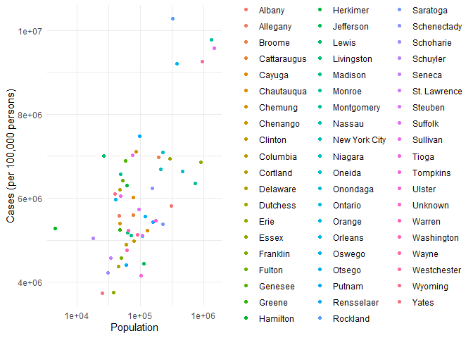

COVID-19
================
(Your name here)
2020-

- [Grading Rubric](#grading-rubric)
  - [Individual](#individual)
  - [Due Date](#due-date)
- [The Big Picture](#the-big-picture)
- [Get the Data](#get-the-data)
  - [Navigating the Census Bureau](#navigating-the-census-bureau)
    - [**q1** Load Table `B01003` into the following tibble. Make sure
      the column names are
      `id, Geographic Area Name, Estimate!!Total, Margin of Error!!Total`.](#q1-load-table-b01003-into-the-following-tibble-make-sure-the-column-names-are-id-geographic-area-name-estimatetotal-margin-of-errortotal)
  - [Automated Download of NYT Data](#automated-download-of-nyt-data)
    - [**q2** Visit the NYT GitHub repo and find the URL for the **raw**
      US County-level data. Assign that URL as a string to the variable
      below.](#q2-visit-the-nyt-github-repo-and-find-the-url-for-the-raw-us-county-level-data-assign-that-url-as-a-string-to-the-variable-below)
- [Join the Data](#join-the-data)
  - [**q3** Process the `id` column of `df_pop` to create a `fips`
    column.](#q3-process-the-id-column-of-df_pop-to-create-a-fips-column)
  - [**q4** Join `df_covid` with `df_q3` by the `fips` column. Use the
    proper type of join to preserve *only* the rows in
    `df_covid`.](#q4-join-df_covid-with-df_q3-by-the-fips-column-use-the-proper-type-of-join-to-preserve-only-the-rows-in-df_covid)
- [Analyze](#analyze)
  - [Normalize](#normalize)
    - [**q5** Use the `population` estimates in `df_data` to normalize
      `cases` and `deaths` to produce per 100,000 counts \[3\]. Store
      these values in the columns `cases_per100k` and
      `deaths_per100k`.](#q5-use-the-population-estimates-in-df_data-to-normalize-cases-and-deaths-to-produce-per-100000-counts-3-store-these-values-in-the-columns-cases_per100k-and-deaths_per100k)
  - [Guided EDA](#guided-eda)
    - [**q6** Compute the mean and standard deviation for
      `cases_per100k` and
      `deaths_per100k`.](#q6-compute-the-mean-and-standard-deviation-for-cases_per100k-and-deaths_per100k)
    - [**q7** Find the top 10 counties in terms of `cases_per100k`, and
      the top 10 in terms of `deaths_per100k`. Report the population of
      each county along with the per-100,000 counts. Compare the counts
      against the mean values you found in q6. Note any
      observations.](#q7-find-the-top-10-counties-in-terms-of-cases_per100k-and-the-top-10-in-terms-of-deaths_per100k-report-the-population-of-each-county-along-with-the-per-100000-counts-compare-the-counts-against-the-mean-values-you-found-in-q6-note-any-observations)
  - [Self-directed EDA](#self-directed-eda)
    - [**q8** Drive your own ship: You’ve just put together a very rich
      dataset; you now get to explore! Pick your own direction and
      generate at least one punchline figure to document an interesting
      finding. I give a couple tips & ideas
      below:](#q8-drive-your-own-ship-youve-just-put-together-a-very-rich-dataset-you-now-get-to-explore-pick-your-own-direction-and-generate-at-least-one-punchline-figure-to-document-an-interesting-finding-i-give-a-couple-tips--ideas-below)
    - [Ideas](#ideas)
    - [Aside: Some visualization
      tricks](#aside-some-visualization-tricks)
    - [Geographic exceptions](#geographic-exceptions)
- [Notes](#notes)

*Purpose*: In this challenge, you’ll learn how to navigate the U.S.
Census Bureau website, programmatically download data from the internet,
and perform a county-level population-weighted analysis of current
COVID-19 trends. This will give you the base for a very deep
investigation of COVID-19, which we’ll build upon for Project 1.

<!-- include-rubric -->

# Grading Rubric

<!-- -------------------------------------------------- -->

Unlike exercises, **challenges will be graded**. The following rubrics
define how you will be graded, both on an individual and team basis.

## Individual

<!-- ------------------------- -->

| Category    | Needs Improvement                                                                                                | Satisfactory                                                                                                               |
|-------------|------------------------------------------------------------------------------------------------------------------|----------------------------------------------------------------------------------------------------------------------------|
| Effort      | Some task **q**’s left unattempted                                                                               | All task **q**’s attempted                                                                                                 |
| Observed    | Did not document observations, or observations incorrect                                                         | Documented correct observations based on analysis                                                                          |
| Supported   | Some observations not clearly supported by analysis                                                              | All observations clearly supported by analysis (table, graph, etc.)                                                        |
| Assessed    | Observations include claims not supported by the data, or reflect a level of certainty not warranted by the data | Observations are appropriately qualified by the quality & relevance of the data and (in)conclusiveness of the support      |
| Specified   | Uses the phrase “more data are necessary” without clarification                                                  | Any statement that “more data are necessary” specifies which *specific* data are needed to answer what *specific* question |
| Code Styled | Violations of the [style guide](https://style.tidyverse.org/) hinder readability                                 | Code sufficiently close to the [style guide](https://style.tidyverse.org/)                                                 |

## Due Date

<!-- ------------------------- -->

All the deliverables stated in the rubrics above are due **at midnight**
before the day of the class discussion of the challenge. See the
[Syllabus](https://docs.google.com/document/d/1qeP6DUS8Djq_A0HMllMqsSqX3a9dbcx1/edit?usp=sharing&ouid=110386251748498665069&rtpof=true&sd=true)
for more information.

``` r
library(tidyverse)
```

    ## Warning: package 'tidyverse' was built under R version 4.2.3

    ## Warning: package 'ggplot2' was built under R version 4.2.3

    ## Warning: package 'stringr' was built under R version 4.2.3

    ## Warning: package 'forcats' was built under R version 4.2.3

    ## ── Attaching core tidyverse packages ──────────────────────── tidyverse 2.0.0 ──
    ## ✔ dplyr     1.0.9     ✔ readr     2.1.2
    ## ✔ forcats   1.0.0     ✔ stringr   1.5.0
    ## ✔ ggplot2   3.4.2     ✔ tibble    3.1.8
    ## ✔ lubridate 1.8.0     ✔ tidyr     1.2.0
    ## ✔ purrr     0.3.4     
    ## ── Conflicts ────────────────────────────────────────── tidyverse_conflicts() ──
    ## ✖ dplyr::filter() masks stats::filter()
    ## ✖ dplyr::lag()    masks stats::lag()
    ## ℹ Use the ]8;;http://conflicted.r-lib.org/conflicted package]8;; to force all conflicts to become errors

*Background*:
[COVID-19](https://en.wikipedia.org/wiki/Coronavirus_disease_2019) is
the disease caused by the virus SARS-CoV-2. In 2020 it became a global
pandemic, leading to huge loss of life and tremendous disruption to
society. The New York Times (as of writing) publishes up-to-date data on
the progression of the pandemic across the United States—we will study
these data in this challenge.

*Optional Readings*: I’ve found this [ProPublica
piece](https://www.propublica.org/article/how-to-understand-covid-19-numbers)
on “How to understand COVID-19 numbers” to be very informative!

# The Big Picture

<!-- -------------------------------------------------- -->

We’re about to go through *a lot* of weird steps, so let’s first fix the
big picture firmly in mind:

We want to study COVID-19 in terms of data: both case counts (number of
infections) and deaths. We’re going to do a county-level analysis in
order to get a high-resolution view of the pandemic. Since US counties
can vary widely in terms of their population, we’ll need population
estimates in order to compute infection rates (think back to the
`Titanic` challenge).

That’s the high-level view; now let’s dig into the details.

# Get the Data

<!-- -------------------------------------------------- -->

1.  County-level population estimates (Census Bureau)
2.  County-level COVID-19 counts (New York Times)

## Navigating the Census Bureau

<!-- ------------------------- -->

**Steps**: Our objective is to find the 2018 American Community
Survey\[1\] (ACS) Total Population estimates, disaggregated by counties.
To check your results, this is Table `B01003`.

1.  Go to [data.census.gov](data.census.gov).
2.  Scroll down and click `View Tables`.
3.  Apply filters to find the ACS **Total Population** estimates,
    disaggregated by counties. I used the filters:

- `Topics > Populations and People > Counts, Estimates, and Projections > Population Total`
- `Geography > County > All counties in United States`

5.  Select the **Total Population** table and click the `Download`
    button to download the data; make sure to select the 2018 5-year
    estimates.
6.  Unzip and move the data to your `challenges/data` folder.

- Note that the data will have a crazy-long filename like
  `ACSDT5Y2018.B01003_data_with_overlays_2020-07-26T094857.csv`. That’s
  because metadata is stored in the filename, such as the year of the
  estimate (`Y2018`) and my access date (`2020-07-26`). **Your filename
  will vary based on when you download the data**, so make sure to copy
  the filename that corresponds to what you downloaded!

### **q1** Load Table `B01003` into the following tibble. Make sure the column names are `id, Geographic Area Name, Estimate!!Total, Margin of Error!!Total`.

*Hint*: You will need to use the `skip` keyword when loading these data!

``` r
## TASK: Load the census bureau data with the following tibble name.
file_loc = "C:/Users/zxiong/Desktop/Olin/C-Data Science/data-science-curriculum-build/challenges/data/b01003.csv"
df_pop <- read_csv(file_loc, skip = 1)
```

    ## Rows: 3220 Columns: 6
    ## ── Column specification ────────────────────────────────────────────────────────
    ## Delimiter: ","
    ## chr (5): Geography, Geographic Area Name, Annotation of Estimate!!Total, Mar...
    ## dbl (1): Estimate!!Total
    ## 
    ## ℹ Use `spec()` to retrieve the full column specification for this data.
    ## ℹ Specify the column types or set `show_col_types = FALSE` to quiet this message.

``` r
df_pop
```

    ## # A tibble: 3,220 × 6
    ##    Geography     `Geographic Area Name` `Estimate!!Total` Annotation of Estima…¹
    ##    <chr>         <chr>                              <dbl> <chr>                 
    ##  1 0500000US010… Autauga County, Alaba…             55200 null                  
    ##  2 0500000US010… Baldwin County, Alaba…            208107 null                  
    ##  3 0500000US010… Barbour County, Alaba…             25782 null                  
    ##  4 0500000US010… Bibb County, Alabama               22527 null                  
    ##  5 0500000US010… Blount County, Alabama             57645 null                  
    ##  6 0500000US010… Bullock County, Alaba…             10352 null                  
    ##  7 0500000US010… Butler County, Alabama             20025 null                  
    ##  8 0500000US010… Calhoun County, Alaba…            115098 null                  
    ##  9 0500000US010… Chambers County, Alab…             33826 null                  
    ## 10 0500000US010… Cherokee County, Alab…             25853 null                  
    ## # ℹ 3,210 more rows
    ## # ℹ abbreviated name: ¹​`Annotation of Estimate!!Total`
    ## # ℹ 2 more variables: `Margin of Error!!Total` <chr>,
    ## #   `Annotation of Margin of Error!!Total` <chr>

*Note*: You can find information on 1-year, 3-year, and 5-year estimates
[here](https://www.census.gov/programs-surveys/acs/guidance/estimates.html).
The punchline is that 5-year estimates are more reliable but less
current.

## Automated Download of NYT Data

<!-- ------------------------- -->

ACS 5-year estimates don’t change all that often, but the COVID-19 data
are changing rapidly. To that end, it would be nice to be able to
*programmatically* download the most recent data for analysis; that way
we can update our analysis whenever we want simply by re-running our
notebook. This next problem will have you set up such a pipeline.

The New York Times is publishing up-to-date data on COVID-19 on
[GitHub](https://github.com/nytimes/covid-19-data).

### **q2** Visit the NYT [GitHub](https://github.com/nytimes/covid-19-data) repo and find the URL for the **raw** US County-level data. Assign that URL as a string to the variable below.

``` r
## TASK: Find the URL for the NYT covid-19 county-level data
url_counties <- "https://raw.githubusercontent.com/nytimes/covid-19-data/master/us-counties.csv"
```

Once you have the url, the following code will download a local copy of
the data, then load the data into R.

``` r
## NOTE: No need to change this; just execute
## Set the filename of the data to download
filename_nyt <- "./data/nyt_counties.csv"

## Download the data locally
curl::curl_download(
        url_counties,
        destfile = filename_nyt
      )

## Loads the downloaded csv
df_covid <- read_csv(filename_nyt)
```

    ## Rows: 2502832 Columns: 6
    ## ── Column specification ────────────────────────────────────────────────────────
    ## Delimiter: ","
    ## chr  (3): county, state, fips
    ## dbl  (2): cases, deaths
    ## date (1): date
    ## 
    ## ℹ Use `spec()` to retrieve the full column specification for this data.
    ## ℹ Specify the column types or set `show_col_types = FALSE` to quiet this message.

``` r
# I ended up manually downloading the file because the function didn't quite work for me
```

You can now re-run the chunk above (or the entire notebook) to pull the
most recent version of the data. Thus you can periodically re-run this
notebook to check in on the pandemic as it evolves.

*Note*: You should feel free to copy-paste the code above for your own
future projects!

# Join the Data

<!-- -------------------------------------------------- -->

To get a sense of our task, let’s take a glimpse at our two data
sources.

``` r
## NOTE: No need to change this; just execute
df_pop %>% glimpse
```

    ## Rows: 3,220
    ## Columns: 6
    ## $ Geography                              <chr> "0500000US01001", "0500000US010…
    ## $ `Geographic Area Name`                 <chr> "Autauga County, Alabama", "Bal…
    ## $ `Estimate!!Total`                      <dbl> 55200, 208107, 25782, 22527, 57…
    ## $ `Annotation of Estimate!!Total`        <chr> "null", "null", "null", "null",…
    ## $ `Margin of Error!!Total`               <chr> "*****", "*****", "*****", "***…
    ## $ `Annotation of Margin of Error!!Total` <chr> "*****", "*****", "*****", "***…

``` r
df_covid %>% glimpse
```

    ## Rows: 2,502,832
    ## Columns: 6
    ## $ date   <date> 2020-01-21, 2020-01-22, 2020-01-23, 2020-01-24, 2020-01-24, 20…
    ## $ county <chr> "Snohomish", "Snohomish", "Snohomish", "Cook", "Snohomish", "Or…
    ## $ state  <chr> "Washington", "Washington", "Washington", "Illinois", "Washingt…
    ## $ fips   <chr> "53061", "53061", "53061", "17031", "53061", "06059", "17031", …
    ## $ cases  <dbl> 1, 1, 1, 1, 1, 1, 1, 1, 1, 1, 1, 1, 1, 1, 1, 1, 1, 1, 1, 1, 1, …
    ## $ deaths <dbl> 0, 0, 0, 0, 0, 0, 0, 0, 0, 0, 0, 0, 0, 0, 0, 0, 0, 0, 0, 0, 0, …

To join these datasets, we’ll need to use [FIPS county
codes](https://en.wikipedia.org/wiki/FIPS_county_code).\[2\] The last
`5` digits of the `id` column in `df_pop` is the FIPS county code, while
the NYT data `df_covid` already contains the `fips`.

### **q3** Process the `id` column of `df_pop` to create a `fips` column.

``` r
## TASK: Create a `fips` column by extracting the county code
df_q3 <- df_pop %>% 
  mutate(
    fips = substr(Geography, 10, 14)
    )
df_q3 
```

    ## # A tibble: 3,220 × 7
    ##    Geography     `Geographic Area Name` `Estimate!!Total` Annotation of Estima…¹
    ##    <chr>         <chr>                              <dbl> <chr>                 
    ##  1 0500000US010… Autauga County, Alaba…             55200 null                  
    ##  2 0500000US010… Baldwin County, Alaba…            208107 null                  
    ##  3 0500000US010… Barbour County, Alaba…             25782 null                  
    ##  4 0500000US010… Bibb County, Alabama               22527 null                  
    ##  5 0500000US010… Blount County, Alabama             57645 null                  
    ##  6 0500000US010… Bullock County, Alaba…             10352 null                  
    ##  7 0500000US010… Butler County, Alabama             20025 null                  
    ##  8 0500000US010… Calhoun County, Alaba…            115098 null                  
    ##  9 0500000US010… Chambers County, Alab…             33826 null                  
    ## 10 0500000US010… Cherokee County, Alab…             25853 null                  
    ## # ℹ 3,210 more rows
    ## # ℹ abbreviated name: ¹​`Annotation of Estimate!!Total`
    ## # ℹ 3 more variables: `Margin of Error!!Total` <chr>,
    ## #   `Annotation of Margin of Error!!Total` <chr>, fips <chr>

Use the following test to check your answer.

``` r
## NOTE: No need to change this
## Check known county
assertthat::assert_that(
              (df_q3 %>%
              filter(str_detect(`Geographic Area Name`, "Autauga County")) %>%
              pull(fips)) == "01001"
            )
```

    ## [1] TRUE

``` r
print("Very good!")
```

    ## [1] "Very good!"

### **q4** Join `df_covid` with `df_q3` by the `fips` column. Use the proper type of join to preserve *only* the rows in `df_covid`.

``` r
## TASK: Join df_covid and df_q3 by fips.
df_q4 <- left_join(df_covid, df_q3, by = "fips")
head(df_q4, 10)
```

    ## # A tibble: 10 × 12
    ##    date       county   state fips  cases deaths Geography `Geographic Area Name`
    ##    <date>     <chr>    <chr> <chr> <dbl>  <dbl> <chr>     <chr>                 
    ##  1 2020-01-21 Snohomi… Wash… 53061     1      0 0500000U… Snohomish County, Was…
    ##  2 2020-01-22 Snohomi… Wash… 53061     1      0 0500000U… Snohomish County, Was…
    ##  3 2020-01-23 Snohomi… Wash… 53061     1      0 0500000U… Snohomish County, Was…
    ##  4 2020-01-24 Cook     Illi… 17031     1      0 0500000U… Cook County, Illinois 
    ##  5 2020-01-24 Snohomi… Wash… 53061     1      0 0500000U… Snohomish County, Was…
    ##  6 2020-01-25 Orange   Cali… 06059     1      0 0500000U… Orange County, Califo…
    ##  7 2020-01-25 Cook     Illi… 17031     1      0 0500000U… Cook County, Illinois 
    ##  8 2020-01-25 Snohomi… Wash… 53061     1      0 0500000U… Snohomish County, Was…
    ##  9 2020-01-26 Maricopa Ariz… 04013     1      0 0500000U… Maricopa County, Ariz…
    ## 10 2020-01-26 Los Ang… Cali… 06037     1      0 0500000U… Los Angeles County, C…
    ## # ℹ 4 more variables: `Estimate!!Total` <dbl>,
    ## #   `Annotation of Estimate!!Total` <chr>, `Margin of Error!!Total` <chr>,
    ## #   `Annotation of Margin of Error!!Total` <chr>

For convenience, I down-select some columns and produce more convenient
column names.

``` r
## NOTE: No need to change; run this to produce a more convenient tibble
df_data <-
  df_q4 %>%
  select(
    date,
    county,
    state,
    fips,
    cases,
    deaths,
    population = `Estimate!!Total`
  )
```

# Analyze

<!-- -------------------------------------------------- -->

Now that we’ve done the hard work of loading and wrangling the data, we
can finally start our analysis. Our first step will be to produce county
population-normalized cases and death counts. Then we will explore the
data.

## Normalize

<!-- ------------------------- -->

### **q5** Use the `population` estimates in `df_data` to normalize `cases` and `deaths` to produce per 100,000 counts \[3\]. Store these values in the columns `cases_per100k` and `deaths_per100k`.

``` r
## TASK: Normalize cases and deaths
df_normalized <-
  df_data %>%
  mutate(
    cases_per100k = cases/population*100000,
    deaths_per100k = deaths/population*100000
  )
# df_normalized[is.na(df_normalized)] <- 0
```

You may use the following test to check your work.

``` r
## NOTE: No need to change this
## Check known county data
if (any(df_normalized %>% pull(date) %>% str_detect(., "2020-01-21"))) {
  assertthat::assert_that(TRUE)
} else {
  print(str_c(
    "Date 2020-01-21 not found; did you download the historical data (correct),",
    "or just the most recent data (incorrect)?",
    sep = " "
  ))
  assertthat::assert_that(FALSE)
}
```

    ## [1] TRUE

``` r
assertthat::assert_that(
              abs(df_normalized %>%
               filter(
                 str_detect(county, "Snohomish"),
                 date == "2020-01-21"
               ) %>%
              pull(cases_per100k) - 0.127) < 1e-3
            )
```

    ## [1] TRUE

``` r
assertthat::assert_that(
              abs(df_normalized %>%
               filter(
                 str_detect(county, "Snohomish"),
                 date == "2020-01-21"
               ) %>%
              pull(deaths_per100k) - 0) < 1e-3
            )
```

    ## [1] TRUE

``` r
print("Excellent!")
```

    ## [1] "Excellent!"

## Guided EDA

<!-- ------------------------- -->

Before turning you loose, let’s complete a couple guided EDA tasks.

### **q6** Compute the mean and standard deviation for `cases_per100k` and `deaths_per100k`.

``` r
## TASK: Compute mean and sd for cases_per100k and deaths_per100k
# cases_stats <- 
df_normalized %>%
  filter(date == "2020-03-12") %>%
  summarize(
    cases_mean = mean(cases_per100k, na.rm = TRUE),
    cases_sd = sd(cases_per100k, na.rm = TRUE),
    deaths_mean = mean(deaths_per100k, na.rm = TRUE),
    deaths_sd = sd(deaths_per100k, na.rm = TRUE)
  )
```

    ## # A tibble: 1 × 4
    ##   cases_mean cases_sd deaths_mean deaths_sd
    ##        <dbl>    <dbl>       <dbl>     <dbl>
    ## 1       2.07     4.96      0.0402     0.341

``` r
# deaths_stats <- df_normalized %>%
#   filter(date == "2020-01-21") %>%
#   summarize(
#     deaths_mean = mean(deaths_per100k, na.rm = TRUE),
#     deaths_sd = sd(deaths_per100k)
#   )
# 
# cases_stats
# deaths_stats
```

### **q7** Find the top 10 counties in terms of `cases_per100k`, and the top 10 in terms of `deaths_per100k`. Report the population of each county along with the per-100,000 counts. Compare the counts against the mean values you found in q6. Note any observations.

``` r
## TASK: Find the top 10 max cases_per100k counties; report populations as well
df_normalized %>%
  filter(date == "2020-03-12") %>%
  group_by(county, state, fips) %>%
  summarize(
    cases_per100k = max(cases_per100k),
    population = max(population)
    ) %>%
  arrange(desc(cases_per100k)) %>%
  head(10)
```

    ## `summarise()` has grouped output by 'county', 'state'. You can override using
    ## the `.groups` argument.

    ## # A tibble: 10 × 5
    ## # Groups:   county, state [10]
    ##    county      state          fips  cases_per100k population
    ##    <chr>       <chr>          <chr>         <dbl>      <dbl>
    ##  1 Pitkin      Colorado       08097          55.8      17909
    ##  2 Columbia    Washington     53013          25.0       4001
    ##  3 Gunnison    Colorado       08051          24.2      16537
    ##  4 Harrison    Kentucky       21097          21.4      18668
    ##  5 Eagle       Colorado       08037          20.2      54357
    ##  6 Westchester New York       36119          15.2     968815
    ##  7 Bon Homme   South Dakota   46009          14.3       6969
    ##  8 Snohomish   Washington     53061          13.6     786620
    ##  9 King        Washington     53033          12.5    2163257
    ## 10 Kershaw     South Carolina 45055          12.4      64361

``` r
df_normalized %>%
  filter(date == "2020-03-12") %>%
  group_by(county, state, fips) %>%
  summarize(
    deaths_per100k = max(deaths_per100k),
    population = max(population)
    ) %>%
  arrange(desc(deaths_per100k)) %>%
  head(10)
```

    ## `summarise()` has grouped output by 'county', 'state'. You can override using
    ## the `.groups` argument.

    ## # A tibble: 10 × 5
    ## # Groups:   county, state [10]
    ##    county     state        fips  deaths_per100k population
    ##    <chr>      <chr>        <chr>          <dbl>      <dbl>
    ##  1 Davison    South Dakota 46035          5.02       19901
    ##  2 Chelan     Washington   53007          1.32       75757
    ##  3 King       Washington   53033          1.29     2163257
    ##  4 Wyandotte  Kansas       20209          0.608     164345
    ##  5 Santa Rosa Florida      12113          0.587     170442
    ##  6 Snohomish  Washington   53061          0.381     786620
    ##  7 Placer     California   06061          0.263     380077
    ##  8 El Paso    Colorado     08041          0.145     688153
    ##  9 Lee        Florida      12071          0.139     718679
    ## 10 Cobb       Georgia      13067          0.134     745057

**Observations**:

- King country in Washington State has the largest population among all
  counties that ranked top 10 regarding both cases per 100,000 and
  deaths per 100,000 on March 12th, 2020.

## Self-directed EDA

<!-- ------------------------- -->

### **q8** Drive your own ship: You’ve just put together a very rich dataset; you now get to explore! Pick your own direction and generate at least one punchline figure to document an interesting finding. I give a couple tips & ideas below:

### Ideas

<!-- ------------------------- -->

- Look for outliers.
- Try web searching for news stories in some of the outlier counties.
- Investigate relationships between county population and counts.
- Do a deep-dive on counties that are important to you (e.g. where you
  or your family live).
- Fix the *geographic exceptions* noted below to study New York City.
- Your own idea!

``` r
df_normalized %>%
  filter(state == "New York") %>%
  group_by(county) %>%
  summarize(
    sum_cases = sum(cases_per100k),
    population = population
  ) %>%
  ggplot(
    aes(population, sum_cases, color = county)
  ) +
  geom_point() +
  scale_x_continuous(trans='log10') +
  scale_color_discrete(name = "County") +
  theme_minimal() +
  labs(
    x = "Population",
    y = "Cases (per 100,000 persons)"
  )
```

    ## `summarise()` has grouped output by 'county'. You can override using the
    ## `.groups` argument.

    ## Warning: Removed 814 rows containing missing values (`geom_point()`).

<!-- -->

The number of cases per 100,000 persons increases as population
increases, indicating a positive relationship.

### Aside: Some visualization tricks

<!-- ------------------------- -->

These data get a little busy, so it’s helpful to know a few `ggplot`
tricks to help with the visualization. Here’s an example focused on
Massachusetts.

``` r
## NOTE: No need to change this; just an example
df_normalized %>%
  filter(state == "Massachusetts") %>%
  
  ggplot(
    # aes(date, cases_per100k, color = fct_reorder2(county, date, cases_per100k))
    aes(date, cases_per100k, color = county)
  ) +
  geom_line() +
  scale_y_log10(labels = scales::label_number_si()) +
  scale_color_discrete(name = "County") +
  theme_minimal() +
  labs(
    x = "Date",
    y = "Cases (per 100,000 persons)"
  )
```

    ## Warning: `label_number_si()` was deprecated in scales 1.2.0.
    ## ℹ Please use the `scale_cut` argument of `label_number()` instead.
    ## This warning is displayed once every 8 hours.
    ## Call `lifecycle::last_lifecycle_warnings()` to see where this warning was
    ## generated.

    ## Warning: Removed 789 rows containing missing values (`geom_line()`).

<!-- -->

*Tricks*:

- I use `fct_reorder2` to *re-order* the color labels such that the
  color in the legend on the right is ordered the same as the vertical
  order of rightmost points on the curves. This makes it easier to
  reference the legend.
- I manually set the `name` of the color scale in order to avoid
  reporting the `fct_reorder2` call.
- I use `scales::label_number_si` to make the vertical labels more
  readable.
- I use `theme_minimal()` to clean up the theme a bit.
- I use `labs()` to give manual labels.

### Geographic exceptions

<!-- ------------------------- -->

The NYT repo documents some [geographic
exceptions](https://github.com/nytimes/covid-19-data#geographic-exceptions);
the data for New York, Kings, Queens, Bronx and Richmond counties are
consolidated under “New York City” *without* a fips code. Thus the
normalized counts in `df_normalized` are `NA`. To fix this, you would
need to merge the population data from the New York City counties, and
manually normalize the data.

# Notes

<!-- -------------------------------------------------- -->

\[1\] The census used to have many, many questions, but the ACS was
created in 2010 to remove some questions and shorten the census. You can
learn more in [this wonderful visual
history](https://pudding.cool/2020/03/census-history/) of the census.

\[2\] FIPS stands for [Federal Information Processing
Standards](https://en.wikipedia.org/wiki/Federal_Information_Processing_Standards);
these are computer standards issued by NIST for things such as
government data.

\[3\] Demographers often report statistics not in percentages (per 100
people), but rather in per 100,000 persons. This is [not always the
case](https://stats.stackexchange.com/questions/12810/why-do-demographers-give-rates-per-100-000-people)
though!
