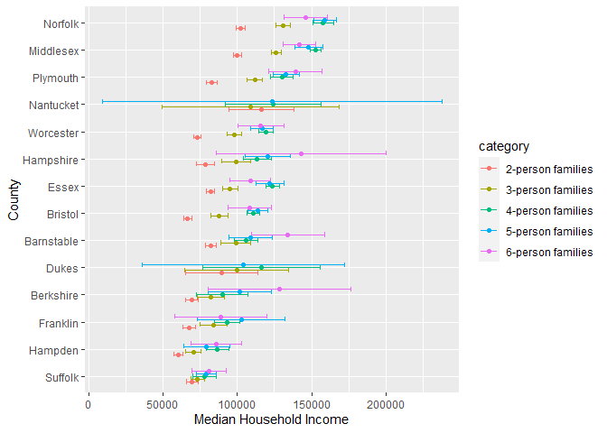
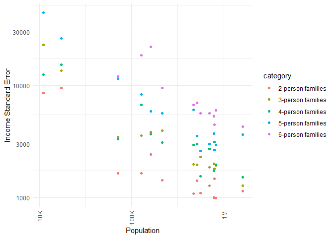

US Income
================
(Your name here)
202X-XX-XX

- <a href="#grading-rubric" id="toc-grading-rubric">Grading Rubric</a>
  - <a href="#individual" id="toc-individual">Individual</a>
  - <a href="#submission" id="toc-submission">Submission</a>
- <a href="#setup" id="toc-setup">Setup</a>
  - <a
    href="#q1-load-the-population-data-from-c06-simply-replace-filename_pop-below"
    id="toc-q1-load-the-population-data-from-c06-simply-replace-filename_pop-below"><strong>q1</strong>
    Load the population data from c06; simply replace
    <code>filename_pop</code> below.</a>
  - <a href="#q2-obtain-median-income-data-from-the-census-bureau"
    id="toc-q2-obtain-median-income-data-from-the-census-bureau"><strong>q2</strong>
    Obtain median income data from the Census Bureau:</a>
  - <a
    href="#q3-tidy-the-df_income-dataset-by-completing-the-code-below-pivot-and-rename-the-columns-to-arrive-at-the-column-names-id-geographic_area_name-category-income_estimate-income_moe"
    id="toc-q3-tidy-the-df_income-dataset-by-completing-the-code-below-pivot-and-rename-the-columns-to-arrive-at-the-column-names-id-geographic_area_name-category-income_estimate-income_moe"><strong>q3</strong>
    Tidy the <code>df_income</code> dataset by completing the code below.
    Pivot and rename the columns to arrive at the column names
    <code>id, geographic_area_name, category, income_estimate, income_moe</code>.</a>
  - <a
    href="#q4-convert-the-margin-of-error-to-standard-error-additionally-compute-a-99-confidence-interval-on-income-and-normalize-the-standard-error-to-income_cv--income_se--income_estimate-provide-these-columns-with-the-names-income_se-income_lo-income_hi-income_cv"
    id="toc-q4-convert-the-margin-of-error-to-standard-error-additionally-compute-a-99-confidence-interval-on-income-and-normalize-the-standard-error-to-income_cv--income_se--income_estimate-provide-these-columns-with-the-names-income_se-income_lo-income_hi-income_cv"><strong>q4</strong>
    Convert the margin of error to standard error. Additionally, compute a
    99% confidence interval on income, and normalize the standard error to
    <code>income_CV = income_SE / income_estimate</code>. Provide these
    columns with the names
    <code>income_SE, income_lo, income_hi, income_CV</code>.</a>
  - <a href="#q5-join-df_q4-and-df_pop"
    id="toc-q5-join-df_q4-and-df_pop"><strong>q5</strong> Join
    <code>df_q4</code> and <code>df_pop</code>.</a>
- <a href="#analysis" id="toc-analysis">Analysis</a>
  - <a
    href="#q6-study-the-following-graph-making-sure-to-note-what-you-can-and-cant-conclude-based-on-the-estimates-and-confidence-intervals-document-your-observations-below-and-answer-the-questions"
    id="toc-q6-study-the-following-graph-making-sure-to-note-what-you-can-and-cant-conclude-based-on-the-estimates-and-confidence-intervals-document-your-observations-below-and-answer-the-questions"><strong>q6</strong>
    Study the following graph, making sure to note what you can <em>and
    can’t</em> conclude based on the estimates and confidence intervals.
    Document your observations below and answer the questions.</a>
  - <a
    href="#q7-plot-the-standard-error-against-population-for-all-counties-create-a-visual-that-effectively-highlights-the-trends-in-the-data-answer-the-questions-under-observations-below"
    id="toc-q7-plot-the-standard-error-against-population-for-all-counties-create-a-visual-that-effectively-highlights-the-trends-in-the-data-answer-the-questions-under-observations-below"><strong>q7</strong>
    Plot the standard error against population for all counties. Create a
    visual that effectively highlights the trends in the data. Answer the
    questions under <em>observations</em> below.</a>
- <a href="#going-further" id="toc-going-further">Going Further</a>
  - <a
    href="#q8-pose-your-own-question-about-the-data-create-a-visualization-or-table-here-and-document-your-observations"
    id="toc-q8-pose-your-own-question-about-the-data-create-a-visualization-or-table-here-and-document-your-observations"><strong>q8</strong>
    Pose your own question about the data. Create a visualization (or table)
    here, and document your observations.</a>
- <a href="#references" id="toc-references">References</a>

*Purpose*: We’ve been learning how to quantify uncertainty in estimates
through the exercises; now its time to put those skills to use studying
real data. In this challenge we’ll use concepts like confidence
intervals to help us make sense of census data.

*Reading*: - [Using ACS Estimates and Margin of
Error](https://www.census.gov/data/academy/webinars/2020/calculating-margins-of-error-acs.html)
(Optional, see the PDF on the page) - [Patterns and Causes of
Uncertainty in the American Community
Survey](https://www.sciencedirect.com/science/article/pii/S0143622813002518?casa_token=VddzQ1-spHMAAAAA:FTq92LXgiPVloJUVjnHs8Ma1HwvPigisAYtzfqaGbbRRwoknNq56Y2IzszmGgIGH4JAPzQN0)
(Optional, particularly the *Uncertainty in surveys* section under the
Introduction.)

<!-- include-rubric -->

# Grading Rubric

<!-- -------------------------------------------------- -->

Unlike exercises, **challenges will be graded**. The following rubrics
define how you will be graded, both on an individual and team basis.

## Individual

<!-- ------------------------- -->

| Category    | Needs Improvement                                                                                                | Satisfactory                                                                                                               |
|-------------|------------------------------------------------------------------------------------------------------------------|----------------------------------------------------------------------------------------------------------------------------|
| Effort      | Some task **q**’s left unattempted                                                                               | All task **q**’s attempted                                                                                                 |
| Observed    | Did not document observations, or observations incorrect                                                         | Documented correct observations based on analysis                                                                          |
| Supported   | Some observations not clearly supported by analysis                                                              | All observations clearly supported by analysis (table, graph, etc.)                                                        |
| Assessed    | Observations include claims not supported by the data, or reflect a level of certainty not warranted by the data | Observations are appropriately qualified by the quality & relevance of the data and (in)conclusiveness of the support      |
| Specified   | Uses the phrase “more data are necessary” without clarification                                                  | Any statement that “more data are necessary” specifies which *specific* data are needed to answer what *specific* question |
| Code Styled | Violations of the [style guide](https://style.tidyverse.org/) hinder readability                                 | Code sufficiently close to the [style guide](https://style.tidyverse.org/)                                                 |

## Submission

<!-- ------------------------- -->

Make sure to commit both the challenge report (`report.md` file) and
supporting files (`report_files/` folder) when you are done! Then submit
a link to Canvas. **Your Challenge submission is not complete without
all files uploaded to GitHub.**

# Setup

<!-- ----------------------------------------------------------------------- -->

``` r
library(tidyverse)
```

    ## ── Attaching packages ─────────────────────────────────────── tidyverse 1.3.2 ──
    ## ✔ ggplot2 3.3.6     ✔ purrr   0.3.4
    ## ✔ tibble  3.1.8     ✔ dplyr   1.0.9
    ## ✔ tidyr   1.2.0     ✔ stringr 1.4.0
    ## ✔ readr   2.1.2     ✔ forcats 0.5.1
    ## ── Conflicts ────────────────────────────────────────── tidyverse_conflicts() ──
    ## ✖ dplyr::filter() masks stats::filter()
    ## ✖ dplyr::lag()    masks stats::lag()

### **q1** Load the population data from c06; simply replace `filename_pop` below.

``` r
## TODO: Give the filename for your copy of Table B01003
filename_pop <- "C:/Users/zxiong/Desktop/Olin/C-Data Science/data-science-curriculum-build/challenges/data/b01003.csv"

## NOTE: No need to edit
df_pop <-
  read_csv(
    filename_pop,
    skip = 1,
  ) %>% 
  rename(
    population_estimate = `Estimate!!Total`
  )
```

    ## Rows: 3220 Columns: 6
    ## ── Column specification ────────────────────────────────────────────────────────
    ## Delimiter: ","
    ## chr (5): Geography, Geographic Area Name, Annotation of Estimate!!Total, Mar...
    ## dbl (1): Estimate!!Total
    ## 
    ## ℹ Use `spec()` to retrieve the full column specification for this data.
    ## ℹ Specify the column types or set `show_col_types = FALSE` to quiet this message.

``` r
df_pop
```

    ## # A tibble: 3,220 × 6
    ##    Geography      `Geographic Area Name`   population_…¹ Annot…² Margi…³ Annot…⁴
    ##    <chr>          <chr>                            <dbl> <chr>   <chr>   <chr>  
    ##  1 0500000US01001 Autauga County, Alabama          55200 null    *****   *****  
    ##  2 0500000US01003 Baldwin County, Alabama         208107 null    *****   *****  
    ##  3 0500000US01005 Barbour County, Alabama          25782 null    *****   *****  
    ##  4 0500000US01007 Bibb County, Alabama             22527 null    *****   *****  
    ##  5 0500000US01009 Blount County, Alabama           57645 null    *****   *****  
    ##  6 0500000US01011 Bullock County, Alabama          10352 null    *****   *****  
    ##  7 0500000US01013 Butler County, Alabama           20025 null    *****   *****  
    ##  8 0500000US01015 Calhoun County, Alabama         115098 null    *****   *****  
    ##  9 0500000US01017 Chambers County, Alabama         33826 null    *****   *****  
    ## 10 0500000US01019 Cherokee County, Alabama         25853 null    *****   *****  
    ## # … with 3,210 more rows, and abbreviated variable names ¹​population_estimate,
    ## #   ²​`Annotation of Estimate!!Total`, ³​`Margin of Error!!Total`,
    ## #   ⁴​`Annotation of Margin of Error!!Total`
    ## # ℹ Use `print(n = ...)` to see more rows

You might wonder why the `Margin of Error` in the population estimates
is listed as `*****`. From the [documentation (PDF
link)](https://www.google.com/url?sa=t&rct=j&q=&esrc=s&source=web&cd=&cad=rja&uact=8&ved=2ahUKEwj81Omy16TrAhXsguAKHTzKDQEQFjABegQIBxAB&url=https%3A%2F%2Fwww2.census.gov%2Fprograms-surveys%2Facs%2Ftech_docs%2Faccuracy%2FMultiyearACSAccuracyofData2018.pdf%3F&usg=AOvVaw2TOrVuBDlkDI2gde6ugce_)
for the ACS:

> If the margin of error is displayed as ‘\*\*\*\*\*’ (five asterisks),
> the estimate has been controlled to be equal to a fixed value and so
> it has no sampling error. A standard error of zero should be used for
> these controlled estimates when completing calculations, such as those
> in the following section.

This means that for cases listed as `*****` the US Census Bureau
recommends treating the margin of error (and thus standard error) as
zero.

### **q2** Obtain median income data from the Census Bureau:

- `Filter > Topics > Income and Poverty > Income and Poverty`
- `Filter > Geography > County > All counties in United States`
- Look for `Median Income in the Past 12 Months` (Table S1903)
- Download the 2018 5-year ACS estimates; save to your `data` folder and
  add the filename below.

``` r
## TODO: Give the filename for your copy of Table S1903
filename_income <- "C:/Users/zxiong/Desktop/Olin/C-Data Science/data-science-curriculum-build/challenges/data/ACSST5Y2018.S1903-Data.csv"

## NOTE: No need to edit
df_income <-
  read_csv(filename_income, skip = 1)
```

    ## New names:
    ## • `` -> `...483`

    ## Warning: One or more parsing issues, see `problems()` for details

    ## Rows: 3220 Columns: 483
    ## ── Column specification ────────────────────────────────────────────────────────
    ## Delimiter: ","
    ## chr (306): Geography, Geographic Area Name, Annotation of Margin of Error!!N...
    ## dbl (176): Estimate!!Number!!HOUSEHOLD INCOME BY RACE AND HISPANIC OR LATINO...
    ## lgl   (1): ...483
    ## 
    ## ℹ Use `spec()` to retrieve the full column specification for this data.
    ## ℹ Specify the column types or set `show_col_types = FALSE` to quiet this message.

``` r
df_income
```

    ## # A tibble: 3,220 × 483
    ##    Geography     Geogr…¹ Estim…² Margi…³ Annot…⁴ Annot…⁵ Estim…⁶ Margi…⁷ Annot…⁸
    ##    <chr>         <chr>     <dbl>   <dbl> <chr>   <chr>     <dbl>   <dbl> <chr>  
    ##  1 0500000US010… Autaug…   21115     383 null    null      16585     363 null   
    ##  2 0500000US010… Baldwi…   78622    1183 null    null      69544    1042 null   
    ##  3 0500000US010… Barbou…    9186     280 null    null       4729     211 null   
    ##  4 0500000US010… Bibb C…    6840     321 null    null       5588     346 null   
    ##  5 0500000US010… Blount…   20600     396 null    null      20054     417 null   
    ##  6 0500000US010… Bulloc…    3609     196 null    null        881     119 null   
    ##  7 0500000US010… Butler…    6708     274 null    null       3821     173 null   
    ##  8 0500000US010… Calhou…   45033     683 null    null      33820     559 null   
    ##  9 0500000US010… Chambe…   13516     372 null    null       7953     296 null   
    ## 10 0500000US010… Cherok…   10606     370 null    null       9953     356 null   
    ## # … with 3,210 more rows, 474 more variables:
    ## #   `Annotation of Estimate!!Number!!HOUSEHOLD INCOME BY RACE AND HISPANIC OR LATINO ORIGIN OF HOUSEHOLDER!!Households!!One race--!!White` <chr>,
    ## #   `Estimate!!Number!!HOUSEHOLD INCOME BY RACE AND HISPANIC OR LATINO ORIGIN OF HOUSEHOLDER!!Households!!One race--!!Black or African American` <dbl>,
    ## #   `Annotation of Estimate!!Number!!HOUSEHOLD INCOME BY RACE AND HISPANIC OR LATINO ORIGIN OF HOUSEHOLDER!!Households!!One race--!!Black or African American` <chr>,
    ## #   `Margin of Error!!Number MOE!!HOUSEHOLD INCOME BY RACE AND HISPANIC OR LATINO ORIGIN OF HOUSEHOLDER!!Households!!One race--!!Black or African American` <dbl>,
    ## #   `Annotation of Margin of Error!!Number MOE!!HOUSEHOLD INCOME BY RACE AND HISPANIC OR LATINO ORIGIN OF HOUSEHOLDER!!Households!!One race--!!Black or African American` <chr>,
    ## #   `Estimate!!Number!!HOUSEHOLD INCOME BY RACE AND HISPANIC OR LATINO ORIGIN OF HOUSEHOLDER!!Households!!One race--!!American Indian and Alaska Native` <dbl>, …
    ## # ℹ Use `print(n = ...)` to see more rows, and `colnames()` to see all variable names

Use the following test to check that you downloaded the correct file:

``` r
## NOTE: No need to edit, use to check you got the right file.
assertthat::assert_that(
  df_income %>%
    filter(Geography == "0500000US01001") %>%
    pull(`Estimate!!Percent Distribution!!FAMILY INCOME BY FAMILY SIZE!!2-person families`)
  == 45.6
)
```

    ## [1] TRUE

``` r
print("Well done!")
```

    ## [1] "Well done!"

This dataset is in desperate need of some *tidying*. To simplify the
task, we’ll start by considering the `\\d-person families` columns
first.

### **q3** Tidy the `df_income` dataset by completing the code below. Pivot and rename the columns to arrive at the column names `id, geographic_area_name, category, income_estimate, income_moe`.

*Hint*: You can do this in a single pivot using the `".value"` argument
and a `names_pattern` using capture groups `"()"`. Remember that you can
use an OR operator `|` in a regex to allow for multiple possibilities in
a capture group, for example `"(Estimate|Margin of Error)"`.

``` r
df_q3 <-
  df_income %>%
  select(
    Geography,
    contains("Geographic"),
    # This will select only the numeric d-person family columns;
    # it will ignore the annotation columns
    contains("median") & matches("\\d-person families") & !contains("Annotation of")
  ) %>%
  mutate(across(contains("median"), as.numeric)) %>%
## TODO: Pivot the data, rename the columns
  glimpse() %>%
  pivot_longer(
    cols =! c("Geography", "Geographic Area Name"),
    names_to = c(".value", "category"),
    names_pattern = "(Estimate|Margin of Error).*(\\d-person families)"
    ) %>%
  rename(
    geographic_area_name = "Geographic Area Name",
    income_estimate = "Estimate",
    income_moe = "Margin of Error"
  )
```

    ## Warning in mask$eval_all_mutate(quo): NAs introduced by coercion

    ## Warning in mask$eval_all_mutate(quo): NAs introduced by coercion

    ## Warning in mask$eval_all_mutate(quo): NAs introduced by coercion

    ## Warning in mask$eval_all_mutate(quo): NAs introduced by coercion

    ## Warning in mask$eval_all_mutate(quo): NAs introduced by coercion

    ## Warning in mask$eval_all_mutate(quo): NAs introduced by coercion

    ## Warning in mask$eval_all_mutate(quo): NAs introduced by coercion

    ## Warning in mask$eval_all_mutate(quo): NAs introduced by coercion

    ## Rows: 3,220
    ## Columns: 12
    ## $ Geography                                                                                       <chr> …
    ## $ `Geographic Area Name`                                                                          <chr> …
    ## $ `Estimate!!Median income (dollars)!!FAMILY INCOME BY FAMILY SIZE!!2-person families`            <dbl> …
    ## $ `Margin of Error!!Median income (dollars) MOE!!FAMILY INCOME BY FAMILY SIZE!!2-person families` <dbl> …
    ## $ `Estimate!!Median income (dollars)!!FAMILY INCOME BY FAMILY SIZE!!3-person families`            <dbl> …
    ## $ `Margin of Error!!Median income (dollars) MOE!!FAMILY INCOME BY FAMILY SIZE!!3-person families` <dbl> …
    ## $ `Estimate!!Median income (dollars)!!FAMILY INCOME BY FAMILY SIZE!!4-person families`            <dbl> …
    ## $ `Margin of Error!!Median income (dollars) MOE!!FAMILY INCOME BY FAMILY SIZE!!4-person families` <dbl> …
    ## $ `Estimate!!Median income (dollars)!!FAMILY INCOME BY FAMILY SIZE!!5-person families`            <dbl> …
    ## $ `Margin of Error!!Median income (dollars) MOE!!FAMILY INCOME BY FAMILY SIZE!!5-person families` <dbl> …
    ## $ `Estimate!!Median income (dollars)!!FAMILY INCOME BY FAMILY SIZE!!6-person families`            <dbl> …
    ## $ `Margin of Error!!Median income (dollars) MOE!!FAMILY INCOME BY FAMILY SIZE!!6-person families` <dbl> …

``` r
  # "Geography", "geographic_area_name", "category", "income_estimate", "income_moe"

df_q3
```

    ## # A tibble: 16,100 × 5
    ##    Geography      geographic_area_name    category          income_est…¹ incom…²
    ##    <chr>          <chr>                   <chr>                    <dbl>   <dbl>
    ##  1 0500000US01001 Autauga County, Alabama 2-person families        64947    6663
    ##  2 0500000US01001 Autauga County, Alabama 3-person families        80172   14181
    ##  3 0500000US01001 Autauga County, Alabama 4-person families        85455   10692
    ##  4 0500000US01001 Autauga County, Alabama 5-person families        88601   20739
    ##  5 0500000US01001 Autauga County, Alabama 6-person families       103787   12387
    ##  6 0500000US01003 Baldwin County, Alabama 2-person families        63975    2297
    ##  7 0500000US01003 Baldwin County, Alabama 3-person families        79390    8851
    ##  8 0500000US01003 Baldwin County, Alabama 4-person families        88458    5199
    ##  9 0500000US01003 Baldwin County, Alabama 5-person families        91259    7011
    ## 10 0500000US01003 Baldwin County, Alabama 6-person families        69609   23175
    ## # … with 16,090 more rows, and abbreviated variable names ¹​income_estimate,
    ## #   ²​income_moe
    ## # ℹ Use `print(n = ...)` to see more rows

Use the following tests to check your work:

``` r
## NOTE: No need to edit
assertthat::assert_that(setequal(
  names(df_q3),
  c("Geography", "geographic_area_name", "category", "income_estimate", "income_moe")
))
```

    ## [1] TRUE

``` r
assertthat::assert_that(
  df_q3 %>%
    filter(Geography == "0500000US01001", category == "2-person families") %>%
    pull(income_moe)
  == 6663
)
```

    ## [1] TRUE

``` r
print("Nice!")
```

    ## [1] "Nice!"

The data gives finite values for the Margin of Error, which is closely
related to the Standard Error. The Census Bureau documentation gives the
following relationship between Margin of Error and Standard Error:


### **q4** Convert the margin of error to standard error. Additionally, compute a 99% confidence interval on income, and normalize the standard error to `income_CV = income_SE / income_estimate`. Provide these columns with the names `income_SE, income_lo, income_hi, income_CV`.

``` r
q99 <- qnorm( 1 - (1 - 0.99) / 2 )

df_q4 <- 
  df_q3 %>%
  group_by(category) %>%
  mutate(
    income_SE = income_moe / 1.645,
    income_lo = income_estimate - q99 * income_SE,
    income_hi = income_estimate + q99 * income_SE,
    income_CV = income_SE / income_estimate
  ) 
  
mean
```

    ## function (x, ...) 
    ## UseMethod("mean")
    ## <bytecode: 0x0000022385911268>
    ## <environment: namespace:base>

``` r
df_q4
```

    ## # A tibble: 16,100 × 9
    ## # Groups:   category [5]
    ##    Geography     geogr…¹ categ…² incom…³ incom…⁴ incom…⁵ incom…⁶ incom…⁷ incom…⁸
    ##    <chr>         <chr>   <chr>     <dbl>   <dbl>   <dbl>   <dbl>   <dbl>   <dbl>
    ##  1 0500000US010… Autaug… 2-pers…   64947    6663   4050.  54514.  75380.  0.0624
    ##  2 0500000US010… Autaug… 3-pers…   80172   14181   8621.  57967. 102377.  0.108 
    ##  3 0500000US010… Autaug… 4-pers…   85455   10692   6500.  68713. 102197.  0.0761
    ##  4 0500000US010… Autaug… 5-pers…   88601   20739  12607.  56127. 121075.  0.142 
    ##  5 0500000US010… Autaug… 6-pers…  103787   12387   7530.  84391. 123183.  0.0726
    ##  6 0500000US010… Baldwi… 2-pers…   63975    2297   1396.  60378.  67572.  0.0218
    ##  7 0500000US010… Baldwi… 3-pers…   79390    8851   5381.  65531.  93249.  0.0678
    ##  8 0500000US010… Baldwi… 4-pers…   88458    5199   3160.  80317.  96599.  0.0357
    ##  9 0500000US010… Baldwi… 5-pers…   91259    7011   4262.  80281. 102237.  0.0467
    ## 10 0500000US010… Baldwi… 6-pers…   69609   23175  14088.  33320. 105898.  0.202 
    ## # … with 16,090 more rows, and abbreviated variable names
    ## #   ¹​geographic_area_name, ²​category, ³​income_estimate, ⁴​income_moe,
    ## #   ⁵​income_SE, ⁶​income_lo, ⁷​income_hi, ⁸​income_CV
    ## # ℹ Use `print(n = ...)` to see more rows

Use the following tests to check your work:

``` r
## NOTE: No need to edit
assertthat::assert_that(setequal(
  names(df_q4),
  c("Geography", "geographic_area_name", "category", "income_estimate", "income_moe",
    "income_SE", "income_lo", "income_hi", "income_CV")
))
```

    ## [1] TRUE

``` r
assertthat::assert_that(
  abs(
    df_q4 %>%
    filter(Geography == "0500000US01001", category == "2-person families") %>%
    pull(income_SE) - 4050.456
  ) / 4050.456 < 1e-3
)
```

    ## [1] TRUE

``` r
assertthat::assert_that(
  abs(
    df_q4 %>%
    filter(Geography == "0500000US01001", category == "2-person families") %>%
    pull(income_lo) - 54513.72
  ) / 54513.72 < 1e-3
)
```

    ## [1] TRUE

``` r
assertthat::assert_that(
  abs(
    df_q4 %>%
    filter(Geography == "0500000US01001", category == "2-person families") %>%
    pull(income_hi) - 75380.28
  ) / 75380.28 < 1e-3
)
```

    ## [1] TRUE

``` r
assertthat::assert_that(
  abs(
    df_q4 %>%
    filter(Geography == "0500000US01001", category == "2-person families") %>%
    pull(income_CV) - 0.06236556
  ) / 0.06236556 < 1e-3
)
```

    ## [1] TRUE

``` r
print("Nice!")
```

    ## [1] "Nice!"

One last wrangling step: We need to join the two datasets so we can
compare population with income.

### **q5** Join `df_q4` and `df_pop`.

``` r
## TODO: Join df_q4 and df_pop by the appropriate column

df_data <-
  merge(
  df_q4, 
  df_pop, 
  by = "Geography"
  ) %>%
  select(-"Geographic Area Name")
df_data
```

    ##           Geography                       geographic_area_name
    ## 1    0500000US01001                    Autauga County, Alabama
    ## 2    0500000US01001                    Autauga County, Alabama
    ## 3    0500000US01001                    Autauga County, Alabama
    ## 4    0500000US01001                    Autauga County, Alabama
    ## 5    0500000US01001                    Autauga County, Alabama
    ## 6    0500000US01003                    Baldwin County, Alabama
    ## 7    0500000US01003                    Baldwin County, Alabama
    ## 8    0500000US01003                    Baldwin County, Alabama
    ## 9    0500000US01003                    Baldwin County, Alabama
    ## 10   0500000US01003                    Baldwin County, Alabama
    ## 11   0500000US01005                    Barbour County, Alabama
    ## 12   0500000US01005                    Barbour County, Alabama
    ## 13   0500000US01005                    Barbour County, Alabama
    ## 14   0500000US01005                    Barbour County, Alabama
    ## 15   0500000US01005                    Barbour County, Alabama
    ## 16   0500000US01007                       Bibb County, Alabama
    ## 17   0500000US01007                       Bibb County, Alabama
    ## 18   0500000US01007                       Bibb County, Alabama
    ## 19   0500000US01007                       Bibb County, Alabama
    ## 20   0500000US01007                       Bibb County, Alabama
    ## 21   0500000US01009                     Blount County, Alabama
    ## 22   0500000US01009                     Blount County, Alabama
    ## 23   0500000US01009                     Blount County, Alabama
    ## 24   0500000US01009                     Blount County, Alabama
    ## 25   0500000US01009                     Blount County, Alabama
    ## 26   0500000US01011                    Bullock County, Alabama
    ## 27   0500000US01011                    Bullock County, Alabama
    ## 28   0500000US01011                    Bullock County, Alabama
    ## 29   0500000US01011                    Bullock County, Alabama
    ## 30   0500000US01011                    Bullock County, Alabama
    ## 31   0500000US01013                     Butler County, Alabama
    ## 32   0500000US01013                     Butler County, Alabama
    ## 33   0500000US01013                     Butler County, Alabama
    ## 34   0500000US01013                     Butler County, Alabama
    ## 35   0500000US01013                     Butler County, Alabama
    ## 36   0500000US01015                    Calhoun County, Alabama
    ## 37   0500000US01015                    Calhoun County, Alabama
    ## 38   0500000US01015                    Calhoun County, Alabama
    ## 39   0500000US01015                    Calhoun County, Alabama
    ## 40   0500000US01015                    Calhoun County, Alabama
    ## 41   0500000US01017                   Chambers County, Alabama
    ## 42   0500000US01017                   Chambers County, Alabama
    ## 43   0500000US01017                   Chambers County, Alabama
    ## 44   0500000US01017                   Chambers County, Alabama
    ## 45   0500000US01017                   Chambers County, Alabama
    ## 46   0500000US01019                   Cherokee County, Alabama
    ## 47   0500000US01019                   Cherokee County, Alabama
    ## 48   0500000US01019                   Cherokee County, Alabama
    ## 49   0500000US01019                   Cherokee County, Alabama
    ## 50   0500000US01019                   Cherokee County, Alabama
    ## 51   0500000US01021                    Chilton County, Alabama
    ## 52   0500000US01021                    Chilton County, Alabama
    ## 53   0500000US01021                    Chilton County, Alabama
    ## 54   0500000US01021                    Chilton County, Alabama
    ## 55   0500000US01021                    Chilton County, Alabama
    ## 56   0500000US01023                    Choctaw County, Alabama
    ## 57   0500000US01023                    Choctaw County, Alabama
    ## 58   0500000US01023                    Choctaw County, Alabama
    ## 59   0500000US01023                    Choctaw County, Alabama
    ## 60   0500000US01023                    Choctaw County, Alabama
    ## 61   0500000US01025                     Clarke County, Alabama
    ## 62   0500000US01025                     Clarke County, Alabama
    ## 63   0500000US01025                     Clarke County, Alabama
    ## 64   0500000US01025                     Clarke County, Alabama
    ## 65   0500000US01025                     Clarke County, Alabama
    ## 66   0500000US01027                       Clay County, Alabama
    ## 67   0500000US01027                       Clay County, Alabama
    ## 68   0500000US01027                       Clay County, Alabama
    ## 69   0500000US01027                       Clay County, Alabama
    ## 70   0500000US01027                       Clay County, Alabama
    ## 71   0500000US01029                   Cleburne County, Alabama
    ## 72   0500000US01029                   Cleburne County, Alabama
    ## 73   0500000US01029                   Cleburne County, Alabama
    ## 74   0500000US01029                   Cleburne County, Alabama
    ## 75   0500000US01029                   Cleburne County, Alabama
    ## 76   0500000US01031                     Coffee County, Alabama
    ## 77   0500000US01031                     Coffee County, Alabama
    ## 78   0500000US01031                     Coffee County, Alabama
    ## 79   0500000US01031                     Coffee County, Alabama
    ## 80   0500000US01031                     Coffee County, Alabama
    ## 81   0500000US01033                    Colbert County, Alabama
    ## 82   0500000US01033                    Colbert County, Alabama
    ## 83   0500000US01033                    Colbert County, Alabama
    ## 84   0500000US01033                    Colbert County, Alabama
    ## 85   0500000US01033                    Colbert County, Alabama
    ## 86   0500000US01035                    Conecuh County, Alabama
    ## 87   0500000US01035                    Conecuh County, Alabama
    ## 88   0500000US01035                    Conecuh County, Alabama
    ## 89   0500000US01035                    Conecuh County, Alabama
    ## 90   0500000US01035                    Conecuh County, Alabama
    ## 91   0500000US01037                      Coosa County, Alabama
    ## 92   0500000US01037                      Coosa County, Alabama
    ## 93   0500000US01037                      Coosa County, Alabama
    ## 94   0500000US01037                      Coosa County, Alabama
    ## 95   0500000US01037                      Coosa County, Alabama
    ## 96   0500000US01039                  Covington County, Alabama
    ## 97   0500000US01039                  Covington County, Alabama
    ## 98   0500000US01039                  Covington County, Alabama
    ## 99   0500000US01039                  Covington County, Alabama
    ## 100  0500000US01039                  Covington County, Alabama
    ## 101  0500000US01041                   Crenshaw County, Alabama
    ## 102  0500000US01041                   Crenshaw County, Alabama
    ## 103  0500000US01041                   Crenshaw County, Alabama
    ## 104  0500000US01041                   Crenshaw County, Alabama
    ## 105  0500000US01041                   Crenshaw County, Alabama
    ## 106  0500000US01043                    Cullman County, Alabama
    ## 107  0500000US01043                    Cullman County, Alabama
    ## 108  0500000US01043                    Cullman County, Alabama
    ## 109  0500000US01043                    Cullman County, Alabama
    ## 110  0500000US01043                    Cullman County, Alabama
    ## 111  0500000US01045                       Dale County, Alabama
    ## 112  0500000US01045                       Dale County, Alabama
    ## 113  0500000US01045                       Dale County, Alabama
    ## 114  0500000US01045                       Dale County, Alabama
    ## 115  0500000US01045                       Dale County, Alabama
    ## 116  0500000US01047                     Dallas County, Alabama
    ## 117  0500000US01047                     Dallas County, Alabama
    ## 118  0500000US01047                     Dallas County, Alabama
    ## 119  0500000US01047                     Dallas County, Alabama
    ## 120  0500000US01047                     Dallas County, Alabama
    ## 121  0500000US01049                     DeKalb County, Alabama
    ## 122  0500000US01049                     DeKalb County, Alabama
    ## 123  0500000US01049                     DeKalb County, Alabama
    ## 124  0500000US01049                     DeKalb County, Alabama
    ## 125  0500000US01049                     DeKalb County, Alabama
    ## 126  0500000US01051                     Elmore County, Alabama
    ## 127  0500000US01051                     Elmore County, Alabama
    ## 128  0500000US01051                     Elmore County, Alabama
    ## 129  0500000US01051                     Elmore County, Alabama
    ## 130  0500000US01051                     Elmore County, Alabama
    ## 131  0500000US01053                   Escambia County, Alabama
    ## 132  0500000US01053                   Escambia County, Alabama
    ## 133  0500000US01053                   Escambia County, Alabama
    ## 134  0500000US01053                   Escambia County, Alabama
    ## 135  0500000US01053                   Escambia County, Alabama
    ## 136  0500000US01055                     Etowah County, Alabama
    ## 137  0500000US01055                     Etowah County, Alabama
    ## 138  0500000US01055                     Etowah County, Alabama
    ## 139  0500000US01055                     Etowah County, Alabama
    ## 140  0500000US01055                     Etowah County, Alabama
    ## 141  0500000US01057                    Fayette County, Alabama
    ## 142  0500000US01057                    Fayette County, Alabama
    ## 143  0500000US01057                    Fayette County, Alabama
    ## 144  0500000US01057                    Fayette County, Alabama
    ## 145  0500000US01057                    Fayette County, Alabama
    ## 146  0500000US01059                   Franklin County, Alabama
    ## 147  0500000US01059                   Franklin County, Alabama
    ## 148  0500000US01059                   Franklin County, Alabama
    ## 149  0500000US01059                   Franklin County, Alabama
    ## 150  0500000US01059                   Franklin County, Alabama
    ## 151  0500000US01061                     Geneva County, Alabama
    ## 152  0500000US01061                     Geneva County, Alabama
    ## 153  0500000US01061                     Geneva County, Alabama
    ## 154  0500000US01061                     Geneva County, Alabama
    ## 155  0500000US01061                     Geneva County, Alabama
    ## 156  0500000US01063                     Greene County, Alabama
    ## 157  0500000US01063                     Greene County, Alabama
    ## 158  0500000US01063                     Greene County, Alabama
    ## 159  0500000US01063                     Greene County, Alabama
    ## 160  0500000US01063                     Greene County, Alabama
    ## 161  0500000US01065                       Hale County, Alabama
    ## 162  0500000US01065                       Hale County, Alabama
    ## 163  0500000US01065                       Hale County, Alabama
    ## 164  0500000US01065                       Hale County, Alabama
    ## 165  0500000US01065                       Hale County, Alabama
    ## 166  0500000US01067                      Henry County, Alabama
    ## 167  0500000US01067                      Henry County, Alabama
    ## 168  0500000US01067                      Henry County, Alabama
    ## 169  0500000US01067                      Henry County, Alabama
    ## 170  0500000US01067                      Henry County, Alabama
    ## 171  0500000US01069                    Houston County, Alabama
    ## 172  0500000US01069                    Houston County, Alabama
    ## 173  0500000US01069                    Houston County, Alabama
    ## 174  0500000US01069                    Houston County, Alabama
    ## 175  0500000US01069                    Houston County, Alabama
    ## 176  0500000US01071                    Jackson County, Alabama
    ## 177  0500000US01071                    Jackson County, Alabama
    ## 178  0500000US01071                    Jackson County, Alabama
    ## 179  0500000US01071                    Jackson County, Alabama
    ## 180  0500000US01071                    Jackson County, Alabama
    ## 181  0500000US01073                  Jefferson County, Alabama
    ## 182  0500000US01073                  Jefferson County, Alabama
    ## 183  0500000US01073                  Jefferson County, Alabama
    ## 184  0500000US01073                  Jefferson County, Alabama
    ## 185  0500000US01073                  Jefferson County, Alabama
    ## 186  0500000US01075                      Lamar County, Alabama
    ## 187  0500000US01075                      Lamar County, Alabama
    ## 188  0500000US01075                      Lamar County, Alabama
    ## 189  0500000US01075                      Lamar County, Alabama
    ## 190  0500000US01075                      Lamar County, Alabama
    ## 191  0500000US01077                 Lauderdale County, Alabama
    ## 192  0500000US01077                 Lauderdale County, Alabama
    ## 193  0500000US01077                 Lauderdale County, Alabama
    ## 194  0500000US01077                 Lauderdale County, Alabama
    ## 195  0500000US01077                 Lauderdale County, Alabama
    ## 196  0500000US01079                   Lawrence County, Alabama
    ## 197  0500000US01079                   Lawrence County, Alabama
    ## 198  0500000US01079                   Lawrence County, Alabama
    ## 199  0500000US01079                   Lawrence County, Alabama
    ## 200  0500000US01079                   Lawrence County, Alabama
    ## 201  0500000US01081                        Lee County, Alabama
    ## 202  0500000US01081                        Lee County, Alabama
    ## 203  0500000US01081                        Lee County, Alabama
    ## 204  0500000US01081                        Lee County, Alabama
    ## 205  0500000US01081                        Lee County, Alabama
    ## 206  0500000US01083                  Limestone County, Alabama
    ## 207  0500000US01083                  Limestone County, Alabama
    ## 208  0500000US01083                  Limestone County, Alabama
    ## 209  0500000US01083                  Limestone County, Alabama
    ## 210  0500000US01083                  Limestone County, Alabama
    ## 211  0500000US01085                    Lowndes County, Alabama
    ## 212  0500000US01085                    Lowndes County, Alabama
    ## 213  0500000US01085                    Lowndes County, Alabama
    ## 214  0500000US01085                    Lowndes County, Alabama
    ## 215  0500000US01085                    Lowndes County, Alabama
    ## 216  0500000US01087                      Macon County, Alabama
    ## 217  0500000US01087                      Macon County, Alabama
    ## 218  0500000US01087                      Macon County, Alabama
    ## 219  0500000US01087                      Macon County, Alabama
    ## 220  0500000US01087                      Macon County, Alabama
    ## 221  0500000US01089                    Madison County, Alabama
    ## 222  0500000US01089                    Madison County, Alabama
    ## 223  0500000US01089                    Madison County, Alabama
    ## 224  0500000US01089                    Madison County, Alabama
    ## 225  0500000US01089                    Madison County, Alabama
    ## 226  0500000US01091                    Marengo County, Alabama
    ## 227  0500000US01091                    Marengo County, Alabama
    ## 228  0500000US01091                    Marengo County, Alabama
    ## 229  0500000US01091                    Marengo County, Alabama
    ## 230  0500000US01091                    Marengo County, Alabama
    ## 231  0500000US01093                     Marion County, Alabama
    ## 232  0500000US01093                     Marion County, Alabama
    ## 233  0500000US01093                     Marion County, Alabama
    ## 234  0500000US01093                     Marion County, Alabama
    ## 235  0500000US01093                     Marion County, Alabama
    ## 236  0500000US01095                   Marshall County, Alabama
    ## 237  0500000US01095                   Marshall County, Alabama
    ## 238  0500000US01095                   Marshall County, Alabama
    ## 239  0500000US01095                   Marshall County, Alabama
    ## 240  0500000US01095                   Marshall County, Alabama
    ## 241  0500000US01097                     Mobile County, Alabama
    ## 242  0500000US01097                     Mobile County, Alabama
    ## 243  0500000US01097                     Mobile County, Alabama
    ## 244  0500000US01097                     Mobile County, Alabama
    ## 245  0500000US01097                     Mobile County, Alabama
    ## 246  0500000US01099                     Monroe County, Alabama
    ## 247  0500000US01099                     Monroe County, Alabama
    ## 248  0500000US01099                     Monroe County, Alabama
    ## 249  0500000US01099                     Monroe County, Alabama
    ## 250  0500000US01099                     Monroe County, Alabama
    ## 251  0500000US01101                 Montgomery County, Alabama
    ## 252  0500000US01101                 Montgomery County, Alabama
    ## 253  0500000US01101                 Montgomery County, Alabama
    ## 254  0500000US01101                 Montgomery County, Alabama
    ## 255  0500000US01101                 Montgomery County, Alabama
    ## 256  0500000US01103                     Morgan County, Alabama
    ## 257  0500000US01103                     Morgan County, Alabama
    ## 258  0500000US01103                     Morgan County, Alabama
    ## 259  0500000US01103                     Morgan County, Alabama
    ## 260  0500000US01103                     Morgan County, Alabama
    ## 261  0500000US01105                      Perry County, Alabama
    ## 262  0500000US01105                      Perry County, Alabama
    ## 263  0500000US01105                      Perry County, Alabama
    ## 264  0500000US01105                      Perry County, Alabama
    ## 265  0500000US01105                      Perry County, Alabama
    ## 266  0500000US01107                    Pickens County, Alabama
    ## 267  0500000US01107                    Pickens County, Alabama
    ## 268  0500000US01107                    Pickens County, Alabama
    ## 269  0500000US01107                    Pickens County, Alabama
    ## 270  0500000US01107                    Pickens County, Alabama
    ## 271  0500000US01109                       Pike County, Alabama
    ## 272  0500000US01109                       Pike County, Alabama
    ## 273  0500000US01109                       Pike County, Alabama
    ## 274  0500000US01109                       Pike County, Alabama
    ## 275  0500000US01109                       Pike County, Alabama
    ## 276  0500000US01111                   Randolph County, Alabama
    ## 277  0500000US01111                   Randolph County, Alabama
    ## 278  0500000US01111                   Randolph County, Alabama
    ## 279  0500000US01111                   Randolph County, Alabama
    ## 280  0500000US01111                   Randolph County, Alabama
    ## 281  0500000US01113                    Russell County, Alabama
    ## 282  0500000US01113                    Russell County, Alabama
    ## 283  0500000US01113                    Russell County, Alabama
    ## 284  0500000US01113                    Russell County, Alabama
    ## 285  0500000US01113                    Russell County, Alabama
    ## 286  0500000US01115                  St. Clair County, Alabama
    ## 287  0500000US01115                  St. Clair County, Alabama
    ## 288  0500000US01115                  St. Clair County, Alabama
    ## 289  0500000US01115                  St. Clair County, Alabama
    ## 290  0500000US01115                  St. Clair County, Alabama
    ## 291  0500000US01117                     Shelby County, Alabama
    ## 292  0500000US01117                     Shelby County, Alabama
    ## 293  0500000US01117                     Shelby County, Alabama
    ## 294  0500000US01117                     Shelby County, Alabama
    ## 295  0500000US01117                     Shelby County, Alabama
    ## 296  0500000US01119                     Sumter County, Alabama
    ## 297  0500000US01119                     Sumter County, Alabama
    ## 298  0500000US01119                     Sumter County, Alabama
    ## 299  0500000US01119                     Sumter County, Alabama
    ## 300  0500000US01119                     Sumter County, Alabama
    ## 301  0500000US01121                  Talladega County, Alabama
    ## 302  0500000US01121                  Talladega County, Alabama
    ## 303  0500000US01121                  Talladega County, Alabama
    ## 304  0500000US01121                  Talladega County, Alabama
    ## 305  0500000US01121                  Talladega County, Alabama
    ## 306  0500000US01123                 Tallapoosa County, Alabama
    ## 307  0500000US01123                 Tallapoosa County, Alabama
    ## 308  0500000US01123                 Tallapoosa County, Alabama
    ## 309  0500000US01123                 Tallapoosa County, Alabama
    ## 310  0500000US01123                 Tallapoosa County, Alabama
    ## 311  0500000US01125                 Tuscaloosa County, Alabama
    ## 312  0500000US01125                 Tuscaloosa County, Alabama
    ## 313  0500000US01125                 Tuscaloosa County, Alabama
    ## 314  0500000US01125                 Tuscaloosa County, Alabama
    ## 315  0500000US01125                 Tuscaloosa County, Alabama
    ## 316  0500000US01127                     Walker County, Alabama
    ## 317  0500000US01127                     Walker County, Alabama
    ## 318  0500000US01127                     Walker County, Alabama
    ## 319  0500000US01127                     Walker County, Alabama
    ## 320  0500000US01127                     Walker County, Alabama
    ## 321  0500000US01129                 Washington County, Alabama
    ## 322  0500000US01129                 Washington County, Alabama
    ## 323  0500000US01129                 Washington County, Alabama
    ## 324  0500000US01129                 Washington County, Alabama
    ## 325  0500000US01129                 Washington County, Alabama
    ## 326  0500000US01131                     Wilcox County, Alabama
    ## 327  0500000US01131                     Wilcox County, Alabama
    ## 328  0500000US01131                     Wilcox County, Alabama
    ## 329  0500000US01131                     Wilcox County, Alabama
    ## 330  0500000US01131                     Wilcox County, Alabama
    ## 331  0500000US01133                    Winston County, Alabama
    ## 332  0500000US01133                    Winston County, Alabama
    ## 333  0500000US01133                    Winston County, Alabama
    ## 334  0500000US01133                    Winston County, Alabama
    ## 335  0500000US01133                    Winston County, Alabama
    ## 336  0500000US02013             Aleutians East Borough, Alaska
    ## 337  0500000US02013             Aleutians East Borough, Alaska
    ## 338  0500000US02013             Aleutians East Borough, Alaska
    ## 339  0500000US02013             Aleutians East Borough, Alaska
    ## 340  0500000US02013             Aleutians East Borough, Alaska
    ## 341  0500000US02016         Aleutians West Census Area, Alaska
    ## 342  0500000US02016         Aleutians West Census Area, Alaska
    ## 343  0500000US02016         Aleutians West Census Area, Alaska
    ## 344  0500000US02016         Aleutians West Census Area, Alaska
    ## 345  0500000US02016         Aleutians West Census Area, Alaska
    ## 346  0500000US02020             Anchorage Municipality, Alaska
    ## 347  0500000US02020             Anchorage Municipality, Alaska
    ## 348  0500000US02020             Anchorage Municipality, Alaska
    ## 349  0500000US02020             Anchorage Municipality, Alaska
    ## 350  0500000US02020             Anchorage Municipality, Alaska
    ## 351  0500000US02050                 Bethel Census Area, Alaska
    ## 352  0500000US02050                 Bethel Census Area, Alaska
    ## 353  0500000US02050                 Bethel Census Area, Alaska
    ## 354  0500000US02050                 Bethel Census Area, Alaska
    ## 355  0500000US02050                 Bethel Census Area, Alaska
    ## 356  0500000US02060                Bristol Bay Borough, Alaska
    ## 357  0500000US02060                Bristol Bay Borough, Alaska
    ## 358  0500000US02060                Bristol Bay Borough, Alaska
    ## 359  0500000US02060                Bristol Bay Borough, Alaska
    ## 360  0500000US02060                Bristol Bay Borough, Alaska
    ## 361  0500000US02068                     Denali Borough, Alaska
    ## 362  0500000US02068                     Denali Borough, Alaska
    ## 363  0500000US02068                     Denali Borough, Alaska
    ## 364  0500000US02068                     Denali Borough, Alaska
    ## 365  0500000US02068                     Denali Borough, Alaska
    ## 366  0500000US02070             Dillingham Census Area, Alaska
    ## 367  0500000US02070             Dillingham Census Area, Alaska
    ## 368  0500000US02070             Dillingham Census Area, Alaska
    ## 369  0500000US02070             Dillingham Census Area, Alaska
    ## 370  0500000US02070             Dillingham Census Area, Alaska
    ## 371  0500000US02090       Fairbanks North Star Borough, Alaska
    ## 372  0500000US02090       Fairbanks North Star Borough, Alaska
    ## 373  0500000US02090       Fairbanks North Star Borough, Alaska
    ## 374  0500000US02090       Fairbanks North Star Borough, Alaska
    ## 375  0500000US02090       Fairbanks North Star Borough, Alaska
    ## 376  0500000US02100                     Haines Borough, Alaska
    ## 377  0500000US02100                     Haines Borough, Alaska
    ## 378  0500000US02100                     Haines Borough, Alaska
    ## 379  0500000US02100                     Haines Borough, Alaska
    ## 380  0500000US02100                     Haines Borough, Alaska
    ## 381  0500000US02105          Hoonah-Angoon Census Area, Alaska
    ## 382  0500000US02105          Hoonah-Angoon Census Area, Alaska
    ## 383  0500000US02105          Hoonah-Angoon Census Area, Alaska
    ## 384  0500000US02105          Hoonah-Angoon Census Area, Alaska
    ## 385  0500000US02105          Hoonah-Angoon Census Area, Alaska
    ## 386  0500000US02110            Juneau City and Borough, Alaska
    ## 387  0500000US02110            Juneau City and Borough, Alaska
    ## 388  0500000US02110            Juneau City and Borough, Alaska
    ## 389  0500000US02110            Juneau City and Borough, Alaska
    ## 390  0500000US02110            Juneau City and Borough, Alaska
    ## 391  0500000US02122            Kenai Peninsula Borough, Alaska
    ## 392  0500000US02122            Kenai Peninsula Borough, Alaska
    ## 393  0500000US02122            Kenai Peninsula Borough, Alaska
    ## 394  0500000US02122            Kenai Peninsula Borough, Alaska
    ## 395  0500000US02122            Kenai Peninsula Borough, Alaska
    ## 396  0500000US02130          Ketchikan Gateway Borough, Alaska
    ## 397  0500000US02130          Ketchikan Gateway Borough, Alaska
    ## 398  0500000US02130          Ketchikan Gateway Borough, Alaska
    ## 399  0500000US02130          Ketchikan Gateway Borough, Alaska
    ## 400  0500000US02130          Ketchikan Gateway Borough, Alaska
    ## 401  0500000US02150              Kodiak Island Borough, Alaska
    ## 402  0500000US02150              Kodiak Island Borough, Alaska
    ## 403  0500000US02150              Kodiak Island Borough, Alaska
    ## 404  0500000US02150              Kodiak Island Borough, Alaska
    ## 405  0500000US02150              Kodiak Island Borough, Alaska
    ## 406  0500000US02158               Kusilvak Census Area, Alaska
    ## 407  0500000US02158               Kusilvak Census Area, Alaska
    ## 408  0500000US02158               Kusilvak Census Area, Alaska
    ## 409  0500000US02158               Kusilvak Census Area, Alaska
    ## 410  0500000US02158               Kusilvak Census Area, Alaska
    ## 411  0500000US02164         Lake and Peninsula Borough, Alaska
    ## 412  0500000US02164         Lake and Peninsula Borough, Alaska
    ## 413  0500000US02164         Lake and Peninsula Borough, Alaska
    ## 414  0500000US02164         Lake and Peninsula Borough, Alaska
    ## 415  0500000US02164         Lake and Peninsula Borough, Alaska
    ## 416  0500000US02170          Matanuska-Susitna Borough, Alaska
    ## 417  0500000US02170          Matanuska-Susitna Borough, Alaska
    ## 418  0500000US02170          Matanuska-Susitna Borough, Alaska
    ## 419  0500000US02170          Matanuska-Susitna Borough, Alaska
    ## 420  0500000US02170          Matanuska-Susitna Borough, Alaska
    ## 421  0500000US02180                   Nome Census Area, Alaska
    ## 422  0500000US02180                   Nome Census Area, Alaska
    ## 423  0500000US02180                   Nome Census Area, Alaska
    ## 424  0500000US02180                   Nome Census Area, Alaska
    ## 425  0500000US02180                   Nome Census Area, Alaska
    ## 426  0500000US02185                North Slope Borough, Alaska
    ## 427  0500000US02185                North Slope Borough, Alaska
    ## 428  0500000US02185                North Slope Borough, Alaska
    ## 429  0500000US02185                North Slope Borough, Alaska
    ## 430  0500000US02185                North Slope Borough, Alaska
    ## 431  0500000US02188           Northwest Arctic Borough, Alaska
    ## 432  0500000US02188           Northwest Arctic Borough, Alaska
    ## 433  0500000US02188           Northwest Arctic Borough, Alaska
    ## 434  0500000US02188           Northwest Arctic Borough, Alaska
    ## 435  0500000US02188           Northwest Arctic Borough, Alaska
    ## 436  0500000US02195                 Petersburg Borough, Alaska
    ## 437  0500000US02195                 Petersburg Borough, Alaska
    ## 438  0500000US02195                 Petersburg Borough, Alaska
    ## 439  0500000US02195                 Petersburg Borough, Alaska
    ## 440  0500000US02195                 Petersburg Borough, Alaska
    ## 441  0500000US02198  Prince of Wales-Hyder Census Area, Alaska
    ## 442  0500000US02198  Prince of Wales-Hyder Census Area, Alaska
    ## 443  0500000US02198  Prince of Wales-Hyder Census Area, Alaska
    ## 444  0500000US02198  Prince of Wales-Hyder Census Area, Alaska
    ## 445  0500000US02198  Prince of Wales-Hyder Census Area, Alaska
    ## 446  0500000US02220             Sitka City and Borough, Alaska
    ## 447  0500000US02220             Sitka City and Borough, Alaska
    ## 448  0500000US02220             Sitka City and Borough, Alaska
    ## 449  0500000US02220             Sitka City and Borough, Alaska
    ## 450  0500000US02220             Sitka City and Borough, Alaska
    ## 451  0500000US02230               Skagway Municipality, Alaska
    ## 452  0500000US02230               Skagway Municipality, Alaska
    ## 453  0500000US02230               Skagway Municipality, Alaska
    ## 454  0500000US02230               Skagway Municipality, Alaska
    ## 455  0500000US02230               Skagway Municipality, Alaska
    ## 456  0500000US02240    Southeast Fairbanks Census Area, Alaska
    ## 457  0500000US02240    Southeast Fairbanks Census Area, Alaska
    ## 458  0500000US02240    Southeast Fairbanks Census Area, Alaska
    ## 459  0500000US02240    Southeast Fairbanks Census Area, Alaska
    ## 460  0500000US02240    Southeast Fairbanks Census Area, Alaska
    ## 461  0500000US02261         Valdez-Cordova Census Area, Alaska
    ## 462  0500000US02261         Valdez-Cordova Census Area, Alaska
    ## 463  0500000US02261         Valdez-Cordova Census Area, Alaska
    ## 464  0500000US02261         Valdez-Cordova Census Area, Alaska
    ## 465  0500000US02261         Valdez-Cordova Census Area, Alaska
    ## 466  0500000US02275          Wrangell City and Borough, Alaska
    ## 467  0500000US02275          Wrangell City and Borough, Alaska
    ## 468  0500000US02275          Wrangell City and Borough, Alaska
    ## 469  0500000US02275          Wrangell City and Borough, Alaska
    ## 470  0500000US02275          Wrangell City and Borough, Alaska
    ## 471  0500000US02282           Yakutat City and Borough, Alaska
    ## 472  0500000US02282           Yakutat City and Borough, Alaska
    ## 473  0500000US02282           Yakutat City and Borough, Alaska
    ## 474  0500000US02282           Yakutat City and Borough, Alaska
    ## 475  0500000US02282           Yakutat City and Borough, Alaska
    ## 476  0500000US02290          Yukon-Koyukuk Census Area, Alaska
    ## 477  0500000US02290          Yukon-Koyukuk Census Area, Alaska
    ## 478  0500000US02290          Yukon-Koyukuk Census Area, Alaska
    ## 479  0500000US02290          Yukon-Koyukuk Census Area, Alaska
    ## 480  0500000US02290          Yukon-Koyukuk Census Area, Alaska
    ## 481  0500000US04001                     Apache County, Arizona
    ## 482  0500000US04001                     Apache County, Arizona
    ## 483  0500000US04001                     Apache County, Arizona
    ## 484  0500000US04001                     Apache County, Arizona
    ## 485  0500000US04001                     Apache County, Arizona
    ## 486  0500000US04003                    Cochise County, Arizona
    ## 487  0500000US04003                    Cochise County, Arizona
    ## 488  0500000US04003                    Cochise County, Arizona
    ## 489  0500000US04003                    Cochise County, Arizona
    ## 490  0500000US04003                    Cochise County, Arizona
    ## 491  0500000US04005                   Coconino County, Arizona
    ## 492  0500000US04005                   Coconino County, Arizona
    ## 493  0500000US04005                   Coconino County, Arizona
    ## 494  0500000US04005                   Coconino County, Arizona
    ## 495  0500000US04005                   Coconino County, Arizona
    ## 496  0500000US04007                       Gila County, Arizona
    ## 497  0500000US04007                       Gila County, Arizona
    ## 498  0500000US04007                       Gila County, Arizona
    ## 499  0500000US04007                       Gila County, Arizona
    ## 500  0500000US04007                       Gila County, Arizona
    ## 501  0500000US04009                     Graham County, Arizona
    ## 502  0500000US04009                     Graham County, Arizona
    ## 503  0500000US04009                     Graham County, Arizona
    ## 504  0500000US04009                     Graham County, Arizona
    ## 505  0500000US04009                     Graham County, Arizona
    ## 506  0500000US04011                   Greenlee County, Arizona
    ## 507  0500000US04011                   Greenlee County, Arizona
    ## 508  0500000US04011                   Greenlee County, Arizona
    ## 509  0500000US04011                   Greenlee County, Arizona
    ## 510  0500000US04011                   Greenlee County, Arizona
    ## 511  0500000US04012                     La Paz County, Arizona
    ## 512  0500000US04012                     La Paz County, Arizona
    ## 513  0500000US04012                     La Paz County, Arizona
    ## 514  0500000US04012                     La Paz County, Arizona
    ## 515  0500000US04012                     La Paz County, Arizona
    ## 516  0500000US04013                   Maricopa County, Arizona
    ## 517  0500000US04013                   Maricopa County, Arizona
    ## 518  0500000US04013                   Maricopa County, Arizona
    ## 519  0500000US04013                   Maricopa County, Arizona
    ## 520  0500000US04013                   Maricopa County, Arizona
    ## 521  0500000US04015                     Mohave County, Arizona
    ## 522  0500000US04015                     Mohave County, Arizona
    ## 523  0500000US04015                     Mohave County, Arizona
    ## 524  0500000US04015                     Mohave County, Arizona
    ## 525  0500000US04015                     Mohave County, Arizona
    ## 526  0500000US04017                     Navajo County, Arizona
    ## 527  0500000US04017                     Navajo County, Arizona
    ## 528  0500000US04017                     Navajo County, Arizona
    ## 529  0500000US04017                     Navajo County, Arizona
    ## 530  0500000US04017                     Navajo County, Arizona
    ## 531  0500000US04019                       Pima County, Arizona
    ## 532  0500000US04019                       Pima County, Arizona
    ## 533  0500000US04019                       Pima County, Arizona
    ## 534  0500000US04019                       Pima County, Arizona
    ## 535  0500000US04019                       Pima County, Arizona
    ## 536  0500000US04021                      Pinal County, Arizona
    ## 537  0500000US04021                      Pinal County, Arizona
    ## 538  0500000US04021                      Pinal County, Arizona
    ## 539  0500000US04021                      Pinal County, Arizona
    ## 540  0500000US04021                      Pinal County, Arizona
    ## 541  0500000US04023                 Santa Cruz County, Arizona
    ## 542  0500000US04023                 Santa Cruz County, Arizona
    ## 543  0500000US04023                 Santa Cruz County, Arizona
    ## 544  0500000US04023                 Santa Cruz County, Arizona
    ## 545  0500000US04023                 Santa Cruz County, Arizona
    ## 546  0500000US04025                    Yavapai County, Arizona
    ## 547  0500000US04025                    Yavapai County, Arizona
    ## 548  0500000US04025                    Yavapai County, Arizona
    ## 549  0500000US04025                    Yavapai County, Arizona
    ## 550  0500000US04025                    Yavapai County, Arizona
    ## 551  0500000US04027                       Yuma County, Arizona
    ## 552  0500000US04027                       Yuma County, Arizona
    ## 553  0500000US04027                       Yuma County, Arizona
    ## 554  0500000US04027                       Yuma County, Arizona
    ## 555  0500000US04027                       Yuma County, Arizona
    ## 556  0500000US05001                  Arkansas County, Arkansas
    ## 557  0500000US05001                  Arkansas County, Arkansas
    ## 558  0500000US05001                  Arkansas County, Arkansas
    ## 559  0500000US05001                  Arkansas County, Arkansas
    ## 560  0500000US05001                  Arkansas County, Arkansas
    ## 561  0500000US05003                    Ashley County, Arkansas
    ## 562  0500000US05003                    Ashley County, Arkansas
    ## 563  0500000US05003                    Ashley County, Arkansas
    ## 564  0500000US05003                    Ashley County, Arkansas
    ## 565  0500000US05003                    Ashley County, Arkansas
    ## 566  0500000US05005                    Baxter County, Arkansas
    ## 567  0500000US05005                    Baxter County, Arkansas
    ## 568  0500000US05005                    Baxter County, Arkansas
    ## 569  0500000US05005                    Baxter County, Arkansas
    ## 570  0500000US05005                    Baxter County, Arkansas
    ## 571  0500000US05007                    Benton County, Arkansas
    ## 572  0500000US05007                    Benton County, Arkansas
    ## 573  0500000US05007                    Benton County, Arkansas
    ## 574  0500000US05007                    Benton County, Arkansas
    ## 575  0500000US05007                    Benton County, Arkansas
    ## 576  0500000US05009                     Boone County, Arkansas
    ## 577  0500000US05009                     Boone County, Arkansas
    ## 578  0500000US05009                     Boone County, Arkansas
    ## 579  0500000US05009                     Boone County, Arkansas
    ## 580  0500000US05009                     Boone County, Arkansas
    ## 581  0500000US05011                   Bradley County, Arkansas
    ## 582  0500000US05011                   Bradley County, Arkansas
    ## 583  0500000US05011                   Bradley County, Arkansas
    ## 584  0500000US05011                   Bradley County, Arkansas
    ## 585  0500000US05011                   Bradley County, Arkansas
    ## 586  0500000US05013                   Calhoun County, Arkansas
    ## 587  0500000US05013                   Calhoun County, Arkansas
    ## 588  0500000US05013                   Calhoun County, Arkansas
    ## 589  0500000US05013                   Calhoun County, Arkansas
    ## 590  0500000US05013                   Calhoun County, Arkansas
    ## 591  0500000US05015                   Carroll County, Arkansas
    ## 592  0500000US05015                   Carroll County, Arkansas
    ## 593  0500000US05015                   Carroll County, Arkansas
    ## 594  0500000US05015                   Carroll County, Arkansas
    ## 595  0500000US05015                   Carroll County, Arkansas
    ## 596  0500000US05017                    Chicot County, Arkansas
    ## 597  0500000US05017                    Chicot County, Arkansas
    ## 598  0500000US05017                    Chicot County, Arkansas
    ## 599  0500000US05017                    Chicot County, Arkansas
    ## 600  0500000US05017                    Chicot County, Arkansas
    ## 601  0500000US05019                     Clark County, Arkansas
    ## 602  0500000US05019                     Clark County, Arkansas
    ## 603  0500000US05019                     Clark County, Arkansas
    ## 604  0500000US05019                     Clark County, Arkansas
    ## 605  0500000US05019                     Clark County, Arkansas
    ## 606  0500000US05021                      Clay County, Arkansas
    ## 607  0500000US05021                      Clay County, Arkansas
    ## 608  0500000US05021                      Clay County, Arkansas
    ## 609  0500000US05021                      Clay County, Arkansas
    ## 610  0500000US05021                      Clay County, Arkansas
    ## 611  0500000US05023                  Cleburne County, Arkansas
    ## 612  0500000US05023                  Cleburne County, Arkansas
    ## 613  0500000US05023                  Cleburne County, Arkansas
    ## 614  0500000US05023                  Cleburne County, Arkansas
    ## 615  0500000US05023                  Cleburne County, Arkansas
    ## 616  0500000US05025                 Cleveland County, Arkansas
    ## 617  0500000US05025                 Cleveland County, Arkansas
    ## 618  0500000US05025                 Cleveland County, Arkansas
    ## 619  0500000US05025                 Cleveland County, Arkansas
    ## 620  0500000US05025                 Cleveland County, Arkansas
    ## 621  0500000US05027                  Columbia County, Arkansas
    ## 622  0500000US05027                  Columbia County, Arkansas
    ## 623  0500000US05027                  Columbia County, Arkansas
    ## 624  0500000US05027                  Columbia County, Arkansas
    ## 625  0500000US05027                  Columbia County, Arkansas
    ## 626  0500000US05029                    Conway County, Arkansas
    ## 627  0500000US05029                    Conway County, Arkansas
    ## 628  0500000US05029                    Conway County, Arkansas
    ## 629  0500000US05029                    Conway County, Arkansas
    ## 630  0500000US05029                    Conway County, Arkansas
    ## 631  0500000US05031                 Craighead County, Arkansas
    ## 632  0500000US05031                 Craighead County, Arkansas
    ## 633  0500000US05031                 Craighead County, Arkansas
    ## 634  0500000US05031                 Craighead County, Arkansas
    ## 635  0500000US05031                 Craighead County, Arkansas
    ## 636  0500000US05033                  Crawford County, Arkansas
    ## 637  0500000US05033                  Crawford County, Arkansas
    ## 638  0500000US05033                  Crawford County, Arkansas
    ## 639  0500000US05033                  Crawford County, Arkansas
    ## 640  0500000US05033                  Crawford County, Arkansas
    ## 641  0500000US05035                Crittenden County, Arkansas
    ## 642  0500000US05035                Crittenden County, Arkansas
    ## 643  0500000US05035                Crittenden County, Arkansas
    ## 644  0500000US05035                Crittenden County, Arkansas
    ## 645  0500000US05035                Crittenden County, Arkansas
    ## 646  0500000US05037                     Cross County, Arkansas
    ## 647  0500000US05037                     Cross County, Arkansas
    ## 648  0500000US05037                     Cross County, Arkansas
    ## 649  0500000US05037                     Cross County, Arkansas
    ## 650  0500000US05037                     Cross County, Arkansas
    ## 651  0500000US05039                    Dallas County, Arkansas
    ## 652  0500000US05039                    Dallas County, Arkansas
    ## 653  0500000US05039                    Dallas County, Arkansas
    ## 654  0500000US05039                    Dallas County, Arkansas
    ## 655  0500000US05039                    Dallas County, Arkansas
    ## 656  0500000US05041                     Desha County, Arkansas
    ## 657  0500000US05041                     Desha County, Arkansas
    ## 658  0500000US05041                     Desha County, Arkansas
    ## 659  0500000US05041                     Desha County, Arkansas
    ## 660  0500000US05041                     Desha County, Arkansas
    ## 661  0500000US05043                      Drew County, Arkansas
    ## 662  0500000US05043                      Drew County, Arkansas
    ## 663  0500000US05043                      Drew County, Arkansas
    ## 664  0500000US05043                      Drew County, Arkansas
    ## 665  0500000US05043                      Drew County, Arkansas
    ## 666  0500000US05045                  Faulkner County, Arkansas
    ## 667  0500000US05045                  Faulkner County, Arkansas
    ## 668  0500000US05045                  Faulkner County, Arkansas
    ## 669  0500000US05045                  Faulkner County, Arkansas
    ## 670  0500000US05045                  Faulkner County, Arkansas
    ## 671  0500000US05047                  Franklin County, Arkansas
    ## 672  0500000US05047                  Franklin County, Arkansas
    ## 673  0500000US05047                  Franklin County, Arkansas
    ## 674  0500000US05047                  Franklin County, Arkansas
    ## 675  0500000US05047                  Franklin County, Arkansas
    ## 676  0500000US05049                    Fulton County, Arkansas
    ## 677  0500000US05049                    Fulton County, Arkansas
    ## 678  0500000US05049                    Fulton County, Arkansas
    ## 679  0500000US05049                    Fulton County, Arkansas
    ## 680  0500000US05049                    Fulton County, Arkansas
    ## 681  0500000US05051                   Garland County, Arkansas
    ## 682  0500000US05051                   Garland County, Arkansas
    ## 683  0500000US05051                   Garland County, Arkansas
    ## 684  0500000US05051                   Garland County, Arkansas
    ## 685  0500000US05051                   Garland County, Arkansas
    ## 686  0500000US05053                     Grant County, Arkansas
    ## 687  0500000US05053                     Grant County, Arkansas
    ## 688  0500000US05053                     Grant County, Arkansas
    ## 689  0500000US05053                     Grant County, Arkansas
    ## 690  0500000US05053                     Grant County, Arkansas
    ## 691  0500000US05055                    Greene County, Arkansas
    ## 692  0500000US05055                    Greene County, Arkansas
    ## 693  0500000US05055                    Greene County, Arkansas
    ## 694  0500000US05055                    Greene County, Arkansas
    ## 695  0500000US05055                    Greene County, Arkansas
    ## 696  0500000US05057                 Hempstead County, Arkansas
    ## 697  0500000US05057                 Hempstead County, Arkansas
    ## 698  0500000US05057                 Hempstead County, Arkansas
    ## 699  0500000US05057                 Hempstead County, Arkansas
    ## 700  0500000US05057                 Hempstead County, Arkansas
    ## 701  0500000US05059                Hot Spring County, Arkansas
    ## 702  0500000US05059                Hot Spring County, Arkansas
    ## 703  0500000US05059                Hot Spring County, Arkansas
    ## 704  0500000US05059                Hot Spring County, Arkansas
    ## 705  0500000US05059                Hot Spring County, Arkansas
    ## 706  0500000US05061                    Howard County, Arkansas
    ## 707  0500000US05061                    Howard County, Arkansas
    ## 708  0500000US05061                    Howard County, Arkansas
    ## 709  0500000US05061                    Howard County, Arkansas
    ## 710  0500000US05061                    Howard County, Arkansas
    ## 711  0500000US05063              Independence County, Arkansas
    ## 712  0500000US05063              Independence County, Arkansas
    ## 713  0500000US05063              Independence County, Arkansas
    ## 714  0500000US05063              Independence County, Arkansas
    ## 715  0500000US05063              Independence County, Arkansas
    ## 716  0500000US05065                     Izard County, Arkansas
    ## 717  0500000US05065                     Izard County, Arkansas
    ## 718  0500000US05065                     Izard County, Arkansas
    ## 719  0500000US05065                     Izard County, Arkansas
    ## 720  0500000US05065                     Izard County, Arkansas
    ## 721  0500000US05067                   Jackson County, Arkansas
    ## 722  0500000US05067                   Jackson County, Arkansas
    ## 723  0500000US05067                   Jackson County, Arkansas
    ## 724  0500000US05067                   Jackson County, Arkansas
    ## 725  0500000US05067                   Jackson County, Arkansas
    ## 726  0500000US05069                 Jefferson County, Arkansas
    ## 727  0500000US05069                 Jefferson County, Arkansas
    ## 728  0500000US05069                 Jefferson County, Arkansas
    ## 729  0500000US05069                 Jefferson County, Arkansas
    ## 730  0500000US05069                 Jefferson County, Arkansas
    ## 731  0500000US05071                   Johnson County, Arkansas
    ## 732  0500000US05071                   Johnson County, Arkansas
    ## 733  0500000US05071                   Johnson County, Arkansas
    ## 734  0500000US05071                   Johnson County, Arkansas
    ## 735  0500000US05071                   Johnson County, Arkansas
    ## 736  0500000US05073                 Lafayette County, Arkansas
    ## 737  0500000US05073                 Lafayette County, Arkansas
    ## 738  0500000US05073                 Lafayette County, Arkansas
    ## 739  0500000US05073                 Lafayette County, Arkansas
    ## 740  0500000US05073                 Lafayette County, Arkansas
    ## 741  0500000US05075                  Lawrence County, Arkansas
    ## 742  0500000US05075                  Lawrence County, Arkansas
    ## 743  0500000US05075                  Lawrence County, Arkansas
    ## 744  0500000US05075                  Lawrence County, Arkansas
    ## 745  0500000US05075                  Lawrence County, Arkansas
    ## 746  0500000US05077                       Lee County, Arkansas
    ## 747  0500000US05077                       Lee County, Arkansas
    ## 748  0500000US05077                       Lee County, Arkansas
    ## 749  0500000US05077                       Lee County, Arkansas
    ## 750  0500000US05077                       Lee County, Arkansas
    ## 751  0500000US05079                   Lincoln County, Arkansas
    ## 752  0500000US05079                   Lincoln County, Arkansas
    ## 753  0500000US05079                   Lincoln County, Arkansas
    ## 754  0500000US05079                   Lincoln County, Arkansas
    ## 755  0500000US05079                   Lincoln County, Arkansas
    ## 756  0500000US05081              Little River County, Arkansas
    ## 757  0500000US05081              Little River County, Arkansas
    ## 758  0500000US05081              Little River County, Arkansas
    ## 759  0500000US05081              Little River County, Arkansas
    ## 760  0500000US05081              Little River County, Arkansas
    ## 761  0500000US05083                     Logan County, Arkansas
    ## 762  0500000US05083                     Logan County, Arkansas
    ## 763  0500000US05083                     Logan County, Arkansas
    ## 764  0500000US05083                     Logan County, Arkansas
    ## 765  0500000US05083                     Logan County, Arkansas
    ## 766  0500000US05085                    Lonoke County, Arkansas
    ## 767  0500000US05085                    Lonoke County, Arkansas
    ## 768  0500000US05085                    Lonoke County, Arkansas
    ## 769  0500000US05085                    Lonoke County, Arkansas
    ## 770  0500000US05085                    Lonoke County, Arkansas
    ## 771  0500000US05087                   Madison County, Arkansas
    ## 772  0500000US05087                   Madison County, Arkansas
    ## 773  0500000US05087                   Madison County, Arkansas
    ## 774  0500000US05087                   Madison County, Arkansas
    ## 775  0500000US05087                   Madison County, Arkansas
    ## 776  0500000US05089                    Marion County, Arkansas
    ## 777  0500000US05089                    Marion County, Arkansas
    ## 778  0500000US05089                    Marion County, Arkansas
    ## 779  0500000US05089                    Marion County, Arkansas
    ## 780  0500000US05089                    Marion County, Arkansas
    ## 781  0500000US05091                    Miller County, Arkansas
    ## 782  0500000US05091                    Miller County, Arkansas
    ## 783  0500000US05091                    Miller County, Arkansas
    ## 784  0500000US05091                    Miller County, Arkansas
    ## 785  0500000US05091                    Miller County, Arkansas
    ## 786  0500000US05093               Mississippi County, Arkansas
    ## 787  0500000US05093               Mississippi County, Arkansas
    ## 788  0500000US05093               Mississippi County, Arkansas
    ## 789  0500000US05093               Mississippi County, Arkansas
    ## 790  0500000US05093               Mississippi County, Arkansas
    ## 791  0500000US05095                    Monroe County, Arkansas
    ## 792  0500000US05095                    Monroe County, Arkansas
    ## 793  0500000US05095                    Monroe County, Arkansas
    ## 794  0500000US05095                    Monroe County, Arkansas
    ## 795  0500000US05095                    Monroe County, Arkansas
    ## 796  0500000US05097                Montgomery County, Arkansas
    ## 797  0500000US05097                Montgomery County, Arkansas
    ## 798  0500000US05097                Montgomery County, Arkansas
    ## 799  0500000US05097                Montgomery County, Arkansas
    ## 800  0500000US05097                Montgomery County, Arkansas
    ## 801  0500000US05099                    Nevada County, Arkansas
    ## 802  0500000US05099                    Nevada County, Arkansas
    ## 803  0500000US05099                    Nevada County, Arkansas
    ## 804  0500000US05099                    Nevada County, Arkansas
    ## 805  0500000US05099                    Nevada County, Arkansas
    ## 806  0500000US05101                    Newton County, Arkansas
    ## 807  0500000US05101                    Newton County, Arkansas
    ## 808  0500000US05101                    Newton County, Arkansas
    ## 809  0500000US05101                    Newton County, Arkansas
    ## 810  0500000US05101                    Newton County, Arkansas
    ## 811  0500000US05103                  Ouachita County, Arkansas
    ## 812  0500000US05103                  Ouachita County, Arkansas
    ## 813  0500000US05103                  Ouachita County, Arkansas
    ## 814  0500000US05103                  Ouachita County, Arkansas
    ## 815  0500000US05103                  Ouachita County, Arkansas
    ## 816  0500000US05105                     Perry County, Arkansas
    ## 817  0500000US05105                     Perry County, Arkansas
    ## 818  0500000US05105                     Perry County, Arkansas
    ## 819  0500000US05105                     Perry County, Arkansas
    ## 820  0500000US05105                     Perry County, Arkansas
    ## 821  0500000US05107                  Phillips County, Arkansas
    ## 822  0500000US05107                  Phillips County, Arkansas
    ## 823  0500000US05107                  Phillips County, Arkansas
    ## 824  0500000US05107                  Phillips County, Arkansas
    ## 825  0500000US05107                  Phillips County, Arkansas
    ## 826  0500000US05109                      Pike County, Arkansas
    ## 827  0500000US05109                      Pike County, Arkansas
    ## 828  0500000US05109                      Pike County, Arkansas
    ## 829  0500000US05109                      Pike County, Arkansas
    ## 830  0500000US05109                      Pike County, Arkansas
    ## 831  0500000US05111                  Poinsett County, Arkansas
    ## 832  0500000US05111                  Poinsett County, Arkansas
    ## 833  0500000US05111                  Poinsett County, Arkansas
    ## 834  0500000US05111                  Poinsett County, Arkansas
    ## 835  0500000US05111                  Poinsett County, Arkansas
    ## 836  0500000US05113                      Polk County, Arkansas
    ## 837  0500000US05113                      Polk County, Arkansas
    ## 838  0500000US05113                      Polk County, Arkansas
    ## 839  0500000US05113                      Polk County, Arkansas
    ## 840  0500000US05113                      Polk County, Arkansas
    ## 841  0500000US05115                      Pope County, Arkansas
    ## 842  0500000US05115                      Pope County, Arkansas
    ## 843  0500000US05115                      Pope County, Arkansas
    ## 844  0500000US05115                      Pope County, Arkansas
    ## 845  0500000US05115                      Pope County, Arkansas
    ## 846  0500000US05117                   Prairie County, Arkansas
    ## 847  0500000US05117                   Prairie County, Arkansas
    ## 848  0500000US05117                   Prairie County, Arkansas
    ## 849  0500000US05117                   Prairie County, Arkansas
    ## 850  0500000US05117                   Prairie County, Arkansas
    ## 851  0500000US05119                   Pulaski County, Arkansas
    ## 852  0500000US05119                   Pulaski County, Arkansas
    ## 853  0500000US05119                   Pulaski County, Arkansas
    ## 854  0500000US05119                   Pulaski County, Arkansas
    ## 855  0500000US05119                   Pulaski County, Arkansas
    ## 856  0500000US05121                  Randolph County, Arkansas
    ## 857  0500000US05121                  Randolph County, Arkansas
    ## 858  0500000US05121                  Randolph County, Arkansas
    ## 859  0500000US05121                  Randolph County, Arkansas
    ## 860  0500000US05121                  Randolph County, Arkansas
    ## 861  0500000US05123               St. Francis County, Arkansas
    ## 862  0500000US05123               St. Francis County, Arkansas
    ## 863  0500000US05123               St. Francis County, Arkansas
    ## 864  0500000US05123               St. Francis County, Arkansas
    ## 865  0500000US05123               St. Francis County, Arkansas
    ## 866  0500000US05125                    Saline County, Arkansas
    ## 867  0500000US05125                    Saline County, Arkansas
    ## 868  0500000US05125                    Saline County, Arkansas
    ## 869  0500000US05125                    Saline County, Arkansas
    ## 870  0500000US05125                    Saline County, Arkansas
    ## 871  0500000US05127                     Scott County, Arkansas
    ## 872  0500000US05127                     Scott County, Arkansas
    ## 873  0500000US05127                     Scott County, Arkansas
    ## 874  0500000US05127                     Scott County, Arkansas
    ## 875  0500000US05127                     Scott County, Arkansas
    ## 876  0500000US05129                    Searcy County, Arkansas
    ## 877  0500000US05129                    Searcy County, Arkansas
    ## 878  0500000US05129                    Searcy County, Arkansas
    ## 879  0500000US05129                    Searcy County, Arkansas
    ## 880  0500000US05129                    Searcy County, Arkansas
    ## 881  0500000US05131                 Sebastian County, Arkansas
    ## 882  0500000US05131                 Sebastian County, Arkansas
    ## 883  0500000US05131                 Sebastian County, Arkansas
    ## 884  0500000US05131                 Sebastian County, Arkansas
    ## 885  0500000US05131                 Sebastian County, Arkansas
    ## 886  0500000US05133                    Sevier County, Arkansas
    ## 887  0500000US05133                    Sevier County, Arkansas
    ## 888  0500000US05133                    Sevier County, Arkansas
    ## 889  0500000US05133                    Sevier County, Arkansas
    ## 890  0500000US05133                    Sevier County, Arkansas
    ## 891  0500000US05135                     Sharp County, Arkansas
    ## 892  0500000US05135                     Sharp County, Arkansas
    ## 893  0500000US05135                     Sharp County, Arkansas
    ## 894  0500000US05135                     Sharp County, Arkansas
    ## 895  0500000US05135                     Sharp County, Arkansas
    ## 896  0500000US05137                     Stone County, Arkansas
    ## 897  0500000US05137                     Stone County, Arkansas
    ## 898  0500000US05137                     Stone County, Arkansas
    ## 899  0500000US05137                     Stone County, Arkansas
    ## 900  0500000US05137                     Stone County, Arkansas
    ## 901  0500000US05139                     Union County, Arkansas
    ## 902  0500000US05139                     Union County, Arkansas
    ## 903  0500000US05139                     Union County, Arkansas
    ## 904  0500000US05139                     Union County, Arkansas
    ## 905  0500000US05139                     Union County, Arkansas
    ## 906  0500000US05141                 Van Buren County, Arkansas
    ## 907  0500000US05141                 Van Buren County, Arkansas
    ## 908  0500000US05141                 Van Buren County, Arkansas
    ## 909  0500000US05141                 Van Buren County, Arkansas
    ## 910  0500000US05141                 Van Buren County, Arkansas
    ## 911  0500000US05143                Washington County, Arkansas
    ## 912  0500000US05143                Washington County, Arkansas
    ## 913  0500000US05143                Washington County, Arkansas
    ## 914  0500000US05143                Washington County, Arkansas
    ## 915  0500000US05143                Washington County, Arkansas
    ## 916  0500000US05145                     White County, Arkansas
    ## 917  0500000US05145                     White County, Arkansas
    ## 918  0500000US05145                     White County, Arkansas
    ## 919  0500000US05145                     White County, Arkansas
    ## 920  0500000US05145                     White County, Arkansas
    ## 921  0500000US05147                  Woodruff County, Arkansas
    ## 922  0500000US05147                  Woodruff County, Arkansas
    ## 923  0500000US05147                  Woodruff County, Arkansas
    ## 924  0500000US05147                  Woodruff County, Arkansas
    ## 925  0500000US05147                  Woodruff County, Arkansas
    ## 926  0500000US05149                      Yell County, Arkansas
    ## 927  0500000US05149                      Yell County, Arkansas
    ## 928  0500000US05149                      Yell County, Arkansas
    ## 929  0500000US05149                      Yell County, Arkansas
    ## 930  0500000US05149                      Yell County, Arkansas
    ## 931  0500000US06001                 Alameda County, California
    ## 932  0500000US06001                 Alameda County, California
    ## 933  0500000US06001                 Alameda County, California
    ## 934  0500000US06001                 Alameda County, California
    ## 935  0500000US06001                 Alameda County, California
    ## 936  0500000US06003                  Alpine County, California
    ## 937  0500000US06003                  Alpine County, California
    ## 938  0500000US06003                  Alpine County, California
    ## 939  0500000US06003                  Alpine County, California
    ## 940  0500000US06003                  Alpine County, California
    ## 941  0500000US06005                  Amador County, California
    ## 942  0500000US06005                  Amador County, California
    ## 943  0500000US06005                  Amador County, California
    ## 944  0500000US06005                  Amador County, California
    ## 945  0500000US06005                  Amador County, California
    ## 946  0500000US06007                   Butte County, California
    ## 947  0500000US06007                   Butte County, California
    ## 948  0500000US06007                   Butte County, California
    ## 949  0500000US06007                   Butte County, California
    ## 950  0500000US06007                   Butte County, California
    ## 951  0500000US06009               Calaveras County, California
    ## 952  0500000US06009               Calaveras County, California
    ## 953  0500000US06009               Calaveras County, California
    ## 954  0500000US06009               Calaveras County, California
    ## 955  0500000US06009               Calaveras County, California
    ## 956  0500000US06011                  Colusa County, California
    ## 957  0500000US06011                  Colusa County, California
    ## 958  0500000US06011                  Colusa County, California
    ## 959  0500000US06011                  Colusa County, California
    ## 960  0500000US06011                  Colusa County, California
    ## 961  0500000US06013            Contra Costa County, California
    ## 962  0500000US06013            Contra Costa County, California
    ## 963  0500000US06013            Contra Costa County, California
    ## 964  0500000US06013            Contra Costa County, California
    ## 965  0500000US06013            Contra Costa County, California
    ## 966  0500000US06015               Del Norte County, California
    ## 967  0500000US06015               Del Norte County, California
    ## 968  0500000US06015               Del Norte County, California
    ## 969  0500000US06015               Del Norte County, California
    ## 970  0500000US06015               Del Norte County, California
    ## 971  0500000US06017               El Dorado County, California
    ## 972  0500000US06017               El Dorado County, California
    ## 973  0500000US06017               El Dorado County, California
    ## 974  0500000US06017               El Dorado County, California
    ## 975  0500000US06017               El Dorado County, California
    ## 976  0500000US06019                  Fresno County, California
    ## 977  0500000US06019                  Fresno County, California
    ## 978  0500000US06019                  Fresno County, California
    ## 979  0500000US06019                  Fresno County, California
    ## 980  0500000US06019                  Fresno County, California
    ## 981  0500000US06021                   Glenn County, California
    ## 982  0500000US06021                   Glenn County, California
    ## 983  0500000US06021                   Glenn County, California
    ## 984  0500000US06021                   Glenn County, California
    ## 985  0500000US06021                   Glenn County, California
    ## 986  0500000US06023                Humboldt County, California
    ## 987  0500000US06023                Humboldt County, California
    ## 988  0500000US06023                Humboldt County, California
    ## 989  0500000US06023                Humboldt County, California
    ## 990  0500000US06023                Humboldt County, California
    ## 991  0500000US06025                Imperial County, California
    ## 992  0500000US06025                Imperial County, California
    ## 993  0500000US06025                Imperial County, California
    ## 994  0500000US06025                Imperial County, California
    ## 995  0500000US06025                Imperial County, California
    ## 996  0500000US06027                    Inyo County, California
    ## 997  0500000US06027                    Inyo County, California
    ## 998  0500000US06027                    Inyo County, California
    ## 999  0500000US06027                    Inyo County, California
    ## 1000 0500000US06027                    Inyo County, California
    ## 1001 0500000US06029                    Kern County, California
    ## 1002 0500000US06029                    Kern County, California
    ## 1003 0500000US06029                    Kern County, California
    ## 1004 0500000US06029                    Kern County, California
    ## 1005 0500000US06029                    Kern County, California
    ## 1006 0500000US06031                   Kings County, California
    ## 1007 0500000US06031                   Kings County, California
    ## 1008 0500000US06031                   Kings County, California
    ## 1009 0500000US06031                   Kings County, California
    ## 1010 0500000US06031                   Kings County, California
    ## 1011 0500000US06033                    Lake County, California
    ## 1012 0500000US06033                    Lake County, California
    ## 1013 0500000US06033                    Lake County, California
    ## 1014 0500000US06033                    Lake County, California
    ## 1015 0500000US06033                    Lake County, California
    ## 1016 0500000US06035                  Lassen County, California
    ## 1017 0500000US06035                  Lassen County, California
    ## 1018 0500000US06035                  Lassen County, California
    ## 1019 0500000US06035                  Lassen County, California
    ## 1020 0500000US06035                  Lassen County, California
    ## 1021 0500000US06037             Los Angeles County, California
    ## 1022 0500000US06037             Los Angeles County, California
    ## 1023 0500000US06037             Los Angeles County, California
    ## 1024 0500000US06037             Los Angeles County, California
    ## 1025 0500000US06037             Los Angeles County, California
    ## 1026 0500000US06039                  Madera County, California
    ## 1027 0500000US06039                  Madera County, California
    ## 1028 0500000US06039                  Madera County, California
    ## 1029 0500000US06039                  Madera County, California
    ## 1030 0500000US06039                  Madera County, California
    ## 1031 0500000US06041                   Marin County, California
    ## 1032 0500000US06041                   Marin County, California
    ## 1033 0500000US06041                   Marin County, California
    ## 1034 0500000US06041                   Marin County, California
    ## 1035 0500000US06041                   Marin County, California
    ## 1036 0500000US06043                Mariposa County, California
    ## 1037 0500000US06043                Mariposa County, California
    ## 1038 0500000US06043                Mariposa County, California
    ## 1039 0500000US06043                Mariposa County, California
    ## 1040 0500000US06043                Mariposa County, California
    ## 1041 0500000US06045               Mendocino County, California
    ## 1042 0500000US06045               Mendocino County, California
    ## 1043 0500000US06045               Mendocino County, California
    ## 1044 0500000US06045               Mendocino County, California
    ## 1045 0500000US06045               Mendocino County, California
    ## 1046 0500000US06047                  Merced County, California
    ## 1047 0500000US06047                  Merced County, California
    ## 1048 0500000US06047                  Merced County, California
    ## 1049 0500000US06047                  Merced County, California
    ## 1050 0500000US06047                  Merced County, California
    ## 1051 0500000US06049                   Modoc County, California
    ## 1052 0500000US06049                   Modoc County, California
    ## 1053 0500000US06049                   Modoc County, California
    ## 1054 0500000US06049                   Modoc County, California
    ## 1055 0500000US06049                   Modoc County, California
    ## 1056 0500000US06051                    Mono County, California
    ## 1057 0500000US06051                    Mono County, California
    ## 1058 0500000US06051                    Mono County, California
    ## 1059 0500000US06051                    Mono County, California
    ## 1060 0500000US06051                    Mono County, California
    ## 1061 0500000US06053                Monterey County, California
    ## 1062 0500000US06053                Monterey County, California
    ## 1063 0500000US06053                Monterey County, California
    ## 1064 0500000US06053                Monterey County, California
    ## 1065 0500000US06053                Monterey County, California
    ## 1066 0500000US06055                    Napa County, California
    ## 1067 0500000US06055                    Napa County, California
    ## 1068 0500000US06055                    Napa County, California
    ## 1069 0500000US06055                    Napa County, California
    ## 1070 0500000US06055                    Napa County, California
    ## 1071 0500000US06057                  Nevada County, California
    ## 1072 0500000US06057                  Nevada County, California
    ## 1073 0500000US06057                  Nevada County, California
    ## 1074 0500000US06057                  Nevada County, California
    ## 1075 0500000US06057                  Nevada County, California
    ## 1076 0500000US06059                  Orange County, California
    ## 1077 0500000US06059                  Orange County, California
    ## 1078 0500000US06059                  Orange County, California
    ## 1079 0500000US06059                  Orange County, California
    ## 1080 0500000US06059                  Orange County, California
    ## 1081 0500000US06061                  Placer County, California
    ## 1082 0500000US06061                  Placer County, California
    ## 1083 0500000US06061                  Placer County, California
    ## 1084 0500000US06061                  Placer County, California
    ## 1085 0500000US06061                  Placer County, California
    ## 1086 0500000US06063                  Plumas County, California
    ## 1087 0500000US06063                  Plumas County, California
    ## 1088 0500000US06063                  Plumas County, California
    ## 1089 0500000US06063                  Plumas County, California
    ## 1090 0500000US06063                  Plumas County, California
    ## 1091 0500000US06065               Riverside County, California
    ## 1092 0500000US06065               Riverside County, California
    ## 1093 0500000US06065               Riverside County, California
    ## 1094 0500000US06065               Riverside County, California
    ## 1095 0500000US06065               Riverside County, California
    ## 1096 0500000US06067              Sacramento County, California
    ## 1097 0500000US06067              Sacramento County, California
    ## 1098 0500000US06067              Sacramento County, California
    ## 1099 0500000US06067              Sacramento County, California
    ## 1100 0500000US06067              Sacramento County, California
    ## 1101 0500000US06069              San Benito County, California
    ## 1102 0500000US06069              San Benito County, California
    ## 1103 0500000US06069              San Benito County, California
    ## 1104 0500000US06069              San Benito County, California
    ## 1105 0500000US06069              San Benito County, California
    ## 1106 0500000US06071          San Bernardino County, California
    ## 1107 0500000US06071          San Bernardino County, California
    ## 1108 0500000US06071          San Bernardino County, California
    ## 1109 0500000US06071          San Bernardino County, California
    ## 1110 0500000US06071          San Bernardino County, California
    ## 1111 0500000US06073               San Diego County, California
    ## 1112 0500000US06073               San Diego County, California
    ## 1113 0500000US06073               San Diego County, California
    ## 1114 0500000US06073               San Diego County, California
    ## 1115 0500000US06073               San Diego County, California
    ## 1116 0500000US06075           San Francisco County, California
    ## 1117 0500000US06075           San Francisco County, California
    ## 1118 0500000US06075           San Francisco County, California
    ## 1119 0500000US06075           San Francisco County, California
    ## 1120 0500000US06075           San Francisco County, California
    ## 1121 0500000US06077             San Joaquin County, California
    ## 1122 0500000US06077             San Joaquin County, California
    ## 1123 0500000US06077             San Joaquin County, California
    ## 1124 0500000US06077             San Joaquin County, California
    ## 1125 0500000US06077             San Joaquin County, California
    ## 1126 0500000US06079         San Luis Obispo County, California
    ## 1127 0500000US06079         San Luis Obispo County, California
    ## 1128 0500000US06079         San Luis Obispo County, California
    ## 1129 0500000US06079         San Luis Obispo County, California
    ## 1130 0500000US06079         San Luis Obispo County, California
    ## 1131 0500000US06081               San Mateo County, California
    ## 1132 0500000US06081               San Mateo County, California
    ## 1133 0500000US06081               San Mateo County, California
    ## 1134 0500000US06081               San Mateo County, California
    ## 1135 0500000US06081               San Mateo County, California
    ## 1136 0500000US06083           Santa Barbara County, California
    ## 1137 0500000US06083           Santa Barbara County, California
    ## 1138 0500000US06083           Santa Barbara County, California
    ## 1139 0500000US06083           Santa Barbara County, California
    ## 1140 0500000US06083           Santa Barbara County, California
    ## 1141 0500000US06085             Santa Clara County, California
    ## 1142 0500000US06085             Santa Clara County, California
    ## 1143 0500000US06085             Santa Clara County, California
    ## 1144 0500000US06085             Santa Clara County, California
    ## 1145 0500000US06085             Santa Clara County, California
    ## 1146 0500000US06087              Santa Cruz County, California
    ## 1147 0500000US06087              Santa Cruz County, California
    ## 1148 0500000US06087              Santa Cruz County, California
    ## 1149 0500000US06087              Santa Cruz County, California
    ## 1150 0500000US06087              Santa Cruz County, California
    ## 1151 0500000US06089                  Shasta County, California
    ## 1152 0500000US06089                  Shasta County, California
    ## 1153 0500000US06089                  Shasta County, California
    ## 1154 0500000US06089                  Shasta County, California
    ## 1155 0500000US06089                  Shasta County, California
    ## 1156 0500000US06091                  Sierra County, California
    ## 1157 0500000US06091                  Sierra County, California
    ## 1158 0500000US06091                  Sierra County, California
    ## 1159 0500000US06091                  Sierra County, California
    ## 1160 0500000US06091                  Sierra County, California
    ## 1161 0500000US06093                Siskiyou County, California
    ## 1162 0500000US06093                Siskiyou County, California
    ## 1163 0500000US06093                Siskiyou County, California
    ## 1164 0500000US06093                Siskiyou County, California
    ## 1165 0500000US06093                Siskiyou County, California
    ## 1166 0500000US06095                  Solano County, California
    ## 1167 0500000US06095                  Solano County, California
    ## 1168 0500000US06095                  Solano County, California
    ## 1169 0500000US06095                  Solano County, California
    ## 1170 0500000US06095                  Solano County, California
    ## 1171 0500000US06097                  Sonoma County, California
    ## 1172 0500000US06097                  Sonoma County, California
    ## 1173 0500000US06097                  Sonoma County, California
    ## 1174 0500000US06097                  Sonoma County, California
    ## 1175 0500000US06097                  Sonoma County, California
    ## 1176 0500000US06099              Stanislaus County, California
    ## 1177 0500000US06099              Stanislaus County, California
    ## 1178 0500000US06099              Stanislaus County, California
    ## 1179 0500000US06099              Stanislaus County, California
    ## 1180 0500000US06099              Stanislaus County, California
    ## 1181 0500000US06101                  Sutter County, California
    ## 1182 0500000US06101                  Sutter County, California
    ## 1183 0500000US06101                  Sutter County, California
    ## 1184 0500000US06101                  Sutter County, California
    ## 1185 0500000US06101                  Sutter County, California
    ## 1186 0500000US06103                  Tehama County, California
    ## 1187 0500000US06103                  Tehama County, California
    ## 1188 0500000US06103                  Tehama County, California
    ## 1189 0500000US06103                  Tehama County, California
    ## 1190 0500000US06103                  Tehama County, California
    ## 1191 0500000US06105                 Trinity County, California
    ## 1192 0500000US06105                 Trinity County, California
    ## 1193 0500000US06105                 Trinity County, California
    ## 1194 0500000US06105                 Trinity County, California
    ## 1195 0500000US06105                 Trinity County, California
    ## 1196 0500000US06107                  Tulare County, California
    ## 1197 0500000US06107                  Tulare County, California
    ## 1198 0500000US06107                  Tulare County, California
    ## 1199 0500000US06107                  Tulare County, California
    ## 1200 0500000US06107                  Tulare County, California
    ## 1201 0500000US06109                Tuolumne County, California
    ## 1202 0500000US06109                Tuolumne County, California
    ## 1203 0500000US06109                Tuolumne County, California
    ## 1204 0500000US06109                Tuolumne County, California
    ## 1205 0500000US06109                Tuolumne County, California
    ## 1206 0500000US06111                 Ventura County, California
    ## 1207 0500000US06111                 Ventura County, California
    ## 1208 0500000US06111                 Ventura County, California
    ## 1209 0500000US06111                 Ventura County, California
    ## 1210 0500000US06111                 Ventura County, California
    ## 1211 0500000US06113                    Yolo County, California
    ## 1212 0500000US06113                    Yolo County, California
    ## 1213 0500000US06113                    Yolo County, California
    ## 1214 0500000US06113                    Yolo County, California
    ## 1215 0500000US06113                    Yolo County, California
    ## 1216 0500000US06115                    Yuba County, California
    ## 1217 0500000US06115                    Yuba County, California
    ## 1218 0500000US06115                    Yuba County, California
    ## 1219 0500000US06115                    Yuba County, California
    ## 1220 0500000US06115                    Yuba County, California
    ## 1221 0500000US08001                     Adams County, Colorado
    ## 1222 0500000US08001                     Adams County, Colorado
    ## 1223 0500000US08001                     Adams County, Colorado
    ## 1224 0500000US08001                     Adams County, Colorado
    ## 1225 0500000US08001                     Adams County, Colorado
    ## 1226 0500000US08003                   Alamosa County, Colorado
    ## 1227 0500000US08003                   Alamosa County, Colorado
    ## 1228 0500000US08003                   Alamosa County, Colorado
    ## 1229 0500000US08003                   Alamosa County, Colorado
    ## 1230 0500000US08003                   Alamosa County, Colorado
    ## 1231 0500000US08005                  Arapahoe County, Colorado
    ## 1232 0500000US08005                  Arapahoe County, Colorado
    ## 1233 0500000US08005                  Arapahoe County, Colorado
    ## 1234 0500000US08005                  Arapahoe County, Colorado
    ## 1235 0500000US08005                  Arapahoe County, Colorado
    ## 1236 0500000US08007                 Archuleta County, Colorado
    ## 1237 0500000US08007                 Archuleta County, Colorado
    ## 1238 0500000US08007                 Archuleta County, Colorado
    ## 1239 0500000US08007                 Archuleta County, Colorado
    ## 1240 0500000US08007                 Archuleta County, Colorado
    ## 1241 0500000US08009                      Baca County, Colorado
    ## 1242 0500000US08009                      Baca County, Colorado
    ## 1243 0500000US08009                      Baca County, Colorado
    ## 1244 0500000US08009                      Baca County, Colorado
    ## 1245 0500000US08009                      Baca County, Colorado
    ## 1246 0500000US08011                      Bent County, Colorado
    ## 1247 0500000US08011                      Bent County, Colorado
    ## 1248 0500000US08011                      Bent County, Colorado
    ## 1249 0500000US08011                      Bent County, Colorado
    ## 1250 0500000US08011                      Bent County, Colorado
    ## 1251 0500000US08013                   Boulder County, Colorado
    ## 1252 0500000US08013                   Boulder County, Colorado
    ## 1253 0500000US08013                   Boulder County, Colorado
    ## 1254 0500000US08013                   Boulder County, Colorado
    ## 1255 0500000US08013                   Boulder County, Colorado
    ## 1256 0500000US08014                Broomfield County, Colorado
    ## 1257 0500000US08014                Broomfield County, Colorado
    ## 1258 0500000US08014                Broomfield County, Colorado
    ## 1259 0500000US08014                Broomfield County, Colorado
    ## 1260 0500000US08014                Broomfield County, Colorado
    ## 1261 0500000US08015                   Chaffee County, Colorado
    ## 1262 0500000US08015                   Chaffee County, Colorado
    ## 1263 0500000US08015                   Chaffee County, Colorado
    ## 1264 0500000US08015                   Chaffee County, Colorado
    ## 1265 0500000US08015                   Chaffee County, Colorado
    ## 1266 0500000US08017                  Cheyenne County, Colorado
    ## 1267 0500000US08017                  Cheyenne County, Colorado
    ## 1268 0500000US08017                  Cheyenne County, Colorado
    ## 1269 0500000US08017                  Cheyenne County, Colorado
    ## 1270 0500000US08017                  Cheyenne County, Colorado
    ## 1271 0500000US08019               Clear Creek County, Colorado
    ## 1272 0500000US08019               Clear Creek County, Colorado
    ## 1273 0500000US08019               Clear Creek County, Colorado
    ## 1274 0500000US08019               Clear Creek County, Colorado
    ## 1275 0500000US08019               Clear Creek County, Colorado
    ## 1276 0500000US08021                   Conejos County, Colorado
    ## 1277 0500000US08021                   Conejos County, Colorado
    ## 1278 0500000US08021                   Conejos County, Colorado
    ## 1279 0500000US08021                   Conejos County, Colorado
    ## 1280 0500000US08021                   Conejos County, Colorado
    ## 1281 0500000US08023                  Costilla County, Colorado
    ## 1282 0500000US08023                  Costilla County, Colorado
    ## 1283 0500000US08023                  Costilla County, Colorado
    ## 1284 0500000US08023                  Costilla County, Colorado
    ## 1285 0500000US08023                  Costilla County, Colorado
    ## 1286 0500000US08025                   Crowley County, Colorado
    ## 1287 0500000US08025                   Crowley County, Colorado
    ## 1288 0500000US08025                   Crowley County, Colorado
    ## 1289 0500000US08025                   Crowley County, Colorado
    ## 1290 0500000US08025                   Crowley County, Colorado
    ## 1291 0500000US08027                    Custer County, Colorado
    ## 1292 0500000US08027                    Custer County, Colorado
    ## 1293 0500000US08027                    Custer County, Colorado
    ## 1294 0500000US08027                    Custer County, Colorado
    ## 1295 0500000US08027                    Custer County, Colorado
    ## 1296 0500000US08029                     Delta County, Colorado
    ## 1297 0500000US08029                     Delta County, Colorado
    ## 1298 0500000US08029                     Delta County, Colorado
    ## 1299 0500000US08029                     Delta County, Colorado
    ## 1300 0500000US08029                     Delta County, Colorado
    ## 1301 0500000US08031                    Denver County, Colorado
    ## 1302 0500000US08031                    Denver County, Colorado
    ## 1303 0500000US08031                    Denver County, Colorado
    ## 1304 0500000US08031                    Denver County, Colorado
    ## 1305 0500000US08031                    Denver County, Colorado
    ## 1306 0500000US08033                   Dolores County, Colorado
    ## 1307 0500000US08033                   Dolores County, Colorado
    ## 1308 0500000US08033                   Dolores County, Colorado
    ## 1309 0500000US08033                   Dolores County, Colorado
    ## 1310 0500000US08033                   Dolores County, Colorado
    ## 1311 0500000US08035                   Douglas County, Colorado
    ## 1312 0500000US08035                   Douglas County, Colorado
    ## 1313 0500000US08035                   Douglas County, Colorado
    ## 1314 0500000US08035                   Douglas County, Colorado
    ## 1315 0500000US08035                   Douglas County, Colorado
    ## 1316 0500000US08037                     Eagle County, Colorado
    ## 1317 0500000US08037                     Eagle County, Colorado
    ## 1318 0500000US08037                     Eagle County, Colorado
    ## 1319 0500000US08037                     Eagle County, Colorado
    ## 1320 0500000US08037                     Eagle County, Colorado
    ## 1321 0500000US08039                    Elbert County, Colorado
    ## 1322 0500000US08039                    Elbert County, Colorado
    ## 1323 0500000US08039                    Elbert County, Colorado
    ## 1324 0500000US08039                    Elbert County, Colorado
    ## 1325 0500000US08039                    Elbert County, Colorado
    ## 1326 0500000US08041                   El Paso County, Colorado
    ## 1327 0500000US08041                   El Paso County, Colorado
    ## 1328 0500000US08041                   El Paso County, Colorado
    ## 1329 0500000US08041                   El Paso County, Colorado
    ## 1330 0500000US08041                   El Paso County, Colorado
    ## 1331 0500000US08043                   Fremont County, Colorado
    ## 1332 0500000US08043                   Fremont County, Colorado
    ## 1333 0500000US08043                   Fremont County, Colorado
    ## 1334 0500000US08043                   Fremont County, Colorado
    ## 1335 0500000US08043                   Fremont County, Colorado
    ## 1336 0500000US08045                  Garfield County, Colorado
    ## 1337 0500000US08045                  Garfield County, Colorado
    ## 1338 0500000US08045                  Garfield County, Colorado
    ## 1339 0500000US08045                  Garfield County, Colorado
    ## 1340 0500000US08045                  Garfield County, Colorado
    ## 1341 0500000US08047                    Gilpin County, Colorado
    ## 1342 0500000US08047                    Gilpin County, Colorado
    ## 1343 0500000US08047                    Gilpin County, Colorado
    ## 1344 0500000US08047                    Gilpin County, Colorado
    ## 1345 0500000US08047                    Gilpin County, Colorado
    ## 1346 0500000US08049                     Grand County, Colorado
    ## 1347 0500000US08049                     Grand County, Colorado
    ## 1348 0500000US08049                     Grand County, Colorado
    ## 1349 0500000US08049                     Grand County, Colorado
    ## 1350 0500000US08049                     Grand County, Colorado
    ## 1351 0500000US08051                  Gunnison County, Colorado
    ## 1352 0500000US08051                  Gunnison County, Colorado
    ## 1353 0500000US08051                  Gunnison County, Colorado
    ## 1354 0500000US08051                  Gunnison County, Colorado
    ## 1355 0500000US08051                  Gunnison County, Colorado
    ## 1356 0500000US08053                  Hinsdale County, Colorado
    ## 1357 0500000US08053                  Hinsdale County, Colorado
    ## 1358 0500000US08053                  Hinsdale County, Colorado
    ## 1359 0500000US08053                  Hinsdale County, Colorado
    ## 1360 0500000US08053                  Hinsdale County, Colorado
    ## 1361 0500000US08055                  Huerfano County, Colorado
    ## 1362 0500000US08055                  Huerfano County, Colorado
    ## 1363 0500000US08055                  Huerfano County, Colorado
    ## 1364 0500000US08055                  Huerfano County, Colorado
    ## 1365 0500000US08055                  Huerfano County, Colorado
    ## 1366 0500000US08057                   Jackson County, Colorado
    ## 1367 0500000US08057                   Jackson County, Colorado
    ## 1368 0500000US08057                   Jackson County, Colorado
    ## 1369 0500000US08057                   Jackson County, Colorado
    ## 1370 0500000US08057                   Jackson County, Colorado
    ## 1371 0500000US08059                 Jefferson County, Colorado
    ## 1372 0500000US08059                 Jefferson County, Colorado
    ## 1373 0500000US08059                 Jefferson County, Colorado
    ## 1374 0500000US08059                 Jefferson County, Colorado
    ## 1375 0500000US08059                 Jefferson County, Colorado
    ## 1376 0500000US08061                     Kiowa County, Colorado
    ## 1377 0500000US08061                     Kiowa County, Colorado
    ## 1378 0500000US08061                     Kiowa County, Colorado
    ## 1379 0500000US08061                     Kiowa County, Colorado
    ## 1380 0500000US08061                     Kiowa County, Colorado
    ## 1381 0500000US08063                Kit Carson County, Colorado
    ## 1382 0500000US08063                Kit Carson County, Colorado
    ## 1383 0500000US08063                Kit Carson County, Colorado
    ## 1384 0500000US08063                Kit Carson County, Colorado
    ## 1385 0500000US08063                Kit Carson County, Colorado
    ## 1386 0500000US08065                      Lake County, Colorado
    ## 1387 0500000US08065                      Lake County, Colorado
    ## 1388 0500000US08065                      Lake County, Colorado
    ## 1389 0500000US08065                      Lake County, Colorado
    ## 1390 0500000US08065                      Lake County, Colorado
    ## 1391 0500000US08067                  La Plata County, Colorado
    ## 1392 0500000US08067                  La Plata County, Colorado
    ## 1393 0500000US08067                  La Plata County, Colorado
    ## 1394 0500000US08067                  La Plata County, Colorado
    ## 1395 0500000US08067                  La Plata County, Colorado
    ## 1396 0500000US08069                   Larimer County, Colorado
    ## 1397 0500000US08069                   Larimer County, Colorado
    ## 1398 0500000US08069                   Larimer County, Colorado
    ## 1399 0500000US08069                   Larimer County, Colorado
    ## 1400 0500000US08069                   Larimer County, Colorado
    ## 1401 0500000US08071                Las Animas County, Colorado
    ## 1402 0500000US08071                Las Animas County, Colorado
    ## 1403 0500000US08071                Las Animas County, Colorado
    ## 1404 0500000US08071                Las Animas County, Colorado
    ## 1405 0500000US08071                Las Animas County, Colorado
    ## 1406 0500000US08073                   Lincoln County, Colorado
    ## 1407 0500000US08073                   Lincoln County, Colorado
    ## 1408 0500000US08073                   Lincoln County, Colorado
    ## 1409 0500000US08073                   Lincoln County, Colorado
    ## 1410 0500000US08073                   Lincoln County, Colorado
    ## 1411 0500000US08075                     Logan County, Colorado
    ## 1412 0500000US08075                     Logan County, Colorado
    ## 1413 0500000US08075                     Logan County, Colorado
    ## 1414 0500000US08075                     Logan County, Colorado
    ## 1415 0500000US08075                     Logan County, Colorado
    ## 1416 0500000US08077                      Mesa County, Colorado
    ## 1417 0500000US08077                      Mesa County, Colorado
    ## 1418 0500000US08077                      Mesa County, Colorado
    ## 1419 0500000US08077                      Mesa County, Colorado
    ## 1420 0500000US08077                      Mesa County, Colorado
    ## 1421 0500000US08079                   Mineral County, Colorado
    ## 1422 0500000US08079                   Mineral County, Colorado
    ## 1423 0500000US08079                   Mineral County, Colorado
    ## 1424 0500000US08079                   Mineral County, Colorado
    ## 1425 0500000US08079                   Mineral County, Colorado
    ## 1426 0500000US08081                    Moffat County, Colorado
    ## 1427 0500000US08081                    Moffat County, Colorado
    ## 1428 0500000US08081                    Moffat County, Colorado
    ## 1429 0500000US08081                    Moffat County, Colorado
    ## 1430 0500000US08081                    Moffat County, Colorado
    ## 1431 0500000US08083                 Montezuma County, Colorado
    ## 1432 0500000US08083                 Montezuma County, Colorado
    ## 1433 0500000US08083                 Montezuma County, Colorado
    ## 1434 0500000US08083                 Montezuma County, Colorado
    ## 1435 0500000US08083                 Montezuma County, Colorado
    ## 1436 0500000US08085                  Montrose County, Colorado
    ## 1437 0500000US08085                  Montrose County, Colorado
    ## 1438 0500000US08085                  Montrose County, Colorado
    ## 1439 0500000US08085                  Montrose County, Colorado
    ## 1440 0500000US08085                  Montrose County, Colorado
    ## 1441 0500000US08087                    Morgan County, Colorado
    ## 1442 0500000US08087                    Morgan County, Colorado
    ## 1443 0500000US08087                    Morgan County, Colorado
    ## 1444 0500000US08087                    Morgan County, Colorado
    ## 1445 0500000US08087                    Morgan County, Colorado
    ## 1446 0500000US08089                     Otero County, Colorado
    ## 1447 0500000US08089                     Otero County, Colorado
    ## 1448 0500000US08089                     Otero County, Colorado
    ## 1449 0500000US08089                     Otero County, Colorado
    ## 1450 0500000US08089                     Otero County, Colorado
    ## 1451 0500000US08091                     Ouray County, Colorado
    ## 1452 0500000US08091                     Ouray County, Colorado
    ## 1453 0500000US08091                     Ouray County, Colorado
    ## 1454 0500000US08091                     Ouray County, Colorado
    ## 1455 0500000US08091                     Ouray County, Colorado
    ## 1456 0500000US08093                      Park County, Colorado
    ## 1457 0500000US08093                      Park County, Colorado
    ## 1458 0500000US08093                      Park County, Colorado
    ## 1459 0500000US08093                      Park County, Colorado
    ## 1460 0500000US08093                      Park County, Colorado
    ## 1461 0500000US08095                  Phillips County, Colorado
    ## 1462 0500000US08095                  Phillips County, Colorado
    ## 1463 0500000US08095                  Phillips County, Colorado
    ## 1464 0500000US08095                  Phillips County, Colorado
    ## 1465 0500000US08095                  Phillips County, Colorado
    ## 1466 0500000US08097                    Pitkin County, Colorado
    ## 1467 0500000US08097                    Pitkin County, Colorado
    ## 1468 0500000US08097                    Pitkin County, Colorado
    ## 1469 0500000US08097                    Pitkin County, Colorado
    ## 1470 0500000US08097                    Pitkin County, Colorado
    ## 1471 0500000US08099                   Prowers County, Colorado
    ## 1472 0500000US08099                   Prowers County, Colorado
    ## 1473 0500000US08099                   Prowers County, Colorado
    ## 1474 0500000US08099                   Prowers County, Colorado
    ## 1475 0500000US08099                   Prowers County, Colorado
    ## 1476 0500000US08101                    Pueblo County, Colorado
    ## 1477 0500000US08101                    Pueblo County, Colorado
    ## 1478 0500000US08101                    Pueblo County, Colorado
    ## 1479 0500000US08101                    Pueblo County, Colorado
    ## 1480 0500000US08101                    Pueblo County, Colorado
    ## 1481 0500000US08103                Rio Blanco County, Colorado
    ## 1482 0500000US08103                Rio Blanco County, Colorado
    ## 1483 0500000US08103                Rio Blanco County, Colorado
    ## 1484 0500000US08103                Rio Blanco County, Colorado
    ## 1485 0500000US08103                Rio Blanco County, Colorado
    ## 1486 0500000US08105                Rio Grande County, Colorado
    ## 1487 0500000US08105                Rio Grande County, Colorado
    ## 1488 0500000US08105                Rio Grande County, Colorado
    ## 1489 0500000US08105                Rio Grande County, Colorado
    ## 1490 0500000US08105                Rio Grande County, Colorado
    ## 1491 0500000US08107                     Routt County, Colorado
    ## 1492 0500000US08107                     Routt County, Colorado
    ## 1493 0500000US08107                     Routt County, Colorado
    ## 1494 0500000US08107                     Routt County, Colorado
    ## 1495 0500000US08107                     Routt County, Colorado
    ## 1496 0500000US08109                  Saguache County, Colorado
    ## 1497 0500000US08109                  Saguache County, Colorado
    ## 1498 0500000US08109                  Saguache County, Colorado
    ## 1499 0500000US08109                  Saguache County, Colorado
    ## 1500 0500000US08109                  Saguache County, Colorado
    ## 1501 0500000US08111                  San Juan County, Colorado
    ## 1502 0500000US08111                  San Juan County, Colorado
    ## 1503 0500000US08111                  San Juan County, Colorado
    ## 1504 0500000US08111                  San Juan County, Colorado
    ## 1505 0500000US08111                  San Juan County, Colorado
    ## 1506 0500000US08113                San Miguel County, Colorado
    ## 1507 0500000US08113                San Miguel County, Colorado
    ## 1508 0500000US08113                San Miguel County, Colorado
    ## 1509 0500000US08113                San Miguel County, Colorado
    ## 1510 0500000US08113                San Miguel County, Colorado
    ## 1511 0500000US08115                  Sedgwick County, Colorado
    ## 1512 0500000US08115                  Sedgwick County, Colorado
    ## 1513 0500000US08115                  Sedgwick County, Colorado
    ## 1514 0500000US08115                  Sedgwick County, Colorado
    ## 1515 0500000US08115                  Sedgwick County, Colorado
    ## 1516 0500000US08117                    Summit County, Colorado
    ## 1517 0500000US08117                    Summit County, Colorado
    ## 1518 0500000US08117                    Summit County, Colorado
    ## 1519 0500000US08117                    Summit County, Colorado
    ## 1520 0500000US08117                    Summit County, Colorado
    ## 1521 0500000US08119                    Teller County, Colorado
    ## 1522 0500000US08119                    Teller County, Colorado
    ## 1523 0500000US08119                    Teller County, Colorado
    ## 1524 0500000US08119                    Teller County, Colorado
    ## 1525 0500000US08119                    Teller County, Colorado
    ## 1526 0500000US08121                Washington County, Colorado
    ## 1527 0500000US08121                Washington County, Colorado
    ## 1528 0500000US08121                Washington County, Colorado
    ## 1529 0500000US08121                Washington County, Colorado
    ## 1530 0500000US08121                Washington County, Colorado
    ## 1531 0500000US08123                      Weld County, Colorado
    ## 1532 0500000US08123                      Weld County, Colorado
    ## 1533 0500000US08123                      Weld County, Colorado
    ## 1534 0500000US08123                      Weld County, Colorado
    ## 1535 0500000US08123                      Weld County, Colorado
    ## 1536 0500000US08125                      Yuma County, Colorado
    ## 1537 0500000US08125                      Yuma County, Colorado
    ## 1538 0500000US08125                      Yuma County, Colorado
    ## 1539 0500000US08125                      Yuma County, Colorado
    ## 1540 0500000US08125                      Yuma County, Colorado
    ## 1541 0500000US09001              Fairfield County, Connecticut
    ## 1542 0500000US09001              Fairfield County, Connecticut
    ## 1543 0500000US09001              Fairfield County, Connecticut
    ## 1544 0500000US09001              Fairfield County, Connecticut
    ## 1545 0500000US09001              Fairfield County, Connecticut
    ## 1546 0500000US09003               Hartford County, Connecticut
    ## 1547 0500000US09003               Hartford County, Connecticut
    ## 1548 0500000US09003               Hartford County, Connecticut
    ## 1549 0500000US09003               Hartford County, Connecticut
    ## 1550 0500000US09003               Hartford County, Connecticut
    ## 1551 0500000US09005             Litchfield County, Connecticut
    ## 1552 0500000US09005             Litchfield County, Connecticut
    ## 1553 0500000US09005             Litchfield County, Connecticut
    ## 1554 0500000US09005             Litchfield County, Connecticut
    ## 1555 0500000US09005             Litchfield County, Connecticut
    ## 1556 0500000US09007              Middlesex County, Connecticut
    ## 1557 0500000US09007              Middlesex County, Connecticut
    ## 1558 0500000US09007              Middlesex County, Connecticut
    ## 1559 0500000US09007              Middlesex County, Connecticut
    ## 1560 0500000US09007              Middlesex County, Connecticut
    ## 1561 0500000US09009              New Haven County, Connecticut
    ## 1562 0500000US09009              New Haven County, Connecticut
    ## 1563 0500000US09009              New Haven County, Connecticut
    ## 1564 0500000US09009              New Haven County, Connecticut
    ## 1565 0500000US09009              New Haven County, Connecticut
    ## 1566 0500000US09011             New London County, Connecticut
    ## 1567 0500000US09011             New London County, Connecticut
    ## 1568 0500000US09011             New London County, Connecticut
    ## 1569 0500000US09011             New London County, Connecticut
    ## 1570 0500000US09011             New London County, Connecticut
    ## 1571 0500000US09013                Tolland County, Connecticut
    ## 1572 0500000US09013                Tolland County, Connecticut
    ## 1573 0500000US09013                Tolland County, Connecticut
    ## 1574 0500000US09013                Tolland County, Connecticut
    ## 1575 0500000US09013                Tolland County, Connecticut
    ## 1576 0500000US09015                Windham County, Connecticut
    ## 1577 0500000US09015                Windham County, Connecticut
    ## 1578 0500000US09015                Windham County, Connecticut
    ## 1579 0500000US09015                Windham County, Connecticut
    ## 1580 0500000US09015                Windham County, Connecticut
    ## 1581 0500000US10001                      Kent County, Delaware
    ## 1582 0500000US10001                      Kent County, Delaware
    ## 1583 0500000US10001                      Kent County, Delaware
    ## 1584 0500000US10001                      Kent County, Delaware
    ## 1585 0500000US10001                      Kent County, Delaware
    ## 1586 0500000US10003                New Castle County, Delaware
    ## 1587 0500000US10003                New Castle County, Delaware
    ## 1588 0500000US10003                New Castle County, Delaware
    ## 1589 0500000US10003                New Castle County, Delaware
    ## 1590 0500000US10003                New Castle County, Delaware
    ## 1591 0500000US10005                    Sussex County, Delaware
    ## 1592 0500000US10005                    Sussex County, Delaware
    ## 1593 0500000US10005                    Sussex County, Delaware
    ## 1594 0500000US10005                    Sussex County, Delaware
    ## 1595 0500000US10005                    Sussex County, Delaware
    ## 1596 0500000US11001 District of Columbia, District of Columbia
    ## 1597 0500000US11001 District of Columbia, District of Columbia
    ## 1598 0500000US11001 District of Columbia, District of Columbia
    ## 1599 0500000US11001 District of Columbia, District of Columbia
    ## 1600 0500000US11001 District of Columbia, District of Columbia
    ## 1601 0500000US12001                    Alachua County, Florida
    ## 1602 0500000US12001                    Alachua County, Florida
    ## 1603 0500000US12001                    Alachua County, Florida
    ## 1604 0500000US12001                    Alachua County, Florida
    ## 1605 0500000US12001                    Alachua County, Florida
    ## 1606 0500000US12003                      Baker County, Florida
    ## 1607 0500000US12003                      Baker County, Florida
    ## 1608 0500000US12003                      Baker County, Florida
    ## 1609 0500000US12003                      Baker County, Florida
    ## 1610 0500000US12003                      Baker County, Florida
    ## 1611 0500000US12005                        Bay County, Florida
    ## 1612 0500000US12005                        Bay County, Florida
    ## 1613 0500000US12005                        Bay County, Florida
    ## 1614 0500000US12005                        Bay County, Florida
    ## 1615 0500000US12005                        Bay County, Florida
    ## 1616 0500000US12007                   Bradford County, Florida
    ## 1617 0500000US12007                   Bradford County, Florida
    ## 1618 0500000US12007                   Bradford County, Florida
    ## 1619 0500000US12007                   Bradford County, Florida
    ## 1620 0500000US12007                   Bradford County, Florida
    ## 1621 0500000US12009                    Brevard County, Florida
    ## 1622 0500000US12009                    Brevard County, Florida
    ## 1623 0500000US12009                    Brevard County, Florida
    ## 1624 0500000US12009                    Brevard County, Florida
    ## 1625 0500000US12009                    Brevard County, Florida
    ## 1626 0500000US12011                    Broward County, Florida
    ## 1627 0500000US12011                    Broward County, Florida
    ## 1628 0500000US12011                    Broward County, Florida
    ## 1629 0500000US12011                    Broward County, Florida
    ## 1630 0500000US12011                    Broward County, Florida
    ## 1631 0500000US12013                    Calhoun County, Florida
    ## 1632 0500000US12013                    Calhoun County, Florida
    ## 1633 0500000US12013                    Calhoun County, Florida
    ## 1634 0500000US12013                    Calhoun County, Florida
    ## 1635 0500000US12013                    Calhoun County, Florida
    ## 1636 0500000US12015                  Charlotte County, Florida
    ## 1637 0500000US12015                  Charlotte County, Florida
    ## 1638 0500000US12015                  Charlotte County, Florida
    ## 1639 0500000US12015                  Charlotte County, Florida
    ## 1640 0500000US12015                  Charlotte County, Florida
    ## 1641 0500000US12017                     Citrus County, Florida
    ## 1642 0500000US12017                     Citrus County, Florida
    ## 1643 0500000US12017                     Citrus County, Florida
    ## 1644 0500000US12017                     Citrus County, Florida
    ## 1645 0500000US12017                     Citrus County, Florida
    ## 1646 0500000US12019                       Clay County, Florida
    ## 1647 0500000US12019                       Clay County, Florida
    ## 1648 0500000US12019                       Clay County, Florida
    ## 1649 0500000US12019                       Clay County, Florida
    ## 1650 0500000US12019                       Clay County, Florida
    ## 1651 0500000US12021                    Collier County, Florida
    ## 1652 0500000US12021                    Collier County, Florida
    ## 1653 0500000US12021                    Collier County, Florida
    ## 1654 0500000US12021                    Collier County, Florida
    ## 1655 0500000US12021                    Collier County, Florida
    ## 1656 0500000US12023                   Columbia County, Florida
    ## 1657 0500000US12023                   Columbia County, Florida
    ## 1658 0500000US12023                   Columbia County, Florida
    ## 1659 0500000US12023                   Columbia County, Florida
    ## 1660 0500000US12023                   Columbia County, Florida
    ## 1661 0500000US12027                     DeSoto County, Florida
    ## 1662 0500000US12027                     DeSoto County, Florida
    ## 1663 0500000US12027                     DeSoto County, Florida
    ## 1664 0500000US12027                     DeSoto County, Florida
    ## 1665 0500000US12027                     DeSoto County, Florida
    ## 1666 0500000US12029                      Dixie County, Florida
    ## 1667 0500000US12029                      Dixie County, Florida
    ## 1668 0500000US12029                      Dixie County, Florida
    ## 1669 0500000US12029                      Dixie County, Florida
    ## 1670 0500000US12029                      Dixie County, Florida
    ## 1671 0500000US12031                      Duval County, Florida
    ## 1672 0500000US12031                      Duval County, Florida
    ## 1673 0500000US12031                      Duval County, Florida
    ## 1674 0500000US12031                      Duval County, Florida
    ## 1675 0500000US12031                      Duval County, Florida
    ## 1676 0500000US12033                   Escambia County, Florida
    ## 1677 0500000US12033                   Escambia County, Florida
    ## 1678 0500000US12033                   Escambia County, Florida
    ## 1679 0500000US12033                   Escambia County, Florida
    ## 1680 0500000US12033                   Escambia County, Florida
    ## 1681 0500000US12035                    Flagler County, Florida
    ## 1682 0500000US12035                    Flagler County, Florida
    ## 1683 0500000US12035                    Flagler County, Florida
    ## 1684 0500000US12035                    Flagler County, Florida
    ## 1685 0500000US12035                    Flagler County, Florida
    ## 1686 0500000US12037                   Franklin County, Florida
    ## 1687 0500000US12037                   Franklin County, Florida
    ## 1688 0500000US12037                   Franklin County, Florida
    ## 1689 0500000US12037                   Franklin County, Florida
    ## 1690 0500000US12037                   Franklin County, Florida
    ## 1691 0500000US12039                    Gadsden County, Florida
    ## 1692 0500000US12039                    Gadsden County, Florida
    ## 1693 0500000US12039                    Gadsden County, Florida
    ## 1694 0500000US12039                    Gadsden County, Florida
    ## 1695 0500000US12039                    Gadsden County, Florida
    ## 1696 0500000US12041                  Gilchrist County, Florida
    ## 1697 0500000US12041                  Gilchrist County, Florida
    ## 1698 0500000US12041                  Gilchrist County, Florida
    ## 1699 0500000US12041                  Gilchrist County, Florida
    ## 1700 0500000US12041                  Gilchrist County, Florida
    ## 1701 0500000US12043                     Glades County, Florida
    ## 1702 0500000US12043                     Glades County, Florida
    ## 1703 0500000US12043                     Glades County, Florida
    ## 1704 0500000US12043                     Glades County, Florida
    ## 1705 0500000US12043                     Glades County, Florida
    ## 1706 0500000US12045                       Gulf County, Florida
    ## 1707 0500000US12045                       Gulf County, Florida
    ## 1708 0500000US12045                       Gulf County, Florida
    ## 1709 0500000US12045                       Gulf County, Florida
    ## 1710 0500000US12045                       Gulf County, Florida
    ## 1711 0500000US12047                   Hamilton County, Florida
    ## 1712 0500000US12047                   Hamilton County, Florida
    ## 1713 0500000US12047                   Hamilton County, Florida
    ## 1714 0500000US12047                   Hamilton County, Florida
    ## 1715 0500000US12047                   Hamilton County, Florida
    ## 1716 0500000US12049                     Hardee County, Florida
    ## 1717 0500000US12049                     Hardee County, Florida
    ## 1718 0500000US12049                     Hardee County, Florida
    ## 1719 0500000US12049                     Hardee County, Florida
    ## 1720 0500000US12049                     Hardee County, Florida
    ## 1721 0500000US12051                     Hendry County, Florida
    ## 1722 0500000US12051                     Hendry County, Florida
    ## 1723 0500000US12051                     Hendry County, Florida
    ## 1724 0500000US12051                     Hendry County, Florida
    ## 1725 0500000US12051                     Hendry County, Florida
    ## 1726 0500000US12053                   Hernando County, Florida
    ## 1727 0500000US12053                   Hernando County, Florida
    ## 1728 0500000US12053                   Hernando County, Florida
    ## 1729 0500000US12053                   Hernando County, Florida
    ## 1730 0500000US12053                   Hernando County, Florida
    ## 1731 0500000US12055                  Highlands County, Florida
    ## 1732 0500000US12055                  Highlands County, Florida
    ## 1733 0500000US12055                  Highlands County, Florida
    ## 1734 0500000US12055                  Highlands County, Florida
    ## 1735 0500000US12055                  Highlands County, Florida
    ## 1736 0500000US12057               Hillsborough County, Florida
    ## 1737 0500000US12057               Hillsborough County, Florida
    ## 1738 0500000US12057               Hillsborough County, Florida
    ## 1739 0500000US12057               Hillsborough County, Florida
    ## 1740 0500000US12057               Hillsborough County, Florida
    ## 1741 0500000US12059                     Holmes County, Florida
    ## 1742 0500000US12059                     Holmes County, Florida
    ## 1743 0500000US12059                     Holmes County, Florida
    ## 1744 0500000US12059                     Holmes County, Florida
    ## 1745 0500000US12059                     Holmes County, Florida
    ## 1746 0500000US12061               Indian River County, Florida
    ## 1747 0500000US12061               Indian River County, Florida
    ## 1748 0500000US12061               Indian River County, Florida
    ## 1749 0500000US12061               Indian River County, Florida
    ## 1750 0500000US12061               Indian River County, Florida
    ## 1751 0500000US12063                    Jackson County, Florida
    ## 1752 0500000US12063                    Jackson County, Florida
    ## 1753 0500000US12063                    Jackson County, Florida
    ## 1754 0500000US12063                    Jackson County, Florida
    ## 1755 0500000US12063                    Jackson County, Florida
    ## 1756 0500000US12065                  Jefferson County, Florida
    ## 1757 0500000US12065                  Jefferson County, Florida
    ## 1758 0500000US12065                  Jefferson County, Florida
    ## 1759 0500000US12065                  Jefferson County, Florida
    ## 1760 0500000US12065                  Jefferson County, Florida
    ## 1761 0500000US12067                  Lafayette County, Florida
    ## 1762 0500000US12067                  Lafayette County, Florida
    ## 1763 0500000US12067                  Lafayette County, Florida
    ## 1764 0500000US12067                  Lafayette County, Florida
    ## 1765 0500000US12067                  Lafayette County, Florida
    ## 1766 0500000US12069                       Lake County, Florida
    ## 1767 0500000US12069                       Lake County, Florida
    ## 1768 0500000US12069                       Lake County, Florida
    ## 1769 0500000US12069                       Lake County, Florida
    ## 1770 0500000US12069                       Lake County, Florida
    ## 1771 0500000US12071                        Lee County, Florida
    ## 1772 0500000US12071                        Lee County, Florida
    ## 1773 0500000US12071                        Lee County, Florida
    ## 1774 0500000US12071                        Lee County, Florida
    ## 1775 0500000US12071                        Lee County, Florida
    ## 1776 0500000US12073                       Leon County, Florida
    ## 1777 0500000US12073                       Leon County, Florida
    ## 1778 0500000US12073                       Leon County, Florida
    ## 1779 0500000US12073                       Leon County, Florida
    ## 1780 0500000US12073                       Leon County, Florida
    ## 1781 0500000US12075                       Levy County, Florida
    ## 1782 0500000US12075                       Levy County, Florida
    ## 1783 0500000US12075                       Levy County, Florida
    ## 1784 0500000US12075                       Levy County, Florida
    ## 1785 0500000US12075                       Levy County, Florida
    ## 1786 0500000US12077                    Liberty County, Florida
    ## 1787 0500000US12077                    Liberty County, Florida
    ## 1788 0500000US12077                    Liberty County, Florida
    ## 1789 0500000US12077                    Liberty County, Florida
    ## 1790 0500000US12077                    Liberty County, Florida
    ## 1791 0500000US12079                    Madison County, Florida
    ## 1792 0500000US12079                    Madison County, Florida
    ## 1793 0500000US12079                    Madison County, Florida
    ## 1794 0500000US12079                    Madison County, Florida
    ## 1795 0500000US12079                    Madison County, Florida
    ## 1796 0500000US12081                    Manatee County, Florida
    ## 1797 0500000US12081                    Manatee County, Florida
    ## 1798 0500000US12081                    Manatee County, Florida
    ## 1799 0500000US12081                    Manatee County, Florida
    ## 1800 0500000US12081                    Manatee County, Florida
    ## 1801 0500000US12083                     Marion County, Florida
    ## 1802 0500000US12083                     Marion County, Florida
    ## 1803 0500000US12083                     Marion County, Florida
    ## 1804 0500000US12083                     Marion County, Florida
    ## 1805 0500000US12083                     Marion County, Florida
    ## 1806 0500000US12085                     Martin County, Florida
    ## 1807 0500000US12085                     Martin County, Florida
    ## 1808 0500000US12085                     Martin County, Florida
    ## 1809 0500000US12085                     Martin County, Florida
    ## 1810 0500000US12085                     Martin County, Florida
    ## 1811 0500000US12086                 Miami-Dade County, Florida
    ## 1812 0500000US12086                 Miami-Dade County, Florida
    ## 1813 0500000US12086                 Miami-Dade County, Florida
    ## 1814 0500000US12086                 Miami-Dade County, Florida
    ## 1815 0500000US12086                 Miami-Dade County, Florida
    ## 1816 0500000US12087                     Monroe County, Florida
    ## 1817 0500000US12087                     Monroe County, Florida
    ## 1818 0500000US12087                     Monroe County, Florida
    ## 1819 0500000US12087                     Monroe County, Florida
    ## 1820 0500000US12087                     Monroe County, Florida
    ## 1821 0500000US12089                     Nassau County, Florida
    ## 1822 0500000US12089                     Nassau County, Florida
    ## 1823 0500000US12089                     Nassau County, Florida
    ## 1824 0500000US12089                     Nassau County, Florida
    ## 1825 0500000US12089                     Nassau County, Florida
    ## 1826 0500000US12091                   Okaloosa County, Florida
    ## 1827 0500000US12091                   Okaloosa County, Florida
    ## 1828 0500000US12091                   Okaloosa County, Florida
    ## 1829 0500000US12091                   Okaloosa County, Florida
    ## 1830 0500000US12091                   Okaloosa County, Florida
    ## 1831 0500000US12093                 Okeechobee County, Florida
    ## 1832 0500000US12093                 Okeechobee County, Florida
    ## 1833 0500000US12093                 Okeechobee County, Florida
    ## 1834 0500000US12093                 Okeechobee County, Florida
    ## 1835 0500000US12093                 Okeechobee County, Florida
    ## 1836 0500000US12095                     Orange County, Florida
    ## 1837 0500000US12095                     Orange County, Florida
    ## 1838 0500000US12095                     Orange County, Florida
    ## 1839 0500000US12095                     Orange County, Florida
    ## 1840 0500000US12095                     Orange County, Florida
    ## 1841 0500000US12097                    Osceola County, Florida
    ## 1842 0500000US12097                    Osceola County, Florida
    ## 1843 0500000US12097                    Osceola County, Florida
    ## 1844 0500000US12097                    Osceola County, Florida
    ## 1845 0500000US12097                    Osceola County, Florida
    ## 1846 0500000US12099                 Palm Beach County, Florida
    ## 1847 0500000US12099                 Palm Beach County, Florida
    ## 1848 0500000US12099                 Palm Beach County, Florida
    ## 1849 0500000US12099                 Palm Beach County, Florida
    ## 1850 0500000US12099                 Palm Beach County, Florida
    ## 1851 0500000US12101                      Pasco County, Florida
    ## 1852 0500000US12101                      Pasco County, Florida
    ## 1853 0500000US12101                      Pasco County, Florida
    ## 1854 0500000US12101                      Pasco County, Florida
    ## 1855 0500000US12101                      Pasco County, Florida
    ## 1856 0500000US12103                   Pinellas County, Florida
    ## 1857 0500000US12103                   Pinellas County, Florida
    ## 1858 0500000US12103                   Pinellas County, Florida
    ## 1859 0500000US12103                   Pinellas County, Florida
    ## 1860 0500000US12103                   Pinellas County, Florida
    ## 1861 0500000US12105                       Polk County, Florida
    ## 1862 0500000US12105                       Polk County, Florida
    ## 1863 0500000US12105                       Polk County, Florida
    ## 1864 0500000US12105                       Polk County, Florida
    ## 1865 0500000US12105                       Polk County, Florida
    ## 1866 0500000US12107                     Putnam County, Florida
    ## 1867 0500000US12107                     Putnam County, Florida
    ## 1868 0500000US12107                     Putnam County, Florida
    ## 1869 0500000US12107                     Putnam County, Florida
    ## 1870 0500000US12107                     Putnam County, Florida
    ## 1871 0500000US12109                  St. Johns County, Florida
    ## 1872 0500000US12109                  St. Johns County, Florida
    ## 1873 0500000US12109                  St. Johns County, Florida
    ## 1874 0500000US12109                  St. Johns County, Florida
    ## 1875 0500000US12109                  St. Johns County, Florida
    ## 1876 0500000US12111                  St. Lucie County, Florida
    ## 1877 0500000US12111                  St. Lucie County, Florida
    ## 1878 0500000US12111                  St. Lucie County, Florida
    ## 1879 0500000US12111                  St. Lucie County, Florida
    ## 1880 0500000US12111                  St. Lucie County, Florida
    ## 1881 0500000US12113                 Santa Rosa County, Florida
    ## 1882 0500000US12113                 Santa Rosa County, Florida
    ## 1883 0500000US12113                 Santa Rosa County, Florida
    ## 1884 0500000US12113                 Santa Rosa County, Florida
    ## 1885 0500000US12113                 Santa Rosa County, Florida
    ## 1886 0500000US12115                   Sarasota County, Florida
    ## 1887 0500000US12115                   Sarasota County, Florida
    ## 1888 0500000US12115                   Sarasota County, Florida
    ## 1889 0500000US12115                   Sarasota County, Florida
    ## 1890 0500000US12115                   Sarasota County, Florida
    ## 1891 0500000US12117                   Seminole County, Florida
    ## 1892 0500000US12117                   Seminole County, Florida
    ## 1893 0500000US12117                   Seminole County, Florida
    ## 1894 0500000US12117                   Seminole County, Florida
    ## 1895 0500000US12117                   Seminole County, Florida
    ## 1896 0500000US12119                     Sumter County, Florida
    ## 1897 0500000US12119                     Sumter County, Florida
    ## 1898 0500000US12119                     Sumter County, Florida
    ## 1899 0500000US12119                     Sumter County, Florida
    ## 1900 0500000US12119                     Sumter County, Florida
    ## 1901 0500000US12121                   Suwannee County, Florida
    ## 1902 0500000US12121                   Suwannee County, Florida
    ## 1903 0500000US12121                   Suwannee County, Florida
    ## 1904 0500000US12121                   Suwannee County, Florida
    ## 1905 0500000US12121                   Suwannee County, Florida
    ## 1906 0500000US12123                     Taylor County, Florida
    ## 1907 0500000US12123                     Taylor County, Florida
    ## 1908 0500000US12123                     Taylor County, Florida
    ## 1909 0500000US12123                     Taylor County, Florida
    ## 1910 0500000US12123                     Taylor County, Florida
    ## 1911 0500000US12125                      Union County, Florida
    ## 1912 0500000US12125                      Union County, Florida
    ## 1913 0500000US12125                      Union County, Florida
    ## 1914 0500000US12125                      Union County, Florida
    ## 1915 0500000US12125                      Union County, Florida
    ## 1916 0500000US12127                    Volusia County, Florida
    ## 1917 0500000US12127                    Volusia County, Florida
    ## 1918 0500000US12127                    Volusia County, Florida
    ## 1919 0500000US12127                    Volusia County, Florida
    ## 1920 0500000US12127                    Volusia County, Florida
    ## 1921 0500000US12129                    Wakulla County, Florida
    ## 1922 0500000US12129                    Wakulla County, Florida
    ## 1923 0500000US12129                    Wakulla County, Florida
    ## 1924 0500000US12129                    Wakulla County, Florida
    ## 1925 0500000US12129                    Wakulla County, Florida
    ## 1926 0500000US12131                     Walton County, Florida
    ## 1927 0500000US12131                     Walton County, Florida
    ## 1928 0500000US12131                     Walton County, Florida
    ## 1929 0500000US12131                     Walton County, Florida
    ## 1930 0500000US12131                     Walton County, Florida
    ## 1931 0500000US12133                 Washington County, Florida
    ## 1932 0500000US12133                 Washington County, Florida
    ## 1933 0500000US12133                 Washington County, Florida
    ## 1934 0500000US12133                 Washington County, Florida
    ## 1935 0500000US12133                 Washington County, Florida
    ## 1936 0500000US13001                    Appling County, Georgia
    ## 1937 0500000US13001                    Appling County, Georgia
    ## 1938 0500000US13001                    Appling County, Georgia
    ## 1939 0500000US13001                    Appling County, Georgia
    ## 1940 0500000US13001                    Appling County, Georgia
    ## 1941 0500000US13003                   Atkinson County, Georgia
    ## 1942 0500000US13003                   Atkinson County, Georgia
    ## 1943 0500000US13003                   Atkinson County, Georgia
    ## 1944 0500000US13003                   Atkinson County, Georgia
    ## 1945 0500000US13003                   Atkinson County, Georgia
    ## 1946 0500000US13005                      Bacon County, Georgia
    ## 1947 0500000US13005                      Bacon County, Georgia
    ## 1948 0500000US13005                      Bacon County, Georgia
    ## 1949 0500000US13005                      Bacon County, Georgia
    ## 1950 0500000US13005                      Bacon County, Georgia
    ## 1951 0500000US13007                      Baker County, Georgia
    ## 1952 0500000US13007                      Baker County, Georgia
    ## 1953 0500000US13007                      Baker County, Georgia
    ## 1954 0500000US13007                      Baker County, Georgia
    ## 1955 0500000US13007                      Baker County, Georgia
    ## 1956 0500000US13009                    Baldwin County, Georgia
    ## 1957 0500000US13009                    Baldwin County, Georgia
    ## 1958 0500000US13009                    Baldwin County, Georgia
    ## 1959 0500000US13009                    Baldwin County, Georgia
    ## 1960 0500000US13009                    Baldwin County, Georgia
    ## 1961 0500000US13011                      Banks County, Georgia
    ## 1962 0500000US13011                      Banks County, Georgia
    ## 1963 0500000US13011                      Banks County, Georgia
    ## 1964 0500000US13011                      Banks County, Georgia
    ## 1965 0500000US13011                      Banks County, Georgia
    ## 1966 0500000US13013                     Barrow County, Georgia
    ## 1967 0500000US13013                     Barrow County, Georgia
    ## 1968 0500000US13013                     Barrow County, Georgia
    ## 1969 0500000US13013                     Barrow County, Georgia
    ## 1970 0500000US13013                     Barrow County, Georgia
    ## 1971 0500000US13015                     Bartow County, Georgia
    ## 1972 0500000US13015                     Bartow County, Georgia
    ## 1973 0500000US13015                     Bartow County, Georgia
    ## 1974 0500000US13015                     Bartow County, Georgia
    ## 1975 0500000US13015                     Bartow County, Georgia
    ## 1976 0500000US13017                   Ben Hill County, Georgia
    ## 1977 0500000US13017                   Ben Hill County, Georgia
    ## 1978 0500000US13017                   Ben Hill County, Georgia
    ## 1979 0500000US13017                   Ben Hill County, Georgia
    ## 1980 0500000US13017                   Ben Hill County, Georgia
    ## 1981 0500000US13019                    Berrien County, Georgia
    ## 1982 0500000US13019                    Berrien County, Georgia
    ## 1983 0500000US13019                    Berrien County, Georgia
    ## 1984 0500000US13019                    Berrien County, Georgia
    ## 1985 0500000US13019                    Berrien County, Georgia
    ## 1986 0500000US13021                       Bibb County, Georgia
    ## 1987 0500000US13021                       Bibb County, Georgia
    ## 1988 0500000US13021                       Bibb County, Georgia
    ## 1989 0500000US13021                       Bibb County, Georgia
    ## 1990 0500000US13021                       Bibb County, Georgia
    ## 1991 0500000US13023                   Bleckley County, Georgia
    ## 1992 0500000US13023                   Bleckley County, Georgia
    ## 1993 0500000US13023                   Bleckley County, Georgia
    ## 1994 0500000US13023                   Bleckley County, Georgia
    ## 1995 0500000US13023                   Bleckley County, Georgia
    ## 1996 0500000US13025                   Brantley County, Georgia
    ## 1997 0500000US13025                   Brantley County, Georgia
    ## 1998 0500000US13025                   Brantley County, Georgia
    ## 1999 0500000US13025                   Brantley County, Georgia
    ## 2000 0500000US13025                   Brantley County, Georgia
    ## 2001 0500000US13027                     Brooks County, Georgia
    ## 2002 0500000US13027                     Brooks County, Georgia
    ## 2003 0500000US13027                     Brooks County, Georgia
    ## 2004 0500000US13027                     Brooks County, Georgia
    ## 2005 0500000US13027                     Brooks County, Georgia
    ## 2006 0500000US13029                      Bryan County, Georgia
    ## 2007 0500000US13029                      Bryan County, Georgia
    ## 2008 0500000US13029                      Bryan County, Georgia
    ## 2009 0500000US13029                      Bryan County, Georgia
    ## 2010 0500000US13029                      Bryan County, Georgia
    ## 2011 0500000US13031                    Bulloch County, Georgia
    ## 2012 0500000US13031                    Bulloch County, Georgia
    ## 2013 0500000US13031                    Bulloch County, Georgia
    ## 2014 0500000US13031                    Bulloch County, Georgia
    ## 2015 0500000US13031                    Bulloch County, Georgia
    ## 2016 0500000US13033                      Burke County, Georgia
    ## 2017 0500000US13033                      Burke County, Georgia
    ## 2018 0500000US13033                      Burke County, Georgia
    ## 2019 0500000US13033                      Burke County, Georgia
    ## 2020 0500000US13033                      Burke County, Georgia
    ## 2021 0500000US13035                      Butts County, Georgia
    ## 2022 0500000US13035                      Butts County, Georgia
    ## 2023 0500000US13035                      Butts County, Georgia
    ## 2024 0500000US13035                      Butts County, Georgia
    ## 2025 0500000US13035                      Butts County, Georgia
    ## 2026 0500000US13037                    Calhoun County, Georgia
    ## 2027 0500000US13037                    Calhoun County, Georgia
    ## 2028 0500000US13037                    Calhoun County, Georgia
    ## 2029 0500000US13037                    Calhoun County, Georgia
    ## 2030 0500000US13037                    Calhoun County, Georgia
    ## 2031 0500000US13039                     Camden County, Georgia
    ## 2032 0500000US13039                     Camden County, Georgia
    ## 2033 0500000US13039                     Camden County, Georgia
    ## 2034 0500000US13039                     Camden County, Georgia
    ## 2035 0500000US13039                     Camden County, Georgia
    ## 2036 0500000US13043                    Candler County, Georgia
    ## 2037 0500000US13043                    Candler County, Georgia
    ## 2038 0500000US13043                    Candler County, Georgia
    ## 2039 0500000US13043                    Candler County, Georgia
    ## 2040 0500000US13043                    Candler County, Georgia
    ## 2041 0500000US13045                    Carroll County, Georgia
    ## 2042 0500000US13045                    Carroll County, Georgia
    ## 2043 0500000US13045                    Carroll County, Georgia
    ## 2044 0500000US13045                    Carroll County, Georgia
    ## 2045 0500000US13045                    Carroll County, Georgia
    ## 2046 0500000US13047                    Catoosa County, Georgia
    ## 2047 0500000US13047                    Catoosa County, Georgia
    ## 2048 0500000US13047                    Catoosa County, Georgia
    ## 2049 0500000US13047                    Catoosa County, Georgia
    ## 2050 0500000US13047                    Catoosa County, Georgia
    ## 2051 0500000US13049                   Charlton County, Georgia
    ## 2052 0500000US13049                   Charlton County, Georgia
    ## 2053 0500000US13049                   Charlton County, Georgia
    ## 2054 0500000US13049                   Charlton County, Georgia
    ## 2055 0500000US13049                   Charlton County, Georgia
    ## 2056 0500000US13051                    Chatham County, Georgia
    ## 2057 0500000US13051                    Chatham County, Georgia
    ## 2058 0500000US13051                    Chatham County, Georgia
    ## 2059 0500000US13051                    Chatham County, Georgia
    ## 2060 0500000US13051                    Chatham County, Georgia
    ## 2061 0500000US13053              Chattahoochee County, Georgia
    ## 2062 0500000US13053              Chattahoochee County, Georgia
    ## 2063 0500000US13053              Chattahoochee County, Georgia
    ## 2064 0500000US13053              Chattahoochee County, Georgia
    ## 2065 0500000US13053              Chattahoochee County, Georgia
    ## 2066 0500000US13055                  Chattooga County, Georgia
    ## 2067 0500000US13055                  Chattooga County, Georgia
    ## 2068 0500000US13055                  Chattooga County, Georgia
    ## 2069 0500000US13055                  Chattooga County, Georgia
    ## 2070 0500000US13055                  Chattooga County, Georgia
    ## 2071 0500000US13057                   Cherokee County, Georgia
    ## 2072 0500000US13057                   Cherokee County, Georgia
    ## 2073 0500000US13057                   Cherokee County, Georgia
    ## 2074 0500000US13057                   Cherokee County, Georgia
    ## 2075 0500000US13057                   Cherokee County, Georgia
    ## 2076 0500000US13059                     Clarke County, Georgia
    ## 2077 0500000US13059                     Clarke County, Georgia
    ## 2078 0500000US13059                     Clarke County, Georgia
    ## 2079 0500000US13059                     Clarke County, Georgia
    ## 2080 0500000US13059                     Clarke County, Georgia
    ## 2081 0500000US13061                       Clay County, Georgia
    ## 2082 0500000US13061                       Clay County, Georgia
    ## 2083 0500000US13061                       Clay County, Georgia
    ## 2084 0500000US13061                       Clay County, Georgia
    ## 2085 0500000US13061                       Clay County, Georgia
    ## 2086 0500000US13063                    Clayton County, Georgia
    ## 2087 0500000US13063                    Clayton County, Georgia
    ## 2088 0500000US13063                    Clayton County, Georgia
    ## 2089 0500000US13063                    Clayton County, Georgia
    ## 2090 0500000US13063                    Clayton County, Georgia
    ## 2091 0500000US13065                     Clinch County, Georgia
    ## 2092 0500000US13065                     Clinch County, Georgia
    ## 2093 0500000US13065                     Clinch County, Georgia
    ## 2094 0500000US13065                     Clinch County, Georgia
    ## 2095 0500000US13065                     Clinch County, Georgia
    ## 2096 0500000US13067                       Cobb County, Georgia
    ## 2097 0500000US13067                       Cobb County, Georgia
    ## 2098 0500000US13067                       Cobb County, Georgia
    ## 2099 0500000US13067                       Cobb County, Georgia
    ## 2100 0500000US13067                       Cobb County, Georgia
    ## 2101 0500000US13069                     Coffee County, Georgia
    ## 2102 0500000US13069                     Coffee County, Georgia
    ## 2103 0500000US13069                     Coffee County, Georgia
    ## 2104 0500000US13069                     Coffee County, Georgia
    ## 2105 0500000US13069                     Coffee County, Georgia
    ## 2106 0500000US13071                   Colquitt County, Georgia
    ## 2107 0500000US13071                   Colquitt County, Georgia
    ## 2108 0500000US13071                   Colquitt County, Georgia
    ## 2109 0500000US13071                   Colquitt County, Georgia
    ## 2110 0500000US13071                   Colquitt County, Georgia
    ## 2111 0500000US13073                   Columbia County, Georgia
    ## 2112 0500000US13073                   Columbia County, Georgia
    ## 2113 0500000US13073                   Columbia County, Georgia
    ## 2114 0500000US13073                   Columbia County, Georgia
    ## 2115 0500000US13073                   Columbia County, Georgia
    ## 2116 0500000US13075                       Cook County, Georgia
    ## 2117 0500000US13075                       Cook County, Georgia
    ## 2118 0500000US13075                       Cook County, Georgia
    ## 2119 0500000US13075                       Cook County, Georgia
    ## 2120 0500000US13075                       Cook County, Georgia
    ## 2121 0500000US13077                     Coweta County, Georgia
    ## 2122 0500000US13077                     Coweta County, Georgia
    ## 2123 0500000US13077                     Coweta County, Georgia
    ## 2124 0500000US13077                     Coweta County, Georgia
    ## 2125 0500000US13077                     Coweta County, Georgia
    ## 2126 0500000US13079                   Crawford County, Georgia
    ## 2127 0500000US13079                   Crawford County, Georgia
    ## 2128 0500000US13079                   Crawford County, Georgia
    ## 2129 0500000US13079                   Crawford County, Georgia
    ## 2130 0500000US13079                   Crawford County, Georgia
    ## 2131 0500000US13081                      Crisp County, Georgia
    ## 2132 0500000US13081                      Crisp County, Georgia
    ## 2133 0500000US13081                      Crisp County, Georgia
    ## 2134 0500000US13081                      Crisp County, Georgia
    ## 2135 0500000US13081                      Crisp County, Georgia
    ## 2136 0500000US13083                       Dade County, Georgia
    ## 2137 0500000US13083                       Dade County, Georgia
    ## 2138 0500000US13083                       Dade County, Georgia
    ## 2139 0500000US13083                       Dade County, Georgia
    ## 2140 0500000US13083                       Dade County, Georgia
    ## 2141 0500000US13085                     Dawson County, Georgia
    ## 2142 0500000US13085                     Dawson County, Georgia
    ## 2143 0500000US13085                     Dawson County, Georgia
    ## 2144 0500000US13085                     Dawson County, Georgia
    ## 2145 0500000US13085                     Dawson County, Georgia
    ## 2146 0500000US13087                    Decatur County, Georgia
    ## 2147 0500000US13087                    Decatur County, Georgia
    ## 2148 0500000US13087                    Decatur County, Georgia
    ## 2149 0500000US13087                    Decatur County, Georgia
    ## 2150 0500000US13087                    Decatur County, Georgia
    ## 2151 0500000US13089                     DeKalb County, Georgia
    ## 2152 0500000US13089                     DeKalb County, Georgia
    ## 2153 0500000US13089                     DeKalb County, Georgia
    ## 2154 0500000US13089                     DeKalb County, Georgia
    ## 2155 0500000US13089                     DeKalb County, Georgia
    ## 2156 0500000US13091                      Dodge County, Georgia
    ## 2157 0500000US13091                      Dodge County, Georgia
    ## 2158 0500000US13091                      Dodge County, Georgia
    ## 2159 0500000US13091                      Dodge County, Georgia
    ## 2160 0500000US13091                      Dodge County, Georgia
    ## 2161 0500000US13093                      Dooly County, Georgia
    ## 2162 0500000US13093                      Dooly County, Georgia
    ## 2163 0500000US13093                      Dooly County, Georgia
    ## 2164 0500000US13093                      Dooly County, Georgia
    ## 2165 0500000US13093                      Dooly County, Georgia
    ## 2166 0500000US13095                  Dougherty County, Georgia
    ## 2167 0500000US13095                  Dougherty County, Georgia
    ## 2168 0500000US13095                  Dougherty County, Georgia
    ## 2169 0500000US13095                  Dougherty County, Georgia
    ## 2170 0500000US13095                  Dougherty County, Georgia
    ## 2171 0500000US13097                    Douglas County, Georgia
    ## 2172 0500000US13097                    Douglas County, Georgia
    ## 2173 0500000US13097                    Douglas County, Georgia
    ## 2174 0500000US13097                    Douglas County, Georgia
    ## 2175 0500000US13097                    Douglas County, Georgia
    ## 2176 0500000US13099                      Early County, Georgia
    ## 2177 0500000US13099                      Early County, Georgia
    ## 2178 0500000US13099                      Early County, Georgia
    ## 2179 0500000US13099                      Early County, Georgia
    ## 2180 0500000US13099                      Early County, Georgia
    ## 2181 0500000US13101                     Echols County, Georgia
    ## 2182 0500000US13101                     Echols County, Georgia
    ## 2183 0500000US13101                     Echols County, Georgia
    ## 2184 0500000US13101                     Echols County, Georgia
    ## 2185 0500000US13101                     Echols County, Georgia
    ## 2186 0500000US13103                  Effingham County, Georgia
    ## 2187 0500000US13103                  Effingham County, Georgia
    ## 2188 0500000US13103                  Effingham County, Georgia
    ## 2189 0500000US13103                  Effingham County, Georgia
    ## 2190 0500000US13103                  Effingham County, Georgia
    ## 2191 0500000US13105                     Elbert County, Georgia
    ## 2192 0500000US13105                     Elbert County, Georgia
    ## 2193 0500000US13105                     Elbert County, Georgia
    ## 2194 0500000US13105                     Elbert County, Georgia
    ## 2195 0500000US13105                     Elbert County, Georgia
    ## 2196 0500000US13107                    Emanuel County, Georgia
    ## 2197 0500000US13107                    Emanuel County, Georgia
    ## 2198 0500000US13107                    Emanuel County, Georgia
    ## 2199 0500000US13107                    Emanuel County, Georgia
    ## 2200 0500000US13107                    Emanuel County, Georgia
    ## 2201 0500000US13109                      Evans County, Georgia
    ## 2202 0500000US13109                      Evans County, Georgia
    ## 2203 0500000US13109                      Evans County, Georgia
    ## 2204 0500000US13109                      Evans County, Georgia
    ## 2205 0500000US13109                      Evans County, Georgia
    ## 2206 0500000US13111                     Fannin County, Georgia
    ## 2207 0500000US13111                     Fannin County, Georgia
    ## 2208 0500000US13111                     Fannin County, Georgia
    ## 2209 0500000US13111                     Fannin County, Georgia
    ## 2210 0500000US13111                     Fannin County, Georgia
    ## 2211 0500000US13113                    Fayette County, Georgia
    ## 2212 0500000US13113                    Fayette County, Georgia
    ## 2213 0500000US13113                    Fayette County, Georgia
    ## 2214 0500000US13113                    Fayette County, Georgia
    ## 2215 0500000US13113                    Fayette County, Georgia
    ## 2216 0500000US13115                      Floyd County, Georgia
    ## 2217 0500000US13115                      Floyd County, Georgia
    ## 2218 0500000US13115                      Floyd County, Georgia
    ## 2219 0500000US13115                      Floyd County, Georgia
    ## 2220 0500000US13115                      Floyd County, Georgia
    ## 2221 0500000US13117                    Forsyth County, Georgia
    ## 2222 0500000US13117                    Forsyth County, Georgia
    ## 2223 0500000US13117                    Forsyth County, Georgia
    ## 2224 0500000US13117                    Forsyth County, Georgia
    ## 2225 0500000US13117                    Forsyth County, Georgia
    ## 2226 0500000US13119                   Franklin County, Georgia
    ## 2227 0500000US13119                   Franklin County, Georgia
    ## 2228 0500000US13119                   Franklin County, Georgia
    ## 2229 0500000US13119                   Franklin County, Georgia
    ## 2230 0500000US13119                   Franklin County, Georgia
    ## 2231 0500000US13121                     Fulton County, Georgia
    ## 2232 0500000US13121                     Fulton County, Georgia
    ## 2233 0500000US13121                     Fulton County, Georgia
    ## 2234 0500000US13121                     Fulton County, Georgia
    ## 2235 0500000US13121                     Fulton County, Georgia
    ## 2236 0500000US13123                     Gilmer County, Georgia
    ## 2237 0500000US13123                     Gilmer County, Georgia
    ## 2238 0500000US13123                     Gilmer County, Georgia
    ## 2239 0500000US13123                     Gilmer County, Georgia
    ## 2240 0500000US13123                     Gilmer County, Georgia
    ## 2241 0500000US13125                   Glascock County, Georgia
    ## 2242 0500000US13125                   Glascock County, Georgia
    ## 2243 0500000US13125                   Glascock County, Georgia
    ## 2244 0500000US13125                   Glascock County, Georgia
    ## 2245 0500000US13125                   Glascock County, Georgia
    ## 2246 0500000US13127                      Glynn County, Georgia
    ## 2247 0500000US13127                      Glynn County, Georgia
    ## 2248 0500000US13127                      Glynn County, Georgia
    ## 2249 0500000US13127                      Glynn County, Georgia
    ## 2250 0500000US13127                      Glynn County, Georgia
    ## 2251 0500000US13129                     Gordon County, Georgia
    ## 2252 0500000US13129                     Gordon County, Georgia
    ## 2253 0500000US13129                     Gordon County, Georgia
    ## 2254 0500000US13129                     Gordon County, Georgia
    ## 2255 0500000US13129                     Gordon County, Georgia
    ## 2256 0500000US13131                      Grady County, Georgia
    ## 2257 0500000US13131                      Grady County, Georgia
    ## 2258 0500000US13131                      Grady County, Georgia
    ## 2259 0500000US13131                      Grady County, Georgia
    ## 2260 0500000US13131                      Grady County, Georgia
    ## 2261 0500000US13133                     Greene County, Georgia
    ## 2262 0500000US13133                     Greene County, Georgia
    ## 2263 0500000US13133                     Greene County, Georgia
    ## 2264 0500000US13133                     Greene County, Georgia
    ## 2265 0500000US13133                     Greene County, Georgia
    ## 2266 0500000US13135                   Gwinnett County, Georgia
    ## 2267 0500000US13135                   Gwinnett County, Georgia
    ## 2268 0500000US13135                   Gwinnett County, Georgia
    ## 2269 0500000US13135                   Gwinnett County, Georgia
    ## 2270 0500000US13135                   Gwinnett County, Georgia
    ## 2271 0500000US13137                  Habersham County, Georgia
    ## 2272 0500000US13137                  Habersham County, Georgia
    ## 2273 0500000US13137                  Habersham County, Georgia
    ## 2274 0500000US13137                  Habersham County, Georgia
    ## 2275 0500000US13137                  Habersham County, Georgia
    ## 2276 0500000US13139                       Hall County, Georgia
    ## 2277 0500000US13139                       Hall County, Georgia
    ## 2278 0500000US13139                       Hall County, Georgia
    ## 2279 0500000US13139                       Hall County, Georgia
    ## 2280 0500000US13139                       Hall County, Georgia
    ## 2281 0500000US13141                    Hancock County, Georgia
    ## 2282 0500000US13141                    Hancock County, Georgia
    ## 2283 0500000US13141                    Hancock County, Georgia
    ## 2284 0500000US13141                    Hancock County, Georgia
    ## 2285 0500000US13141                    Hancock County, Georgia
    ## 2286 0500000US13143                   Haralson County, Georgia
    ## 2287 0500000US13143                   Haralson County, Georgia
    ## 2288 0500000US13143                   Haralson County, Georgia
    ## 2289 0500000US13143                   Haralson County, Georgia
    ## 2290 0500000US13143                   Haralson County, Georgia
    ## 2291 0500000US13145                     Harris County, Georgia
    ## 2292 0500000US13145                     Harris County, Georgia
    ## 2293 0500000US13145                     Harris County, Georgia
    ## 2294 0500000US13145                     Harris County, Georgia
    ## 2295 0500000US13145                     Harris County, Georgia
    ## 2296 0500000US13147                       Hart County, Georgia
    ## 2297 0500000US13147                       Hart County, Georgia
    ## 2298 0500000US13147                       Hart County, Georgia
    ## 2299 0500000US13147                       Hart County, Georgia
    ## 2300 0500000US13147                       Hart County, Georgia
    ## 2301 0500000US13149                      Heard County, Georgia
    ## 2302 0500000US13149                      Heard County, Georgia
    ## 2303 0500000US13149                      Heard County, Georgia
    ## 2304 0500000US13149                      Heard County, Georgia
    ## 2305 0500000US13149                      Heard County, Georgia
    ## 2306 0500000US13151                      Henry County, Georgia
    ## 2307 0500000US13151                      Henry County, Georgia
    ## 2308 0500000US13151                      Henry County, Georgia
    ## 2309 0500000US13151                      Henry County, Georgia
    ## 2310 0500000US13151                      Henry County, Georgia
    ## 2311 0500000US13153                    Houston County, Georgia
    ## 2312 0500000US13153                    Houston County, Georgia
    ## 2313 0500000US13153                    Houston County, Georgia
    ## 2314 0500000US13153                    Houston County, Georgia
    ## 2315 0500000US13153                    Houston County, Georgia
    ## 2316 0500000US13155                      Irwin County, Georgia
    ## 2317 0500000US13155                      Irwin County, Georgia
    ## 2318 0500000US13155                      Irwin County, Georgia
    ## 2319 0500000US13155                      Irwin County, Georgia
    ## 2320 0500000US13155                      Irwin County, Georgia
    ## 2321 0500000US13157                    Jackson County, Georgia
    ## 2322 0500000US13157                    Jackson County, Georgia
    ## 2323 0500000US13157                    Jackson County, Georgia
    ## 2324 0500000US13157                    Jackson County, Georgia
    ## 2325 0500000US13157                    Jackson County, Georgia
    ## 2326 0500000US13159                     Jasper County, Georgia
    ## 2327 0500000US13159                     Jasper County, Georgia
    ## 2328 0500000US13159                     Jasper County, Georgia
    ## 2329 0500000US13159                     Jasper County, Georgia
    ## 2330 0500000US13159                     Jasper County, Georgia
    ## 2331 0500000US13161                 Jeff Davis County, Georgia
    ## 2332 0500000US13161                 Jeff Davis County, Georgia
    ## 2333 0500000US13161                 Jeff Davis County, Georgia
    ## 2334 0500000US13161                 Jeff Davis County, Georgia
    ## 2335 0500000US13161                 Jeff Davis County, Georgia
    ## 2336 0500000US13163                  Jefferson County, Georgia
    ## 2337 0500000US13163                  Jefferson County, Georgia
    ## 2338 0500000US13163                  Jefferson County, Georgia
    ## 2339 0500000US13163                  Jefferson County, Georgia
    ## 2340 0500000US13163                  Jefferson County, Georgia
    ## 2341 0500000US13165                    Jenkins County, Georgia
    ## 2342 0500000US13165                    Jenkins County, Georgia
    ## 2343 0500000US13165                    Jenkins County, Georgia
    ## 2344 0500000US13165                    Jenkins County, Georgia
    ## 2345 0500000US13165                    Jenkins County, Georgia
    ## 2346 0500000US13167                    Johnson County, Georgia
    ## 2347 0500000US13167                    Johnson County, Georgia
    ## 2348 0500000US13167                    Johnson County, Georgia
    ## 2349 0500000US13167                    Johnson County, Georgia
    ## 2350 0500000US13167                    Johnson County, Georgia
    ## 2351 0500000US13169                      Jones County, Georgia
    ## 2352 0500000US13169                      Jones County, Georgia
    ## 2353 0500000US13169                      Jones County, Georgia
    ## 2354 0500000US13169                      Jones County, Georgia
    ## 2355 0500000US13169                      Jones County, Georgia
    ## 2356 0500000US13171                      Lamar County, Georgia
    ## 2357 0500000US13171                      Lamar County, Georgia
    ## 2358 0500000US13171                      Lamar County, Georgia
    ## 2359 0500000US13171                      Lamar County, Georgia
    ## 2360 0500000US13171                      Lamar County, Georgia
    ## 2361 0500000US13173                     Lanier County, Georgia
    ## 2362 0500000US13173                     Lanier County, Georgia
    ## 2363 0500000US13173                     Lanier County, Georgia
    ## 2364 0500000US13173                     Lanier County, Georgia
    ## 2365 0500000US13173                     Lanier County, Georgia
    ## 2366 0500000US13175                    Laurens County, Georgia
    ## 2367 0500000US13175                    Laurens County, Georgia
    ## 2368 0500000US13175                    Laurens County, Georgia
    ## 2369 0500000US13175                    Laurens County, Georgia
    ## 2370 0500000US13175                    Laurens County, Georgia
    ## 2371 0500000US13177                        Lee County, Georgia
    ## 2372 0500000US13177                        Lee County, Georgia
    ## 2373 0500000US13177                        Lee County, Georgia
    ## 2374 0500000US13177                        Lee County, Georgia
    ## 2375 0500000US13177                        Lee County, Georgia
    ## 2376 0500000US13179                    Liberty County, Georgia
    ## 2377 0500000US13179                    Liberty County, Georgia
    ## 2378 0500000US13179                    Liberty County, Georgia
    ## 2379 0500000US13179                    Liberty County, Georgia
    ## 2380 0500000US13179                    Liberty County, Georgia
    ## 2381 0500000US13181                    Lincoln County, Georgia
    ## 2382 0500000US13181                    Lincoln County, Georgia
    ## 2383 0500000US13181                    Lincoln County, Georgia
    ## 2384 0500000US13181                    Lincoln County, Georgia
    ## 2385 0500000US13181                    Lincoln County, Georgia
    ## 2386 0500000US13183                       Long County, Georgia
    ## 2387 0500000US13183                       Long County, Georgia
    ## 2388 0500000US13183                       Long County, Georgia
    ## 2389 0500000US13183                       Long County, Georgia
    ## 2390 0500000US13183                       Long County, Georgia
    ## 2391 0500000US13185                    Lowndes County, Georgia
    ## 2392 0500000US13185                    Lowndes County, Georgia
    ## 2393 0500000US13185                    Lowndes County, Georgia
    ## 2394 0500000US13185                    Lowndes County, Georgia
    ## 2395 0500000US13185                    Lowndes County, Georgia
    ## 2396 0500000US13187                    Lumpkin County, Georgia
    ## 2397 0500000US13187                    Lumpkin County, Georgia
    ## 2398 0500000US13187                    Lumpkin County, Georgia
    ## 2399 0500000US13187                    Lumpkin County, Georgia
    ## 2400 0500000US13187                    Lumpkin County, Georgia
    ## 2401 0500000US13189                   McDuffie County, Georgia
    ## 2402 0500000US13189                   McDuffie County, Georgia
    ## 2403 0500000US13189                   McDuffie County, Georgia
    ## 2404 0500000US13189                   McDuffie County, Georgia
    ## 2405 0500000US13189                   McDuffie County, Georgia
    ## 2406 0500000US13191                   McIntosh County, Georgia
    ## 2407 0500000US13191                   McIntosh County, Georgia
    ## 2408 0500000US13191                   McIntosh County, Georgia
    ## 2409 0500000US13191                   McIntosh County, Georgia
    ## 2410 0500000US13191                   McIntosh County, Georgia
    ## 2411 0500000US13193                      Macon County, Georgia
    ## 2412 0500000US13193                      Macon County, Georgia
    ## 2413 0500000US13193                      Macon County, Georgia
    ## 2414 0500000US13193                      Macon County, Georgia
    ## 2415 0500000US13193                      Macon County, Georgia
    ## 2416 0500000US13195                    Madison County, Georgia
    ## 2417 0500000US13195                    Madison County, Georgia
    ## 2418 0500000US13195                    Madison County, Georgia
    ## 2419 0500000US13195                    Madison County, Georgia
    ## 2420 0500000US13195                    Madison County, Georgia
    ## 2421 0500000US13197                     Marion County, Georgia
    ## 2422 0500000US13197                     Marion County, Georgia
    ## 2423 0500000US13197                     Marion County, Georgia
    ## 2424 0500000US13197                     Marion County, Georgia
    ## 2425 0500000US13197                     Marion County, Georgia
    ## 2426 0500000US13199                 Meriwether County, Georgia
    ## 2427 0500000US13199                 Meriwether County, Georgia
    ## 2428 0500000US13199                 Meriwether County, Georgia
    ## 2429 0500000US13199                 Meriwether County, Georgia
    ## 2430 0500000US13199                 Meriwether County, Georgia
    ## 2431 0500000US13201                     Miller County, Georgia
    ## 2432 0500000US13201                     Miller County, Georgia
    ## 2433 0500000US13201                     Miller County, Georgia
    ## 2434 0500000US13201                     Miller County, Georgia
    ## 2435 0500000US13201                     Miller County, Georgia
    ## 2436 0500000US13205                   Mitchell County, Georgia
    ## 2437 0500000US13205                   Mitchell County, Georgia
    ## 2438 0500000US13205                   Mitchell County, Georgia
    ## 2439 0500000US13205                   Mitchell County, Georgia
    ## 2440 0500000US13205                   Mitchell County, Georgia
    ## 2441 0500000US13207                     Monroe County, Georgia
    ## 2442 0500000US13207                     Monroe County, Georgia
    ## 2443 0500000US13207                     Monroe County, Georgia
    ## 2444 0500000US13207                     Monroe County, Georgia
    ## 2445 0500000US13207                     Monroe County, Georgia
    ## 2446 0500000US13209                 Montgomery County, Georgia
    ## 2447 0500000US13209                 Montgomery County, Georgia
    ## 2448 0500000US13209                 Montgomery County, Georgia
    ## 2449 0500000US13209                 Montgomery County, Georgia
    ## 2450 0500000US13209                 Montgomery County, Georgia
    ## 2451 0500000US13211                     Morgan County, Georgia
    ## 2452 0500000US13211                     Morgan County, Georgia
    ## 2453 0500000US13211                     Morgan County, Georgia
    ## 2454 0500000US13211                     Morgan County, Georgia
    ## 2455 0500000US13211                     Morgan County, Georgia
    ## 2456 0500000US13213                     Murray County, Georgia
    ## 2457 0500000US13213                     Murray County, Georgia
    ## 2458 0500000US13213                     Murray County, Georgia
    ## 2459 0500000US13213                     Murray County, Georgia
    ## 2460 0500000US13213                     Murray County, Georgia
    ## 2461 0500000US13215                   Muscogee County, Georgia
    ## 2462 0500000US13215                   Muscogee County, Georgia
    ## 2463 0500000US13215                   Muscogee County, Georgia
    ## 2464 0500000US13215                   Muscogee County, Georgia
    ## 2465 0500000US13215                   Muscogee County, Georgia
    ## 2466 0500000US13217                     Newton County, Georgia
    ## 2467 0500000US13217                     Newton County, Georgia
    ## 2468 0500000US13217                     Newton County, Georgia
    ## 2469 0500000US13217                     Newton County, Georgia
    ## 2470 0500000US13217                     Newton County, Georgia
    ## 2471 0500000US13219                     Oconee County, Georgia
    ## 2472 0500000US13219                     Oconee County, Georgia
    ## 2473 0500000US13219                     Oconee County, Georgia
    ## 2474 0500000US13219                     Oconee County, Georgia
    ## 2475 0500000US13219                     Oconee County, Georgia
    ## 2476 0500000US13221                 Oglethorpe County, Georgia
    ## 2477 0500000US13221                 Oglethorpe County, Georgia
    ## 2478 0500000US13221                 Oglethorpe County, Georgia
    ## 2479 0500000US13221                 Oglethorpe County, Georgia
    ## 2480 0500000US13221                 Oglethorpe County, Georgia
    ## 2481 0500000US13223                   Paulding County, Georgia
    ## 2482 0500000US13223                   Paulding County, Georgia
    ## 2483 0500000US13223                   Paulding County, Georgia
    ## 2484 0500000US13223                   Paulding County, Georgia
    ## 2485 0500000US13223                   Paulding County, Georgia
    ## 2486 0500000US13225                      Peach County, Georgia
    ## 2487 0500000US13225                      Peach County, Georgia
    ## 2488 0500000US13225                      Peach County, Georgia
    ## 2489 0500000US13225                      Peach County, Georgia
    ## 2490 0500000US13225                      Peach County, Georgia
    ## 2491 0500000US13227                    Pickens County, Georgia
    ## 2492 0500000US13227                    Pickens County, Georgia
    ## 2493 0500000US13227                    Pickens County, Georgia
    ## 2494 0500000US13227                    Pickens County, Georgia
    ## 2495 0500000US13227                    Pickens County, Georgia
    ## 2496 0500000US13229                     Pierce County, Georgia
    ## 2497 0500000US13229                     Pierce County, Georgia
    ## 2498 0500000US13229                     Pierce County, Georgia
    ## 2499 0500000US13229                     Pierce County, Georgia
    ## 2500 0500000US13229                     Pierce County, Georgia
    ## 2501 0500000US13231                       Pike County, Georgia
    ## 2502 0500000US13231                       Pike County, Georgia
    ## 2503 0500000US13231                       Pike County, Georgia
    ## 2504 0500000US13231                       Pike County, Georgia
    ## 2505 0500000US13231                       Pike County, Georgia
    ## 2506 0500000US13233                       Polk County, Georgia
    ## 2507 0500000US13233                       Polk County, Georgia
    ## 2508 0500000US13233                       Polk County, Georgia
    ## 2509 0500000US13233                       Polk County, Georgia
    ## 2510 0500000US13233                       Polk County, Georgia
    ## 2511 0500000US13235                    Pulaski County, Georgia
    ## 2512 0500000US13235                    Pulaski County, Georgia
    ## 2513 0500000US13235                    Pulaski County, Georgia
    ## 2514 0500000US13235                    Pulaski County, Georgia
    ## 2515 0500000US13235                    Pulaski County, Georgia
    ## 2516 0500000US13237                     Putnam County, Georgia
    ## 2517 0500000US13237                     Putnam County, Georgia
    ## 2518 0500000US13237                     Putnam County, Georgia
    ## 2519 0500000US13237                     Putnam County, Georgia
    ## 2520 0500000US13237                     Putnam County, Georgia
    ## 2521 0500000US13239                    Quitman County, Georgia
    ## 2522 0500000US13239                    Quitman County, Georgia
    ## 2523 0500000US13239                    Quitman County, Georgia
    ## 2524 0500000US13239                    Quitman County, Georgia
    ## 2525 0500000US13239                    Quitman County, Georgia
    ## 2526 0500000US13241                      Rabun County, Georgia
    ## 2527 0500000US13241                      Rabun County, Georgia
    ## 2528 0500000US13241                      Rabun County, Georgia
    ## 2529 0500000US13241                      Rabun County, Georgia
    ## 2530 0500000US13241                      Rabun County, Georgia
    ## 2531 0500000US13243                   Randolph County, Georgia
    ## 2532 0500000US13243                   Randolph County, Georgia
    ## 2533 0500000US13243                   Randolph County, Georgia
    ## 2534 0500000US13243                   Randolph County, Georgia
    ## 2535 0500000US13243                   Randolph County, Georgia
    ## 2536 0500000US13245                   Richmond County, Georgia
    ## 2537 0500000US13245                   Richmond County, Georgia
    ## 2538 0500000US13245                   Richmond County, Georgia
    ## 2539 0500000US13245                   Richmond County, Georgia
    ## 2540 0500000US13245                   Richmond County, Georgia
    ## 2541 0500000US13247                   Rockdale County, Georgia
    ## 2542 0500000US13247                   Rockdale County, Georgia
    ## 2543 0500000US13247                   Rockdale County, Georgia
    ## 2544 0500000US13247                   Rockdale County, Georgia
    ## 2545 0500000US13247                   Rockdale County, Georgia
    ## 2546 0500000US13249                     Schley County, Georgia
    ## 2547 0500000US13249                     Schley County, Georgia
    ## 2548 0500000US13249                     Schley County, Georgia
    ## 2549 0500000US13249                     Schley County, Georgia
    ## 2550 0500000US13249                     Schley County, Georgia
    ## 2551 0500000US13251                    Screven County, Georgia
    ## 2552 0500000US13251                    Screven County, Georgia
    ## 2553 0500000US13251                    Screven County, Georgia
    ## 2554 0500000US13251                    Screven County, Georgia
    ## 2555 0500000US13251                    Screven County, Georgia
    ## 2556 0500000US13253                   Seminole County, Georgia
    ## 2557 0500000US13253                   Seminole County, Georgia
    ## 2558 0500000US13253                   Seminole County, Georgia
    ## 2559 0500000US13253                   Seminole County, Georgia
    ## 2560 0500000US13253                   Seminole County, Georgia
    ## 2561 0500000US13255                   Spalding County, Georgia
    ## 2562 0500000US13255                   Spalding County, Georgia
    ## 2563 0500000US13255                   Spalding County, Georgia
    ## 2564 0500000US13255                   Spalding County, Georgia
    ## 2565 0500000US13255                   Spalding County, Georgia
    ## 2566 0500000US13257                   Stephens County, Georgia
    ## 2567 0500000US13257                   Stephens County, Georgia
    ## 2568 0500000US13257                   Stephens County, Georgia
    ## 2569 0500000US13257                   Stephens County, Georgia
    ## 2570 0500000US13257                   Stephens County, Georgia
    ## 2571 0500000US13259                    Stewart County, Georgia
    ## 2572 0500000US13259                    Stewart County, Georgia
    ## 2573 0500000US13259                    Stewart County, Georgia
    ## 2574 0500000US13259                    Stewart County, Georgia
    ## 2575 0500000US13259                    Stewart County, Georgia
    ## 2576 0500000US13261                     Sumter County, Georgia
    ## 2577 0500000US13261                     Sumter County, Georgia
    ## 2578 0500000US13261                     Sumter County, Georgia
    ## 2579 0500000US13261                     Sumter County, Georgia
    ## 2580 0500000US13261                     Sumter County, Georgia
    ## 2581 0500000US13263                     Talbot County, Georgia
    ## 2582 0500000US13263                     Talbot County, Georgia
    ## 2583 0500000US13263                     Talbot County, Georgia
    ## 2584 0500000US13263                     Talbot County, Georgia
    ## 2585 0500000US13263                     Talbot County, Georgia
    ## 2586 0500000US13265                 Taliaferro County, Georgia
    ## 2587 0500000US13265                 Taliaferro County, Georgia
    ## 2588 0500000US13265                 Taliaferro County, Georgia
    ## 2589 0500000US13265                 Taliaferro County, Georgia
    ## 2590 0500000US13265                 Taliaferro County, Georgia
    ## 2591 0500000US13267                   Tattnall County, Georgia
    ## 2592 0500000US13267                   Tattnall County, Georgia
    ## 2593 0500000US13267                   Tattnall County, Georgia
    ## 2594 0500000US13267                   Tattnall County, Georgia
    ## 2595 0500000US13267                   Tattnall County, Georgia
    ## 2596 0500000US13269                     Taylor County, Georgia
    ## 2597 0500000US13269                     Taylor County, Georgia
    ## 2598 0500000US13269                     Taylor County, Georgia
    ## 2599 0500000US13269                     Taylor County, Georgia
    ## 2600 0500000US13269                     Taylor County, Georgia
    ## 2601 0500000US13271                    Telfair County, Georgia
    ## 2602 0500000US13271                    Telfair County, Georgia
    ## 2603 0500000US13271                    Telfair County, Georgia
    ## 2604 0500000US13271                    Telfair County, Georgia
    ## 2605 0500000US13271                    Telfair County, Georgia
    ## 2606 0500000US13273                    Terrell County, Georgia
    ## 2607 0500000US13273                    Terrell County, Georgia
    ## 2608 0500000US13273                    Terrell County, Georgia
    ## 2609 0500000US13273                    Terrell County, Georgia
    ## 2610 0500000US13273                    Terrell County, Georgia
    ## 2611 0500000US13275                     Thomas County, Georgia
    ## 2612 0500000US13275                     Thomas County, Georgia
    ## 2613 0500000US13275                     Thomas County, Georgia
    ## 2614 0500000US13275                     Thomas County, Georgia
    ## 2615 0500000US13275                     Thomas County, Georgia
    ## 2616 0500000US13277                       Tift County, Georgia
    ## 2617 0500000US13277                       Tift County, Georgia
    ## 2618 0500000US13277                       Tift County, Georgia
    ## 2619 0500000US13277                       Tift County, Georgia
    ## 2620 0500000US13277                       Tift County, Georgia
    ## 2621 0500000US13279                     Toombs County, Georgia
    ## 2622 0500000US13279                     Toombs County, Georgia
    ## 2623 0500000US13279                     Toombs County, Georgia
    ## 2624 0500000US13279                     Toombs County, Georgia
    ## 2625 0500000US13279                     Toombs County, Georgia
    ## 2626 0500000US13281                      Towns County, Georgia
    ## 2627 0500000US13281                      Towns County, Georgia
    ## 2628 0500000US13281                      Towns County, Georgia
    ## 2629 0500000US13281                      Towns County, Georgia
    ## 2630 0500000US13281                      Towns County, Georgia
    ## 2631 0500000US13283                   Treutlen County, Georgia
    ## 2632 0500000US13283                   Treutlen County, Georgia
    ## 2633 0500000US13283                   Treutlen County, Georgia
    ## 2634 0500000US13283                   Treutlen County, Georgia
    ## 2635 0500000US13283                   Treutlen County, Georgia
    ## 2636 0500000US13285                      Troup County, Georgia
    ## 2637 0500000US13285                      Troup County, Georgia
    ## 2638 0500000US13285                      Troup County, Georgia
    ## 2639 0500000US13285                      Troup County, Georgia
    ## 2640 0500000US13285                      Troup County, Georgia
    ## 2641 0500000US13287                     Turner County, Georgia
    ## 2642 0500000US13287                     Turner County, Georgia
    ## 2643 0500000US13287                     Turner County, Georgia
    ## 2644 0500000US13287                     Turner County, Georgia
    ## 2645 0500000US13287                     Turner County, Georgia
    ## 2646 0500000US13289                     Twiggs County, Georgia
    ## 2647 0500000US13289                     Twiggs County, Georgia
    ## 2648 0500000US13289                     Twiggs County, Georgia
    ## 2649 0500000US13289                     Twiggs County, Georgia
    ## 2650 0500000US13289                     Twiggs County, Georgia
    ## 2651 0500000US13291                      Union County, Georgia
    ## 2652 0500000US13291                      Union County, Georgia
    ## 2653 0500000US13291                      Union County, Georgia
    ## 2654 0500000US13291                      Union County, Georgia
    ## 2655 0500000US13291                      Union County, Georgia
    ## 2656 0500000US13293                      Upson County, Georgia
    ## 2657 0500000US13293                      Upson County, Georgia
    ## 2658 0500000US13293                      Upson County, Georgia
    ## 2659 0500000US13293                      Upson County, Georgia
    ## 2660 0500000US13293                      Upson County, Georgia
    ## 2661 0500000US13295                     Walker County, Georgia
    ## 2662 0500000US13295                     Walker County, Georgia
    ## 2663 0500000US13295                     Walker County, Georgia
    ## 2664 0500000US13295                     Walker County, Georgia
    ## 2665 0500000US13295                     Walker County, Georgia
    ## 2666 0500000US13297                     Walton County, Georgia
    ## 2667 0500000US13297                     Walton County, Georgia
    ## 2668 0500000US13297                     Walton County, Georgia
    ## 2669 0500000US13297                     Walton County, Georgia
    ## 2670 0500000US13297                     Walton County, Georgia
    ## 2671 0500000US13299                       Ware County, Georgia
    ## 2672 0500000US13299                       Ware County, Georgia
    ## 2673 0500000US13299                       Ware County, Georgia
    ## 2674 0500000US13299                       Ware County, Georgia
    ## 2675 0500000US13299                       Ware County, Georgia
    ## 2676 0500000US13301                     Warren County, Georgia
    ## 2677 0500000US13301                     Warren County, Georgia
    ## 2678 0500000US13301                     Warren County, Georgia
    ## 2679 0500000US13301                     Warren County, Georgia
    ## 2680 0500000US13301                     Warren County, Georgia
    ## 2681 0500000US13303                 Washington County, Georgia
    ## 2682 0500000US13303                 Washington County, Georgia
    ## 2683 0500000US13303                 Washington County, Georgia
    ## 2684 0500000US13303                 Washington County, Georgia
    ## 2685 0500000US13303                 Washington County, Georgia
    ## 2686 0500000US13305                      Wayne County, Georgia
    ## 2687 0500000US13305                      Wayne County, Georgia
    ## 2688 0500000US13305                      Wayne County, Georgia
    ## 2689 0500000US13305                      Wayne County, Georgia
    ## 2690 0500000US13305                      Wayne County, Georgia
    ## 2691 0500000US13307                    Webster County, Georgia
    ## 2692 0500000US13307                    Webster County, Georgia
    ## 2693 0500000US13307                    Webster County, Georgia
    ## 2694 0500000US13307                    Webster County, Georgia
    ## 2695 0500000US13307                    Webster County, Georgia
    ## 2696 0500000US13309                    Wheeler County, Georgia
    ## 2697 0500000US13309                    Wheeler County, Georgia
    ## 2698 0500000US13309                    Wheeler County, Georgia
    ## 2699 0500000US13309                    Wheeler County, Georgia
    ## 2700 0500000US13309                    Wheeler County, Georgia
    ## 2701 0500000US13311                      White County, Georgia
    ## 2702 0500000US13311                      White County, Georgia
    ## 2703 0500000US13311                      White County, Georgia
    ## 2704 0500000US13311                      White County, Georgia
    ## 2705 0500000US13311                      White County, Georgia
    ## 2706 0500000US13313                  Whitfield County, Georgia
    ## 2707 0500000US13313                  Whitfield County, Georgia
    ## 2708 0500000US13313                  Whitfield County, Georgia
    ## 2709 0500000US13313                  Whitfield County, Georgia
    ## 2710 0500000US13313                  Whitfield County, Georgia
    ## 2711 0500000US13315                     Wilcox County, Georgia
    ## 2712 0500000US13315                     Wilcox County, Georgia
    ## 2713 0500000US13315                     Wilcox County, Georgia
    ## 2714 0500000US13315                     Wilcox County, Georgia
    ## 2715 0500000US13315                     Wilcox County, Georgia
    ## 2716 0500000US13317                     Wilkes County, Georgia
    ## 2717 0500000US13317                     Wilkes County, Georgia
    ## 2718 0500000US13317                     Wilkes County, Georgia
    ## 2719 0500000US13317                     Wilkes County, Georgia
    ## 2720 0500000US13317                     Wilkes County, Georgia
    ## 2721 0500000US13319                  Wilkinson County, Georgia
    ## 2722 0500000US13319                  Wilkinson County, Georgia
    ## 2723 0500000US13319                  Wilkinson County, Georgia
    ## 2724 0500000US13319                  Wilkinson County, Georgia
    ## 2725 0500000US13319                  Wilkinson County, Georgia
    ## 2726 0500000US13321                      Worth County, Georgia
    ## 2727 0500000US13321                      Worth County, Georgia
    ## 2728 0500000US13321                      Worth County, Georgia
    ## 2729 0500000US13321                      Worth County, Georgia
    ## 2730 0500000US13321                      Worth County, Georgia
    ## 2731 0500000US15001                      Hawaii County, Hawaii
    ## 2732 0500000US15001                      Hawaii County, Hawaii
    ## 2733 0500000US15001                      Hawaii County, Hawaii
    ## 2734 0500000US15001                      Hawaii County, Hawaii
    ## 2735 0500000US15001                      Hawaii County, Hawaii
    ## 2736 0500000US15003                    Honolulu County, Hawaii
    ## 2737 0500000US15003                    Honolulu County, Hawaii
    ## 2738 0500000US15003                    Honolulu County, Hawaii
    ## 2739 0500000US15003                    Honolulu County, Hawaii
    ## 2740 0500000US15003                    Honolulu County, Hawaii
    ## 2741 0500000US15005                     Kalawao County, Hawaii
    ## 2742 0500000US15005                     Kalawao County, Hawaii
    ## 2743 0500000US15005                     Kalawao County, Hawaii
    ## 2744 0500000US15005                     Kalawao County, Hawaii
    ## 2745 0500000US15005                     Kalawao County, Hawaii
    ## 2746 0500000US15007                       Kauai County, Hawaii
    ## 2747 0500000US15007                       Kauai County, Hawaii
    ## 2748 0500000US15007                       Kauai County, Hawaii
    ## 2749 0500000US15007                       Kauai County, Hawaii
    ## 2750 0500000US15007                       Kauai County, Hawaii
    ## 2751 0500000US15009                        Maui County, Hawaii
    ## 2752 0500000US15009                        Maui County, Hawaii
    ## 2753 0500000US15009                        Maui County, Hawaii
    ## 2754 0500000US15009                        Maui County, Hawaii
    ## 2755 0500000US15009                        Maui County, Hawaii
    ## 2756 0500000US16001                          Ada County, Idaho
    ## 2757 0500000US16001                          Ada County, Idaho
    ## 2758 0500000US16001                          Ada County, Idaho
    ## 2759 0500000US16001                          Ada County, Idaho
    ## 2760 0500000US16001                          Ada County, Idaho
    ## 2761 0500000US16003                        Adams County, Idaho
    ## 2762 0500000US16003                        Adams County, Idaho
    ## 2763 0500000US16003                        Adams County, Idaho
    ## 2764 0500000US16003                        Adams County, Idaho
    ## 2765 0500000US16003                        Adams County, Idaho
    ## 2766 0500000US16005                      Bannock County, Idaho
    ## 2767 0500000US16005                      Bannock County, Idaho
    ## 2768 0500000US16005                      Bannock County, Idaho
    ## 2769 0500000US16005                      Bannock County, Idaho
    ## 2770 0500000US16005                      Bannock County, Idaho
    ## 2771 0500000US16007                    Bear Lake County, Idaho
    ## 2772 0500000US16007                    Bear Lake County, Idaho
    ## 2773 0500000US16007                    Bear Lake County, Idaho
    ## 2774 0500000US16007                    Bear Lake County, Idaho
    ## 2775 0500000US16007                    Bear Lake County, Idaho
    ## 2776 0500000US16009                      Benewah County, Idaho
    ## 2777 0500000US16009                      Benewah County, Idaho
    ## 2778 0500000US16009                      Benewah County, Idaho
    ## 2779 0500000US16009                      Benewah County, Idaho
    ## 2780 0500000US16009                      Benewah County, Idaho
    ## 2781 0500000US16011                      Bingham County, Idaho
    ## 2782 0500000US16011                      Bingham County, Idaho
    ## 2783 0500000US16011                      Bingham County, Idaho
    ## 2784 0500000US16011                      Bingham County, Idaho
    ## 2785 0500000US16011                      Bingham County, Idaho
    ## 2786 0500000US16013                       Blaine County, Idaho
    ## 2787 0500000US16013                       Blaine County, Idaho
    ## 2788 0500000US16013                       Blaine County, Idaho
    ## 2789 0500000US16013                       Blaine County, Idaho
    ## 2790 0500000US16013                       Blaine County, Idaho
    ## 2791 0500000US16015                        Boise County, Idaho
    ## 2792 0500000US16015                        Boise County, Idaho
    ## 2793 0500000US16015                        Boise County, Idaho
    ## 2794 0500000US16015                        Boise County, Idaho
    ## 2795 0500000US16015                        Boise County, Idaho
    ## 2796 0500000US16017                       Bonner County, Idaho
    ## 2797 0500000US16017                       Bonner County, Idaho
    ## 2798 0500000US16017                       Bonner County, Idaho
    ## 2799 0500000US16017                       Bonner County, Idaho
    ## 2800 0500000US16017                       Bonner County, Idaho
    ## 2801 0500000US16019                   Bonneville County, Idaho
    ## 2802 0500000US16019                   Bonneville County, Idaho
    ## 2803 0500000US16019                   Bonneville County, Idaho
    ## 2804 0500000US16019                   Bonneville County, Idaho
    ## 2805 0500000US16019                   Bonneville County, Idaho
    ## 2806 0500000US16021                     Boundary County, Idaho
    ## 2807 0500000US16021                     Boundary County, Idaho
    ## 2808 0500000US16021                     Boundary County, Idaho
    ## 2809 0500000US16021                     Boundary County, Idaho
    ## 2810 0500000US16021                     Boundary County, Idaho
    ## 2811 0500000US16023                        Butte County, Idaho
    ## 2812 0500000US16023                        Butte County, Idaho
    ## 2813 0500000US16023                        Butte County, Idaho
    ## 2814 0500000US16023                        Butte County, Idaho
    ## 2815 0500000US16023                        Butte County, Idaho
    ## 2816 0500000US16025                        Camas County, Idaho
    ## 2817 0500000US16025                        Camas County, Idaho
    ## 2818 0500000US16025                        Camas County, Idaho
    ## 2819 0500000US16025                        Camas County, Idaho
    ## 2820 0500000US16025                        Camas County, Idaho
    ## 2821 0500000US16027                       Canyon County, Idaho
    ## 2822 0500000US16027                       Canyon County, Idaho
    ## 2823 0500000US16027                       Canyon County, Idaho
    ## 2824 0500000US16027                       Canyon County, Idaho
    ## 2825 0500000US16027                       Canyon County, Idaho
    ## 2826 0500000US16029                      Caribou County, Idaho
    ## 2827 0500000US16029                      Caribou County, Idaho
    ## 2828 0500000US16029                      Caribou County, Idaho
    ## 2829 0500000US16029                      Caribou County, Idaho
    ## 2830 0500000US16029                      Caribou County, Idaho
    ## 2831 0500000US16031                       Cassia County, Idaho
    ## 2832 0500000US16031                       Cassia County, Idaho
    ## 2833 0500000US16031                       Cassia County, Idaho
    ## 2834 0500000US16031                       Cassia County, Idaho
    ## 2835 0500000US16031                       Cassia County, Idaho
    ## 2836 0500000US16033                        Clark County, Idaho
    ## 2837 0500000US16033                        Clark County, Idaho
    ## 2838 0500000US16033                        Clark County, Idaho
    ## 2839 0500000US16033                        Clark County, Idaho
    ## 2840 0500000US16033                        Clark County, Idaho
    ## 2841 0500000US16035                   Clearwater County, Idaho
    ## 2842 0500000US16035                   Clearwater County, Idaho
    ## 2843 0500000US16035                   Clearwater County, Idaho
    ## 2844 0500000US16035                   Clearwater County, Idaho
    ## 2845 0500000US16035                   Clearwater County, Idaho
    ## 2846 0500000US16037                       Custer County, Idaho
    ## 2847 0500000US16037                       Custer County, Idaho
    ## 2848 0500000US16037                       Custer County, Idaho
    ## 2849 0500000US16037                       Custer County, Idaho
    ## 2850 0500000US16037                       Custer County, Idaho
    ## 2851 0500000US16039                       Elmore County, Idaho
    ## 2852 0500000US16039                       Elmore County, Idaho
    ## 2853 0500000US16039                       Elmore County, Idaho
    ## 2854 0500000US16039                       Elmore County, Idaho
    ## 2855 0500000US16039                       Elmore County, Idaho
    ## 2856 0500000US16041                     Franklin County, Idaho
    ## 2857 0500000US16041                     Franklin County, Idaho
    ## 2858 0500000US16041                     Franklin County, Idaho
    ## 2859 0500000US16041                     Franklin County, Idaho
    ## 2860 0500000US16041                     Franklin County, Idaho
    ## 2861 0500000US16043                      Fremont County, Idaho
    ## 2862 0500000US16043                      Fremont County, Idaho
    ## 2863 0500000US16043                      Fremont County, Idaho
    ## 2864 0500000US16043                      Fremont County, Idaho
    ## 2865 0500000US16043                      Fremont County, Idaho
    ## 2866 0500000US16045                          Gem County, Idaho
    ## 2867 0500000US16045                          Gem County, Idaho
    ## 2868 0500000US16045                          Gem County, Idaho
    ## 2869 0500000US16045                          Gem County, Idaho
    ## 2870 0500000US16045                          Gem County, Idaho
    ## 2871 0500000US16047                      Gooding County, Idaho
    ## 2872 0500000US16047                      Gooding County, Idaho
    ## 2873 0500000US16047                      Gooding County, Idaho
    ## 2874 0500000US16047                      Gooding County, Idaho
    ## 2875 0500000US16047                      Gooding County, Idaho
    ## 2876 0500000US16049                        Idaho County, Idaho
    ## 2877 0500000US16049                        Idaho County, Idaho
    ## 2878 0500000US16049                        Idaho County, Idaho
    ## 2879 0500000US16049                        Idaho County, Idaho
    ## 2880 0500000US16049                        Idaho County, Idaho
    ## 2881 0500000US16051                    Jefferson County, Idaho
    ## 2882 0500000US16051                    Jefferson County, Idaho
    ## 2883 0500000US16051                    Jefferson County, Idaho
    ## 2884 0500000US16051                    Jefferson County, Idaho
    ## 2885 0500000US16051                    Jefferson County, Idaho
    ## 2886 0500000US16053                       Jerome County, Idaho
    ## 2887 0500000US16053                       Jerome County, Idaho
    ## 2888 0500000US16053                       Jerome County, Idaho
    ## 2889 0500000US16053                       Jerome County, Idaho
    ## 2890 0500000US16053                       Jerome County, Idaho
    ## 2891 0500000US16055                     Kootenai County, Idaho
    ## 2892 0500000US16055                     Kootenai County, Idaho
    ## 2893 0500000US16055                     Kootenai County, Idaho
    ## 2894 0500000US16055                     Kootenai County, Idaho
    ## 2895 0500000US16055                     Kootenai County, Idaho
    ## 2896 0500000US16057                        Latah County, Idaho
    ## 2897 0500000US16057                        Latah County, Idaho
    ## 2898 0500000US16057                        Latah County, Idaho
    ## 2899 0500000US16057                        Latah County, Idaho
    ## 2900 0500000US16057                        Latah County, Idaho
    ## 2901 0500000US16059                        Lemhi County, Idaho
    ## 2902 0500000US16059                        Lemhi County, Idaho
    ## 2903 0500000US16059                        Lemhi County, Idaho
    ## 2904 0500000US16059                        Lemhi County, Idaho
    ## 2905 0500000US16059                        Lemhi County, Idaho
    ## 2906 0500000US16061                        Lewis County, Idaho
    ## 2907 0500000US16061                        Lewis County, Idaho
    ## 2908 0500000US16061                        Lewis County, Idaho
    ## 2909 0500000US16061                        Lewis County, Idaho
    ## 2910 0500000US16061                        Lewis County, Idaho
    ## 2911 0500000US16063                      Lincoln County, Idaho
    ## 2912 0500000US16063                      Lincoln County, Idaho
    ## 2913 0500000US16063                      Lincoln County, Idaho
    ## 2914 0500000US16063                      Lincoln County, Idaho
    ## 2915 0500000US16063                      Lincoln County, Idaho
    ## 2916 0500000US16065                      Madison County, Idaho
    ## 2917 0500000US16065                      Madison County, Idaho
    ## 2918 0500000US16065                      Madison County, Idaho
    ## 2919 0500000US16065                      Madison County, Idaho
    ## 2920 0500000US16065                      Madison County, Idaho
    ## 2921 0500000US16067                     Minidoka County, Idaho
    ## 2922 0500000US16067                     Minidoka County, Idaho
    ## 2923 0500000US16067                     Minidoka County, Idaho
    ## 2924 0500000US16067                     Minidoka County, Idaho
    ## 2925 0500000US16067                     Minidoka County, Idaho
    ## 2926 0500000US16069                    Nez Perce County, Idaho
    ## 2927 0500000US16069                    Nez Perce County, Idaho
    ## 2928 0500000US16069                    Nez Perce County, Idaho
    ## 2929 0500000US16069                    Nez Perce County, Idaho
    ## 2930 0500000US16069                    Nez Perce County, Idaho
    ## 2931 0500000US16071                       Oneida County, Idaho
    ## 2932 0500000US16071                       Oneida County, Idaho
    ## 2933 0500000US16071                       Oneida County, Idaho
    ## 2934 0500000US16071                       Oneida County, Idaho
    ## 2935 0500000US16071                       Oneida County, Idaho
    ## 2936 0500000US16073                       Owyhee County, Idaho
    ## 2937 0500000US16073                       Owyhee County, Idaho
    ## 2938 0500000US16073                       Owyhee County, Idaho
    ## 2939 0500000US16073                       Owyhee County, Idaho
    ## 2940 0500000US16073                       Owyhee County, Idaho
    ## 2941 0500000US16075                      Payette County, Idaho
    ## 2942 0500000US16075                      Payette County, Idaho
    ## 2943 0500000US16075                      Payette County, Idaho
    ## 2944 0500000US16075                      Payette County, Idaho
    ## 2945 0500000US16075                      Payette County, Idaho
    ## 2946 0500000US16077                        Power County, Idaho
    ## 2947 0500000US16077                        Power County, Idaho
    ## 2948 0500000US16077                        Power County, Idaho
    ## 2949 0500000US16077                        Power County, Idaho
    ## 2950 0500000US16077                        Power County, Idaho
    ## 2951 0500000US16079                     Shoshone County, Idaho
    ## 2952 0500000US16079                     Shoshone County, Idaho
    ## 2953 0500000US16079                     Shoshone County, Idaho
    ## 2954 0500000US16079                     Shoshone County, Idaho
    ## 2955 0500000US16079                     Shoshone County, Idaho
    ## 2956 0500000US16081                        Teton County, Idaho
    ## 2957 0500000US16081                        Teton County, Idaho
    ## 2958 0500000US16081                        Teton County, Idaho
    ## 2959 0500000US16081                        Teton County, Idaho
    ## 2960 0500000US16081                        Teton County, Idaho
    ## 2961 0500000US16083                   Twin Falls County, Idaho
    ## 2962 0500000US16083                   Twin Falls County, Idaho
    ## 2963 0500000US16083                   Twin Falls County, Idaho
    ## 2964 0500000US16083                   Twin Falls County, Idaho
    ## 2965 0500000US16083                   Twin Falls County, Idaho
    ## 2966 0500000US16085                       Valley County, Idaho
    ## 2967 0500000US16085                       Valley County, Idaho
    ## 2968 0500000US16085                       Valley County, Idaho
    ## 2969 0500000US16085                       Valley County, Idaho
    ## 2970 0500000US16085                       Valley County, Idaho
    ## 2971 0500000US16087                   Washington County, Idaho
    ## 2972 0500000US16087                   Washington County, Idaho
    ## 2973 0500000US16087                   Washington County, Idaho
    ## 2974 0500000US16087                   Washington County, Idaho
    ## 2975 0500000US16087                   Washington County, Idaho
    ## 2976 0500000US17001                     Adams County, Illinois
    ## 2977 0500000US17001                     Adams County, Illinois
    ## 2978 0500000US17001                     Adams County, Illinois
    ## 2979 0500000US17001                     Adams County, Illinois
    ## 2980 0500000US17001                     Adams County, Illinois
    ## 2981 0500000US17003                 Alexander County, Illinois
    ## 2982 0500000US17003                 Alexander County, Illinois
    ## 2983 0500000US17003                 Alexander County, Illinois
    ## 2984 0500000US17003                 Alexander County, Illinois
    ## 2985 0500000US17003                 Alexander County, Illinois
    ## 2986 0500000US17005                      Bond County, Illinois
    ## 2987 0500000US17005                      Bond County, Illinois
    ## 2988 0500000US17005                      Bond County, Illinois
    ## 2989 0500000US17005                      Bond County, Illinois
    ## 2990 0500000US17005                      Bond County, Illinois
    ## 2991 0500000US17007                     Boone County, Illinois
    ## 2992 0500000US17007                     Boone County, Illinois
    ## 2993 0500000US17007                     Boone County, Illinois
    ## 2994 0500000US17007                     Boone County, Illinois
    ## 2995 0500000US17007                     Boone County, Illinois
    ## 2996 0500000US17009                     Brown County, Illinois
    ## 2997 0500000US17009                     Brown County, Illinois
    ## 2998 0500000US17009                     Brown County, Illinois
    ## 2999 0500000US17009                     Brown County, Illinois
    ## 3000 0500000US17009                     Brown County, Illinois
    ## 3001 0500000US17011                    Bureau County, Illinois
    ## 3002 0500000US17011                    Bureau County, Illinois
    ## 3003 0500000US17011                    Bureau County, Illinois
    ## 3004 0500000US17011                    Bureau County, Illinois
    ## 3005 0500000US17011                    Bureau County, Illinois
    ## 3006 0500000US17013                   Calhoun County, Illinois
    ## 3007 0500000US17013                   Calhoun County, Illinois
    ## 3008 0500000US17013                   Calhoun County, Illinois
    ## 3009 0500000US17013                   Calhoun County, Illinois
    ## 3010 0500000US17013                   Calhoun County, Illinois
    ## 3011 0500000US17015                   Carroll County, Illinois
    ## 3012 0500000US17015                   Carroll County, Illinois
    ## 3013 0500000US17015                   Carroll County, Illinois
    ## 3014 0500000US17015                   Carroll County, Illinois
    ## 3015 0500000US17015                   Carroll County, Illinois
    ## 3016 0500000US17017                      Cass County, Illinois
    ## 3017 0500000US17017                      Cass County, Illinois
    ## 3018 0500000US17017                      Cass County, Illinois
    ## 3019 0500000US17017                      Cass County, Illinois
    ## 3020 0500000US17017                      Cass County, Illinois
    ## 3021 0500000US17019                 Champaign County, Illinois
    ## 3022 0500000US17019                 Champaign County, Illinois
    ## 3023 0500000US17019                 Champaign County, Illinois
    ## 3024 0500000US17019                 Champaign County, Illinois
    ## 3025 0500000US17019                 Champaign County, Illinois
    ## 3026 0500000US17021                 Christian County, Illinois
    ## 3027 0500000US17021                 Christian County, Illinois
    ## 3028 0500000US17021                 Christian County, Illinois
    ## 3029 0500000US17021                 Christian County, Illinois
    ## 3030 0500000US17021                 Christian County, Illinois
    ## 3031 0500000US17023                     Clark County, Illinois
    ## 3032 0500000US17023                     Clark County, Illinois
    ## 3033 0500000US17023                     Clark County, Illinois
    ## 3034 0500000US17023                     Clark County, Illinois
    ## 3035 0500000US17023                     Clark County, Illinois
    ## 3036 0500000US17025                      Clay County, Illinois
    ## 3037 0500000US17025                      Clay County, Illinois
    ## 3038 0500000US17025                      Clay County, Illinois
    ## 3039 0500000US17025                      Clay County, Illinois
    ## 3040 0500000US17025                      Clay County, Illinois
    ## 3041 0500000US17027                   Clinton County, Illinois
    ## 3042 0500000US17027                   Clinton County, Illinois
    ## 3043 0500000US17027                   Clinton County, Illinois
    ## 3044 0500000US17027                   Clinton County, Illinois
    ## 3045 0500000US17027                   Clinton County, Illinois
    ## 3046 0500000US17029                     Coles County, Illinois
    ## 3047 0500000US17029                     Coles County, Illinois
    ## 3048 0500000US17029                     Coles County, Illinois
    ## 3049 0500000US17029                     Coles County, Illinois
    ## 3050 0500000US17029                     Coles County, Illinois
    ## 3051 0500000US17031                      Cook County, Illinois
    ## 3052 0500000US17031                      Cook County, Illinois
    ## 3053 0500000US17031                      Cook County, Illinois
    ## 3054 0500000US17031                      Cook County, Illinois
    ## 3055 0500000US17031                      Cook County, Illinois
    ## 3056 0500000US17033                  Crawford County, Illinois
    ## 3057 0500000US17033                  Crawford County, Illinois
    ## 3058 0500000US17033                  Crawford County, Illinois
    ## 3059 0500000US17033                  Crawford County, Illinois
    ## 3060 0500000US17033                  Crawford County, Illinois
    ## 3061 0500000US17035                Cumberland County, Illinois
    ## 3062 0500000US17035                Cumberland County, Illinois
    ## 3063 0500000US17035                Cumberland County, Illinois
    ## 3064 0500000US17035                Cumberland County, Illinois
    ## 3065 0500000US17035                Cumberland County, Illinois
    ## 3066 0500000US17037                    DeKalb County, Illinois
    ## 3067 0500000US17037                    DeKalb County, Illinois
    ## 3068 0500000US17037                    DeKalb County, Illinois
    ## 3069 0500000US17037                    DeKalb County, Illinois
    ## 3070 0500000US17037                    DeKalb County, Illinois
    ## 3071 0500000US17039                   De Witt County, Illinois
    ## 3072 0500000US17039                   De Witt County, Illinois
    ## 3073 0500000US17039                   De Witt County, Illinois
    ## 3074 0500000US17039                   De Witt County, Illinois
    ## 3075 0500000US17039                   De Witt County, Illinois
    ## 3076 0500000US17041                   Douglas County, Illinois
    ## 3077 0500000US17041                   Douglas County, Illinois
    ## 3078 0500000US17041                   Douglas County, Illinois
    ## 3079 0500000US17041                   Douglas County, Illinois
    ## 3080 0500000US17041                   Douglas County, Illinois
    ## 3081 0500000US17043                    DuPage County, Illinois
    ## 3082 0500000US17043                    DuPage County, Illinois
    ## 3083 0500000US17043                    DuPage County, Illinois
    ## 3084 0500000US17043                    DuPage County, Illinois
    ## 3085 0500000US17043                    DuPage County, Illinois
    ## 3086 0500000US17045                     Edgar County, Illinois
    ## 3087 0500000US17045                     Edgar County, Illinois
    ## 3088 0500000US17045                     Edgar County, Illinois
    ## 3089 0500000US17045                     Edgar County, Illinois
    ## 3090 0500000US17045                     Edgar County, Illinois
    ## 3091 0500000US17047                   Edwards County, Illinois
    ## 3092 0500000US17047                   Edwards County, Illinois
    ## 3093 0500000US17047                   Edwards County, Illinois
    ## 3094 0500000US17047                   Edwards County, Illinois
    ## 3095 0500000US17047                   Edwards County, Illinois
    ## 3096 0500000US17049                 Effingham County, Illinois
    ## 3097 0500000US17049                 Effingham County, Illinois
    ## 3098 0500000US17049                 Effingham County, Illinois
    ## 3099 0500000US17049                 Effingham County, Illinois
    ## 3100 0500000US17049                 Effingham County, Illinois
    ## 3101 0500000US17051                   Fayette County, Illinois
    ## 3102 0500000US17051                   Fayette County, Illinois
    ## 3103 0500000US17051                   Fayette County, Illinois
    ## 3104 0500000US17051                   Fayette County, Illinois
    ## 3105 0500000US17051                   Fayette County, Illinois
    ## 3106 0500000US17053                      Ford County, Illinois
    ## 3107 0500000US17053                      Ford County, Illinois
    ## 3108 0500000US17053                      Ford County, Illinois
    ## 3109 0500000US17053                      Ford County, Illinois
    ## 3110 0500000US17053                      Ford County, Illinois
    ## 3111 0500000US17055                  Franklin County, Illinois
    ## 3112 0500000US17055                  Franklin County, Illinois
    ## 3113 0500000US17055                  Franklin County, Illinois
    ## 3114 0500000US17055                  Franklin County, Illinois
    ## 3115 0500000US17055                  Franklin County, Illinois
    ## 3116 0500000US17057                    Fulton County, Illinois
    ## 3117 0500000US17057                    Fulton County, Illinois
    ## 3118 0500000US17057                    Fulton County, Illinois
    ## 3119 0500000US17057                    Fulton County, Illinois
    ## 3120 0500000US17057                    Fulton County, Illinois
    ## 3121 0500000US17059                  Gallatin County, Illinois
    ## 3122 0500000US17059                  Gallatin County, Illinois
    ## 3123 0500000US17059                  Gallatin County, Illinois
    ## 3124 0500000US17059                  Gallatin County, Illinois
    ## 3125 0500000US17059                  Gallatin County, Illinois
    ## 3126 0500000US17061                    Greene County, Illinois
    ## 3127 0500000US17061                    Greene County, Illinois
    ## 3128 0500000US17061                    Greene County, Illinois
    ## 3129 0500000US17061                    Greene County, Illinois
    ## 3130 0500000US17061                    Greene County, Illinois
    ## 3131 0500000US17063                    Grundy County, Illinois
    ## 3132 0500000US17063                    Grundy County, Illinois
    ## 3133 0500000US17063                    Grundy County, Illinois
    ## 3134 0500000US17063                    Grundy County, Illinois
    ## 3135 0500000US17063                    Grundy County, Illinois
    ## 3136 0500000US17065                  Hamilton County, Illinois
    ## 3137 0500000US17065                  Hamilton County, Illinois
    ## 3138 0500000US17065                  Hamilton County, Illinois
    ## 3139 0500000US17065                  Hamilton County, Illinois
    ## 3140 0500000US17065                  Hamilton County, Illinois
    ## 3141 0500000US17067                   Hancock County, Illinois
    ## 3142 0500000US17067                   Hancock County, Illinois
    ## 3143 0500000US17067                   Hancock County, Illinois
    ## 3144 0500000US17067                   Hancock County, Illinois
    ## 3145 0500000US17067                   Hancock County, Illinois
    ## 3146 0500000US17069                    Hardin County, Illinois
    ## 3147 0500000US17069                    Hardin County, Illinois
    ## 3148 0500000US17069                    Hardin County, Illinois
    ## 3149 0500000US17069                    Hardin County, Illinois
    ## 3150 0500000US17069                    Hardin County, Illinois
    ## 3151 0500000US17071                 Henderson County, Illinois
    ## 3152 0500000US17071                 Henderson County, Illinois
    ## 3153 0500000US17071                 Henderson County, Illinois
    ## 3154 0500000US17071                 Henderson County, Illinois
    ## 3155 0500000US17071                 Henderson County, Illinois
    ## 3156 0500000US17073                     Henry County, Illinois
    ## 3157 0500000US17073                     Henry County, Illinois
    ## 3158 0500000US17073                     Henry County, Illinois
    ## 3159 0500000US17073                     Henry County, Illinois
    ## 3160 0500000US17073                     Henry County, Illinois
    ## 3161 0500000US17075                  Iroquois County, Illinois
    ## 3162 0500000US17075                  Iroquois County, Illinois
    ## 3163 0500000US17075                  Iroquois County, Illinois
    ## 3164 0500000US17075                  Iroquois County, Illinois
    ## 3165 0500000US17075                  Iroquois County, Illinois
    ## 3166 0500000US17077                   Jackson County, Illinois
    ## 3167 0500000US17077                   Jackson County, Illinois
    ## 3168 0500000US17077                   Jackson County, Illinois
    ## 3169 0500000US17077                   Jackson County, Illinois
    ## 3170 0500000US17077                   Jackson County, Illinois
    ## 3171 0500000US17079                    Jasper County, Illinois
    ## 3172 0500000US17079                    Jasper County, Illinois
    ## 3173 0500000US17079                    Jasper County, Illinois
    ## 3174 0500000US17079                    Jasper County, Illinois
    ## 3175 0500000US17079                    Jasper County, Illinois
    ## 3176 0500000US17081                 Jefferson County, Illinois
    ## 3177 0500000US17081                 Jefferson County, Illinois
    ## 3178 0500000US17081                 Jefferson County, Illinois
    ## 3179 0500000US17081                 Jefferson County, Illinois
    ## 3180 0500000US17081                 Jefferson County, Illinois
    ## 3181 0500000US17083                    Jersey County, Illinois
    ## 3182 0500000US17083                    Jersey County, Illinois
    ## 3183 0500000US17083                    Jersey County, Illinois
    ## 3184 0500000US17083                    Jersey County, Illinois
    ## 3185 0500000US17083                    Jersey County, Illinois
    ## 3186 0500000US17085                Jo Daviess County, Illinois
    ## 3187 0500000US17085                Jo Daviess County, Illinois
    ## 3188 0500000US17085                Jo Daviess County, Illinois
    ## 3189 0500000US17085                Jo Daviess County, Illinois
    ## 3190 0500000US17085                Jo Daviess County, Illinois
    ## 3191 0500000US17087                   Johnson County, Illinois
    ## 3192 0500000US17087                   Johnson County, Illinois
    ## 3193 0500000US17087                   Johnson County, Illinois
    ## 3194 0500000US17087                   Johnson County, Illinois
    ## 3195 0500000US17087                   Johnson County, Illinois
    ## 3196 0500000US17089                      Kane County, Illinois
    ## 3197 0500000US17089                      Kane County, Illinois
    ## 3198 0500000US17089                      Kane County, Illinois
    ## 3199 0500000US17089                      Kane County, Illinois
    ## 3200 0500000US17089                      Kane County, Illinois
    ## 3201 0500000US17091                  Kankakee County, Illinois
    ## 3202 0500000US17091                  Kankakee County, Illinois
    ## 3203 0500000US17091                  Kankakee County, Illinois
    ## 3204 0500000US17091                  Kankakee County, Illinois
    ## 3205 0500000US17091                  Kankakee County, Illinois
    ## 3206 0500000US17093                   Kendall County, Illinois
    ## 3207 0500000US17093                   Kendall County, Illinois
    ## 3208 0500000US17093                   Kendall County, Illinois
    ## 3209 0500000US17093                   Kendall County, Illinois
    ## 3210 0500000US17093                   Kendall County, Illinois
    ## 3211 0500000US17095                      Knox County, Illinois
    ## 3212 0500000US17095                      Knox County, Illinois
    ## 3213 0500000US17095                      Knox County, Illinois
    ## 3214 0500000US17095                      Knox County, Illinois
    ## 3215 0500000US17095                      Knox County, Illinois
    ## 3216 0500000US17097                      Lake County, Illinois
    ## 3217 0500000US17097                      Lake County, Illinois
    ## 3218 0500000US17097                      Lake County, Illinois
    ## 3219 0500000US17097                      Lake County, Illinois
    ## 3220 0500000US17097                      Lake County, Illinois
    ## 3221 0500000US17099                   LaSalle County, Illinois
    ## 3222 0500000US17099                   LaSalle County, Illinois
    ## 3223 0500000US17099                   LaSalle County, Illinois
    ## 3224 0500000US17099                   LaSalle County, Illinois
    ## 3225 0500000US17099                   LaSalle County, Illinois
    ## 3226 0500000US17101                  Lawrence County, Illinois
    ## 3227 0500000US17101                  Lawrence County, Illinois
    ## 3228 0500000US17101                  Lawrence County, Illinois
    ## 3229 0500000US17101                  Lawrence County, Illinois
    ## 3230 0500000US17101                  Lawrence County, Illinois
    ## 3231 0500000US17103                       Lee County, Illinois
    ## 3232 0500000US17103                       Lee County, Illinois
    ## 3233 0500000US17103                       Lee County, Illinois
    ## 3234 0500000US17103                       Lee County, Illinois
    ## 3235 0500000US17103                       Lee County, Illinois
    ## 3236 0500000US17105                Livingston County, Illinois
    ## 3237 0500000US17105                Livingston County, Illinois
    ## 3238 0500000US17105                Livingston County, Illinois
    ## 3239 0500000US17105                Livingston County, Illinois
    ## 3240 0500000US17105                Livingston County, Illinois
    ## 3241 0500000US17107                     Logan County, Illinois
    ## 3242 0500000US17107                     Logan County, Illinois
    ## 3243 0500000US17107                     Logan County, Illinois
    ## 3244 0500000US17107                     Logan County, Illinois
    ## 3245 0500000US17107                     Logan County, Illinois
    ## 3246 0500000US17109                 McDonough County, Illinois
    ## 3247 0500000US17109                 McDonough County, Illinois
    ## 3248 0500000US17109                 McDonough County, Illinois
    ## 3249 0500000US17109                 McDonough County, Illinois
    ## 3250 0500000US17109                 McDonough County, Illinois
    ## 3251 0500000US17111                   McHenry County, Illinois
    ## 3252 0500000US17111                   McHenry County, Illinois
    ## 3253 0500000US17111                   McHenry County, Illinois
    ## 3254 0500000US17111                   McHenry County, Illinois
    ## 3255 0500000US17111                   McHenry County, Illinois
    ## 3256 0500000US17113                    McLean County, Illinois
    ## 3257 0500000US17113                    McLean County, Illinois
    ## 3258 0500000US17113                    McLean County, Illinois
    ## 3259 0500000US17113                    McLean County, Illinois
    ## 3260 0500000US17113                    McLean County, Illinois
    ## 3261 0500000US17115                     Macon County, Illinois
    ## 3262 0500000US17115                     Macon County, Illinois
    ## 3263 0500000US17115                     Macon County, Illinois
    ## 3264 0500000US17115                     Macon County, Illinois
    ## 3265 0500000US17115                     Macon County, Illinois
    ## 3266 0500000US17117                  Macoupin County, Illinois
    ## 3267 0500000US17117                  Macoupin County, Illinois
    ## 3268 0500000US17117                  Macoupin County, Illinois
    ## 3269 0500000US17117                  Macoupin County, Illinois
    ## 3270 0500000US17117                  Macoupin County, Illinois
    ## 3271 0500000US17119                   Madison County, Illinois
    ## 3272 0500000US17119                   Madison County, Illinois
    ## 3273 0500000US17119                   Madison County, Illinois
    ## 3274 0500000US17119                   Madison County, Illinois
    ## 3275 0500000US17119                   Madison County, Illinois
    ## 3276 0500000US17121                    Marion County, Illinois
    ## 3277 0500000US17121                    Marion County, Illinois
    ## 3278 0500000US17121                    Marion County, Illinois
    ## 3279 0500000US17121                    Marion County, Illinois
    ## 3280 0500000US17121                    Marion County, Illinois
    ## 3281 0500000US17123                  Marshall County, Illinois
    ## 3282 0500000US17123                  Marshall County, Illinois
    ## 3283 0500000US17123                  Marshall County, Illinois
    ## 3284 0500000US17123                  Marshall County, Illinois
    ## 3285 0500000US17123                  Marshall County, Illinois
    ## 3286 0500000US17125                     Mason County, Illinois
    ## 3287 0500000US17125                     Mason County, Illinois
    ## 3288 0500000US17125                     Mason County, Illinois
    ## 3289 0500000US17125                     Mason County, Illinois
    ## 3290 0500000US17125                     Mason County, Illinois
    ## 3291 0500000US17127                    Massac County, Illinois
    ## 3292 0500000US17127                    Massac County, Illinois
    ## 3293 0500000US17127                    Massac County, Illinois
    ## 3294 0500000US17127                    Massac County, Illinois
    ## 3295 0500000US17127                    Massac County, Illinois
    ## 3296 0500000US17129                    Menard County, Illinois
    ## 3297 0500000US17129                    Menard County, Illinois
    ## 3298 0500000US17129                    Menard County, Illinois
    ## 3299 0500000US17129                    Menard County, Illinois
    ## 3300 0500000US17129                    Menard County, Illinois
    ## 3301 0500000US17131                    Mercer County, Illinois
    ## 3302 0500000US17131                    Mercer County, Illinois
    ## 3303 0500000US17131                    Mercer County, Illinois
    ## 3304 0500000US17131                    Mercer County, Illinois
    ## 3305 0500000US17131                    Mercer County, Illinois
    ## 3306 0500000US17133                    Monroe County, Illinois
    ## 3307 0500000US17133                    Monroe County, Illinois
    ## 3308 0500000US17133                    Monroe County, Illinois
    ## 3309 0500000US17133                    Monroe County, Illinois
    ## 3310 0500000US17133                    Monroe County, Illinois
    ## 3311 0500000US17135                Montgomery County, Illinois
    ## 3312 0500000US17135                Montgomery County, Illinois
    ## 3313 0500000US17135                Montgomery County, Illinois
    ## 3314 0500000US17135                Montgomery County, Illinois
    ## 3315 0500000US17135                Montgomery County, Illinois
    ## 3316 0500000US17137                    Morgan County, Illinois
    ## 3317 0500000US17137                    Morgan County, Illinois
    ## 3318 0500000US17137                    Morgan County, Illinois
    ## 3319 0500000US17137                    Morgan County, Illinois
    ## 3320 0500000US17137                    Morgan County, Illinois
    ## 3321 0500000US17139                  Moultrie County, Illinois
    ## 3322 0500000US17139                  Moultrie County, Illinois
    ## 3323 0500000US17139                  Moultrie County, Illinois
    ## 3324 0500000US17139                  Moultrie County, Illinois
    ## 3325 0500000US17139                  Moultrie County, Illinois
    ## 3326 0500000US17141                      Ogle County, Illinois
    ## 3327 0500000US17141                      Ogle County, Illinois
    ## 3328 0500000US17141                      Ogle County, Illinois
    ## 3329 0500000US17141                      Ogle County, Illinois
    ## 3330 0500000US17141                      Ogle County, Illinois
    ## 3331 0500000US17143                    Peoria County, Illinois
    ## 3332 0500000US17143                    Peoria County, Illinois
    ## 3333 0500000US17143                    Peoria County, Illinois
    ## 3334 0500000US17143                    Peoria County, Illinois
    ## 3335 0500000US17143                    Peoria County, Illinois
    ## 3336 0500000US17145                     Perry County, Illinois
    ## 3337 0500000US17145                     Perry County, Illinois
    ## 3338 0500000US17145                     Perry County, Illinois
    ## 3339 0500000US17145                     Perry County, Illinois
    ## 3340 0500000US17145                     Perry County, Illinois
    ## 3341 0500000US17147                     Piatt County, Illinois
    ## 3342 0500000US17147                     Piatt County, Illinois
    ## 3343 0500000US17147                     Piatt County, Illinois
    ## 3344 0500000US17147                     Piatt County, Illinois
    ## 3345 0500000US17147                     Piatt County, Illinois
    ## 3346 0500000US17149                      Pike County, Illinois
    ## 3347 0500000US17149                      Pike County, Illinois
    ## 3348 0500000US17149                      Pike County, Illinois
    ## 3349 0500000US17149                      Pike County, Illinois
    ## 3350 0500000US17149                      Pike County, Illinois
    ## 3351 0500000US17151                      Pope County, Illinois
    ## 3352 0500000US17151                      Pope County, Illinois
    ## 3353 0500000US17151                      Pope County, Illinois
    ## 3354 0500000US17151                      Pope County, Illinois
    ## 3355 0500000US17151                      Pope County, Illinois
    ## 3356 0500000US17153                   Pulaski County, Illinois
    ## 3357 0500000US17153                   Pulaski County, Illinois
    ## 3358 0500000US17153                   Pulaski County, Illinois
    ## 3359 0500000US17153                   Pulaski County, Illinois
    ## 3360 0500000US17153                   Pulaski County, Illinois
    ## 3361 0500000US17155                    Putnam County, Illinois
    ## 3362 0500000US17155                    Putnam County, Illinois
    ## 3363 0500000US17155                    Putnam County, Illinois
    ## 3364 0500000US17155                    Putnam County, Illinois
    ## 3365 0500000US17155                    Putnam County, Illinois
    ## 3366 0500000US17157                  Randolph County, Illinois
    ## 3367 0500000US17157                  Randolph County, Illinois
    ## 3368 0500000US17157                  Randolph County, Illinois
    ## 3369 0500000US17157                  Randolph County, Illinois
    ## 3370 0500000US17157                  Randolph County, Illinois
    ## 3371 0500000US17159                  Richland County, Illinois
    ## 3372 0500000US17159                  Richland County, Illinois
    ## 3373 0500000US17159                  Richland County, Illinois
    ## 3374 0500000US17159                  Richland County, Illinois
    ## 3375 0500000US17159                  Richland County, Illinois
    ## 3376 0500000US17161               Rock Island County, Illinois
    ## 3377 0500000US17161               Rock Island County, Illinois
    ## 3378 0500000US17161               Rock Island County, Illinois
    ## 3379 0500000US17161               Rock Island County, Illinois
    ## 3380 0500000US17161               Rock Island County, Illinois
    ## 3381 0500000US17163                 St. Clair County, Illinois
    ## 3382 0500000US17163                 St. Clair County, Illinois
    ## 3383 0500000US17163                 St. Clair County, Illinois
    ## 3384 0500000US17163                 St. Clair County, Illinois
    ## 3385 0500000US17163                 St. Clair County, Illinois
    ## 3386 0500000US17165                    Saline County, Illinois
    ## 3387 0500000US17165                    Saline County, Illinois
    ## 3388 0500000US17165                    Saline County, Illinois
    ## 3389 0500000US17165                    Saline County, Illinois
    ## 3390 0500000US17165                    Saline County, Illinois
    ## 3391 0500000US17167                  Sangamon County, Illinois
    ## 3392 0500000US17167                  Sangamon County, Illinois
    ## 3393 0500000US17167                  Sangamon County, Illinois
    ## 3394 0500000US17167                  Sangamon County, Illinois
    ## 3395 0500000US17167                  Sangamon County, Illinois
    ## 3396 0500000US17169                  Schuyler County, Illinois
    ## 3397 0500000US17169                  Schuyler County, Illinois
    ## 3398 0500000US17169                  Schuyler County, Illinois
    ## 3399 0500000US17169                  Schuyler County, Illinois
    ## 3400 0500000US17169                  Schuyler County, Illinois
    ## 3401 0500000US17171                     Scott County, Illinois
    ## 3402 0500000US17171                     Scott County, Illinois
    ## 3403 0500000US17171                     Scott County, Illinois
    ## 3404 0500000US17171                     Scott County, Illinois
    ## 3405 0500000US17171                     Scott County, Illinois
    ## 3406 0500000US17173                    Shelby County, Illinois
    ## 3407 0500000US17173                    Shelby County, Illinois
    ## 3408 0500000US17173                    Shelby County, Illinois
    ## 3409 0500000US17173                    Shelby County, Illinois
    ## 3410 0500000US17173                    Shelby County, Illinois
    ## 3411 0500000US17175                     Stark County, Illinois
    ## 3412 0500000US17175                     Stark County, Illinois
    ## 3413 0500000US17175                     Stark County, Illinois
    ## 3414 0500000US17175                     Stark County, Illinois
    ## 3415 0500000US17175                     Stark County, Illinois
    ## 3416 0500000US17177                Stephenson County, Illinois
    ## 3417 0500000US17177                Stephenson County, Illinois
    ## 3418 0500000US17177                Stephenson County, Illinois
    ## 3419 0500000US17177                Stephenson County, Illinois
    ## 3420 0500000US17177                Stephenson County, Illinois
    ## 3421 0500000US17179                  Tazewell County, Illinois
    ## 3422 0500000US17179                  Tazewell County, Illinois
    ## 3423 0500000US17179                  Tazewell County, Illinois
    ## 3424 0500000US17179                  Tazewell County, Illinois
    ## 3425 0500000US17179                  Tazewell County, Illinois
    ## 3426 0500000US17181                     Union County, Illinois
    ## 3427 0500000US17181                     Union County, Illinois
    ## 3428 0500000US17181                     Union County, Illinois
    ## 3429 0500000US17181                     Union County, Illinois
    ## 3430 0500000US17181                     Union County, Illinois
    ## 3431 0500000US17183                 Vermilion County, Illinois
    ## 3432 0500000US17183                 Vermilion County, Illinois
    ## 3433 0500000US17183                 Vermilion County, Illinois
    ## 3434 0500000US17183                 Vermilion County, Illinois
    ## 3435 0500000US17183                 Vermilion County, Illinois
    ## 3436 0500000US17185                    Wabash County, Illinois
    ## 3437 0500000US17185                    Wabash County, Illinois
    ## 3438 0500000US17185                    Wabash County, Illinois
    ## 3439 0500000US17185                    Wabash County, Illinois
    ## 3440 0500000US17185                    Wabash County, Illinois
    ## 3441 0500000US17187                    Warren County, Illinois
    ## 3442 0500000US17187                    Warren County, Illinois
    ## 3443 0500000US17187                    Warren County, Illinois
    ## 3444 0500000US17187                    Warren County, Illinois
    ## 3445 0500000US17187                    Warren County, Illinois
    ## 3446 0500000US17189                Washington County, Illinois
    ## 3447 0500000US17189                Washington County, Illinois
    ## 3448 0500000US17189                Washington County, Illinois
    ## 3449 0500000US17189                Washington County, Illinois
    ## 3450 0500000US17189                Washington County, Illinois
    ## 3451 0500000US17191                     Wayne County, Illinois
    ## 3452 0500000US17191                     Wayne County, Illinois
    ## 3453 0500000US17191                     Wayne County, Illinois
    ## 3454 0500000US17191                     Wayne County, Illinois
    ## 3455 0500000US17191                     Wayne County, Illinois
    ## 3456 0500000US17193                     White County, Illinois
    ## 3457 0500000US17193                     White County, Illinois
    ## 3458 0500000US17193                     White County, Illinois
    ## 3459 0500000US17193                     White County, Illinois
    ## 3460 0500000US17193                     White County, Illinois
    ## 3461 0500000US17195                 Whiteside County, Illinois
    ## 3462 0500000US17195                 Whiteside County, Illinois
    ## 3463 0500000US17195                 Whiteside County, Illinois
    ## 3464 0500000US17195                 Whiteside County, Illinois
    ## 3465 0500000US17195                 Whiteside County, Illinois
    ## 3466 0500000US17197                      Will County, Illinois
    ## 3467 0500000US17197                      Will County, Illinois
    ## 3468 0500000US17197                      Will County, Illinois
    ## 3469 0500000US17197                      Will County, Illinois
    ## 3470 0500000US17197                      Will County, Illinois
    ## 3471 0500000US17199                Williamson County, Illinois
    ## 3472 0500000US17199                Williamson County, Illinois
    ## 3473 0500000US17199                Williamson County, Illinois
    ## 3474 0500000US17199                Williamson County, Illinois
    ## 3475 0500000US17199                Williamson County, Illinois
    ## 3476 0500000US17201                 Winnebago County, Illinois
    ## 3477 0500000US17201                 Winnebago County, Illinois
    ## 3478 0500000US17201                 Winnebago County, Illinois
    ## 3479 0500000US17201                 Winnebago County, Illinois
    ## 3480 0500000US17201                 Winnebago County, Illinois
    ## 3481 0500000US17203                  Woodford County, Illinois
    ## 3482 0500000US17203                  Woodford County, Illinois
    ## 3483 0500000US17203                  Woodford County, Illinois
    ## 3484 0500000US17203                  Woodford County, Illinois
    ## 3485 0500000US17203                  Woodford County, Illinois
    ## 3486 0500000US18001                      Adams County, Indiana
    ## 3487 0500000US18001                      Adams County, Indiana
    ## 3488 0500000US18001                      Adams County, Indiana
    ## 3489 0500000US18001                      Adams County, Indiana
    ## 3490 0500000US18001                      Adams County, Indiana
    ## 3491 0500000US18003                      Allen County, Indiana
    ## 3492 0500000US18003                      Allen County, Indiana
    ## 3493 0500000US18003                      Allen County, Indiana
    ## 3494 0500000US18003                      Allen County, Indiana
    ## 3495 0500000US18003                      Allen County, Indiana
    ## 3496 0500000US18005                Bartholomew County, Indiana
    ## 3497 0500000US18005                Bartholomew County, Indiana
    ## 3498 0500000US18005                Bartholomew County, Indiana
    ## 3499 0500000US18005                Bartholomew County, Indiana
    ## 3500 0500000US18005                Bartholomew County, Indiana
    ## 3501 0500000US18007                     Benton County, Indiana
    ## 3502 0500000US18007                     Benton County, Indiana
    ## 3503 0500000US18007                     Benton County, Indiana
    ## 3504 0500000US18007                     Benton County, Indiana
    ## 3505 0500000US18007                     Benton County, Indiana
    ## 3506 0500000US18009                  Blackford County, Indiana
    ## 3507 0500000US18009                  Blackford County, Indiana
    ## 3508 0500000US18009                  Blackford County, Indiana
    ## 3509 0500000US18009                  Blackford County, Indiana
    ## 3510 0500000US18009                  Blackford County, Indiana
    ## 3511 0500000US18011                      Boone County, Indiana
    ## 3512 0500000US18011                      Boone County, Indiana
    ## 3513 0500000US18011                      Boone County, Indiana
    ## 3514 0500000US18011                      Boone County, Indiana
    ## 3515 0500000US18011                      Boone County, Indiana
    ## 3516 0500000US18013                      Brown County, Indiana
    ## 3517 0500000US18013                      Brown County, Indiana
    ## 3518 0500000US18013                      Brown County, Indiana
    ## 3519 0500000US18013                      Brown County, Indiana
    ## 3520 0500000US18013                      Brown County, Indiana
    ## 3521 0500000US18015                    Carroll County, Indiana
    ## 3522 0500000US18015                    Carroll County, Indiana
    ## 3523 0500000US18015                    Carroll County, Indiana
    ## 3524 0500000US18015                    Carroll County, Indiana
    ## 3525 0500000US18015                    Carroll County, Indiana
    ## 3526 0500000US18017                       Cass County, Indiana
    ## 3527 0500000US18017                       Cass County, Indiana
    ## 3528 0500000US18017                       Cass County, Indiana
    ## 3529 0500000US18017                       Cass County, Indiana
    ## 3530 0500000US18017                       Cass County, Indiana
    ## 3531 0500000US18019                      Clark County, Indiana
    ## 3532 0500000US18019                      Clark County, Indiana
    ## 3533 0500000US18019                      Clark County, Indiana
    ## 3534 0500000US18019                      Clark County, Indiana
    ## 3535 0500000US18019                      Clark County, Indiana
    ## 3536 0500000US18021                       Clay County, Indiana
    ## 3537 0500000US18021                       Clay County, Indiana
    ## 3538 0500000US18021                       Clay County, Indiana
    ## 3539 0500000US18021                       Clay County, Indiana
    ## 3540 0500000US18021                       Clay County, Indiana
    ## 3541 0500000US18023                    Clinton County, Indiana
    ## 3542 0500000US18023                    Clinton County, Indiana
    ## 3543 0500000US18023                    Clinton County, Indiana
    ## 3544 0500000US18023                    Clinton County, Indiana
    ## 3545 0500000US18023                    Clinton County, Indiana
    ## 3546 0500000US18025                   Crawford County, Indiana
    ## 3547 0500000US18025                   Crawford County, Indiana
    ## 3548 0500000US18025                   Crawford County, Indiana
    ## 3549 0500000US18025                   Crawford County, Indiana
    ## 3550 0500000US18025                   Crawford County, Indiana
    ## 3551 0500000US18027                    Daviess County, Indiana
    ## 3552 0500000US18027                    Daviess County, Indiana
    ## 3553 0500000US18027                    Daviess County, Indiana
    ## 3554 0500000US18027                    Daviess County, Indiana
    ## 3555 0500000US18027                    Daviess County, Indiana
    ## 3556 0500000US18029                   Dearborn County, Indiana
    ## 3557 0500000US18029                   Dearborn County, Indiana
    ## 3558 0500000US18029                   Dearborn County, Indiana
    ## 3559 0500000US18029                   Dearborn County, Indiana
    ## 3560 0500000US18029                   Dearborn County, Indiana
    ## 3561 0500000US18031                    Decatur County, Indiana
    ## 3562 0500000US18031                    Decatur County, Indiana
    ## 3563 0500000US18031                    Decatur County, Indiana
    ## 3564 0500000US18031                    Decatur County, Indiana
    ## 3565 0500000US18031                    Decatur County, Indiana
    ## 3566 0500000US18033                     DeKalb County, Indiana
    ## 3567 0500000US18033                     DeKalb County, Indiana
    ## 3568 0500000US18033                     DeKalb County, Indiana
    ## 3569 0500000US18033                     DeKalb County, Indiana
    ## 3570 0500000US18033                     DeKalb County, Indiana
    ## 3571 0500000US18035                   Delaware County, Indiana
    ## 3572 0500000US18035                   Delaware County, Indiana
    ## 3573 0500000US18035                   Delaware County, Indiana
    ## 3574 0500000US18035                   Delaware County, Indiana
    ## 3575 0500000US18035                   Delaware County, Indiana
    ## 3576 0500000US18037                     Dubois County, Indiana
    ## 3577 0500000US18037                     Dubois County, Indiana
    ## 3578 0500000US18037                     Dubois County, Indiana
    ## 3579 0500000US18037                     Dubois County, Indiana
    ## 3580 0500000US18037                     Dubois County, Indiana
    ## 3581 0500000US18039                    Elkhart County, Indiana
    ## 3582 0500000US18039                    Elkhart County, Indiana
    ## 3583 0500000US18039                    Elkhart County, Indiana
    ## 3584 0500000US18039                    Elkhart County, Indiana
    ## 3585 0500000US18039                    Elkhart County, Indiana
    ## 3586 0500000US18041                    Fayette County, Indiana
    ## 3587 0500000US18041                    Fayette County, Indiana
    ## 3588 0500000US18041                    Fayette County, Indiana
    ## 3589 0500000US18041                    Fayette County, Indiana
    ## 3590 0500000US18041                    Fayette County, Indiana
    ## 3591 0500000US18043                      Floyd County, Indiana
    ## 3592 0500000US18043                      Floyd County, Indiana
    ## 3593 0500000US18043                      Floyd County, Indiana
    ## 3594 0500000US18043                      Floyd County, Indiana
    ## 3595 0500000US18043                      Floyd County, Indiana
    ## 3596 0500000US18045                   Fountain County, Indiana
    ## 3597 0500000US18045                   Fountain County, Indiana
    ## 3598 0500000US18045                   Fountain County, Indiana
    ## 3599 0500000US18045                   Fountain County, Indiana
    ## 3600 0500000US18045                   Fountain County, Indiana
    ## 3601 0500000US18047                   Franklin County, Indiana
    ## 3602 0500000US18047                   Franklin County, Indiana
    ## 3603 0500000US18047                   Franklin County, Indiana
    ## 3604 0500000US18047                   Franklin County, Indiana
    ## 3605 0500000US18047                   Franklin County, Indiana
    ## 3606 0500000US18049                     Fulton County, Indiana
    ## 3607 0500000US18049                     Fulton County, Indiana
    ## 3608 0500000US18049                     Fulton County, Indiana
    ## 3609 0500000US18049                     Fulton County, Indiana
    ## 3610 0500000US18049                     Fulton County, Indiana
    ## 3611 0500000US18051                     Gibson County, Indiana
    ## 3612 0500000US18051                     Gibson County, Indiana
    ## 3613 0500000US18051                     Gibson County, Indiana
    ## 3614 0500000US18051                     Gibson County, Indiana
    ## 3615 0500000US18051                     Gibson County, Indiana
    ## 3616 0500000US18053                      Grant County, Indiana
    ## 3617 0500000US18053                      Grant County, Indiana
    ## 3618 0500000US18053                      Grant County, Indiana
    ## 3619 0500000US18053                      Grant County, Indiana
    ## 3620 0500000US18053                      Grant County, Indiana
    ## 3621 0500000US18055                     Greene County, Indiana
    ## 3622 0500000US18055                     Greene County, Indiana
    ## 3623 0500000US18055                     Greene County, Indiana
    ## 3624 0500000US18055                     Greene County, Indiana
    ## 3625 0500000US18055                     Greene County, Indiana
    ## 3626 0500000US18057                   Hamilton County, Indiana
    ## 3627 0500000US18057                   Hamilton County, Indiana
    ## 3628 0500000US18057                   Hamilton County, Indiana
    ## 3629 0500000US18057                   Hamilton County, Indiana
    ## 3630 0500000US18057                   Hamilton County, Indiana
    ## 3631 0500000US18059                    Hancock County, Indiana
    ## 3632 0500000US18059                    Hancock County, Indiana
    ## 3633 0500000US18059                    Hancock County, Indiana
    ## 3634 0500000US18059                    Hancock County, Indiana
    ## 3635 0500000US18059                    Hancock County, Indiana
    ## 3636 0500000US18061                   Harrison County, Indiana
    ## 3637 0500000US18061                   Harrison County, Indiana
    ## 3638 0500000US18061                   Harrison County, Indiana
    ## 3639 0500000US18061                   Harrison County, Indiana
    ## 3640 0500000US18061                   Harrison County, Indiana
    ## 3641 0500000US18063                  Hendricks County, Indiana
    ## 3642 0500000US18063                  Hendricks County, Indiana
    ## 3643 0500000US18063                  Hendricks County, Indiana
    ## 3644 0500000US18063                  Hendricks County, Indiana
    ## 3645 0500000US18063                  Hendricks County, Indiana
    ## 3646 0500000US18065                      Henry County, Indiana
    ## 3647 0500000US18065                      Henry County, Indiana
    ## 3648 0500000US18065                      Henry County, Indiana
    ## 3649 0500000US18065                      Henry County, Indiana
    ## 3650 0500000US18065                      Henry County, Indiana
    ## 3651 0500000US18067                     Howard County, Indiana
    ## 3652 0500000US18067                     Howard County, Indiana
    ## 3653 0500000US18067                     Howard County, Indiana
    ## 3654 0500000US18067                     Howard County, Indiana
    ## 3655 0500000US18067                     Howard County, Indiana
    ## 3656 0500000US18069                 Huntington County, Indiana
    ## 3657 0500000US18069                 Huntington County, Indiana
    ## 3658 0500000US18069                 Huntington County, Indiana
    ## 3659 0500000US18069                 Huntington County, Indiana
    ## 3660 0500000US18069                 Huntington County, Indiana
    ## 3661 0500000US18071                    Jackson County, Indiana
    ## 3662 0500000US18071                    Jackson County, Indiana
    ## 3663 0500000US18071                    Jackson County, Indiana
    ## 3664 0500000US18071                    Jackson County, Indiana
    ## 3665 0500000US18071                    Jackson County, Indiana
    ## 3666 0500000US18073                     Jasper County, Indiana
    ## 3667 0500000US18073                     Jasper County, Indiana
    ## 3668 0500000US18073                     Jasper County, Indiana
    ## 3669 0500000US18073                     Jasper County, Indiana
    ## 3670 0500000US18073                     Jasper County, Indiana
    ## 3671 0500000US18075                        Jay County, Indiana
    ## 3672 0500000US18075                        Jay County, Indiana
    ## 3673 0500000US18075                        Jay County, Indiana
    ## 3674 0500000US18075                        Jay County, Indiana
    ## 3675 0500000US18075                        Jay County, Indiana
    ## 3676 0500000US18077                  Jefferson County, Indiana
    ## 3677 0500000US18077                  Jefferson County, Indiana
    ## 3678 0500000US18077                  Jefferson County, Indiana
    ## 3679 0500000US18077                  Jefferson County, Indiana
    ## 3680 0500000US18077                  Jefferson County, Indiana
    ## 3681 0500000US18079                   Jennings County, Indiana
    ## 3682 0500000US18079                   Jennings County, Indiana
    ## 3683 0500000US18079                   Jennings County, Indiana
    ## 3684 0500000US18079                   Jennings County, Indiana
    ## 3685 0500000US18079                   Jennings County, Indiana
    ## 3686 0500000US18081                    Johnson County, Indiana
    ## 3687 0500000US18081                    Johnson County, Indiana
    ## 3688 0500000US18081                    Johnson County, Indiana
    ## 3689 0500000US18081                    Johnson County, Indiana
    ## 3690 0500000US18081                    Johnson County, Indiana
    ## 3691 0500000US18083                       Knox County, Indiana
    ## 3692 0500000US18083                       Knox County, Indiana
    ## 3693 0500000US18083                       Knox County, Indiana
    ## 3694 0500000US18083                       Knox County, Indiana
    ## 3695 0500000US18083                       Knox County, Indiana
    ## 3696 0500000US18085                  Kosciusko County, Indiana
    ## 3697 0500000US18085                  Kosciusko County, Indiana
    ## 3698 0500000US18085                  Kosciusko County, Indiana
    ## 3699 0500000US18085                  Kosciusko County, Indiana
    ## 3700 0500000US18085                  Kosciusko County, Indiana
    ## 3701 0500000US18087                   LaGrange County, Indiana
    ## 3702 0500000US18087                   LaGrange County, Indiana
    ## 3703 0500000US18087                   LaGrange County, Indiana
    ## 3704 0500000US18087                   LaGrange County, Indiana
    ## 3705 0500000US18087                   LaGrange County, Indiana
    ## 3706 0500000US18089                       Lake County, Indiana
    ## 3707 0500000US18089                       Lake County, Indiana
    ## 3708 0500000US18089                       Lake County, Indiana
    ## 3709 0500000US18089                       Lake County, Indiana
    ## 3710 0500000US18089                       Lake County, Indiana
    ## 3711 0500000US18091                    LaPorte County, Indiana
    ## 3712 0500000US18091                    LaPorte County, Indiana
    ## 3713 0500000US18091                    LaPorte County, Indiana
    ## 3714 0500000US18091                    LaPorte County, Indiana
    ## 3715 0500000US18091                    LaPorte County, Indiana
    ## 3716 0500000US18093                   Lawrence County, Indiana
    ## 3717 0500000US18093                   Lawrence County, Indiana
    ## 3718 0500000US18093                   Lawrence County, Indiana
    ## 3719 0500000US18093                   Lawrence County, Indiana
    ## 3720 0500000US18093                   Lawrence County, Indiana
    ## 3721 0500000US18095                    Madison County, Indiana
    ## 3722 0500000US18095                    Madison County, Indiana
    ## 3723 0500000US18095                    Madison County, Indiana
    ## 3724 0500000US18095                    Madison County, Indiana
    ## 3725 0500000US18095                    Madison County, Indiana
    ## 3726 0500000US18097                     Marion County, Indiana
    ## 3727 0500000US18097                     Marion County, Indiana
    ## 3728 0500000US18097                     Marion County, Indiana
    ## 3729 0500000US18097                     Marion County, Indiana
    ## 3730 0500000US18097                     Marion County, Indiana
    ## 3731 0500000US18099                   Marshall County, Indiana
    ## 3732 0500000US18099                   Marshall County, Indiana
    ## 3733 0500000US18099                   Marshall County, Indiana
    ## 3734 0500000US18099                   Marshall County, Indiana
    ## 3735 0500000US18099                   Marshall County, Indiana
    ## 3736 0500000US18101                     Martin County, Indiana
    ## 3737 0500000US18101                     Martin County, Indiana
    ## 3738 0500000US18101                     Martin County, Indiana
    ## 3739 0500000US18101                     Martin County, Indiana
    ## 3740 0500000US18101                     Martin County, Indiana
    ## 3741 0500000US18103                      Miami County, Indiana
    ## 3742 0500000US18103                      Miami County, Indiana
    ## 3743 0500000US18103                      Miami County, Indiana
    ## 3744 0500000US18103                      Miami County, Indiana
    ## 3745 0500000US18103                      Miami County, Indiana
    ## 3746 0500000US18105                     Monroe County, Indiana
    ## 3747 0500000US18105                     Monroe County, Indiana
    ## 3748 0500000US18105                     Monroe County, Indiana
    ## 3749 0500000US18105                     Monroe County, Indiana
    ## 3750 0500000US18105                     Monroe County, Indiana
    ## 3751 0500000US18107                 Montgomery County, Indiana
    ## 3752 0500000US18107                 Montgomery County, Indiana
    ## 3753 0500000US18107                 Montgomery County, Indiana
    ## 3754 0500000US18107                 Montgomery County, Indiana
    ## 3755 0500000US18107                 Montgomery County, Indiana
    ## 3756 0500000US18109                     Morgan County, Indiana
    ## 3757 0500000US18109                     Morgan County, Indiana
    ## 3758 0500000US18109                     Morgan County, Indiana
    ## 3759 0500000US18109                     Morgan County, Indiana
    ## 3760 0500000US18109                     Morgan County, Indiana
    ## 3761 0500000US18111                     Newton County, Indiana
    ## 3762 0500000US18111                     Newton County, Indiana
    ## 3763 0500000US18111                     Newton County, Indiana
    ## 3764 0500000US18111                     Newton County, Indiana
    ## 3765 0500000US18111                     Newton County, Indiana
    ## 3766 0500000US18113                      Noble County, Indiana
    ## 3767 0500000US18113                      Noble County, Indiana
    ## 3768 0500000US18113                      Noble County, Indiana
    ## 3769 0500000US18113                      Noble County, Indiana
    ## 3770 0500000US18113                      Noble County, Indiana
    ## 3771 0500000US18115                       Ohio County, Indiana
    ## 3772 0500000US18115                       Ohio County, Indiana
    ## 3773 0500000US18115                       Ohio County, Indiana
    ## 3774 0500000US18115                       Ohio County, Indiana
    ## 3775 0500000US18115                       Ohio County, Indiana
    ## 3776 0500000US18117                     Orange County, Indiana
    ## 3777 0500000US18117                     Orange County, Indiana
    ## 3778 0500000US18117                     Orange County, Indiana
    ## 3779 0500000US18117                     Orange County, Indiana
    ## 3780 0500000US18117                     Orange County, Indiana
    ## 3781 0500000US18119                       Owen County, Indiana
    ## 3782 0500000US18119                       Owen County, Indiana
    ## 3783 0500000US18119                       Owen County, Indiana
    ## 3784 0500000US18119                       Owen County, Indiana
    ## 3785 0500000US18119                       Owen County, Indiana
    ## 3786 0500000US18121                      Parke County, Indiana
    ## 3787 0500000US18121                      Parke County, Indiana
    ## 3788 0500000US18121                      Parke County, Indiana
    ## 3789 0500000US18121                      Parke County, Indiana
    ## 3790 0500000US18121                      Parke County, Indiana
    ## 3791 0500000US18123                      Perry County, Indiana
    ## 3792 0500000US18123                      Perry County, Indiana
    ## 3793 0500000US18123                      Perry County, Indiana
    ## 3794 0500000US18123                      Perry County, Indiana
    ## 3795 0500000US18123                      Perry County, Indiana
    ## 3796 0500000US18125                       Pike County, Indiana
    ## 3797 0500000US18125                       Pike County, Indiana
    ## 3798 0500000US18125                       Pike County, Indiana
    ## 3799 0500000US18125                       Pike County, Indiana
    ## 3800 0500000US18125                       Pike County, Indiana
    ## 3801 0500000US18127                     Porter County, Indiana
    ## 3802 0500000US18127                     Porter County, Indiana
    ## 3803 0500000US18127                     Porter County, Indiana
    ## 3804 0500000US18127                     Porter County, Indiana
    ## 3805 0500000US18127                     Porter County, Indiana
    ## 3806 0500000US18129                      Posey County, Indiana
    ## 3807 0500000US18129                      Posey County, Indiana
    ## 3808 0500000US18129                      Posey County, Indiana
    ## 3809 0500000US18129                      Posey County, Indiana
    ## 3810 0500000US18129                      Posey County, Indiana
    ## 3811 0500000US18131                    Pulaski County, Indiana
    ## 3812 0500000US18131                    Pulaski County, Indiana
    ## 3813 0500000US18131                    Pulaski County, Indiana
    ## 3814 0500000US18131                    Pulaski County, Indiana
    ## 3815 0500000US18131                    Pulaski County, Indiana
    ## 3816 0500000US18133                     Putnam County, Indiana
    ## 3817 0500000US18133                     Putnam County, Indiana
    ## 3818 0500000US18133                     Putnam County, Indiana
    ## 3819 0500000US18133                     Putnam County, Indiana
    ## 3820 0500000US18133                     Putnam County, Indiana
    ## 3821 0500000US18135                   Randolph County, Indiana
    ## 3822 0500000US18135                   Randolph County, Indiana
    ## 3823 0500000US18135                   Randolph County, Indiana
    ## 3824 0500000US18135                   Randolph County, Indiana
    ## 3825 0500000US18135                   Randolph County, Indiana
    ## 3826 0500000US18137                     Ripley County, Indiana
    ## 3827 0500000US18137                     Ripley County, Indiana
    ## 3828 0500000US18137                     Ripley County, Indiana
    ## 3829 0500000US18137                     Ripley County, Indiana
    ## 3830 0500000US18137                     Ripley County, Indiana
    ## 3831 0500000US18139                       Rush County, Indiana
    ## 3832 0500000US18139                       Rush County, Indiana
    ## 3833 0500000US18139                       Rush County, Indiana
    ## 3834 0500000US18139                       Rush County, Indiana
    ## 3835 0500000US18139                       Rush County, Indiana
    ## 3836 0500000US18141                 St. Joseph County, Indiana
    ## 3837 0500000US18141                 St. Joseph County, Indiana
    ## 3838 0500000US18141                 St. Joseph County, Indiana
    ## 3839 0500000US18141                 St. Joseph County, Indiana
    ## 3840 0500000US18141                 St. Joseph County, Indiana
    ## 3841 0500000US18143                      Scott County, Indiana
    ## 3842 0500000US18143                      Scott County, Indiana
    ## 3843 0500000US18143                      Scott County, Indiana
    ## 3844 0500000US18143                      Scott County, Indiana
    ## 3845 0500000US18143                      Scott County, Indiana
    ## 3846 0500000US18145                     Shelby County, Indiana
    ## 3847 0500000US18145                     Shelby County, Indiana
    ## 3848 0500000US18145                     Shelby County, Indiana
    ## 3849 0500000US18145                     Shelby County, Indiana
    ## 3850 0500000US18145                     Shelby County, Indiana
    ## 3851 0500000US18147                    Spencer County, Indiana
    ## 3852 0500000US18147                    Spencer County, Indiana
    ## 3853 0500000US18147                    Spencer County, Indiana
    ## 3854 0500000US18147                    Spencer County, Indiana
    ## 3855 0500000US18147                    Spencer County, Indiana
    ## 3856 0500000US18149                     Starke County, Indiana
    ## 3857 0500000US18149                     Starke County, Indiana
    ## 3858 0500000US18149                     Starke County, Indiana
    ## 3859 0500000US18149                     Starke County, Indiana
    ## 3860 0500000US18149                     Starke County, Indiana
    ## 3861 0500000US18151                    Steuben County, Indiana
    ## 3862 0500000US18151                    Steuben County, Indiana
    ## 3863 0500000US18151                    Steuben County, Indiana
    ## 3864 0500000US18151                    Steuben County, Indiana
    ## 3865 0500000US18151                    Steuben County, Indiana
    ## 3866 0500000US18153                   Sullivan County, Indiana
    ## 3867 0500000US18153                   Sullivan County, Indiana
    ## 3868 0500000US18153                   Sullivan County, Indiana
    ## 3869 0500000US18153                   Sullivan County, Indiana
    ## 3870 0500000US18153                   Sullivan County, Indiana
    ## 3871 0500000US18155                Switzerland County, Indiana
    ## 3872 0500000US18155                Switzerland County, Indiana
    ## 3873 0500000US18155                Switzerland County, Indiana
    ## 3874 0500000US18155                Switzerland County, Indiana
    ## 3875 0500000US18155                Switzerland County, Indiana
    ## 3876 0500000US18157                 Tippecanoe County, Indiana
    ## 3877 0500000US18157                 Tippecanoe County, Indiana
    ## 3878 0500000US18157                 Tippecanoe County, Indiana
    ## 3879 0500000US18157                 Tippecanoe County, Indiana
    ## 3880 0500000US18157                 Tippecanoe County, Indiana
    ## 3881 0500000US18159                     Tipton County, Indiana
    ## 3882 0500000US18159                     Tipton County, Indiana
    ## 3883 0500000US18159                     Tipton County, Indiana
    ## 3884 0500000US18159                     Tipton County, Indiana
    ## 3885 0500000US18159                     Tipton County, Indiana
    ## 3886 0500000US18161                      Union County, Indiana
    ## 3887 0500000US18161                      Union County, Indiana
    ## 3888 0500000US18161                      Union County, Indiana
    ## 3889 0500000US18161                      Union County, Indiana
    ## 3890 0500000US18161                      Union County, Indiana
    ## 3891 0500000US18163                Vanderburgh County, Indiana
    ## 3892 0500000US18163                Vanderburgh County, Indiana
    ## 3893 0500000US18163                Vanderburgh County, Indiana
    ## 3894 0500000US18163                Vanderburgh County, Indiana
    ## 3895 0500000US18163                Vanderburgh County, Indiana
    ## 3896 0500000US18165                 Vermillion County, Indiana
    ## 3897 0500000US18165                 Vermillion County, Indiana
    ## 3898 0500000US18165                 Vermillion County, Indiana
    ## 3899 0500000US18165                 Vermillion County, Indiana
    ## 3900 0500000US18165                 Vermillion County, Indiana
    ## 3901 0500000US18167                       Vigo County, Indiana
    ## 3902 0500000US18167                       Vigo County, Indiana
    ## 3903 0500000US18167                       Vigo County, Indiana
    ## 3904 0500000US18167                       Vigo County, Indiana
    ## 3905 0500000US18167                       Vigo County, Indiana
    ## 3906 0500000US18169                     Wabash County, Indiana
    ## 3907 0500000US18169                     Wabash County, Indiana
    ## 3908 0500000US18169                     Wabash County, Indiana
    ## 3909 0500000US18169                     Wabash County, Indiana
    ## 3910 0500000US18169                     Wabash County, Indiana
    ## 3911 0500000US18171                     Warren County, Indiana
    ## 3912 0500000US18171                     Warren County, Indiana
    ## 3913 0500000US18171                     Warren County, Indiana
    ## 3914 0500000US18171                     Warren County, Indiana
    ## 3915 0500000US18171                     Warren County, Indiana
    ## 3916 0500000US18173                    Warrick County, Indiana
    ## 3917 0500000US18173                    Warrick County, Indiana
    ## 3918 0500000US18173                    Warrick County, Indiana
    ## 3919 0500000US18173                    Warrick County, Indiana
    ## 3920 0500000US18173                    Warrick County, Indiana
    ## 3921 0500000US18175                 Washington County, Indiana
    ## 3922 0500000US18175                 Washington County, Indiana
    ## 3923 0500000US18175                 Washington County, Indiana
    ## 3924 0500000US18175                 Washington County, Indiana
    ## 3925 0500000US18175                 Washington County, Indiana
    ## 3926 0500000US18177                      Wayne County, Indiana
    ## 3927 0500000US18177                      Wayne County, Indiana
    ## 3928 0500000US18177                      Wayne County, Indiana
    ## 3929 0500000US18177                      Wayne County, Indiana
    ## 3930 0500000US18177                      Wayne County, Indiana
    ## 3931 0500000US18179                      Wells County, Indiana
    ## 3932 0500000US18179                      Wells County, Indiana
    ## 3933 0500000US18179                      Wells County, Indiana
    ## 3934 0500000US18179                      Wells County, Indiana
    ## 3935 0500000US18179                      Wells County, Indiana
    ## 3936 0500000US18181                      White County, Indiana
    ## 3937 0500000US18181                      White County, Indiana
    ## 3938 0500000US18181                      White County, Indiana
    ## 3939 0500000US18181                      White County, Indiana
    ## 3940 0500000US18181                      White County, Indiana
    ## 3941 0500000US18183                    Whitley County, Indiana
    ## 3942 0500000US18183                    Whitley County, Indiana
    ## 3943 0500000US18183                    Whitley County, Indiana
    ## 3944 0500000US18183                    Whitley County, Indiana
    ## 3945 0500000US18183                    Whitley County, Indiana
    ## 3946 0500000US19001                         Adair County, Iowa
    ## 3947 0500000US19001                         Adair County, Iowa
    ## 3948 0500000US19001                         Adair County, Iowa
    ## 3949 0500000US19001                         Adair County, Iowa
    ## 3950 0500000US19001                         Adair County, Iowa
    ## 3951 0500000US19003                         Adams County, Iowa
    ## 3952 0500000US19003                         Adams County, Iowa
    ## 3953 0500000US19003                         Adams County, Iowa
    ## 3954 0500000US19003                         Adams County, Iowa
    ## 3955 0500000US19003                         Adams County, Iowa
    ## 3956 0500000US19005                     Allamakee County, Iowa
    ## 3957 0500000US19005                     Allamakee County, Iowa
    ## 3958 0500000US19005                     Allamakee County, Iowa
    ## 3959 0500000US19005                     Allamakee County, Iowa
    ## 3960 0500000US19005                     Allamakee County, Iowa
    ## 3961 0500000US19007                     Appanoose County, Iowa
    ## 3962 0500000US19007                     Appanoose County, Iowa
    ## 3963 0500000US19007                     Appanoose County, Iowa
    ## 3964 0500000US19007                     Appanoose County, Iowa
    ## 3965 0500000US19007                     Appanoose County, Iowa
    ## 3966 0500000US19009                       Audubon County, Iowa
    ## 3967 0500000US19009                       Audubon County, Iowa
    ## 3968 0500000US19009                       Audubon County, Iowa
    ## 3969 0500000US19009                       Audubon County, Iowa
    ## 3970 0500000US19009                       Audubon County, Iowa
    ## 3971 0500000US19011                        Benton County, Iowa
    ## 3972 0500000US19011                        Benton County, Iowa
    ## 3973 0500000US19011                        Benton County, Iowa
    ## 3974 0500000US19011                        Benton County, Iowa
    ## 3975 0500000US19011                        Benton County, Iowa
    ## 3976 0500000US19013                    Black Hawk County, Iowa
    ## 3977 0500000US19013                    Black Hawk County, Iowa
    ## 3978 0500000US19013                    Black Hawk County, Iowa
    ## 3979 0500000US19013                    Black Hawk County, Iowa
    ## 3980 0500000US19013                    Black Hawk County, Iowa
    ## 3981 0500000US19015                         Boone County, Iowa
    ## 3982 0500000US19015                         Boone County, Iowa
    ## 3983 0500000US19015                         Boone County, Iowa
    ## 3984 0500000US19015                         Boone County, Iowa
    ## 3985 0500000US19015                         Boone County, Iowa
    ## 3986 0500000US19017                        Bremer County, Iowa
    ## 3987 0500000US19017                        Bremer County, Iowa
    ## 3988 0500000US19017                        Bremer County, Iowa
    ## 3989 0500000US19017                        Bremer County, Iowa
    ## 3990 0500000US19017                        Bremer County, Iowa
    ## 3991 0500000US19019                      Buchanan County, Iowa
    ## 3992 0500000US19019                      Buchanan County, Iowa
    ## 3993 0500000US19019                      Buchanan County, Iowa
    ## 3994 0500000US19019                      Buchanan County, Iowa
    ## 3995 0500000US19019                      Buchanan County, Iowa
    ## 3996 0500000US19021                   Buena Vista County, Iowa
    ## 3997 0500000US19021                   Buena Vista County, Iowa
    ## 3998 0500000US19021                   Buena Vista County, Iowa
    ## 3999 0500000US19021                   Buena Vista County, Iowa
    ## 4000 0500000US19021                   Buena Vista County, Iowa
    ## 4001 0500000US19023                        Butler County, Iowa
    ## 4002 0500000US19023                        Butler County, Iowa
    ## 4003 0500000US19023                        Butler County, Iowa
    ## 4004 0500000US19023                        Butler County, Iowa
    ## 4005 0500000US19023                        Butler County, Iowa
    ## 4006 0500000US19025                       Calhoun County, Iowa
    ## 4007 0500000US19025                       Calhoun County, Iowa
    ## 4008 0500000US19025                       Calhoun County, Iowa
    ## 4009 0500000US19025                       Calhoun County, Iowa
    ## 4010 0500000US19025                       Calhoun County, Iowa
    ## 4011 0500000US19027                       Carroll County, Iowa
    ## 4012 0500000US19027                       Carroll County, Iowa
    ## 4013 0500000US19027                       Carroll County, Iowa
    ## 4014 0500000US19027                       Carroll County, Iowa
    ## 4015 0500000US19027                       Carroll County, Iowa
    ## 4016 0500000US19029                          Cass County, Iowa
    ## 4017 0500000US19029                          Cass County, Iowa
    ## 4018 0500000US19029                          Cass County, Iowa
    ## 4019 0500000US19029                          Cass County, Iowa
    ## 4020 0500000US19029                          Cass County, Iowa
    ## 4021 0500000US19031                         Cedar County, Iowa
    ## 4022 0500000US19031                         Cedar County, Iowa
    ## 4023 0500000US19031                         Cedar County, Iowa
    ## 4024 0500000US19031                         Cedar County, Iowa
    ## 4025 0500000US19031                         Cedar County, Iowa
    ## 4026 0500000US19033                   Cerro Gordo County, Iowa
    ## 4027 0500000US19033                   Cerro Gordo County, Iowa
    ## 4028 0500000US19033                   Cerro Gordo County, Iowa
    ## 4029 0500000US19033                   Cerro Gordo County, Iowa
    ## 4030 0500000US19033                   Cerro Gordo County, Iowa
    ## 4031 0500000US19035                      Cherokee County, Iowa
    ## 4032 0500000US19035                      Cherokee County, Iowa
    ## 4033 0500000US19035                      Cherokee County, Iowa
    ## 4034 0500000US19035                      Cherokee County, Iowa
    ## 4035 0500000US19035                      Cherokee County, Iowa
    ## 4036 0500000US19037                     Chickasaw County, Iowa
    ## 4037 0500000US19037                     Chickasaw County, Iowa
    ## 4038 0500000US19037                     Chickasaw County, Iowa
    ## 4039 0500000US19037                     Chickasaw County, Iowa
    ## 4040 0500000US19037                     Chickasaw County, Iowa
    ## 4041 0500000US19039                        Clarke County, Iowa
    ## 4042 0500000US19039                        Clarke County, Iowa
    ## 4043 0500000US19039                        Clarke County, Iowa
    ## 4044 0500000US19039                        Clarke County, Iowa
    ## 4045 0500000US19039                        Clarke County, Iowa
    ## 4046 0500000US19041                          Clay County, Iowa
    ## 4047 0500000US19041                          Clay County, Iowa
    ## 4048 0500000US19041                          Clay County, Iowa
    ## 4049 0500000US19041                          Clay County, Iowa
    ## 4050 0500000US19041                          Clay County, Iowa
    ## 4051 0500000US19043                       Clayton County, Iowa
    ## 4052 0500000US19043                       Clayton County, Iowa
    ## 4053 0500000US19043                       Clayton County, Iowa
    ## 4054 0500000US19043                       Clayton County, Iowa
    ## 4055 0500000US19043                       Clayton County, Iowa
    ## 4056 0500000US19045                       Clinton County, Iowa
    ## 4057 0500000US19045                       Clinton County, Iowa
    ## 4058 0500000US19045                       Clinton County, Iowa
    ## 4059 0500000US19045                       Clinton County, Iowa
    ## 4060 0500000US19045                       Clinton County, Iowa
    ## 4061 0500000US19047                      Crawford County, Iowa
    ## 4062 0500000US19047                      Crawford County, Iowa
    ## 4063 0500000US19047                      Crawford County, Iowa
    ## 4064 0500000US19047                      Crawford County, Iowa
    ## 4065 0500000US19047                      Crawford County, Iowa
    ## 4066 0500000US19049                        Dallas County, Iowa
    ## 4067 0500000US19049                        Dallas County, Iowa
    ## 4068 0500000US19049                        Dallas County, Iowa
    ## 4069 0500000US19049                        Dallas County, Iowa
    ## 4070 0500000US19049                        Dallas County, Iowa
    ## 4071 0500000US19051                         Davis County, Iowa
    ## 4072 0500000US19051                         Davis County, Iowa
    ## 4073 0500000US19051                         Davis County, Iowa
    ## 4074 0500000US19051                         Davis County, Iowa
    ## 4075 0500000US19051                         Davis County, Iowa
    ## 4076 0500000US19053                       Decatur County, Iowa
    ## 4077 0500000US19053                       Decatur County, Iowa
    ## 4078 0500000US19053                       Decatur County, Iowa
    ## 4079 0500000US19053                       Decatur County, Iowa
    ## 4080 0500000US19053                       Decatur County, Iowa
    ## 4081 0500000US19055                      Delaware County, Iowa
    ## 4082 0500000US19055                      Delaware County, Iowa
    ## 4083 0500000US19055                      Delaware County, Iowa
    ## 4084 0500000US19055                      Delaware County, Iowa
    ## 4085 0500000US19055                      Delaware County, Iowa
    ## 4086 0500000US19057                    Des Moines County, Iowa
    ## 4087 0500000US19057                    Des Moines County, Iowa
    ## 4088 0500000US19057                    Des Moines County, Iowa
    ## 4089 0500000US19057                    Des Moines County, Iowa
    ## 4090 0500000US19057                    Des Moines County, Iowa
    ## 4091 0500000US19059                     Dickinson County, Iowa
    ## 4092 0500000US19059                     Dickinson County, Iowa
    ## 4093 0500000US19059                     Dickinson County, Iowa
    ## 4094 0500000US19059                     Dickinson County, Iowa
    ## 4095 0500000US19059                     Dickinson County, Iowa
    ## 4096 0500000US19061                       Dubuque County, Iowa
    ## 4097 0500000US19061                       Dubuque County, Iowa
    ## 4098 0500000US19061                       Dubuque County, Iowa
    ## 4099 0500000US19061                       Dubuque County, Iowa
    ## 4100 0500000US19061                       Dubuque County, Iowa
    ## 4101 0500000US19063                         Emmet County, Iowa
    ## 4102 0500000US19063                         Emmet County, Iowa
    ## 4103 0500000US19063                         Emmet County, Iowa
    ## 4104 0500000US19063                         Emmet County, Iowa
    ## 4105 0500000US19063                         Emmet County, Iowa
    ## 4106 0500000US19065                       Fayette County, Iowa
    ## 4107 0500000US19065                       Fayette County, Iowa
    ## 4108 0500000US19065                       Fayette County, Iowa
    ## 4109 0500000US19065                       Fayette County, Iowa
    ## 4110 0500000US19065                       Fayette County, Iowa
    ## 4111 0500000US19067                         Floyd County, Iowa
    ## 4112 0500000US19067                         Floyd County, Iowa
    ## 4113 0500000US19067                         Floyd County, Iowa
    ## 4114 0500000US19067                         Floyd County, Iowa
    ## 4115 0500000US19067                         Floyd County, Iowa
    ## 4116 0500000US19069                      Franklin County, Iowa
    ## 4117 0500000US19069                      Franklin County, Iowa
    ## 4118 0500000US19069                      Franklin County, Iowa
    ## 4119 0500000US19069                      Franklin County, Iowa
    ## 4120 0500000US19069                      Franklin County, Iowa
    ## 4121 0500000US19071                       Fremont County, Iowa
    ## 4122 0500000US19071                       Fremont County, Iowa
    ## 4123 0500000US19071                       Fremont County, Iowa
    ## 4124 0500000US19071                       Fremont County, Iowa
    ## 4125 0500000US19071                       Fremont County, Iowa
    ## 4126 0500000US19073                        Greene County, Iowa
    ## 4127 0500000US19073                        Greene County, Iowa
    ## 4128 0500000US19073                        Greene County, Iowa
    ## 4129 0500000US19073                        Greene County, Iowa
    ## 4130 0500000US19073                        Greene County, Iowa
    ## 4131 0500000US19075                        Grundy County, Iowa
    ## 4132 0500000US19075                        Grundy County, Iowa
    ## 4133 0500000US19075                        Grundy County, Iowa
    ## 4134 0500000US19075                        Grundy County, Iowa
    ## 4135 0500000US19075                        Grundy County, Iowa
    ## 4136 0500000US19077                       Guthrie County, Iowa
    ## 4137 0500000US19077                       Guthrie County, Iowa
    ## 4138 0500000US19077                       Guthrie County, Iowa
    ## 4139 0500000US19077                       Guthrie County, Iowa
    ## 4140 0500000US19077                       Guthrie County, Iowa
    ## 4141 0500000US19079                      Hamilton County, Iowa
    ## 4142 0500000US19079                      Hamilton County, Iowa
    ## 4143 0500000US19079                      Hamilton County, Iowa
    ## 4144 0500000US19079                      Hamilton County, Iowa
    ## 4145 0500000US19079                      Hamilton County, Iowa
    ## 4146 0500000US19081                       Hancock County, Iowa
    ## 4147 0500000US19081                       Hancock County, Iowa
    ## 4148 0500000US19081                       Hancock County, Iowa
    ## 4149 0500000US19081                       Hancock County, Iowa
    ## 4150 0500000US19081                       Hancock County, Iowa
    ## 4151 0500000US19083                        Hardin County, Iowa
    ## 4152 0500000US19083                        Hardin County, Iowa
    ## 4153 0500000US19083                        Hardin County, Iowa
    ## 4154 0500000US19083                        Hardin County, Iowa
    ## 4155 0500000US19083                        Hardin County, Iowa
    ## 4156 0500000US19085                      Harrison County, Iowa
    ## 4157 0500000US19085                      Harrison County, Iowa
    ## 4158 0500000US19085                      Harrison County, Iowa
    ## 4159 0500000US19085                      Harrison County, Iowa
    ## 4160 0500000US19085                      Harrison County, Iowa
    ## 4161 0500000US19087                         Henry County, Iowa
    ## 4162 0500000US19087                         Henry County, Iowa
    ## 4163 0500000US19087                         Henry County, Iowa
    ## 4164 0500000US19087                         Henry County, Iowa
    ## 4165 0500000US19087                         Henry County, Iowa
    ## 4166 0500000US19089                        Howard County, Iowa
    ## 4167 0500000US19089                        Howard County, Iowa
    ## 4168 0500000US19089                        Howard County, Iowa
    ## 4169 0500000US19089                        Howard County, Iowa
    ## 4170 0500000US19089                        Howard County, Iowa
    ## 4171 0500000US19091                      Humboldt County, Iowa
    ## 4172 0500000US19091                      Humboldt County, Iowa
    ## 4173 0500000US19091                      Humboldt County, Iowa
    ## 4174 0500000US19091                      Humboldt County, Iowa
    ## 4175 0500000US19091                      Humboldt County, Iowa
    ## 4176 0500000US19093                           Ida County, Iowa
    ## 4177 0500000US19093                           Ida County, Iowa
    ## 4178 0500000US19093                           Ida County, Iowa
    ## 4179 0500000US19093                           Ida County, Iowa
    ## 4180 0500000US19093                           Ida County, Iowa
    ## 4181 0500000US19095                          Iowa County, Iowa
    ## 4182 0500000US19095                          Iowa County, Iowa
    ## 4183 0500000US19095                          Iowa County, Iowa
    ## 4184 0500000US19095                          Iowa County, Iowa
    ## 4185 0500000US19095                          Iowa County, Iowa
    ## 4186 0500000US19097                       Jackson County, Iowa
    ## 4187 0500000US19097                       Jackson County, Iowa
    ## 4188 0500000US19097                       Jackson County, Iowa
    ## 4189 0500000US19097                       Jackson County, Iowa
    ## 4190 0500000US19097                       Jackson County, Iowa
    ## 4191 0500000US19099                        Jasper County, Iowa
    ## 4192 0500000US19099                        Jasper County, Iowa
    ## 4193 0500000US19099                        Jasper County, Iowa
    ## 4194 0500000US19099                        Jasper County, Iowa
    ## 4195 0500000US19099                        Jasper County, Iowa
    ## 4196 0500000US19101                     Jefferson County, Iowa
    ## 4197 0500000US19101                     Jefferson County, Iowa
    ## 4198 0500000US19101                     Jefferson County, Iowa
    ## 4199 0500000US19101                     Jefferson County, Iowa
    ## 4200 0500000US19101                     Jefferson County, Iowa
    ## 4201 0500000US19103                       Johnson County, Iowa
    ## 4202 0500000US19103                       Johnson County, Iowa
    ## 4203 0500000US19103                       Johnson County, Iowa
    ## 4204 0500000US19103                       Johnson County, Iowa
    ## 4205 0500000US19103                       Johnson County, Iowa
    ## 4206 0500000US19105                         Jones County, Iowa
    ## 4207 0500000US19105                         Jones County, Iowa
    ## 4208 0500000US19105                         Jones County, Iowa
    ## 4209 0500000US19105                         Jones County, Iowa
    ## 4210 0500000US19105                         Jones County, Iowa
    ## 4211 0500000US19107                        Keokuk County, Iowa
    ## 4212 0500000US19107                        Keokuk County, Iowa
    ## 4213 0500000US19107                        Keokuk County, Iowa
    ## 4214 0500000US19107                        Keokuk County, Iowa
    ## 4215 0500000US19107                        Keokuk County, Iowa
    ## 4216 0500000US19109                       Kossuth County, Iowa
    ## 4217 0500000US19109                       Kossuth County, Iowa
    ## 4218 0500000US19109                       Kossuth County, Iowa
    ## 4219 0500000US19109                       Kossuth County, Iowa
    ## 4220 0500000US19109                       Kossuth County, Iowa
    ## 4221 0500000US19111                           Lee County, Iowa
    ## 4222 0500000US19111                           Lee County, Iowa
    ## 4223 0500000US19111                           Lee County, Iowa
    ## 4224 0500000US19111                           Lee County, Iowa
    ## 4225 0500000US19111                           Lee County, Iowa
    ## 4226 0500000US19113                          Linn County, Iowa
    ## 4227 0500000US19113                          Linn County, Iowa
    ## 4228 0500000US19113                          Linn County, Iowa
    ## 4229 0500000US19113                          Linn County, Iowa
    ## 4230 0500000US19113                          Linn County, Iowa
    ## 4231 0500000US19115                        Louisa County, Iowa
    ## 4232 0500000US19115                        Louisa County, Iowa
    ## 4233 0500000US19115                        Louisa County, Iowa
    ## 4234 0500000US19115                        Louisa County, Iowa
    ## 4235 0500000US19115                        Louisa County, Iowa
    ## 4236 0500000US19117                         Lucas County, Iowa
    ## 4237 0500000US19117                         Lucas County, Iowa
    ## 4238 0500000US19117                         Lucas County, Iowa
    ## 4239 0500000US19117                         Lucas County, Iowa
    ## 4240 0500000US19117                         Lucas County, Iowa
    ## 4241 0500000US19119                          Lyon County, Iowa
    ## 4242 0500000US19119                          Lyon County, Iowa
    ## 4243 0500000US19119                          Lyon County, Iowa
    ## 4244 0500000US19119                          Lyon County, Iowa
    ## 4245 0500000US19119                          Lyon County, Iowa
    ## 4246 0500000US19121                       Madison County, Iowa
    ## 4247 0500000US19121                       Madison County, Iowa
    ## 4248 0500000US19121                       Madison County, Iowa
    ## 4249 0500000US19121                       Madison County, Iowa
    ## 4250 0500000US19121                       Madison County, Iowa
    ## 4251 0500000US19123                       Mahaska County, Iowa
    ## 4252 0500000US19123                       Mahaska County, Iowa
    ## 4253 0500000US19123                       Mahaska County, Iowa
    ## 4254 0500000US19123                       Mahaska County, Iowa
    ## 4255 0500000US19123                       Mahaska County, Iowa
    ## 4256 0500000US19125                        Marion County, Iowa
    ## 4257 0500000US19125                        Marion County, Iowa
    ## 4258 0500000US19125                        Marion County, Iowa
    ## 4259 0500000US19125                        Marion County, Iowa
    ## 4260 0500000US19125                        Marion County, Iowa
    ## 4261 0500000US19127                      Marshall County, Iowa
    ## 4262 0500000US19127                      Marshall County, Iowa
    ## 4263 0500000US19127                      Marshall County, Iowa
    ## 4264 0500000US19127                      Marshall County, Iowa
    ## 4265 0500000US19127                      Marshall County, Iowa
    ## 4266 0500000US19129                         Mills County, Iowa
    ## 4267 0500000US19129                         Mills County, Iowa
    ## 4268 0500000US19129                         Mills County, Iowa
    ## 4269 0500000US19129                         Mills County, Iowa
    ## 4270 0500000US19129                         Mills County, Iowa
    ## 4271 0500000US19131                      Mitchell County, Iowa
    ## 4272 0500000US19131                      Mitchell County, Iowa
    ## 4273 0500000US19131                      Mitchell County, Iowa
    ## 4274 0500000US19131                      Mitchell County, Iowa
    ## 4275 0500000US19131                      Mitchell County, Iowa
    ## 4276 0500000US19133                        Monona County, Iowa
    ## 4277 0500000US19133                        Monona County, Iowa
    ## 4278 0500000US19133                        Monona County, Iowa
    ## 4279 0500000US19133                        Monona County, Iowa
    ## 4280 0500000US19133                        Monona County, Iowa
    ## 4281 0500000US19135                        Monroe County, Iowa
    ## 4282 0500000US19135                        Monroe County, Iowa
    ## 4283 0500000US19135                        Monroe County, Iowa
    ## 4284 0500000US19135                        Monroe County, Iowa
    ## 4285 0500000US19135                        Monroe County, Iowa
    ## 4286 0500000US19137                    Montgomery County, Iowa
    ## 4287 0500000US19137                    Montgomery County, Iowa
    ## 4288 0500000US19137                    Montgomery County, Iowa
    ## 4289 0500000US19137                    Montgomery County, Iowa
    ## 4290 0500000US19137                    Montgomery County, Iowa
    ## 4291 0500000US19139                     Muscatine County, Iowa
    ## 4292 0500000US19139                     Muscatine County, Iowa
    ## 4293 0500000US19139                     Muscatine County, Iowa
    ## 4294 0500000US19139                     Muscatine County, Iowa
    ## 4295 0500000US19139                     Muscatine County, Iowa
    ## 4296 0500000US19141                       O'Brien County, Iowa
    ## 4297 0500000US19141                       O'Brien County, Iowa
    ## 4298 0500000US19141                       O'Brien County, Iowa
    ## 4299 0500000US19141                       O'Brien County, Iowa
    ## 4300 0500000US19141                       O'Brien County, Iowa
    ## 4301 0500000US19143                       Osceola County, Iowa
    ## 4302 0500000US19143                       Osceola County, Iowa
    ## 4303 0500000US19143                       Osceola County, Iowa
    ## 4304 0500000US19143                       Osceola County, Iowa
    ## 4305 0500000US19143                       Osceola County, Iowa
    ## 4306 0500000US19145                          Page County, Iowa
    ## 4307 0500000US19145                          Page County, Iowa
    ## 4308 0500000US19145                          Page County, Iowa
    ## 4309 0500000US19145                          Page County, Iowa
    ## 4310 0500000US19145                          Page County, Iowa
    ## 4311 0500000US19147                     Palo Alto County, Iowa
    ## 4312 0500000US19147                     Palo Alto County, Iowa
    ## 4313 0500000US19147                     Palo Alto County, Iowa
    ## 4314 0500000US19147                     Palo Alto County, Iowa
    ## 4315 0500000US19147                     Palo Alto County, Iowa
    ## 4316 0500000US19149                      Plymouth County, Iowa
    ## 4317 0500000US19149                      Plymouth County, Iowa
    ## 4318 0500000US19149                      Plymouth County, Iowa
    ## 4319 0500000US19149                      Plymouth County, Iowa
    ## 4320 0500000US19149                      Plymouth County, Iowa
    ## 4321 0500000US19151                    Pocahontas County, Iowa
    ## 4322 0500000US19151                    Pocahontas County, Iowa
    ## 4323 0500000US19151                    Pocahontas County, Iowa
    ## 4324 0500000US19151                    Pocahontas County, Iowa
    ## 4325 0500000US19151                    Pocahontas County, Iowa
    ## 4326 0500000US19153                          Polk County, Iowa
    ## 4327 0500000US19153                          Polk County, Iowa
    ## 4328 0500000US19153                          Polk County, Iowa
    ## 4329 0500000US19153                          Polk County, Iowa
    ## 4330 0500000US19153                          Polk County, Iowa
    ## 4331 0500000US19155                 Pottawattamie County, Iowa
    ## 4332 0500000US19155                 Pottawattamie County, Iowa
    ## 4333 0500000US19155                 Pottawattamie County, Iowa
    ## 4334 0500000US19155                 Pottawattamie County, Iowa
    ## 4335 0500000US19155                 Pottawattamie County, Iowa
    ## 4336 0500000US19157                     Poweshiek County, Iowa
    ## 4337 0500000US19157                     Poweshiek County, Iowa
    ## 4338 0500000US19157                     Poweshiek County, Iowa
    ## 4339 0500000US19157                     Poweshiek County, Iowa
    ## 4340 0500000US19157                     Poweshiek County, Iowa
    ## 4341 0500000US19159                      Ringgold County, Iowa
    ## 4342 0500000US19159                      Ringgold County, Iowa
    ## 4343 0500000US19159                      Ringgold County, Iowa
    ## 4344 0500000US19159                      Ringgold County, Iowa
    ## 4345 0500000US19159                      Ringgold County, Iowa
    ## 4346 0500000US19161                           Sac County, Iowa
    ## 4347 0500000US19161                           Sac County, Iowa
    ## 4348 0500000US19161                           Sac County, Iowa
    ## 4349 0500000US19161                           Sac County, Iowa
    ## 4350 0500000US19161                           Sac County, Iowa
    ## 4351 0500000US19163                         Scott County, Iowa
    ## 4352 0500000US19163                         Scott County, Iowa
    ## 4353 0500000US19163                         Scott County, Iowa
    ## 4354 0500000US19163                         Scott County, Iowa
    ## 4355 0500000US19163                         Scott County, Iowa
    ## 4356 0500000US19165                        Shelby County, Iowa
    ## 4357 0500000US19165                        Shelby County, Iowa
    ## 4358 0500000US19165                        Shelby County, Iowa
    ## 4359 0500000US19165                        Shelby County, Iowa
    ## 4360 0500000US19165                        Shelby County, Iowa
    ## 4361 0500000US19167                         Sioux County, Iowa
    ## 4362 0500000US19167                         Sioux County, Iowa
    ## 4363 0500000US19167                         Sioux County, Iowa
    ## 4364 0500000US19167                         Sioux County, Iowa
    ## 4365 0500000US19167                         Sioux County, Iowa
    ## 4366 0500000US19169                         Story County, Iowa
    ## 4367 0500000US19169                         Story County, Iowa
    ## 4368 0500000US19169                         Story County, Iowa
    ## 4369 0500000US19169                         Story County, Iowa
    ## 4370 0500000US19169                         Story County, Iowa
    ## 4371 0500000US19171                          Tama County, Iowa
    ## 4372 0500000US19171                          Tama County, Iowa
    ## 4373 0500000US19171                          Tama County, Iowa
    ## 4374 0500000US19171                          Tama County, Iowa
    ## 4375 0500000US19171                          Tama County, Iowa
    ## 4376 0500000US19173                        Taylor County, Iowa
    ## 4377 0500000US19173                        Taylor County, Iowa
    ## 4378 0500000US19173                        Taylor County, Iowa
    ## 4379 0500000US19173                        Taylor County, Iowa
    ## 4380 0500000US19173                        Taylor County, Iowa
    ## 4381 0500000US19175                         Union County, Iowa
    ## 4382 0500000US19175                         Union County, Iowa
    ## 4383 0500000US19175                         Union County, Iowa
    ## 4384 0500000US19175                         Union County, Iowa
    ## 4385 0500000US19175                         Union County, Iowa
    ## 4386 0500000US19177                     Van Buren County, Iowa
    ## 4387 0500000US19177                     Van Buren County, Iowa
    ## 4388 0500000US19177                     Van Buren County, Iowa
    ## 4389 0500000US19177                     Van Buren County, Iowa
    ## 4390 0500000US19177                     Van Buren County, Iowa
    ## 4391 0500000US19179                       Wapello County, Iowa
    ## 4392 0500000US19179                       Wapello County, Iowa
    ## 4393 0500000US19179                       Wapello County, Iowa
    ## 4394 0500000US19179                       Wapello County, Iowa
    ## 4395 0500000US19179                       Wapello County, Iowa
    ## 4396 0500000US19181                        Warren County, Iowa
    ## 4397 0500000US19181                        Warren County, Iowa
    ## 4398 0500000US19181                        Warren County, Iowa
    ## 4399 0500000US19181                        Warren County, Iowa
    ## 4400 0500000US19181                        Warren County, Iowa
    ## 4401 0500000US19183                    Washington County, Iowa
    ## 4402 0500000US19183                    Washington County, Iowa
    ## 4403 0500000US19183                    Washington County, Iowa
    ## 4404 0500000US19183                    Washington County, Iowa
    ## 4405 0500000US19183                    Washington County, Iowa
    ## 4406 0500000US19185                         Wayne County, Iowa
    ## 4407 0500000US19185                         Wayne County, Iowa
    ## 4408 0500000US19185                         Wayne County, Iowa
    ## 4409 0500000US19185                         Wayne County, Iowa
    ## 4410 0500000US19185                         Wayne County, Iowa
    ## 4411 0500000US19187                       Webster County, Iowa
    ## 4412 0500000US19187                       Webster County, Iowa
    ## 4413 0500000US19187                       Webster County, Iowa
    ## 4414 0500000US19187                       Webster County, Iowa
    ## 4415 0500000US19187                       Webster County, Iowa
    ## 4416 0500000US19189                     Winnebago County, Iowa
    ## 4417 0500000US19189                     Winnebago County, Iowa
    ## 4418 0500000US19189                     Winnebago County, Iowa
    ## 4419 0500000US19189                     Winnebago County, Iowa
    ## 4420 0500000US19189                     Winnebago County, Iowa
    ## 4421 0500000US19191                    Winneshiek County, Iowa
    ## 4422 0500000US19191                    Winneshiek County, Iowa
    ## 4423 0500000US19191                    Winneshiek County, Iowa
    ## 4424 0500000US19191                    Winneshiek County, Iowa
    ## 4425 0500000US19191                    Winneshiek County, Iowa
    ## 4426 0500000US19193                      Woodbury County, Iowa
    ## 4427 0500000US19193                      Woodbury County, Iowa
    ## 4428 0500000US19193                      Woodbury County, Iowa
    ## 4429 0500000US19193                      Woodbury County, Iowa
    ## 4430 0500000US19193                      Woodbury County, Iowa
    ## 4431 0500000US19195                         Worth County, Iowa
    ## 4432 0500000US19195                         Worth County, Iowa
    ## 4433 0500000US19195                         Worth County, Iowa
    ## 4434 0500000US19195                         Worth County, Iowa
    ## 4435 0500000US19195                         Worth County, Iowa
    ## 4436 0500000US19197                        Wright County, Iowa
    ## 4437 0500000US19197                        Wright County, Iowa
    ## 4438 0500000US19197                        Wright County, Iowa
    ## 4439 0500000US19197                        Wright County, Iowa
    ## 4440 0500000US19197                        Wright County, Iowa
    ## 4441 0500000US20001                       Allen County, Kansas
    ## 4442 0500000US20001                       Allen County, Kansas
    ## 4443 0500000US20001                       Allen County, Kansas
    ## 4444 0500000US20001                       Allen County, Kansas
    ## 4445 0500000US20001                       Allen County, Kansas
    ## 4446 0500000US20003                    Anderson County, Kansas
    ## 4447 0500000US20003                    Anderson County, Kansas
    ## 4448 0500000US20003                    Anderson County, Kansas
    ## 4449 0500000US20003                    Anderson County, Kansas
    ## 4450 0500000US20003                    Anderson County, Kansas
    ## 4451 0500000US20005                    Atchison County, Kansas
    ## 4452 0500000US20005                    Atchison County, Kansas
    ## 4453 0500000US20005                    Atchison County, Kansas
    ## 4454 0500000US20005                    Atchison County, Kansas
    ## 4455 0500000US20005                    Atchison County, Kansas
    ## 4456 0500000US20007                      Barber County, Kansas
    ## 4457 0500000US20007                      Barber County, Kansas
    ## 4458 0500000US20007                      Barber County, Kansas
    ## 4459 0500000US20007                      Barber County, Kansas
    ## 4460 0500000US20007                      Barber County, Kansas
    ## 4461 0500000US20009                      Barton County, Kansas
    ## 4462 0500000US20009                      Barton County, Kansas
    ## 4463 0500000US20009                      Barton County, Kansas
    ## 4464 0500000US20009                      Barton County, Kansas
    ## 4465 0500000US20009                      Barton County, Kansas
    ## 4466 0500000US20011                     Bourbon County, Kansas
    ## 4467 0500000US20011                     Bourbon County, Kansas
    ## 4468 0500000US20011                     Bourbon County, Kansas
    ## 4469 0500000US20011                     Bourbon County, Kansas
    ## 4470 0500000US20011                     Bourbon County, Kansas
    ## 4471 0500000US20013                       Brown County, Kansas
    ## 4472 0500000US20013                       Brown County, Kansas
    ## 4473 0500000US20013                       Brown County, Kansas
    ## 4474 0500000US20013                       Brown County, Kansas
    ## 4475 0500000US20013                       Brown County, Kansas
    ## 4476 0500000US20015                      Butler County, Kansas
    ## 4477 0500000US20015                      Butler County, Kansas
    ## 4478 0500000US20015                      Butler County, Kansas
    ## 4479 0500000US20015                      Butler County, Kansas
    ## 4480 0500000US20015                      Butler County, Kansas
    ## 4481 0500000US20017                       Chase County, Kansas
    ## 4482 0500000US20017                       Chase County, Kansas
    ## 4483 0500000US20017                       Chase County, Kansas
    ## 4484 0500000US20017                       Chase County, Kansas
    ## 4485 0500000US20017                       Chase County, Kansas
    ## 4486 0500000US20019                  Chautauqua County, Kansas
    ## 4487 0500000US20019                  Chautauqua County, Kansas
    ## 4488 0500000US20019                  Chautauqua County, Kansas
    ## 4489 0500000US20019                  Chautauqua County, Kansas
    ## 4490 0500000US20019                  Chautauqua County, Kansas
    ## 4491 0500000US20021                    Cherokee County, Kansas
    ## 4492 0500000US20021                    Cherokee County, Kansas
    ## 4493 0500000US20021                    Cherokee County, Kansas
    ## 4494 0500000US20021                    Cherokee County, Kansas
    ## 4495 0500000US20021                    Cherokee County, Kansas
    ## 4496 0500000US20023                    Cheyenne County, Kansas
    ## 4497 0500000US20023                    Cheyenne County, Kansas
    ## 4498 0500000US20023                    Cheyenne County, Kansas
    ## 4499 0500000US20023                    Cheyenne County, Kansas
    ## 4500 0500000US20023                    Cheyenne County, Kansas
    ## 4501 0500000US20025                       Clark County, Kansas
    ## 4502 0500000US20025                       Clark County, Kansas
    ## 4503 0500000US20025                       Clark County, Kansas
    ## 4504 0500000US20025                       Clark County, Kansas
    ## 4505 0500000US20025                       Clark County, Kansas
    ## 4506 0500000US20027                        Clay County, Kansas
    ## 4507 0500000US20027                        Clay County, Kansas
    ## 4508 0500000US20027                        Clay County, Kansas
    ## 4509 0500000US20027                        Clay County, Kansas
    ## 4510 0500000US20027                        Clay County, Kansas
    ## 4511 0500000US20029                       Cloud County, Kansas
    ## 4512 0500000US20029                       Cloud County, Kansas
    ## 4513 0500000US20029                       Cloud County, Kansas
    ## 4514 0500000US20029                       Cloud County, Kansas
    ## 4515 0500000US20029                       Cloud County, Kansas
    ## 4516 0500000US20031                      Coffey County, Kansas
    ## 4517 0500000US20031                      Coffey County, Kansas
    ## 4518 0500000US20031                      Coffey County, Kansas
    ## 4519 0500000US20031                      Coffey County, Kansas
    ## 4520 0500000US20031                      Coffey County, Kansas
    ## 4521 0500000US20033                    Comanche County, Kansas
    ## 4522 0500000US20033                    Comanche County, Kansas
    ## 4523 0500000US20033                    Comanche County, Kansas
    ## 4524 0500000US20033                    Comanche County, Kansas
    ## 4525 0500000US20033                    Comanche County, Kansas
    ## 4526 0500000US20035                      Cowley County, Kansas
    ## 4527 0500000US20035                      Cowley County, Kansas
    ## 4528 0500000US20035                      Cowley County, Kansas
    ## 4529 0500000US20035                      Cowley County, Kansas
    ## 4530 0500000US20035                      Cowley County, Kansas
    ## 4531 0500000US20037                    Crawford County, Kansas
    ## 4532 0500000US20037                    Crawford County, Kansas
    ## 4533 0500000US20037                    Crawford County, Kansas
    ## 4534 0500000US20037                    Crawford County, Kansas
    ## 4535 0500000US20037                    Crawford County, Kansas
    ## 4536 0500000US20039                     Decatur County, Kansas
    ## 4537 0500000US20039                     Decatur County, Kansas
    ## 4538 0500000US20039                     Decatur County, Kansas
    ## 4539 0500000US20039                     Decatur County, Kansas
    ## 4540 0500000US20039                     Decatur County, Kansas
    ## 4541 0500000US20041                   Dickinson County, Kansas
    ## 4542 0500000US20041                   Dickinson County, Kansas
    ## 4543 0500000US20041                   Dickinson County, Kansas
    ## 4544 0500000US20041                   Dickinson County, Kansas
    ## 4545 0500000US20041                   Dickinson County, Kansas
    ## 4546 0500000US20043                    Doniphan County, Kansas
    ## 4547 0500000US20043                    Doniphan County, Kansas
    ## 4548 0500000US20043                    Doniphan County, Kansas
    ## 4549 0500000US20043                    Doniphan County, Kansas
    ## 4550 0500000US20043                    Doniphan County, Kansas
    ## 4551 0500000US20045                     Douglas County, Kansas
    ## 4552 0500000US20045                     Douglas County, Kansas
    ## 4553 0500000US20045                     Douglas County, Kansas
    ## 4554 0500000US20045                     Douglas County, Kansas
    ## 4555 0500000US20045                     Douglas County, Kansas
    ## 4556 0500000US20047                     Edwards County, Kansas
    ## 4557 0500000US20047                     Edwards County, Kansas
    ## 4558 0500000US20047                     Edwards County, Kansas
    ## 4559 0500000US20047                     Edwards County, Kansas
    ## 4560 0500000US20047                     Edwards County, Kansas
    ## 4561 0500000US20049                         Elk County, Kansas
    ## 4562 0500000US20049                         Elk County, Kansas
    ## 4563 0500000US20049                         Elk County, Kansas
    ## 4564 0500000US20049                         Elk County, Kansas
    ## 4565 0500000US20049                         Elk County, Kansas
    ## 4566 0500000US20051                       Ellis County, Kansas
    ## 4567 0500000US20051                       Ellis County, Kansas
    ## 4568 0500000US20051                       Ellis County, Kansas
    ## 4569 0500000US20051                       Ellis County, Kansas
    ## 4570 0500000US20051                       Ellis County, Kansas
    ## 4571 0500000US20053                   Ellsworth County, Kansas
    ## 4572 0500000US20053                   Ellsworth County, Kansas
    ## 4573 0500000US20053                   Ellsworth County, Kansas
    ## 4574 0500000US20053                   Ellsworth County, Kansas
    ## 4575 0500000US20053                   Ellsworth County, Kansas
    ## 4576 0500000US20055                      Finney County, Kansas
    ## 4577 0500000US20055                      Finney County, Kansas
    ## 4578 0500000US20055                      Finney County, Kansas
    ## 4579 0500000US20055                      Finney County, Kansas
    ## 4580 0500000US20055                      Finney County, Kansas
    ## 4581 0500000US20057                        Ford County, Kansas
    ## 4582 0500000US20057                        Ford County, Kansas
    ## 4583 0500000US20057                        Ford County, Kansas
    ## 4584 0500000US20057                        Ford County, Kansas
    ## 4585 0500000US20057                        Ford County, Kansas
    ## 4586 0500000US20059                    Franklin County, Kansas
    ## 4587 0500000US20059                    Franklin County, Kansas
    ## 4588 0500000US20059                    Franklin County, Kansas
    ## 4589 0500000US20059                    Franklin County, Kansas
    ## 4590 0500000US20059                    Franklin County, Kansas
    ## 4591 0500000US20061                       Geary County, Kansas
    ## 4592 0500000US20061                       Geary County, Kansas
    ## 4593 0500000US20061                       Geary County, Kansas
    ## 4594 0500000US20061                       Geary County, Kansas
    ## 4595 0500000US20061                       Geary County, Kansas
    ## 4596 0500000US20063                        Gove County, Kansas
    ## 4597 0500000US20063                        Gove County, Kansas
    ## 4598 0500000US20063                        Gove County, Kansas
    ## 4599 0500000US20063                        Gove County, Kansas
    ## 4600 0500000US20063                        Gove County, Kansas
    ## 4601 0500000US20065                      Graham County, Kansas
    ## 4602 0500000US20065                      Graham County, Kansas
    ## 4603 0500000US20065                      Graham County, Kansas
    ## 4604 0500000US20065                      Graham County, Kansas
    ## 4605 0500000US20065                      Graham County, Kansas
    ## 4606 0500000US20067                       Grant County, Kansas
    ## 4607 0500000US20067                       Grant County, Kansas
    ## 4608 0500000US20067                       Grant County, Kansas
    ## 4609 0500000US20067                       Grant County, Kansas
    ## 4610 0500000US20067                       Grant County, Kansas
    ## 4611 0500000US20069                        Gray County, Kansas
    ## 4612 0500000US20069                        Gray County, Kansas
    ## 4613 0500000US20069                        Gray County, Kansas
    ## 4614 0500000US20069                        Gray County, Kansas
    ## 4615 0500000US20069                        Gray County, Kansas
    ## 4616 0500000US20071                     Greeley County, Kansas
    ## 4617 0500000US20071                     Greeley County, Kansas
    ## 4618 0500000US20071                     Greeley County, Kansas
    ## 4619 0500000US20071                     Greeley County, Kansas
    ## 4620 0500000US20071                     Greeley County, Kansas
    ## 4621 0500000US20073                   Greenwood County, Kansas
    ## 4622 0500000US20073                   Greenwood County, Kansas
    ## 4623 0500000US20073                   Greenwood County, Kansas
    ## 4624 0500000US20073                   Greenwood County, Kansas
    ## 4625 0500000US20073                   Greenwood County, Kansas
    ## 4626 0500000US20075                    Hamilton County, Kansas
    ## 4627 0500000US20075                    Hamilton County, Kansas
    ## 4628 0500000US20075                    Hamilton County, Kansas
    ## 4629 0500000US20075                    Hamilton County, Kansas
    ## 4630 0500000US20075                    Hamilton County, Kansas
    ## 4631 0500000US20077                      Harper County, Kansas
    ## 4632 0500000US20077                      Harper County, Kansas
    ## 4633 0500000US20077                      Harper County, Kansas
    ## 4634 0500000US20077                      Harper County, Kansas
    ## 4635 0500000US20077                      Harper County, Kansas
    ## 4636 0500000US20079                      Harvey County, Kansas
    ## 4637 0500000US20079                      Harvey County, Kansas
    ## 4638 0500000US20079                      Harvey County, Kansas
    ## 4639 0500000US20079                      Harvey County, Kansas
    ## 4640 0500000US20079                      Harvey County, Kansas
    ## 4641 0500000US20081                     Haskell County, Kansas
    ## 4642 0500000US20081                     Haskell County, Kansas
    ## 4643 0500000US20081                     Haskell County, Kansas
    ## 4644 0500000US20081                     Haskell County, Kansas
    ## 4645 0500000US20081                     Haskell County, Kansas
    ## 4646 0500000US20083                    Hodgeman County, Kansas
    ## 4647 0500000US20083                    Hodgeman County, Kansas
    ## 4648 0500000US20083                    Hodgeman County, Kansas
    ## 4649 0500000US20083                    Hodgeman County, Kansas
    ## 4650 0500000US20083                    Hodgeman County, Kansas
    ## 4651 0500000US20085                     Jackson County, Kansas
    ## 4652 0500000US20085                     Jackson County, Kansas
    ## 4653 0500000US20085                     Jackson County, Kansas
    ## 4654 0500000US20085                     Jackson County, Kansas
    ## 4655 0500000US20085                     Jackson County, Kansas
    ## 4656 0500000US20087                   Jefferson County, Kansas
    ## 4657 0500000US20087                   Jefferson County, Kansas
    ## 4658 0500000US20087                   Jefferson County, Kansas
    ## 4659 0500000US20087                   Jefferson County, Kansas
    ## 4660 0500000US20087                   Jefferson County, Kansas
    ## 4661 0500000US20089                      Jewell County, Kansas
    ## 4662 0500000US20089                      Jewell County, Kansas
    ## 4663 0500000US20089                      Jewell County, Kansas
    ## 4664 0500000US20089                      Jewell County, Kansas
    ## 4665 0500000US20089                      Jewell County, Kansas
    ## 4666 0500000US20091                     Johnson County, Kansas
    ## 4667 0500000US20091                     Johnson County, Kansas
    ## 4668 0500000US20091                     Johnson County, Kansas
    ## 4669 0500000US20091                     Johnson County, Kansas
    ## 4670 0500000US20091                     Johnson County, Kansas
    ## 4671 0500000US20093                      Kearny County, Kansas
    ## 4672 0500000US20093                      Kearny County, Kansas
    ## 4673 0500000US20093                      Kearny County, Kansas
    ## 4674 0500000US20093                      Kearny County, Kansas
    ## 4675 0500000US20093                      Kearny County, Kansas
    ## 4676 0500000US20095                     Kingman County, Kansas
    ## 4677 0500000US20095                     Kingman County, Kansas
    ## 4678 0500000US20095                     Kingman County, Kansas
    ## 4679 0500000US20095                     Kingman County, Kansas
    ## 4680 0500000US20095                     Kingman County, Kansas
    ## 4681 0500000US20097                       Kiowa County, Kansas
    ## 4682 0500000US20097                       Kiowa County, Kansas
    ## 4683 0500000US20097                       Kiowa County, Kansas
    ## 4684 0500000US20097                       Kiowa County, Kansas
    ## 4685 0500000US20097                       Kiowa County, Kansas
    ## 4686 0500000US20099                     Labette County, Kansas
    ## 4687 0500000US20099                     Labette County, Kansas
    ## 4688 0500000US20099                     Labette County, Kansas
    ## 4689 0500000US20099                     Labette County, Kansas
    ## 4690 0500000US20099                     Labette County, Kansas
    ## 4691 0500000US20101                        Lane County, Kansas
    ## 4692 0500000US20101                        Lane County, Kansas
    ## 4693 0500000US20101                        Lane County, Kansas
    ## 4694 0500000US20101                        Lane County, Kansas
    ## 4695 0500000US20101                        Lane County, Kansas
    ## 4696 0500000US20103                 Leavenworth County, Kansas
    ## 4697 0500000US20103                 Leavenworth County, Kansas
    ## 4698 0500000US20103                 Leavenworth County, Kansas
    ## 4699 0500000US20103                 Leavenworth County, Kansas
    ## 4700 0500000US20103                 Leavenworth County, Kansas
    ## 4701 0500000US20105                     Lincoln County, Kansas
    ## 4702 0500000US20105                     Lincoln County, Kansas
    ## 4703 0500000US20105                     Lincoln County, Kansas
    ## 4704 0500000US20105                     Lincoln County, Kansas
    ## 4705 0500000US20105                     Lincoln County, Kansas
    ## 4706 0500000US20107                        Linn County, Kansas
    ## 4707 0500000US20107                        Linn County, Kansas
    ## 4708 0500000US20107                        Linn County, Kansas
    ## 4709 0500000US20107                        Linn County, Kansas
    ## 4710 0500000US20107                        Linn County, Kansas
    ## 4711 0500000US20109                       Logan County, Kansas
    ## 4712 0500000US20109                       Logan County, Kansas
    ## 4713 0500000US20109                       Logan County, Kansas
    ## 4714 0500000US20109                       Logan County, Kansas
    ## 4715 0500000US20109                       Logan County, Kansas
    ## 4716 0500000US20111                        Lyon County, Kansas
    ## 4717 0500000US20111                        Lyon County, Kansas
    ## 4718 0500000US20111                        Lyon County, Kansas
    ## 4719 0500000US20111                        Lyon County, Kansas
    ## 4720 0500000US20111                        Lyon County, Kansas
    ## 4721 0500000US20113                   McPherson County, Kansas
    ## 4722 0500000US20113                   McPherson County, Kansas
    ## 4723 0500000US20113                   McPherson County, Kansas
    ## 4724 0500000US20113                   McPherson County, Kansas
    ## 4725 0500000US20113                   McPherson County, Kansas
    ## 4726 0500000US20115                      Marion County, Kansas
    ## 4727 0500000US20115                      Marion County, Kansas
    ## 4728 0500000US20115                      Marion County, Kansas
    ## 4729 0500000US20115                      Marion County, Kansas
    ## 4730 0500000US20115                      Marion County, Kansas
    ## 4731 0500000US20117                    Marshall County, Kansas
    ## 4732 0500000US20117                    Marshall County, Kansas
    ## 4733 0500000US20117                    Marshall County, Kansas
    ## 4734 0500000US20117                    Marshall County, Kansas
    ## 4735 0500000US20117                    Marshall County, Kansas
    ## 4736 0500000US20119                       Meade County, Kansas
    ## 4737 0500000US20119                       Meade County, Kansas
    ## 4738 0500000US20119                       Meade County, Kansas
    ## 4739 0500000US20119                       Meade County, Kansas
    ## 4740 0500000US20119                       Meade County, Kansas
    ## 4741 0500000US20121                       Miami County, Kansas
    ## 4742 0500000US20121                       Miami County, Kansas
    ## 4743 0500000US20121                       Miami County, Kansas
    ## 4744 0500000US20121                       Miami County, Kansas
    ## 4745 0500000US20121                       Miami County, Kansas
    ## 4746 0500000US20123                    Mitchell County, Kansas
    ## 4747 0500000US20123                    Mitchell County, Kansas
    ## 4748 0500000US20123                    Mitchell County, Kansas
    ## 4749 0500000US20123                    Mitchell County, Kansas
    ## 4750 0500000US20123                    Mitchell County, Kansas
    ## 4751 0500000US20125                  Montgomery County, Kansas
    ## 4752 0500000US20125                  Montgomery County, Kansas
    ## 4753 0500000US20125                  Montgomery County, Kansas
    ## 4754 0500000US20125                  Montgomery County, Kansas
    ## 4755 0500000US20125                  Montgomery County, Kansas
    ## 4756 0500000US20127                      Morris County, Kansas
    ## 4757 0500000US20127                      Morris County, Kansas
    ## 4758 0500000US20127                      Morris County, Kansas
    ## 4759 0500000US20127                      Morris County, Kansas
    ## 4760 0500000US20127                      Morris County, Kansas
    ## 4761 0500000US20129                      Morton County, Kansas
    ## 4762 0500000US20129                      Morton County, Kansas
    ## 4763 0500000US20129                      Morton County, Kansas
    ## 4764 0500000US20129                      Morton County, Kansas
    ## 4765 0500000US20129                      Morton County, Kansas
    ## 4766 0500000US20131                      Nemaha County, Kansas
    ## 4767 0500000US20131                      Nemaha County, Kansas
    ## 4768 0500000US20131                      Nemaha County, Kansas
    ## 4769 0500000US20131                      Nemaha County, Kansas
    ## 4770 0500000US20131                      Nemaha County, Kansas
    ## 4771 0500000US20133                      Neosho County, Kansas
    ## 4772 0500000US20133                      Neosho County, Kansas
    ## 4773 0500000US20133                      Neosho County, Kansas
    ## 4774 0500000US20133                      Neosho County, Kansas
    ## 4775 0500000US20133                      Neosho County, Kansas
    ## 4776 0500000US20135                        Ness County, Kansas
    ## 4777 0500000US20135                        Ness County, Kansas
    ## 4778 0500000US20135                        Ness County, Kansas
    ## 4779 0500000US20135                        Ness County, Kansas
    ## 4780 0500000US20135                        Ness County, Kansas
    ## 4781 0500000US20137                      Norton County, Kansas
    ## 4782 0500000US20137                      Norton County, Kansas
    ## 4783 0500000US20137                      Norton County, Kansas
    ## 4784 0500000US20137                      Norton County, Kansas
    ## 4785 0500000US20137                      Norton County, Kansas
    ## 4786 0500000US20139                       Osage County, Kansas
    ## 4787 0500000US20139                       Osage County, Kansas
    ## 4788 0500000US20139                       Osage County, Kansas
    ## 4789 0500000US20139                       Osage County, Kansas
    ## 4790 0500000US20139                       Osage County, Kansas
    ## 4791 0500000US20141                     Osborne County, Kansas
    ## 4792 0500000US20141                     Osborne County, Kansas
    ## 4793 0500000US20141                     Osborne County, Kansas
    ## 4794 0500000US20141                     Osborne County, Kansas
    ## 4795 0500000US20141                     Osborne County, Kansas
    ## 4796 0500000US20143                      Ottawa County, Kansas
    ## 4797 0500000US20143                      Ottawa County, Kansas
    ## 4798 0500000US20143                      Ottawa County, Kansas
    ## 4799 0500000US20143                      Ottawa County, Kansas
    ## 4800 0500000US20143                      Ottawa County, Kansas
    ## 4801 0500000US20145                      Pawnee County, Kansas
    ## 4802 0500000US20145                      Pawnee County, Kansas
    ## 4803 0500000US20145                      Pawnee County, Kansas
    ## 4804 0500000US20145                      Pawnee County, Kansas
    ## 4805 0500000US20145                      Pawnee County, Kansas
    ## 4806 0500000US20147                    Phillips County, Kansas
    ## 4807 0500000US20147                    Phillips County, Kansas
    ## 4808 0500000US20147                    Phillips County, Kansas
    ## 4809 0500000US20147                    Phillips County, Kansas
    ## 4810 0500000US20147                    Phillips County, Kansas
    ## 4811 0500000US20149                Pottawatomie County, Kansas
    ## 4812 0500000US20149                Pottawatomie County, Kansas
    ## 4813 0500000US20149                Pottawatomie County, Kansas
    ## 4814 0500000US20149                Pottawatomie County, Kansas
    ## 4815 0500000US20149                Pottawatomie County, Kansas
    ## 4816 0500000US20151                       Pratt County, Kansas
    ## 4817 0500000US20151                       Pratt County, Kansas
    ## 4818 0500000US20151                       Pratt County, Kansas
    ## 4819 0500000US20151                       Pratt County, Kansas
    ## 4820 0500000US20151                       Pratt County, Kansas
    ## 4821 0500000US20153                     Rawlins County, Kansas
    ## 4822 0500000US20153                     Rawlins County, Kansas
    ## 4823 0500000US20153                     Rawlins County, Kansas
    ## 4824 0500000US20153                     Rawlins County, Kansas
    ## 4825 0500000US20153                     Rawlins County, Kansas
    ## 4826 0500000US20155                        Reno County, Kansas
    ## 4827 0500000US20155                        Reno County, Kansas
    ## 4828 0500000US20155                        Reno County, Kansas
    ## 4829 0500000US20155                        Reno County, Kansas
    ## 4830 0500000US20155                        Reno County, Kansas
    ## 4831 0500000US20157                    Republic County, Kansas
    ## 4832 0500000US20157                    Republic County, Kansas
    ## 4833 0500000US20157                    Republic County, Kansas
    ## 4834 0500000US20157                    Republic County, Kansas
    ## 4835 0500000US20157                    Republic County, Kansas
    ## 4836 0500000US20159                        Rice County, Kansas
    ## 4837 0500000US20159                        Rice County, Kansas
    ## 4838 0500000US20159                        Rice County, Kansas
    ## 4839 0500000US20159                        Rice County, Kansas
    ## 4840 0500000US20159                        Rice County, Kansas
    ## 4841 0500000US20161                       Riley County, Kansas
    ## 4842 0500000US20161                       Riley County, Kansas
    ## 4843 0500000US20161                       Riley County, Kansas
    ## 4844 0500000US20161                       Riley County, Kansas
    ## 4845 0500000US20161                       Riley County, Kansas
    ## 4846 0500000US20163                       Rooks County, Kansas
    ## 4847 0500000US20163                       Rooks County, Kansas
    ## 4848 0500000US20163                       Rooks County, Kansas
    ## 4849 0500000US20163                       Rooks County, Kansas
    ## 4850 0500000US20163                       Rooks County, Kansas
    ## 4851 0500000US20165                        Rush County, Kansas
    ## 4852 0500000US20165                        Rush County, Kansas
    ## 4853 0500000US20165                        Rush County, Kansas
    ## 4854 0500000US20165                        Rush County, Kansas
    ## 4855 0500000US20165                        Rush County, Kansas
    ## 4856 0500000US20167                     Russell County, Kansas
    ## 4857 0500000US20167                     Russell County, Kansas
    ## 4858 0500000US20167                     Russell County, Kansas
    ## 4859 0500000US20167                     Russell County, Kansas
    ## 4860 0500000US20167                     Russell County, Kansas
    ## 4861 0500000US20169                      Saline County, Kansas
    ## 4862 0500000US20169                      Saline County, Kansas
    ## 4863 0500000US20169                      Saline County, Kansas
    ## 4864 0500000US20169                      Saline County, Kansas
    ## 4865 0500000US20169                      Saline County, Kansas
    ## 4866 0500000US20171                       Scott County, Kansas
    ## 4867 0500000US20171                       Scott County, Kansas
    ## 4868 0500000US20171                       Scott County, Kansas
    ## 4869 0500000US20171                       Scott County, Kansas
    ## 4870 0500000US20171                       Scott County, Kansas
    ## 4871 0500000US20173                    Sedgwick County, Kansas
    ## 4872 0500000US20173                    Sedgwick County, Kansas
    ## 4873 0500000US20173                    Sedgwick County, Kansas
    ## 4874 0500000US20173                    Sedgwick County, Kansas
    ## 4875 0500000US20173                    Sedgwick County, Kansas
    ## 4876 0500000US20175                      Seward County, Kansas
    ## 4877 0500000US20175                      Seward County, Kansas
    ## 4878 0500000US20175                      Seward County, Kansas
    ## 4879 0500000US20175                      Seward County, Kansas
    ## 4880 0500000US20175                      Seward County, Kansas
    ## 4881 0500000US20177                     Shawnee County, Kansas
    ## 4882 0500000US20177                     Shawnee County, Kansas
    ## 4883 0500000US20177                     Shawnee County, Kansas
    ## 4884 0500000US20177                     Shawnee County, Kansas
    ## 4885 0500000US20177                     Shawnee County, Kansas
    ## 4886 0500000US20179                    Sheridan County, Kansas
    ## 4887 0500000US20179                    Sheridan County, Kansas
    ## 4888 0500000US20179                    Sheridan County, Kansas
    ## 4889 0500000US20179                    Sheridan County, Kansas
    ## 4890 0500000US20179                    Sheridan County, Kansas
    ## 4891 0500000US20181                     Sherman County, Kansas
    ## 4892 0500000US20181                     Sherman County, Kansas
    ## 4893 0500000US20181                     Sherman County, Kansas
    ## 4894 0500000US20181                     Sherman County, Kansas
    ## 4895 0500000US20181                     Sherman County, Kansas
    ## 4896 0500000US20183                       Smith County, Kansas
    ## 4897 0500000US20183                       Smith County, Kansas
    ## 4898 0500000US20183                       Smith County, Kansas
    ## 4899 0500000US20183                       Smith County, Kansas
    ## 4900 0500000US20183                       Smith County, Kansas
    ## 4901 0500000US20185                    Stafford County, Kansas
    ## 4902 0500000US20185                    Stafford County, Kansas
    ## 4903 0500000US20185                    Stafford County, Kansas
    ## 4904 0500000US20185                    Stafford County, Kansas
    ## 4905 0500000US20185                    Stafford County, Kansas
    ## 4906 0500000US20187                     Stanton County, Kansas
    ## 4907 0500000US20187                     Stanton County, Kansas
    ## 4908 0500000US20187                     Stanton County, Kansas
    ## 4909 0500000US20187                     Stanton County, Kansas
    ## 4910 0500000US20187                     Stanton County, Kansas
    ## 4911 0500000US20189                     Stevens County, Kansas
    ## 4912 0500000US20189                     Stevens County, Kansas
    ## 4913 0500000US20189                     Stevens County, Kansas
    ## 4914 0500000US20189                     Stevens County, Kansas
    ## 4915 0500000US20189                     Stevens County, Kansas
    ## 4916 0500000US20191                      Sumner County, Kansas
    ## 4917 0500000US20191                      Sumner County, Kansas
    ## 4918 0500000US20191                      Sumner County, Kansas
    ## 4919 0500000US20191                      Sumner County, Kansas
    ## 4920 0500000US20191                      Sumner County, Kansas
    ## 4921 0500000US20193                      Thomas County, Kansas
    ## 4922 0500000US20193                      Thomas County, Kansas
    ## 4923 0500000US20193                      Thomas County, Kansas
    ## 4924 0500000US20193                      Thomas County, Kansas
    ## 4925 0500000US20193                      Thomas County, Kansas
    ## 4926 0500000US20195                       Trego County, Kansas
    ## 4927 0500000US20195                       Trego County, Kansas
    ## 4928 0500000US20195                       Trego County, Kansas
    ## 4929 0500000US20195                       Trego County, Kansas
    ## 4930 0500000US20195                       Trego County, Kansas
    ## 4931 0500000US20197                   Wabaunsee County, Kansas
    ## 4932 0500000US20197                   Wabaunsee County, Kansas
    ## 4933 0500000US20197                   Wabaunsee County, Kansas
    ## 4934 0500000US20197                   Wabaunsee County, Kansas
    ## 4935 0500000US20197                   Wabaunsee County, Kansas
    ## 4936 0500000US20199                     Wallace County, Kansas
    ## 4937 0500000US20199                     Wallace County, Kansas
    ## 4938 0500000US20199                     Wallace County, Kansas
    ## 4939 0500000US20199                     Wallace County, Kansas
    ## 4940 0500000US20199                     Wallace County, Kansas
    ## 4941 0500000US20201                  Washington County, Kansas
    ## 4942 0500000US20201                  Washington County, Kansas
    ## 4943 0500000US20201                  Washington County, Kansas
    ## 4944 0500000US20201                  Washington County, Kansas
    ## 4945 0500000US20201                  Washington County, Kansas
    ## 4946 0500000US20203                     Wichita County, Kansas
    ## 4947 0500000US20203                     Wichita County, Kansas
    ## 4948 0500000US20203                     Wichita County, Kansas
    ## 4949 0500000US20203                     Wichita County, Kansas
    ## 4950 0500000US20203                     Wichita County, Kansas
    ## 4951 0500000US20205                      Wilson County, Kansas
    ## 4952 0500000US20205                      Wilson County, Kansas
    ## 4953 0500000US20205                      Wilson County, Kansas
    ## 4954 0500000US20205                      Wilson County, Kansas
    ## 4955 0500000US20205                      Wilson County, Kansas
    ## 4956 0500000US20207                     Woodson County, Kansas
    ## 4957 0500000US20207                     Woodson County, Kansas
    ## 4958 0500000US20207                     Woodson County, Kansas
    ## 4959 0500000US20207                     Woodson County, Kansas
    ## 4960 0500000US20207                     Woodson County, Kansas
    ## 4961 0500000US20209                   Wyandotte County, Kansas
    ## 4962 0500000US20209                   Wyandotte County, Kansas
    ## 4963 0500000US20209                   Wyandotte County, Kansas
    ## 4964 0500000US20209                   Wyandotte County, Kansas
    ## 4965 0500000US20209                   Wyandotte County, Kansas
    ## 4966 0500000US21001                     Adair County, Kentucky
    ## 4967 0500000US21001                     Adair County, Kentucky
    ## 4968 0500000US21001                     Adair County, Kentucky
    ## 4969 0500000US21001                     Adair County, Kentucky
    ## 4970 0500000US21001                     Adair County, Kentucky
    ## 4971 0500000US21003                     Allen County, Kentucky
    ## 4972 0500000US21003                     Allen County, Kentucky
    ## 4973 0500000US21003                     Allen County, Kentucky
    ## 4974 0500000US21003                     Allen County, Kentucky
    ## 4975 0500000US21003                     Allen County, Kentucky
    ## 4976 0500000US21005                  Anderson County, Kentucky
    ## 4977 0500000US21005                  Anderson County, Kentucky
    ## 4978 0500000US21005                  Anderson County, Kentucky
    ## 4979 0500000US21005                  Anderson County, Kentucky
    ## 4980 0500000US21005                  Anderson County, Kentucky
    ## 4981 0500000US21007                   Ballard County, Kentucky
    ## 4982 0500000US21007                   Ballard County, Kentucky
    ## 4983 0500000US21007                   Ballard County, Kentucky
    ## 4984 0500000US21007                   Ballard County, Kentucky
    ## 4985 0500000US21007                   Ballard County, Kentucky
    ## 4986 0500000US21009                    Barren County, Kentucky
    ## 4987 0500000US21009                    Barren County, Kentucky
    ## 4988 0500000US21009                    Barren County, Kentucky
    ## 4989 0500000US21009                    Barren County, Kentucky
    ## 4990 0500000US21009                    Barren County, Kentucky
    ## 4991 0500000US21011                      Bath County, Kentucky
    ## 4992 0500000US21011                      Bath County, Kentucky
    ## 4993 0500000US21011                      Bath County, Kentucky
    ## 4994 0500000US21011                      Bath County, Kentucky
    ## 4995 0500000US21011                      Bath County, Kentucky
    ## 4996 0500000US21013                      Bell County, Kentucky
    ## 4997 0500000US21013                      Bell County, Kentucky
    ## 4998 0500000US21013                      Bell County, Kentucky
    ## 4999 0500000US21013                      Bell County, Kentucky
    ## 5000 0500000US21013                      Bell County, Kentucky
    ## 5001 0500000US21015                     Boone County, Kentucky
    ## 5002 0500000US21015                     Boone County, Kentucky
    ## 5003 0500000US21015                     Boone County, Kentucky
    ## 5004 0500000US21015                     Boone County, Kentucky
    ## 5005 0500000US21015                     Boone County, Kentucky
    ## 5006 0500000US21017                   Bourbon County, Kentucky
    ## 5007 0500000US21017                   Bourbon County, Kentucky
    ## 5008 0500000US21017                   Bourbon County, Kentucky
    ## 5009 0500000US21017                   Bourbon County, Kentucky
    ## 5010 0500000US21017                   Bourbon County, Kentucky
    ## 5011 0500000US21019                      Boyd County, Kentucky
    ## 5012 0500000US21019                      Boyd County, Kentucky
    ## 5013 0500000US21019                      Boyd County, Kentucky
    ## 5014 0500000US21019                      Boyd County, Kentucky
    ## 5015 0500000US21019                      Boyd County, Kentucky
    ## 5016 0500000US21021                     Boyle County, Kentucky
    ## 5017 0500000US21021                     Boyle County, Kentucky
    ## 5018 0500000US21021                     Boyle County, Kentucky
    ## 5019 0500000US21021                     Boyle County, Kentucky
    ## 5020 0500000US21021                     Boyle County, Kentucky
    ## 5021 0500000US21023                   Bracken County, Kentucky
    ## 5022 0500000US21023                   Bracken County, Kentucky
    ## 5023 0500000US21023                   Bracken County, Kentucky
    ## 5024 0500000US21023                   Bracken County, Kentucky
    ## 5025 0500000US21023                   Bracken County, Kentucky
    ## 5026 0500000US21025                 Breathitt County, Kentucky
    ## 5027 0500000US21025                 Breathitt County, Kentucky
    ## 5028 0500000US21025                 Breathitt County, Kentucky
    ## 5029 0500000US21025                 Breathitt County, Kentucky
    ## 5030 0500000US21025                 Breathitt County, Kentucky
    ## 5031 0500000US21027              Breckinridge County, Kentucky
    ## 5032 0500000US21027              Breckinridge County, Kentucky
    ## 5033 0500000US21027              Breckinridge County, Kentucky
    ## 5034 0500000US21027              Breckinridge County, Kentucky
    ## 5035 0500000US21027              Breckinridge County, Kentucky
    ## 5036 0500000US21029                   Bullitt County, Kentucky
    ## 5037 0500000US21029                   Bullitt County, Kentucky
    ## 5038 0500000US21029                   Bullitt County, Kentucky
    ## 5039 0500000US21029                   Bullitt County, Kentucky
    ## 5040 0500000US21029                   Bullitt County, Kentucky
    ## 5041 0500000US21031                    Butler County, Kentucky
    ## 5042 0500000US21031                    Butler County, Kentucky
    ## 5043 0500000US21031                    Butler County, Kentucky
    ## 5044 0500000US21031                    Butler County, Kentucky
    ## 5045 0500000US21031                    Butler County, Kentucky
    ## 5046 0500000US21033                  Caldwell County, Kentucky
    ## 5047 0500000US21033                  Caldwell County, Kentucky
    ## 5048 0500000US21033                  Caldwell County, Kentucky
    ## 5049 0500000US21033                  Caldwell County, Kentucky
    ## 5050 0500000US21033                  Caldwell County, Kentucky
    ## 5051 0500000US21035                  Calloway County, Kentucky
    ## 5052 0500000US21035                  Calloway County, Kentucky
    ## 5053 0500000US21035                  Calloway County, Kentucky
    ## 5054 0500000US21035                  Calloway County, Kentucky
    ## 5055 0500000US21035                  Calloway County, Kentucky
    ## 5056 0500000US21037                  Campbell County, Kentucky
    ## 5057 0500000US21037                  Campbell County, Kentucky
    ## 5058 0500000US21037                  Campbell County, Kentucky
    ## 5059 0500000US21037                  Campbell County, Kentucky
    ## 5060 0500000US21037                  Campbell County, Kentucky
    ## 5061 0500000US21039                  Carlisle County, Kentucky
    ## 5062 0500000US21039                  Carlisle County, Kentucky
    ## 5063 0500000US21039                  Carlisle County, Kentucky
    ## 5064 0500000US21039                  Carlisle County, Kentucky
    ## 5065 0500000US21039                  Carlisle County, Kentucky
    ## 5066 0500000US21041                   Carroll County, Kentucky
    ## 5067 0500000US21041                   Carroll County, Kentucky
    ## 5068 0500000US21041                   Carroll County, Kentucky
    ## 5069 0500000US21041                   Carroll County, Kentucky
    ## 5070 0500000US21041                   Carroll County, Kentucky
    ## 5071 0500000US21043                    Carter County, Kentucky
    ## 5072 0500000US21043                    Carter County, Kentucky
    ## 5073 0500000US21043                    Carter County, Kentucky
    ## 5074 0500000US21043                    Carter County, Kentucky
    ## 5075 0500000US21043                    Carter County, Kentucky
    ## 5076 0500000US21045                     Casey County, Kentucky
    ## 5077 0500000US21045                     Casey County, Kentucky
    ## 5078 0500000US21045                     Casey County, Kentucky
    ## 5079 0500000US21045                     Casey County, Kentucky
    ## 5080 0500000US21045                     Casey County, Kentucky
    ## 5081 0500000US21047                 Christian County, Kentucky
    ## 5082 0500000US21047                 Christian County, Kentucky
    ## 5083 0500000US21047                 Christian County, Kentucky
    ## 5084 0500000US21047                 Christian County, Kentucky
    ## 5085 0500000US21047                 Christian County, Kentucky
    ## 5086 0500000US21049                     Clark County, Kentucky
    ## 5087 0500000US21049                     Clark County, Kentucky
    ## 5088 0500000US21049                     Clark County, Kentucky
    ## 5089 0500000US21049                     Clark County, Kentucky
    ## 5090 0500000US21049                     Clark County, Kentucky
    ## 5091 0500000US21051                      Clay County, Kentucky
    ## 5092 0500000US21051                      Clay County, Kentucky
    ## 5093 0500000US21051                      Clay County, Kentucky
    ## 5094 0500000US21051                      Clay County, Kentucky
    ## 5095 0500000US21051                      Clay County, Kentucky
    ## 5096 0500000US21053                   Clinton County, Kentucky
    ## 5097 0500000US21053                   Clinton County, Kentucky
    ## 5098 0500000US21053                   Clinton County, Kentucky
    ## 5099 0500000US21053                   Clinton County, Kentucky
    ## 5100 0500000US21053                   Clinton County, Kentucky
    ## 5101 0500000US21055                Crittenden County, Kentucky
    ## 5102 0500000US21055                Crittenden County, Kentucky
    ## 5103 0500000US21055                Crittenden County, Kentucky
    ## 5104 0500000US21055                Crittenden County, Kentucky
    ## 5105 0500000US21055                Crittenden County, Kentucky
    ## 5106 0500000US21057                Cumberland County, Kentucky
    ## 5107 0500000US21057                Cumberland County, Kentucky
    ## 5108 0500000US21057                Cumberland County, Kentucky
    ## 5109 0500000US21057                Cumberland County, Kentucky
    ## 5110 0500000US21057                Cumberland County, Kentucky
    ## 5111 0500000US21059                   Daviess County, Kentucky
    ## 5112 0500000US21059                   Daviess County, Kentucky
    ## 5113 0500000US21059                   Daviess County, Kentucky
    ## 5114 0500000US21059                   Daviess County, Kentucky
    ## 5115 0500000US21059                   Daviess County, Kentucky
    ## 5116 0500000US21061                  Edmonson County, Kentucky
    ## 5117 0500000US21061                  Edmonson County, Kentucky
    ## 5118 0500000US21061                  Edmonson County, Kentucky
    ## 5119 0500000US21061                  Edmonson County, Kentucky
    ## 5120 0500000US21061                  Edmonson County, Kentucky
    ## 5121 0500000US21063                   Elliott County, Kentucky
    ## 5122 0500000US21063                   Elliott County, Kentucky
    ## 5123 0500000US21063                   Elliott County, Kentucky
    ## 5124 0500000US21063                   Elliott County, Kentucky
    ## 5125 0500000US21063                   Elliott County, Kentucky
    ## 5126 0500000US21065                    Estill County, Kentucky
    ## 5127 0500000US21065                    Estill County, Kentucky
    ## 5128 0500000US21065                    Estill County, Kentucky
    ## 5129 0500000US21065                    Estill County, Kentucky
    ## 5130 0500000US21065                    Estill County, Kentucky
    ## 5131 0500000US21067                   Fayette County, Kentucky
    ## 5132 0500000US21067                   Fayette County, Kentucky
    ## 5133 0500000US21067                   Fayette County, Kentucky
    ## 5134 0500000US21067                   Fayette County, Kentucky
    ## 5135 0500000US21067                   Fayette County, Kentucky
    ## 5136 0500000US21069                   Fleming County, Kentucky
    ## 5137 0500000US21069                   Fleming County, Kentucky
    ## 5138 0500000US21069                   Fleming County, Kentucky
    ## 5139 0500000US21069                   Fleming County, Kentucky
    ## 5140 0500000US21069                   Fleming County, Kentucky
    ## 5141 0500000US21071                     Floyd County, Kentucky
    ## 5142 0500000US21071                     Floyd County, Kentucky
    ## 5143 0500000US21071                     Floyd County, Kentucky
    ## 5144 0500000US21071                     Floyd County, Kentucky
    ## 5145 0500000US21071                     Floyd County, Kentucky
    ## 5146 0500000US21073                  Franklin County, Kentucky
    ## 5147 0500000US21073                  Franklin County, Kentucky
    ## 5148 0500000US21073                  Franklin County, Kentucky
    ## 5149 0500000US21073                  Franklin County, Kentucky
    ## 5150 0500000US21073                  Franklin County, Kentucky
    ## 5151 0500000US21075                    Fulton County, Kentucky
    ## 5152 0500000US21075                    Fulton County, Kentucky
    ## 5153 0500000US21075                    Fulton County, Kentucky
    ## 5154 0500000US21075                    Fulton County, Kentucky
    ## 5155 0500000US21075                    Fulton County, Kentucky
    ## 5156 0500000US21077                  Gallatin County, Kentucky
    ## 5157 0500000US21077                  Gallatin County, Kentucky
    ## 5158 0500000US21077                  Gallatin County, Kentucky
    ## 5159 0500000US21077                  Gallatin County, Kentucky
    ## 5160 0500000US21077                  Gallatin County, Kentucky
    ## 5161 0500000US21079                   Garrard County, Kentucky
    ## 5162 0500000US21079                   Garrard County, Kentucky
    ## 5163 0500000US21079                   Garrard County, Kentucky
    ## 5164 0500000US21079                   Garrard County, Kentucky
    ## 5165 0500000US21079                   Garrard County, Kentucky
    ## 5166 0500000US21081                     Grant County, Kentucky
    ## 5167 0500000US21081                     Grant County, Kentucky
    ## 5168 0500000US21081                     Grant County, Kentucky
    ## 5169 0500000US21081                     Grant County, Kentucky
    ## 5170 0500000US21081                     Grant County, Kentucky
    ## 5171 0500000US21083                    Graves County, Kentucky
    ## 5172 0500000US21083                    Graves County, Kentucky
    ## 5173 0500000US21083                    Graves County, Kentucky
    ## 5174 0500000US21083                    Graves County, Kentucky
    ## 5175 0500000US21083                    Graves County, Kentucky
    ## 5176 0500000US21085                   Grayson County, Kentucky
    ## 5177 0500000US21085                   Grayson County, Kentucky
    ## 5178 0500000US21085                   Grayson County, Kentucky
    ## 5179 0500000US21085                   Grayson County, Kentucky
    ## 5180 0500000US21085                   Grayson County, Kentucky
    ## 5181 0500000US21087                     Green County, Kentucky
    ## 5182 0500000US21087                     Green County, Kentucky
    ## 5183 0500000US21087                     Green County, Kentucky
    ## 5184 0500000US21087                     Green County, Kentucky
    ## 5185 0500000US21087                     Green County, Kentucky
    ## 5186 0500000US21089                   Greenup County, Kentucky
    ## 5187 0500000US21089                   Greenup County, Kentucky
    ## 5188 0500000US21089                   Greenup County, Kentucky
    ## 5189 0500000US21089                   Greenup County, Kentucky
    ## 5190 0500000US21089                   Greenup County, Kentucky
    ## 5191 0500000US21091                   Hancock County, Kentucky
    ## 5192 0500000US21091                   Hancock County, Kentucky
    ## 5193 0500000US21091                   Hancock County, Kentucky
    ## 5194 0500000US21091                   Hancock County, Kentucky
    ## 5195 0500000US21091                   Hancock County, Kentucky
    ## 5196 0500000US21093                    Hardin County, Kentucky
    ## 5197 0500000US21093                    Hardin County, Kentucky
    ## 5198 0500000US21093                    Hardin County, Kentucky
    ## 5199 0500000US21093                    Hardin County, Kentucky
    ## 5200 0500000US21093                    Hardin County, Kentucky
    ## 5201 0500000US21095                    Harlan County, Kentucky
    ## 5202 0500000US21095                    Harlan County, Kentucky
    ## 5203 0500000US21095                    Harlan County, Kentucky
    ## 5204 0500000US21095                    Harlan County, Kentucky
    ## 5205 0500000US21095                    Harlan County, Kentucky
    ## 5206 0500000US21097                  Harrison County, Kentucky
    ## 5207 0500000US21097                  Harrison County, Kentucky
    ## 5208 0500000US21097                  Harrison County, Kentucky
    ## 5209 0500000US21097                  Harrison County, Kentucky
    ## 5210 0500000US21097                  Harrison County, Kentucky
    ## 5211 0500000US21099                      Hart County, Kentucky
    ## 5212 0500000US21099                      Hart County, Kentucky
    ## 5213 0500000US21099                      Hart County, Kentucky
    ## 5214 0500000US21099                      Hart County, Kentucky
    ## 5215 0500000US21099                      Hart County, Kentucky
    ## 5216 0500000US21101                 Henderson County, Kentucky
    ## 5217 0500000US21101                 Henderson County, Kentucky
    ## 5218 0500000US21101                 Henderson County, Kentucky
    ## 5219 0500000US21101                 Henderson County, Kentucky
    ## 5220 0500000US21101                 Henderson County, Kentucky
    ## 5221 0500000US21103                     Henry County, Kentucky
    ## 5222 0500000US21103                     Henry County, Kentucky
    ## 5223 0500000US21103                     Henry County, Kentucky
    ## 5224 0500000US21103                     Henry County, Kentucky
    ## 5225 0500000US21103                     Henry County, Kentucky
    ## 5226 0500000US21105                   Hickman County, Kentucky
    ## 5227 0500000US21105                   Hickman County, Kentucky
    ## 5228 0500000US21105                   Hickman County, Kentucky
    ## 5229 0500000US21105                   Hickman County, Kentucky
    ## 5230 0500000US21105                   Hickman County, Kentucky
    ## 5231 0500000US21107                   Hopkins County, Kentucky
    ## 5232 0500000US21107                   Hopkins County, Kentucky
    ## 5233 0500000US21107                   Hopkins County, Kentucky
    ## 5234 0500000US21107                   Hopkins County, Kentucky
    ## 5235 0500000US21107                   Hopkins County, Kentucky
    ## 5236 0500000US21109                   Jackson County, Kentucky
    ## 5237 0500000US21109                   Jackson County, Kentucky
    ## 5238 0500000US21109                   Jackson County, Kentucky
    ## 5239 0500000US21109                   Jackson County, Kentucky
    ## 5240 0500000US21109                   Jackson County, Kentucky
    ## 5241 0500000US21111                 Jefferson County, Kentucky
    ## 5242 0500000US21111                 Jefferson County, Kentucky
    ## 5243 0500000US21111                 Jefferson County, Kentucky
    ## 5244 0500000US21111                 Jefferson County, Kentucky
    ## 5245 0500000US21111                 Jefferson County, Kentucky
    ## 5246 0500000US21113                 Jessamine County, Kentucky
    ## 5247 0500000US21113                 Jessamine County, Kentucky
    ## 5248 0500000US21113                 Jessamine County, Kentucky
    ## 5249 0500000US21113                 Jessamine County, Kentucky
    ## 5250 0500000US21113                 Jessamine County, Kentucky
    ## 5251 0500000US21115                   Johnson County, Kentucky
    ## 5252 0500000US21115                   Johnson County, Kentucky
    ## 5253 0500000US21115                   Johnson County, Kentucky
    ## 5254 0500000US21115                   Johnson County, Kentucky
    ## 5255 0500000US21115                   Johnson County, Kentucky
    ## 5256 0500000US21117                    Kenton County, Kentucky
    ## 5257 0500000US21117                    Kenton County, Kentucky
    ## 5258 0500000US21117                    Kenton County, Kentucky
    ## 5259 0500000US21117                    Kenton County, Kentucky
    ## 5260 0500000US21117                    Kenton County, Kentucky
    ## 5261 0500000US21119                     Knott County, Kentucky
    ## 5262 0500000US21119                     Knott County, Kentucky
    ## 5263 0500000US21119                     Knott County, Kentucky
    ## 5264 0500000US21119                     Knott County, Kentucky
    ## 5265 0500000US21119                     Knott County, Kentucky
    ## 5266 0500000US21121                      Knox County, Kentucky
    ## 5267 0500000US21121                      Knox County, Kentucky
    ## 5268 0500000US21121                      Knox County, Kentucky
    ## 5269 0500000US21121                      Knox County, Kentucky
    ## 5270 0500000US21121                      Knox County, Kentucky
    ## 5271 0500000US21123                     Larue County, Kentucky
    ## 5272 0500000US21123                     Larue County, Kentucky
    ## 5273 0500000US21123                     Larue County, Kentucky
    ## 5274 0500000US21123                     Larue County, Kentucky
    ## 5275 0500000US21123                     Larue County, Kentucky
    ## 5276 0500000US21125                    Laurel County, Kentucky
    ## 5277 0500000US21125                    Laurel County, Kentucky
    ## 5278 0500000US21125                    Laurel County, Kentucky
    ## 5279 0500000US21125                    Laurel County, Kentucky
    ## 5280 0500000US21125                    Laurel County, Kentucky
    ## 5281 0500000US21127                  Lawrence County, Kentucky
    ## 5282 0500000US21127                  Lawrence County, Kentucky
    ## 5283 0500000US21127                  Lawrence County, Kentucky
    ## 5284 0500000US21127                  Lawrence County, Kentucky
    ## 5285 0500000US21127                  Lawrence County, Kentucky
    ## 5286 0500000US21129                       Lee County, Kentucky
    ## 5287 0500000US21129                       Lee County, Kentucky
    ## 5288 0500000US21129                       Lee County, Kentucky
    ## 5289 0500000US21129                       Lee County, Kentucky
    ## 5290 0500000US21129                       Lee County, Kentucky
    ## 5291 0500000US21131                    Leslie County, Kentucky
    ## 5292 0500000US21131                    Leslie County, Kentucky
    ## 5293 0500000US21131                    Leslie County, Kentucky
    ## 5294 0500000US21131                    Leslie County, Kentucky
    ## 5295 0500000US21131                    Leslie County, Kentucky
    ## 5296 0500000US21133                   Letcher County, Kentucky
    ## 5297 0500000US21133                   Letcher County, Kentucky
    ## 5298 0500000US21133                   Letcher County, Kentucky
    ## 5299 0500000US21133                   Letcher County, Kentucky
    ## 5300 0500000US21133                   Letcher County, Kentucky
    ## 5301 0500000US21135                     Lewis County, Kentucky
    ## 5302 0500000US21135                     Lewis County, Kentucky
    ## 5303 0500000US21135                     Lewis County, Kentucky
    ## 5304 0500000US21135                     Lewis County, Kentucky
    ## 5305 0500000US21135                     Lewis County, Kentucky
    ## 5306 0500000US21137                   Lincoln County, Kentucky
    ## 5307 0500000US21137                   Lincoln County, Kentucky
    ## 5308 0500000US21137                   Lincoln County, Kentucky
    ## 5309 0500000US21137                   Lincoln County, Kentucky
    ## 5310 0500000US21137                   Lincoln County, Kentucky
    ## 5311 0500000US21139                Livingston County, Kentucky
    ## 5312 0500000US21139                Livingston County, Kentucky
    ## 5313 0500000US21139                Livingston County, Kentucky
    ## 5314 0500000US21139                Livingston County, Kentucky
    ## 5315 0500000US21139                Livingston County, Kentucky
    ## 5316 0500000US21141                     Logan County, Kentucky
    ## 5317 0500000US21141                     Logan County, Kentucky
    ## 5318 0500000US21141                     Logan County, Kentucky
    ## 5319 0500000US21141                     Logan County, Kentucky
    ## 5320 0500000US21141                     Logan County, Kentucky
    ## 5321 0500000US21143                      Lyon County, Kentucky
    ## 5322 0500000US21143                      Lyon County, Kentucky
    ## 5323 0500000US21143                      Lyon County, Kentucky
    ## 5324 0500000US21143                      Lyon County, Kentucky
    ## 5325 0500000US21143                      Lyon County, Kentucky
    ## 5326 0500000US21145                 McCracken County, Kentucky
    ## 5327 0500000US21145                 McCracken County, Kentucky
    ## 5328 0500000US21145                 McCracken County, Kentucky
    ## 5329 0500000US21145                 McCracken County, Kentucky
    ## 5330 0500000US21145                 McCracken County, Kentucky
    ## 5331 0500000US21147                  McCreary County, Kentucky
    ## 5332 0500000US21147                  McCreary County, Kentucky
    ## 5333 0500000US21147                  McCreary County, Kentucky
    ## 5334 0500000US21147                  McCreary County, Kentucky
    ## 5335 0500000US21147                  McCreary County, Kentucky
    ## 5336 0500000US21149                    McLean County, Kentucky
    ## 5337 0500000US21149                    McLean County, Kentucky
    ## 5338 0500000US21149                    McLean County, Kentucky
    ## 5339 0500000US21149                    McLean County, Kentucky
    ## 5340 0500000US21149                    McLean County, Kentucky
    ## 5341 0500000US21151                   Madison County, Kentucky
    ## 5342 0500000US21151                   Madison County, Kentucky
    ## 5343 0500000US21151                   Madison County, Kentucky
    ## 5344 0500000US21151                   Madison County, Kentucky
    ## 5345 0500000US21151                   Madison County, Kentucky
    ## 5346 0500000US21153                  Magoffin County, Kentucky
    ## 5347 0500000US21153                  Magoffin County, Kentucky
    ## 5348 0500000US21153                  Magoffin County, Kentucky
    ## 5349 0500000US21153                  Magoffin County, Kentucky
    ## 5350 0500000US21153                  Magoffin County, Kentucky
    ## 5351 0500000US21155                    Marion County, Kentucky
    ## 5352 0500000US21155                    Marion County, Kentucky
    ## 5353 0500000US21155                    Marion County, Kentucky
    ## 5354 0500000US21155                    Marion County, Kentucky
    ## 5355 0500000US21155                    Marion County, Kentucky
    ## 5356 0500000US21157                  Marshall County, Kentucky
    ## 5357 0500000US21157                  Marshall County, Kentucky
    ## 5358 0500000US21157                  Marshall County, Kentucky
    ## 5359 0500000US21157                  Marshall County, Kentucky
    ## 5360 0500000US21157                  Marshall County, Kentucky
    ## 5361 0500000US21159                    Martin County, Kentucky
    ## 5362 0500000US21159                    Martin County, Kentucky
    ## 5363 0500000US21159                    Martin County, Kentucky
    ## 5364 0500000US21159                    Martin County, Kentucky
    ## 5365 0500000US21159                    Martin County, Kentucky
    ## 5366 0500000US21161                     Mason County, Kentucky
    ## 5367 0500000US21161                     Mason County, Kentucky
    ## 5368 0500000US21161                     Mason County, Kentucky
    ## 5369 0500000US21161                     Mason County, Kentucky
    ## 5370 0500000US21161                     Mason County, Kentucky
    ## 5371 0500000US21163                     Meade County, Kentucky
    ## 5372 0500000US21163                     Meade County, Kentucky
    ## 5373 0500000US21163                     Meade County, Kentucky
    ## 5374 0500000US21163                     Meade County, Kentucky
    ## 5375 0500000US21163                     Meade County, Kentucky
    ## 5376 0500000US21165                   Menifee County, Kentucky
    ## 5377 0500000US21165                   Menifee County, Kentucky
    ## 5378 0500000US21165                   Menifee County, Kentucky
    ## 5379 0500000US21165                   Menifee County, Kentucky
    ## 5380 0500000US21165                   Menifee County, Kentucky
    ## 5381 0500000US21167                    Mercer County, Kentucky
    ## 5382 0500000US21167                    Mercer County, Kentucky
    ## 5383 0500000US21167                    Mercer County, Kentucky
    ## 5384 0500000US21167                    Mercer County, Kentucky
    ## 5385 0500000US21167                    Mercer County, Kentucky
    ## 5386 0500000US21169                  Metcalfe County, Kentucky
    ## 5387 0500000US21169                  Metcalfe County, Kentucky
    ## 5388 0500000US21169                  Metcalfe County, Kentucky
    ## 5389 0500000US21169                  Metcalfe County, Kentucky
    ## 5390 0500000US21169                  Metcalfe County, Kentucky
    ## 5391 0500000US21171                    Monroe County, Kentucky
    ## 5392 0500000US21171                    Monroe County, Kentucky
    ## 5393 0500000US21171                    Monroe County, Kentucky
    ## 5394 0500000US21171                    Monroe County, Kentucky
    ## 5395 0500000US21171                    Monroe County, Kentucky
    ## 5396 0500000US21173                Montgomery County, Kentucky
    ## 5397 0500000US21173                Montgomery County, Kentucky
    ## 5398 0500000US21173                Montgomery County, Kentucky
    ## 5399 0500000US21173                Montgomery County, Kentucky
    ## 5400 0500000US21173                Montgomery County, Kentucky
    ## 5401 0500000US21175                    Morgan County, Kentucky
    ## 5402 0500000US21175                    Morgan County, Kentucky
    ## 5403 0500000US21175                    Morgan County, Kentucky
    ## 5404 0500000US21175                    Morgan County, Kentucky
    ## 5405 0500000US21175                    Morgan County, Kentucky
    ## 5406 0500000US21177                Muhlenberg County, Kentucky
    ## 5407 0500000US21177                Muhlenberg County, Kentucky
    ## 5408 0500000US21177                Muhlenberg County, Kentucky
    ## 5409 0500000US21177                Muhlenberg County, Kentucky
    ## 5410 0500000US21177                Muhlenberg County, Kentucky
    ## 5411 0500000US21179                    Nelson County, Kentucky
    ## 5412 0500000US21179                    Nelson County, Kentucky
    ## 5413 0500000US21179                    Nelson County, Kentucky
    ## 5414 0500000US21179                    Nelson County, Kentucky
    ## 5415 0500000US21179                    Nelson County, Kentucky
    ## 5416 0500000US21181                  Nicholas County, Kentucky
    ## 5417 0500000US21181                  Nicholas County, Kentucky
    ## 5418 0500000US21181                  Nicholas County, Kentucky
    ## 5419 0500000US21181                  Nicholas County, Kentucky
    ## 5420 0500000US21181                  Nicholas County, Kentucky
    ## 5421 0500000US21183                      Ohio County, Kentucky
    ## 5422 0500000US21183                      Ohio County, Kentucky
    ## 5423 0500000US21183                      Ohio County, Kentucky
    ## 5424 0500000US21183                      Ohio County, Kentucky
    ## 5425 0500000US21183                      Ohio County, Kentucky
    ## 5426 0500000US21185                    Oldham County, Kentucky
    ## 5427 0500000US21185                    Oldham County, Kentucky
    ## 5428 0500000US21185                    Oldham County, Kentucky
    ## 5429 0500000US21185                    Oldham County, Kentucky
    ## 5430 0500000US21185                    Oldham County, Kentucky
    ## 5431 0500000US21187                      Owen County, Kentucky
    ## 5432 0500000US21187                      Owen County, Kentucky
    ## 5433 0500000US21187                      Owen County, Kentucky
    ## 5434 0500000US21187                      Owen County, Kentucky
    ## 5435 0500000US21187                      Owen County, Kentucky
    ## 5436 0500000US21189                    Owsley County, Kentucky
    ## 5437 0500000US21189                    Owsley County, Kentucky
    ## 5438 0500000US21189                    Owsley County, Kentucky
    ## 5439 0500000US21189                    Owsley County, Kentucky
    ## 5440 0500000US21189                    Owsley County, Kentucky
    ## 5441 0500000US21191                 Pendleton County, Kentucky
    ## 5442 0500000US21191                 Pendleton County, Kentucky
    ## 5443 0500000US21191                 Pendleton County, Kentucky
    ## 5444 0500000US21191                 Pendleton County, Kentucky
    ## 5445 0500000US21191                 Pendleton County, Kentucky
    ## 5446 0500000US21193                     Perry County, Kentucky
    ## 5447 0500000US21193                     Perry County, Kentucky
    ## 5448 0500000US21193                     Perry County, Kentucky
    ## 5449 0500000US21193                     Perry County, Kentucky
    ## 5450 0500000US21193                     Perry County, Kentucky
    ## 5451 0500000US21195                      Pike County, Kentucky
    ## 5452 0500000US21195                      Pike County, Kentucky
    ## 5453 0500000US21195                      Pike County, Kentucky
    ## 5454 0500000US21195                      Pike County, Kentucky
    ## 5455 0500000US21195                      Pike County, Kentucky
    ## 5456 0500000US21197                    Powell County, Kentucky
    ## 5457 0500000US21197                    Powell County, Kentucky
    ## 5458 0500000US21197                    Powell County, Kentucky
    ## 5459 0500000US21197                    Powell County, Kentucky
    ## 5460 0500000US21197                    Powell County, Kentucky
    ## 5461 0500000US21199                   Pulaski County, Kentucky
    ## 5462 0500000US21199                   Pulaski County, Kentucky
    ## 5463 0500000US21199                   Pulaski County, Kentucky
    ## 5464 0500000US21199                   Pulaski County, Kentucky
    ## 5465 0500000US21199                   Pulaski County, Kentucky
    ## 5466 0500000US21201                 Robertson County, Kentucky
    ## 5467 0500000US21201                 Robertson County, Kentucky
    ## 5468 0500000US21201                 Robertson County, Kentucky
    ## 5469 0500000US21201                 Robertson County, Kentucky
    ## 5470 0500000US21201                 Robertson County, Kentucky
    ## 5471 0500000US21203                Rockcastle County, Kentucky
    ## 5472 0500000US21203                Rockcastle County, Kentucky
    ## 5473 0500000US21203                Rockcastle County, Kentucky
    ## 5474 0500000US21203                Rockcastle County, Kentucky
    ## 5475 0500000US21203                Rockcastle County, Kentucky
    ## 5476 0500000US21205                     Rowan County, Kentucky
    ## 5477 0500000US21205                     Rowan County, Kentucky
    ## 5478 0500000US21205                     Rowan County, Kentucky
    ## 5479 0500000US21205                     Rowan County, Kentucky
    ## 5480 0500000US21205                     Rowan County, Kentucky
    ## 5481 0500000US21207                   Russell County, Kentucky
    ## 5482 0500000US21207                   Russell County, Kentucky
    ## 5483 0500000US21207                   Russell County, Kentucky
    ## 5484 0500000US21207                   Russell County, Kentucky
    ## 5485 0500000US21207                   Russell County, Kentucky
    ## 5486 0500000US21209                     Scott County, Kentucky
    ## 5487 0500000US21209                     Scott County, Kentucky
    ## 5488 0500000US21209                     Scott County, Kentucky
    ## 5489 0500000US21209                     Scott County, Kentucky
    ## 5490 0500000US21209                     Scott County, Kentucky
    ## 5491 0500000US21211                    Shelby County, Kentucky
    ## 5492 0500000US21211                    Shelby County, Kentucky
    ## 5493 0500000US21211                    Shelby County, Kentucky
    ## 5494 0500000US21211                    Shelby County, Kentucky
    ## 5495 0500000US21211                    Shelby County, Kentucky
    ## 5496 0500000US21213                   Simpson County, Kentucky
    ## 5497 0500000US21213                   Simpson County, Kentucky
    ## 5498 0500000US21213                   Simpson County, Kentucky
    ## 5499 0500000US21213                   Simpson County, Kentucky
    ## 5500 0500000US21213                   Simpson County, Kentucky
    ## 5501 0500000US21215                   Spencer County, Kentucky
    ## 5502 0500000US21215                   Spencer County, Kentucky
    ## 5503 0500000US21215                   Spencer County, Kentucky
    ## 5504 0500000US21215                   Spencer County, Kentucky
    ## 5505 0500000US21215                   Spencer County, Kentucky
    ## 5506 0500000US21217                    Taylor County, Kentucky
    ## 5507 0500000US21217                    Taylor County, Kentucky
    ## 5508 0500000US21217                    Taylor County, Kentucky
    ## 5509 0500000US21217                    Taylor County, Kentucky
    ## 5510 0500000US21217                    Taylor County, Kentucky
    ## 5511 0500000US21219                      Todd County, Kentucky
    ## 5512 0500000US21219                      Todd County, Kentucky
    ## 5513 0500000US21219                      Todd County, Kentucky
    ## 5514 0500000US21219                      Todd County, Kentucky
    ## 5515 0500000US21219                      Todd County, Kentucky
    ## 5516 0500000US21221                     Trigg County, Kentucky
    ## 5517 0500000US21221                     Trigg County, Kentucky
    ## 5518 0500000US21221                     Trigg County, Kentucky
    ## 5519 0500000US21221                     Trigg County, Kentucky
    ## 5520 0500000US21221                     Trigg County, Kentucky
    ## 5521 0500000US21223                   Trimble County, Kentucky
    ## 5522 0500000US21223                   Trimble County, Kentucky
    ## 5523 0500000US21223                   Trimble County, Kentucky
    ## 5524 0500000US21223                   Trimble County, Kentucky
    ## 5525 0500000US21223                   Trimble County, Kentucky
    ## 5526 0500000US21225                     Union County, Kentucky
    ## 5527 0500000US21225                     Union County, Kentucky
    ## 5528 0500000US21225                     Union County, Kentucky
    ## 5529 0500000US21225                     Union County, Kentucky
    ## 5530 0500000US21225                     Union County, Kentucky
    ## 5531 0500000US21227                    Warren County, Kentucky
    ## 5532 0500000US21227                    Warren County, Kentucky
    ## 5533 0500000US21227                    Warren County, Kentucky
    ## 5534 0500000US21227                    Warren County, Kentucky
    ## 5535 0500000US21227                    Warren County, Kentucky
    ## 5536 0500000US21229                Washington County, Kentucky
    ## 5537 0500000US21229                Washington County, Kentucky
    ## 5538 0500000US21229                Washington County, Kentucky
    ## 5539 0500000US21229                Washington County, Kentucky
    ## 5540 0500000US21229                Washington County, Kentucky
    ## 5541 0500000US21231                     Wayne County, Kentucky
    ## 5542 0500000US21231                     Wayne County, Kentucky
    ## 5543 0500000US21231                     Wayne County, Kentucky
    ## 5544 0500000US21231                     Wayne County, Kentucky
    ## 5545 0500000US21231                     Wayne County, Kentucky
    ## 5546 0500000US21233                   Webster County, Kentucky
    ## 5547 0500000US21233                   Webster County, Kentucky
    ## 5548 0500000US21233                   Webster County, Kentucky
    ## 5549 0500000US21233                   Webster County, Kentucky
    ## 5550 0500000US21233                   Webster County, Kentucky
    ## 5551 0500000US21235                   Whitley County, Kentucky
    ## 5552 0500000US21235                   Whitley County, Kentucky
    ## 5553 0500000US21235                   Whitley County, Kentucky
    ## 5554 0500000US21235                   Whitley County, Kentucky
    ## 5555 0500000US21235                   Whitley County, Kentucky
    ## 5556 0500000US21237                     Wolfe County, Kentucky
    ## 5557 0500000US21237                     Wolfe County, Kentucky
    ## 5558 0500000US21237                     Wolfe County, Kentucky
    ## 5559 0500000US21237                     Wolfe County, Kentucky
    ## 5560 0500000US21237                     Wolfe County, Kentucky
    ## 5561 0500000US21239                  Woodford County, Kentucky
    ## 5562 0500000US21239                  Woodford County, Kentucky
    ## 5563 0500000US21239                  Woodford County, Kentucky
    ## 5564 0500000US21239                  Woodford County, Kentucky
    ## 5565 0500000US21239                  Woodford County, Kentucky
    ## 5566 0500000US22001                   Acadia Parish, Louisiana
    ## 5567 0500000US22001                   Acadia Parish, Louisiana
    ## 5568 0500000US22001                   Acadia Parish, Louisiana
    ## 5569 0500000US22001                   Acadia Parish, Louisiana
    ## 5570 0500000US22001                   Acadia Parish, Louisiana
    ## 5571 0500000US22003                    Allen Parish, Louisiana
    ## 5572 0500000US22003                    Allen Parish, Louisiana
    ## 5573 0500000US22003                    Allen Parish, Louisiana
    ## 5574 0500000US22003                    Allen Parish, Louisiana
    ## 5575 0500000US22003                    Allen Parish, Louisiana
    ## 5576 0500000US22005                Ascension Parish, Louisiana
    ## 5577 0500000US22005                Ascension Parish, Louisiana
    ## 5578 0500000US22005                Ascension Parish, Louisiana
    ## 5579 0500000US22005                Ascension Parish, Louisiana
    ## 5580 0500000US22005                Ascension Parish, Louisiana
    ## 5581 0500000US22007               Assumption Parish, Louisiana
    ## 5582 0500000US22007               Assumption Parish, Louisiana
    ## 5583 0500000US22007               Assumption Parish, Louisiana
    ## 5584 0500000US22007               Assumption Parish, Louisiana
    ## 5585 0500000US22007               Assumption Parish, Louisiana
    ## 5586 0500000US22009                Avoyelles Parish, Louisiana
    ## 5587 0500000US22009                Avoyelles Parish, Louisiana
    ## 5588 0500000US22009                Avoyelles Parish, Louisiana
    ## 5589 0500000US22009                Avoyelles Parish, Louisiana
    ## 5590 0500000US22009                Avoyelles Parish, Louisiana
    ## 5591 0500000US22011               Beauregard Parish, Louisiana
    ## 5592 0500000US22011               Beauregard Parish, Louisiana
    ## 5593 0500000US22011               Beauregard Parish, Louisiana
    ## 5594 0500000US22011               Beauregard Parish, Louisiana
    ## 5595 0500000US22011               Beauregard Parish, Louisiana
    ## 5596 0500000US22013                Bienville Parish, Louisiana
    ## 5597 0500000US22013                Bienville Parish, Louisiana
    ## 5598 0500000US22013                Bienville Parish, Louisiana
    ## 5599 0500000US22013                Bienville Parish, Louisiana
    ## 5600 0500000US22013                Bienville Parish, Louisiana
    ## 5601 0500000US22015                  Bossier Parish, Louisiana
    ## 5602 0500000US22015                  Bossier Parish, Louisiana
    ## 5603 0500000US22015                  Bossier Parish, Louisiana
    ## 5604 0500000US22015                  Bossier Parish, Louisiana
    ## 5605 0500000US22015                  Bossier Parish, Louisiana
    ## 5606 0500000US22017                    Caddo Parish, Louisiana
    ## 5607 0500000US22017                    Caddo Parish, Louisiana
    ## 5608 0500000US22017                    Caddo Parish, Louisiana
    ## 5609 0500000US22017                    Caddo Parish, Louisiana
    ## 5610 0500000US22017                    Caddo Parish, Louisiana
    ## 5611 0500000US22019                Calcasieu Parish, Louisiana
    ## 5612 0500000US22019                Calcasieu Parish, Louisiana
    ## 5613 0500000US22019                Calcasieu Parish, Louisiana
    ## 5614 0500000US22019                Calcasieu Parish, Louisiana
    ## 5615 0500000US22019                Calcasieu Parish, Louisiana
    ## 5616 0500000US22021                 Caldwell Parish, Louisiana
    ## 5617 0500000US22021                 Caldwell Parish, Louisiana
    ## 5618 0500000US22021                 Caldwell Parish, Louisiana
    ## 5619 0500000US22021                 Caldwell Parish, Louisiana
    ## 5620 0500000US22021                 Caldwell Parish, Louisiana
    ## 5621 0500000US22023                  Cameron Parish, Louisiana
    ## 5622 0500000US22023                  Cameron Parish, Louisiana
    ## 5623 0500000US22023                  Cameron Parish, Louisiana
    ## 5624 0500000US22023                  Cameron Parish, Louisiana
    ## 5625 0500000US22023                  Cameron Parish, Louisiana
    ## 5626 0500000US22025                Catahoula Parish, Louisiana
    ## 5627 0500000US22025                Catahoula Parish, Louisiana
    ## 5628 0500000US22025                Catahoula Parish, Louisiana
    ## 5629 0500000US22025                Catahoula Parish, Louisiana
    ## 5630 0500000US22025                Catahoula Parish, Louisiana
    ## 5631 0500000US22027                Claiborne Parish, Louisiana
    ## 5632 0500000US22027                Claiborne Parish, Louisiana
    ## 5633 0500000US22027                Claiborne Parish, Louisiana
    ## 5634 0500000US22027                Claiborne Parish, Louisiana
    ## 5635 0500000US22027                Claiborne Parish, Louisiana
    ## 5636 0500000US22029                Concordia Parish, Louisiana
    ## 5637 0500000US22029                Concordia Parish, Louisiana
    ## 5638 0500000US22029                Concordia Parish, Louisiana
    ## 5639 0500000US22029                Concordia Parish, Louisiana
    ## 5640 0500000US22029                Concordia Parish, Louisiana
    ## 5641 0500000US22031                  De Soto Parish, Louisiana
    ## 5642 0500000US22031                  De Soto Parish, Louisiana
    ## 5643 0500000US22031                  De Soto Parish, Louisiana
    ## 5644 0500000US22031                  De Soto Parish, Louisiana
    ## 5645 0500000US22031                  De Soto Parish, Louisiana
    ## 5646 0500000US22033         East Baton Rouge Parish, Louisiana
    ## 5647 0500000US22033         East Baton Rouge Parish, Louisiana
    ## 5648 0500000US22033         East Baton Rouge Parish, Louisiana
    ## 5649 0500000US22033         East Baton Rouge Parish, Louisiana
    ## 5650 0500000US22033         East Baton Rouge Parish, Louisiana
    ## 5651 0500000US22035             East Carroll Parish, Louisiana
    ## 5652 0500000US22035             East Carroll Parish, Louisiana
    ## 5653 0500000US22035             East Carroll Parish, Louisiana
    ## 5654 0500000US22035             East Carroll Parish, Louisiana
    ## 5655 0500000US22035             East Carroll Parish, Louisiana
    ## 5656 0500000US22037           East Feliciana Parish, Louisiana
    ## 5657 0500000US22037           East Feliciana Parish, Louisiana
    ## 5658 0500000US22037           East Feliciana Parish, Louisiana
    ## 5659 0500000US22037           East Feliciana Parish, Louisiana
    ## 5660 0500000US22037           East Feliciana Parish, Louisiana
    ## 5661 0500000US22039               Evangeline Parish, Louisiana
    ## 5662 0500000US22039               Evangeline Parish, Louisiana
    ## 5663 0500000US22039               Evangeline Parish, Louisiana
    ## 5664 0500000US22039               Evangeline Parish, Louisiana
    ## 5665 0500000US22039               Evangeline Parish, Louisiana
    ## 5666 0500000US22041                 Franklin Parish, Louisiana
    ## 5667 0500000US22041                 Franklin Parish, Louisiana
    ## 5668 0500000US22041                 Franklin Parish, Louisiana
    ## 5669 0500000US22041                 Franklin Parish, Louisiana
    ## 5670 0500000US22041                 Franklin Parish, Louisiana
    ## 5671 0500000US22043                    Grant Parish, Louisiana
    ## 5672 0500000US22043                    Grant Parish, Louisiana
    ## 5673 0500000US22043                    Grant Parish, Louisiana
    ## 5674 0500000US22043                    Grant Parish, Louisiana
    ## 5675 0500000US22043                    Grant Parish, Louisiana
    ## 5676 0500000US22045                   Iberia Parish, Louisiana
    ## 5677 0500000US22045                   Iberia Parish, Louisiana
    ## 5678 0500000US22045                   Iberia Parish, Louisiana
    ## 5679 0500000US22045                   Iberia Parish, Louisiana
    ## 5680 0500000US22045                   Iberia Parish, Louisiana
    ## 5681 0500000US22047                Iberville Parish, Louisiana
    ## 5682 0500000US22047                Iberville Parish, Louisiana
    ## 5683 0500000US22047                Iberville Parish, Louisiana
    ## 5684 0500000US22047                Iberville Parish, Louisiana
    ## 5685 0500000US22047                Iberville Parish, Louisiana
    ## 5686 0500000US22049                  Jackson Parish, Louisiana
    ## 5687 0500000US22049                  Jackson Parish, Louisiana
    ## 5688 0500000US22049                  Jackson Parish, Louisiana
    ## 5689 0500000US22049                  Jackson Parish, Louisiana
    ## 5690 0500000US22049                  Jackson Parish, Louisiana
    ## 5691 0500000US22051                Jefferson Parish, Louisiana
    ## 5692 0500000US22051                Jefferson Parish, Louisiana
    ## 5693 0500000US22051                Jefferson Parish, Louisiana
    ## 5694 0500000US22051                Jefferson Parish, Louisiana
    ## 5695 0500000US22051                Jefferson Parish, Louisiana
    ## 5696 0500000US22053          Jefferson Davis Parish, Louisiana
    ## 5697 0500000US22053          Jefferson Davis Parish, Louisiana
    ## 5698 0500000US22053          Jefferson Davis Parish, Louisiana
    ## 5699 0500000US22053          Jefferson Davis Parish, Louisiana
    ## 5700 0500000US22053          Jefferson Davis Parish, Louisiana
    ## 5701 0500000US22055                Lafayette Parish, Louisiana
    ## 5702 0500000US22055                Lafayette Parish, Louisiana
    ## 5703 0500000US22055                Lafayette Parish, Louisiana
    ## 5704 0500000US22055                Lafayette Parish, Louisiana
    ## 5705 0500000US22055                Lafayette Parish, Louisiana
    ## 5706 0500000US22057                Lafourche Parish, Louisiana
    ## 5707 0500000US22057                Lafourche Parish, Louisiana
    ## 5708 0500000US22057                Lafourche Parish, Louisiana
    ## 5709 0500000US22057                Lafourche Parish, Louisiana
    ## 5710 0500000US22057                Lafourche Parish, Louisiana
    ## 5711 0500000US22059                  LaSalle Parish, Louisiana
    ## 5712 0500000US22059                  LaSalle Parish, Louisiana
    ## 5713 0500000US22059                  LaSalle Parish, Louisiana
    ## 5714 0500000US22059                  LaSalle Parish, Louisiana
    ## 5715 0500000US22059                  LaSalle Parish, Louisiana
    ## 5716 0500000US22061                  Lincoln Parish, Louisiana
    ## 5717 0500000US22061                  Lincoln Parish, Louisiana
    ## 5718 0500000US22061                  Lincoln Parish, Louisiana
    ## 5719 0500000US22061                  Lincoln Parish, Louisiana
    ## 5720 0500000US22061                  Lincoln Parish, Louisiana
    ## 5721 0500000US22063               Livingston Parish, Louisiana
    ## 5722 0500000US22063               Livingston Parish, Louisiana
    ## 5723 0500000US22063               Livingston Parish, Louisiana
    ## 5724 0500000US22063               Livingston Parish, Louisiana
    ## 5725 0500000US22063               Livingston Parish, Louisiana
    ## 5726 0500000US22065                  Madison Parish, Louisiana
    ## 5727 0500000US22065                  Madison Parish, Louisiana
    ## 5728 0500000US22065                  Madison Parish, Louisiana
    ## 5729 0500000US22065                  Madison Parish, Louisiana
    ## 5730 0500000US22065                  Madison Parish, Louisiana
    ## 5731 0500000US22067                Morehouse Parish, Louisiana
    ## 5732 0500000US22067                Morehouse Parish, Louisiana
    ## 5733 0500000US22067                Morehouse Parish, Louisiana
    ## 5734 0500000US22067                Morehouse Parish, Louisiana
    ## 5735 0500000US22067                Morehouse Parish, Louisiana
    ## 5736 0500000US22069             Natchitoches Parish, Louisiana
    ## 5737 0500000US22069             Natchitoches Parish, Louisiana
    ## 5738 0500000US22069             Natchitoches Parish, Louisiana
    ## 5739 0500000US22069             Natchitoches Parish, Louisiana
    ## 5740 0500000US22069             Natchitoches Parish, Louisiana
    ## 5741 0500000US22071                  Orleans Parish, Louisiana
    ## 5742 0500000US22071                  Orleans Parish, Louisiana
    ## 5743 0500000US22071                  Orleans Parish, Louisiana
    ## 5744 0500000US22071                  Orleans Parish, Louisiana
    ## 5745 0500000US22071                  Orleans Parish, Louisiana
    ## 5746 0500000US22073                 Ouachita Parish, Louisiana
    ## 5747 0500000US22073                 Ouachita Parish, Louisiana
    ## 5748 0500000US22073                 Ouachita Parish, Louisiana
    ## 5749 0500000US22073                 Ouachita Parish, Louisiana
    ## 5750 0500000US22073                 Ouachita Parish, Louisiana
    ## 5751 0500000US22075              Plaquemines Parish, Louisiana
    ## 5752 0500000US22075              Plaquemines Parish, Louisiana
    ## 5753 0500000US22075              Plaquemines Parish, Louisiana
    ## 5754 0500000US22075              Plaquemines Parish, Louisiana
    ## 5755 0500000US22075              Plaquemines Parish, Louisiana
    ## 5756 0500000US22077            Pointe Coupee Parish, Louisiana
    ## 5757 0500000US22077            Pointe Coupee Parish, Louisiana
    ## 5758 0500000US22077            Pointe Coupee Parish, Louisiana
    ## 5759 0500000US22077            Pointe Coupee Parish, Louisiana
    ## 5760 0500000US22077            Pointe Coupee Parish, Louisiana
    ## 5761 0500000US22079                  Rapides Parish, Louisiana
    ## 5762 0500000US22079                  Rapides Parish, Louisiana
    ## 5763 0500000US22079                  Rapides Parish, Louisiana
    ## 5764 0500000US22079                  Rapides Parish, Louisiana
    ## 5765 0500000US22079                  Rapides Parish, Louisiana
    ## 5766 0500000US22081                Red River Parish, Louisiana
    ## 5767 0500000US22081                Red River Parish, Louisiana
    ## 5768 0500000US22081                Red River Parish, Louisiana
    ## 5769 0500000US22081                Red River Parish, Louisiana
    ## 5770 0500000US22081                Red River Parish, Louisiana
    ## 5771 0500000US22083                 Richland Parish, Louisiana
    ## 5772 0500000US22083                 Richland Parish, Louisiana
    ## 5773 0500000US22083                 Richland Parish, Louisiana
    ## 5774 0500000US22083                 Richland Parish, Louisiana
    ## 5775 0500000US22083                 Richland Parish, Louisiana
    ## 5776 0500000US22085                   Sabine Parish, Louisiana
    ## 5777 0500000US22085                   Sabine Parish, Louisiana
    ## 5778 0500000US22085                   Sabine Parish, Louisiana
    ## 5779 0500000US22085                   Sabine Parish, Louisiana
    ## 5780 0500000US22085                   Sabine Parish, Louisiana
    ## 5781 0500000US22087              St. Bernard Parish, Louisiana
    ## 5782 0500000US22087              St. Bernard Parish, Louisiana
    ## 5783 0500000US22087              St. Bernard Parish, Louisiana
    ## 5784 0500000US22087              St. Bernard Parish, Louisiana
    ## 5785 0500000US22087              St. Bernard Parish, Louisiana
    ## 5786 0500000US22089              St. Charles Parish, Louisiana
    ## 5787 0500000US22089              St. Charles Parish, Louisiana
    ## 5788 0500000US22089              St. Charles Parish, Louisiana
    ## 5789 0500000US22089              St. Charles Parish, Louisiana
    ## 5790 0500000US22089              St. Charles Parish, Louisiana
    ## 5791 0500000US22091               St. Helena Parish, Louisiana
    ## 5792 0500000US22091               St. Helena Parish, Louisiana
    ## 5793 0500000US22091               St. Helena Parish, Louisiana
    ## 5794 0500000US22091               St. Helena Parish, Louisiana
    ## 5795 0500000US22091               St. Helena Parish, Louisiana
    ## 5796 0500000US22093                St. James Parish, Louisiana
    ## 5797 0500000US22093                St. James Parish, Louisiana
    ## 5798 0500000US22093                St. James Parish, Louisiana
    ## 5799 0500000US22093                St. James Parish, Louisiana
    ## 5800 0500000US22093                St. James Parish, Louisiana
    ## 5801 0500000US22095     St. John the Baptist Parish, Louisiana
    ## 5802 0500000US22095     St. John the Baptist Parish, Louisiana
    ## 5803 0500000US22095     St. John the Baptist Parish, Louisiana
    ## 5804 0500000US22095     St. John the Baptist Parish, Louisiana
    ## 5805 0500000US22095     St. John the Baptist Parish, Louisiana
    ## 5806 0500000US22097               St. Landry Parish, Louisiana
    ## 5807 0500000US22097               St. Landry Parish, Louisiana
    ## 5808 0500000US22097               St. Landry Parish, Louisiana
    ## 5809 0500000US22097               St. Landry Parish, Louisiana
    ## 5810 0500000US22097               St. Landry Parish, Louisiana
    ## 5811 0500000US22099               St. Martin Parish, Louisiana
    ## 5812 0500000US22099               St. Martin Parish, Louisiana
    ## 5813 0500000US22099               St. Martin Parish, Louisiana
    ## 5814 0500000US22099               St. Martin Parish, Louisiana
    ## 5815 0500000US22099               St. Martin Parish, Louisiana
    ## 5816 0500000US22101                 St. Mary Parish, Louisiana
    ## 5817 0500000US22101                 St. Mary Parish, Louisiana
    ## 5818 0500000US22101                 St. Mary Parish, Louisiana
    ## 5819 0500000US22101                 St. Mary Parish, Louisiana
    ## 5820 0500000US22101                 St. Mary Parish, Louisiana
    ## 5821 0500000US22103              St. Tammany Parish, Louisiana
    ## 5822 0500000US22103              St. Tammany Parish, Louisiana
    ## 5823 0500000US22103              St. Tammany Parish, Louisiana
    ## 5824 0500000US22103              St. Tammany Parish, Louisiana
    ## 5825 0500000US22103              St. Tammany Parish, Louisiana
    ## 5826 0500000US22105               Tangipahoa Parish, Louisiana
    ## 5827 0500000US22105               Tangipahoa Parish, Louisiana
    ## 5828 0500000US22105               Tangipahoa Parish, Louisiana
    ## 5829 0500000US22105               Tangipahoa Parish, Louisiana
    ## 5830 0500000US22105               Tangipahoa Parish, Louisiana
    ## 5831 0500000US22107                   Tensas Parish, Louisiana
    ## 5832 0500000US22107                   Tensas Parish, Louisiana
    ## 5833 0500000US22107                   Tensas Parish, Louisiana
    ## 5834 0500000US22107                   Tensas Parish, Louisiana
    ## 5835 0500000US22107                   Tensas Parish, Louisiana
    ## 5836 0500000US22109               Terrebonne Parish, Louisiana
    ## 5837 0500000US22109               Terrebonne Parish, Louisiana
    ## 5838 0500000US22109               Terrebonne Parish, Louisiana
    ## 5839 0500000US22109               Terrebonne Parish, Louisiana
    ## 5840 0500000US22109               Terrebonne Parish, Louisiana
    ## 5841 0500000US22111                    Union Parish, Louisiana
    ## 5842 0500000US22111                    Union Parish, Louisiana
    ## 5843 0500000US22111                    Union Parish, Louisiana
    ## 5844 0500000US22111                    Union Parish, Louisiana
    ## 5845 0500000US22111                    Union Parish, Louisiana
    ## 5846 0500000US22113                Vermilion Parish, Louisiana
    ## 5847 0500000US22113                Vermilion Parish, Louisiana
    ## 5848 0500000US22113                Vermilion Parish, Louisiana
    ## 5849 0500000US22113                Vermilion Parish, Louisiana
    ## 5850 0500000US22113                Vermilion Parish, Louisiana
    ## 5851 0500000US22115                   Vernon Parish, Louisiana
    ## 5852 0500000US22115                   Vernon Parish, Louisiana
    ## 5853 0500000US22115                   Vernon Parish, Louisiana
    ## 5854 0500000US22115                   Vernon Parish, Louisiana
    ## 5855 0500000US22115                   Vernon Parish, Louisiana
    ## 5856 0500000US22117               Washington Parish, Louisiana
    ## 5857 0500000US22117               Washington Parish, Louisiana
    ## 5858 0500000US22117               Washington Parish, Louisiana
    ## 5859 0500000US22117               Washington Parish, Louisiana
    ## 5860 0500000US22117               Washington Parish, Louisiana
    ## 5861 0500000US22119                  Webster Parish, Louisiana
    ## 5862 0500000US22119                  Webster Parish, Louisiana
    ## 5863 0500000US22119                  Webster Parish, Louisiana
    ## 5864 0500000US22119                  Webster Parish, Louisiana
    ## 5865 0500000US22119                  Webster Parish, Louisiana
    ## 5866 0500000US22121         West Baton Rouge Parish, Louisiana
    ## 5867 0500000US22121         West Baton Rouge Parish, Louisiana
    ## 5868 0500000US22121         West Baton Rouge Parish, Louisiana
    ## 5869 0500000US22121         West Baton Rouge Parish, Louisiana
    ## 5870 0500000US22121         West Baton Rouge Parish, Louisiana
    ## 5871 0500000US22123             West Carroll Parish, Louisiana
    ## 5872 0500000US22123             West Carroll Parish, Louisiana
    ## 5873 0500000US22123             West Carroll Parish, Louisiana
    ## 5874 0500000US22123             West Carroll Parish, Louisiana
    ## 5875 0500000US22123             West Carroll Parish, Louisiana
    ## 5876 0500000US22125           West Feliciana Parish, Louisiana
    ## 5877 0500000US22125           West Feliciana Parish, Louisiana
    ## 5878 0500000US22125           West Feliciana Parish, Louisiana
    ## 5879 0500000US22125           West Feliciana Parish, Louisiana
    ## 5880 0500000US22125           West Feliciana Parish, Louisiana
    ## 5881 0500000US22127                     Winn Parish, Louisiana
    ## 5882 0500000US22127                     Winn Parish, Louisiana
    ## 5883 0500000US22127                     Winn Parish, Louisiana
    ## 5884 0500000US22127                     Winn Parish, Louisiana
    ## 5885 0500000US22127                     Winn Parish, Louisiana
    ## 5886 0500000US23001                 Androscoggin County, Maine
    ## 5887 0500000US23001                 Androscoggin County, Maine
    ## 5888 0500000US23001                 Androscoggin County, Maine
    ## 5889 0500000US23001                 Androscoggin County, Maine
    ## 5890 0500000US23001                 Androscoggin County, Maine
    ## 5891 0500000US23003                    Aroostook County, Maine
    ## 5892 0500000US23003                    Aroostook County, Maine
    ## 5893 0500000US23003                    Aroostook County, Maine
    ## 5894 0500000US23003                    Aroostook County, Maine
    ## 5895 0500000US23003                    Aroostook County, Maine
    ## 5896 0500000US23005                   Cumberland County, Maine
    ## 5897 0500000US23005                   Cumberland County, Maine
    ## 5898 0500000US23005                   Cumberland County, Maine
    ## 5899 0500000US23005                   Cumberland County, Maine
    ## 5900 0500000US23005                   Cumberland County, Maine
    ## 5901 0500000US23007                     Franklin County, Maine
    ## 5902 0500000US23007                     Franklin County, Maine
    ## 5903 0500000US23007                     Franklin County, Maine
    ## 5904 0500000US23007                     Franklin County, Maine
    ## 5905 0500000US23007                     Franklin County, Maine
    ## 5906 0500000US23009                      Hancock County, Maine
    ## 5907 0500000US23009                      Hancock County, Maine
    ## 5908 0500000US23009                      Hancock County, Maine
    ## 5909 0500000US23009                      Hancock County, Maine
    ## 5910 0500000US23009                      Hancock County, Maine
    ## 5911 0500000US23011                     Kennebec County, Maine
    ## 5912 0500000US23011                     Kennebec County, Maine
    ## 5913 0500000US23011                     Kennebec County, Maine
    ## 5914 0500000US23011                     Kennebec County, Maine
    ## 5915 0500000US23011                     Kennebec County, Maine
    ## 5916 0500000US23013                         Knox County, Maine
    ## 5917 0500000US23013                         Knox County, Maine
    ## 5918 0500000US23013                         Knox County, Maine
    ## 5919 0500000US23013                         Knox County, Maine
    ## 5920 0500000US23013                         Knox County, Maine
    ## 5921 0500000US23015                      Lincoln County, Maine
    ## 5922 0500000US23015                      Lincoln County, Maine
    ## 5923 0500000US23015                      Lincoln County, Maine
    ## 5924 0500000US23015                      Lincoln County, Maine
    ## 5925 0500000US23015                      Lincoln County, Maine
    ## 5926 0500000US23017                       Oxford County, Maine
    ## 5927 0500000US23017                       Oxford County, Maine
    ## 5928 0500000US23017                       Oxford County, Maine
    ## 5929 0500000US23017                       Oxford County, Maine
    ## 5930 0500000US23017                       Oxford County, Maine
    ## 5931 0500000US23019                    Penobscot County, Maine
    ## 5932 0500000US23019                    Penobscot County, Maine
    ## 5933 0500000US23019                    Penobscot County, Maine
    ## 5934 0500000US23019                    Penobscot County, Maine
    ## 5935 0500000US23019                    Penobscot County, Maine
    ## 5936 0500000US23021                  Piscataquis County, Maine
    ## 5937 0500000US23021                  Piscataquis County, Maine
    ## 5938 0500000US23021                  Piscataquis County, Maine
    ## 5939 0500000US23021                  Piscataquis County, Maine
    ## 5940 0500000US23021                  Piscataquis County, Maine
    ## 5941 0500000US23023                    Sagadahoc County, Maine
    ## 5942 0500000US23023                    Sagadahoc County, Maine
    ## 5943 0500000US23023                    Sagadahoc County, Maine
    ## 5944 0500000US23023                    Sagadahoc County, Maine
    ## 5945 0500000US23023                    Sagadahoc County, Maine
    ## 5946 0500000US23025                     Somerset County, Maine
    ## 5947 0500000US23025                     Somerset County, Maine
    ## 5948 0500000US23025                     Somerset County, Maine
    ## 5949 0500000US23025                     Somerset County, Maine
    ## 5950 0500000US23025                     Somerset County, Maine
    ## 5951 0500000US23027                        Waldo County, Maine
    ## 5952 0500000US23027                        Waldo County, Maine
    ## 5953 0500000US23027                        Waldo County, Maine
    ## 5954 0500000US23027                        Waldo County, Maine
    ## 5955 0500000US23027                        Waldo County, Maine
    ## 5956 0500000US23029                   Washington County, Maine
    ## 5957 0500000US23029                   Washington County, Maine
    ## 5958 0500000US23029                   Washington County, Maine
    ## 5959 0500000US23029                   Washington County, Maine
    ## 5960 0500000US23029                   Washington County, Maine
    ## 5961 0500000US23031                         York County, Maine
    ## 5962 0500000US23031                         York County, Maine
    ## 5963 0500000US23031                         York County, Maine
    ## 5964 0500000US23031                         York County, Maine
    ## 5965 0500000US23031                         York County, Maine
    ## 5966 0500000US24001                  Allegany County, Maryland
    ## 5967 0500000US24001                  Allegany County, Maryland
    ## 5968 0500000US24001                  Allegany County, Maryland
    ## 5969 0500000US24001                  Allegany County, Maryland
    ## 5970 0500000US24001                  Allegany County, Maryland
    ## 5971 0500000US24003              Anne Arundel County, Maryland
    ## 5972 0500000US24003              Anne Arundel County, Maryland
    ## 5973 0500000US24003              Anne Arundel County, Maryland
    ## 5974 0500000US24003              Anne Arundel County, Maryland
    ## 5975 0500000US24003              Anne Arundel County, Maryland
    ## 5976 0500000US24005                 Baltimore County, Maryland
    ## 5977 0500000US24005                 Baltimore County, Maryland
    ## 5978 0500000US24005                 Baltimore County, Maryland
    ## 5979 0500000US24005                 Baltimore County, Maryland
    ## 5980 0500000US24005                 Baltimore County, Maryland
    ## 5981 0500000US24009                   Calvert County, Maryland
    ## 5982 0500000US24009                   Calvert County, Maryland
    ## 5983 0500000US24009                   Calvert County, Maryland
    ## 5984 0500000US24009                   Calvert County, Maryland
    ## 5985 0500000US24009                   Calvert County, Maryland
    ## 5986 0500000US24011                  Caroline County, Maryland
    ## 5987 0500000US24011                  Caroline County, Maryland
    ## 5988 0500000US24011                  Caroline County, Maryland
    ## 5989 0500000US24011                  Caroline County, Maryland
    ## 5990 0500000US24011                  Caroline County, Maryland
    ## 5991 0500000US24013                   Carroll County, Maryland
    ## 5992 0500000US24013                   Carroll County, Maryland
    ## 5993 0500000US24013                   Carroll County, Maryland
    ## 5994 0500000US24013                   Carroll County, Maryland
    ## 5995 0500000US24013                   Carroll County, Maryland
    ## 5996 0500000US24015                     Cecil County, Maryland
    ## 5997 0500000US24015                     Cecil County, Maryland
    ## 5998 0500000US24015                     Cecil County, Maryland
    ## 5999 0500000US24015                     Cecil County, Maryland
    ## 6000 0500000US24015                     Cecil County, Maryland
    ## 6001 0500000US24017                   Charles County, Maryland
    ## 6002 0500000US24017                   Charles County, Maryland
    ## 6003 0500000US24017                   Charles County, Maryland
    ## 6004 0500000US24017                   Charles County, Maryland
    ## 6005 0500000US24017                   Charles County, Maryland
    ## 6006 0500000US24019                Dorchester County, Maryland
    ## 6007 0500000US24019                Dorchester County, Maryland
    ## 6008 0500000US24019                Dorchester County, Maryland
    ## 6009 0500000US24019                Dorchester County, Maryland
    ## 6010 0500000US24019                Dorchester County, Maryland
    ## 6011 0500000US24021                 Frederick County, Maryland
    ## 6012 0500000US24021                 Frederick County, Maryland
    ## 6013 0500000US24021                 Frederick County, Maryland
    ## 6014 0500000US24021                 Frederick County, Maryland
    ## 6015 0500000US24021                 Frederick County, Maryland
    ## 6016 0500000US24023                   Garrett County, Maryland
    ## 6017 0500000US24023                   Garrett County, Maryland
    ## 6018 0500000US24023                   Garrett County, Maryland
    ## 6019 0500000US24023                   Garrett County, Maryland
    ## 6020 0500000US24023                   Garrett County, Maryland
    ## 6021 0500000US24025                   Harford County, Maryland
    ## 6022 0500000US24025                   Harford County, Maryland
    ## 6023 0500000US24025                   Harford County, Maryland
    ## 6024 0500000US24025                   Harford County, Maryland
    ## 6025 0500000US24025                   Harford County, Maryland
    ## 6026 0500000US24027                    Howard County, Maryland
    ## 6027 0500000US24027                    Howard County, Maryland
    ## 6028 0500000US24027                    Howard County, Maryland
    ## 6029 0500000US24027                    Howard County, Maryland
    ## 6030 0500000US24027                    Howard County, Maryland
    ## 6031 0500000US24029                      Kent County, Maryland
    ## 6032 0500000US24029                      Kent County, Maryland
    ## 6033 0500000US24029                      Kent County, Maryland
    ## 6034 0500000US24029                      Kent County, Maryland
    ## 6035 0500000US24029                      Kent County, Maryland
    ## 6036 0500000US24031                Montgomery County, Maryland
    ## 6037 0500000US24031                Montgomery County, Maryland
    ## 6038 0500000US24031                Montgomery County, Maryland
    ## 6039 0500000US24031                Montgomery County, Maryland
    ## 6040 0500000US24031                Montgomery County, Maryland
    ## 6041 0500000US24033           Prince George's County, Maryland
    ## 6042 0500000US24033           Prince George's County, Maryland
    ## 6043 0500000US24033           Prince George's County, Maryland
    ## 6044 0500000US24033           Prince George's County, Maryland
    ## 6045 0500000US24033           Prince George's County, Maryland
    ## 6046 0500000US24035              Queen Anne's County, Maryland
    ## 6047 0500000US24035              Queen Anne's County, Maryland
    ## 6048 0500000US24035              Queen Anne's County, Maryland
    ## 6049 0500000US24035              Queen Anne's County, Maryland
    ## 6050 0500000US24035              Queen Anne's County, Maryland
    ## 6051 0500000US24037                St. Mary's County, Maryland
    ## 6052 0500000US24037                St. Mary's County, Maryland
    ## 6053 0500000US24037                St. Mary's County, Maryland
    ## 6054 0500000US24037                St. Mary's County, Maryland
    ## 6055 0500000US24037                St. Mary's County, Maryland
    ## 6056 0500000US24039                  Somerset County, Maryland
    ## 6057 0500000US24039                  Somerset County, Maryland
    ## 6058 0500000US24039                  Somerset County, Maryland
    ## 6059 0500000US24039                  Somerset County, Maryland
    ## 6060 0500000US24039                  Somerset County, Maryland
    ## 6061 0500000US24041                    Talbot County, Maryland
    ## 6062 0500000US24041                    Talbot County, Maryland
    ## 6063 0500000US24041                    Talbot County, Maryland
    ## 6064 0500000US24041                    Talbot County, Maryland
    ## 6065 0500000US24041                    Talbot County, Maryland
    ## 6066 0500000US24043                Washington County, Maryland
    ## 6067 0500000US24043                Washington County, Maryland
    ## 6068 0500000US24043                Washington County, Maryland
    ## 6069 0500000US24043                Washington County, Maryland
    ## 6070 0500000US24043                Washington County, Maryland
    ## 6071 0500000US24045                  Wicomico County, Maryland
    ## 6072 0500000US24045                  Wicomico County, Maryland
    ## 6073 0500000US24045                  Wicomico County, Maryland
    ## 6074 0500000US24045                  Wicomico County, Maryland
    ## 6075 0500000US24045                  Wicomico County, Maryland
    ## 6076 0500000US24047                 Worcester County, Maryland
    ## 6077 0500000US24047                 Worcester County, Maryland
    ## 6078 0500000US24047                 Worcester County, Maryland
    ## 6079 0500000US24047                 Worcester County, Maryland
    ## 6080 0500000US24047                 Worcester County, Maryland
    ## 6081 0500000US24510                   Baltimore city, Maryland
    ## 6082 0500000US24510                   Baltimore city, Maryland
    ## 6083 0500000US24510                   Baltimore city, Maryland
    ## 6084 0500000US24510                   Baltimore city, Maryland
    ## 6085 0500000US24510                   Baltimore city, Maryland
    ## 6086 0500000US25001           Barnstable County, Massachusetts
    ## 6087 0500000US25001           Barnstable County, Massachusetts
    ## 6088 0500000US25001           Barnstable County, Massachusetts
    ## 6089 0500000US25001           Barnstable County, Massachusetts
    ## 6090 0500000US25001           Barnstable County, Massachusetts
    ## 6091 0500000US25003            Berkshire County, Massachusetts
    ## 6092 0500000US25003            Berkshire County, Massachusetts
    ## 6093 0500000US25003            Berkshire County, Massachusetts
    ## 6094 0500000US25003            Berkshire County, Massachusetts
    ## 6095 0500000US25003            Berkshire County, Massachusetts
    ## 6096 0500000US25005              Bristol County, Massachusetts
    ## 6097 0500000US25005              Bristol County, Massachusetts
    ## 6098 0500000US25005              Bristol County, Massachusetts
    ## 6099 0500000US25005              Bristol County, Massachusetts
    ## 6100 0500000US25005              Bristol County, Massachusetts
    ## 6101 0500000US25007                Dukes County, Massachusetts
    ## 6102 0500000US25007                Dukes County, Massachusetts
    ## 6103 0500000US25007                Dukes County, Massachusetts
    ## 6104 0500000US25007                Dukes County, Massachusetts
    ## 6105 0500000US25007                Dukes County, Massachusetts
    ## 6106 0500000US25009                Essex County, Massachusetts
    ## 6107 0500000US25009                Essex County, Massachusetts
    ## 6108 0500000US25009                Essex County, Massachusetts
    ## 6109 0500000US25009                Essex County, Massachusetts
    ## 6110 0500000US25009                Essex County, Massachusetts
    ## 6111 0500000US25011             Franklin County, Massachusetts
    ## 6112 0500000US25011             Franklin County, Massachusetts
    ## 6113 0500000US25011             Franklin County, Massachusetts
    ## 6114 0500000US25011             Franklin County, Massachusetts
    ## 6115 0500000US25011             Franklin County, Massachusetts
    ## 6116 0500000US25013              Hampden County, Massachusetts
    ## 6117 0500000US25013              Hampden County, Massachusetts
    ## 6118 0500000US25013              Hampden County, Massachusetts
    ## 6119 0500000US25013              Hampden County, Massachusetts
    ## 6120 0500000US25013              Hampden County, Massachusetts
    ## 6121 0500000US25015            Hampshire County, Massachusetts
    ## 6122 0500000US25015            Hampshire County, Massachusetts
    ## 6123 0500000US25015            Hampshire County, Massachusetts
    ## 6124 0500000US25015            Hampshire County, Massachusetts
    ## 6125 0500000US25015            Hampshire County, Massachusetts
    ## 6126 0500000US25017            Middlesex County, Massachusetts
    ## 6127 0500000US25017            Middlesex County, Massachusetts
    ## 6128 0500000US25017            Middlesex County, Massachusetts
    ## 6129 0500000US25017            Middlesex County, Massachusetts
    ## 6130 0500000US25017            Middlesex County, Massachusetts
    ## 6131 0500000US25019            Nantucket County, Massachusetts
    ## 6132 0500000US25019            Nantucket County, Massachusetts
    ## 6133 0500000US25019            Nantucket County, Massachusetts
    ## 6134 0500000US25019            Nantucket County, Massachusetts
    ## 6135 0500000US25019            Nantucket County, Massachusetts
    ## 6136 0500000US25021              Norfolk County, Massachusetts
    ## 6137 0500000US25021              Norfolk County, Massachusetts
    ## 6138 0500000US25021              Norfolk County, Massachusetts
    ## 6139 0500000US25021              Norfolk County, Massachusetts
    ## 6140 0500000US25021              Norfolk County, Massachusetts
    ## 6141 0500000US25023             Plymouth County, Massachusetts
    ## 6142 0500000US25023             Plymouth County, Massachusetts
    ## 6143 0500000US25023             Plymouth County, Massachusetts
    ## 6144 0500000US25023             Plymouth County, Massachusetts
    ## 6145 0500000US25023             Plymouth County, Massachusetts
    ## 6146 0500000US25025              Suffolk County, Massachusetts
    ## 6147 0500000US25025              Suffolk County, Massachusetts
    ## 6148 0500000US25025              Suffolk County, Massachusetts
    ## 6149 0500000US25025              Suffolk County, Massachusetts
    ## 6150 0500000US25025              Suffolk County, Massachusetts
    ## 6151 0500000US25027            Worcester County, Massachusetts
    ## 6152 0500000US25027            Worcester County, Massachusetts
    ## 6153 0500000US25027            Worcester County, Massachusetts
    ## 6154 0500000US25027            Worcester County, Massachusetts
    ## 6155 0500000US25027            Worcester County, Massachusetts
    ## 6156 0500000US26001                    Alcona County, Michigan
    ## 6157 0500000US26001                    Alcona County, Michigan
    ## 6158 0500000US26001                    Alcona County, Michigan
    ## 6159 0500000US26001                    Alcona County, Michigan
    ## 6160 0500000US26001                    Alcona County, Michigan
    ## 6161 0500000US26003                     Alger County, Michigan
    ## 6162 0500000US26003                     Alger County, Michigan
    ## 6163 0500000US26003                     Alger County, Michigan
    ## 6164 0500000US26003                     Alger County, Michigan
    ## 6165 0500000US26003                     Alger County, Michigan
    ## 6166 0500000US26005                   Allegan County, Michigan
    ## 6167 0500000US26005                   Allegan County, Michigan
    ## 6168 0500000US26005                   Allegan County, Michigan
    ## 6169 0500000US26005                   Allegan County, Michigan
    ## 6170 0500000US26005                   Allegan County, Michigan
    ## 6171 0500000US26007                    Alpena County, Michigan
    ## 6172 0500000US26007                    Alpena County, Michigan
    ## 6173 0500000US26007                    Alpena County, Michigan
    ## 6174 0500000US26007                    Alpena County, Michigan
    ## 6175 0500000US26007                    Alpena County, Michigan
    ## 6176 0500000US26009                    Antrim County, Michigan
    ## 6177 0500000US26009                    Antrim County, Michigan
    ## 6178 0500000US26009                    Antrim County, Michigan
    ## 6179 0500000US26009                    Antrim County, Michigan
    ## 6180 0500000US26009                    Antrim County, Michigan
    ## 6181 0500000US26011                    Arenac County, Michigan
    ## 6182 0500000US26011                    Arenac County, Michigan
    ## 6183 0500000US26011                    Arenac County, Michigan
    ## 6184 0500000US26011                    Arenac County, Michigan
    ## 6185 0500000US26011                    Arenac County, Michigan
    ## 6186 0500000US26013                    Baraga County, Michigan
    ## 6187 0500000US26013                    Baraga County, Michigan
    ## 6188 0500000US26013                    Baraga County, Michigan
    ## 6189 0500000US26013                    Baraga County, Michigan
    ## 6190 0500000US26013                    Baraga County, Michigan
    ## 6191 0500000US26015                     Barry County, Michigan
    ## 6192 0500000US26015                     Barry County, Michigan
    ## 6193 0500000US26015                     Barry County, Michigan
    ## 6194 0500000US26015                     Barry County, Michigan
    ## 6195 0500000US26015                     Barry County, Michigan
    ## 6196 0500000US26017                       Bay County, Michigan
    ## 6197 0500000US26017                       Bay County, Michigan
    ## 6198 0500000US26017                       Bay County, Michigan
    ## 6199 0500000US26017                       Bay County, Michigan
    ## 6200 0500000US26017                       Bay County, Michigan
    ## 6201 0500000US26019                    Benzie County, Michigan
    ## 6202 0500000US26019                    Benzie County, Michigan
    ## 6203 0500000US26019                    Benzie County, Michigan
    ## 6204 0500000US26019                    Benzie County, Michigan
    ## 6205 0500000US26019                    Benzie County, Michigan
    ## 6206 0500000US26021                   Berrien County, Michigan
    ## 6207 0500000US26021                   Berrien County, Michigan
    ## 6208 0500000US26021                   Berrien County, Michigan
    ## 6209 0500000US26021                   Berrien County, Michigan
    ## 6210 0500000US26021                   Berrien County, Michigan
    ## 6211 0500000US26023                    Branch County, Michigan
    ## 6212 0500000US26023                    Branch County, Michigan
    ## 6213 0500000US26023                    Branch County, Michigan
    ## 6214 0500000US26023                    Branch County, Michigan
    ## 6215 0500000US26023                    Branch County, Michigan
    ## 6216 0500000US26025                   Calhoun County, Michigan
    ## 6217 0500000US26025                   Calhoun County, Michigan
    ## 6218 0500000US26025                   Calhoun County, Michigan
    ## 6219 0500000US26025                   Calhoun County, Michigan
    ## 6220 0500000US26025                   Calhoun County, Michigan
    ## 6221 0500000US26027                      Cass County, Michigan
    ## 6222 0500000US26027                      Cass County, Michigan
    ## 6223 0500000US26027                      Cass County, Michigan
    ## 6224 0500000US26027                      Cass County, Michigan
    ## 6225 0500000US26027                      Cass County, Michigan
    ## 6226 0500000US26029                Charlevoix County, Michigan
    ## 6227 0500000US26029                Charlevoix County, Michigan
    ## 6228 0500000US26029                Charlevoix County, Michigan
    ## 6229 0500000US26029                Charlevoix County, Michigan
    ## 6230 0500000US26029                Charlevoix County, Michigan
    ## 6231 0500000US26031                 Cheboygan County, Michigan
    ## 6232 0500000US26031                 Cheboygan County, Michigan
    ## 6233 0500000US26031                 Cheboygan County, Michigan
    ## 6234 0500000US26031                 Cheboygan County, Michigan
    ## 6235 0500000US26031                 Cheboygan County, Michigan
    ## 6236 0500000US26033                  Chippewa County, Michigan
    ## 6237 0500000US26033                  Chippewa County, Michigan
    ## 6238 0500000US26033                  Chippewa County, Michigan
    ## 6239 0500000US26033                  Chippewa County, Michigan
    ## 6240 0500000US26033                  Chippewa County, Michigan
    ## 6241 0500000US26035                     Clare County, Michigan
    ## 6242 0500000US26035                     Clare County, Michigan
    ## 6243 0500000US26035                     Clare County, Michigan
    ## 6244 0500000US26035                     Clare County, Michigan
    ## 6245 0500000US26035                     Clare County, Michigan
    ## 6246 0500000US26037                   Clinton County, Michigan
    ## 6247 0500000US26037                   Clinton County, Michigan
    ## 6248 0500000US26037                   Clinton County, Michigan
    ## 6249 0500000US26037                   Clinton County, Michigan
    ## 6250 0500000US26037                   Clinton County, Michigan
    ## 6251 0500000US26039                  Crawford County, Michigan
    ## 6252 0500000US26039                  Crawford County, Michigan
    ## 6253 0500000US26039                  Crawford County, Michigan
    ## 6254 0500000US26039                  Crawford County, Michigan
    ## 6255 0500000US26039                  Crawford County, Michigan
    ## 6256 0500000US26041                     Delta County, Michigan
    ## 6257 0500000US26041                     Delta County, Michigan
    ## 6258 0500000US26041                     Delta County, Michigan
    ## 6259 0500000US26041                     Delta County, Michigan
    ## 6260 0500000US26041                     Delta County, Michigan
    ## 6261 0500000US26043                 Dickinson County, Michigan
    ## 6262 0500000US26043                 Dickinson County, Michigan
    ## 6263 0500000US26043                 Dickinson County, Michigan
    ## 6264 0500000US26043                 Dickinson County, Michigan
    ## 6265 0500000US26043                 Dickinson County, Michigan
    ## 6266 0500000US26045                     Eaton County, Michigan
    ## 6267 0500000US26045                     Eaton County, Michigan
    ## 6268 0500000US26045                     Eaton County, Michigan
    ## 6269 0500000US26045                     Eaton County, Michigan
    ## 6270 0500000US26045                     Eaton County, Michigan
    ## 6271 0500000US26047                     Emmet County, Michigan
    ## 6272 0500000US26047                     Emmet County, Michigan
    ## 6273 0500000US26047                     Emmet County, Michigan
    ## 6274 0500000US26047                     Emmet County, Michigan
    ## 6275 0500000US26047                     Emmet County, Michigan
    ## 6276 0500000US26049                   Genesee County, Michigan
    ## 6277 0500000US26049                   Genesee County, Michigan
    ## 6278 0500000US26049                   Genesee County, Michigan
    ## 6279 0500000US26049                   Genesee County, Michigan
    ## 6280 0500000US26049                   Genesee County, Michigan
    ## 6281 0500000US26051                   Gladwin County, Michigan
    ## 6282 0500000US26051                   Gladwin County, Michigan
    ## 6283 0500000US26051                   Gladwin County, Michigan
    ## 6284 0500000US26051                   Gladwin County, Michigan
    ## 6285 0500000US26051                   Gladwin County, Michigan
    ## 6286 0500000US26053                   Gogebic County, Michigan
    ## 6287 0500000US26053                   Gogebic County, Michigan
    ## 6288 0500000US26053                   Gogebic County, Michigan
    ## 6289 0500000US26053                   Gogebic County, Michigan
    ## 6290 0500000US26053                   Gogebic County, Michigan
    ## 6291 0500000US26055            Grand Traverse County, Michigan
    ## 6292 0500000US26055            Grand Traverse County, Michigan
    ## 6293 0500000US26055            Grand Traverse County, Michigan
    ## 6294 0500000US26055            Grand Traverse County, Michigan
    ## 6295 0500000US26055            Grand Traverse County, Michigan
    ## 6296 0500000US26057                   Gratiot County, Michigan
    ## 6297 0500000US26057                   Gratiot County, Michigan
    ## 6298 0500000US26057                   Gratiot County, Michigan
    ## 6299 0500000US26057                   Gratiot County, Michigan
    ## 6300 0500000US26057                   Gratiot County, Michigan
    ## 6301 0500000US26059                 Hillsdale County, Michigan
    ## 6302 0500000US26059                 Hillsdale County, Michigan
    ## 6303 0500000US26059                 Hillsdale County, Michigan
    ## 6304 0500000US26059                 Hillsdale County, Michigan
    ## 6305 0500000US26059                 Hillsdale County, Michigan
    ## 6306 0500000US26061                  Houghton County, Michigan
    ## 6307 0500000US26061                  Houghton County, Michigan
    ## 6308 0500000US26061                  Houghton County, Michigan
    ## 6309 0500000US26061                  Houghton County, Michigan
    ## 6310 0500000US26061                  Houghton County, Michigan
    ## 6311 0500000US26063                     Huron County, Michigan
    ## 6312 0500000US26063                     Huron County, Michigan
    ## 6313 0500000US26063                     Huron County, Michigan
    ## 6314 0500000US26063                     Huron County, Michigan
    ## 6315 0500000US26063                     Huron County, Michigan
    ## 6316 0500000US26065                    Ingham County, Michigan
    ## 6317 0500000US26065                    Ingham County, Michigan
    ## 6318 0500000US26065                    Ingham County, Michigan
    ## 6319 0500000US26065                    Ingham County, Michigan
    ## 6320 0500000US26065                    Ingham County, Michigan
    ## 6321 0500000US26067                     Ionia County, Michigan
    ## 6322 0500000US26067                     Ionia County, Michigan
    ## 6323 0500000US26067                     Ionia County, Michigan
    ## 6324 0500000US26067                     Ionia County, Michigan
    ## 6325 0500000US26067                     Ionia County, Michigan
    ## 6326 0500000US26069                     Iosco County, Michigan
    ## 6327 0500000US26069                     Iosco County, Michigan
    ## 6328 0500000US26069                     Iosco County, Michigan
    ## 6329 0500000US26069                     Iosco County, Michigan
    ## 6330 0500000US26069                     Iosco County, Michigan
    ## 6331 0500000US26071                      Iron County, Michigan
    ## 6332 0500000US26071                      Iron County, Michigan
    ## 6333 0500000US26071                      Iron County, Michigan
    ## 6334 0500000US26071                      Iron County, Michigan
    ## 6335 0500000US26071                      Iron County, Michigan
    ## 6336 0500000US26073                  Isabella County, Michigan
    ## 6337 0500000US26073                  Isabella County, Michigan
    ## 6338 0500000US26073                  Isabella County, Michigan
    ## 6339 0500000US26073                  Isabella County, Michigan
    ## 6340 0500000US26073                  Isabella County, Michigan
    ## 6341 0500000US26075                   Jackson County, Michigan
    ## 6342 0500000US26075                   Jackson County, Michigan
    ## 6343 0500000US26075                   Jackson County, Michigan
    ## 6344 0500000US26075                   Jackson County, Michigan
    ## 6345 0500000US26075                   Jackson County, Michigan
    ## 6346 0500000US26077                 Kalamazoo County, Michigan
    ## 6347 0500000US26077                 Kalamazoo County, Michigan
    ## 6348 0500000US26077                 Kalamazoo County, Michigan
    ## 6349 0500000US26077                 Kalamazoo County, Michigan
    ## 6350 0500000US26077                 Kalamazoo County, Michigan
    ## 6351 0500000US26079                  Kalkaska County, Michigan
    ## 6352 0500000US26079                  Kalkaska County, Michigan
    ## 6353 0500000US26079                  Kalkaska County, Michigan
    ## 6354 0500000US26079                  Kalkaska County, Michigan
    ## 6355 0500000US26079                  Kalkaska County, Michigan
    ## 6356 0500000US26081                      Kent County, Michigan
    ## 6357 0500000US26081                      Kent County, Michigan
    ## 6358 0500000US26081                      Kent County, Michigan
    ## 6359 0500000US26081                      Kent County, Michigan
    ## 6360 0500000US26081                      Kent County, Michigan
    ## 6361 0500000US26083                  Keweenaw County, Michigan
    ## 6362 0500000US26083                  Keweenaw County, Michigan
    ## 6363 0500000US26083                  Keweenaw County, Michigan
    ## 6364 0500000US26083                  Keweenaw County, Michigan
    ## 6365 0500000US26083                  Keweenaw County, Michigan
    ## 6366 0500000US26085                      Lake County, Michigan
    ## 6367 0500000US26085                      Lake County, Michigan
    ## 6368 0500000US26085                      Lake County, Michigan
    ## 6369 0500000US26085                      Lake County, Michigan
    ## 6370 0500000US26085                      Lake County, Michigan
    ## 6371 0500000US26087                    Lapeer County, Michigan
    ## 6372 0500000US26087                    Lapeer County, Michigan
    ## 6373 0500000US26087                    Lapeer County, Michigan
    ## 6374 0500000US26087                    Lapeer County, Michigan
    ## 6375 0500000US26087                    Lapeer County, Michigan
    ## 6376 0500000US26089                  Leelanau County, Michigan
    ## 6377 0500000US26089                  Leelanau County, Michigan
    ## 6378 0500000US26089                  Leelanau County, Michigan
    ## 6379 0500000US26089                  Leelanau County, Michigan
    ## 6380 0500000US26089                  Leelanau County, Michigan
    ## 6381 0500000US26091                   Lenawee County, Michigan
    ## 6382 0500000US26091                   Lenawee County, Michigan
    ## 6383 0500000US26091                   Lenawee County, Michigan
    ## 6384 0500000US26091                   Lenawee County, Michigan
    ## 6385 0500000US26091                   Lenawee County, Michigan
    ## 6386 0500000US26093                Livingston County, Michigan
    ## 6387 0500000US26093                Livingston County, Michigan
    ## 6388 0500000US26093                Livingston County, Michigan
    ## 6389 0500000US26093                Livingston County, Michigan
    ## 6390 0500000US26093                Livingston County, Michigan
    ## 6391 0500000US26095                      Luce County, Michigan
    ## 6392 0500000US26095                      Luce County, Michigan
    ## 6393 0500000US26095                      Luce County, Michigan
    ## 6394 0500000US26095                      Luce County, Michigan
    ## 6395 0500000US26095                      Luce County, Michigan
    ## 6396 0500000US26097                  Mackinac County, Michigan
    ## 6397 0500000US26097                  Mackinac County, Michigan
    ## 6398 0500000US26097                  Mackinac County, Michigan
    ## 6399 0500000US26097                  Mackinac County, Michigan
    ## 6400 0500000US26097                  Mackinac County, Michigan
    ## 6401 0500000US26099                    Macomb County, Michigan
    ## 6402 0500000US26099                    Macomb County, Michigan
    ## 6403 0500000US26099                    Macomb County, Michigan
    ## 6404 0500000US26099                    Macomb County, Michigan
    ## 6405 0500000US26099                    Macomb County, Michigan
    ## 6406 0500000US26101                  Manistee County, Michigan
    ## 6407 0500000US26101                  Manistee County, Michigan
    ## 6408 0500000US26101                  Manistee County, Michigan
    ## 6409 0500000US26101                  Manistee County, Michigan
    ## 6410 0500000US26101                  Manistee County, Michigan
    ## 6411 0500000US26103                 Marquette County, Michigan
    ## 6412 0500000US26103                 Marquette County, Michigan
    ## 6413 0500000US26103                 Marquette County, Michigan
    ## 6414 0500000US26103                 Marquette County, Michigan
    ## 6415 0500000US26103                 Marquette County, Michigan
    ## 6416 0500000US26105                     Mason County, Michigan
    ## 6417 0500000US26105                     Mason County, Michigan
    ## 6418 0500000US26105                     Mason County, Michigan
    ## 6419 0500000US26105                     Mason County, Michigan
    ## 6420 0500000US26105                     Mason County, Michigan
    ## 6421 0500000US26107                   Mecosta County, Michigan
    ## 6422 0500000US26107                   Mecosta County, Michigan
    ## 6423 0500000US26107                   Mecosta County, Michigan
    ## 6424 0500000US26107                   Mecosta County, Michigan
    ## 6425 0500000US26107                   Mecosta County, Michigan
    ## 6426 0500000US26109                 Menominee County, Michigan
    ## 6427 0500000US26109                 Menominee County, Michigan
    ## 6428 0500000US26109                 Menominee County, Michigan
    ## 6429 0500000US26109                 Menominee County, Michigan
    ## 6430 0500000US26109                 Menominee County, Michigan
    ## 6431 0500000US26111                   Midland County, Michigan
    ## 6432 0500000US26111                   Midland County, Michigan
    ## 6433 0500000US26111                   Midland County, Michigan
    ## 6434 0500000US26111                   Midland County, Michigan
    ## 6435 0500000US26111                   Midland County, Michigan
    ## 6436 0500000US26113                 Missaukee County, Michigan
    ## 6437 0500000US26113                 Missaukee County, Michigan
    ## 6438 0500000US26113                 Missaukee County, Michigan
    ## 6439 0500000US26113                 Missaukee County, Michigan
    ## 6440 0500000US26113                 Missaukee County, Michigan
    ## 6441 0500000US26115                    Monroe County, Michigan
    ## 6442 0500000US26115                    Monroe County, Michigan
    ## 6443 0500000US26115                    Monroe County, Michigan
    ## 6444 0500000US26115                    Monroe County, Michigan
    ## 6445 0500000US26115                    Monroe County, Michigan
    ## 6446 0500000US26117                  Montcalm County, Michigan
    ## 6447 0500000US26117                  Montcalm County, Michigan
    ## 6448 0500000US26117                  Montcalm County, Michigan
    ## 6449 0500000US26117                  Montcalm County, Michigan
    ## 6450 0500000US26117                  Montcalm County, Michigan
    ## 6451 0500000US26119               Montmorency County, Michigan
    ## 6452 0500000US26119               Montmorency County, Michigan
    ## 6453 0500000US26119               Montmorency County, Michigan
    ## 6454 0500000US26119               Montmorency County, Michigan
    ## 6455 0500000US26119               Montmorency County, Michigan
    ## 6456 0500000US26121                  Muskegon County, Michigan
    ## 6457 0500000US26121                  Muskegon County, Michigan
    ## 6458 0500000US26121                  Muskegon County, Michigan
    ## 6459 0500000US26121                  Muskegon County, Michigan
    ## 6460 0500000US26121                  Muskegon County, Michigan
    ## 6461 0500000US26123                   Newaygo County, Michigan
    ## 6462 0500000US26123                   Newaygo County, Michigan
    ## 6463 0500000US26123                   Newaygo County, Michigan
    ## 6464 0500000US26123                   Newaygo County, Michigan
    ## 6465 0500000US26123                   Newaygo County, Michigan
    ## 6466 0500000US26125                   Oakland County, Michigan
    ## 6467 0500000US26125                   Oakland County, Michigan
    ## 6468 0500000US26125                   Oakland County, Michigan
    ## 6469 0500000US26125                   Oakland County, Michigan
    ## 6470 0500000US26125                   Oakland County, Michigan
    ## 6471 0500000US26127                    Oceana County, Michigan
    ## 6472 0500000US26127                    Oceana County, Michigan
    ## 6473 0500000US26127                    Oceana County, Michigan
    ## 6474 0500000US26127                    Oceana County, Michigan
    ## 6475 0500000US26127                    Oceana County, Michigan
    ## 6476 0500000US26129                    Ogemaw County, Michigan
    ## 6477 0500000US26129                    Ogemaw County, Michigan
    ## 6478 0500000US26129                    Ogemaw County, Michigan
    ## 6479 0500000US26129                    Ogemaw County, Michigan
    ## 6480 0500000US26129                    Ogemaw County, Michigan
    ## 6481 0500000US26131                 Ontonagon County, Michigan
    ## 6482 0500000US26131                 Ontonagon County, Michigan
    ## 6483 0500000US26131                 Ontonagon County, Michigan
    ## 6484 0500000US26131                 Ontonagon County, Michigan
    ## 6485 0500000US26131                 Ontonagon County, Michigan
    ## 6486 0500000US26133                   Osceola County, Michigan
    ## 6487 0500000US26133                   Osceola County, Michigan
    ## 6488 0500000US26133                   Osceola County, Michigan
    ## 6489 0500000US26133                   Osceola County, Michigan
    ## 6490 0500000US26133                   Osceola County, Michigan
    ## 6491 0500000US26135                    Oscoda County, Michigan
    ## 6492 0500000US26135                    Oscoda County, Michigan
    ## 6493 0500000US26135                    Oscoda County, Michigan
    ## 6494 0500000US26135                    Oscoda County, Michigan
    ## 6495 0500000US26135                    Oscoda County, Michigan
    ## 6496 0500000US26137                    Otsego County, Michigan
    ## 6497 0500000US26137                    Otsego County, Michigan
    ## 6498 0500000US26137                    Otsego County, Michigan
    ## 6499 0500000US26137                    Otsego County, Michigan
    ## 6500 0500000US26137                    Otsego County, Michigan
    ## 6501 0500000US26139                    Ottawa County, Michigan
    ## 6502 0500000US26139                    Ottawa County, Michigan
    ## 6503 0500000US26139                    Ottawa County, Michigan
    ## 6504 0500000US26139                    Ottawa County, Michigan
    ## 6505 0500000US26139                    Ottawa County, Michigan
    ## 6506 0500000US26141              Presque Isle County, Michigan
    ## 6507 0500000US26141              Presque Isle County, Michigan
    ## 6508 0500000US26141              Presque Isle County, Michigan
    ## 6509 0500000US26141              Presque Isle County, Michigan
    ## 6510 0500000US26141              Presque Isle County, Michigan
    ## 6511 0500000US26143                 Roscommon County, Michigan
    ## 6512 0500000US26143                 Roscommon County, Michigan
    ## 6513 0500000US26143                 Roscommon County, Michigan
    ## 6514 0500000US26143                 Roscommon County, Michigan
    ## 6515 0500000US26143                 Roscommon County, Michigan
    ## 6516 0500000US26145                   Saginaw County, Michigan
    ## 6517 0500000US26145                   Saginaw County, Michigan
    ## 6518 0500000US26145                   Saginaw County, Michigan
    ## 6519 0500000US26145                   Saginaw County, Michigan
    ## 6520 0500000US26145                   Saginaw County, Michigan
    ## 6521 0500000US26147                 St. Clair County, Michigan
    ## 6522 0500000US26147                 St. Clair County, Michigan
    ## 6523 0500000US26147                 St. Clair County, Michigan
    ## 6524 0500000US26147                 St. Clair County, Michigan
    ## 6525 0500000US26147                 St. Clair County, Michigan
    ## 6526 0500000US26149                St. Joseph County, Michigan
    ## 6527 0500000US26149                St. Joseph County, Michigan
    ## 6528 0500000US26149                St. Joseph County, Michigan
    ## 6529 0500000US26149                St. Joseph County, Michigan
    ## 6530 0500000US26149                St. Joseph County, Michigan
    ## 6531 0500000US26151                   Sanilac County, Michigan
    ## 6532 0500000US26151                   Sanilac County, Michigan
    ## 6533 0500000US26151                   Sanilac County, Michigan
    ## 6534 0500000US26151                   Sanilac County, Michigan
    ## 6535 0500000US26151                   Sanilac County, Michigan
    ## 6536 0500000US26153               Schoolcraft County, Michigan
    ## 6537 0500000US26153               Schoolcraft County, Michigan
    ## 6538 0500000US26153               Schoolcraft County, Michigan
    ## 6539 0500000US26153               Schoolcraft County, Michigan
    ## 6540 0500000US26153               Schoolcraft County, Michigan
    ## 6541 0500000US26155                Shiawassee County, Michigan
    ## 6542 0500000US26155                Shiawassee County, Michigan
    ## 6543 0500000US26155                Shiawassee County, Michigan
    ## 6544 0500000US26155                Shiawassee County, Michigan
    ## 6545 0500000US26155                Shiawassee County, Michigan
    ## 6546 0500000US26157                   Tuscola County, Michigan
    ## 6547 0500000US26157                   Tuscola County, Michigan
    ## 6548 0500000US26157                   Tuscola County, Michigan
    ## 6549 0500000US26157                   Tuscola County, Michigan
    ## 6550 0500000US26157                   Tuscola County, Michigan
    ## 6551 0500000US26159                 Van Buren County, Michigan
    ## 6552 0500000US26159                 Van Buren County, Michigan
    ## 6553 0500000US26159                 Van Buren County, Michigan
    ## 6554 0500000US26159                 Van Buren County, Michigan
    ## 6555 0500000US26159                 Van Buren County, Michigan
    ## 6556 0500000US26161                 Washtenaw County, Michigan
    ## 6557 0500000US26161                 Washtenaw County, Michigan
    ## 6558 0500000US26161                 Washtenaw County, Michigan
    ## 6559 0500000US26161                 Washtenaw County, Michigan
    ## 6560 0500000US26161                 Washtenaw County, Michigan
    ## 6561 0500000US26163                     Wayne County, Michigan
    ## 6562 0500000US26163                     Wayne County, Michigan
    ## 6563 0500000US26163                     Wayne County, Michigan
    ## 6564 0500000US26163                     Wayne County, Michigan
    ## 6565 0500000US26163                     Wayne County, Michigan
    ## 6566 0500000US26165                   Wexford County, Michigan
    ## 6567 0500000US26165                   Wexford County, Michigan
    ## 6568 0500000US26165                   Wexford County, Michigan
    ## 6569 0500000US26165                   Wexford County, Michigan
    ## 6570 0500000US26165                   Wexford County, Michigan
    ## 6571 0500000US27001                   Aitkin County, Minnesota
    ## 6572 0500000US27001                   Aitkin County, Minnesota
    ## 6573 0500000US27001                   Aitkin County, Minnesota
    ## 6574 0500000US27001                   Aitkin County, Minnesota
    ## 6575 0500000US27001                   Aitkin County, Minnesota
    ## 6576 0500000US27003                    Anoka County, Minnesota
    ## 6577 0500000US27003                    Anoka County, Minnesota
    ## 6578 0500000US27003                    Anoka County, Minnesota
    ## 6579 0500000US27003                    Anoka County, Minnesota
    ## 6580 0500000US27003                    Anoka County, Minnesota
    ## 6581 0500000US27005                   Becker County, Minnesota
    ## 6582 0500000US27005                   Becker County, Minnesota
    ## 6583 0500000US27005                   Becker County, Minnesota
    ## 6584 0500000US27005                   Becker County, Minnesota
    ## 6585 0500000US27005                   Becker County, Minnesota
    ## 6586 0500000US27007                 Beltrami County, Minnesota
    ## 6587 0500000US27007                 Beltrami County, Minnesota
    ## 6588 0500000US27007                 Beltrami County, Minnesota
    ## 6589 0500000US27007                 Beltrami County, Minnesota
    ## 6590 0500000US27007                 Beltrami County, Minnesota
    ## 6591 0500000US27009                   Benton County, Minnesota
    ## 6592 0500000US27009                   Benton County, Minnesota
    ## 6593 0500000US27009                   Benton County, Minnesota
    ## 6594 0500000US27009                   Benton County, Minnesota
    ## 6595 0500000US27009                   Benton County, Minnesota
    ## 6596 0500000US27011                Big Stone County, Minnesota
    ## 6597 0500000US27011                Big Stone County, Minnesota
    ## 6598 0500000US27011                Big Stone County, Minnesota
    ## 6599 0500000US27011                Big Stone County, Minnesota
    ## 6600 0500000US27011                Big Stone County, Minnesota
    ## 6601 0500000US27013               Blue Earth County, Minnesota
    ## 6602 0500000US27013               Blue Earth County, Minnesota
    ## 6603 0500000US27013               Blue Earth County, Minnesota
    ## 6604 0500000US27013               Blue Earth County, Minnesota
    ## 6605 0500000US27013               Blue Earth County, Minnesota
    ## 6606 0500000US27015                    Brown County, Minnesota
    ## 6607 0500000US27015                    Brown County, Minnesota
    ## 6608 0500000US27015                    Brown County, Minnesota
    ## 6609 0500000US27015                    Brown County, Minnesota
    ## 6610 0500000US27015                    Brown County, Minnesota
    ## 6611 0500000US27017                  Carlton County, Minnesota
    ## 6612 0500000US27017                  Carlton County, Minnesota
    ## 6613 0500000US27017                  Carlton County, Minnesota
    ## 6614 0500000US27017                  Carlton County, Minnesota
    ## 6615 0500000US27017                  Carlton County, Minnesota
    ## 6616 0500000US27019                   Carver County, Minnesota
    ## 6617 0500000US27019                   Carver County, Minnesota
    ## 6618 0500000US27019                   Carver County, Minnesota
    ## 6619 0500000US27019                   Carver County, Minnesota
    ## 6620 0500000US27019                   Carver County, Minnesota
    ## 6621 0500000US27021                     Cass County, Minnesota
    ## 6622 0500000US27021                     Cass County, Minnesota
    ## 6623 0500000US27021                     Cass County, Minnesota
    ## 6624 0500000US27021                     Cass County, Minnesota
    ## 6625 0500000US27021                     Cass County, Minnesota
    ## 6626 0500000US27023                 Chippewa County, Minnesota
    ## 6627 0500000US27023                 Chippewa County, Minnesota
    ## 6628 0500000US27023                 Chippewa County, Minnesota
    ## 6629 0500000US27023                 Chippewa County, Minnesota
    ## 6630 0500000US27023                 Chippewa County, Minnesota
    ## 6631 0500000US27025                  Chisago County, Minnesota
    ## 6632 0500000US27025                  Chisago County, Minnesota
    ## 6633 0500000US27025                  Chisago County, Minnesota
    ## 6634 0500000US27025                  Chisago County, Minnesota
    ## 6635 0500000US27025                  Chisago County, Minnesota
    ## 6636 0500000US27027                     Clay County, Minnesota
    ## 6637 0500000US27027                     Clay County, Minnesota
    ## 6638 0500000US27027                     Clay County, Minnesota
    ## 6639 0500000US27027                     Clay County, Minnesota
    ## 6640 0500000US27027                     Clay County, Minnesota
    ## 6641 0500000US27029               Clearwater County, Minnesota
    ## 6642 0500000US27029               Clearwater County, Minnesota
    ## 6643 0500000US27029               Clearwater County, Minnesota
    ## 6644 0500000US27029               Clearwater County, Minnesota
    ## 6645 0500000US27029               Clearwater County, Minnesota
    ## 6646 0500000US27031                     Cook County, Minnesota
    ## 6647 0500000US27031                     Cook County, Minnesota
    ## 6648 0500000US27031                     Cook County, Minnesota
    ## 6649 0500000US27031                     Cook County, Minnesota
    ## 6650 0500000US27031                     Cook County, Minnesota
    ## 6651 0500000US27033               Cottonwood County, Minnesota
    ## 6652 0500000US27033               Cottonwood County, Minnesota
    ## 6653 0500000US27033               Cottonwood County, Minnesota
    ## 6654 0500000US27033               Cottonwood County, Minnesota
    ## 6655 0500000US27033               Cottonwood County, Minnesota
    ## 6656 0500000US27035                Crow Wing County, Minnesota
    ## 6657 0500000US27035                Crow Wing County, Minnesota
    ## 6658 0500000US27035                Crow Wing County, Minnesota
    ## 6659 0500000US27035                Crow Wing County, Minnesota
    ## 6660 0500000US27035                Crow Wing County, Minnesota
    ## 6661 0500000US27037                   Dakota County, Minnesota
    ## 6662 0500000US27037                   Dakota County, Minnesota
    ## 6663 0500000US27037                   Dakota County, Minnesota
    ## 6664 0500000US27037                   Dakota County, Minnesota
    ## 6665 0500000US27037                   Dakota County, Minnesota
    ## 6666 0500000US27039                    Dodge County, Minnesota
    ## 6667 0500000US27039                    Dodge County, Minnesota
    ## 6668 0500000US27039                    Dodge County, Minnesota
    ## 6669 0500000US27039                    Dodge County, Minnesota
    ## 6670 0500000US27039                    Dodge County, Minnesota
    ## 6671 0500000US27041                  Douglas County, Minnesota
    ## 6672 0500000US27041                  Douglas County, Minnesota
    ## 6673 0500000US27041                  Douglas County, Minnesota
    ## 6674 0500000US27041                  Douglas County, Minnesota
    ## 6675 0500000US27041                  Douglas County, Minnesota
    ## 6676 0500000US27043                Faribault County, Minnesota
    ## 6677 0500000US27043                Faribault County, Minnesota
    ## 6678 0500000US27043                Faribault County, Minnesota
    ## 6679 0500000US27043                Faribault County, Minnesota
    ## 6680 0500000US27043                Faribault County, Minnesota
    ## 6681 0500000US27045                 Fillmore County, Minnesota
    ## 6682 0500000US27045                 Fillmore County, Minnesota
    ## 6683 0500000US27045                 Fillmore County, Minnesota
    ## 6684 0500000US27045                 Fillmore County, Minnesota
    ## 6685 0500000US27045                 Fillmore County, Minnesota
    ## 6686 0500000US27047                 Freeborn County, Minnesota
    ## 6687 0500000US27047                 Freeborn County, Minnesota
    ## 6688 0500000US27047                 Freeborn County, Minnesota
    ## 6689 0500000US27047                 Freeborn County, Minnesota
    ## 6690 0500000US27047                 Freeborn County, Minnesota
    ## 6691 0500000US27049                  Goodhue County, Minnesota
    ## 6692 0500000US27049                  Goodhue County, Minnesota
    ## 6693 0500000US27049                  Goodhue County, Minnesota
    ## 6694 0500000US27049                  Goodhue County, Minnesota
    ## 6695 0500000US27049                  Goodhue County, Minnesota
    ## 6696 0500000US27051                    Grant County, Minnesota
    ## 6697 0500000US27051                    Grant County, Minnesota
    ## 6698 0500000US27051                    Grant County, Minnesota
    ## 6699 0500000US27051                    Grant County, Minnesota
    ## 6700 0500000US27051                    Grant County, Minnesota
    ## 6701 0500000US27053                 Hennepin County, Minnesota
    ## 6702 0500000US27053                 Hennepin County, Minnesota
    ## 6703 0500000US27053                 Hennepin County, Minnesota
    ## 6704 0500000US27053                 Hennepin County, Minnesota
    ## 6705 0500000US27053                 Hennepin County, Minnesota
    ## 6706 0500000US27055                  Houston County, Minnesota
    ## 6707 0500000US27055                  Houston County, Minnesota
    ## 6708 0500000US27055                  Houston County, Minnesota
    ## 6709 0500000US27055                  Houston County, Minnesota
    ## 6710 0500000US27055                  Houston County, Minnesota
    ## 6711 0500000US27057                  Hubbard County, Minnesota
    ## 6712 0500000US27057                  Hubbard County, Minnesota
    ## 6713 0500000US27057                  Hubbard County, Minnesota
    ## 6714 0500000US27057                  Hubbard County, Minnesota
    ## 6715 0500000US27057                  Hubbard County, Minnesota
    ## 6716 0500000US27059                   Isanti County, Minnesota
    ## 6717 0500000US27059                   Isanti County, Minnesota
    ## 6718 0500000US27059                   Isanti County, Minnesota
    ## 6719 0500000US27059                   Isanti County, Minnesota
    ## 6720 0500000US27059                   Isanti County, Minnesota
    ## 6721 0500000US27061                   Itasca County, Minnesota
    ## 6722 0500000US27061                   Itasca County, Minnesota
    ## 6723 0500000US27061                   Itasca County, Minnesota
    ## 6724 0500000US27061                   Itasca County, Minnesota
    ## 6725 0500000US27061                   Itasca County, Minnesota
    ## 6726 0500000US27063                  Jackson County, Minnesota
    ## 6727 0500000US27063                  Jackson County, Minnesota
    ## 6728 0500000US27063                  Jackson County, Minnesota
    ## 6729 0500000US27063                  Jackson County, Minnesota
    ## 6730 0500000US27063                  Jackson County, Minnesota
    ## 6731 0500000US27065                  Kanabec County, Minnesota
    ## 6732 0500000US27065                  Kanabec County, Minnesota
    ## 6733 0500000US27065                  Kanabec County, Minnesota
    ## 6734 0500000US27065                  Kanabec County, Minnesota
    ## 6735 0500000US27065                  Kanabec County, Minnesota
    ## 6736 0500000US27067                Kandiyohi County, Minnesota
    ## 6737 0500000US27067                Kandiyohi County, Minnesota
    ## 6738 0500000US27067                Kandiyohi County, Minnesota
    ## 6739 0500000US27067                Kandiyohi County, Minnesota
    ## 6740 0500000US27067                Kandiyohi County, Minnesota
    ## 6741 0500000US27069                  Kittson County, Minnesota
    ## 6742 0500000US27069                  Kittson County, Minnesota
    ## 6743 0500000US27069                  Kittson County, Minnesota
    ## 6744 0500000US27069                  Kittson County, Minnesota
    ## 6745 0500000US27069                  Kittson County, Minnesota
    ## 6746 0500000US27071              Koochiching County, Minnesota
    ## 6747 0500000US27071              Koochiching County, Minnesota
    ## 6748 0500000US27071              Koochiching County, Minnesota
    ## 6749 0500000US27071              Koochiching County, Minnesota
    ## 6750 0500000US27071              Koochiching County, Minnesota
    ## 6751 0500000US27073            Lac qui Parle County, Minnesota
    ## 6752 0500000US27073            Lac qui Parle County, Minnesota
    ## 6753 0500000US27073            Lac qui Parle County, Minnesota
    ## 6754 0500000US27073            Lac qui Parle County, Minnesota
    ## 6755 0500000US27073            Lac qui Parle County, Minnesota
    ## 6756 0500000US27075                     Lake County, Minnesota
    ## 6757 0500000US27075                     Lake County, Minnesota
    ## 6758 0500000US27075                     Lake County, Minnesota
    ## 6759 0500000US27075                     Lake County, Minnesota
    ## 6760 0500000US27075                     Lake County, Minnesota
    ## 6761 0500000US27077        Lake of the Woods County, Minnesota
    ## 6762 0500000US27077        Lake of the Woods County, Minnesota
    ## 6763 0500000US27077        Lake of the Woods County, Minnesota
    ## 6764 0500000US27077        Lake of the Woods County, Minnesota
    ## 6765 0500000US27077        Lake of the Woods County, Minnesota
    ## 6766 0500000US27079                 Le Sueur County, Minnesota
    ## 6767 0500000US27079                 Le Sueur County, Minnesota
    ## 6768 0500000US27079                 Le Sueur County, Minnesota
    ## 6769 0500000US27079                 Le Sueur County, Minnesota
    ## 6770 0500000US27079                 Le Sueur County, Minnesota
    ## 6771 0500000US27081                  Lincoln County, Minnesota
    ## 6772 0500000US27081                  Lincoln County, Minnesota
    ## 6773 0500000US27081                  Lincoln County, Minnesota
    ## 6774 0500000US27081                  Lincoln County, Minnesota
    ## 6775 0500000US27081                  Lincoln County, Minnesota
    ## 6776 0500000US27083                     Lyon County, Minnesota
    ## 6777 0500000US27083                     Lyon County, Minnesota
    ## 6778 0500000US27083                     Lyon County, Minnesota
    ## 6779 0500000US27083                     Lyon County, Minnesota
    ## 6780 0500000US27083                     Lyon County, Minnesota
    ## 6781 0500000US27085                   McLeod County, Minnesota
    ## 6782 0500000US27085                   McLeod County, Minnesota
    ## 6783 0500000US27085                   McLeod County, Minnesota
    ## 6784 0500000US27085                   McLeod County, Minnesota
    ## 6785 0500000US27085                   McLeod County, Minnesota
    ## 6786 0500000US27087                 Mahnomen County, Minnesota
    ## 6787 0500000US27087                 Mahnomen County, Minnesota
    ## 6788 0500000US27087                 Mahnomen County, Minnesota
    ## 6789 0500000US27087                 Mahnomen County, Minnesota
    ## 6790 0500000US27087                 Mahnomen County, Minnesota
    ## 6791 0500000US27089                 Marshall County, Minnesota
    ## 6792 0500000US27089                 Marshall County, Minnesota
    ## 6793 0500000US27089                 Marshall County, Minnesota
    ## 6794 0500000US27089                 Marshall County, Minnesota
    ## 6795 0500000US27089                 Marshall County, Minnesota
    ## 6796 0500000US27091                   Martin County, Minnesota
    ## 6797 0500000US27091                   Martin County, Minnesota
    ## 6798 0500000US27091                   Martin County, Minnesota
    ## 6799 0500000US27091                   Martin County, Minnesota
    ## 6800 0500000US27091                   Martin County, Minnesota
    ## 6801 0500000US27093                   Meeker County, Minnesota
    ## 6802 0500000US27093                   Meeker County, Minnesota
    ## 6803 0500000US27093                   Meeker County, Minnesota
    ## 6804 0500000US27093                   Meeker County, Minnesota
    ## 6805 0500000US27093                   Meeker County, Minnesota
    ## 6806 0500000US27095               Mille Lacs County, Minnesota
    ## 6807 0500000US27095               Mille Lacs County, Minnesota
    ## 6808 0500000US27095               Mille Lacs County, Minnesota
    ## 6809 0500000US27095               Mille Lacs County, Minnesota
    ## 6810 0500000US27095               Mille Lacs County, Minnesota
    ## 6811 0500000US27097                 Morrison County, Minnesota
    ## 6812 0500000US27097                 Morrison County, Minnesota
    ## 6813 0500000US27097                 Morrison County, Minnesota
    ## 6814 0500000US27097                 Morrison County, Minnesota
    ## 6815 0500000US27097                 Morrison County, Minnesota
    ## 6816 0500000US27099                    Mower County, Minnesota
    ## 6817 0500000US27099                    Mower County, Minnesota
    ## 6818 0500000US27099                    Mower County, Minnesota
    ## 6819 0500000US27099                    Mower County, Minnesota
    ## 6820 0500000US27099                    Mower County, Minnesota
    ## 6821 0500000US27101                   Murray County, Minnesota
    ## 6822 0500000US27101                   Murray County, Minnesota
    ## 6823 0500000US27101                   Murray County, Minnesota
    ## 6824 0500000US27101                   Murray County, Minnesota
    ## 6825 0500000US27101                   Murray County, Minnesota
    ## 6826 0500000US27103                 Nicollet County, Minnesota
    ## 6827 0500000US27103                 Nicollet County, Minnesota
    ## 6828 0500000US27103                 Nicollet County, Minnesota
    ## 6829 0500000US27103                 Nicollet County, Minnesota
    ## 6830 0500000US27103                 Nicollet County, Minnesota
    ## 6831 0500000US27105                   Nobles County, Minnesota
    ## 6832 0500000US27105                   Nobles County, Minnesota
    ## 6833 0500000US27105                   Nobles County, Minnesota
    ## 6834 0500000US27105                   Nobles County, Minnesota
    ## 6835 0500000US27105                   Nobles County, Minnesota
    ## 6836 0500000US27107                   Norman County, Minnesota
    ## 6837 0500000US27107                   Norman County, Minnesota
    ## 6838 0500000US27107                   Norman County, Minnesota
    ## 6839 0500000US27107                   Norman County, Minnesota
    ## 6840 0500000US27107                   Norman County, Minnesota
    ## 6841 0500000US27109                  Olmsted County, Minnesota
    ## 6842 0500000US27109                  Olmsted County, Minnesota
    ## 6843 0500000US27109                  Olmsted County, Minnesota
    ## 6844 0500000US27109                  Olmsted County, Minnesota
    ## 6845 0500000US27109                  Olmsted County, Minnesota
    ## 6846 0500000US27111               Otter Tail County, Minnesota
    ## 6847 0500000US27111               Otter Tail County, Minnesota
    ## 6848 0500000US27111               Otter Tail County, Minnesota
    ## 6849 0500000US27111               Otter Tail County, Minnesota
    ## 6850 0500000US27111               Otter Tail County, Minnesota
    ## 6851 0500000US27113               Pennington County, Minnesota
    ## 6852 0500000US27113               Pennington County, Minnesota
    ## 6853 0500000US27113               Pennington County, Minnesota
    ## 6854 0500000US27113               Pennington County, Minnesota
    ## 6855 0500000US27113               Pennington County, Minnesota
    ## 6856 0500000US27115                     Pine County, Minnesota
    ## 6857 0500000US27115                     Pine County, Minnesota
    ## 6858 0500000US27115                     Pine County, Minnesota
    ## 6859 0500000US27115                     Pine County, Minnesota
    ## 6860 0500000US27115                     Pine County, Minnesota
    ## 6861 0500000US27117                Pipestone County, Minnesota
    ## 6862 0500000US27117                Pipestone County, Minnesota
    ## 6863 0500000US27117                Pipestone County, Minnesota
    ## 6864 0500000US27117                Pipestone County, Minnesota
    ## 6865 0500000US27117                Pipestone County, Minnesota
    ## 6866 0500000US27119                     Polk County, Minnesota
    ## 6867 0500000US27119                     Polk County, Minnesota
    ## 6868 0500000US27119                     Polk County, Minnesota
    ## 6869 0500000US27119                     Polk County, Minnesota
    ## 6870 0500000US27119                     Polk County, Minnesota
    ## 6871 0500000US27121                     Pope County, Minnesota
    ## 6872 0500000US27121                     Pope County, Minnesota
    ## 6873 0500000US27121                     Pope County, Minnesota
    ## 6874 0500000US27121                     Pope County, Minnesota
    ## 6875 0500000US27121                     Pope County, Minnesota
    ## 6876 0500000US27123                   Ramsey County, Minnesota
    ## 6877 0500000US27123                   Ramsey County, Minnesota
    ## 6878 0500000US27123                   Ramsey County, Minnesota
    ## 6879 0500000US27123                   Ramsey County, Minnesota
    ## 6880 0500000US27123                   Ramsey County, Minnesota
    ## 6881 0500000US27125                 Red Lake County, Minnesota
    ## 6882 0500000US27125                 Red Lake County, Minnesota
    ## 6883 0500000US27125                 Red Lake County, Minnesota
    ## 6884 0500000US27125                 Red Lake County, Minnesota
    ## 6885 0500000US27125                 Red Lake County, Minnesota
    ## 6886 0500000US27127                  Redwood County, Minnesota
    ## 6887 0500000US27127                  Redwood County, Minnesota
    ## 6888 0500000US27127                  Redwood County, Minnesota
    ## 6889 0500000US27127                  Redwood County, Minnesota
    ## 6890 0500000US27127                  Redwood County, Minnesota
    ## 6891 0500000US27129                 Renville County, Minnesota
    ## 6892 0500000US27129                 Renville County, Minnesota
    ## 6893 0500000US27129                 Renville County, Minnesota
    ## 6894 0500000US27129                 Renville County, Minnesota
    ## 6895 0500000US27129                 Renville County, Minnesota
    ## 6896 0500000US27131                     Rice County, Minnesota
    ## 6897 0500000US27131                     Rice County, Minnesota
    ## 6898 0500000US27131                     Rice County, Minnesota
    ## 6899 0500000US27131                     Rice County, Minnesota
    ## 6900 0500000US27131                     Rice County, Minnesota
    ## 6901 0500000US27133                     Rock County, Minnesota
    ## 6902 0500000US27133                     Rock County, Minnesota
    ## 6903 0500000US27133                     Rock County, Minnesota
    ## 6904 0500000US27133                     Rock County, Minnesota
    ## 6905 0500000US27133                     Rock County, Minnesota
    ## 6906 0500000US27135                   Roseau County, Minnesota
    ## 6907 0500000US27135                   Roseau County, Minnesota
    ## 6908 0500000US27135                   Roseau County, Minnesota
    ## 6909 0500000US27135                   Roseau County, Minnesota
    ## 6910 0500000US27135                   Roseau County, Minnesota
    ## 6911 0500000US27137                St. Louis County, Minnesota
    ## 6912 0500000US27137                St. Louis County, Minnesota
    ## 6913 0500000US27137                St. Louis County, Minnesota
    ## 6914 0500000US27137                St. Louis County, Minnesota
    ## 6915 0500000US27137                St. Louis County, Minnesota
    ## 6916 0500000US27139                    Scott County, Minnesota
    ## 6917 0500000US27139                    Scott County, Minnesota
    ## 6918 0500000US27139                    Scott County, Minnesota
    ## 6919 0500000US27139                    Scott County, Minnesota
    ## 6920 0500000US27139                    Scott County, Minnesota
    ## 6921 0500000US27141                Sherburne County, Minnesota
    ## 6922 0500000US27141                Sherburne County, Minnesota
    ## 6923 0500000US27141                Sherburne County, Minnesota
    ## 6924 0500000US27141                Sherburne County, Minnesota
    ## 6925 0500000US27141                Sherburne County, Minnesota
    ## 6926 0500000US27143                   Sibley County, Minnesota
    ## 6927 0500000US27143                   Sibley County, Minnesota
    ## 6928 0500000US27143                   Sibley County, Minnesota
    ## 6929 0500000US27143                   Sibley County, Minnesota
    ## 6930 0500000US27143                   Sibley County, Minnesota
    ## 6931 0500000US27145                  Stearns County, Minnesota
    ## 6932 0500000US27145                  Stearns County, Minnesota
    ## 6933 0500000US27145                  Stearns County, Minnesota
    ## 6934 0500000US27145                  Stearns County, Minnesota
    ## 6935 0500000US27145                  Stearns County, Minnesota
    ## 6936 0500000US27147                   Steele County, Minnesota
    ## 6937 0500000US27147                   Steele County, Minnesota
    ## 6938 0500000US27147                   Steele County, Minnesota
    ## 6939 0500000US27147                   Steele County, Minnesota
    ## 6940 0500000US27147                   Steele County, Minnesota
    ## 6941 0500000US27149                  Stevens County, Minnesota
    ## 6942 0500000US27149                  Stevens County, Minnesota
    ## 6943 0500000US27149                  Stevens County, Minnesota
    ## 6944 0500000US27149                  Stevens County, Minnesota
    ## 6945 0500000US27149                  Stevens County, Minnesota
    ## 6946 0500000US27151                    Swift County, Minnesota
    ## 6947 0500000US27151                    Swift County, Minnesota
    ## 6948 0500000US27151                    Swift County, Minnesota
    ## 6949 0500000US27151                    Swift County, Minnesota
    ## 6950 0500000US27151                    Swift County, Minnesota
    ## 6951 0500000US27153                     Todd County, Minnesota
    ## 6952 0500000US27153                     Todd County, Minnesota
    ## 6953 0500000US27153                     Todd County, Minnesota
    ## 6954 0500000US27153                     Todd County, Minnesota
    ## 6955 0500000US27153                     Todd County, Minnesota
    ## 6956 0500000US27155                 Traverse County, Minnesota
    ## 6957 0500000US27155                 Traverse County, Minnesota
    ## 6958 0500000US27155                 Traverse County, Minnesota
    ## 6959 0500000US27155                 Traverse County, Minnesota
    ## 6960 0500000US27155                 Traverse County, Minnesota
    ## 6961 0500000US27157                  Wabasha County, Minnesota
    ## 6962 0500000US27157                  Wabasha County, Minnesota
    ## 6963 0500000US27157                  Wabasha County, Minnesota
    ## 6964 0500000US27157                  Wabasha County, Minnesota
    ## 6965 0500000US27157                  Wabasha County, Minnesota
    ## 6966 0500000US27159                   Wadena County, Minnesota
    ## 6967 0500000US27159                   Wadena County, Minnesota
    ## 6968 0500000US27159                   Wadena County, Minnesota
    ## 6969 0500000US27159                   Wadena County, Minnesota
    ## 6970 0500000US27159                   Wadena County, Minnesota
    ## 6971 0500000US27161                   Waseca County, Minnesota
    ## 6972 0500000US27161                   Waseca County, Minnesota
    ## 6973 0500000US27161                   Waseca County, Minnesota
    ## 6974 0500000US27161                   Waseca County, Minnesota
    ## 6975 0500000US27161                   Waseca County, Minnesota
    ## 6976 0500000US27163               Washington County, Minnesota
    ## 6977 0500000US27163               Washington County, Minnesota
    ## 6978 0500000US27163               Washington County, Minnesota
    ## 6979 0500000US27163               Washington County, Minnesota
    ## 6980 0500000US27163               Washington County, Minnesota
    ## 6981 0500000US27165                 Watonwan County, Minnesota
    ## 6982 0500000US27165                 Watonwan County, Minnesota
    ## 6983 0500000US27165                 Watonwan County, Minnesota
    ## 6984 0500000US27165                 Watonwan County, Minnesota
    ## 6985 0500000US27165                 Watonwan County, Minnesota
    ## 6986 0500000US27167                   Wilkin County, Minnesota
    ## 6987 0500000US27167                   Wilkin County, Minnesota
    ## 6988 0500000US27167                   Wilkin County, Minnesota
    ## 6989 0500000US27167                   Wilkin County, Minnesota
    ## 6990 0500000US27167                   Wilkin County, Minnesota
    ## 6991 0500000US27169                   Winona County, Minnesota
    ## 6992 0500000US27169                   Winona County, Minnesota
    ## 6993 0500000US27169                   Winona County, Minnesota
    ## 6994 0500000US27169                   Winona County, Minnesota
    ## 6995 0500000US27169                   Winona County, Minnesota
    ## 6996 0500000US27171                   Wright County, Minnesota
    ## 6997 0500000US27171                   Wright County, Minnesota
    ## 6998 0500000US27171                   Wright County, Minnesota
    ## 6999 0500000US27171                   Wright County, Minnesota
    ## 7000 0500000US27171                   Wright County, Minnesota
    ## 7001 0500000US27173          Yellow Medicine County, Minnesota
    ## 7002 0500000US27173          Yellow Medicine County, Minnesota
    ## 7003 0500000US27173          Yellow Medicine County, Minnesota
    ## 7004 0500000US27173          Yellow Medicine County, Minnesota
    ## 7005 0500000US27173          Yellow Medicine County, Minnesota
    ## 7006 0500000US28001                  Adams County, Mississippi
    ## 7007 0500000US28001                  Adams County, Mississippi
    ## 7008 0500000US28001                  Adams County, Mississippi
    ## 7009 0500000US28001                  Adams County, Mississippi
    ## 7010 0500000US28001                  Adams County, Mississippi
    ## 7011 0500000US28003                 Alcorn County, Mississippi
    ## 7012 0500000US28003                 Alcorn County, Mississippi
    ## 7013 0500000US28003                 Alcorn County, Mississippi
    ## 7014 0500000US28003                 Alcorn County, Mississippi
    ## 7015 0500000US28003                 Alcorn County, Mississippi
    ## 7016 0500000US28005                  Amite County, Mississippi
    ## 7017 0500000US28005                  Amite County, Mississippi
    ## 7018 0500000US28005                  Amite County, Mississippi
    ## 7019 0500000US28005                  Amite County, Mississippi
    ## 7020 0500000US28005                  Amite County, Mississippi
    ## 7021 0500000US28007                 Attala County, Mississippi
    ## 7022 0500000US28007                 Attala County, Mississippi
    ## 7023 0500000US28007                 Attala County, Mississippi
    ## 7024 0500000US28007                 Attala County, Mississippi
    ## 7025 0500000US28007                 Attala County, Mississippi
    ## 7026 0500000US28009                 Benton County, Mississippi
    ## 7027 0500000US28009                 Benton County, Mississippi
    ## 7028 0500000US28009                 Benton County, Mississippi
    ## 7029 0500000US28009                 Benton County, Mississippi
    ## 7030 0500000US28009                 Benton County, Mississippi
    ## 7031 0500000US28011                Bolivar County, Mississippi
    ## 7032 0500000US28011                Bolivar County, Mississippi
    ## 7033 0500000US28011                Bolivar County, Mississippi
    ## 7034 0500000US28011                Bolivar County, Mississippi
    ## 7035 0500000US28011                Bolivar County, Mississippi
    ## 7036 0500000US28013                Calhoun County, Mississippi
    ## 7037 0500000US28013                Calhoun County, Mississippi
    ## 7038 0500000US28013                Calhoun County, Mississippi
    ## 7039 0500000US28013                Calhoun County, Mississippi
    ## 7040 0500000US28013                Calhoun County, Mississippi
    ## 7041 0500000US28015                Carroll County, Mississippi
    ## 7042 0500000US28015                Carroll County, Mississippi
    ## 7043 0500000US28015                Carroll County, Mississippi
    ## 7044 0500000US28015                Carroll County, Mississippi
    ## 7045 0500000US28015                Carroll County, Mississippi
    ## 7046 0500000US28017              Chickasaw County, Mississippi
    ## 7047 0500000US28017              Chickasaw County, Mississippi
    ## 7048 0500000US28017              Chickasaw County, Mississippi
    ## 7049 0500000US28017              Chickasaw County, Mississippi
    ## 7050 0500000US28017              Chickasaw County, Mississippi
    ## 7051 0500000US28019                Choctaw County, Mississippi
    ## 7052 0500000US28019                Choctaw County, Mississippi
    ## 7053 0500000US28019                Choctaw County, Mississippi
    ## 7054 0500000US28019                Choctaw County, Mississippi
    ## 7055 0500000US28019                Choctaw County, Mississippi
    ## 7056 0500000US28021              Claiborne County, Mississippi
    ## 7057 0500000US28021              Claiborne County, Mississippi
    ## 7058 0500000US28021              Claiborne County, Mississippi
    ## 7059 0500000US28021              Claiborne County, Mississippi
    ## 7060 0500000US28021              Claiborne County, Mississippi
    ## 7061 0500000US28023                 Clarke County, Mississippi
    ## 7062 0500000US28023                 Clarke County, Mississippi
    ## 7063 0500000US28023                 Clarke County, Mississippi
    ## 7064 0500000US28023                 Clarke County, Mississippi
    ## 7065 0500000US28023                 Clarke County, Mississippi
    ## 7066 0500000US28025                   Clay County, Mississippi
    ## 7067 0500000US28025                   Clay County, Mississippi
    ## 7068 0500000US28025                   Clay County, Mississippi
    ## 7069 0500000US28025                   Clay County, Mississippi
    ## 7070 0500000US28025                   Clay County, Mississippi
    ## 7071 0500000US28027                Coahoma County, Mississippi
    ## 7072 0500000US28027                Coahoma County, Mississippi
    ## 7073 0500000US28027                Coahoma County, Mississippi
    ## 7074 0500000US28027                Coahoma County, Mississippi
    ## 7075 0500000US28027                Coahoma County, Mississippi
    ## 7076 0500000US28029                 Copiah County, Mississippi
    ## 7077 0500000US28029                 Copiah County, Mississippi
    ## 7078 0500000US28029                 Copiah County, Mississippi
    ## 7079 0500000US28029                 Copiah County, Mississippi
    ## 7080 0500000US28029                 Copiah County, Mississippi
    ## 7081 0500000US28031              Covington County, Mississippi
    ## 7082 0500000US28031              Covington County, Mississippi
    ## 7083 0500000US28031              Covington County, Mississippi
    ## 7084 0500000US28031              Covington County, Mississippi
    ## 7085 0500000US28031              Covington County, Mississippi
    ## 7086 0500000US28033                 DeSoto County, Mississippi
    ## 7087 0500000US28033                 DeSoto County, Mississippi
    ## 7088 0500000US28033                 DeSoto County, Mississippi
    ## 7089 0500000US28033                 DeSoto County, Mississippi
    ## 7090 0500000US28033                 DeSoto County, Mississippi
    ## 7091 0500000US28035                Forrest County, Mississippi
    ## 7092 0500000US28035                Forrest County, Mississippi
    ## 7093 0500000US28035                Forrest County, Mississippi
    ## 7094 0500000US28035                Forrest County, Mississippi
    ## 7095 0500000US28035                Forrest County, Mississippi
    ## 7096 0500000US28037               Franklin County, Mississippi
    ## 7097 0500000US28037               Franklin County, Mississippi
    ## 7098 0500000US28037               Franklin County, Mississippi
    ## 7099 0500000US28037               Franklin County, Mississippi
    ## 7100 0500000US28037               Franklin County, Mississippi
    ## 7101 0500000US28039                 George County, Mississippi
    ## 7102 0500000US28039                 George County, Mississippi
    ## 7103 0500000US28039                 George County, Mississippi
    ## 7104 0500000US28039                 George County, Mississippi
    ## 7105 0500000US28039                 George County, Mississippi
    ## 7106 0500000US28041                 Greene County, Mississippi
    ## 7107 0500000US28041                 Greene County, Mississippi
    ## 7108 0500000US28041                 Greene County, Mississippi
    ## 7109 0500000US28041                 Greene County, Mississippi
    ## 7110 0500000US28041                 Greene County, Mississippi
    ## 7111 0500000US28043                Grenada County, Mississippi
    ## 7112 0500000US28043                Grenada County, Mississippi
    ## 7113 0500000US28043                Grenada County, Mississippi
    ## 7114 0500000US28043                Grenada County, Mississippi
    ## 7115 0500000US28043                Grenada County, Mississippi
    ## 7116 0500000US28045                Hancock County, Mississippi
    ## 7117 0500000US28045                Hancock County, Mississippi
    ## 7118 0500000US28045                Hancock County, Mississippi
    ## 7119 0500000US28045                Hancock County, Mississippi
    ## 7120 0500000US28045                Hancock County, Mississippi
    ## 7121 0500000US28047               Harrison County, Mississippi
    ## 7122 0500000US28047               Harrison County, Mississippi
    ## 7123 0500000US28047               Harrison County, Mississippi
    ## 7124 0500000US28047               Harrison County, Mississippi
    ## 7125 0500000US28047               Harrison County, Mississippi
    ## 7126 0500000US28049                  Hinds County, Mississippi
    ## 7127 0500000US28049                  Hinds County, Mississippi
    ## 7128 0500000US28049                  Hinds County, Mississippi
    ## 7129 0500000US28049                  Hinds County, Mississippi
    ## 7130 0500000US28049                  Hinds County, Mississippi
    ## 7131 0500000US28051                 Holmes County, Mississippi
    ## 7132 0500000US28051                 Holmes County, Mississippi
    ## 7133 0500000US28051                 Holmes County, Mississippi
    ## 7134 0500000US28051                 Holmes County, Mississippi
    ## 7135 0500000US28051                 Holmes County, Mississippi
    ## 7136 0500000US28053              Humphreys County, Mississippi
    ## 7137 0500000US28053              Humphreys County, Mississippi
    ## 7138 0500000US28053              Humphreys County, Mississippi
    ## 7139 0500000US28053              Humphreys County, Mississippi
    ## 7140 0500000US28053              Humphreys County, Mississippi
    ## 7141 0500000US28055              Issaquena County, Mississippi
    ## 7142 0500000US28055              Issaquena County, Mississippi
    ## 7143 0500000US28055              Issaquena County, Mississippi
    ## 7144 0500000US28055              Issaquena County, Mississippi
    ## 7145 0500000US28055              Issaquena County, Mississippi
    ## 7146 0500000US28057               Itawamba County, Mississippi
    ## 7147 0500000US28057               Itawamba County, Mississippi
    ## 7148 0500000US28057               Itawamba County, Mississippi
    ## 7149 0500000US28057               Itawamba County, Mississippi
    ## 7150 0500000US28057               Itawamba County, Mississippi
    ## 7151 0500000US28059                Jackson County, Mississippi
    ## 7152 0500000US28059                Jackson County, Mississippi
    ## 7153 0500000US28059                Jackson County, Mississippi
    ## 7154 0500000US28059                Jackson County, Mississippi
    ## 7155 0500000US28059                Jackson County, Mississippi
    ## 7156 0500000US28061                 Jasper County, Mississippi
    ## 7157 0500000US28061                 Jasper County, Mississippi
    ## 7158 0500000US28061                 Jasper County, Mississippi
    ## 7159 0500000US28061                 Jasper County, Mississippi
    ## 7160 0500000US28061                 Jasper County, Mississippi
    ## 7161 0500000US28063              Jefferson County, Mississippi
    ## 7162 0500000US28063              Jefferson County, Mississippi
    ## 7163 0500000US28063              Jefferson County, Mississippi
    ## 7164 0500000US28063              Jefferson County, Mississippi
    ## 7165 0500000US28063              Jefferson County, Mississippi
    ## 7166 0500000US28065        Jefferson Davis County, Mississippi
    ## 7167 0500000US28065        Jefferson Davis County, Mississippi
    ## 7168 0500000US28065        Jefferson Davis County, Mississippi
    ## 7169 0500000US28065        Jefferson Davis County, Mississippi
    ## 7170 0500000US28065        Jefferson Davis County, Mississippi
    ## 7171 0500000US28067                  Jones County, Mississippi
    ## 7172 0500000US28067                  Jones County, Mississippi
    ## 7173 0500000US28067                  Jones County, Mississippi
    ## 7174 0500000US28067                  Jones County, Mississippi
    ## 7175 0500000US28067                  Jones County, Mississippi
    ## 7176 0500000US28069                 Kemper County, Mississippi
    ## 7177 0500000US28069                 Kemper County, Mississippi
    ## 7178 0500000US28069                 Kemper County, Mississippi
    ## 7179 0500000US28069                 Kemper County, Mississippi
    ## 7180 0500000US28069                 Kemper County, Mississippi
    ## 7181 0500000US28071              Lafayette County, Mississippi
    ## 7182 0500000US28071              Lafayette County, Mississippi
    ## 7183 0500000US28071              Lafayette County, Mississippi
    ## 7184 0500000US28071              Lafayette County, Mississippi
    ## 7185 0500000US28071              Lafayette County, Mississippi
    ## 7186 0500000US28073                  Lamar County, Mississippi
    ## 7187 0500000US28073                  Lamar County, Mississippi
    ## 7188 0500000US28073                  Lamar County, Mississippi
    ## 7189 0500000US28073                  Lamar County, Mississippi
    ## 7190 0500000US28073                  Lamar County, Mississippi
    ## 7191 0500000US28075             Lauderdale County, Mississippi
    ## 7192 0500000US28075             Lauderdale County, Mississippi
    ## 7193 0500000US28075             Lauderdale County, Mississippi
    ## 7194 0500000US28075             Lauderdale County, Mississippi
    ## 7195 0500000US28075             Lauderdale County, Mississippi
    ## 7196 0500000US28077               Lawrence County, Mississippi
    ## 7197 0500000US28077               Lawrence County, Mississippi
    ## 7198 0500000US28077               Lawrence County, Mississippi
    ## 7199 0500000US28077               Lawrence County, Mississippi
    ## 7200 0500000US28077               Lawrence County, Mississippi
    ## 7201 0500000US28079                  Leake County, Mississippi
    ## 7202 0500000US28079                  Leake County, Mississippi
    ## 7203 0500000US28079                  Leake County, Mississippi
    ## 7204 0500000US28079                  Leake County, Mississippi
    ## 7205 0500000US28079                  Leake County, Mississippi
    ## 7206 0500000US28081                    Lee County, Mississippi
    ## 7207 0500000US28081                    Lee County, Mississippi
    ## 7208 0500000US28081                    Lee County, Mississippi
    ## 7209 0500000US28081                    Lee County, Mississippi
    ## 7210 0500000US28081                    Lee County, Mississippi
    ## 7211 0500000US28083                Leflore County, Mississippi
    ## 7212 0500000US28083                Leflore County, Mississippi
    ## 7213 0500000US28083                Leflore County, Mississippi
    ## 7214 0500000US28083                Leflore County, Mississippi
    ## 7215 0500000US28083                Leflore County, Mississippi
    ## 7216 0500000US28085                Lincoln County, Mississippi
    ## 7217 0500000US28085                Lincoln County, Mississippi
    ## 7218 0500000US28085                Lincoln County, Mississippi
    ## 7219 0500000US28085                Lincoln County, Mississippi
    ## 7220 0500000US28085                Lincoln County, Mississippi
    ## 7221 0500000US28087                Lowndes County, Mississippi
    ## 7222 0500000US28087                Lowndes County, Mississippi
    ## 7223 0500000US28087                Lowndes County, Mississippi
    ## 7224 0500000US28087                Lowndes County, Mississippi
    ## 7225 0500000US28087                Lowndes County, Mississippi
    ## 7226 0500000US28089                Madison County, Mississippi
    ## 7227 0500000US28089                Madison County, Mississippi
    ## 7228 0500000US28089                Madison County, Mississippi
    ## 7229 0500000US28089                Madison County, Mississippi
    ## 7230 0500000US28089                Madison County, Mississippi
    ## 7231 0500000US28091                 Marion County, Mississippi
    ## 7232 0500000US28091                 Marion County, Mississippi
    ## 7233 0500000US28091                 Marion County, Mississippi
    ## 7234 0500000US28091                 Marion County, Mississippi
    ## 7235 0500000US28091                 Marion County, Mississippi
    ## 7236 0500000US28093               Marshall County, Mississippi
    ## 7237 0500000US28093               Marshall County, Mississippi
    ## 7238 0500000US28093               Marshall County, Mississippi
    ## 7239 0500000US28093               Marshall County, Mississippi
    ## 7240 0500000US28093               Marshall County, Mississippi
    ## 7241 0500000US28095                 Monroe County, Mississippi
    ## 7242 0500000US28095                 Monroe County, Mississippi
    ## 7243 0500000US28095                 Monroe County, Mississippi
    ## 7244 0500000US28095                 Monroe County, Mississippi
    ## 7245 0500000US28095                 Monroe County, Mississippi
    ## 7246 0500000US28097             Montgomery County, Mississippi
    ## 7247 0500000US28097             Montgomery County, Mississippi
    ## 7248 0500000US28097             Montgomery County, Mississippi
    ## 7249 0500000US28097             Montgomery County, Mississippi
    ## 7250 0500000US28097             Montgomery County, Mississippi
    ## 7251 0500000US28099                Neshoba County, Mississippi
    ## 7252 0500000US28099                Neshoba County, Mississippi
    ## 7253 0500000US28099                Neshoba County, Mississippi
    ## 7254 0500000US28099                Neshoba County, Mississippi
    ## 7255 0500000US28099                Neshoba County, Mississippi
    ## 7256 0500000US28101                 Newton County, Mississippi
    ## 7257 0500000US28101                 Newton County, Mississippi
    ## 7258 0500000US28101                 Newton County, Mississippi
    ## 7259 0500000US28101                 Newton County, Mississippi
    ## 7260 0500000US28101                 Newton County, Mississippi
    ## 7261 0500000US28103                Noxubee County, Mississippi
    ## 7262 0500000US28103                Noxubee County, Mississippi
    ## 7263 0500000US28103                Noxubee County, Mississippi
    ## 7264 0500000US28103                Noxubee County, Mississippi
    ## 7265 0500000US28103                Noxubee County, Mississippi
    ## 7266 0500000US28105              Oktibbeha County, Mississippi
    ## 7267 0500000US28105              Oktibbeha County, Mississippi
    ## 7268 0500000US28105              Oktibbeha County, Mississippi
    ## 7269 0500000US28105              Oktibbeha County, Mississippi
    ## 7270 0500000US28105              Oktibbeha County, Mississippi
    ## 7271 0500000US28107                 Panola County, Mississippi
    ## 7272 0500000US28107                 Panola County, Mississippi
    ## 7273 0500000US28107                 Panola County, Mississippi
    ## 7274 0500000US28107                 Panola County, Mississippi
    ## 7275 0500000US28107                 Panola County, Mississippi
    ## 7276 0500000US28109            Pearl River County, Mississippi
    ## 7277 0500000US28109            Pearl River County, Mississippi
    ## 7278 0500000US28109            Pearl River County, Mississippi
    ## 7279 0500000US28109            Pearl River County, Mississippi
    ## 7280 0500000US28109            Pearl River County, Mississippi
    ## 7281 0500000US28111                  Perry County, Mississippi
    ## 7282 0500000US28111                  Perry County, Mississippi
    ## 7283 0500000US28111                  Perry County, Mississippi
    ## 7284 0500000US28111                  Perry County, Mississippi
    ## 7285 0500000US28111                  Perry County, Mississippi
    ## 7286 0500000US28113                   Pike County, Mississippi
    ## 7287 0500000US28113                   Pike County, Mississippi
    ## 7288 0500000US28113                   Pike County, Mississippi
    ## 7289 0500000US28113                   Pike County, Mississippi
    ## 7290 0500000US28113                   Pike County, Mississippi
    ## 7291 0500000US28115               Pontotoc County, Mississippi
    ## 7292 0500000US28115               Pontotoc County, Mississippi
    ## 7293 0500000US28115               Pontotoc County, Mississippi
    ## 7294 0500000US28115               Pontotoc County, Mississippi
    ## 7295 0500000US28115               Pontotoc County, Mississippi
    ## 7296 0500000US28117               Prentiss County, Mississippi
    ## 7297 0500000US28117               Prentiss County, Mississippi
    ## 7298 0500000US28117               Prentiss County, Mississippi
    ## 7299 0500000US28117               Prentiss County, Mississippi
    ## 7300 0500000US28117               Prentiss County, Mississippi
    ## 7301 0500000US28119                Quitman County, Mississippi
    ## 7302 0500000US28119                Quitman County, Mississippi
    ## 7303 0500000US28119                Quitman County, Mississippi
    ## 7304 0500000US28119                Quitman County, Mississippi
    ## 7305 0500000US28119                Quitman County, Mississippi
    ## 7306 0500000US28121                 Rankin County, Mississippi
    ## 7307 0500000US28121                 Rankin County, Mississippi
    ## 7308 0500000US28121                 Rankin County, Mississippi
    ## 7309 0500000US28121                 Rankin County, Mississippi
    ## 7310 0500000US28121                 Rankin County, Mississippi
    ## 7311 0500000US28123                  Scott County, Mississippi
    ## 7312 0500000US28123                  Scott County, Mississippi
    ## 7313 0500000US28123                  Scott County, Mississippi
    ## 7314 0500000US28123                  Scott County, Mississippi
    ## 7315 0500000US28123                  Scott County, Mississippi
    ## 7316 0500000US28125                Sharkey County, Mississippi
    ## 7317 0500000US28125                Sharkey County, Mississippi
    ## 7318 0500000US28125                Sharkey County, Mississippi
    ## 7319 0500000US28125                Sharkey County, Mississippi
    ## 7320 0500000US28125                Sharkey County, Mississippi
    ## 7321 0500000US28127                Simpson County, Mississippi
    ## 7322 0500000US28127                Simpson County, Mississippi
    ## 7323 0500000US28127                Simpson County, Mississippi
    ## 7324 0500000US28127                Simpson County, Mississippi
    ## 7325 0500000US28127                Simpson County, Mississippi
    ## 7326 0500000US28129                  Smith County, Mississippi
    ## 7327 0500000US28129                  Smith County, Mississippi
    ## 7328 0500000US28129                  Smith County, Mississippi
    ## 7329 0500000US28129                  Smith County, Mississippi
    ## 7330 0500000US28129                  Smith County, Mississippi
    ## 7331 0500000US28131                  Stone County, Mississippi
    ## 7332 0500000US28131                  Stone County, Mississippi
    ## 7333 0500000US28131                  Stone County, Mississippi
    ## 7334 0500000US28131                  Stone County, Mississippi
    ## 7335 0500000US28131                  Stone County, Mississippi
    ## 7336 0500000US28133              Sunflower County, Mississippi
    ## 7337 0500000US28133              Sunflower County, Mississippi
    ## 7338 0500000US28133              Sunflower County, Mississippi
    ## 7339 0500000US28133              Sunflower County, Mississippi
    ## 7340 0500000US28133              Sunflower County, Mississippi
    ## 7341 0500000US28135           Tallahatchie County, Mississippi
    ## 7342 0500000US28135           Tallahatchie County, Mississippi
    ## 7343 0500000US28135           Tallahatchie County, Mississippi
    ## 7344 0500000US28135           Tallahatchie County, Mississippi
    ## 7345 0500000US28135           Tallahatchie County, Mississippi
    ## 7346 0500000US28137                   Tate County, Mississippi
    ## 7347 0500000US28137                   Tate County, Mississippi
    ## 7348 0500000US28137                   Tate County, Mississippi
    ## 7349 0500000US28137                   Tate County, Mississippi
    ## 7350 0500000US28137                   Tate County, Mississippi
    ## 7351 0500000US28139                 Tippah County, Mississippi
    ## 7352 0500000US28139                 Tippah County, Mississippi
    ## 7353 0500000US28139                 Tippah County, Mississippi
    ## 7354 0500000US28139                 Tippah County, Mississippi
    ## 7355 0500000US28139                 Tippah County, Mississippi
    ## 7356 0500000US28141             Tishomingo County, Mississippi
    ## 7357 0500000US28141             Tishomingo County, Mississippi
    ## 7358 0500000US28141             Tishomingo County, Mississippi
    ## 7359 0500000US28141             Tishomingo County, Mississippi
    ## 7360 0500000US28141             Tishomingo County, Mississippi
    ## 7361 0500000US28143                 Tunica County, Mississippi
    ## 7362 0500000US28143                 Tunica County, Mississippi
    ## 7363 0500000US28143                 Tunica County, Mississippi
    ## 7364 0500000US28143                 Tunica County, Mississippi
    ## 7365 0500000US28143                 Tunica County, Mississippi
    ## 7366 0500000US28145                  Union County, Mississippi
    ## 7367 0500000US28145                  Union County, Mississippi
    ## 7368 0500000US28145                  Union County, Mississippi
    ## 7369 0500000US28145                  Union County, Mississippi
    ## 7370 0500000US28145                  Union County, Mississippi
    ## 7371 0500000US28147               Walthall County, Mississippi
    ## 7372 0500000US28147               Walthall County, Mississippi
    ## 7373 0500000US28147               Walthall County, Mississippi
    ## 7374 0500000US28147               Walthall County, Mississippi
    ## 7375 0500000US28147               Walthall County, Mississippi
    ## 7376 0500000US28149                 Warren County, Mississippi
    ## 7377 0500000US28149                 Warren County, Mississippi
    ## 7378 0500000US28149                 Warren County, Mississippi
    ## 7379 0500000US28149                 Warren County, Mississippi
    ## 7380 0500000US28149                 Warren County, Mississippi
    ## 7381 0500000US28151             Washington County, Mississippi
    ## 7382 0500000US28151             Washington County, Mississippi
    ## 7383 0500000US28151             Washington County, Mississippi
    ## 7384 0500000US28151             Washington County, Mississippi
    ## 7385 0500000US28151             Washington County, Mississippi
    ## 7386 0500000US28153                  Wayne County, Mississippi
    ## 7387 0500000US28153                  Wayne County, Mississippi
    ## 7388 0500000US28153                  Wayne County, Mississippi
    ## 7389 0500000US28153                  Wayne County, Mississippi
    ## 7390 0500000US28153                  Wayne County, Mississippi
    ## 7391 0500000US28155                Webster County, Mississippi
    ## 7392 0500000US28155                Webster County, Mississippi
    ## 7393 0500000US28155                Webster County, Mississippi
    ## 7394 0500000US28155                Webster County, Mississippi
    ## 7395 0500000US28155                Webster County, Mississippi
    ## 7396 0500000US28157              Wilkinson County, Mississippi
    ## 7397 0500000US28157              Wilkinson County, Mississippi
    ## 7398 0500000US28157              Wilkinson County, Mississippi
    ## 7399 0500000US28157              Wilkinson County, Mississippi
    ## 7400 0500000US28157              Wilkinson County, Mississippi
    ## 7401 0500000US28159                Winston County, Mississippi
    ## 7402 0500000US28159                Winston County, Mississippi
    ## 7403 0500000US28159                Winston County, Mississippi
    ## 7404 0500000US28159                Winston County, Mississippi
    ## 7405 0500000US28159                Winston County, Mississippi
    ## 7406 0500000US28161              Yalobusha County, Mississippi
    ## 7407 0500000US28161              Yalobusha County, Mississippi
    ## 7408 0500000US28161              Yalobusha County, Mississippi
    ## 7409 0500000US28161              Yalobusha County, Mississippi
    ## 7410 0500000US28161              Yalobusha County, Mississippi
    ## 7411 0500000US28163                  Yazoo County, Mississippi
    ## 7412 0500000US28163                  Yazoo County, Mississippi
    ## 7413 0500000US28163                  Yazoo County, Mississippi
    ## 7414 0500000US28163                  Yazoo County, Mississippi
    ## 7415 0500000US28163                  Yazoo County, Mississippi
    ## 7416 0500000US29001                     Adair County, Missouri
    ## 7417 0500000US29001                     Adair County, Missouri
    ## 7418 0500000US29001                     Adair County, Missouri
    ## 7419 0500000US29001                     Adair County, Missouri
    ## 7420 0500000US29001                     Adair County, Missouri
    ## 7421 0500000US29003                    Andrew County, Missouri
    ## 7422 0500000US29003                    Andrew County, Missouri
    ## 7423 0500000US29003                    Andrew County, Missouri
    ## 7424 0500000US29003                    Andrew County, Missouri
    ## 7425 0500000US29003                    Andrew County, Missouri
    ## 7426 0500000US29005                  Atchison County, Missouri
    ## 7427 0500000US29005                  Atchison County, Missouri
    ## 7428 0500000US29005                  Atchison County, Missouri
    ## 7429 0500000US29005                  Atchison County, Missouri
    ## 7430 0500000US29005                  Atchison County, Missouri
    ## 7431 0500000US29007                   Audrain County, Missouri
    ## 7432 0500000US29007                   Audrain County, Missouri
    ## 7433 0500000US29007                   Audrain County, Missouri
    ## 7434 0500000US29007                   Audrain County, Missouri
    ## 7435 0500000US29007                   Audrain County, Missouri
    ## 7436 0500000US29009                     Barry County, Missouri
    ## 7437 0500000US29009                     Barry County, Missouri
    ## 7438 0500000US29009                     Barry County, Missouri
    ## 7439 0500000US29009                     Barry County, Missouri
    ## 7440 0500000US29009                     Barry County, Missouri
    ## 7441 0500000US29011                    Barton County, Missouri
    ## 7442 0500000US29011                    Barton County, Missouri
    ## 7443 0500000US29011                    Barton County, Missouri
    ## 7444 0500000US29011                    Barton County, Missouri
    ## 7445 0500000US29011                    Barton County, Missouri
    ## 7446 0500000US29013                     Bates County, Missouri
    ## 7447 0500000US29013                     Bates County, Missouri
    ## 7448 0500000US29013                     Bates County, Missouri
    ## 7449 0500000US29013                     Bates County, Missouri
    ## 7450 0500000US29013                     Bates County, Missouri
    ## 7451 0500000US29015                    Benton County, Missouri
    ## 7452 0500000US29015                    Benton County, Missouri
    ## 7453 0500000US29015                    Benton County, Missouri
    ## 7454 0500000US29015                    Benton County, Missouri
    ## 7455 0500000US29015                    Benton County, Missouri
    ## 7456 0500000US29017                 Bollinger County, Missouri
    ## 7457 0500000US29017                 Bollinger County, Missouri
    ## 7458 0500000US29017                 Bollinger County, Missouri
    ## 7459 0500000US29017                 Bollinger County, Missouri
    ## 7460 0500000US29017                 Bollinger County, Missouri
    ## 7461 0500000US29019                     Boone County, Missouri
    ## 7462 0500000US29019                     Boone County, Missouri
    ## 7463 0500000US29019                     Boone County, Missouri
    ## 7464 0500000US29019                     Boone County, Missouri
    ## 7465 0500000US29019                     Boone County, Missouri
    ## 7466 0500000US29021                  Buchanan County, Missouri
    ## 7467 0500000US29021                  Buchanan County, Missouri
    ## 7468 0500000US29021                  Buchanan County, Missouri
    ## 7469 0500000US29021                  Buchanan County, Missouri
    ## 7470 0500000US29021                  Buchanan County, Missouri
    ## 7471 0500000US29023                    Butler County, Missouri
    ## 7472 0500000US29023                    Butler County, Missouri
    ## 7473 0500000US29023                    Butler County, Missouri
    ## 7474 0500000US29023                    Butler County, Missouri
    ## 7475 0500000US29023                    Butler County, Missouri
    ## 7476 0500000US29025                  Caldwell County, Missouri
    ## 7477 0500000US29025                  Caldwell County, Missouri
    ## 7478 0500000US29025                  Caldwell County, Missouri
    ## 7479 0500000US29025                  Caldwell County, Missouri
    ## 7480 0500000US29025                  Caldwell County, Missouri
    ## 7481 0500000US29027                  Callaway County, Missouri
    ## 7482 0500000US29027                  Callaway County, Missouri
    ## 7483 0500000US29027                  Callaway County, Missouri
    ## 7484 0500000US29027                  Callaway County, Missouri
    ## 7485 0500000US29027                  Callaway County, Missouri
    ## 7486 0500000US29029                    Camden County, Missouri
    ## 7487 0500000US29029                    Camden County, Missouri
    ## 7488 0500000US29029                    Camden County, Missouri
    ## 7489 0500000US29029                    Camden County, Missouri
    ## 7490 0500000US29029                    Camden County, Missouri
    ## 7491 0500000US29031            Cape Girardeau County, Missouri
    ## 7492 0500000US29031            Cape Girardeau County, Missouri
    ## 7493 0500000US29031            Cape Girardeau County, Missouri
    ## 7494 0500000US29031            Cape Girardeau County, Missouri
    ## 7495 0500000US29031            Cape Girardeau County, Missouri
    ## 7496 0500000US29033                   Carroll County, Missouri
    ## 7497 0500000US29033                   Carroll County, Missouri
    ## 7498 0500000US29033                   Carroll County, Missouri
    ## 7499 0500000US29033                   Carroll County, Missouri
    ## 7500 0500000US29033                   Carroll County, Missouri
    ## 7501 0500000US29035                    Carter County, Missouri
    ## 7502 0500000US29035                    Carter County, Missouri
    ## 7503 0500000US29035                    Carter County, Missouri
    ## 7504 0500000US29035                    Carter County, Missouri
    ## 7505 0500000US29035                    Carter County, Missouri
    ## 7506 0500000US29037                      Cass County, Missouri
    ## 7507 0500000US29037                      Cass County, Missouri
    ## 7508 0500000US29037                      Cass County, Missouri
    ## 7509 0500000US29037                      Cass County, Missouri
    ## 7510 0500000US29037                      Cass County, Missouri
    ## 7511 0500000US29039                     Cedar County, Missouri
    ## 7512 0500000US29039                     Cedar County, Missouri
    ## 7513 0500000US29039                     Cedar County, Missouri
    ## 7514 0500000US29039                     Cedar County, Missouri
    ## 7515 0500000US29039                     Cedar County, Missouri
    ## 7516 0500000US29041                  Chariton County, Missouri
    ## 7517 0500000US29041                  Chariton County, Missouri
    ## 7518 0500000US29041                  Chariton County, Missouri
    ## 7519 0500000US29041                  Chariton County, Missouri
    ## 7520 0500000US29041                  Chariton County, Missouri
    ## 7521 0500000US29043                 Christian County, Missouri
    ## 7522 0500000US29043                 Christian County, Missouri
    ## 7523 0500000US29043                 Christian County, Missouri
    ## 7524 0500000US29043                 Christian County, Missouri
    ## 7525 0500000US29043                 Christian County, Missouri
    ## 7526 0500000US29045                     Clark County, Missouri
    ## 7527 0500000US29045                     Clark County, Missouri
    ## 7528 0500000US29045                     Clark County, Missouri
    ## 7529 0500000US29045                     Clark County, Missouri
    ## 7530 0500000US29045                     Clark County, Missouri
    ## 7531 0500000US29047                      Clay County, Missouri
    ## 7532 0500000US29047                      Clay County, Missouri
    ## 7533 0500000US29047                      Clay County, Missouri
    ## 7534 0500000US29047                      Clay County, Missouri
    ## 7535 0500000US29047                      Clay County, Missouri
    ## 7536 0500000US29049                   Clinton County, Missouri
    ## 7537 0500000US29049                   Clinton County, Missouri
    ## 7538 0500000US29049                   Clinton County, Missouri
    ## 7539 0500000US29049                   Clinton County, Missouri
    ## 7540 0500000US29049                   Clinton County, Missouri
    ## 7541 0500000US29051                      Cole County, Missouri
    ## 7542 0500000US29051                      Cole County, Missouri
    ## 7543 0500000US29051                      Cole County, Missouri
    ## 7544 0500000US29051                      Cole County, Missouri
    ## 7545 0500000US29051                      Cole County, Missouri
    ## 7546 0500000US29053                    Cooper County, Missouri
    ## 7547 0500000US29053                    Cooper County, Missouri
    ## 7548 0500000US29053                    Cooper County, Missouri
    ## 7549 0500000US29053                    Cooper County, Missouri
    ## 7550 0500000US29053                    Cooper County, Missouri
    ## 7551 0500000US29055                  Crawford County, Missouri
    ## 7552 0500000US29055                  Crawford County, Missouri
    ## 7553 0500000US29055                  Crawford County, Missouri
    ## 7554 0500000US29055                  Crawford County, Missouri
    ## 7555 0500000US29055                  Crawford County, Missouri
    ## 7556 0500000US29057                      Dade County, Missouri
    ## 7557 0500000US29057                      Dade County, Missouri
    ## 7558 0500000US29057                      Dade County, Missouri
    ## 7559 0500000US29057                      Dade County, Missouri
    ## 7560 0500000US29057                      Dade County, Missouri
    ## 7561 0500000US29059                    Dallas County, Missouri
    ## 7562 0500000US29059                    Dallas County, Missouri
    ## 7563 0500000US29059                    Dallas County, Missouri
    ## 7564 0500000US29059                    Dallas County, Missouri
    ## 7565 0500000US29059                    Dallas County, Missouri
    ## 7566 0500000US29061                   Daviess County, Missouri
    ## 7567 0500000US29061                   Daviess County, Missouri
    ## 7568 0500000US29061                   Daviess County, Missouri
    ## 7569 0500000US29061                   Daviess County, Missouri
    ## 7570 0500000US29061                   Daviess County, Missouri
    ## 7571 0500000US29063                    DeKalb County, Missouri
    ## 7572 0500000US29063                    DeKalb County, Missouri
    ## 7573 0500000US29063                    DeKalb County, Missouri
    ## 7574 0500000US29063                    DeKalb County, Missouri
    ## 7575 0500000US29063                    DeKalb County, Missouri
    ## 7576 0500000US29065                      Dent County, Missouri
    ## 7577 0500000US29065                      Dent County, Missouri
    ## 7578 0500000US29065                      Dent County, Missouri
    ## 7579 0500000US29065                      Dent County, Missouri
    ## 7580 0500000US29065                      Dent County, Missouri
    ## 7581 0500000US29067                   Douglas County, Missouri
    ## 7582 0500000US29067                   Douglas County, Missouri
    ## 7583 0500000US29067                   Douglas County, Missouri
    ## 7584 0500000US29067                   Douglas County, Missouri
    ## 7585 0500000US29067                   Douglas County, Missouri
    ## 7586 0500000US29069                   Dunklin County, Missouri
    ## 7587 0500000US29069                   Dunklin County, Missouri
    ## 7588 0500000US29069                   Dunklin County, Missouri
    ## 7589 0500000US29069                   Dunklin County, Missouri
    ## 7590 0500000US29069                   Dunklin County, Missouri
    ## 7591 0500000US29071                  Franklin County, Missouri
    ## 7592 0500000US29071                  Franklin County, Missouri
    ## 7593 0500000US29071                  Franklin County, Missouri
    ## 7594 0500000US29071                  Franklin County, Missouri
    ## 7595 0500000US29071                  Franklin County, Missouri
    ## 7596 0500000US29073                 Gasconade County, Missouri
    ## 7597 0500000US29073                 Gasconade County, Missouri
    ## 7598 0500000US29073                 Gasconade County, Missouri
    ## 7599 0500000US29073                 Gasconade County, Missouri
    ## 7600 0500000US29073                 Gasconade County, Missouri
    ## 7601 0500000US29075                    Gentry County, Missouri
    ## 7602 0500000US29075                    Gentry County, Missouri
    ## 7603 0500000US29075                    Gentry County, Missouri
    ## 7604 0500000US29075                    Gentry County, Missouri
    ## 7605 0500000US29075                    Gentry County, Missouri
    ## 7606 0500000US29077                    Greene County, Missouri
    ## 7607 0500000US29077                    Greene County, Missouri
    ## 7608 0500000US29077                    Greene County, Missouri
    ## 7609 0500000US29077                    Greene County, Missouri
    ## 7610 0500000US29077                    Greene County, Missouri
    ## 7611 0500000US29079                    Grundy County, Missouri
    ## 7612 0500000US29079                    Grundy County, Missouri
    ## 7613 0500000US29079                    Grundy County, Missouri
    ## 7614 0500000US29079                    Grundy County, Missouri
    ## 7615 0500000US29079                    Grundy County, Missouri
    ## 7616 0500000US29081                  Harrison County, Missouri
    ## 7617 0500000US29081                  Harrison County, Missouri
    ## 7618 0500000US29081                  Harrison County, Missouri
    ## 7619 0500000US29081                  Harrison County, Missouri
    ## 7620 0500000US29081                  Harrison County, Missouri
    ## 7621 0500000US29083                     Henry County, Missouri
    ## 7622 0500000US29083                     Henry County, Missouri
    ## 7623 0500000US29083                     Henry County, Missouri
    ## 7624 0500000US29083                     Henry County, Missouri
    ## 7625 0500000US29083                     Henry County, Missouri
    ## 7626 0500000US29085                   Hickory County, Missouri
    ## 7627 0500000US29085                   Hickory County, Missouri
    ## 7628 0500000US29085                   Hickory County, Missouri
    ## 7629 0500000US29085                   Hickory County, Missouri
    ## 7630 0500000US29085                   Hickory County, Missouri
    ## 7631 0500000US29087                      Holt County, Missouri
    ## 7632 0500000US29087                      Holt County, Missouri
    ## 7633 0500000US29087                      Holt County, Missouri
    ## 7634 0500000US29087                      Holt County, Missouri
    ## 7635 0500000US29087                      Holt County, Missouri
    ## 7636 0500000US29089                    Howard County, Missouri
    ## 7637 0500000US29089                    Howard County, Missouri
    ## 7638 0500000US29089                    Howard County, Missouri
    ## 7639 0500000US29089                    Howard County, Missouri
    ## 7640 0500000US29089                    Howard County, Missouri
    ## 7641 0500000US29091                    Howell County, Missouri
    ## 7642 0500000US29091                    Howell County, Missouri
    ## 7643 0500000US29091                    Howell County, Missouri
    ## 7644 0500000US29091                    Howell County, Missouri
    ## 7645 0500000US29091                    Howell County, Missouri
    ## 7646 0500000US29093                      Iron County, Missouri
    ## 7647 0500000US29093                      Iron County, Missouri
    ## 7648 0500000US29093                      Iron County, Missouri
    ## 7649 0500000US29093                      Iron County, Missouri
    ## 7650 0500000US29093                      Iron County, Missouri
    ## 7651 0500000US29095                   Jackson County, Missouri
    ## 7652 0500000US29095                   Jackson County, Missouri
    ## 7653 0500000US29095                   Jackson County, Missouri
    ## 7654 0500000US29095                   Jackson County, Missouri
    ## 7655 0500000US29095                   Jackson County, Missouri
    ## 7656 0500000US29097                    Jasper County, Missouri
    ## 7657 0500000US29097                    Jasper County, Missouri
    ## 7658 0500000US29097                    Jasper County, Missouri
    ## 7659 0500000US29097                    Jasper County, Missouri
    ## 7660 0500000US29097                    Jasper County, Missouri
    ## 7661 0500000US29099                 Jefferson County, Missouri
    ## 7662 0500000US29099                 Jefferson County, Missouri
    ## 7663 0500000US29099                 Jefferson County, Missouri
    ## 7664 0500000US29099                 Jefferson County, Missouri
    ## 7665 0500000US29099                 Jefferson County, Missouri
    ## 7666 0500000US29101                   Johnson County, Missouri
    ## 7667 0500000US29101                   Johnson County, Missouri
    ## 7668 0500000US29101                   Johnson County, Missouri
    ## 7669 0500000US29101                   Johnson County, Missouri
    ## 7670 0500000US29101                   Johnson County, Missouri
    ## 7671 0500000US29103                      Knox County, Missouri
    ## 7672 0500000US29103                      Knox County, Missouri
    ## 7673 0500000US29103                      Knox County, Missouri
    ## 7674 0500000US29103                      Knox County, Missouri
    ## 7675 0500000US29103                      Knox County, Missouri
    ## 7676 0500000US29105                   Laclede County, Missouri
    ## 7677 0500000US29105                   Laclede County, Missouri
    ## 7678 0500000US29105                   Laclede County, Missouri
    ## 7679 0500000US29105                   Laclede County, Missouri
    ## 7680 0500000US29105                   Laclede County, Missouri
    ## 7681 0500000US29107                 Lafayette County, Missouri
    ## 7682 0500000US29107                 Lafayette County, Missouri
    ## 7683 0500000US29107                 Lafayette County, Missouri
    ## 7684 0500000US29107                 Lafayette County, Missouri
    ## 7685 0500000US29107                 Lafayette County, Missouri
    ## 7686 0500000US29109                  Lawrence County, Missouri
    ## 7687 0500000US29109                  Lawrence County, Missouri
    ## 7688 0500000US29109                  Lawrence County, Missouri
    ## 7689 0500000US29109                  Lawrence County, Missouri
    ## 7690 0500000US29109                  Lawrence County, Missouri
    ## 7691 0500000US29111                     Lewis County, Missouri
    ## 7692 0500000US29111                     Lewis County, Missouri
    ##               category income_estimate income_moe  income_SE    income_lo
    ## 1    2-person families           64947       6663  4050.4559  54513.71693
    ## 2    3-person families           80172      14181  8620.6687  57966.62896
    ## 3    4-person families           85455      10692  6499.6960  68712.89245
    ## 4    5-person families           88601      20739 12607.2948  56126.76053
    ## 5    6-person families          103787      12387  7530.0912  84390.77047
    ## 6    2-person families           63975       2297  1396.3526  60378.23410
    ## 7    3-person families           79390       8851  5380.5471  65530.62908
    ## 8    4-person families           88458       5199  3160.4863  80317.12672
    ## 9    5-person families           91259       7011  4262.0061  80280.79985
    ## 10   6-person families           69609      23175 14088.1459  33320.34097
    ## 11   2-person families           45231       5713  3472.9483  36285.27793
    ## 12   3-person families           41250      11047  6715.5015  23952.01440
    ## 13   4-person families           49398       9930  6036.4742  33849.07296
    ## 14   5-person families           47097      14801  8997.5684  23920.79968
    ## 15   6-person families           31319      22847 13888.7538  -4456.05903
    ## 16   2-person families           44738       3858  2345.2888  38696.93650
    ## 17   3-person families           62813       8467  5147.1125  49554.91689
    ## 18   4-person families           53988      11521  7003.6474  35947.79975
    ## 19   5-person families           91250      19283 11722.1884  61055.64349
    ## 20   6-person families           61974      59900 36413.3739 -31820.63543
    ## 21   2-person families           50583       2255  1370.8207  47051.99995
    ## 22   3-person families           68903       5183  3150.7599  60787.18038
    ## 23   4-person families           67785       3895  2367.7812  61685.99992
    ## 24   5-person families           66571       4508  2740.4255  59512.13161
    ## 25   6-person families           54342      17692 10755.0152  26638.91669
    ## 26   2-person families           44706       6778  4120.3647  34092.64376
    ## 27   3-person families           36221      15884  9655.9271  11348.98015
    ## 28   4-person families              NA         NA         NA           NA
    ## 29   5-person families              NA         NA         NA           NA
    ## 30   6-person families              NA         NA         NA           NA
    ## 31   2-person families           44591       3752  2280.8511  38715.91699
    ## 32   3-person families           54638       8903  5412.1581  40697.20469
    ## 33   4-person families           41404       4668  2837.6900  34094.59502
    ## 34   5-person families           56719      15976  9711.8541  31702.92161
    ## 35   6-person families              NA         NA         NA           NA
    ## 36   2-person families           51864       3082  1873.5562  47038.03896
    ## 37   3-person families           60712       5505  3346.5046  52091.97549
    ## 38   4-person families           66543       5673  3448.6322  57659.91207
    ## 39   5-person families           60833      10139  6163.5258  44956.80954
    ## 40   6-person families           65329      19786 12027.9635  34347.01909
    ## 41   2-person families           48536       4722  2870.5167  41142.03892
    ## 42   3-person families           50127       3961  2407.9027  43924.65357
    ## 43   4-person families           57059      13866  8429.1793  35346.87287
    ## 44   5-person families           73782      14334  8713.6778  51337.05335
    ## 45   6-person families           77955      21907 13317.3252  43651.84343
    ## 46   2-person families           48346       6247  3797.5684  38564.11206
    ## 47   3-person families           53452      15245  9267.4772  29580.56065
    ## 48   4-person families           75290      10237  6223.1003  59260.35588
    ## 49   5-person families           41653       9217  5603.0395  27220.52663
    ## 50   6-person families           51685      28085 17072.9483   7707.99940
    ## 51   2-person families           50199       4503  2737.3860  43147.96088
    ## 52   3-person families           53750       2748  1670.5167  49447.03409
    ## 53   4-person families           75655       8089  4917.3252  62988.80958
    ## 54   5-person families           44107      22955 13954.4073   8162.82878
    ## 55   6-person families           68362      31739 19294.2249  18663.37005
    ## 56   2-person families           45026       5152  3131.9149  36958.72184
    ## 57   3-person families           40455      20811 12651.0638   7868.01907
    ## 58   4-person families           45139      16835 10234.0426  18777.85330
    ## 59   5-person families           81111      25346 15407.9027  41422.87263
    ## 60   6-person families           66225        776   471.7325  65009.89754
    ## 61   2-person families           47910       3414  2075.3799  42564.17554
    ## 62   3-person families           56667      11581  7040.1216  38532.84853
    ## 63   4-person families           69185      14512  8821.8845  46461.33140
    ## 64   5-person families           76250      30762 18700.3040  28081.20910
    ## 65   6-person families           88125      36055 21917.9331  31668.14557
    ## 66   2-person families           41569       5203  3162.9179  33421.86330
    ## 67   3-person families           60224       2665  1620.0608  56050.99994
    ## 68   4-person families           80559      20910 12711.2462  47816.99955
    ## 69   5-person families           48135      25099 15257.7508   8833.63849
    ## 70   6-person families           60407      17455 10610.9422  33075.02402
    ## 71   2-person families           47145       6521  3964.1337  36934.06815
    ## 72   3-person families           60028      11191  6803.0395  42504.53147
    ## 73   4-person families           52533      13869  8431.0030  30816.17531
    ## 74   5-person families           76591       9172  5575.6839  62228.99005
    ## 75   6-person families          106607      33384 20294.2249  54332.54075
    ## 76   2-person families           63251       2702  1642.5532  59020.06336
    ## 77   3-person families           63583       4492  2730.6991  56549.18527
    ## 78   4-person families           75719      13117  7973.8602  55179.69728
    ## 79   5-person families           71250      25490 15495.4407  31336.38970
    ## 80   6-person families           73734      12554  7631.6109  54076.27290
    ## 81   2-person families           50742       3495  2124.6201  45269.34139
    ## 82   3-person families           65377       5352  3253.4954  56996.55110
    ## 83   4-person families           78023      11083  6737.3860  60668.64366
    ## 84   5-person families           62341       6003  3649.2401  52941.18036
    ## 85   6-person families          112054      72026 43784.8024   -728.17715
    ## 86   2-person families           48641       9623  5849.8480  33572.79004
    ## 87   3-person families           36719       3344  2032.8267  31482.78529
    ## 88   4-person families           34268       6742  4098.4802  23711.01449
    ## 89   5-person families           49857      26639 16193.9210   8144.22382
    ## 90   6-person families           72632      38927 23663.8298  11678.01380
    ## 91   2-person families           43563       7812  4748.9362  31330.55105
    ## 92   3-person families           43125      21968 13354.4073   8726.32636
    ## 93   4-person families           74194      11442  6955.6231  56277.50219
    ## 94   5-person families           43672      20638 12545.8967  11355.91175
    ## 95   6-person families              NA         NA         NA           NA
    ## 96   2-person families           47620       4222  2566.5653  41008.96576
    ## 97   3-person families           58297       7738  4703.9514  46180.42422
    ## 98   4-person families           78934      11207  6812.7660  61385.47781
    ## 99   5-person families           73047      16658 10126.4438  46963.00940
    ## 100  6-person families           74155       3389  2060.1824  68848.32188
    ## 101  2-person families           48772       4323  2627.9635  42002.81454
    ## 102  3-person families           50227      16437  9992.0973  24489.06306
    ## 103  4-person families           73214      27239 16558.6626  30561.71161
    ## 104  5-person families           59583      12713  7728.2675  39676.30217
    ## 105  6-person families              NA         NA         NA           NA
    ## 106  2-person families           45057       2985  1814.5897  40382.92677
    ## 107  3-person families           55679       4647  2824.9240  48402.47795
    ## 108  4-person families           64101       4614  2804.8632  56876.15112
    ## 109  5-person families           73132      12681  7708.8146  53275.40948
    ## 110  6-person families           75489       4546  2763.5258  68370.62917
    ## 111  2-person families           56079       3485  2118.5410  50621.99993
    ## 112  3-person families           48241       8907  5414.5897  34293.94127
    ## 113  4-person families           67523       7665  4659.5745  55520.73154
    ## 114  5-person families           58977      18416 11195.1368  30140.23863
    ## 115  6-person families           58883      14976  9103.9514  35432.77529
    ## 116  2-person families           40109       4733  2877.2036  32697.81453
    ## 117  3-person families           35497       5097  3098.4802  27515.84379
    ## 118  4-person families           51053       4398  2673.5562  44166.37552
    ## 119  5-person families           32500      21587 13122.7964  -1302.08339
    ## 120  6-person families           50375      32495 19753.7994   -507.41533
    ## 121  2-person families           42223       3127  1900.9119  37326.57554
    ## 122  3-person families           49694       5811  3532.5228  40594.82427
    ## 123  4-person families           62714       6849  4163.5258  51989.46815
    ## 124  5-person families           48042       9027  5487.5380  33907.03883
    ## 125  6-person families           35655       8587  5220.0608  22209.01445
    ## 126  2-person families           61255       3448  2096.0486  55855.93651
    ## 127  3-person families           75785       8345  5072.9483  62717.95104
    ## 128  4-person families           88987       7265  4416.4134  77611.07302
    ## 129  5-person families           92721      33445 20331.3070  40351.02367
    ## 130  6-person families           95673      29811 18122.1884  48993.33595
    ## 131  2-person families           42638       4233  2573.2523  36009.74137
    ## 132  3-person families           47524      11722  7125.8359  29169.06316
    ## 133  4-person families           52569      17474 10622.4924  25207.27280
    ## 134  5-person families           64219      20048 12187.2340  32826.76542
    ## 135  6-person families           58523      19672 11958.6626  27719.52641
    ## 136  2-person families           50632       3624  2203.0395  44957.34626
    ## 137  3-person families           59759       3449  2096.6565  54358.37066
    ## 138  4-person families           68433       3718  2260.1824  62611.15602
    ## 139  5-person families           73125      10365  6300.9119  56894.92661
    ## 140  6-person families           56765      15734  9564.7416  32127.85820
    ## 141  2-person families           40706       6669  4054.1033  30263.32181
    ## 142  3-person families           49901       8766  5328.8754  36174.72664
    ## 143  4-person families           60792      11256  6842.5532  43166.75098
    ## 144  5-person families              NA         NA         NA           NA
    ## 145  6-person families           63229      10908  6631.0030  46148.66806
    ## 146  2-person families           44379       3970  2413.3739  38162.56089
    ## 147  3-person families           46166       9775  5942.2492  30859.78028
    ## 148  4-person families           54925       8437  5128.8754  41713.89250
    ## 149  5-person families           67024      18823 11442.5532  37549.93618
    ## 150  6-person families              NA         NA         NA           NA
    ## 151  2-person families           44152       4456  2708.8146  37174.55600
    ## 152  3-person families           51360       8378  5093.0091  38241.27787
    ## 153  4-person families           57607      11061  6724.0122  40287.09245
    ## 154  5-person families           54028      34221 20803.0395    442.92122
    ## 155  6-person families           69650      15766  9584.1945  44962.75088
    ## 156  2-person families           25603       6188  3761.7021  15913.49743
    ## 157  3-person families           41797      33109 20127.0517 -10046.84949
    ## 158  4-person families           41298       9437  5736.7781  26521.03882
    ## 159  5-person families              NA         NA         NA           NA
    ## 160  6-person families          146786     136923 83235.8663 -67615.38342
    ## 161  2-person families           48222       8801  5350.1520  34440.92176
    ## 162  3-person families           36771      14130  8589.6657  14645.48750
    ## 163  4-person families           60448      15521  9435.2584  36144.38503
    ## 164  5-person families           72083      10488  6375.6839  55660.32660
    ## 165  6-person families           48365      29217 17761.0942   2615.45303
    ## 166  2-person families           55895       3672  2232.2188  50145.18529
    ## 167  3-person families           67928      14439  8777.5076  45318.63871
    ## 168  4-person families           52462      12476  7584.1945  32926.40949
    ## 169  5-person families          100326      15358  9336.1702  76277.61918
    ## 170  6-person families           63536       1331   809.1185  61451.84875
    ## 171  2-person families           55100       1512   919.1489  52732.42924
    ## 172  3-person families           55371       4089  2485.7143  48968.22430
    ## 173  4-person families           70714       5612  3411.5502  61926.42915
    ## 174  5-person families           68788       7567  4600.0000  56939.18520
    ## 175  6-person families           67500      15423  9375.6839  43349.83869
    ## 176  2-person families           47078       2447  1487.5380  43246.35605
    ## 177  3-person families           54821       5922  3600.0000  45548.01451
    ## 178  4-person families           51780       7689  4674.1641  39740.15105
    ## 179  5-person families           54198      18697 11365.9574  24921.23375
    ## 180  6-person families           58785      41668 25330.0912  -6460.99114
    ## 181  2-person families           59895       1697  1031.6109  57237.74631
    ## 182  3-person families           66730       3328  2023.1003  61518.83895
    ## 183  4-person families           88687       2917  1773.2523  84119.40482
    ## 184  5-person families           80315       6725  4088.1459  69784.63400
    ## 185  6-person families           77626       6849  4163.5258  66901.46815
    ## 186  2-person families           43173       6572  3995.1368  32882.20962
    ## 187  3-person families           68533      16110  9793.3131  43307.09722
    ## 188  4-person families           53909      12513  7606.6869  34315.47290
    ## 189  5-person families           48828      14093  8567.1733  26760.42409
    ## 190  6-person families              NA         NA         NA           NA
    ## 191  2-person families           57763       3095  1881.4590  52916.68286
    ## 192  3-person families           62544       4985  3030.3951  54738.21941
    ## 193  4-person families           74034       4097  2490.5775  67618.69747
    ## 194  5-person families           69900      25143 15284.4985  30529.74092
    ## 195  6-person families           66731      17466 10617.6292  39381.79963
    ## 196  2-person families           47362       3734  2269.9088  41515.10236
    ## 197  3-person families           55697       6931  4213.3739  44844.06814
    ## 198  4-person families           85357      18552 11277.8116  56307.28253
    ## 199  5-person families           68333      40943 24889.3617   4222.25278
    ## 200  6-person families           73500      44752 27204.8632   3424.91611
    ## 201  2-person families           57349       4194  2549.5441  50781.80967
    ## 202  3-person families           70110       6789  4127.0517  59479.41937
    ## 203  4-person families           81219       4139  2516.1094  74737.93162
    ## 204  5-person families           84361      14011  8517.3252  62421.82409
    ## 205  6-person families           83000      45259 27513.0699  12131.02830
    ## 206  2-person families           63414       4772  2900.9119  55941.74624
    ## 207  3-person families           75124       5146  3128.2675  67066.11696
    ## 208  4-person families           83358       5940  3610.9422  74056.82914
    ## 209  5-person families           89203       9823  5971.4286  73821.61930
    ## 210  6-person families           71452       3699  2248.6322  65659.90724
    ## 211  2-person families           40990       2509  1525.2280  37061.27312
    ## 212  3-person families           33955       5684  3455.3191  25054.68768
    ## 213  4-person families           77125      14240  8656.5350  54827.24360
    ## 214  5-person families           45393      33983 20658.3587  -7819.40561
    ## 215  6-person families           41875      20294 12336.7781  10097.56542
    ## 216  2-person families           44970       5811  3532.5228  35870.82427
    ## 217  3-person families           47014      12162  7393.3131  27970.08754
    ## 218  4-person families           53705      13690  8322.1884  32268.46312
    ## 219  5-person families           54375      28213 17150.7599  10197.57013
    ## 220  6-person families              NA         NA         NA           NA
    ## 221  2-person families           74585       2397  1457.1429  70831.64873
    ## 222  3-person families           85357       3567  2168.3891  79771.59992
    ## 223  4-person families           98429       6239  3792.7052  88659.63889
    ## 224  5-person families           87183       5668  3445.5927  78307.74134
    ## 225  6-person families           97879       9405  5717.3252  83152.14614
    ## 226  2-person families           50640       6163  3746.5046  40989.64377
    ## 227  3-person families           46506      16513 10038.2979  20649.05818
    ## 228  4-person families           76075       8033  4883.2827  63496.49739
    ## 229  5-person families           76635      44269 26911.2462   7316.22344
    ## 230  6-person families              NA         NA         NA           NA
    ## 231  2-person families           38577       3248  1974.4681  33491.10725
    ## 232  3-person families           53868       8475  5151.9757  40597.39006
    ## 233  4-person families           81250      22635 13759.8784  45806.90195
    ## 234  5-person families           67431      19267 11712.4620  37261.69715
    ## 235  6-person families           55037      38501 23404.8632  -5249.93253
    ## 236  2-person families           51789       1877  1141.0334  48849.89264
    ## 237  3-person families           57721       6327  3846.2006  47813.84377
    ## 238  4-person families           67360       7442  4524.0122  55706.91691
    ## 239  5-person families           51714       8768  5330.0912  37984.59493
    ## 240  6-person families           33021       8953  5442.5532  19001.91200
    ## 241  2-person families           52756       1658  1007.9027  50159.81460
    ## 242  3-person families           61551       2845  1729.4833  57096.14628
    ## 243  4-person families           73683       4379  2662.0061  66826.12674
    ## 244  5-person families           71566       3618  2199.3921  65900.74139
    ## 245  6-person families           68314      11349  6899.0881  50543.12659
    ## 246  2-person families           42653       6428  3907.5988  32587.69255
    ## 247  3-person families           46548      22794 13856.5350  10855.93122
    ## 248  4-person families           76700      23628 14363.5258  39702.00925
    ## 249  5-person families           58285       1898  1153.7994  55313.00972
    ## 250  6-person families           51375      16420  9981.7629  25663.68257
    ## 251  2-person families           56144       2637  1603.0395  52014.84385
    ## 252  3-person families           61434       5125  3115.5015  53408.99989
    ## 253  4-person families           76630       3967  2411.5502  70418.25845
    ## 254  5-person families           61250       7596  4617.6292  49355.77545
    ## 255  6-person families           55455      12773  7764.7416  35454.35095
    ## 256  2-person families           57902       3160  1920.9726  52953.90237
    ## 257  3-person families           64539       8847  5378.1155  50685.89249
    ## 258  4-person families           70523      11304  6871.7325  52822.59000
    ## 259  5-person families           70717       6045  3674.7720  61251.41450
    ## 260  6-person families           62039      12647  7688.1459  42235.64851
    ## 261  2-person families           35889       9029  5488.7538  21750.90712
    ## 262  3-person families           26250      15694  9540.4255   1675.49235
    ## 263  4-person families              NA         NA         NA           NA
    ## 264  5-person families           48958      17157 10429.7872  22092.64841
    ## 265  6-person families           26667       2437  1481.4590  22851.01458
    ## 266  2-person families           46174       4235  2574.4681  39542.60967
    ## 267  3-person families           65417      19338 11755.6231  35136.52154
    ## 268  4-person families           70313      13989  8503.9514  48408.27287
    ## 269  5-person families           48958      25196 15316.7173   9504.75068
    ## 270  6-person families              NA         NA         NA           NA
    ## 271  2-person families           50335       6478  3937.9939  40191.39986
    ## 272  3-person families           46528       5078  3086.9301  38576.59501
    ## 273  4-person families           75865      30806 18727.0517  27627.31153
    ## 274  5-person families           51422      17767 10800.6079  23601.47767
    ## 275  6-person families           50667      49917 30344.6809 -27495.71814
    ## 276  2-person families           47448       4789  2911.2462  39949.12673
    ## 277  3-person families           54144       4119  2503.9514  47694.24869
    ## 278  4-person families           54241       9645  5863.2219  39138.34126
    ## 279  5-person families           66184      11082  6736.7781  48831.20952
    ## 280  6-person families           56382      26039 15829.1793  15608.73603
    ## 281  2-person families           47208       4699  2856.5350  39850.05356
    ## 282  3-person families           55471       7768  4722.1884  43307.44861
    ## 283  4-person families           56341       9385  5705.1672  41645.46321
    ## 284  5-person families           59135      18015 10951.3678  30926.14596
    ## 285  6-person families              NA         NA         NA           NA
    ## 286  2-person families           56659       3224  1959.8784  51610.68774
    ## 287  3-person families           67286       4097  2490.5775  60870.69747
    ## 288  4-person families           81622       6832  4153.1915  70924.08766
    ## 289  5-person families           69007       9175  5577.5076  54640.29249
    ## 290  6-person families           97744      31001 18845.5927  49200.97007
    ## 291  2-person families           80787       3022  1837.0821  76054.99018
    ## 292  3-person families           93606       3679  2236.4742  87845.22431
    ## 293  4-person families          108255       4555  2768.9970 101122.53649
    ## 294  5-person families          103205       3979  2418.8450  96974.46821
    ## 295  6-person families          100431      10786  6556.8389  83541.70221
    ## 296  2-person families           38389      10247  6229.1793  22343.69734
    ## 297  3-person families           40950      10641  6468.6930  24287.75099
    ## 298  4-person families           50766      30501 18541.6413   3005.89691
    ## 299  5-person families           44323      14552  8846.2006  21536.69725
    ## 300  6-person families           52775      32341 19660.1824   2133.72614
    ## 301  2-person families           50484       4083  2482.0669  44090.61942
    ## 302  3-person families           51623       5672  3448.0243  42741.47793
    ## 303  4-person families           62008      17841 10845.5927  34071.60450
    ## 304  5-person families           57076       8427  5122.7964  43880.55104
    ## 305  6-person families           54125      40573 24664.4377  -9406.38136
    ## 306  2-person families           53241       2828  1719.1489  48812.76579
    ## 307  3-person families           59442       7631  4638.9058  47492.97057
    ## 308  4-person families           54167      14137  8593.9210  32030.52653
    ## 309  5-person families           57052      19458 11828.5714  26583.61910
    ## 310  6-person families          110139      85193 51789.0578 -23260.77256
    ## 311  2-person families           59918       3216  1955.0152  54882.21457
    ## 312  3-person families           62304       4651  2827.3556  55021.21453
    ## 313  4-person families           88226       4829  2935.5623  80664.49258
    ## 314  5-person families           84198       7262  4414.5897  72826.77058
    ## 315  6-person families           73733       6898  4193.3131  62931.74132
    ## 316  2-person families           47851       4314  2622.4924  41095.90722
    ## 317  3-person families           57115       5001  3040.1216  49284.16575
    ## 318  4-person families           70107      15371  9344.0729  46038.26309
    ## 319  5-person families           66184      13798  8387.8419  44578.35092
    ## 320  6-person families           54063      18236 11085.7143  25508.09229
    ## 321  2-person families           44338       4894  2975.0760  36674.71209
    ## 322  3-person families           55326      11145  6775.0760  37874.56074
    ## 323  4-person families           68629      20307 12344.6809  36831.20932
    ## 324  5-person families           61250      19000 11550.1520  31498.78008
    ## 325  6-person families           27278      22820 13872.3404  -8454.78098
    ## 326  2-person families           38556       5552  3375.0760  29862.38037
    ## 327  3-person families           46364      14100  8571.4286  24285.46311
    ## 328  4-person families           54375      19678 11962.3100  23562.13129
    ## 329  5-person families              NA         NA         NA           NA
    ## 330  6-person families              NA         NA         NA           NA
    ## 331  2-person families           42179       3626  2204.2553  36501.21456
    ## 332  3-person families           49628       9208  5597.5684  35209.61931
    ## 333  4-person families           52957      10172  6183.5866  37029.13637
    ## 334  5-person families           56599      21860 13288.7538  22369.43856
    ## 335  6-person families           73125      10717  6514.8936  56343.74611
    ## 336  2-person families           78864       8792  5344.6809  65097.01445
    ## 337  3-person families           68125       6098  3706.9909  58576.42426
    ## 338  4-person families          112917      21922 13326.4438  78590.35563
    ## 339  5-person families           85521       9429  5731.9149  70756.56565
    ## 340  6-person families              NA         NA         NA           NA
    ## 341  2-person families           84722      10117  6150.1520  68880.25832
    ## 342  3-person families           92321      18065 10981.7629  64033.85327
    ## 343  4-person families          103438      10809  6570.8207  86512.68757
    ## 344  5-person families           90417      11149  6777.5076  72959.29732
    ## 345  6-person families           81250      36235 22027.3556  24511.29191
    ## 346  2-person families           89944       3430  2085.1064  84573.12188
    ## 347  3-person families           96918       6963  4232.8267  86014.96083
    ## 348  4-person families          115785       6467  3931.3070 105658.62425
    ## 349  5-person families          104050       6898  4193.3131  93248.74132
    ## 350  6-person families          107963       8065  4902.7356  95334.39007
    ## 351  2-person families           50781       5727  3481.4590  41813.35597
    ## 352  3-person families           57938       8765  5328.2675  44213.29250
    ## 353  4-person families           44500      12373  7521.5805  25125.69242
    ## 354  5-person families           57222       8490  5161.0942  43927.90226
    ## 355  6-person families           59107      15189  9233.4347  35323.24845
    ## 356  2-person families           98750      10164  6178.7234  82834.66320
    ## 357  3-person families          115625      59091 35921.5805  23097.14020
    ## 358  4-person families           77083      45850 27872.3404   5288.60877
    ## 359  5-person families           95625      33453 20336.1702  43242.49684
    ## 360  6-person families          182500     124326 75578.1155 -12176.32462
    ## 361  2-person families          106023      12269  7458.3587  86811.54120
    ## 362  3-person families           89821      43660 26541.0334  21455.82833
    ## 363  4-person families           87375      10402  6323.4043  71086.99002
    ## 364  5-person families          106250     105251 63982.3708 -58557.66567
    ## 365  6-person families              NA         NA         NA           NA
    ## 366  2-person families           52500      19199 11671.1246  22437.17520
    ## 367  3-person families           60625      25193 15314.8936  21176.44824
    ## 368  4-person families           50179      13843  8415.1976  28502.88751
    ## 369  5-person families           73125      20847 12672.9483  40481.64833
    ## 370  6-person families           79375      25248 15348.3283  39840.32629
    ## 371  2-person families           81747       6119  3719.7568  72165.54133
    ## 372  3-person families           87538      11712  7119.7568  69198.72170
    ## 373  4-person families           94336       6801  4134.3465  83686.62912
    ## 374  5-person families          106875      16680 10139.8176  80756.56062
    ## 375  6-person families           94437      12073  7339.2097  75532.44852
    ## 376  2-person families           53500      32532 19776.2918   2559.64808
    ## 377  3-person families           89643      48629 29561.7021  13497.10140
    ## 378  4-person families           51836      45904 27905.1672 -20042.94733
    ## 379  5-person families          100417      58848 35773.8602   8269.64264
    ## 380  6-person families          225600     151848 92308.8146 -12171.74960
    ## 381  2-person families           73542       8301  5046.2006  60543.84860
    ## 382  3-person families           56250      38504 23406.6869  -4041.63009
    ## 383  4-person families           78750      44088 26801.2158   9714.64296
    ## 384  5-person families           93125      50589 30753.1915  13910.02818
    ## 385  6-person families           56875       9711  5903.3435  41668.99491
    ## 386  2-person families          105026      12570  7641.3374  85343.21924
    ## 387  3-person families          115130       7473  4542.8571 103428.37545
    ## 388  4-person families          108790      18723 11381.7629  79472.52155
    ## 389  5-person families          131250      19670 11957.4468 100449.65812
    ## 390  6-person families           88508      10357  6296.0486  72290.45344
    ## 391  2-person families           82962       5745  3492.4012  73966.17061
    ## 392  3-person families           91696      14668  8916.7173  68728.05822
    ## 393  4-person families          109871       9686  5888.1459  94704.14126
    ## 394  5-person families           88000      14339  8716.7173  65547.22408
    ## 395  6-person families          104102       9541  5800.0000  89162.19004
    ## 396  2-person families           78594       8609  5233.4347  65113.56567
    ## 397  3-person families           81875      16515 10039.5137  56014.92648
    ## 398  4-person families           97917      17231 10474.7720  70935.77524
    ## 399  5-person families           94583      13827  8405.4711  72931.94117
    ## 400  6-person families          115313      26084 15856.5350  74469.27261
    ## 401  2-person families           81125      21425 13024.3161  47576.58491
    ## 402  3-person families           63125      39854 24227.3556    719.46744
    ## 403  4-person families           97891      13795  8386.0182  76290.04848
    ## 404  5-person families          110371       7138  4339.2097  99193.93643
    ## 405  6-person families           68000      38117 23171.4286   8314.35528
    ## 406  2-person families           25486       2310  1404.2553  21868.87800
    ## 407  3-person families           28333       3262  1982.9787  23225.18530
    ## 408  4-person families           36806       4451  2705.7751  29836.38527
    ## 409  5-person families           31771       6059  3683.2827  22283.49255
    ## 410  6-person families           40357       8233  5004.8632  27465.32665
    ## 411  2-person families           43472      14272  8675.9878  21124.13628
    ## 412  3-person families           56250      14846  9024.9240  33003.33627
    ## 413  4-person families           60313      23013 13989.6657  24278.00926
    ## 414  5-person families           69250       8729  5306.3830  55581.66323
    ## 415  6-person families           71250      38525 23419.4529  10925.48698
    ## 416  2-person families           79440       3943  2396.9605  73265.83894
    ## 417  3-person families           92750       6267  3809.7264  82936.79499
    ## 418  4-person families          102581       8014  4871.7325  90032.24861
    ## 419  5-person families          102396       6664  4051.0638  91961.15108
    ## 420  6-person families          104861      11906  7237.6900  86217.94609
    ## 421  2-person families           52500      11841  7198.1763  33958.72658
    ## 422  3-person families           51136       5486  3334.9544  42545.72671
    ## 423  4-person families           62083       5049  3069.3009  54177.00477
    ## 424  5-person families           59107      10231  6219.4529  43086.75100
    ## 425  6-person families           67778      10278  6248.0243  51684.15588
    ## 426  2-person families           74643      31178 18953.1915  25822.81397
    ## 427  3-person families           55114      21928 13330.0912  20777.96051
    ## 428  4-person families          101875      21702 13192.7052  67892.84344
    ## 429  5-person families           83750      22918 13931.9149  47863.76536
    ## 430  6-person families           77500      10274  6245.5927  61412.41929
    ## 431  2-person families           60333      10852  6596.9605  43340.35586
    ## 432  3-person families           52500      16423  9983.5866  26783.98501
    ## 433  4-person families           53750       6648  4041.3374  43340.20474
    ## 434  5-person families           64375      20963 12743.4650  31550.00931
    ## 435  6-person families           65750      14027  8527.0517  43785.77043
    ## 436  2-person families           69167       9869  5999.3921  53713.59003
    ## 437  3-person families           73750      38087 23153.1915  14111.33089
    ## 438  4-person families           82500      37121 22565.9574  24373.94555
    ## 439  5-person families          158750      95969 58339.8176   8476.58819
    ## 440  6-person families          118750      34394 20908.2067  64894.02853
    ## 441  2-person families           57386       6109  3713.6778  47820.19987
    ## 442  3-person families           67679      12452  7569.6049  48180.98998
    ## 443  4-person families           83393      11332  6888.7538  65648.74610
    ## 444  5-person families           56250      47734 29017.6292 -18494.45956
    ## 445  6-person families           82917      27427 16672.9483  39970.33112
    ## 446  2-person families           80847       7766  4720.9726  68686.58032
    ## 447  3-person families           80156      15780  9592.7052  55446.82893
    ## 448  4-person families          110368      24794 15072.3404  71544.22386
    ## 449  5-person families          137188      22729 13817.0213 101597.71171
    ## 450  6-person families          158000      40193 24433.4347  95063.64304
    ## 451  2-person families           72125      10416  6331.9149  55815.06807
    ## 452  3-person families           83750      13926  8465.6535  61943.92165
    ## 453  4-person families          120000      28966 17608.5106  74643.48231
    ## 454  5-person families          131250      43760 26601.8237  62728.24296
    ## 455  6-person families              NA         NA         NA           NA
    ## 456  2-person families           78793      10589  6437.0821  62212.17538
    ## 457  3-person families           93750      30957 18818.8450  45275.86763
    ## 458  4-person families           85714      17417 10587.8419  58441.52646
    ## 459  5-person families           91875      41807 25414.5897  26411.35520
    ## 460  6-person families           84844      79146 48113.0699 -39087.05535
    ## 461  2-person families           97589      12982  7891.7933  77261.08753
    ## 462  3-person families           96000      49133 29868.0851  19064.91114
    ## 463  4-person families           97354      19213 11679.6353  67269.25325
    ## 464  5-person families          221875      79158 48120.3647  97925.15440
    ## 465  6-person families              NA         NA         NA           NA
    ## 466  2-person families           66786       7942  4827.9635  54349.99007
    ## 467  3-person families           71250      36643 22275.3799  13872.42360
    ## 468  4-person families          101250      59756 36325.8359   7680.84750
    ## 469  5-person families          118750      41445 25194.5289  53853.19423
    ## 470  6-person families              NA         NA         NA           NA
    ## 471  2-person families           78125      14762  8973.8602  55009.86798
    ## 472  3-person families           68750       8399  5105.7751  55598.39494
    ## 473  4-person families          102750      18177 11049.8480  74287.47766
    ## 474  5-person families           55833       8442  5131.9149  42614.06323
    ## 475  6-person families              NA         NA         NA           NA
    ## 476  2-person families           46518       6497  3949.5441  36344.64864
    ## 477  3-person families           47031       5857  3560.4863  37859.79500
    ## 478  4-person families           55938       8728  5305.7751  42271.22908
    ## 479  5-person families           59219      11938  7257.1429  40525.83877
    ## 480  6-person families           67500      19726 11991.4894  36611.97031
    ## 481  2-person families           42237       3355  2039.5137  36983.56090
    ## 482  3-person families           40548       4797  2916.1094  33036.59990
    ## 483  4-person families           37542       5678  3451.6717  28651.08281
    ## 484  5-person families           47010       5756  3499.0881  37996.94622
    ## 485  6-person families           38558      13576  8252.8875  17299.97044
    ## 486  2-person families           58707       2532  1539.2097  54742.25848
    ## 487  3-person families           54819       5880  3574.4681  45611.78036
    ## 488  4-person families           62397       5177  3147.1125  54290.57550
    ## 489  5-person families           58691       4476  2720.9726  51682.23893
    ## 490  6-person families           58977       9001  5471.7325  44882.75103
    ## 491  2-person families           70379       4064  2470.5167  64015.37064
    ## 492  3-person families           69583       8578  5214.5897  56151.10713
    ## 493  4-person families           85109       6948  4223.7082  74229.44863
    ## 494  5-person families           77212       7810  4747.7204  64982.68276
    ## 495  6-person families           66111      13588  8260.1824  44834.18020
    ## 496  2-person families           50005       3002  1824.9240  45304.30725
    ## 497  3-person families           48355       3701  2249.8480  42559.77553
    ## 498  4-person families           47434      12871  7824.3161  27279.89729
    ## 499  5-person families           53612       3257  1979.9392  48512.01456
    ## 500  6-person families           45880      22303 13558.0547  10956.76538
    ## 501  2-person families           54904       4586  2787.8419  47722.99502
    ## 502  3-person families           62683       6077  3694.2249  53167.30719
    ## 503  4-person families           70591       8202  4986.0182  57747.86812
    ## 504  5-person families           63964      13015  7911.8541  43584.41436
    ## 505  6-person families           75250      21749 13221.2766  41194.24831
    ## 506  2-person families           59554      11116  6757.4468  42147.97049
    ## 507  3-person families           66000      12786  7772.6444  45978.99485
    ## 508  4-person families           67935      10675  6489.3617  51219.51197
    ## 509  5-person families           58583      34655 21066.8693   4318.34072
    ## 510  6-person families           88456      27066 16453.4954  46074.60430
    ## 511  2-person families           42500       7524  4573.8602  30718.51691
    ## 512  3-person families           46710       3571  2170.8207  41118.33651
    ## 513  4-person families           65288      17216 10465.6535  38330.26305
    ## 514  5-person families           41250      31336 19049.2401  -7817.59092
    ## 515  6-person families           53958      38450 23373.8602  -6249.07399
    ## 516  2-person families           68143        623   378.7234  67167.47316
    ## 517  3-person families           74609       1141   693.6170  72822.36095
    ## 518  4-person families           87035       1682  1022.4924  84401.23411
    ## 519  5-person families           74042       1576   958.0547  71574.21460
    ## 520  6-person families           70064       2452  1490.5775  66224.52678
    ## 521  2-person families           49551       1695  1030.3951  46896.87801
    ## 522  3-person families           55596       4089  2485.7143  49193.22430
    ## 523  4-person families           61198       4736  2879.0274  53782.11697
    ## 524  5-person families           54472       8962  5448.0243  40438.81932
    ## 525  6-person families           62315       7261  4413.9818  50945.33643
    ## 526  2-person families           48814       2468  1500.3040  44949.47312
    ## 527  3-person families           42882       5851  3556.8389  33720.19012
    ## 528  4-person families           50531       6502  3952.5836  40349.81937
    ## 529  5-person families           49330      10085  6130.6991  33538.36564
    ## 530  6-person families           57318       5133  3120.3647  49280.47306
    ## 531  2-person families           62694        904   549.5441  61278.46827
    ## 532  3-person families           60680       1762  1071.1246  57920.96582
    ## 533  4-person families           71450       2354  1431.0030  67763.98044
    ## 534  5-person families           62397       2762  1679.0274  58072.11214
    ## 535  6-person families           65864       5852  3557.4468  56700.62426
    ## 536  2-person families           59642       2049  1245.5927  56433.56581
    ## 537  3-person families           65061       2263  1375.6839  61517.47312
    ## 538  4-person families           67562       3539  2151.3678  62020.44383
    ## 539  5-person families           71401       5800  3525.8359  62319.04866
    ## 540  6-person families           67202       4979  3026.7477  59405.61453
    ## 541  2-person families           44580       5630  3422.4924  35764.24378
    ## 542  3-person families           37093      10971  6669.3009  19914.01928
    ## 543  4-person families           51559       5804  3528.2675  42470.78524
    ## 544  5-person families           41806      10981  6675.3799  24611.36074
    ## 545  6-person families           43181       2596  1578.1155  39116.04385
    ## 546  2-person families           58422       2059  1251.6717  55197.90727
    ## 547  3-person families           59980       3773  2293.6170  54072.03407
    ## 548  4-person families           67074       8234  5005.4711  54180.76080
    ## 549  5-person families           64615       4389  2668.0851  57742.46820
    ## 550  6-person families           63488       9951  6049.2401  47906.19003
    ## 551  2-person families           45097       2304  1400.6079  41489.27312
    ## 552  3-person families           46277       5023  3053.4954  38411.71697
    ## 553  4-person families           55061       5067  3080.2432  47126.81940
    ## 554  5-person families           58048       4753  2889.3617  50605.49746
    ## 555  6-person families           53162       7255  4410.3343  41801.73155
    ## 556  2-person families           50019       5252  3192.7052  41795.13647
    ## 557  3-person families           52473      12819  7792.7052  32400.32168
    ## 558  4-person families           52169      15275  9285.7143  28250.58504
    ## 559  5-person families           73300      16714 10160.4863  47128.32159
    ## 560  6-person families           48429       8748  5317.9331  34730.91201
    ## 561  2-person families           50234       5349  3251.6717  41858.24867
    ## 562  3-person families           39469       5457  3317.3252  30924.13647
    ## 563  4-person families           73224       8479  5154.4073  59947.12665
    ## 564  5-person families           51354      40269 24479.6353 -11701.36184
    ## 565  6-person families           42261       4325  2629.1793  35488.68283
    ## 566  2-person families           46130       2870  1744.6809  41635.99994
    ## 567  3-person families           63073       7841  4766.5653  50795.14130
    ## 568  4-person families           59348       5562  3381.1550  50638.72183
    ## 569  5-person families           62829      17308 10521.5805  35727.20451
    ## 570  6-person families          115313      80036 48654.1033 -10011.66513
    ## 571  2-person families           67179       2250  1367.7812  63655.82922
    ## 572  3-person families           75584       4024  2446.2006  69283.00479
    ## 573  4-person families           87973       6737  4095.4407  77423.84376
    ## 574  5-person families           76925       6447  3919.1489  66829.94133
    ## 575  6-person families           81552      11543  7017.0213  63477.35097
    ## 576  2-person families           47777       4016  2441.3374  41488.53162
    ## 577  3-person families           46637       3405  2069.9088  41305.26822
    ## 578  4-person families           56375      19928 12114.2857  25170.66787
    ## 579  5-person families           63173      17853 10852.8875  35217.81425
    ## 580  6-person families           65966       8239  5008.5106  53064.93153
    ## 581  2-person families           51164       7212  4384.1945  39871.06326
    ## 582  3-person families           39867       5781  3514.2857  30814.79988
    ## 583  4-person families           44474      38806 23590.2736 -16290.51790
    ## 584  5-person families           69405      34381 20900.3040  15569.38463
    ## 585  6-person families           55333      32584 19807.9027   4311.22369
    ## 586  2-person families           57885       8551  5198.1763  44495.38518
    ## 587  3-person families           60625      25120 15270.5167  21290.75556
    ## 588  4-person families              NA         NA         NA           NA
    ## 589  5-person families           31667      28285 17194.5289 -12623.17134
    ## 590  6-person families              NA         NA         NA           NA
    ## 591  2-person families           52429       3575  2173.2523  46831.07309
    ## 592  3-person families           56639       7022  4268.6930  45643.57546
    ## 593  4-person families           56296       9845  5984.8024  40880.17052
    ## 594  5-person families           59234      11276  6854.7112  41577.43390
    ## 595  6-person families           68450      22020 13386.0182  33969.90197
    ## 596  2-person families           40379       7320  4449.8480  28916.95106
    ## 597  3-person families           31000      18966 11529.4833   1302.01911
    ## 598  4-person families           41667      17731 10778.7234  13902.84840
    ## 599  5-person families           56350      10946  6654.1033  39210.16562
    ## 600  6-person families           40227      18242 11089.3617  11662.69717
    ## 601  2-person families           56217       4329  2631.6109  49438.41942
    ## 602  3-person families           35573       8885  5401.2158  21660.39005
    ## 603  4-person families           65909      11206  6812.1581  48362.04366
    ## 604  5-person families           68438      16703 10153.7994  42283.54598
    ## 605  6-person families           86563      23415 14234.0426  49898.53608
    ## 606  2-person families           41037       4568  2776.8997  33884.18039
    ## 607  3-person families           50915       6672  4055.9271  40467.62425
    ## 608  4-person families           36949      17490 10632.2188   9562.21914
    ## 609  5-person families           85789      15483  9412.1581  61544.88747
    ## 610  6-person families           47443      28694 17443.1611   2512.39451
    ## 611  2-person families           51414       2476  1505.1672  47536.94629
    ## 612  3-person families           48977       5455  3316.1094  40435.26818
    ## 613  4-person families           63435       2621  1593.3131  59330.89750
    ## 614  5-person families           98125      31314 19035.8663  49091.85787
    ## 615  6-person families           47109      38655 23498.4802 -13419.07400
    ## 616  2-person families           48531       4216  2562.9179  41929.36089
    ## 617  3-person families           61250      26828 16308.8146  19241.27747
    ## 618  4-person families           70625      21122 12840.1216  37551.03857
    ## 619  5-person families           41917      18368 11165.9574  13155.39961
    ## 620  6-person families          101250       8299  5044.9848  88254.98031
    ## 621  2-person families           45560       8253  5017.0213  32637.00958
    ## 622  3-person families           43449       9433  5734.3465  28678.30224
    ## 623  4-person families           69315      23131 14061.3982  33095.23853
    ## 624  5-person families           56786       9610  5841.9453  41738.14614
    ## 625  6-person families              NA         NA         NA           NA
    ## 626  2-person families           49950       3776  2295.4407  44037.33650
    ## 627  3-person families           60827       6118  3719.1489  51247.10719
    ## 628  4-person families           66215      18266 11103.9514  37613.11668
    ## 629  5-person families           70855       9689  5889.9696  55683.44369
    ## 630  6-person families           50417      20311 12347.1125  18612.94591
    ## 631  2-person families           52388       3088  1877.2036  47552.64384
    ## 632  3-person families           51145       3868  2351.3678  45088.27797
    ## 633  4-person families           85362      10045  6106.3830  69632.99978
    ## 634  5-person families           74245       9248  5621.8845  59763.98517
    ## 635  6-person families           52243      17592 10694.2249  24696.50206
    ## 636  2-person families           50708       2065  1255.3191  47474.51215
    ## 637  3-person families           55735       5396  3280.2432  47285.65354
    ## 638  4-person families           65179       6644  4038.9058  54775.46815
    ## 639  5-person families           51477       9151  5562.9179  37147.87297
    ## 640  6-person families           54870      12657  7694.2249  35050.98997
    ## 641  2-person families           48063       4304  2616.4134  41323.56576
    ## 642  3-person families           52806       3929  2388.4498  46653.76089
    ## 643  4-person families           53564       8239  5008.5106  40662.93153
    ## 644  5-person families           52645       4313  2621.8845  45891.47308
    ## 645  6-person families           74904      32787 19931.3070  23564.35539
    ## 646  2-person families           48395       5151  3131.3070  40329.28769
    ## 647  3-person families           53538      11909  7239.5137  34890.24853
    ## 648  4-person families           72039       7693  4676.5957  59992.88764
    ## 649  5-person families           80833      50500 30699.0881   1757.38916
    ## 650  6-person families              NA         NA         NA           NA
    ## 651  2-person families           40947       7367  4478.4195  29411.35594
    ## 652  3-person families           60000      13376  8131.3070  39055.14118
    ## 653  4-person families           48393      11082  6736.7781  31040.20952
    ## 654  5-person families           81250      60742 36925.2280 -13863.08423
    ## 655  6-person families           50893      12559  7634.6505  31227.44363
    ## 656  2-person families           42645       8084  4914.2857  29986.63885
    ## 657  3-person families           37065      15723  9558.0547  12445.08259
    ## 658  4-person families           56000      30111 18304.5593   8850.57984
    ## 659  5-person families           46719      33318 20254.1033  -5452.11291
    ## 660  6-person families              NA         NA         NA           NA
    ## 661  2-person families           54460      11272  6852.2796  36809.69732
    ## 662  3-person families           48172      12165  7395.1368  29123.38998
    ## 663  4-person families           80595      12807  7785.4103  60541.11192
    ## 664  5-person families           78229      23288 14156.8389  41763.39950
    ## 665  6-person families           89821      56329 34242.5532   1618.02806
    ## 666  2-person families           59294       3060  1860.1824  54502.48774
    ## 667  3-person families           73899       8996  5468.6930  59812.58029
    ## 668  4-person families           93183       7209  4382.3708  81894.76082
    ## 669  5-person families           79150       9968  6059.5745  63541.57052
    ## 670  6-person families           50096      16810 10218.8450  23773.99964
    ## 671  2-person families           46395       4258  2588.4498  39727.59503
    ## 672  3-person families           54444      14387  8745.8967  31916.06311
    ## 673  4-person families           69447      12140  7379.9392  50437.53633
    ## 674  5-person families           42102      40116 24386.6261 -20713.78623
    ## 675  6-person families           41574      17328 10533.7386  14440.88743
    ## 676  2-person families           35238       7675  4665.6535  23220.07301
    ## 677  3-person families           55609      17655 10732.5228  27963.85328
    ## 678  4-person families           52344      20315 12349.5441  20533.68249
    ## 679  5-person families           60729      54919 33385.4103 -25266.11825
    ## 680  6-person families           76667      12739  7744.0729  56719.58997
    ## 681  2-person families           54600       3375  2051.6717  49315.24383
    ## 682  3-person families           57983       8135  4945.2888  45244.78031
    ## 683  4-person families           64167       4914  2987.2340  56472.39502
    ## 684  5-person families           54048      26603 16172.0365  12391.59455
    ## 685  6-person families           73700      26030 15823.7082  32940.82871
    ## 686  2-person families           56038       7136  4337.9939  44864.06814
    ## 687  3-person families           58889      17069 10376.2918  32161.44354
    ## 688  4-person families           75509      17089 10388.4498  48750.12646
    ## 689  5-person families           90577      29905 18179.3313  43750.14570
    ## 690  6-person families           77543      40418 24570.2128  14254.32596
    ## 691  2-person families           51054       2271  1380.5471  47497.94629
    ## 692  3-person families           56766       6296  3827.3556  46907.38523
    ## 693  4-person families           64781      14425  8768.9970  42193.56067
    ## 694  5-person families           84861      25398 15439.5137  45091.44824
    ## 695  6-person families           52443      20098 12217.6292  20972.47274
    ## 696  2-person families           47188       4823  2931.9149  39635.88770
    ## 697  3-person families           57237       9709  5902.1277  42034.12662
    ## 698  4-person families           51949      12201  7417.0213  32844.01925
    ## 699  5-person families           55313      20083 12208.5106  23865.96055
    ## 700  6-person families              NA         NA         NA           NA
    ## 701  2-person families           46325       5369  3263.8298  37917.93159
    ## 702  3-person families           56810       4538  2758.6626  49704.15600
    ## 703  4-person families           69945       5887  3578.7234  60726.81939
    ## 704  5-person families           54651      11474  6975.0760  36684.39488
    ## 705  6-person families           68125      12604  7662.0061  48388.98022
    ## 706  2-person families           48469       5859  3561.7021  39294.66329
    ## 707  3-person families           44924      18629 11324.6201  15753.71180
    ## 708  4-person families           56071      28714 17455.3191  11109.07743
    ## 709  5-person families           46250      17451 10608.5106  18924.28743
    ## 710  6-person families              NA         NA         NA           NA
    ## 711  2-person families           49661       4031  2450.4559  43349.04382
    ## 712  3-person families           50339       8409  5111.8541  37171.73641
    ## 713  4-person families           62068       9525  5790.2736  47153.24370
    ## 714  5-person families           50313      23336 14186.0182  13772.23852
    ## 715  6-person families           63750      49813 30281.4590 -14249.86936
    ## 716  2-person families           47405       5068  3080.8511  39469.25355
    ## 717  3-person families           57578       6235  3790.2736  47814.90231
    ## 718  4-person families           59417      24344 14798.7842  21297.85801
    ## 719  5-person families           78594      43063 26178.1155  11163.64298
    ## 720  6-person families           34188      14894  9054.1033  10866.17529
    ## 721  2-person families           44297       4058  2466.8693  37942.76577
    ## 722  3-person families           36439       5681  3453.4954  27543.38524
    ## 723  4-person families           46250      18149 11032.8267  17831.32156
    ## 724  5-person families           56912      24449 14862.6140  18628.44338
    ## 725  6-person families           75197      28802 17508.8146  30097.28231
    ## 726  2-person families           47520       3282  1995.1368  42380.86822
    ## 727  3-person families           53909       7211  4383.5866  42617.62911
    ## 728  4-person families           54778       4941  3003.6474  47041.11697
    ## 729  5-person families           46063      15553  9454.7112  21709.27772
    ## 730  6-person families           43721      20674 12567.7812  11348.54102
    ## 731  2-person families           40688       4473  2719.1489  33683.93649
    ## 732  3-person families           45855      11215  6817.6292  28293.95098
    ## 733  4-person families           48617       4407  2679.0274  41716.28283
    ## 734  5-person families           37281       8773  5333.1307  23543.76567
    ## 735  6-person families           47981      20707 12587.8419  15556.86785
    ## 736  2-person families           42009       9793  5953.1915  26674.59491
    ## 737  3-person families           37188      10376  6307.5988  20940.70222
    ## 738  4-person families           48750      25360 15416.4134   9039.95068
    ## 739  5-person families           95833      19199 11671.1246  65770.17520
    ## 740  6-person families              NA         NA         NA           NA
    ## 741  2-person families           40820       4610  2802.4316  33601.41454
    ## 742  3-person families           53314       9444  5741.0334  38526.07785
    ## 743  4-person families           67894       3101  1885.1064  63038.28774
    ## 744  5-person families           60625      16596 10088.7538  34638.09233
    ## 745  6-person families              NA         NA         NA           NA
    ## 746  2-person families           44276       7452  4530.0912  32607.25838
    ## 747  3-person families           43712       8721  5301.5198  30056.19006
    ## 748  4-person families           41628      14767  8976.8997  18505.03871
    ## 749  5-person families              NA         NA         NA           NA
    ## 750  6-person families              NA         NA         NA           NA
    ## 751  2-person families           50323       9972  6062.0061  34708.30710
    ## 752  3-person families           61607      10067  6119.7568  45843.55100
    ## 753  4-person families           68385      12424  7552.5836  48930.83388
    ## 754  5-person families           47594      19822 12049.8480  16555.64836
    ## 755  6-person families              NA         NA         NA           NA
    ## 756  2-person families           55385       2659  1616.4134  51221.39506
    ## 757  3-person families           59583      20998 12764.7416  26703.20443
    ## 758  4-person families           85167      17230 10474.1641  58187.34109
    ## 759  5-person families           60455      33011 20067.4772   8764.60417
    ## 760  6-person families           67188      32444 19722.7964  16385.44321
    ## 761  2-person families           42172       3157  1919.1489  37228.59993
    ## 762  3-person families           49777       9544  5801.8237  34832.49248
    ## 763  4-person families           56806       9883  6007.9027  41330.66808
    ## 764  5-person families           53913      23052 14013.3739  17816.94097
    ## 765  6-person families           68672      16625 10106.3830  42639.68257
    ## 766  2-person families           61296       1446   879.0274  59031.77558
    ## 767  3-person families           69416       4846  2945.8967  61827.87307
    ## 768  4-person families           77193      10322  6274.7720  61030.25832
    ## 769  5-person families           92658       7993  4858.9666  80142.13154
    ## 770  6-person families           59211      10878  6612.7660  42177.64367
    ## 771  2-person families           42063       8083  4913.6778  29406.20470
    ## 772  3-person families           57262      11807  7177.5076  38773.96560
    ## 773  4-person families           76149      11202  6809.7264  58608.30708
    ## 774  5-person families           57750      28231 17161.7021  13544.38476
    ## 775  6-person families           63472      13989  8503.9514  41567.27287
    ## 776  2-person families           43462       5076  3085.7143  35513.72672
    ## 777  3-person families           44125      14269  8674.1641  21781.83384
    ## 778  4-person families           58347       9217  5603.0395  43914.52663
    ## 779  5-person families           51513      18565 11285.7143  22442.92643
    ## 780  6-person families           46324      40177 24423.7082 -16587.30330
    ## 781  2-person families           53470       3236  1967.1733  48402.89749
    ## 782  3-person families           49446       4537  2758.0547  42341.72185
    ## 783  4-person families           51748      10758  6539.8176  34902.54611
    ## 784  5-person families           66397      41041 24948.9362   2132.79912
    ## 785  6-person families              NA         NA         NA           NA
    ## 786  2-person families           45826       6372  3873.5562  35848.38035
    ## 787  3-person families           43566       6294  3826.1398  33710.51694
    ## 788  4-person families           38385      11806  7176.8997  19898.53145
    ## 789  5-person families           54046      27064 16452.2796  11667.73601
    ## 790  6-person families           40368      31567 19189.6657  -9061.30312
    ## 791  2-person families           47089       4273  2597.5684  40398.10723
    ## 792  3-person families           47243      10381  6310.6383  30987.87295
    ## 793  4-person families           68659       9291  5648.0243  54110.65346
    ## 794  5-person families           35000       9045  5498.4802  20836.85346
    ## 795  6-person families           13917        525   319.1489  13094.92682
    ## 796  2-person families           43011      10534  6403.6474  26516.29734
    ## 797  3-person families           40592       7536  4581.1550  28791.72667
    ## 798  4-person families           68194       8750  5319.1489  54492.78030
    ## 799  5-person families           82895      48042 29204.8632   7668.25751
    ## 800  6-person families           72125      60651 36869.9088 -22845.59154
    ## 801  2-person families           41515       9667  5876.5957  26377.89248
    ## 802  3-person families           62546      17025 10349.5441  35887.34110
    ## 803  4-person families           49946      18434 11206.0790  21081.05326
    ## 804  5-person families              NA         NA         NA           NA
    ## 805  6-person families              NA         NA         NA           NA
    ## 806  2-person families           46995       4560  2772.0365  39854.70722
    ## 807  3-person families           54345      20151 12249.8480  22791.48249
    ## 808  4-person families           50625      17336 10538.6018  23479.36060
    ## 809  5-person families           59091      14280  8680.8511  36730.60945
    ## 810  6-person families              NA         NA         NA           NA
    ## 811  2-person families           45880       3886  2362.3100  39795.09260
    ## 812  3-person families           51856      23230 14121.5805  15481.21901
    ## 813  4-person families           56161      30099 18297.2644   9030.37009
    ## 814  5-person families           46823      19946 12125.2280  15590.48250
    ## 815  6-person families           57500      18016 10951.9757  29289.58010
    ## 816  2-person families           47649       8259  5020.6687  34716.61446
    ## 817  3-person families           60870       7206  4380.5471  49586.45838
    ## 818  4-person families           76696      14432  8773.2523  54097.59969
    ## 819  5-person families           41313      15303  9302.7356  17350.74114
    ## 820  6-person families           46500      34440 20936.1702  -7428.00074
    ## 821  2-person families           35260       8411  5113.0699  22089.60470
    ## 822  3-person families           44482       7824  4756.2310  32230.76081
    ## 823  4-person families           55930      11190  6802.4316  38408.09732
    ## 824  5-person families           49653      19671 11958.0547  18851.09226
    ## 825  6-person families           15676       8820  5361.7021   1865.17054
    ## 826  2-person families           47875       9352  5685.1064  33231.13638
    ## 827  3-person families           50114       7070  4297.8723  39043.41448
    ## 828  4-person families           51111       6566  3991.4894  40829.60474
    ## 829  5-person families           41207      10878  6612.7660  24173.64367
    ## 830  6-person families          133534      39616 24082.6748  71501.14061
    ## 831  2-person families           43692       2624  1595.1368  39583.19994
    ## 832  3-person families           50025       5768  3506.3830  40993.15597
    ## 833  4-person families           53500       5188  3153.7994  45376.35111
    ## 834  5-person families           37614      18901 11489.9696   8017.79959
    ## 835  6-person families           38138       2244  1364.1337  34624.22434
    ## 836  2-person families           47095       5084  3090.5775  39134.19989
    ## 837  3-person families           34538       9496  5772.6444  19668.65346
    ## 838  4-person families           47773       7574  4604.2553  35913.22423
    ## 839  5-person families           46154      20735 12604.8632  13686.02395
    ## 840  6-person families           55536      23039 14005.4711  19460.29707
    ## 841  2-person families           45177       2777  1688.1459  40828.62433
    ## 842  3-person families           61875       5980  3635.2584  52511.19499
    ## 843  4-person families           62487       7512  4566.5653  50724.30716
    ## 844  5-person families           59777      14468  8795.1368  37122.22896
    ## 845  6-person families           53889      53571 32565.9574 -29995.34749
    ## 846  2-person families           49692       4280  2601.8237  42990.14625
    ## 847  3-person families           60089      21267 12928.2675  26787.98979
    ## 848  4-person families           46958      11465  6969.6049  29005.48756
    ## 849  5-person families           67538      19507 11858.3587  36992.89226
    ## 850  6-person families           51250      30141 18322.7964   4053.60423
    ## 851  2-person families           62494       2093  1272.3404  59216.66825
    ## 852  3-person families           68464       4666  2836.4742  61157.72673
    ## 853  4-person families           79902       4973  3023.1003  72115.00965
    ## 854  5-person families           66521       5575  3389.0578  57791.36573
    ## 855  6-person families           65143       7030  4273.5562  54135.04863
    ## 856  2-person families           37662       5290  3215.8055  29378.63403
    ## 857  3-person families           50576       7693  4676.5957  38529.88764
    ## 858  4-person families           60897       7810  4747.7204  48667.68276
    ## 859  5-person families           31659      13325  8100.3040  10793.99971
    ## 860  6-person families           65982      31183 18956.2310  17153.98470
    ## 861  2-person families           40522       2967  1803.6474  35876.11213
    ## 862  3-person families           37303       9186  5584.1945  22919.06810
    ## 863  4-person families           48646      13514  8215.1976  27485.05337
    ## 864  5-person families           54491       5592  3399.3921  45734.74622
    ## 865  6-person families              NA         NA         NA           NA
    ## 866  2-person families           63477       2460  1495.4407  59624.99995
    ## 867  3-person families           78045       6239  3792.7052  68275.63889
    ## 868  4-person families           92604       8169  4965.9574  79812.54129
    ## 869  5-person families           84158       7249  4406.6869  72807.12667
    ## 870  6-person families           80490      13266  8064.4377  59717.38508
    ## 871  2-person families           38472       6394  3886.9301  28459.93157
    ## 872  3-person families           44175      11961  7271.1246  25445.82413
    ## 873  4-person families           48500      14792  8992.0973  25337.89237
    ## 874  5-person families           56507      17332 10536.1702  29367.62402
    ## 875  6-person families           41000      23298 14162.9179   4518.74096
    ## 876  2-person families           41438       2654  1613.3739  37282.22433
    ## 877  3-person families           38824       4621  2809.1185  31588.19014
    ## 878  4-person families           51048       8751  5319.7568  37345.21445
    ## 879  5-person families           91250      29194 17747.1125  45536.46767
    ## 880  6-person families              NA         NA         NA           NA
    ## 881  2-person families           51355       2589  1573.8602  47301.00482
    ## 882  3-person families           50532       6286  3821.2766  40689.04377
    ## 883  4-person families           68252       6714  4081.4590  57738.85839
    ## 884  5-person families           53078      13080  7951.3678  32596.63387
    ## 885  6-person families           50909       7024  4269.9088  39910.44375
    ## 886  2-person families           55226       4252  2584.8024  48567.99015
    ## 887  3-person families           52024       5906  3590.2736  42776.06817
    ## 888  4-person families           52837      16812 10220.0608  26511.86793
    ## 889  5-person families           56163      16467 10010.3343  30378.08745
    ## 890  6-person families           51268       6937  4217.0213  40405.67302
    ## 891  2-person families           41492       4561  2772.6444  34350.14137
    ## 892  3-person families           41985      15559  9458.3587  17621.88259
    ## 893  4-person families           41311      13315  8094.2249  20461.65825
    ## 894  5-person families           52602       7784  4731.9149  40413.39496
    ## 895  6-person families           68611      65247 39663.8298 -33556.25506
    ## 896  2-person families           41495       6296  3827.3556  31636.38523
    ## 897  3-person families           63295      24023 14603.6474  25678.49705
    ## 898  4-person families           49904       8437  5128.8754  36692.89250
    ## 899  5-person families           39000      16017  9736.7781  13919.72161
    ## 900  6-person families           92583      60568 36819.4529  -2257.62569
    ## 901  2-person families           46724       4778  2904.5593  39242.35112
    ## 902  3-person families           60675       7857  4776.2918  48372.08764
    ## 903  4-person families           70330       6022  3660.7903  60900.42914
    ## 904  5-person families           66181       9409  5719.7568  51447.88273
    ## 905  6-person families           58154      17003 10336.1702  31529.78988
    ## 906  2-person families           44074       6436  3912.4620  33996.16572
    ## 907  3-person families           43790       9986  6070.5167  28153.38515
    ## 908  4-person families           48843      15367  9341.6413  24780.52650
    ## 909  5-person families           49185      19600 11914.8936  18494.26787
    ## 910  6-person families           48239      21252 12919.1489  14961.47759
    ## 911  2-person families           57588       3267  1986.0182  52472.35603
    ## 912  3-person families           60404       8717  5299.0881  46754.45347
    ## 913  4-person families           70909       7501  4559.8784  59163.53155
    ## 914  5-person families           68191       6964  4233.4347  57286.39497
    ## 915  6-person families           67438      14800  8996.9605  44263.36554
    ## 916  2-person families           49075       3299  2005.4711  43909.24871
    ## 917  3-person families           62613       3179  1932.5228  57635.15115
    ## 918  4-person families           81728       9932  6037.6900  66175.94125
    ## 919  5-person families           57188      14949  9087.5380  33780.05334
    ## 920  6-person families           64053      41361 25143.4650   -712.27406
    ## 921  2-person families           44688       8350  5075.9878  31613.12177
    ## 922  3-person families           43056      19345 11759.8784  12764.56056
    ## 923  4-person families           81813       8503  5168.9970  68498.54616
    ## 924  5-person families              NA         NA         NA           NA
    ## 925  6-person families              NA         NA         NA           NA
    ## 926  2-person families           41365       4765  2896.6565  33903.70721
    ## 927  3-person families           57986      12871  7824.3161  37831.89729
    ## 928  4-person families           55046       9581  5824.3161  40043.55589
    ## 929  5-person families           66250      11929  7251.6717  47570.93145
    ## 930  6-person families           39420      10644  6470.5167  22753.05343
    ## 931  2-person families           95443       1617   982.9787  92911.01460
    ## 932  3-person families          114209       3109  1889.9696 109340.76091
    ## 933  4-person families          135872       3207  1949.5441 130850.30725
    ## 934  5-person families          113196       3535  2148.9362 107660.70724
    ## 935  6-person families          117586       6068  3688.7538 108084.39987
    ## 936  2-person families           85000      20434 12421.8845  53003.34590
    ## 937  3-person families           31250      13089  7956.8389  10754.54118
    ## 938  4-person families              NA         NA         NA           NA
    ## 939  5-person families          108906      11880  7221.8845  90303.65828
    ## 940  6-person families           51250      42896 26076.5957 -15918.85946
    ## 941  2-person families           70091       5610  3410.3343  61306.56086
    ## 942  3-person families           75603      10479  6370.2128  59194.41929
    ## 943  4-person families           98581      15883  9655.3191  73710.54600
    ## 944  5-person families           91344      29905 18179.3313  44517.14570
    ## 945  6-person families           54954      41388 25159.8784  -9853.55211
    ## 946  2-person families           59798       2957  1797.5684  55167.77067
    ## 947  3-person families           60357       4289  2607.2948  53641.05357
    ## 948  4-person families           75559       3555  2161.0942  69992.39017
    ## 949  5-person families           73785       7594  4616.4134  61893.90715
    ## 950  6-person families           67400      16569 10072.3404  41455.37038
    ## 951  2-person families           72063       8664  5266.8693  58496.44372
    ## 952  3-person families           83788      16113  9795.1368  58557.39965
    ## 953  4-person families           79292      17235 10477.2036  52304.51183
    ## 954  5-person families           81059      46294 28142.2492   8569.36974
    ## 955  6-person families           83667      64991 39508.2067 -18099.39651
    ## 956  2-person families           61504       6057  3682.0669  52019.62426
    ## 957  3-person families           60536       8167  4964.7416  47747.67300
    ## 958  4-person families           71493       8236  5006.6869  58596.62909
    ## 959  5-person families           62411      11352  6900.9119  44635.42902
    ## 960  6-person families           79250      12430  7556.2310  59786.43876
    ## 961  2-person families           97541       1652  1004.2553  94954.20972
    ## 962  3-person families          108506       3218  1956.2310 103467.08286
    ## 963  4-person families          129702       3241  1970.2128 124627.06822
    ## 964  5-person families          115065       7722  4694.2249 102973.47788
    ## 965  6-person families          108262       7029  4272.9483  97255.61448
    ## 966  2-person families           57238      11433  6950.1520  39335.59488
    ## 967  3-person families           57391      17683 10749.5441  29702.00938
    ## 968  4-person families           65684      17038 10357.4468  39004.98500
    ## 969  5-person families           55372       2724  1655.9271  51106.61458
    ## 970  6-person families           60774       9407  5718.5410  46044.01443
    ## 971  2-person families           85599       3267  1986.0182  80483.35603
    ## 972  3-person families          106091       6655  4045.5927  95670.24376
    ## 973  4-person families          121154       7978  4849.8480 108661.61934
    ## 974  5-person families          119464      13181  8012.7660  98824.48264
    ## 975  6-person families          153625      43715 26574.4681  85173.70638
    ## 976  2-person families           57159       1733  1053.4954  54445.37557
    ## 977  3-person families           52141       1897  1153.1915  49170.57557
    ## 978  4-person families           62065       2705  1644.3769  57829.36580
    ## 979  5-person families           56752       2773  1685.7143  52409.88775
    ## 980  6-person families           58657       3397  2065.0456  53337.79505
    ## 981  2-person families           53424       4846  2945.8967  45835.87307
    ## 982  3-person families           40795       4438  2697.8723  33845.74137
    ## 983  4-person families           64477      15530  9440.7295  40159.29235
    ## 984  5-person families           63750      21149 12856.5350  30633.76052
    ## 985  6-person families           73413      37535 22817.6292  14638.68212
    ## 986  2-person families           60525       2209  1342.8571  57066.02922
    ## 987  3-person families           60113       4052  2463.2219  53768.16089
    ## 988  4-person families           67987      11775  7158.0547  49549.07292
    ## 989  5-person families           59188       6393  3886.3222  49177.49742
    ## 990  6-person families           59167      23251 14134.3465  22759.33609
    ## 991  2-person families           43329       3219  1956.8389  38288.51700
    ## 992  3-person families           45903       5417  3293.0091  37420.77062
    ## 993  4-person families           61946       4647  2824.9240  54669.47795
    ## 994  5-person families           65156       5580  3392.0973  56418.53647
    ## 995  6-person families           67849      12029  7312.4620  49013.34608
    ## 996  2-person families           67623       5688  3457.7508  58716.42427
    ## 997  3-person families           65089      18209 11069.3009  36576.37034
    ## 998  4-person families           74593       7617  4630.3951  62665.89252
    ## 999  5-person families           93611      14535  8835.8663  70851.31676
    ## 1000 6-person families           73672      28638 17409.1185  28829.08231
    ## 1001 2-person families           55584       1797  1092.4012  52770.16094
    ## 1002 3-person families           56076       2171  1319.7568  52676.53166
    ## 1003 4-person families           60033       3146  1912.4620  55106.82432
    ## 1004 5-person families           57594       3982  2420.6687  51358.77065
    ## 1005 6-person families           53508       3392  2062.0061  48196.62432
    ## 1006 2-person families           51109       2143  1302.7356  47753.37556
    ## 1007 3-person families           61512       6827  4150.1520  50821.91693
    ## 1008 4-person families           63852       4699  2856.5350  56494.05356
    ## 1009 5-person families           59941       9068  5512.4620  45741.83883
    ## 1010 6-person families           44798      19725 11990.8815  13911.53616
    ## 1011 2-person families           52702       3592  2183.5866  47077.45358
    ## 1012 3-person families           49265      12334  7497.8723  29951.76071
    ## 1013 4-person families           56261       4824  2932.5228  48707.32185
    ## 1014 5-person families           75720      11462  6967.7812  57772.18512
    ## 1015 6-person families           52176      14475  8799.3921  29510.26798
    ## 1016 2-person families           64240       3154  1917.3252  59301.29749
    ## 1017 3-person families           68727       8259  5020.6687  55794.61446
    ## 1018 4-person families           83702      13253  8056.5350  62949.74118
    ## 1019 5-person families           82981      21916 13322.7964  48663.75075
    ## 1020 6-person families          127188      80014 48640.7295   1897.78365
    ## 1021 2-person families           65523        567   344.6809  64635.16096
    ## 1022 3-person families           70604        690   419.4529  69523.56096
    ## 1023 4-person families           81479        894   543.4650  80079.12681
    ## 1024 5-person families           74198       1032   627.3556  72582.03900
    ## 1025 6-person families           75047       1258   764.7416  73077.15607
    ## 1026 2-person families           56641       2335  1419.4529  52984.73166
    ## 1027 3-person families           53934       7250  4407.2948  42581.56082
    ## 1028 4-person families           59461       5775  3510.6383  50418.19500
    ## 1029 5-person families           58801       5299  3221.2766  50503.54135
    ## 1030 6-person families           52051       4835  2939.2097  44480.09746
    ## 1031 2-person families          128417       5518  3354.4073 119776.61939
    ## 1032 3-person families          158407      11344  6896.0486 140643.95585
    ## 1033 4-person families          200851       8588  5220.6687 187403.44860
    ## 1034 5-person families          164413      11847  7201.8237 145862.33145
    ## 1035 6-person families          189057      33830 20565.3495 136084.17001
    ## 1036 2-person families           56787       3712  2256.5350  50974.55114
    ## 1037 3-person families           65145      11468  6971.4286  47187.79000
    ## 1038 4-person families           79917      14421  8766.5653  57335.82408
    ## 1039 5-person families           57599      13464  8184.8024  36516.34605
    ## 1040 6-person families           71250      50271 30559.8784  -7467.03035
    ## 1041 2-person families           62474       2795  1699.0881  58097.43896
    ## 1042 3-person families           65095       7399  4497.8723  53509.24862
    ## 1043 4-person families           54360       5082  3089.3617  46402.33160
    ## 1044 5-person families           55469      11193  6804.2553  37942.39976
    ## 1045 6-person families           76848      10342  6286.9301  60653.94124
    ## 1046 2-person families           52870       3024  1838.2979  48134.85847
    ## 1047 3-person families           46915       5067  3080.2432  38980.81940
    ## 1048 4-person families           57134       3496  2125.2280  51659.77553
    ## 1049 5-person families           56553       3972  2414.5897  50333.42918
    ## 1050 6-person families           57023       6967  4235.2584  46113.69741
    ## 1051 2-person families           56806      11353  6901.5198  39028.86317
    ## 1052 3-person families           58889       7916  4812.1581  46493.70227
    ## 1053 4-person families           72750      37523 22810.3343  13994.47237
    ## 1054 5-person families           50580      11933  7254.1033  31894.66804
    ## 1055 6-person families           42303      29051 17660.1824  -3186.61526
    ## 1056 2-person families           76759      18030 10960.4863  48526.65815
    ## 1057 3-person families          124226      72934 44336.7781  10022.02771
    ## 1058 4-person families           63910      13743  8354.4073  42390.47288
    ## 1059 5-person families           54600      26710 16237.0821  12776.04821
    ## 1060 6-person families              NA         NA         NA           NA
    ## 1061 2-person families           77731       2788  1694.8328  73365.39994
    ## 1062 3-person families           70509       5712  3472.3404  61564.84378
    ## 1063 4-person families           65854       3243  1971.4286  60775.93652
    ## 1064 5-person families           67516       3538  2150.7599  61976.00968
    ## 1065 6-person families           73885       6196  3766.5653  64182.97060
    ## 1066 2-person families           94765       4867  2958.6626  87143.99014
    ## 1067 3-person families           99015       5514  3351.9757  90380.88281
    ## 1068 4-person families          108954       9840  5981.7629  93545.99979
    ## 1069 5-person families           85299       7764  4719.7568  73141.71203
    ## 1070 6-person families          107049      13468  8187.2340  85960.08264
    ## 1071 2-person families           72381       4348  2643.1611  65572.66820
    ## 1072 3-person families           76218      12809  7786.6261  56160.98021
    ## 1073 4-person families           98009       7041  4280.2432  86983.82424
    ## 1074 5-person families          111656      13192  8019.4529  90999.25825
    ## 1075 6-person families           64904      49003 29789.0578 -11827.52788
    ## 1076 2-person families           87625       1435   872.3404  85377.99997
    ## 1077 3-person families          100822       1486   903.3435  98495.14143
    ## 1078 4-person families          111528       2018  1226.7477 108368.10727
    ## 1079 5-person families           99682       3349  2035.8663  94437.95603
    ## 1080 6-person families           89277       3952  2402.4316  83088.74626
    ## 1081 2-person families           87517       3452  2098.4802  82111.67310
    ## 1082 3-person families          105318       4107  2496.6565  98887.03894
    ## 1083 4-person families          126190       3291  2000.6079 121036.77554
    ## 1084 5-person families          130163       8361  5082.6748 117070.89738
    ## 1085 6-person families          121098       9321  5666.2614 106502.67785
    ## 1086 2-person families           57580       6112  3715.5015  48009.50231
    ## 1087 3-person families           79524      14266  8672.3404  57185.53140
    ## 1088 4-person families           88804      16547 10058.9666  62893.81916
    ## 1089 5-person families          110000      31734 19291.1854  60309.19932
    ## 1090 6-person families              NA         NA         NA           NA
    ## 1091 2-person families           65437       1033   627.9635  63819.47315
    ## 1092 3-person families           71043       1701  1034.0426  68379.48289
    ## 1093 4-person families           79331       1827  1110.6383  76470.18533
    ## 1094 5-person families           78633       2404  1461.3982  74868.68775
    ## 1095 6-person families           82755       2329  1415.8055  79108.12678
    ## 1096 2-person families           70539       1431   869.9088  68298.26338
    ## 1097 3-person families           75775       2257  1372.0365  72240.86824
    ## 1098 4-person families           85997       2099  1275.9878  82710.27313
    ## 1099 5-person families           77139       2165  1316.1094  73748.92678
    ## 1100 6-person families           75614       4316  2623.7082  68855.77552
    ## 1101 2-person families           79333       5656  3438.2979  70476.53159
    ## 1102 3-person families           86179       9654  5868.6930  71062.24857
    ## 1103 4-person families           98019       8545  5194.5289  84638.78030
    ## 1104 5-person families          103191      33658 20460.7903  50487.49684
    ## 1105 6-person families           86875      23184 14093.6170  50572.24828
    ## 1106 2-person families           57767       1193   725.2280  55898.93656
    ## 1107 3-person families           65612       1832  1113.6778  62743.35606
    ## 1108 4-person families           75581       1860  1130.6991  72668.51216
    ## 1109 5-person families           70688       1936  1176.8997  67656.50728
    ## 1110 6-person families           69939       2794  1698.4802  65564.00482
    ## 1111 2-person families           79436        956   581.1550  77939.04388
    ## 1112 3-person families           87767       1493   907.5988  85429.18046
    ## 1113 4-person families           98669       1703  1035.2584  96002.35118
    ## 1114 5-person families           87679       2181  1325.8359  84263.87312
    ## 1115 6-person families           84092       3541  2152.5836  78547.31212
    ## 1116 2-person families          113630       4062  2469.3009 107269.50235
    ## 1117 3-person families          126309       4771  2900.3040 118838.31209
    ## 1118 4-person families          142209       6682  4062.0061 131745.96571
    ## 1119 5-person families          121853      11673  7096.0486 103574.78999
    ## 1120 6-person families          122532      12434  7558.6626 103062.17534
    ## 1121 2-person families           61064       1782  1083.2827  58273.64874
    ## 1122 3-person families           65965       2970  1805.4711  61314.41457
    ## 1123 4-person families           75184       3216  1955.0152  70148.21457
    ## 1124 5-person families           78615       4474  2719.7568  71609.37064
    ## 1125 6-person families           75985       5540  3367.7812  67310.17061
    ## 1126 2-person families           82189       3226  1961.0942  77137.55603
    ## 1127 3-person families           92035       6860  4170.2128  81293.24376
    ## 1128 4-person families           97447       7052  4286.9301  86404.59985
    ## 1129 5-person families           99339       6459  3926.4438  89225.15108
    ## 1130 6-person families           93247      17111 10401.8237  66453.67768
    ## 1131 2-person families          116069       2366  1438.2979 112364.19019
    ## 1132 3-person families          134492       4381  2663.2219 127631.99503
    ## 1133 4-person families          164059       4091  2486.9301 157653.09260
    ## 1134 5-person families          141701       4288  2606.6869 134986.61942
    ## 1135 6-person families          125899      10067  6119.7568 110135.55100
    ## 1136 2-person families           82500       3848  2339.2097  76474.59504
    ## 1137 3-person families           80882       3387  2058.9666  75578.45359
    ## 1138 4-person families           83708       5108  3105.1672  75709.61940
    ## 1139 5-person families           69440       4435  2696.0486  62495.43893
    ## 1140 6-person families           78298       3319  2017.6292  73100.93164
    ## 1141 2-person families          109720       2205  1340.4255 106267.29264
    ## 1142 3-person families          138667       2065  1255.3191 135433.51215
    ## 1143 4-person families          160073       1816  1103.9514 157229.40972
    ## 1144 5-person families          130552       5220  3173.2523 122378.24379
    ## 1145 6-person families          125616       7377  4484.4985 114064.69740
    ## 1146 2-person families           87873       4098  2491.1854  81456.13162
    ## 1147 3-person families          103837       5605  3407.2948  95060.39012
    ## 1148 4-person families          118413      10098  6138.6018 102601.00954
    ## 1149 5-person families           83310      11616  7061.3982  65121.04365
    ## 1150 6-person families           73553      21469 13051.0638  39935.68734
    ## 1151 2-person families           59430       2543  1545.8967  55448.03409
    ## 1152 3-person families           64322       4856  2951.9757  56718.21453
    ## 1153 4-person families           71016       4877  2964.7416  63379.33160
    ## 1154 5-person families           72833      11856  7207.2948  54268.23877
    ## 1155 6-person families           91771      22100 13434.6505  57165.63367
    ## 1156 2-person families           77981      28967 17609.1185  32622.91645
    ## 1157 3-person families           69125      66063 40159.8784 -34319.99166
    ## 1158 4-person families           73750      47485 28866.2614   -604.56199
    ## 1159 5-person families           73125      28896 17565.9574  27878.09206
    ## 1160 6-person families              NA         NA         NA           NA
    ## 1161 2-person families           51308       2219  1348.9362  47833.37068
    ## 1162 3-person families           55357       7019  4266.8693  44366.27302
    ## 1163 4-person families           59189       4022  2444.9848  52891.13650
    ## 1164 5-person families           60000      16805 10215.8055  33685.82891
    ## 1165 6-person families           57143      12032  7314.2857  38302.64852
    ## 1166 2-person families           77887       2249  1367.1733  74365.39507
    ## 1167 3-person families           89771       4461  2711.8541  82785.72673
    ## 1168 4-person families           99857       3384  2057.1429  94558.15115
    ## 1169 5-person families           95863       6765  4112.4620  85269.99986
    ## 1170 6-person families           94619       4886  2970.2128  86968.23892
    ## 1171 2-person families           87899       2035  1237.0821  84712.48776
    ## 1172 3-person families           94685       4346  2641.9453  87879.79991
    ## 1173 4-person families          105013       4542  2761.0942  97900.89259
    ## 1174 5-person families           90271       6999  4254.7112  79311.59009
    ## 1175 6-person families           84349       6419  3902.1277  74297.78523
    ## 1176 2-person families           58832       1549   941.6413  56406.49265
    ## 1177 3-person families           59809       2694  1637.6900  55590.59019
    ## 1178 4-person families           69871       3404  2069.3009  64540.83407
    ## 1179 5-person families           70398       3556  2161.7021  64829.82431
    ## 1180 6-person families           68851       6514  3959.8784  58651.02913
    ## 1181 2-person families           63716       2870  1744.6809  59221.99994
    ## 1182 3-person families           61004       5118  3111.2462  52989.96087
    ## 1183 4-person families           63885       5172  3144.0729  55786.40477
    ## 1184 5-person families           59038       9592  5831.0030  44018.33150
    ## 1185 6-person families           69484       9548  5804.2553  54533.22906
    ## 1186 2-person families           50747       4390  2668.6930  43872.90234
    ## 1187 3-person families           53889       9978  6065.6535  38264.91198
    ## 1188 4-person families           64159      11725  7127.6596  45799.36560
    ## 1189 5-person families           52319      15611  9489.9696  27874.45820
    ## 1190 6-person families           34361      13926  8465.6535  12554.92165
    ## 1191 2-person families           47500       8912  5417.6292  33545.11200
    ## 1192 3-person families           56518      16351  9939.8176  30914.72648
    ## 1193 4-person families           60268      14187  8624.3161  38053.23384
    ## 1194 5-person families           40391      39396 23948.9362 -21297.37158
    ## 1195 6-person families              NA         NA         NA           NA
    ## 1196 2-person families           51617       2475  1504.5593  47741.51214
    ## 1197 3-person families           47567       2342  1423.7082  43899.77068
    ## 1198 4-person families           52286       3500  2127.6596  46805.51212
    ## 1199 5-person families           49443       3139  1908.2067  44527.78530
    ## 1200 6-person families           52873       3744  2275.9878  47010.44382
    ## 1201 2-person families           61320       3572  2171.4286  55726.77066
    ## 1202 3-person families           71034      10608  6448.6322  54423.42416
    ## 1203 4-person families           96458      20821 12657.1429  63855.36053
    ## 1204 5-person families           92550      30886 18775.6839  44187.04324
    ## 1205 6-person families          118148      35980 21872.3404  61808.58459
    ## 1206 2-person families           86445       1703  1035.2584  83778.35118
    ## 1207 3-person families           95994       3712  2256.5350  90181.55114
    ## 1208 4-person families          105695       3115  1893.6170 100817.36579
    ## 1209 5-person families           94019       3122  1897.8723  89130.40481
    ## 1210 6-person families           94567       5523  3357.4468  85918.79013
    ## 1211 2-person families           82716       3174  1929.4833  77745.98042
    ## 1212 3-person families           83602       8279  5032.8267  70638.29738
    ## 1213 4-person families          101847       6178  3755.6231  92173.15597
    ## 1214 5-person families           77361       9812  5964.7416  61996.84369
    ## 1215 6-person families           81745       8244  5011.5502  68836.10226
    ## 1216 2-person families           53664       6447  3919.1489  43568.94133
    ## 1217 3-person families           55913       7108  4320.9726  44782.91204
    ## 1218 4-person families           67352      12151  7386.6261  48325.31193
    ## 1219 5-person families           69844      17913 10889.3617  41794.86303
    ## 1220 6-person families           62500      20236 12301.5198  30813.38493
    ## 1221 2-person families           69651       1940  1179.3313  66613.24386
    ## 1222 3-person families           76520       3105  1887.5380  71658.02432
    ## 1223 4-person families           86281       4064  2470.5167  79917.37064
    ## 1224 5-person families           77201       4872  2961.7021  69572.16087
    ## 1225 6-person families           78261       6973  4238.9058  67342.30229
    ## 1226 2-person families           43802       4707  2861.3982  36431.52673
    ## 1227 3-person families           69038      20696 12581.1550  36631.09224
    ## 1228 4-person families           50645      21372 12992.0973  17179.57515
    ## 1229 5-person families           72988       8386  5097.8723  59856.75104
    ## 1230 6-person families           48156      11454  6962.9179  30220.71195
    ## 1231 2-person families           79974       1438   874.1641  77722.30241
    ## 1232 3-person families           91930       3561  2164.7416  86353.99505
    ## 1233 4-person families          106873       3490  2121.5805 101408.17066
    ## 1234 5-person families           97770       3865  2349.5441  91717.97553
    ## 1235 6-person families          103593       5215  3170.2128  95427.07306
    ## 1236 2-person families           57201       5707  3469.3009  48264.67305
    ## 1237 3-person families           76579      13404  8148.3283  55590.29727
    ## 1238 4-person families           71815       9567  5815.8055  56834.47784
    ## 1239 5-person families              NA         NA         NA           NA
    ## 1240 6-person families          106719      76639 46589.0578 -13286.46018
    ## 1241 2-person families           47635       3788  2302.7356  41703.54626
    ## 1242 3-person families           55625      14332  8712.4620  33183.18506
    ## 1243 4-person families           50500      13303  8086.9301  29669.44850
    ## 1244 5-person families           55000      28325 17218.8450  10647.19451
    ## 1245 6-person families           38250      12410  7544.0729  18817.75583
    ## 1246 2-person families           41750       5665  3443.7690  32879.43890
    ## 1247 3-person families           32132      28770 17489.3617 -12917.61037
    ## 1248 4-person families           40536      15559  9458.3587  16172.88259
    ## 1249 5-person families           48333      20557 12496.6565  16143.74590
    ## 1250 6-person families          138125     105527 64150.1520 -27114.84129
    ## 1251 2-person families           95149       4044  2458.3587  88816.68772
    ## 1252 3-person families          109332       6100  3708.2067  99780.29255
    ## 1253 4-person families          135911       6126  3724.0122 126318.58036
    ## 1254 5-person families          116011       8560  5203.6474 102607.29250
    ## 1255 6-person families          105147      21083 12816.4134  72134.10687
    ## 1256 2-person families           95412       6126  3724.0122  85819.58036
    ## 1257 3-person families          117146       8123  4937.9939 104426.57056
    ## 1258 4-person families          146622      16033  9746.5046 121516.66795
    ## 1259 5-person families          132813      14733  8956.2310 109743.27773
    ## 1260 6-person families          122750      55194 33552.5836  36324.27199
    ## 1261 2-person families           67961       4824  2932.5228  60407.32185
    ## 1262 3-person families           61111      27123 16488.1459  18640.35064
    ## 1263 4-person families           78460       9607  5840.1216  63416.84370
    ## 1264 5-person families           97885      14533  8834.6505  75128.44847
    ## 1265 6-person families           65481      52038 31634.0426 -16002.89380
    ## 1266 2-person families           74375       8379  5093.6170  61254.71202
    ## 1267 3-person families           47188      37296 22672.3404 -11212.07885
    ## 1268 4-person families           91250      59174 35972.0365  -1407.82566
    ## 1269 5-person families           73750      44926 27310.6383   3402.45757
    ## 1270 6-person families              NA         NA         NA           NA
    ## 1271 2-person families           91689      16923 10287.5380  65190.05817
    ## 1272 3-person families           69895      33208 20187.2340  17896.13100
    ## 1273 4-person families          102731      25930 15762.9179  62128.41408
    ## 1274 5-person families          114250     111195 67595.7447 -59865.09994
    ## 1275 6-person families          124306     103272 62779.3313 -37402.84124
    ## 1276 2-person families           45673       7155  4349.5441  34469.31692
    ## 1277 3-person families           43438      14257  8666.8693  21113.62408
    ## 1278 4-person families           44375      32111 19520.3647  -5906.12752
    ## 1279 5-person families           56118      14183  8621.8845  33909.49726
    ## 1280 6-person families           62981       9173  5576.2918  48617.42419
    ## 1281 2-person families           35395       7839  4765.3495  23120.27300
    ## 1282 3-person families           30652      13817  8399.3921   9016.59970
    ## 1283 4-person families           35119       5286  3213.3739  26841.89745
    ## 1284 5-person families           41429      31819 19342.8571  -8394.89824
    ## 1285 6-person families           47813      37497 22794.5289 -10901.81544
    ## 1286 2-person families           52750      13451  8176.8997  31687.70215
    ## 1287 3-person families           70313      31402 19089.3617  21142.06274
    ## 1288 4-person families           57540      17931 10900.3040  29462.67766
    ## 1289 5-person families              NA         NA         NA           NA
    ## 1290 6-person families           32917      15359  9336.7781   8867.05333
    ## 1291 2-person families           60714      16551 10061.3982  34797.55574
    ## 1292 3-person families           64519       8767  5329.4833  50791.16079
    ## 1293 4-person families           53977      14123  8585.4103  31862.44848
    ## 1294 5-person families           28500      14976  9103.9514   5049.77529
    ## 1295 6-person families              NA         NA         NA           NA
    ## 1296 2-person families           57206       3591  2182.9787  51583.01944
    ## 1297 3-person families           58333      11225  6823.7082  40756.29244
    ## 1298 4-person families           64336       8283  5035.2584  51366.03397
    ## 1299 5-person families           54583      36768 22351.3678  -2990.30811
    ## 1300 6-person families           59583      45539 27683.2827 -11724.41073
    ## 1301 2-person families           80597       2357  1432.8267  76906.28288
    ## 1302 3-person families           80423       2978  1810.3343  75759.88774
    ## 1303 4-person families           93087       4503  2737.3860  86035.96088
    ## 1304 5-person families           69417       6373  3874.1641  59437.81450
    ## 1305 6-person families           67167       8015  4872.3404  54616.68276
    ## 1306 2-person families           50958       6042  3672.9483  41497.11207
    ## 1307 3-person families           40357      31878 19378.7234  -9559.28361
    ## 1308 4-person families          108250     102395 62246.2006 -52085.58756
    ## 1309 5-person families           58438      29900 18176.2918  11618.97497
    ## 1310 6-person families              NA         NA         NA           NA
    ## 1311 2-person families          110129       3233  1965.3495 105066.59505
    ## 1312 3-person families          129973       4093  2488.1459 123563.96089
    ## 1313 4-person families          149967       5367  3262.6140 141563.06330
    ## 1314 5-person families          150226       7397  4496.6565 138643.38033
    ## 1315 6-person families          141314      13686  8319.7568 119883.72654
    ## 1316 2-person families          105173       8057  4897.8723  92556.91690
    ## 1317 3-person families           85583      16983 10324.0122  58990.10695
    ## 1318 4-person families           89656       6623  4026.1398  79285.35108
    ## 1319 5-person families           67394       9975  6063.8298  51774.60954
    ## 1320 6-person families           87273      28439 17288.1459  42741.68720
    ## 1321 2-person families          101712       8216  4994.5289  88846.94617
    ## 1322 3-person families          110774      14900  9057.7508  87442.78017
    ## 1323 4-person families          136875      20849 12674.1641 104228.51663
    ## 1324 5-person families          111932      16770 10194.5289  85672.63379
    ## 1325 6-person families          127083      24971 15179.9392  87982.06776
    ## 1326 2-person families           72903       1934  1175.6839  69874.63898
    ## 1327 3-person families           76456       2703  1643.1611  72223.49750
    ## 1328 4-person families           90071       2745  1668.6930  85772.73165
    ## 1329 5-person families           86017       3324  2020.6687  80812.10237
    ## 1330 6-person families           90208       5396  3280.2432  81758.65354
    ## 1331 2-person families           55403       6155  3741.6413  45765.17060
    ## 1332 3-person families           55021      11697  7110.6383  36705.20951
    ## 1333 4-person families           65000      17118 10406.0790  38195.71671
    ## 1334 5-person families           73406       9363  5691.7933  58744.91199
    ## 1335 6-person families           50932       5897  3584.8024  41698.16085
    ## 1336 2-person families           80852       4986  3031.0030  73044.65355
    ## 1337 3-person families           94453      11551  7021.8845  76365.82414
    ## 1338 4-person families           88070       9977  6065.0456  72447.47783
    ## 1339 5-person families           89229      13940  8474.1641  67400.99970
    ## 1340 6-person families           64162      25394 15437.0821  24398.71165
    ## 1341 2-person families           91472      19276 11717.9331  61288.60446
    ## 1342 3-person families           84271      80583 48986.6261 -41910.18709
    ## 1343 4-person families          107824      36720 22322.1884  50325.85287
    ## 1344 5-person families           73520       3770  2291.7933  67616.73163
    ## 1345 6-person families              NA         NA         NA           NA
    ## 1346 2-person families           76763      10057  6113.6778  61015.20954
    ## 1347 3-person families           81250      20157 12253.4954  49687.08737
    ## 1348 4-person families           74792      21464 13048.0243  41182.51661
    ## 1349 5-person families           50809      31901 19392.7052    856.70176
    ## 1350 6-person families              NA         NA         NA           NA
    ## 1351 2-person families           74514       6574  3996.3526  64220.07791
    ## 1352 3-person families           90238      16567 10071.1246  64296.50208
    ## 1353 4-person families           97686      18783 11418.2371  68274.57033
    ## 1354 5-person families           55227       7610  4626.1398  43310.85350
    ## 1355 6-person families              NA         NA         NA           NA
    ## 1356 2-person families           67917      10566  6423.1003  51372.19002
    ## 1357 3-person families           61607      37993 23096.0486   2115.52114
    ## 1358 4-person families           41667      28185 17133.7386  -2466.58597
    ## 1359 5-person families              NA         NA         NA           NA
    ## 1360 6-person families              NA         NA         NA           NA
    ## 1361 2-person families           47335      15820  9617.0213  22563.19478
    ## 1362 3-person families           60339      27472 16700.3040  17321.86770
    ## 1363 4-person families           42391      18837 11451.0638  12895.01423
    ## 1364 5-person families              NA         NA         NA           NA
    ## 1365 6-person families              NA         NA         NA           NA
    ## 1366 2-person families           68750      28495 17322.1884  24130.99939
    ## 1367 3-person families           51500      14558  8849.8480  28704.30213
    ## 1368 4-person families           57857       6991  4249.8480  46910.11692
    ## 1369 5-person families              NA         NA         NA           NA
    ## 1370 6-person families              NA         NA         NA           NA
    ## 1371 2-person families           87535       1785  1085.1064  84739.95118
    ## 1372 3-person families          105881       3006  1827.3556 101174.04384
    ## 1373 4-person families          117917       3512  2134.9544 112417.72188
    ## 1374 5-person families          110138       5177  3147.1125 102031.57550
    ## 1375 6-person families          110699       5318  3232.8267 102371.79013
    ## 1376 2-person families           41111       4255  2586.6261  34448.29259
    ## 1377 3-person families           54167      23144 14069.3009  17926.88243
    ## 1378 4-person families           78333      34837 21177.5076  23783.35535
    ## 1379 5-person families              NA         NA         NA           NA
    ## 1380 6-person families           80625      60424 36731.9149 -13990.14276
    ## 1381 2-person families           62937       5396  3280.2432  54487.65354
    ## 1382 3-person families           66902      14648  8904.5593  43965.37530
    ## 1383 4-person families           55469      10275  6246.2006  39379.85344
    ## 1384 5-person families           54875      22061 13410.9422  20330.70197
    ## 1385 6-person families          105500      56099 34102.7356  17657.17441
    ## 1386 2-person families           63450      12074  7339.8176  44543.88267
    ## 1387 3-person families           68145      32094 19510.0304  17890.49200
    ## 1388 4-person families           39706       9625  5851.0638  24634.65833
    ## 1389 5-person families              NA         NA         NA           NA
    ## 1390 6-person families              NA         NA         NA           NA
    ## 1391 2-person families           85213       4933  2998.7842  77488.64380
    ## 1392 3-person families           83946       9279  5640.7295  69416.44370
    ## 1393 4-person families           95018       9789  5950.7599  79689.85833
    ## 1394 5-person families           81458      11057  6721.5805  64144.35586
    ## 1395 6-person families           67917      65175 39620.0608 -34137.51359
    ## 1396 2-person families           76688       2785  1693.0091  72327.09750
    ## 1397 3-person families           88131       3884  2361.0942  82049.22431
    ## 1398 4-person families          109533       4418  2685.7143 102615.05844
    ## 1399 5-person families          101442      12048  7324.0122  82576.59486
    ## 1400 6-person families           86964      14927  9074.1641  63590.50212
    ## 1401 2-person families           51084       3555  2161.0942  45517.39017
    ## 1402 3-person families           57036       4153  2524.6201  50533.00967
    ## 1403 4-person families           64509      14204  8634.6505  42267.61433
    ## 1404 5-person families           64323      18297 11122.7964  35672.57522
    ## 1405 6-person families           56528       2305  1401.2158  52918.70727
    ## 1406 2-person families           58000      12519  7610.3343  38397.07778
    ## 1407 3-person families           92083      28192 17137.9939  47938.45305
    ## 1408 4-person families           68661      12696  7717.9331  48780.92168
    ## 1409 5-person families           79896      19138 11634.0426  49928.69227
    ## 1410 6-person families           64250      43128 26217.6292  -3282.13751
    ## 1411 2-person families           59295       6252  3800.6079  49505.28279
    ## 1412 3-person families           66071       8676  5274.1641  52485.65347
    ## 1413 4-person families           63722       7116  4325.8359  52579.38521
    ## 1414 5-person families           59063      48090 29234.0426 -16238.90347
    ## 1415 6-person families              NA         NA         NA           NA
    ## 1416 2-person families           62997       2409  1464.4377  59224.85848
    ## 1417 3-person families           63361       6181  3757.4468  53682.45840
    ## 1418 4-person families           76040       3346  2034.0426  70800.65359
    ## 1419 5-person families           77995       7468  4539.8176  66301.20472
    ## 1420 6-person families           65500      24273 14755.6231  27492.03363
    ## 1421 2-person families           63636       7103  4317.9331  52513.74131
    ## 1422 3-person families           98333      53254 32373.2523  14945.02813
    ## 1423 4-person families           69583      42610 25902.7356   2861.97470
    ## 1424 5-person families              NA         NA         NA           NA
    ## 1425 6-person families              NA         NA         NA           NA
    ## 1426 2-person families           71082       5033  3059.5745  63201.05843
    ## 1427 3-person families           71667      21265 12927.0517  38369.12150
    ## 1428 4-person families           61500      18136 11024.9240  33101.67766
    ## 1429 5-person families           59107      25042 15223.1003  19894.89215
    ## 1430 6-person families           44443      18223 11077.8116  15908.44839
    ## 1431 2-person families           56685       2618  1591.4894  52585.59507
    ## 1432 3-person families           53079      11819  7184.8024  34572.17536
    ## 1433 4-person families           65855      14887  9049.8480  42544.13627
    ## 1434 5-person families           66855      15319  9312.4620  42867.68748
    ## 1435 6-person families           58958      54778 33299.6960 -26816.33288
    ## 1436 2-person families           58240       3414  2075.3799  52894.17554
    ## 1437 3-person families           58000      10173  6184.1945  42070.57051
    ## 1438 4-person families           67009      13501  8207.2948  45868.40947
    ## 1439 5-person families           66250      19703 11977.5076  35397.98494
    ## 1440 6-person families           73077      33505 20367.7812  20613.07245
    ## 1441 2-person families           53391       5621  3417.0213  44589.33646
    ## 1442 3-person families           53944       6843  4159.8784  43228.86327
    ## 1443 4-person families           72061      14628  8892.4012  49155.69237
    ## 1444 5-person families           61447       9067  5511.8541  47249.40468
    ## 1445 6-person families              NA         NA         NA           NA
    ## 1446 2-person families           41004       3045  1851.0638  36235.97554
    ## 1447 3-person families           37401      29087 17682.0669  -8144.98599
    ## 1448 4-person families           54048      11855  7206.6869  35484.80462
    ## 1449 5-person families           64688       7900  4802.4316  52317.75593
    ## 1450 6-person families           41875      23937 14551.3678   4393.16046
    ## 1451 2-person families           66089       7353  4469.9088  54575.27789
    ## 1452 3-person families           89345      10150  6170.2128  73451.58515
    ## 1453 4-person families          106983      17072 10378.1155  80250.74598
    ## 1454 5-person families              NA         NA         NA           NA
    ## 1455 6-person families              NA         NA         NA           NA
    ## 1456 2-person families           80906      10256  6234.6505  64846.60466
    ## 1457 3-person families           60750      20688 12576.2918  28355.61907
    ## 1458 4-person families           76855       9256  5626.7477  62361.45834
    ## 1459 5-person families           79886      25649 15592.0973  39723.41896
    ## 1460 6-person families          105188       3085  1875.3799 100357.34140
    ## 1461 2-person families           62563      14626  8891.1854  39660.82408
    ## 1462 3-person families           57500      15565  9462.0061  33127.48747
    ## 1463 4-person families           75446      25215 15328.2675  35962.99946
    ## 1464 5-person families           55313      37705 22920.9726  -3727.51300
    ## 1465 6-person families           98750      18523 11260.1824  69745.69229
    ## 1466 2-person families           96613      22502 13679.0274  61378.16049
    ## 1467 3-person families          103387      40784 24792.7052  39525.22352
    ## 1468 4-person families          130313      24574 14938.6018  91833.71167
    ## 1469 5-person families          178438     141589 86072.3404 -43269.65669
    ## 1470 6-person families              NA         NA         NA           NA
    ## 1471 2-person families           45486       7979  4850.4559  32992.05349
    ## 1472 3-person families           46935       4673  2840.7295  39617.76575
    ## 1473 4-person families           51528      20094 12215.1976  20063.73615
    ## 1474 5-person families           74083      23800 14468.0851  36815.68242
    ## 1475 6-person families           49250      36417 22137.9939  -7773.69346
    ## 1476 2-person families           51765       2512  1527.0517  47831.57556
    ## 1477 3-person families           55774       4308  2618.8450  49028.30235
    ## 1478 4-person families           72729       7175  4361.7021  61493.99985
    ## 1479 5-person families           61976      11825  7188.4498  43459.78023
    ## 1480 6-person families           75737      11405  6933.1307  57878.43878
    ## 1481 2-person families           68317      12199  7415.8055  49215.15096
    ## 1482 3-person families           74514      22887 13913.0699  38676.30683
    ## 1483 4-person families           77500      10495  6379.9392  61066.36563
    ## 1484 5-person families           81146      33139 20145.2888  29255.17490
    ## 1485 6-person families              NA         NA         NA           NA
    ## 1486 2-person families           52669       7469  4540.4255  40973.63886
    ## 1487 3-person families           38998       9089  5525.2280  24765.95590
    ## 1488 4-person families           58750      26987 16405.4711  16492.30674
    ## 1489 5-person families           69479      47109 28637.6900  -4286.80101
    ## 1490 6-person families           84936      24628 14971.4286  46372.15557
    ## 1491 2-person families           83004       9257  5627.3556  68508.89248
    ## 1492 3-person families           91970      14702  8937.3860  68948.81920
    ## 1493 4-person families          110815      13701  8328.8754  89361.23873
    ## 1494 5-person families          107153      25382 15429.7872  67408.50190
    ## 1495 6-person families           42000      23162 14080.2432   5731.69706
    ## 1496 2-person families           42838      11934  7254.7112  24151.10218
    ## 1497 3-person families           53967       6526  3967.1733  43748.23888
    ## 1498 4-person families           42188      12119  7367.1733  23211.41925
    ## 1499 5-person families           63125      18243 11089.9696  34559.13132
    ## 1500 6-person families              NA         NA         NA           NA
    ## 1501 2-person families           62031      39947 24283.8906   -520.15695
    ## 1502 3-person families           54792      50820 30893.6170 -24784.68402
    ## 1503 4-person families              NA         NA         NA           NA
    ## 1504 5-person families              NA         NA         NA           NA
    ## 1505 6-person families              NA         NA         NA           NA
    ## 1506 2-person families           80972       4690  2851.0638  73628.14624
    ## 1507 3-person families           71250      21975 13358.6626  36840.36538
    ## 1508 4-person families          108417      13242  8049.8480  87681.96557
    ## 1509 5-person families           89107      16215  9857.1429  63716.68258
    ## 1510 6-person families              NA         NA         NA           NA
    ## 1511 2-person families           62500       6174  3753.1915  52832.41938
    ## 1512 3-person families           44375      41782 25399.3921 -21049.49846
    ## 1513 4-person families           61875      19854 12069.3009  30786.54104
    ## 1514 5-person families           61964      31170 18948.3283  13156.34080
    ## 1515 6-person families           61750       1755  1066.8693  59001.92679
    ## 1516 2-person families           97958       7280  4425.5319  86558.58521
    ## 1517 3-person families           83229      27727 16855.3191  39812.57502
    ## 1518 4-person families           83301      12606  7663.2219  63561.84851
    ## 1519 5-person families           97039      27061 16450.4559  54665.43357
    ## 1520 6-person families              NA         NA         NA           NA
    ## 1521 2-person families           71940       7075  4300.9119  60861.58521
    ## 1522 3-person families           76903      18941 11514.2857  47244.16545
    ## 1523 4-person families           88221      19174 11655.9271  58197.32154
    ## 1524 5-person families           77330      61597 37444.9848 -19121.88913
    ## 1525 6-person families          119563      10574  6427.9635 103005.66319
    ## 1526 2-person families           60162       6655  4045.5927  49741.24376
    ## 1527 3-person families           59750      13625  8282.6748  38415.24361
    ## 1528 4-person families           58977       5999  3646.8085  49583.44377
    ## 1529 5-person families           71250      23722 14420.6687  34104.81900
    ## 1530 6-person families           94125      12088  7348.3283  75196.96072
    ## 1531 2-person families           73795       1756  1067.4772  71045.36094
    ## 1532 3-person families           83213       3009  1829.1793  78501.34628
    ## 1533 4-person families           91649       3114  1893.0091  86772.93164
    ## 1534 5-person families           85043       4311  2620.6687  78292.60479
    ## 1535 6-person families           81575       5844  3552.5836  72424.15109
    ## 1536 2-person families           52500       6014  3655.9271  43082.95597
    ## 1537 3-person families           56974      29689 18048.0243  10485.37010
    ## 1538 4-person families           50000      34183 20779.9392  -3525.57634
    ## 1539 5-person families              NA         NA         NA           NA
    ## 1540 6-person families           71250      67774 41200.0000 -34874.16731
    ## 1541 2-person families          101381       2166  1316.7173  97989.36093
    ## 1542 3-person families          107317       2645  1607.9027 103175.31702
    ## 1543 4-person families          144076       4734  2877.8116 136663.24868
    ## 1544 5-person families          136139       5089  3093.6170 128170.37062
    ## 1545 6-person families          126010      10778  6551.9757 109133.22904
    ## 1546 2-person families           79614       1573   956.2310  77150.91216
    ## 1547 3-person families           97016       2837  1724.6201  92573.67311
    ## 1548 4-person families          113106       4223  2567.1733 106493.39991
    ## 1549 5-person families          110684       4325  2629.1793 103911.68283
    ## 1550 6-person families          105491      13922  8463.2219  83691.18507
    ## 1551 2-person families           84930       3044  1850.4559  80163.54140
    ## 1552 3-person families          100896       7478  4545.8967  89186.54618
    ## 1553 4-person families          125663       9401  5714.8936 110942.40955
    ## 1554 5-person families          119657       7178  4363.5258 108417.30229
    ## 1555 6-person families          133125      14278  8679.6353 110767.74116
    ## 1556 2-person families           98384       3585  2179.3313  92770.41456
    ## 1557 3-person families          107014       5563  3381.7629  98303.15598
    ## 1558 4-person families          128946       6708  4077.8116 118442.25351
    ## 1559 5-person families          137390      10702  6505.7751 120632.23392
    ## 1560 6-person families          119323      25774 15668.0851  78964.68725
    ## 1561 2-person families           77193       1733  1053.4954  74479.37557
    ## 1562 3-person families           93742       3771  2292.4012  87837.16577
    ## 1563 4-person families          109352       3436  2088.7538 103971.72676
    ## 1564 5-person families           97809       7471  4541.6413  86110.50716
    ## 1565 6-person families          115726      13310  8091.1854  94884.48752
    ## 1566 2-person families           80954       2202  1338.6018  77505.99020
    ## 1567 3-person families           87356       4000  2431.6109  81092.58528
    ## 1568 4-person families          110178       4848  2947.1125 102586.74136
    ## 1569 5-person families          104493      15807  9609.1185  79741.55088
    ## 1570 6-person families           92775      10800  6565.3495  75863.78026
    ## 1571 2-person families           95080       3028  1840.7295  90338.59506
    ## 1572 3-person families          114918       6912  4201.8237 104094.81936
    ## 1573 4-person families          131602      11017  6697.2644 114350.99001
    ## 1574 5-person families          136713      14927  9074.1641 113339.50212
    ## 1575 6-person families          110833      41214 25054.1033  46297.90643
    ## 1576 2-person families           70997       2969  1804.8632  66347.98042
    ## 1577 3-person families           82615       7146  4344.0729  71425.40960
    ## 1578 4-person families           94934       5507  3347.7204  86310.84378
    ## 1579 5-person families           96513       7860  4778.1155  84205.39008
    ## 1580 6-person families          101250      22524 13692.4012  65980.71171
    ## 1581 2-person families           62513       1909  1160.4863  59523.78532
    ## 1582 3-person families           68852       5134  3120.9726  60812.90721
    ## 1583 4-person families           85041       6268  3810.3343  75226.22913
    ## 1584 5-person families           75320      11936  7255.9271  56629.97048
    ## 1585 6-person families           88510      21772 13235.2584  54418.23368
    ## 1586 2-person families           76271       1700  1033.4347  73609.04874
    ## 1587 3-person families           92416       2935  1784.1945  87820.21945
    ## 1588 4-person families          111918       4851  2948.9362 104322.04380
    ## 1589 5-person families          104988       9163  5570.2128  90640.08273
    ## 1590 6-person families          102021      13961  8486.9301  80160.11677
    ## 1591 2-person families           68282       1755  1066.8693  65533.92679
    ## 1592 3-person families           71707       2629  1598.1763  67590.37068
    ## 1593 4-person families           79913       5753  3497.2644  70904.64378
    ## 1594 5-person families           77816       8232  5004.2553  64925.89251
    ## 1595 6-person families           71806      21343 12974.4681  38385.98491
    ## 1596 2-person families          109822       4063  2469.9088 103459.93650
    ## 1597 3-person families           98156       6899  4193.9210  87353.17546
    ## 1598 4-person families          120433      12216  7426.1398 101304.53145
    ## 1599 5-person families           93850       7351  4468.6930  82339.40960
    ## 1600 6-person families           76128      19313 11740.4255  45886.66788
    ## 1601 2-person families           64057       1570   954.4073  61598.60972
    ## 1602 3-person families           76115       5818  3536.7781  67004.86329
    ## 1603 4-person families           93108       6831  4152.5836  82411.65351
    ## 1604 5-person families           96652       9145  5559.2705  82332.26810
    ## 1605 6-person families           58676       9835  5978.7234  43275.82906
    ## 1606 2-person families           48485       8741  5313.6778  34797.87298
    ## 1607 3-person families           74091       2723  1655.3191  69827.18043
    ## 1608 4-person families           81594      31328 19044.3769  32538.93591
    ## 1609 5-person families           85842      21234 12908.2067  52592.66296
    ## 1610 6-person families           53281      28964 17607.2948   7927.61401
    ## 1611 2-person families           61496       2392  1454.1033  57750.47800
    ## 1612 3-person families           64495       3979  2418.8450  58264.46821
    ## 1613 4-person families           71924       5502  3344.6809  63308.67305
    ## 1614 5-person families           70084       8403  5108.2067  56926.13153
    ## 1615 6-person families           79214      10342  6286.9301  63019.94124
    ## 1616 2-person families           52333       7574  4604.2553  40473.22423
    ## 1617 3-person families           55208       9983  6068.6930  39576.08271
    ## 1618 4-person families           67466       7818  4752.5836  55224.15593
    ## 1619 5-person families           59706      28073 17065.6535  15747.78964
    ## 1620 6-person families           34265      16525 10045.5927   8389.26794
    ## 1621 2-person families           62318       1412   858.3587  60107.01460
    ## 1622 3-person families           69284       3460  2103.3435  63866.14627
    ## 1623 4-person families           83645       1920  1167.1733  80638.56093
    ## 1624 5-person families           72296       4550  2765.9574  65171.36576
    ## 1625 6-person families           70240      10112  6147.1125  54406.08759
    ## 1626 2-person families           59622       1104   671.1246  57893.29754
    ## 1627 3-person families           69404       1812  1101.5198  66566.67313
    ## 1628 4-person families           85338       2811  1708.8146  80936.38531
    ## 1629 5-person families           80504       2736  1663.2219  76219.82433
    ## 1630 6-person families           76897       4788  2910.6383  69399.69258
    ## 1631 2-person families           46908       7652  4651.6717  34926.08764
    ## 1632 3-person families           46576      15668  9524.6201  22042.20454
    ## 1633 4-person families           81115      10244  6227.3556  65074.39490
    ## 1634 5-person families           79904      45606 27724.0122   8491.67707
    ## 1635 6-person families           67614      10661  6480.8511  50920.43392
    ## 1636 2-person families           58267       1432   870.5167  56024.69753
    ## 1637 3-person families           59983       3906  2374.4681  53866.77553
    ## 1638 4-person families           70452       6364  3868.6930  60486.90718
    ## 1639 5-person families           69828      11348  6898.4802  52058.69244
    ## 1640 6-person families           61250      11409  6935.5623  43385.17537
    ## 1641 2-person families           50192       2000  1215.8055  47060.29264
    ## 1642 3-person families           56510       3519  2139.2097  50999.76090
    ## 1643 4-person families           56213       8669  5269.9088  42638.61445
    ## 1644 5-person families           58673      13303  8086.9301  37842.44850
    ## 1645 6-person families           43221      12697  7718.5410  23339.35583
    ## 1646 2-person families           64189       3332  2025.5319  58971.57554
    ## 1647 3-person families           68149       3166  1924.6201  63191.50725
    ## 1648 4-person families           87317       6112  3715.5015  77746.50231
    ## 1649 5-person families           84589       7048  4284.4985  73552.86326
    ## 1650 6-person families           79535      17692 10755.0152  51831.91669
    ## 1651 2-person families           83138       2911  1769.6049  78579.79994
    ## 1652 3-person families           66586       4893  2974.4681  58924.27794
    ## 1653 4-person families           70173       6655  4045.5927  59752.24376
    ## 1654 5-person families           60476       6031  3666.2614  51032.33646
    ## 1655 6-person families           58793       6425  3905.7751  48732.39011
    ## 1656 2-person families           53024       3386  2058.3587  47722.01944
    ## 1657 3-person families           68162       6961  4231.6109  57262.09253
    ## 1658 4-person families           68694      11963  7272.3404  49961.69243
    ## 1659 5-person families           59786      16544 10057.1429  33880.51672
    ## 1660 6-person families           75048      29656 18027.9635  28611.04327
    ## 1661 2-person families           42649       4527  2751.9757  35560.38039
    ## 1662 3-person families           39405      12719  7731.9149  19488.90704
    ## 1663 4-person families           38259       7590  4613.9818  26374.17057
    ## 1664 5-person families           45238      19328 11749.5441  14973.18007
    ## 1665 6-person families           35647       8148  4953.1915  22888.42422
    ## 1666 2-person families           41266       3369  2048.0243  35990.63895
    ## 1667 3-person families           46964      16788 10205.4711  20676.44842
    ## 1668 4-person families           55893       9936  6040.1216  40334.67784
    ## 1669 5-person families           57813      55822 33934.3465 -29596.08412
    ## 1670 6-person families           51912      34770 21136.7781  -2532.73245
    ## 1671 2-person families           60598       1472   894.8328  58293.06338
    ## 1672 3-person families           67931       1947  1183.5866  64882.28289
    ## 1673 4-person families           74206       2915  1772.0365  69641.53652
    ## 1674 5-person families           69033       3377  2052.8875  63745.11212
    ## 1675 6-person families           67072       8444  5133.1307  53849.93153
    ## 1676 2-person families           59120       1806  1097.8723  56292.06825
    ## 1677 3-person families           66331       4147  2520.9726  59837.40479
    ## 1678 4-person families           68494       4659  2832.2188  61198.68771
    ## 1679 5-person families           64250       7645  4647.4164  52279.04862
    ## 1680 6-person families           82763      26941 16377.5076  40577.33601
    ## 1681 2-person families           58654       3686  2240.7295  52882.26334
    ## 1682 3-person families           60580      11905  7237.0821  41938.51194
    ## 1683 4-person families           74580       5180  3148.9362  66468.87794
    ## 1684 5-person families           63913       9730  5914.8936  48677.24369
    ## 1685 6-person families           87476      39372 23934.3465  25825.20891
    ## 1686 2-person families           56519       5185  3151.9757  48400.04867
    ## 1687 3-person families           54286      16122  9800.6079  29041.30697
    ## 1688 4-person families           44519      26015 15814.5897   3783.31652
    ## 1689 5-person families           81488      12258  7451.6717  62293.76559
    ## 1690 6-person families              NA         NA         NA           NA
    ## 1691 2-person families           54448       5745  3492.4012  45452.17061
    ## 1692 3-person families           41720       5121  3113.0699  33701.26330
    ## 1693 4-person families           49281      10063  6117.3252  33523.81442
    ## 1694 5-person families           63800      26751 16262.0061  21911.84821
    ## 1695 6-person families           49048      20250 12310.0304  17339.46298
    ## 1696 2-person families           48095       5383  3272.3404  39666.00964
    ## 1697 3-person families           70046      17783 10810.3343  42200.42401
    ## 1698 4-person families           41635      22097 13432.8267   7034.33123
    ## 1699 5-person families           41875      21763 13229.7872   7797.32636
    ## 1700 6-person families           72500      29475 17917.9331  26346.46278
    ## 1701 2-person families           44058       5895  3583.5866  34827.29256
    ## 1702 3-person families           61875      16975 10319.1489  35294.63378
    ## 1703 4-person families           51176       9666  5875.9878  36040.45833
    ## 1704 5-person families           32154      22989 13975.0760  -3843.41025
    ## 1705 6-person families           39076      32832 19958.6626 -12334.10802
    ## 1706 2-person families           46174       3959  2406.6869  39974.78528
    ## 1707 3-person families           46711      20300 12340.4255  14924.17030
    ## 1708 4-person families           78125      19194 11668.0851  48070.00447
    ## 1709 5-person families           87326      42209 25658.9666  21232.88202
    ## 1710 6-person families           52869       4058  2466.8693  46514.76577
    ## 1711 2-person families           42054      10227  6217.0213  26040.01441
    ## 1712 3-person families           39464      15662  9520.9726  14939.59966
    ## 1713 4-person families           36852      20790 12638.2979   4297.90199
    ## 1714 5-person families           68750      31062 18882.6748  20111.45299
    ## 1715 6-person families              NA         NA         NA           NA
    ## 1716 2-person families           53646      10060  6115.5015  37893.51198
    ## 1717 3-person families           43125      23582 14335.5623   6199.03852
    ## 1718 4-person families           42000       5498  3342.2492  33390.93647
    ## 1719 5-person families           50735      15525  9437.6900  26425.12162
    ## 1720 6-person families           54088      18963 11527.6596  24394.71667
    ## 1721 2-person families           37254       6761  4110.0304  26667.26327
    ## 1722 3-person families           42071       9548  5804.2553  27120.22906
    ## 1723 4-person families           51907      15704  9546.5046  27316.83381
    ## 1724 5-person families           51127      13235  8045.5927  30402.92655
    ## 1725 6-person families           64118      29754 18087.5380  17527.58961
    ## 1726 2-person families           49185       1661  1009.7264  46584.11704
    ## 1727 3-person families           59358       3015  1832.8267  54636.95115
    ## 1728 4-person families           70941       6055  3680.8511  61459.75597
    ## 1729 5-person families           65640       6465  3930.0912  55516.75596
    ## 1730 6-person families           70313       7805  4744.6809  58091.51203
    ## 1731 2-person families           44911       1789  1087.5380  42109.68777
    ## 1732 3-person families           51290       8011  4869.9088  38745.94617
    ## 1733 4-person families           51490      11455  6963.5258  33553.14610
    ## 1734 5-person families           41335      20557 12496.6565   9145.74590
    ## 1735 6-person families           31329       8198  4983.5866  18492.13153
    ## 1736 2-person families           62378       1028   624.9240  60768.30242
    ## 1737 3-person families           68481       2580  1568.3891  64441.09751
    ## 1738 4-person families           84978       2836  1724.0122  80537.23896
    ## 1739 5-person families           76138       2266  1377.5076  72589.77556
    ## 1740 6-person families           68285       7508  4564.1337  56528.57057
    ## 1741 2-person families           44194       4048  2460.7903  37855.42430
    ## 1742 3-person families           48854      15752  9575.6839  24188.67283
    ## 1743 4-person families           57568      12116  7365.3495  38596.11681
    ## 1744 5-person families           61688      30158 18333.1307  14464.98472
    ## 1745 6-person families              NA         NA         NA           NA
    ## 1746 2-person families           66091       3291  2000.6079  60937.77554
    ## 1747 3-person families           71630       6525  3966.5653  61412.80474
    ## 1748 4-person families           73733       5913  3594.5289  64474.10719
    ## 1749 5-person families           64956       9366  5693.6170  50290.21443
    ## 1750 6-person families           60708      14773  8980.5471  37575.64359
    ## 1751 2-person families           46491       5520  3355.6231  37847.48769
    ## 1752 3-person families           51123       2871  1745.2888  46627.43408
    ## 1753 4-person families           63906       4115  2501.5198  57462.51211
    ## 1754 5-person families           45284      11532  7010.3343  27226.57536
    ## 1755 6-person families              NA         NA         NA           NA
    ## 1756 2-person families           53090       9118  5542.8571  38812.54615
    ## 1757 3-person families           70575       6025  3662.6140  61140.73158
    ## 1758 4-person families           77788       7052  4286.9301  66745.59985
    ## 1759 5-person families           57188      26268 15968.3891  16056.15553
    ## 1760 6-person families          118125      58414 35510.0304  26657.22314
    ## 1761 2-person families           38011      31929 19409.7264 -11985.14215
    ## 1762 3-person families           30313      26673 16214.5897 -11453.01521
    ## 1763 4-person families           82857      15485  9413.3739  58609.75577
    ## 1764 5-person families           80505      30973 18828.5714  32005.81397
    ## 1765 6-person families              NA         NA         NA           NA
    ## 1766 2-person families           57755       2038  1238.9058  54563.79020
    ## 1767 3-person families           65642       2963  1801.2158  61002.37555
    ## 1768 4-person families           74188       4712  2864.4377  66809.69746
    ## 1769 5-person families           76516       8150  4954.4073  63754.29251
    ## 1770 6-person families           70176       9538  5798.1763  55240.88760
    ## 1771 2-person families           64089       1152   700.3040  62285.13656
    ## 1772 3-person families           65989       3353  2038.2979  60738.69261
    ## 1773 4-person families           69934       4830  2936.1702  62370.92673
    ## 1774 5-person families           70259       3788  2302.7356  64327.54626
    ## 1775 6-person families           59659       5846  3553.7994  50505.01939
    ## 1776 2-person families           70631       2292  1393.3131  67042.06337
    ## 1777 3-person families           75823       3941  2395.7447  69651.97065
    ## 1778 4-person families           89898       3704  2251.6717  84098.07797
    ## 1779 5-person families           83892       6014  3655.9271  74474.95597
    ## 1780 6-person families           80560      12053  7327.0517  61686.76560
    ## 1781 2-person families           48419       5671  3447.4164  39539.04378
    ## 1782 3-person families           45589       6856  4167.7812  34853.50717
    ## 1783 4-person families           54375      13210  8030.3951  33690.07289
    ## 1784 5-person families           48830       6688  4065.6535  38357.57059
    ## 1785 6-person families           33125      22549 13707.5988  -2183.43463
    ## 1786 2-person families           32206      10929  6643.7690  15092.78513
    ## 1787 3-person families           62614      30846 18751.3678  14313.67739
    ## 1788 4-person families           60208      30339 18443.1611  12701.56520
    ## 1789 5-person families           63875      40967 24903.9514   -273.32771
    ## 1790 6-person families          118155      21864 13291.1854  83919.17514
    ## 1791 2-person families           45216       7626  4635.8663  33274.79984
    ## 1792 3-person families           42042       9131  5550.7599  27744.19005
    ## 1793 4-person families           65625      19741 12000.6079  34713.48250
    ## 1794 5-person families           43919      12421  7550.7599  24469.53144
    ## 1795 6-person families              NA         NA         NA           NA
    ## 1796 2-person families           64877       1579   959.8784  62404.51704
    ## 1797 3-person families           71017       3460  2103.3435  65599.14627
    ## 1798 4-person families           83581       4790  2911.8541  76080.56087
    ## 1799 5-person families           76862      11503  6992.7052  58849.98512
    ## 1800 6-person families           66068      14164  8610.3343  43889.24848
    ## 1801 2-person families           52604       1453   883.2827  50328.81460
    ## 1802 3-person families           52271       3298  2004.8632  47106.81456
    ## 1803 4-person families           54429       3727  2265.6535  48593.06333
    ## 1804 5-person families           55667       5046  3067.4772  47765.70233
    ## 1805 6-person families           58851       6513  3959.2705  48652.59498
    ## 1806 2-person families           70562       3480  2115.5015  65112.82919
    ## 1807 3-person families           81273       9465  5753.7994  66452.19492
    ## 1808 4-person families           98716       5357  3256.5350  90327.72184
    ## 1809 5-person families           87500      24663 14992.7052  48881.35069
    ## 1810 6-person families           65455      27505 16720.3647  22386.19453
    ## 1811 2-person families           44726        865   525.8359  43371.53657
    ## 1812 3-person families           53891        921   559.8784  52448.84876
    ## 1813 4-person families           69504       1539   935.5623  67094.15119
    ## 1814 5-person families           69639       2178  1324.0122  66228.57069
    ## 1815 6-person families           73027       3294  2002.4316  67869.07798
    ## 1816 2-person families           80995       3928  2387.8419  74844.32675
    ## 1817 3-person families           67040       6760  4109.4225  56454.82912
    ## 1818 4-person families           82938       9712  5903.9514  67730.42906
    ## 1819 5-person families           62704      15641  9508.2067  38212.48259
    ## 1820 6-person families           91750      73764 44841.3374 -23753.63085
    ## 1821 2-person families           70740       5120  3112.4620  62722.82916
    ## 1822 3-person families           71792      10270  6243.1611  55710.68271
    ## 1823 4-person families           91367      19918 12108.2067  60178.32640
    ## 1824 5-person families           85875      14969  9099.6960  62435.73626
    ## 1825 6-person families          106429      28390 17258.3587  61974.41403
    ## 1826 2-person families           70896       2529  1537.3860  66935.95604
    ## 1827 3-person families           78167       4139  2516.1094  71685.93162
    ## 1828 4-person families           72037       5166  3140.4255  63947.79989
    ## 1829 5-person families           83031       7201  4377.5076  71755.28765
    ## 1830 6-person families           86360      10604  6446.2006  69755.68758
    ## 1831 2-person families           46907       2816  1711.8541  42497.55604
    ## 1832 3-person families           50333      15877  9651.6717  25471.94112
    ## 1833 4-person families           47036       7679  4668.0851  35011.80959
    ## 1834 5-person families           53750      14637  8897.8723  30830.59969
    ## 1835 6-person families           37331       9914  6026.7477  21807.12662
    ## 1836 2-person families           57927       1485   902.7356  55601.70729
    ## 1837 3-person families           60734       1736  1055.3191  58015.67801
    ## 1838 4-person families           77629       2606  1584.1945  73548.38531
    ## 1839 5-person families           66234       4692  2852.2796  58887.01453
    ## 1840 6-person families           69640       4739  2880.8511  62219.41941
    ## 1841 2-person families           49049       2926  1778.7234  44467.31213
    ## 1842 3-person families           53672       3966  2410.9422  47461.82431
    ## 1843 4-person families           61598       3813  2317.9331  55627.39992
    ## 1844 5-person families           61046       4847  2946.5046  53456.30721
    ## 1845 6-person families           62293       8503  5168.9970  48978.54616
    ## 1846 2-person families           71230       1169   710.6383  69399.51705
    ## 1847 3-person families           73473       2108  1281.4590  70172.18044
    ## 1848 4-person families           89037       3437  2089.3617  83655.16090
    ## 1849 5-person families           76462       2924  1777.5076  71883.44384
    ## 1850 6-person families           72436      10268  6241.9453  56357.81441
    ## 1851 2-person families           53910        990   601.8237  52359.80486
    ## 1852 3-person families           66769       3247  1973.8602  61684.67310
    ## 1853 4-person families           80353       4099  2491.7933  73934.56577
    ## 1854 5-person families           80755       5113  3108.2067  72748.79013
    ## 1855 6-person families           72212       6123  3722.1884  62624.27792
    ## 1856 2-person families           62209       1205   732.5228  60322.14632
    ## 1857 3-person families           73714       2277  1384.1945  70148.55117
    ## 1858 4-person families           84239       2639  1604.2553  80106.71214
    ## 1859 5-person families           82790       7136  4337.9939  71616.06814
    ## 1860 6-person families           71583      10310  6267.4772  55439.04856
    ## 1861 2-person families           52649       1041   632.8267  51018.94632
    ## 1862 3-person families           59654       2022  1229.1793  56487.84386
    ## 1863 4-person families           64857       3649  2218.2371  59143.19992
    ## 1864 5-person families           62701       4318  2624.9240  55939.64381
    ## 1865 6-person families           61868       4823  2931.9149  54315.88770
    ## 1866 2-person families           42693       4586  2787.8419  35511.99502
    ## 1867 3-person families           46481       5581  3392.7052  37741.97061
    ## 1868 4-person families           60789      18202 11065.0456  32287.33132
    ## 1869 5-person families           43941       5427  3299.0881  35443.11208
    ## 1870 6-person families           43226      21679 13178.7234   9279.85807
    ## 1871 2-person families           81000       3699  2248.6322  75207.90724
    ## 1872 3-person families           99602       5022  3052.8875  91738.28282
    ## 1873 4-person families          125274       5393  3278.4195 116829.35110
    ## 1874 5-person families          109608       7447  4527.0517  97947.08765
    ## 1875 6-person families           89446       7792  4736.7781  77244.86813
    ## 1876 2-person families           54584       1870  1136.7781  51655.85362
    ## 1877 3-person families           58429       2905  1765.9574  53880.19506
    ## 1878 4-person families           63281       3537  2150.1520  57742.57553
    ## 1879 5-person families           64819       9139  5555.6231  50508.66322
    ## 1880 6-person families           62961      15263  9278.4195  39061.37528
    ## 1881 2-person families           63550       2706  1644.9848  59312.79994
    ## 1882 3-person families           74118      11143  6773.8602  56669.69244
    ## 1883 4-person families           90300       7403  4500.3040  78707.98521
    ## 1884 5-person families           88652       7915  4811.5502  76258.26812
    ## 1885 6-person families           84975      15604  9485.7143  60541.41918
    ## 1886 2-person families           70530       1722  1046.8085  67833.59996
    ## 1887 3-person families           75766       3873  2354.4073  69701.44870
    ## 1888 4-person families           88429       8453  5138.6018  75192.83884
    ## 1889 5-person families           83093      10868  6606.6869  66075.30221
    ## 1890 6-person families           73882       9638  5858.9666  58790.30223
    ## 1891 2-person families           68276       1969  1196.9605  65192.83410
    ## 1892 3-person families           79938       4590  2790.2736  72750.73161
    ## 1893 4-person families           98896       4018  2442.5532  92604.39991
    ## 1894 5-person families           96862       3961  2407.9027  90659.65357
    ## 1895 6-person families           74583      22904 13923.4043  38718.68731
    ## 1896 2-person families           65964       3661  2225.5319  60231.40968
    ## 1897 3-person families           70030       8439  5130.0912  56815.76079
    ## 1898 4-person families           71852      11912  7241.3374  53199.55096
    ## 1899 5-person families           72978      22158 13469.9088  38281.81416
    ## 1900 6-person families           85222      42668 25937.9939  18410.15518
    ## 1901 2-person families           45769       4913  2986.6261  38075.96087
    ## 1902 3-person families           49651      11565  7030.3951  31541.90219
    ## 1903 4-person families           52974      15648  9512.4620  28471.52162
    ## 1904 5-person families           63563      14992  9113.6778  40087.72163
    ## 1905 6-person families          105389      32629 19835.2584  54296.76028
    ## 1906 2-person families           36419       8888  5403.0395  22501.69249
    ## 1907 3-person families           44811       7899  4801.8237  32442.32178
    ## 1908 4-person families           62679      11153  6779.9392  45215.03391
    ## 1909 5-person families              NA         NA         NA           NA
    ## 1910 6-person families           66250      18387 11177.5076  37458.64839
    ## 1911 2-person families           49405       8890  5404.2553  35484.56079
    ## 1912 3-person families           49167      20326 12356.2310  17339.45810
    ## 1913 4-person families           55515      19518 11865.0456  24952.66787
    ## 1914 5-person families           91136      21303 12950.1520  57778.61906
    ## 1915 6-person families           53125      16479 10017.6292  27321.29721
    ## 1916 2-person families           55736       1155   702.1277  53927.43900
    ## 1917 3-person families           59667       3167  1925.2280  54707.94140
    ## 1918 4-person families           70162       3935  2392.0973  64000.36577
    ## 1919 5-person families           70414       4873  2962.3100  62783.59502
    ## 1920 6-person families           71890      10785  6556.2310  55002.26806
    ## 1921 2-person families           64172       2842  1727.6596  59721.84384
    ## 1922 3-person families           74148       9067  5511.8541  59950.40468
    ## 1923 4-person families           95304      18981 11538.6018  65582.53130
    ## 1924 5-person families           81850      18843 11454.7112  52344.61911
    ## 1925 6-person families              NA         NA         NA           NA
    ## 1926 2-person families           65419       5132  3119.7568  57383.03891
    ## 1927 3-person families           67632       9781  5945.8967  52316.38516
    ## 1928 4-person families           77344      18148 11032.2188  48926.88742
    ## 1929 5-person families           54330      21028 12782.9787  21403.22882
    ## 1930 6-person families          118843      37730 22936.1702  59763.34065
    ## 1931 2-person families           43765       4971  3021.8845  35981.14136
    ## 1932 3-person families           51964       5892  3581.7629  42737.99012
    ## 1933 4-person families           68274      22057 13408.5106  33735.96538
    ## 1934 5-person families           43482      11396  6927.6596  25637.53146
    ## 1935 6-person families              NA         NA         NA           NA
    ## 1936 2-person families           50455       5746  3493.0091  41457.60475
    ## 1937 3-person families           41265       4326  2629.7872  34491.11698
    ## 1938 4-person families           50577       8187  4976.8997  37757.35592
    ## 1939 5-person families           56797      27676 16824.3161  13460.43355
    ## 1940 6-person families           83063      46407 28210.9422  10396.42827
    ## 1941 2-person families           50742       9341  5678.4195  36115.36078
    ## 1942 3-person families           41938      12861  7818.2371  21799.55582
    ## 1943 4-person families           36113       1220   741.6413  34202.65851
    ## 1944 5-person families           44893      27736 16860.7903   1462.48233
    ## 1945 6-person families           30733      21328 12965.3495  -2663.52729
    ## 1946 2-person families           45223       9934  6038.9058  29667.80954
    ## 1947 3-person families           49552      10457  6356.8389  33177.86807
    ## 1948 4-person families           48281      34704 21096.6565  -6060.38611
    ## 1949 5-person families           26801       9864  5996.3526  11355.41930
    ## 1950 6-person families           71563      40557 24654.7112   8056.67230
    ## 1951 2-person families           50930      10029  6096.6565  35226.05344
    ## 1952 3-person families           76964      15308  9305.7751  52993.91187
    ## 1953 4-person families           47125      32538 19779.9392  -3824.74704
    ## 1954 5-person families           53250      16708 10156.8389  27087.71672
    ## 1955 6-person families              NA         NA         NA           NA
    ## 1956 2-person families           58890       9000  5471.1246  44797.31688
    ## 1957 3-person families           40213       5037  3062.0061  32325.79501
    ## 1958 4-person families           57083      17156 10429.1793  30219.21427
    ## 1959 5-person families           62342      15896  9663.2219  37451.18990
    ## 1960 6-person families              NA         NA         NA           NA
    ## 1961 2-person families           48210       7465  4537.9939  36520.90228
    ## 1962 3-person families           61000       8197  4982.9787  48164.69739
    ## 1963 4-person families           52188      12731  7739.2097  32253.11680
    ## 1964 5-person families           54545      14003  8512.4620  32618.35092
    ## 1965 6-person families           55833      15195  9237.0821  32039.85333
    ## 1966 2-person families           55915       3714  2257.7508  50099.41943
    ## 1967 3-person families           63283       5687  3457.1429  54377.99012
    ## 1968 4-person families           71250       5074  3084.4985  63304.85843
    ## 1969 5-person families           80179       7509  4564.7416  68421.00472
    ## 1970 6-person families           77917      16599 10090.5775  51925.39477
    ## 1971 2-person families           55111       3465  2106.3830  49685.31700
    ## 1972 3-person families           63953       5700  3465.0456  55027.63402
    ## 1973 4-person families           74183       8324  5060.1824  61148.83397
    ## 1974 5-person families           76123       6212  3776.2918  66395.91694
    ## 1975 6-person families           63942      20282 12329.4833  32183.35566
    ## 1976 2-person families           32581       3951  2401.8237  26394.31211
    ## 1977 3-person families           37044       6736  4094.8328  26496.40961
    ## 1978 4-person families           73289      14023  8524.6201  51331.03385
    ## 1979 5-person families           74500      31765 19310.0304  24760.65786
    ## 1980 6-person families              NA         NA         NA           NA
    ## 1981 2-person families           41942       5803  3527.6596  32855.35110
    ## 1982 3-person families           47441       7625  4635.2584  35501.36569
    ## 1983 4-person families           44873      18291 11119.1489  16231.97034
    ## 1984 5-person families           50750      20167 12259.5745  19171.42884
    ## 1985 6-person families           41250      35467 21560.4863 -14286.13247
    ## 1986 2-person families           50765       2836  1724.0122  46324.23896
    ## 1987 3-person families           49355       5465  3322.1884  40797.60964
    ## 1988 4-person families           68750       6958  4229.7872  57854.79009
    ## 1989 5-person families           65685      11585  7042.5532  47544.58512
    ## 1990 6-person families           72933      20308 12345.2888  41133.64347
    ## 1991 2-person families           51218       8650  5258.3587  37673.36567
    ## 1992 3-person families           51216      12182  7405.4711  32140.77047
    ## 1993 4-person families           70568      19858 12071.7325  39473.27762
    ## 1994 5-person families           53250       6532  3970.8207  43021.84376
    ## 1995 6-person families           48646       1582   961.7021  46168.81948
    ## 1996 2-person families           34669       9487  5767.1733  19813.74614
    ## 1997 3-person families           51094      20002 12159.2705  19773.79469
    ## 1998 4-person families           72700      28115 17091.1854  28676.02379
    ## 1999 5-person families           41094      12188  7409.1185  22009.37535
    ## 2000 6-person families           66731      38024 23114.8936   7190.97967
    ## 2001 2-person families           50217      10452  6353.7994  33850.69734
    ## 2002 3-person families           44955      17019 10345.8967  18305.73622
    ## 2003 4-person families           26912      19484 11844.3769  -3597.09310
    ## 2004 5-person families           42917      17137 10417.6292  16082.96549
    ## 2005 6-person families           63063      22667 13779.3313  27569.79464
    ## 2006 2-person families           64469       8698  5287.5380  50849.20469
    ## 2007 3-person families           89567      12857  7815.8055  69434.81924
    ## 2008 4-person families           95670       7759  4716.7173  83520.54130
    ## 2009 5-person families           83939      14914  9066.2614  60585.85822
    ## 2010 6-person families           64074      40627 24697.2644    458.06254
    ## 2011 2-person families           48469       4420  2686.9301  41547.92673
    ## 2012 3-person families           57131      11629  7069.3009  38921.68756
    ## 2013 4-person families           65523       9978  6065.6535  49898.91198
    ## 2014 5-person families           58125      12543  7624.9240  38484.49729
    ## 2015 6-person families           51350       9567  5815.8055  36369.47784
    ## 2016 2-person families           43812       4125  2507.5988  37352.85357
    ## 2017 3-person families           43699       8389  5099.6960  30563.05348
    ## 2018 4-person families           66761      18298 11123.4043  38109.00936
    ## 2019 5-person families           45702       6315  3838.9058  35813.63401
    ## 2020 6-person families              NA         NA         NA           NA
    ## 2021 2-person families           45000       8776  5334.9544  31258.06810
    ## 2022 3-person families           66207      16815 10221.8845  39877.17037
    ## 2023 4-person families           63333      40329 24516.1094    183.68694
    ## 2024 5-person families           44920      15886  9657.1429  20044.84844
    ## 2025 6-person families           30294      10809  6570.8207  13368.68757
    ## 2026 2-person families           31125       6744  4099.6960  20564.88278
    ## 2027 3-person families           53400       4479  2722.7964  46386.54137
    ## 2028 4-person families           26713      22692 13794.5289  -8819.35171
    ## 2029 5-person families           39901       6803  4135.5623  29248.49742
    ## 2030 6-person families           18750      16225  9863.2219  -6655.97596
    ## 2031 2-person families           60561       6092  3703.3435  51021.81938
    ## 2032 3-person families           53033       8461  5143.4650  39784.31201
    ## 2033 4-person families           76126       6049  3677.2036  66654.15109
    ## 2034 5-person families           63000      25767 15663.8298  22652.64823
    ## 2035 6-person families           66786      25947 15773.2523  26156.79457
    ## 2036 2-person families           40561       8096  4921.5805  27883.84861
    ## 2037 3-person families           34583      11868  7214.5897  15999.44853
    ## 2038 4-person families           30694      24943 15162.9179  -8363.08834
    ## 2039 5-person families              NA         NA         NA           NA
    ## 2040 6-person families              NA         NA         NA           NA
    ## 2041 2-person families           53103       3257  1979.9392  48003.01456
    ## 2042 3-person families           62983       4467  2715.5015  55988.33161
    ## 2043 4-person families           79858       8121  4936.7781  67141.70226
    ## 2044 5-person families           68456      10857  6600.0000  51455.52660
    ## 2045 6-person families           62005       8743  5314.8936  48314.74128
    ## 2046 2-person families           57411       3618  2199.3921  51745.74139
    ## 2047 3-person families           67529       7897  4800.6079  55163.45349
    ## 2048 4-person families           83647       3802  2311.2462  77693.62431
    ## 2049 5-person families           91618      33220 20194.5289  39600.34075
    ## 2050 6-person families          102175      39457 23986.0182  40391.11135
    ## 2051 2-person families           42600       7703  4682.6748  30538.22910
    ## 2052 3-person families           67399       6533  3971.4286  57169.27791
    ## 2053 4-person families           50682      25690 15617.0213  10455.21896
    ## 2054 5-person families          100625      52885 32148.9362  17814.82813
    ## 2055 6-person families              NA         NA         NA           NA
    ## 2056 2-person families           63627       2397  1457.1429  59873.64873
    ## 2057 3-person families           65590       5259  3196.9605  57355.17550
    ## 2058 4-person families           70176       5054  3072.3404  62262.17550
    ## 2059 5-person families           73731      10435  6343.4650  57391.31685
    ## 2060 6-person families           81618      25423 15454.7112  41809.30189
    ## 2061 2-person families           43542       7514  4567.7812  31776.17545
    ## 2062 3-person families           46719      15846  9632.8267  21906.48259
    ## 2063 4-person families           63833       8974  5455.3191  49781.02908
    ## 2064 5-person families           45167       8539  5190.8815  31796.17543
    ## 2065 6-person families           63750      37694 22914.2857   4726.71139
    ## 2066 2-person families           39408       4701  2857.7508  32046.92185
    ## 2067 3-person families           48274      10811  6572.0365  31345.55587
    ## 2068 4-person families           51481       5186  3152.5836  43360.48282
    ## 2069 5-person families           58802      18243 11089.9696  30236.13132
    ## 2070 6-person families           35565       8740  5313.0699  21879.43884
    ## 2071 2-person families           78544       3721  2262.0061  72717.45846
    ## 2072 3-person families           92809       5535  3364.7416  84141.99988
    ## 2073 4-person families          110397       3775  2294.8328 104485.90236
    ## 2074 5-person families           99391       5554  3376.2918  90694.24866
    ## 2075 6-person families          104911      12481  7587.2340  85367.58022
    ## 2076 2-person families           53260       3143  1910.6383  48338.52188
    ## 2077 3-person families           53365       5639  3427.9635  44535.15110
    ## 2078 4-person families           59158       8032  4882.6748  46581.06324
    ## 2079 5-person families           62782      21030 12784.1945  29852.09711
    ## 2080 6-person families           43194      13968  8491.1854  21322.15580
    ## 2081 2-person families           31042      12506  7602.4316  11459.43388
    ## 2082 3-person families              NA         NA         NA           NA
    ## 2083 4-person families              NA         NA         NA           NA
    ## 2084 5-person families           79750      75732 46037.6900 -38835.23089
    ## 2085 6-person families           18947       8389  5099.6960   5811.05348
    ## 2086 2-person families           46163       2027  1232.2188  42989.01459
    ## 2087 3-person families           50234       3440  2091.1854  44847.46334
    ## 2088 4-person families           54651       3758  2284.4985  48766.52187
    ## 2089 5-person families           57805       3649  2218.2371  52091.19992
    ## 2090 6-person families           49944      10216  6210.3343  33947.23881
    ## 2091 2-person families           30714       7822  4755.0152  18465.89252
    ## 2092 3-person families           54643      29415 17881.4590   8583.41400
    ## 2093 4-person families           33125      32212 19581.7629 -17314.27874
    ## 2094 5-person families           57639      40331 24517.3252  -5513.44477
    ## 2095 6-person families           48676      18638 11330.0912  19491.61911
    ## 2096 2-person families           85275       2050  1246.2006  82064.99996
    ## 2097 3-person families           86875       3173  1928.8754  81906.54627
    ## 2098 4-person families          109192       3052  1855.3191 104413.01457
    ## 2099 5-person families           97820       4073  2475.9878  91442.27796
    ## 2100 6-person families           89674      13693  8324.0122  68232.76556
    ## 2101 2-person families           42865       2462  1496.6565  39009.86824
    ## 2102 3-person families           43041       5714  3473.5562  34093.71207
    ## 2103 4-person families           57659      14147  8600.0000  35506.86799
    ## 2104 5-person families           53949       6322  3843.1611  44049.67304
    ## 2105 6-person families           51429      25582 15551.3678  11371.33116
    ## 2106 2-person families           41131       3762  2286.9301  35240.25846
    ## 2107 3-person families           44186       3762  2286.9301  38295.25846
    ## 2108 4-person families           52619      16139  9810.9422  27347.68746
    ## 2109 5-person families           32647       9382  5703.3435  17956.16077
    ## 2110 6-person families           37366      29094 17686.3222  -8190.94697
    ## 2111 2-person families           79807       5010  3045.5927  71962.07306
    ## 2112 3-person families           83365       3566  2167.7812  77781.16578
    ## 2113 4-person families          109513       5838  3548.9362 100371.54622
    ## 2114 5-person families           86168       8711  5295.4407  72527.84859
    ## 2115 6-person families          121023      23673 14390.8815  83954.54583
    ## 2116 2-person families           38705       7066  4295.4407  27640.67790
    ## 2117 3-person families           43510       7654  4652.8875  31524.95593
    ## 2118 4-person families           68824      15935  9686.9301  43872.12161
    ## 2119 5-person families           49261      46556 28301.5198 -23638.88392
    ## 2120 6-person families           53906      14583  8865.0456  31071.15579
    ## 2121 2-person families           71991       5139  3124.0122  63944.07794
    ## 2122 3-person families           84656       5229  3178.7234  76468.15111
    ## 2123 4-person families           89122       5368  3263.2219  80716.49745
    ## 2124 5-person families           79475       4889  2972.0365  71819.54136
    ## 2125 6-person families           71875      29146 17717.9331  26236.62864
    ## 2126 2-person families           46174       6162  3745.8967  36525.20962
    ## 2127 3-person families           43781       9919  6029.7872  28249.29735
    ## 2128 4-person families           68072      18358 11159.8784  39326.05814
    ## 2129 5-person families           70500      27491 16711.8541  27453.11648
    ## 2130 6-person families              NA         NA         NA           NA
    ## 2131 2-person families           42178       8625  5243.1611  28672.51201
    ## 2132 3-person families           40569       4510  2741.6413  33506.99990
    ## 2133 4-person families           42857      14497  8812.7660  20156.81920
    ## 2134 5-person families           32462      13930  8468.0851  10649.65824
    ## 2135 6-person families           41932      10428  6339.2097  25603.27783
    ## 2136 2-person families           49855       8393  5102.1277  36712.79006
    ## 2137 3-person families           63550      17508 10643.1611  36135.03377
    ## 2138 4-person families           69036      23265 14142.8571  32606.41414
    ## 2139 5-person families           81406       9791  5951.9757  66074.72662
    ## 2140 6-person families           81318      34145 20756.8389  27851.92610
    ## 2141 2-person families           74837      15692  9539.2097  50265.62405
    ## 2142 3-person families           85982      23659 14382.3708  48935.46779
    ## 2143 4-person families           76431      24032 14609.1185  38800.40436
    ## 2144 5-person families           53730      21861 13289.3617  19498.87270
    ## 2145 6-person families          148578      79790 48504.5593  23638.53488
    ## 2146 2-person families           53131       6263  3807.2948  43324.05840
    ## 2147 3-person families           29722      17244 10482.6748   2720.41914
    ## 2148 4-person families           65852      10717  6514.8936  49070.74611
    ## 2149 5-person families           60913      23804 14470.5167  23639.41900
    ## 2150 6-person families           75083      51437 31268.6930  -5459.81574
    ## 2151 2-person families           67510       2596  1578.1155  63445.04385
    ## 2152 3-person families           71714       2257  1372.0365  68179.86824
    ## 2153 4-person families           86047       3823  2324.0122  80060.74138
    ## 2154 5-person families           69476       5605  3407.2948  60699.39012
    ## 2155 6-person families           56466       4441  2699.6960  49512.04381
    ## 2156 2-person families           40448       6992  4250.4559  29499.55107
    ## 2157 3-person families           43703       6596  4009.7264  33374.62913
    ## 2158 4-person families           58750      27855 16933.1307  15133.14574
    ## 2159 5-person families           39679      18949 11519.1489  10007.63862
    ## 2160 6-person families           73021      54234 32968.9970 -11901.50848
    ## 2161 2-person families           49210       7307  4441.9453  37768.30716
    ## 2162 3-person families           37857      14410  8759.8784  15293.04847
    ## 2163 4-person families           51288       3679  2236.4742  45527.22431
    ## 2164 5-person families              NA         NA         NA           NA
    ## 2165 6-person families           72778      18656 11341.0334  43565.43375
    ## 2166 2-person families           46115       3515  2136.7781  40611.02431
    ## 2167 3-person families           42340       6261  3806.0790  32536.19011
    ## 2168 4-person families           41285       8461  5143.4650  28036.31201
    ## 2169 5-person families           41779      10165  6179.3313  25862.09734
    ## 2170 6-person families           44375      11941  7258.9666  25677.14121
    ## 2171 2-person families           62489       3748  2278.4195  56620.18041
    ## 2172 3-person families           76100       7891  4796.9605  63743.84861
    ## 2173 4-person families           80306       7276  4423.1003  68912.84862
    ## 2174 5-person families           81094       9368  5694.8328  66425.08273
    ## 2175 6-person families           63194       9661  5872.9483  48066.28760
    ## 2176 2-person families           35843       4918  2989.6657  28142.13160
    ## 2177 3-person families           47333      14220  8644.3769  25066.56067
    ## 2178 4-person families           41827      18215 11072.9483  13304.97522
    ## 2179 5-person families              NA         NA         NA           NA
    ## 2180 6-person families              NA         NA         NA           NA
    ## 2181 2-person families           43929      15006  9122.1884  20431.79968
    ## 2182 3-person families           43056      26844 16318.5410   1022.22381
    ## 2183 4-person families           60071       9188  5585.4103  45683.93639
    ## 2184 5-person families           30313      24470 14875.3799  -8003.43955
    ## 2185 6-person families              NA         NA         NA           NA
    ## 2186 2-person families           59785       3975  2416.4134  53560.73162
    ## 2187 3-person families           83333       7430  4516.7173  71698.70716
    ## 2188 4-person families           84773      14276  8678.4195  62418.87286
    ## 2189 5-person families           84355      10245  6227.9635  68312.82905
    ## 2190 6-person families           92402      31881 19380.5471  42481.01883
    ## 2191 2-person families           44071       2997  1821.8845  39378.13652
    ## 2192 3-person families           39824       4346  2641.9453  33018.79991
    ## 2193 4-person families           56157       3477  2113.6778  50712.52675
    ## 2194 5-person families           44583      34401 20912.4620  -9283.93244
    ## 2195 6-person families           73750      18977 11536.1702  44034.79472
    ## 2196 2-person families           40262       4236  2575.0760  33629.04381
    ## 2197 3-person families           49931       9488  5767.7812  35074.18028
    ## 2198 4-person families           43457       7300  4437.6900  32026.26814
    ## 2199 5-person families           34107      29112 17697.2644 -11478.13233
    ## 2200 6-person families           65352      27230 16553.1915  22713.80429
    ## 2201 2-person families           53417      10217  6210.9422  37418.67295
    ## 2202 3-person families           39663       9163  5570.2128  25315.08273
    ## 2203 4-person families           59524      30861 18760.4863  11200.18958
    ## 2204 5-person families           32656      23069 14023.7082  -3466.67854
    ## 2205 6-person families              NA         NA         NA           NA
    ## 2206 2-person families           50926       6226  3784.8024  41176.99499
    ## 2207 3-person families           82368      18443 11211.5502  53488.96058
    ## 2208 4-person families           76284      13144  7990.2736  55702.41923
    ## 2209 5-person families           69197       6344  3856.5350  59263.22425
    ## 2210 6-person families           51581       3851  2341.0334  45550.89748
    ## 2211 2-person families           88128       4319  2625.5319  81365.07796
    ## 2212 3-person families          114342      10929  6643.7690  97228.78513
    ## 2213 4-person families          127758       9517  5785.4103 112855.77053
    ## 2214 5-person families          119277       9091  5526.4438 105041.82420
    ## 2215 6-person families          129833      70334 42756.2310  19700.24727
    ## 2216 2-person families           53260       3411  2073.5562  47918.87310
    ## 2217 3-person families           63526       5387  3274.7720  55090.74623
    ## 2218 4-person families           67698       4673  2840.7295  60380.76575
    ## 2219 5-person families           50099       7950  4832.8267  37650.46324
    ## 2220 6-person families           60953      15725  9559.2705  36329.95088
    ## 2221 2-person families           90505       2192  1332.5228  87072.64873
    ## 2222 3-person families          112624       3992  2426.7477 106373.11211
    ## 2223 4-person families          136355       4144  2519.1489 129866.10235
    ## 2224 5-person families          131429      15345  9328.2675 107400.97528
    ## 2225 6-person families          122618       9517  5785.4103 107715.77053
    ## 2226 2-person families           50166       6652  4043.7690  39749.94132
    ## 2227 3-person families           47011      10564  6421.8845  30469.32172
    ## 2228 4-person families           49868      16826 10228.5714  23520.94598
    ## 2229 5-person families           62273       9386  5705.7751  47575.89736
    ## 2230 6-person families           52450      23838 14491.1854  15123.17998
    ## 2231 2-person families           77205       1864  1133.1307  74286.24874
    ## 2232 3-person families           91111       4005  2434.6505  84839.75601
    ## 2233 4-person families          114681       4818  2928.8754 107136.71697
    ## 2234 5-person families          102529      11285  6860.1824  84858.34122
    ## 2235 6-person families           71781      11097  6745.8967  54404.72171
    ## 2236 2-person families           52732       5126  3116.1094  44705.43404
    ## 2237 3-person families           63594       5521  3356.2310  54948.92183
    ## 2238 4-person families           64002       7825  4756.8389  51749.19495
    ## 2239 5-person families           73926       6146  3736.1702  64302.26328
    ## 2240 6-person families           48598       5420  3294.8328  40111.07305
    ## 2241 2-person families           41271       1629   990.2736  38720.22436
    ## 2242 3-person families           67292      14409  8759.2705  44729.61433
    ## 2243 4-person families           63929      40861 24839.5137    -53.34722
    ## 2244 5-person families           79821      44718 27184.1945   9799.15514
    ## 2245 6-person families              NA         NA         NA           NA
    ## 2246 2-person families           60264       4391  2669.3009  53388.33649
    ## 2247 3-person families           65900      12001  7295.4407  47108.18999
    ## 2248 4-person families           79281       8219  4996.3526  66411.24860
    ## 2249 5-person families           62679      16731 10170.8207  36480.70208
    ## 2250 6-person families           58598      14011  8517.3252  36658.82409
    ## 2251 2-person families           45942       3024  1838.2979  41206.85847
    ## 2252 3-person families           54440       5830  3544.0729  45311.07305
    ## 2253 4-person families           52738      12962  7879.6353  32441.40460
    ## 2254 5-person families           44597      13614  8275.9878  23279.46800
    ## 2255 6-person families              NA         NA         NA           NA
    ## 2256 2-person families           52893       3371  2049.2401  47614.50724
    ## 2257 3-person families           48976       9588  5828.5714  33962.59492
    ## 2258 4-person families           52038      11229  6826.1398  34455.02903
    ## 2259 5-person families           28155      12531  7617.6292   8533.28754
    ## 2260 6-person families              NA         NA         NA           NA
    ## 2261 2-person families           73646       6941  4219.4529  62777.40961
    ## 2262 3-person families           52756      10200  6200.6079  36784.29246
    ## 2263 4-person families           31595      21151 12857.7508  -1524.37119
    ## 2264 5-person families           65273      30954 18817.0213  16803.56519
    ## 2265 6-person families           63036      36829 22388.4498   5367.17482
    ## 2266 2-person families           70235       1579   959.8784  67762.51704
    ## 2267 3-person families           79082       2580  1568.3891  75042.09751
    ## 2268 4-person families           83200       3362  2043.7690  77935.59993
    ## 2269 5-person families           79217       3086  1875.9878  74384.77554
    ## 2270 6-person families           73995       7087  4308.2067  62897.79497
    ## 2271 2-person families           51964       3797  2308.2067  46018.45358
    ## 2272 3-person families           59277      12542  7624.3161  39638.06315
    ## 2273 4-person families           66865      10621  6456.5350  50234.06807
    ## 2274 5-person families           63218      14672  8919.1489  40243.79481
    ## 2275 6-person families           76150      13926  8465.6535  54343.92165
    ## 2276 2-person families           65179       2835  1723.4043  60739.80482
    ## 2277 3-person families           67641       4416  2684.4985  60726.19015
    ## 2278 4-person families           71897       6650  4042.5532  61484.07303
    ## 2279 5-person families           66727       7286  4429.1793  55318.19009
    ## 2280 6-person families           72662       7962  4840.1216  60194.67300
    ## 2281 2-person families           44397       7806  4745.2888  32173.94617
    ## 2282 3-person families           53750      15520  9434.6505  29447.95089
    ## 2283 4-person families           33611      32330 19653.4954 -17013.04947
    ## 2284 5-person families              NA         NA         NA           NA
    ## 2285 6-person families              NA         NA         NA           NA
    ## 2286 2-person families           37750       4471  2717.9331  30749.06820
    ## 2287 3-person families           67872      12591  7654.1033  48156.33632
    ## 2288 4-person families           74592      14823  9010.9422  51381.35090
    ## 2289 5-person families           96719      50344 30604.2553  17887.66234
    ## 2290 6-person families           90644      63486 38593.3131  -8765.78673
    ## 2291 2-person families           80848       5507  3347.7204  72224.84378
    ## 2292 3-person families          100662      15396  9359.2705  76554.11674
    ## 2293 4-person families           87992      11705  7115.5015  69663.68268
    ## 2294 5-person families           83846      26633 16190.2736  42142.61894
    ## 2295 6-person families          114896      15836  9626.7477  90099.14112
    ## 2296 2-person families           52917       6188  3761.7021  43227.49743
    ## 2297 3-person families           55216      15064  9157.4468  31627.98016
    ## 2298 4-person families           64938      19696 11973.2523  34096.94592
    ## 2299 5-person families           39432      21433 13029.1793   5871.05808
    ## 2300 6-person families           51116       1795  1091.1854  48305.29264
    ## 2301 2-person families           49506       4292  2609.1185  42785.35601
    ## 2302 3-person families           66849      10319  6272.9483  50690.95588
    ## 2303 4-person families           67157      11196  6806.0790  49625.70220
    ## 2304 5-person families           54609      19248 11700.9119  24469.44837
    ## 2305 6-person families           76905      31081 18894.2249  28236.70177
    ## 2306 2-person families           68188       1599   972.0365  65684.19997
    ## 2307 3-person families           78539       2631  1599.3921  74419.23897
    ## 2308 4-person families           84056       3885  2361.7021  77972.65845
    ## 2309 5-person families           88614       7751  4711.8541  76477.06813
    ## 2310 6-person families           92917      21806 13255.9271  58771.99465
    ## 2311 2-person families           64947       2869  1744.0729  60454.56579
    ## 2312 3-person families           69918       7099  4315.5015  58802.00473
    ## 2313 4-person families           76748       7403  4500.3040  65155.98521
    ## 2314 5-person families           73900      17864 10859.5745  45927.58986
    ## 2315 6-person families           81334      14110  8577.5076  59239.80458
    ## 2316 2-person families           48266       7340  4462.0061  36772.63399
    ## 2317 3-person families           36207      14628  8892.4012  13301.69237
    ## 2318 4-person families           75234      27266 16575.0760  32539.43356
    ## 2319 5-person families              NA         NA         NA           NA
    ## 2320 6-person families              NA         NA         NA           NA
    ## 2321 2-person families           58269       4672  2840.1216  50953.33161
    ## 2322 3-person families           74258       5064  3078.4195  66328.51696
    ## 2323 4-person families           83024       9938  6041.3374  67462.54613
    ## 2324 5-person families           86937       7257  4411.5502  75573.59984
    ## 2325 6-person families          110855      24684 15005.4711  72203.46776
    ## 2326 2-person families           41582       5451  3313.6778  33046.53159
    ## 2327 3-person families           54420       9647  5864.4377  39314.20955
    ## 2328 4-person families           66313      20764 12622.4924  33799.61419
    ## 2329 5-person families           46840      17166 10435.2584  19960.55573
    ## 2330 6-person families           65000      50848 30910.6383 -14620.52792
    ## 2331 2-person families           36368       6650  4042.5532  25955.07303
    ## 2332 3-person families           38993      13491  8201.2158  17868.06800
    ## 2333 4-person families           72422      11827  7189.6657  53902.64853
    ## 2334 5-person families           44659       7950  4832.8267  32210.46324
    ## 2335 6-person families           29940      20104 12221.2766  -1539.92238
    ## 2336 2-person families           42577       5558  3378.7234  33873.98525
    ## 2337 3-person families           42813      13344  8111.8541  21918.24849
    ## 2338 4-person families           66845      12437  7560.4863  47370.47778
    ## 2339 5-person families           44191      26350 16018.2371   2930.75553
    ## 2340 6-person families           77857      58863 35782.9787 -14313.84516
    ## 2341 2-person families           39741       5270  3203.6474  31488.95111
    ## 2342 3-person families           45655      26533 16129.4833   4108.20431
    ## 2343 4-person families           55313      36832 22390.2736  -2360.52274
    ## 2344 5-person families           58429      40871 24845.5927  -5569.00575
    ## 2345 6-person families           60139      40699 24741.0334  -3589.67892
    ## 2346 2-person families           41302       9948  6047.4164  25724.88759
    ## 2347 3-person families           48365       7066  4295.4407  37300.67790
    ## 2348 4-person families           57721      16530 10048.6322  31837.43867
    ## 2349 5-person families           69412      13954  8482.6748  47562.07775
    ## 2350 6-person families           21190      20542 12487.5380 -10975.76629
    ## 2351 2-person families           52246       5129  3117.9331  44214.73648
    ## 2352 3-person families           72794      22204 13497.8723  38025.78489
    ## 2353 4-person families           82455      17052 10365.9574  55754.06305
    ## 2354 5-person families           88977      29580 17981.7629  42659.04815
    ## 2355 6-person families           70795      38457 23378.1155  10576.96503
    ## 2356 2-person families           57276      11679  7099.6960  38988.39487
    ## 2357 3-person families           54796      11811  7179.9392  36301.70219
    ## 2358 4-person families           54864      14649  8905.1672  31925.80944
    ## 2359 5-person families           73393      27994 17017.6292  29558.49208
    ## 2360 6-person families           85652      46002 27964.7416  13619.59901
    ## 2361 2-person families           32265      15997  9724.6201   7216.03868
    ## 2362 3-person families           42271      18447 11213.9818  13385.69717
    ## 2363 4-person families           70980      15164  9218.2371  47235.39480
    ## 2364 5-person families           75851      37521 22809.1185  17098.60407
    ## 2365 6-person families              NA         NA         NA           NA
    ## 2366 2-person families           41855       2380  1446.8085  38128.26824
    ## 2367 3-person families           53250      12462  7575.6839  33736.33144
    ## 2368 4-person families           59107       8598  5226.7477  45643.79006
    ## 2369 5-person families           57000      25123 15272.3404  17661.05800
    ## 2370 6-person families           37699       6028  3664.4377  28260.03402
    ## 2371 2-person families           71291       7093  4311.8541  60184.39985
    ## 2372 3-person families           79572      16716 10161.7021  53397.18989
    ## 2373 4-person families           93796       8733  5308.8146  80121.39981
    ## 2374 5-person families           82976      20635 12544.0729  50664.60931
    ## 2375 6-person families           65781      33025 20075.9878  14068.68222
    ## 2376 2-person families           44430       1933  1175.0760  41403.20484
    ## 2377 3-person families           51217       3949  2400.6079  45033.44382
    ## 2378 4-person families           54092       5643  3430.3951  45255.88768
    ## 2379 5-person families           48924       9415  5723.4043  34181.48760
    ## 2380 6-person families           47264       2060  1252.2796  44038.34142
    ## 2381 2-person families           54432       9470  5756.8389  39603.36565
    ## 2382 3-person families           64917      19160 11647.4164  34915.24349
    ## 2383 4-person families           51705      36293 22062.6140  -5124.52761
    ## 2384 5-person families          105000      81209 49367.1733 -22161.41150
    ## 2385 6-person families              NA         NA         NA           NA
    ## 2386 2-person families           61389      12737  7742.8571  41444.72168
    ## 2387 3-person families           53214      10023  6093.0091  37519.44857
    ## 2388 4-person families           58889      19728 11992.7052  27997.83860
    ## 2389 5-person families           72674      44548 27080.8511   2918.35026
    ## 2390 6-person families           88150      48791 29660.1824  11750.43310
    ## 2391 2-person families           53008       4137  2514.8936  46530.06333
    ## 2392 3-person families           53862       3966  2410.9422  47651.82431
    ## 2393 4-person families           62489      11935  7255.3191  43800.53633
    ## 2394 5-person families           62063       8095  4920.9726  49387.41446
    ## 2395 6-person families           64063      24884 15127.0517  25098.29703
    ## 2396 2-person families           49460       9836  5979.3313  34058.26320
    ## 2397 3-person families           65464      10261  6237.6900  49396.77539
    ## 2398 4-person families           78287      15354  9333.7386  54244.88260
    ## 2399 5-person families           58867      21418 13020.0608  25329.54588
    ## 2400 6-person families           65990      30063 18275.3799  18915.74082
    ## 2401 2-person families           50000       9882  6007.2948  34526.23393
    ## 2402 3-person families           47786      23393 14220.6687  11155.98486
    ## 2403 4-person families           60252       8864  5388.4498  46372.27298
    ## 2404 5-person families           63939      24427 14849.2401  25689.89216
    ## 2405 6-person families              NA         NA         NA           NA
    ## 2406 2-person families           57060       7079  4303.3435  45975.32180
    ## 2407 3-person families           66279      19787 12028.5714  35295.45323
    ## 2408 4-person families           46286       8180  4972.6444  33477.31690
    ## 2409 5-person families           83795      22445 13644.3769  48649.41415
    ## 2410 6-person families              NA         NA         NA           NA
    ## 2411 2-person families           38162       5056  3073.5562  30245.04379
    ## 2412 3-person families           43229       6496  3948.9362  33057.21449
    ## 2413 4-person families           49100      28533 17345.2888   4421.49695
    ## 2414 5-person families           47212      42788 26010.9422 -19787.74726
    ## 2415 6-person families              NA         NA         NA           NA
    ## 2416 2-person families           58735       3730  2267.4772  52894.36577
    ## 2417 3-person families           66325      18361 11161.7021  37574.36058
    ## 2418 4-person families           63047      15819  9616.4134  38276.76064
    ## 2419 5-person families           62941      11849  7203.0395  44387.19975
    ## 2420 6-person families           30938      15171  9222.4924   7182.43382
    ## 2421 2-person families           53043       5980  3635.2584  43679.19499
    ## 2422 3-person families           32434      21619 13142.2492  -1418.19071
    ## 2423 4-person families           61324      37085 22544.0729   3254.31628
    ## 2424 5-person families           83482      54116 32897.2644  -1255.73775
    ## 2425 6-person families              NA         NA         NA           NA
    ## 2426 2-person families           42610       5796  3523.4043  33534.31207
    ## 2427 3-person families           36113       7028  4272.3404  25108.18034
    ## 2428 4-person families           60417      17855 10854.1033  32458.68254
    ## 2429 5-person families           68964      20433 12421.2766  36968.91176
    ## 2430 6-person families              NA         NA         NA           NA
    ## 2431 2-person families           43938       6295  3826.7477  34080.95108
    ## 2432 3-person families           64219      19295 11729.4833  34005.85324
    ## 2433 4-person families           56844       7981  4851.6717  44346.92178
    ## 2434 5-person families           62857      12148  7384.8024  43835.00950
    ## 2435 6-person families           90625      83200 50577.5076 -39654.02617
    ## 2436 2-person families           39438       6528  3968.3891  29216.10718
    ## 2437 3-person families           42356      10744  6531.3070  25532.46806
    ## 2438 4-person families           42566      19276 11717.9331  12382.60446
    ## 2439 5-person families           67679      12376  7523.4043  48299.99486
    ## 2440 6-person families           38750       5815  3534.9544  29644.56085
    ## 2441 2-person families           58359       7041  4280.2432  47333.82424
    ## 2442 3-person families           89406      21575 13115.5015  55622.70685
    ## 2443 4-person families          113472      20787 12636.4742  80922.59955
    ## 2444 5-person families           79943      33492 20359.8784  27499.42855
    ## 2445 6-person families          142861     139101 84559.8784 -74950.81274
    ## 2446 2-person families           41311       7078  4302.7356  30227.88765
    ## 2447 3-person families           48935       5887  3578.7234  39716.81939
    ## 2448 4-person families           81094      19582 11903.9514  50431.45324
    ## 2449 5-person families           68643      11340  6893.6170  50886.21927
    ## 2450 6-person families              NA         NA         NA           NA
    ## 2451 2-person families           57309       7191  4371.4286  46048.94619
    ## 2452 3-person families           83680      10944  6652.8875  66543.29733
    ## 2453 4-person families           79688      26467 16089.3617  38244.55065
    ## 2454 5-person families           67813      27620 16790.2736  24564.12136
    ## 2455 6-person families          111635      47775 29042.5532  36826.34044
    ## 2456 2-person families           44609       4604  2798.7842  37399.80966
    ## 2457 3-person families           56538       8779  5336.7781  42791.37054
    ## 2458 4-person families           56840       6594  4008.5106  46514.76083
    ## 2459 5-person families           54942      15207  9244.3769  31130.06309
    ## 2460 6-person families           37250      24072 14633.4347   -443.22978
    ## 2461 2-person families           54176       2224  1351.9757  50693.54142
    ## 2462 3-person families           56392       3326  2021.8845  51183.97066
    ## 2463 4-person families           68542       6039  3671.1246  59085.80963
    ## 2464 5-person families           64350       4780  2905.7751  56865.21941
    ## 2465 6-person families           55238       7096  4313.6778  44126.70229
    ## 2466 2-person families           53638       3431  2085.7143  48265.55602
    ## 2467 3-person families           63446       5264  3200.0000  55203.34623
    ## 2468 4-person families           61073       7683  4670.5167  49042.54618
    ## 2469 5-person families           72478      10684  6494.8328  55748.41928
    ## 2470 6-person families           65065      27338 16618.8450  22257.69210
    ## 2471 2-person families           77192       9664  5874.7720  62059.59004
    ## 2472 3-person families          102074       8060  4899.6960  89453.21934
    ## 2473 4-person families          115686      11833  7193.3131  97157.25340
    ## 2474 5-person families          122417      18860 11465.0456  92884.99960
    ## 2475 6-person families          111524      33905 20610.9422  58433.73098
    ## 2476 2-person families           44783       5361  3258.9666  36388.45842
    ## 2477 3-person families           66065       8530  5185.4103  52708.26811
    ## 2478 4-person families           63971      11318  6880.2432  46248.66805
    ## 2479 5-person families           64063      46612 28335.5623  -8924.57173
    ## 2480 6-person families              NA         NA         NA           NA
    ## 2481 2-person families           66810       4841  2942.8571  59229.70234
    ## 2482 3-person families           70916       4137  2514.8936  64438.06333
    ## 2483 4-person families           82725       4871  2961.0942  75097.72672
    ## 2484 5-person families           81000      23378 14211.5502  44393.47267
    ## 2485 6-person families           95625      43208 26266.2614  27967.59420
    ## 2486 2-person families           44237       7570  4601.8237  32383.48764
    ## 2487 3-person families           65809      12284  7467.4772  46574.05340
    ## 2488 4-person families           43777      25537 15524.0122   3789.79457
    ## 2489 5-person families           84000      48551 29514.2857   7976.23798
    ## 2490 6-person families           63796      19233 11691.7933  33679.93617
    ## 2491 2-person families           76619       6245  3796.3526  66840.24377
    ## 2492 3-person families           63266      13075  7948.3283  42792.46313
    ## 2493 4-person families           82951       8528  5184.1945  69597.39982
    ## 2494 5-person families           78148      37426 22751.3678  19544.36017
    ## 2495 6-person families           92230      15183  9229.7872  68455.64358
    ## 2496 2-person families           41089       3984  2421.8845  34850.63894
    ## 2497 3-person families           65865      11048  6716.1094  48565.44854
    ## 2498 4-person families           67388       5182  3150.1520  59273.74623
    ## 2499 5-person families              NA         NA         NA           NA
    ## 2500 6-person families           54167      53359 32437.0821 -29385.38651
    ## 2501 2-person families           56830       6249  3798.7842  47044.98035
    ## 2502 3-person families           79659      20405 12404.2553  47707.75566
    ## 2503 4-person families           89500      10182  6189.6657  73556.47783
    ## 2504 5-person families           85179      28614 17394.5289  40373.66280
    ## 2505 6-person families           98750      59323 36062.6140   5858.86214
    ## 2506 2-person families           48394       6607  4016.4134  38048.40474
    ## 2507 3-person families           57661       3792  2305.1672  51723.28285
    ## 2508 4-person families           63305      10503  6384.8024  46858.83880
    ## 2509 5-person families           47137      20143 12244.9848  15596.00932
    ## 2510 6-person families           56250      52587 31967.7812 -26093.54747
    ## 2511 2-person families           49149       7307  4441.9453  37707.30716
    ## 2512 3-person families           58333      42820 26030.3951  -8716.85458
    ## 2513 4-person families           39201      20685 12574.4681   6811.31663
    ## 2514 5-person families              NA         NA         NA           NA
    ## 2515 6-person families              NA         NA         NA           NA
    ## 2516 2-person families           66411       9203  5594.5289  52000.44858
    ## 2517 3-person families           58431       7089  4309.4225  47330.66326
    ## 2518 4-person families           47195      34089 20722.7964  -6183.38610
    ## 2519 5-person families           49563      12748  7749.5441  29601.49729
    ## 2520 6-person families              NA         NA         NA           NA
    ## 2521 2-person families           32171       5769  3506.9909  23137.59012
    ## 2522 3-person families           43438      19537 11876.5957  12845.91665
    ## 2523 4-person families           59712      37769 22959.8784    571.27236
    ## 2524 5-person families              NA         NA         NA           NA
    ## 2525 6-person families              NA         NA         NA           NA
    ## 2526 2-person families           54871       9845  5984.8024  39455.17052
    ## 2527 3-person families           46630      13413  8153.7994  25627.20459
    ## 2528 4-person families           44487       8801  5350.1520  30705.92176
    ## 2529 5-person families           75500      38152 23192.7052  15759.55040
    ## 2530 6-person families           88355      22893 13916.7173  52507.91170
    ## 2531 2-person families           38398       2862  1739.8176  33916.52677
    ## 2532 3-person families           30341      12511  7605.4711  10750.60461
    ## 2533 4-person families           38802      29416 17882.0669  -7259.15185
    ## 2534 5-person families              NA         NA         NA           NA
    ## 2535 6-person families              NA         NA         NA           NA
    ## 2536 2-person families           49360       1902  1156.2310  46381.74630
    ## 2537 3-person families           50448       3834  2330.6991  44444.51699
    ## 2538 4-person families           50948       7745  4708.2067  38820.46325
    ## 2539 5-person families           59259       7185  4367.7812  48008.34131
    ## 2540 6-person families           41758       7034  4275.9878  30743.78522
    ## 2541 2-person families           62768       3661  2225.5319  57035.40968
    ## 2542 3-person families           69928       7238  4400.0000  58594.35106
    ## 2543 4-person families           78170      16408  9974.4681  52477.47282
    ## 2544 5-person families           60275       8958  5445.5927  46248.08273
    ## 2545 6-person families           40208      10010  6085.1064  24533.80466
    ## 2546 2-person families           40167       4834  2938.6018  32597.66331
    ## 2547 3-person families           44792      16793 10208.5106  18496.61915
    ## 2548 4-person families           92083       8716  5298.4802  78435.01933
    ## 2549 5-person families           58690      25477 15487.5380  18796.74580
    ## 2550 6-person families           38750      28224 17157.4468  -5444.65426
    ## 2551 2-person families           55160      10331  6280.2432  38983.16563
    ## 2552 3-person families           41302       9815  5966.5653  25933.14613
    ## 2553 4-person families           48750      30771 18705.7751    567.11641
    ## 2554 5-person families           46667      28126 17097.8723   2625.79940
    ## 2555 6-person families           77750      57966 35237.6900 -13016.27441
    ## 2556 2-person families           36425       8042  4888.7538  23832.40471
    ## 2557 3-person families           49837       6560  3987.8419  39564.99986
    ## 2558 4-person families           51250      21410 13015.1976  17725.07271
    ## 2559 5-person families           48542      16404  9972.0365  22855.73623
    ## 2560 6-person families              NA         NA         NA           NA
    ## 2561 2-person families           48962       5109  3105.7751  40962.05355
    ## 2562 3-person families           53266       9086  5523.4043  39038.65346
    ## 2563 4-person families           44037       7332  4457.1429  32556.16082
    ## 2564 5-person families           71406      13209  8029.7872  50722.63874
    ## 2565 6-person families           55833      29656 18027.9635   9396.04327
    ## 2566 2-person families           51759       3839  2333.7386  45747.68772
    ## 2567 3-person families           44482       4055  2465.0456  38132.46333
    ## 2568 4-person families           69018      21545 13097.2644  35281.68247
    ## 2569 5-person families           49457      27320 16607.9027   6677.87746
    ## 2570 6-person families              NA         NA         NA           NA
    ## 2571 2-person families           36750      11233  6828.5714  19160.76561
    ## 2572 3-person families           28950      28698 17445.5927 -15986.86891
    ## 2573 4-person families           87604      86204 52403.6474 -47378.85063
    ## 2574 5-person families           18889        392   238.2979  18275.18536
    ## 2575 6-person families              NA         NA         NA           NA
    ## 2576 2-person families           49041       7227  4393.3131  37724.57545
    ## 2577 3-person families           36625      15392  9356.8389  12523.38016
    ## 2578 4-person families           62692      22462 13654.7112  27519.79464
    ## 2579 5-person families           38438      11537  7013.3739  20372.74609
    ## 2580 6-person families           29940      12464  7576.8997  10423.19973
    ## 2581 2-person families           42542       6554  3984.1945  32279.39498
    ## 2582 3-person families           52206      12696  7717.9331  32325.92168
    ## 2583 4-person families              NA         NA         NA           NA
    ## 2584 5-person families          100833      88758 53956.2310 -38149.04093
    ## 2585 6-person families           75714      38117 23171.4286  16028.35528
    ## 2586 2-person families           36250      14396  8751.3678  13707.97042
    ## 2587 3-person families           41875      27568 16758.6626  -1292.45425
    ## 2588 4-person families           50625      19561 11891.1854  19995.33617
    ## 2589 5-person families          136500      29016 17638.9058  91065.18962
    ## 2590 6-person families              NA         NA         NA           NA
    ## 2591 2-person families           46019       8357  5080.2432  32933.16080
    ## 2592 3-person families           58333      11308  6874.1641  40626.32659
    ## 2593 4-person families           56033      16003  9728.2675  30974.64356
    ## 2594 5-person families              NA         NA         NA           NA
    ## 2595 6-person families           50583      26909 16358.0547   8447.44333
    ## 2596 2-person families           40000       7520  4571.4286  28224.78033
    ## 2597 3-person families           46162      16922 10286.9301  19664.62403
    ## 2598 4-person families           74125      15164  9218.2371  50380.39480
    ## 2599 5-person families           25469      24883 15126.4438 -13494.13712
    ## 2600 6-person families           54081       1466   891.1854  51785.45851
    ## 2601 2-person families           26532       5165  3139.8176  18444.36574
    ## 2602 3-person families           44559      22852 13891.7933   8776.11171
    ## 2603 4-person families           49899      30835 18744.6809   1615.90178
    ## 2604 5-person families           32036      24681 15003.6474  -6610.83468
    ## 2605 6-person families           80509      43657 26539.2097  12148.52589
    ## 2606 2-person families           42451       3537  2150.1520  36912.57553
    ## 2607 3-person families           37679      10312  6268.6930  21531.91685
    ## 2608 4-person families           49306      26304 15990.2736   8117.78480
    ## 2609 5-person families              NA         NA         NA           NA
    ## 2610 6-person families           84886      55207 33560.4863  -1560.08411
    ## 2611 2-person families           47204       5953  3618.8450  37882.47304
    ## 2612 3-person families           46458      13338  8108.2067  25572.64362
    ## 2613 4-person families           72734      16361  9945.8967  47115.06794
    ## 2614 5-person families           62928      16731 10170.8207  36729.70208
    ## 2615 6-person families           81150      14519  8826.1398  58415.37042
    ## 2616 2-person families           46674       6164  3747.1125  37022.07792
    ## 2617 3-person families           56886       6957  4229.1793  45992.35595
    ## 2618 4-person families           70341      11394  6926.4438  52499.66317
    ## 2619 5-person families           61401       3675  2234.0426  55646.48773
    ## 2620 6-person families           32026      11721  7125.2280  13672.62902
    ## 2621 2-person families           41893       5956  3620.6687  32566.77548
    ## 2622 3-person families           65964      10353  6293.6170  49752.71685
    ## 2623 4-person families           55673      13963  8488.1459  33808.98507
    ## 2624 5-person families           61316      34883 21205.4711   6694.32608
    ## 2625 6-person families           62381      19151 11641.9453  32393.33617
    ## 2626 2-person families           52500       5949  3616.4134  43184.73646
    ## 2627 3-person families           48854      10897  6624.3161  31790.89245
    ## 2628 4-person families           54457      10481  6371.4286  38045.28758
    ## 2629 5-person families           51250      31818 19342.2492   1427.66761
    ## 2630 6-person families           54231      51361 31222.4924 -26192.81086
    ## 2631 2-person families           49375       7310  4443.7690  37928.60960
    ## 2632 3-person families           71806      21759 13227.3556  37734.58978
    ## 2633 4-person families           77644      39381 23939.8176  15979.11623
    ## 2634 5-person families           57284      29215 17759.8784  11537.58474
    ## 2635 6-person families              NA         NA         NA           NA
    ## 2636 2-person families           48707       4534  2756.2310  41607.41942
    ## 2637 3-person families           55673       7055  4288.7538  44625.90229
    ## 2638 4-person families           65439       5701  3465.6535  56512.06817
    ## 2639 5-person families           58371      14352  8724.6201  35897.86799
    ## 2640 6-person families           78833      17520 10650.4559  51399.24353
    ## 2641 2-person families           45728       4264  2592.0973  39051.19991
    ## 2642 3-person families           81354      15669  9525.2280  56818.63869
    ## 2643 4-person families           65141      41572 25271.7325     45.33082
    ## 2644 5-person families           11990       8568  5208.5106  -1426.23433
    ## 2645 6-person families              NA         NA         NA           NA
    ## 2646 2-person families           42250       7549  4589.0578  30429.37057
    ## 2647 3-person families           42841      17305 10519.7568  15743.90207
    ## 2648 4-person families           58472      35419 21531.3070   3011.02851
    ## 2649 5-person families           61750      51979 31598.1763 -19641.50843
    ## 2650 6-person families              NA         NA         NA           NA
    ## 2651 2-person families           52253       6673  4056.5350  41804.05839
    ## 2652 3-person families           72660      11104  6750.1520  55272.76074
    ## 2653 4-person families           79139      17645 10726.4438  51509.51182
    ## 2654 5-person families              NA         NA         NA           NA
    ## 2655 6-person families           99048      13867  8429.7872  77334.30702
    ## 2656 2-person families           45133       6465  3930.0912  35009.75596
    ## 2657 3-person families           50862      18673 11351.3678  21622.81423
    ## 2658 4-person families           62855       6910  4200.6079  52034.95107
    ## 2659 5-person families           56667      18744 11394.5289  27316.63862
    ## 2660 6-person families           91964      72990 44370.8207 -22327.66010
    ## 2661 2-person families           47670       3016  1833.4347  42947.38530
    ## 2662 3-person families           53005       6246  3796.9605  43224.67791
    ## 2663 4-person families           60766       6783  4123.4043  50144.81449
    ## 2664 5-person families           65477      10864  6604.2553  48465.56562
    ## 2665 6-person families           78083      47786 29049.2401   3257.11605
    ## 2666 2-person families           59943       3586  2179.9392  54327.84870
    ## 2667 3-person families           69098       5501  3344.0729  60484.23891
    ## 2668 4-person families           77731       5024  3054.1033  69864.15111
    ## 2669 5-person families           69229      11944  7260.7903  50526.44365
    ## 2670 6-person families           76000      27549 16747.1125  32862.29697
    ## 2671 2-person families           50313       6916  4204.2553  39483.55595
    ## 2672 3-person families           46014       8066  4903.3435  33383.82422
    ## 2673 4-person families           58813       6634  4032.8267  48425.12669
    ## 2674 5-person families           49583      43021 26152.5836 -17781.59117
    ## 2675 6-person families           45045       8632  5247.4164  31528.55103
    ## 2676 2-person families           42250      10441  6347.1125  25900.92173
    ## 2677 3-person families           36103       5016  3049.2401  28248.67794
    ## 2678 4-person families           38611      25721 15635.8663  -1664.32250
    ## 2679 5-person families              NA         NA         NA           NA
    ## 2680 6-person families           76000      33958 20643.1611  22826.74074
    ## 2681 2-person families           47220       5985  3638.2979  37848.36573
    ## 2682 3-person families           43021      13667  8308.2067  21620.47776
    ## 2683 4-person families           51755       5731  3483.8906  42781.09256
    ## 2684 5-person families           54393      19414 11801.8237  23993.51666
    ## 2685 6-person families           76875      68579 41689.3617 -30509.67952
    ## 2686 2-person families           48092       4774  2902.1277  40616.61453
    ## 2687 3-person families           59899      11237  6831.0030  42303.50220
    ## 2688 4-person families           73241      14535  8835.8663  50481.31676
    ## 2689 5-person families           76250      43196 26258.9666   8611.38444
    ## 2690 6-person families           47171      23251 14134.3465  10763.33609
    ## 2691 2-person families           43553       8059  4899.0881  30933.78519
    ## 2692 3-person families           45000      32369 19677.2036  -5685.11777
    ## 2693 4-person families           46389      30959 18820.0608  -2088.26408
    ## 2694 5-person families              NA         NA         NA           NA
    ## 2695 6-person families              NA         NA         NA           NA
    ## 2696 2-person families           29915       6356  3863.8298  19962.43401
    ## 2697 3-person families           61250      24905 15139.8176  22252.41410
    ## 2698 4-person families              NA         NA         NA           NA
    ## 2699 5-person families           51953      36182 21995.1368  -4702.71785
    ## 2700 6-person families              NA         NA         NA           NA
    ## 2701 2-person families           57405       8331  5064.4377  44359.87299
    ## 2702 3-person families           46265      25121 15271.1246   6929.18971
    ## 2703 4-person families           76220      30093 18293.6170  29098.76521
    ## 2704 5-person families           69740      26799 16291.1854  27776.68723
    ## 2705 6-person families           73300      31925 19407.2948  23310.12127
    ## 2706 2-person families           51262       2486  1511.2462  47369.28775
    ## 2707 3-person families           60512       4959  3014.5897  52746.93160
    ## 2708 4-person families           55398       4794  2914.2857  47891.29746
    ## 2709 5-person families           58398      11906  7237.6900  39754.94609
    ## 2710 6-person families           50963      11858  7208.5106  32395.10706
    ## 2711 2-person families           35391       8549  5196.9605  22004.51689
    ## 2712 3-person families           57306      12584  7649.8480  37601.29729
    ## 2713 4-person families           62443      33963 20646.2006   9261.91147
    ## 2714 5-person families           50833      28743 17472.9483   5825.66768
    ## 2715 6-person families           92604      81804 49728.8754 -35489.09444
    ## 2716 2-person families           53679       4780  2905.7751  46194.21941
    ## 2717 3-person families           50469      13240  8048.6322  29737.09728
    ## 2718 4-person families           41923      24012 14596.9605   4323.72144
    ## 2719 5-person families              NA         NA         NA           NA
    ## 2720 6-person families              NA         NA         NA           NA
    ## 2721 2-person families           45088       5774  3510.0304  36046.76085
    ## 2722 3-person families           53606      10218  6211.5502  37606.10710
    ## 2723 4-person families           65703       8343  5071.7325  52639.08275
    ## 2724 5-person families           43438      17270 10498.4802  16395.70695
    ## 2725 6-person families           83194      54319 33020.6687  -1861.60604
    ## 2726 2-person families           50027       6453  3922.7964  39922.54620
    ## 2727 3-person families           51992      12008  7299.6960  33189.22901
    ## 2728 4-person families           66250      21534 13090.5775  32530.90686
    ## 2729 5-person families           36822      20966 12745.2888   3992.31175
    ## 2730 6-person families           94500      52694 32032.8267  11988.90619
    ## 2731 2-person families           63637       2303  1400.0000  60030.83898
    ## 2732 3-person families           74409       4031  2450.4559  68097.04382
    ## 2733 4-person families           85724       8173  4968.3891  72926.27787
    ## 2734 5-person families           76182      14221  8644.9848  53913.99482
    ## 2735 6-person families           76429       7183  4366.5653  65181.47302
    ## 2736 2-person families           80998       1260   765.9574  79025.02436
    ## 2737 3-person families           97122       1938  1178.1155  94087.37557
    ## 2738 4-person families          108939       2729  1658.9666 104665.78531
    ## 2739 5-person families          110669       4180  2541.0334 104123.73162
    ## 2740 6-person families          121133       6561  3988.4498 110859.43401
    ## 2741 2-person families          123125     119632 72724.6201 -64201.20744
    ## 2742 3-person families              NA         NA         NA           NA
    ## 2743 4-person families              NA         NA         NA           NA
    ## 2744 5-person families              NA         NA         NA           NA
    ## 2745 6-person families              NA         NA         NA           NA
    ## 2746 2-person families           78409       6978  4241.9453  67482.47302
    ## 2747 3-person families           91950       9295  5650.4559  77395.39004
    ## 2748 4-person families          101019       9077  5517.9331  86805.74615
    ## 2749 5-person families          118826      24402 14834.0426  80616.03850
    ## 2750 6-person families          120792      18918 11500.3040  91169.18008
    ## 2751 2-person families           74790       3451  2097.8723  69386.23895
    ## 2752 3-person families           83750       5836  3547.7204  74611.67792
    ## 2753 4-person families           97047       7800  4741.6413  84833.34130
    ## 2754 5-person families           99643       9812  5964.7416  84278.84369
    ## 2755 6-person families          112712      13065  7942.2492  92254.12167
    ## 2756 2-person families           72282       2135  1297.8723  68938.90239
    ## 2757 3-person families           78670       3818  2320.9726  72691.57065
    ## 2758 4-person families           98856       5935  3607.9027  89562.65841
    ## 2759 5-person families           94474       6170  3750.7599  84812.68279
    ## 2760 6-person families           99464      13311  8091.7933  78620.92167
    ## 2761 2-person families           55000       7092  4311.2462  43894.96570
    ## 2762 3-person families           71528      15273  9284.4985  47612.71675
    ## 2763 4-person families           62000      27916 16970.2128  18287.62867
    ## 2764 5-person families              NA         NA         NA           NA
    ## 2765 6-person families           44808       7137  4338.6018  33632.50229
    ## 2766 2-person families           56718       2972  1806.6869  52064.28286
    ## 2767 3-person families           63117       3830  2328.2675  57119.78041
    ## 2768 4-person families           66281      10174  6184.8024  50350.00466
    ## 2769 5-person families           59518      10019  6090.5775  43829.71198
    ## 2770 6-person families           80306       7434  4519.1489  68665.44374
    ## 2771 2-person families           56151       6643  4038.2979  45749.03400
    ## 2772 3-person families           70625      13563  8244.9848  49387.32654
    ## 2773 4-person families           82019      23299 14163.5258  45536.17511
    ## 2774 5-person families           77679      39201 23830.3951  16295.96989
    ## 2775 6-person families           78558      10541  6407.9027  62052.33636
    ## 2776 2-person families           52671       2755  1674.7720  48357.07311
    ## 2777 3-person families           60357       9962  6055.9271  44757.96564
    ## 2778 4-person families           60938       5836  3547.7204  51799.67792
    ## 2779 5-person families           41875      21200 12887.5380   8678.90198
    ## 2780 6-person families           67917      44609 27117.9331  -1934.16681
    ## 2781 2-person families           55975       5495  3340.4255  47370.63403
    ## 2782 3-person families           58786      10362  6299.0881  42560.62417
    ## 2783 4-person families           68147      11475  6975.6839  50178.82902
    ## 2784 5-person families           67217       6394  3886.9301  57204.93157
    ## 2785 6-person families           74432      15814  9613.3739  49669.58990
    ## 2786 2-person families           76629       7311  4444.3769  65181.04375
    ## 2787 3-person families           59688      15619  9494.8328  35230.93137
    ## 2788 4-person families           72171      14568  8855.9271  49359.64359
    ## 2789 5-person families           66445      21776 13237.6900  32346.97026
    ## 2790 6-person families              NA         NA         NA           NA
    ## 2791 2-person families           61327       7835  4762.9179  49058.53642
    ## 2792 3-person families           84792      35870 21805.4711  28624.82850
    ## 2793 4-person families           62596      23154 14075.3799  26340.22389
    ## 2794 5-person families           99688      44794 27230.3951  29547.15026
    ## 2795 6-person families              NA         NA         NA           NA
    ## 2796 2-person families           59778       5587  3396.3526  51029.57549
    ## 2797 3-person families           51923       8852  5381.1550  38062.06322
    ## 2798 4-person families           72917       9698  5895.4407  57731.35101
    ## 2799 5-person families           82647      16341  9933.7386  57059.38502
    ## 2800 6-person families           74318       8124  4938.6018  61597.00470
    ## 2801 2-person families           61269       2160  1313.0699  57886.75605
    ## 2802 3-person families           64974       8378  5093.0091  51855.27787
    ## 2803 4-person families           70991       9172  5575.6839  56628.99005
    ## 2804 5-person families           71461       5417  3293.0091  62978.77062
    ## 2805 6-person families           78217      10629  6461.3982  61573.54124
    ## 2806 2-person families           51846       3702  2250.4559  46049.20968
    ## 2807 3-person families           66806      41257 25080.2432   2203.57473
    ## 2808 4-person families           65781      16726 10167.7812  39590.53135
    ## 2809 5-person families           72375      15850  9635.2584  47556.21917
    ## 2810 6-person families           81379      24444 14859.5745  43103.27265
    ## 2811 2-person families           48646       9086  5523.4043  34418.65346
    ## 2812 3-person families           50625      39829 24212.1581 -11741.38622
    ## 2813 4-person families           59500      29102 17691.1854  13930.52621
    ## 2814 5-person families           66875      25900 15744.6809  26319.38969
    ## 2815 6-person families              NA         NA         NA           NA
    ## 2816 2-person families           55625      24952 15168.3891  16553.81898
    ## 2817 3-person families           88250      51346 31213.3739   7849.67695
    ## 2818 4-person families           83125      42192 25648.6322  17058.50153
    ## 2819 5-person families              NA         NA         NA           NA
    ## 2820 6-person families              NA         NA         NA           NA
    ## 2821 2-person families           52991       2807  1706.3830  48595.64872
    ## 2822 3-person families           57135       4333  2634.0426  50350.15600
    ## 2823 4-person families           64327       3231  1964.1337  59267.72676
    ## 2824 5-person families           56119       5556  3377.5076  47419.11695
    ## 2825 6-person families           62608       9995  6075.9878  46957.29247
    ## 2826 2-person families           56920      13973  8494.2249  35040.32653
    ## 2827 3-person families           61324      12026  7310.6383  42493.04364
    ## 2828 4-person families           83688       6282  3818.8450  73851.30718
    ## 2829 5-person families           90625      24453 14865.0456  52335.17996
    ## 2830 6-person families           62826       4473  2719.1489  55821.93649
    ## 2831 2-person families           53453       7646  4648.0243  41480.48276
    ## 2832 3-person families           51130       7708  4685.7143  39060.39983
    ## 2833 4-person families           53359      10825  6580.5471  36408.63391
    ## 2834 5-person families           62045       9425  5729.4833  47286.82907
    ## 2835 6-person families           83361      14087  8563.5258  61302.81921
    ## 2836 2-person families           58333      21973 13357.4468  23926.49709
    ## 2837 3-person families           33824      22242 13520.9726  -1003.71755
    ## 2838 4-person families           63125      54367 33049.8480 -22005.76702
    ## 2839 5-person families           64375      54470 33112.4620 -20917.04995
    ## 2840 6-person families           26645       8307  5049.8480  13637.45348
    ## 2841 2-person families           53906       5332  3241.3374  45556.86818
    ## 2842 3-person families           54219      17693 10755.6231  26514.35084
    ## 2843 4-person families           65500      24266 14751.3678  27502.99460
    ## 2844 5-person families           48125      24260 14747.7204  10137.38972
    ## 2845 6-person families           70750      49384 30020.6687  -6578.11813
    ## 2846 2-person families           45952      13691  8322.7964  24513.89727
    ## 2847 3-person families          117596      55998 34041.3374  29911.32563
    ## 2848 4-person families           68750      53709 32649.8480 -15350.43530
    ## 2849 5-person families              NA         NA         NA           NA
    ## 2850 6-person families              NA         NA         NA           NA
    ## 2851 2-person families           50881       3991  2426.1398  44631.67796
    ## 2852 3-person families           57083      10462  6359.8784  40701.03880
    ## 2853 4-person families           60150      15476  9407.9027  35916.84845
    ## 2854 5-person families           58086      17179 10443.1611  31186.19963
    ## 2855 6-person families           69276      37580 22844.9848  10431.21871
    ## 2856 2-person families           55670       5103  3102.1277  47679.44867
    ## 2857 3-person families           70385      19523 11868.0851  39814.83861
    ## 2858 4-person families           54896      24911 15143.4650  15889.01898
    ## 2859 5-person families           76085       3405  2069.9088  70753.26822
    ## 2860 6-person families           57734      31030 18863.2219   9145.56031
    ## 2861 2-person families           50388      12236  7438.2979  31228.21437
    ## 2862 3-person families           60227       5277  3207.9027  51963.99013
    ## 2863 4-person families           78000       9966  6058.3587  62394.70223
    ## 2864 5-person families           85000      21512 13077.2036  51315.35564
    ## 2865 6-person families           78646      29235 17772.0365  32868.26767
    ## 2866 2-person families           46553       2939  1786.6261  41950.95603
    ## 2867 3-person families           52895      14723  8950.1520  29840.93627
    ## 2868 4-person families           59904       6998  4254.1033  48946.15595
    ## 2869 5-person families           68977      10255  6234.0426  52919.17051
    ## 2870 6-person families              NA         NA         NA           NA
    ## 2871 2-person families           51583      10661  6480.8511  34889.43392
    ## 2872 3-person families           64600      15816  9614.5897  39834.45820
    ## 2873 4-person families           72880       3951  2401.8237  66693.31211
    ## 2874 5-person families           53155      17737 10782.3708  25381.45328
    ## 2875 6-person families           52115      13308  8089.9696  31276.61923
    ## 2876 2-person families           48287       3854  2342.8571  42252.19992
    ## 2877 3-person families           51860      27490 16711.2462   8814.68234
    ## 2878 4-person families           60329      20146 12246.8085  28783.31176
    ## 2879 5-person families           50357      25528 15518.5410  10383.88726
    ## 2880 6-person families           40114      11884  7224.3161  21505.39487
    ## 2881 2-person families           62880       6018  3658.3587  53456.69255
    ## 2882 3-person families           59464      16440  9993.9210  33721.36550
    ## 2883 4-person families           69574      13443  8172.0365  48524.22898
    ## 2884 5-person families           63576      14467  8794.5289  40922.79481
    ## 2885 6-person families           79063      27479 16704.5593  36034.90673
    ## 2886 2-person families           51568       8757  5323.4043  37855.81932
    ## 2887 3-person families           58295      18568 11287.5380  29220.22887
    ## 2888 4-person families           60982       4170  2534.9544  54452.39015
    ## 2889 5-person families           39750      28491 17319.7568  -4862.73720
    ## 2890 6-person families           75333      21015 12775.0760  42426.58492
    ## 2891 2-person families           60828       1832  1113.6778  57959.35606
    ## 2892 3-person families           57389       8829  5367.1733  43564.07786
    ## 2893 4-person families           77649       9806  5961.0942  62294.23881
    ## 2894 5-person families           72241       4453  2706.9909  65268.25356
    ## 2895 6-person families           80701      33523 20378.7234  28208.88709
    ## 2896 2-person families           63889       3032  1843.1611  59141.33164
    ## 2897 3-person families           70082       8615  5237.0821  56592.17055
    ## 2898 4-person families           82681      15912  9672.9483  57765.13624
    ## 2899 5-person families           72083      14764  8975.0760  48964.73627
    ## 2900 6-person families          105462      14545  8841.9453  82686.65822
    ## 2901 2-person families           53372       7018  4266.2614  42382.83887
    ## 2902 3-person families           51458      24841 15100.9119  12560.62874
    ## 2903 4-person families           69583      32388 19688.7538  18868.13101
    ## 2904 5-person families           58839      21496 13067.4772  25179.40930
    ## 2905 6-person families           49375      49135 29869.3009 -27563.22057
    ## 2906 2-person families           50227       4504  2737.9939  43174.39503
    ## 2907 3-person families           50208      11100  6747.7204  32827.02415
    ## 2908 4-person families           62500      13194  8020.6687  41840.12655
    ## 2909 5-person families           77500      31753 19302.7356  27779.44810
    ## 2910 6-person families           67500       6345  3857.1429  57564.65840
    ## 2911 2-person families           51563       8801  5350.1520  37781.92176
    ## 2912 3-person families           70333      25437 15463.2219  30502.37994
    ## 2913 4-person families           53452       5951  3617.6292  44133.60475
    ## 2914 5-person families           71750      20247 12308.2067  40046.16054
    ## 2915 6-person families           47667      11436  6951.9757  29759.89732
    ## 2916 2-person families           23713       3500  2127.6596  18232.51212
    ## 2917 3-person families           35064       7105  4319.1489  23938.60960
    ## 2918 4-person families           49539       8154  4956.8389  36771.02909
    ## 2919 5-person families           71339      14518  8825.5319  48605.93627
    ## 2920 6-person families           60786      24325 14787.2340  22696.60923
    ## 2921 2-person families           55723       5835  3547.1125  46586.24378
    ## 2922 3-person families           56607       4525  2750.7599  49521.51210
    ## 2923 4-person families           51500      10523  6396.9605  35022.52173
    ## 2924 5-person families           58958       8433  5126.4438  45753.15592
    ## 2925 6-person families           56795      19439 11817.0213  26356.37032
    ## 2926 2-person families           62097       4150  2522.7964  55598.70723
    ## 2927 3-person families           72607       9137  5554.4073  58299.79493
    ## 2928 4-person families           83967      14641  8900.3040  61041.33627
    ## 2929 5-person families           77250      12412  7545.2888  57814.62412
    ## 2930 6-person families           73036      28649 17415.8055  28175.85792
    ## 2931 2-person families           55515       8541  5192.0973  42141.04372
    ## 2932 3-person families           50764      34343 20877.2036  -3012.11293
    ## 2933 4-person families           62841      28098 17080.8511  18843.64330
    ## 2934 5-person families           52917      41381 25155.6231 -11879.59113
    ## 2935 6-person families           83056       6503  3953.1915  72873.25352
    ## 2936 2-person families           42292       6389  3883.8906  32287.76084
    ## 2937 3-person families           51379       8210  4990.8815  38523.34129
    ## 2938 4-person families           59044      12220  7428.5714  39909.26803
    ## 2939 5-person families           62991      23720 14419.4529  25848.95071
    ## 2940 6-person families          129500      65974 40105.7751  26194.36932
    ## 2941 2-person families           53264       5242  3186.6261  45055.79501
    ## 2942 3-person families           64750      17830 10838.9058  36830.82889
    ## 2943 4-person families           80694      17885 10872.3404  52688.70693
    ## 2944 5-person families           64408       5947  3615.1976  55095.86817
    ## 2945 6-person families           55063      17523 10652.2796  27624.54597
    ## 2946 2-person families           61442      17911 10888.1459  33395.99474
    ## 2947 3-person families           63269      55190 33550.1520 -23150.46460
    ## 2948 4-person families           63510       1251   760.4863  61551.11705
    ## 2949 5-person families           60938      29700 18054.7112  14432.14570
    ## 2950 6-person families           54818       7094  4312.4620  43709.83399
    ## 2951 2-person families           49476       2920  1775.0760  44903.70725
    ## 2952 3-person families           42169      10708  6509.4225  25401.83879
    ## 2953 4-person families           70556       7439  4522.1884  58907.61447
    ## 2954 5-person families           56833      17408 10582.3708  29574.61914
    ## 2955 6-person families           63625      31247 18995.1368  14696.77006
    ## 2956 2-person families           68457       9246  5620.6687  53979.11688
    ## 2957 3-person families           76648      16439  9993.3131  50906.93135
    ## 2958 4-person families           86861      11559  7026.7477  68761.29731
    ## 2959 5-person families           90329      41981 25520.3647  24592.89666
    ## 2960 6-person families           90595      53410 32468.0851   6962.75495
    ## 2961 2-person families           56775       1811  1100.9119  53939.23899
    ## 2962 3-person families           58871       5427  3299.0881  50373.11208
    ## 2963 4-person families           72005       4085  2483.2827  65608.48772
    ## 2964 5-person families           61952      10527  6399.3921  45468.25831
    ## 2965 6-person families           88354      10056  6113.0699  72607.77539
    ## 2966 2-person families           55927      11268  6849.8480  38282.96073
    ## 2967 3-person families          107601      56455 34319.1489  19200.73050
    ## 2968 4-person families           91678      22070 13416.4134  57119.60928
    ## 2969 5-person families              NA         NA         NA           NA
    ## 2970 6-person families              NA         NA         NA           NA
    ## 2971 2-person families           44483       5082  3089.3617  36525.33160
    ## 2972 3-person families           44038      22446 13644.9848   8890.84830
    ## 2973 4-person families           36894      15419  9373.2523  12750.10211
    ## 2974 5-person families           55694      21770 13234.0426  21605.36539
    ## 2975 6-person families              NA         NA         NA           NA
    ## 2976 2-person families           58421       2996  1821.2766  53729.70237
    ## 2977 3-person families           65241       4022  2444.9848  58943.13650
    ## 2978 4-person families           78918       9041  5496.0486  64761.11688
    ## 2979 5-person families           90455       4853  2950.1520  82855.91209
    ## 2980 6-person families           82756      13031  7921.5805  62351.36070
    ## 2981 2-person families           40556       7200  4376.8997  29281.85350
    ## 2982 3-person families           55203       9191  5587.2340  40811.23883
    ## 2983 4-person families           33929       7867  4782.3708  21610.42910
    ## 2984 5-person families           56484       8935  5431.6109  42493.09737
    ## 2985 6-person families              NA         NA         NA           NA
    ## 2986 2-person families           68373       7593  4615.8055  56483.47301
    ## 2987 3-person families           76683       8830  5367.7812  62856.51201
    ## 2988 4-person families           78986       9140  5556.2310  64674.09737
    ## 2989 5-person families           68750      29443 17898.4802  22646.57010
    ## 2990 6-person families           97031      41439 25190.8815  32143.58936
    ## 2991 2-person families           65000       8775  5334.3465  51259.63396
    ## 2992 3-person families           77031       7470  4541.0334  65334.07301
    ## 2993 4-person families           87571       9898  6017.0213  72072.18028
    ## 2994 5-person families           84474      14550  8844.9848  61690.82896
    ## 2995 6-person families           67917      11286  6860.7903  50244.77537
    ## 2996 2-person families           76538      10843  6591.4894  59559.44855
    ## 2997 3-person families           71250      24721 15027.9635  32540.53118
    ## 2998 4-person families           79886      22366 13596.3526  44864.11659
    ## 2999 5-person families              NA         NA         NA           NA
    ## 3000 6-person families              NA         NA         NA           NA
    ## 3001 2-person families           61985       4364  2652.8875  55151.61454
    ## 3002 3-person families           74352       2238  1360.4863  70847.61946
    ## 3003 4-person families           82557       8664  5266.8693  68990.44372
    ## 3004 5-person families           77381       8415  5115.5015  64204.34128
    ## 3005 6-person families           72917      25431 15459.5745  33095.77506
    ## 3006 2-person families           62806       3310  2012.1581  57623.02432
    ## 3007 3-person families           76500      26340 16012.1581  35255.41407
    ## 3008 4-person families           98063      16381  9958.0547  72412.75087
    ## 3009 5-person families           77250      40154 24409.7264  14374.71133
    ## 3010 6-person families              NA         NA         NA           NA
    ## 3011 2-person families           60991       5403  3284.4985  52530.69257
    ## 3012 3-person families           68068      11521  7003.6474  50027.79975
    ## 3013 4-person families           72059      16425  9984.8024  46339.85331
    ## 3014 5-person families           73041       8949  5440.1216  59028.17542
    ## 3015 6-person families           89063       3906  2374.4681  82946.77553
    ## 3016 2-person families           57656       7673  4664.4377  45641.20471
    ## 3017 3-person families           51895      17963 10919.7568  23767.57035
    ## 3018 4-person families           66179       8389  5099.6960  53043.05348
    ## 3019 5-person families           65789      23393 14220.6687  29158.98486
    ## 3020 6-person families           80625      20398 12400.0000  48684.71664
    ## 3021 2-person families           72887       3249  1975.0760  67799.54139
    ## 3022 3-person families           83206       4324  2628.5714  76435.24869
    ## 3023 4-person families           93498       5036  3061.3982  85612.36087
    ## 3024 5-person families           81366      11753  7144.6809  62962.52170
    ## 3025 6-person families           69643      18309 11130.0912  40973.78497
    ## 3026 2-person families           59527       2530  1537.9939  55565.39019
    ## 3027 3-person families           60469       7521  4572.0365  48692.21447
    ## 3028 4-person families           74675       7463  4536.7781  62989.03399
    ## 3029 5-person families           79881      19197 11669.9088  49821.30691
    ## 3030 6-person families              NA         NA         NA           NA
    ## 3031 2-person families           61733       5691  3459.5745  52821.72671
    ## 3032 3-person families           52206       7140  4340.4255  41025.80473
    ## 3033 4-person families           80625      17927 10897.8723  52553.94108
    ## 3034 5-person families           66583      12421  7550.7599  47133.53144
    ## 3035 6-person families           58725        943   573.2523  57248.39998
    ## 3036 2-person families           55771       4602  2797.5684  48564.94136
    ## 3037 3-person families           53092      13766  8368.3891  31536.45824
    ## 3038 4-person families           77969      28382 17253.4954  33526.94086
    ## 3039 5-person families           73750      25882 15733.7386  33222.57506
    ## 3040 6-person families           66667      43165 26240.1216   -923.07410
    ## 3041 2-person families           65387       4263  2591.4894  58711.76576
    ## 3042 3-person families           88448      11072  6730.6991  71110.86806
    ## 3043 4-person families           96200       8332  5065.0456  83153.30714
    ## 3044 5-person families          112911      13817  8399.3921  91275.59970
    ## 3045 6-person families           87083      48456 29456.5350  11207.99408
    ## 3046 2-person families           57197       3546  2155.6231  51644.48285
    ## 3047 3-person families           61319       8591  5222.4924  47866.75104
    ## 3048 4-person families           71205       6519  3962.9179  60997.19986
    ## 3049 5-person families           70333      13238  8047.4164  49604.22898
    ## 3050 6-person families           54167      44390 26984.8024 -15341.24485
    ## 3051 2-person families           69288        822   499.6960  68000.86828
    ## 3052 3-person families           76146       1233   749.5441  74215.30241
    ## 3053 4-person families           91570       1254   762.3100  89606.41949
    ## 3054 5-person families           81142       1786  1085.7143  78345.38533
    ## 3055 6-person families           75806       2398  1457.7508  72051.08288
    ## 3056 2-person families           49264       2168  1317.9331  45869.22922
    ## 3057 3-person families           78148       9576  5821.2766  63153.38516
    ## 3058 4-person families           88571       9404  5716.7173  73845.71199
    ## 3059 5-person families          100357      27952 16992.0973  56588.25794
    ## 3060 6-person families           77083      26648 16199.3921  35356.13114
    ## 3061 2-person families           60099      11190  6802.4316  42577.09732
    ## 3062 3-person families           70000       7975  4848.0243  57512.31690
    ## 3063 4-person families           74468       9095  5528.8754  60226.56078
    ## 3064 5-person families           73843      12979  7889.9696  53519.78509
    ## 3065 6-person families           78698      25831 15702.7356  38250.43359
    ## 3066 2-person families           72767       4260  2589.6657  66096.46332
    ## 3067 3-person families           74715       5570  3386.0182  65993.19500
    ## 3068 4-person families           87076       8701  5289.3617  73451.50713
    ## 3069 5-person families           87260      14799  8996.3526  64086.93139
    ## 3070 6-person families           91450      12049  7324.6201  72583.02901
    ## 3071 2-person families           62556       2585  1571.4286  58508.26824
    ## 3072 3-person families           73646      13214  8032.8267  52954.80947
    ## 3073 4-person families           83088      20997 12764.1337  50209.77028
    ## 3074 5-person families          101129      20010 12164.1337  69796.26786
    ## 3075 6-person families           95917      65019 39525.2280  -5893.24042
    ## 3076 2-person families           63031       4779  2905.1672  55547.78526
    ## 3077 3-person families           63542      14387  8745.8967  41014.06311
    ## 3078 4-person families           65278       9698  5895.4407  50092.35101
    ## 3079 5-person families           69485      13059  7938.6018  49036.51679
    ## 3080 6-person families           92500      17506 10641.9453  65088.16548
    ## 3081 2-person families           94016       1409   856.5350  91809.71216
    ## 3082 3-person families          108821       1700  1033.4347 106159.04874
    ## 3083 4-person families          133711       2936  1784.8024 129113.65360
    ## 3084 5-person families          126250       3815  2319.1489 120276.26821
    ## 3085 6-person families          107922       8138  4947.1125  95179.08275
    ## 3086 2-person families           53661       6364  3868.6930  43695.90718
    ## 3087 3-person families           59702       7354  4470.5167  48186.71204
    ## 3088 4-person families           79545      17529 10655.9271  52097.15084
    ## 3089 5-person families           75938      16345  9936.1702  50344.12160
    ## 3090 6-person families              NA         NA         NA           NA
    ## 3091 2-person families           60298       9550  5805.4711  45344.09736
    ## 3092 3-person families           66944      11156  6781.7629  49475.33635
    ## 3093 4-person families           71875      13945  8477.2036  50039.17043
    ## 3094 5-person families           73571      14453  8786.0182  50939.71676
    ## 3095 6-person families           95625      23042 14007.2948  59544.59951
    ## 3096 2-person families           62339       4431  2693.6170  55400.70234
    ## 3097 3-person families           78538       7572  4603.0395  66681.35594
    ## 3098 4-person families           82070       9805  5960.4863  66716.80467
    ## 3099 5-person families          100375      18713 11375.6839  71073.18009
    ## 3100 6-person families          123125      64485 39200.6079  22150.92545
    ## 3101 2-person families           51330       5783  3515.5015  42274.66817
    ## 3102 3-person families           48978       4648  2825.5319  41699.91210
    ## 3103 4-person families           72500      22108 13439.5137  37882.10684
    ## 3104 5-person families           63750      32927 20016.4134  12191.13588
    ## 3105 6-person families           41944      35578 21627.9635 -13765.94223
    ## 3106 2-person families           64708       5381  3271.1246  56282.14135
    ## 3107 3-person families           59620      12877  7827.9635  39456.50216
    ## 3108 4-person families           83438      27256 16568.9970  40759.09210
    ## 3109 5-person families           71563      39585 24063.8298   9578.68208
    ## 3110 6-person families           56429      38610 23471.1246  -4028.61058
    ## 3111 2-person families           46570       3310  2012.1581  41387.02432
    ## 3112 3-person families           56619       8639  5251.6717  43091.59006
    ## 3113 4-person families           73644       4300  2613.9818  66910.82918
    ## 3114 5-person families           59514      11333  6889.3617  41768.18024
    ## 3115 6-person families           78750      30889 18777.5076  30382.34568
    ## 3116 2-person families           56162       2406  1462.6140  52394.55605
    ## 3117 3-person families           60795      11122  6761.0942  43379.57537
    ## 3118 4-person families           88423       7398  4497.2644  76838.81448
    ## 3119 5-person families           78021      23309 14169.6049  41522.51657
    ## 3120 6-person families           50000      29796 18113.0699   3343.82375
    ## 3121 2-person families           52344       9018  5482.0669  38223.13151
    ## 3122 3-person families           50833      10188  6193.3131  34880.08271
    ## 3123 4-person families           84181      10717  6514.8936  67399.74611
    ## 3124 5-person families           41000       5022  3052.8875  33136.28282
    ## 3125 6-person families           14844       8738  5311.8541   1161.57054
    ## 3126 2-person families           52470       3870  2352.5836  46410.14626
    ## 3127 3-person families           51458      11338  6892.4012  33704.35098
    ## 3128 4-person families           72500      14955  9091.1854  49082.65822
    ## 3129 5-person families           60625      17667 10739.8176  32961.06304
    ## 3130 6-person families           64688      55048 33463.8298 -21509.11337
    ## 3131 2-person families           70981       3567  2168.3891  65395.59992
    ## 3132 3-person families           85191       7463  4536.7781  73505.03399
    ## 3133 4-person families          101587       5053  3071.7325  93674.74136
    ## 3134 5-person families          107877       8582  5217.0213  94438.84372
    ## 3135 6-person families          107500      18879 11476.5957  77938.24838
    ## 3136 2-person families           55890       5040  3063.8298  47998.09745
    ## 3137 3-person families           78315      26198 15925.8359  37292.76529
    ## 3138 4-person families           73611      24523 14907.5988  35211.57021
    ## 3139 5-person families           67727      45594 27716.7173  -3666.53268
    ## 3140 6-person families              NA         NA         NA           NA
    ## 3141 2-person families           60661       4422  2688.1459  53736.79503
    ## 3142 3-person families           60357       6482  3940.4255  50207.13645
    ## 3143 4-person families           84224      10938  6649.2401  67096.69245
    ## 3144 5-person families           73500      16710 10158.0547  47334.58501
    ## 3145 6-person families           32292      18062 10979.9392   4009.55083
    ## 3146 2-person families           50875      13242  8049.8480  30139.96557
    ## 3147 3-person families           61875      25629 15579.9392  21743.73604
    ## 3148 4-person families           87500      64295 39085.1064 -13176.56235
    ## 3149 5-person families           52500      10429  6339.8176  36169.71197
    ## 3150 6-person families          130500      14953  9089.9696 107085.78992
    ## 3151 2-person families           54722       6823  4147.7204  44038.18034
    ## 3152 3-person families           65714      11601  7052.2796  47548.53146
    ## 3153 4-person families           61914      11826  7189.0578  43396.21438
    ## 3154 5-person families           71287       1746  1061.3982  68553.01947
    ## 3155 6-person families              NA         NA         NA           NA
    ## 3156 2-person families           65655       2586  1572.0365  61605.70238
    ## 3157 3-person families           74003       7349  4467.4772  62495.54131
    ## 3158 4-person families           87419      12970  7884.4985  67109.87777
    ## 3159 5-person families           79702      21168 12868.0851  46556.00930
    ## 3160 6-person families          101130       8256  5018.8450  88202.31202
    ## 3161 2-person families           61536       2892  1758.0547  57007.55116
    ## 3162 3-person families           62800       5149  3130.0912  54737.41940
    ## 3163 4-person families           72436       4291  2608.5106  65716.92186
    ## 3164 5-person families           78625      15965  9705.1672  53626.14600
    ## 3165 6-person families           86985       6563  3989.6657  76708.30230
    ## 3166 2-person families           56959       5118  3111.2462  48944.96087
    ## 3167 3-person families           52201       7087  4308.2067  41103.79497
    ## 3168 4-person families           70171      12645  7686.9301  50370.78022
    ## 3169 5-person families           49063       7351  4468.6930  37552.40960
    ## 3170 6-person families           75556      19161 11648.0243  45552.67764
    ## 3171 2-person families           57220       5233  3181.1550  49025.88769
    ## 3172 3-person families           88681      23822 14481.4590  51379.23364
    ## 3173 4-person families           76406       9958  6053.4954  60813.22905
    ## 3174 5-person families           81429       8561  5204.2553  68023.72665
    ## 3175 6-person families           50208      43623 26518.5410 -18099.23508
    ## 3176 2-person families           56310       2701  1641.9453  52080.62921
    ## 3177 3-person families           57880       9252  5624.3161  43392.72175
    ## 3178 4-person families           85625       9001  5471.7325  71530.75103
    ## 3179 5-person families           69375      14501  8815.1976  46668.55579
    ## 3180 6-person families           77222       8955  5443.7690  63199.78030
    ## 3181 2-person families           59745       7223  4390.8815  48434.83887
    ## 3182 3-person families           71000      22219 13506.9909  36208.29708
    ## 3183 4-person families          103594       6416  3900.3040  93547.48279
    ## 3184 5-person families           84430       9308  5658.3587  69855.03395
    ## 3185 6-person families          120417      76600 46565.3495    472.60811
    ## 3186 2-person families           64151       4886  2970.2128  56500.23892
    ## 3187 3-person families           78947       8310  5051.6717  65934.75592
    ## 3188 4-person families           87532       7571  4602.4316  75676.92179
    ## 3189 5-person families           83026      15344  9327.6596  58999.54113
    ## 3190 6-person families           78750      49001 29787.8419   2021.60383
    ## 3191 2-person families           60500       7614  4628.5714  48577.59008
    ## 3192 3-person families           44375      11461  6967.1733  26428.75097
    ## 3193 4-person families          104500      21049 12795.7447  71540.34589
    ## 3194 5-person families           68681      17107 10399.3921  41893.94110
    ## 3195 6-person families           96250      56404 34288.1459   7929.58904
    ## 3196 2-person families           80691       2139  1300.3040  77341.63898
    ## 3197 3-person families           91187       4331  2632.8267  84405.28771
    ## 3198 4-person families          107500       4734  2877.8116 100087.24868
    ## 3199 5-person families           92473       6549  3981.1550  82218.22425
    ## 3200 6-person families           90573       7954  4835.2584  78118.19983
    ## 3201 2-person families           65044       2999  1823.1003  60348.00481
    ## 3202 3-person families           69112       3988  2424.3161  62867.37552
    ## 3203 4-person families           87134       4629  2813.9818  79885.66332
    ## 3204 5-person families           92337      10992  6682.0669  75125.13635
    ## 3205 6-person families          110724      45497 27657.7508  39482.35512
    ## 3206 2-person families           89349       8641  5252.8875  75818.45835
    ## 3207 3-person families           92051       5767  3505.7751  83020.72183
    ## 3208 4-person families          109636       8677  5274.7720  96049.08762
    ## 3209 5-person families          108158      15679  9531.3070  83606.98015
    ## 3210 6-person families           98162      25960 15781.1550  57512.43847
    ## 3211 2-person families           58289       3399  2066.2614  52966.66334
    ## 3212 3-person families           61048       6131  3727.0517  51447.75109
    ## 3213 4-person families           66625       5660  3440.7295  57762.26817
    ## 3214 5-person families           80000      19404 11795.7447  49616.17519
    ## 3215 6-person families           74375      24518 14904.5593  35983.39947
    ## 3216 2-person families           93505       1895  1151.9757  90537.70728
    ## 3217 3-person families          105988       2320  1410.3343 102355.21946
    ## 3218 4-person families          124018       2884  1753.1915 119502.07799
    ## 3219 5-person families          113878       5779  3513.0699 104828.93158
    ## 3220 6-person families          105245       7769  4722.7964  93079.88276
    ## 3221 2-person families           62293       1870  1136.7781  59364.85362
    ## 3222 3-person families           71201       2704  1643.7690  66966.93165
    ## 3223 4-person families           82414       4175  2537.9939  75876.56089
    ## 3224 5-person families           84103      11209  6813.9818  66551.34610
    ## 3225 6-person families           84648      19688 11968.3891  53819.47275
    ## 3226 2-person families           52619       6384  3880.8511  42622.59011
    ## 3227 3-person families           62165      15305  9303.9514  38199.60943
    ## 3228 4-person families           63385      16563 10068.6930  37449.76550
    ## 3229 5-person families              NA         NA         NA           NA
    ## 3230 6-person families              NA         NA         NA           NA
    ## 3231 2-person families           64443       4058  2466.8693  58088.76577
    ## 3232 3-person families           81071       8601  5228.5714  67603.09250
    ## 3233 4-person families           83583       7075  4300.9119  72504.58521
    ## 3234 5-person families           71425      16557 10065.0456  45499.16062
    ## 3235 6-person families          112557      55237 33578.7234  26063.94028
    ## 3236 2-person families           66963       3159  1920.3647  62016.46822
    ## 3237 3-person families           72452       8102  4925.2280  59765.45348
    ## 3238 4-person families           87800      11466  6970.2128  69845.92171
    ## 3239 5-person families           66164      14323  8706.9909  43736.27774
    ## 3240 6-person families           78580      13670  8310.0304  57174.78019
    ## 3241 2-person families           71661       3726  2265.0456  65826.62919
    ## 3242 3-person families           69297       8115  4933.1307  56590.09739
    ## 3243 4-person families           71786       6237  3791.4894  62019.77060
    ## 3244 5-person families           89833      18152 11034.6505  61409.62400
    ## 3245 6-person families           81667      25509 15506.9909  41723.63848
    ## 3246 2-person families           64447       6767  4113.6778  53850.86815
    ## 3247 3-person families           70417      17333 10536.7781  43276.05817
    ## 3248 4-person families           80000      16239  9871.7325  54572.10209
    ## 3249 5-person families           78750      25592 15557.4468  38676.67262
    ## 3250 6-person families           73594      15484  9412.7660  49348.32162
    ## 3251 2-person families           86311       2368  1439.5137  82603.05849
    ## 3252 3-person families          100000       3699  2248.6322  94207.90724
    ## 3253 4-person families          113697       4582  2785.4103 106522.25844
    ## 3254 5-person families          115973       8225  5000.0000 103093.85348
    ## 3255 6-person families          101225       5698  3463.8298  92302.76573
    ## 3256 2-person families           81008       3064  1862.6140  76210.22432
    ## 3257 3-person families           87079       4687  2849.2401  79739.84380
    ## 3258 4-person families          114372       3455  2100.3040 108961.97554
    ## 3259 5-person families           97424       9147  5560.4863  83101.13639
    ## 3260 6-person families           88973       6635  4033.4347  78583.56083
    ## 3261 2-person families           63167       2775  1686.9301  58821.75604
    ## 3262 3-person families           67872       5207  3165.3495  59718.59989
    ## 3263 4-person families           80208       7588  4612.7660  68326.30228
    ## 3264 5-person families           84884      12916  7851.6717  64659.43387
    ## 3265 6-person families           68622      11479  6978.1155  50647.56561
    ## 3266 2-person families           59254       4700  2857.1429  51894.48770
    ## 3267 3-person families           68947       7006  4258.9666  57976.62912
    ## 3268 4-person families           84375       7061  4292.4012  73318.50717
    ## 3269 5-person families           82937       7080  4303.9514  71850.75595
    ## 3270 6-person families           79453      23283 14153.7994  42995.22877
    ## 3271 2-person families           64651       2447  1487.5380  60819.35605
    ## 3272 3-person families           78529       3494  2124.0122  73057.90724
    ## 3273 4-person families           91605       3701  2249.8480  85809.77553
    ## 3274 5-person families           91250      11415  6939.2097  73375.78024
    ## 3275 6-person families          101549      15642  9508.8146  77055.91674
    ## 3276 2-person families           55132       3760  2285.7143  49244.39016
    ## 3277 3-person families           57071       6718  4083.8906  46551.59498
    ## 3278 4-person families           71278       5168  3141.6413  63185.66818
    ## 3279 5-person families           55114      13262  8062.0061  34347.64850
    ## 3280 6-person families           71250      29855 18148.9362  24501.43838
    ## 3281 2-person families           62719       4799  2917.3252  55204.46819
    ## 3282 3-person families           86591      15036  9140.4255  63046.82407
    ## 3283 4-person families           83000       8881  5398.7842  69093.65347
    ## 3284 5-person families           72500      22186 13486.9301  37759.97026
    ## 3285 6-person families           59219      53744 32671.1246 -24936.24018
    ## 3286 2-person families           54150       4987  3031.6109  46341.08770
    ## 3287 3-person families           63382       9565  5814.5897  48404.60955
    ## 3288 4-person families           79911      15270  9282.6748  56000.41431
    ## 3289 5-person families           68221       6982  4244.3769  57288.20961
    ## 3290 6-person families           52833      26351 16018.8450  11571.18968
    ## 3291 2-person families           50264       7448  4527.6596  38601.52179
    ## 3292 3-person families           60556      16981 10322.7964  33966.23866
    ## 3293 4-person families           65417      12121  7368.3891  46437.28755
    ## 3294 5-person families           78650      14438  8776.8997  56042.20457
    ## 3295 6-person families           80707      31647 19238.2979  31152.42859
    ## 3296 2-person families           76469       6108  3713.0699  66904.76572
    ## 3297 3-person families          100104      17070 10376.8997  73374.87768
    ## 3298 4-person families           94583      12673  7703.9514  74738.93631
    ## 3299 5-person families           83750      38118 23172.0365  24062.78943
    ## 3300 6-person families           85962      23262 14141.0334  49537.11170
    ## 3301 2-person families           65563       4173  2536.7781  59028.69259
    ## 3302 3-person families           74868       8929  5427.9635  60886.49249
    ## 3303 4-person families           79821       9293  5649.2401  65269.52175
    ## 3304 5-person families           83527      10316  6271.1246  67373.65344
    ## 3305 6-person families           72917      29328 17828.5714  26993.64327
    ## 3306 2-person families           74934       7549  4589.0578  63113.37057
    ## 3307 3-person families          102631       5337  3244.3769  94274.03891
    ## 3308 4-person families          123969       9422  5727.6596 109215.52663
    ## 3309 5-person families          101528      19828 12053.4954  70480.25323
    ## 3310 6-person families          175857      12696  7717.9331 155976.92168
    ## 3311 2-person families           59826       5292  3217.0213  51539.50233
    ## 3312 3-person families           70574       7226  4392.7052  59259.14131
    ## 3313 4-person families           69107       8257  5019.4529  56177.74616
    ## 3314 5-person families           75469      27776 16885.1064  31975.84819
    ## 3315 6-person families           52330      30911 18790.8815   3927.89690
    ## 3316 2-person families           56066       4105  2495.4407  49638.17064
    ## 3317 3-person families           63611       5283  3211.5502  55338.59501
    ## 3318 4-person families           72966      12655  7693.0091  53150.12168
    ## 3319 5-person families           65972       8278  5032.2188  53009.86324
    ## 3320 6-person families          108542      32863 19977.5076  57083.35052
    ## 3321 2-person families           65644       7246  4404.8632  54297.82423
    ## 3322 3-person families           70395      11650  7082.0669  52152.80463
    ## 3323 4-person families           84559      16815 10221.8845  58229.17037
    ## 3324 5-person families           54957      26576 16155.6231  13342.87260
    ## 3325 6-person families           61821       2181  1325.8359  58405.87312
    ## 3326 2-person families           67452       3867  2350.7599  61396.84382
    ## 3327 3-person families           67031       5766  3505.1672  58002.28768
    ## 3328 4-person families           85063      11574  7035.8663  66939.80951
    ## 3329 5-person families           72981       6122  3721.5805  63394.84377
    ## 3330 6-person families           90000      28917 17578.7234  44720.20914
    ## 3331 2-person families           65686       2790  1696.0486  61317.26823
    ## 3332 3-person families           73219       5994  3643.7690  63833.27304
    ## 3333 4-person families           88105       7597  4618.2371  76209.20959
    ## 3334 5-person families           84813      11064  6725.8359  67488.39488
    ## 3335 6-person families           71016      17670 10741.6413  43347.36547
    ## 3336 2-person families           57728       3411  2073.5562  52386.87310
    ## 3337 3-person families           76771      15742  9569.6049  52121.33137
    ## 3338 4-person families           58672      18860 11465.0456  29139.99960
    ## 3339 5-person families           87308      17839 10844.3769  59374.73620
    ## 3340 6-person families           82344      13315  8094.2249  61494.65825
    ## 3341 2-person families           70161       4498  2734.3465  63117.79015
    ## 3342 3-person families           91967       7031  4274.1641  80957.48278
    ## 3343 4-person families          101308       8900  5410.3343  87371.90225
    ## 3344 5-person families           91026      12831  7800.0000  70934.53143
    ## 3345 6-person families              NA         NA         NA           NA
    ## 3346 2-person families           50646       4551  2766.5653  43519.79990
    ## 3347 3-person families           53287      10388  6314.8936  37020.91197
    ## 3348 4-person families           77315       4617  2806.6869  70085.45356
    ## 3349 5-person families           58704       8491  5161.7021  45408.33640
    ## 3350 6-person families           67813      15312  9308.2067  43836.64845
    ## 3351 2-person families           60329      14615  8884.4985  37444.04847
    ## 3352 3-person families           59053       8673  5272.3404  45472.35103
    ## 3353 4-person families           75938      34255 20823.7082  22299.68219
    ## 3354 5-person families              NA         NA         NA           NA
    ## 3355 6-person families           75962      21994 13370.2128  41522.61416
    ## 3356 2-person families           50313      12711  7727.0517  30409.43387
    ## 3357 3-person families           45833      25455 15474.1641   5974.19458
    ## 3358 4-person families           39612      11534  7011.5502  21551.44366
    ## 3359 5-person families           90000      58067 35299.0881   -924.42563
    ## 3360 6-person families           58036      13873  8433.4347  36312.91190
    ## 3361 2-person families           69872       5293  3217.6292  61583.93647
    ## 3362 3-person families           79500      14789  8990.2736  56342.58993
    ## 3363 4-person families          100729      11904  7236.4742  82089.07779
    ## 3364 5-person families           95208       8069  4905.1672  82573.12666
    ## 3365 6-person families              NA         NA         NA           NA
    ## 3366 2-person families           62864       3830  2328.2675  56866.78041
    ## 3367 3-person families           70063       9499  5774.4681  55188.95589
    ## 3368 4-person families           83088      16197  9846.2006  57725.86795
    ## 3369 5-person families           87240      20600 12522.7964  54983.41419
    ## 3370 6-person families           49449      33675 20471.1246  -3281.12267
    ## 3371 2-person families           56279       3272  1989.0578  51155.52676
    ## 3372 3-person families           62174      20967 12745.8967  29342.74589
    ## 3373 4-person families           81979      14529  8832.2188  59228.71188
    ## 3374 5-person families           73750      21577 13116.7173  39963.57515
    ## 3375 6-person families           95417      55481 33727.0517   8541.87198
    ## 3376 2-person families           62049       1816  1103.9514  59205.40972
    ## 3377 3-person families           69884       5005  3042.5532  62046.90233
    ## 3378 4-person families           74972       3759  2285.1064  69085.95602
    ## 3379 5-person families           61850      10911  6632.8267  44764.97050
    ## 3380 6-person families           69886      24824 15090.5775  31015.24825
    ## 3381 2-person families           64626       1881  1143.4650  61680.62923
    ## 3382 3-person families           74284       4679  2844.3769  66957.37063
    ## 3383 4-person families           88927       5800  3525.8359  79845.04866
    ## 3384 5-person families           75625       9044  5497.8723  61463.41932
    ## 3385 6-person families           84265       9976  6064.4377  68644.04369
    ## 3386 2-person families           52523       6413  3898.4802  42481.18035
    ## 3387 3-person families           51683       6828  4150.7599  40991.35107
    ## 3388 4-person families           58793      10268  6241.9453  42714.81441
    ## 3389 5-person families           54444      20450 12431.6109  22422.29224
    ## 3390 6-person families           73750      15707  9548.3283  49155.13625
    ## 3391 2-person families           73455       2002  1217.0213  70320.16093
    ## 3392 3-person families           81761       6785  4124.6201  71136.68278
    ## 3393 4-person families           94569       3718  2260.1824  88747.15602
    ## 3394 5-person families           80605       4579  2783.5866  73434.95600
    ## 3395 6-person families           90489      13567  8247.4164  69245.06312
    ## 3396 2-person families           50506       7392  4493.6170  38931.20960
    ## 3397 3-person families           61429      26987 16405.4711  19171.30674
    ## 3398 4-person families           68750      22055 13407.2948  34215.09709
    ## 3399 5-person families           81250      24478 14880.2432  42921.03362
    ## 3400 6-person families           82188      43664 26543.4650  13816.56492
    ## 3401 2-person families           55778       3924  2385.4103  49633.59016
    ## 3402 3-person families           71875      11739  7136.1702  53493.44365
    ## 3403 4-person families          116528      23236 14125.2280  80143.82389
    ## 3404 5-person families           67083      14648  8904.5593  44146.37530
    ## 3405 6-person families              NA         NA         NA           NA
    ## 3406 2-person families           55863       4514  2744.0729  48794.73649
    ## 3407 3-person families           54828      13262  8062.0061  34061.64850
    ## 3408 4-person families           69896       8474  5151.3678  56626.95592
    ## 3409 5-person families           80885      15706  9547.7204  56291.70210
    ## 3410 6-person families           64844      16404  9972.0365  39157.73623
    ## 3411 2-person families           62527       4881  2967.1733  54884.06819
    ## 3412 3-person families           90219      12425  7553.1915  70763.26803
    ## 3413 4-person families           61250      22146 13462.6140  26572.60440
    ## 3414 5-person families           92143      24387 14824.9240  53956.52631
    ## 3415 6-person families           31875      24862 15113.6778  -7055.25419
    ## 3416 2-person families           59841       2230  1355.6231  56349.14629
    ## 3417 3-person families           51250      12623  7673.5562  31484.22900
    ## 3418 4-person families           76653       6597  4010.3343  66323.06327
    ## 3419 5-person families           61076      15093  9175.0760  37442.57041
    ## 3420 6-person families           83846       9468  5755.6231  69020.49736
    ## 3421 2-person families           65578       2146  1304.5593  62217.67800
    ## 3422 3-person families           82359       4029  2449.2401  76050.17552
    ## 3423 4-person families           92284       5057  3074.1641  84365.47794
    ## 3424 5-person families           96768       7146  4344.0729  85578.40960
    ## 3425 6-person families           80370      22683 13789.0578  44851.74098
    ## 3426 2-person families           54658       3819  2321.5805  48678.00480
    ## 3427 3-person families           63542      20629 12540.4255  31240.00444
    ## 3428 4-person families           76492      19352 11764.1337  46189.59959
    ## 3429 5-person families           74250       7357  4472.3404  62730.01448
    ## 3430 6-person families           26607       4943  3004.8632  18866.98526
    ## 3431 2-person families           54526       2362  1435.8663  50827.45361
    ## 3432 3-person families           54626       6573  3995.7447  44333.64376
    ## 3433 4-person families           70673       6029  3665.0456  61232.46816
    ## 3434 5-person families           72753       9505  5778.1155  57869.56077
    ## 3435 6-person families           54831      21236 12909.4225  21578.53125
    ## 3436 2-person families           63203       8413  5114.2857  50029.47299
    ## 3437 3-person families           57176       9200  5592.7052  42770.14614
    ## 3438 4-person families           83375      13327  8101.5198  62506.86801
    ## 3439 5-person families           70347      19328 11749.5441  40082.18007
    ## 3440 6-person families           74000      27614 16786.6261  30760.51648
    ## 3441 2-person families           60950       4512  2742.8571  53884.86820
    ## 3442 3-person families           58229      21194 12883.8906  25042.29711
    ## 3443 4-person families           51250       9751  5927.6596  35981.36077
    ## 3444 5-person families           66432      13168  8004.8632  45812.83874
    ## 3445 6-person families           76750      23761 14444.3769  39543.75071
    ## 3446 2-person families           67775       7368  4479.0274  56237.79009
    ## 3447 3-person families           73021       5493  3339.2097  64419.76574
    ## 3448 4-person families           93688       4267  2593.9210  87006.50235
    ## 3449 5-person families           75481      22980 13969.6049  39497.68243
    ## 3450 6-person families           75625      41797 25408.5106  10177.01374
    ## 3451 2-person families           55824       2388  1451.6717  52084.74141
    ## 3452 3-person families           61125      12067  7335.5623  42229.84364
    ## 3453 4-person families           65288       8187  4976.8997  52468.35592
    ## 3454 5-person families           77228      17451 10608.5106  49902.28743
    ## 3455 6-person families           35714      17585 10689.9696   8178.46304
    ## 3456 2-person families           57875       4415  2683.8906  50961.75600
    ## 3457 3-person families           59492       6042  3672.9483  50031.11207
    ## 3458 4-person families           73958      12574  7643.7690  54268.95583
    ## 3459 5-person families           65781      16420  9981.7629  40069.68257
    ## 3460 6-person families           45893      32768 19919.7568  -5416.89339
    ## 3461 2-person families           62239       3275  1990.8815  57110.82920
    ## 3462 3-person families           65216       6149  3737.9939  55587.56572
    ## 3463 4-person families           87100      10451  6353.1915  70735.26319
    ## 3464 5-person families           74886      22032 13393.3131  40387.11172
    ## 3465 6-person families           96711      20265 12319.1489  64978.97518
    ## 3466 2-person families           78534       1783  1083.8906  75742.08289
    ## 3467 3-person families          101756       3512  2134.9544  96256.72188
    ## 3468 4-person families          115984       2097  1274.7720 112700.40483
    ## 3469 5-person families          112466       3516  2137.3860 106960.45846
    ## 3470 6-person families          100902       5519  3355.0152  92260.05354
    ## 3471 2-person families           56661       3258  1980.5471  51559.44871
    ## 3472 3-person families           70790       6716  4082.6748  60273.72669
    ## 3473 4-person families           76324       4836  2939.8176  68751.53160
    ## 3474 5-person families           74259      17257 10490.5775  47237.06304
    ## 3475 6-person families           61875      34694 21090.5775   7549.27243
    ## 3476 2-person families           61665       1788  1086.9301  58865.25362
    ## 3477 3-person families           61512       2493  1515.5015  57608.32678
    ## 3478 4-person families           74214       3816  2319.7568  68238.70236
    ## 3479 5-person families           68857      11060  6723.4043  51538.65830
    ## 3480 6-person families           75641       6344  3856.5350  65707.22425
    ## 3481 2-person families           75390       3334  2026.7477  70169.44383
    ## 3482 3-person families           87390      12729  7737.9939  67458.24851
    ## 3483 4-person families           99881      10342  6286.9301  83686.94124
    ## 3484 5-person families           93732       7887  4794.5289  81382.11203
    ## 3485 6-person families           84688      20162 12256.5350  53117.25810
    ## 3486 2-person families           54648       2806  1705.7751  50254.21457
    ## 3487 3-person families           63672      12603  7661.3982  43937.54607
    ## 3488 4-person families           80938       5194  3157.4468  72804.95599
    ## 3489 5-person families           65081      10477  6368.9970  48675.55099
    ## 3490 6-person families           85288      31606 19213.3739  35797.62859
    ## 3491 2-person families           61256       1563   950.1520  58808.57070
    ## 3492 3-person families           63718       3050  1854.1033  58942.14628
    ## 3493 4-person families           80325       4281  2602.4316  73621.58040
    ## 3494 5-person families           75094       4517  2745.8967  68021.03893
    ## 3495 6-person families           71892       8126  4939.8176  59167.87300
    ## 3496 2-person families           65266       3266  1985.4103  60151.92188
    ## 3497 3-person families           74677       9100  5531.9149  60427.73151
    ## 3498 4-person families           85100       9095  5528.8754  70858.56078
    ## 3499 5-person families           77041      12563  7637.0821  57369.18022
    ## 3500 6-person families           82188       9147  5560.4863  67865.13639
    ## 3501 2-person families           51701       6315  3838.9058  41812.63401
    ## 3502 3-person families           57885      10206  6204.2553  41903.89734
    ## 3503 4-person families           61731      11852  7204.8632  43172.50219
    ## 3504 5-person families           78077      32475 19741.6413  27225.90174
    ## 3505 6-person families           48750      22483 13667.4772  13544.91171
    ## 3506 2-person families           50422       3711  2255.9271  44611.11699
    ## 3507 3-person families           50333      17820 10832.8267  22429.48742
    ## 3508 4-person families           77861       7969  4844.3769  65382.71202
    ## 3509 5-person families           66579      19624 11929.4833  35850.68738
    ## 3510 6-person families              NA         NA         NA           NA
    ## 3511 2-person families           83249       5225  3176.2918  75067.41452
    ## 3512 3-person families          105354      13637  8289.9696  84000.45337
    ## 3513 4-person families          135202      17301 10517.3252 108111.16548
    ## 3514 5-person families          122104      19222 11685.1064  92005.16056
    ## 3515 6-person families          111852      21249 12917.3252  78579.17515
    ## 3516 2-person families           70638      10048  6108.2067  54904.30222
    ## 3517 3-person families           74508      14874  9041.9453  51217.49236
    ## 3518 4-person families           90074      18136 11024.9240  61675.67766
    ## 3519 5-person families           82043      15035  9139.8176  58500.38992
    ## 3520 6-person families          130441      72332 43970.8207  17179.67162
    ## 3521 2-person families           56448       4337  2636.4742  49656.89259
    ## 3522 3-person families           72000       8455  5139.8176  58760.70714
    ## 3523 4-person families           85625       9900  6018.2371  70123.04857
    ## 3524 5-person families           77574      16953 10305.7751  51028.08256
    ## 3525 6-person families           76635      29119 17701.5198  31038.90669
    ## 3526 2-person families           59342       3505  2130.6991  53853.68285
    ## 3527 3-person families           58992       6241  3793.9210  49219.50718
    ## 3528 4-person families           67500       7528  4576.2918  55712.25350
    ## 3529 5-person families           58973      15604  9485.7143  34539.41918
    ## 3530 6-person families           57471      23961 14565.9574  19951.57997
    ## 3531 2-person families           61238       3525  2142.8571  55718.36578
    ## 3532 3-person families           77765       6639  4035.8663  67369.29742
    ## 3533 4-person families           78164       8085  4914.8936  65504.07300
    ## 3534 5-person families           82188       9245  5620.0608  67711.68273
    ## 3535 6-person families           82950      18819 11440.1216  53482.19960
    ## 3536 2-person families           60179       3080  1872.3404  55356.17067
    ## 3537 3-person families           67667      10171  6182.9787  51740.70222
    ## 3538 4-person families           63065       9618  5846.8085  48004.61931
    ## 3539 5-person families           75000      14489  8807.9027  52312.34603
    ## 3540 6-person families           28594       1926  1170.8207  25578.16581
    ## 3541 2-person families           58953       5464  3321.5805  50397.17549
    ## 3542 3-person families           75625       8237  5007.2948  62727.06324
    ## 3543 4-person families           73500      18177 11049.8480  45037.47766
    ## 3544 5-person families           56958       8888  5403.0395  43040.69249
    ## 3545 6-person families           85024      15719  9555.6231  60410.34600
    ## 3546 2-person families           47880       3100  1884.4985  43025.85359
    ## 3547 3-person families           63173       9977  6065.0456  47550.47783
    ## 3548 4-person families           61221       6018  3658.3587  51797.69255
    ## 3549 5-person families           62417       8109  4929.4833  49719.49251
    ## 3550 6-person families              NA         NA         NA           NA
    ## 3551 2-person families           54978       3878  2357.4468  48905.61943
    ## 3552 3-person families           73287       3000  1823.7082  68589.43896
    ## 3553 4-person families           62692      11048  6716.1094  45392.44854
    ## 3554 5-person families           70089      12694  7716.7173  50212.05339
    ## 3555 6-person families           53885       6196  3766.5653  44182.97060
    ## 3556 2-person families           67541       3852  2341.6413  61509.33162
    ## 3557 3-person families           81607       9518  5786.0182  66703.20467
    ## 3558 4-person families           94943      14025  8525.8359  72981.90214
    ## 3559 5-person families           88631      24974 15181.7629  49525.37020
    ## 3560 6-person families          107321      16598 10089.9696  81330.96062
    ## 3561 2-person families           54460       5866  3565.9574  45274.70231
    ## 3562 3-person families           63992       5478  3330.0912  55414.25354
    ## 3563 4-person families           76917      16944 10300.3040  50385.17525
    ## 3564 5-person families           71250      30000 18237.0821  24274.38960
    ## 3565 6-person families           97375      32144 19540.4255  47042.19931
    ## 3566 2-person families           55529       4198  2551.9757  48955.54625
    ## 3567 3-person families           70000      10867  6606.0790  52983.86806
    ## 3568 4-person families           78972       3788  2302.7356  73040.54626
    ## 3569 5-person families           90295      14551  8845.5927  67510.26310
    ## 3570 6-person families           54219      34189 20783.5866    684.02854
    ## 3571 2-person families           52832       2604  1582.9787  48754.51702
    ## 3572 3-person families           62015       3355  2039.5137  56761.56090
    ## 3573 4-person families           69173       7540  4583.5866  57366.46325
    ## 3574 5-person families           61300      17557 10672.9483  33808.30694
    ## 3575 6-person families           72804      18074 10987.2340  44502.76059
    ## 3576 2-person families           61241       5099  3099.6960  53256.71209
    ## 3577 3-person families           82893       8609  5233.4347  69412.56567
    ## 3578 4-person families           91943       5688  3457.7508  83036.42427
    ## 3579 5-person families           97891      13435  8167.1733  76853.75581
    ## 3580 6-person families           73846      23610 14352.5836  36876.19462
    ## 3581 2-person families           56615       2041  1240.7295  53419.09264
    ## 3582 3-person families           69964       5089  3093.6170  61995.37062
    ## 3583 4-person families           71679       4997  3037.6900  63854.42916
    ## 3584 5-person families           65848       3245  1972.6444  60766.80481
    ## 3585 6-person families           74422       8509  5172.6444  61098.15104
    ## 3586 2-person families           48248       4761  2894.2249  40792.97063
    ## 3587 3-person families           51011       7849  4771.4286  38720.61447
    ## 3588 4-person families           73438      15512  9429.7872  49148.47772
    ## 3589 5-person families           74226      11461  6967.1733  56279.75097
    ## 3590 6-person families           54323      29895 18173.2523   7511.80424
    ## 3591 2-person families           65081       3769  2291.1854  59179.29748
    ## 3592 3-person families           79797       5149  3130.0912  71734.41940
    ## 3593 4-person families          103592       4880  2966.5653  95950.63404
    ## 3594 5-person families           90221      21876 13298.4802  55966.38490
    ## 3595 6-person families          113958      47342 28779.3313  39827.35508
    ## 3596 2-person families           50500       5207  3165.3495  42346.59989
    ## 3597 3-person families           75341      18870 11471.1246  45793.34106
    ## 3598 4-person families           78125      18210 11069.9088  49610.80449
    ## 3599 5-person families           77702      10272  6244.3769  61617.55100
    ## 3600 6-person families           68750      21407 13013.3739  35229.77027
    ## 3601 2-person families           55640       4596  2793.9210  48443.33649
    ## 3602 3-person families           80427       8924  5424.9240  66453.32176
    ## 3603 4-person families           61487       9621  5848.6322  46421.92175
    ## 3604 5-person families           82266      22771 13842.5532  46609.94585
    ## 3605 6-person families          100625      18195 11060.7903  72134.29229
    ## 3606 2-person families           56532       5233  3181.1550  48337.88769
    ## 3607 3-person families           71563      14682  8925.2280  48573.13627
    ## 3608 4-person families           67279      22245 13522.7964  32446.58489
    ## 3609 5-person families           75250      18664 11345.8967  46024.90692
    ## 3610 6-person families           77175      12639  7683.2827  57384.17534
    ## 3611 2-person families           54603       4332  2633.4347  47819.72186
    ## 3612 3-person families           74490       9057  5505.7751  60308.06322
    ## 3613 4-person families           83125       6978  4241.9453  72198.47302
    ## 3614 5-person families           88125      12740  7744.6809  68176.02412
    ## 3615 6-person families           84688      41833 25430.3951  19183.64301
    ## 3616 2-person families           50751       2419  1470.5167  46963.19995
    ## 3617 3-person families           48368       7439  4522.1884  36719.61447
    ## 3618 4-person families           55081       5338  3244.9848  46722.47306
    ## 3619 5-person families           62672      13656  8301.5198  41288.70215
    ## 3620 6-person families           70500      24015 14598.7842  32896.02388
    ## 3621 2-person families           52702       3231  1964.1337  47642.72676
    ## 3622 3-person families           62955       5865  3565.3495  53771.26817
    ## 3623 4-person families           74931      14948  9086.9301  51524.61919
    ## 3624 5-person families           69803      10285  6252.2796  53698.19490
    ## 3625 6-person families           86107      15274  9285.1064  62190.15089
    ## 3626 2-person families           91591       2742  1666.8693  87297.42921
    ## 3627 3-person families          110994       5783  3515.5015 101938.66817
    ## 3628 4-person families          132842       5988  3640.1216 123465.66816
    ## 3629 5-person families          130446       8606  5231.6109 116970.26323
    ## 3630 6-person families          126297      19398 11792.0973  95922.57032
    ## 3631 2-person families           74847       2830  1720.3647  70415.63409
    ## 3632 3-person families           88524       5655  3437.6900  79669.09744
    ## 3633 4-person families           99321      10303  6263.2219  83188.00954
    ## 3634 5-person families           95608       7861  4778.7234  83298.82422
    ## 3635 6-person families           87800      33684 20476.5957  35055.78464
    ## 3636 2-person families           58136       3799  2309.4225  52187.32187
    ## 3637 3-person families           79369       5340  3246.2006  71007.34135
    ## 3638 4-person families           84795       7100  4316.1094  73677.43887
    ## 3639 5-person families          115341      21297 12946.5046  81993.01418
    ## 3640 6-person families           67083      31063 18883.2827  18442.88714
    ## 3641 2-person families           78155       2639  1604.2553  74022.71214
    ## 3642 3-person families           89313       6960  4231.0030  78414.65839
    ## 3643 4-person families          110868       5243  3187.2340 102658.22916
    ## 3644 5-person families          108370      14988  9111.2462  84900.98504
    ## 3645 6-person families          104000      27491 16711.8541  60953.11648
    ## 3646 2-person families           53779       4176  2538.6018  47239.99503
    ## 3647 3-person families           56591       5384  3272.9483  48160.44379
    ## 3648 4-person families           73295       8538  5190.2736  59925.74128
    ## 3649 5-person families           75972      11898  7232.8267  57341.47292
    ## 3650 6-person families           58750      28882 17557.4468  13525.01402
    ## 3651 2-person families           61126       2086  1268.0851  57859.62922
    ## 3652 3-person families           66707       6896  4192.0973  55908.87302
    ## 3653 4-person families           67663      10275  6246.2006  51573.85344
    ## 3654 5-person families           76914      13613  8275.3799  55598.03385
    ## 3655 6-person families           69375      12387  7530.0912  49978.77047
    ## 3656 2-person families           56380       2061  1252.8875  53152.77557
    ## 3657 3-person families           69731       4366  2654.1033  62894.48283
    ## 3658 4-person families           74511       9200  5592.7052  60105.14614
    ## 3659 5-person families           85063      17006 10337.9939  58434.09232
    ## 3660 6-person families           60625      20143 12244.9848  29084.00932
    ## 3661 2-person families           54843       3628  2205.4711  49162.08285
    ## 3662 3-person families           57987       5968  3627.9635  48641.98524
    ## 3663 4-person families           67045       9361  5690.5775  52387.04370
    ## 3664 5-person families           74543      16262  9885.7143  49079.08746
    ## 3665 6-person families           78125      24042 14615.1976  40478.74583
    ## 3666 2-person families           58399       3684  2239.5137  52630.39504
    ## 3667 3-person families           76773       6553  3983.5866  66511.96084
    ## 3668 4-person families           75662       6656  4046.2006  65239.67791
    ## 3669 5-person families           89250       8389  5099.6960  76114.05348
    ## 3670 6-person families           86048      16499 10029.7872  60212.98013
    ## 3671 2-person families           51794       3298  2004.8632  46629.81456
    ## 3672 3-person families           68750      10578  6430.3951  52186.39977
    ## 3673 4-person families           63063       7023  4269.3009  52066.00961
    ## 3674 5-person families           65852      17002 10335.5623  39229.35573
    ## 3675 6-person families           95417      53219 32351.9757  12083.83301
    ## 3676 2-person families           56194       3440  2091.1854  50807.46334
    ## 3677 3-person families           59489       8721  5301.5198  45833.19006
    ## 3678 4-person families           79107      12893  7837.6900  58918.44850
    ## 3679 5-person families           79861      26252 15958.6626  38754.20919
    ## 3680 6-person families           83023      25007 15201.8237  43865.69703
    ## 3681 2-person families           54663       4030  2449.8480  48352.60967
    ## 3682 3-person families           63090       6250  3799.3921  53303.41450
    ## 3683 4-person families           64734       6368  3871.1246  54762.64377
    ## 3684 5-person families           65481      20357 12375.0760  33604.91664
    ## 3685 6-person families           76364      37674 22902.1277  17372.02846
    ## 3686 2-person families           69553       3098  1883.2827  64701.98530
    ## 3687 3-person families           86579       4170  2534.9544  80049.39015
    ## 3688 4-person families           96611       9131  5550.7599  82313.19005
    ## 3689 5-person families           95219      12780  7768.9970  75207.38997
    ## 3690 6-person families          102961      23208 14108.2067  66620.66780
    ## 3691 2-person families           54129       5453  3314.8936  45590.39988
    ## 3692 3-person families           61857       6285  3820.6687  52015.60962
    ## 3693 4-person families           64957      19780 12024.3161  33984.41421
    ## 3694 5-person families           83031      22991 13976.2918  47030.45804
    ## 3695 6-person families           31723      29662 18031.6109 -14723.35186
    ## 3696 2-person families           60364       3589  2181.7629  54744.15114
    ## 3697 3-person families           68716       7019  4266.8693  57725.27302
    ## 3698 4-person families           76279       6160  3744.6809  66633.34133
    ## 3699 5-person families           69489      11286  6860.7903  51816.77537
    ## 3700 6-person families           87216      13819  8400.6079  65577.46800
    ## 3701 2-person families           56104       6482  3940.4255  45954.13645
    ## 3702 3-person families           64592      10653  6475.9878  47910.96075
    ## 3703 4-person families           81205       8417  5116.7173  68025.20958
    ## 3704 5-person families           83432       7784  4731.9149  71243.39496
    ## 3705 6-person families           72236      15761  9581.1550  47556.58015
    ## 3706 2-person families           58468       1508   916.7173  56106.69265
    ## 3707 3-person families           72918       2971  1806.0790  68265.84872
    ## 3708 4-person families           80671       2775  1686.9301  76325.75604
    ## 3709 5-person families           76316       6409  3896.0486  66280.44377
    ## 3710 6-person families           82767       8295  5042.5532  69778.24372
    ## 3711 2-person families           61076       1706  1037.0821  58404.65362
    ## 3712 3-person families           60040       6036  3669.3009  50588.50719
    ## 3713 4-person families           75116       7748  4710.0304  62983.76569
    ## 3714 5-person families           67467       7036  4277.2036  56449.65351
    ## 3715 6-person families           70024      23645 14373.8602  32999.38974
    ## 3716 2-person families           56990       3843  2336.1702  50972.42431
    ## 3717 3-person families           59059       7013  4263.2219  48077.66814
    ## 3718 4-person families           81854       5050  3069.9088  73946.43892
    ## 3719 5-person families           68220      15842  9630.3951  43413.74600
    ## 3720 6-person families           76034      43064 26178.7234   8602.07713
    ## 3721 2-person families           55888       1703  1035.2584  53221.35118
    ## 3722 3-person families           60989       6081  3696.6565  51467.04377
    ## 3723 4-person families           65543       4327  2630.3951  58767.55113
    ## 3724 5-person families           70625      11826  7189.0578  52107.21438
    ## 3725 6-person families           62150      13937  8472.3404  40326.69726
    ## 3726 2-person families           57727       1314   798.7842  55669.46826
    ## 3727 3-person families           58690       2175  1322.1884  55284.26825
    ## 3728 4-person families           70020       2699  1640.7295  65793.76092
    ## 3729 5-person families           56847       2776  1687.5380  52500.19018
    ## 3730 6-person families           54583       7284  4427.9635  43177.32180
    ## 3731 2-person families           59151       2526  1535.5623  55195.65360
    ## 3732 3-person families           64183       6334  3850.4559  54264.88279
    ## 3733 4-person families           76058       8451  5137.3860  62824.97055
    ## 3734 5-person families           85078      11251  6839.5137  67460.58025
    ## 3735 6-person families           79479      29978 18223.7082  32537.83838
    ## 3736 2-person families           56803       4768  2898.4802  49337.00965
    ## 3737 3-person families           59219      15061  9155.6231  35635.67773
    ## 3738 4-person families           78242       8314  5054.1033  65223.49250
    ## 3739 5-person families           86250      22114 13443.1611  51622.71172
    ## 3740 6-person families           47857      12009  7300.3040  29052.66316
    ## 3741 2-person families           54646       5284  3212.1581  46372.02916
    ## 3742 3-person families           58201       7830  4759.8784  45940.36569
    ## 3743 4-person families           74457       5919  3598.1763  65188.71207
    ## 3744 5-person families           58821       8880  5398.1763  44916.21932
    ## 3745 6-person families           51458      10868  6606.6869  34440.30221
    ## 3746 2-person families           66326       3177  1931.3070  61351.28286
    ## 3747 3-person families           65735       7012  4262.6140  54755.23400
    ## 3748 4-person families           91061      10209  6206.0790  75075.19978
    ## 3749 5-person families           91542      15062  9156.2310  67957.11187
    ## 3750 6-person families           56875      22670 13781.1550  21377.09708
    ## 3751 2-person families           57685       3743  2275.3799  51824.00968
    ## 3752 3-person families           70329      12636  7681.4590  50542.87290
    ## 3753 4-person families           79641       4908  2983.5866  71955.79014
    ## 3754 5-person families           70833      20771 12626.7477  38308.65321
    ## 3755 6-person families           65060      19847 12065.0456  33982.50201
    ## 3756 2-person families           62715       3028  1840.7295  57973.59506
    ## 3757 3-person families           73295       5577  3390.2736  64562.23403
    ## 3758 4-person families           82529      13593  8263.2219  61244.35093
    ## 3759 5-person families          103292      11321  6882.0669  85564.97049
    ## 3760 6-person families           89481      10052  6110.6383  73741.03881
    ## 3761 2-person families           59427       6885  4185.4103  48646.09741
    ## 3762 3-person families           63611       8170  4966.5653  50817.97543
    ## 3763 4-person families           62929      24184 14701.5198  25060.39460
    ## 3764 5-person families           71313      10762  6542.2492  54461.28270
    ## 3765 6-person families           59091      50185 30507.5988 -19491.36693
    ## 3766 2-person families           57829       3932  2390.2736  51672.06333
    ## 3767 3-person families           68623       6396  3888.1459  58607.79986
    ## 3768 4-person families           79347      11671  7094.8328  61071.92170
    ## 3769 5-person families           69325      15211  9246.8085  45506.79967
    ## 3770 6-person families           80035      12282  7466.2614  60803.18510
    ## 3771 2-person families           63750       9887  6010.3343  48268.40467
    ## 3772 3-person families           84643      15476  9407.9027  60409.84845
    ## 3773 4-person families           73438      35510 21586.6261  17834.53582
    ## 3774 5-person families           81058       5367  3262.6140  72654.06330
    ## 3775 6-person families          120341      52117 31682.0669  38733.40376
    ## 3776 2-person families           49973       7177  4362.9179  38734.86814
    ## 3777 3-person families           59573       8594  5224.3161  46116.05347
    ## 3778 4-person families           61201       7142  4341.6413  50017.67302
    ## 3779 5-person families           70724      16079  9774.4681  45546.63868
    ## 3780 6-person families           57045      42447 25803.6474  -9420.79115
    ## 3781 2-person families           53874       6251  3800.0000  44085.84865
    ## 3782 3-person families           72311      11234  6829.1793  54720.19976
    ## 3783 4-person families           66094      13451  8176.8997  45031.70215
    ## 3784 5-person families           70000      10602  6444.9848  53398.81928
    ## 3785 6-person families           61250      44120 26820.6687  -7835.46436
    ## 3786 2-person families           50197       9080  5519.7568  35979.04859
    ## 3787 3-person families           65862      16191  9842.5532  40509.26307
    ## 3788 4-person families           77500      16463 10007.9027  51721.35087
    ## 3789 5-person families           50515       9974  6063.2219  34897.17540
    ## 3790 6-person families           65000      31791 19325.8359  15219.94566
    ## 3791 2-person families           56651       2615  1589.6657  52556.29263
    ## 3792 3-person families           76598       8201  4985.4103  63756.43397
    ## 3793 4-person families           61278       7476  4544.6809  49571.67789
    ## 3794 5-person families          122885      43234 26282.0669  55186.88200
    ## 3795 6-person families           81023      25273 15363.5258  41449.17995
    ## 3796 2-person families           53295       2999  1823.1003  48599.00481
    ## 3797 3-person families           70329       8467  5147.1125  57070.91689
    ## 3798 4-person families           93849      12335  7498.4802  74534.19486
    ## 3799 5-person families           61354      21930 13331.3070  27014.82880
    ## 3800 6-person families           72159      51673 31412.1581  -8753.35721
    ## 3801 2-person families           69111       2899  1762.3100  64571.59018
    ## 3802 3-person families           85891       4724  2871.7325  78493.90722
    ## 3803 4-person families           97006       3369  2048.0243  91730.63895
    ## 3804 5-person families          106855       5958  3621.8845  97525.64377
    ## 3805 6-person families          100625      12501  7599.3921  81050.26315
    ## 3806 2-person families           62535       3980  2419.4529  56302.90235
    ## 3807 3-person families           81341       8401  5106.9909  68186.26323
    ## 3808 4-person families           90714      19655 11948.3283  59937.14592
    ## 3809 5-person families           87708      15122  9192.7052  64029.16065
    ## 3810 6-person families          108088       8438  5129.4833  94875.32665
    ## 3811 2-person families           55446       6556  3985.4103  45180.26327
    ## 3812 3-person families           52038       3655  2221.8845  46314.80480
    ## 3813 4-person families           67500      19748 12004.8632  36577.52153
    ## 3814 5-person families           59871      23264 14142.2492  23442.97999
    ## 3815 6-person families           21250      18412 11192.7052  -7580.49796
    ## 3816 2-person families           56598       4605  2799.3921  49387.24380
    ## 3817 3-person families           74100       6217  3779.3313  64365.08767
    ## 3818 4-person families           75577       5125  3115.5015  67551.99989
    ## 3819 5-person families           83479       2440  1483.2827  79658.31702
    ## 3820 6-person families           75918      11206  6812.1581  58371.04366
    ## 3821 2-person families           52121       2439  1482.6748  48301.88287
    ## 3822 3-person families           58882      12554  7631.6109  39224.27290
    ## 3823 4-person families           72821       5826  3541.6413  63698.33646
    ## 3824 5-person families           65813      12663  7697.8723  45984.59485
    ## 3825 6-person families           53487      24873 15120.3647  14539.52142
    ## 3826 2-person families           60566       2755  1674.7720  56252.07311
    ## 3827 3-person families           74565       8977  5457.1429  60508.33151
    ## 3828 4-person families           74786      13406  8149.5441  53794.16557
    ## 3829 5-person families           79375      16558 10065.6535  53447.59477
    ## 3830 6-person families          105521      21285 12939.2097  72191.80442
    ## 3831 2-person families           52133       3212  1952.5836  47103.47798
    ## 3832 3-person families           64360       8777  5335.5623  50616.50225
    ## 3833 4-person families           82031      23271 14146.5046  45592.01901
    ## 3834 5-person families           56848      36005 21887.5380    469.43825
    ## 3835 6-person families           75170      45464 27637.6900   3980.02829
    ## 3836 2-person families           58577       1304   792.7052  56535.12680
    ## 3837 3-person families           69121       2853  1734.3465  64653.61945
    ## 3838 4-person families           81766       4819  2929.4833  74220.15112
    ## 3839 5-person families           71764       4877  2964.7416  64127.33160
    ## 3840 6-person families           70458       5871  3568.9970  61264.87304
    ## 3841 2-person families           48833       3336  2027.9635  43609.31212
    ## 3842 3-person families           59593       8668  5269.3009  46020.18030
    ## 3843 4-person families           65776      13293  8080.8511  44961.10703
    ## 3844 5-person families           84063      27111 16480.8511  41611.14088
    ## 3845 6-person families           73015      42140 25617.0213   7029.92593
    ## 3846 2-person families           64993       2699  1640.7295  60766.76092
    ## 3847 3-person families           76378       6638  4035.2584  65983.86327
    ## 3848 4-person families           84920      12962  7879.6353  64623.40460
    ## 3849 5-person families           78969      11783  7162.9179  60518.54609
    ## 3850 6-person families           61274      37283 22664.4377   2894.27725
    ## 3851 2-person families           57833       5276  3207.2948  49571.55598
    ## 3852 3-person families           83929      12623  7673.5562  64163.22900
    ## 3853 4-person families           84633       8584  5218.2371  71191.71201
    ## 3854 5-person families           77308       9503  5776.8997  62427.69248
    ## 3855 6-person families           53906      42830 26036.4742 -13159.51311
    ## 3856 2-person families           55707       3861  2347.1125  49661.23894
    ## 3857 3-person families           56824       8002  4864.4377  44294.03885
    ## 3858 4-person families           58393      14198  8631.0030  36161.00945
    ## 3859 5-person families           63269      14995  9115.5015  39789.02407
    ## 3860 6-person families           83750      26059 15841.3374  42945.41895
    ## 3861 2-person families           61723       2630  1598.7842  57604.80482
    ## 3862 3-person families           65962      11628  7068.6930  47754.25341
    ## 3863 4-person families           88775       6545  3978.7234  78526.48766
    ## 3864 5-person families           75954      11308  6874.1641  58247.32659
    ## 3865 6-person families           77563      24534 14914.2857  39146.34582
    ## 3866 2-person families           52025       5732  3484.4985  43049.52671
    ## 3867 3-person families           51844      15314  9309.4225  27864.51674
    ## 3868 4-person families           72143      12445  7565.3495  52655.95095
    ## 3869 5-person families           91667      49752 30244.3769  13762.64771
    ## 3870 6-person families           81094      35026 21292.4012  26248.40901
    ## 3871 2-person families           53272       8228  5001.8237  40388.15592
    ## 3872 3-person families           52772      16377  9955.6231  27128.01428
    ## 3873 4-person families           67642       7559  4595.1368  55805.71203
    ## 3874 5-person families           46548      21430 13027.3556  12991.75564
    ## 3875 6-person families          147625      59122 35940.4255  55048.59873
    ## 3876 2-person families           67415       3562  2165.3495  61837.42919
    ## 3877 3-person families           63975       7191  4371.4286  52714.94619
    ## 3878 4-person families           91949       6255  3802.4316  82154.58523
    ## 3879 5-person families           87628      10759  6540.4255  70780.98026
    ## 3880 6-person families           79330      10856  6599.3921  62331.09245
    ## 3881 2-person families           62782       7424  4513.0699  51157.10228
    ## 3882 3-person families           80280      15465  9401.2158  56064.07284
    ## 3883 4-person families           86231       5473  3327.0517  77661.08281
    ## 3884 5-person families           88500      44776 27219.4529  18387.33563
    ## 3885 6-person families              NA         NA         NA           NA
    ## 3886 2-person families           52000       4583  2786.0182  44823.69258
    ## 3887 3-person families           59597      15898  9664.4377  34703.05820
    ## 3888 4-person families           59286       7762  4718.5410  47131.84374
    ## 3889 5-person families           65074       5361  3258.9666  56679.45842
    ## 3890 6-person families           80000      49208 29913.6778   2947.47212
    ## 3891 2-person families           58638       2757  1675.9878  54320.94140
    ## 3892 3-person families           66084       5907  3590.8815  56834.50231
    ## 3893 4-person families           82119       4927  2995.1368  74404.03892
    ## 3894 5-person families           73709       4586  2787.8419  66527.99502
    ## 3895 6-person families           67261      37330 22693.0091   8807.68213
    ## 3896 2-person families           53827       4511  2742.2492  46763.43405
    ## 3897 3-person families           54298       6568  3992.7052  44013.47303
    ## 3898 4-person families           61518       7114  4324.6201  50378.51692
    ## 3899 5-person families           69625      12198  7415.1976  50524.71681
    ## 3900 6-person families              NA         NA         NA           NA
    ## 3901 2-person families           51331       2000  1215.8055  48199.29264
    ## 3902 3-person families           53917       7509  4564.7416  42159.00472
    ## 3903 4-person families           75568       8067  4903.9514  62936.25836
    ## 3904 5-person families           77750      14165  8610.9422  55569.68262
    ## 3905 6-person families           65987      14262  8669.9088  43654.79482
    ## 3906 2-person families           57381       4039  2455.3191  51056.51699
    ## 3907 3-person families           60909       4639  2820.0608  53645.00478
    ## 3908 4-person families           70938       9010  5477.2036  56829.65834
    ## 3909 5-person families           73190      14985  9109.4225  49725.68261
    ## 3910 6-person families           52321      11119  6759.2705  34910.27293
    ## 3911 2-person families           61520       4677  2843.1611  54196.50234
    ## 3912 3-person families           84914      10202  6201.8237  68939.16076
    ## 3913 4-person families           76667      22540 13702.1277  41372.65805
    ## 3914 5-person families           80625       9441  5739.2097  65841.77541
    ## 3915 6-person families              NA         NA         NA           NA
    ## 3916 2-person families           72072       5630  3422.4924  63256.24378
    ## 3917 3-person families           98068      10394  6318.5410  81792.51685
    ## 3918 4-person families          103579      10388  6314.8936  87312.91197
    ## 3919 5-person families           94063       6102  3709.4225  84508.16084
    ## 3920 6-person families          121715      17684 10750.1520  94024.44352
    ## 3921 2-person families           50417       4645  2823.7082  43143.60966
    ## 3922 3-person families           65393       6686  4064.4377  54923.70230
    ## 3923 4-person families           63138       3017  1834.0426  58413.81945
    ## 3924 5-person families           77250      23473 14269.3009  40494.71657
    ## 3925 6-person families           67788      32118 19524.6201  17495.91151
    ## 3926 2-person families           53166       2026  1231.6109  49993.58044
    ## 3927 3-person families           55678       6582  4001.2158  45371.55108
    ## 3928 4-person families           62422       8374  5090.5775  49309.54128
    ## 3929 5-person families           72266       8818  5360.4863  58458.30225
    ## 3930 6-person families           61250      21620 13142.8571  27396.24344
    ## 3931 2-person families           65279       4192  2548.3283  58714.94137
    ## 3932 3-person families           73205      17880 10869.3009  45207.53620
    ## 3933 4-person families           74226       9720  5908.8146  59005.90223
    ## 3934 5-person families           91875      10609  6449.2401  75262.85831
    ## 3935 6-person families              NA         NA         NA           NA
    ## 3936 2-person families           58320       3912  2378.1155  52194.38040
    ## 3937 3-person families           66875       8301  5046.2006  53876.84860
    ## 3938 4-person families           79050       2923  1776.8997  74473.00969
    ## 3939 5-person families           80000      12144  7382.3708  60984.27291
    ## 3940 6-person families           53125      21052 12797.5684  20160.64833
    ## 3941 2-person families           66490       3567  2168.3891  60904.59992
    ## 3942 3-person families           73523      10927  6642.5532  56412.91684
    ## 3943 4-person families           91385       9795  5954.4073  76047.46320
    ## 3944 5-person families           78100       9698  5895.4407  62914.35101
    ## 3945 6-person families           91159      14005  8513.6778  69229.21921
    ## 3946 2-person families           62981       3331  2024.9240  57765.14139
    ## 3947 3-person families           71417      12268  7457.7508  52207.10705
    ## 3948 4-person families           77045      16976 10319.7568  50463.06793
    ## 3949 5-person families           71750      18153 11035.2584  43325.05815
    ## 3950 6-person families           75588      21598 13129.4833  41768.69222
    ## 3951 2-person families           63266       4619  2807.9027  56033.32185
    ## 3952 3-person families           53000      13740  8352.5836  31485.17044
    ## 3953 4-person families           77188      14069  8552.5836  55158.00458
    ## 3954 5-person families           68750      14267  8672.9483  46409.96555
    ## 3955 6-person families           44167      43076 26186.0182 -23283.71312
    ## 3956 2-person families           58908       4590  2790.2736  51720.73161
    ## 3957 3-person families           77188      16252  9879.6353  51739.74599
    ## 3958 4-person families           84640      18221 11076.5957  56108.58010
    ## 3959 5-person families           87292      15821  9617.6292  62518.62893
    ## 3960 6-person families           71429       8794  5345.8967  57658.88274
    ## 3961 2-person families           46778       3492  2122.7964  41310.03895
    ## 3962 3-person families           56250      13316  8094.8328  35399.09240
    ## 3963 4-person families           70278       9377  5700.3040  55594.99004
    ## 3964 5-person families           80242       7810  4747.7204  68012.68276
    ## 3965 6-person families              NA         NA         NA           NA
    ## 3966 2-person families           56250       5466  3322.7964  47691.04379
    ## 3967 3-person families           62679      14978  9105.1672  39225.64358
    ## 3968 4-person families           73125      11850  7203.6474  54569.63389
    ## 3969 5-person families           59375      49940 30358.6626 -18823.73278
    ## 3970 6-person families           91250      54279 32996.3526   6257.02810
    ## 3971 2-person families           68327       5447  3311.2462  59797.79501
    ## 3972 3-person families           90651       5497  3341.6413  82043.50232
    ## 3973 4-person families           92344       5650  3434.6505  83496.92671
    ## 3974 5-person families           94306      16966 10313.6778  67739.72647
    ## 3975 6-person families           84375       5396  3280.2432  75925.65354
    ## 3976 2-person families           62172       2226  1353.1915  58686.40971
    ## 3977 3-person families           74190       6322  3843.1611  64290.67304
    ## 3978 4-person families           83720       8074  4908.2067  71077.29739
    ## 3979 5-person families           83485       8801  5350.1520  69703.92176
    ## 3980 6-person families           79219      13780  8376.8997  57641.53629
    ## 3981 2-person families           72765       2777  1688.1459  68416.62433
    ## 3982 3-person families           82500      16664 10130.0912  56406.61428
    ## 3983 4-person families           89730      11118  6758.6626  72320.83879
    ## 3984 5-person families           72065      14368  8734.3465  49566.81433
    ## 3985 6-person families              NA         NA         NA           NA
    ## 3986 2-person families           76385       4212  2560.4863  69789.62430
    ## 3987 3-person families           90965       6994  4251.6717  80013.41936
    ## 3988 4-person families          100179       9938  6041.3374  84617.54613
    ## 3989 5-person families          121125      25893 15740.4255  80580.35066
    ## 3990 6-person families           82639      36106 21948.9362  26102.28703
    ## 3991 2-person families           65778       3455  2100.3040  60367.97554
    ## 3992 3-person families           77770       4663  2834.6505  70468.42429
    ## 3993 4-person families           86607      13943  8475.9878  64774.30214
    ## 3994 5-person families           97353       8024  4877.8116  84788.59007
    ## 3995 6-person families           84145      14024  8525.2280  62185.46799
    ## 3996 2-person families           70139       4246  2581.1550  63490.38527
    ## 3997 3-person families           69201       9467  5755.0152  54377.06321
    ## 3998 4-person families           68866       9488  5767.7812  54009.18028
    ## 3999 5-person families           63625      10073  6123.4043  47852.15588
    ## 4000 6-person families           60817      27071 16456.5350  18427.77503
    ## 4001 2-person families           60634       3509  2133.1307  55139.41944
    ## 4002 3-person families           79375      12302  7478.4195  60111.86803
    ## 4003 4-person families           79335       3169  1926.4438  74372.80969
    ## 4004 5-person families           92634      13409  8151.3678  71637.46801
    ## 4005 6-person families           54792      37235 22635.2584  -3512.56177
    ## 4006 2-person families           60494       3694  2245.5927  54709.73651
    ## 4007 3-person families           51389       8043  4889.3617  38794.83885
    ## 4008 4-person families           77396      12236  7438.2979  58236.21437
    ## 4009 5-person families           81563      12722  7733.7386  61642.20948
    ## 4010 6-person families           92679      35516 21590.2736  37066.14070
    ## 4011 2-person families           68125       5298  3220.6687  59829.10720
    ## 4012 3-person families           88438      12752  7751.9757  68470.23387
    ## 4013 4-person families           88750       7085  4306.9909  77655.92668
    ## 4014 5-person families           96354       8104  4926.4438  83664.32178
    ## 4015 6-person families           81875      39645 24100.3040  19796.73086
    ## 4016 2-person families           61758       4901  2979.3313  54083.75111
    ## 4017 3-person families           56250      13487  8198.7842  35131.33142
    ## 4018 4-person families           65625      26399 16048.0243  24288.02870
    ## 4019 5-person families           85417      26811 16298.4802  43434.89699
    ## 4020 6-person families           63750        841   511.2462  62433.11706
    ## 4021 2-person families           74345       7713  4688.7538  62267.57057
    ## 4022 3-person families           81801      13096  7961.0942  61294.58021
    ## 4023 4-person families           81791       6863  4172.0365  71044.54619
    ## 4024 5-person families          101039       8583  5217.6292  87599.27786
    ## 4025 6-person families           83694      14948  9086.9301  60287.61919
    ## 4026 2-person families           61354       3954  2403.6474  55162.61455
    ## 4027 3-person families           72300       9743  5922.7964  57043.88760
    ## 4028 4-person families           84594       8977  5457.1429  70537.33151
    ## 4029 5-person families           77450      16157  9821.8845  52150.50209
    ## 4030 6-person families           74583      31708 19275.3799  24932.91152
    ## 4031 2-person families           64628       5313  3229.7872  56308.61940
    ## 4032 3-person families           75583      23147 14071.1246  39338.18487
    ## 4033 4-person families           93846       6833  4153.7994  83146.52180
    ## 4034 5-person families          102143      26946 16380.5471  59949.50674
    ## 4035 6-person families           61250      23857 14502.7356  23893.42876
    ## 4036 2-person families           65579       5654  3437.0821  56725.66329
    ## 4037 3-person families           82500      19170 11653.4954  52482.58495
    ## 4038 4-person families           79375       3951  2401.8237  73188.31211
    ## 4039 5-person families          104224      10862  6603.0395  87215.69733
    ## 4040 6-person families          110000      28185 17133.7386  65866.41403
    ## 4041 2-person families           61281       6291  3824.3161  51430.21450
    ## 4042 3-person families           55236      14406  8757.4468  32678.31189
    ## 4043 4-person families           76786      18886 11480.8511  47213.28740
    ## 4044 5-person families           85759      10207  6204.8632  69776.33149
    ## 4045 6-person families           43155      14584  8865.6535  20318.58993
    ## 4046 2-person families           53735       7165  4355.6231  42515.65838
    ## 4047 3-person families           68551       9395  5711.2462  53839.80468
    ## 4048 4-person families           85111       8666  5268.0851  71541.31201
    ## 4049 5-person families           82740      32846 19967.1733  31307.97003
    ## 4050 6-person families          106319      51748 31457.7508  25289.20377
    ## 4051 2-person families           62594       3697  2247.4164  56805.03895
    ## 4052 3-person families           72566      10103  6141.6413  56746.18027
    ## 4053 4-person families           82813      11859  7209.1185  64243.54121
    ## 4054 5-person families           84922      14751  8967.1733  61824.09237
    ## 4055 6-person families           80804      19067 11590.8815  50947.86788
    ## 4056 2-person families           58039       2453  1491.1854  54197.96092
    ## 4057 3-person families           73902       7896  4800.0000  61538.01934
    ## 4058 4-person families           87745       8058  4898.4802  75127.35105
    ## 4059 5-person families          101250       7937  4824.9240  88821.81934
    ## 4060 6-person families           66000      25770 15665.6535  25647.95067
    ## 4061 2-person families           57545       8971  5453.4954  43497.72664
    ## 4062 3-person families           65089      18803 11430.3951  35646.25326
    ## 4063 4-person families           54949      18258 11099.0881  26359.64351
    ## 4064 5-person families           82000      17909 10886.9301  53957.12645
    ## 4065 6-person families           41146       9272  5636.4742  26627.40468
    ## 4066 2-person families           87092       5973  3631.0030  77739.15597
    ## 4067 3-person families          102217       9116  5541.6413  87942.67785
    ## 4068 4-person families          134792       7208  4381.7629 123505.32667
    ## 4069 5-person families          125944      10408  6327.0517 109646.59490
    ## 4070 6-person families          127434      36000 21884.4985  71063.26752
    ## 4071 2-person families           68074       5547  3372.0365  59388.20964
    ## 4072 3-person families           59148      14043  8536.7781  37158.71677
    ## 4073 4-person families           83295      25561 15538.6018  43270.21409
    ## 4074 5-person families           82361      15060  9155.0152  58779.24358
    ## 4075 6-person families           92596      41663 25327.0517  27357.83813
    ## 4076 2-person families           52125       8436  5128.2675  38915.45836
    ## 4077 3-person families           54167      16572 10074.1641  28217.67282
    ## 4078 4-person families           65179      15898  9664.4377  40285.05820
    ## 4079 5-person families           70400      27086 16465.6535  27987.28722
    ## 4080 6-person families              NA         NA         NA           NA
    ## 4081 2-person families           68063       6065  3686.9301  58566.09743
    ## 4082 3-person families           81799       9675  5881.4590  66649.36565
    ## 4083 4-person families           93750      23051 14012.7660  57655.50682
    ## 4084 5-person families           88828      18515 11255.3191  59836.21912
    ## 4085 6-person families           68750      59395 36106.3830 -24253.87932
    ## 4086 2-person families           60619       3579  2175.6839  55014.80968
    ## 4087 3-person families           69861       8429  5124.0122  56662.41933
    ## 4088 4-person families           68967      13559  8242.5532  47735.58995
    ## 4089 5-person families           75362       8381  5094.8328  62238.58031
    ## 4090 6-person families           86324      33814 20555.6231  33376.22367
    ## 4091 2-person families           68830       8595  5224.9240  55371.48762
    ## 4092 3-person families           78333      18477 11232.2188  49400.72156
    ## 4093 4-person families           91389       8787  5341.6413  77629.84371
    ## 4094 5-person families           80735      19211 11678.4195  50653.38495
    ## 4095 6-person families           74167      59516 36179.9392 -19026.34762
    ## 4096 2-person families           65062       2191  1331.9149  61631.21459
    ## 4097 3-person families           81880       4667  2837.0821  74572.16088
    ## 4098 4-person families           96599       4191  2547.7204  90036.50723
    ## 4099 5-person families           92664       6279  3817.0213  82832.00474
    ## 4100 6-person families           96510      19525 11869.3009  65936.70690
    ## 4101 2-person families           66429       5354  3254.7112  58045.41940
    ## 4102 3-person families           75037      22637 13761.0942  39590.77025
    ## 4103 4-person families           71534      13541  8231.6109  50330.77532
    ## 4104 5-person families           81923      24457 14867.4772  43626.91655
    ## 4105 6-person families           44375      40882 24852.2796 -19640.23014
    ## 4106 2-person families           57471       3488  2120.3647  52009.30236
    ## 4107 3-person families           57125       7153  4348.3283  45924.44863
    ## 4108 4-person families           81161       7156  4350.1520  69955.75107
    ## 4109 5-person families           79831       7587  4612.1581  67950.86813
    ## 4110 6-person families           57422      16812 10220.0608  31096.86793
    ## 4111 2-person families           58998       4615  2805.4711  51771.58527
    ## 4112 3-person families           60595      13405  8148.9362  39604.73142
    ## 4113 4-person families           78625      29068 17670.5167  33108.76523
    ## 4114 5-person families           79405      28272 17186.6261  35135.18476
    ## 4115 6-person families           62917      43485 26434.6505  -5174.14727
    ## 4116 2-person families           64507       6253  3801.2158  54715.71694
    ## 4117 3-person families           62467       7926  4818.2371  50056.04373
    ## 4118 4-person families           59281      27048 16442.5532  16927.78966
    ## 4119 5-person families           71250      36225 22021.2766  14526.95044
    ## 4120 6-person families           43024      16125  9802.4316  17774.60941
    ## 4121 2-person families           68576       4866  2958.0547  60956.55599
    ## 4122 3-person families           70455      15748  9573.2523  45795.93625
    ## 4123 4-person families           64250      12660  7696.0486  44426.29241
    ## 4124 5-person families           83333      20711 12590.2736  50902.60443
    ## 4125 6-person families           65250      24070 14632.2188  27559.90192
    ## 4126 2-person families           63603       6705  4075.9878  53103.95108
    ## 4127 3-person families           73977       6445  3917.9331  63885.07303
    ## 4128 4-person families           91100       9342  5679.0274  76471.79492
    ## 4129 5-person families           79688      27712 16846.2006  36295.06282
    ## 4130 6-person families              NA         NA         NA           NA
    ## 4131 2-person families           70658       5879  3573.8602  61452.34622
    ## 4132 3-person families           88750      11852  7204.8632  70191.50219
    ## 4133 4-person families           95114       7838  4764.7416  82840.83886
    ## 4134 5-person families           95446      15567  9463.2219  71070.35576
    ## 4135 6-person families           73333      62608 38059.5745 -24701.96720
    ## 4136 2-person families           63831       3623  2202.4316  58157.91212
    ## 4137 3-person families           71131      10914  6634.6505  54041.27294
    ## 4138 4-person families           86023      15131  9198.1763  62330.06797
    ## 4139 5-person families           85536      22079 13421.8845  50963.51660
    ## 4140 6-person families           96250      24863 15114.2857  57318.17995
    ## 4141 2-person families           63542       2194  1333.7386  60106.51703
    ## 4142 3-person families           83006       9181  5581.1550  68629.89736
    ## 4143 4-person families           84792      22144 13461.3982  50117.73611
    ## 4144 5-person families           73636      10519  6394.5289  57164.78514
    ## 4145 6-person families              NA         NA         NA           NA
    ## 4146 2-person families           67364       3647  2217.0213  61653.33163
    ## 4147 3-person families           73514       6082  3697.2644  63990.47792
    ## 4148 4-person families           76176      18646 11334.9544  46979.09228
    ## 4149 5-person families           89333      10109  6145.2888  73503.78515
    ## 4150 6-person families           83889      34639 21057.1429  29649.39438
    ## 4151 2-person families           64436       4342  2639.5137  57637.06332
    ## 4152 3-person families           72750       6616  4021.8845  62390.31205
    ## 4153 4-person families           74432      14280  8680.8511  52071.60945
    ## 4154 5-person families           93750      20488 12454.7112  61668.78980
    ## 4155 6-person families           82037       8656  5262.0061  68482.97055
    ## 4156 2-person families           65729       4196  2550.7599  59158.67796
    ## 4157 3-person families           72333      11438  6953.1915  54422.76561
    ## 4158 4-person families           84583       5401  3283.2827  76125.82427
    ## 4159 5-person families           94464       9920  6030.3951  78930.73149
    ## 4160 6-person families           90938      16588 10083.8906  64963.61916
    ## 4161 2-person families           54895       5485  3334.3465  46306.29257
    ## 4162 3-person families           70893       9735  5917.9331  55649.41443
    ## 4163 4-person families           80313      16336  9930.6991  54733.21428
    ## 4164 5-person families           73512       6400  3890.5775  63490.53645
    ## 4165 6-person families           63646      16068  9767.7812  38485.86307
    ## 4166 2-person families           62361       3589  2181.7629  56741.15114
    ## 4167 3-person families           70945       7766  4720.9726  58784.58032
    ## 4168 4-person families           88355      12306  7480.8511  69085.60461
    ## 4169 5-person families           56563      47130 28650.4559 -17235.68394
    ## 4170 6-person families           69896      65287 39688.1459 -32333.88920
    ## 4171 2-person families           60673      12656  7693.6170  40855.55583
    ## 4172 3-person families           57404      11066  6727.0517  40076.26318
    ## 4173 4-person families           81094      26555 16142.8571  39512.75553
    ## 4174 5-person families          107941      13356  8119.1489  87027.45825
    ## 4175 6-person families           89375      33643 20451.6717  36694.98464
    ## 4176 2-person families           67986       8907  5414.5897  54038.94127
    ## 4177 3-person families           70208       7317  4448.0243  58750.64862
    ## 4178 4-person families           76000      19439 11817.0213  45561.37032
    ## 4179 5-person families          138977      21782 13241.3374 104869.57514
    ## 4180 6-person families          108846      17617 10709.4225  81260.35572
    ## 4181 2-person families           66928       6246  3796.9605  57147.67791
    ## 4182 3-person families           77127      12928  7858.9666  56883.64363
    ## 4183 4-person families           96696      28445 17291.7933  52155.29207
    ## 4184 5-person families           83281      23221 14116.1094  46920.31170
    ## 4185 6-person families           88214      28317 17213.9818  43873.72134
    ## 4186 2-person families           60148       3367  2046.8085  54875.77066
    ## 4187 3-person families           61875       9991  6073.5562  46230.55588
    ## 4188 4-person families           84184       4784  2908.2067  76692.95600
    ## 4189 5-person families          101181      20100 12218.8450  69707.34103
    ## 4190 6-person families          117868      17940 10905.7751  89776.58498
    ## 4191 2-person families           61306       3771  2292.4012  55401.16577
    ## 4192 3-person families           70458      15375  9346.5046  46382.99967
    ## 4193 4-person families           90206       8409  5111.8541  77038.73641
    ## 4194 5-person families           72173      12387  7530.0912  52776.77047
    ## 4195 6-person families           54375      20712 12590.8815  21943.03858
    ## 4196 2-person families           56434       6765  4112.4620  45840.99986
    ## 4197 3-person families           63949      12962  7879.6353  43652.40460
    ## 4198 4-person families           68750      33408 20308.8146  16437.96026
    ## 4199 5-person families           75417      24063 14627.9635  37737.86290
    ## 4200 6-person families           56731       8061  4900.3040  44108.65349
    ## 4201 2-person families           86125       3177  1931.3070  81150.28286
    ## 4202 3-person families           86272       8032  4882.6748  73695.06324
    ## 4203 4-person families          109745       9223  5606.6869  95303.13151
    ## 4204 5-person families          117259       9355  5686.9301 102610.43882
    ## 4205 6-person families           95179      19421 11806.0790  64768.55568
    ## 4206 2-person families           64793       3510  2133.7386  59296.85358
    ## 4207 3-person families           69241      11521  7003.6474  51200.79975
    ## 4208 4-person families           91771       6604  4014.5897  81430.10230
    ## 4209 5-person families           83025       4892  2973.8602  75364.84380
    ## 4210 6-person families           73667      53550 32553.1915 -10184.46456
    ## 4211 2-person families           61528       4713  2865.0456  54148.13161
    ## 4212 3-person families           66667       9241  5617.6292  52196.94614
    ## 4213 4-person families           84740       7836  4763.5258  72469.97056
    ## 4214 5-person families           71023      10142  6165.3495  55142.11198
    ## 4215 6-person families           89107      10741  6529.4833  72288.16562
    ## 4216 2-person families           65265       5967  3627.3556  55921.55109
    ## 4217 3-person families           74417       7933  4822.4924  61995.08276
    ## 4218 4-person families           73750      10614  6452.2796  57130.02904
    ## 4219 5-person families           78646      10209  6206.0790  62660.19978
    ## 4220 6-person families           61645       7219  4388.4498  50341.10228
    ## 4221 2-person families           58759       3306  2009.7264  53582.28773
    ## 4222 3-person families           55192      11100  6747.7204  37811.02415
    ## 4223 4-person families           84667      10919  6637.6900  67569.44367
    ## 4224 5-person families           71902      20846 12672.3404  39260.21419
    ## 4225 6-person families           74432      27545 16744.6809  31300.56039
    ## 4226 2-person families           74812       2919  1774.4681  70241.27311
    ## 4227 3-person families           84942       3661  2225.5319  79209.40968
    ## 4228 4-person families          101131       5033  3059.5745  93250.05843
    ## 4229 5-person families          104190       6353  3862.0061  94242.13157
    ## 4230 6-person families           71333       5623  3418.2371  62528.20476
    ## 4231 2-person families           63393       5212  3168.3891  55231.77062
    ## 4232 3-person families           70083      19144 11637.6900  40106.29715
    ## 4233 4-person families           80000      13409  8151.3678  59003.46801
    ## 4234 5-person families           60446      17782 10809.7264  32601.98986
    ## 4235 6-person families              NA         NA         NA           NA
    ## 4236 2-person families           65088       6262  3806.6869  55282.62426
    ## 4237 3-person families           57938       6833  4153.7994  47238.52180
    ## 4238 4-person families           75417      16682 10141.0334  49295.42891
    ## 4239 5-person families           62500      29064 17668.0851  16990.02865
    ## 4240 6-person families           83611      80883 49168.9970 -43039.94320
    ## 4241 2-person families           66628       3693  2244.9848  60845.30236
    ## 4242 3-person families           64327      12536  7620.6687  44697.45827
    ## 4243 4-person families           90909      11303  6871.1246  73210.15586
    ## 4244 5-person families           95250      21851 13283.2827  61034.53124
    ## 4245 6-person families           87500      48760 29641.3374  11148.97456
    ## 4246 2-person families           66587      10135  6161.0942  50717.07295
    ## 4247 3-person families           78750      12111  7362.3100  59785.94608
    ## 4248 4-person families           91638       3499  2127.0517  86159.07797
    ## 4249 5-person families           90288      18355 11158.0547  61546.75570
    ## 4250 6-person families           96938      42801 26018.8450  29917.89664
    ## 4251 2-person families           56919       5086  3091.7933  48955.06818
    ## 4252 3-person families           62619       7036  4277.2036  51601.65351
    ## 4253 4-person families           84500      13497  8204.8632  63365.67288
    ## 4254 5-person families           75995       4082  2481.4590  69603.18528
    ## 4255 6-person families           45952       4424  2689.3617  39024.66332
    ## 4256 2-person families           61677       3125  1899.6960  56783.70725
    ## 4257 3-person families           73413       5287  3213.9818  65134.33159
    ## 4258 4-person families           91322       8126  4939.8176  78597.87300
    ## 4259 5-person families          102210      17841 10845.5927  74273.60450
    ## 4260 6-person families           82869      18970 11531.9149  53164.75569
    ## 4261 2-person families           63180       3381  2055.3191  57885.84871
    ## 4262 3-person families           72701       8146  4951.9757  59945.55592
    ## 4263 4-person families           64026       3827  2326.4438  58033.47797
    ## 4264 5-person families           70846      10016  6088.7538  55162.40954
    ## 4265 6-person families           72727      13998  8509.4225  50808.18019
    ## 4266 2-person families           77625      10331  6280.2432  61448.16563
    ## 4267 3-person families          100000      13040  7927.0517  79581.26801
    ## 4268 4-person families           93750      11243  6834.6505  76145.10708
    ## 4269 5-person families          110583      23047 14010.3343  74494.77024
    ## 4270 6-person families           67273      54196 32945.8967 -17590.00604
    ## 4271 2-person families           62500       6833  4153.7994  51800.52180
    ## 4272 3-person families           66500      10087  6131.9149  50705.23393
    ## 4273 4-person families           94375      13272  8068.0851  73592.98996
    ## 4274 5-person families           59000      15959  9701.5198  34010.54112
    ## 4275 6-person families          113672      29201 17751.3678  67947.50669
    ## 4276 2-person families           56058       6675  4057.7508  45605.92669
    ## 4277 3-person families           68833      10744  6531.3070  52009.46806
    ## 4278 4-person families           91964      11225  6823.7082  74387.29244
    ## 4279 5-person families           58819      11527  7007.2948  40769.40463
    ## 4280 6-person families           80179      33231 20201.2158  28144.11636
    ## 4281 2-person families           59728      10371  6304.5593  43488.53149
    ## 4282 3-person families           66221      13443  8172.0365  45171.22898
    ## 4283 4-person families           94609       7200  4376.8997  83334.85350
    ## 4284 5-person families           89607      20293 12336.1702  57831.13127
    ## 4285 6-person families              NA         NA         NA           NA
    ## 4286 2-person families           54236       2984  1813.9818  49563.49262
    ## 4287 3-person families           69545      11158  6782.9787  52073.20464
    ## 4288 4-person families           57206      13911  8456.5350  35423.40946
    ## 4289 5-person families           64808       9121  5544.6809  50525.84859
    ## 4290 6-person families           59861      40625 24696.0486  -3751.80575
    ## 4291 2-person families           59089       2496  1517.3252  55180.62921
    ## 4292 3-person families           71810       9246  5620.6687  57332.11688
    ## 4293 4-person families           89924      11236  6830.3951  72330.06805
    ## 4294 5-person families           88246       6854  4166.5653  77513.63888
    ## 4295 6-person families           88696       8334  5066.2614  75646.17543
    ## 4296 2-person families           60216       8054  4896.0486  47604.61446
    ## 4297 3-person families           75625      10492  6378.1155  59196.06319
    ## 4298 4-person families           85750      10589  6437.0821  69169.17538
    ## 4299 5-person families           54758       8560  5203.6474  41354.29250
    ## 4300 6-person families          112159      22943 13947.1125  76233.61902
    ## 4301 2-person families           67722       3483  2117.3252  62268.13163
    ## 4302 3-person families           66042      14817  9007.2948  42840.74602
    ## 4303 4-person families           71500      16534 10051.0638  45610.17526
    ## 4304 5-person families           81447       7466  4538.6018  69756.33643
    ## 4305 6-person families           56635       6129  3725.8359  47037.88280
    ## 4306 2-person families           61049       4769  2899.0881  53581.44380
    ## 4307 3-person families           54958       6274  3813.9818  45133.83401
    ## 4308 4-person families           66250      12232  7435.8663  47096.47779
    ## 4309 5-person families           78167      16141  9812.1581  52892.55575
    ## 4310 6-person families           73125      41428 25184.1945   8254.81375
    ## 4311 2-person families           59309       6690  4066.8693  48833.43888
    ## 4312 3-person families           75682      16994 10330.6991  49071.88256
    ## 4313 4-person families           95905       5543  3369.6049  87225.47305
    ## 4314 5-person families           85526      14056  8544.6809  63516.36067
    ## 4315 6-person families           72083      25119 15269.9088  32750.32141
    ## 4316 2-person families           68305       5214  3169.6049  60140.63891
    ## 4317 3-person families           81764       9080  5519.7568  67546.04859
    ## 4318 4-person families           83594       6439  3914.2857  73511.46815
    ## 4319 5-person families          105417      11316  6879.0274  87697.79976
    ## 4320 6-person families          119519      21525 13085.1064  85813.99954
    ## 4321 2-person families           66136       5556  3377.5076  57436.11695
    ## 4322 3-person families           84904      11751  7143.4650  66503.65341
    ## 4323 4-person families           79917      12812  7788.4498  59855.28265
    ## 4324 5-person families           56500      32137 19536.1702   6178.16029
    ## 4325 6-person families           59821      33950 20638.2979   6660.26757
    ## 4326 2-person families           73737       2253  1369.6049  70209.13166
    ## 4327 3-person families           81342       2459  1494.8328  77491.56580
    ## 4328 4-person families          100990       4133  2512.4620  94518.32674
    ## 4329 5-person families           97569       5384  3272.9483  89138.44379
    ## 4330 6-person families           79688      12257  7451.0638  60495.33144
    ## 4331 2-person families           64827       2504  1522.1884  60906.10239
    ## 4332 3-person families           73879       3854  2342.8571  67844.19992
    ## 4333 4-person families           85077       3460  2103.3435  79659.14627
    ## 4334 5-person families           96481      10688  6497.2644  79745.15587
    ## 4335 6-person families           98382      28308 17208.5106  54055.81403
    ## 4336 2-person families           66397       7789  4734.9544  54200.56569
    ## 4337 3-person families           58750      16234  9868.6930  33329.93136
    ## 4338 4-person families           97621      23052 14013.3739  61524.94097
    ## 4339 5-person families          105000      30033 18257.1429  57972.71643
    ## 4340 6-person families           73750      14531  8833.4347  50996.58018
    ## 4341 2-person families           57159       4382  2663.8298  50297.42917
    ## 4342 3-person families           67679      14677  8922.1884  44696.96554
    ## 4343 4-person families           75450      12453  7570.2128  55950.42412
    ## 4344 5-person families          113542      68491 41635.8663   6295.11561
    ## 4345 6-person families           83750      62708 38120.3647 -14441.55256
    ## 4346 2-person families           65110       5140  3124.6201  57061.51208
    ## 4347 3-person families           57122       5755  3498.4802  48110.51207
    ## 4348 4-person families           88750      11055  6720.3647  71439.48757
    ## 4349 5-person families           71042      12512  7606.0790  51450.03876
    ## 4350 6-person families           74833      19041 11575.0760  45017.58008
    ## 4351 2-person families           66017       2897  1761.0942  61480.72189
    ## 4352 3-person families           74452       4499  2734.9544  67407.22429
    ## 4353 4-person families          104945       5921  3599.3921  95673.58036
    ## 4354 5-person families           94443      10388  6314.8936  78176.91197
    ## 4355 6-person families           88056      12315  7486.3222  68772.51193
    ## 4356 2-person families           66111       7015  4264.4377  55126.53644
    ## 4357 3-person families           68194      14769  8978.1155  45067.90700
    ## 4358 4-person families           87132      10858  6600.6079  70129.96074
    ## 4359 5-person families           85536       7976  4848.6322  73046.75105
    ## 4360 6-person families           61917      10760  6541.0334  45068.41440
    ## 4361 2-person families           68764       4708  2862.0061  61391.96087
    ## 4362 3-person families           83206       9661  5872.9483  68078.28760
    ## 4363 4-person families           90722      14943  9083.8906  67323.44846
    ## 4364 5-person families           86055       5726  3480.8511  77088.92183
    ## 4365 6-person families          107336       8724  5303.3435  93675.49250
    ## 4366 2-person families           76427       5936  3608.5106  67132.09256
    ## 4367 3-person families           83487       8873  5393.9210  69593.18030
    ## 4368 4-person families          112813      11590  7045.5927  94664.75585
    ## 4369 5-person families           95110       5460  3319.1489  86560.43891
    ## 4370 6-person families           87794      12754  7753.1915  67823.10217
    ## 4371 2-person families           63674       3342  2031.6109  58440.91700
    ## 4372 3-person families           71691       8773  5333.1307  57953.76567
    ## 4373 4-person families           76076       4224  2567.7812  69461.83406
    ## 4374 5-person families           70000      18522 11259.5745  40997.25814
    ## 4375 6-person families          108929      52102 31672.9483  27344.89157
    ## 4376 2-person families           56042       5784  3516.1094  46985.10232
    ## 4377 3-person families           56442      12266  7456.5350  37235.23876
    ## 4378 4-person families           79821      25318 15390.8815  40176.71653
    ## 4379 5-person families           68750      13915  8458.9666  46961.14604
    ## 4380 6-person families           80313      46337 28168.3891   7756.03803
    ## 4381 2-person families           54868       6861  4170.8207  44124.67790
    ## 4382 3-person families           75769      12580  7647.4164  56070.56071
    ## 4383 4-person families           75679       6568  3992.7052  65394.47303
    ## 4384 5-person families           90125      33279 20230.3951  38014.95538
    ## 4385 6-person families           77563      31832 19350.7599  27718.74566
    ## 4386 2-person families           58244       5346  3249.8480  49872.94623
    ## 4387 3-person families           50536      15970  9708.2067  25529.31673
    ## 4388 4-person families           60000      30040 18261.3982  12961.75545
    ## 4389 5-person families           73594      14001  8511.2462  51670.48263
    ## 4390 6-person families              NA         NA         NA           NA
    ## 4391 2-person families           55279       3929  2388.4498  49126.76089
    ## 4392 3-person families           50077       9211  5599.3921  35653.92175
    ## 4393 4-person families           72045      17535 10659.5745  44587.75572
    ## 4394 5-person families           64000      17301 10517.3252  36909.16548
    ## 4395 6-person families           73661      20191 12274.1641  42044.84835
    ## 4396 2-person families           78086       4208  2558.0547  71496.88771
    ## 4397 3-person families           92344       6922  4207.9027  81505.16083
    ## 4398 4-person families          106146       6802  4134.9544  95495.06327
    ## 4399 5-person families          102543      10307  6265.6535  86403.74612
    ## 4400 6-person families          106250      26866 16331.9149  64181.77503
    ## 4401 2-person families           69600       7150  4346.5046  58404.14619
    ## 4402 3-person families           76713      12874  7826.1398  56554.19972
    ## 4403 4-person families           84107       9175  5577.5076  69740.29249
    ## 4404 5-person families           61500      51710 31434.6505 -19470.29379
    ## 4405 6-person families           83482      22782 13849.2401  47808.72146
    ## 4406 2-person families           54898       4103  2494.2249  48473.30235
    ## 4407 3-person families           73152       4373  2658.3587  66304.52186
    ## 4408 4-person families           56786      14514  8823.1003  34059.19969
    ## 4409 5-person families           76250      25612 15569.6049  36145.35555
    ## 4410 6-person families           53750      28191 17137.3860   9607.01891
    ## 4411 2-person families           53773       4950  3009.1185  46022.02428
    ## 4412 3-person families           54191      12015  7303.9514  35377.26804
    ## 4413 4-person families           71060       7355  4471.1246  59543.14618
    ## 4414 5-person families           86250       8897  5408.5106  72318.59981
    ## 4415 6-person families           68958      21094 12823.1003  35927.88247
    ## 4416 2-person families           64896       5518  3354.4073  56255.61939
    ## 4417 3-person families           79769      14104  8573.8602  57684.19970
    ## 4418 4-person families           70789      24588 14947.1125  32287.78972
    ## 4419 5-person families           73750      15961  9702.7356  48757.40941
    ## 4420 6-person families           95333      60857 36995.1368     39.84260
    ## 4421 2-person families           70316       3564  2166.5653  64735.29748
    ## 4422 3-person families           80750      15818  9615.8055  55981.32649
    ## 4423 4-person families           84913       4797  2916.1094  77401.59990
    ## 4424 5-person families           87857       4759  2893.0091  80405.10234
    ## 4425 6-person families          102500      47652 28967.7812  27883.94044
    ## 4426 2-person families           60370       3904  2373.2523  54256.90723
    ## 4427 3-person families           66830       5061  3076.5957  58905.21453
    ## 4428 4-person families           70962       4268  2594.5289  64278.93649
    ## 4429 5-person families           78738       8212  4992.0973  65879.20958
    ## 4430 6-person families           58073       9806  5961.0942  42718.23881
    ## 4431 2-person families           63490       7199  4376.2918  52217.41936
    ## 4432 3-person families           70167       6180  3756.8389  60490.02426
    ## 4433 4-person families           73750      18973 11533.7386  44041.05813
    ## 4434 5-person families           92500       3284  1996.3526  87357.73651
    ## 4435 6-person families           81750      51768 31469.9088    688.88670
    ## 4436 2-person families           58782       4373  2658.3587  51934.52186
    ## 4437 3-person families           62361       9834  5978.1155  46962.39491
    ## 4438 4-person families           65000      11431  6948.9362  47100.72658
    ## 4439 5-person families           68641      11225  6823.7082  51064.29244
    ## 4440 6-person families           52917      17487 10630.3951  25534.91670
    ## 4441 2-person families           52415       5750  3495.4407  43411.34134
    ## 4442 3-person families           70404      14869  9038.9058  47121.32163
    ## 4443 4-person families           47260      15305  9303.9514  23294.60943
    ## 4444 5-person families           69083      11332  6888.7538  51338.74610
    ## 4445 6-person families           96563      47383 28804.2553  22368.15508
    ## 4446 2-person families           60000       7481  4547.7204  48285.84862
    ## 4447 3-person families           65583      15971  9708.8146  40574.75088
    ## 4448 4-person families           65250      39458 23986.6261   3464.54550
    ## 4449 5-person families           73625      23491 14280.2432  36841.53120
    ## 4450 6-person families           35800      12076  7341.0334  16890.75096
    ## 4451 2-person families           57946       3668  2229.7872  52202.44870
    ## 4452 3-person families           62917      16395  9966.5653  37244.82892
    ## 4453 4-person families           89427      22843 13886.3222  53658.20439
    ## 4454 5-person families           82857      16589 10084.4985  56881.05330
    ## 4455 6-person families              NA         NA         NA           NA
    ## 4456 2-person families           55809       7933  4822.4924  43387.08276
    ## 4457 3-person families           65833      21999 13373.2523  31385.78489
    ## 4458 4-person families           78125      31261 19003.6474  29174.84811
    ## 4459 5-person families          110625      36595 22246.2006  53322.58458
    ## 4460 6-person families           58125       3691  2243.7690  52345.43407
    ## 4461 2-person families           63092       4238  2576.2918  56455.91210
    ## 4462 3-person families           67270      17011 10341.0334  40633.26305
    ## 4463 4-person families           70625      15669  9525.2280  46089.63869
    ## 4464 5-person families           80438      14614  8883.8906  57554.61432
    ## 4465 6-person families           71250      29779 18102.7356  24620.44326
    ## 4466 2-person families           51941       6773  4117.3252  41335.47303
    ## 4467 3-person families           41075       9471  5757.4468  26244.79980
    ## 4468 4-person families           69954      11990  7288.7538  51179.41438
    ## 4469 5-person families           65121      20916 12714.8936  32369.60443
    ## 4470 6-person families           39657       5719  3476.5957  30701.88280
    ## 4471 2-person families           52628       3562  2165.3495  47050.42919
    ## 4472 3-person families           59821       6889  4187.8419  49033.83400
    ## 4473 4-person families           59063      12593  7655.3191  39344.20461
    ## 4474 5-person families           56306       2199  1336.7781  52862.68776
    ## 4475 6-person families              NA         NA         NA           NA
    ## 4476 2-person families           68679       3511  2134.3465  63181.28773
    ## 4477 3-person families           81554       7262  4414.5897  70182.77058
    ## 4478 4-person families           86121       6077  3694.2249  76605.30719
    ## 4479 5-person families           91377      12032  7314.2857  72536.64852
    ## 4480 6-person families           94643      21609 13136.1702  60806.46783
    ## 4481 2-person families           54087       6995  4252.2796  43133.85351
    ## 4482 3-person families           67500      18573 11290.5775  38417.39960
    ## 4483 4-person families           82679      12610  7665.6535  62933.58510
    ## 4484 5-person families           69250      22879 13908.2067  33424.83366
    ## 4485 6-person families           93125      60748 36928.8754  -1997.47935
    ## 4486 2-person families           53854       5635  3425.5319  45030.41451
    ## 4487 3-person families           41667      13625  8282.6748  20332.24361
    ## 4488 4-person families           59531      34619 21044.9848   5322.71145
    ## 4489 5-person families           62188       6711  4079.6353  51679.55595
    ## 4490 6-person families           63750       2806  1705.7751  59356.21457
    ## 4491 2-person families           48883       5570  3386.0182  40161.19500
    ## 4492 3-person families           51734      12484  7589.0578  32185.88266
    ## 4493 4-person families           61406      13176  8009.7264  40774.31191
    ## 4494 5-person families           71597      11259  6844.3769  53967.05342
    ## 4495 6-person families           44236       8652  5259.5745  30688.23396
    ## 4496 2-person families           66250      11441  6955.0152  48335.06805
    ## 4497 3-person families           43125       8215  4993.9210  30261.51202
    ## 4498 4-person families           64554      18850 11458.9666  35037.65813
    ## 4499 5-person families           64545      44363 26968.3891  -4920.96680
    ## 4500 6-person families              NA         NA         NA           NA
    ## 4501 2-person families           69063      10836  6587.2340  52095.40952
    ## 4502 3-person families           66750       7619  4631.6109  54819.76081
    ## 4503 4-person families           71346      11112  6755.0152  53946.23391
    ## 4504 5-person families           42024      15499  9421.8845  17754.83381
    ## 4505 6-person families          100476      74010 44990.8815 -15412.83085
    ## 4506 2-person families           65282       4798  2916.7173  57769.03404
    ## 4507 3-person families           63889      21095 12823.7082  30857.31662
    ## 4508 4-person families           75000      14350  8723.4043  52529.99969
    ## 4509 5-person families           61477      18194 11060.1824  32987.85815
    ## 4510 6-person families          120625      75674 46002.4316   2130.58862
    ## 4511 2-person families           50521       3768  2290.5775  44620.86333
    ## 4512 3-person families           65357      22870 13902.7356  29545.92634
    ## 4513 4-person families           64318      17465 10617.0213  36970.36548
    ## 4514 5-person families           71944      19016 11559.8784  42167.72642
    ## 4515 6-person families           44648       5688  3457.7508  35741.42427
    ## 4516 2-person families           75213       6736  4094.8328  64665.40961
    ## 4517 3-person families           78750      16648 10120.3647  52681.66794
    ## 4518 4-person families           72396      15686  9535.5623  47834.01918
    ## 4519 5-person families           72566      13592  8262.6140  51282.91678
    ## 4520 6-person families           78636      17290 10510.6383  51562.38987
    ## 4521 2-person families           66023      11735  7133.7386  47647.70707
    ## 4522 3-person families           33750      16000  9726.4438   8696.34112
    ## 4523 4-person families           83393      24888 15129.4833  44422.03361
    ## 4524 5-person families           82500       9967  6058.9666  66893.13637
    ## 4525 6-person families          145417      68866 41863.8298  37582.92048
    ## 4526 2-person families           57615       3010  1829.7872  52901.78042
    ## 4527 3-person families           52357       9286  5644.9848  37816.48273
    ## 4528 4-person families           69611       6328  3846.8085  59702.27791
    ## 4529 5-person families           61161      27106 16477.8116  18716.97015
    ## 4530 6-person families           76765      11821  7186.0182  58255.04365
    ## 4531 2-person families           50902       5404  3285.1064  42440.12671
    ## 4532 3-person families           58405       9587  5827.9635  43393.16077
    ## 4533 4-person families           79357      11741  7137.3860  60972.31194
    ## 4534 5-person families           59792      11501  6991.4894  41783.11683
    ## 4535 6-person families           65325      24762 15052.8875  26551.33118
    ## 4536 2-person families           68409      17322 10530.0912  41285.28256
    ## 4537 3-person families              NA         NA         NA           NA
    ## 4538 4-person families           50313      28391 17258.9666   5856.84817
    ## 4539 5-person families           86875      28643 17412.1581  42024.25304
    ## 4540 6-person families              NA         NA         NA           NA
    ## 4541 2-person families           56273       5089  3093.6170  48304.37062
    ## 4542 3-person families           62891       6009  3652.8875  53481.78524
    ## 4543 4-person families           86553       7225  4392.0973  75239.70716
    ## 4544 5-person families           63000       7264  4415.8055  51625.63887
    ## 4545 6-person families           75341      20359 12376.2918  43461.78493
    ## 4546 2-person families           59179       4911  2985.4103  51489.09258
    ## 4547 3-person families           64167      10069  6120.9726  48400.41930
    ## 4548 4-person families           74861      24914 15145.2888  35849.32142
    ## 4549 5-person families           93359      27052 16444.9848  50999.52625
    ## 4550 6-person families          110833      97744 59418.8450 -42219.80209
    ## 4551 2-person families           71105       2702  1642.5532  66874.06336
    ## 4552 3-person families           87965       6286  3821.2766  78122.04377
    ## 4553 4-person families           99125       7331  4456.5350  87645.72667
    ## 4554 5-person families          104914      12180  7404.2553  85841.90218
    ## 4555 6-person families          119412      15117  9189.6657  95740.98992
    ## 4556 2-person families           54762       6671  4055.3191  44316.19010
    ## 4557 3-person families           65000      20818 12655.3191  32402.05809
    ## 4558 4-person families           51875       8270  5027.3556  38925.39007
    ## 4559 5-person families           77833      17776 10806.0790  49998.38498
    ## 4560 6-person families           49167      18536 11268.0851  20142.33619
    ## 4561 2-person families           45417       8663  5266.2614  31852.00957
    ## 4562 3-person families           57375      24921 15149.5441  18352.36044
    ## 4563 4-person families           61875      24518 14904.5593  23483.39947
    ## 4564 5-person families           41563      28049 17051.0638  -2357.62987
    ## 4565 6-person families           61875      16849 10242.5532  35491.93135
    ## 4566 2-person families           68507       3423  2080.8511  63147.08285
    ## 4567 3-person families           80469      11848  7202.4316  61916.76560
    ## 4568 4-person families           92078      22327 13572.6444  57117.18489
    ## 4569 5-person families           81974       6218  3779.9392  72237.52182
    ## 4570 6-person families           84211      34667 21074.1641  29927.55048
    ## 4571 2-person families           58698       6768  4114.2857  48100.30229
    ## 4572 3-person families           76719       5079  3087.5380  68766.02916
    ## 4573 4-person families           71250      26378 16035.2584  29945.91163
    ## 4574 5-person families           93750      20636 12544.6809  61437.04346
    ## 4575 6-person families           67976      24745 15042.5532  29228.95069
    ## 4576 2-person families           60174       7639  4643.7690  48212.44374
    ## 4577 3-person families           62624       7806  4745.2888  50400.94617
    ## 4578 4-person families           75208       7850  4772.0365  62916.04861
    ## 4579 5-person families           59375      16369  9950.7599  33743.54111
    ## 4580 6-person families           54337      10370  6303.9514  38099.09734
    ## 4581 2-person families           59174       6733  4093.0091  48631.10717
    ## 4582 3-person families           54797      18214 11072.3404  26276.54107
    ## 4583 4-person families           54920       2964  1801.8237  50278.80969
    ## 4584 5-person families           74068       8376  5091.7933  60952.40958
    ## 4585 6-person families           47529      15328  9317.9331  23527.59479
    ## 4586 2-person families           67357       5094  3096.6565  59380.54135
    ## 4587 3-person families           68465      10544  6409.7264  51954.63880
    ## 4588 4-person families           66094      11582  7040.7295  47958.28268
    ## 4589 5-person families           69063      13020  7914.8936  48675.58509
    ## 4590 6-person families           74375      27644 16804.8632  31088.54087
    ## 4591 2-person families           51836       3867  2350.7599  45780.84382
    ## 4592 3-person families           57679      11461  6967.1733  39732.75097
    ## 4593 4-person families           52882       7524  4573.8602  41100.51691
    ## 4594 5-person families           65341      18428 11202.4316  36485.44839
    ## 4595 6-person families           67317       8002  4864.4377  54787.03885
    ## 4596 2-person families           57589       6819  4145.2888  46911.44376
    ## 4597 3-person families           60417      12389  7531.3070  41017.63876
    ## 4598 4-person families           51667      41403 25168.9970 -13164.03991
    ## 4599 5-person families           62125      13730  8346.5046  40625.82897
    ## 4600 6-person families           97188      45561 27696.6565  25846.14049
    ## 4601 2-person families           48864       2074  1260.7903  45616.41947
    ## 4602 3-person families           62019      12796  7778.7234  41982.33631
    ## 4603 4-person families           64750      26902 16353.7994  22625.40430
    ## 4604 5-person families           37031      19584 11905.1672   6365.32153
    ## 4605 6-person families              NA         NA         NA           NA
    ## 4606 2-person families           74762      20011 12164.7416  43427.70201
    ## 4607 3-person families           68125      54692 33247.4164 -17514.66946
    ## 4608 4-person families           67500      54222 32961.7021 -17403.71824
    ## 4609 5-person families           69647      47457 28849.2401  -4663.71809
    ## 4610 6-person families           68102      22979 13968.9970  32120.24829
    ## 4611 2-person families           68519       4791  2912.4620  61016.99502
    ## 4612 3-person families           69545      12775  7765.9574  49541.21924
    ## 4613 4-person families           79688      14878  9044.3769  56391.22895
    ## 4614 5-person families           67656       9373  5697.8723  52979.25346
    ## 4615 6-person families           87500      24739 15038.9058  48762.34581
    ## 4616 2-person families           65357      13428  8162.9179  44330.71679
    ## 4617 3-person families           58750       3938  2393.9210  52583.66821
    ## 4618 4-person families           56389      17710 10765.9574  28657.73133
    ## 4619 5-person families          101458       5183  3150.7599  93342.18038
    ## 4620 6-person families          112917      80036 48654.1033 -12407.66513
    ## 4621 2-person families           51389       5358  3257.1429  42999.15598
    ## 4622 3-person families           52308      16023  9740.4255  27218.32649
    ## 4623 4-person families           59375      30281 18407.9027  11959.38472
    ## 4624 5-person families           85069      41483 25217.6292  20112.69179
    ## 4625 6-person families           88750      55564 33777.5076   1744.90613
    ## 4626 2-person families           53929       7180  4364.7416  42686.17058
    ## 4627 3-person families           51328      16869 10254.7112  24913.61427
    ## 4628 4-person families           55417      27347 16624.3161  12595.59941
    ## 4629 5-person families           44013      11465  6969.6049  26060.48756
    ## 4630 6-person families              NA         NA         NA           NA
    ## 4631 2-person families           57188       6661  4049.2401  46757.84864
    ## 4632 3-person families           66250      13246  8052.2796  45508.70216
    ## 4633 4-person families           56125       7291  4432.2188  44708.36082
    ## 4634 5-person families           72679      18439 11209.1185  43806.22400
    ## 4635 6-person families           91250      14607  8879.6353  68377.57530
    ## 4636 2-person families           61250       6334  3850.4559  51331.88279
    ## 4637 3-person families           70302      14369  8734.9544  47802.24847
    ## 4638 4-person families           82868      14317  8703.3435  60449.67286
    ## 4639 5-person families           93728       6302  3831.0030  83859.99011
    ## 4640 6-person families           70492       6868  4175.0760  59737.71693
    ## 4641 2-person families           57454       4841  2942.8571  49873.70234
    ## 4642 3-person families           60417      21107 12831.0030  27366.52638
    ## 4643 4-person families           85179      51092 31058.9666   5176.40378
    ## 4644 5-person families           49063      30659 18637.6900   1055.49203
    ## 4645 6-person families           89432      21165 12866.2614  56290.70686
    ## 4646 2-person families           59531       9850  5987.8419  44107.34125
    ## 4647 3-person families           83625       4350  2644.3769  76813.53649
    ## 4648 4-person families           65625      14530  8832.8267  42873.14603
    ## 4649 5-person families           83333       6378  3877.2036  73345.98523
    ## 4650 6-person families          109688      66757 40581.7629   5156.30589
    ## 4651 2-person families           60731       3704  2251.6717  54931.07797
    ## 4652 3-person families           82153       7454  4531.3070  70481.12667
    ## 4653 4-person families           78571      11881  7222.4924  59967.09243
    ## 4654 5-person families           90652      13297  8083.2827  69830.84362
    ## 4655 6-person families              NA         NA         NA           NA
    ## 4656 2-person families           66343       8767  5329.4833  52615.16079
    ## 4657 3-person families           76976      12484  7589.0578  57427.88266
    ## 4658 4-person families           89143       4855  2951.3678  81540.78038
    ## 4659 5-person families           84750      14951  9088.7538  61338.92163
    ## 4660 6-person families           83313      23546 14313.6778  46443.40925
    ## 4661 2-person families           51424       2803  1703.9514  47034.91214
    ## 4662 3-person families           73147       5273  3205.4711  64890.25355
    ## 4663 4-person families           45536      17996 10939.8176  17356.89718
    ## 4664 5-person families           43500      12497  7596.9605  23931.52656
    ## 4665 6-person families              NA         NA         NA           NA
    ## 4666 2-person families           91330       1560   948.3283  88887.26826
    ## 4667 3-person families          104718       2641  1605.4711 100582.58043
    ## 4668 4-person families          126144       2950  1793.3131 121524.73164
    ## 4669 5-person families          126047       5568  3384.8024 117328.32671
    ## 4670 6-person families          122309       7212  4384.1945 111016.06326
    ## 4671 2-person families           56827      15494  9418.8450  32565.66308
    ## 4672 3-person families           56101       5351  3252.8875  47722.11696
    ## 4673 4-person families           82222      42099 25592.0973  16301.12593
    ## 4674 5-person families           68144      27922 16973.8602  24422.23355
    ## 4675 6-person families              NA         NA         NA           NA
    ## 4676 2-person families           65486       9422  5727.6596  50732.52663
    ## 4677 3-person families           59583      14296  8690.5775  37197.55579
    ## 4678 4-person families           92188      11504  6993.3131  74174.41927
    ## 4679 5-person families          106607      17410 10583.5866  79345.48743
    ## 4680 6-person families          116250      12444  7564.7416  96764.51681
    ## 4681 2-person families           62019       5703  3466.8693  53088.93646
    ## 4682 3-person families           69063      23607 14350.7599  32097.89218
    ## 4683 4-person families           68750      39946 24283.2827   6200.40890
    ## 4684 5-person families           67045       9652  5867.4772  51931.38028
    ## 4685 6-person families              NA         NA         NA           NA
    ## 4686 2-person families           54668       3609  2193.9210  49016.83407
    ## 4687 3-person families           57930       9034  5491.7933  43784.07786
    ## 4688 4-person families           71250       8096  4921.5805  58572.84861
    ## 4689 5-person families           57045      18256 11097.8723  28458.77522
    ## 4690 6-person families           66944      13250  8054.7112  46196.43874
    ## 4691 2-person families           60625      15608  9488.1459  36185.15576
    ## 4692 3-person families           58929      14027  8527.0517  36964.77043
    ## 4693 4-person families           77750      27122 16487.5380  35280.91649
    ## 4694 5-person families           88611      10291  6255.9271  72496.79978
    ## 4695 6-person families           36042      22227 13511.8541   1237.77026
    ## 4696 2-person families           73379       2624  1595.1368  69270.19994
    ## 4697 3-person families           88644       7131  4334.9544  77477.89741
    ## 4698 4-person families           92844      13255  8057.7508  72088.60947
    ## 4699 5-person families           98665      12102  7356.8389  79715.03877
    ## 4700 6-person families           99886      16791 10207.2948  73593.75086
    ## 4701 2-person families           56563       3056  1857.7508  51777.75115
    ## 4702 3-person families           69688      34139 20753.1915  16231.32122
    ## 4703 4-person families           78409      14276  8678.4195  56054.87286
    ## 4704 5-person families           66875      29437 17894.8328  20780.96522
    ## 4705 6-person families           81250       2676  1626.7477  77059.77555
    ## 4706 2-person families           51165       5663  3442.5532  42297.57061
    ## 4707 3-person families           63393      18127 11019.4529  35008.77034
    ## 4708 4-person families           68977      12471  7581.1550  49449.23876
    ## 4709 5-person families           75776      12643  7685.7143  55978.91192
    ## 4710 6-person families           60809      49051 29818.2371 -15997.68886
    ## 4711 2-person families           62917      16975 10319.1489  36336.63378
    ## 4712 3-person families           51250      11588  7044.3769  33104.88756
    ## 4713 4-person families           85197      27265 16574.4681  42503.99942
    ## 4714 5-person families           68333      21346 12976.2918  34908.28735
    ## 4715 6-person families              NA         NA         NA           NA
    ## 4716 2-person families           59638       4873  2962.3100  52007.59502
    ## 4717 3-person families           55089      12272  7460.1824  35872.84364
    ## 4718 4-person families           61710       8289  5038.9058  48730.63885
    ## 4719 5-person families           71406      13994  8506.9909  49493.44360
    ## 4720 6-person families           78889      29729 18072.3404  32337.73595
    ## 4721 2-person families           65381       4236  2575.0760  58748.04381
    ## 4722 3-person families           70152       8337  5068.0851  57097.47787
    ## 4723 4-person families           76159       7945  4829.7872  63718.29251
    ## 4724 5-person families          108594      25786 15675.3799  68216.89701
    ## 4725 6-person families           90625      31998 19451.6717  40520.81395
    ## 4726 2-person families           57469       5483  3333.1307  48883.42427
    ## 4727 3-person families           80213      10561  6420.0608  63676.01929
    ## 4728 4-person families           80163      10339  6285.1064  63973.63880
    ## 4729 5-person families           57105       3392  2062.0061  51793.62432
    ## 4730 6-person families           86071      26974 16397.5684  43833.66284
    ## 4731 2-person families           59122       5117  3110.6383  51109.52672
    ## 4732 3-person families           68629       6234  3789.6657  58867.46816
    ## 4733 4-person families           62917      14528  8831.6109  40168.27774
    ## 4734 5-person families           67792       2433  1479.0274  63982.27800
    ## 4735 6-person families           91667      23789 14461.3982  54416.90681
    ## 4736 2-person families           66417       4520  2747.7204  59339.34137
    ## 4737 3-person families           60875      11973  7278.4195  42127.03389
    ## 4738 4-person families           70583      11131  6766.5653  53153.48269
    ## 4739 5-person families           77083      48375 29407.2948   1334.82823
    ## 4740 6-person families              NA         NA         NA           NA
    ## 4741 2-person families           73183       5452  3314.2857  64645.96574
    ## 4742 3-person families           76150       9288  5646.2006  61606.35102
    ## 4743 4-person families          100862      14985  9109.4225  77397.68261
    ## 4744 5-person families           88750      18787 11420.6687  59332.30691
    ## 4745 6-person families           87431      18599 11306.3830  58307.68741
    ## 4746 2-person families           58191       7198  4375.6839  46919.98521
    ## 4747 3-person families           56333       5166  3140.4255  48243.79989
    ## 4748 4-person families           76726      14386  8745.2888  54199.62896
    ## 4749 5-person families           81375      33384 20294.2249  29100.54075
    ## 4750 6-person families              NA         NA         NA           NA
    ## 4751 2-person families           50655       3722  2262.6140  44826.89260
    ## 4752 3-person families           65000      18182 11052.8875  36529.64839
    ## 4753 4-person families           55175       7853  4773.8602  42878.35105
    ## 4754 5-person families           67368      16235  9869.3009  41946.36551
    ## 4755 6-person families           71250      36231 22024.9240  14517.55532
    ## 4756 2-person families           57902       5309  3227.3556  49588.88281
    ## 4757 3-person families           77750      16176  9833.4347  52420.75087
    ## 4758 4-person families           71250      19063 11588.4498  41400.13130
    ## 4759 5-person families          100781      29125 17705.1672  55175.51157
    ## 4760 6-person families           51563      24334 14792.7052  13459.51655
    ## 4761 2-person families           50938       9509  5780.5471  36048.29736
    ## 4762 3-person families           56750      19687 11967.7812  25923.03860
    ## 4763 4-person families           92879      36245 22033.4347  36124.63337
    ## 4764 5-person families           51250      28074 17066.2614   7290.22379
    ## 4765 6-person families              NA         NA         NA           NA
    ## 4766 2-person families           63994       6288  3822.4924  54147.91206
    ## 4767 3-person families           75357      16178  9834.6505  50024.61917
    ## 4768 4-person families           86667      12075  7340.4255  67759.31681
    ## 4769 5-person families           83333      15357  9335.5623  59286.18504
    ## 4770 6-person families           76000       9816  5967.1733  60629.58028
    ## 4771 2-person families           54208       6767  4113.6778  43611.86815
    ## 4772 3-person families           56875       7407  4502.7356  45276.72179
    ## 4773 4-person families           69423      17205 10458.9666  42482.48744
    ## 4774 5-person families           56094      22188 13488.1459  21350.83855
    ## 4775 6-person families           42063      23503 14287.5380   5260.74096
    ## 4776 2-person families           59712       5459  3318.5410  51164.00476
    ## 4777 3-person families           69821      18739 11391.4894  40478.46789
    ## 4778 4-person families           47500      32504 19759.2705  -3396.50801
    ## 4779 5-person families           59464      42080 25580.5471  -6427.12285
    ## 4780 6-person families           62500      25266 15359.2705  22937.14092
    ## 4781 2-person families           66211      12510  7604.8632  46622.17046
    ## 4782 3-person families           54167      10985  6677.8116  36966.09733
    ## 4783 4-person families           70547      51452 31277.8116 -10019.30354
    ## 4784 5-person families           61250      48803 29667.4772 -15168.35714
    ## 4785 6-person families           23980        535   325.2280  23142.26828
    ## 4786 2-person families           61125       3441  2091.7933  55736.89749
    ## 4787 3-person families           72188       9509  5780.5471  57298.29736
    ## 4788 4-person families           86477      11449  6959.8784  68549.54122
    ## 4789 5-person families           68672      15574  9467.4772  44285.39479
    ## 4790 6-person families              NA         NA         NA           NA
    ## 4791 2-person families           60179       8044  4889.9696  47583.27300
    ## 4792 3-person families           60865       8660  5264.4377  47304.70713
    ## 4793 4-person families           64583      16671 10134.3465  38478.65330
    ## 4794 5-person families           88047      12900  7841.9453  67847.48753
    ## 4795 6-person families              NA         NA         NA           NA
    ## 4796 2-person families           59297      11145  6775.0760  41845.56074
    ## 4797 3-person families           67885       8371  5088.7538  54777.23884
    ## 4798 4-person families           79167      17231 10474.7720  52185.77524
    ## 4799 5-person families           93750      22098 13433.4347  59147.76538
    ## 4800 6-person families              NA         NA         NA           NA
    ## 4801 2-person families           48558       7979  4850.4559  36064.05349
    ## 4802 3-person families           59118      48995 29784.1945 -17601.00105
    ## 4803 4-person families           69018      33135 20142.8571  17133.43831
    ## 4804 5-person families           51771      21847 13280.8511  17561.79465
    ## 4805 6-person families              NA         NA         NA           NA
    ## 4806 2-person families           56029       9251  5623.7082  41543.28761
    ## 4807 3-person families           77500      29137 17712.4620  31875.72133
    ## 4808 4-person families           63438      14463  8792.0973  40791.05823
    ## 4809 5-person families           72679      26302 15989.0578  31493.91651
    ## 4810 6-person families           76250      35153 21369.6049  21205.54559
    ## 4811 2-person families           64107      11460  6966.5653  46162.31683
    ## 4812 3-person families           73566       8403  5108.2067  60408.13153
    ## 4813 4-person families           92206      15312  9308.2067  68229.64845
    ## 4814 5-person families           96250      20567 12502.7356  64045.08736
    ## 4815 6-person families           98333      31323 19041.3374  49285.76518
    ## 4816 2-person families           66809       5379  3269.9088  58386.27306
    ## 4817 3-person families           52750       7067  4296.0486  41684.11204
    ## 4818 4-person families           73125      10438  6345.2888  56780.61929
    ## 4819 5-person families           61991      27171 16517.3252  19445.18966
    ## 4820 6-person families              NA         NA         NA           NA
    ## 4821 2-person families           55000       8460  5142.8571  41752.87787
    ## 4822 3-person families           70714      34235 20811.5502  17106.99927
    ## 4823 4-person families           74643       4945  3006.0790  66899.85355
    ## 4824 5-person families           84554       6650  4042.5532  74141.07303
    ## 4825 6-person families              NA         NA         NA           NA
    ## 4826 2-person families           53650       2022  1229.1793  50483.84386
    ## 4827 3-person families           66435       5945  3613.9818  57125.99987
    ## 4828 4-person families           80260       8884  5400.6079  66348.95591
    ## 4829 5-person families           71318       9546  5803.0395  56370.36077
    ## 4830 6-person families           58989       8431  5125.2280  45787.28762
    ## 4831 2-person families           61964       7807  4745.8967  49739.38032
    ## 4832 3-person families           67417      12882  7831.0030  47245.67289
    ## 4833 4-person families           79265      10599  6443.1611  62668.51685
    ## 4834 5-person families           83688      15287  9293.0091  59750.79479
    ## 4835 6-person families              NA         NA         NA           NA
    ## 4836 2-person families           58874       2964  1801.8237  54232.80969
    ## 4837 3-person families           62083      19358 11767.7812  31771.20446
    ## 4838 4-person families           76591      19117 11621.2766  46656.57520
    ## 4839 5-person families           65809      17900 10881.4590  37780.21913
    ## 4840 6-person families              NA         NA         NA           NA
    ## 4841 2-person families           70893       6268  3810.3343  61078.22913
    ## 4842 3-person families           58266       7190  4370.8207  47007.51204
    ## 4843 4-person families           82500      10599  6443.1611  65903.51685
    ## 4844 5-person families           81765      14909  9063.2219  58419.68749
    ## 4845 6-person families           87426      24381 14821.2766  49248.92143
    ## 4846 2-person families           57891       4483  2725.2280  50871.27795
    ## 4847 3-person families           61053       4368  2655.3191  54213.35113
    ## 4848 4-person families           67031      14209  8637.6900  44781.78506
    ## 4849 5-person families           79306      14683  8925.8359  56314.57042
    ## 4850 6-person families          125455      66006 40125.2280  22099.26200
    ## 4851 2-person families           52679      11015  6696.0486  35431.12172
    ## 4852 3-person families           82292      31720 19282.6748  32623.12127
    ## 4853 4-person families           59821      17542 10663.8298  32352.79475
    ## 4854 5-person families           80625      14567  8855.3191  57815.20944
    ## 4855 6-person families              NA         NA         NA           NA
    ## 4856 2-person families           59031       3897  2368.9970  52928.86821
    ## 4857 3-person families           71827      15101  9179.9392  48181.04358
    ## 4858 4-person families           64750      28056 17055.3191  20818.40915
    ## 4859 5-person families           83659      25896 15742.2492  43109.65310
    ## 4860 6-person families           78871        291   176.8997  78415.33658
    ## 4861 2-person families           62171       2904  1765.3495  57623.76091
    ## 4862 3-person families           73764       5547  3372.0365  65078.20964
    ## 4863 4-person families           79500       7750  4711.2462  67364.63398
    ## 4864 5-person families           68261      14553  8846.8085  45473.13140
    ## 4865 6-person families           73065      27537 16739.8176  29946.08721
    ## 4866 2-person families           75139      32717 19888.7538  23908.96515
    ## 4867 3-person families           84816      46100 28024.3161  12630.14535
    ## 4868 4-person families           87463      30107 18302.1277  40319.84326
    ## 4869 5-person families           51042      50057 30429.7872 -27339.93766
    ## 4870 6-person families           61799      10695  6501.5198  45052.19489
    ## 4871 2-person families           63409       1361   827.3556  61277.87314
    ## 4872 3-person families           72254       2959  1798.7842  67620.63896
    ## 4873 4-person families           81516       2744  1668.0851  77219.29750
    ## 4874 5-person families           76000       5441  3307.5988  67480.19013
    ## 4875 6-person families           74051       6652  4043.7690  63634.94132
    ## 4876 2-person families           46020       7526  4575.0760  34235.38520
    ## 4877 3-person families           44611       6589  4005.4711  34293.59010
    ## 4878 4-person families           71076      10386  6313.6778  54813.04368
    ## 4879 5-person families           48849      12766  7760.4863  28859.31192
    ## 4880 6-person families           47772      10868  6606.6869  30754.30221
    ## 4881 2-person families           65850       1894  1151.3678  62884.27313
    ## 4882 3-person families           71737       4598  2795.1368  64537.20478
    ## 4883 4-person families           85448       3309  2011.5502  80266.59017
    ## 4884 5-person families           80657       7860  4778.1155  68349.39008
    ## 4885 6-person families           88447      11133  6767.7812  71014.35098
    ## 4886 2-person families           69191      10091  6134.3465  53389.97052
    ## 4887 3-person families           72321      13932  8469.3009  50505.52653
    ## 4888 4-person families           76719      62015 37699.0881 -20387.41596
    ## 4889 5-person families           48333      29143 17716.1094   2699.32620
    ## 4890 6-person families          100556      86018 52290.5775 -34135.60184
    ## 4891 2-person families           60963       9028  5488.1459  46826.47298
    ## 4892 3-person families           55761       8978  5457.7508  41702.76566
    ## 4893 4-person families           54102        906   550.7599  52683.33657
    ## 4894 5-person families              NA         NA         NA           NA
    ## 4895 6-person families           75781      27338 16618.8450  32973.69210
    ## 4896 2-person families           54087       3790  2303.9514  48152.41455
    ## 4897 3-person families           42500      15603  9485.1064  18067.98503
    ## 4898 4-person families           92969       5828  3542.8571  83843.20475
    ## 4899 5-person families           67000      22844 13886.9301  31229.63853
    ## 4900 6-person families           48281      29690 18048.6322   1790.80424
    ## 4901 2-person families           59350       6541  3976.2918  49107.75108
    ## 4902 3-person families           63750      17083 10384.8024  37000.52159
    ## 4903 4-person families           73750      16027  9742.8571  48654.06307
    ## 4904 5-person families           90781      17504 10640.7295  63372.29719
    ## 4905 6-person families           59688      40751 24772.6444  -4122.10331
    ## 4906 2-person families           68438      22447 13645.5927  33289.28245
    ## 4907 3-person families           63333      14226  8648.0243  41057.16555
    ## 4908 4-person families           58482      28324 17218.2371  14130.76037
    ## 4909 5-person families              NA         NA         NA           NA
    ## 4910 6-person families              NA         NA         NA           NA
    ## 4911 2-person families           68558      19106 11614.5897  38640.79959
    ## 4912 3-person families           54242      12963  7880.2432  33943.83875
    ## 4913 4-person families           69821      31134 18926.4438  21069.71153
    ## 4914 5-person families              NA         NA         NA           NA
    ## 4915 6-person families           94167      24624 14968.9970  55609.41898
    ## 4916 2-person families           59784       4237  2575.6839  53149.47796
    ## 4917 3-person families           71654       6467  3931.3070  61527.62425
    ## 4918 4-person families           93125      11027  6703.3435  75858.33147
    ## 4919 5-person families           78516      24066 14629.7872  40832.16534
    ## 4920 6-person families           86635       5460  3319.1489  78085.43891
    ## 4921 2-person families           67665      10034  6099.6960  51953.22418
    ## 4922 3-person families           66250      21596 13128.2675  32433.82393
    ## 4923 4-person families           83750      17999 10941.6413  55566.19961
    ## 4924 5-person families           71122       6168  3749.5441  61463.81450
    ## 4925 6-person families              NA         NA         NA           NA
    ## 4926 2-person families           64427      19585 11905.7751  33759.75568
    ## 4927 3-person families           31750      15683  9533.7386   7192.71674
    ## 4928 4-person families           88214      25463 15479.0274  48342.66775
    ## 4929 5-person families           80729       1613   980.5471  78203.27801
    ## 4930 6-person families              NA         NA         NA           NA
    ## 4931 2-person families           65294       8937  5432.8267  51299.96566
    ## 4932 3-person families           78333      14508  8819.4529  55615.59481
    ## 4933 4-person families           91042      14828  9013.9818  67823.52163
    ## 4934 5-person families           92292      43741 26590.2736  23799.99418
    ## 4935 6-person families           76211       7507  4563.5258  64456.13642
    ## 4936 2-person families           83158      11995  7291.7933  64375.58511
    ## 4937 3-person families           61250      17001 10334.9544  34628.92159
    ## 4938 4-person families           94583      19219 11683.2827  64488.85812
    ## 4939 5-person families          121875      86148 52369.6049 -13020.16282
    ## 4940 6-person families              NA         NA         NA           NA
    ## 4941 2-person families           57656       8590  5221.8845  44205.31689
    ## 4942 3-person families           68750      17143 10421.2766  41906.57036
    ## 4943 4-person families           69688      19677 11961.7021  38876.69714
    ## 4944 5-person families           65714      20239 12303.3435  34022.68737
    ## 4945 6-person families              NA         NA         NA           NA
    ## 4946 2-person families           74167      27807 16903.9514  30625.30672
    ## 4947 3-person families           68750      45246 27505.1672  -2098.61560
    ## 4948 4-person families           68875      29817 18125.8359  22185.94082
    ## 4949 5-person families           78077      38514 23412.7660  17769.71137
    ## 4950 6-person families           60694       5125  3115.5015  52668.99989
    ## 4951 2-person families           56453       4365  2653.4954  49618.04869
    ## 4952 3-person families           60288      11341  6894.2249  42529.65342
    ## 4953 4-person families           53056      12523  7612.7660  33446.81437
    ## 4954 5-person families           52250      38433 23363.5258  -7930.45448
    ## 4955 6-person families           62813      38829 23604.2553   2012.46746
    ## 4956 2-person families           46250       8156  4958.0547  33478.89739
    ## 4957 3-person families           59167       8740  5313.0699  45481.43884
    ## 4958 4-person families           61488       2315  1407.2948  57863.04873
    ## 4959 5-person families           43571      39224 23844.3769 -17848.04474
    ## 4960 6-person families              NA         NA         NA           NA
    ## 4961 2-person families           51996       2001  1216.4134  48862.72679
    ## 4962 3-person families           50938       4161  2529.4833  44422.48284
    ## 4963 4-person families           57453       5275  3206.6869  49193.12184
    ## 4964 5-person families           51760       4502  2736.7781  44710.52673
    ## 4965 6-person families           56477       6592  4007.2948  46154.89254
    ## 4966 2-person families           42132       2159  1312.4620  38751.32190
    ## 4967 3-person families           54932       7207  4381.1550  43646.89253
    ## 4968 4-person families           70756      29900 18176.2918  23936.97497
    ## 4969 5-person families           42708      19218 11682.6748  12615.42398
    ## 4970 6-person families           71719      70145 42641.3374 -38117.80638
    ## 4971 2-person families           45860       8916  5420.0608  31898.84859
    ## 4972 3-person families           62250      10267  6241.3374  46173.38027
    ## 4973 4-person families           68578      21444 13035.8663  34999.83369
    ## 4974 5-person families           59097      27677 16824.9240  15758.86770
    ## 4975 6-person families           70463      24945 15164.1337  31402.77995
    ## 4976 2-person families           59250       7172  4359.8784  48019.69741
    ## 4977 3-person families           76125      19209 11677.2036  46046.51666
    ## 4978 4-person families           80119      21012 12773.2523  47217.28248
    ## 4979 5-person families           87159      57591 35009.7264  -3020.07928
    ## 4980 6-person families           83646      12525  7613.9818  64033.68266
    ## 4981 2-person families           54034      11067  6727.6596  36704.69732
    ## 4982 3-person families           66500      32855 19972.6444  15053.87734
    ## 4983 4-person families           59226      11642  7077.2036  40996.33146
    ## 4984 5-person families           70625      18045 10969.6049  42369.17034
    ## 4985 6-person families              NA         NA         NA           NA
    ## 4986 2-person families           45142       2428  1475.9878  41340.10727
    ## 4987 3-person families           49205       5168  3141.6413  41112.66818
    ## 4988 4-person families           56827       9719  5908.2067  41608.46808
    ## 4989 5-person families           54375      15044  9145.2888  30818.29724
    ## 4990 6-person families           37143      12068  7336.1702  18246.27779
    ## 4991 2-person families           42750       7856  4775.6839  30448.65349
    ## 4992 3-person families           47261      12944  7868.6930  26992.58997
    ## 4993 4-person families           63883       8960  5446.8085  49852.95103
    ## 4994 5-person families           38250      14302  8694.2249  15855.16067
    ## 4995 6-person families           24038       7920  4814.5897  11636.43885
    ## 4996 2-person families           27203       3328  2023.1003  21991.83895
    ## 4997 3-person families           44118       9323  5667.4772  29519.54614
    ## 4998 4-person families           40107       6097  3706.3830  30559.99011
    ## 4999 5-person families           34333       8135  4945.2888  21594.78031
    ## 5000 6-person families           16860      16676 10137.3860  -9252.17597
    ## 5001 2-person families           75645       4768  2898.4802  68179.00965
    ## 5002 3-person families           88713       3268  1986.6261  83595.79017
    ## 5003 4-person families          108206       8966  5450.4559  94166.55591
    ## 5004 5-person families          117857      12894  7838.2979  97666.88265
    ## 5005 6-person families           98370      28171 17125.2280  54258.33598
    ## 5006 2-person families           58036       8211  4991.4894  45178.77543
    ## 5007 3-person families           71516      14976  9103.9514  48065.77529
    ## 5008 4-person families           71673       8544  5193.9210  58294.34616
    ## 5009 5-person families           72243      32527 19773.2523  21310.47735
    ## 5010 6-person families           55625      41203 25047.4164  -8892.86918
    ## 5011 2-person families           54220       4034  2452.2796  47903.34626
    ## 5012 3-person families           60087       6741  4097.8723  49531.58034
    ## 5013 4-person families           73063      10126  6155.6231  57207.16564
    ## 5014 5-person families           75036      21100 12826.7477  41996.48735
    ## 5015 6-person families           63317      38887 23639.5137   2425.64795
    ## 5016 2-person families           50804       5312  3229.1793  42486.18525
    ## 5017 3-person families           51186      12072  7338.6018  32283.01438
    ## 5018 4-person families           87581      21239 12911.2462  54323.83369
    ## 5019 5-person families           44097      40863 24840.7295 -19888.47892
    ## 5020 6-person families          113021      71120 43234.0426   1657.48628
    ## 5021 2-person families           51250      12652  7691.1854  31438.81924
    ## 5022 3-person families           64655       4773  2901.5198  57181.18039
    ## 5023 4-person families           78636      13590  8261.3982  57356.04849
    ## 5024 5-person families           75694      39386 23942.8571  14021.28696
    ## 5025 6-person families          106103       9667  5876.5957  90965.89248
    ## 5026 2-person families           29529       3046  1851.6717  24759.40969
    ## 5027 3-person families           42130       8830  5367.7812  28303.51201
    ## 5028 4-person families           45870      11149  6777.5076  28412.29732
    ## 5029 5-person families           30040      10363  6299.6960  13813.05831
    ## 5030 6-person families              NA         NA         NA           NA
    ## 5031 2-person families           50781       5844  3552.5836  41630.15109
    ## 5032 3-person families           64321       6358  3865.0456  54365.30230
    ## 5033 4-person families           69557       3788  2302.7356  63625.54626
    ## 5034 5-person families           64219      22759 13835.2584  28581.73610
    ## 5035 6-person families           52225      18333 11144.6809  23518.20449
    ## 5036 2-person families           58475       1910  1161.0942  55484.21947
    ## 5037 3-person families           80114       7164  4355.0152  68896.22424
    ## 5038 4-person families           87264       5715  3474.1641  78315.14622
    ## 5039 5-person families           83268       7797  4739.8176  71059.03886
    ## 5040 6-person families           76250      26506 16113.0699  34745.48236
    ## 5041 2-person families           49219       9662  5873.5562  34089.72174
    ## 5042 3-person families           65563      19663 11953.1915  34773.61909
    ## 5043 4-person families           57708      20427 12417.6292  25722.30688
    ## 5044 5-person families           48500      32684 19868.6930  -2678.36168
    ## 5045 6-person families           49583      22536 13699.6960  14294.92147
    ## 5046 2-person families           52175       8801  5350.1520  38393.92176
    ## 5047 3-person families           52286      19431 11812.1581  21859.89714
    ## 5048 4-person families           93047      25277 15365.9574  53466.91653
    ## 5049 5-person families              NA         NA         NA           NA
    ## 5050 6-person families              NA         NA         NA           NA
    ## 5051 2-person families           52031       4522  2748.9362  44950.20966
    ## 5052 3-person families           64539      10758  6539.8176  47693.54611
    ## 5053 4-person families           68611       7429  4516.1094  56978.27301
    ## 5054 5-person families           66129      22055 13407.2948  31594.09709
    ## 5055 6-person families           70417      48082 29229.1793  -4872.37664
    ## 5056 2-person families           63845       3597  2186.6261  58212.62431
    ## 5057 3-person families           92101       6232  3788.4498  82342.59987
    ## 5058 4-person families          103197       3747  2277.8116  97329.74626
    ## 5059 5-person families           90822       8647  5256.5350  77282.06323
    ## 5060 6-person families          121650      27235 16556.2310  79003.97503
    ## 5061 2-person families           48929       9404  5716.7173  34203.71199
    ## 5062 3-person families           65938       5465  3322.1884  57380.60964
    ## 5063 4-person families           49167      27070 16455.9271   6779.34088
    ## 5064 5-person families           71667      20287 12332.5228  39900.52639
    ## 5065 6-person families           52875      10090  6133.7386  37075.53637
    ## 5066 2-person families           42787       6042  3672.9483  33326.11207
    ## 5067 3-person families           74732      13884  8440.1216  52991.68751
    ## 5068 4-person families           61563      49615 30161.0942 -16126.83033
    ## 5069 5-person families           77428      16873 10257.1429  51007.35086
    ## 5070 6-person families              NA         NA         NA           NA
    ## 5071 2-person families           37775       5164  3139.2097  29688.93160
    ## 5072 3-person families           42933       5841  3550.7599  33786.84866
    ## 5073 4-person families           57353      19192 11666.8693  27301.13617
    ## 5074 5-person families           34505      17812 10827.9635   6614.01425
    ## 5075 6-person families           38566       4881  2967.1733  30923.06819
    ## 5076 2-person families           37962       3921  2383.5866  31822.28772
    ## 5077 3-person families           46731      14934  9078.4195  23346.54114
    ## 5078 4-person families           43994       7861  4778.7234  31684.82422
    ## 5079 5-person families           45833      30054 18269.9088  -1227.16650
    ## 5080 6-person families              NA         NA         NA           NA
    ## 5081 2-person families           47319       5169  3142.2492  39225.10233
    ## 5082 3-person families           50697       7368  4479.0274  39159.79009
    ## 5083 4-person families           48485       5431  3301.5198  39980.84866
    ## 5084 5-person families           42022       7062  4293.0091  30963.94131
    ## 5085 6-person families           50382       4998  3038.2979  42555.86331
    ## 5086 2-person families           55930       4944  3005.4711  48188.41941
    ## 5087 3-person families           72485      12217  7426.7477  53354.96559
    ## 5088 4-person families           75625      11462  6967.7812  57677.18512
    ## 5089 5-person families           69490      18612 11314.2857  40346.33131
    ## 5090 6-person families           73920      30153 18330.0912  26704.81399
    ## 5091 2-person families           29172       4243  2579.3313  22528.08284
    ## 5092 3-person families           38176       7004  4257.7508  27208.76083
    ## 5093 4-person families           48110      12353  7509.4225  28767.00949
    ## 5094 5-person families           31761      29869 18157.4468 -15009.48357
    ## 5095 6-person families           30278      23398 14223.7082  -6359.84440
    ## 5096 2-person families           40021       5483  3333.1307  31435.42427
    ## 5097 3-person families           31364      10812  6572.6444  14433.99001
    ## 5098 4-person families           38050       8385  5097.2644  24920.31689
    ## 5099 5-person families              NA         NA         NA           NA
    ## 5100 6-person families           60893      35908 21828.5714   4666.32606
    ## 5101 2-person families           53295      11423  6944.0729  35408.25341
    ## 5102 3-person families           61339      20094 12215.1976  29874.73615
    ## 5103 4-person families           67903      12233  7436.4742  48747.91193
    ## 5104 5-person families              NA         NA         NA           NA
    ## 5105 6-person families              NA         NA         NA           NA
    ## 5106 2-person families           35000       7675  4665.6535  22982.07301
    ## 5107 3-person families           46275       5043  3065.6535  38378.39989
    ## 5108 4-person families           58750      36140 21969.6049   2160.04801
    ## 5109 5-person families           68068      34343 20877.2036  14291.88707
    ## 5110 6-person families              NA         NA         NA           NA
    ## 5111 2-person families           55536       3024  1838.2979  50800.85847
    ## 5112 3-person families           65978       8236  5006.6869  53081.62909
    ## 5113 4-person families           80506       7549  4589.0578  68685.37057
    ## 5114 5-person families           70952      12842  7806.6869  50843.30704
    ## 5115 6-person families           69342      17338 10539.8176  42193.22890
    ## 5116 2-person families           39375       5045  3066.8693  31475.26818
    ## 5117 3-person families           52833      26922 16365.9574  10677.08723
    ## 5118 4-person families           81863      19252 11703.3435  51717.18495
    ## 5119 5-person families           67935      22727 13815.8055  32347.84342
    ## 5120 6-person families           96442      60454 36750.1520   1779.88163
    ## 5121 2-person families           37890       7280  4425.5319  26490.58521
    ## 5122 3-person families              NA         NA         NA           NA
    ## 5123 4-person families           44141      30405 18483.2827  -3468.78114
    ## 5124 5-person families           43922      21365 12987.8419  10467.53613
    ## 5125 6-person families              NA         NA         NA           NA
    ## 5126 2-person families           37873       7101  4316.7173  26753.87302
    ## 5127 3-person families           37531      15062  9156.2310  13946.11187
    ## 5128 4-person families           76071      10303  6263.2219  59938.00954
    ## 5129 5-person families           35027       7856  4775.6839  22725.65349
    ## 5130 6-person families           30493       8933  5430.3951  16505.22908
    ## 5131 2-person families           66898       2276  1383.5866  63334.11702
    ## 5132 3-person families           75933       3329  2023.7082  70720.27310
    ## 5133 4-person families           91735       3758  2284.4985  85850.52187
    ## 5134 5-person families           93194      11407  6934.3465  75332.30707
    ## 5135 6-person families           67135      11796  7170.8207  48664.18999
    ## 5136 2-person families           41503       5191  3155.6231  33374.65355
    ## 5137 3-person families           68750      12812  7788.4498  48688.28265
    ## 5138 4-person families           70750      15436  9383.5866  46579.48260
    ## 5139 5-person families           60300      19160 11647.4164  30298.24349
    ## 5140 6-person families              NA         NA         NA           NA
    ## 5141 2-person families           34789       2374  1443.1611  31071.66336
    ## 5142 3-person families           47462       5616  3413.9818  38668.16573
    ## 5143 4-person families           53561      15140  9203.6474  29853.97529
    ## 5144 5-person families           32857      16721 10164.7416   6674.36062
    ## 5145 6-person families              NA         NA         NA           NA
    ## 5146 2-person families           65685       2506  1523.4043  61760.97068
    ## 5147 3-person families           63400      10546  6410.9422  46886.50709
    ## 5148 4-person families           82634       8751  5319.7568  68931.21445
    ## 5149 5-person families           93958      11476  6976.2918  75988.26317
    ## 5150 6-person families           78160      26651 16201.2158  36428.43358
    ## 5151 2-person families           44722       6534  3972.0365  34490.71206
    ## 5152 3-person families           44412      18363 11162.9179  15658.22887
    ## 5153 4-person families           24722       9728  5913.6778   9489.37540
    ## 5154 5-person families              NA         NA         NA           NA
    ## 5155 6-person families           77500      54868 33354.4073  -8415.25971
    ## 5156 2-person families           50641       6380  3878.4195  40650.85352
    ## 5157 3-person families           46985      12313  7485.1064  27704.64364
    ## 5158 4-person families           64375       8699  5288.1459  50753.63884
    ## 5159 5-person families           70833      17918 10892.4012  42776.03376
    ## 5160 6-person families           52898       8825  5364.7416  39079.34127
    ## 5161 2-person families           54894       4396  2672.3404  48010.50722
    ## 5162 3-person families           50089       7887  4794.5289  37739.11203
    ## 5163 4-person families           69949      12221  7429.1793  50812.70218
    ## 5164 5-person families           75078      32146 19541.6413  24742.06760
    ## 5165 6-person families           81450      32764 19917.3252  30146.37003
    ## 5166 2-person families           51370       7739  4704.5593  39251.85837
    ## 5167 3-person families           53563      16105  9790.2736  28344.92648
    ## 5168 4-person families           55278      22014 13382.3708  20807.29709
    ## 5169 5-person families           77658      33490 20358.6626  25217.56026
    ## 5170 6-person families              NA         NA         NA           NA
    ## 5171 2-person families           51416       4896  2976.2918  43749.58038
    ## 5172 3-person families           58463       9042  5496.6565  44304.55103
    ## 5173 4-person families           84145       7673  4664.4377  72130.20471
    ## 5174 5-person families           74625      10555  6416.4134  58097.41441
    ## 5175 6-person families           41495      37439 22759.2705 -17128.99592
    ## 5176 2-person families           43010       4555  2768.9970  35877.53649
    ## 5177 3-person families           56012      10524  6397.5684  39532.95587
    ## 5178 4-person families           57305      29417 17882.6748  11242.28230
    ## 5179 5-person families           46964      16253  9880.2432  21514.18014
    ## 5180 6-person families           28640       3576  2173.8602  23040.50724
    ## 5181 2-person families           41545       6688  4065.6535  31072.57059
    ## 5182 3-person families           60256       7497  4557.4468  48516.79496
    ## 5183 4-person families           60580      13776  8374.4681  39008.79970
    ## 5184 5-person families           59531      16360  9945.2888  33913.63380
    ## 5185 6-person families              NA         NA         NA           NA
    ## 5186 2-person families           53125       3091  1879.0274  48284.94628
    ## 5187 3-person families           57176       6987  4247.4164  46235.38034
    ## 5188 4-person families           91397      15508  9427.3556  67113.74113
    ## 5189 5-person families           96932      25105 15261.3982  57621.24336
    ## 5190 6-person families              NA         NA         NA           NA
    ## 5191 2-person families           50729       6884  4184.8024  39949.66327
    ## 5192 3-person families           67750       8792  5344.6809  53983.01445
    ## 5193 4-person families           72500      11130  6765.9574  55072.04854
    ## 5194 5-person families           70865      24989 15190.8815  31735.88239
    ## 5195 6-person families           71250      26584 16160.4863  29623.34577
    ## 5196 2-person families           59791       3382  2055.9271  54495.28285
    ## 5197 3-person families           70720       9910  6024.3161  55202.39003
    ## 5198 4-person families           76875       6011  3654.1033  67462.65353
    ## 5199 5-person families           72670       6646  4040.1216  62263.33644
    ## 5200 6-person families           92578      11666  7091.7933  74310.75097
    ## 5201 2-person families           31916       7094  4312.4620  20807.83399
    ## 5202 3-person families           27606       6044  3674.1641  18141.98036
    ## 5203 4-person families           45924      14686  8927.6596  22927.87286
    ## 5204 5-person families           37250      12657  7694.2249  17430.98997
    ## 5205 6-person families           45547      20102 12220.0608  14070.20933
    ## 5206 2-person families           52500       3792  2305.1672  46562.28285
    ## 5207 3-person families           75772      11325  6884.4985  58038.70707
    ## 5208 4-person families           76935      10298  6260.1824  60809.83880
    ## 5209 5-person families           61982       8773  5333.1307  48244.76567
    ## 5210 6-person families           83429       7744  4707.5988  71303.02910
    ## 5211 2-person families           38879       2849  1731.9149  34417.88287
    ## 5212 3-person families           46821       5692  3460.1824  37908.16085
    ## 5213 4-person families           68818       8922  5423.7082  54847.45347
    ## 5214 5-person families           47031      39359 23926.4438 -14599.43499
    ## 5215 6-person families           65321      12919  7853.4954  45091.73631
    ## 5216 2-person families           54307       3172  1928.2675  49340.11213
    ## 5217 3-person families           60449       8314  5054.1033  47430.49250
    ## 5218 4-person families           67853       8198  4983.5866  55016.13153
    ## 5219 5-person families           73594      26113 15874.1641  32704.86285
    ## 5220 6-person families           84926      51046 31031.0030   4995.43305
    ## 5221 2-person families           55382       6052  3679.0274  45905.45353
    ## 5222 3-person families           65938      16145  9814.5897  40657.29234
    ## 5223 4-person families           61250      14213  8640.1216  38994.52165
    ## 5224 5-person families           54070      12997  7900.9119  33718.59972
    ## 5225 6-person families          121071      39221 23842.5532  59656.65282
    ## 5226 2-person families           53802      12013  7302.7356  34991.39974
    ## 5227 3-person families           66438      35229 21415.8055  11274.54071
    ## 5228 4-person families           38958      28677 17432.8267  -5945.98598
    ## 5229 5-person families           41985      12061  7331.9149  23099.23877
    ## 5230 6-person families           83295      60321 36669.3009 -11158.85983
    ## 5231 2-person families           52174       3137  1906.9909  47261.91701
    ## 5232 3-person families           63713       4806  2921.5805  56187.50721
    ## 5233 4-person families           64605      17896 10879.0274  36582.48254
    ## 5234 5-person families           52414      11394  6926.4438  34572.66317
    ## 5235 6-person families           85469      30509 18546.5046  37696.37008
    ## 5236 2-person families           36286       7857  4776.2918  23983.08764
    ## 5237 3-person families           32364      16303  9910.6383   6835.88746
    ## 5238 4-person families           53542      13290  8079.0274  32731.80459
    ## 5239 5-person families              NA         NA         NA           NA
    ## 5240 6-person families           60625      23389 14218.2371  24001.24828
    ## 5241 2-person families           62538       1114   677.2036  60793.63900
    ## 5242 3-person families           72449       1904  1157.4468  69467.61459
    ## 5243 4-person families           90028       3759  2285.1064  84141.95602
    ## 5244 5-person families           81956       3460  2103.3435  76538.14627
    ## 5245 6-person families           79848       8540  5191.4894  66475.60957
    ## 5246 2-person families           61758       4626  2812.1581  54514.36088
    ## 5247 3-person families           63621       5035  3060.7903  55736.92672
    ## 5248 4-person families           72730      15295  9297.8723  48780.26796
    ## 5249 5-person families           78958      18649 11336.7781  49756.39472
    ## 5250 6-person families           96989      66387 40356.8389  -6963.32825
    ## 5251 2-person families           41452       3938  2393.9210  35285.66821
    ## 5252 3-person families           37018       7549  4589.0578  25197.37057
    ## 5253 4-person families           73977      16640 10115.5015  47921.19477
    ## 5254 5-person families           93604      11197  6806.6869  76071.13635
    ## 5255 6-person families              NA         NA         NA           NA
    ## 5256 2-person families           65008       2735  1662.6140  60725.39019
    ## 5257 3-person families           82654       7169  4358.0547  71428.39497
    ## 5258 4-person families           90750       2939  1786.6261  86147.95603
    ## 5259 5-person families          102470       8894  5406.6869  88543.29737
    ## 5260 6-person families           72850      15252  9271.7325  48967.59967
    ## 5261 2-person families           40069       7133  4336.1702  28899.76570
    ## 5262 3-person families           40066      20898 12703.9514   7342.78980
    ## 5263 4-person families           40699      10109  6145.2888  24869.78515
    ## 5264 5-person families           17405      10382  6311.2462   1148.30709
    ## 5265 6-person families           38351      15827  9621.2766  13568.23381
    ## 5266 2-person families           36587       3332  2025.5319  31369.57554
    ## 5267 3-person families           31161       5548  3372.6444  22473.64378
    ## 5268 4-person families           47515      14511  8821.2766  24792.89725
    ## 5269 5-person families           43269      21317 12958.6626   9889.69710
    ## 5270 6-person families           32625       7918  4813.3739  20226.57056
    ## 5271 2-person families           43726       3461  2103.9514  38306.58041
    ## 5272 3-person families           52823       9067  5511.8541  38625.40468
    ## 5273 4-person families           66250      22591 13733.1307  30875.79952
    ## 5274 5-person families           52625      19339 11756.2310  22342.95568
    ## 5275 6-person families          108070      79546 48356.2310 -16487.39683
    ## 5276 2-person families           42099       3097  1882.6748  37249.55115
    ## 5277 3-person families           50244       5958  3621.8845  40914.64377
    ## 5278 4-person families           61118       6011  3654.1033  51705.65353
    ## 5279 5-person families           56277      16001  9727.0517  31221.77527
    ## 5280 6-person families           63333      32323 19649.2401  12719.91150
    ## 5281 2-person families           40743       2910  1768.9970  36186.36579
    ## 5282 3-person families           41988       5243  3187.2340  33778.22916
    ## 5283 4-person families           43563      12512  7606.0790  23971.03876
    ## 5284 5-person families           66667      23405 14227.9635  30018.19462
    ## 5285 6-person families           26818      23936 14550.7599 -10662.27368
    ## 5286 2-person families           36052       3682  2238.2979  30286.52675
    ## 5287 3-person families           34196      28313 17211.5502 -10138.01524
    ## 5288 4-person families           38103      14478  8801.2158  15432.57042
    ## 5289 5-person families           88750      69388 42181.1550 -19901.45515
    ## 5290 6-person families              NA         NA         NA           NA
    ## 5291 2-person families           36828       3549  2157.4468  31270.78529
    ## 5292 3-person families           43750      13643  8293.6170  22387.05824
    ## 5293 4-person families           50208      25600 15562.3100  10122.14579
    ## 5294 5-person families           66045      37058 22527.6596   8017.59433
    ## 5295 6-person families           30559      11465  6969.6049  12606.48756
    ## 5296 2-person families           33906       3981  2420.0608  27672.33650
    ## 5297 3-person families           38659       5036  3061.3982  30773.36087
    ## 5298 4-person families           48281      26782 16280.8511   6344.30674
    ## 5299 5-person families           54459      14482  8803.6474  31782.30701
    ## 5300 6-person families           14896       7841  4766.5653   2618.14130
    ## 5301 2-person families           41404       5270  3203.6474  33151.95111
    ## 5302 3-person families           47898      10733  6524.6201  31091.69245
    ## 5303 4-person families           60430      10797  6563.5258  43523.47782
    ## 5304 5-person families           39786      18897 11487.5380  10196.06301
    ## 5305 6-person families              NA         NA         NA           NA
    ## 5306 2-person families           45642       5845  3553.1915  36489.58524
    ## 5307 3-person families           41971       8375  5091.1854  28856.97543
    ## 5308 4-person families           76683      11579  7038.9058  58551.98024
    ## 5309 5-person families           43631      10310  6267.4772  27487.04856
    ## 5310 6-person families              NA         NA         NA           NA
    ## 5311 2-person families           53106       8292  5040.7295  40121.94129
    ## 5312 3-person families           68750       9855  5990.8815  53318.51198
    ## 5313 4-person families           58244      15738  9567.1733  33600.59478
    ## 5314 5-person families              NA         NA         NA           NA
    ## 5315 6-person families           71875      33039 20084.4985  20140.76027
    ## 5316 2-person families           52172       3904  2373.2523  46058.90723
    ## 5317 3-person families           62990       7488  4551.9757  51264.88764
    ## 5318 4-person families           57861      13483  8196.3526  36748.59483
    ## 5319 5-person families           65469      24667 14995.1368  26844.08728
    ## 5320 6-person families          104500      55907 33986.0182  16957.81831
    ## 5321 2-person families           61628       4407  2679.0274  54727.28283
    ## 5322 3-person families           68021      15609  9488.7538  43579.58991
    ## 5323 4-person families           57230      18794 11424.9240  27801.34594
    ## 5324 5-person families           58813      17294 10513.0699  31733.12646
    ## 5325 6-person families              NA         NA         NA           NA
    ## 5326 2-person families           57205       4165  2531.9149  50683.21942
    ## 5327 3-person families           74028       8358  5080.8511  60940.59494
    ## 5328 4-person families           71750      11164  6786.6261  54268.80952
    ## 5329 5-person families           95541      32980 20048.6322  43899.14563
    ## 5330 6-person families           61510      10020  6091.1854  45820.14613
    ## 5331 2-person families           27122       4460  2711.2462  20138.29259
    ## 5332 3-person families           36079       3041  1848.6322  31317.23896
    ## 5333 4-person families           32263       7105  4319.1489  21137.60960
    ## 5334 5-person families           33388       4509  2741.0334  26327.56576
    ## 5335 6-person families              NA         NA         NA           NA
    ## 5336 2-person families           51088       4340  2638.2979  44292.19503
    ## 5337 3-person families           56875      18621 11319.7568  27717.23863
    ## 5338 4-person families           86224      13797  8387.2340  64619.91678
    ## 5339 5-person families           53864      24451 14863.8298  15577.31167
    ## 5340 6-person families           87750      58779 35731.9149  -4289.31345
    ## 5341 2-person families           52445       3207  1949.5441  47423.30725
    ## 5342 3-person families           62897       8515  5176.2918  49563.75592
    ## 5343 4-person families           79659       4702  2858.3587  72296.35600
    ## 5344 5-person families           89479      16053  9758.6626  64342.35088
    ## 5345 6-person families           84760      23480 14273.5562  47993.75559
    ## 5346 2-person families           34557       5382  3271.7325  26129.57549
    ## 5347 3-person families           43911       8515  5176.2918  30577.75592
    ## 5348 4-person families           40132      16773 10196.3526  13867.93623
    ## 5349 5-person families           46250       9790  5951.3678  30920.29247
    ## 5350 6-person families              NA         NA         NA           NA
    ## 5351 2-person families           54181       7950  4832.8267  41732.46324
    ## 5352 3-person families           56582      11591  7046.2006  38432.19000
    ## 5353 4-person families           60600      17475 10623.1003  33236.70694
    ## 5354 5-person families           71053      26947 16381.1550  28857.94089
    ## 5355 6-person families           71188      24385 14823.7082  33004.65801
    ## 5356 2-person families           52951       4662  2834.0426  45650.99014
    ## 5357 3-person families           80078      10341  6286.3222  63885.50710
    ## 5358 4-person families           85827      13263  8062.6140  65059.08264
    ## 5359 5-person families           88516      19092 11606.0790  58620.72154
    ## 5360 6-person families           36196       7690  4674.7720  24154.58520
    ## 5361 2-person families           37967      10915  6635.2584  20875.70708
    ## 5362 3-person families           35000       4834  2938.6018  27430.66331
    ## 5363 4-person families           46966      11247  6837.0821  29354.84366
    ## 5364 5-person families           69155      23303 14165.9574  32665.91170
    ## 5365 6-person families              NA         NA         NA           NA
    ## 5366 2-person families           53611       6335  3851.0638  43691.31694
    ## 5367 3-person families           50368      15471  9404.8632  26142.67772
    ## 5368 4-person families           90439       7675  4665.6535  78421.07301
    ## 5369 5-person families           54509      30051 18268.0851   7453.53106
    ## 5370 6-person families           93493      11545  7018.2371  75415.21926
    ## 5371 2-person families           60944       7535  4580.5471  49145.29252
    ## 5372 3-person families           71038      13273  8068.6930  50254.42411
    ## 5373 4-person families           82985       4892  2973.8602  75324.84380
    ## 5374 5-person families           84833      36377 22113.6778  27871.94068
    ## 5375 6-person families           85556      24511 14900.3040  47175.36045
    ## 5376 2-person families           42132       7494  4555.6231  30397.49252
    ## 5377 3-person families           70809      13344  8111.8541  49914.24849
    ## 5378 4-person families           40800       8479  5154.4073  27523.12665
    ## 5379 5-person families              NA         NA         NA           NA
    ## 5380 6-person families           69063      45220 27489.3617  -1744.90341
    ## 5381 2-person families           59163       4190  2547.1125  52602.07308
    ## 5382 3-person families           54911      19685 11966.5653  24087.17031
    ## 5383 4-person families           95000      33587 20417.6292  42407.67245
    ## 5384 5-person families           95125      25533 15521.5805  55144.05799
    ## 5385 6-person families           81442      74971 45575.0760 -35951.61624
    ## 5386 2-person families           38214      13262  8062.0061  17447.64850
    ## 5387 3-person families           55185      22802 13861.3982  19480.40439
    ## 5388 4-person families           80066      50871 30924.6201    409.45745
    ## 5389 5-person families           56389      40077 24362.9179  -6365.71793
    ## 5390 6-person families              NA         NA         NA           NA
    ## 5391 2-person families           41719       6062  3685.1064  32226.79499
    ## 5392 3-person families           57969      10659  6479.6353  41278.56563
    ## 5393 4-person families           70694      41001 24924.6201   6492.43327
    ## 5394 5-person families           48333      23125 14057.7508  12122.63365
    ## 5395 6-person families              NA         NA         NA           NA
    ## 5396 2-person families           41280       6206  3772.6444  31562.31206
    ## 5397 3-person families           59403       7090  4310.0304  48301.09741
    ## 5398 4-person families           65845      12355  7510.6383  46498.87778
    ## 5399 5-person families           43000      21507 13074.1641   9323.18490
    ## 5400 6-person families           68676      32974 20044.9848  17043.54076
    ## 5401 2-person families           38056       2679  1628.5714  33861.07799
    ## 5402 3-person families           37917      10586  6435.2584  21340.87294
    ## 5403 4-person families           74375       9508  5779.9392  59486.86321
    ## 5404 5-person families           41625       9462  5751.9757  26808.89248
    ## 5405 6-person families           38750      20999 12765.3495   5868.63857
    ## 5406 2-person families           46622       2362  1435.8663  42923.45361
    ## 5407 3-person families           60792      12524  7613.3739  41181.24851
    ## 5408 4-person families           74081      13616  8277.2036  52760.33629
    ## 5409 5-person families           44467      18506 11249.8480  15489.31180
    ## 5410 6-person families           92574      83464 50737.9939 -38118.41154
    ## 5411 2-person families           62124       2693  1637.0821  57907.15604
    ## 5412 3-person families           66750       6320  3841.9453  56853.80474
    ## 5413 4-person families           90659       9708  5901.5198  75457.69247
    ## 5414 5-person families           72321      12237  7438.9058  53159.64852
    ## 5415 6-person families          101833      22229 13513.0699  67025.63855
    ## 5416 2-person families           60227      16854 10245.5927  33836.10208
    ## 5417 3-person families           58274      30361 18456.5350  10733.11642
    ## 5418 4-person families           64524      18902 11490.5775  34926.23374
    ## 5419 5-person families           39273       8702  5289.9696  25646.94128
    ## 5420 6-person families              NA         NA         NA           NA
    ## 5421 2-person families           43973       3252  1976.8997  38880.84383
    ## 5422 3-person families           46830      12432  7557.4468  27363.30705
    ## 5423 4-person families           69048      22339 13579.9392  34068.39464
    ## 5424 5-person families           71083      23574 14330.6991  34169.56535
    ## 5425 6-person families           64773      33753 20518.5410  11920.74074
    ## 5426 2-person families           86579       4005  2434.6505  80307.75601
    ## 5427 3-person families          112354       7259  4412.7660 100987.46814
    ## 5428 4-person families          134149       9458  5749.5441 119339.15589
    ## 5429 5-person families          130369       8052  4894.8328 117760.74617
    ## 5430 6-person families          133050      15331  9319.7568 109043.89723
    ## 5431 2-person families           47917       8108  4928.8754  35221.05836
    ## 5432 3-person families           66563      30579 18589.0578  18680.76032
    ## 5433 4-person families           65741      25312 15387.2340  26106.11165
    ## 5434 5-person families           66625      21198 12886.3222  33432.03369
    ## 5435 6-person families              NA         NA         NA           NA
    ## 5436 2-person families           31842       8098  4922.7964  19161.71690
    ## 5437 3-person families           34274       9034  5491.7933  20128.07786
    ## 5438 4-person families           57031      23360 14200.6079  20452.65804
    ## 5439 5-person families           63542      50474 30683.2827 -15492.89864
    ## 5440 6-person families           58100      47630 28954.4073 -16481.61078
    ## 5441 2-person families           48285       5720  3477.2036  39328.31695
    ## 5442 3-person families           66938       6946  4222.4924  56061.58034
    ## 5443 4-person families           91849      10402  6323.4043  75560.99002
    ## 5444 5-person families           84231      23879 14516.1094  46839.97998
    ## 5445 6-person families              NA         NA         NA           NA
    ## 5446 2-person families           40339       5666  3444.3769  31466.87305
    ## 5447 3-person families           40000       8480  5155.0152  26721.56079
    ## 5448 4-person families           50160      13137  7986.0182  29589.38021
    ## 5449 5-person families           54983      14943  9083.8906  31584.44846
    ## 5450 6-person families          103125      58693 35679.6353  11220.34996
    ## 5451 2-person families           39236       1638   995.7447  36671.13167
    ## 5452 3-person families           46850       5481  3331.9149  38267.55598
    ## 5453 4-person families           60063       8106  4927.6596  47370.19007
    ## 5454 5-person families           53444      15470  9404.2553  29220.24357
    ## 5455 6-person families           43162      16785 10203.6474  16879.14598
    ## 5456 2-person families           39902       7170  4358.6626  28674.82911
    ## 5457 3-person families           41935       8839  5373.2523  28094.41932
    ## 5458 4-person families           76971      12975  7887.5380  56654.04850
    ## 5459 5-person families           59297      26881 16341.0334  17205.28723
    ## 5460 6-person families           82266      24774 15060.1824  43473.54093
    ## 5461 2-person families           44446       3136  1906.3830  39535.48286
    ## 5462 3-person families           52292      10281  6249.8480  36193.45832
    ## 5463 4-person families           54660       6084  3698.4802  45133.34621
    ## 5464 5-person families           74132       5826  3541.6413  65009.33646
    ## 5465 6-person families           71607      31888 19384.8024  21675.05785
    ## 5466 2-person families           50357      26603 16172.0365   8700.59455
    ## 5467 3-person families           76458      24501 14894.2249  38093.01899
    ## 5468 4-person families           71731      50852 30913.0699  -7895.79133
    ## 5469 5-person families              NA         NA         NA           NA
    ## 5470 6-person families              NA         NA         NA           NA
    ## 5471 2-person families           37590       3956  2404.8632  31395.48284
    ## 5472 3-person families           52137       8695  5285.7143  38521.90225
    ## 5473 4-person families           67400      10554  6415.8055  50873.98026
    ## 5474 5-person families           66591      14540  8838.9058  43823.48749
    ## 5475 6-person families           64688      23954 14561.7021  27179.54095
    ## 5476 2-person families           50042      12316  7486.9301  30756.94608
    ## 5477 3-person families           45750      10690  6498.4802  29011.02416
    ## 5478 4-person families           60656      14185  8623.1003  38444.36555
    ## 5479 5-person families           43382      11926  7249.8480  24707.62901
    ## 5480 6-person families              NA         NA         NA           NA
    ## 5481 2-person families           38174       3719  2260.7903  32350.59016
    ## 5482 3-person families           50575       7617  4630.3951  38647.89252
    ## 5483 4-person families           66875      18987 11542.2492  37144.13618
    ## 5484 5-person families           62596      24072 14633.4347  24902.77022
    ## 5485 6-person families           50568      18402 11186.6261  21753.16058
    ## 5486 2-person families           72528       7711  4687.5380  60453.70227
    ## 5487 3-person families           73570       6979  4242.5532  62641.90717
    ## 5488 4-person families           99388       9204  5595.1368  84975.88273
    ## 5489 5-person families           89609      19844 12063.2219  58536.19957
    ## 5490 6-person families          114861      64407 39153.1915  14009.06203
    ## 5491 2-person families           72205       3258  1980.5471  67103.44871
    ## 5492 3-person families           71747      10203  6202.4316  55770.59490
    ## 5493 4-person families           81464      16939 10297.2644  54940.00452
    ## 5494 5-person families           96875      17588 10691.7933  69334.76548
    ## 5495 6-person families           95893      20454 12434.0426  63865.02883
    ## 5496 2-person families           52629       6709  4078.4195  42123.68766
    ## 5497 3-person families           77566      14815  9006.0790  54367.87773
    ## 5498 4-person families           74844      12258  7451.6717  55649.76559
    ## 5499 5-person families           59973      16965 10313.0699  33408.29232
    ## 5500 6-person families           60089      35451 21550.7599   4577.92119
    ## 5501 2-person families           72500       5528  3360.4863  63843.96086
    ## 5502 3-person families           90651       9347  5682.0669  76014.96565
    ## 5503 4-person families          106297      13741  8353.1915  84780.60458
    ## 5504 5-person families           91522      25497 15499.6960  51597.42872
    ## 5505 6-person families           89500      63727 38739.8176 -10287.15746
    ## 5506 2-person families           45309       7134  4336.7781  34138.19985
    ## 5507 3-person families           45169       8318  5056.5350  32144.22909
    ## 5508 4-person families           58641       8819  5361.0942  44831.73640
    ## 5509 5-person families           65125      63324 38494.8328 -34031.11843
    ## 5510 6-person families           85469      57476 34939.8176  -4530.00611
    ## 5511 2-person families           41603       9385  5705.1672  26907.46321
    ## 5512 3-person families           60700       9222  5606.0790  46259.69736
    ## 5513 4-person families           63472       5454  3315.5015  54931.83403
    ## 5514 5-person families           57153      52567 31955.6231 -25159.23039
    ## 5515 6-person families           63500      45642 27745.8967  -7968.69366
    ## 5516 2-person families           57985       7419  4510.0304  46367.93155
    ## 5517 3-person families           68486       8072  4906.9909  55846.42910
    ## 5518 4-person families           56639      30609 18607.2948   8709.78471
    ## 5519 5-person families           74783       9742  5922.1884  59528.45345
    ## 5520 6-person families           79071       6561  3988.4498  68797.43401
    ## 5521 2-person families           43164       5789  3519.1489  34099.27305
    ## 5522 3-person families           76314      18849 11458.3587  46799.22399
    ## 5523 4-person families           41708      40324 24513.0699 -21433.48379
    ## 5524 5-person families           76202      40634 24701.5198  12575.10157
    ## 5525 6-person families           64231       1926  1170.8207  61215.16581
    ## 5526 2-person families           49642       4528  2752.5836  42551.81454
    ## 5527 3-person families           41227       8661  5265.0456  27665.14128
    ## 5528 4-person families           84432      13074  7947.7204  63960.02899
    ## 5529 5-person families           88942      27986 17012.7660  45120.01891
    ## 5530 6-person families              NA         NA         NA           NA
    ## 5531 2-person families           56862       2904  1765.3495  52314.76091
    ## 5532 3-person families           61796       4686  2848.6322  54458.40966
    ## 5533 4-person families           79226       7451  4529.4833  67558.82423
    ## 5534 5-person families           74730       5632  3423.7082  65911.11207
    ## 5535 6-person families           63984       6014  3655.9271  54566.95597
    ## 5536 2-person families           52836       2127  1293.0091  49505.42922
    ## 5537 3-person families           69174       6448  3919.7568  59077.37547
    ## 5538 4-person families           75982      14567  8855.3191  53172.20944
    ## 5539 5-person families           72500      16645 10118.5410  46436.36550
    ## 5540 6-person families           91458      69244 42093.6170 -16967.97222
    ## 5541 2-person families           40080       4798  2916.7173  32567.03404
    ## 5542 3-person families           39809      14505  8817.6292  17096.29237
    ## 5543 4-person families           48199       7686  4672.3404  36163.84862
    ## 5544 5-person families           51439       7985  4854.1033  38935.65837
    ## 5545 6-person families           90399      29051 17660.1824  44909.38474
    ## 5546 2-person families           47396       3712  2256.5350  41583.55114
    ## 5547 3-person families           65208       9765  5936.1702  49917.43882
    ## 5548 4-person families           52857      24301 14772.6444  14805.18972
    ## 5549 5-person families           39844      31284 19017.6292  -9142.16652
    ## 5550 6-person families           48690       9842  5982.9787  33278.86808
    ## 5551 2-person families           41950       5911  3593.3131  32694.23890
    ## 5552 3-person families           47075      12705  7723.4043  27180.82900
    ## 5553 4-person families           56563      15722  9557.4468  31944.64844
    ## 5554 5-person families           53125      17002 10335.5623  26502.35573
    ## 5555 6-person families           51310      18972 11533.1307  21602.62398
    ## 5556 2-person families           26635      11368  6910.6383   8834.37537
    ## 5557 3-person families           43514       8806  5353.1915  29725.09249
    ## 5558 4-person families           34318      18519 11257.7508   5319.95570
    ## 5559 5-person families           89911      56300 34224.9240   1753.43782
    ## 5560 6-person families              NA         NA         NA           NA
    ## 5561 2-person families           64867       4690  2851.0638  57523.14624
    ## 5562 3-person families           78482      13355  8118.5410  57570.02410
    ## 5563 4-person families           91615      16281  9897.2644  66121.33624
    ## 5564 5-person families          101618      16263  9886.3222  76152.52160
    ## 5565 6-person families              NA         NA         NA           NA
    ## 5566 2-person families           41634       3937  2393.3131  35469.23406
    ## 5567 3-person families           63198       8516  5176.8997  49863.19006
    ## 5568 4-person families           79752       6069  3689.3617  70248.83402
    ## 5569 5-person families           58094      17894 10877.8116  30074.61425
    ## 5570 6-person families           43917      30107 18302.1277  -3226.15674
    ## 5571 2-person families           48368       9135  5553.1915  34063.92663
    ## 5572 3-person families           63274      19730 11993.9210  32379.70689
    ## 5573 4-person families           56276      11527  7007.2948  38226.40463
    ## 5574 5-person families           60313      24248 14740.4255  22344.17997
    ## 5575 6-person families           58368       8783  5339.2097  44615.10713
    ## 5576 2-person families           73926       4130  2510.6383  67459.02430
    ## 5577 3-person families           89521       8496  5164.7416  76217.50713
    ## 5578 4-person families          111317       3573  2172.0365 105722.20480
    ## 5579 5-person families          119710       9726  5912.4620 104480.50711
    ## 5580 6-person families          111563      42611 25903.3435  44840.40884
    ## 5581 2-person families           46861       4605  2799.3921  39650.24380
    ## 5582 3-person families           69196      15966  9705.7751  44195.58015
    ## 5583 4-person families           75400      20868 12685.7143  42723.76541
    ## 5584 5-person families              NA         NA         NA           NA
    ## 5585 6-person families           98142      43461 26420.0608  30088.43321
    ## 5586 2-person families           41103       5107  3104.5593  33106.18526
    ## 5587 3-person families           55104      13433  8165.9574  34069.88752
    ## 5588 4-person families           73872       5023  3053.4954  66006.71697
    ## 5589 5-person families           43397      11675  7097.2644  25115.65829
    ## 5590 6-person families              NA         NA         NA           NA
    ## 5591 2-person families           55588       5838  3548.9362  46446.54622
    ## 5592 3-person families           64773      13477  8192.7052  43669.98996
    ## 5593 4-person families           72155      14678  8922.7964  49171.39969
    ## 5594 5-person families           89731      25491 15496.0486  49815.82384
    ## 5595 6-person families           75144      26383 16038.2979  33832.08236
    ## 5596 2-person families           36689       3747  2277.8116  30821.74626
    ## 5597 3-person families           32950      13160  8000.0000  12343.36557
    ## 5598 4-person families           81164      15146  9207.2948  57447.58016
    ## 5599 5-person families           26125      15936  9687.5380   1171.55576
    ## 5600 6-person families              NA         NA         NA           NA
    ## 5601 2-person families           57563       4334  2634.6505  50776.59015
    ## 5602 3-person families           68037       6337  3852.2796  58114.18523
    ## 5603 4-person families           80727       8127  4940.4255  68001.30714
    ## 5604 5-person families           81413       8866  5389.6657  67530.14127
    ## 5605 6-person families           76250      19795 12033.4347  45253.92641
    ## 5606 2-person families           52171       1918  1165.9574  49167.69264
    ## 5607 3-person families           57414       3641  2213.3739  51712.72675
    ## 5608 4-person families           60855       8043  4889.3617  48260.83885
    ## 5609 5-person families           47340       9598  5834.6505  32310.93638
    ## 5610 6-person families           56005       9883  6007.9027  40529.66808
    ## 5611 2-person families           52723       2098  1275.3799  49437.83898
    ## 5612 3-person families           62554       5913  3594.5289  53295.10719
    ## 5613 4-person families           74734      10209  6206.0790  58748.19978
    ## 5614 5-person families           80062      13003  7904.5593  59701.20460
    ## 5615 6-person families           74779      28763 17485.1064  29740.35060
    ## 5616 2-person families           37949       7904  4804.8632  25572.49251
    ## 5617 3-person families           47703       9705  5899.6960  32506.39004
    ## 5618 4-person families           83807      22416 13626.7477  48706.82391
    ## 5619 5-person families           75050      10704  6506.9909  58289.10221
    ## 5620 6-person families              NA         NA         NA           NA
    ## 5621 2-person families           47557      25485 15492.4012   7651.21897
    ## 5622 3-person families           61696      32032 19472.3404  11538.57492
    ## 5623 4-person families          105417      30637 18624.3161  57443.94081
    ## 5624 5-person families          136019      26941 16377.5076  93833.33601
    ## 5625 6-person families              NA         NA         NA           NA
    ## 5626 2-person families           54706       8636  5249.8480  41183.28762
    ## 5627 3-person families           29130      13672  8311.2462   7721.64849
    ## 5628 4-person families           88824      22994 13978.1155  52818.76048
    ## 5629 5-person families           74286      18384 11175.6839  45499.34595
    ## 5630 6-person families              NA         NA         NA           NA
    ## 5631 2-person families           38975       4331  2632.8267  32193.28771
    ## 5632 3-person families           28103      14278  8679.6353   5745.74116
    ## 5633 4-person families           37750       5556  3377.5076  29050.11695
    ## 5634 5-person families           41667      27832 16919.1489  -1913.83962
    ## 5635 6-person families           64464      43563 26482.0669  -3749.28386
    ## 5636 2-person families           46126       5363  3260.1824  37728.32671
    ## 5637 3-person families           52969      24840 15100.3040  14073.19459
    ## 5638 4-person families              NA         NA         NA           NA
    ## 5639 5-person families           38926      21475 13054.7112   5299.29222
    ## 5640 6-person families              NA         NA         NA           NA
    ## 5641 2-person families           49466       3805  2313.0699  43507.92675
    ## 5642 3-person families           54158       7572  4603.0395  42301.35594
    ## 5643 4-person families           79038      27516 16727.0517  35951.97014
    ## 5644 5-person families           64015       6475  3936.1702  53876.09742
    ## 5645 6-person families           65625      44000 26747.7204  -3272.56192
    ## 5646 2-person families           64493       1805  1097.2644  61666.63411
    ## 5647 3-person families           71566       4697  2855.3191  64211.18527
    ## 5648 4-person families           89628       6000  3647.4164  80232.87792
    ## 5649 5-person families           87975       9619  5847.4164  72913.05345
    ## 5650 6-person families           72336       9291  5648.0243  57787.65346
    ## 5651 2-person families           35000      11449  6959.8784  17072.54122
    ## 5652 3-person families           29934      14003  8512.4620   8007.35092
    ## 5653 4-person families           24250       4983  3029.1793  16447.35111
    ## 5654 5-person families           25804      17774 10804.8632  -2027.48331
    ## 5655 6-person families              NA         NA         NA           NA
    ## 5656 2-person families           49529       7102  4317.3252  38408.30716
    ## 5657 3-person families           47647      17505 10641.3374  20236.73133
    ## 5658 4-person families           73307       2453  1491.1854  69465.96092
    ## 5659 5-person families           83125      49369 30011.5502   5820.36967
    ## 5660 6-person families           54781      41749 25379.3313 -10591.82529
    ## 5661 2-person families           40679       4265  2592.7052  34000.63405
    ## 5662 3-person families           43090       9674  5880.8511  27941.93150
    ## 5663 4-person families           49239      12842  7806.6869  29130.30704
    ## 5664 5-person families           58795      38055 23133.7386   -793.56179
    ## 5665 6-person families           31875      19613 11922.7964   1163.91177
    ## 5666 2-person families           42830       7551  4590.2736  31006.23886
    ## 5667 3-person families           54479       9530  5793.3131  39556.41443
    ## 5668 4-person families           49074      24595 14951.3678  10561.82874
    ## 5669 5-person families           44821      28142 17107.5988    754.74574
    ## 5670 6-person families           53333      26923 16366.5653  11175.52137
    ## 5671 2-person families           43880       7482  4548.3283  32164.28277
    ## 5672 3-person families           46989       6627  4028.5714  36612.08766
    ## 5673 4-person families           65917      13386  8137.3860  44956.48264
    ## 5674 5-person families           69332      33420 20316.1094  17001.17002
    ## 5675 6-person families           45938      31215 18975.6839  -2940.12262
    ## 5676 2-person families           53478       2645  1607.9027  49336.31702
    ## 5677 3-person families           49481       7371  4480.8511  37939.09252
    ## 5678 4-person families           68622      11907  7238.2979  49977.38023
    ## 5679 5-person families           66406      12897  7840.1216  46211.18509
    ## 5680 6-person families           68750      31001 18845.5927  20206.97007
    ## 5681 2-person families           51686       5978  3634.0426  42325.32670
    ## 5682 3-person families           46912      16772 10195.7447  20649.50208
    ## 5683 4-person families           87067      24306 14775.6839  49007.36045
    ## 5684 5-person families           67167      44025 26762.9179  -1769.70826
    ## 5685 6-person families              NA         NA         NA           NA
    ## 5686 2-person families           47141       4378  2661.3982  40285.69259
    ## 5687 3-person families           52527      10159  6175.6839  36619.49247
    ## 5688 4-person families           49405      13617  8277.8116  28082.77044
    ## 5689 5-person families          102875      36450 22158.0547  45799.63337
    ## 5690 6-person families           42250      27908 16965.3495  -1449.84450
    ## 5691 2-person families           58323       1410   857.1429  56115.14631
    ## 5692 3-person families           67977       3443  2093.0091  62585.76578
    ## 5693 4-person families           81068       2876  1748.3283  76564.60482
    ## 5694 5-person families           81519       8400  5106.3830  68365.82909
    ## 5695 6-person families           75912       9581  5824.3161  60909.55589
    ## 5696 2-person families           45203      12751  7751.3678  25236.79973
    ## 5697 3-person families           46740      11196  6806.0790  29208.70220
    ## 5698 4-person families           71250      25719 15634.6505  30977.80920
    ## 5699 5-person families           61779      20298 12339.2097  29995.30200
    ## 5700 6-person families           63125      27741 16863.8298  19686.65306
    ## 5701 2-person families           59825       3225  1960.4863  54775.12188
    ## 5702 3-person families           70617       5910  3592.7052  61362.80475
    ## 5703 4-person families           97873       6567  3992.0973  87590.03888
    ## 5704 5-person families           91575      11949  7263.8298  72864.61438
    ## 5705 6-person families           69438      11153  6779.9392  51974.03391
    ## 5706 2-person families           53346       3499  2127.0517  47867.07797
    ## 5707 3-person families           72016       6555  3984.8024  61751.82913
    ## 5708 4-person families           85085       9813  5965.3495  69719.27784
    ## 5709 5-person families           82432      16897 10271.7325  55973.77037
    ## 5710 6-person families           55341      27882 16949.5441  11681.86770
    ## 5711 2-person families           36549       4591  2790.8815  29360.16576
    ## 5712 3-person families           56875      23358 14199.3921  20299.78974
    ## 5713 4-person families           72188      24626 14970.2128  33627.28728
    ## 5714 5-person families           80645      26745 16258.3587  38766.24333
    ## 5715 6-person families           80789      41919 25482.6748  15149.97959
    ## 5716 2-person families           50298       5259  3196.9605  42063.17550
    ## 5717 3-person families           51989      10286  6252.8875  35882.62905
    ## 5718 4-person families           78420       8534  5187.8419  65057.00470
    ## 5719 5-person families           78929      22385 13607.9027  43877.36537
    ## 5720 6-person families           33056      21780 13240.1216  -1048.29315
    ## 5721 2-person families           58472       5904  3589.0578  49227.19987
    ## 5722 3-person families           76125       7255  4410.3343  64764.73155
    ## 5723 4-person families          102104       8890  5404.2553  88183.56079
    ## 5724 5-person families           82544      13309  8090.5775  61704.05337
    ## 5725 6-person families          106920      19030 11568.3891  77121.80447
    ## 5726 2-person families           31250       9202  5593.9210  16841.01444
    ## 5727 3-person families           30875      12568  7640.1216  11195.35095
    ## 5728 4-person families           48833       7679  4668.0851  36808.80959
    ## 5729 5-person families           15417       6165  3747.7204   5763.51206
    ## 5730 6-person families              NA         NA         NA           NA
    ## 5731 2-person families           39176       4297  2612.1581  32447.52674
    ## 5732 3-person families           58464      11352  6900.9119  40688.42902
    ## 5733 4-person families           52674      25097 15256.5350  13375.77019
    ## 5734 5-person families           57011      25117 15268.6930  17681.45312
    ## 5735 6-person families              NA         NA         NA           NA
    ## 5736 2-person families           42480       3630  2206.6869  36795.95114
    ## 5737 3-person families           43545       7211  4383.5866  32253.62911
    ## 5738 4-person families           59803      10849  6595.1368  42815.05343
    ## 5739 5-person families           47813      16188  9840.7295  22464.96063
    ## 5740 6-person families           70781      55528 33755.6231 -16167.72314
    ## 5741 2-person families           53139       1789  1087.5380  50337.68777
    ## 5742 3-person families           60454       4548  2764.7416  53332.49746
    ## 5743 4-person families           72241       4873  2962.3100  64610.59502
    ## 5744 5-person families           52303      10144  6166.5653  36418.98027
    ## 5745 6-person families           62891      12360  7513.6778  43537.04852
    ## 5746 2-person families           54334       2607  1584.8024  50251.81946
    ## 5747 3-person families           49842       4473  2719.1489  42837.93649
    ## 5748 4-person families           60753       7423  4512.4620  49129.66813
    ## 5749 5-person families           51677      12254  7449.2401  32489.02901
    ## 5750 6-person families           44126       7542  4584.8024  32316.33155
    ## 5751 2-person families           50246       5562  3381.1550  41536.72183
    ## 5752 3-person families           64716      10043  6105.1672  48990.13149
    ## 5753 4-person families           74838      14653  8907.5988  51893.54603
    ## 5754 5-person families           79018      54368 33050.4559  -6114.33287
    ## 5755 6-person families              NA         NA         NA           NA
    ## 5756 2-person families           54286       4063  2469.9088  47923.93650
    ## 5757 3-person families           71074       3108  1889.3617  66207.32676
    ## 5758 4-person families           70256      12386  7529.4833  50861.33632
    ## 5759 5-person families           47114      40674 24725.8359 -16575.53258
    ## 5760 6-person families           95589      41145 25012.1581  31161.95034
    ## 5761 2-person families           51100       2470  1501.5198  47232.34141
    ## 5762 3-person families           52191       6365  3869.3009  42224.34133
    ## 5763 4-person families           74756       6202  3770.2128  65044.57548
    ## 5764 5-person families           74255      14185  8623.1003  52043.36555
    ## 5765 6-person families           63194      49653 30184.1945 -14555.33277
    ## 5766 2-person families           43047      16583 10080.8511  17080.44843
    ## 5767 3-person families           63203       9105  5534.9544  48945.90224
    ## 5768 4-person families           51036      30625 18617.0213   3081.73105
    ## 5769 5-person families              NA         NA         NA           NA
    ## 5770 6-person families              NA         NA         NA           NA
    ## 5771 2-person families           41866       4581  2784.8024  34692.82429
    ## 5772 3-person families           46313      15287  9293.0091  22375.79479
    ## 5773 4-person families           56107      15994  9722.7964  31062.73624
    ## 5774 5-person families              NA         NA         NA           NA
    ## 5775 6-person families          124821      89375 54331.3070 -15127.17265
    ## 5776 2-person families           45852       3657  2223.1003  40125.67309
    ## 5777 3-person families           52400       7817  4751.9757  40159.72178
    ## 5778 4-person families           72077      13862  8426.7477  50371.13629
    ## 5779 5-person families           84342      19333 11752.5836  54069.35081
    ## 5780 6-person families           78493       6112  3715.5015  68922.50231
    ## 5781 2-person families           43635       4596  2793.9210  36438.33649
    ## 5782 3-person families           54931       9872  6001.2158  39472.89247
    ## 5783 4-person families           64835       8075  4908.8146  52190.73153
    ## 5784 5-person families           53487       6055  3680.8511  44005.75597
    ## 5785 6-person families           64000      15436  9383.5866  39829.48260
    ## 5786 2-person families           67062       3713  2257.1429  61247.98529
    ## 5787 3-person families           70608      11811  7179.9392  52113.70219
    ## 5788 4-person families          106432      10166  6179.9392  90513.53149
    ## 5789 5-person families          118047      11471  6973.2523 100085.09244
    ## 5790 6-person families           63922      24203 14713.0699  26023.64338
    ## 5791 2-person families           46458       8282  5034.6505  33489.59982
    ## 5792 3-person families           46130      22377 13603.0395  11090.89220
    ## 5793 4-person families           80625      26689 16224.3161  38833.93114
    ## 5794 5-person families           59167      26956 16386.6261  16957.84820
    ## 5795 6-person families           46898      31386 19079.6353  -2247.88360
    ## 5796 2-person families           50777       7165  4355.6231  39557.65838
    ## 5797 3-person families           71394      15321  9313.6778  47403.55577
    ## 5798 4-person families           92574      30156 18331.9149  45354.11643
    ## 5799 5-person families           62095      23736 14429.1793  24927.89705
    ## 5800 6-person families              NA         NA         NA           NA
    ## 5801 2-person families           58864       3148  1913.6778  53934.69262
    ## 5802 3-person families           68320       8233  5004.8632  55428.32665
    ## 5803 4-person families           61641       5468  3324.0122  53078.91208
    ## 5804 5-person families           71875      38359 23318.5410  11810.41869
    ## 5805 6-person families          124167      56145 34130.6991  36252.14514
    ## 5806 2-person families           37685       3182  1934.3465  32702.45359
    ## 5807 3-person families           44161       5188  3153.7994  36037.35111
    ## 5808 4-person families           50597       6110  3714.2857  41029.63402
    ## 5809 5-person families           73750      20754 12616.4134  41252.27273
    ## 5810 6-person families           55563      27190 16528.8754  12987.43844
    ## 5811 2-person families           46521       3396  2064.4377  41203.36090
    ## 5812 3-person families           60217       8033  4883.2827  47638.49739
    ## 5813 4-person families           78075      11504  6993.3131  60061.41927
    ## 5814 5-person families           65035      10820  6577.5076  48092.46318
    ## 5815 6-person families           43472       4874  2962.9179  35840.02916
    ## 5816 2-person families           49134       3264  1984.1945  44023.05359
    ## 5817 3-person families           53301       7559  4595.1368  41464.71203
    ## 5818 4-person families           47763       5013  3047.4164  39913.37550
    ## 5819 5-person families           73214      31714 19279.0274  23554.51639
    ## 5820 6-person families           61477       7195  4373.8602  50210.68277
    ## 5821 2-person families           68777       1725  1048.6322  66075.90240
    ## 5822 3-person families           82581       3936  2392.7052  76417.79992
    ## 5823 4-person families          104235       3957  2405.4711  98038.91699
    ## 5824 5-person families           98785       6276  3815.1976  88957.70230
    ## 5825 6-person families           96509      22916 13930.6991  60625.89707
    ## 5826 2-person families           55013       3207  1949.5441  49991.30725
    ## 5827 3-person families           49233       8849  5379.3313  35376.76079
    ## 5828 4-person families           70875      13182  8013.3739  50233.91679
    ## 5829 5-person families           66466      18011 10948.9362  38263.40937
    ## 5830 6-person families           67647       5889  3579.9392  58425.68768
    ## 5831 2-person families           36228       2856  1736.1702  31755.92189
    ## 5832 3-person families           20455       4669  2838.2979  13144.02917
    ## 5833 4-person families           27065       9672  5879.6353  11920.06321
    ## 5834 5-person families           21953      21051 12796.9605 -11009.78582
    ## 5835 6-person families           61250      46868 28491.1854 -12138.43027
    ## 5836 2-person families           49529       2455  1492.4012  45684.82922
    ## 5837 3-person families           62743       5454  3315.5015  54202.83403
    ## 5838 4-person families           87277      11164  6786.6261  69795.80952
    ## 5839 5-person families           73833      12591  7654.1033  54117.33632
    ## 5840 6-person families           84125      56826 34544.6809  -4856.20122
    ## 5841 2-person families           58129       2887  1755.0152  53608.38043
    ## 5842 3-person families           66563       9838  5980.5471  51158.13150
    ## 5843 4-person families           65833      20476 12447.4164  33770.58005
    ## 5844 5-person families              NA         NA         NA           NA
    ## 5845 6-person families           37981      19818 12047.4164   6948.91177
    ## 5846 2-person families           49255       3474  2111.8541  43815.22432
    ## 5847 3-person families           64083       5985  3638.2979  54711.36573
    ## 5848 4-person families           92403       9045  5498.4802  78239.85346
    ## 5849 5-person families           70919      11201  6809.1185  53379.87293
    ## 5850 6-person families           94434      16165  9826.7477  69121.97526
    ## 5851 2-person families           55517       4686  2848.6322  48179.40966
    ## 5852 3-person families           53578       7200  4376.8997  42303.85350
    ## 5853 4-person families           61167       6534  3972.0365  50935.71206
    ## 5854 5-person families           61250       8877  5396.3526  47349.91688
    ## 5855 6-person families           59196       9785  5948.3283  43874.12174
    ## 5856 2-person families           42783       4618  2807.2948  35551.88771
    ## 5857 3-person families           45383       3526  2143.4650  39861.79992
    ## 5858 4-person families           53171      18943 11515.5015  23509.03374
    ## 5859 5-person families           50592       9857  5992.0973  35157.38028
    ## 5860 6-person families           67262      12097  7353.7994  48319.86803
    ## 5861 2-person families           35987       5940  3610.9422  26685.82914
    ## 5862 3-person families           35596       3446  2094.8328  30200.06822
    ## 5863 4-person families           56887       8353  5077.8116  43807.42421
    ## 5864 5-person families           52976       3121  1897.2644  48088.97066
    ## 5865 6-person families           29274      11900  7234.0426  10640.34121
    ## 5866 2-person families           64375       4757  2891.7933  56926.23404
    ## 5867 3-person families           76339      12104  7358.0547  57385.90706
    ## 5868 4-person families          105071      12806  7784.8024  85018.67777
    ## 5869 5-person families          113504      30491 18535.5623  65759.55544
    ## 5870 6-person families           61970      23341 14189.0578  25421.40926
    ## 5871 2-person families           41474       7273  4421.2766  30085.54619
    ## 5872 3-person families           40046      13436  8167.7812  19007.18996
    ## 5873 4-person families           73350      14301  8693.6170  50956.72652
    ## 5874 5-person families           81852      27778 16886.3222  38355.71648
    ## 5875 6-person families           31106       9375  5699.0881  16426.12175
    ## 5876 2-person families           89457       8112  4931.3070  76754.79495
    ## 5877 3-person families           54366       8462  5144.0729  41115.74616
    ## 5878 4-person families          105650      11489  6984.1945  87659.90707
    ## 5879 5-person families           56600      24602 14955.6231  18076.86777
    ## 5880 6-person families              NA         NA         NA           NA
    ## 5881 2-person families           40382       2761  1678.4195  36058.67799
    ## 5882 3-person families           54375      20794 12640.7295  21814.63858
    ## 5883 4-person families           64306      25729 15640.7295  24018.15067
    ## 5884 5-person families           88750      29144 17716.7173  43114.76035
    ## 5885 6-person families           53750      23453 14257.1429  17026.03364
    ## 5886 2-person families           56131       3271  1988.4498  51009.09261
    ## 5887 3-person families           74770       5222  3174.4681  66593.11208
    ## 5888 4-person families           80648       6500  3951.3678  70469.95108
    ## 5889 5-person families           85278      12561  7635.8663  65609.31193
    ## 5890 6-person families           53214      15705  9547.1125  28622.26796
    ## 5891 2-person families           48070       2047  1244.3769  44864.69752
    ## 5892 3-person families           58172       5771  3508.2067  49135.45841
    ## 5893 4-person families           70150       7915  4811.5502  57756.26812
    ## 5894 5-person families           78667      14231  8651.0638  56383.33628
    ## 5895 6-person families           64952      17124 10409.7264  38138.32158
    ## 5896 2-person families           78179       1928  1172.0365  75160.03411
    ## 5897 3-person families           97040       4550  2765.9574  89915.36576
    ## 5898 4-person families          116835       3432  2086.3222 111460.99017
    ## 5899 5-person families          104806       6405  3893.6170  94776.70718
    ## 5900 6-person families          110667      27261 16572.0365  67980.26283
    ## 5901 2-person families           55489       4391  2669.3009  48613.33649
    ## 5902 3-person families           63229      10639  6467.4772  46569.88270
    ## 5903 4-person families           70500      11820  7185.4103  51991.60950
    ## 5904 5-person families           59716      21286 12939.8176  26385.23857
    ## 5905 6-person families           95060      45712 27788.4498  23481.69658
    ## 5906 2-person families           65316       2937  1785.4103  60717.08774
    ## 5907 3-person families           62863       9355  5686.9301  48214.43882
    ## 5908 4-person families           88008       7697  4679.0274  75955.62423
    ## 5909 5-person families           82240      21894 13309.4225  47957.19953
    ## 5910 6-person families           67679      54365 33048.6322 -17448.63531
    ## 5911 2-person families           62659       2586  1572.0365  58609.70238
    ## 5912 3-person families           69245       5852  3557.4468  60081.62426
    ## 5913 4-person families           85712       4504  2737.9939  78659.39503
    ## 5914 5-person families           75500      10856  6599.3921  58501.09245
    ## 5915 6-person families           87143      32269 19616.4134  36614.46760
    ## 5916 2-person families           60194       4543  2761.7021  53080.32673
    ## 5917 3-person families           71212       8162  4961.7021  58431.50226
    ## 5918 4-person families           78221       7585  4610.9422  66343.99984
    ## 5919 5-person families           77396      15409  9367.1733  53267.76065
    ## 5920 6-person families           49828      19090 11604.8632  19935.85325
    ## 5921 2-person families           65009       2943  1789.0578  60400.69262
    ## 5922 3-person families           70221       7670  4662.6140  58210.90227
    ## 5923 4-person families           75335       5102  3101.5198  67346.01452
    ## 5924 5-person families           79813      10458  6357.4468  63437.30221
    ## 5925 6-person families          133250      81862 49764.1337   5066.08605
    ## 5926 2-person families           52750       2116  1286.3222  49436.65361
    ## 5927 3-person families           66086       5896  3584.1945  56853.72670
    ## 5928 4-person families           71346       8315  5054.7112  58325.92665
    ## 5929 5-person families           62419      12392  7533.1307  43014.94120
    ## 5930 6-person families           65341      19986 12149.5441  34045.84835
    ## 5931 2-person families           55560       1867  1134.9544  52636.55118
    ## 5932 3-person families           72510       5130  3118.5410  64477.17062
    ## 5933 4-person families           82947       3564  2166.5653  77366.29748
    ## 5934 5-person families           69306      10843  6591.4894  52327.44855
    ## 5935 6-person families           87398      15329  9318.5410  63395.02894
    ## 5936 2-person families           50124       3321  2018.8450  44923.79993
    ## 5937 3-person families           55156      11851  7204.2553  36599.06804
    ## 5938 4-person families           66181      19538 11877.2036  35587.35080
    ## 5939 5-person families           55833      52366 31833.4347 -26164.49381
    ## 5940 6-person families           45703       4557  2770.2128  38567.40478
    ## 5941 2-person families           68742       4093  2488.1459  62332.96089
    ## 5942 3-person families           81821      11824  7187.8419  63306.34609
    ## 5943 4-person families           92729       7108  4320.9726  81598.91204
    ## 5944 5-person families           71083      23002 13982.9787  35065.23365
    ## 5945 6-person families          103804      49857 30308.2067  25735.23308
    ## 5946 2-person families           52589       2262  1375.0760  49047.03898
    ## 5947 3-person families           55237       5261  3198.1763  46999.04379
    ## 5948 4-person families           70268       7344  4464.4377  58768.37057
    ## 5949 5-person families           49573      10646  6471.7325  32902.92172
    ## 5950 6-person families           60000      21927 13329.4833  25665.52636
    ## 5951 2-person families           56172       3658  2223.7082  50444.10724
    ## 5952 3-person families           70357       5643  3430.3951  61520.88768
    ## 5953 4-person families           72794       8456  5140.4255  59553.14128
    ## 5954 5-person families           75885      14777  8982.9787  52746.38017
    ## 5955 6-person families           57443      15362  9338.6018  33388.35577
    ## 5956 2-person families           50340       2478  1506.3830  46459.81458
    ## 5957 3-person families           62841       6699  4072.3404  52351.34620
    ## 5958 4-person families           63472       6150  3738.6018  53841.99987
    ## 5959 5-person families           49583      10003  6080.8511  33919.76564
    ## 5960 6-person families           59464       9247  5621.2766  44984.55102
    ## 5961 2-person families           70045       1804  1096.6565  67220.19996
    ## 5962 3-person families           85688       4988  3032.2188  77877.52184
    ## 5963 4-person families          100781       4367  2654.7112  93942.91698
    ## 5964 5-person families           99671       7635  4641.3374  87715.70715
    ## 5965 6-person families           91694      15204  9242.5532  67886.76065
    ## 5966 2-person families           51805       3763  2287.5380  45912.69260
    ## 5967 3-person families           61296       4403  2676.5957  54401.54625
    ## 5968 4-person families           77530       7552  4590.8815  65704.67301
    ## 5969 5-person families           63846      13673  8311.8541  42436.08263
    ## 5970 6-person families           90032      25859 15719.7568  49540.58969
    ## 5971 2-person families          100068       2269  1379.3313  96515.07800
    ## 5972 3-person families          113293       4153  2524.6201 106790.00967
    ## 5973 4-person families          132203       4109  2497.8723 125768.90723
    ## 5974 5-person families          132931       5799  3525.2280 123850.61451
    ## 5975 6-person families          130129      14743  8962.3100 107043.61920
    ## 5976 2-person families           80619       1512   919.1489  78251.42924
    ## 5977 3-person families           94815       2147  1305.1672  91453.11215
    ## 5978 4-person families          114619       3315  2015.1976 109428.19505
    ## 5979 5-person families          106231       5374  3266.8693  97816.10232
    ## 5980 6-person families          110327       6500  3951.3678 100148.95108
    ## 5981 2-person families          100260       4036  2453.4954  93940.21455
    ## 5982 3-person families          117974      10167  6180.5471 102053.96564
    ## 5983 4-person families          142688      10475  6367.7812 126285.68270
    ## 5984 5-person families          143696      18824 11443.1611 114220.37033
    ## 5985 6-person families          172292      24351 14803.0395 134161.89704
    ## 5986 2-person families           60797       5829  3543.4650  51669.63890
    ## 5987 3-person families           67646       6924  4209.1185  56804.02912
    ## 5988 4-person families           78512       9173  5576.2918  64148.42419
    ## 5989 5-person families           72500      29772 18098.4802  25881.40424
    ## 5990 6-person families           49917      24692 15010.3343  11252.94093
    ## 5991 2-person families           92618       3008  1828.5714  87907.91213
    ## 5992 3-person families          112401       3709  2254.7112 106593.24870
    ## 5993 4-person families          135112       5097  3098.4802 127130.84379
    ## 5994 5-person families          130744       8123  4937.9939 118024.57056
    ## 5995 6-person families          132958      20172 12262.6140 101371.59957
    ## 5996 2-person families           77606       2998  1822.4924  72911.57067
    ## 5997 3-person families           89727       7228  4393.9210  78409.00960
    ## 5998 4-person families          107201       5067  3080.2432  99266.81940
    ## 5999 5-person families           96982      15580  9471.1246  72585.99967
    ## 6000 6-person families           82553      20675 12568.3891  50178.97517
    ## 6001 2-person families           91764       3655  2221.8845  86040.80480
    ## 6002 3-person families          109129       8350  5075.9878  96054.12177
    ## 6003 4-person families          123457       7779  4728.8754 111276.22422
    ## 6004 5-person families          131453      16925 10288.7538 104950.92647
    ## 6005 6-person families          135905      15387  9353.7994 111811.20943
    ## 6006 2-person families           61845       4977  3025.5319  54051.74623
    ## 6007 3-person families           70181       8781  5337.9939  56431.23884
    ## 6008 4-person families           82461       8101  4924.6201  69776.01934
    ## 6009 5-person families           62731      33246 20210.3343  10672.62856
    ## 6010 6-person families           56714      38997 23706.3830  -4349.59596
    ## 6011 2-person families           97153       3059  1859.5745  92363.05359
    ## 6012 3-person families          111243       5156  3134.3465 103169.45843
    ## 6013 4-person families          125850       4680  2844.9848 118521.80478
    ## 6014 5-person families          115076       6242  3794.5289 105301.94133
    ## 6015 6-person families          107679      17084 10385.4103  80927.95573
    ## 6016 2-person families           52992       3342  2031.6109  47758.91700
    ## 6017 3-person families           63469       6522  3964.7416  53256.50230
    ## 6018 4-person families           76750      18743 11393.9210  47401.20448
    ## 6019 5-person families           75278      24555 14927.0517  36828.46289
    ## 6020 6-person families          107250      45265 27516.7173  36371.63318
    ## 6021 2-person families           84472       1993  1211.5502  81351.25362
    ## 6022 3-person families          110611       4919  2990.2736 102908.56575
    ## 6023 4-person families          126614       2638  1603.6474 122483.27799
    ## 6024 5-person families          124919       7315  4446.8085 113464.78033
    ## 6025 6-person families          110875      25910 15750.7599  70303.73115
    ## 6026 2-person families          120902       4371  2657.1429 114057.65356
    ## 6027 3-person families          145830       6797  4131.9149 135186.89254
    ## 6028 4-person families          160839       6091  3702.7356 151301.38524
    ## 6029 5-person families          150586      10039  6102.7356 134866.39491
    ## 6030 6-person families          150486      25083 15248.0243 111209.69215
    ## 6031 2-person families           72411       8988  5463.8298  58337.10712
    ## 6032 3-person families           68914      16229  9865.6535  43501.76063
    ## 6033 4-person families           85813       8900  5410.3343  71876.90225
    ## 6034 5-person families           78177      53143 32305.7751  -5037.16211
    ## 6035 6-person families              NA         NA         NA           NA
    ## 6036 2-person families          118429       2689  1634.6505 114218.41945
    ## 6037 3-person families          125221       3602  2189.6657 119580.79504
    ## 6038 4-person families          148028       5717  3475.3799 139076.01451
    ## 6039 5-person families          132644       7680  4668.6930 120618.24374
    ## 6040 6-person families          119199      12882  7831.0030  99027.67289
    ## 6041 2-person families           84546       1223   743.4650  82630.96095
    ## 6042 3-person families           96235       2105  1279.6353  92938.87800
    ## 6043 4-person families          108454       3456  2100.9119 103042.40968
    ## 6044 5-person families          103057       3440  2091.1854  97670.46334
    ## 6045 6-person families          104871       7208  4381.7629  93584.32667
    ## 6046 2-person families           90159       7820  4753.7994  77914.02422
    ## 6047 3-person families          111328      13913  8457.7508  89542.27775
    ## 6048 4-person families          118147       6897  4192.7052 107347.30717
    ## 6049 5-person families          145708      13491  8201.2158 124583.06800
    ## 6050 6-person families          114792      71703 43588.4498   2515.59359
    ## 6051 2-person families           86389       7053  4287.5380  75345.03400
    ## 6052 3-person families          114088       7306  4441.3374 102647.87301
    ## 6053 4-person families          117911       8068  4904.5593 105277.69251
    ## 6054 5-person families          117834      11934  7254.7112  99147.10218
    ## 6055 6-person families          110324      34208 20795.1368  56759.27732
    ## 6056 2-person families           50313       5845  3553.1915  41160.58524
    ## 6057 3-person families           54911      31639 19233.4347   5368.95542
    ## 6058 4-person families           53125      39616 24082.6748  -8907.85939
    ## 6059 5-person families              NA         NA         NA           NA
    ## 6060 6-person families           53566      17633 10719.1489  25955.30206
    ## 6061 2-person families           78657       3993  2427.3556  72404.54626
    ## 6062 3-person families           74816      14101  8572.0365  52735.89726
    ## 6063 4-person families          106321      10188  6193.3131  90368.08271
    ## 6064 5-person families           95773       4138  2515.5015  89293.49747
    ## 6065 6-person families          120375      18722 11381.1550  91059.08740
    ## 6066 2-person families           60693       2981  1812.1581  56025.19018
    ## 6067 3-person families           76097       4456  2708.8146  69119.55600
    ## 6068 4-person families           99784      10447  6350.7599  83425.52661
    ## 6069 5-person families           93219      15594  9479.6353  68801.07771
    ## 6070 6-person families           85069      17804 10823.1003  57190.54108
    ## 6071 2-person families           61999       2283  1387.8419  58424.15605
    ## 6072 3-person families           65542       8591  5222.4924  52089.75104
    ## 6073 4-person families           84458       6296  3827.3556  74599.38523
    ## 6074 5-person families           90591       8100  4924.0122  77907.58519
    ## 6075 6-person families           57117       6507  3955.6231  46927.99010
    ## 6076 2-person families           71595       4008  2436.4742  65319.05845
    ## 6077 3-person families           72668       8836  5371.4286  58832.11688
    ## 6078 4-person families           92873       6214  3777.5076  83142.78523
    ## 6079 5-person families           93315      19738 11998.7842  62408.18006
    ## 6080 6-person families           78929      61641 37471.7325 -17591.78669
    ## 6081 2-person families           56671       1421   863.8298  54445.92192
    ## 6082 3-person families           57465       1843  1120.3647  54579.13167
    ## 6083 4-person families           65307       4763  2895.4407  57848.83892
    ## 6084 5-person families           61711       5164  3139.2097  53624.93160
    ## 6085 6-person families           66856       4570  2778.1155  59700.04868
    ## 6086 2-person families           81896       2340  1422.4924  78231.90239
    ## 6087 3-person families           98937       6534  3972.0365  88705.71206
    ## 6088 4-person families          105631       5101  3100.9119  97643.58038
    ## 6089 5-person families          108721       9293  5649.2401  94169.52175
    ## 6090 6-person families          134091      15591  9477.8116 109677.77528
    ## 6091 2-person families           69145       2704  1643.7690  64910.93165
    ## 6092 3-person families           82125       5901  3587.2340  72884.89743
    ## 6093 4-person families           89971      11057  6721.5805  72657.35586
    ## 6094 5-person families          101389      13617  8277.8116  80066.77044
    ## 6095 6-person families          128417      30614 18610.3343  80479.95544
    ## 6096 2-person families           66482       1798  1093.0091  63666.59508
    ## 6097 3-person families           87792       3785  2300.9119  81865.24382
    ## 6098 4-person families          110768       2562  1557.4468 106756.28287
    ## 6099 5-person families          113739       4302  2615.1976 107002.69747
    ## 6100 6-person families          108101       9294  5649.8480  93547.95590
    ## 6101 2-person families           89375      15599  9482.6748  64949.24845
    ## 6102 3-person families           99643      22323 13570.2128  64688.44830
    ## 6103 4-person families          116313      25178 15305.7751  76887.93605
    ## 6104 5-person families          104115      43382 26372.0365  36185.13566
    ## 6105 6-person families              NA         NA         NA           NA
    ## 6106 2-person families           81884       1639   996.3526  79317.56582
    ## 6107 3-person families           95042       3298  2004.8632  89877.81456
    ## 6108 4-person families          123767       2837  1724.6201 119324.67311
    ## 6109 5-person families          121958       6136  3730.0912 112349.92182
    ## 6110 6-person families          108636       8770  5331.3070  94903.46323
    ## 6111 2-person families           67488       2701  1641.9453  63258.62921
    ## 6112 3-person families           83922       5703  3466.8693  74991.93646
    ## 6113 4-person families           92846       5473  3327.0517  84276.08281
    ## 6114 5-person families          102708      18876 11474.7720  73150.94594
    ## 6115 6-person families           88750      19819 12048.0243  57716.34592
    ## 6116 2-person families           60187       1776  1079.6353  57406.04386
    ## 6117 3-person families           70308       3246  1973.2523  65225.23895
    ## 6118 4-person families           86599       4860  2954.4073  78988.95112
    ## 6119 5-person families           79278       9953  6050.4559  63693.05832
    ## 6120 6-person families           85779      11009  6692.4012  68540.51684
    ## 6121 2-person families           78468       4001  2432.2188  72203.01943
    ## 6122 3-person families           99291       6297  3827.9635  89430.81938
    ## 6123 4-person families          113324       6038  3670.5167 103869.37548
    ## 6124 5-person families          120383       9637  5858.3587 105292.86809
    ## 6125 6-person families          142829      36431 22146.5046  85783.38459
    ## 6126 2-person families           99978       1873  1138.6018  97045.15606
    ## 6127 3-person families          126104       2092  1271.7325 122828.23410
    ## 6128 4-person families          152694       2498  1518.5410 148782.49751
    ## 6129 5-person families          148041       5982  3636.4742 138674.06329
    ## 6130 6-person families          141675       7065  4294.8328 130612.24375
    ## 6131 2-person families          116174      14087  8563.5258  94115.81921
    ## 6132 3-person families          108750      38004 23102.7356  49241.29675
    ## 6133 4-person families          124000      20488 12454.7112  91918.78980
    ## 6134 5-person families          123393      73040 44401.2158   9023.04722
    ## 6135 6-person families              NA         NA         NA           NA
    ## 6136 2-person families          102158       2103  1278.4195  98865.00971
    ## 6137 3-person families          130908       3069  1865.6535 126102.39506
    ## 6138 4-person families          157808       4448  2703.9514 150843.08283
    ## 6139 5-person families          158949       4933  2998.7842 151224.64380
    ## 6140 6-person families          145879       9335  5674.7720 131261.75590
    ## 6141 2-person families           82931       2332  1417.6292  79279.42922
    ## 6142 3-person families          111759       3218  1956.2310 106720.08286
    ## 6143 4-person families          129925       4950  3009.1185 122174.02428
    ## 6144 5-person families          132909       5807  3530.0912 123816.08768
    ## 6145 6-person families          139256      11448  6959.2705 121330.10707
    ## 6146 2-person families           69602       2429  1476.5957  65798.54141
    ## 6147 3-person families           73272       2958  1798.1763  68640.20481
    ## 6148 4-person families           77743       5140  3124.6201  69694.51208
    ## 6149 5-person families           78964       4383  2664.4377  72100.86332
    ## 6150 6-person families           80929       7376  4483.8906  69379.26326
    ## 6151 2-person families           73097       1624   987.2340  70554.05362
    ## 6152 3-person families           98106       3177  1931.3070  93131.28286
    ## 6153 4-person families          119151       3208  1950.1520 114127.74139
    ## 6154 5-person families          116731       4832  2937.3860 109164.79502
    ## 6155 6-person families          115625       9893  6013.9818 100134.00954
    ## 6156 2-person families           51000       2555  1553.1915  46999.24385
    ## 6157 3-person families           47135      12025  7310.0304  28305.60950
    ## 6158 4-person families           55938       8452  5137.9939  42703.40470
    ## 6159 5-person families           48229      14711  8942.8571  25193.72651
    ## 6160 6-person families              NA         NA         NA           NA
    ## 6161 2-person families           53255       2806  1705.7751  48861.21457
    ## 6162 3-person families           70662       6072  3691.1854  61154.13646
    ## 6163 4-person families           85938      13197  8022.4924  65273.42899
    ## 6164 5-person families           59125      40787 24794.5289  -4741.47404
    ## 6165 6-person families           58125      26031 15824.3161  17364.26286
    ## 6166 2-person families           61774       1957  1189.6657  58709.62435
    ## 6167 3-person families           72978       5039  3063.2219  65087.66331
    ## 6168 4-person families           82260       7096  4313.6778  71148.70229
    ## 6169 5-person families           81825       9485  5765.9574  66972.87785
    ## 6170 6-person families           69804       8056  4897.2644  57189.48275
    ## 6171 2-person families           48750       2581  1568.9970  44708.53165
    ## 6172 3-person families           55588       7333  4457.7508  44105.59496
    ## 6173 4-person families           82353      11930  7252.2796  63672.36560
    ## 6174 5-person families           71563      20125 12234.0426  40050.19469
    ## 6175 6-person families           83854       9401  5714.8936  69133.40955
    ## 6176 2-person families           61566       2827  1718.5410  57139.33165
    ## 6177 3-person families           59423       7127  4332.5228  48263.16082
    ## 6178 4-person families           75147      13568  8248.0243  53901.49727
    ## 6179 5-person families           83207       9980  6066.8693  67579.78027
    ## 6180 6-person families           73000      32001 19453.4954  22891.11639
    ## 6181 2-person families           48413       2341  1423.1003  44747.33654
    ## 6182 3-person families           46534       4327  2630.3951  39758.55113
    ## 6183 4-person families           63603       6195  3765.9574  53902.53645
    ## 6184 5-person families           65893      12552  7630.3951  46238.40461
    ## 6185 6-person families           62000      18691 11362.3100  32732.62887
    ## 6186 2-person families           45781       3972  2414.5897  39561.42918
    ## 6187 3-person families           68036      15338  9324.0122  44018.93626
    ## 6188 4-person families           71146      11929  7251.6717  52466.93145
    ## 6189 5-person families           55625       2875  1747.7204  51123.17067
    ## 6190 6-person families              NA         NA         NA           NA
    ## 6191 2-person families           65675       2484  1510.0304  61785.41946
    ## 6192 3-person families           72718       3253  1977.5076  67624.27798
    ## 6193 4-person families           77374       6710  4079.0274  66867.12181
    ## 6194 5-person families           76394       7931  4821.2766  63975.21446
    ## 6195 6-person families           73406      18931 11508.2067  43762.82398
    ## 6196 2-person families           53125       2245  1364.7416  49609.65849
    ## 6197 3-person families           61361       4828  2934.9544  53801.05843
    ## 6198 4-person families           78030       5532  3362.9179  69367.69744
    ## 6199 5-person families           74070       8997  5469.3009  59982.01444
    ## 6200 6-person families          100588      20912 12712.4620  67842.86784
    ## 6201 2-person families           63882       3350  2036.4742  58636.39017
    ## 6202 3-person families           78882      13578  8254.1033  57620.83873
    ## 6203 4-person families           67396      16759 10187.8419  41153.85818
    ## 6204 5-person families           67981      14991  9113.0699  44507.28748
    ## 6205 6-person families           99063      35735 21723.4043  43107.21875
    ## 6206 2-person families           56911       2004  1218.2371  53773.02923
    ## 6207 3-person families           67644       3677  2235.2584  61886.35602
    ## 6208 4-person families           75961       5359  3257.7508  67569.59013
    ## 6209 5-person families           64245       9311  5660.1824  49665.33639
    ## 6210 6-person families           68556      12294  7473.5562  49305.39486
    ## 6211 2-person families           55596       2055  1249.2401  52378.17069
    ## 6212 3-person families           59491       7216  4386.6261  48191.79985
    ## 6213 4-person families           71467       9101  5532.5228  57216.16566
    ## 6214 5-person families           61513      10512  6390.2736  45052.74612
    ## 6215 6-person families           63750       9768  5937.9939  48454.74125
    ## 6216 2-person families           51674       2102  1277.8116  48382.57556
    ## 6217 3-person families           62273       2818  1713.0699  57860.42433
    ## 6218 4-person families           73713       3200  1945.2888  68702.26822
    ## 6219 5-person families           71597      15491  9417.0213  47340.36064
    ## 6220 6-person families           61657      12084  7345.8967  42735.22413
    ## 6221 2-person families           56848       2650  1610.9422  52698.48775
    ## 6222 3-person families           74406       9129  5549.5441  60111.32176
    ## 6223 4-person families           73096       5131  3119.1489  65061.60477
    ## 6224 5-person families           88710       7879  4789.6657  76372.63886
    ## 6225 6-person families           71895       5747  3493.6170  62896.03890
    ## 6226 2-person families           63727       2339  1421.8845  60064.46824
    ## 6227 3-person families           62727       5527  3359.8784  54072.52671
    ## 6228 4-person families           80956       2464  1497.8723  77097.73653
    ## 6229 5-person families           77009       6335  3851.0638  67089.31694
    ## 6230 6-person families           81944      16444  9996.3526  56195.10209
    ## 6231 2-person families           54895       3235  1966.5653  49829.46335
    ## 6232 3-person families           57308       7793  4737.3860  45105.30227
    ## 6233 4-person families           61667       5658  3439.5137  52807.39988
    ## 6234 5-person families           54732      17751 10790.8815  26936.53133
    ## 6235 6-person families           51667      31921 19404.8632   1683.38468
    ## 6236 2-person families           50503       1736  1055.3191  47784.67801
    ## 6237 3-person families           57039       7350  4468.0851  45529.97545
    ## 6238 4-person families           70208       9672  5879.6353  55063.06321
    ## 6239 5-person families           62946      12621  7672.3404  43183.36071
    ## 6240 6-person families           81023      32390 19689.9696  30304.99931
    ## 6241 2-person families           44317       2447  1487.5380  40485.35605
    ## 6242 3-person families           51202      10991  6681.4590  33991.70220
    ## 6243 4-person families           66250       9661  5872.9483  51122.28760
    ## 6244 5-person families           36563      14807  9001.2158  13377.40456
    ## 6245 6-person families           52857      20614 12531.3070  20578.49224
    ## 6246 2-person families           71573       2950  1793.3131  66953.73164
    ## 6247 3-person families           87622       5723  3479.0274  78660.61939
    ## 6248 4-person families          100099       3691  2243.7690  94319.43407
    ## 6249 5-person families          101070       5266  3201.2158  92824.21452
    ## 6250 6-person families           94100      10243  6226.7477  78060.96076
    ## 6251 2-person families           52125       4683  2846.8085  44792.10722
    ## 6252 3-person families           67330       6498  3950.1520  57155.08279
    ## 6253 4-person families           68125       9685  5887.5380  52959.70711
    ## 6254 5-person families           68750      19368 11773.8602  38422.54593
    ## 6255 6-person families           81339       8352  5077.2036  68260.99006
    ## 6256 2-person families           54550       1841  1119.1489  51667.26338
    ## 6257 3-person families           60370       7831  4760.4863  48107.79983
    ## 6258 4-person families           77344       8732  5308.2067  63670.96567
    ## 6259 5-person families           58920      20051 12189.0578  27523.06786
    ## 6260 6-person families           86667      35969 21865.6535  30344.80899
    ## 6261 2-person families           54043       2491  1514.2857  50142.45848
    ## 6262 3-person families           85313      17587 10691.1854  57774.33133
    ## 6263 4-person families           92368      16652 10122.7964  66293.40452
    ## 6264 5-person families           69260       9252  5624.3161  54772.72175
    ## 6265 6-person families           45833      31438 19111.2462  -3394.30799
    ## 6266 2-person families           70393       1867  1134.9544  67469.55118
    ## 6267 3-person families           77358       4724  2871.7325  69960.90722
    ## 6268 4-person families           91567       3819  2321.5805  85587.00480
    ## 6269 5-person families           91193      14606  8879.0274  68322.14115
    ## 6270 6-person families           76429      13668  8308.8146  55026.91190
    ## 6271 2-person families           63494       3066  1863.8298  58693.09262
    ## 6272 3-person families           70500       8310  5051.6717  57487.75592
    ## 6273 4-person families           90000      11960  7270.5167  71272.38999
    ## 6274 5-person families           91250      20064 12196.9605  59832.71177
    ## 6275 6-person families           93438      20014 12166.5653  62099.00445
    ## 6276 2-person families           54226       1258   764.7416  52256.15607
    ## 6277 3-person families           58052       2390  1452.8875  54309.60970
    ## 6278 4-person families           72417       4351  2644.9848  65603.97064
    ## 6279 5-person families           70200       4847  2946.5046  62610.30721
    ## 6280 6-person families           64474      17113 10403.0395  37677.54597
    ## 6281 2-person families           51919       1757  1068.0851  49167.79508
    ## 6282 3-person families           51985       8066  4903.3435  39354.82422
    ## 6283 4-person families           64583       7500  4559.2705  52839.09740
    ## 6284 5-person families           46827       5513  3351.3678  38194.44866
    ## 6285 6-person families           55500      15121  9192.0973  31822.72651
    ## 6286 2-person families           53304       3323  2020.0608  48100.66822
    ## 6287 3-person families           54250      15558  9457.7508  29888.44845
    ## 6288 4-person families           71875      20316 12350.1520  40063.11664
    ## 6289 5-person families           60250      30435 18501.5198  12593.24325
    ## 6290 6-person families           74167      28252 17174.4681  29928.50183
    ## 6291 2-person families           71255       3691  2243.7690  65475.43407
    ## 6292 3-person families           70337       4387  2666.8693  63467.59991
    ## 6293 4-person families           90170       6652  4043.7690  79753.94132
    ## 6294 5-person families           93555      10532  6402.4316  77063.42904
    ## 6295 6-person families           87021      14724  8950.7599  63965.37042
    ## 6296 2-person families           50891       1834  1114.8936  48019.22435
    ## 6297 3-person families           59750       7532  4578.7234  47955.99008
    ## 6298 4-person families           72016       6007  3651.6717  62609.91694
    ## 6299 5-person families           74375      13347  8113.6778  53475.55093
    ## 6300 6-person families           58929       4754  2889.9696  51484.93161
    ## 6301 2-person families           53719       1897  1153.1915  50748.57557
    ## 6302 3-person families           62048       5714  3473.5562  53100.71207
    ## 6303 4-person families           68526       4883  2968.3891  60879.93648
    ## 6304 5-person families           68110       7340  4462.0061  56616.63399
    ## 6305 6-person families           69375       8180  4972.6444  56566.31690
    ## 6306 2-person families           54182       2254  1370.2128  50652.56581
    ## 6307 3-person families           63224       4294  2610.3343  56500.22430
    ## 6308 4-person families           87350       8577  5213.9818  73919.67299
    ## 6309 5-person families           77500      16820 10224.9240  51162.34110
    ## 6310 6-person families           65357      12498  7597.5684  45786.96071
    ## 6311 2-person families           53957       2035  1237.0821  50770.48776
    ## 6312 3-person families           64406       3085  1875.3799  59575.34140
    ## 6313 4-person families           75000       6063  3685.7143  65506.22914
    ## 6314 5-person families           70455       4843  2944.0729  62871.57063
    ## 6315 6-person families           63750       9697  5894.8328  48565.91687
    ## 6316 2-person families           63812       2439  1482.6748  59992.88287
    ## 6317 3-person families           69444       4326  2629.7872  62670.11698
    ## 6318 4-person families           89517       8600  5227.9635  76050.65835
    ## 6319 5-person families           84608       6395  3887.5380  74594.36572
    ## 6320 6-person families           66408       8593  5223.7082  52952.61933
    ## 6321 2-person families           57305       3203  1947.1125  52289.57066
    ## 6322 3-person families           63008       7899  4801.8237  50639.32178
    ## 6323 4-person families           74420       6966  4234.6505  63512.26327
    ## 6324 5-person families           82326      10015  6088.1459  66643.97540
    ## 6325 6-person families           50500      13199  8023.7082  29832.29728
    ## 6326 2-person families           51059       2122  1289.9696  47736.25849
    ## 6327 3-person families           45493       4317  2624.3161  38733.20966
    ## 6328 4-person families           51821       5533  3363.5258  43157.13159
    ## 6329 5-person families           50875      14386  8745.2888  28348.62896
    ## 6330 6-person families           49583      11910  7240.1216  30933.68267
    ## 6331 2-person families           52589       3595  2185.4103  46959.75602
    ## 6332 3-person families           70375      14469  8795.7447  47718.66310
    ## 6333 4-person families           60114      11801  7173.8602  41635.36072
    ## 6334 5-person families           64063      43406 26386.6261  -3904.44483
    ## 6335 6-person families           64063      18623 11320.9726  34902.10692
    ## 6336 2-person families           56051       2687  1633.4347  51843.55116
    ## 6337 3-person families           59976       5219  3172.6444  51803.80964
    ## 6338 4-person families           81716       5284  3212.1581  73442.02916
    ## 6339 5-person families           71905       7310  4443.7690  60458.60960
    ## 6340 6-person families           77083      15298  9299.6960  53128.57040
    ## 6341 2-person families           55400       2090  1270.5167  52127.36581
    ## 6342 3-person families           67800       5529  3361.0942  59142.39500
    ## 6343 4-person families           80596       4530  2753.7994  73502.68283
    ## 6344 5-person families           75769       6216  3778.7234  66035.65353
    ## 6345 6-person families           66667      16710 10158.0547  40501.58501
    ## 6346 2-person families           68005       2859  1737.9939  63528.22433
    ## 6347 3-person families           70646       3892  2365.9574  64551.69748
    ## 6348 4-person families           96780       4942  3004.2553  89041.55111
    ## 6349 5-person families           88490       5170  3142.8571  80394.53647
    ## 6350 6-person families           77406       9016  5480.8511  63288.26322
    ## 6351 2-person families           46765       2533  1539.8176  42798.69263
    ## 6352 3-person families           63237       6307  3834.0426  53361.16084
    ## 6353 4-person families           64118      10834  6586.0182  47153.54123
    ## 6354 5-person families           61250      12036  7316.7173  42403.38511
    ## 6355 6-person families           71776      10444  6348.9362  55422.22417
    ## 6356 2-person families           64830       1269   771.4286  62842.93168
    ## 6357 3-person families           75559       2445  1486.3222  71730.48775
    ## 6358 4-person families           91670       2680  1629.1793  87473.51214
    ## 6359 5-person families           83054       4654  2829.1793  75766.51697
    ## 6360 6-person families           77976       6640  4036.4742  67578.73157
    ## 6361 2-person families           63167       5235  3182.3708  54969.75599
    ## 6362 3-person families           77344      10959  6662.0061  60183.80952
    ## 6363 4-person families           48631      24274 14756.2310  10621.46777
    ## 6364 5-person families           59306      12614  7668.0851  39554.32168
    ## 6365 6-person families           75859      45417 27609.1185   4742.62342
    ## 6366 2-person families           44566       2413  1466.8693  40787.59507
    ## 6367 3-person families           47794       3770  2291.7933  41890.73163
    ## 6368 4-person families           56875       8710  5294.8328  43236.41445
    ## 6369 5-person families           44167      17976 10927.6596  16019.21425
    ## 6370 6-person families           39821      13029  7920.3647  19419.49240
    ## 6371 2-person families           59113       2626  1596.3526  55001.06824
    ## 6372 3-person families           79247       3201  1945.8967  74234.70237
    ## 6373 4-person families           87720       4027  2448.0243  81414.30723
    ## 6374 5-person families           76983       5061  3076.5957  69058.21453
    ## 6375 6-person families           78966      17505 10641.3374  51555.73133
    ## 6376 2-person families           74202       2573  1564.1337  70173.05848
    ## 6377 3-person families           70781      13890  8443.7690  49031.29239
    ## 6378 4-person families           88405      10201  6201.2158  72431.72661
    ## 6379 5-person families           72208      11349  6899.0881  54437.12659
    ## 6380 6-person families           83000      32664 19856.5350  31852.95540
    ## 6381 2-person families           61048       2378  1445.5927  57324.39995
    ## 6382 3-person families           66652       4537  2758.0547  59547.72185
    ## 6383 4-person families           83708       3771  2292.4012  77803.16577
    ## 6384 5-person families           74438      10334  6282.0669  58256.46807
    ## 6385 6-person families           78021      14573  8858.9666  55201.81432
    ## 6386 2-person families           81126       2554  1552.5836  77126.80970
    ## 6387 3-person families          100953       3121  1897.2644  96065.97066
    ## 6388 4-person families          118137       5137  3122.7964 110093.20965
    ## 6389 5-person families          115748       4319  2625.5319 108985.07796
    ## 6390 6-person families          123372       7804  4744.0729 111152.07788
    ## 6391 2-person families           52936       3961  2407.9027  46733.65357
    ## 6392 3-person families           66944       9472  5758.0547  52112.23394
    ## 6393 4-person families           65833      18422 11198.7842  36986.84351
    ## 6394 5-person families           72917      43111 26207.2948   5411.48200
    ## 6395 6-person families              NA         NA         NA           NA
    ## 6396 2-person families           54331       3907  2375.0760  48213.20967
    ## 6397 3-person families           55787       9528  5792.0973  40867.54614
    ## 6398 4-person families           67552       5357  3256.5350  59163.72184
    ## 6399 5-person families           69125      30727 18679.0274  21011.01398
    ## 6400 6-person families           64167      36402 22128.8754   7166.79434
    ## 6401 2-person families           62589        896   544.6809  61185.99510
    ## 6402 3-person families           81163       2160  1313.0699  77780.75605
    ## 6403 4-person families           95413       2887  1755.0152  90892.38043
    ## 6404 5-person families           90386       4142  2517.9331  83900.23406
    ## 6405 6-person families           86297       6004  3649.8480  76895.61451
    ## 6406 2-person families           53072       2346  1426.1398  49398.50727
    ## 6407 3-person families           69271       9097  5530.0912  55026.42907
    ## 6408 4-person families           82159       9015  5480.2432  68042.82908
    ## 6409 5-person families           70913      12704  7722.7964  51020.39485
    ## 6410 6-person families           85313      20098 12217.6292  53842.47274
    ## 6411 2-person families           59831       1899  1154.4073  56857.44386
    ## 6412 3-person families           59707       6703  4074.7720  49211.08278
    ## 6413 4-person families           91224       7062  4293.0091  80165.94131
    ## 6414 5-person families           92875       7168  4357.4468  81650.96082
    ## 6415 6-person families           90625      19142 11636.4742  60651.42886
    ## 6416 2-person families           56684       3452  2098.4802  51278.67310
    ## 6417 3-person families           62031       8875  5395.1368  48134.04859
    ## 6418 4-person families           75030       5405  3285.7143  66566.56086
    ## 6419 5-person families           66782       3436  2088.7538  61401.72676
    ## 6420 6-person families           70486      18305 11127.6596  41823.04839
    ## 6421 2-person families           55096       3276  1991.4894  49966.26334
    ## 6422 3-person families           64375       8220  4996.9605  51503.68275
    ## 6423 4-person families           64928       8069  4905.1672  52293.12666
    ## 6424 5-person families           61167       9559  5810.9422  46199.00467
    ## 6425 6-person families           64479       4521  2748.3283  57399.77551
    ## 6426 2-person families           53130       2836  1724.0122  48689.23896
    ## 6427 3-person families           63438       9138  5555.0152  49129.22907
    ## 6428 4-person families           66196       5176  3146.5046  58091.14135
    ## 6429 5-person families           71823      12835  7802.4316  51725.26802
    ## 6430 6-person families           55156      27305 16598.7842  12400.36527
    ## 6431 2-person families           64565       2439  1482.6748  60745.88287
    ## 6432 3-person families           73374       3400  2066.8693  68050.09749
    ## 6433 4-person families           93864       9846  5985.4103  78446.60467
    ## 6434 5-person families           90111       7791  4736.1702  77911.43398
    ## 6435 6-person families           78538      20428 12418.2371  46550.74103
    ## 6436 2-person families           47380       4694  2853.4954  40029.88283
    ## 6437 3-person families           62500       7171  4359.2705  51271.26326
    ## 6438 4-person families           52500      10104  6142.2492  36678.61442
    ## 6439 5-person families           65750      15769  9586.0182  41058.05332
    ## 6440 6-person families           67083      30040 18261.3982  20044.75545
    ## 6441 2-person families           64291       1587   964.7416  61805.99021
    ## 6442 3-person families           86538       3585  2179.3313  80924.41456
    ## 6443 4-person families           97017       5598  3403.0395  88251.35110
    ## 6444 5-person families           87697       8294  5041.9453  74709.80958
    ## 6445 6-person families           93196       7603  4621.8845  81290.81447
    ## 6446 2-person families           49818       2359  1434.0426  46124.15117
    ## 6447 3-person families           54596       3415  2075.9878  49248.60968
    ## 6448 4-person families           72170       5734  3485.7143  63191.39500
    ## 6449 5-person families           55938      10620  6455.9271  39308.63392
    ## 6450 6-person families           83333      27777 16885.7143  39838.28233
    ## 6451 2-person families           49628       2357  1432.8267  45937.28288
    ## 6452 3-person families           51336       7446  4526.4438  39676.65350
    ## 6453 4-person families           49464       6712  4080.2432  38953.99010
    ## 6454 5-person families           46250       3460  2103.3435  40832.14627
    ## 6455 6-person families              NA         NA         NA           NA
    ## 6456 2-person families           52895       1538   934.9544  50486.71704
    ## 6457 3-person families           61759       4197  2551.3678  55187.11211
    ## 6458 4-person families           73732       5956  3620.6687  64405.77548
    ## 6459 5-person families           65364       7604  4622.4924  53457.24862
    ## 6460 6-person families           49777      15179  9227.3556  26008.90699
    ## 6461 2-person families           50547       2401  1459.5745  46787.38531
    ## 6462 3-person families           55022       2908  1767.7812  50468.49750
    ## 6463 4-person families           72796       5265  3200.6079  64551.78037
    ## 6464 5-person families           57868       7165  4355.6231  46648.65838
    ## 6465 6-person families           75250       8250  5015.1976  62331.70714
    ## 6466 2-person families           82914        938   570.2128  81445.22925
    ## 6467 3-person families          102824       1927  1171.4286  99806.59996
    ## 6468 4-person families          122009       2481  1508.2067 118124.11702
    ## 6469 5-person families          124117       3193  1941.0334 119117.22920
    ## 6470 6-person families          109821       5536  3365.3495 101152.43403
    ## 6471 2-person families           52366       2240  1361.7021  48858.48776
    ## 6472 3-person families           48232       5413  3290.5775  39756.03403
    ## 6473 4-person families           66734       8558  5202.4316  53333.42421
    ## 6474 5-person families           51313       3931  2389.6657  45157.62918
    ## 6475 6-person families           48603      13578  8254.1033  27341.83873
    ## 6476 2-person families           42500       2173  1320.9726  39097.39995
    ## 6477 3-person families           56284       4307  2618.2371  49539.86820
    ## 6478 4-person families           62578       6290  3823.7082  52728.78035
    ## 6479 5-person families           54191      10831  6584.1945  37231.23879
    ## 6480 6-person families           62083       6870  4176.2918  51325.58522
    ## 6481 2-person families           47406       3400  2066.8693  42082.09749
    ## 6482 3-person families           54659       8051  4894.2249  42052.31202
    ## 6483 4-person families           65625       7545  4586.6261  53810.63398
    ## 6484 5-person families           35625      16673 10135.5623   9517.52159
    ## 6485 6-person families           58906       9649  5865.6535  43797.07784
    ## 6486 2-person families           47616       1998  1214.5897  44487.42435
    ## 6487 3-person families           53487       4249  2582.9787  46833.68771
    ## 6488 4-person families           61534       6505  3954.4073  51348.12181
    ## 6489 5-person families           59500      11168  6789.0578  42012.54610
    ## 6490 6-person families           68333      21658 13165.9574  34419.74100
    ## 6491 2-person families           44086       1840  1118.5410  41204.82923
    ## 6492 3-person families           49718      19025 11565.3495  19927.63374
    ## 6493 4-person families           60192       8724  5303.3435  46531.49250
    ## 6494 5-person families           65000      15051  9149.5441  41432.33626
    ## 6495 6-person families           63833      10002  6080.2432  48171.33149
    ## 6496 2-person families           55184       3323  2020.0608  49980.66822
    ## 6497 3-person families           63809       5581  3392.7052  55069.97061
    ## 6498 4-person families           88194       9976  6064.4377  72573.04369
    ## 6499 5-person families           87500      37041 22517.3252  29499.21384
    ## 6500 6-person families           68929      37042 22517.9331  10926.64799
    ## 6501 2-person families           68543       1238   752.5836  66604.47314
    ## 6502 3-person families           84639       3979  2418.8450  78408.46821
    ## 6503 4-person families           93083       5209  3166.5653  84926.46818
    ## 6504 5-person families           95757       3505  2130.6991  90268.68285
    ## 6505 6-person families           95997       7581  4608.5106  84126.26325
    ## 6506 2-person families           52966       3104  1886.9301  48105.59018
    ## 6507 3-person families           51071       8106  4927.6596  38378.19007
    ## 6508 4-person families           72321       8925  5425.5319  58345.75591
    ## 6509 5-person families           76750       6031  3666.2614  67306.33646
    ## 6510 6-person families           76875      29325 17826.7477  30956.34083
    ## 6511 2-person families           47840       1872  1137.9939  44908.72191
    ## 6512 3-person families           44715      15056  9152.5836  21139.50699
    ## 6513 4-person families           52650       9093  5527.6596  38411.69249
    ## 6514 5-person families           53576       8429  5124.0122  40377.41933
    ## 6515 6-person families           45662       7095  4313.0699  34552.26814
    ## 6516 2-person families           53730       1478   898.4802  51415.66826
    ## 6517 3-person families           60447       5180  3148.9362  52335.87794
    ## 6518 4-person families           78944       7362  4475.3799  67416.18521
    ## 6519 5-person families           69039      11591  7046.2006  50889.19000
    ## 6520 6-person families           60431      12095  7352.5836  41491.99974
    ## 6521 2-person families           60070       2010  1221.8845  56922.63410
    ## 6522 3-person families           76448       2965  1802.4316  71805.24384
    ## 6523 4-person families           84559       5197  3159.2705  76421.25843
    ## 6524 5-person families           84050       6850  4164.1337  73323.90229
    ## 6525 6-person families           69875       9623  5849.8480  54806.79004
    ## 6526 2-person families           54690       2097  1274.7720  51406.40483
    ## 6527 3-person families           59979       3368  2047.4164  54705.20481
    ## 6528 4-person families           69803       8502  5168.3891  56490.11201
    ## 6529 5-person families           57180       7481  4547.7204  45465.84862
    ## 6530 6-person families           72826      15672  9527.0517  48285.94113
    ## 6531 2-person families           48750       1578   959.2705  46279.08289
    ## 6532 3-person families           62786       8369  5087.5380  49681.37055
    ## 6533 4-person families           69851       6094  3704.5593  60308.68767
    ## 6534 5-person families           67348      13540  8231.0030  46146.34117
    ## 6535 6-person families           68977      10542  6408.5106  52469.77051
    ## 6536 2-person families           50724       7043  4281.4590  39695.69253
    ## 6537 3-person families           66071      17517 10648.6322  38641.94109
    ## 6538 4-person families           70139      11012  6694.2249  52895.81928
    ## 6539 5-person families           80083      68743 41789.0578 -27558.47952
    ## 6540 6-person families              NA         NA         NA           NA
    ## 6541 2-person families           58814       2580  1568.3891  54774.09751
    ## 6542 3-person families           66826       4548  2764.7416  59704.49746
    ## 6543 4-person families           82105       3938  2393.9210  75938.66821
    ## 6544 5-person families           78870       6717  4083.2827  68352.16083
    ## 6545 6-person families           74766      27352 16627.3556  31936.77015
    ## 6546 2-person families           51314       2405  1462.0061  47548.12190
    ## 6547 3-person families           65042       3740  2273.5562  59185.70724
    ## 6548 4-person families           71174       3970  2413.3739  64957.56089
    ## 6549 5-person families           77778      11591  7046.2006  59628.19000
    ## 6550 6-person families           63958      15262  9277.8116  40059.94114
    ## 6551 2-person families           58389       2418  1469.9088  54602.76580
    ## 6552 3-person families           66680       5393  3278.4195  58235.35110
    ## 6553 4-person families           73875       7852  4773.2523  61579.91690
    ## 6554 5-person families           74438       9664  5874.7720  59305.59004
    ## 6555 6-person families           49977      24315 14781.1550  11903.26777
    ## 6556 2-person families           82884       2444  1485.7143  79057.05361
    ## 6557 3-person families          101436       5020  3051.6717  93575.41453
    ## 6558 4-person families          126103       3542  2153.1915 120556.74627
    ## 6559 5-person families          114909       7571  4602.4316 103053.92179
    ## 6560 6-person families           98837      20820 12656.5350  66235.92638
    ## 6561 2-person families           53549        670   407.2948  52499.87803
    ## 6562 3-person families           59797       1456   885.1064  57517.11704
    ## 6563 4-person families           75503       2085  1267.4772  72238.19508
    ## 6564 5-person families           61754       2445  1486.3222  57925.48775
    ## 6565 6-person families           51907       5115  3109.4225  43897.65843
    ## 6566 2-person families           46924       1919  1166.5653  43919.12679
    ## 6567 3-person families           55099       4316  2623.7082  48340.77552
    ## 6568 4-person families           62273       7504  4561.7021  50522.83399
    ## 6569 5-person families           60938      10368  6302.7356  44703.22905
    ## 6570 6-person families           65000      36520 22200.6079   7815.02361
    ## 6571 2-person families           53465       1741  1058.3587  50738.84874
    ## 6572 3-person families           66103       6196  3766.5653  56400.97060
    ## 6573 4-person families           69881      11950  7264.4377  51169.04852
    ## 6574 5-person families           71071      11610  7057.7508  52891.43878
    ## 6575 6-person families           57188      22275 13541.0334  22308.60928
    ## 6576 2-person families           80113       2268  1378.7234  76561.64385
    ## 6577 3-person families           97733       2789  1695.4407  93365.83409
    ## 6578 4-person families          110620       2581  1568.9970 106578.53165
    ## 6579 5-person families          104186       5590  3398.1763  95432.87793
    ## 6580 6-person families          103095      10638  6466.8693  86437.44855
    ## 6581 2-person families           66748       2608  1585.4103  62664.25360
    ## 6582 3-person families           75417       5942  3612.1581  66112.69743
    ## 6583 4-person families           86827       6861  4170.8207  76083.67790
    ## 6584 5-person families           90909       6840  4158.0547  80198.56083
    ## 6585 6-person families           75000      14055  8544.0729  52991.92653
    ## 6586 2-person families           55367       2954  1795.7447  50741.46823
    ## 6587 3-person families           56014       7056  4289.3617  44965.33643
    ## 6588 4-person families           86646       7915  4811.5502  74252.26812
    ## 6589 5-person families           63421       9499  5774.4681  48546.95589
    ## 6590 6-person families           80885      31775 19316.1094  31129.99932
    ## 6591 2-person families           60790       3323  2020.0608  55586.66822
    ## 6592 3-person families           71168       8086  4915.5015  58506.50714
    ## 6593 4-person families           92260       5696  3462.6140  83340.89744
    ## 6594 5-person families           90288      11688  7105.1672  71986.30219
    ## 6595 6-person families           82431      21889 13306.3830  48156.02880
    ## 6596 2-person families           62188       6951  4225.5319  51303.75107
    ## 6597 3-person families           72500      15376  9347.1125  48423.43382
    ## 6598 4-person families           82500      20547 12490.5775  50326.40444
    ## 6599 5-person families           96667       8327  5062.0061  83628.13641
    ## 6600 6-person families              NA         NA         NA           NA
    ## 6601 2-person families           68224       2291  1392.7052  64636.62922
    ## 6602 3-person families           83378       7465  4537.9939  71688.90228
    ## 6603 4-person families           91619       8307  5049.8480  78611.45348
    ## 6604 5-person families          107448       8346  5073.5562  94379.38519
    ## 6605 6-person families          104271      30125 18313.0699  57099.65789
    ## 6606 2-person families           65593       3235  1966.5653  60527.46335
    ## 6607 3-person families           77371      10642  6469.3009  60707.18514
    ## 6608 4-person families           83194       8932  5429.7872  69207.79493
    ## 6609 5-person families           98419       7327  4454.1033  86945.99009
    ## 6610 6-person families          100978       3410  2072.9483  95638.43895
    ## 6611 2-person families           63672       2330  1416.4134  60023.56093
    ## 6612 3-person families           79421      10250  6231.0030  63370.99978
    ## 6613 4-person families           84754       9009  5476.5957  70647.22420
    ## 6614 5-person families           91667      20544 12488.7538  59498.10200
    ## 6615 6-person families           94167       7443  4524.6201  82512.35106
    ## 6616 2-person families           91074       3407  2071.1246  85739.13651
    ## 6617 3-person families          120086      10051  6110.0304 104347.60466
    ## 6618 4-person families          142750       5292  3217.0213 134463.50233
    ## 6619 5-person families          149444       7742  4706.3830 137321.16081
    ## 6620 6-person families          133421      25642 15587.8419  93269.37994
    ## 6621 2-person families           58988       1641   997.5684  56418.43411
    ## 6622 3-person families           54732       3606  2192.0973  49085.53163
    ## 6623 4-person families           66509       3519  2139.2097  60998.76090
    ## 6624 5-person families           57679      13016  7912.4620  37297.84850
    ## 6625 6-person families           72813      13086  7955.0152  52322.23874
    ## 6626 2-person families           67893       4803  2919.7568  60372.20478
    ## 6627 3-person families           72500      17775 10805.4711  44666.95084
    ## 6628 4-person families           82250       9167  5572.6444  67895.81932
    ## 6629 5-person families           69609      14674  8920.3647  46631.66310
    ## 6630 6-person families           76964       6189  3762.3100  67272.93157
    ## 6631 2-person families           75979       3071  1866.8693  71170.26335
    ## 6632 3-person families           92383       9404  5716.7173  77657.71199
    ## 6633 4-person families          117110       6534  3972.0365 106878.71206
    ## 6634 5-person families          114971      14979  9105.7751  91516.07773
    ## 6635 6-person families          101394      11405  6933.1307  83535.43878
    ## 6636 2-person families           75049       3627  2204.8632  69369.64870
    ## 6637 3-person families           83190       7343  4463.8298  71691.93643
    ## 6638 4-person families          102038       6347  3858.3587  92099.52669
    ## 6639 5-person families           96989       7260  4413.3739  85620.90228
    ## 6640 6-person families           79271      34806 21158.6626  24769.89682
    ## 6641 2-person families           52917       3888  2363.5258  46828.96089
    ## 6642 3-person families           66667       8766  5328.8754  52940.72664
    ## 6643 4-person families           76875      12350  7507.5988  57536.70705
    ## 6644 5-person families           62500      16876 10258.9666  36074.65330
    ## 6645 6-person families           49018       3189  1938.6018  44024.49261
    ## 6646 2-person families           64977       7222  4390.2736  53668.40472
    ## 6647 3-person families           52188      14414  8762.3100  29617.78506
    ## 6648 4-person families           64625       9578  5822.4924  49627.25345
    ## 6649 5-person families           82679      23253 14135.5623  46268.20438
    ## 6650 6-person families           29519      17019 10345.8967   2869.73622
    ## 6651 2-person families           63490       5664  3443.1611  54621.00476
    ## 6652 3-person families           64375      13615  8276.5957  43055.90215
    ## 6653 4-person families           77000      11248  6837.6900  59387.27781
    ## 6654 5-person families           65750      18577 11293.0091  36661.13619
    ## 6655 6-person families              NA         NA         NA           NA
    ## 6656 2-person families           60507       2364  1437.0821  56805.32190
    ## 6657 3-person families           73050       6790  4127.6596  62417.85351
    ## 6658 4-person families           85141       6179  3756.2310  75465.59011
    ## 6659 5-person families           89034      10628  6460.7903  72392.10709
    ## 6660 6-person families           98618      24314 14780.5471  60545.83363
    ## 6661 2-person families           87752       1541   936.7781  85339.01948
    ## 6662 3-person families          102471       3272  1989.0578  97347.52676
    ## 6663 4-person families          127538       2614  1589.0578 123444.85848
    ## 6664 5-person families          119436       5802  3527.0517 110350.91695
    ## 6665 6-person families          101622       9742  5922.1884  86367.45345
    ## 6666 2-person families           71642       3640  2212.7660  65942.29260
    ## 6667 3-person families           80833       9174  5576.8997  66467.85834
    ## 6668 4-person families          106250       9659  5871.7325  91125.41931
    ## 6669 5-person families          104125      23581 14334.9544  67200.60437
    ## 6670 6-person families           95714      21553 13102.1277  61965.15564
    ## 6671 2-person families           64399       4099  2491.7933  57980.56577
    ## 6672 3-person families           88634       5145  3127.6596  80577.68282
    ## 6673 4-person families           98994       7647  4648.6322  87019.91691
    ## 6674 5-person families           97917       9913  6026.1398  82394.69247
    ## 6675 6-person families          116875      27475 16702.1277  73853.17014
    ## 6676 2-person families           65056       3411  2073.5562  59714.87310
    ## 6677 3-person families           60329      10899  6625.5319  43262.76074
    ## 6678 4-person families           80000      11140  6772.0365  62556.39001
    ## 6679 5-person families           88000      11268  6849.8480  70355.96073
    ## 6680 6-person families           75125      11201  6809.1185  57585.87293
    ## 6681 2-person families           66275       1812  1101.5198  63437.67313
    ## 6682 3-person families           79408       5001  3040.1216  71577.16575
    ## 6683 4-person families           92813       5895  3583.5866  83582.29256
    ## 6684 5-person families           93224       7500  4559.2705  81480.09740
    ## 6685 6-person families          103191       5042  3065.0456  95295.96575
    ## 6686 2-person families           59007       2541  1544.6809  55028.16580
    ## 6687 3-person families           63343       6910  4200.6079  52522.95107
    ## 6688 4-person families           65381       6175  3753.7994  55711.85353
    ## 6689 5-person families           86776      13861  8426.1398  65071.70214
    ## 6690 6-person families           91900      23824 14482.6748  54595.10193
    ## 6691 2-person families           70515       3285  1996.9605  65371.17066
    ## 6692 3-person families           91352       7453  4530.6991  79681.69252
    ## 6693 4-person families          101180       4060  2468.0851  94822.63406
    ## 6694 5-person families           96964       9488  5767.7812  82107.18028
    ## 6695 6-person families           91591      20347 12368.9970  59730.57517
    ## 6696 2-person families           63348       3449  2096.6565  57947.37066
    ## 6697 3-person families           68750      11696  7110.0304  50435.77536
    ## 6698 4-person families           63839       6193  3764.7416  54141.66816
    ## 6699 5-person families           72500      13548  8235.8663  51285.81434
    ## 6700 6-person families           75625      30600 18601.8237  27709.87739
    ## 6701 2-person families           88975       1354   823.1003  86854.83412
    ## 6702 3-person families          106677       2015  1224.9240 103521.80483
    ## 6703 4-person families          129361       2800  1702.1277 124976.60970
    ## 6704 5-person families          109852       4519  2747.1125 102775.90722
    ## 6705 6-person families           90638       6992  4250.4559  79689.55107
    ## 6706 2-person families           64027       2792  1697.2644  59655.13653
    ## 6707 3-person families           74188      13301  8085.7143  53360.58020
    ## 6708 4-person families           98026       6233  3789.0578  88266.03401
    ## 6709 5-person families           93417      11090  6741.6413  76051.68269
    ## 6710 6-person families           98750      17251 10486.9301  71737.45817
    ## 6711 2-person families           61638       2083  1266.2614  58376.32678
    ## 6712 3-person families           65167       4875  2963.5258  57533.46331
    ## 6713 4-person families           81875       8868  5390.8815  67989.00957
    ## 6714 5-person families           77656       9498  5773.8602  62783.52175
    ## 6715 6-person families           87917      16104  9789.6657  62700.49234
    ## 6716 2-person families           71286       5100  3100.3040  63300.14623
    ## 6717 3-person families           84603       6574  3996.3526  74309.07791
    ## 6718 4-person families          106824       7406  4502.1277  95227.28765
    ## 6719 5-person families           96742      10398  6320.9726  80460.25344
    ## 6720 6-person families          107689      14894  9054.1033  84367.17529
    ## 6721 2-person families           60501       1889  1148.3283  57543.10240
    ## 6722 3-person families           67149       7091  4310.6383  56045.53156
    ## 6723 4-person families           81538      15384  9351.9757  57448.90699
    ## 6724 5-person families           85536       9903  6020.0608  70029.35101
    ## 6725 6-person families           56786      23489 14279.0274  20005.66291
    ## 6726 2-person families           61927       6238  3792.0973  52159.20474
    ## 6727 3-person families           86667      22794 13856.5350  50974.93122
    ## 6728 4-person families           90217       6858  4168.9970  79478.37546
    ## 6729 5-person families           90625      12418  7548.9362  71180.22900
    ## 6730 6-person families           82679      36726 22325.8359  25171.45775
    ## 6731 2-person families           57283       2866  1742.2492  52795.26335
    ## 6732 3-person families           71900       8940  5434.6505  57901.26810
    ## 6733 4-person families           73750      18902 11490.5775  44152.23374
    ## 6734 5-person families           89464       8042  4888.7538  76871.40471
    ## 6735 6-person families           77778      18219 11075.3799  49249.71180
    ## 6736 2-person families           66401       3694  2245.5927  60616.73651
    ## 6737 3-person families           72609       7158  4351.3678  61400.61936
    ## 6738 4-person families           89189       5924  3601.2158  79912.88280
    ## 6739 5-person families           86425       3703  2251.0638  80626.64382
    ## 6740 6-person families           73631      14739  8959.8784  50551.88261
    ## 6741 2-person families           70909       5870  3568.3891  61717.43890
    ## 6742 3-person families           87750      25652 15593.9210  47582.72140
    ## 6743 4-person families           60833       4680  2844.9848  53504.80478
    ## 6744 5-person families          101023      19112 11618.2371  71096.40447
    ## 6745 6-person families           48125       7578  4606.6869  36258.96081
    ## 6746 2-person families           64425       5068  3080.8511  56489.25355
    ## 6747 3-person families           59461      15525  9437.6900  35151.12162
    ## 6748 4-person families           62865      17643 10725.2280  35238.64352
    ## 6749 5-person families           63750      34518 20983.5866   9699.86267
    ## 6750 6-person families           90536      23222 14116.7173  54173.74584
    ## 6751 2-person families           59231       3506  2131.3070  53741.11700
    ## 6752 3-person families           74087       3909  2376.2918  67966.07797
    ## 6753 4-person families           80625      23732 14426.7477  43464.16047
    ## 6754 5-person families           69432      11860  7209.7264  50860.97536
    ## 6755 6-person families           98125      36504 22190.8815  40965.07727
    ## 6756 2-person families           66885       5299  3221.2766  58587.54135
    ## 6757 3-person families           67827      14507  8818.8450  45111.16066
    ## 6758 4-person families           87188      12576  7644.9848  67495.82412
    ## 6759 5-person families           68125      20500 12462.0061  36024.99956
    ## 6760 6-person families           62250      44193 26865.0456  -6949.77168
    ## 6761 2-person families           58654      16565 10069.9088  32715.63379
    ## 6762 3-person families           65893      16514 10038.9058  40034.49233
    ## 6763 4-person families           66429      29718 18065.6535  19894.96034
    ## 6764 5-person families              NA         NA         NA           NA
    ## 6765 6-person families           84500       5777  3511.8541  75454.06329
    ## 6766 2-person families           74870       3761  2286.3222  68980.82431
    ## 6767 3-person families           86303       5839  3549.5441  77159.98036
    ## 6768 4-person families          100263       9863  5995.7447  84818.98515
    ## 6769 5-person families           87153      22720 13811.5502  51576.80439
    ## 6770 6-person families           76250      25884 15734.9544  35719.44335
    ## 6771 2-person families           59095       3979  2418.8450  52864.46821
    ## 6772 3-person families           71389       7750  4711.2462  59253.63398
    ## 6773 4-person families           76786       9499  5774.4681  61911.95589
    ## 6774 5-person families           87813       8723  5302.7356  74154.05835
    ## 6775 6-person families           86250      23032 14001.2158  50185.25804
    ## 6776 2-person families           64575       4874  2962.9179  56943.02916
    ## 6777 3-person families           71889       4178  2539.8176  65346.86333
    ## 6778 4-person families           88669       7152  4347.7204  77470.01448
    ## 6779 5-person families          104286      14213  8640.1216  82030.52165
    ## 6780 6-person families           85114      25125 15273.5562  45771.92629
    ## 6781 2-person families           67258       4162  2530.0912  60740.91698
    ## 6782 3-person families           82823       4015  2440.7295  76536.09747
    ## 6783 4-person families           91045       5425  3297.8723  82550.24379
    ## 6784 5-person families           86719      10199  6200.0000  70748.85832
    ## 6785 6-person families           88750      24702 15016.4134  50070.28240
    ## 6786 2-person families           55924       2883  1752.5836  51409.64384
    ## 6787 3-person families           45962       6445  3917.9331  35870.07303
    ## 6788 4-person families           52500      10319  6272.9483  36341.95588
    ## 6789 5-person families           49167      22965 13960.4863  13207.17024
    ## 6790 6-person families           60000      27962 16998.1763  16215.59940
    ## 6791 2-person families           68460       2391  1453.4954  64716.04385
    ## 6792 3-person families           73571      17891 10875.9878  45556.31181
    ## 6793 4-person families           83056       5855  3559.2705  73887.92670
    ## 6794 5-person families           87188       9932  6037.6900  71635.94125
    ## 6795 6-person families           89643      17074 10379.3313  62907.61427
    ## 6796 2-person families           64637       4677  2843.1611  57313.50234
    ## 6797 3-person families           68021      11016  6696.6565  50771.55586
    ## 6798 4-person families           84125      14486  8806.0790  61442.04359
    ## 6799 5-person families          116875      27615 16787.2340  73633.95063
    ## 6800 6-person families           87569      29013 17637.0821  42138.88718
    ## 6801 2-person families           67238       3173  1928.8754  62269.54627
    ## 6802 3-person families           75662       7396  4496.0486  64080.94618
    ## 6803 4-person families           89726       7189  4370.2128  78469.07789
    ## 6804 5-person families           89219       9586  5827.3556  74208.72662
    ## 6805 6-person families           94000       9854  5990.2736  78570.07784
    ## 6806 2-person families           58072       3396  2064.4377  52754.36090
    ## 6807 3-person families           61377       3995  2428.5714  55121.41455
    ## 6808 4-person families           70139      10122  6153.1915  54289.42905
    ## 6809 5-person families           85781      19968 12138.6018  54514.03372
    ## 6810 6-person families           85000       4947  3007.2948  77253.72185
    ## 6811 2-person families           59722       2426  1474.7720  55923.23897
    ## 6812 3-person families           74125       6733  4093.0091  63582.10717
    ## 6813 4-person families           77083       6850  4164.1337  66356.90229
    ## 6814 5-person families           74583       5180  3148.9362  66471.87794
    ## 6815 6-person families           83625      11387  6922.1884  65794.62415
    ## 6816 2-person families           65327       4233  2573.2523  58698.74137
    ## 6817 3-person families           77784       6269  3810.9422  67967.66328
    ## 6818 4-person families           80423       7793  4737.3860  68220.30227
    ## 6819 5-person families           75750      11463  6968.3891  57800.61927
    ## 6820 6-person families           66683      37411 22742.2492   8102.84798
    ## 6821 2-person families           72648       4167  2533.1307  66123.08772
    ## 6822 3-person families           82692      14600  8875.3799  59830.53627
    ## 6823 4-person families           83036       6081  3696.6565  73514.04377
    ## 6824 5-person families           90000      13490  8200.6079  68876.63386
    ## 6825 6-person families           81488       5469  3324.6201  72924.34622
    ## 6826 2-person families           67117       3901  2371.4286  61008.60479
    ## 6827 3-person families           80417       7332  4457.1429  68936.16082
    ## 6828 4-person families          102679       7948  4831.6109  90233.59495
    ## 6829 5-person families           97589       7397  4496.6565  86006.38033
    ## 6830 6-person families          112083      36383 22117.3252  55112.54556
    ## 6831 2-person families           63646       3632  2207.9027  57958.81943
    ## 6832 3-person families           71154       9789  5950.7599  55825.85833
    ## 6833 4-person families           65096      10041  6103.9514  49373.26320
    ## 6834 5-person families           61000      23194 14099.6960  24681.58975
    ## 6835 6-person families           65521      21043 12792.0973  32570.74101
    ## 6836 2-person families           63042       3751  2280.2432  57168.48285
    ## 6837 3-person families           71250       8608  5232.8267  57771.13152
    ## 6838 4-person families           88000       7985  4854.1033  75496.65837
    ## 6839 5-person families           88750      10539  6406.6869  72247.46807
    ## 6840 6-person families           76875      52286 31784.8024  -4997.22551
    ## 6841 2-person families           83352       2321  1410.9422  79717.65361
    ## 6842 3-person families           95975       5002  3040.7295  88142.59989
    ## 6843 4-person families          112832       4773  2901.5198 105358.18039
    ## 6844 5-person families          118887       7534  4579.9392 107089.85838
    ## 6845 6-person families          100446      15346  9328.8754  76416.40943
    ## 6846 2-person families           63979       2467  1499.6960  60116.03897
    ## 6847 3-person families           79189       3432  2086.3222  73814.99017
    ## 6848 4-person families           84236       7765  4720.3647  72077.14618
    ## 6849 5-person families           84893       4491  2730.0912  77860.75112
    ## 6850 6-person families           87857      16864 10251.6717  61450.44354
    ## 6851 2-person families           65407       5606  3407.9027  56628.82427
    ## 6852 3-person families           84201      12659  7695.4407  64378.85827
    ## 6853 4-person families           94931      17583 10688.7538  67398.59475
    ## 6854 5-person families           92132      24782 15065.0456  53327.01410
    ## 6855 6-person families           93750      20930 12723.4043  60976.68248
    ## 6856 2-person families           52054       2717  1651.6717  47799.57555
    ## 6857 3-person families           69712       7145  4343.4650  58523.97546
    ## 6858 4-person families           81875      10690  6498.4802  65136.02416
    ## 6859 5-person families           67083       7438  4521.5805  55436.18033
    ## 6860 6-person families           71750      20146 12246.8085  40204.31176
    ## 6861 2-person families           60809       3585  2179.3313  55195.41456
    ## 6862 3-person families           78375      12201  7417.0213  59270.01925
    ## 6863 4-person families           67188      17195 10452.8875  40263.14597
    ## 6864 5-person families           68667       5225  3176.2918  60485.41452
    ## 6865 6-person families           72813      20130 12237.0821  41292.36542
    ## 6866 2-person families           71351       4823  2931.9149  63798.88770
    ## 6867 3-person families           81364      11072  6730.6991  64026.86806
    ## 6868 4-person families          104596       7141  4341.0334  93414.23887
    ## 6869 5-person families           91750       6250  3799.3921  81963.41450
    ## 6870 6-person families           75129      25913 15752.5836  34553.03359
    ## 6871 2-person families           70170       3731  2268.0851  64327.79992
    ## 6872 3-person families           83864      10133  6159.8784  67997.20466
    ## 6873 4-person families           90750      16320  9920.9726  65195.26794
    ## 6874 5-person families           79375      18946 11517.3252  49708.33618
    ## 6875 6-person families          113750      15510  9428.5714  89463.60942
    ## 6876 2-person families           77932       1860  1130.6991  75019.51216
    ## 6877 3-person families           86988       3317  2016.4134  81794.06334
    ## 6878 4-person families           96087       4371  2657.1429  89242.65356
    ## 6879 5-person families           89800       6051  3678.4195  80325.01938
    ## 6880 6-person families           69049       7583  4609.7264  57175.13154
    ## 6881 2-person families           67778      18374 11169.6049  39007.00448
    ## 6882 3-person families           89000       6221  3781.7629  79258.82426
    ## 6883 4-person families           87625      11622  7065.0456  69426.64853
    ## 6884 5-person families           85500      10633  6463.8298  68850.27782
    ## 6885 6-person families           53333      19320 11744.6809  23080.70690
    ## 6886 2-person families           58229       1894  1151.3678  55263.27313
    ## 6887 3-person families           69118       8521  5179.9392  55775.36079
    ## 6888 4-person families           80385       8033  4883.2827  67806.49739
    ## 6889 5-person families           79766      13684  8318.5410  58338.85824
    ## 6890 6-person families           74792      24247 14739.8176  36824.74582
    ## 6891 2-person families           69655       3496  2125.2280  64180.77553
    ## 6892 3-person families           77321      12363  7515.5015  57962.35095
    ## 6893 4-person families           69922      11828  7190.2736  51401.08267
    ## 6894 5-person families           76719      10505  6386.0182  60269.70709
    ## 6895 6-person families           62308      15624  9497.8723  37843.10210
    ## 6896 2-person families           75908       3691  2243.7690  70128.43407
    ## 6897 3-person families           81715       8109  4929.4833  69017.49251
    ## 6898 4-person families           97973       6398  3889.3617  87954.66816
    ## 6899 5-person families           82773       9691  5891.1854  67598.31199
    ## 6900 6-person families           64219      29464 17911.2462  18082.68717
    ## 6901 2-person families           62547       3465  2106.3830  57121.31700
    ## 6902 3-person families           70000      13943  8475.9878  48167.30214
    ## 6903 4-person families           82917      16803 10214.5897  56605.96062
    ## 6904 5-person families           91336      11374  6914.2857  73525.98024
    ## 6905 6-person families           81875      61640 37471.1246 -14644.22083
    ## 6906 2-person families           64414       3079  1871.7325  59592.73652
    ## 6907 3-person families           76293       4535  2756.8389  69191.85356
    ## 6908 4-person families           86324       7020  4267.4772  75331.70717
    ## 6909 5-person families           85833      16915 10282.6748  59346.58500
    ## 6910 6-person families           78333      16191  9842.5532  52980.26307
    ## 6911 2-person families           64821       1278   776.8997  62819.83900
    ## 6912 3-person families           79846       3833  2330.0912  73844.08284
    ## 6913 4-person families           96095       3906  2374.4681  89978.77553
    ## 6914 5-person families           85269       3816  2319.7568  79293.70236
    ## 6915 6-person families           83553      11818  7184.1945  65047.74121
    ## 6916 2-person families           92480       4559  2771.4286  85341.27307
    ## 6917 3-person families          112927       7011  4262.0061 101948.79985
    ## 6918 4-person families          131864       5883  3576.2918 122652.08280
    ## 6919 5-person families          129511      15557  9457.1429 105151.01430
    ## 6920 6-person families          121674      10809  6570.8207 104748.68757
    ## 6921 2-person families           79368       2955  1796.3526  74740.90238
    ## 6922 3-person families           90625       4711  2863.8298  83248.26331
    ## 6923 4-person families          110594       4865  2957.4468 102976.12185
    ## 6924 5-person families          121452      13868  8430.3951  99736.74117
    ## 6925 6-person families          113429      19816 12046.2006  82400.04348
    ## 6926 2-person families           67804       2671  1623.7082  63621.60482
    ## 6927 3-person families           69946       6083  3697.8723  60420.91206
    ## 6928 4-person families           88643       4560  2772.0365  81502.70722
    ## 6929 5-person families           88250      12510  7604.8632  68661.17046
    ## 6930 6-person families           97841      28276 17189.0578  53564.92135
    ## 6931 2-person families           65403       1742  1058.9666  62675.28289
    ## 6932 3-person families           78978       5486  3334.9544  70387.72671
    ## 6933 4-person families           91327       3345  2033.4347  86089.21944
    ## 6934 5-person families          103099       5332  3241.3374  94749.86818
    ## 6935 6-person families           79464      11758  7147.7204  61052.69243
    ## 6936 2-person families           72795       4040  2455.9271  66468.95113
    ## 6937 3-person families           80743      10913  6634.0426  63654.83879
    ## 6938 4-person families           99444       5248  3190.2736  91226.39989
    ## 6939 5-person families          101750      14607  8879.6353  78877.57530
    ## 6940 6-person families           69333      27434 16677.2036  26375.37014
    ## 6941 2-person families           66188       6659  4048.0243  55760.98035
    ## 6942 3-person families           92386      20141 12243.7690  60848.14103
    ## 6943 4-person families           85446       8671  5271.1246  71868.48274
    ## 6944 5-person families           78056      21675 13176.2918  44116.12149
    ## 6945 6-person families          126667       9512  5782.3708 111772.59980
    ## 6946 2-person families           62039       4726  2872.9483  54638.77551
    ## 6947 3-person families           69231       9040  5495.4407  55075.68273
    ## 6948 4-person families           76750      14349  8722.7964  54281.56555
    ## 6949 5-person families           65357      21121 12839.5137  32284.60443
    ## 6950 6-person families           67292      32144 19540.4255  16959.19931
    ## 6951 2-person families           58093       1484   902.1277  55769.27314
    ## 6952 3-person families           67228       6895  4191.4894  56431.43888
    ## 6953 4-person families           85464       4886  2970.2128  77813.23892
    ## 6954 5-person families           87438       9585  5826.7477  72429.29248
    ## 6955 6-person families           74167      18423 11199.3921  45319.27765
    ## 6956 2-person families           57361      10436  6344.0729  41019.75100
    ## 6957 3-person families           66429       4586  2787.8419  59247.99502
    ## 6958 4-person families           71250      17923 10895.4407  43185.20449
    ## 6959 5-person families           73125      20763 12621.8845  40613.18004
    ## 6960 6-person families           87083      30330 18437.6900  39590.65789
    ## 6961 2-person families           67750       4125  2507.5988  61290.85357
    ## 6962 3-person families           81111       9502  5776.2918  66232.25833
    ## 6963 4-person families           99766      12196  7413.9818  80668.84852
    ## 6964 5-person families           96833      17950 10911.8541  68725.92644
    ## 6965 6-person families          114107      17997 10940.4255  85926.33132
    ## 6966 2-person families           52644       3380  2054.7112  47351.41456
    ## 6967 3-person families           46094       7118  4327.0517  34948.25351
    ## 6968 4-person families           68269      18385 11176.2918  39480.78009
    ## 6969 5-person families           79500      26290 15981.7629  38333.70675
    ## 6970 6-person families           49519      13820  8401.2158  27878.90214
    ## 6971 2-person families           61875       4449  2704.5593  54908.51698
    ## 6972 3-person families           77708      12160  7392.0973  58667.21925
    ## 6973 4-person families           82163      18102 11004.2553  53817.91669
    ## 6974 5-person families           95571       4295  2610.9422  88845.65844
    ## 6975 6-person families           85833      26800 16291.7933  43868.12138
    ## 6976 2-person families           92467       2723  1655.3191  88203.18043
    ## 6977 3-person families          112564       5146  3128.2675 104506.11696
    ## 6978 4-person families          129749       2653  1612.7660 125594.79019
    ## 6979 5-person families          135766      10349  6291.1854 119560.98027
    ## 6980 6-person families          131379      14845  9024.3161 108133.90212
    ## 6981 2-person families           66528       3464  2105.7751  61103.88285
    ## 6982 3-person families           70189      12600  7659.5745  50459.24363
    ## 6983 4-person families           66875      45498 27658.3587  -4368.21073
    ## 6984 5-person families           71111      21763 13229.7872  37033.32636
    ## 6985 6-person families           90524      25038 15220.6687  51318.15556
    ## 6986 2-person families           63649       4467  2715.5015  56654.33161
    ## 6987 3-person families           73304      18765 11407.2948  43920.75570
    ## 6988 4-person families           92188      18208 11068.6930  63676.93620
    ## 6989 5-person families           63846      30129 18315.5015  16668.39448
    ## 6990 6-person families          115938      42784 26008.5106  48944.51616
    ## 6991 2-person families           66375       2154  1309.4225  63002.15117
    ## 6992 3-person families           76667       8764  5327.6596  62943.85835
    ## 6993 4-person families           97292      12574  7643.7690  77602.95583
    ## 6994 5-person families           98889       4262  2590.8815  92215.33162
    ## 6995 6-person families           96667      27421 16669.3009  53729.72624
    ## 6996 2-person families           77683       3718  2260.1824  71861.15602
    ## 6997 3-person families           91615       7210  4382.9787  80325.19497
    ## 6998 4-person families          114404       4148  2521.5805 107908.83894
    ## 6999 5-person families          108219       8567  5207.9027  94804.33152
    ## 7000 6-person families          125463      20143 12244.9848  93922.00932
    ## 7001 2-person families           67286       5162  3137.9939  59203.06330
    ## 7002 3-person families           67250       8689  5282.0669  53644.29737
    ## 7003 4-person families           73750       7422  4511.8541  62128.23399
    ## 7004 5-person families           90000      15568  9463.8298  65622.78991
    ## 7005 6-person families           59583      23836 14489.9696  22259.31168
    ## 7006 2-person families           34763       3381  2055.3191  29468.84871
    ## 7007 3-person families           39868       9625  5851.0638  24796.65833
    ## 7008 4-person families           40833      12937  7864.4377  20575.55094
    ## 7009 5-person families              NA         NA         NA           NA
    ## 7010 6-person families              NA         NA         NA           NA
    ## 7011 2-person families           44696       5010  3045.5927  36851.07306
    ## 7012 3-person families           49574       6863  4172.0365  38827.54619
    ## 7013 4-person families           56997      11179  6795.7447  39492.32171
    ## 7014 5-person families           53281      35342 21484.4985  -2059.40076
    ## 7015 6-person families           44891      19610 11920.9726  14184.60934
    ## 7016 2-person families           39645       5152  3131.9149  31577.72184
    ## 7017 3-person families           25583      10806  6568.9970   8662.38513
    ## 7018 4-person families           60184      19227 11688.1459  30077.33130
    ## 7019 5-person families           71033      38411 23350.1520  10886.99430
    ## 7020 6-person families           77731      57307 34837.0821 -12003.37684
    ## 7021 2-person families           41404       4520  2747.7204  34326.34137
    ## 7022 3-person families           36727       4587  2788.4498  29544.42917
    ## 7023 4-person families           49191      20101 12219.4529  17715.77518
    ## 7024 5-person families           49457      13486  8198.1763  28339.89727
    ## 7025 6-person families           66250      24650 14984.8024  27651.70679
    ## 7026 2-person families           45110       7634  4640.7295  33156.27301
    ## 7027 3-person families              NA         NA         NA           NA
    ## 7028 4-person families           59125      30254 18391.4894  11751.66277
    ## 7029 5-person families           47604      37056 22526.4438 -10420.27396
    ## 7030 6-person families           61154      22225 13510.6383  26352.90196
    ## 7031 2-person families           43352      10653  6475.9878  26670.96075
    ## 7032 3-person families           40607       9429  5731.9149  25842.56565
    ## 7033 4-person families           31181       8388  5099.0881  18046.61933
    ## 7034 5-person families           36442       7955  4835.8663  23985.63398
    ## 7035 6-person families           40250      21395 13006.0790   6748.56052
    ## 7036 2-person families           43311       2461  1496.0486  39457.43409
    ## 7037 3-person families           46719       7978  4849.8480  34226.61934
    ## 7038 4-person families           66154      18927 11505.7751  36517.08740
    ## 7039 5-person families           74750      21468 13050.4559  41134.25320
    ## 7040 6-person families              NA         NA         NA           NA
    ## 7041 2-person families           45067       8014  4871.7325  32518.24861
    ## 7042 3-person families           52321       7345  4465.0456  40819.80472
    ## 7043 4-person families           87109      20775 12629.1793  54578.38980
    ## 7044 5-person families           85469      63347 38508.8146 -13723.13306
    ## 7045 6-person families           99400      59694 36288.1459   5927.93043
    ## 7046 2-person families           42830       7234  4397.5684  31502.61448
    ## 7047 3-person families           50417      11719  7124.0122  32066.76072
    ## 7048 4-person families           52962      11463  6968.3891  35012.61927
    ## 7049 5-person families           44612      11226  6824.3161  27033.72659
    ## 7050 6-person families              NA         NA         NA           NA
    ## 7051 2-person families           50592       9825  5972.6444  35207.48759
    ## 7052 3-person families           64667      19166 11651.0638  34655.84837
    ## 7053 4-person families           62600      14246  8660.1824  40292.84848
    ## 7054 5-person families           75769      36966 22471.7325  17885.65287
    ## 7055 6-person families              NA         NA         NA           NA
    ## 7056 2-person families           35117       7871  4784.8024  22792.16568
    ## 7057 3-person families           30337      18527 11262.6140   1326.42887
    ## 7058 4-person families           22738      11524  7005.4711   4693.10219
    ## 7059 5-person families           26389      24835 15097.2644 -12498.97614
    ## 7060 6-person families              NA         NA         NA           NA
    ## 7061 2-person families           46472       9467  5755.0152  31648.06321
    ## 7062 3-person families           50000      16691 10146.5046  23864.33623
    ## 7063 4-person families           73917      16880 10261.3982  47485.38988
    ## 7064 5-person families           98250       7804  4744.0729  86030.07788
    ## 7065 6-person families              NA         NA         NA           NA
    ## 7066 2-person families           42912       5869  3567.7812  33722.00475
    ## 7067 3-person families           43842      10209  6206.0790  27856.19978
    ## 7068 4-person families           65744      14335  8714.2857  43297.48750
    ## 7069 5-person families           39956       9971  6061.3982  24342.87296
    ## 7070 6-person families           31116       8472  5150.1520  17850.08762
    ## 7071 2-person families           37070       4448  2703.9514  30105.08283
    ## 7072 3-person families           31684      10156  6173.8602  15781.19003
    ## 7073 4-person families           35769       7310  4443.7690  24322.60960
    ## 7074 5-person families           42500      25464 15479.6353   2627.10189
    ## 7075 6-person families           38984      25094 15254.7112   -309.53225
    ## 7076 2-person families           45618       4876  2964.1337  37982.89746
    ## 7077 3-person families           56500      10838  6588.4498  39529.27782
    ## 7078 4-person families           59847      13966  8489.9696  37978.28751
    ## 7079 5-person families           40605      13531  8225.5319  19417.43386
    ## 7080 6-person families           26500      14894  9054.1033   3178.17529
    ## 7081 2-person families           35280       7607  4624.3161  23368.55106
    ## 7082 3-person families           49125      21844 13279.0274  14920.49221
    ## 7083 4-person families           75234      11465  6969.6049  57281.48756
    ## 7084 5-person families           41175      17126 10410.9422  14358.18988
    ## 7085 6-person families           89167      43613 26512.4620  20875.42346
    ## 7086 2-person families           63141       2937  1785.4103  58542.08774
    ## 7087 3-person families           79083       6460  3927.0517  68967.58523
    ## 7088 4-person families           92394       6167  3748.9362  82737.38036
    ## 7089 5-person families           87141       5987  3639.5137  77766.23402
    ## 7090 6-person families           83487       4356  2648.0243  76666.14137
    ## 7091 2-person families           46069       3385  2057.7508  40768.58529
    ## 7092 3-person families           54417      12559  7634.6505  34751.44363
    ## 7093 4-person families           58375       6040  3671.7325  48917.24377
    ## 7094 5-person families           71181       8929  5427.9635  57199.49249
    ## 7095 6-person families           83036      47677 28982.9787   8380.79410
    ## 7096 2-person families           51875      16883 10263.2219  25438.69232
    ## 7097 3-person families           51974      16346  9936.7781  26378.55575
    ## 7098 4-person families           34238      15228  9257.1429  10393.18016
    ## 7099 5-person families           76538      38416 23353.1915  16384.16503
    ## 7100 6-person families          118750       2802  1703.3435 114362.47799
    ## 7101 2-person families           57708       7858  4776.8997  45403.52178
    ## 7102 3-person families           56000      29635 18015.1976   9595.92619
    ## 7103 4-person families           79115      14776  8982.3708  55977.94602
    ## 7104 5-person families           61019      23560 14322.1884  24127.48730
    ## 7105 6-person families           63571      55654 33832.2188 -23575.02070
    ## 7106 2-person families           47578       8423  5120.3647  34388.81445
    ## 7107 3-person families           67422      22602 13739.8176  32030.57513
    ## 7108 4-person families           73933       9229  5610.3343  59481.73639
    ## 7109 5-person families           77031      29632 18013.3739  30631.62376
    ## 7110 6-person families              NA         NA         NA           NA
    ## 7111 2-person families           46221       6030  3665.6535  36778.90231
    ## 7112 3-person families           50054      23830 14486.3222  12739.70681
    ## 7113 4-person families           44045      10754  6537.3860  27205.80953
    ## 7114 5-person families              NA         NA         NA           NA
    ## 7115 6-person families          115688      89506 54410.9422 -24465.29948
    ## 7116 2-person families           52137       3115  1893.6170  47259.36579
    ## 7117 3-person families           54481       7880  4790.2736  42142.07300
    ## 7118 4-person families           61496       5842  3551.3678  52348.28280
    ## 7119 5-person families           84000       7617  4630.3951  72072.89252
    ## 7120 6-person families           87371      21947 13341.6413  53005.20929
    ## 7121 2-person families           50190       2925  1778.1155  45609.87799
    ## 7122 3-person families           53897       3112  1891.7933  49024.06335
    ## 7123 4-person families           63773       5092  3095.4407  55799.67306
    ## 7124 5-person families           59055       3879  2358.0547  52981.05358
    ## 7125 6-person families           53789      10017  6089.3617  38103.84369
    ## 7126 2-person families           53370       2224  1351.9757  49887.54142
    ## 7127 3-person families           54323       3454  2099.6960  48914.54139
    ## 7128 4-person families           58214       4602  2797.5684  51007.94136
    ## 7129 5-person families           61186      12156  7389.6657  42151.48267
    ## 7130 6-person families           57667       4569  2777.5076  50512.61454
    ## 7131 2-person families           27698       4659  2832.2188  20402.68771
    ## 7132 3-person families           25439       4298  2612.7660  18708.96088
    ## 7133 4-person families           19200      13533  8226.7477  -1990.69785
    ## 7134 5-person families           22431      17094 10391.4894  -4335.70281
    ## 7135 6-person families           30956      16932 10293.0091   4442.96549
    ## 7136 2-person families           32628       3063  1862.0061  27831.79018
    ## 7137 3-person families           34028       8987  5463.2219  19955.67298
    ## 7138 4-person families           31218      13722  8341.6413   9731.35580
    ## 7139 5-person families           38669       8817  5359.8784  24862.86810
    ## 7140 6-person families           18922       2081  1265.0456  15663.45849
    ## 7141 2-person families           52857       8845  5376.8997  39007.02420
    ## 7142 3-person families              NA         NA         NA           NA
    ## 7143 4-person families           21000      11335  6890.5775   3251.04854
    ## 7144 5-person families              NA         NA         NA           NA
    ## 7145 6-person families              NA         NA         NA           NA
    ## 7146 2-person families           40025       4930  2996.9605  32305.34136
    ## 7147 3-person families           56524       3727  2265.6535  50688.06333
    ## 7148 4-person families           62118      11700  7112.4620  43797.51194
    ## 7149 5-person families           62057      17822 10834.0426  34150.35572
    ## 7150 6-person families           52094      47354 28786.6261 -22055.43516
    ## 7151 2-person families           54539       3893  2366.5653  48443.13162
    ## 7152 3-person families           68306       5969  3628.5714  58959.41938
    ## 7153 4-person families           74346       4008  2436.4742  68070.05845
    ## 7154 5-person families           78019       8507  5171.4286  64698.28274
    ## 7155 6-person families           57372      19836 12058.3587  26311.72640
    ## 7156 2-person families           44457       7933  4822.4924  32035.08276
    ## 7157 3-person families           42068      16125  9802.4316  16818.60941
    ## 7158 4-person families           67609      46395 28203.6474  -5038.78148
    ## 7159 5-person families           33984      26870 16334.3465  -8090.48838
    ## 7160 6-person families           79871      36399 22127.0517  22875.49190
    ## 7161 2-person families           33203      10756  6538.6018  16360.67782
    ## 7162 3-person families           17869       4314  2622.4924  11113.90722
    ## 7163 4-person families           19011       6806  4137.3860   8353.79985
    ## 7164 5-person families              NA         NA         NA           NA
    ## 7165 6-person families              NA         NA         NA           NA
    ## 7166 2-person families           32258       7209  4382.3708  20969.76082
    ## 7167 3-person families           35000      11340  6893.6170  17243.21927
    ## 7168 4-person families           48427       8936  5432.2188  34434.53152
    ## 7169 5-person families           44135      11650  7082.0669  25892.80463
    ## 7170 6-person families           55561      25627 15578.7234  15432.86774
    ## 7171 2-person families           47655       3030  1841.9453  42910.46335
    ## 7172 3-person families           54758       4719  2868.6930  47368.73648
    ## 7173 4-person families           61512       8912  5417.6292  47557.11200
    ## 7174 5-person families           60564      10876  6611.5502  43533.77538
    ## 7175 6-person families           47250      40220 24449.8480 -15728.63501
    ## 7176 2-person families           33427       9249  5622.4924  18944.41931
    ## 7177 3-person families           30029       9522  5788.4498  15118.94126
    ## 7178 4-person families           39792      19897 12095.4407   8636.20933
    ## 7179 5-person families           50734      13271  8067.4772  29953.55581
    ## 7180 6-person families              NA         NA         NA           NA
    ## 7181 2-person families           61553       6810  4139.8176  50889.53644
    ## 7182 3-person families           61710      10354  6294.2249  45497.15100
    ## 7183 4-person families           79491      14550  8844.9848  56707.82896
    ## 7184 5-person families          107303      18888 11482.0669  77727.15569
    ## 7185 6-person families          109917     102502 62311.2462 -50586.13390
    ## 7186 2-person families           66077       7842  4767.1733  53797.57544
    ## 7187 3-person families           74338      11102  6748.9362  56953.89244
    ## 7188 4-person families           96335       4882  2967.7812  88690.50233
    ## 7189 5-person families           87321       7082  4305.1672  76231.62424
    ## 7190 6-person families           52986       7738  4703.9514  40869.42422
    ## 7191 2-person families           49988       5958  3621.8845  40658.64377
    ## 7192 3-person families           45556      10129  6157.4468  29695.46808
    ## 7193 4-person families           73279       6278  3816.4134  63448.57060
    ## 7194 5-person families           51406      10248  6229.7872  35359.13149
    ## 7195 6-person families           52632      28286 17195.1368   8340.26281
    ## 7196 2-person families           47772       8450  5136.7781  34540.53640
    ## 7197 3-person families           55685      15892  9660.7903  30800.45332
    ## 7198 4-person families           74528      11773  7156.8389  56093.20463
    ## 7199 5-person families           52125      15004  9120.9726  28630.93139
    ## 7200 6-person families           75917      63719 38734.9544 -23857.63063
    ## 7201 2-person families           46047       6372  3873.5562  36069.38035
    ## 7202 3-person families           41630      19770 12018.2371  10673.07275
    ## 7203 4-person families           53802      15464  9400.6079  29587.63869
    ## 7204 5-person families           49318      13274  8069.3009  28532.85825
    ## 7205 6-person families           60188      23295 14161.0942  23711.43853
    ## 7206 2-person families           56103       3593  2184.1945  50476.88773
    ## 7207 3-person families           62147       7039  4279.0274  51124.95595
    ## 7208 4-person families           67863       6359  3865.6535  57905.73645
    ## 7209 5-person families           64153       7592  4615.1976  52265.03886
    ## 7210 6-person families           64531      22257 13530.0912  29679.79464
    ## 7211 2-person families           34932       4887  2970.8207  27279.67307
    ## 7212 3-person families           27740       3822  2323.4043  21755.30724
    ## 7213 4-person families           53810      14902  9058.9666  30475.64846
    ## 7214 5-person families           40919      16318  9919.7568  15367.39965
    ## 7215 6-person families              NA         NA         NA           NA
    ## 7216 2-person families           43957       6325  3844.9848  34052.97547
    ## 7217 3-person families           53343      10298  6260.1824  37217.83880
    ## 7218 4-person families           76580      11770  7155.0152  58149.90219
    ## 7219 5-person families              NA         NA         NA           NA
    ## 7220 6-person families              NA         NA         NA           NA
    ## 7221 2-person families           55445       3839  2333.7386  49433.68772
    ## 7222 3-person families           64891       8207  4989.0578  52040.03885
    ## 7223 4-person families           72881      13590  8261.3982  51601.04849
    ## 7224 5-person families           52317       6630  4030.3951  41935.39010
    ## 7225 6-person families           84375      32982 20049.8480  32730.01393
    ## 7226 2-person families           77207       5634  3424.9240  68384.98037
    ## 7227 3-person families           85030       9147  5560.4863  70707.13639
    ## 7228 4-person families           99875       8848  5378.7234  86020.32664
    ## 7229 5-person families          107375      18299 11124.0122  78721.44351
    ## 7230 6-person families          109318      58899 35804.8632  17090.78410
    ## 7231 2-person families           39544       8695  5285.7143  25928.90225
    ## 7232 3-person families           43705      14028  8527.6596  21739.20458
    ## 7233 4-person families           32303      10516  6392.7052  15836.48270
    ## 7234 5-person families           40583      14617  8885.7143  17694.91676
    ## 7235 6-person families           47250      22643 13764.7416  11794.37512
    ## 7236 2-person families           44535       2340  1422.4924  40870.90239
    ## 7237 3-person families           60274      11095  6744.6809  42900.85342
    ## 7238 4-person families           54091      14659  8911.2462  31137.15091
    ## 7239 5-person families           69764      45810 27848.0243  -1967.75708
    ## 7240 6-person families              NA         NA         NA           NA
    ## 7241 2-person families           50677       3239  1968.9970  45605.19993
    ## 7242 3-person families           50987      10959  6662.0061  33826.80952
    ## 7243 4-person families           75147      12130  7373.8602  56153.19486
    ## 7244 5-person families           55911      23845 14495.4407  18573.21900
    ## 7245 6-person families           93542       5844  3552.5836  84391.15109
    ## 7246 2-person families           40258       6888  4187.2340  29472.39985
    ## 7247 3-person families           40833      29713 18062.6140  -5693.21039
    ## 7248 4-person families           61496      13542  8232.2188  40291.20947
    ## 7249 5-person families              NA         NA         NA           NA
    ## 7250 6-person families              NA         NA         NA           NA
    ## 7251 2-person families           38440       3956  2404.8632  32245.48284
    ## 7252 3-person families           55025       7022  4268.6930  44029.57546
    ## 7253 4-person families           53625       6160  3744.6809  43979.34133
    ## 7254 5-person families           37963      24381 14821.2766   -214.07857
    ## 7255 6-person families           71741      25068 15238.9058  32488.17995
    ## 7256 2-person families           41625      10355  6294.8328  25410.58514
    ## 7257 3-person families           54479       7452  4530.0912  42810.25838
    ## 7258 4-person families           45357      23884 14519.1489   7958.15071
    ## 7259 5-person families              NA         NA         NA           NA
    ## 7260 6-person families           46477      24297 14770.2128   8431.45314
    ## 7261 2-person families           46514      10724  6519.1489  29721.78514
    ## 7262 3-person families           38118       5541  3368.3891  29441.60476
    ## 7263 4-person families           50608      15063  9156.8389  27021.54602
    ## 7264 5-person families           57931       8743  5314.8936  44240.74128
    ## 7265 6-person families           95729      23709 14412.7660  58604.17510
    ## 7266 2-person families           53538       8318  5056.5350  40513.22909
    ## 7267 3-person families           67539      10351  6292.4012  51330.84856
    ## 7268 4-person families           93750      21559 13105.7751  59991.76051
    ## 7269 5-person families           68272      55336 33638.9058 -18376.07923
    ## 7270 6-person families           64773      38698 23524.6201   4177.59429
    ## 7271 2-person families           39485       5095  3097.2644  31506.97550
    ## 7272 3-person families           39172      12933  7862.0061  18920.81436
    ## 7273 4-person families           66250       6375  3875.3799  56267.68279
    ## 7274 5-person families           45135       8745  5316.1094  31441.60957
    ## 7275 6-person families           35195      10847  6593.9210  18210.18513
    ## 7276 2-person families           43964       4346  2641.9453  37158.79991
    ## 7277 3-person families           53108       7862  4779.3313  40797.25837
    ## 7278 4-person families           67750       7142  4341.6413  56566.67302
    ## 7279 5-person families           66036      27761 16875.9878  22566.33599
    ## 7280 6-person families          120115      30372 18463.2219  72556.89203
    ## 7281 2-person families           42542       7600  4620.0608  30641.51203
    ## 7282 3-person families           48368       9709  5902.1277  33165.12662
    ## 7283 4-person families           73818      15581  9471.7325  49420.43381
    ## 7284 5-person families           68125      34933 21235.8663  13425.03340
    ## 7285 6-person families           50859      26719 16242.5532   9020.95552
    ## 7286 2-person families           38175       4351  2644.9848  31361.97064
    ## 7287 3-person families           40703      13529  8224.3161  19518.56556
    ## 7288 4-person families           62655       9730  5914.8936  47419.24369
    ## 7289 5-person families           34205      14164  8610.3343  12026.24848
    ## 7290 6-person families           38611      13666  8307.5988  17212.04361
    ## 7291 2-person families           40763       2665  1620.0608  36589.99994
    ## 7292 3-person families           44292      14172  8615.1976  22100.72165
    ## 7293 4-person families           65383       4588  2789.0578  58198.86332
    ## 7294 5-person families           74929      11581  7040.1216  56794.84853
    ## 7295 6-person families           97083      36750 22340.4255  39537.87726
    ## 7296 2-person families           45107       5241  3186.0182  36900.36086
    ## 7297 3-person families           56974      13107  7967.7812  36450.35582
    ## 7298 4-person families           47414      26039 15829.1793   6640.73603
    ## 7299 5-person families           66990      14487  8806.6869  44305.47774
    ## 7300 6-person families           27141      25736 15644.9848 -13157.81031
    ## 7301 2-person families           32310      14841  9021.8845   9071.16554
    ## 7302 3-person families           38627       7654  4652.8875  26641.95593
    ## 7303 4-person families           37625       5952  3618.2371  28305.03890
    ## 7304 5-person families           40170      22925 13936.1702   4272.80439
    ## 7305 6-person families              NA         NA         NA           NA
    ## 7306 2-person families           66813       3553  2159.8784  61249.52188
    ## 7307 3-person families           78581       7920  4814.5897  66179.43885
    ## 7308 4-person families           88269       6363  3868.0851  78305.47303
    ## 7309 5-person families           80764      14237  8654.7112  58470.94116
    ## 7310 6-person families           83250      22722 13812.7660  47670.67268
    ## 7311 2-person families           44161       5786  3517.3252  35100.97061
    ## 7312 3-person families           38356      12568  7640.1216  18676.35095
    ## 7313 4-person families           55242      22261 13532.5228  20384.53123
    ## 7314 5-person families           57404      33176 20167.7812   5455.23831
    ## 7315 6-person families           39125      22560 13714.2857   3799.34098
    ## 7316 2-person families           42946      22091 13429.1793   8354.72636
    ## 7317 3-person families              NA         NA         NA           NA
    ## 7318 4-person families           37344       7511  4565.9574  25582.87301
    ## 7319 5-person families           42167       1951  1186.0182  39112.01947
    ## 7320 6-person families           35707      19004 11552.5836   5949.51667
    ## 7321 2-person families           45275       3716  2258.9666  39456.28773
    ## 7322 3-person families           45893       9837  5979.9392  30489.69735
    ## 7323 4-person families           66556      27972 17004.2553  22755.94086
    ## 7324 5-person families           30203      25761 15660.1824 -10134.95665
    ## 7325 6-person families           32428      18275 11109.4225   3812.02400
    ## 7326 2-person families           56010       8526  5182.9787  42659.53152
    ## 7327 3-person families           65833      18652 11338.6018  36626.69716
    ## 7328 4-person families           58922      16270  9890.5775  33445.56063
    ## 7329 5-person families           44948      25064 15236.4742   5701.44337
    ## 7330 6-person families           59583      58211 35386.6261 -31566.90856
    ## 7331 2-person families           53968       5912  3593.9210  44710.67304
    ## 7332 3-person families           53844      15148  9208.5106  30124.44846
    ## 7333 4-person families           46496      12281  7465.6535  27265.75096
    ## 7334 5-person families           57847      27600 16778.1155  14629.43843
    ## 7335 6-person families              NA         NA         NA           NA
    ## 7336 2-person families           37071       6302  3831.0030  27202.99011
    ## 7337 3-person families           37146       4927  2995.1368  29431.03892
    ## 7338 4-person families           34440       5821  3538.6018  25325.16573
    ## 7339 5-person families           45781      34028 20685.7143  -7501.86902
    ## 7340 6-person families           33906      17023 10348.3283   7250.47281
    ## 7341 2-person families           40565       7421  4511.2462  28944.79984
    ## 7342 3-person families           32031      10735  6525.8359  15221.56075
    ## 7343 4-person families           27361      23409 14230.3951  -9294.06879
    ## 7344 5-person families           42755      10641  6468.6930  26092.75099
    ## 7345 6-person families           55446      42840 26042.5532 -11635.17165
    ## 7346 2-person families           63202       4493  2731.3070  56166.61942
    ## 7347 3-person families           57159      15924  9680.2432  32224.34600
    ## 7348 4-person families           63750      25045 15224.9240  24533.19459
    ## 7349 5-person families           44405      10173  6184.1945  28475.57051
    ## 7350 6-person families              NA         NA         NA           NA
    ## 7351 2-person families           44653       5046  3067.4772  36751.70233
    ## 7352 3-person families           45515      10813  6573.2523  28583.42416
    ## 7353 4-person families           51188      15906  9669.3009  26281.53137
    ## 7354 5-person families           87188      33506 20368.3891  34722.50660
    ## 7355 6-person families           39306      30517 18551.3678  -8479.15675
    ## 7356 2-person families           44201       6197  3767.1733  34497.40475
    ## 7357 3-person families           50703      14443  8779.9392  28087.37530
    ## 7358 4-person families           51280      12552  7630.3951  31625.40461
    ## 7359 5-person families           67643      40138 24400.0000   4792.76499
    ## 7360 6-person families           31500      22015 13382.9787  -2972.26876
    ## 7361 2-person families           38273      10955  6659.5745  21119.07294
    ## 7362 3-person families           44630       9026  5486.9301  30496.60468
    ## 7363 4-person families           39080       5277  3207.9027  30816.99013
    ## 7364 5-person families           45307      23529 14303.3435   8464.02876
    ## 7365 6-person families           42083      40517 24630.3951 -21360.69355
    ## 7366 2-person families           42312       4302  2615.1976  35575.69747
    ## 7367 3-person families           61386       7971  4845.5927  48904.58032
    ## 7368 4-person families           61184       6952  4226.1398  50298.18522
    ## 7369 5-person families           72222      30793 18719.1489  24004.66763
    ## 7370 6-person families              NA         NA         NA           NA
    ## 7371 2-person families           31042       4926  2994.5289  23328.60477
    ## 7372 3-person families           52763      18426 11201.2158  23910.58009
    ## 7373 4-person families           53483       1162   706.3830  51663.47802
    ## 7374 5-person families           50640      50077 30441.9453 -27773.25473
    ## 7375 6-person families              NA         NA         NA           NA
    ## 7376 2-person families           51491       6082  3697.2644  41967.47792
    ## 7377 3-person families           46809       6743  4099.0881  36250.44864
    ## 7378 4-person families           70372       9368  5694.8328  55703.08273
    ## 7379 5-person families           54506      11414  6938.6018  36633.34610
    ## 7380 6-person families           66705      45104 27418.8450  -3921.26438
    ## 7381 2-person families           38768       7273  4421.2766  27379.54619
    ## 7382 3-person families           39792       9150  5562.3100  25464.43883
    ## 7383 4-person families           42992      11963  7272.3404  24259.69243
    ## 7384 5-person families           35038      15026  9134.3465  11509.48260
    ## 7385 6-person families           42027       4482  2724.6201  35008.84381
    ## 7386 2-person families           50508      11947  7262.6140  31800.74609
    ## 7387 3-person families           39760      13612  8274.7720  18445.59971
    ## 7388 4-person families           73393      22401 13617.6292  38316.31172
    ## 7389 5-person families           72528      48713 29612.7660  -3749.43031
    ## 7390 6-person families           54679      12075  7340.4255  35771.31681
    ## 7391 2-person families           54609      11077  6733.7386  37264.03879
    ## 7392 3-person families           55737      10824  6579.9392  38788.19977
    ## 7393 4-person families           54696       6629  4029.7872  44315.95596
    ## 7394 5-person families           52917      26380 16036.4742  11609.77992
    ## 7395 6-person families              NA         NA         NA           NA
    ## 7396 2-person families           32083       9941  6043.1611  16516.84857
    ## 7397 3-person families           36133      14725  8951.3678  13075.80456
    ## 7398 4-person families              NA         NA         NA           NA
    ## 7399 5-person families              NA         NA         NA           NA
    ## 7400 6-person families              NA         NA         NA           NA
    ## 7401 2-person families           42259       4266  2593.3131  35579.06820
    ## 7402 3-person families           40769      12889  7835.2584  20586.71192
    ## 7403 4-person families           49506      16784 10203.0395  23224.71184
    ## 7404 5-person families           65729      31285 19018.2371  16741.26762
    ## 7405 6-person families           60680      39078 23755.6231   -510.43011
    ## 7406 2-person families           47889       6629  4029.7872  37508.95596
    ## 7407 3-person families           51079      12890  7835.8663  30895.14607
    ## 7408 4-person families           70729      27217 16545.2888  28111.16039
    ## 7409 5-person families           59250      55023 33448.6322 -26907.96703
    ## 7410 6-person families           46583      37244 22640.7295 -11735.65446
    ## 7411 2-person families           43293      11044  6713.6778  25999.71196
    ## 7412 3-person families           32533       7976  4848.6322  20043.75105
    ## 7413 4-person families           50417      19053 11582.3708  20582.78984
    ## 7414 5-person families           37596      23927 14545.2888    129.81900
    ## 7415 6-person families              NA         NA         NA           NA
    ## 7416 2-person families           56201       7685  4671.7325  44167.41447
    ## 7417 3-person families           74318       8802  5350.7599  60535.35591
    ## 7418 4-person families           63321       7453  4530.6991  51650.69252
    ## 7419 5-person families           66563      20097 12217.0213  35094.03859
    ## 7420 6-person families          100417      26350 16018.2371  59156.75553
    ## 7421 2-person families           56758      10780  6553.1915  39878.09733
    ## 7422 3-person families           75517      11226  6824.3161  57938.72659
    ## 7423 4-person families           79506      13873  8433.4347  57782.91190
    ## 7424 5-person families           90000      19157 11645.5927  60002.94105
    ## 7425 6-person families          105653      21530 13088.1459  71940.17027
    ## 7426 2-person families           56375       7764  4719.7568  44217.71203
    ## 7427 3-person families           71964      10115  6148.9362  56125.39003
    ## 7428 4-person families           68786       3046  1851.6717  64016.40969
    ## 7429 5-person families           71406       9349  5683.2827  56766.83395
    ## 7430 6-person families           90750      38962 23685.1064  29741.20892
    ## 7431 2-person families           50279       4008  2436.4742  44003.05845
    ## 7432 3-person families           51656      10441  6347.1125  35306.92173
    ## 7433 4-person families           58797       8447  5134.9544  45570.23397
    ## 7434 5-person families           77014      24849 15105.7751  38104.10191
    ## 7435 6-person families           93177      19990 12151.9757  61875.58494
    ## 7436 2-person families           51823       5008  3044.3769  43981.20477
    ## 7437 3-person families           52051       4473  2719.1489  45046.93649
    ## 7438 4-person families           54886       9871  6000.6079  39429.45833
    ## 7439 5-person families           41354      21356 12982.3708   7913.62881
    ## 7440 6-person families           42981      16842 10238.2979  16608.89232
    ## 7441 2-person families           49216       6946  4222.4924  38339.58034
    ## 7442 3-person families           47727      19271 11714.8936  17551.43373
    ## 7443 4-person families           61964      20010 12164.1337  30631.26786
    ## 7444 5-person families           70341      26514 16117.9331  28823.95553
    ## 7445 6-person families           54219      46257 28119.7568 -18212.69367
    ## 7446 2-person families           51680       3536  2149.5441  46143.14139
    ## 7447 3-person families           69598       9970  6060.7903  53986.43881
    ## 7448 4-person families           62361      15859  9640.7295  37528.12649
    ## 7449 5-person families           77589      23240 14127.6596  41198.56048
    ## 7450 6-person families              NA         NA         NA           NA
    ## 7451 2-person families           43471       2739  1665.0456  39182.12677
    ## 7452 3-person families           64883      14834  9017.6292  41655.12651
    ## 7453 4-person families           65200      17725 10775.0760  37445.24352
    ## 7454 5-person families           50189      28305 17206.6869   5867.51159
    ## 7455 6-person families           64375      57235 34793.3131 -25246.63537
    ## 7456 2-person families           43832       3903  2372.6444  37720.47309
    ## 7457 3-person families           65781       6391  3885.1064  55773.62913
    ## 7458 4-person families           54609      17866 10860.7903  26633.45815
    ## 7459 5-person families           78167      12123  7369.6049  59184.15584
    ## 7460 6-person families           60795       8498  5165.9574  47488.37543
    ## 7461 2-person families           73321       4057  2466.2614  66968.33162
    ## 7462 3-person families           73680       6800  4133.7386  63032.19498
    ## 7463 4-person families           89060       7403  4500.3040  77467.98521
    ## 7464 5-person families           85742      11648  7080.8511  67502.93634
    ## 7465 6-person families           84815      15628  9500.3040  60343.83869
    ## 7466 2-person families           57306       2207  1341.6413  53850.16093
    ## 7467 3-person families           66117       5848  3555.0152  56959.88768
    ## 7468 4-person families           70305       7839  4765.3495  58030.27300
    ## 7469 5-person families           68525       3232  1964.7416  63464.16091
    ## 7470 6-person families           78274      22999 13981.1550  42260.93121
    ## 7471 2-person families           44453       3000  1823.7082  39755.43896
    ## 7472 3-person families           46526       4863  2956.2310  38911.25355
    ## 7473 4-person families           63486       4830  2936.1702  55922.92673
    ## 7474 5-person families           55110      10250  6231.0030  39059.99978
    ## 7475 6-person families              NA         NA         NA           NA
    ## 7476 2-person families           52361       5871  3568.9970  43167.87304
    ## 7477 3-person families           66750      11459  6965.9574  48806.88268
    ## 7478 4-person families           62656       8821  5362.3100  48843.60469
    ## 7479 5-person families           81938      20107 12223.1003  50453.38006
    ## 7480 6-person families           45500      21645 13158.0547  11607.09710
    ## 7481 2-person families           56754       4068  2472.9483  50384.10723
    ## 7482 3-person families           70966       8741  5313.6778  57278.87298
    ## 7483 4-person families           84331      14692  8931.3070  61325.47773
    ## 7484 5-person families           87819      14619  8886.9301  64927.78505
    ## 7485 6-person families           97708      32543 19782.9787  46750.42369
    ## 7486 2-person families           59815       3257  1979.9392  54715.01456
    ## 7487 3-person families           70482       8947  5438.9058  56472.30713
    ## 7488 4-person families           76782      11034  6707.5988  59504.37050
    ## 7489 5-person families           60216      14482  8803.6474  37539.30701
    ## 7490 6-person families           52011      25219 15330.6991  12521.73604
    ## 7491 2-person families           57943       3355  2039.5137  52689.56090
    ## 7492 3-person families           77330       4280  2601.8237  70628.14625
    ## 7493 4-person families           80899       5755  3498.4802  71887.51207
    ## 7494 5-person families           78047      31897 19390.2736  28100.96517
    ## 7495 6-person families           75938      45122 27429.7872   5283.55025
    ## 7496 2-person families           54521       5371  3265.0456  46110.79988
    ## 7497 3-person families           50081      12298  7475.9878  30824.13144
    ## 7498 4-person families           75652       8356  5079.6353  62567.72665
    ## 7499 5-person families           72596      25358 15415.1976  32889.08238
    ## 7500 6-person families           58250       6528  3968.3891  48028.10718
    ## 7501 2-person families           43182      13924  8464.4377  21379.05336
    ## 7502 3-person families           56549      12832  7800.6079  36455.96558
    ## 7503 4-person families           70714      13629  8285.1064  49372.98020
    ## 7504 5-person families           66146      48112 29247.4164  -9190.35225
    ## 7505 6-person families              NA         NA         NA           NA
    ## 7506 2-person families           69906       2633  1600.6079  65783.10726
    ## 7507 3-person families           83449       6983  4244.9848  72514.64375
    ## 7508 4-person families           98502       3600  2188.4498  92864.92675
    ## 7509 5-person families           94231      13235  8045.5927  73506.92655
    ## 7510 6-person families           91806      15783  9594.5289  67092.13137
    ## 7511 2-person families           44228       4912  2986.0182  36536.52672
    ## 7512 3-person families           46516      10730  6522.7964  29714.39001
    ## 7513 4-person families           46792      14762  8973.8602  23676.86798
    ## 7514 5-person families           57159      32272 19618.2371   6625.77004
    ## 7515 6-person families           39306      30598 18600.6079  -8605.99090
    ## 7516 2-person families           49131       1916  1164.7416  46130.82435
    ## 7517 3-person families           63618       6732  4092.4012  53076.67303
    ## 7518 4-person families           82083      11569  7032.8267  63967.63878
    ## 7519 5-person families           85250       9340  5677.8116  70624.92663
    ## 7520 6-person families              NA         NA         NA           NA
    ## 7521 2-person families           60350       2750  1671.7325  56043.90238
    ## 7522 3-person families           66660       4353  2646.2006  59843.83893
    ## 7523 4-person families           83542       6114  3716.7173  73968.37060
    ## 7524 5-person families           77813       9763  5934.9544  62525.57052
    ## 7525 6-person families           63300      20493 12457.7508  31210.96054
    ## 7526 2-person families           55192       5554  3376.2918  46495.24866
    ## 7527 3-person families           60417      20330 12358.6626  28583.19469
    ## 7528 4-person families           68844       4659  2832.2188  61548.68771
    ## 7529 5-person families           67813      10224  6215.1976  51803.71198
    ## 7530 6-person families              NA         NA         NA           NA
    ## 7531 2-person families           70352       2171  1319.7568  66952.53166
    ## 7532 3-person families           86038       3701  2249.8480  80242.77553
    ## 7533 4-person families           96189       3844  2336.7781  90169.85845
    ## 7534 5-person families           92738       5608  3409.1185  83956.69256
    ## 7535 6-person families          110042      11387  6922.1884  92211.62415
    ## 7536 2-person families           62455       5250  3191.4894  54234.26818
    ## 7537 3-person families           63060       8550  5197.5684  49671.95104
    ## 7538 4-person families           93224      18975 11534.9544  63511.92642
    ## 7539 5-person families           78900      21074 12810.9422  45901.19955
    ## 7540 6-person families           87750      39989 24309.4225  25133.07719
    ## 7541 2-person families           68661       4441  2699.6960  61707.04381
    ## 7542 3-person families           75391       9147  5560.4863  61068.13639
    ## 7543 4-person families           82014      11290  6863.2219  64335.51195
    ## 7544 5-person families           94216      12471  7581.1550  74688.23876
    ## 7545 6-person families           78750      41253 25077.8116  14153.83814
    ## 7546 2-person families           57891       4384  2665.0456  51026.29747
    ## 7547 3-person families           63209      12090  7349.5441  44277.82901
    ## 7548 4-person families           76354       9552  5806.6869  61396.96565
    ## 7549 5-person families           71719      19343 11758.6626  41430.69227
    ## 7550 6-person families           84896      28240 17167.1733  40676.29208
    ## 7551 2-person families           43301       5044  3066.2614  35402.83404
    ## 7552 3-person families           59269       7105  4319.1489  48143.60960
    ## 7553 4-person families           55083      24166 14690.5775  17242.57997
    ## 7554 5-person families           52917      11001  6687.5380  35691.04367
    ## 7555 6-person families           44792      11111  6754.4073  27393.79976
    ## 7556 2-person families           42794       4377  2660.7903  35940.25844
    ## 7557 3-person families           58750       8953  5442.5532  44730.91200
    ## 7558 4-person families           52969      17037 10356.8389  26291.55085
    ## 7559 5-person families           21587      12924  7856.5350   1349.90704
    ## 7560 6-person families           58750      33182 20171.4286   6791.84319
    ## 7561 2-person families           43090       8600  5227.9635  29623.65835
    ## 7562 3-person families           43304      13537  8229.1793  22107.03873
    ## 7563 4-person families           63061      15306  9304.5593  39094.04357
    ## 7564 5-person families           70809      20226 12295.4407  39138.04347
    ## 7565 6-person families              NA         NA         NA           NA
    ## 7566 2-person families           54653       5050  3069.9088  46745.43892
    ## 7567 3-person families           61250       7315  4446.8085  49795.78033
    ## 7568 4-person families           68864       9320  5665.6535  54270.24370
    ## 7569 5-person families           70385      31231 18985.4103  21481.82372
    ## 7570 6-person families           63550       2595  1577.5076  59486.60970
    ## 7571 2-person families           55625       9642  5861.3982  40527.03882
    ## 7572 3-person families           68750      19623 11928.8754  38023.25324
    ## 7573 4-person families           97656      19837 12058.9666  66594.16055
    ## 7574 5-person families           88382      40420 24571.4286  25090.19426
    ## 7575 6-person families           58625      21185 12878.4195  25452.38979
    ## 7576 2-person families           48478       4632  2815.8055  41224.96575
    ## 7577 3-person families           47017       9807  5961.7021  31660.67296
    ## 7578 4-person families           69239      20276 12325.8359  37489.75078
    ## 7579 5-person families           59000      23424 14239.5137  22321.44340
    ## 7580 6-person families           79010      45222 27490.5775   8198.96488
    ## 7581 2-person families           35580       9974  6063.2219  19962.17540
    ## 7582 3-person families           47095       9292  5648.6322  32545.08761
    ## 7583 4-person families           48000      17058 10369.6049  21289.66793
    ## 7584 5-person families           34659       9984  6069.3009  19025.51686
    ## 7585 6-person families           48869       5826  3541.6413  39746.33646
    ## 7586 2-person families           41921       3930  2389.0578  35767.19504
    ## 7587 3-person families           44670       7301  4438.2979  33237.70228
    ## 7588 4-person families           51020      11380  6917.9331  33200.58512
    ## 7589 5-person families           48125      13015  7911.8541  27745.41436
    ## 7590 6-person families           39167      22297 13554.4073   4253.16050
    ## 7591 2-person families           58181       3196  1942.8571  53176.53164
    ## 7592 3-person families           67851       5305  3224.9240  59544.14623
    ## 7593 4-person families           84286       5410  3288.7538  75814.73159
    ## 7594 5-person families           85392      12437  7560.4863  65917.47778
    ## 7595 6-person families           98241      11071  6730.0912  80905.43391
    ## 7596 2-person families           58266       3270  1987.8419  53145.65847
    ## 7597 3-person families           64929       6490  3945.2888  54766.60962
    ## 7598 4-person families           71523       7098  4314.8936  60408.57058
    ## 7599 5-person families           91500      22883 13910.6383  55668.57024
    ## 7600 6-person families           77308      58131 35337.9939 -13716.64027
    ## 7601 2-person families           54188       4392  2669.9088  47310.77064
    ## 7602 3-person families           51818       4900  2978.7234  44145.31697
    ## 7603 4-person families           59500       8524  5181.7629  46152.66323
    ## 7604 5-person families           53661      21433 13029.1793  20100.05808
    ## 7605 6-person families           57273      26838 16314.8936  15248.61894
    ## 7606 2-person families           55155       1380   838.9058  52994.12192
    ## 7607 3-person families           63977       4521  2748.3283  56897.77551
    ## 7608 4-person families           74478       5484  3333.7386  65890.85842
    ## 7609 5-person families           64866       6286  3821.2766  55023.04377
    ## 7610 6-person families           66422       5143  3126.4438  58368.81452
    ## 7611 2-person families           53833       7801  4742.2492  41617.77544
    ## 7612 3-person families           75385      10403  6324.0122  59095.42417
    ## 7613 4-person families           72159      21217 12897.8723  38936.28247
    ## 7614 5-person families           77500      18394 11181.7629  48697.68741
    ## 7615 6-person families           56648      14937  9080.2432  33258.84358
    ## 7616 2-person families           53429       4262  2590.8815  46755.33162
    ## 7617 3-person families           42396      11508  6995.7447  24376.15585
    ## 7618 4-person families           71458      14106  8575.0760  49370.06799
    ## 7619 5-person families           51492       6892  4189.6657  40700.13644
    ## 7620 6-person families           21343       9594  5832.2188   6320.19979
    ## 7621 2-person families           52695       4220  2565.3495  46087.09747
    ## 7622 3-person families           55104      13350  8115.5015  34199.85337
    ## 7623 4-person families           70865      13084  7953.7994  50377.37045
    ## 7624 5-person families           72611       9802  5958.6626  57262.50223
    ## 7625 6-person families           33750      21894 13309.4225   -532.80047
    ## 7626 2-person families           44688       5677  3451.0638  35798.64866
    ## 7627 3-person families           44293      11323  6883.2827  26562.83878
    ## 7628 4-person families           60357      27490 16711.2462  17311.68234
    ## 7629 5-person families           73824      22252 13527.0517  38980.62391
    ## 7630 6-person families           48676      11933  7254.1033  29990.66804
    ## 7631 2-person families           55817       3880  2358.6626  49741.48772
    ## 7632 3-person families           52500       9034  5491.7933  38354.07786
    ## 7633 4-person families           49375      25110 15264.4377  10056.41410
    ## 7634 5-person families           77188       6626  4027.9635  66812.65352
    ## 7635 6-person families           57500      49777 30259.5745 -20443.49863
    ## 7636 2-person families           59181       8157  4958.6626  46408.33153
    ## 7637 3-person families           64615      15677  9530.0912  40067.11186
    ## 7638 4-person families           70625      16152  9818.8450  45333.33136
    ## 7639 5-person families           64196      19178 11658.3587  34166.05813
    ## 7640 6-person families           42381       9807  5961.7021  27024.67296
    ## 7641 2-person families           41284       3767  2289.9696  35385.42919
    ## 7642 3-person families           42317       8018  4874.1641  29761.98519
    ## 7643 4-person families           62656      16580 10079.0274  36694.14599
    ## 7644 5-person families           69138      12690  7714.2857  49267.31680
    ## 7645 6-person families           72656      41194 25041.9453   8152.22351
    ## 7646 2-person families           43578       4723  2871.1246  36182.47307
    ## 7647 3-person families           41250       5307  3226.1398  32940.01452
    ## 7648 4-person families           54125      13305  8088.1459  33291.31679
    ## 7649 5-person families           54811      12036  7316.7173  35964.38511
    ## 7650 6-person families           61466       5503  3345.2888  52849.10720
    ## 7651 2-person families           62984       1172   712.4620  61148.81949
    ## 7652 3-person families           67974       2440  1483.2827  64153.31702
    ## 7653 4-person families           84904       3524  2142.2492  79385.93163
    ## 7654 5-person families           77820       2870  1744.6809  73325.99994
    ## 7655 6-person families           73269       8082  4913.0699  60613.77056
    ## 7656 2-person families           53240       2966  1803.0395  48595.67799
    ## 7657 3-person families           54515       5325  3237.0821  46176.82915
    ## 7658 4-person families           71042       8322  5058.9666  58010.96568
    ## 7659 5-person families           65665       9629  5853.4954  50587.39492
    ## 7660 6-person families           67027      11764  7151.3678  48606.29731
    ## 7661 2-person families           62624       2109  1282.0669  59321.61459
    ## 7662 3-person families           73011       3542  2153.1915  67464.74627
    ## 7663 4-person families           88534       5236  3182.9787  80335.19013
    ## 7664 5-person families           82873       4442  2700.3040  75917.47795
    ## 7665 6-person families          101857       7328  4454.7112  90382.42423
    ## 7666 2-person families           60190       4213  2561.0942  53593.05845
    ## 7667 3-person families           68140       4785  2908.8146  60647.39014
    ## 7668 4-person families           77458       8942  5435.8663  63456.13639
    ## 7669 5-person families           82961      17615 10708.2067  55378.48743
    ## 7670 6-person families           57121      10478  6369.6049  40713.98514
    ## 7671 2-person families           44659       5563  3381.7629  35948.15598
    ## 7672 3-person families           66591      10452  6353.7994  50224.69734
    ## 7673 4-person families           61708      13802  8390.2736  40096.08751
    ## 7674 5-person families           54375      27472 16700.3040  11357.86770
    ## 7675 6-person families           82143      72196 43888.1459 -30905.37228
    ## 7676 2-person families           46661       4602  2797.5684  39454.94136
    ## 7677 3-person families           54477       9358  5688.7538  39823.74126
    ## 7678 4-person families           62326       7727  4697.2644  50226.64861
    ## 7679 5-person families           69485      12993  7898.4802  49139.86314
    ## 7680 6-person families           64361       2230  1355.6231  60869.14629
    ## 7681 2-person families           62216       4676  2842.5532  54894.06819
    ## 7682 3-person families           70161      12269  7458.3587  50949.54120
    ## 7683 4-person families           65985      15298  9299.6960  42030.57040
    ## 7684 5-person families           78750      16207  9852.2796  53372.20941
    ## 7685 6-person families           87321       4852  2949.5441  79723.47794
    ## 7686 2-person families           44163       2692  1636.4742  39947.72189
    ## 7687 3-person families           65267       7453  4530.6991  53596.69252
    ## 7688 4-person families           58810      10390  6316.1094  42540.78027
    ## 7689 5-person families           50353      14575  8860.1824  27530.68261
    ## 7690 6-person families           63321       5200  3161.0942  55178.56086
    ## 7691 2-person families           53228       2324  1412.7660  49588.95605
    ## 7692 3-person families           62941       4584  2786.6261  55763.12673
    ##      income_hi   income_CV population_estimate Annotation of Estimate!!Total
    ## 1     75380.28 0.062365558               55200                          null
    ## 2    102377.37 0.107527175               55200                          null
    ## 3    102197.11 0.076059868               55200                          null
    ## 4    121075.24 0.142292918               55200                          null
    ## 5    123183.23 0.072553318               55200                          null
    ## 6     67571.77 0.021826535              208107                          null
    ## 7     93249.37 0.067773613              208107                          null
    ## 8     96598.87 0.035728666              208107                          null
    ## 9    102237.20 0.046702310              208107                          null
    ## 10   105897.66 0.202389718              208107                          null
    ## 11    54176.72 0.076782479               25782                          null
    ## 12    58547.99 0.162800037               25782                          null
    ## 13    64946.93 0.122200781               25782                          null
    ## 14    70273.20 0.191043344               25782                          null
    ## 15    67094.06 0.443460960               25782                          null
    ## 16    50779.06 0.052422745               22527                          null
    ## 17    76071.08 0.081943427               22527                          null
    ## 18    72028.20 0.129726002               22527                          null
    ## 19   121444.36 0.128462339               22527                          null
    ## 20   155768.64 0.587558877               22527                          null
    ## 21    54114.00 0.027100422               57645                          null
    ## 22    77018.82 0.045727470               57645                          null
    ## 23    73884.00 0.034930754               57645                          null
    ## 24    73629.87 0.041165455               57645                          null
    ## 25    82045.08 0.197913496               57645                          null
    ## 26    55319.36 0.092165811               10352                          null
    ## 27    61093.02 0.266583668               10352                          null
    ## 28          NA          NA               10352                          null
    ## 29          NA          NA               10352                          null
    ## 30          NA          NA               10352                          null
    ## 31    50466.08 0.051150480               20025                          null
    ## 32    68578.80 0.099054835               20025                          null
    ## 33    48713.40 0.068536614               20025                          null
    ## 34    81735.08 0.171227527               20025                          null
    ## 35          NA          NA               20025                          null
    ## 36    56689.96 0.036124407              115098                          null
    ## 37    69332.02 0.055120974              115098                          null
    ## 38    75426.09 0.051825620              115098                          null
    ## 39    76709.19 0.101318788              115098                          null
    ## 40    96310.98 0.184113694              115098                          null
    ## 41    55929.96 0.059142012               33826                          null
    ## 42    56329.35 0.048036043               33826                          null
    ## 43    78771.13 0.147727428               33826                          null
    ## 44    96226.95 0.118100320               33826                          null
    ## 45   112258.16 0.170833497               33826                          null
    ## 46    58127.89 0.078549795               25853                          null
    ## 47    77323.44 0.173379428               25853                          null
    ## 48    91319.64 0.082655071               25853                          null
    ## 49    56085.47 0.134517070               25853                          null
    ## 50    95662.00 0.330326948               25853                          null
    ## 51    57250.04 0.054530688               43930                          null
    ## 52    58052.97 0.031079381               43930                          null
    ## 53    88321.19 0.064996699               43930                          null
    ## 54    80051.17 0.316376251               43930                          null
    ## 55   118060.63 0.282236110               43930                          null
    ## 56    53093.28 0.069557920               13075                          null
    ## 57    73041.98 0.312719412               13075                          null
    ## 58    71500.15 0.226722846               13075                          null
    ## 59   120799.13 0.189960705               13075                          null
    ## 60    67440.10 0.007123179               13075                          null
    ## 61    53255.82 0.043318304               24387                          null
    ## 62    74801.15 0.124236709               24387                          null
    ## 63    91908.67 0.127511520               24387                          null
    ## 64   124418.79 0.245249888               24387                          null
    ## 65   144581.85 0.248714135               24387                          null
    ## 66    49716.14 0.076088382               13378                          null
    ## 67    64397.00 0.026900584               13378                          null
    ## 68   113301.00 0.157788034               13378                          null
    ## 69    87436.36 0.316978306               13378                          null
    ## 70    87738.98 0.175657494               13378                          null
    ## 71    57355.93 0.084083863               14938                          null
    ## 72    77551.47 0.113331104               14938                          null
    ## 73    74249.82 0.160489655               14938                          null
    ## 74    90953.01 0.072798160               14938                          null
    ## 75   158881.46 0.190364844               14938                          null
    ## 76    67481.94 0.025968810               51288                          null
    ## 77    70616.81 0.042947000               51288                          null
    ## 78    96258.30 0.105308578               51288                          null
    ## 79   111163.61 0.217479870               51288                          null
    ## 80    93391.73 0.103501925               51288                          null
    ## 81    56214.66 0.041871035               54495                          null
    ## 82    73757.45 0.049765138               54495                          null
    ## 83    95377.36 0.086351281               54495                          null
    ## 84    71740.82 0.058536759               54495                          null
    ## 85   224836.18 0.390747340               54495                          null
    ## 86    63709.21 0.120265785               12514                          null
    ## 87    41955.21 0.055361713               12514                          null
    ## 88    44824.99 0.119600801               12514                          null
    ## 89    91569.78 0.324807369               12514                          null
    ## 90   133585.99 0.325804463               12514                          null
    ## 91    55795.45 0.109013065               10855                          null
    ## 92    77523.67 0.309667416               10855                          null
    ## 93    92110.50 0.093749132               10855                          null
    ## 94    75988.09 0.287275523               10855                          null
    ## 95          NA          NA               10855                          null
    ## 96    54231.03 0.053896794               37351                          null
    ## 97    70413.58 0.080689424               37351                          null
    ## 98    96482.52 0.086309651               37351                          null
    ## 99    99130.99 0.138629153               37351                          null
    ## 100   79461.68 0.027782110               37351                          null
    ## 101   55541.19 0.053882628               13865                          null
    ## 102   75964.94 0.198938763               13865                          null
    ## 103  115866.29 0.226167982               13865                          null
    ## 104   79489.70 0.129705914               13865                          null
    ## 105         NA          NA               13865                          null
    ## 106   49731.07 0.040273202               82313                          null
    ## 107   62955.52 0.050735897               82313                          null
    ## 108   71325.85 0.043756934               82313                          null
    ## 109   92988.59 0.105409596               82313                          null
    ## 110   82607.37 0.036608325               82313                          null
    ## 111   61536.00 0.037777796               49255                          null
    ## 112   62188.06 0.112240411               49255                          null
    ## 113   79525.27 0.069007219               49255                          null
    ## 114   87813.76 0.189822079               49255                          null
    ## 115   82333.22 0.154610862               49255                          null
    ## 116   47520.19 0.071734614               40029                          null
    ## 117   43478.16 0.087288510               40029                          null
    ## 118   57939.62 0.052368249               40029                          null
    ## 119   66302.08 0.403778349               40029                          null
    ## 120  101257.42 0.392134976               40029                          null
    ## 121   47119.42 0.045020767               71200                          null
    ## 122   58793.18 0.071085499               71200                          null
    ## 123   73438.53 0.066389097               71200                          null
    ## 124   62176.96 0.114223762               71200                          null
    ## 125   49100.99 0.146404734               71200                          null
    ## 126   66654.06 0.034218409               81212                          null
    ## 127   88852.05 0.066938686               81212                          null
    ## 128  100362.93 0.049629871               81212                          null
    ## 129  145090.98 0.219274026               81212                          null
    ## 130  142352.66 0.189418001               81212                          null
    ## 131   49266.26 0.060351149               37328                          null
    ## 132   65878.94 0.149941837               37328                          null
    ## 133   79930.73 0.202067614               37328                          null
    ## 134   95611.23 0.189776142               37328                          null
    ## 135   89326.47 0.204341244               37328                          null
    ## 136   56306.65 0.043510814              102939                          null
    ## 137   65159.63 0.035085201              102939                          null
    ## 138   74254.84 0.033027668              102939                          null
    ## 139   89355.07 0.086166316              102939                          null
    ## 140   81402.14 0.168497166              102939                          null
    ## 141   51148.68 0.099594736               16585                          null
    ## 142   63627.27 0.106788950               16585                          null
    ## 143   78417.25 0.112556803               16585                          null
    ## 144         NA          NA               16585                          null
    ## 145   80309.33 0.104872812               16585                          null
    ## 146   50595.44 0.054380988               31542                          null
    ## 147   61472.22 0.128714839               31542                          null
    ## 148   68136.11 0.093379615               31542                          null
    ## 149   96498.06 0.170723221               31542                          null
    ## 150         NA          NA               31542                          null
    ## 151   51129.44 0.061352025               26491                          null
    ## 152   64478.72 0.099162950               26491                          null
    ## 153   74926.91 0.116722137               26491                          null
    ## 154  107613.08 0.385041821               26491                          null
    ## 155   94337.25 0.137605090               26491                          null
    ## 156   35292.50 0.146924272                8426                          null
    ## 157   93640.85 0.481542974                8426                          null
    ## 158   56074.96 0.138911766                8426                          null
    ## 159         NA          NA                8426                          null
    ## 160  361187.38 0.567055893                8426                          null
    ## 161   62003.08 0.110948363               14887                          null
    ## 162   58896.51 0.233598914               14887                          null
    ## 163   84751.61 0.156088843               14887                          null
    ## 164   88505.67 0.088449203               14887                          null
    ## 165   94114.55 0.367230316               14887                          null
    ## 166   61644.81 0.039935931               17124                          null
    ## 167   90537.36 0.129217813               17124                          null
    ## 168   71997.59 0.144565486               17124                          null
    ## 169  124374.38 0.093058332               17124                          null
    ## 170   65620.15 0.012734805               17124                          null
    ## 171   57467.57 0.016681469              104352                          null
    ## 172   61773.78 0.044891988              104352                          null
    ## 173   79501.57 0.048244338              104352                          null
    ## 174   80636.81 0.066872129              104352                          null
    ## 175   91650.16 0.138899021              104352                          null
    ## 176   50909.64 0.031597306               52094                          null
    ## 177   64093.99 0.065668266               52094                          null
    ## 178   63819.85 0.090269682               52094                          null
    ## 179   83474.77 0.209711750               52094                          null
    ## 180  124030.99 0.430893786               52094                          null
    ## 181   62552.25 0.017223657              659892                          null
    ## 182   71941.16 0.030317703              659892                          null
    ## 183   93254.60 0.019994501              659892                          null
    ## 184   90845.37 0.050901399              659892                          null
    ## 185   88350.53 0.053635713              659892                          null
    ## 186   53463.79 0.092537854               13933                          null
    ## 187   93758.90 0.142899232               13933                          null
    ## 188   73502.53 0.141102356               13933                          null
    ## 189   70895.58 0.175456157               13933                          null
    ## 190         NA          NA               13933                          null
    ## 191   62609.32 0.032572044               92585                          null
    ## 192   70349.78 0.048452212               92585                          null
    ## 193   80449.30 0.033640996               92585                          null
    ## 194  109270.26 0.218662353               92585                          null
    ## 195   94080.20 0.159110896               92585                          null
    ## 196   53208.90 0.047926794               33171                          null
    ## 197   66549.93 0.075648129               33171                          null
    ## 198  114406.72 0.132125210               33171                          null
    ## 199  132443.75 0.364236338               33171                          null
    ## 200  143575.08 0.370134193               33171                          null
    ## 201   63916.19 0.044456644              159287                          null
    ## 202   80740.58 0.058865378              159287                          null
    ## 203   87700.07 0.030979320              159287                          null
    ## 204  106300.18 0.100962829              159287                          null
    ## 205  153868.97 0.331482770              159287                          null
    ## 206   70886.25 0.045745606               93052                          null
    ## 207   83181.88 0.041641386               93052                          null
    ## 208   92659.17 0.043318485               93052                          null
    ## 209  104584.38 0.066942015               93052                          null
    ## 210   77244.09 0.031470529               93052                          null
    ## 211   44918.73 0.037209758               10236                          null
    ## 212   42855.31 0.101761718               10236                          null
    ## 213   99422.76 0.112240324               10236                          null
    ## 214   98605.41 0.455100096               10236                          null
    ## 215   73652.43 0.294609627               10236                          null
    ## 216   54069.18 0.078552875               19054                          null
    ## 217   66057.91 0.157257691               19054                          null
    ## 218   75141.54 0.154961148               19054                          null
    ## 219   98552.43 0.315416274               19054                          null
    ## 220         NA          NA               19054                          null
    ## 221   78338.35 0.019536674              357560                          null
    ## 222   90942.40 0.025403764              357560                          null
    ## 223  108198.36 0.038532396              357560                          null
    ## 224   96058.26 0.039521383              357560                          null
    ## 225  112605.85 0.058412175              357560                          null
    ## 226   60290.36 0.073983107               19538                          null
    ## 227   72362.94 0.215849522               19538                          null
    ## 228   88653.50 0.064190374               19538                          null
    ## 229  145953.78 0.351161300               19538                          null
    ## 230         NA          NA               19538                          null
    ## 231   43662.89 0.051182520               29965                          null
    ## 232   67138.61 0.095640746               29965                          null
    ## 233  116693.10 0.169352350               29965                          null
    ## 234   97600.30 0.173695511               29965                          null
    ## 235  115323.93 0.425256886               29965                          null
    ## 236   54728.11 0.022032351               95145                          null
    ## 237   67628.16 0.066634338               95145                          null
    ## 238   79013.08 0.067161701               95145                          null
    ## 239   65443.41 0.103068631               95145                          null
    ## 240   47040.09 0.164820968               95145                          null
    ## 241   55352.19 0.019104988              414659                          null
    ## 242   66005.85 0.028098378              414659                          null
    ## 243   80539.87 0.036127819              414659                          null
    ## 244   77231.26 0.030732360              414659                          null
    ## 245   86084.87 0.100990839              414659                          null
    ## 246   52718.31 0.091613692               21512                          null
    ## 247   82240.07 0.297682714               21512                          null
    ## 248  113697.99 0.187268916               21512                          null
    ## 249   61256.99 0.019795820               21512                          null
    ## 250   77086.32 0.194292222               21512                          null
    ## 251   60273.16 0.028552285              226941                          null
    ## 252   69459.00 0.050712985              226941                          null
    ## 253   82841.74 0.031470053              226941                          null
    ## 254   73144.22 0.075389864              226941                          null
    ## 255   75455.65 0.140018784              226941                          null
    ## 256   62850.10 0.033176274              119122                          null
    ## 257   78392.11 0.083331249              119122                          null
    ## 258   88223.41 0.097439594              119122                          null
    ## 259   80182.59 0.051964479              119122                          null
    ## 260   81842.35 0.123924401              119122                          null
    ## 261   50027.09 0.152936939                9486                          null
    ## 262   50824.51 0.363444782                9486                          null
    ## 263         NA          NA                9486                          null
    ## 264   75823.35 0.213035402                9486                          null
    ## 265   30482.99 0.055554017                9486                          null
    ## 266   52805.39 0.055755795               20298                          null
    ## 267   95697.48 0.179702877               20298                          null
    ## 268   92217.73 0.120944226               20298                          null
    ## 269   88411.25 0.312854229               20298                          null
    ## 270         NA          NA               20298                          null
    ## 271   60478.60 0.078235699               33403                          null
    ## 272   54479.40 0.066345643               33403                          null
    ## 273  124102.69 0.246847053               33403                          null
    ## 274   79242.52 0.210038659               33403                          null
    ## 275  128829.72 0.598904235               33403                          null
    ## 276   54946.87 0.061356563               22574                          null
    ## 277   60593.75 0.046246147               22574                          null
    ## 278   69343.66 0.108095756               22574                          null
    ## 279   83536.79 0.101788621               22574                          null
    ## 280   97155.26 0.280748809               22574                          null
    ## 281   54565.95 0.060509552               58213                          null
    ## 282   67634.55 0.085128958               58213                          null
    ## 283   71036.54 0.101261376               58213                          null
    ## 284   87343.85 0.185192657               58213                          null
    ## 285         NA          NA               58213                          null
    ## 286   61707.31 0.034590770               87306                          null
    ## 287   73701.30 0.037014795               87306                          null
    ## 288   92319.91 0.050883236               87306                          null
    ## 289   83373.71 0.080825244               87306                          null
    ## 290  146287.03 0.192805622               87306                          null
    ## 291   85519.01 0.022739823              211261                          null
    ## 292   99366.78 0.023892423              211261                          null
    ## 293  115387.46 0.025578467              211261                          null
    ## 294  109435.53 0.023437285              211261                          null
    ## 295  117320.30 0.065287002              211261                          null
    ## 296   54434.30 0.162264694               12985                          null
    ## 297   57612.25 0.157965641               12985                          null
    ## 298   98526.10 0.365237390               12985                          null
    ## 299   67109.30 0.199584879               12985                          null
    ## 300  103416.27 0.372528325               12985                          null
    ## 301   56877.38 0.049165416               80565                          null
    ## 302   60504.52 0.066792405               80565                          null
    ## 303   89944.40 0.174906346               80565                          null
    ## 304   70271.45 0.089753948               80565                          null
    ## 305  117656.38 0.455693999               80565                          null
    ## 306   57669.23 0.032289945               40636                          null
    ## 307   71391.03 0.078040876               40636                          null
    ## 308   76303.47 0.158656026               40636                          null
    ## 309   87520.38 0.207329654               40636                          null
    ## 310  243538.77 0.470215435               40636                          null
    ## 311   64953.79 0.032628178              206213                          null
    ## 312   69586.79 0.045380002              206213                          null
    ## 313   95787.51 0.033273211              206213                          null
    ## 314   95569.23 0.052431051              206213                          null
    ## 315   84534.26 0.056871592              206213                          null
    ## 316   54606.09 0.054805383               64493                          null
    ## 317   64945.83 0.053228076               64493                          null
    ## 318   94175.74 0.133283024               64493                          null
    ## 319   87789.65 0.126735192               64493                          null
    ## 320   82617.91 0.205051778               64493                          null
    ## 321   52001.29 0.067099914               16643                          null
    ## 322   72777.44 0.122457362               16643                          null
    ## 323  100426.79 0.179875575               16643                          null
    ## 324   91001.22 0.188573910               16643                          null
    ## 325   63010.78 0.508554162               16643                          null
    ## 326   47249.62 0.087536985               10809                          null
    ## 327   68442.54 0.184872500               10809                          null
    ## 328   85187.87 0.219996506               10809                          null
    ## 329         NA          NA               10809                          null
    ## 330         NA          NA               10809                          null
    ## 331   47856.79 0.052259544               23875                          null
    ## 332   64046.38 0.112790529               23875                          null
    ## 333   68884.86 0.116766181               23875                          null
    ## 334   90828.56 0.234787784               23875                          null
    ## 335   89906.25 0.089092562               23875                          null
    ## 336   92630.99 0.067770857                3425                          null
    ## 337   77673.58 0.054414545                3425                          null
    ## 338  147243.64 0.118019818                3425                          null
    ## 339  100285.43 0.067023478                3425                          null
    ## 340         NA          NA                3425                          null
    ## 341  100563.74 0.072592148                5750                          null
    ## 342  120608.15 0.118951949                5750                          null
    ## 343  120363.31 0.063524243                5750                          null
    ## 344  107874.70 0.074958333                5750                          null
    ## 345  137988.71 0.271105915                5750                          null
    ## 346   95314.88 0.023182273              296112                          null
    ## 347  107821.04 0.043674310              296112                          null
    ## 348  125911.38 0.033953509              296112                          null
    ## 349  114851.26 0.040300943              296112                          null
    ## 350  120591.61 0.045411257              296112                          null
    ## 351   59748.64 0.068558299               18040                          null
    ## 352   71662.71 0.091964988               18040                          null
    ## 353   63874.31 0.169024282               18040                          null
    ## 354   70516.10 0.090194230               18040                          null
    ## 355   82890.75 0.156215586               18040                          null
    ## 356  114665.34 0.062569351                 890                          null
    ## 357  208152.86 0.310673129                 890                          null
    ## 358  148877.39 0.361588683                 890                          null
    ## 359  148007.50 0.212665832                 890                          null
    ## 360  377176.32 0.414126660                 890                          null
    ## 361  125234.46 0.070346610                2232                          null
    ## 362  158186.17 0.295488064                2232                          null
    ## 363  103663.01 0.072370864                2232                          null
    ## 364  271057.67 0.602187019                2232                          null
    ## 365         NA          NA                2232                          null
    ## 366   82562.82 0.222307136                4975                          null
    ## 367  100073.55 0.252616802                4975                          null
    ## 368   71855.11 0.167703573                4975                          null
    ## 369  105768.35 0.173305276                4975                          null
    ## 370  118909.67 0.193364766                4975                          null
    ## 371   91328.46 0.045503283               99653                          null
    ## 372  105877.28 0.081333328               99653                          null
    ## 373  104985.37 0.043825756               99653                          null
    ## 374  132993.44 0.094875487               99653                          null
    ## 375  113341.55 0.077715405               99653                          null
    ## 376  104440.35 0.369650314                2518                          null
    ## 377  165788.90 0.329771450                2518                          null
    ## 378  123714.95 0.538335658                2518                          null
    ## 379  192564.36 0.356253027                2518                          null
    ## 380  463371.75 0.409170277                2518                          null
    ## 381   86540.15 0.068616581                2132                          null
    ## 382  116541.63 0.416118879                2132                          null
    ## 383  147785.36 0.340332899                2132                          null
    ## 384  172339.97 0.330235613                2132                          null
    ## 385   72081.01 0.103795050                2132                          null
    ## 386  124708.78 0.072756626               32330                          null
    ## 387  126831.62 0.039458500               32330                          null
    ## 388  138107.48 0.104621407               32330                          null
    ## 389  162050.34 0.091104357               32330                          null
    ## 390  104725.55 0.071135362               32330                          null
    ## 391   91957.83 0.042096396               58220                          null
    ## 392  114663.94 0.097242162               58220                          null
    ## 393  125037.86 0.053591447               58220                          null
    ## 394  110452.78 0.099053606               58220                          null
    ## 395  119041.81 0.055714588               58220                          null
    ## 396   92074.43 0.066588221               13804                          null
    ## 397  107735.07 0.122620014               13804                          null
    ## 398  124898.22 0.106976031               13804                          null
    ## 399  116234.06 0.088868730               13804                          null
    ## 400  156156.73 0.137508650               13804                          null
    ## 401  114673.42 0.160546269               13649                          null
    ## 402  125530.53 0.383799693               13649                          null
    ## 403  119491.95 0.085666897               13649                          null
    ## 404  121548.06 0.039314763               13649                          null
    ## 405  127685.64 0.340756303               13649                          null
    ## 406   29103.12 0.055099087                8198                          null
    ## 407   33440.81 0.069988308                8198                          null
    ## 408   43775.61 0.073514511                8198                          null
    ## 409   41258.51 0.115932224                8198                          null
    ## 410   53248.67 0.124014749                8198                          null
    ## 411   65819.86 0.199576459                1375                          null
    ## 412   79496.66 0.160443094                1375                          null
    ## 413   96347.99 0.231951083                1375                          null
    ## 414   82918.34 0.076626469                1375                          null
    ## 415  131574.51 0.328694076                1375                          null
    ## 416   85614.16 0.030173219              103464                          null
    ## 417  102563.21 0.041075218              103464                          null
    ## 418  115129.75 0.047491568              103464                          null
    ## 419  112830.85 0.039562716              103464                          null
    ## 420  123504.05 0.069021752              103464                          null
    ## 421   71041.27 0.137108120                9925                          null
    ## 422   59726.27 0.065217350                9925                          null
    ## 423   69989.00 0.049438669                9925                          null
    ## 424   75127.25 0.105223626                9925                          null
    ## 425   83871.84 0.092183663                9925                          null
    ## 426  123463.19 0.253917869                9797                          null
    ## 427   89450.04 0.241863976                9797                          null
    ## 428  135857.16 0.129498946                9797                          null
    ## 429  119636.23 0.166351223                9797                          null
    ## 430   93587.58 0.080588293                9797                          null
    ## 431   77325.64 0.109342491                7734                          null
    ## 432   78216.01 0.190163555                7734                          null
    ## 433   64159.80 0.075187672                7734                          null
    ## 434   97199.99 0.197956739                7734                          null
    ## 435   87714.23 0.129688999                7734                          null
    ## 436   84620.41 0.086737781                3255                          null
    ## 437  133388.67 0.313941580                3255                          null
    ## 438  140626.05 0.273526757                3255                          null
    ## 439  309023.41 0.367494914                3255                          null
    ## 440  172605.97 0.176069109                3255                          null
    ## 441   66951.80 0.064714004                6474                          null
    ## 442   87177.01 0.111845696                6474                          null
    ## 443  101137.25 0.082605900                6474                          null
    ## 444  130994.46 0.515868963                6474                          null
    ## 445  125863.67 0.201079975                6474                          null
    ## 446   93007.42 0.058393913                8738                          null
    ## 447  104865.17 0.119675447                8738                          null
    ## 448  149191.78 0.136564407                8738                          null
    ## 449  172778.29 0.100715961                8738                          null
    ## 450  220936.36 0.154641991                8738                          null
    ## 451   88434.93 0.087790848                1061                          null
    ## 452  105556.08 0.101082430                1061                          null
    ## 453  165356.52 0.146737589                1061                          null
    ## 454  199771.76 0.202680562                1061                          null
    ## 455         NA          NA                1061                          null
    ## 456   95373.82 0.081696116                6876                          null
    ## 457  142224.13 0.200734347                6876                          null
    ## 458  112986.47 0.123525234                6876                          null
    ## 459  157338.64 0.276621384                6876                          null
    ## 460  208775.06 0.567076869                6876                          null
    ## 461  117916.91 0.080867652                9301                          null
    ## 462  172935.09 0.311125887                9301                          null
    ## 463  127438.75 0.119970779                9301                          null
    ## 464  345824.85 0.216880517                9301                          null
    ## 465         NA          NA                9301                          null
    ## 466   79222.01 0.072290054                2484                          null
    ## 467  128627.58 0.312636911                2484                          null
    ## 468  194819.15 0.358773688                2484                          null
    ## 469  183646.81 0.212164454                2484                          null
    ## 470         NA          NA                2484                          null
    ## 471  101240.13 0.114865410                 689                          null
    ## 472   81901.61 0.074265819                 689                          null
    ## 473  131212.52 0.107541100                 689                          null
    ## 474   69051.94 0.091915442                 689                          null
    ## 475         NA          NA                 689                          null
    ## 476   56691.35 0.084903566                5415                          null
    ## 477   56202.21 0.075705095                5415                          null
    ## 478   69604.77 0.094850997                5415                          null
    ## 479   77912.16 0.122547541                5415                          null
    ## 480   98388.03 0.177651694                5415                          null
    ## 481   47490.44 0.048287371               71522                          null
    ## 482   48059.40 0.071917466               71522                          null
    ## 483   46432.92 0.091941605               71522                          null
    ## 484   56023.05 0.074432847               71522                          null
    ## 485   59816.03 0.214038268               71522                          null
    ## 486   62671.74 0.026218504              126279                          null
    ## 487   64026.22 0.065204912              126279                          null
    ## 488   70503.42 0.050436919              126279                          null
    ## 489   65699.76 0.046360986              126279                          null
    ## 490   73071.25 0.092777397              126279                          null
    ## 491   76742.63 0.035103038              140217                          null
    ## 492   83014.89 0.074940570              140217                          null
    ## 493   95988.55 0.049627045              140217                          null
    ## 494   89441.32 0.061489411              140217                          null
    ## 495   87387.82 0.124944145              140217                          null
    ## 496   54705.69 0.036494831               53400                          null
    ## 497   54150.22 0.046527723               53400                          null
    ## 498   67588.10 0.164951640               53400                          null
    ## 499   58711.99 0.036930896               53400                          null
    ## 500   80803.23 0.295511219               53400                          null
    ## 501   62085.00 0.050776664               37879                          null
    ## 502   72198.69 0.058935037               37879                          null
    ## 503   83434.13 0.070632492               37879                          null
    ## 504   84343.59 0.123692297               37879                          null
    ## 505  109305.75 0.175698028               37879                          null
    ## 506   76960.03 0.113467556                9504                          null
    ## 507   86021.01 0.117767339                9504                          null
    ## 508   84650.49 0.095523099                9504                          null
    ## 509  112847.66 0.359607212                9504                          null
    ## 510  130837.40 0.186007681                9504                          null
    ## 511   54281.48 0.107620240               20701                          null
    ## 512   52301.66 0.046474431               20701                          null
    ## 513   92245.74 0.160299802               20701                          null
    ## 514   90317.59 0.461799761               20701                          null
    ## 515  114165.07 0.433186185               20701                          null
    ## 516   69118.53 0.005557774             4253913                          null
    ## 517   76395.64 0.009296694             4253913                          null
    ## 518   89668.77 0.011748060             4253913                          null
    ## 519   76509.79 0.012939341             4253913                          null
    ## 520   73903.47 0.021274513             4253913                          null
    ## 521   52205.12 0.020794639              206064                          null
    ## 522   61998.78 0.044710308              206064                          null
    ## 523   68613.88 0.047044468              206064                          null
    ## 524   68505.18 0.100015133              206064                          null
    ## 525   73684.66 0.070833375              206064                          null
    ## 526   52678.53 0.030735116              108705                          null
    ## 527   52043.81 0.082944800              108705                          null
    ## 528   60712.18 0.078220965              108705                          null
    ## 529   65121.63 0.124279325              108705                          null
    ## 530   65355.53 0.054439526              108705                          null
    ## 531   64109.53 0.008765497             1019722                          null
    ## 532   63439.03 0.017652021             1019722                          null
    ## 533   75136.02 0.020028034             1019722                          null
    ## 534   66721.89 0.026908783             1019722                          null
    ## 535   75027.38 0.054012007             1019722                          null
    ## 536   62850.43 0.020884489              419721                          null
    ## 537   68604.53 0.021144524              419721                          null
    ## 538   73103.56 0.031842867              419721                          null
    ## 539   80482.95 0.049380763              419721                          null
    ## 540   74998.39 0.045039548              419721                          null
    ## 541   53395.76 0.076771925               46584                          null
    ## 542   54271.98 0.179799448               46584                          null
    ## 543   60647.21 0.068431651               46584                          null
    ## 544   59000.64 0.159675165               46584                          null
    ## 545   47245.96 0.036546525               46584                          null
    ## 546   61646.09 0.021424664              224645                          null
    ## 547   65887.97 0.038239697              224645                          null
    ## 548   79967.24 0.074626101              224645                          null
    ## 549   71487.53 0.041292039              224645                          null
    ## 550   79069.81 0.095281630              224645                          null
    ## 551   48704.73 0.031057674              207829                          null
    ## 552   54142.28 0.065983003              207829                          null
    ## 553   62995.18 0.055942376              207829                          null
    ## 554   65490.50 0.049775388              207829                          null
    ## 555   64522.27 0.082960279              207829                          null
    ## 556   58242.86 0.063829848               18124                          null
    ## 557   72545.68 0.148508855               18124                          null
    ## 558   76087.41 0.177992951               18124                          null
    ## 559   99471.68 0.138615093               18124                          null
    ## 560   62127.09 0.109808857               18124                          null
    ## 561   58609.75 0.064730496               20537                          null
    ## 562   48013.86 0.084048880               20537                          null
    ## 563   86500.87 0.070392321               20537                          null
    ## 564  114409.36 0.476684100               20537                          null
    ## 565   49033.32 0.062212899               20537                          null
    ## 566   50624.00 0.037820959               41219                          null
    ## 567   75350.86 0.075572200               41219                          null
    ## 568   68057.28 0.056971676               41219                          null
    ## 569   89930.80 0.167463760               41219                          null
    ## 570  240637.67 0.421930774               41219                          null
    ## 571   70702.17 0.020360249              258980                          null
    ## 572   81885.00 0.032364000              258980                          null
    ## 573   98522.16 0.046553383              258980                          null
    ## 574   87020.06 0.050947662              258980                          null
    ## 575   99626.65 0.086043522              258980                          null
    ## 576   54065.47 0.051098591               37288                          null
    ## 577   51968.73 0.044383404               37288                          null
    ## 578   87579.33 0.214887551               37288                          null
    ## 579   91128.19 0.171796298               37288                          null
    ## 580   78867.07 0.075925638               37288                          null
    ## 581   62456.94 0.085689050               10948                          null
    ## 582   48919.20 0.088150242               10948                          null
    ## 583  105238.52 0.530428420               10948                          null
    ## 584  123240.62 0.301135422               10948                          null
    ## 585  106354.78 0.357976302               10948                          null
    ## 586   71274.61 0.089801784                5202                          null
    ## 587   99959.24 0.251884812                5202                          null
    ## 588         NA          NA                5202                          null
    ## 589   75957.17 0.542979407                5202                          null
    ## 590         NA          NA                5202                          null
    ## 591   58026.93 0.041451340               27887                          null
    ## 592   67634.42 0.075366673               27887                          null
    ## 593   71711.83 0.106309550               27887                          null
    ## 594   76890.57 0.115722579               27887                          null
    ## 595  102930.10 0.195559068               27887                          null
    ## 596   51841.05 0.110202036               10826                          null
    ## 597   60697.98 0.371918816               10826                          null
    ## 598   69431.15 0.258687292               10826                          null
    ## 599   73489.83 0.118085241               10826                          null
    ## 600   68791.30 0.275669617               10826                          null
    ## 601   62995.58 0.046811657               22385                          null
    ## 602   49485.61 0.151834701               22385                          null
    ## 603   83455.96 0.103357023               22385                          null
    ## 604   94592.45 0.148364935               22385                          null
    ## 605  123227.46 0.164435643               22385                          null
    ## 606   48189.82 0.067668194               15061                          null
    ## 607   61362.38 0.079660749               15061                          null
    ## 608   64335.78 0.287753900               15061                          null
    ## 609  110033.11 0.109712878               15061                          null
    ## 610   92373.61 0.367665643               15061                          null
    ## 611   55291.05 0.029275434               25230                          null
    ## 612   57518.73 0.067707484               25230                          null
    ## 613   67539.10 0.025117255               25230                          null
    ## 614  147158.14 0.193996089               25230                          null
    ## 615  107637.07 0.498810848               25230                          null
    ## 616   55132.64 0.052809914                8226                          null
    ## 617  103258.72 0.266266361                8226                          null
    ## 618  103698.96 0.181807031                8226                          null
    ## 619   70678.60 0.266382552                8226                          null
    ## 620  114245.02 0.049827010                8226                          null
    ## 621   58482.99 0.110118992               23892                          null
    ## 622   58219.70 0.131978791               23892                          null
    ## 623  105534.76 0.202862269               23892                          null
    ## 624   71833.85 0.102876506               23892                          null
    ## 625         NA          NA               23892                          null
    ## 626   55862.66 0.045954769               20906                          null
    ## 627   70406.89 0.061143060               20906                          null
    ## 628   94816.88 0.167695407               20906                          null
    ## 629   86026.56 0.083127085               20906                          null
    ## 630   82221.05 0.244899785               20906                          null
    ## 631   57223.36 0.035832703              105701                          null
    ## 632   57201.72 0.045974539              105701                          null
    ## 633  101091.00 0.071535144              105701                          null
    ## 634   88726.01 0.075720715              105701                          null
    ## 635   79789.50 0.204701585              105701                          null
    ## 636   53941.49 0.024755840               62472                          null
    ## 637   64184.35 0.058854278               62472                          null
    ## 638   75582.53 0.061966366               62472                          null
    ## 639   65806.13 0.108066086               62472                          null
    ## 640   74689.01 0.140226443               62472                          null
    ## 641   54802.43 0.054437163               49013                          null
    ## 642   58958.24 0.045230653               49013                          null
    ## 643   66465.07 0.093505165               49013                          null
    ## 644   59398.53 0.049803106               49013                          null
    ## 645  126243.64 0.266091357               49013                          null
    ## 646   56460.71 0.064703110               16998                          null
    ## 647   72185.75 0.135221967               16998                          null
    ## 648   84085.11 0.064917555               16998                          null
    ## 649  159908.61 0.379784100               16998                          null
    ## 650         NA          NA               16998                          null
    ## 651   52482.64 0.109371125                7432                          null
    ## 652   80944.86 0.135521783                7432                          null
    ## 653   65745.79 0.139209764                7432                          null
    ## 654  176363.08 0.454464344                7432                          null
    ## 655   70558.56 0.150013763                7432                          null
    ## 656   55303.36 0.115237090               11887                          null
    ## 657   61684.92 0.257872783               11887                          null
    ## 658  103149.42 0.326867130               11887                          null
    ## 659   98890.11 0.433530327               11887                          null
    ## 660         NA          NA               11887                          null
    ## 661   72110.30 0.125822248               18502                          null
    ## 662   67220.61 0.153515253               18502                          null
    ## 663  100648.89 0.096599173               18502                          null
    ## 664  114694.60 0.180966635               18502                          null
    ## 665  178023.97 0.381231039               18502                          null
    ## 666   64085.51 0.031372186              122416                          null
    ## 667   87985.42 0.074002260              122416                          null
    ## 668  104471.24 0.047029725              122416                          null
    ## 669   94758.43 0.076558111              122416                          null
    ## 670   76418.00 0.203985248              122416                          null
    ## 671   53062.40 0.055791569               17780                          null
    ## 672   76971.94 0.160640230               17780                          null
    ## 673   88456.46 0.106267214               17780                          null
    ## 674  104917.79 0.579227261               17780                          null
    ## 675   68707.11 0.253373229               17780                          null
    ## 676   47255.93 0.132404038               12139                          null
    ## 677   83254.15 0.192999745               12139                          null
    ## 678   84154.32 0.235930461               12139                          null
    ## 679  146724.12 0.549744115               12139                          null
    ## 680   96614.41 0.101009208               12139                          null
    ## 681   59884.76 0.037576405               98296                          null
    ## 682   70721.22 0.085288598               98296                          null
    ## 683   71861.60 0.046554055               98296                          null
    ## 684   95704.41 0.299216187               98296                          null
    ## 685  114459.17 0.214704318               98296                          null
    ## 686   67211.93 0.077411648               18086                          null
    ## 687   85616.56 0.176200849               18086                          null
    ## 688  102267.87 0.137578962               18086                          null
    ## 689  137403.85 0.200705823               18086                          null
    ## 690  140831.67 0.316859198               18086                          null
    ## 691   54610.05 0.027040920               44623                          null
    ## 692   66624.61 0.067423381               44623                          null
    ## 693   87368.44 0.135363717               44623                          null
    ## 694  124630.55 0.181938861               44623                          null
    ## 695   83913.53 0.232969685               44623                          null
    ## 696   54740.11 0.062132637               22018                          null
    ## 697   72439.87 0.103117348               22018                          null
    ## 698   71053.98 0.142775054               22018                          null
    ## 699   86760.04 0.220716841               22018                          null
    ## 700         NA          NA               22018                          null
    ## 701   54732.07 0.070455041               33520                          null
    ## 702   63915.84 0.048559455               33520                          null
    ## 703   79163.18 0.051164821               33520                          null
    ## 704   72617.61 0.127629430               33520                          null
    ## 705   87861.02 0.112469814               33520                          null
    ## 706   57643.34 0.073484127               13389                          null
    ## 707   74094.29 0.252083965               13389                          null
    ## 708  101032.92 0.311307434               13389                          null
    ## 709   73575.71 0.229373203               13389                          null
    ## 710         NA          NA               13389                          null
    ## 711   55972.96 0.049343669               37264                          null
    ## 712   63506.26 0.101548583               37264                          null
    ## 713   76982.76 0.093289192               37264                          null
    ## 714   86853.76 0.281955324               37264                          null
    ## 715  141749.87 0.475003278               37264                          null
    ## 716   55340.75 0.064990002               13559                          null
    ## 717   67341.10 0.065828503               13559                          null
    ## 718   97536.14 0.249066499               13559                          null
    ## 719  146024.36 0.333080331               13559                          null
    ## 720   57509.82 0.264832788               13559                          null
    ## 721   50651.23 0.055689309               17225                          null
    ## 722   45334.61 0.094774704               17225                          null
    ## 723   74668.68 0.238547605               17225                          null
    ## 724   95195.56 0.261150794               17225                          null
    ## 725  120296.72 0.232839270               17225                          null
    ## 726   52659.13 0.041985202               70424                          null
    ## 727   65200.37 0.081314560               70424                          null
    ## 728   62514.88 0.054833098               70424                          null
    ## 729   70416.72 0.205256089               70424                          null
    ## 730   76093.46 0.287454110               70424                          null
    ## 731   47692.06 0.066829260               26291                          null
    ## 732   63416.05 0.148677989               26291                          null
    ## 733   55517.72 0.055104744               26291                          null
    ## 734   51018.23 0.143052244               26291                          null
    ## 735   80405.13 0.262350554               26291                          null
    ## 736   57343.41 0.141712288                6915                          null
    ## 737   53435.30 0.169613821                6915                          null
    ## 738   88460.05 0.316234120                6915                          null
    ## 739  125895.82 0.121786072                6915                          null
    ## 740         NA          NA                6915                          null
    ## 741   48038.59 0.068653396               16669                          null
    ## 742   68101.92 0.107683412               16669                          null
    ## 743   72749.71 0.027765434               16669                          null
    ## 744   86611.91 0.166412434               16669                          null
    ## 745         NA          NA               16669                          null
    ## 746   55944.74 0.102314825                9398                          null
    ## 747   57367.81 0.121282937                9398                          null
    ## 748   64750.96 0.215645712                9398                          null
    ## 749         NA          NA                9398                          null
    ## 750         NA          NA                9398                          null
    ## 751   65937.69 0.120461937               13695                          null
    ## 752   77370.45 0.099335414               13695                          null
    ## 753   87839.17 0.110442108               13695                          null
    ## 754   78632.35 0.253179981               13695                          null
    ## 755         NA          NA               13695                          null
    ## 756   59548.60 0.029185039               12417                          null
    ## 757   92462.80 0.214234625               12417                          null
    ## 758  112146.66 0.122983833               12417                          null
    ## 759  112145.40 0.331940736               12417                          null
    ## 760  117990.56 0.293546412               12417                          null
    ## 761   47115.40 0.045507658               21757                          null
    ## 762   64721.51 0.116556315               21757                          null
    ## 763   72281.33 0.105761763               21757                          null
    ## 764   90009.06 0.259925693               21757                          null
    ## 765   94704.32 0.147168904               21757                          null
    ## 766   63560.22 0.014340697               72206                          null
    ## 767   77004.13 0.042438295               72206                          null
    ## 768   93355.74 0.081286801               72206                          null
    ## 769  105173.87 0.052439795               72206                          null
    ## 770   76244.36 0.111681376               72206                          null
    ## 771   54719.80 0.116817103               16076                          null
    ## 772   75750.03 0.125345039               16076                          null
    ## 773   93689.69 0.089426341               16076                          null
    ## 774  101955.62 0.297172331               16076                          null
    ## 775   85376.73 0.133979572               16076                          null
    ## 776   51410.27 0.070997982               16438                          null
    ## 777   66468.17 0.196581623               16438                          null
    ## 778   72779.47 0.096029608               16438                          null
    ## 779   80583.07 0.219084780               16438                          null
    ## 780  109235.30 0.527236599               16438                          null
    ## 781   58537.10 0.036790224               43759                          null
    ## 782   56550.28 0.055779127               43759                          null
    ## 783   68593.45 0.126378172               43759                          null
    ## 784  130661.20 0.375753967               43759                          null
    ## 785         NA          NA               43759                          null
    ## 786   55803.62 0.084527479               42831                          null
    ## 787   53421.48 0.087823987               42831                          null
    ## 788   56871.47 0.186971465               42831                          null
    ## 789   96424.26 0.304412531               42831                          null
    ## 790   89797.30 0.475368253               42831                          null
    ## 791   53779.89 0.055162955                7249                          null
    ## 792   63498.13 0.133578272                7249                          null
    ## 793   83207.35 0.082261966                7249                          null
    ## 794   49163.15 0.157099436                7249                          null
    ## 795   14739.07 0.022932308                7249                          null
    ## 796   59505.70 0.148883946                8993                          null
    ## 797   52392.27 0.112858569                8993                          null
    ## 798   81895.22 0.078000248                8993                          null
    ## 799  158121.74 0.352311517                8993                          null
    ## 800  167095.59 0.511194576                8993                          null
    ## 801   56652.11 0.141553553                8440                          null
    ## 802   89204.66 0.165470919                8440                          null
    ## 803   78810.95 0.224363894                8440                          null
    ## 804         NA          NA                8440                          null
    ## 805         NA          NA                8440                          null
    ## 806   54135.29 0.058985775                7848                          null
    ## 807   85898.52 0.225408925                7848                          null
    ## 808   77770.64 0.208169913                7848                          null
    ## 809   81451.39 0.146906484                7848                          null
    ## 810         NA          NA                7848                          null
    ## 811   51964.91 0.051488885               24106                          null
    ## 812   88230.78 0.272322982               24106                          null
    ## 813  103291.63 0.325800189               24106                          null
    ## 814   78055.52 0.258958802               24106                          null
    ## 815   85710.42 0.190469142               24106                          null
    ## 816   60581.39 0.105367766               10322                          null
    ## 817   72153.54 0.071965617               10322                          null
    ## 818   99294.40 0.114389959               10322                          null
    ## 819   65275.26 0.225176955               10322                          null
    ## 820  100428.00 0.450240220               10322                          null
    ## 821   48430.40 0.145010491               19034                          null
    ## 822   56733.24 0.106924846               19034                          null
    ## 823   73451.90 0.121624023               19034                          null
    ## 824   80454.91 0.240832472               19034                          null
    ## 825   29486.83 0.342032542               19034                          null
    ## 826   62518.86 0.118748958               10808                          null
    ## 827   61184.59 0.085761910               10808                          null
    ## 828   61392.40 0.078094527               10808                          null
    ## 829   58240.36 0.160476763               10808                          null
    ## 830  195566.86 0.180348636               10808                          null
    ## 831   47800.80 0.036508669               24054                          null
    ## 832   59056.84 0.070092613               24054                          null
    ## 833   61623.65 0.058949521               24054                          null
    ## 834   67210.20 0.305470559               24054                          null
    ## 835   41651.78 0.035768361               24054                          null
    ## 836   55055.80 0.065624323               20163                          null
    ## 837   49407.35 0.167138930               20163                          null
    ## 838   59632.78 0.096377772               20163                          null
    ## 839   78621.98 0.273104459               20163                          null
    ## 840   91611.70 0.252187250               20163                          null
    ## 841   49525.38 0.037367375               63644                          null
    ## 842   71238.81 0.058751650               63644                          null
    ## 843   74249.69 0.073080246               63644                          null
    ## 844   82431.77 0.147132455               63644                          null
    ## 845  137773.35 0.604315490               63644                          null
    ## 846   56393.85 0.052359006                8244                          null
    ## 847   93390.01 0.215151983                8244                          null
    ## 848   64910.51 0.148422098                8244                          null
    ## 849   98083.11 0.175580542                8244                          null
    ## 850   98446.40 0.357517978                8244                          null
    ## 851   65771.33 0.020359401              393463                          null
    ## 852   75770.27 0.041430155              393463                          null
    ## 853   87688.99 0.037835102              393463                          null
    ## 854   75250.63 0.050947186              393463                          null
    ## 855   76150.95 0.065602693              393463                          null
    ## 856   45945.37 0.085385945               17603                          null
    ## 857   62622.11 0.092466699               17603                          null
    ## 858   73126.32 0.077963124               17603                          null
    ## 859   52524.00 0.255861017               17603                          null
    ## 860  114810.02 0.287293974               17603                          null
    ## 861   45167.89 0.044510326               26294                          null
    ## 862   51686.93 0.149698269               26294                          null
    ## 863   69806.95 0.168877144               26294                          null
    ## 864   63247.25 0.062384469               26294                          null
    ## 865         NA          NA               26294                          null
    ## 866   67329.00 0.023558781              118009                          null
    ## 867   87814.36 0.048596389              118009                          null
    ## 868  105395.46 0.053625734              118009                          null
    ## 869   95508.87 0.052362068              118009                          null
    ## 870  101262.61 0.100191796              118009                          null
    ## 871   48484.07 0.101032701               10442                          null
    ## 872   62904.18 0.164598180               10442                          null
    ## 873   71662.11 0.185404067               10442                          null
    ## 874   83646.38 0.186457788               10442                          null
    ## 875   77481.26 0.345437023               10442                          null
    ## 876   45593.78 0.038934646                7923                          null
    ## 877   46059.81 0.072355207                7923                          null
    ## 878   64750.79 0.104210877                7923                          null
    ## 879  136963.53 0.194488904                7923                          null
    ## 880         NA          NA                7923                          null
    ## 881   55409.00 0.030646679              127461                          null
    ## 882   60374.96 0.075620925              127461                          null
    ## 883   78765.14 0.059799844              127461                          null
    ## 884   73559.37 0.149805339              127461                          null
    ## 885   61907.56 0.083873359              127461                          null
    ## 886   61884.01 0.046804086               17193                          null
    ## 887   61271.93 0.069011871               17193                          null
    ## 888   79162.13 0.193426213               17193                          null
    ## 889   81947.91 0.178237173               17193                          null
    ## 890   62130.33 0.082254453               17193                          null
    ## 891   48633.86 0.066823590               17043                          null
    ## 892   66348.12 0.225279473               17043                          null
    ## 893   62160.34 0.195933890               17043                          null
    ## 894   64790.61 0.089956939               17043                          null
    ## 895  170778.26 0.578097241               17043                          null
    ## 896   51353.61 0.092236550               12446                          null
    ## 897  100911.50 0.230723555               12446                          null
    ## 898   63115.11 0.102774835               12446                          null
    ## 899   64080.28 0.249660977               12446                          null
    ## 900  187423.63 0.397691292               12446                          null
    ## 901   54205.65 0.062164183               39732                          null
    ## 902   72977.91 0.078719271               39732                          null
    ## 903   79759.57 0.052051618               39732                          null
    ## 904   80914.12 0.086425966               39732                          null
    ## 905   84778.21 0.177737906               39732                          null
    ## 906   54151.83 0.088770296               16684                          null
    ## 907   59426.61 0.138627922               16684                          null
    ## 908   72905.47 0.191258550               16684                          null
    ## 909   79875.73 0.242246490               16684                          null
    ## 910   81516.52 0.267815438               16684                          null
    ## 911   62703.64 0.034486668              228529                          null
    ## 912   74053.55 0.087727438              228529                          null
    ## 913   82654.47 0.064306060              228529                          null
    ## 914   79095.61 0.062082014              228529                          null
    ## 915   90612.63 0.133410844              228529                          null
    ## 916   54240.75 0.040865433               78804                          null
    ## 917   67590.85 0.030864562               78804                          null
    ## 918   97280.06 0.073875416               78804                          null
    ## 919   80595.95 0.158906379               78804                          null
    ## 920  128818.27 0.392541568               78804                          null
    ## 921   57762.88 0.113587268                6660                          null
    ## 922   73347.44 0.273129841                6660                          null
    ## 923   95127.45 0.063180631                6660                          null
    ## 924         NA          NA                6660                          null
    ## 925         NA          NA                6660                          null
    ## 926   48826.29 0.070026751               21573                          null
    ## 927   78140.10 0.134934572               21573                          null
    ## 928   70048.44 0.105808162               21573                          null
    ## 929   84929.07 0.109459196               21573                          null
    ## 930   56086.95 0.164142991               21573                          null
    ## 931   97974.99 0.010299118             1643700                          null
    ## 932  119077.24 0.016548342             1643700                          null
    ## 933  140893.69 0.014348387             1643700                          null
    ## 934  118731.29 0.018984206             1643700                          null
    ## 935  127087.60 0.031370689             1643700                          null
    ## 936  116996.65 0.146139818                1146                          null
    ## 937   51745.46 0.254618845                1146                          null
    ## 938         NA          NA                1146                          null
    ## 939  127508.34 0.066313008                1146                          null
    ## 940  118418.86 0.508811624                1146                          null
    ## 941   78875.44 0.048655810               37829                          null
    ## 942   92011.58 0.084258730               37829                          null
    ## 943  123451.45 0.097943003               37829                          null
    ## 944  138170.85 0.199020530               37829                          null
    ## 945  119761.55 0.457835252               37829                          null
    ## 946   64428.23 0.030060677              227075                          null
    ## 947   67072.95 0.043197886              227075                          null
    ## 948   81125.61 0.028601414              227075                          null
    ## 949   85676.09 0.062565743              227075                          null
    ## 950   93344.63 0.149441253              227075                          null
    ## 951   85629.56 0.073087011               45235                          null
    ## 952  109018.60 0.116903814               45235                          null
    ## 953  106279.49 0.132134435               45235                          null
    ## 954  153548.63 0.347182290               45235                          null
    ## 955  185433.40 0.472207760               45235                          null
    ## 956   70988.38 0.059867112               21464                          null
    ## 957   73324.33 0.082013044               21464                          null
    ## 958   84389.37 0.070030450               21464                          null
    ## 959   80186.57 0.110572044               21464                          null
    ## 960   98713.56 0.095346763               21464                          null
    ## 961  100127.79 0.010295725             1133247                          null
    ## 962  113544.92 0.018028782             1133247                          null
    ## 963  134776.93 0.015190304             1133247                          null
    ## 964  127156.52 0.040796288             1133247                          null
    ## 965  119268.39 0.039468589             1133247                          null
    ## 966   75140.41 0.121425486               27424                          null
    ## 967   85079.99 0.187303655               27424                          null
    ## 968   92363.01 0.157685994               27424                          null
    ## 969   59637.39 0.029905495               27424                          null
    ## 970   75503.99 0.094095189               27424                          null
    ## 971   90714.64 0.023201419              186661                          null
    ## 972  116511.76 0.038133232              186661                          null
    ## 973  133646.38 0.040030441              186661                          null
    ## 974  140103.52 0.067072641              186661                          null
    ## 975  222076.29 0.172982705              186661                          null
    ## 976   59872.62 0.018430963              978130                          null
    ## 977   55111.42 0.022116789              978130                          null
    ## 978   66300.63 0.026494432              978130                          null
    ## 979   61094.11 0.029703170              978130                          null
    ## 980   63976.20 0.035205442              978130                          null
    ## 981   61012.13 0.055141821               27897                          null
    ## 982   47744.26 0.066132427               27897                          null
    ## 983   88794.71 0.146420111               27897                          null
    ## 984   96866.24 0.201671137               27897                          null
    ## 985  132187.32 0.310811834               27897                          null
    ## 986   63983.97 0.022186818              135768                          null
    ## 987   66457.84 0.040976526              135768                          null
    ## 988   86424.93 0.105285639              135768                          null
    ## 989   69198.50 0.065660644              135768                          null
    ## 990   95574.66 0.238889018              135768                          null
    ## 991   48369.48 0.045162337              180216                          null
    ## 992   54385.23 0.071738429              180216                          null
    ## 993   69222.52 0.045603009              180216                          null
    ## 994   73893.46 0.052061165              180216                          null
    ## 995   86684.65 0.107775531              180216                          null
    ## 996   76529.58 0.051132762               18085                          null
    ## 997   93601.63 0.170064080               18085                          null
    ## 998   86520.11 0.062075465               18085                          null
    ## 999  116370.68 0.094389188               18085                          null
    ## 1000 118514.92 0.236305768               18085                          null
    ## 1001  58397.84 0.019653159              883053                          null
    ## 1002  59475.47 0.023535146              883053                          null
    ## 1003  64959.18 0.031856846              883053                          null
    ## 1004  63829.23 0.042029876              883053                          null
    ## 1005  58819.38 0.038536407              883053                          null
    ## 1006  54464.62 0.025489357              150075                          null
    ## 1007  72202.08 0.067468981              150075                          null
    ## 1008  71209.95 0.044736813              150075                          null
    ## 1009  74140.16 0.091964799              150075                          null
    ## 1010  75684.46 0.267665553              150075                          null
    ## 1011  58326.55 0.041432709               64148                          null
    ## 1012  68578.24 0.152194709               64148                          null
    ## 1013  63814.68 0.052123546               64148                          null
    ## 1014  93667.81 0.092020353               64148                          null
    ## 1015  74841.73 0.168648269               64148                          null
    ## 1016  69178.70 0.029846283               31185                          null
    ## 1017  81659.39 0.073052348               31185                          null
    ## 1018 104454.26 0.096252598               31185                          null
    ## 1019 117298.25 0.160552372               31185                          null
    ## 1020 252478.22 0.382431751               31185                          null
    ## 1021  66410.84 0.005260456            10098052                          null
    ## 1022  71684.44 0.005940922            10098052                          null
    ## 1023  82878.87 0.006670001            10098052                          null
    ## 1024  75813.96 0.008455155            10098052                          null
    ## 1025  77016.84 0.010190169            10098052                          null
    ## 1026  60297.27 0.025060520              155013                          null
    ## 1027  65286.44 0.081716447              155013                          null
    ## 1028  68503.81 0.059041023              155013                          null
    ## 1029  67098.46 0.054782684              155013                          null
    ## 1030  59621.90 0.056467882              155013                          null
    ## 1031 137057.38 0.026121209              260295                          null
    ## 1032 176170.04 0.043533737              260295                          null
    ## 1033 214298.55 0.025992744              260295                          null
    ## 1034 182963.67 0.043803250              260295                          null
    ## 1035 242029.83 0.108778567              260295                          null
    ## 1036  62599.45 0.039736823               17540                          null
    ## 1037  83102.21 0.107014024               17540                          null
    ## 1038 102498.18 0.109695876               17540                          null
    ## 1039  78681.65 0.142099731               17540                          null
    ## 1040 149967.03 0.428910574               17540                          null
    ## 1041  66850.56 0.027196724               87422                          null
    ## 1042  76680.75 0.069097048               87422                          null
    ## 1043  62317.67 0.056831525               87422                          null
    ## 1044  72995.60 0.122667712               87422                          null
    ## 1045  93042.06 0.081809938               87422                          null
    ## 1046  57605.14 0.034770151              269075                          null
    ## 1047  54849.18 0.065655828              269075                          null
    ## 1048  62608.22 0.037197255              269075                          null
    ## 1049  62772.57 0.042696049              269075                          null
    ## 1050  67932.30 0.074272808              269075                          null
    ## 1051  74583.14 0.121492796                8938                          null
    ## 1052  71284.30 0.081715737                8938                          null
    ## 1053 131505.53 0.313544115                8938                          null
    ## 1054  69265.33 0.143418413                8938                          null
    ## 1055  87792.62 0.417468793                8938                          null
    ## 1056 104991.34 0.142790895               14174                          null
    ## 1057 238429.97 0.356904176               14174                          null
    ## 1058  85429.53 0.130721441               14174                          null
    ## 1059  96423.95 0.297382455               14174                          null
    ## 1060        NA          NA               14174                          null
    ## 1061  82096.60 0.021803821              433212                          null
    ## 1062  79453.16 0.049246769              433212                          null
    ## 1063  70932.06 0.029936353              433212                          null
    ## 1064  73055.99 0.031855558              433212                          null
    ## 1065  83587.03 0.050978755              433212                          null
    ## 1066 102386.01 0.031221048              140530                          null
    ## 1067 107649.12 0.033853211              140530                          null
    ## 1068 124362.00 0.054901728              140530                          null
    ## 1069  97456.29 0.055331913              140530                          null
    ## 1070 128137.92 0.076481182              140530                          null
    ## 1071  79189.33 0.036517333               99092                          null
    ## 1072  96275.02 0.102162562               99092                          null
    ## 1073 109034.18 0.043671940               99092                          null
    ## 1074 132312.74 0.071822857               99092                          null
    ## 1075 141635.53 0.458971061               99092                          null
    ## 1076  89872.00 0.009955383             3164182                          null
    ## 1077 103148.86 0.008959785             3164182                          null
    ## 1078 114687.89 0.010999460             3164182                          null
    ## 1079 104926.04 0.020423610             3164182                          null
    ## 1080  95465.25 0.026909860             3164182                          null
    ## 1081  92922.33 0.023977973              380077                          null
    ## 1082 111748.96 0.023705886              380077                          null
    ## 1083 131343.22 0.015853934              380077                          null
    ## 1084 143255.10 0.039048537              380077                          null
    ## 1085 135693.32 0.046790710              380077                          null
    ## 1086  67150.50 0.064527640               18699                          null
    ## 1087 101862.47 0.109053121               18699                          null
    ## 1088 114714.18 0.113271548               18699                          null
    ## 1089 159690.80 0.175374413               18699                          null
    ## 1090        NA          NA               18699                          null
    ## 1091  67054.53 0.009596460             2383286                          null
    ## 1092  73706.52 0.014555165             2383286                          null
    ## 1093  82191.81 0.014000054             2383286                          null
    ## 1094  82397.31 0.018585049             2383286                          null
    ## 1095  86401.87 0.017108398             2383286                          null
    ## 1096  72779.74 0.012332310             1510023                          null
    ## 1097  79309.13 0.018106717             1510023                          null
    ## 1098  89283.73 0.014837586             1510023                          null
    ## 1099  80529.07 0.017061531             1510023                          null
    ## 1100  82372.22 0.034698709             1510023                          null
    ## 1101  88189.47 0.043340071               59416                          null
    ## 1102 101295.75 0.068098876               59416                          null
    ## 1103 111399.22 0.052995122               59416                          null
    ## 1104 155894.50 0.198280764               59416                          null
    ## 1105 123177.75 0.162228685               59416                          null
    ## 1106  59635.06 0.012554364             2135413                          null
    ## 1107  68480.64 0.016973691             2135413                          null
    ## 1108  78493.49 0.014960097             2135413                          null
    ## 1109  73719.49 0.016649215             2135413                          null
    ## 1110  74314.00 0.024285166             2135413                          null
    ## 1111  80932.96 0.007316016             3302833                          null
    ## 1112  90104.82 0.010341003             3302833                          null
    ## 1113 101335.65 0.010492235             3302833                          null
    ## 1114  91094.13 0.015121476             3302833                          null
    ## 1115  89636.69 0.025597959             3302833                          null
    ## 1116 119990.50 0.021731065              870044                          null
    ## 1117 133779.69 0.022961974              870044                          null
    ## 1118 152672.03 0.028563636              870044                          null
    ## 1119 140131.21 0.058234501              870044                          null
    ## 1120 142001.82 0.061687254              870044                          null
    ## 1121  63854.35 0.017740120              732212                          null
    ## 1122  70615.59 0.027370138              732212                          null
    ## 1123  80219.79 0.026003075              732212                          null
    ## 1124  85620.63 0.034595902              732212                          null
    ## 1125  84659.83 0.044321658              732212                          null
    ## 1126  87240.44 0.023860787              281455                          null
    ## 1127 102776.76 0.045311162              281455                          null
    ## 1128 108489.40 0.043992428              281455                          null
    ## 1129 109452.85 0.039525703              281455                          null
    ## 1130 120040.32 0.111551296              281455                          null
    ## 1131 119773.81 0.012391749              765935                          null
    ## 1132 141352.00 0.019802084              765935                          null
    ## 1133 170464.91 0.015158754              765935                          null
    ## 1134 148415.38 0.018395685              765935                          null
    ## 1135 141662.45 0.048608463              765935                          null
    ## 1136  88525.40 0.028354057              443738                          null
    ## 1137  86185.55 0.025456425              443738                          null
    ## 1138  91706.38 0.037095226              443738                          null
    ## 1139  76384.56 0.038825585              443738                          null
    ## 1140  83495.07 0.025768592              443738                          null
    ## 1141 113172.71 0.012216784             1922200                          null
    ## 1142 141900.49 0.009052761             1922200                          null
    ## 1143 162916.59 0.006896549             1922200                          null
    ## 1144 138725.76 0.024306424             1922200                          null
    ## 1145 137167.30 0.035700058             1922200                          null
    ## 1146  94289.87 0.028349839              273765                          null
    ## 1147 112613.61 0.032813880              273765                          null
    ## 1148 134224.99 0.051840607              273765                          null
    ## 1149 101498.96 0.084760511              273765                          null
    ## 1150 107170.31 0.177437546              273765                          null
    ## 1151  63411.97 0.026012059              179085                          null
    ## 1152  71925.79 0.045893717              179085                          null
    ## 1153  78652.67 0.041747517              179085                          null
    ## 1154  91397.76 0.098956446              179085                          null
    ## 1155 126376.37 0.146393201              179085                          null
    ## 1156 123339.08 0.225812936                2930                          null
    ## 1157 172569.99 0.580974733                2930                          null
    ## 1158 148104.56 0.391406934                2930                          null
    ## 1159 118371.91 0.240218221                2930                          null
    ## 1160        NA          NA                2930                          null
    ## 1161  54782.63 0.026290952               43540                          null
    ## 1162  66347.73 0.077079128               43540                          null
    ## 1163  65486.86 0.041308094               43540                          null
    ## 1164  86314.17 0.170263425               43540                          null
    ## 1165  75983.35 0.127999680               43540                          null
    ## 1166  81408.60 0.017553292              438530                          null
    ## 1167  96756.27 0.030208576              438530                          null
    ## 1168 105155.85 0.020600888              438530                          null
    ## 1169 106456.00 0.042899367              438530                          null
    ## 1170 102269.76 0.031391293              438530                          null
    ## 1171  91085.51 0.014073904              501317                          null
    ## 1172 101490.20 0.027902469              501317                          null
    ## 1173 112125.11 0.026292880              501317                          null
    ## 1174 101230.41 0.047132648              501317                          null
    ## 1175  94400.21 0.046261694              501317                          null
    ## 1176  61257.51 0.016005598              539301                          null
    ## 1177  64027.41 0.027381999              539301                          null
    ## 1178  75201.17 0.029616020              539301                          null
    ## 1179  75966.18 0.030706868              539301                          null
    ## 1180  79050.97 0.057513739              539301                          null
    ## 1181  68210.00 0.027382147               95872                          null
    ## 1182  69018.04 0.051000692               95872                          null
    ## 1183  71983.60 0.049214572               95872                          null
    ## 1184  74057.67 0.098766947               95872                          null
    ## 1185  84434.77 0.083533696               95872                          null
    ## 1186  57621.10 0.052588193               63373                          null
    ## 1187  69513.09 0.112558286               63373                          null
    ## 1188  82518.63 0.111093682               63373                          null
    ## 1189  76763.54 0.181386678               63373                          null
    ## 1190  56167.08 0.246373898               63373                          null
    ## 1191  61454.89 0.114055351               12862                          null
    ## 1192  82121.27 0.175869946               12862                          null
    ## 1193  82482.77 0.143099424               12862                          null
    ## 1194 102079.37 0.592927538               12862                          null
    ## 1195        NA          NA               12862                          null
    ## 1196  55492.49 0.029148522              460477                          null
    ## 1197  51234.23 0.029930586              460477                          null
    ## 1198  57766.49 0.040692720              460477                          null
    ## 1199  54358.21 0.038594072              460477                          null
    ## 1200  58735.56 0.043046316              460477                          null
    ## 1201  66913.23 0.035411425               53932                          null
    ## 1202  87644.58 0.090782333               53932                          null
    ## 1203 129060.64 0.131219213               53932                          null
    ## 1204 140912.96 0.202870707               53932                          null
    ## 1205 174487.42 0.185126624               53932                          null
    ## 1206  89111.65 0.011975919              848112                          null
    ## 1207 101806.45 0.023507042              848112                          null
    ## 1208 110572.63 0.017915862              848112                          null
    ## 1209  98907.60 0.020186051              848112                          null
    ## 1210 103215.21 0.035503366              848112                          null
    ## 1211  87686.02 0.023326603              214977                          null
    ## 1212  96565.70 0.060199837              214977                          null
    ## 1213 111520.84 0.036875147              214977                          null
    ## 1214  92725.16 0.077102696              214977                          null
    ## 1215  94653.90 0.061307115              214977                          null
    ## 1216  63759.06 0.073031249               75493                          null
    ## 1217  67043.09 0.077280286               75493                          null
    ## 1218  86378.69 0.109671964               75493                          null
    ## 1219  97893.14 0.155909766               75493                          null
    ## 1220  94186.62 0.196824316               75493                          null
    ## 1221  72688.76 0.016932008              497115                          null
    ## 1222  81381.98 0.024667250              497115                          null
    ## 1223  92644.63 0.028633381              497115                          null
    ## 1224  84829.84 0.038363520              497115                          null
    ## 1225  89179.70 0.054163706              497115                          null
    ## 1226  51172.47 0.065325743               16444                          null
    ## 1227 101444.91 0.182235219               16444                          null
    ## 1228  84110.42 0.256532674               16444                          null
    ## 1229  86119.25 0.069845349               16444                          null
    ## 1230  66091.29 0.144590870               16444                          null
    ## 1231  82225.70 0.010930604              636671                          null
    ## 1232  97506.00 0.023547717              636671                          null
    ## 1233 112337.83 0.019851418              636671                          null
    ## 1234 103822.02 0.024031340              636671                          null
    ## 1235 111758.93 0.030602577              636671                          null
    ## 1236  66137.33 0.060651054               12908                          null
    ## 1237  97567.70 0.106404214               12908                          null
    ## 1238  86795.52 0.080983158               12908                          null
    ## 1239        NA          NA               12908                          null
    ## 1240 226724.46 0.436558230               12908                          null
    ## 1241  53566.45 0.048341252                3563                          null
    ## 1242  78066.81 0.156628530                3563                          null
    ## 1243  71330.55 0.160137230                3563                          null
    ## 1244  99352.81 0.313069909                3563                          null
    ## 1245  57682.24 0.197230665                3563                          null
    ## 1246  50620.56 0.082485485                5809                          null
    ## 1247  77181.61 0.544297327                5809                          null
    ## 1248  64899.12 0.233332314                5809                          null
    ## 1249  80522.25 0.258553298                5809                          null
    ## 1250 303364.84 0.464435489                5809                          null
    ## 1251 101481.31 0.025836936              321030                          null
    ## 1252 118883.71 0.033916938              321030                          null
    ## 1253 145503.42 0.027400373              321030                          null
    ## 1254 129414.71 0.044854776              321030                          null
    ## 1255 138159.89 0.121890433              321030                          null
    ## 1256 105004.42 0.039030857               66120                          null
    ## 1257 129865.43 0.042152476               66120                          null
    ## 1258 171727.33 0.066473684               66120                          null
    ## 1259 155882.72 0.067434897               66120                          null
    ## 1260 209175.73 0.273340803               66120                          null
    ## 1261  75514.68 0.043150083               19164                          null
    ## 1262 103581.65 0.269806514               19164                          null
    ## 1263  93503.16 0.074434382               19164                          null
    ## 1264 120641.55 0.090255406               19164                          null
    ## 1265 146964.89 0.483102618               19164                          null
    ## 1266  87495.29 0.068485607                2039                          null
    ## 1267 105588.08 0.480468348                2039                          null
    ## 1268 183907.83 0.394214098                2039                          null
    ## 1269 144097.54 0.370313740                2039                          null
    ## 1270        NA          NA                2039                          null
    ## 1271 118187.94 0.112200351                9379                          null
    ## 1272 121893.87 0.288822291                9379                          null
    ## 1273 143333.59 0.153438767                9379                          null
    ## 1274 288365.10 0.591647656                9379                          null
    ## 1275 286014.84 0.505038625                9379                          null
    ## 1276  56876.68 0.095232283                8142                          null
    ## 1277  65762.38 0.199522752                8142                          null
    ## 1278  94656.13 0.439895543                8142                          null
    ## 1279  78326.50 0.153638485                8142                          null
    ## 1280  77344.58 0.088539270                8142                          null
    ## 1281  47669.73 0.134633410                3687                          null
    ## 1282  52287.40 0.274024276                3687                          null
    ## 1283  43396.10 0.091499583                3687                          null
    ## 1284  91252.90 0.466891722                3687                          null
    ## 1285 106527.82 0.476743331                3687                          null
    ## 1286  73812.30 0.155012317                5630                          null
    ## 1287 119483.94 0.271491214                5630                          null
    ## 1288  85617.32 0.189438720                5630                          null
    ## 1289        NA          NA                5630                          null
    ## 1290  56966.95 0.283646083                5630                          null
    ## 1291  86630.44 0.165717926                4640                          null
    ## 1292  78246.84 0.082603315                4640                          null
    ## 1293  76091.55 0.159056827                4640                          null
    ## 1294  51950.22 0.319436890                4640                          null
    ## 1295        NA          NA                4640                          null
    ## 1296  62828.98 0.038159961               30346                          null
    ## 1297  75909.71 0.116978523               30346                          null
    ## 1298  77305.97 0.078265020               30346                          null
    ## 1299 112156.31 0.409493208               30346                          null
    ## 1300 130890.41 0.464617134               30346                          null
    ## 1301  84287.72 0.017777668              693417                          null
    ## 1302  85086.11 0.022510157              693417                          null
    ## 1303 100138.04 0.029406749              693417                          null
    ## 1304  79396.19 0.055810020              693417                          null
    ## 1305  79717.32 0.072540689              693417                          null
    ## 1306  60418.89 0.072077953                1841                          null
    ## 1307  90273.28 0.480182457                1841                          null
    ## 1308 268585.59 0.575022638                1841                          null
    ## 1309 105257.03 0.311035487                1841                          null
    ## 1310        NA          NA                1841                          null
    ## 1311 115191.40 0.017845886              328614                          null
    ## 1312 136382.04 0.019143560              328614                          null
    ## 1313 158370.94 0.021755546              328614                          null
    ## 1314 161808.62 0.029932612              328614                          null
    ## 1315 162744.27 0.058874258              328614                          null
    ## 1316 117789.08 0.046569674               54357                          null
    ## 1317 112175.89 0.120631576               54357                          null
    ## 1318 100026.65 0.044906530               54357                          null
    ## 1319  83013.39 0.089975811               54357                          null
    ## 1320 131804.31 0.198092719               54357                          null
    ## 1321 114577.05 0.049104618               25162                          null
    ## 1322 134105.22 0.081767840               25162                          null
    ## 1323 169521.48 0.092596633               25162                          null
    ## 1324 138191.37 0.091077877               25162                          null
    ## 1325 166183.93 0.119449015               25162                          null
    ## 1326  75931.36 0.016126687              688153                          null
    ## 1327  80688.50 0.021491591              688153                          null
    ## 1328  94369.27 0.018526418              688153                          null
    ## 1329  91221.90 0.023491504              688153                          null
    ## 1330  98657.35 0.036363107              688153                          null
    ## 1331  65040.83 0.067534995               47002                          null
    ## 1332  73336.79 0.129234988               47002                          null
    ## 1333  91804.28 0.160093523               47002                          null
    ## 1334  88067.09 0.077538530               47002                          null
    ## 1335  60165.84 0.070384089               47002                          null
    ## 1336  88659.35 0.037488288               58538                          null
    ## 1337 112540.18 0.074342631               58538                          null
    ## 1338 103692.52 0.068866193               58538                          null
    ## 1339 111057.00 0.094970964               58538                          null
    ## 1340 103925.29 0.240595400               58538                          null
    ## 1341 121655.40 0.128104044                5924                          null
    ## 1342 210452.19 0.581298740                5924                          null
    ## 1343 165322.15 0.207024303                5924                          null
    ## 1344  79423.27 0.031172379                5924                          null
    ## 1345        NA          NA                5924                          null
    ## 1346  92510.79 0.079643550               15066                          null
    ## 1347 112812.91 0.150812252               15066                          null
    ## 1348 108401.48 0.174457486               15066                          null
    ## 1349 100761.30 0.381678544               15066                          null
    ## 1350        NA          NA               15066                          null
    ## 1351  84807.92 0.053632238               16537                          null
    ## 1352 116179.50 0.111606248               16537                          null
    ## 1353 127097.43 0.116887139               16537                          null
    ## 1354  67143.15 0.083765908               16537                          null
    ## 1355        NA          NA               16537                          null
    ## 1356  84461.81 0.094572792                 878                          null
    ## 1357 121098.48 0.374893253                 878                          null
    ## 1358  85800.59 0.411206437                 878                          null
    ## 1359        NA          NA                 878                          null
    ## 1360        NA          NA                 878                          null
    ## 1361  72106.81 0.203169352                6583                          null
    ## 1362 103356.13 0.276774623                6583                          null
    ## 1363  71886.99 0.270129599                6583                          null
    ## 1364        NA          NA                6583                          null
    ## 1365        NA          NA                6583                          null
    ## 1366 113369.00 0.251959105                1296                          null
    ## 1367  74295.70 0.171841709                1296                          null
    ## 1368  68803.88 0.073454345                1296                          null
    ## 1369        NA          NA                1296                          null
    ## 1370        NA          NA                1296                          null
    ## 1371  90330.05 0.012396257              570427                          null
    ## 1372 110587.96 0.017258579              570427                          null
    ## 1373 123416.28 0.018105569              570427                          null
    ## 1374 118244.42 0.028574266              570427                          null
    ## 1375 119026.21 0.029203757              570427                          null
    ## 1376  47773.71 0.062918103                1449                          null
    ## 1377  90407.12 0.259739342                1449                          null
    ## 1378 132882.64 0.270352311                1449                          null
    ## 1379        NA          NA                1449                          null
    ## 1380 175240.14 0.455589642                1449                          null
    ## 1381  71386.35 0.052119471                7635                          null
    ## 1382  89838.62 0.133098551                7635                          null
    ## 1383  71558.15 0.112607053                7635                          null
    ## 1384  89419.30 0.244390747                7635                          null
    ## 1385 193342.83 0.323248678                7635                          null
    ## 1386  82356.12 0.115678765                7585                          null
    ## 1387 118399.51 0.286301715                7585                          null
    ## 1388  54777.34 0.147359689                7585                          null
    ## 1389        NA          NA                7585                          null
    ## 1390        NA          NA                7585                          null
    ## 1391  92937.36 0.035191628               55101                          null
    ## 1392  98475.56 0.067194738               55101                          null
    ## 1393 110346.14 0.062627711               55101                          null
    ## 1394  98771.64 0.082515904               55101                          null
    ## 1395 169971.51 0.583359995               55101                          null
    ## 1396  81048.90 0.022076585              338161                          null
    ## 1397  94212.78 0.026790735              338161                          null
    ## 1398 116450.94 0.024519682              338161                          null
    ## 1399 120307.41 0.072199012              338161                          null
    ## 1400 110337.50 0.104343914              338161                          null
    ## 1401  56650.61 0.042304718               14179                          null
    ## 1402  63538.99 0.044263624               14179                          null
    ## 1403  86750.39 0.133851873               14179                          null
    ## 1404  92973.42 0.172920982               14179                          null
    ## 1405  60137.29 0.024787995               14179                          null
    ## 1406  77602.92 0.131212661                5548                          null
    ## 1407 136227.55 0.186114635                5548                          null
    ## 1408  88541.08 0.112406361                5548                          null
    ## 1409 109863.31 0.145614831                5548                          null
    ## 1410 131782.14 0.408056485                5548                          null
    ## 1411  69084.72 0.064096600               21689                          null
    ## 1412  79656.35 0.079825705               21689                          null
    ## 1413  74864.61 0.067886066               21689                          null
    ## 1414 134364.90 0.494963726               21689                          null
    ## 1415        NA          NA               21689                          null
    ## 1416  66769.14 0.023246150              149998                          null
    ## 1417  73039.54 0.059302202              149998                          null
    ## 1418  81279.35 0.026749639              149998                          null
    ## 1419  89688.80 0.058206521              149998                          null
    ## 1420 103507.97 0.225276689              149998                          null
    ## 1421  74758.26 0.067853623                 823                          null
    ## 1422 181720.97 0.329220631                 823                          null
    ## 1423 136304.03 0.372256666                 823                          null
    ## 1424        NA          NA                 823                          null
    ## 1425        NA          NA                 823                          null
    ## 1426  78962.94 0.043042887               13060                          null
    ## 1427 104964.88 0.180376626               13060                          null
    ## 1428  89898.32 0.179267057               13060                          null
    ## 1429  98319.11 0.257551564               13060                          null
    ## 1430  72977.55 0.249258861               13060                          null
    ## 1431  60784.40 0.028076023               25909                          null
    ## 1432  71585.82 0.135360546               25909                          null
    ## 1433  89165.86 0.137420819               25909                          null
    ## 1434  90842.31 0.139293426               25909                          null
    ## 1435 144732.33 0.564803692               25909                          null
    ## 1436  63585.82 0.035634958               41268                          null
    ## 1437  73929.43 0.106624044               41268                          null
    ## 1438  88149.59 0.122480485               41268                          null
    ## 1439  97102.02 0.180792568               41268                          null
    ## 1440 125540.93 0.278716712               41268                          null
    ## 1441  62192.66 0.063999949               28257                          null
    ## 1442  64659.14 0.077114756               28257                          null
    ## 1443  94966.31 0.123401024               28257                          null
    ## 1444  75644.60 0.089700947               28257                          null
    ## 1445        NA          NA               28257                          null
    ## 1446  45772.02 0.045143494               18325                          null
    ## 1447  82946.99 0.472769896               18325                          null
    ## 1448  72611.20 0.133338642               18325                          null
    ## 1449  77058.24 0.074239915               18325                          null
    ## 1450  79356.84 0.347495350               18325                          null
    ## 1451  77602.72 0.067634687                4722                          null
    ## 1452 105238.41 0.069060527                4722                          null
    ## 1453 133715.25 0.097007146                4722                          null
    ## 1454        NA          NA                4722                          null
    ## 1455        NA          NA                4722                          null
    ## 1456  96965.40 0.077060421               17392                          null
    ## 1457  93144.38 0.207017149               17392                          null
    ## 1458  91348.54 0.073212513               17392                          null
    ## 1459 120048.58 0.195179346               17392                          null
    ## 1460 110018.66 0.017828839               17392                          null
    ## 1461  85465.18 0.142115714                4318                          null
    ## 1462  81872.51 0.164556627                4318                          null
    ## 1463 114929.00 0.203168723                4318                          null
    ## 1464 114353.51 0.414386720                4318                          null
    ## 1465 127754.31 0.114027163                4318                          null
    ## 1466 131847.84 0.141585784               17909                          null
    ## 1467 167248.78 0.239804861               17909                          null
    ## 1468 168792.29 0.114636313               17909                          null
    ## 1469 400145.66 0.482365530               17909                          null
    ## 1470        NA          NA               17909                          null
    ## 1471  57979.95 0.106636238               12052                          null
    ## 1472  54252.23 0.060524757               12052                          null
    ## 1473  82992.26 0.237059416               12052                          null
    ## 1474 111350.32 0.195295616               12052                          null
    ## 1475 106273.69 0.449502415               12052                          null
    ## 1476  55698.42 0.029499694              164685                          null
    ## 1477  62519.70 0.046954584              164685                          null
    ## 1478  83964.00 0.059971980              164685                          null
    ## 1479  80492.22 0.115987638              164685                          null
    ## 1480  93595.56 0.091542188              164685                          null
    ## 1481  87418.85 0.108549929                6465                          null
    ## 1482 110351.69 0.186717528                6465                          null
    ## 1483  93933.63 0.082321796                6465                          null
    ## 1484 133036.83 0.248259788                6465                          null
    ## 1485        NA          NA                6465                          null
    ## 1486  64364.36 0.086206792               11351                          null
    ## 1487  53230.04 0.141679778               11351                          null
    ## 1488 101007.69 0.279242062               11351                          null
    ## 1489 143244.80 0.412177636               11351                          null
    ## 1490 123499.84 0.176267173               11351                          null
    ## 1491  97499.11 0.067796198               24874                          null
    ## 1492 114991.18 0.097177188               24874                          null
    ## 1493 132268.76 0.075160180               24874                          null
    ## 1494 146897.50 0.143997716               24874                          null
    ## 1495  78268.30 0.335243885               24874                          null
    ## 1496  61524.90 0.169352240                6468                          null
    ## 1497  64185.76 0.073511095                6468                          null
    ## 1498  61164.58 0.174627222                6468                          null
    ## 1499  91690.87 0.175682687                6468                          null
    ## 1500        NA          NA                6468                          null
    ## 1501 124582.16 0.391479915                 544                          null
    ## 1502 134368.68 0.563834447                 544                          null
    ## 1503        NA          NA                 544                          null
    ## 1504        NA          NA                 544                          null
    ## 1505        NA          NA                 544                          null
    ## 1506  88315.85 0.035210490                7968                          null
    ## 1507 105659.63 0.187490002                7968                          null
    ## 1508 129152.03 0.074248946                7968                          null
    ## 1509 114497.32 0.110621420                7968                          null
    ## 1510        NA          NA                7968                          null
    ## 1511  72167.58 0.060051064                2350                          null
    ## 1512 109799.50 0.572380667                2350                          null
    ## 1513  92963.46 0.195059409                2350                          null
    ## 1514 110771.66 0.305795757                2350                          null
    ## 1515  64498.07 0.017277236                2350                          null
    ## 1516 109357.41 0.045177851               30429                          null
    ## 1517 126645.42 0.202517382               30429                          null
    ## 1518 103040.15 0.091994356               30429                          null
    ## 1519 139412.57 0.169524170               30429                          null
    ## 1520        NA          NA               30429                          null
    ## 1521  83018.41 0.059784707               24113                          null
    ## 1522 106561.83 0.149724792               24113                          null
    ## 1523 118244.68 0.132121910               24113                          null
    ## 1524 173781.89 0.484223261               24113                          null
    ## 1525 136120.34 0.053762147               24113                          null
    ## 1526  70582.76 0.067244984                4840                          null
    ## 1527  81084.76 0.138622172                4840                          null
    ## 1528  68370.56 0.061834419                4840                          null
    ## 1529 108395.18 0.202395350                4840                          null
    ## 1530 113053.04 0.078069889                4840                          null
    ## 1531  76544.64 0.014465441              295123                          null
    ## 1532  87924.65 0.021981894              295123                          null
    ## 1533  96525.07 0.020654989              295123                          null
    ## 1534  91793.40 0.030815807              295123                          null
    ## 1535  90725.85 0.043549906              295123                          null
    ## 1536  61917.04 0.069636706               10069                          null
    ## 1537 103462.63 0.316776500               10069                          null
    ## 1538 103525.58 0.415598784               10069                          null
    ## 1539        NA          NA               10069                          null
    ## 1540 177374.17 0.578245614               10069                          null
    ## 1541 104772.64 0.012987812              944348                          null
    ## 1542 111458.68 0.014982740              944348                          null
    ## 1543 151488.75 0.019974260              944348                          null
    ## 1544 144107.63 0.022723959              944348                          null
    ## 1545 142886.77 0.051995680              944348                          null
    ## 1546  82077.09 0.012010840              894730                          null
    ## 1547 101458.33 0.017776656              894730                          null
    ## 1548 119718.60 0.022697056              894730                          null
    ## 1549 117456.32 0.023753924              894730                          null
    ## 1550 127290.81 0.080226957              894730                          null
    ## 1551  89696.46 0.021788013              183031                          null
    ## 1552 112605.45 0.045055271              183031                          null
    ## 1553 140383.59 0.045477934              183031                          null
    ## 1554 130896.70 0.036466950              183031                          null
    ## 1555 155482.26 0.065199138              183031                          null
    ## 1556 103997.59 0.022151278              163368                          null
    ## 1557 115724.84 0.031601126              163368                          null
    ## 1558 139449.75 0.031624180              163368                          null
    ## 1559 154147.77 0.047352610              163368                          null
    ## 1560 159681.31 0.131308173              163368                          null
    ## 1561  79906.62 0.013647551              859339                          null
    ## 1562  99646.83 0.024454366              859339                          null
    ## 1563 114732.27 0.019101194              859339                          null
    ## 1564 109507.49 0.046433777              859339                          null
    ## 1565 136567.51 0.069916747              859339                          null
    ## 1566  84402.01 0.016535339              268881                          null
    ## 1567  93619.41 0.027835649              268881                          null
    ## 1568 117769.26 0.026748647              268881                          null
    ## 1569 129244.45 0.091959447              268881                          null
    ## 1570 109686.22 0.070766365              268881                          null
    ## 1571  99821.40 0.019359797              151269                          null
    ## 1572 125741.18 0.036563669              151269                          null
    ## 1573 148853.01 0.050890294              151269                          null
    ## 1574 160086.50 0.066373821              151269                          null
    ## 1575 175368.09 0.226052740              151269                          null
    ## 1576  75646.02 0.025421683              116538                          null
    ## 1577  93804.59 0.052582133              116538                          null
    ## 1578 103557.16 0.035263661              116538                          null
    ## 1579 108820.61 0.049507481              116538                          null
    ## 1580 136519.29 0.135233592              116538                          null
    ## 1581  65502.21 0.018563920              174822                          null
    ## 1582  76891.09 0.045328714              174822                          null
    ## 1583  94855.77 0.044805851              174822                          null
    ## 1584  94010.03 0.096334666              174822                          null
    ## 1585 122601.77 0.149534045              174822                          null
    ## 1586  78932.95 0.013549510              555133                          null
    ## 1587  97011.78 0.019306122              555133                          null
    ## 1588 119513.96 0.026349079              555133                          null
    ## 1589 119335.92 0.053055709              555133                          null
    ## 1590 123881.88 0.083188070              555133                          null
    ## 1591  71030.07 0.015624459              219540                          null
    ## 1592  75823.63 0.022287591              219540                          null
    ## 1593  88921.36 0.043763398              219540                          null
    ## 1594  90706.11 0.064308822              219540                          null
    ## 1595 105226.02 0.180687799              219540                          null
    ## 1596 116184.06 0.022490110              684498                          null
    ## 1597 108958.82 0.042727097              684498                          null
    ## 1598 139561.47 0.061662001              684498                          null
    ## 1599 105360.59 0.047615269              684498                          null
    ## 1600 106369.33 0.154219545              684498                          null
    ## 1601  66515.39 0.014899344              263148                          null
    ## 1602  85225.14 0.046466243              263148                          null
    ## 1603 103804.35 0.044599643              263148                          null
    ## 1604 110971.73 0.057518422              263148                          null
    ## 1605  74076.17 0.101893848              263148                          null
    ## 1606  62172.13 0.109594262               27785                          null
    ## 1607  78354.82 0.022341703               27785                          null
    ## 1608 130649.06 0.233404134               27785                          null
    ## 1609 119091.34 0.150371691               27785                          null
    ## 1610  98634.39 0.330461043               27785                          null
    ## 1611  65241.52 0.023645495              182482                          null
    ## 1612  70725.53 0.037504380              182482                          null
    ## 1613  80539.33 0.046502987              182482                          null
    ## 1614  83241.87 0.072886917              182482                          null
    ## 1615  95408.06 0.079366401              182482                          null
    ## 1616  64192.78 0.087979961               26979                          null
    ## 1617  70839.92 0.109924160               26979                          null
    ## 1618  79707.84 0.070444129               26979                          null
    ## 1619 103664.21 0.285828116               26979                          null
    ## 1620  60140.73 0.293173580               26979                          null
    ## 1621  64528.99 0.013773848              576808                          null
    ## 1622  74701.85 0.030358286              576808                          null
    ## 1623  86651.44 0.013953891              576808                          null
    ## 1624  79420.63 0.038258790              576808                          null
    ## 1625  86073.91 0.087515838              576808                          null
    ## 1626  61350.70 0.011256325             1909151                          null
    ## 1627  72241.33 0.015871128             1909151                          null
    ## 1628  89739.61 0.020024076             1909151                          null
    ## 1629  84788.18 0.020660115             1909151                          null
    ## 1630  84394.31 0.037851129             1909151                          null
    ## 1631  58889.91 0.099165851               14444                          null
    ## 1632  71109.80 0.204496308               14444                          null
    ## 1633  97155.61 0.076771936               14444                          null
    ## 1634 151316.32 0.346966512               14444                          null
    ## 1635  84307.57 0.095850727               14444                          null
    ## 1636  60509.30 0.014940133              176954                          null
    ## 1637  66099.22 0.039585684              176954                          null
    ## 1638  80417.09 0.054912465              176954                          null
    ## 1639  87597.31 0.098792465              176954                          null
    ## 1640  79114.82 0.113233670              176954                          null
    ## 1641  53323.71 0.024223093              143087                          null
    ## 1642  62020.24 0.037855419              143087                          null
    ## 1643  69787.39 0.093748934              143087                          null
    ## 1644  79503.55 0.137830520              143087                          null
    ## 1645  63102.64 0.178583120              143087                          null
    ## 1646  69406.42 0.031555748              207291                          null
    ## 1647  73106.49 0.028241354              207291                          null
    ## 1648  96887.50 0.042551869              207291                          null
    ## 1649  95625.14 0.050650776              207291                          null
    ## 1650 107238.08 0.135223678              207291                          null
    ## 1651  87696.20 0.021285151              363922                          null
    ## 1652  74247.72 0.044671073              363922                          null
    ## 1653  80593.76 0.057651699              363922                          null
    ## 1654  69919.66 0.060623411              363922                          null
    ## 1655  68853.61 0.066432655              363922                          null
    ## 1656  58325.98 0.038819377               69105                          null
    ## 1657  79061.91 0.062081672               69105                          null
    ## 1658  87426.31 0.105865730               69105                          null
    ## 1659  85691.48 0.168219029               69105                          null
    ## 1660 121484.96 0.240219107               69105                          null
    ## 1661  49737.62 0.064526148               36399                          null
    ## 1662  59321.09 0.196216594               36399                          null
    ## 1663  50143.83 0.120598598               36399                          null
    ## 1664  75502.82 0.259727311               36399                          null
    ## 1665  48405.58 0.138951146               36399                          null
    ## 1666  46541.36 0.049629824               16437                          null
    ## 1667  73251.55 0.217304129               16437                          null
    ## 1668  71451.32 0.108065797               16437                          null
    ## 1669 145222.08 0.586967404               16437                          null
    ## 1670 106356.73 0.407165552               16437                          null
    ## 1671  62902.94 0.014766706              924229                          null
    ## 1672  70979.72 0.017423365              924229                          null
    ## 1673  78770.46 0.023879962              924229                          null
    ## 1674  74320.89 0.029737771              924229                          null
    ## 1675  80294.07 0.076531648              924229                          null
    ## 1676  61947.93 0.018570236              311522                          null
    ## 1677  72824.60 0.038005950              311522                          null
    ## 1678  75789.31 0.041349882              311522                          null
    ## 1679  76220.95 0.072333329              311522                          null
    ## 1680 124948.66 0.197884412              311522                          null
    ## 1681  64425.74 0.038202501              107139                          null
    ## 1682  79221.49 0.119463223              107139                          null
    ## 1683  82691.12 0.042222260              107139                          null
    ## 1684  79148.76 0.092546018              107139                          null
    ## 1685 149126.79 0.273610436              107139                          null
    ## 1686  64637.95 0.055768426               11736                          null
    ## 1687  79530.69 0.180536564               11736                          null
    ## 1688  85254.68 0.355232365               11736                          null
    ## 1689 100682.23 0.091445019               11736                          null
    ## 1690        NA          NA               11736                          null
    ## 1691  63443.83 0.064141956               46017                          null
    ## 1692  49738.74 0.074618167               46017                          null
    ## 1693  65038.19 0.124131516               46017                          null
    ## 1694 105688.15 0.254890377               46017                          null
    ## 1695  80756.54 0.250979253               46017                          null
    ## 1696  56523.99 0.068039098               17615                          null
    ## 1697  97891.58 0.154331930               17615                          null
    ## 1698  76235.67 0.322633043               17615                          null
    ## 1699  75952.67 0.315935218               17615                          null
    ## 1700 118653.54 0.247143905               17615                          null
    ## 1701  53288.71 0.081337932               13363                          null
    ## 1702  88455.37 0.166774124               13363                          null
    ## 1703  66311.54 0.114819209               13363                          null
    ## 1704  68151.41 0.434629470               13363                          null
    ## 1705  90486.11 0.510765242               13363                          null
    ## 1706  52373.21 0.052122123               16055                          null
    ## 1707  78497.83 0.264186713               16055                          null
    ## 1708 108180.00 0.149351489               16055                          null
    ## 1709 153419.12 0.293829633               16055                          null
    ## 1710  59223.23 0.046660033               16055                          null
    ## 1711  58067.99 0.147834244               14269                          null
    ## 1712  63988.40 0.241257162               14269                          null
    ## 1713  69406.10 0.342947408               14269                          null
    ## 1714 117388.55 0.274657088               14269                          null
    ## 1715        NA          NA               14269                          null
    ## 1716  69398.49 0.113997344               27228                          null
    ## 1717  80050.96 0.332418836               27228                          null
    ## 1718  50609.06 0.079577363               27228                          null
    ## 1719  75044.88 0.186019315               27228                          null
    ## 1720  83781.28 0.213127858               27228                          null
    ## 1721  47840.74 0.110324540               40127                          null
    ## 1722  57021.77 0.137963331               40127                          null
    ## 1723  76497.17 0.183915552               40127                          null
    ## 1724  71851.07 0.157364850               40127                          null
    ## 1725 110708.41 0.282097664               40127                          null
    ## 1726  51785.88 0.020529154              182696                          null
    ## 1727  64079.05 0.030877502              182696                          null
    ## 1728  80422.24 0.051886089              182696                          null
    ## 1729  75763.24 0.059873418              182696                          null
    ## 1730  82534.49 0.067479426              182696                          null
    ## 1731  47712.31 0.024215404              102101                          null
    ## 1732  63834.05 0.094948505              102101                          null
    ## 1733  69426.85 0.135240354              102101                          null
    ## 1734  73524.25 0.302326274              102101                          null
    ## 1735  44165.87 0.159072636              102101                          null
    ## 1736  63987.70 0.010018340             1378883                          null
    ## 1737  72520.90 0.022902543             1378883                          null
    ## 1738  89418.76 0.020287747             1378883                          null
    ## 1739  79686.22 0.018092248             1378883                          null
    ## 1740  80041.43 0.066839478             1378883                          null
    ## 1741  50532.58 0.055681547               19430                          null
    ## 1742  73519.33 0.196006139               19430                          null
    ## 1743  76539.88 0.127941731               19430                          null
    ## 1744 108911.02 0.297191199               19430                          null
    ## 1745        NA          NA               19430                          null
    ## 1746  71244.22 0.030270504              150984                          null
    ## 1747  81847.20 0.055375755              150984                          null
    ## 1748  82991.89 0.048750612              150984                          null
    ## 1749  79621.79 0.087653443              150984                          null
    ## 1750  83840.36 0.147930209              150984                          null
    ## 1751  55134.51 0.072177908               48472                          null
    ## 1752  55618.57 0.034139013               48472                          null
    ## 1753  70349.49 0.039143739               48472                          null
    ## 1754  63341.42 0.154808196               48472                          null
    ## 1755        NA          NA               48472                          null
    ## 1756  67367.45 0.104404919               14105                          null
    ## 1757  80009.27 0.051896762               14105                          null
    ## 1758  88830.40 0.055110430               14105                          null
    ## 1759  98319.84 0.279226220               14105                          null
    ## 1760 209592.78 0.300614014               14105                          null
    ## 1761  88007.14 0.510634460                8744                          null
    ## 1762  72079.02 0.534905475                8744                          null
    ## 1763 107104.24 0.113609880                8744                          null
    ## 1764 129004.19 0.233880770                8744                          null
    ## 1765        NA          NA                8744                          null
    ## 1766  60946.21 0.021451057              335362                          null
    ## 1767  70281.62 0.027439990              335362                          null
    ## 1768  81566.30 0.038610526              335362                          null
    ## 1769  89277.71 0.064749952              335362                          null
    ## 1770  85111.11 0.082623351              335362                          null
    ## 1771  65892.86 0.010927054              718679                          null
    ## 1772  71239.31 0.030888449              718679                          null
    ## 1773  77497.07 0.041984874              718679                          null
    ## 1774  76190.45 0.032774955              718679                          null
    ## 1775  68812.98 0.059568538              718679                          null
    ## 1776  74219.94 0.019726651              288102                          null
    ## 1777  81994.03 0.031596543              288102                          null
    ## 1778  95697.92 0.025046961              288102                          null
    ## 1779  93309.04 0.043578971              288102                          null
    ## 1780  99433.23 0.090951485              288102                          null
    ## 1781  57298.96 0.071199662               39961                          null
    ## 1782  56324.49 0.091420763               39961                          null
    ## 1783  75059.93 0.147685428               39961                          null
    ## 1784  59302.43 0.083261386               39961                          null
    ## 1785  68433.43 0.413814303               39961                          null
    ## 1786  49319.21 0.206289791                8365                          null
    ## 1787 110914.32 0.299475641                8365                          null
    ## 1788 107714.43 0.306324095                8365                          null
    ## 1789 128023.33 0.389885736                8365                          null
    ## 1790 152390.82 0.112489403                8365                          null
    ## 1791  57157.20 0.102527120               18474                          null
    ## 1792  56339.81 0.132028921               18474                          null
    ## 1793  96536.52 0.182866406               18474                          null
    ## 1794  63368.47 0.171924677               18474                          null
    ## 1795        NA          NA               18474                          null
    ## 1796  67349.48 0.014795358              373853                          null
    ## 1797  76434.85 0.029617464              373853                          null
    ## 1798  91081.44 0.034838709              373853                          null
    ## 1799  94874.01 0.090977403              373853                          null
    ## 1800  88246.75 0.130325337              373853                          null
    ## 1801  54879.19 0.016791169              348371                          null
    ## 1802  57435.19 0.038355173              348371                          null
    ## 1803  60264.94 0.041625852              348371                          null
    ## 1804  63568.30 0.055104051              348371                          null
    ## 1805  69049.41 0.067276181              348371                          null
    ## 1806  76011.17 0.029980748              157581                          null
    ## 1807  96093.81 0.070795952              157581                          null
    ## 1808 107104.28 0.032988927              157581                          null
    ## 1809 126118.65 0.171345202              157581                          null
    ## 1810 108523.81 0.255448243              157581                          null
    ## 1811  46080.46 0.011756827             2715516                          null
    ## 1812  55333.15 0.010389089             2715516                          null
    ## 1813  71913.85 0.013460553             2715516                          null
    ## 1814  73049.43 0.019012510             2715516                          null
    ## 1815  78184.92 0.027420428             2715516                          null
    ## 1816  87145.67 0.029481350               76325                          null
    ## 1817  77625.17 0.061298068               76325                          null
    ## 1818  98145.57 0.071185119               76325                          null
    ## 1819  87195.52 0.151636366               76325                          null
    ## 1820 207253.63 0.488733922               76325                          null
    ## 1821  78757.17 0.043998615               80578                          null
    ## 1822  87873.32 0.086961794               80578                          null
    ## 1823 122555.67 0.132522756               80578                          null
    ## 1824 109314.26 0.105964437               80578                          null
    ## 1825 150883.59 0.162158422               80578                          null
    ## 1826  74856.04 0.021685088              200737                          null
    ## 1827  84648.07 0.032188896              200737                          null
    ## 1828  80126.20 0.043594618              200737                          null
    ## 1829  94306.71 0.052721364              200737                          null
    ## 1830 102964.31 0.074643360              200737                          null
    ## 1831  51316.44 0.036494641               40572                          null
    ## 1832  75194.06 0.191756337               40572                          null
    ## 1833  59060.19 0.099244942               40572                          null
    ## 1834  76669.40 0.165541811               40572                          null
    ## 1835  52854.87 0.161440833               40572                          null
    ## 1836  60252.29 0.015584021             1321194                          null
    ## 1837  63452.32 0.017376085             1321194                          null
    ## 1838  81709.61 0.020407252             1321194                          null
    ## 1839  73580.99 0.043063678             1321194                          null
    ## 1840  77060.58 0.041367764             1321194                          null
    ## 1841  53630.69 0.036264213              338619                          null
    ## 1842  59882.18 0.044919926              338619                          null
    ## 1843  67568.60 0.037630006              338619                          null
    ## 1844  68635.69 0.048266955              338619                          null
    ## 1845  75607.45 0.082978777              338619                          null
    ## 1846  73060.48 0.009976671             1446277                          null
    ## 1847  76773.82 0.017441223             1446277                          null
    ## 1848  94418.84 0.023466219             1446277                          null
    ## 1849  81040.56 0.023246941             1446277                          null
    ## 1850  88514.19 0.086171866             1446277                          null
    ## 1851  55460.20 0.011163489              510593                          null
    ## 1852  71853.33 0.029562524              510593                          null
    ## 1853  86771.43 0.031010582              510593                          null
    ## 1854  88761.21 0.038489340              510593                          null
    ## 1855  81799.72 0.051545290              510593                          null
    ## 1856  64095.85 0.011775190              957875                          null
    ## 1857  77279.45 0.018777906              957875                          null
    ## 1858  88371.29 0.019044093              957875                          null
    ## 1859  93963.93 0.052397559              957875                          null
    ## 1860  87726.95 0.087555386              957875                          null
    ## 1861  54279.05 0.012019730              668671                          null
    ## 1862  62820.16 0.020605145              668671                          null
    ## 1863  70570.80 0.034201969              668671                          null
    ## 1864  69462.36 0.041864149              668671                          null
    ## 1865  69420.11 0.047389844              668671                          null
    ## 1866  49874.00 0.065299743               72766                          null
    ## 1867  55220.03 0.072991226               72766                          null
    ## 1868  89290.67 0.182023813               72766                          null
    ## 1869  52438.89 0.075079951               72766                          null
    ## 1870  77172.14 0.304879549               72766                          null
    ## 1871  86792.09 0.027760892              235503                          null
    ## 1872 107465.72 0.030650866              235503                          null
    ## 1873 133718.65 0.026169991              235503                          null
    ## 1874 121268.91 0.041302201              235503                          null
    ## 1875 101647.13 0.052956847              235503                          null
    ## 1876  57512.15 0.020826215              305591                          null
    ## 1877  62977.80 0.030223989              305591                          null
    ## 1878  68819.42 0.033977844              305591                          null
    ## 1879  79129.34 0.085709793              305591                          null
    ## 1880  86860.62 0.147367727              305591                          null
    ## 1881  67787.20 0.025884891              170442                          null
    ## 1882  91566.31 0.091392916              170442                          null
    ## 1883 101892.01 0.049837253              170442                          null
    ## 1884 101045.73 0.054274581              170442                          null
    ## 1885 109408.58 0.111629471              170442                          null
    ## 1886  73226.40 0.014842032              412144                          null
    ## 1887  81830.55 0.031074721              412144                          null
    ## 1888 101665.16 0.058109917              412144                          null
    ## 1889 100110.70 0.079509549              412144                          null
    ## 1890  88973.70 0.079301678              412144                          null
    ## 1891  71359.17 0.017531204              455086                          null
    ## 1892  87125.27 0.034905471              455086                          null
    ## 1893 105187.60 0.024698200              455086                          null
    ## 1894 103064.35 0.024859106              455086                          null
    ## 1895 110447.31 0.186683349              455086                          null
    ## 1896  71696.59 0.033738583              120999                          null
    ## 1897  83244.24 0.073255622              120999                          null
    ## 1898  90504.45 0.100781292              120999                          null
    ## 1899 107674.19 0.184574924              120999                          null
    ## 1900 152033.84 0.304357958              120999                          null
    ## 1901  53462.04 0.065254346               43924                          null
    ## 1902  67760.10 0.141596245               43924                          null
    ## 1903  77476.48 0.179568505               43924                          null
    ## 1904  87038.28 0.143380234               43924                          null
    ## 1905 156481.24 0.188209949               43924                          null
    ## 1906  50336.31 0.148357712               22098                          null
    ## 1907  57179.68 0.107157254               22098                          null
    ## 1908  80142.97 0.108169231               22098                          null
    ## 1909        NA          NA               22098                          null
    ## 1910  95041.35 0.168717096               22098                          null
    ## 1911  63325.44 0.109386809               15239                          null
    ## 1912  80994.54 0.251311469               15239                          null
    ## 1913  86077.33 0.213726841               15239                          null
    ## 1914 124493.38 0.142096998               15239                          null
    ## 1915  78928.70 0.188567137               15239                          null
    ## 1916  57544.56 0.012597382              527634                          null
    ## 1917  64626.06 0.032266210              527634                          null
    ## 1918  76323.63 0.034093915              527634                          null
    ## 1919  78044.40 0.042069901              527634                          null
    ## 1920  88777.73 0.091198094              527634                          null
    ## 1921  68622.16 0.026922327               31877                          null
    ## 1922  88345.60 0.074335843               31877                          null
    ## 1923 125025.47 0.121071538               31877                          null
    ## 1924 111355.38 0.139947602               31877                          null
    ## 1925        NA          NA               31877                          null
    ## 1926  73454.96 0.047688849               65858                          null
    ## 1927  82947.61 0.087915434               65858                          null
    ## 1928 105761.11 0.142638328               65858                          null
    ## 1929  87256.77 0.235283982               65858                          null
    ## 1930 177922.66 0.192995551               65858                          null
    ## 1931  51548.86 0.069047972               24566                          null
    ## 1932  61190.01 0.068927775               24566                          null
    ## 1933 102812.03 0.196392633               24566                          null
    ## 1934  61326.47 0.159322468               24566                          null
    ## 1935        NA          NA               24566                          null
    ## 1936  59452.40 0.069230188               18454                          null
    ## 1937  48038.88 0.063729244               18454                          null
    ## 1938  63396.64 0.098402430               18454                          null
    ## 1939 100133.57 0.296218394               18454                          null
    ## 1940 155729.57 0.339633077               18454                          null
    ## 1941  65368.64 0.111907679                8265                          null
    ## 1942  62076.44 0.186423699                8265                          null
    ## 1943  38023.34 0.020536686                8265                          null
    ## 1944  88323.52 0.375577268                8265                          null
    ## 1945  64129.53 0.421870613                8265                          null
    ## 1946  60778.19 0.133536160               11228                          null
    ## 1947  65926.13 0.128286223               11228                          null
    ## 1948 102622.39 0.436955667               11228                          null
    ## 1949  42246.58 0.223736151               11228                          null
    ## 1950 135069.33 0.344517575               11228                          null
    ## 1951  66633.95 0.119706588                3189                          null
    ## 1952 100934.09 0.120910751                3189                          null
    ## 1953  98074.75 0.419733458                3189                          null
    ## 1954  79412.28 0.190738759                3189                          null
    ## 1955        NA          NA                3189                          null
    ## 1956  72982.68 0.092904137               45286                          null
    ## 1957  48100.20 0.076144682               45286                          null
    ## 1958  83946.79 0.182702019               45286                          null
    ## 1959  87232.81 0.155003399               45286                          null
    ## 1960        NA          NA               45286                          null
    ## 1961  59899.10 0.094129722               18510                          null
    ## 1962  73835.30 0.081688176               18510                          null
    ## 1963  72122.88 0.148294813               18510                          null
    ## 1964  76471.65 0.156063104               18510                          null
    ## 1965  79626.15 0.165441264               18510                          null
    ## 1966  61730.58 0.040378266               76887                          null
    ## 1967  72188.01 0.054629883               76887                          null
    ## 1968  79195.14 0.043291207               76887                          null
    ## 1969  91937.00 0.056931885               76887                          null
    ## 1970 103908.61 0.129504184               76887                          null
    ## 1971  60536.68 0.038220736              103620                          null
    ## 1972  72878.37 0.054181127              103620                          null
    ## 1973  87217.17 0.068212156              103620                          null
    ## 1974  85850.08 0.049607764              103620                          null
    ## 1975  95700.64 0.192822922              103620                          null
    ## 1976  38767.69 0.073718539               17154                          null
    ## 1977  47591.59 0.110539705               17154                          null
    ## 1978  95246.97 0.116315137               17154                          null
    ## 1979 124239.34 0.259195039               17154                          null
    ## 1980        NA          NA               17154                          null
    ## 1981  51028.65 0.084108044               19025                          null
    ## 1982  59380.63 0.097705747               19025                          null
    ## 1983  73514.03 0.247791521               19025                          null
    ## 1984  82328.57 0.241567970               19025                          null
    ## 1985  96786.13 0.522678456               19025                          null
    ## 1986  55205.76 0.033960645              153490                          null
    ## 1987  57912.39 0.067312095              153490                          null
    ## 1988  79645.21 0.061524178              153490                          null
    ## 1989  83825.41 0.107217069              153490                          null
    ## 1990 104732.36 0.169268901              153490                          null
    ## 1991  64762.63 0.102666224               12775                          null
    ## 1992  70291.23 0.144592923               12775                          null
    ## 1993 101662.72 0.171065249               12775                          null
    ## 1994  63478.16 0.074569402               12775                          null
    ## 1995  51123.18 0.019769398               12775                          null
    ## 1996  49524.25 0.166349570               18561                          null
    ## 1997  82414.21 0.237978442               18561                          null
    ## 1998 116723.98 0.235091959               18561                          null
    ## 1999  60178.62 0.180296845               18561                          null
    ## 2000 126271.02 0.346389139               18561                          null
    ## 2001  66583.30 0.126526861               15622                          null
    ## 2002  71604.26 0.230138954               15622                          null
    ## 2003  57421.09 0.440115075               15622                          null
    ## 2004  69751.03 0.242738989               15622                          null
    ## 2005  98556.21 0.218501044               15622                          null
    ## 2006  78088.80 0.082016752               35885                          null
    ## 2007 109699.18 0.087262111               35885                          null
    ## 2008 107819.46 0.049301948               35885                          null
    ## 2009 107292.14 0.108010119               35885                          null
    ## 2010 127689.94 0.385449081               35885                          null
    ## 2011  55390.07 0.055436054               74782                          null
    ## 2012  75340.31 0.123738442               74782                          null
    ## 2013  81147.09 0.092572890               74782                          null
    ## 2014  77765.50 0.131181488               74782                          null
    ## 2015  66330.52 0.113258140               74782                          null
    ## 2016  50271.15 0.057235433               22550                          null
    ## 2017  56834.95 0.116700521               22550                          null
    ## 2018  95412.99 0.166615303               22550                          null
    ## 2019  55590.37 0.083998638               22550                          null
    ## 2020        NA          NA               22550                          null
    ## 2021  58741.93 0.118554542               23750                          null
    ## 2022  92536.83 0.154392806               23750                          null
    ## 2023 126482.31 0.387098502               23750                          null
    ## 2024  69795.15 0.214985371               23750                          null
    ## 2025  47219.31 0.216901719               23750                          null
    ## 2026  41685.12 0.131717142                6428                          null
    ## 2027  60413.46 0.050988696                6428                          null
    ## 2028  62245.35 0.516397592                6428                          null
    ## 2029  50553.50 0.103645581                6428                          null
    ## 2030  44155.98 0.526038501                6428                          null
    ## 2031  70100.18 0.061150633               52714                          null
    ## 2032  66281.69 0.096986123               52714                          null
    ## 2033  85597.85 0.048304175               52714                          null
    ## 2034 103347.35 0.248632219               52714                          null
    ## 2035 107415.21 0.236176029               52714                          null
    ## 2036  53238.15 0.121337752               10827                          null
    ## 2037  53166.55 0.208616652               10827                          null
    ## 2038  69751.09 0.494002669               10827                          null
    ## 2039        NA          NA               10827                          null
    ## 2040        NA          NA               10827                          null
    ## 2041  58202.99 0.037284884              116022                          null
    ## 2042  69977.67 0.043114833              116022                          null
    ## 2043  92574.30 0.061819456              116022                          null
    ## 2044  85456.47 0.096412294              116022                          null
    ## 2045  75695.26 0.085717178              116022                          null
    ## 2046  63076.26 0.038309594               66299                          null
    ## 2047  79894.55 0.071089575               66299                          null
    ## 2048  89600.38 0.027630952               66299                          null
    ## 2049 143635.66 0.220420975               66299                          null
    ## 2050 163958.89 0.234754277               66299                          null
    ## 2051  54661.77 0.109921943               12983                          null
    ## 2052  77628.72 0.058924147               12983                          null
    ## 2053  90908.78 0.308137431               12983                          null
    ## 2054 183435.17 0.319492533               12983                          null
    ## 2055        NA          NA               12983                          null
    ## 2056  67380.35 0.022901329              287049                          null
    ## 2057  73824.82 0.048741584              287049                          null
    ## 2058  78089.82 0.043780501              287049                          null
    ## 2059  90070.68 0.086035250              287049                          null
    ## 2060 121426.70 0.189354202              287049                          null
    ## 2061  55307.82 0.104905176               10767                          null
    ## 2062  71531.52 0.206186493               10767                          null
    ## 2063  77884.97 0.085462365               10767                          null
    ## 2064  58537.82 0.114926417               10767                          null
    ## 2065 122773.29 0.359439776               10767                          null
    ## 2066  46769.08 0.072517021               24817                          null
    ## 2067  65202.44 0.136140292               24817                          null
    ## 2068  59601.52 0.061237808               24817                          null
    ## 2069  87367.87 0.188598510               24817                          null
    ## 2070  49250.56 0.149390409               24817                          null
    ## 2071  84370.54 0.028799222              241910                          null
    ## 2072 101476.00 0.036254476              241910                          null
    ## 2073 116308.10 0.020787094              241910                          null
    ## 2074 108087.75 0.033969794              241910                          null
    ## 2075 124454.42 0.072320672              241910                          null
    ## 2076  58181.48 0.035873795              124602                          null
    ## 2077  62194.85 0.064236176              124602                          null
    ## 2078  71734.94 0.082536170              124602                          null
    ## 2079  95711.90 0.203628341              124602                          null
    ## 2080  65065.84 0.196582521              124602                          null
    ## 2081  50624.57 0.244907919                3001                          null
    ## 2082        NA          NA                3001                          null
    ## 2083        NA          NA                3001                          null
    ## 2084 198335.23 0.577275109                3001                          null
    ## 2085  32082.95 0.269155858                3001                          null
    ## 2086  49336.99 0.026692781              278666                          null
    ## 2087  55620.54 0.041628885              278666                          null
    ## 2088  60535.48 0.041801586              278666                          null
    ## 2089  63518.80 0.038374485              278666                          null
    ## 2090  65940.76 0.124345954              278666                          null
    ## 2091  42962.11 0.154815888                6743                          null
    ## 2092 100702.59 0.327241531                6743                          null
    ## 2093  83564.28 0.591147560                6743                          null
    ## 2094 120791.44 0.425360003                6743                          null
    ## 2095  77860.38 0.232765453                6743                          null
    ## 2096  88485.00 0.014613903              745057                          null
    ## 2097  91843.45 0.022202882              745057                          null
    ## 2098 113970.99 0.016991347              745057                          null
    ## 2099 104197.72 0.025311673              745057                          null
    ## 2100 111115.23 0.092825258              745057                          null
    ## 2101  46720.13 0.034915585               42961                          null
    ## 2102  51988.29 0.080703428               42961                          null
    ## 2103  79811.13 0.149152778               42961                          null
    ## 2104  63848.33 0.071236929               42961                          null
    ## 2105  91486.67 0.302385187               42961                          null
    ## 2106  47021.74 0.055601130               45606                          null
    ## 2107  50076.74 0.051756893               45606                          null
    ## 2108  77890.31 0.186452465               45606                          null
    ## 2109  47337.84 0.174697322               45606                          null
    ## 2110  82922.95 0.473326612               45606                          null
    ## 2111  87651.93 0.038161975              147295                          null
    ## 2112  88948.83 0.026003493              147295                          null
    ## 2113 118654.45 0.032406529              147295                          null
    ## 2114  99808.15 0.061454841              147295                          null
    ## 2115 158091.45 0.118910302              147295                          null
    ## 2116  49769.32 0.110978962               17184                          null
    ## 2117  55495.04 0.106938348               17184                          null
    ## 2118  93775.88 0.140749304               17184                          null
    ## 2119 122160.88 0.574521828               17184                          null
    ## 2120  76740.84 0.164453782               17184                          null
    ## 2121  80037.92 0.043394482              140516                          null
    ## 2122  92843.85 0.037548708              140516                          null
    ## 2123  97527.50 0.036615223              140516                          null
    ## 2124  87130.46 0.037395866              140516                          null
    ## 2125 117513.37 0.246510374              140516                          null
    ## 2126  55822.79 0.081125669               12344                          null
    ## 2127  59312.70 0.137726119               12344                          null
    ## 2128  96817.94 0.163942273               12344                          null
    ## 2129 113546.88 0.237047576               12344                          null
    ## 2130        NA          NA               12344                          null
    ## 2131  55683.49 0.124310330               22846                          null
    ## 2132  47631.00 0.067579712               22846                          null
    ## 2133  65557.18 0.205631891               22846                          null
    ## 2134  54274.34 0.260861472               22846                          null
    ## 2135  58260.72 0.151178330               22846                          null
    ## 2136  62997.21 0.102339337               16227                          null
    ## 2137  90964.97 0.167476965               16227                          null
    ## 2138 105465.59 0.204862060               16227                          null
    ## 2139  96737.27 0.073114705               16227                          null
    ## 2140 134784.07 0.255255158               16227                          null
    ## 2141  99408.38 0.127466490               23861                          null
    ## 2142 123028.53 0.167271880               23861                          null
    ## 2143 114061.60 0.191141272               23861                          null
    ## 2144  87961.13 0.247335971               23861                          null
    ## 2145 273517.47 0.326458556               23861                          null
    ## 2146  62937.94 0.071658633               26833                          null
    ## 2147  56723.58 0.352690760               26833                          null
    ## 2148  82633.25 0.098932358               26833                          null
    ## 2149  98186.58 0.237560401               26833                          null
    ## 2150 155625.82 0.416455030               26833                          null
    ## 2151  71574.96 0.023376026              743187                          null
    ## 2152  75248.13 0.019132059              743187                          null
    ## 2153  92033.26 0.027008637              743187                          null
    ## 2154  78252.61 0.049042761              743187                          null
    ## 2155  63419.96 0.047811002              743187                          null
    ## 2156  51396.45 0.105084452               20919                          null
    ## 2157  54031.37 0.091749455               20919                          null
    ## 2158 102366.85 0.288223501               20919                          null
    ## 2159  69350.36 0.290308449               20919                          null
    ## 2160 157943.51 0.451500212               20919                          null
    ## 2161  60651.69 0.090265094               13905                          null
    ## 2162  60420.95 0.231393888               13905                          null
    ## 2163  57048.78 0.043606188               13905                          null
    ## 2164        NA          NA               13905                          null
    ## 2165 101990.57 0.155830518               13905                          null
    ## 2166  51618.98 0.046335859               91049                          null
    ## 2167  52143.81 0.089893222               91049                          null
    ## 2168  54533.69 0.124584354               91049                          null
    ## 2169  57695.90 0.147905199               91049                          null
    ## 2170  63072.86 0.163582345               91049                          null
    ## 2171  68357.82 0.036461128              141840                          null
    ## 2172  88456.15 0.063034960              141840                          null
    ## 2173  91699.15 0.055078080              141840                          null
    ## 2174  95762.92 0.070225082              141840                          null
    ## 2175  78321.71 0.092935221              141840                          null
    ## 2176  43543.87 0.083410029               10348                          null
    ## 2177  69599.44 0.182628967               10348                          null
    ## 2178  70349.02 0.264732071               10348                          null
    ## 2179        NA          NA               10348                          null
    ## 2180        NA          NA               10348                          null
    ## 2181  67426.20 0.207657549                3994                          null
    ## 2182  85089.78 0.379007363                3994                          null
    ## 2183  74458.06 0.092980146                3994                          null
    ## 2184  68629.44 0.490726089                3994                          null
    ## 2185        NA          NA                3994                          null
    ## 2186  66009.27 0.040418389               58689                          null
    ## 2187  94967.29 0.054200825               58689                          null
    ## 2188 107127.13 0.102372447               58689                          null
    ## 2189 100397.17 0.073830402               58689                          null
    ## 2190 142322.98 0.209741641               58689                          null
    ## 2191  48763.86 0.041339759               19212                          null
    ## 2192  46629.20 0.066340531               19212                          null
    ## 2193  61601.47 0.037638724               19212                          null
    ## 2194  98449.93 0.469068075               19212                          null
    ## 2195 103465.21 0.156422647               19212                          null
    ## 2196  46894.96 0.063957975               22499                          null
    ## 2197  64787.82 0.115515034               22499                          null
    ## 2198  54887.73 0.102116804               22499                          null
    ## 2199  79692.13 0.518874848               22499                          null
    ## 2200 107990.20 0.253292806               22499                          null
    ## 2201  69415.33 0.116272764               10727                          null
    ## 2202  54010.92 0.140438514               10727                          null
    ## 2203 107847.81 0.315175162               10727                          null
    ## 2204  68778.68 0.429437414               10727                          null
    ## 2205        NA          NA               10727                          null
    ## 2206  60675.01 0.074319649               24925                          null
    ## 2207 111247.04 0.136115362               24925                          null
    ## 2208  96865.58 0.104743767               24925                          null
    ## 2209  79130.78 0.055732690               24925                          null
    ## 2210  57611.10 0.045385577               24925                          null
    ## 2211  94890.92 0.029792256              111369                          null
    ## 2212 131455.21 0.058104362              111369                          null
    ## 2213 142660.23 0.045284134              111369                          null
    ## 2214 133512.18 0.046332854              111369                          null
    ## 2215 239965.75 0.329317130              111369                          null
    ## 2216  58601.13 0.038932712               96824                          null
    ## 2217  71961.25 0.051550106               96824                          null
    ## 2218  75015.23 0.041961793               96824                          null
    ## 2219  62547.54 0.096465533               96824                          null
    ## 2220  85576.05 0.156830189               96824                          null
    ## 2221  93937.35 0.014723195              219880                          null
    ## 2222 118874.89 0.021547341              219880                          null
    ## 2223 142843.90 0.018474929              219880                          null
    ## 2224 155457.02 0.070975717              219880                          null
    ## 2225 137520.23 0.047182390              219880                          null
    ## 2226  60582.06 0.080607762               22514                          null
    ## 2227  63552.68 0.136603869               22514                          null
    ## 2228  76215.05 0.205112927               22514                          null
    ## 2229  76970.10 0.091625184               22514                          null
    ## 2230  89776.82 0.276285708               22514                          null
    ## 2231  80123.75 0.014676908             1021902                          null
    ## 2232  97382.24 0.026721806             1021902                          null
    ## 2233 122225.28 0.025539325             1021902                          null
    ## 2234 120199.66 0.066909678             1021902                          null
    ## 2235  89157.28 0.093978861             1021902                          null
    ## 2236  60758.57 0.059093329               29922                          null
    ## 2237  72239.08 0.052775907               29922                          null
    ## 2238  76254.81 0.074323285               29922                          null
    ## 2239  83549.74 0.050539326               29922                          null
    ## 2240  57084.93 0.067797704               29922                          null
    ## 2241  43821.78 0.023994416                3009                          null
    ## 2242  89854.39 0.130168081                3009                          null
    ## 2243 127911.35 0.388548447                3009                          null
    ## 2244 149842.84 0.340564445                3009                          null
    ## 2245        NA          NA                3009                          null
    ## 2246  67139.66 0.044293457               83974                          null
    ## 2247  84691.81 0.110704715               83974                          null
    ## 2248  92150.75 0.063020807               83974                          null
    ## 2249  88877.30 0.162268394               83974                          null
    ## 2250  80537.18 0.145351808               83974                          null
    ## 2251  50677.14 0.040013449               56790                          null
    ## 2252  63568.93 0.065100532               56790                          null
    ## 2253  73034.60 0.149410961               56790                          null
    ## 2254  65914.53 0.185572748               56790                          null
    ## 2255        NA          NA               56790                          null
    ## 2256  58171.49 0.038743125               24926                          null
    ## 2257  63989.41 0.119008727               24926                          null
    ## 2258  69620.97 0.131176060               24926                          null
    ## 2259  47776.71 0.270560440               24926                          null
    ## 2260        NA          NA               24926                          null
    ## 2261  84514.59 0.057293714               16976                          null
    ## 2262  68727.71 0.117533700               16976                          null
    ## 2263  64714.37 0.406955238               16976                          null
    ## 2264 113742.43 0.288281851               16976                          null
    ## 2265 120704.83 0.355169266               16976                          null
    ## 2266  72707.48 0.013666668              902298                          null
    ## 2267  83121.90 0.019832440              902298                          null
    ## 2268  88464.40 0.024564531              902298                          null
    ## 2269  84049.22 0.023681632              902298                          null
    ## 2270  85092.21 0.058222943              902298                          null
    ## 2271  57909.55 0.044419342               44289                          null
    ## 2272  78915.94 0.128621828               44289                          null
    ## 2273  83495.93 0.096560756               44289                          null
    ## 2274  86192.21 0.141085592               44289                          null
    ## 2275  97956.08 0.111170762               44289                          null
    ## 2276  69618.20 0.026441097              195961                          null
    ## 2277  74555.81 0.039687445              195961                          null
    ## 2278  82309.93 0.056227008              195961                          null
    ## 2279  78135.81 0.066377618              195961                          null
    ## 2280  85129.33 0.066611456              195961                          null
    ## 2281  56620.05 0.106883095                8535                          null
    ## 2282  78052.05 0.175528381                8535                          null
    ## 2283  84235.05 0.584734029                8535                          null
    ## 2284        NA          NA                8535                          null
    ## 2285        NA          NA                8535                          null
    ## 2286  44750.93 0.071998229               28956                          null
    ## 2287  87587.66 0.112772621               28956                          null
    ## 2288  97802.65 0.120803065               28956                          null
    ## 2289 175550.34 0.316424439               28956                          null
    ## 2290 190053.79 0.425767983               28956                          null
    ## 2291  89471.16 0.041407584               33590                          null
    ## 2292 124769.88 0.092977196               33590                          null
    ## 2293 106320.32 0.080865323               33590                          null
    ## 2294 125549.38 0.193095360               33590                          null
    ## 2295 139692.86 0.083786622               33590                          null
    ## 2296  62606.50 0.071086837               25631                          null
    ## 2297  78804.02 0.165847704               25631                          null
    ## 2298  95779.05 0.184379751               25631                          null
    ## 2299  72992.94 0.330421468               25631                          null
    ## 2300  53926.71 0.021347238               25631                          null
    ## 2301  56226.64 0.052703077               11677                          null
    ## 2302  83007.04 0.093837579               11677                          null
    ## 2303  84688.30 0.101345787               11677                          null
    ## 2304  84748.55 0.214267096               11677                          null
    ## 2305 125573.30 0.245682659               11677                          null
    ## 2306  70691.80 0.014255242              221307                          null
    ## 2307  82658.76 0.020364304              221307                          null
    ## 2308  90139.34 0.028096770              221307                          null
    ## 2309 100750.93 0.053172796              221307                          null
    ## 2310 127062.01 0.142664174              221307                          null
    ## 2311  69439.43 0.026853788              151682                          null
    ## 2312  81034.00 0.061722325              151682                          null
    ## 2313  88340.01 0.058637410              151682                          null
    ## 2314 101872.41 0.146949587              151682                          null
    ## 2315 103428.20 0.105460295              151682                          null
    ## 2316  59759.37 0.092446154                9268                          null
    ## 2317  59112.31 0.245598951                9268                          null
    ## 2318 117928.57 0.220313635                9268                          null
    ## 2319        NA          NA                9268                          null
    ## 2320        NA          NA                9268                          null
    ## 2321  65584.67 0.048741553               65755                          null
    ## 2322  82187.48 0.041455728               65755                          null
    ## 2323  98585.45 0.072766157               65755                          null
    ## 2324  98300.40 0.050744219               65755                          null
    ## 2325 149506.53 0.135361248               65755                          null
    ## 2326  50117.47 0.079690198               13784                          null
    ## 2327  69525.79 0.107762545               13784                          null
    ## 2328  98826.39 0.190347178               13784                          null
    ## 2329  73719.44 0.222785191               13784                          null
    ## 2330 144620.53 0.475548282               13784                          null
    ## 2331  46780.93 0.111156874               14991                          null
    ## 2332  60117.93 0.210325335               14991                          null
    ## 2333  90941.35 0.099274608               14991                          null
    ## 2334  57107.54 0.108216188               14991                          null
    ## 2335  61419.92 0.408192271               14991                          null
    ## 2336  51280.01 0.079355601               15772                          null
    ## 2337  63707.75 0.189471752               15772                          null
    ## 2338  86319.52 0.113104740               15772                          null
    ## 2339  85451.24 0.362477362               15772                          null
    ## 2340 170027.85 0.459598735               15772                          null
    ## 2341  47993.05 0.080613156                8827                          null
    ## 2342  87201.80 0.353290621                8827                          null
    ## 2343 112986.52 0.404792247                8827                          null
    ## 2344 122427.01 0.425227074                8827                          null
    ## 2345 123867.68 0.411397486                8827                          null
    ## 2346  56879.11 0.146419457                9730                          null
    ## 2347  59429.32 0.088813000                9730                          null
    ## 2348  83604.56 0.174089711                9730                          null
    ## 2349  91261.92 0.122207612                9730                          null
    ## 2350  53355.77 0.589312789                9730                          null
    ## 2351  60277.26 0.059677930               28548                          null
    ## 2352 107562.22 0.185425617               28548                          null
    ## 2353 109155.94 0.125716542               28548                          null
    ## 2354 135294.95 0.202094507               28548                          null
    ## 2355 131013.03 0.330222692               28548                          null
    ## 2356  75563.61 0.123955864               18513                          null
    ## 2357  73290.30 0.131030353               18513                          null
    ## 2358  77802.19 0.162313487               18513                          null
    ## 2359 117227.51 0.231869922               18513                          null
    ## 2360 157684.40 0.326492570               18513                          null
    ## 2361  57313.96 0.301398421               10366                          null
    ## 2362  71156.30 0.265287828               10366                          null
    ## 2363  94724.61 0.129870908               10366                          null
    ## 2364 134603.40 0.300709530               10366                          null
    ## 2365        NA          NA               10366                          null
    ## 2366  45581.73 0.034567161               47418                          null
    ## 2367  72763.67 0.142266364               47418                          null
    ## 2368  72570.21 0.088428574               47418                          null
    ## 2369  96338.94 0.267935797               47418                          null
    ## 2370  47137.97 0.097202517               47418                          null
    ## 2371  82397.60 0.060482447               29348                          null
    ## 2372 105746.81 0.127704496               29348                          null
    ## 2373 107470.60 0.056599584               29348                          null
    ## 2374 115287.39 0.151177123               29348                          null
    ## 2375 117493.32 0.305194324               29348                          null
    ## 2376  47456.80 0.026447805               62108                          null
    ## 2377  57400.56 0.046871310               62108                          null
    ## 2378  62928.11 0.063417791               62108                          null
    ## 2379  63666.51 0.116985616               62108                          null
    ## 2380  50489.66 0.026495422               62108                          null
    ## 2381  69260.63 0.105762032                7799                          null
    ## 2382  94918.76 0.179420127                7799                          null
    ## 2383 108534.53 0.426701750                7799                          null
    ## 2384 232161.41 0.470163555                7799                          null
    ## 2385        NA          NA                7799                          null
    ## 2386  81333.28 0.126127761               18156                          null
    ## 2387  68908.55 0.114500115               18156                          null
    ## 2388  89780.16 0.203649326               18156                          null
    ## 2389 142429.65 0.372634657               18156                          null
    ## 2390 164549.57 0.336473992               18156                          null
    ## 2391  59485.94 0.047443662              114582                          null
    ## 2392  60072.18 0.044761469              114582                          null
    ## 2393  81177.46 0.116105541              114582                          null
    ## 2394  74738.59 0.079289958              114582                          null
    ## 2395 103027.70 0.236127744              114582                          null
    ## 2396  64861.74 0.120892263               31951                          null
    ## 2397  81531.22 0.095284278               31951                          null
    ## 2398 102329.12 0.119224630               31951                          null
    ## 2399  92404.45 0.221177583               31951                          null
    ## 2400 113064.26 0.276941657               31951                          null
    ## 2401  65473.77 0.120145897               21498                          null
    ## 2402  84416.02 0.297590690               21498                          null
    ## 2403  74131.73 0.089431884               21498                          null
    ## 2404 102188.11 0.232240731               21498                          null
    ## 2405        NA          NA               21498                          null
    ## 2406  68144.68 0.075417867               14120                          null
    ## 2407  97262.55 0.181483900               14120                          null
    ## 2408  59094.68 0.107433012               14120                          null
    ## 2409 118940.59 0.162830442               14120                          null
    ## 2410        NA          NA               14120                          null
    ## 2411  46078.96 0.080539705               13480                          null
    ## 2412  53400.79 0.091349237               13480                          null
    ## 2413  93778.50 0.353264537               13480                          null
    ## 2414 114211.75 0.550939216               13480                          null
    ## 2415        NA          NA               13480                          null
    ## 2416  64575.63 0.038605213               28900                          null
    ## 2417  95075.64 0.168288008               28900                          null
    ## 2418  87817.24 0.152527692               28900                          null
    ## 2419  81494.80 0.114441136               28900                          null
    ## 2420  54693.57 0.298095947               28900                          null
    ## 2421  62406.81 0.068534177                8484                          null
    ## 2422  66286.19 0.405199767                8484                          null
    ## 2423 119393.68 0.367622349                8484                          null
    ## 2424 168219.74 0.394064163                8484                          null
    ## 2425        NA          NA                8484                          null
    ## 2426  51685.69 0.082689609               21113                          null
    ## 2427  47117.82 0.118304777               21113                          null
    ## 2428  88375.32 0.179653133               21113                          null
    ## 2429 100959.09 0.180112473               21113                          null
    ## 2430        NA          NA               21113                          null
    ## 2431  53795.05 0.087094263                5836                          null
    ## 2432  94432.15 0.182648177                5836                          null
    ## 2433  69341.08 0.085350639                5836                          null
    ## 2434  81878.99 0.117485760                5836                          null
    ## 2435 220904.03 0.558096636                5836                          null
    ## 2436  49659.89 0.100623486               22432                          null
    ## 2437  59179.53 0.154200278               22432                          null
    ## 2438  72749.40 0.275288567               22432                          null
    ## 2439  87058.01 0.111163053               22432                          null
    ## 2440  47855.44 0.091224630               22432                          null
    ## 2441  69384.18 0.073343326               27010                          null
    ## 2442 123189.29 0.146695988               27010                          null
    ## 2443 146021.40 0.111362047               27010                          null
    ## 2444 132386.57 0.254679940               27010                          null
    ## 2445 360672.81 0.591903168               27010                          null
    ## 2446  52394.11 0.104154718                9036                          null
    ## 2447  58153.18 0.073132184                9036                          null
    ## 2448 111756.55 0.146792011                9036                          null
    ## 2449  86399.78 0.100427094                9036                          null
    ## 2450        NA          NA                9036                          null
    ## 2451  68569.05 0.076278221               18235                          null
    ## 2452 100816.70 0.079503914               18235                          null
    ## 2453 121131.45 0.201904449               18235                          null
    ## 2454 111061.88 0.247596678               18235                          null
    ## 2455 186443.66 0.260156342               18235                          null
    ## 2456  51818.19 0.062740348               39557                          null
    ## 2457  70284.63 0.094392764               39557                          null
    ## 2458  67165.24 0.070522707               39557                          null
    ## 2459  78753.94 0.168257015               39557                          null
    ## 2460  74943.23 0.392843883               39557                          null
    ## 2461  57658.46 0.024955251              196670                          null
    ## 2462  61600.03 0.035854102              196670                          null
    ## 2463  77998.19 0.053560220              196670                          null
    ## 2464  71834.78 0.045155790              196670                          null
    ## 2465  66349.30 0.078092578              196670                          null
    ## 2466  59010.44 0.038885012              106497                          null
    ## 2467  71688.65 0.050436592              106497                          null
    ## 2468  73103.45 0.076474329              106497                          null
    ## 2469  89207.58 0.089611093              106497                          null
    ## 2470 107872.31 0.255419119              106497                          null
    ## 2471  92324.41 0.076105970               37017                          null
    ## 2472 114694.78 0.048001411               37017                          null
    ## 2473 134214.75 0.062179633               37017                          null
    ## 2474 151949.00 0.093655665               37017                          null
    ## 2475 164614.27 0.184811720               37017                          null
    ## 2476  53177.54 0.072772404               14784                          null
    ## 2477  79421.73 0.078489523               14784                          null
    ## 2478  81693.33 0.107552534               14784                          null
    ## 2479 137050.57 0.442307764               14784                          null
    ## 2480        NA          NA               14784                          null
    ## 2481  74390.30 0.044048154              155840                          null
    ## 2482  77393.94 0.035462993              155840                          null
    ## 2483  90352.27 0.035794430              155840                          null
    ## 2484 117606.53 0.175451236              155840                          null
    ## 2485 163282.41 0.274679858              155840                          null
    ## 2486  56090.51 0.104026577               26966                          null
    ## 2487  85043.95 0.113471975               26966                          null
    ## 2488  83764.21 0.354615715               26966                          null
    ## 2489 160023.76 0.351360544               26966                          null
    ## 2490  93912.06 0.183268439               26966                          null
    ## 2491  86397.76 0.049548449               30832                          null
    ## 2492  83739.54 0.125633488               30832                          null
    ## 2493  96304.60 0.062497071               30832                          null
    ## 2494 136751.64 0.291131798               30832                          null
    ## 2495 116004.36 0.100073590               30832                          null
    ## 2496  47327.36 0.058942405               19164                          null
    ## 2497  83164.55 0.101967804               19164                          null
    ## 2498  75502.25 0.046746483               19164                          null
    ## 2499        NA          NA               19164                          null
    ## 2500 137719.39 0.598834753               19164                          null
    ## 2501  66615.02 0.066844698               18082                          null
    ## 2502 111610.24 0.155716935               18082                          null
    ## 2503 105443.52 0.069158275               18082                          null
    ## 2504 129984.34 0.204211471               18082                          null
    ## 2505 191641.14 0.365191028               18082                          null
    ## 2506  58739.60 0.082994036               41621                          null
    ## 2507  63598.72 0.039977926               41621                          null
    ## 2508  79751.16 0.100857791               41621                          null
    ## 2509  78677.99 0.259774377               41621                          null
    ## 2510 138593.55 0.568316109               41621                          null
    ## 2511  60590.69 0.090377124               11295                          null
    ## 2512 125382.85 0.446237895               11295                          null
    ## 2513  71590.68 0.320769064               11295                          null
    ## 2514        NA          NA               11295                          null
    ## 2515        NA          NA               11295                          null
    ## 2516  80821.55 0.084240997               21503                          null
    ## 2517  69531.34 0.073752332               21503                          null
    ## 2518 100573.39 0.439088809               21503                          null
    ## 2519  69524.50 0.156357446               21503                          null
    ## 2520        NA          NA               21503                          null
    ## 2521  41204.41 0.109010938                2276                          null
    ## 2522  74030.08 0.273414884                2276                          null
    ## 2523 118852.73 0.384510290                2276                          null
    ## 2524        NA          NA                2276                          null
    ## 2525        NA          NA                2276                          null
    ## 2526  70286.83 0.109070409               16457                          null
    ## 2527  67632.80 0.174861664               16457                          null
    ## 2528  58268.08 0.120263267               16457                          null
    ## 2529 135240.45 0.307188148               16457                          null
    ## 2530 124202.09 0.157509109               16457                          null
    ## 2531  42879.47 0.045310111                7087                          null
    ## 2532  49931.40 0.250666462                7087                          null
    ## 2533  84863.15 0.460854257                7087                          null
    ## 2534        NA          NA                7087                          null
    ## 2535        NA          NA                7087                          null
    ## 2536  52338.25 0.023424453              201463                          null
    ## 2537  56451.48 0.046200029              201463                          null
    ## 2538  63075.54 0.092412002              201463                          null
    ## 2539  70509.66 0.073706629              201463                          null
    ## 2540  52772.21 0.102399249              201463                          null
    ## 2541  68500.59 0.035456473               89011                          null
    ## 2542  81261.65 0.062921862               89011                          null
    ## 2543 103862.53 0.127599694               89011                          null
    ## 2544  74301.92 0.090345794               89011                          null
    ## 2545  55882.20 0.151340688               89011                          null
    ## 2546  47736.34 0.073159604                5211                          null
    ## 2547  71087.38 0.227909239                5211                          null
    ## 2548 105730.98 0.057540265                5211                          null
    ## 2549  98583.25 0.263887170                5211                          null
    ## 2550  82944.65 0.442772821                5211                          null
    ## 2551  71336.83 0.113855025               13990                          null
    ## 2552  56670.85 0.144461899               13990                          null
    ## 2553  96932.88 0.383708207               13990                          null
    ## 2554  90708.20 0.366380362               13990                          null
    ## 2555 168516.27 0.453217877               13990                          null
    ## 2556  49017.60 0.134214243                8437                          null
    ## 2557  60109.00 0.080017697                8437                          null
    ## 2558  84774.93 0.253955075                8437                          null
    ## 2559  74228.26 0.205431100                8437                          null
    ## 2560        NA          NA                8437                          null
    ## 2561  56961.95 0.063432357               64719                          null
    ## 2562  67493.35 0.103694744               64719                          null
    ## 2563  55517.84 0.101213590               64719                          null
    ## 2564  92089.36 0.112452556               64719                          null
    ## 2565 102269.96 0.322890827               64719                          null
    ## 2566  57770.31 0.045088557               25676                          null
    ## 2567  50831.54 0.055416699               25676                          null
    ## 2568 102754.32 0.189765922               25676                          null
    ## 2569  92236.12 0.335804896               25676                          null
    ## 2570        NA          NA               25676                          null
    ## 2571  54339.23 0.185811467                6042                          null
    ## 2572  73886.87 0.602611147                6042                          null
    ## 2573 222586.85 0.598187839                6042                          null
    ## 2574  19502.81 0.012615696                6042                          null
    ## 2575        NA          NA                6042                          null
    ## 2576  60357.42 0.089584492               30352                          null
    ## 2577  60726.62 0.255476830               30352                          null
    ## 2578  97864.21 0.217806279               30352                          null
    ## 2579  56503.25 0.182459386               30352                          null
    ## 2580  49456.80 0.253069462               30352                          null
    ## 2581  52804.61 0.093653202                6378                          null
    ## 2582  72086.08 0.147836132                6378                          null
    ## 2583        NA          NA                6378                          null
    ## 2584 239815.04 0.535104886                6378                          null
    ## 2585 135399.64 0.306038891                6378                          null
    ## 2586  58792.03 0.241417042                1665                          null
    ## 2587  85042.45 0.400206868                1665                          null
    ## 2588  81254.66 0.234887613                1665                          null
    ## 2589 181934.81 0.129222753                1665                          null
    ## 2590        NA          NA                1665                          null
    ## 2591  59104.84 0.110394471               25353                          null
    ## 2592  76039.67 0.117843487               25353                          null
    ## 2593  81091.36 0.173616752               25353                          null
    ## 2594        NA          NA               25353                          null
    ## 2595  92718.56 0.323390363               25353                          null
    ## 2596  51775.22 0.114285714                8193                          null
    ## 2597  72659.38 0.222844116                8193                          null
    ## 2598  97869.61 0.124360703                8193                          null
    ## 2599  64432.14 0.593915889                8193                          null
    ## 2600  56376.54 0.016478715                8193                          null
    ## 2601  34619.63 0.118340782               16115                          null
    ## 2602  80341.89 0.311761784               16115                          null
    ## 2603  98182.10 0.375652435               16115                          null
    ## 2604  70682.83 0.468337103               16115                          null
    ## 2605 148869.47 0.329642769               16115                          null
    ## 2606  47989.42 0.050650208                8859                          null
    ## 2607  53826.08 0.166371003                8859                          null
    ## 2608  90494.22 0.324306850                8859                          null
    ## 2609        NA          NA                8859                          null
    ## 2610 171332.08 0.395359498                8859                          null
    ## 2611  56525.53 0.076663948               44730                          null
    ## 2612  67343.36 0.174527674               44730                          null
    ## 2613  98352.93 0.136743430               44730                          null
    ## 2614  89126.30 0.161626314               44730                          null
    ## 2615 103884.63 0.108763276               44730                          null
    ## 2616  56325.92 0.080282651               40510                          null
    ## 2617  67779.64 0.074344818               40510                          null
    ## 2618  88182.34 0.098469510               40510                          null
    ## 2619  67155.51 0.036384465               40510                          null
    ## 2620  50379.37 0.222482607               40510                          null
    ## 2621  51219.22 0.086426579               27048                          null
    ## 2622  82175.28 0.095409875               27048                          null
    ## 2623  77537.01 0.152464317               27048                          null
    ## 2624 115937.67 0.345839114               27048                          null
    ## 2625  92368.66 0.186626461               27048                          null
    ## 2626  61815.26 0.068884064               11417                          null
    ## 2627  65917.11 0.135594140               11417                          null
    ## 2628  70868.71 0.116999258               11417                          null
    ## 2629 101072.33 0.377409741               11417                          null
    ## 2630 134654.81 0.575731453               11417                          null
    ## 2631  60821.39 0.090000385                6777                          null
    ## 2632 105877.41 0.184209615                6777                          null
    ## 2633 139308.88 0.308327979                6777                          null
    ## 2634 103030.42 0.310032093                6777                          null
    ## 2635        NA          NA                6777                          null
    ## 2636  55806.58 0.056587985               69774                          null
    ## 2637  66720.10 0.077034717               69774                          null
    ## 2638  74365.93 0.052960062               69774                          null
    ## 2639  80844.13 0.149468401               69774                          null
    ## 2640 106266.76 0.135101492               69774                          null
    ## 2641  52404.80 0.056685122                7962                          null
    ## 2642 105889.36 0.117083708                7962                          null
    ## 2643 130236.67 0.387954323                7962                          null
    ## 2644  25406.23 0.434404557                7962                          null
    ## 2645        NA          NA                7962                          null
    ## 2646  54070.63 0.108616751                8284                          null
    ## 2647  69938.10 0.245553485                8284                          null
    ## 2648 113932.97 0.368232778                8284                          null
    ## 2649 143141.51 0.511711357                8284                          null
    ## 2650        NA          NA                8284                          null
    ## 2651  62701.94 0.077632575               22775                          null
    ## 2652  90047.24 0.092900523               22775                          null
    ## 2653 106768.49 0.135539289               22775                          null
    ## 2654        NA          NA               22775                          null
    ## 2655 120761.69 0.085108101               22775                          null
    ## 2656  55256.24 0.087077996               26216                          null
    ## 2657  80101.19 0.223179737               26216                          null
    ## 2658  73675.05 0.066830131               26216                          null
    ## 2659  86017.36 0.201078739               26216                          null
    ## 2660 206255.66 0.482480326               26216                          null
    ## 2661  52392.61 0.038460974               68824                          null
    ## 2662  62785.32 0.071634006               68824                          null
    ## 2663  71387.19 0.067857095               68824                          null
    ## 2664  82488.43 0.100863743               68824                          null
    ## 2665 152908.88 0.372030277               68824                          null
    ## 2666  65558.15 0.036366869               90132                          null
    ## 2667  77711.76 0.048396089               90132                          null
    ## 2668  85597.85 0.039290674               90132                          null
    ## 2669  87931.56 0.104880762               90132                          null
    ## 2670 119137.70 0.220356743               90132                          null
    ## 2671  61142.44 0.083562008               35599                          null
    ## 2672  58644.18 0.106561991               35599                          null
    ## 2673  69200.87 0.068570329               35599                          null
    ## 2674 116947.59 0.527450610               35599                          null
    ## 2675  58561.45 0.116492761               35599                          null
    ## 2676  58599.08 0.150227514                5346                          null
    ## 2677  43957.32 0.084459467                5346                          null
    ## 2678  78886.32 0.404958853                5346                          null
    ## 2679        NA          NA                5346                          null
    ## 2680 129173.26 0.271620541                5346                          null
    ## 2681  56591.63 0.077049934               20461                          null
    ## 2682  64421.52 0.193119795               20461                          null
    ## 2683  60728.91 0.067315053               20461                          null
    ## 2684  84792.48 0.216973208               20461                          null
    ## 2685 184259.68 0.542300640               20461                          null
    ## 2686  55567.39 0.060345331               29767                          null
    ## 2687  77494.50 0.114042021               29767                          null
    ## 2688  96000.68 0.120640983               29767                          null
    ## 2689 143888.62 0.344379889               29767                          null
    ## 2690  83578.66 0.299640595               29767                          null
    ## 2691  56172.21 0.112485664                2613                          null
    ## 2692  95685.12 0.437271192                2613                          null
    ## 2693  94866.26 0.405700938                2613                          null
    ## 2694        NA          NA                2613                          null
    ## 2695        NA          NA                2613                          null
    ## 2696  39867.57 0.129160280                7939                          null
    ## 2697 100247.59 0.247180696                7939                          null
    ## 2698        NA          NA                7939                          null
    ## 2699 108608.72 0.423366057                7939                          null
    ## 2700        NA          NA                7939                          null
    ## 2701  70450.13 0.088222937               28928                          null
    ## 2702  85600.81 0.330079425               28928                          null
    ## 2703 123341.23 0.240010719               28928                          null
    ## 2704 111703.31 0.233598873               28928                          null
    ## 2705 123289.88 0.264765277               28928                          null
    ## 2706  55154.71 0.029480828              103849                          null
    ## 2707  68277.07 0.049818047              103849                          null
    ## 2708  62904.70 0.052606334              103849                          null
    ## 2709  77041.05 0.123937292              103849                          null
    ## 2710  69530.89 0.141445964              103849                          null
    ## 2711  48777.48 0.146844127                8846                          null
    ## 2712  77010.70 0.133491223                8846                          null
    ## 2713 115624.09 0.330640754                8846                          null
    ## 2714  95840.33 0.343732385                8846                          null
    ## 2715 220697.09 0.537005695                8846                          null
    ## 2716  61163.78 0.054132437                9884                          null
    ## 2717  71200.90 0.159476752                9884                          null
    ## 2718  79522.28 0.348185017                9884                          null
    ## 2719        NA          NA                9884                          null
    ## 2720        NA          NA                9884                          null
    ## 2721  54129.24 0.077848439                9078                          null
    ## 2722  69605.89 0.115874159                9078                          null
    ## 2723  78766.92 0.077191795                9078                          null
    ## 2724  70480.29 0.241688849                9078                          null
    ## 2725 168249.61 0.396911661                9078                          null
    ## 2726  60131.45 0.078413584               20656                          null
    ## 2727  70794.77 0.140400370               20656                          null
    ## 2728  99969.09 0.197593623               20656                          null
    ## 2729  69651.69 0.346132441               20656                          null
    ## 2730 177011.09 0.338971712               20656                          null
    ## 2731  67243.16 0.021999780              197658                          null
    ## 2732  80720.96 0.032932252              197658                          null
    ## 2733  98521.72 0.057957970              197658                          null
    ## 2734  98450.01 0.113478050              197658                          null
    ## 2735  87676.53 0.057132310              197658                          null
    ## 2736  82970.98 0.009456498              987638                          null
    ## 2737 100156.62 0.012130264              987638                          null
    ## 2738 113212.21 0.015228399              987638                          null
    ## 2739 117214.27 0.022960661              987638                          null
    ## 2740 131406.57 0.032926204              987638                          null
    ## 2741 310451.21 0.590656813                  75                          null
    ## 2742        NA          NA                  75                          null
    ## 2743        NA          NA                  75                          null
    ## 2744        NA          NA                  75                          null
    ## 2745        NA          NA                  75                          null
    ## 2746  89335.53 0.054100235               71377                          null
    ## 2747 106504.61 0.061451397               71377                          null
    ## 2748 115232.25 0.054622726               71377                          null
    ## 2749 157035.96 0.124838357               71377                          null
    ## 2750 150414.82 0.095207497               71377                          null
    ## 2751  80193.76 0.028050172              165281                          null
    ## 2752  92888.32 0.042360840              165281                          null
    ## 2753 109260.66 0.048859226              165281                          null
    ## 2754 115007.16 0.059861121              165281                          null
    ## 2755 133169.88 0.070464984              165281                          null
    ## 2756  75625.10 0.017955678              446052                          null
    ## 2757  84648.43 0.029502639              446052                          null
    ## 2758 108149.34 0.036496548              446052                          null
    ## 2759 104135.32 0.039701504              446052                          null
    ## 2760 120307.08 0.081353991              446052                          null
    ## 2761  66105.03 0.078386295                4019                          null
    ## 2762  95443.28 0.129802294                4019                          null
    ## 2763 105712.37 0.273713109                4019                          null
    ## 2764        NA          NA                4019                          null
    ## 2765  55983.50 0.096826500                4019                          null
    ## 2766  61371.72 0.031853855               85065                          null
    ## 2767  69114.22 0.036888120               85065                          null
    ## 2768  82212.00 0.093311846               85065                          null
    ## 2769  75206.29 0.102331690               85065                          null
    ## 2770  91946.56 0.056274113               85065                          null
    ## 2771  66552.97 0.071918539                5962                          null
    ## 2772  91862.67 0.116743148                5962                          null
    ## 2773 118501.82 0.172685912                5962                          null
    ## 2774 139062.03 0.306780406                5962                          null
    ## 2775  95063.66 0.081569067                5962                          null
    ## 2776  56984.93 0.031796853                9086                          null
    ## 2777  75956.03 0.100335124                9086                          null
    ## 2778  70076.32 0.058218523                9086                          null
    ## 2779  75071.10 0.307762101                9086                          null
    ## 2780 137768.17 0.399280491                9086                          null
    ## 2781  64579.37 0.059677097               45551                          null
    ## 2782  75011.38 0.107152862               45551                          null
    ## 2783  86115.17 0.102362303               45551                          null
    ## 2784  77229.07 0.057826593               45551                          null
    ## 2785  99194.41 0.129156463               45551                          null
    ## 2786  88076.96 0.057998628               21994                          null
    ## 2787  84145.07 0.159074401               21994                          null
    ## 2788  94982.36 0.122707556               21994                          null
    ## 2789 100543.03 0.199227782               21994                          null
    ## 2790        NA          NA               21994                          null
    ## 2791  73595.46 0.077664290                7163                          null
    ## 2792 140959.17 0.257164250                7163                          null
    ## 2793  98851.78 0.224860693                7163                          null
    ## 2794 169828.85 0.273156199                7163                          null
    ## 2795        NA          NA                7163                          null
    ## 2796  68526.42 0.056816096               42711                          null
    ## 2797  65783.94 0.103637213               42711                          null
    ## 2798  88102.65 0.080851389               42711                          null
    ## 2799 108234.61 0.120194787               42711                          null
    ## 2800  87039.00 0.066452297               42711                          null
    ## 2801  64651.24 0.021431228              112397                          null
    ## 2802  78092.72 0.078385341              112397                          null
    ## 2803  85353.01 0.078540715              112397                          null
    ## 2804  79943.23 0.046081207              112397                          null
    ## 2805  94860.46 0.082608617              112397                          null
    ## 2806  57642.79 0.043406549               11549                          null
    ## 2807 131408.43 0.375419022               11549                          null
    ## 2808  91971.47 0.154570182               11549                          null
    ## 2809  97193.78 0.133129649               11549                          null
    ## 2810 119654.73 0.182597162               11549                          null
    ## 2811  62873.35 0.113542825                2602                          null
    ## 2812 112991.39 0.478264850                2602                          null
    ## 2813 105069.47 0.297330847                2602                          null
    ## 2814 107430.61 0.235434480                2602                          null
    ## 2815        NA          NA                2602                          null
    ## 2816  94696.18 0.272690140                 886                          null
    ## 2817 168650.32 0.353692622                 886                          null
    ## 2818 149191.50 0.308554974                 886                          null
    ## 2819        NA          NA                 886                          null
    ## 2820        NA          NA                 886                          null
    ## 2821  57386.35 0.032201373              212230                          null
    ## 2822  63919.84 0.046102084              212230                          null
    ## 2823  69386.27 0.030533582              212230                          null
    ## 2824  64818.88 0.060184743              212230                          null
    ## 2825  78258.71 0.097048106              212230                          null
    ## 2826  78799.67 0.149230937                6918                          null
    ## 2827  80154.96 0.119213331                6918                          null
    ## 2828  93524.69 0.045631930                6918                          null
    ## 2829 128914.82 0.164028089                6918                          null
    ## 2830  69830.06 0.043280631                6918                          null
    ## 2831  65425.52 0.086955350               23615                          null
    ## 2832  63199.60 0.091643151               23615                          null
    ## 2833  70309.37 0.123325908               23615                          null
    ## 2834  76803.17 0.092343997               23615                          null
    ## 2835 105419.18 0.102728204               23615                          null
    ## 2836  92739.50 0.228986111                1077                          null
    ## 2837  68651.72 0.399744934                1077                          null
    ## 2838 148255.77 0.523561949                1077                          null
    ## 2839 149667.05 0.514368342                1077                          null
    ## 2840  39652.55 0.189523289                1077                          null
    ## 2841  62255.13 0.060129436                8640                          null
    ## 2842  81923.65 0.198373690                8640                          null
    ## 2843 103497.01 0.225211722                8640                          null
    ## 2844  86112.61 0.306446137                8640                          null
    ## 2845 148078.12 0.424320406                8640                          null
    ## 2846  67390.10 0.181119350                4141                          null
    ## 2847 205280.67 0.289477001                4141                          null
    ## 2848 152850.44 0.474906880                4141                          null
    ## 2849        NA          NA                4141                          null
    ## 2850        NA          NA                4141                          null
    ## 2851  57130.32 0.047682628               26433                          null
    ## 2852  73464.96 0.111414579               26433                          null
    ## 2853  84383.15 0.156407361               26433                          null
    ## 2854  84985.80 0.179787920               26433                          null
    ## 2855 128120.78 0.329767666               26433                          null
    ## 2856  63660.55 0.055723507               13279                          null
    ## 2857 100955.16 0.168616681               13279                          null
    ## 2858  93902.98 0.275857349               13279                          null
    ## 2859  81416.73 0.027205215               13279                          null
    ## 2860 106322.44 0.326726398               13279                          null
    ## 2861  69547.79 0.147620423               12965                          null
    ## 2862  68490.01 0.053263532               12965                          null
    ## 2863  93605.30 0.077671265               12965                          null
    ## 2864 118684.64 0.153849455               12965                          null
    ## 2865 124423.73 0.225975084               12965                          null
    ## 2866  51155.04 0.038378324               17052                          null
    ## 2867  75949.06 0.169206011               17052                          null
    ## 2868  70861.84 0.071015347               17052                          null
    ## 2869  85034.83 0.090378569               17052                          null
    ## 2870        NA          NA               17052                          null
    ## 2871  68276.57 0.125639282               15169                          null
    ## 2872  89365.54 0.148832657               15169                          null
    ## 2873  79066.69 0.032955869               15169                          null
    ## 2874  80928.55 0.202847725               15169                          null
    ## 2875  72953.38 0.155233035               15169                          null
    ## 2876  54321.80 0.048519418               16337                          null
    ## 2877  94905.32 0.322237682               16337                          null
    ## 2878  91874.69 0.203000357               16337                          null
    ## 2879  90330.11 0.308170483               16337                          null
    ## 2880  58722.61 0.180094633               16337                          null
    ## 2881  72303.31 0.058180004               27969                          null
    ## 2882  85206.63 0.168066746               27969                          null
    ## 2883  90623.77 0.117458195               27969                          null
    ## 2884  86229.21 0.138330956               27969                          null
    ## 2885 122091.09 0.211281627               27969                          null
    ## 2886  65280.18 0.103230768               23431                          null
    ## 2887  87369.77 0.193627893               23431                          null
    ## 2888  67511.61 0.041568896               23431                          null
    ## 2889  84362.74 0.435717153               23431                          null
    ## 2890 108239.42 0.169581405               23431                          null
    ## 2891  63696.64 0.018308638              153605                          null
    ## 2892  71213.92 0.093522683              153605                          null
    ## 2893  93003.76 0.076769749              153605                          null
    ## 2894  79213.75 0.037471670              153605                          null
    ## 2895 133193.11 0.252521324              153605                          null
    ## 2896  68636.67 0.028849428               39239                          null
    ## 2897  83571.83 0.074727920               39239                          null
    ## 2898 107596.86 0.116991187               39239                          null
    ## 2899  95201.26 0.124510300               39239                          null
    ## 2900 128237.34 0.083840106               39239                          null
    ## 2901  64361.16 0.079934449                7798                          null
    ## 2902  90355.37 0.293460917                7798                          null
    ## 2903 120297.87 0.282953506                7798                          null
    ## 2904  92498.59 0.222088703                7798                          null
    ## 2905 126313.22 0.604947867                7798                          null
    ## 2906  57279.60 0.054512392                3845                          null
    ## 2907  67588.98 0.134395323                3845                          null
    ## 2908  83159.87 0.128330699                3845                          null
    ## 2909 127220.55 0.249067556                3845                          null
    ## 2910  77435.34 0.057142857                3845                          null
    ## 2911  65344.08 0.103759517                5321                          null
    ## 2912 110163.62 0.219857277                5321                          null
    ## 2913  62770.40 0.067679959                5321                          null
    ## 2914 103453.84 0.171542950                5321                          null
    ## 2915  65574.10 0.145844624                5321                          null
    ## 2916  29193.49 0.089725449               38705                          null
    ## 2917  46189.39 0.123179014               38705                          null
    ## 2918  62306.97 0.100059325               38705                          null
    ## 2919  94072.06 0.123712582               38705                          null
    ## 2920  98875.39 0.243267102               38705                          null
    ## 2921  64859.76 0.063656165               20615                          null
    ## 2922  63692.49 0.048593988               20615                          null
    ## 2923  67977.48 0.124212825               20615                          null
    ## 2924  72162.84 0.086950775               20615                          null
    ## 2925  87233.63 0.208064465               20615                          null
    ## 2926  68595.29 0.040626703               40155                          null
    ## 2927  86914.21 0.076499612               40155                          null
    ## 2928 106892.66 0.105997641               40155                          null
    ## 2929  96685.38 0.097673641               40155                          null
    ## 2930 117896.14 0.238455083               40155                          null
    ## 2931  68888.96 0.093526025                4326                          null
    ## 2932 104540.11 0.411260020                4326                          null
    ## 2933 106838.36 0.271810618                4326                          null
    ## 2934 117713.59 0.475378859                4326                          null
    ## 2935  93238.75 0.047596700                4326                          null
    ## 2936  52296.24 0.091835112               11455                          null
    ## 2937  64234.66 0.097138548               11455                          null
    ## 2938  78178.73 0.125814163               11455                          null
    ## 2939 100133.05 0.228912906               11455                          null
    ## 2940 232805.63 0.309697105               11455                          null
    ## 2941  61472.20 0.059827015               23041                          null
    ## 2942  92669.17 0.167396228               23041                          null
    ## 2943 108699.29 0.134735426               23041                          null
    ## 2944  73720.13 0.056129636               23041                          null
    ## 2945  82501.45 0.193456216               23041                          null
    ## 2946  89488.01 0.177210148                7713                          null
    ## 2947 149688.46 0.530277892                7713                          null
    ## 2948  65468.88 0.011974277                7713                          null
    ## 2949 107443.85 0.296280010                7713                          null
    ## 2950  65926.17 0.078668722                7713                          null
    ## 2951  54048.29 0.035877516               12526                          null
    ## 2952  58936.16 0.154365114               12526                          null
    ## 2953  82204.39 0.064093606               12526                          null
    ## 2954  84091.38 0.186201165               12526                          null
    ## 2955 112553.23 0.298548319               12526                          null
    ## 2956  82934.88 0.082105098               11080                          null
    ## 2957 102389.07 0.130379306               11080                          null
    ## 2958 104960.70 0.080896464               11080                          null
    ## 2959 156065.10 0.282526816               11080                          null
    ## 2960 174227.25 0.358387164               11080                          null
    ## 2961  59610.76 0.019390786               83666                          null
    ## 2962  67368.89 0.056039275               83666                          null
    ## 2963  78401.51 0.034487642               83666                          null
    ## 2964  78435.74 0.103295973               83666                          null
    ## 2965 104100.22 0.069188378               83666                          null
    ## 2966  73571.04 0.122478374               10401                          null
    ## 2967 196001.27 0.318948234               10401                          null
    ## 2968 126236.39 0.146342780               10401                          null
    ## 2969        NA          NA               10401                          null
    ## 2970        NA          NA               10401                          null
    ## 2971  52440.67 0.069450390               10025                          null
    ## 2972  79185.15 0.309845697               10025                          null
    ## 2973  61037.90 0.254058987               10025                          null
    ## 2974  89782.63 0.237620615               10025                          null
    ## 2975        NA          NA               10025                          null
    ## 2976  63112.30 0.031175033               66427                          null
    ## 2977  71538.86 0.037476201               66427                          null
    ## 2978  93074.88 0.069642523               66427                          null
    ## 2979  98054.09 0.032614582               66427                          null
    ## 2980 103160.64 0.095722129               66427                          null
    ## 2981  51830.15 0.107922371                6532                          null
    ## 2982  69594.76 0.101212507                6532                          null
    ## 2983  46247.57 0.140952307                6532                          null
    ## 2984  70474.90 0.096161939                6532                          null
    ## 2985        NA          NA                6532                          null
    ## 2986  80262.53 0.067509184               16712                          null
    ## 2987  90509.49 0.069999624               16712                          null
    ## 2988  93297.90 0.070344504               16712                          null
    ## 2989 114853.43 0.260341531               16712                          null
    ## 2990 161918.41 0.259616839               16712                          null
    ## 2991  78740.37 0.082066869               53606                          null
    ## 2992  88727.93 0.058950727               53606                          null
    ## 2993 103069.82 0.068710204               53606                          null
    ## 2994 107257.17 0.104706594               53606                          null
    ## 2995  85589.22 0.101017275               53606                          null
    ## 2996  93516.55 0.086120481                6675                          null
    ## 2997 109959.47 0.210918786                6675                          null
    ## 2998 114907.88 0.170196938                6675                          null
    ## 2999        NA          NA                6675                          null
    ## 3000        NA          NA                6675                          null
    ## 3001  68818.39 0.042798863               33381                          null
    ## 3002  77856.38 0.018297912               33381                          null
    ## 3003  96123.56 0.063796762               33381                          null
    ## 3004  90557.66 0.066107979               33381                          null
    ## 3005 112738.22 0.212016052               33381                          null
    ## 3006  67988.98 0.032037672                4858                          null
    ## 3007 117744.59 0.209309256                4858                          null
    ## 3008 123713.25 0.101547523                4858                          null
    ## 3009 140125.29 0.315983514                4858                          null
    ## 3010        NA          NA                4858                          null
    ## 3011  69451.31 0.053852183               14562                          null
    ## 3012  86108.20 0.102891923               14562                          null
    ## 3013  97778.15 0.138564266               14562                          null
    ## 3014  87053.82 0.074480382               14562                          null
    ## 3015  95179.22 0.026660545               14562                          null
    ## 3016  69670.80 0.080901167               12665                          null
    ## 3017  80022.43 0.210420211               12665                          null
    ## 3018  79314.95 0.077059128               12665                          null
    ## 3019 102419.02 0.216155720               12665                          null
    ## 3020 112565.28 0.153798450               12665                          null
    ## 3021  77974.46 0.027097781              209448                          null
    ## 3022  89976.75 0.031591128              209448                          null
    ## 3023 101383.64 0.032742927              209448                          null
    ## 3024  99769.48 0.087809169              209448                          null
    ## 3025  98312.22 0.159816366              209448                          null
    ## 3026  63488.61 0.025836913               33231                          null
    ## 3027  72245.79 0.075609593               33231                          null
    ## 3028  86360.97 0.060753641               33231                          null
    ## 3029 109940.69 0.146091171               33231                          null
    ## 3030        NA          NA               33231                          null
    ## 3031  70644.27 0.056040926               15836                          null
    ## 3032  63386.20 0.083140358               15836                          null
    ## 3033 108696.06 0.135167409               15836                          null
    ## 3034  86032.47 0.113403720               15836                          null
    ## 3035  60201.60 0.009761639               15836                          null
    ## 3036  62977.06 0.050161704               13338                          null
    ## 3037  74647.54 0.157620528               13338                          null
    ## 3038 122411.06 0.221286607               13338                          null
    ## 3039 114277.42 0.213338828               13338                          null
    ## 3040 134257.07 0.393599856               13338                          null
    ## 3041  72062.23 0.039633098               37628                          null
    ## 3042 105785.13 0.076097810               37628                          null
    ## 3043 109246.69 0.052651202               37628                          null
    ## 3044 134546.40 0.074389493               37628                          null
    ## 3045 162958.01 0.338258155               37628                          null
    ## 3046  62749.52 0.037687695               51736                          null
    ## 3047  74771.25 0.085169236               51736                          null
    ## 3048  81412.80 0.055655051               51736                          null
    ## 3049  91061.77 0.114418785               51736                          null
    ## 3050 123675.24 0.498177902               51736                          null
    ## 3051  70575.13 0.007211870             5223719                          null
    ## 3052  78076.70 0.009843512             5223719                          null
    ## 3053  93533.58 0.008324888             5223719                          null
    ## 3054  83938.61 0.013380423             5223719                          null
    ## 3055  79560.92 0.019230018             5223719                          null
    ## 3056  52658.77 0.026752459               19088                          null
    ## 3057  93142.61 0.074490410               19088                          null
    ## 3058 103296.29 0.064543895               19088                          null
    ## 3059 144125.74 0.169316513               19088                          null
    ## 3060 118809.87 0.210155185               19088                          null
    ## 3061  77620.90 0.113187101               10865                          null
    ## 3062  82487.68 0.069257490               10865                          null
    ## 3063  88709.44 0.074244983               10865                          null
    ## 3064  94166.21 0.106847902               10865                          null
    ## 3065 119145.57 0.199531571               10865                          null
    ## 3066  79437.54 0.035588463              104200                          null
    ## 3067  83436.80 0.045319122              104200                          null
    ## 3068 100700.49 0.060744197              104200                          null
    ## 3069 110433.07 0.103098242              104200                          null
    ## 3070 110316.97 0.080094260              104200                          null
    ## 3071  66603.73 0.025120349               16042                          null
    ## 3072  94337.19 0.109073497               16042                          null
    ## 3073 115966.23 0.153621868               16042                          null
    ## 3074 132461.73 0.120283338               16042                          null
    ## 3075 197727.24 0.412077400               16042                          null
    ## 3076  70514.21 0.046091085               19714                          null
    ## 3077  86069.94 0.137639619               19714                          null
    ## 3078  80463.65 0.090312827               19714                          null
    ## 3079  89933.48 0.114249145               19714                          null
    ## 3080 119911.83 0.115048057               19714                          null
    ## 3081  96222.29 0.009110523              931743                          null
    ## 3082 111482.95 0.009496647              931743                          null
    ## 3083 138308.35 0.013348209              931743                          null
    ## 3084 132223.73 0.018369497              931743                          null
    ## 3085 120664.92 0.045839703              931743                          null
    ## 3086  63626.09 0.072095060               17539                          null
    ## 3087  71217.29 0.074880519               17539                          null
    ## 3088 106992.85 0.133960991               17539                          null
    ## 3089 101531.88 0.130845824               17539                          null
    ## 3090        NA          NA               17539                          null
    ## 3091  75251.90 0.096279663                6507                          null
    ## 3092  84412.66 0.101305015                6507                          null
    ## 3093  93710.83 0.117943703                6507                          null
    ## 3094  96202.28 0.119422303                6507                          null
    ## 3095 131705.40 0.146481515                6507                          null
    ## 3096  69277.30 0.043209179               34174                          null
    ## 3097  90394.64 0.058609075               34174                          null
    ## 3098  97423.20 0.072626859               34174                          null
    ## 3099 129676.82 0.113331844               34174                          null
    ## 3100 224099.07 0.318380572               34174                          null
    ## 3101  60385.33 0.068488243               21724                          null
    ## 3102  56256.09 0.057689818               21724                          null
    ## 3103 107117.89 0.185372602               21724                          null
    ## 3104 115308.86 0.313982955               21724                          null
    ## 3105  97653.94 0.515639031               21724                          null
    ## 3106  73133.86 0.050552090               13398                          null
    ## 3107  79783.50 0.131297610               13398                          null
    ## 3108 126116.91 0.198578549               13398                          null
    ## 3109 133547.32 0.336260774               13398                          null
    ## 3110 116886.61 0.415940822               13398                          null
    ## 3111  51752.98 0.043207173               39127                          null
    ## 3112  70146.41 0.092754583               39127                          null
    ## 3113  80377.17 0.035494837               39127                          null
    ## 3114  77259.82 0.115760354               39127                          null
    ## 3115 127117.65 0.238444541               39127                          null
    ## 3116  59929.44 0.026042769               35418                          null
    ## 3117  78210.42 0.111211353               35418                          null
    ## 3118 100007.19 0.050860799               35418                          null
    ## 3119 114519.48 0.181612705               35418                          null
    ## 3120  96656.18 0.362261398               35418                          null
    ## 3121  66464.87 0.104731524                5157                          null
    ## 3122  66785.92 0.121836466                5157                          null
    ## 3123 100962.25 0.077391497                5157                          null
    ## 3124  48863.72 0.074460672                5157                          null
    ## 3125  28526.43 0.357845197                5157                          null
    ## 3126  58529.85 0.044836737               13218                          null
    ## 3127  69211.65 0.133942268               13218                          null
    ## 3128  95917.34 0.125395661               13218                          null
    ## 3129  88288.94 0.177151631               13218                          null
    ## 3130 150885.11 0.517311245               13218                          null
    ## 3131  76566.40 0.030548866               50509                          null
    ## 3132  96876.97 0.053254195               50509                          null
    ## 3133 109499.26 0.030237457               50509                          null
    ## 3134 121315.16 0.048360830               50509                          null
    ## 3135 137061.75 0.106759030               50509                          null
    ## 3136  63781.90 0.054818926                8221                          null
    ## 3137 119337.23 0.203356137                8221                          null
    ## 3138 112010.43 0.202518629                8221                          null
    ## 3139 139120.53 0.409241770                8221                          null
    ## 3140        NA          NA                8221                          null
    ## 3141  67585.20 0.044314236               18112                          null
    ## 3142  70506.86 0.065285311               18112                          null
    ## 3143 101351.31 0.078947095               18112                          null
    ## 3144  99665.41 0.138204826               18112                          null
    ## 3145  60574.45 0.340020414               18112                          null
    ## 3146  71610.03 0.158227971                4009                          null
    ## 3147 102006.26 0.251796997                4009                          null
    ## 3148 188176.56 0.446686930                4009                          null
    ## 3149  68830.29 0.120758431                4009                          null
    ## 3150 153914.21 0.069654940                4009                          null
    ## 3151  65405.82 0.075796213                6884                          null
    ## 3152  83879.47 0.107317765                6884                          null
    ## 3153  80431.79 0.116113605                6884                          null
    ## 3154  74020.98 0.014889085                6884                          null
    ## 3155        NA          NA                6884                          null
    ## 3156  69704.30 0.023943896               49464                          null
    ## 3157  85510.46 0.060368866               49464                          null
    ## 3158 107728.12 0.090192046               49464                          null
    ## 3159 112847.99 0.161452474               49464                          null
    ## 3160 114057.69 0.049627657               49464                          null
    ## 3161  66064.45 0.028569532               28169                          null
    ## 3162  70862.58 0.049842216               28169                          null
    ## 3163  79155.08 0.036011246               28169                          null
    ## 3164 103623.85 0.123436148               28169                          null
    ## 3165  97261.70 0.045866134               28169                          null
    ## 3166  64973.04 0.054622557               58551                          null
    ## 3167  63298.21 0.082531114               58551                          null
    ## 3168  89971.22 0.109545683               58551                          null
    ## 3169  60573.59 0.091080713               58551                          null
    ## 3170 105559.32 0.154164121               58551                          null
    ## 3171  65414.11 0.055595159                9598                          null
    ## 3172 125982.77 0.163298327                9598                          null
    ## 3173  91998.77 0.079228011                9598                          null
    ## 3174  94834.27 0.063911571                9598                          null
    ## 3175 118515.24 0.528173618                9598                          null
    ## 3176  60539.37 0.029159035               38169                          null
    ## 3177  72367.28 0.097172013               38169                          null
    ## 3178  99719.25 0.063903446               38169                          null
    ## 3179  92081.44 0.127065911               38169                          null
    ## 3180  91244.22 0.070495053               38169                          null
    ## 3181  71055.16 0.073493706               22069                          null
    ## 3182 105791.70 0.190239308               22069                          null
    ## 3183 113640.52 0.037649902               22069                          null
    ## 3184  99004.97 0.067018343               22069                          null
    ## 3185 240361.39 0.386700794               22069                          null
    ## 3186  71801.76 0.046300335               21834                          null
    ## 3187  91959.24 0.063988141               21834                          null
    ## 3188  99387.08 0.052579989               21834                          null
    ## 3189 107052.46 0.112346248               21834                          null
    ## 3190 155478.40 0.378258310               21834                          null
    ## 3191  72422.41 0.076505313               12602                          null
    ## 3192  62321.25 0.157006721               12602                          null
    ## 3193 137459.65 0.122447318               12602                          null
    ## 3194  95468.06 0.151415852               12602                          null
    ## 3195 184570.41 0.356240477               12602                          null
    ## 3196  84040.36 0.016114609              530839                          null
    ## 3197  97968.71 0.028872830              530839                          null
    ## 3198 114912.75 0.026770340              530839                          null
    ## 3199 102727.78 0.043052080              530839                          null
    ## 3200 103027.80 0.053385207              530839                          null
    ## 3201  69740.00 0.028028724              111061                          null
    ## 3202  75356.62 0.035078078              111061                          null
    ## 3203  94382.34 0.032294876              111061                          null
    ## 3204 109548.86 0.072366082              111061                          null
    ## 3205 181965.64 0.249790025              111061                          null
    ## 3206 102879.54 0.058790670              124626                          null
    ## 3207 101081.28 0.038085138              124626                          null
    ## 3208 123222.91 0.048111679              124626                          null
    ## 3209 132709.02 0.088123920              124626                          null
    ## 3210 138811.56 0.160766437              124626                          null
    ## 3211  63611.34 0.035448565               50999                          null
    ## 3212  70648.25 0.061051167               50999                          null
    ## 3213  75487.73 0.051643219               50999                          null
    ## 3214 110383.82 0.147446809               50999                          null
    ## 3215 112766.60 0.200397436               50999                          null
    ## 3216  96472.29 0.012319937              703619                          null
    ## 3217 109620.78 0.013306547              703619                          null
    ## 3218 128533.92 0.014136589              703619                          null
    ## 3219 122927.07 0.030849417              703619                          null
    ## 3220 117410.12 0.044874306              703619                          null
    ## 3221  65221.15 0.018248890              110401                          null
    ## 3222  75435.07 0.023086319              110401                          null
    ## 3223  88951.44 0.030795665              110401                          null
    ## 3224 101654.65 0.081019485              110401                          null
    ## 3225 115476.53 0.141390098              110401                          null
    ## 3226  62615.41 0.073753797               16189                          null
    ## 3227  86130.39 0.149665429               16189                          null
    ## 3228  89320.23 0.158849775               16189                          null
    ## 3229        NA          NA               16189                          null
    ## 3230        NA          NA               16189                          null
    ## 3231  70797.23 0.038279864               34527                          null
    ## 3232  94538.91 0.064493733               34527                          null
    ## 3233  94661.41 0.051456778               34527                          null
    ## 3234  97350.84 0.140917684               34527                          null
    ## 3235 199050.06 0.298326389               34527                          null
    ## 3236  71909.53 0.028677997               36324                          null
    ## 3237  85138.55 0.067979186               36324                          null
    ## 3238 105754.08 0.079387389               36324                          null
    ## 3239  88591.72 0.131597105               36324                          null
    ## 3240  99985.22 0.105752487               36324                          null
    ## 3241  77495.37 0.031607787               29207                          null
    ## 3242  82003.90 0.071188229               29207                          null
    ## 3243  81552.23 0.052816557               29207                          null
    ## 3244 118256.38 0.122835155               29207                          null
    ## 3245 121610.36 0.189880746               29207                          null
    ## 3246  75043.13 0.063830400               30875                          null
    ## 3247  97557.94 0.149634010               30875                          null
    ## 3248 105427.90 0.123396657               30875                          null
    ## 3249 118823.33 0.197554880               30875                          null
    ## 3250  97839.68 0.127901269               30875                          null
    ## 3251  90018.94 0.016678218              307789                          null
    ## 3252 105792.09 0.022486322              307789                          null
    ## 3253 120871.74 0.024498539              307789                          null
    ## 3254 128852.15 0.043113483              307789                          null
    ## 3255 110147.23 0.034219114              307789                          null
    ## 3256  85805.78 0.022992963              173219                          null
    ## 3257  94418.16 0.032720175              173219                          null
    ## 3258 119782.02 0.018363795              173219                          null
    ## 3259 111746.86 0.057075118              173219                          null
    ## 3260  99362.44 0.045333243              173219                          null
    ## 3261  67512.24 0.026705876              106512                          null
    ## 3262  76025.40 0.046637045              106512                          null
    ## 3263  92089.70 0.057510048              106512                          null
    ## 3264 105108.57 0.092498842              106512                          null
    ## 3265  86596.43 0.101689189              106512                          null
    ## 3266  66613.51 0.048218565               45719                          null
    ## 3267  79917.37 0.061771601               45719                          null
    ## 3268  95431.49 0.050872903               45719                          null
    ## 3269  94023.24 0.051894225               45719                          null
    ## 3270 115910.77 0.178140528               45719                          null
    ## 3271  68482.64 0.023008739              265670                          null
    ## 3272  84000.09 0.027047488              265670                          null
    ## 3273  97400.22 0.024560319              265670                          null
    ## 3274 109124.22 0.076046134              265670                          null
    ## 3275 126042.08 0.093637698              265670                          null
    ## 3276  61019.61 0.041458940               38084                          null
    ## 3277  67590.41 0.071558069               38084                          null
    ## 3278  79370.33 0.044075891               38084                          null
    ## 3279  75880.35 0.146278733               38084                          null
    ## 3280 117998.56 0.254721911               38084                          null
    ## 3281  70233.53 0.046514218               11794                          null
    ## 3282 110135.18 0.105558609               11794                          null
    ## 3283  96906.35 0.065045593               11794                          null
    ## 3284 107240.03 0.186026622               11794                          null
    ## 3285 143374.24 0.551700039               11794                          null
    ## 3286  61958.91 0.055985428               13778                          null
    ## 3287  78359.39 0.091738816               13778                          null
    ## 3288 103821.59 0.116162666               13778                          null
    ## 3289  79153.79 0.062215108               13778                          null
    ## 3290  94094.81 0.303197717               13778                          null
    ## 3291  61926.48 0.090077582               14430                          null
    ## 3292  87145.76 0.170466946               14430                          null
    ## 3293  84396.71 0.112637221               14430                          null
    ## 3294 101257.80 0.111594402               14430                          null
    ## 3295 130261.57 0.238372110               14430                          null
    ## 3296  86033.23 0.048556538               12367                          null
    ## 3297 126833.12 0.103661189               12367                          null
    ## 3298 114427.06 0.081451755               12367                          null
    ## 3299 143437.21 0.276681033               12367                          null
    ## 3300 122386.89 0.164503309               12367                          null
    ## 3301  72097.31 0.038692221               15693                          null
    ## 3302  88849.51 0.072500448               15693                          null
    ## 3303  94372.48 0.070773858               15693                          null
    ## 3304  99680.35 0.075079012               15693                          null
    ## 3305 118840.36 0.244505005               15693                          null
    ## 3306  86754.63 0.061241329               33936                          null
    ## 3307 110987.96 0.031612056               33936                          null
    ## 3308 138722.47 0.046202354               33936                          null
    ## 3309 132575.75 0.118720899               33936                          null
    ## 3310 195737.08 0.043887551               33936                          null
    ## 3311  68112.50 0.053772963               29009                          null
    ## 3312  81888.86 0.062242542               29009                          null
    ## 3313  82036.25 0.072633060               29009                          null
    ## 3314 118962.15 0.223735658               29009                          null
    ## 3315 100732.10 0.359084301               29009                          null
    ## 3316  62493.83 0.044508985               34426                          null
    ## 3317  71883.40 0.050487339               34426                          null
    ## 3318  92781.88 0.105432792               34426                          null
    ## 3319  78934.14 0.076278100               34426                          null
    ## 3320 160000.65 0.184053248               34426                          null
    ## 3321  76990.18 0.067102298               14703                          null
    ## 3322  88637.20 0.100604686               14703                          null
    ## 3323 110888.83 0.120884643               14703                          null
    ## 3324  96571.13 0.293968432               14703                          null
    ## 3325  65236.13 0.021446367               14703                          null
    ## 3326  73507.16 0.034850855               51328                          null
    ## 3327  76059.71 0.052291733               51328                          null
    ## 3328 103186.19 0.082713592               51328                          null
    ## 3329  82567.16 0.050993828               51328                          null
    ## 3330 135279.79 0.195319149               51328                          null
    ## 3331  70054.73 0.025820550              184463                          null
    ## 3332  82604.73 0.049765348              184463                          null
    ## 3333 100000.79 0.052417423              184463                          null
    ## 3334 102137.61 0.079301945              184463                          null
    ## 3335  98684.63 0.151256637              184463                          null
    ## 3336  63069.13 0.035919419               21384                          null
    ## 3337 101420.67 0.124651299               21384                          null
    ## 3338  88204.00 0.195409149               21384                          null
    ## 3339 115241.26 0.124208284               21384                          null
    ## 3340 103193.34 0.098297689               21384                          null
    ## 3341  77204.21 0.038972456               16427                          null
    ## 3342 102976.52 0.046474976               16427                          null
    ## 3343 115244.10 0.053404809               16427                          null
    ## 3344 111117.47 0.085689803               16427                          null
    ## 3345        NA          NA               16427                          null
    ## 3346  57772.20 0.054625545               15754                          null
    ## 3347  69553.09 0.118507208               15754                          null
    ## 3348  84544.55 0.036301972               15754                          null
    ## 3349  71999.66 0.087927605               15754                          null
    ## 3350  91789.35 0.137262865               15754                          null
    ## 3351  83213.95 0.147267458                4249                          null
    ## 3352  72633.65 0.089281500                4249                          null
    ## 3353 129576.32 0.274219866                4249                          null
    ## 3354        NA          NA                4249                          null
    ## 3355 110401.39 0.176011858                4249                          null
    ## 3356  70216.57 0.153579625                5611                          null
    ## 3357  85691.81 0.337620582                5611                          null
    ## 3358  57672.56 0.177005709                5611                          null
    ## 3359 180924.43 0.392212091                5611                          null
    ## 3360  79759.09 0.145313851                5611                          null
    ## 3361  78160.06 0.046050337                5746                          null
    ## 3362 102657.41 0.113085202                5746                          null
    ## 3363 119368.92 0.071841021                5746                          null
    ## 3364 107842.87 0.051520536                5746                          null
    ## 3365        NA          NA                5746                          null
    ## 3366  68861.22 0.037036579               32546                          null
    ## 3367  84937.04 0.082418225               32546                          null
    ## 3368 108450.13 0.118503281               32546                          null
    ## 3369 119496.59 0.143544204               32546                          null
    ## 3370 102179.12 0.413984603               32546                          null
    ## 3371  61402.47 0.035342806               15881                          null
    ## 3372  95005.25 0.205003646               15881                          null
    ## 3373 104729.29 0.107737577               15881                          null
    ## 3374 107536.42 0.177853794               15881                          null
    ## 3375 182292.13 0.353470049               15881                          null
    ## 3376  64892.59 0.017791606              145275                          null
    ## 3377  77721.10 0.043537193              145275                          null
    ## 3378  80858.04 0.030479464              145275                          null
    ## 3379  78935.03 0.107240529              145275                          null
    ## 3380 108756.75 0.215931338              145275                          null
    ## 3381  67571.37 0.017693576              263463                          null
    ## 3382  81610.63 0.038290573              263463                          null
    ## 3383  98008.95 0.039648654              263463                          null
    ## 3384  89786.58 0.072699138              263463                          null
    ## 3385  99885.96 0.071968643              263463                          null
    ## 3386  62564.82 0.074224249               24231                          null
    ## 3387  62374.65 0.080311899               24231                          null
    ## 3388  74871.19 0.106168171               24231                          null
    ## 3389  86465.71 0.228337575               24231                          null
    ## 3390  98344.86 0.129468858               24231                          null
    ## 3391  76589.84 0.016568256              197661                          null
    ## 3392  92385.32 0.050447280              197661                          null
    ## 3393 100390.84 0.023899823              197661                          null
    ## 3394  87775.04 0.034533672              197661                          null
    ## 3395 111732.94 0.091142751              197661                          null
    ## 3396  62080.79 0.088971944                7064                          null
    ## 3397 103686.69 0.267063946                7064                          null
    ## 3398 103284.90 0.195015198                7064                          null
    ## 3399 119578.97 0.183141454                7064                          null
    ## 3400 150559.44 0.322960348                7064                          null
    ## 3401  61922.41 0.042766150                5047                          null
    ## 3402  90256.56 0.099285846                5047                          null
    ## 3403 152912.18 0.121217458                5047                          null
    ## 3404  90019.62 0.132739431                5047                          null
    ## 3405        NA          NA                5047                          null
    ## 3406  62931.26 0.049121475               21832                          null
    ## 3407  75594.35 0.147041768               21832                          null
    ## 3408  83165.04 0.073700466               21832                          null
    ## 3409 105478.30 0.118040680               21832                          null
    ## 3410  90530.26 0.153785030               21832                          null
    ## 3411  70169.93 0.047454272                5500                          null
    ## 3412 109674.73 0.083720630                5500                          null
    ## 3413  95927.40 0.219797779                5500                          null
    ## 3414 130329.47 0.160890399                5500                          null
    ## 3415  70805.25 0.474154598                5500                          null
    ## 3416  63332.85 0.022653751               45433                          null
    ## 3417  71015.77 0.149727926               45433                          null
    ## 3418  86982.94 0.052318035               45433                          null
    ## 3419  84709.43 0.150223918               45433                          null
    ## 3420  98671.50 0.068645172               45433                          null
    ## 3421  68938.32 0.019893246              133852                          null
    ## 3422  88667.82 0.029738585              133852                          null
    ## 3423 100202.52 0.033311995              133852                          null
    ## 3424 107957.59 0.044891627              133852                          null
    ## 3425 115888.26 0.171569712              133852                          null
    ## 3426  60638.00 0.042474671               17127                          null
    ## 3427  95844.00 0.197356481               17127                          null
    ## 3428 106794.40 0.153795609               17127                          null
    ## 3429  85769.99 0.060233541               17127                          null
    ## 3430  34347.01 0.112935063               17127                          null
    ## 3431  58224.55 0.026333607               78407                          null
    ## 3432  64918.36 0.073147305               78407                          null
    ## 3433  80113.53 0.051859205               78407                          null
    ## 3434  87636.44 0.079420993               78407                          null
    ## 3435  88083.47 0.235440216               78407                          null
    ## 3436  76376.53 0.080918401               11573                          null
    ## 3437  71581.85 0.097815607               11573                          null
    ## 3438 104243.13 0.097169652               11573                          null
    ## 3439 100611.82 0.167022674               11573                          null
    ## 3440 117239.48 0.226846299               11573                          null
    ## 3441  68015.13 0.045001758               17338                          null
    ## 3442  91415.70 0.221262439               17338                          null
    ## 3443  66518.64 0.115661650               17338                          null
    ## 3444  87051.16 0.120497098               17338                          null
    ## 3445 113956.25 0.188200350               17338                          null
    ## 3446  79312.21 0.066086719               14155                          null
    ## 3447  81622.23 0.045729444               14155                          null
    ## 3448 100369.50 0.027686801               14155                          null
    ## 3449 111464.32 0.185074454               14155                          null
    ## 3450 141072.99 0.335980306               14155                          null
    ## 3451  59563.26 0.026004438               16487                          null
    ## 3452  80020.16 0.120009199               16487                          null
    ## 3453  78107.64 0.076229930               16487                          null
    ## 3454 104553.71 0.137366119               16487                          null
    ## 3455  63249.54 0.299321544               16487                          null
    ## 3456  64788.24 0.046373919               14025                          null
    ## 3457  68952.89 0.061738525               14025                          null
    ## 3458  93647.04 0.103352835               14025                          null
    ## 3459  91492.32 0.151742341               14025                          null
    ## 3460  97202.89 0.434047825               14025                          null
    ## 3461  67367.17 0.031987684               56396                          null
    ## 3462  74844.43 0.057317130               56396                          null
    ## 3463 103464.74 0.072941349               56396                          null
    ## 3464 109384.89 0.178849359               56396                          null
    ## 3465 128443.02 0.127381052               56396                          null
    ## 3466  81325.92 0.013801546              688697                          null
    ## 3467 107255.28 0.020981116              688697                          null
    ## 3468 119267.60 0.010990930              688697                          null
    ## 3469 117971.54 0.019004730              688697                          null
    ## 3470 109543.95 0.033250235              688697                          null
    ## 3471  61762.55 0.034954327               67299                          null
    ## 3472  81306.27 0.057673044               67299                          null
    ## 3473  83896.47 0.038517604               67299                          null
    ## 3474 101280.94 0.141270116               67299                          null
    ## 3475 116200.73 0.340857818               67299                          null
    ## 3476  64464.75 0.017626370              286174                          null
    ## 3477  65415.67 0.024637494              286174                          null
    ## 3478  80189.30 0.031257672              286174                          null
    ## 3479  86175.34 0.097643003              286174                          null
    ## 3480  85574.78 0.050984717              286174                          null
    ## 3481  80610.56 0.026883509               38817                          null
    ## 3482 107321.75 0.088545531               38817                          null
    ## 3483 116075.06 0.062944205               38817                          null
    ## 3484 106081.89 0.051151462               38817                          null
    ## 3485 116258.74 0.144725758               38817                          null
    ## 3486  59041.79 0.031213861               35195                          null
    ## 3487  83406.45 0.120326017               35195                          null
    ## 3488  89071.04 0.039010685               35195                          null
    ## 3489  81486.45 0.097862617               35195                          null
    ## 3490 134778.37 0.225276403               35195                          null
    ## 3491  63703.43 0.015511166              370016                          null
    ## 3492  68493.85 0.029098580              370016                          null
    ## 3493  87028.42 0.032398775              370016                          null
    ## 3494  82166.96 0.036566126              370016                          null
    ## 3495  84616.13 0.068711646              370016                          null
    ## 3496  70380.08 0.030420285               81893                          null
    ## 3497  88926.27 0.074077894               81893                          null
    ## 3498  99341.44 0.064969158               81893                          null
    ## 3499  96712.82 0.099130100               81893                          null
    ## 3500  96510.86 0.067655696               81893                          null
    ## 3501  61589.37 0.074252060                8667                          null
    ## 3502  73866.10 0.107182436                8667                          null
    ## 3503  80289.50 0.116713859                8667                          null
    ## 3504 128928.10 0.252848359                8667                          null
    ## 3505  83955.09 0.280358507                8667                          null
    ## 3506  56232.88 0.044740928               12129                          null
    ## 3507  78236.51 0.215223149               12129                          null
    ## 3508  90339.29 0.062218272               12129                          null
    ## 3509  97307.31 0.179177868               12129                          null
    ## 3510        NA          NA               12129                          null
    ## 3511  91430.59 0.038154113               64321                          null
    ## 3512 126707.55 0.078686805               64321                          null
    ## 3513 162292.83 0.077789716               64321                          null
    ## 3514 152202.84 0.095697982               64321                          null
    ## 3515 145124.82 0.115485867               64321                          null
    ## 3516  86371.70 0.086471965               15034                          null
    ## 3517  97798.51 0.121355362               15034                          null
    ## 3518 118472.32 0.122398517               15034                          null
    ## 3519 105585.61 0.111402772               15034                          null
    ## 3520 243702.33 0.337093557               15034                          null
    ## 3521  63239.11 0.046706246               19994                          null
    ## 3522  85239.29 0.071386356               19994                          null
    ## 3523 101126.95 0.070285981               19994                          null
    ## 3524 104119.92 0.132850892               19994                          null
    ## 3525 122231.09 0.230984795               19994                          null
    ## 3526  64830.32 0.035905414               38084                          null
    ## 3527  68764.49 0.064312466               38084                          null
    ## 3528  79287.75 0.067796915               38084                          null
    ## 3529  83406.58 0.160848427               38084                          null
    ## 3530  94990.42 0.253448825               38084                          null
    ## 3531  66757.63 0.034992278              115702                          null
    ## 3532  88160.70 0.051898235              115702                          null
    ## 3533  90823.93 0.062879249              115702                          null
    ## 3534  96664.32 0.068380552              115702                          null
    ## 3535 112417.80 0.137915872              115702                          null
    ## 3536  65001.83 0.031112854               26268                          null
    ## 3537  83593.30 0.091373620               26268                          null
    ## 3538  78125.38 0.092710830               26268                          null
    ## 3539  97687.65 0.117438703               26268                          null
    ## 3540  31609.83 0.040946376               26268                          null
    ## 3541  67508.82 0.056342859               32301                          null
    ## 3542  88522.94 0.066212163               32301                          null
    ## 3543 101962.52 0.150338068               32301                          null
    ## 3544  70875.31 0.094860064               32301                          null
    ## 3545 109637.65 0.112387362               32301                          null
    ## 3546  52734.15 0.039358782               10581                          null
    ## 3547  78795.52 0.096006927               10581                          null
    ## 3548  70644.31 0.059756598               10581                          null
    ## 3549  75114.51 0.078976613               10581                          null
    ## 3550        NA          NA               10581                          null
    ## 3551  61050.38 0.042879821               32937                          null
    ## 3552  77984.56 0.024884471               32937                          null
    ## 3553  79991.55 0.107128652               32937                          null
    ## 3554  89965.95 0.110098836               32937                          null
    ## 3555  63587.03 0.069900071               32937                          null
    ## 3556  73572.67 0.034669924               49501                          null
    ## 3557  96510.80 0.070901004               49501                          null
    ## 3558 116904.10 0.089799520               49501                          null
    ## 3559 127736.63 0.171291793               49501                          null
    ## 3560 133311.04 0.094016731               49501                          null
    ## 3561  63645.30 0.065478469               26552                          null
    ## 3562  72569.75 0.052039180               26552                          null
    ## 3563 103448.82 0.133914531               26552                          null
    ## 3564 118225.61 0.255959047               26552                          null
    ## 3565 147707.80 0.200671892               26552                          null
    ## 3566  62102.45 0.045957530               42704                          null
    ## 3567  87016.13 0.094372558               42704                          null
    ## 3568  84903.45 0.029158886               42704                          null
    ## 3569 113079.74 0.097963262               42704                          null
    ## 3570 107753.97 0.383326631               42704                          null
    ## 3571  56909.48 0.029962499              115616                          null
    ## 3572  67268.44 0.032887425              115616                          null
    ## 3573  80979.54 0.066262655              115616                          null
    ## 3574  88791.69 0.174110087              115616                          null
    ## 3575 101105.24 0.150915252              115616                          null
    ## 3576  69225.29 0.050614720               42418                          null
    ## 3577  96373.43 0.063134820               42418                          null
    ## 3578 100849.58 0.037607548               42418                          null
    ## 3579 118928.24 0.083431299               42418                          null
    ## 3580 110815.81 0.194358308               42418                          null
    ## 3581  59810.91 0.021915208              203604                          null
    ## 3582  77932.63 0.044217269              203604                          null
    ## 3583  79503.57 0.042379079              203604                          null
    ## 3584  70929.20 0.029957544              203604                          null
    ## 3585  87745.85 0.069504238              203604                          null
    ## 3586  55703.03 0.059986423               23259                          null
    ## 3587  63301.39 0.093537248               23259                          null
    ## 3588  97727.52 0.128404739               23259                          null
    ## 3589  92172.25 0.093864323               23259                          null
    ## 3590 101134.20 0.334540660               23259                          null
    ## 3591  70982.70 0.035205135               76809                          null
    ## 3592  87859.58 0.039225675               76809                          null
    ## 3593 111233.37 0.028637012               76809                          null
    ## 3594 124475.62 0.147398945               76809                          null
    ## 3595 188088.64 0.252543317               76809                          null
    ## 3596  58653.40 0.062680189               16486                          null
    ## 3597 104888.66 0.152256071               16486                          null
    ## 3598 106639.20 0.141694833               16486                          null
    ## 3599  93786.45 0.080363143               16486                          null
    ## 3600 102270.23 0.189285438               16486                          null
    ## 3601  62836.66 0.050214252               22842                          null
    ## 3602  94400.68 0.067451528               22842                          null
    ## 3603  76552.08 0.095119818               22842                          null
    ## 3604 117922.05 0.168265786               22842                          null
    ## 3605 129115.71 0.109920897               22842                          null
    ## 3606  64726.11 0.056271758               20212                          null
    ## 3607  94552.86 0.124718471               20212                          null
    ## 3608 102111.42 0.200995799               20212                          null
    ## 3609 104475.09 0.150776035               20212                          null
    ## 3610  96965.82 0.099556627               20212                          null
    ## 3611  61386.28 0.048228754               33596                          null
    ## 3612  88671.94 0.073912942               33596                          null
    ## 3613  94051.53 0.051030921               33596                          null
    ## 3614 108073.98 0.087882903               33596                          null
    ## 3615 150192.36 0.300283336               33596                          null
    ## 3616  54538.80 0.028975128               66944                          null
    ## 3617  60016.39 0.093495461               66944                          null
    ## 3618  63439.53 0.058912961               66944                          null
    ## 3619  84055.30 0.132459787               66944                          null
    ## 3620 108103.98 0.207074953               66944                          null
    ## 3621  57761.27 0.037268676               32295                          null
    ## 3622  72138.73 0.056633302               32295                          null
    ## 3623  98337.38 0.121270637               32295                          null
    ## 3624  85907.81 0.089570357               32295                          null
    ## 3625 110023.85 0.107832190               32295                          null
    ## 3626  95884.57 0.018199051              316095                          null
    ## 3627 120049.33 0.031672897              316095                          null
    ## 3628 142218.33 0.027401888              316095                          null
    ## 3629 143921.74 0.040105568              316095                          null
    ## 3630 156671.43 0.093367992              316095                          null
    ## 3631  79278.37 0.022985086               73830                          null
    ## 3632  97378.90 0.038833423               73830                          null
    ## 3633 115453.99 0.063060399               73830                          null
    ## 3634 107917.18 0.049982464               73830                          null
    ## 3635 140544.22 0.233218630               73830                          null
    ## 3636  64084.68 0.039724482               39712                          null
    ## 3637  87730.66 0.040900107               39712                          null
    ## 3638  95912.56 0.050900518               39712                          null
    ## 3639 148688.99 0.112245468               39712                          null
    ## 3640 115723.11 0.281491327               39712                          null
    ## 3641  82287.29 0.020526586              160940                          null
    ## 3642 100211.34 0.047372757              160940                          null
    ## 3643 119077.77 0.028748007              160940                          null
    ## 3644 131839.01 0.084075355              160940                          null
    ## 3645 147046.88 0.160690905              160940                          null
    ## 3646  60318.00 0.047204333               48483                          null
    ## 3647  65021.56 0.057835139               48483                          null
    ## 3648  86664.26 0.070813474               48483                          null
    ## 3649  94602.53 0.095203848               48483                          null
    ## 3650 103974.99 0.298850158               48483                          null
    ## 3651  64392.37 0.020745429               82387                          null
    ## 3652  77505.13 0.062843439               82387                          null
    ## 3653  83752.15 0.092313386               82387                          null
    ## 3654  98229.97 0.107592635               82387                          null
    ## 3655  88771.23 0.108541855               82387                          null
    ## 3656  59607.22 0.022222198               36378                          null
    ## 3657  76567.52 0.038062029               36378                          null
    ## 3658  88916.85 0.075058786               36378                          null
    ## 3659 111691.91 0.121533380               36378                          null
    ## 3660  92165.99 0.201979131               36378                          null
    ## 3661  60523.92 0.040214268               43938                          null
    ## 3662  67332.01 0.062565118               43938                          null
    ## 3663  81702.96 0.084876986               43938                          null
    ## 3664 100006.91 0.132617607               43938                          null
    ## 3665 115771.25 0.187074529               43938                          null
    ## 3666  64167.60 0.038348494               33449                          null
    ## 3667  87034.04 0.051887859               33449                          null
    ## 3668  86084.32 0.053477315               33449                          null
    ## 3669 102385.95 0.057139452               33449                          null
    ## 3670 111883.02 0.116560376               33449                          null
    ## 3671  56958.19 0.038708407               20993                          null
    ## 3672  85313.60 0.093533020               20993                          null
    ## 3673  74059.99 0.067698982               20993                          null
    ## 3674  92474.64 0.156951381               20993                          null
    ## 3675 178750.17 0.339058823               20993                          null
    ## 3676  61580.54 0.037213678               32237                          null
    ## 3677  73144.81 0.089117648               32237                          null
    ## 3678  99295.55 0.099077072               32237                          null
    ## 3679 120967.79 0.199830488               32237                          null
    ## 3680 122180.30 0.183103763               32237                          null
    ## 3681  60973.39 0.044817299               27727                          null
    ## 3682  72876.59 0.060221780               27727                          null
    ## 3683  74705.36 0.059800485               27727                          null
    ## 3684  97357.08 0.188987279               27727                          null
    ## 3685 135355.97 0.299907386               27727                          null
    ## 3686  74404.01 0.027076944              151564                          null
    ## 3687  93108.61 0.029279091              151564                          null
    ## 3688 110908.81 0.057454740              151564                          null
    ## 3689 115230.61 0.081590827              151564                          null
    ## 3690 139301.33 0.137024764              151564                          null
    ## 3691  62667.60 0.061240622               37409                          null
    ## 3692  71698.39 0.061766149               37409                          null
    ## 3693  95929.59 0.185111937               37409                          null
    ## 3694 119031.54 0.168326189               37409                          null
    ## 3695  78169.35 0.568408125               37409                          null
    ## 3696  65983.85 0.036143445               78806                          null
    ## 3697  79706.73 0.062094262               78806                          null
    ## 3698  85924.66 0.049091898               78806                          null
    ## 3699  87161.22 0.098732033               78806                          null
    ## 3700 108854.53 0.096319573               78806                          null
    ## 3701  66253.86 0.070234307               38942                          null
    ## 3702  81273.04 0.100259906               38942                          null
    ## 3703  94384.79 0.063009880               38942                          null
    ## 3704  95620.61 0.056715827               38942                          null
    ## 3705  96915.42 0.132636843               38942                          null
    ## 3706  60829.31 0.015678958              486849                          null
    ## 3707  77570.15 0.024768631              486849                          null
    ## 3708  85016.24 0.020911233              486849                          null
    ## 3709  86351.56 0.051051531              486849                          null
    ## 3710  95755.76 0.060924682              486849                          null
    ## 3711  63747.35 0.016980190              110552                          null
    ## 3712  69491.49 0.061114272              110552                          null
    ## 3713  87248.23 0.062703424              110552                          null
    ## 3714  78484.35 0.063396974              110552                          null
    ## 3715 107048.61 0.205270481              110552                          null
    ## 3716  63007.58 0.040992634               45619                          null
    ## 3717  70040.33 0.072185812               45619                          null
    ## 3718  89761.56 0.037504689               45619                          null
    ## 3719  93026.25 0.141166742               45619                          null
    ## 3720 143465.92 0.344302857               45619                          null
    ## 3721  58554.65 0.018523804              129505                          null
    ## 3722  70510.96 0.060611857              129505                          null
    ## 3723  72318.45 0.040132358              129505                          null
    ## 3724  89142.79 0.101791968              129505                          null
    ## 3725  83973.30 0.136320844              129505                          null
    ## 3726  59784.53 0.013837272              944523                          null
    ## 3727  62095.73 0.022528343              944523                          null
    ## 3728  74246.24 0.023432298              944523                          null
    ## 3729  61193.81 0.029685612              944523                          null
    ## 3730  65988.68 0.081123491              944523                          null
    ## 3731  63106.35 0.025960040               46595                          null
    ## 3732  74101.12 0.059991835               46595                          null
    ## 3733  89291.03 0.067545636               46595                          null
    ## 3734 102695.42 0.080391096               46595                          null
    ## 3735 126420.16 0.229289601               46595                          null
    ## 3736  64268.99 0.051026887               10210                          null
    ## 3737  82802.32 0.154606175               10210                          null
    ## 3738  91260.51 0.064595784               10210                          null
    ## 3739 120877.29 0.155862737               10210                          null
    ## 3740  66661.34 0.152544120               10210                          null
    ## 3741  62919.97 0.058781211               35901                          null
    ## 3742  70461.63 0.081783447               35901                          null
    ## 3743  83725.29 0.048325561               35901                          null
    ## 3744  72725.78 0.091772943               35901                          null
    ## 3745  68475.70 0.128389889               35901                          null
    ## 3746  71300.72 0.029118400              145403                          null
    ## 3747  76714.77 0.064845425              145403                          null
    ## 3748 107046.80 0.068152986              145403                          null
    ## 3749 115126.89 0.100022187              145403                          null
    ## 3750  92372.90 0.242306022              145403                          null
    ## 3751  63545.99 0.039444915               38276                          null
    ## 3752  90115.13 0.109221786               38276                          null
    ## 3753  87326.21 0.037462948               38276                          null
    ## 3754 103357.35 0.178260807               38276                          null
    ## 3755  96137.50 0.185444906               38276                          null
    ## 3756  67456.40 0.029350705               69727                          null
    ## 3757  82027.77 0.046255182               69727                          null
    ## 3758 103813.65 0.100125070               69727                          null
    ## 3759 121019.03 0.066627298               69727                          null
    ## 3760 105220.96 0.068289786               69727                          null
    ## 3761  70207.90 0.070429440               14018                          null
    ## 3762  76404.02 0.078077146               14018                          null
    ## 3763 100797.61 0.233620743               14018                          null
    ## 3764  88164.72 0.091739925               14018                          null
    ## 3765 137673.37 0.516281647               14018                          null
    ## 3766  63985.94 0.041333476               47451                          null
    ## 3767  78638.20 0.056659515               47451                          null
    ## 3768  97622.08 0.089415262               47451                          null
    ## 3769  93143.20 0.133383462               47451                          null
    ## 3770  99266.81 0.093287454               47451                          null
    ## 3771  79231.60 0.094279754                5887                          null
    ## 3772 108876.15 0.111148030                5887                          null
    ## 3773 129041.46 0.293943546                5887                          null
    ## 3774  89461.94 0.040250364                5887                          null
    ## 3775 201948.60 0.263269101                5887                          null
    ## 3776  61211.13 0.087305504               19547                          null
    ## 3777  73029.95 0.087696039               19547                          null
    ## 3778  72384.33 0.070940693               19547                          null
    ## 3779  95901.36 0.138205815               19547                          null
    ## 3780 123510.79 0.452338459               19547                          null
    ## 3781  63662.15 0.070534952               20878                          null
    ## 3782  89901.80 0.094441777               20878                          null
    ## 3783  87156.30 0.123716218               20878                          null
    ## 3784  86601.18 0.092071211               20878                          null
    ## 3785 130335.46 0.437888468               20878                          null
    ## 3786  64414.95 0.109961887               16996                          null
    ## 3787  91214.74 0.149442064               16996                          null
    ## 3788 103278.65 0.129134229               16996                          null
    ## 3789  66132.82 0.120028148               16996                          null
    ## 3790 114780.05 0.297320552               16996                          null
    ## 3791  60745.71 0.028060681               19141                          null
    ## 3792  89439.57 0.065085385               19141                          null
    ## 3793  72984.32 0.074164967               19141                          null
    ## 3794 190583.12 0.213875305               19141                          null
    ## 3795 120596.82 0.189619316               19141                          null
    ## 3796  57991.00 0.034207717               12411                          null
    ## 3797  83587.08 0.073186203               12411                          null
    ## 3798 113163.81 0.079899415               12411                          null
    ## 3799  95693.17 0.217285051               12411                          null
    ## 3800 153071.36 0.435318644               12411                          null
    ## 3801  73650.41 0.025499704              168041                          null
    ## 3802  93288.09 0.033434615              168041                          null
    ## 3803 102281.36 0.021112347              168041                          null
    ## 3804 116184.36 0.033895321              168041                          null
    ## 3805 120199.74 0.075521909              168041                          null
    ## 3806  68767.10 0.038689580               25589                          null
    ## 3807  94495.74 0.062784953               25589                          null
    ## 3808 121490.85 0.131714270               25589                          null
    ## 3809 111386.84 0.104810338               25589                          null
    ## 3810 121300.67 0.047456547               25589                          null
    ## 3811  65711.74 0.071879132               12660                          null
    ## 3812  57761.20 0.042697346               12660                          null
    ## 3813  98422.48 0.177849826               12660                          null
    ## 3814  96299.02 0.236212010               12660                          null
    ## 3815  50080.50 0.526715537               12660                          null
    ## 3816  63808.76 0.049460972               37559                          null
    ## 3817  83834.91 0.051003122               37559                          null
    ## 3818  83602.00 0.041222879               37559                          null
    ## 3819  87299.68 0.017768333               37559                          null
    ## 3820  93464.96 0.089730473               37559                          null
    ## 3821  55940.12 0.028446783               25076                          null
    ## 3822  78539.73 0.129608555               25076                          null
    ## 3823  81943.66 0.048634890               25076                          null
    ## 3824  85641.41 0.116965833               25076                          null
    ## 3825  92434.48 0.282692332               25076                          null
    ## 3826  64879.93 0.027652017               28425                          null
    ## 3827  88621.67 0.073186386               28425                          null
    ## 3828  95777.83 0.108971520               28425                          null
    ## 3829 105302.41 0.126811383               28425                          null
    ## 3830 138850.20 0.122622129               28425                          null
    ## 3831  57162.52 0.037453889               16704                          null
    ## 3832  78103.50 0.082901838               16704                          null
    ## 3833 118469.98 0.172453153               16704                          null
    ## 3834 113226.56 0.385018611               16704                          null
    ## 3835 146359.97 0.367669150               16704                          null
    ## 3836  60618.87 0.013532703              269240                          null
    ## 3837  73588.38 0.025091456              269240                          null
    ## 3838  89311.85 0.035827646              269240                          null
    ## 3839  79400.67 0.041312380              269240                          null
    ## 3840  79651.13 0.050654247              269240                          null
    ## 3841  54056.69 0.041528547               23743                          null
    ## 3842  73165.82 0.088421474               23743                          null
    ## 3843  86590.89 0.122854097               23743                          null
    ## 3844 126514.86 0.196053568               23743                          null
    ## 3845 139000.07 0.350846008               23743                          null
    ## 3846  69219.24 0.025244711               44399                          null
    ## 3847  86772.14 0.052832731               44399                          null
    ## 3848 105216.60 0.092788922               44399                          null
    ## 3849  97419.45 0.090705441               44399                          null
    ## 3850 119653.72 0.369886701               44399                          null
    ## 3851  66094.44 0.055457867               20526                          null
    ## 3852 103694.77 0.091429139               20526                          null
    ## 3853  98074.29 0.061657239               20526                          null
    ## 3854  92188.31 0.074725768               20526                          null
    ## 3855 120971.51 0.482997703               20526                          null
    ## 3856  61752.76 0.042133169               22941                          null
    ## 3857  69353.96 0.085605337               22941                          null
    ## 3858  80624.99 0.147808865               22941                          null
    ## 3859  86748.98 0.144075322               22941                          null
    ## 3860 124554.58 0.189150297               22941                          null
    ## 3861  65841.20 0.025902568               34474                          null
    ## 3862  84169.75 0.107163109               34474                          null
    ## 3863  99023.51 0.044818061               34474                          null
    ## 3864  93660.67 0.090504307               34474                          null
    ## 3865 115979.65 0.192286086               34474                          null
    ## 3866  61000.47 0.066977385               20792                          null
    ## 3867  75823.48 0.179566054               20792                          null
    ## 3868  91630.05 0.104866024               20792                          null
    ## 3869 169571.35 0.329937457               20792                          null
    ## 3870 135939.59 0.262564446               20792                          null
    ## 3871  66155.84 0.093892171               10628                          null
    ## 3872  78415.99 0.188653511               10628                          null
    ## 3873  79478.29 0.067933189               10628                          null
    ## 3874  80104.24 0.279869288               10628                          null
    ## 3875 240201.40 0.243457582               10628                          null
    ## 3876  72992.57 0.032119700              189294                          null
    ## 3877  75235.05 0.068330263              189294                          null
    ## 3878 101743.41 0.041353703              189294                          null
    ## 3879 104475.02 0.074638535              189294                          null
    ## 3880  96328.91 0.083189110              189294                          null
    ## 3881  74406.90 0.071884774               15218                          null
    ## 3882 104495.93 0.117105329               15218                          null
    ## 3883  94800.92 0.038583012               15218                          null
    ## 3884 158612.66 0.307564439               15218                          null
    ## 3885        NA          NA               15218                          null
    ## 3886  59176.31 0.053577274                7153                          null
    ## 3887  84490.94 0.162163157                7153                          null
    ## 3888  71440.16 0.079589465                7153                          null
    ## 3889  73468.54 0.050080932                7153                          null
    ## 3890 157052.53 0.373920973                7153                          null
    ## 3891  62955.06 0.028581941              181313                          null
    ## 3892  75333.50 0.054338137              181313                          null
    ## 3893  89833.96 0.036473128              181313                          null
    ## 3894  80890.00 0.037822273              181313                          null
    ## 3895 125714.32 0.337387329              181313                          null
    ## 3896  60890.57 0.050945608               15560                          null
    ## 3897  64582.53 0.073533190               15560                          null
    ## 3898  72657.48 0.070298450               15560                          null
    ## 3899  88725.28 0.106501940               15560                          null
    ## 3900        NA          NA               15560                          null
    ## 3901  54462.71 0.023685599              107693                          null
    ## 3902  65675.00 0.084662382              107693                          null
    ## 3903  88199.74 0.064894550              107693                          null
    ## 3904  99930.32 0.110751669              107693                          null
    ## 3905  88319.21 0.131388134              107693                          null
    ## 3906  63705.48 0.042789759               31631                          null
    ## 3907  68173.00 0.046299575               31631                          null
    ## 3908  85046.34 0.077211137               31631                          null
    ## 3909  96654.32 0.124462666               31631                          null
    ## 3910  69731.73 0.129188481               31631                          null
    ## 3911  68843.50 0.046215232                8247                          null
    ## 3912 100888.84 0.073036528                8247                          null
    ## 3913 111961.34 0.178722627                8247                          null
    ## 3914  95408.22 0.071183997                8247                          null
    ## 3915        NA          NA                8247                          null
    ## 3916  80887.76 0.047487130               61928                          null
    ## 3917 114343.48 0.064430202               61928                          null
    ## 3918 119845.09 0.060966930               61928                          null
    ## 3919 103617.84 0.039435511               61928                          null
    ## 3920 149405.56 0.088322327               61928                          null
    ## 3921  57690.39 0.056007065               27827                          null
    ## 3922  75862.30 0.062154018               27827                          null
    ## 3923  67862.18 0.029048157               27827                          null
    ## 3924 114005.28 0.184715869               27827                          null
    ## 3925 118080.09 0.288024725               27827                          null
    ## 3926  56338.42 0.023165387               66613                          null
    ## 3927  65984.45 0.071863497               66613                          null
    ## 3928  75534.46 0.081551016               66613                          null
    ## 3929  86073.70 0.074177156               66613                          null
    ## 3930  95103.76 0.214577259               66613                          null
    ## 3931  71843.06 0.039037489               27947                          null
    ## 3932 101202.46 0.148477575               27947                          null
    ## 3933  89446.10 0.079605726               27947                          null
    ## 3934 108487.14 0.070195811               27947                          null
    ## 3935        NA          NA               27947                          null
    ## 3936  64445.62 0.040777015               24217                          null
    ## 3937  79873.15 0.075457205               24217                          null
    ## 3938  83626.99 0.022478175               24217                          null
    ## 3939  99015.73 0.092279635               24217                          null
    ## 3940  86089.35 0.240895405               24217                          null
    ## 3941  72075.40 0.032612258               33649                          null
    ## 3942  90633.08 0.090346602               33649                          null
    ## 3943 106722.54 0.065157381               33649                          null
    ## 3944  93285.65 0.075485797               33649                          null
    ## 3945 113088.78 0.093393717               33649                          null
    ## 3946  68196.86 0.032151347                7124                          null
    ## 3947  90626.89 0.104425428                7124                          null
    ## 3948 103626.93 0.133944537                7124                          null
    ## 3949 100174.94 0.153801510                7124                          null
    ## 3950 109407.31 0.173697985                7124                          null
    ## 3951  70498.68 0.044382492                3726                          null
    ## 3952  74514.83 0.157595917                3726                          null
    ## 3953  99218.00 0.110801985                3726                          null
    ## 3954  91090.03 0.126151976                3726                          null
    ## 3955 111617.71 0.592886504                3726                          null
    ## 3956  66095.27 0.047366632               13880                          null
    ## 3957 102636.25 0.127994445               13880                          null
    ## 3958 113171.42 0.130867152               13880                          null
    ## 3959 112065.37 0.110177670               13880                          null
    ## 3960  85199.12 0.074842104               13880                          null
    ## 3961  52245.96 0.045380229               12510                          null
    ## 3962  77100.91 0.143908139               12510                          null
    ## 3963  84961.01 0.081110788               12510                          null
    ## 3964  92471.32 0.059167523               12510                          null
    ## 3965        NA          NA               12510                          null
    ## 3966  64808.96 0.059071935                5637                          null
    ## 3967  86132.36 0.145266631                5637                          null
    ## 3968  91680.37 0.098511418                5637                          null
    ## 3969 137573.73 0.511303791                5637                          null
    ## 3970 176242.97 0.361603864                5637                          null
    ## 3971  76856.20 0.048461753               25626                          null
    ## 3972  99258.50 0.036862708               25626                          null
    ## 3973 101191.07 0.037194084               25626                          null
    ## 3974 120872.27 0.109363962               25626                          null
    ## 3975  92824.35 0.038876956               25626                          null
    ## 3976  65657.59 0.021765288              133009                          null
    ## 3977  84089.33 0.051801605              133009                          null
    ## 3978  96362.70 0.058626453              133009                          null
    ## 3979  97266.08 0.064085189              133009                          null
    ## 3980 100796.46 0.105743568              133009                          null
    ## 3981  77113.38 0.023199971               26399                          null
    ## 3982 108593.39 0.122788984               26399                          null
    ## 3983 107139.16 0.075322218               26399                          null
    ## 3984  94563.19 0.121200951               26399                          null
    ## 3985        NA          NA               26399                          null
    ## 3986  82980.38 0.033520800               24782                          null
    ## 3987 101916.58 0.046739644               24782                          null
    ## 3988 115740.45 0.060305427               24782                          null
    ## 3989 161669.65 0.129951914               24782                          null
    ## 3990 139175.71 0.265600215               24782                          null
    ## 3991  71188.02 0.031930189               21125                          null
    ## 3992  85071.58 0.036449151               21125                          null
    ## 3993 108439.70 0.097867238               21125                          null
    ## 3994 109917.41 0.050104378               21125                          null
    ## 3995 106104.53 0.101315919               21125                          null
    ## 3996  76787.61 0.036800568               20260                          null
    ## 3997  84024.94 0.083163758               20260                          null
    ## 3998  83722.82 0.083753683               20260                          null
    ## 3999  79397.84 0.096242110               20260                          null
    ## 4000 103206.22 0.270591035               20260                          null
    ## 4001  66128.58 0.035180438               14735                          null
    ## 4002  98638.13 0.094216308               14735                          null
    ## 4003  84297.19 0.024282395               14735                          null
    ## 4004 113630.53 0.087995420               14735                          null
    ## 4005 113096.56 0.413112468               14735                          null
    ## 4006  66278.26 0.037120916                9780                          null
    ## 4007  63983.16 0.095144130                9780                          null
    ## 4008  96555.79 0.096107006                9780                          null
    ## 4009 101483.79 0.094819202                9780                          null
    ## 4010 148291.86 0.232957558                9780                          null
    ## 4011  76420.89 0.047275871               20344                          null
    ## 4012 108405.77 0.087654353               20344                          null
    ## 4013  99844.07 0.048529475               20344                          null
    ## 4014 109043.68 0.051128586               20344                          null
    ## 4015 143953.27 0.294354857               20344                          null
    ## 4016  69432.25 0.048242030               13191                          null
    ## 4017  77368.67 0.145756163               13191                          null
    ## 4018 106961.97 0.244541323               13191                          null
    ## 4019 127399.10 0.190810731               13191                          null
    ## 4020  65066.88 0.008019548               13191                          null
    ## 4021  86422.43 0.063067507               18445                          null
    ## 4022 102307.42 0.097322701               18445                          null
    ## 4023  92537.45 0.051008503               18445                          null
    ## 4024 114478.72 0.051639755               18445                          null
    ## 4025 107100.38 0.108573256               18445                          null
    ## 4026  67545.39 0.039176703               42984                          null
    ## 4027  87556.11 0.081919728               42984                          null
    ## 4028  98650.67 0.064509810               42984                          null
    ## 4029 102749.50 0.126815810               42984                          null
    ## 4030 124233.09 0.258442003               42984                          null
    ## 4031  72947.38 0.049975045               11468                          null
    ## 4032 111827.82 0.186167850               11468                          null
    ## 4033 104545.48 0.044261869               11468                          null
    ## 4034 144336.49 0.160368768               11468                          null
    ## 4035  98606.57 0.236779356               11468                          null
    ## 4036  74432.34 0.052411322               12099                          null
    ## 4037 112517.42 0.141254490               12099                          null
    ## 4038  85561.69 0.030259196               12099                          null
    ## 4039 121232.30 0.063354309               12099                          null
    ## 4040 154133.59 0.155761260               12099                          null
    ## 4041  71131.79 0.062406229                9282                          null
    ## 4042  77793.69 0.158545999                9282                          null
    ## 4043 106358.71 0.149517504                9282                          null
    ## 4044 101741.67 0.072352327                9282                          null
    ## 4045  65991.41 0.205437458                9282                          null
    ## 4046  64954.34 0.081057469               16313                          null
    ## 4047  83262.20 0.083313828               16313                          null
    ## 4048  98680.69 0.061896642               16313                          null
    ## 4049 134172.03 0.241324308               16313                          null
    ## 4050 187348.80 0.295880800               16313                          null
    ## 4051  68382.96 0.035904662               17672                          null
    ## 4052  88385.82 0.084635247               17672                          null
    ## 4053 101382.46 0.087052981               17672                          null
    ## 4054 108019.91 0.105593053               17672                          null
    ## 4055 110660.13 0.143444402               17672                          null
    ## 4056  61880.04 0.025692817               47218                          null
    ## 4057  86265.98 0.064950881               47218                          null
    ## 4058 100362.65 0.055826318               47218                          null
    ## 4059 113678.18 0.047653570               47218                          null
    ## 4060 106352.05 0.237358386               47218                          null
    ## 4061  71592.27 0.094769232               17132                          null
    ## 4062  94531.75 0.175611780               17132                          null
    ## 4063  83538.36 0.201988901               17132                          null
    ## 4064 110042.87 0.132767440               17132                          null
    ## 4065  55664.60 0.136987172               17132                          null
    ## 4066  96444.84 0.041691579               84002                          null
    ## 4067 116491.32 0.054214478               84002                          null
    ## 4068 146078.67 0.032507589               84002                          null
    ## 4069 142241.41 0.050237023               84002                          null
    ## 4070 183804.73 0.171732022               84002                          null
    ## 4071  76759.79 0.049534866                8885                          null
    ## 4072  81137.28 0.144329109                8885                          null
    ## 4073 123319.79 0.186549034                8885                          null
    ## 4074 105942.76 0.111157164                8885                          null
    ## 4075 157834.16 0.273522092                8885                          null
    ## 4076  65334.54 0.098384028                8044                          null
    ## 4077  80116.33 0.185983424                8044                          null
    ## 4078  90072.94 0.148275329                8044                          null
    ## 4079 112812.71 0.233887124                8044                          null
    ## 4080        NA          NA                8044                          null
    ## 4081  77559.90 0.054169374               17258                          null
    ## 4082  96948.63 0.071901355               17258                          null
    ## 4083 129844.49 0.149469504               17258                          null
    ## 4084 117819.78 0.126709136               17258                          null
    ## 4085 161753.88 0.525183752               17258                          null
    ## 4086  66223.19 0.035891121               39600                          null
    ## 4087  83059.58 0.073345818               39600                          null
    ## 4088  90198.41 0.119514452               39600                          null
    ## 4089  88485.42 0.067604799               39600                          null
    ## 4090 139271.78 0.238121763               39600                          null
    ## 4091  82288.51 0.075910562               17056                          null
    ## 4092 107265.28 0.143390638               17056                          null
    ## 4093 105148.16 0.058449500               17056                          null
    ## 4094 110816.62 0.144651260               17056                          null
    ## 4095 167360.35 0.487817213               17056                          null
    ## 4096  68492.79 0.020471472               96802                          null
    ## 4097  89187.84 0.034649268               96802                          null
    ## 4098 103161.49 0.026374190               96802                          null
    ## 4099 102496.00 0.041192062               96802                          null
    ## 4100 127083.29 0.122985192               96802                          null
    ## 4101  74812.58 0.048995337                9551                          null
    ## 4102 110483.23 0.183390784                9551                          null
    ## 4103  92737.22 0.115072706                9551                          null
    ## 4104 120219.08 0.181481113                9551                          null
    ## 4105 108390.23 0.560051372                9551                          null
    ## 4106  62932.70 0.036894516               19929                          null
    ## 4107  68325.55 0.076119532               19929                          null
    ## 4108  92366.25 0.053599044               19929                          null
    ## 4109  91711.13 0.057774023               19929                          null
    ## 4110  83747.13 0.177981624               19929                          null
    ## 4111  66224.41 0.047551970               15858                          null
    ## 4112  81585.27 0.134481990               15858                          null
    ## 4113 124141.23 0.224744251               15858                          null
    ## 4114 123674.82 0.216442619               15858                          null
    ## 4115 131008.15 0.420151159               15858                          null
    ## 4116  74298.28 0.058927183               10245                          null
    ## 4117  74877.96 0.077132519               10245                          null
    ## 4118 101634.21 0.277366326               10245                          null
    ## 4119 127973.05 0.309070549               10245                          null
    ## 4120  68273.39 0.227836361               10245                          null
    ## 4121  76195.44 0.043135422                6968                          null
    ## 4122  95114.06 0.135877543                6968                          null
    ## 4123  84073.71 0.119782858                6968                          null
    ## 4124 115763.40 0.151083887                6968                          null
    ## 4125 102940.10 0.224248565                6968                          null
    ## 4126  74102.05 0.064084836                9003                          null
    ## 4127  84068.93 0.052961503                9003                          null
    ## 4128 105728.21 0.062338390                9003                          null
    ## 4129 123080.94 0.211401975                9003                          null
    ## 4130        NA          NA                9003                          null
    ## 4131  79863.65 0.050579696               12341                          null
    ## 4132 107308.50 0.081181557               12341                          null
    ## 4133 107387.16 0.050095061               12341                          null
    ## 4134 119821.64 0.099147391               12341                          null
    ## 4135 171367.97 0.518996556               12341                          null
    ## 4136  69504.09 0.034504106               10674                          null
    ## 4137  88220.73 0.093273685               10674                          null
    ## 4138 109715.93 0.106926942               10674                          null
    ## 4139 120108.48 0.156915036               10674                          null
    ## 4140 135181.82 0.157031540               10674                          null
    ## 4141  66977.48 0.020989874               15110                          null
    ## 4142  97382.10 0.067237971               15110                          null
    ## 4143 119466.26 0.158757880               15110                          null
    ## 4144  90107.21 0.086839710               15110                          null
    ## 4145        NA          NA               15110                          null
    ## 4146  73074.67 0.032911069               10888                          null
    ## 4147  83037.52 0.050293338               10888                          null
    ## 4148 105372.91 0.148799549               10888                          null
    ## 4149 105162.21 0.068790802               10888                          null
    ## 4150 138128.61 0.251011966               10888                          null
    ## 4151  71234.94 0.040963338               17127                          null
    ## 4152  83109.69 0.055283636               17127                          null
    ## 4153  96792.39 0.116627943               17127                          null
    ## 4154 125831.21 0.132850253               17127                          null
    ## 4155  95591.03 0.064141864               17127                          null
    ## 4156  72299.32 0.038807222               14143                          null
    ## 4157  90243.23 0.096127514               14143                          null
    ## 4158  93040.18 0.038817288               14143                          null
    ## 4159 109997.27 0.063838024               14143                          null
    ## 4160 116912.38 0.110887534               14143                          null
    ## 4161  63483.71 0.060740441               19926                          null
    ## 4162  86136.59 0.083476974               19926                          null
    ## 4163 105892.79 0.123649958               19926                          null
    ## 4164  83533.46 0.052924387               19926                          null
    ## 4165  88806.14 0.153470464               19926                          null
    ## 4166  67980.85 0.034986016                9264                          null
    ## 4167  83105.42 0.066544121                9264                          null
    ## 4168 107624.40 0.084668112                9264                          null
    ## 4169 130361.68 0.506522920                9264                          null
    ## 4170 172125.89 0.567817127                9264                          null
    ## 4171  80490.44 0.126804625                9566                          null
    ## 4172  74731.74 0.117187856                9566                          null
    ## 4173 122675.24 0.199063521                9566                          null
    ## 4174 128854.54 0.075218396                9566                          null
    ## 4175 142055.02 0.228829894                9566                          null
    ## 4176  81933.06 0.079642716                6916                          null
    ## 4177  81665.35 0.063354950                6916                          null
    ## 4178 106438.63 0.155487122                6916                          null
    ## 4179 173084.42 0.095277185                6916                          null
    ## 4180 136431.64 0.098390593                6916                          null
    ## 4181  76708.32 0.056732018               16207                          null
    ## 4182  97370.36 0.101896438               16207                          null
    ## 4183 141236.71 0.178826356               16207                          null
    ## 4184 119641.69 0.169499759               16207                          null
    ## 4185 132554.28 0.195138887               16207                          null
    ## 4186  65420.23 0.034029536               19395                          null
    ## 4187  77519.44 0.098158485               19395                          null
    ## 4188  91675.04 0.034545836               19395                          null
    ## 4189 132654.66 0.120762248               19395                          null
    ## 4190 145959.42 0.092525326               19395                          null
    ## 4191  67210.83 0.037392771               36891                          null
    ## 4192  94533.00 0.132653560               36891                          null
    ## 4193 103373.26 0.056668671               36891                          null
    ## 4194  91569.23 0.104333909               36891                          null
    ## 4195  86806.96 0.231556441               36891                          null
    ## 4196  67027.00 0.072872063               18077                          null
    ## 4197  84245.60 0.123217490               18077                          null
    ## 4198 121062.04 0.295400939               18077                          null
    ## 4199 113096.14 0.193961090               18077                          null
    ## 4200  69353.35 0.086377888               18077                          null
    ## 4201  91099.72 0.022424464              147001                          null
    ## 4202  98848.94 0.056596286              147001                          null
    ## 4203 124186.87 0.051088313              147001                          null
    ## 4204 131907.56 0.048498879              147001                          null
    ## 4205 125589.44 0.124040797              147001                          null
    ## 4206  70289.15 0.032931622               20568                          null
    ## 4207  87281.20 0.101148848               20568                          null
    ## 4208 102111.90 0.043745733               20568                          null
    ## 4209  90685.16 0.035818852               20568                          null
    ## 4210 157518.46 0.441896527               20568                          null
    ## 4211  68907.87 0.046564907               10200                          null
    ## 4212  81137.05 0.084264016               10200                          null
    ## 4213  97010.03 0.056213427               10200                          null
    ## 4214  86903.89 0.086807788               10200                          null
    ## 4215 105925.83 0.073276884               10200                          null
    ## 4216  74608.45 0.055578880               15075                          null
    ## 4217  86838.92 0.064803639               15075                          null
    ## 4218  90369.97 0.087488537               15075                          null
    ## 4219  94631.80 0.078911566               15075                          null
    ## 4220  72948.90 0.071189064               15075                          null
    ## 4221  63935.71 0.034202870               34541                          null
    ## 4222  72572.98 0.122259030               34541                          null
    ## 4223 101764.56 0.078397604               34541                          null
    ## 4224 104543.79 0.176244617               34541                          null
    ## 4225 117563.44 0.224966155               34541                          null
    ## 4226  79382.73 0.023719030              222121                          null
    ## 4227  90674.59 0.026200606              222121                          null
    ## 4228 109011.94 0.030253577              222121                          null
    ## 4229 114137.87 0.037066955              222121                          null
    ## 4230  80137.80 0.047919435              222121                          null
    ## 4231  71554.23 0.049980109               11223                          null
    ## 4232 100059.70 0.166055819               11223                          null
    ## 4233 100996.53 0.101892097               11223                          null
    ## 4234  88290.01 0.178832784               11223                          null
    ## 4235        NA          NA               11223                          null
    ## 4236  74893.38 0.058485234                8597                          null
    ## 4237  68637.48 0.071693869                8597                          null
    ## 4238 101538.57 0.134466147                8597                          null
    ## 4239 108009.97 0.282689362                8597                          null
    ## 4240 210261.94 0.588068519                8597                          null
    ## 4241  72410.70 0.033694315               11769                          null
    ## 4242  83956.54 0.118467653               11769                          null
    ## 4243 108607.84 0.075582446               11769                          null
    ## 4244 129465.47 0.139457036               11769                          null
    ## 4245 163851.03 0.338758142               11769                          null
    ## 4246  82456.93 0.092526983               15890                          null
    ## 4247  97714.05 0.093489651               15890                          null
    ## 4248  97116.92 0.023211459               15890                          null
    ## 4249 119029.24 0.123582920               15890                          null
    ## 4250 163958.10 0.268407074               15890                          null
    ## 4251  64882.93 0.054319178               22208                          null
    ## 4252  73636.35 0.068305205               22208                          null
    ## 4253 105634.33 0.097098973               22208                          null
    ## 4254  82386.81 0.032652924               22208                          null
    ## 4255  52879.34 0.058525455               22208                          null
    ## 4256  66570.29 0.030800721               33207                          null
    ## 4257  81691.67 0.043779464               33207                          null
    ## 4258 104046.13 0.054092307               33207                          null
    ## 4259 130146.40 0.106110877               33207                          null
    ## 4260 112573.24 0.139158369               33207                          null
    ## 4261  68474.15 0.032531167               40271                          null
    ## 4262  85456.44 0.068114272               40271                          null
    ## 4263  70018.52 0.036335922               40271                          null
    ## 4264  86529.59 0.085943508               40271                          null
    ## 4265  94645.82 0.117004998               40271                          null
    ## 4266  93801.83 0.080904904               14957                          null
    ## 4267 120418.73 0.079270517               14957                          null
    ## 4268 111354.89 0.072902938               14957                          null
    ## 4269 146671.23 0.126695191               14957                          null
    ## 4270 152136.01 0.489734316               14957                          null
    ## 4271  73199.48 0.066460790               10631                          null
    ## 4272  82294.77 0.092209247               10631                          null
    ## 4273 115157.01 0.085489644               10631                          null
    ## 4274  83989.46 0.164432538               10631                          null
    ## 4275 159396.49 0.156163064               10631                          null
    ## 4276  66510.07 0.072384865                8796                          null
    ## 4277  85656.53 0.094886275                8796                          null
    ## 4278 109540.71 0.074199776                8796                          null
    ## 4279  76868.60 0.119133185                8796                          null
    ## 4280 132213.88 0.251951456                8796                          null
    ## 4281  75967.47 0.105554502                7863                          null
    ## 4282  87270.77 0.123405513                7863                          null
    ## 4283 105883.15 0.046263037                7863                          null
    ## 4284 121382.87 0.137669716                7863                          null
    ## 4285        NA          NA                7863                          null
    ## 4286  58908.51 0.033446083               10155                          null
    ## 4287  87016.80 0.097533665               10155                          null
    ## 4288  78988.59 0.147826014               10155                          null
    ## 4289  79090.15 0.085555500               10155                          null
    ## 4290 123473.81 0.412556567               10155                          null
    ## 4291  62997.37 0.025678641               42950                          null
    ## 4292  86287.88 0.078271392               42950                          null
    ## 4293 107517.93 0.075957421               42950                          null
    ## 4294  98978.36 0.047215345               42950                          null
    ## 4295 101745.82 0.057119390               42950                          null
    ## 4296  72827.39 0.081308101               13911                          null
    ## 4297  92053.94 0.084338717               13911                          null
    ## 4298 102330.82 0.075068012               13911                          null
    ## 4299  68161.71 0.095029903               13911                          null
    ## 4300 148084.38 0.124351255               13911                          null
    ## 4301  73175.87 0.031264954                6115                          null
    ## 4302  89243.25 0.136387372                6115                          null
    ## 4303  97389.82 0.140574319                6115                          null
    ## 4304  93137.66 0.055724604                6115                          null
    ## 4305  66232.12 0.065786808                6115                          null
    ## 4306  68516.56 0.047487889               15363                          null
    ## 4307  64782.17 0.069398118               15363                          null
    ## 4308  85403.52 0.112239491               15363                          null
    ## 4309 103441.44 0.125528139               15363                          null
    ## 4310 137995.19 0.344399241               15363                          null
    ## 4311  69784.56 0.068570863                9055                          null
    ## 4312 102292.12 0.136501402                9055                          null
    ## 4313 104584.53 0.035134819                9055                          null
    ## 4314 107535.64 0.099907407                9055                          null
    ## 4315 111415.68 0.211837865                9055                          null
    ## 4316  76469.36 0.046403702               25039                          null
    ## 4317  95981.95 0.067508400               25039                          null
    ## 4318  93676.53 0.046824960               25039                          null
    ## 4319 123136.20 0.065255389               25039                          null
    ## 4320 153224.00 0.109481391               25039                          null
    ## 4321  74835.88 0.051069124                6898                          null
    ## 4322 103304.35 0.084135789                6898                          null
    ## 4323  99978.72 0.097456734                6898                          null
    ## 4324 106821.84 0.345772924                6898                          null
    ## 4325 112981.73 0.345000884                6898                          null
    ## 4326  77264.87 0.018574187              474274                          null
    ## 4327  85192.43 0.018377134              474274                          null
    ## 4328 107461.67 0.024878325              474274                          null
    ## 4329 105999.56 0.033544961              474274                          null
    ## 4330  98880.67 0.093502959              474274                          null
    ## 4331  68747.90 0.023480779               93503                          null
    ## 4332  79913.80 0.031712085               93503                          null
    ## 4333  90494.85 0.024722821               93503                          null
    ## 4334 113216.84 0.067342424               93503                          null
    ## 4335 142708.19 0.174915235               93503                          null
    ## 4336  78593.43 0.071312776               18605                          null
    ## 4337  84170.07 0.167977753               18605                          null
    ## 4338 133717.06 0.143548764               18605                          null
    ## 4339 152027.28 0.173877551               18605                          null
    ## 4340  96503.42 0.119775385               18605                          null
    ## 4341  64020.57 0.046603856                4984                          null
    ## 4342  90661.03 0.131830973                4984                          null
    ## 4343  94949.58 0.100334165                4984                          null
    ## 4344 220788.88 0.366700131                4984                          null
    ## 4345 181941.55 0.455168534                4984                          null
    ## 4346  73158.49 0.047989864                9868                          null
    ## 4347  66133.49 0.061245759                9868                          null
    ## 4348 106060.51 0.075722420                9868                          null
    ## 4349  90633.96 0.107064540                9868                          null
    ## 4350 104648.42 0.154678765                9868                          null
    ## 4351  70553.28 0.026676375              172288                          null
    ## 4352  81496.78 0.036734465              172288                          null
    ## 4353 114216.42 0.034297890              172288                          null
    ## 4354 110709.09 0.066864602              172288                          null
    ## 4355 107339.49 0.085017741              172288                          null
    ## 4356  77095.46 0.064504208               11694                          null
    ## 4357  91320.09 0.131655505               11694                          null
    ## 4358 104134.04 0.075754119               11694                          null
    ## 4359  98025.25 0.056685281               11694                          null
    ## 4360  78765.59 0.105641963               11694                          null
    ## 4361  76136.04 0.041620704               34825                          null
    ## 4362  98333.71 0.070583231               34825                          null
    ## 4363 114120.55 0.100128862               34825                          null
    ## 4364  95021.08 0.040449144               34825                          null
    ## 4365 120996.51 0.049408805               34825                          null
    ## 4366  85721.91 0.047215129               96922                          null
    ## 4367  97380.82 0.064607915               96922                          null
    ## 4368 130961.24 0.062453731               96922                          null
    ## 4369 103659.56 0.034898002               96922                          null
    ## 4370 107764.90 0.088311177               96922                          null
    ## 4371  68907.08 0.031906444               17136                          null
    ## 4372  85428.23 0.074390519               17136                          null
    ## 4373  82690.17 0.033752841               17136                          null
    ## 4374  99002.74 0.160851064               17136                          null
    ## 4375 190513.11 0.290766906               17136                          null
    ## 4376  65098.90 0.062740613                6201                          null
    ## 4377  75648.76 0.132109687                6201                          null
    ## 4378 119465.28 0.192817447                6201                          null
    ## 4379  90538.85 0.123039514                6201                          null
    ## 4380 152869.96 0.350732622                6201                          null
    ## 4381  65611.32 0.076015540               12453                          null
    ## 4382  95467.44 0.100930676               12453                          null
    ## 4383  85963.53 0.052758429               12453                          null
    ## 4384 142235.04 0.224470404               12453                          null
    ## 4385 127407.25 0.249484418               12453                          null
    ## 4386  66615.05 0.055797130                7223                          null
    ## 4387  75542.68 0.192104771                7223                          null
    ## 4388 107038.24 0.304356636                7223                          null
    ## 4389  95517.52 0.115651360                7223                          null
    ## 4390        NA          NA                7223                          null
    ## 4391  61431.24 0.043207183               35315                          null
    ## 4392  64500.08 0.111815646               35315                          null
    ## 4393  99502.24 0.147957172               35315                          null
    ## 4394  91090.83 0.164333207               35315                          null
    ## 4395 105277.15 0.166630430               35315                          null
    ## 4396  84675.11 0.032759454               49361                          null
    ## 4397 103182.84 0.045567690               49361                          null
    ## 4398 116796.94 0.038955348               49361                          null
    ## 4399 118682.25 0.061102693               49361                          null
    ## 4400 148318.22 0.153712140               49361                          null
    ## 4401  80795.85 0.062449778               22143                          null
    ## 4402  96871.80 0.102018430               22143                          null
    ## 4403  98473.71 0.066314428               22143                          null
    ## 4404 142470.29 0.511132528               22143                          null
    ## 4405 119155.28 0.165894925               22143                          null
    ## 4406  61322.70 0.045433803                6413                          null
    ## 4407  79999.48 0.036340205                6413                          null
    ## 4408  79512.80 0.155374570                6413                          null
    ## 4409 116354.64 0.204191539                6413                          null
    ## 4410  97892.98 0.318835089                6413                          null
    ## 4411  61523.98 0.055959655               36757                          null
    ## 4412  73004.73 0.134781631               36757                          null
    ## 4413  82576.85 0.062920414               36757                          null
    ## 4414 100181.40 0.062707370               36757                          null
    ## 4415 101988.12 0.185955224               36757                          null
    ## 4416  73536.38 0.051688968               10571                          null
    ## 4417 101853.80 0.107483611               10571                          null
    ## 4418 109290.21 0.211150213               10571                          null
    ## 4419  98742.59 0.131562516               10571                          null
    ## 4420 190626.16 0.388062232               10571                          null
    ## 4421  75896.70 0.030811840               20401                          null
    ## 4422 105518.67 0.119081182               20401                          null
    ## 4423  92424.40 0.034342320               20401                          null
    ## 4424  95308.90 0.032928613               20401                          null
    ## 4425 177116.06 0.282612499               20401                          null
    ## 4426  66483.09 0.039311782              102398                          null
    ## 4427  74754.79 0.046036148              102398                          null
    ## 4428  77645.06 0.036562229              102398                          null
    ## 4429  91596.79 0.063401372              102398                          null
    ## 4430  73427.76 0.102648291              102398                          null
    ## 4431  74762.58 0.068928836                7489                          null
    ## 4432  79843.98 0.053541393                7489                          null
    ## 4433 103458.94 0.156389676                7489                          null
    ## 4434  97642.26 0.021582190                7489                          null
    ## 4435 162811.11 0.384953013                7489                          null
    ## 4436  65629.48 0.045224025               12804                          null
    ## 4437  77759.61 0.095863047               12804                          null
    ## 4438  82899.27 0.106906710               12804                          null
    ## 4439  86217.71 0.099411550               12804                          null
    ## 4440  80299.08 0.200888091               12804                          null
    ## 4441  61418.66 0.066687794               12630                          null
    ## 4442  93686.68 0.128386253               12630                          null
    ## 4443  71225.39 0.196867359               12630                          null
    ## 4444  86827.25 0.099717062               12630                          null
    ## 4445 170757.84 0.298294951               12630                          null
    ## 4446  71714.15 0.075795339                7852                          null
    ## 4447  90591.25 0.148038586                7852                          null
    ## 4448 127035.45 0.367611129                7852                          null
    ## 4449 110408.47 0.193959160                7852                          null
    ## 4450  54709.25 0.205056800                7852                          null
    ## 4451  63689.55 0.038480434               16363                          null
    ## 4452  88589.17 0.158408146               16363                          null
    ## 4453 125195.80 0.155281092               16363                          null
    ## 4454 108832.95 0.121709674               16363                          null
    ## 4455        NA          NA               16363                          null
    ## 4456  68230.92 0.086410658                4733                          null
    ## 4457 100280.22 0.203139038                4733                          null
    ## 4458 127075.15 0.243246687                4733                          null
    ## 4459 167927.42 0.201095599                4733                          null
    ## 4460  63904.57 0.038602477                4733                          null
    ## 4461  69728.09 0.040833890               26791                          null
    ## 4462  93906.74 0.153724297               26791                          null
    ## 4463  95160.36 0.134870484               26791                          null
    ## 4464 103321.39 0.110443952               26791                          null
    ## 4465 117879.56 0.254073482               26791                          null
    ## 4466  62546.53 0.079269271               14702                          null
    ## 4467  55905.20 0.140169125               14702                          null
    ## 4468  88728.59 0.104193524               14702                          null
    ## 4469  97872.40 0.195250282               14702                          null
    ## 4470  48612.12 0.087666635               14702                          null
    ## 4471  58205.57 0.041144439                9664                          null
    ## 4472  70608.17 0.070006218                9664                          null
    ## 4473  78781.80 0.129612772                9664                          null
    ## 4474  59749.31 0.023741308                9664                          null
    ## 4475        NA          NA                9664                          null
    ## 4476  74176.71 0.031077134               66468                          null
    ## 4477  92925.23 0.054130879               66468                          null
    ## 4478  95636.69 0.042895750               66468                          null
    ## 4479 110217.35 0.080045150               66468                          null
    ## 4480 128479.53 0.138797061               66468                          null
    ## 4481  65040.15 0.078619255                2645                          null
    ## 4482  96582.60 0.167267815                2645                          null
    ## 4483 102424.41 0.092715847                2645                          null
    ## 4484 105075.17 0.200840530                2645                          null
    ## 4485 188247.48 0.396551682                2645                          null
    ## 4486  62677.59 0.063607753                3367                          null
    ## 4487  63001.76 0.198782604                3367                          null
    ## 4488 113739.29 0.353513040                3367                          null
    ## 4489  72696.44 0.065601648                3367                          null
    ## 4490  68143.79 0.026757256                3367                          null
    ## 4491  57604.80 0.069267808               20331                          null
    ## 4492  71282.12 0.146693814               20331                          null
    ## 4493  82037.69 0.130438824               20331                          null
    ## 4494  89226.95 0.095595862               20331                          null
    ## 4495  57783.77 0.118898057               20331                          null
    ## 4496  84164.93 0.104981361                2677                          null
    ## 4497  55988.49 0.115801066                2677                          null
    ## 4498  94070.34 0.177509784                2677                          null
    ## 4499 134010.97 0.417823055                2677                          null
    ## 4500        NA          NA                2677                          null
    ## 4501  86030.59 0.095380074                2053                          null
    ## 4502  78680.24 0.069387430                2053                          null
    ## 4503  88745.77 0.094679662                2053                          null
    ## 4504  66293.17 0.224202468                2053                          null
    ## 4505 216364.83 0.447777394                2053                          null
    ## 4506  72794.97 0.044678737                8142                          null
    ## 4507  96920.68 0.200718562                8142                          null
    ## 4508  97470.00 0.116312057                8142                          null
    ## 4509  89966.14 0.179907646                8142                          null
    ## 4510 239119.41 0.381367309                8142                          null
    ## 4511  56421.14 0.045339117                9060                          null
    ## 4512 101168.07 0.212719916                9060                          null
    ## 4513  91665.63 0.165070762                9060                          null
    ## 4514 101720.27 0.160678839                9060                          null
    ## 4515  53554.58 0.077444695                9060                          null
    ## 4516  85760.59 0.054443152                8296                          null
    ## 4517 104818.33 0.128512568                8296                          null
    ## 4518  96957.98 0.131713939                8296                          null
    ## 4519  93849.08 0.113863434                8296                          null
    ## 4520 105709.61 0.133661914                8296                          null
    ## 4521  84398.29 0.108049295                1780                          null
    ## 4522  58803.66 0.288190926                1780                          null
    ## 4523 122363.97 0.181423900                1780                          null
    ## 4524  98106.86 0.073442019                1780                          null
    ## 4525 253251.08 0.287888141                1780                          null
    ## 4526  62328.22 0.031758869               35591                          null
    ## 4527  66897.52 0.107817194               35591                          null
    ## 4528  79519.72 0.055261503               35591                          null
    ## 4529 103605.03 0.269416974               35591                          null
    ## 4530  95274.96 0.093610607               35591                          null
    ## 4531  59363.87 0.064537865               39108                          null
    ## 4532  73416.84 0.099785353               39108                          null
    ## 4533  97741.69 0.089940220               39108                          null
    ## 4534  77800.88 0.116930181               39108                          null
    ## 4535 104098.67 0.230430732               39108                          null
    ## 4536  95532.72 0.153928448                2881                          null
    ## 4537        NA          NA                2881                          null
    ## 4538  94769.15 0.343031951                2881                          null
    ## 4539 131725.75 0.200427719                2881                          null
    ## 4540        NA          NA                2881                          null
    ## 4541  64241.63 0.054975157               19004                          null
    ## 4542  72300.21 0.058082834               19004                          null
    ## 4543  97866.29 0.050744599               19004                          null
    ## 4544  74374.36 0.070092150               19004                          null
    ## 4545 107220.22 0.164270341               19004                          null
    ## 4546  66868.91 0.050447124                7736                          null
    ## 4547  79933.58 0.095391286                7736                          null
    ## 4548 113872.68 0.202312135                7736                          null
    ## 4549 135718.47 0.176147825                7736                          null
    ## 4550 263885.80 0.536111492                7736                          null
    ## 4551  75335.94 0.023100389              119319                          null
    ## 4552  97807.96 0.043440875              119319                          null
    ## 4553 110604.27 0.044958739              119319                          null
    ## 4554 123986.10 0.070574521              119319                          null
    ## 4555 143083.01 0.076957640              119319                          null
    ## 4556  65207.81 0.074053525                2925                          null
    ## 4557  97597.94 0.194697218                2925                          null
    ## 4558  64824.61 0.096912879                2925                          null
    ## 4559 105667.62 0.138836728                2925                          null
    ## 4560  78191.66 0.229179838                2925                          null
    ## 4561  58981.99 0.115953528                2562                          null
    ## 4562  96397.64 0.264044341                2562                          null
    ## 4563 100266.60 0.240881766                2562                          null
    ## 4564  85483.63 0.410246225                2562                          null
    ## 4565  88258.07 0.165536213                2562                          null
    ## 4566  73866.92 0.030374284               28878                          null
    ## 4567  99021.23 0.089505668               28878                          null
    ## 4568 127038.82 0.147403770               28878                          null
    ## 4569  91710.48 0.046111440               28878                          null
    ## 4570 138494.45 0.250254291               28878                          null
    ## 4571  69295.70 0.070092434                6293                          null
    ## 4572  84671.97 0.040244763                6293                          null
    ## 4573 112554.09 0.225056258                6293                          null
    ## 4574 126062.96 0.133809929                6293                          null
    ## 4575 106723.05 0.221292121                6293                          null
    ## 4576  72135.56 0.077172350               36957                          null
    ## 4577  74847.05 0.075774284               36957                          null
    ## 4578  87499.95 0.063451182               36957                          null
    ## 4579  85006.46 0.167591745               36957                          null
    ## 4580  70574.90 0.116015816               36957                          null
    ## 4581  69716.89 0.069169046               34484                          null
    ## 4582  83317.46 0.202061070               34484                          null
    ## 4583  59561.19 0.032808152               34484                          null
    ## 4584  87183.59 0.068744847               34484                          null
    ## 4585  71530.41 0.196047321               34484                          null
    ## 4586  75333.46 0.045973789               25563                          null
    ## 4587  84975.36 0.093620484               25563                          null
    ## 4588  84229.72 0.106526001               25563                          null
    ## 4589  89450.41 0.114603965               25563                          null
    ## 4590 117661.46 0.225947741               25563                          null
    ## 4591  57891.16 0.045349947               34895                          null
    ## 4592  75625.25 0.120792199               34895                          null
    ## 4593  64663.48 0.086491815               34895                          null
    ## 4594  94196.55 0.171445671               34895                          null
    ## 4595  79846.96 0.072261653               34895                          null
    ## 4596  68266.56 0.071980565                2619                          null
    ## 4597  79816.36 0.124655428                2619                          null
    ## 4598 116498.04 0.487138734                2619                          null
    ## 4599  83624.17 0.134350174                2619                          null
    ## 4600 168529.86 0.284980209                2619                          null
    ## 4601  52111.58 0.025802028                2545                          null
    ## 4602  82055.66 0.125424844                2545                          null
    ## 4603 106874.60 0.252568330                2545                          null
    ## 4604  67696.68 0.321491917                2545                          null
    ## 4605        NA          NA                2545                          null
    ## 4606 106096.30 0.162712897                7616                          null
    ## 4607 153764.67 0.488035470                7616                          null
    ## 4608 152403.72 0.488321513                7616                          null
    ## 4609 143957.72 0.414220858                7616                          null
    ## 4610 104083.75 0.205118748                7616                          null
    ## 4611  76021.00 0.042505904                6037                          null
    ## 4612  89548.78 0.111668092                6037                          null
    ## 4613 102984.77 0.113497351                6037                          null
    ## 4614  82332.75 0.084218286                6037                          null
    ## 4615 126237.65 0.171873209                6037                          null
    ## 4616  86383.28 0.124897378                1200                          null
    ## 4617  64916.33 0.040747591                1200                          null
    ## 4618  84120.27 0.190923007                1200                          null
    ## 4619 109573.82 0.031054820                1200                          null
    ## 4620 238241.67 0.430883776                1200                          null
    ## 4621  59778.84 0.063382102                6156                          null
    ## 4622  77397.67 0.186212922                6156                          null
    ## 4623 106790.62 0.310027836                6156                          null
    ## 4624 150025.31 0.296437353                6156                          null
    ## 4625 175755.09 0.380591635                6156                          null
    ## 4626  65171.83 0.080934963                2616                          null
    ## 4627  77742.39 0.199787859                2616                          null
    ## 4628  98238.40 0.299985855                2616                          null
    ## 4629  61965.51 0.158353324                2616                          null
    ## 4630        NA          NA                2616                          null
    ## 4631  67618.15 0.070805766                5673                          null
    ## 4632  86991.30 0.121543844                5673                          null
    ## 4633  67541.64 0.078970492                5673                          null
    ## 4634 101551.78 0.154227749                5673                          null
    ## 4635 114122.42 0.097311071                5673                          null
    ## 4636  71168.12 0.062864587               34555                          null
    ## 4637  92801.75 0.124249017               34555                          null
    ## 4638 105286.33 0.105026590               34555                          null
    ## 4639 103596.01 0.040873624               34555                          null
    ## 4640  81246.28 0.059227657               34555                          null
    ## 4641  65034.30 0.051221101                4047                          null
    ## 4642  93467.47 0.212374051                4047                          null
    ## 4643 165181.60 0.364631735                4047                          null
    ## 4644  97070.51 0.379872612                4047                          null
    ## 4645 122573.29 0.143866417                4047                          null
    ## 4646  74954.66 0.100583594                1842                          null
    ## 4647  90436.46 0.031621846                1842                          null
    ## 4648  88376.85 0.134595455                1842                          null
    ## 4649  93320.01 0.046526630                1842                          null
    ## 4650 214219.69 0.369974500                1842                          null
    ## 4651  66530.92 0.037076151               13318                          null
    ## 4652  93824.87 0.055156927               13318                          null
    ## 4653  97174.91 0.091923132               13318                          null
    ## 4654 111473.16 0.089168277               13318                          null
    ## 4655        NA          NA               13318                          null
    ## 4656  80070.84 0.080332262               18888                          null
    ## 4657  96524.12 0.098589921               18888                          null
    ## 4658  96745.22 0.033108239               18888                          null
    ## 4659 108161.08 0.107241933               18888                          null
    ## 4660 120182.59 0.171806054               18888                          null
    ## 4661  55813.09 0.033135333                2916                          null
    ## 4662  81403.75 0.043822318                2916                          null
    ## 4663  73715.10 0.240245468                2916                          null
    ## 4664  63068.47 0.174642770                2916                          null
    ## 4665        NA          NA                2916                          null
    ## 4666  93772.73 0.010383535              585502                          null
    ## 4667 108853.42 0.015331377              585502                          null
    ## 4668 130763.27 0.014216396              585502                          null
    ## 4669 134765.67 0.026853495              585502                          null
    ## 4670 133601.94 0.035845232              585502                          null
    ## 4671  81088.34 0.165745948                3932                          null
    ## 4672  64479.88 0.057982702                3932                          null
    ## 4673 148142.87 0.311256078                3932                          null
    ## 4674 111865.77 0.249088110                3932                          null
    ## 4675        NA          NA                3932                          null
    ## 4676  80239.47 0.087463879                7470                          null
    ## 4677  81968.44 0.145856662                7470                          null
    ## 4678 110201.58 0.075859256                7470                          null
    ## 4679 133868.51 0.099276658                7470                          null
    ## 4680 135735.48 0.065073046                7470                          null
    ## 4681  70949.06 0.055900116                2526                          null
    ## 4682 106028.11 0.207792304                2526                          null
    ## 4683 131299.59 0.353211384                2526                          null
    ## 4684  82158.62 0.087515508                2526                          null
    ## 4685        NA          NA                2526                          null
    ## 4686  60319.17 0.040131722               20367                          null
    ## 4687  72075.92 0.094800506               20367                          null
    ## 4688  83927.15 0.069074815               20367                          null
    ## 4689  85631.22 0.194545926               20367                          null
    ## 4690  87691.56 0.120320137               20367                          null
    ## 4691  85064.84 0.156505499                1642                          null
    ## 4692  80893.23 0.144700431                1642                          null
    ## 4693 120219.08 0.212058366                1642                          null
    ## 4694 104725.20 0.070599892                1642                          null
    ## 4695  70846.23 0.374891907                1642                          null
    ## 4696  77487.80 0.021738328               80042                          null
    ## 4697  99810.10 0.048902965               80042                          null
    ## 4698 113599.39 0.086788061               80042                          null
    ## 4699 117614.96 0.074563816               80042                          null
    ## 4700 126178.25 0.102189444               80042                          null
    ## 4701  61348.25 0.032843922                3097                          null
    ## 4702 123144.68 0.297801508                3097                          null
    ## 4703 100763.13 0.110681420                3097                          null
    ## 4704 112969.03 0.267586285                3097                          null
    ## 4705  85440.22 0.020021510                3097                          null
    ## 4706  60032.43 0.067283362                9635                          null
    ## 4707  91777.23 0.173827597                9635                          null
    ## 4708  88504.76 0.109908448                9635                          null
    ## 4709  95573.09 0.101426762                9635                          null
    ## 4710 137615.69 0.490358945                9635                          null
    ## 4711  89497.37 0.164012094                2810                          null
    ## 4712  69395.11 0.137451257                2810                          null
    ## 4713 127890.00 0.194542860                2810                          null
    ## 4714 101757.71 0.189897879                2810                          null
    ## 4715        NA          NA                2810                          null
    ## 4716  67268.40 0.049671519               33299                          null
    ## 4717  74305.16 0.135420544               33299                          null
    ## 4718  74689.36 0.081654607               33299                          null
    ## 4719  93318.56 0.119135519               33299                          null
    ## 4720 125440.26 0.229085683               33299                          null
    ## 4721  72013.96 0.039385693               28630                          null
    ## 4722  83206.52 0.072244342               28630                          null
    ## 4723  88599.71 0.063417157               28630                          null
    ## 4724 148971.10 0.144348490               28630                          null
    ## 4725 140729.19 0.214639136               28630                          null
    ## 4726  66054.58 0.057998759               12032                          null
    ## 4727  96749.98 0.080037660               12032                          null
    ## 4728  96352.36 0.078404081               12032                          null
    ## 4729  62416.38 0.036109029               12032                          null
    ## 4730 128308.34 0.190512117               12032                          null
    ## 4731  67134.47 0.052613888                9798                          null
    ## 4732  78390.53 0.055219596                9798                          null
    ## 4733  85665.72 0.140369232                9798                          null
    ## 4734  71601.72 0.021817137                9798                          null
    ## 4735 128917.09 0.157760134                9798                          null
    ## 4736  73494.66 0.041370739                4261                          null
    ## 4737  79622.97 0.119563359                4261                          null
    ## 4738  88012.52 0.095866786                4261                          null
    ## 4739 152831.17 0.381501691                4261                          null
    ## 4740        NA          NA                4261                          null
    ## 4741  81720.03 0.045287645               33127                          null
    ## 4742  90693.65 0.074145773               33127                          null
    ## 4743 124326.32 0.090315704               33127                          null
    ## 4744 118167.69 0.128683591               33127                          null
    ## 4745 116554.31 0.129317782               33127                          null
    ## 4746  69462.01 0.075195200                6222                          null
    ## 4747  64422.20 0.055747529                6222                          null
    ## 4748  99252.37 0.113980773                6222                          null
    ## 4749 133649.46 0.249391397                6222                          null
    ## 4750        NA          NA                6222                          null
    ## 4751  56483.11 0.044667140               32970                          null
    ## 4752  93470.35 0.170044424               32970                          null
    ## 4753  67471.65 0.086522160               32970                          null
    ## 4754  92789.63 0.146498351               32970                          null
    ## 4755 127982.44 0.309121741               32970                          null
    ## 4756  66215.12 0.055738241                5566                          null
    ## 4757 103079.25 0.126475044                5566                          null
    ## 4758 101099.87 0.162644910                5566                          null
    ## 4759 146386.49 0.175679614                5566                          null
    ## 4760  89666.48 0.286886046                5566                          null
    ## 4761  65827.70 0.113482020                2838                          null
    ## 4762  87576.96 0.210886012                2838                          null
    ## 4763 149633.37 0.237227303                2838                          null
    ## 4764  95209.78 0.333000222                2838                          null
    ## 4765        NA          NA                2838                          null
    ## 4766  73840.09 0.059732044               10104                          null
    ## 4767 100689.38 0.130507457               10104                          null
    ## 4768 105574.68 0.084696892               10104                          null
    ## 4769 107379.81 0.112027196               10104                          null
    ## 4770  91370.42 0.078515438               10104                          null
    ## 4771  64804.13 0.075886914               16125                          null
    ## 4772  68473.28 0.079168977               16125                          null
    ## 4773  96363.51 0.150655641               16125                          null
    ## 4774  90837.16 0.240456125               16125                          null
    ## 4775  78865.26 0.339669971               16125                          null
    ## 4776  68260.00 0.055575781                2955                          null
    ## 4777  99163.53 0.163152767                2955                          null
    ## 4778  98396.51 0.415984642                2955                          null
    ## 4779 125355.12 0.430185442                2955                          null
    ## 4780 102062.86 0.245748328                2955                          null
    ## 4781  85799.83 0.114858003                5486                          null
    ## 4782  71367.90 0.123281916                5486                          null
    ## 4783 151113.30 0.443361327                5486                          null
    ## 4784 137668.36 0.484366975                5486                          null
    ## 4785  24817.73 0.013562467                5486                          null
    ## 4786  66513.10 0.034221567               15882                          null
    ## 4787  87077.70 0.080076288               15882                          null
    ## 4788 104404.46 0.080482422               15882                          null
    ## 4789  93058.61 0.137865174               15882                          null
    ## 4790        NA          NA               15882                          null
    ## 4791  72774.73 0.081257076                3603                          null
    ## 4792  74425.29 0.086493678                3603                          null
    ## 4793  90687.35 0.156919724                3603                          null
    ## 4794 108246.51 0.089065446                3603                          null
    ## 4795        NA          NA                3603                          null
    ## 4796  76748.44 0.114256640                5902                          null
    ## 4797  80992.76 0.074961388                5902                          null
    ## 4798 106148.22 0.132312353                5902                          null
    ## 4799 128352.23 0.143289970                5902                          null
    ## 4800        NA          NA                5902                          null
    ## 4801  61051.95 0.099889945                6709                          null
    ## 4802 135837.00 0.503809238                6709                          null
    ## 4803 120902.56 0.291849331                6709                          null
    ## 4804  85980.21 0.256530704                6709                          null
    ## 4805        NA          NA                6709                          null
    ## 4806  70514.71 0.100371383                5408                          null
    ## 4807 123124.28 0.228547897                5408                          null
    ## 4808  86084.94 0.138593544                5408                          null
    ## 4809 113864.08 0.219995566                5408                          null
    ## 4810 131294.45 0.280257113                5408                          null
    ## 4811  82051.68 0.108670899               23545                          null
    ## 4812  86723.87 0.069437059               23545                          null
    ## 4813 116182.35 0.100950119               23545                          null
    ## 4814 128454.91 0.129898551               23545                          null
    ## 4815 147380.23 0.193641376               23545                          null
    ## 4816  75231.73 0.048944136                9582                          null
    ## 4817  63815.89 0.081441680                9582                          null
    ## 4818  89469.38 0.086773180                9582                          null
    ## 4819 104536.81 0.266447149                9582                          null
    ## 4820        NA          NA                9582                          null
    ## 4821  68247.12 0.093506494                2509                          null
    ## 4822 124321.00 0.294305939                2509                          null
    ## 4823  82386.15 0.040272752                2509                          null
    ## 4824  94966.93 0.047810313                2509                          null
    ## 4825        NA          NA                2509                          null
    ## 4826  56816.16 0.022911078               63101                          null
    ## 4827  75744.00 0.054398762               63101                          null
    ## 4828  94171.04 0.067288910               63101                          null
    ## 4829  86265.64 0.081368512               63101                          null
    ## 4830  72190.71 0.086884469               63101                          null
    ## 4831  74188.62 0.076591193                4686                          null
    ## 4832  87588.33 0.116157691                4686                          null
    ## 4833  95861.48 0.081286332                4686                          null
    ## 4834 107625.21 0.111043508                4686                          null
    ## 4835        NA          NA                4686                          null
    ## 4836  63515.19 0.030604744                9762                          null
    ## 4837  92394.80 0.189549171                9762                          null
    ## 4838 106525.42 0.151731621                9762                          null
    ## 4839  93837.78 0.165349101                9762                          null
    ## 4840        NA          NA                9762                          null
    ## 4841  80707.77 0.053747681               75296                          null
    ## 4842  69524.49 0.075014943               75296                          null
    ## 4843  99096.48 0.078098922               75296                          null
    ## 4844 105110.31 0.110844761               75296                          null
    ## 4845 125603.08 0.169529392               75296                          null
    ## 4846  64910.72 0.047075158                5118                          null
    ## 4847  67892.65 0.043492034                5118                          null
    ## 4848  89280.21 0.128861124                5118                          null
    ## 4849 102297.43 0.112549314                5118                          null
    ## 4850 228810.74 0.319837615                5118                          null
    ## 4851  69926.88 0.127110398                3102                          null
    ## 4852 131960.88 0.234320162                3102                          null
    ## 4853  87289.21 0.178262312                3102                          null
    ## 4854 103434.79 0.109833416                3102                          null
    ## 4855        NA          NA                3102                          null
    ## 4856  65133.13 0.040131405                6977                          null
    ## 4857  95472.96 0.127806246                6977                          null
    ## 4858 108681.59 0.263402612                6977                          null
    ## 4859 124208.35 0.188171616                6977                          null
    ## 4860  79326.66 0.002242899                6977                          null
    ## 4861  66718.24 0.028395064               54977                          null
    ## 4862  82449.79 0.045713851               54977                          null
    ## 4863  91635.37 0.059260958               54977                          null
    ## 4864  91048.87 0.129602680               54977                          null
    ## 4865 116183.91 0.229108569               54977                          null
    ## 4866 126369.03 0.264692820                4949                          null
    ## 4867 157001.85 0.330413084                4949                          null
    ## 4868 134606.16 0.209255659                4949                          null
    ## 4869 129423.94 0.596171530                4949                          null
    ## 4870  78545.81 0.105204287                4949                          null
    ## 4871  65540.13 0.013047921              512064                          null
    ## 4872  76887.36 0.024895289              512064                          null
    ## 4873  85812.70 0.020463285              512064                          null
    ## 4874  84519.81 0.043521037              512064                          null
    ## 4875  84467.06 0.054607892              512064                          null
    ## 4876  57804.61 0.099414950               22692                          null
    ## 4877  54928.41 0.089786625               22692                          null
    ## 4878  87338.96 0.088829954               22692                          null
    ## 4879  68838.69 0.158866841               22692                          null
    ## 4880  64789.70 0.138296218               22692                          null
    ## 4881  68815.73 0.017484704              178284                          null
    ## 4882  78936.80 0.038963670              178284                          null
    ## 4883  90629.41 0.023541220              178284                          null
    ## 4884  92964.61 0.059239936              178284                          null
    ## 4885 105879.65 0.076517928              178284                          null
    ## 4886  84992.03 0.088658156                2506                          null
    ## 4887  94136.47 0.117107077                2506                          null
    ## 4888 173825.42 0.491391808                2506                          null
    ## 4889  93966.67 0.366542723                2506                          null
    ## 4890 235247.60 0.520014494                2506                          null
    ## 4891  75099.53 0.090024210                5966                          null
    ## 4892  69819.23 0.097877562                5966                          null
    ## 4893  55520.66 0.010180028                5966                          null
    ## 4894        NA          NA                5966                          null
    ## 4895 118588.31 0.219300946                5966                          null
    ## 4896  60021.59 0.042597137                3663                          null
    ## 4897  66932.01 0.223178974                3663                          null
    ## 4898 102094.80 0.038107941                3663                          null
    ## 4899 102770.36 0.207267613                3663                          null
    ## 4900  94771.20 0.373824739                3663                          null
    ## 4901  69592.25 0.066997334                4214                          null
    ## 4902  90499.48 0.162898862                4214                          null
    ## 4903  98845.94 0.132106538                4214                          null
    ## 4904 118189.70 0.117213178                4214                          null
    ## 4905 123498.10 0.415035591                4214                          null
    ## 4906 103586.72 0.199386199                2063                          null
    ## 4907  85608.83 0.136548471                2063                          null
    ## 4908 102833.24 0.294419430                2063                          null
    ## 4909        NA          NA                2063                          null
    ## 4910        NA          NA                2063                          null
    ## 4911  98475.20 0.169412609                5686                          null
    ## 4912  74540.16 0.145279362                5686                          null
    ## 4913 118572.29 0.271070935                5686                          null
    ## 4914        NA          NA                5686                          null
    ## 4915 132724.58 0.158962237                5686                          null
    ## 4916  66418.52 0.043083164               23208                          null
    ## 4917  81780.38 0.054865143               23208                          null
    ## 4918 110391.67 0.071982212               23208                          null
    ## 4919 116199.83 0.186328739               23208                          null
    ## 4920  95184.56 0.038311871               23208                          null
    ## 4921  83376.78 0.090145512                7824                          null
    ## 4922 100066.18 0.198162528                7824                          null
    ## 4923 111933.80 0.130646464                7824                          null
    ## 4924  80780.19 0.052719891                7824                          null
    ## 4925        NA          NA                7824                          null
    ## 4926  95094.24 0.184794808                2858                          null
    ## 4927  56307.28 0.300275232                2858                          null
    ## 4928 128085.33 0.175471324                2858                          null
    ## 4929  83254.72 0.012146157                2858                          null
    ## 4930        NA          NA                2858                          null
    ## 4931  79288.03 0.083205605                6888                          null
    ## 4932 101050.41 0.112589239                6888                          null
    ## 4933 114260.48 0.099009048                6888                          null
    ## 4934 160784.01 0.288110276                6888                          null
    ## 4935  87965.86 0.059880146                6888                          null
    ## 4936 101940.41 0.087686011                1575                          null
    ## 4937  87871.08 0.168733950                1575                          null
    ## 4938 124677.14 0.123524129                1575                          null
    ## 4939 256770.16 0.429699322                1575                          null
    ## 4940        NA          NA                1575                          null
    ## 4941  71106.68 0.090569663                5525                          null
    ## 4942  95593.43 0.151582205                5525                          null
    ## 4943 100499.30 0.171646512                5525                          null
    ## 4944  97405.31 0.187225606                5525                          null
    ## 4945        NA          NA                5525                          null
    ## 4946 117708.69 0.227917421                2143                          null
    ## 4947 139598.62 0.400075159                2143                          null
    ## 4948 115564.06 0.263170031                2143                          null
    ## 4949 138384.29 0.299867643                2143                          null
    ## 4950  68719.00 0.051331293                2143                          null
    ## 4951  63287.95 0.047003621                8780                          null
    ## 4952  78046.35 0.114354845                8780                          null
    ## 4953  72665.19 0.143485486                8780                          null
    ## 4954 112430.45 0.447148820                8780                          null
    ## 4955 123613.53 0.375786148                8780                          null
    ## 4956  59021.10 0.107201183                3170                          null
    ## 4957  72852.56 0.089797859                3170                          null
    ## 4958  65112.95 0.022887309                3170                          null
    ## 4959 104990.04 0.547253377                3170                          null
    ## 4960        NA          NA                3170                          null
    ## 4961  55129.27 0.023394364              164345                          null
    ## 4962  57453.52 0.049658080              164345                          null
    ## 4963  65712.88 0.055814090              164345                          null
    ## 4964  58809.47 0.052874384              164345                          null
    ## 4965  66799.11 0.070954456              164345                          null
    ## 4966  45512.68 0.031151192               19241                          null
    ## 4967  66217.11 0.079755971               19241                          null
    ## 4968 117575.03 0.256886932               19241                          null
    ## 4969  72800.58 0.273547691               19241                          null
    ## 4970 181555.81 0.594561237               19241                          null
    ## 4971  59821.15 0.118187108               20794                          null
    ## 4972  78326.62 0.100262448               20794                          null
    ## 4973 102156.17 0.190088166               20794                          null
    ## 4974 102435.13 0.284700137               20794                          null
    ## 4975 109523.22 0.215207041               20794                          null
    ## 4976  70480.30 0.073584446               22214                          null
    ## 4977 106203.48 0.153395122               22214                          null
    ## 4978 113020.72 0.159428504               22214                          null
    ## 4979 177338.08 0.401676550               22214                          null
    ## 4980 103258.32 0.091026251               22214                          null
    ## 4981  71363.30 0.124507895                8090                          null
    ## 4982 117946.12 0.300340517                8090                          null
    ## 4983  77455.67 0.119494878                8090                          null
    ## 4984  98880.83 0.155321839                8090                          null
    ## 4985        NA          NA                8090                          null
    ## 4986  48943.89 0.032696554               43680                          null
    ## 4987  57297.33 0.063848010               43680                          null
    ## 4988  72045.53 0.103968302               43680                          null
    ## 4989  77931.70 0.168189218               43680                          null
    ## 4990  56039.72 0.197511515               43680                          null
    ## 4991  55051.35 0.111711904               12268                          null
    ## 4992  67529.41 0.166494425               12268                          null
    ## 4993  77913.05 0.085262253               12268                          null
    ## 4994  60644.84 0.227299998               12268                          null
    ## 4995  36439.56 0.200290776               12268                          null
    ## 4996  32414.16 0.074370485               27188                          null
    ## 4997  58716.45 0.128461789               27188                          null
    ## 4998  49654.01 0.092412371               27188                          null
    ## 4999  47071.22 0.144038935               27188                          null
    ## 5000  42972.18 0.601268447               27188                          null
    ## 5001  83110.99 0.038316878              129095                          null
    ## 5002  93830.21 0.022393856              129095                          null
    ## 5003 122245.44 0.050371106              129095                          null
    ## 5004 138047.12 0.066506850              129095                          null
    ## 5005 142481.66 0.174089946              129095                          null
    ## 5006  70893.22 0.086006778               20144                          null
    ## 5007  94966.22 0.127299505               20144                          null
    ## 5008  85051.65 0.072466912               20144                          null
    ## 5009 123175.52 0.273704750               20144                          null
    ## 5010 120142.87 0.450290632               20144                          null
    ## 5011  60536.65 0.045228322               48091                          null
    ## 5012  70642.42 0.068198984               48091                          null
    ## 5013  88918.83 0.084250894               48091                          null
    ## 5014 108075.51 0.170941251               48091                          null
    ## 5015 124208.35 0.373351765               48091                          null
    ## 5016  59121.81 0.063561517               29913                          null
    ## 5017  70088.99 0.143371270               29913                          null
    ## 5018 120838.17 0.147420630               29913                          null
    ## 5019 108082.48 0.563320169               29913                          null
    ## 5020 224384.51 0.382531057               29913                          null
    ## 5021  71061.18 0.150071910                8306                          null
    ## 5022  72128.82 0.044876959                8306                          null
    ## 5023  99915.95 0.105058729                8306                          null
    ## 5024 137366.71 0.316311163                8306                          null
    ## 5025 121240.11 0.055385764                8306                          null
    ## 5026  34298.59 0.062706889               13116                          null
    ## 5027  55956.49 0.127409949               13116                          null
    ## 5028  63327.70 0.147754689               13116                          null
    ## 5029  46266.94 0.209710255               13116                          null
    ## 5030        NA          NA               13116                          null
    ## 5031  59931.85 0.069958914               20080                          null
    ## 5032  74276.70 0.060089949               20080                          null
    ## 5033  75488.45 0.033105734               20080                          null
    ## 5034  99856.26 0.215438708               20080                          null
    ## 5035  80931.80 0.213397431               20080                          null
    ## 5036  61465.78 0.019856250               79466                          null
    ## 5037  91331.78 0.054360227               79466                          null
    ## 5038  96212.85 0.039812112               79466                          null
    ## 5039  95476.96 0.056922439               79466                          null
    ## 5040 117754.52 0.211318950               79466                          null
    ## 5041  64348.28 0.119335139               12745                          null
    ## 5042  96352.38 0.182316116               12745                          null
    ## 5043  89693.69 0.215180377               12745                          null
    ## 5044  99678.36 0.409663773               12745                          null
    ## 5045  84871.08 0.276298248               12745                          null
    ## 5046  65956.08 0.102542443               12727                          null
    ## 5047  82712.10 0.225914357               12727                          null
    ## 5048 132627.08 0.165141890               12727                          null
    ## 5049        NA          NA               12727                          null
    ## 5050        NA          NA               12727                          null
    ## 5051  59111.79 0.052832661               38776                          null
    ## 5052  81384.45 0.101331251               38776                          null
    ## 5053  80243.73 0.065821944               38776                          null
    ## 5054 100663.90 0.202744557               38776                          null
    ## 5055 145706.38 0.415086972               38776                          null
    ## 5056  69477.38 0.034248980               92267                          null
    ## 5057 101859.40 0.041133645               92267                          null
    ## 5058 109064.25 0.022072459               92267                          null
    ## 5059 104361.94 0.057877331               92267                          null
    ## 5060 164296.02 0.136097254               92267                          null
    ## 5061  63654.29 0.116836995                4841                          null
    ## 5062  74495.39 0.050383519                4841                          null
    ## 5063  91554.66 0.334694552                4841                          null
    ## 5064 103433.47 0.172080913                4841                          null
    ## 5065  68674.46 0.116004513                4841                          null
    ## 5066  52247.89 0.085842623               10711                          null
    ## 5067  96472.31 0.112938521               10711                          null
    ## 5068 139252.83 0.489922425               10711                          null
    ## 5069 103848.65 0.132473302               10711                          null
    ## 5070        NA          NA               10711                          null
    ## 5071  45861.07 0.083102839               27290                          null
    ## 5072  52079.15 0.082704677               27290                          null
    ## 5073  87404.86 0.203422128               27290                          null
    ## 5074  62395.99 0.313808536               27290                          null
    ## 5075  46208.93 0.076937542               27290                          null
    ## 5076  44101.71 0.062788753               15796                          null
    ## 5077  70115.46 0.194269745               15796                          null
    ## 5078  56303.18 0.108622162               15796                          null
    ## 5079  92893.17 0.398619091               15796                          null
    ## 5080        NA          NA               15796                          null
    ## 5081  55412.90 0.066405656               72263                          null
    ## 5082  62234.21 0.088348963               72263                          null
    ## 5083  56989.15 0.068093632               72263                          null
    ## 5084  53080.06 0.102160990               72263                          null
    ## 5085  58208.14 0.060305226               72263                          null
    ## 5086  63671.58 0.053736298               35872                          null
    ## 5087  91615.03 0.102459098               35872                          null
    ## 5088  93572.81 0.092135949               35872                          null
    ## 5089  98633.67 0.162818905               35872                          null
    ## 5090 121135.19 0.247972013               35872                          null
    ## 5091  35815.92 0.088418048               20621                          null
    ## 5092  49143.24 0.111529515               20621                          null
    ## 5093  67452.99 0.156088599               20621                          null
    ## 5094  78531.48 0.571690023               20621                          null
    ## 5095  66915.84 0.469770401               20621                          null
    ## 5096  48606.58 0.083284543               10211                          null
    ## 5097  48294.01 0.209560145               10211                          null
    ## 5098  51179.68 0.133962272               10211                          null
    ## 5099        NA          NA               10211                          null
    ## 5100 117119.67 0.358474232               10211                          null
    ## 5101  71181.75 0.130295017                9083                          null
    ## 5102  92803.26 0.199142431                9083                          null
    ## 5103  87058.09 0.109516136                9083                          null
    ## 5104        NA          NA                9083                          null
    ## 5105        NA          NA                9083                          null
    ## 5106  47017.93 0.133304386                6713                          null
    ## 5107  54171.60 0.066248590                6713                          null
    ## 5108 115339.95 0.373950721                6713                          null
    ## 5109 121844.11 0.306710990                6713                          null
    ## 5110        NA          NA                6713                          null
    ## 5111  60271.14 0.033101013               99937                          null
    ## 5112  78874.37 0.075884188               99937                          null
    ## 5113  92326.63 0.057002680               99937                          null
    ## 5114  91060.69 0.110027722               99937                          null
    ## 5115  96490.77 0.151997601               99937                          null
    ## 5116  47274.73 0.077888744               12122                          null
    ## 5117  94988.91 0.309767710               12122                          null
    ## 5118 112008.82 0.142962553               12122                          null
    ## 5119 103522.16 0.203368006               12122                          null
    ## 5120 191104.12 0.381059621               12122                          null
    ## 5121  49289.41 0.116799470                7517                          null
    ## 5122        NA          NA                7517                          null
    ## 5123  91750.78 0.418732758                7517                          null
    ## 5124  77376.46 0.295702426                7517                          null
    ## 5125        NA          NA                7517                          null
    ## 5126  48992.13 0.113978753               14313                          null
    ## 5127  61115.89 0.243964483               14313                          null
    ## 5128  92203.99 0.082333897               14313                          null
    ## 5129  47328.35 0.136342932               14313                          null
    ## 5130  44480.77 0.178086615               14313                          null
    ## 5131  70461.88 0.020682033              318734                          null
    ## 5132  81145.73 0.026651235              318734                          null
    ## 5133  97619.48 0.024903237              318734                          null
    ## 5134 111055.69 0.074407650              318734                          null
    ## 5135  85605.81 0.106811956              318734                          null
    ## 5136  49631.35 0.076033614               14479                          null
    ## 5137  88811.72 0.113286543               14479                          null
    ## 5138  94920.52 0.132630200               14479                          null
    ## 5139  90301.76 0.193157818               14479                          null
    ## 5140        NA          NA               14479                          null
    ## 5141  38506.34 0.041483259               36926                          null
    ## 5142  56255.83 0.071930845               36926                          null
    ## 5143  77268.02 0.171834869               36926                          null
    ## 5144  59039.64 0.309363047               36926                          null
    ## 5145        NA          NA               36926                          null
    ## 5146  69609.03 0.023192574               50296                          null
    ## 5147  79913.49 0.101118963               50296                          null
    ## 5148  96336.79 0.064377337               50296                          null
    ## 5149 111927.74 0.074249045               50296                          null
    ## 5150 119891.57 0.207282700               50296                          null
    ## 5151  54953.29 0.088816164                6210                          null
    ## 5152  73165.77 0.251349138                6210                          null
    ## 5153  39954.62 0.239207095                6210                          null
    ## 5154        NA          NA                6210                          null
    ## 5155 163415.26 0.430379449                6210                          null
    ## 5156  60631.15 0.076586549                8703                          null
    ## 5157  66265.36 0.159308426                8703                          null
    ## 5158  77996.36 0.082145956                8703                          null
    ## 5159  98889.97 0.153775800                8703                          null
    ## 5160  66716.66 0.101416720                8703                          null
    ## 5161  61777.49 0.048681831               17328                          null
    ## 5162  62438.89 0.095720196               17328                          null
    ## 5163  89085.30 0.106208514               17328                          null
    ## 5164 125413.93 0.260284522               17328                          null
    ## 5165 132753.63 0.244534380               17328                          null
    ## 5166  63488.14 0.091581843               24915                          null
    ## 5167  78781.07 0.182780531               24915                          null
    ## 5168  89748.70 0.242092167               24915                          null
    ## 5169 130098.44 0.262157957               24915                          null
    ## 5170        NA          NA               24915                          null
    ## 5171  59082.42 0.057886490               37294                          null
    ## 5172  72621.45 0.094019406               37294                          null
    ## 5173  96159.80 0.055433332               37294                          null
    ## 5174  91152.59 0.085982089               37294                          null
    ## 5175 100119.00 0.548482239               37294                          null
    ## 5176  50142.46 0.064380306               26178                          null
    ## 5177  72491.04 0.114217817               26178                          null
    ## 5178 103367.72 0.312061334               26178                          null
    ## 5179  72413.82 0.210379081               26178                          null
    ## 5180  34239.49 0.075902939               26178                          null
    ## 5181  52017.43 0.097861439               11023                          null
    ## 5182  71995.21 0.075634739               11023                          null
    ## 5183  82151.20 0.138238166               11023                          null
    ## 5184  85148.37 0.167060670               11023                          null
    ## 5185        NA          NA               11023                          null
    ## 5186  57965.05 0.035369927               35765                          null
    ## 5187  68116.62 0.074286701               35765                          null
    ## 5188 115680.26 0.103147320               35765                          null
    ## 5189 136242.76 0.157444375               35765                          null
    ## 5190        NA          NA               35765                          null
    ## 5191  61508.34 0.082493296                8719                          null
    ## 5192  81516.99 0.078888278                8719                          null
    ## 5193  89927.95 0.093323551                8719                          null
    ## 5194 109994.12 0.214363670                8719                          null
    ## 5195 112876.65 0.226813843                8719                          null
    ## 5196  65086.72 0.034385226              108095                          null
    ## 5197  86237.61 0.085185465              108095                          null
    ## 5198  86287.35 0.047533052              108095                          null
    ## 5199  83076.66 0.055595453              108095                          null
    ## 5200 110845.25 0.076603440              108095                          null
    ## 5201  43024.17 0.135119125               27134                          null
    ## 5202  37070.02 0.133092956               27134                          null
    ## 5203  68920.13 0.194400740               27134                          null
    ## 5204  57069.01 0.206556374               27134                          null
    ## 5205  77023.79 0.268295624               27134                          null
    ## 5206  58437.72 0.043907946               18668                          null
    ## 5207  93505.29 0.090858081               18668                          null
    ## 5208  93060.16 0.081369759               18668                          null
    ## 5209  75719.23 0.086043217               18668                          null
    ## 5210  95554.97 0.056426408               18668                          null
    ## 5211  43340.12 0.044546282               18627                          null
    ## 5212  55733.84 0.073902359               18627                          null
    ## 5213  82788.55 0.078812349               18627                          null
    ## 5214 108661.43 0.508737721               18627                          null
    ## 5215  85550.26 0.120229259               18627                          null
    ## 5216  59273.89 0.035506794               46137                          null
    ## 5217  73467.51 0.083609379               46137                          null
    ## 5218  80689.87 0.073446813               46137                          null
    ## 5219 114483.14 0.215699162               46137                          null
    ## 5220 164856.57 0.365388727               46137                          null
    ## 5221  64858.55 0.066430020               15814                          null
    ## 5222  91218.71 0.148845729               15814                          null
    ## 5223  83505.48 0.141063209               15814                          null
    ## 5224  74421.40 0.146123763               15814                          null
    ## 5225 182485.35 0.196930340               15814                          null
    ## 5226  72612.60 0.135733533                4568                          null
    ## 5227 121601.46 0.322342718                4568                          null
    ## 5228  83861.99 0.447477456                4568                          null
    ## 5229  60870.76 0.174631771                4568                          null
    ## 5230 177748.86 0.440234119                4568                          null
    ## 5231  57086.08 0.036550598               45664                          null
    ## 5232  71238.49 0.045855329               45664                          null
    ## 5233  92627.52 0.168392963               45664                          null
    ## 5234  70255.34 0.132148734               45664                          null
    ## 5235 133241.63 0.216996859               45664                          null
    ## 5236  48588.91 0.131629052               13373                          null
    ## 5237  57892.11 0.306224147               13373                          null
    ## 5238  74352.20 0.150891400               13373                          null
    ## 5239        NA          NA               13373                          null
    ## 5240  97248.75 0.234527622               13373                          null
    ## 5241  64282.36 0.010828675              767154                          null
    ## 5242  75430.39 0.015976022              767154                          null
    ## 5243  95914.04 0.025382174              767154                          null
    ## 5244  87373.85 0.025664301              767154                          null
    ## 5245  93220.39 0.065017150              767154                          null
    ## 5246  69001.64 0.045535122               52422                          null
    ## 5247  71505.07 0.048109748               52422                          null
    ## 5248  96679.73 0.127840951               52422                          null
    ## 5249 108159.61 0.143579854               52422                          null
    ## 5250 200941.33 0.416097072               52422                          null
    ## 5251  47618.33 0.057751640               22843                          null
    ## 5252  48838.63 0.123968279               22843                          null
    ## 5253 100032.81 0.136738466               22843                          null
    ## 5254 111136.86 0.072717907               22843                          null
    ## 5255        NA          NA               22843                          null
    ## 5256  69290.61 0.025575529              164688                          null
    ## 5257  93879.61 0.052726483              164688                          null
    ## 5258  95352.04 0.019687340              164688                          null
    ## 5259 116396.70 0.052763608              164688                          null
    ## 5260  96732.40 0.127271551              164688                          null
    ## 5261  51238.23 0.108217580               15513                          null
    ## 5262  72789.21 0.317075609               15513                          null
    ## 5263  56528.21 0.150993606               15513                          null
    ## 5264  33661.69 0.362611100               15513                          null
    ## 5265  63133.77 0.250874204               15513                          null
    ## 5266  41804.42 0.055362066               31467                          null
    ## 5267  39848.36 0.108232867               31467                          null
    ## 5268  70237.10 0.185652459               31467                          null
    ## 5269  76648.30 0.299490689               31467                          null
    ## 5270  45023.43 0.147536364               31467                          null
    ## 5271  49145.42 0.048116712               14156                          null
    ## 5272  67020.60 0.104345723               14156                          null
    ## 5273 101624.20 0.207292539               14156                          null
    ## 5274  82907.04 0.223396314               14156                          null
    ## 5275 232627.40 0.447452864               14156                          null
    ## 5276  46948.45 0.044720178               60180                          null
    ## 5277  59573.36 0.072085911               60180                          null
    ## 5278  70530.35 0.059787679               60180                          null
    ## 5279  81332.22 0.172842399               60180                          null
    ## 5280 113946.09 0.310252793               60180                          null
    ## 5281  45299.63 0.043418427               15783                          null
    ## 5282  50197.77 0.075908213               15783                          null
    ## 5283  63154.96 0.174599523               15783                          null
    ## 5284 103315.81 0.213418386               15783                          null
    ## 5285  64298.27 0.542574386               15783                          null
    ## 5286  41817.47 0.062085262                6751                          null
    ## 5287  78530.02 0.503320568                6751                          null
    ## 5288  60773.43 0.230984852                6751                          null
    ## 5289 197401.46 0.475280620                6751                          null
    ## 5290        NA          NA                6751                          null
    ## 5291  42385.21 0.058581699               10472                          null
    ## 5292  65112.94 0.189568389               10472                          null
    ## 5293  90293.85 0.309956780               10472                          null
    ## 5294 124072.41 0.341095610               10472                          null
    ## 5295  48511.51 0.228070449               10472                          null
    ## 5296  40139.66 0.071375591               22676                          null
    ## 5297  46544.64 0.079189792               22676                          null
    ## 5298  90217.69 0.337210312               22676                          null
    ## 5299  77135.69 0.161656428               22676                          null
    ## 5300  27173.86 0.319989618               22676                          null
    ## 5301  49656.05 0.077375312               13490                          null
    ## 5302  64704.31 0.136219050               13490                          null
    ## 5303  77336.52 0.108613699               13490                          null
    ## 5304  69375.94 0.288733172               13490                          null
    ## 5305        NA          NA               13490                          null
    ## 5306  54794.41 0.077849163               24458                          null
    ## 5307  55085.02 0.121302457               24458                          null
    ## 5308  94814.02 0.091792259               24458                          null
    ## 5309  59774.95 0.143647343               24458                          null
    ## 5310        NA          NA               24458                          null
    ## 5311  66090.06 0.094918267                9263                          null
    ## 5312  84181.49 0.087140094                9263                          null
    ## 5313  82887.41 0.164260237                9263                          null
    ## 5314        NA          NA                9263                          null
    ## 5315 123609.24 0.279436501                9263                          null
    ## 5316  58285.09 0.045489003               26849                          null
    ## 5317  74715.11 0.072265053               26849                          null
    ## 5318  78973.41 0.141655910               26849                          null
    ## 5319 104093.91 0.229041787               26849                          null
    ## 5320 192042.18 0.325225055               26849                          null
    ## 5321  68528.72 0.043470944                8186                          null
    ## 5322  92462.41 0.139497417                8186                          null
    ## 5323  86658.65 0.199631732                8186                          null
    ## 5324  85892.87 0.178754185                8186                          null
    ## 5325        NA          NA                8186                          null
    ## 5326  63726.78 0.044260377               65284                          null
    ## 5327  87115.41 0.068634180               65284                          null
    ## 5328  89231.19 0.094587124               65284                          null
    ## 5329 147182.85 0.209843232               65284                          null
    ## 5330  77199.85 0.099027563               65284                          null
    ## 5331  34105.71 0.099964833               17635                          null
    ## 5332  40840.76 0.051238455               17635                          null
    ## 5333  43388.39 0.133873134               17635                          null
    ## 5334  40448.43 0.082096365               17635                          null
    ## 5335        NA          NA               17635                          null
    ## 5336  57883.80 0.051642223                9331                          null
    ## 5337  86032.76 0.199028692                9331                          null
    ## 5338 107828.08 0.097272616                9331                          null
    ## 5339  92150.69 0.275951095                9331                          null
    ## 5340 179789.31 0.407201309                9331                          null
    ## 5341  57466.69 0.037173116               89700                          null
    ## 5342  76230.24 0.082297912               89700                          null
    ## 5343  87021.64 0.035882432               89700                          null
    ## 5344 114615.65 0.109060926               89700                          null
    ## 5345 121526.24 0.168399672               89700                          null
    ## 5346  42984.42 0.094676405               12666                          null
    ## 5347  57244.24 0.117881437               12666                          null
    ## 5348  66396.06 0.254070382               12666                          null
    ## 5349  61579.71 0.128678222               12666                          null
    ## 5350        NA          NA               12666                          null
    ## 5351  66629.54 0.089197814               19232                          null
    ## 5352  74731.81 0.124530780               19232                          null
    ## 5353  87963.29 0.175298685               19232                          null
    ## 5354 113248.06 0.230548394               19232                          null
    ## 5355 109371.34 0.208233244               19232                          null
    ## 5356  60251.01 0.053521984               31166                          null
    ## 5357  96270.49 0.078502487               31166                          null
    ## 5358 106594.92 0.093940298               31166                          null
    ## 5359 118411.28 0.131118431               31166                          null
    ## 5360  48237.41 0.129151620               31166                          null
    ## 5361  55058.29 0.174763831               11919                          null
    ## 5362  42569.34 0.083960052               11919                          null
    ## 5363  64577.16 0.145575141               11919                          null
    ## 5364 105644.09 0.204843575               11919                          null
    ## 5365        NA          NA               11919                          null
    ## 5366  63530.68 0.071833464               17153                          null
    ## 5367  74593.32 0.186722983               17153                          null
    ## 5368 102456.93 0.051588955               17153                          null
    ## 5369 101564.47 0.335138878               17153                          null
    ## 5370 111570.78 0.075066979               17153                          null
    ## 5371  72742.71 0.075159936               28326                          null
    ## 5372  91821.58 0.113582773               28326                          null
    ## 5373  90645.16 0.035836117               28326                          null
    ## 5374 141794.06 0.260673061               28326                          null
    ## 5375 123936.64 0.174158492               28326                          null
    ## 5376  53866.51 0.108127388                6405                          null
    ## 5377  91703.75 0.114559648                6405                          null
    ## 5378  54076.87 0.126333512                6405                          null
    ## 5379        NA          NA                6405                          null
    ## 5380 139870.90 0.398033125                6405                          null
    ## 5381  65723.93 0.043052456               21516                          null
    ## 5382  85734.83 0.217926560               21516                          null
    ## 5383 147592.33 0.214922412               21516                          null
    ## 5384 135105.94 0.163170361               21516                          null
    ## 5385 198835.62 0.559601630               21516                          null
    ## 5386  58980.35 0.210969961               10004                          null
    ## 5387  90889.60 0.251180541               10004                          null
    ## 5388 159722.54 0.386239103               10004                          null
    ## 5389 119143.72 0.432050895               10004                          null
    ## 5390        NA          NA               10004                          null
    ## 5391  51211.21 0.088331609               10634                          null
    ## 5392  74659.43 0.111777592               10634                          null
    ## 5393 134895.57 0.352570516               10634                          null
    ## 5394  84543.37 0.290852022               10634                          null
    ## 5395        NA          NA               10634                          null
    ## 5396  50997.69 0.091391579               27759                          null
    ## 5397  70504.90 0.072555770               27759                          null
    ## 5398  85191.12 0.114065431               27759                          null
    ## 5399  76676.82 0.304050329               27759                          null
    ## 5400 120308.46 0.291877582               27759                          null
    ## 5401  42250.92 0.042794078               13285                          null
    ## 5402  54493.13 0.169719608               13285                          null
    ## 5403  89263.14 0.077713468               13285                          null
    ## 5404  56441.11 0.138185602               13285                          null
    ## 5405  71631.36 0.329428375               13285                          null
    ## 5406  50320.55 0.030798041               31081                          null
    ## 5407  80402.75 0.125236443               31081                          null
    ## 5408  95401.66 0.111731802               31081                          null
    ## 5409  73444.69 0.252993187               31081                          null
    ## 5410 223266.41 0.548080389               31081                          null
    ## 5411  66340.84 0.026351846               45388                          null
    ## 5412  76646.20 0.057557233               45388                          null
    ## 5413 105860.31 0.065095796               45388                          null
    ## 5414  91482.35 0.102859554               45388                          null
    ## 5415 136640.36 0.132698339               45388                          null
    ## 5416  86617.90 0.170116272                7100                          null
    ## 5417 105814.88 0.316719891                7100                          null
    ## 5418  94121.77 0.178082225                7100                          null
    ## 5419  52899.06 0.134697365                7100                          null
    ## 5420        NA          NA                7100                          null
    ## 5421  49065.16 0.044957126               24071                          null
    ## 5422  66296.69 0.161380457               24071                          null
    ## 5423 104027.61 0.196673897               24071                          null
    ## 5424 107996.43 0.201605153               24071                          null
    ## 5425 117625.26 0.316776142               24071                          null
    ## 5426  92850.24 0.028120566               65374                          null
    ## 5427 123720.53 0.039275557               65374                          null
    ## 5428 148958.84 0.042859388               65374                          null
    ## 5429 142977.25 0.037545987               65374                          null
    ## 5430 157056.10 0.070047026               65374                          null
    ## 5431  60612.94 0.102862771               10741                          null
    ## 5432 114445.24 0.279270131               10741                          null
    ## 5433 105375.89 0.234058412               10741                          null
    ## 5434  99817.97 0.193415718               10741                          null
    ## 5435        NA          NA               10741                          null
    ## 5436  44522.28 0.154600727                4463                          null
    ## 5437  48419.92 0.160232051                4463                          null
    ## 5438  93609.34 0.248998052                4463                          null
    ## 5439 142576.90 0.482881916                4463                          null
    ## 5440 132681.61 0.498354687                4463                          null
    ## 5441  57241.68 0.072014159               14520                          null
    ## 5442  77814.42 0.063080648               14520                          null
    ## 5443 108137.01 0.068845652               14520                          null
    ## 5444 121622.02 0.172336900               14520                          null
    ## 5445        NA          NA               14520                          null
    ## 5446  49211.13 0.085385778               26917                          null
    ## 5447  53278.44 0.128875380               26917                          null
    ## 5448  70730.62 0.159210890               26917                          null
    ## 5449  78381.55 0.165212713               26917                          null
    ## 5450 195029.65 0.345984342               26917                          null
    ## 5451  41800.87 0.025378343               60483                          null
    ## 5452  55432.44 0.071118781               60483                          null
    ## 5453  72755.81 0.082041516               60483                          null
    ## 5454  77667.76 0.175964661               60483                          null
    ## 5455  69444.85 0.236403490               60483                          null
    ## 5456  51129.17 0.109234189               12321                          null
    ## 5457  55775.58 0.128132879               12321                          null
    ## 5458  97287.95 0.102474153               12321                          null
    ## 5459 101388.71 0.275579430               12321                          null
    ## 5460 121058.46 0.183066909               12321                          null
    ## 5461  49356.52 0.042892116               64145                          null
    ## 5462  68390.54 0.119518244               64145                          null
    ## 5463  64186.65 0.067663378               64145                          null
    ## 5464  83254.66 0.047774798               64145                          null
    ## 5465 121538.94 0.270710998               64145                          null
    ## 5466  92013.41 0.321147735                2143                          null
    ## 5467 114822.98 0.194802701                2143                          null
    ## 5468 151357.79 0.430958301                2143                          null
    ## 5469        NA          NA                2143                          null
    ## 5470        NA          NA                2143                          null
    ## 5471  43784.52 0.063976143               16827                          null
    ## 5472  65752.10 0.101381251               16827                          null
    ## 5473  83926.02 0.095189992               16827                          null
    ## 5474  89358.51 0.132734240               16827                          null
    ## 5475 102196.46 0.225106699               16827                          null
    ## 5476  69327.05 0.149612927               24499                          null
    ## 5477  62488.98 0.142043284               24499                          null
    ## 5478  82867.63 0.142164012               24499                          null
    ## 5479  62056.37 0.167116500               24499                          null
    ## 5480        NA          NA               24499                          null
    ## 5481  43997.41 0.059223301               17760                          null
    ## 5482  62502.11 0.091555020               17760                          null
    ## 5483  96605.86 0.172594381               17760                          null
    ## 5484 100289.23 0.233775875               17760                          null
    ## 5485  79382.84 0.221219470               17760                          null
    ## 5486  84602.30 0.064630736               53517                          null
    ## 5487  84498.09 0.057666891               53517                          null
    ## 5488 113800.12 0.056295899               53517                          null
    ## 5489 120681.80 0.134620651               53517                          null
    ## 5490 215712.94 0.340874548               53517                          null
    ## 5491  77306.55 0.027429501               46786                          null
    ## 5492  87723.41 0.086448654               46786                          null
    ## 5493 107988.00 0.126402637               46786                          null
    ## 5494 124415.23 0.110366899               46786                          null
    ## 5495 127920.97 0.129665800               46786                          null
    ## 5496  63134.31 0.077493767               18063                          null
    ## 5497 100764.12 0.116108592               18063                          null
    ## 5498  94038.23 0.099562714               18063                          null
    ## 5499  86537.71 0.171961881               18063                          null
    ## 5500 115600.08 0.358647338               18063                          null
    ## 5501  81156.04 0.046351535               18246                          null
    ## 5502 105287.03 0.062680686               18246                          null
    ## 5503 127813.40 0.078583511               18246                          null
    ## 5504 131446.57 0.169354866               18246                          null
    ## 5505 189287.16 0.432847124               18246                          null
    ## 5506  56479.80 0.095715600               25500                          null
    ## 5507  58193.77 0.111947020               25500                          null
    ## 5508  72450.26 0.091422285               25500                          null
    ## 5509 164281.12 0.591091483               25500                          null
    ## 5510 175468.01 0.408801058               25500                          null
    ## 5511  56298.54 0.137133552               12350                          null
    ## 5512  75140.30 0.092357150               12350                          null
    ## 5513  72012.17 0.052235655               12350                          null
    ## 5514 139465.23 0.559124160               12350                          null
    ## 5515 134968.69 0.436943254               12350                          null
    ## 5516  69602.07 0.077779260               14344                          null
    ## 5517  81125.57 0.071649547               14344                          null
    ## 5518 104568.22 0.328524424               14344                          null
    ## 5519  90037.55 0.079191640               14344                          null
    ## 5520  89344.57 0.050441374               14344                          null
    ## 5521  52228.73 0.081529722                8637                          null
    ## 5522 105828.78 0.150147531                8637                          null
    ## 5523 104849.48 0.587730649                8637                          null
    ## 5524 139828.90 0.324158418                8637                          null
    ## 5525  67246.83 0.018228280                8637                          null
    ## 5526  56732.19 0.055448684               14802                          null
    ## 5527  54788.86 0.127708676               14802                          null
    ## 5528 104903.97 0.094131613               14802                          null
    ## 5529 132763.98 0.191279328               14802                          null
    ## 5530        NA          NA               14802                          null
    ## 5531  61409.24 0.031046209              126427                          null
    ## 5532  69133.59 0.046097356              126427                          null
    ## 5533  90893.18 0.057171677              126427                          null
    ## 5534  83548.89 0.045814375              126427                          null
    ## 5535  73401.04 0.057138145              126427                          null
    ## 5536  56166.57 0.024472124               12019                          null
    ## 5537  79270.62 0.056665175               12019                          null
    ## 5538  98791.79 0.116544960               12019                          null
    ## 5539  98563.63 0.139566083               12019                          null
    ## 5540 199883.97 0.460250793               12019                          null
    ## 5541  47592.97 0.072772388               20609                          null
    ## 5542  62521.71 0.221498384               20609                          null
    ## 5543  60234.15 0.096938535               20609                          null
    ## 5544  63942.34 0.094366207               20609                          null
    ## 5545 135888.62 0.195358161               20609                          null
    ## 5546  53208.45 0.047610240               13155                          null
    ## 5547  80498.56 0.091034386               13155                          null
    ## 5548  90908.81 0.279483217               13155                          null
    ## 5549  88830.17 0.477302208               13155                          null
    ## 5550  64101.13 0.122879004               13155                          null
    ## 5551  51205.76 0.085657046               36089                          null
    ## 5552  66969.17 0.164065943               36089                          null
    ## 5553  81181.35 0.168969942               36089                          null
    ## 5554  79747.64 0.194551761               36089                          null
    ## 5555  81017.38 0.224773547               36089                          null
    ## 5556  44435.62 0.259457041                7223                          null
    ## 5557  57302.91 0.123022280                7223                          null
    ## 5558  63316.04 0.328042157                7223                          null
    ## 5559 178068.56 0.380653357                7223                          null
    ## 5560        NA          NA                7223                          null
    ## 5561  72210.85 0.043952454               26097                          null
    ## 5562  99393.98 0.103444625               26097                          null
    ## 5563 117108.66 0.108031048               26097                          null
    ## 5564 127083.48 0.097289084               26097                          null
    ## 5565        NA          NA               26097                          null
    ## 5566  47798.77 0.057484582               62568                          null
    ## 5567  76532.81 0.081915562               62568                          null
    ## 5568  89255.17 0.046260429               62568                          null
    ## 5569  86113.39 0.187245009               62568                          null
    ## 5570  91060.16 0.416743577               62568                          null
    ## 5571  62672.07 0.114811270               25661                          null
    ## 5572  94168.29 0.189555283               25661                          null
    ## 5573  74325.60 0.124516576               25661                          null
    ## 5574  98281.82 0.244398812               25661                          null
    ## 5575  72120.89 0.091474947               25661                          null
    ## 5576  80392.98 0.033961506              121176                          null
    ## 5577 102824.49 0.057693074              121176                          null
    ## 5578 116911.80 0.019512172              121176                          null
    ## 5579 134939.49 0.049389876              121176                          null
    ## 5580 178285.59 0.232185792              121176                          null
    ## 5581  54071.76 0.059738207               22714                          null
    ## 5582  94196.42 0.140264973               22714                          null
    ## 5583 108076.23 0.168245548               22714                          null
    ## 5584        NA          NA               22714                          null
    ## 5585 166195.57 0.269202388               22714                          null
    ## 5586  49099.81 0.075531209               40882                          null
    ## 5587  76138.11 0.148191736               40882                          null
    ## 5588  81737.28 0.041334950               40882                          null
    ## 5589  61678.34 0.163542743               40882                          null
    ## 5590        NA          NA               40882                          null
    ## 5591  64729.45 0.063843566               36769                          null
    ## 5592  85876.01 0.126483337               36769                          null
    ## 5593  95138.60 0.123661511               36769                          null
    ## 5594 129646.18 0.172694483               36769                          null
    ## 5595 116455.92 0.213434178               36769                          null
    ## 5596  42556.25 0.062084318               13668                          null
    ## 5597  53556.63 0.242792109               13668                          null
    ## 5598 104880.42 0.113440624               13668                          null
    ## 5599  51078.44 0.370814851               13668                          null
    ## 5600        NA          NA               13668                          null
    ## 5601  64349.41 0.045769860              126131                          null
    ## 5602  77959.81 0.056620363              126131                          null
    ## 5603  93452.69 0.061199172              126131                          null
    ## 5604  95295.86 0.066201536              126131                          null
    ## 5605 107246.07 0.157815536              126131                          null
    ## 5606  55174.31 0.022348766              248361                          null
    ## 5607  63115.27 0.038551118              248361                          null
    ## 5608  73449.16 0.080344453              248361                          null
    ## 5609  62369.06 0.123249904              248361                          null
    ## 5610  71480.33 0.107274399              248361                          null
    ## 5611  56008.16 0.024190200              200182                          null
    ## 5612  71812.89 0.057462814              200182                          null
    ## 5613  90719.80 0.083042244              200182                          null
    ## 5614 100422.80 0.098730475              200182                          null
    ## 5615 119817.65 0.233823752              200182                          null
    ## 5616  50325.51 0.126613698                9996                          null
    ## 5617  62899.61 0.123675577                9996                          null
    ## 5618 118907.18 0.162596773                9996                          null
    ## 5619  91810.90 0.086702077                9996                          null
    ## 5620        NA          NA                9996                          null
    ## 5621  87462.78 0.325764897                6868                          null
    ## 5622 111853.43 0.315617551                6868                          null
    ## 5623 153390.06 0.176672796                6868                          null
    ## 5624 178204.66 0.120406029                6868                          null
    ## 5625        NA          NA                6868                          null
    ## 5626  68228.71 0.095964758                9893                          null
    ## 5627  50538.35 0.285315695                9893                          null
    ## 5628 124829.24 0.157368679                9893                          null
    ## 5629 103072.65 0.150441320                9893                          null
    ## 5630        NA          NA                9893                          null
    ## 5631  45756.71 0.067551681               16153                          null
    ## 5632  50460.26 0.308850844               16153                          null
    ## 5633  46449.88 0.089470400               16153                          null
    ## 5634  85247.84 0.406056326               16153                          null
    ## 5635 132677.28 0.410803966               16153                          null
    ## 5636  54523.67 0.070679928               20021                          null
    ## 5637  91864.81 0.285078139               20021                          null
    ## 5638        NA          NA               20021                          null
    ## 5639  72552.71 0.335372534               20021                          null
    ## 5640        NA          NA               20021                          null
    ## 5641  55424.07 0.046760804               27216                          null
    ## 5642  66014.64 0.084992790               27216                          null
    ## 5643 122124.03 0.211633033               27216                          null
    ## 5644  74153.90 0.061488248               27216                          null
    ## 5645 134522.56 0.407584310               27216                          null
    ## 5646  67319.37 0.017013698              444094                          null
    ## 5647  78920.81 0.039897705              444094                          null
    ## 5648  99023.12 0.040695055              444094                          null
    ## 5649 103036.95 0.066466796              444094                          null
    ## 5650  86884.35 0.078080407              444094                          null
    ## 5651  52927.46 0.198853669                7225                          null
    ## 5652  51860.65 0.284374357                7225                          null
    ## 5653  32052.65 0.124914612                7225                          null
    ## 5654  53635.48 0.418728229                7225                          null
    ## 5655        NA          NA                7225                          null
    ## 5656  60649.69 0.087167624               19499                          null
    ## 5657  75057.27 0.223336986               19499                          null
    ## 5658  77148.04 0.020341651               19499                          null
    ## 5659 160429.63 0.361041205               19499                          null
    ## 5660 120153.83 0.463287112               19499                          null
    ## 5661  47357.37 0.063735715               33636                          null
    ## 5662  58238.07 0.136478326               33636                          null
    ## 5663  69347.69 0.158546821               33636                          null
    ## 5664 118383.56 0.393464386               33636                          null
    ## 5665  62586.09 0.374048513               33636                          null
    ## 5666  54653.76 0.107174260               20322                          null
    ## 5667  69401.59 0.106340298               20322                          null
    ## 5668  87586.17 0.304669841               20322                          null
    ## 5669  88887.25 0.381687128               20322                          null
    ## 5670  95490.48 0.306875018               20322                          null
    ## 5671  55595.72 0.103653789               22348                          null
    ## 5672  57365.91 0.085734351               22348                          null
    ## 5673  86877.52 0.123448974               22348                          null
    ## 5674 121662.83 0.293026444               22348                          null
    ## 5675  94816.12 0.413071616               22348                          null
    ## 5676  57619.68 0.030066621               72691                          null
    ## 5677  61022.91 0.090557003               72691                          null
    ## 5678  87266.62 0.105480719               72691                          null
    ## 5679  86600.81 0.118063452               72691                          null
    ## 5680 117293.03 0.274117712               72691                          null
    ## 5681  61046.67 0.070309998               32956                          null
    ## 5682  73174.50 0.217337668               32956                          null
    ## 5683 125126.64 0.169704755               32956                          null
    ## 5684 136103.71 0.398453376               32956                          null
    ## 5685        NA          NA               32956                          null
    ## 5686  53996.31 0.056456125               15926                          null
    ## 5687  68434.51 0.117571609               15926                          null
    ## 5688  70727.23 0.167550077               15926                          null
    ## 5689 159950.37 0.215388138               15926                          null
    ## 5690  85949.84 0.401546735               15926                          null
    ## 5691  60530.85 0.014696481              435300                          null
    ## 5692  73368.23 0.030789960              435300                          null
    ## 5693  85571.40 0.021566195              435300                          null
    ## 5694  94672.17 0.062640403              435300                          null
    ## 5695  90914.44 0.076724577              435300                          null
    ## 5696  65169.20 0.171479056               31467                          null
    ## 5697  64271.30 0.145615726               31467                          null
    ## 5698 111522.19 0.219433691               31467                          null
    ## 5699  93562.70 0.199731458               31467                          null
    ## 5700 106563.35 0.267149779               31467                          null
    ## 5701  64874.88 0.032770352              240091                          null
    ## 5702  79871.20 0.050875925              240091                          null
    ## 5703 108155.96 0.040788545              240091                          null
    ## 5704 110285.39 0.079321101              240091                          null
    ## 5705  86901.97 0.097640186              240091                          null
    ## 5706  58824.92 0.039872749               98214                          null
    ## 5707  82280.17 0.055332182               98214                          null
    ## 5708 100450.72 0.070110472               98214                          null
    ## 5709 108890.23 0.124608556               98214                          null
    ## 5710  99000.13 0.306274626               98214                          null
    ## 5711  43737.83 0.076359995               14949                          null
    ## 5712  93450.21 0.249659641               14949                          null
    ## 5713 110748.71 0.207378134               14949                          null
    ## 5714 122523.76 0.201604051               14949                          null
    ## 5715 146428.02 0.315422579               14949                          null
    ## 5716  58532.82 0.063560390               47356                          null
    ## 5717  68095.37 0.120273280               47356                          null
    ## 5718  91783.00 0.066154577               47356                          null
    ## 5719 113980.63 0.172406881               47356                          null
    ## 5720  67160.29 0.400536108               47356                          null
    ## 5721  67716.80 0.061380793              138111                          null
    ## 5722  87485.27 0.057935427              138111                          null
    ## 5723 116024.44 0.052928929              138111                          null
    ## 5724 103383.95 0.098015331              138111                          null
    ## 5725 136718.20 0.108196680              138111                          null
    ## 5726  45658.99 0.179005471               11472                          null
    ## 5727  50554.65 0.247453331               11472                          null
    ## 5728  60857.19 0.095592839               11472                          null
    ## 5729  25070.49 0.243090119               11472                          null
    ## 5730        NA          NA               11472                          null
    ## 5731  45904.47 0.066677508               25992                          null
    ## 5732  76239.57 0.118036943               25992                          null
    ## 5733  91972.23 0.289640714               25992                          null
    ## 5734  96340.55 0.267820123               25992                          null
    ## 5735        NA          NA               25992                          null
    ## 5736  48164.05 0.051946491               38963                          null
    ## 5737  54836.37 0.100667967               38963                          null
    ## 5738  76790.95 0.110281036               38963                          null
    ## 5739  73161.04 0.205817026               38963                          null
    ## 5740 157729.72 0.476902320               38963                          null
    ## 5741  55940.31 0.020465910              389648                          null
    ## 5742  67575.50 0.045732981              389648                          null
    ## 5743  79871.40 0.041005939              389648                          null
    ## 5744  68187.02 0.117900796              389648                          null
    ## 5745  82244.95 0.119471432              389648                          null
    ## 5746  58416.18 0.029167785              156075                          null
    ## 5747  56846.06 0.054555374              156075                          null
    ## 5748  72376.33 0.074275542              156075                          null
    ## 5749  70864.97 0.144150011              156075                          null
    ## 5750  55935.67 0.103902516              156075                          null
    ## 5751  58955.28 0.067292024               23373                          null
    ## 5752  80441.87 0.094337833               23373                          null
    ## 5753  97782.45 0.119025078               23373                          null
    ## 5754 164150.33 0.418264901               23373                          null
    ## 5755        NA          NA               23373                          null
    ## 5756  60648.06 0.045498081               22158                          null
    ## 5757  75940.67 0.026583022               22158                          null
    ## 5758  89650.66 0.107172103               22158                          null
    ## 5759 110803.53 0.524808674               22158                          null
    ## 5760 160016.05 0.261663560               22158                          null
    ## 5761  54967.66 0.029383948              131546                          null
    ## 5762  62157.66 0.074137321              131546                          null
    ## 5763  84467.42 0.050433581              131546                          null
    ## 5764  96466.63 0.116128211              131546                          null
    ## 5765 140943.33 0.477643361              131546                          null
    ## 5766  69013.55 0.234182430                8618                          null
    ## 5767  77460.10 0.087574236                8618                          null
    ## 5768  98990.27 0.364782140                8618                          null
    ## 5769        NA          NA                8618                          null
    ## 5770        NA          NA                8618                          null
    ## 5771  49039.18 0.066517041               20474                          null
    ## 5772  70250.21 0.200656600               20474                          null
    ## 5773  81151.26 0.173290255               20474                          null
    ## 5774        NA          NA               20474                          null
    ## 5775 264769.17 0.435273768               20474                          null
    ## 5776  51578.33 0.048484260               24088                          null
    ## 5777  64640.28 0.090686559               24088                          null
    ## 5778  93782.86 0.116913131               24088                          null
    ## 5779 114614.65 0.139344379               24088                          null
    ## 5780  88063.50 0.047335451               24088                          null
    ## 5781  50831.66 0.064029357               45694                          null
    ## 5782  70389.11 0.109250074               45694                          null
    ## 5783  77479.27 0.075712418               45694                          null
    ## 5784  62968.24 0.068817677               45694                          null
    ## 5785  88170.52 0.146618541               45694                          null
    ## 5786  72876.01 0.033657554               52724                          null
    ## 5787  89102.30 0.101687333               52724                          null
    ## 5788 122350.47 0.058064672               52724                          null
    ## 5789 136008.91 0.059071830               52724                          null
    ## 5790 101820.36 0.230172240               52724                          null
    ## 5791  59426.40 0.108369935               10411                          null
    ## 5792  81169.11 0.294884880               10411                          null
    ## 5793 122416.07 0.201231828               10411                          null
    ## 5794 101376.15 0.276955501               10411                          null
    ## 5795  96043.88 0.406832600               10411                          null
    ## 5796  61996.34 0.085779449               21357                          null
    ## 5797  95384.44 0.130454629               21357                          null
    ## 5798 139793.88 0.198024444               21357                          null
    ## 5799  99262.10 0.232372644               21357                          null
    ## 5800        NA          NA               21357                          null
    ## 5801  63793.31 0.032510156               43446                          null
    ## 5802  81211.67 0.073256195               43446                          null
    ## 5803  70203.09 0.053925344               43446                          null
    ## 5804 131939.58 0.324431875               43446                          null
    ## 5805 212081.85 0.274877376               43446                          null
    ## 5806  42667.55 0.051329349               83449                          null
    ## 5807  52284.65 0.071415941               83449                          null
    ## 5808  60164.37 0.073409208               83449                          null
    ## 5809 106247.73 0.171070012               83449                          null
    ## 5810  98138.56 0.297479895               83449                          null
    ## 5811  51838.64 0.044376468               53752                          null
    ## 5812  72795.50 0.081094752               53752                          null
    ## 5813  96088.58 0.089571733               53752                          null
    ## 5814  81977.54 0.101137966               53752                          null
    ## 5815  51103.97 0.068156927               53752                          null
    ## 5816  54244.95 0.040383330               51734                          null
    ## 5817  65137.29 0.086211080               51734                          null
    ## 5818  55612.62 0.063802869               51734                          null
    ## 5819 122873.48 0.263324328               51734                          null
    ## 5820  72743.32 0.071146285               51734                          null
    ## 5821  71478.10 0.015246844              252093                          null
    ## 5822  88744.20 0.028974040              252093                          null
    ## 5823 110431.08 0.023077384              252093                          null
    ## 5824 108612.30 0.038621224              252093                          null
    ## 5825 132392.10 0.144346114              252093                          null
    ## 5826  60034.69 0.035437880              130504                          null
    ## 5827  63089.24 0.109262716              130504                          null
    ## 5828  91516.08 0.113063476              130504                          null
    ## 5829  94668.59 0.164729879              130504                          null
    ## 5830  76868.31 0.052920887              130504                          null
    ## 5831  40700.08 0.047923435                4666                          null
    ## 5832  27765.97 0.138758146                4666                          null
    ## 5833  42209.94 0.217241281                4666                          null
    ## 5834  54915.79 0.582925363                4666                          null
    ## 5835 134638.43 0.465162211                4666                          null
    ## 5836  53373.17 0.030131866              112587                          null
    ## 5837  71283.17 0.052842572              112587                          null
    ## 5838 104758.19 0.077759618              112587                          null
    ## 5839  93548.66 0.103667782              112587                          null
    ## 5840 173106.20 0.410635136              112587                          null
    ## 5841  62649.62 0.030191732               22475                          null
    ## 5842  81967.87 0.089847920               22475                          null
    ## 5843  97895.42 0.189075637               22475                          null
    ## 5844        NA          NA               22475                          null
    ## 5845  69013.09 0.317195872               22475                          null
    ## 5846  54694.78 0.042875933               59867                          null
    ## 5847  73454.63 0.056774774               59867                          null
    ## 5848 106566.15 0.059505430               59867                          null
    ## 5849  88458.13 0.096012614               59867                          null
    ## 5850 119746.02 0.104059425               59867                          null
    ## 5851  62854.59 0.051310990               51007                          null
    ## 5852  64852.15 0.081692107               51007                          null
    ## 5853  71398.29 0.064937572               51007                          null
    ## 5854  75150.08 0.088103716               51007                          null
    ## 5855  74517.88 0.100485308               51007                          null
    ## 5856  50014.11 0.065617064               46457                          null
    ## 5857  50904.20 0.047230572               46457                          null
    ## 5858  82832.97 0.216574853               46457                          null
    ## 5859  66026.62 0.118439620               46457                          null
    ## 5860  86204.13 0.109330668               46457                          null
    ## 5861  45288.17 0.100340185               39631                          null
    ## 5862  40991.93 0.058850231               39631                          null
    ## 5863  69966.58 0.089261370               39631                          null
    ## 5864  57863.03 0.035813660               39631                          null
    ## 5865  47907.66 0.247114933               39631                          null
    ## 5866  71823.77 0.044921061               25860                          null
    ## 5867  95292.09 0.096386575               25860                          null
    ## 5868 125123.32 0.074090876               25860                          null
    ## 5869 161248.44 0.163303164               25860                          null
    ## 5870  98518.59 0.228966560               25860                          null
    ## 5871  52862.45 0.106603573               11180                          null
    ## 5872  61084.81 0.203959975               11180                          null
    ## 5873  95743.27 0.118522386               11180                          null
    ## 5874 125348.28 0.206303110               11180                          null
    ## 5875  45785.88 0.183215076               11180                          null
    ## 5876 102159.21 0.055124887               15377                          null
    ## 5877  67616.25 0.094619302               15377                          null
    ## 5878 123640.09 0.066106905               15377                          null
    ## 5879  95123.13 0.264233624               15377                          null
    ## 5880        NA          NA               15377                          null
    ## 5881  44705.32 0.041563554               14494                          null
    ## 5882  86935.36 0.232473186               14494                          null
    ## 5883 104593.85 0.243223486               14494                          null
    ## 5884 134385.24 0.199624984               14494                          null
    ## 5885  90473.97 0.265249169               14494                          null
    ## 5886  61252.91 0.035425163              107444                          null
    ## 5887  82946.89 0.042456441              107444                          null
    ## 5888  90826.05 0.048995236              107444                          null
    ## 5889 104946.69 0.089540869              107444                          null
    ## 5890  77805.73 0.179409788              107444                          null
    ## 5891  51275.30 0.025886767               68269                          null
    ## 5892  67208.54 0.060307479               68269                          null
    ## 5893  82543.73 0.068589453               68269                          null
    ## 5894 100950.66 0.109970684               68269                          null
    ## 5895  91765.68 0.160267989               68269                          null
    ## 5896  81197.97 0.014991705              290944                          null
    ## 5897 104164.63 0.028503271              290944                          null
    ## 5898 122209.01 0.017856997              290944                          null
    ## 5899 114835.29 0.037150707              290944                          null
    ## 5900 153353.74 0.149746866              290944                          null
    ## 5901  62364.66 0.048105046               30019                          null
    ## 5902  79888.12 0.102286565               30019                          null
    ## 5903  89008.39 0.101920714               30019                          null
    ## 5904  93046.76 0.216689290               30019                          null
    ## 5905 166638.30 0.292325372               30019                          null
    ## 5906  69914.91 0.027334961               54541                          null
    ## 5907  77511.56 0.090465458               54541                          null
    ## 5908 100060.38 0.053165932               54541                          null
    ## 5909 116522.80 0.161836363               54541                          null
    ## 5910 152806.64 0.488314429               54541                          null
    ## 5911  66708.30 0.025088758              121545                          null
    ## 5912  78408.38 0.051374782              121545                          null
    ## 5913  92764.60 0.031944114              121545                          null
    ## 5914  92498.91 0.087409167              121545                          null
    ## 5915 137671.53 0.225106014              121545                          null
    ## 5916  67307.67 0.045880023               39823                          null
    ## 5917  83992.50 0.069675085               39823                          null
    ## 5918  90098.00 0.058947626               39823                          null
    ## 5919 101524.24 0.121029165               39823                          null
    ## 5920  79720.15 0.232898435               39823                          null
    ## 5921  69617.31 0.027520155               34067                          null
    ## 5922  82231.10 0.066399140               34067                          null
    ## 5923  83323.99 0.041169705               34067                          null
    ## 5924  96188.70 0.079654277               34067                          null
    ## 5925 261433.91 0.373464418               34067                          null
    ## 5926  56063.35 0.024385255               57325                          null
    ## 5927  75318.27 0.054235307               57325                          null
    ## 5928  84366.07 0.070847858               57325                          null
    ## 5929  81823.06 0.120686501               57325                          null
    ## 5930  96636.15 0.185940590               57325                          null
    ## 5931  58483.45 0.020427545              151748                          null
    ## 5932  80542.83 0.043008427              151748                          null
    ## 5933  88527.70 0.026119876              151748                          null
    ## 5934  86284.55 0.095107052              151748                          null
    ## 5935 111400.97 0.106621902              151748                          null
    ## 5936  55324.20 0.040277013               16887                          null
    ## 5937  73712.93 0.130615986               16887                          null
    ## 5938  96774.65 0.179465461               16887                          null
    ## 5939 137830.49 0.570154472               16887                          null
    ## 5940  52838.60 0.060613368               16887                          null
    ## 5941  75151.04 0.036195425               35277                          null
    ## 5942 100335.65 0.087848376               35277                          null
    ## 5943 103859.09 0.046597857               35277                          null
    ## 5944 107100.77 0.196713402               35277                          null
    ## 5945 181872.77 0.291975325               35277                          null
    ## 5946  56130.96 0.026147597               50710                          null
    ## 5947  63474.96 0.057899167               50710                          null
    ## 5948  81767.63 0.063534435               50710                          null
    ## 5949  66243.08 0.130549544               50710                          null
    ## 5950  94334.47 0.222158055               50710                          null
    ## 5951  61899.89 0.039587485               39418                          null
    ## 5952  79193.11 0.048756984               39418                          null
    ## 5953  86034.86 0.070616061               39418                          null
    ## 5954  99023.62 0.118376210               39418                          null
    ## 5955  81497.64 0.162571624               39418                          null
    ## 5956  54220.19 0.029924175               31694                          null
    ## 5957  73330.65 0.064803877               31694                          null
    ## 5958  73102.00 0.058901592               31694                          null
    ## 5959  65246.23 0.122639838               31694                          null
    ## 5960  73943.45 0.094532433               31694                          null
    ## 5961  72869.80 0.015656457              203102                          null
    ## 5962  93498.48 0.035386738              203102                          null
    ## 5963 107619.08 0.026341386              203102                          null
    ## 5964 111626.29 0.046566578              203102                          null
    ## 5965 115501.24 0.100797797              203102                          null
    ## 5966  57697.31 0.044156703               71977                          null
    ## 5967  68190.45 0.043666728               71977                          null
    ## 5968  89355.33 0.059214258               71977                          null
    ## 5969  85255.92 0.130185980               71977                          null
    ## 5970 130523.41 0.174601884               71977                          null
    ## 5971 103620.92 0.013783940              567696                          null
    ## 5972 119795.99 0.022283990              567696                          null
    ## 5973 138637.09 0.018894218              567696                          null
    ## 5974 142011.39 0.026519232              567696                          null
    ## 5975 153214.38 0.068872504              567696                          null
    ## 5976  82986.57 0.011401145              827625                          null
    ## 5977  98176.89 0.013765408              827625                          null
    ## 5978 119809.80 0.017581706              827625                          null
    ## 5979 114645.90 0.030752504              827625                          null
    ## 5980 120505.05 0.035815057              827625                          null
    ## 5981 106579.79 0.024471329               91082                          null
    ## 5982 133894.03 0.052389061               91082                          null
    ## 5983 159090.32 0.044627307               91082                          null
    ## 5984 173171.63 0.079634514               91082                          null
    ## 5985 210422.10 0.085918322               91082                          null
    ## 5986  69924.36 0.058283551               32875                          null
    ## 5987  78487.97 0.062222726               32875                          null
    ## 5988  92875.58 0.071024707               32875                          null
    ## 5989 119118.60 0.249634210               32875                          null
    ## 5990  88581.06 0.300705859               32875                          null
    ## 5991  97328.09 0.019743154              167522                          null
    ## 5992 118208.75 0.020059530              167522                          null
    ## 5993 143093.16 0.022932680              167522                          null
    ## 5994 143463.43 0.037768417              167522                          null
    ## 5995 164544.40 0.092229230              167522                          null
    ## 5996  82300.43 0.023483911              102517                          null
    ## 5997 101044.99 0.048969886              102517                          null
    ## 5998 115135.18 0.028733344              102517                          null
    ## 5999 121378.00 0.097658582              102517                          null
    ## 6000 114927.02 0.152246303              102517                          null
    ## 6001  97487.20 0.024213030              157671                          null
    ## 6002 122203.88 0.046513648              157671                          null
    ## 6003 135637.78 0.038303825              157671                          null
    ## 6004 157955.07 0.078269448              157671                          null
    ## 6005 159998.79 0.068826014              157671                          null
    ## 6006  69638.25 0.048921205               32261                          null
    ## 6007  83930.76 0.076060386               32261                          null
    ## 6008  95145.98 0.059720596               32261                          null
    ## 6009 114789.37 0.322174592               32261                          null
    ## 6010 117777.60 0.417998783               32261                          null
    ## 6011 101942.95 0.019140680              248472                          null
    ## 6012 119316.54 0.028175674              248472                          null
    ## 6013 133178.20 0.022606157              248472                          null
    ## 6014 124850.06 0.032974112              248472                          null
    ## 6015 134430.04 0.096447871              248472                          null
    ## 6016  58225.08 0.038338069               29376                          null
    ## 6017  73681.50 0.062467372               29376                          null
    ## 6018 106098.80 0.148454996               29376                          null
    ## 6019 113727.54 0.198292352               29376                          null
    ## 6020 178128.37 0.256566129               29376                          null
    ## 6021  87592.75 0.014342624              251025                          null
    ## 6022 118313.43 0.027034143              251025                          null
    ## 6023 130744.72 0.012665641              251025                          null
    ## 6024 136373.22 0.035597535              251025                          null
    ## 6025 151446.27 0.142058714              251025                          null
    ## 6026 127746.35 0.021977658              315327                          null
    ## 6027 156473.11 0.028333778              315327                          null
    ## 6028 170376.61 0.023021379              315327                          null
    ## 6029 166305.61 0.040526580              315327                          null
    ## 6030 189762.31 0.101325202              315327                          null
    ## 6031  86484.89 0.075455798               19593                          null
    ## 6032  94326.24 0.143158915               19593                          null
    ## 6033  99749.10 0.063047957               19593                          null
    ## 6034 161391.16 0.413238869               19593                          null
    ## 6035        NA          NA               19593                          null
    ## 6036 122639.58 0.013802789             1040133                          null
    ## 6037 130861.20 0.017486409             1040133                          null
    ## 6038 156979.99 0.023477855             1040133                          null
    ## 6039 144669.76 0.035197167             1040133                          null
    ## 6040 139370.33 0.065696885             1040133                          null
    ## 6041  86461.04 0.008793616              906202                          null
    ## 6042  99531.12 0.013296984              906202                          null
    ## 6043 113865.59 0.019371456              906202                          null
    ## 6044 108443.54 0.020291542              906202                          null
    ## 6045 116157.67 0.041782408              906202                          null
    ## 6046 102403.98 0.052726842               49355                          null
    ## 6047 133113.72 0.075971461               49355                          null
    ## 6048 128946.69 0.035487191               49355                          null
    ## 6049 166832.93 0.056285282               49355                          null
    ## 6050 227068.41 0.379716791               49355                          null
    ## 6051  97432.97 0.049630601              111531                          null
    ## 6052 125528.13 0.038929049              111531                          null
    ## 6053 130544.31 0.041595434              111531                          null
    ## 6054 136520.90 0.061567215              111531                          null
    ## 6055 163888.72 0.188491505              111531                          null
    ## 6056  59465.41 0.070621738               25737                          null
    ## 6057 104453.04 0.350265605               25737                          null
    ## 6058 115157.86 0.453320937               25737                          null
    ## 6059        NA          NA               25737                          null
    ## 6060  81176.70 0.200111058               25737                          null
    ## 6061  84909.45 0.030860008               37211                          null
    ## 6062  96896.10 0.114574910               37211                          null
    ## 6063 122273.92 0.058251080               37211                          null
    ## 6064 102252.50 0.026265247               37211                          null
    ## 6065 149690.91 0.094547498               37211                          null
    ## 6066  65360.81 0.029857777              149811                          null
    ## 6067  83074.44 0.035596864              149811                          null
    ## 6068 116142.47 0.063645072              149811                          null
    ## 6069 117636.92 0.101692093              149811                          null
    ## 6070 112947.46 0.127227313              149811                          null
    ## 6071  65573.84 0.022384909              102172                          null
    ## 6072  78994.25 0.079681615              102172                          null
    ## 6073  94316.61 0.045316674              102172                          null
    ## 6074 103274.41 0.054354320              102172                          null
    ## 6075  67306.01 0.069254742              102172                          null
    ## 6076  77870.94 0.034031345               51564                          null
    ## 6077  86503.88 0.073917386               51564                          null
    ## 6078 102603.21 0.040673905               51564                          null
    ## 6079 124221.82 0.128583660               51564                          null
    ## 6080 175449.79 0.474752404               51564                          null
    ## 6081  58896.08 0.015242889              614700                          null
    ## 6082  60350.87 0.019496472              614700                          null
    ## 6083  72765.16 0.044335840              614700                          null
    ## 6084  69797.07 0.050869533              614700                          null
    ## 6085  74011.95 0.041553720              614700                          null
    ## 6086  85560.10 0.017369498              213690                          null
    ## 6087 109168.29 0.040147129              213690                          null
    ## 6088 113618.42 0.029356078              213690                          null
    ## 6089 123272.48 0.051960892              213690                          null
    ## 6090 158504.22 0.070681937              213690                          null
    ## 6091  73379.07 0.023772782              127328                          null
    ## 6092  91365.10 0.043680171              127328                          null
    ## 6093 107284.64 0.074708301              127328                          null
    ## 6094 122711.23 0.081644079              127328                          null
    ## 6095 176354.04 0.144921111              127328                          null
    ## 6096  69297.40 0.016440677              558905                          null
    ## 6097  93718.76 0.026208673              558905                          null
    ## 6098 114779.72 0.014060440              558905                          null
    ## 6099 120475.30 0.022992971              558905                          null
    ## 6100 122654.04 0.052264531              558905                          null
    ## 6101 113800.75 0.106099858               17313                          null
    ## 6102 134597.55 0.136188320               17313                          null
    ## 6103 155738.06 0.131591267               17313                          null
    ## 6104 172044.86 0.253297186               17313                          null
    ## 6105        NA          NA               17313                          null
    ## 6106  84450.43 0.012167854              781024                          null
    ## 6107 100206.19 0.021094497              781024                          null
    ## 6108 128209.33 0.013934410              781024                          null
    ## 6109 131566.08 0.030585047              781024                          null
    ## 6110 122368.54 0.049074957              781024                          null
    ## 6111  71717.37 0.024329441               70935                          null
    ## 6112  92852.06 0.041310613               70935                          null
    ## 6113 101415.92 0.035834087               70935                          null
    ## 6114 132265.05 0.111722281               70935                          null
    ## 6115 119783.65 0.135752387               70935                          null
    ## 6116  62967.96 0.017938014              469116                          null
    ## 6117  75390.76 0.028065829              469116                          null
    ## 6118  94209.05 0.034115952              469116                          null
    ## 6119  94862.94 0.076319482              469116                          null
    ## 6120 103017.48 0.078019110              469116                          null
    ## 6121  84732.98 0.030996315              161159                          null
    ## 6122 109151.18 0.038552976              161159                          null
    ## 6123 122778.62 0.032389580              161159                          null
    ## 6124 135473.13 0.048664335              161159                          null
    ## 6125 199874.62 0.155056078              161159                          null
    ## 6126 102910.84 0.011388524             1595192                          null
    ## 6127 129379.77 0.010084791             1595192                          null
    ## 6128 156605.50 0.009944995             1595192                          null
    ## 6129 157407.94 0.024563966             1595192                          null
    ## 6130 152737.76 0.030314684             1595192                          null
    ## 6131 138232.18 0.073712929               11101                          null
    ## 6132 168258.70 0.212438948               11101                          null
    ## 6133 156081.21 0.100441220               11101                          null
    ## 6134 237762.95 0.359835775               11101                          null
    ## 6135        NA          NA               11101                          null
    ## 6136 105450.99 0.012514139              698249                          null
    ## 6137 135713.60 0.014251639              698249                          null
    ## 6138 164772.92 0.017134438              698249                          null
    ## 6139 166673.36 0.018866329              698249                          null
    ## 6140 160496.24 0.038900541              698249                          null
    ## 6141  86582.57 0.017094080              512135                          null
    ## 6142 116797.92 0.017504013              512135                          null
    ## 6143 137675.98 0.023160427              512135                          null
    ## 6144 142001.91 0.026560212              512135                          null
    ## 6145 157181.89 0.049974655              512135                          null
    ## 6146  73405.46 0.021214846              791766                          null
    ## 6147  77903.80 0.024541111              791766                          null
    ## 6148  85791.49 0.040191658              791766                          null
    ## 6149  85827.14 0.033742436              791766                          null
    ## 6150  92478.74 0.055405239              791766                          null
    ## 6151  75639.95 0.013505808              822280                          null
    ## 6152 103080.72 0.019685921              822280                          null
    ## 6153 124174.26 0.016367063              822280                          null
    ## 6154 124297.20 0.025163718              822280                          null
    ## 6155 131115.99 0.052012815              822280                          null
    ## 6156  55000.76 0.030454735               10364                          null
    ## 6157  65964.39 0.155087099               10364                          null
    ## 6158  69172.60 0.091851584               10364                          null
    ## 6159  71264.27 0.185424893               10364                          null
    ## 6160        NA          NA               10364                          null
    ## 6161  57648.79 0.032030327                9194                          null
    ## 6162  80169.86 0.052237205                9194                          null
    ## 6163 106602.57 0.093352096                9194                          null
    ## 6164 122991.47 0.419357782                9194                          null
    ## 6165  98885.74 0.272246299                9194                          null
    ## 6166  64838.38 0.019258356              115250                          null
    ## 6167  80868.34 0.041974594              115250                          null
    ## 6168  93371.30 0.052439555              115250                          null
    ## 6169  96677.12 0.070466941              115250                          null
    ## 6170  82418.52 0.070157361              115250                          null
    ## 6171  52791.47 0.032184553               28612                          null
    ## 6172  67070.41 0.080192681               28612                          null
    ## 6173 101033.63 0.088063333               28612                          null
    ## 6174 103075.81 0.170954859               28612                          null
    ## 6175  98574.59 0.068152904               28612                          null
    ## 6176  65992.67 0.027913800               23177                          null
    ## 6177  70582.84 0.072909863               23177                          null
    ## 6178  96392.50 0.109758531               23177                          null
    ## 6179  98834.22 0.072912968               23177                          null
    ## 6180 123108.88 0.266486239               23177                          null
    ## 6181  52078.66 0.029395003               15165                          null
    ## 6182  53309.45 0.056526306               15165                          null
    ## 6183  73303.46 0.059210374               15165                          null
    ## 6184  85547.60 0.115799784               15165                          null
    ## 6185  91267.37 0.183263065               15165                          null
    ## 6186  52000.57 0.052742178                8507                          null
    ## 6187  92053.06 0.137045272                8507                          null
    ## 6188  89825.07 0.101926626                8507                          null
    ## 6189  60126.83 0.031419692                8507                          null
    ## 6190        NA          NA                8507                          null
    ## 6191  69564.58 0.022992469               60057                          null
    ## 6192  77811.72 0.027194197               60057                          null
    ## 6193  87880.88 0.052718321               60057                          null
    ## 6194  88812.79 0.063110671               60057                          null
    ## 6195 103049.18 0.156774742               60057                          null
    ## 6196  56640.34 0.025689254              104786                          null
    ## 6197  68920.94 0.047830942              104786                          null
    ## 6198  86692.30 0.043097756              104786                          null
    ## 6199  88157.99 0.073839623              104786                          null
    ## 6200 133333.13 0.126381497              104786                          null
    ## 6201  69127.61 0.031878685               17552                          null
    ## 6202 100143.16 0.104638616               17552                          null
    ## 6203  93638.14 0.151163896               17552                          null
    ## 6204  91454.71 0.134053190               17552                          null
    ## 6205 155018.78 0.219288778               17552                          null
    ## 6206  60048.97 0.021406004              154807                          null
    ## 6207  73401.64 0.033044444              154807                          null
    ## 6208  84352.41 0.042887149              154807                          null
    ## 6209  78824.66 0.088103080              154807                          null
    ## 6210  87806.61 0.109013890              154807                          null
    ## 6211  58813.83 0.022469964               43584                          null
    ## 6212  70790.20 0.073735962               43584                          null
    ## 6213  85717.83 0.077413671               43584                          null
    ## 6214  77973.25 0.103884928               43584                          null
    ## 6215  79045.26 0.093145003               43584                          null
    ## 6216  54965.42 0.024728327              134473                          null
    ## 6217  66685.58 0.027509031              134473                          null
    ## 6218  78723.73 0.026390036              134473                          null
    ## 6219  95853.64 0.131528154              134473                          null
    ## 6220  80578.78 0.119141325              134473                          null
    ## 6221  60997.51 0.028337712               51460                          null
    ## 6222  88700.68 0.074584631               51460                          null
    ## 6223  81130.40 0.042671951               51460                          null
    ## 6224 101047.36 0.053992398               51460                          null
    ## 6225  80893.96 0.048593324               51460                          null
    ## 6226  67389.53 0.022312120               26219                          null
    ## 6227  71381.47 0.053563512               26219                          null
    ## 6228  84814.26 0.018502302               26219                          null
    ## 6229  86928.68 0.050007971               26219                          null
    ## 6230 107692.90 0.121990049               26219                          null
    ## 6231  59960.54 0.035824125               25458                          null
    ## 6232  69510.70 0.082665352               25458                          null
    ## 6233  70526.60 0.055775596               25458                          null
    ## 6234  82527.47 0.197158545               25458                          null
    ## 6235 101650.62 0.375575575               25458                          null
    ## 6236  53221.32 0.020896168               37834                          null
    ## 6237  68548.02 0.078333861               37834                          null
    ## 6238  85352.94 0.083745944               37834                          null
    ## 6239  82708.64 0.121887656               37834                          null
    ## 6240 131741.00 0.243017040               37834                          null
    ## 6241  48148.64 0.033565855               30616                          null
    ## 6242  68412.30 0.130492148               30616                          null
    ## 6243  81377.71 0.088648277               30616                          null
    ## 6244  59748.60 0.246183732               30616                          null
    ## 6245  85135.51 0.237079422               30616                          null
    ## 6246  76192.27 0.025055720               77896                          null
    ## 6247  96583.38 0.039704953               77896                          null
    ## 6248 105878.57 0.022415499               77896                          null
    ## 6249 109315.79 0.031673254               77896                          null
    ## 6250 110139.04 0.066171602               77896                          null
    ## 6251  59457.89 0.054615031               13836                          null
    ## 6252  77504.92 0.058668528               13836                          null
    ## 6253  83290.29 0.086422576               13836                          null
    ## 6254  99077.45 0.171256148               13836                          null
    ## 6255  94417.01 0.062420286               13836                          null
    ## 6256  57432.74 0.020516021               36190                          null
    ## 6257  72632.20 0.078855165               36190                          null
    ## 6258  91017.03 0.068631137               36190                          null
    ## 6259  90316.93 0.206874707               36190                          null
    ## 6260 142989.19 0.252295032               36190                          null
    ## 6261  57943.54 0.028020016               25570                          null
    ## 6262 112851.67 0.125317190               25570                          null
    ## 6263 118442.60 0.109592027               25570                          null
    ## 6264  83747.28 0.081205835               25570                          null
    ## 6265  95060.31 0.416975677               25570                          null
    ## 6266  73316.45 0.016123115              109155                          null
    ## 6267  84755.09 0.037122631              109155                          null
    ## 6268  97547.00 0.025353900              109155                          null
    ## 6269 114063.86 0.097365229              109155                          null
    ## 6270  97831.09 0.108712852              109155                          null
    ## 6271  68294.91 0.029354424               33039                          null
    ## 6272  83512.24 0.071654918               33039                          null
    ## 6273 108727.61 0.080783519               33039                          null
    ## 6274 122667.29 0.133665320               33039                          null
    ## 6275 124777.00 0.130210036               33039                          null
    ## 6276  56195.84 0.014102859              409361                          null
    ## 6277  61794.39 0.025027347              409361                          null
    ## 6278  79230.03 0.036524363              409361                          null
    ## 6279  77789.69 0.041972999              409361                          null
    ## 6280  91270.45 0.161352476              409361                          null
    ## 6281  54670.20 0.020572143               25289                          null
    ## 6282  64615.18 0.094322275               25289                          null
    ## 6283  76326.90 0.070595521               25289                          null
    ## 6284  55459.55 0.071569133               25289                          null
    ## 6285  79177.27 0.165623374               25289                          null
    ## 6286  58507.33 0.037896983               15414                          null
    ## 6287  78611.55 0.174336420               15414                          null
    ## 6288 103686.88 0.171828201               15414                          null
    ## 6289 107906.76 0.307079166               15414                          null
    ## 6290 118405.50 0.231564821               15414                          null
    ## 6291  77034.57 0.031489285               91746                          null
    ## 6292  77206.40 0.037915596               91746                          null
    ## 6293 100586.06 0.044846057               91746                          null
    ## 6294 110046.57 0.068434949               91746                          null
    ## 6295 110076.63 0.102857470               91746                          null
    ## 6296  53762.78 0.021907481               41067                          null
    ## 6297  71544.01 0.076631354               41067                          null
    ## 6298  81422.08 0.050706395               41067                          null
    ## 6299  95274.45 0.109091466               41067                          null
    ## 6300  66373.07 0.049041552               41067                          null
    ## 6301  56689.42 0.021467106               45830                          null
    ## 6302  70995.29 0.055981760               45830                          null
    ## 6303  76172.06 0.043317705               45830                          null
    ## 6304  79603.37 0.065511762               45830                          null
    ## 6305  82183.68 0.071677757               45830                          null
    ## 6306  57711.43 0.025289077               36360                          null
    ## 6307  69947.78 0.041287080               36360                          null
    ## 6308 100780.33 0.059690690               36360                          null
    ## 6309 103837.66 0.131934503               36360                          null
    ## 6310  84927.04 0.116247202               36360                          null
    ## 6311  57143.51 0.022927184               31543                          null
    ## 6312  69236.66 0.029118094               31543                          null
    ## 6313  84493.77 0.049142857               31543                          null
    ## 6314  78038.43 0.041786572               31543                          null
    ## 6315  78934.08 0.092467966               31543                          null
    ## 6316  67631.12 0.023235046              289564                          null
    ## 6317  76217.88 0.037869179              289564                          null
    ## 6318 102983.34 0.058401907              289564                          null
    ## 6319  94621.63 0.045947641              289564                          null
    ## 6320  79863.38 0.078660827              289564                          null
    ## 6321  62320.43 0.033978055               64176                          null
    ## 6322  75376.68 0.076209747               64176                          null
    ## 6323  85327.74 0.056902049               64176                          null
    ## 6324  98008.02 0.073951679               64176                          null
    ## 6325  71167.70 0.158885311               64176                          null
    ## 6326  54381.74 0.025264294               25247                          null
    ## 6327  52252.79 0.057686152               25247                          null
    ## 6328  60484.87 0.064906618               25247                          null
    ## 6329  73401.37 0.171897568               25247                          null
    ## 6330  68232.32 0.146020240               25247                          null
    ## 6331  58218.24 0.041556415               11212                          null
    ## 6332  93031.34 0.124983939               11212                          null
    ## 6333  78592.64 0.119337595               11212                          null
    ## 6334 132030.44 0.411885584               11212                          null
    ## 6335  93223.89 0.176716243               11212                          null
    ## 6336  60258.45 0.029141936               70775                          null
    ## 6337  68148.19 0.052898566               70775                          null
    ## 6338  89989.97 0.039308802               70775                          null
    ## 6339  83351.39 0.061800556               70775                          null
    ## 6340 101037.43 0.120645227               70775                          null
    ## 6341  58672.63 0.022933515              158913                          null
    ## 6342  76457.60 0.049573661              158913                          null
    ## 6343  87689.32 0.034167941              158913                          null
    ## 6344  85502.35 0.049871628              158913                          null
    ## 6345  92832.41 0.152370059              158913                          null
    ## 6346  72481.78 0.025556855              261573                          null
    ## 6347  76740.30 0.033490324              261573                          null
    ## 6348 104518.45 0.031042109              261573                          null
    ## 6349  96585.46 0.035516523              261573                          null
    ## 6350  91523.74 0.070806540              261573                          null
    ## 6351  50731.31 0.032926711               17463                          null
    ## 6352  73112.84 0.060629735               17463                          null
    ## 6353  81082.46 0.102717150               17463                          null
    ## 6354  80096.61 0.119456609               17463                          null
    ## 6355  88129.78 0.088454862               17463                          null
    ## 6356  66817.07 0.011899253              643140                          null
    ## 6357  79387.51 0.019671015              643140                          null
    ## 6358  95866.49 0.017772219              643140                          null
    ## 6359  90341.48 0.034064336              643140                          null
    ## 6360  88373.27 0.051765597              643140                          null
    ## 6361  71364.24 0.050380275                2130                          null
    ## 6362  94504.19 0.086134750                2130                          null
    ## 6363  86640.53 0.303432605                2130                          null
    ## 6364  79057.68 0.129296953                2130                          null
    ## 6365 146975.38 0.363953104                2130                          null
    ## 6366  48344.40 0.032914538               11763                          null
    ## 6367  53697.27 0.047951486               11763                          null
    ## 6368  70513.59 0.093095962               11763                          null
    ## 6369  72314.79 0.247416840               11763                          null
    ## 6370  60222.51 0.198899192               11763                          null
    ## 6371  63224.93 0.027005102               88202                          null
    ## 6372  84259.30 0.024554831               88202                          null
    ## 6373  94025.69 0.027907254               88202                          null
    ## 6374  84907.79 0.039964612               88202                          null
    ## 6375 106376.27 0.134758471               88202                          null
    ## 6376  78230.94 0.021079401               21639                          null
    ## 6377  92530.71 0.119294288               21639                          null
    ## 6378 104378.27 0.070145533               21639                          null
    ## 6379  89978.87 0.095544651               21639                          null
    ## 6380 134147.04 0.239235361               21639                          null
    ## 6381  64771.60 0.023679608               98474                          null
    ## 6382  73756.28 0.041379924               98474                          null
    ## 6383  89612.83 0.027385689               98474                          null
    ## 6384  90619.53 0.084393279               98474                          null
    ## 6385 100840.19 0.113545924               98474                          null
    ## 6386  85125.19 0.019137928              188482                          null
    ## 6387 105840.03 0.018793542              188482                          null
    ## 6388 126180.79 0.026433686              188482                          null
    ## 6389 122510.92 0.022683173              188482                          null
    ## 6390 135591.92 0.038453401              188482                          null
    ## 6391  59138.35 0.045487055                6364                          null
    ## 6392  81775.77 0.086013007                6364                          null
    ## 6393  94679.16 0.170108976                6364                          null
    ## 6394 140422.52 0.359412686                6364                          null
    ## 6395        NA          NA                6364                          null
    ## 6396  60448.79 0.043714932               10817                          null
    ## 6397  70706.45 0.103825215               10817                          null
    ## 6398  75940.28 0.048207824               10817                          null
    ## 6399 117238.99 0.270221011               10817                          null
    ## 6400 121167.21 0.344863799               10817                          null
    ## 6401  63992.00 0.008702501              868704                          null
    ## 6402  84545.24 0.016178184              868704                          null
    ## 6403  99933.62 0.018393879              868704                          null
    ## 6404  96871.77 0.027857557              868704                          null
    ## 6405  95698.39 0.042294031              868704                          null
    ## 6406  56745.49 0.026871793               24444                          null
    ## 6407  83515.57 0.079832703               24444                          null
    ## 6408  96275.17 0.066702895               24444                          null
    ## 6409  90805.61 0.108905227               24444                          null
    ## 6410 116783.53 0.143209466               24444                          null
    ## 6411  62804.56 0.019294468               66939                          null
    ## 6412  70202.92 0.068246136               66939                          null
    ## 6413 102282.06 0.047060084               66939                          null
    ## 6414 104099.04 0.046917328               66939                          null
    ## 6415 120598.57 0.128402474               66939                          null
    ## 6416  62089.33 0.037020680               28884                          null
    ## 6417  75927.95 0.086974848               28884                          null
    ## 6418  83493.44 0.043792007               28884                          null
    ## 6419  72162.27 0.031277197               28884                          null
    ## 6420  99148.95 0.157870493               28884                          null
    ## 6421  60225.74 0.036145807               43264                          null
    ## 6422  77246.32 0.077622687               43264                          null
    ## 6423  77562.87 0.075547794               43264                          null
    ## 6424  76135.00 0.095001263               43264                          null
    ## 6425  71558.22 0.042623618               43264                          null
    ## 6426  57570.76 0.032448940               23234                          null
    ## 6427  77746.77 0.087566052               23234                          null
    ## 6428  74300.86 0.047533152               23234                          null
    ## 6429  91920.73 0.108634165               23234                          null
    ## 6430  97911.63 0.300942494               23234                          null
    ## 6431  68384.12 0.022964064               83389                          null
    ## 6432  78697.90 0.028168960               83389                          null
    ## 6433 109281.40 0.063766836               83389                          null
    ## 6434 102310.57 0.052559290               83389                          null
    ## 6435 110525.26 0.158117562               83389                          null
    ## 6436  54730.12 0.060225737               15006                          null
    ## 6437  73728.74 0.069748328               15006                          null
    ## 6438  68321.39 0.116995224               15006                          null
    ## 6439  90441.95 0.145794954               15006                          null
    ## 6440 114121.24 0.272220953               15006                          null
    ## 6441  66776.01 0.015005858              149699                          null
    ## 6442  92151.59 0.025183518              149699                          null
    ## 6443 105782.65 0.035076734              149699                          null
    ## 6444 100684.19 0.057492791              149699                          null
    ## 6445 105101.19 0.049593164              149699                          null
    ## 6446  53511.85 0.028785631               63209                          null
    ## 6447  59943.39 0.038024541               63209                          null
    ## 6448  81148.61 0.048298660               63209                          null
    ## 6449  72567.37 0.115412189               63209                          null
    ## 6450 126827.72 0.202629382               63209                          null
    ## 6451  53318.72 0.028871338                9261                          null
    ## 6452  62995.35 0.088172896                9261                          null
    ## 6453  59974.01 0.082489147                9261                          null
    ## 6454  51667.85 0.045477697                9261                          null
    ## 6455        NA          NA                9261                          null
    ## 6456  55303.28 0.017675667              173043                          null
    ## 6457  68330.89 0.041311676              173043                          null
    ## 6458  83058.22 0.049105798              173043                          null
    ## 6459  77270.75 0.070719240              173043                          null
    ## 6460  73545.09 0.185373880              173043                          null
    ## 6461  54306.61 0.028875590               48142                          null
    ## 6462  59575.50 0.032128624               48142                          null
    ## 6463  81040.22 0.043966810               48142                          null
    ## 6464  69087.34 0.075268250               48142                          null
    ## 6465  88168.29 0.066647144               48142                          null
    ## 6466  84382.77 0.006877159             1250843                          null
    ## 6467 105841.40 0.011392560             1250843                          null
    ## 6468 125893.88 0.012361438             1250843                          null
    ## 6469 129116.77 0.015638740             1250843                          null
    ## 6470 118489.57 0.030643953             1250843                          null
    ## 6471  55873.51 0.026003554               26417                          null
    ## 6472  56707.97 0.068223949               26417                          null
    ## 6473  80134.58 0.077957737               26417                          null
    ## 6474  57468.37 0.046570375               26417                          null
    ## 6475  69864.16 0.169827034               26417                          null
    ## 6476  45902.60 0.031081709               20928                          null
    ## 6477  63028.13 0.046518319               20928                          null
    ## 6478  72427.22 0.061103075               20928                          null
    ## 6479  71150.76 0.121499779               20928                          null
    ## 6480  72840.41 0.067269491               20928                          null
    ## 6481  52729.90 0.043599319                5968                          null
    ## 6482  67265.69 0.089541062                5968                          null
    ## 6483  77439.37 0.069891446                5968                          null
    ## 6484  61732.48 0.284507012                5968                          null
    ## 6485  74014.92 0.099576503                5968                          null
    ## 6486  50744.58 0.025508015               23232                          null
    ## 6487  60140.31 0.048291711               23232                          null
    ## 6488  71719.88 0.064263778               23232                          null
    ## 6489  76987.45 0.114101811               23232                          null
    ## 6490 102246.26 0.192673488               23232                          null
    ## 6491  46967.17 0.025371797                8277                          null
    ## 6492  79508.37 0.232618962                8277                          null
    ## 6493  73852.51 0.088107115                8277                          null
    ## 6494  88567.66 0.140762217                8277                          null
    ## 6495  79494.67 0.095252348                8277                          null
    ## 6496  60387.33 0.036605915               24397                          null
    ## 6497  72548.03 0.053169697               24397                          null
    ## 6498 103814.96 0.068762475               24397                          null
    ## 6499 145500.79 0.257340860               24397                          null
    ## 6500 126931.35 0.326683009               24397                          null
    ## 6501  70481.53 0.010979729              284034                          null
    ## 6502  90869.53 0.028578374              284034                          null
    ## 6503 101239.53 0.034018729              284034                          null
    ## 6504 101245.32 0.022251105              284034                          null
    ## 6505 107867.74 0.048006819              284034                          null
    ## 6506  57826.41 0.035625309               12797                          null
    ## 6507  63763.81 0.096486452               12797                          null
    ## 6508  86296.24 0.075020145               12797                          null
    ## 6509  86193.66 0.047768878               12797                          null
    ## 6510 122793.66 0.231892653               12797                          null
    ## 6511  50771.28 0.023787498               23877                          null
    ## 6512  68290.49 0.204687098               23877                          null
    ## 6513  66888.31 0.104988786               23877                          null
    ## 6514  66774.58 0.095640066               23877                          null
    ## 6515  56771.73 0.094456439               23877                          null
    ## 6516  56044.33 0.016722134              192778                          null
    ## 6517  68558.12 0.052094168              192778                          null
    ## 6518  90471.81 0.056690565              192778                          null
    ## 6519  87188.81 0.102061163              192778                          null
    ## 6520  79370.00 0.121669070              192778                          null
    ## 6521  63217.37 0.020341010              159566                          null
    ## 6522  81090.76 0.023577224              159566                          null
    ## 6523  92696.74 0.037361730              159566                          null
    ## 6524  94776.10 0.049543531              159566                          null
    ## 6525  84943.21 0.083718755              159566                          null
    ## 6526  57973.60 0.023309052               60897                          null
    ## 6527  65252.80 0.034135554               60897                          null
    ## 6528  83115.89 0.074042506               60897                          null
    ## 6529  68894.15 0.079533410               60897                          null
    ## 6530  97366.06 0.130819373               60897                          null
    ## 6531  51220.92 0.019677344               41376                          null
    ## 6532  75890.63 0.081029815               41376                          null
    ## 6533  79393.31 0.053035164               41376                          null
    ## 6534  88549.66 0.122215998               41376                          null
    ## 6535  85484.23 0.092907935               41376                          null
    ## 6536  61752.31 0.084406966                8069                          null
    ## 6537  93500.06 0.161169533                8069                          null
    ## 6538  87382.18 0.095442264                8069                          null
    ## 6539 187724.48 0.521821832                8069                          null
    ## 6540        NA          NA                8069                          null
    ## 6541  62853.90 0.026666934               68493                          null
    ## 6542  73947.50 0.041372245               68493                          null
    ## 6543  88271.33 0.029156823               68493                          null
    ## 6544  89387.84 0.051772317               68493                          null
    ## 6545 117595.23 0.222391938               68493                          null
    ## 6546  55079.88 0.028491368               53250                          null
    ## 6547  70898.29 0.034955202               53250                          null
    ## 6548  77390.44 0.033908082               53250                          null
    ## 6549  95927.81 0.090593749               53250                          null
    ## 6550  87856.06 0.145061002               53250                          null
    ## 6551  62175.23 0.025174413               75272                          null
    ## 6552  75124.65 0.049166459               75272                          null
    ## 6553  86170.08 0.064612552               75272                          null
    ## 6554  89570.41 0.078921680               75272                          null
    ## 6555  88050.73 0.295759150               75272                          null
    ## 6556  86710.95 0.017925224              365961                          null
    ## 6557 109296.59 0.030084701              365961                          null
    ## 6558 131649.25 0.017074863              365961                          null
    ## 6559 126764.08 0.040052838              365961                          null
    ## 6560 131438.07 0.128054625              365961                          null
    ## 6561  54598.12 0.007606021             1761382                          null
    ## 6562  62076.88 0.014801853             1761382                          null
    ## 6563  78767.80 0.016787110             1761382                          null
    ## 6564  65582.51 0.024068436             1761382                          null
    ## 6565  59916.34 0.059903722             1761382                          null
    ## 6566  49928.87 0.024860740               33111                          null
    ## 6567  61857.22 0.047618073               33111                          null
    ## 6568  74023.17 0.073253290               33111                          null
    ## 6569  77172.77 0.103428658               33111                          null
    ## 6570 122184.98 0.341547814               33111                          null
    ## 6571  56191.15 0.019795355               15834                          null
    ## 6572  75805.03 0.056980248               15834                          null
    ## 6573  88592.95 0.103954404               15834                          null
    ## 6574  89250.56 0.099305635               15834                          null
    ## 6575  92067.39 0.236781028               15834                          null
    ## 6576  83664.36 0.017209734              347431                          null
    ## 6577 102100.17 0.017347679              347431                          null
    ## 6578 114661.47 0.014183664              347431                          null
    ## 6579 112939.12 0.032616439              347431                          null
    ## 6580 119752.55 0.062727284              347431                          null
    ## 6581  70831.75 0.023752177               33773                          null
    ## 6582  84721.30 0.047895807               33773                          null
    ## 6583  97570.32 0.048035987               33773                          null
    ## 6584 101619.44 0.045738648               33773                          null
    ## 6585  97008.07 0.113920973               33773                          null
    ## 6586  59992.53 0.032433483               46117                          null
    ## 6587  67062.66 0.076576601               46117                          null
    ## 6588  99039.73 0.055531128               46117                          null
    ## 6589  78295.04 0.091049780               46117                          null
    ## 6590 130640.00 0.238809537               46117                          null
    ## 6591  65993.33 0.033230150               39779                          null
    ## 6592  83829.49 0.069068985               39779                          null
    ## 6593 101179.10 0.037531043               39779                          null
    ## 6594 108589.70 0.078694480               39779                          null
    ## 6595 116705.97 0.161424500               39779                          null
    ## 6596  73072.25 0.067947706                5016                          null
    ## 6597  96576.57 0.128925689                5016                          null
    ## 6598 114673.60 0.151400939                5016                          null
    ## 6599 109705.86 0.052365400                5016                          null
    ## 6600        NA          NA                5016                          null
    ## 6601  71811.37 0.020413713               66322                          null
    ## 6602  95067.10 0.054426754               66322                          null
    ## 6603 104626.55 0.055117912               66322                          null
    ## 6604 120516.61 0.047218713               66322                          null
    ## 6605 151442.34 0.175629561               66322                          null
    ## 6606  70658.54 0.029981330               25211                          null
    ## 6607  94034.81 0.083614027               25211                          null
    ## 6608  97180.21 0.065266573               25211                          null
    ## 6609 109892.01 0.045256539               25211                          null
    ## 6610 106317.56 0.020528712               25211                          null
    ## 6611  67320.44 0.022245467               35540                          null
    ## 6612  95471.00 0.078455359               35540                          null
    ## 6613  98860.78 0.064617549               35540                          null
    ## 6614 123835.90 0.136240455               35540                          null
    ## 6615 105821.65 0.048048893               35540                          null
    ## 6616  96408.86 0.022741118              100416                          null
    ## 6617 135824.40 0.050880456              100416                          null
    ## 6618 151036.50 0.022536051              100416                          null
    ## 6619 161566.84 0.031492619              100416                          null
    ## 6620 173572.62 0.116831998              100416                          null
    ## 6621  61557.57 0.016911378               29022                          null
    ## 6622  60378.47 0.040051474               29022                          null
    ## 6623  72019.24 0.032164214               29022                          null
    ## 6624  78060.15 0.137180985               29022                          null
    ## 6625  93303.76 0.109252677               29022                          null
    ## 6626  75413.80 0.043005271               12010                          null
    ## 6627 100333.05 0.149040981               12010                          null
    ## 6628  96604.18 0.067752515               12010                          null
    ## 6629  92586.34 0.128149589               12010                          null
    ## 6630  86655.07 0.048884024               12010                          null
    ## 6631  80787.74 0.024570859               54727                          null
    ## 6632 107108.29 0.061880620               54727                          null
    ## 6633 127341.29 0.033917142               54727                          null
    ## 6634 138425.92 0.079200625               54727                          null
    ## 6635 119252.56 0.068378116               54727                          null
    ## 6636  80728.35 0.029378982               62801                          null
    ## 6637  94688.06 0.053658250               62801                          null
    ## 6638 111976.47 0.037812959               62801                          null
    ## 6639 108357.10 0.045503860               62801                          null
    ## 6640 133772.10 0.266915551               62801                          null
    ## 6641  59005.04 0.044664774                8812                          null
    ## 6642  80393.27 0.079932731                8812                          null
    ## 6643  96213.29 0.097659822                8812                          null
    ## 6644  88925.35 0.164143465                8812                          null
    ## 6645  54011.51 0.039548774                8812                          null
    ## 6646  76285.60 0.067566578                5311                          null
    ## 6647  74758.21 0.167898943                5311                          null
    ## 6648  79622.75 0.090096594                5311                          null
    ## 6649 119089.80 0.170969198                5311                          null
    ## 6650  56168.26 0.350482627                5311                          null
    ## 6651  72359.00 0.054231550               11372                          null
    ## 6652  85694.10 0.128568478               11372                          null
    ## 6653  94612.72 0.088801168               11372                          null
    ## 6654  94838.86 0.171756793               11372                          null
    ## 6655        NA          NA               11372                          null
    ## 6656  64208.68 0.023750675               63855                          null
    ## 6657  83682.15 0.056504580               63855                          null
    ## 6658  94816.41 0.044117769               63855                          null
    ## 6659 105675.89 0.072565428               63855                          null
    ## 6660 136690.17 0.149876768               63855                          null
    ## 6661  90164.98 0.010675291              418201                          null
    ## 6662 107594.47 0.019410933              418201                          null
    ## 6663 131631.14 0.012459485              418201                          null
    ## 6664 128521.08 0.029530892              418201                          null
    ## 6665 116876.55 0.058276637              418201                          null
    ## 6666  77341.71 0.030886435               20582                          null
    ## 6667  95198.14 0.068992858               20582                          null
    ## 6668 121374.58 0.055263365               20582                          null
    ## 6669 141049.40 0.137670631               20582                          null
    ## 6670 129462.84 0.136888310               20582                          null
    ## 6671  70817.43 0.038693044               37203                          null
    ## 6672  96690.32 0.035287357               37203                          null
    ## 6673 110968.08 0.046958727               37203                          null
    ## 6674 113439.31 0.061543346               37203                          null
    ## 6675 159896.83 0.142905905               37203                          null
    ## 6676  70397.13 0.031873405               13896                          null
    ## 6677  77395.24 0.109823334               13896                          null
    ## 6678  97443.61 0.084650456               13896                          null
    ## 6679 105644.04 0.077839182               13896                          null
    ## 6680  92664.13 0.090637185               13896                          null
    ## 6681  69112.33 0.016620441               20888                          null
    ## 6682  87238.83 0.038284827               20888                          null
    ## 6683 102043.71 0.038610826               20888                          null
    ## 6684 104967.90 0.048906618               20888                          null
    ## 6685 111086.03 0.029702645               20888                          null
    ## 6686  62985.83 0.026177926               30526                          null
    ## 6687  74163.05 0.066315266               30526                          null
    ## 6688  75050.15 0.057414224               30526                          null
    ## 6689 108480.30 0.097102192               30526                          null
    ## 6690 129204.90 0.157591673               30526                          null
    ## 6691  75658.83 0.028319655               46217                          null
    ## 6692 103022.31 0.049596058               46217                          null
    ## 6693 107537.37 0.024393014               46217                          null
    ## 6694 111820.82 0.059483738               46217                          null
    ## 6695 123451.42 0.135045987               46217                          null
    ## 6696  68748.63 0.033097439                5938                          null
    ## 6697  87064.22 0.103418624                5938                          null
    ## 6698  73536.33 0.058972441                5938                          null
    ## 6699  93714.19 0.113598155                5938                          null
    ## 6700 123540.12 0.245974528                5938                          null
    ## 6701  91095.17 0.009250917             1235478                          null
    ## 6702 109832.20 0.011482550             1235478                          null
    ## 6703 133745.39 0.013157966             1235478                          null
    ## 6704 116928.09 0.025007396             1235478                          null
    ## 6705 101586.45 0.046894856             1235478                          null
    ## 6706  68398.86 0.026508574               18663                          null
    ## 6707  95015.42 0.108989517               18663                          null
    ## 6708 107785.97 0.038653600               18663                          null
    ## 6709 110782.32 0.072167179               18663                          null
    ## 6710 125762.54 0.106196760               18663                          null
    ## 6711  64899.67 0.020543519               20862                          null
    ## 6712  72800.54 0.045475867               20862                          null
    ## 6713  95760.99 0.065842827               20862                          null
    ## 6714  92528.48 0.074351759               20862                          null
    ## 6715 113133.51 0.111351225               20862                          null
    ## 6716  79271.85 0.043491063               38974                          null
    ## 6717  94896.92 0.047236535               38974                          null
    ## 6718 118420.71 0.042145283               38974                          null
    ## 6719 113023.75 0.065338453               38974                          null
    ## 6720 131010.82 0.084076399               38974                          null
    ## 6721  63458.90 0.018980319               45203                          null
    ## 6722  78252.47 0.064195123               45203                          null
    ## 6723 105627.09 0.114694691               45203                          null
    ## 6724 101042.65 0.070380434               45203                          null
    ## 6725  93566.34 0.251453305               45203                          null
    ## 6726  71694.80 0.061234958               10047                          null
    ## 6727 122359.07 0.159882481               10047                          null
    ## 6728 100955.62 0.046210769               10047                          null
    ## 6729 110069.77 0.083298606               10047                          null
    ## 6730 140186.54 0.270030308               10047                          null
    ## 6731  61770.74 0.030414769               16004                          null
    ## 6732  85898.73 0.075586237               16004                          null
    ## 6733 103347.77 0.155804441               16004                          null
    ## 6734 102056.60 0.054644928               16004                          null
    ## 6735 106306.29 0.142397335               16004                          null
    ## 6736  72185.26 0.033818658               42658                          null
    ## 6737  83817.38 0.059928766               42658                          null
    ## 6738  98465.12 0.040377354               42658                          null
    ## 6739  92223.36 0.026046443               42658                          null
    ## 6740  96710.12 0.121686225               42658                          null
    ## 6741  80100.56 0.050323500                4337                          null
    ## 6742 127917.28 0.177708501                4337                          null
    ## 6743  68161.20 0.046767130                4337                          null
    ## 6744 130949.60 0.115005861                4337                          null
    ## 6745  59991.04 0.095723365                4337                          null
    ## 6746  72360.75 0.047820738               12644                          null
    ## 6747  83770.88 0.158720674               12644                          null
    ## 6748  90491.36 0.170607301               12644                          null
    ## 6749 117800.14 0.329154300               12644                          null
    ## 6750 126898.25 0.155923802               12644                          null
    ## 6751  64720.88 0.035982965                6773                          null
    ## 6752  80207.92 0.032074342                6773                          null
    ## 6753 117785.84 0.178936406                6773                          null
    ## 6754  88003.02 0.103838669                6773                          null
    ## 6755 155284.92 0.226149110                6773                          null
    ## 6756  75182.46 0.048161420               10569                          null
    ## 6757  90542.84 0.130019682               10569                          null
    ## 6758 106880.18 0.087683911               10569                          null
    ## 6759 100225.00 0.182928530               10569                          null
    ## 6760 131449.77 0.431566997               10569                          null
    ## 6761  84592.37 0.171683241                3809                          null
    ## 6762  91751.51 0.152351627                3809                          null
    ## 6763 112963.04 0.271954320                3809                          null
    ## 6764        NA          NA                3809                          null
    ## 6765  93545.94 0.041560404                3809                          null
    ## 6766  80759.18 0.030537227               27983                          null
    ## 6767  95446.02 0.041128861               27983                          null
    ## 6768 115707.01 0.059800172               27983                          null
    ## 6769 122729.20 0.158474753               27983                          null
    ## 6770 116780.56 0.206360058               27983                          null
    ## 6771  65325.53 0.040931466                5707                          null
    ## 6772  83524.37 0.065994007                5707                          null
    ## 6773  91660.04 0.075202095                5707                          null
    ## 6774 101471.94 0.060386680                5707                          null
    ## 6775 122314.74 0.162332937                5707                          null
    ## 6776  72206.97 0.045883359               25839                          null
    ## 6777  78431.14 0.035329711               25839                          null
    ## 6778  99867.99 0.049033150               25839                          null
    ## 6779 126541.48 0.082850254               25839                          null
    ## 6780 124456.07 0.179448225               25839                          null
    ## 6781  73775.08 0.037617699               35825                          null
    ## 6782  89109.90 0.029469223               35825                          null
    ## 6783  99539.76 0.036222443               35825                          null
    ## 6784 102689.14 0.071495289               35825                          null
    ## 6785 127429.72 0.169199024               35825                          null
    ## 6786  60438.36 0.031338667                5506                          null
    ## 6787  56053.93 0.085242877                5506                          null
    ## 6788  68658.04 0.119484730                5506                          null
    ## 6789  85126.83 0.283940170                5506                          null
    ## 6790 103784.40 0.283302938                5506                          null
    ## 6791  72203.96 0.021231309                9392                          null
    ## 6792 101585.69 0.147829822                9392                          null
    ## 6793  92224.07 0.042853864                9392                          null
    ## 6794 102740.06 0.069249094                9392                          null
    ## 6795 116378.39 0.115785185                9392                          null
    ## 6796  71960.50 0.043986588               19964                          null
    ## 6797  85270.44 0.098449840               19964                          null
    ## 6798 106807.96 0.104678503               19964                          null
    ## 6799 160116.05 0.143634088               19964                          null
    ## 6800 132999.11 0.201407828               19964                          null
    ## 6801  72206.45 0.028687281               23079                          null
    ## 6802  87243.05 0.059422810               23079                          null
    ## 6803 100982.92 0.048706203               23079                          null
    ## 6804 104229.27 0.065315186               23079                          null
    ## 6805 109429.92 0.063726314               23079                          null
    ## 6806  63389.64 0.035549623               25728                          null
    ## 6807  67632.59 0.039568103               25728                          null
    ## 6808  85988.57 0.087728532               25728                          null
    ## 6809 117047.97 0.141506882               25728                          null
    ## 6810  92746.28 0.035379939               25728                          null
    ## 6811  63520.76 0.024693949               32949                          null
    ## 6812  84667.89 0.055217661               32949                          null
    ## 6813  87809.10 0.054021428               32949                          null
    ## 6814  82694.12 0.042220562               32949                          null
    ## 6815 101455.38 0.082776543               32949                          null
    ## 6816  71955.26 0.039390333               39602                          null
    ## 6817  87600.34 0.048993909               39602                          null
    ## 6818  92625.70 0.058905860               39602                          null
    ## 6819  93699.38 0.091991935               39602                          null
    ## 6820 125263.15 0.341050181               39602                          null
    ## 6821  79172.91 0.034868554                8353                          null
    ## 6822 105553.46 0.107330575                8353                          null
    ## 6823  92557.96 0.044518721                8353                          null
    ## 6824 111123.37 0.091117866                8353                          null
    ## 6825  90051.65 0.040798891                8353                          null
    ## 6826  73225.40 0.035332756               33783                          null
    ## 6827  91897.84 0.055425381               33783                          null
    ## 6828 115124.41 0.047055493               33783                          null
    ## 6829 109171.62 0.046077494               33783                          null
    ## 6830 169053.45 0.197329883               33783                          null
    ## 6831  69333.18 0.034690361               21839                          null
    ## 6832  86482.14 0.083632120               21839                          null
    ## 6833  80818.74 0.093768455               21839                          null
    ## 6834  97318.41 0.231142558               21839                          null
    ## 6835  98471.26 0.195236600               21839                          null
    ## 6836  68915.52 0.036170222                6559                          null
    ## 6837  84728.87 0.073443182                6559                          null
    ## 6838 100503.34 0.055160265                6559                          null
    ## 6839 105252.53 0.072188022                6559                          null
    ## 6840 158747.23 0.413460845                6559                          null
    ## 6841  86986.35 0.016927515              153065                          null
    ## 6842 103807.40 0.031682516              153065                          null
    ## 6843 120305.82 0.025715398              153065                          null
    ## 6844 130684.14 0.038523465              153065                          null
    ## 6845 124475.59 0.092874533              153065                          null
    ## 6846  67841.96 0.023440442               57992                          null
    ## 6847  84563.01 0.026346111               57992                          null
    ## 6848  96394.85 0.056037380               57992                          null
    ## 6849  91925.25 0.032159203               57992                          null
    ## 6850 114263.56 0.116685884               57992                          null
    ## 6851  74185.18 0.052103028               14184                          null
    ## 6852 104023.14 0.091393698               14184                          null
    ## 6853 122463.41 0.112594977               14184                          null
    ## 6854 130936.99 0.163515886               14184                          null
    ## 6855 126523.32 0.135716312               14184                          null
    ## 6856  56308.42 0.031729968               29129                          null
    ## 6857  80900.02 0.062305845               29129                          null
    ## 6858  98613.98 0.079370751               29129                          null
    ## 6859  78729.82 0.067402778               29129                          null
    ## 6860 103295.69 0.170687227               29129                          null
    ## 6861  66422.59 0.035838960                9185                          null
    ## 6862  97479.98 0.094635040                9185                          null
    ## 6863  94112.85 0.155576703                9185                          null
    ## 6864  76848.59 0.046256452                9185                          null
    ## 6865 104333.63 0.168061776                9185                          null
    ## 6866  78903.11 0.041091434               31591                          null
    ## 6867  98701.13 0.082723306               31591                          null
    ## 6868 115777.76 0.041502863               31591                          null
    ## 6869 101536.59 0.041410268               31591                          null
    ## 6870 115704.97 0.209673809               31591                          null
    ## 6871  76012.20 0.032322718               10980                          null
    ## 6872  99730.80 0.073450806               10980                          null
    ## 6873 116304.73 0.109322013               10980                          null
    ## 6874 109041.66 0.145100160               10980                          null
    ## 6875 138036.39 0.082888540               10980                          null
    ## 6876  80844.49 0.014508791              541493                          null
    ## 6877  92181.94 0.023180363              541493                          null
    ## 6878 102931.35 0.027653510              541493                          null
    ## 6879  99274.98 0.040962355              541493                          null
    ## 6880  80922.87 0.066760220              541493                          null
    ## 6881  96549.00 0.164796908                4008                          null
    ## 6882  98741.18 0.042491718                4008                          null
    ## 6883 105823.35 0.080628195                4008                          null
    ## 6884 102149.72 0.075600348                4008                          null
    ## 6885  83585.29 0.220214142                4008                          null
    ## 6886  61194.73 0.019773099               15331                          null
    ## 6887  82460.64 0.074943419               15331                          null
    ## 6888  92963.50 0.060748680               15331                          null
    ## 6889 101193.14 0.104286802               15331                          null
    ## 6890 112759.25 0.197077463               15331                          null
    ## 6891  75129.22 0.030510774               14721                          null
    ## 6892  96679.65 0.097198711               14721                          null
    ## 6893  88442.92 0.102832779               14721                          null
    ## 6894  93168.29 0.083239070               14721                          null
    ## 6895  86772.90 0.152434235               14721                          null
    ## 6896  81687.57 0.029559058               65765                          null
    ## 6897  94412.51 0.060325317               65765                          null
    ## 6898 107991.33 0.039698302               65765                          null
    ## 6899  97947.69 0.071172791               65765                          null
    ## 6900 110355.31 0.278908831               65765                          null
    ## 6901  67972.68 0.033676803                9413                          null
    ## 6902  91832.70 0.121085541                9413                          null
    ## 6903 109228.04 0.123190536                9413                          null
    ## 6904 109146.02 0.075701648                9413                          null
    ## 6905 178394.22 0.457662591                9413                          null
    ## 6906  69235.26 0.029057853               15462                          null
    ## 6907  83394.15 0.036134887               15462                          null
    ## 6908  97316.29 0.049435582               15462                          null
    ## 6909 112319.41 0.119798618               15462                          null
    ## 6910 103685.74 0.125650150               15462                          null
    ## 6911  66822.16 0.011985309              200080                          null
    ## 6912  85847.92 0.029182316              200080                          null
    ## 6913 102211.22 0.024709590              200080                          null
    ## 6914  91244.30 0.027205161              200080                          null
    ## 6915 102058.26 0.085983681              200080                          null
    ## 6916  99618.73 0.029967870              143372                          null
    ## 6917 123905.20 0.037741249              143372                          null
    ## 6918 141075.92 0.027121063              143372                          null
    ## 6919 153870.99 0.073021928              143372                          null
    ## 6920 138599.31 0.054003490              143372                          null
    ## 6921  83995.10 0.022633210               93231                          null
    ## 6922  98001.74 0.031600880               93231                          null
    ## 6923 118211.88 0.026741476               93231                          null
    ## 6924 143167.26 0.069413391               93231                          null
    ## 6925 144457.96 0.106200360               93231                          null
    ## 6926  71986.40 0.023947086               14912                          null
    ## 6927  79471.09 0.052867531               14912                          null
    ## 6928  95783.29 0.031271916               14912                          null
    ## 6929 107838.83 0.086174088               14912                          null
    ## 6930 142117.08 0.175683586               14912                          null
    ## 6931  68130.72 0.016191407              156819                          null
    ## 6932  87568.27 0.042226372              156819                          null
    ## 6933  96564.78 0.022265427              156819                          null
    ## 6934 111448.13 0.031439077              156819                          null
    ## 6935  97875.31 0.089949164              156819                          null
    ## 6936  79121.05 0.033737579               36676                          null
    ## 6937  97831.16 0.082162448               36676                          null
    ## 6938 107661.60 0.032081107               36676                          null
    ## 6939 124622.42 0.087269143               36676                          null
    ## 6940 112290.63 0.240537747               36676                          null
    ## 6941  76615.02 0.061159490                9784                          null
    ## 6942 123923.86 0.132528403                9784                          null
    ## 6943  99023.52 0.061689542                9784                          null
    ## 6944 111995.88 0.168805624                9784                          null
    ## 6945 141561.40 0.045650176                9784                          null
    ## 6946  69439.22 0.046308747                9411                          null
    ## 6947  83386.32 0.079378324                9411                          null
    ## 6948  99218.43 0.113652070                9411                          null
    ## 6949  98429.40 0.196452005                9411                          null
    ## 6950 117624.80 0.290382594                9411                          null
    ## 6951  60416.73 0.015529025               24440                          null
    ## 6952  78024.56 0.062347376               24440                          null
    ## 6953  93114.76 0.034753964               24440                          null
    ## 6954 102446.71 0.066638621               24440                          null
    ## 6955 103014.72 0.151002361               24440                          null
    ## 6956  73702.25 0.110599065                3337                          null
    ## 6957  73610.00 0.041967242                3337                          null
    ## 6958  99314.80 0.152918466                3337                          null
    ## 6959 105636.82 0.172606968                3337                          null
    ## 6960 134575.34 0.211725480                3337                          null
    ## 6961  74209.15 0.037012528               21500                          null
    ## 6962  95989.74 0.071214654               21500                          null
    ## 6963 118863.15 0.074313712               21500                          null
    ## 6964 124940.07 0.112687349               21500                          null
    ## 6965 142287.67 0.095878654               21500                          null
    ## 6966  57936.59 0.039030303               13646                          null
    ## 6967  57239.75 0.093874510               13646                          null
    ## 6968  97057.22 0.163709616               13646                          null
    ## 6969 120666.29 0.201028464               13646                          null
    ## 6970  71159.10 0.169656411               13646                          null
    ## 6971  68841.48 0.043710049               18809                          null
    ## 6972  96748.78 0.095126593               18809                          null
    ## 6973 110508.08 0.133932005               18809                          null
    ## 6974 102296.34 0.027319399               18809                          null
    ## 6975 127797.88 0.189808038               18809                          null
    ## 6976  96730.82 0.017901729              253317                          null
    ## 6977 120621.88 0.027791012              253317                          null
    ## 6978 133903.21 0.012429891              253317                          null
    ## 6979 151971.02 0.046338446              253317                          null
    ## 6980 154624.10 0.068689183              253317                          null
    ## 6981  71952.12 0.031652463               10973                          null
    ## 6982  89918.76 0.109127847               10973                          null
    ## 6983 138118.21 0.413582933               10973                          null
    ## 6984 105188.67 0.186044174               10973                          null
    ## 6985 129729.84 0.168139595               10973                          null
    ## 6986  70643.67 0.042663695                6343                          null
    ## 6987 102687.24 0.155616267                6343                          null
    ## 6988 120699.06 0.120066527                6343                          null
    ## 6989 111023.61 0.286869992                6343                          null
    ## 6990 182931.48 0.224331200                6343                          null
    ## 6991  69747.85 0.019727646               50847                          null
    ## 6992  90390.14 0.069490910               50847                          null
    ## 6993 116981.04 0.078565237               50847                          null
    ## 6994 105562.67 0.026199895               50847                          null
    ## 6995 139604.27 0.172440449               50847                          null
    ## 6996  83504.84 0.029094942              132745                          null
    ## 6997 102904.81 0.047841278              132745                          null
    ## 6998 120899.16 0.022041017              132745                          null
    ## 6999 121633.67 0.048123737              132745                          null
    ## 7000 157003.99 0.097598374              132745                          null
    ## 7001  75368.94 0.046636654                9868                          null
    ## 7002  80855.70 0.078543745                9868                          null
    ## 7003  85371.77 0.061177683                9868                          null
    ## 7004 114377.21 0.105153664                9868                          null
    ## 7005  96906.69 0.243189662                9868                          null
    ## 7006  40057.15 0.059123757               31547                          null
    ## 7007  54939.34 0.146760907               31547                          null
    ## 7008  61090.45 0.192600046               31547                          null
    ## 7009        NA          NA               31547                          null
    ## 7010        NA          NA               31547                          null
    ## 7011  52540.93 0.068140163               37180                          null
    ## 7012  60320.45 0.084157754               37180                          null
    ## 7013  74501.68 0.119229866               37180                          null
    ## 7014 108621.40 0.403230016               37180                          null
    ## 7015  75597.39 0.265553733               37180                          null
    ## 7016  47712.28 0.078998988               12468                          null
    ## 7017  42503.61 0.256771956               12468                          null
    ## 7018  90290.67 0.194206864               12468                          null
    ## 7019 131179.01 0.328722593               12468                          null
    ## 7020 167465.38 0.448174886               12468                          null
    ## 7021  48481.66 0.066363645               18581                          null
    ## 7022  43909.57 0.075923703               18581                          null
    ## 7023  80666.22 0.248408304               18581                          null
    ## 7024  70574.10 0.165763720               18581                          null
    ## 7025 104848.29 0.226185697               18581                          null
    ## 7026  57063.73 0.102875848                8253                          null
    ## 7027        NA          NA                8253                          null
    ## 7028 106498.34 0.311061131                8253                          null
    ## 7029 105628.27 0.473204852                8253                          null
    ## 7030  95955.10 0.220928121                8253                          null
    ## 7031  60033.04 0.149381524               32592                          null
    ## 7032  55371.43 0.141155833               32592                          null
    ## 7033  44315.38 0.163531899               32592                          null
    ## 7034  48898.37 0.132700353               32592                          null
    ## 7035  73751.44 0.323132398               32592                          null
    ## 7036  47164.57 0.034542002               14571                          null
    ## 7037  59211.38 0.103808901               14571                          null
    ## 7038  95790.91 0.173924102               14571                          null
    ## 7039 108365.75 0.174588039               14571                          null
    ## 7040        NA          NA               14571                          null
    ## 7041  57615.75 0.108099774               10129                          null
    ## 7042  63822.20 0.085339454               10129                          null
    ## 7043 119639.61 0.144981338               10129                          null
    ## 7044 184661.13 0.450558853               10129                          null
    ## 7045 192872.07 0.365071890               10129                          null
    ## 7046  54157.39 0.102674957               17279                          null
    ## 7047  68767.24 0.141301786               17279                          null
    ## 7048  70911.38 0.131573374               17279                          null
    ## 7049  62190.27 0.152970414               17279                          null
    ## 7050        NA          NA               17279                          null
    ## 7051  65976.51 0.118055115                8321                          null
    ## 7052  94678.15 0.180170161                8321                          null
    ## 7053  84907.15 0.138341571                8321                          null
    ## 7054 133652.35 0.296582145                8321                          null
    ## 7055        NA          NA                8321                          null
    ## 7056  47441.83 0.136253166                9120                          null
    ## 7057  59347.57 0.371250090                9120                          null
    ## 7058  40782.90 0.308095308                9120                          null
    ## 7059  65276.98 0.572104454                9120                          null
    ## 7060        NA          NA                9120                          null
    ## 7061  61295.94 0.123838337               15928                          null
    ## 7062  76135.66 0.202930091               15928                          null
    ## 7063 100348.61 0.138823250               15928                          null
    ## 7064 110469.92 0.048285730               15928                          null
    ## 7065        NA          NA               15928                          null
    ## 7066  52102.00 0.083141805               19808                          null
    ## 7067  59827.80 0.141555564               19808                          null
    ## 7068  88190.51 0.132548761               19808                          null
    ## 7069  55569.13 0.151701826               19808                          null
    ## 7070  44381.91 0.165514590               19808                          null
    ## 7071  44034.92 0.072941769               23802                          null
    ## 7072  47586.81 0.194857347               23802                          null
    ## 7073  47215.39 0.124235204               23802                          null
    ## 7074  82372.90 0.364226712               23802                          null
    ## 7075  78277.53 0.391306978               23802                          null
    ## 7076  53253.10 0.064977284               28721                          null
    ## 7077  73470.72 0.116609732               28721                          null
    ## 7078  81715.71 0.141861240               28721                          null
    ## 7079  61792.57 0.202574361               28721                          null
    ## 7080  49821.82 0.341664277               28721                          null
    ## 7081  47191.45 0.131074720               19091                          null
    ## 7082  83329.51 0.270310989               19091                          null
    ## 7083  93186.51 0.092639031               19091                          null
    ## 7084  67991.81 0.252846199               19091                          null
    ## 7085 157458.58 0.297334911               19091                          null
    ## 7086  67739.91 0.028276561              176132                          null
    ## 7087  89198.41 0.049657343              176132                          null
    ## 7088 102050.62 0.040575537              176132                          null
    ## 7089  96515.77 0.041765801              176132                          null
    ## 7090  90307.86 0.031717804              176132                          null
    ## 7091  51369.41 0.044666712               75517                          null
    ## 7092  74082.56 0.140298996               75517                          null
    ## 7093  67832.76 0.062899058               75517                          null
    ## 7094  85162.51 0.076255792               75517                          null
    ## 7095 157691.21 0.349041123               75517                          null
    ## 7096  78311.31 0.197845241                7757                          null
    ## 7097  77569.44 0.191187481                7757                          null
    ## 7098  58082.82 0.270376274                7757                          null
    ## 7099 136691.83 0.305118915                7757                          null
    ## 7100 123137.52 0.014343945                7757                          null
    ## 7101  70012.48 0.082777079               23710                          null
    ## 7102 102404.07 0.321699957               23710                          null
    ## 7103 102252.05 0.113535623               23710                          null
    ## 7104  97910.51 0.234716866               23710                          null
    ## 7105 150717.02 0.532195794               23710                          null
    ## 7106  60767.19 0.107620428               13714                          null
    ## 7107 102813.42 0.203788343               13714                          null
    ## 7108  88384.26 0.075884035               13714                          null
    ## 7109 123430.38 0.233845775               13714                          null
    ## 7110        NA          NA               13714                          null
    ## 7111  55663.10 0.079307101               21278                          null
    ## 7112  87368.29 0.289413877               21278                          null
    ## 7113  60884.19 0.148425157               21278                          null
    ## 7114        NA          NA               21278                          null
    ## 7115 255841.30 0.470324859               21278                          null
    ## 7116  57014.63 0.036320023               46653                          null
    ## 7117  66819.93 0.087925581               46653                          null
    ## 7118  70643.72 0.057749574               46653                          null
    ## 7119  95927.11 0.055123752               46653                          null
    ## 7120 121736.79 0.152701026               46653                          null
    ## 7121  54770.12 0.035427685              202626                          null
    ## 7122  58769.94 0.035100160              202626                          null
    ## 7123  71746.33 0.048538421              202626                          null
    ## 7124  65128.95 0.039929806              202626                          null
    ## 7125  69474.16 0.113208308              202626                          null
    ## 7126  56852.46 0.025332128              241774                          null
    ## 7127  59731.46 0.038652064              241774                          null
    ## 7128  65420.06 0.048056625              241774                          null
    ## 7129  80220.52 0.120773799              241774                          null
    ## 7130  64821.39 0.048164593              241774                          null
    ## 7131  34993.31 0.102253551               18075                          null
    ## 7132  32169.04 0.102707102               18075                          null
    ## 7133  40390.70 0.428476444               18075                          null
    ## 7134  49197.70 0.463264650               18075                          null
    ## 7135  57469.03 0.332504494               18075                          null
    ## 7136  37424.21 0.057067736                8539                          null
    ## 7137  48100.33 0.160550778                8539                          null
    ## 7138  52704.64 0.267206142                8539                          null
    ## 7139  52475.13 0.138609181                8539                          null
    ## 7140  22180.54 0.066855808                8539                          null
    ## 7141  66706.98 0.101725404                1328                          null
    ## 7142        NA          NA                1328                          null
    ## 7143  38748.95 0.328122738                1328                          null
    ## 7144        NA          NA                1328                          null
    ## 7145        NA          NA                1328                          null
    ## 7146  47744.66 0.074877214               23480                          null
    ## 7147  62359.94 0.040083035               23480                          null
    ## 7148  80438.49 0.114499211               23480                          null
    ## 7149  89963.64 0.174582119               23480                          null
    ## 7150 126243.44 0.552590051               23480                          null
    ## 7151  60634.87 0.043392166              142014                          null
    ## 7152  77652.58 0.053122294              142014                          null
    ## 7153  80621.94 0.032772095              142014                          null
    ## 7154  91339.72 0.066284220              142014                          null
    ## 7155  88432.27 0.210178461              142014                          null
    ## 7156  56878.92 0.108475435               16529                          null
    ## 7157  67317.39 0.233013968               16529                          null
    ## 7158 140256.78 0.417158180               16529                          null
    ## 7159  76058.49 0.480648143               16529                          null
    ## 7160 136866.51 0.277034865               16529                          null
    ## 7161  50045.32 0.196928043                7346                          null
    ## 7162  24624.09 0.146762124                7346                          null
    ## 7163  29668.20 0.217631162                7346                          null
    ## 7164        NA          NA                7346                          null
    ## 7165        NA          NA                7346                          null
    ## 7166  43546.24 0.135853767               11495                          null
    ## 7167  52756.78 0.196960486               11495                          null
    ## 7168  62419.47 0.112173351               11495                          null
    ## 7169  62377.20 0.160463733               11495                          null
    ## 7170  95689.13 0.280389543               11495                          null
    ## 7171  52399.54 0.038651669               68454                          null
    ## 7172  62147.26 0.052388564               68454                          null
    ## 7173  75466.89 0.088074346               68454                          null
    ## 7174  77594.22 0.109166339               68454                          null
    ## 7175 110228.64 0.517457101               68454                          null
    ## 7176  47909.58 0.168202124               10107                          null
    ## 7177  44939.06 0.192761992               10107                          null
    ## 7178  70947.79 0.303966645               10107                          null
    ## 7179  71514.44 0.159015201               10107                          null
    ## 7180        NA          NA               10107                          null
    ## 7181  72216.46 0.067256147               53459                          null
    ## 7182  77922.85 0.101996839               53459                          null
    ## 7183 102274.17 0.111270267               53459                          null
    ## 7184 136878.84 0.107006019               53459                          null
    ## 7185 270420.13 0.566893622               53459                          null
    ## 7186  78356.42 0.072145728               61223                          null
    ## 7187  91722.11 0.090787164               61223                          null
    ## 7188 103979.50 0.030806884               61223                          null
    ## 7189  98410.38 0.049302770               61223                          null
    ## 7190  65102.58 0.088777250               61223                          null
    ## 7191  59317.36 0.072455079               77323                          null
    ## 7192  61416.53 0.135162148               77323                          null
    ## 7193  83109.43 0.052080588               77323                          null
    ## 7194  67452.87 0.121187940               77323                          null
    ## 7195  96923.74 0.326704985               77323                          null
    ## 7196  61003.46 0.107526964               12630                          null
    ## 7197  80569.55 0.173489993               12630                          null
    ## 7198  92962.80 0.096028860               12630                          null
    ## 7199  75619.07 0.174982689               12630                          null
    ## 7200 175691.63 0.510227675               12630                          null
    ## 7201  56024.62 0.084121794               22870                          null
    ## 7202  72586.93 0.288691739               22870                          null
    ## 7203  78016.36 0.174725994               22870                          null
    ## 7204  70103.14 0.163617765               22870                          null
    ## 7205  96664.56 0.235281023               22870                          null
    ## 7206  61729.11 0.038931867               84915                          null
    ## 7207  73169.04 0.068853321               84915                          null
    ## 7208  77820.26 0.056962608               84915                          null
    ## 7209  76040.96 0.071940479               84915                          null
    ## 7210  99382.21 0.209668085               84915                          null
    ## 7211  42584.33 0.085045822               29804                          null
    ## 7212  33724.69 0.083756462               29804                          null
    ## 7213  77144.35 0.168350986               29804                          null
    ## 7214  66470.60 0.242424224               29804                          null
    ## 7215        NA          NA               29804                          null
    ## 7216  53861.02 0.087471502               34432                          null
    ## 7217  69468.16 0.117357148               34432                          null
    ## 7218  95010.10 0.093431904               34432                          null
    ## 7219        NA          NA               34432                          null
    ## 7220        NA          NA               34432                          null
    ## 7221  61456.31 0.042091056               59437                          null
    ## 7222  77741.96 0.076883663               59437                          null
    ## 7223  94160.95 0.113354622               59437                          null
    ## 7224  62698.61 0.077037964               59437                          null
    ## 7225 136019.99 0.237627828               59437                          null
    ## 7226  86029.02 0.044360278              103498                          null
    ## 7227  99352.86 0.065394406              103498                          null
    ## 7228 113729.67 0.053854552              103498                          null
    ## 7229 136028.56 0.103599648              103498                          null
    ## 7230 201545.22 0.327529439              103498                          null
    ## 7231  53159.10 0.133666657               25202                          null
    ## 7232  65670.80 0.195118627               25202                          null
    ## 7233  48769.52 0.197898188               25202                          null
    ## 7234  63471.08 0.218951637               25202                          null
    ## 7235  82705.62 0.291317283               25202                          null
    ## 7236  48199.10 0.031940999               35787                          null
    ## 7237  77647.15 0.111900336               35787                          null
    ## 7238  77044.85 0.164745451               35787                          null
    ## 7239 141495.76 0.399174708               35787                          null
    ## 7240        NA          NA               35787                          null
    ## 7241  55748.80 0.038853858               35840                          null
    ## 7242  68147.19 0.130660876               35840                          null
    ## 7243  94140.81 0.098125809               35840                          null
    ## 7244  93248.78 0.259259193               35840                          null
    ## 7245 102692.85 0.037978487               35840                          null
    ## 7246  51043.60 0.104009987               10198                          null
    ## 7247  87359.21 0.442353341               10198                          null
    ## 7248  82700.79 0.133865924               10198                          null
    ## 7249        NA          NA               10198                          null
    ## 7250        NA          NA               10198                          null
    ## 7251  44634.52 0.062561478               29376                          null
    ## 7252  66020.42 0.077577338               29376                          null
    ## 7253  63270.66 0.069830878               29376                          null
    ## 7254  76140.08 0.390413734               29376                          null
    ## 7255 110993.82 0.212415575               29376                          null
    ## 7256  57839.41 0.151227215               21524                          null
    ## 7257  66147.74 0.083152980               21524                          null
    ## 7258  82755.85 0.320108229               21524                          null
    ## 7259        NA          NA               21524                          null
    ## 7260  84522.55 0.317796174               21524                          null
    ## 7261  63306.21 0.140154554               10828                          null
    ## 7262  46794.40 0.088367413               10828                          null
    ## 7263  74194.45 0.180936589               10828                          null
    ## 7264  71621.26 0.091745242               10828                          null
    ## 7265 132853.82 0.150557991               10828                          null
    ## 7266  66562.77 0.094447588               49481                          null
    ## 7267  83747.15 0.093166929               49481                          null
    ## 7268 127508.24 0.139794934               49481                          null
    ## 7269 154920.08 0.492718915               49481                          null
    ## 7270 125368.41 0.363185588               49481                          null
    ## 7271  47463.02 0.078441546               34243                          null
    ## 7272  59423.19 0.200704740               34243                          null
    ## 7273  76232.32 0.058496301               34243                          null
    ## 7274  58828.39 0.117782418               34243                          null
    ## 7275  52179.81 0.187353913               34243                          null
    ## 7276  50769.20 0.060093378               55149                          null
    ## 7277  65418.74 0.089992681               55149                          null
    ## 7278  78933.33 0.064083267               55149                          null
    ## 7279 109505.66 0.255557391               55149                          null
    ## 7280 167673.11 0.153712874               55149                          null
    ## 7281  54442.49 0.108599990               12028                          null
    ## 7282  63570.87 0.122025464               12028                          null
    ## 7283  98215.57 0.128311964               12028                          null
    ## 7284 122824.97 0.311719138               12028                          null
    ## 7285  92697.04 0.319364384               12028                          null
    ## 7286  44988.03 0.069285784               39737                          null
    ## 7287  61887.43 0.202056755               39737                          null
    ## 7288  77890.76 0.094404176               39737                          null
    ## 7289  56383.75 0.251727360               39737                          null
    ## 7290  60009.96 0.215161451               39737                          null
    ## 7291  44936.00 0.039743414               31315                          null
    ## 7292  66483.28 0.194509112               31315                          null
    ## 7293  72567.14 0.042657231               31315                          null
    ## 7294  93063.15 0.093957234               31315                          null
    ## 7295 154628.12 0.230116761               31315                          null
    ## 7296  53313.64 0.070632457               25360                          null
    ## 7297  77497.64 0.139849425               25360                          null
    ## 7298  88187.26 0.333850325               25360                          null
    ## 7299  89674.52 0.131462710               25360                          null
    ## 7300  67439.81 0.576433617               25360                          null
    ## 7301  55548.83 0.279228861                7372                          null
    ## 7302  50612.04 0.120456871                7372                          null
    ## 7303  46944.96 0.096165770                7372                          null
    ## 7304  76067.20 0.346929804                7372                          null
    ## 7305        NA          NA                7372                          null
    ## 7306  72376.48 0.032327218              151240                          null
    ## 7307  90982.56 0.061269132              151240                          null
    ## 7308  98232.53 0.043821558              151240                          null
    ## 7309 103057.06 0.107160508              151240                          null
    ## 7310 118829.33 0.165919111              151240                          null
    ## 7311  53221.03 0.079647771               28415                          null
    ## 7312  58035.65 0.199189738               28415                          null
    ## 7313  90099.47 0.244968010               28415                          null
    ## 7314 109352.76 0.351330589               28415                          null
    ## 7315  74450.66 0.350524874               28415                          null
    ## 7316  77537.27 0.312699188                4511                          null
    ## 7317        NA          NA                4511                          null
    ## 7318  49105.13 0.122267498                4511                          null
    ## 7319  45221.98 0.028126692                4511                          null
    ## 7320  65464.48 0.323538342                4511                          null
    ## 7321  51093.71 0.049894347               27073                          null
    ## 7322  61296.30 0.130301772               27073                          null
    ## 7323 110356.06 0.255487940               27073                          null
    ## 7324  70540.96 0.518497579               27073                          null
    ## 7325  61043.98 0.342587347               27073                          null
    ## 7326  69360.47 0.092536667               16063                          null
    ## 7327  95039.30 0.172232799               16063                          null
    ## 7328  84398.44 0.167858822               16063                          null
    ## 7329  84194.56 0.338980025               16063                          null
    ## 7330 150732.91 0.593904740               16063                          null
    ## 7331  63225.33 0.066593555               18375                          null
    ## 7332  77563.55 0.171022038               18375                          null
    ## 7333  65726.25 0.160565500               18375                          null
    ## 7334 101064.56 0.290042967               18375                          null
    ## 7335        NA          NA               18375                          null
    ## 7336  46939.01 0.103342317               26532                          null
    ## 7337  44860.96 0.080631475               26532                          null
    ## 7338  43554.83 0.102746859               26532                          null
    ## 7339  99063.87 0.451840595               26532                          null
    ## 7340  60561.53 0.305206402               26532                          null
    ## 7341  52185.20 0.111210309               14361                          null
    ## 7342  48840.44 0.203735003               14361                          null
    ## 7343  64016.07 0.520097772               14361                          null
    ## 7344  59417.25 0.151296761               14361                          null
    ## 7345 122527.17 0.469692190               14361                          null
    ## 7346  70237.38 0.043215515               28493                          null
    ## 7347  82093.65 0.169356412               28493                          null
    ## 7348 102966.81 0.238822337               28493                          null
    ## 7349  60334.43 0.139267977               28493                          null
    ## 7350        NA          NA               28493                          null
    ## 7351  52554.30 0.068695882               21990                          null
    ## 7352  62446.58 0.144419472               21990                          null
    ## 7353  76094.47 0.188897806               21990                          null
    ## 7354 139653.49 0.233614592               21990                          null
    ## 7355  87091.16 0.471972925               21990                          null
    ## 7356  53904.60 0.085228236               19478                          null
    ## 7357  73318.62 0.173164097               19478                          null
    ## 7358  70934.60 0.148798657               19478                          null
    ## 7359 130493.24 0.360717295               19478                          null
    ## 7360  65972.27 0.424856467               19478                          null
    ## 7361  55426.93 0.174001893               10170                          null
    ## 7362  58763.40 0.122942642               10170                          null
    ## 7363  47343.01 0.082085536               10170                          null
    ## 7364  82149.97 0.315698313               10170                          null
    ## 7365 105526.69 0.585281352               10170                          null
    ## 7366  49048.30 0.061807468               28356                          null
    ## 7367  73867.42 0.078936447               28356                          null
    ## 7368  72069.81 0.069072630               28356                          null
    ## 7369 120439.33 0.259189014               28356                          null
    ## 7370        NA          NA               28356                          null
    ## 7371  38755.40 0.096467008               14601                          null
    ## 7372  81615.42 0.212293005               14601                          null
    ## 7373  55302.52 0.013207617               14601                          null
    ## 7374 129053.25 0.601144259               14601                          null
    ## 7375        NA          NA               14601                          null
    ## 7376  61014.52 0.071804091               47075                          null
    ## 7377  57367.55 0.087570513               47075                          null
    ## 7378  85040.92 0.080924698               47075                          null
    ## 7379  72378.65 0.127299780               47075                          null
    ## 7380 137331.26 0.411046323               47075                          null
    ## 7381  50156.45 0.114044485               47086                          null
    ## 7382  54119.56 0.139784631               47086                          null
    ## 7383  61724.31 0.169155667               47086                          null
    ## 7384  58566.52 0.260698285               47086                          null
    ## 7385  49045.16 0.064830230               47086                          null
    ## 7386  69215.25 0.143791359               20422                          null
    ## 7387  61074.40 0.208118009               20422                          null
    ## 7388 108469.69 0.185543978               20422                          null
    ## 7389 148805.43 0.408294258               20422                          null
    ## 7390  73586.68 0.134245790               20422                          null
    ## 7391  71953.96 0.123308220                9828                          null
    ## 7392  72685.80 0.118053344                9828                          null
    ## 7393  65076.04 0.073676087                9828                          null
    ## 7394  94224.22 0.303049571                9828                          null
    ## 7395        NA          NA                9828                          null
    ## 7396  47649.15 0.188360225                8990                          null
    ## 7397  59190.20 0.247733866                8990                          null
    ## 7398        NA          NA                8990                          null
    ## 7399        NA          NA                8990                          null
    ## 7400        NA          NA                8990                          null
    ## 7401  48938.93 0.061367119               18358                          null
    ## 7402  60951.29 0.192186670               18358                          null
    ## 7403  75787.29 0.206097029               18358                          null
    ## 7404 114716.73 0.289343168               18358                          null
    ## 7405 121870.43 0.391490163               18358                          null
    ## 7406  58269.04 0.084148494               12421                          null
    ## 7407  71262.85 0.153406806               12421                          null
    ## 7408 113346.84 0.233925105               12421                          null
    ## 7409 145407.97 0.564533877               12421                          null
    ## 7410 104901.65 0.486029871               12421                          null
    ## 7411  60586.29 0.155075366               27974                          null
    ## 7412  45022.25 0.149037353               27974                          null
    ## 7413  80251.21 0.229731456               27974                          null
    ## 7414  75062.18 0.386883944               27974                          null
    ## 7415        NA          NA               27974                          null
    ## 7416  68234.59 0.083125434               25325                          null
    ## 7417  88100.64 0.071998168               25325                          null
    ## 7418  74991.31 0.071551288               25325                          null
    ## 7419  98031.96 0.183540725               25325                          null
    ## 7420 141677.24 0.159517184               25325                          null
    ## 7421  73637.90 0.115458464               17403                          null
    ## 7422  93095.27 0.090367945               17403                          null
    ## 7423 101229.09 0.106072933               17403                          null
    ## 7424 119997.06 0.129395475               17403                          null
    ## 7425 139365.83 0.123878602               17403                          null
    ## 7426  68532.29 0.083720742                5270                          null
    ## 7427  87802.61 0.085444614                5270                          null
    ## 7428  73555.59 0.026919311                5270                          null
    ## 7429  86045.17 0.079591108                5270                          null
    ## 7430 151758.79 0.260992908                5270                          null
    ## 7431  56554.94 0.048459082               25735                          null
    ## 7432  68005.08 0.122872705               25735                          null
    ## 7433  72023.77 0.087333612               25735                          null
    ## 7434 115923.90 0.196143235               25735                          null
    ## 7435 124478.42 0.130418190               25735                          null
    ## 7436  59664.80 0.058745671               35493                          null
    ## 7437  59055.06 0.052240090               35493                          null
    ## 7438  70342.54 0.109328570               35493                          null
    ## 7439  74794.37 0.313932650               35493                          null
    ## 7440  69353.11 0.238205204               35493                          null
    ## 7441  60092.42 0.085795115               11850                          null
    ## 7442  77902.57 0.245456316               11850                          null
    ## 7443  93296.73 0.196309692               11850                          null
    ## 7444 111858.04 0.229139949               11850                          null
    ## 7445 126650.69 0.518632893               11850                          null
    ## 7446  57216.86 0.041593345               16374                          null
    ## 7447  85209.56 0.087082822               16374                          null
    ## 7448  87193.87 0.154595492               16374                          null
    ## 7449 113979.44 0.182083280               16374                          null
    ## 7450        NA          NA               16374                          null
    ## 7451  47759.87 0.038302445               18989                          null
    ## 7452  88110.87 0.138982926               18989                          null
    ## 7453  92954.76 0.165261902               18989                          null
    ## 7454  94510.49 0.342837812               18989                          null
    ## 7455 153996.64 0.540478650               18989                          null
    ## 7456  49943.53 0.054130416               12281                          null
    ## 7457  75788.37 0.059061224               12281                          null
    ## 7458  82584.54 0.198882790               12281                          null
    ## 7459  97149.84 0.094280257               12281                          null
    ## 7460  74101.62 0.084973393               12281                          null
    ## 7461  79673.67 0.033636494              176515                          null
    ## 7462  84327.81 0.056103944              176515                          null
    ## 7463 100652.01 0.050531147              176515                          null
    ## 7464 103981.06 0.082583227              176515                          null
    ## 7465 109286.16 0.112012073              176515                          null
    ## 7466  60761.84 0.023411882               89076                          null
    ## 7467  75274.11 0.053768550               89076                          null
    ## 7468  82579.73 0.067781090               89076                          null
    ## 7469  73585.84 0.028671896               89076                          null
    ## 7470 114287.07 0.178618124               89076                          null
    ## 7471  49150.56 0.041025537               42733                          null
    ## 7472  54140.75 0.063539333               42733                          null
    ## 7473  71049.07 0.046249098               42733                          null
    ## 7474  71160.00 0.113064835               42733                          null
    ## 7475        NA          NA               42733                          null
    ## 7476  61554.13 0.068161360                9049                          null
    ## 7477  84693.12 0.104358913                9049                          null
    ## 7478  76468.40 0.085583344                9049                          null
    ## 7479 113422.62 0.149174990                9049                          null
    ## 7480  79392.90 0.289188016                9049                          null
    ## 7481  63123.89 0.043573111               44840                          null
    ## 7482  84653.13 0.074876389               44840                          null
    ## 7483 107336.52 0.105907756               44840                          null
    ## 7484 110710.21 0.101195984               44840                          null
    ## 7485 148665.58 0.202470409               44840                          null
    ## 7486  64914.99 0.033101048               45096                          null
    ## 7487  84491.69 0.077167302               45096                          null
    ## 7488  94059.63 0.087359001               45096                          null
    ## 7489  82892.69 0.146201133               45096                          null
    ## 7490  91500.26 0.294758783               45096                          null
    ## 7491  63196.44 0.035198621               78324                          null
    ## 7492  84031.85 0.033645722               78324                          null
    ## 7493  89910.49 0.043245037               78324                          null
    ## 7494 127993.03 0.248443548               78324                          null
    ## 7495 146592.45 0.361212927               78324                          null
    ## 7496  62931.20 0.059886018                8843                          null
    ## 7497  69337.87 0.149277927                8843                          null
    ## 7498  88736.27 0.067144758                8843                          null
    ## 7499 112302.92 0.212342244                8843                          null
    ## 7500  68471.89 0.068126851                8843                          null
    ## 7501  64984.95 0.196017732                6197                          null
    ## 7502  76642.03 0.137944224                6197                          null
    ## 7503  92055.02 0.117163594                6197                          null
    ## 7504 141482.35 0.442164551                6197                          null
    ## 7505        NA          NA                6197                          null
    ## 7506  74028.89 0.022896574              102678                          null
    ## 7507  94383.36 0.050869211              102678                          null
    ## 7508 104139.07 0.022217314              102678                          null
    ## 7509 114955.07 0.085381591              102678                          null
    ## 7510 116519.87 0.104508734              102678                          null
    ## 7511  51919.47 0.067514205               13938                          null
    ## 7512  63317.61 0.140226940               13938                          null
    ## 7513  69907.13 0.191781932               13938                          null
    ## 7514 107692.23 0.343222189               13938                          null
    ## 7515  87217.99 0.473225663               13938                          null
    ## 7516  52131.18 0.023706858                7546                          null
    ## 7517  74159.33 0.064327725                7546                          null
    ## 7518 100198.36 0.085679456                7546                          null
    ## 7519  99875.07 0.066601895                7546                          null
    ## 7520        NA          NA                7546                          null
    ## 7521  64656.10 0.027700622               84275                          null
    ## 7522  73476.16 0.039696979               84275                          null
    ## 7523  93115.63 0.044489207               84275                          null
    ## 7524  93100.43 0.076272016               84275                          null
    ## 7525  95389.04 0.196804909               84275                          null
    ## 7526  63888.75 0.061173572                6800                          null
    ## 7527  92250.81 0.204556046                6800                          null
    ## 7528  76139.31 0.041139661                6800                          null
    ## 7529  83822.29 0.091652007                6800                          null
    ## 7530        NA          NA                6800                          null
    ## 7531  73751.47 0.018759336              239164                          null
    ## 7532  91833.22 0.026149469              239164                          null
    ## 7533 102208.14 0.024293611              239164                          null
    ## 7534 101519.31 0.036760751              239164                          null
    ## 7535 127872.38 0.062904968              239164                          null
    ## 7536  70675.73 0.051100622               20475                          null
    ## 7537  76448.05 0.082422588               20475                          null
    ## 7538 122936.07 0.123733742               20475                          null
    ## 7539 111898.80 0.162369357               20475                          null
    ## 7540 150366.92 0.277030456               20475                          null
    ## 7541  75614.96 0.039319207               76740                          null
    ## 7542  89713.86 0.073755307               76740                          null
    ## 7543  99692.49 0.083683540               76740                          null
    ## 7544 113743.76 0.080465685               76740                          null
    ## 7545 143346.16 0.318448401               76740                          null
    ## 7546  64755.70 0.046035577               17622                          null
    ## 7547  82140.17 0.116273696               17622                          null
    ## 7548  91311.03 0.076049545               17622                          null
    ## 7549 102007.31 0.163954637               17622                          null
    ## 7550 129115.71 0.202214159               17622                          null
    ## 7551  51199.17 0.070812716               24280                          null
    ## 7552  70394.39 0.072873660               24280                          null
    ## 7553  92923.42 0.266698936               24280                          null
    ## 7554  70142.96 0.126377875               24280                          null
    ## 7555  62190.20 0.150794948               24280                          null
    ## 7556  49647.74 0.062176713                7590                          null
    ## 7557  72769.09 0.092639203                7590                          null
    ## 7558  79646.45 0.195526419                7590                          null
    ## 7559  41824.09 0.363947513                7590                          null
    ## 7560 110708.16 0.343343465                7590                          null
    ## 7561  56556.34 0.121326608               16499                          null
    ## 7562  64500.96 0.190032776               16499                          null
    ## 7563  87027.96 0.147548553               16499                          null
    ## 7564 102479.96 0.173642344               16499                          null
    ## 7565        NA          NA               16499                          null
    ## 7566  62560.56 0.056170911                8302                          null
    ## 7567  72704.22 0.072600955                8302                          null
    ## 7568  83457.76 0.082273082                8302                          null
    ## 7569 119288.18 0.269736596                8302                          null
    ## 7570  67613.39 0.024823094                8302                          null
    ## 7571  70722.96 0.105373450               12564                          null
    ## 7572  99476.75 0.173510915               12564                          null
    ## 7573 128717.84 0.123484134               12564                          null
    ## 7574 151673.81 0.278013946               12564                          null
    ## 7575  91797.61 0.219674532               12564                          null
    ## 7576  55731.03 0.058084192               15504                          null
    ## 7577  62373.33 0.126798863               15504                          null
    ## 7578 100988.25 0.178018687               15504                          null
    ## 7579  95678.56 0.241347689               15504                          null
    ## 7580 149821.04 0.347937951               15504                          null
    ## 7581  51197.82 0.170410958               13374                          null
    ## 7582  61644.91 0.119941230               13374                          null
    ## 7583  74710.33 0.216033435               13374                          null
    ## 7584  50292.48 0.175114715               13374                          null
    ## 7585  57991.66 0.072472147               13374                          null
    ## 7586  48074.80 0.056989522               30428                          null
    ## 7587  56102.30 0.099357463               30428                          null
    ## 7588  68839.41 0.135592574               30428                          null
    ## 7589  68504.59 0.164402163               30428                          null
    ## 7590  74080.84 0.346067028               30428                          null
    ## 7591  63185.47 0.033393327              102781                          null
    ## 7592  76157.85 0.047529499              102781                          null
    ## 7593  92757.27 0.039018981              102781                          null
    ## 7594 104866.52 0.088538579              102781                          null
    ## 7595 115576.57 0.068505931              102781                          null
    ## 7596  63386.34 0.034116671               14746                          null
    ## 7597  75091.39 0.060763122               14746                          null
    ## 7598  82637.43 0.060328756               14746                          null
    ## 7599 127331.43 0.152028834               14746                          null
    ## 7600 168332.64 0.457106560               14746                          null
    ## 7601  61065.23 0.049271219                6665                          null
    ## 7602  59490.68 0.057484338                6665                          null
    ## 7603  72847.34 0.087088452                6665                          null
    ## 7604  87221.94 0.242805377                6665                          null
    ## 7605  99297.38 0.284861865                6665                          null
    ## 7606  57315.88 0.015209968              288429                          null
    ## 7607  71056.22 0.042958067              288429                          null
    ## 7608  83065.14 0.044761387              288429                          null
    ## 7609  74708.96 0.058910317              288429                          null
    ## 7610  74475.19 0.047069401              288429                          null
    ## 7611  66048.22 0.088091863               10039                          null
    ## 7612  91674.58 0.083889529               10039                          null
    ## 7613 105381.72 0.178742393               10039                          null
    ## 7614 106302.31 0.144280812               10039                          null
    ## 7615  80037.16 0.160292387               10039                          null
    ## 7616  60102.67 0.048492045                8554                          null
    ## 7617  60415.84 0.165009545                8554                          null
    ## 7618  93545.93 0.120001623                8554                          null
    ## 7619  62283.86 0.081365370                8554                          null
    ## 7620  36365.80 0.273261437                8554                          null
    ## 7621  59302.90 0.048682978               21765                          null
    ## 7622  76008.15 0.147276087               21765                          null
    ## 7623  91352.63 0.112238755               21765                          null
    ## 7624  87959.50 0.082062809               21765                          null
    ## 7625  68032.80 0.394353259               21765                          null
    ## 7626  53577.35 0.077225739                9368                          null
    ## 7627  62023.16 0.155403397                9368                          null
    ## 7628 103402.32 0.276873373                9368                          null
    ## 7629 108667.38 0.183233795                9368                          null
    ## 7630  67361.33 0.149028337                9368                          null
    ## 7631  61892.51 0.042257065                4456                          null
    ## 7632  66645.92 0.104605587                4456                          null
    ## 7633  88693.59 0.309153168                4456                          null
    ## 7634  87563.35 0.052183805                4456                          null
    ## 7635 135443.50 0.526253469                4456                          null
    ## 7636  71953.67 0.083788084               10113                          null
    ## 7637  89162.89 0.147490384               10113                          null
    ## 7638  95916.67 0.139027894               10113                          null
    ## 7639  94225.94 0.181605687               10113                          null
    ## 7640  57737.33 0.140669218               10113                          null
    ## 7641  47182.57 0.055468695               40102                          null
    ## 7642  54872.01 0.115182176               40102                          null
    ## 7643  88617.85 0.160862924               40102                          null
    ## 7644  89008.68 0.111578086               40102                          null
    ## 7645 137159.78 0.344664519               40102                          null
    ## 7646  50973.53 0.065884727               10221                          null
    ## 7647  49559.99 0.078209450               10221                          null
    ## 7648  74958.68 0.149434566               10221                          null
    ## 7649  73657.61 0.133489944               10221                          null
    ## 7650  70082.89 0.054425028               10221                          null
    ## 7651  64819.18 0.011311794              692003                          null
    ## 7652  71794.68 0.021821324              692003                          null
    ## 7653  90422.07 0.025231429              692003                          null
    ## 7654  82314.00 0.022419440              692003                          null
    ## 7655  85924.23 0.067055234              692003                          null
    ## 7656  57884.32 0.033866257              119238                          null
    ## 7657  62853.17 0.059379658              119238                          null
    ## 7658  84073.03 0.071210925              119238                          null
    ## 7659  80742.61 0.089141787              119238                          null
    ## 7660  85447.70 0.106693837              119238                          null
    ## 7661  65926.39 0.020472453              223302                          null
    ## 7662  78557.25 0.029491330              223302                          null
    ## 7663  96732.81 0.035952049              223302                          null
    ## 7664  89828.52 0.032583639              223302                          null
    ## 7665 113331.58 0.043734954              223302                          null
    ## 7666  66786.94 0.042550162               53689                          null
    ## 7667  75632.61 0.042688796               53689                          null
    ## 7668  91459.86 0.070178242               53689                          null
    ## 7669 110543.51 0.129075188               53689                          null
    ## 7670  73528.01 0.111510738               53689                          null
    ## 7671  53369.84 0.075724108                3951                          null
    ## 7672  82957.30 0.095415287                3951                          null
    ## 7673  83319.91 0.135967355                3951                          null
    ## 7674  97392.13 0.307132027                3951                          null
    ## 7675 195191.37 0.534289543                3951                          null
    ## 7676  53867.06 0.059955174               35507                          null
    ## 7677  69130.26 0.104424873               35507                          null
    ## 7678  74425.35 0.075366050               35507                          null
    ## 7679  89830.14 0.113671731               35507                          null
    ## 7680  67852.85 0.021062804               35507                          null
    ## 7681  69537.93 0.045688459               32589                          null
    ## 7682  89372.46 0.106303483               32589                          null
    ## 7683  89939.43 0.140936517               32589                          null
    ## 7684 104127.79 0.125108313               32589                          null
    ## 7685  94918.52 0.033778176               32589                          null
    ## 7686  48378.28 0.037055322               38133                          null
    ## 7687  76937.31 0.069417915               38133                          null
    ## 7688  75079.22 0.107398562               38133                          null
    ## 7689  73175.32 0.175961360               38133                          null
    ## 7690  71463.44 0.049921736               38133                          null
    ## 7691  56867.04 0.026541782               10027                          null
    ## 7692  70118.87 0.044273624               10027                          null
    ##      Margin of Error!!Total Annotation of Margin of Error!!Total
    ## 1                     *****                                *****
    ## 2                     *****                                *****
    ## 3                     *****                                *****
    ## 4                     *****                                *****
    ## 5                     *****                                *****
    ## 6                     *****                                *****
    ## 7                     *****                                *****
    ## 8                     *****                                *****
    ## 9                     *****                                *****
    ## 10                    *****                                *****
    ## 11                    *****                                *****
    ## 12                    *****                                *****
    ## 13                    *****                                *****
    ## 14                    *****                                *****
    ## 15                    *****                                *****
    ## 16                    *****                                *****
    ## 17                    *****                                *****
    ## 18                    *****                                *****
    ## 19                    *****                                *****
    ## 20                    *****                                *****
    ## 21                    *****                                *****
    ## 22                    *****                                *****
    ## 23                    *****                                *****
    ## 24                    *****                                *****
    ## 25                    *****                                *****
    ## 26                    *****                                *****
    ## 27                    *****                                *****
    ## 28                    *****                                *****
    ## 29                    *****                                *****
    ## 30                    *****                                *****
    ## 31                    *****                                *****
    ## 32                    *****                                *****
    ## 33                    *****                                *****
    ## 34                    *****                                *****
    ## 35                    *****                                *****
    ## 36                    *****                                *****
    ## 37                    *****                                *****
    ## 38                    *****                                *****
    ## 39                    *****                                *****
    ## 40                    *****                                *****
    ## 41                    *****                                *****
    ## 42                    *****                                *****
    ## 43                    *****                                *****
    ## 44                    *****                                *****
    ## 45                    *****                                *****
    ## 46                    *****                                *****
    ## 47                    *****                                *****
    ## 48                    *****                                *****
    ## 49                    *****                                *****
    ## 50                    *****                                *****
    ## 51                    *****                                *****
    ## 52                    *****                                *****
    ## 53                    *****                                *****
    ## 54                    *****                                *****
    ## 55                    *****                                *****
    ## 56                    *****                                *****
    ## 57                    *****                                *****
    ## 58                    *****                                *****
    ## 59                    *****                                *****
    ## 60                    *****                                *****
    ## 61                    *****                                *****
    ## 62                    *****                                *****
    ## 63                    *****                                *****
    ## 64                    *****                                *****
    ## 65                    *****                                *****
    ## 66                    *****                                *****
    ## 67                    *****                                *****
    ## 68                    *****                                *****
    ## 69                    *****                                *****
    ## 70                    *****                                *****
    ## 71                    *****                                *****
    ## 72                    *****                                *****
    ## 73                    *****                                *****
    ## 74                    *****                                *****
    ## 75                    *****                                *****
    ## 76                    *****                                *****
    ## 77                    *****                                *****
    ## 78                    *****                                *****
    ## 79                    *****                                *****
    ## 80                    *****                                *****
    ## 81                    *****                                *****
    ## 82                    *****                                *****
    ## 83                    *****                                *****
    ## 84                    *****                                *****
    ## 85                    *****                                *****
    ## 86                    *****                                *****
    ## 87                    *****                                *****
    ## 88                    *****                                *****
    ## 89                    *****                                *****
    ## 90                    *****                                *****
    ## 91                    *****                                *****
    ## 92                    *****                                *****
    ## 93                    *****                                *****
    ## 94                    *****                                *****
    ## 95                    *****                                *****
    ## 96                    *****                                *****
    ## 97                    *****                                *****
    ## 98                    *****                                *****
    ## 99                    *****                                *****
    ## 100                   *****                                *****
    ## 101                   *****                                *****
    ## 102                   *****                                *****
    ## 103                   *****                                *****
    ## 104                   *****                                *****
    ## 105                   *****                                *****
    ## 106                   *****                                *****
    ## 107                   *****                                *****
    ## 108                   *****                                *****
    ## 109                   *****                                *****
    ## 110                   *****                                *****
    ## 111                   *****                                *****
    ## 112                   *****                                *****
    ## 113                   *****                                *****
    ## 114                   *****                                *****
    ## 115                   *****                                *****
    ## 116                   *****                                *****
    ## 117                   *****                                *****
    ## 118                   *****                                *****
    ## 119                   *****                                *****
    ## 120                   *****                                *****
    ## 121                   *****                                *****
    ## 122                   *****                                *****
    ## 123                   *****                                *****
    ## 124                   *****                                *****
    ## 125                   *****                                *****
    ## 126                   *****                                *****
    ## 127                   *****                                *****
    ## 128                   *****                                *****
    ## 129                   *****                                *****
    ## 130                   *****                                *****
    ## 131                   *****                                *****
    ## 132                   *****                                *****
    ## 133                   *****                                *****
    ## 134                   *****                                *****
    ## 135                   *****                                *****
    ## 136                   *****                                *****
    ## 137                   *****                                *****
    ## 138                   *****                                *****
    ## 139                   *****                                *****
    ## 140                   *****                                *****
    ## 141                   *****                                *****
    ## 142                   *****                                *****
    ## 143                   *****                                *****
    ## 144                   *****                                *****
    ## 145                   *****                                *****
    ## 146                   *****                                *****
    ## 147                   *****                                *****
    ## 148                   *****                                *****
    ## 149                   *****                                *****
    ## 150                   *****                                *****
    ## 151                   *****                                *****
    ## 152                   *****                                *****
    ## 153                   *****                                *****
    ## 154                   *****                                *****
    ## 155                   *****                                *****
    ## 156                   *****                                *****
    ## 157                   *****                                *****
    ## 158                   *****                                *****
    ## 159                   *****                                *****
    ## 160                   *****                                *****
    ## 161                   *****                                *****
    ## 162                   *****                                *****
    ## 163                   *****                                *****
    ## 164                   *****                                *****
    ## 165                   *****                                *****
    ## 166                   *****                                *****
    ## 167                   *****                                *****
    ## 168                   *****                                *****
    ## 169                   *****                                *****
    ## 170                   *****                                *****
    ## 171                   *****                                *****
    ## 172                   *****                                *****
    ## 173                   *****                                *****
    ## 174                   *****                                *****
    ## 175                   *****                                *****
    ## 176                   *****                                *****
    ## 177                   *****                                *****
    ## 178                   *****                                *****
    ## 179                   *****                                *****
    ## 180                   *****                                *****
    ## 181                   *****                                *****
    ## 182                   *****                                *****
    ## 183                   *****                                *****
    ## 184                   *****                                *****
    ## 185                   *****                                *****
    ## 186                   *****                                *****
    ## 187                   *****                                *****
    ## 188                   *****                                *****
    ## 189                   *****                                *****
    ## 190                   *****                                *****
    ## 191                   *****                                *****
    ## 192                   *****                                *****
    ## 193                   *****                                *****
    ## 194                   *****                                *****
    ## 195                   *****                                *****
    ## 196                   *****                                *****
    ## 197                   *****                                *****
    ## 198                   *****                                *****
    ## 199                   *****                                *****
    ## 200                   *****                                *****
    ## 201                   *****                                *****
    ## 202                   *****                                *****
    ## 203                   *****                                *****
    ## 204                   *****                                *****
    ## 205                   *****                                *****
    ## 206                   *****                                *****
    ## 207                   *****                                *****
    ## 208                   *****                                *****
    ## 209                   *****                                *****
    ## 210                   *****                                *****
    ## 211                   *****                                *****
    ## 212                   *****                                *****
    ## 213                   *****                                *****
    ## 214                   *****                                *****
    ## 215                   *****                                *****
    ## 216                   *****                                *****
    ## 217                   *****                                *****
    ## 218                   *****                                *****
    ## 219                   *****                                *****
    ## 220                   *****                                *****
    ## 221                   *****                                *****
    ## 222                   *****                                *****
    ## 223                   *****                                *****
    ## 224                   *****                                *****
    ## 225                   *****                                *****
    ## 226                   *****                                *****
    ## 227                   *****                                *****
    ## 228                   *****                                *****
    ## 229                   *****                                *****
    ## 230                   *****                                *****
    ## 231                   *****                                *****
    ## 232                   *****                                *****
    ## 233                   *****                                *****
    ## 234                   *****                                *****
    ## 235                   *****                                *****
    ## 236                   *****                                *****
    ## 237                   *****                                *****
    ## 238                   *****                                *****
    ## 239                   *****                                *****
    ## 240                   *****                                *****
    ## 241                   *****                                *****
    ## 242                   *****                                *****
    ## 243                   *****                                *****
    ## 244                   *****                                *****
    ## 245                   *****                                *****
    ## 246                   *****                                *****
    ## 247                   *****                                *****
    ## 248                   *****                                *****
    ## 249                   *****                                *****
    ## 250                   *****                                *****
    ## 251                   *****                                *****
    ## 252                   *****                                *****
    ## 253                   *****                                *****
    ## 254                   *****                                *****
    ## 255                   *****                                *****
    ## 256                   *****                                *****
    ## 257                   *****                                *****
    ## 258                   *****                                *****
    ## 259                   *****                                *****
    ## 260                   *****                                *****
    ## 261                   *****                                *****
    ## 262                   *****                                *****
    ## 263                   *****                                *****
    ## 264                   *****                                *****
    ## 265                   *****                                *****
    ## 266                   *****                                *****
    ## 267                   *****                                *****
    ## 268                   *****                                *****
    ## 269                   *****                                *****
    ## 270                   *****                                *****
    ## 271                   *****                                *****
    ## 272                   *****                                *****
    ## 273                   *****                                *****
    ## 274                   *****                                *****
    ## 275                   *****                                *****
    ## 276                   *****                                *****
    ## 277                   *****                                *****
    ## 278                   *****                                *****
    ## 279                   *****                                *****
    ## 280                   *****                                *****
    ## 281                   *****                                *****
    ## 282                   *****                                *****
    ## 283                   *****                                *****
    ## 284                   *****                                *****
    ## 285                   *****                                *****
    ## 286                   *****                                *****
    ## 287                   *****                                *****
    ## 288                   *****                                *****
    ## 289                   *****                                *****
    ## 290                   *****                                *****
    ## 291                   *****                                *****
    ## 292                   *****                                *****
    ## 293                   *****                                *****
    ## 294                   *****                                *****
    ## 295                   *****                                *****
    ## 296                   *****                                *****
    ## 297                   *****                                *****
    ## 298                   *****                                *****
    ## 299                   *****                                *****
    ## 300                   *****                                *****
    ## 301                   *****                                *****
    ## 302                   *****                                *****
    ## 303                   *****                                *****
    ## 304                   *****                                *****
    ## 305                   *****                                *****
    ## 306                   *****                                *****
    ## 307                   *****                                *****
    ## 308                   *****                                *****
    ## 309                   *****                                *****
    ## 310                   *****                                *****
    ## 311                   *****                                *****
    ## 312                   *****                                *****
    ## 313                   *****                                *****
    ## 314                   *****                                *****
    ## 315                   *****                                *****
    ## 316                   *****                                *****
    ## 317                   *****                                *****
    ## 318                   *****                                *****
    ## 319                   *****                                *****
    ## 320                   *****                                *****
    ## 321                   *****                                *****
    ## 322                   *****                                *****
    ## 323                   *****                                *****
    ## 324                   *****                                *****
    ## 325                   *****                                *****
    ## 326                   *****                                *****
    ## 327                   *****                                *****
    ## 328                   *****                                *****
    ## 329                   *****                                *****
    ## 330                   *****                                *****
    ## 331                   *****                                *****
    ## 332                   *****                                *****
    ## 333                   *****                                *****
    ## 334                   *****                                *****
    ## 335                   *****                                *****
    ## 336                   *****                                *****
    ## 337                   *****                                *****
    ## 338                   *****                                *****
    ## 339                   *****                                *****
    ## 340                   *****                                *****
    ## 341                   *****                                *****
    ## 342                   *****                                *****
    ## 343                   *****                                *****
    ## 344                   *****                                *****
    ## 345                   *****                                *****
    ## 346                   *****                                *****
    ## 347                   *****                                *****
    ## 348                   *****                                *****
    ## 349                   *****                                *****
    ## 350                   *****                                *****
    ## 351                   *****                                *****
    ## 352                   *****                                *****
    ## 353                   *****                                *****
    ## 354                   *****                                *****
    ## 355                   *****                                *****
    ## 356                      89                                 null
    ## 357                      89                                 null
    ## 358                      89                                 null
    ## 359                      89                                 null
    ## 360                      89                                 null
    ## 361                     380                                 null
    ## 362                     380                                 null
    ## 363                     380                                 null
    ## 364                     380                                 null
    ## 365                     380                                 null
    ## 366                   *****                                *****
    ## 367                   *****                                *****
    ## 368                   *****                                *****
    ## 369                   *****                                *****
    ## 370                   *****                                *****
    ## 371                   *****                                *****
    ## 372                   *****                                *****
    ## 373                   *****                                *****
    ## 374                   *****                                *****
    ## 375                   *****                                *****
    ## 376                   *****                                *****
    ## 377                   *****                                *****
    ## 378                   *****                                *****
    ## 379                   *****                                *****
    ## 380                   *****                                *****
    ## 381                   *****                                *****
    ## 382                   *****                                *****
    ## 383                   *****                                *****
    ## 384                   *****                                *****
    ## 385                   *****                                *****
    ## 386                   *****                                *****
    ## 387                   *****                                *****
    ## 388                   *****                                *****
    ## 389                   *****                                *****
    ## 390                   *****                                *****
    ## 391                   *****                                *****
    ## 392                   *****                                *****
    ## 393                   *****                                *****
    ## 394                   *****                                *****
    ## 395                   *****                                *****
    ## 396                   *****                                *****
    ## 397                   *****                                *****
    ## 398                   *****                                *****
    ## 399                   *****                                *****
    ## 400                   *****                                *****
    ## 401                   *****                                *****
    ## 402                   *****                                *****
    ## 403                   *****                                *****
    ## 404                   *****                                *****
    ## 405                   *****                                *****
    ## 406                   *****                                *****
    ## 407                   *****                                *****
    ## 408                   *****                                *****
    ## 409                   *****                                *****
    ## 410                   *****                                *****
    ## 411                     380                                 null
    ## 412                     380                                 null
    ## 413                     380                                 null
    ## 414                     380                                 null
    ## 415                     380                                 null
    ## 416                   *****                                *****
    ## 417                   *****                                *****
    ## 418                   *****                                *****
    ## 419                   *****                                *****
    ## 420                   *****                                *****
    ## 421                   *****                                *****
    ## 422                   *****                                *****
    ## 423                   *****                                *****
    ## 424                   *****                                *****
    ## 425                   *****                                *****
    ## 426                   *****                                *****
    ## 427                   *****                                *****
    ## 428                   *****                                *****
    ## 429                   *****                                *****
    ## 430                   *****                                *****
    ## 431                   *****                                *****
    ## 432                   *****                                *****
    ## 433                   *****                                *****
    ## 434                   *****                                *****
    ## 435                   *****                                *****
    ## 436                   *****                                *****
    ## 437                   *****                                *****
    ## 438                   *****                                *****
    ## 439                   *****                                *****
    ## 440                   *****                                *****
    ## 441                   *****                                *****
    ## 442                   *****                                *****
    ## 443                   *****                                *****
    ## 444                   *****                                *****
    ## 445                   *****                                *****
    ## 446                   *****                                *****
    ## 447                   *****                                *****
    ## 448                   *****                                *****
    ## 449                   *****                                *****
    ## 450                   *****                                *****
    ## 451                     123                                 null
    ## 452                     123                                 null
    ## 453                     123                                 null
    ## 454                     123                                 null
    ## 455                     123                                 null
    ## 456                   *****                                *****
    ## 457                   *****                                *****
    ## 458                   *****                                *****
    ## 459                   *****                                *****
    ## 460                   *****                                *****
    ## 461                   *****                                *****
    ## 462                   *****                                *****
    ## 463                   *****                                *****
    ## 464                   *****                                *****
    ## 465                   *****                                *****
    ## 466                   *****                                *****
    ## 467                   *****                                *****
    ## 468                   *****                                *****
    ## 469                   *****                                *****
    ## 470                   *****                                *****
    ## 471                      79                                 null
    ## 472                      79                                 null
    ## 473                      79                                 null
    ## 474                      79                                 null
    ## 475                      79                                 null
    ## 476                   *****                                *****
    ## 477                   *****                                *****
    ## 478                   *****                                *****
    ## 479                   *****                                *****
    ## 480                   *****                                *****
    ## 481                   *****                                *****
    ## 482                   *****                                *****
    ## 483                   *****                                *****
    ## 484                   *****                                *****
    ## 485                   *****                                *****
    ## 486                   *****                                *****
    ## 487                   *****                                *****
    ## 488                   *****                                *****
    ## 489                   *****                                *****
    ## 490                   *****                                *****
    ## 491                   *****                                *****
    ## 492                   *****                                *****
    ## 493                   *****                                *****
    ## 494                   *****                                *****
    ## 495                   *****                                *****
    ## 496                   *****                                *****
    ## 497                   *****                                *****
    ## 498                   *****                                *****
    ## 499                   *****                                *****
    ## 500                   *****                                *****
    ## 501                   *****                                *****
    ## 502                   *****                                *****
    ## 503                   *****                                *****
    ## 504                   *****                                *****
    ## 505                   *****                                *****
    ## 506                   *****                                *****
    ## 507                   *****                                *****
    ## 508                   *****                                *****
    ## 509                   *****                                *****
    ## 510                   *****                                *****
    ## 511                   *****                                *****
    ## 512                   *****                                *****
    ## 513                   *****                                *****
    ## 514                   *****                                *****
    ## 515                   *****                                *****
    ## 516                   *****                                *****
    ## 517                   *****                                *****
    ## 518                   *****                                *****
    ## 519                   *****                                *****
    ## 520                   *****                                *****
    ## 521                   *****                                *****
    ## 522                   *****                                *****
    ## 523                   *****                                *****
    ## 524                   *****                                *****
    ## 525                   *****                                *****
    ## 526                   *****                                *****
    ## 527                   *****                                *****
    ## 528                   *****                                *****
    ## 529                   *****                                *****
    ## 530                   *****                                *****
    ## 531                   *****                                *****
    ## 532                   *****                                *****
    ## 533                   *****                                *****
    ## 534                   *****                                *****
    ## 535                   *****                                *****
    ## 536                   *****                                *****
    ## 537                   *****                                *****
    ## 538                   *****                                *****
    ## 539                   *****                                *****
    ## 540                   *****                                *****
    ## 541                   *****                                *****
    ## 542                   *****                                *****
    ## 543                   *****                                *****
    ## 544                   *****                                *****
    ## 545                   *****                                *****
    ## 546                   *****                                *****
    ## 547                   *****                                *****
    ## 548                   *****                                *****
    ## 549                   *****                                *****
    ## 550                   *****                                *****
    ## 551                   *****                                *****
    ## 552                   *****                                *****
    ## 553                   *****                                *****
    ## 554                   *****                                *****
    ## 555                   *****                                *****
    ## 556                   *****                                *****
    ## 557                   *****                                *****
    ## 558                   *****                                *****
    ## 559                   *****                                *****
    ## 560                   *****                                *****
    ## 561                   *****                                *****
    ## 562                   *****                                *****
    ## 563                   *****                                *****
    ## 564                   *****                                *****
    ## 565                   *****                                *****
    ## 566                   *****                                *****
    ## 567                   *****                                *****
    ## 568                   *****                                *****
    ## 569                   *****                                *****
    ## 570                   *****                                *****
    ## 571                   *****                                *****
    ## 572                   *****                                *****
    ## 573                   *****                                *****
    ## 574                   *****                                *****
    ## 575                   *****                                *****
    ## 576                   *****                                *****
    ## 577                   *****                                *****
    ## 578                   *****                                *****
    ## 579                   *****                                *****
    ## 580                   *****                                *****
    ## 581                   *****                                *****
    ## 582                   *****                                *****
    ## 583                   *****                                *****
    ## 584                   *****                                *****
    ## 585                   *****                                *****
    ## 586                   *****                                *****
    ## 587                   *****                                *****
    ## 588                   *****                                *****
    ## 589                   *****                                *****
    ## 590                   *****                                *****
    ## 591                   *****                                *****
    ## 592                   *****                                *****
    ## 593                   *****                                *****
    ## 594                   *****                                *****
    ## 595                   *****                                *****
    ## 596                   *****                                *****
    ## 597                   *****                                *****
    ## 598                   *****                                *****
    ## 599                   *****                                *****
    ## 600                   *****                                *****
    ## 601                   *****                                *****
    ## 602                   *****                                *****
    ## 603                   *****                                *****
    ## 604                   *****                                *****
    ## 605                   *****                                *****
    ## 606                   *****                                *****
    ## 607                   *****                                *****
    ## 608                   *****                                *****
    ## 609                   *****                                *****
    ## 610                   *****                                *****
    ## 611                   *****                                *****
    ## 612                   *****                                *****
    ## 613                   *****                                *****
    ## 614                   *****                                *****
    ## 615                   *****                                *****
    ## 616                   *****                                *****
    ## 617                   *****                                *****
    ## 618                   *****                                *****
    ## 619                   *****                                *****
    ## 620                   *****                                *****
    ## 621                   *****                                *****
    ## 622                   *****                                *****
    ## 623                   *****                                *****
    ## 624                   *****                                *****
    ## 625                   *****                                *****
    ## 626                   *****                                *****
    ## 627                   *****                                *****
    ## 628                   *****                                *****
    ## 629                   *****                                *****
    ## 630                   *****                                *****
    ## 631                   *****                                *****
    ## 632                   *****                                *****
    ## 633                   *****                                *****
    ## 634                   *****                                *****
    ## 635                   *****                                *****
    ## 636                   *****                                *****
    ## 637                   *****                                *****
    ## 638                   *****                                *****
    ## 639                   *****                                *****
    ## 640                   *****                                *****
    ## 641                   *****                                *****
    ## 642                   *****                                *****
    ## 643                   *****                                *****
    ## 644                   *****                                *****
    ## 645                   *****                                *****
    ## 646                   *****                                *****
    ## 647                   *****                                *****
    ## 648                   *****                                *****
    ## 649                   *****                                *****
    ## 650                   *****                                *****
    ## 651                   *****                                *****
    ## 652                   *****                                *****
    ## 653                   *****                                *****
    ## 654                   *****                                *****
    ## 655                   *****                                *****
    ## 656                   *****                                *****
    ## 657                   *****                                *****
    ## 658                   *****                                *****
    ## 659                   *****                                *****
    ## 660                   *****                                *****
    ## 661                   *****                                *****
    ## 662                   *****                                *****
    ## 663                   *****                                *****
    ## 664                   *****                                *****
    ## 665                   *****                                *****
    ## 666                   *****                                *****
    ## 667                   *****                                *****
    ## 668                   *****                                *****
    ## 669                   *****                                *****
    ## 670                   *****                                *****
    ## 671                   *****                                *****
    ## 672                   *****                                *****
    ## 673                   *****                                *****
    ## 674                   *****                                *****
    ## 675                   *****                                *****
    ## 676                   *****                                *****
    ## 677                   *****                                *****
    ## 678                   *****                                *****
    ## 679                   *****                                *****
    ## 680                   *****                                *****
    ## 681                   *****                                *****
    ## 682                   *****                                *****
    ## 683                   *****                                *****
    ## 684                   *****                                *****
    ## 685                   *****                                *****
    ## 686                   *****                                *****
    ## 687                   *****                                *****
    ## 688                   *****                                *****
    ## 689                   *****                                *****
    ## 690                   *****                                *****
    ## 691                   *****                                *****
    ## 692                   *****                                *****
    ## 693                   *****                                *****
    ## 694                   *****                                *****
    ## 695                   *****                                *****
    ## 696                   *****                                *****
    ## 697                   *****                                *****
    ## 698                   *****                                *****
    ## 699                   *****                                *****
    ## 700                   *****                                *****
    ## 701                   *****                                *****
    ## 702                   *****                                *****
    ## 703                   *****                                *****
    ## 704                   *****                                *****
    ## 705                   *****                                *****
    ## 706                   *****                                *****
    ## 707                   *****                                *****
    ## 708                   *****                                *****
    ## 709                   *****                                *****
    ## 710                   *****                                *****
    ## 711                   *****                                *****
    ## 712                   *****                                *****
    ## 713                   *****                                *****
    ## 714                   *****                                *****
    ## 715                   *****                                *****
    ## 716                   *****                                *****
    ## 717                   *****                                *****
    ## 718                   *****                                *****
    ## 719                   *****                                *****
    ## 720                   *****                                *****
    ## 721                   *****                                *****
    ## 722                   *****                                *****
    ## 723                   *****                                *****
    ## 724                   *****                                *****
    ## 725                   *****                                *****
    ## 726                   *****                                *****
    ## 727                   *****                                *****
    ## 728                   *****                                *****
    ## 729                   *****                                *****
    ## 730                   *****                                *****
    ## 731                   *****                                *****
    ## 732                   *****                                *****
    ## 733                   *****                                *****
    ## 734                   *****                                *****
    ## 735                   *****                                *****
    ## 736                   *****                                *****
    ## 737                   *****                                *****
    ## 738                   *****                                *****
    ## 739                   *****                                *****
    ## 740                   *****                                *****
    ## 741                   *****                                *****
    ## 742                   *****                                *****
    ## 743                   *****                                *****
    ## 744                   *****                                *****
    ## 745                   *****                                *****
    ## 746                   *****                                *****
    ## 747                   *****                                *****
    ## 748                   *****                                *****
    ## 749                   *****                                *****
    ## 750                   *****                                *****
    ## 751                   *****                                *****
    ## 752                   *****                                *****
    ## 753                   *****                                *****
    ## 754                   *****                                *****
    ## 755                   *****                                *****
    ## 756                   *****                                *****
    ## 757                   *****                                *****
    ## 758                   *****                                *****
    ## 759                   *****                                *****
    ## 760                   *****                                *****
    ## 761                   *****                                *****
    ## 762                   *****                                *****
    ## 763                   *****                                *****
    ## 764                   *****                                *****
    ## 765                   *****                                *****
    ## 766                   *****                                *****
    ## 767                   *****                                *****
    ## 768                   *****                                *****
    ## 769                   *****                                *****
    ## 770                   *****                                *****
    ## 771                   *****                                *****
    ## 772                   *****                                *****
    ## 773                   *****                                *****
    ## 774                   *****                                *****
    ## 775                   *****                                *****
    ## 776                   *****                                *****
    ## 777                   *****                                *****
    ## 778                   *****                                *****
    ## 779                   *****                                *****
    ## 780                   *****                                *****
    ## 781                   *****                                *****
    ## 782                   *****                                *****
    ## 783                   *****                                *****
    ## 784                   *****                                *****
    ## 785                   *****                                *****
    ## 786                   *****                                *****
    ## 787                   *****                                *****
    ## 788                   *****                                *****
    ## 789                   *****                                *****
    ## 790                   *****                                *****
    ## 791                   *****                                *****
    ## 792                   *****                                *****
    ## 793                   *****                                *****
    ## 794                   *****                                *****
    ## 795                   *****                                *****
    ## 796                   *****                                *****
    ## 797                   *****                                *****
    ## 798                   *****                                *****
    ## 799                   *****                                *****
    ## 800                   *****                                *****
    ## 801                   *****                                *****
    ## 802                   *****                                *****
    ## 803                   *****                                *****
    ## 804                   *****                                *****
    ## 805                   *****                                *****
    ## 806                   *****                                *****
    ## 807                   *****                                *****
    ## 808                   *****                                *****
    ## 809                   *****                                *****
    ## 810                   *****                                *****
    ## 811                   *****                                *****
    ## 812                   *****                                *****
    ## 813                   *****                                *****
    ## 814                   *****                                *****
    ## 815                   *****                                *****
    ## 816                   *****                                *****
    ## 817                   *****                                *****
    ## 818                   *****                                *****
    ## 819                   *****                                *****
    ## 820                   *****                                *****
    ## 821                   *****                                *****
    ## 822                   *****                                *****
    ## 823                   *****                                *****
    ## 824                   *****                                *****
    ## 825                   *****                                *****
    ## 826                   *****                                *****
    ## 827                   *****                                *****
    ## 828                   *****                                *****
    ## 829                   *****                                *****
    ## 830                   *****                                *****
    ## 831                   *****                                *****
    ## 832                   *****                                *****
    ## 833                   *****                                *****
    ## 834                   *****                                *****
    ## 835                   *****                                *****
    ## 836                   *****                                *****
    ## 837                   *****                                *****
    ## 838                   *****                                *****
    ## 839                   *****                                *****
    ## 840                   *****                                *****
    ## 841                   *****                                *****
    ## 842                   *****                                *****
    ## 843                   *****                                *****
    ## 844                   *****                                *****
    ## 845                   *****                                *****
    ## 846                   *****                                *****
    ## 847                   *****                                *****
    ## 848                   *****                                *****
    ## 849                   *****                                *****
    ## 850                   *****                                *****
    ## 851                   *****                                *****
    ## 852                   *****                                *****
    ## 853                   *****                                *****
    ## 854                   *****                                *****
    ## 855                   *****                                *****
    ## 856                   *****                                *****
    ## 857                   *****                                *****
    ## 858                   *****                                *****
    ## 859                   *****                                *****
    ## 860                   *****                                *****
    ## 861                   *****                                *****
    ## 862                   *****                                *****
    ## 863                   *****                                *****
    ## 864                   *****                                *****
    ## 865                   *****                                *****
    ## 866                   *****                                *****
    ## 867                   *****                                *****
    ## 868                   *****                                *****
    ## 869                   *****                                *****
    ## 870                   *****                                *****
    ## 871                   *****                                *****
    ## 872                   *****                                *****
    ## 873                   *****                                *****
    ## 874                   *****                                *****
    ## 875                   *****                                *****
    ## 876                   *****                                *****
    ## 877                   *****                                *****
    ## 878                   *****                                *****
    ## 879                   *****                                *****
    ## 880                   *****                                *****
    ## 881                   *****                                *****
    ## 882                   *****                                *****
    ## 883                   *****                                *****
    ## 884                   *****                                *****
    ## 885                   *****                                *****
    ## 886                   *****                                *****
    ## 887                   *****                                *****
    ## 888                   *****                                *****
    ## 889                   *****                                *****
    ## 890                   *****                                *****
    ## 891                   *****                                *****
    ## 892                   *****                                *****
    ## 893                   *****                                *****
    ## 894                   *****                                *****
    ## 895                   *****                                *****
    ## 896                   *****                                *****
    ## 897                   *****                                *****
    ## 898                   *****                                *****
    ## 899                   *****                                *****
    ## 900                   *****                                *****
    ## 901                   *****                                *****
    ## 902                   *****                                *****
    ## 903                   *****                                *****
    ## 904                   *****                                *****
    ## 905                   *****                                *****
    ## 906                   *****                                *****
    ## 907                   *****                                *****
    ## 908                   *****                                *****
    ## 909                   *****                                *****
    ## 910                   *****                                *****
    ## 911                   *****                                *****
    ## 912                   *****                                *****
    ## 913                   *****                                *****
    ## 914                   *****                                *****
    ## 915                   *****                                *****
    ## 916                   *****                                *****
    ## 917                   *****                                *****
    ## 918                   *****                                *****
    ## 919                   *****                                *****
    ## 920                   *****                                *****
    ## 921                   *****                                *****
    ## 922                   *****                                *****
    ## 923                   *****                                *****
    ## 924                   *****                                *****
    ## 925                   *****                                *****
    ## 926                   *****                                *****
    ## 927                   *****                                *****
    ## 928                   *****                                *****
    ## 929                   *****                                *****
    ## 930                   *****                                *****
    ## 931                   *****                                *****
    ## 932                   *****                                *****
    ## 933                   *****                                *****
    ## 934                   *****                                *****
    ## 935                   *****                                *****
    ## 936                     161                                 null
    ## 937                     161                                 null
    ## 938                     161                                 null
    ## 939                     161                                 null
    ## 940                     161                                 null
    ## 941                   *****                                *****
    ## 942                   *****                                *****
    ## 943                   *****                                *****
    ## 944                   *****                                *****
    ## 945                   *****                                *****
    ## 946                   *****                                *****
    ## 947                   *****                                *****
    ## 948                   *****                                *****
    ## 949                   *****                                *****
    ## 950                   *****                                *****
    ## 951                   *****                                *****
    ## 952                   *****                                *****
    ## 953                   *****                                *****
    ## 954                   *****                                *****
    ## 955                   *****                                *****
    ## 956                   *****                                *****
    ## 957                   *****                                *****
    ## 958                   *****                                *****
    ## 959                   *****                                *****
    ## 960                   *****                                *****
    ## 961                   *****                                *****
    ## 962                   *****                                *****
    ## 963                   *****                                *****
    ## 964                   *****                                *****
    ## 965                   *****                                *****
    ## 966                   *****                                *****
    ## 967                   *****                                *****
    ## 968                   *****                                *****
    ## 969                   *****                                *****
    ## 970                   *****                                *****
    ## 971                   *****                                *****
    ## 972                   *****                                *****
    ## 973                   *****                                *****
    ## 974                   *****                                *****
    ## 975                   *****                                *****
    ## 976                   *****                                *****
    ## 977                   *****                                *****
    ## 978                   *****                                *****
    ## 979                   *****                                *****
    ## 980                   *****                                *****
    ## 981                   *****                                *****
    ## 982                   *****                                *****
    ## 983                   *****                                *****
    ## 984                   *****                                *****
    ## 985                   *****                                *****
    ## 986                   *****                                *****
    ## 987                   *****                                *****
    ## 988                   *****                                *****
    ## 989                   *****                                *****
    ## 990                   *****                                *****
    ## 991                   *****                                *****
    ## 992                   *****                                *****
    ## 993                   *****                                *****
    ## 994                   *****                                *****
    ## 995                   *****                                *****
    ## 996                   *****                                *****
    ## 997                   *****                                *****
    ## 998                   *****                                *****
    ## 999                   *****                                *****
    ## 1000                  *****                                *****
    ## 1001                  *****                                *****
    ## 1002                  *****                                *****
    ## 1003                  *****                                *****
    ## 1004                  *****                                *****
    ## 1005                  *****                                *****
    ## 1006                  *****                                *****
    ## 1007                  *****                                *****
    ## 1008                  *****                                *****
    ## 1009                  *****                                *****
    ## 1010                  *****                                *****
    ## 1011                  *****                                *****
    ## 1012                  *****                                *****
    ## 1013                  *****                                *****
    ## 1014                  *****                                *****
    ## 1015                  *****                                *****
    ## 1016                  *****                                *****
    ## 1017                  *****                                *****
    ## 1018                  *****                                *****
    ## 1019                  *****                                *****
    ## 1020                  *****                                *****
    ## 1021                  *****                                *****
    ## 1022                  *****                                *****
    ## 1023                  *****                                *****
    ## 1024                  *****                                *****
    ## 1025                  *****                                *****
    ## 1026                  *****                                *****
    ## 1027                  *****                                *****
    ## 1028                  *****                                *****
    ## 1029                  *****                                *****
    ## 1030                  *****                                *****
    ## 1031                  *****                                *****
    ## 1032                  *****                                *****
    ## 1033                  *****                                *****
    ## 1034                  *****                                *****
    ## 1035                  *****                                *****
    ## 1036                  *****                                *****
    ## 1037                  *****                                *****
    ## 1038                  *****                                *****
    ## 1039                  *****                                *****
    ## 1040                  *****                                *****
    ## 1041                  *****                                *****
    ## 1042                  *****                                *****
    ## 1043                  *****                                *****
    ## 1044                  *****                                *****
    ## 1045                  *****                                *****
    ## 1046                  *****                                *****
    ## 1047                  *****                                *****
    ## 1048                  *****                                *****
    ## 1049                  *****                                *****
    ## 1050                  *****                                *****
    ## 1051                  *****                                *****
    ## 1052                  *****                                *****
    ## 1053                  *****                                *****
    ## 1054                  *****                                *****
    ## 1055                  *****                                *****
    ## 1056                  *****                                *****
    ## 1057                  *****                                *****
    ## 1058                  *****                                *****
    ## 1059                  *****                                *****
    ## 1060                  *****                                *****
    ## 1061                  *****                                *****
    ## 1062                  *****                                *****
    ## 1063                  *****                                *****
    ## 1064                  *****                                *****
    ## 1065                  *****                                *****
    ## 1066                  *****                                *****
    ## 1067                  *****                                *****
    ## 1068                  *****                                *****
    ## 1069                  *****                                *****
    ## 1070                  *****                                *****
    ## 1071                  *****                                *****
    ## 1072                  *****                                *****
    ## 1073                  *****                                *****
    ## 1074                  *****                                *****
    ## 1075                  *****                                *****
    ## 1076                  *****                                *****
    ## 1077                  *****                                *****
    ## 1078                  *****                                *****
    ## 1079                  *****                                *****
    ## 1080                  *****                                *****
    ## 1081                  *****                                *****
    ## 1082                  *****                                *****
    ## 1083                  *****                                *****
    ## 1084                  *****                                *****
    ## 1085                  *****                                *****
    ## 1086                  *****                                *****
    ## 1087                  *****                                *****
    ## 1088                  *****                                *****
    ## 1089                  *****                                *****
    ## 1090                  *****                                *****
    ## 1091                  *****                                *****
    ## 1092                  *****                                *****
    ## 1093                  *****                                *****
    ## 1094                  *****                                *****
    ## 1095                  *****                                *****
    ## 1096                  *****                                *****
    ## 1097                  *****                                *****
    ## 1098                  *****                                *****
    ## 1099                  *****                                *****
    ## 1100                  *****                                *****
    ## 1101                  *****                                *****
    ## 1102                  *****                                *****
    ## 1103                  *****                                *****
    ## 1104                  *****                                *****
    ## 1105                  *****                                *****
    ## 1106                  *****                                *****
    ## 1107                  *****                                *****
    ## 1108                  *****                                *****
    ## 1109                  *****                                *****
    ## 1110                  *****                                *****
    ## 1111                  *****                                *****
    ## 1112                  *****                                *****
    ## 1113                  *****                                *****
    ## 1114                  *****                                *****
    ## 1115                  *****                                *****
    ## 1116                  *****                                *****
    ## 1117                  *****                                *****
    ## 1118                  *****                                *****
    ## 1119                  *****                                *****
    ## 1120                  *****                                *****
    ## 1121                  *****                                *****
    ## 1122                  *****                                *****
    ## 1123                  *****                                *****
    ## 1124                  *****                                *****
    ## 1125                  *****                                *****
    ## 1126                  *****                                *****
    ## 1127                  *****                                *****
    ## 1128                  *****                                *****
    ## 1129                  *****                                *****
    ## 1130                  *****                                *****
    ## 1131                  *****                                *****
    ## 1132                  *****                                *****
    ## 1133                  *****                                *****
    ## 1134                  *****                                *****
    ## 1135                  *****                                *****
    ## 1136                  *****                                *****
    ## 1137                  *****                                *****
    ## 1138                  *****                                *****
    ## 1139                  *****                                *****
    ## 1140                  *****                                *****
    ## 1141                  *****                                *****
    ## 1142                  *****                                *****
    ## 1143                  *****                                *****
    ## 1144                  *****                                *****
    ## 1145                  *****                                *****
    ## 1146                  *****                                *****
    ## 1147                  *****                                *****
    ## 1148                  *****                                *****
    ## 1149                  *****                                *****
    ## 1150                  *****                                *****
    ## 1151                  *****                                *****
    ## 1152                  *****                                *****
    ## 1153                  *****                                *****
    ## 1154                  *****                                *****
    ## 1155                  *****                                *****
    ## 1156                    161                                 null
    ## 1157                    161                                 null
    ## 1158                    161                                 null
    ## 1159                    161                                 null
    ## 1160                    161                                 null
    ## 1161                  *****                                *****
    ## 1162                  *****                                *****
    ## 1163                  *****                                *****
    ## 1164                  *****                                *****
    ## 1165                  *****                                *****
    ## 1166                  *****                                *****
    ## 1167                  *****                                *****
    ## 1168                  *****                                *****
    ## 1169                  *****                                *****
    ## 1170                  *****                                *****
    ## 1171                  *****                                *****
    ## 1172                  *****                                *****
    ## 1173                  *****                                *****
    ## 1174                  *****                                *****
    ## 1175                  *****                                *****
    ## 1176                  *****                                *****
    ## 1177                  *****                                *****
    ## 1178                  *****                                *****
    ## 1179                  *****                                *****
    ## 1180                  *****                                *****
    ## 1181                  *****                                *****
    ## 1182                  *****                                *****
    ## 1183                  *****                                *****
    ## 1184                  *****                                *****
    ## 1185                  *****                                *****
    ## 1186                  *****                                *****
    ## 1187                  *****                                *****
    ## 1188                  *****                                *****
    ## 1189                  *****                                *****
    ## 1190                  *****                                *****
    ## 1191                  *****                                *****
    ## 1192                  *****                                *****
    ## 1193                  *****                                *****
    ## 1194                  *****                                *****
    ## 1195                  *****                                *****
    ## 1196                  *****                                *****
    ## 1197                  *****                                *****
    ## 1198                  *****                                *****
    ## 1199                  *****                                *****
    ## 1200                  *****                                *****
    ## 1201                  *****                                *****
    ## 1202                  *****                                *****
    ## 1203                  *****                                *****
    ## 1204                  *****                                *****
    ## 1205                  *****                                *****
    ## 1206                  *****                                *****
    ## 1207                  *****                                *****
    ## 1208                  *****                                *****
    ## 1209                  *****                                *****
    ## 1210                  *****                                *****
    ## 1211                  *****                                *****
    ## 1212                  *****                                *****
    ## 1213                  *****                                *****
    ## 1214                  *****                                *****
    ## 1215                  *****                                *****
    ## 1216                  *****                                *****
    ## 1217                  *****                                *****
    ## 1218                  *****                                *****
    ## 1219                  *****                                *****
    ## 1220                  *****                                *****
    ## 1221                  *****                                *****
    ## 1222                  *****                                *****
    ## 1223                  *****                                *****
    ## 1224                  *****                                *****
    ## 1225                  *****                                *****
    ## 1226                  *****                                *****
    ## 1227                  *****                                *****
    ## 1228                  *****                                *****
    ## 1229                  *****                                *****
    ## 1230                  *****                                *****
    ## 1231                  *****                                *****
    ## 1232                  *****                                *****
    ## 1233                  *****                                *****
    ## 1234                  *****                                *****
    ## 1235                  *****                                *****
    ## 1236                  *****                                *****
    ## 1237                  *****                                *****
    ## 1238                  *****                                *****
    ## 1239                  *****                                *****
    ## 1240                  *****                                *****
    ## 1241                  *****                                *****
    ## 1242                  *****                                *****
    ## 1243                  *****                                *****
    ## 1244                  *****                                *****
    ## 1245                  *****                                *****
    ## 1246                  *****                                *****
    ## 1247                  *****                                *****
    ## 1248                  *****                                *****
    ## 1249                  *****                                *****
    ## 1250                  *****                                *****
    ## 1251                  *****                                *****
    ## 1252                  *****                                *****
    ## 1253                  *****                                *****
    ## 1254                  *****                                *****
    ## 1255                  *****                                *****
    ## 1256                  *****                                *****
    ## 1257                  *****                                *****
    ## 1258                  *****                                *****
    ## 1259                  *****                                *****
    ## 1260                  *****                                *****
    ## 1261                  *****                                *****
    ## 1262                  *****                                *****
    ## 1263                  *****                                *****
    ## 1264                  *****                                *****
    ## 1265                  *****                                *****
    ## 1266                    170                                 null
    ## 1267                    170                                 null
    ## 1268                    170                                 null
    ## 1269                    170                                 null
    ## 1270                    170                                 null
    ## 1271                  *****                                *****
    ## 1272                  *****                                *****
    ## 1273                  *****                                *****
    ## 1274                  *****                                *****
    ## 1275                  *****                                *****
    ## 1276                  *****                                *****
    ## 1277                  *****                                *****
    ## 1278                  *****                                *****
    ## 1279                  *****                                *****
    ## 1280                  *****                                *****
    ## 1281                  *****                                *****
    ## 1282                  *****                                *****
    ## 1283                  *****                                *****
    ## 1284                  *****                                *****
    ## 1285                  *****                                *****
    ## 1286                  *****                                *****
    ## 1287                  *****                                *****
    ## 1288                  *****                                *****
    ## 1289                  *****                                *****
    ## 1290                  *****                                *****
    ## 1291                  *****                                *****
    ## 1292                  *****                                *****
    ## 1293                  *****                                *****
    ## 1294                  *****                                *****
    ## 1295                  *****                                *****
    ## 1296                  *****                                *****
    ## 1297                  *****                                *****
    ## 1298                  *****                                *****
    ## 1299                  *****                                *****
    ## 1300                  *****                                *****
    ## 1301                  *****                                *****
    ## 1302                  *****                                *****
    ## 1303                  *****                                *****
    ## 1304                  *****                                *****
    ## 1305                  *****                                *****
    ## 1306                    170                                 null
    ## 1307                    170                                 null
    ## 1308                    170                                 null
    ## 1309                    170                                 null
    ## 1310                    170                                 null
    ## 1311                  *****                                *****
    ## 1312                  *****                                *****
    ## 1313                  *****                                *****
    ## 1314                  *****                                *****
    ## 1315                  *****                                *****
    ## 1316                  *****                                *****
    ## 1317                  *****                                *****
    ## 1318                  *****                                *****
    ## 1319                  *****                                *****
    ## 1320                  *****                                *****
    ## 1321                  *****                                *****
    ## 1322                  *****                                *****
    ## 1323                  *****                                *****
    ## 1324                  *****                                *****
    ## 1325                  *****                                *****
    ## 1326                  *****                                *****
    ## 1327                  *****                                *****
    ## 1328                  *****                                *****
    ## 1329                  *****                                *****
    ## 1330                  *****                                *****
    ## 1331                  *****                                *****
    ## 1332                  *****                                *****
    ## 1333                  *****                                *****
    ## 1334                  *****                                *****
    ## 1335                  *****                                *****
    ## 1336                  *****                                *****
    ## 1337                  *****                                *****
    ## 1338                  *****                                *****
    ## 1339                  *****                                *****
    ## 1340                  *****                                *****
    ## 1341                  *****                                *****
    ## 1342                  *****                                *****
    ## 1343                  *****                                *****
    ## 1344                  *****                                *****
    ## 1345                  *****                                *****
    ## 1346                  *****                                *****
    ## 1347                  *****                                *****
    ## 1348                  *****                                *****
    ## 1349                  *****                                *****
    ## 1350                  *****                                *****
    ## 1351                  *****                                *****
    ## 1352                  *****                                *****
    ## 1353                  *****                                *****
    ## 1354                  *****                                *****
    ## 1355                  *****                                *****
    ## 1356                    108                                 null
    ## 1357                    108                                 null
    ## 1358                    108                                 null
    ## 1359                    108                                 null
    ## 1360                    108                                 null
    ## 1361                  *****                                *****
    ## 1362                  *****                                *****
    ## 1363                  *****                                *****
    ## 1364                  *****                                *****
    ## 1365                  *****                                *****
    ## 1366                    118                                 null
    ## 1367                    118                                 null
    ## 1368                    118                                 null
    ## 1369                    118                                 null
    ## 1370                    118                                 null
    ## 1371                  *****                                *****
    ## 1372                  *****                                *****
    ## 1373                  *****                                *****
    ## 1374                  *****                                *****
    ## 1375                  *****                                *****
    ## 1376                    118                                 null
    ## 1377                    118                                 null
    ## 1378                    118                                 null
    ## 1379                    118                                 null
    ## 1380                    118                                 null
    ## 1381                  *****                                *****
    ## 1382                  *****                                *****
    ## 1383                  *****                                *****
    ## 1384                  *****                                *****
    ## 1385                  *****                                *****
    ## 1386                  *****                                *****
    ## 1387                  *****                                *****
    ## 1388                  *****                                *****
    ## 1389                  *****                                *****
    ## 1390                  *****                                *****
    ## 1391                  *****                                *****
    ## 1392                  *****                                *****
    ## 1393                  *****                                *****
    ## 1394                  *****                                *****
    ## 1395                  *****                                *****
    ## 1396                  *****                                *****
    ## 1397                  *****                                *****
    ## 1398                  *****                                *****
    ## 1399                  *****                                *****
    ## 1400                  *****                                *****
    ## 1401                  *****                                *****
    ## 1402                  *****                                *****
    ## 1403                  *****                                *****
    ## 1404                  *****                                *****
    ## 1405                  *****                                *****
    ## 1406                  *****                                *****
    ## 1407                  *****                                *****
    ## 1408                  *****                                *****
    ## 1409                  *****                                *****
    ## 1410                  *****                                *****
    ## 1411                  *****                                *****
    ## 1412                  *****                                *****
    ## 1413                  *****                                *****
    ## 1414                  *****                                *****
    ## 1415                  *****                                *****
    ## 1416                  *****                                *****
    ## 1417                  *****                                *****
    ## 1418                  *****                                *****
    ## 1419                  *****                                *****
    ## 1420                  *****                                *****
    ## 1421                    113                                 null
    ## 1422                    113                                 null
    ## 1423                    113                                 null
    ## 1424                    113                                 null
    ## 1425                    113                                 null
    ## 1426                  *****                                *****
    ## 1427                  *****                                *****
    ## 1428                  *****                                *****
    ## 1429                  *****                                *****
    ## 1430                  *****                                *****
    ## 1431                  *****                                *****
    ## 1432                  *****                                *****
    ## 1433                  *****                                *****
    ## 1434                  *****                                *****
    ## 1435                  *****                                *****
    ## 1436                  *****                                *****
    ## 1437                  *****                                *****
    ## 1438                  *****                                *****
    ## 1439                  *****                                *****
    ## 1440                  *****                                *****
    ## 1441                  *****                                *****
    ## 1442                  *****                                *****
    ## 1443                  *****                                *****
    ## 1444                  *****                                *****
    ## 1445                  *****                                *****
    ## 1446                  *****                                *****
    ## 1447                  *****                                *****
    ## 1448                  *****                                *****
    ## 1449                  *****                                *****
    ## 1450                  *****                                *****
    ## 1451                  *****                                *****
    ## 1452                  *****                                *****
    ## 1453                  *****                                *****
    ## 1454                  *****                                *****
    ## 1455                  *****                                *****
    ## 1456                  *****                                *****
    ## 1457                  *****                                *****
    ## 1458                  *****                                *****
    ## 1459                  *****                                *****
    ## 1460                  *****                                *****
    ## 1461                  *****                                *****
    ## 1462                  *****                                *****
    ## 1463                  *****                                *****
    ## 1464                  *****                                *****
    ## 1465                  *****                                *****
    ## 1466                  *****                                *****
    ## 1467                  *****                                *****
    ## 1468                  *****                                *****
    ## 1469                  *****                                *****
    ## 1470                  *****                                *****
    ## 1471                  *****                                *****
    ## 1472                  *****                                *****
    ## 1473                  *****                                *****
    ## 1474                  *****                                *****
    ## 1475                  *****                                *****
    ## 1476                  *****                                *****
    ## 1477                  *****                                *****
    ## 1478                  *****                                *****
    ## 1479                  *****                                *****
    ## 1480                  *****                                *****
    ## 1481                  *****                                *****
    ## 1482                  *****                                *****
    ## 1483                  *****                                *****
    ## 1484                  *****                                *****
    ## 1485                  *****                                *****
    ## 1486                  *****                                *****
    ## 1487                  *****                                *****
    ## 1488                  *****                                *****
    ## 1489                  *****                                *****
    ## 1490                  *****                                *****
    ## 1491                  *****                                *****
    ## 1492                  *****                                *****
    ## 1493                  *****                                *****
    ## 1494                  *****                                *****
    ## 1495                  *****                                *****
    ## 1496                  *****                                *****
    ## 1497                  *****                                *****
    ## 1498                  *****                                *****
    ## 1499                  *****                                *****
    ## 1500                  *****                                *****
    ## 1501                     97                                 null
    ## 1502                     97                                 null
    ## 1503                     97                                 null
    ## 1504                     97                                 null
    ## 1505                     97                                 null
    ## 1506                  *****                                *****
    ## 1507                  *****                                *****
    ## 1508                  *****                                *****
    ## 1509                  *****                                *****
    ## 1510                  *****                                *****
    ## 1511                  *****                                *****
    ## 1512                  *****                                *****
    ## 1513                  *****                                *****
    ## 1514                  *****                                *****
    ## 1515                  *****                                *****
    ## 1516                  *****                                *****
    ## 1517                  *****                                *****
    ## 1518                  *****                                *****
    ## 1519                  *****                                *****
    ## 1520                  *****                                *****
    ## 1521                  *****                                *****
    ## 1522                  *****                                *****
    ## 1523                  *****                                *****
    ## 1524                  *****                                *****
    ## 1525                  *****                                *****
    ## 1526                  *****                                *****
    ## 1527                  *****                                *****
    ## 1528                  *****                                *****
    ## 1529                  *****                                *****
    ## 1530                  *****                                *****
    ## 1531                  *****                                *****
    ## 1532                  *****                                *****
    ## 1533                  *****                                *****
    ## 1534                  *****                                *****
    ## 1535                  *****                                *****
    ## 1536                  *****                                *****
    ## 1537                  *****                                *****
    ## 1538                  *****                                *****
    ## 1539                  *****                                *****
    ## 1540                  *****                                *****
    ## 1541                  *****                                *****
    ## 1542                  *****                                *****
    ## 1543                  *****                                *****
    ## 1544                  *****                                *****
    ## 1545                  *****                                *****
    ## 1546                  *****                                *****
    ## 1547                  *****                                *****
    ## 1548                  *****                                *****
    ## 1549                  *****                                *****
    ## 1550                  *****                                *****
    ## 1551                  *****                                *****
    ## 1552                  *****                                *****
    ## 1553                  *****                                *****
    ## 1554                  *****                                *****
    ## 1555                  *****                                *****
    ## 1556                  *****                                *****
    ## 1557                  *****                                *****
    ## 1558                  *****                                *****
    ## 1559                  *****                                *****
    ## 1560                  *****                                *****
    ## 1561                  *****                                *****
    ## 1562                  *****                                *****
    ## 1563                  *****                                *****
    ## 1564                  *****                                *****
    ## 1565                  *****                                *****
    ## 1566                  *****                                *****
    ## 1567                  *****                                *****
    ## 1568                  *****                                *****
    ## 1569                  *****                                *****
    ## 1570                  *****                                *****
    ## 1571                  *****                                *****
    ## 1572                  *****                                *****
    ## 1573                  *****                                *****
    ## 1574                  *****                                *****
    ## 1575                  *****                                *****
    ## 1576                  *****                                *****
    ## 1577                  *****                                *****
    ## 1578                  *****                                *****
    ## 1579                  *****                                *****
    ## 1580                  *****                                *****
    ## 1581                  *****                                *****
    ## 1582                  *****                                *****
    ## 1583                  *****                                *****
    ## 1584                  *****                                *****
    ## 1585                  *****                                *****
    ## 1586                  *****                                *****
    ## 1587                  *****                                *****
    ## 1588                  *****                                *****
    ## 1589                  *****                                *****
    ## 1590                  *****                                *****
    ## 1591                  *****                                *****
    ## 1592                  *****                                *****
    ## 1593                  *****                                *****
    ## 1594                  *****                                *****
    ## 1595                  *****                                *****
    ## 1596                  *****                                *****
    ## 1597                  *****                                *****
    ## 1598                  *****                                *****
    ## 1599                  *****                                *****
    ## 1600                  *****                                *****
    ## 1601                  *****                                *****
    ## 1602                  *****                                *****
    ## 1603                  *****                                *****
    ## 1604                  *****                                *****
    ## 1605                  *****                                *****
    ## 1606                  *****                                *****
    ## 1607                  *****                                *****
    ## 1608                  *****                                *****
    ## 1609                  *****                                *****
    ## 1610                  *****                                *****
    ## 1611                  *****                                *****
    ## 1612                  *****                                *****
    ## 1613                  *****                                *****
    ## 1614                  *****                                *****
    ## 1615                  *****                                *****
    ## 1616                  *****                                *****
    ## 1617                  *****                                *****
    ## 1618                  *****                                *****
    ## 1619                  *****                                *****
    ## 1620                  *****                                *****
    ## 1621                  *****                                *****
    ## 1622                  *****                                *****
    ## 1623                  *****                                *****
    ## 1624                  *****                                *****
    ## 1625                  *****                                *****
    ## 1626                  *****                                *****
    ## 1627                  *****                                *****
    ## 1628                  *****                                *****
    ## 1629                  *****                                *****
    ## 1630                  *****                                *****
    ## 1631                  *****                                *****
    ## 1632                  *****                                *****
    ## 1633                  *****                                *****
    ## 1634                  *****                                *****
    ## 1635                  *****                                *****
    ## 1636                  *****                                *****
    ## 1637                  *****                                *****
    ## 1638                  *****                                *****
    ## 1639                  *****                                *****
    ## 1640                  *****                                *****
    ## 1641                  *****                                *****
    ## 1642                  *****                                *****
    ## 1643                  *****                                *****
    ## 1644                  *****                                *****
    ## 1645                  *****                                *****
    ## 1646                  *****                                *****
    ## 1647                  *****                                *****
    ## 1648                  *****                                *****
    ## 1649                  *****                                *****
    ## 1650                  *****                                *****
    ## 1651                  *****                                *****
    ## 1652                  *****                                *****
    ## 1653                  *****                                *****
    ## 1654                  *****                                *****
    ## 1655                  *****                                *****
    ## 1656                  *****                                *****
    ## 1657                  *****                                *****
    ## 1658                  *****                                *****
    ## 1659                  *****                                *****
    ## 1660                  *****                                *****
    ## 1661                  *****                                *****
    ## 1662                  *****                                *****
    ## 1663                  *****                                *****
    ## 1664                  *****                                *****
    ## 1665                  *****                                *****
    ## 1666                  *****                                *****
    ## 1667                  *****                                *****
    ## 1668                  *****                                *****
    ## 1669                  *****                                *****
    ## 1670                  *****                                *****
    ## 1671                  *****                                *****
    ## 1672                  *****                                *****
    ## 1673                  *****                                *****
    ## 1674                  *****                                *****
    ## 1675                  *****                                *****
    ## 1676                  *****                                *****
    ## 1677                  *****                                *****
    ## 1678                  *****                                *****
    ## 1679                  *****                                *****
    ## 1680                  *****                                *****
    ## 1681                  *****                                *****
    ## 1682                  *****                                *****
    ## 1683                  *****                                *****
    ## 1684                  *****                                *****
    ## 1685                  *****                                *****
    ## 1686                  *****                                *****
    ## 1687                  *****                                *****
    ## 1688                  *****                                *****
    ## 1689                  *****                                *****
    ## 1690                  *****                                *****
    ## 1691                  *****                                *****
    ## 1692                  *****                                *****
    ## 1693                  *****                                *****
    ## 1694                  *****                                *****
    ## 1695                  *****                                *****
    ## 1696                  *****                                *****
    ## 1697                  *****                                *****
    ## 1698                  *****                                *****
    ## 1699                  *****                                *****
    ## 1700                  *****                                *****
    ## 1701                  *****                                *****
    ## 1702                  *****                                *****
    ## 1703                  *****                                *****
    ## 1704                  *****                                *****
    ## 1705                  *****                                *****
    ## 1706                  *****                                *****
    ## 1707                  *****                                *****
    ## 1708                  *****                                *****
    ## 1709                  *****                                *****
    ## 1710                  *****                                *****
    ## 1711                  *****                                *****
    ## 1712                  *****                                *****
    ## 1713                  *****                                *****
    ## 1714                  *****                                *****
    ## 1715                  *****                                *****
    ## 1716                  *****                                *****
    ## 1717                  *****                                *****
    ## 1718                  *****                                *****
    ## 1719                  *****                                *****
    ## 1720                  *****                                *****
    ## 1721                  *****                                *****
    ## 1722                  *****                                *****
    ## 1723                  *****                                *****
    ## 1724                  *****                                *****
    ## 1725                  *****                                *****
    ## 1726                  *****                                *****
    ## 1727                  *****                                *****
    ## 1728                  *****                                *****
    ## 1729                  *****                                *****
    ## 1730                  *****                                *****
    ## 1731                  *****                                *****
    ## 1732                  *****                                *****
    ## 1733                  *****                                *****
    ## 1734                  *****                                *****
    ## 1735                  *****                                *****
    ## 1736                  *****                                *****
    ## 1737                  *****                                *****
    ## 1738                  *****                                *****
    ## 1739                  *****                                *****
    ## 1740                  *****                                *****
    ## 1741                  *****                                *****
    ## 1742                  *****                                *****
    ## 1743                  *****                                *****
    ## 1744                  *****                                *****
    ## 1745                  *****                                *****
    ## 1746                  *****                                *****
    ## 1747                  *****                                *****
    ## 1748                  *****                                *****
    ## 1749                  *****                                *****
    ## 1750                  *****                                *****
    ## 1751                  *****                                *****
    ## 1752                  *****                                *****
    ## 1753                  *****                                *****
    ## 1754                  *****                                *****
    ## 1755                  *****                                *****
    ## 1756                  *****                                *****
    ## 1757                  *****                                *****
    ## 1758                  *****                                *****
    ## 1759                  *****                                *****
    ## 1760                  *****                                *****
    ## 1761                  *****                                *****
    ## 1762                  *****                                *****
    ## 1763                  *****                                *****
    ## 1764                  *****                                *****
    ## 1765                  *****                                *****
    ## 1766                  *****                                *****
    ## 1767                  *****                                *****
    ## 1768                  *****                                *****
    ## 1769                  *****                                *****
    ## 1770                  *****                                *****
    ## 1771                  *****                                *****
    ## 1772                  *****                                *****
    ## 1773                  *****                                *****
    ## 1774                  *****                                *****
    ## 1775                  *****                                *****
    ## 1776                  *****                                *****
    ## 1777                  *****                                *****
    ## 1778                  *****                                *****
    ## 1779                  *****                                *****
    ## 1780                  *****                                *****
    ## 1781                  *****                                *****
    ## 1782                  *****                                *****
    ## 1783                  *****                                *****
    ## 1784                  *****                                *****
    ## 1785                  *****                                *****
    ## 1786                  *****                                *****
    ## 1787                  *****                                *****
    ## 1788                  *****                                *****
    ## 1789                  *****                                *****
    ## 1790                  *****                                *****
    ## 1791                  *****                                *****
    ## 1792                  *****                                *****
    ## 1793                  *****                                *****
    ## 1794                  *****                                *****
    ## 1795                  *****                                *****
    ## 1796                  *****                                *****
    ## 1797                  *****                                *****
    ## 1798                  *****                                *****
    ## 1799                  *****                                *****
    ## 1800                  *****                                *****
    ## 1801                  *****                                *****
    ## 1802                  *****                                *****
    ## 1803                  *****                                *****
    ## 1804                  *****                                *****
    ## 1805                  *****                                *****
    ## 1806                  *****                                *****
    ## 1807                  *****                                *****
    ## 1808                  *****                                *****
    ## 1809                  *****                                *****
    ## 1810                  *****                                *****
    ## 1811                  *****                                *****
    ## 1812                  *****                                *****
    ## 1813                  *****                                *****
    ## 1814                  *****                                *****
    ## 1815                  *****                                *****
    ## 1816                  *****                                *****
    ## 1817                  *****                                *****
    ## 1818                  *****                                *****
    ## 1819                  *****                                *****
    ## 1820                  *****                                *****
    ## 1821                  *****                                *****
    ## 1822                  *****                                *****
    ## 1823                  *****                                *****
    ## 1824                  *****                                *****
    ## 1825                  *****                                *****
    ## 1826                  *****                                *****
    ## 1827                  *****                                *****
    ## 1828                  *****                                *****
    ## 1829                  *****                                *****
    ## 1830                  *****                                *****
    ## 1831                  *****                                *****
    ## 1832                  *****                                *****
    ## 1833                  *****                                *****
    ## 1834                  *****                                *****
    ## 1835                  *****                                *****
    ## 1836                  *****                                *****
    ## 1837                  *****                                *****
    ## 1838                  *****                                *****
    ## 1839                  *****                                *****
    ## 1840                  *****                                *****
    ## 1841                  *****                                *****
    ## 1842                  *****                                *****
    ## 1843                  *****                                *****
    ## 1844                  *****                                *****
    ## 1845                  *****                                *****
    ## 1846                  *****                                *****
    ## 1847                  *****                                *****
    ## 1848                  *****                                *****
    ## 1849                  *****                                *****
    ## 1850                  *****                                *****
    ## 1851                  *****                                *****
    ## 1852                  *****                                *****
    ## 1853                  *****                                *****
    ## 1854                  *****                                *****
    ## 1855                  *****                                *****
    ## 1856                  *****                                *****
    ## 1857                  *****                                *****
    ## 1858                  *****                                *****
    ## 1859                  *****                                *****
    ## 1860                  *****                                *****
    ## 1861                  *****                                *****
    ## 1862                  *****                                *****
    ## 1863                  *****                                *****
    ## 1864                  *****                                *****
    ## 1865                  *****                                *****
    ## 1866                  *****                                *****
    ## 1867                  *****                                *****
    ## 1868                  *****                                *****
    ## 1869                  *****                                *****
    ## 1870                  *****                                *****
    ## 1871                  *****                                *****
    ## 1872                  *****                                *****
    ## 1873                  *****                                *****
    ## 1874                  *****                                *****
    ## 1875                  *****                                *****
    ## 1876                  *****                                *****
    ## 1877                  *****                                *****
    ## 1878                  *****                                *****
    ## 1879                  *****                                *****
    ## 1880                  *****                                *****
    ## 1881                  *****                                *****
    ## 1882                  *****                                *****
    ## 1883                  *****                                *****
    ## 1884                  *****                                *****
    ## 1885                  *****                                *****
    ## 1886                  *****                                *****
    ## 1887                  *****                                *****
    ## 1888                  *****                                *****
    ## 1889                  *****                                *****
    ## 1890                  *****                                *****
    ## 1891                  *****                                *****
    ## 1892                  *****                                *****
    ## 1893                  *****                                *****
    ## 1894                  *****                                *****
    ## 1895                  *****                                *****
    ## 1896                  *****                                *****
    ## 1897                  *****                                *****
    ## 1898                  *****                                *****
    ## 1899                  *****                                *****
    ## 1900                  *****                                *****
    ## 1901                  *****                                *****
    ## 1902                  *****                                *****
    ## 1903                  *****                                *****
    ## 1904                  *****                                *****
    ## 1905                  *****                                *****
    ## 1906                  *****                                *****
    ## 1907                  *****                                *****
    ## 1908                  *****                                *****
    ## 1909                  *****                                *****
    ## 1910                  *****                                *****
    ## 1911                  *****                                *****
    ## 1912                  *****                                *****
    ## 1913                  *****                                *****
    ## 1914                  *****                                *****
    ## 1915                  *****                                *****
    ## 1916                  *****                                *****
    ## 1917                  *****                                *****
    ## 1918                  *****                                *****
    ## 1919                  *****                                *****
    ## 1920                  *****                                *****
    ## 1921                  *****                                *****
    ## 1922                  *****                                *****
    ## 1923                  *****                                *****
    ## 1924                  *****                                *****
    ## 1925                  *****                                *****
    ## 1926                  *****                                *****
    ## 1927                  *****                                *****
    ## 1928                  *****                                *****
    ## 1929                  *****                                *****
    ## 1930                  *****                                *****
    ## 1931                  *****                                *****
    ## 1932                  *****                                *****
    ## 1933                  *****                                *****
    ## 1934                  *****                                *****
    ## 1935                  *****                                *****
    ## 1936                  *****                                *****
    ## 1937                  *****                                *****
    ## 1938                  *****                                *****
    ## 1939                  *****                                *****
    ## 1940                  *****                                *****
    ## 1941                  *****                                *****
    ## 1942                  *****                                *****
    ## 1943                  *****                                *****
    ## 1944                  *****                                *****
    ## 1945                  *****                                *****
    ## 1946                  *****                                *****
    ## 1947                  *****                                *****
    ## 1948                  *****                                *****
    ## 1949                  *****                                *****
    ## 1950                  *****                                *****
    ## 1951                  *****                                *****
    ## 1952                  *****                                *****
    ## 1953                  *****                                *****
    ## 1954                  *****                                *****
    ## 1955                  *****                                *****
    ## 1956                  *****                                *****
    ## 1957                  *****                                *****
    ## 1958                  *****                                *****
    ## 1959                  *****                                *****
    ## 1960                  *****                                *****
    ## 1961                  *****                                *****
    ## 1962                  *****                                *****
    ## 1963                  *****                                *****
    ## 1964                  *****                                *****
    ## 1965                  *****                                *****
    ## 1966                  *****                                *****
    ## 1967                  *****                                *****
    ## 1968                  *****                                *****
    ## 1969                  *****                                *****
    ## 1970                  *****                                *****
    ## 1971                  *****                                *****
    ## 1972                  *****                                *****
    ## 1973                  *****                                *****
    ## 1974                  *****                                *****
    ## 1975                  *****                                *****
    ## 1976                  *****                                *****
    ## 1977                  *****                                *****
    ## 1978                  *****                                *****
    ## 1979                  *****                                *****
    ## 1980                  *****                                *****
    ## 1981                  *****                                *****
    ## 1982                  *****                                *****
    ## 1983                  *****                                *****
    ## 1984                  *****                                *****
    ## 1985                  *****                                *****
    ## 1986                  *****                                *****
    ## 1987                  *****                                *****
    ## 1988                  *****                                *****
    ## 1989                  *****                                *****
    ## 1990                  *****                                *****
    ## 1991                  *****                                *****
    ## 1992                  *****                                *****
    ## 1993                  *****                                *****
    ## 1994                  *****                                *****
    ## 1995                  *****                                *****
    ## 1996                  *****                                *****
    ## 1997                  *****                                *****
    ## 1998                  *****                                *****
    ## 1999                  *****                                *****
    ## 2000                  *****                                *****
    ## 2001                  *****                                *****
    ## 2002                  *****                                *****
    ## 2003                  *****                                *****
    ## 2004                  *****                                *****
    ## 2005                  *****                                *****
    ## 2006                  *****                                *****
    ## 2007                  *****                                *****
    ## 2008                  *****                                *****
    ## 2009                  *****                                *****
    ## 2010                  *****                                *****
    ## 2011                  *****                                *****
    ## 2012                  *****                                *****
    ## 2013                  *****                                *****
    ## 2014                  *****                                *****
    ## 2015                  *****                                *****
    ## 2016                  *****                                *****
    ## 2017                  *****                                *****
    ## 2018                  *****                                *****
    ## 2019                  *****                                *****
    ## 2020                  *****                                *****
    ## 2021                  *****                                *****
    ## 2022                  *****                                *****
    ## 2023                  *****                                *****
    ## 2024                  *****                                *****
    ## 2025                  *****                                *****
    ## 2026                  *****                                *****
    ## 2027                  *****                                *****
    ## 2028                  *****                                *****
    ## 2029                  *****                                *****
    ## 2030                  *****                                *****
    ## 2031                  *****                                *****
    ## 2032                  *****                                *****
    ## 2033                  *****                                *****
    ## 2034                  *****                                *****
    ## 2035                  *****                                *****
    ## 2036                  *****                                *****
    ## 2037                  *****                                *****
    ## 2038                  *****                                *****
    ## 2039                  *****                                *****
    ## 2040                  *****                                *****
    ## 2041                  *****                                *****
    ## 2042                  *****                                *****
    ## 2043                  *****                                *****
    ## 2044                  *****                                *****
    ## 2045                  *****                                *****
    ## 2046                  *****                                *****
    ## 2047                  *****                                *****
    ## 2048                  *****                                *****
    ## 2049                  *****                                *****
    ## 2050                  *****                                *****
    ## 2051                  *****                                *****
    ## 2052                  *****                                *****
    ## 2053                  *****                                *****
    ## 2054                  *****                                *****
    ## 2055                  *****                                *****
    ## 2056                  *****                                *****
    ## 2057                  *****                                *****
    ## 2058                  *****                                *****
    ## 2059                  *****                                *****
    ## 2060                  *****                                *****
    ## 2061                  *****                                *****
    ## 2062                  *****                                *****
    ## 2063                  *****                                *****
    ## 2064                  *****                                *****
    ## 2065                  *****                                *****
    ## 2066                  *****                                *****
    ## 2067                  *****                                *****
    ## 2068                  *****                                *****
    ## 2069                  *****                                *****
    ## 2070                  *****                                *****
    ## 2071                  *****                                *****
    ## 2072                  *****                                *****
    ## 2073                  *****                                *****
    ## 2074                  *****                                *****
    ## 2075                  *****                                *****
    ## 2076                  *****                                *****
    ## 2077                  *****                                *****
    ## 2078                  *****                                *****
    ## 2079                  *****                                *****
    ## 2080                  *****                                *****
    ## 2081                  *****                                *****
    ## 2082                  *****                                *****
    ## 2083                  *****                                *****
    ## 2084                  *****                                *****
    ## 2085                  *****                                *****
    ## 2086                  *****                                *****
    ## 2087                  *****                                *****
    ## 2088                  *****                                *****
    ## 2089                  *****                                *****
    ## 2090                  *****                                *****
    ## 2091                  *****                                *****
    ## 2092                  *****                                *****
    ## 2093                  *****                                *****
    ## 2094                  *****                                *****
    ## 2095                  *****                                *****
    ## 2096                  *****                                *****
    ## 2097                  *****                                *****
    ## 2098                  *****                                *****
    ## 2099                  *****                                *****
    ## 2100                  *****                                *****
    ## 2101                  *****                                *****
    ## 2102                  *****                                *****
    ## 2103                  *****                                *****
    ## 2104                  *****                                *****
    ## 2105                  *****                                *****
    ## 2106                  *****                                *****
    ## 2107                  *****                                *****
    ## 2108                  *****                                *****
    ## 2109                  *****                                *****
    ## 2110                  *****                                *****
    ## 2111                  *****                                *****
    ## 2112                  *****                                *****
    ## 2113                  *****                                *****
    ## 2114                  *****                                *****
    ## 2115                  *****                                *****
    ## 2116                  *****                                *****
    ## 2117                  *****                                *****
    ## 2118                  *****                                *****
    ## 2119                  *****                                *****
    ## 2120                  *****                                *****
    ## 2121                  *****                                *****
    ## 2122                  *****                                *****
    ## 2123                  *****                                *****
    ## 2124                  *****                                *****
    ## 2125                  *****                                *****
    ## 2126                  *****                                *****
    ## 2127                  *****                                *****
    ## 2128                  *****                                *****
    ## 2129                  *****                                *****
    ## 2130                  *****                                *****
    ## 2131                  *****                                *****
    ## 2132                  *****                                *****
    ## 2133                  *****                                *****
    ## 2134                  *****                                *****
    ## 2135                  *****                                *****
    ## 2136                  *****                                *****
    ## 2137                  *****                                *****
    ## 2138                  *****                                *****
    ## 2139                  *****                                *****
    ## 2140                  *****                                *****
    ## 2141                  *****                                *****
    ## 2142                  *****                                *****
    ## 2143                  *****                                *****
    ## 2144                  *****                                *****
    ## 2145                  *****                                *****
    ## 2146                  *****                                *****
    ## 2147                  *****                                *****
    ## 2148                  *****                                *****
    ## 2149                  *****                                *****
    ## 2150                  *****                                *****
    ## 2151                  *****                                *****
    ## 2152                  *****                                *****
    ## 2153                  *****                                *****
    ## 2154                  *****                                *****
    ## 2155                  *****                                *****
    ## 2156                  *****                                *****
    ## 2157                  *****                                *****
    ## 2158                  *****                                *****
    ## 2159                  *****                                *****
    ## 2160                  *****                                *****
    ## 2161                  *****                                *****
    ## 2162                  *****                                *****
    ## 2163                  *****                                *****
    ## 2164                  *****                                *****
    ## 2165                  *****                                *****
    ## 2166                  *****                                *****
    ## 2167                  *****                                *****
    ## 2168                  *****                                *****
    ## 2169                  *****                                *****
    ## 2170                  *****                                *****
    ## 2171                  *****                                *****
    ## 2172                  *****                                *****
    ## 2173                  *****                                *****
    ## 2174                  *****                                *****
    ## 2175                  *****                                *****
    ## 2176                  *****                                *****
    ## 2177                  *****                                *****
    ## 2178                  *****                                *****
    ## 2179                  *****                                *****
    ## 2180                  *****                                *****
    ## 2181                  *****                                *****
    ## 2182                  *****                                *****
    ## 2183                  *****                                *****
    ## 2184                  *****                                *****
    ## 2185                  *****                                *****
    ## 2186                  *****                                *****
    ## 2187                  *****                                *****
    ## 2188                  *****                                *****
    ## 2189                  *****                                *****
    ## 2190                  *****                                *****
    ## 2191                  *****                                *****
    ## 2192                  *****                                *****
    ## 2193                  *****                                *****
    ## 2194                  *****                                *****
    ## 2195                  *****                                *****
    ## 2196                  *****                                *****
    ## 2197                  *****                                *****
    ## 2198                  *****                                *****
    ## 2199                  *****                                *****
    ## 2200                  *****                                *****
    ## 2201                  *****                                *****
    ## 2202                  *****                                *****
    ## 2203                  *****                                *****
    ## 2204                  *****                                *****
    ## 2205                  *****                                *****
    ## 2206                  *****                                *****
    ## 2207                  *****                                *****
    ## 2208                  *****                                *****
    ## 2209                  *****                                *****
    ## 2210                  *****                                *****
    ## 2211                  *****                                *****
    ## 2212                  *****                                *****
    ## 2213                  *****                                *****
    ## 2214                  *****                                *****
    ## 2215                  *****                                *****
    ## 2216                  *****                                *****
    ## 2217                  *****                                *****
    ## 2218                  *****                                *****
    ## 2219                  *****                                *****
    ## 2220                  *****                                *****
    ## 2221                  *****                                *****
    ## 2222                  *****                                *****
    ## 2223                  *****                                *****
    ## 2224                  *****                                *****
    ## 2225                  *****                                *****
    ## 2226                  *****                                *****
    ## 2227                  *****                                *****
    ## 2228                  *****                                *****
    ## 2229                  *****                                *****
    ## 2230                  *****                                *****
    ## 2231                  *****                                *****
    ## 2232                  *****                                *****
    ## 2233                  *****                                *****
    ## 2234                  *****                                *****
    ## 2235                  *****                                *****
    ## 2236                  *****                                *****
    ## 2237                  *****                                *****
    ## 2238                  *****                                *****
    ## 2239                  *****                                *****
    ## 2240                  *****                                *****
    ## 2241                  *****                                *****
    ## 2242                  *****                                *****
    ## 2243                  *****                                *****
    ## 2244                  *****                                *****
    ## 2245                  *****                                *****
    ## 2246                  *****                                *****
    ## 2247                  *****                                *****
    ## 2248                  *****                                *****
    ## 2249                  *****                                *****
    ## 2250                  *****                                *****
    ## 2251                  *****                                *****
    ## 2252                  *****                                *****
    ## 2253                  *****                                *****
    ## 2254                  *****                                *****
    ## 2255                  *****                                *****
    ## 2256                  *****                                *****
    ## 2257                  *****                                *****
    ## 2258                  *****                                *****
    ## 2259                  *****                                *****
    ## 2260                  *****                                *****
    ## 2261                  *****                                *****
    ## 2262                  *****                                *****
    ## 2263                  *****                                *****
    ## 2264                  *****                                *****
    ## 2265                  *****                                *****
    ## 2266                  *****                                *****
    ## 2267                  *****                                *****
    ## 2268                  *****                                *****
    ## 2269                  *****                                *****
    ## 2270                  *****                                *****
    ## 2271                  *****                                *****
    ## 2272                  *****                                *****
    ## 2273                  *****                                *****
    ## 2274                  *****                                *****
    ## 2275                  *****                                *****
    ## 2276                  *****                                *****
    ## 2277                  *****                                *****
    ## 2278                  *****                                *****
    ## 2279                  *****                                *****
    ## 2280                  *****                                *****
    ## 2281                  *****                                *****
    ## 2282                  *****                                *****
    ## 2283                  *****                                *****
    ## 2284                  *****                                *****
    ## 2285                  *****                                *****
    ## 2286                  *****                                *****
    ## 2287                  *****                                *****
    ## 2288                  *****                                *****
    ## 2289                  *****                                *****
    ## 2290                  *****                                *****
    ## 2291                  *****                                *****
    ## 2292                  *****                                *****
    ## 2293                  *****                                *****
    ## 2294                  *****                                *****
    ## 2295                  *****                                *****
    ## 2296                  *****                                *****
    ## 2297                  *****                                *****
    ## 2298                  *****                                *****
    ## 2299                  *****                                *****
    ## 2300                  *****                                *****
    ## 2301                  *****                                *****
    ## 2302                  *****                                *****
    ## 2303                  *****                                *****
    ## 2304                  *****                                *****
    ## 2305                  *****                                *****
    ## 2306                  *****                                *****
    ## 2307                  *****                                *****
    ## 2308                  *****                                *****
    ## 2309                  *****                                *****
    ## 2310                  *****                                *****
    ## 2311                  *****                                *****
    ## 2312                  *****                                *****
    ## 2313                  *****                                *****
    ## 2314                  *****                                *****
    ## 2315                  *****                                *****
    ## 2316                  *****                                *****
    ## 2317                  *****                                *****
    ## 2318                  *****                                *****
    ## 2319                  *****                                *****
    ## 2320                  *****                                *****
    ## 2321                  *****                                *****
    ## 2322                  *****                                *****
    ## 2323                  *****                                *****
    ## 2324                  *****                                *****
    ## 2325                  *****                                *****
    ## 2326                  *****                                *****
    ## 2327                  *****                                *****
    ## 2328                  *****                                *****
    ## 2329                  *****                                *****
    ## 2330                  *****                                *****
    ## 2331                  *****                                *****
    ## 2332                  *****                                *****
    ## 2333                  *****                                *****
    ## 2334                  *****                                *****
    ## 2335                  *****                                *****
    ## 2336                  *****                                *****
    ## 2337                  *****                                *****
    ## 2338                  *****                                *****
    ## 2339                  *****                                *****
    ## 2340                  *****                                *****
    ## 2341                  *****                                *****
    ## 2342                  *****                                *****
    ## 2343                  *****                                *****
    ## 2344                  *****                                *****
    ## 2345                  *****                                *****
    ## 2346                  *****                                *****
    ## 2347                  *****                                *****
    ## 2348                  *****                                *****
    ## 2349                  *****                                *****
    ## 2350                  *****                                *****
    ## 2351                  *****                                *****
    ## 2352                  *****                                *****
    ## 2353                  *****                                *****
    ## 2354                  *****                                *****
    ## 2355                  *****                                *****
    ## 2356                  *****                                *****
    ## 2357                  *****                                *****
    ## 2358                  *****                                *****
    ## 2359                  *****                                *****
    ## 2360                  *****                                *****
    ## 2361                  *****                                *****
    ## 2362                  *****                                *****
    ## 2363                  *****                                *****
    ## 2364                  *****                                *****
    ## 2365                  *****                                *****
    ## 2366                  *****                                *****
    ## 2367                  *****                                *****
    ## 2368                  *****                                *****
    ## 2369                  *****                                *****
    ## 2370                  *****                                *****
    ## 2371                  *****                                *****
    ## 2372                  *****                                *****
    ## 2373                  *****                                *****
    ## 2374                  *****                                *****
    ## 2375                  *****                                *****
    ## 2376                  *****                                *****
    ## 2377                  *****                                *****
    ## 2378                  *****                                *****
    ## 2379                  *****                                *****
    ## 2380                  *****                                *****
    ## 2381                  *****                                *****
    ## 2382                  *****                                *****
    ## 2383                  *****                                *****
    ## 2384                  *****                                *****
    ## 2385                  *****                                *****
    ## 2386                  *****                                *****
    ## 2387                  *****                                *****
    ## 2388                  *****                                *****
    ## 2389                  *****                                *****
    ## 2390                  *****                                *****
    ## 2391                  *****                                *****
    ## 2392                  *****                                *****
    ## 2393                  *****                                *****
    ## 2394                  *****                                *****
    ## 2395                  *****                                *****
    ## 2396                  *****                                *****
    ## 2397                  *****                                *****
    ## 2398                  *****                                *****
    ## 2399                  *****                                *****
    ## 2400                  *****                                *****
    ## 2401                  *****                                *****
    ## 2402                  *****                                *****
    ## 2403                  *****                                *****
    ## 2404                  *****                                *****
    ## 2405                  *****                                *****
    ## 2406                  *****                                *****
    ## 2407                  *****                                *****
    ## 2408                  *****                                *****
    ## 2409                  *****                                *****
    ## 2410                  *****                                *****
    ## 2411                  *****                                *****
    ## 2412                  *****                                *****
    ## 2413                  *****                                *****
    ## 2414                  *****                                *****
    ## 2415                  *****                                *****
    ## 2416                  *****                                *****
    ## 2417                  *****                                *****
    ## 2418                  *****                                *****
    ## 2419                  *****                                *****
    ## 2420                  *****                                *****
    ## 2421                  *****                                *****
    ## 2422                  *****                                *****
    ## 2423                  *****                                *****
    ## 2424                  *****                                *****
    ## 2425                  *****                                *****
    ## 2426                  *****                                *****
    ## 2427                  *****                                *****
    ## 2428                  *****                                *****
    ## 2429                  *****                                *****
    ## 2430                  *****                                *****
    ## 2431                  *****                                *****
    ## 2432                  *****                                *****
    ## 2433                  *****                                *****
    ## 2434                  *****                                *****
    ## 2435                  *****                                *****
    ## 2436                  *****                                *****
    ## 2437                  *****                                *****
    ## 2438                  *****                                *****
    ## 2439                  *****                                *****
    ## 2440                  *****                                *****
    ## 2441                  *****                                *****
    ## 2442                  *****                                *****
    ## 2443                  *****                                *****
    ## 2444                  *****                                *****
    ## 2445                  *****                                *****
    ## 2446                  *****                                *****
    ## 2447                  *****                                *****
    ## 2448                  *****                                *****
    ## 2449                  *****                                *****
    ## 2450                  *****                                *****
    ## 2451                  *****                                *****
    ## 2452                  *****                                *****
    ## 2453                  *****                                *****
    ## 2454                  *****                                *****
    ## 2455                  *****                                *****
    ## 2456                  *****                                *****
    ## 2457                  *****                                *****
    ## 2458                  *****                                *****
    ## 2459                  *****                                *****
    ## 2460                  *****                                *****
    ## 2461                  *****                                *****
    ## 2462                  *****                                *****
    ## 2463                  *****                                *****
    ## 2464                  *****                                *****
    ## 2465                  *****                                *****
    ## 2466                  *****                                *****
    ## 2467                  *****                                *****
    ## 2468                  *****                                *****
    ## 2469                  *****                                *****
    ## 2470                  *****                                *****
    ## 2471                  *****                                *****
    ## 2472                  *****                                *****
    ## 2473                  *****                                *****
    ## 2474                  *****                                *****
    ## 2475                  *****                                *****
    ## 2476                  *****                                *****
    ## 2477                  *****                                *****
    ## 2478                  *****                                *****
    ## 2479                  *****                                *****
    ## 2480                  *****                                *****
    ## 2481                  *****                                *****
    ## 2482                  *****                                *****
    ## 2483                  *****                                *****
    ## 2484                  *****                                *****
    ## 2485                  *****                                *****
    ## 2486                  *****                                *****
    ## 2487                  *****                                *****
    ## 2488                  *****                                *****
    ## 2489                  *****                                *****
    ## 2490                  *****                                *****
    ## 2491                  *****                                *****
    ## 2492                  *****                                *****
    ## 2493                  *****                                *****
    ## 2494                  *****                                *****
    ## 2495                  *****                                *****
    ## 2496                  *****                                *****
    ## 2497                  *****                                *****
    ## 2498                  *****                                *****
    ## 2499                  *****                                *****
    ## 2500                  *****                                *****
    ## 2501                  *****                                *****
    ## 2502                  *****                                *****
    ## 2503                  *****                                *****
    ## 2504                  *****                                *****
    ## 2505                  *****                                *****
    ## 2506                  *****                                *****
    ## 2507                  *****                                *****
    ## 2508                  *****                                *****
    ## 2509                  *****                                *****
    ## 2510                  *****                                *****
    ## 2511                  *****                                *****
    ## 2512                  *****                                *****
    ## 2513                  *****                                *****
    ## 2514                  *****                                *****
    ## 2515                  *****                                *****
    ## 2516                  *****                                *****
    ## 2517                  *****                                *****
    ## 2518                  *****                                *****
    ## 2519                  *****                                *****
    ## 2520                  *****                                *****
    ## 2521                    152                                 null
    ## 2522                    152                                 null
    ## 2523                    152                                 null
    ## 2524                    152                                 null
    ## 2525                    152                                 null
    ## 2526                  *****                                *****
    ## 2527                  *****                                *****
    ## 2528                  *****                                *****
    ## 2529                  *****                                *****
    ## 2530                  *****                                *****
    ## 2531                  *****                                *****
    ## 2532                  *****                                *****
    ## 2533                  *****                                *****
    ## 2534                  *****                                *****
    ## 2535                  *****                                *****
    ## 2536                  *****                                *****
    ## 2537                  *****                                *****
    ## 2538                  *****                                *****
    ## 2539                  *****                                *****
    ## 2540                  *****                                *****
    ## 2541                  *****                                *****
    ## 2542                  *****                                *****
    ## 2543                  *****                                *****
    ## 2544                  *****                                *****
    ## 2545                  *****                                *****
    ## 2546                  *****                                *****
    ## 2547                  *****                                *****
    ## 2548                  *****                                *****
    ## 2549                  *****                                *****
    ## 2550                  *****                                *****
    ## 2551                  *****                                *****
    ## 2552                  *****                                *****
    ## 2553                  *****                                *****
    ## 2554                  *****                                *****
    ## 2555                  *****                                *****
    ## 2556                  *****                                *****
    ## 2557                  *****                                *****
    ## 2558                  *****                                *****
    ## 2559                  *****                                *****
    ## 2560                  *****                                *****
    ## 2561                  *****                                *****
    ## 2562                  *****                                *****
    ## 2563                  *****                                *****
    ## 2564                  *****                                *****
    ## 2565                  *****                                *****
    ## 2566                  *****                                *****
    ## 2567                  *****                                *****
    ## 2568                  *****                                *****
    ## 2569                  *****                                *****
    ## 2570                  *****                                *****
    ## 2571                  *****                                *****
    ## 2572                  *****                                *****
    ## 2573                  *****                                *****
    ## 2574                  *****                                *****
    ## 2575                  *****                                *****
    ## 2576                  *****                                *****
    ## 2577                  *****                                *****
    ## 2578                  *****                                *****
    ## 2579                  *****                                *****
    ## 2580                  *****                                *****
    ## 2581                  *****                                *****
    ## 2582                  *****                                *****
    ## 2583                  *****                                *****
    ## 2584                  *****                                *****
    ## 2585                  *****                                *****
    ## 2586                    152                                 null
    ## 2587                    152                                 null
    ## 2588                    152                                 null
    ## 2589                    152                                 null
    ## 2590                    152                                 null
    ## 2591                  *****                                *****
    ## 2592                  *****                                *****
    ## 2593                  *****                                *****
    ## 2594                  *****                                *****
    ## 2595                  *****                                *****
    ## 2596                  *****                                *****
    ## 2597                  *****                                *****
    ## 2598                  *****                                *****
    ## 2599                  *****                                *****
    ## 2600                  *****                                *****
    ## 2601                  *****                                *****
    ## 2602                  *****                                *****
    ## 2603                  *****                                *****
    ## 2604                  *****                                *****
    ## 2605                  *****                                *****
    ## 2606                  *****                                *****
    ## 2607                  *****                                *****
    ## 2608                  *****                                *****
    ## 2609                  *****                                *****
    ## 2610                  *****                                *****
    ## 2611                  *****                                *****
    ## 2612                  *****                                *****
    ## 2613                  *****                                *****
    ## 2614                  *****                                *****
    ## 2615                  *****                                *****
    ## 2616                  *****                                *****
    ## 2617                  *****                                *****
    ## 2618                  *****                                *****
    ## 2619                  *****                                *****
    ## 2620                  *****                                *****
    ## 2621                  *****                                *****
    ## 2622                  *****                                *****
    ## 2623                  *****                                *****
    ## 2624                  *****                                *****
    ## 2625                  *****                                *****
    ## 2626                  *****                                *****
    ## 2627                  *****                                *****
    ## 2628                  *****                                *****
    ## 2629                  *****                                *****
    ## 2630                  *****                                *****
    ## 2631                  *****                                *****
    ## 2632                  *****                                *****
    ## 2633                  *****                                *****
    ## 2634                  *****                                *****
    ## 2635                  *****                                *****
    ## 2636                  *****                                *****
    ## 2637                  *****                                *****
    ## 2638                  *****                                *****
    ## 2639                  *****                                *****
    ## 2640                  *****                                *****
    ## 2641                  *****                                *****
    ## 2642                  *****                                *****
    ## 2643                  *****                                *****
    ## 2644                  *****                                *****
    ## 2645                  *****                                *****
    ## 2646                  *****                                *****
    ## 2647                  *****                                *****
    ## 2648                  *****                                *****
    ## 2649                  *****                                *****
    ## 2650                  *****                                *****
    ## 2651                  *****                                *****
    ## 2652                  *****                                *****
    ## 2653                  *****                                *****
    ## 2654                  *****                                *****
    ## 2655                  *****                                *****
    ## 2656                  *****                                *****
    ## 2657                  *****                                *****
    ## 2658                  *****                                *****
    ## 2659                  *****                                *****
    ## 2660                  *****                                *****
    ## 2661                  *****                                *****
    ## 2662                  *****                                *****
    ## 2663                  *****                                *****
    ## 2664                  *****                                *****
    ## 2665                  *****                                *****
    ## 2666                  *****                                *****
    ## 2667                  *****                                *****
    ## 2668                  *****                                *****
    ## 2669                  *****                                *****
    ## 2670                  *****                                *****
    ## 2671                  *****                                *****
    ## 2672                  *****                                *****
    ## 2673                  *****                                *****
    ## 2674                  *****                                *****
    ## 2675                  *****                                *****
    ## 2676                  *****                                *****
    ## 2677                  *****                                *****
    ## 2678                  *****                                *****
    ## 2679                  *****                                *****
    ## 2680                  *****                                *****
    ## 2681                  *****                                *****
    ## 2682                  *****                                *****
    ## 2683                  *****                                *****
    ## 2684                  *****                                *****
    ## 2685                  *****                                *****
    ## 2686                  *****                                *****
    ## 2687                  *****                                *****
    ## 2688                  *****                                *****
    ## 2689                  *****                                *****
    ## 2690                  *****                                *****
    ## 2691                  *****                                *****
    ## 2692                  *****                                *****
    ## 2693                  *****                                *****
    ## 2694                  *****                                *****
    ## 2695                  *****                                *****
    ## 2696                  *****                                *****
    ## 2697                  *****                                *****
    ## 2698                  *****                                *****
    ## 2699                  *****                                *****
    ## 2700                  *****                                *****
    ## 2701                  *****                                *****
    ## 2702                  *****                                *****
    ## 2703                  *****                                *****
    ## 2704                  *****                                *****
    ## 2705                  *****                                *****
    ## 2706                  *****                                *****
    ## 2707                  *****                                *****
    ## 2708                  *****                                *****
    ## 2709                  *****                                *****
    ## 2710                  *****                                *****
    ## 2711                  *****                                *****
    ## 2712                  *****                                *****
    ## 2713                  *****                                *****
    ## 2714                  *****                                *****
    ## 2715                  *****                                *****
    ## 2716                  *****                                *****
    ## 2717                  *****                                *****
    ## 2718                  *****                                *****
    ## 2719                  *****                                *****
    ## 2720                  *****                                *****
    ## 2721                  *****                                *****
    ## 2722                  *****                                *****
    ## 2723                  *****                                *****
    ## 2724                  *****                                *****
    ## 2725                  *****                                *****
    ## 2726                  *****                                *****
    ## 2727                  *****                                *****
    ## 2728                  *****                                *****
    ## 2729                  *****                                *****
    ## 2730                  *****                                *****
    ## 2731                  *****                                *****
    ## 2732                  *****                                *****
    ## 2733                  *****                                *****
    ## 2734                  *****                                *****
    ## 2735                  *****                                *****
    ## 2736                  *****                                *****
    ## 2737                  *****                                *****
    ## 2738                  *****                                *****
    ## 2739                  *****                                *****
    ## 2740                  *****                                *****
    ## 2741                     16                                 null
    ## 2742                     16                                 null
    ## 2743                     16                                 null
    ## 2744                     16                                 null
    ## 2745                     16                                 null
    ## 2746                  *****                                *****
    ## 2747                  *****                                *****
    ## 2748                  *****                                *****
    ## 2749                  *****                                *****
    ## 2750                  *****                                *****
    ## 2751                     16                                 null
    ## 2752                     16                                 null
    ## 2753                     16                                 null
    ## 2754                     16                                 null
    ## 2755                     16                                 null
    ## 2756                  *****                                *****
    ## 2757                  *****                                *****
    ## 2758                  *****                                *****
    ## 2759                  *****                                *****
    ## 2760                  *****                                *****
    ## 2761                  *****                                *****
    ## 2762                  *****                                *****
    ## 2763                  *****                                *****
    ## 2764                  *****                                *****
    ## 2765                  *****                                *****
    ## 2766                  *****                                *****
    ## 2767                  *****                                *****
    ## 2768                  *****                                *****
    ## 2769                  *****                                *****
    ## 2770                  *****                                *****
    ## 2771                  *****                                *****
    ## 2772                  *****                                *****
    ## 2773                  *****                                *****
    ## 2774                  *****                                *****
    ## 2775                  *****                                *****
    ## 2776                  *****                                *****
    ## 2777                  *****                                *****
    ## 2778                  *****                                *****
    ## 2779                  *****                                *****
    ## 2780                  *****                                *****
    ## 2781                  *****                                *****
    ## 2782                  *****                                *****
    ## 2783                  *****                                *****
    ## 2784                  *****                                *****
    ## 2785                  *****                                *****
    ## 2786                  *****                                *****
    ## 2787                  *****                                *****
    ## 2788                  *****                                *****
    ## 2789                  *****                                *****
    ## 2790                  *****                                *****
    ## 2791                  *****                                *****
    ## 2792                  *****                                *****
    ## 2793                  *****                                *****
    ## 2794                  *****                                *****
    ## 2795                  *****                                *****
    ## 2796                  *****                                *****
    ## 2797                  *****                                *****
    ## 2798                  *****                                *****
    ## 2799                  *****                                *****
    ## 2800                  *****                                *****
    ## 2801                  *****                                *****
    ## 2802                  *****                                *****
    ## 2803                  *****                                *****
    ## 2804                  *****                                *****
    ## 2805                  *****                                *****
    ## 2806                  *****                                *****
    ## 2807                  *****                                *****
    ## 2808                  *****                                *****
    ## 2809                  *****                                *****
    ## 2810                  *****                                *****
    ## 2811                  *****                                *****
    ## 2812                  *****                                *****
    ## 2813                  *****                                *****
    ## 2814                  *****                                *****
    ## 2815                  *****                                *****
    ## 2816                    105                                 null
    ## 2817                    105                                 null
    ## 2818                    105                                 null
    ## 2819                    105                                 null
    ## 2820                    105                                 null
    ## 2821                  *****                                *****
    ## 2822                  *****                                *****
    ## 2823                  *****                                *****
    ## 2824                  *****                                *****
    ## 2825                  *****                                *****
    ## 2826                  *****                                *****
    ## 2827                  *****                                *****
    ## 2828                  *****                                *****
    ## 2829                  *****                                *****
    ## 2830                  *****                                *****
    ## 2831                  *****                                *****
    ## 2832                  *****                                *****
    ## 2833                  *****                                *****
    ## 2834                  *****                                *****
    ## 2835                  *****                                *****
    ## 2836                    105                                 null
    ## 2837                    105                                 null
    ## 2838                    105                                 null
    ## 2839                    105                                 null
    ## 2840                    105                                 null
    ## 2841                  *****                                *****
    ## 2842                  *****                                *****
    ## 2843                  *****                                *****
    ## 2844                  *****                                *****
    ## 2845                  *****                                *****
    ## 2846                  *****                                *****
    ## 2847                  *****                                *****
    ## 2848                  *****                                *****
    ## 2849                  *****                                *****
    ## 2850                  *****                                *****
    ## 2851                  *****                                *****
    ## 2852                  *****                                *****
    ## 2853                  *****                                *****
    ## 2854                  *****                                *****
    ## 2855                  *****                                *****
    ## 2856                  *****                                *****
    ## 2857                  *****                                *****
    ## 2858                  *****                                *****
    ## 2859                  *****                                *****
    ## 2860                  *****                                *****
    ## 2861                  *****                                *****
    ## 2862                  *****                                *****
    ## 2863                  *****                                *****
    ## 2864                  *****                                *****
    ## 2865                  *****                                *****
    ## 2866                  *****                                *****
    ## 2867                  *****                                *****
    ## 2868                  *****                                *****
    ## 2869                  *****                                *****
    ## 2870                  *****                                *****
    ## 2871                  *****                                *****
    ## 2872                  *****                                *****
    ## 2873                  *****                                *****
    ## 2874                  *****                                *****
    ## 2875                  *****                                *****
    ## 2876                  *****                                *****
    ## 2877                  *****                                *****
    ## 2878                  *****                                *****
    ## 2879                  *****                                *****
    ## 2880                  *****                                *****
    ## 2881                  *****                                *****
    ## 2882                  *****                                *****
    ## 2883                  *****                                *****
    ## 2884                  *****                                *****
    ## 2885                  *****                                *****
    ## 2886                  *****                                *****
    ## 2887                  *****                                *****
    ## 2888                  *****                                *****
    ## 2889                  *****                                *****
    ## 2890                  *****                                *****
    ## 2891                  *****                                *****
    ## 2892                  *****                                *****
    ## 2893                  *****                                *****
    ## 2894                  *****                                *****
    ## 2895                  *****                                *****
    ## 2896                  *****                                *****
    ## 2897                  *****                                *****
    ## 2898                  *****                                *****
    ## 2899                  *****                                *****
    ## 2900                  *****                                *****
    ## 2901                  *****                                *****
    ## 2902                  *****                                *****
    ## 2903                  *****                                *****
    ## 2904                  *****                                *****
    ## 2905                  *****                                *****
    ## 2906                  *****                                *****
    ## 2907                  *****                                *****
    ## 2908                  *****                                *****
    ## 2909                  *****                                *****
    ## 2910                  *****                                *****
    ## 2911                  *****                                *****
    ## 2912                  *****                                *****
    ## 2913                  *****                                *****
    ## 2914                  *****                                *****
    ## 2915                  *****                                *****
    ## 2916                  *****                                *****
    ## 2917                  *****                                *****
    ## 2918                  *****                                *****
    ## 2919                  *****                                *****
    ## 2920                  *****                                *****
    ## 2921                  *****                                *****
    ## 2922                  *****                                *****
    ## 2923                  *****                                *****
    ## 2924                  *****                                *****
    ## 2925                  *****                                *****
    ## 2926                  *****                                *****
    ## 2927                  *****                                *****
    ## 2928                  *****                                *****
    ## 2929                  *****                                *****
    ## 2930                  *****                                *****
    ## 2931                  *****                                *****
    ## 2932                  *****                                *****
    ## 2933                  *****                                *****
    ## 2934                  *****                                *****
    ## 2935                  *****                                *****
    ## 2936                  *****                                *****
    ## 2937                  *****                                *****
    ## 2938                  *****                                *****
    ## 2939                  *****                                *****
    ## 2940                  *****                                *****
    ## 2941                  *****                                *****
    ## 2942                  *****                                *****
    ## 2943                  *****                                *****
    ## 2944                  *****                                *****
    ## 2945                  *****                                *****
    ## 2946                  *****                                *****
    ## 2947                  *****                                *****
    ## 2948                  *****                                *****
    ## 2949                  *****                                *****
    ## 2950                  *****                                *****
    ## 2951                  *****                                *****
    ## 2952                  *****                                *****
    ## 2953                  *****                                *****
    ## 2954                  *****                                *****
    ## 2955                  *****                                *****
    ## 2956                  *****                                *****
    ## 2957                  *****                                *****
    ## 2958                  *****                                *****
    ## 2959                  *****                                *****
    ## 2960                  *****                                *****
    ## 2961                  *****                                *****
    ## 2962                  *****                                *****
    ## 2963                  *****                                *****
    ## 2964                  *****                                *****
    ## 2965                  *****                                *****
    ## 2966                  *****                                *****
    ## 2967                  *****                                *****
    ## 2968                  *****                                *****
    ## 2969                  *****                                *****
    ## 2970                  *****                                *****
    ## 2971                  *****                                *****
    ## 2972                  *****                                *****
    ## 2973                  *****                                *****
    ## 2974                  *****                                *****
    ## 2975                  *****                                *****
    ## 2976                  *****                                *****
    ## 2977                  *****                                *****
    ## 2978                  *****                                *****
    ## 2979                  *****                                *****
    ## 2980                  *****                                *****
    ## 2981                  *****                                *****
    ## 2982                  *****                                *****
    ## 2983                  *****                                *****
    ## 2984                  *****                                *****
    ## 2985                  *****                                *****
    ## 2986                  *****                                *****
    ## 2987                  *****                                *****
    ## 2988                  *****                                *****
    ## 2989                  *****                                *****
    ## 2990                  *****                                *****
    ## 2991                  *****                                *****
    ## 2992                  *****                                *****
    ## 2993                  *****                                *****
    ## 2994                  *****                                *****
    ## 2995                  *****                                *****
    ## 2996                  *****                                *****
    ## 2997                  *****                                *****
    ## 2998                  *****                                *****
    ## 2999                  *****                                *****
    ## 3000                  *****                                *****
    ## 3001                  *****                                *****
    ## 3002                  *****                                *****
    ## 3003                  *****                                *****
    ## 3004                  *****                                *****
    ## 3005                  *****                                *****
    ## 3006                  *****                                *****
    ## 3007                  *****                                *****
    ## 3008                  *****                                *****
    ## 3009                  *****                                *****
    ## 3010                  *****                                *****
    ## 3011                  *****                                *****
    ## 3012                  *****                                *****
    ## 3013                  *****                                *****
    ## 3014                  *****                                *****
    ## 3015                  *****                                *****
    ## 3016                  *****                                *****
    ## 3017                  *****                                *****
    ## 3018                  *****                                *****
    ## 3019                  *****                                *****
    ## 3020                  *****                                *****
    ## 3021                  *****                                *****
    ## 3022                  *****                                *****
    ## 3023                  *****                                *****
    ## 3024                  *****                                *****
    ## 3025                  *****                                *****
    ## 3026                  *****                                *****
    ## 3027                  *****                                *****
    ## 3028                  *****                                *****
    ## 3029                  *****                                *****
    ## 3030                  *****                                *****
    ## 3031                  *****                                *****
    ## 3032                  *****                                *****
    ## 3033                  *****                                *****
    ## 3034                  *****                                *****
    ## 3035                  *****                                *****
    ## 3036                  *****                                *****
    ## 3037                  *****                                *****
    ## 3038                  *****                                *****
    ## 3039                  *****                                *****
    ## 3040                  *****                                *****
    ## 3041                  *****                                *****
    ## 3042                  *****                                *****
    ## 3043                  *****                                *****
    ## 3044                  *****                                *****
    ## 3045                  *****                                *****
    ## 3046                  *****                                *****
    ## 3047                  *****                                *****
    ## 3048                  *****                                *****
    ## 3049                  *****                                *****
    ## 3050                  *****                                *****
    ## 3051                  *****                                *****
    ## 3052                  *****                                *****
    ## 3053                  *****                                *****
    ## 3054                  *****                                *****
    ## 3055                  *****                                *****
    ## 3056                  *****                                *****
    ## 3057                  *****                                *****
    ## 3058                  *****                                *****
    ## 3059                  *****                                *****
    ## 3060                  *****                                *****
    ## 3061                  *****                                *****
    ## 3062                  *****                                *****
    ## 3063                  *****                                *****
    ## 3064                  *****                                *****
    ## 3065                  *****                                *****
    ## 3066                  *****                                *****
    ## 3067                  *****                                *****
    ## 3068                  *****                                *****
    ## 3069                  *****                                *****
    ## 3070                  *****                                *****
    ## 3071                  *****                                *****
    ## 3072                  *****                                *****
    ## 3073                  *****                                *****
    ## 3074                  *****                                *****
    ## 3075                  *****                                *****
    ## 3076                  *****                                *****
    ## 3077                  *****                                *****
    ## 3078                  *****                                *****
    ## 3079                  *****                                *****
    ## 3080                  *****                                *****
    ## 3081                  *****                                *****
    ## 3082                  *****                                *****
    ## 3083                  *****                                *****
    ## 3084                  *****                                *****
    ## 3085                  *****                                *****
    ## 3086                  *****                                *****
    ## 3087                  *****                                *****
    ## 3088                  *****                                *****
    ## 3089                  *****                                *****
    ## 3090                  *****                                *****
    ## 3091                  *****                                *****
    ## 3092                  *****                                *****
    ## 3093                  *****                                *****
    ## 3094                  *****                                *****
    ## 3095                  *****                                *****
    ## 3096                  *****                                *****
    ## 3097                  *****                                *****
    ## 3098                  *****                                *****
    ## 3099                  *****                                *****
    ## 3100                  *****                                *****
    ## 3101                  *****                                *****
    ## 3102                  *****                                *****
    ## 3103                  *****                                *****
    ## 3104                  *****                                *****
    ## 3105                  *****                                *****
    ## 3106                  *****                                *****
    ## 3107                  *****                                *****
    ## 3108                  *****                                *****
    ## 3109                  *****                                *****
    ## 3110                  *****                                *****
    ## 3111                  *****                                *****
    ## 3112                  *****                                *****
    ## 3113                  *****                                *****
    ## 3114                  *****                                *****
    ## 3115                  *****                                *****
    ## 3116                  *****                                *****
    ## 3117                  *****                                *****
    ## 3118                  *****                                *****
    ## 3119                  *****                                *****
    ## 3120                  *****                                *****
    ## 3121                  *****                                *****
    ## 3122                  *****                                *****
    ## 3123                  *****                                *****
    ## 3124                  *****                                *****
    ## 3125                  *****                                *****
    ## 3126                  *****                                *****
    ## 3127                  *****                                *****
    ## 3128                  *****                                *****
    ## 3129                  *****                                *****
    ## 3130                  *****                                *****
    ## 3131                  *****                                *****
    ## 3132                  *****                                *****
    ## 3133                  *****                                *****
    ## 3134                  *****                                *****
    ## 3135                  *****                                *****
    ## 3136                  *****                                *****
    ## 3137                  *****                                *****
    ## 3138                  *****                                *****
    ## 3139                  *****                                *****
    ## 3140                  *****                                *****
    ## 3141                  *****                                *****
    ## 3142                  *****                                *****
    ## 3143                  *****                                *****
    ## 3144                  *****                                *****
    ## 3145                  *****                                *****
    ## 3146                  *****                                *****
    ## 3147                  *****                                *****
    ## 3148                  *****                                *****
    ## 3149                  *****                                *****
    ## 3150                  *****                                *****
    ## 3151                  *****                                *****
    ## 3152                  *****                                *****
    ## 3153                  *****                                *****
    ## 3154                  *****                                *****
    ## 3155                  *****                                *****
    ## 3156                  *****                                *****
    ## 3157                  *****                                *****
    ## 3158                  *****                                *****
    ## 3159                  *****                                *****
    ## 3160                  *****                                *****
    ## 3161                  *****                                *****
    ## 3162                  *****                                *****
    ## 3163                  *****                                *****
    ## 3164                  *****                                *****
    ## 3165                  *****                                *****
    ## 3166                  *****                                *****
    ## 3167                  *****                                *****
    ## 3168                  *****                                *****
    ## 3169                  *****                                *****
    ## 3170                  *****                                *****
    ## 3171                  *****                                *****
    ## 3172                  *****                                *****
    ## 3173                  *****                                *****
    ## 3174                  *****                                *****
    ## 3175                  *****                                *****
    ## 3176                  *****                                *****
    ## 3177                  *****                                *****
    ## 3178                  *****                                *****
    ## 3179                  *****                                *****
    ## 3180                  *****                                *****
    ## 3181                  *****                                *****
    ## 3182                  *****                                *****
    ## 3183                  *****                                *****
    ## 3184                  *****                                *****
    ## 3185                  *****                                *****
    ## 3186                  *****                                *****
    ## 3187                  *****                                *****
    ## 3188                  *****                                *****
    ## 3189                  *****                                *****
    ## 3190                  *****                                *****
    ## 3191                  *****                                *****
    ## 3192                  *****                                *****
    ## 3193                  *****                                *****
    ## 3194                  *****                                *****
    ## 3195                  *****                                *****
    ## 3196                  *****                                *****
    ## 3197                  *****                                *****
    ## 3198                  *****                                *****
    ## 3199                  *****                                *****
    ## 3200                  *****                                *****
    ## 3201                  *****                                *****
    ## 3202                  *****                                *****
    ## 3203                  *****                                *****
    ## 3204                  *****                                *****
    ## 3205                  *****                                *****
    ## 3206                  *****                                *****
    ## 3207                  *****                                *****
    ## 3208                  *****                                *****
    ## 3209                  *****                                *****
    ## 3210                  *****                                *****
    ## 3211                  *****                                *****
    ## 3212                  *****                                *****
    ## 3213                  *****                                *****
    ## 3214                  *****                                *****
    ## 3215                  *****                                *****
    ## 3216                  *****                                *****
    ## 3217                  *****                                *****
    ## 3218                  *****                                *****
    ## 3219                  *****                                *****
    ## 3220                  *****                                *****
    ## 3221                  *****                                *****
    ## 3222                  *****                                *****
    ## 3223                  *****                                *****
    ## 3224                  *****                                *****
    ## 3225                  *****                                *****
    ## 3226                  *****                                *****
    ## 3227                  *****                                *****
    ## 3228                  *****                                *****
    ## 3229                  *****                                *****
    ## 3230                  *****                                *****
    ## 3231                  *****                                *****
    ## 3232                  *****                                *****
    ## 3233                  *****                                *****
    ## 3234                  *****                                *****
    ## 3235                  *****                                *****
    ## 3236                  *****                                *****
    ## 3237                  *****                                *****
    ## 3238                  *****                                *****
    ## 3239                  *****                                *****
    ## 3240                  *****                                *****
    ## 3241                  *****                                *****
    ## 3242                  *****                                *****
    ## 3243                  *****                                *****
    ## 3244                  *****                                *****
    ## 3245                  *****                                *****
    ## 3246                  *****                                *****
    ## 3247                  *****                                *****
    ## 3248                  *****                                *****
    ## 3249                  *****                                *****
    ## 3250                  *****                                *****
    ## 3251                  *****                                *****
    ## 3252                  *****                                *****
    ## 3253                  *****                                *****
    ## 3254                  *****                                *****
    ## 3255                  *****                                *****
    ## 3256                  *****                                *****
    ## 3257                  *****                                *****
    ## 3258                  *****                                *****
    ## 3259                  *****                                *****
    ## 3260                  *****                                *****
    ## 3261                  *****                                *****
    ## 3262                  *****                                *****
    ## 3263                  *****                                *****
    ## 3264                  *****                                *****
    ## 3265                  *****                                *****
    ## 3266                  *****                                *****
    ## 3267                  *****                                *****
    ## 3268                  *****                                *****
    ## 3269                  *****                                *****
    ## 3270                  *****                                *****
    ## 3271                  *****                                *****
    ## 3272                  *****                                *****
    ## 3273                  *****                                *****
    ## 3274                  *****                                *****
    ## 3275                  *****                                *****
    ## 3276                  *****                                *****
    ## 3277                  *****                                *****
    ## 3278                  *****                                *****
    ## 3279                  *****                                *****
    ## 3280                  *****                                *****
    ## 3281                  *****                                *****
    ## 3282                  *****                                *****
    ## 3283                  *****                                *****
    ## 3284                  *****                                *****
    ## 3285                  *****                                *****
    ## 3286                  *****                                *****
    ## 3287                  *****                                *****
    ## 3288                  *****                                *****
    ## 3289                  *****                                *****
    ## 3290                  *****                                *****
    ## 3291                  *****                                *****
    ## 3292                  *****                                *****
    ## 3293                  *****                                *****
    ## 3294                  *****                                *****
    ## 3295                  *****                                *****
    ## 3296                  *****                                *****
    ## 3297                  *****                                *****
    ## 3298                  *****                                *****
    ## 3299                  *****                                *****
    ## 3300                  *****                                *****
    ## 3301                  *****                                *****
    ## 3302                  *****                                *****
    ## 3303                  *****                                *****
    ## 3304                  *****                                *****
    ## 3305                  *****                                *****
    ## 3306                  *****                                *****
    ## 3307                  *****                                *****
    ## 3308                  *****                                *****
    ## 3309                  *****                                *****
    ## 3310                  *****                                *****
    ## 3311                  *****                                *****
    ## 3312                  *****                                *****
    ## 3313                  *****                                *****
    ## 3314                  *****                                *****
    ## 3315                  *****                                *****
    ## 3316                  *****                                *****
    ## 3317                  *****                                *****
    ## 3318                  *****                                *****
    ## 3319                  *****                                *****
    ## 3320                  *****                                *****
    ## 3321                  *****                                *****
    ## 3322                  *****                                *****
    ## 3323                  *****                                *****
    ## 3324                  *****                                *****
    ## 3325                  *****                                *****
    ## 3326                  *****                                *****
    ## 3327                  *****                                *****
    ## 3328                  *****                                *****
    ## 3329                  *****                                *****
    ## 3330                  *****                                *****
    ## 3331                  *****                                *****
    ## 3332                  *****                                *****
    ## 3333                  *****                                *****
    ## 3334                  *****                                *****
    ## 3335                  *****                                *****
    ## 3336                  *****                                *****
    ## 3337                  *****                                *****
    ## 3338                  *****                                *****
    ## 3339                  *****                                *****
    ## 3340                  *****                                *****
    ## 3341                  *****                                *****
    ## 3342                  *****                                *****
    ## 3343                  *****                                *****
    ## 3344                  *****                                *****
    ## 3345                  *****                                *****
    ## 3346                  *****                                *****
    ## 3347                  *****                                *****
    ## 3348                  *****                                *****
    ## 3349                  *****                                *****
    ## 3350                  *****                                *****
    ## 3351                  *****                                *****
    ## 3352                  *****                                *****
    ## 3353                  *****                                *****
    ## 3354                  *****                                *****
    ## 3355                  *****                                *****
    ## 3356                  *****                                *****
    ## 3357                  *****                                *****
    ## 3358                  *****                                *****
    ## 3359                  *****                                *****
    ## 3360                  *****                                *****
    ## 3361                  *****                                *****
    ## 3362                  *****                                *****
    ## 3363                  *****                                *****
    ## 3364                  *****                                *****
    ## 3365                  *****                                *****
    ## 3366                  *****                                *****
    ## 3367                  *****                                *****
    ## 3368                  *****                                *****
    ## 3369                  *****                                *****
    ## 3370                  *****                                *****
    ## 3371                  *****                                *****
    ## 3372                  *****                                *****
    ## 3373                  *****                                *****
    ## 3374                  *****                                *****
    ## 3375                  *****                                *****
    ## 3376                  *****                                *****
    ## 3377                  *****                                *****
    ## 3378                  *****                                *****
    ## 3379                  *****                                *****
    ## 3380                  *****                                *****
    ## 3381                  *****                                *****
    ## 3382                  *****                                *****
    ## 3383                  *****                                *****
    ## 3384                  *****                                *****
    ## 3385                  *****                                *****
    ## 3386                  *****                                *****
    ## 3387                  *****                                *****
    ## 3388                  *****                                *****
    ## 3389                  *****                                *****
    ## 3390                  *****                                *****
    ## 3391                  *****                                *****
    ## 3392                  *****                                *****
    ## 3393                  *****                                *****
    ## 3394                  *****                                *****
    ## 3395                  *****                                *****
    ## 3396                  *****                                *****
    ## 3397                  *****                                *****
    ## 3398                  *****                                *****
    ## 3399                  *****                                *****
    ## 3400                  *****                                *****
    ## 3401                  *****                                *****
    ## 3402                  *****                                *****
    ## 3403                  *****                                *****
    ## 3404                  *****                                *****
    ## 3405                  *****                                *****
    ## 3406                  *****                                *****
    ## 3407                  *****                                *****
    ## 3408                  *****                                *****
    ## 3409                  *****                                *****
    ## 3410                  *****                                *****
    ## 3411                  *****                                *****
    ## 3412                  *****                                *****
    ## 3413                  *****                                *****
    ## 3414                  *****                                *****
    ## 3415                  *****                                *****
    ## 3416                  *****                                *****
    ## 3417                  *****                                *****
    ## 3418                  *****                                *****
    ## 3419                  *****                                *****
    ## 3420                  *****                                *****
    ## 3421                  *****                                *****
    ## 3422                  *****                                *****
    ## 3423                  *****                                *****
    ## 3424                  *****                                *****
    ## 3425                  *****                                *****
    ## 3426                  *****                                *****
    ## 3427                  *****                                *****
    ## 3428                  *****                                *****
    ## 3429                  *****                                *****
    ## 3430                  *****                                *****
    ## 3431                  *****                                *****
    ## 3432                  *****                                *****
    ## 3433                  *****                                *****
    ## 3434                  *****                                *****
    ## 3435                  *****                                *****
    ## 3436                  *****                                *****
    ## 3437                  *****                                *****
    ## 3438                  *****                                *****
    ## 3439                  *****                                *****
    ## 3440                  *****                                *****
    ## 3441                  *****                                *****
    ## 3442                  *****                                *****
    ## 3443                  *****                                *****
    ## 3444                  *****                                *****
    ## 3445                  *****                                *****
    ## 3446                  *****                                *****
    ## 3447                  *****                                *****
    ## 3448                  *****                                *****
    ## 3449                  *****                                *****
    ## 3450                  *****                                *****
    ## 3451                  *****                                *****
    ## 3452                  *****                                *****
    ## 3453                  *****                                *****
    ## 3454                  *****                                *****
    ## 3455                  *****                                *****
    ## 3456                  *****                                *****
    ## 3457                  *****                                *****
    ## 3458                  *****                                *****
    ## 3459                  *****                                *****
    ## 3460                  *****                                *****
    ## 3461                  *****                                *****
    ## 3462                  *****                                *****
    ## 3463                  *****                                *****
    ## 3464                  *****                                *****
    ## 3465                  *****                                *****
    ## 3466                  *****                                *****
    ## 3467                  *****                                *****
    ## 3468                  *****                                *****
    ## 3469                  *****                                *****
    ## 3470                  *****                                *****
    ## 3471                  *****                                *****
    ## 3472                  *****                                *****
    ## 3473                  *****                                *****
    ## 3474                  *****                                *****
    ## 3475                  *****                                *****
    ## 3476                  *****                                *****
    ## 3477                  *****                                *****
    ## 3478                  *****                                *****
    ## 3479                  *****                                *****
    ## 3480                  *****                                *****
    ## 3481                  *****                                *****
    ## 3482                  *****                                *****
    ## 3483                  *****                                *****
    ## 3484                  *****                                *****
    ## 3485                  *****                                *****
    ## 3486                  *****                                *****
    ## 3487                  *****                                *****
    ## 3488                  *****                                *****
    ## 3489                  *****                                *****
    ## 3490                  *****                                *****
    ## 3491                  *****                                *****
    ## 3492                  *****                                *****
    ## 3493                  *****                                *****
    ## 3494                  *****                                *****
    ## 3495                  *****                                *****
    ## 3496                  *****                                *****
    ## 3497                  *****                                *****
    ## 3498                  *****                                *****
    ## 3499                  *****                                *****
    ## 3500                  *****                                *****
    ## 3501                  *****                                *****
    ## 3502                  *****                                *****
    ## 3503                  *****                                *****
    ## 3504                  *****                                *****
    ## 3505                  *****                                *****
    ## 3506                  *****                                *****
    ## 3507                  *****                                *****
    ## 3508                  *****                                *****
    ## 3509                  *****                                *****
    ## 3510                  *****                                *****
    ## 3511                  *****                                *****
    ## 3512                  *****                                *****
    ## 3513                  *****                                *****
    ## 3514                  *****                                *****
    ## 3515                  *****                                *****
    ## 3516                  *****                                *****
    ## 3517                  *****                                *****
    ## 3518                  *****                                *****
    ## 3519                  *****                                *****
    ## 3520                  *****                                *****
    ## 3521                  *****                                *****
    ## 3522                  *****                                *****
    ## 3523                  *****                                *****
    ## 3524                  *****                                *****
    ## 3525                  *****                                *****
    ## 3526                  *****                                *****
    ## 3527                  *****                                *****
    ## 3528                  *****                                *****
    ## 3529                  *****                                *****
    ## 3530                  *****                                *****
    ## 3531                  *****                                *****
    ## 3532                  *****                                *****
    ## 3533                  *****                                *****
    ## 3534                  *****                                *****
    ## 3535                  *****                                *****
    ## 3536                  *****                                *****
    ## 3537                  *****                                *****
    ## 3538                  *****                                *****
    ## 3539                  *****                                *****
    ## 3540                  *****                                *****
    ## 3541                  *****                                *****
    ## 3542                  *****                                *****
    ## 3543                  *****                                *****
    ## 3544                  *****                                *****
    ## 3545                  *****                                *****
    ## 3546                  *****                                *****
    ## 3547                  *****                                *****
    ## 3548                  *****                                *****
    ## 3549                  *****                                *****
    ## 3550                  *****                                *****
    ## 3551                  *****                                *****
    ## 3552                  *****                                *****
    ## 3553                  *****                                *****
    ## 3554                  *****                                *****
    ## 3555                  *****                                *****
    ## 3556                  *****                                *****
    ## 3557                  *****                                *****
    ## 3558                  *****                                *****
    ## 3559                  *****                                *****
    ## 3560                  *****                                *****
    ## 3561                  *****                                *****
    ## 3562                  *****                                *****
    ## 3563                  *****                                *****
    ## 3564                  *****                                *****
    ## 3565                  *****                                *****
    ## 3566                  *****                                *****
    ## 3567                  *****                                *****
    ## 3568                  *****                                *****
    ## 3569                  *****                                *****
    ## 3570                  *****                                *****
    ## 3571                  *****                                *****
    ## 3572                  *****                                *****
    ## 3573                  *****                                *****
    ## 3574                  *****                                *****
    ## 3575                  *****                                *****
    ## 3576                  *****                                *****
    ## 3577                  *****                                *****
    ## 3578                  *****                                *****
    ## 3579                  *****                                *****
    ## 3580                  *****                                *****
    ## 3581                  *****                                *****
    ## 3582                  *****                                *****
    ## 3583                  *****                                *****
    ## 3584                  *****                                *****
    ## 3585                  *****                                *****
    ## 3586                  *****                                *****
    ## 3587                  *****                                *****
    ## 3588                  *****                                *****
    ## 3589                  *****                                *****
    ## 3590                  *****                                *****
    ## 3591                  *****                                *****
    ## 3592                  *****                                *****
    ## 3593                  *****                                *****
    ## 3594                  *****                                *****
    ## 3595                  *****                                *****
    ## 3596                  *****                                *****
    ## 3597                  *****                                *****
    ## 3598                  *****                                *****
    ## 3599                  *****                                *****
    ## 3600                  *****                                *****
    ## 3601                  *****                                *****
    ## 3602                  *****                                *****
    ## 3603                  *****                                *****
    ## 3604                  *****                                *****
    ## 3605                  *****                                *****
    ## 3606                  *****                                *****
    ## 3607                  *****                                *****
    ## 3608                  *****                                *****
    ## 3609                  *****                                *****
    ## 3610                  *****                                *****
    ## 3611                  *****                                *****
    ## 3612                  *****                                *****
    ## 3613                  *****                                *****
    ## 3614                  *****                                *****
    ## 3615                  *****                                *****
    ## 3616                  *****                                *****
    ## 3617                  *****                                *****
    ## 3618                  *****                                *****
    ## 3619                  *****                                *****
    ## 3620                  *****                                *****
    ## 3621                  *****                                *****
    ## 3622                  *****                                *****
    ## 3623                  *****                                *****
    ## 3624                  *****                                *****
    ## 3625                  *****                                *****
    ## 3626                  *****                                *****
    ## 3627                  *****                                *****
    ## 3628                  *****                                *****
    ## 3629                  *****                                *****
    ## 3630                  *****                                *****
    ## 3631                  *****                                *****
    ## 3632                  *****                                *****
    ## 3633                  *****                                *****
    ## 3634                  *****                                *****
    ## 3635                  *****                                *****
    ## 3636                  *****                                *****
    ## 3637                  *****                                *****
    ## 3638                  *****                                *****
    ## 3639                  *****                                *****
    ## 3640                  *****                                *****
    ## 3641                  *****                                *****
    ## 3642                  *****                                *****
    ## 3643                  *****                                *****
    ## 3644                  *****                                *****
    ## 3645                  *****                                *****
    ## 3646                  *****                                *****
    ## 3647                  *****                                *****
    ## 3648                  *****                                *****
    ## 3649                  *****                                *****
    ## 3650                  *****                                *****
    ## 3651                  *****                                *****
    ## 3652                  *****                                *****
    ## 3653                  *****                                *****
    ## 3654                  *****                                *****
    ## 3655                  *****                                *****
    ## 3656                  *****                                *****
    ## 3657                  *****                                *****
    ## 3658                  *****                                *****
    ## 3659                  *****                                *****
    ## 3660                  *****                                *****
    ## 3661                  *****                                *****
    ## 3662                  *****                                *****
    ## 3663                  *****                                *****
    ## 3664                  *****                                *****
    ## 3665                  *****                                *****
    ## 3666                  *****                                *****
    ## 3667                  *****                                *****
    ## 3668                  *****                                *****
    ## 3669                  *****                                *****
    ## 3670                  *****                                *****
    ## 3671                  *****                                *****
    ## 3672                  *****                                *****
    ## 3673                  *****                                *****
    ## 3674                  *****                                *****
    ## 3675                  *****                                *****
    ## 3676                  *****                                *****
    ## 3677                  *****                                *****
    ## 3678                  *****                                *****
    ## 3679                  *****                                *****
    ## 3680                  *****                                *****
    ## 3681                  *****                                *****
    ## 3682                  *****                                *****
    ## 3683                  *****                                *****
    ## 3684                  *****                                *****
    ## 3685                  *****                                *****
    ## 3686                  *****                                *****
    ## 3687                  *****                                *****
    ## 3688                  *****                                *****
    ## 3689                  *****                                *****
    ## 3690                  *****                                *****
    ## 3691                  *****                                *****
    ## 3692                  *****                                *****
    ## 3693                  *****                                *****
    ## 3694                  *****                                *****
    ## 3695                  *****                                *****
    ## 3696                  *****                                *****
    ## 3697                  *****                                *****
    ## 3698                  *****                                *****
    ## 3699                  *****                                *****
    ## 3700                  *****                                *****
    ## 3701                  *****                                *****
    ## 3702                  *****                                *****
    ## 3703                  *****                                *****
    ## 3704                  *****                                *****
    ## 3705                  *****                                *****
    ## 3706                  *****                                *****
    ## 3707                  *****                                *****
    ## 3708                  *****                                *****
    ## 3709                  *****                                *****
    ## 3710                  *****                                *****
    ## 3711                  *****                                *****
    ## 3712                  *****                                *****
    ## 3713                  *****                                *****
    ## 3714                  *****                                *****
    ## 3715                  *****                                *****
    ## 3716                  *****                                *****
    ## 3717                  *****                                *****
    ## 3718                  *****                                *****
    ## 3719                  *****                                *****
    ## 3720                  *****                                *****
    ## 3721                  *****                                *****
    ## 3722                  *****                                *****
    ## 3723                  *****                                *****
    ## 3724                  *****                                *****
    ## 3725                  *****                                *****
    ## 3726                  *****                                *****
    ## 3727                  *****                                *****
    ## 3728                  *****                                *****
    ## 3729                  *****                                *****
    ## 3730                  *****                                *****
    ## 3731                  *****                                *****
    ## 3732                  *****                                *****
    ## 3733                  *****                                *****
    ## 3734                  *****                                *****
    ## 3735                  *****                                *****
    ## 3736                  *****                                *****
    ## 3737                  *****                                *****
    ## 3738                  *****                                *****
    ## 3739                  *****                                *****
    ## 3740                  *****                                *****
    ## 3741                  *****                                *****
    ## 3742                  *****                                *****
    ## 3743                  *****                                *****
    ## 3744                  *****                                *****
    ## 3745                  *****                                *****
    ## 3746                  *****                                *****
    ## 3747                  *****                                *****
    ## 3748                  *****                                *****
    ## 3749                  *****                                *****
    ## 3750                  *****                                *****
    ## 3751                  *****                                *****
    ## 3752                  *****                                *****
    ## 3753                  *****                                *****
    ## 3754                  *****                                *****
    ## 3755                  *****                                *****
    ## 3756                  *****                                *****
    ## 3757                  *****                                *****
    ## 3758                  *****                                *****
    ## 3759                  *****                                *****
    ## 3760                  *****                                *****
    ## 3761                  *****                                *****
    ## 3762                  *****                                *****
    ## 3763                  *****                                *****
    ## 3764                  *****                                *****
    ## 3765                  *****                                *****
    ## 3766                  *****                                *****
    ## 3767                  *****                                *****
    ## 3768                  *****                                *****
    ## 3769                  *****                                *****
    ## 3770                  *****                                *****
    ## 3771                  *****                                *****
    ## 3772                  *****                                *****
    ## 3773                  *****                                *****
    ## 3774                  *****                                *****
    ## 3775                  *****                                *****
    ## 3776                  *****                                *****
    ## 3777                  *****                                *****
    ## 3778                  *****                                *****
    ## 3779                  *****                                *****
    ## 3780                  *****                                *****
    ## 3781                  *****                                *****
    ## 3782                  *****                                *****
    ## 3783                  *****                                *****
    ## 3784                  *****                                *****
    ## 3785                  *****                                *****
    ## 3786                  *****                                *****
    ## 3787                  *****                                *****
    ## 3788                  *****                                *****
    ## 3789                  *****                                *****
    ## 3790                  *****                                *****
    ## 3791                  *****                                *****
    ## 3792                  *****                                *****
    ## 3793                  *****                                *****
    ## 3794                  *****                                *****
    ## 3795                  *****                                *****
    ## 3796                  *****                                *****
    ## 3797                  *****                                *****
    ## 3798                  *****                                *****
    ## 3799                  *****                                *****
    ## 3800                  *****                                *****
    ## 3801                  *****                                *****
    ## 3802                  *****                                *****
    ## 3803                  *****                                *****
    ## 3804                  *****                                *****
    ## 3805                  *****                                *****
    ## 3806                  *****                                *****
    ## 3807                  *****                                *****
    ## 3808                  *****                                *****
    ## 3809                  *****                                *****
    ## 3810                  *****                                *****
    ## 3811                  *****                                *****
    ## 3812                  *****                                *****
    ## 3813                  *****                                *****
    ## 3814                  *****                                *****
    ## 3815                  *****                                *****
    ## 3816                  *****                                *****
    ## 3817                  *****                                *****
    ## 3818                  *****                                *****
    ## 3819                  *****                                *****
    ## 3820                  *****                                *****
    ## 3821                  *****                                *****
    ## 3822                  *****                                *****
    ## 3823                  *****                                *****
    ## 3824                  *****                                *****
    ## 3825                  *****                                *****
    ## 3826                  *****                                *****
    ## 3827                  *****                                *****
    ## 3828                  *****                                *****
    ## 3829                  *****                                *****
    ## 3830                  *****                                *****
    ## 3831                  *****                                *****
    ## 3832                  *****                                *****
    ## 3833                  *****                                *****
    ## 3834                  *****                                *****
    ## 3835                  *****                                *****
    ## 3836                  *****                                *****
    ## 3837                  *****                                *****
    ## 3838                  *****                                *****
    ## 3839                  *****                                *****
    ## 3840                  *****                                *****
    ## 3841                  *****                                *****
    ## 3842                  *****                                *****
    ## 3843                  *****                                *****
    ## 3844                  *****                                *****
    ## 3845                  *****                                *****
    ## 3846                  *****                                *****
    ## 3847                  *****                                *****
    ## 3848                  *****                                *****
    ## 3849                  *****                                *****
    ## 3850                  *****                                *****
    ## 3851                  *****                                *****
    ## 3852                  *****                                *****
    ## 3853                  *****                                *****
    ## 3854                  *****                                *****
    ## 3855                  *****                                *****
    ## 3856                  *****                                *****
    ## 3857                  *****                                *****
    ## 3858                  *****                                *****
    ## 3859                  *****                                *****
    ## 3860                  *****                                *****
    ## 3861                  *****                                *****
    ## 3862                  *****                                *****
    ## 3863                  *****                                *****
    ## 3864                  *****                                *****
    ## 3865                  *****                                *****
    ## 3866                  *****                                *****
    ## 3867                  *****                                *****
    ## 3868                  *****                                *****
    ## 3869                  *****                                *****
    ## 3870                  *****                                *****
    ## 3871                  *****                                *****
    ## 3872                  *****                                *****
    ## 3873                  *****                                *****
    ## 3874                  *****                                *****
    ## 3875                  *****                                *****
    ## 3876                  *****                                *****
    ## 3877                  *****                                *****
    ## 3878                  *****                                *****
    ## 3879                  *****                                *****
    ## 3880                  *****                                *****
    ## 3881                  *****                                *****
    ## 3882                  *****                                *****
    ## 3883                  *****                                *****
    ## 3884                  *****                                *****
    ## 3885                  *****                                *****
    ## 3886                  *****                                *****
    ## 3887                  *****                                *****
    ## 3888                  *****                                *****
    ## 3889                  *****                                *****
    ## 3890                  *****                                *****
    ## 3891                  *****                                *****
    ## 3892                  *****                                *****
    ## 3893                  *****                                *****
    ## 3894                  *****                                *****
    ## 3895                  *****                                *****
    ## 3896                  *****                                *****
    ## 3897                  *****                                *****
    ## 3898                  *****                                *****
    ## 3899                  *****                                *****
    ## 3900                  *****                                *****
    ## 3901                  *****                                *****
    ## 3902                  *****                                *****
    ## 3903                  *****                                *****
    ## 3904                  *****                                *****
    ## 3905                  *****                                *****
    ## 3906                  *****                                *****
    ## 3907                  *****                                *****
    ## 3908                  *****                                *****
    ## 3909                  *****                                *****
    ## 3910                  *****                                *****
    ## 3911                  *****                                *****
    ## 3912                  *****                                *****
    ## 3913                  *****                                *****
    ## 3914                  *****                                *****
    ## 3915                  *****                                *****
    ## 3916                  *****                                *****
    ## 3917                  *****                                *****
    ## 3918                  *****                                *****
    ## 3919                  *****                                *****
    ## 3920                  *****                                *****
    ## 3921                  *****                                *****
    ## 3922                  *****                                *****
    ## 3923                  *****                                *****
    ## 3924                  *****                                *****
    ## 3925                  *****                                *****
    ## 3926                  *****                                *****
    ## 3927                  *****                                *****
    ## 3928                  *****                                *****
    ## 3929                  *****                                *****
    ## 3930                  *****                                *****
    ## 3931                  *****                                *****
    ## 3932                  *****                                *****
    ## 3933                  *****                                *****
    ## 3934                  *****                                *****
    ## 3935                  *****                                *****
    ## 3936                  *****                                *****
    ## 3937                  *****                                *****
    ## 3938                  *****                                *****
    ## 3939                  *****                                *****
    ## 3940                  *****                                *****
    ## 3941                  *****                                *****
    ## 3942                  *****                                *****
    ## 3943                  *****                                *****
    ## 3944                  *****                                *****
    ## 3945                  *****                                *****
    ## 3946                  *****                                *****
    ## 3947                  *****                                *****
    ## 3948                  *****                                *****
    ## 3949                  *****                                *****
    ## 3950                  *****                                *****
    ## 3951                  *****                                *****
    ## 3952                  *****                                *****
    ## 3953                  *****                                *****
    ## 3954                  *****                                *****
    ## 3955                  *****                                *****
    ## 3956                  *****                                *****
    ## 3957                  *****                                *****
    ## 3958                  *****                                *****
    ## 3959                  *****                                *****
    ## 3960                  *****                                *****
    ## 3961                  *****                                *****
    ## 3962                  *****                                *****
    ## 3963                  *****                                *****
    ## 3964                  *****                                *****
    ## 3965                  *****                                *****
    ## 3966                  *****                                *****
    ## 3967                  *****                                *****
    ## 3968                  *****                                *****
    ## 3969                  *****                                *****
    ## 3970                  *****                                *****
    ## 3971                  *****                                *****
    ## 3972                  *****                                *****
    ## 3973                  *****                                *****
    ## 3974                  *****                                *****
    ## 3975                  *****                                *****
    ## 3976                  *****                                *****
    ## 3977                  *****                                *****
    ## 3978                  *****                                *****
    ## 3979                  *****                                *****
    ## 3980                  *****                                *****
    ## 3981                  *****                                *****
    ## 3982                  *****                                *****
    ## 3983                  *****                                *****
    ## 3984                  *****                                *****
    ## 3985                  *****                                *****
    ## 3986                  *****                                *****
    ## 3987                  *****                                *****
    ## 3988                  *****                                *****
    ## 3989                  *****                                *****
    ## 3990                  *****                                *****
    ## 3991                  *****                                *****
    ## 3992                  *****                                *****
    ## 3993                  *****                                *****
    ## 3994                  *****                                *****
    ## 3995                  *****                                *****
    ## 3996                  *****                                *****
    ## 3997                  *****                                *****
    ## 3998                  *****                                *****
    ## 3999                  *****                                *****
    ## 4000                  *****                                *****
    ## 4001                  *****                                *****
    ## 4002                  *****                                *****
    ## 4003                  *****                                *****
    ## 4004                  *****                                *****
    ## 4005                  *****                                *****
    ## 4006                  *****                                *****
    ## 4007                  *****                                *****
    ## 4008                  *****                                *****
    ## 4009                  *****                                *****
    ## 4010                  *****                                *****
    ## 4011                  *****                                *****
    ## 4012                  *****                                *****
    ## 4013                  *****                                *****
    ## 4014                  *****                                *****
    ## 4015                  *****                                *****
    ## 4016                  *****                                *****
    ## 4017                  *****                                *****
    ## 4018                  *****                                *****
    ## 4019                  *****                                *****
    ## 4020                  *****                                *****
    ## 4021                  *****                                *****
    ## 4022                  *****                                *****
    ## 4023                  *****                                *****
    ## 4024                  *****                                *****
    ## 4025                  *****                                *****
    ## 4026                  *****                                *****
    ## 4027                  *****                                *****
    ## 4028                  *****                                *****
    ## 4029                  *****                                *****
    ## 4030                  *****                                *****
    ## 4031                  *****                                *****
    ## 4032                  *****                                *****
    ## 4033                  *****                                *****
    ## 4034                  *****                                *****
    ## 4035                  *****                                *****
    ## 4036                  *****                                *****
    ## 4037                  *****                                *****
    ## 4038                  *****                                *****
    ## 4039                  *****                                *****
    ## 4040                  *****                                *****
    ## 4041                  *****                                *****
    ## 4042                  *****                                *****
    ## 4043                  *****                                *****
    ## 4044                  *****                                *****
    ## 4045                  *****                                *****
    ## 4046                  *****                                *****
    ## 4047                  *****                                *****
    ## 4048                  *****                                *****
    ## 4049                  *****                                *****
    ## 4050                  *****                                *****
    ## 4051                  *****                                *****
    ## 4052                  *****                                *****
    ## 4053                  *****                                *****
    ## 4054                  *****                                *****
    ## 4055                  *****                                *****
    ## 4056                  *****                                *****
    ## 4057                  *****                                *****
    ## 4058                  *****                                *****
    ## 4059                  *****                                *****
    ## 4060                  *****                                *****
    ## 4061                  *****                                *****
    ## 4062                  *****                                *****
    ## 4063                  *****                                *****
    ## 4064                  *****                                *****
    ## 4065                  *****                                *****
    ## 4066                  *****                                *****
    ## 4067                  *****                                *****
    ## 4068                  *****                                *****
    ## 4069                  *****                                *****
    ## 4070                  *****                                *****
    ## 4071                  *****                                *****
    ## 4072                  *****                                *****
    ## 4073                  *****                                *****
    ## 4074                  *****                                *****
    ## 4075                  *****                                *****
    ## 4076                  *****                                *****
    ## 4077                  *****                                *****
    ## 4078                  *****                                *****
    ## 4079                  *****                                *****
    ## 4080                  *****                                *****
    ## 4081                  *****                                *****
    ## 4082                  *****                                *****
    ## 4083                  *****                                *****
    ## 4084                  *****                                *****
    ## 4085                  *****                                *****
    ## 4086                  *****                                *****
    ## 4087                  *****                                *****
    ## 4088                  *****                                *****
    ## 4089                  *****                                *****
    ## 4090                  *****                                *****
    ## 4091                  *****                                *****
    ## 4092                  *****                                *****
    ## 4093                  *****                                *****
    ## 4094                  *****                                *****
    ## 4095                  *****                                *****
    ## 4096                  *****                                *****
    ## 4097                  *****                                *****
    ## 4098                  *****                                *****
    ## 4099                  *****                                *****
    ## 4100                  *****                                *****
    ## 4101                  *****                                *****
    ## 4102                  *****                                *****
    ## 4103                  *****                                *****
    ## 4104                  *****                                *****
    ## 4105                  *****                                *****
    ## 4106                  *****                                *****
    ## 4107                  *****                                *****
    ## 4108                  *****                                *****
    ## 4109                  *****                                *****
    ## 4110                  *****                                *****
    ## 4111                  *****                                *****
    ## 4112                  *****                                *****
    ## 4113                  *****                                *****
    ## 4114                  *****                                *****
    ## 4115                  *****                                *****
    ## 4116                  *****                                *****
    ## 4117                  *****                                *****
    ## 4118                  *****                                *****
    ## 4119                  *****                                *****
    ## 4120                  *****                                *****
    ## 4121                  *****                                *****
    ## 4122                  *****                                *****
    ## 4123                  *****                                *****
    ## 4124                  *****                                *****
    ## 4125                  *****                                *****
    ## 4126                  *****                                *****
    ## 4127                  *****                                *****
    ## 4128                  *****                                *****
    ## 4129                  *****                                *****
    ## 4130                  *****                                *****
    ## 4131                  *****                                *****
    ## 4132                  *****                                *****
    ## 4133                  *****                                *****
    ## 4134                  *****                                *****
    ## 4135                  *****                                *****
    ## 4136                  *****                                *****
    ## 4137                  *****                                *****
    ## 4138                  *****                                *****
    ## 4139                  *****                                *****
    ## 4140                  *****                                *****
    ## 4141                  *****                                *****
    ## 4142                  *****                                *****
    ## 4143                  *****                                *****
    ## 4144                  *****                                *****
    ## 4145                  *****                                *****
    ## 4146                  *****                                *****
    ## 4147                  *****                                *****
    ## 4148                  *****                                *****
    ## 4149                  *****                                *****
    ## 4150                  *****                                *****
    ## 4151                  *****                                *****
    ## 4152                  *****                                *****
    ## 4153                  *****                                *****
    ## 4154                  *****                                *****
    ## 4155                  *****                                *****
    ## 4156                  *****                                *****
    ## 4157                  *****                                *****
    ## 4158                  *****                                *****
    ## 4159                  *****                                *****
    ## 4160                  *****                                *****
    ## 4161                  *****                                *****
    ## 4162                  *****                                *****
    ## 4163                  *****                                *****
    ## 4164                  *****                                *****
    ## 4165                  *****                                *****
    ## 4166                  *****                                *****
    ## 4167                  *****                                *****
    ## 4168                  *****                                *****
    ## 4169                  *****                                *****
    ## 4170                  *****                                *****
    ## 4171                  *****                                *****
    ## 4172                  *****                                *****
    ## 4173                  *****                                *****
    ## 4174                  *****                                *****
    ## 4175                  *****                                *****
    ## 4176                  *****                                *****
    ## 4177                  *****                                *****
    ## 4178                  *****                                *****
    ## 4179                  *****                                *****
    ## 4180                  *****                                *****
    ## 4181                  *****                                *****
    ## 4182                  *****                                *****
    ## 4183                  *****                                *****
    ## 4184                  *****                                *****
    ## 4185                  *****                                *****
    ## 4186                  *****                                *****
    ## 4187                  *****                                *****
    ## 4188                  *****                                *****
    ## 4189                  *****                                *****
    ## 4190                  *****                                *****
    ## 4191                  *****                                *****
    ## 4192                  *****                                *****
    ## 4193                  *****                                *****
    ## 4194                  *****                                *****
    ## 4195                  *****                                *****
    ## 4196                  *****                                *****
    ## 4197                  *****                                *****
    ## 4198                  *****                                *****
    ## 4199                  *****                                *****
    ## 4200                  *****                                *****
    ## 4201                  *****                                *****
    ## 4202                  *****                                *****
    ## 4203                  *****                                *****
    ## 4204                  *****                                *****
    ## 4205                  *****                                *****
    ## 4206                  *****                                *****
    ## 4207                  *****                                *****
    ## 4208                  *****                                *****
    ## 4209                  *****                                *****
    ## 4210                  *****                                *****
    ## 4211                  *****                                *****
    ## 4212                  *****                                *****
    ## 4213                  *****                                *****
    ## 4214                  *****                                *****
    ## 4215                  *****                                *****
    ## 4216                  *****                                *****
    ## 4217                  *****                                *****
    ## 4218                  *****                                *****
    ## 4219                  *****                                *****
    ## 4220                  *****                                *****
    ## 4221                  *****                                *****
    ## 4222                  *****                                *****
    ## 4223                  *****                                *****
    ## 4224                  *****                                *****
    ## 4225                  *****                                *****
    ## 4226                  *****                                *****
    ## 4227                  *****                                *****
    ## 4228                  *****                                *****
    ## 4229                  *****                                *****
    ## 4230                  *****                                *****
    ## 4231                  *****                                *****
    ## 4232                  *****                                *****
    ## 4233                  *****                                *****
    ## 4234                  *****                                *****
    ## 4235                  *****                                *****
    ## 4236                  *****                                *****
    ## 4237                  *****                                *****
    ## 4238                  *****                                *****
    ## 4239                  *****                                *****
    ## 4240                  *****                                *****
    ## 4241                  *****                                *****
    ## 4242                  *****                                *****
    ## 4243                  *****                                *****
    ## 4244                  *****                                *****
    ## 4245                  *****                                *****
    ## 4246                  *****                                *****
    ## 4247                  *****                                *****
    ## 4248                  *****                                *****
    ## 4249                  *****                                *****
    ## 4250                  *****                                *****
    ## 4251                  *****                                *****
    ## 4252                  *****                                *****
    ## 4253                  *****                                *****
    ## 4254                  *****                                *****
    ## 4255                  *****                                *****
    ## 4256                  *****                                *****
    ## 4257                  *****                                *****
    ## 4258                  *****                                *****
    ## 4259                  *****                                *****
    ## 4260                  *****                                *****
    ## 4261                  *****                                *****
    ## 4262                  *****                                *****
    ## 4263                  *****                                *****
    ## 4264                  *****                                *****
    ## 4265                  *****                                *****
    ## 4266                  *****                                *****
    ## 4267                  *****                                *****
    ## 4268                  *****                                *****
    ## 4269                  *****                                *****
    ## 4270                  *****                                *****
    ## 4271                  *****                                *****
    ## 4272                  *****                                *****
    ## 4273                  *****                                *****
    ## 4274                  *****                                *****
    ## 4275                  *****                                *****
    ## 4276                  *****                                *****
    ## 4277                  *****                                *****
    ## 4278                  *****                                *****
    ## 4279                  *****                                *****
    ## 4280                  *****                                *****
    ## 4281                  *****                                *****
    ## 4282                  *****                                *****
    ## 4283                  *****                                *****
    ## 4284                  *****                                *****
    ## 4285                  *****                                *****
    ## 4286                  *****                                *****
    ## 4287                  *****                                *****
    ## 4288                  *****                                *****
    ## 4289                  *****                                *****
    ## 4290                  *****                                *****
    ## 4291                  *****                                *****
    ## 4292                  *****                                *****
    ## 4293                  *****                                *****
    ## 4294                  *****                                *****
    ## 4295                  *****                                *****
    ## 4296                  *****                                *****
    ## 4297                  *****                                *****
    ## 4298                  *****                                *****
    ## 4299                  *****                                *****
    ## 4300                  *****                                *****
    ## 4301                  *****                                *****
    ## 4302                  *****                                *****
    ## 4303                  *****                                *****
    ## 4304                  *****                                *****
    ## 4305                  *****                                *****
    ## 4306                  *****                                *****
    ## 4307                  *****                                *****
    ## 4308                  *****                                *****
    ## 4309                  *****                                *****
    ## 4310                  *****                                *****
    ## 4311                  *****                                *****
    ## 4312                  *****                                *****
    ## 4313                  *****                                *****
    ## 4314                  *****                                *****
    ## 4315                  *****                                *****
    ## 4316                  *****                                *****
    ## 4317                  *****                                *****
    ## 4318                  *****                                *****
    ## 4319                  *****                                *****
    ## 4320                  *****                                *****
    ## 4321                  *****                                *****
    ## 4322                  *****                                *****
    ## 4323                  *****                                *****
    ## 4324                  *****                                *****
    ## 4325                  *****                                *****
    ## 4326                  *****                                *****
    ## 4327                  *****                                *****
    ## 4328                  *****                                *****
    ## 4329                  *****                                *****
    ## 4330                  *****                                *****
    ## 4331                  *****                                *****
    ## 4332                  *****                                *****
    ## 4333                  *****                                *****
    ## 4334                  *****                                *****
    ## 4335                  *****                                *****
    ## 4336                  *****                                *****
    ## 4337                  *****                                *****
    ## 4338                  *****                                *****
    ## 4339                  *****                                *****
    ## 4340                  *****                                *****
    ## 4341                  *****                                *****
    ## 4342                  *****                                *****
    ## 4343                  *****                                *****
    ## 4344                  *****                                *****
    ## 4345                  *****                                *****
    ## 4346                  *****                                *****
    ## 4347                  *****                                *****
    ## 4348                  *****                                *****
    ## 4349                  *****                                *****
    ## 4350                  *****                                *****
    ## 4351                  *****                                *****
    ## 4352                  *****                                *****
    ## 4353                  *****                                *****
    ## 4354                  *****                                *****
    ## 4355                  *****                                *****
    ## 4356                  *****                                *****
    ## 4357                  *****                                *****
    ## 4358                  *****                                *****
    ## 4359                  *****                                *****
    ## 4360                  *****                                *****
    ## 4361                  *****                                *****
    ## 4362                  *****                                *****
    ## 4363                  *****                                *****
    ## 4364                  *****                                *****
    ## 4365                  *****                                *****
    ## 4366                  *****                                *****
    ## 4367                  *****                                *****
    ## 4368                  *****                                *****
    ## 4369                  *****                                *****
    ## 4370                  *****                                *****
    ## 4371                  *****                                *****
    ## 4372                  *****                                *****
    ## 4373                  *****                                *****
    ## 4374                  *****                                *****
    ## 4375                  *****                                *****
    ## 4376                  *****                                *****
    ## 4377                  *****                                *****
    ## 4378                  *****                                *****
    ## 4379                  *****                                *****
    ## 4380                  *****                                *****
    ## 4381                  *****                                *****
    ## 4382                  *****                                *****
    ## 4383                  *****                                *****
    ## 4384                  *****                                *****
    ## 4385                  *****                                *****
    ## 4386                  *****                                *****
    ## 4387                  *****                                *****
    ## 4388                  *****                                *****
    ## 4389                  *****                                *****
    ## 4390                  *****                                *****
    ## 4391                  *****                                *****
    ## 4392                  *****                                *****
    ## 4393                  *****                                *****
    ## 4394                  *****                                *****
    ## 4395                  *****                                *****
    ## 4396                  *****                                *****
    ## 4397                  *****                                *****
    ## 4398                  *****                                *****
    ## 4399                  *****                                *****
    ## 4400                  *****                                *****
    ## 4401                  *****                                *****
    ## 4402                  *****                                *****
    ## 4403                  *****                                *****
    ## 4404                  *****                                *****
    ## 4405                  *****                                *****
    ## 4406                  *****                                *****
    ## 4407                  *****                                *****
    ## 4408                  *****                                *****
    ## 4409                  *****                                *****
    ## 4410                  *****                                *****
    ## 4411                  *****                                *****
    ## 4412                  *****                                *****
    ## 4413                  *****                                *****
    ## 4414                  *****                                *****
    ## 4415                  *****                                *****
    ## 4416                  *****                                *****
    ## 4417                  *****                                *****
    ## 4418                  *****                                *****
    ## 4419                  *****                                *****
    ## 4420                  *****                                *****
    ## 4421                  *****                                *****
    ## 4422                  *****                                *****
    ## 4423                  *****                                *****
    ## 4424                  *****                                *****
    ## 4425                  *****                                *****
    ## 4426                  *****                                *****
    ## 4427                  *****                                *****
    ## 4428                  *****                                *****
    ## 4429                  *****                                *****
    ## 4430                  *****                                *****
    ## 4431                  *****                                *****
    ## 4432                  *****                                *****
    ## 4433                  *****                                *****
    ## 4434                  *****                                *****
    ## 4435                  *****                                *****
    ## 4436                  *****                                *****
    ## 4437                  *****                                *****
    ## 4438                  *****                                *****
    ## 4439                  *****                                *****
    ## 4440                  *****                                *****
    ## 4441                  *****                                *****
    ## 4442                  *****                                *****
    ## 4443                  *****                                *****
    ## 4444                  *****                                *****
    ## 4445                  *****                                *****
    ## 4446                  *****                                *****
    ## 4447                  *****                                *****
    ## 4448                  *****                                *****
    ## 4449                  *****                                *****
    ## 4450                  *****                                *****
    ## 4451                  *****                                *****
    ## 4452                  *****                                *****
    ## 4453                  *****                                *****
    ## 4454                  *****                                *****
    ## 4455                  *****                                *****
    ## 4456                    149                                 null
    ## 4457                    149                                 null
    ## 4458                    149                                 null
    ## 4459                    149                                 null
    ## 4460                    149                                 null
    ## 4461                  *****                                *****
    ## 4462                  *****                                *****
    ## 4463                  *****                                *****
    ## 4464                  *****                                *****
    ## 4465                  *****                                *****
    ## 4466                  *****                                *****
    ## 4467                  *****                                *****
    ## 4468                  *****                                *****
    ## 4469                  *****                                *****
    ## 4470                  *****                                *****
    ## 4471                  *****                                *****
    ## 4472                  *****                                *****
    ## 4473                  *****                                *****
    ## 4474                  *****                                *****
    ## 4475                  *****                                *****
    ## 4476                  *****                                *****
    ## 4477                  *****                                *****
    ## 4478                  *****                                *****
    ## 4479                  *****                                *****
    ## 4480                  *****                                *****
    ## 4481                  *****                                *****
    ## 4482                  *****                                *****
    ## 4483                  *****                                *****
    ## 4484                  *****                                *****
    ## 4485                  *****                                *****
    ## 4486                  *****                                *****
    ## 4487                  *****                                *****
    ## 4488                  *****                                *****
    ## 4489                  *****                                *****
    ## 4490                  *****                                *****
    ## 4491                  *****                                *****
    ## 4492                  *****                                *****
    ## 4493                  *****                                *****
    ## 4494                  *****                                *****
    ## 4495                  *****                                *****
    ## 4496                  *****                                *****
    ## 4497                  *****                                *****
    ## 4498                  *****                                *****
    ## 4499                  *****                                *****
    ## 4500                  *****                                *****
    ## 4501                  *****                                *****
    ## 4502                  *****                                *****
    ## 4503                  *****                                *****
    ## 4504                  *****                                *****
    ## 4505                  *****                                *****
    ## 4506                  *****                                *****
    ## 4507                  *****                                *****
    ## 4508                  *****                                *****
    ## 4509                  *****                                *****
    ## 4510                  *****                                *****
    ## 4511                  *****                                *****
    ## 4512                  *****                                *****
    ## 4513                  *****                                *****
    ## 4514                  *****                                *****
    ## 4515                  *****                                *****
    ## 4516                  *****                                *****
    ## 4517                  *****                                *****
    ## 4518                  *****                                *****
    ## 4519                  *****                                *****
    ## 4520                  *****                                *****
    ## 4521                    149                                 null
    ## 4522                    149                                 null
    ## 4523                    149                                 null
    ## 4524                    149                                 null
    ## 4525                    149                                 null
    ## 4526                  *****                                *****
    ## 4527                  *****                                *****
    ## 4528                  *****                                *****
    ## 4529                  *****                                *****
    ## 4530                  *****                                *****
    ## 4531                  *****                                *****
    ## 4532                  *****                                *****
    ## 4533                  *****                                *****
    ## 4534                  *****                                *****
    ## 4535                  *****                                *****
    ## 4536                  *****                                *****
    ## 4537                  *****                                *****
    ## 4538                  *****                                *****
    ## 4539                  *****                                *****
    ## 4540                  *****                                *****
    ## 4541                  *****                                *****
    ## 4542                  *****                                *****
    ## 4543                  *****                                *****
    ## 4544                  *****                                *****
    ## 4545                  *****                                *****
    ## 4546                  *****                                *****
    ## 4547                  *****                                *****
    ## 4548                  *****                                *****
    ## 4549                  *****                                *****
    ## 4550                  *****                                *****
    ## 4551                  *****                                *****
    ## 4552                  *****                                *****
    ## 4553                  *****                                *****
    ## 4554                  *****                                *****
    ## 4555                  *****                                *****
    ## 4556                  *****                                *****
    ## 4557                  *****                                *****
    ## 4558                  *****                                *****
    ## 4559                  *****                                *****
    ## 4560                  *****                                *****
    ## 4561                  *****                                *****
    ## 4562                  *****                                *****
    ## 4563                  *****                                *****
    ## 4564                  *****                                *****
    ## 4565                  *****                                *****
    ## 4566                  *****                                *****
    ## 4567                  *****                                *****
    ## 4568                  *****                                *****
    ## 4569                  *****                                *****
    ## 4570                  *****                                *****
    ## 4571                  *****                                *****
    ## 4572                  *****                                *****
    ## 4573                  *****                                *****
    ## 4574                  *****                                *****
    ## 4575                  *****                                *****
    ## 4576                  *****                                *****
    ## 4577                  *****                                *****
    ## 4578                  *****                                *****
    ## 4579                  *****                                *****
    ## 4580                  *****                                *****
    ## 4581                  *****                                *****
    ## 4582                  *****                                *****
    ## 4583                  *****                                *****
    ## 4584                  *****                                *****
    ## 4585                  *****                                *****
    ## 4586                  *****                                *****
    ## 4587                  *****                                *****
    ## 4588                  *****                                *****
    ## 4589                  *****                                *****
    ## 4590                  *****                                *****
    ## 4591                  *****                                *****
    ## 4592                  *****                                *****
    ## 4593                  *****                                *****
    ## 4594                  *****                                *****
    ## 4595                  *****                                *****
    ## 4596                    114                                 null
    ## 4597                    114                                 null
    ## 4598                    114                                 null
    ## 4599                    114                                 null
    ## 4600                    114                                 null
    ## 4601                  *****                                *****
    ## 4602                  *****                                *****
    ## 4603                  *****                                *****
    ## 4604                  *****                                *****
    ## 4605                  *****                                *****
    ## 4606                  *****                                *****
    ## 4607                  *****                                *****
    ## 4608                  *****                                *****
    ## 4609                  *****                                *****
    ## 4610                  *****                                *****
    ## 4611                  *****                                *****
    ## 4612                  *****                                *****
    ## 4613                  *****                                *****
    ## 4614                  *****                                *****
    ## 4615                  *****                                *****
    ## 4616                    112                                 null
    ## 4617                    112                                 null
    ## 4618                    112                                 null
    ## 4619                    112                                 null
    ## 4620                    112                                 null
    ## 4621                  *****                                *****
    ## 4622                  *****                                *****
    ## 4623                  *****                                *****
    ## 4624                  *****                                *****
    ## 4625                  *****                                *****
    ## 4626                  *****                                *****
    ## 4627                  *****                                *****
    ## 4628                  *****                                *****
    ## 4629                  *****                                *****
    ## 4630                  *****                                *****
    ## 4631                  *****                                *****
    ## 4632                  *****                                *****
    ## 4633                  *****                                *****
    ## 4634                  *****                                *****
    ## 4635                  *****                                *****
    ## 4636                  *****                                *****
    ## 4637                  *****                                *****
    ## 4638                  *****                                *****
    ## 4639                  *****                                *****
    ## 4640                  *****                                *****
    ## 4641                  *****                                *****
    ## 4642                  *****                                *****
    ## 4643                  *****                                *****
    ## 4644                  *****                                *****
    ## 4645                  *****                                *****
    ## 4646                    132                                 null
    ## 4647                    132                                 null
    ## 4648                    132                                 null
    ## 4649                    132                                 null
    ## 4650                    132                                 null
    ## 4651                  *****                                *****
    ## 4652                  *****                                *****
    ## 4653                  *****                                *****
    ## 4654                  *****                                *****
    ## 4655                  *****                                *****
    ## 4656                  *****                                *****
    ## 4657                  *****                                *****
    ## 4658                  *****                                *****
    ## 4659                  *****                                *****
    ## 4660                  *****                                *****
    ## 4661                  *****                                *****
    ## 4662                  *****                                *****
    ## 4663                  *****                                *****
    ## 4664                  *****                                *****
    ## 4665                  *****                                *****
    ## 4666                  *****                                *****
    ## 4667                  *****                                *****
    ## 4668                  *****                                *****
    ## 4669                  *****                                *****
    ## 4670                  *****                                *****
    ## 4671                  *****                                *****
    ## 4672                  *****                                *****
    ## 4673                  *****                                *****
    ## 4674                  *****                                *****
    ## 4675                  *****                                *****
    ## 4676                  *****                                *****
    ## 4677                  *****                                *****
    ## 4678                  *****                                *****
    ## 4679                  *****                                *****
    ## 4680                  *****                                *****
    ## 4681                  *****                                *****
    ## 4682                  *****                                *****
    ## 4683                  *****                                *****
    ## 4684                  *****                                *****
    ## 4685                  *****                                *****
    ## 4686                  *****                                *****
    ## 4687                  *****                                *****
    ## 4688                  *****                                *****
    ## 4689                  *****                                *****
    ## 4690                  *****                                *****
    ## 4691                    114                                 null
    ## 4692                    114                                 null
    ## 4693                    114                                 null
    ## 4694                    114                                 null
    ## 4695                    114                                 null
    ## 4696                  *****                                *****
    ## 4697                  *****                                *****
    ## 4698                  *****                                *****
    ## 4699                  *****                                *****
    ## 4700                  *****                                *****
    ## 4701                  *****                                *****
    ## 4702                  *****                                *****
    ## 4703                  *****                                *****
    ## 4704                  *****                                *****
    ## 4705                  *****                                *****
    ## 4706                  *****                                *****
    ## 4707                  *****                                *****
    ## 4708                  *****                                *****
    ## 4709                  *****                                *****
    ## 4710                  *****                                *****
    ## 4711                  *****                                *****
    ## 4712                  *****                                *****
    ## 4713                  *****                                *****
    ## 4714                  *****                                *****
    ## 4715                  *****                                *****
    ## 4716                  *****                                *****
    ## 4717                  *****                                *****
    ## 4718                  *****                                *****
    ## 4719                  *****                                *****
    ## 4720                  *****                                *****
    ## 4721                  *****                                *****
    ## 4722                  *****                                *****
    ## 4723                  *****                                *****
    ## 4724                  *****                                *****
    ## 4725                  *****                                *****
    ## 4726                  *****                                *****
    ## 4727                  *****                                *****
    ## 4728                  *****                                *****
    ## 4729                  *****                                *****
    ## 4730                  *****                                *****
    ## 4731                  *****                                *****
    ## 4732                  *****                                *****
    ## 4733                  *****                                *****
    ## 4734                  *****                                *****
    ## 4735                  *****                                *****
    ## 4736                  *****                                *****
    ## 4737                  *****                                *****
    ## 4738                  *****                                *****
    ## 4739                  *****                                *****
    ## 4740                  *****                                *****
    ## 4741                  *****                                *****
    ## 4742                  *****                                *****
    ## 4743                  *****                                *****
    ## 4744                  *****                                *****
    ## 4745                  *****                                *****
    ## 4746                  *****                                *****
    ## 4747                  *****                                *****
    ## 4748                  *****                                *****
    ## 4749                  *****                                *****
    ## 4750                  *****                                *****
    ## 4751                  *****                                *****
    ## 4752                  *****                                *****
    ## 4753                  *****                                *****
    ## 4754                  *****                                *****
    ## 4755                  *****                                *****
    ## 4756                  *****                                *****
    ## 4757                  *****                                *****
    ## 4758                  *****                                *****
    ## 4759                  *****                                *****
    ## 4760                  *****                                *****
    ## 4761                  *****                                *****
    ## 4762                  *****                                *****
    ## 4763                  *****                                *****
    ## 4764                  *****                                *****
    ## 4765                  *****                                *****
    ## 4766                  *****                                *****
    ## 4767                  *****                                *****
    ## 4768                  *****                                *****
    ## 4769                  *****                                *****
    ## 4770                  *****                                *****
    ## 4771                  *****                                *****
    ## 4772                  *****                                *****
    ## 4773                  *****                                *****
    ## 4774                  *****                                *****
    ## 4775                  *****                                *****
    ## 4776                  *****                                *****
    ## 4777                  *****                                *****
    ## 4778                  *****                                *****
    ## 4779                  *****                                *****
    ## 4780                  *****                                *****
    ## 4781                  *****                                *****
    ## 4782                  *****                                *****
    ## 4783                  *****                                *****
    ## 4784                  *****                                *****
    ## 4785                  *****                                *****
    ## 4786                  *****                                *****
    ## 4787                  *****                                *****
    ## 4788                  *****                                *****
    ## 4789                  *****                                *****
    ## 4790                  *****                                *****
    ## 4791                  *****                                *****
    ## 4792                  *****                                *****
    ## 4793                  *****                                *****
    ## 4794                  *****                                *****
    ## 4795                  *****                                *****
    ## 4796                  *****                                *****
    ## 4797                  *****                                *****
    ## 4798                  *****                                *****
    ## 4799                  *****                                *****
    ## 4800                  *****                                *****
    ## 4801                  *****                                *****
    ## 4802                  *****                                *****
    ## 4803                  *****                                *****
    ## 4804                  *****                                *****
    ## 4805                  *****                                *****
    ## 4806                  *****                                *****
    ## 4807                  *****                                *****
    ## 4808                  *****                                *****
    ## 4809                  *****                                *****
    ## 4810                  *****                                *****
    ## 4811                  *****                                *****
    ## 4812                  *****                                *****
    ## 4813                  *****                                *****
    ## 4814                  *****                                *****
    ## 4815                  *****                                *****
    ## 4816                  *****                                *****
    ## 4817                  *****                                *****
    ## 4818                  *****                                *****
    ## 4819                  *****                                *****
    ## 4820                  *****                                *****
    ## 4821                  *****                                *****
    ## 4822                  *****                                *****
    ## 4823                  *****                                *****
    ## 4824                  *****                                *****
    ## 4825                  *****                                *****
    ## 4826                  *****                                *****
    ## 4827                  *****                                *****
    ## 4828                  *****                                *****
    ## 4829                  *****                                *****
    ## 4830                  *****                                *****
    ## 4831                  *****                                *****
    ## 4832                  *****                                *****
    ## 4833                  *****                                *****
    ## 4834                  *****                                *****
    ## 4835                  *****                                *****
    ## 4836                  *****                                *****
    ## 4837                  *****                                *****
    ## 4838                  *****                                *****
    ## 4839                  *****                                *****
    ## 4840                  *****                                *****
    ## 4841                  *****                                *****
    ## 4842                  *****                                *****
    ## 4843                  *****                                *****
    ## 4844                  *****                                *****
    ## 4845                  *****                                *****
    ## 4846                  *****                                *****
    ## 4847                  *****                                *****
    ## 4848                  *****                                *****
    ## 4849                  *****                                *****
    ## 4850                  *****                                *****
    ## 4851                    132                                 null
    ## 4852                    132                                 null
    ## 4853                    132                                 null
    ## 4854                    132                                 null
    ## 4855                    132                                 null
    ## 4856                  *****                                *****
    ## 4857                  *****                                *****
    ## 4858                  *****                                *****
    ## 4859                  *****                                *****
    ## 4860                  *****                                *****
    ## 4861                  *****                                *****
    ## 4862                  *****                                *****
    ## 4863                  *****                                *****
    ## 4864                  *****                                *****
    ## 4865                  *****                                *****
    ## 4866                  *****                                *****
    ## 4867                  *****                                *****
    ## 4868                  *****                                *****
    ## 4869                  *****                                *****
    ## 4870                  *****                                *****
    ## 4871                  *****                                *****
    ## 4872                  *****                                *****
    ## 4873                  *****                                *****
    ## 4874                  *****                                *****
    ## 4875                  *****                                *****
    ## 4876                  *****                                *****
    ## 4877                  *****                                *****
    ## 4878                  *****                                *****
    ## 4879                  *****                                *****
    ## 4880                  *****                                *****
    ## 4881                  *****                                *****
    ## 4882                  *****                                *****
    ## 4883                  *****                                *****
    ## 4884                  *****                                *****
    ## 4885                  *****                                *****
    ## 4886                  *****                                *****
    ## 4887                  *****                                *****
    ## 4888                  *****                                *****
    ## 4889                  *****                                *****
    ## 4890                  *****                                *****
    ## 4891                  *****                                *****
    ## 4892                  *****                                *****
    ## 4893                  *****                                *****
    ## 4894                  *****                                *****
    ## 4895                  *****                                *****
    ## 4896                  *****                                *****
    ## 4897                  *****                                *****
    ## 4898                  *****                                *****
    ## 4899                  *****                                *****
    ## 4900                  *****                                *****
    ## 4901                  *****                                *****
    ## 4902                  *****                                *****
    ## 4903                  *****                                *****
    ## 4904                  *****                                *****
    ## 4905                  *****                                *****
    ## 4906                  *****                                *****
    ## 4907                  *****                                *****
    ## 4908                  *****                                *****
    ## 4909                  *****                                *****
    ## 4910                  *****                                *****
    ## 4911                  *****                                *****
    ## 4912                  *****                                *****
    ## 4913                  *****                                *****
    ## 4914                  *****                                *****
    ## 4915                  *****                                *****
    ## 4916                  *****                                *****
    ## 4917                  *****                                *****
    ## 4918                  *****                                *****
    ## 4919                  *****                                *****
    ## 4920                  *****                                *****
    ## 4921                  *****                                *****
    ## 4922                  *****                                *****
    ## 4923                  *****                                *****
    ## 4924                  *****                                *****
    ## 4925                  *****                                *****
    ## 4926                  *****                                *****
    ## 4927                  *****                                *****
    ## 4928                  *****                                *****
    ## 4929                  *****                                *****
    ## 4930                  *****                                *****
    ## 4931                  *****                                *****
    ## 4932                  *****                                *****
    ## 4933                  *****                                *****
    ## 4934                  *****                                *****
    ## 4935                  *****                                *****
    ## 4936                    112                                 null
    ## 4937                    112                                 null
    ## 4938                    112                                 null
    ## 4939                    112                                 null
    ## 4940                    112                                 null
    ## 4941                  *****                                *****
    ## 4942                  *****                                *****
    ## 4943                  *****                                *****
    ## 4944                  *****                                *****
    ## 4945                  *****                                *****
    ## 4946                  *****                                *****
    ## 4947                  *****                                *****
    ## 4948                  *****                                *****
    ## 4949                  *****                                *****
    ## 4950                  *****                                *****
    ## 4951                  *****                                *****
    ## 4952                  *****                                *****
    ## 4953                  *****                                *****
    ## 4954                  *****                                *****
    ## 4955                  *****                                *****
    ## 4956                  *****                                *****
    ## 4957                  *****                                *****
    ## 4958                  *****                                *****
    ## 4959                  *****                                *****
    ## 4960                  *****                                *****
    ## 4961                  *****                                *****
    ## 4962                  *****                                *****
    ## 4963                  *****                                *****
    ## 4964                  *****                                *****
    ## 4965                  *****                                *****
    ## 4966                  *****                                *****
    ## 4967                  *****                                *****
    ## 4968                  *****                                *****
    ## 4969                  *****                                *****
    ## 4970                  *****                                *****
    ## 4971                  *****                                *****
    ## 4972                  *****                                *****
    ## 4973                  *****                                *****
    ## 4974                  *****                                *****
    ## 4975                  *****                                *****
    ## 4976                  *****                                *****
    ## 4977                  *****                                *****
    ## 4978                  *****                                *****
    ## 4979                  *****                                *****
    ## 4980                  *****                                *****
    ## 4981                  *****                                *****
    ## 4982                  *****                                *****
    ## 4983                  *****                                *****
    ## 4984                  *****                                *****
    ## 4985                  *****                                *****
    ## 4986                  *****                                *****
    ## 4987                  *****                                *****
    ## 4988                  *****                                *****
    ## 4989                  *****                                *****
    ## 4990                  *****                                *****
    ## 4991                  *****                                *****
    ## 4992                  *****                                *****
    ## 4993                  *****                                *****
    ## 4994                  *****                                *****
    ## 4995                  *****                                *****
    ## 4996                  *****                                *****
    ## 4997                  *****                                *****
    ## 4998                  *****                                *****
    ## 4999                  *****                                *****
    ## 5000                  *****                                *****
    ## 5001                  *****                                *****
    ## 5002                  *****                                *****
    ## 5003                  *****                                *****
    ## 5004                  *****                                *****
    ## 5005                  *****                                *****
    ## 5006                  *****                                *****
    ## 5007                  *****                                *****
    ## 5008                  *****                                *****
    ## 5009                  *****                                *****
    ## 5010                  *****                                *****
    ## 5011                  *****                                *****
    ## 5012                  *****                                *****
    ## 5013                  *****                                *****
    ## 5014                  *****                                *****
    ## 5015                  *****                                *****
    ## 5016                  *****                                *****
    ## 5017                  *****                                *****
    ## 5018                  *****                                *****
    ## 5019                  *****                                *****
    ## 5020                  *****                                *****
    ## 5021                  *****                                *****
    ## 5022                  *****                                *****
    ## 5023                  *****                                *****
    ## 5024                  *****                                *****
    ## 5025                  *****                                *****
    ## 5026                  *****                                *****
    ## 5027                  *****                                *****
    ## 5028                  *****                                *****
    ## 5029                  *****                                *****
    ## 5030                  *****                                *****
    ## 5031                  *****                                *****
    ## 5032                  *****                                *****
    ## 5033                  *****                                *****
    ## 5034                  *****                                *****
    ## 5035                  *****                                *****
    ## 5036                  *****                                *****
    ## 5037                  *****                                *****
    ## 5038                  *****                                *****
    ## 5039                  *****                                *****
    ## 5040                  *****                                *****
    ## 5041                  *****                                *****
    ## 5042                  *****                                *****
    ## 5043                  *****                                *****
    ## 5044                  *****                                *****
    ## 5045                  *****                                *****
    ## 5046                  *****                                *****
    ## 5047                  *****                                *****
    ## 5048                  *****                                *****
    ## 5049                  *****                                *****
    ## 5050                  *****                                *****
    ## 5051                  *****                                *****
    ## 5052                  *****                                *****
    ## 5053                  *****                                *****
    ## 5054                  *****                                *****
    ## 5055                  *****                                *****
    ## 5056                  *****                                *****
    ## 5057                  *****                                *****
    ## 5058                  *****                                *****
    ## 5059                  *****                                *****
    ## 5060                  *****                                *****
    ## 5061                  *****                                *****
    ## 5062                  *****                                *****
    ## 5063                  *****                                *****
    ## 5064                  *****                                *****
    ## 5065                  *****                                *****
    ## 5066                  *****                                *****
    ## 5067                  *****                                *****
    ## 5068                  *****                                *****
    ## 5069                  *****                                *****
    ## 5070                  *****                                *****
    ## 5071                  *****                                *****
    ## 5072                  *****                                *****
    ## 5073                  *****                                *****
    ## 5074                  *****                                *****
    ## 5075                  *****                                *****
    ## 5076                  *****                                *****
    ## 5077                  *****                                *****
    ## 5078                  *****                                *****
    ## 5079                  *****                                *****
    ## 5080                  *****                                *****
    ## 5081                  *****                                *****
    ## 5082                  *****                                *****
    ## 5083                  *****                                *****
    ## 5084                  *****                                *****
    ## 5085                  *****                                *****
    ## 5086                  *****                                *****
    ## 5087                  *****                                *****
    ## 5088                  *****                                *****
    ## 5089                  *****                                *****
    ## 5090                  *****                                *****
    ## 5091                  *****                                *****
    ## 5092                  *****                                *****
    ## 5093                  *****                                *****
    ## 5094                  *****                                *****
    ## 5095                  *****                                *****
    ## 5096                  *****                                *****
    ## 5097                  *****                                *****
    ## 5098                  *****                                *****
    ## 5099                  *****                                *****
    ## 5100                  *****                                *****
    ## 5101                  *****                                *****
    ## 5102                  *****                                *****
    ## 5103                  *****                                *****
    ## 5104                  *****                                *****
    ## 5105                  *****                                *****
    ## 5106                  *****                                *****
    ## 5107                  *****                                *****
    ## 5108                  *****                                *****
    ## 5109                  *****                                *****
    ## 5110                  *****                                *****
    ## 5111                  *****                                *****
    ## 5112                  *****                                *****
    ## 5113                  *****                                *****
    ## 5114                  *****                                *****
    ## 5115                  *****                                *****
    ## 5116                  *****                                *****
    ## 5117                  *****                                *****
    ## 5118                  *****                                *****
    ## 5119                  *****                                *****
    ## 5120                  *****                                *****
    ## 5121                  *****                                *****
    ## 5122                  *****                                *****
    ## 5123                  *****                                *****
    ## 5124                  *****                                *****
    ## 5125                  *****                                *****
    ## 5126                  *****                                *****
    ## 5127                  *****                                *****
    ## 5128                  *****                                *****
    ## 5129                  *****                                *****
    ## 5130                  *****                                *****
    ## 5131                  *****                                *****
    ## 5132                  *****                                *****
    ## 5133                  *****                                *****
    ## 5134                  *****                                *****
    ## 5135                  *****                                *****
    ## 5136                  *****                                *****
    ## 5137                  *****                                *****
    ## 5138                  *****                                *****
    ## 5139                  *****                                *****
    ## 5140                  *****                                *****
    ## 5141                  *****                                *****
    ## 5142                  *****                                *****
    ## 5143                  *****                                *****
    ## 5144                  *****                                *****
    ## 5145                  *****                                *****
    ## 5146                  *****                                *****
    ## 5147                  *****                                *****
    ## 5148                  *****                                *****
    ## 5149                  *****                                *****
    ## 5150                  *****                                *****
    ## 5151                  *****                                *****
    ## 5152                  *****                                *****
    ## 5153                  *****                                *****
    ## 5154                  *****                                *****
    ## 5155                  *****                                *****
    ## 5156                  *****                                *****
    ## 5157                  *****                                *****
    ## 5158                  *****                                *****
    ## 5159                  *****                                *****
    ## 5160                  *****                                *****
    ## 5161                  *****                                *****
    ## 5162                  *****                                *****
    ## 5163                  *****                                *****
    ## 5164                  *****                                *****
    ## 5165                  *****                                *****
    ## 5166                  *****                                *****
    ## 5167                  *****                                *****
    ## 5168                  *****                                *****
    ## 5169                  *****                                *****
    ## 5170                  *****                                *****
    ## 5171                  *****                                *****
    ## 5172                  *****                                *****
    ## 5173                  *****                                *****
    ## 5174                  *****                                *****
    ## 5175                  *****                                *****
    ## 5176                  *****                                *****
    ## 5177                  *****                                *****
    ## 5178                  *****                                *****
    ## 5179                  *****                                *****
    ## 5180                  *****                                *****
    ## 5181                  *****                                *****
    ## 5182                  *****                                *****
    ## 5183                  *****                                *****
    ## 5184                  *****                                *****
    ## 5185                  *****                                *****
    ## 5186                  *****                                *****
    ## 5187                  *****                                *****
    ## 5188                  *****                                *****
    ## 5189                  *****                                *****
    ## 5190                  *****                                *****
    ## 5191                  *****                                *****
    ## 5192                  *****                                *****
    ## 5193                  *****                                *****
    ## 5194                  *****                                *****
    ## 5195                  *****                                *****
    ## 5196                  *****                                *****
    ## 5197                  *****                                *****
    ## 5198                  *****                                *****
    ## 5199                  *****                                *****
    ## 5200                  *****                                *****
    ## 5201                  *****                                *****
    ## 5202                  *****                                *****
    ## 5203                  *****                                *****
    ## 5204                  *****                                *****
    ## 5205                  *****                                *****
    ## 5206                  *****                                *****
    ## 5207                  *****                                *****
    ## 5208                  *****                                *****
    ## 5209                  *****                                *****
    ## 5210                  *****                                *****
    ## 5211                  *****                                *****
    ## 5212                  *****                                *****
    ## 5213                  *****                                *****
    ## 5214                  *****                                *****
    ## 5215                  *****                                *****
    ## 5216                  *****                                *****
    ## 5217                  *****                                *****
    ## 5218                  *****                                *****
    ## 5219                  *****                                *****
    ## 5220                  *****                                *****
    ## 5221                  *****                                *****
    ## 5222                  *****                                *****
    ## 5223                  *****                                *****
    ## 5224                  *****                                *****
    ## 5225                  *****                                *****
    ## 5226                  *****                                *****
    ## 5227                  *****                                *****
    ## 5228                  *****                                *****
    ## 5229                  *****                                *****
    ## 5230                  *****                                *****
    ## 5231                  *****                                *****
    ## 5232                  *****                                *****
    ## 5233                  *****                                *****
    ## 5234                  *****                                *****
    ## 5235                  *****                                *****
    ## 5236                  *****                                *****
    ## 5237                  *****                                *****
    ## 5238                  *****                                *****
    ## 5239                  *****                                *****
    ## 5240                  *****                                *****
    ## 5241                  *****                                *****
    ## 5242                  *****                                *****
    ## 5243                  *****                                *****
    ## 5244                  *****                                *****
    ## 5245                  *****                                *****
    ## 5246                  *****                                *****
    ## 5247                  *****                                *****
    ## 5248                  *****                                *****
    ## 5249                  *****                                *****
    ## 5250                  *****                                *****
    ## 5251                  *****                                *****
    ## 5252                  *****                                *****
    ## 5253                  *****                                *****
    ## 5254                  *****                                *****
    ## 5255                  *****                                *****
    ## 5256                  *****                                *****
    ## 5257                  *****                                *****
    ## 5258                  *****                                *****
    ## 5259                  *****                                *****
    ## 5260                  *****                                *****
    ## 5261                  *****                                *****
    ## 5262                  *****                                *****
    ## 5263                  *****                                *****
    ## 5264                  *****                                *****
    ## 5265                  *****                                *****
    ## 5266                  *****                                *****
    ## 5267                  *****                                *****
    ## 5268                  *****                                *****
    ## 5269                  *****                                *****
    ## 5270                  *****                                *****
    ## 5271                  *****                                *****
    ## 5272                  *****                                *****
    ## 5273                  *****                                *****
    ## 5274                  *****                                *****
    ## 5275                  *****                                *****
    ## 5276                  *****                                *****
    ## 5277                  *****                                *****
    ## 5278                  *****                                *****
    ## 5279                  *****                                *****
    ## 5280                  *****                                *****
    ## 5281                  *****                                *****
    ## 5282                  *****                                *****
    ## 5283                  *****                                *****
    ## 5284                  *****                                *****
    ## 5285                  *****                                *****
    ## 5286                  *****                                *****
    ## 5287                  *****                                *****
    ## 5288                  *****                                *****
    ## 5289                  *****                                *****
    ## 5290                  *****                                *****
    ## 5291                  *****                                *****
    ## 5292                  *****                                *****
    ## 5293                  *****                                *****
    ## 5294                  *****                                *****
    ## 5295                  *****                                *****
    ## 5296                  *****                                *****
    ## 5297                  *****                                *****
    ## 5298                  *****                                *****
    ## 5299                  *****                                *****
    ## 5300                  *****                                *****
    ## 5301                  *****                                *****
    ## 5302                  *****                                *****
    ## 5303                  *****                                *****
    ## 5304                  *****                                *****
    ## 5305                  *****                                *****
    ## 5306                  *****                                *****
    ## 5307                  *****                                *****
    ## 5308                  *****                                *****
    ## 5309                  *****                                *****
    ## 5310                  *****                                *****
    ## 5311                  *****                                *****
    ## 5312                  *****                                *****
    ## 5313                  *****                                *****
    ## 5314                  *****                                *****
    ## 5315                  *****                                *****
    ## 5316                  *****                                *****
    ## 5317                  *****                                *****
    ## 5318                  *****                                *****
    ## 5319                  *****                                *****
    ## 5320                  *****                                *****
    ## 5321                  *****                                *****
    ## 5322                  *****                                *****
    ## 5323                  *****                                *****
    ## 5324                  *****                                *****
    ## 5325                  *****                                *****
    ## 5326                  *****                                *****
    ## 5327                  *****                                *****
    ## 5328                  *****                                *****
    ## 5329                  *****                                *****
    ## 5330                  *****                                *****
    ## 5331                  *****                                *****
    ## 5332                  *****                                *****
    ## 5333                  *****                                *****
    ## 5334                  *****                                *****
    ## 5335                  *****                                *****
    ## 5336                  *****                                *****
    ## 5337                  *****                                *****
    ## 5338                  *****                                *****
    ## 5339                  *****                                *****
    ## 5340                  *****                                *****
    ## 5341                  *****                                *****
    ## 5342                  *****                                *****
    ## 5343                  *****                                *****
    ## 5344                  *****                                *****
    ## 5345                  *****                                *****
    ## 5346                  *****                                *****
    ## 5347                  *****                                *****
    ## 5348                  *****                                *****
    ## 5349                  *****                                *****
    ## 5350                  *****                                *****
    ## 5351                  *****                                *****
    ## 5352                  *****                                *****
    ## 5353                  *****                                *****
    ## 5354                  *****                                *****
    ## 5355                  *****                                *****
    ## 5356                  *****                                *****
    ## 5357                  *****                                *****
    ## 5358                  *****                                *****
    ## 5359                  *****                                *****
    ## 5360                  *****                                *****
    ## 5361                  *****                                *****
    ## 5362                  *****                                *****
    ## 5363                  *****                                *****
    ## 5364                  *****                                *****
    ## 5365                  *****                                *****
    ## 5366                  *****                                *****
    ## 5367                  *****                                *****
    ## 5368                  *****                                *****
    ## 5369                  *****                                *****
    ## 5370                  *****                                *****
    ## 5371                  *****                                *****
    ## 5372                  *****                                *****
    ## 5373                  *****                                *****
    ## 5374                  *****                                *****
    ## 5375                  *****                                *****
    ## 5376                  *****                                *****
    ## 5377                  *****                                *****
    ## 5378                  *****                                *****
    ## 5379                  *****                                *****
    ## 5380                  *****                                *****
    ## 5381                  *****                                *****
    ## 5382                  *****                                *****
    ## 5383                  *****                                *****
    ## 5384                  *****                                *****
    ## 5385                  *****                                *****
    ## 5386                  *****                                *****
    ## 5387                  *****                                *****
    ## 5388                  *****                                *****
    ## 5389                  *****                                *****
    ## 5390                  *****                                *****
    ## 5391                  *****                                *****
    ## 5392                  *****                                *****
    ## 5393                  *****                                *****
    ## 5394                  *****                                *****
    ## 5395                  *****                                *****
    ## 5396                  *****                                *****
    ## 5397                  *****                                *****
    ## 5398                  *****                                *****
    ## 5399                  *****                                *****
    ## 5400                  *****                                *****
    ## 5401                  *****                                *****
    ## 5402                  *****                                *****
    ## 5403                  *****                                *****
    ## 5404                  *****                                *****
    ## 5405                  *****                                *****
    ## 5406                  *****                                *****
    ## 5407                  *****                                *****
    ## 5408                  *****                                *****
    ## 5409                  *****                                *****
    ## 5410                  *****                                *****
    ## 5411                  *****                                *****
    ## 5412                  *****                                *****
    ## 5413                  *****                                *****
    ## 5414                  *****                                *****
    ## 5415                  *****                                *****
    ## 5416                  *****                                *****
    ## 5417                  *****                                *****
    ## 5418                  *****                                *****
    ## 5419                  *****                                *****
    ## 5420                  *****                                *****
    ## 5421                  *****                                *****
    ## 5422                  *****                                *****
    ## 5423                  *****                                *****
    ## 5424                  *****                                *****
    ## 5425                  *****                                *****
    ## 5426                  *****                                *****
    ## 5427                  *****                                *****
    ## 5428                  *****                                *****
    ## 5429                  *****                                *****
    ## 5430                  *****                                *****
    ## 5431                  *****                                *****
    ## 5432                  *****                                *****
    ## 5433                  *****                                *****
    ## 5434                  *****                                *****
    ## 5435                  *****                                *****
    ## 5436                  *****                                *****
    ## 5437                  *****                                *****
    ## 5438                  *****                                *****
    ## 5439                  *****                                *****
    ## 5440                  *****                                *****
    ## 5441                  *****                                *****
    ## 5442                  *****                                *****
    ## 5443                  *****                                *****
    ## 5444                  *****                                *****
    ## 5445                  *****                                *****
    ## 5446                  *****                                *****
    ## 5447                  *****                                *****
    ## 5448                  *****                                *****
    ## 5449                  *****                                *****
    ## 5450                  *****                                *****
    ## 5451                  *****                                *****
    ## 5452                  *****                                *****
    ## 5453                  *****                                *****
    ## 5454                  *****                                *****
    ## 5455                  *****                                *****
    ## 5456                  *****                                *****
    ## 5457                  *****                                *****
    ## 5458                  *****                                *****
    ## 5459                  *****                                *****
    ## 5460                  *****                                *****
    ## 5461                  *****                                *****
    ## 5462                  *****                                *****
    ## 5463                  *****                                *****
    ## 5464                  *****                                *****
    ## 5465                  *****                                *****
    ## 5466                  *****                                *****
    ## 5467                  *****                                *****
    ## 5468                  *****                                *****
    ## 5469                  *****                                *****
    ## 5470                  *****                                *****
    ## 5471                  *****                                *****
    ## 5472                  *****                                *****
    ## 5473                  *****                                *****
    ## 5474                  *****                                *****
    ## 5475                  *****                                *****
    ## 5476                  *****                                *****
    ## 5477                  *****                                *****
    ## 5478                  *****                                *****
    ## 5479                  *****                                *****
    ## 5480                  *****                                *****
    ## 5481                  *****                                *****
    ## 5482                  *****                                *****
    ## 5483                  *****                                *****
    ## 5484                  *****                                *****
    ## 5485                  *****                                *****
    ## 5486                  *****                                *****
    ## 5487                  *****                                *****
    ## 5488                  *****                                *****
    ## 5489                  *****                                *****
    ## 5490                  *****                                *****
    ## 5491                  *****                                *****
    ## 5492                  *****                                *****
    ## 5493                  *****                                *****
    ## 5494                  *****                                *****
    ## 5495                  *****                                *****
    ## 5496                  *****                                *****
    ## 5497                  *****                                *****
    ## 5498                  *****                                *****
    ## 5499                  *****                                *****
    ## 5500                  *****                                *****
    ## 5501                  *****                                *****
    ## 5502                  *****                                *****
    ## 5503                  *****                                *****
    ## 5504                  *****                                *****
    ## 5505                  *****                                *****
    ## 5506                  *****                                *****
    ## 5507                  *****                                *****
    ## 5508                  *****                                *****
    ## 5509                  *****                                *****
    ## 5510                  *****                                *****
    ## 5511                  *****                                *****
    ## 5512                  *****                                *****
    ## 5513                  *****                                *****
    ## 5514                  *****                                *****
    ## 5515                  *****                                *****
    ## 5516                  *****                                *****
    ## 5517                  *****                                *****
    ## 5518                  *****                                *****
    ## 5519                  *****                                *****
    ## 5520                  *****                                *****
    ## 5521                  *****                                *****
    ## 5522                  *****                                *****
    ## 5523                  *****                                *****
    ## 5524                  *****                                *****
    ## 5525                  *****                                *****
    ## 5526                  *****                                *****
    ## 5527                  *****                                *****
    ## 5528                  *****                                *****
    ## 5529                  *****                                *****
    ## 5530                  *****                                *****
    ## 5531                  *****                                *****
    ## 5532                  *****                                *****
    ## 5533                  *****                                *****
    ## 5534                  *****                                *****
    ## 5535                  *****                                *****
    ## 5536                  *****                                *****
    ## 5537                  *****                                *****
    ## 5538                  *****                                *****
    ## 5539                  *****                                *****
    ## 5540                  *****                                *****
    ## 5541                  *****                                *****
    ## 5542                  *****                                *****
    ## 5543                  *****                                *****
    ## 5544                  *****                                *****
    ## 5545                  *****                                *****
    ## 5546                  *****                                *****
    ## 5547                  *****                                *****
    ## 5548                  *****                                *****
    ## 5549                  *****                                *****
    ## 5550                  *****                                *****
    ## 5551                  *****                                *****
    ## 5552                  *****                                *****
    ## 5553                  *****                                *****
    ## 5554                  *****                                *****
    ## 5555                  *****                                *****
    ## 5556                  *****                                *****
    ## 5557                  *****                                *****
    ## 5558                  *****                                *****
    ## 5559                  *****                                *****
    ## 5560                  *****                                *****
    ## 5561                  *****                                *****
    ## 5562                  *****                                *****
    ## 5563                  *****                                *****
    ## 5564                  *****                                *****
    ## 5565                  *****                                *****
    ## 5566                  *****                                *****
    ## 5567                  *****                                *****
    ## 5568                  *****                                *****
    ## 5569                  *****                                *****
    ## 5570                  *****                                *****
    ## 5571                  *****                                *****
    ## 5572                  *****                                *****
    ## 5573                  *****                                *****
    ## 5574                  *****                                *****
    ## 5575                  *****                                *****
    ## 5576                  *****                                *****
    ## 5577                  *****                                *****
    ## 5578                  *****                                *****
    ## 5579                  *****                                *****
    ## 5580                  *****                                *****
    ## 5581                  *****                                *****
    ## 5582                  *****                                *****
    ## 5583                  *****                                *****
    ## 5584                  *****                                *****
    ## 5585                  *****                                *****
    ## 5586                  *****                                *****
    ## 5587                  *****                                *****
    ## 5588                  *****                                *****
    ## 5589                  *****                                *****
    ## 5590                  *****                                *****
    ## 5591                  *****                                *****
    ## 5592                  *****                                *****
    ## 5593                  *****                                *****
    ## 5594                  *****                                *****
    ## 5595                  *****                                *****
    ## 5596                  *****                                *****
    ## 5597                  *****                                *****
    ## 5598                  *****                                *****
    ## 5599                  *****                                *****
    ## 5600                  *****                                *****
    ## 5601                  *****                                *****
    ## 5602                  *****                                *****
    ## 5603                  *****                                *****
    ## 5604                  *****                                *****
    ## 5605                  *****                                *****
    ## 5606                  *****                                *****
    ## 5607                  *****                                *****
    ## 5608                  *****                                *****
    ## 5609                  *****                                *****
    ## 5610                  *****                                *****
    ## 5611                  *****                                *****
    ## 5612                  *****                                *****
    ## 5613                  *****                                *****
    ## 5614                  *****                                *****
    ## 5615                  *****                                *****
    ## 5616                  *****                                *****
    ## 5617                  *****                                *****
    ## 5618                  *****                                *****
    ## 5619                  *****                                *****
    ## 5620                  *****                                *****
    ## 5621                  *****                                *****
    ## 5622                  *****                                *****
    ## 5623                  *****                                *****
    ## 5624                  *****                                *****
    ## 5625                  *****                                *****
    ## 5626                  *****                                *****
    ## 5627                  *****                                *****
    ## 5628                  *****                                *****
    ## 5629                  *****                                *****
    ## 5630                  *****                                *****
    ## 5631                  *****                                *****
    ## 5632                  *****                                *****
    ## 5633                  *****                                *****
    ## 5634                  *****                                *****
    ## 5635                  *****                                *****
    ## 5636                  *****                                *****
    ## 5637                  *****                                *****
    ## 5638                  *****                                *****
    ## 5639                  *****                                *****
    ## 5640                  *****                                *****
    ## 5641                  *****                                *****
    ## 5642                  *****                                *****
    ## 5643                  *****                                *****
    ## 5644                  *****                                *****
    ## 5645                  *****                                *****
    ## 5646                  *****                                *****
    ## 5647                  *****                                *****
    ## 5648                  *****                                *****
    ## 5649                  *****                                *****
    ## 5650                  *****                                *****
    ## 5651                  *****                                *****
    ## 5652                  *****                                *****
    ## 5653                  *****                                *****
    ## 5654                  *****                                *****
    ## 5655                  *****                                *****
    ## 5656                  *****                                *****
    ## 5657                  *****                                *****
    ## 5658                  *****                                *****
    ## 5659                  *****                                *****
    ## 5660                  *****                                *****
    ## 5661                  *****                                *****
    ## 5662                  *****                                *****
    ## 5663                  *****                                *****
    ## 5664                  *****                                *****
    ## 5665                  *****                                *****
    ## 5666                  *****                                *****
    ## 5667                  *****                                *****
    ## 5668                  *****                                *****
    ## 5669                  *****                                *****
    ## 5670                  *****                                *****
    ## 5671                  *****                                *****
    ## 5672                  *****                                *****
    ## 5673                  *****                                *****
    ## 5674                  *****                                *****
    ## 5675                  *****                                *****
    ## 5676                  *****                                *****
    ## 5677                  *****                                *****
    ## 5678                  *****                                *****
    ## 5679                  *****                                *****
    ## 5680                  *****                                *****
    ## 5681                  *****                                *****
    ## 5682                  *****                                *****
    ## 5683                  *****                                *****
    ## 5684                  *****                                *****
    ## 5685                  *****                                *****
    ## 5686                  *****                                *****
    ## 5687                  *****                                *****
    ## 5688                  *****                                *****
    ## 5689                  *****                                *****
    ## 5690                  *****                                *****
    ## 5691                  *****                                *****
    ## 5692                  *****                                *****
    ## 5693                  *****                                *****
    ## 5694                  *****                                *****
    ## 5695                  *****                                *****
    ## 5696                  *****                                *****
    ## 5697                  *****                                *****
    ## 5698                  *****                                *****
    ## 5699                  *****                                *****
    ## 5700                  *****                                *****
    ## 5701                  *****                                *****
    ## 5702                  *****                                *****
    ## 5703                  *****                                *****
    ## 5704                  *****                                *****
    ## 5705                  *****                                *****
    ## 5706                  *****                                *****
    ## 5707                  *****                                *****
    ## 5708                  *****                                *****
    ## 5709                  *****                                *****
    ## 5710                  *****                                *****
    ## 5711                  *****                                *****
    ## 5712                  *****                                *****
    ## 5713                  *****                                *****
    ## 5714                  *****                                *****
    ## 5715                  *****                                *****
    ## 5716                  *****                                *****
    ## 5717                  *****                                *****
    ## 5718                  *****                                *****
    ## 5719                  *****                                *****
    ## 5720                  *****                                *****
    ## 5721                  *****                                *****
    ## 5722                  *****                                *****
    ## 5723                  *****                                *****
    ## 5724                  *****                                *****
    ## 5725                  *****                                *****
    ## 5726                  *****                                *****
    ## 5727                  *****                                *****
    ## 5728                  *****                                *****
    ## 5729                  *****                                *****
    ## 5730                  *****                                *****
    ## 5731                  *****                                *****
    ## 5732                  *****                                *****
    ## 5733                  *****                                *****
    ## 5734                  *****                                *****
    ## 5735                  *****                                *****
    ## 5736                  *****                                *****
    ## 5737                  *****                                *****
    ## 5738                  *****                                *****
    ## 5739                  *****                                *****
    ## 5740                  *****                                *****
    ## 5741                  *****                                *****
    ## 5742                  *****                                *****
    ## 5743                  *****                                *****
    ## 5744                  *****                                *****
    ## 5745                  *****                                *****
    ## 5746                  *****                                *****
    ## 5747                  *****                                *****
    ## 5748                  *****                                *****
    ## 5749                  *****                                *****
    ## 5750                  *****                                *****
    ## 5751                  *****                                *****
    ## 5752                  *****                                *****
    ## 5753                  *****                                *****
    ## 5754                  *****                                *****
    ## 5755                  *****                                *****
    ## 5756                  *****                                *****
    ## 5757                  *****                                *****
    ## 5758                  *****                                *****
    ## 5759                  *****                                *****
    ## 5760                  *****                                *****
    ## 5761                  *****                                *****
    ## 5762                  *****                                *****
    ## 5763                  *****                                *****
    ## 5764                  *****                                *****
    ## 5765                  *****                                *****
    ## 5766                  *****                                *****
    ## 5767                  *****                                *****
    ## 5768                  *****                                *****
    ## 5769                  *****                                *****
    ## 5770                  *****                                *****
    ## 5771                  *****                                *****
    ## 5772                  *****                                *****
    ## 5773                  *****                                *****
    ## 5774                  *****                                *****
    ## 5775                  *****                                *****
    ## 5776                  *****                                *****
    ## 5777                  *****                                *****
    ## 5778                  *****                                *****
    ## 5779                  *****                                *****
    ## 5780                  *****                                *****
    ## 5781                  *****                                *****
    ## 5782                  *****                                *****
    ## 5783                  *****                                *****
    ## 5784                  *****                                *****
    ## 5785                  *****                                *****
    ## 5786                  *****                                *****
    ## 5787                  *****                                *****
    ## 5788                  *****                                *****
    ## 5789                  *****                                *****
    ## 5790                  *****                                *****
    ## 5791                  *****                                *****
    ## 5792                  *****                                *****
    ## 5793                  *****                                *****
    ## 5794                  *****                                *****
    ## 5795                  *****                                *****
    ## 5796                  *****                                *****
    ## 5797                  *****                                *****
    ## 5798                  *****                                *****
    ## 5799                  *****                                *****
    ## 5800                  *****                                *****
    ## 5801                  *****                                *****
    ## 5802                  *****                                *****
    ## 5803                  *****                                *****
    ## 5804                  *****                                *****
    ## 5805                  *****                                *****
    ## 5806                  *****                                *****
    ## 5807                  *****                                *****
    ## 5808                  *****                                *****
    ## 5809                  *****                                *****
    ## 5810                  *****                                *****
    ## 5811                  *****                                *****
    ## 5812                  *****                                *****
    ## 5813                  *****                                *****
    ## 5814                  *****                                *****
    ## 5815                  *****                                *****
    ## 5816                  *****                                *****
    ## 5817                  *****                                *****
    ## 5818                  *****                                *****
    ## 5819                  *****                                *****
    ## 5820                  *****                                *****
    ## 5821                  *****                                *****
    ## 5822                  *****                                *****
    ## 5823                  *****                                *****
    ## 5824                  *****                                *****
    ## 5825                  *****                                *****
    ## 5826                  *****                                *****
    ## 5827                  *****                                *****
    ## 5828                  *****                                *****
    ## 5829                  *****                                *****
    ## 5830                  *****                                *****
    ## 5831                  *****                                *****
    ## 5832                  *****                                *****
    ## 5833                  *****                                *****
    ## 5834                  *****                                *****
    ## 5835                  *****                                *****
    ## 5836                  *****                                *****
    ## 5837                  *****                                *****
    ## 5838                  *****                                *****
    ## 5839                  *****                                *****
    ## 5840                  *****                                *****
    ## 5841                  *****                                *****
    ## 5842                  *****                                *****
    ## 5843                  *****                                *****
    ## 5844                  *****                                *****
    ## 5845                  *****                                *****
    ## 5846                  *****                                *****
    ## 5847                  *****                                *****
    ## 5848                  *****                                *****
    ## 5849                  *****                                *****
    ## 5850                  *****                                *****
    ## 5851                  *****                                *****
    ## 5852                  *****                                *****
    ## 5853                  *****                                *****
    ## 5854                  *****                                *****
    ## 5855                  *****                                *****
    ## 5856                  *****                                *****
    ## 5857                  *****                                *****
    ## 5858                  *****                                *****
    ## 5859                  *****                                *****
    ## 5860                  *****                                *****
    ## 5861                  *****                                *****
    ## 5862                  *****                                *****
    ## 5863                  *****                                *****
    ## 5864                  *****                                *****
    ## 5865                  *****                                *****
    ## 5866                  *****                                *****
    ## 5867                  *****                                *****
    ## 5868                  *****                                *****
    ## 5869                  *****                                *****
    ## 5870                  *****                                *****
    ## 5871                  *****                                *****
    ## 5872                  *****                                *****
    ## 5873                  *****                                *****
    ## 5874                  *****                                *****
    ## 5875                  *****                                *****
    ## 5876                  *****                                *****
    ## 5877                  *****                                *****
    ## 5878                  *****                                *****
    ## 5879                  *****                                *****
    ## 5880                  *****                                *****
    ## 5881                  *****                                *****
    ## 5882                  *****                                *****
    ## 5883                  *****                                *****
    ## 5884                  *****                                *****
    ## 5885                  *****                                *****
    ## 5886                  *****                                *****
    ## 5887                  *****                                *****
    ## 5888                  *****                                *****
    ## 5889                  *****                                *****
    ## 5890                  *****                                *****
    ## 5891                  *****                                *****
    ## 5892                  *****                                *****
    ## 5893                  *****                                *****
    ## 5894                  *****                                *****
    ## 5895                  *****                                *****
    ## 5896                  *****                                *****
    ## 5897                  *****                                *****
    ## 5898                  *****                                *****
    ## 5899                  *****                                *****
    ## 5900                  *****                                *****
    ## 5901                  *****                                *****
    ## 5902                  *****                                *****
    ## 5903                  *****                                *****
    ## 5904                  *****                                *****
    ## 5905                  *****                                *****
    ## 5906                  *****                                *****
    ## 5907                  *****                                *****
    ## 5908                  *****                                *****
    ## 5909                  *****                                *****
    ## 5910                  *****                                *****
    ## 5911                  *****                                *****
    ## 5912                  *****                                *****
    ## 5913                  *****                                *****
    ## 5914                  *****                                *****
    ## 5915                  *****                                *****
    ## 5916                  *****                                *****
    ## 5917                  *****                                *****
    ## 5918                  *****                                *****
    ## 5919                  *****                                *****
    ## 5920                  *****                                *****
    ## 5921                  *****                                *****
    ## 5922                  *****                                *****
    ## 5923                  *****                                *****
    ## 5924                  *****                                *****
    ## 5925                  *****                                *****
    ## 5926                  *****                                *****
    ## 5927                  *****                                *****
    ## 5928                  *****                                *****
    ## 5929                  *****                                *****
    ## 5930                  *****                                *****
    ## 5931                  *****                                *****
    ## 5932                  *****                                *****
    ## 5933                  *****                                *****
    ## 5934                  *****                                *****
    ## 5935                  *****                                *****
    ## 5936                  *****                                *****
    ## 5937                  *****                                *****
    ## 5938                  *****                                *****
    ## 5939                  *****                                *****
    ## 5940                  *****                                *****
    ## 5941                  *****                                *****
    ## 5942                  *****                                *****
    ## 5943                  *****                                *****
    ## 5944                  *****                                *****
    ## 5945                  *****                                *****
    ## 5946                  *****                                *****
    ## 5947                  *****                                *****
    ## 5948                  *****                                *****
    ## 5949                  *****                                *****
    ## 5950                  *****                                *****
    ## 5951                  *****                                *****
    ## 5952                  *****                                *****
    ## 5953                  *****                                *****
    ## 5954                  *****                                *****
    ## 5955                  *****                                *****
    ## 5956                  *****                                *****
    ## 5957                  *****                                *****
    ## 5958                  *****                                *****
    ## 5959                  *****                                *****
    ## 5960                  *****                                *****
    ## 5961                  *****                                *****
    ## 5962                  *****                                *****
    ## 5963                  *****                                *****
    ## 5964                  *****                                *****
    ## 5965                  *****                                *****
    ## 5966                  *****                                *****
    ## 5967                  *****                                *****
    ## 5968                  *****                                *****
    ## 5969                  *****                                *****
    ## 5970                  *****                                *****
    ## 5971                  *****                                *****
    ## 5972                  *****                                *****
    ## 5973                  *****                                *****
    ## 5974                  *****                                *****
    ## 5975                  *****                                *****
    ## 5976                  *****                                *****
    ## 5977                  *****                                *****
    ## 5978                  *****                                *****
    ## 5979                  *****                                *****
    ## 5980                  *****                                *****
    ## 5981                  *****                                *****
    ## 5982                  *****                                *****
    ## 5983                  *****                                *****
    ## 5984                  *****                                *****
    ## 5985                  *****                                *****
    ## 5986                  *****                                *****
    ## 5987                  *****                                *****
    ## 5988                  *****                                *****
    ## 5989                  *****                                *****
    ## 5990                  *****                                *****
    ## 5991                  *****                                *****
    ## 5992                  *****                                *****
    ## 5993                  *****                                *****
    ## 5994                  *****                                *****
    ## 5995                  *****                                *****
    ## 5996                  *****                                *****
    ## 5997                  *****                                *****
    ## 5998                  *****                                *****
    ## 5999                  *****                                *****
    ## 6000                  *****                                *****
    ## 6001                  *****                                *****
    ## 6002                  *****                                *****
    ## 6003                  *****                                *****
    ## 6004                  *****                                *****
    ## 6005                  *****                                *****
    ## 6006                  *****                                *****
    ## 6007                  *****                                *****
    ## 6008                  *****                                *****
    ## 6009                  *****                                *****
    ## 6010                  *****                                *****
    ## 6011                  *****                                *****
    ## 6012                  *****                                *****
    ## 6013                  *****                                *****
    ## 6014                  *****                                *****
    ## 6015                  *****                                *****
    ## 6016                  *****                                *****
    ## 6017                  *****                                *****
    ## 6018                  *****                                *****
    ## 6019                  *****                                *****
    ## 6020                  *****                                *****
    ## 6021                  *****                                *****
    ## 6022                  *****                                *****
    ## 6023                  *****                                *****
    ## 6024                  *****                                *****
    ## 6025                  *****                                *****
    ## 6026                  *****                                *****
    ## 6027                  *****                                *****
    ## 6028                  *****                                *****
    ## 6029                  *****                                *****
    ## 6030                  *****                                *****
    ## 6031                  *****                                *****
    ## 6032                  *****                                *****
    ## 6033                  *****                                *****
    ## 6034                  *****                                *****
    ## 6035                  *****                                *****
    ## 6036                  *****                                *****
    ## 6037                  *****                                *****
    ## 6038                  *****                                *****
    ## 6039                  *****                                *****
    ## 6040                  *****                                *****
    ## 6041                  *****                                *****
    ## 6042                  *****                                *****
    ## 6043                  *****                                *****
    ## 6044                  *****                                *****
    ## 6045                  *****                                *****
    ## 6046                  *****                                *****
    ## 6047                  *****                                *****
    ## 6048                  *****                                *****
    ## 6049                  *****                                *****
    ## 6050                  *****                                *****
    ## 6051                  *****                                *****
    ## 6052                  *****                                *****
    ## 6053                  *****                                *****
    ## 6054                  *****                                *****
    ## 6055                  *****                                *****
    ## 6056                  *****                                *****
    ## 6057                  *****                                *****
    ## 6058                  *****                                *****
    ## 6059                  *****                                *****
    ## 6060                  *****                                *****
    ## 6061                  *****                                *****
    ## 6062                  *****                                *****
    ## 6063                  *****                                *****
    ## 6064                  *****                                *****
    ## 6065                  *****                                *****
    ## 6066                  *****                                *****
    ## 6067                  *****                                *****
    ## 6068                  *****                                *****
    ## 6069                  *****                                *****
    ## 6070                  *****                                *****
    ## 6071                  *****                                *****
    ## 6072                  *****                                *****
    ## 6073                  *****                                *****
    ## 6074                  *****                                *****
    ## 6075                  *****                                *****
    ## 6076                  *****                                *****
    ## 6077                  *****                                *****
    ## 6078                  *****                                *****
    ## 6079                  *****                                *****
    ## 6080                  *****                                *****
    ## 6081                  *****                                *****
    ## 6082                  *****                                *****
    ## 6083                  *****                                *****
    ## 6084                  *****                                *****
    ## 6085                  *****                                *****
    ## 6086                  *****                                *****
    ## 6087                  *****                                *****
    ## 6088                  *****                                *****
    ## 6089                  *****                                *****
    ## 6090                  *****                                *****
    ## 6091                  *****                                *****
    ## 6092                  *****                                *****
    ## 6093                  *****                                *****
    ## 6094                  *****                                *****
    ## 6095                  *****                                *****
    ## 6096                  *****                                *****
    ## 6097                  *****                                *****
    ## 6098                  *****                                *****
    ## 6099                  *****                                *****
    ## 6100                  *****                                *****
    ## 6101                  *****                                *****
    ## 6102                  *****                                *****
    ## 6103                  *****                                *****
    ## 6104                  *****                                *****
    ## 6105                  *****                                *****
    ## 6106                  *****                                *****
    ## 6107                  *****                                *****
    ## 6108                  *****                                *****
    ## 6109                  *****                                *****
    ## 6110                  *****                                *****
    ## 6111                  *****                                *****
    ## 6112                  *****                                *****
    ## 6113                  *****                                *****
    ## 6114                  *****                                *****
    ## 6115                  *****                                *****
    ## 6116                  *****                                *****
    ## 6117                  *****                                *****
    ## 6118                  *****                                *****
    ## 6119                  *****                                *****
    ## 6120                  *****                                *****
    ## 6121                  *****                                *****
    ## 6122                  *****                                *****
    ## 6123                  *****                                *****
    ## 6124                  *****                                *****
    ## 6125                  *****                                *****
    ## 6126                  *****                                *****
    ## 6127                  *****                                *****
    ## 6128                  *****                                *****
    ## 6129                  *****                                *****
    ## 6130                  *****                                *****
    ## 6131                  *****                                *****
    ## 6132                  *****                                *****
    ## 6133                  *****                                *****
    ## 6134                  *****                                *****
    ## 6135                  *****                                *****
    ## 6136                  *****                                *****
    ## 6137                  *****                                *****
    ## 6138                  *****                                *****
    ## 6139                  *****                                *****
    ## 6140                  *****                                *****
    ## 6141                  *****                                *****
    ## 6142                  *****                                *****
    ## 6143                  *****                                *****
    ## 6144                  *****                                *****
    ## 6145                  *****                                *****
    ## 6146                  *****                                *****
    ## 6147                  *****                                *****
    ## 6148                  *****                                *****
    ## 6149                  *****                                *****
    ## 6150                  *****                                *****
    ## 6151                  *****                                *****
    ## 6152                  *****                                *****
    ## 6153                  *****                                *****
    ## 6154                  *****                                *****
    ## 6155                  *****                                *****
    ## 6156                  *****                                *****
    ## 6157                  *****                                *****
    ## 6158                  *****                                *****
    ## 6159                  *****                                *****
    ## 6160                  *****                                *****
    ## 6161                  *****                                *****
    ## 6162                  *****                                *****
    ## 6163                  *****                                *****
    ## 6164                  *****                                *****
    ## 6165                  *****                                *****
    ## 6166                  *****                                *****
    ## 6167                  *****                                *****
    ## 6168                  *****                                *****
    ## 6169                  *****                                *****
    ## 6170                  *****                                *****
    ## 6171                  *****                                *****
    ## 6172                  *****                                *****
    ## 6173                  *****                                *****
    ## 6174                  *****                                *****
    ## 6175                  *****                                *****
    ## 6176                  *****                                *****
    ## 6177                  *****                                *****
    ## 6178                  *****                                *****
    ## 6179                  *****                                *****
    ## 6180                  *****                                *****
    ## 6181                  *****                                *****
    ## 6182                  *****                                *****
    ## 6183                  *****                                *****
    ## 6184                  *****                                *****
    ## 6185                  *****                                *****
    ## 6186                  *****                                *****
    ## 6187                  *****                                *****
    ## 6188                  *****                                *****
    ## 6189                  *****                                *****
    ## 6190                  *****                                *****
    ## 6191                  *****                                *****
    ## 6192                  *****                                *****
    ## 6193                  *****                                *****
    ## 6194                  *****                                *****
    ## 6195                  *****                                *****
    ## 6196                  *****                                *****
    ## 6197                  *****                                *****
    ## 6198                  *****                                *****
    ## 6199                  *****                                *****
    ## 6200                  *****                                *****
    ## 6201                  *****                                *****
    ## 6202                  *****                                *****
    ## 6203                  *****                                *****
    ## 6204                  *****                                *****
    ## 6205                  *****                                *****
    ## 6206                  *****                                *****
    ## 6207                  *****                                *****
    ## 6208                  *****                                *****
    ## 6209                  *****                                *****
    ## 6210                  *****                                *****
    ## 6211                  *****                                *****
    ## 6212                  *****                                *****
    ## 6213                  *****                                *****
    ## 6214                  *****                                *****
    ## 6215                  *****                                *****
    ## 6216                  *****                                *****
    ## 6217                  *****                                *****
    ## 6218                  *****                                *****
    ## 6219                  *****                                *****
    ## 6220                  *****                                *****
    ## 6221                  *****                                *****
    ## 6222                  *****                                *****
    ## 6223                  *****                                *****
    ## 6224                  *****                                *****
    ## 6225                  *****                                *****
    ## 6226                  *****                                *****
    ## 6227                  *****                                *****
    ## 6228                  *****                                *****
    ## 6229                  *****                                *****
    ## 6230                  *****                                *****
    ## 6231                  *****                                *****
    ## 6232                  *****                                *****
    ## 6233                  *****                                *****
    ## 6234                  *****                                *****
    ## 6235                  *****                                *****
    ## 6236                  *****                                *****
    ## 6237                  *****                                *****
    ## 6238                  *****                                *****
    ## 6239                  *****                                *****
    ## 6240                  *****                                *****
    ## 6241                  *****                                *****
    ## 6242                  *****                                *****
    ## 6243                  *****                                *****
    ## 6244                  *****                                *****
    ## 6245                  *****                                *****
    ## 6246                  *****                                *****
    ## 6247                  *****                                *****
    ## 6248                  *****                                *****
    ## 6249                  *****                                *****
    ## 6250                  *****                                *****
    ## 6251                  *****                                *****
    ## 6252                  *****                                *****
    ## 6253                  *****                                *****
    ## 6254                  *****                                *****
    ## 6255                  *****                                *****
    ## 6256                  *****                                *****
    ## 6257                  *****                                *****
    ## 6258                  *****                                *****
    ## 6259                  *****                                *****
    ## 6260                  *****                                *****
    ## 6261                  *****                                *****
    ## 6262                  *****                                *****
    ## 6263                  *****                                *****
    ## 6264                  *****                                *****
    ## 6265                  *****                                *****
    ## 6266                  *****                                *****
    ## 6267                  *****                                *****
    ## 6268                  *****                                *****
    ## 6269                  *****                                *****
    ## 6270                  *****                                *****
    ## 6271                  *****                                *****
    ## 6272                  *****                                *****
    ## 6273                  *****                                *****
    ## 6274                  *****                                *****
    ## 6275                  *****                                *****
    ## 6276                  *****                                *****
    ## 6277                  *****                                *****
    ## 6278                  *****                                *****
    ## 6279                  *****                                *****
    ## 6280                  *****                                *****
    ## 6281                  *****                                *****
    ## 6282                  *****                                *****
    ## 6283                  *****                                *****
    ## 6284                  *****                                *****
    ## 6285                  *****                                *****
    ## 6286                  *****                                *****
    ## 6287                  *****                                *****
    ## 6288                  *****                                *****
    ## 6289                  *****                                *****
    ## 6290                  *****                                *****
    ## 6291                  *****                                *****
    ## 6292                  *****                                *****
    ## 6293                  *****                                *****
    ## 6294                  *****                                *****
    ## 6295                  *****                                *****
    ## 6296                  *****                                *****
    ## 6297                  *****                                *****
    ## 6298                  *****                                *****
    ## 6299                  *****                                *****
    ## 6300                  *****                                *****
    ## 6301                  *****                                *****
    ## 6302                  *****                                *****
    ## 6303                  *****                                *****
    ## 6304                  *****                                *****
    ## 6305                  *****                                *****
    ## 6306                  *****                                *****
    ## 6307                  *****                                *****
    ## 6308                  *****                                *****
    ## 6309                  *****                                *****
    ## 6310                  *****                                *****
    ## 6311                  *****                                *****
    ## 6312                  *****                                *****
    ## 6313                  *****                                *****
    ## 6314                  *****                                *****
    ## 6315                  *****                                *****
    ## 6316                  *****                                *****
    ## 6317                  *****                                *****
    ## 6318                  *****                                *****
    ## 6319                  *****                                *****
    ## 6320                  *****                                *****
    ## 6321                  *****                                *****
    ## 6322                  *****                                *****
    ## 6323                  *****                                *****
    ## 6324                  *****                                *****
    ## 6325                  *****                                *****
    ## 6326                  *****                                *****
    ## 6327                  *****                                *****
    ## 6328                  *****                                *****
    ## 6329                  *****                                *****
    ## 6330                  *****                                *****
    ## 6331                  *****                                *****
    ## 6332                  *****                                *****
    ## 6333                  *****                                *****
    ## 6334                  *****                                *****
    ## 6335                  *****                                *****
    ## 6336                  *****                                *****
    ## 6337                  *****                                *****
    ## 6338                  *****                                *****
    ## 6339                  *****                                *****
    ## 6340                  *****                                *****
    ## 6341                  *****                                *****
    ## 6342                  *****                                *****
    ## 6343                  *****                                *****
    ## 6344                  *****                                *****
    ## 6345                  *****                                *****
    ## 6346                  *****                                *****
    ## 6347                  *****                                *****
    ## 6348                  *****                                *****
    ## 6349                  *****                                *****
    ## 6350                  *****                                *****
    ## 6351                  *****                                *****
    ## 6352                  *****                                *****
    ## 6353                  *****                                *****
    ## 6354                  *****                                *****
    ## 6355                  *****                                *****
    ## 6356                  *****                                *****
    ## 6357                  *****                                *****
    ## 6358                  *****                                *****
    ## 6359                  *****                                *****
    ## 6360                  *****                                *****
    ## 6361                  *****                                *****
    ## 6362                  *****                                *****
    ## 6363                  *****                                *****
    ## 6364                  *****                                *****
    ## 6365                  *****                                *****
    ## 6366                  *****                                *****
    ## 6367                  *****                                *****
    ## 6368                  *****                                *****
    ## 6369                  *****                                *****
    ## 6370                  *****                                *****
    ## 6371                  *****                                *****
    ## 6372                  *****                                *****
    ## 6373                  *****                                *****
    ## 6374                  *****                                *****
    ## 6375                  *****                                *****
    ## 6376                  *****                                *****
    ## 6377                  *****                                *****
    ## 6378                  *****                                *****
    ## 6379                  *****                                *****
    ## 6380                  *****                                *****
    ## 6381                  *****                                *****
    ## 6382                  *****                                *****
    ## 6383                  *****                                *****
    ## 6384                  *****                                *****
    ## 6385                  *****                                *****
    ## 6386                  *****                                *****
    ## 6387                  *****                                *****
    ## 6388                  *****                                *****
    ## 6389                  *****                                *****
    ## 6390                  *****                                *****
    ## 6391                  *****                                *****
    ## 6392                  *****                                *****
    ## 6393                  *****                                *****
    ## 6394                  *****                                *****
    ## 6395                  *****                                *****
    ## 6396                  *****                                *****
    ## 6397                  *****                                *****
    ## 6398                  *****                                *****
    ## 6399                  *****                                *****
    ## 6400                  *****                                *****
    ## 6401                  *****                                *****
    ## 6402                  *****                                *****
    ## 6403                  *****                                *****
    ## 6404                  *****                                *****
    ## 6405                  *****                                *****
    ## 6406                  *****                                *****
    ## 6407                  *****                                *****
    ## 6408                  *****                                *****
    ## 6409                  *****                                *****
    ## 6410                  *****                                *****
    ## 6411                  *****                                *****
    ## 6412                  *****                                *****
    ## 6413                  *****                                *****
    ## 6414                  *****                                *****
    ## 6415                  *****                                *****
    ## 6416                  *****                                *****
    ## 6417                  *****                                *****
    ## 6418                  *****                                *****
    ## 6419                  *****                                *****
    ## 6420                  *****                                *****
    ## 6421                  *****                                *****
    ## 6422                  *****                                *****
    ## 6423                  *****                                *****
    ## 6424                  *****                                *****
    ## 6425                  *****                                *****
    ## 6426                  *****                                *****
    ## 6427                  *****                                *****
    ## 6428                  *****                                *****
    ## 6429                  *****                                *****
    ## 6430                  *****                                *****
    ## 6431                  *****                                *****
    ## 6432                  *****                                *****
    ## 6433                  *****                                *****
    ## 6434                  *****                                *****
    ## 6435                  *****                                *****
    ## 6436                  *****                                *****
    ## 6437                  *****                                *****
    ## 6438                  *****                                *****
    ## 6439                  *****                                *****
    ## 6440                  *****                                *****
    ## 6441                  *****                                *****
    ## 6442                  *****                                *****
    ## 6443                  *****                                *****
    ## 6444                  *****                                *****
    ## 6445                  *****                                *****
    ## 6446                  *****                                *****
    ## 6447                  *****                                *****
    ## 6448                  *****                                *****
    ## 6449                  *****                                *****
    ## 6450                  *****                                *****
    ## 6451                  *****                                *****
    ## 6452                  *****                                *****
    ## 6453                  *****                                *****
    ## 6454                  *****                                *****
    ## 6455                  *****                                *****
    ## 6456                  *****                                *****
    ## 6457                  *****                                *****
    ## 6458                  *****                                *****
    ## 6459                  *****                                *****
    ## 6460                  *****                                *****
    ## 6461                  *****                                *****
    ## 6462                  *****                                *****
    ## 6463                  *****                                *****
    ## 6464                  *****                                *****
    ## 6465                  *****                                *****
    ## 6466                  *****                                *****
    ## 6467                  *****                                *****
    ## 6468                  *****                                *****
    ## 6469                  *****                                *****
    ## 6470                  *****                                *****
    ## 6471                  *****                                *****
    ## 6472                  *****                                *****
    ## 6473                  *****                                *****
    ## 6474                  *****                                *****
    ## 6475                  *****                                *****
    ## 6476                  *****                                *****
    ## 6477                  *****                                *****
    ## 6478                  *****                                *****
    ## 6479                  *****                                *****
    ## 6480                  *****                                *****
    ## 6481                  *****                                *****
    ## 6482                  *****                                *****
    ## 6483                  *****                                *****
    ## 6484                  *****                                *****
    ## 6485                  *****                                *****
    ## 6486                  *****                                *****
    ## 6487                  *****                                *****
    ## 6488                  *****                                *****
    ## 6489                  *****                                *****
    ## 6490                  *****                                *****
    ## 6491                  *****                                *****
    ## 6492                  *****                                *****
    ## 6493                  *****                                *****
    ## 6494                  *****                                *****
    ## 6495                  *****                                *****
    ## 6496                  *****                                *****
    ## 6497                  *****                                *****
    ## 6498                  *****                                *****
    ## 6499                  *****                                *****
    ## 6500                  *****                                *****
    ## 6501                  *****                                *****
    ## 6502                  *****                                *****
    ## 6503                  *****                                *****
    ## 6504                  *****                                *****
    ## 6505                  *****                                *****
    ## 6506                  *****                                *****
    ## 6507                  *****                                *****
    ## 6508                  *****                                *****
    ## 6509                  *****                                *****
    ## 6510                  *****                                *****
    ## 6511                  *****                                *****
    ## 6512                  *****                                *****
    ## 6513                  *****                                *****
    ## 6514                  *****                                *****
    ## 6515                  *****                                *****
    ## 6516                  *****                                *****
    ## 6517                  *****                                *****
    ## 6518                  *****                                *****
    ## 6519                  *****                                *****
    ## 6520                  *****                                *****
    ## 6521                  *****                                *****
    ## 6522                  *****                                *****
    ## 6523                  *****                                *****
    ## 6524                  *****                                *****
    ## 6525                  *****                                *****
    ## 6526                  *****                                *****
    ## 6527                  *****                                *****
    ## 6528                  *****                                *****
    ## 6529                  *****                                *****
    ## 6530                  *****                                *****
    ## 6531                  *****                                *****
    ## 6532                  *****                                *****
    ## 6533                  *****                                *****
    ## 6534                  *****                                *****
    ## 6535                  *****                                *****
    ## 6536                  *****                                *****
    ## 6537                  *****                                *****
    ## 6538                  *****                                *****
    ## 6539                  *****                                *****
    ## 6540                  *****                                *****
    ## 6541                  *****                                *****
    ## 6542                  *****                                *****
    ## 6543                  *****                                *****
    ## 6544                  *****                                *****
    ## 6545                  *****                                *****
    ## 6546                  *****                                *****
    ## 6547                  *****                                *****
    ## 6548                  *****                                *****
    ## 6549                  *****                                *****
    ## 6550                  *****                                *****
    ## 6551                  *****                                *****
    ## 6552                  *****                                *****
    ## 6553                  *****                                *****
    ## 6554                  *****                                *****
    ## 6555                  *****                                *****
    ## 6556                  *****                                *****
    ## 6557                  *****                                *****
    ## 6558                  *****                                *****
    ## 6559                  *****                                *****
    ## 6560                  *****                                *****
    ## 6561                  *****                                *****
    ## 6562                  *****                                *****
    ## 6563                  *****                                *****
    ## 6564                  *****                                *****
    ## 6565                  *****                                *****
    ## 6566                  *****                                *****
    ## 6567                  *****                                *****
    ## 6568                  *****                                *****
    ## 6569                  *****                                *****
    ## 6570                  *****                                *****
    ## 6571                  *****                                *****
    ## 6572                  *****                                *****
    ## 6573                  *****                                *****
    ## 6574                  *****                                *****
    ## 6575                  *****                                *****
    ## 6576                  *****                                *****
    ## 6577                  *****                                *****
    ## 6578                  *****                                *****
    ## 6579                  *****                                *****
    ## 6580                  *****                                *****
    ## 6581                  *****                                *****
    ## 6582                  *****                                *****
    ## 6583                  *****                                *****
    ## 6584                  *****                                *****
    ## 6585                  *****                                *****
    ## 6586                  *****                                *****
    ## 6587                  *****                                *****
    ## 6588                  *****                                *****
    ## 6589                  *****                                *****
    ## 6590                  *****                                *****
    ## 6591                  *****                                *****
    ## 6592                  *****                                *****
    ## 6593                  *****                                *****
    ## 6594                  *****                                *****
    ## 6595                  *****                                *****
    ## 6596                  *****                                *****
    ## 6597                  *****                                *****
    ## 6598                  *****                                *****
    ## 6599                  *****                                *****
    ## 6600                  *****                                *****
    ## 6601                  *****                                *****
    ## 6602                  *****                                *****
    ## 6603                  *****                                *****
    ## 6604                  *****                                *****
    ## 6605                  *****                                *****
    ## 6606                  *****                                *****
    ## 6607                  *****                                *****
    ## 6608                  *****                                *****
    ## 6609                  *****                                *****
    ## 6610                  *****                                *****
    ## 6611                  *****                                *****
    ## 6612                  *****                                *****
    ## 6613                  *****                                *****
    ## 6614                  *****                                *****
    ## 6615                  *****                                *****
    ## 6616                  *****                                *****
    ## 6617                  *****                                *****
    ## 6618                  *****                                *****
    ## 6619                  *****                                *****
    ## 6620                  *****                                *****
    ## 6621                  *****                                *****
    ## 6622                  *****                                *****
    ## 6623                  *****                                *****
    ## 6624                  *****                                *****
    ## 6625                  *****                                *****
    ## 6626                  *****                                *****
    ## 6627                  *****                                *****
    ## 6628                  *****                                *****
    ## 6629                  *****                                *****
    ## 6630                  *****                                *****
    ## 6631                  *****                                *****
    ## 6632                  *****                                *****
    ## 6633                  *****                                *****
    ## 6634                  *****                                *****
    ## 6635                  *****                                *****
    ## 6636                  *****                                *****
    ## 6637                  *****                                *****
    ## 6638                  *****                                *****
    ## 6639                  *****                                *****
    ## 6640                  *****                                *****
    ## 6641                  *****                                *****
    ## 6642                  *****                                *****
    ## 6643                  *****                                *****
    ## 6644                  *****                                *****
    ## 6645                  *****                                *****
    ## 6646                  *****                                *****
    ## 6647                  *****                                *****
    ## 6648                  *****                                *****
    ## 6649                  *****                                *****
    ## 6650                  *****                                *****
    ## 6651                  *****                                *****
    ## 6652                  *****                                *****
    ## 6653                  *****                                *****
    ## 6654                  *****                                *****
    ## 6655                  *****                                *****
    ## 6656                  *****                                *****
    ## 6657                  *****                                *****
    ## 6658                  *****                                *****
    ## 6659                  *****                                *****
    ## 6660                  *****                                *****
    ## 6661                  *****                                *****
    ## 6662                  *****                                *****
    ## 6663                  *****                                *****
    ## 6664                  *****                                *****
    ## 6665                  *****                                *****
    ## 6666                  *****                                *****
    ## 6667                  *****                                *****
    ## 6668                  *****                                *****
    ## 6669                  *****                                *****
    ## 6670                  *****                                *****
    ## 6671                  *****                                *****
    ## 6672                  *****                                *****
    ## 6673                  *****                                *****
    ## 6674                  *****                                *****
    ## 6675                  *****                                *****
    ## 6676                  *****                                *****
    ## 6677                  *****                                *****
    ## 6678                  *****                                *****
    ## 6679                  *****                                *****
    ## 6680                  *****                                *****
    ## 6681                  *****                                *****
    ## 6682                  *****                                *****
    ## 6683                  *****                                *****
    ## 6684                  *****                                *****
    ## 6685                  *****                                *****
    ## 6686                  *****                                *****
    ## 6687                  *****                                *****
    ## 6688                  *****                                *****
    ## 6689                  *****                                *****
    ## 6690                  *****                                *****
    ## 6691                  *****                                *****
    ## 6692                  *****                                *****
    ## 6693                  *****                                *****
    ## 6694                  *****                                *****
    ## 6695                  *****                                *****
    ## 6696                  *****                                *****
    ## 6697                  *****                                *****
    ## 6698                  *****                                *****
    ## 6699                  *****                                *****
    ## 6700                  *****                                *****
    ## 6701                  *****                                *****
    ## 6702                  *****                                *****
    ## 6703                  *****                                *****
    ## 6704                  *****                                *****
    ## 6705                  *****                                *****
    ## 6706                  *****                                *****
    ## 6707                  *****                                *****
    ## 6708                  *****                                *****
    ## 6709                  *****                                *****
    ## 6710                  *****                                *****
    ## 6711                  *****                                *****
    ## 6712                  *****                                *****
    ## 6713                  *****                                *****
    ## 6714                  *****                                *****
    ## 6715                  *****                                *****
    ## 6716                  *****                                *****
    ## 6717                  *****                                *****
    ## 6718                  *****                                *****
    ## 6719                  *****                                *****
    ## 6720                  *****                                *****
    ## 6721                  *****                                *****
    ## 6722                  *****                                *****
    ## 6723                  *****                                *****
    ## 6724                  *****                                *****
    ## 6725                  *****                                *****
    ## 6726                  *****                                *****
    ## 6727                  *****                                *****
    ## 6728                  *****                                *****
    ## 6729                  *****                                *****
    ## 6730                  *****                                *****
    ## 6731                  *****                                *****
    ## 6732                  *****                                *****
    ## 6733                  *****                                *****
    ## 6734                  *****                                *****
    ## 6735                  *****                                *****
    ## 6736                  *****                                *****
    ## 6737                  *****                                *****
    ## 6738                  *****                                *****
    ## 6739                  *****                                *****
    ## 6740                  *****                                *****
    ## 6741                  *****                                *****
    ## 6742                  *****                                *****
    ## 6743                  *****                                *****
    ## 6744                  *****                                *****
    ## 6745                  *****                                *****
    ## 6746                  *****                                *****
    ## 6747                  *****                                *****
    ## 6748                  *****                                *****
    ## 6749                  *****                                *****
    ## 6750                  *****                                *****
    ## 6751                  *****                                *****
    ## 6752                  *****                                *****
    ## 6753                  *****                                *****
    ## 6754                  *****                                *****
    ## 6755                  *****                                *****
    ## 6756                  *****                                *****
    ## 6757                  *****                                *****
    ## 6758                  *****                                *****
    ## 6759                  *****                                *****
    ## 6760                  *****                                *****
    ## 6761                  *****                                *****
    ## 6762                  *****                                *****
    ## 6763                  *****                                *****
    ## 6764                  *****                                *****
    ## 6765                  *****                                *****
    ## 6766                  *****                                *****
    ## 6767                  *****                                *****
    ## 6768                  *****                                *****
    ## 6769                  *****                                *****
    ## 6770                  *****                                *****
    ## 6771                  *****                                *****
    ## 6772                  *****                                *****
    ## 6773                  *****                                *****
    ## 6774                  *****                                *****
    ## 6775                  *****                                *****
    ## 6776                  *****                                *****
    ## 6777                  *****                                *****
    ## 6778                  *****                                *****
    ## 6779                  *****                                *****
    ## 6780                  *****                                *****
    ## 6781                  *****                                *****
    ## 6782                  *****                                *****
    ## 6783                  *****                                *****
    ## 6784                  *****                                *****
    ## 6785                  *****                                *****
    ## 6786                  *****                                *****
    ## 6787                  *****                                *****
    ## 6788                  *****                                *****
    ## 6789                  *****                                *****
    ## 6790                  *****                                *****
    ## 6791                  *****                                *****
    ## 6792                  *****                                *****
    ## 6793                  *****                                *****
    ## 6794                  *****                                *****
    ## 6795                  *****                                *****
    ## 6796                  *****                                *****
    ## 6797                  *****                                *****
    ## 6798                  *****                                *****
    ## 6799                  *****                                *****
    ## 6800                  *****                                *****
    ## 6801                  *****                                *****
    ## 6802                  *****                                *****
    ## 6803                  *****                                *****
    ## 6804                  *****                                *****
    ## 6805                  *****                                *****
    ## 6806                  *****                                *****
    ## 6807                  *****                                *****
    ## 6808                  *****                                *****
    ## 6809                  *****                                *****
    ## 6810                  *****                                *****
    ## 6811                  *****                                *****
    ## 6812                  *****                                *****
    ## 6813                  *****                                *****
    ## 6814                  *****                                *****
    ## 6815                  *****                                *****
    ## 6816                  *****                                *****
    ## 6817                  *****                                *****
    ## 6818                  *****                                *****
    ## 6819                  *****                                *****
    ## 6820                  *****                                *****
    ## 6821                  *****                                *****
    ## 6822                  *****                                *****
    ## 6823                  *****                                *****
    ## 6824                  *****                                *****
    ## 6825                  *****                                *****
    ## 6826                  *****                                *****
    ## 6827                  *****                                *****
    ## 6828                  *****                                *****
    ## 6829                  *****                                *****
    ## 6830                  *****                                *****
    ## 6831                  *****                                *****
    ## 6832                  *****                                *****
    ## 6833                  *****                                *****
    ## 6834                  *****                                *****
    ## 6835                  *****                                *****
    ## 6836                  *****                                *****
    ## 6837                  *****                                *****
    ## 6838                  *****                                *****
    ## 6839                  *****                                *****
    ## 6840                  *****                                *****
    ## 6841                  *****                                *****
    ## 6842                  *****                                *****
    ## 6843                  *****                                *****
    ## 6844                  *****                                *****
    ## 6845                  *****                                *****
    ## 6846                  *****                                *****
    ## 6847                  *****                                *****
    ## 6848                  *****                                *****
    ## 6849                  *****                                *****
    ## 6850                  *****                                *****
    ## 6851                  *****                                *****
    ## 6852                  *****                                *****
    ## 6853                  *****                                *****
    ## 6854                  *****                                *****
    ## 6855                  *****                                *****
    ## 6856                  *****                                *****
    ## 6857                  *****                                *****
    ## 6858                  *****                                *****
    ## 6859                  *****                                *****
    ## 6860                  *****                                *****
    ## 6861                  *****                                *****
    ## 6862                  *****                                *****
    ## 6863                  *****                                *****
    ## 6864                  *****                                *****
    ## 6865                  *****                                *****
    ## 6866                  *****                                *****
    ## 6867                  *****                                *****
    ## 6868                  *****                                *****
    ## 6869                  *****                                *****
    ## 6870                  *****                                *****
    ## 6871                  *****                                *****
    ## 6872                  *****                                *****
    ## 6873                  *****                                *****
    ## 6874                  *****                                *****
    ## 6875                  *****                                *****
    ## 6876                  *****                                *****
    ## 6877                  *****                                *****
    ## 6878                  *****                                *****
    ## 6879                  *****                                *****
    ## 6880                  *****                                *****
    ## 6881                  *****                                *****
    ## 6882                  *****                                *****
    ## 6883                  *****                                *****
    ## 6884                  *****                                *****
    ## 6885                  *****                                *****
    ## 6886                  *****                                *****
    ## 6887                  *****                                *****
    ## 6888                  *****                                *****
    ## 6889                  *****                                *****
    ## 6890                  *****                                *****
    ## 6891                  *****                                *****
    ## 6892                  *****                                *****
    ## 6893                  *****                                *****
    ## 6894                  *****                                *****
    ## 6895                  *****                                *****
    ## 6896                  *****                                *****
    ## 6897                  *****                                *****
    ## 6898                  *****                                *****
    ## 6899                  *****                                *****
    ## 6900                  *****                                *****
    ## 6901                  *****                                *****
    ## 6902                  *****                                *****
    ## 6903                  *****                                *****
    ## 6904                  *****                                *****
    ## 6905                  *****                                *****
    ## 6906                  *****                                *****
    ## 6907                  *****                                *****
    ## 6908                  *****                                *****
    ## 6909                  *****                                *****
    ## 6910                  *****                                *****
    ## 6911                  *****                                *****
    ## 6912                  *****                                *****
    ## 6913                  *****                                *****
    ## 6914                  *****                                *****
    ## 6915                  *****                                *****
    ## 6916                  *****                                *****
    ## 6917                  *****                                *****
    ## 6918                  *****                                *****
    ## 6919                  *****                                *****
    ## 6920                  *****                                *****
    ## 6921                  *****                                *****
    ## 6922                  *****                                *****
    ## 6923                  *****                                *****
    ## 6924                  *****                                *****
    ## 6925                  *****                                *****
    ## 6926                  *****                                *****
    ## 6927                  *****                                *****
    ## 6928                  *****                                *****
    ## 6929                  *****                                *****
    ## 6930                  *****                                *****
    ## 6931                  *****                                *****
    ## 6932                  *****                                *****
    ## 6933                  *****                                *****
    ## 6934                  *****                                *****
    ## 6935                  *****                                *****
    ## 6936                  *****                                *****
    ## 6937                  *****                                *****
    ## 6938                  *****                                *****
    ## 6939                  *****                                *****
    ## 6940                  *****                                *****
    ## 6941                  *****                                *****
    ## 6942                  *****                                *****
    ## 6943                  *****                                *****
    ## 6944                  *****                                *****
    ## 6945                  *****                                *****
    ## 6946                  *****                                *****
    ## 6947                  *****                                *****
    ## 6948                  *****                                *****
    ## 6949                  *****                                *****
    ## 6950                  *****                                *****
    ## 6951                  *****                                *****
    ## 6952                  *****                                *****
    ## 6953                  *****                                *****
    ## 6954                  *****                                *****
    ## 6955                  *****                                *****
    ## 6956                  *****                                *****
    ## 6957                  *****                                *****
    ## 6958                  *****                                *****
    ## 6959                  *****                                *****
    ## 6960                  *****                                *****
    ## 6961                  *****                                *****
    ## 6962                  *****                                *****
    ## 6963                  *****                                *****
    ## 6964                  *****                                *****
    ## 6965                  *****                                *****
    ## 6966                  *****                                *****
    ## 6967                  *****                                *****
    ## 6968                  *****                                *****
    ## 6969                  *****                                *****
    ## 6970                  *****                                *****
    ## 6971                  *****                                *****
    ## 6972                  *****                                *****
    ## 6973                  *****                                *****
    ## 6974                  *****                                *****
    ## 6975                  *****                                *****
    ## 6976                  *****                                *****
    ## 6977                  *****                                *****
    ## 6978                  *****                                *****
    ## 6979                  *****                                *****
    ## 6980                  *****                                *****
    ## 6981                  *****                                *****
    ## 6982                  *****                                *****
    ## 6983                  *****                                *****
    ## 6984                  *****                                *****
    ## 6985                  *****                                *****
    ## 6986                  *****                                *****
    ## 6987                  *****                                *****
    ## 6988                  *****                                *****
    ## 6989                  *****                                *****
    ## 6990                  *****                                *****
    ## 6991                  *****                                *****
    ## 6992                  *****                                *****
    ## 6993                  *****                                *****
    ## 6994                  *****                                *****
    ## 6995                  *****                                *****
    ## 6996                  *****                                *****
    ## 6997                  *****                                *****
    ## 6998                  *****                                *****
    ## 6999                  *****                                *****
    ## 7000                  *****                                *****
    ## 7001                  *****                                *****
    ## 7002                  *****                                *****
    ## 7003                  *****                                *****
    ## 7004                  *****                                *****
    ## 7005                  *****                                *****
    ## 7006                  *****                                *****
    ## 7007                  *****                                *****
    ## 7008                  *****                                *****
    ## 7009                  *****                                *****
    ## 7010                  *****                                *****
    ## 7011                  *****                                *****
    ## 7012                  *****                                *****
    ## 7013                  *****                                *****
    ## 7014                  *****                                *****
    ## 7015                  *****                                *****
    ## 7016                  *****                                *****
    ## 7017                  *****                                *****
    ## 7018                  *****                                *****
    ## 7019                  *****                                *****
    ## 7020                  *****                                *****
    ## 7021                  *****                                *****
    ## 7022                  *****                                *****
    ## 7023                  *****                                *****
    ## 7024                  *****                                *****
    ## 7025                  *****                                *****
    ## 7026                  *****                                *****
    ## 7027                  *****                                *****
    ## 7028                  *****                                *****
    ## 7029                  *****                                *****
    ## 7030                  *****                                *****
    ## 7031                  *****                                *****
    ## 7032                  *****                                *****
    ## 7033                  *****                                *****
    ## 7034                  *****                                *****
    ## 7035                  *****                                *****
    ## 7036                  *****                                *****
    ## 7037                  *****                                *****
    ## 7038                  *****                                *****
    ## 7039                  *****                                *****
    ## 7040                  *****                                *****
    ## 7041                  *****                                *****
    ## 7042                  *****                                *****
    ## 7043                  *****                                *****
    ## 7044                  *****                                *****
    ## 7045                  *****                                *****
    ## 7046                  *****                                *****
    ## 7047                  *****                                *****
    ## 7048                  *****                                *****
    ## 7049                  *****                                *****
    ## 7050                  *****                                *****
    ## 7051                  *****                                *****
    ## 7052                  *****                                *****
    ## 7053                  *****                                *****
    ## 7054                  *****                                *****
    ## 7055                  *****                                *****
    ## 7056                  *****                                *****
    ## 7057                  *****                                *****
    ## 7058                  *****                                *****
    ## 7059                  *****                                *****
    ## 7060                  *****                                *****
    ## 7061                  *****                                *****
    ## 7062                  *****                                *****
    ## 7063                  *****                                *****
    ## 7064                  *****                                *****
    ## 7065                  *****                                *****
    ## 7066                  *****                                *****
    ## 7067                  *****                                *****
    ## 7068                  *****                                *****
    ## 7069                  *****                                *****
    ## 7070                  *****                                *****
    ## 7071                  *****                                *****
    ## 7072                  *****                                *****
    ## 7073                  *****                                *****
    ## 7074                  *****                                *****
    ## 7075                  *****                                *****
    ## 7076                  *****                                *****
    ## 7077                  *****                                *****
    ## 7078                  *****                                *****
    ## 7079                  *****                                *****
    ## 7080                  *****                                *****
    ## 7081                  *****                                *****
    ## 7082                  *****                                *****
    ## 7083                  *****                                *****
    ## 7084                  *****                                *****
    ## 7085                  *****                                *****
    ## 7086                  *****                                *****
    ## 7087                  *****                                *****
    ## 7088                  *****                                *****
    ## 7089                  *****                                *****
    ## 7090                  *****                                *****
    ## 7091                  *****                                *****
    ## 7092                  *****                                *****
    ## 7093                  *****                                *****
    ## 7094                  *****                                *****
    ## 7095                  *****                                *****
    ## 7096                  *****                                *****
    ## 7097                  *****                                *****
    ## 7098                  *****                                *****
    ## 7099                  *****                                *****
    ## 7100                  *****                                *****
    ## 7101                  *****                                *****
    ## 7102                  *****                                *****
    ## 7103                  *****                                *****
    ## 7104                  *****                                *****
    ## 7105                  *****                                *****
    ## 7106                  *****                                *****
    ## 7107                  *****                                *****
    ## 7108                  *****                                *****
    ## 7109                  *****                                *****
    ## 7110                  *****                                *****
    ## 7111                  *****                                *****
    ## 7112                  *****                                *****
    ## 7113                  *****                                *****
    ## 7114                  *****                                *****
    ## 7115                  *****                                *****
    ## 7116                  *****                                *****
    ## 7117                  *****                                *****
    ## 7118                  *****                                *****
    ## 7119                  *****                                *****
    ## 7120                  *****                                *****
    ## 7121                  *****                                *****
    ## 7122                  *****                                *****
    ## 7123                  *****                                *****
    ## 7124                  *****                                *****
    ## 7125                  *****                                *****
    ## 7126                  *****                                *****
    ## 7127                  *****                                *****
    ## 7128                  *****                                *****
    ## 7129                  *****                                *****
    ## 7130                  *****                                *****
    ## 7131                  *****                                *****
    ## 7132                  *****                                *****
    ## 7133                  *****                                *****
    ## 7134                  *****                                *****
    ## 7135                  *****                                *****
    ## 7136                  *****                                *****
    ## 7137                  *****                                *****
    ## 7138                  *****                                *****
    ## 7139                  *****                                *****
    ## 7140                  *****                                *****
    ## 7141                    195                                 null
    ## 7142                    195                                 null
    ## 7143                    195                                 null
    ## 7144                    195                                 null
    ## 7145                    195                                 null
    ## 7146                  *****                                *****
    ## 7147                  *****                                *****
    ## 7148                  *****                                *****
    ## 7149                  *****                                *****
    ## 7150                  *****                                *****
    ## 7151                  *****                                *****
    ## 7152                  *****                                *****
    ## 7153                  *****                                *****
    ## 7154                  *****                                *****
    ## 7155                  *****                                *****
    ## 7156                  *****                                *****
    ## 7157                  *****                                *****
    ## 7158                  *****                                *****
    ## 7159                  *****                                *****
    ## 7160                  *****                                *****
    ## 7161                  *****                                *****
    ## 7162                  *****                                *****
    ## 7163                  *****                                *****
    ## 7164                  *****                                *****
    ## 7165                  *****                                *****
    ## 7166                  *****                                *****
    ## 7167                  *****                                *****
    ## 7168                  *****                                *****
    ## 7169                  *****                                *****
    ## 7170                  *****                                *****
    ## 7171                  *****                                *****
    ## 7172                  *****                                *****
    ## 7173                  *****                                *****
    ## 7174                  *****                                *****
    ## 7175                  *****                                *****
    ## 7176                  *****                                *****
    ## 7177                  *****                                *****
    ## 7178                  *****                                *****
    ## 7179                  *****                                *****
    ## 7180                  *****                                *****
    ## 7181                  *****                                *****
    ## 7182                  *****                                *****
    ## 7183                  *****                                *****
    ## 7184                  *****                                *****
    ## 7185                  *****                                *****
    ## 7186                  *****                                *****
    ## 7187                  *****                                *****
    ## 7188                  *****                                *****
    ## 7189                  *****                                *****
    ## 7190                  *****                                *****
    ## 7191                  *****                                *****
    ## 7192                  *****                                *****
    ## 7193                  *****                                *****
    ## 7194                  *****                                *****
    ## 7195                  *****                                *****
    ## 7196                  *****                                *****
    ## 7197                  *****                                *****
    ## 7198                  *****                                *****
    ## 7199                  *****                                *****
    ## 7200                  *****                                *****
    ## 7201                  *****                                *****
    ## 7202                  *****                                *****
    ## 7203                  *****                                *****
    ## 7204                  *****                                *****
    ## 7205                  *****                                *****
    ## 7206                  *****                                *****
    ## 7207                  *****                                *****
    ## 7208                  *****                                *****
    ## 7209                  *****                                *****
    ## 7210                  *****                                *****
    ## 7211                  *****                                *****
    ## 7212                  *****                                *****
    ## 7213                  *****                                *****
    ## 7214                  *****                                *****
    ## 7215                  *****                                *****
    ## 7216                  *****                                *****
    ## 7217                  *****                                *****
    ## 7218                  *****                                *****
    ## 7219                  *****                                *****
    ## 7220                  *****                                *****
    ## 7221                  *****                                *****
    ## 7222                  *****                                *****
    ## 7223                  *****                                *****
    ## 7224                  *****                                *****
    ## 7225                  *****                                *****
    ## 7226                  *****                                *****
    ## 7227                  *****                                *****
    ## 7228                  *****                                *****
    ## 7229                  *****                                *****
    ## 7230                  *****                                *****
    ## 7231                  *****                                *****
    ## 7232                  *****                                *****
    ## 7233                  *****                                *****
    ## 7234                  *****                                *****
    ## 7235                  *****                                *****
    ## 7236                  *****                                *****
    ## 7237                  *****                                *****
    ## 7238                  *****                                *****
    ## 7239                  *****                                *****
    ## 7240                  *****                                *****
    ## 7241                  *****                                *****
    ## 7242                  *****                                *****
    ## 7243                  *****                                *****
    ## 7244                  *****                                *****
    ## 7245                  *****                                *****
    ## 7246                  *****                                *****
    ## 7247                  *****                                *****
    ## 7248                  *****                                *****
    ## 7249                  *****                                *****
    ## 7250                  *****                                *****
    ## 7251                  *****                                *****
    ## 7252                  *****                                *****
    ## 7253                  *****                                *****
    ## 7254                  *****                                *****
    ## 7255                  *****                                *****
    ## 7256                  *****                                *****
    ## 7257                  *****                                *****
    ## 7258                  *****                                *****
    ## 7259                  *****                                *****
    ## 7260                  *****                                *****
    ## 7261                  *****                                *****
    ## 7262                  *****                                *****
    ## 7263                  *****                                *****
    ## 7264                  *****                                *****
    ## 7265                  *****                                *****
    ## 7266                  *****                                *****
    ## 7267                  *****                                *****
    ## 7268                  *****                                *****
    ## 7269                  *****                                *****
    ## 7270                  *****                                *****
    ## 7271                  *****                                *****
    ## 7272                  *****                                *****
    ## 7273                  *****                                *****
    ## 7274                  *****                                *****
    ## 7275                  *****                                *****
    ## 7276                  *****                                *****
    ## 7277                  *****                                *****
    ## 7278                  *****                                *****
    ## 7279                  *****                                *****
    ## 7280                  *****                                *****
    ## 7281                  *****                                *****
    ## 7282                  *****                                *****
    ## 7283                  *****                                *****
    ## 7284                  *****                                *****
    ## 7285                  *****                                *****
    ## 7286                  *****                                *****
    ## 7287                  *****                                *****
    ## 7288                  *****                                *****
    ## 7289                  *****                                *****
    ## 7290                  *****                                *****
    ## 7291                  *****                                *****
    ## 7292                  *****                                *****
    ## 7293                  *****                                *****
    ## 7294                  *****                                *****
    ## 7295                  *****                                *****
    ## 7296                  *****                                *****
    ## 7297                  *****                                *****
    ## 7298                  *****                                *****
    ## 7299                  *****                                *****
    ## 7300                  *****                                *****
    ## 7301                  *****                                *****
    ## 7302                  *****                                *****
    ## 7303                  *****                                *****
    ## 7304                  *****                                *****
    ## 7305                  *****                                *****
    ## 7306                  *****                                *****
    ## 7307                  *****                                *****
    ## 7308                  *****                                *****
    ## 7309                  *****                                *****
    ## 7310                  *****                                *****
    ## 7311                  *****                                *****
    ## 7312                  *****                                *****
    ## 7313                  *****                                *****
    ## 7314                  *****                                *****
    ## 7315                  *****                                *****
    ## 7316                    195                                 null
    ## 7317                    195                                 null
    ## 7318                    195                                 null
    ## 7319                    195                                 null
    ## 7320                    195                                 null
    ## 7321                  *****                                *****
    ## 7322                  *****                                *****
    ## 7323                  *****                                *****
    ## 7324                  *****                                *****
    ## 7325                  *****                                *****
    ## 7326                  *****                                *****
    ## 7327                  *****                                *****
    ## 7328                  *****                                *****
    ## 7329                  *****                                *****
    ## 7330                  *****                                *****
    ## 7331                  *****                                *****
    ## 7332                  *****                                *****
    ## 7333                  *****                                *****
    ## 7334                  *****                                *****
    ## 7335                  *****                                *****
    ## 7336                  *****                                *****
    ## 7337                  *****                                *****
    ## 7338                  *****                                *****
    ## 7339                  *****                                *****
    ## 7340                  *****                                *****
    ## 7341                  *****                                *****
    ## 7342                  *****                                *****
    ## 7343                  *****                                *****
    ## 7344                  *****                                *****
    ## 7345                  *****                                *****
    ## 7346                  *****                                *****
    ## 7347                  *****                                *****
    ## 7348                  *****                                *****
    ## 7349                  *****                                *****
    ## 7350                  *****                                *****
    ## 7351                  *****                                *****
    ## 7352                  *****                                *****
    ## 7353                  *****                                *****
    ## 7354                  *****                                *****
    ## 7355                  *****                                *****
    ## 7356                  *****                                *****
    ## 7357                  *****                                *****
    ## 7358                  *****                                *****
    ## 7359                  *****                                *****
    ## 7360                  *****                                *****
    ## 7361                  *****                                *****
    ## 7362                  *****                                *****
    ## 7363                  *****                                *****
    ## 7364                  *****                                *****
    ## 7365                  *****                                *****
    ## 7366                  *****                                *****
    ## 7367                  *****                                *****
    ## 7368                  *****                                *****
    ## 7369                  *****                                *****
    ## 7370                  *****                                *****
    ## 7371                  *****                                *****
    ## 7372                  *****                                *****
    ## 7373                  *****                                *****
    ## 7374                  *****                                *****
    ## 7375                  *****                                *****
    ## 7376                  *****                                *****
    ## 7377                  *****                                *****
    ## 7378                  *****                                *****
    ## 7379                  *****                                *****
    ## 7380                  *****                                *****
    ## 7381                  *****                                *****
    ## 7382                  *****                                *****
    ## 7383                  *****                                *****
    ## 7384                  *****                                *****
    ## 7385                  *****                                *****
    ## 7386                  *****                                *****
    ## 7387                  *****                                *****
    ## 7388                  *****                                *****
    ## 7389                  *****                                *****
    ## 7390                  *****                                *****
    ## 7391                  *****                                *****
    ## 7392                  *****                                *****
    ## 7393                  *****                                *****
    ## 7394                  *****                                *****
    ## 7395                  *****                                *****
    ## 7396                  *****                                *****
    ## 7397                  *****                                *****
    ## 7398                  *****                                *****
    ## 7399                  *****                                *****
    ## 7400                  *****                                *****
    ## 7401                  *****                                *****
    ## 7402                  *****                                *****
    ## 7403                  *****                                *****
    ## 7404                  *****                                *****
    ## 7405                  *****                                *****
    ## 7406                  *****                                *****
    ## 7407                  *****                                *****
    ## 7408                  *****                                *****
    ## 7409                  *****                                *****
    ## 7410                  *****                                *****
    ## 7411                  *****                                *****
    ## 7412                  *****                                *****
    ## 7413                  *****                                *****
    ## 7414                  *****                                *****
    ## 7415                  *****                                *****
    ## 7416                  *****                                *****
    ## 7417                  *****                                *****
    ## 7418                  *****                                *****
    ## 7419                  *****                                *****
    ## 7420                  *****                                *****
    ## 7421                  *****                                *****
    ## 7422                  *****                                *****
    ## 7423                  *****                                *****
    ## 7424                  *****                                *****
    ## 7425                  *****                                *****
    ## 7426                  *****                                *****
    ## 7427                  *****                                *****
    ## 7428                  *****                                *****
    ## 7429                  *****                                *****
    ## 7430                  *****                                *****
    ## 7431                  *****                                *****
    ## 7432                  *****                                *****
    ## 7433                  *****                                *****
    ## 7434                  *****                                *****
    ## 7435                  *****                                *****
    ## 7436                  *****                                *****
    ## 7437                  *****                                *****
    ## 7438                  *****                                *****
    ## 7439                  *****                                *****
    ## 7440                  *****                                *****
    ## 7441                  *****                                *****
    ## 7442                  *****                                *****
    ## 7443                  *****                                *****
    ## 7444                  *****                                *****
    ## 7445                  *****                                *****
    ## 7446                  *****                                *****
    ## 7447                  *****                                *****
    ## 7448                  *****                                *****
    ## 7449                  *****                                *****
    ## 7450                  *****                                *****
    ## 7451                  *****                                *****
    ## 7452                  *****                                *****
    ## 7453                  *****                                *****
    ## 7454                  *****                                *****
    ## 7455                  *****                                *****
    ## 7456                  *****                                *****
    ## 7457                  *****                                *****
    ## 7458                  *****                                *****
    ## 7459                  *****                                *****
    ## 7460                  *****                                *****
    ## 7461                  *****                                *****
    ## 7462                  *****                                *****
    ## 7463                  *****                                *****
    ## 7464                  *****                                *****
    ## 7465                  *****                                *****
    ## 7466                  *****                                *****
    ## 7467                  *****                                *****
    ## 7468                  *****                                *****
    ## 7469                  *****                                *****
    ## 7470                  *****                                *****
    ## 7471                  *****                                *****
    ## 7472                  *****                                *****
    ## 7473                  *****                                *****
    ## 7474                  *****                                *****
    ## 7475                  *****                                *****
    ## 7476                  *****                                *****
    ## 7477                  *****                                *****
    ## 7478                  *****                                *****
    ## 7479                  *****                                *****
    ## 7480                  *****                                *****
    ## 7481                  *****                                *****
    ## 7482                  *****                                *****
    ## 7483                  *****                                *****
    ## 7484                  *****                                *****
    ## 7485                  *****                                *****
    ## 7486                  *****                                *****
    ## 7487                  *****                                *****
    ## 7488                  *****                                *****
    ## 7489                  *****                                *****
    ## 7490                  *****                                *****
    ## 7491                  *****                                *****
    ## 7492                  *****                                *****
    ## 7493                  *****                                *****
    ## 7494                  *****                                *****
    ## 7495                  *****                                *****
    ## 7496                  *****                                *****
    ## 7497                  *****                                *****
    ## 7498                  *****                                *****
    ## 7499                  *****                                *****
    ## 7500                  *****                                *****
    ## 7501                  *****                                *****
    ## 7502                  *****                                *****
    ## 7503                  *****                                *****
    ## 7504                  *****                                *****
    ## 7505                  *****                                *****
    ## 7506                  *****                                *****
    ## 7507                  *****                                *****
    ## 7508                  *****                                *****
    ## 7509                  *****                                *****
    ## 7510                  *****                                *****
    ## 7511                  *****                                *****
    ## 7512                  *****                                *****
    ## 7513                  *****                                *****
    ## 7514                  *****                                *****
    ## 7515                  *****                                *****
    ## 7516                  *****                                *****
    ## 7517                  *****                                *****
    ## 7518                  *****                                *****
    ## 7519                  *****                                *****
    ## 7520                  *****                                *****
    ## 7521                  *****                                *****
    ## 7522                  *****                                *****
    ## 7523                  *****                                *****
    ## 7524                  *****                                *****
    ## 7525                  *****                                *****
    ## 7526                  *****                                *****
    ## 7527                  *****                                *****
    ## 7528                  *****                                *****
    ## 7529                  *****                                *****
    ## 7530                  *****                                *****
    ## 7531                  *****                                *****
    ## 7532                  *****                                *****
    ## 7533                  *****                                *****
    ## 7534                  *****                                *****
    ## 7535                  *****                                *****
    ## 7536                  *****                                *****
    ## 7537                  *****                                *****
    ## 7538                  *****                                *****
    ## 7539                  *****                                *****
    ## 7540                  *****                                *****
    ## 7541                  *****                                *****
    ## 7542                  *****                                *****
    ## 7543                  *****                                *****
    ## 7544                  *****                                *****
    ## 7545                  *****                                *****
    ## 7546                  *****                                *****
    ## 7547                  *****                                *****
    ## 7548                  *****                                *****
    ## 7549                  *****                                *****
    ## 7550                  *****                                *****
    ## 7551                  *****                                *****
    ## 7552                  *****                                *****
    ## 7553                  *****                                *****
    ## 7554                  *****                                *****
    ## 7555                  *****                                *****
    ## 7556                  *****                                *****
    ## 7557                  *****                                *****
    ## 7558                  *****                                *****
    ## 7559                  *****                                *****
    ## 7560                  *****                                *****
    ## 7561                  *****                                *****
    ## 7562                  *****                                *****
    ## 7563                  *****                                *****
    ## 7564                  *****                                *****
    ## 7565                  *****                                *****
    ## 7566                  *****                                *****
    ## 7567                  *****                                *****
    ## 7568                  *****                                *****
    ## 7569                  *****                                *****
    ## 7570                  *****                                *****
    ## 7571                  *****                                *****
    ## 7572                  *****                                *****
    ## 7573                  *****                                *****
    ## 7574                  *****                                *****
    ## 7575                  *****                                *****
    ## 7576                  *****                                *****
    ## 7577                  *****                                *****
    ## 7578                  *****                                *****
    ## 7579                  *****                                *****
    ## 7580                  *****                                *****
    ## 7581                  *****                                *****
    ## 7582                  *****                                *****
    ## 7583                  *****                                *****
    ## 7584                  *****                                *****
    ## 7585                  *****                                *****
    ## 7586                  *****                                *****
    ## 7587                  *****                                *****
    ## 7588                  *****                                *****
    ## 7589                  *****                                *****
    ## 7590                  *****                                *****
    ## 7591                  *****                                *****
    ## 7592                  *****                                *****
    ## 7593                  *****                                *****
    ## 7594                  *****                                *****
    ## 7595                  *****                                *****
    ## 7596                  *****                                *****
    ## 7597                  *****                                *****
    ## 7598                  *****                                *****
    ## 7599                  *****                                *****
    ## 7600                  *****                                *****
    ## 7601                  *****                                *****
    ## 7602                  *****                                *****
    ## 7603                  *****                                *****
    ## 7604                  *****                                *****
    ## 7605                  *****                                *****
    ## 7606                  *****                                *****
    ## 7607                  *****                                *****
    ## 7608                  *****                                *****
    ## 7609                  *****                                *****
    ## 7610                  *****                                *****
    ## 7611                  *****                                *****
    ## 7612                  *****                                *****
    ## 7613                  *****                                *****
    ## 7614                  *****                                *****
    ## 7615                  *****                                *****
    ## 7616                  *****                                *****
    ## 7617                  *****                                *****
    ## 7618                  *****                                *****
    ## 7619                  *****                                *****
    ## 7620                  *****                                *****
    ## 7621                  *****                                *****
    ## 7622                  *****                                *****
    ## 7623                  *****                                *****
    ## 7624                  *****                                *****
    ## 7625                  *****                                *****
    ## 7626                  *****                                *****
    ## 7627                  *****                                *****
    ## 7628                  *****                                *****
    ## 7629                  *****                                *****
    ## 7630                  *****                                *****
    ## 7631                  *****                                *****
    ## 7632                  *****                                *****
    ## 7633                  *****                                *****
    ## 7634                  *****                                *****
    ## 7635                  *****                                *****
    ## 7636                  *****                                *****
    ## 7637                  *****                                *****
    ## 7638                  *****                                *****
    ## 7639                  *****                                *****
    ## 7640                  *****                                *****
    ## 7641                  *****                                *****
    ## 7642                  *****                                *****
    ## 7643                  *****                                *****
    ## 7644                  *****                                *****
    ## 7645                  *****                                *****
    ## 7646                  *****                                *****
    ## 7647                  *****                                *****
    ## 7648                  *****                                *****
    ## 7649                  *****                                *****
    ## 7650                  *****                                *****
    ## 7651                  *****                                *****
    ## 7652                  *****                                *****
    ## 7653                  *****                                *****
    ## 7654                  *****                                *****
    ## 7655                  *****                                *****
    ## 7656                  *****                                *****
    ## 7657                  *****                                *****
    ## 7658                  *****                                *****
    ## 7659                  *****                                *****
    ## 7660                  *****                                *****
    ## 7661                  *****                                *****
    ## 7662                  *****                                *****
    ## 7663                  *****                                *****
    ## 7664                  *****                                *****
    ## 7665                  *****                                *****
    ## 7666                  *****                                *****
    ## 7667                  *****                                *****
    ## 7668                  *****                                *****
    ## 7669                  *****                                *****
    ## 7670                  *****                                *****
    ## 7671                  *****                                *****
    ## 7672                  *****                                *****
    ## 7673                  *****                                *****
    ## 7674                  *****                                *****
    ## 7675                  *****                                *****
    ## 7676                  *****                                *****
    ## 7677                  *****                                *****
    ## 7678                  *****                                *****
    ## 7679                  *****                                *****
    ## 7680                  *****                                *****
    ## 7681                  *****                                *****
    ## 7682                  *****                                *****
    ## 7683                  *****                                *****
    ## 7684                  *****                                *****
    ## 7685                  *****                                *****
    ## 7686                  *****                                *****
    ## 7687                  *****                                *****
    ## 7688                  *****                                *****
    ## 7689                  *****                                *****
    ## 7690                  *****                                *****
    ## 7691                  *****                                *****
    ## 7692                  *****                                *****
    ##  [ reached 'max' / getOption("max.print") -- omitted 8408 rows ]

# Analysis

<!-- ----------------------------------------------------------------------- -->

We now have both estimates and confidence intervals for
`\\d-person families`. Now we can compare cases with quantified
uncertainties: Let’s practice!

### **q6** Study the following graph, making sure to note what you can *and can’t* conclude based on the estimates and confidence intervals. Document your observations below and answer the questions.

``` r
## NOTE: No need to edit; run and inspect
wid <- 0.5

df_data %>%
  filter(str_detect(geographic_area_name, "Massachusetts")) %>%
  mutate(
    county = str_remove(geographic_area_name, " County,.*$"),
    county = fct_reorder(county, income_estimate)
  ) %>%

  ggplot(aes(county, income_estimate, color = category)) +
  geom_errorbar(
    aes(ymin = income_lo, ymax = income_hi),
    position = position_dodge(width = wid)
  ) +
  geom_point(position = position_dodge(width = wid)) +

  coord_flip() +
  labs(
    x = "County",
    y = "Median Household Income"
  )
```

    ## Warning: Removed 2 rows containing missing values (geom_point).

<!-- -->

**Observations**:

- Document your observations here.
  - (Your response here)
  - (Your response here)
  - …
- Can you confidently distinguish between household incomes in Suffolk
  county? Why or why not?
  - (Your response here)
- Which counties have the widest confidence intervals?
  - (Your response here)

In the next task you’ll investigate the relationship between population
and uncertainty.

### **q7** Plot the standard error against population for all counties. Create a visual that effectively highlights the trends in the data. Answer the questions under *observations* below.

*Hint*: Remember that standard error is a function of *both* variability
(e.g. variance) and sample size.

``` r
df_data %>%
  filter(str_detect(geographic_area_name, "Massachusetts")) %>%

  ggplot(
    aes(population_estimate, income_SE, color = category)
  ) +
  geom_line() +
  theme_minimal() +
  guides(x =  guide_axis(angle = 90)) +
  scale_x_log10(labels = scales::label_number_si()) +
  labs(
    y = "Income Standard Error",
    x = "Population"
  )
```

    ## Warning: `label_number_si()` was deprecated in scales 1.2.0.
    ## ℹ Please use the `scale_cut` argument of `label_number()` instead.

    ## Warning: Removed 2 row(s) containing missing values (geom_path).

<!-- -->

**Observations**:

- What *overall* trend do you see between `SE` and population? Why might
  this trend exist?
  - The income standard error decreases on a log base 10 scale along
    with the increase of population.
- What does this *overall* trend tell you about the relative ease of
  studying small vs large counties?
  - It’s easier to study the smaller counties because they tend to have
    a smaller standard error.

# Going Further

<!-- ----------------------------------------------------------------------- -->

Now it’s your turn! You have income data for every county in the United
States: Pose your own question and try to answer it with the data.

### **q8** Pose your own question about the data. Create a visualization (or table) here, and document your observations.

``` r
## TODO: Pose and answer your own question about the data
```

**Observations**:

- Document your observations here

Ideas:

- Compare trends across counties that are relevant to you; e.g. places
  you’ve lived, places you’ve been, places in the US that are
  interesting to you.
- In q3 we tidied the median `\\d-person families` columns only.
  - Tidy the other median columns to learn about other people groups.
  - Tidy the percentage columns to learn about how many households of
    each category are in each county.
- Your own idea!

# References

<!-- ----------------------------------------------------------------------- -->

\[1\] Spielman SE, Folch DC, Nagle NN (2014) Patterns and causes of
uncertainty in the American Community Survey. Applied Geography 46:
147–157. <pmid:25404783>
[link](https://www.sciencedirect.com/science/article/pii/S0143622813002518?casa_token=VddzQ1-spHMAAAAA:FTq92LXgiPVloJUVjnHs8Ma1HwvPigisAYtzfqaGbbRRwoknNqZ6Y2IzszmGgIGH4JAPzQN0)
