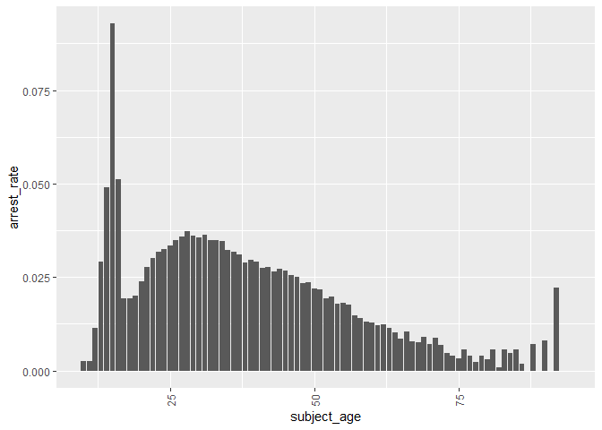
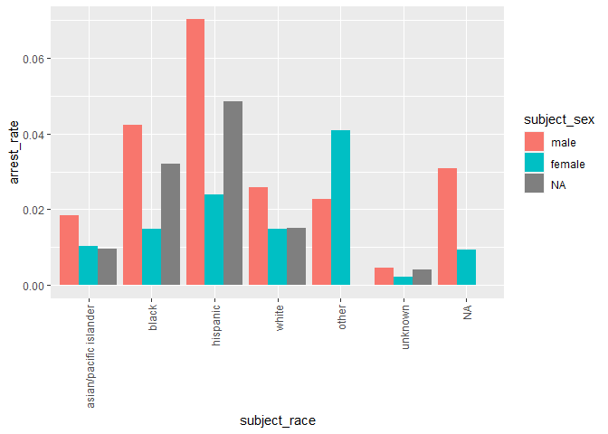

Massachusetts Highway Stops
================
(Your name here)
2020-

- [Grading Rubric](#grading-rubric)
  - [Individual](#individual)
  - [Due Date](#due-date)
- [Setup](#setup)
  - [**q1** Go to the Stanford Open Policing Project page and download
    the Massachusetts State Police records in `Rds` format. Move the
    data to your `data` folder and match the `filename` to load the
    data.](#q1-go-to-the-stanford-open-policing-project-page-and-download-the-massachusetts-state-police-records-in-rds-format-move-the-data-to-your-data-folder-and-match-the-filename-to-load-the-data)
- [EDA](#eda)
  - [**q2** Do your “first checks” on the dataset. What are the basic
    facts about this
    dataset?](#q2-do-your-first-checks-on-the-dataset-what-are-the-basic-facts-about-this-dataset)
  - [**q3** Check the set of factor levels for `subject_race` and
    `raw_Race`. What do you note about overlap / difference between the
    two
    sets?](#q3-check-the-set-of-factor-levels-for-subject_race-and-raw_race-what-do-you-note-about-overlap--difference-between-the-two-sets)
  - [**q4** Check whether `subject_race` and `raw_Race` match for a
    large fraction of cases. Which of the two hypotheses above is most
    likely, based on your
    results?](#q4-check-whether-subject_race-and-raw_race-match-for-a-large-fraction-of-cases-which-of-the-two-hypotheses-above-is-most-likely-based-on-your-results)
  - [Vis](#vis)
    - [**q5** Compare the *arrest rate*—the fraction of total cases in
      which the subject was arrested—across different factors. Create as
      many visuals (or tables) as you need, but make sure to check the
      trends across all of the `subject` variables. Answer the questions
      under *observations*
      below.](#q5-compare-the-arrest-ratethe-fraction-of-total-cases-in-which-the-subject-was-arrestedacross-different-factors-create-as-many-visuals-or-tables-as-you-need-but-make-sure-to-check-the-trends-across-all-of-the-subject-variables-answer-the-questions-under-observations-below)
- [Modeling](#modeling)
  - [**q6** Run the following code and interpret the regression
    coefficients. Answer the the questions under *observations*
    below.](#q6-run-the-following-code-and-interpret-the-regression-coefficients-answer-the-the-questions-under-observations-below)
  - [**q7** Re-fit the logistic regression from q6 setting `"white"` as
    the reference level for `subject_race`. Interpret the the model
    terms and answer the questions
    below.](#q7-re-fit-the-logistic-regression-from-q6-setting-white-as-the-reference-level-for-subject_race-interpret-the-the-model-terms-and-answer-the-questions-below)
  - [**q8** Re-fit the model using a factor indicating the presence of
    contraband in the subject’s vehicle. Answer the questions under
    *observations*
    below.](#q8-re-fit-the-model-using-a-factor-indicating-the-presence-of-contraband-in-the-subjects-vehicle-answer-the-questions-under-observations-below)
  - [**q9** Go deeper: Pose at least one more question about the data
    and fit at least one more model in support of answering that
    question.](#q9-go-deeper-pose-at-least-one-more-question-about-the-data-and-fit-at-least-one-more-model-in-support-of-answering-that-question)
  - [Further Reading](#further-reading)

*Purpose*: In this last challenge we’ll focus on using logistic
regression to study a large, complicated dataset. Interpreting the
results of a model can be challenging—both in terms of the statistics
and the real-world reasoning—so we’ll get some practice in this
challenge.

<!-- include-rubric -->

# Grading Rubric

<!-- -------------------------------------------------- -->

Unlike exercises, **challenges will be graded**. The following rubrics
define how you will be graded, both on an individual and team basis.

## Individual

<!-- ------------------------- -->

| Category    | Needs Improvement                                                                                                | Satisfactory                                                                                                               |
|-------------|------------------------------------------------------------------------------------------------------------------|----------------------------------------------------------------------------------------------------------------------------|
| Effort      | Some task **q**’s left unattempted                                                                               | All task **q**’s attempted                                                                                                 |
| Observed    | Did not document observations, or observations incorrect                                                         | Documented correct observations based on analysis                                                                          |
| Supported   | Some observations not clearly supported by analysis                                                              | All observations clearly supported by analysis (table, graph, etc.)                                                        |
| Assessed    | Observations include claims not supported by the data, or reflect a level of certainty not warranted by the data | Observations are appropriately qualified by the quality & relevance of the data and (in)conclusiveness of the support      |
| Specified   | Uses the phrase “more data are necessary” without clarification                                                  | Any statement that “more data are necessary” specifies which *specific* data are needed to answer what *specific* question |
| Code Styled | Violations of the [style guide](https://style.tidyverse.org/) hinder readability                                 | Code sufficiently close to the [style guide](https://style.tidyverse.org/)                                                 |

## Due Date

<!-- ------------------------- -->

All the deliverables stated in the rubrics above are due **at midnight**
before the day of the class discussion of the challenge. See the
[Syllabus](https://docs.google.com/document/d/1qeP6DUS8Djq_A0HMllMqsSqX3a9dbcx1/edit?usp=sharing&ouid=110386251748498665069&rtpof=true&sd=true)
for more information.

*Background*: We’ll study data from the [Stanford Open Policing
Project](https://openpolicing.stanford.edu/data/), specifically their
dataset on Massachusetts State Patrol police stops.

``` r
library(tidyverse)
```

    ## Warning: package 'tidyverse' was built under R version 4.2.3

    ## Warning: package 'ggplot2' was built under R version 4.2.3

    ## Warning: package 'stringr' was built under R version 4.2.3

    ## Warning: package 'forcats' was built under R version 4.2.3

    ## ── Attaching core tidyverse packages ──────────────────────── tidyverse 2.0.0 ──
    ## ✔ dplyr     1.0.9     ✔ readr     2.1.2
    ## ✔ forcats   1.0.0     ✔ stringr   1.5.0
    ## ✔ ggplot2   3.4.2     ✔ tibble    3.1.8
    ## ✔ lubridate 1.8.0     ✔ tidyr     1.2.0
    ## ✔ purrr     0.3.4     
    ## ── Conflicts ────────────────────────────────────────── tidyverse_conflicts() ──
    ## ✖ dplyr::filter() masks stats::filter()
    ## ✖ dplyr::lag()    masks stats::lag()
    ## ℹ Use the ]8;;http://conflicted.r-lib.org/conflicted package]8;; to force all conflicts to become errors

``` r
library(broom)
```

    ## Warning: package 'broom' was built under R version 4.2.3

# Setup

<!-- -------------------------------------------------- -->

### **q1** Go to the [Stanford Open Policing Project](https://openpolicing.stanford.edu/data/) page and download the Massachusetts State Police records in `Rds` format. Move the data to your `data` folder and match the `filename` to load the data.

*Note*: An `Rds` file is an R-specific file format. The function
`readRDS` will read these files.

``` r
## TODO: Download the data, move to your data folder, and load it
filename <- "C:/Users/zxiong/Desktop/Olin/C-Data Science/data-science-curriculum-build/challenges/data/ma_statewide_2020_04_01.rds"
df_data <- readRDS(filename)
glimpse(df_data)
```

    ## Rows: 3,416,238
    ## Columns: 24
    ## $ raw_row_number             <chr> "1", "2", "3", "4", "5", "6", "7", "8", "9"…
    ## $ date                       <date> 2007-06-06, 2007-06-07, 2007-06-07, 2007-0…
    ## $ location                   <chr> "MIDDLEBOROUGH", "SEEKONK", "MEDFORD", "MED…
    ## $ county_name                <chr> "Plymouth County", "Bristol County", "Middl…
    ## $ subject_age                <int> 33, 36, 56, 37, 22, 34, 54, 31, 21, 56, 56,…
    ## $ subject_race               <fct> white, white, white, white, hispanic, white…
    ## $ subject_sex                <fct> male, male, female, male, female, male, mal…
    ## $ type                       <fct> vehicular, vehicular, vehicular, vehicular,…
    ## $ arrest_made                <lgl> FALSE, FALSE, FALSE, FALSE, FALSE, FALSE, F…
    ## $ citation_issued            <lgl> TRUE, FALSE, FALSE, FALSE, TRUE, TRUE, TRUE…
    ## $ warning_issued             <lgl> FALSE, TRUE, TRUE, TRUE, FALSE, FALSE, FALS…
    ## $ outcome                    <fct> citation, warning, warning, warning, citati…
    ## $ contraband_found           <lgl> NA, FALSE, NA, NA, NA, NA, NA, NA, NA, NA, …
    ## $ contraband_drugs           <lgl> NA, FALSE, NA, NA, NA, NA, NA, NA, NA, NA, …
    ## $ contraband_weapons         <lgl> NA, FALSE, NA, NA, NA, NA, NA, NA, NA, NA, …
    ## $ contraband_alcohol         <lgl> FALSE, FALSE, FALSE, FALSE, FALSE, FALSE, F…
    ## $ contraband_other           <lgl> NA, FALSE, NA, NA, NA, NA, NA, NA, NA, NA, …
    ## $ frisk_performed            <lgl> NA, FALSE, NA, NA, NA, NA, NA, NA, NA, NA, …
    ## $ search_conducted           <lgl> FALSE, TRUE, FALSE, FALSE, FALSE, FALSE, FA…
    ## $ search_basis               <fct> NA, other, NA, NA, NA, NA, NA, NA, NA, NA, …
    ## $ reason_for_stop            <chr> "Speed", NA, NA, NA, NA, "Speed", NA, NA, N…
    ## $ vehicle_type               <chr> "Passenger", "Commercial", "Passenger", "Co…
    ## $ vehicle_registration_state <fct> MA, MA, MA, MA, MA, MA, MA, MA, MA, MA, MA,…
    ## $ raw_Race                   <chr> "White", "White", "White", "White", "Hispan…

# EDA

<!-- -------------------------------------------------- -->

### **q2** Do your “first checks” on the dataset. What are the basic facts about this dataset?

- It’s a rich dataset with 24 columns that collects people’s
  demographics, and there are 3,416,238 rows in total.

Note that we have both a `subject_race` and `race_Raw` column. There are
a few possibilities as to what `race_Raw` represents:

- `race_Raw` could be the race of the police officer in the stop
- `race_Raw` could be an unprocessed version of `subject_race`

Let’s try to distinguish between these two possibilities.

### **q3** Check the set of factor levels for `subject_race` and `raw_Race`. What do you note about overlap / difference between the two sets?

``` r
## TODO: Determine the factor levels for subject_race and raw_Race
df_data %>%
  pull(subject_race) %>%
  levels()
```

    ## [1] "asian/pacific islander" "black"                  "hispanic"              
    ## [4] "white"                  "other"                  "unknown"

``` r
df_data %>%
  pull(raw_Race) %>%
  unique()
```

    ## [1] "White"                                        
    ## [2] "Hispanic"                                     
    ## [3] "Black"                                        
    ## [4] "Asian or Pacific Islander"                    
    ## [5] "Middle Eastern or East Indian (South Asian)"  
    ## [6] "American Indian or Alaskan Native"            
    ## [7] NA                                             
    ## [8] "None - for no operator present citations only"
    ## [9] "A"

**Observations**:

- What are the unique values for `subject_race`?
  - “asian/pacific islander”, “black”, “hispanic” , “white”, “other”,
    “unknown”.
- What are the unique values for `raw_Race`?
  - “Asian or Pacific Islander”, “White”, “Hispanic”, “Black”, “Asian or
    Pacific Islander”, “Middle Eastern or East Indian (South Asian)”,
    “American Indian or Alaskan Native”, NA, “None - for no operator
    present citations only”, “A”.
- What is the overlap between the two sets?
  - “Black”, “White”, “Hispanic”, and “Asian or Pacific Islander”.
- What is the difference between the two sets?
  - `subject_race` describes “Middle Eastern or East Indian (South
    Asian)” and “American Indian or Alaskan Native” in `raw_Race` as
    “others, and it also describes NA,”None - for no operator present
    citations only”, and “A” in `raw_Race` as “unknown”.

### **q4** Check whether `subject_race` and `raw_Race` match for a large fraction of cases. Which of the two hypotheses above is most likely, based on your results?

*Note*: Just to be clear, I’m *not* asking you to do a *statistical*
hypothesis test.

``` r
## TODO: Devise your own way to test the hypothesis posed above.
rep_str = c(
  'asian/pacific islander' = 'Asian or Pacific Islander',
  'hispanic' = 'Hispanic',
  'black' = 'Black',
  'white' = 'White'
)
df_q4 <- df_data
df_q4$subject_race <- str_replace_all(df_q4$subject_race, rep_str)
find_same <- ifelse(df_q4$subject_race == df_q4$raw_Race,1,0)
similarity <- mean(find_same, na.rm = TRUE)
similarity
```

    ## [1] 0.9728883

**Observations**

Between the two hypotheses:

- `race_Raw` could be the race of the police officer in the stop
- `race_Raw` could be an unprocessed version of `subject_race`

which is most plausible, based on your results?

- `raw_Race` matches up with `subject_race` by 97.3%, which indicates
  that the former is more likely to be an unprocessed version of
  `subject_race`. If the first statement “`raw_Race` could be the race
  of the police officer in the stop” were to be true, there would be
  almost no correlation between `raw_Race` and `subject_race`.

## Vis

<!-- ------------------------- -->

### **q5** Compare the *arrest rate*—the fraction of total cases in which the subject was arrested—across different factors. Create as many visuals (or tables) as you need, but make sure to check the trends across all of the `subject` variables. Answer the questions under *observations* below.

(Note: Create as many chunks and visuals as you need)

``` r
df_q5_1 <- df_data
df_q5_1$arrest_made <- as.integer(as.logical(df_q5_1$arrest_made))

df_q5_1 %>%
  group_by(subject_age) %>%
  summarise(
    total_arrest = sum(arrest_made, na.rm = TRUE),
    total_cases = sum(arrest_made == 0 | 1, na.rm = TRUE),
    arrest_rate = total_arrest / total_cases
  ) %>%
  ggplot() +
  geom_col(
    aes(x = subject_age, y = arrest_rate),
    position = position_dodge()
  ) + 
  guides(x =  guide_axis(angle = 90))
```

    ## Warning: Removed 1 rows containing missing values (`geom_col()`).

<!-- -->

``` r
df_q5_1 %>%
  group_by(subject_race, subject_sex) %>%
  summarise(
    total_arrest = sum(arrest_made, na.rm = TRUE),
    total_cases = sum(arrest_made == 0 | 1, na.rm = TRUE),
    arrest_rate = total_arrest / total_cases
  ) %>%
  ggplot() +
  geom_col(
    aes(
      x = subject_race, 
      y = arrest_rate, 
      fill = subject_sex
    )
  ) + 
  guides(x =  guide_axis(angle = 90))
```

    ## `summarise()` has grouped output by 'subject_race'. You can override using the
    ## `.groups` argument.

<!-- -->

**Observations**:

- How does `arrest_rate` tend to vary with `subject_age`?
  - `arrest_rate` is the highest among the people aged between 14 and
    16, and it dropped dramatically at 17. It then increases gradually
    as age increases from 17 to 28 and decreases from 28 to 75. There is
    a slight increasing trend when age increases from 75 to 92.
- How does `arrest_rate` tend to vary with `subject_sex`?
  - `arrest_rate` of female is generally lower than male.
- How does `arrest_rate` tend to vary with `subject_race`?
  - `arrest_rate` is the highest among hispanic and black populations,
    and it is the lowest among unknown and asian/pacific islander
    populations.

# Modeling

<!-- -------------------------------------------------- -->

We’re going to use a model to study the relationship between `subject`
factors and arrest rate, but first we need to understand a bit more
about *dummy variables*

### **q6** Run the following code and interpret the regression coefficients. Answer the the questions under *observations* below.

``` r
## NOTE: No need to edit; inspect the estimated model terms.
fit_q6 <-
  glm(
    formula = arrest_made ~ subject_age + subject_race + subject_sex,
    data = df_data %>%
      filter(
        !is.na(arrest_made),
        subject_race %in% c("white", "black", "hispanic")
      ),
    family = "binomial"
  )

fit_q6 %>% tidy()
```

    ## # A tibble: 5 × 5
    ##   term                 estimate std.error statistic   p.value
    ##   <chr>                   <dbl>     <dbl>     <dbl>     <dbl>
    ## 1 (Intercept)           -2.67    0.0132      -202.  0        
    ## 2 subject_age           -0.0142  0.000280     -50.5 0        
    ## 3 subject_racehispanic   0.513   0.0119        43.3 0        
    ## 4 subject_racewhite     -0.380   0.0103       -37.0 3.12e-299
    ## 5 subject_sexfemale     -0.755   0.00910      -83.0 0

**Observations**:

- Which `subject_race` levels are included in fitting the model?
  - Hispanic, black and white.
- Which `subject_race` levels have terms in the model?
  - Hispanic and white.

You should find that each factor in the model has a level *missing* in
its set of terms. This is because R represents factors against a
*reference level*: The model treats one factor level as “default”, and
each factor model term represents a change from that “default” behavior.
For instance, the model above treats `subject_sex==male` as the
reference level, so the `subject_sexfemale` term represents the *change
in probability* of arrest due to a person being female (rather than
male).

The this reference level approach to coding factors is necessary for
[technical
reasons](https://www.andrew.cmu.edu/user/achoulde/94842/lectures/lecture10/lecture10-94842.html#why-is-one-of-the-levels-missing-in-the-regression),
but it complicates interpreting the model results. For instance; if we
want to compare two levels, neither of which are the reference level, we
have to consider the difference in their model coefficients. But if we
want to compare all levels against one “baseline” level, then we can
relevel the data to facilitate this comparison.

By default `glm` uses the first factor level present as the reference
level. Therefore we can use
`mutate(factor = fct_relevel(factor, "desired_level"))` to set our
`"desired_level"` as the reference factor.

### **q7** Re-fit the logistic regression from q6 setting `"white"` as the reference level for `subject_race`. Interpret the the model terms and answer the questions below.

``` r
## TODO: Re-fit the logistic regression, but set "white" as the reference
## level for subject_race
df_q7 <- df_data
df_q7$subject_race <- relevel(df_q7$subject_race, ref = "white")

fit_q7 <- glm(
    formula = arrest_made ~ subject_age + subject_race + subject_sex,
    data = df_q7 %>%
      filter(
        !is.na(arrest_made),
        subject_race %in% c("white", "black", "hispanic", "asian/pacific islander", "other", "unknown")
      ),
    family = "binomial"
  )

fit_q7 %>% tidy()
```

    ## # A tibble: 8 × 5
    ##   term                               estimate std.error statistic   p.value
    ##   <chr>                                 <dbl>     <dbl>     <dbl>     <dbl>
    ## 1 (Intercept)                         -3.04    0.0108    -282.    0        
    ## 2 subject_age                         -0.0144  0.000277   -52.0   0        
    ## 3 subject_raceasian/pacific islander  -0.389   0.0200     -19.4   7.72e- 84
    ## 4 subject_raceblack                    0.379   0.0103      36.9   7.64e-299
    ## 5 subject_racehispanic                 0.892   0.00859    104.    0        
    ## 6 subject_raceother                   -0.0246  0.0683      -0.360 7.18e-  1
    ## 7 subject_raceunknown                 -1.94    0.315       -6.15  7.82e- 10
    ## 8 subject_sexfemale                   -0.751   0.00896    -83.8   0

**Observations**:

- Which `subject_race` level has the highest probability of being
  arrested, according to this model? Which has the lowest probability?
  - Hispanic has the highest probability of being arrested, and unknown
    has the lowest.
- What could explain this difference in probabilities of arrest across
  race? List **multiple** possibilities.
  - The race of the police officers working in the area, culture,
    economy, stereotypes, etc.
- Look at the sent of variables in the dataset; do any of the columns
  relate to a potential explanation you listed?
  - County name potentially reflects the economic background of the
    area.

One way we can explain differential arrest rates is to include some
measure indicating the presence of an arrestable offense. We’ll do this
in a particular way in the next task.

### **q8** Re-fit the model using a factor indicating the presence of contraband in the subject’s vehicle. Answer the questions under *observations* below.

``` r
## TODO: Repeat the modeling above, but control for whether contraband was found
## during the police stop
df_q8 <- df_data

fit_q8 <- glm(
    formula = 
      contraband_found ~ 
      contraband_alcohol + 
      contraband_drugs + 
      contraband_weapons +
      contraband_other,
    data = df_q8 %>%
      filter(
        !is.na(arrest_made),
        subject_race %in% c("white", "black", "hispanic", "asian/pacific islander", "other", "unknown")
      ),
    family = "binomial"
  )
```

    ## Warning: glm.fit: algorithm did not converge

    ## Warning: glm.fit: fitted probabilities numerically 0 or 1 occurred

``` r
fit_q8 %>% tidy()
```

    ## # A tibble: 5 × 5
    ##   term                   estimate std.error statistic p.value
    ##   <chr>                     <dbl>     <dbl>     <dbl>   <dbl>
    ## 1 (Intercept)               -26.1     1691.   -0.0154   0.988
    ## 2 contraband_alcoholTRUE     51.7     3570.    0.0145   0.988
    ## 3 contraband_drugsTRUE       52.0     2721.    0.0191   0.985
    ## 4 contraband_weaponsTRUE     50.8     5064.    0.0100   0.992
    ## 5 contraband_otherTRUE       51.1     4135.    0.0124   0.990

**Observations**:

- How does controlling for found contraband affect the `subject_race`
  terms in the model?

  - Contraband presence has pretty big standard error overall, so it
    doesn’t affect the `subject_race` by very much.

  What does the *finding of contraband* tell us about the stop? What
  does it *not* tell us about the stop?

  - Drugs are one of the most commonly object that presents in the
    vehicle, but it doesn’t tell us about other potential reasons of the
    stop, e.g. speed limit of the specific area.

### **q9** Go deeper: Pose at least one more question about the data and fit at least one more model in support of answering that question.

**Observations**:

- Document your question and findings

## Further Reading

<!-- -------------------------------------------------- -->

- Stanford Open Policing Project
  [findings](https://openpolicing.stanford.edu/findings/).
